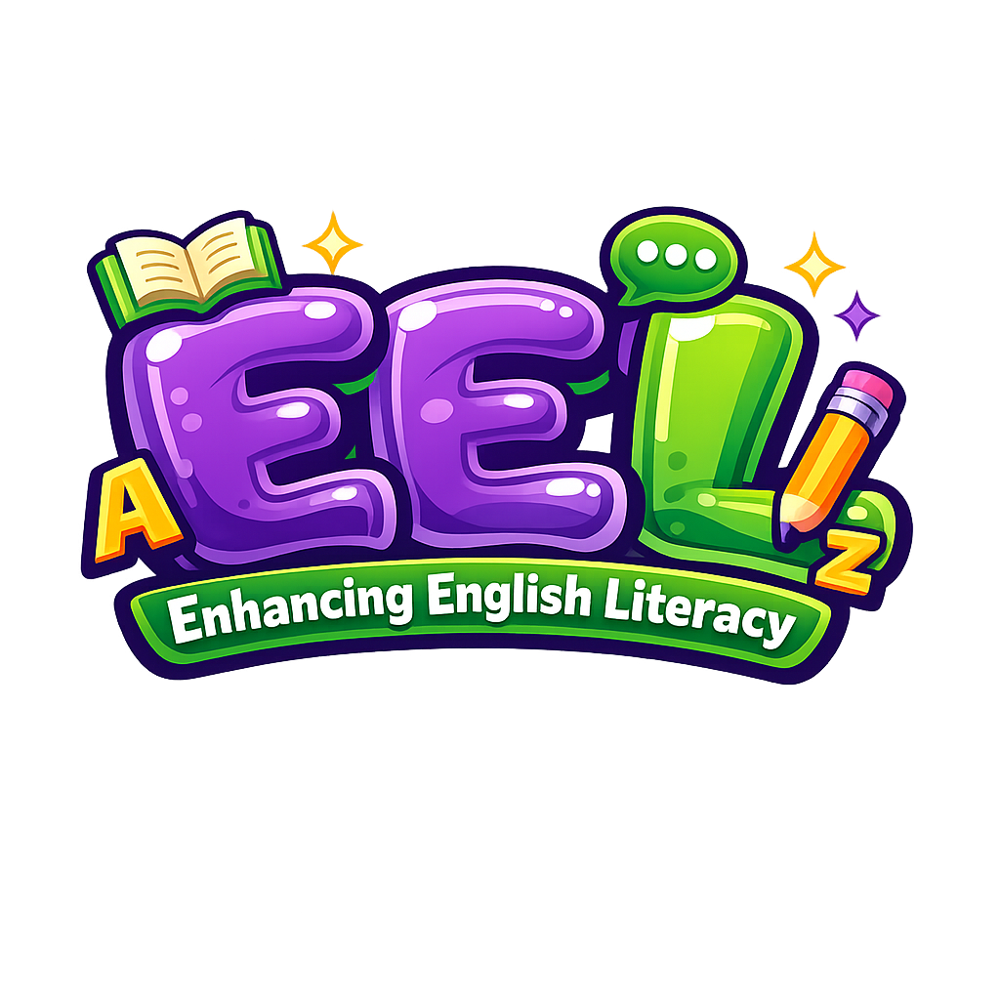
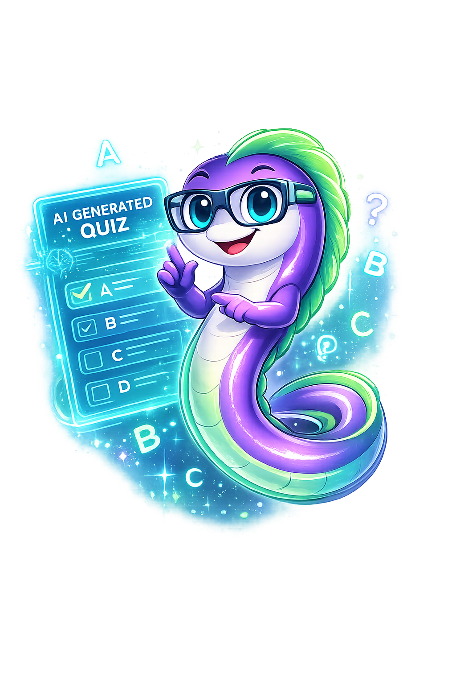

This file is a merged representation of the entire codebase, combined into a single document by Repomix.

# File Summary

## Purpose
This file contains a packed representation of the entire repository's contents.
It is designed to be easily consumable by AI systems for analysis, code review,
or other automated processes.

## File Format
The content is organized as follows:
1. This summary section
2. Repository information
3. Directory structure
4. Repository files (if enabled)
5. Multiple file entries, each consisting of:
  a. A header with the file path (## File: path/to/file)
  b. The full contents of the file in a code block

## Usage Guidelines
- This file should be treated as read-only. Any changes should be made to the
  original repository files, not this packed version.
- When processing this file, use the file path to distinguish
  between different files in the repository.
- Be aware that this file may contain sensitive information. Handle it with
  the same level of security as you would the original repository.

## Notes
- Some files may have been excluded based on .gitignore rules and Repomix's configuration
- Binary files are not included in this packed representation. Please refer to the Repository Structure section for a complete list of file paths, including binary files
- Files matching patterns in .gitignore are excluded
- Files matching default ignore patterns are excluded
- Files are sorted by Git change count (files with more changes are at the bottom)

# Directory Structure
```
.gitignore
404.html
about.html
admin-dashboard.html
classes.html
css/style-index.css
css/styles.css
dashboard.html
DEPLOYMENT-EC2.md
exam-generator.html
features.html
for-students.html
for-teachers.html
forgot-password.html
image/books.gif
image/deped-logo.png
image/eel-character-celebrate.png
image/eel-character-create-class.png
image/eel-character-create-quiz.png
image/eel-character-laptop.png
image/eel-character-sad.png
image/eel-character-takingquiz.png
image/eel-character.png
image/jana.png
image/jenny.png
image/jerico.png
image/jp.png
image/logo.png
image/nick.png
image/school-logo.png
index.html
js-back-end/.env.example
js-back-end/admin.js
js-back-end/classes.js
js-back-end/classgrade.js
js-back-end/database.sql
js-back-end/db.js
js-back-end/exam.js
js-back-end/lesson.js
js-back-end/login.js
js-back-end/mailer.js
js-back-end/migrate-account-verification.sql
js-back-end/migrate-creative-non-fiction-curriculum.sql
js-back-end/migrate-creative-writing-curriculum.sql
js-back-end/migrate-eapp-curriculum.sql
js-back-end/migrate-oral-communication-curriculum.sql
js-back-end/migrate-password-reset.sql
js-back-end/migrate-reading-writing-curriculum.sql
js-back-end/migrate-student-profile.sql
js-back-end/migrate-teacher-reading-quiz-attempts.sql
js-back-end/migrations/add-class-id-to-attempts.sql
js-back-end/migrations/add-class-id-to-teacher-reading-quizzes.sql
js-back-end/migrations/add-students-with-attempts-to-class.sql
js-back-end/migrations/backfill-class-id-reading-attempts.sql
js-back-end/migrations/README.md
js-back-end/nodemon.json
js-back-end/package.json
js-back-end/password-reset.js
js-back-end/profile.js
js-back-end/pronunciation.js
js-back-end/reading.js
js-back-end/recitation.js
js-back-end/server.js
js-back-end/signup.js
js-back-end/teachers-dashboard.js
js-back-end/Untitled
js-back-end/utils/datetime.js
js-front-end/api-config.js
js-front-end/front-admin.js
js-front-end/front-classes.js
js-front-end/front-exam.js
js-front-end/front-forgot-password.js
js-front-end/front-lessons.js
js-front-end/front-login.js
js-front-end/front-my-progress.js
js-front-end/front-pronunciation.js
js-front-end/front-reading.js
js-front-end/front-recitation.js
js-front-end/front-reset-password.js
js-front-end/front-signup.js
js-front-end/lesson-presentations.js
js-front-end/take-quiz.js
js/auth.js
js/main-index.js
js/main.js
js/navigation.js
js/theme.js
lessons.html
login.html
my-progress.html
privacy-policy.html
pronunciation-lessons.html
reading-lessons.html
README.md
recitation.html
repomix-output.xml
reset-password.html
services.html
settings.html
signup.html
sql/pronunciation.sql
student-progress.html
take-quiz.html
terms-of-service.html
```

# Files

## File: repomix-output.xml
````xml
This file is a merged representation of the entire codebase, combined into a single document by Repomix.

<file_summary>
This section contains a summary of this file.

<purpose>
This file contains a packed representation of the entire repository's contents.
It is designed to be easily consumable by AI systems for analysis, code review,
or other automated processes.
</purpose>

<file_format>
The content is organized as follows:
1. This summary section
2. Repository information
3. Directory structure
4. Repository files (if enabled)
5. Multiple file entries, each consisting of:
  - File path as an attribute
  - Full contents of the file
</file_format>

<usage_guidelines>
- This file should be treated as read-only. Any changes should be made to the
  original repository files, not this packed version.
- When processing this file, use the file path to distinguish
  between different files in the repository.
- Be aware that this file may contain sensitive information. Handle it with
  the same level of security as you would the original repository.
</usage_guidelines>

<notes>
- Some files may have been excluded based on .gitignore rules and Repomix's configuration
- Binary files are not included in this packed representation. Please refer to the Repository Structure section for a complete list of file paths, including binary files
- Files matching patterns in .gitignore are excluded
- Files matching default ignore patterns are excluded
- Files are sorted by Git change count (files with more changes are at the bottom)
</notes>

</file_summary>

<directory_structure>
.gitignore
404.html
about.html
admin-dashboard.html
classes.html
css/style-index.css
css/styles.css
dashboard.html
DEPLOYMENT-EC2.md
exam-generator.html
features.html
for-students.html
for-teachers.html
forgot-password.html
image/books.gif
image/deped-logo.png
image/eel-character-celebrate.png
image/eel-character-create-class.png
image/eel-character-create-quiz.png
image/eel-character-laptop.png
image/eel-character-sad.png
image/eel-character-takingquiz.png
image/eel-character.png
image/jana.png
image/jenny.png
image/jerico.png
image/jp.png
image/logo.png
image/nick.png
image/school-logo.png
index.html
js-back-end/.env.example
js-back-end/admin.js
js-back-end/classes.js
js-back-end/classgrade.js
js-back-end/database.sql
js-back-end/db.js
js-back-end/exam.js
js-back-end/lesson.js
js-back-end/login.js
js-back-end/mailer.js
js-back-end/migrate-account-verification.sql
js-back-end/migrate-creative-non-fiction-curriculum.sql
js-back-end/migrate-creative-writing-curriculum.sql
js-back-end/migrate-eapp-curriculum.sql
js-back-end/migrate-oral-communication-curriculum.sql
js-back-end/migrate-password-reset.sql
js-back-end/migrate-reading-writing-curriculum.sql
js-back-end/migrate-student-profile.sql
js-back-end/migrate-teacher-reading-quiz-attempts.sql
js-back-end/migrations/add-class-id-to-attempts.sql
js-back-end/migrations/add-class-id-to-teacher-reading-quizzes.sql
js-back-end/migrations/add-students-with-attempts-to-class.sql
js-back-end/migrations/backfill-class-id-reading-attempts.sql
js-back-end/migrations/README.md
js-back-end/nodemon.json
js-back-end/package.json
js-back-end/password-reset.js
js-back-end/profile.js
js-back-end/pronunciation.js
js-back-end/reading.js
js-back-end/recitation.js
js-back-end/server.js
js-back-end/signup.js
js-back-end/teachers-dashboard.js
js-back-end/Untitled
js-back-end/utils/datetime.js
js-front-end/api-config.js
js-front-end/front-admin.js
js-front-end/front-classes.js
js-front-end/front-exam.js
js-front-end/front-forgot-password.js
js-front-end/front-lessons.js
js-front-end/front-login.js
js-front-end/front-my-progress.js
js-front-end/front-pronunciation.js
js-front-end/front-reading.js
js-front-end/front-recitation.js
js-front-end/front-reset-password.js
js-front-end/front-signup.js
js-front-end/lesson-presentations.js
js-front-end/take-quiz.js
js/auth.js
js/main-index.js
js/main.js
js/navigation.js
js/theme.js
lessons.html
login.html
my-progress.html
privacy-policy.html
pronunciation-lessons.html
reading-lessons.html
README.md
recitation.html
reset-password.html
services.html
settings.html
signup.html
sql/pronunciation.sql
student-progress.html
take-quiz.html
terms-of-service.html
</directory_structure>

<files>
This section contains the contents of the repository's files.

<file path=".gitignore">
.vscode
uploads
.env
node_modules
</file>

<file path="DEPLOYMENT-EC2.md">
# Step-by-Step: Deploy EEL App on AWS EC2

- **Repo:** https://github.com/jpfabian/eelthesis.git  
- **Key file:** `eel-key.pem`  
- Replace `YOUR_EC2_IP` with your instance public IP (e.g. `54.91.84.96`).

---

## 1. Create and launch an EC2 instance

1. In **AWS Console** → **EC2** → **Launch Instance**.
2. **Name:** e.g. `eel-app`.
3. **AMI:** Ubuntu Server 22.04 LTS.
4. **Instance type:** e.g. `t2.micro` (free tier) or `t3.small`.
5. **Key pair:** Create or select one (e.g. name it `eel-key`); download `eel-key.pem` and keep it safe.
6. **Network / Security group:**
   - Create or use a security group that allows:
     - **SSH (22)** – your IP (or 0.0.0.0/0 only if you understand the risk).
     - **HTTP (80)** – 0.0.0.0/0 (so users can open the app).
     - **HTTPS (443)** – 0.0.0.0/0 if you will use SSL later.
   - Do **not** open port 3000 to the internet; nginx will proxy to it.
7. **Storage:** 8–20 GB is usually enough.
8. Launch the instance and note its **Public IPv4 address** (e.g. `54.91.84.96`).

---

## 2. Allow EC2 to reach RDS (MySQL)

1. **EC2** → **Security Groups** → select the security group used by your **RDS** instance.
2. **Edit inbound rules** → **Add rule:**
   - Type: **MySQL/Aurora (3306)**.
   - Source: the **security group of your EC2 instance** (or the EC2 instance’s private IP if you prefer).
3. Save. Your Node app on EC2 will now be able to connect to the database.

---

## 3. Connect to EC2 via SSH

**Windows (PowerShell):**

```powershell
# Fix key permissions (run once; use the path where you saved eel-key.pem)
icacls eel-key.pem /reset
icacls eel-key.pem /grant:r "$($env:USERNAME):(R)"

ssh -i "C:\path\to\eel-key.pem" ubuntu@YOUR_EC2_IP
```

**Mac/Linux:**

```bash
chmod 400 eel-key.pem
ssh -i eel-key.pem ubuntu@YOUR_EC2_IP
```

---

## 4. Install Node.js (LTS) on the server

```bash
curl -fsSL https://deb.nodesource.com/setup_20.x | sudo -E bash -
sudo apt-get install -y nodejs
node -v   # e.g. v20.x
npm -v
```

---

## 5. Install nginx

```bash
sudo apt-get update
sudo apt-get install -y nginx
sudo systemctl enable nginx
sudo systemctl start nginx
```

---

## 6. Put the project on the server

**Option A – Git (recommended):**

```bash
sudo apt-get install -y git
cd /home/ubuntu
git clone https://github.com/jpfabian/eelthesis.git
cd eelthesis
```

**Option B – Copy from your PC (SCP):**

From your **local machine** (PowerShell, from the folder that contains the project):

```powershell
scp -i "C:\path\to\eel-key.pem" -r "C:\Users\jpfab\OneDrive\Desktop\eel-learning-sample-react\*" ubuntu@YOUR_EC2_IP:/home/ubuntu/eelthesis/
```

Then on EC2:

```bash
cd /home/ubuntu/eelthesis
```

---

## 7. Create `.env` on the server

**Do not** upload your real `.env` over unencrypted channels. Create it on the server:

```bash
cd /home/ubuntu/eelthesis/js-back-end
nano .env
```

Paste the same variables as in your local `.env`, and set the EC2 URL for CORS:

```env
GROQ_API_KEY=your_groq_key
GROQ_API_URL=https://api.groq.com/openai/v1/chat/completions
AWS_ACCESS_KEY_ID=your_aws_key
AWS_SECRET_ACCESS_KEY=your_aws_secret
AWS_REGION=ap-southeast-2
AWS_BUCKET_NAME=eel-service
EEL_SMTP_USER=your_email
EEL_SMTP_PASS=your_app_password
EEL_SMTP_FROM=your_email

ALLOWED_ORIGINS=http://YOUR_EC2_IP
PORT=3000
```

Replace `YOUR_EC2_IP` with the real public IP (e.g. `http://54.91.84.96`). Save and exit (`Ctrl+O`, `Enter`, `Ctrl+X`).

---

## 8. Install backend dependencies and run

```bash
cd /home/ubuntu/eelthesis/js-back-end
npm install
npm start
```

Leave this terminal open and test in the browser: `http://YOUR_EC2_IP:3000` (and open `http://YOUR_EC2_IP:3000/login.html`). If the security group has port 3000 open only for testing, you can close it later and use only nginx.  
Then stop the server with `Ctrl+C` and run it in the background (next step).

---

## 9. Run the Node app in the background (PM2)

```bash
sudo npm install -g pm2
cd /home/ubuntu/eelthesis/js-back-end
pm2 start server.js --name eel-api
pm2 save
pm2 startup
# Run the command that pm2 startup prints (usually a sudo env PATH=... command)
```

Check:

```bash
pm2 status
pm2 logs eel-api
```

---

## 10. Configure nginx as reverse proxy

```bash
sudo nano /etc/nginx/sites-available/eel
```

Paste (replace `YOUR_EC2_IP` with your real IP or use `_` to accept any server name):

```nginx
server {
    listen 80;
    server_name YOUR_EC2_IP;

    location / {
        proxy_pass http://localhost:3000;
        proxy_http_version 1.1;
        proxy_set_header Upgrade $http_upgrade;
        proxy_set_header Connection 'upgrade';
        proxy_set_header Host $host;
        proxy_set_header X-Real-IP $remote_addr;
        proxy_set_header X-Forwarded-For $proxy_add_x_forwarded_for;
        proxy_set_header X-Forwarded-Proto $scheme;
        proxy_cache_bypass $http_upgrade;
    }
}
```

Save and exit. Then:

```bash
sudo ln -sf /etc/nginx/sites-available/eel /etc/nginx/sites-enabled/
sudo rm -f /etc/nginx/sites-enabled/default
sudo nginx -t
sudo systemctl reload nginx
```

---

## 11. Open the app in the browser

- **URL:** `http://YOUR_EC2_IP` (port 80, no need to type `:3000`).
- **Login page:** `http://YOUR_EC2_IP/login.html`.

Try signing in. If it works, deployment is complete.

---

## 12. Optional: uploads directory

If the app serves PDFs or other files from `uploads`:

```bash
mkdir -p /home/ubuntu/eelthesis/js-back-end/uploads
# If you have files to copy, upload them here (e.g. via scp)
```

---

## Quick checklist

| Step | Done |
|------|------|
| EC2 security group: 22 (SSH), 80 (HTTP) | ☐ |
| RDS security group: 3306 from EC2 SG | ☐ |
| Node.js & nginx installed | ☐ |
| Project on server (git or scp) | ☐ |
| `.env` in `js-back-end` with `ALLOWED_ORIGINS=http://YOUR_EC2_IP` | ☐ |
| `npm install` and `pm2 start server.js` | ☐ |
| nginx proxy 80 → 3000, `server_name` = YOUR_EC2_IP | ☐ |
| App opens at `http://YOUR_EC2_IP` and login works | ☐ |

---

## Updating the app later

```bash
cd /home/ubuntu/eelthesis
git pull   # if using git
# Or upload changed files via scp

cd js-back-end
npm install
pm2 restart eel-api
```

---

## Troubleshooting

- **502 Bad Gateway:** Node not running or not on port 3000 → `pm2 status` and `pm2 logs eel-api`.
- **CORS / login fails:** Ensure `ALLOWED_ORIGINS=http://YOUR_EC2_IP` in `.env` (no trailing slash, correct IP), then `pm2 restart eel-api`.
- **Cannot connect to database:** Check RDS security group allows 3306 from EC2; check DB host/user/password in your app config (e.g. in `server.js` or env).
- **Static files or PDFs 404:** Ensure `uploads` and other static paths exist under the project directory that Node uses.
</file>

<file path="js-back-end/.env.example">
# Optional: Override uploads folder for lesson PDFs (default: js-back-end/uploads)
# UPLOADS_DIR=C:\Users\jpfab\OneDrive\Desktop\eel-learning-sample-react\js-back-end\uploads

# Optional: Email notifications (Gmail SMTP)
# Use a Gmail "App Password" (recommended) instead of your normal password.
EEL_SMTP_USER=eelthesis@gmail.com
EEL_SMTP_PASS=yousdokqjemsgxzc
EEL_SMTP_FROM=eelthesis@gmail.com
</file>

<file path="js-back-end/mailer.js">
require("dotenv").config();

let nodemailer = null;
try {
  // Optional dependency (but we install it)
  nodemailer = require("nodemailer");
} catch (_) {
  nodemailer = null;
}

function isEmailEnabled() {
  const user = String(process.env.EEL_SMTP_USER || "").trim();
  const pass = String(process.env.EEL_SMTP_PASS || "").trim();
  return Boolean(nodemailer && user && pass);
}

let warnedMissingConfig = false;

function getTransporter() {
  if (!isEmailEnabled()) return null;

  const user = String(process.env.EEL_SMTP_USER || "").trim();
  const pass = String(process.env.EEL_SMTP_PASS || "").trim();

  // Gmail SMTP (recommended: App Password)
  return nodemailer.createTransport({
    host: "smtp.gmail.com",
    port: 465,
    secure: true,
    auth: { user, pass },
  });
}

function escapeHtml(s) {
  return String(s ?? "")
    .replaceAll("&", "&amp;")
    .replaceAll("<", "&lt;")
    .replaceAll(">", "&gt;")
    .replaceAll('"', "&quot;")
    .replaceAll("'", "&#039;");
}

function buildAccountStatusEmail({ name, status, reason }) {
  const safeName = escapeHtml(name || "User");
  const safeReason = reason ? escapeHtml(reason) : "";
  const safeStatus = String(status || "").toLowerCase();

  const title =
    safeStatus === "pending" ? "Account Pending Verification" :
    safeStatus === "approved" ? "Account Approved" :
    safeStatus === "rejected" ? "Account Rejected" :
    safeStatus === "deactivated" ? "Account Deactivated" :
    safeStatus === "activated" ? "Account Reactivated" :
    "Account Update";

  const message =
    safeStatus === "pending" ? "Your account was created successfully and is now pending admin verification." :
    safeStatus === "approved" ? "Good news! Your account has been approved. You can now log in." :
    safeStatus === "rejected" ? "Your account was rejected by the admin." :
    safeStatus === "deactivated" ? "Your account was deactivated by the admin. You will not be able to log in." :
    safeStatus === "activated" ? "Your account has been reactivated. You can log in again." :
    "Your account status was updated.";

  const reasonBlock = safeReason
    ? `<div style="margin-top:12px; padding:12px; border:1px solid #e5e7eb; border-radius:10px; background:#f9fafb;">
         <div style="font-weight:700; margin-bottom:6px;">Reason</div>
         <div>${safeReason}</div>
       </div>`
    : "";

  const html = `
    <div style="font-family: ui-sans-serif, system-ui, -apple-system, Segoe UI, Roboto, Arial; color:#0f172a;">
      <div style="max-width:640px; margin:0 auto; padding:20px;">
        <div style="padding:18px 18px; border-radius:14px; border:1px solid #e5e7eb; background:#ffffff;">
          <div style="font-size:18px; font-weight:900; margin-bottom:8px;">${escapeHtml(title)}</div>
          <div style="color:#334155; margin-bottom:14px;">Hi ${safeName},</div>
          <div style="color:#334155; line-height:1.55;">${escapeHtml(message)}</div>
          ${reasonBlock}
          <div style="margin-top:16px; color:#64748b; font-size:12px;">
            If you believe this is a mistake, please contact your teacher/admin.
          </div>
        </div>
        <div style="margin-top:12px; text-align:center; color:#94a3b8; font-size:12px;">
          EEL (English Enhancement Learning)
        </div>
      </div>
    </div>
  `;

  return { subject: `EEL - ${title}`, html };
}

async function sendAccountStatusEmail({ to, name, status, reason }) {
  if (!isEmailEnabled()) {
    if (!warnedMissingConfig) {
      warnedMissingConfig = true;
      console.warn(
        "⚠️ Email notifications are disabled. Set EEL_SMTP_USER and EEL_SMTP_PASS in js-back-end/.env (Gmail App Password), then restart the backend."
      );
    }
    return { skipped: true, reason: "Email not configured" };
  }

  const transporter = getTransporter();
  if (!transporter) return { skipped: true, reason: "No transporter" };

  const from = String(process.env.EEL_SMTP_FROM || process.env.EEL_SMTP_USER || "").trim();
  const { subject, html } = buildAccountStatusEmail({ name, status, reason });

  await transporter.sendMail({
    from,
    to,
    subject,
    html,
  });

  return { success: true };
}

module.exports = {
  isEmailEnabled,
  sendAccountStatusEmail,
};
</file>

<file path="js-back-end/migrate-account-verification.sql">
/* =========================================================
   Migration: Account verification columns for `users`
   Run this ONCE on your existing database.
   ========================================================= */

/* MySQL 5.7-safe: conditionally add columns via dynamic SQL */
SET @db := DATABASE();

SET @has_verification_status := (
  SELECT COUNT(*)
  FROM information_schema.COLUMNS
  WHERE TABLE_SCHEMA = @db AND TABLE_NAME = 'users' AND COLUMN_NAME = 'verification_status'
);
SET @sql := IF(
  @has_verification_status = 0,
  "ALTER TABLE users ADD COLUMN verification_status ENUM('pending','approved','rejected') NOT NULL DEFAULT 'pending' AFTER role",
  "SELECT 1"
);
PREPARE stmt FROM @sql; EXECUTE stmt; DEALLOCATE PREPARE stmt;

SET @has_verified_at := (
  SELECT COUNT(*) FROM information_schema.COLUMNS
  WHERE TABLE_SCHEMA = @db AND TABLE_NAME = 'users' AND COLUMN_NAME = 'verified_at'
);
SET @sql := IF(@has_verified_at = 0, "ALTER TABLE users ADD COLUMN verified_at TIMESTAMP NULL DEFAULT NULL AFTER verification_status", "SELECT 1");
PREPARE stmt FROM @sql; EXECUTE stmt; DEALLOCATE PREPARE stmt;

SET @has_verified_by := (
  SELECT COUNT(*) FROM information_schema.COLUMNS
  WHERE TABLE_SCHEMA = @db AND TABLE_NAME = 'users' AND COLUMN_NAME = 'verified_by'
);
SET @sql := IF(@has_verified_by = 0, "ALTER TABLE users ADD COLUMN verified_by VARCHAR(100) NULL AFTER verified_at", "SELECT 1");
PREPARE stmt FROM @sql; EXECUTE stmt; DEALLOCATE PREPARE stmt;

SET @has_rejected_at := (
  SELECT COUNT(*) FROM information_schema.COLUMNS
  WHERE TABLE_SCHEMA = @db AND TABLE_NAME = 'users' AND COLUMN_NAME = 'rejected_at'
);
SET @sql := IF(@has_rejected_at = 0, "ALTER TABLE users ADD COLUMN rejected_at TIMESTAMP NULL DEFAULT NULL AFTER verified_by", "SELECT 1");
PREPARE stmt FROM @sql; EXECUTE stmt; DEALLOCATE PREPARE stmt;

SET @has_rejected_reason := (
  SELECT COUNT(*) FROM information_schema.COLUMNS
  WHERE TABLE_SCHEMA = @db AND TABLE_NAME = 'users' AND COLUMN_NAME = 'rejected_reason'
);
SET @sql := IF(@has_rejected_reason = 0, "ALTER TABLE users ADD COLUMN rejected_reason VARCHAR(255) NULL AFTER rejected_at", "SELECT 1");
PREPARE stmt FROM @sql; EXECUTE stmt; DEALLOCATE PREPARE stmt;

/* Add index if missing */
SET @has_idx := (
  SELECT COUNT(*)
  FROM information_schema.STATISTICS
  WHERE TABLE_SCHEMA = @db AND TABLE_NAME = 'users' AND INDEX_NAME = 'idx_users_verification_status'
);
SET @sql := IF(@has_idx = 0, "ALTER TABLE users ADD INDEX idx_users_verification_status (verification_status)", "SELECT 1");
PREPARE stmt FROM @sql; EXECUTE stmt; DEALLOCATE PREPARE stmt;

/* Optional: mark existing users as approved (if you already have active accounts) */
UPDATE users
SET verification_status = 'approved'
WHERE verification_status = 'pending';
</file>

<file path="js-back-end/migrate-creative-non-fiction-curriculum.sql">
-- Migration: Seed Creative Non-Fiction curriculum (13 lessons in 4 quarters)
-- Subject: Creative Non-Fiction = subject_id 4 (must exist in your subjects table)
-- PDF base: s3://eel-bucket/subjects/Creative Non-Fiction/
-- Requires: lessons table has quarter_number, quarter_title columns.
--
-- ONE CLICK: Run this entire file in MySQL (e.g. Execute SQL script).
-- Or run the procedure only: CALL seed_creative_non_fiction();

SET NAMES utf8mb4;

DELIMITER $$

DROP PROCEDURE IF EXISTS seed_creative_non_fiction$$

CREATE PROCEDURE seed_creative_non_fiction()
BEGIN
  -- 1) Clear existing lessons/topics for subject_id 4
  DELETE t FROM topics t INNER JOIN lessons l ON t.lesson_id = l.lesson_id WHERE l.subject_id = 4;
  DELETE FROM lessons WHERE subject_id = 4;

-- 2) Quarter 1 – Introduction to Creative Non-Fiction
INSERT INTO lessons (subject_id, lesson_title, quarter_number, quarter_title) VALUES (4, 'Lesson 1: Nature and Purpose of Creative Non-Fiction', 1, 'Introduction to Creative Non-Fiction');
INSERT INTO topics (lesson_id, topic_title, pdf_path) SELECT lesson_id, 'Definition of Creative Non-Fiction', 's3://eel-bucket/subjects/Creative Non-Fiction/Lesson 1/Definition of Creative Non-Fiction.pdf' FROM lessons WHERE subject_id = 4 AND lesson_title = 'Lesson 1: Nature and Purpose of Creative Non-Fiction' LIMIT 1;
INSERT INTO topics (lesson_id, topic_title, pdf_path) SELECT lesson_id, 'Purpose: educate, inform, inspire, reflect', 's3://eel-bucket/subjects/Creative Non-Fiction/Lesson 1/Purpose educate inform inspire reflect.pdf' FROM lessons WHERE subject_id = 4 AND lesson_title = 'Lesson 1: Nature and Purpose of Creative Non-Fiction' LIMIT 1;
INSERT INTO topics (lesson_id, topic_title, pdf_path) SELECT lesson_id, 'Differences between fiction, academic writing, and non-fiction', 's3://eel-bucket/subjects/Creative Non-Fiction/Lesson 1/Differences between fiction academic writing and non-fiction.pdf' FROM lessons WHERE subject_id = 4 AND lesson_title = 'Lesson 1: Nature and Purpose of Creative Non-Fiction' LIMIT 1;

INSERT INTO lessons (subject_id, lesson_title, quarter_number, quarter_title) VALUES (4, 'Lesson 2: Types of Creative Non-Fiction', 1, 'Introduction to Creative Non-Fiction');
INSERT INTO topics (lesson_id, topic_title, pdf_path) SELECT lesson_id, 'Memoir', 's3://eel-bucket/subjects/Creative Non-Fiction/Lesson 2/Memoir.pdf' FROM lessons WHERE subject_id = 4 AND lesson_title = 'Lesson 2: Types of Creative Non-Fiction' LIMIT 1;
INSERT INTO topics (lesson_id, topic_title, pdf_path) SELECT lesson_id, 'Personal essay', 's3://eel-bucket/subjects/Creative Non-Fiction/Lesson 2/Personal essay.pdf' FROM lessons WHERE subject_id = 4 AND lesson_title = 'Lesson 2: Types of Creative Non-Fiction' LIMIT 1;
INSERT INTO topics (lesson_id, topic_title, pdf_path) SELECT lesson_id, 'Literary journalism', 's3://eel-bucket/subjects/Creative Non-Fiction/Lesson 2/Literary journalism.pdf' FROM lessons WHERE subject_id = 4 AND lesson_title = 'Lesson 2: Types of Creative Non-Fiction' LIMIT 1;
INSERT INTO topics (lesson_id, topic_title, pdf_path) SELECT lesson_id, 'Biography/Autobiography', 's3://eel-bucket/subjects/Creative Non-Fiction/Lesson 2/Biography Autobiography.pdf' FROM lessons WHERE subject_id = 4 AND lesson_title = 'Lesson 2: Types of Creative Non-Fiction' LIMIT 1;

INSERT INTO lessons (subject_id, lesson_title, quarter_number, quarter_title) VALUES (4, 'Lesson 3: Key Elements', 1, 'Introduction to Creative Non-Fiction');
INSERT INTO topics (lesson_id, topic_title, pdf_path) SELECT lesson_id, 'Real events and facts', 's3://eel-bucket/subjects/Creative Non-Fiction/Lesson 3/Real events and facts.pdf' FROM lessons WHERE subject_id = 4 AND lesson_title = 'Lesson 3: Key Elements' LIMIT 1;
INSERT INTO topics (lesson_id, topic_title, pdf_path) SELECT lesson_id, 'Personal perspective/voice', 's3://eel-bucket/subjects/Creative Non-Fiction/Lesson 3/Personal perspective and voice.pdf' FROM lessons WHERE subject_id = 4 AND lesson_title = 'Lesson 3: Key Elements' LIMIT 1;
INSERT INTO topics (lesson_id, topic_title, pdf_path) SELECT lesson_id, 'Emotional resonance', 's3://eel-bucket/subjects/Creative Non-Fiction/Lesson 3/Emotional resonance.pdf' FROM lessons WHERE subject_id = 4 AND lesson_title = 'Lesson 3: Key Elements' LIMIT 1;
INSERT INTO topics (lesson_id, topic_title, pdf_path) SELECT lesson_id, 'Storytelling techniques', 's3://eel-bucket/subjects/Creative Non-Fiction/Lesson 3/Storytelling techniques.pdf' FROM lessons WHERE subject_id = 4 AND lesson_title = 'Lesson 3: Key Elements' LIMIT 1;

-- 3) Quarter 2 – Planning and Research
INSERT INTO lessons (subject_id, lesson_title, quarter_number, quarter_title) VALUES (4, 'Lesson 4: Idea Generation and Topic Selection', 2, 'Planning and Research');
INSERT INTO topics (lesson_id, topic_title, pdf_path) SELECT lesson_id, 'Choosing a compelling topic', 's3://eel-bucket/subjects/Creative Non-Fiction/Lesson 4/Choosing a compelling topic.pdf' FROM lessons WHERE subject_id = 4 AND lesson_title = 'Lesson 4: Idea Generation and Topic Selection' LIMIT 1;
INSERT INTO topics (lesson_id, topic_title, pdf_path) SELECT lesson_id, 'Brainstorming techniques', 's3://eel-bucket/subjects/Creative Non-Fiction/Lesson 4/Brainstorming techniques.pdf' FROM lessons WHERE subject_id = 4 AND lesson_title = 'Lesson 4: Idea Generation and Topic Selection' LIMIT 1;
INSERT INTO topics (lesson_id, topic_title, pdf_path) SELECT lesson_id, 'Narrowing down focus', 's3://eel-bucket/subjects/Creative Non-Fiction/Lesson 4/Narrowing down focus.pdf' FROM lessons WHERE subject_id = 4 AND lesson_title = 'Lesson 4: Idea Generation and Topic Selection' LIMIT 1;

INSERT INTO lessons (subject_id, lesson_title, quarter_number, quarter_title) VALUES (4, 'Lesson 5: Research Skills', 2, 'Planning and Research');
INSERT INTO topics (lesson_id, topic_title, pdf_path) SELECT lesson_id, 'Gathering factual information', 's3://eel-bucket/subjects/Creative Non-Fiction/Lesson 5/Gathering factual information.pdf' FROM lessons WHERE subject_id = 4 AND lesson_title = 'Lesson 5: Research Skills' LIMIT 1;
INSERT INTO topics (lesson_id, topic_title, pdf_path) SELECT lesson_id, 'Using credible sources', 's3://eel-bucket/subjects/Creative Non-Fiction/Lesson 5/Using credible sources.pdf' FROM lessons WHERE subject_id = 4 AND lesson_title = 'Lesson 5: Research Skills' LIMIT 1;
INSERT INTO topics (lesson_id, topic_title, pdf_path) SELECT lesson_id, 'Interviewing (if applicable)', 's3://eel-bucket/subjects/Creative Non-Fiction/Lesson 5/Interviewing.pdf' FROM lessons WHERE subject_id = 4 AND lesson_title = 'Lesson 5: Research Skills' LIMIT 1;
INSERT INTO topics (lesson_id, topic_title, pdf_path) SELECT lesson_id, 'Note-taking and organization', 's3://eel-bucket/subjects/Creative Non-Fiction/Lesson 5/Note-taking and organization.pdf' FROM lessons WHERE subject_id = 4 AND lesson_title = 'Lesson 5: Research Skills' LIMIT 1;

INSERT INTO lessons (subject_id, lesson_title, quarter_number, quarter_title) VALUES (4, 'Lesson 6: Outlining Creative Non-Fiction', 2, 'Planning and Research');
INSERT INTO topics (lesson_id, topic_title, pdf_path) SELECT lesson_id, 'Structuring the narrative', 's3://eel-bucket/subjects/Creative Non-Fiction/Lesson 6/Structuring the narrative.pdf' FROM lessons WHERE subject_id = 4 AND lesson_title = 'Lesson 6: Outlining Creative Non-Fiction' LIMIT 1;
INSERT INTO topics (lesson_id, topic_title, pdf_path) SELECT lesson_id, 'Chronological vs thematic organization', 's3://eel-bucket/subjects/Creative Non-Fiction/Lesson 6/Chronological vs thematic organization.pdf' FROM lessons WHERE subject_id = 4 AND lesson_title = 'Lesson 6: Outlining Creative Non-Fiction' LIMIT 1;
INSERT INTO topics (lesson_id, topic_title, pdf_path) SELECT lesson_id, 'Main ideas and supporting details', 's3://eel-bucket/subjects/Creative Non-Fiction/Lesson 6/Main ideas and supporting details.pdf' FROM lessons WHERE subject_id = 4 AND lesson_title = 'Lesson 6: Outlining Creative Non-Fiction' LIMIT 1;

-- 4) Quarter 3 – Writing the Draft
INSERT INTO lessons (subject_id, lesson_title, quarter_number, quarter_title) VALUES (4, 'Lesson 7: Voice and Style', 3, 'Writing the Draft');
INSERT INTO topics (lesson_id, topic_title, pdf_path) SELECT lesson_id, 'First-person perspective', 's3://eel-bucket/subjects/Creative Non-Fiction/Lesson 7/First-person perspective.pdf' FROM lessons WHERE subject_id = 4 AND lesson_title = 'Lesson 7: Voice and Style' LIMIT 1;
INSERT INTO topics (lesson_id, topic_title, pdf_path) SELECT lesson_id, 'Narrative voice and tone', 's3://eel-bucket/subjects/Creative Non-Fiction/Lesson 7/Narrative voice and tone.pdf' FROM lessons WHERE subject_id = 4 AND lesson_title = 'Lesson 7: Voice and Style' LIMIT 1;
INSERT INTO topics (lesson_id, topic_title, pdf_path) SELECT lesson_id, 'Balancing fact and storytelling', 's3://eel-bucket/subjects/Creative Non-Fiction/Lesson 7/Balancing fact and storytelling.pdf' FROM lessons WHERE subject_id = 4 AND lesson_title = 'Lesson 7: Voice and Style' LIMIT 1;

INSERT INTO lessons (subject_id, lesson_title, quarter_number, quarter_title) VALUES (4, 'Lesson 8: Writing the Draft', 3, 'Writing the Draft');
INSERT INTO topics (lesson_id, topic_title, pdf_path) SELECT lesson_id, 'Opening that hooks the reader', 's3://eel-bucket/subjects/Creative Non-Fiction/Lesson 8/Opening that hooks the reader.pdf' FROM lessons WHERE subject_id = 4 AND lesson_title = 'Lesson 8: Writing the Draft' LIMIT 1;
INSERT INTO topics (lesson_id, topic_title, pdf_path) SELECT lesson_id, 'Developing narrative with facts and personal reflection', 's3://eel-bucket/subjects/Creative Non-Fiction/Lesson 8/Developing narrative with facts and personal reflection.pdf' FROM lessons WHERE subject_id = 4 AND lesson_title = 'Lesson 8: Writing the Draft' LIMIT 1;
INSERT INTO topics (lesson_id, topic_title, pdf_path) SELECT lesson_id, 'Integrating dialogue and description', 's3://eel-bucket/subjects/Creative Non-Fiction/Lesson 8/Integrating dialogue and description.pdf' FROM lessons WHERE subject_id = 4 AND lesson_title = 'Lesson 8: Writing the Draft' LIMIT 1;

INSERT INTO lessons (subject_id, lesson_title, quarter_number, quarter_title) VALUES (4, 'Lesson 9: Using Literary Devices', 3, 'Writing the Draft');
INSERT INTO topics (lesson_id, topic_title, pdf_path) SELECT lesson_id, 'Imagery', 's3://eel-bucket/subjects/Creative Non-Fiction/Lesson 9/Imagery.pdf' FROM lessons WHERE subject_id = 4 AND lesson_title = 'Lesson 9: Using Literary Devices' LIMIT 1;
INSERT INTO topics (lesson_id, topic_title, pdf_path) SELECT lesson_id, 'Symbolism', 's3://eel-bucket/subjects/Creative Non-Fiction/Lesson 9/Symbolism.pdf' FROM lessons WHERE subject_id = 4 AND lesson_title = 'Lesson 9: Using Literary Devices' LIMIT 1;
INSERT INTO topics (lesson_id, topic_title, pdf_path) SELECT lesson_id, 'Metaphor and analogy', 's3://eel-bucket/subjects/Creative Non-Fiction/Lesson 9/Metaphor and analogy.pdf' FROM lessons WHERE subject_id = 4 AND lesson_title = 'Lesson 9: Using Literary Devices' LIMIT 1;
INSERT INTO topics (lesson_id, topic_title, pdf_path) SELECT lesson_id, 'Scene-building', 's3://eel-bucket/subjects/Creative Non-Fiction/Lesson 9/Scene-building.pdf' FROM lessons WHERE subject_id = 4 AND lesson_title = 'Lesson 9: Using Literary Devices' LIMIT 1;

INSERT INTO lessons (subject_id, lesson_title, quarter_number, quarter_title) VALUES (4, 'Lesson 10: Revising and Editing', 3, 'Writing the Draft');
INSERT INTO topics (lesson_id, topic_title, pdf_path) SELECT lesson_id, 'Revising for clarity and flow', 's3://eel-bucket/subjects/Creative Non-Fiction/Lesson 10/Revising for clarity and flow.pdf' FROM lessons WHERE subject_id = 4 AND lesson_title = 'Lesson 10: Revising and Editing' LIMIT 1;
INSERT INTO topics (lesson_id, topic_title, pdf_path) SELECT lesson_id, 'Editing for grammar, punctuation, and style', 's3://eel-bucket/subjects/Creative Non-Fiction/Lesson 10/Editing for grammar punctuation and style.pdf' FROM lessons WHERE subject_id = 4 AND lesson_title = 'Lesson 10: Revising and Editing' LIMIT 1;
INSERT INTO topics (lesson_id, topic_title, pdf_path) SELECT lesson_id, 'Peer and self-review', 's3://eel-bucket/subjects/Creative Non-Fiction/Lesson 10/Peer and self-review.pdf' FROM lessons WHERE subject_id = 4 AND lesson_title = 'Lesson 10: Revising and Editing' LIMIT 1;

-- 5) Quarter 4 – Publishing and Sharing
INSERT INTO lessons (subject_id, lesson_title, quarter_number, quarter_title) VALUES (4, 'Lesson 11: Formatting and Presentation', 4, 'Publishing and Sharing');
INSERT INTO topics (lesson_id, topic_title, pdf_path) SELECT lesson_id, 'Organizing paragraphs and headings', 's3://eel-bucket/subjects/Creative Non-Fiction/Lesson 11/Organizing paragraphs and headings.pdf' FROM lessons WHERE subject_id = 4 AND lesson_title = 'Lesson 11: Formatting and Presentation' LIMIT 1;
INSERT INTO topics (lesson_id, topic_title, pdf_path) SELECT lesson_id, 'Citation (if including references)', 's3://eel-bucket/subjects/Creative Non-Fiction/Lesson 11/Citation.pdf' FROM lessons WHERE subject_id = 4 AND lesson_title = 'Lesson 11: Formatting and Presentation' LIMIT 1;
INSERT INTO topics (lesson_id, topic_title, pdf_path) SELECT lesson_id, 'Formatting for portfolio or class submission', 's3://eel-bucket/subjects/Creative Non-Fiction/Lesson 11/Formatting for portfolio or class submission.pdf' FROM lessons WHERE subject_id = 4 AND lesson_title = 'Lesson 11: Formatting and Presentation' LIMIT 1;

INSERT INTO lessons (subject_id, lesson_title, quarter_number, quarter_title) VALUES (4, 'Lesson 12: Performance and Sharing', 4, 'Publishing and Sharing');
INSERT INTO topics (lesson_id, topic_title, pdf_path) SELECT lesson_id, 'Oral reading/presentation', 's3://eel-bucket/subjects/Creative Non-Fiction/Lesson 12/Oral reading presentation.pdf' FROM lessons WHERE subject_id = 4 AND lesson_title = 'Lesson 12: Performance and Sharing' LIMIT 1;
INSERT INTO topics (lesson_id, topic_title, pdf_path) SELECT lesson_id, 'Feedback from peers and instructor', 's3://eel-bucket/subjects/Creative Non-Fiction/Lesson 12/Feedback from peers and instructor.pdf' FROM lessons WHERE subject_id = 4 AND lesson_title = 'Lesson 12: Performance and Sharing' LIMIT 1;
INSERT INTO topics (lesson_id, topic_title, pdf_path) SELECT lesson_id, 'Digital or printed publication (optional)', 's3://eel-bucket/subjects/Creative Non-Fiction/Lesson 12/Digital or printed publication.pdf' FROM lessons WHERE subject_id = 4 AND lesson_title = 'Lesson 12: Performance and Sharing' LIMIT 1;

INSERT INTO lessons (subject_id, lesson_title, quarter_number, quarter_title) VALUES (4, 'Lesson 13: Reflection and Assessment', 4, 'Publishing and Sharing');
INSERT INTO topics (lesson_id, topic_title, pdf_path) SELECT lesson_id, 'Reflecting on learning and writing process', 's3://eel-bucket/subjects/Creative Non-Fiction/Lesson 13/Reflecting on learning and writing process.pdf' FROM lessons WHERE subject_id = 4 AND lesson_title = 'Lesson 13: Reflection and Assessment' LIMIT 1;
INSERT INTO topics (lesson_id, topic_title, pdf_path) SELECT lesson_id, 'Evaluating strengths and areas for improvement', 's3://eel-bucket/subjects/Creative Non-Fiction/Lesson 13/Evaluating strengths and areas for improvement.pdf' FROM lessons WHERE subject_id = 4 AND lesson_title = 'Lesson 13: Reflection and Assessment' LIMIT 1;
INSERT INTO topics (lesson_id, topic_title, pdf_path) SELECT lesson_id, 'Submission of final portfolio', 's3://eel-bucket/subjects/Creative Non-Fiction/Lesson 13/Submission of final portfolio.pdf' FROM lessons WHERE subject_id = 4 AND lesson_title = 'Lesson 13: Reflection and Assessment' LIMIT 1;

END$$

DELIMITER ;

CALL seed_creative_non_fiction();
</file>

<file path="js-back-end/migrate-creative-writing-curriculum.sql">
-- Migration: Seed Creative Writing curriculum (16 lessons in 4 quarters)
-- Subject: Creative Writing = subject_id 3 (must exist in your subjects table)
-- PDF base: s3://eel-bucket/subjects/Creative Writing/
-- Requires: lessons table has quarter_number, quarter_title columns.

SET NAMES utf8mb4;

-- 1) Creative Writing = subject_id 3. Clear its existing lessons/topics.
DELETE t FROM topics t INNER JOIN lessons l ON t.lesson_id = l.lesson_id WHERE l.subject_id = 3;
DELETE FROM lessons WHERE subject_id = 3;

-- 2) Quarter 1 – Introduction to Creative Writing
INSERT INTO lessons (subject_id, lesson_title, quarter_number, quarter_title) VALUES (3, 'Lesson 1: Nature and Purpose of Creative Writing', 1, 'Introduction to Creative Writing');
INSERT INTO topics (lesson_id, topic_title, pdf_path) SELECT lesson_id, 'Definition of creative writing', 's3://eel-bucket/subjects/Creative Writing/Lesson 1/Definition of creative writing.pdf' FROM lessons WHERE subject_id = 3 AND lesson_title = 'Lesson 1: Nature and Purpose of Creative Writing' LIMIT 1;
INSERT INTO topics (lesson_id, topic_title, pdf_path) SELECT lesson_id, 'Purpose: expression, storytelling, reflection', 's3://eel-bucket/subjects/Creative Writing/Lesson 1/Purpose expression storytelling reflection.pdf' FROM lessons WHERE subject_id = 3 AND lesson_title = 'Lesson 1: Nature and Purpose of Creative Writing' LIMIT 1;
INSERT INTO topics (lesson_id, topic_title, pdf_path) SELECT lesson_id, 'Differences between creative and academic writing', 's3://eel-bucket/subjects/Creative Writing/Lesson 1/Differences between creative and academic writing.pdf' FROM lessons WHERE subject_id = 3 AND lesson_title = 'Lesson 1: Nature and Purpose of Creative Writing' LIMIT 1;

INSERT INTO lessons (subject_id, lesson_title, quarter_number, quarter_title) VALUES (3, 'Lesson 2: Elements of Creative Writing', 1, 'Introduction to Creative Writing');
INSERT INTO topics (lesson_id, topic_title, pdf_path) SELECT lesson_id, 'Plot', 's3://eel-bucket/subjects/Creative Writing/Lesson 2/Plot.pdf' FROM lessons WHERE subject_id = 3 AND lesson_title = 'Lesson 2: Elements of Creative Writing' LIMIT 1;
INSERT INTO topics (lesson_id, topic_title, pdf_path) SELECT lesson_id, 'Characters', 's3://eel-bucket/subjects/Creative Writing/Lesson 2/Characters.pdf' FROM lessons WHERE subject_id = 3 AND lesson_title = 'Lesson 2: Elements of Creative Writing' LIMIT 1;
INSERT INTO topics (lesson_id, topic_title, pdf_path) SELECT lesson_id, 'Setting', 's3://eel-bucket/subjects/Creative Writing/Lesson 2/Setting.pdf' FROM lessons WHERE subject_id = 3 AND lesson_title = 'Lesson 2: Elements of Creative Writing' LIMIT 1;
INSERT INTO topics (lesson_id, topic_title, pdf_path) SELECT lesson_id, 'Conflict', 's3://eel-bucket/subjects/Creative Writing/Lesson 2/Conflict.pdf' FROM lessons WHERE subject_id = 3 AND lesson_title = 'Lesson 2: Elements of Creative Writing' LIMIT 1;
INSERT INTO topics (lesson_id, topic_title, pdf_path) SELECT lesson_id, 'Theme', 's3://eel-bucket/subjects/Creative Writing/Lesson 2/Theme.pdf' FROM lessons WHERE subject_id = 3 AND lesson_title = 'Lesson 2: Elements of Creative Writing' LIMIT 1;

INSERT INTO lessons (subject_id, lesson_title, quarter_number, quarter_title) VALUES (3, 'Lesson 3: Literary Genres', 1, 'Introduction to Creative Writing');
INSERT INTO topics (lesson_id, topic_title, pdf_path) SELECT lesson_id, 'Fiction (short stories, novels)', 's3://eel-bucket/subjects/Creative Writing/Lesson 3/Fiction short stories novels.pdf' FROM lessons WHERE subject_id = 3 AND lesson_title = 'Lesson 3: Literary Genres' LIMIT 1;
INSERT INTO topics (lesson_id, topic_title, pdf_path) SELECT lesson_id, 'Poetry', 's3://eel-bucket/subjects/Creative Writing/Lesson 3/Poetry.pdf' FROM lessons WHERE subject_id = 3 AND lesson_title = 'Lesson 3: Literary Genres' LIMIT 1;
INSERT INTO topics (lesson_id, topic_title, pdf_path) SELECT lesson_id, 'Drama/Playwriting', 's3://eel-bucket/subjects/Creative Writing/Lesson 3/Drama Playwriting.pdf' FROM lessons WHERE subject_id = 3 AND lesson_title = 'Lesson 3: Literary Genres' LIMIT 1;
INSERT INTO topics (lesson_id, topic_title, pdf_path) SELECT lesson_id, 'Creative non-fiction', 's3://eel-bucket/subjects/Creative Writing/Lesson 3/Creative non-fiction.pdf' FROM lessons WHERE subject_id = 3 AND lesson_title = 'Lesson 3: Literary Genres' LIMIT 1;

INSERT INTO lessons (subject_id, lesson_title, quarter_number, quarter_title) VALUES (3, 'Lesson 4: Creative Writing Techniques', 1, 'Introduction to Creative Writing');
INSERT INTO topics (lesson_id, topic_title, pdf_path) SELECT lesson_id, 'Imagery', 's3://eel-bucket/subjects/Creative Writing/Lesson 4/Imagery.pdf' FROM lessons WHERE subject_id = 3 AND lesson_title = 'Lesson 4: Creative Writing Techniques' LIMIT 1;
INSERT INTO topics (lesson_id, topic_title, pdf_path) SELECT lesson_id, 'Figurative language (simile, metaphor, personification)', 's3://eel-bucket/subjects/Creative Writing/Lesson 4/Figurative language.pdf' FROM lessons WHERE subject_id = 3 AND lesson_title = 'Lesson 4: Creative Writing Techniques' LIMIT 1;
INSERT INTO topics (lesson_id, topic_title, pdf_path) SELECT lesson_id, 'Dialogue', 's3://eel-bucket/subjects/Creative Writing/Lesson 4/Dialogue.pdf' FROM lessons WHERE subject_id = 3 AND lesson_title = 'Lesson 4: Creative Writing Techniques' LIMIT 1;
INSERT INTO topics (lesson_id, topic_title, pdf_path) SELECT lesson_id, 'Point of view', 's3://eel-bucket/subjects/Creative Writing/Lesson 4/Point of view.pdf' FROM lessons WHERE subject_id = 3 AND lesson_title = 'Lesson 4: Creative Writing Techniques' LIMIT 1;

-- 3) Quarter 2 – Developing Creative Works
INSERT INTO lessons (subject_id, lesson_title, quarter_number, quarter_title) VALUES (3, 'Lesson 5: Story Planning and Plot Development', 2, 'Developing Creative Works');
INSERT INTO topics (lesson_id, topic_title, pdf_path) SELECT lesson_id, 'Plot structure: Exposition, Rising Action, Climax, Falling Action, Resolution', 's3://eel-bucket/subjects/Creative Writing/Lesson 5/Plot structure.pdf' FROM lessons WHERE subject_id = 3 AND lesson_title = 'Lesson 5: Story Planning and Plot Development' LIMIT 1;
INSERT INTO topics (lesson_id, topic_title, pdf_path) SELECT lesson_id, 'Story mapping/outline', 's3://eel-bucket/subjects/Creative Writing/Lesson 5/Story mapping outline.pdf' FROM lessons WHERE subject_id = 3 AND lesson_title = 'Lesson 5: Story Planning and Plot Development' LIMIT 1;

INSERT INTO lessons (subject_id, lesson_title, quarter_number, quarter_title) VALUES (3, 'Lesson 6: Character Development', 2, 'Developing Creative Works');
INSERT INTO topics (lesson_id, topic_title, pdf_path) SELECT lesson_id, 'Character traits', 's3://eel-bucket/subjects/Creative Writing/Lesson 6/Character traits.pdf' FROM lessons WHERE subject_id = 3 AND lesson_title = 'Lesson 6: Character Development' LIMIT 1;
INSERT INTO topics (lesson_id, topic_title, pdf_path) SELECT lesson_id, 'Motivation', 's3://eel-bucket/subjects/Creative Writing/Lesson 6/Motivation.pdf' FROM lessons WHERE subject_id = 3 AND lesson_title = 'Lesson 6: Character Development' LIMIT 1;
INSERT INTO topics (lesson_id, topic_title, pdf_path) SELECT lesson_id, 'Character arcs', 's3://eel-bucket/subjects/Creative Writing/Lesson 6/Character arcs.pdf' FROM lessons WHERE subject_id = 3 AND lesson_title = 'Lesson 6: Character Development' LIMIT 1;

INSERT INTO lessons (subject_id, lesson_title, quarter_number, quarter_title) VALUES (3, 'Lesson 7: Setting and World-Building', 2, 'Developing Creative Works');
INSERT INTO topics (lesson_id, topic_title, pdf_path) SELECT lesson_id, 'Physical setting', 's3://eel-bucket/subjects/Creative Writing/Lesson 7/Physical setting.pdf' FROM lessons WHERE subject_id = 3 AND lesson_title = 'Lesson 7: Setting and World-Building' LIMIT 1;
INSERT INTO topics (lesson_id, topic_title, pdf_path) SELECT lesson_id, 'Social/cultural setting', 's3://eel-bucket/subjects/Creative Writing/Lesson 7/Social cultural setting.pdf' FROM lessons WHERE subject_id = 3 AND lesson_title = 'Lesson 7: Setting and World-Building' LIMIT 1;
INSERT INTO topics (lesson_id, topic_title, pdf_path) SELECT lesson_id, 'Creating believable worlds', 's3://eel-bucket/subjects/Creative Writing/Lesson 7/Creating believable worlds.pdf' FROM lessons WHERE subject_id = 3 AND lesson_title = 'Lesson 7: Setting and World-Building' LIMIT 1;

INSERT INTO lessons (subject_id, lesson_title, quarter_number, quarter_title) VALUES (3, 'Lesson 8: Crafting Dialogue and Voice', 2, 'Developing Creative Works');
INSERT INTO topics (lesson_id, topic_title, pdf_path) SELECT lesson_id, 'Natural-sounding dialogue', 's3://eel-bucket/subjects/Creative Writing/Lesson 8/Natural-sounding dialogue.pdf' FROM lessons WHERE subject_id = 3 AND lesson_title = 'Lesson 8: Crafting Dialogue and Voice' LIMIT 1;
INSERT INTO topics (lesson_id, topic_title, pdf_path) SELECT lesson_id, 'Character voice', 's3://eel-bucket/subjects/Creative Writing/Lesson 8/Character voice.pdf' FROM lessons WHERE subject_id = 3 AND lesson_title = 'Lesson 8: Crafting Dialogue and Voice' LIMIT 1;
INSERT INTO topics (lesson_id, topic_title, pdf_path) SELECT lesson_id, 'Tone and mood', 's3://eel-bucket/subjects/Creative Writing/Lesson 8/Tone and mood.pdf' FROM lessons WHERE subject_id = 3 AND lesson_title = 'Lesson 8: Crafting Dialogue and Voice' LIMIT 1;

-- 4) Quarter 3 – Writing and Revising
INSERT INTO lessons (subject_id, lesson_title, quarter_number, quarter_title) VALUES (3, 'Lesson 9: Drafting Creative Work', 3, 'Writing and Revising');
INSERT INTO topics (lesson_id, topic_title, pdf_path) SELECT lesson_id, 'Writing the first draft', 's3://eel-bucket/subjects/Creative Writing/Lesson 9/Writing the first draft.pdf' FROM lessons WHERE subject_id = 3 AND lesson_title = 'Lesson 9: Drafting Creative Work' LIMIT 1;
INSERT INTO topics (lesson_id, topic_title, pdf_path) SELECT lesson_id, 'Writing without overthinking', 's3://eel-bucket/subjects/Creative Writing/Lesson 9/Writing without overthinking.pdf' FROM lessons WHERE subject_id = 3 AND lesson_title = 'Lesson 9: Drafting Creative Work' LIMIT 1;
INSERT INTO topics (lesson_id, topic_title, pdf_path) SELECT lesson_id, 'Following the outline', 's3://eel-bucket/subjects/Creative Writing/Lesson 9/Following the outline.pdf' FROM lessons WHERE subject_id = 3 AND lesson_title = 'Lesson 9: Drafting Creative Work' LIMIT 1;

INSERT INTO lessons (subject_id, lesson_title, quarter_number, quarter_title) VALUES (3, 'Lesson 10: Revising and Editing', 3, 'Writing and Revising');
INSERT INTO topics (lesson_id, topic_title, pdf_path) SELECT lesson_id, 'Revising for content and clarity', 's3://eel-bucket/subjects/Creative Writing/Lesson 10/Revising for content and clarity.pdf' FROM lessons WHERE subject_id = 3 AND lesson_title = 'Lesson 10: Revising and Editing' LIMIT 1;
INSERT INTO topics (lesson_id, topic_title, pdf_path) SELECT lesson_id, 'Editing for grammar, punctuation, and style', 's3://eel-bucket/subjects/Creative Writing/Lesson 10/Editing for grammar punctuation and style.pdf' FROM lessons WHERE subject_id = 3 AND lesson_title = 'Lesson 10: Revising and Editing' LIMIT 1;
INSERT INTO topics (lesson_id, topic_title, pdf_path) SELECT lesson_id, 'Peer review', 's3://eel-bucket/subjects/Creative Writing/Lesson 10/Peer review.pdf' FROM lessons WHERE subject_id = 3 AND lesson_title = 'Lesson 10: Revising and Editing' LIMIT 1;

INSERT INTO lessons (subject_id, lesson_title, quarter_number, quarter_title) VALUES (3, 'Lesson 11: Using Literary Devices', 3, 'Writing and Revising');
INSERT INTO topics (lesson_id, topic_title, pdf_path) SELECT lesson_id, 'Symbolism', 's3://eel-bucket/subjects/Creative Writing/Lesson 11/Symbolism.pdf' FROM lessons WHERE subject_id = 3 AND lesson_title = 'Lesson 11: Using Literary Devices' LIMIT 1;
INSERT INTO topics (lesson_id, topic_title, pdf_path) SELECT lesson_id, 'Irony', 's3://eel-bucket/subjects/Creative Writing/Lesson 11/Irony.pdf' FROM lessons WHERE subject_id = 3 AND lesson_title = 'Lesson 11: Using Literary Devices' LIMIT 1;
INSERT INTO topics (lesson_id, topic_title, pdf_path) SELECT lesson_id, 'Allegory', 's3://eel-bucket/subjects/Creative Writing/Lesson 11/Allegory.pdf' FROM lessons WHERE subject_id = 3 AND lesson_title = 'Lesson 11: Using Literary Devices' LIMIT 1;
INSERT INTO topics (lesson_id, topic_title, pdf_path) SELECT lesson_id, 'Foreshadowing', 's3://eel-bucket/subjects/Creative Writing/Lesson 11/Foreshadowing.pdf' FROM lessons WHERE subject_id = 3 AND lesson_title = 'Lesson 11: Using Literary Devices' LIMIT 1;

INSERT INTO lessons (subject_id, lesson_title, quarter_number, quarter_title) VALUES (3, 'Lesson 12: Narrative Techniques', 3, 'Writing and Revising');
INSERT INTO topics (lesson_id, topic_title, pdf_path) SELECT lesson_id, 'First-person vs third-person narration', 's3://eel-bucket/subjects/Creative Writing/Lesson 12/First-person vs third-person narration.pdf' FROM lessons WHERE subject_id = 3 AND lesson_title = 'Lesson 12: Narrative Techniques' LIMIT 1;
INSERT INTO topics (lesson_id, topic_title, pdf_path) SELECT lesson_id, 'Stream of consciousness', 's3://eel-bucket/subjects/Creative Writing/Lesson 12/Stream of consciousness.pdf' FROM lessons WHERE subject_id = 3 AND lesson_title = 'Lesson 12: Narrative Techniques' LIMIT 1;
INSERT INTO topics (lesson_id, topic_title, pdf_path) SELECT lesson_id, 'Flashback and foreshadowing', 's3://eel-bucket/subjects/Creative Writing/Lesson 12/Flashback and foreshadowing.pdf' FROM lessons WHERE subject_id = 3 AND lesson_title = 'Lesson 12: Narrative Techniques' LIMIT 1;

-- 5) Quarter 4 – Publishing and Performance
INSERT INTO lessons (subject_id, lesson_title, quarter_number, quarter_title) VALUES (3, 'Lesson 13: Creative Non-Fiction and Personal Essay', 4, 'Publishing and Performance');
INSERT INTO topics (lesson_id, topic_title, pdf_path) SELECT lesson_id, 'Memoir', 's3://eel-bucket/subjects/Creative Writing/Lesson 13/Memoir.pdf' FROM lessons WHERE subject_id = 3 AND lesson_title = 'Lesson 13: Creative Non-Fiction and Personal Essay' LIMIT 1;
INSERT INTO topics (lesson_id, topic_title, pdf_path) SELECT lesson_id, 'Personal essay', 's3://eel-bucket/subjects/Creative Writing/Lesson 13/Personal essay.pdf' FROM lessons WHERE subject_id = 3 AND lesson_title = 'Lesson 13: Creative Non-Fiction and Personal Essay' LIMIT 1;
INSERT INTO topics (lesson_id, topic_title, pdf_path) SELECT lesson_id, 'Reflection and opinion', 's3://eel-bucket/subjects/Creative Writing/Lesson 13/Reflection and opinion.pdf' FROM lessons WHERE subject_id = 3 AND lesson_title = 'Lesson 13: Creative Non-Fiction and Personal Essay' LIMIT 1;

INSERT INTO lessons (subject_id, lesson_title, quarter_number, quarter_title) VALUES (3, 'Lesson 14: Poetry Writing', 4, 'Publishing and Performance');
INSERT INTO topics (lesson_id, topic_title, pdf_path) SELECT lesson_id, 'Types of poems (sonnet, free verse, haiku)', 's3://eel-bucket/subjects/Creative Writing/Lesson 14/Types of poems.pdf' FROM lessons WHERE subject_id = 3 AND lesson_title = 'Lesson 14: Poetry Writing' LIMIT 1;
INSERT INTO topics (lesson_id, topic_title, pdf_path) SELECT lesson_id, 'Rhythm, rhyme, and meter', 's3://eel-bucket/subjects/Creative Writing/Lesson 14/Rhythm rhyme and meter.pdf' FROM lessons WHERE subject_id = 3 AND lesson_title = 'Lesson 14: Poetry Writing' LIMIT 1;
INSERT INTO topics (lesson_id, topic_title, pdf_path) SELECT lesson_id, 'Imagery and emotion', 's3://eel-bucket/subjects/Creative Writing/Lesson 14/Imagery and emotion.pdf' FROM lessons WHERE subject_id = 3 AND lesson_title = 'Lesson 14: Poetry Writing' LIMIT 1;

INSERT INTO lessons (subject_id, lesson_title, quarter_number, quarter_title) VALUES (3, 'Lesson 15: Drama and Script Writing', 4, 'Publishing and Performance');
INSERT INTO topics (lesson_id, topic_title, pdf_path) SELECT lesson_id, 'Playwriting basics', 's3://eel-bucket/subjects/Creative Writing/Lesson 15/Playwriting basics.pdf' FROM lessons WHERE subject_id = 3 AND lesson_title = 'Lesson 15: Drama and Script Writing' LIMIT 1;
INSERT INTO topics (lesson_id, topic_title, pdf_path) SELECT lesson_id, 'Stage directions', 's3://eel-bucket/subjects/Creative Writing/Lesson 15/Stage directions.pdf' FROM lessons WHERE subject_id = 3 AND lesson_title = 'Lesson 15: Drama and Script Writing' LIMIT 1;
INSERT INTO topics (lesson_id, topic_title, pdf_path) SELECT lesson_id, 'Dialogue and scene creation', 's3://eel-bucket/subjects/Creative Writing/Lesson 15/Dialogue and scene creation.pdf' FROM lessons WHERE subject_id = 3 AND lesson_title = 'Lesson 15: Drama and Script Writing' LIMIT 1;

INSERT INTO lessons (subject_id, lesson_title, quarter_number, quarter_title) VALUES (3, 'Lesson 16: Sharing and Publishing Creative Works', 4, 'Publishing and Performance');
INSERT INTO topics (lesson_id, topic_title, pdf_path) SELECT lesson_id, 'Oral performance/reading', 's3://eel-bucket/subjects/Creative Writing/Lesson 16/Oral performance reading.pdf' FROM lessons WHERE subject_id = 3 AND lesson_title = 'Lesson 16: Sharing and Publishing Creative Works' LIMIT 1;
INSERT INTO topics (lesson_id, topic_title, pdf_path) SELECT lesson_id, 'Class publication or portfolio', 's3://eel-bucket/subjects/Creative Writing/Lesson 16/Class publication or portfolio.pdf' FROM lessons WHERE subject_id = 3 AND lesson_title = 'Lesson 16: Sharing and Publishing Creative Works' LIMIT 1;
INSERT INTO topics (lesson_id, topic_title, pdf_path) SELECT lesson_id, 'Online publishing platforms', 's3://eel-bucket/subjects/Creative Writing/Lesson 16/Online publishing platforms.pdf' FROM lessons WHERE subject_id = 3 AND lesson_title = 'Lesson 16: Sharing and Publishing Creative Works' LIMIT 1;
</file>

<file path="js-back-end/migrate-eapp-curriculum.sql">
-- Migration: Seed English for Academic and Professional Purposes (EAPP) curriculum (15 lessons in 4 quarters)
-- Subject: English for Academic and Professional Purposes = subject_id 5 (must exist in your subjects table)
-- PDF base: s3://eel-bucket/subjects/English for Academic and Professional Purposes/
-- Requires: lessons table has quarter_number, quarter_title columns.

SET NAMES utf8mb4;

-- 1) EAPP = subject_id 5. Clear its existing lessons/topics.
DELETE t FROM topics t INNER JOIN lessons l ON t.lesson_id = l.lesson_id WHERE l.subject_id = 5;
DELETE FROM lessons WHERE subject_id = 5;

-- 2) Quarter 1 – Academic Reading and Comprehension
INSERT INTO lessons (subject_id, lesson_title, quarter_number, quarter_title) VALUES (5, 'Lesson 1: Nature and Purpose of Academic Reading', 1, 'Academic Reading and Comprehension');
INSERT INTO topics (lesson_id, topic_title, pdf_path) SELECT lesson_id, 'Definition of academic reading', 's3://eel-bucket/subjects/English for Academic and Professional Purposes/Lesson 1/Definition of academic reading.pdf' FROM lessons WHERE subject_id = 5 AND lesson_title = 'Lesson 1: Nature and Purpose of Academic Reading' LIMIT 1;
INSERT INTO topics (lesson_id, topic_title, pdf_path) SELECT lesson_id, 'Purposes: understanding, evaluating, applying', 's3://eel-bucket/subjects/English for Academic and Professional Purposes/Lesson 1/Purposes understanding evaluating applying.pdf' FROM lessons WHERE subject_id = 5 AND lesson_title = 'Lesson 1: Nature and Purpose of Academic Reading' LIMIT 1;
INSERT INTO topics (lesson_id, topic_title, pdf_path) SELECT lesson_id, 'Difference between academic and casual reading', 's3://eel-bucket/subjects/English for Academic and Professional Purposes/Lesson 1/Difference between academic and casual reading.pdf' FROM lessons WHERE subject_id = 5 AND lesson_title = 'Lesson 1: Nature and Purpose of Academic Reading' LIMIT 1;

INSERT INTO lessons (subject_id, lesson_title, quarter_number, quarter_title) VALUES (5, 'Lesson 2: Reading Comprehension Strategies', 1, 'Academic Reading and Comprehension');
INSERT INTO topics (lesson_id, topic_title, pdf_path) SELECT lesson_id, 'Skimming and scanning', 's3://eel-bucket/subjects/English for Academic and Professional Purposes/Lesson 2/Skimming and scanning.pdf' FROM lessons WHERE subject_id = 5 AND lesson_title = 'Lesson 2: Reading Comprehension Strategies' LIMIT 1;
INSERT INTO topics (lesson_id, topic_title, pdf_path) SELECT lesson_id, 'Identifying main ideas and supporting details', 's3://eel-bucket/subjects/English for Academic and Professional Purposes/Lesson 2/Identifying main ideas and supporting details.pdf' FROM lessons WHERE subject_id = 5 AND lesson_title = 'Lesson 2: Reading Comprehension Strategies' LIMIT 1;
INSERT INTO topics (lesson_id, topic_title, pdf_path) SELECT lesson_id, 'Making inferences', 's3://eel-bucket/subjects/English for Academic and Professional Purposes/Lesson 2/Making inferences.pdf' FROM lessons WHERE subject_id = 5 AND lesson_title = 'Lesson 2: Reading Comprehension Strategies' LIMIT 1;
INSERT INTO topics (lesson_id, topic_title, pdf_path) SELECT lesson_id, 'Recognizing text structures', 's3://eel-bucket/subjects/English for Academic and Professional Purposes/Lesson 2/Recognizing text structures.pdf' FROM lessons WHERE subject_id = 5 AND lesson_title = 'Lesson 2: Reading Comprehension Strategies' LIMIT 1;

INSERT INTO lessons (subject_id, lesson_title, quarter_number, quarter_title) VALUES (5, 'Lesson 3: Analyzing Academic Texts', 1, 'Academic Reading and Comprehension');
INSERT INTO topics (lesson_id, topic_title, pdf_path) SELECT lesson_id, 'Distinguishing facts from opinions', 's3://eel-bucket/subjects/English for Academic and Professional Purposes/Lesson 3/Distinguishing facts from opinions.pdf' FROM lessons WHERE subject_id = 5 AND lesson_title = 'Lesson 3: Analyzing Academic Texts' LIMIT 1;
INSERT INTO topics (lesson_id, topic_title, pdf_path) SELECT lesson_id, 'Identifying bias and assumptions', 's3://eel-bucket/subjects/English for Academic and Professional Purposes/Lesson 3/Identifying bias and assumptions.pdf' FROM lessons WHERE subject_id = 5 AND lesson_title = 'Lesson 3: Analyzing Academic Texts' LIMIT 1;
INSERT INTO topics (lesson_id, topic_title, pdf_path) SELECT lesson_id, 'Evaluating credibility of sources', 's3://eel-bucket/subjects/English for Academic and Professional Purposes/Lesson 3/Evaluating credibility of sources.pdf' FROM lessons WHERE subject_id = 5 AND lesson_title = 'Lesson 3: Analyzing Academic Texts' LIMIT 1;

INSERT INTO lessons (subject_id, lesson_title, quarter_number, quarter_title) VALUES (5, 'Lesson 4: Summarizing and Paraphrasing', 1, 'Academic Reading and Comprehension');
INSERT INTO topics (lesson_id, topic_title, pdf_path) SELECT lesson_id, 'Writing concise summaries', 's3://eel-bucket/subjects/English for Academic and Professional Purposes/Lesson 4/Writing concise summaries.pdf' FROM lessons WHERE subject_id = 5 AND lesson_title = 'Lesson 4: Summarizing and Paraphrasing' LIMIT 1;
INSERT INTO topics (lesson_id, topic_title, pdf_path) SELECT lesson_id, 'Paraphrasing without plagiarism', 's3://eel-bucket/subjects/English for Academic and Professional Purposes/Lesson 4/Paraphrasing without plagiarism.pdf' FROM lessons WHERE subject_id = 5 AND lesson_title = 'Lesson 4: Summarizing and Paraphrasing' LIMIT 1;
INSERT INTO topics (lesson_id, topic_title, pdf_path) SELECT lesson_id, 'Synthesizing information from multiple sources', 's3://eel-bucket/subjects/English for Academic and Professional Purposes/Lesson 4/Synthesizing information from multiple sources.pdf' FROM lessons WHERE subject_id = 5 AND lesson_title = 'Lesson 4: Summarizing and Paraphrasing' LIMIT 1;

-- 3) Quarter 2 – Academic Writing Foundations
INSERT INTO lessons (subject_id, lesson_title, quarter_number, quarter_title) VALUES (5, 'Lesson 5: Writing Academic Essays', 2, 'Academic Writing Foundations');
INSERT INTO topics (lesson_id, topic_title, pdf_path) SELECT lesson_id, 'Essay structure: introduction, body, conclusion', 's3://eel-bucket/subjects/English for Academic and Professional Purposes/Lesson 5/Essay structure introduction body conclusion.pdf' FROM lessons WHERE subject_id = 5 AND lesson_title = 'Lesson 5: Writing Academic Essays' LIMIT 1;
INSERT INTO topics (lesson_id, topic_title, pdf_path) SELECT lesson_id, 'Crafting thesis statements', 's3://eel-bucket/subjects/English for Academic and Professional Purposes/Lesson 5/Crafting thesis statements.pdf' FROM lessons WHERE subject_id = 5 AND lesson_title = 'Lesson 5: Writing Academic Essays' LIMIT 1;
INSERT INTO topics (lesson_id, topic_title, pdf_path) SELECT lesson_id, 'Paragraph development', 's3://eel-bucket/subjects/English for Academic and Professional Purposes/Lesson 5/Paragraph development.pdf' FROM lessons WHERE subject_id = 5 AND lesson_title = 'Lesson 5: Writing Academic Essays' LIMIT 1;

INSERT INTO lessons (subject_id, lesson_title, quarter_number, quarter_title) VALUES (5, 'Lesson 6: Developing Arguments', 2, 'Academic Writing Foundations');
INSERT INTO topics (lesson_id, topic_title, pdf_path) SELECT lesson_id, 'Claim, evidence, reasoning', 's3://eel-bucket/subjects/English for Academic and Professional Purposes/Lesson 6/Claim evidence reasoning.pdf' FROM lessons WHERE subject_id = 5 AND lesson_title = 'Lesson 6: Developing Arguments' LIMIT 1;
INSERT INTO topics (lesson_id, topic_title, pdf_path) SELECT lesson_id, 'Counterarguments', 's3://eel-bucket/subjects/English for Academic and Professional Purposes/Lesson 6/Counterarguments.pdf' FROM lessons WHERE subject_id = 5 AND lesson_title = 'Lesson 6: Developing Arguments' LIMIT 1;
INSERT INTO topics (lesson_id, topic_title, pdf_path) SELECT lesson_id, 'Supporting details and examples', 's3://eel-bucket/subjects/English for Academic and Professional Purposes/Lesson 6/Supporting details and examples.pdf' FROM lessons WHERE subject_id = 5 AND lesson_title = 'Lesson 6: Developing Arguments' LIMIT 1;

INSERT INTO lessons (subject_id, lesson_title, quarter_number, quarter_title) VALUES (5, 'Lesson 7: Cohesion and Coherence', 2, 'Academic Writing Foundations');
INSERT INTO topics (lesson_id, topic_title, pdf_path) SELECT lesson_id, 'Transitional devices', 's3://eel-bucket/subjects/English for Academic and Professional Purposes/Lesson 7/Transitional devices.pdf' FROM lessons WHERE subject_id = 5 AND lesson_title = 'Lesson 7: Cohesion and Coherence' LIMIT 1;
INSERT INTO topics (lesson_id, topic_title, pdf_path) SELECT lesson_id, 'Paragraph unity', 's3://eel-bucket/subjects/English for Academic and Professional Purposes/Lesson 7/Paragraph unity.pdf' FROM lessons WHERE subject_id = 5 AND lesson_title = 'Lesson 7: Cohesion and Coherence' LIMIT 1;
INSERT INTO topics (lesson_id, topic_title, pdf_path) SELECT lesson_id, 'Logical flow of ideas', 's3://eel-bucket/subjects/English for Academic and Professional Purposes/Lesson 7/Logical flow of ideas.pdf' FROM lessons WHERE subject_id = 5 AND lesson_title = 'Lesson 7: Cohesion and Coherence' LIMIT 1;

INSERT INTO lessons (subject_id, lesson_title, quarter_number, quarter_title) VALUES (5, 'Lesson 8: Formal Tone and Style', 2, 'Academic Writing Foundations');
INSERT INTO topics (lesson_id, topic_title, pdf_path) SELECT lesson_id, 'Appropriate vocabulary', 's3://eel-bucket/subjects/English for Academic and Professional Purposes/Lesson 8/Appropriate vocabulary.pdf' FROM lessons WHERE subject_id = 5 AND lesson_title = 'Lesson 8: Formal Tone and Style' LIMIT 1;
INSERT INTO topics (lesson_id, topic_title, pdf_path) SELECT lesson_id, 'Avoiding colloquial expressions', 's3://eel-bucket/subjects/English for Academic and Professional Purposes/Lesson 8/Avoiding colloquial expressions.pdf' FROM lessons WHERE subject_id = 5 AND lesson_title = 'Lesson 8: Formal Tone and Style' LIMIT 1;
INSERT INTO topics (lesson_id, topic_title, pdf_path) SELECT lesson_id, 'Academic voice and objectivity', 's3://eel-bucket/subjects/English for Academic and Professional Purposes/Lesson 8/Academic voice and objectivity.pdf' FROM lessons WHERE subject_id = 5 AND lesson_title = 'Lesson 8: Formal Tone and Style' LIMIT 1;

-- 4) Quarter 3 – Research Skills and Technical Writing
INSERT INTO lessons (subject_id, lesson_title, quarter_number, quarter_title) VALUES (5, 'Lesson 9: Research Process', 3, 'Research Skills and Technical Writing');
INSERT INTO topics (lesson_id, topic_title, pdf_path) SELECT lesson_id, 'Selecting a research topic', 's3://eel-bucket/subjects/English for Academic and Professional Purposes/Lesson 9/Selecting a research topic.pdf' FROM lessons WHERE subject_id = 5 AND lesson_title = 'Lesson 9: Research Process' LIMIT 1;
INSERT INTO topics (lesson_id, topic_title, pdf_path) SELECT lesson_id, 'Conducting literature review', 's3://eel-bucket/subjects/English for Academic and Professional Purposes/Lesson 9/Conducting literature review.pdf' FROM lessons WHERE subject_id = 5 AND lesson_title = 'Lesson 9: Research Process' LIMIT 1;
INSERT INTO topics (lesson_id, topic_title, pdf_path) SELECT lesson_id, 'Organizing research notes', 's3://eel-bucket/subjects/English for Academic and Professional Purposes/Lesson 9/Organizing research notes.pdf' FROM lessons WHERE subject_id = 5 AND lesson_title = 'Lesson 9: Research Process' LIMIT 1;

INSERT INTO lessons (subject_id, lesson_title, quarter_number, quarter_title) VALUES (5, 'Lesson 10: Academic Citation and Plagiarism', 3, 'Research Skills and Technical Writing');
INSERT INTO topics (lesson_id, topic_title, pdf_path) SELECT lesson_id, 'In-text citations (APA, MLA, or Chicago style)', 's3://eel-bucket/subjects/English for Academic and Professional Purposes/Lesson 10/In-text citations APA MLA Chicago.pdf' FROM lessons WHERE subject_id = 5 AND lesson_title = 'Lesson 10: Academic Citation and Plagiarism' LIMIT 1;
INSERT INTO topics (lesson_id, topic_title, pdf_path) SELECT lesson_id, 'Reference list and bibliography', 's3://eel-bucket/subjects/English for Academic and Professional Purposes/Lesson 10/Reference list and bibliography.pdf' FROM lessons WHERE subject_id = 5 AND lesson_title = 'Lesson 10: Academic Citation and Plagiarism' LIMIT 1;
INSERT INTO topics (lesson_id, topic_title, pdf_path) SELECT lesson_id, 'Avoiding plagiarism', 's3://eel-bucket/subjects/English for Academic and Professional Purposes/Lesson 10/Avoiding plagiarism.pdf' FROM lessons WHERE subject_id = 5 AND lesson_title = 'Lesson 10: Academic Citation and Plagiarism' LIMIT 1;

INSERT INTO lessons (subject_id, lesson_title, quarter_number, quarter_title) VALUES (5, 'Lesson 11: Technical and Professional Writing', 3, 'Research Skills and Technical Writing');
INSERT INTO topics (lesson_id, topic_title, pdf_path) SELECT lesson_id, 'Writing reports, memos, and proposals', 's3://eel-bucket/subjects/English for Academic and Professional Purposes/Lesson 11/Writing reports memos and proposals.pdf' FROM lessons WHERE subject_id = 5 AND lesson_title = 'Lesson 11: Technical and Professional Writing' LIMIT 1;
INSERT INTO topics (lesson_id, topic_title, pdf_path) SELECT lesson_id, 'Email etiquette', 's3://eel-bucket/subjects/English for Academic and Professional Purposes/Lesson 11/Email etiquette.pdf' FROM lessons WHERE subject_id = 5 AND lesson_title = 'Lesson 11: Technical and Professional Writing' LIMIT 1;
INSERT INTO topics (lesson_id, topic_title, pdf_path) SELECT lesson_id, 'Professional formatting', 's3://eel-bucket/subjects/English for Academic and Professional Purposes/Lesson 11/Professional formatting.pdf' FROM lessons WHERE subject_id = 5 AND lesson_title = 'Lesson 11: Technical and Professional Writing' LIMIT 1;

INSERT INTO lessons (subject_id, lesson_title, quarter_number, quarter_title) VALUES (5, 'Lesson 12: Data Interpretation and Analysis', 3, 'Research Skills and Technical Writing');
INSERT INTO topics (lesson_id, topic_title, pdf_path) SELECT lesson_id, 'Reading charts, graphs, and tables', 's3://eel-bucket/subjects/English for Academic and Professional Purposes/Lesson 12/Reading charts graphs and tables.pdf' FROM lessons WHERE subject_id = 5 AND lesson_title = 'Lesson 12: Data Interpretation and Analysis' LIMIT 1;
INSERT INTO topics (lesson_id, topic_title, pdf_path) SELECT lesson_id, 'Summarizing numerical data in writing', 's3://eel-bucket/subjects/English for Academic and Professional Purposes/Lesson 12/Summarizing numerical data in writing.pdf' FROM lessons WHERE subject_id = 5 AND lesson_title = 'Lesson 12: Data Interpretation and Analysis' LIMIT 1;
INSERT INTO topics (lesson_id, topic_title, pdf_path) SELECT lesson_id, 'Integrating visuals into text', 's3://eel-bucket/subjects/English for Academic and Professional Purposes/Lesson 12/Integrating visuals into text.pdf' FROM lessons WHERE subject_id = 5 AND lesson_title = 'Lesson 12: Data Interpretation and Analysis' LIMIT 1;

-- 5) Quarter 4 – Presentation and Portfolio
INSERT INTO lessons (subject_id, lesson_title, quarter_number, quarter_title) VALUES (5, 'Lesson 13: Writing a Position Paper', 4, 'Presentation and Portfolio');
INSERT INTO topics (lesson_id, topic_title, pdf_path) SELECT lesson_id, 'Structuring arguments', 's3://eel-bucket/subjects/English for Academic and Professional Purposes/Lesson 13/Structuring arguments.pdf' FROM lessons WHERE subject_id = 5 AND lesson_title = 'Lesson 13: Writing a Position Paper' LIMIT 1;
INSERT INTO topics (lesson_id, topic_title, pdf_path) SELECT lesson_id, 'Presenting clear evidence', 's3://eel-bucket/subjects/English for Academic and Professional Purposes/Lesson 13/Presenting clear evidence.pdf' FROM lessons WHERE subject_id = 5 AND lesson_title = 'Lesson 13: Writing a Position Paper' LIMIT 1;
INSERT INTO topics (lesson_id, topic_title, pdf_path) SELECT lesson_id, 'Drafting and revising', 's3://eel-bucket/subjects/English for Academic and Professional Purposes/Lesson 13/Drafting and revising.pdf' FROM lessons WHERE subject_id = 5 AND lesson_title = 'Lesson 13: Writing a Position Paper' LIMIT 1;

INSERT INTO lessons (subject_id, lesson_title, quarter_number, quarter_title) VALUES (5, 'Lesson 14: Oral Presentation Skills', 4, 'Presentation and Portfolio');
INSERT INTO topics (lesson_id, topic_title, pdf_path) SELECT lesson_id, 'Preparing slides or visual aids', 's3://eel-bucket/subjects/English for Academic and Professional Purposes/Lesson 14/Preparing slides or visual aids.pdf' FROM lessons WHERE subject_id = 5 AND lesson_title = 'Lesson 14: Oral Presentation Skills' LIMIT 1;
INSERT INTO topics (lesson_id, topic_title, pdf_path) SELECT lesson_id, 'Effective speech delivery', 's3://eel-bucket/subjects/English for Academic and Professional Purposes/Lesson 14/Effective speech delivery.pdf' FROM lessons WHERE subject_id = 5 AND lesson_title = 'Lesson 14: Oral Presentation Skills' LIMIT 1;
INSERT INTO topics (lesson_id, topic_title, pdf_path) SELECT lesson_id, 'Engaging the audience', 's3://eel-bucket/subjects/English for Academic and Professional Purposes/Lesson 14/Engaging the audience.pdf' FROM lessons WHERE subject_id = 5 AND lesson_title = 'Lesson 14: Oral Presentation Skills' LIMIT 1;

INSERT INTO lessons (subject_id, lesson_title, quarter_number, quarter_title) VALUES (5, 'Lesson 15: Portfolio Compilation', 4, 'Presentation and Portfolio');
INSERT INTO topics (lesson_id, topic_title, pdf_path) SELECT lesson_id, 'Selecting best outputs', 's3://eel-bucket/subjects/English for Academic and Professional Purposes/Lesson 15/Selecting best outputs.pdf' FROM lessons WHERE subject_id = 5 AND lesson_title = 'Lesson 15: Portfolio Compilation' LIMIT 1;
INSERT INTO topics (lesson_id, topic_title, pdf_path) SELECT lesson_id, 'Reflection on learning', 's3://eel-bucket/subjects/English for Academic and Professional Purposes/Lesson 15/Reflection on learning.pdf' FROM lessons WHERE subject_id = 5 AND lesson_title = 'Lesson 15: Portfolio Compilation' LIMIT 1;
INSERT INTO topics (lesson_id, topic_title, pdf_path) SELECT lesson_id, 'Final submission of academic portfolio', 's3://eel-bucket/subjects/English for Academic and Professional Purposes/Lesson 15/Final submission of academic portfolio.pdf' FROM lessons WHERE subject_id = 5 AND lesson_title = 'Lesson 15: Portfolio Compilation' LIMIT 1;
</file>

<file path="js-back-end/migrate-oral-communication-curriculum.sql">
-- Migration: Seed Oral Communication curriculum (15 lessons in 4 quarters)
-- Subject: Oral Communication = subject_id 2 (must exist in your subjects table)
-- PDF base: s3://eel-bucket/subjects/Oral Communication/
-- Requires: lessons table has quarter_number, quarter_title columns (run migrate-reading-writing-curriculum.sql ALTERs first if needed).

SET NAMES utf8mb4;

-- 1) Oral Communication = subject_id 2. Clear its existing lessons/topics.
DELETE t FROM topics t INNER JOIN lessons l ON t.lesson_id = l.lesson_id WHERE l.subject_id = 2;
DELETE FROM lessons WHERE subject_id = 2;

-- 2) Quarter 1 – Nature of Communication
INSERT INTO lessons (subject_id, lesson_title, quarter_number, quarter_title) VALUES (2, 'Lesson 1: Nature of Communication', 1, 'Nature of Communication');
INSERT INTO topics (lesson_id, topic_title, pdf_path) SELECT lesson_id, 'Definition of communication', 's3://eel-bucket/subjects/Oral Communication/Lesson 1/Definition of communication.pdf' FROM lessons WHERE subject_id = 2 AND lesson_title = 'Lesson 1: Nature of Communication' LIMIT 1;
INSERT INTO topics (lesson_id, topic_title, pdf_path) SELECT lesson_id, 'Purpose of communication', 's3://eel-bucket/subjects/Oral Communication/Lesson 1/Purpose of communication.pdf' FROM lessons WHERE subject_id = 2 AND lesson_title = 'Lesson 1: Nature of Communication' LIMIT 1;
INSERT INTO topics (lesson_id, topic_title, pdf_path) SELECT lesson_id, 'Communication process', 's3://eel-bucket/subjects/Oral Communication/Lesson 1/Communication process.pdf' FROM lessons WHERE subject_id = 2 AND lesson_title = 'Lesson 1: Nature of Communication' LIMIT 1;

INSERT INTO lessons (subject_id, lesson_title, quarter_number, quarter_title) VALUES (2, 'Lesson 2: Elements of Communication', 1, 'Nature of Communication');
INSERT INTO topics (lesson_id, topic_title, pdf_path) SELECT lesson_id, 'Speaker', 's3://eel-bucket/subjects/Oral Communication/Lesson 2/Speaker.pdf' FROM lessons WHERE subject_id = 2 AND lesson_title = 'Lesson 2: Elements of Communication' LIMIT 1;
INSERT INTO topics (lesson_id, topic_title, pdf_path) SELECT lesson_id, 'Message', 's3://eel-bucket/subjects/Oral Communication/Lesson 2/Message.pdf' FROM lessons WHERE subject_id = 2 AND lesson_title = 'Lesson 2: Elements of Communication' LIMIT 1;
INSERT INTO topics (lesson_id, topic_title, pdf_path) SELECT lesson_id, 'Encoding and Decoding', 's3://eel-bucket/subjects/Oral Communication/Lesson 2/Encoding and Decoding.pdf' FROM lessons WHERE subject_id = 2 AND lesson_title = 'Lesson 2: Elements of Communication' LIMIT 1;
INSERT INTO topics (lesson_id, topic_title, pdf_path) SELECT lesson_id, 'Channel', 's3://eel-bucket/subjects/Oral Communication/Lesson 2/Channel.pdf' FROM lessons WHERE subject_id = 2 AND lesson_title = 'Lesson 2: Elements of Communication' LIMIT 1;
INSERT INTO topics (lesson_id, topic_title, pdf_path) SELECT lesson_id, 'Feedback', 's3://eel-bucket/subjects/Oral Communication/Lesson 2/Feedback.pdf' FROM lessons WHERE subject_id = 2 AND lesson_title = 'Lesson 2: Elements of Communication' LIMIT 1;
INSERT INTO topics (lesson_id, topic_title, pdf_path) SELECT lesson_id, 'Context', 's3://eel-bucket/subjects/Oral Communication/Lesson 2/Context.pdf' FROM lessons WHERE subject_id = 2 AND lesson_title = 'Lesson 2: Elements of Communication' LIMIT 1;
INSERT INTO topics (lesson_id, topic_title, pdf_path) SELECT lesson_id, 'Noise/Barriers', 's3://eel-bucket/subjects/Oral Communication/Lesson 2/Noise and Barriers.pdf' FROM lessons WHERE subject_id = 2 AND lesson_title = 'Lesson 2: Elements of Communication' LIMIT 1;

INSERT INTO lessons (subject_id, lesson_title, quarter_number, quarter_title) VALUES (2, 'Lesson 3: Models of Communication', 1, 'Nature of Communication');
INSERT INTO topics (lesson_id, topic_title, pdf_path) SELECT lesson_id, 'Linear Model', 's3://eel-bucket/subjects/Oral Communication/Lesson 3/Linear Model.pdf' FROM lessons WHERE subject_id = 2 AND lesson_title = 'Lesson 3: Models of Communication' LIMIT 1;
INSERT INTO topics (lesson_id, topic_title, pdf_path) SELECT lesson_id, 'Interactive Model', 's3://eel-bucket/subjects/Oral Communication/Lesson 3/Interactive Model.pdf' FROM lessons WHERE subject_id = 2 AND lesson_title = 'Lesson 3: Models of Communication' LIMIT 1;
INSERT INTO topics (lesson_id, topic_title, pdf_path) SELECT lesson_id, 'Transactional Model', 's3://eel-bucket/subjects/Oral Communication/Lesson 3/Transactional Model.pdf' FROM lessons WHERE subject_id = 2 AND lesson_title = 'Lesson 3: Models of Communication' LIMIT 1;

INSERT INTO lessons (subject_id, lesson_title, quarter_number, quarter_title) VALUES (2, 'Lesson 4: Functions of Communication', 1, 'Nature of Communication');
INSERT INTO topics (lesson_id, topic_title, pdf_path) SELECT lesson_id, 'Regulation/Control', 's3://eel-bucket/subjects/Oral Communication/Lesson 4/Regulation and Control.pdf' FROM lessons WHERE subject_id = 2 AND lesson_title = 'Lesson 4: Functions of Communication' LIMIT 1;
INSERT INTO topics (lesson_id, topic_title, pdf_path) SELECT lesson_id, 'Social Interaction', 's3://eel-bucket/subjects/Oral Communication/Lesson 4/Social Interaction.pdf' FROM lessons WHERE subject_id = 2 AND lesson_title = 'Lesson 4: Functions of Communication' LIMIT 1;
INSERT INTO topics (lesson_id, topic_title, pdf_path) SELECT lesson_id, 'Motivation', 's3://eel-bucket/subjects/Oral Communication/Lesson 4/Motivation.pdf' FROM lessons WHERE subject_id = 2 AND lesson_title = 'Lesson 4: Functions of Communication' LIMIT 1;
INSERT INTO topics (lesson_id, topic_title, pdf_path) SELECT lesson_id, 'Information', 's3://eel-bucket/subjects/Oral Communication/Lesson 4/Information.pdf' FROM lessons WHERE subject_id = 2 AND lesson_title = 'Lesson 4: Functions of Communication' LIMIT 1;
INSERT INTO topics (lesson_id, topic_title, pdf_path) SELECT lesson_id, 'Emotional Expression', 's3://eel-bucket/subjects/Oral Communication/Lesson 4/Emotional Expression.pdf' FROM lessons WHERE subject_id = 2 AND lesson_title = 'Lesson 4: Functions of Communication' LIMIT 1;

-- 3) Quarter 2 – Speech Context & Style
INSERT INTO lessons (subject_id, lesson_title, quarter_number, quarter_title) VALUES (2, 'Lesson 5: Types of Speech Context', 2, 'Speech Context & Style');
INSERT INTO topics (lesson_id, topic_title, pdf_path) SELECT lesson_id, 'Intrapersonal', 's3://eel-bucket/subjects/Oral Communication/Lesson 5/Intrapersonal.pdf' FROM lessons WHERE subject_id = 2 AND lesson_title = 'Lesson 5: Types of Speech Context' LIMIT 1;
INSERT INTO topics (lesson_id, topic_title, pdf_path) SELECT lesson_id, 'Interpersonal', 's3://eel-bucket/subjects/Oral Communication/Lesson 5/Interpersonal.pdf' FROM lessons WHERE subject_id = 2 AND lesson_title = 'Lesson 5: Types of Speech Context' LIMIT 1;
INSERT INTO topics (lesson_id, topic_title, pdf_path) SELECT lesson_id, 'Public', 's3://eel-bucket/subjects/Oral Communication/Lesson 5/Public.pdf' FROM lessons WHERE subject_id = 2 AND lesson_title = 'Lesson 5: Types of Speech Context' LIMIT 1;
INSERT INTO topics (lesson_id, topic_title, pdf_path) SELECT lesson_id, 'Mass Communication', 's3://eel-bucket/subjects/Oral Communication/Lesson 5/Mass Communication.pdf' FROM lessons WHERE subject_id = 2 AND lesson_title = 'Lesson 5: Types of Speech Context' LIMIT 1;

INSERT INTO lessons (subject_id, lesson_title, quarter_number, quarter_title) VALUES (2, 'Lesson 6: Types of Speech Style', 2, 'Speech Context & Style');
INSERT INTO topics (lesson_id, topic_title, pdf_path) SELECT lesson_id, 'Intimate', 's3://eel-bucket/subjects/Oral Communication/Lesson 6/Intimate.pdf' FROM lessons WHERE subject_id = 2 AND lesson_title = 'Lesson 6: Types of Speech Style' LIMIT 1;
INSERT INTO topics (lesson_id, topic_title, pdf_path) SELECT lesson_id, 'Casual', 's3://eel-bucket/subjects/Oral Communication/Lesson 6/Casual.pdf' FROM lessons WHERE subject_id = 2 AND lesson_title = 'Lesson 6: Types of Speech Style' LIMIT 1;
INSERT INTO topics (lesson_id, topic_title, pdf_path) SELECT lesson_id, 'Consultative', 's3://eel-bucket/subjects/Oral Communication/Lesson 6/Consultative.pdf' FROM lessons WHERE subject_id = 2 AND lesson_title = 'Lesson 6: Types of Speech Style' LIMIT 1;
INSERT INTO topics (lesson_id, topic_title, pdf_path) SELECT lesson_id, 'Formal', 's3://eel-bucket/subjects/Oral Communication/Lesson 6/Formal.pdf' FROM lessons WHERE subject_id = 2 AND lesson_title = 'Lesson 6: Types of Speech Style' LIMIT 1;
INSERT INTO topics (lesson_id, topic_title, pdf_path) SELECT lesson_id, 'Frozen', 's3://eel-bucket/subjects/Oral Communication/Lesson 6/Frozen.pdf' FROM lessons WHERE subject_id = 2 AND lesson_title = 'Lesson 6: Types of Speech Style' LIMIT 1;

INSERT INTO lessons (subject_id, lesson_title, quarter_number, quarter_title) VALUES (2, 'Lesson 7: Communicative Strategies', 2, 'Speech Context & Style');
INSERT INTO topics (lesson_id, topic_title, pdf_path) SELECT lesson_id, 'Nomination', 's3://eel-bucket/subjects/Oral Communication/Lesson 7/Nomination.pdf' FROM lessons WHERE subject_id = 2 AND lesson_title = 'Lesson 7: Communicative Strategies' LIMIT 1;
INSERT INTO topics (lesson_id, topic_title, pdf_path) SELECT lesson_id, 'Restriction', 's3://eel-bucket/subjects/Oral Communication/Lesson 7/Restriction.pdf' FROM lessons WHERE subject_id = 2 AND lesson_title = 'Lesson 7: Communicative Strategies' LIMIT 1;
INSERT INTO topics (lesson_id, topic_title, pdf_path) SELECT lesson_id, 'Turn-taking', 's3://eel-bucket/subjects/Oral Communication/Lesson 7/Turn-taking.pdf' FROM lessons WHERE subject_id = 2 AND lesson_title = 'Lesson 7: Communicative Strategies' LIMIT 1;
INSERT INTO topics (lesson_id, topic_title, pdf_path) SELECT lesson_id, 'Topic Control', 's3://eel-bucket/subjects/Oral Communication/Lesson 7/Topic Control.pdf' FROM lessons WHERE subject_id = 2 AND lesson_title = 'Lesson 7: Communicative Strategies' LIMIT 1;
INSERT INTO topics (lesson_id, topic_title, pdf_path) SELECT lesson_id, 'Topic Shifting', 's3://eel-bucket/subjects/Oral Communication/Lesson 7/Topic Shifting.pdf' FROM lessons WHERE subject_id = 2 AND lesson_title = 'Lesson 7: Communicative Strategies' LIMIT 1;
INSERT INTO topics (lesson_id, topic_title, pdf_path) SELECT lesson_id, 'Repair', 's3://eel-bucket/subjects/Oral Communication/Lesson 7/Repair.pdf' FROM lessons WHERE subject_id = 2 AND lesson_title = 'Lesson 7: Communicative Strategies' LIMIT 1;
INSERT INTO topics (lesson_id, topic_title, pdf_path) SELECT lesson_id, 'Termination', 's3://eel-bucket/subjects/Oral Communication/Lesson 7/Termination.pdf' FROM lessons WHERE subject_id = 2 AND lesson_title = 'Lesson 7: Communicative Strategies' LIMIT 1;

INSERT INTO lessons (subject_id, lesson_title, quarter_number, quarter_title) VALUES (2, 'Lesson 8: Barriers to Communication', 2, 'Speech Context & Style');
INSERT INTO topics (lesson_id, topic_title, pdf_path) SELECT lesson_id, 'Physical barriers', 's3://eel-bucket/subjects/Oral Communication/Lesson 8/Physical barriers.pdf' FROM lessons WHERE subject_id = 2 AND lesson_title = 'Lesson 8: Barriers to Communication' LIMIT 1;
INSERT INTO topics (lesson_id, topic_title, pdf_path) SELECT lesson_id, 'Psychological barriers', 's3://eel-bucket/subjects/Oral Communication/Lesson 8/Psychological barriers.pdf' FROM lessons WHERE subject_id = 2 AND lesson_title = 'Lesson 8: Barriers to Communication' LIMIT 1;
INSERT INTO topics (lesson_id, topic_title, pdf_path) SELECT lesson_id, 'Language barriers', 's3://eel-bucket/subjects/Oral Communication/Lesson 8/Language barriers.pdf' FROM lessons WHERE subject_id = 2 AND lesson_title = 'Lesson 8: Barriers to Communication' LIMIT 1;
INSERT INTO topics (lesson_id, topic_title, pdf_path) SELECT lesson_id, 'Cultural barriers', 's3://eel-bucket/subjects/Oral Communication/Lesson 8/Cultural barriers.pdf' FROM lessons WHERE subject_id = 2 AND lesson_title = 'Lesson 8: Barriers to Communication' LIMIT 1;

-- 4) Quarter 3 – Verbal & Nonverbal Communication
INSERT INTO lessons (subject_id, lesson_title, quarter_number, quarter_title) VALUES (2, 'Lesson 9: Verbal Communication', 3, 'Verbal & Nonverbal Communication');
INSERT INTO topics (lesson_id, topic_title, pdf_path) SELECT lesson_id, 'Language use', 's3://eel-bucket/subjects/Oral Communication/Lesson 9/Language use.pdf' FROM lessons WHERE subject_id = 2 AND lesson_title = 'Lesson 9: Verbal Communication' LIMIT 1;
INSERT INTO topics (lesson_id, topic_title, pdf_path) SELECT lesson_id, 'Diction', 's3://eel-bucket/subjects/Oral Communication/Lesson 9/Diction.pdf' FROM lessons WHERE subject_id = 2 AND lesson_title = 'Lesson 9: Verbal Communication' LIMIT 1;
INSERT INTO topics (lesson_id, topic_title, pdf_path) SELECT lesson_id, 'Clarity', 's3://eel-bucket/subjects/Oral Communication/Lesson 9/Clarity.pdf' FROM lessons WHERE subject_id = 2 AND lesson_title = 'Lesson 9: Verbal Communication' LIMIT 1;
INSERT INTO topics (lesson_id, topic_title, pdf_path) SELECT lesson_id, 'Appropriateness', 's3://eel-bucket/subjects/Oral Communication/Lesson 9/Appropriateness.pdf' FROM lessons WHERE subject_id = 2 AND lesson_title = 'Lesson 9: Verbal Communication' LIMIT 1;

INSERT INTO lessons (subject_id, lesson_title, quarter_number, quarter_title) VALUES (2, 'Lesson 10: Nonverbal Communication', 3, 'Verbal & Nonverbal Communication');
INSERT INTO topics (lesson_id, topic_title, pdf_path) SELECT lesson_id, 'Facial expressions', 's3://eel-bucket/subjects/Oral Communication/Lesson 10/Facial expressions.pdf' FROM lessons WHERE subject_id = 2 AND lesson_title = 'Lesson 10: Nonverbal Communication' LIMIT 1;
INSERT INTO topics (lesson_id, topic_title, pdf_path) SELECT lesson_id, 'Gestures', 's3://eel-bucket/subjects/Oral Communication/Lesson 10/Gestures.pdf' FROM lessons WHERE subject_id = 2 AND lesson_title = 'Lesson 10: Nonverbal Communication' LIMIT 1;
INSERT INTO topics (lesson_id, topic_title, pdf_path) SELECT lesson_id, 'Eye contact', 's3://eel-bucket/subjects/Oral Communication/Lesson 10/Eye contact.pdf' FROM lessons WHERE subject_id = 2 AND lesson_title = 'Lesson 10: Nonverbal Communication' LIMIT 1;
INSERT INTO topics (lesson_id, topic_title, pdf_path) SELECT lesson_id, 'Posture', 's3://eel-bucket/subjects/Oral Communication/Lesson 10/Posture.pdf' FROM lessons WHERE subject_id = 2 AND lesson_title = 'Lesson 10: Nonverbal Communication' LIMIT 1;
INSERT INTO topics (lesson_id, topic_title, pdf_path) SELECT lesson_id, 'Proxemics', 's3://eel-bucket/subjects/Oral Communication/Lesson 10/Proxemics.pdf' FROM lessons WHERE subject_id = 2 AND lesson_title = 'Lesson 10: Nonverbal Communication' LIMIT 1;
INSERT INTO topics (lesson_id, topic_title, pdf_path) SELECT lesson_id, 'Paralanguage', 's3://eel-bucket/subjects/Oral Communication/Lesson 10/Paralanguage.pdf' FROM lessons WHERE subject_id = 2 AND lesson_title = 'Lesson 10: Nonverbal Communication' LIMIT 1;

INSERT INTO lessons (subject_id, lesson_title, quarter_number, quarter_title) VALUES (2, 'Lesson 11: Communication Across Cultures', 3, 'Verbal & Nonverbal Communication');
INSERT INTO topics (lesson_id, topic_title, pdf_path) SELECT lesson_id, 'Cultural differences', 's3://eel-bucket/subjects/Oral Communication/Lesson 11/Cultural differences.pdf' FROM lessons WHERE subject_id = 2 AND lesson_title = 'Lesson 11: Communication Across Cultures' LIMIT 1;
INSERT INTO topics (lesson_id, topic_title, pdf_path) SELECT lesson_id, 'Global communication', 's3://eel-bucket/subjects/Oral Communication/Lesson 11/Global communication.pdf' FROM lessons WHERE subject_id = 2 AND lesson_title = 'Lesson 11: Communication Across Cultures' LIMIT 1;
INSERT INTO topics (lesson_id, topic_title, pdf_path) SELECT lesson_id, 'Cultural sensitivity', 's3://eel-bucket/subjects/Oral Communication/Lesson 11/Cultural sensitivity.pdf' FROM lessons WHERE subject_id = 2 AND lesson_title = 'Lesson 11: Communication Across Cultures' LIMIT 1;

-- 5) Quarter 4 – Public Speaking
INSERT INTO lessons (subject_id, lesson_title, quarter_number, quarter_title) VALUES (2, 'Lesson 12: Types of Speech According to Delivery', 4, 'Public Speaking');
INSERT INTO topics (lesson_id, topic_title, pdf_path) SELECT lesson_id, 'Manuscript', 's3://eel-bucket/subjects/Oral Communication/Lesson 12/Manuscript.pdf' FROM lessons WHERE subject_id = 2 AND lesson_title = 'Lesson 12: Types of Speech According to Delivery' LIMIT 1;
INSERT INTO topics (lesson_id, topic_title, pdf_path) SELECT lesson_id, 'Memorized', 's3://eel-bucket/subjects/Oral Communication/Lesson 12/Memorized.pdf' FROM lessons WHERE subject_id = 2 AND lesson_title = 'Lesson 12: Types of Speech According to Delivery' LIMIT 1;
INSERT INTO topics (lesson_id, topic_title, pdf_path) SELECT lesson_id, 'Extemporaneous', 's3://eel-bucket/subjects/Oral Communication/Lesson 12/Extemporaneous.pdf' FROM lessons WHERE subject_id = 2 AND lesson_title = 'Lesson 12: Types of Speech According to Delivery' LIMIT 1;
INSERT INTO topics (lesson_id, topic_title, pdf_path) SELECT lesson_id, 'Impromptu', 's3://eel-bucket/subjects/Oral Communication/Lesson 12/Impromptu.pdf' FROM lessons WHERE subject_id = 2 AND lesson_title = 'Lesson 12: Types of Speech According to Delivery' LIMIT 1;

INSERT INTO lessons (subject_id, lesson_title, quarter_number, quarter_title) VALUES (2, 'Lesson 13: Principles of Effective Speech Delivery', 4, 'Public Speaking');
INSERT INTO topics (lesson_id, topic_title, pdf_path) SELECT lesson_id, 'Voice modulation', 's3://eel-bucket/subjects/Oral Communication/Lesson 13/Voice modulation.pdf' FROM lessons WHERE subject_id = 2 AND lesson_title = 'Lesson 13: Principles of Effective Speech Delivery' LIMIT 1;
INSERT INTO topics (lesson_id, topic_title, pdf_path) SELECT lesson_id, 'Pitch', 's3://eel-bucket/subjects/Oral Communication/Lesson 13/Pitch.pdf' FROM lessons WHERE subject_id = 2 AND lesson_title = 'Lesson 13: Principles of Effective Speech Delivery' LIMIT 1;
INSERT INTO topics (lesson_id, topic_title, pdf_path) SELECT lesson_id, 'Volume', 's3://eel-bucket/subjects/Oral Communication/Lesson 13/Volume.pdf' FROM lessons WHERE subject_id = 2 AND lesson_title = 'Lesson 13: Principles of Effective Speech Delivery' LIMIT 1;
INSERT INTO topics (lesson_id, topic_title, pdf_path) SELECT lesson_id, 'Rate', 's3://eel-bucket/subjects/Oral Communication/Lesson 13/Rate.pdf' FROM lessons WHERE subject_id = 2 AND lesson_title = 'Lesson 13: Principles of Effective Speech Delivery' LIMIT 1;
INSERT INTO topics (lesson_id, topic_title, pdf_path) SELECT lesson_id, 'Pronunciation', 's3://eel-bucket/subjects/Oral Communication/Lesson 13/Pronunciation.pdf' FROM lessons WHERE subject_id = 2 AND lesson_title = 'Lesson 13: Principles of Effective Speech Delivery' LIMIT 1;
INSERT INTO topics (lesson_id, topic_title, pdf_path) SELECT lesson_id, 'Stage presence', 's3://eel-bucket/subjects/Oral Communication/Lesson 13/Stage presence.pdf' FROM lessons WHERE subject_id = 2 AND lesson_title = 'Lesson 13: Principles of Effective Speech Delivery' LIMIT 1;

INSERT INTO lessons (subject_id, lesson_title, quarter_number, quarter_title) VALUES (2, 'Lesson 14: Preparing a Speech', 4, 'Public Speaking');
INSERT INTO topics (lesson_id, topic_title, pdf_path) SELECT lesson_id, 'Audience analysis', 's3://eel-bucket/subjects/Oral Communication/Lesson 14/Audience analysis.pdf' FROM lessons WHERE subject_id = 2 AND lesson_title = 'Lesson 14: Preparing a Speech' LIMIT 1;
INSERT INTO topics (lesson_id, topic_title, pdf_path) SELECT lesson_id, 'Organizing ideas', 's3://eel-bucket/subjects/Oral Communication/Lesson 14/Organizing ideas.pdf' FROM lessons WHERE subject_id = 2 AND lesson_title = 'Lesson 14: Preparing a Speech' LIMIT 1;
INSERT INTO topics (lesson_id, topic_title, pdf_path) SELECT lesson_id, 'Writing an outline', 's3://eel-bucket/subjects/Oral Communication/Lesson 14/Writing an outline.pdf' FROM lessons WHERE subject_id = 2 AND lesson_title = 'Lesson 14: Preparing a Speech' LIMIT 1;

INSERT INTO lessons (subject_id, lesson_title, quarter_number, quarter_title) VALUES (2, 'Lesson 15: Delivering a Speech', 4, 'Public Speaking');
INSERT INTO topics (lesson_id, topic_title, pdf_path) SELECT lesson_id, 'Managing stage fright', 's3://eel-bucket/subjects/Oral Communication/Lesson 15/Managing stage fright.pdf' FROM lessons WHERE subject_id = 2 AND lesson_title = 'Lesson 15: Delivering a Speech' LIMIT 1;
INSERT INTO topics (lesson_id, topic_title, pdf_path) SELECT lesson_id, 'Using visual aids', 's3://eel-bucket/subjects/Oral Communication/Lesson 15/Using visual aids.pdf' FROM lessons WHERE subject_id = 2 AND lesson_title = 'Lesson 15: Delivering a Speech' LIMIT 1;
INSERT INTO topics (lesson_id, topic_title, pdf_path) SELECT lesson_id, 'Audience engagement', 's3://eel-bucket/subjects/Oral Communication/Lesson 15/Audience engagement.pdf' FROM lessons WHERE subject_id = 2 AND lesson_title = 'Lesson 15: Delivering a Speech' LIMIT 1;
</file>

<file path="js-back-end/migrate-password-reset.sql">
/* =========================================================
   Migration: Password reset tokens table (MySQL 5.7-safe)
   Run this ONCE on your existing database.
   ========================================================= */

CREATE TABLE IF NOT EXISTS password_reset_tokens (
  reset_id INT UNSIGNED NOT NULL AUTO_INCREMENT,
  user_id INT UNSIGNED NOT NULL,
  token_hash CHAR(64) NOT NULL,
  expires_at DATETIME NOT NULL,
  used_at DATETIME NULL,
  created_at TIMESTAMP NOT NULL DEFAULT CURRENT_TIMESTAMP,
  PRIMARY KEY (reset_id),
  UNIQUE KEY uq_password_reset_token_hash (token_hash),
  KEY idx_password_reset_user (user_id),
  KEY idx_password_reset_expires (expires_at),
  CONSTRAINT fk_password_reset_user
    FOREIGN KEY (user_id) REFERENCES users(user_id)
    ON DELETE CASCADE
) ENGINE=InnoDB DEFAULT CHARSET=utf8mb4;
</file>

<file path="js-back-end/migrate-reading-writing-curriculum.sql">
-- Migration: Add quarter columns to lessons and seed Reading and Writing Skills curriculum
-- Subject: Reading and Writing Skills = subject_id 1 (must exist in your subjects table)
-- PDF base: s3://eel-bucket/subjects/Reading and Writing Skills/
-- If your schema already has quarter_number/quarter_title (e.g. from database.sql), comment out the two ALTER lines below.

SET NAMES utf8mb4;

-- 1) Add quarter columns to lessons (skip if already applied)
ALTER TABLE lessons ADD COLUMN quarter_number TINYINT UNSIGNED NULL COMMENT '1-4 for display grouping';
ALTER TABLE lessons ADD COLUMN quarter_title VARCHAR(255) NULL COMMENT 'e.g. Reading Academic Texts';

-- 2) Reading and Writing Skills = subject_id 1. Clear its existing lessons/topics.
DELETE t FROM topics t INNER JOIN lessons l ON t.lesson_id = l.lesson_id WHERE l.subject_id = 1;
DELETE FROM lessons WHERE subject_id = 1;

-- 3) Quarter 1 – Reading Academic Texts
INSERT INTO lessons (subject_id, lesson_title, quarter_number, quarter_title) VALUES (1, 'Lesson 1: Nature of Academic Texts', 1, 'Reading Academic Texts');
INSERT INTO topics (lesson_id, topic_title, pdf_path) SELECT lesson_id, 'Features of academic writing', 's3://eel-bucket/subjects/Reading and Writing Skills/Lesson 1/Features of academic writing.pdf' FROM lessons WHERE subject_id = 1 AND lesson_title = 'Lesson 1: Nature of Academic Texts' LIMIT 1;
INSERT INTO topics (lesson_id, topic_title, pdf_path) SELECT lesson_id, 'Formal language', 's3://eel-bucket/subjects/Reading and Writing Skills/Lesson 1/Formal language.pdf' FROM lessons WHERE subject_id = 1 AND lesson_title = 'Lesson 1: Nature of Academic Texts' LIMIT 1;
INSERT INTO topics (lesson_id, topic_title, pdf_path) SELECT lesson_id, 'Objectivity', 's3://eel-bucket/subjects/Reading and Writing Skills/Lesson 1/Objectivity.pdf' FROM lessons WHERE subject_id = 1 AND lesson_title = 'Lesson 1: Nature of Academic Texts' LIMIT 1;

INSERT INTO lessons (subject_id, lesson_title, quarter_number, quarter_title) VALUES (1, 'Lesson 2: Text Structures', 1, 'Reading Academic Texts');
INSERT INTO topics (lesson_id, topic_title, pdf_path) SELECT lesson_id, 'Description', 's3://eel-bucket/subjects/Reading and Writing Skills/Lesson 2/Description.pdf' FROM lessons WHERE subject_id = 1 AND lesson_title = 'Lesson 2: Text Structures' LIMIT 1;
INSERT INTO topics (lesson_id, topic_title, pdf_path) SELECT lesson_id, 'Definition', 's3://eel-bucket/subjects/Reading and Writing Skills/Lesson 2/Definition.pdf' FROM lessons WHERE subject_id = 1 AND lesson_title = 'Lesson 2: Text Structures' LIMIT 1;
INSERT INTO topics (lesson_id, topic_title, pdf_path) SELECT lesson_id, 'Classification', 's3://eel-bucket/subjects/Reading and Writing Skills/Lesson 2/Classification.pdf' FROM lessons WHERE subject_id = 1 AND lesson_title = 'Lesson 2: Text Structures' LIMIT 1;
INSERT INTO topics (lesson_id, topic_title, pdf_path) SELECT lesson_id, 'Comparison & Contrast', 's3://eel-bucket/subjects/Reading and Writing Skills/Lesson 2/Comparison and Contrast.pdf' FROM lessons WHERE subject_id = 1 AND lesson_title = 'Lesson 2: Text Structures' LIMIT 1;
INSERT INTO topics (lesson_id, topic_title, pdf_path) SELECT lesson_id, 'Cause & Effect', 's3://eel-bucket/subjects/Reading and Writing Skills/Lesson 2/Cause and Effect.pdf' FROM lessons WHERE subject_id = 1 AND lesson_title = 'Lesson 2: Text Structures' LIMIT 1;
INSERT INTO topics (lesson_id, topic_title, pdf_path) SELECT lesson_id, 'Problem & Solution', 's3://eel-bucket/subjects/Reading and Writing Skills/Lesson 2/Problem and Solution.pdf' FROM lessons WHERE subject_id = 1 AND lesson_title = 'Lesson 2: Text Structures' LIMIT 1;

INSERT INTO lessons (subject_id, lesson_title, quarter_number, quarter_title) VALUES (1, 'Lesson 3: Critical Reading', 1, 'Reading Academic Texts');
INSERT INTO topics (lesson_id, topic_title, pdf_path) SELECT lesson_id, 'Explicit vs implicit information', 's3://eel-bucket/subjects/Reading and Writing Skills/Lesson 3/Explicit vs implicit information.pdf' FROM lessons WHERE subject_id = 1 AND lesson_title = 'Lesson 3: Critical Reading' LIMIT 1;
INSERT INTO topics (lesson_id, topic_title, pdf_path) SELECT lesson_id, 'Identifying claims', 's3://eel-bucket/subjects/Reading and Writing Skills/Lesson 3/Identifying claims.pdf' FROM lessons WHERE subject_id = 1 AND lesson_title = 'Lesson 3: Critical Reading' LIMIT 1;
INSERT INTO topics (lesson_id, topic_title, pdf_path) SELECT lesson_id, 'Evaluating arguments', 's3://eel-bucket/subjects/Reading and Writing Skills/Lesson 3/Evaluating arguments.pdf' FROM lessons WHERE subject_id = 1 AND lesson_title = 'Lesson 3: Critical Reading' LIMIT 1;

INSERT INTO lessons (subject_id, lesson_title, quarter_number, quarter_title) VALUES (1, 'Lesson 4: Evaluating Texts', 1, 'Reading Academic Texts');
INSERT INTO topics (lesson_id, topic_title, pdf_path) SELECT lesson_id, 'Bias', 's3://eel-bucket/subjects/Reading and Writing Skills/Lesson 4/Bias.pdf' FROM lessons WHERE subject_id = 1 AND lesson_title = 'Lesson 4: Evaluating Texts' LIMIT 1;
INSERT INTO topics (lesson_id, topic_title, pdf_path) SELECT lesson_id, 'Evidence', 's3://eel-bucket/subjects/Reading and Writing Skills/Lesson 4/Evidence.pdf' FROM lessons WHERE subject_id = 1 AND lesson_title = 'Lesson 4: Evaluating Texts' LIMIT 1;
INSERT INTO topics (lesson_id, topic_title, pdf_path) SELECT lesson_id, 'Credibility of sources', 's3://eel-bucket/subjects/Reading and Writing Skills/Lesson 4/Credibility of sources.pdf' FROM lessons WHERE subject_id = 1 AND lesson_title = 'Lesson 4: Evaluating Texts' LIMIT 1;

-- 4) Quarter 2 – Writing Process
INSERT INTO lessons (subject_id, lesson_title, quarter_number, quarter_title) VALUES (1, 'Lesson 5: Writing Process', 2, 'Writing Process');
INSERT INTO topics (lesson_id, topic_title, pdf_path) SELECT lesson_id, 'Prewriting', 's3://eel-bucket/subjects/Reading and Writing Skills/Lesson 5/Prewriting.pdf' FROM lessons WHERE subject_id = 1 AND lesson_title = 'Lesson 5: Writing Process' LIMIT 1;
INSERT INTO topics (lesson_id, topic_title, pdf_path) SELECT lesson_id, 'Drafting', 's3://eel-bucket/subjects/Reading and Writing Skills/Lesson 5/Drafting.pdf' FROM lessons WHERE subject_id = 1 AND lesson_title = 'Lesson 5: Writing Process' LIMIT 1;
INSERT INTO topics (lesson_id, topic_title, pdf_path) SELECT lesson_id, 'Revising', 's3://eel-bucket/subjects/Reading and Writing Skills/Lesson 5/Revising.pdf' FROM lessons WHERE subject_id = 1 AND lesson_title = 'Lesson 5: Writing Process' LIMIT 1;
INSERT INTO topics (lesson_id, topic_title, pdf_path) SELECT lesson_id, 'Editing', 's3://eel-bucket/subjects/Reading and Writing Skills/Lesson 5/Editing.pdf' FROM lessons WHERE subject_id = 1 AND lesson_title = 'Lesson 5: Writing Process' LIMIT 1;

INSERT INTO lessons (subject_id, lesson_title, quarter_number, quarter_title) VALUES (1, 'Lesson 6: Thesis Statement', 2, 'Writing Process');
INSERT INTO topics (lesson_id, topic_title, pdf_path) SELECT lesson_id, 'Parts of a thesis', 's3://eel-bucket/subjects/Reading and Writing Skills/Lesson 6/Parts of a thesis.pdf' FROM lessons WHERE subject_id = 1 AND lesson_title = 'Lesson 6: Thesis Statement' LIMIT 1;
INSERT INTO topics (lesson_id, topic_title, pdf_path) SELECT lesson_id, 'Types of thesis', 's3://eel-bucket/subjects/Reading and Writing Skills/Lesson 6/Types of thesis.pdf' FROM lessons WHERE subject_id = 1 AND lesson_title = 'Lesson 6: Thesis Statement' LIMIT 1;
INSERT INTO topics (lesson_id, topic_title, pdf_path) SELECT lesson_id, 'Writing a focused thesis', 's3://eel-bucket/subjects/Reading and Writing Skills/Lesson 6/Writing a focused thesis.pdf' FROM lessons WHERE subject_id = 1 AND lesson_title = 'Lesson 6: Thesis Statement' LIMIT 1;

INSERT INTO lessons (subject_id, lesson_title, quarter_number, quarter_title) VALUES (1, 'Lesson 7: Outlining', 2, 'Writing Process');
INSERT INTO topics (lesson_id, topic_title, pdf_path) SELECT lesson_id, 'Topic outline', 's3://eel-bucket/subjects/Reading and Writing Skills/Lesson 7/Topic outline.pdf' FROM lessons WHERE subject_id = 1 AND lesson_title = 'Lesson 7: Outlining' LIMIT 1;
INSERT INTO topics (lesson_id, topic_title, pdf_path) SELECT lesson_id, 'Sentence outline', 's3://eel-bucket/subjects/Reading and Writing Skills/Lesson 7/Sentence outline.pdf' FROM lessons WHERE subject_id = 1 AND lesson_title = 'Lesson 7: Outlining' LIMIT 1;

INSERT INTO lessons (subject_id, lesson_title, quarter_number, quarter_title) VALUES (1, 'Lesson 8: Summarizing & Paraphrasing', 2, 'Writing Process');
INSERT INTO topics (lesson_id, topic_title, pdf_path) SELECT lesson_id, 'Identifying main ideas', 's3://eel-bucket/subjects/Reading and Writing Skills/Lesson 8/Identifying main ideas.pdf' FROM lessons WHERE subject_id = 1 AND lesson_title = 'Lesson 8: Summarizing & Paraphrasing' LIMIT 1;
INSERT INTO topics (lesson_id, topic_title, pdf_path) SELECT lesson_id, 'Avoiding plagiarism', 's3://eel-bucket/subjects/Reading and Writing Skills/Lesson 8/Avoiding plagiarism.pdf' FROM lessons WHERE subject_id = 1 AND lesson_title = 'Lesson 8: Summarizing & Paraphrasing' LIMIT 1;
INSERT INTO topics (lesson_id, topic_title, pdf_path) SELECT lesson_id, 'Proper paraphrasing', 's3://eel-bucket/subjects/Reading and Writing Skills/Lesson 8/Proper paraphrasing.pdf' FROM lessons WHERE subject_id = 1 AND lesson_title = 'Lesson 8: Summarizing & Paraphrasing' LIMIT 1;

-- 5) Quarter 3 – Citation
INSERT INTO lessons (subject_id, lesson_title, quarter_number, quarter_title) VALUES (1, 'Lesson 9: Academic Integrity', 3, 'Citation');
INSERT INTO topics (lesson_id, topic_title, pdf_path) SELECT lesson_id, 'Plagiarism', 's3://eel-bucket/subjects/Reading and Writing Skills/Lesson 9/Plagiarism.pdf' FROM lessons WHERE subject_id = 1 AND lesson_title = 'Lesson 9: Academic Integrity' LIMIT 1;
INSERT INTO topics (lesson_id, topic_title, pdf_path) SELECT lesson_id, 'Ethical writing', 's3://eel-bucket/subjects/Reading and Writing Skills/Lesson 9/Ethical writing.pdf' FROM lessons WHERE subject_id = 1 AND lesson_title = 'Lesson 9: Academic Integrity' LIMIT 1;

INSERT INTO lessons (subject_id, lesson_title, quarter_number, quarter_title) VALUES (1, 'Lesson 10: In-text Citation', 3, 'Citation');
INSERT INTO topics (lesson_id, topic_title, pdf_path) SELECT lesson_id, 'Basic citation format', 's3://eel-bucket/subjects/Reading and Writing Skills/Lesson 10/Basic citation format.pdf' FROM lessons WHERE subject_id = 1 AND lesson_title = 'Lesson 10: In-text Citation' LIMIT 1;
INSERT INTO topics (lesson_id, topic_title, pdf_path) SELECT lesson_id, 'Citing sources in text', 's3://eel-bucket/subjects/Reading and Writing Skills/Lesson 10/Citing sources in text.pdf' FROM lessons WHERE subject_id = 1 AND lesson_title = 'Lesson 10: In-text Citation' LIMIT 1;

INSERT INTO lessons (subject_id, lesson_title, quarter_number, quarter_title) VALUES (1, 'Lesson 11: Reference List', 3, 'Citation');
INSERT INTO topics (lesson_id, topic_title, pdf_path) SELECT lesson_id, 'Citing books', 's3://eel-bucket/subjects/Reading and Writing Skills/Lesson 11/Citing books.pdf' FROM lessons WHERE subject_id = 1 AND lesson_title = 'Lesson 11: Reference List' LIMIT 1;
INSERT INTO topics (lesson_id, topic_title, pdf_path) SELECT lesson_id, 'Citing journals', 's3://eel-bucket/subjects/Reading and Writing Skills/Lesson 11/Citing journals.pdf' FROM lessons WHERE subject_id = 1 AND lesson_title = 'Lesson 11: Reference List' LIMIT 1;
INSERT INTO topics (lesson_id, topic_title, pdf_path) SELECT lesson_id, 'Citing websites', 's3://eel-bucket/subjects/Reading and Writing Skills/Lesson 11/Citing websites.pdf' FROM lessons WHERE subject_id = 1 AND lesson_title = 'Lesson 11: Reference List' LIMIT 1;

-- 6) Quarter 4 – Academic Papers
INSERT INTO lessons (subject_id, lesson_title, quarter_number, quarter_title) VALUES (1, 'Lesson 12: Reaction Paper', 4, 'Academic Papers');
INSERT INTO topics (lesson_id, topic_title, pdf_path) SELECT lesson_id, 'Structure', 's3://eel-bucket/subjects/Reading and Writing Skills/Lesson 12/Structure.pdf' FROM lessons WHERE subject_id = 1 AND lesson_title = 'Lesson 12: Reaction Paper' LIMIT 1;
INSERT INTO topics (lesson_id, topic_title, pdf_path) SELECT lesson_id, 'Personal response', 's3://eel-bucket/subjects/Reading and Writing Skills/Lesson 12/Personal response.pdf' FROM lessons WHERE subject_id = 1 AND lesson_title = 'Lesson 12: Reaction Paper' LIMIT 1;
INSERT INTO topics (lesson_id, topic_title, pdf_path) SELECT lesson_id, 'Supporting ideas', 's3://eel-bucket/subjects/Reading and Writing Skills/Lesson 12/Supporting ideas.pdf' FROM lessons WHERE subject_id = 1 AND lesson_title = 'Lesson 12: Reaction Paper' LIMIT 1;

INSERT INTO lessons (subject_id, lesson_title, quarter_number, quarter_title) VALUES (1, 'Lesson 13: Concept Paper', 4, 'Academic Papers');
INSERT INTO topics (lesson_id, topic_title, pdf_path) SELECT lesson_id, 'Purpose', 's3://eel-bucket/subjects/Reading and Writing Skills/Lesson 13/Purpose.pdf' FROM lessons WHERE subject_id = 1 AND lesson_title = 'Lesson 13: Concept Paper' LIMIT 1;
INSERT INTO topics (lesson_id, topic_title, pdf_path) SELECT lesson_id, 'Components', 's3://eel-bucket/subjects/Reading and Writing Skills/Lesson 13/Components.pdf' FROM lessons WHERE subject_id = 1 AND lesson_title = 'Lesson 13: Concept Paper' LIMIT 1;
INSERT INTO topics (lesson_id, topic_title, pdf_path) SELECT lesson_id, 'Proposal format', 's3://eel-bucket/subjects/Reading and Writing Skills/Lesson 13/Proposal format.pdf' FROM lessons WHERE subject_id = 1 AND lesson_title = 'Lesson 13: Concept Paper' LIMIT 1;

INSERT INTO lessons (subject_id, lesson_title, quarter_number, quarter_title) VALUES (1, 'Lesson 14: Position Paper', 4, 'Academic Papers');
INSERT INTO topics (lesson_id, topic_title, pdf_path) SELECT lesson_id, 'Claim', 's3://eel-bucket/subjects/Reading and Writing Skills/Lesson 14/Claim.pdf' FROM lessons WHERE subject_id = 1 AND lesson_title = 'Lesson 14: Position Paper' LIMIT 1;
INSERT INTO topics (lesson_id, topic_title, pdf_path) SELECT lesson_id, 'Supporting evidence', 's3://eel-bucket/subjects/Reading and Writing Skills/Lesson 14/Supporting evidence.pdf' FROM lessons WHERE subject_id = 1 AND lesson_title = 'Lesson 14: Position Paper' LIMIT 1;
INSERT INTO topics (lesson_id, topic_title, pdf_path) SELECT lesson_id, 'Counterargument', 's3://eel-bucket/subjects/Reading and Writing Skills/Lesson 14/Counterargument.pdf' FROM lessons WHERE subject_id = 1 AND lesson_title = 'Lesson 14: Position Paper' LIMIT 1;

INSERT INTO lessons (subject_id, lesson_title, quarter_number, quarter_title) VALUES (1, 'Lesson 15: Critique Paper', 4, 'Academic Papers');
INSERT INTO topics (lesson_id, topic_title, pdf_path) SELECT lesson_id, 'Analysis', 's3://eel-bucket/subjects/Reading and Writing Skills/Lesson 15/Analysis.pdf' FROM lessons WHERE subject_id = 1 AND lesson_title = 'Lesson 15: Critique Paper' LIMIT 1;
INSERT INTO topics (lesson_id, topic_title, pdf_path) SELECT lesson_id, 'Evaluation', 's3://eel-bucket/subjects/Reading and Writing Skills/Lesson 15/Evaluation.pdf' FROM lessons WHERE subject_id = 1 AND lesson_title = 'Lesson 15: Critique Paper' LIMIT 1;
INSERT INTO topics (lesson_id, topic_title, pdf_path) SELECT lesson_id, 'Judgment', 's3://eel-bucket/subjects/Reading and Writing Skills/Lesson 15/Judgment.pdf' FROM lessons WHERE subject_id = 1 AND lesson_title = 'Lesson 15: Critique Paper' LIMIT 1;
</file>

<file path="js-back-end/migrate-student-profile.sql">
/* =========================================================
   Migration: Add section + strand to users (MySQL 5.7-safe)
   Run this ONCE on your existing database.
   ========================================================= */

SET @db := DATABASE();

/* Add section */
SET @has_section := (
  SELECT COUNT(*)
  FROM information_schema.COLUMNS
  WHERE TABLE_SCHEMA = @db AND TABLE_NAME = 'users' AND COLUMN_NAME = 'section'
);
SET @sql_section := IF(
  @has_section = 0,
  "ALTER TABLE users ADD COLUMN section VARCHAR(50) NULL AFTER lname",
  "SELECT 1"
);
PREPARE stmt_section FROM @sql_section;
EXECUTE stmt_section;
DEALLOCATE PREPARE stmt_section;

/* Add strand */
SET @has_strand := (
  SELECT COUNT(*)
  FROM information_schema.COLUMNS
  WHERE TABLE_SCHEMA = @db AND TABLE_NAME = 'users' AND COLUMN_NAME = 'strand'
);
SET @sql_strand := IF(
  @has_strand = 0,
  "ALTER TABLE users ADD COLUMN strand VARCHAR(80) NULL AFTER section",
  "SELECT 1"
);
PREPARE stmt_strand FROM @sql_strand;
EXECUTE stmt_strand;
DEALLOCATE PREPARE stmt_strand;
</file>

<file path="js-back-end/migrate-teacher-reading-quiz-attempts.sql">
/* =========================================================
   Teacher / AI-generated reading quiz attempts
   Run this after database.sql (teacher_reading_quizzes must exist).
   If teacher_reading_quizzes does not have unlock_time, lock_time, time_limit
   then run: ALTER TABLE teacher_reading_quizzes
     ADD COLUMN unlock_time DATETIME NULL,
     ADD COLUMN lock_time DATETIME NULL,
     ADD COLUMN time_limit INT UNSIGNED NULL;
   ========================================================= */

SET NAMES utf8mb4;

-- Attempts when a student takes a teacher/AI-generated reading quiz
CREATE TABLE IF NOT EXISTS teacher_reading_quiz_attempts (
  attempt_id INT UNSIGNED NOT NULL AUTO_INCREMENT,
  student_id INT UNSIGNED NOT NULL,
  quiz_id INT UNSIGNED NOT NULL,
  start_time DATETIME NOT NULL,
  end_time DATETIME NULL,
  status ENUM('in_progress','completed') NOT NULL DEFAULT 'in_progress',
  score DECIMAL(10,2) NULL,
  total_points DECIMAL(10,2) NULL,
  created_at TIMESTAMP NOT NULL DEFAULT CURRENT_TIMESTAMP,
  PRIMARY KEY (attempt_id),
  KEY idx_trqa_student (student_id),
  KEY idx_trqa_quiz (quiz_id),
  KEY idx_trqa_student_quiz (student_id, quiz_id),
  CONSTRAINT fk_trqa_student
    FOREIGN KEY (student_id) REFERENCES users(user_id)
    ON DELETE CASCADE,
  CONSTRAINT fk_trqa_quiz
    FOREIGN KEY (quiz_id) REFERENCES teacher_reading_quizzes(quiz_id)
    ON DELETE CASCADE
) ENGINE=InnoDB DEFAULT CHARSET=utf8mb4;

-- Per-question answers for teacher reading quiz attempts
CREATE TABLE IF NOT EXISTS teacher_reading_quiz_answers (
  answer_id INT UNSIGNED NOT NULL AUTO_INCREMENT,
  attempt_id INT UNSIGNED NOT NULL,
  question_id INT UNSIGNED NOT NULL COMMENT 'teacher_reading_beginner_questions.question_id (or intermediate/advanced)',
  question_type ENUM('mcq','fill_blank','essay') NOT NULL DEFAULT 'mcq',
  student_answer TEXT NULL COMMENT 'option_id for mcq, or text for identification, or JSON for fill_blank',
  is_correct TINYINT(1) NULL,
  points_earned DECIMAL(10,2) NULL,
  created_at TIMESTAMP NOT NULL DEFAULT CURRENT_TIMESTAMP,
  PRIMARY KEY (answer_id),
  UNIQUE KEY uq_trq_answers_attempt_question (attempt_id, question_id),
  KEY idx_trq_answers_attempt (attempt_id),
  KEY idx_trq_answers_question (question_id),
  CONSTRAINT fk_trq_answers_attempt
    FOREIGN KEY (attempt_id) REFERENCES teacher_reading_quiz_attempts(attempt_id)
    ON DELETE CASCADE
) ENGINE=InnoDB DEFAULT CHARSET=utf8mb4;
</file>

<file path="js-back-end/migrations/add-class-id-to-attempts.sql">
-- Add class_id to attempt tables so quiz data is scoped per classroom.
-- Run this once on your database. Existing rows will have class_id = NULL (not shown when viewing a specific class).

-- Reading quiz attempts (built-in quizzes)
ALTER TABLE reading_quiz_attempts
  ADD COLUMN class_id INT UNSIGNED NULL DEFAULT NULL AFTER quiz_id,
  ADD KEY idx_reading_attempts_class (class_id),
  ADD CONSTRAINT fk_reading_attempts_class
    FOREIGN KEY (class_id) REFERENCES classes(id) ON DELETE SET NULL;

-- Teacher reading quiz attempts
ALTER TABLE teacher_reading_quiz_attempts
  ADD COLUMN class_id INT UNSIGNED NULL DEFAULT NULL AFTER quiz_id,
  ADD KEY idx_trqa_class (class_id),
  ADD CONSTRAINT fk_trqa_class
    FOREIGN KEY (class_id) REFERENCES classes(id) ON DELETE SET NULL;

-- Pronunciation quiz attempts
ALTER TABLE pronunciation_quiz_attempts
  ADD COLUMN class_id INT UNSIGNED NULL DEFAULT NULL AFTER quiz_id,
  ADD KEY idx_pron_attempts_class (class_id),
  ADD CONSTRAINT fk_pron_attempts_class
    FOREIGN KEY (class_id) REFERENCES classes(id) ON DELETE SET NULL;

UPDATE teacher_reading_quizzes
SET class_id = 6
WHERE quiz_id = 4;
</file>

<file path="js-back-end/migrations/add-class-id-to-teacher-reading-quizzes.sql">
-- Scope AI/teacher-created reading quizzes per class (same subject, different class code = separate quizzes).
-- Run once. Existing rows get class_id = NULL (will not show when filtering by class).

ALTER TABLE teacher_reading_quizzes
  ADD COLUMN class_id INT UNSIGNED NULL DEFAULT NULL AFTER user_id,
  ADD KEY idx_teacher_reading_quizzes_class (class_id),
  ADD CONSTRAINT fk_teacher_reading_quizzes_class
    FOREIGN KEY (class_id) REFERENCES classes(id) ON DELETE SET NULL;
</file>

<file path="js-back-end/migrations/add-students-with-attempts-to-class.sql">
-- Add students who have quiz attempts for class_id = 1 (ABM 11-A, PI9NLS6C) to student_classes
-- so they appear in the class roster. Uses names from users table.
-- Safe to run: only inserts if no row exists for (student_id, class_id).

INSERT INTO student_classes (student_id, student_fname, student_lname, class_id, status, joined_at)
SELECT a.student_id, u.fname, u.lname, 1, 'accepted', COALESCE(MIN(a.created_at), NOW())
FROM reading_quiz_attempts a
JOIN users u ON u.user_id = a.student_id
WHERE a.class_id = 1
  AND NOT EXISTS (
    SELECT 1 FROM student_classes sc
    WHERE sc.student_id = a.student_id AND sc.class_id = 1
  )
GROUP BY a.student_id, u.fname, u.lname;
</file>

<file path="js-back-end/migrations/backfill-class-id-reading-attempts.sql">
-- Backfill class_id for existing reading_quiz_attempts so they show under class ABM 11-A (id = 1).
-- Run after add-class-id-to-attempts.sql. Adjust class_id or attempt_id list if needed.

UPDATE reading_quiz_attempts
SET class_id = 1
WHERE attempt_id IN (1, 2, 3)
  AND class_id IS NULL;
</file>

<file path="js-back-end/migrations/README.md">
# Database migrations

Run migrations once against your database when instructed.

## add-class-id-to-attempts.sql

Adds `class_id` to quiz attempt tables so that student quiz data is scoped per classroom. **Run this before using the “per-class” quiz data fix**, or the backend will error when creating/filtering attempts.

From your project root (with MySQL/MariaDB client):

```bash
mysql -u YOUR_USER -p YOUR_DATABASE < js-back-end/migrations/add-class-id-to-attempts.sql
```

Or run the SQL in your DB tool. If a column already exists, the statement for that table will fail; you can skip that line or run the file once.

After migration, existing attempts have `class_id = NULL` and will not appear when viewing a specific class; new attempts will be stored with the selected class and shown only in that class.
</file>

<file path="js-back-end/nodemon.json">
{
  "watch": ["server.js"],
  "ext": "js,json",
  "ignore": ["node_modules"],
  "exec": "node server.js"
}
</file>

<file path="js-back-end/teachers-dashboard.js">
const express = require("express");
const router = express.Router();

/**
 * GET /api/teachers-dashboard-stats
 * Returns real stats for the For Teachers landing page: Analytics (improvement rate),
 * Quizzes generated this month, and Student Progress by skill (Reading, Writing, Speaking, Listening).
 * Optional query: teacher_id — if provided, stats are scoped to that teacher's classes/exams.
 */
async function getTeachersDashboardStats(req, res) {
  const pool = req.pool;
  const teacherId = req.query.teacher_id ? Number(req.query.teacher_id) : null;

  try {
    // ——— 1) Analytics: average improvement/score rate (0–100) ———
    // Reading: average of (score/total_points)*100 for completed attempts
    // Pronunciation: average of score (already 0–100) for completed/submitted attempts
    let readingWhere = "a.status = 'completed'";
    let pronWhere = "a.status IN ('completed', 'submitted')";
    const readingParams = [];
    const pronParams = [];

    if (teacherId != null && Number.isFinite(teacherId)) {
      // Restrict to students in this teacher's classes
      readingWhere +=
        " AND a.student_id IN (SELECT sc.student_id FROM student_classes sc JOIN classes c ON c.id = sc.class_id WHERE c.teacher_id = ? AND sc.status = 'accepted')";
      pronWhere +=
        " AND a.student_id IN (SELECT sc.student_id FROM student_classes sc JOIN classes c ON c.id = sc.class_id WHERE c.teacher_id = ? AND sc.status = 'accepted')";
      readingParams.push(teacherId);
      pronParams.push(teacherId);
    }

    const [readingAvg] = await pool.query(
      `SELECT AVG((a.score / NULLIF(a.total_points, 0)) * 100) AS avg_pct, COUNT(*) AS cnt
       FROM reading_quiz_attempts a WHERE ${readingWhere}`,
      readingParams
    );
    const [pronAvg] = await pool.query(
      `SELECT AVG(a.score) AS avg_pct, COUNT(*) AS cnt
       FROM pronunciation_quiz_attempts a WHERE ${pronWhere}`,
      pronParams
    );

    const r = readingAvg[0];
    const p = pronAvg[0];
    const rCnt = Number(r?.cnt || 0);
    const pCnt = Number(p?.cnt || 0);
    const rAvg = r?.avg_pct != null ? Number(r.avg_pct) : null;
    const pAvg = p?.avg_pct != null ? Number(p.avg_pct) : null;

    let improvementRate = null;
    if (rCnt + pCnt > 0) {
      if (rCnt && pCnt) {
        improvementRate = (rAvg * rCnt + pAvg * pCnt) / (rCnt + pCnt);
      } else if (rCnt) {
        improvementRate = rAvg;
      } else {
        improvementRate = pAvg;
      }
      improvementRate = Math.round(improvementRate * 10) / 10;
    }

    // ——— 2) Quizzes generated this month (per teacher: reading, pronunciation, AI) ———
    const monthWhere =
      "YEAR(created_at) = YEAR(CURRENT_DATE()) AND MONTH(created_at) = MONTH(CURRENT_DATE())";

    const [trq] = await pool.query(
      `SELECT COUNT(*) AS c FROM teacher_reading_quizzes
       WHERE ${monthWhere} ${teacherId != null && Number.isFinite(teacherId) ? "AND user_id = ?" : ""}`,
      teacherId != null && Number.isFinite(teacherId) ? [teacherId] : []
    );
    const [tpq] = await pool.query(
      `SELECT COUNT(*) AS c FROM teacher_pronunciation_quizzes
       WHERE ${monthWhere} ${teacherId != null && Number.isFinite(teacherId) ? "AND user_id = ?" : ""}`,
      teacherId != null && Number.isFinite(teacherId) ? [teacherId] : []
    );
    const [aiq] = await pool.query(
      `SELECT COUNT(*) AS c FROM ai_quiz_pronunciation
       WHERE ${monthWhere} ${teacherId != null && Number.isFinite(teacherId) ? "AND teacher_id = ?" : ""}`,
      teacherId != null && Number.isFinite(teacherId) ? [teacherId] : []
    );

    const quizzesGeneratedThisMonth =
      Number(trq[0]?.c || 0) + Number(tpq[0]?.c || 0) + Number(aiq[0]?.c || 0);

    // ——— 3) Student progress: actual Reading practice & Pronunciation practice (overall averages) ———
    const teacherFilter =
      teacherId != null && Number.isFinite(teacherId)
        ? "AND a.student_id IN (SELECT sc.student_id FROM student_classes sc JOIN classes c ON c.id = sc.class_id WHERE c.teacher_id = ? AND sc.status = 'accepted')"
        : "";
    const subParams = teacherId != null && Number.isFinite(teacherId) ? [teacherId] : [];

    const [[readingRow]] = await pool.query(
      `SELECT AVG((a.score / NULLIF(a.total_points, 0)) * 100) AS reading_avg
       FROM reading_quiz_attempts a
       WHERE a.status = 'completed' ${teacherFilter}`,
      subParams
    );
    const [[pronRow]] = await pool.query(
      `SELECT AVG(a.score) AS pron_avg
       FROM pronunciation_quiz_attempts a
       WHERE a.status IN ('completed', 'submitted') ${teacherFilter}`,
      subParams
    );

    const readingPctRaw = readingRow?.reading_avg != null ? Number(readingRow.reading_avg) : null;
    const pronPctRaw = pronRow?.pron_avg != null ? Number(pronRow.pron_avg) : null;
    const readingPct = readingPctRaw != null ? Math.round(readingPctRaw * 10) / 10 : 0;
    const pronPct = pronPctRaw != null ? Math.round(pronPctRaw * 10) / 10 : 0;

    const skills = [
      { skill: "Reading practice", pct: readingPct },
      { skill: "Pronunciation practice", pct: pronPct },
    ];

    // Ensure numbers for UI (no null)
    const studentProgress = skills.map((s) => ({
      skill: s.skill,
      pct: s.pct != null && !Number.isNaN(s.pct) ? s.pct : 0,
    }));

    res.json({
      success: true,
      analytics: { improvementRate },
      quizzes: { generatedThisMonth: quizzesGeneratedThisMonth },
      studentProgress,
    });
  } catch (err) {
    console.error("teachers-dashboard-stats error:", err);
    res.status(500).json({ success: false, error: "Database error" });
  }
}

router.get("/api/teachers-dashboard-stats", getTeachersDashboardStats);

module.exports = router;
module.exports.getTeachersDashboardStats = getTeachersDashboardStats;
</file>

<file path="js-back-end/Untitled">
ALTER TABLE users
  ADD COLUMN verification_status ENUM('pending','approved','rejected') NOT NULL DEFAULT 'pending' AFTER role;

ALTER TABLE users
  ADD COLUMN verified_at TIMESTAMP NULL DEFAULT NULL AFTER verification_status;

ALTER TABLE users
  ADD COLUMN verified_by VARCHAR(100) NULL AFTER verified_at;

ALTER TABLE users
  ADD COLUMN rejected_at TIMESTAMP NULL DEFAULT NULL AFTER verified_by;

ALTER TABLE users
  ADD COLUMN rejected_reason VARCHAR(255) NULL AFTER rejected_at;

ALTER TABLE users
  ADD INDEX idx_users_verification_status (verification_status);

UPDATE users
SET verification_status = 'approved',
    verified_at = NOW(),
    verified_by = 'migration'
WHERE verification_status = 'pending';
</file>

<file path="js-back-end/utils/datetime.js">
const MANILA_OPTS = {
  timeZone: "Asia/Manila",
  year: "numeric",
  month: "2-digit",
  day: "2-digit",
  hour: "2-digit",
  minute: "2-digit",
  second: "2-digit",
  hour12: false,
};

/**
 * Format a Date in Asia/Manila as MySQL "YYYY-MM-DD HH:mm:ss".
 * @param {Date} [date] - Defaults to now.
 */
function formatPhilippineDatetime(date) {
  const d = date instanceof Date ? date : new Date();
  const s = d.toLocaleString("en-CA", MANILA_OPTS);
  return s.replace(",", " ").replace(/\s+/g, " ").trim();
}

/**
 * Current time in Asia/Manila as MySQL "YYYY-MM-DD HH:mm:ss".
 * Use this for all created_at, updated_at, start_time, end_time, and any date/time saved to the database.
 */
function nowPhilippineDatetime() {
  return formatPhilippineDatetime(new Date());
}

module.exports = { nowPhilippineDatetime, formatPhilippineDatetime };
</file>

<file path="js-front-end/lesson-presentations.js">
/**
 * In-app presentation slides per topic. Key: "SubjectName|LessonTitle|TopicTitle"
 * Each value: array of { title: string, content: string } (content is HTML).
 */
window.PRESENTATION_SLIDES = {
  "Creative Non-Fiction|Elements of Creative Non-Fiction|Understanding the Personal Essay": [
    { title: "What Is the Personal Essay?", content: "<p>The personal essay is a short piece of nonfiction that explores an idea, memory, or experience from the writer's own life. It combines <strong>reflection</strong> with <strong>narrative</strong> and often has a conversational tone.</p>" },
    { title: "Key Features", content: "<ul><li><strong>First-person voice</strong> — The writer speaks directly to the reader.</li><li><strong>Narrow focus</strong> — One main idea or experience, explored in depth.</li><li><strong>Reflection</strong> — The writer draws meaning or insight from the experience.</li><li><strong>Authenticity</strong> — Honest, genuine perspective.</li></ul>" },
    { title: "Why It Matters", content: "<p>Personal essays help readers connect with universal themes through one person's story. They are used in magazines, blogs, and academic settings to share ideas in an engaging, accessible way.</p>" }
  ],
  "Creative Non-Fiction|Elements of Creative Non-Fiction|Memoir and Autobiography": [
    { title: "Memoir vs. Autobiography", content: "<p><strong>Autobiography</strong> typically covers the author's whole life in chronological order. <strong>Memoir</strong> focuses on a specific period, theme, or set of experiences—not necessarily the full life story.</p>" },
    { title: "Elements of Memoir", content: "<ul><li>Selective memory — Choosing which events to include.</li><li>Emotional truth — Honesty about feelings and impact.</li><li>Scene and reflection — Showing moments and then reflecting on them.</li><li>Voice — A distinct, consistent narrative voice.</li></ul>" },
    { title: "Writing Tip", content: "<p>Start with one vivid scene or moment. Build outward from that moment rather than trying to tell everything at once.</p>" }
  ],
  "Creative Non-Fiction|Elements of Creative Non-Fiction|Literary Journalism": [
    { title: "What Is Literary Journalism?", content: "<p>Literary journalism (also called narrative journalism or creative nonfiction reportage) uses the <strong>techniques of fiction</strong>—scene, dialogue, character—to tell <strong>true stories</strong> based on research and reporting.</p>" },
    { title: "Key Techniques", content: "<ul><li>Scene-building and vivid detail</li><li>Dialogue and real quotes</li><li>Character development of real people</li><li>Factual accuracy with engaging narrative</li></ul>" },
    { title: "Purpose", content: "<p>It aims to inform and engage readers by making real events as compelling as fiction while staying faithful to the facts.</p>" }
  ],
  "Creative Non-Fiction|Techniques in Creative Non-Fiction|Scene and Summary": [
    { title: "Scene vs. Summary", content: "<p><strong>Scene</strong> shows a moment in real time—dialogue, action, sensory detail. <strong>Summary</strong> compresses time and tells what happened in a few sentences. Good creative nonfiction <strong>balances both</strong>.</p>" },
    { title: "When to Use Each", content: "<ul><li>Use <strong>scene</strong> for key moments: turning points, conflict, emotion.</li><li>Use <strong>summary</strong> to move quickly through less important time or background.</li></ul>" },
    { title: "Practice", content: "<p>Take one event from your life. Write one paragraph as pure scene (dialogue and action), then one as summary. Notice how each affects pace and impact.</p>" }
  ],
  "Creative Non-Fiction|Techniques in Creative Non-Fiction|Voice and Point of View": [
    { title: "Voice in Creative Nonfiction", content: "<p>Voice is the personality and style of the narrator—your writing “sounds” like you. It includes word choice, sentence rhythm, tone (serious, humorous, reflective), and attitude.</p>" },
    { title: "Point of View", content: "<p>Most creative nonfiction uses <strong>first person</strong> (I, we) because the writer is part of the story. First person builds intimacy and allows reflection. Consistency in POV keeps the reader oriented.</p>" },
    { title: "Finding Your Voice", content: "<p>Write as if speaking to a thoughtful friend. Read your draft aloud; adjust until it sounds natural and true to your experience.</p>" }
  ],
  "Creative Non-Fiction|Techniques in Creative Non-Fiction|Fact and Imagination": [
    { title: "The Line Between Fact and Imagination", content: "<p>Creative nonfiction is grounded in <strong>fact</strong>—real events, people, and places. Writers may use <strong>reconstruction</strong> (filling in likely details from research or memory) but must not invent major events or dialogue that did not occur.</p>" },
    { title: "Ethical Guidelines", content: "<ul><li>Do not invent quotes or key events.</li><li>Use composite characters or changed names only with clear disclosure if needed.</li><li>When memory is uncertain, say so.</li></ul>" },
    { title: "Takeaway", content: "<p>Your goal is emotional and factual truth. When in doubt, stay closer to what you know and can verify.</p>" }
  ],

  "Creative Writing|Foundations of Creative Writing|Imagery and Sensory Detail": [
    { title: "What Is Imagery?", content: "<p>Imagery is language that appeals to the <strong>senses</strong>—sight, sound, touch, taste, smell. It helps readers experience the story rather than only being told about it.</p>" },
    { title: "Using Sensory Detail", content: "<ul><li>Show, don’t tell — Instead of “She was sad,” show her actions and surroundings.</li><li>Use specific, concrete details rather than vague ones.</li><li>Mix senses — Don’t rely only on visual description.</li></ul>" },
    { title: "Practice", content: "<p>Describe a place (a room, a street) using at least three different senses. Revise to make each detail more specific.</p>" }
  ],
  "Creative Writing|Foundations of Creative Writing|Character Development": [
    { title: "What Makes a Character Feel Real?", content: "<p>Readers connect to characters who have <strong>goals</strong>, <strong>flaws</strong>, and <strong>change</strong>. Character development is how you reveal these through action, dialogue, and reflection.</p>" },
    { title: "Ways to Develop Character", content: "<ul><li>Actions and choices under pressure</li><li>Dialogue that reveals personality</li><li>Inner thoughts and feelings</li><li>How others react to the character</li></ul>" },
    { title: "Tip", content: "<p>Give your character a want and an obstacle. The conflict between them drives the story and reveals who the character is.</p>" }
  ],
  "Creative Writing|Foundations of Creative Writing|Plot and Structure": [
    { title: "What Is Plot?", content: "<p>Plot is the sequence of events in a story and the <strong>cause-and-effect</strong> links between them. Structure is how you arrange those events (chronological, flashback, parallel storylines).</p>" },
    { title: "Basic Structure", content: "<ul><li><strong>Exposition</strong> — Setup, world, and characters.</li><li><strong>Rising action</strong> — Conflict and complications.</li><li><strong>Climax</strong> — Turning point or peak tension.</li><li><strong>Falling action / Resolution</strong> — Aftermath and closure.</li></ul>" },
    { title: "Remember", content: "<p>Not every story follows the same shape. Choose a structure that best serves your idea and your reader’s experience.</p>" }
  ],
  "Creative Writing|Genres and Forms|Short Fiction": [
    { title: "What Is Short Fiction?", content: "<p>Short fiction includes <strong>short stories</strong> and <strong>flash fiction</strong>. Length can range from a few hundred words (flash) to several thousand. Every word must earn its place.</p>" },
    { title: "Characteristics", content: "<ul><li>Limited number of characters and settings</li><li>One main conflict or idea</li><li>Strong opening and satisfying ending</li><li>Suggestiveness — leave room for the reader to imagine</li></ul>" },
    { title: "Advice", content: "<p>Start close to the conflict. End at a moment of change or revelation, not necessarily a tidy resolution.</p>" }
  ],
  "Creative Writing|Genres and Forms|Poetry Basics": [
    { title: "What Makes Poetry?", content: "<p>Poetry uses <strong>line breaks</strong>, <strong>sound</strong> (rhythm, rhyme, repetition), and <strong>compressed language</strong> to create meaning and emotion. It can be formal or free verse.</p>" },
    { title: "Key Elements", content: "<ul><li>Imagery and metaphor</li><li>Sound: rhythm, rhyme, alliteration</li><li>Line and stanza (structure on the page)</li><li>White space and silence</li></ul>" },
    { title: "Getting Started", content: "<p>Read poems aloud. Notice how line breaks and word choice create emphasis and feeling. Try writing one image or one moment in few words.</p>" }
  ],
  "Creative Writing|Genres and Forms|Writing for Different Audiences": [
    { title: "Why Audience Matters", content: "<p>Your <strong>audience</strong> affects tone, vocabulary, what you explain, and what you assume they already know. The same topic can be written for children, experts, or the general public in very different ways.</p>" },
    { title: "Questions to Ask", content: "<ul><li>Who will read this? Age, interests, background?</li><li>What do they already know? What do they need to learn?</li><li>What tone do they expect—formal, casual, playful?</li></ul>" },
    { title: "Practice", content: "<p>Take one idea and write two short versions: one for a peer, one for a younger or non-expert reader. Notice how you change language and examples.</p>" }
  ],

  "English for Academic and Professional Purposes|Academic Writing|Thesis Statements and Outlining": [
    { title: "What Is a Thesis Statement?", content: "<p>A <strong>thesis statement</strong> is one or two sentences that state your main argument or claim. It appears usually in the introduction and guides the rest of the paper. It should be <strong>specific</strong>, <strong>debatable</strong>, and <strong>supportable</strong>.</p>" },
    { title: "Outlining", content: "<p>An outline organizes your ideas before you write. Use headings and subheadings for main points and supporting details. This keeps your logic clear and helps you avoid repetition or missing evidence.</p>" },
    { title: "Steps", content: "<ul><li>Draft a working thesis.</li><li>List main reasons or subtopics.</li><li>Under each, list evidence or examples.</li><li>Revise the thesis as your outline develops.</li></ul>" }
  ],
  "English for Academic and Professional Purposes|Academic Writing|Research and Citation": [
    { title: "Why Cite Sources?", content: "<p>Citation gives <strong>credit</strong> to other authors, allows readers to <strong>verify</strong> your claims, and helps you avoid <strong>plagiarism</strong>. In academic writing, every idea or quote from a source must be cited.</p>" },
    { title: "Common Styles", content: "<p><strong>APA</strong> (American Psychological Association) and <strong>MLA</strong> (Modern Language Association) are two widely used formats. Follow your instructor’s or publisher’s required style consistently.</p>" },
    { title: "Best Practices", content: "<ul><li>Take clear notes and record full source details as you research.</li><li>Paraphrase and quote accurately; use quotation marks for exact words.</li><li>Include a reference list or works cited page.</li></ul>" }
  ],
  "English for Academic and Professional Purposes|Academic Writing|Academic Tone and Style": [
    { title: "What Is Academic Tone?", content: "<p>Academic writing is <strong>formal</strong>, <strong>precise</strong>, and <strong>objective</strong>. It avoids slang, casual phrases, and unnecessary emotion. The focus is on evidence and logic.</p>" },
    { title: "Style Tips", content: "<ul><li>Use third person or approved first person (“This paper argues…”).</li><li>Avoid contractions in formal papers unless allowed.</li><li>Use precise vocabulary; define technical terms when needed.</li><li>Use transitions to connect ideas clearly.</li></ul>" },
    { title: "Balance", content: "<p>Stay formal without being stiff. Clarity and directness are more important than sounding “fancy.”</p>" }
  ],
  "English for Academic and Professional Purposes|Professional Communication|Business Correspondence": [
    { title: "Types of Business Writing", content: "<p>Emails, letters, memos, and proposals are common in professional settings. Each has conventions for <strong>format</strong>, <strong>tone</strong>, and <strong>length</strong>. Always be clear and respectful.</p>" },
    { title: "Principles", content: "<ul><li>Subject line or heading that states the purpose</li><li>Clear opening (why you’re writing)</li><li>Organized body (main points, evidence, or request)</li><li>Professional closing and call to action if needed</li></ul>" },
    { title: "Tone", content: "<p>Be polite and direct. Avoid overly casual language, humor that might be misunderstood, and long paragraphs. Proofread before sending.</p>" }
  ],
  "English for Academic and Professional Purposes|Professional Communication|Reports and Proposals": [
    { title: "Reports", content: "<p>Reports present <strong>information</strong> or <strong>findings</strong> in an organized way. They often include an executive summary, introduction, sections with headings, and conclusions or recommendations. Use data and evidence to support claims.</p>" },
    { title: "Proposals", content: "<p>Proposals argue for a <strong>plan</strong>, <strong>project</strong>, or <strong>solution</strong>. They typically include the problem, proposed solution, methods, timeline, and sometimes budget. Be specific and persuasive.</p>" },
    { title: "Shared Skills", content: "<p>Clear structure, headings, and a professional tone matter in both. Know your audience and what decision or action you want them to take.</p>" }
  ],
  "English for Academic and Professional Purposes|Professional Communication|Professional Presentations": [
    { title: "Planning a Presentation", content: "<p>Define your <strong>purpose</strong> and <strong>audience</strong>. Structure your content with a clear opening, main points, and closing. Keep slides or notes concise—they support you; they don’t replace your delivery.</p>" },
    { title: "Delivery Tips", content: "<ul><li>Practice aloud and time yourself.</li><li>Make eye contact and use a clear, steady pace.</li><li>Use visuals to reinforce, not repeat, what you say.</li><li>Prepare for questions or discussion.</li></ul>" },
    { title: "Takeaway", content: "<p>A good presentation is focused, well-organized, and adapted to the listeners in the room.</p>" }
  ],

  "Oral Communication|Principles of Effective Speaking|Audience Analysis": [
    { title: "Why Analyze Your Audience?", content: "<p>Your <strong>audience</strong> shapes your content, language, examples, and tone. The same topic presented to experts vs. beginners or to a friendly vs. skeptical group will need different approaches.</p>" },
    { title: "What to Consider", content: "<ul><li>Demographics — age, background, education, interests.</li><li>Knowledge — what they already know or believe.</li><li>Expectations — why they are listening and what they hope to gain.</li><li>Setting — formal/informal, size of group, time limit.</li></ul>" },
    { title: "Use It", content: "<p>Use audience analysis to choose vocabulary, depth of detail, and types of examples. Adapt as you speak if you notice confusion or interest.</p>" }
  ],
  "Oral Communication|Principles of Effective Speaking|Organizing Your Speech": [
    { title: "Structure Matters", content: "<p>A clear structure helps listeners follow and remember your message. A typical speech has an <strong>introduction</strong> (attention-getter, purpose, preview), <strong>body</strong> (main points with support), and <strong>conclusion</strong> (summary and closing thought).</p>" },
    { title: "Organizational Patterns", content: "<ul><li>Chronological — by time order.</li><li>Topical — by categories or themes.</li><li>Cause-effect or problem-solution.</li><li>Spatial — by location or order.</li></ul>" },
    { title: "Tip", content: "<p>Preview your main points in the introduction and summarize them in the conclusion. Transitions between points keep the flow clear.</p>" }
  ],
  "Oral Communication|Principles of Effective Speaking|Delivery and Nonverbal Communication": [
    { title: "Delivery", content: "<p>How you speak—<strong>volume</strong>, <strong>pace</strong>, <strong>pauses</strong>, and <strong>emphasis</strong>—affects how your message is received. Vary your delivery to keep attention and highlight key ideas. Practice so you can speak clearly without reading word-for-word.</p>" },
    { title: "Nonverbal Communication", content: "<ul><li>Eye contact — Connect with listeners.</li><li>Posture and movement — Confident, purposeful.</li><li>Gestures — Natural and supportive of your words.</li><li>Facial expression — Match your message and show engagement.</li></ul>" },
    { title: "Remember", content: "<p>Listeners believe what they see as much as what they hear. Align your nonverbal behavior with your message.</p>" }
  ],
  "Oral Communication|Types of Speeches|Informative Speaking": [
    { title: "Purpose of Informative Speeches", content: "<p>Informative speeches aim to <strong>teach</strong> or <strong>explain</strong>. The goal is to increase the audience’s understanding of a topic. You are not arguing for a position but presenting information clearly and accurately.</p>" },
    { title: "Strategies", content: "<ul><li>Define terms and concepts when needed.</li><li>Use examples, comparisons, and visuals.</li><li>Organize from simple to complex or from known to new.</li><li>Avoid overwhelming the audience with too much at once.</li></ul>" },
    { title: "Success", content: "<p>Your audience should leave able to explain the topic or use the information in some way.</p>" }
  ],
  "Oral Communication|Types of Speeches|Persuasive Speaking": [
    { title: "Purpose of Persuasive Speeches", content: "<p>Persuasive speeches aim to <strong>change beliefs</strong>, <strong>attitudes</strong>, or <strong>behavior</strong>. You take a position and support it with evidence, reasoning, and sometimes emotional appeal.</p>" },
    { title: "Key Elements", content: "<ul><li>Clear claim or call to action.</li><li>Reasons and evidence (facts, examples, expert opinion).</li><li>Address counterarguments when appropriate.</li><li>Ethical appeal — be credible and fair.</li></ul>" },
    { title: "Tip", content: "<p>Know your audience’s current views. Persuasion often works by moving people one step, not by demanding a complete change at once.</p>" }
  ],
  "Oral Communication|Types of Speeches|Special Occasion Speeches": [
    { title: "What Are Special Occasion Speeches?", content: "<p>These speeches are given at <strong>specific events</strong>: toasts, eulogies, award acceptances, introductions, or tributes. They are usually shorter and match the tone of the occasion—celebratory, respectful, or inspirational.</p>" },
    { title: "Guidelines", content: "<ul><li>Match length and tone to the event.</li><li>Know your role — to honor, introduce, thank, or inspire.</li><li>Be sincere and avoid clichés when possible.</li><li>Practice so you can speak from the heart without rambling.</li></ul>" },
    { title: "Takeaway", content: "<p>Focus on the occasion and the people involved. A few genuine words often matter more than a long speech.</p>" }
  ],

  "Reading and Writing Skills|Critical Reading|Main Idea and Supporting Details": [
    { title: "Main Idea", content: "<p>The <strong>main idea</strong> is the central point or argument of a text. It may be stated in a thesis or topic sentence, or it may be implied. Identifying it helps you understand and remember what you read.</p>" },
    { title: "Supporting Details", content: "<p><strong>Supporting details</strong> are facts, examples, reasons, or evidence that explain or prove the main idea. They answer “how?” and “why?” and make the main idea clear and convincing.</p>" },
    { title: "Strategy", content: "<p>Ask: What is this paragraph or passage mainly saying? What details back that up? Summarize in one sentence to check your understanding.</p>" }
  ],
  "Reading and Writing Skills|Critical Reading|Inference and Critical Analysis": [
    { title: "Inference", content: "<p><strong>Inference</strong> is drawing a conclusion based on evidence and reasoning rather than on something directly stated. Writers often imply; readers infer.</p>" },
    { title: "Critical Analysis", content: "<p>Critical analysis means <strong>evaluating</strong> a text—its argument, evidence, assumptions, and effectiveness. Ask: Is the reasoning sound? Is the evidence sufficient? What is left out? What is the author’s purpose?</p>" },
    { title: "Practice", content: "<p>After reading, state one inference you made and one way you evaluated the text (e.g., strength of evidence or clarity of claim).</p>" }
  ],
  "Reading and Writing Skills|Critical Reading|Text Structure and Organization": [
    { title: "Why Text Structure Matters", content: "<p>Writers organize ideas in patterns: <strong>cause-effect</strong>, <strong>compare-contrast</strong>, <strong>problem-solution</strong>, <strong>chronological</strong>, or <strong>topical</strong>. Recognizing structure helps you follow and remember the content.</p>" },
    { title: "Signals", content: "<p>Transition words (however, therefore, first, in addition), headings, and repeated patterns signal structure. Use them to predict what comes next and to take better notes.</p>" },
    { title: "Application", content: "<p>When writing, choose a structure that fits your purpose. When reading, name the structure to clarify how the author is building the argument or story.</p>" }
  ],
  "Reading and Writing Skills|Effective Writing|Paragraph Development": [
    { title: "What Makes a Strong Paragraph?", content: "<p>A strong paragraph usually has one <strong>main idea</strong> (often in a topic sentence), <strong>supporting sentences</strong> that develop that idea with details and examples, and sometimes a <strong>concluding or transition</strong> sentence.</p>" },
    { title: "Development Strategies", content: "<ul><li>Examples and illustrations</li><li>Definition or explanation</li><li>Comparison or contrast</li><li>Cause and effect</li></ul>" },
    { title: "Tip", content: "<p>One main idea per paragraph. If you have a new main idea, start a new paragraph.</p>" }
  ],
  "Reading and Writing Skills|Effective Writing|Coherence and Cohesion": [
    { title: "Coherence", content: "<p><strong>Coherence</strong> means your writing is <strong>logically organized</strong> and easy to follow. Ideas flow in an order that makes sense, and each sentence connects to the next.</p>" },
    { title: "Cohesion", content: "<p><strong>Cohesion</strong> is the use of <strong>linking words and repetition</strong> to tie sentences and paragraphs together. Transitions (however, for example, in addition), pronouns, and repeated key terms help readers see relationships.</p>" },
    { title: "Check", content: "<p>Read your draft aloud. Do ideas connect? Do you need transition words or a reordered sentence? Fix gaps for clearer coherence and cohesion.</p>" }
  ],
  "Reading and Writing Skills|Effective Writing|Revision and Editing": [
    { title: "Revision vs. Editing", content: "<p><strong>Revision</strong> focuses on content and structure: ideas, organization, and clarity. <strong>Editing</strong> focuses on sentence-level issues: grammar, punctuation, word choice, and style. Do revision first, then editing.</p>" },
    { title: "Revision Questions", content: "<ul><li>Is my main point clear? Is anything missing or unnecessary?</li><li>Is the order of ideas effective?</li><li>Does each paragraph support the main idea?</li></ul>" },
    { title: "Editing", content: "<p>Check for run-ons, fragments, agreement, and punctuation. Use a spell-checker and read the paper one more time slowly. Another reader can often spot what you miss.</p>" }
  ]
};
</file>

<file path="js/auth.js">
const DEMO_ACCOUNTS = {
  teacher: {
    id: 'teacher_demo',
    name: 'Sarah Johnson',
    email: 'sarah.johnson@school.edu',
    role: 'teacher',
    isDemo: true,
    avatar: 'SJ'
  },
  student: {
    id: 'student_demo', 
    name: 'Alex Smith',
    email: 'alex.smith@student.edu',
    role: 'student',
    isDemo: true,
    avatar: 'AS'
  }
};

// Sample user accounts for login
const SAMPLE_ACCOUNTS = [
  {
    id: 'teacher_001',
    name: 'Dr. Emily Wilson',
    email: 'emily.wilson@school.edu',
    password: 'teacher123',
    role: 'teacher',
    isDemo: false,
    avatar: 'EW'
  },
  {
    id: 'teacher_002',
    name: 'Michael Davis',
    email: 'michael.davis@school.edu', 
    password: 'teacher456',
    role: 'teacher',
    isDemo: false,
    avatar: 'MD'
  },
  {
    id: 'student_001',
    name: 'Jessica Taylor',
    email: 'jessica.taylor@student.edu',
    password: 'student123',
    role: 'student',
    isDemo: false,
    avatar: 'JT'
  },
  {
    id: 'student_002',
    name: 'Ryan Chen',
    email: 'ryan.chen@student.edu',
    password: 'student456', 
    role: 'student',
    isDemo: false,
    avatar: 'RC'
  },
  {
    id: 'student_003',
    name: 'Maria Rodriguez',
    email: 'maria.rodriguez@student.edu',
    password: 'student789',
    role: 'student', 
    isDemo: false,
    avatar: 'MR'
  }
];


function getAuthData() {
  const token = localStorage.getItem('eel_token');
  const userStr = localStorage.getItem('eel_user');
  
  if (!token || !userStr) {
    return null;
  }
  
  try {
    const user = JSON.parse(userStr);
    return { token, user };
  } catch (error) {
    console.error('Error parsing user data:', error);
    clearAuthData();
    return null;
  }
}

// Store authentication data
function setAuthData(token, user) {
  localStorage.setItem('eel_token', token);
  localStorage.setItem('eel_user', JSON.stringify(user));
}

// Clear authentication data
function clearAuthData() {
  localStorage.removeItem('eel_token');
  localStorage.removeItem('eel_user');
}

function isAuthenticated() {
  const user = localStorage.getItem('eel_user');
  if (!user) return false;
    try {
        const parsed = JSON.parse(user);
        return !!parsed.user_id && !!parsed.role;
    } catch {
        return false;
  }
}

// Get current user
function getCurrentUser() {
  const authData = getAuthData();
  return authData ? authData.user : null;
}

// Get auth token
function getAuthToken() {
  const authData = getAuthData();
  return authData ? authData.token : null;
}

// Demo login function
function loginDemo(role) {
  const demoUser = DEMO_ACCOUNTS[role];
  if (!demoUser) {
    throw new Error('Invalid demo role');
  }

  const token = `demo_token_${role}_${Date.now()}`;
  setAuthData(token, demoUser);
  
  return { success: true, user: demoUser, token };
}

// Login with credentials
function loginWithCredentials(email, password) {
  const user = SAMPLE_ACCOUNTS.find(account => 
    account.email === email && account.password === password
  );

  if (!user) {
    throw new Error('Invalid email or password');
  }

  const token = `token_${user.id}_${Date.now()}`;
  const { password: _, ...userWithoutPassword } = user;
  
  setAuthData(token, userWithoutPassword);
  
  return { success: true, user: userWithoutPassword, token };
}

// Register new user
function registerUser(userData) {
  const { name, email, password, role } = userData;
  
  // Check if email already exists
  const existingUser = SAMPLE_ACCOUNTS.find(account => account.email === email);
  if (existingUser) {
    throw new Error('Email already registered');
  }

  // Create new user
  const newUser = {
    id: `${role}_${Date.now()}`,
    name,
    email,
    password,
    role,
    isDemo: false,
    avatar: name.split(' ').map(n => n[0]).join('').toUpperCase()
  };

  // In a real app, you'd save this to a database
  // For demo purposes, we'll just add to our sample accounts
  SAMPLE_ACCOUNTS.push(newUser);

  const token = `token_${newUser.id}_${Date.now()}`;
  const { password: _, ...userWithoutPassword } = newUser;
  
  setAuthData(token, userWithoutPassword);
  
  return { success: true, user: userWithoutPassword, token };
}

// Get sample accounts for display
function getSampleAccounts() {
  return SAMPLE_ACCOUNTS.map(account => ({
    email: account.email,
    password: account.password,
    role: account.role,
    name: account.name
  }));
}

// Make authenticated API request
async function apiRequest(url, options = {}) {
  const token = getAuthToken();
  const user = getCurrentUser();
  
  // If demo user, return mock responses
  if (user && user.isDemo) {
    return mockApiResponse(url, options);
  }
  
  const config = {
    headers: {
      'Content-Type': 'application/json',
      ...options.headers
    },
    ...options
  };

  if (token) {
    config.headers.Authorization = `Bearer ${token}`;
  }

  try {
    const response = await fetch(url, config);
    
    // Handle unauthorized responses
    if (response.status === 401) {
      clearAuthData();
      window.location.href = '/';
      return;
    }
    
    const data = await response.json();
    
    if (!response.ok) {
      throw new Error(data.error || `HTTP error! status: ${response.status}`);
    }
    
    return data;
  } catch (error) {
    console.error('API request failed:', error);
    throw error;
  }
}

// Mock API responses for demo accounts
function mockApiResponse(url, options) {
  // Simulate API delay
  return new Promise(resolve => {
    setTimeout(() => {
      resolve({ success: true, message: 'Demo mode - data not persisted' });
    }, 300);
  });
}

// Logout user
async function logout() {
  try {
    const user = getCurrentUser();
    if (!user || !user.isDemo) {
      await apiRequest('/api/auth/logout', { method: 'POST' });
    }
  } catch (error) {
    console.error('Logout error:', error);
  } finally {
    clearAuthData();
    window.location.href = 'index.html';
  }
}

function requireAuth() {
  if (!isAuthenticated()) {
    window.location.href = 'login.html';
    return false;
  }
  return true;
}

// Initialize authentication check on page load
function initAuth() {
  // Only check auth on non-login pages
  const currentPath = window.location.pathname;
  const publicPages = ['/', '/index.html', '/login.html', '/signup.html'];
  const isPublicPage = publicPages.some(page => currentPath.endsWith(page));
  
  if (!isPublicPage) {
    requireAuth();
  }
}
</file>

<file path="js/main.js">
// EEL Application - Main JavaScript

// Application state
const AppState = {
    userRole: null,
    userName: null,
    activeSection: 'dashboard'
};

// Main Application
const App = {
    init() {
        this.bindEvents();
        this.showRoleSelection();
    },

    bindEvents() {
        // Name input validation
        const nameInput = document.getElementById('user-name');
        nameInput.addEventListener('input', this.validateName);

        // Role selection
        document.querySelectorAll('.role-card').forEach(card => {
            card.addEventListener('click', () => this.selectRole(card.dataset.role));
        });

        // Demo buttons
        document.querySelectorAll('.demo-button').forEach(button => {
            button.addEventListener('click', () => this.demoLogin(button.dataset.demoRole));
        });

        // Logout
        document.getElementById('logout-btn').addEventListener('click', () => this.logout());
    },

    validateName() {
        const nameInput = document.getElementById('user-name');
        const roleButtons = document.querySelectorAll('.role-button');
        const hasName = nameInput.value.trim().length > 0;
        
        roleButtons.forEach(button => {
            button.disabled = !hasName;
        });
    },

    selectRole(role) {
        const nameInput = document.getElementById('user-name');
        const name = nameInput.value.trim();
        
        if (!name) {
            this.showNotification('Please enter your name first', 'warning');
            nameInput.focus();
            return;
        }

        AppState.userRole = role;
        AppState.userName = name;
        this.showMainApp();
    },

    demoLogin(role) {
        AppState.userRole = role;
        AppState.userName = role === 'teacher' ? 'Demo Teacher' : 'Demo Student';
        this.showMainApp();
    },

    logout: () => {
        AppState.userRole = null;
        AppState.userName = null;
        AppState.activeSection = 'dashboard';

        document.getElementById('user-name').value = '';
        App.validateName(); // tawagin mo gamit `App`, para sure
        App.showRoleSelection();
    },

    showRoleSelection() {
        document.getElementById('loading-screen').classList.add('hidden');
        document.getElementById('role-selection').classList.remove('hidden');
        document.getElementById('main-app').classList.add('hidden');
        
        // Reinitialize Lucide icons
        setTimeout(() => lucide.createIcons(), 100);
    },

    showMainApp() {
        document.getElementById('role-selection').classList.add('hidden');
        document.getElementById('main-app').classList.remove('hidden');
        
        this.setupSidebar();
        this.renderSection('dashboard');
        
        // Reinitialize Lucide icons
        setTimeout(() => lucide.createIcons(), 100);
    },

    setupSidebar() {
        const sidebarTitle = document.getElementById('sidebar-title');
        const sidebarWelcome = document.getElementById('sidebar-welcome');
        const sidebarNav = document.getElementById('sidebar-nav');

        // Update header
        if (AppState.userRole === 'teacher') {
            sidebarTitle.textContent = 'EEL Teacher';
            sidebarTitle.className = 'text-xl font-semibold text-primary';
        } else {
            sidebarTitle.textContent = 'EEL Student';
            sidebarTitle.className = 'text-xl font-semibold text-secondary';
        }
        sidebarWelcome.textContent = `Welcome, ${AppState.userName}`;

        // Setup navigation
        const sections = AppState.userRole === 'teacher' ? [
            { id: 'dashboard', label: 'Dashboard', icon: 'bar-chart-3' },
            { id: 'reading-lessons', label: 'Reading Lessons', icon: 'book-open' },
            { id: 'pronunciation-lessons', label: 'Pronunciation', icon: 'brain' },
            { id: 'quiz-generator', label: 'Quiz Generator', icon: 'pen-tool' },
            { id: 'student-progress', label: 'Student Progress', icon: 'users' },
            { id: 'settings', label: 'Settings', icon: 'settings' }
        ] : [
            { id: 'dashboard', label: 'Dashboard', icon: 'bar-chart-3' },
            { id: 'reading-practice', label: 'Reading Practice', icon: 'book-open' },
            { id: 'pronunciation-practice', label: 'Pronunciation', icon: 'brain' },
            { id: 'spelling-practice', label: 'Spelling', icon: 'spell-check-2' },
            { id: 'take-quiz', label: 'Take Quiz', icon: 'trophy' },
            { id: 'my-progress', label: 'My Progress', icon: 'bar-chart-3' },
            { id: 'settings', label: 'Settings', icon: 'settings' }
        ];

        sidebarNav.innerHTML = sections.map(section => `
            <button 
                class="nav-button btn-side-bar w-full justify-start gap-3 p-3 rounded-md text-left transition-all ${
                    AppState.activeSection === section.id 
                        ? 'bg-sidebar-primary text-sidebar-primary-foreground' 
                        : 'text-sidebar-foreground hover:bg-sidebar-accent hover:text-sidebar-accent-foreground'
                }"
                onclick="App.renderSection('${section.id}')"
            >
                <i data-lucide="${section.icon}" class="size-5"></i>
                ${section.label}
            </button>
        `).join('');
    },

    renderSection(sectionId) {
        AppState.activeSection = sectionId;
        
        // Update active nav state
        document.querySelectorAll('.nav-button').forEach(btn => {
            btn.className = btn.className.replace(/bg-sidebar-primary.*?foreground/, '').replace(/\s+/, ' ');
            if (btn.onclick.toString().includes(`'${sectionId}'`)) {
                btn.className += ' bg-sidebar-primary text-sidebar-primary-foreground';
            } else {
                btn.className += ' text-sidebar-foreground hover:bg-sidebar-accent hover:text-sidebar-accent-foreground';
            }
        });

        // Render content
        const content = this.getSectionContent(sectionId);
        document.getElementById('main-content').innerHTML = content;
        
        // Reinitialize Lucide icons
        setTimeout(() => lucide.createIcons(), 100);
    },

    getSectionContent(sectionId) {
        if (AppState.userRole === 'teacher') {
            switch (sectionId) {
                case 'dashboard':
                    return this.getTeachingDashboard();
                case 'reading-lessons':
                    return this.getReadingSection();
                case 'pronunciation-lessons':
                    return this.getPronunciationSection();
                case 'quiz-generator':
                    return this.getQuizGeneratorSection();
                case 'student-progress':
                    return this.getProgressSection();
                case 'settings':
                    return this.getSettingsSection();
                default:
                    return this.getTeachingDashboard();
            }
        } else {
            switch (sectionId) {
                case 'dashboard':
                    return this.getStudentDashboard();
                case 'reading-practice':
                    return this.getReadingSection();
                case 'pronunciation-practice':
                    return this.getPronunciationSection();
                case 'spelling-practice':
                    return this.getSpellingPracticeSection();
                case 'take-quiz':
                    return this.getTakeQuizSection();
                case 'my-progress':
                    return this.getProgressSection();
                case 'settings':
                    return this.getSettingsSection();
                default:
                    return this.getStudentDashboard();
            }
        }
    },

    getTeachingDashboard() {
        return `
            <div class="p-6 space-y-6">
                <div>
                    <h2 class="text-2xl font-semibold mb-2">Teaching Dashboard</h2>
                    <p class="text-muted-foreground">Manage your lessons, track student progress, and create engaging content</p>
                </div>

                <!-- Stats Overview -->
                <div class="grid grid-cols-4 md:grid-cols-2 lg:grid-cols-4 gap-4">
                    <div class="card bg-gradient-to-br from-primary/5 to-primary/10 border-primary/20">
                        <div class="card-content p-6">
                            <div class="flex items-center justify-between mb-2">
                                <h3 class="text-sm font-medium">Total Students</h3>
                                <i data-lucide="users" class="size-4 text-primary"></i>
                            </div>
                            <div class="text-2xl font-bold text-primary">28</div>
                            <p class="text-xs text-muted-foreground">15 currently online</p>
                        </div>
                    </div>

                    <div class="card bg-gradient-to-br from-secondary/5 to-secondary/10 border-secondary/20">
                        <div class="card-content p-6">
                            <div class="flex items-center justify-between mb-2">
                                <h3 class="text-sm font-medium">Active Lessons</h3>
                                <i data-lucide="book-open" class="size-4 text-secondary"></i>
                            </div>
                            <div class="text-2xl font-bold text-secondary">12</div>
                            <p class="text-xs text-muted-foreground">5 created this week</p>
                        </div>
                    </div>

                    <div class="card bg-gradient-to-br from-primary/5 to-primary/10 border-primary/20">
                        <div class="card-content p-6">
                            <div class="flex items-center justify-between mb-2">
                                <h3 class="text-sm font-medium">Quizzes Created</h3>
                                <i data-lucide="pen-tool" class="size-4 text-primary"></i>
                            </div>
                            <div class="text-2xl font-bold text-primary">8</div>
                            <p class="text-xs text-muted-foreground">AI-powered assessments</p>
                        </div>
                    </div>

                    <div class="card bg-gradient-to-br from-secondary/5 to-secondary/10 border-secondary/20">
                        <div class="card-content p-6">
                            <div class="flex items-center justify-between mb-2">
                                <h3 class="text-sm font-medium">Avg. Score</h3>
                                <i data-lucide="trending-up" class="size-4 text-secondary"></i>
                            </div>
                            <div class="text-2xl font-bold text-secondary">82%</div>
                            <p class="text-xs text-muted-foreground">+3% from last month</p>
                        </div>
                    </div>
                </div>

                <!-- Quick Actions -->
                <div>
                    <h3 class="text-lg font-semibold mb-4">Quick Actions</h3>
                    <div class="grid grid-cols-4 md:grid-cols-2 lg:grid-cols-4 gap-4">
                        <div class="card group cursor-pointer hover:shadow-lg transition-all duration-300 hover:-translate-y-1" onclick="App.renderSection('reading-lessons')">
                            <div class="card-content p-4 text-center space-y-3">
                                <div class="mx-auto w-12 h-12 rounded-full flex items-center justify-center bg-primary/10">
                                    <i data-lucide="book-open" class="size-6 text-primary"></i>
                                </div>
                                <div>
                                    <h4 class="font-medium text-sm">Create Reading Lesson</h4>
                                    <p class="text-xs text-muted-foreground">Design new comprehension exercises</p>
                                </div>
                                <button class="btn btn-outline w-full">
                                    <i data-lucide="plus" class="size-3 mr-1"></i>
                                    Create
                                </button>
                            </div>
                        </div>

                        <div class="card group cursor-pointer hover:shadow-lg transition-all duration-300 hover:-translate-y-1" onclick="App.renderSection('quiz-generator')">
                            <div class="card-content p-4 text-center space-y-3">
                                <div class="mx-auto w-12 h-12 rounded-full flex items-center justify-center bg-secondary/10">
                                    <i data-lucide="pen-tool" class="size-6 text-secondary"></i>
                                </div>
                                <div>
                                    <h4 class="font-medium text-sm">Generate Quiz</h4>
                                    <p class="text-xs text-muted-foreground">Create AI-powered assessments</p>
                                </div>
                                <button class="btn btn-outline w-full">
                                    <i data-lucide="plus" class="size-3 mr-1"></i>
                                    Create
                                </button>
                            </div>
                        </div>

                        <div class="card group cursor-pointer hover:shadow-lg transition-all duration-300 hover:-translate-y-1" onclick="App.renderSection('pronunciation-lessons')">
                            <div class="card-content p-4 text-center space-y-3">
                                <div class="mx-auto w-12 h-12 rounded-full flex items-center justify-center bg-primary/10">
                                    <i data-lucide="brain" class="size-6 text-primary"></i>
                                </div>
                                <div>
                                    <h4 class="font-medium text-sm">Pronunciation Lesson</h4>
                                    <p class="text-xs text-muted-foreground">Build speaking exercises</p>
                                </div>
                                <button class="btn btn-outline w-full">
                                    <i data-lucide="plus" class="size-3 mr-1"></i>
                                    Create
                                </button>
                            </div>
                        </div>

                        <div class="card group cursor-pointer hover:shadow-lg transition-all duration-300 hover:-translate-y-1" onclick="App.renderSection('student-progress')">
                            <div class="card-content p-4 text-center space-y-3">
                                <div class="mx-auto w-12 h-12 rounded-full flex items-center justify-center bg-secondary/10">
                                    <i data-lucide="users" class="size-6 text-secondary"></i>
                                </div>
                                <div>
                                    <h4 class="font-medium text-sm">View Students</h4>
                                    <p class="text-xs text-muted-foreground">Monitor student progress</p>
                                </div>
                                <button class="btn btn-outline w-full">
                                    <i data-lucide="plus" class="size-3 mr-1"></i>
                                    View
                                </button>
                            </div>
                        </div>
                    </div>
                </div>

                <!-- Main Content Grid -->
                <div class="grid grid-cols-2 lg:grid-cols-2 gap-6">
                    <!-- Recent Activity -->
                    <div class="card">
                        <div class="card-header">
                            <h3 class="card-title flex items-center gap-2">
                                <i data-lucide="clock" class="size-5 text-primary"></i>
                                Recent Activity
                            </h3>
                        </div>
                        <div class="card-content space-y-3">
                            <div class="flex items-center gap-3 p-3 bg-gradient-to-r from-accent/30 to-accent/10 rounded-lg">
                                <div class="w-8 h-8 rounded-full flex items-center justify-center bg-primary/20">
                                    <i data-lucide="book-open" class="size-4 text-primary"></i>
                                </div>
                                <div class="flex-1">
                                    <p class="text-sm font-medium">Created new reading lesson: 'Environmental Science'</p>
                                    <p class="text-xs text-muted-foreground">2 hours ago</p>
                                </div>
                            </div>

                            <div class="flex items-center gap-3 p-3 bg-gradient-to-r from-accent/30 to-accent/10 rounded-lg">
                                <div class="w-8 h-8 rounded-full flex items-center justify-center bg-secondary/20">
                                    <i data-lucide="pen-tool" class="size-4 text-secondary"></i>
                                </div>
                                <div class="flex-1">
                                    <p class="text-sm font-medium">Generated vocabulary quiz for Grade 8</p>
                                    <p class="text-xs text-muted-foreground">4 hours ago</p>
                                </div>
                            </div>

                            <div class="flex items-center gap-3 p-3 bg-gradient-to-r from-accent/30 to-accent/10 rounded-lg">
                                <div class="w-8 h-8 rounded-full flex items-center justify-center bg-primary/20">
                                    <i data-lucide="brain" class="size-4 text-primary"></i>
                                </div>
                                <div class="flex-1">
                                    <p class="text-sm font-medium">Sarah completed pronunciation exercise</p>
                                    <p class="text-xs text-muted-foreground">6 hours ago</p>
                                </div>
                            </div>
                        </div>
                    </div>

                    <!-- Upcoming Lessons -->
                    <div class="card">
                        <div class="card-header">
                            <h3 class="card-title flex items-center gap-2">
                                <i data-lucide="book-open" class="size-5 text-secondary"></i>
                                Upcoming Lessons
                            </h3>
                        </div>
                        <div class="card-content space-y-3">
                            <div class="flex items-center justify-between p-3 bg-gradient-to-r from-accent/30 to-accent/10 rounded-lg">
                                <div class="flex-1">
                                    <h4 class="font-medium text-sm">Advanced Reading Comprehension</h4>
                                    <p class="text-xs text-muted-foreground">Today, 2:00 PM</p>
                                    <div class="flex items-center gap-2 mt-1">
                                        <span class="px-2 py-1 text-xs rounded border border-border bg-background">Reading</span>
                                        <span class="text-xs text-muted-foreground">15 students</span>
                                    </div>
                                </div>
                                <button class="btn btn-outline">View</button>
                            </div>

                            <div class="flex items-center justify-between p-3 bg-gradient-to-r from-accent/30 to-accent/10 rounded-lg">
                                <div class="flex-1">
                                    <h4 class="font-medium text-sm">Pronunciation Workshop</h4>
                                    <p class="text-xs text-muted-foreground">Tomorrow, 10:00 AM</p>
                                    <div class="flex items-center gap-2 mt-1">
                                        <span class="px-2 py-1 text-xs rounded border border-border bg-background">Pronunciation</span>
                                        <span class="text-xs text-muted-foreground">12 students</span>
                                    </div>
                                </div>
                                <button class="btn btn-outline">View</button>
                            </div>

                            <div class="flex items-center justify-between p-3 bg-gradient-to-r from-accent/30 to-accent/10 rounded-lg">
                                <div class="flex-1">
                                    <h4 class="font-medium text-sm">Grammar Review Session</h4>
                                    <p class="text-xs text-muted-foreground">Friday, 3:00 PM</p>
                                    <div class="flex items-center gap-2 mt-1">
                                        <span class="px-2 py-1 text-xs rounded border border-border bg-background">Grammar</span>
                                        <span class="text-xs text-muted-foreground">20 students</span>
                                    </div>
                                </div>
                                <button class="btn btn-outline">View</button>
                            </div>
                        </div>
                    </div>
                </div>

                <!-- Student Progress Overview -->
                <div class="card">
                    <div class="card-header">
                        <h3 class="card-title flex items-center gap-2">
                            <i data-lucide="users" class="size-5 text-primary"></i>
                            Class Performance Overview
                        </h3>
                    </div>
                    <div class="card-content space-y-4">
                        <div class="grid grid-cols-3 md:grid-cols-3 gap-4">
                            <div class="space-y-2">
                                <div class="flex justify-between text-sm">
                                    <span>Reading Comprehension</span>
                                    <span class="font-medium">85%</span>
                                </div>
                                <div class="w-full bg-muted rounded-full h-2">
                                    <div class="bg-primary h-2 rounded-full" style="width: 85%"></div>
                                </div>
                            </div>
                            <div class="space-y-2">
                                <div class="flex justify-between text-sm">
                                    <span>Pronunciation</span>
                                    <span class="font-medium">78%</span>
                                </div>
                                <div class="w-full bg-muted rounded-full h-2">
                                    <div class="bg-secondary h-2 rounded-full" style="width: 78%"></div>
                                </div>
                            </div>
                            <div class="space-y-2">
                                <div class="flex justify-between text-sm">
                                    <span>Spelling</span>
                                    <span class="font-medium">92%</span>
                                </div>
                                <div class="w-full bg-muted rounded-full h-2">
                                    <div class="bg-primary h-2 rounded-full" style="width: 92%"></div>
                                </div>
                            </div>
                        </div>
                        <div class="flex justify-end">
                            <button class="btn btn-outline" onclick="App.renderSection('student-progress')">View Detailed Reports</button>
                        </div>
                    </div>
                </div>
            </div>
        `;
    },

    getStudentDashboard() {
        return `
            <div class="p-6 space-y-8">
                <!-- Hero Section -->
                <div class="text-center space-y-6 py-8">
                    <div class="space-y-4">
                        <h1 class="text-4xl md:text-6xl font-bold text-gradient">
                            ENHANCE YOUR ENGLISH
                        </h1>
                        <h1 class="text-4xl md:text-6xl font-bold text-gradient">
                            LITERACY WITH EEL
                        </h1>
                        <p class="text-lg text-muted-foreground max-w-2xl mx-auto">
                            Master reading comprehension, perfect your pronunciation, and excel with AI-generated quizzes 
                            tailored to your learning level.
                        </p>
                    </div>
                    
                    <div class="flex grid-cols-2 sm:flex-row gap-4 justify-center items-center">
                        <button class="btn btn-primary" onclick="App.renderSection('reading-practice')">
                            <i data-lucide="play" class="size-5 mr-2"></i>
                            Start Learning
                        </button>
                        <button class="btn btn-outline" onclick="App.renderSection('my-progress')">
                            View Progress
                            <i data-lucide="arrow-right" class="size-5 ml-2"></i>
                        </button>
                    </div>
                </div>

                <!-- Quick Actions -->
                <div class="grid grid-cols-3 md:grid-cols-3 gap-6">
                    <div class="card group cursor-pointer hover:shadow-lg transition-all duration-300 hover:-translate-y-1" onclick="App.renderSection('reading-practice')">
                        <div class="card-content p-6 text-center space-y-4">
                            <div class="mx-auto w-16 h-16 rounded-full flex items-center justify-center bg-primary/10">
                                <i data-lucide="book-open" class="size-8 text-primary"></i>
                            </div>
                            <div>
                                <h3 class="font-semibold mb-2">Start Reading</h3>
                                <p class="text-sm text-muted-foreground">Practice comprehension skills</p>
                            </div>
                            <button class="btn btn-outline w-full group-hover:bg-primary group-hover:text-primary-foreground transition-colors">
                                Get Started
                            </button>
                        </div>
                    </div>

                    <div class="card group cursor-pointer hover:shadow-lg transition-all duration-300 hover:-translate-y-1" onclick="App.renderSection('pronunciation-practice')">
                        <div class="card-content p-6 text-center space-y-4">
                            <div class="mx-auto w-16 h-16 rounded-full flex items-center justify-center bg-secondary/10">
                                <i data-lucide="brain" class="size-8 text-secondary"></i>
                            </div>
                            <div>
                                <h3 class="font-semibold mb-2">Practice Speaking</h3>
                                <p class="text-sm text-muted-foreground">Improve pronunciation</p>
                            </div>
                            <button class="btn btn-outline w-full group-hover:bg-secondary group-hover:text-secondary-foreground transition-colors">
                                Get Started
                            </button>
                        </div>
                    </div>

                    <div class="card group cursor-pointer hover:shadow-lg transition-all duration-300 hover:-translate-y-1" onclick="App.renderSection('take-quiz')">
                        <div class="card-content p-6 text-center space-y-4">
                            <div class="mx-auto w-16 h-16 rounded-full flex items-center justify-center bg-primary/10">
                                <i data-lucide="trophy" class="size-8 text-primary"></i>
                            </div>
                            <div>
                                <h3 class="font-semibold mb-2">Take Quiz</h3>
                                <p class="text-sm text-muted-foreground">Test your knowledge</p>
                            </div>
                            <button class="btn btn-outline w-full group-hover:bg-primary group-hover:text-primary-foreground transition-colors">
                                Get Started
                            </button>
                        </div>
                    </div>
                </div>

                <!-- Stats Overview -->
                <div class="grid grid-cols-4 md:grid-cols-2 lg:grid-cols-4 gap-4">
                    <div class="card bg-gradient-to-br from-primary/5 to-primary/10 border-primary/20">
                        <div class="card-content p-6">
                            <div class="flex items-center justify-between mb-2">
                                <h3 class="text-sm font-medium">Reading Lessons</h3>
                                <i data-lucide="book-open" class="size-4 text-primary"></i>
                            </div>
                            <div class="text-2xl font-bold text-primary">12</div>
                            <p class="text-xs text-muted-foreground">Completed this month</p>
                        </div>
                    </div>

                    <div class="card bg-gradient-to-br from-secondary/5 to-secondary/10 border-secondary/20">
                        <div class="card-content p-6">
                            <div class="flex items-center justify-between mb-2">
                                <h3 class="text-sm font-medium">Pronunciation</h3>
                                <i data-lucide="brain" class="size-4 text-secondary"></i>
                            </div>
                            <div class="text-2xl font-bold text-secondary">8</div>
                            <p class="text-xs text-muted-foreground">Sessions completed</p>
                        </div>
                    </div>

                    <div class="card bg-gradient-to-br from-primary/5 to-primary/10 border-primary/20">
                        <div class="card-content p-6">
                            <div class="flex items-center justify-between mb-2">
                                <h3 class="text-sm font-medium">Average Score</h3>
                                <i data-lucide="trophy" class="size-4 text-primary"></i>
                            </div>
                            <div class="text-2xl font-bold text-primary">85%</div>
                            <p class="text-xs text-muted-foreground">Across all quizzes</p>
                        </div>
                    </div>

                    <div class="card bg-gradient-to-br from-secondary/5 to-secondary/10 border-secondary/20">
                        <div class="card-content p-6">
                            <div class="flex items-center justify-between mb-2">
                                <h3 class="text-sm font-medium">Study Time</h3>
                                <i data-lucide="clock" class="size-4 text-secondary"></i>
                            </div>
                            <div class="text-2xl font-bold text-secondary">45h</div>
                            <p class="text-xs text-muted-foreground">This month</p>
                        </div>
                    </div>
                </div>

                <!-- Progress Section -->
                <div class="grid grid-cols-2 lg:grid-cols-2 gap-6">
                    <div class="card">
                        <div class="card-header">
                            <h3 class="card-title flex items-center gap-2">
                                <i data-lucide="trophy" class="size-5 text-primary"></i>
                                Learning Streak
                            </h3>
                        </div>
                        <div class="card-content space-y-4">
                            <div class="text-center">
                                <div class="text-4xl font-bold text-primary">7</div>
                                <p class="text-muted-foreground">days in a row</p>
                            </div>
                            <div class="w-full bg-muted rounded-full h-3">
                                <div class="bg-primary h-3 rounded-full" style="width: 70%"></div>
                            </div>
                            <p class="text-sm text-muted-foreground text-center">
                                Keep going! 3 more days to reach your monthly goal
                            </p>
                        </div>
                    </div>

                    <div class="card">
                        <div class="card-header">
                            <h3 class="card-title flex items-center gap-2">
                                <i data-lucide="clock" class="size-5 text-secondary"></i>
                                Recent Activity
                            </h3>
                        </div>
                        <div class="card-content space-y-3">
                            <div class="flex items-center justify-between p-3 bg-gradient-to-r from-accent/50 to-accent/20 rounded-lg">
                                <div class="flex-1">
                                    <p class="font-medium text-sm">Advanced Comprehension: Climate Change</p>
                                    <p class="text-xs text-muted-foreground">Today</p>
                                </div>
                                <span class="px-2 py-1 text-xs rounded bg-primary text-primary-foreground">92%</span>
                            </div>

                            <div class="flex items-center justify-between p-3 bg-gradient-to-r from-accent/50 to-accent/20 rounded-lg">
                                <div class="flex-1">
                                    <p class="font-medium text-sm">Pronunciation Practice - Vowels</p>
                                    <p class="text-xs text-muted-foreground">Yesterday</p>
                                </div>
                                <span class="px-2 py-1 text-xs rounded bg-secondary text-secondary-foreground">88%</span>
                            </div>

                            <div class="flex items-center justify-between p-3 bg-gradient-to-r from-accent/50 to-accent/20 rounded-lg">
                                <div class="flex-1">
                                    <p class="font-medium text-sm">Grammar and Vocabulary Quiz</p>
                                    <p class="text-xs text-muted-foreground">2 days ago</p>
                                </div>
                                <span class="px-2 py-1 text-xs rounded bg-border text-foreground">79%</span>
                            </div>
                        </div>
                    </div>
                </div>
            </div>
        `;
    },

    getReadingSection() {
        return `
            <div class="p-6 space-y-6">
                <div>
                    <h2 class="text-2xl font-semibold mb-2">${AppState.userRole === 'teacher' ? 'Reading Lessons' : 'Reading Practice'}</h2>
                    <p class="text-muted-foreground">${AppState.userRole === 'teacher' ? 'Create and manage reading comprehension lessons' : 'Improve your reading comprehension skills'}</p>
                </div>

                ${AppState.userRole === 'teacher' ? `
                    <div class="flex flex-wrap gap-4">
                        <button class="btn btn-primary">
                            <i data-lucide="plus" class="size-4 mr-2"></i>
                            Create New Lesson
                        </button>
                        <button class="btn btn-outline">
                            <i data-lucide="upload" class="size-4 mr-2"></i>
                            Import Text
                        </button>
                        <button class="btn btn-outline">
                            <i data-lucide="brain" class="size-4 mr-2"></i>
                            AI Generate
                        </button>
                    </div>
                ` : ''}

                <div class="grid grid-cols-3 md:grid-cols-2 lg:grid-cols-3 gap-6">
                    <div class="card group cursor-pointer hover:shadow-lg transition-all duration-300 hover:-translate-y-1">
                        <div class="card-content p-6">
                            <div class="flex items-center justify-between mb-4">
                                <span class="px-2 py-1 text-xs rounded bg-primary/10 text-primary">Beginner</span>
                                <i data-lucide="book-open" class="size-5 text-primary"></i>
                            </div>
                            <h3 class="font-semibold mb-2">The Weather Today</h3>
                            <p class="text-sm text-muted-foreground mb-4">A simple passage about different types of weather conditions and seasonal changes.</p>
                            <div class="flex items-center justify-between text-xs text-muted-foreground mb-4">
                                <span>5 min read</span>
                                <span>8 questions</span>
                            </div>
                            <button class="btn btn-outline w-full group-hover:bg-primary group-hover:text-primary-foreground transition-colors">
                                ${AppState.userRole === 'teacher' ? 'Edit Lesson' : 'Start Reading'}
                            </button>
                        </div>
                    </div>

                    <div class="card group cursor-pointer hover:shadow-lg transition-all duration-300 hover:-translate-y-1">
                        <div class="card-content p-6">
                            <div class="flex items-center justify-between mb-4">
                                <span class="px-2 py-1 text-xs rounded bg-secondary/10 text-secondary">Intermediate</span>
                                <i data-lucide="book-open" class="size-5 text-secondary"></i>
                            </div>
                            <h3 class="font-semibold mb-2">Technology in Education</h3>
                            <p class="text-sm text-muted-foreground mb-4">Explore how modern technology is transforming the way we learn and teach.</p>
                            <div class="flex items-center justify-between text-xs text-muted-foreground mb-4">
                                <span>8 min read</span>
                                <span>12 questions</span>
                            </div>
                            <button class="btn btn-outline w-full group-hover:bg-secondary group-hover:text-secondary-foreground transition-colors">
                                ${AppState.userRole === 'teacher' ? 'Edit Lesson' : 'Start Reading'}
                            </button>
                        </div>
                    </div>

                    <div class="card group cursor-pointer hover:shadow-lg transition-all duration-300 hover:-translate-y-1">
                        <div class="card-content p-6">
                            <div class="flex items-center justify-between mb-4">
                                <span class="px-2 py-1 text-xs rounded bg-primary/10 text-primary">Advanced</span>
                                <i data-lucide="book-open" class="size-5 text-primary"></i>
                            </div>
                            <h3 class="font-semibold mb-2">Climate Change Solutions</h3>
                            <p class="text-sm text-muted-foreground mb-4">A comprehensive analysis of innovative approaches to combat climate change.</p>
                            <div class="flex items-center justify-between text-xs text-muted-foreground mb-4">
                                <span>12 min read</span>
                                <span>15 questions</span>
                            </div>
                            <button class="btn btn-outline w-full group-hover:bg-primary group-hover:text-primary-foreground transition-colors">
                                ${AppState.userRole === 'teacher' ? 'Edit Lesson' : 'Start Reading'}
                            </button>
                        </div>
                    </div>
                </div>
            </div>
        `;
    },

    getPronunciationSection() {
        return `
            <div class="p-6 space-y-6">
                <div>
                    <h2 class="text-2xl font-semibold mb-2">${AppState.userRole === 'teacher' ? 'Pronunciation Lessons' : 'Pronunciation Practice'}</h2>
                    <p class="text-muted-foreground">${AppState.userRole === 'teacher' ? 'Create pronunciation exercises and track student progress' : 'Improve your pronunciation with interactive exercises'}</p>
                </div>

                ${AppState.userRole === 'teacher' ? `
                    <div class="flex flex-wrap gap-4">
                        <button class="btn btn-primary">
                            <i data-lucide="plus" class="size-4 mr-2"></i>
                            Create Exercise
                        </button>
                        <button class="btn btn-outline">
                            <i data-lucide="mic" class="size-4 mr-2"></i>
                            Record Sample
                        </button>
                    </div>
                ` : ''}

                <div class="grid grid-cols-2 lg:grid-cols-2 gap-6">
                    <div class="space-y-6">
                        <div class="card">
                            <div class="card-header">
                                <h3 class="card-title">Vowel Sounds</h3>
                                <p class="card-description">Practice the fundamental vowel sounds in English</p>
                            </div>
                            <div class="card-content space-y-4">
                                <div class="grid grid-cols-2 gap-3">
                                    <button class="btn btn-outline flex items-center gap-2">
                                        <i data-lucide="volume-2" class="size-4"></i>
                                        /æ/ as in "cat"
                                    </button>
                                    <button class="btn btn-outline flex items-center gap-2">
                                        <i data-lucide="volume-2" class="size-4"></i>
                                        /ɪ/ as in "bit"
                                    </button>
                                    <button class="btn btn-outline flex items-center gap-2">
                                        <i data-lucide="volume-2" class="size-4"></i>
                                        /ʌ/ as in "but"
                                    </button>
                                    <button class="btn btn-outline flex items-center gap-2">
                                        <i data-lucide="volume-2" class="size-4"></i>
                                        /ɔ/ as in "hot"
                                    </button>
                                </div>
                                <button class="btn btn-primary w-full">
                                    <i data-lucide="mic" class="size-4 mr-2"></i>
                                    Start Practice Session
                                </button>
                            </div>
                        </div>

                        <div class="card">
                            <div class="card-header">
                                <h3 class="card-title">Consonant Clusters</h3>
                                <p class="card-description">Master difficult consonant combinations</p>
                            </div>
                            <div class="card-content space-y-4">
                                <div class="space-y-3">
                                    <div class="p-3 bg-muted rounded-lg">
                                        <div class="flex items-center justify-between">
                                            <span class="font-medium">/str/ sounds</span>
                                            <button class="btn btn-outline btn-sm">
                                                <i data-lucide="play" class="size-3"></i>
                                            </button>
                                        </div>
                                        <p class="text-sm text-muted-foreground mt-1">street, strong, destroy</p>
                                    </div>
                                    <div class="p-3 bg-muted rounded-lg">
                                        <div class="flex items-center justify-between">
                                            <span class="font-medium">/θr/ sounds</span>
                                            <button class="btn btn-outline btn-sm">
                                                <i data-lucide="play" class="size-3"></i>
                                            </button>
                                        </div>
                                        <p class="text-sm text-muted-foreground mt-1">three, throw, through</p>
                                    </div>
                                </div>
                                <button class="btn btn-secondary w-full">
                                    <i data-lucide="mic" class="size-4 mr-2"></i>
                                    Practice Clusters
                                </button>
                            </div>
                        </div>
                    </div>

                    <div class="space-y-6">
                        <div class="card">
                            <div class="card-header">
                                <h3 class="card-title">Recording Studio</h3>
                                <p class="card-description">Record and analyze your pronunciation</p>
                            </div>
                            <div class="card-content space-y-4">
                                <div class="text-center p-8 border-2 border-dashed border-border rounded-lg">
                                    <i data-lucide="mic" class="size-16 text-muted-foreground mx-auto mb-4"></i>
                                    <p class="text-muted-foreground mb-4">Click to start recording</p>
                                    <button class="btn btn-primary">
                                        <i data-lucide="mic" class="size-4 mr-2"></i>
                                        Record
                                    </button>
                                </div>
                                <div class="space-y-2">
                                    <div class="flex justify-between text-sm">
                                        <span>Accuracy Score</span>
                                        <span class="font-medium">--</span>
                                    </div>
                                    <div class="w-full bg-muted rounded-full h-2">
                                        <div class="bg-primary h-2 rounded-full" style="width: 0%"></div>
                                    </div>
                                </div>
                            </div>
                        </div>

                        <div class="card">
                            <div class="card-header">
                                <h3 class="card-title">Recent Recordings</h3>
                            </div>
                            <div class="card-content space-y-3">
                                <div class="flex items-center justify-between p-3 bg-muted rounded-lg">
                                    <div>
                                        <p class="font-medium text-sm">Vowel Practice</p>
                                        <p class="text-xs text-muted-foreground">2 hours ago</p>
                                    </div>
                                    <div class="flex items-center gap-2">
                                        <span class="px-2 py-1 text-xs rounded bg-primary text-primary-foreground">92%</span>
                                        <button class="btn btn-outline btn-sm">
                                            <i data-lucide="play" class="size-3"></i>
                                        </button>
                                    </div>
                                </div>
                                <div class="flex items-center justify-between p-3 bg-muted rounded-lg">
                                    <div>
                                        <p class="font-medium text-sm">Word Stress</p>
                                        <p class="text-xs text-muted-foreground">1 day ago</p>
                                    </div>
                                    <div class="flex items-center gap-2">
                                        <span class="px-2 py-1 text-xs rounded bg-secondary text-secondary-foreground">88%</span>
                                        <button class="btn btn-outline btn-sm">
                                            <i data-lucide="play" class="size-3"></i>
                                        </button>
                                    </div>
                                </div>
                            </div>
                        </div>
                    </div>
                </div>
            </div>
        `;
    },

    getQuizGeneratorSection() {
        return `
            <div class="p-6 space-y-6">
                <div>
                    <h2 class="text-2xl font-semibold mb-2">Quiz Generator</h2>
                    <p class="text-muted-foreground">Create AI-powered quizzes and assessments for your students</p>
                </div>

                <div class="grid grid-cols-2 lg:grid-cols-2 gap-6">
                    <div class="space-y-6">
                        <div class="card">
                            <div class="card-header">
                                <h3 class="card-title">Create New Quiz</h3>
                                <p class="card-description">Generate a quiz from text or topic</p>
                            </div>
                            <div class="card-content space-y-4">
                                <div class="space-y-2">
                                    <label class="form-label">Quiz Topic or Text</label>
                                    <textarea class="form-textarea" placeholder="Enter a topic (e.g., 'Climate Change') or paste text to generate questions from..." rows="4"></textarea>
                                </div>
                                
                                <div class="grid grid-cols-2 gap-4">
                                    <div class="space-y-2">
                                        <label class="form-label">Question Count</label>
                                        <select class="form-input">
                                            <option>5 questions</option>
                                            <option>10 questions</option>
                                            <option>15 questions</option>
                                            <option>20 questions</option>
                                        </select>
                                    </div>
                                    <div class="space-y-2">
                                        <label class="form-label">Difficulty</label>
                                        <select class="form-input">
                                            <option>Beginner</option>
                                            <option>Intermediate</option>
                                            <option>Advanced</option>
                                        </select>
                                    </div>
                                </div>

                                <div class="space-y-2">
                                    <label class="form-label">Question Types</label>
                                    <div class="space-y-2">
                                        <label class="flex items-center gap-2">
                                            <input type="checkbox" checked>
                                            Multiple Choice
                                        </label>
                                        <label class="flex items-center gap-2">
                                            <input type="checkbox" checked>
                                            True/False
                                        </label>
                                        <label class="flex items-center gap-2">
                                            <input type="checkbox">
                                            Fill in the Blanks
                                        </label>
                                        <label class="flex items-center gap-2">
                                            <input type="checkbox">
                                            Short Answer
                                        </label>
                                    </div>
                                </div>

                                <button class="btn btn-primary w-full">
                                    <i data-lucide="brain" class="size-4 mr-2"></i>
                                    Generate Quiz
                                </button>
                            </div>
                        </div>
                    </div>

                    <div class="space-y-6">
                        <div class="card">
                            <div class="card-header">
                                <h3 class="card-title">Recent Quizzes</h3>
                            </div>
                            <div class="card-content space-y-3">
                                <div class="p-3 border border-border rounded-lg">
                                    <div class="flex items-center justify-between mb-2">
                                        <h4 class="font-medium">Environmental Science Quiz</h4>
                                        <span class="px-2 py-1 text-xs rounded bg-primary/10 text-primary">10 questions</span>
                                    </div>
                                    <p class="text-sm text-muted-foreground mb-3">Created 2 hours ago • Intermediate level</p>
                                    <div class="flex gap-2">
                                        <button class="btn btn-outline btn-sm">
                                            <i data-lucide="edit" class="size-3 mr-1"></i>
                                            Edit
                                        </button>
                                        <button class="btn btn-outline btn-sm">
                                            <i data-lucide="share" class="size-3 mr-1"></i>
                                            Share
                                        </button>
                                        <button class="btn btn-outline btn-sm">
                                            <i data-lucide="bar-chart" class="size-3 mr-1"></i>
                                            Results
                                        </button>
                                    </div>
                                </div>

                                <div class="p-3 border border-border rounded-lg">
                                    <div class="flex items-center justify-between mb-2">
                                        <h4 class="font-medium">Grammar Fundamentals</h4>
                                        <span class="px-2 py-1 text-xs rounded bg-secondary/10 text-secondary">15 questions</span>
                                    </div>
                                    <p class="text-sm text-muted-foreground mb-3">Created yesterday • Beginner level</p>
                                    <div class="flex gap-2">
                                        <button class="btn btn-outline btn-sm">
                                            <i data-lucide="edit" class="size-3 mr-1"></i>
                                            Edit
                                        </button>
                                        <button class="btn btn-outline btn-sm">
                                            <i data-lucide="share" class="size-3 mr-1"></i>
                                            Share
                                        </button>
                                        <button class="btn btn-outline btn-sm">
                                            <i data-lucide="bar-chart" class="size-3 mr-1"></i>
                                            Results
                                        </button>
                                    </div>
                                </div>

                                <div class="p-3 border border-border rounded-lg">
                                    <div class="flex items-center justify-between mb-2">
                                        <h4 class="font-medium">Reading Comprehension</h4>
                                        <span class="px-2 py-1 text-xs rounded bg-primary/10 text-primary">12 questions</span>
                                    </div>
                                    <p class="text-sm text-muted-foreground mb-3">Created 3 days ago • Advanced level</p>
                                    <div class="flex gap-2">
                                        <button class="btn btn-outline btn-sm">
                                            <i data-lucide="edit" class="size-3 mr-1"></i>
                                            Edit
                                        </button>
                                        <button class="btn btn-outline btn-sm">
                                            <i data-lucide="share" class="size-3 mr-1"></i>
                                            Share
                                        </button>
                                        <button class="btn btn-outline btn-sm">
                                            <i data-lucide="bar-chart" class="size-3 mr-1"></i>
                                            Results
                                        </button>
                                    </div>
                                </div>
                            </div>
                        </div>

                        <div class="card">
                            <div class="card-header">
                                <h3 class="card-title">Quiz Templates</h3>
                            </div>
                            <div class="card-content space-y-3">
                                <button class="w-full p-3 text-left border border-border rounded-lg hover:bg-muted transition-colors">
                                    <div class="flex items-center justify-between">
                                        <div>
                                            <h4 class="font-medium">Vocabulary Builder</h4>
                                            <p class="text-sm text-muted-foreground">Test word meanings and usage</p>
                                        </div>
                                        <i data-lucide="chevron-right" class="size-4"></i>
                                    </div>
                                </button>

                                <button class="w-full p-3 text-left border border-border rounded-lg hover:bg-muted transition-colors">
                                    <div class="flex items-center justify-between">
                                        <div>
                                            <h4 class="font-medium">Grammar Check</h4>
                                            <p class="text-sm text-muted-foreground">Focus on grammar rules</p>
                                        </div>
                                        <i data-lucide="chevron-right" class="size-4"></i>
                                    </div>
                                </button>

                                <button class="w-full p-3 text-left border border-border rounded-lg hover:bg-muted transition-colors">
                                    <div class="flex items-center justify-between">
                                        <div>
                                            <h4 class="font-medium">Reading Comprehension</h4>
                                            <p class="text-sm text-muted-foreground">Test understanding of texts</p>
                                        </div>
                                        <i data-lucide="chevron-right" class="size-4"></i>
                                    </div>
                                </button>
                            </div>
                        </div>
                    </div>
                </div>
            </div>
        `;
    },

    getSpellingPracticeSection() {
        return `
            <div class="p-6 space-y-6">
                <div>
                    <h2 class="text-2xl font-semibold mb-2">Spelling Practice</h2>
                    <p class="text-muted-foreground">Improve your spelling skills with interactive exercises</p>
                </div>

                <div class="grid grid-cols-2 lg:grid-cols-2 gap-6">
                    <div class="card">
                        <div class="card-header">
                            <h3 class="card-title">Current Exercise</h3>
                            <p class="card-description">Listen and spell the word correctly</p>
                        </div>
                        <div class="card-content space-y-4">
                            <div class="text-center p-8 bg-muted rounded-lg">
                                <i data-lucide="volume-2" class="size-16 text-primary mx-auto mb-4"></i>
                                <button class="btn btn-primary mb-4">
                                    <i data-lucide="play" class="size-4 mr-2"></i>
                                    Play Word
                                </button>
                                <p class="text-sm text-muted-foreground">Click to hear the word</p>
                            </div>
                            
                            <div class="space-y-2">
                                <label class="form-label">Your Answer</label>
                                <input type="text" class="form-input text-center text-lg" placeholder="Type the word here...">
                            </div>
                            
                            <div class="flex gap-2">
                                <button class="btn btn-outline flex-1">
                                    <i data-lucide="skip-forward" class="size-4 mr-2"></i>
                                    Skip
                                </button>
                                <button class="btn btn-primary flex-1">
                                    <i data-lucide="check" class="size-4 mr-2"></i>
                                    Check Answer
                                </button>
                            </div>
                        </div>
                    </div>

                    <div class="card">
                        <div class="card-header">
                            <h3 class="card-title">Session Progress</h3>
                        </div>
                        <div class="card-content space-y-4">
                            <div class="flex items-center justify-between">
                                <span>Word 3 of 10</span>
                                <span class="text-primary font-medium">70% Correct</span>
                            </div>
                            <div class="w-full bg-muted rounded-full h-2">
                                <div class="bg-primary h-2 rounded-full" style="width: 30%"></div>
                            </div>
                            <div class="grid grid-cols-2 gap-4 text-center">
                                <div>
                                    <div class="text-2xl font-bold text-primary">7</div>
                                    <p class="text-xs text-muted-foreground">Correct</p>
                                </div>
                                <div>
                                    <div class="text-2xl font-bold text-destructive">3</div>
                                    <p class="text-xs text-muted-foreground">Incorrect</p>
                                </div>
                            </div>
                        </div>
                    </div>
                </div>

                <div class="grid grid-cols-2 lg:grid-cols-2 gap-6">
                    <div class="card">
                        <div class="card-header">
                            <h3 class="card-title">Difficulty Levels</h3>
                        </div>
                        <div class="card-content space-y-3">
                            <button class="w-full p-4 text-left border border-primary bg-primary/5 rounded-lg">
                                <div class="flex items-center justify-between">
                                    <div>
                                        <h4 class="font-medium text-primary">Beginner</h4>
                                        <p class="text-sm text-muted-foreground">3-5 letter words</p>
                                    </div>
                                    <i data-lucide="check" class="size-5 text-primary"></i>
                                </div>
                            </button>

                            <button class="w-full p-4 text-left border border-border rounded-lg hover:bg-muted transition-colors">
                                <div class="flex items-center justify-between">
                                    <div>
                                        <h4 class="font-medium">Intermediate</h4>
                                        <p class="text-sm text-muted-foreground">6-8 letter words</p>
                                    </div>
                                    <i data-lucide="lock" class="size-5 text-muted-foreground"></i>
                                </div>
                            </button>

                            <button class="w-full p-4 text-left border border-border rounded-lg hover:bg-muted transition-colors">
                                <div class="flex items-center justify-between">
                                    <div>
                                        <h4 class="font-medium">Advanced</h4>
                                        <p class="text-sm text-muted-foreground">Complex words & phrases</p>
                                    </div>
                                    <i data-lucide="lock" class="size-5 text-muted-foreground"></i>
                                </div>
                            </button>
                        </div>
                    </div>

                    <div class="card">
                        <div class="card-header">
                            <h3 class="card-title">Recent Performance</h3>
                        </div>
                        <div class="card-content space-y-3">
                            <div class="flex items-center justify-between p-3 bg-muted rounded-lg">
                                <div>
                                    <p class="font-medium text-sm">Yesterday's Session</p>
                                    <p class="text-xs text-muted-foreground">20 words • Beginner</p>
                                </div>
                                <span class="px-2 py-1 text-xs rounded bg-primary text-primary-foreground">85%</span>
                            </div>

                            <div class="flex items-center justify-between p-3 bg-muted rounded-lg">
                                <div>
                                    <p class="font-medium text-sm">Practice Session</p>
                                    <p class="text-xs text-muted-foreground">15 words • Beginner</p>
                                </div>
                                <span class="px-2 py-1 text-xs rounded bg-secondary text-secondary-foreground">92%</span>
                            </div>

                            <div class="flex items-center justify-between p-3 bg-muted rounded-lg">
                                <div>
                                    <p class="font-medium text-sm">Weekly Challenge</p>
                                    <p class="text-xs text-muted-foreground">25 words • Mixed</p>
                                </div>
                                <span class="px-2 py-1 text-xs rounded bg-border text-foreground">78%</span>
                            </div>
                        </div>
                    </div>
                </div>
                <div class="grid grid-cols-1 lg:grid-cols-2 gap-1">
                    <div class="card">
                        <div class="card-header">
                            <h3 class="card-title">Spelling Tips</h3>
                        </div>
                        <div class="card-content">
                            <div class="p-3 bg-primary/5 rounded-lg border border-primary/20">
                                <h4 class="font-medium text-primary mb-2">💡 Today's Tip</h4>
                                <p class="text-sm">Remember: "I before E, except after C" - like in "receive" and "ceiling"</p>
                            </div>
                        </div>
                    </div>
                </div>
            </div>
        `;
    },

    getTakeQuizSection() {
        return `
            <div class="p-6 space-y-6">
                <div>
                    <h2 class="text-2xl font-semibold mb-2">Take Quiz</h2>
                    <p class="text-muted-foreground">Test your knowledge with available quizzes</p>
                </div>

                <div class="grid grid-cols-2 lg:grid-cols-3 gap-6">
                    <div class="card group cursor-pointer hover:shadow-lg transition-all duration-300 hover:-translate-y-1">
                        <div class="card-content p-6">
                            <div class="flex items-center justify-between mb-4">
                                <span class="px-2 py-1 text-xs rounded bg-primary/10 text-primary">10 Questions</span>
                                <i data-lucide="clock" class="size-4 text-muted-foreground"></i>
                            </div>
                            <h3 class="font-semibold mb-2">Grammar Fundamentals</h3>
                            <p class="text-sm text-muted-foreground mb-4">Test your understanding of basic English grammar rules and sentence structure.</p>
                            <div class="flex items-center justify-between text-xs text-muted-foreground mb-4">
                                <span>15 min</span>
                                <span>Beginner</span>
                            </div>
                            <button class="btn btn-primary w-full">
                                Start Quiz
                            </button>
                        </div>
                    </div>

                    <div class="card group cursor-pointer hover:shadow-lg transition-all duration-300 hover:-translate-y-1">
                        <div class="card-content p-6">
                            <div class="flex items-center justify-between mb-4">
                                <span class="px-2 py-1 text-xs rounded bg-secondary/10 text-secondary">15 Questions</span>
                                <i data-lucide="clock" class="size-4 text-muted-foreground"></i>
                            </div>
                            <h3 class="font-semibold mb-2">Vocabulary Builder</h3>
                            <p class="text-sm text-muted-foreground mb-4">Expand your vocabulary with words commonly used in academic and professional settings.</p>
                            <div class="flex items-center justify-between text-xs text-muted-foreground mb-4">
                                <span>20 min</span>
                                <span>Intermediate</span>
                            </div>
                            <button class="btn btn-secondary w-full">
                                Start Quiz
                            </button>
                        </div>
                    </div>

                    <div class="card group cursor-pointer hover:shadow-lg transition-all duration-300 hover:-translate-y-1">
                        <div class="card-content p-6">
                            <div class="flex items-center justify-between mb-4">
                                <span class="px-2 py-1 text-xs rounded bg-primary/10 text-primary">12 Questions</span>
                                <i data-lucide="clock" class="size-4 text-muted-foreground"></i>
                            </div>
                            <h3 class="font-semibold mb-2">Reading Comprehension</h3>
                            <p class="text-sm text-muted-foreground mb-4">Read passages and answer questions to test your understanding and analysis skills.</p>
                            <div class="flex items-center justify-between text-xs text-muted-foreground mb-4">
                                <span>25 min</span>
                                <span>Advanced</span>
                            </div>
                            <button class="btn btn-primary w-full">
                                Start Quiz
                            </button>
                        </div>
                    </div>

                    <div class="card group cursor-pointer hover:shadow-lg transition-all duration-300 hover:-translate-y-1">
                        <div class="card-content p-6">
                            <div class="flex items-center justify-between mb-4">
                                <span class="px-2 py-1 text-xs rounded bg-secondary/10 text-secondary">8 Questions</span>
                                <i data-lucide="clock" class="size-4 text-muted-foreground"></i>
                            </div>
                            <h3 class="font-semibold mb-2">Pronunciation Check</h3>
                            <p class="text-sm text-muted-foreground mb-4">Audio-based quiz to test your pronunciation and listening skills.</p>
                            <div class="flex items-center justify-between text-xs text-muted-foreground mb-4">
                                <span>12 min</span>
                                <span>Intermediate</span>
                            </div>
                            <button class="btn btn-secondary w-full">
                                Start Quiz
                            </button>
                        </div>
                    </div>
                </div>

                <div class="grid grid-cols-2 lg:grid-cols-3 gap-6">
                    <div class="card">
                        <div class="card-header">
                            <h3 class="card-title">Recent Scores</h3>
                        </div>
                        <div class="card-content space-y-3">
                            <div class="flex items-center justify-between p-3 bg-muted rounded-lg">
                                <div>
                                    <p class="font-medium text-sm">Grammar Fundamentals</p>
                                    <p class="text-xs text-muted-foreground">Completed today</p>
                                </div>
                                <span class="px-2 py-1 text-xs rounded bg-primary text-primary-foreground">92%</span>
                            </div>

                            <div class="flex items-center justify-between p-3 bg-muted rounded-lg">
                                <div>
                                    <p class="font-medium text-sm">Vocabulary Builder</p>
                                    <p class="text-xs text-muted-foreground">Yesterday</p>
                                </div>
                                <span class="px-2 py-1 text-xs rounded bg-secondary text-secondary-foreground">88%</span>
                            </div>

                            <div class="flex items-center justify-between p-3 bg-muted rounded-lg">
                                <div>
                                    <p class="font-medium text-sm">Reading Comprehension</p>
                                    <p class="text-xs text-muted-foreground">2 days ago</p>
                                </div>
                                <span class="px-2 py-1 text-xs rounded bg-border text-foreground">76%</span>
                            </div>
                        </div>
                    </div>

                    <div class="card">
                        <div class="card-header">
                            <h3 class="card-title">Quiz Stats</h3>
                        </div>
                        <div class="card-content space-y-4">
                            <div class="text-center">
                                <div class="text-2xl font-bold text-primary">85%</div>
                                <p class="text-sm text-muted-foreground">Average Score</p>
                            </div>
                            <div class="space-y-2">
                                <div class="flex justify-between text-sm">
                                    <span>Quizzes Completed</span>
                                    <span class="font-medium">15</span>
                                </div>
                                <div class="flex justify-between text-sm">
                                    <span>Best Score</span>
                                    <span class="font-medium text-primary">98%</span>
                                </div>
                                <div class="flex justify-between text-sm">
                                    <span>Time Spent</span>
                                    <span class="font-medium">5.2 hours</span>
                                </div>
                            </div>
                        </div>
                    </div>
                </div>

                <div class="grid grid-cols-1 lg:grid-cols-3 gap-6">
                    <div class="card">
                        <div class="card-header">
                            <h3 class="card-title">Recommended</h3>
                        </div>
                        <div class="card-content">
                            <div class="p-3 bg-secondary/5 rounded-lg border border-secondary/20">
                                <h4 class="font-medium text-secondary mb-2">🎯 Focus Area</h4>
                                <p class="text-sm">Based on your recent performance, we recommend practicing more vocabulary exercises.</p>
                                <button class="btn btn-secondary w-full mt-3">
                                    Start Vocabulary Quiz
                                </button>
                            </div>
                        </div>
                    </div>
                </div>
            </div>
        `;
    },

    getProgressSection() {
        const isTeacher = AppState.userRole === 'teacher';
        
        if (isTeacher) {
            return `
                <div class="p-6 space-y-6">
                    <div>
                        <h2 class="text-2xl font-semibold mb-2">Student Progress</h2>
                        <p class="text-muted-foreground">Monitor and analyze your students' learning progress</p>
                    </div>

                    <div class="grid grid-cols-2 lg:grid-cols-3 gap-6">
                        <div class="lg:col-span-2 space-y-6">
                            <div class="card">
                                <div class="card-header">
                                    <h3 class="card-title">Class Overview</h3>
                                </div>
                                <div class="card-content">
                                    <div class="grid grid-cols-3 md:grid-cols-3 gap-4 mb-6">
                                        <div class="text-center p-4 bg-primary/5 rounded-lg">
                                            <div class="text-2xl font-bold text-primary">28</div>
                                            <p class="text-sm text-muted-foreground">Total Students</p>
                                        </div>
                                        <div class="text-center p-4 bg-secondary/5 rounded-lg">
                                            <div class="text-2xl font-bold text-secondary">82%</div>
                                            <p class="text-sm text-muted-foreground">Average Score</p>
                                        </div>
                                        <div class="text-center p-4 bg-primary/5 rounded-lg">
                                            <div class="text-2xl font-bold text-primary">15</div>
                                            <p class="text-sm text-muted-foreground">Active Today</p>
                                        </div>
                                    </div>

                                    <div class="space-y-3">
                                        <div class="flex items-center justify-between p-3 border border-border rounded-lg">
                                            <div class="flex items-center gap-3">
                                                <div class="w-8 h-8 rounded-full bg-primary/20 flex items-center justify-center">
                                                    <span class="text-sm font-medium">SA</span>
                                                </div>
                                                <div>
                                                    <p class="font-medium">Sarah Anderson</p>
                                                    <p class="text-sm text-muted-foreground">Last active: 2 hours ago</p>
                                                </div>
                                            </div>
                                            <div class="text-right">
                                                <div class="text-primary font-medium">94%</div>
                                                <p class="text-xs text-muted-foreground">Average</p>
                                            </div>
                                        </div>

                                        <div class="flex items-center justify-between p-3 border border-border rounded-lg">
                                            <div class="flex items-center gap-3">
                                                <div class="w-8 h-8 rounded-full bg-secondary/20 flex items-center justify-center">
                                                    <span class="text-sm font-medium">MJ</span>
                                                </div>
                                                <div>
                                                    <p class="font-medium">Michael Johnson</p>
                                                    <p class="text-sm text-muted-foreground">Last active: 1 day ago</p>
                                                </div>
                                            </div>
                                            <div class="text-right">
                                                <div class="text-secondary font-medium">87%</div>
                                                <p class="text-xs text-muted-foreground">Average</p>
                                            </div>
                                        </div>

                                        <div class="flex items-center justify-between p-3 border border-border rounded-lg">
                                            <div class="flex items-center gap-3">
                                                <div class="w-8 h-8 rounded-full bg-primary/20 flex items-center justify-center">
                                                    <span class="text-sm font-medium">EW</span>
                                                </div>
                                                <div>
                                                    <p class="font-medium">Emily Wilson</p>
                                                    <p class="text-sm text-muted-foreground">Last active: 3 hours ago</p>
                                                </div>
                                            </div>
                                            <div class="text-right">
                                                <div class="text-primary font-medium">91%</div>
                                                <p class="text-xs text-muted-foreground">Average</p>
                                            </div>
                                        </div>
                                    </div>

                                    <div class="flex justify-center mt-4">
                                        <button class="btn btn-outline">View All Students</button>
                                    </div>
                                </div>
                            </div>
                        </div>

                        <div class="space-y-6">
                            <div class="card">
                                <div class="card-header">
                                    <h3 class="card-title">Performance Metrics</h3>
                                </div>
                                <div class="card-content space-y-4">
                                    <div class="space-y-2">
                                        <div class="flex justify-between text-sm">
                                            <span>Reading Comprehension</span>
                                            <span class="font-medium">85%</span>
                                        </div>
                                        <div class="w-full bg-muted rounded-full h-2">
                                            <div class="bg-primary h-2 rounded-full" style="width: 85%"></div>
                                        </div>
                                    </div>
                                    <div class="space-y-2">
                                        <div class="flex justify-between text-sm">
                                            <span>Pronunciation</span>
                                            <span class="font-medium">78%</span>
                                        </div>
                                        <div class="w-full bg-muted rounded-full h-2">
                                            <div class="bg-secondary h-2 rounded-full" style="width: 78%"></div>
                                        </div>
                                    </div>
                                    <div class="space-y-2">
                                        <div class="flex justify-between text-sm">
                                            <span>Spelling</span>
                                            <span class="font-medium">92%</span>
                                        </div>
                                        <div class="w-full bg-muted rounded-full h-2">
                                            <div class="bg-primary h-2 rounded-full" style="width: 92%"></div>
                                        </div>
                                    </div>
                                    <div class="space-y-2">
                                        <div class="flex justify-between text-sm">
                                            <span>Quiz Performance</span>
                                            <span class="font-medium">81%</span>
                                        </div>
                                        <div class="w-full bg-muted rounded-full h-2">
                                            <div class="bg-secondary h-2 rounded-full" style="width: 81%"></div>
                                        </div>
                                    </div>
                                </div>
                            </div>

                            <div class="card">
                                <div class="card-header">
                                    <h3 class="card-title">Recent Activity</h3>
                                </div>
                                <div class="card-content space-y-3">
                                    <div class="flex items-center gap-3 p-2">
                                        <i data-lucide="user-check" class="size-4 text-primary"></i>
                                        <div>
                                            <p class="text-sm">3 students completed quiz</p>
                                            <p class="text-xs text-muted-foreground">2 hours ago</p>
                                        </div>
                                    </div>
                                    <div class="flex items-center gap-3 p-2">
                                        <i data-lucide="book-open" class="size-4 text-secondary"></i>
                                        <div>
                                            <p class="text-sm">New reading lesson assigned</p>
                                            <p class="text-xs text-muted-foreground">5 hours ago</p>
                                        </div>
                                    </div>
                                    <div class="flex items-center gap-3 p-2">
                                        <i data-lucide="trending-up" class="size-4 text-primary"></i>
                                        <div>
                                            <p class="text-sm">Class average improved</p>
                                            <p class="text-xs text-muted-foreground">1 day ago</p>
                                        </div>
                                    </div>
                                </div>
                            </div>
                        </div>
                    </div>
                </div>
            `;
        } else {
            return `
                <div class="p-6 space-y-6">
                    <div>
                        <h2 class="text-2xl font-semibold mb-2">My Progress</h2>
                        <p class="text-muted-foreground">Track your learning journey and achievements</p>
                    </div>

                    <div class="grid grid-cols-2 lg:grid-cols-3 gap-6">
                        <div class="lg:col-span-2 space-y-6">
                            <div class="card">
                                <div class="card-header">
                                    <h3 class="card-title">Learning Progress</h3>
                                </div>
                                <div class="card-content space-y-6">
                                    <div class="grid grid-cols-2 md:grid-cols-2 gap-4">
                                        <div class="text-center p-4 bg-primary/5 rounded-lg">
                                            <div class="text-3xl font-bold text-primary">85%</div>
                                            <p class="text-sm text-muted-foreground">Overall Score</p>
                                        </div>
                                        <div class="text-center p-4 bg-secondary/5 rounded-lg">
                                            <div class="text-3xl font-bold text-secondary">7</div>
                                            <p class="text-sm text-muted-foreground">Day Streak</p>
                                        </div>
                                    </div>

                                    <div class="grid grid-cols-2 md:grid-cols-1 gap-4">
                                        <div class="space-y-2">
                                            <div class="flex justify-between text-sm">
                                                <span>Reading Comprehension</span>
                                                <span class="font-medium">88%</span>
                                            </div>
                                            <div class="w-full bg-muted rounded-full h-3">
                                                <div class="bg-primary h-3 rounded-full" style="width: 88%"></div>
                                            </div>
                                            <p class="text-xs text-muted-foreground">12 lessons completed</p>
                                        </div>

                                        <div class="space-y-2">
                                            <div class="flex justify-between text-sm">
                                                <span>Pronunciation</span>
                                                <span class="font-medium">82%</span>
                                            </div>
                                            <div class="w-full bg-muted rounded-full h-3">
                                                <div class="bg-secondary h-3 rounded-full" style="width: 82%"></div>
                                            </div>
                                            <p class="text-xs text-muted-foreground">8 sessions completed</p>
                                        </div>

                                        <div class="space-y-2">
                                            <div class="flex justify-between text-sm">
                                                <span>Spelling</span>
                                                <span class="font-medium">91%</span>
                                            </div>
                                            <div class="w-full bg-muted rounded-full h-3">
                                                <div class="bg-primary h-3 rounded-full" style="width: 91%"></div>
                                            </div>
                                            <p class="text-xs text-muted-foreground">15 exercises completed</p>
                                        </div>

                                        <div class="space-y-2">
                                            <div class="flex justify-between text-sm">
                                                <span>Quiz Performance</span>
                                                <span class="font-medium">85%</span>
                                            </div>
                                            <div class="w-full bg-muted rounded-full h-3">
                                                <div class="bg-secondary h-3 rounded-full" style="width: 85%"></div>
                                            </div>
                                            <p class="text-xs text-muted-foreground">15 quizzes taken</p>
                                        </div>
                                    </div>
                                </div>
                            </div>

                            <div class="card">
                                <div class="card-header">
                                    <h3 class="card-title">Recent Achievements</h3>
                                </div>
                                <div class="card-content space-y-3">
                                    <div class="flex items-center gap-3 p-3 bg-primary/5 rounded-lg">
                                        <div class="w-10 h-10 rounded-full bg-primary/20 flex items-center justify-center">
                                        <i data-lucide="trophy" class="size-5 text-primary"></i>
                                        </div>
                                        <div>
                                        <p class="font-medium">Perfect Score!</p>
                                        <p class="text-sm text-muted-foreground">Got 100% on Grammar Quiz</p>
                                        </div>
                                        <span class="time-label">Today</span>
                                    </div>

                                    <div class="flex items-center gap-3 p-3 bg-secondary/5 rounded-lg">
                                        <div class="w-10 h-10 rounded-full bg-secondary/20 flex items-center justify-center">
                                        <i data-lucide="flame" class="size-5 text-secondary"></i>
                                        </div>
                                        <div>
                                        <p class="font-medium">Week Streak</p>
                                        <p class="text-sm text-muted-foreground">Practiced 7 days in a row</p>
                                        </div>
                                        <span class="time-label">Yesterday</span>
                                    </div>

                                    <div class="flex items-center gap-3 p-3 bg-primary/5 rounded-lg">
                                        <div class="w-10 h-10 rounded-full bg-primary/20 flex items-center justify-center">
                                        <i data-lucide="book-open" class="size-5 text-primary"></i>
                                        </div>
                                        <div>
                                        <p class="font-medium">Reading Master</p>
                                        <p class="text-sm text-muted-foreground">Completed 10 reading lessons</p>
                                        </div>
                                        <span class="time-label">2 days ago</span>
                                    </div>
                                </div>
                            </div>
                        </div>

                        <div class="space-y-6">
                            <div class="card">
                                <div class="card-header">
                                    <h3 class="card-title">Study Stats</h3>
                                </div>
                                <div class="card-content space-y-4">
                                    <div class="text-center">
                                        <div class="text-2xl font-bold text-primary">45h</div>
                                        <p class="text-sm text-muted-foreground">Total Study Time</p>
                                    </div>
                                    <div class="space-y-2">
                                        <div class="flex justify-between text-sm">
                                            <span>This Week</span>
                                            <span class="font-medium">8.5h</span>
                                        </div>
                                        <div class="flex justify-between text-sm">
                                            <span>Daily Average</span>
                                            <span class="font-medium">1.2h</span>
                                        </div>
                                        <div class="flex justify-between text-sm">
                                            <span>Sessions</span>
                                            <span class="font-medium">42</span>
                                        </div>
                                    </div>
                                </div>
                            </div>

                            <div class="card">
                                <div class="card-header">
                                    <h3 class="card-title">Goals</h3>
                                </div>
                                <div class="card-content space-y-3">
                                    <div class="space-y-2">
                                        <div class="flex justify-between text-sm">
                                            <span>Monthly Goal</span>
                                            <span class="font-medium">23/30 days</span>
                                        </div>
                                        <div class="w-full bg-muted rounded-full h-2">
                                            <div class="bg-primary h-2 rounded-full" style="width: 77%"></div>
                                        </div>
                                    </div>
                                    <div class="space-y-2">
                                        <div class="flex justify-between text-sm">
                                            <span>Reading Challenge</span>
                                            <span class="font-medium">12/15 lessons</span>
                                        </div>
                                        <div class="w-full bg-muted rounded-full h-2">
                                            <div class="bg-secondary h-2 rounded-full" style="width: 80%"></div>
                                        </div>
                                    </div>
                                </div>
                            </div>

                            <div class="card">
                                <div class="card-header">
                                    <h3 class="card-title">Recommendations</h3>
                                </div>
                                <div class="card-content">
                                    <div class="p-3 bg-secondary/5 rounded-lg border border-secondary/20">
                                        <h4 class="font-medium text-secondary mb-2">💡 Next Step</h4>
                                        <p class="text-sm mb-3">Try intermediate pronunciation exercises to improve your speaking skills.</p>
                                        <button class="btn btn-secondary w-full" onclick="App.renderSection('pronunciation-practice')">
                                            Start Practice
                                        </button>
                                    </div>
                                </div>
                            </div>
                        </div>
                    </div>
                </div>
            `;
        }
    },

    getSettingsSection() {
        return `
            <div class="p-6 space-y-6">
                <div>
                    <h2 class="text-2xl font-semibold mb-2">Settings</h2>
                    <p class="text-muted-foreground">Manage your account and application preferences</p>
                </div>

                <div class="grid grid-cols-3 md:grid-cols2 lg:grid-cols-3 gap-4">
                    <div class="card">
                        <div class="card-header">
                            <h3 class="card-title">Profile Information</h3>
                            <p class="card-description">Update your personal details</p>
                        </div>
                        <div class="card-content space-y-4">
                            <div class="grid grid-cols-1 md:grid-cols-2 gap-4">
                                <div class="space-y-2">
                                    <label class="form-label">Full Name</label>
                                    <input type="text" class="form-input" value="${AppState.userName}">
                                </div>
                                <div class="space-y-2">
                                    <label class="form-label">Email</label>
                                    <input type="email" class="form-input" value="demo@eel-learning.com">
                                </div>
                            </div>
                            <div class="space-y-2">
                                <label class="form-label">Role</label>
                                <input type="text" class="form-input" value="${AppState.userRole === 'teacher' ? 'Teacher' : 'Student'}" disabled>
                            </div>
                            <div class="flex justify-end">
                                <button class="btn btn-primary">Save Changes</button>
                            </div>
                        </div>
                    </div>

                    <div class="card">
                        <div class="card-header">
                            <h3 class="card-title">Learning Preferences</h3>
                            <p class="card-description">Customize your learning experience</p>
                        </div>
                        <div class="card-content space-y-4">
                            <div class="grid grid-cols-1 md:grid-cols-2 gap-4">
                                <div class="space-y-2">
                                    <label class="form-label">Difficulty Level</label>
                                    <select class="form-input">
                                        <option>Beginner</option>
                                        <option selected>Intermediate</option>
                                        <option>Advanced</option>
                                    </select>
                                </div>
                                <div class="space-y-2">
                                    <label class="form-label">Daily Goal (minutes)</label>
                                    <select class="form-input">
                                        <option>15 minutes</option>
                                        <option>30 minutes</option>
                                        <option selected>60 minutes</option>
                                        <option>90 minutes</option>
                                    </select>
                                </div>
                            </div>
                            
                            <div class="space-y-3">
                                <label class="form-label">Preferred Learning Areas</label>
                                <div class="space-y-2">
                                    <label class="flex items-center gap-2">
                                        <input type="checkbox" checked>
                                        Reading Comprehension
                                    </label>
                                    <label class="flex items-center gap-2">
                                        <input type="checkbox" checked>
                                        Pronunciation
                                    </label>
                                    <label class="flex items-center gap-2">
                                        <input type="checkbox">
                                        Spelling
                                    </label>
                                    <label class="flex items-center gap-2">
                                        <input type="checkbox" checked>
                                        Grammar
                                    </label>
                                </div>
                            </div>

                            <div class="flex justify-end">
                                <button class="btn btn-primary">Update Preferences</button>
                            </div>
                        </div>
                    </div>

                    ${AppState.userRole === 'teacher' ? `
                    <div class="card">
                        <div class="card-header">
                            <h3 class="card-title">Teaching Settings</h3>
                            <p class="card-description">Configure your teaching environment</p>
                        </div>
                        <div class="card-content space-y-4">
                            <div class="space-y-2">
                                <label class="form-label">Class Name</label>
                                <input type="text" class="form-input" value="English 101">
                            </div>
                            
                            <div class="space-y-3">
                                <label class="form-label">Auto-Generate Settings</label>
                                <div class="space-y-2">
                                    <label class="flex items-center gap-2">
                                        <input type="checkbox" checked>
                                        Auto-generate quizzes from reading materials
                                    </label>
                                    <label class="flex items-center gap-2">
                                        <input type="checkbox">
                                        Send progress reports to students weekly
                                    </label>
                                    <label class="flex items-center gap-2">
                                        <input type="checkbox" checked>
                                        Enable AI suggestions for lesson improvements
                                    </label>
                                </div>
                            </div>

                            <div class="flex justify-end">
                                <button class="btn btn-primary">Save Settings</button>
                            </div>
                        </div>
                    </div>
                    ` : ''}
                </div>
                <div class="grid grid-cols-2 md:grid-cols2 lg:grid-cols-3 gap-4">
                    <div class="card">
                        <div class="card-header">
                            <h3 class="card-title">Notifications</h3>
                        </div>
                        <div class="card-content space-y-3">
                            <div class="flex items-center justify-between">
                                <div>
                                    <p class="font-medium">Email Notifications</p>
                                    <p class="text-sm text-muted-foreground">Receive updates via email</p>
                                </div>
                                <input type="checkbox" class="toggle" checked>
                            </div>
                            
                            <div class="flex items-center justify-between">
                                <div>
                                    <p class="font-medium">Daily Reminders</p>
                                    <p class="text-sm text-muted-foreground">Practice reminder notifications</p>
                                </div>
                                <input type="checkbox" class="toggle" checked>
                            </div>
                            
                            <div class="flex items-center justify-between">
                                <div>
                                    <p class="font-medium">Achievement Alerts</p>
                                    <p class="text-sm text-muted-foreground">Celebrate your progress</p>
                                </div>
                                <input type="checkbox" class="toggle">
                            </div>
                        </div>
                    </div>

                    <div class="card">
                        <div class="card-header">
                            <h3 class="card-title">Audio Settings</h3>
                        </div>
                        <div class="card-content space-y-4">
                            <div class="space-y-2">
                                <label class="form-label">Voice Speed</label>
                                <div class="flex items-center gap-2">
                                    <span class="text-sm">Slow</span>
                                    <input type="range" class="flex-1" min="0.5" max="2" step="0.1" value="1">
                                    <span class="text-sm">Fast</span>
                                </div>
                            </div>
                            
                            <div class="space-y-2">
                                <label class="form-label">Voice Type</label>
                                <select class="form-input">
                                    <option>Female (US)</option>
                                    <option selected>Male (US)</option>
                                    <option>Female (UK)</option>
                                    <option>Male (UK)</option>
                                </select>
                            </div>
                        </div>
                    </div>
                </div>
                <div class="grid grid-cols-1">
                    <div class="card">
                        <div class="card-header">
                            <h3 class="card-title">Account</h3>
                        </div>
                        <div class="card-content space-y-3">
                            <button class="btn btn-outline w-full">
                                <i data-lucide="download" class="size-4 mr-2"></i>
                                Export Progress Data
                            </button>
                            <button class="btn btn-outline w-full">
                                <i data-lucide="refresh-cw" class="size-4 mr-2"></i>
                                Reset Progress
                            </button>
                            <button class="btn btn-outline w-full" onclick="App.logout()">
                                <i data-lucide="log-out" class="size-4 mr-2"></i>
                                Switch Account
                            </button>
                        </div>
                    </div>
                </div>
            </div>
        `;
    },

    showNotification(message, type = 'info') {
        // Remove existing notifications
        document.querySelectorAll('.notification').forEach(n => n.remove());

        const notification = document.createElement('div');
        notification.className = `notification notification-${type}`;
        notification.innerHTML = `
            <div class="notification-content">
                <div class="notification-message">${message}</div>
                <button class="notification-close" onclick="this.parentElement.parentElement.remove()">
                    <i data-lucide="x" class="size-4"></i>
                </button>
            </div>
        `;

        document.body.appendChild(notification);
        lucide.createIcons();

        // Auto remove after 5 seconds
        setTimeout(() => {
            if (notification.parentElement) {
                notification.remove();
            }
        }, 5000);
    }
};

// Initialize when DOM is loaded
document.addEventListener('DOMContentLoaded', function() {
    // Show loading screen initially
    setTimeout(() => {
        document.getElementById('loading-screen').classList.add('hidden');
        lucide.createIcons();
    }, 1000);
});
</file>

<file path="sql/pronunciation.sql">
-- Pronunciation Quizzes (common for all difficulties)
CREATE TABLE pronunciation_quizzes (
  quiz_id BIGINT AUTO_INCREMENT PRIMARY KEY,
  subject_id INT NOT NULL,                                -- e.g. Oral Communication = 2
  title VARCHAR(255) NOT NULL,
  difficulty ENUM('beginner','intermediate','advanced') NOT NULL,
  passage TEXT,
  status ENUM('draft','scheduled','active','closed') DEFAULT 'draft',
  unlock_time DATETIME NULL,
  lock_time DATETIME NULL,
  retake_option ENUM('all','specific') DEFAULT 'all',
  allowed_students JSON NULL,
  time_limit INT DEFAULT NULL,                            -- in minutes (NULL = no time limit)
  is_locked TINYINT(1) DEFAULT 0,                         -- 0 = unlocked, 1 = locked
  created_at TIMESTAMP DEFAULT CURRENT_TIMESTAMP,
  FOREIGN KEY (subject_id) REFERENCES subjects(subject_id) ON DELETE CASCADE
);

-- Beginner: Consonant Cluster Questions
CREATE TABLE pronunciation_beginner_questions (
  question_id BIGINT AUTO_INCREMENT PRIMARY KEY,
  quiz_id BIGINT NOT NULL,
  word VARCHAR(255) NOT NULL,                 -- the target word
  correct_pronunciation VARCHAR(255) NOT NULL, -- what the student should pronounce
  position INT DEFAULT 0,
  FOREIGN KEY (quiz_id) REFERENCES pronunciation_quizzes(quiz_id) ON DELETE CASCADE
);

-- Intermediate: Word Stress Questions
CREATE TABLE pronunciation_intermediate_questions (
  question_id BIGINT AUTO_INCREMENT PRIMARY KEY,
  quiz_id BIGINT NOT NULL,
  word VARCHAR(255) NOT NULL,                 -- the target word
  stressed_syllable VARCHAR(255) NOT NULL,   -- stressed syllable format
  position INT DEFAULT 0,
  FOREIGN KEY (quiz_id) REFERENCES pronunciation_quizzes(quiz_id) ON DELETE CASCADE
);

-- Advanced: Linking & Reduction / Sentences
CREATE TABLE pronunciation_advanced_questions (
  question_id BIGINT AUTO_INCREMENT PRIMARY KEY,
  quiz_id BIGINT NOT NULL,
  sentence TEXT NOT NULL,                     -- sentence with blank
  reduced_form VARCHAR(255) NOT NULL,        -- reduced/linked form
  full_sentence TEXT NOT NULL,               -- what student should say
  position INT DEFAULT 0,
  FOREIGN KEY (quiz_id) REFERENCES pronunciation_quizzes(quiz_id) ON DELETE CASCADE
);

CREATE TABLE pronunciation_quiz_attempts (
  attempt_id BIGINT AUTO_INCREMENT PRIMARY KEY,
  student_id INT NOT NULL,                    -- Linked to users(user_id)
  quiz_id BIGINT NOT NULL,                    -- Linked to pronunciation_quizzes(quiz_id)
  start_time DATETIME DEFAULT CURRENT_TIMESTAMP,
  end_time DATETIME NULL,
  score DECIMAL(5,2) DEFAULT 0.00,
  total_points DECIMAL(5,2) DEFAULT 0.00,
  status ENUM('in_progress','completed','submitted') DEFAULT 'in_progress',
  recording_url TEXT DEFAULT NULL,            -- 🔹 optional: store path/URL to student's recorded audio
  pronunciation_score DECIMAL(5,2) DEFAULT 0, -- 🔹 optional: AI pronunciation rating (0–100)
  feedback TEXT DEFAULT NULL,                 -- 🔹 optional: AI or teacher feedback
  FOREIGN KEY (student_id) REFERENCES users(user_id) ON DELETE CASCADE,
  FOREIGN KEY (quiz_id) REFERENCES pronunciation_quizzes(quiz_id) ON DELETE CASCADE
);

CREATE TABLE pronunciation_quiz_answers (
  answer_id BIGINT AUTO_INCREMENT PRIMARY KEY,
  attempt_id BIGINT NOT NULL,
  question_id BIGINT NOT NULL,
  difficulty ENUM('beginner','intermediate','advanced') NOT NULL, -- 🔹 identifies which question table
  student_audio VARCHAR(255) NOT NULL,                            -- 🔹 path or URL to recorded file
  pronunciation_score DECIMAL(5,2) DEFAULT 0.00,                  -- 🔹 AI or teacher rating
  feedback TEXT,
  evaluated_at DATETIME DEFAULT CURRENT_TIMESTAMP,
  FOREIGN KEY (attempt_id) REFERENCES pronunciation_quiz_attempts(attempt_id) ON DELETE CASCADE
);

-- Table for reading quiz results
CREATE TABLE IF NOT EXISTS reading_results (
    id INT AUTO_INCREMENT PRIMARY KEY,
    student_id INT NOT NULL,
    quiz_id INT NOT NULL,
    score FLOAT NOT NULL,
    created_at TIMESTAMP DEFAULT CURRENT_TIMESTAMP,
    FOREIGN KEY (student_id) REFERENCES student_classes(student_id)
);
</file>

<file path="css/style-index.css">
/* Deprecated: landing page styles were merged into styles.css.
   Kept as a tiny compatibility shim in case something still links it. */

@import url("./styles.css");
</file>

<file path="js-back-end/admin.js">
const express = require("express");
const router = express.Router();

const { sendAccountStatusEmail, isEmailEnabled } = require("./mailer");
const { nowPhilippineDatetime } = require("./utils/datetime");

const ADMIN_USER = "admin";
const ADMIN_PASS = "admin123";
const ADMIN_TOKEN = "eel_admin_token_v1";

router.get("/api/admin/health", (req, res) => {
  res.json({ success: true, service: "admin", version: 1 });
});

// Admin-only: check if SMTP env vars are loaded (no secrets)
router.get("/api/admin/email-health", requireAdmin, (req, res) => {
  const u = String(process.env.EEL_SMTP_USER || "").trim();
  const p = String(process.env.EEL_SMTP_PASS || "").trim();
  const f = String(process.env.EEL_SMTP_FROM || "").trim();
  res.json({
    success: true,
    enabled: isEmailEnabled(),
    has_user: Boolean(u),
    has_pass: Boolean(p),
    has_from: Boolean(f),
    user_domain: u.includes("@") ? u.split("@")[1] : null,
    pass_length: p ? p.length : 0,
  });
});

function requireAdmin(req, res, next) {
  const token = req.header("x-admin-token") || "";
  if (token !== ADMIN_TOKEN) {
    return res.status(401).json({ success: false, error: "Unauthorized" });
  }
  next();
}

async function hasColumn(conn, columnName) {
  try {
    const [rows] = await conn.execute(
      `SELECT COUNT(*) AS c
       FROM information_schema.COLUMNS
       WHERE TABLE_SCHEMA = DATABASE()
         AND TABLE_NAME = 'users'
         AND COLUMN_NAME = ?`,
      [columnName]
    );
    return Number(rows?.[0]?.c || 0) > 0;
  } catch (_) {
    return false;
  }
}

router.post("/api/admin/login", async (req, res) => {
  const { username, password } = req.body || {};
  if (!username || !password) {
    return res.status(400).json({ success: false, error: "Username and password are required" });
  }
  if (username === ADMIN_USER && password === ADMIN_PASS) {
    return res.json({
      success: true,
      token: ADMIN_TOKEN,
      user: { username: ADMIN_USER, role: "admin" }
    });
  }
  return res.status(400).json({ success: false, error: "Invalid admin credentials" });
});

// List users awaiting verification (legacy)
router.get("/api/admin/pending-users", requireAdmin, async (req, res) => {
  const pool = req.pool;
  let conn;
  try {
    conn = await pool.getConnection();
    const enabled = await hasColumn(conn, "verification_status");
    if (!enabled) {
      return res.json({ success: true, enabled: false, users: [] });
    }

    const [rows] = await conn.execute(
      `
      SELECT user_id, fname, lname, email, role, section, strand, verification_status, created_at, rejected_reason
      FROM users
      WHERE role IN ('student','teacher')
        AND verification_status = 'pending'
      ORDER BY created_at ASC, user_id ASC
      `
    );

    res.json({ success: true, enabled: true, users: rows });
  } catch (err) {
    console.error("❌ Admin pending-users error:", err);
    res.status(500).json({ success: false, error: "Server error" });
  } finally {
    if (conn) conn.release();
  }
});

// List users by verification status (pending/approved/rejected/all)
router.get("/api/admin/users", requireAdmin, async (req, res) => {
  const pool = req.pool;
  const status = String(req.query?.status || "all").trim().toLowerCase();

  let conn;
  try {
    conn = await pool.getConnection();

    const enabled = await hasColumn(conn, "verification_status");
    if (!enabled) {
      return res.json({ success: true, enabled: false, users: [], status: "pending" });
    }

    const allowed = new Set(["pending", "approved", "rejected", "all"]);
    const effective = allowed.has(status) ? status : "pending";

    let where = "";
    const params = [];
    if (effective !== "all") {
      where = "AND verification_status = ?";
      params.push(effective);
    }

    // Try selecting with verification + deactivation columns first.
    let rows = [];
    let deactivationEnabled = true;
    try {
      const [r] = await conn.execute(
        `
        SELECT user_id, fname, lname, email, role, section, strand,
               verification_status, created_at, rejected_reason,
               is_active, deactivated_at, deactivated_by, deactivated_reason
        FROM users
        WHERE role IN ('student','teacher')
        ${where}
        ORDER BY created_at DESC, user_id DESC
        `,
        params
      );
      rows = r;
    } catch (e1) {
      if (String(e1?.code || "") !== "ER_BAD_FIELD_ERROR") throw e1;
      // Deactivation columns missing -> fallback
      deactivationEnabled = false;
      const [r] = await conn.execute(
        `
        SELECT user_id, fname, lname, email, role, section, strand,
               verification_status, created_at, rejected_reason,
               1 AS is_active, NULL AS deactivated_at, NULL AS deactivated_by, NULL AS deactivated_reason
        FROM users
        WHERE role IN ('student','teacher')
        ${where}
        ORDER BY created_at DESC, user_id DESC
        `,
        params
      );
      rows = r;
    }

    res.json({ success: true, enabled: true, deactivation_enabled: deactivationEnabled, users: rows, status: effective });
  } catch (err) {
    console.error("❌ Admin users list error:", err);
    res.status(500).json({
      success: false,
      error: "Server error",
      code: err?.code || null,
      message: err?.message || null,
    });
  } finally {
    if (conn) conn.release();
  }
});

// Approve a user
router.patch("/api/admin/users/:id/approve", requireAdmin, async (req, res) => {
  const pool = req.pool;
  const userId = Number(req.params.id);
  if (!userId) return res.status(400).json({ success: false, error: "Invalid user id" });

  let conn;
  try {
    conn = await pool.getConnection();

    const hasActive = await hasColumn(conn, "is_active");
    const hasDeactivatedAt = await hasColumn(conn, "deactivated_at");
    const hasDeactivatedBy = await hasColumn(conn, "deactivated_by");
    const hasDeactivatedReason = await hasColumn(conn, "deactivated_reason");

    const activeSet = [];
    if (hasActive) activeSet.push("is_active = 1");
    if (hasDeactivatedAt) activeSet.push("deactivated_at = NULL");
    if (hasDeactivatedBy) activeSet.push("deactivated_by = NULL");
    if (hasDeactivatedReason) activeSet.push("deactivated_reason = NULL");
    const activeSql = activeSet.length ? `, ${activeSet.join(", ")}` : "";

    const now = nowPhilippineDatetime();
    const [result] = await conn.execute(
      `
      UPDATE users
      SET verification_status = 'approved',
          verified_at = ?,
          verified_by = 'admin',
          rejected_at = NULL,
          rejected_reason = NULL
          ${activeSql}
      WHERE user_id = ?
      `,
      [now, userId]
    );

    // notify user (best-effort)
    try {
      const [[u]] = await conn.execute("SELECT email, fname, lname FROM users WHERE user_id = ? LIMIT 1", [userId]);
      if (u?.email) {
        sendAccountStatusEmail({
          to: u.email,
          name: `${u.fname || ""} ${u.lname || ""}`.trim(),
          status: "approved",
        }).catch((e) => console.warn("Email send (approved) failed:", e?.message || e));
      }
    } catch (_) {}

    res.json({ success: true, affectedRows: result.affectedRows });
  } catch (err) {
    console.error("❌ Admin approve error:", err);
    res.status(500).json({ success: false, error: "Server error" });
  } finally {
    if (conn) conn.release();
  }
});

// Reject a user (only meaningful for pending)
router.patch("/api/admin/users/:id/reject", requireAdmin, async (req, res) => {
  const pool = req.pool;
  const userId = Number(req.params.id);
  const reason = String(req.body?.reason || "").trim().slice(0, 255);
  if (!userId) return res.status(400).json({ success: false, error: "Invalid user id" });

  let conn;
  try {
    conn = await pool.getConnection();
    const now = nowPhilippineDatetime();
    const [result] = await conn.execute(
      `
      UPDATE users
      SET verification_status = 'rejected',
          verified_at = NULL,
          verified_by = NULL,
          rejected_at = ?,
          rejected_reason = ?
      WHERE user_id = ?
      `,
      [now, reason || null, userId]
    );

    // notify user (best-effort)
    try {
      const [[u]] = await conn.execute("SELECT email, fname, lname FROM users WHERE user_id = ? LIMIT 1", [userId]);
      if (u?.email) {
        sendAccountStatusEmail({
          to: u.email,
          name: `${u.fname || ""} ${u.lname || ""}`.trim(),
          status: "rejected",
          reason: reason || "",
        }).catch((e) => console.warn("Email send (rejected) failed:", e?.message || e));
      }
    } catch (_) {}

    res.json({ success: true, affectedRows: result.affectedRows });
  } catch (err) {
    console.error("❌ Admin reject error:", err);
    res.status(500).json({ success: false, error: "Server error" });
  } finally {
    if (conn) conn.release();
  }
});

// Deactivate an approved user (blocks login via is_active)
router.patch("/api/admin/users/:id/deactivate", requireAdmin, async (req, res) => {
  const pool = req.pool;
  const userId = Number(req.params.id);
  const reason = String(req.body?.reason || "").trim().slice(0, 255);
  if (!userId) return res.status(400).json({ success: false, error: "Invalid user id" });

  let conn;
  try {
    conn = await pool.getConnection();
    const hasActive = await hasColumn(conn, "is_active");
    if (!hasActive) {
      return res.status(400).json({
        success: false,
        error: "Deactivation not enabled. Run `js-back-end/migrate-user-deactivation.sql` in your database.",
      });
    }

    const hasDeactivatedAt = await hasColumn(conn, "deactivated_at");
    const hasDeactivatedBy = await hasColumn(conn, "deactivated_by");
    const hasDeactivatedReason = await hasColumn(conn, "deactivated_reason");

    const sets = ["is_active = 0"];
    const params = [];
    if (hasDeactivatedAt) {
      sets.push("deactivated_at = ?");
      params.push(nowPhilippineDatetime());
    }
    if (hasDeactivatedBy) sets.push("deactivated_by = 'admin'");
    if (hasDeactivatedReason) {
      sets.push("deactivated_reason = ?");
      params.push(reason || null);
    }
    params.push(userId);

    const [result] = await conn.execute(
      `UPDATE users SET ${sets.join(", ")} WHERE user_id = ?`,
      params
    );

    // notify user (best-effort)
    try {
      const [[u]] = await conn.execute("SELECT email, fname, lname FROM users WHERE user_id = ? LIMIT 1", [userId]);
      if (u?.email) {
        sendAccountStatusEmail({
          to: u.email,
          name: `${u.fname || ""} ${u.lname || ""}`.trim(),
          status: "deactivated",
          reason: reason || "",
        }).catch((e) => console.warn("Email send (deactivated) failed:", e?.message || e));
      }
    } catch (_) {}

    res.json({ success: true, affectedRows: result.affectedRows });
  } catch (err) {
    console.error("❌ Admin deactivate error:", err);
    res.status(500).json({ success: false, error: "Server error" });
  } finally {
    if (conn) conn.release();
  }
});

// Activate (reactivate) a user
router.patch("/api/admin/users/:id/activate", requireAdmin, async (req, res) => {
  const pool = req.pool;
  const userId = Number(req.params.id);
  if (!userId) return res.status(400).json({ success: false, error: "Invalid user id" });

  let conn;
  try {
    conn = await pool.getConnection();
    const hasActive = await hasColumn(conn, "is_active");
    if (!hasActive) {
      return res.status(400).json({
        success: false,
        error: "Deactivation not enabled. Run `js-back-end/migrate-user-deactivation.sql` in your database.",
      });
    }

    const hasDeactivatedAt = await hasColumn(conn, "deactivated_at");
    const hasDeactivatedBy = await hasColumn(conn, "deactivated_by");
    const hasDeactivatedReason = await hasColumn(conn, "deactivated_reason");

    const sets = ["is_active = 1"];
    if (hasDeactivatedAt) sets.push("deactivated_at = NULL");
    if (hasDeactivatedBy) sets.push("deactivated_by = NULL");
    if (hasDeactivatedReason) sets.push("deactivated_reason = NULL");

    const [result] = await conn.execute(
      `UPDATE users SET ${sets.join(", ")} WHERE user_id = ?`,
      [userId]
    );

    // notify user (best-effort)
    try {
      const [[u]] = await conn.execute("SELECT email, fname, lname FROM users WHERE user_id = ? LIMIT 1", [userId]);
      if (u?.email) {
        sendAccountStatusEmail({
          to: u.email,
          name: `${u.fname || ""} ${u.lname || ""}`.trim(),
          status: "activated",
        }).catch((e) => console.warn("Email send (activated) failed:", e?.message || e));
      }
    } catch (_) {}

    res.json({ success: true, affectedRows: result.affectedRows });
  } catch (err) {
    console.error("❌ Admin activate error:", err);
    res.status(500).json({ success: false, error: "Server error" });
  } finally {
    if (conn) conn.release();
  }
});

module.exports = router;
</file>

<file path="js-back-end/classes.js">
const express = require("express");
const router = express.Router();
const pool = require("./db"); // ✅ Import your pool
const { nowPhilippineDatetime } = require("./utils/datetime");

// Function to generate class code
function generateClassCode(length = 8) {
  const chars = "ABCDEFGHIJKLMNOPQRSTUVWXYZ0123456789";
  let code = "";
  for (let i = 0; i < length; i++) {
    code += chars.charAt(Math.floor(Math.random() * chars.length));
  }
  return code;
}

// Create Class API
router.post("/api/classes", async (req, res) => {
  try {
    const { name, section, subject, teacher_id } = req.body;
    if (!name || !section || !subject || !teacher_id) {
      return res.status(400).json({ error: "Missing required fields" });
    }

    const class_code = generateClassCode();

    const [result] = await pool.query(
      "INSERT INTO classes (class_code, name, section, subject, teacher_id, created_at) VALUES (?, ?, ?, ?, ?, ?)",
      [class_code, name, section, subject, teacher_id, nowPhilippineDatetime()]
    );

    res.json({ success: true, class_id: result.insertId, class_code });
  } catch (err) {
    console.error("❌ Classes API error:", err);
    res.status(500).json({ error: "Database error" });
  }
});


router.get("/api/classes/:teacherId", async (req, res) => {
  const { teacherId } = req.params;
  try {
    const [rows] = await pool.query(
      "SELECT * FROM classes WHERE teacher_id = ?",
      [teacherId]
    );
    res.json(rows); // returns an array of classes
  } catch (err) {
    console.error(err);
    res.status(500).json({ error: "Database error" });
  }
});


// Join class 
router.post("/api/join-class", async (req, res) => {
  const { student_id, class_code } = req.body;

  try {
    // 1. Find the class by code
    const [classes] = await pool.query(
      "SELECT id FROM classes WHERE class_code = ?",
      [class_code]
    );

    if (classes.length === 0) {
      return res.status(404).json({ success: false, message: "Class not found" });
    }

    const classId = classes[0].id;

    // 2. Get the student's first and last name
    const [users] = await pool.query(
      "SELECT fname, lname FROM users WHERE user_id = ?",
      [student_id]
    );

    if (users.length === 0) {
      return res.status(404).json({ success: false, message: "Student not found" });
    }

    const { fname: student_fname, lname: student_lname } = users[0];

    // 3. Insert both names into student_classes
    await pool.query(
      `INSERT INTO student_classes (student_id, student_fname, student_lname, class_id, status, joined_at)
      VALUES (?, ?, ?, ?, 'pending', ?)`,
      [student_id, student_fname, student_lname, classId, nowPhilippineDatetime()]
    );

    res.json({ success: true, message: "Please wait for your teacher's approval!" });
  } catch (err) {
    if (err.code === "ER_DUP_ENTRY") {
      return res.status(400).json({ success: false, message: "Already joined this class" });
    }
    console.error(err);
    res.status(500).json({ success: false, message: "Server error" });
  }
});

// Update student status (accept/reject)
router.put("/api/students/:id/status", async (req, res) => {
  const { id } = req.params;
  const { status } = req.body;

  try {
    await pool.query(
      "UPDATE student_classes SET status = ? WHERE id = ?",
      [status, id]
    );
    res.json({ success: true, message: `Student ${status} successfully` });
  } catch (err) {
    console.error(err);
    res.status(500).json({ success: false, message: "Server error" });
  }
});

// Get classes for a student
router.get("/api/student-classes/:studentId", async (req, res) => {
  const { studentId } = req.params;
  try {
    const [rows] = await pool.query(
      `SELECT c.id, c.name, c.section, c.subject, c.class_code 
       FROM student_classes sc
       JOIN classes c ON sc.class_id = c.id
       WHERE sc.student_id = ? AND sc.status = 'accepted'`, // ← filter only accepted
      [studentId]
    );
    res.json(rows);
  } catch (err) {
    console.error(err);
    res.status(500).json({ error: "Database error" });
  }
});

// Get pending students for a specific class
router.get("/api/class/:classId/pending-students", async (req, res) => {
  const { classId } = req.params;
  try {
    const [rows] = await pool.query(
      `SELECT sc.id, sc.student_id, sc.student_fname, sc.student_lname, sc.status
       FROM student_classes sc
       WHERE sc.class_id = ? AND sc.status = 'pending'`,
      [classId]
    );
    res.json(rows);
  } catch (err) {
    console.error(err);
    res.status(500).json({ error: "Database error" });
  }
});

// ✅ Get all students (pending + accepted) in a class
router.get("/api/class/:classId/students", async (req, res) => {
  const { classId } = req.params;

  try {
    const [rows] = await pool.query(
      `SELECT 
          sc.id,
          sc.student_id,
          sc.student_fname,
          sc.student_lname,
          sc.status,
          u.email
       FROM student_classes sc
       JOIN users u ON sc.student_id = u.user_id
       WHERE sc.class_id = ?`,
      [classId]
    );

    res.json(rows);
  } catch (err) {
    console.error(err);
    res.status(500).json({ error: "Database error" });
  }
});

module.exports = router;
</file>

<file path="js-back-end/database.sql">
/* =========================================================
   EEL (English Enhancement Learning) - MySQL Schema
   Covers all tables used in `js-back-end/*.js`.
   Engine: InnoDB, Charset: utf8mb4
   ========================================================= */

SET NAMES utf8mb4;
SET FOREIGN_KEY_CHECKS = 0;

/* =========================
   Auth / Users
   ========================= */
CREATE TABLE IF NOT EXISTS users (
  user_id INT UNSIGNED NOT NULL AUTO_INCREMENT,
  fname VARCHAR(100) NOT NULL,
  lname VARCHAR(100) NOT NULL,
  /* Student profile (Senior High School) */
  section VARCHAR(50) NULL,
  strand VARCHAR(80) NULL,
  email VARCHAR(255) NOT NULL,
  password VARCHAR(255) NOT NULL,
  role ENUM('student','teacher','admin') NOT NULL DEFAULT 'student',
  /* Admin control: deactivate approved accounts */
  is_active TINYINT(1) NOT NULL DEFAULT 1,
  deactivated_at TIMESTAMP NULL DEFAULT NULL,
  deactivated_by VARCHAR(100) NULL,
  deactivated_reason VARCHAR(255) NULL,
  /* Account verification (admin approval) */
  verification_status ENUM('pending','approved','rejected') NOT NULL DEFAULT 'pending',
  verified_at TIMESTAMP NULL DEFAULT NULL,
  verified_by VARCHAR(100) NULL,
  rejected_at TIMESTAMP NULL DEFAULT NULL,
  rejected_reason VARCHAR(255) NULL,
  created_at TIMESTAMP NOT NULL DEFAULT CURRENT_TIMESTAMP,
  updated_at TIMESTAMP NULL DEFAULT NULL ON UPDATE CURRENT_TIMESTAMP,
  PRIMARY KEY (user_id),
  UNIQUE KEY uq_users_email (email),
  KEY idx_users_verification_status (verification_status)
) ENGINE=InnoDB DEFAULT CHARSET=utf8mb4;

/* =========================
   Classes
   ========================= */
CREATE TABLE IF NOT EXISTS classes (
  id INT UNSIGNED NOT NULL AUTO_INCREMENT,
  class_code VARCHAR(10) NOT NULL,
  name VARCHAR(100) NOT NULL,
  section VARCHAR(50) NOT NULL,
  subject VARCHAR(100) NOT NULL,
  teacher_id INT UNSIGNED NOT NULL,
  created_at TIMESTAMP NOT NULL DEFAULT CURRENT_TIMESTAMP,
  PRIMARY KEY (id),
  UNIQUE KEY uq_classes_class_code (class_code),
  KEY idx_classes_teacher (teacher_id),
  CONSTRAINT fk_classes_teacher
    FOREIGN KEY (teacher_id) REFERENCES users(user_id)
    ON DELETE CASCADE
) ENGINE=InnoDB DEFAULT CHARSET=utf8mb4;

CREATE TABLE IF NOT EXISTS student_classes (
  id INT UNSIGNED NOT NULL AUTO_INCREMENT,
  student_id INT UNSIGNED NOT NULL,
  student_fname VARCHAR(100) NOT NULL,
  student_lname VARCHAR(100) NOT NULL,
  class_id INT UNSIGNED NOT NULL,
  status ENUM('pending', 'accepted', 'rejected') NOT NULL DEFAULT 'pending',
  joined_at TIMESTAMP NOT NULL DEFAULT CURRENT_TIMESTAMP,
  PRIMARY KEY (id),
  UNIQUE KEY uq_student_classes_student_class (student_id, class_id),
  KEY idx_student_classes_class (class_id),
  KEY idx_student_classes_student (student_id),
  CONSTRAINT fk_student_classes_student
    FOREIGN KEY (student_id) REFERENCES users(user_id)
    ON DELETE CASCADE,
  CONSTRAINT fk_student_classes_class
    FOREIGN KEY (class_id) REFERENCES classes(id)
    ON DELETE CASCADE
) ENGINE=InnoDB DEFAULT CHARSET=utf8mb4;

/* =========================
   Password reset tokens
   ========================= */
CREATE TABLE IF NOT EXISTS password_reset_tokens (
  reset_id INT UNSIGNED NOT NULL AUTO_INCREMENT,
  user_id INT UNSIGNED NOT NULL,
  token_hash CHAR(64) NOT NULL,
  expires_at DATETIME NOT NULL,
  used_at DATETIME NULL,
  created_at TIMESTAMP NOT NULL DEFAULT CURRENT_TIMESTAMP,
  PRIMARY KEY (reset_id),
  UNIQUE KEY uq_password_reset_token_hash (token_hash),
  KEY idx_password_reset_user (user_id),
  KEY idx_password_reset_expires (expires_at),
  CONSTRAINT fk_password_reset_user
    FOREIGN KEY (user_id) REFERENCES users(user_id)
    ON DELETE CASCADE
) ENGINE=InnoDB DEFAULT CHARSET=utf8mb4;

/* =========================
   Curriculum: subjects / lessons / topics
   ========================= */
CREATE TABLE IF NOT EXISTS subjects (
  subject_id INT UNSIGNED NOT NULL AUTO_INCREMENT,
  subject_name VARCHAR(255) NOT NULL,
  PRIMARY KEY (subject_id),
  UNIQUE KEY uq_subjects_name (subject_name)
) ENGINE=InnoDB DEFAULT CHARSET=utf8mb4;

CREATE TABLE IF NOT EXISTS lessons (
  lesson_id INT UNSIGNED NOT NULL AUTO_INCREMENT,
  subject_id INT UNSIGNED NOT NULL,
  lesson_title VARCHAR(255) NOT NULL,
  quarter_number TINYINT UNSIGNED NULL COMMENT '1-4 for display grouping',
  quarter_title VARCHAR(255) NULL COMMENT 'e.g. Reading Academic Texts',
  PRIMARY KEY (lesson_id),
  KEY idx_lessons_subject (subject_id),
  KEY idx_lessons_quarter (quarter_number),
  CONSTRAINT fk_lessons_subject
  FOREIGN KEY (subject_id) REFERENCES subjects(subject_id)
    ON DELETE CASCADE
) ENGINE=InnoDB DEFAULT CHARSET=utf8mb4;

CREATE TABLE IF NOT EXISTS topics (
  topic_id INT UNSIGNED NOT NULL AUTO_INCREMENT,
  lesson_id INT UNSIGNED NOT NULL,
  topic_title VARCHAR(255) NOT NULL,
  pdf_path VARCHAR(500) NULL,
  PRIMARY KEY (topic_id),
  KEY idx_topics_lesson (lesson_id),
  CONSTRAINT fk_topics_lesson
  FOREIGN KEY (lesson_id) REFERENCES lessons(lesson_id)
    ON DELETE CASCADE
) ENGINE=InnoDB DEFAULT CHARSET=utf8mb4;

/* =========================
   Exams (AI exam generator)
   ========================= */
CREATE TABLE IF NOT EXISTS exams (
  id INT UNSIGNED NOT NULL AUTO_INCREMENT,
  class_id INT UNSIGNED NOT NULL,
  created_by INT UNSIGNED NOT NULL,
  title VARCHAR(255) NOT NULL,
  content LONGTEXT NOT NULL,
  question_count INT UNSIGNED NULL,
  types TEXT NULL,
  created_at DATETIME NOT NULL,
  PRIMARY KEY (id),
  KEY idx_exams_class (class_id),
  KEY idx_exams_created_by (created_by),
  CONSTRAINT fk_exams_class
    FOREIGN KEY (class_id) REFERENCES classes(id)
    ON DELETE CASCADE,
  CONSTRAINT fk_exams_created_by
    FOREIGN KEY (created_by) REFERENCES users(user_id)
    ON DELETE CASCADE
) ENGINE=InnoDB DEFAULT CHARSET=utf8mb4;

CREATE TABLE IF NOT EXISTS cached_exams (
  id INT UNSIGNED NOT NULL AUTO_INCREMENT,
  subject VARCHAR(100) NOT NULL,
  title VARCHAR(255) NOT NULL,
  content LONGTEXT NOT NULL,
  question_count INT UNSIGNED NULL,
  types TEXT NULL,
  created_at DATETIME NOT NULL,
  PRIMARY KEY (id),
  KEY idx_cached_exams_subject (subject),
  KEY idx_cached_exams_created_at (created_at)
) ENGINE=InnoDB DEFAULT CHARSET=utf8mb4;

/* =========================
   Reading quizzes (built-in quizzes)
   ========================= */
CREATE TABLE IF NOT EXISTS reading_quizzes (
  quiz_id INT UNSIGNED NOT NULL AUTO_INCREMENT,
  subject_id INT UNSIGNED NOT NULL,
  /* Order within a subject-based track (1..20) */
  quiz_number INT UNSIGNED NOT NULL DEFAULT 1,
  title VARCHAR(255) NOT NULL,
  difficulty ENUM('beginner','intermediate','advanced') NOT NULL,
  passage LONGTEXT NULL,
  unlock_time DATETIME NULL,
  lock_time DATETIME NULL,
  time_limit INT UNSIGNED NULL, /* minutes */
  status ENUM('draft','active','locked','closed') NOT NULL DEFAULT 'draft',
  is_locked TINYINT(1) NOT NULL DEFAULT 1,
  /* Passing threshold as percent (0-100) to unlock next quiz */
  passing_score DECIMAL(6,2) NOT NULL DEFAULT 70.00,
  retake_option ENUM('none','all','specific') NOT NULL DEFAULT 'all',
  allowed_students JSON NULL,
  created_at TIMESTAMP NOT NULL DEFAULT CURRENT_TIMESTAMP,
  PRIMARY KEY (quiz_id),
  KEY idx_reading_quizzes_subject (subject_id),
  UNIQUE KEY uq_reading_quizzes_subject_number (subject_id, quiz_number),
  KEY idx_reading_quizzes_status (status),
  CONSTRAINT fk_reading_quizzes_subject
    FOREIGN KEY (subject_id) REFERENCES subjects(subject_id)
    ON DELETE CASCADE
) ENGINE=InnoDB DEFAULT CHARSET=utf8mb4;

CREATE TABLE IF NOT EXISTS reading_questions (
  question_id INT UNSIGNED NOT NULL AUTO_INCREMENT,
  quiz_id INT UNSIGNED NOT NULL,
  question_type ENUM('mcq','fill_blank','essay') NOT NULL,
  question_text TEXT NOT NULL,
  points DECIMAL(8,2) NOT NULL DEFAULT 1.00,
  position INT UNSIGNED NOT NULL DEFAULT 1,
  PRIMARY KEY (question_id),
  KEY idx_reading_questions_quiz (quiz_id),
  CONSTRAINT fk_reading_questions_quiz
    FOREIGN KEY (quiz_id) REFERENCES reading_quizzes(quiz_id)
    ON DELETE CASCADE
) ENGINE=InnoDB DEFAULT CHARSET=utf8mb4;

CREATE TABLE IF NOT EXISTS reading_mcq_options (
  option_id INT UNSIGNED NOT NULL AUTO_INCREMENT,
  question_id INT UNSIGNED NOT NULL,
  option_text TEXT NOT NULL,
  is_correct TINYINT(1) NOT NULL DEFAULT 0,
  position INT UNSIGNED NOT NULL DEFAULT 1,
  PRIMARY KEY (option_id),
  KEY idx_reading_mcq_options_question (question_id),
  CONSTRAINT fk_reading_mcq_options_question
    FOREIGN KEY (question_id) REFERENCES reading_questions(question_id)
    ON DELETE CASCADE
) ENGINE=InnoDB DEFAULT CHARSET=utf8mb4;

CREATE TABLE IF NOT EXISTS reading_fill_blanks (
  blank_id INT UNSIGNED NOT NULL AUTO_INCREMENT,
  question_id INT UNSIGNED NOT NULL,
  blank_number INT UNSIGNED NOT NULL,
  answer_text VARCHAR(255) NOT NULL,
  points DECIMAL(8,2) NOT NULL DEFAULT 1.00,
  PRIMARY KEY (blank_id),
  UNIQUE KEY uq_reading_fill_blanks_question_blankno (question_id, blank_number),
  KEY idx_reading_fill_blanks_question (question_id),
  CONSTRAINT fk_reading_fill_blanks_question
    FOREIGN KEY (question_id) REFERENCES reading_questions(question_id)
    ON DELETE CASCADE
) ENGINE=InnoDB DEFAULT CHARSET=utf8mb4;

CREATE TABLE IF NOT EXISTS reading_quiz_attempts (
  attempt_id INT UNSIGNED NOT NULL AUTO_INCREMENT,
  student_id INT UNSIGNED NOT NULL,
  quiz_id INT UNSIGNED NOT NULL,
  start_time DATETIME NOT NULL,
  end_time DATETIME NULL,
  status ENUM('in_progress','completed') NOT NULL DEFAULT 'in_progress',
  score DECIMAL(10,2) NULL,
  total_points DECIMAL(10,2) NULL,
  created_at TIMESTAMP NOT NULL DEFAULT CURRENT_TIMESTAMP,
  PRIMARY KEY (attempt_id),
  KEY idx_reading_attempts_student (student_id),
  KEY idx_reading_attempts_quiz (quiz_id),
  KEY idx_reading_attempts_student_quiz (student_id, quiz_id),
  CONSTRAINT fk_reading_attempts_student
    FOREIGN KEY (student_id) REFERENCES users(user_id)
    ON DELETE CASCADE,
  CONSTRAINT fk_reading_attempts_quiz
    FOREIGN KEY (quiz_id) REFERENCES reading_quizzes(quiz_id)
    ON DELETE CASCADE
) ENGINE=InnoDB DEFAULT CHARSET=utf8mb4;

/* Track-based unlock/progress for built-in reading quizzes */
CREATE TABLE IF NOT EXISTS reading_student_progress (
  student_id INT UNSIGNED NOT NULL,
  subject_id INT UNSIGNED NOT NULL,
  /* Highest unlocked quiz_number for this subject (starts at 1) */
  unlocked_quiz_number INT UNSIGNED NOT NULL DEFAULT 1,
  updated_at TIMESTAMP NOT NULL DEFAULT CURRENT_TIMESTAMP ON UPDATE CURRENT_TIMESTAMP,
  PRIMARY KEY (student_id, subject_id),
  KEY idx_reading_progress_subject (subject_id),
  CONSTRAINT fk_reading_progress_student
    FOREIGN KEY (student_id) REFERENCES users(user_id)
    ON DELETE CASCADE,
  CONSTRAINT fk_reading_progress_subject
    FOREIGN KEY (subject_id) REFERENCES subjects(subject_id)
    ON DELETE CASCADE
) ENGINE=InnoDB DEFAULT CHARSET=utf8mb4;

CREATE TABLE IF NOT EXISTS reading_quiz_answers (
  answer_id INT UNSIGNED NOT NULL AUTO_INCREMENT,
  attempt_id INT UNSIGNED NOT NULL,
  question_id INT UNSIGNED NOT NULL,
  question_type ENUM('mcq','fill_blank','essay') NOT NULL,
  student_answer TEXT NULL,
  is_correct TINYINT(1) NULL,
  points_earned DECIMAL(10,2) NULL,
  /* Teacher can override grading for near-miss spelling/case */
  teacher_override TINYINT(1) NOT NULL DEFAULT 0,
  teacher_id INT UNSIGNED NULL,
  teacher_updated_at TIMESTAMP NULL DEFAULT NULL,
  ai_score DECIMAL(6,2) NULL,
  ai_feedback TEXT NULL,
  created_at TIMESTAMP NOT NULL DEFAULT CURRENT_TIMESTAMP,
  PRIMARY KEY (answer_id),
  UNIQUE KEY uq_reading_answers_attempt_question (attempt_id, question_id),
  KEY idx_reading_answers_attempt (attempt_id),
  KEY idx_reading_answers_question (question_id),
  CONSTRAINT fk_reading_answers_attempt
    FOREIGN KEY (attempt_id) REFERENCES reading_quiz_attempts(attempt_id)
    ON DELETE CASCADE,
  CONSTRAINT fk_reading_answers_question
    FOREIGN KEY (question_id) REFERENCES reading_questions(question_id)
    ON DELETE CASCADE
) ENGINE=InnoDB DEFAULT CHARSET=utf8mb4;

CREATE TABLE IF NOT EXISTS reading_quiz_blanks (
  student_blank_id INT UNSIGNED NOT NULL AUTO_INCREMENT,
  answer_id INT UNSIGNED NOT NULL,
  blank_id INT UNSIGNED NOT NULL,
  student_text TEXT NULL,
  is_correct TINYINT(1) NULL,
  points_earned DECIMAL(10,2) NULL,
  /* Teacher can override blank grading */
  teacher_override TINYINT(1) NOT NULL DEFAULT 0,
  teacher_id INT UNSIGNED NULL,
  teacher_updated_at TIMESTAMP NULL DEFAULT NULL,
  PRIMARY KEY (student_blank_id),
  UNIQUE KEY uq_reading_quiz_blanks_answer_blank (answer_id, blank_id),
  KEY idx_reading_quiz_blanks_answer (answer_id),
  KEY idx_reading_quiz_blanks_blank (blank_id),
  CONSTRAINT fk_reading_quiz_blanks_answer
    FOREIGN KEY (answer_id) REFERENCES reading_quiz_answers(answer_id)
    ON DELETE CASCADE,
  CONSTRAINT fk_reading_quiz_blanks_blank
    FOREIGN KEY (blank_id) REFERENCES reading_fill_blanks(blank_id)
    ON DELETE CASCADE
) ENGINE=InnoDB DEFAULT CHARSET=utf8mb4;

/* =========================
   Teacher-created reading quizzes
   (stored separately from built-in `reading_*`)
   ========================= */
CREATE TABLE IF NOT EXISTS teacher_reading_quizzes (
  quiz_id INT UNSIGNED NOT NULL AUTO_INCREMENT,
  subject_id INT UNSIGNED NOT NULL,
  user_id INT UNSIGNED NOT NULL, /* teacher */
  title VARCHAR(255) NOT NULL,
  difficulty ENUM('beginner','intermediate','advanced') NOT NULL,
  passage LONGTEXT NULL,
  created_at TIMESTAMP NOT NULL DEFAULT CURRENT_TIMESTAMP,
  PRIMARY KEY (quiz_id),
  KEY idx_teacher_reading_quizzes_subject (subject_id),
  KEY idx_teacher_reading_quizzes_user (user_id),
  CONSTRAINT fk_teacher_reading_quizzes_subject
    FOREIGN KEY (subject_id) REFERENCES subjects(subject_id)
    ON DELETE CASCADE,
  CONSTRAINT fk_teacher_reading_quizzes_user
    FOREIGN KEY (user_id) REFERENCES users(user_id)
    ON DELETE CASCADE
) ENGINE=InnoDB DEFAULT CHARSET=utf8mb4;

CREATE TABLE IF NOT EXISTS teacher_reading_beginner_questions (
  question_id INT UNSIGNED NOT NULL AUTO_INCREMENT,
  quiz_id INT UNSIGNED NOT NULL,
  question_text TEXT NOT NULL,
  PRIMARY KEY (question_id),
  KEY idx_trbq_quiz (quiz_id),
  CONSTRAINT fk_trbq_quiz
    FOREIGN KEY (quiz_id) REFERENCES teacher_reading_quizzes(quiz_id)
    ON DELETE CASCADE
) ENGINE=InnoDB DEFAULT CHARSET=utf8mb4;

CREATE TABLE IF NOT EXISTS teacher_reading_mcq_options (
  option_id INT UNSIGNED NOT NULL AUTO_INCREMENT,
  question_id INT UNSIGNED NOT NULL,
  option_text TEXT NOT NULL,
  is_correct TINYINT(1) NOT NULL DEFAULT 0,
  position INT UNSIGNED NOT NULL DEFAULT 1,
  PRIMARY KEY (option_id),
  KEY idx_trmo_question (question_id),
  CONSTRAINT fk_trmo_question
    FOREIGN KEY (question_id) REFERENCES teacher_reading_beginner_questions(question_id)
    ON DELETE CASCADE
) ENGINE=InnoDB DEFAULT CHARSET=utf8mb4;

CREATE TABLE IF NOT EXISTS teacher_reading_intermediate_questions (
  question_id INT UNSIGNED NOT NULL AUTO_INCREMENT,
  quiz_id INT UNSIGNED NOT NULL,
  question_text TEXT NOT NULL,
  PRIMARY KEY (question_id),
  KEY idx_triq_quiz (quiz_id),
  CONSTRAINT fk_triq_quiz
    FOREIGN KEY (quiz_id) REFERENCES teacher_reading_quizzes(quiz_id)
    ON DELETE CASCADE
) ENGINE=InnoDB DEFAULT CHARSET=utf8mb4;

CREATE TABLE IF NOT EXISTS teacher_reading_fill_blanks (
  blank_id INT UNSIGNED NOT NULL AUTO_INCREMENT,
  question_id INT UNSIGNED NOT NULL,
  blank_number INT UNSIGNED NOT NULL,
  answer_text VARCHAR(255) NOT NULL,
  points DECIMAL(8,2) NOT NULL DEFAULT 1.00,
  PRIMARY KEY (blank_id),
  UNIQUE KEY uq_trfb_question_blankno (question_id, blank_number),
  KEY idx_trfb_question (question_id),
  CONSTRAINT fk_trfb_question
    FOREIGN KEY (question_id) REFERENCES teacher_reading_intermediate_questions(question_id)
    ON DELETE CASCADE
) ENGINE=InnoDB DEFAULT CHARSET=utf8mb4;

CREATE TABLE IF NOT EXISTS teacher_reading_advanced_questions (
  question_id INT UNSIGNED NOT NULL AUTO_INCREMENT,
  quiz_id INT UNSIGNED NOT NULL,
  question_text TEXT NOT NULL,
  points DECIMAL(8,2) NOT NULL DEFAULT 1.00,
  PRIMARY KEY (question_id),
  KEY idx_traq_quiz (quiz_id),
  CONSTRAINT fk_traq_quiz
    FOREIGN KEY (quiz_id) REFERENCES teacher_reading_quizzes(quiz_id)
    ON DELETE CASCADE
) ENGINE=InnoDB DEFAULT CHARSET=utf8mb4;

/* Teacher/AI quiz attempts (when a student takes a teacher-created reading quiz) */
CREATE TABLE IF NOT EXISTS teacher_reading_quiz_attempts (
  attempt_id INT UNSIGNED NOT NULL AUTO_INCREMENT,
  student_id INT UNSIGNED NOT NULL,
  quiz_id INT UNSIGNED NOT NULL,
  start_time DATETIME NOT NULL,
  end_time DATETIME NULL,
  status ENUM('in_progress','completed') NOT NULL DEFAULT 'in_progress',
  score DECIMAL(10,2) NULL,
  total_points DECIMAL(10,2) NULL,
  created_at TIMESTAMP NOT NULL DEFAULT CURRENT_TIMESTAMP,
  PRIMARY KEY (attempt_id),
  KEY idx_trqa_student (student_id),
  KEY idx_trqa_quiz (quiz_id),
  KEY idx_trqa_student_quiz (student_id, quiz_id),
  CONSTRAINT fk_trqa_student
    FOREIGN KEY (student_id) REFERENCES users(user_id)
    ON DELETE CASCADE,
  CONSTRAINT fk_trqa_quiz
    FOREIGN KEY (quiz_id) REFERENCES teacher_reading_quizzes(quiz_id)
    ON DELETE CASCADE
) ENGINE=InnoDB DEFAULT CHARSET=utf8mb4;

CREATE TABLE IF NOT EXISTS teacher_reading_quiz_answers (
  answer_id INT UNSIGNED NOT NULL AUTO_INCREMENT,
  attempt_id INT UNSIGNED NOT NULL,
  question_id INT UNSIGNED NOT NULL,
  question_type ENUM('mcq','fill_blank','essay') NOT NULL DEFAULT 'mcq',
  student_answer TEXT NULL,
  is_correct TINYINT(1) NULL,
  points_earned DECIMAL(10,2) NULL,
  created_at TIMESTAMP NOT NULL DEFAULT CURRENT_TIMESTAMP,
  PRIMARY KEY (answer_id),
  UNIQUE KEY uq_trq_answers_attempt_question (attempt_id, question_id),
  KEY idx_trq_answers_attempt (attempt_id),
  KEY idx_trq_answers_question (question_id),
  CONSTRAINT fk_trq_answers_attempt
    FOREIGN KEY (attempt_id) REFERENCES teacher_reading_quiz_attempts(attempt_id)
    ON DELETE CASCADE
) ENGINE=InnoDB DEFAULT CHARSET=utf8mb4;

/* =========================
   Pronunciation quizzes (built-in quizzes)
   ========================= */
CREATE TABLE IF NOT EXISTS pronunciation_quizzes (
  quiz_id INT UNSIGNED NOT NULL AUTO_INCREMENT,
  subject_id INT UNSIGNED NOT NULL,
  /* Order within a subject-based track (1..20) */
  quiz_number INT UNSIGNED NOT NULL DEFAULT 1,
  title VARCHAR(255) NOT NULL,
  difficulty ENUM('beginner','intermediate','advanced') NOT NULL,
  passage LONGTEXT NULL,
  unlock_time DATETIME NULL,
  lock_time DATETIME NULL,
  time_limit INT UNSIGNED NULL, /* minutes */
  status ENUM('draft','active','locked','closed') NOT NULL DEFAULT 'draft',
  /* Passing threshold as percent (0-100) to unlock next quiz */
  passing_score DECIMAL(6,2) NOT NULL DEFAULT 70.00,
  retake_option ENUM('none','all','specific') NOT NULL DEFAULT 'all',
  allowed_students JSON NULL,
  created_at TIMESTAMP NOT NULL DEFAULT CURRENT_TIMESTAMP,
  PRIMARY KEY (quiz_id),
  KEY idx_pronunciation_quizzes_subject (subject_id),
  UNIQUE KEY uq_pronunciation_quizzes_subject_number (subject_id, quiz_number),
  KEY idx_pronunciation_quizzes_status (status),
  CONSTRAINT fk_pronunciation_quizzes_subject
    FOREIGN KEY (subject_id) REFERENCES subjects(subject_id)
    ON DELETE CASCADE
) ENGINE=InnoDB DEFAULT CHARSET=utf8mb4;

CREATE TABLE IF NOT EXISTS pronunciation_beginner_questions (
  question_id INT UNSIGNED NOT NULL AUTO_INCREMENT,
  quiz_id INT UNSIGNED NOT NULL,
  word VARCHAR(255) NOT NULL,
  correct_pronunciation VARCHAR(255) NULL,
  position INT UNSIGNED NOT NULL DEFAULT 1,
  PRIMARY KEY (question_id),
  KEY idx_pbq_quiz (quiz_id),
  CONSTRAINT fk_pbq_quiz
    FOREIGN KEY (quiz_id) REFERENCES pronunciation_quizzes(quiz_id)
    ON DELETE CASCADE
) ENGINE=InnoDB DEFAULT CHARSET=utf8mb4;

CREATE TABLE IF NOT EXISTS pronunciation_intermediate_questions (
  question_id INT UNSIGNED NOT NULL AUTO_INCREMENT,
  quiz_id INT UNSIGNED NOT NULL,
  word VARCHAR(255) NOT NULL,
  stressed_syllable VARCHAR(255) NULL,
  position INT UNSIGNED NOT NULL DEFAULT 1,
  PRIMARY KEY (question_id),
  KEY idx_piq_quiz (quiz_id),
  CONSTRAINT fk_piq_quiz
    FOREIGN KEY (quiz_id) REFERENCES pronunciation_quizzes(quiz_id)
    ON DELETE CASCADE
) ENGINE=InnoDB DEFAULT CHARSET=utf8mb4;

CREATE TABLE IF NOT EXISTS pronunciation_advanced_questions (
  question_id INT UNSIGNED NOT NULL AUTO_INCREMENT,
  quiz_id INT UNSIGNED NOT NULL,
  sentence TEXT NOT NULL,
  reduced_form VARCHAR(255) NULL,
  full_sentence TEXT NULL,
  position INT UNSIGNED NOT NULL DEFAULT 1,
  PRIMARY KEY (question_id),
  KEY idx_paq_quiz (quiz_id),
  CONSTRAINT fk_paq_quiz
    FOREIGN KEY (quiz_id) REFERENCES pronunciation_quizzes(quiz_id)
    ON DELETE CASCADE
) ENGINE=InnoDB DEFAULT CHARSET=utf8mb4;

CREATE TABLE IF NOT EXISTS pronunciation_quiz_attempts (
  attempt_id INT UNSIGNED NOT NULL AUTO_INCREMENT,
  student_id INT UNSIGNED NOT NULL,
  quiz_id INT UNSIGNED NOT NULL,
  start_time DATETIME NOT NULL,
  end_time DATETIME NULL,
  status ENUM('in_progress','submitted','completed') NOT NULL DEFAULT 'in_progress',
  score DECIMAL(6,2) NULL,              /* 0-100 */
  pronunciation_score DECIMAL(6,2) NULL,/* 0-100 (alias field used in code) */
  total_points DECIMAL(10,2) NULL,
  created_at TIMESTAMP NOT NULL DEFAULT CURRENT_TIMESTAMP,
  PRIMARY KEY (attempt_id),
  KEY idx_pron_attempts_student (student_id),
  KEY idx_pron_attempts_quiz (quiz_id),
  KEY idx_pron_attempts_student_quiz (student_id, quiz_id),
  CONSTRAINT fk_pron_attempts_student
    FOREIGN KEY (student_id) REFERENCES users(user_id)
    ON DELETE CASCADE,
  CONSTRAINT fk_pron_attempts_quiz
    FOREIGN KEY (quiz_id) REFERENCES pronunciation_quizzes(quiz_id)
    ON DELETE CASCADE
) ENGINE=InnoDB DEFAULT CHARSET=utf8mb4;

/* Track-based unlock/progress for built-in pronunciation quizzes */
CREATE TABLE IF NOT EXISTS pronunciation_student_progress (
  student_id INT UNSIGNED NOT NULL,
  subject_id INT UNSIGNED NOT NULL,
  unlocked_quiz_number INT UNSIGNED NOT NULL DEFAULT 1,
  updated_at TIMESTAMP NOT NULL DEFAULT CURRENT_TIMESTAMP ON UPDATE CURRENT_TIMESTAMP,
  PRIMARY KEY (student_id, subject_id),
  KEY idx_pron_progress_subject (subject_id),
  CONSTRAINT fk_pron_progress_student
    FOREIGN KEY (student_id) REFERENCES users(user_id)
    ON DELETE CASCADE,
  CONSTRAINT fk_pron_progress_subject
    FOREIGN KEY (subject_id) REFERENCES subjects(subject_id)
    ON DELETE CASCADE
) ENGINE=InnoDB DEFAULT CHARSET=utf8mb4;

CREATE TABLE IF NOT EXISTS pronunciation_quiz_answers (
  answer_id INT UNSIGNED NOT NULL AUTO_INCREMENT,
  attempt_id INT UNSIGNED NOT NULL,
  question_id INT UNSIGNED NOT NULL,
  difficulty ENUM('beginner','intermediate','advanced') NOT NULL,
  student_audio VARCHAR(1000) NOT NULL,
  transcript TEXT NULL,
  pronunciation_score DECIMAL(6,2) NULL,
  /* Teacher can override pronunciation grading */
  teacher_score DECIMAL(6,2) NULL,
  teacher_notes TEXT NULL,
  teacher_id INT UNSIGNED NULL,
  teacher_updated_at TIMESTAMP NULL DEFAULT NULL,
  evaluated_at TIMESTAMP NOT NULL DEFAULT CURRENT_TIMESTAMP,
  PRIMARY KEY (answer_id),
  UNIQUE KEY uq_pron_answers_attempt_question (attempt_id, question_id),
  KEY idx_pron_answers_attempt (attempt_id),
  KEY idx_pron_answers_question (question_id),
  CONSTRAINT fk_pron_answers_attempt
    FOREIGN KEY (attempt_id) REFERENCES pronunciation_quiz_attempts(attempt_id)
    ON DELETE CASCADE
) ENGINE=InnoDB DEFAULT CHARSET=utf8mb4;

/* =========================
   Teacher-created pronunciation quizzes
   ========================= */
CREATE TABLE IF NOT EXISTS teacher_pronunciation_quizzes (
  quiz_id INT UNSIGNED NOT NULL AUTO_INCREMENT,
  subject_id INT UNSIGNED NOT NULL,
  user_id INT UNSIGNED NOT NULL, /* teacher */
  title VARCHAR(255) NOT NULL,
  difficulty ENUM('beginner','intermediate','advanced') NOT NULL,
  passage LONGTEXT NULL,
  created_at TIMESTAMP NOT NULL DEFAULT CURRENT_TIMESTAMP,
  PRIMARY KEY (quiz_id),
  KEY idx_teacher_pron_quizzes_subject (subject_id),
  KEY idx_teacher_pron_quizzes_user (user_id),
  CONSTRAINT fk_teacher_pron_quizzes_subject
    FOREIGN KEY (subject_id) REFERENCES subjects(subject_id)
    ON DELETE CASCADE,
  CONSTRAINT fk_teacher_pron_quizzes_user
    FOREIGN KEY (user_id) REFERENCES users(user_id)
    ON DELETE CASCADE
) ENGINE=InnoDB DEFAULT CHARSET=utf8mb4;

CREATE TABLE IF NOT EXISTS teacher_pronunciation_beginner_questions (
  question_id INT UNSIGNED NOT NULL AUTO_INCREMENT,
  quiz_id INT UNSIGNED NOT NULL,
  word VARCHAR(255) NOT NULL,
  correct_pronunciation VARCHAR(255) NULL,
  position INT UNSIGNED NOT NULL DEFAULT 1,
  PRIMARY KEY (question_id),
  KEY idx_tpbq_quiz (quiz_id),
  CONSTRAINT fk_tpbq_quiz
    FOREIGN KEY (quiz_id) REFERENCES teacher_pronunciation_quizzes(quiz_id)
    ON DELETE CASCADE
) ENGINE=InnoDB DEFAULT CHARSET=utf8mb4;

CREATE TABLE IF NOT EXISTS teacher_pronunciation_intermediate_questions (
  question_id INT UNSIGNED NOT NULL AUTO_INCREMENT,
  quiz_id INT UNSIGNED NOT NULL,
  word VARCHAR(255) NOT NULL,
  stressed_syllable VARCHAR(255) NULL,
  position INT UNSIGNED NOT NULL DEFAULT 1,
  PRIMARY KEY (question_id),
  KEY idx_tpiq_quiz (quiz_id),
  CONSTRAINT fk_tpiq_quiz
    FOREIGN KEY (quiz_id) REFERENCES teacher_pronunciation_quizzes(quiz_id)
    ON DELETE CASCADE
) ENGINE=InnoDB DEFAULT CHARSET=utf8mb4;

CREATE TABLE IF NOT EXISTS teacher_pronunciation_advanced_questions (
  question_id INT UNSIGNED NOT NULL AUTO_INCREMENT,
  quiz_id INT UNSIGNED NOT NULL,
  sentence TEXT NOT NULL,
  reduced_form VARCHAR(255) NULL,
  full_sentence TEXT NULL,
  position INT UNSIGNED NOT NULL DEFAULT 1,
  PRIMARY KEY (question_id),
  KEY idx_tpaq_quiz (quiz_id),
  CONSTRAINT fk_tpaq_quiz
    FOREIGN KEY (quiz_id) REFERENCES teacher_pronunciation_quizzes(quiz_id)
    ON DELETE CASCADE
) ENGINE=InnoDB DEFAULT CHARSET=utf8mb4;

/* =========================
   AI-generated pronunciation quiz storage
   ========================= */
CREATE TABLE IF NOT EXISTS ai_quiz_pronunciation (
  quiz_id INT UNSIGNED NOT NULL AUTO_INCREMENT,
  teacher_id INT UNSIGNED NOT NULL,
  subject_id INT UNSIGNED NOT NULL,
  difficulty ENUM('beginner','intermediate','advanced') NOT NULL,
  passage LONGTEXT NULL,
  created_at TIMESTAMP NOT NULL DEFAULT CURRENT_TIMESTAMP,
  PRIMARY KEY (quiz_id),
  KEY idx_ai_pron_teacher (teacher_id),
  KEY idx_ai_pron_subject (subject_id),
  CONSTRAINT fk_ai_pron_teacher
    FOREIGN KEY (teacher_id) REFERENCES users(user_id)
    ON DELETE CASCADE,
  CONSTRAINT fk_ai_pron_subject
    FOREIGN KEY (subject_id) REFERENCES subjects(subject_id)
    ON DELETE CASCADE
) ENGINE=InnoDB DEFAULT CHARSET=utf8mb4;

CREATE TABLE IF NOT EXISTS ai_quiz_pronunciation_questions (
  id INT UNSIGNED NOT NULL AUTO_INCREMENT,
  quiz_id INT UNSIGNED NOT NULL,
  word VARCHAR(255) NOT NULL,
  answer VARCHAR(255) NOT NULL,
  position INT UNSIGNED NOT NULL DEFAULT 1,
  PRIMARY KEY (id),
  KEY idx_ai_pron_questions_quiz (quiz_id),
  CONSTRAINT fk_ai_pron_questions_quiz
    FOREIGN KEY (quiz_id) REFERENCES ai_quiz_pronunciation(quiz_id)
    ON DELETE CASCADE
) ENGINE=InnoDB DEFAULT CHARSET=utf8mb4;

SET FOREIGN_KEY_CHECKS = 1;
</file>

<file path="js-back-end/db.js">
const mysql = require("mysql2/promise");

const pool = mysql.createPool({
  host: "eeldatabse.cnuayk8m8zwm.ap-southeast-1.rds.amazonaws.com",
  user: "admin",
  password: "Thesiseel12345",
  database: "eel_db",
  port: 3306,
});

module.exports = pool;
</file>

<file path="js-back-end/password-reset.js">
const express = require("express");
const bcrypt = require("bcryptjs");
const crypto = require("crypto");

const router = express.Router();
const { nowPhilippineDatetime, formatPhilippineDatetime } = require("./utils/datetime");

function sha256Hex(input) {
  return crypto.createHash("sha256").update(String(input || "")).digest("hex");
}

function randomToken() {
  return crypto.randomBytes(24).toString("hex"); // 48 chars
}

function addMinutes(date, minutes) {
  const d = new Date(date.getTime());
  d.setMinutes(d.getMinutes() + minutes);
  return d;
}

function toMySqlDateTime(d) {
  const pad = (n) => String(n).padStart(2, "0");
  return `${d.getFullYear()}-${pad(d.getMonth() + 1)}-${pad(d.getDate())} ${pad(d.getHours())}:${pad(d.getMinutes())}:${pad(d.getSeconds())}`;
}

// Helpful messages if someone opens endpoints in the browser (GET)
router.get("/api/auth/forgot-password", (req, res) => {
  res.status(405).json({
    success: false,
    error: "Use POST /api/auth/forgot-password with JSON body: { email }",
  });
});

router.get("/api/auth/reset-password", (req, res) => {
  res.status(405).json({
    success: false,
    error: "Use POST /api/auth/reset-password with JSON body: { email, token, new_password }",
  });
});

// Request a password reset token (demo: returns link on-screen)
router.post("/api/auth/forgot-password", async (req, res) => {
  const email = String(req.body?.email || "").trim();
  if (!email) return res.status(400).json({ success: false, error: "Email is required" });

  const token = randomToken();
  const resetLink = `${req.protocol}://${req.get("host")}/reset-password.html?email=${encodeURIComponent(email)}&token=${encodeURIComponent(token)}`;

  let conn;
  try {
    const pool = req.pool;
    conn = await pool.getConnection();

    // Check user existence (but do not reveal it in response)
    const [rows] = await conn.execute("SELECT user_id FROM users WHERE email = ? LIMIT 1", [email]);
    const userId = rows?.[0]?.user_id ? Number(rows[0].user_id) : null;

    if (userId) {
      // Ensure table exists (friendly error if migration not run)
      await conn.execute(
        `CREATE TABLE IF NOT EXISTS password_reset_tokens (
          reset_id INT UNSIGNED NOT NULL AUTO_INCREMENT,
          user_id INT UNSIGNED NOT NULL,
          token_hash CHAR(64) NOT NULL,
          expires_at DATETIME NOT NULL,
          used_at DATETIME NULL,
          created_at TIMESTAMP NOT NULL DEFAULT CURRENT_TIMESTAMP,
          PRIMARY KEY (reset_id),
          UNIQUE KEY uq_password_reset_token_hash (token_hash),
          KEY idx_password_reset_user (user_id),
          KEY idx_password_reset_expires (expires_at),
          CONSTRAINT fk_password_reset_user
            FOREIGN KEY (user_id) REFERENCES users(user_id)
            ON DELETE CASCADE
        ) ENGINE=InnoDB DEFAULT CHARSET=utf8mb4;`
      );

      // Invalidate previous unused tokens for this user
      await conn.execute("UPDATE password_reset_tokens SET used_at = ? WHERE user_id = ? AND used_at IS NULL", [nowPhilippineDatetime(), userId]);

      const tokenHash = sha256Hex(token);
      const expiresAt = formatPhilippineDatetime(addMinutes(new Date(), 15));
      await conn.execute(
        "INSERT INTO password_reset_tokens (user_id, token_hash, expires_at, created_at) VALUES (?, ?, ?, ?)",
        [userId, tokenHash, expiresAt, nowPhilippineDatetime()]
      );
    }

    // Always return success to avoid email enumeration.
    return res.json({
      success: true,
      message: "If your email exists, a reset link has been generated.",
      resetLink, // Demo: show link on-screen (production: email this)
    });
  } catch (err) {
    console.error("❌ Forgot password error:", err);
    return res.status(500).json({ success: false, error: "Server error" });
  } finally {
    if (conn) conn.release();
  }
});

// Use token to set a new password
router.post("/api/auth/reset-password", async (req, res) => {
  const email = String(req.body?.email || "").trim();
  const token = String(req.body?.token || "").trim();
  const newPassword = String(req.body?.new_password || "");

  if (!email || !token || !newPassword) {
    return res.status(400).json({ success: false, error: "Email, token, and new_password are required" });
  }
  if (newPassword.length < 6) {
    return res.status(400).json({ success: false, error: "Password must be at least 6 characters" });
  }

  let conn;
  try {
    const pool = req.pool;
    conn = await pool.getConnection();

    const [users] = await conn.execute("SELECT user_id FROM users WHERE email = ? LIMIT 1", [email]);
    const userId = users?.[0]?.user_id ? Number(users[0].user_id) : null;
    if (!userId) {
      return res.status(400).json({ success: false, error: "Invalid or expired token" });
    }

    const tokenHash = sha256Hex(token);
    const now = nowPhilippineDatetime();
    const [rows] = await conn.execute(
      `SELECT reset_id
       FROM password_reset_tokens
       WHERE user_id = ?
         AND token_hash = ?
         AND used_at IS NULL
         AND expires_at > ?
       LIMIT 1`,
      [userId, tokenHash, now]
    );

    if (!rows.length) {
      return res.status(400).json({ success: false, error: "Invalid or expired token" });
    }

    const hashed = await bcrypt.hash(newPassword, 10);
    await conn.execute("UPDATE users SET password = ?, updated_at = ? WHERE user_id = ?", [hashed, now, userId]);
    await conn.execute("UPDATE password_reset_tokens SET used_at = ? WHERE reset_id = ?", [now, rows[0].reset_id]);

    return res.json({ success: true, message: "Password updated" });
  } catch (err) {
    console.error("❌ Reset password error:", err);
    return res.status(500).json({ success: false, error: "Server error" });
  } finally {
    if (conn) conn.release();
  }
});

module.exports = router;
</file>

<file path="js-back-end/profile.js">
// profile.js - Current user profile and change password
const express = require("express");
const bcrypt = require("bcryptjs");
const router = express.Router();
const { nowPhilippineDatetime } = require("./utils/datetime");

// GET current user profile (by user_id from query; no session auth)
router.get("/api/users/me", async (req, res) => {
  const userId = req.query.user_id ? Number(req.query.user_id) : null;
  if (!userId || !Number.isFinite(userId)) {
    return res.status(400).json({ success: false, error: "user_id required" });
  }
  const pool = req.pool;
  try {
    const [rows] = await pool.execute(
      "SELECT user_id, fname, lname, email, role FROM users WHERE user_id = ?",
      [userId]
    );
    if (!rows.length) {
      return res.status(404).json({ success: false, error: "User not found" });
    }
    const u = rows[0];
    res.json({
      success: true,
      user: {
        user_id: u.user_id,
        fname: u.fname,
        lname: u.lname,
        email: u.email,
        role: u.role,
      },
    });
  } catch (err) {
    console.error("❌ GET profile error:", err);
    res.status(500).json({ success: false, error: "Server error" });
  }
});

// PATCH update profile (fname, lname, email)
router.patch("/api/users/me", async (req, res) => {
  const userId = Number(req.body?.user_id);
  const { fname, lname, email } = req.body || {};
  if (!userId || !Number.isFinite(userId)) {
    return res.status(400).json({ success: false, error: "user_id required" });
  }
  if (!fname || !lname || !email) {
    return res
      .status(400)
      .json({ success: false, error: "fname, lname, and email are required" });
  }
  const pool = req.pool;
  try {
    const [r] = await pool.execute(
      "UPDATE users SET fname = ?, lname = ?, email = ? WHERE user_id = ?",
      [String(fname).trim(), String(lname).trim(), String(email).trim(), userId]
    );
    if (r.affectedRows === 0) {
      return res.status(404).json({ success: false, error: "User not found" });
    }
    res.json({ success: true, message: "Profile updated" });
  } catch (err) {
    if (err.code === "ER_DUP_ENTRY") {
      return res.status(400).json({ success: false, error: "Email already in use" });
    }
    console.error("❌ PATCH profile error:", err);
    res.status(500).json({ success: false, error: "Server error" });
  }
});

// POST change password (current_password, new_password, user_id)
router.post("/api/auth/change-password", async (req, res) => {
  const userId = Number(req.body?.user_id);
  const currentPassword = String(req.body?.current_password || "");
  const newPassword = String(req.body?.new_password || "");
  if (!userId || !Number.isFinite(userId)) {
    return res.status(400).json({ success: false, error: "user_id required" });
  }
  if (!currentPassword || !newPassword) {
    return res
      .status(400)
      .json({ success: false, error: "current_password and new_password required" });
  }
  if (newPassword.length < 8) {
    return res
      .status(400)
      .json({ success: false, error: "New password must be at least 8 characters" });
  }
  const pool = req.pool;
  try {
    const [rows] = await pool.execute(
      "SELECT password FROM users WHERE user_id = ?",
      [userId]
    );
    if (!rows.length) {
      return res.status(404).json({ success: false, error: "User not found" });
    }
    const valid = await bcrypt.compare(currentPassword, rows[0].password);
    if (!valid) {
      return res.status(400).json({ success: false, error: "Current password is incorrect" });
    }
    const hashed = await bcrypt.hash(newPassword, 10);
    await pool.execute("UPDATE users SET password = ?, updated_at = ? WHERE user_id = ?", [
      hashed,
      nowPhilippineDatetime(),
      userId,
    ]);
    res.json({ success: true, message: "Password updated" });
  } catch (err) {
    console.error("❌ Change password error:", err);
    res.status(500).json({ success: false, error: "Server error" });
  }
});

module.exports = router;
</file>

<file path="js-front-end/front-forgot-password.js">
document.addEventListener("DOMContentLoaded", () => {
  try {
    if (window.lucide && typeof window.lucide.createIcons === "function") window.lucide.createIcons();
  } catch (_) {}

  const form = document.getElementById("forgot-password-form");
  if (!form) return;

  form.addEventListener("submit", async (e) => {
    e.preventDefault();
    const email = document.getElementById("fp-email")?.value?.trim();
    if (!email) return;

    document.getElementById("loading-screen")?.classList.remove("hidden");
    try {
      const res = await fetch((window.API_BASE || "") + "/api/auth/forgot-password", {
        method: "POST",
        headers: { "Content-Type": "application/json" },
        body: JSON.stringify({ email }),
      });
      const data = await res.json().catch(() => ({}));
      document.getElementById("loading-screen")?.classList.add("hidden");

      if (!res.ok || !data.success) {
        throw new Error(data.error || "Failed to generate reset link.");
      }

      const resetLink = data.resetLink || "";

      await Swal.fire({
        icon: "success",
        title: "Reset link generated",
        html: resetLink
          ? `
            <div style="text-align:left; font-size:0.9rem;">
              <div class="text-muted-foreground" style="margin-bottom:.5rem;">Open this link to reset your password:</div>
              <div style="word-break:break-all; padding:.75rem; border:1px solid var(--border); border-radius:.5rem; background:var(--card); color:var(--foreground);">
                <a href="${resetLink}" style="color:var(--primary); text-decoration:underline;">${resetLink}</a>
              </div>
            </div>
          `
          : "If your email exists, you’ll receive a reset link.",
        confirmButtonText: "Continue",
      });

      if (resetLink) {
        window.location.href = resetLink;
      }
    } catch (err) {
      document.getElementById("loading-screen")?.classList.add("hidden");
      Swal.fire({ icon: "error", title: "Error", text: err?.message || "Something went wrong." });
    }
  });
});
</file>

<file path="js-front-end/front-reset-password.js">
function togglePassword(inputId, iconId) {
  const input = document.getElementById(inputId);
  const icon = document.getElementById(iconId);
  if (!input) return;
  const show = input.type === "password";
  input.type = show ? "text" : "password";
  if (icon) icon.setAttribute("data-lucide", show ? "eye" : "eye-off");
  try {
    if (window.lucide && typeof window.lucide.createIcons === "function") window.lucide.createIcons();
  } catch (_) {}
}

document.addEventListener("DOMContentLoaded", () => {
  try {
    if (window.lucide && typeof window.lucide.createIcons === "function") window.lucide.createIcons();
  } catch (_) {}

  const params = new URLSearchParams(window.location.search);
  const email = params.get("email") || "";
  const token = params.get("token") || "";

  const emailEl = document.getElementById("rp-email");
  const tokenEl = document.getElementById("rp-token");
  if (emailEl) emailEl.value = email;
  if (tokenEl) tokenEl.value = token;

  const form = document.getElementById("reset-password-form");
  if (!form) return;

  form.addEventListener("submit", async (e) => {
    e.preventDefault();

    const emailVal = document.getElementById("rp-email")?.value?.trim();
    const tokenVal = document.getElementById("rp-token")?.value?.trim();
    const pass = document.getElementById("rp-password")?.value ?? "";
    const confirm = document.getElementById("rp-confirm")?.value ?? "";

    if (!emailVal || !tokenVal) return;
    if (pass.length < 6) return Swal.fire({ icon: "error", title: "Weak password", text: "Password must be at least 6 characters." });
    if (pass !== confirm) return Swal.fire({ icon: "error", title: "Passwords do not match", text: "Please confirm your password." });

    document.getElementById("loading-screen")?.classList.remove("hidden");
    try {
      const res = await fetch((window.API_BASE || "") + "/api/auth/reset-password", {
        method: "POST",
        headers: { "Content-Type": "application/json" },
        body: JSON.stringify({ email: emailVal, token: tokenVal, new_password: pass }),
      });
      const data = await res.json().catch(() => ({}));
      document.getElementById("loading-screen")?.classList.add("hidden");

      if (!res.ok || !data.success) {
        throw new Error(data.error || "Reset failed.");
      }

      await Swal.fire({
        icon: "success",
        title: "Password updated",
        text: "You can now sign in with your new password.",
        confirmButtonText: "Go to Login",
      });
      window.location.href = "login.html";
    } catch (err) {
      document.getElementById("loading-screen")?.classList.add("hidden");
      Swal.fire({ icon: "error", title: "Error", text: err?.message || "Something went wrong." });
    }
  });
});
</file>

<file path="js/main-index.js">
// Mobile Menu Toggle
document.addEventListener('DOMContentLoaded', function() {
    const mobileMenuBtn = document.getElementById('mobileMenuBtn');
    const navMenu = document.getElementById('navMenu');
    
    if (mobileMenuBtn && navMenu) {
        mobileMenuBtn.addEventListener('click', function() {
            navMenu.classList.toggle('show');
            const isOpen = navMenu.classList.contains('show');
            mobileMenuBtn.setAttribute('aria-expanded', isOpen);
            mobileMenuBtn.setAttribute('aria-label', isOpen ? 'Close menu' : 'Open menu');
            // Toggle icon
            const icon = mobileMenuBtn.querySelector('i');
            if (isOpen) {
                icon.classList.remove('fa-bars');
                icon.classList.add('fa-times');
            } else {
                icon.classList.remove('fa-times');
                icon.classList.add('fa-bars');
            }
        });
    }
    
    // Smooth scrolling for navigation links
    const navLinks = document.querySelectorAll('a[href^="#"]');
    navLinks.forEach(link => {
        link.addEventListener('click', function(e) {
            e.preventDefault();
            
            const targetId = this.getAttribute('href');
            const targetSection = document.querySelector(targetId);
            
            if (targetSection) {
                const headerHeight = document.querySelector('.header').offsetHeight;
                const targetPosition = targetSection.offsetTop - headerHeight;
                
                window.scrollTo({
                    top: targetPosition,
                    behavior: 'smooth'
                });
                
                // Close mobile menu if open
                if (navMenu.classList.contains('show')) {
                    navMenu.classList.remove('show');
                    const icon = mobileMenuBtn.querySelector('i');
                    icon.classList.remove('fa-times');
                    icon.classList.add('fa-bars');
                }
            }
        });
    });
    
    // Newsletter form submission
    const newsletterForm = document.querySelector('.newsletter-form');
    if (newsletterForm) {
        const emailInput = newsletterForm.querySelector('input[type="email"]');
        const submitBtn = newsletterForm.querySelector('button');
        
        submitBtn.addEventListener('click', function(e) {
            e.preventDefault();
            
            const email = emailInput.value.trim();
            if (email && validateEmail(email)) {
                // Simulate successful subscription
                submitBtn.textContent = 'Subscribed!';
                submitBtn.style.backgroundColor = '#10B981';
                emailInput.value = '';
                
                setTimeout(() => {
                    submitBtn.textContent = 'Subscribe';
                    submitBtn.style.backgroundColor = '';
                }, 2000);
            } else {
                alert('Please enter a valid email address.');
            }
        });
    }
    
    // Animation on scroll
    const observerOptions = {
        threshold: 0.1,
        rootMargin: '0px 0px -50px 0px'
    };
    
    const observer = new IntersectionObserver(function(entries) {
        entries.forEach(entry => {
            if (entry.isIntersecting) {
                entry.target.style.opacity = '1';
                entry.target.style.transform = 'translateY(0)';
            }
        });
    }, observerOptions);
    
    // Observe elements for animation
    const animatedElements = document.querySelectorAll('.feature-card, .service-card, .stat-card, .team-member');
    animatedElements.forEach(el => {
        el.style.opacity = '0';
        el.style.transform = 'translateY(20px)';
        el.style.transition = 'opacity 0.6s ease, transform 0.6s ease';
        observer.observe(el);
    });
    
    // Progress bars animation
    const progressBars = document.querySelectorAll('.progress-fill');
    const progressObserver = new IntersectionObserver(function(entries) {
        entries.forEach(entry => {
            if (entry.isIntersecting) {
                const progressBar = entry.target;
                const width = progressBar.style.width;
                progressBar.style.width = '0%';
                setTimeout(() => {
                    progressBar.style.width = width;
                }, 200);
            }
        });
    }, { threshold: 0.5 });
    
    progressBars.forEach(bar => {
        progressObserver.observe(bar);
    });
    
    // Stats counter animation
    function animateCounter(element, target, duration = 2000) {
        let start = 0;
        const increment = target / (duration / 16);
        
        function updateCounter() {
            start += increment;
            if (start >= target) {
                element.textContent = formatNumber(target);
            } else {
                element.textContent = formatNumber(Math.floor(start));
                requestAnimationFrame(updateCounter);
            }
        }
        
        updateCounter();
    }
    
    function formatNumber(num) {
        if (num >= 1000) {
            return (num / 1000).toFixed(0) + 'K+';
        }
        return num.toString();
    }
    
    // Animate hero stats on page load
    setTimeout(() => {
        const heroStats = document.querySelectorAll('.hero-stats .stat-number');
        heroStats.forEach(stat => {
            const text = stat.textContent;
            let target = parseInt(text.replace(/[^\d]/g, ''));
            if (text.includes('K')) target *= 1000;
            if (text.includes('%')) {
                stat.textContent = '0%';
                animateCounter({
                    textContent: ''
                }, target, 2000);
                let start = 0;
                const animate = () => {
                    start += 1;
                    stat.textContent = start + '%';
                    if (start < target) {
                        setTimeout(animate, 30);
                    }
                };
                animate();
            } else {
                animateCounter(stat, target);
            }
        });
    }, 500);
    
    // Header background on scroll
    let lastScrollY = window.scrollY;
    
    window.addEventListener('scroll', () => {
        const header = document.querySelector('.header');
        const scrollY = window.scrollY;
        
        if (scrollY > 100) {
            header.style.backgroundColor = 'rgba(255, 255, 255, 0.95)';
            header.style.boxShadow = '0 4px 6px -1px rgba(0, 0, 0, 0.1)';
        } else {
            header.style.backgroundColor = 'rgba(255, 255, 255, 0.9)';
            header.style.boxShadow = 'none';
        }
        
        lastScrollY = scrollY;
    });
    
    // Button click animations
    const buttons = document.querySelectorAll('.btn');
    buttons.forEach(btn => {
        btn.addEventListener('click', function(e) {
            // Create ripple effect
            const ripple = document.createElement('span');
            const rect = this.getBoundingClientRect();
            const size = Math.max(rect.width, rect.height);
            const x = e.clientX - rect.left - size / 2;
            const y = e.clientY - rect.top - size / 2;
            
            ripple.style.cssText = `
                position: absolute;
                border-radius: 50%;
                background: rgba(255, 255, 255, 0.3);
                transform: scale(0);
                animation: ripple 0.6s linear;
                width: ${size}px;
                height: ${size}px;
                left: ${x}px;
                top: ${y}px;
                pointer-events: none;
            `;
            
            this.style.position = 'relative';
            this.style.overflow = 'hidden';
            this.appendChild(ripple);
            
            setTimeout(() => {
                ripple.remove();
            }, 600);
        });
    });
    
    // Add ripple animation CSS
    const style = document.createElement('style');
    style.textContent = `
        @keyframes ripple {
            to {
                transform: scale(4);
                opacity: 0;
            }
        }
        
        @media (max-width: 1024px) {
            .nav-menu.show {
                display: flex;
                flex-direction: column;
                position: absolute;
                top: 100%;
                left: 0;
                right: 0;
                background: white;
                border-top: 1px solid var(--border);
                padding: 1rem;
                box-shadow: 0 4px 6px -1px rgba(0, 0, 0, 0.1);
            }
            
            .nav-menu.show a {
                padding: 0.75rem 0;
                border-bottom: 1px solid var(--border);
            }
            
            .nav-menu.show a:last-child {
                border-bottom: none;
            }
        }
    `;
    document.head.appendChild(style);
});

// Email validation function
function validateEmail(email) {
    const re = /^[^\s@]+@[^\s@]+\.[^\s@]+$/;
    return re.test(email);
}

// Keyboard navigation for accessibility
document.addEventListener('keydown', function(e) {
    if (e.key === 'Tab') {
        document.body.classList.add('keyboard-navigation');
    }
});

document.addEventListener('mousedown', function() {
    document.body.classList.remove('keyboard-navigation');
});

// Add focus styles for keyboard navigation
const focusStyle = document.createElement('style');
focusStyle.textContent = `
    .keyboard-navigation .btn:focus,
    .keyboard-navigation a:focus,
    .keyboard-navigation input:focus {
        outline: 2px solid var(--primary);
        outline-offset: 2px;
    }
`;
document.head.appendChild(focusStyle);
</file>

<file path="js/theme.js">
// Theme manager for EEL (light / dark / system)
// Persists to localStorage: eel_theme = 'light' | 'dark' | 'system'

(function () {
  const STORAGE_KEY = "eel_theme";
  const THEMES = ["light", "dark", "system"];

  function getStoredTheme() {
    const v = localStorage.getItem(STORAGE_KEY);
    return THEMES.includes(v) ? v : "system";
  }

  function getSystemTheme() {
    return window.matchMedia && window.matchMedia("(prefers-color-scheme: dark)").matches
      ? "dark"
      : "light";
  }

  function resolveTheme(theme) {
    return theme === "system" ? getSystemTheme() : theme;
  }

  function applyResolvedTheme(resolved) {
    const root = document.documentElement;
    root.dataset.theme = resolved;
    // Let the browser render native controls appropriately
    root.style.colorScheme = resolved;
  }

  function applyTheme(theme) {
    const chosen = THEMES.includes(theme) ? theme : "system";
    localStorage.setItem(STORAGE_KEY, chosen);
    applyResolvedTheme(resolveTheme(chosen));
    ensureCornerToggle();
  }

  function renderThemeButton(btn, showLabel) {
    if (!btn) return;
    const resolved =
      document.documentElement.dataset.theme || resolveTheme(getStoredTheme());
    const isDark = resolved === "dark";
    const icon = isDark ? "☾" : "☀";
    const label = isDark ? "dark" : "light";
    btn.setAttribute("aria-label", "Toggle dark/light mode (currently " + label + ")");
    btn.innerHTML = "<span class=\"theme-icon\" aria-hidden=\"true\">" + icon + "</span>" +
      (showLabel ? "<span class=\"theme-label\">" + label + "</span>" : "");
  }

  function ensureCornerToggle() {
    if (!document.body) return;

    const headerToggle = document.getElementById("eel-theme-header-toggle");
    const mobileThemeBtn = document.getElementById("mobileNavThemeBtn");

    if (headerToggle) {
      renderThemeButton(headerToggle, true);
      if (!headerToggle._eelThemeWired) {
        headerToggle._eelThemeWired = true;
        headerToggle.addEventListener("click", () => {
          toggleTheme();
          renderThemeButton(headerToggle, true);
          if (mobileThemeBtn) renderThemeButton(mobileThemeBtn, false);
        });
      }
    }

    if (mobileThemeBtn && !mobileThemeBtn._eelThemeWired) {
      mobileThemeBtn._eelThemeWired = true;
      mobileThemeBtn.addEventListener("click", () => {
        toggleTheme();
        if (headerToggle) renderThemeButton(headerToggle, true);
      });
    }

    if (headerToggle || mobileThemeBtn) return;

    const existing = document.getElementById("eel-theme-corner-toggle");
    if (existing) {
      renderThemeButton(existing, true);
      return;
    }

    const btn = document.createElement("button");
    btn.id = "eel-theme-corner-toggle";
    btn.type = "button";
    btn.className = "theme-corner-toggle";

    btn.addEventListener("click", () => {
      toggleTheme();
      renderThemeButton(btn, true);
    });

    renderThemeButton(btn, true);
    document.body.appendChild(btn);
  }

  function getTheme() {
    return getStoredTheme();
  }

  function toggleTheme() {
    const currentResolved = document.documentElement.dataset.theme || resolveTheme(getTheme());
    const next = currentResolved === "dark" ? "light" : "dark";
    // When user explicitly toggles, switch to explicit theme
    applyTheme(next);
    return next;
  }

  function initTheme() {
    // Apply early
    applyResolvedTheme(resolveTheme(getStoredTheme()));

    // Apply font size preference globally (if set)
    const fontSize = localStorage.getItem("eel_font_size");
    if (fontSize && /^\d+$/.test(fontSize)) {
      document.documentElement.style.setProperty("--font-size", `${fontSize}px`);
    }

    // Ensure the top-right theme toggle exists on every page
    if (document.body) ensureCornerToggle();
    else document.addEventListener("DOMContentLoaded", ensureCornerToggle, { once: true });

    // If user is in "system" mode, react to OS theme changes
    if (window.matchMedia) {
      const media = window.matchMedia("(prefers-color-scheme: dark)");
      const handler = () => {
        if (getStoredTheme() === "system") {
          applyResolvedTheme(resolveTheme("system"));
          // Keep corner button label in sync
          ensureCornerToggle();
        }
      };
      // Safari compatibility
      if (media.addEventListener) media.addEventListener("change", handler);
      else if (media.addListener) media.addListener(handler);
    }
  }

  // Expose minimal API
  window.EELTheme = {
    initTheme,
    applyTheme,
    getTheme,
    toggleTheme,
    getSystemTheme,
  };

  // Auto-init ASAP (works even in <head> to reduce flash)
  try {
    initTheme();
  } catch (e) {
    document.addEventListener("DOMContentLoaded", initTheme, { once: true });
  }
})();
</file>

<file path="README.md">
# 🚀 EEL Platform - Quick Setup Guide

## 📋 **How to Run the HTML/CSS/JS Version**

### **Option 1: Simple File Opening (Easiest)**
1. **Navigate** to the `/public` folder in your file explorer
2. **Double-click** on `test-demo.html` to open in your browser
3. **Click "Demo Teacher"** or **"Demo Student"** for instant access
4. **Or use sample accounts** from the buttons provided

### **Option 2: Direct Access**
1. **Open** `/public/index.html` in your browser
2. **Choose your login method**:
   - Click **"Demo Teacher"** or **"Demo Student"** (no registration needed)
   - Use **sample accounts** (auto-filled when clicked)
   - **Create new account** with the signup form

### **Option 3: Local Server (Best)**
If you want to run it properly:
```bash
# Option A: Python
cd /public
python -m http.server 8000

# Option B: Node.js
cd /public  
npx serve .

# Option C: VS Code Live Server
# Install Live Server extension, right-click index.html → "Open with Live Server"
```

## 🎯 **Demo Accounts Ready to Use**

### **🔥 INSTANT DEMO ACCESS (No Registration)**
- **Demo Teacher**: Sarah Johnson
- **Demo Student**: Alex Smith

### **📝 SAMPLE ACCOUNTS (Pre-created)**
**Teachers:**
- 📧 `emily.wilson@school.edu` | 🔑 `teacher123`
- 📧 `michael.davis@school.edu` | 🔑 `teacher456`

**Students:**
- 📧 `jessica.taylor@student.edu` | 🔑 `student123`
- 📧 `ryan.chen@student.edu` | 🔑 `student456`
- 📧 `maria.rodriguez@student.edu` | 🔑 `student789`

## 📁 **Key Files Structure**

```
/public/
├── test-demo.html          ⭐ START HERE - Quick demo access
├── index.html              🏠 Login/Signup page  
├── dashboard.html          📊 Role-aware dashboard
├── reading-lessons.html    📚 Teacher: Create lessons
├── reading-practice.html   📖 Student: Practice reading
├── pronunciation-*.html    🗣️ Pronunciation features
├── quiz-*.html            📝 Quiz system
├── spelling-*.html        ✏️ Spelling practice
├── recitation.html        🎭 Interactive sessions
├── my-progress.html       📈 Student progress
├── student-progress.html  👥 Teacher analytics
├── settings.html          ⚙️ Settings
├── css/styles.css         🎨 Complete styling
└── js/
    ├── auth.js            🔐 Authentication + Demo accounts
    └── navigation.js      🧭 Page navigation
```

## ⚡ **Quick Test Steps**

1. **Open** `/public/test-demo.html`
2. **Click** "Demo Teacher" 
3. **Should redirect** to dashboard with teacher interface
4. **Navigate** through different pages using sidebar
5. **Try** "Demo Student" for student experience

## 🔧 **Troubleshooting**

### **"Demo buttons not working"**
- ✅ Check if `js/auth.js` is loaded correctly
- ✅ Open browser console (F12) to see any errors
- ✅ Make sure all files are in `/public` folder

### **"Pages not loading"**
- ✅ Ensure you're opening from `/public` folder
- ✅ Use a local server instead of file:// protocol
- ✅ Check that all HTML files exist

### **"Styling broken"**
- ✅ Verify `css/styles.css` exists and loads
- ✅ Check `<link>` tags in HTML files
- ✅ Clear browser cache (Ctrl+F5)

## 🎨 **Features Included**

### **🏫 Teacher Features:**
- ✅ Dashboard with analytics
- ✅ Create reading lessons
- ✅ Generate AI quizzes  
- ✅ Pronunciation lesson builder
- ✅ Interactive recitation sessions
- ✅ Student progress tracking
- ✅ Spelling quiz creator

### **🎓 Student Features:**
- ✅ Practice reading comprehension
- ✅ Pronunciation exercises
- ✅ Take quizzes and tests
- ✅ Spelling practice
- ✅ Personal progress tracking
- ✅ Learning streak display

### **🔧 System Features:**
- ✅ Demo mode (no backend needed)
- ✅ Sample account system
- ✅ Role-based navigation
- ✅ Responsive design
- ✅ Purple/blue-green theme
- ✅ localStorage persistence

## 💡 **Pro Tips**

1. **Start with `test-demo.html`** - easiest way to test
2. **Demo accounts work offline** - perfect for presentation
3. **All data is mock** - demo mode simulates real functionality
4. **Sample accounts persist** - data saved in localStorage
5. **Fully responsive** - works on mobile and desktop

## 🌟 **Ready to Use!**

The HTML/CSS/JS version is **completely self-contained** and works without any backend setup. Perfect for:

- 🎯 **Demonstrations**
- 🖥️ **Client presentations** 
- 📱 **Mobile testing**
- 🚀 **Quick prototyping**
- 💼 **Portfolio showcase**

**Just open `test-demo.html` and you're ready to go!** 🎉
</file>

<file path="about.html">
<!DOCTYPE html>
<html lang="en">
<head>
    <meta charset="UTF-8">
    <meta name="viewport" content="width=device-width, initial-scale=1.0">
    <title>About Us - EEL</title>
    <link rel="icon" href="image/eel-character.png" type="image/png">
    <link rel="stylesheet" href="css/styles.css">
    <link href="https://cdnjs.cloudflare.com/ajax/libs/font-awesome/6.0.0/css/all.min.css" rel="stylesheet">
    <script src="js/theme.js"></script>
</head>
<body class="landing" data-page="about">
    <header class="header">
        <div class="container">
            <div class="nav-brand">
                <a href="index.html" class="nav-brand-link">
                    <div class="logo">
                        
                    </div>
                </a>
            </div>
            <nav class="nav-menu" id="navMenu" aria-label="Main navigation">
                <a href="index.html" class="nav-link"><i class="fas fa-home" aria-hidden="true"></i><span>Home</span></a>
                <a href="features.html" class="nav-link"><i class="fas fa-star" aria-hidden="true"></i><span>Features</span></a>
                <a href="services.html" class="nav-link"><i class="fas fa-briefcase" aria-hidden="true"></i><span>Services</span></a>
                <a href="for-teachers.html" class="nav-link"><i class="fas fa-chalkboard-teacher" aria-hidden="true"></i><span>For Teachers</span></a>
                <a href="for-students.html" class="nav-link"><i class="fas fa-user-graduate" aria-hidden="true"></i><span>For Students</span></a>
                <a href="about.html" class="nav-link"><i class="fas fa-info-circle" aria-hidden="true"></i><span>About Us</span></a>
            </nav>
            <div class="nav-actions">
                <a href="login.html" class="btn btn-ghost">Sign In</a>
                <a href="signup.html" class="btn btn-primary">Sign Up</a>
                <button type="button" id="eel-theme-header-toggle" class="theme-header-toggle" aria-label="Toggle dark/light mode"><span class="theme-icon" aria-hidden="true">☀</span><span class="theme-label">light</span></button>
                <button class="mobile-menu-btn" id="mobileMenuBtn"><i class="fas fa-bars"></i></button>
            </div>
        </div>
    </header>

    <section class="about page-section">
        <div class="container">
            <div class="about-container">
                <div class="about-inner">
                    <div class="section-header about-header">
                        <h2 class="section-title">
                            <span class="text-primary">About</span> <span class="text-secondary">EEL</span>
                        </h2>
                        <p class="section-description">
                            Transforming English education through innovative AI technology and personalized learning experiences
                        </p>
                    </div>
                    <div class="about-content">
                        <div class="about-text">
                    <h3 class="text-primary">Our Mission</h3>
                    <p>
                        At EEL (English Enhancement Learning), we believe that mastering English literacy should be accessible,
                        engaging, and effective for learners of all levels. Our mission is to revolutionize English education
                        by combining cutting-edge AI technology with proven pedagogical methods.
                    </p>
                    <h3 class="text-secondary">Why Choose EEL?</h3>
                    <div class="why-choose">
                        <div class="reason">
                            <i class="fas fa-lightbulb text-primary"></i>
                            <div>
                                <h4>Innovation-Driven</h4>
                                <p>We leverage the latest AI technology, including OpenAI's powerful language models, to create personalized learning experiences.</p>
                            </div>
                        </div>
                        <div class="reason">
                            <i class="fas fa-heart text-secondary"></i>
                            <div>
                                <h4>Student-Centered</h4>
                                <p>Every feature is designed with the learner in mind, ensuring engaging and effective educational experiences.</p>
                            </div>
                        </div>
                        <div class="reason">
                            <i class="fas fa-certificate text-primary"></i>
                            <div>
                                <h4>Ready to Grow</h4>
                                <p>Our platform is designed to help students achieve significant improvements in their English literacy skills as we deploy to schools.</p>
                            </div>
                        </div>
                    </div>
                        </div>
                    </div>
                    <div class="team-section">
                        <h3 class="text-primary">Our Team</h3>
                        <p class="team-section-desc">EEL is a thesis project developed by students of Norzagaray College, designed to support English literacy education at Norzagaray National High School. It is powered by the creativity and dedication of future educators and technologists committed to advancing language learning.</p>
                        <div class="team-grid">
                            <div class="team-member">
                                <div class="team-member-avatar">
                                    
                                </div>
                                <h4>J.P Fabian</h4>
                                <p class="role text-primary">Team</p>
                            </div>
                            <div class="team-member">
                                <div class="team-member-avatar">
                                    
                                </div>
                                <h4>Janalyn Carpio</h4>
                                <p class="role text-secondary">Team</p>
                            </div>
                            <div class="team-member">
                                <div class="team-member-avatar">
                                    
                                </div>
                                <h4>Nick Joven Cruz</h4>
                                <p class="role text-secondary">Team</p>
                            </div>
                            <div class="team-member">
                                <div class="team-member-avatar">
                                    
                                </div>
                                <h4>Jenny Estella</h4>
                                <p class="role text-primary">Team</p>
                            </div>
                            <div class="team-member">
                                <div class="team-member-avatar">
                                    
                                </div>
                                <h4>Jerico Abrazado</h4>
                                <p class="role text-secondary">Team</p>
                            </div>
                        </div>
                    </div>
                </div>
            </div>
        </div>
    </section>

    <footer class="footer">
        <div class="container">
            <div class="footer-inner">
                <div class="footer-content">
                    <div class="footer-brand">
                        <a href="index.html" class="footer-brand-link">
                            <div class="footer-logo"><i class="fas fa-book-open"></i></div>
                            <span class="brand-text">EEL</span>
                        </a>
                        <p class="footer-tagline">Enhancing English literacy through AI-powered learning tools for students and teachers worldwide.</p>
                        <div class="footer-badges">
                            <a href="for-teachers.html" class="footer-badge footer-badge-primary">For Teachers</a>
                            <a href="for-students.html" class="footer-badge footer-badge-secondary">For Students</a>
                        </div>
                    </div>
                    <div class="footer-links">
                        <h4 class="footer-heading">Pages</h4>
                        <ul>
                            <li><a href="index.html">Home</a></li>
                            <li><a href="features.html">Features</a></li>
                            <li><a href="services.html">Services</a></li>
                            <li><a href="for-teachers.html">For Teachers</a></li>
                            <li><a href="for-students.html">For Students</a></li>
                            <li><a href="about.html">About Us</a></li>
                        </ul>
                    </div>
                    <div class="footer-links">
                        <h4 class="footer-heading">Support</h4>
                        <ul>
                            <li><a href="#">Help Center</a></li>
                            <li><a href="#">Getting Started</a></li>
                            <li><a href="#">Contact Us</a></li>
                        </ul>
                    </div>
                    <div class="footer-newsletter">
                        <h4 class="footer-heading">Stay Updated</h4>
                        <p>Get the latest updates on new features and educational resources.</p>
                        <div class="newsletter-form">
                            <input type="email" placeholder="Enter your email" aria-label="Email for newsletter">
                            <button type="button" class="btn btn-secondary btn-subscribe">Subscribe</button>
                        </div>
                        <div class="contact-info">
                            <div class="contact-item">
                                <i class="fas fa-envelope" aria-hidden="true"></i>
                                <span>support@eel-learning.com</span>
                            </div>
                            <div class="contact-item">
                                <i class="fas fa-phone" aria-hidden="true"></i>
                                <span>+1 (555) 123-4567</span>
                            </div>
                        </div>
                    </div>
                </div>
                <div class="footer-bottom">
                    <p class="footer-copyright">&copy; 2026 EEL Learning Platform. All rights reserved.</p>
                    <div class="footer-legal">
                        <a href="privacy-policy.html">Privacy Policy</a>
                        <a href="terms-of-service.html">Terms of Service</a>
                    </div>
                </div>
            </div>
        </div>
    </footer>
    <script src="js/main-index.js"></script>
</body>
</html>
</file>

<file path="features.html">
<!DOCTYPE html>
<html lang="en">
<head>
    <meta charset="UTF-8">
    <meta name="viewport" content="width=device-width, initial-scale=1.0">
    <title>Features - EEL</title>
    <link rel="icon" href="image/eel-character.png" type="image/png">
    <link rel="stylesheet" href="css/styles.css">
    <link href="https://cdnjs.cloudflare.com/ajax/libs/font-awesome/6.0.0/css/all.min.css" rel="stylesheet">
    <script src="js/theme.js"></script>
</head>
<body class="landing" data-page="features">
    <header class="header">
        <div class="container">
            <div class="nav-brand">
                <a href="index.html" class="nav-brand-link">
                    <div class="logo">
                        
                    </div>
                </a>
            </div>
            <nav class="nav-menu" id="navMenu" aria-label="Main navigation">
                <a href="index.html" class="nav-link"><i class="fas fa-home" aria-hidden="true"></i><span>Home</span></a>
                <a href="features.html" class="nav-link"><i class="fas fa-star" aria-hidden="true"></i><span>Features</span></a>
                <a href="services.html" class="nav-link"><i class="fas fa-briefcase" aria-hidden="true"></i><span>Services</span></a>
                <a href="for-teachers.html" class="nav-link"><i class="fas fa-chalkboard-teacher" aria-hidden="true"></i><span>For Teachers</span></a>
                <a href="for-students.html" class="nav-link"><i class="fas fa-user-graduate" aria-hidden="true"></i><span>For Students</span></a>
                <a href="about.html" class="nav-link"><i class="fas fa-info-circle" aria-hidden="true"></i><span>About Us</span></a>
            </nav>
            <div class="nav-actions">
                <a href="login.html" class="btn btn-ghost">Sign In</a>
                <a href="signup.html" class="btn btn-primary">Sign Up</a>
                <button type="button" id="eel-theme-header-toggle" class="theme-header-toggle" aria-label="Toggle dark/light mode"><span class="theme-icon" aria-hidden="true">☀</span><span class="theme-label">light</span></button>
                <button class="mobile-menu-btn" id="mobileMenuBtn"><i class="fas fa-bars"></i></button>
            </div>
        </div>
    </header>

    <section class="features page-section">
        <div class="container features-container">
            <div class="features-inner">
                <div class="section-header features-header">
                    <h2 class="section-title">
                        <span class="text-primary">Powerful Features</span> for
                        <span class="text-secondary">Better Learning</span>
                    </h2>
                    <p class="section-description">
                        Everything you need to enhance English literacy skills with cutting-edge AI technology
                    </p>
                </div>
                <div class="features-grid">
                <div class="feature-card">
                    <div class="feature-icon text-primary"><i class="fas fa-book-open"></i></div>
                    <h3>Reading Comprehension</h3>
                    <p>Interactive texts with comprehension exercises, vocabulary building, and progress tracking.</p>
                </div>
                <div class="feature-card">
                    <div class="feature-icon text-secondary"><i class="fas fa-microphone"></i></div>
                    <h3>Pronunciation Training</h3>
                    <p>AI-powered speech recognition to help perfect your English pronunciation and accent.</p>
                </div>
                <div class="feature-card">
                    <div class="feature-icon text-primary"><i class="fas fa-brain"></i></div>
                    <h3>AI Quiz Generation</h3>
                    <p>Generate personalized quizzes and exams using OpenAI technology tailored to your level.</p>
                </div>
                <div class="feature-card">
                    <div class="feature-icon text-secondary"><i class="fas fa-users"></i></div>
                    <h3>Teacher Dashboard</h3>
                    <p>Comprehensive tools for educators to track student progress and manage assignments.</p>
                </div>
                <div class="feature-card">
                    <div class="feature-icon text-primary"><i class="fas fa-award"></i></div>
                    <h3>Progress Tracking</h3>
                    <p>Detailed analytics and achievements to monitor learning progress and milestones.</p>
                </div>
                <div class="feature-card">
                    <div class="feature-icon text-secondary"><i class="fas fa-bolt"></i></div>
                    <h3>Adaptive Learning</h3>
                    <p>Personalized learning paths that adapt to individual strengths and weaknesses.</p>
                </div>
                </div>
            </div>
        </div>
    </section>

    <script src="js/main-index.js"></script>
</body>
</html>
</file>

<file path="js-back-end/lesson.js">
const express = require("express");
const router = express.Router();

// GET curriculum with subjects → lessons → topics
router.get("/curriculum", async (req, res) => {
  try {
    const pool = req.pool; // use pool from middleware
    const subjectId = req.query.subject_id ? Number(req.query.subject_id) : null;

    const whereClause = Number.isFinite(subjectId) ? "WHERE s.subject_id = ?" : "";
    const params = Number.isFinite(subjectId) ? [subjectId] : [];

    const [rows] = await pool.query(`
      SELECT 
        s.subject_id, s.subject_name, 
        l.lesson_id, l.lesson_title, l.quarter_number, l.quarter_title,
        t.topic_id, t.topic_title, t.pdf_path
      FROM subjects s
      LEFT JOIN lessons l ON s.subject_id = l.subject_id
      LEFT JOIN topics t ON l.lesson_id = t.lesson_id
      ${whereClause}
      ORDER BY s.subject_id, COALESCE(l.quarter_number, 0), l.lesson_id, t.topic_id
    `, params);

    const subjects = [];
    const subjectMap = {};

    rows.forEach(r => {
      if (!subjectMap[r.subject_id]) {
        subjectMap[r.subject_id] = { 
          subject_id: r.subject_id, 
          subject_name: r.subject_name, 
          lessons: [] 
        };
        subjects.push(subjectMap[r.subject_id]);
      }

      const subject = subjectMap[r.subject_id];
      let lesson = subject.lessons.find(l => l.lesson_id === r.lesson_id);

      if (!lesson && r.lesson_id) {
        lesson = { 
          lesson_id: r.lesson_id, 
          lesson_title: r.lesson_title, 
          quarter_number: r.quarter_number ?? null, 
          quarter_title: r.quarter_title ?? null, 
          topics: [] 
        };
        subject.lessons.push(lesson);
      }

      if (lesson && r.topic_id) {
        lesson.topics.push({
          topic_id: r.topic_id,
          topic_title: r.topic_title,
          pdf_path: r.pdf_path
        });
      }
    });

    res.json(subjects);
  } catch (err) {
    console.error("❌ Curriculum error:", err);
    res.status(500).json({ error: "Server error" });
  }
});

module.exports = router;
</file>

<file path="js-back-end/login.js">
// login.js
const express = require("express");
const bcrypt = require("bcryptjs");
const router = express.Router();

// LOGIN route
router.post("/api/auth/login", async (req, res) => {
  const { email, password } = req.body;

  if (!email || !password) {
    return res
      .status(400)
      .json({ success: false, error: "Email and password are required" });
  }

  const pool = req.pool; // ✅ Use pool passed from server.js

  let conn;
  try {
    conn = await pool.getConnection();

    let rows = [];
    try {
      // Newer schema (supports deactivate)
      const [r] = await conn.execute(
        `
        SELECT user_id, fname, lname, email, password, role,
               verification_status, rejected_reason,
               is_active, deactivated_reason
        FROM users
        WHERE email = ?
        `,
        [email]
      );
      rows = r;
    } catch (e) {
      // Backward compatible if columns don't exist yet
      if (String(e?.code || "") !== "ER_BAD_FIELD_ERROR") throw e;
      const [r] = await conn.execute(
        `
        SELECT user_id, fname, lname, email, password, role,
               verification_status, rejected_reason
        FROM users
        WHERE email = ?
        `,
        [email]
      );
      rows = r;
    }

    if (rows.length === 0) {
      return res
        .status(400)
        .json({ success: false, error: "Invalid email or password" });
    }

    const user = rows[0];

    // Compare password hash
    const validPassword = await bcrypt.compare(password, user.password);
    if (!validPassword) {
      return res
        .status(400)
        .json({ success: false, error: "Invalid email or password" });
    }

    // If account verification is enabled, block non-approved accounts (except admins)
    const status = user.verification_status; // may be undefined if column doesn't exist
    if (user.role !== "admin" && typeof status === "string") {
      if (status === "pending") {
        return res.status(403).json({
          success: false,
          error: "Your account is pending admin verification."
        });
      }
      if (status === "rejected") {
        return res.status(403).json({
          success: false,
          error: user.rejected_reason
            ? `Your account was rejected: ${user.rejected_reason}`
            : "Your account was rejected by admin."
        });
      }
    }

    // If deactivation is enabled, block deactivated accounts (except admins)
    if (user.role !== "admin" && typeof user.is_active !== "undefined") {
      const active = Number(user.is_active) === 1;
      if (!active) {
        return res.status(403).json({
          success: false,
          error: user.deactivated_reason
            ? `Your account was deactivated: ${user.deactivated_reason}`
            : "Your account was deactivated by admin.",
        });
      }
    }

    const payload = {
      success: true,
      message: "Login successful",
      user: {
        user_id: user.user_id,
        fname: user.fname,
        lname: user.lname,
        email: user.email,
        role: user.role,
      },
    };
    if (user.role === "admin") {
      payload.adminToken = "eel_admin_token_v1";
    }
    res.json(payload);
  } catch (err) {
    console.error("❌ Login error:", err);
    res.status(500).json({ success: false, error: "Server error" });
  } finally {
    if (conn) conn.release();
  }
});

module.exports = router;
</file>

<file path="js-back-end/recitation.js">
const express = require("express");
const router = express.Router();
require("dotenv").config();
const Groq = require("groq-sdk");

let groq = null;
try {
  const key = String(process.env.GROQ_API_KEY || "").trim();
  if (key) groq = new Groq({ apiKey: key });
} catch (e) {
  groq = null;
}

function requireGroq(res) {
  if (groq) return groq;
  res.status(500).json({
    success: false,
    message: "AI service is not configured. Set GROQ_API_KEY in your .env file."
  });
  return null;
}

// Find the index of the matching ']' for '[' at startIdx, skipping brackets inside double-quoted strings
function findMatchingBracket(str, startIdx) {
  let depth = 0;
  let inString = false;
  let escape = false;
  const quote = '"';
  for (let i = startIdx; i < str.length; i++) {
    const c = str[i];
    if (escape) { escape = false; continue; }
    if (c === '\\' && inString) { escape = true; continue; }
    if (c === quote) { inString = !inString; continue; }
    if (!inString) {
      if (c === '[') depth++;
      else if (c === ']') { depth--; if (depth === 0) return i; }
    }
  }
  return -1;
}

// Fallback: try to parse individual objects and build array (handles trailing commas, minor glitches)
function parseQuestionsFallback(str) {
  const out = [];
  let i = 0;
  while (i < str.length) {
    const start = str.indexOf('{', i);
    if (start === -1) break;
    const end = findMatchingBrace(str, start);
    if (end === -1) break;
    const chunk = str.slice(start, end + 1).replace(/,(\s*[}\]])/g, '$1');
    try {
      const obj = JSON.parse(chunk);
      if (obj && (obj.question != null || obj.type != null)) out.push(obj);
    } catch (_) {}
    i = end + 1;
  }
  return out.length > 0 ? out : null;
}
function findMatchingBrace(str, startIdx) {
  let depth = 0;
  let inString = false;
  let escape = false;
  const quote = '"';
  for (let i = startIdx; i < str.length; i++) {
    const c = str[i];
    if (escape) { escape = false; continue; }
    if (c === '\\' && inString) { escape = true; continue; }
    if (c === quote) { inString = !inString; continue; }
    if (!inString) {
      if (c === '{') depth++;
      else if (c === '}') { depth--; if (depth === 0) return i; }
    }
  }
  return -1;
}

// GET /api/recitation/class/:classId/students — accepted students only (for recitation picker).
// Student progress page uses GET /api/class/:classId/students from classes.js (pending + accepted, full fields).
router.get('/api/recitation/class/:classId/students', async (req, res) => {
  const classId = req.params.classId;
  const pool = req.pool;
  if (!pool) return res.status(500).json({ error: 'Database not available' });
  try {
    const [rows] = await pool.query(
      `SELECT student_id, student_fname, student_lname
       FROM student_classes
       WHERE class_id = ? AND status = 'accepted'
       ORDER BY student_fname, student_lname`,
      [classId]
    );
    const students = rows.map(s => ({
      id: s.student_id,
      name: `${s.student_fname} ${s.student_lname}`,
      answered: false
    }));
    res.json(students);
  } catch (err) {
    console.error(err);
    res.status(500).json({ error: 'Failed to fetch students' });
  }
});

// POST /api/generate-recitation-questions — AI-generated questions via GROQ (handler also exported for server.js)
async function handleGenerateRecitationQuestions(req, res) {
  const pool = req.pool;
  const body = req.body || {};
  const topic_id = (body.topic_id != null && body.topic_id !== '') ? String(body.topic_id).trim() : '';
  const question_types = Array.isArray(body.question_types) && body.question_types.length > 0
    ? body.question_types
    : ['multiple-choice'];
  const question_count = Math.max(1, Math.min(30, parseInt(body.question_count, 10) || 10));

  if (!topic_id) {
    return res.status(400).json({ success: false, message: 'Please select a topic.' });
  }

  try {
    const client = requireGroq(res);
    if (!client) return;

    const [topicRows] = await pool.query('SELECT topic_title FROM topics WHERE topic_id = ?', [topic_id]);
    if (!topicRows || topicRows.length === 0) {
      return res.status(404).json({ success: false, message: 'Topic not found.' });
    }
    const topicTitle = topicRows[0].topic_title;

    const typeDescriptions = {
      'multiple-choice': 'multiple choice with 4 options (A, B, C, D) and one correct answer',
      'true-false': 'true or false: statement with options ["True","False"] and correctAnswer "True" or "False"',
      'identification': 'identification: short answer question, options null, correctAnswer the expected word or phrase'
    };
    const typeList = question_types.map(t => typeDescriptions[t] || t).join('; ');

    const systemPrompt = `You are a recitation question generator for high school English. Reply with ONLY a single valid JSON array. Do not use markdown, code blocks, or any text outside the array. Each element must be an object with: "type" (one of: multiple-choice, true-false, identification), "question" (string), "options" (for multiple-choice: array of exactly 4 strings, each string is the full choice text that will be shown to the user, e.g. "The correct answer here"; for true-false: ["True","False"]; for identification: null), "correctAnswer" (string; for multiple-choice must match one of the option strings exactly). Use double quotes for all JSON keys and strings. No trailing commas.`;

    const userPrompt = `Topic: "${topicTitle}". Generate exactly ${question_count} recitation questions. Distribute across these types: ${typeList}. For multiple-choice, "options" must be an array of exactly 4 strings (the full text of each choice). Example: [{"type":"multiple-choice","question":"What is the past tense of go?","options":["goed","went","gone","going"],"correctAnswer":"went"},{"type":"true-false","question":"Water is H2O.","options":["True","False"],"correctAnswer":"True"},{"type":"identification","question":"Name the verb.","options":null,"correctAnswer":"run"}]`;

    const completion = await client.chat.completions.create({
      model: 'llama-3.1-8b-instant',
      messages: [
        { role: 'system', content: systemPrompt },
        { role: 'user', content: userPrompt }
      ],
      temperature: 0.6,
      max_tokens: 4096
    });

    const raw = completion.choices?.[0]?.message?.content || '';
    if (!raw.trim()) {
      return res.status(500).json({ success: false, message: 'No response from AI.' });
    }

    // Extract JSON array: strip markdown and find balanced [...] (skip brackets inside strings)
    let cleaned = raw.trim().replace(/^\uFEFF/, '');
    const codeBlockMatch = cleaned.match(/```(?:json)?\s*([\s\S]*?)```/);
    if (codeBlockMatch) cleaned = codeBlockMatch[1].trim();
    const start = cleaned.indexOf('[');
    if (start === -1) {
      console.error('Recitation: no [ found. Snippet:', raw.slice(0, 400));
      return res.status(500).json({ success: false, message: 'AI returned invalid JSON. Try again.' });
    }
    const end = findMatchingBracket(cleaned, start);
    if (end === -1) {
      console.error('Recitation: no matching ]. Snippet:', cleaned.slice(0, 400));
      return res.status(500).json({ success: false, message: 'AI returned invalid JSON. Try again.' });
    }
    cleaned = cleaned.slice(start, end + 1);
    cleaned = cleaned.replace(/,(\s*[}\]])/g, '$1');

    let questions;
    try {
      questions = JSON.parse(cleaned);
    } catch (parseErr) {
      const fallback = parseQuestionsFallback(cleaned);
      if (fallback && fallback.length > 0) {
        questions = fallback;
      } else {
        console.error('Recitation JSON parse error:', parseErr.message);
        console.error('Cleaned snippet:', cleaned.slice(0, 800));
        return res.status(500).json({ success: false, message: 'AI returned invalid JSON. Try again.' });
      }
    }

    if (!Array.isArray(questions)) {
      return res.status(500).json({ success: false, message: 'AI did not return an array. Try again.' });
    }

    const normalized = questions.slice(0, question_count).map((q, i) => {
      const type = (q.type && question_types.includes(q.type)) ? q.type : question_types[0];
      let options = null;
      if (Array.isArray(q.options) && q.options.length > 0) {
        options = q.options.map(opt => {
          if (opt == null) return '';
          if (typeof opt === 'string') return String(opt).trim();
          if (typeof opt === 'object' && (opt.text != null || opt.value != null || opt.label != null)) return String(opt.text ?? opt.value ?? opt.label ?? '').trim();
          return String(opt).trim();
        }).filter(Boolean);
        if (options.length === 0) options = null;
      } else if (q.options && typeof q.options === 'object' && !Array.isArray(q.options)) {
        options = Object.values(q.options).map(v => (v != null ? String(v).trim() : '')).filter(Boolean);
        if (options.length === 0) options = null;
      }
      return {
        id: 'q' + (i + 1),
        type,
        question: String(q.question || ''),
        options,
        correctAnswer: String(q.correctAnswer != null ? q.correctAnswer : q.answer != null ? q.answer : '')
      };
    });

    res.json({ success: true, questions: normalized });
  } catch (err) {
    console.error('Error in /api/generate-recitation-questions:', err);
    res.status(500).json({ success: false, message: err.message || 'Server error' });
  }
}

router.post('/api/generate-recitation-questions', handleGenerateRecitationQuestions);

module.exports = router;
module.exports.handleGenerateRecitationQuestions = handleGenerateRecitationQuestions;
</file>

<file path="js-back-end/signup.js">
const express = require("express");
const bcrypt = require("bcryptjs");
const router = express.Router();
// Use req.pool from server.js (single source of truth)
const { sendAccountStatusEmail } = require("./mailer");
const { nowPhilippineDatetime } = require("./utils/datetime");

// SIGNUP route
router.post("/api/auth/register", async (req, res) => {
  const { fname, lname, email, password, role, section, strand } = req.body;

  if (!fname || !lname || !email || !password || !role)
    return res.status(400).json({ success: false, error: "All required fields must be provided" });

  if (String(password).length > 30)
    return res.status(400).json({ success: false, error: "Password must be at most 30 characters" });

  function toNameCase(input) {
    const s = String(input || "").trim();
    if (!s) return "";
    return s
      .replace(/\s+/g, " ")
      .toLowerCase()
      .split(" ")
      .map(word =>
        word
          .split("-")
          .map(part => {
            if (!part) return part;
            const bits = part.split("'");
            const cased = bits.map(b => (b ? b.charAt(0).toUpperCase() + b.slice(1) : b));
            return cased.join("'");
          })
          .join("-")
      )
      .join(" ");
  }

  const safeRole = String(role || "").trim().toLowerCase();
  const safeFname = toNameCase(fname);
  const safeLname = toNameCase(lname);
  const safeEmail = String(email || "").trim();
  const safeSection = section == null ? null : toNameCase(section);
  const safeStrand = strand == null ? null : toNameCase(strand);

  if (!safeFname || !safeLname || !safeEmail || !safeRole) {
    return res.status(400).json({ success: false, error: "All required fields must be provided" });
  }

  if (safeRole === "student") {
    if (!safeSection) return res.status(400).json({ success: false, error: "Section is required for students" });
    if (!safeStrand) return res.status(400).json({ success: false, error: "Strand is required for students" });
  }

  let conn;
  try {
    const pool = req.pool;
    conn = await pool.getConnection();

    // Check if email exists
    const [existing] = await conn.execute("SELECT user_id FROM users WHERE email = ?", [safeEmail]);
    if (existing.length > 0)
      return res.status(400).json({ success: false, error: "Email already registered" });

    const hashedPassword = await bcrypt.hash(password, 10);
    // If verification columns exist, new accounts start as 'pending'
    const [cols] = await conn.execute(
      `SELECT COUNT(*) AS c
       FROM information_schema.COLUMNS
       WHERE TABLE_SCHEMA = DATABASE()
         AND TABLE_NAME = 'users'
         AND COLUMN_NAME = 'verification_status'`
    );
    const hasVerification = Number(cols?.[0]?.c || 0) > 0;

    const [colSection] = await conn.execute(
      `SELECT COUNT(*) AS c
       FROM information_schema.COLUMNS
       WHERE TABLE_SCHEMA = DATABASE()
         AND TABLE_NAME = 'users'
         AND COLUMN_NAME = 'section'`
    );
    const hasSection = Number(colSection?.[0]?.c || 0) > 0;

    const [colStrand] = await conn.execute(
      `SELECT COUNT(*) AS c
       FROM information_schema.COLUMNS
       WHERE TABLE_SCHEMA = DATABASE()
         AND TABLE_NAME = 'users'
         AND COLUMN_NAME = 'strand'`
    );
    const hasStrand = Number(colStrand?.[0]?.c || 0) > 0;

    const colsInsert = ["fname", "lname", "email", "password", "role", "created_at"];
    const vals = [safeFname, safeLname, safeEmail, hashedPassword, safeRole, nowPhilippineDatetime()];

    if (hasSection) {
      colsInsert.push("section");
      vals.push(safeSection);
    }
    if (hasStrand) {
      colsInsert.push("strand");
      vals.push(safeStrand);
    }

    if (hasVerification) {
      colsInsert.push("verification_status");
    }

    const placeholders = colsInsert.map(() => "?").join(", ");
    const sql = `INSERT INTO users (${colsInsert.join(", ")}) VALUES (${placeholders})`;
    const params = hasVerification ? [...vals, "pending"] : vals;
    const [result] = await conn.execute(sql, params);

    res.json({
      success: true,
      message: hasVerification
        ? "Account created. Awaiting admin verification."
        : "Account created successfully",
      user: {
        id: result.insertId,
        fname: safeFname,
        lname: safeLname,
        email: safeEmail,
        role: safeRole,
        section: hasSection ? safeSection : undefined,
        strand: hasStrand ? safeStrand : undefined,
      },
    });

    // Fire-and-forget notification (do not block signup)
    if (hasVerification) {
      sendAccountStatusEmail({
        to: safeEmail,
        name: `${safeFname} ${safeLname}`.trim(),
        status: "pending",
      }).catch((e) => console.warn("Email send (pending) failed:", e?.message || e));
    }
  } catch (err) {
    console.error("❌ Register error:", err);
    res.status(500).json({ success: false, error: "Server error" });
  } finally {
    if (conn) conn.release();
  }
});

module.exports = router;
</file>

<file path="js-front-end/api-config.js">
// Use same-origin for API when not on loopback to avoid Private Network Access block.
// When on loopback but not on port 3000 (e.g. Live Server on 5501), point API to backend on 3000.
if (typeof window !== "undefined") {
  var isLoopback = /^https?:\/\/(localhost|127\.0\.0\.1)(:\d+)?$/i.test(window.location.origin);
  if (!isLoopback) {
    window.API_BASE = "";
  } else if (window.API_BASE === undefined) {
    var port = parseInt(window.location.port, 10) || (window.location.protocol === "https:" ? 443 : 80);
    if (port === 3000) {
      window.API_BASE = "";
    } else {
      window.API_BASE = window.location.protocol + "//" + window.location.hostname + ":3000";
    }
  }
}
</file>

<file path="js-front-end/front-my-progress.js">
(function () {
    "use strict";

    const API_BASE = window.API_BASE || "";

    function hideLoading() {
        const el = document.getElementById("loading-screen");
        if (el) el.classList.add("hidden");
        const app = document.getElementById("main-app");
        if (app) app.classList.remove("hidden");
    }

    function showLoading() {
        const el = document.getElementById("loading-screen");
        if (el) el.classList.remove("hidden");
        const app = document.getElementById("main-app");
        if (app) app.classList.add("hidden");
    }

    function escapeHtml(str) {
        if (str == null) return "";
        return String(str)
            .replace(/&/g, "&amp;")
            .replace(/</g, "&lt;")
            .replace(/>/g, "&gt;")
            .replace(/"/g, "&quot;")
            .replace(/'/g, "&#039;");
    }

    function formatDate(dateStr) {
        if (!dateStr) return "—";
        const d = new Date(dateStr);
        if (isNaN(d.getTime())) return "—";
        return d.toLocaleDateString(undefined, { dateStyle: "short" }) + " " + d.toLocaleTimeString(undefined, { timeStyle: "short" });
    }

    var __completionChart = null;
    var __scoresChart = null;

    function cssVar(name, fallback) {
        if (typeof fallback === "undefined") fallback = "";
        const v = getComputedStyle(document.documentElement).getPropertyValue(name).trim();
        return v || fallback;
    }

    function chartTextColor() {
        return cssVar("--muted-foreground", "#64748b");
    }

    function chartGridColor() {
        return cssVar("--border", "rgba(0,0,0,0.1)");
    }

    function destroyChart(ch) {
        try { if (ch && ch.destroy) ch.destroy(); } catch (_) {}
    }

    function renderCharts(data) {
        const completed = Math.max(0, Number(data.completed_count ?? 0));
        const total = Math.max(0, Number(data.total_quizzes ?? 0));
        const remaining = Math.max(0, total - completed);
        const quizzes = data.quizzes || [];

        const completionCanvas = document.getElementById("my-progress-completion-chart");
        if (completionCanvas && typeof Chart !== "undefined") {
            destroyChart(__completionChart);
            __completionChart = new Chart(completionCanvas.getContext("2d"), {
                type: "doughnut",
                data: {
                    labels: ["Completed", "Remaining"],
                    datasets: [{
                        data: [completed, remaining],
                        backgroundColor: [cssVar("--primary", "#8b5cf6"), cssVar("--muted", "#f1f5f9")],
                        borderColor: cssVar("--card", "#ffffff"),
                        borderWidth: 2,
                        hoverOffset: 6,
                        cutout: "62%"
                    }]
                },
                options: {
                    responsive: true,
                    maintainAspectRatio: false,
                    plugins: {
                        legend: { position: "bottom", labels: { color: chartTextColor() } },
                        tooltip: {
                            callbacks: {
                                label: function (ctx) {
                                    const v = Number(ctx.raw || 0);
                                    const pct = total > 0 ? Math.round((v / total) * 1000) / 10 : 0;
                                    return " " + ctx.label + ": " + v + " (" + pct + "%)";
                                }
                            }
                        }
                    }
                }
            });
        }

        const scoresCanvas = document.getElementById("my-progress-scores-chart");
        if (scoresCanvas && typeof Chart !== "undefined") {
            destroyChart(__scoresChart);
            const recent = quizzes.slice(0, 12);
            const labels = recent.map(function (q, i) {
                const name = (q.quiz_name || "Quiz").toString();
                return name.length > 18 ? name.slice(0, 15) + "…" : name;
            });
            const values = recent.map(function (q) { return Number.isFinite(q.score) ? q.score : 0; });
            __scoresChart = new Chart(scoresCanvas.getContext("2d"), {
                type: "bar",
                data: {
                    labels: labels,
                    datasets: [{
                        label: "Score (%)",
                        data: values,
                        borderRadius: 6,
                        backgroundColor: cssVar("--secondary", "#22c55e"),
                        borderColor: cssVar("--secondary", "#22c55e"),
                        borderWidth: 1
                    }]
                },
                options: {
                    responsive: true,
                    maintainAspectRatio: false,
                    indexAxis: "y",
                    scales: {
                        x: {
                            beginAtZero: true,
                            max: 100,
                            grid: { color: chartGridColor() },
                            ticks: { color: chartTextColor(), callback: function (v) { return v + "%"; } }
                        },
                        y: {
                            grid: { display: false },
                            ticks: { color: chartTextColor(), maxRotation: 0, autoSkip: true }
                        }
                    },
                    plugins: {
                        legend: { display: false },
                        tooltip: {
                            callbacks: {
                                label: function (ctx) { return " " + ctx.parsed.x + "%"; }
                            }
                        }
                    }
                }
            });
        }
    }

    function renderStats(data) {
        const completed = Number(data.completed_count ?? 0);
        const total = Number(data.total_quizzes ?? 0);
        const overall = data.overall_avg != null ? Number(data.overall_avg) : null;
        const reading = data.reading_avg != null ? Number(data.reading_avg) : null;
        const pronunciation = data.pronunciation_avg != null ? Number(data.pronunciation_avg) : null;
        const completionRate = Number(data.completion_rate ?? 0);

        const elCompleted = document.getElementById("stat-completed");
        const elCompletedSub = document.getElementById("stat-completed-sub");
        if (elCompleted) elCompleted.textContent = String(completed);
        if (elCompletedSub) elCompletedSub.textContent = "of " + total + " total";

        const elOverall = document.getElementById("stat-overall");
        if (elOverall) elOverall.textContent = overall != null ? overall + "%" : "—";

        const elReading = document.getElementById("stat-reading");
        if (elReading) elReading.textContent = reading != null ? reading + "%" : "—";

        const elPronunciation = document.getElementById("stat-pronunciation");
        if (elPronunciation) elPronunciation.textContent = pronunciation != null ? pronunciation + "%" : "—";

        const elRate = document.getElementById("stat-completion-rate");
        if (elRate) elRate.textContent = String(completionRate);
        const elRateSub = document.getElementById("stat-completion-sub");
        if (elRateSub) elRateSub.textContent = "You have completed " + completed + " of " + total + " available quizzes.";
    }

    function renderQuizHistory(quizzes) {
        const emptyEl = document.getElementById("quiz-history-empty");
        const wrapEl = document.getElementById("quiz-history-wrap");
        const tbody = document.getElementById("quiz-history-body");
        if (!tbody) return;

        if (!quizzes || quizzes.length === 0) {
            if (emptyEl) emptyEl.classList.remove("hidden");
            if (wrapEl) wrapEl.classList.add("hidden");
            tbody.innerHTML = "";
            return;
        }

        if (emptyEl) emptyEl.classList.add("hidden");
        if (wrapEl) wrapEl.classList.remove("hidden");
        tbody.innerHTML = quizzes
            .map(function (q) {
                const typeLabel = q.type === "reading" ? "Reading" : "Pronunciation";
                const typeIcon = q.type === "reading" ? "book-open" : "mic";
                return (
                    "<tr class=\"border-b border-border\">" +
                    "<td class=\"py-3\">" + escapeHtml(q.quiz_name || "—") + "</td>" +
                    "<td class=\"py-3\"><span class=\"inline-flex items-center gap-1\"><i data-lucide=\"" + typeIcon + "\" class=\"size-4\"></i>" + escapeHtml(typeLabel) + "</span></td>" +
                    "<td class=\"py-3 font-medium\">" + (Number.isFinite(q.score) ? q.score + "%" : "—") + "</td>" +
                    "<td class=\"py-3 text-muted-foreground text-sm\">" + escapeHtml(formatDate(q.end_time)) + "</td>" +
                    "</tr>"
                );
            })
            .join("");

        if (window.lucide && typeof window.lucide.createIcons === "function") {
            window.lucide.createIcons();
        }
    }

    async function loadProgress() {
        const userStr = localStorage.getItem("eel_user");
        if (!userStr) {
            hideLoading();
            return;
        }
        let user;
        try {
            user = JSON.parse(userStr);
        } catch (e) {
            hideLoading();
            return;
        }
        const studentId = user.user_id;
        if (!studentId) {
            hideLoading();
            return;
        }
        if (user.role !== "student") {
            hideLoading();
            return;
        }

        const selectedClass = JSON.parse(localStorage.getItem("eel_selected_class") || "{}");
        const classId = selectedClass?.id || selectedClass?.class_id;
        let url = API_BASE + "/api/my-progress?student_id=" + encodeURIComponent(studentId);
        if (classId) url += "&class_id=" + encodeURIComponent(classId);

        try {
            const res = await fetch(url);
            const text = await res.text();
            let data = null;
            try {
                data = text ? JSON.parse(text) : null;
            } catch (_) {
                console.warn("My progress: server returned non-JSON (status " + res.status + "). Is the backend running on " + API_BASE + "?");
            }
            if (data && data.success) {
                renderStats(data);
                renderCharts(data);
                renderQuizHistory(data.quizzes || []);
            } else {
                if (!res.ok && !data) console.error("My progress fetch error: " + res.status + " " + res.statusText);
                renderStats({ completed_count: 0, total_quizzes: 0, completion_rate: 0 });
                renderCharts({ completed_count: 0, total_quizzes: 0, quizzes: [] });
                renderQuizHistory([]);
            }
        } catch (err) {
            console.error("My progress fetch error:", err);
            renderStats({ completed_count: 0, total_quizzes: 0, completion_rate: 0 });
            renderCharts({ completed_count: 0, total_quizzes: 0, quizzes: [] });
            renderQuizHistory([]);
        } finally {
            hideLoading();
            if (window.lucide && typeof window.lucide.createIcons === "function") {
                window.lucide.createIcons();
            }
        }
    }

    function setupBackToClassesButton() {
        const backBtn = document.getElementById("back-class-btn");
        if (backBtn) backBtn.addEventListener("click", function () { window.location.href = "classes.html"; });
    }

    if (document.readyState === "loading") {
        document.addEventListener("DOMContentLoaded", function () {
            setupBackToClassesButton();
            if (typeof initializePage === "function") {
                initializePage().then(function () {
                    const userStr = localStorage.getItem("eel_user");
                    const user = userStr ? JSON.parse(userStr) : null;
                    if (user && user.role === "student") {
                        loadProgress();
                    } else {
                        hideLoading();
                        if (user && user.role !== "student") {
                            window.location.href = "classes.html";
                        }
                    }
                }).catch(function () {
                    hideLoading();
                });
            } else {
                loadProgress();
            }
        });
    } else {
        setupBackToClassesButton();
        if (typeof initializePage === "function") {
            initializePage().then(function () {
                const userStr = localStorage.getItem("eel_user");
                const user = userStr ? JSON.parse(userStr) : null;
                if (user && user.role === "student") {
                    loadProgress();
                } else {
                    hideLoading();
                    if (user && user.role !== "student") {
                        window.location.href = "classes.html";
                    }
                }
            }).catch(function () {
                hideLoading();
            });
        } else {
            loadProgress();
        }
    }
})();
</file>

<file path="js-front-end/take-quiz.js">
(function () {
  "use strict";

  function escapeHtml(str) {
    return String(str == null ? "" : str)
      .replaceAll("&", "&amp;")
      .replaceAll("<", "&lt;")
      .replaceAll(">", "&gt;")
      .replaceAll('"', "&quot;")
      .replaceAll("'", "&#39;");
  }

  let quizData = null;
  let currentQuestionIndex = 0;
  let studentAnswers = {};
  let countdownInterval = null;
  let teacherQuizAttemptId = null;
  let submitResult = null;

  function getQuestionTypeLabel(q) {
    if (q.question_type === "fill_blank") return "Fill in the blank";
    if (q.question_type === "essay") return "Essay";
    if (q.question_type !== "mcq" || !q.options || !q.options.length) return null;
    const opts = q.options.map(function (o) { return String(o.option_text || "").trim(); });
    const hasOther = opts.some(function (t) { return t === "(Other)"; });
    if (q.options.length === 2 && hasOther) return "Identification";
    var isTrueFalse = opts.length === 2 && opts.indexOf("True") !== -1 && opts.indexOf("False") !== -1;
    if (isTrueFalse) return "True or False";
    return "Multiple choice";
  }

  function renderQuestion(q, index) {
    var div = document.createElement("div");
    div.classList.add("question-item");

    var headerRow = document.createElement("div");
    headerRow.style.display = "flex";
    headerRow.style.alignItems = "center";
    headerRow.style.gap = "0.5rem";
    headerRow.style.flexWrap = "wrap";
    headerRow.style.marginBottom = "0.5rem";

    var header = document.createElement("h4");
    header.textContent = "Question " + (index + 1) + " of " + quizData.questions.length;
    header.style.fontWeight = "600";
    header.style.margin = "0";
    header.style.fontSize = "1.125rem";
    headerRow.appendChild(header);

    var typeLabel = getQuestionTypeLabel(q);
    if (typeLabel) {
      var badge = document.createElement("span");
      badge.className = "ai-question-type-badge";
      badge.textContent = typeLabel;
      headerRow.appendChild(badge);
    }
    div.appendChild(headerRow);

    var p = document.createElement("p");
    p.textContent = q.question_text || "";
    p.style.marginBottom = "1rem";
    p.classList.add("quiz-question-text");
    div.appendChild(p);

    var studentAnswer = studentAnswers[q.question_id];
    var isIdentification =
      q.question_type === "mcq" &&
      q.options &&
      q.options.length === 2 &&
      q.options.some(function (o) { return String(o.option_text || "").trim() === "(Other)"; });

    if (isIdentification) {
      var input = document.createElement("input");
      input.type = "text";
      input.name = "take_identification_" + q.question_id;
      input.value = typeof studentAnswer === "string" ? studentAnswer : "";
      input.placeholder = "Type your answer";
      input.classList.add("form-input");
      input.style.width = "100%";
      input.style.padding = "0.75rem";
      input.setAttribute("autocomplete", "off");
      div.appendChild(input);
    } else if (q.question_type === "mcq" && q.options && q.options.length) {
      q.options.forEach(function (opt) {
        var label = document.createElement("label");
        label.classList.add("quiz-option");
        var radio = document.createElement("input");
        radio.type = "radio";
        radio.name = "take_question_" + q.question_id;
        radio.value = opt.option_id;
        var span = document.createElement("span");
        span.textContent = opt.option_text;
        label.appendChild(radio);
        label.appendChild(span);
        div.appendChild(label);
      });
    } else if (q.question_type === "fill_blank" && q.blanks && q.blanks.length) {
      var realAnswers = q.blanks.map(function (b) { return (b.correct_answer || b.answer_text || "").trim(); }).filter(Boolean);
      var randomDistractors = ["understanding", "tone", "message", "feedback", "interpretation", "receiver", "barrier", "context", "emotion", "transmission", "clarity", "listening", "expression", "meaning", "perception"];
      var combined = realAnswers.slice();
      randomDistractors.forEach(function (w) {
        if (combined.indexOf(w) === -1) combined.push(w);
      });
      var shuffledExtras = combined.filter(function (w) { return realAnswers.indexOf(w) === -1; }).sort(function () { return Math.random() - 0.5; }).slice(0, Math.max(0, 10 - realAnswers.length));
      var finalWords = realAnswers.concat(shuffledExtras).sort(function () { return Math.random() - 0.5; });

      q.blanks.forEach(function (blank) {
        var blankDiv = document.createElement("div");
        blankDiv.style.marginBottom = "1rem";
        var blabel = document.createElement("label");
        blabel.textContent = "Blank " + blank.blank_number + ":";
        blabel.classList.add("form-label");
        blankDiv.appendChild(blabel);
        var binput = document.createElement("input");
        binput.type = "text";
        binput.name = "take_blank_" + blank.blank_id;
        binput.value = (studentAnswer && studentAnswer[blank.blank_id]) || "";
        binput.classList.add("form-input");
        binput.style.width = "100%";
        binput.style.padding = "0.75rem";
        blankDiv.appendChild(binput);
        div.appendChild(blankDiv);
      });
      var wordBank = document.createElement("div");
      wordBank.className = "mt-4 p-4 border border-border rounded-lg bg-secondary/10 shadow-sm";
      wordBank.innerHTML = "<strong class=\"block mb-3 text-primary text-lg\">Word Bank:</strong><div class=\"grid grid-cols-5 sm:grid-cols-3 md:grid-cols-5 gap-2\">" + finalWords.map(function (w) { return "<div class=\"px-3 py-2 text-sm font-medium text-center bg-white border border-gray-200 rounded-md\">" + escapeHtml(w) + "</div>"; }).join("") + "</div>";
      div.appendChild(wordBank);
    } else if (q.question_type === "essay") {
      var textarea = document.createElement("textarea");
      textarea.name = "take_essay_" + q.question_id;
      textarea.rows = 6;
      textarea.value = studentAnswer || "";
      textarea.classList.add("form-textarea");
      textarea.style.width = "100%";
      textarea.style.minHeight = "150px";
      div.appendChild(textarea);
    }
    return div;
  }

  function updateProgressBar() {
    var progressBar = document.getElementById("take-quiz-progress");
    if (!quizData || !quizData.questions || !quizData.questions.length) return;
    var total = quizData.questions.length;
    var pct = ((currentQuestionIndex + 1) / total) * 100;
    progressBar.style.width = pct + "%";
  }

  function showSingleQuestion(question) {
    var container = document.getElementById("take-quiz-questions");
    var nextBtn = document.getElementById("take-quiz-next-btn");
    var submitBtn = document.getElementById("take-quiz-submit-btn");
    var prevBtn = document.getElementById("take-quiz-prev-btn");
    if (!container) return;

    container.innerHTML = "";
    container.appendChild(renderQuestion(question, currentQuestionIndex));

    if (!question) return;

    var isIdentification =
      question.question_type === "mcq" &&
      question.options &&
      question.options.length === 2 &&
      question.options.some(function (o) { return String(o.option_text || "").trim() === "(Other)"; });

    container.querySelectorAll("input, textarea").forEach(function (el) {
      el.addEventListener("input", function () {
        if (question.question_type === "fill_blank") {
          if (!studentAnswers[question.question_id]) studentAnswers[question.question_id] = {};
          var blankId = el.name.replace("take_blank_", "");
          studentAnswers[question.question_id][blankId] = el.value;
        } else if (question.question_type === "essay") {
          studentAnswers[question.question_id] = el.value;
        } else if (isIdentification && el.name === "take_identification_" + question.question_id) {
          studentAnswers[question.question_id] = el.value;
        }
      });
      el.addEventListener("change", function () {
        if (question.question_type === "mcq" && !isIdentification) studentAnswers[question.question_id] = el.value;
      });
    });

    var savedAnswer = studentAnswers[question.question_id];
    if (savedAnswer !== undefined) {
      if (isIdentification) {
        var identInput = container.querySelector("input[name=\"take_identification_" + question.question_id + "\"]");
        if (identInput) identInput.value = typeof savedAnswer === "string" ? savedAnswer : "";
      } else if (question.question_type === "mcq") {
        var radio = container.querySelector("input[name=\"take_question_" + question.question_id + "\"][value=\"" + savedAnswer + "\"]");
        if (radio) radio.checked = true;
      } else if (question.question_type === "fill_blank" && typeof savedAnswer === "object") {
        if (question.blanks) question.blanks.forEach(function (b) {
          var binput = container.querySelector("input[name=\"take_blank_" + b.blank_id + "\"]");
          if (binput && savedAnswer[b.blank_id] !== undefined) binput.value = savedAnswer[b.blank_id];
        });
      } else if (question.question_type === "essay") {
        var ta = container.querySelector("textarea[name=\"take_essay_" + question.question_id + "\"]");
        if (ta) ta.value = savedAnswer;
      }
    }

    var total = quizData ? quizData.questions.length : 0;
    if (prevBtn) {
      prevBtn.disabled = currentQuestionIndex === 0;
      prevBtn.style.opacity = currentQuestionIndex === 0 ? "0.5" : "1";
      prevBtn.classList.remove("hidden");
    }
    if (currentQuestionIndex >= total - 1) {
      if (submitBtn) { submitBtn.classList.remove("hidden"); submitBtn.style.display = "inline-flex"; }
      if (nextBtn) nextBtn.classList.add("hidden");
    } else {
      if (submitBtn) submitBtn.classList.add("hidden");
      if (nextBtn) { nextBtn.classList.remove("hidden"); nextBtn.style.display = "inline-flex"; }
    }
    updateProgressBar();
    if (window.lucide && typeof window.lucide.createIcons === "function") window.lucide.createIcons();
  }

  function saveCurrentAnswer() {
    if (!quizData || !quizData.questions) return;
    var question = quizData.questions[currentQuestionIndex];
    if (!question) return;

    var isIdentification =
      question.question_type === "mcq" &&
      question.options &&
      question.options.length === 2 &&
      question.options.some(function (o) { return String(o.option_text || "").trim() === "(Other)"; });

    if (isIdentification) {
      var input = document.querySelector("input[name=\"take_identification_" + question.question_id + "\"]");
      if (input) studentAnswers[question.question_id] = input.value || "";
    } else if (question.question_type === "mcq") {
      var selected = document.querySelector("input[name=\"take_question_" + question.question_id + "\"]:checked");
      if (selected) studentAnswers[question.question_id] = selected.value;
    } else if (question.question_type === "fill_blank") {
      var blanksObj = {};
      if (question.blanks) question.blanks.forEach(function (b) {
        var binput = document.querySelector("input[name=\"take_blank_" + b.blank_id + "\"]");
        if (binput) blanksObj[b.blank_id] = binput.value || "";
      });
      studentAnswers[question.question_id] = blanksObj;
    } else if (question.question_type === "essay") {
      var textarea = document.querySelector("textarea[name=\"take_essay_" + question.question_id + "\"]");
      if (textarea) studentAnswers[question.question_id] = textarea.value || "";
    }
  }

  function prevQuestion() {
    if (!quizData || !quizData.questions.length) return;
    if (currentQuestionIndex <= 0) return;
    saveCurrentAnswer();
    currentQuestionIndex--;
    showSingleQuestion(quizData.questions[currentQuestionIndex]);
  }

  function nextQuestion() {
    if (!quizData || !quizData.questions.length) return;
    saveCurrentAnswer();
    if (currentQuestionIndex < quizData.questions.length - 1) {
      currentQuestionIndex++;
      showSingleQuestion(quizData.questions[currentQuestionIndex]);
    }
  }

  function hasAnswerForQuestion(q, answer) {
    if (answer === undefined || answer === null) return false;
    var isIdentification =
      q.question_type === "mcq" && q.options && q.options.length === 2 &&
      q.options.some(function (o) { return String(o.option_text || "").trim() === "(Other)"; });
    if (q.question_type === "mcq" && !isIdentification) return true;
    if (typeof answer === "string") return String(answer).trim().length > 0;
    if (q.question_type === "fill_blank" && typeof answer === "object" && q.blanks) {
      return q.blanks.some(function (b) {
        var v = answer[b.blank_id];
        return v != null && String(v).trim().length > 0;
      });
    }
    return false;
  }

  function getAnswerDisplayText(q, answer) {
    if (answer === undefined || answer === null) return "—";
    var isIdentification =
      q.question_type === "mcq" && q.options && q.options.length === 2 &&
      q.options.some(function (o) { return String(o.option_text || "").trim() === "(Other)"; });
    if (q.question_type === "mcq" && !isIdentification && q.options && q.options.length) {
      var optId = Number(answer);
      var opt = q.options.filter(function (o) { return Number(o.option_id) === optId; })[0];
      return opt ? (opt.option_text || "—") : String(answer);
    }
    if (typeof answer === "string") return answer || "—";
    if (q.question_type === "fill_blank" && typeof answer === "object" && q.blanks) {
      return q.blanks.map(function (b) { return "Blank " + b.blank_number + ": " + (answer[b.blank_id] != null ? answer[b.blank_id] : "—"); }).join("; ");
    }
    return String(answer);
  }

  function buildConfirmAnswersHtml() {
    if (!quizData || !quizData.questions || !quizData.questions.length) return "";
    saveCurrentAnswer();
    var html = [];
    quizData.questions.forEach(function (q, i) {
      var ans = studentAnswers[q.question_id];
      var hasAnswer = hasAnswerForQuestion(q, ans);
      var text = getAnswerDisplayText(q, ans);
      var shortQ = (q.question_text || "Question " + (i + 1)).slice(0, 80);
      if ((q.question_text || "").length > 80) shortQ += "…";
      var itemClass = "quiz-confirm-item " + (hasAnswer ? "quiz-confirm-item--answered" : "quiz-confirm-item--unanswered");
      html.push(
        '<div class="' + itemClass + '">' +
          '<div style="font-weight: 600; font-size: 0.875rem; margin-bottom: 0.35rem;">Question ' + (i + 1) + '</div>' +
          '<div style="font-size: 0.8125rem; color: var(--muted-foreground); margin-bottom: 0.35rem;">' + escapeHtml(shortQ) + '</div>' +
          '<div style="font-size: 0.9375rem;"><strong>Your answer:</strong> ' + escapeHtml(text) + '</div>' +
        '</div>'
      );
    });
    return html.join("");
  }

  function showSubmitConfirmModal() {
    if (!quizData) return;
    var container = document.getElementById("quiz-submit-confirm-answers");
    var modal = document.getElementById("quiz-submit-confirm-modal");
    if (!container || !modal) return;
    container.innerHTML = buildConfirmAnswersHtml();
    modal.classList.remove("hidden");
    if (window.lucide && typeof window.lucide.createIcons === "function") window.lucide.createIcons();
  }

  function closeSubmitConfirmModal() {
    var modal = document.getElementById("quiz-submit-confirm-modal");
    if (modal) modal.classList.add("hidden");
  }

  function buildAnswersPayload() {
    if (!quizData || !quizData.questions) return [];
    saveCurrentAnswer();
    return quizData.questions.map(function (q) {
      var ans = studentAnswers[q.question_id];
      return { question_id: q.question_id, student_answer: ans };
    });
  }

  function submitQuiz() {
    if (!quizData) return;
    closeSubmitConfirmModal();
    saveCurrentAnswer();
    clearInterval(countdownInterval);
    countdownInterval = null;
    exitFullscreen();
    document.getElementById("quiz-page").classList.add("hidden");
    var doneEl = document.getElementById("quiz-done");
    var doneMsg = doneEl ? doneEl.querySelector(".take-quiz-done-msg") : null;
    var card = doneEl ? doneEl.querySelector(".quiz-done-card") : null;
    var charImg = doneEl ? document.getElementById("quiz-done-character") : null;
    var scoreWrap = doneEl ? document.getElementById("quiz-done-score-wrap") : null;
    var scoreVal = doneEl ? document.getElementById("quiz-done-score-value") : null;
    var scoreTotal = doneEl ? document.getElementById("quiz-done-score-total") : null;
    var percentEl = doneEl ? document.getElementById("quiz-done-percent") : null;

    function renderDone(score, totalPoints, success) {
      if (card) {
        card.classList.remove("quiz-done--high", "quiz-done--low");
      }
      if (scoreWrap) scoreWrap.classList.add("hidden");
      if (doneMsg) doneMsg.textContent = "Quiz completed. Your attempt has been saved.";
      if (charImg) charImg.src = "image/eel-character-celebrate.png";
      if (charImg) charImg.alt = "EEL character celebrating";

      if (success && score != null && totalPoints != null && totalPoints > 0) {
        var pct = Math.round((score / totalPoints) * 100);
        var isHigh = pct >= 70;
        if (card) card.classList.add(isHigh ? "quiz-done--high" : "quiz-done--low");
        if (charImg) {
          charImg.src = isHigh ? "image/eel-character-celebrate.png" : "image/eel-character-sad.png";
          charImg.alt = isHigh ? "EEL character celebrating" : "EEL character";
        }
        if (scoreWrap) {
          scoreWrap.classList.remove("hidden");
          if (scoreVal) scoreVal.textContent = String(score);
          if (scoreTotal) scoreTotal.textContent = String(totalPoints);
          if (percentEl) percentEl.textContent = pct + "%";
        }
        if (doneMsg) {
          doneMsg.textContent = isHigh
            ? "Great job! Your attempt has been saved."
            : "Keep practicing! Your attempt has been saved.";
        }
      } else if (doneMsg && !success) {
        doneMsg.textContent = "Quiz completed. There was a problem saving your attempt.";
      }
    }

    if (teacherQuizAttemptId != null) {
      var answers = buildAnswersPayload();
      fetch((window.API_BASE || "") + "/api/teacher/reading-quiz-attempts/" + teacherQuizAttemptId + "/submit", {
        method: "PATCH",
        headers: { "Content-Type": "application/json" },
        body: JSON.stringify({ answers: answers })
      })
        .then(function (r) { return r.json(); })
        .then(function (data) {
          submitResult = data;
          renderDone(
            data.score != null ? data.score : null,
            data.total_points != null ? data.total_points : null,
            !!data.success
          );
        })
        .catch(function () {
          renderDone(null, null, false);
          if (doneMsg) doneMsg.textContent = "Quiz completed. There was a problem saving your attempt.";
        });
    } else {
      renderDone(null, null, true);
      if (doneMsg) doneMsg.textContent = "Quiz completed.";
    }
    if (doneEl) doneEl.classList.remove("hidden");
    if (window.lucide && typeof window.lucide.createIcons === "function") window.lucide.createIcons();
  }

  function loadQuestions(questions) {
    var nav = document.getElementById("take-quiz-nav");
    if (!questions || !questions.length) {
      document.getElementById("take-quiz-questions").innerHTML = "<p>No questions available for this quiz.</p>";
      if (nav) nav.classList.add("hidden");
      return;
    }
    nav.classList.remove("hidden");
    currentQuestionIndex = 0;
    showSingleQuestion(questions[0]);
  }

  function requestFullscreen() {
    var el = document.documentElement;
    try {
      if (el.requestFullscreen) el.requestFullscreen();
      else if (el.webkitRequestFullscreen) el.webkitRequestFullscreen();
      else if (el.msRequestFullscreen) el.msRequestFullscreen();
    } catch (e) {}
  }

  function exitFullscreen() {
    try {
      if (document.exitFullscreen) document.exitFullscreen();
      else if (document.webkitExitFullscreen) document.webkitExitFullscreen();
      else if (document.msExitFullscreen) document.msExitFullscreen();
    } catch (e) {}
  }

  function showError(msg) {
    exitFullscreen();
    document.getElementById("loading-screen").classList.add("hidden");
    document.getElementById("quiz-page").classList.add("hidden");
    var errEl = document.getElementById("quiz-error");
    var msgEl = document.getElementById("quiz-error-message");
    if (msgEl) msgEl.textContent = msg || "Invalid quiz or not available.";
    if (errEl) errEl.classList.remove("hidden");
  }

  /** If opened from lessons (window.opener), reload opener, focus it, and close this tab; else navigate to lessons. */
  function goBackToLessons() {
    if (window.opener && !window.opener.closed) {
      window.opener.location.reload();
      window.opener.focus();
      window.close();
    } else {
      window.location.href = "lessons.html";
    }
  }

  document.addEventListener("DOMContentLoaded", function () {
    document.querySelectorAll(".back-to-lessons-link").forEach(function (el) {
      el.addEventListener("click", function (e) {
        e.preventDefault();
        goBackToLessons();
      });
    });

    var user = null;
    try {
      var stored = localStorage.getItem("eel_user");
      if (!stored) throw new Error("Not logged in");
      user = JSON.parse(stored);
    } catch (e) {
      window.location.href = "login.html";
      return;
    }

    var params = new URLSearchParams(window.location.search);
    var quizId = params.get("quiz_id");
    var isReviewMode = params.get("review") === "1";
    if (!quizId) {
      showError("Missing quiz. Open the quiz from Lessons.");
      return;
    }

    if (isReviewMode) {
      fetch((window.API_BASE || "") + "/api/teacher/reading-quizzes/" + quizId + "/review?student_id=" + encodeURIComponent(user.user_id))
        .then(function (res) {
          if (res.status === 404) throw new Error("You have not taken this quiz yet.");
          if (!res.ok) throw new Error("Could not load your attempt.");
          return res.json();
        })
        .then(function (data) {
          if (!data.success || !data.quiz || !data.attempt || !data.answers) throw new Error("Invalid review data.");
          var quiz = data.quiz;
          var attempt = data.attempt;
          var answers = data.answers;
          document.getElementById("loading-screen").classList.add("hidden");
          var reviewWrap = document.getElementById("quiz-review");
          var titleEl = document.getElementById("quiz-review-title");
          var scoreEl = document.getElementById("quiz-review-score");
          var passageEl = document.getElementById("quiz-review-passage");
          var container = document.getElementById("quiz-review-answers");
          if (titleEl) titleEl.textContent = quiz.title || "Review your answers";
          var pct = attempt.total_points > 0 ? Math.round((attempt.score / attempt.total_points) * 100) : 0;
          if (scoreEl) scoreEl.innerHTML = "Your score: <strong>" + attempt.score + " / " + attempt.total_points + "</strong> (" + pct + "%)";
          if (passageEl) passageEl.textContent = quiz.passage || "(No passage)";
          if (container) {
            container.innerHTML = answers.map(function (a, i) {
              var yourAnswerText = a.student_answer != null && a.student_answer !== "" ? escapeHtml(String(a.student_answer)) : "—";
              if (a.options && a.options.length) {
                var selectedOptId = parseInt(a.student_answer, 10);
                var selectedOpt = a.options.find(function (o) { return Number(o.option_id) === selectedOptId; });
                yourAnswerText = selectedOpt ? escapeHtml(selectedOpt.option_text) : yourAnswerText;
              }
              var correctText = a.correct_answer_text != null ? escapeHtml(String(a.correct_answer_text)) : "—";
              var badgeClass = a.is_correct ? "quiz-review-badge--correct" : "quiz-review-badge--incorrect";
              var badgeText = a.is_correct ? "Correct" : "Incorrect";
              return (
                "<div class=\"quiz-review-item\">" +
                  "<div class=\"quiz-review-item__header\">" +
                    "<span class=\"quiz-review-item__num\">Question " + (i + 1) + "</span>" +
                    "<span class=\"quiz-review-badge " + badgeClass + "\">" + badgeText + "</span>" +
                  "</div>" +
                  "<p class=\"quiz-review-item__q\">" + escapeHtml(a.question_text || "") + "</p>" +
                  "<div class=\"quiz-review-item__row\"><strong>Your answer:</strong> " + yourAnswerText + "</div>" +
                  "<div class=\"quiz-review-item__row\"><strong>Correct answer:</strong> " + correctText + "</div>" +
                "</div>"
              );
            }).join("");
          }
          if (reviewWrap) reviewWrap.classList.remove("hidden");
          if (window.lucide && typeof window.lucide.createIcons === "function") window.lucide.createIcons();
        })
        .catch(function (err) {
          showError(err.message || "Failed to load review.");
        });
      return;
    }

    fetch((window.API_BASE || "") + "/api/teacher/reading-quizzes/" + quizId)
      .then(function (res) {
        if (!res.ok) throw new Error("Quiz not found or not available.");
        return res.json();
      })
      .then(function (quiz) {
        var now = new Date();
        var unlockTime = quiz.unlock_time ? new Date(quiz.unlock_time.replace(" ", "T")) : null;
        var lockTime = quiz.lock_time ? new Date(quiz.lock_time.replace(" ", "T")) : null;
        if (!unlockTime || !lockTime) throw new Error("This quiz is not yet scheduled by your teacher.");
        if (now < unlockTime) throw new Error("This quiz is not yet open.");
        if (now > lockTime) throw new Error("This quiz has closed.");

        quizData = quiz;
        studentAnswers = {};
        currentQuestionIndex = 0;

        var selectedClass = null;
        try {
          selectedClass = JSON.parse(localStorage.getItem("eel_selected_class") || "null");
        } catch (_) {}
        var classId = (selectedClass && selectedClass.id != null) ? selectedClass.id : (localStorage.getItem("eel_selected_class_id") || null);
        fetch((window.API_BASE || "") + "/api/teacher/reading-quiz-attempts", {
          method: "POST",
          headers: { "Content-Type": "application/json" },
          body: JSON.stringify({ student_id: user.user_id, quiz_id: quiz.quiz_id, class_id: classId || undefined })
        })
          .then(function (r) {
            return r.json().then(function (data) {
              if (r.status === 403 && data.error && data.error.indexOf("already taken") !== -1) {
                var e = new Error("ALREADY_TAKEN");
                e.reviewUrl = "take-quiz.html?quiz_id=" + encodeURIComponent(quizId) + "&review=1";
                throw e;
              }
              if (!r.ok) throw new Error(data.error || "Could not start quiz");
              return data;
            });
          })
          .then(function (data) {
            if (data.success && data.attempt_id) teacherQuizAttemptId = data.attempt_id;
            document.getElementById("loading-screen").classList.add("hidden");
            var gateEl = document.getElementById("quiz-fullscreen-gate");
            var quizPageEl = document.getElementById("quiz-page");

            function startQuizInFullscreen() {
              requestFullscreen();
              if (gateEl) gateEl.classList.add("hidden");
              if (quizPageEl) quizPageEl.classList.remove("hidden");

              document.getElementById("take-quiz-title").textContent = quiz.title || "Quiz";
              document.getElementById("take-quiz-passage").textContent = quiz.passage || "(No passage provided)";

              var countdownEl = document.getElementById("take-quiz-countdown");
              var timerWrap = document.getElementById("take-quiz-timer-wrap");
              if (quiz.time_limit) {
                var timeRemaining = quiz.time_limit * 60;
                if (timerWrap) timerWrap.style.display = "";
                countdownInterval = setInterval(function () {
                  var minutes = Math.floor(timeRemaining / 60);
                  var seconds = timeRemaining % 60;
                  if (countdownEl) countdownEl.textContent = (minutes < 10 ? "0" : "") + minutes + ":" + (seconds < 10 ? "0" : "") + seconds;
                  if (timeRemaining <= 0) {
                    clearInterval(countdownInterval);
                    if (countdownEl) countdownEl.textContent = "00:00";
                    submitQuiz();
                  }
                  timeRemaining--;
                }, 1000);
              } else {
                if (timerWrap) timerWrap.style.display = "none";
                if (countdownEl) countdownEl.textContent = "";
              }

              loadQuestions(quiz.questions || []);

              document.getElementById("take-quiz-prev-btn").addEventListener("click", prevQuestion);
              document.getElementById("take-quiz-next-btn").addEventListener("click", nextQuestion);
              document.getElementById("take-quiz-submit-btn").addEventListener("click", showSubmitConfirmModal);

              var confirmBack = document.getElementById("quiz-submit-confirm-back");
              var confirmSubmitBtn = document.getElementById("quiz-submit-confirm-submit");
              var confirmClose = document.getElementById("quiz-submit-confirm-close");
              if (confirmBack) confirmBack.addEventListener("click", closeSubmitConfirmModal);
              if (confirmSubmitBtn) confirmSubmitBtn.addEventListener("click", submitQuiz);
              if (confirmClose) confirmClose.addEventListener("click", closeSubmitConfirmModal);

              if (window.lucide && typeof window.lucide.createIcons === "function") window.lucide.createIcons();
            }

            if (gateEl) {
              gateEl.classList.remove("hidden");
              if (window.lucide && typeof window.lucide.createIcons === "function") window.lucide.createIcons();
              var getStartedBtn = document.getElementById("quiz-gate-get-started-btn");
              function goFullscreenAndStart() {
                if (getStartedBtn) getStartedBtn.removeEventListener("click", goFullscreenAndStart);
                startQuizInFullscreen();
              }
              if (getStartedBtn) getStartedBtn.addEventListener("click", goFullscreenAndStart, { once: true });
            } else {
              startQuizInFullscreen();
            }
          })
          .catch(function (err) {
            document.getElementById("loading-screen").classList.add("hidden");
            if (err.message === "ALREADY_TAKEN" && err.reviewUrl) {
              var errEl = document.getElementById("quiz-error");
              var msgEl = document.getElementById("quiz-error-message");
              if (msgEl) msgEl.innerHTML = "You have already taken this quiz. <a href=\"" + err.reviewUrl + "\" class=\"btn btn-primary\" style=\"margin-top:0.5rem;display:inline-block;\">Review your answers</a>";
              if (errEl) errEl.classList.remove("hidden");
            } else {
              showError(err.message || "Failed to start quiz.");
            }
          });
      })
      .catch(function (err) {
        showError(err.message || "Failed to load quiz.");
      });
  });
})();
</file>

<file path="privacy-policy.html">
<!DOCTYPE html>
<html lang="en">
<head>
    <meta charset="UTF-8">
    <meta name="viewport" content="width=device-width, initial-scale=1.0">
    <title>Privacy Policy - EEL</title>
    <link rel="icon" href="image/eel-character.png" type="image/png">
    <link rel="stylesheet" href="css/styles.css">
    <link href="https://cdnjs.cloudflare.com/ajax/libs/font-awesome/6.0.0/css/all.min.css" rel="stylesheet">
    <script src="js/theme.js"></script>
</head>
<body class="landing legal-page" data-page="">
    <header class="header">
        <div class="container">
            <div class="nav-brand">
                <a href="index.html" class="nav-brand-link">
                    <div class="logo">
                        
                    </div>
                </a>
            </div>
            <nav class="nav-menu" id="navMenu" aria-label="Main navigation">
                <a href="index.html" class="nav-link"><i class="fas fa-home" aria-hidden="true"></i><span>Home</span></a>
                <a href="features.html" class="nav-link"><i class="fas fa-star" aria-hidden="true"></i><span>Features</span></a>
                <a href="services.html" class="nav-link"><i class="fas fa-briefcase" aria-hidden="true"></i><span>Services</span></a>
                <a href="for-teachers.html" class="nav-link"><i class="fas fa-chalkboard-teacher" aria-hidden="true"></i><span>For Teachers</span></a>
                <a href="for-students.html" class="nav-link"><i class="fas fa-user-graduate" aria-hidden="true"></i><span>For Students</span></a>
                <a href="about.html" class="nav-link"><i class="fas fa-info-circle" aria-hidden="true"></i><span>About Us</span></a>
            </nav>
            <div class="nav-actions">
                <a href="login.html" class="btn btn-ghost">Sign In</a>
                <a href="signup.html" class="btn btn-primary">Sign Up</a>
                <button type="button" id="eel-theme-header-toggle" class="theme-header-toggle" aria-label="Toggle dark/light mode"><span class="theme-icon" aria-hidden="true">☀</span><span class="theme-label">light</span></button>
                <button class="mobile-menu-btn" id="mobileMenuBtn"><i class="fas fa-bars"></i></button>
            </div>
        </div>
    </header>

    <main class="legal-section page-section">
        <div class="container">
            <div class="legal-container">
                <div class="legal-inner">
                    <header class="legal-header">
                        <h1 class="legal-title">Privacy Policy</h1>
                        <p class="legal-updated">Last updated: 2026</p>
                    </header>

                    <div class="legal-content">
                        <p class="legal-intro">EEL (English Enhancement Learning) is committed to protecting your privacy. This Privacy Policy explains how we collect, use, store, and safeguard your information when you use our platform.</p>

                        <section class="legal-block">
                            <h2>1. Information We Collect</h2>
                            <p>We collect information you provide directly when you:</p>
                            <ul>
                                <li><strong>Create an account:</strong> name, email address, password (stored in encrypted form), and role (student, teacher, or admin).</li>
                                <li><strong>Use the platform:</strong> quiz attempts, scores, progress data, and classroom or assignment activity as applicable.</li>
                                <li><strong>Contact us:</strong> any information you send via email or support channels.</li>
                            </ul>
                        </section>

                        <section class="legal-block">
                            <h2>2. How We Use Your Information</h2>
                            <p>We use the information we collect to:</p>
                            <ul>
                                <li>Provide, maintain, and improve the EEL learning platform.</li>
                                <li>Authenticate users and manage accounts.</li>
                                <li>Display progress, scores, and learning analytics to you and (where applicable) to your teachers.</li>
                                <li>Send account-related or support communications when necessary.</li>
                                <li>Comply with legal obligations and protect our rights and safety.</li>
                            </ul>
                        </section>

                        <section class="legal-block">
                            <h2>3. Data Storage and Security</h2>
                            <p>Your data is stored on secure servers. We use industry-standard measures to protect personal information and learning data. Passwords are hashed; we do not store plain-text passwords. Access to personal and educational data is restricted to authorized personnel and systems necessary to operate the service.</p>
                        </section>

                        <section class="legal-block">
                            <h2>4. Sharing of Information</h2>
                            <p>We do not sell your personal information. We may share data only:</p>
                            <ul>
                                <li>With teachers or administrators at your institution for educational purposes (e.g., class progress, grades).</li>
                                <li>When required by law or to protect our rights, users, or the public.</li>
                                <li>With service providers who assist in operating our platform under strict confidentiality and data-processing agreements.</li>
                            </ul>
                        </section>

                        <section class="legal-block">
                            <h2>5. Cookies and Local Storage</h2>
                            <p>We use session and authentication mechanisms (including browser storage) to keep you logged in and to remember your preferences (e.g., theme). This data is used only to operate the platform and is not used for third-party advertising.</p>
                        </section>

                        <section class="legal-block">
                            <h2>6. Your Rights</h2>
                            <p>Depending on applicable law, you may have the right to access, correct, or delete your personal data, or to object to or restrict certain processing. To exercise these rights or ask questions about your data, contact us using the details below.</p>
                        </section>

                        <section class="legal-block">
                            <h2>7. Children and Educational Use</h2>
                            <p>EEL is designed for use in educational settings. If the platform is used by minors, we rely on schools or guardians to provide appropriate consent where required. We do not knowingly collect personal information from children for purposes beyond providing the educational service.</p>
                        </section>

                        <section class="legal-block">
                            <h2>8. Changes to This Policy</h2>
                            <p>We may update this Privacy Policy from time to time. We will post the revised policy on this page and update the "Last updated" date. Continued use of the platform after changes constitutes acceptance of the updated policy.</p>
                        </section>

                        <section class="legal-block">
                            <h2>9. Contact Us</h2>
                            <p>For privacy-related questions or requests, contact us at:</p>
                            <p><strong>Email:</strong> support@eel-learning.com</p>
                            <p><strong>EEL Learning Platform</strong> — Norzagaray National High School / Norzagaray College</p>
                        </section>
                    </div>
                </div>
            </div>
        </div>
    </main>

    <footer class="footer">
        <div class="container">
            <div class="footer-inner">
                <div class="footer-content">
                    <div class="footer-brand">
                        <a href="index.html" class="footer-brand-link">
                            <div class="footer-logo"><i class="fas fa-book-open"></i></div>
                            <span class="brand-text">EEL</span>
                        </a>
                        <p class="footer-tagline">Enhancing English literacy through AI-powered learning tools for students and teachers worldwide.</p>
                        <div class="footer-badges">
                            <a href="for-teachers.html" class="footer-badge footer-badge-primary">For Teachers</a>
                            <a href="for-students.html" class="footer-badge footer-badge-secondary">For Students</a>
                        </div>
                    </div>
                    <div class="footer-links">
                        <h4 class="footer-heading">Pages</h4>
                        <ul>
                            <li><a href="index.html">Home</a></li>
                            <li><a href="features.html">Features</a></li>
                            <li><a href="services.html">Services</a></li>
                            <li><a href="for-teachers.html">For Teachers</a></li>
                            <li><a href="for-students.html">For Students</a></li>
                            <li><a href="about.html">About Us</a></li>
                        </ul>
                    </div>
                    <div class="footer-links">
                        <h4 class="footer-heading">Support</h4>
                        <ul>
                            <li><a href="#">Help Center</a></li>
                            <li><a href="#">Getting Started</a></li>
                            <li><a href="#">Contact Us</a></li>
                        </ul>
                    </div>
                    <div class="footer-newsletter">
                        <h4 class="footer-heading">Stay Updated</h4>
                        <p>Get the latest updates on new features and educational resources.</p>
                        <div class="newsletter-form">
                            <input type="email" placeholder="Enter your email" aria-label="Email for newsletter">
                            <button type="button" class="btn btn-secondary btn-subscribe">Subscribe</button>
                        </div>
                        <div class="contact-info">
                            <div class="contact-item">
                                <i class="fas fa-envelope" aria-hidden="true"></i>
                                <span>support@eel-learning.com</span>
                            </div>
                            <div class="contact-item">
                                <i class="fas fa-phone" aria-hidden="true"></i>
                                <span>+1 (555) 123-4567</span>
                            </div>
                        </div>
                    </div>
                </div>
                <div class="footer-bottom">
                    <p class="footer-copyright">&copy; 2024 EEL Learning Platform. All rights reserved.</p>
                    <div class="footer-legal">
                        <a href="privacy-policy.html">Privacy Policy</a>
                        <a href="terms-of-service.html">Terms of Service</a>
                    </div>
                </div>
            </div>
        </div>
    </footer>
    <script src="js/main-index.js"></script>
</body>
</html>
</file>

<file path="services.html">
<!DOCTYPE html>
<html lang="en">
<head>
    <meta charset="UTF-8">
    <meta name="viewport" content="width=device-width, initial-scale=1.0">
    <title>Services - EEL</title>
    <link rel="icon" href="image/eel-character.png" type="image/png">
    <link rel="stylesheet" href="css/styles.css">
    <link href="https://cdnjs.cloudflare.com/ajax/libs/font-awesome/6.0.0/css/all.min.css" rel="stylesheet">
    <script src="js/theme.js"></script>
</head>
<body class="landing" data-page="services">
    <header class="header">
        <div class="container">
            <div class="nav-brand">
                <a href="index.html" class="nav-brand-link">
                    <div class="logo">
                        
                    </div>
                </a>
            </div>
            <nav class="nav-menu" id="navMenu" aria-label="Main navigation">
                <a href="index.html" class="nav-link"><i class="fas fa-home" aria-hidden="true"></i><span>Home</span></a>
                <a href="features.html" class="nav-link"><i class="fas fa-star" aria-hidden="true"></i><span>Features</span></a>
                <a href="services.html" class="nav-link"><i class="fas fa-briefcase" aria-hidden="true"></i><span>Services</span></a>
                <a href="for-teachers.html" class="nav-link"><i class="fas fa-chalkboard-teacher" aria-hidden="true"></i><span>For Teachers</span></a>
                <a href="for-students.html" class="nav-link"><i class="fas fa-user-graduate" aria-hidden="true"></i><span>For Students</span></a>
                <a href="about.html" class="nav-link"><i class="fas fa-info-circle" aria-hidden="true"></i><span>About Us</span></a>
            </nav>
            <div class="nav-actions">
                <a href="login.html" class="btn btn-ghost">Sign In</a>
                <a href="signup.html" class="btn btn-primary">Sign Up</a>
                <button type="button" id="eel-theme-header-toggle" class="theme-header-toggle" aria-label="Toggle dark/light mode"><span class="theme-icon" aria-hidden="true">☀</span><span class="theme-label">light</span></button>
                <button class="mobile-menu-btn" id="mobileMenuBtn"><i class="fas fa-bars"></i></button>
            </div>
        </div>
    </header>

    <section class="services page-section">
        <div class="container">
            <div class="services-container">
                <div class="services-inner">
                    <div class="section-header services-header">
                        <h2 class="section-title">
                            <span class="text-primary">Our Services</span>
                        </h2>
                        <p class="section-description">
                            Comprehensive English learning solutions for educational institutions and individual learners
                        </p>
                    </div>
                    <div class="services-grid">
                <div class="service-card">
                    <div class="service-icon">
                        <i class="fas fa-school text-primary"></i>
                    </div>
                    <h3>Institutional Licensing</h3>
                    <p>Enterprise solutions for schools, colleges, and educational institutions with bulk user management and reporting.</p>
                    <ul>
                        <li>Multi-classroom management</li>
                        <li>Administrative dashboard</li>
                        <li>Bulk user import/export</li>
                        <li>Custom branding options</li>
                    </ul>
                </div>
                <div class="service-card">
                    <div class="service-icon">
                        <i class="fas fa-user-graduate text-secondary"></i>
                    </div>
                    <h3>Individual Learning</h3>
                    <p>Personal learning plans designed for self-paced English literacy improvement with AI guidance.</p>
                    <ul>
                        <li>Personalized learning paths</li>
                        <li>One-on-one AI tutoring</li>
                        <li>Flexible scheduling</li>
                        <li>Progress certificates</li>
                    </ul>
                </div>
                <div class="service-card">
                    <div class="service-icon">
                        <i class="fas fa-laptop-code text-primary"></i>
                    </div>
                    <h3>API Integration</h3>
                    <p>Seamlessly integrate our AI-powered English learning tools into your existing educational platforms.</p>
                    <ul>
                        <li>RESTful API access</li>
                        <li>Custom integrations</li>
                        <li>Developer support</li>
                        <li>Comprehensive documentation</li>
                    </ul>
                </div>
                <div class="service-card">
                    <div class="service-icon">
                        <i class="fas fa-headset text-secondary"></i>
                    </div>
                    <h3>Training & Support</h3>
                    <p>Complete training programs and ongoing support to maximize the effectiveness of our platform.</p>
                    <ul>
                        <li>Teacher training workshops</li>
                        <li>24/7 technical support</li>
                        <li>Regular platform updates</li>
                        <li>Educational best practices</li>
                    </ul>
                </div>
                    </div>
                </div>
            </div>
        </div>
    </section>

    <script src="js/main-index.js"></script>
</body>
</html>
</file>

<file path="take-quiz.html">
<!DOCTYPE html>
<html lang="en">
<head>
    <meta charset="UTF-8">
    <meta name="viewport" content="width=device-width, initial-scale=1.0">
    <title>Take Quiz - EEL</title>
    <link rel="icon" href="image/eel-character.png" type="image/png">
    <link rel="stylesheet" href="css/styles.css">
    <link href="https://cdnjs.cloudflare.com/ajax/libs/lucide/0.263.1/lucide.min.css" rel="stylesheet">
    <script src="js/theme.js"></script>
</head>
<body class="take-quiz-page">
    <div class="mobile-nav-header" id="mobileNavHeader" role="banner">
        <button type="button" class="mobile-nav-btn mobile-nav-btn--menu" id="mobileNavMenuBtn" aria-label="Open menu"><svg xmlns="http://www.w3.org/2000/svg" viewBox="0 0 24 24" aria-hidden="true"><path d="M4 6h16M4 12h16M4 18h16"/></svg></button>
        <button type="button" id="eel-theme-header-toggle" class="theme-header-toggle" aria-label="Toggle dark/light mode"><span class="theme-icon" aria-hidden="true">☀</span><span class="theme-label">light</span></button>
    </div>
    <div id="loading-screen" class="loading-screen">
        <div class="loading-content">
            <div class="loading-spinner"></div>
            <p>Loading quiz...</p>
        </div>
    </div>

    <div id="quiz-fullscreen-gate" class="hidden take-quiz-fullscreen-gate">
        <div class="take-quiz-gate-content">
            <div class="take-quiz-gate-wrap">
                
                
                <div class="take-quiz-gate-card">
                <h2 class="take-quiz-gate-title">Ready to start?</h2>
                <p class="take-quiz-gate-text">The quiz will open in fullscreen for the best experience. Click the button below when you’re ready.</p>
                <button type="button" id="quiz-gate-get-started-btn" class="btn btn-primary take-quiz-gate-btn">
                    <i data-lucide="play" class="size-5"></i>
                    Get Started
                </button>
                </div>
            </div>
        </div>
    </div>

    <div id="quiz-page" class="hidden take-quiz-layout">
        <header class="take-quiz-header">
            <h1 id="take-quiz-title" class="quiz-title take-quiz-title">Quiz</h1>
            <div id="take-quiz-timer-wrap" class="take-quiz-timer-center">
                <span class="take-quiz-timer-label">Time remaining</span>
                <span id="take-quiz-countdown" class="take-quiz-countdown">--:--</span>
            </div>
        </header>

        <main class="take-quiz-main">
            <div class="progress-bar take-quiz-progress-bar">
                <div id="take-quiz-progress" class="progress" style="width: 0%;"></div>
            </div>

            <div id="take-quiz-passage" class="quiz-passage take-quiz-passage"></div>
            <div id="take-quiz-questions" class="quiz-questions take-quiz-questions"></div>

            <div id="take-quiz-nav" class="quiz-nav take-quiz-nav">
                <button type="button" id="take-quiz-prev-btn" class="btn btn-outline">
                    <i data-lucide="chevron-left" class="size-4"></i> Previous
                </button>
                <div style="display: flex; gap: 0.75rem;">
                    <button type="button" id="take-quiz-next-btn" class="btn btn-primary">
                        Next <i data-lucide="chevron-right" class="size-4"></i>
                    </button>
                    <button type="button" id="take-quiz-submit-btn" class="btn hidden" style="background: linear-gradient(135deg, #10b981, #059669); color: white;">
                        <i data-lucide="check" class="size-4"></i> Submit
                    </button>
                </div>
            </div>
        </main>
    </div>

    <div id="quiz-error" class="hidden" style="min-height: 100vh; display: flex; align-items: center; justify-content: center; padding: 2rem;">
        <div style="text-align: center;">
            <p id="quiz-error-message" style="margin-bottom: 1rem;">Invalid quiz or not available.</p>
            <a href="lessons.html" class="btn btn-primary back-to-lessons-link">Back to Lessons</a>
        </div>
    </div>

    <div id="quiz-review" class="hidden quiz-review-wrap">
        <div class="quiz-review-inner">
            <h1 id="quiz-review-title" class="quiz-review-title">Review your answers</h1>
            <div id="quiz-review-score" class="quiz-review-score-bar"></div>
            <div id="quiz-review-passage" class="quiz-review-passage"></div>
            <div id="quiz-review-answers" class="quiz-review-answers"></div>
            <a href="lessons.html" class="btn btn-primary quiz-review-back back-to-lessons-link">
                <i data-lucide="arrow-left" class="size-4"></i>
                Back to Lessons
            </a>
        </div>
    </div>

    <div id="quiz-submit-confirm-modal" class="modal-overlay hidden" style="z-index: 9999;">
        <div class="modal-card" style="max-width: 560px; max-height: 85vh; display: flex; flex-direction: column;">
            <div class="modal-header">
                <h3 class="modal-title">Confirm submission</h3>
                <button type="button" class="close-btn" id="quiz-submit-confirm-close" aria-label="Close"><i data-lucide="x" class="size-5"></i></button>
            </div>
            <div class="modal-content" style="overflow-y: auto; flex: 1; min-height: 0;">
                <p class="text-muted-foreground" style="margin-bottom: 1rem;">Review your answers below. Submit to finish or go back to change them.</p>
                <div id="quiz-submit-confirm-answers" class="space-y-4"></div>
            </div>
            <div class="modal-footer" style="flex-shrink: 0;">
                <button type="button" class="btn btn-outline" id="quiz-submit-confirm-back">Back to quiz</button>
                <button type="button" class="btn btn-primary" id="quiz-submit-confirm-submit" style="background: linear-gradient(135deg, #10b981, #059669); color: white;">
                    <i data-lucide="check" class="size-4"></i> Submit
                </button>
            </div>
        </div>
    </div>

    <div id="quiz-done" class="hidden quiz-done-wrap">
        <div class="quiz-done-card">
            
            <h2 class="quiz-done-title">Quiz completed!</h2>
            <div id="quiz-done-score-wrap" class="quiz-done-score-wrap hidden">
                <div class="quiz-done-score">
                    <span id="quiz-done-score-value">0</span>
                    <span class="quiz-done-score-sep">/</span>
                    <span id="quiz-done-score-total">0</span>
                </div>
                <div class="quiz-done-percent" id="quiz-done-percent">0%</div>
            </div>
            <p class="quiz-done-msg take-quiz-done-msg" id="quiz-done-msg">Your attempt has been saved.</p>
            <a href="lessons.html" class="btn btn-primary quiz-done-btn back-to-lessons-link">
                <i data-lucide="arrow-left" class="size-4"></i>
                Back to Lessons
            </a>
        </div>
    </div>

    <script src="https://unpkg.com/lucide@latest"></script>
    <script src="js/auth.js"></script>
    <script src="js-front-end/api-config.js"></script>
    <script src="js-front-end/take-quiz.js"></script>
</body>
</html>
</file>

<file path="terms-of-service.html">
<!DOCTYPE html>
<html lang="en">
<head>
    <meta charset="UTF-8">
    <meta name="viewport" content="width=device-width, initial-scale=1.0">
    <title>Terms of Service - EEL</title>
    <link rel="icon" href="image/eel-character.png" type="image/png">
    <link rel="stylesheet" href="css/styles.css">
    <link href="https://cdnjs.cloudflare.com/ajax/libs/font-awesome/6.0.0/css/all.min.css" rel="stylesheet">
    <script src="js/theme.js"></script>
</head>
<body class="landing legal-page" data-page="">
    <div class="mobile-nav-header" id="mobileNavHeader" role="banner">
        <button type="button" class="mobile-nav-btn mobile-nav-btn--menu" id="mobileNavMenuBtn" aria-label="Open menu"><svg xmlns="http://www.w3.org/2000/svg" viewBox="0 0 24 24" aria-hidden="true"><path d="M4 6h16M4 12h16M4 18h16"/></svg></button>
        <button type="button" class="mobile-nav-btn mobile-nav-btn--theme" id="mobileNavThemeBtn" aria-label="Toggle theme"><svg xmlns="http://www.w3.org/2000/svg" viewBox="0 0 24 24" aria-hidden="true"><circle cx="12" cy="12" r="4"/><path d="M12 2v2M12 20v2M4.93 4.93l1.41 1.41M17.66 17.66l1.41 1.41M2 12h2M20 12h2M6.34 17.66l-1.41 1.41M19.07 4.93l-1.41 1.41"/></svg></button>
    </div>
    <header class="header">
        <div class="container">
            <div class="nav-brand">
                <a href="index.html" class="nav-brand-link">
                    <div class="logo">
                        
                    </div>
                </a>
            </div>
            <nav class="nav-menu" id="navMenu" aria-label="Main navigation">
                <a href="index.html" class="nav-link"><i class="fas fa-home" aria-hidden="true"></i><span>Home</span></a>
                <a href="features.html" class="nav-link"><i class="fas fa-star" aria-hidden="true"></i><span>Features</span></a>
                <a href="services.html" class="nav-link"><i class="fas fa-briefcase" aria-hidden="true"></i><span>Services</span></a>
                <a href="for-teachers.html" class="nav-link"><i class="fas fa-chalkboard-teacher" aria-hidden="true"></i><span>For Teachers</span></a>
                <a href="for-students.html" class="nav-link"><i class="fas fa-user-graduate" aria-hidden="true"></i><span>For Students</span></a>
                <a href="about.html" class="nav-link"><i class="fas fa-info-circle" aria-hidden="true"></i><span>About Us</span></a>
            </nav>
            <div class="nav-actions">
                <a href="login.html" class="btn btn-ghost">Sign In</a>
                <a href="signup.html" class="btn btn-primary">Sign Up</a>
                <button type="button" id="eel-theme-header-toggle" class="theme-header-toggle" aria-label="Toggle dark/light mode"><span class="theme-icon" aria-hidden="true">☀</span><span class="theme-label">light</span></button>
                <button class="mobile-menu-btn" id="mobileMenuBtn"><i class="fas fa-bars"></i></button>
            </div>
        </div>
    </header>

    <main class="legal-section page-section">
        <div class="container">
            <div class="legal-container">
                <div class="legal-inner">
                    <header class="legal-header">
                        <h1 class="legal-title">Terms of Service</h1>
                        <p class="legal-updated">Last updated: 2026</p>
                    </header>

                    <div class="legal-content">
                        <p class="legal-intro">Welcome to EEL (English Enhancement Learning). By accessing or using our platform, you agree to be bound by these Terms of Service. Please read them carefully.</p>

                        <section class="legal-block">
                            <h2>1. Acceptance of Terms</h2>
                            <p>By creating an account, logging in, or using any part of the EEL platform, you agree to these Terms of Service and to our <a href="privacy-policy.html">Privacy Policy</a>. If you do not agree, you may not use the service. If you are using EEL on behalf of a school or institution, you represent that you have authority to bind that organization to these terms.</p>
                        </section>

                        <section class="legal-block">
                            <h2>2. Description of Service</h2>
                            <p>EEL provides an online English literacy learning platform, including reading and pronunciation practice, quizzes, progress tracking, and tools for teachers to manage classes and assignments. The service may be used by students, teachers, and administrators in accordance with their roles and with any institution-specific agreements.</p>
                        </section>

                        <section class="legal-block">
                            <h2>3. Accounts and Registration</h2>
                            <ul>
                                <li>You must provide accurate and complete information when registering. You are responsible for keeping your password confidential and for all activity under your account.</li>
                                <li>Account approval for teachers and students may be subject to admin or institutional verification. We reserve the right to suspend or terminate accounts that violate these terms or that are used fraudulently or abusively.</li>
                            </ul>
                        </section>

                        <section class="legal-block">
                            <h2>4. Acceptable Use</h2>
                            <p>You agree to use EEL only for lawful educational purposes. You must not:</p>
                            <ul>
                                <li>Share your login credentials or allow others to use your account.</li>
                                <li>Attempt to gain unauthorized access to the platform, other users’ data, or our systems.</li>
                                <li>Use the service to harass, abuse, or harm others, or to distribute malicious or illegal content.</li>
                                <li>Scrape, copy, or automate access to content or data in a way that violates these terms or our technical policies.</li>
                                <li>Use the platform in any way that could damage, disable, or overburden our infrastructure.</li>
                            </ul>
                            <p>We may suspend or terminate access for violations of acceptable use.</p>
                        </section>

                        <section class="legal-block">
                            <h2>5. Content and Intellectual Property</h2>
                            <p>EEL and its content (including but not limited to text, design, software, and logos) are owned by or licensed to the platform operators and are protected by intellectual property laws. You may not copy, modify, or distribute our content without permission. You retain rights to content you create (e.g., teacher-created quizzes); by submitting it, you grant us a license to use, store, and display it as needed to operate the service.</p>
                        </section>

                        <section class="legal-block">
                            <h2>6. Privacy and Data</h2>
                            <p>Your use of EEL is also governed by our <a href="privacy-policy.html">Privacy Policy</a>, which describes how we collect, use, and protect your information. By using the platform, you consent to that processing.</p>
                        </section>

                        <section class="legal-block">
                            <h2>7. Disclaimers</h2>
                            <p>The service is provided “as is.” We do not guarantee that EEL will be uninterrupted, error-free, or fit for every educational need. We are not liable for outcomes that depend on how the platform is used in your institution. Educational decisions and compliance with local regulations remain your responsibility.</p>
                        </section>

                        <section class="legal-block">
                            <h2>8. Limitation of Liability</h2>
                            <p>To the fullest extent permitted by law, EEL and its operators shall not be liable for any indirect, incidental, special, or consequential damages arising from your use of the platform, including loss of data or loss of educational opportunity. Our total liability shall not exceed the amount, if any, you have paid to use the service in the twelve (12) months preceding the claim.</p>
                        </section>

                        <section class="legal-block">
                            <h2>9. Changes to the Service and Terms</h2>
                            <p>We may change or discontinue features of the platform with reasonable notice where practicable. We may also update these Terms of Service; the updated version will be posted on this page with a new “Last updated” date. Continued use of EEL after changes constitutes acceptance of the revised terms. If you do not agree, you must stop using the service.</p>
                        </section>

                        <section class="legal-block">
                            <h2>10. Termination</h2>
                            <p>You may stop using the platform at any time. We may suspend or terminate your access for breach of these terms, for legal or regulatory reasons, or to protect the service and other users. Upon termination, your right to use EEL ceases; we may retain and use data as described in our Privacy Policy.</p>
                        </section>

                        <section class="legal-block">
                            <h2>11. General</h2>
                            <p>These terms are governed by the laws applicable to the platform operators. If any provision is found unenforceable, the remaining provisions remain in effect. Our failure to enforce a right does not waive that right. These terms constitute the entire agreement between you and EEL regarding the service.</p>
                        </section>

                        <section class="legal-block">
                            <h2>12. Contact</h2>
                            <p>For questions about these Terms of Service, contact us at:</p>
                            <p><strong>Email:</strong> support@eel-learning.com</p>
                            <p><strong>EEL Learning Platform</strong> — Norzagaray National High School / Norzagaray College</p>
                        </section>
                    </div>
                </div>
            </div>
        </div>
    </main>

    <footer class="footer">
        <div class="container">
            <div class="footer-inner">
                <div class="footer-content">
                    <div class="footer-brand">
                        <a href="index.html" class="footer-brand-link">
                            <div class="footer-logo"><i class="fas fa-book-open"></i></div>
                            <span class="brand-text">EEL</span>
                        </a>
                        <p class="footer-tagline">Enhancing English literacy through AI-powered learning tools for students and teachers worldwide.</p>
                        <div class="footer-badges">
                            <a href="for-teachers.html" class="footer-badge footer-badge-primary">For Teachers</a>
                            <a href="for-students.html" class="footer-badge footer-badge-secondary">For Students</a>
                        </div>
                    </div>
                    <div class="footer-links">
                        <h4 class="footer-heading">Pages</h4>
                        <ul>
                            <li><a href="index.html">Home</a></li>
                            <li><a href="features.html">Features</a></li>
                            <li><a href="services.html">Services</a></li>
                            <li><a href="for-teachers.html">For Teachers</a></li>
                            <li><a href="for-students.html">For Students</a></li>
                            <li><a href="about.html">About Us</a></li>
                        </ul>
                    </div>
                    <div class="footer-links">
                        <h4 class="footer-heading">Support</h4>
                        <ul>
                            <li><a href="#">Help Center</a></li>
                            <li><a href="#">Getting Started</a></li>
                            <li><a href="#">Contact Us</a></li>
                        </ul>
                    </div>
                    <div class="footer-newsletter">
                        <h4 class="footer-heading">Stay Updated</h4>
                        <p>Get the latest updates on new features and educational resources.</p>
                        <div class="newsletter-form">
                            <input type="email" placeholder="Enter your email" aria-label="Email for newsletter">
                            <button type="button" class="btn btn-secondary btn-subscribe">Subscribe</button>
                        </div>
                        <div class="contact-info">
                            <div class="contact-item">
                                <i class="fas fa-envelope" aria-hidden="true"></i>
                                <span>support@eel-learning.com</span>
                            </div>
                            <div class="contact-item">
                                <i class="fas fa-phone" aria-hidden="true"></i>
                                <span>+1 (555) 123-4567</span>
                            </div>
                        </div>
                    </div>
                </div>
                <div class="footer-bottom">
                    <p class="footer-copyright">&copy; 2024 EEL Learning Platform. All rights reserved.</p>
                    <div class="footer-legal">
                        <a href="privacy-policy.html">Privacy Policy</a>
                        <a href="terms-of-service.html">Terms of Service</a>
                    </div>
                </div>
            </div>
        </div>
    </footer>
    <script src="js/main-index.js"></script>
</body>
</html>
</file>

<file path="404.html">
<!DOCTYPE html>
<html lang="en">
<head>
    <meta charset="UTF-8">
    <meta name="viewport" content="width=device-width, initial-scale=1.0">
    <title>Page Not Found - EEL</title>
    <link rel="icon" href="image/eel-character.png" type="image/png">
    <link rel="stylesheet" href="css/styles.css">
    <link href="https://cdnjs.cloudflare.com/ajax/libs/lucide/0.263.1/lucide.min.css" rel="stylesheet">
    <script src="js/theme.js"></script>
</head>
<body>
    <div class="mobile-nav-header" id="mobileNavHeader" role="banner">
        <button type="button" class="mobile-nav-btn mobile-nav-btn--menu" id="mobileNavMenuBtn" aria-label="Open menu"><svg xmlns="http://www.w3.org/2000/svg" viewBox="0 0 24 24" aria-hidden="true"><path d="M4 6h16M4 12h16M4 18h16"/></svg></button>
        <button type="button" class="mobile-nav-btn mobile-nav-btn--theme" id="mobileNavThemeBtn" aria-label="Toggle theme"><svg xmlns="http://www.w3.org/2000/svg" viewBox="0 0 24 24" aria-hidden="true"><circle cx="12" cy="12" r="4"/><path d="M12 2v2M12 20v2M4.93 4.93l1.41 1.41M17.66 17.66l1.41 1.41M2 12h2M20 12h2M6.34 17.66l-1.41 1.41M19.07 4.93l-1.41 1.41"/></svg></button>
    </div>
    <div class="error-page">
        <div class="error-container">
            <div class="error-content">
                <div class="error-icon">
                    <i data-lucide="search-x"></i>
                </div>
                
                <h1 class="error-title">Page Not Found</h1>
                <p class="error-description">
                    Sorry, the page you're looking for doesn't exist or has been moved.
                </p>
                
                <div class="error-actions">
                    <a href="/" class="btn btn-primary">
                        <i data-lucide="home"></i>
                        Go Home
                    </a>
                    <button onclick="history.back()" class="btn btn-outline">
                        <i data-lucide="arrow-left"></i>
                        Go Back
                    </button>
                </div>
            </div>
        </div>
    </div>

    <script src="https://unpkg.com/lucide@latest/dist/umd/lucide.js"></script>
    <script>
        document.addEventListener('DOMContentLoaded', function() {
            lucide.createIcons();
        });
    </script>

    <style>
        .error-page {
            min-height: 100vh;
            background: linear-gradient(135deg, var(--background) 0%, color-mix(in srgb, var(--accent) 10%, transparent) 100%);
            display: flex;
            align-items: center;
            justify-content: center;
            padding: 2rem;
        }

        .error-container {
            text-align: center;
            max-width: 32rem;
        }

        .error-icon {
            width: 5rem;
            height: 5rem;
            margin: 0 auto 2rem;
            background: color-mix(in srgb, var(--destructive) 10%, transparent);
            border-radius: 50%;
            display: flex;
            align-items: center;
            justify-content: center;
            font-size: 2.5rem;
            color: var(--destructive);
        }

        .error-title {
            margin-bottom: 1rem;
            color: var(--foreground);
        }

        .error-description {
            color: var(--muted-foreground);
            margin-bottom: 2rem;
            line-height: 1.6;
        }

        .error-actions {
            display: flex;
            gap: 1rem;
            justify-content: center;
            flex-wrap: wrap;
        }

        @media (max-width: 480px) {
            .error-actions {
                flex-direction: column;
                align-items: center;
            }
            
            .btn {
                width: 100%;
                max-width: 16rem;
            }
        }
    </style>
</body>
</html>
</file>

<file path="for-students.html">
<!DOCTYPE html>
<html lang="en">
<head>
    <meta charset="UTF-8">
    <meta name="viewport" content="width=device-width, initial-scale=1.0">
    <title>For Students - EEL</title>
    <link rel="icon" href="image/eel-character.png" type="image/png">
    <link rel="stylesheet" href="css/styles.css">
    <link href="https://cdnjs.cloudflare.com/ajax/libs/font-awesome/6.0.0/css/all.min.css" rel="stylesheet">
    <script src="js/theme.js"></script>
</head>
<body class="landing" data-page="students">
    <header class="header">
        <div class="container">
            <div class="nav-brand">
                <a href="index.html" class="nav-brand-link">
                    <div class="logo">
                        
                    </div>
                </a>
            </div>
            <nav class="nav-menu" id="navMenu" aria-label="Main navigation">
                <a href="index.html" class="nav-link"><i class="fas fa-home" aria-hidden="true"></i><span>Home</span></a>
                <a href="features.html" class="nav-link"><i class="fas fa-star" aria-hidden="true"></i><span>Features</span></a>
                <a href="services.html" class="nav-link"><i class="fas fa-briefcase" aria-hidden="true"></i><span>Services</span></a>
                <a href="for-teachers.html" class="nav-link"><i class="fas fa-chalkboard-teacher" aria-hidden="true"></i><span>For Teachers</span></a>
                <a href="for-students.html" class="nav-link"><i class="fas fa-user-graduate" aria-hidden="true"></i><span>For Students</span></a>
                <a href="about.html" class="nav-link"><i class="fas fa-info-circle" aria-hidden="true"></i><span>About Us</span></a>
            </nav>
            <div class="nav-actions">
                <a href="login.html" class="btn btn-ghost">Sign In</a>
                <a href="signup.html" class="btn btn-primary">Sign Up</a>
                <button type="button" id="eel-theme-header-toggle" class="theme-header-toggle" aria-label="Toggle dark/light mode"><span class="theme-icon" aria-hidden="true">☀</span><span class="theme-label">light</span></button>
                <button class="mobile-menu-btn" id="mobileMenuBtn"><i class="fas fa-bars"></i></button>
            </div>
        </div>
    </header>

    <section class="students page-section">
        <div class="container">
            <div class="students-container">
                <div class="students-inner">
                    <div class="students-content">
                        <div class="students-text">
                            <div class="badge badge-primary">For Students</div>
                            <h2 class="section-title">
                                <span class="text-secondary">Learn at Your</span><br>
                                <span class="text-primary">Own Pace</span>
                            </h2>
                            <p class="section-description">
                                Personalized learning paths, interactive exercises, and real-time feedback to help you achieve English fluency faster.
                            </p>
                            <button class="btn btn-primary btn-large" onclick="window.location.href='login.html'">Continue Learning</button>
                        </div>
                        <div class="students-cards">
                            <h3 class="students-cards-title text-primary">Your Learning Paths</h3>
                            <div class="path-card path-card-reading">
                                <div class="path-info">
                                    <div class="path-icon text-primary"><i class="fas fa-book-open"></i></div>
                                    <div class="path-details">
                                        <h4>Reading Practice</h4>
                                        <p id="students-reading-desc">Available quizzes</p>
                                    </div>
                                    <div class="path-lessons" id="students-reading-count">—</div>
                                </div>
                                <div class="progress-bar students-progress-bar-static">
                                    <div class="progress-fill" id="students-reading-fill" style="width: 0%"></div>
                                </div>
                                <span class="progress-text" id="students-reading-pct">—</span>
                            </div>
                            <div class="path-card path-card-pronunciation">
                                <div class="path-info">
                                    <div class="path-icon text-secondary"><i class="fas fa-headphones"></i></div>
                                    <div class="path-details">
                                        <h4>Pronunciation Practice</h4>
                                        <p id="students-pronunciation-desc">Available quizzes</p>
                                    </div>
                                    <div class="path-lessons" id="students-pronunciation-count">—</div>
                                </div>
                                <div class="progress-bar students-progress-bar-static">
                                    <div class="progress-fill" id="students-pronunciation-fill" style="width: 0%"></div>
                                </div>
                                <span class="progress-text" id="students-pronunciation-pct">—</span>
                            </div>
                        </div>
                    </div>
                </div>
            </div>
        </div>
    </section>

    <script src="js-front-end/api-config.js"></script>
    <script src="js/main-index.js"></script>
    <script>
(function() {
  // Same origin on EC2; for local dev with frontend on another port set window.API_BASE = 'http://localhost:3000' before other scripts
var API_BASE = (typeof window !== 'undefined' && window.API_BASE !== undefined) ? window.API_BASE : '';

  function setReading(count) {
    var el = document.getElementById('students-reading-count');
    if (el) el.textContent = count != null ? count + ' quizzes' : '—';
  }
  function setPronunciation(count) {
    var el = document.getElementById('students-pronunciation-count');
    if (el) el.textContent = count != null ? count + ' quizzes' : '—';
  }

  fetch(API_BASE + '/api/quiz-counts')
    .then(function(r) { return r.ok ? r.json() : Promise.reject(); })
    .then(function(data) {
      if (!data.success) return;
      setReading(data.reading_total);
      setPronunciation(data.pronunciation_total);
      var rFill = document.getElementById('students-reading-fill');
      var pFill = document.getElementById('students-pronunciation-fill');
      var rPct = document.getElementById('students-reading-pct');
      var pPct = document.getElementById('students-pronunciation-pct');
      if (rPct) rPct.textContent = 'Sign in to see your progress';
      if (pPct) pPct.textContent = 'Sign in to see your progress';
      if (rFill) rFill.style.width = '0%';
      if (pFill) pFill.style.width = '0%';
    })
    .catch(function() {
      setReading(null);
      setPronunciation(null);
    });
})();
    </script>
</body>
</html>
</file>

<file path="for-teachers.html">
<!DOCTYPE html>
<html lang="en">
<head>
    <meta charset="UTF-8">
    <meta name="viewport" content="width=device-width, initial-scale=1.0">
    <title>For Teachers - EEL</title>
    <link rel="icon" href="image/eel-character.png" type="image/png">
    <link rel="stylesheet" href="css/styles.css">
    <link href="https://cdnjs.cloudflare.com/ajax/libs/font-awesome/6.0.0/css/all.min.css" rel="stylesheet">
    <script src="js/theme.js"></script>
</head>
<body class="landing" data-page="teachers">
    <header class="header">
        <div class="mobile-nav-header" id="mobileNavHeader" role="banner">
            <button type="button" class="mobile-nav-btn mobile-nav-btn--menu" id="mobileNavMenuBtn" aria-label="Open menu"><svg xmlns="http://www.w3.org/2000/svg" viewBox="0 0 24 24" aria-hidden="true"><path d="M4 6h16M4 12h16M4 18h16"/></svg></button>
            <button type="button" class="mobile-nav-btn mobile-nav-btn--theme" id="mobileNavThemeBtn" aria-label="Toggle theme"><svg xmlns="http://www.w3.org/2000/svg" viewBox="0 0 24 24" aria-hidden="true"><circle cx="12" cy="12" r="4"/><path d="M12 2v2M12 20v2M4.93 4.93l1.41 1.41M17.66 17.66l1.41 1.41M2 12h2M20 12h2M6.34 17.66l-1.41 1.41M19.07 4.93l-1.41 1.41"/></svg></button>
        </div>
        <div class="container">
            <div class="nav-brand">
                <a href="index.html" class="nav-brand-link">
                    <div class="logo">
                        
                    </div>
                </a>
            </div>
            <nav class="nav-menu" id="navMenu" aria-label="Main navigation">
                <a href="index.html" class="nav-link"><i class="fas fa-home" aria-hidden="true"></i><span>Home</span></a>
                <a href="features.html" class="nav-link"><i class="fas fa-star" aria-hidden="true"></i><span>Features</span></a>
                <a href="services.html" class="nav-link"><i class="fas fa-briefcase" aria-hidden="true"></i><span>Services</span></a>
                <a href="for-teachers.html" class="nav-link"><i class="fas fa-chalkboard-teacher" aria-hidden="true"></i><span>For Teachers</span></a>
                <a href="for-students.html" class="nav-link"><i class="fas fa-user-graduate" aria-hidden="true"></i><span>For Students</span></a>
                <a href="about.html" class="nav-link"><i class="fas fa-info-circle" aria-hidden="true"></i><span>About Us</span></a>
            </nav>
            <div class="nav-actions">
                <a href="login.html" class="btn btn-ghost">Sign In</a>
                <a href="signup.html" class="btn btn-primary">Sign Up</a>
                <button type="button" id="eel-theme-header-toggle" class="theme-header-toggle" aria-label="Toggle dark/light mode"><span class="theme-icon" aria-hidden="true">☀</span><span class="theme-label">light</span></button>
                <button class="mobile-menu-btn" id="mobileMenuBtn"><i class="fas fa-bars"></i></button>
            </div>
        </div>
    </header>

    <section class="teachers page-section">
        <div class="container">
            <div class="teachers-container">
                <div class="teachers-inner">
                    <div class="teachers-content">
                        <div class="teachers-text">
                    <div class="badge">For Educators</div>
                    <h2 class="section-title">
                        <span class="text-primary">Empower Your Teaching</span><br>
                        <span class="text-secondary">with AI-Driven Tools</span>
                    </h2>
                    <p class="section-description">
                        Save time creating engaging content and get deeper insights into student learning patterns with our comprehensive teacher dashboard.
                    </p>
                    <ul class="features-list">
                        <li><i class="fas fa-check-circle text-secondary"></i> Create custom reading passages and exercises</li>
                        <li><i class="fas fa-check-circle text-secondary"></i> Generate AI-powered quizzes in seconds</li>
                        <li><i class="fas fa-check-circle text-secondary"></i> Track student progress with detailed analytics</li>
                        <li><i class="fas fa-check-circle text-secondary"></i> Manage multiple classrooms and assignments</li>
                        <li><i class="fas fa-check-circle text-secondary"></i> Export reports and grades seamlessly</li>
                    </ul>
                    <div class="action-buttons">
                        <button class="btn btn-secondary btn-large" onclick="window.location.href='signup.html'">Start Teaching</button>
                    </div>
                </div>
                <div class="teachers-cards">
                    <div class="dashboard-card dashboard-card-analytics">
                        <div class="card-header">
                            <i class="fas fa-chart-bar text-secondary"></i>
                            <span>Analytics</span>
                        </div>
                        <div class="card-content">
                            <div class="stat-large text-primary" id="teachers-analytics-rate">—</div>
                            <p>Average improvement rate</p>
                            <div class="teachers-progress-wrap" aria-hidden="true">
                                <div class="teachers-progress-bar" id="teachers-analytics-bar" style="--progress: 0;" role="presentation">
                                    <span class="teachers-progress-fill"></span>
                                </div>
                                <span class="teachers-progress-label">Improvement trend</span>
                            </div>
                        </div>
                    </div>
                    <div class="dashboard-card dashboard-card-quizzes">
                        <div class="card-header">
                            <i class="fas fa-file-alt text-primary"></i>
                            <span>Quizzes</span>
                        </div>
                        <div class="card-content">
                            <div class="stat-large text-secondary"><span id="teachers-quiz-count" data-target="0">0</span></div>
                            <p>Generated this month</p>
                            <div class="teachers-quiz-trend" aria-hidden="true" id="teachers-quiz-trend" style="display: none;">
                                <span class="teachers-trend-up"><i class="fas fa-arrow-up"></i> <span id="teachers-quiz-trend-text">—</span></span>
                            </div>
                        </div>
                    </div>
                    <div class="dashboard-card wide dashboard-card-progress">
                        <div class="card-header">
                            <i class="fas fa-users text-primary"></i>
                            <span>Student Progress</span>
                        </div>
                        <div class="card-content">
                            <div class="teachers-outcome-chart" id="teachers-student-progress-chart" aria-label="Progress by practice">
                                <div class="teachers-chart-row"><span class="teachers-chart-label">Reading practice</span><div class="teachers-chart-bar-wrap"><div class="teachers-chart-bar" style="--pct: 0;"><span class="teachers-chart-pct">0%</span></div></div></div>
                                <div class="teachers-chart-row"><span class="teachers-chart-label">Pronunciation practice</span><div class="teachers-chart-bar-wrap"><div class="teachers-chart-bar" style="--pct: 0;"><span class="teachers-chart-pct">0%</span></div></div></div>
                            </div>
                        </div>
                    </div>
                    </div>
                    </div>
                </div>
            </div>
        </div>
    </section>

    <script src="js-front-end/api-config.js"></script>
    <script src="js/main-index.js"></script>
    <script>
(function() {
  // Same origin on EC2; for local dev with frontend on another port set window.API_BASE = 'http://localhost:3000' before other scripts
var API_BASE = (typeof window !== 'undefined' && window.API_BASE !== undefined) ? window.API_BASE : '';
  var userJson = null;
  try { userJson = localStorage.getItem('eel_user'); } catch (_) {}
  var user = userJson ? JSON.parse(userJson) : null;
  var teacherId = (user && user.role === 'teacher' && user.user_id) ? user.user_id : null;
  var qs = teacherId != null ? '?teacher_id=' + encodeURIComponent(teacherId) : '';

  function runQuizCountUp(target) {
    var el = document.getElementById('teachers-quiz-count');
    if (!el || target == null) return;
    target = Math.max(0, parseInt(target, 10));
    el.setAttribute('data-target', target);
    el.textContent = '0';
    var duration = 1500;
    var start = null;
    function step(ts) {
      if (!start) start = ts;
      var progress = Math.min((ts - start) / duration, 1);
      var ease = 1 - Math.pow(1 - progress, 2);
      var value = Math.floor(ease * target);
      el.textContent = value.toLocaleString();
      if (progress < 1) requestAnimationFrame(step);
    }
    var obs = new IntersectionObserver(function(entries) {
      entries.forEach(function(e) {
        if (e.isIntersecting) {
          obs.disconnect();
          requestAnimationFrame(step);
        }
      });
    }, { threshold: 0.2 });
    obs.observe(el);
  }

  fetch(API_BASE + '/api/teachers-dashboard-stats' + qs)
    .then(function(r) { return r.ok ? r.json() : Promise.reject(new Error('Network error')); })
    .then(function(data) {
      if (!data.success) return;

      var analytics = data.analytics || {};
      var improvementRate = analytics.improvementRate;
      var rateEl = document.getElementById('teachers-analytics-rate');
      var barEl = document.getElementById('teachers-analytics-bar');
      if (rateEl) {
        rateEl.textContent = improvementRate != null ? Math.round(improvementRate) + '%' : '—';
      }
      if (barEl) {
        barEl.style.setProperty('--progress', improvementRate != null ? String(improvementRate) : '0');
        var fill = barEl.querySelector('.teachers-progress-fill');
        if (fill) {
          fill.style.animation = 'none';
          fill.offsetHeight;
          fill.style.animation = '';
        }
      }

      var quizzes = data.quizzes || {};
      var count = quizzes.generatedThisMonth;
      if (count != null) {
        runQuizCountUp(count);
      }

      var progress = data.studentProgress || [];
      var chart = document.getElementById('teachers-student-progress-chart');
      if (chart && progress.length) {
        var skills = ['Reading practice', 'Pronunciation practice'];
        chart.innerHTML = skills.map(function(skill) {
          var item = progress.find(function(p) { return String(p.skill).trim() === skill; });
          var pct = (item && item.pct != null) ? Math.min(100, Math.max(0, Number(item.pct))) : 0;
          return '<div class="teachers-chart-row">' +
            '<span class="teachers-chart-label">' + skill + '</span>' +
            '<div class="teachers-chart-bar-wrap">' +
            '<div class="teachers-chart-bar" style="--pct: ' + pct + ';"><span class="teachers-chart-pct">' + Math.round(pct) + '%</span></div>' +
            '</div></div>';
        }).join('');
      }
    })
    .catch(function() {
      var rateEl = document.getElementById('teachers-analytics-rate');
      if (rateEl) rateEl.textContent = '—';
      runQuizCountUp(0);
    });
})();
    </script>
</body>
</html>
</file>

<file path="forgot-password.html">
<!DOCTYPE html>
<html lang="en">
<head>
  <meta charset="UTF-8">
  <meta name="viewport" content="width=device-width, initial-scale=1.0">
  <title>Forgot Password - EEL</title>
  <link rel="icon" href="image/eel-character.png" type="image/png">
  <link rel="stylesheet" href="css/styles.css">
  <link href="https://cdnjs.cloudflare.com/ajax/libs/lucide/0.263.1/lucide.min.css" rel="stylesheet">
  <script src="https://cdn.jsdelivr.net/npm/sweetalert2@11"></script>
  <script src="js/theme.js"></script>
</head>
<body class="auth-page">
  <header class="auth-header" role="banner">
    <a href="login.html" class="back-button">
      <i data-lucide="arrow-left"></i> Back
    </a>
    <button type="button" id="eel-theme-header-toggle" class="theme-header-toggle" aria-label="Toggle dark/light mode"><span class="theme-icon" aria-hidden="true">☀</span><span class="theme-label">light</span></button>
  </header>

  <div class="login-screen">
    <div class="login-container">
      <div class="login-header">
        <h1 class="hero-title primary-gradient">Forgot your password?</h1>
        <p class="hero-description">Enter your email and we’ll generate a reset link.</p>
      </div>

      <div class="login-form-card">
        <form id="forgot-password-form" class="login-form">
          <div class="form-group">
            <label class="form-label" for="fp-email">Email Address</label>
            <input id="fp-email" name="email" type="email" class="form-input" placeholder="Enter your email" required>
          </div>

          <button type="submit" class="btn btn-primary w-full">
            <i data-lucide="mail"></i>
            Send reset link
          </button>

          <p class="text-muted-foreground" style="margin-top: 0.75rem; font-size: 0.875rem;">
            Note: the reset link is shown on-screen.
          </p>
        </form>
      </div>
    </div>
  </div>

  <div id="loading-screen" class="loading-screen hidden">
    <div class="loading-content">
      <div class="loading-spinner"></div>
      <p>Generating reset link...</p>
    </div>
  </div>

  <script src="https://unpkg.com/lucide@latest"></script>
  <script src="js-front-end/api-config.js"></script>
  <script src="js-front-end/front-forgot-password.js"></script>
</body>
</html>
</file>

<file path="js-back-end/classgrade.js">
const express = require("express");
const router = express.Router();

function avg(nums) {
  if (!nums.length) return null;
  const sum = nums.reduce((a, b) => a + b, 0);
  return sum / nums.length;
}

// ================= GET QUIZ COUNTS (public, no login) =================
// GET /api/quiz-counts — total reading and pronunciation quizzes for landing/for-students.
router.get("/api/quiz-counts", async (req, res) => {
  const pool = req.pool;
  try {
    const [[r]] = await pool.query("SELECT COUNT(*) AS c FROM reading_quizzes");
    const [[p]] = await pool.query("SELECT COUNT(*) AS c FROM pronunciation_quizzes");
    res.json({
      success: true,
      reading_total: Number(r?.c || 0),
      pronunciation_total: Number(p?.c || 0),
    });
  } catch (err) {
    console.error("quiz-counts error:", err);
    res.status(500).json({ success: false, error: "Database error" });
  }
});

// ================= GET MY PROGRESS (student's own progress) =================
// GET /api/my-progress?student_id=:id&class_id=:classId (class_id optional)
// Returns the logged-in student's reading/pronunciation scores and completion stats.
router.get("/api/my-progress", async (req, res) => {
  const studentId = req.query.student_id ? Number(req.query.student_id) : null;
  const classId = req.query.class_id ? Number(req.query.class_id) : null;
  const pool = req.pool;

  if (!studentId || !Number.isFinite(studentId)) {
    return res.status(400).json({ success: false, error: "student_id required" });
  }

  try {
    let subjectId = null;
    if (classId) {
      const [[c]] = await pool.query("SELECT subject FROM classes WHERE id = ?", [classId]);
      if (c && c.subject) {
        const subjectMapping = {
          "Reading and Writing Skills": 1,
          "Oral Communication in Context": 2,
          "Creative Writing": 3,
          "Creative Non-Fiction": 4,
          "English for Academic and Professional Purposes": 5,
        };
        const normalized = String(c.subject).toLowerCase();
        subjectId =
          normalized.includes("oral") ? 2 :
          normalized.includes("reading") ? 1 :
          normalized.includes("creative writing") ? 3 :
          normalized.includes("creative non") ? 4 :
          normalized.includes("academic") ? 5 :
          subjectMapping[c.subject] || null;
        if (subjectId != null) subjectId = Number(subjectId);
      }
    }

    // Reading completed attempts (as percentage). When classId set, only attempts for that class.
    const [reading] = await pool.query(
      `
      SELECT a.attempt_id, a.quiz_id, q.title AS quiz_name, q.subject_id,
             ROUND((a.score / NULLIF(a.total_points, 0)) * 100, 1) AS score, a.end_time
      FROM reading_quiz_attempts a
      JOIN reading_quizzes q ON q.quiz_id = a.quiz_id
      WHERE a.student_id = ? AND a.status = 'completed'
        AND (? IS NULL OR q.subject_id = ?)
        AND (? IS NULL OR a.class_id = ?)
      ORDER BY a.end_time DESC
      `,
      [studentId, subjectId, subjectId, classId, classId]
    );

    // Pronunciation completed attempts. When classId set, only attempts for that class.
    const [pronunciation] = await pool.query(
      `
      SELECT a.attempt_id, a.quiz_id, q.title AS quiz_name, q.subject_id,
             ROUND(a.score, 1) AS score, a.end_time
      FROM pronunciation_quiz_attempts a
      JOIN pronunciation_quizzes q ON q.quiz_id = a.quiz_id
      WHERE a.student_id = ? AND a.status = 'completed'
        AND (? IS NULL OR q.subject_id = ?)
        AND (? IS NULL OR a.class_id = ?)
      ORDER BY a.end_time DESC
      `,
      [studentId, subjectId, subjectId, classId, classId]
    );

    const readingList = (reading || []).map((r) => ({
      type: "reading",
      quiz_name: r.quiz_name,
      score: Number(r.score),
      end_time: r.end_time,
    }));
    const pronList = (pronunciation || []).map((p) => ({
      type: "pronunciation",
      quiz_name: p.quiz_name,
      score: Number(p.score),
      end_time: p.end_time,
    }));
    const quizzes = [...readingList, ...pronList].sort(
      (a, b) => new Date(b.end_time || 0) - new Date(a.end_time || 0)
    );

    const rScores = readingList.map((x) => x.score).filter(Number.isFinite);
    const pScores = pronList.map((x) => x.score).filter(Number.isFinite);
    const allScores = [...rScores, ...pScores];
    const reading_avg = avg(rScores) == null ? null : Math.round(avg(rScores) * 10) / 10;
    const pronunciation_avg = avg(pScores) == null ? null : Math.round(avg(pScores) * 10) / 10;
    const overall_avg = avg(allScores) == null ? null : Math.round(avg(allScores) * 10) / 10;

    // Total available quizzes (for completion rate) in this subject
    const [[rTotal]] = await pool.query(
      `SELECT COUNT(*) AS c FROM reading_quizzes WHERE (? IS NULL OR subject_id = ?)`,
      [subjectId, subjectId]
    );
    const [[pTotal]] = await pool.query(
      `SELECT COUNT(*) AS c FROM pronunciation_quizzes WHERE (? IS NULL OR subject_id = ?)`,
      [subjectId, subjectId]
    );
    const total_quizzes = Number(rTotal?.c || 0) + Number(pTotal?.c || 0);
    const completed_count = quizzes.length;
    const completion_rate =
      total_quizzes > 0 ? Math.round((completed_count / total_quizzes) * 1000) / 10 : 0;

    const reading_completed_count = readingList.length;
    const pronunciation_completed_count = pronList.length;
    const reading_total = Number(rTotal?.c || 0);
    const pronunciation_total = Number(pTotal?.c || 0);

    res.json({
      success: true,
      reading_avg,
      pronunciation_avg,
      overall_avg,
      quizzes,
      total_quizzes,
      completed_count,
      completion_rate,
      reading_completed_count,
      pronunciation_completed_count,
      reading_total,
      pronunciation_total,
    });
  } catch (error) {
    console.error("❌ My progress error:", error);
    res.status(500).json({ success: false, error: "Database error" });
  }
});

// ================= GET AVERAGE SCORES PER CLASS =================
// Used by `student-progress.html`.
//
// Returns per-student:
// - quizzes: [{ quiz_name, score }]   // score is percentage (0-100)
// - reading_avg, pronunciation_avg, overall_avg
// - total (alias of overall_avg, kept for existing UI)
router.get("/api/class/:classId/average-scores", async (req, res) => {
  const { classId } = req.params;
  const pool = req.pool;

  try {
    // 1) Get accepted students for this class
    const [students] = await pool.query(
      `
      SELECT sc.student_id, u.fname AS student_fname, u.lname AS student_lname
      FROM student_classes sc
      JOIN users u ON u.user_id = sc.student_id
      WHERE sc.class_id = ? AND sc.status = 'accepted'
      ORDER BY u.lname, u.fname
      `,
      [classId]
    );

    if (!students.length) return res.json([]);

    const studentIds = students.map((s) => s.student_id);

    // 2) Reading quiz scores (convert points -> %) — only attempts for this class
    const [reading] = await pool.query(
      `
      SELECT a.student_id, q.title AS quiz_name,
             ROUND((a.score / NULLIF(a.total_points, 0)) * 100, 1) AS score
      FROM reading_quiz_attempts a
      JOIN reading_quizzes q ON q.quiz_id = a.quiz_id
      WHERE a.status = 'completed' AND a.student_id IN (?) AND a.class_id = ?
      ORDER BY a.end_time DESC
      `,
      [studentIds, classId]
    );

    // 3) Pronunciation quiz scores (already stored as 0-100) — only attempts for this class
    const [pronunciation] = await pool.query(
      `
      SELECT a.student_id, q.title AS quiz_name,
             ROUND(a.score, 1) AS score
      FROM pronunciation_quiz_attempts a
      JOIN pronunciation_quizzes q ON q.quiz_id = a.quiz_id
      WHERE a.status = 'completed' AND a.student_id IN (?) AND a.class_id = ?
      ORDER BY a.end_time DESC
      `,
      [studentIds, classId]
    );

    // 4) Group into UI-friendly shape
    const readingByStudent = new Map();
    for (const r of reading) {
      if (!readingByStudent.has(r.student_id)) readingByStudent.set(r.student_id, []);
      if (r.quiz_name && r.score != null) readingByStudent.get(r.student_id).push(r);
    }

    const pronByStudent = new Map();
    for (const r of pronunciation) {
      if (!pronByStudent.has(r.student_id)) pronByStudent.set(r.student_id, []);
      if (r.quiz_name && r.score != null) pronByStudent.get(r.student_id).push(r);
    }

    const result = students.map((s) => {
      const rScores = (readingByStudent.get(s.student_id) || []).map((x) => Number(x.score)).filter(Number.isFinite);
      const pScores = (pronByStudent.get(s.student_id) || []).map((x) => Number(x.score)).filter(Number.isFinite);
      const allScores = [...rScores, ...pScores];

      const reading_avg = avg(rScores);
      const pronunciation_avg = avg(pScores);
      const overall_avg = avg(allScores);

      return {
        student_id: s.student_id,
        student_fname: s.student_fname,
        student_lname: s.student_lname,
        quizzes: [
          ...(readingByStudent.get(s.student_id) || []),
          ...(pronByStudent.get(s.student_id) || []),
        ],
        reading_avg: reading_avg == null ? null : Math.round(reading_avg * 10) / 10,
        pronunciation_avg: pronunciation_avg == null ? null : Math.round(pronunciation_avg * 10) / 10,
        overall_avg: overall_avg == null ? null : Math.round(overall_avg * 10) / 10,
        total: overall_avg == null ? 0 : Math.round(overall_avg * 10) / 10, // kept for existing UI table footer
      };
    });

    res.json(result);
  } catch (error) {
    console.error("❌ Average scores error:", error);
    res.status(500).json({ error: "Database error" });
  }
});

// ================= GET COMPLETION RATE PER CLASS =================
// Completion Rate = (unique completed student-quiz pairs) / (students * total quizzes) * 100
// Filters by subject_id if provided.
router.get("/api/class/:classId/completion-rate", async (req, res) => {
  const classId = Number(req.params.classId);
  const subjectIdRaw = req.query.subject_id != null ? Number(req.query.subject_id) : null;
  const subjectId = Number.isFinite(subjectIdRaw) && subjectIdRaw > 0 ? subjectIdRaw : null;
  const pool = req.pool;

  try {
    // Accepted students for class
    const [students] = await pool.query(
      `
      SELECT sc.student_id
      FROM student_classes sc
      WHERE sc.class_id = ? AND sc.status = 'accepted'
      `,
      [classId]
    );
    const studentIds = students.map(s => s.student_id);
    const totalStudents = studentIds.length;

    if (!totalStudents) {
      return res.json({
        success: true,
        class_id: classId,
        subject_id: subjectId,
        total_students: 0,
        total_quizzes: 0,
        total_possible: 0,
        completed_pairs: 0,
        engaged_students: 0,
        completion_rate: 0,
      });
    }

    // Total quizzes available for this subject (reading + pronunciation)
    const [[rq]] = await pool.query(
      `SELECT COUNT(*) AS c FROM reading_quizzes WHERE (? IS NULL OR subject_id = ?)`,
      [subjectId, subjectId]
    );
    const [[pq]] = await pool.query(
      `SELECT COUNT(*) AS c FROM pronunciation_quizzes WHERE (? IS NULL OR subject_id = ?)`,
      [subjectId, subjectId]
    );
    const totalReading = Number(rq?.c || 0);
    const totalPron = Number(pq?.c || 0);
    const totalQuizzes = totalReading + totalPron;
    const totalPossible = totalQuizzes * totalStudents;

    // Unique completed pairs (student_id + quiz_id) per track, scoped to this class
    const [[readingDone]] = await pool.query(
      `
      SELECT COUNT(DISTINCT CONCAT(a.student_id,'-',a.quiz_id)) AS c
      FROM reading_quiz_attempts a
      JOIN reading_quizzes q ON q.quiz_id = a.quiz_id
      WHERE a.status = 'completed'
        AND a.student_id IN (?)
        AND (? IS NULL OR q.subject_id = ?)
        AND a.class_id = ?
      `,
      [studentIds, subjectId, subjectId, classId]
    );
    const [[pronDone]] = await pool.query(
      `
      SELECT COUNT(DISTINCT CONCAT(a.student_id,'-',a.quiz_id)) AS c
      FROM pronunciation_quiz_attempts a
      JOIN pronunciation_quizzes q ON q.quiz_id = a.quiz_id
      WHERE a.status = 'completed'
        AND a.student_id IN (?)
        AND (? IS NULL OR q.subject_id = ?)
        AND a.class_id = ?
      `,
      [studentIds, subjectId, subjectId, classId]
    );
    const completedPairs = Number(readingDone?.c || 0) + Number(pronDone?.c || 0);

    const [[engaged]] = await pool.query(
      `
      SELECT COUNT(DISTINCT x.student_id) AS c
      FROM (
        SELECT a.student_id
        FROM reading_quiz_attempts a
        JOIN reading_quizzes q ON q.quiz_id = a.quiz_id
        WHERE a.status = 'completed' AND a.student_id IN (?) AND (? IS NULL OR q.subject_id = ?) AND a.class_id = ?
        UNION ALL
        SELECT a.student_id
        FROM pronunciation_quiz_attempts a
        JOIN pronunciation_quizzes q ON q.quiz_id = a.quiz_id
        WHERE a.status = 'completed' AND a.student_id IN (?) AND (? IS NULL OR q.subject_id = ?) AND a.class_id = ?
      ) x
      `,
      [studentIds, subjectId, subjectId, classId, studentIds, subjectId, subjectId, classId]
    );
    const engagedStudents = Number(engaged?.c || 0);

    const completionRate = totalPossible > 0 ? Math.round((completedPairs / totalPossible) * 1000) / 10 : 0;

    res.json({
      success: true,
      class_id: classId,
      subject_id: subjectId,
      total_students: totalStudents,
      total_quizzes: totalQuizzes,
      reading_quizzes: totalReading,
      pronunciation_quizzes: totalPron,
      total_possible: totalPossible,
      completed_pairs: completedPairs,
      engaged_students: engagedStudents,
      completion_rate: completionRate,
    });
  } catch (error) {
    console.error("❌ Completion rate error:", error);
    res.status(500).json({ success: false, error: "Database error" });
  }
});

module.exports = router;
</file>

<file path="js-back-end/package.json">
{
  "name": "server",
  "version": "1.0.0",
  "main": "server.js",
  "scripts": {
    "start": "node server.js",
    "dev": "nodemon server.js"
  },
  "keywords": [],
  "author": "",
  "license": "ISC",
  "description": "",
  "dependencies": {
    "axios": "^1.12.2",
    "bcryptjs": "^3.0.2",
    "body-parser": "^2.2.0",
    "cors": "^2.8.5",
    "dotenv": "^17.2.3",
    "express": "^5.1.0",
    "fs": "^0.0.1-security",
    "groq-sdk": "^0.33.0",
    "multer": "^2.0.2",
    "multer-s3": "^3.0.1",
    "mysql2": "^3.15.0",
    "node-fetch": "^3.3.2",
    "nodemailer": "^8.0.1",
    "officeparser": "^5.2.1",
    "pdf-parse": "^2.4.5"
  },
  "devDependencies": {
    "nodemon": "^3.1.10"
  }
}
</file>

<file path="js-front-end/front-admin.js">
function showLoading() {
  document.getElementById("loading-screen")?.classList.remove("hidden");
}

function hideLoading() {
  document.getElementById("loading-screen")?.classList.add("hidden");
}

function getAdminToken() {
  try { return localStorage.getItem("eel_admin_token"); } catch { return null; }
}

function setAdminToken(token) {
  try { localStorage.setItem("eel_admin_token", token); } catch (_) {}
}

function clearAdminToken() {
  try { localStorage.removeItem("eel_admin_token"); } catch (_) {}
}

function escapeHtml(str) {
  return String(str ?? "")
    .replaceAll("&", "&amp;")
    .replaceAll("<", "&lt;")
    .replaceAll(">", "&gt;")
    .replaceAll('"', "&quot;")
    .replaceAll("'", "&#039;");
}

/** Mask email for display in admin dashboard (e.g. "j***@gmail.com"). */
function maskEmailForDisplay(email) {
  const s = String(email ?? "").trim();
  if (!s) return "—";
  const at = s.indexOf("@");
  if (at <= 0) return "***";
  const local = s.slice(0, at);
  const domain = s.slice(at + 1);
  const first = local.charAt(0);
  return first ? `${first}***@${domain}` : `***@${domain}`;
}

function formatDateTime(dateString) {
  if (!dateString) return "";
  const d = new Date(dateString);
  return d.toLocaleString("en-PH", {
    year: "numeric",
    month: "short",
    day: "numeric",
    hour: "numeric",
    minute: "2-digit",
    hour12: true,
    timeZone: "Asia/Manila",
  });
}

function togglePasswordVisibility(inputId, iconId) {
  const input = document.getElementById(inputId);
  const icon = document.getElementById(iconId);
  if (!input) return;

  const isHidden = input.type === "password";
  input.type = isHidden ? "text" : "password";

  if (icon) {
    icon.setAttribute("data-lucide", isHidden ? "eye" : "eye-off");
    try {
      if (window.lucide && typeof window.lucide.createIcons === "function") {
        window.lucide.createIcons();
      }
    } catch (_) {}
  }
}

async function readJsonOrThrow(res) {
  const contentType = String(res.headers.get("content-type") || "");
  const text = await res.text();

  // If backend returns Express HTML error page / index.html, show a clearer message.
  if (!contentType.includes("application/json")) {
    const preview = text.slice(0, 80).replace(/\s+/g, " ").trim();
    throw new Error(
      `Admin API did not return JSON (HTTP ${res.status}). ` +
      `Received: ${preview || "empty response"}. ` +
      `Make sure the Node backend is running/restarted on port 3000.`
    );
  }

  try {
    return JSON.parse(text);
  } catch {
    throw new Error(`Invalid JSON from server (HTTP ${res.status}).`);
  }
}

async function adminLogin(username, password) {
  const res = await fetch((window.API_BASE || "") + "/api/admin/login", {
    method: "POST",
    headers: { "Content-Type": "application/json" },
    body: JSON.stringify({ username, password }),
  });
  const data = await readJsonOrThrow(res);
  if (!data.success) throw new Error(data.error || "Login failed");
  setAdminToken(data.token);
  // Also store as eel_user so theme/navigation code can read role if needed
  try {
    localStorage.setItem("eel_token", "admin_token");
    localStorage.setItem("eel_user", JSON.stringify({ user_id: 0, fname: "Admin", lname: "", role: "admin" }));
  } catch (_) {}
  return data;
}

async function fetchPendingUsers() {
  const token = getAdminToken();
  const res = await fetch((window.API_BASE || "") + "/api/admin/pending-users", {
    headers: { "x-admin-token": token || "" },
  });
  const data = await readJsonOrThrow(res);
  if (!data.success) throw new Error(data.error || "Failed to load users");
  return data;
}

async function fetchAdminUsers(status) {
  const token = getAdminToken();
  const qs = status ? `?status=${encodeURIComponent(status)}` : "";
  const res = await fetch(`${window.API_BASE || ""}/api/admin/users${qs}`, {
    headers: { "x-admin-token": token || "" },
  });
  const data = await readJsonOrThrow(res);
  if (!data.success) throw new Error(data.error || "Failed to load users");
  return data;
}

async function approveUser(userId) {
  const token = getAdminToken();
  const res = await fetch(`${window.API_BASE || ""}/api/admin/users/${userId}/approve`, {
    method: "PATCH",
    headers: { "Content-Type": "application/json", "x-admin-token": token || "" },
    body: JSON.stringify({}),
  });
  const data = await readJsonOrThrow(res);
  if (!data.success) throw new Error(data.error || "Approve failed");
  return data;
}

async function rejectUser(userId, reason) {
  const token = getAdminToken();
  const res = await fetch(`${window.API_BASE || ""}/api/admin/users/${userId}/reject`, {
    method: "PATCH",
    headers: { "Content-Type": "application/json", "x-admin-token": token || "" },
    body: JSON.stringify({ reason }),
  });
  const data = await readJsonOrThrow(res);
  if (!data.success) throw new Error(data.error || "Reject failed");
  return data;
}

async function deactivateUser(userId, reason) {
  const token = getAdminToken();
  const res = await fetch(`${window.API_BASE || ""}/api/admin/users/${userId}/deactivate`, {
    method: "PATCH",
    headers: { "Content-Type": "application/json", "x-admin-token": token || "" },
    body: JSON.stringify({ reason }),
  });
  const data = await readJsonOrThrow(res);
  if (!data.success) throw new Error(data.error || "Deactivate failed");
  return data;
}

async function activateUser(userId) {
  const token = getAdminToken();
  const res = await fetch(`${window.API_BASE || ""}/api/admin/users/${userId}/activate`, {
    method: "PATCH",
    headers: { "Content-Type": "application/json", "x-admin-token": token || "" },
    body: JSON.stringify({}),
  });
  const data = await readJsonOrThrow(res);
  if (!data.success) throw new Error(data.error || "Activate failed");
  return data;
}

async function initAdminLoginPage() {
  const form = document.getElementById("admin-login-form");
  if (!form) return;

  form.addEventListener("submit", async (e) => {
    e.preventDefault();
    const username = document.getElementById("admin-username")?.value?.trim();
    const password = document.getElementById("admin-password")?.value ?? "";
    try {
      showLoading();
      await adminLogin(username, password);
      hideLoading();
      window.location.href = "admin-dashboard.html";
    } catch (err) {
      hideLoading();
      Swal.fire({
        icon: "error",
        title: "Admin login failed",
        text: err?.message || "Invalid credentials",
      });
    }
  });
}

function applyAdminFilters(users) {
  const q = String(document.getElementById("admin-search")?.value || "").trim().toLowerCase();
  return (users || []).filter((u) => {
    const name = `${u.fname || ""} ${u.lname || ""}`.trim().toLowerCase();
    const email = String(u.email || "").toLowerCase();
    const qOk = q ? (name.includes(q) || email.includes(q)) : true;
    return qOk;
  });
}

const adminPagerPageSize = 15;

const adminTeachersPager = { page: 1 };
const adminStudentsPager = { page: 1 };

function clamp(n, min, max) {
  return Math.max(min, Math.min(max, n));
}

function buildAdminUserRow(u, isStudent) {
  const name = `${u.fname || ""} ${u.lname || ""}`.trim() || `User #${u.user_id}`;
  const created = formatDateTime(u.created_at);
  const status = String(u.verification_status || "").toLowerCase();
  const statusLabel = status || "pending";
  const isActive = Number(u.is_active ?? 1) === 1;
  const statusColor =
    statusLabel === "approved" ? "bg-secondary/10 text-secondary" :
    statusLabel === "rejected" ? "bg-destructive/10 text-destructive" :
    "bg-primary/10 text-primary";

  const showApprove = statusLabel === "pending" || statusLabel === "rejected";
  const showReject = statusLabel === "pending";
  const showDeactivate = statusLabel === "approved" && isActive;
  const showActivate = statusLabel === "approved" && !isActive;

  const activeBadge = (statusLabel === "approved" && !isActive)
    ? `<span class="px-2 py-1 text-xs rounded bg-destructive/10 text-destructive capitalize" title="${escapeHtml(u.deactivated_reason || "")}">deactivated</span>`
    : (statusLabel === "approved" && isActive)
      ? `<span class="px-2 py-1 text-xs rounded bg-primary/10 text-primary capitalize">active</span>`
      : "";

  const sectionStrandCells = isStudent
    ? `<td class="admin-dashboard-section-cell text-muted-foreground">${escapeHtml(u.section ?? "—")}</td><td class="admin-dashboard-strand-cell text-muted-foreground">${escapeHtml(u.strand ?? "—")}</td>`
    : "";

  return `
    <tr class="leaderboard-table-row">
      <td>
        <div class="student-info">
          <div class="student-avatar" style="background: linear-gradient(135deg, var(--primary), var(--secondary));">
            ${escapeHtml(name.split(/\s+/).slice(0,2).map(p=>p[0]?.toUpperCase()).join("") || "U")}
          </div>
          <span>${escapeHtml(name)}</span>
        </div>
      </td>
      <td class="text-muted-foreground">${escapeHtml(maskEmailForDisplay(u.email))}</td>
      ${sectionStrandCells}
      <td class="admin-dashboard-status-cell">
        <span class="admin-dashboard-status-pill px-2 py-1 text-xs rounded capitalize ${statusColor}" title="${escapeHtml(u.rejected_reason || "")}">${escapeHtml(statusLabel)}</span>
        ${activeBadge ? `<span class="admin-dashboard-status-badge">${activeBadge}</span>` : ""}
      </td>
      <td class="text-muted-foreground">${escapeHtml(created)}</td>
      <td style="text-align:right;">
        <div class="admin-actions">
          ${showApprove ? `<button class="btn btn-primary btn-sm" onclick="window.__adminApprove(${u.user_id})"><i data-lucide="check" class="size-4"></i> Approve</button>` : `<span class="text-xs text-muted-foreground" style="padding:0.4rem 0.6rem; border:1px solid var(--border); border-radius:9999px;">Approved</span>`}
          ${showReject ? `<button class="btn btn-outline btn-sm" onclick="window.__adminReject(${u.user_id})"><i data-lucide="x" class="size-4"></i> Reject</button>` : ""}
          ${showDeactivate ? `<button class="btn btn-destructive btn-sm" onclick="window.__adminDeactivate(${u.user_id})"><i data-lucide="ban" class="size-4"></i> Deactivate</button>` : ""}
          ${showActivate ? `<button class="btn btn-primary btn-sm" onclick="window.__adminActivate(${u.user_id})"><i data-lucide="power" class="size-4"></i> Activate</button>` : ""}
        </div>
      </td>
    </tr>
  `;
}

function renderAdminTableSection(bodyEl, list, pager, pageInfoId, prevId, nextId, isStudent) {
  if (!bodyEl) return;
  const total = list.length;
  const totalPages = Math.max(1, Math.ceil(total / adminPagerPageSize));
  pager.page = clamp(pager.page, 1, totalPages);
  const start = (pager.page - 1) * adminPagerPageSize;
  const pageItems = list.slice(start, start + adminPagerPageSize);
  const colspan = isStudent ? 7 : 5;

  const pageInfo = document.getElementById(pageInfoId);
  if (pageInfo) pageInfo.textContent = total ? `Page ${pager.page} of ${totalPages}` : "—";

  const prevBtn = document.getElementById(prevId);
  const nextBtn = document.getElementById(nextId);
  if (prevBtn) prevBtn.disabled = pager.page <= 1;
  if (nextBtn) nextBtn.disabled = pager.page >= totalPages;

  if (!list.length) {
    bodyEl.innerHTML = `<tr><td colspan="${colspan}" class="admin-dashboard-empty">No users in this group.</td></tr>`;
    return;
  }

  bodyEl.innerHTML = pageItems.map((u) => buildAdminUserRow(u, isStudent)).join("");
}

function renderAdminUsers(users) {
  const teachersBody = document.getElementById("admin-teachers-body");
  const studentsBody = document.getElementById("admin-students-body");
  if (!teachersBody && !studentsBody) return;

  const filtered = applyAdminFilters(users || []);
  const teachers = filtered.filter((u) => String(u.role || "").toLowerCase() === "teacher");
  const students = filtered.filter((u) => String(u.role || "").toLowerCase() === "student");

  const countEl = document.getElementById("admin-count");
  if (countEl) countEl.textContent = users?.length ? `${teachers.length} teachers, ${students.length} students` : "";

  const teachersCountEl = document.getElementById("admin-teachers-count");
  const studentsCountEl = document.getElementById("admin-students-count");
  if (teachersCountEl) teachersCountEl.textContent = teachers.length ? `(${teachers.length})` : "(0)";
  if (studentsCountEl) studentsCountEl.textContent = students.length ? `(${students.length})` : "(0)";

  const status = String(document.getElementById("admin-status-filter")?.value || "all");
  const emptyMsg = !users?.length ? `No users found (${status}).` : "No users match your search.";

  if (teachersBody) {
    if (!filtered.length && !users?.length) teachersBody.innerHTML = `<tr><td colspan="5" class="admin-dashboard-empty">${escapeHtml(emptyMsg)}</td></tr>`;
    else renderAdminTableSection(teachersBody, teachers, adminTeachersPager, "admin-teachers-page-info", "admin-teachers-prev", "admin-teachers-next", false);
  }
  if (studentsBody) {
    if (!filtered.length && !users?.length) studentsBody.innerHTML = `<tr><td colspan="7" class="admin-dashboard-empty">${escapeHtml(emptyMsg)}</td></tr>`;
    else renderAdminTableSection(studentsBody, students, adminStudentsPager, "admin-students-page-info", "admin-students-prev", "admin-students-next", true);
  }

  if (window.lucide && typeof window.lucide.createIcons === "function") {
    window.lucide.createIcons();
  }
}

async function initAdminDashboardPage() {
  const hasDashboard = document.getElementById("admin-teachers-body") || document.getElementById("admin-refresh-btn");
  if (!hasDashboard) return;

  const token = getAdminToken();
  if (!token) {
    window.location.href = "login.html";
    return;
  }

  const refresh = async () => {
    try {
      const status = String(document.getElementById("admin-status-filter")?.value || "all");
      const data = await fetchAdminUsers(status);
      if (!data.enabled) {
        // Also render an inline message (not just a popup)
        const teachersBody = document.getElementById("admin-teachers-body");
        const studentsBody = document.getElementById("admin-students-body");
        const msgRow = `<tr><td colspan="5" class="text-muted-foreground">Account verification is not enabled in your database yet. Run <strong>js-back-end/migrate-account-verification.sql</strong> then refresh.</td></tr>`;
        const msgRowStudents = `<tr><td colspan="7" class="text-muted-foreground">Account verification is not enabled in your database yet. Run <strong>js-back-end/migrate-account-verification.sql</strong> then refresh.</td></tr>`;
        if (teachersBody) teachersBody.innerHTML = msgRow;
        if (studentsBody) studentsBody.innerHTML = msgRowStudents;
        Swal.fire({
          icon: "warning",
          title: "Migration required",
          text: "Run `js-back-end/migrate-account-verification.sql` in your database, then refresh.",
        });
        window.__adminUsers = [];
        // Important: don't overwrite the message with "No pending users"
        return;
      }
      window.__adminUsers = data.users || [];
      adminTeachersPager.page = 1;
      adminStudentsPager.page = 1;
      renderAdminUsers(window.__adminUsers);
    } catch (err) {
      Swal.fire({ icon: "error", title: "Error", text: err?.message || "Failed to load users" });
    }
  };

  document.getElementById("admin-refresh-btn")?.addEventListener("click", refresh);
  document.getElementById("admin-logout-btn")?.addEventListener("click", () => {
    clearAdminToken();
    try { localStorage.removeItem("eel_token"); localStorage.removeItem("eel_user"); } catch (_) {}
    window.location.href = "login.html";
  });

  document.getElementById("admin-search")?.addEventListener("input", () => {
    adminTeachersPager.page = 1;
    adminStudentsPager.page = 1;
    renderAdminUsers(window.__adminUsers || []);
  });
  document.getElementById("admin-status-filter")?.addEventListener("change", refresh);

  function setAdminView(view) {
    const teachersSection = document.getElementById("admin-teachers-section");
    const studentsSection = document.getElementById("admin-students-section");
    const teacherBtn = document.getElementById("admin-view-teacher");
    const studentBtn = document.getElementById("admin-view-student");
    if (view === "teacher") {
      if (teachersSection) teachersSection.classList.remove("admin-dashboard-section-hidden");
      if (studentsSection) studentsSection.classList.add("admin-dashboard-section-hidden");
      if (teacherBtn) { teacherBtn.classList.add("active"); teacherBtn.setAttribute("aria-pressed", "true"); }
      if (studentBtn) { studentBtn.classList.remove("active"); studentBtn.setAttribute("aria-pressed", "false"); }
    } else {
      if (teachersSection) teachersSection.classList.add("admin-dashboard-section-hidden");
      if (studentsSection) studentsSection.classList.remove("admin-dashboard-section-hidden");
      if (teacherBtn) { teacherBtn.classList.remove("active"); teacherBtn.setAttribute("aria-pressed", "false"); }
      if (studentBtn) { studentBtn.classList.add("active"); studentBtn.setAttribute("aria-pressed", "true"); }
    }
  }

  document.getElementById("admin-view-teacher")?.addEventListener("click", () => setAdminView("teacher"));
  document.getElementById("admin-view-student")?.addEventListener("click", () => setAdminView("student"));

  document.getElementById("admin-teachers-prev")?.addEventListener("click", () => {
    adminTeachersPager.page = Math.max(1, adminTeachersPager.page - 1);
    renderAdminUsers(window.__adminUsers || []);
  });
  document.getElementById("admin-teachers-next")?.addEventListener("click", () => {
    adminTeachersPager.page = adminTeachersPager.page + 1;
    renderAdminUsers(window.__adminUsers || []);
  });
  document.getElementById("admin-students-prev")?.addEventListener("click", () => {
    adminStudentsPager.page = Math.max(1, adminStudentsPager.page - 1);
    renderAdminUsers(window.__adminUsers || []);
  });
  document.getElementById("admin-students-next")?.addEventListener("click", () => {
    adminStudentsPager.page = adminStudentsPager.page + 1;
    renderAdminUsers(window.__adminUsers || []);
  });

  window.__adminApprove = async (id) => {
    const u = (window.__adminUsers || []).find(x => Number(x.user_id) === Number(id));
    const name = `${u?.fname || ""} ${u?.lname || ""}`.trim() || `User #${id}`;
    const ok = await Swal.fire({
      icon: "question",
      title: "Approve account?",
      text: name,
      showCancelButton: true,
      confirmButtonText: "Approve",
      confirmButtonColor: "#10b981",
    });
    if (!ok.isConfirmed) return;
    try {
      await approveUser(id);
      await refresh();
      Swal.fire({ icon: "success", title: "Approved", text: `${name} can now log in.` });
    } catch (err) {
      Swal.fire({ icon: "error", title: "Failed", text: err?.message || "Approve failed" });
    }
  };

  window.__adminReject = async (id) => {
    const u = (window.__adminUsers || []).find(x => Number(x.user_id) === Number(id));
    const name = `${u?.fname || ""} ${u?.lname || ""}`.trim() || `User #${id}`;
    const result = await Swal.fire({
      icon: "warning",
      title: "Reject account?",
      text: name,
      input: "text",
      inputLabel: "Reason (optional)",
      inputPlaceholder: "e.g. Duplicate account / invalid details",
      showCancelButton: true,
      confirmButtonText: "Reject",
      confirmButtonColor: "#ef4444",
    });
    if (!result.isConfirmed) return;
    try {
      await rejectUser(id, result.value || "");
      await refresh();
      Swal.fire({ icon: "success", title: "Rejected", text: `${name} was rejected.` });
    } catch (err) {
      Swal.fire({ icon: "error", title: "Failed", text: err?.message || "Reject failed" });
    }
  };

  window.__adminDeactivate = async (id) => {
    const u = (window.__adminUsers || []).find(x => Number(x.user_id) === Number(id));
    const name = `${u?.fname || ""} ${u?.lname || ""}`.trim() || `User #${id}`;
    const result = await Swal.fire({
      icon: "warning",
      title: "Deactivate account?",
      text: name,
      input: "text",
      inputLabel: "Reason (optional)",
      inputPlaceholder: "e.g. Inactive / policy violation / duplicate",
      showCancelButton: true,
      confirmButtonText: "Deactivate",
      confirmButtonColor: "#dc2626",
    });
    if (!result.isConfirmed) return;
    try {
      await deactivateUser(id, result.value || "");
      await refresh();
      Swal.fire({ icon: "success", title: "Deactivated", text: `${name} can no longer log in.` });
    } catch (err) {
      Swal.fire({ icon: "error", title: "Failed", text: err?.message || "Deactivate failed" });
    }
  };

  window.__adminActivate = async (id) => {
    const u = (window.__adminUsers || []).find(x => Number(x.user_id) === Number(id));
    const name = `${u?.fname || ""} ${u?.lname || ""}`.trim() || `User #${id}`;
    const ok = await Swal.fire({
      icon: "question",
      title: "Activate account?",
      text: name,
      showCancelButton: true,
      confirmButtonText: "Activate",
      confirmButtonColor: "#10b981",
    });
    if (!ok.isConfirmed) return;
    try {
      await activateUser(id);
      await refresh();
      Swal.fire({ icon: "success", title: "Activated", text: `${name} can now log in.` });
    } catch (err) {
      Swal.fire({ icon: "error", title: "Failed", text: err?.message || "Activate failed" });
    }
  };

  await refresh();
}

document.addEventListener("DOMContentLoaded", () => {
  try {
    if (window.lucide && typeof window.lucide.createIcons === "function") {
      window.lucide.createIcons();
    }
  } catch (_) {}
  initAdminLoginPage();
  initAdminDashboardPage();
});
</file>

<file path="reset-password.html">
<!DOCTYPE html>
<html lang="en">
<head>
  <meta charset="UTF-8">
  <meta name="viewport" content="width=device-width, initial-scale=1.0">
  <title>Reset Password - EEL</title>
  <link rel="icon" href="image/eel-character.png" type="image/png">
  <link rel="stylesheet" href="css/styles.css">
  <link href="https://cdnjs.cloudflare.com/ajax/libs/lucide/0.263.1/lucide.min.css" rel="stylesheet">
  <script src="https://cdn.jsdelivr.net/npm/sweetalert2@11"></script>
  <script src="js/theme.js"></script>
</head>
<body class="auth-page">
  <header class="auth-header" role="banner">
    <a href="login.html" class="back-button">
      <i data-lucide="arrow-left"></i> Back
    </a>
    <button type="button" id="eel-theme-header-toggle" class="theme-header-toggle" aria-label="Toggle dark/light mode"><span class="theme-icon" aria-hidden="true">☀</span><span class="theme-label">light</span></button>
  </header>

  <div class="signup-screen">
    <div class="signup-container">
      <div class="signup-header">
        <h1 class="hero-title primary-gradient">Reset password</h1>
        <p class="hero-description">Create a new password for your account.</p>
      </div>

      <div class="signup-form-card">
        <form id="reset-password-form" class="signup-form">
          <div class="form-group">
            <label class="form-label" for="rp-email">Email</label>
            <input id="rp-email" name="email" type="email" class="form-input" required>
          </div>

          <div class="form-group">
            <label class="form-label" for="rp-token">Reset token</label>
            <input id="rp-token" name="token" type="text" class="form-input" placeholder="Paste reset token" required>
          </div>

          <div class="form-group">
            <label class="form-label" for="rp-password">New password</label>
            <div class="password-input-container">
              <input id="rp-password" name="password" type="password" class="form-input" minlength="6" required>
              <button type="button" class="password-toggle" onclick="togglePassword('rp-password','rp-password-icon')">
                <i data-lucide="eye-off" id="rp-password-icon"></i>
              </button>
            </div>
          </div>

          <div class="form-group">
            <label class="form-label" for="rp-confirm">Confirm password</label>
            <div class="password-input-container">
              <input id="rp-confirm" name="confirm" type="password" class="form-input" minlength="6" required>
              <button type="button" class="password-toggle" onclick="togglePassword('rp-confirm','rp-confirm-icon')">
                <i data-lucide="eye-off" id="rp-confirm-icon"></i>
              </button>
            </div>
          </div>

          <button type="submit" class="btn btn-primary w-full">
            <i data-lucide="key"></i>
            Update password
          </button>
        </form>
      </div>
    </div>
  </div>

  <div id="loading-screen" class="loading-screen hidden">
    <div class="loading-content">
      <div class="loading-spinner"></div>
      <p>Updating password...</p>
    </div>
  </div>

  <script src="https://unpkg.com/lucide@latest"></script>
  <script src="js-front-end/api-config.js"></script>
  <script src="js-front-end/front-reset-password.js"></script>
</body>
</html>
</file>

<file path="admin-dashboard.html">
<!DOCTYPE html>
<html lang="en">
<head>
  <meta charset="UTF-8" />
  <meta name="viewport" content="width=device-width, initial-scale=1.0" />
  <title>Admin Verification - EEL</title>
  <link rel="icon" href="image/eel-character.png" type="image/png">
  <link rel="stylesheet" href="css/styles.css" />
  <link href="https://cdnjs.cloudflare.com/ajax/libs/lucide/0.263.1/lucide.min.css" rel="stylesheet">
  <script src="https://cdn.jsdelivr.net/npm/sweetalert2@11"></script>
  <script src="js/theme.js"></script>
</head>
<body class="auth-page admin-dashboard-page">
  <div class="signup-screen admin-dashboard-screen">
    <div class="admin-dashboard-container">
      <!-- Page header -->
      <header class="admin-dashboard-header">
        <div class="admin-dashboard-header-inner">
          <div class="admin-dashboard-brand">
            <span class="admin-dashboard-icon" aria-hidden="true"><i data-lucide="shield-check" class="size-8"></i></span>
            <div>
              <h1 class="admin-dashboard-title">Account Verification</h1>
              <p class="admin-dashboard-subtitle">Approve, reject, or manage teacher and student accounts.</p>
            </div>
          </div>
          <div class="admin-dashboard-header-actions">
            <button type="button" id="eel-theme-header-toggle" class="theme-header-toggle" aria-label="Toggle dark/light mode"><span class="theme-icon" aria-hidden="true">☀</span><span class="theme-label">light</span></button>
            <button type="button" class="btn btn-outline" id="admin-refresh-btn" title="Reload users">
              <i data-lucide="refresh-ccw" class="size-4"></i>
              Refresh
            </button>
            <button type="button" class="btn btn-primary" id="admin-logout-btn" title="Sign out">
              <i data-lucide="log-out" class="size-4"></i>
              Logout
            </button>
          </div>
        </div>
      </header>

      <!-- Toolbar: view toggle + search + status filter -->
      <div class="admin-dashboard-toolbar admin-dashboard-toolbar-global">
        <div class="admin-dashboard-view-toggle" role="group" aria-label="Show section">
          <button type="button" class="btn admin-dashboard-view-btn active" id="admin-view-teacher" data-view="teacher" aria-pressed="true">
            <i data-lucide="graduation-cap" class="size-4"></i>
            Teacher
          </button>
          <button type="button" class="btn admin-dashboard-view-btn" id="admin-view-student" data-view="student" aria-pressed="false">
            <i data-lucide="users" class="size-4"></i>
            Student
          </button>
        </div>
        <div class="admin-dashboard-search-wrap">
          <i data-lucide="search" class="admin-dashboard-search-icon" aria-hidden="true"></i>
          <input id="admin-search" class="form-input admin-dashboard-search" type="search" placeholder="Search by name or email…" aria-label="Search users" />
        </div>
        <div class="admin-dashboard-filters">
          <select id="admin-status-filter" class="form-input admin-dashboard-select" aria-label="Filter by status">
            <option value="all" selected>All statuses</option>
            <option value="pending">Pending</option>
            <option value="approved">Approved</option>
            <option value="rejected">Rejected</option>
          </select>
        </div>
        <span id="admin-count" class="admin-dashboard-count" aria-live="polite"></span>
      </div>

      <!-- Teachers section -->
      <section id="admin-teachers-section" class="admin-dashboard-card admin-dashboard-section" aria-labelledby="admin-teachers-heading">
        <h2 id="admin-teachers-heading" class="admin-dashboard-section-title">
          <i data-lucide="graduation-cap" class="size-5"></i>
          Teachers
          <span id="admin-teachers-count" class="admin-dashboard-section-count" aria-live="polite"></span>
        </h2>
        <div class="admin-dashboard-table-wrap">
          <table class="admin-dashboard-table" role="grid" aria-label="Teachers list">
            <thead>
              <tr>
                <th scope="col">User</th>
                <th scope="col">Email</th>
                <th scope="col">Status</th>
                <th scope="col">Created</th>
                <th scope="col" class="admin-dashboard-th-actions">Actions</th>
              </tr>
            </thead>
            <tbody id="admin-teachers-body">
              <tr>
                <td colspan="5" class="admin-dashboard-empty">Loading…</td>
              </tr>
            </tbody>
          </table>
        </div>
        <footer class="admin-dashboard-pagination">
          <button type="button" class="btn btn-outline btn-sm" id="admin-teachers-prev" aria-label="Previous teachers page">
            <i data-lucide="chevron-left" class="size-4"></i>
            Previous
          </button>
          <span id="admin-teachers-page-info" class="admin-dashboard-page-info" aria-live="polite"></span>
          <button type="button" class="btn btn-outline btn-sm" id="admin-teachers-next" aria-label="Next teachers page">
            Next
            <i data-lucide="chevron-right" class="size-4"></i>
          </button>
        </footer>
      </section>

      <!-- Students section -->
      <section id="admin-students-section" class="admin-dashboard-card admin-dashboard-section admin-dashboard-section-hidden" aria-labelledby="admin-students-heading">
        <h2 id="admin-students-heading" class="admin-dashboard-section-title">
          <i data-lucide="users" class="size-5"></i>
          Students
          <span id="admin-students-count" class="admin-dashboard-section-count" aria-live="polite"></span>
        </h2>
        <div class="admin-dashboard-table-wrap">
          <table class="admin-dashboard-table" role="grid" aria-label="Students list">
            <thead>
              <tr>
                <th scope="col">User</th>
                <th scope="col">Email</th>
                <th scope="col">Section</th>
                <th scope="col">Strand</th>
                <th scope="col">Status</th>
                <th scope="col">Created</th>
                <th scope="col" class="admin-dashboard-th-actions">Actions</th>
              </tr>
            </thead>
            <tbody id="admin-students-body">
              <tr>
                <td colspan="7" class="admin-dashboard-empty">Loading…</td>
              </tr>
            </tbody>
          </table>
        </div>
        <footer class="admin-dashboard-pagination">
          <button type="button" class="btn btn-outline btn-sm" id="admin-students-prev" aria-label="Previous students page">
            <i data-lucide="chevron-left" class="size-4"></i>
            Previous
          </button>
          <span id="admin-students-page-info" class="admin-dashboard-page-info" aria-live="polite"></span>
          <button type="button" class="btn btn-outline btn-sm" id="admin-students-next" aria-label="Next students page">
            Next
            <i data-lucide="chevron-right" class="size-4"></i>
          </button>
        </footer>
      </section>

      <!-- Footer hint -->
      <p class="admin-dashboard-footer-hint">
        <i data-lucide="info" class="size-4" aria-hidden="true"></i>
        Default admin username: <strong>admin</strong>
      </p>
    </div>
  </div>

  <script src="https://unpkg.com/lucide@latest"></script>
  <script src="js-front-end/api-config.js"></script>
  <script src="js-front-end/front-admin.js"></script>
</body>
</html>
</file>

<file path="js-back-end/exam.js">
const express = require("express");
const router = express.Router();
require("dotenv").config();
const { nowPhilippineDatetime } = require("./utils/datetime");
const Groq = require("groq-sdk");
let groq = null;
try {
  const key = String(process.env.GROQ_API_KEY || "").trim();
  if (key) groq = new Groq({ apiKey: key });
} catch (e) {
  groq = null;
}

function requireGroq(res) {
  if (groq) return groq;
  res.status(500).json({
    success: false,
    message: "AI service is not configured. Set GROQ_API_KEY in your environment."
  });
  return null;
}

function capitalizeFirst(s) {
  if (s == null || typeof s !== "string") return s;
  const t = String(s).trim();
  if (!t) return t;
  return t.charAt(0).toUpperCase() + t.slice(1);
}

router.post("/api/generate-exam", async (req, res) => {
  const { subject, selectedTopics, questionTypes } = req.body;

  try {
    const client = requireGroq(res);
    if (!client) return;

    const topicsList = selectedTopics.join(", ");

    // Build a clear text for each question type with counts
    const questionTypeDetails = questionTypes
      .map(q => `${q.type.replace("-", " ").toUpperCase()} – ${q.count} questions`)
      .join("\n");

    // Helper to get count easily by type
    const getCount = type => {
      const q = questionTypes.find(qt => qt.type === type);
      return q ? q.count : 0;
    };

    // Dynamically generate sections
    const sections = [];

    if (getCount("multiple-choice") > 0) {
      sections.push(`
I. MULTIPLE CHOICE
      Choose the letter of the correct answer. Write the chosen letter on the space provided before each number.
${Array.from({ length: getCount("multiple-choice") }, (_, i) => `      ${i + 1}. ...`).join("\n")}
      `);
    }

    if (getCount("true-false") > 0) {
      sections.push(`
II. TRUE OR FALSE
      Write TRUE if the statement is correct and FALSE if it is not.
${Array.from({ length: getCount("true-false") }, (_, i) => `      ${i + 1}. ...`).join("\n")}
      `);
    }

    if (getCount("identification") > 0) {
      sections.push(`
III. IDENTIFICATION
      Identify what is being described in each item.
${Array.from({ length: getCount("identification") }, (_, i) => `      ${i + 1}. ...`).join("\n")}
      `);
    }

    if (getCount("essay") > 0) {
      sections.push(`
IV. ESSAY
      Answer the following question/s comprehensively.
${Array.from({ length: getCount("essay") }, (_, i) => `      ${i + 1}. ...`).join("\n")}
      `);
    }

    // Answer key: only list sections we actually requested
    const sectionLetters = [];
    if (getCount("multiple-choice") > 0) sectionLetters.push("I");
    if (getCount("true-false") > 0) sectionLetters.push("II");
    if (getCount("identification") > 0) sectionLetters.push("III");
    if (getCount("essay") > 0) sectionLetters.push("IV");
    const answerKeySections = sectionLetters.length ? sectionLetters.join(", ") : "—";

    // Build final prompt
    const prompt = `
You are a professional teacher creating a formal printed exam for Senior High School students.

🧠 Your task: Generate a complete exam that exactly follows the layout and formatting below. 
The layout, indentation, and spacing must be EXACTLY as shown — do not add or remove any lines.

CRITICAL: Include ONLY the sections that appear in the layout below. Do NOT add any section that is not in the layout. For example: if the layout does NOT contain "IV. ESSAY", you must NOT include an Essay section. If it does NOT contain "III. IDENTIFICATION", do NOT include Identification. Only generate the sections that are explicitly listed in the layout.

CRITICAL: Generate EVERY question in the layout. If the layout shows 50 numbered items in a section, you must output all 50 full questions (and 50 answers in the answer key). Do not stop early, do not write "..." or "items 25–50 similar", and do not abbreviate. Each number must have a complete question.

Do NOT include any explanations or notes outside the exam itself.
Do NOT include any exam title, subject name, school info, or date at the top of the exam.
Do NOT include any subject not related in english.

All questions must be based on the following topic(s):
${topicsList}

Include the following question types and quantities (only these):
${questionTypeDetails}

Each question must:
- Strictly match the given topic(s)
- Be grammatically correct and clearly written
- Follow the numbering and indentation pattern
- For Essay-type items only: contain at least 2–3 sub-questions

For IDENTIFICATION: Do NOT use letter options (a, b, c, d). Each item is short-answer only.

Generate ONLY the sections that appear in the layout below. Do not add Essay, Identification, True or False, or Multiple Choice if that section is not in the layout.

${sections.join("\n")}

🗝️ ANSWER KEY
      Provide the correct answers per section (${answerKeySections}) only.

Follow this format strictly. Do not add any explanations or instructions outside the exam.
`;

    // Total questions so we request enough output tokens (50 questions ≈ 4k+ tokens; allow plenty for full exam + answer key)
    const totalQuestions = (getCount("multiple-choice") || 0) + (getCount("true-false") || 0) +
      (getCount("identification") || 0) + (getCount("essay") || 0);
    const maxTokens = Math.min(32768, Math.max(4096, totalQuestions * 150));

    // Call Groq (set max_tokens high enough so 50+ questions are not truncated)
    const response = await client.chat.completions.create({
      model: "llama-3.1-8b-instant",
      max_tokens: maxTokens,
      messages: [
        {
          role: "system",
          content: "You are an expert senior high school teacher formatting exams in clean, centered academic layout with clear sections and an answer key. Always generate the FULL number of questions requested in each section; do not stop early or summarize."
        },
        { role: "user", content: prompt }
      ]
    });

    let examText = response.choices[0]?.message?.content || "No exam generated.";

    // Strip any section that was NOT in the selected Question Types (checkboxes)
    // Remove from bottom to top (IV → III → II → I) so positions stay correct
    const sectionBoundary = "(?=\\n\\s*[IVX]+\\s*\\.|\\n[\\s\\S]*?ANSWER KEY|$)";
    if (getCount("essay") === 0) {
      examText = examText.replace(new RegExp("\\n\\s*IV\\.\\s*ESSAY[\\s\\S]*?" + sectionBoundary, "gi"), "");
    }
    if (getCount("identification") === 0) {
      examText = examText.replace(new RegExp("\\n\\s*III\\.\\s*IDENTIFICATION[\\s\\S]*?" + sectionBoundary, "gi"), "");
    }
    if (getCount("true-false") === 0) {
      examText = examText.replace(new RegExp("\\n\\s*II\\.\\s*TRUE[\\s\\S]*?" + sectionBoundary, "gi"), "");
    }
    if (getCount("multiple-choice") === 0) {
      examText = examText.replace(new RegExp("\\n\\s*I\\.\\s*MULTIPLE[\\s\\S]*?" + sectionBoundary, "gi"), "");
    }

    res.json({ success: true, exam: examText });

  } catch (err) {
    console.error("Groq exam generation error:", err);
    res.status(500).json({ success: false, message: "Failed to generate exam." });
  }
});

// ✅ SAVE EXAM — only when the user clicks Save
router.post("/api/save-exam", async (req, res) => {
  const pool = req.pool;
  const { class_id, title, content, question_count, types, created_by } = req.body;

  if (!created_by || !class_id) {
    return res.status(400).json({ success: false, error: "Teacher ID and Class ID are required" });
  }

  const safeTitle = capitalizeFirst(title);

  try {
    const [result] = await pool.query(
      `INSERT INTO exams (class_id, created_by, title, content, question_count, types, created_at)
       VALUES (?, ?, ?, ?, ?, ?, ?)`,
      [class_id, created_by, safeTitle, content, question_count, JSON.stringify(types), nowPhilippineDatetime()]
    );

    res.json({ success: true, id: result.insertId });
  } catch (err) {
    console.error(err);
    res.status(500).json({ success: false, error: "Failed to save exam" });
  }
});

router.get('/api/lessons-with-topics', async (req, res) => {
  const pool = req.pool;
  const classId = req.query.class_id;

  try {
    // ✅ Step 1: Get the subject name of the selected class
    const [classRows] = await pool.query('SELECT subject FROM classes WHERE id = ?', [classId]);
    if (classRows.length === 0) {
      return res.status(404).json({ error: 'Class not found' });
    }

    const subjectName = classRows[0].subject.trim();

    // ✅ Step 2: Map subject name to subject_id
    const subjectMapping = {
      "Reading and Writing Skills": 1,
      "Oral Communication in Context": 2,
      "Creative Writing": 3,
      "Creative Non-Fiction": 4,
      "English for Academic and Professional Purposes": 5,
    };

    // Handle lowercase or short names (like "oral communication")
    const normalized = subjectName.toLowerCase();
    let subjectId =
      normalized.includes("oral") ? 2 :
      normalized.includes("reading") ? 1 :
      normalized.includes("creative writing") ? 3 :
      normalized.includes("creative non") ? 4 :
      normalized.includes("academic") ? 5 :
      subjectMapping[subjectName];

    if (!subjectId) {
      return res.status(404).json({ error: `No subject_id found for "${subjectName}"` });
    }

    // ✅ Step 3: Fetch lessons for that subject_id
    const [lessons] = await pool.query('SELECT * FROM lessons WHERE subject_id = ?', [subjectId]);

    // ✅ Step 4: Fetch all topics
    const [topics] = await pool.query('SELECT * FROM topics');

    // ✅ Step 5: Combine lessons + topics (include quarter for display grouping)
    const data = lessons.map(lesson => ({
      lesson_id: lesson.lesson_id,
      lesson_title: lesson.lesson_title,
      quarter_number: lesson.quarter_number != null ? lesson.quarter_number : null,
      quarter_title: lesson.quarter_title ? String(lesson.quarter_title).trim() : null,
      topics: topics.filter(t => t.lesson_id === lesson.lesson_id)
    }));

    res.json(data);
  } catch (err) {
    console.error('Error fetching lessons and topics:', err);
    res.status(500).json({ error: 'Database error' });
  }
});

// ✅ Get all exams
router.get("/api/get-exams", async (req, res) => {
  const pool = req.pool;
  const { class_id } = req.query; // optional filter

  try {
    let query = `
      SELECT e.id, e.title, e.question_count, e.created_at,
             e.class_id, c.name AS class_name, c.section AS class_section, c.subject AS subject_name
      FROM exams e
      JOIN classes c ON e.class_id = c.id
    `;

    const params = [];
    if (class_id) {
      query += " WHERE e.class_id = ?";
      params.push(class_id);
    }

    query += " ORDER BY e.created_at DESC";

    const [rows] = await pool.query(query, params);
    res.json({ success: true, exams: rows });
  } catch (err) {
    console.error(err);
    res.status(500).json({ success: false, message: "Failed to fetch exams" });
  }
});


// ✅ Get exam content by ID
router.get("/api/get-exam-content/:id", async (req, res) => {
  const { id } = req.params;
  const pool = req.pool;
  try {
    const [rows] = await pool.query("SELECT content FROM exams WHERE id = ?", [id]);
    if (rows.length === 0) return res.status(404).json({ success: false, message: "Exam not found" });
    res.json({ success: true, content: rows[0].content });
  } catch (err) {
    console.error(err);
    res.status(500).json({ success: false, message: "Failed to fetch exam content" });
  }
});

router.post("/api/move-exam-to-cache/:id", async (req, res) => {
  const { id } = req.params;
  const pool = req.pool;

  // small debug log so you can see the route is hit
  console.log("POST /api/move-exam-to-cache/:id called with id =", id);

  const connection = await pool.getConnection();
  try {
    await connection.beginTransaction();

    const [insertResult] = await connection.query(`
      INSERT INTO cached_exams (subject, title, content, question_count, types, created_at)
      SELECT c.subject, e.title, e.content, e.question_count, e.types, e.created_at
      FROM exams e
      JOIN classes c ON e.class_id = c.id
      WHERE e.id = ?
    `, [id]);

    if (insertResult.affectedRows === 0) {
      await connection.rollback();
      connection.release();
      return res.status(404).json({ success: false, message: "Exam not found" });
    }

    const [deleteResult] = await connection.query(`DELETE FROM exams WHERE id = ?`, [id]);

    await connection.commit();
    connection.release();

    res.json({
      success: true,
      message: `Exam moved to cache successfully`,
      deleted: deleteResult.affectedRows
    });

  } catch (err) {
    console.error("Move to cache failed:", err);
    await connection.rollback();
    connection.release();
    res.status(500).json({ success: false, message: "Failed to move exam to cache" });
  }
});

module.exports = router;
</file>

<file path="index.html">
<!DOCTYPE html>
<html lang="en">
<head>
    <meta charset="UTF-8">
    <meta name="viewport" content="width=device-width, initial-scale=1.0">
    <title>EEL</title>
    <link rel="icon" href="image/eel-character.png" type="image/png">
    <link rel="stylesheet" href="css/styles.css">
    <link href="https://cdnjs.cloudflare.com/ajax/libs/font-awesome/6.0.0/css/all.min.css" rel="stylesheet">
    <script src="js/theme.js"></script>
</head>
<body class="landing" data-page="home">
    <!-- Header -->
    <header class="header">
        <div class="container">
            <div class="nav-brand">
                <a href="index.html" class="nav-brand-link">
                <div class="logo">
                        
                </div>
                </a>
            </div>

            <nav class="nav-menu" id="navMenu" aria-label="Main navigation">
                <a href="index.html" class="nav-link"><i class="fas fa-home" aria-hidden="true"></i><span>Home</span></a>
                <a href="features.html" class="nav-link"><i class="fas fa-star" aria-hidden="true"></i><span>Features</span></a>
                <a href="services.html" class="nav-link"><i class="fas fa-briefcase" aria-hidden="true"></i><span>Services</span></a>
                <a href="for-teachers.html" class="nav-link"><i class="fas fa-chalkboard-teacher" aria-hidden="true"></i><span>For Teachers</span></a>
                <a href="for-students.html" class="nav-link"><i class="fas fa-user-graduate" aria-hidden="true"></i><span>For Students</span></a>
                <a href="about.html" class="nav-link"><i class="fas fa-info-circle" aria-hidden="true"></i><span>About Us</span></a>
            </nav>
            
            <div class="nav-actions">
                <a href="login.html" class="btn btn-ghost">Sign In</a>
                <a href="signup.html" class="btn btn-primary">Sign Up</a>
                <button type="button" id="eel-theme-header-toggle" class="theme-header-toggle" aria-label="Toggle dark/light mode"><span class="theme-icon" aria-hidden="true">☀</span><span class="theme-label">light</span></button>
                <button type="button" class="mobile-menu-btn" id="mobileMenuBtn" aria-label="Open menu" aria-expanded="false">
                    <i class="fas fa-bars"></i>
                </button>
            </div>
        </div>
    </header>

    <!-- Hero Section -->
    <section class="hero">
        <div class="container hero-container">
            <div class="hero-inner">
            <div class="hero-content">
                <div class="hero-text">
                    <h2 class="hero-title2">
                        <span class="text-primary">PROMOTING ADVANCED ACADEMIC <br> DEVELOPMENT AND EXCELLENCE THROUGH</span><br>
                    </h2>
                    <h1 class="hero-title">
                        <span class="text-secondary">ENHANCING ENGLISH LITERACY</span>
                    </h1>
                        <div class="hero-description-wrap">
                    <p class="hero-description">
                        Improve reading comprehension, master pronunciation, and utilize AI-powered assessment tools designed to Enhance English Literacy.
                    </p>
                        </div>
                        <div class="hero-buttons">
                            <a href="login.html" class="btn btn-primary btn-large hero-cta">
                                Start Learning
                                <i class="fas fa-arrow-right hero-cta-icon" aria-hidden="true"></i>
                            </a>
                        </div>
                    </div>
                <div class="hero-image">
                    <div class="image-container">
                            
                        </div>
                    </div>
                </div>
            </div>
            </div>
            
        <!-- Logo slider: continuous scroll right to left -->
        <div class="home-logos-slider" aria-label="Partners">
            <p class="home-logos-caption">In partnership with</p>
            <div class="home-logos-track">
                <div class="home-logo-item"></div>
                <div class="home-logo-item"></div>
                <div class="home-logo-item"></div>
                <div class="home-logo-item"></div>
                <div class="home-logo-item"></div>
                <div class="home-logo-item"></div>
                <div class="home-logo-item"></div>
                <div class="home-logo-item"></div>
            </div>
        </div>
    </section>

    <script src="js/main-index.js"></script>
</body>
</html>
</file>

<file path="js/navigation.js">
function escapeHtml(str) {
    if (str == null) return "";
    return String(str)
        .replace(/&/g, "&amp;")
        .replace(/</g, "&lt;")
        .replace(/>/g, "&gt;")
        .replace(/"/g, "&quot;")
        .replace(/'/g, "&#039;");
}

function setupProfilePopover(headerContainer, user) {
    const btn = document.getElementById("sidebar-avatar-btn");
    const popover = document.getElementById("sidebar-profile-popover");
    if (!btn || !popover) return;

    function close() {
        popover.classList.add("hidden");
        btn.setAttribute("aria-expanded", "false");
    }

    function open() {
        popover.classList.remove("hidden");
        btn.setAttribute("aria-expanded", "true");
        if (window.lucide && typeof window.lucide.createIcons === "function") {
            window.lucide.createIcons();
        }
    }

    function toggle() {
        const isOpen = !popover.classList.contains("hidden");
        if (isOpen) close();
        else open();
    }

    btn.addEventListener("click", (e) => {
        e.stopPropagation();
        toggle();
    });

    document.addEventListener("click", (e) => {
        if (popover.classList.contains("hidden")) return;
        if (popover.contains(e.target) || btn.contains(e.target)) return;
        close();
    });
}

const TUTORIAL_STORAGE_KEY = "eel_tutorial_done";

function getTutorialSteps(user, currentPageId) {
    const isTeacher = user.role === "teacher";
    return [
        {
            title: "Welcome to EEL",
            body: "English Enhancement Learning helps you improve reading and pronunciation. This short tour will show you around.",
            icon: "sparkles"
        },
        {
            title: "Your sidebar",
            body: isTeacher
                ? "Use the sidebar to open Subject Lessons, Reading, Pronunciation, Recitation, Exam Generator, and Student Progress. Click your avatar at the top to see your profile and Settings."
                : "Use the sidebar to open Subject Lessons, Reading, Pronunciation, and My Progress to track your learning. Click your avatar at the top to see your profile and Settings.",
            icon: "panel-left"
        },
        {
            title: currentPageId === "classes" ? "Classes" : "Getting started",
            body: isTeacher
                ? "From the Classroom you can create classes and share the class code with students. Select a class to manage lessons and view progress."
                : "Join a class using the code from your teacher. After joining, select a class to access lessons, reading, and pronunciation activities.",
            icon: "layers"
        },
        {
            title: "You're all set",
            body: "You can change theme (light/dark) from the button in the top-right corner. Need this tour again? Open Settings to replay the tutorial.",
            icon: "check-circle"
        }
    ];
}

function showTutorialIfNew(user, currentPageId) {
    if (localStorage.getItem(TUTORIAL_STORAGE_KEY)) return;
    if (user.role === "admin") return;

    const steps = getTutorialSteps(user, currentPageId);
    let stepIndex = 0;

    const overlay = document.createElement("div");
    overlay.id = "eel-tutorial-overlay";
    overlay.className = "eel-tutorial-overlay";
    overlay.setAttribute("role", "dialog");
    overlay.setAttribute("aria-modal", "true");
    overlay.setAttribute("aria-labelledby", "eel-tutorial-title");

    function closeTutorial() {
        localStorage.setItem(TUTORIAL_STORAGE_KEY, "1");
        overlay.remove();
        if (window.lucide && typeof window.lucide.createIcons === "function") {
            window.lucide.createIcons();
        }
    }

    function renderStep() {
        const step = steps[stepIndex];
        if (!step) return;
        const titleEl = overlay.querySelector("#eel-tutorial-title");
        const bodyEl = overlay.querySelector("#eel-tutorial-body");
        const iconEl = overlay.querySelector("#eel-tutorial-icon");
        const backBtn = overlay.querySelector("#eel-tutorial-back");
        const nextBtn = overlay.querySelector("#eel-tutorial-next");
        const progressEl = overlay.querySelector("#eel-tutorial-progress");
        if (titleEl) titleEl.textContent = step.title;
        if (bodyEl) bodyEl.textContent = step.body;
        if (iconEl) {
            iconEl.setAttribute("data-lucide", step.icon);
            if (window.lucide && typeof window.lucide.createIcons === "function") {
                window.lucide.createIcons();
            }
        }
        if (backBtn) {
            backBtn.style.display = stepIndex === 0 ? "none" : "inline-flex";
        }
        if (nextBtn) {
            nextBtn.textContent = stepIndex === steps.length - 1 ? "Finish" : "Next";
        }
        if (progressEl) {
            progressEl.textContent = (stepIndex + 1) + " / " + steps.length;
        }
    }

    overlay.innerHTML = `
        <div class="eel-tutorial-backdrop"></div>
        <div class="eel-tutorial-card">
            <div class="eel-tutorial-icon-wrap">
                <i id="eel-tutorial-icon" data-lucide="sparkles" class="eel-tutorial-icon"></i>
            </div>
            <h2 id="eel-tutorial-title" class="eel-tutorial-title"></h2>
            <p id="eel-tutorial-body" class="eel-tutorial-body"></p>
            <div class="eel-tutorial-progress" id="eel-tutorial-progress"></div>
            <div class="eel-tutorial-actions">
                <button type="button" id="eel-tutorial-skip" class="btn btn-outline btn-sm">Skip</button>
                <div class="eel-tutorial-nav">
                    <button type="button" id="eel-tutorial-back" class="btn btn-outline btn-sm" style="display:none;">Back</button>
                    <button type="button" id="eel-tutorial-next" class="btn btn-primary btn-sm">Next</button>
                </div>
            </div>
        </div>
    `;

    overlay.querySelector("#eel-tutorial-skip").addEventListener("click", closeTutorial);
    overlay.querySelector("#eel-tutorial-back").addEventListener("click", () => {
        if (stepIndex > 0) {
            stepIndex--;
            renderStep();
        }
    });
    overlay.querySelector("#eel-tutorial-next").addEventListener("click", () => {
        if (stepIndex < steps.length - 1) {
            stepIndex++;
            renderStep();
        } else {
            closeTutorial();
        }
    });
    overlay.querySelector(".eel-tutorial-backdrop").addEventListener("click", closeTutorial);

    document.body.appendChild(overlay);
    renderStep();
    if (typeof hideLoading === "function") hideLoading();
}

function setupSidebar(user, currentPage) {
    const sidebar = document.getElementById('sidebar');
    const sidebarTitle = document.getElementById('sidebar-title');
    const sidebarWelcome = document.getElementById('sidebar-welcome');
    const sidebarNav = document.getElementById('sidebar-nav');

    if (!sidebarTitle || !sidebarWelcome || !sidebarNav) return;

    // Read selected class from localStorage (both roles)
    let selectedClass = JSON.parse(localStorage.getItem("eel_selected_class"));

    // Normalize subject for display (do NOT hardcode subject_id mapping;
    // subject IDs come from the database and may differ).
    let subject = "";
    if (selectedClass?.subject) {
        subject = selectedClass.subject
            .split(" ")
            .map(word => word.charAt(0).toUpperCase() + word.slice(1))
            .join(" ");
    }

    const fullName = `${user.fname ?? ""} ${user.lname ?? ""}`.trim() || "User";
    const initials = fullName
        .split(" ")
        .filter(Boolean)
        .slice(0, 2)
        .map(s => s[0]?.toUpperCase())
        .join("") || "U";

    const roleLabel =
        user.role === "teacher" ? "Teacher" :
        user.role === "admin" ? "Admin" :
        "Student";

    // Replace the default header (p-6) with a cleaner profile header, without changing page HTML files
    const headerContainer = sidebarTitle.parentElement; // the .p-6 div in templates
    if (headerContainer) {
        headerContainer.classList.add("sidebar-profile");
        headerContainer.classList.remove("p-6");

        const classLine = currentPage === "classes"
            ? (user.role === "teacher" ? "Your classrooms" : "Your classes")
            : currentPage === "settings"
                ? "Account Settings"
                : (selectedClass
                    ? `${selectedClass.name ?? ""} ${selectedClass.section ?? ""}`.trim()
                    : "No class selected");

        const classExtra = (currentPage === "classes" || currentPage === "settings")
            ? ""
            : (selectedClass
                ? (user.role === "teacher"
                    ? `Code: ${escapeHtml(selectedClass.class_code ?? "-")}${subject ? `<br>Subject: ${escapeHtml(subject)}` : ""}`
                    : `${subject ? `Subject: ${escapeHtml(subject)}` : ""}`)
                : "");

        const userEmail = user.email || "";
        const avatarUrl = typeof localStorage !== "undefined" ? localStorage.getItem("eel_avatar_url") : null;
        const avatarHtml = avatarUrl
            ? ``
            : `<span class="sidebar-avatar" aria-hidden="true">${initials}</span>`;
        const popoverAvatarHtml = avatarUrl
            ? ``
            : initials;
        headerContainer.innerHTML = `
            <div class="sidebar-profile-top">
                <div class="sidebar-avatar-wrap">
                    <button type="button" class="sidebar-avatar-btn" id="sidebar-avatar-btn" aria-label="View profile" aria-expanded="false" aria-haspopup="true">
                        ${avatarHtml}
                    </button>
                    <div id="sidebar-profile-popover" class="sidebar-profile-popover hidden" role="dialog" aria-label="Profile">
                        <div class="sidebar-profile-popover-avatar">${popoverAvatarHtml}</div>
                        <div class="sidebar-profile-popover-name">${fullName}</div>
                        ${userEmail ? `<div class="sidebar-profile-popover-email">${escapeHtml(userEmail)}</div>` : ""}
                        <a href="settings.html" class="sidebar-profile-popover-link">
                            <i data-lucide="settings" class="size-4"></i>
                            Settings
                        </a>
                    </div>
                </div>
                <div style="min-width:0;">
                    <div class="sidebar-name-row">
                        <span id="sidebar-title" class="sidebar-user-name">${fullName}</span>
                        <span class="sidebar-user-role">${roleLabel}</span>
                    </div>
                    <div id="sidebar-welcome" class="sidebar-user-meta">${classLine}</div>
                </div>
            </div>
            ${currentPage !== "settings" ? `<div class="sidebar-badge">
                <span class="sidebar-badge-label">Class details</span>
                ${classExtra ? `<span class="sidebar-badge-value">${classExtra}</span>` : (classLine ? `<span class="sidebar-badge-value">${escapeHtml(classLine)}</span>` : "<span class=\"sidebar-badge-value\">No class selected</span>")}
            </div>` : ""}
        `;
        setupProfilePopover(headerContainer, user);
    } else {
        // Fallback if templates differ
        sidebarTitle.textContent = fullName;
        sidebarWelcome.textContent = selectedClass ? `${selectedClass.name ?? ""} ${selectedClass.section ?? ""}` : "No class selected";
    }

    // Use clean URLs (no class_id in address bar); class is in localStorage.
    const classIdParam = '';

    // Define pages + groupings for a friendlier nav
    const groups = [];

    // Settings and Logout live in the sidebar HTML with Back to Classes, not in nav groups.

    // Special case: on Classes and Settings pages, show same minimal sidebar (Classroom + Settings)
    if (currentPage === "classes" || currentPage === "settings") {
        groups.push({
            title: "Classroom",
            items: [
                { id: 'classes', label: 'Classroom', icon: 'layers', url: 'classes.html' },
                { id: 'settings', label: 'Settings', icon: 'settings', url: 'settings.html' },
            ]
        });
    } else

    if (user.role === "admin") {
        groups.push({
            title: "Admin",
            items: [
                { id: 'account-verification', label: 'Account Verification', icon: 'check-circle', url: 'account-verification.html' },
            ]
        });
    } else if (user.role === "teacher") {
        groups.push({
            title: "Learning",
            items: [
                { id: 'lessons', label: 'Subject Lessons', icon: 'library', url: 'lessons.html' },
                { id: 'reading-lessons', label: 'Reading', icon: 'book-open', url: 'reading-lessons.html' },
                { id: 'pronunciation-lessons', label: 'Pronunciation', icon: 'mic', url: 'pronunciation-lessons.html' },
                { id: 'recitation', label: 'Recitation', icon: 'brain', url: 'recitation.html' },
            ]
        });
        groups.push({
            title: "Tools",
            items: [
                { id: 'exam-generator', label: 'Exam Generator', icon: 'pen-tool', url: 'exam-generator.html' },
            ]
        });
        groups.push({
            title: "Reports",
            items: [
                { id: 'student-progress', label: 'Student Statistics', icon: 'users', url: 'student-progress.html' },
            ]
        });
    } else {
        groups.push({
            title: "Learning",
            items: [
                { id: 'lessons', label: 'Subject Lessons', icon: 'library', url: 'lessons.html' },
                { id: 'reading-lessons', label: 'Reading', icon: 'book-open', url: 'reading-lessons.html' },
                { id: 'pronunciation-lessons', label: 'Pronunciation', icon: 'mic', url: 'pronunciation-lessons.html' },
            ]
        });
        groups.push({
            title: "Progress",
            items: [
                { id: 'my-progress', label: 'My Progress', icon: 'trending-up', url: 'my-progress.html' },
            ]
        });
    }

    function renderItem(item) {
        const activeClass = currentPage === item.id ? 'active' : '';
        const common = `nav-button btn btn-side-bar w-full justify-start gap-3 text-left transition-all flex items-center ${activeClass}`;

        if (item.action === 'logout') {
            return `
                <button type="button" data-action="logout" class="${common}">
                    <i data-lucide="${item.icon}" class="size-5"></i>
                    <span style="min-width:0;overflow:hidden;text-overflow:ellipsis;white-space:nowrap;">${item.label}</span>
                </button>
            `;
        }

        return `
            <a href="${item.url}${classIdParam}"
               class="${common}">
                <i data-lucide="${item.icon}" class="size-5"></i>
                <span style="min-width:0;overflow:hidden;text-overflow:ellipsis;white-space:nowrap;">${item.label}</span>
            </a>
        `;
    }

    sidebarNav.innerHTML = groups.map((group, idx) => {
        const itemsHtml = group.items.map(renderItem).join('');
        const dividerHtml = idx === groups.length - 1 ? '' : '<div class="sidebar-divider"></div>';

        return `
            <div class="sidebar-section-title">${group.title}</div>
            <div class="space-y-2">${itemsHtml}</div>
            ${dividerHtml}
        `;
    }).join('');

    // Wire the sidebar Logout button (Settings and Logout are in HTML with Back to Classes)
    const sidebarLogoutBtn = document.getElementById('logout-btn');
    if (sidebarLogoutBtn) {
        sidebarLogoutBtn.addEventListener('click', () => {
            logout();
            window.location.href = 'login.html';
        });
    }

    // Active state for Settings link (lives in sidebar HTML, not in nav groups)
    const settingsLink = document.querySelector('#sidebar a[href="settings.html"]');
    if (settingsLink && currentPage === 'settings') {
        settingsLink.classList.add('active');
    }

    // Render lucide icons if available
    if (window.lucide && typeof window.lucide.createIcons === 'function') {
        window.lucide.createIcons();
    }
}

function ensureMobileSidebarControls() {
    const sidebar = document.getElementById('sidebar');
    if (!sidebar) return;

    let overlay = document.getElementById('mobile-sidebar-overlay');
    if (!overlay) {
        overlay = document.createElement('div');
        overlay.id = 'mobile-sidebar-overlay';
        overlay.className = 'mobile-sidebar-overlay hidden';
        document.body.appendChild(overlay);
    }

    // Persist sidebar open/closed across page navigations (sessionStorage)
    const STORAGE_KEY = 'eel-sidebar-open';
    const isDesktop = window.matchMedia && window.matchMedia('(min-width: 769px)').matches;
    if (!sidebar._eelSidebarInitialized) {
        const stored = sessionStorage.getItem(STORAGE_KEY);
        if (stored !== null) {
            const wantOpen = stored === 'true';
            if (wantOpen) {
                sidebar.classList.add('open');
                overlay.classList.remove('hidden');
            } else {
                sidebar.classList.remove('open');
                overlay.classList.add('hidden');
            }
        } else {
            if (isDesktop) {
                sidebar.classList.add('open');
                overlay.classList.remove('hidden');
                sessionStorage.setItem(STORAGE_KEY, 'true');
            } else {
                sidebar.classList.remove('open');
                overlay.classList.add('hidden');
                sessionStorage.setItem(STORAGE_KEY, 'false');
            }
        }
    }
    sidebar._eelSidebarInitialized = true;

    const closeSidebar = () => {
        sidebar.classList.remove('open');
        overlay.classList.add('hidden');
        updateBurgerIcon(false);
        sessionStorage.setItem(STORAGE_KEY, 'false');
    };
    const openSidebar = () => {
        sidebar.classList.add('open');
        overlay.classList.remove('hidden');
        updateBurgerIcon(true);
        sessionStorage.setItem(STORAGE_KEY, 'true');
    };
    function updateBurgerIcon(isOpen) {
        const btn = document.getElementById('mobileNavMenuBtn') || document.getElementById('mobile-sidebar-toggle');
        if (!btn) return;
        btn.setAttribute('aria-label', isOpen ? 'Close menu' : 'Open menu');
        const menuSvg = '<svg xmlns="http://www.w3.org/2000/svg" viewBox="0 0 24 24" aria-hidden="true"><path d="M4 6h16M4 12h16M4 18h16"/></svg>';
        const closeSvg = '<svg xmlns="http://www.w3.org/2000/svg" viewBox="0 0 24 24" aria-hidden="true"><path d="M18 6L6 18M6 6l12 12"/></svg>';
        btn.innerHTML = isOpen ? closeSvg : menuSvg;
    }
    updateBurgerIcon(sidebar.classList.contains('open'));
    const sidebarToggleHandler = () => {
        const willOpen = !sidebar.classList.contains('open');
        if (willOpen) {
            openSidebar();
        } else {
            closeSidebar();
        }
        if (window.lucide && typeof window.lucide.createIcons === 'function') {
            setTimeout(() => window.lucide.createIcons(), 0);
        }
    };
    let toggle = document.getElementById('mobileNavMenuBtn') || document.getElementById('mobile-sidebar-toggle');
    if (toggle && !toggle._eelSidebarWired) {
        toggle._eelSidebarWired = true;
        toggle.addEventListener('click', sidebarToggleHandler);
        updateBurgerIcon(sidebar.classList.contains('open'));
    } else if (!document.getElementById('mobileNavMenuBtn') && !document.getElementById('mobile-sidebar-toggle')) {
        toggle = document.createElement('button');
        toggle.id = 'mobile-sidebar-toggle';
        toggle.type = 'button';
        toggle.className = 'mobile-sidebar-toggle';
        toggle.setAttribute('aria-label', 'Open sidebar');
        toggle.innerHTML = '<svg xmlns="http://www.w3.org/2000/svg" viewBox="0 0 24 24" aria-hidden="true"><path d="M4 6h16M4 12h16M4 18h16"/></svg>';
        toggle._eelSidebarWired = true;
        toggle.addEventListener('click', sidebarToggleHandler);
        document.body.appendChild(toggle);
    }

    // On phone/tablet: close sidebar when navigating to another page (so it stays closed on load).
    // On desktop: only close when logout is clicked.
    const isPhoneOrTablet = () => window.matchMedia && window.matchMedia('(max-width: 768px)').matches;
    if (!sidebar._eelCloseOnNavWired) {
        sidebar._eelCloseOnNavWired = true;
        sidebar.addEventListener('click', function (e) {
            if (e.target.closest('#logout-btn')) {
                closeSidebar();
                return;
            }
            if (isPhoneOrTablet()) {
                const link = e.target.closest('a[href]');
                if (link) {
                    const href = (link.getAttribute('href') || '').trim();
                    if (href && href !== '#' && !href.startsWith('javascript:')) {
                        closeSidebar();
                    }
                }
            }
        });
    }
    if (!overlay._eelCloseWired) {
        overlay._eelCloseWired = true;
        overlay.addEventListener('click', closeSidebar);
    }

    // Ensure icons are rendered
    if (window.lucide && typeof window.lucide.createIcons === 'function') {
        setTimeout(() => window.lucide.createIcons(), 0);
    }
}

function ensureThemeToggleButton() {
    if (!window.EELTheme) return;
    const sidebar = document.getElementById('sidebar');
    if (!sidebar) return;

    // Add once per page
    if (document.getElementById('theme-toggle-btn')) return;

    const footer = sidebar.querySelector('.p-4:last-child') || sidebar;

    const btn = document.createElement('button');
    btn.id = 'theme-toggle-btn';
    btn.type = 'button';
    btn.className = 'w-full p-3 btn-side-bar border';
    btn.style.marginBottom = '0.75rem';

    const updateLabel = () => {
        const resolved = document.documentElement.dataset.theme || window.EELTheme.getSystemTheme();
        const icon = resolved === 'dark' ? 'moon' : 'sun';
        const label = resolved === 'dark' ? 'Dark mode' : 'Light mode';
        btn.innerHTML = `<i data-lucide="${icon}"></i>${label}`;
        if (window.lucide && typeof window.lucide.createIcons === 'function') {
            setTimeout(() => window.lucide.createIcons(), 0);
        }
    };

    btn.addEventListener('click', () => {
        window.EELTheme.toggleTheme();
        updateLabel();
        showNotification(`Theme set to ${document.documentElement.dataset.theme}`, 'success');
    });

    updateLabel();

    // Insert above logout button (footer container)
    footer.insertAdjacentElement('afterbegin', btn);
}

function showNotification(message, type = 'info') {
    // Remove existing notifications
    document.querySelectorAll('.notification').forEach(n => n.remove());

    const notification = document.createElement('div');
    notification.className = `notification notification-${type} fixed top-4 right-4 z-50 p-4 rounded-lg border shadow-lg max-w-sm`;
    
    // Set notification styling based on type
    if (type === 'success') {
        notification.classList.add('bg-primary', 'text-primary-foreground', 'border-primary');
    } else if (type === 'error') {
        notification.classList.add('bg-destructive', 'text-destructive-foreground', 'border-destructive');
    } else if (type === 'warning') {
        notification.classList.add('bg-secondary', 'text-secondary-foreground', 'border-secondary');
    } else {
        notification.classList.add('bg-card', 'text-card-foreground', 'border-border');
    }

    notification.innerHTML = `
        <div class="flex items-center gap-3">
            <div class="flex-1">${message}</div>
        </div>
    `;

    document.body.appendChild(notification);
    if (window.lucide && typeof window.lucide.createIcons === 'function') {
        window.lucide.createIcons();
    }

    // Auto remove after 5 seconds
    setTimeout(() => {
        if (notification.parentElement) {
            notification.remove();
        }
    }, 5000);
}

function getCurrentPageId() {
    const path = window.location.pathname;
    const filename = path.split('/').pop().split('?')[0].replace('.html', '');

    const pageMap = {
        //'dashboard': 'dashboard',
        'lessons': 'lessons',
        'reading-lessons': 'reading-lessons',
        'pronunciation-lessons': 'pronunciation-lessons',
        'exam-generator': 'exam-generator',
        'recitation': 'recitation',
        'student-progress': 'student-progress',
        'my-progress': 'my-progress',
        'settings': 'settings',
        'classes': 'classes'
    };
    
    return pageMap[filename] || filename || 'dashboard';
}

// Helper function to validate user access to page
function validatePageAccess(user, pageId) {
    const teacherPages = [
        'classes', // ➕ dito
        'dashboard', 'lessons', 'reading-lessons', 'pronunciation-lessons', 
        'exam-generator', 'recitation',
        'student-progress', 'settings'
    ];

    const studentPages = [
        'classes', // ➕ dito
        'dashboard', 'lessons', 'reading-lessons', 'pronunciation-lessons',
        'my-progress', 'settings'
    ];
    
    if (user.role === 'teacher') {
        return teacherPages.includes(pageId);
    } else {
        return studentPages.includes(pageId);
    }
}

// Common page setup function
function initializePage() {
    return new Promise((resolve, reject) => {
        // Strip class_id from URL and store in localStorage (keep URLs clean)
        const params = new URLSearchParams(window.location.search);
        if (params.has('class_id')) {
            const classId = params.get('class_id');
            if (classId) localStorage.setItem('eel_selected_class_id', classId);
            params.delete('class_id');
            const newSearch = params.toString();
            const newUrl = window.location.pathname + (newSearch ? '?' + newSearch : '');
            window.history.replaceState({}, document.title, newUrl);
        }

        // Check authentication
        if (!isAuthenticated()) {
            window.location.href = 'login.html';
            return;
        }

        const user = getCurrentUser();
        if (!user) {
            window.location.href = 'login.html';
            return;
        }

        const currentPageId = getCurrentPageId();
        
        // Validate user has access to this page
        if (!validatePageAccess(user, currentPageId)) {
            // Redirect to appropriate dashboard
            window.location.href = 'dashboard.html';
            return;
        }

        // Setup sidebar
        setupSidebar(user, currentPageId);
        ensureMobileSidebarControls();
        setupHeaderHideWhenModalOpen();
        // Theme toggle is now the top-right corner button (js/theme.js)

        // Tutorial for new users (teacher or student)
        showTutorialIfNew(user, currentPageId);

        // Setup logout
        const logoutBtn = document.getElementById('logout-btn');
        if (logoutBtn) {
            logoutBtn.addEventListener('click', function() {
                logout();
                window.location.href = 'login.html';
            });
        }

        resolve(user);
    });
}

// ===================== Hide header when any modal is open (student + teacher) =====================
// Profile popover (avatar dropdown) does not hide the header.
function isModalElement(el) {
    if (!el || !el.classList) return false;
    if (el.id === "sidebar-profile-popover") return false;
    return (
        el.classList.contains("modal-overlay") ||
        el.classList.contains("modal-quiz-overlay") ||
        el.classList.contains("modal-create-overlay") ||
        el.classList.contains("recitation-picker-overlay") ||
        el.classList.contains("recitation-question-overlay") ||
        el.classList.contains("join-class-modal-overlay") ||
        el.classList.contains("create-class-modal-overlay") ||
        el.classList.contains("eel-tutorial-overlay") ||
        el.getAttribute("role") === "dialog" ||
        el.id === "password-modal" ||
        (el.id && String(el.id).toLowerCase().includes("modal"))
    );
}

function isModalVisible(el) {
    return isModalElement(el) && !el.classList.contains("hidden");
}

function countVisibleModals() {
    const candidates = document.querySelectorAll(
        ".modal-overlay, .modal-quiz-overlay, .modal-create-overlay, " +
        ".recitation-picker-overlay, .recitation-question-overlay, " +
        ".join-class-modal-overlay, .create-class-modal-overlay, " +
        "#password-modal, #eel-tutorial-overlay, [role=dialog]"
    );
    return Array.from(candidates).filter((el) => {
        if (el.id === "sidebar-profile-popover") return false;
        return !el.classList.contains("hidden");
    }).length;
}

function updateHeaderVisibilityForModals() {
    const header = document.getElementById("mobileNavHeader") || document.querySelector(".mobile-nav-header");
    const openCount = countVisibleModals();
    if (openCount > 0) {
        document.body.classList.add("eel-modal-open");
        if (header) header.classList.add("hidden");
    } else {
        document.body.classList.remove("eel-modal-open");
        if (header) header.classList.remove("hidden");
    }
}

function setupHeaderHideWhenModalOpen() {
    updateHeaderVisibilityForModals();
    const observer = new MutationObserver((mutations) => {
        for (const m of mutations) {
            if (m.type === "attributes" && m.attributeName === "class" && isModalElement(m.target)) {
                updateHeaderVisibilityForModals();
                return;
            }
        }
    });
    observer.observe(document.body, { attributes: true, attributeFilter: ["class"], subtree: true });
}

// Loading screen helpers
function showLoading(message = 'Loading...') {
    const loadingScreen = document.getElementById('loading-screen');
    if (loadingScreen) {
        const loadingText = loadingScreen.querySelector('p');
        if (loadingText) {
            loadingText.textContent = message;
        }
        loadingScreen.classList.remove('hidden');
    }
}

function hideLoading() {
    const loadingScreen = document.getElementById('loading-screen');
    const mainApp = document.getElementById('main-app');
    
    if (loadingScreen) {
        loadingScreen.classList.add('hidden');
    }
    if (mainApp) {
        mainApp.classList.remove('hidden');
    }
    
    // Reinitialize Lucide icons
    if (window.lucide && typeof window.lucide.createIcons === 'function') {
        setTimeout(() => window.lucide.createIcons(), 100);
    }
}
</file>

<file path="my-progress.html">
<!DOCTYPE html>
<html lang="en">
<head>
    <meta charset="UTF-8">
    <meta name="viewport" content="width=device-width, initial-scale=1.0">
    <title>My Progress - EEL</title>
    <link rel="icon" href="image/eel-character.png" type="image/png">
    <link rel="stylesheet" href="css/styles.css">
    <link href="https://cdnjs.cloudflare.com/ajax/libs/lucide/0.263.1/lucide.min.css" rel="stylesheet">
    <script src="js/theme.js"></script>
    <script src="https://cdn.jsdelivr.net/npm/chart.js"></script>
</head>
<body class="my-progress-page">
    <div class="mobile-nav-header" id="mobileNavHeader" role="banner">
        <button type="button" class="mobile-nav-btn mobile-nav-btn--menu" id="mobileNavMenuBtn" aria-label="Open menu"><svg xmlns="http://www.w3.org/2000/svg" viewBox="0 0 24 24" aria-hidden="true"><path d="M4 6h16M4 12h16M4 18h16"/></svg></button>
        <button type="button" id="eel-theme-header-toggle" class="theme-header-toggle" aria-label="Toggle dark/light mode"><span class="theme-icon" aria-hidden="true">☀</span><span class="theme-label">light</span></button>
    </div>
    <!-- Loading Screen -->
    <div id="loading-screen" class="loading-screen">
        <div class="loading-content">
            <div class="loading-spinner"></div>
            <p>Loading My Progress...</p>
        </div>
    </div>

    <!-- Main Application Layout -->
    <div id="main-app" class="flex h-screen bg-background hidden">
        <!-- Sidebar -->
        <div id="sidebar" class="w-64 bg-sidebar border-r border-sidebar-border h-full flex flex-col">
            <div class="p-6">
                <h1 id="sidebar-title" class="text-xl font-semibold">EEL</h1>
                <p id="sidebar-welcome" class="text-sm text-muted-foreground mt-1">Welcome</p>
            </div>
            <div class="p-4 space-y-2">
                <button id="back-class-btn" class="nav-button btn btn-side-bar w-full justify-start gap-3 p-3 rounded-md text-left transition-all flex items-center">
                    <i data-lucide="arrow-left" class="size-5"></i>
                    Back to Classes
                </button>
            </div>
            <nav id="sidebar-nav" class="flex-1 px-4 space-y-2"></nav>
            <div class="p-4">
                <button id="logout-btn" class="w-full p-3 logout-button btn-side-bar border">
                    <i data-lucide="log-out"></i>
                    Logout
                </button>
            </div>
        </div>

        <!-- Main Content -->
        <main id="main-content" class="flex-1 overflow-auto">
            <div class="p-6 space-y-6">
                <header class="page-header">
                    <div class="page-header-icon" aria-hidden="true">
                        <i data-lucide="trending-up" class="size-8"></i>
                    </div>
                    <div>
                        <h1 class="page-header-title">My Progress</h1>
                        <p id="my-progress-subtitle" class="page-header-subtitle">Track your learning: quizzes completed, scores, and completion rate.</p>
                    </div>
                </header>

                <!-- Stats Cards (2 per row) -->
                <div class="grid grid-cols-4 sm:grid-cols-2 gap-4">
                    <div class="card bg-gradient-to-br from-primary/5 to-primary/10 border border-primary/20">
                        <div class="card-content p-5">
                            <div class="flex items-center justify-between mb-2">
                                <h3 class="text-sm font-medium text-muted-foreground">Quizzes Completed</h3>
                                <i data-lucide="check-circle" class="size-5 text-primary"></i>
                            </div>
                            <div class="text-2xl font-bold text-primary" id="stat-completed">0</div>
                            <p class="text-xs text-muted-foreground" id="stat-completed-sub">of 0 total</p>
                        </div>
                    </div>
                    <div class="card bg-gradient-to-br from-secondary/5 to-secondary/10 border border-secondary/20">
                        <div class="card-content p-5">
                            <div class="flex items-center justify-between mb-2">
                                <h3 class="text-sm font-medium text-muted-foreground">Overall Average</h3>
                                <i data-lucide="trending-up" class="size-5 text-secondary"></i>
                            </div>
                            <div class="text-2xl font-bold text-secondary" id="stat-overall">—</div>
                            <p class="text-xs text-muted-foreground">Average across Reading and Pronunciation</p>
                        </div>
                    </div>
                    <div class="card border border-border">
                        <div class="card-content p-5">
                            <div class="flex items-center justify-between mb-2">
                                <h3 class="text-sm font-medium text-muted-foreground">Reading Average</h3>
                                <i data-lucide="book-open" class="size-5 text-muted-foreground"></i>
                            </div>
                            <div class="text-2xl font-bold" id="stat-reading">—</div>
                            <p class="text-xs text-muted-foreground">Average score for Reading</p>
                        </div>
                    </div>
                    <div class="card border border-border">
                        <div class="card-content p-5">
                            <div class="flex items-center justify-between mb-2">
                                <h3 class="text-sm font-medium text-muted-foreground">Pronunciation Average</h3>
                                <i data-lucide="mic" class="size-5 text-muted-foreground"></i>
                            </div>
                            <div class="text-2xl font-bold" id="stat-pronunciation">—</div>
                            <p class="text-xs text-muted-foreground">Average score for Pronunciation</p>
                        </div>
                    </div>
                </div>

                <!-- Completion rate -->
                <div class="card border border-border">
                    <div class="card-content p-5">
                        <div class="flex items-center gap-3 flex-nowrap">
                            <i data-lucide="percent" class="size-5 text-muted-foreground flex-shrink-0"></i>
                            <span class="font-medium whitespace-nowrap">Completion rate</span>
                            <span class="text-2xl font-bold text-primary" id="stat-completion-rate">0</span>
                            <span class="text-muted-foreground">%</span>
                        </div>
                        <p class="text-sm text-muted-foreground mt-2" id="stat-completion-sub">You have completed 0 of 0 available quizzes.</p>
                    </div>
                </div>

                <!-- Charts -->
                <div class="my-progress-charts grid grid-cols-2 sm:grid-cols-2 gap-4">
                    <div class="card border border-border my-progress-chart-card">
                        <h3 class="text-lg font-semibold mb-4">Completion progress</h3>
                        <div class="my-progress-chart-wrap h-64">
                            <canvas id="my-progress-completion-chart"></canvas>
                        </div>
                    </div>
                    <div class="card border border-border my-progress-chart-card">
                        <h3 class="text-lg font-semibold mb-4">Quiz scores</h3>
                        <div class="my-progress-chart-wrap h-64">
                            <canvas id="my-progress-scores-chart"></canvas>
                        </div>
                    </div>
                </div>

                <!-- Quiz history -->
                <div class="card p-6">
                    <h3 class="text-lg font-semibold mb-4">Assessment Scores</h3>
                    <div id="quiz-history-empty" class="hidden text-center py-8 text-muted-foreground">
                        <i data-lucide="inbox" class="size-12 mx-auto mb-2 opacity-50"></i>
                        <p>No quizzes completed yet. Start with Reading or Pronunciation to see your progress here.</p>
                    </div>
                    <div id="quiz-history-wrap" class="overflow-x-auto">
                        <table class="w-full text-left border-collapse" id="quiz-history-table">
                            <thead>
                                <tr class="border-b border-border">
                                    <th class="pb-3 font-medium text-muted-foreground">Quiz</th>
                                    <th class="pb-3 font-medium text-muted-foreground">Type</th>
                                    <th class="pb-3 font-medium text-muted-foreground">Score</th>
                                    <th class="pb-3 font-medium text-muted-foreground">Completed</th>
                                </tr>
                            </thead>
                            <tbody id="quiz-history-body"></tbody>
                        </table>
                    </div>
                </div>
            </div>
        </main>
    </div>

    <script src="https://unpkg.com/lucide@latest"></script>
    <script src="js/auth.js"></script>
    <script src="js/navigation.js"></script>
    <script src="js-front-end/api-config.js"></script>
    <script src="js-front-end/front-my-progress.js"></script>
</body>
</html>
</file>

<file path="dashboard.html">
<!DOCTYPE html>
<html lang="en">
<head>
    <meta charset="UTF-8">
    <meta name="viewport" content="width=device-width, initial-scale=1.0">
    <title>EEL</title>
    <link rel="icon" href="image/eel-character.png" type="image/png">
    <link rel="stylesheet" href="css/styles.css">
    <link href="https://cdnjs.cloudflare.com/ajax/libs/lucide/0.263.1/lucide.min.css" rel="stylesheet">
    <script src="js/theme.js"></script>
</head>
<body>
    <div class="mobile-nav-header" id="mobileNavHeader" role="banner">
        <button type="button" class="mobile-nav-btn mobile-nav-btn--menu" id="mobileNavMenuBtn" aria-label="Open menu"><svg xmlns="http://www.w3.org/2000/svg" viewBox="0 0 24 24" aria-hidden="true"><path d="M4 6h16M4 12h16M4 18h16"/></svg></button>
        <button type="button" id="eel-theme-header-toggle" class="theme-header-toggle" aria-label="Toggle dark/light mode"><span class="theme-icon" aria-hidden="true">☀</span><span class="theme-label">light</span></button>
    </div>
    <!-- Loading Screen -->
    <div id="loading-screen" class="loading-screen">
        <div class="loading-content">
            <div class="loading-spinner"></div>
            <p>Loading Dashboard...</p>
        </div>
    </div>

    <!-- Main Application Layout -->
    <div id="main-app" class="flex h-screen bg-background hidden">
        <!-- Sidebar -->
        <div id="sidebar" class="w-64 bg-sidebar border-r border-sidebar-border h-full flex flex-col">
            <!-- Sidebar Header -->
            <div class="p-6">
                <h1 id="sidebar-title" class="text-xl font-semibold">EEL</h1>
                <p id="sidebar-welcome" class="text-sm text-muted-foreground mt-1">Welcome</p>
            </div>
            <!-- Back to Classes + Settings (with Logout below) -->
            <div class="p-4 space-y-2">
                <button id="back-class-btn" class="nav-button btn btn-side-bar w-full justify-start gap-3 p-3 rounded-md text-left transition-all flex items-center">
                    <i data-lucide="arrow-left" class="size-5"></i>
                    Back to Classes
                </button>
                <a href="settings.html" class="nav-button btn btn-side-bar w-full justify-start gap-3 p-3 rounded-md text-left transition-all flex items-center">
                    <i data-lucide="settings" class="size-5"></i>
                    Settings
                </a>
            </div>
            <!-- Navigation -->
            <nav id="sidebar-nav" class="flex-1 px-4 space-y-2">
                <!-- Navigation items will be populated by JavaScript -->
            </nav>

            <!-- Logout Button -->
            <div class="p-4">
                <button id="logout-btn" class="w-full p-3 logout-button btn-side-bar border">
                    <i data-lucide="log-out"></i>
                    Logout
                </button>
            </div>
        </div>

        <!-- Main Content -->
        <main id="main-content" class="flex-1 overflow-auto">
            <div class="p-6">
                <header class="page-header">
                    <div class="page-header-icon" aria-hidden="true">
                        <i data-lucide="layout-dashboard" class="size-8"></i>
                    </div>
                    <div>
                        <h1 class="page-header-title" id="dashboard-header-title">Dashboard</h1>
                        <p class="page-header-subtitle" id="dashboard-subtitle">Welcome back. Here's your overview.</p>
                    </div>
                </header>
            </div>
            <!-- Teacher Dashboard Content -->
            <div id="teacher-dashboard" class="hidden">
                <div class="p-6 space-y-6">
                    <div>
                        <h2 class="text-2xl font-semibold mb-2">Teaching Dashboard</h2>
                        <p class="text-muted-foreground">Manage your lessons, track student progress, and create engaging content</p>
                    </div>

                    <!-- Stats Overview -->
                    <div class="grid grid-cols-4 md:grid-cols-2 lg:grid-cols-4 gap-4">
                        <div class="card bg-gradient-to-br from-primary/5 to-primary/10 border-primary/20">
                            <div class="card-content p-6">
                                <div class="flex items-center justify-between mb-2">
                                    <h3 class="text-sm font-medium">Total Students</h3>
                                    <i data-lucide="users" class="size-4 text-primary"></i>
                                </div>
                                <div class="text-2xl font-bold text-primary">5</div>
                                <p class="text-xs text-muted-foreground">0 currently online</p>
                            </div>
                        </div>

                        <div class="card bg-gradient-to-br from-secondary/5 to-secondary/10 border-secondary/20">
                            <div class="card-content p-6">
                                <div class="flex items-center justify-between mb-2">
                                    <h3 class="text-sm font-medium">Active Lessons</h3>
                                    <i data-lucide="book-open" class="size-4 text-secondary"></i>
                                </div>
                                <div class="text-2xl font-bold text-secondary">0</div>
                                <p class="text-xs text-muted-foreground">5 created this week</p>
                            </div>
                        </div>

                        <div class="card bg-gradient-to-br from-primary/5 to-primary/10 border-primary/20">
                            <div class="card-content p-6">
                                <div class="flex items-center justify-between mb-2">
                                    <h3 class="text-sm font-medium">Quizzes Created</h3>
                                    <i data-lucide="pen-tool" class="size-4 text-primary"></i>
                                </div>
                                <div class="text-2xl font-bold text-primary">0</div>
                                <p class="text-xs text-muted-foreground">AI-powered assessments</p>
                            </div>
                        </div>

                        <div class="card bg-gradient-to-br from-secondary/5 to-secondary/10 border-secondary/20">
                            <div class="card-content p-6">
                                <div class="flex items-center justify-between mb-2">
                                    <h3 class="text-sm font-medium">Avg. Score</h3>
                                    <i data-lucide="trending-up" class="size-4 text-secondary"></i>
                                </div>
                                <div class="text-2xl font-bold text-secondary">0%</div>
                                <p class="text-xs text-muted-foreground">0% from last month</p>
                            </div>
                        </div>
                    </div>

                    <!-- Quick Actions -->
                    <div>
                        <h3 class="text-lg font-semibold mb-4">Quick Actions</h3>
                        <div class="grid grid-cols-4 md:grid-cols-2 lg:grid-cols-4 gap-4">
                            <div class="card group cursor-pointer hover:shadow-lg transition-all duration-300 hover:-translate-y-1" onclick="window.location.href='reading-lessons.html'">
                                <div class="card-content p-4 text-center space-y-3">
                                    <div class="mx-auto w-12 h-12 rounded-full flex items-center justify-center bg-primary/10">
                                        <i data-lucide="book-open" class="size-6 text-primary"></i>
                                    </div>
                                    <div>
                                        <h4 class="font-medium text-sm">Create Reading Lesson</h4>
                                        <p class="text-xs text-muted-foreground">Design new comprehension exercises</p>
                                    </div>
                                    <button class="btn btn-outline w-full">
                                        <i data-lucide="plus" class="size-3 mr-1"></i>
                                        Create
                                    </button>
                                </div>
                            </div>

                            <div class="card group cursor-pointer hover:shadow-lg transition-all duration-300 hover:-translate-y-1" onclick="window.location.href='exam-generator.html'">
                                <div class="card-content p-4 text-center space-y-3">
                                    <div class="mx-auto w-12 h-12 rounded-full flex items-center justify-center bg-secondary/10">
                                        <i data-lucide="pen-tool" class="size-6 text-secondary"></i>
                                    </div>
                                    <div>
                                        <h4 class="font-medium text-sm">Generate Exam</h4>
                                        <p class="text-xs text-muted-foreground">Create AI-powered assessments</p>
                                    </div>
                                    <button class="btn btn-outline w-full">
                                        <i data-lucide="plus" class="size-3 mr-1"></i>
                                        Create
                                    </button>
                                </div>
                            </div>

                            <div class="card group cursor-pointer hover:shadow-lg transition-all duration-300 hover:-translate-y-1" onclick="window.location.href='pronunciation-lessons.html'">
                                <div class="card-content p-4 text-center space-y-3">
                                    <div class="mx-auto w-12 h-12 rounded-full flex items-center justify-center bg-primary/10">
                                        <i data-lucide="brain" class="size-6 text-primary"></i>
                                    </div>
                                    <div>
                                        <h4 class="font-medium text-sm">Pronunciation Lesson</h4>
                                        <p class="text-xs text-muted-foreground">Build speaking exercises</p>
                                    </div>
                                    <button class="btn btn-outline w-full">
                                        <i data-lucide="plus" class="size-3 mr-1"></i>
                                        Create
                                    </button>
                                </div>
                            </div>

                            <div class="card group cursor-pointer hover:shadow-lg transition-all duration-300 hover:-translate-y-1" onclick="window.location.href='recitation.html'">
                                <div class="card-content p-4 text-center space-y-3">
                                    <div class="mx-auto w-12 h-12 rounded-full flex items-center justify-center bg-secondary/10">
                                        <i data-lucide="presentation" class="size-6 text-secondary"></i>
                                    </div>
                                    <div>
                                        <h4 class="font-medium text-sm">Start Recitation</h4>
                                        <p class="text-xs text-muted-foreground">Interactive class sessions</p>
                                    </div>
                                    <button class="btn btn-outline w-full">
                                        <i data-lucide="plus" class="size-3 mr-1"></i>
                                        Start
                                    </button>
                                </div>
                            </div>
                        </div>
                    </div>

                    <!-- Recent Activity and Upcoming Lessons -->
                    <div class="grid grid-cols-2 lg:grid-cols-2 gap-6">
                        <!-- Recent Activity -->
                        <div class="card">
                            <div class="card-header">
                                <h3 class="card-title flex items-center gap-2">
                                    <i data-lucide="clock" class="size-5 text-primary"></i>
                                    Recent Activity
                                </h3>
                            </div>
                            <div class="card-content space-y-3"><!--
                                <div class="flex items-center gap-3 p-3 bg-gradient-to-r from-accent/30 to-accent/10 rounded-lg">
                                    <div class="w-8 h-8 rounded-full flex items-center justify-center bg-primary/20">
                                        <i data-lucide="book-open" class="size-4 text-primary"></i>
                                    </div>
                                    <div class="flex-1">
                                        <p class="text-sm font-medium">Created new reading quiz: 'Paraphrasing Messages'</p>
                                        <p class="text-xs text-muted-foreground">2 hours ago</p>
                                    </div>
                                </div>

                                <div class="flex items-center gap-3 p-3 bg-gradient-to-r from-accent/30 to-accent/10 rounded-lg">
                                    <div class="w-8 h-8 rounded-full flex items-center justify-center bg-secondary/20">
                                        <i data-lucide="pen-tool" class="size-4 text-secondary"></i>
                                    </div>
                                    <div class="flex-1">
                                        <p class="text-sm font-medium">Generated pronunciation quiz</p>
                                        <p class="text-xs text-muted-foreground">4 hours ago</p>
                                    </div>
                                </div>

                                <div class="flex items-center gap-3 p-3 bg-gradient-to-r from-accent/30 to-accent/10 rounded-lg">
                                    <div class="w-8 h-8 rounded-full flex items-center justify-center bg-primary/20">
                                        <i data-lucide="presentation" class="size-4 text-primary"></i>
                                    </div>
                                    <div class="flex-1">
                                        <p class="text-sm font-medium">Conducted recitation session with 15 students</p>
                                        <p class="text-xs text-muted-foreground">6 hours ago</p>
                                    </div>
                                </div>
                                -->
                            </div>
                        </div>

                        <!-- Upcoming Lessons -->
                        <div class="card">
                            <div class="card-header">
                                <h3 class="card-title flex items-center gap-2">
                                    <i data-lucide="calendar" class="size-5 text-secondary"></i>
                                    Upcoming Lessons
                                </h3>
                            </div>
                            <div class="card-content space-y-3"><!--
                                <div class="flex items-center justify-between p-3 bg-gradient-to-r from-accent/30 to-accent/10 rounded-lg">
                                    <div class="flex-1">
                                        <h4 class="font-medium text-sm">Advanced Reading Comprehension</h4>
                                        <p class="text-xs text-muted-foreground">Today, 2:00 PM</p>
                                        <div class="flex items-center gap-2 mt-1">
                                            <span class="px-2 py-1 text-xs rounded border border-border bg-background">Reading</span>
                                            <span class="text-xs text-muted-foreground">2 students</span>
                                        </div>
                                    </div>
                                    <button class="btn btn-outline">View</button>
                                </div>

                                <div class="flex items-center justify-between p-3 bg-gradient-to-r from-accent/30 to-accent/10 rounded-lg">
                                    <div class="flex-1">
                                        <h4 class="font-medium text-sm">Pronunciation Workshop</h4>
                                        <p class="text-xs text-muted-foreground">Tomorrow, 10:00 AM</p>
                                        <div class="flex items-center gap-2 mt-1">
                                            <span class="px-2 py-1 text-xs rounded border border-border bg-background">Pronunciation</span>
                                            <span class="text-xs text-muted-foreground">2 students</span>
                                        </div>
                                    </div>
                                    <button class="btn btn-outline">View</button>
                                </div>

                                <div class="flex items-center justify-between p-3 bg-gradient-to-r from-accent/30 to-accent/10 rounded-lg">
                                    <div class="flex-1">
                                        <h4 class="font-medium text-sm">Recitation Session</h4>
                                        <p class="text-xs text-muted-foreground">Friday, 3:00 PM</p>
                                        <div class="flex items-center gap-2 mt-1">
                                            <span class="px-2 py-1 text-xs rounded border border-border bg-background">Interactive</span>
                                            <span class="text-xs text-muted-foreground">2 students</span>
                                        </div>
                                    </div>
                                    <button class="btn btn-outline">View</button>
                                </div>-->
                            </div>
                        </div>
                    </div>
                </div>
            </div>

            <!-- Student Dashboard Content -->
            <div id="student-dashboard" class="hidden">
                <div class="p-6 space-y-8">
                    <!-- Hero Section -->
                    <div class="text-center space-y-6 py-8">
                        <div class="space-y-4">
                            <h1 class="text-4xl md:text-6xl font-bold text-gradient">
                                ENHANCE YOUR ENGLISH
                            </h1>
                            <h1 class="text-4xl md:text-6xl font-bold text-gradient">
                                LITERACY WITH EEL
                            </h1>
                            <p class="text-lg text-muted-foreground max-w-2xl mx-auto">
                                Master reading comprehension, perfect your pronunciation, and excel with AI-generated quizzes 
                                tailored to your learning level.
                            </p>
                        </div>
                    </div>

                    <!-- Quick Actions -->
                    <div class="grid grid-cols-3 md:grid-cols-3 gap-6">
                        <div class="card group cursor-pointer hover:shadow-lg transition-all duration-300 hover:-translate-y-1" onclick="window.location.href='lessons.html'">
                            <div class="card-content p-6 text-center space-y-4">
                                <div class="mx-auto w-16 h-16 rounded-full flex items-center justify-center bg-primary/10">
                                    <i data-lucide="library" class="size-8 text-primary"></i>
                                </div>
                                <div>
                                    <h3 class="font-semibold mb-2">Start Lessons</h3>
                                    <p class="text-sm text-muted-foreground">Learn in every topic</p>
                                </div>
                                <button class="btn btn-outline w-full group-hover:bg-primary group-hover:text-primary-foreground transition-colors">
                                    Get Started
                                </button>
                            </div>
                        </div>

                        <div class="card group cursor-pointer hover:shadow-lg transition-all duration-300 hover:-translate-y-1" onclick="window.location.href='reading-lessons.html'">
                            <div class="card-content p-6 text-center space-y-4">
                                <div class="mx-auto w-16 h-16 rounded-full flex items-center justify-center bg-secondary/10">
                                    <i data-lucide="book-open" class="size-8 text-secondary"></i>
                                </div>
                                <div>
                                    <h3 class="font-semibold mb-2">Enhance Reading</h3>
                                    <p class="text-sm text-muted-foreground">Improve reading comprehension</p>
                                </div>
                                <button class="btn btn-outline w-full group-hover:bg-secondary group-hover:text-secondary-foreground transition-colors">
                                    Get Started
                                </button>
                            </div>
                        </div>

                        <div class="card group cursor-pointer hover:shadow-lg transition-all duration-300 hover:-translate-y-1" onclick="window.location.href='pronunciation-lessons.html'">
                            <div class="card-content p-6 text-center space-y-4">
                                <div class="mx-auto w-16 h-16 rounded-full flex items-center justify-center bg-primary/10">
                                    <i data-lucide="trophy" class="size-8 text-primary"></i>
                                </div>
                                <div>
                                    <h3 class="font-semibold mb-2">Practice Speaking</h3>
                                    <p class="text-sm text-muted-foreground">Improve pronunciation</p>
                                </div>
                                <button class="btn btn-outline w-full group-hover:bg-primary group-hover:text-primary-foreground transition-colors">
                                    Get Started
                                </button>
                            </div>
                        </div>
                    </div>

                    <!-- Stats Overview -->
                    <div class="grid grid-cols-4 md:grid-cols-2 lg:grid-cols-4 gap-4">
                        <div class="card bg-gradient-to-br from-primary/5 to-primary/10 border-primary/20">
                            <div class="card-content p-6">
                                <div class="flex items-center justify-between mb-2">
                                    <h3 class="text-sm font-medium">Reading Lessons</h3>
                                    <i data-lucide="book-open" class="size-4 text-primary"></i>
                                </div>
                                <div class="text-2xl font-bold text-primary">2</div>
                                <p class="text-xs text-muted-foreground">Completed this month</p>
                            </div>
                        </div>

                        <div class="card bg-gradient-to-br from-secondary/5 to-secondary/10 border-secondary/20">
                            <div class="card-content p-6">
                                <div class="flex items-center justify-between mb-2">
                                    <h3 class="text-sm font-medium">Pronunciation</h3>
                                    <i data-lucide="brain" class="size-4 text-secondary"></i>
                                </div>
                                <div class="text-2xl font-bold text-secondary">0</div>
                                <p class="text-xs text-muted-foreground">Sessions completed</p>
                            </div>
                        </div>

                        <div class="card bg-gradient-to-br from-primary/5 to-primary/10 border-primary/20">
                            <div class="card-content p-6">
                                <div class="flex items-center justify-between mb-2">
                                    <h3 class="text-sm font-medium">Average Score</h3>
                                    <i data-lucide="trophy" class="size-4 text-primary"></i>
                                </div>
                                <div class="text-2xl font-bold text-primary">0%</div>
                                <p class="text-xs text-muted-foreground">Across all quizzes</p>
                            </div>
                        </div>

                        <div class="card bg-gradient-to-br from-secondary/5 to-secondary/10 border-secondary/20">
                            <div class="card-content p-6">
                                <div class="flex items-center justify-between mb-2">
                                    <h3 class="text-sm font-medium">Study Time</h3>
                                    <i data-lucide="clock" class="size-4 text-secondary"></i>
                                </div>
                                <div class="text-2xl font-bold text-secondary">5h</div>
                                <p class="text-xs text-muted-foreground">This month</p>
                            </div>
                        </div>
                    </div>

                    <!-- Progress Section -->
                    <div class="grid grid-cols-2 lg:grid-cols-2 gap-6">
                        <div class="card">
                            <div class="card-header">
                                <h3 class="card-title flex items-center gap-2">
                                    <i data-lucide="trophy" class="size-5 text-primary"></i>
                                    Learning Streak
                                </h3>
                            </div>
                            <div class="card-content space-y-4">
                                <div class="text-center">
                                    <div class="text-4xl font-bold text-primary">2</div>
                                    <p class="text-muted-foreground">days in a row</p>
                                </div>
                                <div class="w-full bg-muted rounded-full h-3">
                                    <div class="bg-primary h-3 rounded-full" style="width: 30%"></div>
                                </div>
                                <p class="text-sm text-muted-foreground text-center">
                                    Keep going! 8 more days to reach your monthly goal
                                </p>
                            </div>
                        </div>

                        <div class="card">
                            <div class="card-header">
                                <h3 class="card-title flex items-center gap-2">
                                    <i data-lucide="clock" class="size-5 text-secondary"></i>
                                    Recent Activity
                                </h3>
                            </div>
                            <div class="card-content space-y-3">
                                <div class="flex items-center justify-between p-3 bg-gradient-to-r from-accent/50 to-accent/20 rounded-lg">
                                    <div class="flex-1">
                                        <p class="font-medium text-sm">Grammar and Vocabulary Quiz</p>
                                        <p class="text-xs text-muted-foreground">Today</p>
                                    </div>
                                    <span class="px-2 py-1 text-xs rounded bg-primary text-primary-foreground">92%</span>
                                </div>

                                <div class="flex items-center justify-between p-3 bg-gradient-to-r from-accent/50 to-accent/20 rounded-lg">
                                    <div class="flex-1">
                                        <p class="font-medium text-sm">Pronunciation Practice - Vowels</p>
                                        <p class="text-xs text-muted-foreground">Yesterday</p>
                                    </div>
                                    <span class="px-2 py-1 text-xs rounded bg-secondary text-secondary-foreground">88%</span>
                                </div>
                            </div>
                        </div>
                    </div>
                </div>
            </div>
        </main>
    </div>

    <!-- Scripts -->
    <script src="https://unpkg.com/lucide@latest"></script>
    <script src="js/auth.js"></script>
    <script src="js/navigation.js"></script>
    
    <script>
        document.addEventListener('DOMContentLoaded', () => {
            const urlParams = new URLSearchParams(window.location.search);
            const classId = urlParams.get('class_id');

            if (classId) {
                // Store class ID in localStorage
                localStorage.setItem("eel_selected_class_id", classId);

                // Remove class_id from URL without reloading the page
                const newUrl = window.location.origin + window.location.pathname;
                window.history.replaceState({}, document.title, newUrl);
            }
            console.log("Class ID:", classId);
        });

        function getCurrentUser() {
            const user = localStorage.getItem("eel_user");
            return user ? JSON.parse(user) : null;
        }

        document.addEventListener('DOMContentLoaded', () => {
            const user = getCurrentUser();
            if (!user || !isAuthenticated()) {
                window.location.href = '/';
                return;
            }

            // Set page title
            document.title = user.role === 'teacher' ? 'EEL - Teacher' : 'EEL - Student';

            // Setup dashboard
            setupDashboard(user);

            // Back to Classes
            const backBtn = document.getElementById('back-class-btn');
            if (backBtn) backBtn.addEventListener('click', () => window.location.href = 'classes.html');

            // Logout
            const logoutBtn = document.getElementById('logout-btn');
            if (logoutBtn) logoutBtn.addEventListener('click', () => {
                localStorage.removeItem('eel_user');
                window.location.href = 'index.html';
            });

            // Hide loading
            setTimeout(() => {
                document.getElementById('loading-screen').classList.add('hidden');
                document.getElementById('main-app').classList.remove('hidden');
                lucide.createIcons({ icons: lucide.icons });
            }, 500);
        });

        function setupDashboard(user) {
            setupSidebar(user, 'dashboard');

            if (user.role === 'teacher') {
                document.getElementById('teacher-dashboard').classList.remove('hidden');
                document.getElementById('student-dashboard').classList.add('hidden');
            } else {
                document.getElementById('student-dashboard').classList.remove('hidden');
                document.getElementById('teacher-dashboard').classList.add('hidden');
            }
        }
    </script>
</body>
</html>
</file>

<file path="classes.html">
<!DOCTYPE html>
<html lang="en">
<head>
    <meta charset="UTF-8">
    <meta name="viewport" content="width=device-width, initial-scale=1.0">
    <title>EEL</title>
    <link rel="icon" href="image/eel-character.png" type="image/png">
    <link rel="stylesheet" href="css/styles.css">
    <link href="https://cdnjs.cloudflare.com/ajax/libs/lucide/0.263.1/lucide.min.css" rel="stylesheet">
    <script src="js/theme.js"></script>
</head>
<body class="classes-page">
    <div class="mobile-nav-header" id="mobileNavHeader" role="banner">
        <button type="button" class="mobile-nav-btn mobile-nav-btn--menu" id="mobileNavMenuBtn" aria-label="Open menu"><svg xmlns="http://www.w3.org/2000/svg" viewBox="0 0 24 24" aria-hidden="true"><path d="M4 6h16M4 12h16M4 18h16"/></svg></button>
        <button type="button" id="eel-theme-header-toggle" class="theme-header-toggle" aria-label="Toggle dark/light mode"><span class="theme-icon" aria-hidden="true">☀</span><span class="theme-label">light</span></button>
    </div>
    <!-- Loading Screen -->
    <div id="loading-screen" class="loading-screen">
        <div class="loading-content">
            <div class="loading-spinner"></div>
            <p>Loading Classes</p>
        </div>
    </div>

    <!-- Main Application Layout -->
    <div id="main-app" class="flex h-screen2 bg-background hidden">
        <!-- Sidebar -->
        <div id="sidebar" class="w-64 bg-sidebar border-r border-sidebar-border h-full flex flex-col">
            <!-- Sidebar Header -->
            <div class="p-6">
                <h1 id="sidebar-title" class="text-xl font-semibold">EEL</h1>
                <p id="sidebar-welcome" class="text-sm text-muted-foreground mt-1">Welcome</p>
            </div>
            
            <!-- Navigation -->
            <nav id="sidebar-nav" class="flex-1 px-4 space-y-2">
                <!-- Navigation items will be populated by JavaScript -->
            </nav>

            <!-- Settings + Logout -->
            <div class="p-4 space-y-2">
                <button id="logout-btn" class="w-full p-3 logout-button btn-side-bar border">
                    <i data-lucide="log-out"></i>
                    Logout
                </button>
            </div>
        </div>

        <!-- Main Content -->
        <main id="main-content" class="flex-1 overflow-auto">
            <div class="classes-header-wrap">
                <header class="page-header">
                    <div class="page-header-icon" aria-hidden="true">
                        <i data-lucide="graduation-cap" class="size-8"></i>
                    </div>
                    <div>
                        <h1 class="page-header-title">Classes</h1>
                        <p id="classes-page-subtitle" class="page-header-subtitle">Create or join classes to get started.</p>
                    </div>
                </header>
            </div>
            <!-- Teacher Classes Content -->
            <div id="classes-grid-teacher" class="hidden">
                <div class="p-6 space-y-6">
                    <h3 class="text-lg font-semibold mb-4">Active Classes</h3>
                        <div id="teacher-classes-grid" class="grid grid-cols-4 md:grid-cols-2 lg:grid-cols-4 gap-4">
                        <!-- JS will populate class cards here -->
                        <div class="card card-create-class group cursor-pointer hover:shadow-lg transition-all duration-300 hover:-translate-y-1" onclick="openClassModal()">
                            <div class="card-content p-4 text-center space-y-3">
                                <div class="mx-auto w-12 h-12 rounded-full flex items-center justify-center card-create-class__icon">
                                    <i data-lucide="plus" class="size-6 card-create-class__icon-svg"></i>
                                </div>
                                <div>
                                    <h4 class="font-medium text-sm">Create Class</h4>
                                    <p class="text-xs text-muted-foreground">Create designated classroom for your student</p>
                                </div>
                                <button class="btn btn-create-class w-full" type="button">
                                    <i data-lucide="plus" class="size-3 mr-1"></i>
                                    Create
                                </button>
                            </div>
                        </div>
                    </div>
                </div>
            </div>
            

            <!-- Student Classes Grid -->
            <div id="classes-grid-student" class="hidden p-6 space-y-6">
                <h3 class="text-lg font-semibold mb-4">Active Classes</h3>
                <div id="student-classes-grid" class="grid grid-cols-4 md:grid-cols-2 lg:grid-cols-4 gap-4">

                    <!-- Join Class Card -->
                    <div id="join-card-student" class="card card-join-class-html group cursor-pointer hover:shadow-lg transition-all duration-300 hover:-translate-y-1" onclick="openJoinModal()">
                        <div class="card-content p-4 text-center space-y-3">
                            <div class="mx-auto w-12 h-12 rounded-full flex items-center justify-center card-join-class__icon-wrap">
                                <i data-lucide="book-open" class="size-6 card-join-class__icon-svg"></i>
                            </div>
                            <div>
                                <h4 class="font-medium text-sm">Join Class</h4>
                                <p class="text-xs text-muted-foreground">Join your designated class</p>
                            </div>
                            <button class="btn btn-join-class w-full" type="button">
                                <i data-lucide="plus" class="size-3 mr-1"></i> Join
                            </button>
                        </div>
                    </div>
                </div>
            </div>

            <!-- Join Class Modal -->
            <div id="join-class-modal" class="modal-overlay join-class-modal-overlay hidden" aria-modal="true" role="dialog" aria-labelledby="join-class-modal-title">
                <div class="join-class-modal-card">
                    <header class="join-class-modal-header">
                        <div class="join-class-modal-header-icon" aria-hidden="true">
                            <i data-lucide="key-round" class="size-8"></i>
                        </div>
                        <div class="join-class-modal-header-text">
                            <h2 id="join-class-modal-title" class="join-class-modal-title">Enroll in the Class</h2>
                            <p class="join-class-modal-subtitle">Enter the class code provided by your teacher to enroll.</p>
                        </div>
                        <button type="button" class="join-class-modal-close" onclick="closeJoinModal()" aria-label="Close">
                            <i data-lucide="x" class="size-5"></i>
                        </button>
                    </header>

                    <div class="join-class-modal-body">
                        <label class="form-label" for="join-class-code">Class code</label>
                        <div class="join-class-input-wrap">
                            <i data-lucide="hash" class="join-class-input-icon" aria-hidden="true"></i>
                            <input type="text" id="join-class-code" class="form-input join-class-input" placeholder="e.g. ABC12XYZ" autocomplete="off" maxlength="20" />
                        </div>

                        <div class="join-class-tip">
                            <i data-lucide="lightbulb" class="join-class-tip-icon" aria-hidden="true"></i>
                            <p class="join-class-tip-text">Get the class code from your teacher to join the correct class.</p>
                        </div>
                    </div>

                    <footer class="join-class-modal-footer">
                        <button type="button" class="btn btn-outline" onclick="closeJoinModal()">Cancel</button>
                        <button type="button" class="btn btn-primary" onclick="joinClass()">
                            <i data-lucide="log-in" class="size-4"></i>
                            Confirm
                        </button>
                    </footer>
                </div>
            </div>

            <!-- Create Class Modal -->
            <div id="create-class-modal" class="modal-overlay create-class-modal-overlay hidden" aria-modal="true" role="dialog" aria-labelledby="create-class-modal-title">
                <div class="create-class-modal-card">
                    <header class="create-class-modal-header">
                        <div class="create-class-modal-header-icon" aria-hidden="true">
                            <i data-lucide="graduation-cap" class="size-8"></i>
                        </div>
                        <div class="create-class-modal-header-text">
                            <h2 id="create-class-modal-title" class="create-class-modal-title">Create Class</h2>
                            <p class="create-class-modal-subtitle">Add a class to manage your students and lessons.</p>
                        </div>
                        <button type="button" class="create-class-modal-close" onclick="closeClassModal()" aria-label="Close">
                            <i data-lucide="x" class="size-5"></i>
                        </button>
                    </header>

                    <div class="create-class-modal-body">
                        <div class="create-class-field">
                            <label class="form-label" for="class-name">Class name</label>
                            <div class="create-class-input-wrap">
                                <i data-lucide="book-open" class="create-class-input-icon" aria-hidden="true"></i>
                                <input type="text" id="class-name" class="form-input create-class-input" placeholder="e.g. English 11" autocomplete="off" />
                            </div>
                        </div>

                        <div class="create-class-field">
                            <label class="form-label" for="class-section">Section</label>
                            <div class="create-class-input-wrap">
                                <i data-lucide="layout-grid" class="create-class-input-icon" aria-hidden="true"></i>
                                <input type="text" id="class-section" class="form-input create-class-input" placeholder="e.g. 11-A" autocomplete="off" />
                            </div>
                        </div>

                        <div class="create-class-field">
                            <label class="form-label" for="class-subject">Subject</label>
                            <select id="class-subject" class="form-input create-class-select">
                                <option value="" disabled selected>Select a subject</option>
                                <option value="oral communication">Oral Communication</option>
                                <option value="reading and writing skills">Reading and Writing Skills</option>
                                <option value="creative writing">Creative Writing</option>
                                <option value="creative non-fiction">Creative Non-Fiction</option>
                                <option value="english for academic and professional purposes">English for Academic and Professional Purposes</option>
                            </select>
                        </div>
                    </div>

                    <footer class="create-class-modal-footer">
                        <button type="button" class="btn btn-outline" onclick="closeClassModal()">Cancel</button>
                        <button type="button" id="save-class-btn" class="btn btn-primary" onclick="saveClass()">
                            <i data-lucide="save" class="size-4"></i>
                            Save
                        </button>
                    </footer>
                </div>
            </div>


        </main>
    </div>

    <!-- Scripts -->
    <script src="https://unpkg.com/lucide@latest"></script>
    <script src="js/auth.js"></script>
    <script src="js/navigation.js"></script>
    <script src="js-front-end/api-config.js"></script>
    <script src="js-front-end/front-classes.js"></script>
</body>
</html>
</file>

<file path="css/styles.css">
/* EEL - English Enhancement Learning Platform Styles */

/* CSS Variables – light mode tuned to be easy on the eyes (not too bright) */
:root {
  /* Global type scale (controls rem sizing too) */
  --font-size: 17px;
  --background: #f2f2f5;
  --foreground: #2d2d33;
  --card: #fafafb;
  --card-foreground: #2d2d33;
  /* Brand – light mode: dark violet for text/links */
  --primary: #6d28d9;   /* dark violet */
  --primary-foreground: #ffffff;
  --secondary: #22c55e; /* green */
  --secondary-foreground: #ffffff;
  --muted: #e8e8ec;
  --muted-foreground: #5c5c66;
  --accent: #ede9fe;
  --accent-foreground: #6d28d9;
  --destructive: #d4183d;
  --destructive-foreground: #ffffff;
  --border: rgba(0, 0, 0, 0.08);
  --input-background: #e8e8ec;
  --ring: #6d28d9;
  --radius: 0.625rem;
  --font-weight-medium: 500;
  --font-weight-normal: 400;
  --sidebar: #eef0f2;
  --sidebar-foreground: #2d2d33;
  --sidebar-primary: #6d28d9;
  --sidebar-primary-foreground: #ffffff;
  --sidebar-accent: #ede9fe;
  --sidebar-accent-foreground: #6d28d9;
  --sidebar-border: rgba(0, 0, 0, 0.08);
}

/* Dark theme overrides */
:root[data-theme="dark"] {
  --background: #0b1220;
  --foreground: #e5e7eb;
  --card: #0f1a2d;
  --card-foreground: #e5e7eb;
  --muted: rgba(255, 255, 255, 0.06);
  --muted-foreground: #9ca3af;
  --accent: rgba(139, 92, 246, 0.18);
  --accent-foreground: #ddd6fe;
  --border: rgba(255, 255, 255, 0.14);
  --input-background: rgba(255, 255, 255, 0.06);
  --sidebar: #0f172a;
  --sidebar-foreground: #e5e7eb;
  --sidebar-primary: #8b5cf6;
  --sidebar-primary-foreground: #ffffff;
  --sidebar-accent: rgba(139, 92, 246, 0.18);
  --sidebar-accent-foreground: #ddd6fe;
  --sidebar-border: rgba(255, 255, 255, 0.14);
}

/* Reset and Base Styles */
* {
  margin: 0;
  padding: 0;
  box-sizing: border-box;
}

html {
  /* Make rem-based utilities/components scale with --font-size */
  font-size: var(--font-size);
}

body {
  font-family: -apple-system, BlinkMacSystemFont, 'Segoe UI', 'Roboto', sans-serif;
  font-size: 1rem;
  background-color: var(--background);
  color: var(--foreground);
  line-height: 1.5;
}

html,
body {
  height: 100%;
}

/* Keep the app "screen" fixed; scroll only the main content.
   IMPORTANT: do not make #main-app position:fixed, otherwise the mobile overlay
   (appended to <body>) can sit above the sidebar and block taps. */
body {
  overflow: hidden;
}

/* Auth pages (login/signup): allow scrolling on small screens */
body.auth-page {
  overflow-y: auto;
  /* Theme-friendly auth background */
  background:
    radial-gradient(1200px 600px at 12% 10%, color-mix(in srgb, var(--primary) 20%, transparent), transparent 60%),
    radial-gradient(1000px 520px at 90% 0%, color-mix(in srgb, var(--secondary) 18%, transparent), transparent 55%),
    radial-gradient(900px 520px at 40% 90%, color-mix(in srgb, var(--primary) 10%, transparent), transparent 60%),
    var(--background);
}

/* Auth header: back (left) + theme toggle (right) */
body.auth-page .auth-header {
  position: fixed;
  top: 0;
  left: 0;
  right: 0;
  z-index: 2600;
  display: flex;
  align-items: center;
  justify-content: space-between;
  padding: 0.75rem 1rem;
  gap: 1rem;
  pointer-events: none;
}
body.auth-page .auth-header > * {
  pointer-events: auto;
}

body.auth-page .auth-header .back-button {
  position: static;
  display: inline-flex;
  align-items: center;
  gap: 0.5rem;
  padding: 0.55rem 0.85rem;
  border-radius: 9999px;
  border: 1px solid var(--border);
  background: color-mix(in srgb, var(--card) 72%, transparent);
  color: var(--foreground);
  text-decoration: none;
  box-shadow: 0 10px 25px -10px rgba(0, 0, 0, 0.35);
  backdrop-filter: blur(10px);
}
body.auth-page .auth-header .back-button:hover {
  background: color-mix(in srgb, var(--card) 86%, transparent);
  border-color: color-mix(in srgb, var(--border) 75%, var(--primary) 25%);
  color: var(--foreground);
  text-decoration: none;
}

/* Auth back button when not in header (fallback) */
body.auth-page .back-button {
  position: fixed;
  top: 0.9rem;
  left: 0.9rem;
  z-index: 2600;
  display: inline-flex;
  align-items: center;
  gap: 0.5rem;
  padding: 0.55rem 0.85rem;
  border-radius: 9999px;
  border: 1px solid var(--border);
  background: color-mix(in srgb, var(--card) 72%, transparent);
  color: var(--foreground);
  text-decoration: none;
  box-shadow: 0 10px 25px -10px rgba(0, 0, 0, 0.35);
  backdrop-filter: blur(10px);
  pointer-events: auto;
}
body.auth-page .back-button:hover {
  background: color-mix(in srgb, var(--card) 86%, transparent);
  border-color: color-mix(in srgb, var(--border) 75%, var(--primary) 25%);
  color: var(--foreground);
  text-decoration: none;
}

body.auth-page .login-screen,
body.auth-page .signup-screen {
  min-height: 100vh;
  height: auto;
  overflow: visible;
  /* When content is taller than viewport, top-align so scrolling feels natural */
  align-items: flex-start;
  padding-top: 4.25rem; /* leaves room for the Back button */
  padding-bottom: 2rem;
  background: transparent;
}

@supports (height: 100dvh) {
  body.auth-page .login-screen,
  body.auth-page .signup-screen {
    min-height: 100dvh;
  }
}

#main-app {
  height: 100vh;
  min-height: 100vh;
  overflow: hidden;
}

@supports (height: 100dvh) {
  #main-app {
    height: 100dvh;
    min-height: 100dvh;
  }
}

/* Main content scroll container */
#main-content {
  min-height: 0; /* required for flex children to scroll */
  overflow: auto;
}

/* EEL character as subtle background on all logged-in app pages */
#main-app #main-content {
  position: relative;
  isolation: isolate;
}
#main-app #main-content::after {
  content: "";
  position: absolute;
  inset: 0;
  z-index: -1;
  pointer-events: none;
  background-image:
    linear-gradient(to bottom, transparent 0%, transparent 45%, var(--background) 100%),
    url("../image/eel-character.png");
  background-repeat: no-repeat, no-repeat;
  background-position: 0 0, bottom -13rem right;
  background-size: 100% 100%, min(620px, 70vw);
  opacity: 0.08;
}

/* Smooth theme transition (limited to core surfaces) */
body,
.card,
.modal-card,
.quiz-card,
.result-card,
.leaderboard-modal-card,
.form-input,
.form-textarea,
.btn,
#sidebar,
.sidebar {
  transition: background-color 180ms ease, color 180ms ease, border-color 180ms ease, box-shadow 180ms ease;
}

/* ==========================================================
   SweetAlert2 (Swal.fire) theme support
   ========================================================== */

.swal2-container {
  color: var(--foreground);
}

.swal2-popup {
  background: var(--card) !important;
  color: var(--foreground) !important;
  border: 1px solid var(--border) !important;
  border-radius: calc(var(--radius) + 10px) !important;
  box-shadow: 0 30px 70px -40px rgba(0, 0, 0, 0.60) !important;
}

.swal2-title,
.swal2-html-container,
.swal2-content {
  color: var(--foreground) !important;
}

.swal2-html-container {
  opacity: 0.95;
}

.swal2-close {
  color: var(--muted-foreground) !important;
}

.swal2-close:hover {
  color: var(--foreground) !important;
}

.swal2-input,
.swal2-textarea,
.swal2-select {
  background: var(--input-background) !important;
  border: 1px solid var(--border) !important;
  color: var(--foreground) !important;
  border-radius: calc(var(--radius) - 2px) !important;
  box-shadow: none !important;
}

.swal2-input:focus,
.swal2-textarea:focus,
.swal2-select:focus {
  outline: none !important;
  border-color: color-mix(in srgb, var(--primary) 55%, var(--border)) !important;
  box-shadow: 0 0 0 3px color-mix(in srgb, var(--primary) 18%, transparent) !important;
}

.swal2-actions {
  gap: 0.5rem !important;
}

/* Don't override inline confirmButtonColor; just ensure readable text */
.swal2-styled {
  border-radius: 9999px !important;
  font-weight: 800 !important;
}

.swal2-styled.swal2-confirm {
  color: var(--primary-foreground) !important;
}

.swal2-styled.swal2-cancel {
  background: transparent !important;
  border: 1px solid var(--border) !important;
  color: var(--foreground) !important;
}

.swal2-styled:focus {
  box-shadow: 0 0 0 3px color-mix(in srgb, var(--primary) 20%, transparent) !important;
}

.swal2-footer {
  color: var(--muted-foreground) !important;
  border-top-color: var(--border) !important;
}

/* Top-right theme toggle (all pages) */
.theme-corner-toggle {
  position: fixed;
  top: 0.9rem;
  right: 0.9rem;
  z-index: 2500;
  display: inline-flex;
  align-items: center;
  justify-content: center;
  gap: 0.5rem;
  height: 40px;
  min-width: 40px;
  padding: 0 0.75rem;
  border-radius: 9999px;
  border: 1px solid var(--border);
  background: color-mix(in srgb, var(--card) 72%, transparent);
  color: var(--foreground);
  box-shadow: 0 10px 25px -10px rgba(0, 0, 0, 0.35);
  backdrop-filter: blur(10px);
  cursor: pointer;
  user-select: none;
}

.theme-corner-toggle:hover {
  background: color-mix(in srgb, var(--card) 86%, transparent);
  border-color: color-mix(in srgb, var(--border) 75%, var(--primary) 25%);
}

.theme-corner-toggle:focus {
  outline: none;
  box-shadow: 0 0 0 3px color-mix(in srgb, var(--primary) 28%, transparent), 0 10px 25px -10px rgba(0, 0, 0, 0.35);
}

.theme-corner-toggle .theme-icon {
  font-size: 16px;
  line-height: 1;
}

.theme-corner-toggle .theme-label {
  display: none; /* icon only, same as header toggle */
  font-size: 13px;
  font-weight: 600;
}

@media (max-width: 768px) {
  .theme-corner-toggle {
    top: 0.75rem;
    right: 0.75rem;
  }
}

/* Header theme toggle (in nav-actions) */
.theme-header-toggle {
  display: inline-flex;
  align-items: center;
  justify-content: center;
  gap: 0.35rem;
  height: 36px;
  min-width: 36px;
  padding: 0 0.5rem;
  border-radius: 9999px;
  border: 1px solid var(--border);
  background: color-mix(in srgb, var(--card) 72%, transparent);
  color: var(--foreground);
  cursor: pointer;
  user-select: none;
  transition: background 0.2s, border-color 0.2s;
}
.theme-header-toggle:hover {
  background: color-mix(in srgb, var(--card) 86%, transparent);
  border-color: color-mix(in srgb, var(--border) 75%, var(--primary) 25%);
}
.theme-header-toggle:focus {
  outline: none;
  box-shadow: 0 0 0 2px color-mix(in srgb, var(--primary) 35%, transparent);
}
.theme-header-toggle .theme-icon {
  font-size: 1rem;
  line-height: 1;
}
.theme-header-toggle .theme-label {
  display: none; /* icon only in header */
  font-size: 0.75rem;
  font-weight: 600;
}

/* Better dark-mode rendering for scrollbars (supported browsers) */
:root[data-theme="dark"] {
  scrollbar-color: rgba(255,255,255,0.28) rgba(255,255,255,0.08);
}

.hidden {
    display: none !important;
}

.logo-img {
    width: 40px;     /* adjust size as needed */
    height: 40px;
    object-fit: contain;
    vertical-align: middle;
}
.nav-brand {
    display: flex;
    align-items: center;
    gap: 10px;
}

/* Role Selection Screen */
.role-selection-screen {
  min-height: 100vh;
  background-color: var(--background);
  display: flex;
  align-items: center;
  justify-content: center;
  padding: 1.5rem;
}

.role-selection-container {
  width: 100%;
  max-width: 64rem;
  display: flex;
  flex-direction: column;
  gap: 2rem;
}

.hero-header {
  text-align: center;
  margin-bottom: 2rem;
}

.hero-title {
  font-size: clamp(2rem, 6vw, 4rem);
  font-weight: 700;
  margin-bottom: 1rem;
  background-clip: text;
  -webkit-background-clip: text;
  -webkit-text-fill-color: transparent;
  line-height: 1.1;
}

.primary-gradient {
  background: linear-gradient(135deg, var(--primary), var(--secondary));
  -webkit-background-clip: text;
  -webkit-text-fill-color: transparent;
  background-clip: text;
  color: transparent;
}


.hero-description {
  font-size: 1.125rem;
  color: var(--foreground);
  max-width: 32rem;
  margin: 0 auto;
}

.name-input-card {
  max-width: 24rem;
  margin: 0 auto;
  background: var(--card);
  border: 1px solid var(--border);
  border-radius: var(--radius);
  padding: 1.5rem;
  box-shadow: 0 1px 3px rgba(0, 0, 0, 0.1);
}

.name-input-card label {
  display: block;
  margin-bottom: 0.5rem;
  font-weight: 500;
  color: var(--foreground);
}

.name-input {
  width: 100%;
  padding: 0.75rem;
  border: 1px solid var(--border);
  border-radius: calc(var(--radius) - 2px);
  background: var(--input-background);
  text-align: center;
  font-size: 1rem;
  transition: border-color 0.2s, box-shadow 0.2s;
}

.name-input:focus {
  outline: none;
  border-color: var(--primary);
  box-shadow: 0 0 0 2px color-mix(in srgb, var(--primary) 20%, transparent);
}

.roles-grid {
  display: grid;
  grid-template-columns: repeat(auto-fit, minmax(300px, 1fr));
  gap: 2rem;
  margin-top: 2rem;
}

.role-card {
  background: var(--card);
  border: 1px solid var(--border);
  border-radius: var(--radius);
  padding: 1.5rem;
  text-align: center;
  cursor: pointer;
  transition: all 0.3s ease;
  box-shadow: 0 1px 3px rgba(0, 0, 0, 0.1);
}

.role-card:hover {
  transform: translateY(-4px);
  box-shadow: 0 8px 25px rgba(0, 0, 0, 0.15);
}

.teacher-card {
  background: linear-gradient(135deg, color-mix(in srgb, var(--primary) 5%, transparent), color-mix(in srgb, var(--primary) 10%, transparent));
  border-color: color-mix(in srgb, var(--primary) 20%, transparent);
}

.teacher-card:hover {
  border-color: color-mix(in srgb, var(--primary) 50%, transparent);
}

.student-card {
  background: linear-gradient(135deg, color-mix(in srgb, var(--secondary) 5%, transparent), color-mix(in srgb, var(--secondary) 10%, transparent));
  border-color: color-mix(in srgb, var(--secondary) 20%, transparent);
}

.student-card:hover {
  border-color: color-mix(in srgb, var(--secondary) 50%, transparent);
}

.role-icon {
  width: 5rem;
  height: 5rem;
  border-radius: 50%;
  display: flex;
  align-items: center;
  justify-content: center;
  margin: 0 auto 1rem;
  font-size: 2.5rem;
}

.teacher-icon {
  background: color-mix(in srgb, var(--primary) 20%, transparent);
  color: var(--primary);
}

.student-icon {
  background: color-mix(in srgb, var(--secondary) 20%, transparent);
  color: var(--secondary);
}

.role-card h3 {
  font-size: 1.5rem;
  margin-bottom: 0.5rem;
  color: var(--foreground);
  font-weight: 500;
}

.role-card p {
  color: var(--muted-foreground);
  margin-bottom: 1.5rem;
}

.role-features h4 {
  display: flex;
  align-items: center;
  gap: 0.5rem;
  margin-bottom: 1rem;
  font-size: 0.875rem;
  font-weight: 500;
}

.role-features ul {
  list-style: none;
  text-align: left;
  margin-bottom: 1.5rem;
}

.role-features li {
  display: flex;
  align-items: center;
  gap: 0.5rem;
  margin-bottom: 0.5rem;
  font-size: 0.875rem;
}

.feature-dot {
  width: 0.5rem;
  height: 0.5rem;
  border-radius: 50%;
}

.feature-dot.primary {
  background: var(--primary);
}

.feature-dot.secondary {
  background: var(--secondary);
}

.role-button {
  width: 100%;
  padding: 0.75rem 1.5rem;
  border: none;
  border-radius: calc(var(--radius) - 2px);
  font-weight: 500;
  cursor: pointer;
  transition: all 0.2s;
  display: flex;
  align-items: center;
  justify-content: center;
  gap: 0.5rem;
  font-size: 0.875rem;
}

.role-button:disabled {
  opacity: 0.5;
  cursor: not-allowed;
}

.role-button.primary {
  background: var(--primary);
  color: var(--primary-foreground);
}

.role-button.primary:hover:not(:disabled) {
  background: color-mix(in srgb, var(--primary) 90%, black);
}

.role-button.secondary {
  background: var(--secondary);
  color: var(--secondary-foreground);
}

.role-button.secondary:hover:not(:disabled) {
  background: color-mix(in srgb, var(--secondary) 90%, black);
}

/* Demo Section */
.demo-section {
  text-align: center;
  margin-top: 2rem;
  padding-top: 2rem;
  border-top: 1px solid var(--border);
}

.demo-text {
  color: var(--muted-foreground);
  margin-bottom: 1rem;
}

.demo-buttons {
  display: flex;
  gap: 1rem;
  justify-content: center;
}

.demo-button {
  display: flex;
  align-items: center;
  gap: 0.5rem;
  padding: 0.5rem 1rem;
  border: 1px solid var(--border);
  background: var(--background);
  color: var(--foreground);
  border-radius: calc(var(--radius) - 2px);
  cursor: pointer;
  transition: all 0.2s;
  font-size: 0.875rem;
}

.demo-button:hover {
  background: var(--accent);
  color: var(--accent-foreground);
}

/* Loading Screen */
.loading-screen {
  position: fixed;
  top: 0;
  left: 0;
  width: 100%;
  height: 100%;
  background: var(--background);
  display: flex;
  align-items: center;
  justify-content: center;
  z-index: 1000;
}

.loading-content {
  text-align: center;
}

.loading-spinner {
  width: 3rem;
  height: 3rem;
  border: 3px solid var(--muted);
  border-top: 3px solid var(--primary);
  border-radius: 50%;
  animation: spin 1s linear infinite;
  margin: 0 auto 1rem;
}

.loading-spinner::before {
  content: '';
  position: absolute;
  inset: -4px;
  border: 4px solid var(--secondary);
  border-radius: 50%;
  animation: ping 1s cubic-bezier(0, 0, 0.2, 1) infinite;
}

@keyframes spin {
  to { transform: rotate(360deg); }
}

@keyframes ping {
  75%, 100% {
    transform: scale(1.5);
    opacity: 0;
  }
}

/* Dashboard Layout */
.dashboard-layout {
  display: flex;
  height: 100vh;
  background: var(--background);
}

.sidebar,
#sidebar {
  width: 16rem;
  background: var(--sidebar);
  border-right: 1px solid var(--sidebar-border);
  display: flex;
  flex-direction: column;
  height: 100vh;
  min-height: 100vh;
  overflow: hidden;
  box-shadow: 0 1px 3px rgba(0, 0, 0, 0.06);
  transition: width 0.28s ease, min-width 0.28s ease, border-color 0.2s ease;
}

/* Desktop/laptop: sidebar can be closed via burger – collapses to icon-only strip */
@media (min-width: 769px) {
  #main-app #sidebar:not(.open) {
    width: 5rem;
    min-width: 5rem;
    overflow: hidden;
    padding-left: 0;
    padding-right: 0;
  }
  /* First block (header or profile): compact and icon-only when closed */
  #main-app #sidebar:not(.open) > .p-6:first-child,
  #main-app #sidebar:not(.open) > div:first-child {
    padding: 0.75rem 0.5rem;
    text-align: center;
  }
  /* Hide all text in header when closed */
  #main-app #sidebar:not(.open) #sidebar-title,
  #main-app #sidebar:not(.open) #sidebar-welcome,
  #main-app #sidebar:not(.open) .sidebar-name-row,
  #main-app #sidebar:not(.open) .sidebar-user-meta,
  #main-app #sidebar:not(.open) .sidebar-user-name,
  #main-app #sidebar:not(.open) .sidebar-user-role {
    display: none !important;
  }
  /* Hide "Class details" / "Your classroom" badge when closed */
  #main-app #sidebar:not(.open) .sidebar-badge {
    display: none !important;
  }
  /* Profile: show only avatar, centered */
  #main-app #sidebar:not(.open) .sidebar-profile-top {
    justify-content: center;
    flex-direction: column;
    gap: 0;
  }
  #main-app #sidebar:not(.open) .sidebar-profile-top > div:last-child {
    display: none !important;
  }
  /* Show small "E" only when first child is simple .p-6 (no profile yet) */
  #main-app #sidebar:not(.open) > .p-6:first-child::before {
    content: "E";
    display: block;
    font-size: 1.25rem;
    font-weight: 700;
    color: var(--sidebar-primary);
    line-height: 1;
  }
  /* Hide section titles (Classroom, Learning, etc.) when closed */
  #main-app #sidebar:not(.open) .sidebar-section-title {
    display: none !important;
  }
  /* Nav area: less horizontal padding when closed */
  #main-app #sidebar:not(.open) #sidebar-nav,
  #main-app #sidebar:not(.open) .px-4 {
    padding-left: 0.5rem;
    padding-right: 0.5rem;
  }
  /* Nav buttons + Back button: icon only, centered */
  #main-app #sidebar:not(.open) .nav-button,
  #main-app #sidebar:not(.open) .btn-side-bar.nav-button {
    justify-content: center;
    padding: 0.75rem;
    font-size: 0;
  }
  #main-app #sidebar:not(.open) .nav-button span {
    display: none !important;
  }
  #main-app #sidebar:not(.open) .nav-button i,
  #main-app #sidebar:not(.open) .nav-button [data-lucide] {
    font-size: 1.25rem;
    width: 1.25rem;
    height: 1.25rem;
    margin: 0;
    flex-shrink: 0;
  }
  /* Logout button: icon only, centered */
  #main-app #sidebar:not(.open) .logout-button {
    justify-content: center;
    padding: 0.75rem;
    font-size: 0;
  }
  #main-app #sidebar:not(.open) .logout-button i,
  #main-app #sidebar:not(.open) .logout-button [data-lucide] {
    font-size: 1.25rem;
    width: 1.25rem;
    height: 1.25rem;
    margin: 0;
  }
  #main-app #sidebar:not(.open) > .p-4:last-child {
    padding: 0.5rem;
  }
  #main-app #sidebar:not(.open) .sidebar-divider {
    margin: 0.25rem 0.5rem;
  }
  #main-app #sidebar.open {
    width: 16rem;
    min-width: 16rem;
  }
  /* Profile popover: when sidebar is closed, use fixed position so it isn't clipped by sidebar overflow */
  #main-app #sidebar:not(.open) .sidebar-profile-popover:not(.hidden) {
    position: fixed;
    left: 5rem;
    top: calc(var(--app-header-height, 4rem) + 0.5rem);
    z-index: 2200;
  }
  /* Lessons page: main content expands to full width when sidebar is closed */
  body.lessons-page #main-app #sidebar:not(.open) ~ #main-content .lessons-tabs-wrap,
  body.lessons-page #main-app #sidebar:not(.open) ~ #main-content .lessons-shell,
  body.lessons-page #main-app #sidebar:not(.open) ~ #main-content .lessons-ai-quiz-card {
    max-width: 100%;
  }
  /* Recitation page: main content expands to full width when sidebar is closed */
  body.recitation-page #main-app #sidebar:not(.open) ~ #main-content .recitation-main-wrap {
    max-width: 100%;
  }
}

.sidebar-header {
  padding: 1.5rem;
  border-bottom: 1px solid var(--sidebar-border);
}

.sidebar-header h1 {
  font-size: 1.25rem;
  font-weight: 600;
  color: var(--sidebar-primary);
  margin-bottom: 0.25rem;
  letter-spacing: -0.02em;
}

.sidebar-header p {
  font-size: 0.875rem;
  color: var(--muted-foreground);
}

/* Sidebar main block (logo + welcome) when using .p-6 */
#sidebar > .p-6:first-child {
  padding: 1.5rem 1.5rem 1rem;
  border-bottom: 1px solid var(--sidebar-border);
}
#sidebar .text-xl.font-semibold {
  font-weight: 600;
  color: var(--sidebar-primary);
  letter-spacing: -0.02em;
}

.user-info {
  margin-top: 0.75rem;
  font-size: 0.875rem;
}

.user-role-badge {
  display: inline-block;
  margin-top: 0.25rem;
  padding: 0.25rem 0.5rem;
  font-size: 0.75rem;
  border-radius: calc(var(--radius) - 4px);
  background: var(--sidebar-accent);
  color: var(--sidebar-accent-foreground);
}

.sidebar-nav {
  flex: 1;
  padding: 1rem;
  display: flex;
  flex-direction: column;
  gap: 0.5rem;
}

/* Most pages use id="sidebar-nav" + utility classes */
#sidebar-nav {
  flex: 1 1 0%;      /* take remaining space so footer (logout) stays at bottom */
  min-height: 0;     /* allow it to shrink in flex column */
  overflow-y: auto;   /* scroll when many buttons */
  overscroll-behavior: contain;
  padding-bottom: 1rem;
}

/* Keep logout footer at bottom and visible (no shrink) */
#main-app #sidebar > .p-4:last-child {
  flex-shrink: 0;
}

@supports (height: 100dvh) {
  .sidebar,
  #sidebar {
    height: 91dvh;
    min-height: 91dvh;
  }
}

.nav-item {
  width: 100%;
  padding: 0.75rem 1rem;
  border: none;
  background: transparent;
  color: var(--sidebar-foreground);
  text-align: left;
  border-radius: calc(var(--radius) - 2px);
  cursor: pointer;
  transition: background 0.2s ease, color 0.2s ease, transform 0.15s ease;
  display: flex;
  align-items: center;
  gap: 0.75rem;
  font-size: 0.875rem;
  font-weight: 400;
  text-decoration: none;
}

.nav-item:hover {
  background: var(--sidebar-accent);
  color: var(--sidebar-accent-foreground);
  transform: translateX(2px);
}

.nav-item.active {
  background: var(--sidebar-primary);
  color: var(--sidebar-primary-foreground);
  font-weight: 600;
}

/* Sidebar nav buttons (shared with .nav-item look) */
#sidebar-nav .nav-button,
#sidebar-nav .btn-side-bar.nav-button {
  padding: 0.75rem 1rem;
  border-radius: calc(var(--radius) - 2px);
  transition: background 0.2s ease, color 0.2s ease, transform 0.15s ease;
  border: none;
  font-size: 0.875rem;
}
#sidebar-nav .nav-button:hover,
#sidebar-nav .btn-side-bar.nav-button:hover {
  transform: translateX(2px);
}
#sidebar-nav .nav-button.active {
  font-weight: 600;
}

.sidebar-footer {
  padding: 1rem;
  border-top: 1px solid var(--sidebar-border);
}

.logout-button {
  width: 100%;
  padding: 0.75rem 1rem;
  border: 1px solid var(--sidebar-border);
  background: transparent;
  color: var(--sidebar-foreground);
  border-radius: calc(var(--radius) - 2px);
  cursor: pointer;
  transition: background 0.2s ease, color 0.2s ease, border-color 0.2s ease, transform 0.15s ease;
  display: flex;
  align-items: center;
  gap: 0.5rem;
  justify-content: center;
  font-weight: 500;
}
#sidebar .logout-button:hover {
  background: color-mix(in srgb, var(--destructive, #dc2626) 12%, transparent);
  border-color: color-mix(in srgb, var(--destructive, #dc2626) 35%, var(--sidebar-border));
  color: var(--destructive, #dc2626);
  transform: translateX(2px);
}

.logout-button:hover {
  background: var(--sidebar-accent);
  color: var(--sidebar-accent-foreground);
}

.main-content {
  flex: 1;
  overflow-y: auto;
  background: var(--background);
}

.content-header {
  background: var(--card);
  border-bottom: 1px solid var(--border);
  padding: 1.5rem;
}

.content-body {
  padding: 1.5rem;
}

/* Cards */
.card {
  background: var(--card);
  color: var(--card-foreground);
  border-radius: var(--radius);
  border: 1px solid var(--border);
  box-shadow: 0 7px 3px rgba(0, 0, 0, 0.1);
  margin: 0.5rem;
}

/* Make modal surfaces use theme variables */
.modal-card,
.result-card,
.leaderboard-modal-card,
.quiz-card {
  background: var(--card) !important;
  color: var(--card-foreground);
  border-color: var(--border);
}

.card-header {
  padding: 1.5rem 1.5rem 20px;
}

.card-title {
  font-size: 1.125rem;
  font-weight: 500;
  line-height: 3;
  color: var(--card-foreground);
}

.card-description {
  color: var(--muted-foreground);
  font-size: 0.95rem;
  margin-top: 0.375rem;
}

.card-content {
  padding: 10px 1.5rem;
}

.card-content:last-child {
  padding-bottom: 1.5rem;
}

.card-footer {
  display: flex;
  align-items: center;
  padding: 0 1.5rem 1.5rem;
}

/* Buttons */
.btn {
  display: inline-flex;
  align-items: center;
  justify-content: center;
  white-space: nowrap;
  border-radius: calc(var(--radius) - 2px);
  font-size: 0.95rem;
  font-weight: 500;
  transition: all 0.2s;
  cursor: pointer;
  border: none;
  outline: none;
  text-decoration: none;
  user-select: none;
  gap: 0.5rem;
}

.btn:disabled {
  pointer-events: none;
  opacity: 0.5;
}

.btn-primary {
  background: var(--primary);
  color: var(--primary-foreground);
  height: 2.25rem;
  padding: 0.5rem 1rem;
}

.btn-primary:hover:not(:disabled) {
  background: color-mix(in srgb, var(--primary) 90%, black);
}

.btn-secondary {
  background: var(--secondary);
  color: var(--secondary-foreground);
  height: 2.25rem;
  padding: 0.5rem 1rem;
}

.btn-secondary:hover:not(:disabled) {
  background: color-mix(in srgb, var(--secondary) 90%, black);
}

.btn-side-bar {
  background: transparent;
  color: var(--sidebar-foreground);
  height: 2.75rem;
  padding: 0.5rem 0.875rem;
  border: 1px solid transparent;
  border-radius: calc(var(--radius) - 2px);
  position: relative;
}

.btn-side-bar:hover:not(:disabled) {
  background: var(--sidebar-accent);
  color: var(--sidebar-accent-foreground);
  border-color: var(--sidebar-border);
}

.btn-side-bar.active {
  background: color-mix(in srgb, var(--primary) 16%, transparent);
  color: var(--sidebar-foreground);
  border-color: color-mix(in srgb, var(--primary) 35%, var(--sidebar-border));
  box-shadow: none;
}

.btn-side-bar.active::before {
  content: "";
  position: absolute;
  left: 0.35rem;
  top: 0.45rem;
  bottom: 0.45rem;
  width: 4px;
  border-radius: 9999px;
  background: linear-gradient(180deg, var(--primary), var(--secondary));
}

/* Sidebar profile header (post-login) */
.sidebar-profile {
  padding: 1.25rem 1.5rem;
  border-bottom: 1px solid var(--sidebar-border);
}

.sidebar-profile-top {
  display: flex;
  align-items: center;
  gap: 0.75rem;
}

#main-app #sidebar .sidebar-profile-top > div:last-child {
  min-width: 0;
  overflow: hidden;
}

.sidebar-avatar-wrap {
  position: relative;
  flex-shrink: 0;
}

.sidebar-avatar-btn {
  display: flex;
  align-items: center;
  justify-content: center;
  width: 42px;
  height: 42px;
  padding: 0;
  border: none;
  border-radius: 9999px;
  background: transparent;
  cursor: pointer;
  transition: transform 0.15s ease, box-shadow 0.15s ease;
}

.sidebar-avatar-btn:hover {
  transform: scale(1.05);
}

.sidebar-avatar-btn:focus {
  outline: none;
  box-shadow: 0 0 0 2px color-mix(in srgb, var(--primary) 50%, transparent);
}

.sidebar-avatar-btn .sidebar-avatar {
  width: 42px;
  height: 42px;
}

.sidebar-avatar-img {
  width: 42px;
  height: 42px;
  border-radius: 9999px;
  object-fit: cover;
  display: block;
}

.sidebar-avatar {
  width: 42px;
  height: 42px;
  border-radius: 9999px;
  background: linear-gradient(135deg,
    color-mix(in srgb, var(--primary) 45%, transparent),
    color-mix(in srgb, var(--secondary) 35%, transparent)
  );
  border: 1px solid var(--sidebar-border);
  display: flex;
  align-items: center;
  justify-content: center;
  font-weight: 800;
  color: var(--sidebar-foreground);
}

/* Profile popover (click avatar in sidebar) */
.sidebar-profile-popover {
  position: absolute;
  left: 0;
  top: calc(100% + 8px);
  z-index: 2200;
  min-width: 220px;
  padding: 1rem 1.25rem;
  background: var(--card);
  color: var(--card-foreground);
  border: 1px solid var(--border);
  border-radius: calc(var(--radius) + 4px);
  box-shadow: 0 20px 40px -12px rgba(0, 0, 0, 0.35);
}

.sidebar-profile-popover.hidden {
  display: none !important;
}

.sidebar-profile-popover-avatar {
  width: 52px;
  height: 52px;
  border-radius: 9999px;
  margin: 0 auto 0.75rem;
  display: flex;
  align-items: center;
  justify-content: center;
  font-weight: 800;
  font-size: 1.1rem;
  background: linear-gradient(135deg,
    color-mix(in srgb, var(--primary) 45%, transparent),
    color-mix(in srgb, var(--secondary) 35%, transparent)
  );
  border: 1px solid var(--border);
  color: var(--foreground);
}

.sidebar-profile-popover-avatar-img {
  width: 52px;
  height: 52px;
  border-radius: 9999px;
  object-fit: cover;
  display: block;
  border: 1px solid var(--border);
}

.sidebar-profile-popover-name {
  font-weight: 700;
  font-size: 1rem;
  text-align: center;
  margin-bottom: 0.25rem;
}

.sidebar-profile-popover-email {
  font-size: 0.85rem;
  color: var(--muted-foreground);
  text-align: center;
  margin-bottom: 0.5rem;
  word-break: break-all;
}

.sidebar-profile-popover-role {
  font-size: 0.75rem;
  text-align: center;
  padding: 0.2rem 0.5rem;
  border-radius: 9999px;
  background: var(--sidebar-accent);
  color: var(--sidebar-accent-foreground);
  margin-bottom: 0.75rem;
  display: inline-block;
  width: 100%;
  text-align: center;
  box-sizing: border-box;
}

.sidebar-profile-popover-link {
  display: flex;
  align-items: center;
  justify-content: center;
  gap: 0.5rem;
  padding: 0.5rem 0.75rem;
  border-radius: calc(var(--radius) - 2px);
  background: color-mix(in srgb, var(--primary) 12%, transparent);
  color: var(--foreground);
  text-decoration: none;
  font-weight: 600;
  font-size: 0.9rem;
  transition: background 0.15s ease;
}

.sidebar-profile-popover-link:hover {
  background: color-mix(in srgb, var(--primary) 22%, transparent);
  color: var(--foreground);
}

/* Settings profile avatar at top (circle) */
.profile-avatar-top {
  display: flex;
  flex-direction: column;
  align-items: center;
  width: 100%;
}

.profile-avatar-top .profile-avatar-container {
  width: 96px;
  height: 96px;
  min-width: 96px;
  min-height: 96px;
  border-radius: 50%;
  overflow: hidden;
  display: flex;
  align-items: center;
  justify-content: center;
  background: color-mix(in srgb, var(--primary) 20%, var(--card));
  border: 2px solid var(--border);
}

.profile-avatar-top .profile-avatar-img {
  position: absolute;
  inset: 0;
  width: 100%;
  height: 100%;
  object-fit: cover;
  border-radius: 50%;
}

.profile-avatar-container {
  position: relative;
}

.profile-avatar-img {
  position: absolute;
  inset: 0;
  width: 100%;
  height: 100%;
  object-fit: cover;
  border-radius: 50%;
}

.profile-avatar-img.hidden {
  display: none !important;
}

/* ==========================================================
   New user tutorial overlay
   ========================================================== */
.eel-tutorial-overlay {
  position: fixed;
  inset: 0;
  z-index: 9999;
  display: flex;
  align-items: center;
  justify-content: center;
  padding: 1rem;
  box-sizing: border-box;
}

.eel-tutorial-backdrop {
  position: absolute;
  inset: 0;
  background: rgba(0, 0, 0, 0.5);
  backdrop-filter: blur(4px);
  cursor: pointer;
}

.eel-tutorial-card {
  position: relative;
  width: 100%;
  max-width: 420px;
  padding: 1.75rem 1.5rem;
  background: var(--card);
  color: var(--card-foreground);
  border: 1px solid var(--border);
  border-radius: calc(var(--radius) + 8px);
  box-shadow: 0 25px 50px -12px rgba(0, 0, 0, 0.4);
}

.eel-tutorial-icon-wrap {
  display: flex;
  align-items: center;
  justify-content: center;
  margin-bottom: 1rem;
}

.eel-tutorial-icon {
  width: 48px;
  height: 48px;
  color: var(--primary);
}

.eel-tutorial-title {
  font-size: 1.25rem;
  font-weight: 700;
  margin-bottom: 0.75rem;
  text-align: center;
}

.eel-tutorial-body {
  font-size: 0.95rem;
  line-height: 1.5;
  color: var(--muted-foreground);
  margin-bottom: 1.25rem;
  text-align: center;
}

.eel-tutorial-progress {
  font-size: 0.8rem;
  color: var(--muted-foreground);
  text-align: center;
  margin-bottom: 1.25rem;
}

.eel-tutorial-actions {
  display: flex;
  align-items: center;
  justify-content: space-between;
  gap: 0.75rem;
  flex-wrap: wrap;
}

.eel-tutorial-nav {
  display: flex;
  align-items: center;
  gap: 0.5rem;
}

.sidebar-name-row {
  display: flex;
  align-items: center;
  gap: 0.5rem;
  flex-wrap: wrap;
}

.sidebar-user-name {
  font-weight: 700;
  line-height: 1.1;
  overflow: hidden;
  text-overflow: ellipsis;
  white-space: nowrap;
}

.sidebar-user-role {
  font-size: 0.7rem;
  font-weight: 600;
  padding: 0.15rem 0.45rem;
  border-radius: 4px;
  background: var(--sidebar-accent);
  color: var(--sidebar-accent-foreground);
  border: 1px solid var(--sidebar-border);
}

.sidebar-user-meta {
  margin-top: 0.25rem;
  font-size: 0.8rem;
  color: var(--muted-foreground);
  overflow: hidden;
  text-overflow: ellipsis;
  white-space: nowrap;
}

.sidebar-badge {
  display: flex;
  flex-direction: column;
  align-items: flex-start;
  gap: 0.2rem;
  margin-top: 0.5rem;
  padding: 0.4rem 0.6rem;
  border-radius: 6px;
  background: var(--sidebar-accent);
  color: var(--sidebar-accent-foreground);
  border: 1px solid var(--sidebar-border);
  font-size: 0.75rem;
  min-width: 0;
  overflow: hidden;
}

.sidebar-badge-label {
  font-weight: 700;
  font-size: 0.7rem;
  text-transform: uppercase;
  letter-spacing: 0.04em;
  opacity: 0.95;
  overflow: hidden;
  text-overflow: ellipsis;
  white-space: nowrap;
}

.sidebar-badge-value {
  opacity: 0.9;
  line-height: 1.3;
  overflow: hidden;
  text-overflow: ellipsis;
  white-space: nowrap;
}

.sidebar-section-title {
  margin: 0.75rem 0 0.25rem;
  padding: 0 0.25rem;
  font-size: 0.72rem;
  letter-spacing: 0.08em;
  text-transform: uppercase;
  color: var(--muted-foreground);
}

.sidebar-divider {
  height: 1px;
  background: var(--sidebar-border);
  margin: 0.75rem 0;
}

/* ==========================================================
   Classes page cards
   ========================================================== */

/* Classes page: violet + green glow background (scoped) */
body.classes-page #main-content {
  position: relative;
  isolation: isolate;
  background: var(--background);
}

body.classes-page #main-content::before {
  content: "";
  position: absolute;
  inset: 0;
  z-index: -1;
  pointer-events: none;
  background:
    radial-gradient(1100px 620px at 12% 8%, color-mix(in srgb, var(--primary) 18%, transparent), transparent 62%),
    radial-gradient(1100px 620px at 92% 12%, color-mix(in srgb, var(--secondary) 16%, transparent), transparent 64%),
    radial-gradient(900px 600px at 45% 95%, color-mix(in srgb, var(--primary) 10%, transparent), transparent 68%);
  opacity: 1;
}

:root[data-theme="dark"] body.classes-page #main-content::before {
  opacity: 0.9;
}

.class-card {
  background: var(--card);
  color: var(--card-foreground);
  border: 1px solid var(--border);
  border-radius: calc(var(--radius) + 0.25rem);
  padding: 1rem;
  box-shadow: 0 14px 30px -22px rgba(0, 0, 0, 0.35);
  cursor: pointer;
  transition: transform 160ms ease, box-shadow 160ms ease, border-color 160ms ease, background-color 160ms ease;
  display: flex;
  flex-direction: column;
  gap: 0.9rem;
  min-height: 170px;
}

/* Classes page: make cards feel more "violet + green" */
body.classes-page .class-card {
  border: 1px solid transparent;
  background:
    linear-gradient(var(--card), var(--card)) padding-box,
    linear-gradient(
      135deg,
      color-mix(in srgb, var(--primary) 50%, transparent),
      color-mix(in srgb, var(--secondary) 46%, transparent)
    ) border-box;
}

.class-card:hover {
  transform: translateY(-2px);
  border-color: color-mix(in srgb, var(--primary) 25%, var(--border));
  box-shadow: 0 22px 45px -28px rgba(0, 0, 0, 0.55);
}

body.classes-page .class-card:hover {
  border-color: transparent;
  box-shadow:
    0 22px 45px -28px rgba(0, 0, 0, 0.55),
    0 28px 70px -54px color-mix(in srgb, var(--primary) 32%, transparent),
    0 28px 70px -58px color-mix(in srgb, var(--secondary) 28%, transparent);
}

.class-card:focus {
  outline: none;
  box-shadow: 0 0 0 3px color-mix(in srgb, var(--primary) 25%, transparent), 0 22px 45px -28px rgba(0, 0, 0, 0.55);
}

/* Also theme the static "Create Class" / "Join Class" cards in classes.html */
body.classes-page #teacher-classes-grid > .card,
body.classes-page #student-classes-grid > .card {
  border: 1px solid transparent;
  background:
    linear-gradient(color-mix(in srgb, var(--card) 92%, transparent), color-mix(in srgb, var(--card) 92%, transparent)) padding-box,
    linear-gradient(
      135deg,
      color-mix(in srgb, var(--primary) 45%, transparent),
      color-mix(in srgb, var(--secondary) 42%, transparent)
    ) border-box;
  box-shadow: 0 18px 40px -24px rgba(0, 0, 0, 0.45);
  backdrop-filter: blur(10px);
}

.class-card__header {
  display: flex;
  align-items: flex-start;
  gap: 0.75rem;
}

.class-card__icon {
  width: 42px;
  height: 42px;
  border-radius: 9999px;
  display: flex;
  align-items: center;
  justify-content: center;
  background: color-mix(in srgb, var(--primary) 14%, transparent);
  border: 1px solid color-mix(in srgb, var(--primary) 18%, var(--border));
  color: var(--primary);
  flex: 0 0 auto;
}

.class-card__icon--accent {
  background: linear-gradient(
    135deg,
    color-mix(in srgb, var(--primary) 18%, transparent),
    color-mix(in srgb, var(--secondary) 16%, transparent)
  );
  color: var(--foreground);
}

.class-card__header-text {
  min-width: 0;
  flex: 1;
}

.class-card__title {
  font-weight: 800;
  letter-spacing: -0.01em;
  line-height: 1.15;
  margin-top: 0.1rem;
  overflow: hidden;
  text-overflow: ellipsis;
  white-space: nowrap;
}

.class-card__subtitle {
  margin-top: 0.35rem;
  display: flex;
  flex-wrap: wrap;
  gap: 0.35rem;
}

.class-pill {
  display: inline-flex;
  align-items: center;
  gap: 0.35rem;
  padding: 0.2rem 0.55rem;
  border-radius: 9999px;
  border: 1px solid var(--border);
  background: color-mix(in srgb, var(--muted) 70%, transparent);
  font-size: 0.75rem;
  color: var(--foreground);
  max-width: 100%;
}

.class-pill--muted {
  color: var(--muted-foreground);
}

.class-card__meta {
  margin-top: 0.25rem;
  padding-top: 0.2rem;
  display: grid;
  gap: 0.5rem;
}

.class-meta-row {
  display: flex;
  align-items: center;
  justify-content: space-between;
  gap: 0.75rem;
  font-size: 0.85rem;
}

.class-meta-label {
  color: var(--muted-foreground);
}

.class-code {
  font-weight: 800;
  letter-spacing: 0.08em;
  text-transform: uppercase;
  padding: 0.15rem 0.45rem;
  border-radius: 0.5rem;
  background: color-mix(in srgb, var(--primary) 10%, transparent);
  border: 1px solid color-mix(in srgb, var(--primary) 18%, var(--border));
}

.class-card__footer {
  margin-top: auto;
}

.class-card--action {
  border-style: dashed;
  background: linear-gradient(
    135deg,
    color-mix(in srgb, var(--primary) 7%, transparent),
    color-mix(in srgb, var(--secondary) 6%, transparent)
  );
}

/* Create Class (teacher) & Join Class (student) – green accent */
.card-create-class__icon {
  background: rgba(34, 197, 94, 0.15) !important;
}
.card-create-class__icon-svg {
  color: #16a34a !important;
}
.btn-create-class {
  background: #16a34a !important;
  border-color: #16a34a !important;
  color: #fff !important;
  padding: 0.625rem 1.25rem !important;
}
.btn-create-class:hover {
  background: #15803d !important;
  border-color: #15803d !important;
  color: #fff !important;
}

.card-join-class__icon-wrap,
.card-join-class .class-card__icon.card-join-class__icon-wrap {
  background: rgba(34, 197, 94, 0.15) !important;
}
.card-join-class__icon-svg,
.card-join-class .class-card__icon .card-join-class__icon-svg {
  color: #16a34a !important;
}
.btn-join-class {
  background: #16a34a !important;
  border-color: #16a34a !important;
  color: #fff !important;
  padding: 0.625rem 1.25rem !important;
}
.btn-join-class:hover {
  background: #15803d !important;
  border-color: #15803d !important;
  color: #fff !important;
}

/* ==========================================================
   Lessons page (lessons.html)
   ========================================================== */

/* Lessons page: violet + green glow background (scoped) */
body.lessons-page #main-content {
  position: relative;
  isolation: isolate;
  background: var(--background);
}

body.lessons-page #main-content::before {
  content: "";
  position: absolute;
  inset: 0;
  z-index: -1;
  pointer-events: none;
  background:
    radial-gradient(1150px 640px at 12% 8%, color-mix(in srgb, var(--primary) 18%, transparent), transparent 62%),
    radial-gradient(1150px 640px at 92% 12%, color-mix(in srgb, var(--secondary) 16%, transparent), transparent 64%),
    radial-gradient(920px 620px at 45% 95%, color-mix(in srgb, var(--primary) 10%, transparent), transparent 68%);
  opacity: 1;
}

:root[data-theme="dark"] body.lessons-page #main-content::before {
  opacity: 0.9;
}

/* Lessons shell card: gradient border */
body.lessons-page .lessons-shell.card {
  border: 1px solid transparent;
  background:
    linear-gradient(var(--card), var(--card)) padding-box,
    linear-gradient(
      135deg,
      color-mix(in srgb, var(--primary) 45%, transparent),
      color-mix(in srgb, var(--secondary) 40%, transparent)
    ) border-box;
  box-shadow:
    0 18px 40px -22px rgba(0, 0, 0, 0.45),
    0 28px 70px -56px color-mix(in srgb, var(--primary) 32%, transparent),
    0 28px 70px -60px color-mix(in srgb, var(--secondary) 28%, transparent);
}

/* Lesson sections: subtle gradient border */
body.lessons-page .lesson-section {
  border: 1px solid transparent;
  background:
    linear-gradient(var(--card), var(--card)) padding-box,
    linear-gradient(
      135deg,
      color-mix(in srgb, var(--primary) 26%, transparent),
      color-mix(in srgb, var(--secondary) 22%, transparent)
    ) border-box;
}

/* Topic rows: gradient border + nicer hover */
body.lessons-page .topic-row {
  border: 1px solid transparent;
  background:
    linear-gradient(color-mix(in srgb, var(--background) 40%, transparent), color-mix(in srgb, var(--background) 40%, transparent)) padding-box,
    linear-gradient(
      135deg,
      color-mix(in srgb, var(--primary) 22%, transparent),
      color-mix(in srgb, var(--secondary) 20%, transparent)
    ) border-box;
}

body.lessons-page .topic-row:hover {
  box-shadow:
    0 16px 34px -26px rgba(0, 0, 0, 0.45),
    0 22px 55px -48px color-mix(in srgb, var(--primary) 22%, transparent),
    0 22px 55px -52px color-mix(in srgb, var(--secondary) 18%, transparent);
}

.lessons-page-header {
  display: flex;
  align-items: center;
  justify-content: space-between;
  gap: 1rem;
}

.lessons-shell {
  width: 100%;
  max-width: 980px;
  padding: 0;
  margin: 0 auto;
  overflow: hidden;
}

.lessons-shell__top {
  display: grid;
  grid-template-columns: 1fr 1.2fr;
  gap: 1rem;
  padding: 1.25rem 1.25rem 0.75rem;
  border-bottom: 1px solid var(--border);
  background: linear-gradient(
    135deg,
    color-mix(in srgb, var(--primary) 8%, transparent),
    color-mix(in srgb, var(--secondary) 6%, transparent)
  );
}

.lessons-shell__subject {
  min-width: 0;
}

.lessons-shell__search .form-label {
  margin-bottom: 0.4rem;
}

.lessons-search-row {
  display: flex;
  align-items: center;
  gap: 0.5rem;
  padding: 0.1rem 0.5rem;
  border: 1px solid var(--border);
  border-radius: calc(var(--radius) - 2px);
  background: var(--input-background);
}

.lessons-search-row .form-input {
  border: none;
  box-shadow: none;
  padding: 0.6rem 0.25rem;
  background: transparent;
}

.lessons-search-row .form-input:focus {
  border: none;
  box-shadow: none;
}

.lessons-list {
  padding: 1rem 1.25rem 1.25rem !important;
  display: grid;
  gap: 0.85rem;
}

.lesson-quarter-heading {
  display: flex;
  align-items: center;
  gap: 0.6rem;
  padding: 0.6rem 0;
  margin-bottom: 0.5rem;
  border-bottom: 1px solid var(--border);
  grid-column: 1 / -1;
}

.lesson-quarter-heading:first-child {
  margin-top: 0;
}

/* All quarter labels: green */
/* Quarter badge – light mode (muted green) */
.lesson-quarter-heading__badge {
  font-size: 0.8rem;
  font-weight: 700;
  color: #000;
  background: color-mix(in srgb, var(--secondary) 12%, var(--card));
  padding: 0.35rem 0.65rem;
  border-radius: var(--radius);
  flex-shrink: 0;
  border: 1px solid #047857;
  box-shadow: 0 1px 3px rgba(0, 0, 0, 0.1);
}

/* Quarter badge – dark mode (softer green) */
:root[data-theme="dark"] .lesson-quarter-heading__badge {
  color: #ecfdf5;
  background: color-mix(in srgb, var(--secondary) 12%, var(--card));
  border-color: #065f46;
  box-shadow: 0 0 8px rgba(4, 120, 87, 0.35);
}

.lesson-quarter-heading__title {
  font-size: 1rem;
  font-weight: 600;
  color: var(--foreground);
}

/* Quarter checkbox (exam generator: select all topics in quarter) */
.lesson-quarter-heading--with-checkbox {
  cursor: default;
}

.lesson-quarter-heading__checkbox-wrap {
  display: inline-flex;
  align-items: center;
  flex-shrink: 0;
  cursor: pointer;
  margin-right: 0.25rem;
}

.exam-quarter-checkbox {
  width: 1.1rem;
  height: 1.1rem;
  accent-color: var(--primary);
  cursor: pointer;
}

.exam-quarter-block:first-child .lesson-quarter-heading {
  margin-top: 0;
}

.lessons-empty {
  display: flex;
  align-items: flex-start;
  gap: 0.75rem;
  padding: 1rem 1.25rem;
  margin: 0.75rem 1.25rem 0;
  border: 1px dashed var(--border);
  border-radius: var(--radius);
  background: color-mix(in srgb, var(--muted) 60%, transparent);
}

.lessons-empty__icon {
  width: 36px;
  height: 36px;
  border-radius: 9999px;
  display: flex;
  align-items: center;
  justify-content: center;
  background: color-mix(in srgb, var(--primary) 10%, transparent);
  border: 1px solid color-mix(in srgb, var(--primary) 18%, var(--border));
  color: var(--primary);
  flex: 0 0 auto;
}

.lesson-section {
  border: 1px solid var(--border);
  border-radius: calc(var(--radius) + 0.15rem);
  overflow: hidden;
  background: var(--card);
}

.lesson-section__toggle {
  width: 100%;
  display: flex;
  align-items: center;
  justify-content: space-between;
  gap: 1rem;
  padding: 0.9rem 0.95rem;
  background: color-mix(in srgb, var(--muted) 55%, transparent);
  border: none;
  cursor: pointer;
  color: var(--foreground);
}

.lesson-section__toggle:hover {
  background: color-mix(in srgb, var(--muted) 80%, transparent);
}

.lesson-section__toggle-left {
  display: flex;
  align-items: center;
  gap: 0.75rem;
  min-width: 0;
}

.lesson-section__badge {
  width: 34px;
  height: 34px;
  border-radius: 9999px;
  display: flex;
  align-items: center;
  justify-content: center;
  background: color-mix(in srgb, var(--primary) 12%, transparent);
  border: 1px solid color-mix(in srgb, var(--primary) 18%, var(--border));
  color: var(--primary);
  flex: 0 0 auto;
}

.lesson-section__title {
  font-weight: 800;
  overflow: hidden;
  text-overflow: ellipsis;
  white-space: nowrap;
  min-width: 0;
}

.lesson-section__right {
  display: flex;
  align-items: center;
  gap: 0.75rem;
  flex-shrink: 0;
}

.lesson-section__count {
  font-size: 0.8rem;
  color: var(--muted-foreground);
}

.lesson-section__chev {
  transition: transform 160ms ease;
  color: var(--muted-foreground);
}

.lesson-section.open .lesson-section__chev {
  transform: rotate(180deg);
}

.lesson-section__body {
  padding: 0.75rem 0.75rem 0.9rem;
  border-top: 1px solid var(--border);
}

.topic-list {
  display: grid;
  gap: 0.6rem;
}

.topic-row {
  display: flex;
  align-items: center;
  justify-content: space-between;
  gap: 0.75rem;
  padding: 0.75rem 0.75rem;
  border: 1px solid var(--border);
  border-radius: calc(var(--radius) - 2px);
  background: color-mix(in srgb, var(--background) 40%, transparent);
  cursor: pointer;
  transition: background-color 140ms ease, border-color 140ms ease, transform 140ms ease;
}

.topic-row:hover {
  background: color-mix(in srgb, var(--primary) 6%, transparent);
  border-color: color-mix(in srgb, var(--primary) 18%, var(--border));
  transform: translateY(-1px);
}

.topic-row__left {
  display: flex;
  align-items: center;
  gap: 0.6rem;
  min-width: 0;
}

.topic-row__icon {
  width: 30px;
  height: 30px;
  border-radius: 9999px;
  display: flex;
  align-items: center;
  justify-content: center;
  background: color-mix(in srgb, var(--secondary) 12%, transparent);
  border: 1px solid color-mix(in srgb, var(--secondary) 18%, var(--border));
  color: var(--secondary);
  flex: 0 0 auto;
}

.topic-row__title {
  font-weight: 650;
  overflow: hidden;
  text-overflow: ellipsis;
  white-space: nowrap;
}

.topic-row__btn {
  height: 2.2rem;
  padding: 0.4rem 0.75rem;
}

/* Lessons page: tab bar to switch PPT vs AI quizzes */
.lessons-tabs-wrap {
  max-width: 980px;
  margin-left: auto;
  margin-right: auto;
  margin-bottom: 0.5rem;
}

/* Same display theme as Grid/List toggle (reading-lessons style) */
.lessons-tabs {
  display: inline-flex;
  align-items: center;
  gap: 0.35rem;
  padding: 0.35rem;
  border: 1px solid transparent;
  border-radius: 9999px;
  background:
    linear-gradient(color-mix(in srgb, var(--muted) 60%, transparent), color-mix(in srgb, var(--muted) 60%, transparent)) padding-box,
    linear-gradient(
      135deg,
      color-mix(in srgb, var(--primary) 28%, transparent),
      color-mix(in srgb, var(--secondary) 24%, transparent)
    ) border-box;
}

.lessons-tab-btn {
  height: 2.25rem;
  padding: 0.5rem 0.9rem;
  border-radius: 9999px;
}

.lessons-tab-btn.btn-primary {
  background: var(--primary);
  color: var(--primary-foreground);
  border-color: transparent;
}

.lessons-tab-btn.btn-outline {
  background: transparent;
  border: 1px solid transparent;
}

.lessons-tab-btn i {
  vertical-align: middle;
}

.lessons-view-container {
  display: block;
}

.lessons-view-container.hidden {
  display: none;
}

/* Lessons page: AI-generated quizzes card (separate from PPT container) */
.lessons-ai-quiz-card {
  width: 100%;
  max-width: 980px;
  margin-left: auto;
  margin-right: auto;
  border-radius: 1rem;
  overflow: hidden;
  border: 1px solid var(--border);
  box-shadow: 0 1px 3px color-mix(in srgb, var(--foreground) 6%, transparent);
}

.lessons-ai-quiz-card.teacher-only.hidden {
  display: none;
}

.lessons-ai-quiz-card__header {
  display: flex;
  flex-wrap: wrap;
  align-items: center;
  justify-content: space-between;
  gap: 1rem;
  padding: 1.25rem 1.5rem;
  border-bottom: 1px solid var(--border);
  background: linear-gradient(
    145deg,
    color-mix(in srgb, var(--primary) 6%, transparent) 0%,
    color-mix(in srgb, var(--secondary) 5%, transparent) 100%
  );
}

.lessons-ai-quiz-card__title {
  font-size: 1.25rem;
  font-weight: 600;
  margin: 0 0 0.25rem 0;
  letter-spacing: -0.01em;
}

.lessons-ai-quiz-card__subtitle {
  font-size: 0.875rem;
  margin: 0;
  color: var(--muted-foreground);
}

.lessons-ai-quiz-card__header-actions {
  display: flex;
  flex-wrap: wrap;
  align-items: center;
  gap: 0.75rem;
}

/* Grid/List view toggle — same display as reading-lessons-page (.quiz-view-toggle) */
.lessons-ai-quiz-view-toggle {
  display: inline-flex;
  align-items: center;
  gap: 0.35rem;
  padding: 0.35rem;
  border: 1px solid transparent;
  border-radius: 9999px;
  background:
    linear-gradient(color-mix(in srgb, var(--muted) 60%, transparent), color-mix(in srgb, var(--muted) 60%, transparent)) padding-box,
    linear-gradient(
      135deg,
      color-mix(in srgb, var(--primary) 28%, transparent),
      color-mix(in srgb, var(--secondary) 24%, transparent)
    ) border-box;
}

.lessons-ai-quiz-view-toggle .btn {
  height: 2.25rem;
  padding: 0.5rem 0.85rem;
  border-radius: 9999px;
}

#lessons-ai-quiz-section[data-view="list"] .lessons-ai-quiz-view-toggle #lessons-ai-quiz-view-list,
#lessons-ai-quiz-section[data-view="grid"] .lessons-ai-quiz-view-toggle #lessons-ai-quiz-view-grid {
  background: var(--primary);
  color: var(--primary-foreground);
  border-color: transparent;
}

.lessons-ai-quiz-list {
  display: grid;
  grid-template-columns: repeat(auto-fill, minmax(280px, 1fr));
  gap: 1rem;
  padding: 1.25rem 1.5rem;
  min-height: 0;
}

#lessons-ai-quiz-section[data-view="list"] .lessons-ai-quiz-list {
  grid-template-columns: 1fr;
  gap: 0.25rem;
  padding: 0.75rem 1.25rem;
}

/* Quiz item cards inside lessons AI list */
.lessons-ai-quiz-list .lessons-ai-quiz-item {
  border-radius: 0.75rem;
  border: 1px solid var(--border);
  overflow: hidden;
  transition: border-color 0.2s ease, box-shadow 0.2s ease;
}

.lessons-ai-quiz-list .lessons-ai-quiz-item:hover {
  border-color: color-mix(in srgb, var(--primary) 35%, var(--border));
  box-shadow: 0 2px 8px color-mix(in srgb, var(--foreground) 8%, transparent);
}

.lessons-ai-quiz-list .lessons-ai-quiz-item.created-quiz-card--open {
  border-color: color-mix(in srgb, var(--primary) 30%, var(--border));
  box-shadow: 0 2px 10px color-mix(in srgb, var(--primary) 12%, transparent);
}

.lessons-ai-quiz-list .lessons-ai-quiz-item .created-quiz-card__inner {
  padding: 1rem 1.25rem;
}

#lessons-ai-quiz-section[data-view="list"] .lessons-ai-quiz-item .created-quiz-card__inner {
  padding: 0.625rem 1rem;
}

.lessons-ai-quiz-list .lessons-ai-quiz-item .created-quiz-card__details {
  padding-top: 0.75rem;
  margin-top: 0.25rem;
}

.lessons-ai-quiz-list .lessons-ai-quiz-item .created-quiz-card__actions {
  padding-top: 0.75rem;
  margin-top: 0.5rem;
}

.lessons-ai-quiz-status-badge {
  display: inline-flex;
  align-items: center;
  padding: 0.2rem 0.5rem;
  font-size: 0.6875rem;
  font-weight: 600;
  text-transform: uppercase;
  letter-spacing: 0.04em;
  border-radius: 9999px;
  margin-top: 0.25rem;
}

.lessons-ai-quiz-status-badge.created-quiz-status--open {
  background: color-mix(in srgb, var(--primary) 14%, transparent);
  color: var(--primary);
}

.lessons-ai-quiz-status-badge.created-quiz-status--pending {
  background: color-mix(in srgb, var(--secondary) 14%, transparent);
  color: var(--secondary);
}

.lessons-ai-quiz-status-badge.created-quiz-status--closed,
.lessons-ai-quiz-status-badge.created-quiz-status--none {
  background: color-mix(in srgb, var(--muted-foreground) 12%, transparent);
  color: var(--muted-foreground);
}

/* Empty state: icon + title + text */
.lessons-ai-quiz-list__empty {
  grid-column: 1 / -1;
  display: flex;
  flex-direction: column;
  align-items: center;
  justify-content: center;
  text-align: center;
  padding: 3rem 1.5rem;
  min-height: 12rem;
}

.lessons-ai-quiz-list__empty-icon {
  display: flex;
  align-items: center;
  justify-content: center;
  width: 4rem;
  height: 4rem;
  border-radius: 50%;
  background: color-mix(in srgb, var(--primary) 10%, transparent);
  color: var(--muted-foreground);
  margin-bottom: 1rem;
}

.lessons-ai-quiz-list__empty-icon svg {
  color: var(--muted-foreground);
}

.lessons-ai-quiz-list__empty-img {
  display: block;
  max-width: 280px;
  width: 100%;
  height: auto;
  margin: 0 auto 1rem;
  border-radius: 0.5rem;
}

/* Create-quiz empty state: eel character – more engaging layout and styling */
.lessons-ai-quiz-list__empty--create-quiz {
  padding: 2.5rem 1.5rem 3rem;
  min-height: 16rem;
  background: linear-gradient(
    180deg,
    color-mix(in srgb, var(--primary) 4%, transparent) 0%,
    transparent 45%,
    color-mix(in srgb, var(--primary) 3%, transparent) 100%
  );
  border-radius: 1rem;
  animation: lessons-empty-fade-in 0.5s ease-out;
}

@keyframes lessons-empty-fade-in {
  from {
    opacity: 0;
    transform: translateY(8px);
  }
  to {
    opacity: 1;
    transform: translateY(0);
  }
}

.lessons-ai-quiz-list__empty--create-quiz .lessons-ai-quiz-list__empty-visual {
  position: relative;
  margin-bottom: 1.25rem;
}

.lessons-ai-quiz-list__empty--create-quiz .lessons-ai-quiz-list__empty-img {
  max-width: 320px;
  border-radius: 0.75rem;
  box-shadow:
    0 8px 32px color-mix(in srgb, var(--primary) 18%, transparent),
    0 0 0 1px color-mix(in srgb, var(--primary) 12%, transparent);
  transition: transform 0.25s ease, box-shadow 0.25s ease;
}

.lessons-ai-quiz-list__empty--create-quiz .lessons-ai-quiz-list__empty-img:hover {
  transform: scale(1.02);
  box-shadow:
    0 12px 40px color-mix(in srgb, var(--primary) 22%, transparent),
    0 0 0 1px color-mix(in srgb, var(--primary) 16%, transparent);
}

.lessons-ai-quiz-list__empty--create-quiz .lessons-ai-quiz-list__empty-title {
  font-size: 1.125rem;
  font-weight: 600;
  color: var(--foreground);
  margin: 0 0 0.5rem 0;
  letter-spacing: 0.01em;
}

.lessons-ai-quiz-list__empty--create-quiz .lessons-ai-quiz-list__empty-text {
  font-size: 0.9375rem;
  max-width: 22rem;
  line-height: 1.5;
  color: var(--muted-foreground);
}

.lessons-ai-quiz-list__empty--create-quiz .lessons-ai-quiz-list__empty-text strong {
  color: var(--foreground);
  font-weight: 600;
}

.lessons-ai-quiz-list__empty-title {
  font-size: 1rem;
  font-weight: 600;
  color: var(--foreground);
  margin: 0 0 0.25rem 0;
}

.lessons-ai-quiz-list__empty-text {
  font-size: 0.875rem;
  color: var(--muted-foreground);
  margin: 0;
  max-width: 20rem;
  line-height: 1.45;
}

@media (max-width: 900px) {
  .lessons-shell__top {
    grid-template-columns: 1fr;
  }
  .lessons-ai-quiz-card__header {
    flex-direction: column;
    align-items: flex-start;
  }
}

@media (max-width: 520px) {
  .topic-row {
    flex-direction: column;
    align-items: stretch;
  }
  .topic-row__right .topic-row__btn {
    width: 100%;
  }
}

/* ==========================================================
   Lessons page: responsive for all devices
   ========================================================== */
body.lessons-page #main-content {
  padding-left: env(safe-area-inset-left, 0);
  padding-right: env(safe-area-inset-right, 0);
}

@media (max-width: 768px) {
  body.lessons-page #main-content > div {
    padding: 1.5rem;
    margin-left: auto;
    margin-right: auto;
    max-width: 100%;
    box-sizing: border-box;
  }
  body.lessons-page .lessons-page-header h2 {
    font-size: 1.375rem;
  }
  body.lessons-page .lessons-page-header p {
    font-size: 0.875rem;
  }
  body.lessons-page .lessons-tabs-wrap {
    margin-bottom: 0.75rem;
  }
  body.lessons-page .lessons-tabs {
    flex-wrap: wrap;
    width: 100%;
    max-width: 100%;
  }
  body.lessons-page .lessons-tab-btn {
    flex: 1 1 auto;
    min-width: 0;
    font-size: 0.8125rem;
    padding: 0.5rem 0.65rem;
  }
  body.lessons-page .lessons-tab-btn i {
    margin-right: 0.35rem;
  }
  body.lessons-page .lessons-shell,
  body.lessons-page .lessons-ai-quiz-card,
  body.lessons-page .lessons-tabs-wrap {
    max-width: 100%;
  }
  body.lessons-page .lessons-shell__top {
    padding: 1rem 1rem 0.5rem;
  }
  body.lessons-page .lessons-ai-quiz-card__header {
    padding: 1rem 1rem 0.75rem;
  }
  body.lessons-page .lessons-ai-quiz-card__title {
    font-size: 1.125rem;
  }
  body.lessons-page .lessons-ai-quiz-card__header-actions {
    width: 100%;
    gap: 0.5rem;
  }
  body.lessons-page .lessons-ai-quiz-view-toggle {
    flex-wrap: wrap;
  }
  body.lessons-page .lessons-ai-quiz-view-toggle .btn {
    min-height: 2.25rem;
  }
  body.lessons-page .lessons-ai-quiz-list {
    padding: 1rem;
  }
  body.lessons-page #lessons-ai-quiz-section[data-view="list"] .lessons-ai-quiz-list {
    padding: 0.75rem 1rem;
  }
  body.lessons-page .lesson-section__title {
    font-size: 1rem;
  }
  body.lessons-page .topic-row {
    padding: 0.75rem 1rem;
  }
}

@media (max-width: 640px) {
  body.lessons-page #main-content > div {
    padding: 1.5rem;
  }
  body.lessons-page .lessons-page-header h2 {
    font-size: 1.25rem;
  }
  body.lessons-page .lessons-ai-quiz-list {
    grid-template-columns: 1fr;
    gap: 0.75rem;
  }
  body.lessons-page .lessons-ai-quiz-item .created-quiz-card__inner {
    padding: 0.875rem 1rem;
  }
}

@media (max-width: 520px) {
  body.lessons-page #main-content > div {
    padding: 1.5rem;
  }
  body.lessons-page .lessons-page-header {
    flex-direction: column;
    align-items: flex-start;
    gap: 0.5rem;
  }
  body.lessons-page .lessons-tabs {
    gap: 0.25rem;
    padding: 0.25rem;
  }
  body.lessons-page .lessons-tab-btn {
    padding: 0.5rem 0.5rem;
    font-size: 0.75rem;
  }
  body.lessons-page .lessons-tab-btn i {
    width: 1rem;
    height: 1rem;
  }
  body.lessons-page .lessons-shell__top {
    padding: 0.75rem 0.75rem 0.5rem;
  }
  body.lessons-page .lessons-ai-quiz-card__header {
    padding: 0.75rem 0.75rem 0.5rem;
  }
  body.lessons-page .lessons-ai-quiz-card__title {
    font-size: 1rem;
  }
  body.lessons-page .lessons-ai-quiz-card__subtitle {
    font-size: 0.8125rem;
  }
  body.lessons-page .lessons-ai-quiz-list {
    padding: 0.75rem;
  }
  body.lessons-page #lessons-ai-quiz-section[data-view="list"] .lessons-ai-quiz-list {
    padding: 0.5rem 0.75rem;
  }
  body.lessons-page .lessons-ai-quiz-list__empty {
    padding: 2rem 1rem;
    min-height: 10rem;
  }
  body.lessons-page .lesson-section__toggle {
    padding: 0.75rem 1rem;
  }
  body.lessons-page .topic-row__title {
    white-space: normal;
    word-break: break-word;
  }
}

@media (max-width: 380px) {
  body.lessons-page .lessons-tab-btn {
    padding: 0.45rem 0.4rem;
    font-size: 0.6875rem;
  }
  body.lessons-page .lessons-tabs {
    padding: 0.2rem;
  }
  body.lessons-page .lessons-ai-quiz-view-toggle .btn {
    padding: 0.4rem 0.5rem;
    font-size: 0.8125rem;
  }
  body.lessons-page .teacher-only.btn {
    width: 100%;
    justify-content: center;
  }
}

/* Lesson modal: full viewport on small screens */
@media (max-width: 768px) {
  body.lessons-page #lesson-modal .modal-card {
    width: 98vw !important;
    max-width: none;
    max-height: 94vh;
    margin: 0.5rem;
  }
  body.lessons-page #lesson-modal .lesson-viewer {
    min-height: 55vh;
    max-height: calc(94vh - 72px);
  }
}

@media (max-width: 520px) {
  body.lessons-page #lesson-modal .modal-card {
    width: 100vw !important;
    max-height: 96vh;
    margin: 0;
    border-radius: 0;
  }
  body.lessons-page #lesson-modal .modal-content {
    padding: 0.5rem !important;
  }
}

/* ==========================================================
   Responsive lesson/PPT viewer modal (lessons.html)
   ========================================================== */

#lesson-modal .modal-card {
  width: min(1500px, 96vw) !important;
  max-height: 92vh !important;
  padding: 0 !important;
  display: flex;
  flex-direction: column;
  overflow: hidden;
}

#lesson-modal .modal-header {
  flex-shrink: 0;
}

.lesson-view-toolbar {
  flex-shrink: 0;
  display: flex;
  align-items: center;
  gap: 0.75rem;
  padding: 0.5rem 1rem;
  border-bottom: 1px solid var(--border);
  background: color-mix(in srgb, var(--muted) 25%, transparent);
}

.lesson-view-toolbar__label {
  font-size: 0.875rem;
  color: var(--muted-foreground);
}

.lesson-view-toolbar__options {
  display: flex;
  gap: 0.25rem;
}

.lesson-view-opt {
  font-size: 0.8125rem;
}

.lesson-view-opt.active,
.lesson-view-opt[aria-pressed="true"] {
  background: var(--primary);
  color: var(--primary-foreground);
  border-color: var(--primary);
}

#lesson-modal .modal-content {
  display: flex;
  flex: 1;
  min-height: 0;
  padding: 0.75rem 1rem !important;
  overflow: hidden;
}

#lesson-modal .modal-footer {
  display: none;
}

/* Review my answers modal (lessons page) */
#lesson-review-modal .lesson-review-modal-card {
  width: 90%;
  max-width: 720px;
  max-height: 90vh;
  display: flex;
  flex-direction: column;
}
#lesson-review-modal .lesson-review-modal-content {
  overflow-y: auto;
  min-height: 0;
  flex: 1;
}
.lesson-review-loading,
.lesson-review-error {
  display: flex;
  flex-direction: column;
  align-items: center;
  justify-content: center;
  padding: 2rem;
  text-align: center;
  color: var(--muted-foreground);
}
.lesson-review-loading .loading-spinner {
  margin-bottom: 0.75rem;
}
.lesson-review-error.hidden,
.lesson-review-loading.hidden,
.lesson-review-body.hidden {
  display: none !important;
}
.lesson-review-body .quiz-review-answers {
  margin-bottom: 0;
}

.lesson-viewer {
  width: 100%;
  height: 100%;
  min-height: 60vh;
  max-height: calc(92vh - 80px);
  border-radius: var(--radius);
  border: 1px solid var(--border);
  background: var(--background);
  display: block;
}

#lesson-modal-content {
  position: relative;
}

.lesson-viewer-loading {
  position: absolute;
  inset: 0;
  display: flex;
  flex-direction: column;
  align-items: center;
  justify-content: center;
  gap: 0.75rem;
  background: var(--background);
  border-radius: var(--radius);
  z-index: 1;
}

.lesson-viewer-loading.hidden {
  display: none !important;
}

.lesson-viewer-loading-spinner {
  width: 40px;
  height: 40px;
  border: 3px solid var(--border);
  border-top-color: var(--primary);
  border-radius: 50%;
  animation: lesson-viewer-spin 0.8s linear infinite;
}

.lesson-viewer-loading-text {
  font-size: 0.875rem;
  color: var(--muted-foreground);
  margin: 0;
}

@keyframes lesson-viewer-spin {
  to { transform: rotate(360deg); }
}

/* Fullscreen presentation (slideshow) overlay */
.lesson-slideshow-overlay {
  position: fixed;
  inset: 0;
  z-index: 10000;
  background: #111;
  display: flex;
  flex-direction: column;
  align-items: center;
  justify-content: center;
}

.lesson-slideshow-overlay.hidden {
  display: none !important;
}

.lesson-slideshow-pdf {
  flex: 1;
  display: flex;
  flex-direction: column;
  align-items: center;
  justify-content: center;
  width: 100%;
  min-height: 0;
}

.lesson-slideshow-pdf.hidden {
  display: none !important;
}

#lesson-slideshow-canvas {
  max-width: 100%;
  max-height: calc(100vh - 80px);
  object-fit: contain;
  box-shadow: 0 4px 24px rgba(0, 0, 0, 0.4);
}

.lesson-slideshow-controls {
  position: fixed;
  bottom: 1.5rem;
  left: 50%;
  transform: translateX(-50%);
  display: flex;
  align-items: center;
  gap: 1rem;
  padding: 0.5rem 1rem;
  border-radius: var(--radius);
  background: color-mix(in srgb, var(--background) 95%, transparent);
  border: 1px solid var(--border);
  box-shadow: 0 4px 12px rgba(0, 0, 0, 0.3);
}

.lesson-slideshow-btn {
  display: inline-flex;
  align-items: center;
  justify-content: center;
  width: 2.5rem;
  height: 2.5rem;
  padding: 0;
  border: 1px solid var(--border);
  border-radius: var(--radius);
  background: var(--background);
  color: var(--foreground);
  cursor: pointer;
  transition: background 0.15s, color 0.15s;
}

.lesson-slideshow-btn:hover {
  background: var(--accent);
  color: var(--foreground);
}

.lesson-slideshow-pages {
  font-size: 0.9375rem;
  font-weight: 500;
  color: var(--foreground);
  min-width: 4ch;
  text-align: center;
}

.lesson-slideshow-iframe-wrap {
  position: absolute;
  inset: 0;
  display: flex;
  align-items: center;
  justify-content: center;
  background: #111;
}

.lesson-slideshow-iframe-wrap.hidden {
  display: none !important;
}

.lesson-slideshow-iframe {
  width: 100%;
  height: 100%;
  border: none;
  background: #fff;
}

.lesson-slideshow-exit {
  position: fixed;
  top: 1rem;
  right: 1rem;
  z-index: 10001;
  display: inline-flex;
  align-items: center;
  gap: 0.5rem;
  padding: 0.5rem 1rem;
  border: 1px solid var(--border);
  border-radius: var(--radius);
  background: color-mix(in srgb, var(--background) 95%, transparent);
  color: var(--foreground);
  font-size: 0.875rem;
  cursor: pointer;
  transition: background 0.15s;
}

.lesson-slideshow-exit:hover {
  background: var(--accent);
}

/* ==========================================================
   Exam generator: topic dropdown (theme-aware)
   ========================================================== */

.exam-topic-dropdown {
  background: color-mix(in srgb, var(--muted) 65%, transparent);
  border-color: var(--border);
  color: var(--foreground);
}

.exam-topic-lesson-header {
  display: flex;
  align-items: center;
  justify-content: space-between;
  gap: 0.75rem;
  font-weight: 800;
  cursor: pointer;
  padding: 0.6rem 0.75rem;
  border-radius: calc(var(--radius) - 2px);
  border: 1px solid var(--border);
  background: color-mix(in srgb, var(--primary) 10%, transparent);
  color: var(--foreground);
}

.exam-topic-lesson-header:hover {
  background: color-mix(in srgb, var(--primary) 16%, transparent);
}

.exam-topic-topics {
  padding: 0.5rem 0.85rem 0.65rem;
  margin-top: 0.35rem;
  margin-bottom: 0.5rem;
  border-left: 2px solid color-mix(in srgb, var(--primary) 35%, var(--border));
  border-radius: calc(var(--radius) - 2px);
  background: color-mix(in srgb, var(--background) 55%, transparent);
}

.exam-topic-option {
  display: flex;
  align-items: flex-start;
  gap: 0.5rem;
  padding: 0.25rem 0;
  color: var(--foreground);
  font-size: 0.9rem;
}

.exam-topic-checkbox {
  margin-top: 0.15rem;
  accent-color: var(--primary);
}

/* ==========================================================
   Violet + green page theming (scoped per page)
   Recitation / Exam generator / Student progress / Settings
   ========================================================== */

body.recitation-page #main-content,
body.exam-generator-page #main-content,
body.student-progress-page #main-content,
body.settings-page #main-content {
  position: relative;
  isolation: isolate;
  background: var(--background);
}

body.recitation-page #main-content::before,
body.exam-generator-page #main-content::before,
body.student-progress-page #main-content::before,
body.settings-page #main-content::before {
  content: "";
  position: absolute;
  inset: 0;
  z-index: -1;
  pointer-events: none;
  background:
    radial-gradient(1150px 640px at 12% 8%, color-mix(in srgb, var(--primary) 18%, transparent), transparent 62%),
    radial-gradient(1150px 640px at 92% 12%, color-mix(in srgb, var(--secondary) 16%, transparent), transparent 64%),
    radial-gradient(920px 620px at 45% 95%, color-mix(in srgb, var(--primary) 10%, transparent), transparent 68%);
  opacity: 1;
}

:root[data-theme="dark"] body.recitation-page #main-content::before,
:root[data-theme="dark"] body.exam-generator-page #main-content::before,
:root[data-theme="dark"] body.student-progress-page #main-content::before,
:root[data-theme="dark"] body.settings-page #main-content::before {
  opacity: 0.9;
}

/* Gradient border utility for cards (doesn't replace card background) */
body.recitation-page #main-content .card,
body.exam-generator-page #main-content .card,
body.settings-page #main-content .card {
  position: relative;
  border: 1px solid color-mix(in srgb, var(--border) 85%, transparent);
  background: color-mix(in srgb, var(--card) 92%, transparent);
  box-shadow: 0 18px 40px -24px rgba(0, 0, 0, 0.45);
  backdrop-filter: blur(10px);
}

body.recitation-page #main-content .card::before,
body.exam-generator-page #main-content .card::before,
body.settings-page #main-content .card::before {
  content: "";
  position: absolute;
  inset: 0;
  padding: 1px;
  border-radius: inherit;
  background: linear-gradient(
    135deg,
    color-mix(in srgb, var(--primary) 40%, transparent),
    color-mix(in srgb, var(--secondary) 34%, transparent)
  );
  pointer-events: none;
  opacity: 0.85;
  -webkit-mask: linear-gradient(#000 0 0) content-box, linear-gradient(#000 0 0);
  mask: linear-gradient(#000 0 0) content-box, linear-gradient(#000 0 0);
  -webkit-mask-composite: xor;
  mask-composite: exclude;
}

body.recitation-page #main-content .card:hover,
body.exam-generator-page #main-content .card:hover,
body.settings-page #main-content .card:hover {
  box-shadow:
    0 22px 45px -28px rgba(0, 0, 0, 0.55),
    0 28px 70px -54px color-mix(in srgb, var(--primary) 32%, transparent),
    0 28px 70px -58px color-mix(in srgb, var(--secondary) 28%, transparent);
}

/* Exam generator: same-width quantity inputs on all devices */
body.exam-generator-page .exam-quantity-wrap {
  flex-shrink: 0;
  min-width: 6.5rem;
}
body.exam-generator-page .exam-quantity-input {
  width: 5.5rem;
  min-width: 3.5rem;
  height: 2rem;
  box-sizing: border-box;
  text-align: center;
}

/* Exam generator + Recitation: Question Types & Quantity – mobile M and S */
@media (max-width: 480px) {
  body.exam-generator-page .exam-quantity-row {
    flex-wrap: wrap !important;
    gap: 0.5rem !important;
  }
  body.exam-generator-page .exam-quantity-row .exam-quantity-wrap {
    width: 100% !important;
    min-width: 0 !important;
    margin-top: 0.25rem;
    padding-left: 1.75rem;
    justify-content: flex-start;
  }
  body.exam-generator-page .exam-quantity-row label {
    min-width: 0;
    flex: 1 1 auto;
  }
  body.exam-generator-page .exam-quantity-input {
    min-width: 3.5rem;
  }
  /* Recitation: stack label and input row on small screens */
  .ai-quiz-type-qty-row {
    display: grid;
    grid-template-columns: auto 1fr;
    grid-template-rows: auto auto;
    gap: 0.5rem 0.75rem;
    align-items: center;
  }
  .ai-quiz-type-qty-row .ai-quiz-type-cb {
    grid-column: 1;
    grid-row: 1;
    align-self: center;
  }
  .ai-quiz-type-qty-row .ai-quiz-type-qty-label {
    grid-column: 2;
    grid-row: 1;
    min-width: 0;
    flex: none;
  }
  .ai-quiz-type-qty-row .ai-quiz-type-qty-input {
    grid-column: 1;
    grid-row: 2;
    width: 4rem;
    min-width: 4rem;
    justify-self: start;
  }
  .ai-quiz-type-qty-row .ai-quiz-type-qty-unit {
    grid-column: 2;
    grid-row: 2;
    align-self: center;
    justify-self: start;
  }
}

@media (max-width: 360px) {
  body.exam-generator-page .exam-quantity-row {
    padding: 0.6rem 0.75rem !important;
  }
  body.exam-generator-page .exam-quantity-row .exam-quantity-wrap {
    padding-left: 1.5rem;
  }
  .ai-quiz-type-qty-row {
    padding: 0.6rem 0.75rem !important;
  }
  .ai-quiz-type-qty-label {
    font-size: 0.875rem;
  }
  .ai-quiz-type-qty-input {
    width: 3.5rem;
    min-width: 3.5rem;
    font-size: 0.875rem;
  }
}

/* Recitation main content layout */
.recitation-main-wrap {
  padding: 1.5rem;
  max-width: 1100px;
  margin: 0 auto;
}

/* Shared page header (recitation-style) – use on all app pages */
.page-header {
  display: flex;
  align-items: flex-start;
  gap: 1rem;
  margin-bottom: 2rem;
  padding: 1.25rem 1.5rem;
  border-radius: var(--radius);
  background: linear-gradient(
    135deg,
    color-mix(in srgb, var(--primary) 14%, var(--card)),
    color-mix(in srgb, var(--secondary) 12%, var(--card))
  );
  border: 1px solid color-mix(in srgb, var(--primary) 18%, var(--border));
}

.page-header-character {
  width: auto;
  height: 3.5rem;
  max-height: 4rem;
  object-fit: contain;
  flex-shrink: 0;
  margin-left: auto;
  order: 1;
}

.page-header-icon {
  width: 3.5rem;
  height: 3.5rem;
  border-radius: var(--radius);
  background: linear-gradient(135deg, var(--primary), var(--secondary));
  color: var(--primary-foreground);
  display: flex;
  align-items: center;
  justify-content: center;
  flex-shrink: 0;
  box-shadow: 0 8px 24px color-mix(in srgb, var(--primary) 35%, transparent);
}

.page-header-title {
  font-size: 1.75rem;
  font-weight: 700;
  color: var(--foreground);
  margin: 0 0 0.25rem 0;
  letter-spacing: -0.02em;
}

.page-header-subtitle {
  font-size: 0.9375rem;
  color: var(--muted-foreground);
  margin: 0;
  line-height: 1.5;
}

.page-header-actions {
  margin-left: auto;
  flex-shrink: 0;
}

/* Classes page: tighter spacing between header and content */
body.classes-page .classes-header-wrap {
  padding: 1.5rem 1.5rem 0.75rem;
}
body.classes-page .classes-header-wrap .page-header {
  margin-bottom: 0.75rem;
}
body.classes-page #classes-grid-teacher > div,
body.classes-page #classes-grid-student {
  padding-top: 0.75rem;
}

/* Recitation page header (uses shared look, optional extra spacing) */
.recitation-page-header {
  display: flex;
  align-items: flex-start;
  gap: 1rem;
  margin-bottom: 2rem;
  padding: 1.25rem 1.5rem;
  border-radius: var(--radius);
  background: linear-gradient(
    135deg,
    color-mix(in srgb, var(--primary) 14%, var(--card)),
    color-mix(in srgb, var(--secondary) 12%, var(--card))
  );
  border: 1px solid color-mix(in srgb, var(--primary) 18%, var(--border));
}

.recitation-page-header-icon {
  width: 3.5rem;
  height: 3.5rem;
  border-radius: var(--radius);
  background: linear-gradient(135deg, var(--primary), var(--secondary));
  color: var(--primary-foreground);
  display: flex;
  align-items: center;
  justify-content: center;
  flex-shrink: 0;
  box-shadow: 0 8px 24px color-mix(in srgb, var(--primary) 35%, transparent);
}

.recitation-page-title {
  font-size: 1.75rem;
  font-weight: 700;
  color: var(--foreground);
  margin: 0 0 0.25rem 0;
  letter-spacing: -0.02em;
}

.recitation-page-subtitle {
  font-size: 0.9375rem;
  color: var(--muted-foreground);
  margin: 0;
  line-height: 1.5;
}

.recitation-setup {
  display: flex;
  flex-direction: column;
  gap: 1.75rem;
}

.recitation-setup-grid {
  display: grid;
  grid-template-columns: 1fr 1fr;
  gap: 1.5rem;
}

@media (max-width: 768px) {
  .recitation-setup-grid {
    grid-template-columns: 1fr;
  }
  .recitation-main-wrap {
    padding: 1.5rem;
  }
  .recitation-page-header,
  .page-header {
    flex-direction: column;
    align-items: flex-start;
    text-align: left;
  }
  .page-header-actions {
    margin-left: 0;
    width: 100%;
  }
}

.recitation-card {
  border-radius: calc(var(--radius) + 4px);
  overflow: hidden;
  transition: transform 0.25s ease, box-shadow 0.25s ease;
}

.recitation-card:hover {
  transform: translateY(-2px);
}

.recitation-card-header {
  display: flex;
  align-items: flex-start;
  gap: 0.75rem;
  padding: 1.25rem 1.5rem;
  border-bottom: 1px solid var(--border);
  background: color-mix(in srgb, var(--primary) 6%, var(--card));
}

.recitation-card-icon {
  width: 2.5rem;
  height: 2.5rem;
  border-radius: var(--radius);
  background: linear-gradient(135deg, var(--primary), var(--secondary));
  color: var(--primary-foreground);
  display: flex;
  align-items: center;
  justify-content: center;
  flex-shrink: 0;
}

.recitation-card-title {
  font-size: 1.0625rem;
  font-weight: 600;
  color: var(--foreground);
  margin: 0 0 0.15rem 0;
}

.recitation-card-desc {
  font-size: 0.8125rem;
  color: var(--muted-foreground);
  margin: 0;
  line-height: 1.4;
}

.recitation-card-body {
  padding: 1.25rem 1.5rem;
  display: flex;
  flex-direction: column;
  gap: 1rem;
}

.recitation-select {
  width: 100%;
  max-width: 100% !important;
}

/* Topic searchable dropdown */
.recitation-topic-wrap {
  position: relative;
  width: 100%;
}

.recitation-topic-select-native {
  position: absolute;
  opacity: 0;
  pointer-events: none;
  width: 1px;
  height: 1px;
  margin: -1px;
  overflow: hidden;
  clip: rect(0, 0, 0, 0);
}

.recitation-topic-trigger {
  display: flex;
  align-items: center;
  justify-content: space-between;
  gap: 0.5rem;
  width: 100%;
  padding: 0.5rem 0.75rem;
  border: 1px solid var(--border);
  border-radius: var(--radius);
  background: var(--card);
  font-size: 1rem;
  color: var(--foreground);
  cursor: pointer;
  text-align: left;
  transition: border-color 0.2s ease, box-shadow 0.2s ease;
}

.recitation-topic-trigger:hover {
  border-color: color-mix(in srgb, var(--primary) 40%, var(--border));
}

.recitation-topic-trigger:focus {
  outline: none;
  border-color: var(--primary);
  box-shadow: 0 0 0 2px color-mix(in srgb, var(--primary) 25%, transparent);
}

.recitation-topic-trigger-text {
  flex: 1;
  min-width: 0;
  overflow: hidden;
  text-overflow: ellipsis;
  white-space: nowrap;
}

.recitation-topic-trigger-icon {
  flex-shrink: 0;
  color: var(--muted-foreground);
  transition: transform 0.2s ease;
}

.recitation-topic-wrap[data-open="true"] .recitation-topic-trigger-icon {
  transform: rotate(180deg);
}

.recitation-topic-dropdown {
  position: absolute;
  top: 100%;
  left: 0;
  right: 0;
  margin-top: 0.25rem;
  border: 1px solid var(--border);
  border-radius: var(--radius);
  background: var(--card);
  box-shadow: 0 10px 25px rgba(0, 0, 0, 0.15);
  z-index: 50;
  max-height: 18rem;
  display: flex;
  flex-direction: column;
}

.recitation-topic-dropdown.hidden {
  display: none !important;
}

.recitation-topic-search-wrap {
  display: flex;
  align-items: center;
  gap: 0.5rem;
  padding: 0.5rem 0.75rem;
  border-bottom: 1px solid var(--border);
  background: color-mix(in srgb, var(--background) 50%, var(--card));
}

.recitation-topic-search-icon {
  flex-shrink: 0;
  color: var(--muted-foreground);
}

.recitation-topic-search-input {
  flex: 1;
  min-width: 0;
  padding: 0.35rem 0;
  border: none;
  background: transparent;
  font-size: 0.9375rem;
  color: var(--foreground);
  outline: none;
}

.recitation-topic-search-input::placeholder {
  color: var(--muted-foreground);
}

.recitation-topic-options {
  overflow-y: auto;
  padding: 0.25rem;
  max-height: 14rem;
}

.recitation-topic-option-group {
  padding: 0.25rem 0;
}

.recitation-topic-option-group-label {
  padding: 0.35rem 0.5rem;
  font-size: 0.75rem;
  font-weight: 600;
  text-transform: uppercase;
  letter-spacing: 0.02em;
  color: var(--muted-foreground);
}

.recitation-topic-option {
  display: block;
  width: 100%;
  padding: 0.5rem 0.75rem;
  border: none;
  border-radius: 0.375rem;
  background: transparent;
  font-size: 0.9375rem;
  text-align: left;
  color: var(--foreground);
  cursor: pointer;
  transition: background 0.15s ease;
}

.recitation-topic-option:hover {
  background: color-mix(in srgb, var(--primary) 12%, var(--card));
}

.recitation-topic-option[aria-selected="true"] {
  background: color-mix(in srgb, var(--primary) 18%, var(--card));
  color: var(--primary);
}

.recitation-topic-option.hidden {
  display: none !important;
}

.recitation-question-types {
  display: grid;
  grid-template-columns: repeat(2, 1fr);
  gap: 0.5rem;
}

.recitation-question-type-item {
  display: flex;
  align-items: center;
  gap: 0.5rem;
  padding: 0.5rem 0.75rem;
  border-radius: var(--radius);
  border: 1px solid var(--border);
  background: var(--card);
  cursor: pointer;
  font-size: 0.875rem;
  color: var(--foreground);
  transition: border-color 0.2s, background 0.2s;
}

.recitation-question-type-item:hover {
  border-color: color-mix(in srgb, var(--primary) 45%, var(--border));
  background: color-mix(in srgb, var(--primary) 8%, var(--card));
}

.recitation-question-type-item:has(input:checked) {
  border-color: var(--primary);
  background: color-mix(in srgb, var(--primary) 12%, var(--card));
}

.recitation-question-type-item input {
  accent-color: var(--primary);
  cursor: pointer;
  width: 1rem;
  height: 1rem;
}

@media (max-width: 480px) {
  .recitation-question-types {
    grid-template-columns: 1fr;
  }
}

.recitation-config-row {
  display: flex;
  flex-direction: column;
  gap: 0.35rem;
}

.recitation-count-select {
  max-width: 8rem;
}

.recitation-topic-quantity-section {
  margin-top: 1.25rem;
  padding-top: 1.25rem;
  border-top: 1px solid var(--border);
}

.recitation-section-header {
  margin: 0 0 0.75rem 0;
  font-size: 1rem;
  font-weight: 600;
  color: var(--foreground);
}

.recitation-time-limit-wrap {
  margin-bottom: 1rem;
}

.recitation-time-limit-title {
  margin: 0 0 0.5rem 0;
  font-size: 0.9375rem;
  font-weight: 600;
  color: var(--foreground);
}

.recitation-time-limit-row {
  display: flex;
  align-items: center;
  gap: 0.5rem;
  flex-wrap: wrap;
}

.recitation-time-limit-input {
  width: 5rem;
  min-width: 4rem;
}

.recitation-time-limit-unit {
  width: auto;
  min-width: 7rem;
}

.recitation-pick-mode-wrap {
  margin-top: 1rem;
  padding-top: 1rem;
  border-top: 1px solid var(--border);
}

.recitation-pick-mode-title {
  margin: 0 0 0.75rem 0;
  font-size: 0.9375rem;
  font-weight: 600;
  color: var(--foreground);
}

.recitation-pick-mode-options {
  display: grid;
  grid-template-columns: 1fr 1fr;
  gap: 0.75rem;
  align-items: stretch;
}

@media (max-width: 520px) {
  .recitation-pick-mode-options {
    grid-template-columns: 1fr;
  }
}

.recitation-pick-mode-card {
  position: relative;
  display: flex;
  cursor: pointer;
  margin: 0;
  min-height: 0;
}

.recitation-pick-mode-card .recitation-pick-mode-radio {
  position: absolute;
  opacity: 0;
  width: 0;
  height: 0;
  margin: 0;
  pointer-events: none;
}

.recitation-pick-mode-card-inner {
  display: flex;
  align-items: flex-start;
  gap: 0.75rem;
  padding: 0.875rem 1rem;
  width: 100%;
  flex: 1;
  min-height: 5.5rem;
  border: 2px solid var(--border);
  border-radius: 0.75rem;
  background: color-mix(in srgb, var(--card) 98%, var(--background));
  transition: border-color 0.2s ease, background 0.2s ease, box-shadow 0.2s ease;
}

.recitation-pick-mode-card:hover .recitation-pick-mode-card-inner {
  border-color: color-mix(in srgb, var(--primary) 40%, var(--border));
  background: color-mix(in srgb, var(--primary) 4%, var(--card));
}

.recitation-pick-mode-card .recitation-pick-mode-radio:focus-visible + .recitation-pick-mode-card-inner {
  outline: 2px solid var(--primary);
  outline-offset: 2px;
}

.recitation-pick-mode-card .recitation-pick-mode-radio:checked + .recitation-pick-mode-card-inner {
  border-color: var(--primary);
  background: color-mix(in srgb, var(--primary) 10%, var(--card));
  box-shadow: 0 0 0 1px var(--primary);
}

.recitation-pick-mode-icon {
  flex-shrink: 0;
  display: inline-flex;
  align-items: center;
  justify-content: center;
  width: 2.25rem;
  height: 2.25rem;
  border-radius: 0.5rem;
  background: color-mix(in srgb, var(--primary) 14%, var(--card));
  color: var(--primary);
}

.recitation-pick-mode-card .recitation-pick-mode-radio:checked + .recitation-pick-mode-card-inner .recitation-pick-mode-icon {
  background: color-mix(in srgb, var(--primary) 22%, var(--card));
  color: var(--primary);
}

.recitation-pick-mode-card-text {
  display: flex;
  flex-direction: column;
  gap: 0.25rem;
  min-width: 0;
}

.recitation-pick-mode-label {
  font-size: 0.9375rem;
  font-weight: 600;
  color: var(--foreground);
}

.recitation-pick-mode-desc {
  display: block;
  font-size: 0.8125rem;
  line-height: 1.4;
  color: var(--muted-foreground);
  margin: 0;
}

.recitation-generate-btn {
  width: 100%;
  margin-top: 0.25rem;
  padding: 0.75rem 1rem;
  font-weight: 600;
}

.recitation-generated-summary {
  display: inline-flex;
  align-items: center;
  gap: 0.5rem;
  padding: 0.75rem 1.25rem;
  border-radius: var(--radius);
  background: color-mix(in srgb, var(--primary) 12%, var(--card));
  border: 1px solid color-mix(in srgb, var(--primary) 30%, transparent);
  color: var(--foreground);
  font-size: 0.9375rem;
}

.recitation-generated-summary.hidden {
  display: none;
}

.recitation-cta-wrap {
  display: flex;
  justify-content: center;
  padding-top: 0.5rem;
}

.recitation-start-btn {
  padding: 0.875rem 2rem;
  font-size: 1.0625rem;
  font-weight: 600;
  border-radius: var(--radius);
  background: linear-gradient(135deg, var(--primary), var(--secondary));
  color: var(--primary-foreground);
  border: none;
  box-shadow: 0 4px 20px color-mix(in srgb, var(--primary) 40%, transparent);
  transition: transform 0.2s, box-shadow 0.2s;
}

.recitation-start-btn:hover:not(:disabled) {
  transform: translateY(-2px);
  box-shadow: 0 8px 28px color-mix(in srgb, var(--primary) 45%, transparent);
}

.recitation-start-btn:disabled {
  opacity: 0.6;
  cursor: not-allowed;
}

/* ========== Recitation Question Modal – clear, user-friendly ========== */
.recitation-question-overlay {
  display: flex;
  align-items: center;
  justify-content: center;
  padding: 1rem;
  background: rgba(0, 0, 0, 0.45);
  backdrop-filter: blur(6px);
}

.recitation-question-card {
  width: 100%;
  max-width: 60rem;
  max-height: 90vh;
  display: flex;
  flex-direction: column;
  background: var(--card);
  border-radius: 1.25rem;
  box-shadow: 0 24px 48px -12px rgba(0, 0, 0, 0.25), 0 0 0 1px var(--border);
  overflow: hidden;
  animation: recitationQuestionIn 0.3s ease-out;
}

@keyframes recitationQuestionIn {
  from {
    opacity: 0;
    transform: scale(0.96) translateY(12px);
  }
  to {
    opacity: 1;
    transform: scale(1) translateY(0);
  }
}

.recitation-question-header {
  display: flex;
  align-items: flex-start;
  justify-content: space-between;
  gap: 1rem;
  padding: 1.25rem 1.5rem;
  background: linear-gradient(180deg, color-mix(in srgb, var(--primary) 10%, var(--card)), var(--card));
  border-bottom: 1px solid var(--border);
  flex-shrink: 0;
}

.recitation-question-header-inner {
  min-width: 0;
}

.recitation-question-student-label {
  display: block;
  font-size: 0.75rem;
  font-weight: 500;
  text-transform: uppercase;
  letter-spacing: 0.05em;
  color: var(--muted-foreground);
  margin-bottom: 0.2rem;
}

.recitation-question-card .recitation-student-name {
  margin: 0;
  font-size: 1.25rem;
  font-weight: 600;
  color: var(--foreground);
  line-height: 1.3;
}

.recitation-question-meta-row {
  display: flex;
  align-items: center;
  gap: 0.75rem;
  margin-top: 0.5rem;
  flex-wrap: wrap;
}

.recitation-question-progress {
  font-size: 0.875rem;
  color: var(--muted-foreground);
}

.recitation-question-type-badge {
  display: inline-block;
  padding: 0.2rem 0.6rem;
  font-size: 0.75rem;
  font-weight: 600;
  text-transform: capitalize;
  border-radius: 9999px;
  background: color-mix(in srgb, var(--primary) 18%, var(--card));
  color: var(--primary);
  border: 1px solid color-mix(in srgb, var(--primary) 35%, transparent);
}


.recitation-question-content {
  flex: 1;
  overflow-y: auto;
  padding: 1.25rem 1.5rem;
  display: flex;
  flex-direction: column;
  gap: 1.25rem;
}

/* Recitation countdown timer – progress bar + time display */
.recitation-timer-wrap {
  display: flex;
  flex-direction: column;
  gap: 0.6rem;
  width: 100%;
}

.recitation-timer-bar-track {
  width: 100%;
  height: 0.5rem;
  border-radius: 9999px;
  background: var(--muted);
  overflow: hidden;
  border: 1px solid var(--border);
}

.recitation-timer-bar-fill {
  height: 100%;
  border-radius: 9999px;
  background: linear-gradient(90deg, var(--primary), var(--secondary));
  transition: width 1s linear, background 0.3s ease;
}

.recitation-timer-wrap[data-state="low"] .recitation-timer-bar-fill {
  background: linear-gradient(90deg, #f59e0b, #f97316);
}

.recitation-timer-wrap[data-state="critical"] .recitation-timer-bar-fill {
  background: linear-gradient(90deg, var(--destructive), #dc2626);
  transition: width 1s linear;
}

.recitation-timer-wrap[data-state="up"] .recitation-timer-bar-fill {
  width: 0% !important;
  background: var(--destructive);
}

.recitation-timer-display {
  display: flex;
  align-items: baseline;
  gap: 0.35rem;
  flex-wrap: wrap;
}

.recitation-timer-value {
  font-size: 1.5rem;
  font-weight: 700;
  font-variant-numeric: tabular-nums;
  color: var(--foreground);
  letter-spacing: -0.02em;
  transition: color 0.3s ease;
}

.recitation-timer-label {
  font-size: 0.9375rem;
  font-weight: 500;
  color: var(--muted-foreground);
}

.recitation-timer-wrap[data-state="low"] .recitation-timer-value {
  color: #b45309;
}

.recitation-timer-wrap[data-state="critical"] .recitation-timer-value {
  color: var(--destructive);
}

.recitation-timer-wrap[data-state="up"] .recitation-timer-value {
  color: var(--destructive);
  font-size: 1.25rem;
}

.recitation-timer-wrap[data-state="up"] .recitation-timer-label {
  display: none;
}

.recitation-question-block {
  padding: 1rem 1.25rem;
  border-radius: 0.75rem;
  background: var(--muted);
  border: 1px solid var(--border);
}

.recitation-question-text {
  margin: 0;
  font-size: 1.0625rem;
  line-height: 1.55;
  color: var(--foreground);
}

.recitation-answer-section {
  display: flex;
  flex-direction: column;
  gap: 0.5rem;
}

.recitation-answer-label {
  font-size: 0.875rem;
  font-weight: 600;
  color: var(--foreground);
}

.recitation-answer-input-container .form-input,
.recitation-answer-input-container .radio-group {
  width: 100%;
}

.recitation-answer-input-container .radio-label {
  padding: 0.75rem 1rem;
  border-radius: 0.5rem;
  border: 1px solid var(--border);
  transition: border-color 0.2s, background 0.2s;
}

.recitation-answer-input-container .radio-label:hover {
  border-color: color-mix(in srgb, var(--primary) 50%, var(--border));
  background: color-mix(in srgb, var(--primary) 6%, var(--card));
}

.recitation-result-section {
  padding: 1.5rem 1.5rem;
  border-radius: 1rem;
  border: 1px solid var(--border);
  box-shadow: 0 4px 20px rgba(0, 0, 0, 0.06);
  transition: box-shadow 0.2s ease;
}

.recitation-result-section.result-correct {
  background: linear-gradient(135deg, color-mix(in srgb, var(--secondary) 12%, var(--card)) 0%, color-mix(in srgb, var(--secondary) 6%, var(--card)) 100%);
  border-color: color-mix(in srgb, var(--secondary) 45%, var(--border));
  box-shadow: 0 4px 24px color-mix(in srgb, var(--secondary) 18%, transparent);
}

.recitation-result-section.result-incorrect {
  background: linear-gradient(135deg, color-mix(in srgb, var(--destructive) 8%, var(--card)) 0%, color-mix(in srgb, var(--destructive) 4%, var(--card)) 100%);
  border-color: color-mix(in srgb, var(--destructive) 30%, var(--border));
  box-shadow: 0 4px 24px color-mix(in srgb, var(--destructive) 12%, transparent);
}

.recitation-result-content {
  display: flex;
  align-items: flex-start;
  gap: 1.25rem;
}

.recitation-result-content .recitation-result-character {
  flex-shrink: 0;
  width: 8.5rem;
  height: auto;
  object-fit: contain;
  filter: drop-shadow(0 2px 12px rgba(0, 0, 0, 0.1));
}

.recitation-result-section.result-correct .recitation-result-character {
  animation: recitation-result-celebrate 0.5s ease-out;
}

.recitation-result-section.result-incorrect .recitation-result-character {
  opacity: 0.92;
}

@keyframes recitation-result-celebrate {
  0% { transform: scale(0.9); opacity: 0.6; }
  60% { transform: scale(1.05); opacity: 1; }
  100% { transform: scale(1); opacity: 1; }
}

.recitation-result-content .recitation-result-body {
  flex: 1;
  min-width: 0;
}

.recitation-result-content .recitation-result-header {
  display: flex;
  align-items: flex-start;
  gap: 0.75rem;
  margin-bottom: 1rem;
}

.recitation-result-content .result-icon {
  flex-shrink: 0;
  font-size: 1.75rem;
  line-height: 1;
  margin-top: 0.1rem;
}

.recitation-result-content .recitation-result-title-wrap {
  min-width: 0;
}

.recitation-result-content .recitation-result-title {
  margin: 0 0 0.2rem 0;
  font-size: 1.25rem;
  font-weight: 700;
  letter-spacing: 0.02em;
  line-height: 1.3;
}

.recitation-result-section.result-correct .recitation-result-title {
  color: color-mix(in srgb, var(--secondary) 95%, var(--foreground));
}

.recitation-result-section.result-incorrect .recitation-result-title {
  color: color-mix(in srgb, var(--destructive) 90%, var(--foreground));
}

.recitation-result-content .recitation-result-message {
  margin: 0;
  font-size: 0.9375rem;
  line-height: 1.4;
  color: var(--muted-foreground);
}

.recitation-result-answers {
  display: flex;
  flex-direction: column;
  gap: 0.65rem;
}

.recitation-result-answer-row {
  display: flex;
  flex-direction: column;
  gap: 0.25rem;
}

.recitation-result-answer-label {
  font-size: 0.75rem;
  font-weight: 600;
  text-transform: uppercase;
  letter-spacing: 0.05em;
  color: var(--muted-foreground);
}

.recitation-result-answer-value {
  display: block;
  padding: 0.5rem 0.75rem;
  border-radius: 0.5rem;
  font-size: 0.9375rem;
  line-height: 1.45;
  font-weight: 500;
}

.recitation-result-answer-value.your-answer {
  background: color-mix(in srgb, var(--foreground) 8%, var(--card));
  border: 1px solid color-mix(in srgb, var(--border) 80%, transparent);
  color: var(--foreground);
}

.recitation-result-section.result-correct .recitation-result-answer-value.your-answer {
  border-color: color-mix(in srgb, var(--secondary) 50%, var(--border));
  background: color-mix(in srgb, var(--secondary) 15%, var(--card));
}

.recitation-result-answer-value.correct-answer {
  background: color-mix(in srgb, var(--secondary) 22%, var(--card));
  border: 1px solid color-mix(in srgb, var(--secondary) 45%, var(--border));
  color: color-mix(in srgb, var(--secondary) 98%, var(--foreground));
}

.recitation-result-section.result-incorrect .recitation-result-answer-value.correct-answer {
  border-color: color-mix(in srgb, var(--secondary) 55%, var(--border));
  background: color-mix(in srgb, var(--secondary) 25%, var(--card));
}

/* Result section: responsive for mobile L, M, S */
@media (max-width: 640px) {
  .recitation-result-section {
    padding: 1.25rem 1rem;
    border-radius: 0.75rem;
  }
  .recitation-result-content {
    flex-direction: column;
    align-items: center;
    gap: 1rem;
    text-align: center;
  }
  .recitation-result-content .recitation-result-character {
    width: 6.5rem;
  }
  .recitation-result-content .recitation-result-body {
    width: 100%;
  }
  .recitation-result-content .recitation-result-header {
    justify-content: center;
    margin-bottom: 0.75rem;
  }
  .recitation-result-answers {
    gap: 0.5rem;
    text-align: left;
  }
  .recitation-result-content .recitation-result-title {
    font-size: 1.125rem;
  }
  .recitation-result-content .recitation-result-message {
    font-size: 0.875rem;
  }
  .recitation-result-answer-value {
    padding: 0.45rem 0.6rem;
    font-size: 0.875rem;
    word-break: break-word;
    overflow-wrap: break-word;
  }
}

@media (max-width: 480px) {
  .recitation-result-section {
    padding: 1rem 0.75rem;
    border-radius: 0.625rem;
  }
  .recitation-result-content {
    gap: 0.75rem;
  }
  .recitation-result-content .recitation-result-character {
    width: 5.5rem;
  }
  .recitation-result-content .recitation-result-title {
    font-size: 1.0625rem;
  }
  .recitation-result-content .recitation-result-message {
    font-size: 0.8125rem;
  }
  .recitation-result-answer-label {
    font-size: 0.6875rem;
  }
  .recitation-result-answer-value {
    padding: 0.4rem 0.5rem;
    font-size: 0.8125rem;
  }
}

@media (max-width: 380px) {
  .recitation-result-section {
    padding: 0.75rem 0.5rem;
    border-radius: 0.5rem;
  }
  .recitation-result-content {
    gap: 0.5rem;
  }
  .recitation-result-content .recitation-result-character {
    width: 4.5rem;
  }
  .recitation-result-content .recitation-result-header {
    margin-bottom: 0.5rem;
    gap: 0.5rem;
  }
  .recitation-result-content .result-icon {
    font-size: 1.5rem;
  }
  .recitation-result-content .recitation-result-title {
    font-size: 1rem;
  }
  .recitation-result-content .recitation-result-message {
    font-size: 0.75rem;
  }
  .recitation-result-answers {
    gap: 0.4rem;
  }
  .recitation-result-answer-label {
    font-size: 0.625rem;
  }
  .recitation-result-answer-value {
    padding: 0.35rem 0.45rem;
    font-size: 0.75rem;
  }
}

.recitation-question-footer {
  padding: 1rem 1.5rem;
  border-top: 1px solid var(--border);
  background: var(--card);
  display: flex;
  align-items: center;
  justify-content: flex-end;
  gap: 0.75rem;
  flex-shrink: 0;
}

.recitation-footer-actions {
  display: flex;
  align-items: center;
  gap: 0.75rem;
}

.recitation-continue-btn {
  font-weight: 600;
}

.recitation-remove-close-actions.hidden {
  display: none !important;
}

.recitation-question-footer .recitation-btn-remove {
  padding: 0.5rem 1rem !important;
}

.recitation-question-footer .recitation-btn-close {
  padding: 0.5rem 1rem !important;
  background: transparent;
  border: 1px solid color-mix(in srgb, var(--primary) 45%, var(--border));
  color: var(--primary);
}

.recitation-question-footer .recitation-btn-close:hover {
  background: color-mix(in srgb, var(--primary) 12%, var(--card));
  color: var(--primary);
  border-color: var(--primary);
}

/* Timer low-time state (JS may set inline styles; these reinforce) */
/* Student progress: keep existing card backgrounds; just add border glow */
body.student-progress-page #main-content .card {
  position: relative;
  border: 1px solid color-mix(in srgb, var(--border) 85%, transparent);
  box-shadow: 0 18px 40px -24px rgba(0, 0, 0, 0.45);
}

body.student-progress-page #main-content .card::before {
  content: "";
  position: absolute;
  inset: 0;
  padding: 1px;
  border-radius: inherit;
  background: linear-gradient(
    135deg,
    color-mix(in srgb, var(--primary) 34%, transparent),
    color-mix(in srgb, var(--secondary) 30%, transparent)
  );
  pointer-events: none;
  opacity: 0.75;
  -webkit-mask: linear-gradient(#000 0 0) content-box, linear-gradient(#000 0 0);
  mask: linear-gradient(#000 0 0) content-box, linear-gradient(#000 0 0);
  -webkit-mask-composite: xor;
  mask-composite: exclude;
}

body.student-progress-page #main-content .card:hover {
  box-shadow:
    0 22px 45px -28px rgba(0, 0, 0, 0.55),
    0 28px 70px -58px color-mix(in srgb, var(--primary) 28%, transparent),
    0 28px 70px -62px color-mix(in srgb, var(--secondary) 24%, transparent);
}

@media (max-width: 768px) {
  #lesson-modal .modal-card {
    width: 98vw !important;
    max-height: 94vh;
  }

  #lesson-modal .modal-content {
    padding: 0.5rem !important;
  }

  #lesson-modal .lesson-viewer {
    min-height: 55vh;
    max-height: calc(94vh - 72px);
  }
}

@media (max-width: 420px) {
  #lesson-modal .lesson-viewer {
    min-height: 50vh;
    max-height: calc(96vh - 68px);
  }
}

.btn-outline {
  border: 1px solid var(--border);
  background: var(--background);
  color: var(--foreground);
  height: 2.25rem;
  padding: 0.5rem 1rem;
}

.btn-outline:hover:not(:disabled) {
  background: var(--accent);
  color: var(--accent-foreground);
}

/* Form Elements */
.form-group {
  margin-bottom: 1rem;
}

.form-label {
  display: block;
  margin-bottom: 0.5rem;
  font-weight: 500;
  color: var(--foreground);
}

.form-input {
  width: 100%;
  padding: 0.75rem;
  border: 1px solid var(--border);
  border-radius: calc(var(--radius) - 2px);
  background: var(--input-background);
  color: var(--foreground);
  font-size: 1rem;
  transition: border-color 0.2s, box-shadow 0.2s;
}

.form-input:disabled {
  opacity: 0.7;
  cursor: not-allowed;
}

/* Ensure <select> controls (and their dropdown popups) follow light/dark theme */
select.form-input {
  color-scheme: light;
}

:root[data-theme="dark"] select.form-input {
  color-scheme: dark;
}

/* Some browsers honor these for the opened dropdown list */
select.form-input option,
select.form-input optgroup {
  background: var(--card);
  color: var(--foreground);
}

.right-side {
  padding-right: 0;
}

.form-input:focus {
  outline: none;
  border-color: var(--primary);
  box-shadow: 0 0 0 2px color-mix(in srgb, var(--primary) 20%, transparent);
}

.form-textarea {
    min-height: 8rem;
    resize: vertical;
    width: 100%;
    padding: 1rem; /* space sa loob ng box */
    margin-top: 1rem; /* space sa taas */
    margin-bottom: 1rem; /* space sa baba */
    border-radius: 0.5rem; /* optional: para may konting curve sa gilid */
}

/* Utility aliases used in HTML templates */
.bg-gray-50 { background-color: color-mix(in srgb, var(--muted) 55%, transparent); }
.bg-gray-100 { background-color: var(--muted); }
.text-gray-500 { color: var(--muted-foreground); }
.text-gray-700 { color: var(--foreground); }
.text-gray-800 { color: var(--foreground); }
.border-gray-200 { border-color: var(--border); }
.border-gray-300 { border-color: var(--border); }
.hover\\:bg-gray-50:hover { background-color: color-mix(in srgb, var(--muted) 75%, transparent); }

.time-label {
  margin-left: auto;   /* ito yung katumbas ng ml-auto */
  font-size: 12px;
  color: var(--muted-foreground); /* depende sa kulay mo */
}

.text-gradient {
  background: linear-gradient(135deg, var(--primary), var(--secondary));
  -webkit-background-clip: text;
  -webkit-text-fill-color: transparent;
  background-clip: text;
  color: transparent;
}

/* Utility Classes */
.min-h-screen { min-height: 100%; }
.grid { display: grid; }

.grid-cols-1 { grid-template-columns: repeat(1, minmax(0, 1fr)); }
.grid-cols-2 { grid-template-columns: repeat(2, minmax(0, 1fr)); }
.grid-cols-3 { grid-template-columns: repeat(3, minmax(0, 1fr)); }
.grid-cols-4 { grid-template-columns: repeat(4, minmax(0, 1fr)); }
.grid-cols-5 { grid-template-columns: repeat(5, minmax(0, 1fr)); }
.grid-cols-6 { grid-template-columns: repeat(6, minmax(0, 1fr)); }

.gap-2 { gap: 0.5rem; }
.gap-3 { gap: 0.75rem; }
.gap-4 { gap: 1rem; }
.gap-6 { gap: 1.5rem; }
.gap-8 { gap: 2rem; }

.space-y-2 > * + * { margin-top: 0.5rem; }
.space-y-3 > * + * { margin-top: 0.75rem; }
.space-y-4 > * + * { margin-top: 1rem; }
.space-y-6 > * + * { margin-top: 1.5rem; }
.space-y-8 > * + * { margin-top: 2rem; }
.space-y-9 > * + * { margin-top: 0rem; margin-bottom: 1.5rem; }

.p-2 { padding: 0.5rem; }
.p-3 { padding: 0.75rem; }
.p-4 { padding: 1rem; }
.p-6 { padding: 1.5rem; }
.p-8 { padding: 2rem; }
.p-main { padding: 3rem;}
.px-2 { padding-left: 0.5rem; padding-right: 0.5rem; }
.px-4 { padding-left: 1rem; padding-right: 1rem; }
.py-1 { padding-top: 0.25rem; padding-bottom: 0.25rem; }
.py-2 { padding-top: 0.5rem; padding-bottom: 0.5rem; }

.mb-2 { margin-bottom: 0.5rem; }
.mb-3 { margin-bottom: 0.75rem; }
.mb-4 { margin-bottom: 1rem; }
.mb-6 { margin-bottom: 1.5rem; }
.mt-0 { margin-top: 0; }
.mt-1 { margin-top: 0.25rem; }   /* 4px */
.mt-2 { margin-top: 0.5rem; }    /* 8px */
.mt-3 { margin-top: 0.75rem; }   /* 12px */
.mt-4 { margin-top: 1rem; }      /* 16px */
.mt-5 { margin-top: 1.25rem; }   /* 20px */
.mt-6 { margin-top: 1.5rem; }    /* 24px */
.mt-8 { margin-top: 2rem; }      /* 32px */
.mt-10 { margin-top: 2.5rem; }   /* 40px */
.mt-12 { margin-top: 3rem; }     /* 48px */
.mt-16 { margin-top: 4rem; }     /* 64px */
.mt-20 { margin-top: 5rem; }     /* 80px */
.mt-24 { margin-top: 6rem; }     /* 96px */


.text-center { text-align: center; }
.text-left { text-align: left; }
.text-right { text-align: right; }
.text-xs { font-size: 0.85rem; }
.text-sm { font-size: 0.95rem; }
.text-lg { font-size: 1.125rem; }
.text-xl { font-size: 1.25rem; }
.text-2xl { font-size: 1.5rem; }
.text-4xl { font-size: 2.25rem; }

.font-medium { font-weight: 500; }
.font-semibold { font-weight: 600; }
.font-bold { font-weight: 700; }

.flex { display: flex; }
.flex-1 { flex: 1 1 0%; }
.flex-col { flex-direction: column; }
.items-center { align-items: center; }
.items-start { align-items: flex-start; }
.justify-center { justify-content: center; }
.justify-between { justify-content: space-between; }
.justify-start { justify-content: flex-start; }
.justify-end { justify-content: flex-end; }

.w-full { width: 100%; border-radius: 15px;}
.w-full2 { width: 80%; border-radius: 15px;}
.w-full3 { width: 40%; border-radius: 15px;}
.w-64 { width: 16rem; }
.w-8 { width: 2rem; }
.w-10 { width: 2.5rem; }
.w-12 { width: 3rem; }
.w-16 { width: 4rem; }
.h-full {
  height: 100%;
  /* Theme-aware gradient (responds to light/dark via CSS variables) */
  background: linear-gradient(
    135deg,
    color-mix(in srgb, var(--primary) 14%, var(--background)) 0%,
    color-mix(in srgb, var(--secondary) 12%, var(--background)) 100%
  );
}

:root[data-theme="dark"] .h-full {
  background: linear-gradient(
    135deg,
    color-mix(in srgb, var(--primary) 22%, var(--background)) 0%,
    color-mix(in srgb, var(--secondary) 18%, var(--background)) 100%
  );
}
.h-screen { height: 100%; }
.h-screen2 { height: 100vh; }
.h-2 { height: 0.5rem; }
.h-3 { height: 0.75rem; }
.h-8 { height: 2rem; }
.h-10 { height: 2.5rem; }
.h-12 { height: 3rem; }
.h-16 { height: 4rem; }

.size-3 { width: 0.75rem; height: 0.75rem; }
.size-4 { width: 1rem; height: 1rem; }
.size-5 { width: 1.25rem; height: 1.25rem; }
.size-6 { width: 1.5rem; height: 1.5rem; }
.size-8 { width: 2rem; height: 2rem; }
.size-16 { width: 4rem; height: 4rem; }

.rounded-lg { border-radius: var(--radius); }
.rounded-full { border-radius: 9999px; }

.border { border-width: 0px; }
.border-2 { border-width: 2px; }
.border-border { border-color: var(--primary); }
.border-primary { border-color: var(--primary); }
.border-secondary { border-color: var(--secondary); }
.border-primary\/20 { border-color: color-mix(in srgb, var(--primary) 20%, transparent); }
.border-secondary\/20 { border-color: color-mix(in srgb, var(--secondary) 20%, transparent); }
.border-dashed { border-style: dashed; }

.bg-background { background-color: var(--background); }
.bg-card { background-color: var(--card); }
.bg-muted { background-color: var(--muted); }
.bg-primary { background-color: var(--primary); }
.bg-secondary { background-color: var(--secondary); }
.bg-primary\/5 { background-color: color-mix(in srgb, var(--primary) 5%, transparent); }
.bg-primary\/10 { background-color: color-mix(in srgb, var(--primary) 10%, transparent); }
.bg-primary\/20 { background-color: color-mix(in srgb, var(--primary) 20%, transparent); }
.bg-secondary\/5 { background-color: color-mix(in srgb, var(--secondary) 5%, transparent); }
.bg-secondary\/10 { background-color: color-mix(in srgb, var(--secondary) 10%, transparent); }
.bg-secondary\/20 { background-color: color-mix(in srgb, var(--secondary) 20%, transparent); }
.bg-gradient-to-br { background-image: linear-gradient(to bottom right, var(--tw-gradient-stops)); }
.bg-gradient-to-r { background-image: linear-gradient(to right, var(--tw-gradient-stops)); }
.from-primary\/5 { --tw-gradient-from: color-mix(in srgb, var(--primary) 5%, transparent); --tw-gradient-to: color-mix(in srgb, var(--primary) 5%, transparent); --tw-gradient-stops: var(--tw-gradient-from), var(--tw-gradient-to); }
.from-primary\/10 { --tw-gradient-from: color-mix(in srgb, var(--primary) 10%, transparent); --tw-gradient-to: color-mix(in srgb, var(--primary) 10%, transparent); --tw-gradient-stops: var(--tw-gradient-from), var(--tw-gradient-to); }
.to-primary\/10 { --tw-gradient-to: color-mix(in srgb, var(--primary) 10%, transparent); }
.from-secondary\/5 { --tw-gradient-from: color-mix(in srgb, var(--secondary) 5%, transparent); --tw-gradient-to: color-mix(in srgb, var(--secondary) 5%, transparent); --tw-gradient-stops: var(--tw-gradient-from), var(--tw-gradient-to); }
.from-secondary\/10 { --tw-gradient-from: color-mix(in srgb, var(--secondary) 10%, transparent); --tw-gradient-to: color-mix(in srgb, var(--secondary) 10%, transparent); --tw-gradient-stops: var(--tw-gradient-from), var(--tw-gradient-to); }
.to-secondary\/10 { --tw-gradient-to: color-mix(in srgb, var(--secondary) 10%, transparent); }
.from-accent\/30 { --tw-gradient-from: color-mix(in srgb, var(--accent) 30%, transparent); --tw-gradient-to: color-mix(in srgb, var(--accent) 30%, transparent); --tw-gradient-stops: var(--tw-gradient-from), var(--tw-gradient-to); }
.to-accent\/10 { --tw-gradient-to: color-mix(in srgb, var(--accent) 10%, transparent); }
.from-accent\/50 { --tw-gradient-from: color-mix(in srgb, var(--accent) 50%, transparent); --tw-gradient-to: color-mix(in srgb, var(--accent) 50%, transparent); --tw-gradient-stops: var(--tw-gradient-from), var(--tw-gradient-to); }
.to-accent\/20 { --tw-gradient-to: color-mix(in srgb, var(--accent) 20%, transparent); }

.text-foreground { color: var(--foreground); }
.text-muted-foreground { color: var(--muted-foreground); }
.text-primary { color: var(--primary); }
.text-secondary { color: var(--secondary); }
.text-primary-foreground { color: var(--primary-foreground); }
.text-secondary-foreground { color: var(--secondary-foreground); }
.text-destructive { color: var(--destructive); }

.bg-clip-text { background-clip: text; -webkit-background-clip: text; }
.text-transparent { color: transparent; }

.overflow-auto { overflow: auto; }
.max-h-80 { max-height: 20rem; }
.transition-all { transition: all 0.15s cubic-bezier(0.4, 0, 0.2, 1); }
.transition-colors { transition-property: color, background-color, border-color, text-decoration-color, fill, stroke; transition-timing-function: cubic-bezier(0.4, 0, 0.2, 1); transition-duration: 0.15s; }
.duration-300 { transition-duration: 300ms; }

.hover\:shadow-lg:hover { box-shadow: 0 10px 15px -3px rgba(0, 0, 0, 0.1), 0 4px 6px -2px rgba(0, 0, 0, 0.05); }
.hover\:shadow-md:hover { box-shadow: 0 4px 6px -1px rgba(0, 0, 0, 0.1), 0 2px 4px -1px rgba(0, 0, 0, 0.06); }
.hover\:-translate-y-1:hover { transform: translateY(-0.25rem); }
.hover\:-translate-y-2:hover { transform: translateY(-0.5rem); }
.hover\:bg-muted:hover { background-color: var(--muted); }
.hover\:bg-primary:hover { background-color: var(--primary); }
.hover\:text-primary-foreground:hover { color: var(--primary-foreground); }
.hover\:bg-secondary:hover { background-color: var(--secondary); }
.hover\:text-secondary-foreground:hover { color: var(--secondary-foreground); }

.group:hover .group-hover\:bg-primary { background-color: var(--primary); }
.group:hover .group-hover\:text-primary-foreground { color: var(--primary-foreground); }
.group:hover .group-hover\:bg-secondary { background-color: var(--secondary); }
.group:hover .group-hover\:text-secondary-foreground { color: var(--secondary-foreground); }

.cursor-pointer { cursor: pointer; }

.mx-auto { margin-left: auto; margin-right: auto; }

/* Additional form styles */
.form-textarea {
    min-height: 6rem;
    resize: vertical;
    min-width: 100%;
}

.btn-sm {
    padding: 0.25rem 0.5rem;
    font-size: 0.75rem;
    height: auto;
}

/* App header bar: burger (left) + theme (right) – works on all devices */
.mobile-nav-header {
  position: fixed;
  top: 0;
  left: 0;
  right: 0;
  z-index: 1100;
  display: flex;
  align-items: center;
  justify-content: space-between;
  padding: 0.6rem 0.75rem;
  padding-top: calc(0.6rem + env(safe-area-inset-top, 0px));
  padding-left: calc(0.75rem + env(safe-area-inset-left, 0px));
  padding-right: calc(0.75rem + env(safe-area-inset-right, 0px));
  gap: 0.5rem;
  min-height: 4rem;
  box-sizing: border-box;
  background: color-mix(in srgb, var(--card) 92%, transparent);
  backdrop-filter: blur(10px);
  border-bottom: 1px solid var(--border);
  box-shadow: 0 1px 3px rgba(0, 0, 0, 0.08);
}

/* Push main-app and loading screen below the fixed header – all viewports */
body:has(.mobile-nav-header) {
  --app-header-height: calc(4rem + env(safe-area-inset-top, 0px));
  padding-top: var(--app-header-height);
}
body:has(.mobile-nav-header) #main-app {
  height: calc(100vh - var(--app-header-height) - env(safe-area-inset-bottom, 0px));
  min-height: calc(100vh - var(--app-header-height) - env(safe-area-inset-bottom, 0px));
  box-sizing: border-box;
}
/* Sidebar must fit inside main-app so logout stays visible on short viewports (e.g. 1366x768) */

body:has(.mobile-nav-header) #loading-screen {
  min-height: calc(100vh - var(--app-header-height) - env(safe-area-inset-bottom, 0px));
  box-sizing: border-box;
}

/* All modals sit below the fixed header when the app header is present */
body:has(.mobile-nav-header) .modal-overlay,
body:has(.mobile-nav-header) .modal-quiz-overlay,
body:has(.mobile-nav-header) .modal-create-overlay,
body:has(.mobile-nav-header) .recitation-picker-overlay,
body:has(.mobile-nav-header) .recitation-question-overlay,
body:has(.mobile-nav-header) .lesson-slideshow-overlay,
body:has(.mobile-nav-header) .take-quiz-fullscreen-gate,
body:has(.mobile-nav-header) .eel-tutorial-overlay,
body:has(.mobile-nav-header) #password-modal {
  top: var(--app-header-height);
  right: 0;
  bottom: 0;
  left: 0;
  height: auto;
}

/* When any modal is open: hide the header and let modals use full viewport */
body.eel-modal-open .mobile-nav-header {
  display: none !important;
}
body.eel-modal-open {
  padding-top: 0 !important;
}
body.eel-modal-open .modal-overlay,
body.eel-modal-open .modal-quiz-overlay,
body.eel-modal-open .modal-create-overlay,
body.eel-modal-open .recitation-picker-overlay,
body.eel-modal-open .recitation-question-overlay,
body.eel-modal-open .lesson-slideshow-overlay,
body.eel-modal-open .take-quiz-fullscreen-gate,
body.eel-modal-open .eel-tutorial-overlay,
body.eel-modal-open #password-modal {
  top: 0 !important;
  height: 100% !important;
  min-height: 100vh;
  min-height: 100dvh;
}

/* Dynamic viewport (mobile address bar, etc.) */
@supports (height: 100dvh) {
  body:has(.mobile-nav-header) #main-app {
    height: calc(100dvh - var(--app-header-height) - env(safe-area-inset-bottom, 0px));
    min-height: calc(100dvh - var(--app-header-height) - env(safe-area-inset-bottom, 0px));
  }
  body:has(.mobile-nav-header) #loading-screen {
    min-height: calc(100dvh - var(--app-header-height) - env(safe-area-inset-bottom, 0px));
  }
}

/* Small phones: slightly smaller header so more content fits */
@media (max-width: 380px) {
  .mobile-nav-header {
    min-height: 3.5rem;
    padding: 0.5rem 0.6rem;
    padding-top: calc(0.5rem + env(safe-area-inset-top, 0px));
    padding-left: calc(0.6rem + env(safe-area-inset-left, 0px));
    padding-right: calc(0.6rem + env(safe-area-inset-right, 0px));
  }
  body:has(.mobile-nav-header) {
    --app-header-height: calc(3.5rem + env(safe-area-inset-top, 0px));
  }
  .mobile-nav-btn {
    width: 2.5rem;
    height: 2.5rem;
  }
  .mobile-nav-header .theme-header-toggle {
    min-width: 2.5rem;
    height: 2.5rem;
  }
}
.mobile-nav-btn {
  width: 2.75rem;
  height: 2.75rem;
  border-radius: 9999px;
  border: 1px solid var(--border);
  background: color-mix(in srgb, var(--card) 72%, transparent);
  color: var(--foreground);
  display: inline-flex;
  align-items: center;
  justify-content: center;
  cursor: pointer;
  flex-shrink: 0;
}
.mobile-nav-btn:hover {
  background: color-mix(in srgb, var(--card) 86%, transparent);
  border-color: color-mix(in srgb, var(--border) 75%, var(--primary) 25%);
}
.mobile-nav-btn svg {
  width: 1.25rem;
  height: 1.25rem;
  stroke: currentColor;
  stroke-width: 2;
  stroke-linecap: round;
  fill: none;
}
.mobile-nav-header .theme-header-toggle {
  flex-shrink: 0;
}

/* Responsive Design */
/* Mobile sidebar controls are injected by JS; hide by default (desktop). */
.mobile-sidebar-toggle { display: none; }
.mobile-sidebar-overlay { display: none; }

@media (min-width: 768px) {
  .md\\:grid-cols-2 { grid-template-columns: repeat(2, minmax(0, 1fr)); }
  .md\\:grid-cols-3 { grid-template-columns: repeat(3, minmax(0, 1fr)); }
  .md\\:grid-cols-4 { grid-template-columns: repeat(4, minmax(0, 1fr)); }
  .md\\:text-6xl { font-size: 3.75rem; }
  .md\\:text-3xl { font-size: 1.875rem; }
}

@media (min-width: 1024px) {
  .lg\\:grid-cols-2 { grid-template-columns: repeat(2, minmax(0, 1fr)); }
  .lg\\:grid-cols-3 { grid-template-columns: repeat(3, minmax(0, 1fr)); }
  .lg\\:grid-cols-4 { grid-template-columns: repeat(4, minmax(0, 1fr)); }
  .lg\\:col-span-2 { grid-column: span 2 / span 2; }
}

@media (max-width: 768px) {
  .text-4xl { font-size: 2rem; }
  .roles-grid {
      grid-template-columns: 1fr;
  }
  
  .hero-title {
      font-size: 2rem;
  }
  
  /* Make any fixed-grid collapse to 1 column on phones */
  .grid-cols-2,
  .grid-cols-3,
  .grid-cols-4,
  .grid-cols-5,
  .grid-cols-6 {
    grid-template-columns: repeat(1, minmax(0, 1fr));
  }

  /* Sidebar becomes off-canvas on mobile – below app header when present */
  .sidebar,
  #sidebar {
    position: fixed;
    top: 0;
    left: 0;
    width: min(85vw, 20rem);
    max-width: 20rem;
    height: 100vh;
    min-height: 100vh;
    z-index: 1050;
    transform: translateX(-100%);
    transition: transform 0.28s cubic-bezier(0.32, 0.72, 0, 1), box-shadow 0.28s ease;
    overflow-y: auto;
    overflow-x: hidden;
    box-shadow: none;
    border-radius: 0;
  }
  body:has(.mobile-nav-header) .sidebar,
  body:has(.mobile-nav-header) #sidebar {
    top: var(--app-header-height, 4rem);
    height: calc(100vh - var(--app-header-height, 4rem));
    min-height: calc(100vh - var(--app-header-height, 4rem));
    border-radius: 0 1rem 1rem 0;
    box-shadow: 0 0 0 1px var(--sidebar-border), 0 25px 50px -12px rgba(0, 0, 0, 0.25);
  }
  @supports (height: 100dvh) {
    body:has(.mobile-nav-header) .sidebar,
    body:has(.mobile-nav-header) #sidebar {
      height: calc(100dvh - var(--app-header-height, 4rem));
      min-height: calc(100dvh - var(--app-header-height, 4rem));
    }
  }
  .sidebar.open,
  #sidebar.open {
    transform: translateX(0);
    box-shadow: 0 0 0 1px var(--sidebar-border), 0 25px 50px -12px rgba(0, 0, 0, 0.25);
  }

  /* Mobile toggle button injected by navigation.js */
  .mobile-sidebar-toggle {
    position: fixed;
    top: 0.75rem;
    left: 0.75rem;
    z-index: 1100;
    width: 2.75rem;
    height: 2.75rem;
    border-radius: 9999px;
    border: 1px solid var(--border);
    background: var(--card);
    background: color-mix(in srgb, var(--card) 92%, transparent);
    backdrop-filter: blur(8px);
    display: inline-flex;
    align-items: center;
    justify-content: center;
    cursor: pointer;
    box-shadow: 0 6px 18px rgba(0, 0, 0, 0.12);
    color: var(--foreground);
  }

  .mobile-sidebar-overlay {
    position: fixed;
    inset: 0;
    top: 0;
    background: rgba(0, 0, 0, 0.4);
    z-index: 1040;
    display: block;
    pointer-events: auto;
    opacity: 1;
    transition: opacity 0.25s ease;
  }
  body:has(.mobile-nav-header) .mobile-sidebar-overlay {
    top: var(--app-header-height, 4rem);
  }
  .mobile-sidebar-overlay.hidden {
    opacity: 0;
    pointer-events: none;
    visibility: hidden;
    transition: opacity 0.25s ease, visibility 0.25s;
  }

  /* Prevent main content from being hidden under the toggle button */
  #main-content {
    padding-top: 1rem;
  }
}

/* Table helper (wrap table with this div) */
.table-scroll {
  overflow-x: auto;
  -webkit-overflow-scrolling: touch;
}

.table-scroll table {
  min-width: 600px;
}

/* My Progress: Quiz history table – aligned columns, scrollable */
#quiz-history-wrap {
  overflow: auto;
  max-height: 24rem;
  -webkit-overflow-scrolling: touch;
}
#quiz-history-table {
  table-layout: fixed;
  width: 100%;
}
#quiz-history-table thead th,
#quiz-history-table tbody td {
  padding: 0.75rem 1rem;
  vertical-align: middle;
}
#quiz-history-table thead th:nth-child(1),
#quiz-history-table tbody td:nth-child(1) {
  width: 55%;
  min-width: 0;
  word-break: break-word;
}
#quiz-history-table thead th:nth-child(2),
#quiz-history-table tbody td:nth-child(2) {
  width: 25%;
  white-space: nowrap;
}
#quiz-history-table thead th:nth-child(3),
#quiz-history-table tbody td:nth-child(3) {
  width: 20%;
  white-space: nowrap;
}
#quiz-history-table thead th:nth-child(4),
#quiz-history-table tbody td:nth-child(4) {
  width: 30%;
  white-space: nowrap;
}
#quiz-history-table tbody td:nth-child(2) .inline-flex {
  display: inline-flex;
  align-items: center;
  gap: 0.35rem;
}

/* Mobile: Quiz history – min width so horizontal scroll shows full content, no truncation */
@media (max-width: 768px) {
  #quiz-history-wrap {
    overflow-x: auto;
    overflow-y: auto;
    max-height: 20rem;
    margin-left: -1.5rem;
    margin-right: -1.5rem;
    padding-left: 1.5rem;
    padding-right: 1.5rem;
    -webkit-overflow-scrolling: touch;
  }
  #quiz-history-table {
    min-width: 560px;
  }
}

/* ========== Mobile M (≤480px) ========== */
@media (max-width: 480px) {
  /* Prevent horizontal overflow */
  body {
    overflow-x: hidden;
  }
  #main-app,
  #main-content {
    min-width: 0;
  }
  /* App main content – reduce padding for more usable width */
  #main-app #main-content > div.p-6,
  #main-app #main-content > div[class*="p-6"],
  body.classes-page #main-content .classes-header-wrap,
  body.lessons-page #main-content > div,
  body.recitation-page #main-content .recitation-main-wrap,
  body.student-progress-page #main-content > div,
  body.settings-page #main-content > div,
  body.exam-generator-page #main-content > div,
  body.my-progress-page #main-content > div,
  body.dashboard-page #main-content > div {
    padding-left: 1rem;
    padding-right: 1rem;
    padding-top: 1rem;
    padding-bottom: 1rem;
  }
  .page-header,
  .recitation-page-header {
    padding: 1rem;
    gap: 0.75rem;
  }
  .page-header-title {
    font-size: 1.375rem;
  }
  .page-header-subtitle {
    font-size: 0.875rem;
  }
  .page-header-icon {
    width: 2.75rem;
    height: 2.75rem;
  }
  .page-header-actions .btn {
    width: 100%;
    justify-content: center;
  }
  /* Cards – tighter padding */
  .card-content.p-6,
  .card-content.p-5 {
    padding: 1rem !important;
  }
  /* Quiz/lesson cards – actions wrap */
  .created-quiz-card__actions,
  .quiz-actions {
    flex-wrap: wrap;
    gap: 0.5rem;
  }
  .created-quiz-card__actions .btn,
  .quiz-actions .btn {
    min-width: calc(50% - 0.25rem);
    flex: 1 1 calc(50% - 0.25rem);
  }
  /* Stats grids – single column on small */
  .grid.grid-cols-3,
  .grid.grid-cols-4 {
    grid-template-columns: 1fr;
    gap: 0.75rem;
  }
  /* Landing */
  .container {
    padding-left: 1rem;
    padding-right: 1rem;
  }
  .hero-container .hero-inner {
    padding: 1rem 0;
  }
  .hero-title {
    font-size: 1.75rem;
  }
  .hero-description {
    font-size: 0.9375rem;
  }
  /* Auth */
  body.auth-page .auth-header {
    padding: 0.5rem 0.75rem;
  }
  .login-screen {
    padding: 1rem;
  }
  /* Touch-friendly tap targets */
  .btn:not(.btn-sm) {
    min-height: 2.75rem;
  }
  .nav-button.btn,
  .btn-side-bar {
    min-height: 2.75rem;
    padding: 0.65rem 0.75rem;
  }
}

/* ========== Mobile S (≤360px) ========== */
@media (max-width: 360px) {
  body {
    overflow-x: hidden;
  }
  #main-app #main-content > div.p-6,
  #main-app #main-content > div[class*="p-6"],
  body.classes-page #main-content .classes-header-wrap,
  body.lessons-page #main-content > div,
  body.recitation-page #main-content .recitation-main-wrap,
  body.student-progress-page #main-content > div,
  body.settings-page #main-content > div,
  body.exam-generator-page #main-content > div,
  body.my-progress-page #main-content > div,
  body.dashboard-page #main-content > div {
    padding-left: 0.75rem;
    padding-right: 0.75rem;
    padding-top: 0.75rem;
    padding-bottom: 0.75rem;
  }
  .page-header,
  .recitation-page-header {
    padding: 0.75rem;
  }
  .page-header-title {
    font-size: 1.25rem;
  }
  .page-header-subtitle {
    font-size: 0.8125rem;
  }
  .page-header-icon {
    width: 2.5rem;
    height: 2.5rem;
  }
  /* Sidebar a bit narrower on very small screens */
  @media (max-width: 768px) {
    .sidebar,
    #sidebar {
      width: min(92vw, 18rem);
      max-width: 18rem;
    }
  }
  .created-quiz-card__actions .btn,
  .quiz-actions .btn {
    min-width: 100%;
    flex: 1 1 100%;
  }
  .hero-title {
    font-size: 1.5rem;
  }
  .container {
    padding-left: 0.75rem;
    padding-right: 0.75rem;
  }
}

.login-screen {
    min-height: 100vh;
    display: flex;
    align-items: center;
    justify-content: center;
    padding: 1.5rem;
}

/* Login-only violet + green visuals (scoped) */
body.auth-page .login-screen {
    position: relative;
    isolation: isolate;
}

body.auth-page .login-screen::before {
    content: "";
    position: absolute;
    inset: 0;
    z-index: -1;
    background:
        radial-gradient(920px 540px at 14% 16%, color-mix(in srgb, var(--primary) 24%, transparent), transparent 62%),
        radial-gradient(980px 560px at 88% 10%, color-mix(in srgb, var(--secondary) 22%, transparent), transparent 64%),
        radial-gradient(820px 540px at 45% 95%, color-mix(in srgb, var(--primary) 12%, transparent), transparent 66%);
    opacity: 1;
    pointer-events: none;
}

:root[data-theme="dark"] body.auth-page .login-screen::before {
    opacity: 0.9;
}


/* ==========================================================
   Theme-friendly overrides (prevents "white blocks" in dark)
   ========================================================== */

.white-bg {
  background-color: var(--card) !important;
  color: var(--card-foreground) !important;
}

.close-btn {
  background: var(--muted) !important;
  color: var(--foreground) !important;
  border: 1px solid var(--border) !important;
}

.close-btn:hover {
  background: var(--accent) !important;
  color: var(--accent-foreground) !important;
}

.btn-primary {
  background: var(--primary) !important;
  color: var(--primary-foreground) !important;
}

.btn-outline {
  background: transparent !important;
  border: 1px solid var(--border) !important;
  color: var(--foreground) !important;
}

.btn-outline:hover {
  background: var(--muted) !important;
}

.progress-bar {
  background: var(--muted) !important;
}

.quiz-passage {
  background: var(--muted) !important;
  border-color: var(--border) !important;
  color: var(--foreground) !important;
}

.form-textarea {
  background: var(--input-background) !important;
  border: 1px solid var(--border) !important;
  color: var(--foreground) !important;
}

.form-textarea:focus {
  outline: none;
  border-color: var(--primary) !important;
  box-shadow: 0 0 0 2px color-mix(in srgb, var(--primary) 20%, transparent) !important;
}

:root[data-theme="dark"] .tab-btn:hover {
  background-color: rgba(16, 185, 129, 0.12) !important;
}

/* ==========================================================
   Landing page (index.html) — merged from style-index.css
   Scoped to body.landing to avoid affecting app pages
   ========================================================== */

body.landing {
  /* Landing page should scroll (app pages keep fixed-screen layout) */
  overflow-y: auto;
  overflow-x: hidden;
  background:
    radial-gradient(1200px 600px at 10% 10%, color-mix(in srgb, var(--primary) 18%, transparent), transparent 60%),
    radial-gradient(1000px 500px at 90% 0%, color-mix(in srgb, var(--secondary) 16%, transparent), transparent 55%),
    var(--background);
}

body.landing .container {
  max-width: 1200px;
  margin: 0 auto;
  padding: 0 1rem;
}

body.landing .header {
  position: fixed;
  top: 0;
  left: 0;
  right: 0;
  z-index: 1000;
    background: linear-gradient(
      135deg,
    color-mix(in srgb, var(--primary) 14%, var(--card)) 0%,
    color-mix(in srgb, var(--card) 98%, transparent) 50%,
    color-mix(in srgb, var(--secondary) 12%, var(--card)) 100%
  );
  backdrop-filter: blur(14px);
  -webkit-backdrop-filter: blur(14px);
  border-bottom: 2px solid transparent;
  border-image: linear-gradient(90deg, var(--primary), var(--secondary)) 1;
  box-shadow: 0 4px 24px -8px rgba(109, 40, 217, 0.2),
              0 2px 12px -6px rgba(34, 197, 94, 0.12);
}

/* Dark-mode landing header – violet & green */
:root[data-theme="dark"] body.landing .header {
  background: linear-gradient(
    135deg,
    color-mix(in srgb, var(--primary) 20%, var(--card)) 0%,
    color-mix(in srgb, var(--card) 95%, transparent) 50%,
    color-mix(in srgb, var(--secondary) 16%, var(--card)) 100%
  );
  border-bottom: 2px solid color-mix(in srgb, var(--primary) 35%, rgba(255,255,255,0.12));
  box-shadow: 0 4px 24px -8px rgba(0, 0, 0, 0.35);
}

:root[data-theme="dark"] body.landing .hero {
  background: linear-gradient(
    145deg,
    color-mix(in srgb, var(--primary) 28%, transparent) 0%,
    color-mix(in srgb, var(--primary) 14%, transparent) 40%,
    color-mix(in srgb, var(--secondary) 20%, transparent) 70%,
    color-mix(in srgb, var(--secondary) 12%, transparent) 100%
  );
}
:root[data-theme="dark"] body.landing .hero-inner {
  border-color: color-mix(in srgb, var(--primary) 30%, rgba(255,255,255,0.08));
  box-shadow: 0 24px 48px -20px rgba(0, 0, 0, 0.45), 0 0 0 1px rgba(255,255,255,0.05);
}

:root[data-theme="dark"] body.landing .home-logos-slider {
  background: linear-gradient(
    180deg,
    color-mix(in srgb, var(--card) 85%, transparent) 0%,
    color-mix(in srgb, var(--card) 60%, transparent) 100%
  );
  border-top-color: color-mix(in srgb, var(--primary) 28%, rgba(255,255,255,0.1));
  border-bottom-color: color-mix(in srgb, var(--primary) 28%, rgba(255,255,255,0.1));
  box-shadow: 0 4px 0 0 color-mix(in srgb, var(--primary) 35%, transparent),
              0 8px 32px -12px rgba(0, 0, 0, 0.4);
}

body.landing .header .container {
  display: flex;
  align-items: center;
  justify-content: space-between;
  padding: 1rem;
  position: relative;
}

body.landing .nav-brand {
  display: flex;
  align-items: center;
  gap: 0.75rem;
}

body.landing .nav-brand-link {
  display: flex;
  align-items: center;
  gap: 0.5rem;
  text-decoration: none;
  color: inherit;
  transition: opacity 0.2s ease;
}
body.landing .nav-brand-link:hover {
  opacity: 0.9;
}

body.landing .header .logo {
  width: 56px;
  height: 56px;
  display: flex;
  align-items: center;
  justify-content: center;
}

body.landing .header .logo .logo-img {
  width: 200%;
  height: 200%;
  object-fit: contain;
}

body.landing .header .brand-text {
  font-weight: 900;
  letter-spacing: 0.04em;
  color: var(--primary);
}
body.landing .header .nav-brand-link:hover .brand-text {
  color: var(--primary);
  opacity: 0.92;
}

body.landing .nav-menu {
  display: flex;
  gap: 0.5rem;
  align-items: center;
  flex-wrap: wrap;
  margin-left: auto;
  margin-right: 0.75rem;
}

body.landing .nav-link {
  display: inline-flex;
  align-items: center;
  gap: 0.5rem;
  padding: 0.55rem 1rem;
  border-radius: 0.5rem;
  text-decoration: none;
  font-weight: 600;
  font-size: 0.9rem;
  border: 1px solid transparent;
  transition: background 0.2s ease, color 0.2s ease, border-color 0.2s ease, box-shadow 0.2s ease;
}
/* Nav links: neutral default, single accent on hover */
body.landing .nav-menu .nav-link {
  color: var(--foreground);
  background: color-mix(in srgb, var(--foreground) 6%, transparent);
  border-color: color-mix(in srgb, var(--foreground) 14%, var(--border));
}
body.landing .nav-link i {
  font-size: 0.95em;
  color: var(--muted-foreground);
}
body.landing .nav-menu .nav-link:hover {
  color: var(--primary);
  background: color-mix(in srgb, var(--primary) 12%, transparent);
  border-color: color-mix(in srgb, var(--primary) 35%, var(--border));
}
body.landing .nav-menu .nav-link:hover i {
  color: var(--primary);
}
body.landing .nav-link:focus-visible {
  outline: 2px solid var(--primary);
  outline-offset: 2px;
}

/* Active nav link (current page) */
body.landing[data-page="home"] .nav-menu a[href="index.html"],
body.landing[data-page="features"] .nav-menu a[href="features.html"],
body.landing[data-page="services"] .nav-menu a[href="services.html"],
body.landing[data-page="teachers"] .nav-menu a[href="for-teachers.html"],
body.landing[data-page="students"] .nav-menu a[href="for-students.html"],
body.landing[data-page="about"] .nav-menu a[href="about.html"] {
  color: var(--secondary) !important;
  background: color-mix(in srgb, var(--secondary) 22%, transparent) !important;
  border-color: color-mix(in srgb, var(--secondary) 45%, transparent) !important;
  font-weight: 700;
}
body.landing[data-page="home"] .nav-menu a[href="index.html"] i,
body.landing[data-page="features"] .nav-menu a[href="features.html"] i,
body.landing[data-page="services"] .nav-menu a[href="services.html"] i,
body.landing[data-page="teachers"] .nav-menu a[href="for-teachers.html"] i,
body.landing[data-page="students"] .nav-menu a[href="for-students.html"] i,
body.landing[data-page="about"] .nav-menu a[href="about.html"] i {
  color: var(--secondary) !important;
  opacity: 1;
}

body.landing .nav-actions {
  display: flex;
  align-items: center;
  gap: 0.75rem;
}

body.landing .header .btn-ghost {
  border-color: color-mix(in srgb, var(--primary) 35%, var(--border));
  color: var(--foreground);
}
body.landing .header .btn-ghost:hover {
  background: color-mix(in srgb, var(--primary) 12%, transparent);
  border-color: var(--primary);
  color: var(--primary);
}
body.landing .header .btn-primary {
  background: linear-gradient(135deg, var(--primary), var(--secondary));
  border: none;
  box-shadow: 0 2px 12px -4px rgba(109, 40, 217, 0.35),
              0 2px 8px -4px rgba(34, 197, 94, 0.25);
}
body.landing .header .btn-primary:hover {
  filter: brightness(1.05);
  box-shadow: 0 4px 16px -4px rgba(109, 40, 217, 0.4),
              0 4px 12px -4px rgba(34, 197, 94, 0.3);
}

/* Hide broken/empty images on landing */
body.landing img:not([src]),
body.landing img[src=""] {
  display: none;
}

/* Landing-only button variants (won't touch app pages) */
body.landing .btn {
  display: inline-flex;
  align-items: center;
  justify-content: center;
  gap: 0.5rem;
  padding: 0.75rem 1.25rem;
  border-radius: 9999px;
  border: 1px solid transparent;
  text-decoration: none;
  font-weight: var(--font-weight-medium);
}

body.landing .btn-primary {
  height: auto;
  padding: 0.75rem 1.25rem;
}

body.landing .btn-outline {
  height: auto;
  padding: 0.75rem 1.25rem;
  border-width: 1px;
  background: transparent;
}

body.landing .btn-full {
  width: 100%;
}

body.landing .btn-ghost {
  background: transparent;
  border-color: var(--border);
  color: var(--foreground);
}

body.landing .btn-ghost:hover {
  background: var(--muted);
}

body.landing .btn-secondary {
  background: var(--secondary);
  color: var(--secondary-foreground);
}

body.landing .btn-secondary:hover {
  filter: brightness(0.96);
}

body.landing .btn-large {
  padding: 0.95rem 1.6rem;
  font-size: 1.05rem;
}

/* Badges (landing) */
body.landing .badge {
  display: inline-flex;
  align-items: center;
  gap: 0.35rem;
  padding: 0.35rem 0.75rem;
  border-radius: 9999px;
  font-size: 0.85rem;
  font-weight: 800;
  background: color-mix(in srgb, var(--secondary) 12%, transparent);
  border: 1px solid color-mix(in srgb, var(--secondary) 18%, var(--border));
  color: var(--foreground);
}

body.landing .badge-primary {
  background: color-mix(in srgb, var(--primary) 12%, transparent);
  border-color: color-mix(in srgb, var(--primary) 18%, var(--border));
}

body.landing .badge-outline {
  background: transparent;
  border-color: color-mix(in srgb, var(--primary) 30%, var(--border));
}

body.landing .badge-outline-secondary {
  background: transparent;
  border-color: color-mix(in srgb, var(--secondary) 30%, var(--border));
}

body.landing .mobile-menu-btn {
  display: none;
  background: color-mix(in srgb, var(--primary) 12%, var(--card));
  border: 1px solid color-mix(in srgb, var(--primary) 28%, var(--border));
  color: var(--primary);
  border-radius: 0.5rem;
  width: 44px;
  height: 44px;
  cursor: pointer;
  flex-shrink: 0;
}

/* Hero – violet & green theme */
body.landing .hero {
  min-height: calc(100vh - 4rem);
  padding: 6rem 1rem 3rem;
  display: flex;
  flex-direction: column;
  justify-content: center;
  background: linear-gradient(
    145deg,
    color-mix(in srgb, var(--primary) 22%, transparent) 0%,
    color-mix(in srgb, var(--primary) 12%, transparent) 35%,
    color-mix(in srgb, var(--secondary) 18%, transparent) 65%,
    color-mix(in srgb, var(--secondary) 14%, transparent) 100%
  );
  position: relative;
  overflow-x: hidden;
}
body.landing .hero::before {
  content: "";
  position: absolute;
  inset: 0;
  background: radial-gradient(ellipse 80% 50% at 20% 40%, color-mix(in srgb, var(--primary) 15%, transparent), transparent 50%),
              radial-gradient(ellipse 70% 60% at 80% 60%, color-mix(in srgb, var(--secondary) 12%, transparent), transparent 50%);
  pointer-events: none;
}

body.landing .hero-container {
  max-width: 1100px;
  margin: 0 auto;
  display: flex;
  flex-direction: column;
  gap: 2rem;
  position: relative;
  z-index: 1;
}

/* Home: Logo slider – continuous scroll right to left (marquee) */
@keyframes home-logos-scroll {
  0% { transform: translateX(0); }
  100% { transform: translateX(-50%); }
}

body.landing .home-logos-slider {
  width: 100vw;
  max-width: none;
  margin-left: calc(50% - 50vw);
  margin-right: calc(50% - 50vw);
  margin-top: 2.5rem;
  padding: 2rem 1.5rem;
  overflow: hidden;
  position: relative;
  z-index: 1;
  background: linear-gradient(
    180deg,
    color-mix(in srgb, var(--card) 75%, transparent) 0%,
    color-mix(in srgb, var(--card) 50%, transparent) 100%
  );
  border: none;
  border-top: 1px solid color-mix(in srgb, var(--primary) 18%, var(--border));
  border-bottom: 1px solid color-mix(in srgb, var(--primary) 18%, var(--border));
  border-radius: 0;
  box-shadow: 0 4px 0 0 color-mix(in srgb, var(--primary) 25%, transparent),
              0 8px 32px -12px rgba(109, 40, 217, 0.15),
              0 4px 16px -8px rgba(34, 197, 94, 0.1);
  backdrop-filter: blur(12px);
}
body.landing .home-logos-slider::before {
  content: "";
  position: absolute;
  top: 0;
  left: 0;
  right: 0;
  height: 3px;
  background: linear-gradient(90deg, var(--primary), var(--secondary));
}

body.landing .home-logos-caption {
  text-align: center;
  font-size: 0.95rem;
  font-weight: 700;
  letter-spacing: 0.2em;
  text-transform: uppercase;
  margin: 0 0 1.5rem;
  padding: 0 1rem;
  position: relative;
  background: linear-gradient(90deg, var(--primary), var(--secondary));
  -webkit-background-clip: text;
  background-clip: text;
  color: transparent;
  text-shadow: none;
}
body.landing .home-logos-caption::before,
body.landing .home-logos-caption::after {
  content: "";
  position: absolute;
  top: 50%;
  width: 2rem;
  height: 1px;
  background: linear-gradient(90deg, transparent, color-mix(in srgb, var(--primary) 50%, var(--border)));
}
body.landing .home-logos-caption::before {
  right: 100%;
  margin-right: 1rem;
  background: linear-gradient(90deg, transparent, color-mix(in srgb, var(--primary) 45%, var(--muted-foreground)));
}
body.landing .home-logos-caption::after {
  left: 100%;
  margin-left: 1rem;
  background: linear-gradient(90deg, color-mix(in srgb, var(--secondary) 45%, var(--muted-foreground)), transparent);
}

body.landing .home-logos-track {
  display: flex;
  align-items: center;
  gap: 4rem;
  width: max-content;
  min-height: 160px;
  animation: home-logos-scroll 20s linear infinite;
}
body.landing .home-logos-slider .home-logo-item {
  display: flex;
  align-items: center;
  justify-content: center;
  flex-shrink: 0;
}

body.landing .home-logos-slider .home-logo-img {
  height: 160px;
  width: auto;
  max-width: 380px;
  object-fit: contain;
  object-position: center;
  filter: drop-shadow(0 4px 12px rgba(0, 0, 0, 0.08));
}

@media (max-width: 768px) {
  body.landing .home-logos-slider {
    margin-top: 2rem;
    padding: 1.5rem 1rem;
  }
  body.landing .home-logos-caption {
    font-size: 0.8rem;
    letter-spacing: 0.15em;
    margin-bottom: 1.25rem;
  }
  body.landing .home-logos-caption::before,
  body.landing .home-logos-caption::after {
    width: 1.25rem;
  }
  body.landing .home-logos-track {
    gap: 3rem;
    min-height: 120px;
    animation-duration: 16s;
  }
  body.landing .home-logos-slider .home-logo-img {
    height: 120px;
    max-width: 280px;
  }
}

@media (max-width: 600px) {
  body.landing .hero-inner {
    padding: 1.5rem 1.25rem;
  }
}

/* Hero inner card – violet & green theme */
body.landing .hero-inner {
  background: linear-gradient(
    165deg,
    color-mix(in srgb, var(--card) 98%, var(--primary) 4%) 0%,
    color-mix(in srgb, var(--card) 96%, var(--secondary) 3%) 100%
  );
  border: 1px solid color-mix(in srgb, var(--primary) 20%, var(--border));
  border-radius: 1.25rem;
  padding: 2.5rem 2rem;
  box-shadow: 0 24px 48px -20px rgba(109, 40, 217, 0.18), 0 12px 24px -12px rgba(34, 197, 94, 0.12);
  backdrop-filter: blur(12px);
  position: relative;
  overflow: hidden;
}
body.landing .hero-inner::before {
  content: "";
  position: absolute;
  top: 0;
  left: 0;
  right: 0;
  height: 4px;
  background: linear-gradient(90deg, var(--primary), var(--secondary));
  border-radius: 1.25rem 1.25rem 0 0;
}

body.landing .hero-content {
  display: grid;
  grid-template-columns: 1.1fr 0.9fr;
  gap: 3rem;
  align-items: center;
}

body.landing .hero-text {
  display: flex;
  flex-direction: column;
  align-items: center;
  justify-content: center;
  text-align: center;
}

body.landing .hero-title {
  font-size: clamp(2rem, 4vw, 3rem);
  line-height: 1.1;
  letter-spacing: -0.02em;
  -webkit-text-fill-color: unset;
  background-clip: unset;
  background: none;
  color: inherit;
}
body.landing .hero-title .text-primary,
body.landing .hero-title .text-secondary {
  -webkit-text-fill-color: inherit;
  background: none;
  background-clip: unset;
}

body.landing .hero-description-wrap {
  max-width: 36rem;
  margin: 0 auto 1.75rem;
  padding: 1.25rem 1.5rem;
  border-top: 4px solid var(--primary);
  background: color-mix(in srgb, var(--primary) 6%, transparent);
  border-radius: 0.75rem;
  text-align: left;
}

body.landing .hero-description {
  font-size: 1.2rem;
  line-height: 1.65;
  color: color-mix(in srgb, var(--foreground) 85%, var(--muted-foreground));
  margin: 0;
  text-align: left;
}

body.landing .hero-buttons {
  display: flex;
  flex-wrap: wrap;
  justify-content: center;
  gap: 0.75rem;
}

body.landing .hero-cta {
  padding: 1rem 2rem;
  font-size: 1.1rem;
  font-weight: 700;
  background: linear-gradient(135deg, var(--primary), var(--secondary));
  border: none;
  box-shadow: 0 4px 20px -6px rgba(109, 40, 217, 0.4),
              0 2px 10px -4px rgba(34, 197, 94, 0.3);
  transition: transform 0.2s ease, box-shadow 0.2s ease;
}
body.landing .hero-cta:hover {
  transform: translateY(-2px);
  box-shadow: 0 8px 28px -8px rgba(109, 40, 217, 0.45),
              0 4px 16px -6px rgba(34, 197, 94, 0.35);
}
body.landing .hero-cta .hero-cta-icon {
  transition: transform 0.25s ease;
}
body.landing .hero-cta:hover .hero-cta-icon {
  transform: translateX(4px);
}

body.landing .hero-stats {
  display: flex;
  gap: 1rem;
  padding-top: 1.25rem;
  flex-wrap: wrap;
}

body.landing .hero .stat {
  padding: 0.75rem 1.25rem;
  border-radius: 0.75rem;
  background: color-mix(in srgb, var(--primary) 8%, transparent);
  border: 1px solid color-mix(in srgb, var(--primary) 18%, transparent);
  transition: background 0.2s ease, border-color 0.2s ease;
}
body.landing .hero .stat:nth-child(2) {
  background: color-mix(in srgb, var(--secondary) 10%, transparent);
  border-color: color-mix(in srgb, var(--secondary) 22%, transparent);
}
body.landing .hero .stat:nth-child(3) {
  background: color-mix(in srgb, var(--primary) 8%, transparent);
  border-color: color-mix(in srgb, var(--primary) 18%, transparent);
}
body.landing .hero .stat:hover {
  background: color-mix(in srgb, var(--primary) 14%, transparent);
  border-color: color-mix(in srgb, var(--primary) 28%, transparent);
}
body.landing .hero .stat:nth-child(2):hover {
  background: color-mix(in srgb, var(--secondary) 16%, transparent);
  border-color: color-mix(in srgb, var(--secondary) 32%, transparent);
}

body.landing .stat-number {
  font-size: 1.25rem;
  font-weight: 700;
}

body.landing .stat-label {
  font-size: 0.875rem;
  color: var(--muted-foreground);
}

body.landing .hero .image-container {
  background: linear-gradient(
    145deg,
    color-mix(in srgb, var(--primary) 8%, var(--card)) 0%,
    color-mix(in srgb, var(--secondary) 6%, var(--card)) 100%
  );
  border: 1px solid color-mix(in srgb, var(--primary) 22%, var(--border));
  border-radius: 1rem;
  box-shadow: 0 20px 40px -16px rgba(109, 40, 217, 0.22), 0 8px 20px -10px rgba(34, 197, 94, 0.15);
  padding: 1.25rem;
  height: 28rem;
  min-height: 28rem;
  display: flex;
  align-items: center;
  justify-content: center;
  overflow: visible;
}

body.landing .image-container img {
  width: 100%;
  height: 20rem;
  object-fit: cover;
  border-radius: calc(var(--radius) + 0.25rem);
}

body.landing .hero-image {
  position: relative;
}

body.landing .hero .image-container .hero-character {
  display: block;
  max-width: 100%;
  max-height: 100%;
  width: auto;
  height: auto;
  object-fit: contain;
  object-position: center;
  transform: scale(1.3);
}

body.landing .students-image {
  position: relative;
}

body.landing .floating-icon {
  position: absolute;
  width: 3rem;
  height: 3rem;
  border-radius: 50%;
  display: flex;
  align-items: center;
  justify-content: center;
  color: var(--primary-foreground);
  font-size: 1.25rem;
  box-shadow: 0 10px 25px -5px rgba(0, 0, 0, 0.25);
}

body.landing .icon-top {
  top: -1rem;
  right: -1rem;
  background: var(--secondary);
}

body.landing .icon-bottom {
  bottom: -1rem;
  left: -1rem;
  background: var(--primary);
}

/* Sections */
body.landing section {
  padding: 5rem 1rem;
}

body.landing .section-header {
  text-align: center;
  margin-bottom: 3rem;
}

body.landing .section-description {
  font-size: 1.1rem;
  color: var(--muted-foreground);
  max-width: 44rem;
  margin: 0.75rem auto 0;
}

body.landing .features,
body.landing .teachers,
body.landing .about {
  background: color-mix(in srgb, var(--accent) 35%, transparent);
}

/* Features page: beautiful container and cards */
body.landing .features {
  background: linear-gradient(
    165deg,
    color-mix(in srgb, var(--primary) 12%, transparent) 0%,
    color-mix(in srgb, var(--background) 98%, transparent) 40%,
    color-mix(in srgb, var(--secondary) 10%, transparent) 100%
  );
  padding: 6rem 1rem 5rem;
}
body.landing .features-container {
  max-width: 1100px;
  margin: 0 auto;
}
body.landing .features-inner {
  background: linear-gradient(
    180deg,
    color-mix(in srgb, var(--card) 98%, var(--primary) 2%) 0%,
    color-mix(in srgb, var(--card) 98%, var(--secondary) 1%) 100%
  );
  border: 1px solid color-mix(in srgb, var(--primary) 18%, var(--border));
  border-radius: 1.25rem;
  padding: 2.5rem 2rem;
  box-shadow: 0 4px 0 0 color-mix(in srgb, var(--primary) 20%, transparent),
              0 20px 50px -24px rgba(109, 40, 217, 0.15),
              0 10px 24px -12px rgba(34, 197, 94, 0.1);
  position: relative;
  overflow: hidden;
}
body.landing .features-inner::before {
  content: "";
  position: absolute;
  top: 0;
  left: 0;
  right: 0;
  height: 4px;
  background: linear-gradient(90deg, var(--primary), var(--secondary));
  border-radius: 1.25rem 1.25rem 0 0;
}
body.landing .features-header {
  margin-bottom: 2.5rem;
}
body.landing .features-header .section-title {
  font-size: clamp(1.75rem, 3.5vw, 2.25rem);
  line-height: 1.25;
}
body.landing .features-header .section-description {
  font-size: 1.05rem;
  max-width: 36rem;
  margin: 0.75rem auto 0;
  line-height: 1.55;
}
body.landing .features .features-grid {
  gap: 1.5rem;
  grid-template-columns: repeat(auto-fit, minmax(280px, 1fr));
}
body.landing .features .feature-card {
  padding: 2rem 1.5rem;
  border-radius: 1rem;
  border: 1px solid color-mix(in srgb, var(--primary) 12%, var(--border));
  background: color-mix(in srgb, var(--card) 95%, transparent);
  box-shadow: 0 4px 16px -8px rgba(0, 0, 0, 0.12);
  transition: transform 0.2s ease, box-shadow 0.2s ease, border-color 0.2s ease;
  text-align: center;
}
body.landing .features .feature-card:hover {
  transform: translateY(-4px);
  box-shadow: 0 12px 28px -12px rgba(109, 40, 217, 0.2),
              0 6px 16px -8px rgba(34, 197, 94, 0.12);
  border-color: color-mix(in srgb, var(--primary) 25%, var(--border));
}
body.landing .features .feature-card h3 {
  font-size: 1.15rem;
  font-weight: 700;
  margin-bottom: 0.6rem;
  color: var(--foreground);
}
body.landing .features .feature-card p {
  font-size: 0.9375rem;
  line-height: 1.6;
  color: var(--muted-foreground);
  margin: 0;
}
body.landing .features .feature-icon {
  width: 64px;
  height: 64px;
  margin: 0 auto 1.25rem;
  border-radius: 1rem;
  font-size: 1.5rem;
  display: flex;
  align-items: center;
  justify-content: center;
  transition: transform 0.2s ease;
}
body.landing .features .feature-card:hover .feature-icon {
  transform: scale(1.08);
}
body.landing .features .feature-icon.text-primary {
  background: color-mix(in srgb, var(--primary) 14%, var(--card));
  border: 1px solid color-mix(in srgb, var(--primary) 28%, var(--border));
  color: var(--primary);
}
body.landing .features .feature-icon.text-secondary {
  background: color-mix(in srgb, var(--secondary) 14%, var(--card));
  border: 1px solid color-mix(in srgb, var(--secondary) 28%, var(--border));
  color: var(--secondary);
}
@media (max-width: 768px) {
  body.landing .features {
    padding: 5rem 1rem 3rem;
  }
  body.landing .features-inner {
    padding: 1.75rem 1.25rem;
  }
  body.landing .features .features-grid {
    grid-template-columns: 1fr;
  }
}
:root[data-theme="dark"] body.landing .features-inner {
  border-color: color-mix(in srgb, var(--primary) 28%, rgba(255,255,255,0.08));
  box-shadow: 0 4px 0 0 color-mix(in srgb, var(--primary) 30%, transparent),
              0 20px 50px -24px rgba(0, 0, 0, 0.4);
}

/* Services page: beautiful container and cards */
body.landing .services {
  background: linear-gradient(
    165deg,
    color-mix(in srgb, var(--secondary) 12%, transparent) 0%,
    color-mix(in srgb, var(--background) 98%, transparent) 40%,
    color-mix(in srgb, var(--primary) 10%, transparent) 100%
  );
  padding: 6rem 1rem 5rem;
}
body.landing .services-container {
  max-width: 1100px;
  margin: 0 auto;
}
body.landing .services-inner {
  background: linear-gradient(
    180deg,
    color-mix(in srgb, var(--card) 98%, var(--secondary) 2%) 0%,
    color-mix(in srgb, var(--card) 98%, var(--primary) 1%) 100%
  );
  border: 1px solid color-mix(in srgb, var(--secondary) 18%, var(--border));
  border-radius: 1.25rem;
  padding: 2.5rem 2rem;
  box-shadow: 0 4px 0 0 color-mix(in srgb, var(--secondary) 20%, transparent),
              0 20px 50px -24px rgba(34, 197, 94, 0.15),
              0 10px 24px -12px rgba(109, 40, 217, 0.1);
  position: relative;
  overflow: hidden;
}
body.landing .services-inner::before {
  content: "";
  position: absolute;
  top: 0;
  left: 0;
  right: 0;
  height: 4px;
  background: linear-gradient(90deg, var(--secondary), var(--primary));
  border-radius: 1.25rem 1.25rem 0 0;
}
body.landing .services-header {
  margin-bottom: 2.5rem;
}
body.landing .services-header .section-title {
  font-size: clamp(1.75rem, 3.5vw, 2.25rem);
  line-height: 1.25;
}
body.landing .services-header .section-description {
  font-size: 1.05rem;
  max-width: 36rem;
  margin: 0.75rem auto 0;
  line-height: 1.55;
}
body.landing .services .services-grid {
  gap: 1.5rem;
  grid-template-columns: repeat(4, 1fr);
}
body.landing .services .service-card {
  padding: 2rem 1.5rem;
  border-radius: 1rem;
  border: 1px solid color-mix(in srgb, var(--primary) 12%, var(--border));
  background: color-mix(in srgb, var(--card) 95%, transparent);
  box-shadow: 0 4px 16px -8px rgba(0, 0, 0, 0.12);
  transition: transform 0.2s ease, box-shadow 0.2s ease, border-color 0.2s ease;
  text-align: center;
}
body.landing .services .service-card:hover {
  transform: translateY(-4px);
  box-shadow: 0 12px 28px -12px rgba(34, 197, 94, 0.2),
              0 6px 16px -8px rgba(109, 40, 217, 0.12);
  border-color: color-mix(in srgb, var(--secondary) 25%, var(--border));
}
body.landing .services .service-card h3 {
  font-size: 1.15rem;
  font-weight: 700;
  margin-bottom: 0.6rem;
  color: var(--foreground);
}
body.landing .services .service-card p {
  font-size: 0.9375rem;
  line-height: 1.6;
  color: var(--muted-foreground);
  margin: 0;
}
body.landing .services .service-icon {
  width: 64px;
  height: 64px;
  margin: 0 auto 1.25rem;
  border-radius: 1rem;
  font-size: 1.5rem;
  display: flex;
  align-items: center;
  justify-content: center;
  transition: transform 0.2s ease;
}
body.landing .services .service-card:hover .service-icon {
  transform: scale(1.08);
}
body.landing .services .service-icon.text-primary {
  background: color-mix(in srgb, var(--primary) 14%, var(--card));
  border: 1px solid color-mix(in srgb, var(--primary) 28%, var(--border));
  color: var(--primary);
}
body.landing .services .service-icon.text-secondary {
  background: color-mix(in srgb, var(--secondary) 14%, var(--card));
  border: 1px solid color-mix(in srgb, var(--secondary) 28%, var(--border));
  color: var(--secondary);
}
body.landing .services .service-card ul {
  margin-top: 1rem;
  text-align: left;
  display: inline-grid;
  gap: 0.5rem;
}
body.landing .services .service-card li {
  font-size: 0.9375rem;
  line-height: 1.5;
}
body.landing .services .service-card li::before {
  color: var(--primary);
}
@media (max-width: 1024px) {
  body.landing .services .services-grid {
    grid-template-columns: repeat(2, 1fr);
  }
}
@media (max-width: 768px) {
  body.landing .services {
    padding: 5rem 1rem 3rem;
  }
  body.landing .services-inner {
    padding: 1.75rem 1.25rem;
  }
  body.landing .services .services-grid {
    grid-template-columns: 1fr;
  }
}
:root[data-theme="dark"] body.landing .services-inner {
  border-color: color-mix(in srgb, var(--secondary) 28%, rgba(255,255,255,0.08));
  box-shadow: 0 4px 0 0 color-mix(in srgb, var(--secondary) 30%, transparent),
              0 20px 50px -24px rgba(0, 0, 0, 0.4);
}

/* For Teachers page: beautiful container and layout */
body.landing .teachers {
  background: linear-gradient(
    165deg,
    color-mix(in srgb, var(--primary) 12%, transparent) 0%,
    color-mix(in srgb, var(--background) 98%, transparent) 40%,
    color-mix(in srgb, var(--secondary) 10%, transparent) 100%
  );
  padding: 6rem 1rem 5rem;
}
body.landing .teachers-container {
  max-width: 1100px;
  margin: 0 auto;
}
body.landing .teachers-inner {
  background: linear-gradient(
    180deg,
    color-mix(in srgb, var(--card) 98%, var(--primary) 2%) 0%,
    color-mix(in srgb, var(--card) 98%, var(--secondary) 1%) 100%
  );
  border: 1px solid color-mix(in srgb, var(--primary) 18%, var(--border));
  border-radius: 1.25rem;
  padding: 2.5rem 2rem;
  box-shadow: 0 4px 0 0 color-mix(in srgb, var(--primary) 20%, transparent),
              0 20px 50px -24px rgba(109, 40, 217, 0.15),
              0 10px 24px -12px rgba(34, 197, 94, 0.1);
  position: relative;
  overflow: hidden;
}
body.landing .teachers-inner::before {
  content: "";
  position: absolute;
  top: 0;
  left: 0;
  right: 0;
  height: 4px;
  background: linear-gradient(90deg, var(--primary), var(--secondary));
  border-radius: 1.25rem 1.25rem 0 0;
}
body.landing .teachers .teachers-content {
  gap: 2.5rem;
  align-items: center;
}
body.landing .teachers .teachers-text .badge {
  display: inline-block;
  padding: 0.35rem 0.85rem;
  border-radius: 9999px;
  font-size: 0.8125rem;
  font-weight: 600;
  background: color-mix(in srgb, var(--primary) 14%, var(--card));
  border: 1px solid color-mix(in srgb, var(--primary) 28%, var(--border));
  color: var(--primary);
  margin-bottom: 1rem;
}
body.landing .teachers .teachers-text .section-title {
  font-size: clamp(1.75rem, 3.5vw, 2.25rem);
  line-height: 1.25;
  margin-bottom: 0.75rem;
}
body.landing .teachers .teachers-text .section-description {
  font-size: 1.05rem;
  line-height: 1.55;
  color: var(--muted-foreground);
  margin-bottom: 1.25rem;
}
body.landing .teachers .teachers-text .features-list {
  margin-bottom: 1.5rem;
}
body.landing .teachers .teachers-text .features-list li {
  font-size: 0.9375rem;
}
body.landing .teachers .teachers-text .features-list i {
  color: var(--secondary);
}
body.landing .teachers .teachers-text .action-buttons {
  display: flex;
  flex-wrap: wrap;
  gap: 0.75rem;
}
body.landing .teachers .teachers-cards {
  gap: 1.25rem;
}
body.landing .teachers .dashboard-card {
  padding: 1.5rem 1.25rem;
  border-radius: 1rem;
  border: 1px solid color-mix(in srgb, var(--primary) 12%, var(--border));
  background: color-mix(in srgb, var(--card) 95%, transparent);
  box-shadow: 0 4px 16px -8px rgba(0, 0, 0, 0.12);
  transition: transform 0.2s ease, box-shadow 0.2s ease, border-color 0.2s ease;
}
body.landing .teachers .dashboard-card:hover {
  transform: translateY(-3px);
  box-shadow: 0 10px 24px -12px rgba(109, 40, 217, 0.18),
              0 6px 14px -8px rgba(34, 197, 94, 0.1);
  border-color: color-mix(in srgb, var(--primary) 25%, var(--border));
}
body.landing .teachers .dashboard-card .card-header {
  display: flex;
  align-items: center;
  gap: 0.6rem;
  font-weight: 700;
  font-size: 1rem;
  margin-bottom: 0.75rem;
  color: var(--foreground);
}
body.landing .teachers .dashboard-card .card-header i {
  width: 40px;
  height: 40px;
  border-radius: 0.75rem;
  display: flex;
  align-items: center;
  justify-content: center;
  flex-shrink: 0;
}
body.landing .teachers .dashboard-card .card-header i.text-primary {
  background: color-mix(in srgb, var(--primary) 14%, var(--card));
  border: 1px solid color-mix(in srgb, var(--primary) 28%, var(--border));
  color: var(--primary);
}
body.landing .teachers .dashboard-card .card-header i.text-secondary {
  background: color-mix(in srgb, var(--secondary) 14%, var(--card));
  border: 1px solid color-mix(in srgb, var(--secondary) 28%, var(--border));
  color: var(--secondary);
}
body.landing .teachers .dashboard-card .card-content p,
body.landing .teachers .dashboard-card .stat-large + p {
  font-size: 0.9375rem;
  color: var(--muted-foreground);
  margin: 0.25rem 0 0;
}
body.landing .teachers .dashboard-card .stat-large {
  font-size: 1.75rem;
  font-weight: 800;
  line-height: 1.2;
}
body.landing .teachers .dashboard-card.wide .card-content img {
  width: 100%;
  height: auto;
  border-radius: 0.5rem;
}
body.landing .teachers .dashboard-card.wide .card-content img[src=""],
body.landing .teachers .dashboard-card.wide .card-content img:not([src]) {
  display: none;
}
/* Analytics card: progress bar */
body.landing .teachers .teachers-progress-wrap {
  margin-top: 1rem;
}
body.landing .teachers .teachers-progress-bar {
  height: 8px;
  border-radius: 9999px;
  background: color-mix(in srgb, var(--primary) 12%, var(--card));
  overflow: hidden;
}
body.landing .teachers .teachers-progress-fill {
  display: block;
  height: 100%;
  width: 0;
  max-width: 100%;
  border-radius: 9999px;
  background: linear-gradient(90deg, var(--secondary), var(--primary));
  animation: teachersProgressFill 0.9s ease-out forwards;
}
@keyframes teachersProgressFill {
  to { width: calc(var(--progress, 0) * 1%); }
}
body.landing .teachers .teachers-progress-label {
  display: block;
  font-size: 0.75rem;
  color: var(--muted-foreground);
  margin-top: 0.35rem;
}
/* Quizzes card: trend */
body.landing .teachers .teachers-quiz-trend {
  margin-top: 0.75rem;
}
body.landing .teachers .teachers-trend-up {
  display: inline-flex;
  align-items: center;
  gap: 0.35rem;
  font-size: 0.8125rem;
  color: var(--secondary);
  font-weight: 600;
}
body.landing .teachers .teachers-trend-up i {
  font-size: 0.7rem;
}
/* Student Progress card: outcome bar chart */
body.landing .teachers .teachers-outcome-chart {
  display: grid;
  gap: 0.85rem;
  margin-top: 0.5rem;
}
body.landing .teachers .teachers-chart-row {
  display: grid;
  grid-template-columns: 5.5rem 1fr;
  gap: 0.75rem;
  align-items: center;
}
body.landing .teachers .teachers-chart-label {
  font-size: 0.875rem;
  font-weight: 500;
  color: var(--foreground);
}
body.landing .teachers .teachers-chart-bar-wrap {
  height: 1.5rem;
  border-radius: 9999px;
  background: color-mix(in srgb, var(--primary) 10%, var(--card));
  overflow: hidden;
}
body.landing .teachers .teachers-chart-bar {
  height: 100%;
  width: 0;
  min-width: 0;
  border-radius: 9999px;
  background: linear-gradient(90deg, var(--secondary), var(--primary));
  display: flex;
  align-items: center;
  justify-content: flex-end;
  padding-right: 0.4rem;
  box-sizing: border-box;
  animation: teachersChartFill 0.7s ease-out forwards;
}
body.landing .teachers .teachers-chart-row:nth-child(1) .teachers-chart-bar { animation-delay: 0.05s; }
body.landing .teachers .teachers-chart-row:nth-child(2) .teachers-chart-bar { animation-delay: 0.15s; }
body.landing .teachers .teachers-chart-row:nth-child(3) .teachers-chart-bar { animation-delay: 0.25s; }
body.landing .teachers .teachers-chart-row:nth-child(4) .teachers-chart-bar { animation-delay: 0.35s; }
@keyframes teachersChartFill {
  to { width: calc(var(--pct, 0) * 1%); min-width: 2.5rem; }
}
body.landing .teachers .teachers-chart-pct {
  font-size: 0.7rem;
  font-weight: 700;
  color: var(--primary-foreground);
  text-shadow: 0 0 1px rgba(0,0,0,0.3);
}
@media (max-width: 768px) {
  body.landing .teachers {
    padding: 5rem 1rem 3rem;
  }
  body.landing .teachers-inner {
    padding: 1.75rem 1.25rem;
  }
  body.landing .teachers .teachers-cards {
    grid-template-columns: 1fr;
  }
  body.landing .teachers .dashboard-card.wide {
    grid-column: span 1;
  }
}
:root[data-theme="dark"] body.landing .teachers-inner {
  border-color: color-mix(in srgb, var(--primary) 28%, rgba(255,255,255,0.08));
  box-shadow: 0 4px 0 0 color-mix(in srgb, var(--primary) 30%, transparent),
              0 20px 50px -24px rgba(0, 0, 0, 0.4);
}

/* For Students page: beautiful container and layout */
body.landing .students {
  background: linear-gradient(
    165deg,
    color-mix(in srgb, var(--secondary) 12%, transparent) 0%,
    color-mix(in srgb, var(--background) 98%, transparent) 40%,
    color-mix(in srgb, var(--primary) 10%, transparent) 100%
  );
  padding: 6rem 1rem 5rem;
}
body.landing .students-container {
  max-width: 1100px;
  margin: 0 auto;
}
body.landing .students-inner {
  background: linear-gradient(
    180deg,
    color-mix(in srgb, var(--card) 98%, var(--secondary) 2%) 0%,
    color-mix(in srgb, var(--card) 98%, var(--primary) 1%) 100%
  );
  border: 1px solid color-mix(in srgb, var(--secondary) 18%, var(--border));
  border-radius: 1.25rem;
  padding: 2.5rem 2rem;
  box-shadow: 0 4px 0 0 color-mix(in srgb, var(--secondary) 20%, transparent),
              0 20px 50px -24px rgba(34, 197, 94, 0.15),
              0 10px 24px -12px rgba(109, 40, 217, 0.1);
  position: relative;
  overflow: hidden;
}
body.landing .students-inner::before {
  content: "";
  position: absolute;
  top: 0;
  left: 0;
  right: 0;
  height: 4px;
  background: linear-gradient(90deg, var(--secondary), var(--primary));
  border-radius: 1.25rem 1.25rem 0 0;
}
body.landing .students .students-content {
  display: grid;
  grid-template-columns: 1fr 1fr;
  gap: 2.5rem;
  align-items: center;
}
body.landing .students .students-text .badge {
  display: inline-block;
  padding: 0.35rem 0.85rem;
  border-radius: 9999px;
  font-size: 0.8125rem;
  font-weight: 600;
  background: color-mix(in srgb, var(--secondary) 14%, var(--card));
  border: 1px solid color-mix(in srgb, var(--secondary) 28%, var(--border));
  color: var(--secondary);
  margin-bottom: 1rem;
}
body.landing .students .students-text .section-title {
  font-size: clamp(1.75rem, 3.5vw, 2.25rem);
  line-height: 1.25;
  margin-bottom: 0.75rem;
}
body.landing .students .students-text .section-description {
  font-size: 1.05rem;
  line-height: 1.55;
  color: var(--muted-foreground);
  margin-bottom: 1.5rem;
}
body.landing .students .students-cards {
  display: grid;
  grid-template-columns: 1fr 1fr;
  gap: 1.25rem;
}
body.landing .students .students-cards-title {
  grid-column: 1 / -1;
  font-size: 1.1rem;
  margin: 0 0 0.25rem 0;
}
body.landing .students .path-card.wide {
  grid-column: span 2;
}
body.landing .students .path-card {
  padding: 1.25rem 1.25rem;
  border-radius: 1rem;
  border: 1px solid color-mix(in srgb, var(--primary) 12%, var(--border));
  background: color-mix(in srgb, var(--card) 95%, transparent);
  box-shadow: 0 4px 16px -8px rgba(0, 0, 0, 0.12);
  transition: transform 0.2s ease, box-shadow 0.2s ease;
  margin-bottom: 0.75rem;
}
body.landing .students .path-card:last-of-type {
  margin-bottom: 0;
}
body.landing .students .path-card:hover {
  transform: translateY(-2px);
  box-shadow: 0 8px 20px -10px rgba(109, 40, 217, 0.18);
  border-color: color-mix(in srgb, var(--primary) 22%, var(--border));
}
body.landing .students .path-info {
  display: flex;
  align-items: flex-start;
  gap: 1rem;
  margin-bottom: 0.75rem;
}
body.landing .students .path-icon {
  width: 44px;
  height: 44px;
  border-radius: 0.75rem;
  display: flex;
  align-items: center;
  justify-content: center;
  font-size: 1.25rem;
  flex-shrink: 0;
}
body.landing .students .path-icon.text-primary {
  background: color-mix(in srgb, var(--primary) 14%, var(--card));
  border: 1px solid color-mix(in srgb, var(--primary) 28%, var(--border));
  color: var(--primary);
}
body.landing .students .path-icon.text-secondary {
  background: color-mix(in srgb, var(--secondary) 14%, var(--card));
  border: 1px solid color-mix(in srgb, var(--secondary) 28%, var(--border));
  color: var(--secondary);
}
body.landing .students .path-details h4 {
  font-size: 1rem;
  font-weight: 700;
  margin: 0 0 0.25rem 0;
  color: var(--foreground);
}
body.landing .students .path-details p {
  font-size: 0.875rem;
  color: var(--muted-foreground);
  margin: 0;
}
body.landing .students .path-lessons {
  font-size: 0.8125rem;
  font-weight: 600;
  color: var(--primary);
  margin-left: auto;
}
body.landing .students .progress-bar {
  height: 8px;
  border-radius: 9999px;
  background: color-mix(in srgb, var(--primary) 10%, var(--card));
  overflow: hidden;
  margin-bottom: 0.25rem;
}
body.landing .students .progress-fill {
  height: 100%;
  border-radius: 9999px;
  background: linear-gradient(90deg, var(--secondary), var(--primary));
  transition: width 0.5s ease;
}
body.landing .students .progress-text {
  font-size: 0.8125rem;
  font-weight: 600;
  color: var(--muted-foreground);
}
@media (max-width: 768px) {
  body.landing .students {
    padding: 5rem 1rem 3rem;
  }
  body.landing .students-inner {
    padding: 1.75rem 1.25rem;
  }
  body.landing .students .students-content {
    grid-template-columns: 1fr;
  }
  body.landing .students .students-cards {
    grid-template-columns: 1fr;
  }
  body.landing .students .path-card.wide {
    grid-column: span 1;
  }
}
:root[data-theme="dark"] body.landing .students-inner {
  border-color: color-mix(in srgb, var(--secondary) 28%, rgba(255,255,255,0.08));
  box-shadow: 0 4px 0 0 color-mix(in srgb, var(--secondary) 30%, transparent),
              0 20px 50px -24px rgba(0, 0, 0, 0.4);
}

/* About page: beautiful container and layout */
body.landing .about {
  background: linear-gradient(
    165deg,
    color-mix(in srgb, var(--primary) 12%, transparent) 0%,
    color-mix(in srgb, var(--background) 98%, transparent) 40%,
    color-mix(in srgb, var(--secondary) 10%, transparent) 100%
  );
  padding: 6rem 1rem 5rem;
}
body.landing .about-container {
  max-width: 1100px;
  margin: 0 auto;
}
body.landing .about-inner {
  background: linear-gradient(
    180deg,
    color-mix(in srgb, var(--card) 98%, var(--primary) 2%) 0%,
    color-mix(in srgb, var(--card) 98%, var(--secondary) 1%) 100%
  );
  border: 1px solid color-mix(in srgb, var(--primary) 18%, var(--border));
  border-radius: 1.25rem;
  padding: 2.5rem 2rem;
  box-shadow: 0 4px 0 0 color-mix(in srgb, var(--primary) 20%, transparent),
              0 20px 50px -24px rgba(109, 40, 217, 0.15),
              0 10px 24px -12px rgba(34, 197, 94, 0.1);
  position: relative;
  overflow: hidden;
}
body.landing .about-inner::before {
  content: "";
  position: absolute;
  top: 0;
  left: 0;
  right: 0;
  height: 4px;
  background: linear-gradient(90deg, var(--primary), var(--secondary));
  border-radius: 1.25rem 1.25rem 0 0;
}
body.landing .about .about-header {
  margin-bottom: 2.5rem;
}
body.landing .about .about-header .section-title {
  font-size: clamp(1.75rem, 3.5vw, 2.25rem);
  line-height: 1.25;
}
body.landing .about .about-header .section-description {
  font-size: 1.05rem;
  max-width: 36rem;
  margin: 0.75rem auto 0;
  line-height: 1.55;
  color: var(--muted-foreground);
}
body.landing .about .about-content {
  display: grid;
  grid-template-columns: 1fr;
  margin-bottom: 2.5rem;
}
body.landing .about .about-text h3 {
  font-size: 1.25rem;
  margin: 0 0 0.75rem 0;
}
body.landing .about .about-text h3.text-primary {
  color: var(--primary);
}
body.landing .about .about-text h3.text-secondary {
  color: var(--secondary);
}
body.landing .about .about-text p {
  font-size: 1rem;
  line-height: 1.6;
  color: var(--muted-foreground);
  margin: 0 0 1.25rem 0;
}
body.landing .about .why-choose {
  display: grid;
  gap: 1.25rem;
  margin-top: 1rem;
}
body.landing .about .reason {
  display: flex;
  gap: 1rem;
  align-items: flex-start;
  padding: 1.25rem 1.25rem;
  border-radius: 1rem;
  border: 1px solid color-mix(in srgb, var(--primary) 12%, var(--border));
  background: color-mix(in srgb, var(--card) 95%, transparent);
  transition: transform 0.2s ease, box-shadow 0.2s ease;
}
body.landing .about .reason:hover {
  transform: translateY(-2px);
  box-shadow: 0 8px 20px -10px rgba(109, 40, 217, 0.15);
  border-color: color-mix(in srgb, var(--primary) 22%, var(--border));
}
body.landing .about .reason > i {
  width: 44px;
  height: 44px;
  border-radius: 0.75rem;
  display: flex;
  align-items: center;
  justify-content: center;
  font-size: 1.25rem;
  flex-shrink: 0;
}
body.landing .about .reason > i.text-primary {
  background: color-mix(in srgb, var(--primary) 14%, var(--card));
  border: 1px solid color-mix(in srgb, var(--primary) 28%, var(--border));
  color: var(--primary);
}
body.landing .about .reason > i.text-secondary {
  background: color-mix(in srgb, var(--secondary) 14%, var(--card));
  border: 1px solid color-mix(in srgb, var(--secondary) 28%, var(--border));
  color: var(--secondary);
}
body.landing .about .reason h4 {
  font-size: 1rem;
  font-weight: 700;
  margin: 0 0 0.35rem 0;
  color: var(--foreground);
}
body.landing .about .reason p {
  font-size: 0.9375rem;
  margin: 0;
  line-height: 1.55;
}
body.landing .about .team-section {
  margin-top: 2rem;
  padding-top: 2rem;
  border-top: 1px solid color-mix(in srgb, var(--primary) 12%, var(--border));
}
body.landing .about .team-section h3 {
  font-size: 1.25rem;
  margin: 0 0 0.75rem 0;
}
body.landing .about .team-section-desc {
  font-size: 1rem;
  line-height: 1.6;
  color: var(--muted-foreground);
  margin: 0 0 1.5rem 0;
}
body.landing .about .team-grid {
  gap: 1.25rem;
  grid-template-columns: repeat(auto-fit, minmax(160px, 1fr));
}
body.landing .about .team-member {
  padding: 1.5rem 1rem;
  border-radius: 1rem;
  border: 1px solid color-mix(in srgb, var(--primary) 12%, var(--border));
  background: color-mix(in srgb, var(--card) 95%, transparent);
  box-shadow: 0 4px 16px -8px rgba(0, 0, 0, 0.1);
  transition: transform 0.2s ease, box-shadow 0.2s ease;
}
body.landing .about .team-member:hover {
  transform: translateY(-3px);
  box-shadow: 0 10px 24px -12px rgba(109, 40, 217, 0.18);
  border-color: color-mix(in srgb, var(--primary) 22%, var(--border));
}
body.landing .about .team-member-avatar {
  position: relative;
  width: 96px;
  height: 96px;
  margin: 0 auto 0.75rem;
  border-radius: 50%;
  background: color-mix(in srgb, var(--primary) 14%, var(--card));
  border: 2px solid color-mix(in srgb, var(--primary) 28%, var(--border));
  color: var(--primary);
  display: block;
  overflow: hidden;
}
body.landing .about .team-member-avatar img {
  position: absolute;
  inset: 0;
  width: 100%;
  height: 100%;
  object-fit: cover;
  object-position: center top;
  display: block;
}
body.landing .about .team-member h4 {
  font-size: 1rem;
  font-weight: 700;
  margin: 0 0 0.25rem 0;
  color: var(--foreground);
}
body.landing .about .team-member .role {
  font-size: 0.8125rem;
  font-weight: 600;
  margin: 0;
}
@media (max-width: 768px) {
  body.landing .about {
    padding: 5rem 1rem 3rem;
  }
  body.landing .about-inner {
    padding: 1.75rem 1.25rem;
  }
  body.landing .about .team-grid {
    grid-template-columns: repeat(2, 1fr);
  }
}
:root[data-theme="dark"] body.landing .about-inner {
  border-color: color-mix(in srgb, var(--primary) 28%, rgba(255,255,255,0.08));
  box-shadow: 0 4px 0 0 color-mix(in srgb, var(--primary) 30%, transparent),
              0 20px 50px -24px rgba(0, 0, 0, 0.4);
}

/* Legal pages: Privacy Policy, Terms of Service – beautiful container & sections */
body.landing.legal-page .legal-section {
  background: linear-gradient(
    165deg,
    color-mix(in srgb, var(--primary) 12%, transparent) 0%,
    color-mix(in srgb, var(--background) 98%, transparent) 35%,
    color-mix(in srgb, var(--secondary) 10%, transparent) 100%
  );
  padding: 6rem 1rem 4rem;
  min-height: 50vh;
}

body.landing .legal-container {
  max-width: 720px;
  margin: 0 auto;
}

body.landing .legal-inner {
  background: linear-gradient(
    180deg,
    color-mix(in srgb, var(--card) 99%, var(--primary) 1%) 0%,
    color-mix(in srgb, var(--card) 98%, var(--secondary) 1%) 100%
  );
  border: 1px solid color-mix(in srgb, var(--primary) 16%, var(--border));
  border-radius: 1.5rem;
  padding: 2.75rem 2.5rem;
  box-shadow: 0 4px 0 0 color-mix(in srgb, var(--primary) 22%, transparent),
              0 24px 56px -24px rgba(109, 40, 217, 0.18),
              0 12px 28px -12px rgba(34, 197, 94, 0.1);
  position: relative;
  overflow: hidden;
}

body.landing .legal-inner::before {
  content: "";
  position: absolute;
  top: 0;
  left: 0;
  right: 0;
  height: 5px;
  background: linear-gradient(90deg, var(--primary), var(--secondary));
  border-radius: 1.5rem 1.5rem 0 0;
}

body.landing .legal-header {
  margin-bottom: 2.25rem;
  padding-bottom: 1.75rem;
  border-bottom: 2px solid color-mix(in srgb, var(--primary) 14%, var(--border));
  text-align: center;
}

body.landing .legal-title {
  font-size: clamp(1.85rem, 4vw, 2.35rem);
  font-weight: 800;
  color: var(--foreground);
  margin: 0 0 0.5rem 0;
  line-height: 1.25;
  letter-spacing: -0.02em;
}

body.landing .legal-updated {
  font-size: 0.875rem;
  color: var(--muted-foreground);
  margin: 0;
}

body.landing .legal-content {
  font-size: 1.0625rem;
  line-height: 1.75;
  color: var(--foreground);
}

body.landing .legal-intro {
  margin: 0 0 2rem 0;
  padding: 1.25rem 1.5rem;
  background: color-mix(in srgb, var(--primary) 6%, var(--card));
  border-radius: 1rem;
  border-left: 4px solid var(--primary);
  color: var(--muted-foreground);
  font-size: 1.05rem;
}

body.landing .legal-block {
  margin-bottom: 1.5rem;
  padding: 1.35rem 1.5rem;
  background: color-mix(in srgb, var(--card) 98%, transparent);
  border: 1px solid color-mix(in srgb, var(--primary) 10%, var(--border));
  border-radius: 1rem;
  border-left: 4px solid color-mix(in srgb, var(--primary) 50%, transparent);
  transition: border-color 0.2s ease, box-shadow 0.2s ease;
}

body.landing .legal-block:hover {
  border-color: color-mix(in srgb, var(--primary) 20%, var(--border));
  box-shadow: 0 4px 16px -8px rgba(109, 40, 217, 0.12);
}

body.landing .legal-block:last-child {
  margin-bottom: 0;
  border-left-color: var(--secondary);
}

body.landing .legal-block h2 {
  font-size: 1.15rem;
  font-weight: 700;
  color: var(--foreground);
  margin: 0 0 0.75rem 0;
  padding-bottom: 0.4rem;
  border-bottom: 1px solid color-mix(in srgb, var(--primary) 10%, var(--border));
}

body.landing .legal-block p {
  margin: 0 0 0.65rem 0;
  color: var(--muted-foreground);
}

body.landing .legal-block p:last-child {
  margin-bottom: 0;
}

body.landing .legal-block li {
  margin: 0 0 0.5rem 0;
  color: var(--muted-foreground);
  padding-left: 0.25rem;
}

body.landing .legal-block ul {
  margin: 0.6rem 0 1rem 0;
  padding-left: 1.5rem;
  list-style: none;
}

body.landing .legal-block ul li {
  position: relative;
  padding-left: 0.75rem;
}

body.landing .legal-block ul li::before {
  content: "";
  position: absolute;
  left: 0;
  top: 0.55em;
  width: 5px;
  height: 5px;
  border-radius: 50%;
  background: var(--primary);
}

body.landing .legal-block a {
  color: var(--primary);
  text-decoration: none;
  font-weight: 500;
}
body.landing .legal-block a:hover {
  text-decoration: underline;
}

@media (max-width: 768px) {
  body.landing.legal-page .legal-section {
    padding: 5rem 1rem 3rem;
  }
  body.landing .legal-inner {
    padding: 1.75rem 1.25rem;
  }
  body.landing .legal-block {
    padding: 1.15rem 1.2rem;
  }
  body.landing .legal-intro {
    padding: 1rem 1.2rem;
  }
}

:root[data-theme="dark"] body.landing .legal-inner {
  border-color: color-mix(in srgb, var(--primary) 28%, rgba(255,255,255,0.08));
  box-shadow: 0 4px 0 0 color-mix(in srgb, var(--primary) 30%, transparent),
              0 24px 56px -24px rgba(0, 0, 0, 0.4);
}

body.landing .footer {
  background: linear-gradient(
    165deg,
    color-mix(in srgb, var(--primary) 18%, transparent) 0%,
    color-mix(in srgb, var(--background) 96%, transparent) 30%,
    color-mix(in srgb, var(--secondary) 14%, transparent) 100%
  );
  padding: 4rem 1rem 2rem;
  border-top: 1px solid color-mix(in srgb, var(--primary) 15%, var(--border));
}

body.landing .footer-inner {
  max-width: 1100px;
  margin: 0 auto;
}

body.landing .footer-content {
  display: grid;
  grid-template-columns: 2fr 1fr 1fr 1.5fr;
  gap: 2.5rem;
  margin-bottom: 2.5rem;
  padding-bottom: 2rem;
  border-bottom: 1px solid color-mix(in srgb, var(--primary) 12%, var(--border));
}

body.landing .footer-brand-link {
  display: inline-flex;
  align-items: center;
  gap: 0.6rem;
  text-decoration: none;
  color: var(--foreground);
  font-weight: 800;
  margin-bottom: 1rem;
  transition: opacity 0.2s ease;
}
body.landing .footer-brand-link:hover {
  opacity: 0.9;
}

body.landing .footer-logo {
  width: 40px;
  height: 40px;
  border-radius: 0.75rem;
  background: linear-gradient(135deg, var(--primary), var(--secondary));
  color: var(--primary-foreground);
  display: flex;
  align-items: center;
  justify-content: center;
  font-size: 1.1rem;
}

body.landing .footer-tagline {
  font-size: 0.9375rem;
  line-height: 1.6;
  color: var(--muted-foreground);
  margin: 0 0 1.25rem 0;
  max-width: 20rem;
}

body.landing .footer-badges {
  display: flex;
  flex-wrap: wrap;
  gap: 0.5rem;
}

body.landing .footer-badge {
  display: inline-block;
  padding: 0.4rem 0.9rem;
  border-radius: 9999px;
  font-size: 0.8125rem;
  font-weight: 600;
  text-decoration: none;
  transition: transform 0.2s ease, box-shadow 0.2s ease;
}
body.landing .footer-badge:hover {
  transform: translateY(-1px);
}
body.landing .footer-badge-primary {
  background: color-mix(in srgb, var(--primary) 14%, var(--card));
  border: 1px solid color-mix(in srgb, var(--primary) 30%, var(--border));
  color: var(--primary);
}
body.landing .footer-badge-primary:hover {
  box-shadow: 0 4px 12px -4px rgba(109, 40, 217, 0.3);
}
body.landing .footer-badge-secondary {
  background: color-mix(in srgb, var(--secondary) 14%, var(--card));
  border: 1px solid color-mix(in srgb, var(--secondary) 30%, var(--border));
  color: var(--secondary);
}
body.landing .footer-badge-secondary:hover {
  box-shadow: 0 4px 12px -4px rgba(34, 197, 94, 0.3);
}

body.landing .footer-heading {
  font-size: 0.9375rem;
  font-weight: 700;
  color: var(--foreground);
  margin: 0 0 1rem 0;
  letter-spacing: 0.02em;
}

body.landing .footer-links ul {
  list-style: none;
  padding: 0;
  margin: 0;
  display: grid;
  gap: 0.5rem;
}

body.landing .footer-links a {
  text-decoration: none;
  color: var(--muted-foreground);
  font-size: 0.9375rem;
  transition: color 0.2s ease, padding-left 0.2s ease;
  display: inline-block;
}
body.landing .footer-links a:hover {
  color: var(--primary);
  padding-left: 0.25rem;
}

body.landing .footer-newsletter p {
  font-size: 0.9375rem;
  line-height: 1.55;
  color: var(--muted-foreground);
  margin: 0 0 1rem 0;
}

body.landing .footer .newsletter-form {
  display: flex;
  gap: 0.5rem;
  margin-bottom: 1.25rem;
}

body.landing .footer .newsletter-form input {
  flex: 1;
  min-width: 0;
  padding: 0.65rem 1rem;
  border: 1px solid color-mix(in srgb, var(--primary) 20%, var(--border));
  border-radius: 0.75rem;
  background: color-mix(in srgb, var(--card) 95%, transparent);
  color: var(--foreground);
  font-size: 0.9375rem;
  transition: border-color 0.2s ease, box-shadow 0.2s ease;
}
body.landing .footer .newsletter-form input::placeholder {
  color: var(--muted-foreground);
}
body.landing .footer .newsletter-form input:focus {
  outline: none;
  border-color: var(--primary);
  box-shadow: 0 0 0 3px color-mix(in srgb, var(--primary) 20%, transparent);
}

body.landing .footer .btn-subscribe {
  flex-shrink: 0;
  padding: 0.65rem 1.25rem;
  font-size: 0.9375rem;
}

body.landing .contact-info {
  display: flex;
  flex-direction: column;
  gap: 0.5rem;
}

body.landing .contact-item {
  display: flex;
  align-items: center;
  gap: 0.5rem;
  color: var(--muted-foreground);
  font-size: 0.875rem;
}
body.landing .contact-item i {
  color: var(--primary);
  width: 1rem;
  text-align: center;
}

body.landing .footer-bottom {
  display: flex;
  justify-content: space-between;
  align-items: center;
  flex-wrap: wrap;
  gap: 1rem;
  padding-top: 0;
  border-top: none;
  font-size: 0.875rem;
  color: var(--muted-foreground);
}

body.landing .footer-copyright {
  margin: 0;
}

body.landing .footer-legal {
  display: flex;
  flex-wrap: wrap;
  gap: 1rem;
}
body.landing .footer-legal a {
  color: var(--muted-foreground);
  text-decoration: none;
  transition: color 0.2s ease;
}
body.landing .footer-legal a:hover {
  color: var(--primary);
}

@media (max-width: 1024px) {
  body.landing .footer-content {
    grid-template-columns: 1fr 1fr;
  }
}

@media (max-width: 768px) {
  body.landing .footer {
    padding: 3rem 1rem 1.5rem;
  }
  body.landing .footer-content {
    grid-template-columns: 1fr;
    gap: 2rem;
    margin-bottom: 2rem;
    padding-bottom: 1.5rem;
  }
  body.landing .footer-tagline {
    max-width: none;
  }
  body.landing .footer .newsletter-form {
    flex-direction: column;
  }
  body.landing .footer-bottom {
    flex-direction: column;
    text-align: center;
  }
}

body.landing .features-grid,
body.landing .services-grid,
body.landing .team-grid {
  display: grid;
  grid-template-columns: repeat(auto-fit, minmax(260px, 1fr));
  gap: 1.5rem;
}

body.landing .feature-card,
body.landing .service-card,
body.landing .stat-card,
body.landing .team-member,
body.landing .path-card,
body.landing .dashboard-card,
body.landing .achievement-card {
  background: var(--card);
  border: 1px solid var(--border);
  border-radius: var(--radius);
  box-shadow: 0 10px 25px -18px rgba(0, 0, 0, 0.25);
}

body.landing .feature-card,
body.landing .service-card,
body.landing .team-member {
  padding: 1.75rem;
  text-align: center;
}

body.landing .feature-icon {
  width: 56px;
  height: 56px;
  margin: 0 auto 0.9rem;
  border-radius: 9999px;
  display: flex;
  align-items: center;
  justify-content: center;
  background: color-mix(in srgb, var(--muted) 70%, transparent);
  border: 1px solid var(--border);
  font-size: 1.35rem;
}

body.landing .service-icon {
  font-size: 2.4rem;
  margin-bottom: 0.75rem;
}

body.landing .service-card ul {
  list-style: none;
  margin-top: 1rem;
  text-align: left;
  display: grid;
  gap: 0.5rem;
  padding: 0;
}

body.landing .service-card li {
  position: relative;
  padding-left: 1rem;
  color: var(--muted-foreground);
}

body.landing .service-card li::before {
  content: "•";
  position: absolute;
  left: 0;
  color: var(--primary);
}

body.landing .features-list {
  list-style: none;
  display: grid;
  gap: 0.65rem;
  margin-top: 1rem;
  padding: 0;
}

body.landing .features-list li {
  display: flex;
  align-items: flex-start;
  gap: 0.6rem;
  color: var(--muted-foreground);
}

body.landing .features-list i {
  margin-top: 0.15rem;
}

body.landing .action-buttons {
  display: flex;
  flex-wrap: wrap;
  gap: 0.75rem;
  margin-top: 1.25rem;
}

body.landing .feature-card p,
body.landing .service-card p,
body.landing .team-member p,
body.landing .footer-links a,
body.landing .footer-brand p,
body.landing .footer-newsletter p {
  color: var(--muted-foreground);
}

body.landing .teachers-content,
body.landing .students-content,
body.landing .about-content {
  display: grid;
  grid-template-columns: 1fr 1fr;
  gap: 3rem;
  align-items: center;
}

body.landing .teachers-cards {
  display: grid;
  grid-template-columns: 1fr 1fr;
  gap: 1rem;
}

body.landing .dashboard-card {
  padding: 1rem;
}

body.landing .dashboard-card.wide {
  grid-column: span 2;
}

body.landing .students-image img {
  width: 100%;
  height: 20rem;
  object-fit: cover;
  border-radius: 1rem;
  box-shadow: 0 10px 25px -5px rgba(0, 0, 0, 0.25);
}

body.landing .achievement-card {
  position: absolute;
  bottom: -1rem;
  left: -1rem;
  padding: 1rem;
  max-width: 16rem;
  background: color-mix(in srgb, var(--card) 80%, transparent);
  backdrop-filter: blur(10px);
}

body.landing .newsletter-form {
  display: flex;
  gap: 0.5rem;
  margin-bottom: 1rem;
}

body.landing .newsletter-form input {
  flex: 1;
  padding: 0.75rem;
  border: 1px solid var(--border);
  border-radius: 9999px;
  background: var(--input-background);
  color: var(--foreground);
}

/* Mobile / responsive */
@media (max-width: 1024px) {
  body.landing .hero-content,
  body.landing .teachers-content,
  body.landing .students-content,
  body.landing .about-content {
    grid-template-columns: 1fr;
    gap: 2rem;
  }
  body.landing .footer-content {
    grid-template-columns: 1fr 1fr;
  }
}

/* Tablet & mini laptop: burger menu (nav collapses into hamburger) */
@media (max-width: 1024px) {
  body.landing .nav-menu {
    display: none;
  }
  body.landing .mobile-menu-btn {
    display: inline-flex;
    align-items: center;
    justify-content: center;
    background: color-mix(in srgb, var(--primary) 14%, var(--card));
    border: 1px solid color-mix(in srgb, var(--primary) 28%, var(--border));
    border-color: color-mix(in srgb, var(--primary) 35%, var(--border));
    color: var(--primary);
    border-radius: 0.5rem;
    padding: 0.5rem 0.75rem;
  }
  body.landing .mobile-menu-btn:hover {
    background: color-mix(in srgb, var(--primary) 22%, var(--card));
    border-color: var(--primary);
  }
  body.landing .nav-menu.show {
    display: flex;
    position: absolute;
    left: 1rem;
    right: 1rem;
    top: calc(100% + 0.75rem);
    background: linear-gradient(
      180deg,
      color-mix(in srgb, var(--card) 99%, var(--primary) 2%) 0%,
      color-mix(in srgb, var(--card) 98%, var(--secondary) 1%) 100%
    );
    border: 1px solid color-mix(in srgb, var(--primary) 25%, var(--border));
    border-radius: 1rem;
    padding: 0.75rem;
    flex-direction: column;
    gap: 0.25rem;
    box-shadow: 0 20px 40px -16px rgba(109, 40, 217, 0.25),
                0 8px 24px -12px rgba(34, 197, 94, 0.15);
    backdrop-filter: blur(12px);
  }
  body.landing .nav-menu.show .nav-link {
    width: 100%;
    justify-content: flex-start;
    padding: 0.75rem 1rem;
    border-radius: 0.75rem;
  }
  body.landing .nav-menu.show .nav-link:hover,
  body.landing .nav-menu.show .nav-link:focus {
    background: color-mix(in srgb, var(--primary) 14%, transparent);
  }
  body.landing .nav-menu.show .nav-link i {
    width: 1.25rem;
    text-align: center;
  }
}

@media (max-width: 768px) {
  body.landing .nav-brand {
    display: none;
  }
  body.landing .header .container {
    justify-content: flex-start;
  }
  body.landing .mobile-menu-btn {
    order: -1;
    margin-right: 0.5rem;
  }
  body.landing .nav-actions {
    flex-wrap: nowrap;
    margin-left: 0;
    width: 100%;
    justify-content: space-between;
  }
  body.landing .nav-actions .btn:first-of-type {
    margin-left: auto;
  }
  body.landing .hero {
    min-height: calc(100vh - 3.5rem);
    padding: 5.5rem 1rem 2.5rem;
  }
  body.landing .hero-inner {
    padding: 1.75rem 1.25rem;
  }
  body.landing .hero-description-wrap {
    padding: 1rem 1.25rem;
    margin-bottom: 1.5rem;
  }
  body.landing .hero-description {
    font-size: 1.1rem;
  }
  body.landing .hero-cta {
    width: 100%;
    justify-content: center;
    padding: 1rem 1.5rem;
  }
  body.landing .hero .image-container {
    height: 20rem;
    min-height: 20rem;
  }
  body.landing .hero-buttons {
    flex-direction: column;
    align-items: stretch;
  }
  body.landing .action-buttons {
    flex-direction: column;
    align-items: stretch;
  }
  body.landing .teachers-cards {
    grid-template-columns: 1fr;
  }
  body.landing .footer-content {
    grid-template-columns: 1fr;
  }
  body.landing .footer-bottom {
    flex-direction: column;
    gap: 1rem;
    text-align: center;
  }
}

.login-container {
    width: 100%;
    max-width: 40rem;
    display: flex;
    flex-direction: column;
    gap: 1.5rem;
}

.login-header {
    text-align: center;
}

.login-form-card {
    background: color-mix(in srgb, var(--card) 92%, transparent);
    border: 1px solid color-mix(in srgb, var(--border) 85%, transparent);
    border-radius: var(--radius);
    padding: 2rem;
    box-shadow: 0 18px 40px -22px rgba(0, 0, 0, 0.45);
    backdrop-filter: blur(12px);
    width: 100%;
}

/* Make login card match violet + green theme */
body.auth-page .login-screen .login-form-card {
    position: relative;
    overflow: hidden;
    border: 1px solid transparent;
    background:
        linear-gradient(color-mix(in srgb, var(--card) 92%, transparent), color-mix(in srgb, var(--card) 92%, transparent)) padding-box,
        linear-gradient(
            135deg,
            color-mix(in srgb, var(--primary) 55%, transparent),
            color-mix(in srgb, var(--secondary) 55%, transparent)
        ) border-box;
    box-shadow:
        0 18px 40px -22px rgba(0, 0, 0, 0.45),
        0 28px 70px -50px color-mix(in srgb, var(--primary) 38%, transparent),
        0 28px 70px -54px color-mix(in srgb, var(--secondary) 36%, transparent);
}

body.auth-page .login-screen .login-form-card::after {
    content: "";
    position: absolute;
    top: 0;
    left: 0;
    right: 0;
    height: 5px;
    background: linear-gradient(
        90deg,
        color-mix(in srgb, var(--primary) 92%, white),
        color-mix(in srgb, var(--secondary) 90%, white)
    );
    opacity: 0.9;
}

body.auth-page .login-screen .btn.btn-primary {
    box-shadow: 0 14px 30px -22px color-mix(in srgb, var(--primary) 52%, transparent);
}

body.auth-page .login-screen .btn.btn-primary:hover {
    box-shadow:
        0 16px 34px -22px color-mix(in srgb, var(--primary) 60%, transparent),
        0 16px 34px -26px color-mix(in srgb, var(--secondary) 50%, transparent);
}

.login-form {
    display: flex;
    flex-direction: column;
    gap: 1.15rem;
}

.password-input-container {
    position: relative;
}

.password-toggle {
    position: absolute;
    right: 0.75rem;
    top: 50%;
    transform: translateY(-50%);
    background: none;
    border: none;
    cursor: pointer;
    color: var(--muted-foreground);
    padding: 0.25rem;
}

.password-toggle:hover {
    color: var(--foreground);
}

.form-options {
    display: flex;
    justify-content: space-between;
    align-items: center;
    font-size: 0.875rem;
    gap: 0.75rem;
    flex-wrap: wrap;
}

/* Login grid: single column, form centered */
.auth-grid {
    display: grid;
    grid-template-columns: 1fr;
    gap: 1rem;
    align-items: start;
    width: 100%;
    max-width: 36rem;
}

.auth-grid--center {
    justify-items: center;
    margin-left: auto;
    margin-right: auto;
}

.auth-aside {
    display: none;
}

.auth-aside-card {
    background: color-mix(in srgb, var(--card) 86%, transparent);
    border: 1px solid color-mix(in srgb, var(--border) 85%, transparent);
    border-radius: calc(var(--radius) + 6px);
    padding: 1.25rem;
    box-shadow: 0 18px 40px -26px rgba(0, 0, 0, 0.40);
    backdrop-filter: blur(12px);
}

.auth-aside-title {
    display: flex;
    align-items: center;
    gap: 0.5rem;
    font-weight: 900;
    letter-spacing: 0.01em;
    margin-bottom: 0.75rem;
}

.auth-aside-list {
    margin: 0;
    padding-left: 1.05rem;
    color: var(--muted-foreground);
    display: grid;
    gap: 0.4rem;
    font-size: 0.95rem;
    line-height: 1.45;
}

.auth-aside-badge {
    margin-top: 0.9rem;
    display: inline-flex;
    align-items: center;
    gap: 0.45rem;
    padding: 0.35rem 0.6rem;
    border-radius: 9999px;
    border: 1px solid color-mix(in srgb, var(--primary) 35%, var(--border));
    background: color-mix(in srgb, var(--primary) 10%, var(--card));
    color: var(--foreground);
    font-weight: 800;
    font-size: 0.8rem;
}

@media (min-width: 900px) {
    .auth-grid,
    .auth-grid--center {
        max-width: 36rem;
    }
}

.checkbox-label {
    display: flex;
    align-items: center;
    gap: 0.5rem;
    cursor: pointer;
}

.checkbox-label input[type="checkbox"] {
    width: 1rem;
    height: 1rem;
}

.forgot-password {
    color: var(--primary);
    text-decoration: none;
}

.forgot-password:hover {
    text-decoration: underline;
}

/* Admin dashboard actions */
.admin-actions {
  display: inline-flex;
  align-items: center;
  justify-content: flex-end;
  gap: 0.5rem;
  flex-wrap: wrap;
}

.admin-actions .btn {
  white-space: nowrap;
}

/* Admin dashboard pagination */
.admin-pagination {
  display: flex;
  align-items: center;
  justify-content: flex-end;
  gap: 0.75rem;
  padding-top: 0.75rem;
  border-top: 1px solid var(--border);
}

.admin-pagination #admin-page-info {
  min-width: 11rem;
  text-align: center;
}

/* ==========================================================
   Admin Dashboard – beautiful, user-friendly layout
   ========================================================== */
.admin-dashboard-page .admin-dashboard-screen {
  align-items: flex-start;
  padding: 1.5rem 1rem 2rem;
  min-height: 100vh;
}

.admin-dashboard-container {
  width: 100%;
  max-width: 72rem;
  margin: 0 auto;
  display: flex;
  flex-direction: column;
  gap: 1.5rem;
}

.admin-dashboard-header {
  background: var(--card);
  border: 1px solid var(--border);
  border-radius: calc(var(--radius) + 8px);
  padding: 1.25rem 1.5rem;
  box-shadow: 0 4px 20px -8px rgba(0, 0, 0, 0.12);
}

.admin-dashboard-header-inner {
  display: flex;
  flex-wrap: wrap;
  align-items: center;
  justify-content: space-between;
  gap: 1rem;
}

.admin-dashboard-brand {
  display: flex;
  align-items: center;
  gap: 1rem;
}

.admin-dashboard-icon {
  width: 3.5rem;
  height: 3.5rem;
  border-radius: 12px;
  display: flex;
  align-items: center;
  justify-content: center;
  background: linear-gradient(135deg, color-mix(in srgb, var(--primary) 18%, transparent), color-mix(in srgb, var(--secondary) 18%, transparent));
  color: var(--primary);
  flex-shrink: 0;
}

.admin-dashboard-title {
  margin: 0;
  font-size: 1.5rem;
  font-weight: 700;
  color: var(--foreground);
  letter-spacing: -0.02em;
}

.admin-dashboard-subtitle {
  margin: 0.25rem 0 0;
  font-size: 0.9rem;
  color: var(--muted-foreground);
}

.admin-dashboard-header-actions {
  display: flex;
  align-items: center;
  gap: 0.75rem;
}

.admin-dashboard-card {
  background: var(--card);
  border: 1px solid var(--border);
  border-radius: calc(var(--radius) + 8px);
  overflow: hidden;
  box-shadow: 0 4px 20px -8px rgba(0, 0, 0, 0.12);
  display: flex;
  flex-direction: column;
}

.admin-dashboard-toolbar {
  display: flex;
  flex-wrap: wrap;
  align-items: center;
  gap: 1rem;
  padding: 1.25rem 1.5rem;
  border-bottom: 1px solid var(--border);
  background: color-mix(in srgb, var(--muted) 25%, var(--card));
}

.admin-dashboard-search-wrap {
  position: relative;
  flex: 1;
  min-width: 200px;
}

.admin-dashboard-search-icon {
  position: absolute;
  left: 0.875rem;
  top: 50%;
  transform: translateY(-50%);
  width: 1.1rem;
  height: 1.1rem;
  color: var(--muted-foreground);
  pointer-events: none;
}

.admin-dashboard-search {
  width: 100%;
  padding-left: 2.5rem;
}

.admin-dashboard-filters {
  display: flex;
  flex-wrap: wrap;
  align-items: center;
  gap: 0.75rem;
}

.admin-dashboard-select {
  min-width: 140px;
}

.admin-dashboard-count {
  font-size: 0.875rem;
  color: var(--muted-foreground);
  margin-left: auto;
}

.admin-dashboard-table-wrap {
  overflow-x: auto;
  overflow-y: visible;
}

.admin-dashboard-table {
  width: 100%;
  min-width: 800px;
  border-collapse: collapse;
  font-size: 0.9375rem;
}

.admin-dashboard-table thead {
  background: color-mix(in srgb, var(--muted) 35%, var(--card));
  border-bottom: 2px solid var(--border);
}

.admin-dashboard-table th {
  text-align: left;
  padding: 0.875rem 1rem;
  font-weight: 600;
  color: var(--foreground);
}

.admin-dashboard-table th.admin-dashboard-th-actions {
  text-align: right;
}

.admin-dashboard-table td {
  padding: 0.875rem 1rem;
  border-bottom: 1px solid var(--border);
  color: var(--foreground);
  vertical-align: middle;
}

.admin-dashboard-table tbody tr:hover {
  background: color-mix(in srgb, var(--primary) 6%, var(--card));
}

.admin-dashboard-table .admin-dashboard-empty {
  text-align: center;
  color: var(--muted-foreground);
  padding: 2.5rem 1rem;
}

.admin-dashboard-table .leaderboard-table-row td:last-child {
  text-align: right;
}

.admin-dashboard-table .admin-dashboard-section-cell,
.admin-dashboard-table .admin-dashboard-strand-cell {
  white-space: nowrap;
  min-width: 5rem;
}

.admin-dashboard-table .admin-dashboard-status-cell {
  display: flex;
  align-items: center;
  flex-wrap: nowrap;
  gap: 0.5rem;
  white-space: nowrap;
  min-width: 10rem;
}

.admin-dashboard-table .admin-dashboard-status-cell > span {
  flex-shrink: 0;
  display: inline-block;
}

.admin-dashboard-table .admin-dashboard-status-cell .admin-dashboard-status-badge {
  display: inline-flex;
  align-items: center;
  flex-shrink: 0;
}

.admin-dashboard-table .admin-dashboard-status-cell .admin-dashboard-status-badge > span {
  display: inline-block;
}

.admin-dashboard-table .admin-dashboard-status-cell .admin-dashboard-status-pill,
.admin-dashboard-table .admin-dashboard-status-cell .admin-dashboard-status-badge > span {
  margin: 0;
  position: static;
}

.admin-dashboard-table .student-info {
  display: flex;
  align-items: center;
  gap: 0.75rem;
}

.admin-dashboard-table .student-avatar {
  width: 2.25rem;
  height: 2.25rem;
  border-radius: 50%;
  display: flex;
  align-items: center;
  justify-content: center;
  font-size: 0.7rem;
  font-weight: 700;
  color: var(--primary-foreground);
  flex-shrink: 0;
}

.admin-dashboard-toolbar-global {
  margin-bottom: 0;
}

.admin-dashboard-view-toggle {
  display: flex;
  align-items: center;
  gap: 0.25rem;
}

.admin-dashboard-view-btn {
  display: inline-flex;
  align-items: center;
  gap: 0.5rem;
  padding: 0.5rem 1rem;
  font-weight: 500;
  border-radius: calc(var(--radius) + 2px);
  transition: background 0.2s, color 0.2s, border-color 0.2s;
}

.admin-dashboard-view-btn:not(.active) {
  background: transparent;
  border: 1px solid var(--border);
  color: var(--muted-foreground);
}

.admin-dashboard-view-btn:not(.active):hover {
  background: color-mix(in srgb, var(--muted) 40%, transparent);
  color: var(--foreground);
}

.admin-dashboard-view-btn.active {
  background: var(--primary);
  border: 1px solid var(--primary);
  color: var(--primary-foreground);
}

.admin-dashboard-section-hidden {
  display: none !important;
}

.admin-dashboard-section {
  margin-top: 0;
}

.admin-dashboard-section-title {
  display: flex;
  align-items: center;
  gap: 0.5rem;
  margin: 0;
  padding: 1rem 1.5rem;
  font-size: 1.15rem;
  font-weight: 600;
  color: var(--foreground);
  border-bottom: 1px solid var(--border);
  background: color-mix(in srgb, var(--muted) 15%, var(--card));
}

.admin-dashboard-section-title .size-5 {
  color: var(--primary);
}

.admin-dashboard-section-count {
  font-weight: 500;
  color: var(--muted-foreground);
  font-size: 0.95rem;
}

.admin-dashboard-pagination {
  display: flex;
  flex-wrap: wrap;
  align-items: center;
  justify-content: space-between;
  gap: 1rem;
  padding: 1rem 1.5rem;
  border-top: 1px solid var(--border);
  background: color-mix(in srgb, var(--muted) 20%, var(--card));
}

.admin-dashboard-page-info {
  font-size: 0.875rem;
  color: var(--muted-foreground);
  text-align: center;
}

.admin-dashboard-footer-hint {
  display: flex;
  align-items: center;
  justify-content: center;
  gap: 0.5rem;
  margin: 0;
  font-size: 0.875rem;
  color: var(--muted-foreground);
}

.admin-dashboard-footer-hint strong {
  color: var(--foreground);
}

@media (max-width: 640px) {
  .admin-dashboard-header-inner {
    flex-direction: column;
    align-items: flex-start;
  }
  .admin-dashboard-header-actions {
    width: 100%;
    justify-content: flex-end;
  }
  .admin-dashboard-toolbar {
    flex-direction: column;
    align-items: stretch;
  }
  .admin-dashboard-search-wrap {
    min-width: 0;
  }
  .admin-dashboard-count {
    margin-left: 0;
  }
  .admin-dashboard-pagination {
    flex-direction: column;
  }
}

/* ==========================================================
   Student Progress: students section container
   ========================================================== */

.students-section {
  width: 100%;
}

.students-section-card {
  background: var(--card);
  border: 1px solid var(--border);
  border-radius: 1rem;
  overflow: hidden;
  box-shadow: 0 1px 3px rgba(0, 0, 0, 0.06);
}

.students-section-block {
  padding: 1.5rem;
}

.students-section-block:first-child {
  padding-top: 1.5rem;
}

.students-section-header {
  display: flex;
  align-items: center;
  gap: 1rem;
  margin: -1.7rem -2.5rem 1.25rem -2.5rem;
  padding: 1rem 2.5rem;
  border-radius: 0.5rem;
  min-height: 3.5rem;
}

.students-section-pending .students-section-header {
  background: color-mix(in srgb, var(--primary) 10%, var(--card));
  border: 1px solid color-mix(in srgb, var(--primary) 22%, var(--border));
}

.students-section-enrolled .students-section-header {
  background: color-mix(in srgb, var(--secondary) 10%, var(--card));
  border: 1px solid color-mix(in srgb, var(--secondary) 22%, var(--border));
}

.students-section-header-icon {
  width: 2.75rem;
  height: 2.75rem;
  border-radius: 0.75rem;
  display: flex;
  align-items: center;
  justify-content: center;
  flex-shrink: 0;
}

.students-section-header-icon--pending {
  background: color-mix(in srgb, var(--primary) 18%, var(--card));
  color: var(--primary);
  border: 1px solid color-mix(in srgb, var(--primary) 28%, var(--border));
}

.students-section-header-icon--enrolled {
  background: color-mix(in srgb, var(--secondary) 18%, var(--card));
  color: var(--secondary);
  border: 1px solid color-mix(in srgb, var(--secondary) 28%, var(--border));
}

.students-section-header-text {
  flex: 1;
  min-width: 0;
}

.students-section-title {
  font-size: 1.25rem;
  font-weight: 700;
  color: var(--foreground);
  margin: 0 0 0.25rem 0;
  line-height: 1.3;
  letter-spacing: -0.01em;
}

.students-section-desc {
  font-size: 0.8125rem;
  color: var(--muted-foreground);
  margin: 0 0 0.5rem 0;
  line-height: 1.45;
}

.students-section-count {
  display: inline-flex;
  align-items: center;
  justify-content: center;
  min-width: 1.75rem;
  height: 1.5rem;
  padding: 0 0.5rem;
  border-radius: 9999px;
  font-size: 0.8125rem;
  font-weight: 600;
  background: var(--muted);
  color: var(--muted-foreground);
  flex-shrink: 0;
  margin-left: auto;
}

.students-section-pending .students-section-count {
  background: color-mix(in srgb, var(--primary) 18%, var(--card));
  color: var(--primary);
}

.students-section-enrolled .students-section-count {
  background: color-mix(in srgb, var(--secondary) 18%, var(--card));
  color: var(--secondary);
}

.students-section-divider {
  height: 1px;
  background: var(--border);
  margin: 0 1.5rem;
}

.students-section-list {
  display: grid;
  gap: 0.625rem;
}

.students-section-list:not(:empty) ~ .students-section-empty {
  display: none;
}

.students-section-empty {
  display: flex;
  flex-direction: column;
  align-items: center;
  justify-content: center;
  gap: 0.75rem;
  padding: 2rem 1rem;
  text-align: center;
  background: color-mix(in srgb, var(--muted) 25%, var(--card));
  border: 1px dashed var(--border);
  border-radius: 0.75rem;
}

.students-section-empty.hidden {
  display: none;
}

.students-section-empty-icon {
  width: 2.5rem;
  height: 2.5rem;
  color: var(--muted-foreground);
  opacity: 0.7;
}

.students-section-empty-text {
  font-size: 0.875rem;
  color: var(--muted-foreground);
  margin: 0;
}

@media (min-width: 640px) {
  .students-section-block {
    padding: 1.75rem;
  }
}

/* ==========================================================
   Student Progress: scores section
   ========================================================== */

.scores-section {
  width: 100%;
}

.scores-section-card {
  background: var(--card);
  border: 1px solid var(--border);
  border-radius: 1rem;
  overflow: hidden;
  box-shadow: 0 1px 3px rgba(0, 0, 0, 0.06);
}

.scores-section-header {
  display: flex;
  align-items: flex-start;
  gap: 1rem;
  padding: 1.25rem 1.5rem;
  background: linear-gradient(
    135deg,
    color-mix(in srgb, var(--secondary) 10%, var(--card)),
    color-mix(in srgb, var(--primary) 8%, var(--card))
  );
  border-bottom: 1px solid var(--border);
  position: relative;
}

.scores-section-header-icon {
  width: 3rem;
  height: 3rem;
  border-radius: 0.75rem;
  background: color-mix(in srgb, var(--secondary) 18%, var(--card));
  border: 1px solid color-mix(in srgb, var(--secondary) 28%, var(--border));
  display: flex;
  align-items: center;
  justify-content: center;
  color: var(--secondary);
  flex-shrink: 0;
}

.scores-section-header-text {
  flex: 1;
  min-width: 0;
}

.scores-section-title {
  font-size: 1.25rem;
  font-weight: 600;
  color: var(--foreground);
  margin: 0 0 0.25rem 0;
  line-height: 1.3;
}

.scores-section-desc {
  font-size: 0.875rem;
  color: var(--muted-foreground);
  margin: 0;
  line-height: 1.45;
}

.scores-section-body {
  padding: 1.5rem;
  display: flex;
  flex-direction: column;
  gap: 1.75rem;
}

.scores-chart-block {
  padding: 1.25rem;
  background: color-mix(in srgb, var(--muted) 30%, var(--card));
  border: 1px solid var(--border);
  border-radius: 0.75rem;
}

.scores-chart-title {
  font-size: 1rem;
  font-weight: 600;
  color: var(--foreground);
  margin: 0 0 0.25rem 0;
}

.scores-chart-desc {
  font-size: 0.8125rem;
  color: var(--muted-foreground);
  margin: 0 0 1rem 0;
}

.scores-chart-wrap {
  position: relative;
  width: 100%;
  min-height: 180px;
}

.scores-chart-wrap canvas {
  display: block;
  max-width: 100%;
}

.scores-view-toggle {
  display: flex;
  align-items: center;
  gap: 0.5rem;
  flex-wrap: wrap;
}

.scores-view-btn {
  display: inline-flex;
  align-items: center;
  gap: 0.5rem;
  padding: 0.625rem 1.25rem;
  font-size: 0.875rem;
  font-weight: 500;
  color: var(--muted-foreground);
  background: color-mix(in srgb, var(--muted) 50%, var(--card));
  border: 1px solid var(--border);
  border-radius: 0.5rem;
  cursor: pointer;
  transition: background 0.2s, color 0.2s, border-color 0.2s;
}

.scores-view-btn:hover {
  background: var(--accent);
  color: var(--accent-foreground);
  border-color: var(--border);
}

.scores-view-btn.is-active {
  background: color-mix(in srgb, var(--secondary) 18%, var(--card));
  color: var(--secondary);
  border-color: color-mix(in srgb, var(--secondary) 40%, var(--border));
}

.scores-view-btn-icon {
  width: 1.125rem;
  height: 1.125rem;
  flex-shrink: 0;
}

.scores-section-panel-hidden {
  display: none;
}

.scores-summary-block .scores-summary-title,
.scores-table-block .scores-table-title {
  font-size: 0.9375rem;
  font-weight: 600;
  color: var(--foreground);
  margin: 0 0 0.75rem 0;
}

.scores-summary-list {
  display: flex;
  flex-direction: column;
  gap: 0.5rem;
}

.scores-summary-item {
  display: flex;
  align-items: center;
  justify-content: space-between;
  gap: 1rem;
  padding: 0.75rem 1rem;
  background: var(--card);
  border: 1px solid var(--border);
  border-radius: 0.5rem;
  transition: border-color 0.2s, box-shadow 0.2s;
}

.scores-summary-item:hover {
  border-color: color-mix(in srgb, var(--secondary) 35%, var(--border));
  box-shadow: 0 2px 8px color-mix(in srgb, var(--secondary) 12%, transparent);
}

.scores-summary-item-name {
  font-weight: 500;
  color: var(--foreground);
}

.scores-summary-item-detail {
  font-size: 0.8125rem;
  color: var(--muted-foreground);
  margin-top: 0.125rem;
}

.scores-summary-item-value {
  font-size: 1rem;
  font-weight: 600;
  color: var(--secondary);
  flex-shrink: 0;
}

.scores-section-message {
  font-size: 0.875rem;
  color: var(--muted-foreground);
  padding: 1rem;
  text-align: center;
}

.scores-table td.scores-section-message {
  text-align: center;
  padding: 1.5rem;
}

.scores-table-block {
  overflow: hidden;
}

.scores-table-scroll {
  overflow-x: auto;
  -webkit-overflow-scrolling: touch;
  border: 1px solid var(--border);
  border-radius: 0.5rem;
  background: var(--background);
}

.scores-table {
  width: 100%;
  min-width: 700px;
  border-collapse: collapse;
}

.scores-table thead {
  position: sticky;
  top: 0;
  background: color-mix(in srgb, var(--muted) 50%, var(--card));
  z-index: 1;
  border-bottom: 2px solid var(--border);
}

.scores-table th {
  padding: 0.75rem 1rem;
  font-size: 0.8125rem;
  font-weight: 600;
  color: var(--muted-foreground);
  text-align: left;
  white-space: nowrap;
}

.scores-table th:first-child {
  min-width: 140px;
}

.scores-table th:not(:first-child) {
  text-align: center;
  min-width: 4rem;
}

.scores-table tbody tr {
  border-bottom: 1px solid var(--border);
  transition: background 0.15s ease;
}

.scores-table tbody tr:hover {
  background: color-mix(in srgb, var(--secondary) 8%, var(--card));
}

.scores-table td {
  padding: 0.75rem 1rem;
  font-size: 0.875rem;
  color: var(--foreground);
}

.scores-table td:first-child {
  font-weight: 500;
  color: var(--foreground);
}

.scores-table td:not(:first-child) {
  text-align: center;
}

.scores-table td:last-child {
  font-weight: 600;
  color: var(--secondary);
}

@media (min-width: 640px) {
  .scores-section-body {
    padding: 1.75rem;
  }
  .scores-chart-block {
    padding: 1.5rem;
  }
}

/* ==========================================================
   Student Progress: completion section
   ========================================================== */

.completion-section {
  width: 100%;
}

.completion-section-card {
  background: var(--card);
  border: 1px solid var(--border);
  border-radius: 1rem;
  overflow: hidden;
  box-shadow: 0 1px 3px rgba(0, 0, 0, 0.06);
}

.completion-section-header {
  display: flex;
  align-items: flex-start;
  gap: 1rem;
  padding: 1.25rem 1.5rem;
  background: linear-gradient(
    135deg,
    color-mix(in srgb, var(--primary) 10%, var(--card)),
    color-mix(in srgb, var(--secondary) 8%, var(--card))
  );
  border-bottom: 1px solid var(--border);
  position: relative;
}

.completion-section-header-icon {
  width: 3rem;
  height: 3rem;
  border-radius: 0.75rem;
  background: color-mix(in srgb, var(--primary) 18%, var(--card));
  border: 1px solid color-mix(in srgb, var(--primary) 28%, var(--border));
  display: flex;
  align-items: center;
  justify-content: center;
  color: var(--primary);
  flex-shrink: 0;
}

.completion-section-header-text {
  flex: 1;
  min-width: 0;
}

.completion-section-title {
  font-size: 1.25rem;
  font-weight: 600;
  color: var(--foreground);
  margin: 0 0 0.25rem 0;
  line-height: 1.3;
}

.completion-section-desc {
  font-size: 0.875rem;
  color: var(--muted-foreground);
  margin: 0;
  line-height: 1.45;
}

.completion-section-body {
  padding: 1.5rem;
  display: flex;
  flex-direction: column;
  gap: 1.75rem;
}

.completion-chart-block {
  padding: 1.25rem;
  background: color-mix(in srgb, var(--muted) 30%, var(--card));
  border: 1px solid var(--border);
  border-radius: 0.75rem;
}

.completion-chart-title {
  font-size: 1rem;
  font-weight: 600;
  color: var(--foreground);
  margin: 0 0 0.25rem 0;
}

.completion-chart-desc {
  font-size: 0.8125rem;
  color: var(--muted-foreground);
  margin: 0 0 1rem 0;
}

.completion-chart-wrap {
  position: relative;
  width: 100%;
  max-width: 420px;
  min-height: 200px;
  margin-left: auto;
  margin-right: auto;
}

.completion-chart-wrap canvas {
  display: block;
  max-width: 100%;
}

.completion-stats-title {
  font-size: 0.9375rem;
  font-weight: 600;
  color: var(--foreground);
  margin: 0 0 0.75rem 0;
}

.completion-stats-grid {
  display: grid;
  grid-template-columns: repeat(auto-fit, minmax(180px, 1fr));
  gap: 1rem;
}

.completion-stat-card {
  padding: 1.25rem;
  background: var(--card);
  border: 1px solid var(--border);
  border-radius: 0.75rem;
  transition: border-color 0.2s, box-shadow 0.2s;
}

.completion-stat-card:hover {
  border-color: color-mix(in srgb, var(--primary) 30%, var(--border));
  box-shadow: 0 4px 12px color-mix(in srgb, var(--primary) 10%, transparent);
}

.completion-stat-header {
  display: flex;
  flex-direction: column;
  gap: 0.125rem;
  margin-bottom: 0.75rem;
}

.completion-stat-label {
  font-size: 0.9375rem;
  font-weight: 600;
  color: var(--foreground);
}

.completion-stat-desc {
  font-size: 0.75rem;
  color: var(--muted-foreground);
  line-height: 1.35;
}

.completion-stat-value {
  font-size: 1.75rem;
  font-weight: 700;
  color: var(--foreground);
  line-height: 1.2;
}

.completion-stat-value--rate {
  color: var(--secondary);
}

.completion-stat-meta {
  font-size: 0.8125rem;
  color: var(--muted-foreground);
  margin-top: 0.375rem;
  line-height: 1.4;
}

@media (min-width: 640px) {
  .completion-section-body {
    padding: 1.75rem;
  }
  .completion-chart-block {
    padding: 1.5rem;
  }
  .completion-stats-grid {
    grid-template-columns: repeat(3, 1fr);
  }
}

/* ==========================================================
   Student Progress: student rows (pending / joined)
   ========================================================== */

.sp-student-list {
  display: grid;
  gap: 0.6rem;
}

.sp-student-row {
  display: flex;
  align-items: center;
  justify-content: space-between;
  gap: 0.9rem;
  padding: 0.85rem 0.95rem;
  border-radius: calc(var(--radius) + 6px);
  border: 1px solid var(--border);
  background: color-mix(in srgb, var(--card) 92%, transparent);
  box-shadow: 0 14px 30px -24px rgba(0, 0, 0, 0.35);
  transition: transform 160ms ease, box-shadow 160ms ease, border-color 160ms ease, background-color 160ms ease;
}

.sp-student-row:hover {
  transform: translateY(-1px);
  border-color: color-mix(in srgb, var(--primary) 22%, var(--border));
  box-shadow:
    0 18px 40px -26px rgba(0, 0, 0, 0.50),
    0 24px 60px -56px color-mix(in srgb, var(--primary) 26%, transparent),
    0 24px 60px -60px color-mix(in srgb, var(--secondary) 22%, transparent);
}

.sp-student-left {
  display: flex;
  align-items: center;
  gap: 0.75rem;
  min-width: 0;
}

.sp-student-avatar {
  width: 42px;
  height: 42px;
  border-radius: 9999px;
  display: flex;
  align-items: center;
  justify-content: center;
  font-weight: 900;
  font-size: 0.8rem;
  letter-spacing: 0.02em;
  color: var(--foreground);
  background: linear-gradient(
    135deg,
    color-mix(in srgb, var(--primary) 40%, var(--card)),
    color-mix(in srgb, var(--secondary) 34%, var(--card))
  );
  border: 1px solid color-mix(in srgb, var(--border) 70%, transparent);
  flex: 0 0 auto;
}

.sp-student-meta {
  min-width: 0;
  display: grid;
  gap: 0.15rem;
}

.sp-student-name {
  font-weight: 850;
  line-height: 1.15;
  overflow: hidden;
  text-overflow: ellipsis;
  white-space: nowrap;
}

.sp-student-email {
  font-size: 0.85rem;
  color: var(--muted-foreground);
  overflow: hidden;
  text-overflow: ellipsis;
  white-space: nowrap;
}

.sp-student-right {
  display: inline-flex;
  align-items: center;
  justify-content: flex-end;
  gap: 0.5rem;
  flex-wrap: wrap;
  flex: 0 0 auto;
}

.sp-badge {
  display: inline-flex;
  align-items: center;
  gap: 0.35rem;
  padding: 0.25rem 0.6rem;
  border-radius: 9999px;
  border: 1px solid var(--border);
  background: color-mix(in srgb, var(--muted) 65%, transparent);
  font-size: 0.75rem;
  font-weight: 850;
  color: var(--foreground);
  white-space: nowrap;
}

.sp-badge--accepted {
  background: color-mix(in srgb, var(--secondary) 16%, var(--card));
  border-color: color-mix(in srgb, var(--secondary) 35%, var(--border));
  color: color-mix(in srgb, var(--secondary) 78%, var(--foreground));
}

.sp-badge--pending {
  background: color-mix(in srgb, var(--primary) 12%, var(--card));
  border-color: color-mix(in srgb, var(--primary) 32%, var(--border));
  color: color-mix(in srgb, var(--primary) 80%, var(--foreground));
}

/* Accept / Reject buttons (pending students) */
.sp-pending-actions {
  display: inline-flex;
  align-items: center;
  gap: 0.5rem;
  flex-wrap: wrap;
}

.sp-btn-accept,
.sp-btn-reject {
  display: inline-flex;
  align-items: center;
  justify-content: center;
  gap: 0.4rem;
  height: 2.25rem;
  padding: 0 0.875rem;
  border-radius: 0.5rem;
  font-size: 0.8125rem;
  font-weight: 600;
  cursor: pointer;
  transition: background-color 0.2s ease, color 0.2s ease, border-color 0.2s ease, transform 0.15s ease, box-shadow 0.2s ease;
  border: 1px solid transparent;
}

.sp-btn-icon {
  width: 1rem;
  height: 1rem;
  flex-shrink: 0;
}

.sp-btn-label {
  white-space: nowrap;
}

.sp-btn-accept {
  background: color-mix(in srgb, var(--secondary) 28%, var(--card));
  color: #15803d;
  border: 1px solid color-mix(in srgb, var(--secondary) 50%, var(--border));
}

.sp-btn-accept:hover {
  background: var(--secondary);
  color: var(--secondary-foreground);
  border-color: var(--secondary);
  transform: translateY(-1px);
  box-shadow: 0 4px 12px color-mix(in srgb, var(--secondary) 35%, transparent);
}

.sp-btn-accept:active {
  transform: translateY(0);
}

.sp-btn-reject {
  background: color-mix(in srgb, var(--destructive) 10%, var(--card));
  color: var(--destructive);
  border-color: color-mix(in srgb, var(--destructive) 35%, var(--border));
}

.sp-btn-reject:hover {
  background: var(--destructive);
  color: var(--destructive-foreground);
  border-color: var(--destructive);
  transform: translateY(-1px);
  box-shadow: 0 4px 12px color-mix(in srgb, var(--destructive) 35%, transparent);
}

.sp-btn-reject:active {
  transform: translateY(0);
}

.sp-btn-remove {
  display: inline-flex;
  align-items: center;
  justify-content: center;
  gap: 0.4rem;
  height: 2.25rem;
  padding: 0 0.875rem;
  border-radius: 0.5rem;
  font-size: 0.8125rem;
  font-weight: 600;
  cursor: pointer;
  transition: background-color 0.2s ease, color 0.2s ease, border-color 0.2s ease, transform 0.15s ease, box-shadow 0.2s ease;
  border: 1px solid transparent;
  background: color-mix(in srgb, var(--muted-foreground) 12%, var(--card));
  color: var(--muted-foreground);
  border-color: color-mix(in srgb, var(--muted-foreground) 28%, var(--border));
}

.sp-btn-remove:hover {
  background: color-mix(in srgb, var(--destructive) 15%, var(--card));
  color: var(--destructive);
  border-color: color-mix(in srgb, var(--destructive) 35%, var(--border));
  transform: translateY(-1px);
  box-shadow: 0 4px 12px color-mix(in srgb, var(--destructive) 25%, transparent);
}

.sp-btn-remove:active {
  transform: translateY(0);
}

.sp-btn-remove .sp-btn-icon {
  width: 1rem;
  height: 1rem;
}

/* Ensure buttons respond to clicks and are not overridden by theme */
.sp-btn-accept,
.sp-btn-reject,
.sp-btn-remove {
  pointer-events: auto;
  -webkit-tap-highlight-color: color-mix(in srgb, var(--primary) 25%, transparent);
}

.sp-btn-accept:focus-visible,
.sp-btn-reject:focus-visible,
.sp-btn-remove:focus-visible {
  outline: 2px solid var(--ring);
  outline-offset: 2px;
}

/* Dark theme: accept/reject buttons */
:root[data-theme="dark"] .sp-btn-accept {
  background: color-mix(in srgb, var(--secondary) 22%, var(--card));
  color: #4ade80;
  border-color: color-mix(in srgb, var(--secondary) 45%, var(--border));
}

:root[data-theme="dark"] .sp-btn-accept:hover {
  background: var(--secondary);
  color: var(--secondary-foreground);
  border-color: var(--secondary);
  box-shadow: 0 4px 12px color-mix(in srgb, var(--secondary) 40%, transparent);
}

:root[data-theme="dark"] .sp-btn-reject {
  background: color-mix(in srgb, var(--destructive) 18%, var(--card));
  color: #f87171;
  border-color: color-mix(in srgb, var(--destructive) 40%, var(--border));
}

:root[data-theme="dark"] .sp-btn-reject:hover {
  background: var(--destructive);
  color: var(--destructive-foreground);
  border-color: var(--destructive);
  box-shadow: 0 4px 12px color-mix(in srgb, var(--destructive) 40%, transparent);
}

@media (max-width: 520px) {
  .sp-student-row {
    align-items: flex-start;
    flex-direction: column;
  }
  .sp-student-right {
    width: 100%;
    justify-content: flex-start;
  }
  .sp-pending-actions {
    width: 100%;
    justify-content: flex-start;
  }
}

@media (max-width: 360px) {
  .sidebar, #sidebar {
    height: 100%;
    min-height: 0;
  }
}

.form-divider {
    display: flex;
    align-items: center;
    margin: 1.5rem 0;
    color: var(--muted-foreground);
    font-size: 0.875rem;
}

.form-divider::before,
.form-divider::after {
    content: '';
    flex: 1;
    height: 1px;
    background: var(--border);
}

.form-divider span {
    padding: 0 1rem;
}

.demo-login-section {
    text-align: center;
}

.demo-text {
    color: var(--muted-foreground);
    margin-bottom: 1rem;
    font-size: 0.875rem;
}

.demo-buttons {
    display: flex;
    gap: 0.75rem;
    justify-content: center;
}

.demo-button {
    display: flex;
    align-items: center;
    gap: 0.5rem;
    padding: 0.75rem 1rem;
    border: 1px solid var(--border);
    background: var(--background);
    color: var(--foreground);
    border-radius: calc(var(--radius) - 2px);
    cursor: pointer;
    transition: all 0.2s;
    font-size: 0.875rem;
}

.demo-button:hover {
    background: var(--accent);
    color: var(--accent-foreground);
    border-color: var(--primary);
}

.signup-link {
    text-align: center;
    margin-top: 1.5rem;
    padding-top: 1.5rem;
    border-top: 1px solid var(--border);
    font-size: 0.875rem;
}

.signup-link a {
    color: var(--primary);
    text-decoration: none;
    font-weight: 500;
}

.signup-link a:hover {
    text-decoration: underline;
}

.signup-screen {
    min-height: 100vh;
    display: flex;
    align-items: center;
    justify-content: center;
    padding: 1.5rem;
}

/* Signup-only violet + green visuals (scoped) */
body.auth-page .signup-screen {
    position: relative;
    isolation: isolate;
}

body.auth-page .signup-screen::before {
    content: "";
    position: absolute;
    inset: 0;
    z-index: -1;
    background:
        radial-gradient(950px 560px at 12% 14%, color-mix(in srgb, var(--primary) 28%, transparent), transparent 62%),
        radial-gradient(980px 560px at 88% 8%, color-mix(in srgb, var(--secondary) 24%, transparent), transparent 64%),
        radial-gradient(820px 540px at 45% 95%, color-mix(in srgb, var(--primary) 14%, transparent), transparent 66%);
    opacity: 1;
    pointer-events: none;
}

:root[data-theme="dark"] body.auth-page .signup-screen::before {
    opacity: 0.9;
}

.signup-container {
    width: 100%;
    max-width: 32rem;
    display: flex;
    flex-direction: column;
    gap: 2rem;
}

.signup-header {
    text-align: center;
}

.signup-form-card {
    background: color-mix(in srgb, var(--card) 92%, transparent);
    border: 1px solid color-mix(in srgb, var(--border) 85%, transparent);
    border-radius: var(--radius);
    padding: 2rem;
    box-shadow: 0 18px 40px -22px rgba(0, 0, 0, 0.45);
    backdrop-filter: blur(12px);
    width: 100%;
}

/* Make signup card feel more "violet + green" than login */
body.auth-page .signup-screen .signup-form-card {
    position: relative;
    overflow: hidden;
    border: 1px solid transparent;
    background:
        linear-gradient(color-mix(in srgb, var(--card) 92%, transparent), color-mix(in srgb, var(--card) 92%, transparent)) padding-box,
        linear-gradient(
            135deg,
            color-mix(in srgb, var(--primary) 55%, transparent),
            color-mix(in srgb, var(--secondary) 55%, transparent)
        ) border-box;
    box-shadow:
        0 18px 40px -22px rgba(0, 0, 0, 0.45),
        0 28px 70px -48px color-mix(in srgb, var(--primary) 45%, transparent),
        0 28px 70px -52px color-mix(in srgb, var(--secondary) 45%, transparent);
}

body.auth-page .signup-screen .signup-form-card::after {
    content: "";
    position: absolute;
    top: 0;
    left: 0;
    right: 0;
    height: 5px;
    background: linear-gradient(
        90deg,
        color-mix(in srgb, var(--primary) 92%, white),
        color-mix(in srgb, var(--secondary) 90%, white)
    );
    opacity: 0.95;
}

body.auth-page .signup-screen .btn.btn-primary {
    box-shadow: 0 14px 30px -22px color-mix(in srgb, var(--primary) 55%, transparent);
}

body.auth-page .signup-screen .btn.btn-primary:hover {
    box-shadow:
        0 16px 34px -22px color-mix(in srgb, var(--primary) 62%, transparent),
        0 16px 34px -26px color-mix(in srgb, var(--secondary) 52%, transparent);
}

.step-title {
    margin-bottom: 0.5rem;
}

.step-description {
    color: var(--muted-foreground);
    margin-bottom: 1.5rem;
}

.step-header {
    display: flex;
    align-items: center;
    gap: 1rem;
    margin-bottom: 0.5rem;
}

.back-button {
    background: none;
    border: 1px solid var(--border);
    border-radius: calc(var(--radius) - 2px);
    padding: 0.5rem;
    cursor: pointer;
    color: var(--foreground);
    transition: all 0.2s;
}

.back-button:hover {
    background: var(--accent);
    color: var(--accent-foreground);
}

.role-cards {
    display: flex;
    flex-direction: column;
    gap: 1rem;
    margin-bottom: 1.5rem;
}

.role-card-small {
    display: flex;
    align-items: center;
    gap: 1rem;
    padding: 1rem;
    border: 1px solid var(--border);
    border-radius: calc(var(--radius) - 2px);
    cursor: pointer;
    transition: all 0.2s;
    position: relative;
}

.role-card-small:hover {
    border-color: var(--primary);
    box-shadow: 0 2px 8px rgba(0, 0, 0, 0.1);
}

.role-card-small.selected {
    border-color: var(--primary);
    background: color-mix(in srgb, var(--primary) 5%, transparent);
}

.role-card-small.teacher-card.selected {
    background: color-mix(in srgb, var(--primary) 5%, transparent);
}

.role-card-small.student-card.selected {
    background: color-mix(in srgb, var(--secondary) 5%, transparent);
    border-color: var(--secondary);
}

.role-icon-small {
    width: 3rem;
    height: 3rem;
    border-radius: 50%;
    display: flex;
    align-items: center;
    justify-content: center;
    font-size: 1.25rem;
}

.role-icon-small.teacher-icon {
    background: color-mix(in srgb, var(--primary) 10%, transparent);
    color: var(--primary);
}

.role-icon-small.student-icon {
    background: color-mix(in srgb, var(--secondary) 10%, transparent);
    color: var(--secondary);
}

.role-content {
    flex: 1;
}

.role-content h4 {
    margin-bottom: 0.25rem;
}

.role-content p {
    color: var(--muted-foreground);
    font-size: 0.875rem;
}

.role-check {
    width: 1.5rem;
    height: 1.5rem;
    border-radius: 50%;
    background: var(--primary);
    color: white;
    display: flex;
    align-items: center;
    justify-content: center;
    opacity: 0;
    transform: scale(0);
    transition: all 0.2s;
}

.role-card-small.selected .role-check {
    opacity: 1;
    transform: scale(1);
}

.role-card-small.student-card.selected .role-check {
    background: var(--secondary);
}

.signup-form {
    display: grid;
    grid-template-columns: 1fr;
    gap: 0.75rem 1rem;
}

/* Make signup form 2-column on larger screens */
@media (min-width: 900px) {
    .signup-container {
        max-width: 56rem;
    }
    .signup-form {
        grid-template-columns: 1fr 1fr;
        align-items: start;
    }
    .signup-form .signup-col-1 {
        grid-column: 1;
    }
    .signup-form .signup-col-2 {
        grid-column: 2;
    }
    .signup-form .signup-row-1 { grid-row: 1; }
    .signup-form .signup-row-2 { grid-row: 2; }
    .signup-form .signup-row-3 { grid-row: 3; }
    .signup-form .signup-row-4 { grid-row: 4; }
    .signup-form .signup-row-5 { grid-row: 5; }
    .signup-form .signup-row-6 { grid-row: 6; }
    .signup-form .signup-span-2 {
        grid-column: 1 / -1;
    }
}

/* Allow student-only wrapper to participate in the grid */
#student-extra-fields:not(.hidden) {
    display: contents;
}

.password-input-container {
    position: relative;
}

.password-toggle {
    position: absolute;
    right: 0.75rem;
    top: 50%;
    transform: translateY(-50%);
    background: none;
    border: none;
    cursor: pointer;
    color: var(--muted-foreground);
    padding: 0.25rem;
}

.password-toggle:hover {
    color: var(--foreground);
}

.checkbox-label {
    display: flex;
    align-items: flex-start;
    gap: 0.75rem;
    cursor: pointer;
    font-size: 0.875rem;
    line-height: 1.4;
}

.checkbox-label input[type="checkbox"] {
    width: 1rem;
    height: 1rem;
    margin-top: 0.125rem;
}

.text-link {
    color: var(--primary);
    text-decoration: none;
}

.text-link:hover {
    text-decoration: underline;
}

.login-link {
    text-align: center;
    margin-top: 1.5rem;
    padding-top: 1.5rem;
    border-top: 1px solid var(--border);
    font-size: 0.875rem;
}

.login-link a {
    color: var(--primary);
    text-decoration: none;
    font-weight: 500;
}

.login-link a:hover {
    text-decoration: underline;
}

.switch {
    position: relative;
    display: inline-block;
    width: 50px;
    height: 24px;
}

.switch input {
    opacity: 0;
    width: 0;
    height: 0;
}

.slider {
    position: absolute;
    cursor: pointer;
    top: 0;
    left: 0;
    right: 0;
    bottom: 0;
    background-color: var(--muted);
    transition: .4s;
    border-radius: 24px;
}

.slider:before {
    position: absolute;
    content: "";
    height: 18px;
    width: 18px;
    left: 3px;
    bottom: 3px;
    background-color: white;
    transition: .4s;
    border-radius: 50%;
}

input:checked + .slider {
    background-color: var(--primary);
}

input:checked + .slider:before {
    transform: translateX(26px);
}

.btn-destructive {
    background-color: #dc2626;
    color: white;
    border-color: #dc2626;
    padding-left: 10px;
    padding-right: 10px;
}

.btn-destructive:hover {
    background-color: #b91c1c;
    border-color: #b91c1c;
}

.notification {
  position: fixed;
  top: 1rem;
  right: 1rem;
  z-index: 9999;
  font-size: 0.875rem;   /* medyo maliit */
  padding: 0.75rem 1rem;
  border-radius: 6px;
  box-shadow: 0 2px 8px rgba(0,0,0,0.15);
  animation: fadeIn 0.3s ease, fadeOut 0.3s ease 4.7s;
  max-width: 250px;      /* hindi masyadong malaki */
}

@keyframes fadeIn {
  from { opacity: 0; transform: translateY(-10px); }
  to   { opacity: 1; transform: translateY(0); }
}

@keyframes fadeOut {
  from { opacity: 1; transform: translateY(0); }
  to   { opacity: 0; transform: translateY(-10px); }
}

.back-button {
    position: absolute;
    top: 20px;
    left: 20px;
    display: flex;
    align-items: center;
    gap: 6px;
    padding: 8px 12px;
    border: 1px solid #ccc;
    border-radius: 50px;
    font-size: 14px;
    color: #333;
    text-decoration: none;
    background: var(--primary);
    transition: background 0.2s;
    color: #fff;
}
.back-button:hover {
    background: #f3f3f3;
}

.role-card-small.selected {
  border: 2px solid var(--primary);
  background-color: #f0f9ff; /* light highlight lang */
}

.role-card-small .role-check {
  display: none;
}

.role-card-small.selected .role-check {
  display: block;
}

/* Hide default password reveal button sa Edge/Chrome */
input[type="password"]::-ms-reveal,
input[type="password"]::-ms-clear {
  display: none;
}

input[type="password"]::-webkit-contacts-auto-fill-button,
input[type="password"]::-webkit-credentials-auto-fill-button {
  display: none !important;
}

.lesson-buttons {
    transition: max-height 0.3s ease;
}

.lesson-footer {
    transition: max-height 0.3s ease;
    overflow: hidden;
}

.white-bg {
    background-color: white;
}

.student-carousel-container {
    position: relative;
}

.student-carousel {
    display: flex;
    gap: 1rem;
    overflow-x: auto;
    padding: 1rem 0;
    scroll-behavior: smooth;
}

.student-card {
    min-width: 200px;
    padding: 1rem;
    border: 1px solid var(--border);
    border-radius: var(--radius);
    cursor: pointer;
    transition: all 0.2s;
    background: var(--card);
}

.student-card:hover {
    border-color: var(--primary);
    transform: translateY(-2px);
    box-shadow: 0 4px 12px rgba(0, 0, 0, 0.1);
}

.student-card.active {
    border-color: var(--primary);
    background: color-mix(in srgb, var(--primary) 5%, transparent);
}

.student-avatar {
    width: 40px;
    height: 40px;
    border-radius: 50%;
    display: flex;
    align-items: center;
    justify-content: center;
    font-weight: bold;
    color: #fff;
}

.student-info h4 {
    font-size: 0.875rem;
    font-weight: 500;
    margin-bottom: 0.25rem;
    text-align: center;
}

.student-stats {
    font-size: 0.75rem;
    color: var(--muted-foreground);
    text-align: center;
    margin-bottom: 0.5rem;
}

.participated-badge {
    font-size: 0.625rem;
    background: var(--secondary);
    color: var(--secondary-foreground);
    padding: 0.125rem 0.5rem;
    border-radius: calc(var(--radius) - 4px);
    display: block;
    text-align: center;
}

.carousel-controls {
    display: flex;
    justify-content: center;
    gap: 0.5rem;
    margin-top: 1rem;
}

.carousel-btn {
    width: 2rem;
    height: 2rem;
    border: 1px solid var(--border);
    background: var(--background);
    border-radius: 50%;
    display: flex;
    align-items: center;
    justify-content: center;
    cursor: pointer;
    transition: all 0.2s;
}

.carousel-btn:hover {
    border-color: var(--primary);
    background: var(--primary);
    color: var(--primary-foreground);
}

/* Default button */
.tab-btn {
    padding: 0.5rem 1rem;
    border-radius: 0.375rem;
    border: 1px solid #d1d5db; 
    background-color: white;
    cursor: pointer;
    display: flex;
    align-items: center;
    gap: 0.25rem;
    font-size: 0.875rem;
    color: #4b5563;
}

.tab-btn.active {
    border-color: var(--primary);
    background-color: #ede9fe;
    color: var(--primary);
}

.tab-btn:hover {
    border-color: var(--primary); 
    background-color: #dcfce7;
    color: var(--primary);  
}

/* Left card */
.left-card {
  width: 20%; /* smaller width */
  max-height: 180px; /* limit height */
  overflow: auto; /* scroll if content overflows */
}

/* Right card */
.right-card {
  width: 100%; /* larger width */
  max-height: 85vh; /* adjust as needed */
  overflow-y: auto; /* enable vertical scrolling */
  padding-right: 30px;
}

#lessons-grid {
  max-height: 650px; /* o anong taas gusto mo */
  overflow-y: auto;
}

#lessons-container {
  overflow: visible;
  /* No max-height or overflow-y: container grows with content; main content area scrolls */
}

/* ==========================================================
   Reading / Pronunciation pages (main-content layout)
   ========================================================== */

/* Reading lessons page: violet + green glow background (scoped) */
body.reading-lessons-page #main-content {
  position: relative;
  isolation: isolate;
  background: var(--background);
}

body.reading-lessons-page #main-content::before {
  content: "";
  position: absolute;
  inset: 0;
  z-index: -1;
  pointer-events: none;
  background:
    radial-gradient(1150px 640px at 12% 8%, color-mix(in srgb, var(--primary) 18%, transparent), transparent 62%),
    radial-gradient(1150px 640px at 92% 12%, color-mix(in srgb, var(--secondary) 16%, transparent), transparent 64%),
    radial-gradient(920px 620px at 45% 95%, color-mix(in srgb, var(--primary) 10%, transparent), transparent 68%);
  opacity: 1;
}

:root[data-theme="dark"] body.reading-lessons-page #main-content::before {
  opacity: 0.9;
}

.quiz-page {
  max-width: 1200px;
  margin: 0 auto;
  min-height: 0;
  display: flex;
  flex-direction: column;
}

.quiz-page__panel {
  margin: 0;
  padding: 1.5rem 1.5rem 1.75rem;
  min-height: 0;
  display: flex;
  flex-direction: column;
  flex: 1;
  border-radius: 1.25rem;
  overflow: hidden;
  transition: box-shadow 0.3s ease, transform 0.2s ease;
}

/* Reading lessons page: gradient border for main panel */
body.reading-lessons-page .quiz-page__panel.card {
  border: 1px solid transparent;
  background:
    linear-gradient(var(--card), var(--card)) padding-box,
    linear-gradient(
      135deg,
      color-mix(in srgb, var(--primary) 45%, transparent),
      color-mix(in srgb, var(--secondary) 40%, transparent)
    ) border-box;
  box-shadow:
    0 4px 6px -2px rgba(0, 0, 0, 0.05),
    0 18px 40px -22px rgba(0, 0, 0, 0.2),
    0 28px 70px -56px color-mix(in srgb, var(--primary) 28%, transparent),
    0 28px 70px -60px color-mix(in srgb, var(--secondary) 24%, transparent);
}

body.reading-lessons-page .quiz-page__panel.card:hover {
  box-shadow:
    0 8px 16px -4px rgba(0, 0, 0, 0.06),
    0 20px 44px -22px rgba(0, 0, 0, 0.22),
    0 32px 76px -56px color-mix(in srgb, var(--primary) 32%, transparent),
    0 32px 76px -60px color-mix(in srgb, var(--secondary) 28%, transparent);
}

.quiz-page__toolbar {
  display: flex;
  align-items: center;
  justify-content: space-between;
  gap: 0.75rem;
  flex-wrap: wrap;
  padding: 0.75rem 0 1.25rem;
  margin-bottom: 1.25rem;
  border-bottom: 1px solid color-mix(in srgb, var(--border) 1.2, transparent);
  background: color-mix(in srgb, var(--muted) 6%, transparent);
  margin-left: -1.5rem;
  margin-right: -1.5rem;
  margin-top: -1.5rem;
  padding-left: 1.5rem;
  padding-right: 1.5rem;
  padding-top: 1.25rem;
  flex: 0 0 auto;
  border-radius: 0 0 1rem 1rem;
}

.quiz-page__toolbar-right {
  display: inline-flex;
  align-items: center;
  justify-content: flex-end;
  gap: 0.875rem;
  flex-wrap: wrap;
}

.quiz-page__builtin-label {
  font-weight: 600;
  font-size: 1.0625rem;
  color: var(--foreground);
  letter-spacing: 0.01em;
}

.quiz-page__lists {
  min-height: 180px;
  padding-top: 0.25rem;
}

.quiz-view-toggle {
  display: inline-flex;
  align-items: center;
  gap: 0.35rem;
  padding: 0.35rem;
  border: 1px solid var(--border);
  border-radius: 9999px;
  background: color-mix(in srgb, var(--muted) 50%, transparent);
  transition: background 0.2s ease, border-color 0.2s ease, box-shadow 0.2s ease;
}

.quiz-view-toggle:hover {
  background: color-mix(in srgb, var(--muted) 70%, transparent);
  border-color: color-mix(in srgb, var(--primary) 25%, var(--border));
}

.quiz-view-toggle .btn:hover {
  background: color-mix(in srgb, var(--primary) 12%, transparent);
  border-color: color-mix(in srgb, var(--primary) 30%, transparent);
}

body.reading-lessons-page .quiz-view-toggle,
body.reading-lessons-page .quiz-tabs {
  border: 1px solid transparent;
  background:
    linear-gradient(color-mix(in srgb, var(--muted) 60%, transparent), color-mix(in srgb, var(--muted) 60%, transparent)) padding-box,
    linear-gradient(
      135deg,
      color-mix(in srgb, var(--primary) 28%, transparent),
      color-mix(in srgb, var(--secondary) 24%, transparent)
    ) border-box;
}

/* Reading lessons page: quiz cards */
body.reading-lessons-page #lessons-grid .card,
body.reading-lessons-page #created-lessons-grid .card {
  border: 1px solid transparent;
  background:
    linear-gradient(var(--card), var(--card)) padding-box,
    linear-gradient(
      135deg,
      color-mix(in srgb, var(--primary) 22%, transparent),
      color-mix(in srgb, var(--secondary) 18%, transparent)
    ) border-box;
}

body.reading-lessons-page #lessons-grid .card:hover,
body.reading-lessons-page #created-lessons-grid .card:hover {
  box-shadow:
    0 16px 34px -26px rgba(0, 0, 0, 0.45),
    0 22px 55px -48px color-mix(in srgb, var(--primary) 22%, transparent),
    0 22px 55px -52px color-mix(in srgb, var(--secondary) 18%, transparent);
}

/* Pronunciation lessons page: violet + green theme (scoped) */
body.pronunciation-lessons-page #main-content {
  position: relative;
  isolation: isolate;
  background: var(--background);
}

body.pronunciation-lessons-page #main-content::before {
  content: "";
  position: absolute;
  inset: 0;
  z-index: -1;
  pointer-events: none;
  background:
    radial-gradient(1150px 640px at 12% 8%, color-mix(in srgb, var(--primary) 18%, transparent), transparent 62%),
    radial-gradient(1150px 640px at 92% 12%, color-mix(in srgb, var(--secondary) 16%, transparent), transparent 64%),
    radial-gradient(920px 620px at 45% 95%, color-mix(in srgb, var(--primary) 10%, transparent), transparent 68%);
  opacity: 1;
}

:root[data-theme="dark"] body.pronunciation-lessons-page #main-content::before {
  opacity: 0.9;
}

body.pronunciation-lessons-page .quiz-page__panel.card {
  border: 1px solid transparent;
  background:
    linear-gradient(var(--card), var(--card)) padding-box,
    linear-gradient(
      135deg,
      color-mix(in srgb, var(--primary) 45%, transparent),
      color-mix(in srgb, var(--secondary) 40%, transparent)
    ) border-box;
  box-shadow:
    0 4px 6px -2px rgba(0, 0, 0, 0.05),
    0 18px 40px -22px rgba(0, 0, 0, 0.2),
    0 28px 70px -56px color-mix(in srgb, var(--primary) 28%, transparent),
    0 28px 70px -60px color-mix(in srgb, var(--secondary) 24%, transparent);
}

body.pronunciation-lessons-page .quiz-page__panel.card:hover {
  box-shadow:
    0 8px 16px -4px rgba(0, 0, 0, 0.06),
    0 20px 44px -22px rgba(0, 0, 0, 0.22),
    0 32px 76px -56px color-mix(in srgb, var(--primary) 32%, transparent),
    0 32px 76px -60px color-mix(in srgb, var(--secondary) 28%, transparent);
}

body.pronunciation-lessons-page .quiz-view-toggle,
body.pronunciation-lessons-page .quiz-tabs {
  border: 1px solid transparent;
  background:
    linear-gradient(color-mix(in srgb, var(--muted) 60%, transparent), color-mix(in srgb, var(--muted) 60%, transparent)) padding-box,
    linear-gradient(
      135deg,
      color-mix(in srgb, var(--primary) 28%, transparent),
      color-mix(in srgb, var(--secondary) 24%, transparent)
    ) border-box;
}

body.pronunciation-lessons-page #lessons-grid .card,
body.pronunciation-lessons-page #created-lessons-grid .card {
  border: 1px solid transparent;
  background:
    linear-gradient(var(--card), var(--card)) padding-box,
    linear-gradient(
      135deg,
      color-mix(in srgb, var(--primary) 22%, transparent),
      color-mix(in srgb, var(--secondary) 18%, transparent)
    ) border-box;
}

body.pronunciation-lessons-page #lessons-grid .card:hover,
body.pronunciation-lessons-page #created-lessons-grid .card:hover {
  box-shadow:
    0 16px 34px -26px rgba(0, 0, 0, 0.45),
    0 22px 55px -48px color-mix(in srgb, var(--primary) 22%, transparent),
    0 22px 55px -52px color-mix(in srgb, var(--secondary) 18%, transparent);
}

.quiz-view-toggle .btn {
  height: 2.25rem;
  padding: 0.5rem 0.85rem;
  border-radius: 9999px;
}

.quiz-tabs {
  display: inline-flex;
  align-items: center;
  gap: 0.35rem;
  padding: 0.35rem;
  border: 1px solid var(--border);
  border-radius: 9999px;
  background: color-mix(in srgb, var(--muted) 60%, transparent);
}

.quiz-tabs .btn {
  height: 2.25rem;
  padding: 0.5rem 0.9rem;
  border-radius: 9999px;
}

.quiz-tabs .btn i {
  margin-left: 0.25rem;
}

.quiz-page__lists {
  display: block;
  flex: 1;
  min-height: 0;
  overflow: auto; /* only this area scrolls when many items */
  padding-right: 0.25rem;
}

/* Action buttons inside quiz cards */
.quiz-actions {
  display: flex;
  gap: 0.5rem;
  flex-wrap: wrap; /* critical for grid view responsiveness */
  align-items: stretch;
}

.quiz-actions .btn {
  flex: 1 1 10rem; /* wraps to next line on narrow cards */
  min-width: 0;
}

@media (max-width: 420px) {
  .quiz-actions .btn {
    flex-basis: 100%;
  }
}

/* Mini "Messenger-style" avatar + student chip */
.student-chip {
  display: inline-flex;
  align-items: center;
  gap: 0.5rem;
  min-width: 0;
}

.mini-avatar {
  width: 28px;
  height: 28px;
  border-radius: 9999px;
  display: inline-flex;
  align-items: center;
  justify-content: center;
  font-weight: 800;
  font-size: 11px;
  letter-spacing: 0.02em;
  /* Use theme foreground for better contrast in both modes */
  color: var(--foreground);
  background: linear-gradient(
    135deg,
    color-mix(in srgb, var(--primary) 92%, white),
    color-mix(in srgb, var(--secondary) 88%, white)
  );
  border: 1px solid color-mix(in srgb, var(--border) 65%, transparent);
  box-shadow: 0 6px 14px rgba(0, 0, 0, 0.10);
  flex: 0 0 auto;
}

.mini-avatar--sm {
  width: 24px;
  height: 24px;
  font-size: 10px;
}

:root[data-theme="dark"] .mini-avatar {
  background: linear-gradient(
    135deg,
    color-mix(in srgb, var(--primary) 92%, black),
    color-mix(in srgb, var(--secondary) 88%, black)
  );
}

/* ============================================================
   Teacher review (Reading): correct/wrong highlight (no points)
   ============================================================ */
.teacher-review-summary {
  display: flex;
  align-items: center;
  justify-content: space-between;
  gap: 0.75rem;
  padding: 0.75rem 1rem;
  border-radius: calc(var(--radius) + 4px);
  border: 1px solid var(--border);
  background: color-mix(in srgb, var(--muted) 55%, transparent);
}

.teacher-review-summary__right {
  display: flex;
  align-items: flex-end;
  gap: 0.75rem;
  flex-wrap: wrap;
  justify-content: flex-end;
  text-align: right;
}

.teacher-review-summary__chip {
  display: inline-flex;
  align-items: center;
  padding: 0.25rem 0.6rem;
  border-radius: 9999px;
  border: 1px solid color-mix(in srgb, var(--primary) 35%, var(--border));
  background: color-mix(in srgb, var(--primary) 10%, var(--card));
  font-weight: 800;
  font-size: 0.8rem;
}

.teacher-review-answers {
  display: grid;
  gap: 0.75rem;
}

/* Attempts list polish (scoped to the teacher review modal) */
/* Attempt list items: lessons (AI), reading, pronunciation */
#lesson-teacher-review-modal .lesson-teacher-attempt-item,
#teacher-reading-review-modal .teacher-attempt-item,
#teacher-pronunciation-review-modal .teacher-attempt-item {
  justify-content: space-between;
  gap: 0.75rem !important;
  padding: 0.75rem 1rem;
  border-radius: calc(var(--radius) + 2px);
  text-align: left;
  transition: background 0.2s, border-color 0.2s;
}

#lesson-teacher-review-modal .teacher-attempt-meta,
#teacher-reading-review-modal .teacher-attempt-meta,
#teacher-pronunciation-review-modal .teacher-attempt-meta {
  display: inline-flex;
  flex-direction: column;
  align-items: flex-end;
  gap: 0.15rem;
  flex: 0 0 auto;
}

#lesson-teacher-review-modal .teacher-attempt-score,
#teacher-reading-review-modal .teacher-attempt-score,
#teacher-pronunciation-review-modal .teacher-attempt-score {
  font-weight: 800;
  color: var(--foreground);
}

#lesson-teacher-review-modal .lesson-teacher-attempt-item.is-active,
#teacher-reading-review-modal .teacher-attempt-item.is-active,
#teacher-pronunciation-review-modal .teacher-attempt-item.is-active {
  border-color: color-mix(in srgb, var(--primary) 55%, var(--border));
  background: color-mix(in srgb, var(--primary) 8%, var(--card));
}

/* ============================================
   Lesson Teacher Review Modal – beautiful layout
   ============================================ */
.lesson-teacher-review-card {
  width: min(1200px, 96vw);
  max-height: 90vh;
  display: flex;
  flex-direction: column;
  background: var(--card);
  border-radius: calc(var(--radius) + 12px);
  border: 1px solid var(--border);
  box-shadow: 0 25px 50px -12px rgba(0, 0, 0, 0.25), 0 0 0 1px rgba(0, 0, 0, 0.05);
  overflow: hidden;
  animation: modalSlideUp 0.3s cubic-bezier(0.16, 1, 0.3, 1);
}

.lesson-teacher-review-header {
  display: flex;
  align-items: center;
  justify-content: space-between;
  gap: 1rem;
  padding: 1.25rem 1.5rem;
  background: linear-gradient(135deg, color-mix(in srgb, var(--primary) 12%, var(--card)), color-mix(in srgb, var(--primary) 6%, var(--card)));
  border-bottom: 1px solid var(--border);
}

.lesson-teacher-review-header-inner {
  display: flex;
  align-items: center;
  gap: 1rem;
}

.lesson-teacher-review-header-icon {
  width: 3rem;
  height: 3rem;
  border-radius: 50%;
  background: linear-gradient(135deg, var(--primary), color-mix(in srgb, var(--primary) 80%, var(--secondary)));
  color: var(--primary-foreground);
  display: flex;
  align-items: center;
  justify-content: center;
  flex-shrink: 0;
}

.lesson-teacher-review-header-icon-svg {
  width: 1.5rem;
  height: 1.5rem;
}

.lesson-teacher-review-header-text {
  min-width: 0;
}

.lesson-teacher-review-title {
  font-size: 1.35rem;
  font-weight: 700;
  color: var(--foreground);
  margin: 0 0 0.15rem 0;
}

.lesson-teacher-review-quiz-name {
  font-size: 0.9rem;
  color: var(--muted-foreground);
  margin: 0;
}

.lesson-teacher-review-close {
  width: 2.5rem;
  height: 2.5rem;
  border-radius: var(--radius);
  border: 1px solid var(--border);
  background: var(--card);
  color: var(--foreground);
  display: flex;
  align-items: center;
  justify-content: center;
  cursor: pointer;
  transition: background 0.2s, color 0.2s;
}

.lesson-teacher-review-close:hover {
  background: var(--muted);
}

.lesson-teacher-review-body {
  flex: 1;
  min-height: 0;
  display: grid;
  grid-template-columns: 320px 1fr;
  gap: 0;
}

.lesson-teacher-review-sidebar {
  display: flex;
  flex-direction: column;
  border-right: 1px solid var(--border);
  background: color-mix(in srgb, var(--muted) 25%, var(--card));
  min-width: 0;
}

.lesson-teacher-review-sidebar-header {
  padding: 1rem 1.25rem;
  border-bottom: 1px solid var(--border);
}

.lesson-teacher-review-sidebar-title {
  font-size: 1rem;
  font-weight: 700;
  color: var(--foreground);
  margin: 0 0 0.25rem 0;
}

.lesson-teacher-review-sidebar-desc {
  font-size: 0.8125rem;
  color: var(--muted-foreground);
  margin: 0;
  line-height: 1.4;
}

.lesson-teacher-review-search-wrap {
  display: flex;
  align-items: center;
  gap: 0.5rem;
  padding: 0.75rem 1rem;
  border-bottom: 1px solid var(--border);
}

.lesson-teacher-review-search-icon {
  width: 1.125rem;
  height: 1.125rem;
  color: var(--muted-foreground);
  flex-shrink: 0;
}

.lesson-teacher-review-search {
  flex: 1;
  min-width: 0;
  padding: 0.5rem 0.75rem;
  border-radius: var(--radius);
  border: 1px solid var(--border);
  background: var(--card);
  color: var(--foreground);
  font-size: 0.9rem;
}

.lesson-teacher-review-search::placeholder {
  color: var(--muted-foreground);
}

.lesson-teacher-review-search:focus {
  outline: none;
  border-color: var(--primary);
  box-shadow: 0 0 0 2px color-mix(in srgb, var(--primary) 25%, transparent);
}

.lesson-teacher-review-count {
  font-size: 0.75rem;
  color: var(--muted-foreground);
  white-space: nowrap;
}

.lesson-teacher-review-attempts-list {
  flex: 1;
  min-height: 0;
  overflow-y: auto;
  padding: 0.75rem 1rem;
  display: flex;
  flex-direction: column;
  gap: 0.5rem;
}

.lesson-teacher-review-attempts-list .lesson-teacher-review-list-empty {
  padding: 1.5rem 1rem;
  text-align: center;
  font-size: 0.875rem;
  color: var(--muted-foreground);
}

.lesson-teacher-review-main {
  display: flex;
  flex-direction: column;
  min-height: 0;
  overflow: hidden;
  background: var(--card);
}

.lesson-teacher-review-main-header {
  padding: 1rem 1.5rem;
  border-bottom: 1px solid var(--border);
  flex-shrink: 0;
}

.lesson-teacher-review-main-title {
  font-size: 1rem;
  font-weight: 700;
  color: var(--foreground);
  margin: 0 0 0.25rem 0;
}

.lesson-teacher-review-main-desc {
  font-size: 0.8125rem;
  color: var(--muted-foreground);
  margin: 0;
  line-height: 1.4;
}

.lesson-teacher-review-detail {
  flex: 1;
  min-height: 0;
  overflow-y: auto;
  padding: 1rem 1.5rem;
}

.lesson-teacher-review-empty {
  display: flex;
  flex-direction: column;
  align-items: center;
  justify-content: center;
  min-height: 220px;
  padding: 2rem;
  text-align: center;
}

.lesson-teacher-review-empty-icon {
  width: 3.5rem;
  height: 3.5rem;
  color: var(--muted-foreground);
  opacity: 0.6;
  margin-bottom: 1rem;
}

.lesson-teacher-review-empty-text {
  font-size: 0.9375rem;
  color: var(--muted-foreground);
  margin: 0;
  max-width: 260px;
}

/* Answer cards inside teacher review detail (lessons, reading, pronunciation) */
.lesson-teacher-review-detail .card {
  border-radius: calc(var(--radius) + 4px);
  border: 1px solid var(--border);
  box-shadow: 0 1px 3px rgba(0, 0, 0, 0.06);
  transition: box-shadow 0.2s;
}

.lesson-teacher-review-detail .card:hover {
  box-shadow: 0 4px 12px rgba(0, 0, 0, 0.08);
}

.lesson-teacher-review-detail .card-header {
  padding: 0.875rem 1rem;
}

.lesson-teacher-review-detail .card-content {
  padding: 0.875rem 1rem;
}

.lesson-teacher-review-footer {
  padding: 1rem 1.5rem;
  border-top: 1px solid var(--border);
  background: color-mix(in srgb, var(--muted) 15%, var(--card));
  flex-shrink: 0;
  display: flex;
  justify-content: flex-end;
}

.lesson-teacher-review-save-btn {
  display: inline-flex;
  align-items: center;
  padding: 0.6rem 1.25rem;
  border-radius: var(--radius);
  border: none;
  background: linear-gradient(135deg, var(--primary), color-mix(in srgb, var(--primary) 85%, var(--secondary)));
  color: var(--primary-foreground);
  font-weight: 600;
  font-size: 0.9rem;
  cursor: pointer;
  transition: filter 0.2s, box-shadow 0.2s;
}

.lesson-teacher-review-save-btn:hover {
  filter: brightness(1.05);
  box-shadow: 0 4px 12px color-mix(in srgb, var(--primary) 35%, transparent);
}

.lesson-teacher-review-save-btn.hidden {
  display: none !important;
}

@media (max-width: 768px) {
  .lesson-teacher-review-body {
    grid-template-columns: 1fr;
  }

  .lesson-teacher-review-sidebar {
    border-right: none;
    border-bottom: 1px solid var(--border);
    max-height: 40vh;
  }
}

/* Teacher quiz cards: Messenger-style "seen by" avatars only */
.quiz-card-seen {
  display: flex;
  justify-content: flex-end;
}

.quiz-card-seen__avatars {
  display: inline-flex;
  align-items: center;
  gap: 0.35rem;
  flex-wrap: wrap;
}

.teacher-answer-line {
  display: flex;
  align-items: center;
  gap: 0.5rem;
  flex-wrap: wrap;
}

.teacher-answer-text {
  display: inline-flex;
  align-items: center;
  padding: 0.25rem 0.5rem;
  border-radius: 9999px;
  border: 1px solid var(--border);
  background: color-mix(in srgb, var(--muted) 70%, transparent);
  max-width: 100%;
  overflow: hidden;
  text-overflow: ellipsis;
  white-space: nowrap;
}

.teacher-answer-text[data-status="correct"] {
  background: color-mix(in srgb, var(--secondary) 16%, var(--card));
  border-color: color-mix(in srgb, var(--secondary) 40%, var(--border));
}

.teacher-answer-text[data-status="wrong"] {
  background: color-mix(in srgb, var(--destructive) 14%, var(--card));
  border-color: color-mix(in srgb, var(--destructive) 40%, var(--border));
}

.teacher-answer-chip {
  display: inline-flex;
  align-items: center;
  padding: 0.2rem 0.55rem;
  border-radius: 9999px;
  font-size: 0.75rem;
  font-weight: 700;
  border: 1px solid var(--border);
  background: color-mix(in srgb, var(--muted) 70%, transparent);
  color: var(--foreground);
}

.teacher-answer-chip--correct {
  background: color-mix(in srgb, var(--secondary) 18%, var(--card));
  border-color: color-mix(in srgb, var(--secondary) 40%, var(--border));
  color: color-mix(in srgb, var(--secondary) 75%, var(--foreground));
}

.teacher-answer-chip--wrong {
  background: color-mix(in srgb, var(--destructive) 16%, var(--card));
  border-color: color-mix(in srgb, var(--destructive) 40%, var(--border));
  color: color-mix(in srgb, var(--destructive) 75%, var(--foreground));
}

.teacher-answer-chip--ungraded {
  opacity: 0.85;
}

.teacher-blank-row[data-status="correct"] .teacher-student-answer {
  padding: 0.25rem 0.5rem;
  border-radius: 0.5rem;
  background: color-mix(in srgb, var(--secondary) 14%, var(--card));
  border: 1px solid color-mix(in srgb, var(--secondary) 35%, var(--border));
}

.teacher-blank-row[data-status="wrong"] .teacher-student-answer {
  padding: 0.25rem 0.5rem;
  border-radius: 0.5rem;
  background: color-mix(in srgb, var(--destructive) 12%, var(--card));
  border: 1px solid color-mix(in srgb, var(--destructive) 35%, var(--border));
}

/* Make difficulty sections render as responsive grids */
#lessons-grid,
#created-lessons-grid {
  margin-top: 0 !important;
  max-height: none !important; /* override older rule */
  overflow: visible !important; /* scroll is handled by .quiz-page__lists */
}

#lessons-grid > div,
#created-lessons-grid > div {
  display: grid;
  grid-template-columns: repeat(auto-fit, minmax(260px, 1fr));
  gap: 1rem;
  margin-bottom: 1.25rem;
}

#lessons-grid > div > h2,
#created-lessons-grid > div > h2 {
  grid-column: 1 / -1;
  margin: 0 0 0.75rem 0;
  padding: 0.5rem 1rem;
  font-size: 1rem;
  font-weight: 600;
  color: var(--foreground);
  background: color-mix(in srgb, var(--secondary) 12%, var(--card));
  border: 1px solid color-mix(in srgb, var(--secondary) 20%, var(--border));
  border-radius: 0.75rem;
  text-align: center;
  letter-spacing: 0.02em;
}

/* Remove extra spacing from cards inside the grids */
#lessons-grid .card,
#created-lessons-grid .card {
  margin: 0;
  border-radius: 1rem;
  transition: box-shadow 0.25s ease, transform 0.2s ease;
}

/* Collapsible quiz cards (same behavior in both grids) */
#lessons-grid .card.created-quiz-card,
#created-lessons-grid .card.created-quiz-card {
  cursor: default;
}

/* List view: force 1-column cards */
.quiz-page[data-view="list"] #lessons-grid > div,
.quiz-page[data-view="list"] #created-lessons-grid > div,
.quiz-page[data-view="list"] .created-lessons-grid__list {
  grid-template-columns: 1fr;
}

.quiz-page[data-view="list"] .quiz-view-toggle #quiz-view-list {
  background: var(--primary);
  color: var(--primary-foreground);
  border-color: transparent;
}

.quiz-page[data-view="grid"] .quiz-view-toggle #quiz-view-grid {
  background: var(--primary);
  color: var(--primary-foreground);
  border-color: transparent;
}

@media (max-width: 520px) {
  .quiz-page__panel {
    padding: 1rem;
  }
  .quiz-page__toolbar {
    margin-left: -1rem;
    margin-right: -1rem;
    margin-top: -1rem;
    padding-left: 1rem;
    padding-right: 1rem;
    padding-top: 1rem;
    border-radius: 0 0 0.75rem 0.75rem;
  }
  .quiz-page__lists {
    min-height: 120px;
  }
  #lessons-grid > div,
  #created-lessons-grid > div {
    grid-template-columns: 1fr;
  }
}

/* ===== Created lessons grid (AI / teacher-created quizzes) ===== */
#created-lessons-grid.created-lessons-grid {
  margin-top: 0;
  padding: 0;
}

.created-lessons-grid__list {
  display: grid;
  grid-template-columns: repeat(auto-fill, minmax(300px, 1fr));
  gap: 1.25rem;
}

.created-lessons-grid__empty {
  text-align: center;
  color: var(--muted-foreground);
  padding: 2.5rem 1rem;
  margin: 0;
  font-size: 0.9375rem;
}

/* Created quiz card */
#created-lessons-grid .card {
  cursor: default;
  margin: 0;
  padding: 0;
  overflow: hidden;
  border-radius: 1rem;
  transition: box-shadow 0.25s ease, transform 0.2s ease;
}

#created-lessons-grid .card:hover {
  transform: translateY(-2px);
}

/* ----- Created quiz card inner (Reading & Pronunciation lessons) ----- */
.created-quiz-card__inner {
  display: flex;
  flex-direction: column;
  gap: 0;
  padding: 1.25rem 1.5rem 1.375rem;
  min-height: 0;
  transition: background 0.2s ease;
}

.created-quiz-card .created-quiz-card__inner:hover {
  background: color-mix(in srgb, var(--muted) 4%, transparent);
}

.created-quiz-card__header {
  display: flex;
  align-items: center;
  gap: 1rem;
  padding: 0.25rem 0;
  margin: -0.25rem 0;
  border-radius: 0.5rem;
  cursor: pointer;
  outline: none;
  transition: background 0.2s ease, color 0.2s ease;
}

.created-quiz-card__header:hover {
  background: color-mix(in srgb, var(--primary) 6%, transparent);
}

.created-quiz-card__header:focus-visible {
  outline: 2px solid var(--primary);
  outline-offset: 2px;
}

.created-quiz-card__icon {
  flex-shrink: 0;
  width: 3rem;
  height: 3rem;
  border-radius: 0.875rem;
  background: linear-gradient(
    135deg,
    color-mix(in srgb, var(--primary) 22%, transparent),
    color-mix(in srgb, var(--secondary) 18%, transparent)
  );
  display: flex;
  align-items: center;
  justify-content: center;
  box-shadow: 0 2px 8px -2px color-mix(in srgb, var(--primary) 25%, transparent);
  transition: transform 0.2s ease, box-shadow 0.2s ease;
}

.created-quiz-card__header:hover .created-quiz-card__icon {
  transform: scale(1.03);
  box-shadow: 0 4px 12px -2px color-mix(in srgb, var(--primary) 30%, transparent);
}

.created-quiz-card__icon-svg {
  width: 1.375rem;
  height: 1.375rem;
  color: var(--primary);
}

.created-quiz-card__title-wrap {
  flex: 1;
  min-width: 0;
  display: flex;
  align-items: center;
  gap: 0.5rem;
  flex-wrap: wrap;
}

.created-quiz-card__title {
  font-size: 1.0625rem;
  font-weight: 600;
  line-height: 1.4;
  color: var(--foreground);
  margin: 0;
  word-break: break-word;
  letter-spacing: 0.01em;
}

.created-quiz-card__chevron {
  width: 1.25rem;
  height: 1.25rem;
  color: var(--muted-foreground);
  flex-shrink: 0;
  transition: transform 0.25s ease, color 0.2s ease;
}

.created-quiz-card__header:hover .created-quiz-card__chevron {
  color: var(--primary);
}

.created-quiz-card--open .created-quiz-card__chevron {
  transform: rotate(180deg);
  color: var(--primary);
}

.created-quiz-card__details {
  display: flex;
  flex-direction: column;
  gap: 1rem;
  margin-top: 0.75rem;
  padding-top: 1rem;
  border-top: 1px solid color-mix(in srgb, var(--border) 1.1, transparent);
}

.created-quiz-card__details.hidden {
  display: none;
}

.created-quiz-card__passage {
  font-size: 0.875rem;
  line-height: 1.6;
  color: var(--muted-foreground);
  margin: 0;
  padding: 0.75rem 1rem;
  background: color-mix(in srgb, var(--muted) 8%, transparent);
  border-radius: 0.5rem;
  border-left: 3px solid color-mix(in srgb, var(--primary) 35%, transparent);
  display: -webkit-box;
  -webkit-line-clamp: 3;
  line-clamp: 3;
  -webkit-box-orient: vertical;
  overflow: hidden;
}

.created-quiz-card__schedule {
  display: inline-flex;
  align-items: center;
  gap: 0.5rem;
  font-size: 0.8125rem;
  padding: 0.4rem 0.75rem;
  background: color-mix(in srgb, var(--secondary) 10%, transparent);
  border: 1px solid color-mix(in srgb, var(--secondary) 18%, var(--border));
  border-radius: 0.5rem;
  width: fit-content;
}

.created-quiz-card__schedule-icon {
  width: 1rem;
  height: 1rem;
  color: var(--secondary);
  flex-shrink: 0;
}

.created-quiz-card__schedule-text {
  color: var(--foreground);
  font-weight: 500;
}

.created-quiz-status--open {
  color: var(--primary);
  font-weight: 500;
}

.created-quiz-status--pending {
  color: var(--secondary);
}

.created-quiz-status--closed {
  color: var(--destructive);
}

.created-quiz-status--none {
  color: var(--muted-foreground);
  font-style: italic;
}

.created-quiz-card__actions {
  margin-top: 0.5rem;
  padding-top: 1rem;
  border-top: 1px solid color-mix(in srgb, var(--border) 1.1, transparent);
  display: flex;
  flex-wrap: wrap;
  gap: 0.5rem;
}

.created-quiz-card__actions .btn {
  flex: 1 1 auto;
  min-width: 6rem;
  transition: transform 0.15s ease, box-shadow 0.2s ease;
}

.created-quiz-card__actions .btn:hover {
  transform: translateY(-1px);
}

@media (max-width: 380px) {
  .created-lessons-grid__list {
    grid-template-columns: 1fr;
  }
  .created-quiz-card__actions .btn {
    min-width: 0;
  }
}

.modal-quiz-overlay {
  display: flex;
  align-items: center;
  justify-content: center;
  background: linear-gradient(135deg, #c4b5fdaa 0%, #6ee7b7aa 100%);
  position: fixed;
  top: 0; left: 0;
  width: 100%; height: 100%;
  backdrop-filter: blur(8px);
  z-index: 50;
  padding: 20px;
  opacity: 0;
  animation: fadeOverlayIn 0.4s forwards;
}

@keyframes fadeOverlayIn {
  to { opacity: 1; }
}

.quiz-card {
  background: var(--card);
  background: color-mix(in srgb, var(--card) 92%, transparent);
  border-radius: 20px;
  padding: 30px;
  width: 90%;
  max-width: 750px;
  box-shadow: 0 12px 40px rgba(0, 0, 0, 0.2);
  position: relative;
  animation: fadeIn 0.4s ease;
  transition: transform 0.3s ease, box-shadow 0.3s ease;
  color: var(--foreground);
  border: 1px solid var(--border);
}

.quiz-card:hover {
  transform: translateY(-5px);
  box-shadow: 0 20px 60px rgba(0,0,0,0.25);
}

#take-quiz-submit-btn {
  padding: 0.5rem 1rem !important;
  display: inline-flex;
  align-items: center;
  gap: 0.5rem;
}

.take-quiz-fullscreen-gate {
  position: fixed;
  inset: 0;
  z-index: 9999;
  background: var(--background);
  display: flex;
  align-items: center;
  justify-content: center;
}
.take-quiz-fullscreen-gate .take-quiz-gate-content {
  position: relative;
  z-index: 1;
  width: 100%;
  max-width: 420px;
  padding: 1.5rem;
}
.take-quiz-fullscreen-gate.hidden {
  display: none !important;
}
.take-quiz-gate-content {
  display: flex;
  flex-direction: column;
  align-items: center;
  justify-content: center;
  padding: 2rem;
  text-align: center;
}
.take-quiz-gate-wrap {
  position: relative;
  display: inline-block;
}
.take-quiz-gate-character {
  position: absolute;
  top: 0;
  width: auto;
  max-width: 420px;
  height: auto;
  pointer-events: none;
  opacity: 0.5;
}
.take-quiz-gate-character-right {
  right: 0;
  transform: translate(100%, -20%);
}
.take-quiz-gate-character-left {
  left: 0;
  transform: translate(-100%, -20%) scaleX(-1);
}
.take-quiz-gate-card {
  background: color-mix(in srgb, var(--card) 95%, transparent);
  backdrop-filter: blur(12px);
  border: 1px solid var(--border);
  border-radius: 1rem;
  padding: 2rem 2.25rem;
  box-shadow: 0 8px 32px rgba(0, 0, 0, 0.08), 0 2px 8px rgba(0, 0, 0, 0.04);
  display: flex;
  flex-direction: column;
  align-items: center;
  gap: 1.25rem;
  text-align: center;
}
.take-quiz-gate-title {
  font-size: 1.5rem;
  font-weight: 700;
  color: var(--foreground);
  margin: 0;
  letter-spacing: -0.02em;
  line-height: 1.3;
}
.take-quiz-gate-text {
  font-size: 1rem;
  color: var(--muted-foreground);
  line-height: 1.55;
  margin: 0;
  max-width: 32ch;
}
.take-quiz-gate-btn {
  display: inline-flex;
  align-items: center;
  justify-content: center;
  gap: 0.5rem;
  padding: 0.875rem 1.75rem;
  font-size: 1.0625rem;
  font-weight: 600;
  border-radius: 0.5rem;
  border: none;
  background: linear-gradient(135deg, var(--primary), color-mix(in srgb, var(--primary) 85%, black));
  color: var(--primary-foreground);
  box-shadow: 0 4px 14px color-mix(in srgb, var(--primary) 35%, transparent);
  transition: transform 0.2s ease, box-shadow 0.2s ease;
}
.take-quiz-gate-btn:hover {
  transform: translateY(-2px);
  box-shadow: 0 6px 20px color-mix(in srgb, var(--primary) 45%, transparent);
}
.take-quiz-gate-btn:focus-visible {
  outline: none;
  box-shadow: 0 0 0 3px color-mix(in srgb, var(--primary) 30%, transparent);
}

/* Quiz done screen: result with EEL character */
.quiz-done-wrap {
  min-height: 100vh;
  display: flex;
  align-items: center;
  justify-content: center;
  padding: 2rem;
  background: linear-gradient(180deg, color-mix(in srgb, var(--primary) 8%, var(--background)) 0%, var(--background) 40%);
}
.quiz-done-wrap.hidden {
  display: none !important;
}
.quiz-done-card {
  text-align: center;
  max-width: 420px;
  width: 100%;
  padding: 2rem 2.25rem;
  background: var(--card);
  border: 1px solid var(--border);
  border-radius: 1.25rem;
  box-shadow: 0 20px 40px -12px rgba(0, 0, 0, 0.15);
}
.quiz-done-character {
  width: 140px;
  height: auto;
  margin: 0 auto 1.25rem;
  display: block;
  object-fit: contain;
}
.quiz-done-title {
  font-size: 1.5rem;
  font-weight: 700;
  color: var(--foreground);
  margin: 0 0 1rem;
}
.quiz-done-score-wrap {
  margin-bottom: 1rem;
}
.quiz-done-score-wrap.hidden {
  display: none !important;
}
.quiz-done-score {
  font-size: 2rem;
  font-weight: 700;
  color: var(--foreground);
  letter-spacing: -0.02em;
}
.quiz-done-score-sep {
  margin: 0 0.25rem;
  color: var(--muted-foreground);
  font-weight: 500;
}
.quiz-done-card.quiz-done--high .quiz-done-score {
  color: var(--primary);
}
.quiz-done-card.quiz-done--low .quiz-done-score {
  color: #dc2626;
}
.quiz-done-percent {
  font-size: 1.125rem;
  font-weight: 600;
  color: var(--muted-foreground);
  margin-top: 0.25rem;
}
.quiz-done-msg {
  font-size: 1rem;
  color: var(--muted-foreground);
  margin: 0 0 1.5rem;
  line-height: 1.5;
}
.quiz-done-btn {
  display: inline-flex;
  align-items: center;
  gap: 0.5rem;
}

/* Quiz review (after schedule end): read-only answers */
.quiz-review-wrap {
  min-height: 100vh;
  padding: 2rem 1rem;
  background: var(--background);
}
.quiz-review-wrap.hidden {
  display: none !important;
}
.quiz-review-inner {
  max-width: 720px;
  margin: 0 auto;
}
.quiz-review-title {
  font-size: 1.5rem;
  font-weight: 700;
  color: var(--foreground);
  margin: 0 0 1rem;
}
.quiz-review-score-bar {
  padding: 0.75rem 1rem;
  margin-bottom: 1.25rem;
  background: color-mix(in srgb, var(--primary) 12%, var(--card));
  border: 1px solid var(--border);
  border-radius: var(--radius);
  font-size: 1rem;
  color: var(--foreground);
}
.quiz-review-passage {
  padding: 1rem 1.25rem;
  margin-bottom: 1.5rem;
  background: var(--card);
  border: 1px solid var(--border);
  border-radius: var(--radius);
  font-size: 0.9375rem;
  line-height: 1.6;
  color: var(--foreground);
  white-space: pre-wrap;
}
.quiz-review-answers {
  display: flex;
  flex-direction: column;
  gap: 1.25rem;
  margin-bottom: 1.5rem;
}
.quiz-review-item {
  padding: 1rem 1.25rem;
  background: var(--card);
  border: 1px solid var(--border);
  border-radius: var(--radius);
}
.quiz-review-item__header {
  display: flex;
  align-items: center;
  justify-content: space-between;
  gap: 0.75rem;
  margin-bottom: 0.5rem;
}
.quiz-review-item__num {
  font-weight: 600;
  font-size: 0.9375rem;
  color: var(--foreground);
}
.quiz-review-badge {
  font-size: 0.75rem;
  font-weight: 600;
  padding: 0.25rem 0.5rem;
  border-radius: 4px;
}
.quiz-review-badge--correct {
  background: color-mix(in srgb, #22c55e 20%, var(--card));
  color: #16a34a;
}
.quiz-review-badge--incorrect {
  background: color-mix(in srgb, #dc2626 18%, var(--card));
  color: #dc2626;
}
.quiz-review-item__q {
  font-size: 0.9375rem;
  color: var(--foreground);
  margin: 0 0 0.75rem;
  line-height: 1.5;
}
.quiz-review-item__row {
  font-size: 0.875rem;
  color: var(--muted-foreground);
  margin-top: 0.35rem;
}
.quiz-review-item__row strong {
  color: var(--foreground);
  margin-right: 0.35rem;
}
.quiz-review-back {
  display: inline-flex;
  align-items: center;
  gap: 0.5rem;
}

.quiz-confirm-item {
  padding: 0.75rem;
  border-radius: 8px;
  border: 1px solid var(--border);
}
.quiz-confirm-item--answered {
  background: color-mix(in srgb, var(--primary) 14%, transparent);
  border-color: color-mix(in srgb, var(--primary) 40%, var(--border));
}
.quiz-confirm-item--unanswered {
  background: color-mix(in srgb, #eab308 14%, transparent);
  border-color: color-mix(in srgb, #eab308 50%, var(--border));
}

/* Take quiz page: full screen, no back button */
body.take-quiz-page {
  margin: 0;
  padding: 0;
  overflow: hidden;
}
body.take-quiz-page .take-quiz-layout {
  position: fixed;
  top: 0;
  left: 0;
  right: 0;
  bottom: 0;
  width: 100vw;
  height: 100vh;
  background: var(--background);
  display: flex;
  flex-direction: column;
  overflow: hidden;
}
body.take-quiz-page .take-quiz-header {
  flex-shrink: 0;
  padding: 1rem 4rem 1rem 1.5rem;
  border-bottom: 1px solid var(--border);
  background: var(--card);
  display: grid;
  grid-template-columns: 1fr auto 1fr;
  align-items: center;
  gap: 0.5rem;
}
body.take-quiz-page .take-quiz-title {
  margin: 0;
  font-size: 1.5rem;
  justify-self: start;
}
body.take-quiz-page .take-quiz-timer-center {
  display: flex;
  flex-direction: column;
  align-items: center;
  justify-content: center;
  gap: 0.15rem;
}
body.take-quiz-page .take-quiz-timer-label {
  font-size: 0.75rem;
  font-weight: 500;
  text-transform: uppercase;
  letter-spacing: 0.05em;
  color: var(--muted-foreground);
}
body.take-quiz-page .take-quiz-countdown {
  font-weight: 700;
  font-size: 1.25rem;
  font-variant-numeric: tabular-nums;
}
body.take-quiz-page #take-quiz-timer-wrap {
  justify-self: center;
}
body.take-quiz-page .take-quiz-main {
  flex: 1;
  min-height: 0;
  width: 100%;
  max-width: none;
  margin: 0;
  padding: 1.5rem 2rem;
  overflow-y: auto;
  box-sizing: border-box;
}
body.take-quiz-page .take-quiz-progress-bar {
  margin-bottom: 1rem;
  height: 8px;
}
body.take-quiz-page .take-quiz-passage {
  margin-bottom: 1.5rem;
  padding: 1rem 1.25rem !important;
  font-size: 1.0625rem !important;
  line-height: 1.6 !important;
  max-height: 220px;
  overflow-y: auto;
  border-radius: 12px;
}
body.take-quiz-page .take-quiz-questions .question-item {
  padding: 1rem 1.25rem !important;
  margin-bottom: 1rem !important;
}
body.take-quiz-page .take-quiz-questions .question-item h4 {
  font-size: 1.25rem !important;
  margin-bottom: 0.5rem !important;
}
body.take-quiz-page .take-quiz-questions .quiz-question-text {
  font-size: 1.0625rem !important;
  margin-bottom: 0.85rem !important;
}
body.take-quiz-page .take-quiz-questions .quiz-option {
  padding: 0.65rem 1rem !important;
  margin-top: 0.6rem !important;
  font-size: 1.0625rem;
}
body.take-quiz-page .take-quiz-questions .form-input,
body.take-quiz-page .take-quiz-questions .form-textarea {
  padding: 0.65rem 1rem !important;
  font-size: 1.0625rem;
}
body.take-quiz-page .take-quiz-questions .form-textarea {
  min-height: 140px !important;
}
body.take-quiz-page .take-quiz-questions .ai-question-type-badge {
  font-size: 0.875rem;
  padding: 0.25rem 0.5rem;
}
body.take-quiz-page .take-quiz-nav {
  flex-shrink: 0;
  margin-top: 1.25rem;
  padding-top: 1.25rem !important;
}
body.take-quiz-page .take-quiz-nav .btn {
  padding: 0.65rem 1.25rem;
  font-size: 1.0625rem;
}
body.take-quiz-page .take-quiz-questions .form-label {
  font-size: 1rem;
  margin-bottom: 0.5rem;
}
body.take-quiz-page .take-quiz-questions .mt-4.p-4 {
  margin-top: 1rem !important;
  padding: 0.85rem 1rem !important;
  font-size: 1rem;
}
body.take-quiz-page .take-quiz-questions .mt-4.p-4 .grid > div {
  padding: 0.5rem 0.75rem;
  font-size: 0.9375rem;
}

.close-btn {
  position: absolute;
  top: 16px; right: 16px;
  font-size: 22px;
  color: var(--muted-foreground);
  background: color-mix(in srgb, var(--card) 92%, transparent);
  border-radius: 50%;
  border: 1px solid var(--border);
  width: 38px;
  height: 38px;
  display: flex;
  align-items: center;
  justify-content: center;
  cursor: pointer;
  transition: 0.3s;
  box-shadow: 0 2px 6px rgba(0,0,0,0.1);
}
.close-btn:hover {
  color: var(--foreground);
  box-shadow: 0 4px 12px rgba(0,0,0,0.2);
  transform: scale(1.1);
}

.quiz-title {
  text-align: center;
  font-size: 30px;
  background: linear-gradient(to right, #6366f1, #10b981);
  background-clip: text;
  -webkit-background-clip: text;
  -webkit-text-fill-color: transparent;
  margin-bottom: 16px;
  font-weight: 700;
}

.result-score {
  text-align: center;
  font-size: 28px;
  background: linear-gradient(to right, #6366f1, #10b981);
  background-clip: text;
  -webkit-background-clip: text;
  -webkit-text-fill-color: transparent;
  margin-bottom: 16px;
  font-weight: 700;
}

.quiz-passage {
  background: color-mix(in srgb, var(--muted) 75%, transparent);
  border: 1px solid var(--border);
  border-radius: 12px;
  padding: 18px;
  font-style: italic;
  color: var(--foreground);
  margin-bottom: 25px;
  box-shadow: inset 0 0 12px rgba(0,0,0,0.06);
  line-height: 1.6;
}

.quiz-questions .question {
  background: var(--card);
  border: 1px solid var(--border);
  border-radius: 12px;
  padding: 18px 22px;
  margin-bottom: 18px;
  transition: 0.3s;
  color: var(--foreground);
}
.quiz-questions .question:hover {
  box-shadow: 0 8px 25px rgba(99, 102, 241, 0.15);
  transform: translateY(-2px);
}

.quiz-option {
  display: flex;
  align-items: center;
  gap: 0.75rem;
  padding: 0.875rem 1rem;
  border: 1px solid var(--border);
  border-radius: calc(var(--radius) - 2px);
  margin-top: 0.75rem;
  cursor: pointer;
  background: color-mix(in srgb, var(--muted) 55%, transparent);
  color: var(--foreground);
  transition: background-color 180ms ease, border-color 180ms ease, transform 180ms ease;
}
.quiz-option:hover {
  background: color-mix(in srgb, var(--primary) 10%, var(--muted));
  border-color: color-mix(in srgb, var(--primary) 45%, var(--border));
  transform: translateX(4px);
}

.quiz-option input[type="radio"] {
  width: 1.25rem;
  height: 1.25rem;
  accent-color: var(--primary);
}

.quiz-question-text {
  color: var(--foreground);
}

/* Readonly grading styles (theme-aware) */
.quiz-option--correct {
  background: color-mix(in srgb, var(--secondary) 16%, var(--card));
  border-color: color-mix(in srgb, var(--secondary) 35%, var(--border));
}

.quiz-option--wrong {
  background: color-mix(in srgb, var(--destructive) 12%, var(--card));
  border-color: color-mix(in srgb, var(--destructive) 35%, var(--border));
}

.quiz-option-correct-text {
  margin-left: 0.5rem;
  font-size: 0.875rem;
  color: color-mix(in srgb, var(--secondary) 75%, var(--foreground));
}

.btn-primary, .btn-outline, .btn-success {
  padding: 10px 20px;
  border-radius: 20px;
  border: none;
  cursor: pointer;
  transition: all 0.3s;
  font-weight: 600;
  font-size: 15px;
}

.btn-primary {
  background: #6366f1;
  color: #fff;
}
.btn-primary:hover {
  background: #4f46e5;
  transform: scale(1.03);
}

.btn-outline {
  background: #fff;
  border: 1px solid #6366f1;
  color: #4f46e5;
}
.btn-outline:hover {
  background: #eef2ff;
  transform: scale(1.03);
}

.btn-success {
  background: #10b981;
  color: #fff;
}
.btn-success:hover {
  background: #059669;
  transform: scale(1.03);
}

.progress-bar {
  width: 100%;
  height: 10px;
  background: #e5e7eb;
  border-radius: 12px;
  margin-bottom: 25px;
  overflow: hidden;
}
.progress {
  height: 100%;
  background: linear-gradient(90deg, #6366f1, #10b981);
  width: 0%;
  transition: width 0.4s ease;
  border-radius: 12px;
}

/* Overlay */
.modal-create-overlay {
  background: linear-gradient(135deg, rgba(196,181,253,0.7), rgba(110,231,183,0.7));
  backdrop-filter: blur(8px);
}

/* Card */
.quiz-card {
  animation: fadeIn 0.4s ease;
}

/* Close Button */
.close-btn {
  font-size: 22px;
  color: var(--muted-foreground);
  background: color-mix(in srgb, var(--card) 92%, transparent);
  border: 1px solid var(--border);
  border-radius: 50%;
  padding: 5px;
  cursor: pointer;
  transition: all 0.3s;
}
.close-btn:hover {
  color: var(--foreground);
  background: var(--muted);
}

/* Fade In Animation */
@keyframes fadeIn {
  from { opacity: 0; transform: translateY(20px) scale(0.95); }
  to { opacity: 1; transform: translateY(0) scale(1); }
}

/* ============================================
   ✨ MODERN MODAL SYSTEM 
   Beautiful, engaging, and consistent modals
   ============================================ */

@layer components {
  /* 🎭 Modal Overlay Base */
  .modal-overlay {
    position: fixed;
    inset: 0;
    z-index: 50;
    display: flex;
    align-items: center;
    justify-content: center;
    background: rgba(0, 0, 0, 0.6);
    backdrop-filter: blur(12px);
    animation: modalFadeIn 0.3s ease-out;
    padding: 1rem;
    overflow-y: auto;
  }

  .modal-overlay.hidden {
    display: none;
  }

  /* 🎨 Quiz Modal Overlay (with gradient) */
  .modal-quiz-overlay {
    background: linear-gradient(
      135deg,
      rgba(99, 102, 241, 0.15) 0%,
      rgba(16, 185, 129, 0.15) 100%
    ),
    rgba(0, 0, 0, 0.5);
    backdrop-filter: blur(16px);
  }

  /* 📦 Modal Card Base */
  .modal-card {
    background: var(--card);
    border-radius: calc(var(--radius) + 8px);
    box-shadow: 
      0 25px 50px -12px rgba(0, 0, 0, 0.25),
      0 0 0 1px rgba(0, 0, 0, 0.05);
    animation: modalSlideUp 0.3s cubic-bezier(0.16, 1, 0.3, 1);
    max-height: 90vh;
    overflow: hidden;
    display: flex;
    flex-direction: column;
    padding: 2rem !important;
  }

  /* 🎯 Quiz Card (special styling) */
  .quiz-card {
    background: var(--card);
    border-radius: calc(var(--radius) + 12px);
    padding: 2rem;
    width: 90%;
    max-width: 800px;
    max-height: 90vh;
    overflow-y: auto;
    box-shadow: 
      0 25px 50px -12px rgba(99, 102, 241, 0.3),
      0 0 0 1px rgba(99, 102, 241, 0.1);
    position: relative;
    animation: modalSlideUp 0.4s cubic-bezier(0.16, 1, 0.3, 1);
    color: var(--foreground);
    border: 1px solid var(--border);
  }

  /* 📱 Modal Header */
  .modal-header {
    display: flex;
    align-items: center;
    justify-content: space-between;
    padding: 1.5rem !important;
    border-bottom: 1px solid var(--border);
    background: var(--card);
    background: linear-gradient(
      to bottom,
      color-mix(in srgb, var(--card) 92%, transparent),
      transparent
    );
    position: sticky;
    top: 0;
    z-index: 10;
    backdrop-filter: blur(8px);
    padding-bottom: 2rem !important;
  }

  .modal-title {
    font-size: 1.5rem;
    font-weight: 600;
    background: linear-gradient(135deg, #6366f1, #10b981);
    -webkit-background-clip: text;
    -webkit-text-fill-color: transparent;
    background-clip: text;
    display: flex;
    align-items: center;
    gap: 0.5rem;
  }

  /* 📝 Modal Content */
  .modal-content {
    padding: 1.5rem !important;
    overflow-y: auto;
    flex: 1;
  }

  /* 🎬 Modal Footer */
  .modal-footer {
    display: flex;
    align-items: center;
    justify-content: flex-end;
    gap: 0.75rem;
    padding: 1.5rem !important;
    border-top: 1px solid var(--border);
    background: var(--card);
    background: linear-gradient(
      to top,
      color-mix(in srgb, var(--card) 92%, transparent),
      transparent
    );
    position: sticky;
    bottom: 0;
    backdrop-filter: blur(8px);
    padding-top: 2rem !important;
  }

  /* ❌ Close Button */
  .close-btn,
  .modal-close-btn {
    position: absolute;
    top: 1rem;
    right: 1rem;
    width: 2.5rem;
    height: 2.5rem;
    display: flex;
    align-items: center;
    justify-content: center;
    background: var(--card);
    background: color-mix(in srgb, var(--card) 92%, transparent);
    border: 1px solid var(--border);
    border-radius: 50%;
    cursor: pointer;
    transition: all 0.2s cubic-bezier(0.4, 0, 0.2, 1);
    color: var(--muted-foreground);
    font-size: 1.25rem;
    z-index: 20;
  }

  .close-btn:hover,
  .modal-close-btn:hover {
    background: var(--destructive);
    color: var(--destructive-foreground);
    transform: rotate(90deg) scale(1.1);
    border-color: var(--destructive);
    box-shadow: 0 4px 12px rgba(212, 24, 61, 0.3);
  }

  /* ========== 🎓 Join Class Modal ========== */
  .join-class-modal-overlay {
    background: rgba(0, 0, 0, 0.5);
    backdrop-filter: blur(12px);
  }

  .join-class-modal-card {
    width: 90%;
    max-width: 440px;
    margin: auto;
    padding: 0;
    border-radius: 1rem;
    box-shadow:
      0 25px 50px -12px rgba(0, 0, 0, 0.2),
      0 0 0 1px var(--border);
    overflow: hidden;
    display: flex;
    flex-direction: column;
    background: var(--card);
    border: 1px solid var(--border);
    animation: modalSlideUp 0.3s cubic-bezier(0.16, 1, 0.3, 1);
  }

  .join-class-modal-header {
    display: flex;
    align-items: flex-start;
    gap: 1rem;
    padding: 1.25rem 1.5rem !important;
    background: linear-gradient(
      135deg,
      color-mix(in srgb, var(--primary) 10%, var(--card)),
      color-mix(in srgb, var(--secondary) 8%, var(--card))
    );
    border-bottom: 1px solid var(--border);
    position: relative;
  }

  .join-class-modal-header-icon {
    width: 3rem;
    height: 3rem;
    border-radius: 0.75rem;
    background: color-mix(in srgb, var(--primary) 18%, var(--card));
    border: 1px solid color-mix(in srgb, var(--primary) 28%, var(--border));
    display: flex;
    align-items: center;
    justify-content: center;
    color: var(--primary);
    flex-shrink: 0;
  }

  .join-class-modal-header-text {
    flex: 1;
    min-width: 0;
  }

  .join-class-modal-title {
    font-size: 1.50rem;
    font-weight: 700;
    color: var(--foreground);
    margin: 0 0 0.25rem 0;
    line-height: 1.3;
  }

  .join-class-modal-subtitle {
    font-size: 0.875rem;
    color: var(--muted-foreground);
    margin: 0;
    line-height: 1.45;
  }

  .join-class-modal-close {
    position: absolute;
    top: 1rem;
    right: 1rem;
    width: 2.25rem;
    height: 2.25rem;
    display: flex;
    align-items: center;
    justify-content: center;
    background: transparent;
    border: 1px solid var(--border);
    border-radius: 0.5rem;
    color: var(--muted-foreground);
    cursor: pointer;
    transition: color 0.2s, background 0.2s, border-color 0.2s;
  }

  .join-class-modal-close:hover {
    background: var(--accent);
    color: var(--accent-foreground);
    border-color: var(--border);
  }

  .join-class-modal-body {
    padding: 1.5rem !important;
    display: flex;
    flex-direction: column;
    gap: 1rem;
  }

  .join-class-modal-body .form-label {
    font-size: 0.875rem;
    font-weight: 500;
    color: var(--foreground);
    margin-bottom: 0.25rem;
  }

  .join-class-input-wrap {
    position: relative;
    display: flex;
    align-items: center;
  }

  .join-class-input-icon {
    position: absolute;
    left: 1rem;
    width: 1.25rem;
    height: 1.25rem;
    color: var(--muted-foreground);
    pointer-events: none;
  }

  .join-class-input {
    width: 100% !important;
    padding: 0.75rem 1rem 0.75rem 2.75rem !important;
    font-size: 1rem !important;
    letter-spacing: 0.02em !important;
    border-radius: 0.5rem !important;
    border: 1px solid var(--border) !important;
    background: var(--background) !important;
    color: var(--foreground) !important;
    transition: border-color 0.2s, box-shadow 0.2s !important;
  }

  .join-class-input::placeholder {
    color: var(--muted-foreground);
  }

  .join-class-input:focus {
    outline: none;
    border-color: var(--primary);
    box-shadow: 0 0 0 3px color-mix(in srgb, var(--primary) 20%, transparent);
  }

  .join-class-tip {
    display: flex;
    align-items: flex-start;
    gap: 0.75rem;
    padding: 0.875rem 1rem !important;
    background: color-mix(in srgb, var(--primary) 8%, var(--card));
    border: 1px solid color-mix(in srgb, var(--primary) 20%, var(--border));
    border-radius: 0.5rem;
  }

  .join-class-tip-icon {
    width: 1.125rem;
    height: 1.125rem;
    color: var(--primary);
    flex-shrink: 0;
    margin-top: 0.125rem;
  }

  .join-class-tip-text {
    font-size: 0.8125rem;
    color: var(--muted-foreground);
    margin: 0;
    line-height: 1.45;
  }

  .join-class-modal-footer {
    display: flex;
    align-items: center;
    justify-content: flex-end;
    gap: 0.75rem;
    padding: 1rem 1.5rem !important;
    border-top: 1px solid var(--border);
    background: var(--card);
  }

  .join-class-modal-footer .btn {
    display: inline-flex;
    align-items: center;
    gap: 0.5rem;
    padding: 0.625rem 1.25rem;
    border-radius: 0.5rem;
    font-size: 0.875rem;
    font-weight: 500;
    cursor: pointer;
    transition: background 0.2s, color 0.2s, border-color 0.2s;
  }

  /* ========== 📘 Create Class Modal ========== */
  .create-class-modal-overlay {
    background: rgba(0, 0, 0, 0.5);
    backdrop-filter: blur(12px);
  }

  .create-class-modal-card {
    width: 90%;
    max-width: 480px;
    margin: auto;
    padding: 0;
    border-radius: 1rem;
    box-shadow:
      0 25px 50px -12px rgba(0, 0, 0, 0.2),
      0 0 0 1px var(--border);
    overflow: hidden;
    display: flex;
    flex-direction: column;
    background: var(--card);
    border: 1px solid var(--border);
    animation: modalSlideUp 0.3s cubic-bezier(0.16, 1, 0.3, 1);
  }

  .create-class-modal-header {
    display: flex;
    align-items: flex-start;
    gap: 1rem;
    padding: 1.25rem 1.5rem !important;
    background: linear-gradient(
      135deg,
      color-mix(in srgb, var(--primary) 10%, var(--card)),
      color-mix(in srgb, var(--secondary) 8%, var(--card))
    );
    border-bottom: 1px solid var(--border);
    position: relative;
  }

  .create-class-modal-header-icon {
    width: 3rem;
    height: 3rem;
    border-radius: 0.75rem;
    background: color-mix(in srgb, var(--primary) 18%, var(--card));
    border: 1px solid color-mix(in srgb, var(--primary) 28%, var(--border));
    display: flex;
    align-items: center;
    justify-content: center;
    color: var(--primary);
    flex-shrink: 0;
  }

  .create-class-modal-header-text {
    flex: 1;
    min-width: 0;
  }

  .create-class-modal-title {
    font-size: 1.50rem;
    font-weight: 700;
    color: var(--foreground);
    margin: 0 0 0.25rem 0;
    line-height: 1.3;
  }

  .create-class-modal-subtitle {
    font-size: 0.875rem;
    color: var(--muted-foreground);
    margin: 0;
    line-height: 1.45;
  }

  .create-class-modal-close {
    position: absolute;
    top: 1rem;
    right: 1rem;
    width: 2.25rem;
    height: 2.25rem;
    display: flex;
    align-items: center;
    justify-content: center;
    background: transparent;
    border: 1px solid var(--border);
    border-radius: 0.5rem;
    color: var(--muted-foreground);
    cursor: pointer;
    transition: color 0.2s, background 0.2s, border-color 0.2s;
  }

  .create-class-modal-close:hover {
    background: var(--accent);
    color: var(--accent-foreground);
    border-color: var(--border);
  }

  .create-class-modal-body {
    padding: 1.5rem !important;
    display: flex;
    flex-direction: column;
    gap: 1.25rem;
  }

  .create-class-field {
    display: flex;
    flex-direction: column;
    gap: 0.375rem;
  }

  .create-class-modal-body .form-label {
    font-size: 0.875rem;
    font-weight: 500;
    color: var(--foreground);
  }

  .create-class-input-wrap {
    position: relative;
    display: flex;
    align-items: center;
  }

  .create-class-input-icon {
    position: absolute;
    left: 1rem;
    width: 1.25rem;
    height: 1.25rem;
    color: var(--muted-foreground);
    pointer-events: none;
  }

  .create-class-input {
    width: 100% !important;
    padding: 0.75rem 1rem 0.75rem 2.75rem !important;
    font-size: 1rem !important;
    border-radius: 0.5rem !important;
    border: 1px solid var(--border) !important;
    background: var(--background) !important;
    color: var(--foreground) !important;
    transition: border-color 0.2s, box-shadow 0.2s !important;
  }

  .create-class-input::placeholder {
    color: var(--muted-foreground);
  }

  .create-class-input:focus {
    outline: none;
    border-color: var(--primary);
    box-shadow: 0 0 0 3px color-mix(in srgb, var(--primary) 20%, transparent);
  }

  .create-class-select {
    width: 100%;
    padding: 0.75rem 1rem;
    font-size: 1rem;
    border-radius: 0.5rem;
    border: 1px solid var(--border);
    background: var(--background);
    color: var(--foreground);
    cursor: pointer;
    transition: border-color 0.2s, box-shadow 0.2s;
    appearance: none;
    background-image: url("data:image/svg+xml,%3Csvg xmlns='http://www.w3.org/2000/svg' width='16' height='16' viewBox='0 0 24 24' fill='none' stroke='%23717171' stroke-width='2' stroke-linecap='round' stroke-linejoin='round'%3E%3Cpath d='m6 9 6 6 6-6'/%3E%3C/svg%3E");
    background-repeat: no-repeat;
    background-position: right 0.75rem center;
    padding-right: 2.5rem;
  }

  .create-class-select:focus {
    outline: none;
    border-color: var(--primary);
    box-shadow: 0 0 0 3px color-mix(in srgb, var(--primary) 20%, transparent);
  }

  .create-class-tip {
    display: flex;
    align-items: flex-start;
    gap: 0.75rem;
    padding: 0.875rem 1rem !important;
    background: color-mix(in srgb, var(--primary) 8%, var(--card));
    border: 1px solid color-mix(in srgb, var(--primary) 20%, var(--border));
    border-radius: 0.5rem;
  }

  .create-class-tip-icon {
    width: 1.125rem;
    height: 1.125rem;
    color: var(--primary);
    flex-shrink: 0;
    margin-top: 0.125rem;
  }

  .create-class-tip-text {
    font-size: 0.8125rem;
    color: var(--muted-foreground);
    margin: 0;
    line-height: 1.45;
  }

  .create-class-modal-footer {
    display: flex;
    align-items: center;
    justify-content: flex-end;
    gap: 0.75rem;
    padding: 1rem 1.5rem !important;
    border-top: 1px solid var(--border);
    background: var(--card);
  }

  .create-class-modal-footer .btn {
    display: inline-flex;
    align-items: center;
    gap: 0.5rem;
    padding: 0.625rem 1.25rem;
    border-radius: 0.5rem;
    font-size: 0.875rem;
    font-weight: 500;
    cursor: pointer;
    transition: background 0.2s, color 0.2s, border-color 0.2s;
  }

  /* ========== 📅 Schedule Modal (Set time and date) ========== */
  /* Scope under #schedule-modal so padding/gap are not overridden by .modal-card / .modal-content */
  #schedule-modal .schedule-modal-card {
    width: 100%;
    max-width: 560px;
    margin: auto;
    padding: 0 !important;
    border-radius: 1rem;
    box-shadow:
      0 25px 50px -12px rgba(0, 0, 0, 0.25),
      0 0 0 1px rgba(99, 102, 241, 0.08);
    overflow: hidden;
    display: flex !important;
    flex-direction: column !important;
    gap: 0 !important;
  }

  #schedule-modal .schedule-modal-header {
    display: flex !important;
    align-items: flex-start;
    justify-content: space-between;
    gap: 1rem !important;
    padding: 1.25rem 1.5rem !important;
    background: linear-gradient(135deg, color-mix(in srgb, #6366f1 12%, var(--card)), color-mix(in srgb, #10b981 10%, var(--card)));
    border-bottom: 1px solid var(--border);
  }

  #schedule-modal .schedule-modal-header-inner {
    display: flex !important;
    align-items: flex-start;
    gap: 0.875rem !important;
  }

  #schedule-modal .schedule-modal-icon {
    width: 2.75rem;
    height: 2.75rem;
    display: flex;
    align-items: center;
    justify-content: center;
    background: linear-gradient(135deg, #6366f1, #10b981);
    color: white;
    border-radius: 0.75rem;
    flex-shrink: 0;
    box-shadow: 0 4px 14px rgba(99, 102, 241, 0.35);
  }

  #schedule-modal .schedule-modal-title {
    font-size: 1.25rem;
    font-weight: 600;
    color: var(--foreground);
    margin: 0;
    line-height: 1.3;
  }

  #schedule-modal .schedule-modal-subtitle {
    font-size: 0.8125rem;
    color: var(--muted-foreground);
    margin: 0.25rem 0 0;
    line-height: 1.4;
  }

  #schedule-modal .schedule-modal-close {
    width: 2.25rem;
    height: 2.25rem;
    display: flex;
    align-items: center;
    justify-content: center;
    border: none;
    background: color-mix(in srgb, var(--foreground) 8%, transparent);
    color: var(--muted-foreground);
    border-radius: 0.5rem;
    cursor: pointer;
    transition: background 0.2s, color 0.2s;
    flex-shrink: 0;
  }

  #schedule-modal .schedule-modal-close:hover {
    background: color-mix(in srgb, var(--foreground) 14%, transparent);
    color: var(--foreground);
  }

  #schedule-modal .schedule-modal-content {
    padding: 1.25rem 1.5rem !important;
    overflow-y: auto;
    max-height: min(65vh, 520px);
    display: block !important;
  }

  #schedule-modal .schedule-modal-section {
    margin-bottom: 1.25rem !important;
  }

  #schedule-modal .schedule-modal-section:last-of-type {
    margin-bottom: 0 !important;
  }

  #schedule-modal .schedule-modal-section-title {
    display: inline-flex !important;
    align-items: center;
    gap: 0.5rem !important;
    font-size: 0.9375rem;
    font-weight: 600;
    color: var(--foreground);
    margin: 0 0 0.25rem;
  }

  #schedule-modal .schedule-modal-section-title i {
    color: var(--primary);
    flex-shrink: 0;
  }

  #schedule-modal .schedule-modal-hint {
    font-size: 0.75rem;
    color: var(--muted-foreground);
    margin: 0 0 0.5rem;
    line-height: 1.4;
  }

  #schedule-modal .schedule-modal-label {
    display: block;
    font-size: 0.8125rem;
    font-weight: 500;
    color: var(--foreground);
    margin-bottom: 0.375rem !important;
  }

  #schedule-modal .schedule-modal-input {
    width: 100%;
    padding: 0.625rem 0.75rem !important;
    font-size: 0.9375rem;
    border: 1px solid var(--border);
    border-radius: 0.5rem;
    background: var(--input-background);
    color: var(--foreground);
    transition: border-color 0.2s, box-shadow 0.2s;
  }

  #schedule-modal .schedule-modal-input:focus {
    outline: none;
    border-color: var(--primary);
    box-shadow: 0 0 0 2px color-mix(in srgb, var(--primary) 22%, transparent);
  }

  #schedule-modal .schedule-modal-input::placeholder {
    color: var(--muted-foreground);
  }

  #schedule-modal .schedule-modal-input-narrow {
    max-width: 30rem;
  }

  #schedule-modal .schedule-modal-connector {
    width: 2px;
    height: 1rem;
    margin: 0.25rem 0 0.5rem 0.75rem;
    background: linear-gradient(180deg, var(--border), color-mix(in srgb, var(--primary) 30%, transparent));
    border-radius: 1px;
  }

  #schedule-modal .schedule-modal-divider {
    height: 1px;
    background: var(--border);
    margin: 1rem 0 1.25rem !important;
  }

  #schedule-modal .schedule-modal-select-multi {
    min-height: 100px;
    resize: vertical;
  }

  #schedule-modal .schedule-modal-tip {
    display: flex !important;
    align-items: flex-start;
    gap: 0.5rem !important;
    padding: 0.75rem 1rem !important;
    margin-top: 1.25rem !important;
    background: color-mix(in srgb, var(--primary) 8%, var(--card));
    border: 1px solid color-mix(in srgb, var(--primary) 20%, transparent);
    border-radius: 0.5rem;
    font-size: 0.8125rem;
    color: var(--muted-foreground);
    line-height: 1.5;
  }

  #schedule-modal .schedule-modal-tip-icon {
    color: var(--primary);
    flex-shrink: 0;
    margin-top: 0.125rem;
  }

  #schedule-modal .schedule-modal-footer {
    display: flex !important;
    align-items: center;
    justify-content: flex-end;
    gap: 0.75rem !important;
    padding: 1rem 1.5rem !important;
    border-top: 1px solid var(--border);
    background: var(--card);
  }

  #schedule-modal .schedule-modal-btn {
    display: inline-flex !important;
    align-items: center;
    gap: 0.5rem !important;
    padding: 0.625rem 1.25rem !important;
    font-size: 0.9375rem;
    font-weight: 500;
    border-radius: 0.5rem;
    cursor: pointer;
    transition: background 0.2s, color 0.2s, border-color 0.2s, transform 0.15s;
  }

  #schedule-modal .schedule-modal-btn-cancel {
    border: 1px solid var(--border);
    background: var(--card);
    color: var(--foreground);
  }

  #schedule-modal .schedule-modal-btn-cancel:hover {
    background: color-mix(in srgb, var(--foreground) 6%, var(--card));
    border-color: color-mix(in srgb, var(--foreground) 20%, var(--border));
  }

  #schedule-modal .schedule-modal-btn-save {
    border: none;
    background: linear-gradient(135deg, #6366f1, #10b981);
    color: white;
    box-shadow: 0 2px 8px rgba(99, 102, 241, 0.35);
  }

  #schedule-modal .schedule-modal-btn-save:hover {
    filter: brightness(1.08);
    transform: translateY(-1px);
    box-shadow: 0 4px 12px rgba(99, 102, 241, 0.4);
  }

  #schedule-modal .schedule-modal-btn-save:active {
    transform: translateY(0);
  }

  #schedule-modal .schedule-modal-specific.hidden {
    display: none !important;
  }

  @media (max-width: 520px) {
    #schedule-modal .schedule-modal-card {
      max-width: 100%;
      border-radius: 0.75rem;
    }
    #schedule-modal .schedule-modal-header,
    #schedule-modal .schedule-modal-content {
      padding: 1rem 1.25rem !important;
    }
    #schedule-modal .schedule-modal-footer {
      padding: 0.75rem 1.25rem !important;
      flex-wrap: wrap;
    }
    #schedule-modal .schedule-modal-input-narrow {
      max-width: 100%;
    }
  }

  /* 📊 Progress Bar */
  .progress-bar {
    width: 100%;
    height: 0.5rem;
    background: var(--muted);
    border-radius: 9999px;
    overflow: hidden;
    margin-bottom: 1.5rem;
    box-shadow: inset 0 1px 3px rgba(0, 0, 0, 0.1);
  }

  .progress {
    height: 100%;
    background: linear-gradient(90deg, #6366f1, #10b981);
    border-radius: 9999px;
    transition: width 0.4s cubic-bezier(0.4, 0, 0.2, 1);
    box-shadow: 0 0 12px rgba(99, 102, 241, 0.5);
  }

  /* 📖 Quiz Title */
  .quiz-title {
    text-align: center;
    font-size: 1.75rem;
    font-weight: 700;
    background: linear-gradient(135deg, #6366f1, #10b981);
    -webkit-background-clip: text;
    -webkit-text-fill-color: transparent;
    background-clip: text;
    margin-bottom: 1.5rem;
    line-height: 1.3;
  }

  /* 📄 Quiz Passage */
  .quiz-passage {
    background: linear-gradient(
      135deg,
      rgba(237, 233, 254, 0.6),
      rgba(236, 253, 245, 0.6)
    );
    border: 1px solid rgba(99, 102, 241, 0.2);
    border-radius: var(--radius);
    padding: 1.5rem !important;
    margin-bottom: 2rem;
    font-style: italic;
    color: var(--foreground);
    line-height: 1.7;
    box-shadow: inset 0 1px 3px rgba(0, 0, 0, 0.05);
    position: relative;
  }

  .quiz-passage::before {
    content: '📖';
    position: absolute;
    top: -0.75rem;
    left: 1rem;
    background: var(--card);
    padding: 0 0.5rem;
    font-size: 1.25rem;
  }

  /* ❓ Quiz Questions */
  .quiz-questions {
    display: flex;
    flex-direction: column;
    gap: 1.5rem;
  }

  .quiz-questions .question {
    background: var(--card);
    border: 1px solid var(--border);
    border-radius: var(--radius);
    padding: 1.25rem;
    transition: all 0.2s ease;
    position: relative;
    overflow: hidden;
  }

  .quiz-questions .question::before {
    content: '';
    position: absolute;
    left: 0;
    top: 0;
    bottom: 0;
    width: 4px;
    background: linear-gradient(180deg, #6366f1, #10b981);
    transform: scaleY(0);
    transition: transform 0.3s ease;
  }

  .quiz-questions .question:hover {
    border-color: rgba(99, 102, 241, 0.3);
    box-shadow: 0 8px 16px rgba(99, 102, 241, 0.1);
    transform: translateY(-2px);
  }

  .quiz-questions .question:hover::before {
    transform: scaleY(1);
  }

  /* ✅ Quiz Options */
  .quiz-option {
    display: flex;
    align-items: center;
    gap: 0.75rem;
    padding: 0.875rem 1rem;
    border: 1px solid var(--border);
    border-radius: calc(var(--radius) - 2px);
    margin-top: 0.75rem;
    cursor: pointer;
    background: var(--background);
    transition: all 0.2s cubic-bezier(0.4, 0, 0.2, 1);
  }

  .quiz-option:hover {
    background: rgba(99, 102, 241, 0.05);
    border-color: #6366f1;
    transform: translateX(4px);
  }

  .quiz-option input[type="radio"] {
    width: 1.25rem;
    height: 1.25rem;
    accent-color: #6366f1;
  }

  /* 🎯 Quiz Navigation */
  .quiz-nav {
    display: flex;
    justify-content: space-between;
    align-items: center;
    margin-top: 2rem;
    padding-top: 1.5rem !important;
    border-top: 1px solid var(--border);
  }

  .quiz-nav.hidden {
    display: none;
  }

  #lesson-submit-btn {
    padding: 0.5rem 1rem !important;
    display: inline-flex;
    align-items: center;
    gap: 0.5rem;
  }

  .lesson-quiz-terms-card .lesson-quiz-terms-text {
    color: var(--foreground);
    line-height: 1.6;
  }

  /* 🎨 Form Styling in Modals */
  .modal-card .form-input,
  .modal-card .form-textarea,
  .modal-card .form-select {
    width: 100%;
    padding: 0.75rem;
    border: 1px solid var(--border);
    border-radius: calc(var(--radius) - 2px);
    background: var(--input-background);
    color: var(--foreground);
    transition: all 0.2s ease;
    font-size: 0.9375rem;
  }

  .modal-card .form-input:focus,
  .modal-card .form-textarea:focus,
  .modal-card .form-select:focus {
    outline: none;
    border-color: #6366f1;
    box-shadow: 0 0 0 3px rgba(99, 102, 241, 0.1);
    background: var(--card);
  }

  .modal-card .form-label {
    display: block;
    margin-bottom: 0.5rem;
    font-weight: 500;
    color: var(--foreground);
    font-size: 1.2rem;
  }

  .modal-card .form-textarea {
    min-height: 6rem;
    resize: vertical;
  }

  /* 🎪 Question Container */
  #questions-container .question-item {
    background: linear-gradient(
      135deg,
      rgba(99, 102, 241, 0.03),
      rgba(16, 185, 129, 0.03)
    );
    border: 1px solid var(--border);
    border-radius: var(--radius);
    padding: 1.5rem;
    margin-bottom: 1rem;
    position: relative;
    transition: all 0.2s ease;
  }

  #questions-container .question-item:hover {
    border-color: rgba(99, 102, 241, 0.3);
    box-shadow: 0 4px 12px rgba(0, 0, 0, 0.05);
  }

  /* AI questions container – theme-aware (dark/light), align content in boxes */
  #ai-questions-container {
    color: var(--foreground);
    padding: 1rem 0 !important;
    width: 100%;
    min-width: 0;
    overflow-wrap: break-word;
  }
  .ai-quiz-section-header {
    margin-top: 1.25rem;
    margin-bottom: 0.75rem;
  }
  .ai-quiz-section-header:first-child {
    margin-top: 0;
  }
  .ai-quiz-section-title {
    font-size: 1rem;
    font-weight: 600;
    color: var(--primary);
    margin: 0;
    padding-bottom: 0.35rem;
    border-bottom: 2px solid color-mix(in srgb, var(--primary) 40%, transparent);
  }
  .ai-question-item {
    background: var(--card) !important;
    border: 1px solid var(--border) !important;
    padding: 1rem !important;
    border-radius: 0.5rem !important;
    margin-bottom: 1rem !important;
    color: var(--foreground);
    width: 100%;
    min-width: 0;
    box-sizing: border-box;
    overflow-wrap: break-word;
  }
  .ai-question-item__header {
    display: flex;
    justify-content: space-between;
    align-items: center;
    margin-bottom: 0.75rem !important;
    padding: 0 !important;
    gap: 0.5rem;
    flex-wrap: wrap;
  }
  .ai-question-item__title {
    font-weight: 600;
    color: var(--foreground);
    flex-shrink: 0;
    display: flex;
    align-items: center;
    gap: 0.5rem;
    flex-wrap: wrap;
  }
  .ai-question-type-badge {
    font-size: 0.75rem;
    font-weight: 500;
    padding: 0.2rem 0.5rem;
    border-radius: 0.25rem;
    background: color-mix(in srgb, var(--primary) 15%, transparent);
    color: var(--primary);
  }
  /* Same badge in take-quiz modal (lessons page) */
  #lesson-quiz-questions .ai-question-type-badge {
    font-size: 0.75rem;
    font-weight: 500;
    padding: 0.2rem 0.5rem;
    border-radius: 0.25rem;
    background: color-mix(in srgb, var(--primary) 15%, transparent);
    color: var(--primary);
  }
  .ai-identification-answer {
    margin-top: 0.75rem;
  }
  .ai-identification-answer .form-label {
    display: block;
    margin-bottom: 0.35rem;
    color: var(--foreground);
  }
  .ai-identification-input {
    width: 100%;
    box-sizing: border-box;
  }
  .ai-question-remove-btn {
    color: var(--primary) !important;
    font-weight: 500;
    border: 1px solid color-mix(in srgb, var(--primary) 30%, transparent) !important;
    background: color-mix(in srgb, var(--primary) 8%, transparent) !important;
    padding: 0.4rem 1rem !important;
    border-radius: 0.4rem;
    cursor: pointer;
    flex-shrink: 0;
  }
  .ai-question-remove-btn:hover {
    background: color-mix(in srgb, var(--primary) 15%, transparent) !important;
    border-color: var(--primary) !important;
  }
  .ai-question-input {
    margin-bottom: 1rem !important;
    padding: 0.5rem 0.75rem !important;
    width: 100% !important;
    max-width: 100%;
    min-width: 0;
    box-sizing: border-box;
  }
  .ai-question-options {
    width: 100%;
    min-width: 0;
  }
  .ai-question-option-row {
    display: flex;
    align-items: center;
    gap: 0.75rem;
    margin-bottom: 0.5rem;
    padding: 0.5rem 0.75rem !important;
    width: 100%;
    min-width: 0;
    border-radius: 0.5rem;
    border: 1px solid var(--border);
    background: color-mix(in srgb, var(--primary) 4%, var(--card));
    transition: border-color 0.2s, background 0.2s;
  }
  .ai-question-option-row:hover {
    border-color: color-mix(in srgb, var(--primary) 30%, transparent);
    background: color-mix(in srgb, var(--primary) 8%, var(--card));
  }
  .ai-question-option-row:has(.ai-question-radio:checked) {
    border-color: var(--primary);
    background: color-mix(in srgb, var(--primary) 14%, var(--card));
  }
  .ai-question-option-row .form-input {
    flex: 1 1 0%;
    min-width: 0;
    max-width: 100%;
    box-sizing: border-box;
  }
  .ai-question-radio {
    width: 1.25rem;
    height: 1.25rem;
    min-width: 1.25rem;
    flex-shrink: 0;
    accent-color: var(--primary);
    cursor: pointer;
  }

  /* ========== AI Quiz Generator Modal – user-friendly, theme-aware ========== */
  #ai-quiz-generator-modal .modal-card {
    width: min(96vw, 1100px);
    max-width: 1100px;
    max-height: 90vh;
    display: flex;
    flex-direction: column;
    background: var(--card);
    border: 1px solid var(--border);
    color: var(--foreground);
  }
  #ai-quiz-generator-modal .modal-header {
    padding: 1.25rem 1.5rem !important;
    border-bottom: 1px solid var(--border);
    background: color-mix(in srgb, var(--primary) 8%, var(--card)) !important;
  }
  #ai-quiz-generator-modal .modal-title {
    font-size: 1.25rem;
    font-weight: 600;
    color: var(--foreground) !important;
    display: inline-flex;
    align-items: center;
    gap: 0.5rem;
  }
  #ai-quiz-generator-modal .modal-content {
    padding: 1.25rem 1.5rem !important;
    max-height: 60vh;
    overflow-y: auto;
  }
  @media (max-width: 768px) {
    #ai-quiz-generator-modal .modal-card {
      width: 98vw;
      max-width: none;
      max-height: 95vh;
      margin: 0.5rem;
    }
    #ai-quiz-generator-modal .modal-header,
    #ai-quiz-generator-modal .modal-content,
    #ai-quiz-generator-modal .modal-footer {
      padding: 1rem !important;
    }
    #ai-quiz-generator-modal .modal-content {
      max-height: 65vh;
    }
    .ai-modal-section {
      padding: 1rem !important;
    }
  }
  @media (max-width: 480px) {
    #ai-quiz-generator-modal .modal-card {
      width: 100%;
      margin: 0;
      max-height: 100vh;
      border-radius: 0;
    }
    #ai-quiz-generator-modal .modal-header,
    #ai-quiz-generator-modal .modal-content,
    #ai-quiz-generator-modal .modal-footer {
      padding: 0.75rem 1rem !important;
    }
    #ai-quiz-generator-modal .modal-title {
      font-size: 1.1rem;
    }
  }
  .ai-modal-section {
    padding: 1.25rem !important;
    border-radius: 0.75rem;
    border: 1px solid var(--border);
    background: color-mix(in srgb, var(--primary) 4%, var(--card));
    margin-bottom: 1.25rem;
  }
  .ai-modal-section-title {
    font-size: 1.0625rem;
    font-weight: 600;
    color: var(--foreground);
    margin-bottom: 1rem;
    display: flex;
    align-items: center;
    gap: 0.5rem;
  }
  /* Topic combo: trigger + dropdown with search inside */
  .ai-topic-combo {
    position: relative;
    width: 100%;
  }
  .ai-topic-trigger {
    width: 100%;
    display: flex;
    align-items: center;
    justify-content: space-between;
    gap: 0.5rem;
    text-align: left;
    cursor: pointer;
    background: var(--input-background);
    border: 1px solid var(--border);
    border-radius: var(--radius);
    padding: 0.75rem 1rem;
    font-size: inherit;
    color: var(--foreground);
  }
  .ai-topic-trigger:hover {
    border-color: var(--border);
  }
  .ai-topic-label {
    flex: 1;
    overflow: hidden;
    text-overflow: ellipsis;
    white-space: nowrap;
  }
  .ai-topic-trigger .ai-topic-chevron {
    flex-shrink: 0;
    transition: transform 0.2s;
  }
  .ai-topic-combo.open .ai-topic-chevron {
    transform: rotate(180deg);
  }
  .ai-topic-dropdown {
    position: absolute;
    top: calc(100% + 6px);
    left: 0;
    right: 0;
    z-index: 50;
    background: var(--card);
    border: 1px solid var(--border);
    border-radius: calc(var(--radius) + 2px);
    box-shadow: 0 12px 28px -8px rgba(0, 0, 0, 0.2), 0 6px 12px -4px rgba(0, 0, 0, 0.08);
    max-height: 300px;
    display: flex;
    flex-direction: column;
    overflow: hidden;
  }
  .ai-topic-dropdown.hidden {
    display: none !important;
  }
  .ai-topic-search-wrap {
    display: flex;
    align-items: center;
    gap: 0.625rem;
    padding: 0.75rem 1rem;
    border-bottom: 1px solid var(--border);
    flex-shrink: 0;
    background: color-mix(in srgb, var(--primary) 4%, var(--card));
  }
  .ai-topic-search-wrap .form-input {
    border: none;
    box-shadow: none;
    padding: 0.5rem 0.25rem;
    background: transparent;
    flex: 1;
    font-size: 0.9375rem;
  }
  .ai-topic-search-wrap .form-input::placeholder {
    color: var(--muted-foreground);
  }
  .ai-topic-search-wrap .form-input:focus {
    outline: none;
    border: none;
  }
  .ai-topic-list {
    overflow-y: auto;
    overflow-x: hidden;
    padding: 0.5rem 0;
    max-height: 240px;
    scroll-behavior: smooth;
  }
  .ai-topic-list::-webkit-scrollbar {
    width: 8px;
  }
  .ai-topic-list::-webkit-scrollbar-track {
    background: color-mix(in srgb, var(--primary) 6%, var(--card));
    border-radius: 4px;
    margin: 4px 0;
  }
  .ai-topic-list::-webkit-scrollbar-thumb {
    background: color-mix(in srgb, var(--primary) 25%, var(--border));
    border-radius: 4px;
  }
  .ai-topic-list::-webkit-scrollbar-thumb:hover {
    background: color-mix(in srgb, var(--primary) 40%, var(--border));
  }
  .ai-topic-group {
    padding: 0 0 0.5rem 0;
  }
  .ai-topic-group:last-child {
    padding-bottom: 0;
  }
  .ai-topic-group-title {
    padding: 0.5rem 1rem 0.35rem;
    font-size: 0.75rem;
    font-weight: 600;
    letter-spacing: 0.04em;
    text-transform: uppercase;
    color: var(--muted-foreground);
    background: transparent;
    border-left: 3px solid var(--primary);
    margin: 0.25rem 0.5rem 0;
    border-radius: 0 2px 2px 0;
  }
  .ai-topic-option {
    position: relative;
    display: flex;
    align-items: center;
    width: 100%;
    padding: 0.625rem 1rem 0.625rem 1.25rem;
    margin: 0 0.5rem;
    text-align: left;
    font-size: 0.9375rem;
    line-height: 1.4;
    background: transparent;
    border: none;
    border-radius: var(--radius);
    cursor: pointer;
    color: var(--foreground);
    transition: background 0.15s ease, color 0.1s ease;
  }
  .ai-topic-option:hover {
    background: color-mix(in srgb, var(--primary) 10%, var(--card));
  }
  .ai-topic-option.selected {
    background: color-mix(in srgb, var(--primary) 14%, var(--card));
    color: var(--foreground);
    font-weight: 500;
  }
  .ai-topic-option.selected::before {
    content: "";
    position: absolute;
    left: 0.5rem;
    width: 3px;
    height: 1.25rem;
    border-radius: 2px;
    background: var(--primary);
  }
  .ai-modal-grid {
    display: grid;
    grid-template-columns: repeat(2, 1fr);
    gap: 1rem;
    margin-bottom: 1rem;
    align-items: start;
  }
  .ai-modal-grid-left {
    display: flex;
    flex-direction: column;
    gap: 1rem;
  }
  .ai-modal-grid-left .ai-modal-num-questions-wrap {
    margin-top: 0;
  }
  .ai-modal-grid .space-y-2 {
    margin-bottom: 0;
  }
  @media (max-width: 640px) {
    .ai-modal-grid {
      grid-template-columns: 1fr;
    }
  }
  .ai-quiz-types-hint {
    font-size: 0.8125rem;
    color: var(--muted-foreground);
    margin: 0 0 0.75rem 0;
  }
  .ai-quiz-types {
    display: flex;
    flex-direction: column;
    gap: 0.5rem;
  }
  .ai-quiz-type-label {
    width: 100%;
    box-sizing: border-box !important;
    display: inline-flex;
    align-items: center;
    gap: 0.625rem;
    cursor: pointer;
    color: var(--foreground);
    font-size: 0.9375rem;
    font-weight: 500;
    padding: 0.625rem 1rem !important;
    border-radius: 0.5rem;
    border: 1.5px solid var(--border);
    background: var(--card);
    transition: border-color 0.2s, background 0.2s, box-shadow 0.2s;
  }
  .ai-quiz-type-label:hover {
    border-color: color-mix(in srgb, var(--primary) 50%, transparent);
    background: color-mix(in srgb, var(--primary) 6%, var(--card));
  }
  .ai-quiz-type-label:has(.ai-quiz-type-cb:checked) {
    border-color: var(--primary);
    background: color-mix(in srgb, var(--primary) 12%, var(--card));
    box-shadow: 0 0 0 2px color-mix(in srgb, var(--primary) 25%, transparent);
  }
  .ai-quiz-type-cb {
    width: 1.25rem;
    height: 1.25rem;
    accent-color: var(--primary);
    flex-shrink: 0;
    cursor: pointer;
  }
  .ai-quiz-type-text {
    user-select: none;
  }
  /* Question Types & Quantity (per-type counts) */
  .ai-quiz-types-quantity-wrap {
    margin-bottom: 1rem !important;
  }
  .ai-quiz-types-quantity-title {
    font-size: 1rem;
    font-weight: 700;
    color: var(--foreground);
    margin: 0.75rem 0 0.75rem 0 !important;
  }
  .ai-quiz-types-quantity {
    display: flex;
    flex-direction: column;
    gap: 0.75rem;
  }
  .ai-quiz-type-qty-row {
    display: flex;
    align-items: center;
    gap: 0.75rem;
    padding: 0.75rem 1rem !important;
    border-radius: var(--radius);
    border: 1.5px solid var(--border);
    background: var(--card);
    box-shadow: 0 0 0 1px color-mix(in srgb, var(--primary) 15%, transparent);
    transition: border-color 0.2s, box-shadow 0.2s, background 0.2s;
    cursor: pointer;
  }
  .ai-quiz-type-qty-row:hover {
    border-color: color-mix(in srgb, var(--primary) 45%, var(--border));
    box-shadow: 0 0 12px color-mix(in srgb, var(--primary) 22%, transparent);
  }
  .ai-quiz-type-qty-row:has(.ai-quiz-type-cb:checked) {
    border-color: color-mix(in srgb, var(--primary) 55%, var(--border));
    box-shadow: 0 0 14px color-mix(in srgb, var(--primary) 28%, transparent);
    background: color-mix(in srgb, var(--primary) 8%, var(--card));
  }
  .ai-quiz-type-qty-row .ai-quiz-type-cb {
    flex-shrink: 0;
  }
  .ai-quiz-type-qty-label {
    flex: 1;
    font-size: 0.9375rem;
    font-weight: 500;
    color: var(--foreground);
    user-select: none;
  }
  .ai-quiz-type-qty-input {
    width: 4rem;
    padding: 0.5rem 0.5rem !important;
    font-size: 0.9375rem;
    text-align: center;
    border-radius: var(--radius);
    border: 1px solid var(--border);
    background: var(--background);
    color: var(--foreground);
    -moz-appearance: textfield;
  }
  .ai-quiz-type-qty-input::-webkit-outer-spin-button,
  .ai-quiz-type-qty-input::-webkit-inner-spin-button {
    -webkit-appearance: none;
    margin: 0;
  }
  .ai-quiz-type-qty-input:focus {
    outline: none;
    border-color: var(--primary);
    box-shadow: 0 0 0 2px color-mix(in srgb, var(--primary) 25%, transparent);
  }
  .ai-quiz-type-qty-unit {
    font-size: 0.875rem;
    color: var(--muted-foreground);
    white-space: nowrap;
  }
  /* Table of Specification (TOS) — Cognitive levels (checkboxes only) */
  .ai-tos-wrap {
    margin-bottom: 1rem !important;
  }
  .ai-tos-title {
    font-size: 1rem;
    font-weight: 700;
    color: var(--foreground);
    margin: 0 0 0.35rem 0;
  }
  .ai-tos-hint {
    font-size: 0.8125rem;
    color: var(--muted-foreground);
    margin: 0 0 0.75rem 0 !important;
  }
  .ai-tos-checkboxes {
    display: grid;
    grid-template-columns: repeat(3, 1fr);
    gap: 0.5rem;
  }
  .ai-tos-cb-label {
    display: inline-flex;
    align-items: center;
    gap: 0.5rem;
    padding: 0.5rem 0.75rem !important;
    border-radius: var(--radius);
    border: 1px solid var(--border);
    background: var(--card);
    cursor: pointer;
    transition: border-color 0.2s, background 0.2s;
  }
  .ai-tos-cb-label:hover {
    border-color: color-mix(in srgb, var(--primary) 40%, var(--border));
    background: color-mix(in srgb, var(--primary) 8%, var(--card));
  }
  .ai-tos-cb-label:has(.ai-tos-cb:checked) {
    border-color: var(--primary);
    background: color-mix(in srgb, var(--primary) 12%, var(--card));
  }
  .ai-tos-cb {
    width: 1.125rem;
    height: 1.125rem;
    accent-color: var(--primary);
    cursor: pointer;
  }
  .ai-tos-cb-text {
    font-size: 0.875rem;
    font-weight: 500;
    color: var(--foreground);
    user-select: none;
  }
  @media (max-width: 480px) {
    .ai-tos-checkboxes {
      grid-template-columns: 1fr;
    }
  }
  .ai-modal-section .form-label {
    color: var(--foreground);
    margin-bottom: 0.35rem;
  }
  .ai-modal-section .form-input,
  .ai-modal-section .form-textarea,
  .ai-modal-section select.form-input {
    border-color: var(--border) !important;
    background: var(--background);
    color: var(--foreground);
  }
  .ai-modal-generate-btn {
    width: 100%;
    display: inline-flex !important;
    align-items: center;
    justify-content: center;
    gap: 0.75rem;
    padding: 0.875rem 1.25rem !important;
    background: var(--primary) !important;
    color: var(--primary-foreground, #fff) !important;
    border: none !important;
    border-radius: 0.5rem;
    font-weight: 600;
    cursor: pointer;
    transition: opacity 0.2s, transform 0.2s;
  }
  .ai-modal-generate-btn:hover {
    opacity: 0.92;
    transform: translateY(-1px);
  }
  .ai-generated-header {
    display: flex;
    align-items: center;
    justify-content: space-between;
    flex-wrap: wrap;
    gap: 0.75rem;
    margin-bottom: 1rem;
  }
  .ai-generated-title {
    font-size: 1.0625rem;
    font-weight: 600;
    color: var(--foreground);
    display: flex;
    align-items: center;
    gap: 0.5rem;
  }
  .ai-modal-regenerate-btn {
    display: inline-flex;
    align-items: center;
    gap: 0.5rem;
    padding: 0.5rem 1rem !important;
    background: color-mix(in srgb, var(--primary) 12%, transparent) !important;
    color: var(--primary) !important;
    border: 1px solid color-mix(in srgb, var(--primary) 35%, transparent) !important;
    border-radius: 0.5rem;
    font-weight: 500;
    cursor: pointer;
  }
  .ai-modal-regenerate-btn:hover {
    background: color-mix(in srgb, var(--primary) 20%, transparent) !important;
  }
  .ai-modal-tips {
    padding: 1rem !important;
    border-radius: 0.5rem;
    border: 1px solid var(--border);
    background: color-mix(in srgb, var(--primary) 6%, var(--card));
  }
  .ai-modal-tips p {
    font-size: 0.875rem;
    color: var(--muted-foreground);
    margin: 0;
  }
  #ai-quiz-generator-modal .modal-footer {
    padding: 1rem 1.5rem !important;
    border-top: 1px solid var(--border);
    gap: 0.75rem;
    flex-wrap: wrap;
  }
  #ai-quiz-generator-modal .modal-footer button:first-of-type {
    padding: 0.625rem 1.25rem !important;
    border: 1px solid var(--border);
    border-radius: 0.5rem;
    background: var(--card);
    color: var(--foreground);
  }
  #ai-quiz-generator-modal .modal-footer #ai-save-btn {
    display: inline-flex !important;
    align-items: center;
    gap: 0.5rem;
    padding: 0.625rem 1.25rem !important;
    background: var(--primary) !important;
    color: var(--primary-foreground, #fff) !important;
    border: none !important;
    border-radius: 0.5rem;
    cursor: pointer;
  }
  #ai-quiz-generator-modal .modal-footer #ai-save-btn:disabled {
    opacity: 0.5;
    cursor: not-allowed;
  }

  /* 🎬 Animations */
  @keyframes modalFadeIn {
    from {
      opacity: 0;
    }
    to {
      opacity: 1;
    }
  }

  @keyframes modalSlideUp {
    from {
      opacity: 0;
      transform: translateY(20px) scale(0.96);
    }
    to {
      opacity: 1;
      transform: translateY(0) scale(1);
    }
  }

  /* 📱 Responsive Design */
  @media (max-width: 768px) {
    .modal-card {
      width: 95%;
      margin: 0.5rem;
      max-height: 95vh;
    }

    .quiz-card {
      width: 95%;
      padding: 1.5rem;
    }

    .modal-header,
    .modal-content,
    .modal-footer {
      padding: 1rem;
    }

    .quiz-title {
      font-size: 1.375rem;
    }
  }

  /* 🎨 Custom Scrollbar for Modals */
  .modal-card::-webkit-scrollbar,
  .quiz-card::-webkit-scrollbar {
    width: 8px;
  }

  .modal-card::-webkit-scrollbar-track,
  .quiz-card::-webkit-scrollbar-track {
    background: var(--muted);
    border-radius: 4px;
  }

  .modal-card::-webkit-scrollbar-thumb,
  .quiz-card::-webkit-scrollbar-thumb {
    background: linear-gradient(180deg, #6366f1, #10b981);
    border-radius: 4px;
  }

  .modal-card::-webkit-scrollbar-thumb:hover,
  .quiz-card::-webkit-scrollbar-thumb:hover {
    background: linear-gradient(180deg, #4f46e5, #059669);
  }

  /* ============================================
     🏆 LEADERBOARD STYLES
     Beautiful ranking display with podium
     ============================================ */

  /* 🎪 Podium Display */
  .leaderboard-podium {
    display: flex;
    flex-direction: column;
    align-items: center;
    padding: 1.5rem 1rem;
    background: linear-gradient(
      to bottom,
      rgba(255, 255, 255, 0.9),
      rgba(249, 250, 251, 0.9)
    );
    border-radius: var(--radius);
    border: 1px solid var(--border);
    position: relative;
    transition: all 0.3s cubic-bezier(0.4, 0, 0.2, 1);
  }

  .leaderboard-podium:hover {
    transform: translateY(-4px);
    box-shadow: 0 12px 24px rgba(0, 0, 0, 0.1);
  }

  /* First Place - Tallest */
  .leaderboard-podium.first-place {
    background: linear-gradient(
      to bottom,
      rgba(254, 243, 199, 0.6),
      rgba(253, 230, 138, 0.3)
    );
    border: 2px solid rgba(250, 204, 21, 0.5);
    box-shadow: 0 8px 20px rgba(250, 204, 21, 0.2);
    min-height: 260px;
  }

  .leaderboard-podium.first-place .podium-rank {
    background: linear-gradient(135deg, #fbbf24, #f59e0b);
  }

  /* Second Place - Medium */
  .leaderboard-podium.second-place {
    background: linear-gradient(
      to bottom,
      rgba(229, 231, 235, 0.6),
      rgba(209, 213, 219, 0.3)
    );
    border: 2px solid rgba(156, 163, 175, 0.5);
    box-shadow: 0 6px 16px rgba(156, 163, 175, 0.2);
    min-height: 220px;
  }

  .leaderboard-podium.second-place .podium-rank {
    background: linear-gradient(135deg, #9ca3af, #6b7280);
  }

  /* Third Place - Shortest */
  .leaderboard-podium.third-place {
    background: linear-gradient(
      to bottom,
      rgba(254, 215, 170, 0.6),
      rgba(253, 186, 116, 0.3)
    );
    border: 2px solid rgba(251, 146, 60, 0.5);
    box-shadow: 0 4px 12px rgba(251, 146, 60, 0.2);
    min-height: 200px;
  }

  .leaderboard-podium.third-place .podium-rank {
    background: linear-gradient(135deg, #fb923c, #ea580c);
  }

  /* Podium Medal Icon */
  .podium-medal {
    position: absolute;
    top: -1rem;
    animation: float 3s ease-in-out infinite;
  }

  @keyframes float {
    0%, 100% { transform: translateY(0px); }
    50% { transform: translateY(-8px); }
  }

  /* Podium Avatar */
  .podium-avatar {
    width: 4rem;
    height: 4rem;
    border-radius: 50%;
    display: flex;
    align-items: center;
    justify-content: center;
    color: white;
    font-weight: 700;
    font-size: 1.25rem;
    margin-top: 1rem;
    margin-bottom: 0.75rem;
    border: 3px solid white;
    box-shadow: 0 4px 12px rgba(0, 0, 0, 0.2);
  }

  .first-place .podium-avatar {
    width: 5rem;
    height: 5rem;
    font-size: 1.5rem;
  }

  /* Podium Name */
  .podium-name {
    font-weight: 600;
    font-size: 0.875rem;
    margin-bottom: 0.25rem;
    text-align: center;
  }

  .first-place .podium-name {
    font-size: 1rem;
  }

  /* Podium Score */
  .podium-score {
    font-weight: 700;
    font-size: 1.125rem;
    background: linear-gradient(135deg, #6366f1, #10b981);
    -webkit-background-clip: text;
    -webkit-text-fill-color: transparent;
    background-clip: text;
    margin-bottom: 0.5rem;
  }

  .first-place .podium-score {
    font-size: 1.5rem;
  }

  /* Podium Rank Badge */
  .podium-rank {
    width: 2rem;
    height: 2rem;
    border-radius: 50%;
    display: flex;
    align-items: center;
    justify-content: center;
    color: white;
    font-weight: 700;
    font-size: 0.875rem;
    box-shadow: 0 2px 8px rgba(0, 0, 0, 0.2);
  }

  .first-place .podium-rank {
    width: 2.5rem;
    height: 2.5rem;
    font-size: 1rem;
  }

  /* 📊 Leaderboard Row */
  .leaderboard-row {
    display: flex;
    align-items: center;
    padding: 1rem;
    background: white;
    border: 1px solid var(--border);
    border-radius: var(--radius);
    transition: all 0.2s cubic-bezier(0.4, 0, 0.2, 1);
    position: relative;
    overflow: hidden;
  }

  .leaderboard-row::before {
    content: '';
    position: absolute;
    left: 0;
    top: 0;
    bottom: 0;
    width: 4px;
    background: linear-gradient(180deg, #6366f1, #10b981);
    transform: scaleY(0);
    transition: transform 0.3s ease;
  }

  .leaderboard-row:hover {
    background: linear-gradient(
      to right,
      rgba(99, 102, 241, 0.02),
      rgba(16, 185, 129, 0.02)
    );
    border-color: rgba(99, 102, 241, 0.3);
    box-shadow: 0 4px 12px rgba(0, 0, 0, 0.05);
    transform: translateX(4px);
  }

  .leaderboard-row:hover::before {
    transform: scaleY(1);
  }

  .leaderboard-row.top-three {
    background: linear-gradient(
      to right,
      rgba(250, 204, 21, 0.05),
      rgba(251, 146, 60, 0.05)
    );
    border-color: rgba(250, 204, 21, 0.3);
  }

  /* Rank Badge */
  .leaderboard-rank {
    width: 2.5rem;
    height: 2.5rem;
    border-radius: 50%;
    display: flex;
    align-items: center;
    justify-content: center;
    font-weight: 700;
    font-size: 1rem;
    background: var(--muted);
    color: var(--muted-foreground);
    flex-shrink: 0;
  }

  .leaderboard-rank.rank-1,
  .leaderboard-rank.rank-2,
  .leaderboard-rank.rank-3 {
    font-size: 1.25rem;
  }

  /* Avatar */
  .leaderboard-avatar {
    width: 3rem;
    height: 3rem;
    border-radius: 50%;
    display: flex;
    align-items: center;
    justify-content: center;
    color: white;
    font-weight: 700;
    font-size: 0.875rem;
    border: 2px solid white;
    box-shadow: 0 2px 8px rgba(0, 0, 0, 0.15);
    flex-shrink: 0;
  }

  /* Progress Bar */
  .leaderboard-progress-bar {
    height: 0.5rem;
    background: var(--muted);
    border-radius: 9999px;
    overflow: hidden;
    width: 120px;
    box-shadow: inset 0 1px 2px rgba(0, 0, 0, 0.1);
  }

  .leaderboard-progress-fill {
    height: 100%;
    background: linear-gradient(90deg, #6366f1, #10b981);
    border-radius: 9999px;
    transition: width 0.6s cubic-bezier(0.4, 0, 0.2, 1);
    box-shadow: 0 0 8px rgba(99, 102, 241, 0.4);
  }

  /* Responsive Leaderboard */
  @media (max-width: 768px) {
    .leaderboard-podium {
      padding: 1rem 0.5rem;
      min-height: auto !important;
    }

    .podium-avatar {
      width: 3rem;
      height: 3rem;
      font-size: 1rem;
    }

    .first-place .podium-avatar {
      width: 3.5rem;
      height: 3.5rem;
      font-size: 1.125rem;
    }

    .leaderboard-row {
      padding: 0.75rem;
    }

    .leaderboard-progress-bar {
      width: 80px;
    }

    .leaderboard-avatar {
      width: 2.5rem;
      height: 2.5rem;
      font-size: 0.75rem;
    }
  }

  /* ============================================
     🎯 QUIZ RESULT MODAL STYLES
     Beautiful result display with animations
     ============================================ */

  .result-card {
    background: linear-gradient(
      to bottom,
      rgba(255, 255, 255, 0.98),
      rgba(255, 255, 255, 0.95)
    );
    border-radius: calc(var(--radius) + 12px);
    padding: 2.5rem;
    width: 90%;
    max-width: 600px;
    max-height: 90vh;
    overflow-y: auto;
    box-shadow: 
      0 25px 50px -12px rgba(99, 102, 241, 0.3),
      0 0 0 1px rgba(99, 102, 241, 0.1);
    position: relative;
    animation: modalSlideUp 0.4s cubic-bezier(0.16, 1, 0.3, 1);
    text-align: center;
  }

  .result-icon-container {
    margin-bottom: 1.5rem;
  }

  .result-icon {
    font-size: 5rem;
    animation: bounce 1s ease-in-out;
  }

  @keyframes bounce {
    0%, 100% { transform: translateY(0); }
    50% { transform: translateY(-20px); }
  }

  .result-title {
    font-size: 2rem;
    font-weight: 700;
    background: linear-gradient(135deg, #6366f1, #10b981);
    -webkit-background-clip: text;
    -webkit-text-fill-color: transparent;
    background-clip: text;
    margin-bottom: 2rem;
  }

  /* Circular Progress Score */
  .result-score-container {
    display: flex;
    justify-content: center;
    margin-bottom: 2rem;
  }

  .result-score-circle {
    position: relative;
    width: 200px;
    height: 200px;
  }

  .result-progress-ring {
    transform: rotate(-90deg);
  }

  .result-progress-ring-bg {
    fill: none;
    stroke: var(--muted);
    stroke-width: 12;
  }

  .result-progress-ring-fill {
    fill: none;
    stroke: url(#scoreGradient);
    stroke-width: 12;
    stroke-linecap: round;
    transition: stroke-dashoffset 1s cubic-bezier(0.4, 0, 0.2, 1);
  }

  .result-score-text {
    position: absolute;
    top: 50%;
    left: 50%;
    transform: translate(-50%, -50%);
    display: flex;
    flex-direction: column;
    align-items: center;
  }

  .result-score-detail {
    font-size: 3rem;
    font-weight: 700;
    background: linear-gradient(135deg, #6366f1, #10b981);
    -webkit-background-clip: text;
    -webkit-text-fill-color: transparent;
    background-clip: text;
    line-height: 1;
  }

  /* Feedback Container */
  .feedback-container {
    background: linear-gradient(
      135deg,
      rgba(237, 233, 254, 0.6),
      rgba(236, 253, 245, 0.6)
    );
    border: 1px solid rgba(99, 102, 241, 0.2);
    border-radius: var(--radius);
    padding: 1.5rem;
    margin-bottom: 2rem;
    display: flex;
    align-items: center;
    gap: 1rem;
    justify-content: center;
  }

  .feedback-icon {
    font-size: 2rem;
    animation: pulse 2s ease-in-out infinite;
  }

  @keyframes pulse {
    0%, 100% { transform: scale(1); }
    50% { transform: scale(1.1); }
  }

  .feedback-message {
    font-size: 1.125rem;
    font-style: italic;
    color: var(--foreground);
  }

  /* Result Action Buttons */
  .result-actions {
    display: flex;
    gap: 1rem;
    justify-content: center;
    padding-top: 20px !important;
    padding-bottom: 20px !important;
  }

  .result-btn {
    display: inline-flex;
    align-items: center;
    gap: 0.5rem;
    padding: 0.875rem 1.5rem;
    border: none;
    border-radius: var(--radius);
    font-weight: 600;
    cursor: pointer;
    transition: all 0.3s cubic-bezier(0.4, 0, 0.2, 1);
  }

  .result-btn-primary {
    background: linear-gradient(135deg, #6366f1, #10b981);
    color: white;
  }

  .result-btn-primary:hover {
    transform: translateY(-2px);
    box-shadow: 0 8px 20px rgba(99, 102, 241, 0.4);
  }

  .result-btn-secondary {
    background: white;
    color: var(--foreground);
    border: 1px solid var(--border);
  }

  .result-btn-secondary:hover {
    background: var(--muted);
  }

  /* Responsive Result Modal */
  @media (max-width: 768px) {
    .result-card {
      padding: 1.5rem;
      width: 95%;
    }

    .result-title {
      font-size: 1.5rem;
    }

    .result-icon {
      font-size: 3.5rem;
    }

    .result-stats-grid {
      grid-template-columns: 1fr;
      gap: 0.75rem;
    }

    .result-actions {
      flex-direction: column;
    }

    .result-btn {
      width: 100%;
    }
  }

  /* ============================================
     🏆 LEADERBOARD MODAL TABLE STYLES
     ============================================ */

  .leaderboard-modal-card {
    background: var(--card);
    background: linear-gradient(
      to bottom,
      color-mix(in srgb, var(--card) 96%, transparent),
      color-mix(in srgb, var(--card) 92%, transparent)
    );
    border-radius: calc(var(--radius) + 12px);
    padding: 20px !important;
    width: 90%;
    max-width: 900px;
    height: 90vh;
    max-height: 90vh;
    overflow: hidden;
    box-shadow: 
      0 25px 50px -12px rgba(99, 102, 241, 0.3),
      0 0 0 1px rgba(99, 102, 241, 0.1);
    position: relative;
    animation: modalSlideUp 0.4s cubic-bezier(0.16, 1, 0.3, 1);
    display: flex;
    flex-direction: column;
    border: 1px solid var(--border);
    color: var(--foreground);
  }

  .leaderboard-header {
    background: linear-gradient(
      135deg,
      color-mix(in srgb, #fbbf24 14%, transparent),
      color-mix(in srgb, var(--primary) 10%, transparent)
    );
    padding: 1rem !important;
    border-bottom: 1px solid var(--border);
    display: flex;
    align-items: center;
    justify-content: center;
    gap: 1rem;
    flex-wrap: wrap;
  }

  .leaderboard-header-icon {
    width: 3.5rem;
    height: 3.5rem;
    flex-shrink: 0;
    background: linear-gradient(135deg, #fbbf24, #f59e0b);
    border-radius: 50%;
    display: flex;
    align-items: center;
    justify-content: center;
    color: white;
    animation: float 3s ease-in-out infinite;
  }

  .leaderboard-header-icon .leaderboard-header-icon-svg {
    width: 1.75rem;
    height: 1.75rem;
  }

  .leaderboard-header-icon svg {
    width: 60%;
    height: 60%;
    max-width: 2.25rem;
    max-height: 2.25rem;
  }

  .leaderboard-header-text {
    text-align: left;
  }

  .leaderboard-modal-title {
    font-size: 1.5rem;
    font-weight: 700;
    background: linear-gradient(135deg, #fbbf24, #f59e0b);
    -webkit-background-clip: text;
    -webkit-text-fill-color: transparent;
    background-clip: text;
    margin: 0 0 0.25rem;
  }

  .leaderboard-subtitle {
    color: var(--muted-foreground);
    font-size: 0.9375rem;
    margin: 0;
  }

  /* Podium Container */
  .podium-container {
    display: grid;
    grid-template-columns: repeat(3, 1fr);
    gap: 1rem;
    padding: 1rem !important;
    align-items: end;
  }

  .podium-card {
    display: flex;
    flex-direction: column;
    align-items: center;
    padding: 1.5rem 1rem;
    background: var(--card);
    border-radius: var(--radius);
    border: 2px solid var(--border);
    transition: all 0.3s ease;
    position: relative;
  }

  .podium-card:hover {
    transform: translateY(-4px);
    box-shadow: 0 12px 24px rgba(0, 0, 0, 0.1);
  }

  .podium-card.first-place {
    background: linear-gradient(
      to bottom,
      color-mix(in srgb, #fbbf24 18%, var(--card)),
      color-mix(in srgb, #f59e0b 8%, var(--card))
    );
    border-color: color-mix(in srgb, #fbbf24 55%, var(--border));
    min-height: 240px;
  }

  .podium-card.second-place {
    background: linear-gradient(
      to bottom,
      color-mix(in srgb, #9ca3af 14%, var(--card)),
      color-mix(in srgb, #6b7280 7%, var(--card))
    );
    border-color: color-mix(in srgb, #9ca3af 50%, var(--border));
    min-height: 200px;
  }

  .podium-card.third-place {
    background: linear-gradient(
      to bottom,
      color-mix(in srgb, #fb923c 14%, var(--card)),
      color-mix(in srgb, #ea580c 7%, var(--card))
    );
    border-color: color-mix(in srgb, #fb923c 50%, var(--border));
    min-height: 180px;
  }

  .podium-medal {
    font-size: 2.5rem;
    margin-bottom: 0.5rem;
    animation: float 3s ease-in-out infinite;
  }

  .podium-card.first-place .podium-medal {
    font-size: 3rem;
  }

  .podium-avatar {
    width: 4rem;
    height: 4rem;
    border-radius: 50%;
    display: flex;
    align-items: center;
    justify-content: center;
    color: white;
    font-weight: 700;
    font-size: 1.25rem;
    margin-bottom: 0.75rem;
    border: 3px solid color-mix(in srgb, var(--card) 85%, transparent);
    box-shadow: 0 4px 12px rgba(0, 0, 0, 0.2);
  }

  .podium-card.first-place .podium-avatar {
    width: 5rem;
    height: 5rem;
    font-size: 1.5rem;
  }

  .podium-name {
    font-weight: 600;
    font-size: 1rem;
    margin-bottom: 0.5rem;
    color: var(--foreground);
    text-align: center;
  }

  .podium-score {
    font-weight: 700;
    font-size: 1.5rem;
    background: none;
    -webkit-text-fill-color: initial;
    color: var(--foreground);
    margin-bottom: 0.5rem;
  }

  .podium-score span {
    font-size: 0.875rem;
    margin-left: 0.25rem;
  }

  /* Podium score colors (readable in dark mode) */
  .podium-card.first-place .podium-score {
    color: color-mix(in srgb, #fbbf24 82%, var(--foreground));
    text-shadow: 0 0 14px color-mix(in srgb, #fbbf24 26%, transparent);
  }

  .podium-card.second-place .podium-score {
    color: color-mix(in srgb, #9ca3af 82%, var(--foreground));
    text-shadow: 0 0 14px color-mix(in srgb, #9ca3af 22%, transparent);
  }

  .podium-card.third-place .podium-score {
    color: color-mix(in srgb, #fb923c 82%, var(--foreground));
    text-shadow: 0 0 14px color-mix(in srgb, #fb923c 22%, transparent);
  }

  .podium-time {
    font-size: 0.8125rem;
    color: var(--muted-foreground);
    margin-top: 0.25rem;
    margin-bottom: 0.35rem;
  }

  .podium-rank {
    width: 2rem;
    height: 2rem;
    border-radius: 50%;
    display: flex;
    align-items: center;
    justify-content: center;
    color: white;
    font-weight: 700;
    font-size: 0.875rem;
    background: linear-gradient(135deg, #6366f1, #10b981);
    box-shadow: 0 2px 8px rgba(0, 0, 0, 0.2);
  }

  /* Leaderboard Table */
  .leaderboard-table-container {
    flex: 1 1 0;
    min-height: 0;
    overflow: hidden;
    display: flex;
    flex-direction: column;
  }

  .leaderboard-table-header {
    display: flex;
    align-items: center;
    gap: 0.5rem;
    padding: 1rem 1.5rem !important;
    font-weight: 600;
    color: var(--foreground);
    border-bottom: 1px solid var(--border);
  }

  .leaderboard-table-scroll {
    flex: 1 1 0;
    min-height: 0;
    overflow-x: auto;
    overflow-y: auto;
    padding: 0 1.5rem !important;
    -webkit-overflow-scrolling: touch;
  }

  .leaderboard-table {
    width: 100%;
    min-width: 320px;
    border-collapse: collapse;
  }

  .leaderboard-table thead {
    position: sticky;
    top: 0;
    background: var(--card);
    z-index: 10;
  }

  .leaderboard-table th {
    padding: 1rem 0.75rem;
    text-align: left;
    font-weight: 600;
    color: var(--muted-foreground);
    font-size: 0.875rem;
    border-bottom: 2px solid var(--border);
  }

  .leaderboard-table-row {
    transition: all 0.2s ease;
    border-bottom: 1px solid var(--border);
  }

  .leaderboard-table-row:hover {
    background: linear-gradient(
      to right,
      color-mix(in srgb, var(--primary) 10%, transparent),
      color-mix(in srgb, var(--secondary) 9%, transparent)
    );
  }

  .leaderboard-table-row.top-three {
    background: linear-gradient(
      to right,
      color-mix(in srgb, #fbbf24 8%, transparent),
      color-mix(in srgb, #fb923c 7%, transparent)
    );
  }

  .leaderboard-table td {
    padding: 1rem 0.75rem;
  }

  .rank-badge {
    display: inline-flex;
    align-items: center;
    justify-content: center;
    width: 2rem;
    height: 2rem;
    border-radius: 50%;
    background: var(--muted);
    color: var(--muted-foreground);
    font-weight: 700;
    font-size: 0.875rem;
  }

  .rank-badge.rank-1,
  .rank-badge.rank-2,
  .rank-badge.rank-3 {
    font-size: 1.25rem;
    background: transparent;
  }

.student-info {
    display: flex;
    align-items: center; /* vertically center avatar and name */
    gap: 8px; /* space between avatar and name */
}


  .student-avatar {
    width: 2.5rem;
    height: 2.5rem;
    border-radius: 50%;
    display: flex;
    align-items: center;
    justify-content: center;
    color: white;
    font-weight: 700;
    font-size: 0.75rem;
    border: 2px solid color-mix(in srgb, var(--card) 85%, transparent);
    box-shadow: 0 2px 8px rgba(0, 0, 0, 0.15);
    flex-shrink: 0;
  }

  .score-badge {
    font-weight: 700;
    background: linear-gradient(135deg, #6366f1, #10b981);
    -webkit-background-clip: text;
    -webkit-text-fill-color: transparent;
    background-clip: text;
  }

  .time-badge {
    display: inline-flex;
    align-items: center;
    gap: 0.25rem;
    color: var(--muted-foreground);
    font-size: 0.875rem;
  }

  .status-badge {
    display: inline-flex;
    align-items: center;
    gap: 0.25rem;
    padding: 0.25rem 0.75rem;
    border-radius: 9999px;
    font-size: 0.75rem;
    font-weight: 500;
  }

  .status-badge.completed {
    background: color-mix(in srgb, var(--secondary) 16%, transparent);
    color: color-mix(in srgb, var(--secondary) 78%, var(--foreground));
  }

  /* Leaderboard Actions */
  .leaderboard-modal-actions {
    display: flex;
    gap: 1rem;
    padding: 1.5rem !important;
    border-top: 1px solid var(--border);
    justify-content: flex-end;
    background: linear-gradient(
      to top,
      color-mix(in srgb, var(--card) 92%, transparent),
      transparent
    );
  }

  .leaderboard-action-btn {
    display: inline-flex;
    align-items: center;
    gap: 0.5rem;
    padding: 0.75rem 1.5rem !important;
    border: 1px solid var(--border);
    background: var(--card);
    color: var(--foreground);
    border-radius: var(--radius);
    font-weight: 600;
    cursor: pointer;
    pointer-events: auto;
    transition: all 0.2s ease;
  }

  .leaderboard-action-btn:hover {
    background: var(--muted);
    color: var(--foreground);
  }

  .leaderboard-action-btn:focus-visible {
    outline: 2px solid var(--primary);
    outline-offset: 2px;
  }

  .leaderboard-action-btn.refresh-btn {
    border-color: var(--primary);
    color: var(--primary);
  }

  .leaderboard-action-btn.refresh-btn:hover {
    background: color-mix(in srgb, var(--primary) 12%, transparent);
    color: var(--primary);
  }

  .leaderboard-action-btn.close-btn-2 {
    background: linear-gradient(135deg, var(--primary), var(--secondary));
    color: var(--primary-foreground);
    border: none;
  }

  .leaderboard-action-btn.close-btn-2:hover {
    filter: brightness(1.08);
    box-shadow: 0 4px 12px color-mix(in srgb, var(--primary) 35%, transparent);
  }

  /* Short viewport (e.g. 1366x768): keep table scroll visible */
  @media (max-height: 800px) {
    .leaderboard-modal-card {
      height: 85vh;
      max-height: 85vh;
      padding: 12px !important;
    }

    .leaderboard-header {
      padding: 0.5rem 1rem !important;
    }

    .leaderboard-modal-title {
      font-size: 1.25rem;
    }

    .leaderboard-subtitle {
      font-size: 0.875rem;
    }

    .leaderboard-top-label {
      margin: 0 0 0.25rem;
    }

    .podium-container {
      padding: 0.5rem 1rem !important;
      gap: 0.5rem;
    }

    .podium-card {
      padding: 0.75rem 0.5rem;
    }

    .podium-card.first-place {
      min-height: 160px;
    }

    .podium-card.second-place {
      min-height: 140px;
    }

    .podium-card.third-place {
      min-height: 120px;
    }

    .podium-medal {
      font-size: 1.75rem;
    }

    .podium-card.first-place .podium-medal {
      font-size: 2rem;
    }

    .podium-avatar {
      width: 3rem;
      height: 3rem;
      font-size: 1rem;
    }

    .podium-card.first-place .podium-avatar {
      width: 3.5rem;
      height: 3.5rem;
    }

    .podium-name {
      font-size: 0.875rem;
    }

    .podium-score {
      font-size: 1.125rem;
    }

    .leaderboard-table-header {
      padding: 0.5rem 1rem !important;
    }

    .leaderboard-table-scroll {
      padding: 0 1rem !important;
      min-height: 120px;
    }

    .leaderboard-table th,
    .leaderboard-table td {
      padding: 0.5rem 0.5rem;
    }

    .leaderboard-modal-actions {
      padding: 0.5rem 0 !important;
    }
  }

  /* Responsive Leaderboard Modal – tablet and below */
  @media (max-width: 768px) {
    .leaderboard-modal-card {
      width: 95%;
      height: 88vh;
      max-height: 88vh;
      padding: 1rem !important;
    }

    .leaderboard-header {
      padding: 0.75rem 1rem !important;
      gap: 0.75rem;
    }

    .leaderboard-header-icon {
      width: 3rem;
      height: 3rem;
    }

    .leaderboard-modal-title {
      font-size: 1.25rem;
    }

    .leaderboard-subtitle {
      font-size: 0.875rem;
    }

    .podium-container {
      grid-template-columns: 1fr;
      padding: 0.75rem 1rem !important;
      gap: 0.75rem;
    }

    .podium-card {
      min-height: auto !important;
      padding: 1rem;
      flex-direction: row;
      justify-content: flex-start;
      gap: 1rem;
      text-align: left;
    }

    .podium-card.second-place { order: 2; }
    .podium-card.first-place { order: 1; }
    .podium-card.third-place { order: 3; }

    .podium-card .podium-medal {
      margin-bottom: 0;
      font-size: 2rem;
    }

    .podium-card.first-place .podium-medal { font-size: 2.25rem; }

    .podium-avatar {
      width: 3rem;
      height: 3rem;
      font-size: 1rem;
      margin-bottom: 0;
      flex-shrink: 0;
    }

    .podium-card.first-place .podium-avatar {
      width: 3.5rem;
      height: 3.5rem;
    }

    .podium-name { margin-bottom: 0.25rem; }
    .podium-score { margin-bottom: 0.25rem; font-size: 1.125rem; }
    .podium-time { margin-bottom: 0.25rem; }
    .podium-rank { flex-shrink: 0; }

    .leaderboard-table-scroll {
      padding: 0 1rem !important;
      min-height: 100px;
    }

    .leaderboard-table {
      font-size: 0.875rem;
      min-width: 280px;
    }

    .leaderboard-table th,
    .leaderboard-table td {
      padding: 0.75rem 0.5rem;
    }

    .leaderboard-modal-actions {
      padding: 1rem !important;
      flex-wrap: wrap;
      gap: 0.75rem;
    }

    .leaderboard-action-btn {
      min-height: 44px;
      padding: 0.75rem 1.25rem !important;
    }

    .student-avatar {
      width: 2rem;
      height: 2rem;
      font-size: 0.625rem;
    }
  }

  /* Small phones */
  @media (max-width: 480px) {
    .leaderboard-modal-card {
      width: 100%;
      max-width: none;
      height: 92vh;
      max-height: 92vh;
      padding: 0.75rem !important;
      border-radius: var(--radius);
    }

    .leaderboard-header {
      padding: 0.5rem 0.75rem !important;
      gap: 0.5rem;
    }

    .leaderboard-header-icon {
      width: 2.5rem;
      height: 2.5rem;
    }

    .leaderboard-header-icon svg {
      max-width: 1.5rem;
      max-height: 1.5rem;
    }

    .leaderboard-modal-title {
      font-size: 1.125rem;
    }

    .leaderboard-subtitle {
      font-size: 0.8125rem;
    }

    .podium-container {
      padding: 0.5rem !important;
      gap: 0.5rem;
    }

    .podium-card {
      padding: 0.75rem;
      gap: 0.75rem;
    }

    .podium-card .podium-medal { font-size: 1.5rem; }
    .podium-card.first-place .podium-medal { font-size: 1.75rem; }

    .podium-avatar {
      width: 2.5rem;
      height: 2.5rem;
      font-size: 0.875rem;
    }

    .podium-card.first-place .podium-avatar {
      width: 3rem;
      height: 3rem;
    }

    .podium-name { font-size: 0.875rem; }
    .podium-score { font-size: 1rem; }
    .podium-rank { width: 1.75rem; height: 1.75rem; font-size: 0.75rem; }

    .leaderboard-table-header {
      padding: 0.5rem 0.75rem !important;
      font-size: 0.875rem;
    }

    .leaderboard-table-scroll {
      padding: 0 0.5rem !important;
      min-height: 80px;
    }

    .leaderboard-table {
      font-size: 0.8125rem;
      min-width: 260px;
    }

    .leaderboard-table th,
    .leaderboard-table td {
      padding: 0.5rem 0.35rem;
    }

    .leaderboard-modal-actions {
      padding: 0.75rem !important;
      justify-content: stretch;
    }

    .leaderboard-action-btn {
      flex: 1;
      min-height: 44px;
      justify-content: center;
      padding: 0.75rem 1rem !important;
    }
  }

  /* Very short viewport (e.g. landscape phone) */
  @media (max-height: 600px) {
    .leaderboard-modal-card {
      height: 95vh;
      max-height: 95vh;
      padding: 8px !important;
    }

    .leaderboard-header { padding: 0.35rem 0.75rem !important; }
    .leaderboard-modal-title { font-size: 1.125rem; }
    .leaderboard-subtitle { font-size: 0.8125rem; }

    .podium-container { padding: 0.35rem 0.5rem !important; gap: 0.35rem; }
    .podium-card { padding: 0.5rem; gap: 0.5rem; }
    .podium-card.first-place { min-height: 0; }
    .podium-card.second-place { min-height: 0; }
    .podium-card.third-place { min-height: 0; }
    .podium-medal { font-size: 1.25rem; }
    .podium-card.first-place .podium-medal { font-size: 1.5rem; }
    .podium-avatar { width: 2.25rem; height: 2.25rem; font-size: 0.875rem; }
    .podium-card.first-place .podium-avatar { width: 2.75rem; height: 2.75rem; }
    .podium-name { font-size: 0.8125rem; }
    .podium-score { font-size: 0.9375rem; }
    .leaderboard-table-scroll { min-height: 80px; padding: 0 0.5rem !important; }
    .leaderboard-table th,
    .leaderboard-table td { padding: 0.35rem 0.35rem; }
    .leaderboard-modal-actions { padding: 0.5rem !important; }
  }

  /* Overlay: allow scroll on small viewports when content might overflow */
  @media (max-height: 700px), (max-width: 480px) {
    .modal-quiz-overlay:has(.leaderboard-modal-card) {
      align-items: flex-start;
      padding: 8px;
      overflow-y: auto;
      -webkit-overflow-scrolling: touch;
    }

    .modal-quiz-overlay:has(.leaderboard-modal-card) .leaderboard-modal-card {
      margin: auto 0;
    }
  }
  /* ============================================
     🎤 PRONUNCIATION QUIZ MODAL STYLES
     Interactive audio recording interface
     ============================================ */

  .pronunciation-quiz-card {
    background: linear-gradient(
      to bottom,
      rgba(255, 255, 255, 0.98),
      rgba(255, 255, 255, 0.95)
    );
    border-radius: calc(var(--radius) + 12px);
    padding: 2rem;
    width: 90%;
    max-width: 700px;
    max-height: 90vh;
    overflow-y: auto;
    box-shadow: 
      0 25px 50px -12px rgba(244, 63, 94, 0.3),
      0 0 0 1px rgba(244, 63, 94, 0.1);
    position: relative;
    animation: modalSlideUp 0.4s cubic-bezier(0.16, 1, 0.3, 1);
  }

  /* Instructions Box */
  .pronunciation-instructions {
    background: linear-gradient(
      135deg,
      rgba(254, 242, 242, 0.6),
      rgba(254, 226, 226, 0.4)
    );
    border: 1px solid rgba(244, 63, 94, 0.2);
    border-radius: var(--radius);
    padding: 1rem 1.25rem;
    margin-bottom: 1.5rem;
  }

  .instruction-text {
    font-size: 0.9375rem;
    color: var(--foreground);
    line-height: 1.6;
  }

  /* Question Card */
  .pronunciation-question-card {
    background: linear-gradient(
      135deg,
      rgba(255, 241, 242, 0.5),
      rgba(255, 228, 230, 0.3)
    );
    border: 1px solid rgba(244, 63, 94, 0.15);
    border-radius: var(--radius);
    padding: 1.5rem;
    margin-bottom: 2rem;
  }

  .question-header {
    display: flex;
    justify-content: space-between;
    align-items: center;
    margin-bottom: 1.5rem;
  }

  .question-number {
    font-size: 0.875rem;
    font-weight: 600;
    color: var(--muted-foreground);
  }

  .difficulty-badge {
    padding: 0.25rem 0.75rem;
    border-radius: 9999px;
    font-size: 0.75rem;
    font-weight: 600;
  }

  .difficulty-badge.beginner {
    background: rgba(34, 197, 94, 0.1);
    color: #16a34a;
  }

  .difficulty-badge.intermediate {
    background: rgba(234, 179, 8, 0.1);
    color: #ca8a04;
  }

  .difficulty-badge.advanced {
    background: rgba(239, 68, 68, 0.1);
    color: #dc2626;
  }

  /* Pronunciation Content */
  .pronunciation-content {
    text-align: center;
  }

  .pronunciation-word {
    font-size: 1rem;
    font-weight: 600;
    color: var(--foreground);
    margin-bottom: 1rem;
  }

  .word-display {
    display: flex;
    flex-direction: column;
    align-items: center;
    gap: 0.5rem;
    margin-bottom: 1.5rem;
  }

  .word-large {
    font-size: 2rem;
    font-weight: 700;
    background: linear-gradient(135deg, #f43f5e, #ec4899);
    -webkit-background-clip: text;
    -webkit-text-fill-color: transparent;
    background-clip: text;
    letter-spacing: 0.05em;
  }

  .pronunciation-guide {
    font-size: 1.25rem;
    color: var(--muted-foreground);
    font-style: italic;
  }

  .sentence-display {
    margin-bottom: 1.5rem;
  }

  .sentence-text {
    font-size: 1.5rem;
    font-weight: 600;
    color: var(--foreground);
    margin-bottom: 0.75rem;
    line-height: 1.4;
  }

  .reduced-form {
    font-size: 1.125rem;
    color: var(--muted-foreground);
  }

  .reduced-form .highlight {
    color: #f43f5e;
    font-weight: 700;
    background: rgba(244, 63, 94, 0.1);
    padding: 0.125rem 0.375rem;
    border-radius: 0.25rem;
  }

  .pronunciation-tip {
    font-size: 0.875rem;
    color: #f43f5e;
    background: rgba(244, 63, 94, 0.05);
    padding: 0.75rem 1rem;
    border-radius: var(--radius);
    border-left: 3px solid #f43f5e;
  }

  /* Recording Interface */
  .recording-interface {
    background: var(--card);
    border: 1px solid var(--border);
    border-radius: var(--radius);
    padding: 2rem;
    margin-bottom: 1.5rem;
  }

  .recording-visual {
    min-height: 130px !important;
    display: flex !important;
    flex-direction: column !important;
    align-items: center !important;
    justify-content: center !important;
    margin-bottom: 1.5rem !important;
  }

  /* Recording States */
  .recording-idle {
    display: flex;
    flex-direction: column;
    align-items: center;
    gap: 1rem;
  }

  .recording-active {
    display: flex;
    flex-direction: column;
    align-items: center;
    gap: 1rem;
    position: relative;
  }

  .pulse-rings {
    position: absolute;
    width: 100%;
    height: 100%;
    display: flex;
    align-items: center;
    justify-content: center;
  }

  .pulse-ring {
    position: absolute;
    width: 120px;
    height: 120px;
    border-radius: 50%;
    border: 2px solid #f43f5e;
    animation: pulse 2s cubic-bezier(0.455, 0.03, 0.515, 0.955) infinite;
  }

  .pulse-ring.ring-2 {
    animation-delay: 0.3s;
  }

  .pulse-ring.ring-3 {
    animation-delay: 0.6s;
  }

  @keyframes pulse {
    0% {
      transform: scale(0.6);
      opacity: 1;
    }
    100% {
      transform: scale(1.8);
      opacity: 0;
    }
  }

  .recording-mic {
    animation: bounce 0.6s ease-in-out infinite alternate;
  }

  /* Waveform Animation */
  .waveform {
    display: flex;
    align-items: center;
    gap: 0.25rem;
    height: 40px;
    margin-top: 1rem;
  }

  .wave-bar {
    width: 4px;
    background: linear-gradient(180deg, #f43f5e, #ec4899);
    border-radius: 2px;
    animation: wave 0.8s ease-in-out infinite;
  }

  @keyframes wave {
    0%, 100% {
      height: 10px;
    }
    50% {
      height: 40px;
    }
  }

  /* Recording Complete */
  .recording-complete {
    display: flex;
    flex-direction: column;
    align-items: center;
    gap: 1rem;
  }

  .success-checkmark {
    width: 80px;
    height: 80px;
    background: linear-gradient(135deg, rgba(16, 185, 129, 0.1), rgba(5, 150, 105, 0.1));
    border-radius: 50%;
    display: flex;
    align-items: center;
    justify-content: center;
    animation: scaleIn 0.4s cubic-bezier(0.175, 0.885, 0.32, 1.275);
  }

  @keyframes scaleIn {
    from {
      transform: scale(0);
    }
    to {
      transform: scale(1);
    }
  }

  .replay-btn {
    display: inline-flex;
    align-items: center;
    gap: 0.5rem;
    padding: 0.625rem 1.25rem;
    background: color-mix(in srgb, var(--card) 92%, transparent);
    border: 1px solid var(--border);
    border-radius: var(--radius);
    color: var(--foreground);
    font-weight: 500;
    cursor: pointer;
    transition: all 0.2s ease;
  }

  .replay-btn:hover {
    background: var(--muted);
    border-color: color-mix(in srgb, var(--secondary) 55%, var(--border));
    color: color-mix(in srgb, var(--secondary) 78%, var(--foreground));
  }

  /* Recording Controls */
  .recording-controls {
    display: flex !important;
    justify-content: center !important;
    gap: 1rem !important;
    padding-bottom: 0.5rem !important;
    padding-top: 0.5rem !important;
  }

  .record-button {
    display: inline-flex;
    align-items: center;
    gap: 0.75rem;
    padding: 1rem 1rem !important;
    background: linear-gradient(135deg, #f43f5e, #ec4899);
    color: white;
    border: none;
    border-radius: var(--radius);
    font-weight: 600;
    font-size: 1rem;
    cursor: pointer;
    transition: all 0.3s cubic-bezier(0.4, 0, 0.2, 1);
    box-shadow: 0 4px 12px rgba(244, 63, 94, 0.3);
  }

  .record-button:hover {
    transform: translateY(-2px);
    box-shadow: 0 8px 20px rgba(244, 63, 94, 0.4);
  }

  .record-button.recording {
    background: linear-gradient(135deg, #dc2626, #b91c1c);
    animation: pulse-btn 1.5s ease-in-out infinite;
  }

  @keyframes pulse-btn {
    0%, 100% {
      box-shadow: 0 4px 12px rgba(220, 38, 38, 0.3);
    }
    50% {
      box-shadow: 0 4px 20px rgba(220, 38, 38, 0.6);
    }
  }

  .stop-icon {
    width: 14px;
    height: 14px;
    background: var(--primary-foreground);
    border-radius: 2px;
  }

  .recorded-controls {
    display: flex;
    gap: 1rem;
  }

  .btn-re-record {
    display: inline-flex;
    align-items: center;
    gap: 0.5rem;
    padding: 0.875rem 1.5rem !important;
    background: color-mix(in srgb, var(--card) 92%, transparent) !important;
    border: 1px solid var(--border);
    border-radius: var(--radius);
    color: var(--foreground) !important;
    font-weight: 600;
    cursor: pointer;
    transition: all 0.2s ease;
  }

  .btn-re-record:hover {
    background: var(--muted);
    border-color: color-mix(in srgb, var(--primary) 55%, var(--border));
    color: color-mix(in srgb, var(--primary) 78%, var(--foreground));
  }

  .btn-submit-answer {
    display: inline-flex;
    align-items: center;
    gap: 0.5rem;
    padding: 0.875rem 1.5rem !important;
    background: linear-gradient(135deg, #10b981, #059669);
    color: white;
    border: none;
    border-radius: var(--radius);
    font-weight: 600;
    cursor: pointer;
    transition: all 0.2s ease;
    box-shadow: 0 4px 12px rgba(16, 185, 129, 0.3);
  }

  .btn-submit-answer:hover {
    transform: translateY(-2px);
    box-shadow: 0 8px 20px rgba(16, 185, 129, 0.4);
  }

  /* Pronunciation Navigation */
  .pronunciation-nav {
    display: flex;
    justify-content: space-between;
    align-items: center;
    padding-top: 1.5rem;
    border-top: 1px solid var(--border);
  }

  .nav-btn {
    display: inline-flex;
    align-items: center;
    gap: 0.5rem;
    padding: 0.75rem 1.5rem;
    border-radius: var(--radius);
    font-weight: 600;
    cursor: pointer;
    transition: all 0.2s ease;
  }

  .nav-btn:disabled {
    opacity: 0.5;
    cursor: not-allowed;
  }

  .prev-btn {
    background: white;
    border: 1px solid var(--border);
    color: var(--foreground);
  }

  .prev-btn:hover:not(:disabled) {
    background: var(--muted);
    border-color: #6366f1;
    color: #6366f1;
  }

  .next-btn {
    background: linear-gradient(135deg, #6366f1, #10b981);
    color: white;
    border: none;
  }

  .next-btn:hover:not(:disabled) {
    box-shadow: 0 4px 12px rgba(99, 102, 241, 0.4);
    transform: translateY(-2px);
  }

  .submit-btn {
    background: linear-gradient(135deg, #f59e0b, #eab308);
    color: white;
    border: none;
  }

  .submit-btn:hover:not(:disabled) {
    box-shadow: 0 4px 12px rgba(245, 158, 11, 0.4);
    transform: translateY(-2px);
  }

  /* Responsive Pronunciation Modal */
  @media (max-width: 768px) {
    .pronunciation-quiz-card {
      padding: 1.5rem;
      width: 95%;
    }

    .word-large {
      font-size: 2rem;
    }

    .sentence-text {
      font-size: 1.125rem;
    }

    .recording-interface {
      padding: 1rem;
    }

    .recording-visual {
      min-height: 150px;
    }

    .record-button {
      padding: 0.875rem 1.5rem;
      font-size: 0.9375rem;
    }

    .recorded-controls {
      flex-direction: column;
      width: 100%;
    }

    .btn-re-record,
    .btn-submit-answer {
      width: 100%;
      justify-content: center;
    }
  }
  /* Generated Exam Container – professional, export-ready */
    #generatedExamContainer {
      border: 2px solid var(--border);
      border-radius: 1rem;
      padding: clamp(1rem, 4vw, 2rem);
      background: var(--card);
      color: var(--foreground);
      box-shadow: 0 10px 40px color-mix(in srgb, var(--primary) 12%, transparent);
      max-width: 100%;
      margin: 0 auto;
    }

    #generatedExamContainer h3 {
      font-size: clamp(1.25rem, 3vw, 1.5rem);
      color: var(--primary);
      display: flex;
      align-items: center;
      gap: 0.5rem;
      margin-bottom: 1.5rem;
    }

    #generatedExamContent {
      background: var(--card);
      border-radius: 0.5rem;
      padding: 0;
      border: 1px solid var(--border);
      box-shadow: 0 2px 12px color-mix(in srgb, var(--foreground) 8%, transparent);
      color: var(--foreground);
      /* Fit laptop: use most of viewport width, cap at readable max */
      max-width: min(72rem, 96vw);
      width: 100%;
      margin: 0 auto;
      box-sizing: border-box;
      overflow: hidden;
    }

    /* Professional exam document – paper-style layout */
    #generatedExamContent .exam-document {
      padding: clamp(1.25rem, 5vw, 2.5rem);
      min-height: 10rem;
    }

    #generatedExamContent .exam-doc-header {
      text-align: center;
      margin-bottom: 1.5rem;
      color: var(--foreground);
    }

    #generatedExamContent .exam-doc-logo {
      display: flex;
      justify-content: center;
      margin-bottom: 0.5rem;
    }

    #generatedExamContent .exam-doc-logo-img {
      width: clamp(70px, 11vw, 88px);
      height: clamp(70px, 11vw, 88px);
      object-fit: contain;
      display: block;
    }

    #generatedExamContent .exam-doc-agency {
      font-size: clamp(0.7rem, 1.6vw, 0.8125rem);
      line-height: 1.45;
      margin: 0 0 0.2rem 0;
      font-weight: 500;
      letter-spacing: 0.01em;
    }

    #generatedExamContent .exam-doc-school {
      font-size: clamp(0.8125rem, 1.9vw, 0.9375rem);
      font-weight: 700;
      margin: 0.35rem 0;
      letter-spacing: 0.02em;
    }

    #generatedExamContent .exam-doc-address {
      font-size: clamp(0.6875rem, 1.5vw, 0.75rem);
      margin: 0 0 0.75rem 0;
      color: var(--muted-foreground);
    }

    #generatedExamContent .exam-doc-rule {
      width: 100%;
      margin: 0.75rem 0;
      border: none;
      border-top: 1.5px solid var(--border);
    }

    #generatedExamContent .exam-doc-rule-footer {
      margin-top: 1.5rem;
      margin-bottom: 0.5rem;
    }

    #generatedExamContent .exam-doc-title {
      font-size: clamp(1rem, 2vw, 1.125rem);
      font-weight: 700;
      margin: 0.5rem 0 1rem 0;
      letter-spacing: 0.01em;
    }

    /* Meta block – form-style rows */
    #generatedExamContent .exam-doc-meta {
      font-size: clamp(0.6875rem, 1.5vw, 0.8125rem);
      margin-bottom: 1.25rem;
      text-align: left;
    }

    #generatedExamContent .exam-doc-meta-row {
      display: flex;
      align-items: baseline;
      flex-wrap: wrap;
      gap: 0.35rem;
      margin-bottom: 0.35rem;
    }

    #generatedExamContent .exam-doc-meta-label {
      flex-shrink: 0;
      font-weight: 600;
    }

    #generatedExamContent .exam-doc-meta-line {
      flex: 1;
      min-width: 3rem;
      border-bottom: 1px solid var(--foreground);
      opacity: 0.5;
    }

    #generatedExamContent .exam-doc-meta-line.exam-doc-meta-short {
      min-width: 5rem;
      max-width: 8rem;
    }

    #generatedExamContent .exam-doc-meta-line.exam-doc-meta-score {
      min-width: 3rem;
      max-width: 4rem;
    }

    /* Exam body – questions/instructions */
    #generatedExamContent .exam-doc-body {
      color: var(--foreground);
      white-space: pre-wrap;
      text-align: justify;
      font-size: clamp(0.875rem, 1.8vw, 1rem);
      line-height: 1.65;
      padding: 0 0.25rem;
    }

    #generatedExamContent .exam-doc-footer {
      margin-top: 1.5rem;
      color: var(--muted-foreground);
    }

    #generatedExamContent .exam-doc-footer-text {
      text-align: center;
      font-size: clamp(0.75rem, 1.6vw, 0.8125rem);
      font-style: italic;
      margin: 0;
    }

    /* Responsive: narrow screens */
    @media (max-width: 640px) {
      #generatedExamContent .exam-document {
        padding: 1rem;
      }
      #generatedExamContent .exam-doc-body {
        font-size: 0.875rem;
        padding: 0;
      }
      #generatedExamContent .exam-doc-meta-row {
        flex-direction: column;
        align-items: flex-start;
        gap: 0.25rem;
      }
      #generatedExamContent .exam-doc-meta-line {
        min-width: 100%;
        max-width: none;
      }
      #generatedExamContent .exam-doc-meta-line.exam-doc-meta-short,
      #generatedExamContent .exam-doc-meta-line.exam-doc-meta-score {
        max-width: none;
      }
    }

    /* Laptop: comfortable document size */
    @media (min-width: 1024px) {
      #generatedExamContent .exam-document {
        padding: 2.5rem 3rem;
      }
      #generatedExamContent .exam-doc-body {
      font-size: 1rem;
        line-height: 1.7;
      }
      #generatedExamContent .exam-doc-logo-img {
        width: 88px;
        height: 88px;
      }
    }

    /* Print / export: formal exam on paper */
    @media print {
      #generatedExamContainer h3,
      #generatedExamContainer .absolute {
        display: none !important;
      }
      #generatedExamContainer {
        border: none;
        box-shadow: none;
        padding: 0;
        background: transparent;
      }
      #generatedExamContent {
        box-shadow: none;
        border: none;
        background: #fff;
        color: #111;
        max-width: 21cm;
        padding: 0;
      }
      #generatedExamContent .exam-document {
        padding: 1.5cm 2cm;
        background: #fff;
      }
      #generatedExamContent .exam-doc-header,
      #generatedExamContent .exam-doc-body {
        color: #111;
      }
      #generatedExamContent .exam-doc-address,
      #generatedExamContent .exam-doc-footer,
      #generatedExamContent .exam-doc-footer-text {
        color: #333;
      }
      #generatedExamContent .exam-doc-rule {
        border-color: #333;
      }
      #generatedExamContent .exam-doc-meta-line {
        border-color: #333;
      }
    }

    #generatedExamContainer .exam-save-btn {
      background: var(--secondary);
      color: var(--secondary-foreground);
      border: none;
    }

    #generatedExamContainer .exam-save-btn:hover {
      filter: brightness(1.08);
    }

    #generatedExamContainer .exam-edit-btn {
      border-color: var(--border);
      color: var(--foreground);
    }

    #generatedExamContainer .exam-edit-btn:hover {
      background: color-mix(in srgb, var(--primary) 12%, transparent);
      border-color: var(--primary);
      color: var(--primary);
    }

    .btn-outline {
      border: 2px solid var(--violet-300);
      color: var(--violet-700);
      background: transparent;
      padding: 0.5rem 1rem;
      border-radius: 0.5rem;
      cursor: pointer;
      display: inline-flex;
      align-items: center;
      gap: 0.25rem;
      font-weight: 500;
      transition: all 0.3s ease;
    }

    .btn-outline:hover {
      background: var(--violet-100);
    }

    /* Exam list cards (inside exam-list-section-content) */
    .exam-list-section-content .exam-list-card {
      border-radius: 14px;
      border: 1px solid var(--border);
      border-left: 4px solid var(--primary);
      background: var(--card);
      color: var(--foreground);
      padding: 1.5rem !important;
      display: flex;
      flex-direction: column;
      gap: 1.25rem;
      transition: transform 0.2s ease, box-shadow 0.2s ease;
      box-shadow: 0 2px 10px color-mix(in srgb, var(--primary) 8%, transparent);
    }

    .exam-list-section-content .exam-list-card:hover {
      transform: translateY(-2px);
      box-shadow: 0 8px 24px color-mix(in srgb, var(--primary) 15%, transparent);
      border-left-color: var(--secondary);
    }

    .exam-list-section-content .exam-list-card-top {
      display: flex;
      flex-direction: column;
      gap: 0.75rem;
    }

    .exam-list-section-content .exam-list-card-badge {
      display: inline-block;
      align-self: flex-start;
      font-size: 0.75rem;
      font-weight: 600;
      color: var(--primary);
      background: color-mix(in srgb, var(--primary) 14%, transparent);
      border: 1px solid color-mix(in srgb, var(--primary) 28%, transparent);
      padding: 0.35rem 0.75rem !important;
      border-radius: 9999px;
    }

    .exam-list-section-content .exam-list-card-title {
      margin: 0;
      font-size: 1.1rem;
      font-weight: 700;
      color: var(--foreground);
      line-height: 1.35;
    }

    .exam-list-section-content .exam-list-card-meta {
      margin: 0;
      font-size: 0.875rem;
      color: var(--muted-foreground);
      display: flex;
      flex-direction: column;
      gap: 0.35rem;
    }

    .exam-list-section-content .exam-list-card-meta strong {
      color: var(--foreground);
    }

    .exam-list-section-content .exam-list-card-actions {
      display: flex;
      gap: 0.75rem;
      flex-wrap: wrap;
      padding-top: 0.5rem !important;
      border-top: 1px solid var(--border);
    }

    .exam-list-section-content .exam-list-export-btn {
      flex: 1;
      min-width: 0;
      padding: 0.6rem 1rem !important;
      border-radius: 8px;
      border: none;
      font-size: 0.85rem;
      font-weight: 600;
      cursor: pointer;
      display: inline-flex;
      align-items: center;
      justify-content: center;
      gap: 0.5rem;
      background: linear-gradient(135deg, var(--primary), color-mix(in srgb, var(--primary) 88%, var(--secondary)));
      color: var(--primary-foreground);
      transition: filter 0.2s;
    }

    .exam-list-section-content .exam-list-export-btn:hover {
      filter: brightness(1.08);
    }

    .exam-list-section-content .exam-list-cache-btn {
      flex: 1;
      min-width: 0;
      padding: 0.6rem 1rem !important;
      border-radius: 8px;
      border: none;
      font-size: 0.85rem;
      font-weight: 600;
      cursor: pointer;
      display: inline-flex;
      align-items: center;
      justify-content: center;
      gap: 0.5rem;
      background: linear-gradient(135deg, var(--secondary), color-mix(in srgb, var(--secondary) 88%, var(--primary)));
      color: var(--secondary-foreground);
      transition: filter 0.2s;
    }

    .exam-list-section-content .exam-list-cache-btn:hover {
      filter: brightness(1.08);
    }

    .exam-list-card {
      border: 2px solid var(--border);
      border-radius: 1rem;
      box-shadow: 0 4px 12px color-mix(in srgb, var(--foreground) 8%, transparent);
    }

    .exam-list-header {
      background: linear-gradient(135deg, var(--gray-50), var(--gray-100));
      padding: 1.5rem;
      border-bottom: 2px solid var(--gray-200);
    }

    .exam-list-header h3 {
      color: var(--gray-900);
      display: flex;
      align-items: center;
      gap: 0.5rem;
    }

    .empty-state {
      text-align: center;
      padding: 3rem;
      color: var(--gray-500);
      grid-column: 1 / -1;
    }

    /* Exam list section – user-friendly layout */
    .exam-list-section {
      overflow: hidden;
      border-radius: calc(var(--radius) + 2px);
      border: 1px solid var(--border);
    }

    .exam-list-section-header {
      background: linear-gradient(135deg, var(--primary) 0%, color-mix(in srgb, var(--primary) 75%, var(--secondary)) 50%, var(--secondary) 100%);
      color: var(--primary-foreground);
      padding: 1.5rem 1.75rem !important;
      display: flex;
      flex-direction: column;
      gap: 0.5rem;
    }

    .exam-list-section-title {
      margin: 0;
      font-size: 1.35rem;
      font-weight: 700;
      display: flex;
      align-items: center;
      gap: 0.6rem;
    }

    .exam-list-section-sub {
      margin: 0;
      font-size: 0.9rem;
      opacity: 0.92;
      line-height: 1.4;
    }

    .exam-list-section-content {
      padding: 1.75rem !important;
      background: var(--card);
      color: var(--foreground);
      display: flex;
      flex-direction: column;
      gap: 1.5rem;
      min-height: 8rem;
    }

    .exam-list-section-content .exam-list-grid {
      display: grid;
      grid-template-columns: 1fr;
      gap: 1.25rem;
    }

    @media (min-width: 640px) {
      .exam-list-section-content .exam-list-grid {
        grid-template-columns: repeat(2, 1fr);
        gap: 1.5rem;
      }
    }

    @media (min-width: 1024px) {
      .exam-list-section-content .exam-list-grid {
        grid-template-columns: repeat(3, 1fr);
        gap: 1.5rem;
      }
    }

    .exam-list-section-content #exam-list .empty-state,
    .exam-list-section-content .exam-list-empty {
      grid-column: 1 / -1;
      display: flex;
      flex-direction: column;
      align-items: center;
      justify-content: center;
      gap: 1rem;
      text-align: center;
      padding: 2.5rem 1.5rem !important;
      background: color-mix(in srgb, var(--primary) 6%, var(--card));
      border: 1px dashed var(--border);
      border-radius: 14px;
      color: var(--muted-foreground);
      font-size: 0.95rem;
      line-height: 1.5;
    }

    .content-view.hidden { display: none; }
    .content-view.active { display: block; }

    /* ================= Student Picker ================= */
    .picker-header {
        display: flex;
        justify-content: space-between;
        align-items: center;
        padding: 1.5rem 2rem;
        border-bottom: 2px solid rgba(124, 58, 237, 0.3);
        background: linear-gradient(90deg, rgba(124,58,237,0.1), rgba(236,72,153,0.05));
        border-radius: 1rem 1rem 0 0;
    }

    .picker-content {
        display: flex;
        flex-direction: column;
        align-items: center;
        justify-content: center;
        min-height: calc(100vh - 220px);
        padding: 2rem;
        background-color: #f9f7fd;
    }

    /* Title */
    .picker-title {
        text-align: center;
        margin-bottom: 3rem;
    }

    .picker-title h3 {
        margin-bottom: 0.5rem;
        font-size: 2.25rem;
        font-weight: 700;
        color: #7c3aed;
    }

    .picker-title p {
        font-size: 1.1rem;
        color: #6b7280;
    }

    /* ================= Slider Container ================= */
    .slider-container {
        display: flex;
        justify-content: center;
        align-items: center;
        position: relative;
        width: 100%;
        max-width: 97rem;
        height: 26rem;
        overflow: hidden;
        margin-bottom: 3rem;
        border-radius: 1.5rem;
        border: 2px solid rgba(124, 58, 237, 0.4);
        background: linear-gradient(145deg, rgba(236,72,153,0.05), rgba(124,58,237,0.05));
        box-shadow: 0 8px 30px rgba(0,0,0,0.08);
    }

    /* Slider wrapper */
    .student-slider {
        display: flex;
        gap: 1.2rem;
        height: 100%;
        align-items: center;
        position: absolute;
        transition: transform 0.5s cubic-bezier(0.25, 1, 0.5, 1);
        will-change: transform;
    }

    /* Each student box */
    .student-box {
        flex-shrink: 0;
        width: 15rem;
        height: 20rem;
        border-radius: 1.5rem;
        background: linear-gradient(145deg, #ffffff, #f1f5f9);
        border: 2px solid #d1d5db;
        display: flex;
        flex-direction: column;
        align-items: center;
        justify-content: center;
        gap: 1.2rem;
        cursor: pointer;
        transition: all 0.35s ease;
        box-shadow:
            0 6px 18px rgba(0, 0, 0, 0.1),
            inset 0 0 10px rgba(255, 255, 255, 0.3);
        transform: scale(0.95) perspective(1000px) rotateY(0deg);
    }

    /* Student icon */
    .student-box i {
        font-size: 3rem;
        color: #7c3aed;
        background: rgba(124, 58, 237, 0.1);
        border-radius: 50%;
        padding: 1rem;
        transition: all 0.3s ease;
    }

    /* Student name */
    .student-box span {
        font-weight: 700;
        font-size: 1.2rem;
        color: #1e293b;
        letter-spacing: 0.5px;
        text-transform: capitalize;
        text-align: center;
        transition: color 0.3s ease, transform 0.3s ease;
    }

    /* Hover effect */
    .student-box:hover {
        transform: scale(1.07) translateY(-6px);
        box-shadow:
            0 10px 30px rgba(124, 58, 237, 0.25),
            inset 0 0 15px rgba(255, 255, 255, 0.2);
        border-color: #a855f7;
        background: linear-gradient(160deg, #faf5ff, #f3e8ff);
    }

    .student-box:hover i {
        color: #a855f7;
        background: rgba(168, 85, 247, 0.15);
        transform: scale(1.1);
    }

    .student-box:hover span {
        color: #6d28d9;
        transform: scale(1.05);
    }

    /* Selected student */
    .student-box.selected {
        background: linear-gradient(145deg, #7c3aed, #ec4899);
        color: #fff;
        border-color: #ec4899;
        transform: scale(1.15) translateY(-10px);
        box-shadow: 0 12px 40px rgba(124, 58, 237, 0.45);
    }

    .student-box.selected i {
        color: #fff;
        background: rgba(255, 255, 255, 0.2);
    }

    .student-box.selected span {
        color: #fff;
    }


    /* 3D Depth Effect */
    .student-slider .student-box:not(.selected) {
        opacity: 0.8;
        filter: brightness(0.97);
        transform: scale(0.93) perspective(1000px) rotateY(-8deg);
    }

    /* Picker Controls */
    .picker-controls {
        display: flex;
        flex-direction: column;
        align-items: center;
        gap: 1rem;
    }

    /* Buttons */
    .picker-controls button {
        background: linear-gradient(90deg, #7c3aed, #ec4899);
        color: #fff;
        padding: 0.75rem 2rem;
        border: none;
        border-radius: 1rem;
        font-weight: 600;
        cursor: pointer;
        transition: all 0.3s ease;
        box-shadow: 0 6px 20px rgba(124, 58, 237, 0.25);
    }

    .picker-controls button:hover {
        transform: translateY(-3px) scale(1.05);
        box-shadow: 0 8px 25px rgba(124, 58, 237, 0.35);
    }

    .picker-controls button:disabled {
        opacity: 0.5;
        cursor: not-allowed;
        box-shadow: none;
    }

    /* ================= Student Picker Modal – wide, responsive, user-friendly ================= */
    #student-picker.recitation-picker-overlay {
        padding: 0.75rem;
        align-items: center;
        justify-content: center;
    }

    #student-picker .recitation-picker-card {
        width: 100%;
        max-width: min(96vw, 64rem);
        margin: auto;
        max-height: 95vh;
        min-height: min(90vh, 32rem);
        display: flex;
        flex-direction: column;
        background: var(--card);
        border-radius: 1rem;
        box-shadow: 0 25px 50px -12px rgba(0, 0, 0, 0.25), 0 0 0 1px var(--border);
        overflow: hidden;
        animation: modalSlideUp 0.3s cubic-bezier(0.16, 1, 0.3, 1);
    }

    #student-picker .recitation-picker-header {
        display: flex;
        align-items: center;
        justify-content: space-between;
        gap: 1rem;
        padding: 1rem 1.25rem !important;
        border-bottom: 1px solid var(--border);
        background: var(--card);
        flex-shrink: 0;
    }

    #student-picker .recitation-picker-heading {
        margin: 0;
        font-size: clamp(1.15rem, 4vw, 1.5rem);
        font-weight: 700;
        color: var(--foreground);
    }

    #student-picker .recitation-picker-sub {
        margin: 0.25rem 0 0;
        font-size: 0.9rem;
        color: var(--muted-foreground);
    }

    #student-picker .recitation-picker-close {
        flex-shrink: 0;
        width: 2.5rem;
        height: 2.5rem;
        display: flex;
        align-items: center;
        justify-content: center;
        border: 1px solid var(--border);
        border-radius: 50%;
        background: var(--card);
        color: var(--muted-foreground);
        font-size: 1.25rem;
        cursor: pointer;
        transition: background 0.2s, color 0.2s;
    }

    #student-picker .recitation-picker-close:hover {
        background: var(--destructive);
        color: var(--destructive-foreground);
        border-color: var(--destructive);
    }

    #student-picker .recitation-picker-body {
        flex: 1;
        display: flex;
        flex-direction: column;
        padding: 1rem 1.25rem !important;
        overflow: hidden;
        min-height: 0;
    }

    #student-picker .recitation-picker-instruction {
        text-align: center;
        margin-bottom: 1rem !important;
        flex-shrink: 0;
    }

    #student-picker .recitation-picker-title {
        margin: 0 0 0.25rem;
        font-size: clamp(1.1rem, 3.5vw, 1.35rem);
        font-weight: 600;
        color: var(--foreground);
    }

    #student-picker .recitation-picker-hint {
        margin: 0;
        font-size: 0.9rem;
        color: var(--muted-foreground);
    }

    #student-picker .recitation-slider-wrap {
        flex: 1;
        display: flex;
        align-items: center;
        justify-content: center;
        position: relative;
        width: 100%;
        min-height: 12rem;
        overflow: hidden;
        border-radius: 1rem;
        border: 1px solid var(--border);
        background: color-mix(in srgb, var(--primary) 6%, var(--card));
    }

    /* Manual pick: horizontal scroll so teacher can see and select any student */
    #student-picker .recitation-slider-wrap.recitation-slider-wrap--manual {
        overflow-x: auto;
        overflow-y: hidden;
        align-items: flex-start;
        justify-content: flex-start;
        -webkit-overflow-scrolling: touch;
    }
    #student-picker .recitation-slider-wrap.recitation-slider-wrap--manual .student-slider {
        position: static;
        flex-wrap: nowrap;
        justify-content: flex-start;
        padding: 0.5rem;
        transform: none;
        height: auto;
        will-change: auto;
        min-width: min-content;
    }
    #student-picker .recitation-slider-wrap.recitation-slider-wrap--manual .student-box:not(.selected) {
        opacity: 1;
    }

    /* Search bar (shown only in manual mode) */
    #student-picker .recitation-student-search-wrap {
        display: flex;
        align-items: center;
        gap: 0.5rem;
        width: 100%;
        max-width: 20rem;
        padding: 0.5rem 0.75rem !important;
        margin-bottom: 0.5rem !important;
        border-radius: 0.5rem;
        border: 1px solid var(--border);
        background: var(--card);
        transition: border-color 0.2s ease, box-shadow 0.2s ease;
    }
    #student-picker .recitation-student-search-wrap:focus-within {
        border-color: var(--primary);
        box-shadow: 0 0 0 2px color-mix(in srgb, var(--primary) 30%, transparent);
    }
    #student-picker .recitation-student-search-wrap.hidden {
        display: none !important;
    }
    #student-picker .recitation-student-search-icon {
        flex-shrink: 0;
        color: var(--muted-foreground);
    }
    #student-picker .recitation-student-search-input {
        flex: 1;
        min-width: 0;
        padding: 0.35rem 0;
        border: none;
        background: transparent;
        font-size: 0.9375rem;
        color: var(--foreground);
        outline: none;
    }
    #student-picker .recitation-student-search-input::placeholder {
        color: var(--muted-foreground);
    }

    #student-picker .recitation-no-search-results {
        width: 100%;
        padding: 2rem 1rem;
        text-align: center;
        font-size: 0.9375rem;
        color: var(--muted-foreground);
    }

    #student-picker .student-slider {
        display: flex;
        gap: clamp(0.75rem, 3vw, 1.2rem);
        height: 100%;
        align-items: center;
        position: absolute;
        transition: transform 0.5s cubic-bezier(0.25, 1, 0.5, 1);
        will-change: transform;
    }

    #student-picker .student-box {
        flex-shrink: 0;
        width: clamp(9rem, 24vw, 16rem);
        height: clamp(11rem, 30vw, 21rem);
        border-radius: 1.25rem;
        background: var(--card);
        border: 1px solid var(--border);
        display: flex;
        flex-direction: column;
        align-items: center;
        justify-content: center;
        gap: 1rem;
        cursor: pointer;
        transition: transform 0.3s cubic-bezier(0.34, 1.56, 0.64, 1), box-shadow 0.3s ease, border-color 0.25s ease, background 0.25s ease;
        box-shadow: 0 4px 20px rgba(0, 0, 0, 0.06), 0 1px 3px rgba(0, 0, 0, 0.04);
        overflow: hidden;
        position: relative;
    }

    #student-picker .student-box::before {
        content: "";
        position: absolute;
        top: 0;
        left: 0;
        right: 0;
        height: 4px;
        background: linear-gradient(90deg, var(--primary), color-mix(in srgb, var(--primary) 70%, var(--secondary)));
        opacity: 0;
        transition: opacity 0.25s ease;
    }

    #student-picker .student-box:hover::before,
    #student-picker .student-box.selected::before {
        opacity: 1;
    }

    #student-picker .student-box .recitation-student-avatar {
        width: clamp(3.5rem, 10vw, 5rem);
        height: clamp(3.5rem, 10vw, 5rem);
        border-radius: 50%;
        display: flex;
        align-items: center;
        justify-content: center;
        background: linear-gradient(145deg, color-mix(in srgb, var(--primary) 14%, var(--card)), color-mix(in srgb, var(--primary) 8%, var(--card)));
        border: 2px solid color-mix(in srgb, var(--primary) 25%, var(--border));
        overflow: hidden;
        transition: transform 0.3s ease, border-color 0.25s ease, background 0.25s ease;
    }

    #student-picker .student-box .recitation-student-avatar-img {
        width: 100%;
        height: 100%;
        object-fit: cover;
    }

    #student-picker .student-box .recitation-student-avatar-initials {
        font-size: clamp(1.1rem, 3.5vw, 1.5rem);
        font-weight: 700;
        color: var(--primary);
        letter-spacing: 0.02em;
    }

    #student-picker .student-box .student-name {
        font-weight: 600;
        font-size: clamp(0.875rem, 2.2vw, 1.0625rem);
        color: var(--foreground);
        text-align: center;
        padding: 0 0.5rem;
        line-height: 1.35;
        display: -webkit-box;
        -webkit-line-clamp: 2;
        -webkit-box-orient: vertical;
        overflow: hidden;
    }

    #student-picker .student-box.student-box--clickable:hover {
        border-color: color-mix(in srgb, var(--primary) 50%, var(--border));
        box-shadow: 0 12px 32px rgba(0, 0, 0, 0.1), 0 0 0 1px color-mix(in srgb, var(--primary) 20%, transparent);
        transform: scale(1.04) translateY(-4px);
    }

    #student-picker .student-box.student-box--clickable:hover .recitation-student-avatar {
        border-color: var(--primary);
        transform: scale(1.08);
    }

    #student-picker .student-box:hover {
        border-color: color-mix(in srgb, var(--primary) 45%, var(--border));
        box-shadow: 0 10px 28px rgba(0, 0, 0, 0.1);
        transform: scale(1.03) translateY(-3px);
    }

    #student-picker .student-box:hover .recitation-student-avatar {
        border-color: var(--primary);
    }

    #student-picker .student-box i {
        font-size: clamp(2rem, 6vw, 3rem);
        color: var(--primary);
    }

    #student-picker .student-box.selected {
        background: linear-gradient(160deg, color-mix(in srgb, var(--primary) 12%, var(--card)), color-mix(in srgb, var(--primary) 6%, var(--card)));
        color: var(--foreground);
        border-color: var(--primary);
        transform: scale(1.06) translateY(-6px);
        box-shadow: 0 16px 40px color-mix(in srgb, var(--primary) 25%, transparent), 0 0 0 2px color-mix(in srgb, var(--primary) 30%, transparent);
    }

    #student-picker .student-box.selected .recitation-student-avatar {
        background: linear-gradient(145deg, var(--primary), color-mix(in srgb, var(--primary) 85%, var(--secondary)));
        border-color: var(--primary);
    }

    #student-picker .student-box.selected .recitation-student-avatar-initials {
        color: var(--primary-foreground);
    }

    #student-picker .student-box.selected .student-name {
        color: var(--foreground);
        font-weight: 700;
    }

    #student-picker .student-box.selected i,
    #student-picker .student-box.selected span {
        color: var(--primary-foreground);
    }

    #student-picker .student-slider .student-box:not(.selected) {
        opacity: 0.92;
    }

    #student-picker .recitation-picker-footer {
        display: flex;
        flex-wrap: wrap;
        align-items: center;
        justify-content: space-between;
        gap: 1.25rem;
        padding: 1.25rem 1.5rem;
        border-top: 1px solid var(--border);
        background: linear-gradient(180deg, color-mix(in srgb, var(--primary) 6%, var(--card)), var(--card));
        flex-shrink: 0;
        border-radius: 0 0 1rem 1rem;
    }

    #student-picker .recitation-picker-actions {
        display: flex;
        align-items: center;
        gap: 1.25rem;
    }

    #student-picker .recitation-play-btn {
        display: inline-flex;
        align-items: center;
        justify-content: center;
        gap: 0.5rem;
        min-height: 3rem;
        padding: 0.65rem 1.5rem !important;
        font-size: 1rem;
        font-weight: 600;
        color: var(--primary-foreground);
        background: linear-gradient(135deg, var(--primary), color-mix(in srgb, var(--primary) 85%, var(--secondary)));
        border: none;
        border-radius: 9999px;
        cursor: pointer;
        box-shadow: 0 4px 14px color-mix(in srgb, var(--primary) 40%, transparent);
        transition: transform 0.2s ease, box-shadow 0.2s ease;
    }

    #student-picker .recitation-play-btn:hover {
        transform: translateY(-2px);
        box-shadow: 0 6px 20px color-mix(in srgb, var(--primary) 45%, transparent);
    }

    #student-picker .recitation-play-btn:active {
        transform: translateY(0);
    }

    #student-picker .recitation-play-btn-icon {
        display: inline-flex;
        align-items: center;
        justify-content: center;
        width: 1.5rem;
        height: 1.5rem;
        border-radius: 50%;
        background: rgba(255, 255, 255, 0.25);
    }

    #student-picker .recitation-play-btn-icon svg {
        margin-left: 2px;
    }

    #student-picker .recitation-picker-auto-label {
        display: flex;
        align-items: center;
        gap: 0.6rem;
        padding: 0.5rem 0.75rem !important;
        border-radius: 0.5rem;
        font-size: 0.9375rem;
        color: var(--foreground);
        cursor: pointer;
        user-select: none;
        transition: background 0.2s ease;
    }

    #student-picker .recitation-picker-auto-label:hover {
        background: color-mix(in srgb, var(--primary) 8%, var(--card));
    }

    #student-picker .recitation-picker-auto-cb {
        width: 1.25rem;
        height: 1.25rem;
        accent-color: var(--primary);
        cursor: pointer;
    }

    #student-picker .recitation-picker-auto-text {
        font-weight: 500;
    }

    #student-picker .recitation-picker-remaining-wrap {
        display: inline-flex;
        align-items: baseline;
        gap: 0.35rem;
        padding: 0.4rem 0.85rem !important;
        border-radius: 9999px;
        background: color-mix(in srgb, var(--primary) 10%, var(--card));
        border: 1px solid color-mix(in srgb, var(--primary) 22%, var(--border));
    }

    #student-picker .recitation-picker-remaining-num {
        font-weight: 700;
        font-size: 1.0625rem;
        color: var(--primary);
    }

    #student-picker .recitation-picker-remaining-label {
        font-size: 0.875rem;
        font-weight: 500;
        color: var(--muted-foreground);
    }

    @media (min-width: 640px) {
        #student-picker.recitation-picker-overlay {
            padding: 1rem;
        }
        #student-picker .recitation-picker-card {
            max-width: min(92vw, 56rem);
        }
        #student-picker .recitation-picker-header,
        #student-picker .recitation-picker-body,
        #student-picker .recitation-picker-footer {
            padding: 1.25rem 1.5rem !important;
        }
        #student-picker .recitation-slider-wrap {
            min-height: 18rem;
        }
    }

    @media (min-width: 1024px) {
        #student-picker .recitation-picker-card {
            max-width: 60rem;
        }
        #student-picker .recitation-slider-wrap {
            min-height: 22rem !important;
        }
    }

    /* 1366×768 laptop: use width well, compact header/footer */
    @media (min-width: 1200px) and (max-width: 1440px) {
        #student-picker.recitation-picker-overlay {
            padding: 0.75rem;
        }
        #student-picker .recitation-picker-card {
            max-width: min(88vw, 72rem);
            width: 100%;
        }
        #student-picker .recitation-picker-header,
        #student-picker .recitation-picker-footer {
            padding: 0.75rem 1.25rem;
        }
        #student-picker .recitation-picker-body {
            padding: 0.75rem 1.25rem;
        }
        #student-picker .recitation-picker-instruction {
            margin-bottom: 0.75rem;
        }
        #student-picker .recitation-picker-title {
            font-size: 1.2rem;
        }
        #student-picker .recitation-slider-wrap {
            min-height: 20rem !important;
            max-height: 42vh;
        }
        #student-picker .student-box {
            width: 11rem;
            height: 14rem;
        }
        #student-picker .student-box i {
            font-size: 2.25rem;
        }
        #student-picker .student-box span {
            font-size: 1rem;
        }
    }

    /* Short viewport (768px height): fit modal inside screen */
    @media (max-height: 800px) {
        #student-picker.recitation-picker-overlay {
            align-items: center;
            padding: 0.5rem;
            overflow-y: auto;
        }
        #student-picker .recitation-picker-card {
            max-height: min(95vh, 720px);
            min-height: 0;
        }
        #student-picker .recitation-picker-header {
            padding: 0.6rem 1rem;
        }
        #student-picker .recitation-picker-heading {
            font-size: 1.2rem;
        }
        #student-picker .recitation-picker-sub {
            font-size: 0.8rem;
        }
        #student-picker .recitation-picker-body {
            padding: 0.6rem 1rem;
        }
        #student-picker .recitation-picker-instruction {
            margin-bottom: 0.5rem;
        }
        #student-picker .recitation-picker-title {
            font-size: 1.05rem;
        }
        #student-picker .recitation-picker-hint {
            font-size: 0.8rem;
        }
        #student-picker .recitation-slider-wrap {
            min-height: 12rem !important;
            max-height: min(38vh, 280px);
        }
        #student-picker .student-box {
            width: 9rem;
            height: 11.5rem;
        }
        #student-picker .student-box i {
            font-size: 1.75rem;
        }
        #student-picker .student-box span {
            font-size: 0.875rem;
        }
        #student-picker .recitation-picker-footer {
            padding: 0.6rem 1rem !important;
        }
        #student-picker .recitation-play-btn {
            min-height: 2.5rem;
            padding: 0.5rem 1.25rem;
        }
    }

    /* 1366×768: tuned for this laptop */
    @media (min-width: 1200px) and (max-width: 1440px) and (max-height: 800px) {
        #student-picker .recitation-picker-card {
            max-width: min(90vw, 68rem);
            max-height: 92vh;
        }
        #student-picker .recitation-slider-wrap {
            min-height: 14rem !important;
            max-height: 42vh;
        }
        #student-picker .student-box {
            width: 10rem;
            height: 13rem;
        }
    }

    @keyframes fadeIn {
      from { opacity: 0; transform: translateY(5px); }
      to { opacity: 1; transform: translateY(0); }
    }

    .animate-fadeIn {
      animation: fadeIn 0.3s ease-out;
    }

    /* Optional: subtle pulse when time is critical */
    #question-timer-wrap[data-state="critical"] .recitation-timer-value {
        animation: recitationTimerPulse 1s ease-in-out infinite;
    }
    @keyframes recitationTimerPulse {
        0%, 100% { opacity: 1; }
        50% { opacity: 0.75; }
    }

}

/* My Progress – chart section padding */
.my-progress-page .my-progress-charts {
    padding: 1rem 0 !important;
}
.my-progress-page .my-progress-chart-card {
    padding: 1.5rem !important;
}
.my-progress-page .my-progress-chart-wrap {
    padding: 1rem !important;
}
</file>

<file path="js-back-end/pronunciation.js">
const express = require("express");
const router = express.Router();
const multer = require("multer");
const fs = require("fs");
const { S3Client } = require("@aws-sdk/client-s3");
const multerS3 = require("multer-s3");
const path = require("path");
const fetch = require("node-fetch");
require("dotenv").config();
const Groq = require("groq-sdk");
const { nowPhilippineDatetime } = require("./utils/datetime");

let groq = null;
try {
  const key = String(process.env.GROQ_API_KEY || "").trim();
  if (key) groq = new Groq({ apiKey: key });
} catch (e) {
  groq = null;
}

function requireGroq(res) {
  if (groq) return groq;
  res.status(500).json({
    success: false,
    message: "AI service is not configured. Set GROQ_API_KEY in your environment."
  });
  return null;
}

/** Ensure first letter is uppercase when saving to DB. */
function capitalizeFirst(s) {
  if (s == null || typeof s !== "string") return s;
  const t = String(s).trim();
  if (!t) return t;
  return t.charAt(0).toUpperCase() + t.slice(1);
}

// Multer storage (S3 if configured, otherwise local disk)
const hasS3 =
  String(process.env.AWS_BUCKET_NAME || "").trim() &&
  String(process.env.AWS_ACCESS_KEY_ID || "").trim() &&
  String(process.env.AWS_SECRET_ACCESS_KEY || "").trim() &&
  String(process.env.AWS_REGION || "").trim();

let upload;
if (hasS3) {
  const s3 = new S3Client({
    region: process.env.AWS_REGION,
    credentials: {
      accessKeyId: process.env.AWS_ACCESS_KEY_ID,
      secretAccessKey: process.env.AWS_SECRET_ACCESS_KEY,
    },
  });

  upload = multer({
    storage: multerS3({
      s3,
      bucket: process.env.AWS_BUCKET_NAME,
      key: (req, file, cb) => {
        const filename = `pronunciation/${Date.now()}-${file.originalname}`;
        cb(null, filename);
      },
    }),
  });
} else {
  const uploadDir = path.join(__dirname, "uploads", "pronunciation");
  try {
    if (!fs.existsSync(uploadDir)) fs.mkdirSync(uploadDir, { recursive: true });
  } catch (_) {}

  upload = multer({
    storage: multer.diskStorage({
      destination: (req, file, cb) => cb(null, uploadDir),
      filename: (req, file, cb) => cb(null, `${Date.now()}-${file.originalname}`),
    }),
  });
}


// ================= CREATE PRONUNCIATION QUIZ =================
router.post("/api/pronunciation-quizzes", async (req, res) => {
  const pool = req.pool;
  try {
    const { title, difficulty, passage, questions, subject_id, user_id } = req.body;
    const validSubjectId = subject_id != null ? subject_id : 1;

    if (!title || !difficulty || !questions || questions.length === 0 || !user_id) {
      return res.status(400).json({ message: "All fields including user_id are required" });
    }

    const safeTitle = capitalizeFirst(title);
    const safePassage = passage != null ? capitalizeFirst(passage) : passage;

    // Insert quiz record into teacher_pronunciation_quizzes
    const [quizResult] = await pool.execute(
      `INSERT INTO teacher_pronunciation_quizzes 
        (subject_id, user_id, title, difficulty, passage) 
       VALUES (?, ?, ?, ?, ?)`,
      [validSubjectId, user_id, safeTitle, difficulty, safePassage]
    );
    const quizId = quizResult.insertId;

    // Insert questions depending on difficulty
    if (difficulty === "beginner") {
      for (const q of questions) {
        await pool.execute(
          `INSERT INTO teacher_pronunciation_beginner_questions 
            (quiz_id, word, correct_pronunciation) 
           VALUES (?, ?, ?)`,
          [quizId, capitalizeFirst(q.word), q.stressed_form]
        );
      }
    } else if (difficulty === "intermediate") {
      for (const q of questions) {
        await pool.execute(
          `INSERT INTO teacher_pronunciation_intermediate_questions 
            (quiz_id, word, stressed_syllable) 
           VALUES (?, ?, ?)`,
          [quizId, capitalizeFirst(q.word), q.stressed_form]
        );
      }
    } else if (difficulty === "advanced") {
      for (const q of questions) {
        await pool.execute(
          `INSERT INTO teacher_pronunciation_advanced_questions 
            (quiz_id, sentence, reduced_form, full_sentence) 
           VALUES (?, ?, ?, ?)`,
          [quizId, capitalizeFirst(q.sentence), q.reduced_form, capitalizeFirst(q.full_sentence)]
        );
      }
    }

    res.json({ message: "Teacher pronunciation quiz created successfully", quizId });
  } catch (err) {
    console.error("Error creating quiz:", err);
    res.status(500).json({ message: "Server error" });
  }
});

// ================= GET ALL PRONUNCIATION QUIZZES =================
router.get("/api/pronunciation-quizzes", async (req, res) => {
  const pool = req.pool;
  const studentId = req.query.student_id; // optional
  const subjectId = req.query.subject_id;

  try {
    let query = "SELECT * FROM pronunciation_quizzes";
    const params = [];

    // ✅ Add WHERE clause if subjectId exists
    if (subjectId) {
      query += " WHERE subject_id = ?";
      params.push(subjectId);
    }

    // Prefer track order if present
    query += " ORDER BY quiz_number ASC, created_at ASC";

    // ✅ Fetch quizzes from DB
    const [quizzes] = await pool.query(query, params);

    // New flow: subject-based progression locking (1..20)
    if (studentId && subjectId) {
      const [[progress]] = await pool.query(
        `SELECT unlocked_quiz_number
         FROM pronunciation_student_progress
         WHERE student_id = ? AND subject_id = ?`,
        [studentId, subjectId]
      );

      const unlockedQuizNumber = Math.max(1, Number(progress?.unlocked_quiz_number || 1));

      await pool.query(
        `INSERT INTO pronunciation_student_progress (student_id, subject_id, unlocked_quiz_number)
         VALUES (?, ?, 1)
         ON DUPLICATE KEY UPDATE unlocked_quiz_number = unlocked_quiz_number`,
        [studentId, subjectId]
      );

      quizzes.forEach(q => {
        const qn = Number(q.quiz_number || 1);
        const isFirst = qn === 1;
        // Quiz #1 is always available; others depend on status + progression
        q.is_locked = (!isFirst && (q.status !== "active")) || (!isFirst && (qn > unlockedQuizNumber));
        q.unlocked_quiz_number = unlockedQuizNumber;
      });
    } else if (studentId) {
      // Back-compat schedule/status based locking
      const [attempts] = await pool.query(
        "SELECT * FROM pronunciation_quiz_attempts WHERE student_id = ?",
        [studentId]
      );

      const now = new Date();
      quizzes.forEach(quiz => {
        const attempt = attempts.find(a => a.quiz_id === quiz.quiz_id);

        if (attempt) {
          const endTime = attempt.end_time ? new Date(attempt.end_time) : null;
          quiz.is_locked = endTime && now > endTime;
        } else {
          quiz.is_locked = quiz.status !== 'active';
        }
      });
    } else {
      quizzes.forEach(q => q.is_locked = q.status !== 'active');
    }

    res.json(quizzes);
  } catch (err) {
    console.error("❌ Get pronunciation quizzes error:", err);
    res.status(500).json({ error: "Database error" });
  }
});

// ================= GET SINGLE PRONUNCIATION QUIZ =================
router.get("/api/pronunciation-quizzes/:id", async (req, res) => {
  const pool = req.pool;
  const { id } = req.params;

  try {
    const [quizRows] = await pool.query(
      "SELECT * FROM pronunciation_quizzes WHERE quiz_id = ?",
      [id]
    );

    if (quizRows.length === 0)
      return res.status(404).json({ success: false, message: "Quiz not found" });

    const quiz = quizRows[0];

    // fetch questions based on difficulty
    let questionQuery = "";
    switch (quiz.difficulty) {
      case "beginner":
        questionQuery = `
          SELECT question_id, word, correct_pronunciation AS answer, position
          FROM pronunciation_beginner_questions
          WHERE quiz_id = ?
          ORDER BY position ASC
        `;
        break;
      case "intermediate":
        questionQuery = `
          SELECT question_id, word, stressed_syllable AS answer, position
          FROM pronunciation_intermediate_questions
          WHERE quiz_id = ?
          ORDER BY position ASC
        `;
        break;
      case "advanced":
        questionQuery = `
          SELECT question_id, sentence, reduced_form AS answer, full_sentence, position
          FROM pronunciation_advanced_questions
          WHERE quiz_id = ?
          ORDER BY position ASC
        `;
        break;
      default:
        return res.status(400).json({ success: false, message: "Invalid difficulty" });
    }

    const [questions] = await pool.query(questionQuery, [id]);
    quiz.questions = questions || [];

    // mark locked based on status
    quiz.is_locked = quiz.status !== "active";

    res.json(quiz);
  } catch (err) {
    console.error("❌ Get single quiz error:", err);
    res.status(500).json({ success: false, message: "Database error" });
  }
});

// ================= GET TEACHER'S PRONUNCIATION QUIZZES =================
router.get("/api/teacher/pronunciation-quizzes", async (req, res) => {
  const pool = req.pool;
  const userId = req.query.user_id;

  if (!userId) {
    return res.status(400).json({ success: false, message: "user_id is required" });
  }

  try {
    const [quizzes] = await pool.query(
      `SELECT q.*, s.subject_name AS subject_name
      FROM teacher_pronunciation_quizzes q
      JOIN subjects s ON q.subject_id = s.subject_id
      WHERE q.user_id = ?
      ORDER BY q.created_at DESC`,
      [userId]
    );

    quizzes.forEach(q => q.is_locked = false); // default

    res.json(quizzes);
  } catch (err) {
    console.error("❌ Get teacher quizzes error:", err);
    res.status(500).json({ success: false, message: "Database error" });
  }
});

// ================= UPDATE QUIZ SCHEDULE / UNLOCK QUIZ =================
router.patch("/api/pronunciation-quizzes/:id/schedule", async (req, res) => {
  const pool = req.pool;
  const { id } = req.params;
  let { unlock_time, lock_time, time_limit, retake_option, allowed_students } = req.body;

  try {
    // Accept either datetime-local or ISO; store as MySQL DATETIME.
    const toMySqlDateTime = (value) => {
      if (!value) return null;
      const d = new Date(value);
      if (!Number.isNaN(d.getTime())) {
        return d.toISOString().slice(0, 19).replace("T", " ");
      }
      if (typeof value === "string" && value.includes("T") && value.length === 16) {
        return value.replace("T", " ") + ":00";
      }
      return value;
    };

    unlock_time = toMySqlDateTime(unlock_time);
    lock_time = toMySqlDateTime(lock_time);

    // Use status as the main reference: 'active' = unlocked, 'locked' = locked
    await pool.query(
      `UPDATE pronunciation_quizzes
        SET unlock_time = ?, 
            lock_time = ?, 
            status = 'active', 
            retake_option = ?, 
            allowed_students = ?, 
            time_limit = ?
        WHERE quiz_id = ?`,
      [
        unlock_time,
        lock_time,
        retake_option || "all",
        allowed_students ? JSON.stringify(allowed_students) : null,
        time_limit,
        id
      ]
    );

    res.json({ success: true, message: "Quiz unlocked and scheduled", status: 'active' });
  } catch (err) {
    console.error("❌ Schedule update error:", err);
    res.status(500).json({ success: false, message: "Database error" });
  }
});

// ================= LOCK QUIZ IMMEDIATELY =================
router.put("/api/lock-pronunciation-quiz/:id", async (req, res) => {
  const pool = req.pool;
  const { id } = req.params;

  try {
    await pool.query(
      `UPDATE pronunciation_quizzes
        SET status = 'closed'
        WHERE quiz_id = ?`,
      [id]
    );

    res.json({ success: true, message: "Quiz locked successfully", status: 'locked' });
  } catch (err) {
    console.error("❌ Lock quiz error:", err);
    res.status(500).json({ success: false, message: "Database error" });
  }
});

// ================= GET STUDENT PRONUNCIATION ATTEMPTS =================
// When class_id is provided, only attempts for that class are returned (no cross-class data).
router.get("/api/pronunciation-attempts", async (req, res) => {
  const pool = req.pool;
  const { student_id, class_id } = req.query;

  if (!student_id) {
    return res.status(400).json({ success: false, message: "Missing student_id" });
  }

  try {
    const classIdParam = class_id != null && class_id !== "" ? Number(class_id) : null;
    const conditions = ["pa.student_id = ?"];
    const params = [student_id];
    if (classIdParam != null && Number.isFinite(classIdParam)) {
      conditions.push("pa.class_id = ?");
      params.push(classIdParam);
    }
    const [attempts] = await pool.query(
      `
      SELECT 
        pa.attempt_id,
        pa.quiz_id,
        pa.start_time,
        pa.end_time,
        pa.status,
        pq.title,
        pq.difficulty,
        pq.lock_time,
        pq.unlock_time,
        ROUND(AVG(ans.pronunciation_score), 2) AS average_accuracy
      FROM pronunciation_quiz_attempts pa
      JOIN pronunciation_quizzes pq 
        ON pa.quiz_id = pq.quiz_id
      LEFT JOIN pronunciation_quiz_answers ans 
        ON pa.attempt_id = ans.attempt_id
      WHERE ${conditions.join(" AND ")}
      GROUP BY pa.attempt_id
      ORDER BY pa.start_time DESC
      `,
      params
    );

    res.json({ success: true, attempts });
  } catch (err) {
    console.error("❌ Error fetching pronunciation attempts:", err);
    res.status(500).json({ success: false, message: "Database error" });
  }
});

// ==================== Handle Pronunciation Quiz Submission ====================
router.post("/api/pronunciation-submit", upload.any(), async (req, res) => {
  const pool = req.pool;

  try {
    const { student_id, quiz_id, class_id } = req.body;
    const files = req.files;
    const classIdParam = class_id != null && class_id !== "" ? Number(class_id) : null;

    if (!files || files.length === 0) {
      return res.status(400).json({ success: false, message: "No audio files uploaded" });
    }

    // 1️⃣ Fetch quiz difficulty
    const [quizRows] = await pool.query(
      "SELECT difficulty FROM pronunciation_quizzes WHERE quiz_id = ?",
      [quiz_id]
    );
    if (!quizRows.length) {
      return res.status(404).json({ success: false, message: "Quiz not found" });
    }
    const quizDifficulty = quizRows[0].difficulty;

    // 2️⃣ Create a new quiz attempt (scoped to class when provided)
    const attemptNow = nowPhilippineDatetime();
    const [attemptResult] = await pool.query(
      `INSERT INTO pronunciation_quiz_attempts 
         (student_id, quiz_id, class_id, start_time, end_time, status)
       VALUES (?, ?, ?, ?, ?, 'completed')`,
      [student_id, quiz_id, classIdParam, attemptNow, attemptNow]
    );
    const attempt_id = attemptResult.insertId;

    let totalAccuracy = 0;
    let answerCount = 0;

    // 3️⃣ Save each answer
    for (let i = 0; i < files.length; i++) {
      const question_id = req.body[`question_id_${i}`];
      const transcript = req.body[`answer_${i}`] || '';
      const file = files.find(f => f.fieldname === `audio_${i}`);
      if (!file) continue;

      const fileUrl = file.location || `/uploads/${file.filename}`;
      let difficulty = req.body[`difficulty_${i}`];

      // Use quiz difficulty if missing or invalid
      if (!difficulty || !['beginner','intermediate','advanced'].includes(difficulty)) {
        difficulty = quizDifficulty;
      }

      // Simulate fake pronunciation accuracy (70–100%)
      const fakeAccuracy = Math.floor(70 + Math.random() * 30);
      totalAccuracy += fakeAccuracy;
      answerCount++;

      await pool.query(
        `INSERT INTO pronunciation_quiz_answers
          (attempt_id, question_id, difficulty, student_audio, transcript, pronunciation_score)
         VALUES (?, ?, ?, ?, ?, ?)`,
        [attempt_id, question_id, difficulty, fileUrl, transcript, fakeAccuracy]
      );
    }

    // 4️⃣ Compute overall accuracy
    const avgAccuracy = (totalAccuracy / answerCount).toFixed(2);

    await pool.query(
      `UPDATE pronunciation_quiz_attempts
         SET score = ?, pronunciation_score = ?, total_points = ?, end_time = ?, status = 'completed'
       WHERE attempt_id = ?`,
      [avgAccuracy, avgAccuracy, 100, nowPhilippineDatetime(), attempt_id]
    );

    // 5️⃣ Unlock next quiz in the subject track if passed
    let unlockedNext = false;
    let unlocked_quiz_number = null;

    try {
      const [[meta]] = await pool.query(
        `SELECT q.subject_id, q.quiz_number, q.passing_score
         FROM pronunciation_quizzes q
         WHERE q.quiz_id = ?`,
        [quiz_id]
      );

      if (meta?.subject_id) {
        const quizNumber = Number(meta.quiz_number || 1);
        const passing = Number(meta.passing_score ?? 70);
        const percent = Number(avgAccuracy);

        // If passing_score <= 0, unlock next on completion (no minimum accuracy).
        if (passing <= 0 || percent >= passing) {
          const next = Math.max(2, quizNumber + 1);
          await pool.query(
            `INSERT INTO pronunciation_student_progress (student_id, subject_id, unlocked_quiz_number)
             VALUES (?, ?, ?)
             ON DUPLICATE KEY UPDATE
               unlocked_quiz_number = GREATEST(unlocked_quiz_number, VALUES(unlocked_quiz_number))`,
            [student_id, meta.subject_id, next]
          );

          const [[p]] = await pool.query(
            `SELECT unlocked_quiz_number
             FROM pronunciation_student_progress
             WHERE student_id = ? AND subject_id = ?`,
            [student_id, meta.subject_id]
          );
          unlocked_quiz_number = Number(p?.unlocked_quiz_number || next);
          unlockedNext = true;
        }
      }
    } catch (e) {
      console.warn("⚠️ Pronunciation unlock progression skipped:", e?.message || e);
    }

    res.json({
      success: true,
      message: "Pronunciation quiz submitted successfully.",
      accuracy: avgAccuracy,
      unlockedNext,
      unlocked_quiz_number
    });

  } catch (err) {
    console.error("❌ Pronunciation submission error:", err);
    res.status(500).json({ success: false, message: "Server error", error: err.message });
  }
});

// backend: GET /api/pronunciation-review
router.get("/api/pronunciation-review", async (req, res) => {
  const pool = req.pool;
  try {
    const { student_id, quiz_id } = req.query;

    // fetch quiz
    const [quizRows] = await pool.query(
      "SELECT * FROM pronunciation_quizzes WHERE quiz_id = ?",
      [quiz_id]
    );
    const quiz = quizRows[0] || null;

    // fetch answers and include correct pronunciation fields
    const [answers] = await pool.query(
      `
      SELECT a.*,
             CASE
               WHEN a.difficulty = 'beginner' THEN b.word
               WHEN a.difficulty = 'intermediate' THEN i.word
               WHEN a.difficulty = 'advanced' THEN adv.sentence
               ELSE ''
             END AS question_text,
             CASE
               WHEN a.difficulty = 'beginner' THEN b.correct_pronunciation
               WHEN a.difficulty = 'intermediate' THEN i.stressed_syllable
               WHEN a.difficulty = 'advanced' THEN adv.reduced_form
               ELSE ''
             END AS correct_pronunciation
      FROM pronunciation_quiz_answers a
      JOIN pronunciation_quiz_attempts t ON a.attempt_id = t.attempt_id
      LEFT JOIN pronunciation_beginner_questions b ON a.question_id = b.question_id
      LEFT JOIN pronunciation_intermediate_questions i ON a.question_id = i.question_id
      LEFT JOIN pronunciation_advanced_questions adv ON a.question_id = adv.question_id
      WHERE t.student_id = ? AND t.quiz_id = ? AND t.status IN ('submitted','completed')
      ORDER BY a.evaluated_at ASC
      `,
      [student_id, quiz_id]
    );

    res.json({ success: true, quiz, answers });
  } catch (err) {
    console.error("❌ Pronunciation review fetch error:", err);
    res.status(500).json({ success: false, message: "Server error", error: err.message });
  }
});

// ================= TEACHER: LIST ATTEMPTS FOR A QUIZ (OPTIONAL CLASS FILTER) =================
router.get("/api/teacher/pronunciation-attempts", async (req, res) => {
  const pool = req.pool;
  const quizId = req.query.quiz_id ? Number(req.query.quiz_id) : null;
  const classId = req.query.class_id ? Number(req.query.class_id) : null;

  if (!quizId) return res.status(400).json({ success: false, error: "quiz_id is required" });

  try {
    // When class_id is provided, only show attempts for that class (no cross-class data).
    const classCondition = (classId != null && Number.isFinite(classId)) ? " AND a.class_id = ?" : "";
    const params = [classId || null, quizId, ...(classCondition ? [classId] : [])];
    const [rows] = await pool.query(
      `
      SELECT 
        a.attempt_id,
        a.student_id,
        CONCAT(u.fname, ' ', u.lname) AS student_name,
        a.score,
        a.pronunciation_score,
        a.status,
        a.start_time,
        a.end_time,
        sc.status AS class_status
      FROM pronunciation_quiz_attempts a
      JOIN users u ON a.student_id = u.user_id
      LEFT JOIN student_classes sc
        ON sc.student_id = a.student_id
        AND sc.class_id = ?
      WHERE a.quiz_id = ? ${classCondition}
      ORDER BY a.end_time DESC, a.attempt_id DESC
      `,
      params
    );

    res.json({ success: true, attempts: rows });
  } catch (err) {
    console.error("❌ Teacher pronunciation attempts error:", err);
    res.status(500).json({ success: false, error: "Database error" });
  }
});

// ================= TEACHER: GET ANSWERS FOR A PRONUNCIATION ATTEMPT =================
router.get("/api/teacher/pronunciation-attempts/:attemptId", async (req, res) => {
  const pool = req.pool;
  const attemptId = Number(req.params.attemptId);

  if (!attemptId) return res.status(400).json({ success: false, error: "Invalid attemptId" });

  try {
    const [[attempt]] = await pool.query(
      `SELECT a.*, q.title, q.difficulty AS quiz_difficulty, q.subject_id, q.quiz_id
       FROM pronunciation_quiz_attempts a
       JOIN pronunciation_quizzes q ON q.quiz_id = a.quiz_id
       WHERE a.attempt_id = ?`,
      [attemptId]
    );
    if (!attempt) return res.status(404).json({ success: false, error: "Attempt not found" });

    const [answers] = await pool.query(
      `
      SELECT a.*,
             CASE
               WHEN a.difficulty = 'beginner' THEN b.word
               WHEN a.difficulty = 'intermediate' THEN i.word
               WHEN a.difficulty = 'advanced' THEN adv.sentence
               ELSE ''
             END AS question_text,
             CASE
               WHEN a.difficulty = 'beginner' THEN b.correct_pronunciation
               WHEN a.difficulty = 'intermediate' THEN i.stressed_syllable
               WHEN a.difficulty = 'advanced' THEN adv.reduced_form
               ELSE ''
             END AS correct_pronunciation
      FROM pronunciation_quiz_answers a
      LEFT JOIN pronunciation_beginner_questions b ON a.question_id = b.question_id
      LEFT JOIN pronunciation_intermediate_questions i ON a.question_id = i.question_id
      LEFT JOIN pronunciation_advanced_questions adv ON a.question_id = adv.question_id
      WHERE a.attempt_id = ?
      ORDER BY a.evaluated_at ASC
      `,
      [attemptId]
    );

    res.json({ success: true, attempt, answers });
  } catch (err) {
    console.error("❌ Teacher pronunciation attempt fetch error:", err);
    res.status(500).json({ success: false, error: "Database error" });
  }
});

// ================= TEACHER: OVERRIDE PRONUNCIATION SCORES =================
router.patch("/api/teacher/pronunciation-attempts/:attemptId/override", async (req, res) => {
  const pool = req.pool;
  const attemptId = Number(req.params.attemptId);
  const teacherId = req.body.teacher_id ? Number(req.body.teacher_id) : null;
  const answers = Array.isArray(req.body.answers) ? req.body.answers : [];

  if (!attemptId) return res.status(400).json({ success: false, error: "Invalid attemptId" });

  let conn;
  try {
    conn = await pool.getConnection();
    await conn.beginTransaction();

    for (const a of answers) {
      if (!a || !a.answer_id) continue;
      const teacherScore = a.teacher_score == null ? null : Number(a.teacher_score);
      const teacherNotes = typeof a.teacher_notes === "string" ? a.teacher_notes : null;

      await conn.query(
        `UPDATE pronunciation_quiz_answers
         SET teacher_score = ?,
             teacher_notes = COALESCE(?, teacher_notes),
             teacher_id = ?,
             teacher_updated_at = ?
         WHERE answer_id = ? AND attempt_id = ?`,
        [teacherScore, teacherNotes, teacherId, nowPhilippineDatetime(), a.answer_id, attemptId]
      );
    }

    // Recompute attempt score as average of teacher_score (fallback to pronunciation_score)
    const [[avg]] = await conn.query(
      `SELECT ROUND(AVG(COALESCE(teacher_score, pronunciation_score)), 2) AS avgScore
       FROM pronunciation_quiz_answers
       WHERE attempt_id = ?`,
      [attemptId]
    );

    const avgScore = Number(avg?.avgScore || 0);

    await conn.query(
      `UPDATE pronunciation_quiz_attempts
       SET score = ?, pronunciation_score = ?
       WHERE attempt_id = ?`,
      [avgScore, avgScore, attemptId]
    );

    // Unlock next quiz if override makes the student pass (or passing_score <= 0)
    let unlockedNext = false;
    let unlocked_quiz_number = null;

    const [[meta]] = await conn.query(
      `SELECT a.student_id, q.subject_id, q.quiz_number, q.passing_score
       FROM pronunciation_quiz_attempts a
       JOIN pronunciation_quizzes q ON q.quiz_id = a.quiz_id
       WHERE a.attempt_id = ?`,
      [attemptId]
    );

    if (meta?.student_id && meta?.subject_id) {
      const quizNumber = Number(meta.quiz_number || 1);
      const passing = Number(meta.passing_score ?? 70);
      if (passing <= 0 || avgScore >= passing) {
        const next = Math.max(2, quizNumber + 1);
        await conn.query(
          `INSERT INTO pronunciation_student_progress (student_id, subject_id, unlocked_quiz_number)
           VALUES (?, ?, ?)
           ON DUPLICATE KEY UPDATE
             unlocked_quiz_number = GREATEST(unlocked_quiz_number, VALUES(unlocked_quiz_number))`,
          [meta.student_id, meta.subject_id, next]
        );
        const [[p]] = await conn.query(
          `SELECT unlocked_quiz_number
           FROM pronunciation_student_progress
           WHERE student_id = ? AND subject_id = ?`,
          [meta.student_id, meta.subject_id]
        );
        unlocked_quiz_number = Number(p?.unlocked_quiz_number || next);
        unlockedNext = true;
      }
    }

    await conn.commit();
    res.json({ success: true, accuracy: avgScore, unlockedNext, unlocked_quiz_number });
  } catch (err) {
    if (conn) await conn.rollback();
    console.error("❌ Teacher pronunciation override error:", err);
    res.status(500).json({ success: false, error: "Failed to save override" });
  } finally {
    if (conn) conn.release();
  }
});

router.get("/api/leaderboard", async (req, res) => {
  const pool = req.pool;
  const { quiz_id, class_id } = req.query;

  if (!quiz_id) {
    return res.status(400).json({ success: false, message: "Missing quiz_id" });
  }

  try {
    const params = [quiz_id, class_id || null, class_id || null];

    const sql = `
      SELECT a.attempt_id, a.student_id, a.score, a.status, a.start_time, a.end_time,
             u.fname, u.lname
      FROM pronunciation_quiz_attempts a
      JOIN users u ON a.student_id = u.user_id
      LEFT JOIN student_classes sc 
             ON sc.student_id = a.student_id 
             AND sc.status = 'accepted'
      WHERE a.quiz_id = ?
        AND (? IS NULL OR sc.class_id = ?)
      ORDER BY a.score DESC, a.end_time ASC
    `;

    const [rows] = await pool.query(sql, params);

    // Tie-aware ranking
    let lastScore = null;
    let rank = 0;
    let skip = 0;
    const leaderboard = rows.map((r, i) => {
      if (r.score !== lastScore) {
        rank = rank + 1 + skip;
        skip = 0;
        lastScore = r.score;
      } else {
        skip++;
      }
      return {
        rank,
        student_id: r.student_id,
        name: `${r.fname} ${r.lname}`,
        score: r.score,
        status: r.status,
        start_time: r.start_time,
        end_time: r.end_time
      };
    });

    res.json({ success: true, leaderboard });

  } catch (err) {
    console.error("❌ Leaderboard fetch error:", err);
    res.status(500).json({ success: false, message: "Server error", error: err.message });
  }
});

router.get('/api/lessons-with-topics', async (req, res) => {
  const pool = req.pool;
  const classId = req.query.class_id;

  if (!classId) {
    return res.status(400).json({ error: 'Missing class_id' });
  }

  try {
    // ✅ Step 1: Get the subject name from the class
    const [classRows] = await pool.query('SELECT subject FROM classes WHERE id = ?', [classId]);
    if (classRows.length === 0) {
      return res.status(404).json({ error: 'Class not found' });
    }

    const subjectName = classRows[0].subject?.trim() || '';

    // ✅ Step 2: Match the subject name to the corresponding subject_id
    const subjectMapping = {
      "Reading and Writing Skills": 1,
      "Oral Communication in Context": 2,
      "Creative Writing": 3,
      "Creative Non-Fiction": 4,
      "English for Academic and Professional Purposes": 5,
    };

    // Normalize for flexible matches
    const normalized = subjectName.toLowerCase();
    const subjectId =
      normalized.includes("oral") ? 2 :
      normalized.includes("reading") ? 1 :
      normalized.includes("creative writing") ? 3 :
      normalized.includes("creative non") ? 4 :
      normalized.includes("academic") ? 5 :
      subjectMapping[subjectName];

    if (!subjectId) {
      return res.status(404).json({ error: `No subject_id found for "${subjectName}"` });
    }

    // ✅ Step 3: Fetch lessons for that subject (include quarter for display grouping)
    const [lessons] = await pool.query(
      'SELECT lesson_id, lesson_title, quarter_number, quarter_title FROM lessons WHERE subject_id = ? ORDER BY lesson_id',
      [subjectId]
    );

    if (lessons.length === 0) {
      return res.json([]);
    }

    // ✅ Step 4: Fetch topics for those lessons
    const [topics] = await pool.query(
      'SELECT topic_id, topic_title, lesson_id FROM topics WHERE lesson_id IN (?)',
      [lessons.map(l => l.lesson_id)]
    );

    // ✅ Step 5: Combine lessons + topics (include quarter_number, quarter_title for exam generator / lessons UI)
    const data = lessons.map(lesson => ({
      lesson_id: lesson.lesson_id,
      lesson_title: lesson.lesson_title,
      quarter_number: lesson.quarter_number != null ? lesson.quarter_number : null,
      quarter_title: lesson.quarter_title ? String(lesson.quarter_title).trim() : null,
      topics: topics.filter(t => t.lesson_id === lesson.lesson_id)
    }));

    res.json(data);
  } catch (err) {
    console.error('Error fetching lessons and topics:', err);
    res.status(500).json({ error: 'Database error' });
  }
});

router.post("/api/generate-pronunciation-quiz", async (req, res) => {
  const pool = req.pool;
  const { topic_id, difficulty, num_questions, additional_context } = req.body;

  if (!topic_id || !difficulty || !num_questions) {
    return res.status(400).json({ success: false, message: "Missing required fields" });
  }

  try {
    const client = requireGroq(res);
    if (!client) return;

    const [topicRows] = await pool.query("SELECT topic_title FROM topics WHERE topic_id = ?", [topic_id]);
    if (!topicRows.length) return res.status(404).json({ success: false, message: "Topic not found" });

    const topicTitle = topicRows[0].topic_title;

    // Build prompt based on difficulty
    let instruction = "";
    if (difficulty === "beginner") {
      instruction = `Generate ${num_questions} beginner-level consonant cluster pronunciation words for high school students.
Output plain text: one line per word in format "word: correct pronunciation (IPA)".
No extra text.`;
    } else if (difficulty === "intermediate") {
      instruction = `Generate ${num_questions} intermediate-level word stress pronunciation words for high school students.
Output plain text: one line per word in format "word: stressed syllables like ex-AM-ple".
No extra text.`;
    } else if (difficulty === "advanced") {
      instruction = `Generate ${num_questions} advanced reduced/linked form pronunciation examples for high school students.
Output plain text: one line per sentence in format "sentence with blank: reduced/linked pronunciation".
No extra text.`;
    }

    if (additional_context) instruction += `\nAdditional context: ${additional_context}`;

    const completion = await client.chat.completions.create({
      model: "llama-3.1-8b-instant",
      messages: [
        { role: "system", content: "You are an educational quiz generator that outputs clean plain text for pronunciation quizzes." },
        { role: "user", content: instruction }
      ],
    });

    const quizContent = completion.choices?.[0]?.message?.content || "";
    if (!quizContent) return res.status(500).json({ success: false, message: "No quiz content returned" });

    res.json({ success: true, quiz: quizContent });

  } catch (err) {
    console.error("Error generating pronunciation quiz:", err);
    res.status(500).json({ success: false, message: "Server error" });
  }
});

router.post("/api/save-pronunciation-quiz", async (req, res) => {
    const pool = req.pool;
    const { teacher_id, subject_id, difficulty, passage, questions } = req.body;

    if (!teacher_id || !subject_id || !difficulty || !questions?.length) {
        return res.status(400).json({ success: false, message: "Missing required fields or no questions provided" });
    }

    try {
        const safePassage = passage != null ? capitalizeFirst(passage) : passage;

        // Insert the main quiz
        const [result] = await pool.query(
            "INSERT INTO ai_quiz_pronunciation (teacher_id, subject_id, difficulty, passage) VALUES (?, ?, ?, ?)",
            [teacher_id, subject_id, difficulty, safePassage]
        );

        const quizId = result.insertId;

        // Insert all questions in parallel
        await Promise.all(
            questions.map(q =>
                pool.query(
                    "INSERT INTO ai_quiz_pronunciation_questions (quiz_id, word, answer) VALUES (?, ?, ?)",
                    [quizId, capitalizeFirst(q.word), capitalizeFirst(q.answer)]
                )
            )
        );

        res.json({ success: true, quiz_id: quizId });
    } catch (err) {
        console.error("Error saving AI quiz:", err);
        res.status(500).json({ success: false, message: "Server error while saving quiz." });
    }
});


module.exports = router;
</file>

<file path="lessons.html">
<!DOCTYPE html>
<html lang="en">
<head>
    <meta charset="UTF-8">
    <meta name="viewport" content="width=device-width, initial-scale=1.0">
    <title>Lessons - EEL</title>
    <link rel="icon" href="image/eel-character.png" type="image/png">
    <link rel="stylesheet" href="css/styles.css">
    <link href="https://cdnjs.cloudflare.com/ajax/libs/lucide/0.263.1/lucide.min.css" rel="stylesheet">
    <link rel="preconnect" href="https://docs.google.com">
    <link rel="preconnect" href="https://eel-bucket.s3.ap-southeast-1.amazonaws.com" crossorigin>
    <script src="js/theme.js"></script>
</head>
<body class="lessons-page">
    <div class="mobile-nav-header" id="mobileNavHeader" role="banner">
        <button type="button" class="mobile-nav-btn mobile-nav-btn--menu" id="mobileNavMenuBtn" aria-label="Open menu"><svg xmlns="http://www.w3.org/2000/svg" viewBox="0 0 24 24" aria-hidden="true"><path d="M4 6h16M4 12h16M4 18h16"/></svg></button>
        <button type="button" id="eel-theme-header-toggle" class="theme-header-toggle" aria-label="Toggle dark/light mode"><span class="theme-icon" aria-hidden="true">☀</span><span class="theme-label">light</span></button>
    </div>
    <!-- Loading Screen -->
    <div id="loading-screen" class="loading-screen">
        <div class="loading-content">
            <div class="loading-spinner"></div>
            <p>Loading Lessons...</p>
        </div>
    </div>

    <!-- Main Application Layout -->
    <div id="main-app" class="flex h-screen bg-background hidden">
        <!-- Sidebar -->
        <div id="sidebar" class="w-64 bg-sidebar border-r border-sidebar-border h-full flex flex-col">
            <!-- Sidebar Header -->
            <div class="p-6">
                <h1 id="sidebar-title" class="text-xl font-semibold">EEL</h1>
                <p id="sidebar-welcome" class="text-sm text-muted-foreground mt-1">Welcome</p>
            </div>
            
            <!-- Back to Classes + Settings (with Logout below) -->
            <div class="p-4 space-y-2">
                <button id="back-class-btn" class="nav-button btn btn-side-bar w-full justify-start gap-3 p-3 rounded-md text-left transition-all flex items-center">
                    <i data-lucide="arrow-left" class="size-5"></i>
                    Back to Classes
                </button>
            </div>
            
            <!-- Navigation -->
            <nav id="sidebar-nav" class="flex-1 px-4 space-y-2">
                <!-- Navigation items will be populated by JavaScript -->
            </nav>

            <div class="p-4">
                <button id="logout-btn" class="w-full p-3 logout-button btn-side-bar border">
                    <i data-lucide="log-out"></i>
                    Logout
                </button>
            </div>
        </div>

        <!-- Main Content -->
        <main id="main-content" class="flex-1 overflow-auto">
            <div class="p-6 space-y-6">
                <header class="page-header">
                    <div class="page-header-icon" aria-hidden="true">
                        <i data-lucide="file-text" class="size-8"></i>
                    </div>
                    <div>
                        <h1 class="page-header-title">Lessons</h1>
                        <p id="lessons-subtitle" class="page-header-subtitle">Browse lesson topics and open the presentation, or manage AI-generated quizzes.</p>
                    </div>
                </header>

                <!-- Tabs: Lesson topics (PPT) | AI-generated quizzes -->
                <div class="lessons-tabs-wrap" id="lessons-tabs-wrap">
                    <div class="lessons-tabs" role="tablist">
                        <button type="button" id="lessons-tab-ppt" class="lessons-tab-btn btn btn-primary" role="tab" aria-selected="true" onclick="switchLessonsView('ppt')">
                            <i data-lucide="file-text" class="size-4 mr-2"></i>
                            Lesson topics
                        </button>
                        <button type="button" id="lessons-tab-quizzes" class="lessons-tab-btn btn btn-outline hidden" role="tab" aria-selected="false" onclick="switchLessonsView('quizzes')">
                            <i data-lucide="brain" class="size-4 mr-2"></i>
                            Quizzes
                        </button>
                    </div>
                </div>

                <!-- PPT / Lesson topics container (shown by default) -->
                <div id="lessons-ppt-container" class="lessons-view-container" data-lessons-view="ppt">
                    <div class="card lessons-shell lessons-ppt-card mx-auto">
                        <div class="lessons-shell__top">
                            <div class="lessons-shell__subject">
                                <div class="text-sm text-muted-foreground">Subject</div>
                                <div id="subject-name" class="text-xl font-semibold">—</div>
                            </div>
                            <div class="lessons-shell__search">
                                <label class="form-label" for="lesson-search">Search topics</label>
                                <div class="lessons-search-row">
                                    <i data-lucide="search" class="size-4 text-muted-foreground"></i>
                                    <input id="lesson-search" class="form-input" type="text" placeholder="" />
                                </div>
                            </div>
                        </div>
                        <div id="lessons-empty" class="lessons-empty hidden">
                            <div class="lessons-empty__icon">
                                <i data-lucide="inbox" class="size-5"></i>
                            </div>
                            <div>
                                <div class="font-medium" data-lessons-empty-msg>No matching topics</div>
                                <div class="text-sm text-muted-foreground" data-lessons-empty-hint>Try a different keyword or clear the search.</div>
                            </div>
                        </div>
                        <div id="lessons-container" class="lessons-list" aria-live="polite"></div>
                    </div>
                </div>

                <!-- AI-generated quizzes container (hidden by default) -->
                <div id="lessons-quizzes-container" class="lessons-view-container hidden" data-lessons-view="quizzes">
                    <div class="card lessons-ai-quiz-card mx-auto" id="lessons-ai-quiz-section" data-view="grid">
                        <div class="lessons-ai-quiz-card__header">
                            <div>
                                <h3 class="lessons-ai-quiz-card__title">AI-generated quizzes</h3>
                                <p id="lessons-ai-quiz-subtitle" class="lessons-ai-quiz-card__subtitle text-muted-foreground">Quizzes you created. Set schedule and view leaderboard here.</p>
                            </div>
                            <div class="lessons-ai-quiz-card__header-actions">
                                <div class="lessons-ai-quiz-view-toggle" role="group" aria-label="View mode">
                                    <button type="button" id="lessons-ai-quiz-view-grid" class="btn btn-outline btn-sm">
                                        <i data-lucide="layout-grid" class="size-4"></i>
                                        Grid
                                    </button>
                                    <button type="button" id="lessons-ai-quiz-view-list" class="btn btn-outline btn-sm">
                                        <i data-lucide="list" class="size-4"></i>
                                        List
                                    </button>
                                </div>
                                <button type="button" class="btn btn-primary teacher-only" onclick="openAIModalLesson()">
                                    <i data-lucide="brain" class="size-4 mr-2"></i>
                                    AI Generate Quiz
                                </button>
                            </div>
                        </div>
                        <div id="lessons-ai-quiz-list" class="lessons-ai-quiz-list" aria-live="polite">
                            <!-- Filled by JS -->
                        </div>
                    </div>
                </div>
                </div>
            </div>
        </main>
    </div>

    <!-- ============================================
     ✨ AI Quiz Generator Modal
     ============================================ -->
    <div id="ai-quiz-generator-modal" class="modal-overlay hidden">
        <div class="modal-card">
            <div class="modal-header">
                <h3 class="modal-title">
                    <i data-lucide="sparkles" class="size-6"></i>
                    AI Quiz Generator
                </h3>
                <button class="close-btn" onclick="closeAIModalLesson()" aria-label="Close">
                    <i data-lucide="x" class="size-5"></i>
                </button>
            </div>
            <div class="modal-content space-y-5">
                <section class="ai-modal-section">
                    <h4 class="ai-modal-section-title">
                        <i data-lucide="settings" class="size-5"></i>
                        Step 1 — Quiz configuration
                    </h4>
                    <div class="space-y-2">
                        <label class="form-label" for="ai-topic-trigger">Topic</label>
                        <div id="ai-topic-wrap" class="ai-topic-combo">
                            <button type="button" id="ai-topic-trigger" class="ai-topic-trigger form-input" aria-haspopup="listbox" aria-expanded="false" aria-label="Select a topic">
                                <span id="ai-topic-label" class="ai-topic-label text-muted-foreground">Select a topic</span>
                                <i data-lucide="chevron-down" class="ai-topic-chevron size-4"></i>
                            </button>
                            <div id="ai-topic-dropdown" class="ai-topic-dropdown hidden" role="listbox">
                                <div class="ai-topic-search-wrap">
                                    <i data-lucide="search" class="size-4 text-muted-foreground"></i>
                                    <input id="ai-topic-search" class="form-input" type="text" placeholder="Search topics..." aria-label="Search topics" autocomplete="off" />
                                </div>
                                <div id="ai-topic-list" class="ai-topic-list" role="group"></div>
                            </div>
                            <input type="hidden" id="ai-topic" value="" />
                            <input type="hidden" id="ai-topic-title" value="" />
                        </div>
                    </div>
                    <div class="ai-quiz-types-quantity-wrap">
                        <h4 class="ai-quiz-types-quantity-title">Question Types &amp; Quantity</h4>
                        <div class="ai-quiz-types-quantity" role="group" aria-label="Question types and quantity">
                            <label class="ai-quiz-type-qty-row">
                                <input type="checkbox" name="ai-quiz-type" class="ai-quiz-type-cb" value="multiple-choice">
                                <span class="ai-quiz-type-qty-label">Multiple Choice</span>
                                <input type="number" id="ai-qty-multiple-choice" class="ai-quiz-type-qty-input" value="0" min="0" max="20" aria-label="Multiple choice questions">
                                <span class="ai-quiz-type-qty-unit">questions</span>
                            </label>
                            <label class="ai-quiz-type-qty-row">
                                <input type="checkbox" name="ai-quiz-type" class="ai-quiz-type-cb" value="true-false">
                                <span class="ai-quiz-type-qty-label">True/False</span>
                                <input type="number" id="ai-qty-true-false" class="ai-quiz-type-qty-input" value="0" min="0" max="20" aria-label="True/False questions">
                                <span class="ai-quiz-type-qty-unit">questions</span>
                            </label>
                            <label class="ai-quiz-type-qty-row">
                                <input type="checkbox" name="ai-quiz-type" class="ai-quiz-type-cb" value="identification">
                                <span class="ai-quiz-type-qty-label">Identification</span>
                                <input type="number" id="ai-qty-identification" class="ai-quiz-type-qty-input" value="0" min="0" max="20" aria-label="Identification questions">
                                <span class="ai-quiz-type-qty-unit">questions</span>
                            </label>
                        </div>
                    </div>
                    <div class="ai-tos-wrap">
                        <h4 class="ai-tos-title">Table of Specification (TOS) — Cognitive levels</h4>
                        <p class="ai-tos-hint">Check the levels to include; questions will be distributed evenly across selected levels.</p>
                        <div class="ai-tos-checkboxes" role="group" aria-label="Cognitive levels">
                            <label class="ai-tos-cb-label">
                                <input type="checkbox" name="ai-tos-level" class="ai-tos-cb" value="remembering">
                                <span class="ai-tos-cb-text">Remembering</span>
                            </label>
                            <label class="ai-tos-cb-label">
                                <input type="checkbox" name="ai-tos-level" class="ai-tos-cb" value="understanding">
                                <span class="ai-tos-cb-text">Understanding</span>
                            </label>
                            <label class="ai-tos-cb-label">
                                <input type="checkbox" name="ai-tos-level" class="ai-tos-cb" value="applying">
                                <span class="ai-tos-cb-text">Applying</span>
                            </label>
                            <label class="ai-tos-cb-label">
                                <input type="checkbox" name="ai-tos-level" class="ai-tos-cb" value="analyzing">
                                <span class="ai-tos-cb-text">Analyzing</span>
                            </label>
                            <label class="ai-tos-cb-label">
                                <input type="checkbox" name="ai-tos-level" class="ai-tos-cb" value="evaluating">
                                <span class="ai-tos-cb-text">Evaluating</span>
                            </label>
                            <label class="ai-tos-cb-label">
                                <input type="checkbox" name="ai-tos-level" class="ai-tos-cb" value="creating">
                                <span class="ai-tos-cb-text">Creating</span>
                            </label>
                        </div>
                    </div>
                    <div class="space-y-2">
                        <label class="form-label" for="ai-context">Additional instructions (optional)</label>
                        <textarea id="ai-context" class="form-textarea" rows="3" placeholder="e.g. Focus on examples, include idioms..."></textarea>
                    </div>
                    <button type="button" id="ai-generate-btn" class="ai-modal-generate-btn" onclick="generateAIQuizLesson()">
                        <i data-lucide="sparkles" class="size-5"></i>
                        Generate quiz with AI
                    </button>
                </section>
                <section id="ai-generated-section" class="hidden space-y-5">
                    <div class="ai-generated-header">
                        <h4 class="ai-generated-title">
                            <i data-lucide="file-text" class="size-5"></i>
                            Step 2 — Review & edit
                        </h4>
                        <button type="button" class="ai-modal-regenerate-btn" onclick="generateAIQuizLesson()">
                            <i data-lucide="refresh-cw" class="size-4"></i>
                            Regenerate
                        </button>
                    </div>
                    <div class="space-y-2">
                        <label class="form-label" for="ai-generated-passage">Reading passage</label>
                        <textarea id="ai-generated-passage" class="form-textarea" rows="6" placeholder="Generated passage will appear here..."></textarea>
                    </div>
                    <div class="space-y-2">
                        <label class="form-label">Comprehension questions</label>
                        <div id="ai-questions-container" class="space-y-4"></div>
                    </div>
                </section>
                <div class="ai-modal-tips">
                    <p>💡 <strong>Tip:</strong> Choose a topic and click Generate. You can edit the passage and questions before saving. The more specific your instructions, the better the result.</p>
                </div>
            </div>
            <div class="modal-footer">
                <button type="button" onclick="closeAIModalLesson()">Cancel</button>
                <button type="button" id="ai-save-btn" onclick="saveAIQuizLesson()" disabled>
                    <i data-lucide="save" class="size-4"></i>
                    Save
                </button>
            </div>
        </div>
    </div>

    <!-- Schedule modal for AI quiz (lessons page) -->
    <div id="lesson-schedule-modal" class="modal-overlay hidden">
        <div class="modal-card schedule-modal-card" id="schedule-modal">
            <div class="schedule-modal-header">
                <div class="schedule-modal-header-inner">
                    <span class="schedule-modal-icon" aria-hidden="true"><i data-lucide="calendar-clock" class="size-6"></i></span>
                    <div>
                        <h3 class="schedule-modal-title">Set quiz schedule</h3>
                        <p class="schedule-modal-subtitle">When can students take this quiz?</p>
                    </div>
                </div>
                <button type="button" class="schedule-modal-close" onclick="closeScheduleModalLesson()" aria-label="Close"><i data-lucide="x" class="size-5"></i></button>
            </div>
            <div class="schedule-modal-content">
                <div class="schedule-modal-section">
                    <h4 class="schedule-modal-section-title"><i data-lucide="send" class="size-4"></i> Publish</h4>
                    <p class="schedule-modal-hint">Earliest date and time students can start the quiz.</p>
                    <label class="schedule-modal-label" for="lesson-modal-unlock-time">Publish date & time</label>
                    <input type="datetime-local" id="lesson-modal-unlock-time" class="schedule-modal-input">
                </div>
                <div class="schedule-modal-connector" aria-hidden="true"></div>
                <div class="schedule-modal-section">
                    <h4 class="schedule-modal-section-title"><i data-lucide="clock" class="size-4"></i> Time limit</h4>
                    <p class="schedule-modal-hint">Minutes allowed per attempt.</p>
                    <label class="schedule-modal-label" for="lesson-modal-time-limit">Minutes</label>
                    <input type="number" id="lesson-modal-time-limit" class="schedule-modal-input schedule-modal-input-narrow" min="1" placeholder="15">
                </div>
                <div class="schedule-modal-connector" aria-hidden="true"></div>
                <div class="schedule-modal-section">
                    <h4 class="schedule-modal-section-title"><i data-lucide="ban" class="size-4"></i> Unpublish (deadline)</h4>
                    <p class="schedule-modal-hint">After this time the quiz is no longer available.</p>
                    <label class="schedule-modal-label" for="lesson-modal-lock-time">Unpublish date & time</label>
                    <input type="datetime-local" id="lesson-modal-lock-time" class="schedule-modal-input">
                </div>
                <div class="schedule-modal-tip" role="status">
                    <i data-lucide="info" class="size-4 schedule-modal-tip-icon"></i>
                    <p>Publish and unpublish define the availability window. Time limit applies per attempt.</p>
                </div>
            </div>
            <div class="schedule-modal-footer">
                <button type="button" class="schedule-modal-btn schedule-modal-btn-cancel" onclick="closeScheduleModalLesson()">Cancel</button>
                <button type="button" id="lesson-save-schedule-btn" class="schedule-modal-btn schedule-modal-btn-save"><i data-lucide="check" class="size-4"></i> Save</button>
            </div>
        </div>
    </div>

    <!-- Leaderboard modal (lessons page) — same design as pronunciation-lessons -->
    <div id="lesson-leaderboard-modal" class="modal-quiz-overlay hidden">
        <div class="leaderboard-modal-card">
            <button onclick="closeLeaderboardModalLesson()" class="close-btn" aria-label="Close">&times;</button>

            <div class="leaderboard-header">
                <div class="leaderboard-header-icon">
                    <svg width="48" height="48" viewBox="0 0 24 24" fill="none" stroke="currentColor" stroke-width="2">
                        <path d="M6 9H4.5a2.5 2.5 0 0 1 0-5H6"></path>
                        <path d="M18 9h1.5a2.5 2.5 0 0 0 0-5H18"></path>
                        <path d="M4 22h16"></path>
                        <path d="M10 14.66V17c0 .55-.47.98-.97 1.21C7.85 18.75 7 20.24 7 22"></path>
                        <path d="M14 14.66V17c0 .55.47.98.97 1.21C16.15 18.75 17 20.24 17 22"></path>
                        <path d="M18 2H6v7a6 6 0 0 0 12 0V2Z"></path>
                    </svg>
                </div>
                <div class="leaderboard-header-text">
                    <h2 class="leaderboard-modal-title">Quiz Leaderboard</h2>
                    <p class="leaderboard-subtitle" id="lesson-quiz-name">—</p>
                </div>
            </div>

            <!-- Top 3 Podium -->
            <div class="podium-container">
                <div class="podium-card second-place">
                    <div class="podium-medal">🥈</div>
                    <div class="podium-avatar" style="background: linear-gradient(135deg, #9ca3af, #6b7280);"></div>
                    <div class="podium-name"></div>
                    <div class="podium-score"><span></span></div>
                    <div class="podium-time" aria-label="Time taken"></div>
                    <div class="podium-rank"></div>
                </div>
                <div class="podium-card first-place">
                    <div class="podium-medal">🥇</div>
                    <div class="podium-avatar" style="background: linear-gradient(135deg, #fbbf24, #f59e0b);"></div>
                    <div class="podium-name"></div>
                    <div class="podium-score"><span></span></div>
                    <div class="podium-time" aria-label="Time taken"></div>
                    <div class="podium-rank"></div>
                </div>
                <div class="podium-card third-place">
                    <div class="podium-medal">🥉</div>
                    <div class="podium-avatar" style="background: linear-gradient(135deg, #fb923c, #ea580c);"></div>
                    <div class="podium-name"></div>
                    <div class="podium-score"><span></span></div>
                    <div class="podium-time" aria-label="Time taken"></div>
                    <div class="podium-rank"></div>
                </div>
            </div>

            <div class="leaderboard-table-container">
                <div class="leaderboard-table-header">
                    <svg width="20" height="20" viewBox="0 0 24 24" fill="none" stroke="currentColor" stroke-width="2">
                        <path d="M16 21v-2a4 4 0 0 0-4-4H6a4 4 0 0 0-4 4v2"></path>
                        <circle cx="9" cy="7" r="4"></circle>
                        <path d="M22 21v-2a4 4 0 0 0-3-3.87"></path>
                        <path d="M16 3.13a4 4 0 0 1 0 7.75"></path>
                    </svg>
                    <span>All Rankings</span>
                </div>
                <div class="leaderboard-table-scroll">
                    <table class="leaderboard-table">
                        <thead>
                            <tr>
                                <th>Rank</th>
                                <th>Student</th>
                                <th>Score</th>
                                <th>Time</th>
                                <th>Status</th>
                            </tr>
                        </thead>
                        <tbody id="lesson-leaderboard-body"></tbody>
                    </table>
                </div>
            </div>

            <div class="leaderboard-modal-actions">
                <button type="button" onclick="refreshLeaderboardLesson()" class="leaderboard-action-btn">
                    <i data-lucide="refresh-cw" class="size-4"></i>
                    Refresh
                </button>
                <button type="button" onclick="closeLeaderboardModalLesson()" class="leaderboard-action-btn">Close</button>
            </div>
        </div>
    </div>

    <!-- ============================================
     ✅ TEACHER: Review student answers (AI quiz)
     ============================================ -->
    <div id="lesson-teacher-review-modal" class="modal-overlay hidden">
        <div class="lesson-teacher-review-card">
            <header class="lesson-teacher-review-header">
                <div class="lesson-teacher-review-header-inner">
                    <div class="lesson-teacher-review-header-icon" aria-hidden="true">
                        <i data-lucide="check-square" class="lesson-teacher-review-header-icon-svg"></i>
                    </div>
                    <div class="lesson-teacher-review-header-text">
                        <h2 class="lesson-teacher-review-title">Review Student Answers</h2>
                        <p class="lesson-teacher-review-quiz-name" id="lesson-teacher-review-quiz-title">Quiz</p>
                    </div>
                </div>
                <button type="button" class="lesson-teacher-review-close" onclick="closeLessonTeacherReviewModal()" aria-label="Close">
                    <i data-lucide="x" class="size-5"></i>
                </button>
            </header>
            <div class="lesson-teacher-review-body">
                <aside class="lesson-teacher-review-sidebar">
                    <div class="lesson-teacher-review-sidebar-header">
                        <h3 class="lesson-teacher-review-sidebar-title">Students</h3>
                        <p class="lesson-teacher-review-sidebar-desc">Select a student to view and grade their answers.</p>
                    </div>
                    <div class="lesson-teacher-review-search-wrap">
                        <i data-lucide="search" class="lesson-teacher-review-search-icon" aria-hidden="true"></i>
                        <input id="lesson-teacher-review-search" class="lesson-teacher-review-search" type="search" placeholder="Search by name..." />
                        <span id="lesson-teacher-review-count" class="lesson-teacher-review-count"></span>
                    </div>
                    <div id="lesson-teacher-review-attempts-list" class="lesson-teacher-review-attempts-list"></div>
                </aside>
                <main class="lesson-teacher-review-main">
                    <div class="lesson-teacher-review-main-header">
                        <h3 class="lesson-teacher-review-main-title">Answers &amp; grading</h3>
                        <p class="lesson-teacher-review-main-desc">Toggle &quot;Mark correct&quot; for each answer, then click Save Adjustments.</p>
                    </div>
                    <div id="lesson-teacher-review-detail" class="lesson-teacher-review-detail">
                        <div class="lesson-teacher-review-empty">
                            <i data-lucide="user-check" class="lesson-teacher-review-empty-icon" aria-hidden="true"></i>
                            <p class="lesson-teacher-review-empty-text">Select a student from the list to view their answers.</p>
                        </div>
                    </div>
                </main>
            </div>
            <footer class="lesson-teacher-review-footer">
                <button type="button" id="lesson-teacher-review-save-btn" class="lesson-teacher-review-save-btn hidden" onclick="saveLessonTeacherReviewOverrides()">
                    <i data-lucide="save" class="size-4 mr-2"></i>Save Adjustments
                </button>
            </footer>
        </div>
    </div>

    <!-- ============================================
     ✍️ TAKE QUIZ – Terms & Conditions (then Proceed opens take-quiz.html)
     ============================================ -->
    <div id="lesson-take-quiz-modal" class="modal-quiz-overlay hidden">
        <div class="quiz-card lesson-quiz-terms-card" style="width: 90%; max-width: 600px;">
            <button type="button" onclick="closeLessonQuizModal()" class="close-btn" aria-label="Close">&times;</button>

            <h2 id="lesson-quiz-terms-title" class="quiz-title">Before you start</h2>
            <p class="lesson-quiz-terms-quiz-name text-muted-foreground" id="lesson-quiz-terms-quiz-name" style="margin-top: -0.5rem; margin-bottom: 1rem;">—</p>

            <div class="lesson-quiz-terms-text">
                <p>By clicking <strong>Proceed</strong>, you agree to the following:</p>
                <ul style="margin: 1rem 0; padding-left: 1.5rem; line-height: 1.7;">
                    <li>You will complete this quiz on your own without external help.</li>
                    <li>You will not share quiz questions or answers with others during the quiz period.</li>
                    <li>Your teacher may use your results for grading and feedback.</li>
                    <li>Once you start, the time limit (if any) applies until you submit.</li>
                </ul>
                <p class="text-muted-foreground" style="font-size: 0.9rem;">Click <strong>Proceed</strong> to open the quiz in a new page.</p>
            </div>

            <div class="lesson-quiz-terms-actions" style="display: flex; gap: 0.75rem; justify-content: flex-end; margin-top: 1.5rem; flex-wrap: wrap;">
                <button type="button" onclick="closeLessonQuizModal()" class="btn btn-outline">Cancel</button>
                <button type="button" id="lesson-quiz-proceed-btn" onclick="proceedToLessonQuizPage()" class="btn btn-primary">
                    Proceed <i data-lucide="arrow-right" class="size-4"></i>
                </button>
            </div>
        </div>
    </div>

    <!-- ============================================
     📋 REVIEW MY ANSWERS – Modal (student reviews completed quiz)
     ============================================ -->
    <div id="lesson-review-modal" class="modal-overlay hidden">
        <div class="modal-card lesson-review-modal-card">
            <div class="modal-header">
                <h3 id="lesson-review-modal-title" class="modal-title">
                    <i data-lucide="file-text" class="size-5"></i>
                    Review your answers
                </h3>
                <button type="button" class="close-btn" onclick="closeLessonReviewModal()" aria-label="Close">
                    <i data-lucide="x" class="size-5"></i>
                </button>
            </div>
            <div class="modal-content lesson-review-modal-content">
                <div id="lesson-review-loading" class="lesson-review-loading hidden">
                    <div class="loading-spinner"></div>
                    <p>Loading your attempt...</p>
                </div>
                <div id="lesson-review-body" class="lesson-review-body hidden">
                    <div id="lesson-review-score" class="quiz-review-score-bar"></div>
                    <div id="lesson-review-passage" class="quiz-review-passage"></div>
                    <div id="lesson-review-answers" class="quiz-review-answers"></div>
                </div>
                <div id="lesson-review-error" class="lesson-review-error hidden">
                    <p id="lesson-review-error-msg"></p>
                </div>
            </div>
            <div class="modal-footer">
                <button type="button" class="btn btn-primary" onclick="closeLessonReviewModal()">
                    <i data-lucide="check" class="size-4"></i>
                    Close
                </button>
            </div>
        </div>
    </div>

    <!-- ============================================
     📖 LESSON MODAL (PPTX / presentation viewer)
     ============================================ -->
    <div id="lesson-modal" class="modal-overlay hidden">
        <div class="modal-card" style="width: 100%; max-width: 1500px;">
            <div class="modal-header">
                <h3 id="lesson-title" class="modal-title">📖 Lesson Presentation</h3>
                <button class="close-btn" onclick="closeLesson()">
                    <svg width="20" height="20" viewBox="0 0 24 24" fill="none" stroke="currentColor" stroke-width="2">
                        <line x1="18" y1="6" x2="6" y2="18"></line>
                        <line x1="6" y1="6" x2="18" y2="18"></line>
                    </svg>
                </button>
            </div>

            <div id="lesson-view-toolbar" class="lesson-view-toolbar hidden">
                <button type="button" id="lesson-slideshow-btn" class="btn btn-outline btn-sm">
                    <i data-lucide="presentation" class="size-4"></i>
                    Slideshow
                </button>
            </div>

            <div id="lesson-modal-content" class="modal-content">
                <div id="lesson-viewer-loading" class="lesson-viewer-loading hidden">
                    <div class="lesson-viewer-loading-spinner"></div>
                    <p class="lesson-viewer-loading-text">Loading presentation…</p>
                </div>
                <iframe id="lesson-pdf" class="lesson-viewer" src="" title="Lesson viewer"></iframe>
            </div>

            <div class="modal-footer">
            </div>
        </div>
    </div>

    <!-- Fullscreen presentation overlay (PPTX via Google Docs viewer) -->
    <div id="lesson-slideshow-overlay" class="lesson-slideshow-overlay hidden">
        <div id="lesson-slideshow-iframe-wrap" class="lesson-slideshow-iframe-wrap">
            <iframe id="lesson-slideshow-iframe" class="lesson-slideshow-iframe" title="Presentation"></iframe>
        </div>
        <button type="button" id="lesson-slideshow-exit" class="lesson-slideshow-exit" title="Exit (Esc)">
            <i data-lucide="x" class="size-6"></i> Exit
        </button>
    </div>

    <!-- Scripts -->
    <script src="https://unpkg.com/lucide@latest"></script>
    <script src="js/auth.js"></script>
    <script src="js/navigation.js"></script>
    <script src="js-front-end/api-config.js"></script>
    <script src="js-front-end/front-lessons.js"></script>
</body>
</html>
</file>

<file path="recitation.html">
<!DOCTYPE html>
<html lang="en">
<head>
    <meta charset="UTF-8">
    <meta name="viewport" content="width=device-width, initial-scale=1.0">
    <title>Recitation - EEL</title>
    <link rel="icon" href="image/eel-character.png" type="image/png">
    <link rel="stylesheet" href="css/styles.css">
    <link href="https://cdnjs.cloudflare.com/ajax/libs/lucide/0.263.1/lucide.min.css" rel="stylesheet">
    <script src="js/theme.js"></script>
</head>
<body class="recitation-page">
    <div class="mobile-nav-header" id="mobileNavHeader" role="banner">
        <button type="button" class="mobile-nav-btn mobile-nav-btn--menu" id="mobileNavMenuBtn" aria-label="Open menu"><svg xmlns="http://www.w3.org/2000/svg" viewBox="0 0 24 24" aria-hidden="true"><path d="M4 6h16M4 12h16M4 18h16"/></svg></button>
        <button type="button" id="eel-theme-header-toggle" class="theme-header-toggle" aria-label="Toggle dark/light mode"><span class="theme-icon" aria-hidden="true">☀</span><span class="theme-label">light</span></button>
    </div>
    <!-- Loading Screen -->
    <div id="loading-screen" class="loading-screen">
        <div class="loading-content">
            <div class="loading-spinner"></div>
            <p>Loading Recitation...</p>
        </div>
    </div>

    <!-- Main Application Layout -->
    <div id="main-app" class="flex h-screen bg-background hidden">
        <!-- Sidebar -->
        <div id="sidebar" class="w-64 bg-sidebar border-r border-sidebar-border h-full flex flex-col">
            <!-- Sidebar Header -->
            <div class="p-6">
                <h1 id="sidebar-title" class="text-xl font-semibold">EEL</h1>
                <p id="sidebar-welcome" class="text-sm text-muted-foreground mt-1">Welcome</p>
            </div>
                        
            <!-- Back to Classes + Settings (with Logout below) -->
            <div class="p-4 space-y-2">
                <button id="back-class-btn" class="nav-button btn btn-side-bar w-full justify-start gap-3 p-3 rounded-md text-left transition-all flex items-center">
                    <i data-lucide="arrow-left" class="size-5"></i>
                    Back to Classes
                </button>
            </div>
            
            <!-- Navigation -->
            <nav id="sidebar-nav" class="flex-1 px-4 space-y-2">
                <!-- Navigation items will be populated by JavaScript -->
            </nav>

            <div class="p-4">
                <button id="logout-btn" class="w-full p-3 logout-button btn-side-bar border">
                    <i data-lucide="log-out"></i>
                    Logout
                </button>
            </div>
        </div>

        <!-- Main Content -->
        <main id="main-content" class="flex-1 overflow-auto">
            <div class="recitation-main-wrap">
                <header class="recitation-page-header">
                    <div class="recitation-page-header-icon" aria-hidden="true">
                        <i data-lucide="mic" class="size-8"></i>
                    </div>
                    <div>
                        <h1 class="recitation-page-title">Interactive Recitation</h1>
                        <p class="recitation-page-subtitle">Choose a topic, set question types, then generate and start your session.</p>
                    </div>
                </header>

                <!-- Session Setup -->
                <div id="session-setup" class="content-view active recitation-setup">
                    <div class="recitation-setup-grid">
                        <section class="card recitation-card recitation-topic-card">
                            <div class="recitation-card-header">
                                <span class="recitation-card-icon" aria-hidden="true"><i data-lucide="book-open" class="size-5"></i></span>
                                <div>
                                    <h2 class="recitation-card-title">Select Topic</h2>
                                    <p class="recitation-card-desc">Pick a lesson topic (same list as Lessons)</p>
                                </div>
                            </div>
                            <div class="recitation-card-body">
                                <label id="recitation-topic-label" class="form-label" for="recitation-topic-trigger">Topic</label>
                                <div id="recitation-topic-wrap" class="recitation-topic-wrap">
                                    <select id="recitation-topic" class="form-input recitation-select recitation-topic-select-native" aria-hidden="true" tabindex="-1">
                                        <option value="">Select a topic</option>
                                    </select>
                                    <button type="button" id="recitation-topic-trigger" class="recitation-topic-trigger" aria-haspopup="listbox" aria-expanded="false" aria-labelledby="recitation-topic-label">
                                        <span id="recitation-topic-trigger-text" class="recitation-topic-trigger-text">Select a topic</span>
                                        <span class="recitation-topic-trigger-icon" aria-hidden="true"><i data-lucide="chevron-down" class="size-4"></i></span>
                                    </button>
                                    <div id="recitation-topic-dropdown" class="recitation-topic-dropdown hidden" role="listbox" aria-label="Topic options">
                                        <div class="recitation-topic-search-wrap">
                                            <span class="recitation-topic-search-icon" aria-hidden="true"><i data-lucide="search" class="size-4"></i></span>
                                            <input type="search" id="recitation-topic-search" class="recitation-topic-search-input" placeholder="Search topic..." autocomplete="off" aria-label="Search topic">
                                        </div>
                                        <div id="recitation-topic-options" class="recitation-topic-options">
                                            <!-- options filled by JS -->
                                        </div>
                                    </div>
                                </div>
                                <div class="ai-quiz-types-quantity-wrap recitation-topic-quantity-section">
                                    <h3 class="recitation-section-header">Question Types &amp; Quantity</h3>
                                    <div class="ai-quiz-types-quantity" role="group" aria-label="Question types and quantity">
                                        <label class="ai-quiz-type-qty-row">
                                            <input type="checkbox" name="recitation-quiz-type" class="ai-quiz-type-cb recitation-type-cb" value="multiple-choice">
                                            <span class="ai-quiz-type-qty-label">Multiple Choice</span>
                                            <input type="number" id="recitation-qty-multiple-choice" class="ai-quiz-type-qty-input" value="0" min="0" max="20" aria-label="Multiple choice questions">
                                            <span class="ai-quiz-type-qty-unit">questions</span>
                                        </label>
                                        <label class="ai-quiz-type-qty-row">
                                            <input type="checkbox" name="recitation-quiz-type" class="ai-quiz-type-cb recitation-type-cb" value="true-false">
                                            <span class="ai-quiz-type-qty-label">True or False</span>
                                            <input type="number" id="recitation-qty-true-false" class="ai-quiz-type-qty-input" value="0" min="0" max="20" aria-label="True or False questions">
                                            <span class="ai-quiz-type-qty-unit">questions</span>
                                        </label>
                                        <label class="ai-quiz-type-qty-row">
                                            <input type="checkbox" name="recitation-quiz-type" class="ai-quiz-type-cb recitation-type-cb" value="identification">
                                            <span class="ai-quiz-type-qty-label">Identification</span>
                                            <input type="number" id="recitation-qty-identification" class="ai-quiz-type-qty-input" value="0" min="0" max="20" aria-label="Identification questions">
                                            <span class="ai-quiz-type-qty-unit">questions</span>
                                        </label>
                                    </div>
                                </div>
                            </div>
                        </section>

                        <section class="card recitation-card recitation-config-card">
                            <div class="recitation-card-header">
                                <span class="recitation-card-icon" aria-hidden="true"><i data-lucide="settings" class="size-5"></i></span>
                                <div>
                                    <h2 class="recitation-card-title">Configuration</h2>
                                    <p class="recitation-card-desc">How to pick students and generate questions.</p>
                                </div>
                            </div>
                            <div class="recitation-card-body">
                                <div class="recitation-time-limit-wrap" role="group" aria-label="Time limit per question">
                                    <h4 class="recitation-time-limit-title">Time limit per question</h4>
                                    <div class="recitation-time-limit-row">
                                        <input type="number" id="recitation-time-limit-value" class="form-input recitation-time-limit-input" value="20" min="1" max="300" aria-label="Time amount">
                                        <select id="recitation-time-limit-unit" class="form-input recitation-time-limit-unit" aria-label="Time unit">
                                            <option value="sec">seconds</option>
                                            <option value="min">minutes</option>
                                        </select>
                                    </div>
                                </div>
                                <div class="recitation-pick-mode-wrap" role="group" aria-label="How to pick student">
                                    <h4 class="recitation-pick-mode-title">How to pick student</h4>
                                    <div class="recitation-pick-mode-options">
                                        <label class="recitation-pick-mode-card">
                                            <input type="radio" name="recitation-pick-mode" value="manual" class="recitation-pick-mode-radio" aria-describedby="recitation-pick-mode-manual-desc">
                                            <span class="recitation-pick-mode-card-inner">
                                                <span class="recitation-pick-mode-icon" aria-hidden="true"><i data-lucide="hand" class="size-5"></i></span>
                                                <span class="recitation-pick-mode-card-text">
                                                    <span class="recitation-pick-mode-label">Manually pick</span>
                                                    <span id="recitation-pick-mode-manual-desc" class="recitation-pick-mode-desc">Tap a student card to choose who answers.</span>
                                                </span>
                                            </span>
                                        </label>
                                        <label class="recitation-pick-mode-card">
                                            <input type="radio" name="recitation-pick-mode" value="auto" class="recitation-pick-mode-radio" checked aria-describedby="recitation-pick-mode-auto-desc">
                                            <span class="recitation-pick-mode-card-inner">
                                                <span class="recitation-pick-mode-icon" aria-hidden="true"><i data-lucide="sliders-horizontal" class="size-5"></i></span>
                                                <span class="recitation-pick-mode-card-text">
                                                    <span class="recitation-pick-mode-label">Auto select (slider)</span>
                                                    <span id="recitation-pick-mode-auto-desc" class="recitation-pick-mode-desc">Use Play to spin the slider; optionally enable Auto pick to stop automatically.</span>
                                                </span>
                                            </span>
                                        </label>
                                    </div>
                                </div>
                                <button type="button" id="generate-questions" class="btn btn-primary recitation-generate-btn ai-modal-generate-btn" disabled>
                                    <i data-lucide="brain" class="size-4"></i>
                                    Generate questions with AI
                                </button>
                            </div>
                        </section>
                    </div>

                    <div id="questions-generated" class="recitation-generated-summary hidden" aria-live="polite">
                        <i data-lucide="check-circle" class="size-5 text-primary"></i>
                        <span><strong id="question-count-text">0</strong> questions ready</span>
                    </div>

                    <div class="recitation-cta-wrap">
                        <button type="button" id="start-session" class="btn recitation-start-btn" onclick="startSession()" disabled>
                            <i data-lucide="play" class="size-5"></i>
                            Start recitation session
                        </button>
                    </div>
                </div>
            </div>
        </main>
    </div>

    <!-- Student Picker Modal – wide, responsive, user-friendly -->
    <div id="student-picker" class="modal-overlay recitation-modal-overlay recitation-picker-overlay hidden" aria-modal="true" role="dialog" aria-labelledby="picker-heading">
        <div class="recitation-picker-card">
            <header class="recitation-picker-header">
                <div class="recitation-picker-header-text">
                    <h2 id="picker-heading" class="recitation-picker-heading">🎓 Recitation Session</h2>
                </div>
                <button type="button" class="recitation-picker-close" onclick="backToSetup()" aria-label="Close">✕</button>
            </header>

            <div class="recitation-picker-body">
                <div class="recitation-picker-instruction">
                    <h3 class="recitation-picker-title">🎯 Pick a Student</h3>
                    <p id="recitation-picker-hint" class="recitation-picker-hint">Tap a student card to choose who answers.</p>
                </div>

                <div id="recitation-student-search-wrap" class="recitation-student-search-wrap hidden" aria-label="Search students">
                    <span class="recitation-student-search-icon" aria-hidden="true"><i data-lucide="search" class="size-4"></i></span>
                    <input type="search" id="recitation-student-search" class="recitation-student-search-input" placeholder="Search student by name..." autocomplete="off" aria-label="Search student by name">
                </div>

                <div class="recitation-slider-wrap">
                    <div id="student-slider" class="student-slider" role="list" aria-label="Students">
                        <!-- JS populates student cards here -->
                    </div>
                </div>
            </div>

            <footer class="recitation-picker-footer">
                <div id="recitation-picker-actions" class="recitation-picker-actions">
                    <button type="button" id="play-button" class="recitation-play-btn" onclick="onPlayButtonClick()">
                        <span class="recitation-play-btn-icon" aria-hidden="true"><i data-lucide="play" class="size-4"></i></span>
                        <span id="play-btn-text">Play</span>
                    </button>
                    <label class="recitation-picker-auto-label">
                        <input type="checkbox" id="auto-pick-toggle" class="recitation-picker-auto-cb"> <span class="recitation-picker-auto-text">Auto pick</span>
                    </label>
                </div>
                <div class="recitation-picker-remaining-wrap">
                    <span id="students-remaining" class="recitation-picker-remaining-num">10</span>
                    <span class="recitation-picker-remaining-label">students remaining</span>
                </div>
            </footer>
        </div>
    </div>


    <!-- Question Modal: clear, readable layout -->
    <div id="question-modal" class="modal-overlay recitation-modal-overlay recitation-question-overlay hidden">
        <div class="modal-card recitation-modal-card recitation-question-card">
            <header class="recitation-question-header">
                <div class="recitation-question-header-inner">
                    <div class="recitation-question-student">
                        <span class="recitation-question-student-label">Answering</span>
                        <h2 id="modal-student-name" class="recitation-student-name"></h2>
                    </div>
                    <div class="recitation-question-meta-row">
                        <span class="recitation-question-progress" aria-label="Question progress">
                            <span id="modal-question-num">1</span> of <span id="modal-total-questions">10</span>
                        </span>
                        <span id="modal-question-type" class="recitation-question-type-badge"></span>
                    </div>
                </div>
            </header>

            <div class="recitation-question-content">
                <div id="question-timer-wrap" class="recitation-timer-wrap" aria-live="polite" role="timer" aria-label="Time remaining">
                    <div class="recitation-timer-bar-track">
                        <div id="question-timer-fill" class="recitation-timer-bar-fill" style="width: 100%"></div>
                    </div>
                    <div class="recitation-timer-display">
                        <span id="question-timer-value" class="recitation-timer-value">0:20</span>
                        <span id="question-timer-label" class="recitation-timer-label">left</span>
                    </div>
                </div>
                <section class="recitation-question-block" aria-label="Question">
                    <p id="modal-question-text" class="recitation-question-text"></p>
                </section>

                <section id="answer-section" class="recitation-answer-section" aria-label="Your answer">
                    <label class="recitation-answer-label">Your answer</label>
                    <div id="answer-input-container" class="recitation-answer-input-container"></div>
                </section>

                <section id="result-section" class="recitation-result-section hidden" aria-label="Result">
                    <div id="result-content" class="recitation-result-content"></div>
                </section>
            </div>

            <footer class="recitation-question-footer">
                <div id="modal-actions" class="recitation-footer-actions">
                    <button type="button" class="btn btn-outline recitation-btn-cancel" onclick="closeQuestionModal()">
                        <i data-lucide="x" class="size-4 mr-1"></i> Cancel
                    </button>
                    <button type="button" class="btn btn-primary recitation-btn-submit" onclick="submitAnswer()">
                        <i data-lucide="send" class="size-4 mr-1"></i> Submit
                    </button>
                </div>
                <div id="recitation-remove-close-actions" class="recitation-footer-actions recitation-remove-close-actions hidden">
                    <button type="button" class="btn btn-outline recitation-btn-remove" onclick="removeStudentAndClose()" aria-label="Remove student from recitation">
                        <i data-lucide="user-minus" class="size-4 mr-1"></i> Remove
                    </button>
                    <button type="button" class="btn btn-ghost recitation-btn-close" onclick="closeQuestionModalWithRandomNext()" aria-label="Close modal, student remains">
                        <i data-lucide="x" class="size-4 mr-1"></i> Close
                    </button>
                </div>
                <button type="button" id="continue-button" class="btn btn-primary recitation-continue-btn hidden" onclick="continueToNext()">
                    <i data-lucide="arrow-right" class="size-4 mr-1"></i> Next Student
                </button>
            </footer>
        </div>
    </div>

    <!-- Scripts -->
    <script src="https://unpkg.com/lucide@latest"></script>
    <script src="js/auth.js"></script>
    <script src="https://unpkg.com/lucide@latest"></script>
    <script src="js/navigation.js"></script>
    <script src="js-front-end/api-config.js"></script>
    <script src="js-front-end/front-recitation.js"></script>
    <script>
        document.addEventListener('DOMContentLoaded', async () => {
            try {
                const urlParams = new URLSearchParams(window.location.search);
                const classId = urlParams.get('class_id');
                if (classId) {
                    localStorage.setItem("eel_selected_class_id", classId);
                    const newUrl = window.location.origin + window.location.pathname;
                    window.history.replaceState({}, document.title, newUrl);
                }
                await initializePage();
                hideLoading();
                if (window.lucide && typeof window.lucide.createIcons === 'function') window.lucide.createIcons();
            } catch (e) {
                console.error("Failed to initialize recitation page:", e);
                try { hideLoading(); } catch (_) {}
            }
        });
    </script>
</body>
</html>
</file>

<file path="settings.html">
<!DOCTYPE html>
<html lang="en">
<head>
    <meta charset="UTF-8">
    <meta name="viewport" content="width=device-width, initial-scale=1.0">
    <title>Settings - EEL</title>
    <link rel="icon" href="image/eel-character.png" type="image/png">
    <link rel="stylesheet" href="css/styles.css">
    <link href="https://cdnjs.cloudflare.com/ajax/libs/lucide/0.263.1/lucide.min.css" rel="stylesheet">
    <script src="js/theme.js"></script>
</head>
<body class="settings-page">
    <div class="mobile-nav-header" id="mobileNavHeader" role="banner">
        <button type="button" class="mobile-nav-btn mobile-nav-btn--menu" id="mobileNavMenuBtn" aria-label="Open menu"><svg xmlns="http://www.w3.org/2000/svg" viewBox="0 0 24 24" aria-hidden="true"><path d="M4 6h16M4 12h16M4 18h16"/></svg></button>
        <button type="button" id="eel-theme-header-toggle" class="theme-header-toggle" aria-label="Toggle dark/light mode"><span class="theme-icon" aria-hidden="true">☀</span><span class="theme-label">light</span></button>
    </div>
    <!-- Loading Screen -->
    <div id="loading-screen" class="loading-screen">
        <div class="loading-content">
            <div class="loading-spinner"></div>
            <p>Loading Settings...</p>
        </div>
    </div>

    <!-- Main Application Layout -->
    <div id="main-app" class="flex h-screen bg-background hidden">
        <!-- Sidebar -->
        <div id="sidebar" class="w-64 bg-sidebar border-r border-sidebar-border h-full flex flex-col">
            <!-- Sidebar Header -->
            <div class="p-6">
                <h1 id="sidebar-title" class="text-xl font-semibold">EEL</h1>
                <p id="sidebar-welcome" class="text-sm text-muted-foreground mt-1">Welcome</p>
            </div>
            
            <!-- Navigation -->
            <nav id="sidebar-nav" class="flex-1 px-4 space-y-2">
                <!-- Navigation items will be populated by JavaScript -->
            </nav>

            <div class="p-4">
                <button id="logout-btn" class="w-full p-3 logout-button btn-side-bar border">
                    <i data-lucide="log-out"></i>
                    Logout
                </button>
            </div>
        </div>

        <!-- Main Content -->
        <main id="main-content" class="flex-1 overflow-auto">
            <div class="p-6 space-y-6">
                <header class="page-header">
                    <div class="page-header-icon" aria-hidden="true">
                        <i data-lucide="settings" class="size-8"></i>
                    </div>
                    <div>
                        <h1 class="page-header-title">Settings</h1>
                        <p class="page-header-subtitle">Manage your account preferences and application settings.</p>
                    </div>
                </header>

                <div class="grid grid-cols-1 md:grid-cols-1 lg:grid-cols-1 gap-6">
                    <div class="card group cursor-pointer hover:shadow-lg transition-all duration-300 hover:-translate-y-1">
                    <div class="card-header">
                        <h3 class="card-title">Profile Information</h3>
                        <p class="card-description">Update your personal information and profile details</p>
                    </div>
                    <div class="card-content space-y-6">
                        <!-- Avatar at top (circle) -->
                        <div class="profile-avatar-top">
                            <div class="profile-avatar-container profile-avatar-circle" id="profile-avatar-container">
                                
                                <span class="text-2xl font-bold text-primary" id="profile-initials">JD</span>
                            </div>
                            <div class="profile-avatar-actions flex flex-wrap gap-2 justify-center mt-3">
                                <label class="btn btn-outline btn-sm cursor-pointer mb-0">
                                    <i data-lucide="upload" class="size-4 mr-1"></i>
                                    Change avatar
                                    <input type="file" id="profile-avatar-input" accept="image/*" class="hidden" />
                                </label>
                                <button type="button" id="profile-avatar-remove" class="btn btn-outline btn-sm hidden">Remove</button>
                            </div>
                        </div>
                        <!-- Form fields below -->
                        <div class="space-y-4">
                            <div class="grid grid-cols-1 md:grid-cols-2 gap-4">
                                <div class="space-y-2">
                                    <label class="form-label">First Name</label>
                                    <input type="text" id="first-name" class="form-input" value="">
                                </div>
                                <div class="space-y-2">
                                    <label class="form-label">Last Name</label>
                                    <input type="text" id="last-name" class="form-input" value="">
                                </div>
                            </div>
                            <div class="space-y-2">
                                <label class="form-label">Email Address</label>
                                <input type="email" id="email" class="form-input" value="">
                            </div>
                            <div class="space-y-2" id="teacher-bio" style="display: none;">
                                <label class="form-label">Bio</label>
                                <textarea id="bio" class="form-textarea" rows="3" placeholder="Tell your students about yourself..."></textarea>
                            </div>
                        </div>
                        <div class="flex justify-end">
                            <button class="btn btn-primary" onclick="saveProfile()">
                                <i data-lucide="save" class="size-4 mr-2"></i>
                                Save Changes
                            </button>
                        </div>
                    </div>
                </div>
            </div>
            <div class="grid grid-cols-1 md:grid-cols-1 lg:grid-cols-1 gap-6">
                <!-- Privacy & Security -->
                <div class="card">
                    <div class="card-header">
                        <h3 class="card-title">Privacy & Security</h3>
                        <p class="card-description">Manage your privacy settings and account security</p>
                    </div>
                    <div class="card-content space-y-4">
                        <div class="space-y-3">
                            <div class="flex items-center justify-between">
                                <div>
                                    <h4 class="font-medium">Profile Visibility</h4>
                                    <p class="text-sm text-muted-foreground" id="profile-visibility-desc">Make your profile visible to other students</p>
                                </div>
                                <label class="switch">
                                    <input type="checkbox" id="profile-visibility" checked>
                                    <span class="slider"></span>
                                </label>
                            </div>

                            <div class="flex items-center justify-between">
                                <div>
                                    <h4 class="font-medium">Data Analytics</h4>
                                    <p class="text-sm text-muted-foreground">Help improve the platform by sharing usage data</p>
                                </div>
                                <label class="switch">
                                    <input type="checkbox" id="analytics" checked>
                                    <span class="slider"></span>
                                </label>
                            </div>
                        </div>
                        <div class="quiz-actions created-quiz-card__actions">
                            <button class="btn btn-outline" onclick="changePassword()">
                                <i data-lucide="key" class="size-4 mr-2"></i>
                                Change Password
                            </button>
                            <button type="button" class="btn btn-outline" onclick="replayTutorial()">
                                <i data-lucide="play-circle" class="size-4 mr-2"></i>
                                Replay tutorial
                            </button>
                        </div>
                    </div>
                </div>
            </div>
            </div>
        </main>
    </div>

    <!-- Change Password Modal -->
    <div id="password-modal" class="fixed inset-0 bg-background/80 backdrop-blur-sm z-50 hidden">
        <div class="flex items-center justify-center min-h-screen p-4">
            <div class="card w-full max-w-md">
                <div class="card-header">
                    <h3 class="card-title">Change Password</h3>
                    <button class="p-2 hover:bg-muted rounded" onclick="closePasswordModal()">
                        <i data-lucide="x" class="size-4"></i>
                    </button>
                </div>
                <div class="card-content space-y-4">
                    <div class="space-y-2">
                        <label class="form-label">Current Password</label>
                        <input type="password" id="current-password" class="form-input">
                    </div>
                    <div class="space-y-2">
                        <label class="form-label">New Password</label>
                        <input type="password" id="new-password" class="form-input">
                    </div>
                    <div class="space-y-2">
                        <label class="form-label">Confirm New Password</label>
                        <input type="password" id="confirm-password" class="form-input">
                    </div>
                    <div class="flex justify-end gap-3">
                        <button class="btn btn-outline" onclick="closePasswordModal()">Cancel</button>
                        <button class="btn btn-primary" onclick="updatePassword()">
                            <i data-lucide="save" class="size-4 mr-2"></i>
                            Update Password
                        </button>
                    </div>
                </div>
            </div>
        </div>
    </div>

    <!-- Scripts -->
    <script src="https://unpkg.com/lucide@latest/dist/umd/lucide.js"></script>
<script src="js-front-end/api-config.js"></script>
    <script src="js/auth.js"></script>
    <script src="js/navigation.js"></script>

    <script>
        const API_BASE = (window.API_BASE || '') + '/api';

        document.addEventListener('DOMContentLoaded', async function() {
            try {
                const user = await initializePage();

                if (!user) {
                    window.location.href = 'login.html';
                    return;
                }

                window.currentUser = user;
                setupRoleBasedSettings(user);

                await loadProfileIntoForm(user);
                applySavedPreferences();
                applyProfileAvatar();
                setupAvatarChange();

                hideLoading();

            } catch (error) {
                console.error('Error initializing page:', error);
                hideLoading();
            }
        });

        const backBtn = document.getElementById('back-class-btn');
        if (backBtn) backBtn.addEventListener('click', () => window.location.href = 'classes.html');

        const AVATAR_STORAGE_KEY = 'eel_avatar_url';

        function applyProfileAvatar() {
            const url = localStorage.getItem(AVATAR_STORAGE_KEY);
            const img = document.getElementById('profile-avatar-img');
            const initials = document.getElementById('profile-initials');
            const removeBtn = document.getElementById('profile-avatar-remove');
            if (!img || !initials) return;
            if (url) {
                img.src = url;
                img.classList.remove('hidden');
                initials.classList.add('hidden');
                if (removeBtn) removeBtn.classList.remove('hidden');
            } else {
                img.removeAttribute('src');
                img.classList.add('hidden');
                initials.classList.remove('hidden');
                if (removeBtn) removeBtn.classList.add('hidden');
            }
        }

        function setupAvatarChange() {
            const input = document.getElementById('profile-avatar-input');
            const removeBtn = document.getElementById('profile-avatar-remove');
            if (!input) return;
            input.addEventListener('change', function() {
                const file = this.files && this.files[0];
                if (!file || !file.type.startsWith('image/')) return;
                const reader = new FileReader();
                reader.onload = function() {
                    const dataUrl = reader.result;
                    try {
                        localStorage.setItem(AVATAR_STORAGE_KEY, dataUrl);
                        applyProfileAvatar();
                        if (typeof showNotification === 'function') showNotification('Avatar updated. It will appear in the sidebar on other pages.', 'success');
                    } catch (e) {
                        if (e.name === 'QuotaExceededError' && typeof showNotification === 'function')
                            showNotification('Image too large. Try a smaller file.', 'error');
                    }
                };
                reader.readAsDataURL(file);
                this.value = '';
            });
            if (removeBtn) {
                removeBtn.addEventListener('click', function() {
                    localStorage.removeItem(AVATAR_STORAGE_KEY);
                    applyProfileAvatar();
                    if (typeof showNotification === 'function') showNotification('Avatar removed.', 'success');
                });
            }
        }

        function setupRoleBasedSettings(user) {
            const name = user.name || [user.fname, user.lname].filter(Boolean).join(' ').trim();
            const initials = name ? name.split(' ').map(n => n[0]).join('').toUpperCase().slice(0, 2) : 'U';
            const profileInitials = document.getElementById('profile-initials');
            if (profileInitials) profileInitials.textContent = initials || 'U';

            if (user.role === 'teacher') {
                document.getElementById('teacher-bio')?.style.setProperty('display', 'block');
                document.getElementById('profile-visibility-desc').textContent = 'Make your profile visible to students';
            } else {
                document.getElementById('teacher-bio')?.style.setProperty('display', 'none');
                document.getElementById('profile-visibility-desc').textContent = 'Make your profile visible to other students';
            }
        }

        function applySavedPreferences() {
            try {
                const s = JSON.parse(localStorage.getItem('eel_settings') || '{}');
                if (s.privacy) {
                    const el = (id) => document.getElementById(id);
                    if (el('profile-visibility')) el('profile-visibility').checked = !!s.privacy.profileVisibility;
                    if (el('analytics')) el('analytics').checked = !!s.privacy.analytics;
                }
            } catch (e) {
                console.warn('Could not apply saved preferences:', e);
            }
        }

        async function loadProfileIntoForm(user) {
            const fn = document.getElementById('first-name');
            const ln = document.getElementById('last-name');
            const em = document.getElementById('email');
            if (!fn || !ln || !em) return;
            fn.value = user.fname ?? '';
            ln.value = user.lname ?? '';
            em.value = user.email ?? '';
            if (user.user_id) {
                try {
                    const res = await fetch(`${API_BASE}/users/me?user_id=${encodeURIComponent(user.user_id)}`);
                    if (res.ok) {
                        const data = await res.json();
                        if (data?.user) {
                            fn.value = data.user.fname ?? fn.value;
                            ln.value = data.user.lname ?? ln.value;
                            em.value = data.user.email ?? em.value;
                        }
                    }
                } catch (e) {
                    console.warn('Could not fetch profile:', e);
                }
            }
        }

        async function saveProfile() {
            const firstName = document.getElementById('first-name').value.trim();
            const lastName = document.getElementById('last-name').value.trim();
            const email = document.getElementById('email').value.trim();
            const user = window.currentUser;

            if (!firstName || !lastName || !email) {
                if (typeof showNotification === 'function') showNotification('Please fill in all required fields', 'warning');
                return;
            }
            if (!user?.user_id) {
                if (typeof showNotification === 'function') showNotification('Session expired. Please log in again.', 'error');
                return;
            }
            try {
                const res = await fetch(`${API_BASE}/users/me`, {
                    method: 'PATCH',
                    headers: { 'Content-Type': 'application/json' },
                    body: JSON.stringify({ user_id: user.user_id, fname: firstName, lname: lastName, email })
                });
                const data = await res.json().catch(() => ({}));
                if (!res.ok) {
                    if (typeof showNotification === 'function') showNotification(data?.error || 'Failed to update profile', 'error');
                    return;
                }
                const u = JSON.parse(localStorage.getItem('eel_user') || '{}');
                u.fname = firstName;
                u.lname = lastName;
                u.email = email;
                localStorage.setItem('eel_user', JSON.stringify(u));
                window.currentUser = u;
                if (typeof showNotification === 'function') showNotification('Profile updated successfully!', 'success');
            } catch (err) {
                console.error(err);
                if (typeof showNotification === 'function') showNotification('Could not update profile. Try again.', 'error');
            }
        }

        function saveAllSettings() {
            const settings = {
                profile: {
                    firstName: document.getElementById('first-name')?.value,
                    lastName: document.getElementById('last-name')?.value,
                    email: document.getElementById('email')?.value,
                    bio: document.getElementById('bio')?.value
                },
                privacy: {
                    profileVisibility: document.getElementById('profile-visibility')?.checked,
                    analytics: document.getElementById('analytics')?.checked
                }
            };
            localStorage.setItem('eel_settings', JSON.stringify(settings));
            saveProfile().then(() => {
                if (typeof showNotification === 'function') showNotification('All settings saved successfully!', 'success');
            });
        }

        function changePassword() {
            document.getElementById('password-modal').classList.remove('hidden');
        }

        function closePasswordModal() {
            document.getElementById('password-modal').classList.add('hidden');
            // Clear password fields
            document.getElementById('current-password').value = '';
            document.getElementById('new-password').value = '';
            document.getElementById('confirm-password').value = '';
        }

        async function updatePassword() {
            const currentPassword = document.getElementById('current-password').value;
            const newPassword = document.getElementById('new-password').value;
            const confirmPassword = document.getElementById('confirm-password').value;
            const user = window.currentUser;

            if (!currentPassword || !newPassword || !confirmPassword) {
                if (typeof showNotification === 'function') showNotification('Please fill in all password fields', 'warning');
                return;
            }
            if (newPassword !== confirmPassword) {
                if (typeof showNotification === 'function') showNotification('New passwords do not match', 'error');
                return;
            }
            if (newPassword.length < 8) {
                if (typeof showNotification === 'function') showNotification('Password must be at least 8 characters long', 'warning');
                return;
            }
            if (!user?.user_id) {
                if (typeof showNotification === 'function') showNotification('Session expired. Please log in again.', 'error');
                return;
            }
            try {
                const res = await fetch(`${API_BASE}/auth/change-password`, {
                    method: 'POST',
                    headers: { 'Content-Type': 'application/json' },
                    body: JSON.stringify({
                        user_id: user.user_id,
                        current_password: currentPassword,
                        new_password: newPassword
                    })
                });
                const data = await res.json().catch(() => ({}));
                if (!res.ok) {
                    if (typeof showNotification === 'function') showNotification(data?.error || 'Failed to update password', 'error');
                    return;
                }
                closePasswordModal();
                if (typeof showNotification === 'function') showNotification('Password updated successfully!', 'success');
            } catch (err) {
                console.error(err);
                if (typeof showNotification === 'function') showNotification('Could not update password. Try again.', 'error');
            }
        }

        function exportData() {
            if (typeof showNotification === 'function') showNotification('Preparing data export...', 'info');
            const user = window.currentUser || {};
            const settings = (function() {
                try { return JSON.parse(localStorage.getItem('eel_settings') || '{}'); } catch { return {}; }
            })();
            const payload = {
                exportedAt: new Date().toISOString(),
                profile: {
                    user_id: user.user_id,
                    fname: user.fname,
                    lname: user.lname,
                    email: user.email,
                    role: user.role
                },
                preferences: settings
            };
            const blob = new Blob([JSON.stringify(payload, null, 2)], { type: 'application/json' });
            const a = document.createElement('a');
            a.href = URL.createObjectURL(blob);
            a.download = 'EEL-MyData-' + (new Date().toISOString().slice(0, 10)) + '.json';
            a.click();
            URL.revokeObjectURL(a.href);
            if (typeof showNotification === 'function') showNotification('Data exported.', 'success');
        }

        function clearCache() {
            const keep = ['eel_user', 'eel_token'];
            const keys = [];
            for (let i = 0; i < localStorage.length; i++) keys.push(localStorage.key(i));
            keys.forEach(k => { if (k && !keep.includes(k)) localStorage.removeItem(k); });
            if (typeof showNotification === 'function') showNotification('Cache cleared. You remain logged in.', 'success');
        }

        function replayTutorial() {
            localStorage.removeItem('eel_tutorial_done');
            window.location.href = 'classes.html';
        }

        function deleteAccount() {
            if (confirm('Are you sure you want to delete your account? This action cannot be undone.')) {
                if (confirm('This will permanently delete all your data. Are you absolutely sure?')) {
                    if (typeof showNotification === 'function') showNotification('Account deletion is not available in-app. Contact your administrator.', 'warning');
                }
            }
        }
    </script>
</body>
</html>
</file>

<file path="signup.html">
<!DOCTYPE html>
<html lang="en">
<head>
    <meta charset="UTF-8">
    <meta name="viewport" content="width=device-width, initial-scale=1.0">
    <title>Sign Up - EEL</title>
    <link rel="icon" href="image/eel-character.png" type="image/png">
    <link rel="stylesheet" href="css/styles.css">
    <link href="https://cdnjs.cloudflare.com/ajax/libs/lucide/0.263.1/lucide.min.css" rel="stylesheet">
    <script src="https://cdn.jsdelivr.net/npm/sweetalert2@11"></script>
    <script src="js/theme.js"></script>
</head>
<body class="auth-page">
    <header class="auth-header" role="banner">
        <a href="index.html" class="back-button">
            <i data-lucide="arrow-left"></i> Back
        </a>
        <button type="button" id="eel-theme-header-toggle" class="theme-header-toggle" aria-label="Toggle dark/light mode"><span class="theme-icon" aria-hidden="true">☀</span><span class="theme-label">light</span></button>
    </header>
    <div class="signup-screen">
        <div class="signup-container">
            <!-- Header -->
            <div class="signup-header">
                <h1 class="hero-title primary-gradient">
                    Join EEL Today
                </h1>
                <p class="hero-description">
                    Start your personalized English learning journey
                </p>
            </div>

            <div class="auth-grid auth-grid--center">
                <aside class="auth-aside" aria-label="Signup info">
                    <div class="auth-aside-card">
                        <div class="auth-aside-title">
                            <i data-lucide="rocket" class="size-5"></i>
                            What you’ll get
                        </div>
                        <ul class="auth-aside-list">
                            <li>Practice reading comprehension and pronunciation.</li>
                            <li>Progress-based quiz unlocking.</li>
                            <li>Teacher review and feedback.</li>
                        </ul>
                        <div class="auth-aside-badge">
                            <i data-lucide="wand-2" class="size-4"></i>
                            Turn your practice into progress
                        </div>
                    </div>
                </aside>

                <!-- Signup Form -->
                <div class="signup-form-card">
                <!-- Role Selection -->
                <div class="role-selection-step" id="role-step">
                    <h3 class="step-title">Choose Your Role</h3>
                    <p class="step-description">Are you a teacher or student?</p>
                    
                    <div class="role-cards">
                        <div class="role-card-small teacher-card" data-role="teacher">
                            <div class="role-icon-small teacher-icon">
                                <i data-lucide="graduation-cap"></i>
                            </div>
                            <div class="role-content">
                                <h4>Teacher</h4>
                                <p>Create lessons and track progress</p>
                            </div>
                            <div class="role-check">
                                <i data-lucide="check"></i>
                            </div>
                        </div>

                        <div class="role-card-small student-card" data-role="student">
                            <div class="role-icon-small student-icon">
                                <i data-lucide="user"></i>
                            </div>
                            <div class="role-content">
                                <h4>Student</h4>
                                <p>Learn and practice English skills</p>
                            </div>
                            <div class="role-check">
                                <i data-lucide="check"></i>
                            </div>
                        </div>
                    </div>

                    <button type="button" class="btn btn-primary w-full" id="role-continue-btn" disabled>
                        Continue
                        <i data-lucide="arrow-right"></i>
                    </button>
                </div>

                <!-- Registration Form -->
                <div class="registration-step hidden" id="registration-step">
                    <div class="step-header">
                        <div>
                            <h3 class="step-title">Create Your Account</h3>
                            <p class="step-description">Fill in your details to get started</p>
                        </div>
                    </div>

                    <form id="signup-form" class="signup-form">
                        <!-- Row 1: Last name + First name -->
                        <div class="form-group signup-col-1 signup-row-1">
                            <label for="lname" class="form-label">Last Name</label>
                            <input 
                                type="text" 
                                id="lname" 
                                name="lname"
                                class="form-input" 
                                placeholder="e.g. Dela Cruz"
                                required
                            >
                        </div>
                        <div class="form-group signup-col-2 signup-row-1">
                            <label for="fname" class="form-label">First Name</label>
                            <input 
                                type="text" 
                                id="fname" 
                                name="fname"
                                class="form-input" 
                                placeholder="e.g. Juan"
                                required
                            >
                        </div>

                        <!-- Row 2: Section + STRAND (Student only) -->
                        <div id="student-extra-fields" class="signup-row-2-fields hidden">
                            <div class="form-group signup-col-1 signup-row-2">
                                <label for="section" class="form-label">Section</label>
                                <input
                                    type="text"
                                    id="section"
                                    name="section"
                                    class="form-input"
                                    placeholder="e.g. 12 - A"
                                >
                            </div>
                            <div class="form-group signup-col-2 signup-row-2">
                                <label for="strand" class="form-label">STRAND</label>
                                <select id="strand" name="strand" class="form-input">
                                    <option value="">Select STRAND</option>
                                    <option value="STEM">STEM</option>
                                    <option value="ABM">ABM</option>
                                    <option value="HUMSS">HUMSS</option>
                                    <option value="GAS">GAS</option>
                                    <option value="TVL">TVL</option>
                                </select>
                            </div>
                        </div>

                        <!-- Row 3: Email (full width) -->
                        <div class="form-group signup-span-2 signup-row-3">
                            <label for="email" class="form-label">Email Address</label>
                            <input 
                                type="email" 
                                id="email" 
                                name="email"
                                class="form-input" 
                                placeholder="Enter your email"
                                required
                            >
                        </div>

                        <!-- Row 4: Password + Confirm Password -->
                        <div class="form-group signup-col-1 signup-row-4">
                            <label for="password" class="form-label">Password</label>
                            <div class="password-input-container">
                                <input 
                                    type="password" 
                                    id="password" 
                                    name="password"
                                    class="form-input" 
                                    placeholder="Create a strong password"
                                    required
                                    minlength="6"
                                    maxlength="30"
                                    autocomplete="new-password"
                                >
                                <button type="button" class="password-toggle" onclick="togglePassword('password')">
                                    <i data-lucide="eye-off" id="password-icon"></i>
                                </button>
                            </div>
                            <div class="password-strength" id="password-strength"></div>
                        </div>
                        <div class="form-group signup-col-2 signup-row-4">
                            <label for="confirm-password" class="form-label">Confirm Password</label>
                            <div class="password-input-container">
                                <input 
                                    type="password" 
                                    id="confirm-password" 
                                    name="confirm-password"
                                    class="form-input" 
                                    placeholder="Confirm your password"
                                    required
                                    maxlength="30"
                                    autocomplete="new-password"
                                >
                                <button type="button" class="password-toggle" onclick="togglePassword('confirm-password')">
                                    <i data-lucide="eye-off" id="confirm-password-icon"></i>
                                </button>
                            </div>
                        </div>

                        <div class="form-group signup-span-2 signup-row-5">
                            <label class="checkbox-label">
                                <input type="checkbox" id="terms" name="terms" required>
                                <span class="checkmark"></span>
                                I agree to the <a href="terms-of-service.html" class="text-link">Terms of Service</a> and <a href="privacy-policy.html" class="text-link">Privacy Policy</a>
                            </label>
                        </div>

                        <button type="submit" class="btn btn-primary w-full signup-span-2 signup-row-6" id="signup-btn">
                            <i data-lucide="user-plus"></i>
                            Create Account
                        </button>
                    </form>
                </div>

                <!-- Login Link -->
                <div class="login-link">
                    <p>Already have an account? <a href="login.html">Sign in here</a></p>
                </div>
                </div>
            </div>
        </div>
    </div>

    <!-- Loading Screen -->
    <div id="loading-screen" class="loading-screen hidden">
        <div class="loading-content">
            <div class="loading-spinner"></div>
            <p>Creating your account...</p>
        </div>
    </div>

    <!-- Scripts -->
    <script src="https://unpkg.com/lucide@latest"></script>
    <script src="js/auth.js"></script>
    <script src="js-front-end/api-config.js"></script>
    <script src="js-front-end/front-signup.js"></script>
</body>
</html>
</file>

<file path="exam-generator.html">
<!DOCTYPE html>
<html lang="en">
<head>
  <meta charset="UTF-8">
  <meta name="viewport" content="width=device-width, initial-scale=1.0">
  <title>Exam Generator - EEL</title>
  <link rel="icon" href="image/eel-character.png" type="image/png">
  <link rel="stylesheet" href="css/styles.css">
  <link href="https://cdnjs.cloudflare.com/ajax/libs/lucide/0.263.1/lucide.min.css" rel="stylesheet">
    <script src="js/theme.js"></script>
</head>

<body class="exam-generator-page">
  <div class="mobile-nav-header" id="mobileNavHeader" role="banner">
    <button type="button" class="mobile-nav-btn mobile-nav-btn--menu" id="mobileNavMenuBtn" aria-label="Open menu"><svg xmlns="http://www.w3.org/2000/svg" viewBox="0 0 24 24" aria-hidden="true"><path d="M4 6h16M4 12h16M4 18h16"/></svg></button>
    <button type="button" id="eel-theme-header-toggle" class="theme-header-toggle" aria-label="Toggle dark/light mode"><span class="theme-icon" aria-hidden="true">☀</span><span class="theme-label">light</span></button>
  </div>
  <!-- Loading Screen -->
  <div id="loading-screen" class="loading-screen">
    <div class="loading-content">
      <div class="loading-spinner"></div>
      <p>Loading Exam Generator...</p>
    </div>
  </div>

  <!-- Main Application Layout -->
  <div id="main-app" class="flex h-screen bg-background hidden">
    <!-- Sidebar -->
    <div id="sidebar" class="w-64 bg-sidebar border-r border-sidebar-border h-full flex flex-col">
      <div class="p-6">
        <h1 id="sidebar-title" class="text-xl font-semibold">EEL</h1>
        <p id="sidebar-welcome" class="text-sm text-muted-foreground mt-1">Welcome</p>
      </div>

      <!-- Back to Classes + Settings (with Logout below) -->
      <div class="p-4 space-y-2">
        <button id="back-class-btn"
          class="nav-button btn btn-side-bar w-full justify-start gap-3 p-3 rounded-md text-left transition-all flex items-center">
          <i data-lucide="arrow-left" class="size-5"></i>
          Back to Classes
        </button>
      </div>

      <nav id="sidebar-nav" class="flex-1 px-4 space-y-2"></nav>

      <div class="p-4">
        <button id="logout-btn" class="w-full p-3 logout-button btn-side-bar border">
          <i data-lucide="log-out"></i>
          Logout
        </button>
      </div>
    </div>

    <!-- Main Content -->
    <main id="main-content" class="flex-1 overflow-auto">
      <div class="p-6 space-y-6">
        <header class="page-header">
          <div class="page-header-icon" aria-hidden="true">
            <i data-lucide="sparkles" class="size-8"></i>
          </div>
          <div>
            <h1 class="page-header-title">AI Exam Generator</h1>
            <p class="page-header-subtitle">Create intelligent exams from any text or topic using AI.</p>
          </div>
        </header>

        <!-- Exam Generation Form -->
        <div class="grid grid-cols-1 md:grid-cols-2 lg:grid-cols-3 gap-6">
          <div class="card group cursor-pointer hover:shadow-lg transition-all duration-300 hover:-translate-y-1">
            <div class="card-header">
              <h3 class="card-title">Generate New Exam</h3>
              <p class="card-description">Provide a topic or text to generate exam questions automatically</p>
            </div>
            <div class="card-content space-y-6">
              <!-- Generation Method -->
              <div class="space-y-2">
                <label class="form-label">Generation Method</label>
                <div class="grid grid-cols-1 gap-4">
                  <label
                    class="flex items-center gap-2 p-3 border border-border rounded-lg cursor-pointer hover:bg-muted transition-colors" style="width: 100%; gap: 0.5rem; padding: 0.75rem 1rem; background: rgba(99, 102, 241, 0.05); color: #6366f1; border: 1px solid #6366f1; border-radius: 0.5rem;">
                    <input type="radio" name="method" value="topic" checked>
                    <div>
                      <div class="font-medium">From Topic</div>
                      <div class="text-xs text-muted-foreground">Generate questions about a specific topic</div>
                    </div>
                  </label>
                </div>
              </div>

              <!-- Topic Input -->
              <div id="topic-input" class="space-y-2">
                <label class="form-label">Select Topics</label>
                <div id="topicDropdownContainer" class="exam-topic-dropdown lessons-list space-y-2 border rounded p-2"></div>
              </div>

              <!-- Question Types with Count -->
              <div class="space-y-4">
                <label class="form-label">Question Types & Quantity</label>
                <div class="space-y-3">
                  <!-- Multiple Choice -->
                  <div class="exam-quantity-row" style="width: 100%; display: inline-flex; align-items: center; justify-content: center; gap: 0.5rem; padding: 0.75rem 1rem; background: rgba(99, 102, 241, 0.05); color: #6366f1; border: 1px solid #6366f1; border-radius: 0.5rem;">
                    <input type="checkbox" name="questionTypes" value="multiple-choice" class="form-checkbox"
                      id="questionType-multiple-choice">
                    <label for="questionType-multiple-choice" class="flex-1 cursor-pointer">
                      Multiple Choice
                    </label>
                    <div class="exam-quantity-wrap flex items-center gap-2">
                      <input type="number" min="0" class="form-input exam-quantity-input" placeholder="0"
                        id="count-multiple-choice" disabled>
                      <span class="text-sm text-muted-foreground">questions</span>
                    </div>
                  </div>

                  <!-- True/False -->
                  <div class="exam-quantity-row" style="width: 100%; display: inline-flex; align-items: center; justify-content: center; gap: 0.5rem; padding: 0.75rem 1rem; background: rgba(99, 102, 241, 0.05); color: #6366f1; border: 1px solid #6366f1; border-radius: 0.5rem;">
                    <input type="checkbox" name="questionTypes" value="true-false" class="form-checkbox"
                      id="questionType-true-false">
                    <label for="questionType-true-false" class="flex-1 cursor-pointer">
                      True/False
                    </label>
                    <div class="exam-quantity-wrap flex items-center gap-2">
                      <input type="number" min="0" class="form-input exam-quantity-input" placeholder="0"
                        id="count-true-false" disabled>
                      <span class="text-sm text-muted-foreground">questions</span>
                    </div>
                  </div>

                  <!-- Identification -->
                  <div class="exam-quantity-row" style="width: 100%; display: inline-flex; align-items: center; justify-content: center; gap: 0.5rem; padding: 0.75rem 1rem; background: rgba(99, 102, 241, 0.05); color: #6366f1; border: 1px solid #6366f1; border-radius: 0.5rem;">
                    <input type="checkbox" name="questionTypes" value="identification" class="form-checkbox"
                        id="questionType-identification">
                    <label for="questionType-identification" class="flex-1 cursor-pointer">
                      Identification
                    </label>
                    <div class="exam-quantity-wrap flex items-center gap-2">
                      <input type="number" min="0" class="form-input exam-quantity-input" placeholder="0"
                        id="count-identification" disabled>
                      <span class="text-sm text-muted-foreground">questions</span>
                    </div>
                  </div>

                  <!-- Essay -->
                  <div class="exam-quantity-row" style="width: 100%; display: inline-flex; align-items: center; justify-content: center; gap: 0.5rem; padding: 0.75rem 1rem; background: rgba(99, 102, 241, 0.05); color: #6366f1; border: 1px solid #6366f1; border-radius: 0.5rem;">
                    <input type="checkbox" name="questionTypes" value="essay" class="form-checkbox"
                      id="questionType-essay">
                    <label for="questionType-essay" class="flex-1 cursor-pointer">
                      Essay
                    </label>
                    <div class="exam-quantity-wrap flex items-center gap-2">
                      <input type="number" min="0" class="form-input exam-quantity-input" placeholder="0"
                        id="count-essay" disabled>
                      <span class="text-sm text-muted-foreground">questions</span>
                    </div>
                  </div>
                </div>
              </div>

              <button id="generateExamBtn" class="btn btn-primary">
                <i data-lucide="brain" class="size-4 mr-2"></i>
                Generate Exam with AI
              </button>
            </div>
          </div>
        </div>

        <!-- ✅ Generated Exam Result (Hidden by Default) -->
        <div id="generatedExamContainer" class="hidden mt-6 p-6 border border-border rounded-lg bg-card shadow relative text-card-foreground">
          <h3 class="text-lg font-semibold text-primary mb-4">Generated Exam Result</h3>
          
          <div id="generatedExamContent" class="whitespace-pre-wrap text-sm text-foreground"></div>

          <!-- ✅ Buttons at bottom-right (theme-aware) -->
          <div class="absolute bottom-4 right-4 flex gap-2">
            <button id="editExamBtn" class="btn btn-outline exam-edit-btn">
              ✏️ Edit
            </button>
            <button id="saveExamBtn" class="btn btn-primary exam-save-btn">
              💾 Save
            </button>
          </div>
        </div>

        <!-- Exam List – violet & green theme -->
        <div class="card exam-list-section">
          <div class="exam-list-section-header">
            <h3 class="exam-list-section-title"><i data-lucide="file-text" class="exam-list-icon"></i> Exam List</h3>
            <p class="exam-list-section-sub">Your saved exams — export or move to cache</p>
          </div>
          <div class="exam-list-section-content">
            <div class="exam-list-grid" id="exam-list">
              <!-- Exam cards injected by JS -->
            </div>
          </div>
        </div>
      </div>
    </main>
  </div>
    <script src="https://cdn.jsdelivr.net/npm/sweetalert2@11"></script>
    <script src="https://unpkg.com/lucide@latest"></script>
    <script src="js/auth.js"></script>
    <script src="js/navigation.js"></script>
    <script src="https://cdn.sheetjs.com/xlsx-0.20.2/package/dist/xlsx.full.min.js"></script>
    <script src="js-front-end/api-config.js"></script>
    <script src="js-front-end/front-exam.js"></script>

    <script>
      document.querySelectorAll('input[name="questionTypes"]').forEach(checkbox => {
        checkbox.addEventListener('change', () => {
          const countInput = document.getElementById(`count-${checkbox.value.toLowerCase().replace(/ /g,'-')}`);
          if (checkbox.checked) {
            countInput.value = 1;      // automatically set to 1
            countInput.disabled = false; // enable input
          } else {
            countInput.value = 0;       // reset to 0
            countInput.disabled = true; // disable input
          }
        });
      });
    </script>
</body>
</html>
</file>

<file path="js-back-end/reading.js">
const express = require("express");
const router = express.Router();
require("dotenv").config();
const Groq = require("groq-sdk");

let groq = null;
try {
  const key = String(process.env.GROQ_API_KEY || "").trim();
  if (key) groq = new Groq({ apiKey: key });
} catch (e) {
  groq = null;
}

function requireGroq(res) {
  if (groq) return groq;
  res.status(500).json({
    success: false,
    message: "AI service is not configured. Set GROQ_API_KEY in your environment."
  });
  return null;
}

/** Ensure first letter is uppercase when saving to DB (e.g. AI quiz, titles). */
function capitalizeFirst(s) {
  if (s == null || typeof s !== "string") return s;
  const t = String(s).trim();
  if (!t) return t;
  return t.charAt(0).toUpperCase() + t.slice(1);
}

const { nowPhilippineDatetime } = require("./utils/datetime");

// ================= CREATE TEACHER READING QUIZ =================
router.post("/api/teacher/reading-quizzes", async (req, res) => {
    const pool = req.pool;
    const { title, difficulty, passage, questions, subject_id, user_id, class_id } = req.body;
    const effectiveDifficulty = difficulty || "beginner";
    const classIdParam = class_id != null && class_id !== "" ? Number(class_id) : null;

    if (!user_id) {
        return res.status(400).json({ success: false, message: "user_id is required" });
    }

    const safeTitle = capitalizeFirst(title);
    const safePassage = capitalizeFirst(passage);

    let conn;
    try {
        conn = await pool.getConnection();
        await conn.beginTransaction();

        // Insert quiz (scoped to class when provided)
        const [quizResult] = await conn.query(
            "INSERT INTO teacher_reading_quizzes (subject_id, user_id, class_id, title, difficulty, passage) VALUES (?, ?, ?, ?, ?, ?)",
            [subject_id, user_id, classIdParam, safeTitle, effectiveDifficulty, safePassage]
        );
        const quizId = quizResult.insertId;

        // Insert questions
        for (let i = 0; i < questions.length; i++) {
            const q = questions[i];

            if (effectiveDifficulty === "beginner" && q.question_type === "mcq") {
                // Beginner MCQ
                const [qResult] = await conn.query(
                    "INSERT INTO teacher_reading_beginner_questions (quiz_id, question_text) VALUES (?, ?)",
                    [quizId, capitalizeFirst(q.question_text)]
                );
                const questionId = qResult.insertId;

                // Insert options
                for (let j = 0; j < q.options.length; j++) {
                    const opt = q.options[j];
                    await conn.query(
                        "INSERT INTO teacher_reading_mcq_options (question_id, option_text, is_correct, position) VALUES (?, ?, ?, ?)",
                        [questionId, capitalizeFirst(opt.option_text), opt.is_correct ? 1 : 0, j + 1]
                    );
                }
            } 
            else if (effectiveDifficulty === "intermediate" && q.question_type === "fill_blank") {
                // Intermediate Fill-in-the-blank
                const [qResult] = await conn.query(
                    "INSERT INTO teacher_reading_intermediate_questions (quiz_id, question_text) VALUES (?, ?)",
                    [quizId, capitalizeFirst(q.question_text)]
                );
                const questionId = qResult.insertId;

                // Insert blanks
                for (let b = 0; b < q.blanks.length; b++) {
                    const blank = q.blanks[b];
                    await conn.query(
                        "INSERT INTO teacher_reading_fill_blanks (question_id, blank_number, answer_text, points) VALUES (?, ?, ?, ?)",
                        [questionId, blank.blank_number, capitalizeFirst(blank.answer_text), blank.points || 1.0]
                    );
                }
            } 
            else if (effectiveDifficulty === "advanced" && q.question_type === "essay") {
                // Advanced Essay
                await conn.query(
                    "INSERT INTO teacher_reading_advanced_questions (quiz_id, question_text, points) VALUES (?, ?, ?)",
                    [quizId, capitalizeFirst(q.question_text), q.points || 1.0]
                );
            }
        }

        await conn.commit();
        res.json({ success: true, message: "Teacher reading quiz created successfully", quizId });
    } catch (err) {
        if (conn) await conn.rollback();
        console.error("❌ Create teacher reading quiz error:", err);
        res.status(500).json({ success: false, message: "Database error" });
    } finally {
        if (conn) conn.release();
    }
});


// ================= GET ALL QUIZZES =================
router.get("/api/reading-quizzes", async (req, res) => {
  const pool = req.pool;
  const studentId = req.query.student_id;
  const subjectId = req.query.subject_id; // 👈 added filter

  try {
    let query = "SELECT * FROM reading_quizzes";
    const params = [];

    // 👇 If subject_id is provided, add WHERE clause
    if (subjectId) {
      query += " WHERE subject_id = ?";
      params.push(subjectId);
    }

    // Prefer track order if present
    query += " ORDER BY quiz_number ASC, created_at ASC";

    const [quizzes] = await pool.query(query, params);

    // New flow: subject-based progression locking (1..20)
    // Only applied when both student_id and subject_id are provided.
    if (studentId && subjectId) {
      const [[progress]] = await pool.query(
        `SELECT unlocked_quiz_number
         FROM reading_student_progress
         WHERE student_id = ? AND subject_id = ?`,
        [studentId, subjectId]
      );

      const unlockedQuizNumber = Math.max(1, Number(progress?.unlocked_quiz_number || 1));

      // Ensure a progress row exists (idempotent)
      await pool.query(
        `INSERT INTO reading_student_progress (student_id, subject_id, unlocked_quiz_number)
         VALUES (?, ?, 1)
         ON DUPLICATE KEY UPDATE unlocked_quiz_number = unlocked_quiz_number`,
        [studentId, subjectId]
      );

      quizzes.forEach(q => {
        const qn = Number(q.quiz_number || 1);
        const isFirst = qn === 1;
        // Quiz #1 is always available; others depend on status + progression
        q.is_locked = (!isFirst && (q.status !== "active")) || (!isFirst && (qn > unlockedQuizNumber));
        q.unlocked_quiz_number = unlockedQuizNumber;
      });
    } else if (studentId) {
      // Back-compat: keep schedule-based lock logic when subject_id isn't provided
      const [attempts] = await pool.query(
        "SELECT * FROM reading_quiz_attempts WHERE student_id = ?",
        [studentId]
      );

      quizzes.forEach(quiz => {
        const attempt = attempts.find(a => a.quiz_id === quiz.quiz_id);
        const now = new Date();

        if (attempt) {
          const endTime = attempt.end_time ? new Date(attempt.end_time) : null;
          quiz.is_locked = endTime && now > endTime;
        } else {
          const unlock = quiz.unlock_time ? new Date(quiz.unlock_time) : null;
          const lock = quiz.lock_time ? new Date(quiz.lock_time) : null;
          quiz.is_locked = !(unlock && now >= unlock && (!lock || now <= lock));
        }
      });
    }

    res.json(quizzes);
  } catch (err) {
    console.error("❌ Get quizzes error:", err);
    res.status(500).json({ error: "Database error" });
  }
});

// ================= TEACHER READING QUIZZES =================
// GET ?user_id=X → teacher's own quizzes (teacher view)
// GET ?subject_id=X → all teacher quizzes for that subject (student "Created by teacher" view)
router.get("/api/teacher/reading-quizzes", async (req, res) => {
  const pool = req.pool;
  const userId = req.query.user_id;
  const subjectId = req.query.subject_id;
  const classId = req.query.class_id != null && req.query.class_id !== "" ? Number(req.query.class_id) : null;

  try {
    let query, params;
    if (userId) {
      query = "SELECT * FROM teacher_reading_quizzes WHERE user_id = ?";
      params = [userId];
      if (subjectId) {
        query += " AND subject_id = ?";
        params.push(subjectId);
      }
      if (classId != null && Number.isFinite(classId)) {
        query += " AND class_id = ?";
        params.push(classId);
      }
    } else if (subjectId) {
      query = "SELECT * FROM teacher_reading_quizzes WHERE subject_id = ?";
      params = [subjectId];
      if (classId != null && Number.isFinite(classId)) {
        query += " AND class_id = ?";
        params.push(classId);
      }
    } else {
      return res.status(400).json({ error: "Provide user_id (teacher) or subject_id (student view)" });
    }

    const [quizzes] = await pool.query(query, params);

    // Optionally, you can include question counts per difficulty
    for (const quiz of quizzes) {
      let questionTable;
      if (quiz.difficulty === 'beginner') questionTable = 'teacher_reading_beginner_questions';
      else if (quiz.difficulty === 'intermediate') questionTable = 'teacher_reading_intermediate_questions';
      else questionTable = 'teacher_reading_advanced_questions';

      const [questions] = await pool.query(
        `SELECT COUNT(*) AS question_count FROM ${questionTable} WHERE quiz_id = ?`,
        [quiz.quiz_id]
      );

      quiz.question_count = questions[0].question_count;
    }

    res.json(quizzes);
  } catch (err) {
    console.error("❌ Get teacher quizzes error:", err);
    res.status(500).json({ error: "Database error" });
  }
});

// ================= LIST QUIZ IDs WHERE STUDENT HAS COMPLETED ATTEMPT (must be before /:id) =================
router.get("/api/teacher/reading-quizzes/completed-by-student", async (req, res) => {
  const pool = req.pool;
  const studentId = req.query.student_id ? Number(req.query.student_id) : null;
  const classId = req.query.class_id != null && req.query.class_id !== "" ? Number(req.query.class_id) : null;
  if (!studentId) return res.status(400).json({ success: false, error: "student_id required" });
  try {
    let query = `SELECT DISTINCT quiz_id FROM teacher_reading_quiz_attempts
       WHERE student_id = ? AND status = 'completed'`;
    const params = [studentId];
    if (classId != null && Number.isFinite(classId)) {
      query += " AND class_id = ?";
      params.push(classId);
    }
    const [rows] = await pool.query(query, params);
    res.json({ success: true, quiz_ids: rows.map((r) => r.quiz_id) });
  } catch (err) {
    console.error("❌ Completed-by-student error:", err);
    res.status(500).json({ success: false, error: "Database error" });
  }
});

// ================= GET REVIEW DATA (must be before /:id) =================
router.get("/api/teacher/reading-quizzes/:quizId/review", async (req, res) => {
  const pool = req.pool;
  const quizId = Number(req.params.quizId);
  const studentId = req.query.student_id ? Number(req.query.student_id) : null;
  if (!quizId || !studentId) return res.status(400).json({ success: false, error: "quiz_id and student_id required" });
  try {
    const [[quiz]] = await pool.query(
      "SELECT quiz_id, title, passage, difficulty, lock_time FROM teacher_reading_quizzes WHERE quiz_id = ?",
      [quizId]
    );
    if (!quiz) return res.status(404).json({ success: false, error: "Quiz not found" });

    const asTeacher = String(req.query.as_teacher || "").toLowerCase() === "1" || req.query.as_teacher === "true";
    if (!asTeacher) {
      const now = new Date();
      const lockTime = quiz.lock_time ? new Date(quiz.lock_time) : null;
      if (lockTime && now <= lockTime) {
        return res.status(403).json({ success: false, error: "Review is available after the quiz schedule has ended." });
      }
    }

    const [[attempt]] = await pool.query(
      `SELECT attempt_id, score, total_points, start_time, end_time
       FROM teacher_reading_quiz_attempts
       WHERE quiz_id = ? AND student_id = ? AND status = 'completed'
       ORDER BY attempt_id DESC LIMIT 1`,
      [quizId, studentId]
    );
    if (!attempt) return res.status(404).json({ success: false, error: "No completed attempt found" });

    const questionTable = quiz.difficulty === "beginner"
      ? "teacher_reading_beginner_questions"
      : quiz.difficulty === "intermediate"
        ? "teacher_reading_intermediate_questions"
        : "teacher_reading_advanced_questions";

    const [answerRows] = await pool.query(
      `SELECT a.answer_id, a.question_id, a.student_answer, a.is_correct, a.points_earned
       FROM teacher_reading_quiz_answers a
       WHERE a.attempt_id = ?
       ORDER BY a.answer_id ASC`,
      [attempt.attempt_id]
    );

    const [questionRows] = await pool.query(
      `SELECT question_id, question_text FROM ${questionTable} WHERE quiz_id = ? ORDER BY question_id ASC`,
      [quizId]
    );
    const answers = [];
    for (let i = 0; i < questionRows.length; i++) {
      const q = questionRows[i];
      const ans = answerRows.find((a) => Number(a.question_id) === Number(q.question_id));
      let options = [];
      let correctAnswerText = null;
      if (quiz.difficulty === "beginner") {
        const [opts] = await pool.query(
          "SELECT option_id, option_text, is_correct FROM teacher_reading_mcq_options WHERE question_id = ? ORDER BY position ASC",
          [q.question_id]
        );
        options = opts.map((o) => ({ option_id: o.option_id, option_text: o.option_text, is_correct: !!o.is_correct }));
        const correctOpt = opts.find((o) => o.is_correct);
        if (correctOpt) correctAnswerText = correctOpt.option_text;
      }
      answers.push({
        answer_id: ans ? ans.answer_id : null,
        question_id: q.question_id,
        question_text: q.question_text,
        question_type: "mcq",
        options,
        student_answer: ans ? ans.student_answer : null,
        is_correct: ans ? !!ans.is_correct : null,
        points_earned: ans ? ans.points_earned : null,
        correct_answer_text: correctAnswerText
      });
    }

    res.json({
      success: true,
      quiz: { quiz_id: quiz.quiz_id, title: quiz.title, passage: quiz.passage || "" },
      attempt: {
        attempt_id: attempt.attempt_id,
        score: attempt.score,
        total_points: attempt.total_points,
        end_time: attempt.end_time
      },
      answers
    });
  } catch (err) {
    console.error("❌ Review endpoint error:", err);
    res.status(500).json({ success: false, error: "Database error" });
  }
});

// ================= TEACHER: OVERRIDE GRADING FOR TEACHER QUIZ ATTEMPT (AI quiz) =================
router.patch("/api/teacher/reading-quiz-attempts/:attemptId/override", async (req, res) => {
  const pool = req.pool;
  const attemptId = Number(req.params.attemptId);
  const answers = Array.isArray(req.body.answers) ? req.body.answers : [];

  if (!attemptId) return res.status(400).json({ success: false, error: "Invalid attemptId" });

  try {
    for (const a of answers) {
      if (!a || a.answer_id == null) continue;
      const isCorrect = a.is_correct == null ? null : (a.is_correct ? 1 : 0);
      const pointsEarned = isCorrect != null ? (isCorrect ? 1 : 0) : null;
      await pool.query(
        `UPDATE teacher_reading_quiz_answers
         SET is_correct = COALESCE(?, is_correct), points_earned = COALESCE(?, points_earned)
         WHERE answer_id = ? AND attempt_id = ?`,
        [isCorrect, pointsEarned, a.answer_id, attemptId]
      );
    }

    const [[totals]] = await pool.query(
      `SELECT COALESCE(SUM(COALESCE(points_earned, 0)), 0) AS totalScore
       FROM teacher_reading_quiz_answers WHERE attempt_id = ?`,
      [attemptId]
    );
    const newScore = Number(totals?.totalScore ?? 0);
    await pool.query(
      `UPDATE teacher_reading_quiz_attempts SET score = ? WHERE attempt_id = ?`,
      [newScore, attemptId]
    );

    res.json({ success: true, score: newScore });
  } catch (err) {
    console.error("❌ Teacher quiz override error:", err);
    res.status(500).json({ success: false, error: "Database error" });
  }
});

// ================= GET SINGLE TEACHER QUIZ (for students to take) =================
router.get("/api/teacher/reading-quizzes/:id", async (req, res) => {
  const pool = req.pool;
  const quizId = req.params.id;
  try {
    const [[quiz]] = await pool.query("SELECT * FROM teacher_reading_quizzes WHERE quiz_id = ?", [quizId]);
    if (!quiz) return res.status(404).json({ error: "Quiz not found" });

    let questionTable;
    if (quiz.difficulty === "beginner") questionTable = "teacher_reading_beginner_questions";
    else if (quiz.difficulty === "intermediate") questionTable = "teacher_reading_intermediate_questions";
    else if (quiz.difficulty === "advanced") questionTable = "teacher_reading_advanced_questions";
    else questionTable = "teacher_reading_beginner_questions";

    const [rows] = await pool.query(`SELECT * FROM ${questionTable} WHERE quiz_id = ? ORDER BY question_id ASC`, [quizId]);
    const questions = [];

    for (const q of rows) {
      const question = { question_id: q.question_id, question_text: q.question_text || "", question_type: "mcq", options: [], blanks: [] };
      if (quiz.difficulty === "beginner") {
        const [opts] = await pool.query(
          "SELECT option_id, option_text, is_correct FROM teacher_reading_mcq_options WHERE question_id = ? ORDER BY position ASC",
          [q.question_id]
        );
        question.options = opts.map((o) => ({ option_id: o.option_id, option_text: o.option_text, is_correct: !!o.is_correct }));
      } else if (quiz.difficulty === "intermediate") {
        question.question_type = "fill_blank";
        const [blanks] = await pool.query(
          "SELECT blank_id, blank_number, answer_text FROM teacher_reading_fill_blanks WHERE question_id = ? ORDER BY blank_number ASC",
          [q.question_id]
        );
        question.blanks = blanks.map((b) => ({ blank_id: b.blank_id, blank_number: b.blank_number, answer_text: b.answer_text, correct_answer: b.answer_text }));
      } else if (quiz.difficulty === "advanced") {
        question.question_type = "essay";
        question.points = q.points;
      }
      questions.push(question);
    }

    res.json({
      quiz_id: quiz.quiz_id,
      title: quiz.title,
      passage: quiz.passage || "",
      difficulty: quiz.difficulty,
      unlock_time: quiz.unlock_time,
      lock_time: quiz.lock_time,
      time_limit: quiz.time_limit,
      questions
    });
  } catch (err) {
    console.error("❌ Get single teacher quiz error:", err);
    res.status(500).json({ error: "Database error" });
  }
});

// ================= TEACHER QUIZ SCHEDULE (unlock/lock date & time) =================
router.patch("/api/teacher/reading-quizzes/:id/schedule", async (req, res) => {
  const pool = req.pool;
  const { id } = req.params;
  let { unlock_time, lock_time, time_limit } = req.body;

  const toMySqlDateTime = (value) => {
    if (!value) return null;
    const s = String(value).trim();
    if (/^\d{4}-\d{2}-\d{2}\s+\d{2}:\d{2}(:\d{2})?$/.test(s)) return s.length >= 19 ? s.slice(0, 19) : s.slice(0, 16) + ":00";
    const d = new Date(value);
    if (!Number.isNaN(d.getTime())) return d.toISOString().slice(0, 19).replace("T", " ");
    if (typeof value === "string" && value.includes("T") && value.length === 16) return value.replace("T", " ") + ":00";
    return value;
  };

  try {
    unlock_time = toMySqlDateTime(unlock_time);
    lock_time = toMySqlDateTime(lock_time);
    if (time_limit != null) time_limit = parseInt(time_limit, 10) || null;

    await pool.query(
      `UPDATE teacher_reading_quizzes
       SET unlock_time = ?, lock_time = ?, time_limit = ?
       WHERE quiz_id = ?`,
      [unlock_time, lock_time, time_limit, id]
    );

    res.json({ success: true, message: "Unlock & lock schedule saved" });
  } catch (err) {
    console.error("❌ Teacher schedule update error:", err);
    res.status(500).json({ success: false, message: "Database error" });
  }
});

// ================= START TEACHER / AI QUIZ ATTEMPT =================
// class_id optional; when provided, attempt is scoped to that class.
router.post("/api/teacher/reading-quiz-attempts", async (req, res) => {
  const pool = req.pool;
  const { student_id, quiz_id, class_id } = req.body;
  const classIdParam = class_id != null && class_id !== "" ? Number(class_id) : null;
  if (!student_id || !quiz_id) {
    return res.status(400).json({ success: false, error: "student_id and quiz_id are required" });
  }
  try {
    const [[quiz]] = await pool.query(
      "SELECT quiz_id, unlock_time, lock_time, time_limit FROM teacher_reading_quizzes WHERE quiz_id = ?",
      [quiz_id]
    );
    if (!quiz) return res.status(404).json({ success: false, error: "Quiz not found" });
    const now = new Date();
    const unlockTime = quiz.unlock_time ? new Date(quiz.unlock_time) : null;
    const lockTime = quiz.lock_time ? new Date(quiz.lock_time) : null;
    if (unlockTime && now < unlockTime) return res.status(403).json({ success: false, error: "Quiz is not yet open." });
    if (lockTime && now > lockTime) return res.status(403).json({ success: false, error: "Quiz has closed." });

    const [[existing]] = await pool.query(
      `SELECT attempt_id FROM teacher_reading_quiz_attempts
       WHERE student_id = ? AND quiz_id = ? AND status = 'completed'
         AND (class_id <=> ?)
       LIMIT 1`,
      [student_id, quiz_id, classIdParam]
    );
    if (existing) {
      return res.status(403).json({ success: false, error: "You have already taken this quiz." });
    }

    const startTime = nowPhilippineDatetime();
    const [result] = await pool.query(
      `INSERT INTO teacher_reading_quiz_attempts (student_id, quiz_id, class_id, start_time, status)
       VALUES (?, ?, ?, ?, 'in_progress')`,
      [student_id, quiz_id, classIdParam, startTime]
    );
    res.status(201).json({
      success: true,
      attempt_id: result.insertId,
      start_time: startTime,
      time_limit: quiz.time_limit || null
    });
  } catch (err) {
    console.error("❌ Start teacher quiz attempt error:", err);
    res.status(500).json({ success: false, error: "Database error" });
  }
});

// ================= SUBMIT TEACHER / AI QUIZ ATTEMPT =================
router.patch("/api/teacher/reading-quiz-attempts/:id/submit", async (req, res) => {
  const pool = req.pool;
  const attemptId = Number(req.params.id);
  const { answers } = req.body || {};
  if (!attemptId || !Array.isArray(answers)) {
    return res.status(400).json({ success: false, error: "attempt id and answers array required" });
  }
  try {
    const [[attempt]] = await pool.query(
      `SELECT a.attempt_id, a.quiz_id, a.student_id, a.start_time, a.status
       FROM teacher_reading_quiz_attempts a
       WHERE a.attempt_id = ?`,
      [attemptId]
    );
    if (!attempt) return res.status(404).json({ success: false, error: "Attempt not found" });
    if (attempt.status === "completed") {
      return res.json({ success: true, already_completed: true, score: attempt.score, total_points: attempt.total_points });
    }

    const [[quiz]] = await pool.query(
      "SELECT difficulty FROM teacher_reading_quizzes WHERE quiz_id = ?",
      [attempt.quiz_id]
    );
    if (!quiz) return res.status(404).json({ success: false, error: "Quiz not found" });

    const questionTable = quiz.difficulty === "beginner"
      ? "teacher_reading_beginner_questions"
      : quiz.difficulty === "intermediate"
        ? "teacher_reading_intermediate_questions"
        : "teacher_reading_advanced_questions";

    let totalScore = 0;
    let totalPoints = 0;
    const endTime = nowPhilippineDatetime();

    for (const a of answers) {
      const questionId = a.question_id;
      let studentAnswer = a.student_answer;
      if (studentAnswer !== undefined && studentAnswer !== null && typeof studentAnswer === "object" && !Array.isArray(studentAnswer)) {
        studentAnswer = JSON.stringify(studentAnswer);
      }
      const studentAnswerText = studentAnswer != null ? String(studentAnswer).trim() : "";

      let isCorrect = 0;
      let pointsEarned = 0;
      const pointsPerQuestion = 1;

      if (quiz.difficulty === "beginner") {
        const [opts] = await pool.query(
          "SELECT option_id, option_text, is_correct FROM teacher_reading_mcq_options WHERE question_id = ? ORDER BY position ASC",
          [questionId]
        );
        const correctOpt = opts.find((o) => o.is_correct);
        const isIdentification = opts.length === 2 && opts.some((o) => String(o.option_text || "").trim() === "(Other)");
        if (isIdentification) {
          const correctText = (correctOpt && correctOpt.option_text) ? String(correctOpt.option_text).trim().toLowerCase() : "";
          const given = studentAnswerText.toLowerCase();
          isCorrect = correctText && given === correctText ? 1 : 0;
        } else {
          const selectedOptId = parseInt(studentAnswerText, 10);
          const selected = opts.find((o) => Number(o.option_id) === selectedOptId);
          isCorrect = selected && selected.is_correct ? 1 : 0;
        }
        pointsEarned = isCorrect ? pointsPerQuestion : 0;
      } else {
        pointsEarned = 0;
      }

      totalPoints += pointsPerQuestion;
      totalScore += pointsEarned;

      await pool.query(
        `INSERT INTO teacher_reading_quiz_answers (attempt_id, question_id, question_type, student_answer, is_correct, points_earned)
         VALUES (?, ?, 'mcq', ?, ?, ?)`,
        [attemptId, questionId, studentAnswerText, isCorrect, pointsEarned]
      );
    }

    await pool.query(
      `UPDATE teacher_reading_quiz_attempts
       SET end_time = ?, status = 'completed', score = ?, total_points = ?
       WHERE attempt_id = ?`,
      [endTime, totalScore, totalPoints, attemptId]
    );

    res.json({
      success: true,
      score: totalScore,
      total_points: totalPoints,
      end_time: endTime
    });
  } catch (err) {
    console.error("❌ Submit teacher quiz attempt error:", err);
    res.status(500).json({ success: false, error: "Database error" });
  }
});

// ================= SCHEDULE / UNLOCK QUIZ =================
router.patch("/api/reading-quizzes/:id/schedule", async (req, res) => {
  const pool = req.pool;
  const { id } = req.params;
  let { unlock_time, lock_time, time_limit, retake_option, allowed_students } = req.body;

  try {
    // Accept either:
    // - "YYYY-MM-DDTHH:mm" (datetime-local)
    // - ISO string like "2026-02-06T12:34:56.000Z"
    // Normalize to MySQL DATETIME "YYYY-MM-DD HH:mm:ss"
    const toMySqlDateTime = (value) => {
      if (!value) return null;
      const d = new Date(value);
      if (!Number.isNaN(d.getTime())) {
        return d.toISOString().slice(0, 19).replace("T", " ");
      }
      // Fallback for raw datetime-local strings
      if (typeof value === "string" && value.includes("T") && value.length === 16) {
        return value.replace("T", " ") + ":00";
      }
      return value;
    };

    unlock_time = toMySqlDateTime(unlock_time);
    lock_time = toMySqlDateTime(lock_time);

    await pool.query(
      `UPDATE reading_quizzes
       SET unlock_time = ?, lock_time = ?, status = 'active', is_locked = 0,
           retake_option = ?, allowed_students = ?, time_limit = ?
       WHERE quiz_id = ?`,
      [
        unlock_time,
        lock_time,
        retake_option || "all",
        allowed_students ? JSON.stringify(allowed_students) : null,
        time_limit,
        id
      ]
    );

    res.json({ success: true, message: "Quiz unlocked and scheduled" });
  } catch (err) {
    console.error("❌ Schedule update error:", err);
    res.status(500).json({ success: false, message: "Database error" });
  }
});

// ================= LOCK QUIZ IMMEDIATELY =================
router.put("/api/lock-quiz/:id", async (req, res) => {
  const pool = req.pool;
  const { id } = req.params;

  try {
    const now = nowPhilippineDatetime();
    await pool.query(
      `UPDATE reading_quizzes
       SET status = 'locked', is_locked = 0,
           lock_time = ?, unlock_time = IFNULL(unlock_time, ?)
       WHERE quiz_id = ?`,
      [now, now, id]
    );

    res.json({ success: true, message: "Quiz locked successfully" });
  } catch (err) {
    console.error("❌ Lock quiz error:", err);
    res.status(500).json({ success: false, message: "Database error" });
  }
});

// ================= GET SINGLE QUIZ =================
router.get("/api/reading-quizzes/:id", async (req, res) => {
  const pool = req.pool;
  const quizId = req.params.id;

  try {
    const [[quiz]] = await pool.query("SELECT * FROM reading_quizzes WHERE quiz_id = ?", [quizId]);
    if (!quiz) return res.status(404).json({ error: "Quiz not found" });

    const [questions] = await pool.query(
      "SELECT * FROM reading_questions WHERE quiz_id = ? ORDER BY position ASC",
      [quizId]
    );

    for (const q of questions) {
      if (q.question_type === "mcq") {
        const [options] = await pool.query(
          "SELECT option_id, option_text, is_correct FROM reading_mcq_options WHERE question_id = ? ORDER BY position ASC",
          [q.question_id]
        );
        q.options = options;
      } else if (q.question_type === "fill_blank") {
        const [blanks] = await pool.query(
          "SELECT blank_id, blank_number, answer_text FROM reading_fill_blanks WHERE question_id = ? ORDER BY blank_number ASC",
          [q.question_id]
        );
        q.blanks = blanks;
      } else {
        q.options = [];
        q.blanks = [];
      }
    }

    quiz.questions = questions;
    res.json(quiz);
  } catch (err) {
    console.error("❌ Get quiz error:", err);
    res.status(500).json({ error: "Database error" });
  }
});

// ================= GET QUIZ ATTEMPTS (with optional filters) =================
// When class_id is provided, only attempts for that class are returned (no cross-class data).
router.get("/api/reading-quiz-attempts", async (req, res) => {
  const pool = req.pool;
  const { student_id, quiz_id, class_id } = req.query;

  try {
    let query = "SELECT * FROM reading_quiz_attempts";
    const params = [];
    const conditions = [];

    if (student_id) {
      conditions.push("student_id = ?");
      params.push(student_id);
    }
    if (quiz_id) {
      conditions.push("quiz_id = ?");
      params.push(quiz_id);
    }
    // Scope by class: only show attempts for this classroom (exclude legacy NULL and other classes)
    if (class_id != null && class_id !== "") {
      conditions.push("class_id = ?");
      params.push(class_id);
    }

    if (conditions.length) {
      query += " WHERE " + conditions.join(" AND ");
    }

    const [rows] = await pool.query(query, params);
    res.json(rows);
  } catch (err) {
    console.error("❌ Failed to fetch attempts:", err);
    res.status(500).json({ error: "Failed to fetch attempts" });
  }
});


// ================= START STUDENT ATTEMPT =================
// class_id optional; when provided, attempt is scoped to that class (no cross-class reuse).
router.post("/api/reading-quiz-attempts", async (req, res) => {
  const pool = req.pool;
  const { student_id, quiz_id, class_id } = req.body;
  const classIdParam = class_id != null && class_id !== "" ? Number(class_id) : null;

  try {
    // Get quiz meta (used for time_limit + retakes)
    const [[quiz]] = await pool.query(
      "SELECT time_limit, retake_option FROM reading_quizzes WHERE quiz_id = ?",
      [quiz_id]
    );
    if (!quiz) return res.status(404).json({ error: "Quiz not found" });

    // If there's an in-progress attempt for this class, reuse it (prevent duplicates)
    const [[inProgress]] = await pool.query(
      `SELECT * FROM reading_quiz_attempts
       WHERE student_id = ? AND quiz_id = ? AND status = 'in_progress'
         AND (class_id <=> ?)
       ORDER BY attempt_id DESC
       LIMIT 1`,
      [student_id, quiz_id, classIdParam]
    );

    if (inProgress) {
      return res.json({
        attempt_id: inProgress.attempt_id,
        start_time: inProgress.start_time,
        end_time: inProgress.end_time,
        status: 'in_progress',
        readonly: false
      });
    }

    // If a completed attempt exists for this class, allow retake unless retake_option === 'none'
    const [[latestCompleted]] = await pool.query(
      `SELECT * FROM reading_quiz_attempts
       WHERE student_id = ? AND quiz_id = ? AND status = 'completed'
         AND (class_id <=> ?)
       ORDER BY attempt_id DESC
       LIMIT 1`,
      [student_id, quiz_id, classIdParam]
    );

    if (latestCompleted && (quiz.retake_option === 'none')) {
      return res.json({
        attempt_id: latestCompleted.attempt_id,
        start_time: latestCompleted.start_time,
        end_time: latestCompleted.end_time,
        status: 'completed',
        readonly: true
      });
    }

    // Create a new attempt (first try or retake), scoped to class when provided
    const startTime = new Date();
    const endTime = quiz.time_limit
      ? new Date(startTime.getTime() + quiz.time_limit * 60000)
      : null;

    const [result] = await pool.query(
      `INSERT INTO reading_quiz_attempts (student_id, quiz_id, class_id, start_time, end_time, status)
       VALUES (?, ?, ?, ?, ?, 'in_progress')`,
      [student_id, quiz_id, classIdParam, startTime, endTime]
    );

    res.json({ attempt_id: result.insertId, start_time: startTime, end_time: endTime });
  } catch (err) {
    console.error(err);
    res.status(500).json({ error: "Failed to start quiz attempt" });
  }
});

router.post("/api/reading-quiz-answers", async (req, res) => {
  const pool = req.pool;
  const { attempt_id, answers } = req.body;

  try {
    for (const ans of answers) {
      // Check if answer already exists
      const [existing] = await pool.query(
        `SELECT * FROM reading_quiz_answers 
         WHERE attempt_id = ? AND question_id = ?`,
        [attempt_id, ans.question_id]
      );

      if (existing.length > 0) {
        // Update existing answer
        await pool.query(
          `UPDATE reading_quiz_answers
           SET student_answer = ?
           WHERE answer_id = ?`,
          [ans.student_answer || null, existing[0].answer_id]
        );

        if (ans.question_type === "fill_blank" && ans.blanks?.length) {
          for (const blank of ans.blanks) {
            const [existingBlank] = await pool.query(
              `SELECT * FROM reading_quiz_blanks 
               WHERE answer_id = ? AND blank_id = ?`,
              [existing[0].answer_id, blank.blank_id]
            );

            if (existingBlank.length > 0) {
              await pool.query(
                `UPDATE reading_quiz_blanks
                 SET student_text = ?
                 WHERE student_blank_id = ?`,
                [blank.student_text, existingBlank[0].student_blank_id]
              );
            } else {
              await pool.query(
                `INSERT INTO reading_quiz_blanks (answer_id, blank_id, student_text)
                 VALUES (?, ?, ?)`,
                [existing[0].answer_id, blank.blank_id, blank.student_text]
              );
            }
          }
        }
      } else {
        // Insert new answer
        const [resAnswer] = await pool.query(
          `INSERT INTO reading_quiz_answers (attempt_id, question_id, question_type, student_answer) VALUES (?, ?, ?, ?)`,
          [attempt_id, ans.question_id, ans.question_type, ans.student_answer || null]
        );

        if (ans.question_type === 'fill_blank' && ans.blanks?.length) {
          for (const blank of ans.blanks) {
            await pool.query(
              `INSERT INTO reading_quiz_blanks (answer_id, blank_id, student_text) VALUES (?, ?, ?)`,
              [resAnswer.insertId, blank.blank_id, blank.student_text]
            );
          }
        }
      }
    }

    res.json({ success: true });
  } catch (err) {
    console.error(err);
    res.status(500).json({ error: "Failed to save answers" });
  }
});

// ================= SUBMIT STUDENT ATTEMPT =================
router.patch("/api/reading-quiz-attempts/:id/submit", async (req, res) => {
  const pool = req.pool;
  const attemptId = req.params.id;

  try {
    // 1️⃣ Get quiz attempt and quiz info
    const [[attempt]] = await pool.query(`
      SELECT a.start_time, q.time_limit
      FROM reading_quiz_attempts a
      JOIN reading_quizzes q ON a.quiz_id = q.quiz_id
      WHERE a.attempt_id = ?
    `, [attemptId]);

    if (!attempt) return res.status(404).json({ error: "Attempt not found" });

    const now = new Date();
    const startTime = new Date(attempt.start_time);
    const timeLimitSeconds = Number(attempt.time_limit || 5) * 60;
    const maxEndTime = new Date(startTime.getTime() + timeLimitSeconds * 1000);
    const endTime = now > maxEndTime ? maxEndTime : now;
    const timeTakenSeconds = Math.floor((endTime - startTime) / 1000);

    // 2️⃣ Fetch answers
    const [answers] = await pool.query(`
      SELECT a.answer_id, a.question_id, a.question_type, a.student_answer
      FROM reading_quiz_answers a
      WHERE a.attempt_id = ?
    `, [attemptId]);

    let totalScore = 0;
    let totalPoints = 0;

    for (const ans of answers) {
      // 🟩 MCQ grading
      if (ans.question_type === "mcq") {
        const [correctOption] = await pool.query(`
          SELECT option_id, q.points AS question_points
          FROM reading_mcq_options o
          JOIN reading_questions q ON o.question_id = q.question_id
          WHERE o.question_id = ? AND o.is_correct = 1
        `, [ans.question_id]);

        const questionPoints = Number(correctOption[0]?.question_points || 1);
        const isCorrect = Number(ans.student_answer) === Number(correctOption[0]?.option_id) ? 1 : 0;
        const pointsEarned = isCorrect ? questionPoints : 0;

        await pool.query(`
          UPDATE reading_quiz_answers
          SET is_correct = ?, points_earned = ?
          WHERE answer_id = ?
        `, [isCorrect, pointsEarned, ans.answer_id]);

        totalScore += pointsEarned;
        totalPoints += questionPoints;
      }

      // 🟦 Fill-in-the-blank grading
      else if (ans.question_type === "fill_blank") {
        const [blanks] = await pool.query(`
          SELECT student_blank_id, blank_id, student_text 
          FROM reading_quiz_blanks 
          WHERE answer_id = ?
        `, [ans.answer_id]);

        let questionScore = 0;
        let questionTotalPoints = 0;

        for (const b of blanks) {
          const [correctBlank] = await pool.query(`
            SELECT answer_text, points FROM reading_fill_blanks WHERE blank_id = ?
          `, [b.blank_id]);

          const blankPoints = Number(correctBlank[0]?.points || 1);
          questionTotalPoints += blankPoints;

          const isCorrect = (b.student_text?.trim().toLowerCase() === correctBlank[0]?.answer_text.trim().toLowerCase()) ? 1 : 0;
          const pointsEarned = isCorrect ? blankPoints : 0;
          questionScore += pointsEarned;

          await pool.query(`
            UPDATE reading_quiz_blanks
            SET is_correct = ?, points_earned = ?
            WHERE student_blank_id = ?
          `, [isCorrect, pointsEarned, b.student_blank_id]);
        }

        totalScore += questionScore;
        totalPoints += questionTotalPoints;
      }

      // 🟥 Essay grading — GROQ AI INTEGRATION
      else if (ans.question_type === "essay" && ans.student_answer) {
        const [q] = await pool.query(`
          SELECT points FROM reading_questions WHERE question_id = ?
        `, [ans.question_id]);
        const questionPoints = Number(q[0]?.points || 10);
        totalPoints += questionPoints;

        // 🔹 Send essay to Groq
        const aiResult = await gradeEssayWithGroq(ans.student_answer);

        // 🔹 Convert AI’s 0–100 score to your question’s point value
        const essayScore = aiResult.score
          ? (aiResult.score / 100) * questionPoints
          : 0;

        // 🔹 Update DB
        await pool.query(`
          UPDATE reading_quiz_answers
          SET ai_score = ?, ai_feedback = ?, points_earned = ?
          WHERE answer_id = ?
        `, [aiResult.score ?? null, aiResult.feedback ?? null, essayScore, ans.answer_id]);

        totalScore += essayScore;
      }
    }

    // 3️⃣ Update attempt summary
    await pool.query(`
      UPDATE reading_quiz_attempts
      SET score = ?, total_points = ?, status = 'completed', end_time = ?
      WHERE attempt_id = ?
    `, [totalScore, totalPoints, endTime, attemptId]);

    // 4️⃣ Unlock next quiz in the subject track if passed
    let unlockedNext = false;
    let unlocked_quiz_number = null;
    const percentScore = totalPoints > 0 ? (Number(totalScore) / Number(totalPoints)) * 100 : 0;

    try {
      const [[meta]] = await pool.query(
        `SELECT a.student_id, q.subject_id, q.quiz_number, q.passing_score
         FROM reading_quiz_attempts a
         JOIN reading_quizzes q ON a.quiz_id = q.quiz_id
         WHERE a.attempt_id = ?`,
        [attemptId]
      );

      if (meta?.student_id && meta?.subject_id) {
        const quizNumber = Number(meta.quiz_number || 1);
        const passing = Number(meta.passing_score ?? 70);

        // If passing_score <= 0, unlock next on completion (no minimum score).
        if (passing <= 0 || percentScore >= passing) {
          const next = Math.max(2, quizNumber + 1);
          await pool.query(
            `INSERT INTO reading_student_progress (student_id, subject_id, unlocked_quiz_number)
             VALUES (?, ?, ?)
             ON DUPLICATE KEY UPDATE
               unlocked_quiz_number = GREATEST(unlocked_quiz_number, VALUES(unlocked_quiz_number))`,
            [meta.student_id, meta.subject_id, next]
          );

          const [[p]] = await pool.query(
            `SELECT unlocked_quiz_number
             FROM reading_student_progress
             WHERE student_id = ? AND subject_id = ?`,
            [meta.student_id, meta.subject_id]
          );

          unlocked_quiz_number = Number(p?.unlocked_quiz_number || next);
          unlockedNext = true;
        }
      }
    } catch (e) {
      console.warn("⚠️ Unlock progression skipped:", e?.message || e);
    }

    res.json({ success: true, totalScore, totalPoints, percentScore, timeTakenSeconds, unlockedNext, unlocked_quiz_number });

  } catch (err) {
    console.error("❌ Error submitting quiz:", err);
    res.status(500).json({ error: "Failed to grade quiz" });
  }
});

// 🧠 Essay Grader Function using Groq API
async function gradeEssayWithGroq(studentAnswer) {
  try {
    const response = await fetch("https://api.groq.com/openai/v1/chat/completions", {
      method: "POST",
      headers: {
        "Content-Type": "application/json",
        Authorization: `Bearer ${process.env.GROQ_API_KEY}`
      },
      body: JSON.stringify({
        model: "llama-3.1-8b-instant",
        messages: [
          {
            role: "system",
            content: `You are a strict but fair essay grader.
              Grade the student's essay from 0 to 100 based on relevance, grammar, and completeness.
              Respond ONLY in JSON like: {"score": 85, "feedback": "Good structure but weak conclusion."}`
          },
          { role: "user", content: `Student's essay: """${studentAnswer}"""` }
        ],
        temperature: 0.2,
        max_tokens: 250
      })
    });

    // ⚡ Show the HTTP status and headers
    console.log("📡 Groq status:", response.status);
    console.log("📬 Groq headers:", Object.fromEntries(response.headers.entries()));

    // ⚡ Read and log the entire JSON response
    const data = await response.json();
    console.log("📩 Full Groq response:", JSON.stringify(data, null, 2));

    // Extract AI output
    const text = data?.choices?.[0]?.message?.content?.trim() || "";
    console.log("🧠 Raw AI output:", text);

    // Parse JSON-like output from AI
    const match = text.match(/\{[\s\S]*\}/);
    if (match) {
      try {
        return JSON.parse(match[0]);
      } catch {
        console.error("❌ Failed to parse JSON:", match[0]);
        return { score: 0, feedback: "Invalid JSON from AI" };
      }
    }

    return { score: 0, feedback: "AI did not return JSON" };
  } catch (err) {
    console.error("Groq essay grading failed:", err);
    return { score: 0, feedback: "Error connecting to AI" };
  }
}

// ✅ FIXED: Include correct answers for fill-in-the-blank questions
router.get("/api/reading-quiz-attempts/:attemptId/answers", async (req, res) => {
    const pool = req.pool;
    const { attemptId } = req.params;

    try {
        // 1️⃣ Fetch all answers for this attempt
        const [answers] = await pool.query(`
            SELECT answer_id, question_id, question_type, student_answer,
                   is_correct, points_earned, ai_score, ai_feedback
            FROM reading_quiz_answers
            WHERE attempt_id = ?
        `, [attemptId]);

        // 2️⃣ For fill-in-the-blank questions, fetch both student blanks and correct answers
        for (const ans of answers) {
            if (ans.question_type === 'fill_blank') {
                // Get student's blanks
                const [blanks] = await pool.query(`
                    SELECT b.student_blank_id, b.blank_id, b.student_text, b.is_correct, b.points_earned,
                           f.answer_text AS correct_answer, f.points AS max_points
                    FROM reading_quiz_blanks b
                    JOIN reading_fill_blanks f ON b.blank_id = f.blank_id
                    WHERE b.answer_id = ?
                `, [ans.answer_id]);

                ans.blanks = blanks;
            }

            // Optionally: if you want to include correct options for MCQs
            if (ans.question_type === 'mcq') {
                const [correct] = await pool.query(`
                    SELECT option_text 
                    FROM reading_mcq_options 
                    WHERE question_id = ? AND is_correct = 1
                `, [ans.question_id]);
                ans.correct_answer = correct[0]?.option_text || null;
            }
        }

        res.json(answers);
    } catch (err) {
        console.error("❌ Failed to fetch attempt answers:", err);
        res.status(500).json({ error: "Failed to fetch attempt answers" });
    }
});

// ================= TEACHER: LIST ATTEMPTS FOR A QUIZ (OPTIONAL CLASS FILTER) =================
// Supports both built-in reading quizzes (reading_quiz_attempts) and teacher-created (teacher_reading_quiz_attempts).
// When class_id is provided, only attempts for that class are returned (no cross-class data).
router.get("/api/teacher/reading-attempts", async (req, res) => {
  const pool = req.pool;
  const quizId = req.query.quiz_id ? Number(req.query.quiz_id) : null;
  const classId = req.query.class_id ? Number(req.query.class_id) : null;

  if (!quizId) return res.status(400).json({ success: false, error: "quiz_id is required" });

  try {
    // Determine if this quiz is built-in (reading_quizzes) or teacher-created (teacher_reading_quizzes)
    const [[builtIn]] = await pool.query("SELECT 1 FROM reading_quizzes WHERE quiz_id = ? LIMIT 1", [quizId]);

    const classCondition = (classId != null && Number.isFinite(classId)) ? " AND a.class_id = ?" : "";
    const params = [classId || null, quizId, classId || null, ...(classCondition ? [classId] : [])];

    if (builtIn) {
      // Built-in reading quiz: use reading_quiz_attempts (same shape as teacher attempts)
      const [rows] = await pool.query(
        `
        SELECT 
          a.attempt_id,
          a.student_id,
          CONCAT(u.fname, ' ', u.lname) AS student_name,
          a.score,
          a.total_points,
          a.status,
          a.start_time,
          a.end_time,
          sc.status AS class_status
        FROM reading_quiz_attempts a
        JOIN users u ON a.student_id = u.user_id
        LEFT JOIN student_classes sc
          ON sc.student_id = a.student_id
          AND sc.class_id = ?
        WHERE a.quiz_id = ?
          AND (? IS NULL OR sc.class_id IS NOT NULL)${classCondition}
        ORDER BY a.end_time DESC, a.attempt_id DESC
        `,
        params
      );
      return res.json({ success: true, attempts: rows });
    }

    // Teacher-created quiz: use teacher_reading_quiz_attempts
    const [rows] = await pool.query(
      `
      SELECT 
        a.attempt_id,
        a.student_id,
        CONCAT(u.fname, ' ', u.lname) AS student_name,
        a.score,
        a.total_points,
        a.status,
        a.start_time,
        a.end_time,
        sc.status AS class_status
      FROM teacher_reading_quiz_attempts a
      JOIN users u ON a.student_id = u.user_id
      LEFT JOIN student_classes sc
        ON sc.student_id = a.student_id
        AND sc.class_id = ?
      WHERE a.quiz_id = ?
        AND (? IS NULL OR sc.class_id IS NOT NULL)${classCondition}
      ORDER BY a.end_time DESC, a.attempt_id DESC
      `,
      params
    );

    res.json({ success: true, attempts: rows });
  } catch (err) {
    console.error("❌ Teacher reading attempts error:", err);
    res.status(500).json({ success: false, error: "Database error" });
  }
});

// ================= TEACHER: OVERRIDE GRADING FOR AN ATTEMPT =================
router.patch("/api/teacher/reading-attempts/:attemptId/override", async (req, res) => {
  const pool = req.pool;
  const attemptId = Number(req.params.attemptId);
  const teacherId = req.body.teacher_id ? Number(req.body.teacher_id) : null;
  const answers = Array.isArray(req.body.answers) ? req.body.answers : [];
  const blanks = Array.isArray(req.body.blanks) ? req.body.blanks : [];

  if (!attemptId) return res.status(400).json({ success: false, error: "Invalid attemptId" });

  let conn;
  try {
    conn = await pool.getConnection();
    await conn.beginTransaction();

    // Update question-level answers (MCQ/essay)
    for (const a of answers) {
      if (!a || !a.answer_id) continue;
      const isCorrect = a.is_correct == null ? null : (a.is_correct ? 1 : 0);
      // Points are auto-calculated. Teacher only flips correct/wrong.
      // If is_correct is provided and the question is MCQ, award full question points when correct, else 0.
      let pointsEarned = null;
      if (isCorrect != null) {
        const [[meta]] = await conn.query(
          `
          SELECT a.question_type, q.points
          FROM reading_quiz_answers a
          JOIN reading_questions q ON q.question_id = a.question_id
          WHERE a.answer_id = ? AND a.attempt_id = ?
          `,
          [a.answer_id, attemptId]
        );
        if (meta?.question_type === "mcq") {
          const questionPoints = Number(meta?.points || 1);
          pointsEarned = isCorrect ? questionPoints : 0;
        }
      }

      await conn.query(
        `UPDATE reading_quiz_answers
         SET is_correct = COALESCE(?, is_correct),
             points_earned = COALESCE(?, points_earned),
             teacher_override = 1,
             teacher_id = ?,
             teacher_updated_at = ?
         WHERE answer_id = ? AND attempt_id = ?`,
        [isCorrect, pointsEarned, teacherId, nowPhilippineDatetime(), a.answer_id, attemptId]
      );
    }

    // Update blank-level grading (for fill blanks)
    for (const b of blanks) {
      if (!b || !b.student_blank_id) continue;
      const isCorrect = b.is_correct == null ? null : (b.is_correct ? 1 : 0);
      // Points are auto-calculated per blank. If is_correct is provided, award full blank points when correct, else 0.
      let pointsEarned = null;
      if (isCorrect != null) {
        const [[bp]] = await conn.query(
          `
          SELECT f.points
          FROM reading_quiz_blanks b
          JOIN reading_fill_blanks f ON f.blank_id = b.blank_id
          WHERE b.student_blank_id = ?
          `,
          [b.student_blank_id]
        );
        const blankPoints = Number(bp?.points || 1);
        pointsEarned = isCorrect ? blankPoints : 0;
      }

      await conn.query(
        `UPDATE reading_quiz_blanks
         SET is_correct = COALESCE(?, is_correct),
             points_earned = COALESCE(?, points_earned),
             teacher_override = 1,
             teacher_id = ?,
             teacher_updated_at = ?
         WHERE student_blank_id = ?`,
        [isCorrect, pointsEarned, teacherId, nowPhilippineDatetime(), b.student_blank_id]
      );
    }

    // Recompute totals after override
    const [[totals]] = await conn.query(
      `
      SELECT
        (
          (SELECT COALESCE(SUM(COALESCE(a.points_earned, 0)), 0)
           FROM reading_quiz_answers a
           WHERE a.attempt_id = ? AND a.question_type IN ('mcq','essay'))
          +
          (SELECT COALESCE(SUM(COALESCE(b.points_earned, 0)), 0)
           FROM reading_quiz_blanks b
           JOIN reading_quiz_answers a2 ON a2.answer_id = b.answer_id
           WHERE a2.attempt_id = ?)
        ) AS totalScore,
        (
          (SELECT COALESCE(SUM(COALESCE(q.points, 0)), 0)
           FROM reading_quiz_answers a
           JOIN reading_questions q ON q.question_id = a.question_id
           WHERE a.attempt_id = ? AND a.question_type IN ('mcq','essay'))
          +
          (SELECT COALESCE(SUM(COALESCE(f.points, 0)), 0)
           FROM reading_quiz_blanks b
           JOIN reading_fill_blanks f ON f.blank_id = b.blank_id
           JOIN reading_quiz_answers a2 ON a2.answer_id = b.answer_id
           WHERE a2.attempt_id = ?)
        ) AS totalPoints
      `,
      [attemptId, attemptId, attemptId, attemptId]
    );

    await conn.query(
      `UPDATE reading_quiz_attempts
       SET score = ?, total_points = ?
       WHERE attempt_id = ?`,
      [Number(totals?.totalScore || 0), Number(totals?.totalPoints || 0), attemptId]
    );

    // Unlock next quiz if override makes the student pass (or passing_score <= 0)
    let unlockedNext = false;
    let unlocked_quiz_number = null;
    const percentScore = Number(totals?.totalPoints || 0) > 0
      ? (Number(totals?.totalScore || 0) / Number(totals?.totalPoints || 0)) * 100
      : 0;

    const [[meta]] = await conn.query(
      `SELECT a.student_id, q.subject_id, q.quiz_number, q.passing_score
       FROM reading_quiz_attempts a
       JOIN reading_quizzes q ON q.quiz_id = a.quiz_id
       WHERE a.attempt_id = ?`,
      [attemptId]
    );

    if (meta?.student_id && meta?.subject_id) {
      const quizNumber = Number(meta.quiz_number || 1);
      const passing = Number(meta.passing_score ?? 70);
      if (passing <= 0 || percentScore >= passing) {
        const next = Math.max(2, quizNumber + 1);
        await conn.query(
          `INSERT INTO reading_student_progress (student_id, subject_id, unlocked_quiz_number)
           VALUES (?, ?, ?)
           ON DUPLICATE KEY UPDATE
             unlocked_quiz_number = GREATEST(unlocked_quiz_number, VALUES(unlocked_quiz_number))`,
          [meta.student_id, meta.subject_id, next]
        );
        const [[p]] = await conn.query(
          `SELECT unlocked_quiz_number
           FROM reading_student_progress
           WHERE student_id = ? AND subject_id = ?`,
          [meta.student_id, meta.subject_id]
        );
        unlocked_quiz_number = Number(p?.unlocked_quiz_number || next);
        unlockedNext = true;
      }
    }

    await conn.commit();

    res.json({
      success: true,
      totalScore: Number(totals?.totalScore || 0),
      totalPoints: Number(totals?.totalPoints || 0),
      percentScore,
      unlockedNext,
      unlocked_quiz_number
    });
  } catch (err) {
    if (conn) await conn.rollback();
    console.error("❌ Teacher override error:", err);
    res.status(500).json({ success: false, error: "Failed to save override" });
  } finally {
    if (conn) conn.release();
  }
});

// ============================
// 🏆 Leaderboard Endpoint
// ============================
router.get("/api/reading-quiz-leaderboard", async (req, res) => {
  const pool = req.pool;
  const quizId = req.query.quiz_id ? Number(req.query.quiz_id) : null;
  const isTeacherQuiz = String(req.query.teacher_quiz || "").toLowerCase() === "1" || req.query.teacher_quiz === "true";

  if (!quizId) return res.status(400).json({ success: false, error: "quiz_id is required" });

  try {
    let quizTitle = "Quiz";
    let rows = [];

    if (isTeacherQuiz) {
      const [quizRows] = await pool.query(
        "SELECT title FROM teacher_reading_quizzes WHERE quiz_id = ?",
        [quizId]
      );
      quizTitle = quizRows[0]?.title || "Quiz";
      const sql = `
        SELECT
          a.attempt_id,
          a.student_id,
          u.user_id,
          CONCAT(u.fname, ' ', u.lname) AS student_name,
          a.quiz_id,
          a.score,
          a.total_points,
          a.status,
          a.start_time,
          a.end_time,
          TIMESTAMPDIFF(SECOND, a.start_time, a.end_time) AS time_taken_seconds
        FROM teacher_reading_quiz_attempts a
        JOIN users u ON a.student_id = u.user_id
        WHERE a.status = 'completed' AND a.quiz_id = ?
        ORDER BY a.score DESC, TIMESTAMPDIFF(SECOND, a.start_time, a.end_time) ASC, a.end_time ASC
        LIMIT 20
      `;
      const [r] = await pool.query(sql, [quizId]);
      rows = r;
    } else {
      const [quizRows] = await pool.query(
        "SELECT title FROM reading_quizzes WHERE quiz_id = ?",
        [quizId]
      );
      quizTitle = quizRows[0]?.title || "Quiz";

      const sql = `
        SELECT 
          u.user_id,
          CONCAT(u.fname, ' ', u.lname) AS student_name,
          a.quiz_id,
          a.score,
          a.total_points,
          a.status,
          a.start_time,
          a.end_time,
          TIMESTAMPDIFF(SECOND, a.start_time, a.end_time) AS time_taken_seconds
        FROM reading_quiz_attempts a
        JOIN users u ON a.student_id = u.user_id
        WHERE a.status = 'completed' AND a.quiz_id = ?
        ORDER BY a.score DESC, TIMESTAMPDIFF(SECOND, a.start_time, a.end_time) ASC, a.end_time ASC
        LIMIT 20
      `;
      const [r] = await pool.query(sql, [quizId]);
      rows = r;
    }

    const formatted = rows.map(r => {
      let seconds = Math.max(0, r.time_taken_seconds);
      const h = Math.floor(seconds / 3600);
      const m = Math.floor((seconds % 3600) / 60);
      const s = seconds % 60;

      return {
        ...r,
        score: Math.round(r.score),
        total_points: Math.round(r.total_points),
        time_taken_seconds: seconds,
        time_taken: `${h > 0 ? h + 'h ' : ''}${m > 0 ? m + 'm ' : ''}${s}s`
      };
    });

    res.json({ success: true, leaderboard: formatted, quizTitle });

  } catch (err) {
    console.error("❌ Leaderboard error:", err);
    res.status(500).json({ success: false, error: err.message });
  }
});

router.get('/api/lessons-with-topics', async (req, res) => {
  const pool = req.pool;
  const classId = req.query.class_id;

  if (!classId) {
    return res.status(400).json({ error: 'Missing class_id' });
  }

  try {
    // ✅ Step 1: Get the subject name from the class
    const [classRows] = await pool.query('SELECT subject FROM classes WHERE id = ?', [classId]);
    if (classRows.length === 0) {
      return res.status(404).json({ error: 'Class not found' });
    }

    const subjectName = classRows[0].subject?.trim() || '';

    // ✅ Step 2: Match the subject name to the corresponding subject_id
    const subjectMapping = {
      "Reading and Writing Skills": 1,
      "Oral Communication in Context": 2,
      "Creative Writing": 3,
      "Creative Non-Fiction": 4,
      "English for Academic and Professional Purposes": 5,
    };

    // Normalize for flexible matches
    const normalized = subjectName.toLowerCase();
    const subjectId =
      normalized.includes("oral") ? 2 :
      normalized.includes("reading") ? 1 :
      normalized.includes("creative writing") ? 3 :
      normalized.includes("creative non") ? 4 :
      normalized.includes("academic") ? 5 :
      subjectMapping[subjectName];

    if (!subjectId) {
      return res.status(404).json({ error: `No subject_id found for "${subjectName}"` });
    }

    // ✅ Step 3: Fetch lessons for that subject (include quarter for display grouping)
    const [lessons] = await pool.query(
      'SELECT lesson_id, lesson_title, quarter_number, quarter_title FROM lessons WHERE subject_id = ? ORDER BY lesson_id',
      [subjectId]
    );

    if (lessons.length === 0) {
      return res.json([]);
    }

    // ✅ Step 4: Fetch topics for those lessons
    const [topics] = await pool.query(
      'SELECT topic_id, topic_title, lesson_id FROM topics WHERE lesson_id IN (?)',
      [lessons.map(l => l.lesson_id)]
    );

    // ✅ Step 5: Combine lessons + topics (include quarter_number, quarter_title for exam generator / lessons UI)
    const data = lessons.map(lesson => ({
      lesson_id: lesson.lesson_id,
      lesson_title: lesson.lesson_title,
      quarter_number: lesson.quarter_number != null ? lesson.quarter_number : null,
      quarter_title: lesson.quarter_title ? String(lesson.quarter_title).trim() : null,
      topics: topics.filter(t => t.lesson_id === lesson.lesson_id)
    }));

    res.json(data);
  } catch (err) {
    console.error('Error fetching lessons and topics:', err);
    res.status(500).json({ error: 'Database error' });
  }
});

const TOS_LEVEL_DESCRIPTIONS = {
  remembering: "Remembering (recall facts, terms, list, define, identify)",
  understanding: "Understanding (explain, summarize, interpret, classify)",
  applying: "Applying (use in new situation, implement, execute)",
  analyzing: "Analyzing (break down, compare, contrast, infer)",
  evaluating: "Evaluating (justify, critique, judge, argue)",
  creating: "Creating (design, produce, construct, formulate)"
};

function buildQuizPromptFromCounts(topicTitle, questionCounts, difficulty, additionalContext, tos_levels) {
  const counts = questionCounts && typeof questionCounts === "object" ? questionCounts : {};
  const mc = Math.max(0, parseInt(counts["multiple-choice"], 10) || 0);
  const tf = Math.max(0, parseInt(counts["true-false"], 10) || 0);
  const id = Math.max(0, parseInt(counts["identification"], 10) || 0);
  const parts = [];
  if (mc > 0) {
    parts.push(`${mc} multiple-choice question(s). For each: write the question, then exactly 4 lines: A) ... B) ... C) ... D) ... then a new line: "Correct answer: A)" or B) or C) or D).`);
  }
  if (tf > 0) {
    parts.push(`${tf} true-or-false question(s). For each: write the statement (one line), then on the next line write exactly either "Correct answer: True)" or "Correct answer: False)" (nothing else on that line).`);
  }
  if (id > 0) {
    parts.push(`${id} identification (short-answer) question(s). For each: write the question (e.g. "What is the capital of France?"), then on the next line write "Correct answer: " followed by the exact answer. The correct answer must be only one word or two words (e.g. "Correct answer: Paris" or "Correct answer: New York"). No long phrases.`);
  }
  const total = mc + tf + id;
  if (total === 0 || parts.length === 0) {
    return buildQuizPrompt(topicTitle, ["multiple-choice"], difficulty, 5, additionalContext);
  }
  let instruction = `Generate a quiz about "${topicTitle}" with EXACTLY these numbers of questions (no more, no less):\n\n`;
  instruction += parts.map((p, i) => `${i + 1}. ${p}`).join("\n\n");
  instruction += `\n\nCRITICAL: The total number of questions must be exactly ${total}. Output exactly ${mc} multiple-choice, exactly ${tf} true-or-false, and exactly ${id} identification. Do not add extra questions or mix formats. Use the exact formats above so answers can be parsed.\n\nIMPORTANT format: Start the first question with exactly "Question 1:" (or "1.") on its own line. Then "Question 2:", "Question 3:", etc. for each following question. You may add a short intro/passage before "Question 1:" but every question must begin with "Question N:" or "N." so they can be parsed.`;
  if (tos_levels && Array.isArray(tos_levels) && tos_levels.length > 0) {
    const labels = tos_levels
      .filter((level) => TOS_LEVEL_DESCRIPTIONS[level])
      .map((level) => TOS_LEVEL_DESCRIPTIONS[level]);
    if (labels.length > 0) {
      instruction += `\n\nTABLE OF SPECIFICATION (cognitive levels): Distribute the ${total} questions evenly across these Bloom's taxonomy levels: ${labels.join("; ")}. Label each question in the output with its level in parentheses, e.g. "Question 1: (Remembering) ...".`;
    }
  }
  if (additionalContext) {
    instruction += `\n\nAdditional context: ${additionalContext}`;
  }
  return instruction;
}

function buildQuizPrompt(topicTitle, quizTypes, difficulty, numQuestions, additionalContext) {
  const types = Array.isArray(quizTypes) && quizTypes.length > 0 ? quizTypes : ["multiple-choice"];
  const total = Math.max(1, parseInt(numQuestions, 10) || 5);
  const perType = Math.max(1, Math.floor(total / types.length));
  const remainder = total - perType * types.length;

  const parts = [];
  let idx = 0;
  for (const t of types) {
    const n = perType + (idx < remainder ? 1 : 0);
    if (n <= 0) continue;
    idx++;
    if (t === "multiple-choice") {
      parts.push(`${n} multiple-choice question(s). For each: write the question, then exactly 4 lines: A) ... B) ... C) ... D) ... then a new line: "Correct answer: A)" or B) or C) or D).`);
    } else if (t === "true-false") {
      parts.push(`${n} true-or-false question(s). For each: write the statement (one line), then on the next line write exactly either "Correct answer: True)" or "Correct answer: False)" (nothing else on that line).`);
    } else if (t === "identification") {
      parts.push(`${n} identification (short-answer) question(s). For each: write the question (e.g. "What is the capital of France?"), then on the next line write "Correct answer: " followed by the exact answer. The correct answer must be only one word or two words (e.g. "Correct answer: Paris" or "Correct answer: New York"). No long phrases.`);
    }
  }

  let instruction = `Generate a total of ${total} quiz questions about "${topicTitle}". Include the following (use the exact formats so answers can be parsed):\n\n`;
  instruction += parts.map((p, i) => `${i + 1}. ${p}`).join("\n\n");
  instruction += `\n\nIMPORTANT format: Start the first question with exactly "Question 1:" (or "1.") on its own line. Then "Question 2:", "Question 3:", etc. for each following question. You may add a short intro/passage before "Question 1:" but every question must begin with "Question N:" or "N." so they can be parsed.`;

  if (additionalContext) {
    instruction += `\n\nAdditional context: ${additionalContext}`;
  }

  return instruction;
}

// 🚀 POST /api/generate-quiz
router.post("/api/generate-quiz", async (req, res) => {
  const pool = req.pool;
  const body = req.body || {};
  const topic_id = body.topic_id != null ? String(body.topic_id).trim() : "";
  const quiz_type = body.quiz_type;
  const quiz_types = body.quiz_types;
  const question_counts = body.question_counts;
  const difficulty = body.difficulty;
  const num_questions = body.num_questions;
  const additional_context = body.additional_context;
  const difficultyForPrompt = difficulty || "beginner";

  if (!topic_id) {
    return res.status(400).json({ success: false, message: "Please select a topic in Step 1." });
  }

  try {
    const client = requireGroq(res);
    if (!client) return;

    const [topicRows] = await pool.query("SELECT topic_title FROM topics WHERE topic_id = ?", [topic_id]);
    if (topicRows.length === 0) {
      return res.status(404).json({ success: false, message: "Topic not found" });
    }

    const topicTitle = topicRows[0].topic_title;

    const tos_levels = body.tos_levels;
    let instruction;
    if (question_counts && typeof question_counts === "object" && (question_counts["multiple-choice"] > 0 || question_counts["true-false"] > 0 || question_counts["identification"] > 0)) {
      instruction = buildQuizPromptFromCounts(topicTitle, question_counts, difficultyForPrompt, additional_context, tos_levels);
    } else {
      const types = Array.isArray(quiz_types) && quiz_types.length > 0 ? quiz_types : (quiz_type ? [quiz_type] : ["multiple-choice"]);
      const numQuestions = Math.max(1, parseInt(num_questions, 10) || 5);
      instruction = buildQuizPrompt(topicTitle, types, difficultyForPrompt, numQuestions, additional_context);
    }

    // ✅ Call Groq API (replace max_output_tokens with max_tokens)
    const completion = await client.chat.completions.create({
      model: "llama-3.1-8b-instant",
      messages: [
        { role: "system", content: "You are an educational quiz generator that outputs clean and clear text." },
        { role: "user", content: instruction }
      ],
    });

    const quizContent = completion.choices?.[0]?.message?.content || "";

    if (!quizContent) {
      return res.status(500).json({ success: false, message: "No quiz content returned" });
    }

    res.json({ success: true, quiz: quizContent });
  } catch (err) {
    console.error("Error in /api/generate-quiz:", err);
    res.status(500).json({ success: false, message: "Server error" });
  }
});

module.exports = router;
</file>

<file path="js-front-end/front-recitation.js">
let state = {
    selectedTopicId: null,
    questionTypes: [],
    questionCount: 0,
    questions: [],
    students: [],
    currentQuestionIndex: 0,
    isSpinning: false,
    spinSpeed: 50,
    currentSlideIndex: 0,
    selectedStudent: null,
    currentAnswer: '',
    intervalId: null,
    pickMode: 'auto', // 'manual' = tap a card to choose; 'auto' = Play + slider
    nextQuestionRandom: false // true after Remove/Close so next pick gets random question
};

// Ticking sound for the slider (Web Audio API – no file needed)
let sliderTickAudioContext = null;
function playSliderTick() {
    if (!state.isSpinning) return;
    try {
        if (!sliderTickAudioContext) sliderTickAudioContext = new (window.AudioContext || window.webkitAudioContext)();
        const ctx = sliderTickAudioContext;
        if (ctx.state === 'suspended') ctx.resume();
        const osc = ctx.createOscillator();
        const gain = ctx.createGain();
        osc.connect(gain);
        gain.connect(ctx.destination);
        osc.type = 'sine';
        osc.frequency.setValueAtTime(900, ctx.currentTime);
        gain.gain.setValueAtTime(0.12, ctx.currentTime);
        gain.gain.exponentialRampToValueAtTime(0.001, ctx.currentTime + 0.03);
        osc.start(ctx.currentTime);
        osc.stop(ctx.currentTime + 0.03);
    } catch (_) { /* ignore if audio not allowed */ }
}

// Same pattern as lessons.html AI quiz: types and quantity per type
const RECITATION_QUESTION_TYPES = ['multiple-choice', 'true-false', 'identification'];
const RECITATION_QTY_IDS = {
    'multiple-choice': 'recitation-qty-multiple-choice',
    'true-false': 'recitation-qty-true-false',
    'identification': 'recitation-qty-identification'
};

function getRecitationQuestionCounts() {
    const counts = {};
    RECITATION_QUESTION_TYPES.forEach(type => {
        const el = document.getElementById(RECITATION_QTY_IDS[type]);
        const n = el ? Math.max(0, Math.min(20, parseInt(el.value, 10) || 0)) : 0;
        counts[type] = n;
    });
    return counts;
}

function getSelectedRecitationTypes() {
    const counts = getRecitationQuestionCounts();
    return RECITATION_QUESTION_TYPES.filter(t => counts[t] > 0);
}

function initRecitationTypeQuantities() {
    if (window._recitationTypeQuantitiesInit) return;
    window._recitationTypeQuantitiesInit = true;
    RECITATION_QUESTION_TYPES.forEach(type => {
        const input = document.getElementById(RECITATION_QTY_IDS[type]);
        const cb = document.querySelector('.recitation-type-cb[value="' + type + '"]');
        if (!cb || !input) return;
        cb.addEventListener('change', () => {
            if (cb.checked) input.value = Math.max(1, parseInt(input.value, 10) || 0);
            else input.value = '0';
            updateGenerateButton();
        });
        input.addEventListener('input', () => {
            const n = parseInt(input.value, 10) || 0;
            cb.checked = n > 0;
            updateGenerateButton();
        });
    });
}

document.addEventListener('DOMContentLoaded', () => {
    const urlParams = new URLSearchParams(window.location.search);
    const classId = urlParams.get('class_id');

    if (classId) {
        // Store class ID in localStorage
        localStorage.setItem("eel_selected_class_id", classId);

        // Remove class_id from URL without reloading the page
        const newUrl = window.location.origin + window.location.pathname;
        window.history.replaceState({}, document.title, newUrl);
    }

    console.log("Class ID:", classId);

    // ✅ Always get latest classId (from URL or storage)
    const selectedClassId = classId || localStorage.getItem("eel_selected_class_id");

    if (selectedClassId) {
        loadClassStudents(selectedClassId);
        loadRecitationTopics();
    } else {
        console.warn("No class ID found in URL or localStorage.");
    }
});

async function loadRecitationTopics() {
    try {
        const classId = localStorage.getItem("eel_selected_class_id") || (() => {
            const c = JSON.parse(localStorage.getItem("eel_selected_class") || "{}");
            return c && c.class_id ? c.class_id : "";
        })();
        const topicSelect = document.getElementById("recitation-topic");
        if (!topicSelect) return;
        if (!classId) {
            topicSelect.innerHTML = "<option value=''>Select a class first</option>";
            return;
        }
        topicSelect.innerHTML = "<option value=''>Loading...</option>";
        const res = await fetch(`${window.API_BASE || ""}/api/lessons-with-topics?class_id=${classId}`);
        const data = await res.json();
        if (!Array.isArray(data)) {
            topicSelect.innerHTML = "<option value=''>Error loading topics</option>";
            return;
        }
        if (data.length === 0) {
            topicSelect.innerHTML = "<option value=''>No topics found</option>";
            return;
        }
        topicSelect.innerHTML = "<option value=''>Select a topic</option>";
        data.forEach(function (lesson) {
            const optgroup = document.createElement("optgroup");
            optgroup.label = lesson.lesson_title;
            (lesson.topics || []).forEach(function (topic) {
                const option = document.createElement("option");
                option.value = topic.topic_id;
                option.textContent = topic.topic_title;
                optgroup.appendChild(option);
            });
            topicSelect.appendChild(optgroup);
        });
        buildRecitationTopicDropdownOptions();
        syncRecitationTopicTriggerText();
    } catch (err) {
        console.error("loadRecitationTopics:", err);
        const topicSelect = document.getElementById("recitation-topic");
        if (topicSelect) topicSelect.innerHTML = "<option value=''>Error loading topics</option>";
        buildRecitationTopicDropdownOptions();
        syncRecitationTopicTriggerText();
    }
}

function getRecitationTopicOptionsFromSelect() {
    const topicSelect = document.getElementById("recitation-topic");
    if (!topicSelect) return [];
    const list = [];
    const optgroups = topicSelect.querySelectorAll("optgroup");
    optgroups.forEach(function (optgroup) {
        const groupLabel = optgroup.label || "";
        optgroup.querySelectorAll("option").forEach(function (opt) {
            if ((opt.value || "").trim() === "") return;
            list.push({ value: opt.value, text: (opt.textContent || "").trim(), group: groupLabel });
        });
    });
    return list;
}

function buildRecitationTopicDropdownOptions(query) {
    const container = document.getElementById("recitation-topic-options");
    const topicSelect = document.getElementById("recitation-topic");
    if (!container || !topicSelect) return;
    const options = getRecitationTopicOptionsFromSelect();
    const q = (query || "").trim().toLowerCase();
    const filtered = q
        ? options.filter(function (o) {
            return (o.text || "").toLowerCase().includes(q) || (o.group || "").toLowerCase().includes(q);
        })
        : options;

    const selectedValue = (topicSelect.value || "").trim();
    const byGroup = {};
    filtered.forEach(function (o) {
        const g = o.group || "";
        if (!byGroup[g]) byGroup[g] = [];
        byGroup[g].push(o);
    });
    const groupLabels = Object.keys(byGroup);

    container.innerHTML = "";
    if (groupLabels.length === 0) {
        const empty = document.createElement("div");
        empty.className = "recitation-topic-option";
        empty.setAttribute("role", "option");
        empty.textContent = q ? "No topics match your search." : "No topics available.";
        empty.style.pointerEvents = "none";
        empty.style.color = "var(--muted-foreground)";
        container.appendChild(empty);
        return;
    }
    groupLabels.forEach(function (label) {
        const groupDiv = document.createElement("div");
        groupDiv.className = "recitation-topic-option-group";
        if (label) {
            const groupLabelEl = document.createElement("div");
            groupLabelEl.className = "recitation-topic-option-group-label";
            groupLabelEl.textContent = label;
            groupDiv.appendChild(groupLabelEl);
        }
        byGroup[label].forEach(function (o) {
            const btn = document.createElement("button");
            btn.type = "button";
            btn.className = "recitation-topic-option";
            btn.setAttribute("role", "option");
            btn.setAttribute("aria-selected", o.value === selectedValue);
            btn.dataset.value = o.value;
            btn.textContent = o.text;
            btn.addEventListener("click", function () {
                if (topicSelect.value !== o.value) {
                    topicSelect.value = o.value;
                    topicSelect.dispatchEvent(new Event("change", { bubbles: true }));
                }
                syncRecitationTopicTriggerText();
                closeRecitationTopicDropdown();
            });
            groupDiv.appendChild(btn);
        });
        container.appendChild(groupDiv);
    });
}

function syncRecitationTopicTriggerText() {
    const topicSelect = document.getElementById("recitation-topic");
    const triggerText = document.getElementById("recitation-topic-trigger-text");
    if (!topicSelect || !triggerText) return;
    const opt = topicSelect.options[topicSelect.selectedIndex];
    triggerText.textContent = opt ? opt.textContent.trim() : "Select a topic";
}

function openRecitationTopicDropdown() {
    const wrap = document.getElementById("recitation-topic-wrap");
    const dropdown = document.getElementById("recitation-topic-dropdown");
    const searchInput = document.getElementById("recitation-topic-search");
    if (!wrap || !dropdown) return;
    wrap.setAttribute("data-open", "true");
    dropdown.classList.remove("hidden");
    document.getElementById("recitation-topic-trigger")?.setAttribute("aria-expanded", "true");
    buildRecitationTopicDropdownOptions((searchInput && searchInput.value) || "");
    if (searchInput) {
        searchInput.value = "";
        searchInput.focus();
    }
    if (window.lucide && typeof window.lucide.createIcons === "function") window.lucide.createIcons();
}

function closeRecitationTopicDropdown() {
    const wrap = document.getElementById("recitation-topic-wrap");
    const dropdown = document.getElementById("recitation-topic-dropdown");
    if (!wrap || !dropdown) return;
    wrap.setAttribute("data-open", "false");
    dropdown.classList.add("hidden");
    document.getElementById("recitation-topic-trigger")?.setAttribute("aria-expanded", "false");
}

function setupRecitationTopicDropdown() {
    const wrap = document.getElementById("recitation-topic-wrap");
    const trigger = document.getElementById("recitation-topic-trigger");
    const dropdown = document.getElementById("recitation-topic-dropdown");
    const searchInput = document.getElementById("recitation-topic-search");
    const topicSelect = document.getElementById("recitation-topic");

    if (!trigger || !dropdown) return;

    trigger.addEventListener("click", function (e) {
        e.preventDefault();
        const isOpen = wrap && wrap.getAttribute("data-open") === "true";
        if (isOpen) closeRecitationTopicDropdown();
        else openRecitationTopicDropdown();
    });

    if (searchInput) {
        searchInput.addEventListener("input", function () {
            buildRecitationTopicDropdownOptions(this.value);
        });
        searchInput.addEventListener("click", function (e) {
            e.stopPropagation();
        });
    }

    if (dropdown) {
        dropdown.addEventListener("click", function (e) {
            e.stopPropagation();
        });
    }

    document.addEventListener("click", function (e) {
        if (!wrap || !wrap.contains(e.target)) closeRecitationTopicDropdown();
    });

    if (topicSelect) {
        topicSelect.addEventListener("change", syncRecitationTopicTriggerText);
    }
}

// Initialize
document.addEventListener('DOMContentLoaded', () => {
    setupEventListeners();
    setupRecitationTopicDropdown();

    // Back to Classes
    const backBtn = document.getElementById('back-class-btn');
    if (backBtn) backBtn.addEventListener('click', () => window.location.href = 'classes.html');
});

async function loadClassStudents(classId) {
    try {
        console.log("Loading students for class:", classId);
        const res = await fetch(`${window.API_BASE || ""}/api/recitation/class/${classId}/students`);
        const data = await res.json();

        // data itself is an array already ✅ (API may send { id, name, answered } or { student_id, student_fname, student_lname })
        if (Array.isArray(data) && data.length > 0) {
            state.students = data.map(s => {
                const name = (s.name != null && String(s.name).trim() !== '')
                    ? String(s.name).trim()
                    : `${s.student_fname || ''} ${s.student_lname || ''}`.trim();
                return {
                    id: s.id != null ? s.id : s.student_id,
                    name: name || 'Student',
                    answered: s.answered === true
                };
            });

            console.log("Loaded students:", state.students);

            state.currentQuestionIndex = 0;
            renderStudentSlider();
            updateQuestionProgress();
        } else {
            state.students = [];
            renderStudentSlider();
            updateQuestionProgress();
            console.warn('No students found for this class.');
        }
    } catch (err) {
        console.error('Error loading students:', err);
    }
}

function setupEventListeners() {
    const topicSelect = document.getElementById('recitation-topic');
    if (topicSelect) {
        topicSelect.addEventListener('change', function () {
            const val = (topicSelect.value || '').trim();
            state.selectedTopicId = val || null;
            updateGenerateButton();
        });
    }

    initRecitationTypeQuantities();

    const generateBtn = document.getElementById('generate-questions');
    if (generateBtn) generateBtn.addEventListener('click', generateQuestions);

    const studentSearchInput = document.getElementById('recitation-student-search');
    if (studentSearchInput) {
        studentSearchInput.addEventListener('input', function () {
            if (state.pickMode === 'manual') renderStudentSlider();
        });
    }
}

function updateGenerateButton() {
    const btn = document.getElementById('generate-questions');
    if (!btn) return;
    const topicId = state.selectedTopicId;
    const counts = getRecitationQuestionCounts();
    const total = RECITATION_QUESTION_TYPES.reduce((sum, t) => sum + (counts[t] || 0), 0);
    btn.disabled = !topicId || total < 1;
}

function updateStartButton() {
    const btn = document.getElementById('start-session');
    if (btn) btn.disabled = state.questions.length === 0;
}

async function generateQuestions() {
    const btn = document.getElementById('generate-questions');
    if (!btn) return;

    const topicId = state.selectedTopicId;
    const questionCounts = getRecitationQuestionCounts();
    const questionTypes = getSelectedRecitationTypes();
    const totalQuestions = RECITATION_QUESTION_TYPES.reduce((sum, t) => sum + (questionCounts[t] || 0), 0);

    if (!topicId) {
        showNotification('Please select a topic first.', 'error');
        return;
    }
    if (questionTypes.length === 0 || totalQuestions < 1) {
        showNotification('Set at least one question type with quantity greater than 0.', 'warning');
        return;
    }

    btn.disabled = true;
    btn.innerHTML = '<i data-lucide="brain" class="size-4 spinner"></i> Generating...';
    if (window.lucide && typeof window.lucide.createIcons === 'function') window.lucide.createIcons();

    try {
        const res = await fetch((window.API_BASE || "") + "/api/generate-recitation-questions", {
            method: 'POST',
            headers: { 'Content-Type': 'application/json' },
            body: JSON.stringify({
                topic_id: topicId,
                question_types: questionTypes,
                question_count: totalQuestions
            })
        });
        const text = await res.text();
        if (!res.ok && (text.startsWith('<!') || text.startsWith('<'))) {
            throw new Error('Recitation API not found (404). Start the backend from js-back-end: npm start');
        }
        let data;
        try {
            data = text ? JSON.parse(text) : {};
        } catch (_) {
            throw new Error(res.ok ? 'Invalid response from server' : 'Recitation API not found. Start the backend from js-back-end: npm start');
        }

        if (!res.ok || !data.success || !Array.isArray(data.questions)) {
            throw new Error(data.message || data.error || 'Failed to generate questions');
        }

        state.questions = data.questions;

        const questionsGenerated = document.getElementById('questions-generated');
        if (questionsGenerated) questionsGenerated.classList.remove('hidden');

        const questionCountText = document.getElementById('question-count-text');
        if (questionCountText) questionCountText.textContent = state.questions.length;

        showNotification('Questions successfully generated!', 'success');
    } catch (err) {
        console.error('generateQuestions:', err);
        showNotification(err.message || 'Could not generate questions. Check server and GROQ API key.', 'error');
    } finally {
        btn.innerHTML = '<i data-lucide="brain" class="size-4"></i> Generate questions';
        btn.disabled = false;
        if (window.lucide && typeof window.lucide.createIcons === 'function') window.lucide.createIcons();
        updateStartButton();
    }
}

function getPickMode() {
    const radio = document.querySelector('input[name="recitation-pick-mode"]:checked');
    return (radio && radio.value === 'manual') ? 'manual' : 'auto';
}

function getRecitationTimeLimitSeconds() {
    const input = document.getElementById('recitation-time-limit-value');
    const unit = document.getElementById('recitation-time-limit-unit');
    const val = Math.max(1, parseInt(input && input.value, 10) || 20);
    const isMin = unit && unit.value === 'min';
    const seconds = isMin ? val * 60 : val;
    return Math.min(600, Math.max(1, seconds));
}

function applyPickModeUI() {
    const hint = document.getElementById('recitation-picker-hint');
    const actions = document.getElementById('recitation-picker-actions');
    const wrap = document.querySelector('.recitation-slider-wrap');
    const searchWrap = document.getElementById('recitation-student-search-wrap');
    const searchInput = document.getElementById('recitation-student-search');
    if (hint) {
        hint.textContent = state.pickMode === 'manual'
            ? 'Tap a student card below to choose who answers this question. Scroll horizontally to see all students.'
            : 'Tap Play to spin the slider and select a student, or enable Auto pick to stop automatically.';
    }
    if (actions) {
        actions.style.display = state.pickMode === 'auto' ? 'flex' : 'none';
    }
    if (wrap) {
        if (state.pickMode === 'manual') wrap.classList.add('recitation-slider-wrap--manual');
        else wrap.classList.remove('recitation-slider-wrap--manual');
    }
    if (searchWrap) {
        if (state.pickMode === 'manual') {
            searchWrap.classList.remove('hidden');
            if (searchInput) searchInput.value = '';
            if (window.lucide && typeof window.lucide.createIcons === 'function') window.lucide.createIcons();
        } else {
            searchWrap.classList.add('hidden');
            if (searchInput) searchInput.value = '';
        }
    }
}

function startSession() {
    const setup = document.getElementById('session-setup');
    const picker = document.getElementById('student-picker');

    state.pickMode = getPickMode();

    if (setup && picker) {
        setup.classList.remove('active');
        setup.classList.add('hidden');
        picker.classList.remove('hidden');
    }

    state.currentQuestionIndex = 0;
    state.students.forEach(s => s.answered = false);

    clearSelectedStudents();
    applyPickModeUI();
    updateQuestionProgress();
    renderStudentSlider();
    setTimeout(updateSliderPosition, 80);
    if (window.lucide && typeof window.lucide.createIcons === 'function') window.lucide.createIcons();
}


function backToSetup() {
    const setup = document.getElementById('session-setup');
    const picker = document.getElementById('student-picker');

    if (setup && picker) {
        picker.classList.add('hidden');
        setup.classList.remove('hidden');
        setup.classList.add('active');
        const questionsGenerated = document.getElementById('questions-generated');
        if (questionsGenerated) questionsGenerated.classList.add('hidden');
    }
}


function updateQuestionProgress() {
    const qNumEl = document.getElementById('current-question-num');
    const qTotalEl = document.getElementById('total-questions');
    if (qNumEl) qNumEl.textContent = state.currentQuestionIndex + 1;
    if (qTotalEl) qTotalEl.textContent = state.questions.length;

    const availableStudents = state.students.filter(s => !s.answered);
    const remainingEl = document.getElementById('students-remaining');
    if (remainingEl) remainingEl.textContent = availableStudents.length;
}

function escapeHtmlRecitation(s) {
    if (s == null) return '';
    return String(s)
        .replace(/&/g, '&amp;')
        .replace(/</g, '&lt;')
        .replace(/>/g, '&gt;')
        .replace(/"/g, '&quot;')
        .replace(/'/g, '&#39;');
}

function getInitials(name) {
    if (!name || typeof name !== 'string') return '?';
    const parts = name.trim().split(/\s+/).filter(Boolean);
    if (parts.length >= 2) return (parts[0][0] + parts[parts.length - 1][0]).toUpperCase();
    if (parts.length === 1) return parts[0].slice(0, 2).toUpperCase();
    return '?';
}

function renderStudentSlider() {
    const slider = document.getElementById('student-slider');
    let availableStudents = state.students.filter(s => !s.answered);
    if (!slider) return;

    // Manual mode: filter by search query (by name)
    if (state.pickMode === 'manual') {
        const query = (document.getElementById('recitation-student-search')?.value || '').trim().toLowerCase();
        if (query) {
            availableStudents = availableStudents.filter(s => (s.name || '').toLowerCase().includes(query));
        }
    }

    slider.innerHTML = '';

    // Manual mode with search and no matches: show message
    const searchInputEl = document.getElementById('recitation-student-search');
    const hasSearchQuery = state.pickMode === 'manual' && searchInputEl && (searchInputEl.value || '').trim().length > 0;
    if (state.pickMode === 'manual' && hasSearchQuery && availableStudents.length === 0) {
        const msg = document.createElement('div');
        msg.className = 'recitation-no-search-results';
        msg.setAttribute('role', 'status');
        msg.textContent = 'No students match your search. Try a different name.';
        slider.appendChild(msg);
        return;
    }

    // Manual mode: show each student once in a horizontal scroll row. Auto mode: triple copy for sliding effect.
    const studentsToRender = state.pickMode === 'manual'
        ? availableStudents
        : [...availableStudents, ...availableStudents, ...availableStudents];

    studentsToRender.forEach((student) => {
        const box = document.createElement('div');
        box.className = 'student-box';
        box.setAttribute('data-student-id', String(student.id));
        if (state.pickMode === 'manual') box.classList.add('student-box--clickable');
        const initials = getInitials(student.name);
        const avatarHtml = student.avatarUrl
            ? ``
            : `<span class="recitation-student-avatar-initials" aria-hidden="true">${escapeHtmlRecitation(initials)}</span>`;
        box.innerHTML = `
            <div class="recitation-student-avatar">${avatarHtml}</div>
            <span class="student-name">${escapeHtmlRecitation(student.name)}</span>
        `;
        if (state.pickMode === 'manual') {
            box.addEventListener('click', function () {
                const id = this.getAttribute('data-student-id');
                const available = state.students.filter(s => !s.answered);
                const chosen = available.find(s => String(s.id) === id);
                if (chosen) {
                    state.selectedStudent = chosen;
                    highlightSelectedStudentById(chosen.id);
                    setTimeout(showQuestionModal, 300);
                }
            });
        }
        slider.appendChild(box);
    });

    // In auto mode, center slider; in manual mode layout is static and scrollable.
    if (state.pickMode === 'auto') {
        requestAnimationFrame(() => {
            updateSliderPosition({ animate: false });
            setTimeout(() => updateSliderPosition({ animate: false }), 60);
        });
    }
}

function startSpinning() {
    const availableStudents = state.students.filter(s => !s.answered);
    if (availableStudents.length === 0) return;

    // Ensure previous interval cleared
    clearInterval(state.intervalId);

    state.intervalId = setInterval(() => {
        // advance index safely using availableStudents length
        state.currentSlideIndex = (state.currentSlideIndex + 1) % availableStudents.length;
        playSliderTick();
        updateSliderPosition();
    }, state.spinSpeed);
}

function setPlayButtonIcon(name) {
    const btn = document.getElementById('play-button');
    const wrapper = btn ? btn.querySelector('.recitation-play-btn-icon') : null;
    if (!wrapper) return;
    wrapper.innerHTML = `<i data-lucide="${name}" class="size-4"></i>`;
    if (window.lucide && typeof window.lucide.createIcons === 'function') window.lucide.createIcons();
}

function toggleSpin(autoPick = false) {
    const btn = document.getElementById('play-button');
    const btnText = document.getElementById('play-btn-text');

    const availableStudents = state.students.filter(s => !s.answered);
    if (availableStudents.length === 0) return;

    if (!state.isSpinning) {
        // Reset previous selection
        clearSelectedStudents();

        state.isSpinning = true;
        state.spinSpeed = 50;

        setPlayButtonIcon('square'); // stop icon when spinning
        if (btnText) btnText.textContent = 'Stop';

        startSpinning();

        // 🕒 AUTO PICK TRIGGER — stops automatically after 3 seconds
        if (autoPick) {
            // store timeout id so we could cancel if user manually stops
            state.autoPickTimeout = setTimeout(() => {
                if (state.isSpinning) speedUpAndStop(availableStudents);
            }, 3000);
        }

    } else {
        // If user manually stops while an autoPick timeout exists, clear it
        if (state.autoPickTimeout) {
            clearTimeout(state.autoPickTimeout);
            state.autoPickTimeout = null;
        }
        speedUpAndStop(availableStudents);
    }
}

function speedUpAndStop(availableStudents) {
    const btn = document.getElementById('play-button');
    const btnText = document.getElementById('play-btn-text');

    if (!btn || !btnText) return;

    // ensure any existing interval removed
    clearInterval(state.intervalId);

    const spinSteps = [
        { speed: 20, delay: 500 },
        { speed: 100, delay: 500 },
        { speed: 200, delay: 500 },
    ];

    let stepIndex = 0;

    function nextStep() {
        if (stepIndex >= spinSteps.length) {
            clearInterval(state.intervalId);
            state.isSpinning = false;

            // ensure index is within bounds (in case availableStudents changed)
            const idx = state.currentSlideIndex % availableStudents.length;
            state.selectedStudent = availableStudents[idx];
            highlightSelectedStudent();
            setTimeout(showQuestionModal, 500);

            setPlayButtonIcon('play');
            btnText.textContent = 'Play';
            return;
        }

        const step = spinSteps[stepIndex];
        state.spinSpeed = step.speed;

        // restart interval with new speed
        startSpinning();

        setTimeout(() => {
            clearInterval(state.intervalId);
            stepIndex++;
            nextStep();
        }, step.delay);
    }

    nextStep();
}

// wrapper called by button; reads checkbox then calls toggleSpin(autoPick)
function onPlayButtonClick() {
    const autoPick = document.getElementById('auto-pick-toggle')?.checked === true;
    toggleSpin(autoPick);
}


function getSliderGapPx(slider) {
    const gap = slider && window.getComputedStyle(slider).gap;
    if (!gap) return 10;
    const num = parseFloat(gap);
    if (gap.includes('rem')) return num * 16;
    if (gap.includes('px')) return num;
    return num || 10;
}

function parsePaddingPx(el, side) {
    if (!el) return 0;
    const val = window.getComputedStyle(el)['padding' + (side === 'left' ? 'Left' : 'Right')];
    if (!val) return 0;
    const num = parseFloat(val);
    if (val.includes('rem')) return num * 16;
    return num;
}

function updateSliderPosition(opts) {
    opts = opts || {};
    if (state.pickMode === 'manual') return;
    const slider = document.getElementById('student-slider');
    const boxes = document.querySelectorAll('.student-box');
    const container = slider ? slider.closest('.recitation-slider-wrap') || slider.closest('.recitation-slider-container') || slider.closest('.slider-container') : null;

    if (!slider || boxes.length === 0 || !container) return;

    const availableStudents = state.students.filter(s => !s.answered);
    const totalStudents = availableStudents.length;

    if (totalStudents === 0) return;

    const gapPx = getSliderGapPx(slider);
    const boxWidth = boxes[0].offsetWidth + gapPx;
    const containerWidth = container.offsetWidth;

    // If container not yet laid out (e.g. modal just opened), retry shortly
    if (containerWidth <= 0 && !opts.retried) {
        setTimeout(() => updateSliderPosition({ retried: true }), 80);
        return;
    }

    const paddingLeft = parsePaddingPx(slider, 'left');

    // Center the middle copy's current student in the viewport
    const middleIndex = state.currentSlideIndex + totalStudents;
    const boxCenter = paddingLeft + middleIndex * boxWidth - boxWidth / 2;
    const offset = Math.round(boxCenter - containerWidth / 2);

    const useTransition = opts.animate !== false && state.isSpinning;
    const duration = useTransition ? 220 : 0;
    slider.style.transition = `transform ${duration}ms cubic-bezier(0.25, 1, 0.5, 1)`;
    slider.style.transform = `translate3d(-${offset}px, 0, 0)`;
}


function highlightSelectedStudent() {
    const boxes = document.querySelectorAll('.student-box');
    const availableStudents = state.students.filter(s => !s.answered);
    
    boxes.forEach((box, idx) => {
        if (idx % availableStudents.length === state.currentSlideIndex) {
            box.classList.add('selected');
        } else {
            box.classList.remove('selected');
        }
    });
}

function highlightSelectedStudentById(studentId) {
    const boxes = document.querySelectorAll('.student-box');
    const id = String(studentId);
    boxes.forEach((box) => {
        if (box.getAttribute('data-student-id') === id) {
            box.classList.add('selected');
        } else {
            box.classList.remove('selected');
        }
    });
}

function showQuestionModal() {
    const modal = document.getElementById('question-modal');
    if (!modal || !state.selectedStudent || !state.questions.length) return;

    // Random question only after teacher clicked Remove or Close and picked another student; otherwise use next in sequence
    if (state.nextQuestionRandom) {
        state.currentQuestionIndex = Math.floor(Math.random() * state.questions.length);
        state.nextQuestionRandom = false;
    }
    const currentQuestion = state.questions[state.currentQuestionIndex];
    if (!currentQuestion) return;

    // --- reset modal-answer state to avoid race conditions ---
    state.modalAnswered = false;
    if (state.autoContinueTimeout) { clearTimeout(state.autoContinueTimeout); state.autoContinueTimeout = null; }
    if (state.timerInterval) { clearInterval(state.timerInterval); state.timerInterval = null; }

    const studentNameEl = document.getElementById('modal-student-name');
    const questionTypeEl = document.getElementById('modal-question-type');
    const questionTextEl = document.getElementById('modal-question-text');
    const answerSection = document.getElementById('answer-section');
    const resultSection = document.getElementById('result-section');
    const modalActions = document.getElementById('modal-actions');
    const continueBtn = document.getElementById('continue-button');

    // Timer configuration (from Configuration card: time limit per question)
    const totalSeconds = getRecitationTimeLimitSeconds();
    let timeLeft = totalSeconds;

    // Fill in modal content
    if (studentNameEl) studentNameEl.textContent = state.selectedStudent.name;
    if (questionTypeEl) {
        const typeName = currentQuestion.type
            .split('-')
            .map(w => w.charAt(0).toUpperCase() + w.slice(1))
            .join(' ');
        questionTypeEl.textContent = typeName;
    }
    if (questionTextEl) questionTextEl.textContent = currentQuestion.question;
    const qNumEl = document.getElementById('modal-question-num');
    const qTotalEl = document.getElementById('modal-total-questions');
    if (qNumEl) qNumEl.textContent = String(state.currentQuestionIndex + 1);
    if (qTotalEl) qTotalEl.textContent = String(state.questions.length);

    // render inputs fresh
    renderAnswerInput(currentQuestion);

    // Show modal
    modal.classList.remove('hidden');
    modal.classList.add('active');

    // Reset sections
    if (answerSection) answerSection.style.display = 'block';
    if (resultSection) resultSection.style.display = 'none';
    if (modalActions) modalActions.style.display = 'flex';
    if (continueBtn) continueBtn.style.display = 'none';
    const removeCloseActions = document.getElementById('recitation-remove-close-actions');
    if (removeCloseActions) removeCloseActions.classList.add('hidden');

    const timerWrap = document.getElementById('question-timer-wrap');
    const timerFill = document.getElementById('question-timer-fill');
    const timerValue = document.getElementById('question-timer-value');
    const timerLabel = document.getElementById('question-timer-label');

    function formatTime(seconds) {
        const m = Math.floor(seconds / 60);
        const s = seconds % 60;
        return m > 0 ? m + ':' + String(s).padStart(2, '0') : String(s);
    }

    function updateTimerUI(remaining, isUp) {
        if (!timerWrap || !timerFill || !timerValue) return;
        const pct = totalSeconds > 0 ? Math.max(0, (remaining / totalSeconds) * 100) : 0;
        timerFill.style.width = pct + '%';
        timerValue.textContent = isUp ? "Time's up!" : formatTime(remaining);
        if (timerLabel) timerLabel.textContent = isUp ? '' : 'left';
        timerWrap.setAttribute('data-state', isUp ? 'up' : (remaining <= 5 ? 'critical' : (remaining <= 10 ? 'low' : 'normal')));
    }

    updateTimerUI(timeLeft, false);

    if (state.timerInterval) { clearInterval(state.timerInterval); state.timerInterval = null; }
    state.timerInterval = setInterval(() => {
        timeLeft--;
        if (state.modalAnswered) {
            clearInterval(state.timerInterval);
            state.timerInterval = null;
            return;
        }

        if (timeLeft >= 0) updateTimerUI(timeLeft, false);

        if (timeLeft <= 0) {
            clearInterval(state.timerInterval);
            state.timerInterval = null;
            updateTimerUI(0, true);

            const inputs = answerSection.querySelectorAll('input, button, textarea, select');
            inputs.forEach(el => el.disabled = true);

            if (!state.modalAnswered) {
                state.modalAnswered = true;
                const correct = (currentQuestion.correctAnswer || '').toString();
                showResult(false, 'No answer', correct, false);
                if (continueBtn) continueBtn.style.display = 'block';
            }
        }
    }, 1000);

    lucide.createIcons({ icons: lucide.icons });
}

function escapeForAttr(s) {
    if (s == null) return '';
    return String(s)
        .replace(/&/g, '&amp;')
        .replace(/"/g, '&quot;')
        .replace(/</g, '&lt;')
        .replace(/>/g, '&gt;');
}

function renderAnswerInput(question) {
    const container = document.getElementById('answer-input-container');
    if (!container) return;
    container.innerHTML = '';

    if (question.options && question.options.length > 0) {
        const radioGroup = document.createElement('div');
        radioGroup.className = 'radio-group';
        radioGroup.style.display = 'flex';
        radioGroup.style.flexDirection = 'column';
        radioGroup.style.gap = '0.75rem';
        radioGroup.style.marginTop = '0.5rem';

        const optionsList = question.options.map(opt => {
            if (opt == null) return '';
            if (typeof opt === 'string') return opt.trim();
            if (typeof opt === 'object' && (opt.text != null || opt.value != null || opt.label != null)) return String(opt.text ?? opt.value ?? opt.label ?? '').trim();
            return String(opt).trim();
        }).filter(Boolean);

        optionsList.forEach(function (optionText, idx) {
            const label = document.createElement('label');
            label.className = 'radio-label';
            label.style.display = 'flex';
            label.style.alignItems = 'center';
            label.style.padding = '0.5rem 0.75rem';
            label.style.border = '1px solid var(--border)';
            label.style.borderRadius = '0.5rem';
            label.style.cursor = 'pointer';
            label.style.transition = 'all 0.2s ease';
            var optVal = escapeForAttr(optionText);
            label.innerHTML = '<input type="radio" name="answer" value="' + optVal + '" id="option-' + idx + '" style="margin-right: 0.5rem;"><span>' + escapeForAttr(optionText) + '</span>';
            radioGroup.appendChild(label);
        });

        container.appendChild(radioGroup);
    } else {
        // Text input
        const input = document.createElement('input');
        input.type = 'text';
        input.className = 'form-input';
        input.placeholder = 'Type your answer here...';
        input.id = 'text-answer';
        container.appendChild(input);
    }
}


function closeQuestionModal() {
    const modal = document.getElementById('question-modal');
    if (!modal) return;

    if (state.timerInterval) {
        clearInterval(state.timerInterval);
        state.timerInterval = null;
    }
    if (state.autoContinueTimeout) {
        clearTimeout(state.autoContinueTimeout);
        state.autoContinueTimeout = null;
    }

    modal.classList.remove('active');
    modal.classList.add('hidden');
}

function closeQuestionModalWithRandomNext() {
    state.nextQuestionRandom = true;
    closeQuestionModal();
}

function removeStudentAndClose() {
    if (state.selectedStudent) {
        state.selectedStudent.answered = true;
    }
    state.nextQuestionRandom = true; // next student pick will get a random question
    closeQuestionModal();
    updateQuestionProgress();
    renderStudentSlider();
    clearSelectedStudents();
    if (window.lucide && typeof window.lucide.createIcons === 'function') window.lucide.createIcons();
}


function submitAnswer() {
    // protect against double submit or already-answered (timer may be near zero)
    if (state.modalAnswered) return;

    const currentQuestion = state.questions[state.currentQuestionIndex];
    if (!currentQuestion) return;

    let userAnswer = '';

    if (currentQuestion.options && currentQuestion.options.length) {
        const selected = document.querySelector('input[name="answer"]:checked');
        if (!selected) return; // no selection
        userAnswer = selected.value;
    } else {
        const input = document.getElementById('text-answer');
        if (!input || !input.value.trim()) return;
        userAnswer = input.value.trim();
    }

    // mark answered and clear timer to avoid race
    state.modalAnswered = true;
    if (state.timerInterval) {
        clearInterval(state.timerInterval);
        state.timerInterval = null;
    }
    if (state.autoContinueTimeout) {
        clearTimeout(state.autoContinueTimeout);
        state.autoContinueTimeout = null;
    }

    // compare with correctAnswer (normalize: trim and case-insensitive)
    const correct = (currentQuestion.correctAnswer || '').toString().trim();
    const normalizedUser = userAnswer.trim();
    const isCorrect = normalizedUser.toLowerCase() === correct.toLowerCase();

    // show result and allow auto-continue if desired
    showResult(isCorrect, userAnswer, correct);
}


function showResult(isCorrect, userAnswer, correctAnswer, autoContinue = false) {
    // prevent duplicate calls
    if (state.modalAnswered === false) {
        state.modalAnswered = true;
    }
    // clear any timers
    if (state.timerInterval) { clearInterval(state.timerInterval); state.timerInterval = null; }
    if (state.autoContinueTimeout) { clearTimeout(state.autoContinueTimeout); state.autoContinueTimeout = null; }

    const answerSection = document.getElementById('answer-section');
    const resultSection = document.getElementById('result-section');
    const resultContent = document.getElementById('result-content');
    const modalActions = document.getElementById('modal-actions');
    const continueBtn = document.getElementById('continue-button');

    if (answerSection) answerSection.style.display = 'none';
    if (modalActions) modalActions.style.display = 'none';
    if (!resultSection || !resultContent) return;

    resultSection.style.display = 'block';
    resultSection.className = 'result-section recitation-result-section ' + (isCorrect ? 'result-correct' : 'result-incorrect');

    function escapeHtml(s) {
        if (s == null) return '';
        return String(s)
            .replace(/&/g, '&amp;')
            .replace(/</g, '&lt;')
            .replace(/>/g, '&gt;')
            .replace(/"/g, '&quot;')
            .replace(/'/g, '&#39;');
    }

    const safeUser = escapeHtml(userAnswer);
    const safeCorrect = escapeHtml(correctAnswer);

    const characterImg = isCorrect ? 'image/eel-character-celebrate.png' : 'image/eel-character-sad.png';
    const characterAlt = isCorrect ? 'EEL character celebrating' : 'EEL character sad';
    const resultTitle = isCorrect ? 'Correct!' : 'Incorrect';
    const resultMessage = isCorrect ? 'Great job! 🎉' : 'Here’s the correct answer.';
    const resultIcon = isCorrect ? '✅' : '❌';

    resultContent.innerHTML = `
        
        <div class="recitation-result-body">
            <div class="recitation-result-header">
                <span class="result-icon" aria-hidden="true">${resultIcon}</span>
                <div class="recitation-result-title-wrap">
                    <h4 class="recitation-result-title">${resultTitle}</h4>
                    <p class="recitation-result-message">${resultMessage}</p>
                </div>
            </div>
            <div class="recitation-result-answers">
                <div class="recitation-result-answer-row">
                    <span class="recitation-result-answer-label">Your answer</span>
                    <span class="recitation-result-answer-value your-answer">${safeUser || '—'}</span>
                </div>
                <div class="recitation-result-answer-row">
                    <span class="recitation-result-answer-label">Correct answer</span>
                    <span class="recitation-result-answer-value correct-answer">${safeCorrect || '—'}</span>
                </div>
            </div>
        </div>
    `;

    if (continueBtn) continueBtn.style.display = 'block';
    const removeCloseActions = document.getElementById('recitation-remove-close-actions');
    if (removeCloseActions) removeCloseActions.classList.remove('hidden');
    lucide.createIcons({ icons: lucide.icons });
    // Auto-continue after 5s if requested
    if (autoContinue) {
        state.autoContinueTimeout = setTimeout(() => {
            state.autoContinueTimeout = null;
            continueToNext();
        }, 5000);
    }
}


function continueToNext() {
    if (!state.selectedStudent) return;

    // Mark current student as answered
    state.selectedStudent.answered = true;

    // Close the question modal
    closeQuestionModal();

    // Check if there are still questions remaining
    if (state.currentQuestionIndex < state.questions.length - 1) {
        state.currentQuestionIndex++;
        updateQuestionProgress();
        renderStudentSlider();

        // Reopen student picker for next student
        const picker = document.getElementById('student-picker');
        if (picker) picker.classList.remove('hidden');
    } else {
        // All questions completed
        alert('All questions completed!');
        backToSetup();
    }
}

function handleLogout() {
    if (confirm('Are you sure you want to logout?')) {
        alert('Logging out...');
        // Add logout logic here
    }
}

function clearSelectedStudents() {
    const boxes = document.querySelectorAll('.student-box');
    boxes.forEach(box => box.classList.remove('selected'));
    state.selectedStudent = null;
}
</file>

<file path="login.html">
<!DOCTYPE html>
<html lang="en">
<head>
    <meta charset="UTF-8">
    <meta name="viewport" content="width=device-width, initial-scale=1.0">
    <title>Login - EEL</title>
    <link rel="icon" href="image/eel-character.png" type="image/png">
    <link rel="stylesheet" href="css/styles.css">
    <link href="https://cdnjs.cloudflare.com/ajax/libs/lucide/0.263.1/lucide.min.css" rel="stylesheet">
    <script src="https://cdn.jsdelivr.net/npm/sweetalert2@11"></script>
    <script src="js/theme.js"></script>
</head>
<body class="auth-page">
    <header class="auth-header" role="banner">
        <a href="index.html" class="back-button">
            <i data-lucide="arrow-left"></i> Back
        </a>
        <button type="button" id="eel-theme-header-toggle" class="theme-header-toggle" aria-label="Toggle dark/light mode"><span class="theme-icon" aria-hidden="true">☀</span><span class="theme-label">light</span></button>
    </header>
    <div class="login-screen">
        <div class="login-container">
            <!-- Header -->
            <div class="login-header">
                <h1 class="hero-title primary-gradient">
                    Welcome Back to EEL
                </h1>
                <p class="hero-description">
                    Sign in to your account
                </p>
            </div>

            <div class="auth-grid auth-grid--center">
                <!-- Login Form -->
                <div class="login-form-card">
                <form id="login-form" class="login-form">
                    <div class="form-group">
                        <label for="email" class="form-label">Email Address</label>
                        <input 
                            type="email" 
                            id="email" 
                            name="email"
                            class="form-input" 
                            placeholder="Enter your email"
                            required
                        >
                    </div>

                    <div class="form-group">
                        <label for="password" class="form-label">Password</label>
                        <div class="password-input-container">
                           <input 
                                type="password" 
                                id="password" 
                                name="password"
                                class="form-input" 
                                placeholder="Enter your password"
                                required
                            >
                            <button type="button" class="password-toggle" onclick="togglePassword('password')">
                                <i data-lucide="eye-off" id="password-icon"></i>
                            </button>
                        </div>
                    </div>
                    <div class="form-options">
                        <label class="checkbox-label">
                            <input type="checkbox" id="remember" name="remember">
                            <span class="checkmark"></span>
                            Remember me
                        </label>
                        <a href="forgot-password.html" class="forgot-password">Forgot password?</a>
                    </div>

                    <button type="submit" class="btn btn-primary w-full" id="login-btn">
                        <i data-lucide="log-in"></i>
                        Sign In
                    </button>
                </form>

                <!-- Sign Up Link -->
                <div class="signup-link">
                    <p>Don't have an account? <a href="signup.html">Sign up here</a></p>
                </div>
                </div>
            </div>
        </div>
    </div>

    <!-- Loading Screen -->
    <div id="loading-screen" class="loading-screen hidden">
        <div class="loading-content">
            <div class="loading-spinner"></div>
            <p>Signing in...</p>
        </div>
    </div>

    <!-- Scripts -->
    <script src="https://unpkg.com/lucide@latest"></script>
    <script src="js-front-end/api-config.js"></script>
    <script src="js-front-end/front-login.js"></script>
</body>
</html>
</file>

<file path="js-front-end/front-classes.js">
function getCurrentUser() {
    const user = localStorage.getItem("eel_user");
    return user ? JSON.parse(user) : null;
}


document.addEventListener('DOMContentLoaded', async function() {
    try {
        const user = await initializePage();

        // page title
        document.title = user.role === 'teacher' ? "EEL - Teacher" : "EEL - Student";

        // Subtitle by role: create for teacher, join for student
        const subtitleEl = document.getElementById('classes-page-subtitle');
        if (subtitleEl) {
            subtitleEl.textContent = user.role === 'teacher'
                ? 'Create classes to get started.'
                : 'Join classes to get started.';
        }

        // Show grid based on role
        if (user.role === 'teacher') {
            document.getElementById('classes-grid-teacher').classList.remove('hidden');
            await loadTeacherClasses();
        } else if (user.role === 'student') {
            document.getElementById('classes-grid-student').classList.remove('hidden');
            await loadStudentClasses();
        }

        hideLoading();
    } catch (e) {
        console.error("Error initializing classes page:", e);
        hideLoading();
    }
});

function openJoinModal() {
    document.getElementById('join-class-code').value = '';
    document.getElementById('join-class-modal').classList.remove('hidden');
    if (window.lucide && typeof window.lucide.createIcons === 'function') {
        window.lucide.createIcons();
    }
}

function closeJoinModal() {
    document.getElementById('join-class-modal').classList.add('hidden');
}

async function joinClass() {
    const classCode = document.getElementById('join-class-code').value.trim();
    const user = getCurrentUser();

    if (!classCode) return showNotification("Please enter a class code.");

    try {
        const res = await fetch((window.API_BASE || "") + "/api/join-class", {
            method: "POST",
            headers: { "Content-Type": "application/json" },
            body: JSON.stringify({ student_id: user.user_id, class_code: classCode })
        });

        const data = await res.json();
        showNotification(data.message, data.success ? "success" : "error");

        if (data.success) {
            closeJoinModal();
            loadStudentClasses(); // ← refresh student classes grid
        }
    } catch (err) {
        showNotification("Server error.");
    }
}

function selectClass(cls) {
    if (!cls) return;
    localStorage.setItem("eel_selected_class", JSON.stringify(cls));
    // Keep class_id in sync so pages (reading, exam, recitation, etc.) load data for this class, not a previous one
    const classId = cls.id != null ? cls.id : cls.class_id;
    if (classId != null) {
        localStorage.setItem("eel_selected_class_id", String(classId));
    }
    window.location.href = "lessons.html";
}

function openClassModal() {
    document.getElementById('class-name').value = "";
    document.getElementById('class-section').value = "";
    document.getElementById('class-subject').value = "";
    document.getElementById('create-class-modal').classList.remove('hidden');
    if (window.lucide && typeof window.lucide.createIcons === 'function') {
        window.lucide.createIcons();
    }
}

function closeClassModal() {
    document.getElementById('create-class-modal').classList.add('hidden');
}

async function saveClass() {
    const name = document.getElementById('class-name').value.trim();
    const section = document.getElementById('class-section').value.trim();
    const subject = document.getElementById('class-subject').value.trim();

    if (!name || !section || !subject) {
        showNotification("Please fill in Class Name, Section, and Subject.");
        return;
    }

    const user = getCurrentUser();
    if (!user || !user.user_id) {
        showNotification("User not logged in properly.");
        return;
    }

    try {
        const response = await fetch((window.API_BASE || "") + "/api/classes", {
            method: "POST",
            headers: { "Content-Type": "application/json" },
            body: JSON.stringify({
                name,
                section,
                subject,
                teacher_id: user.user_id
            })
        });

        const data = await response.json();

        if (data && (data.success || data.insertId)) {
            showNotification(`Class created successfully!`, "success");
            closeClassModal();
            loadTeacherClasses();
        } else {
            showNotification("Error creating class.");
        }
    } catch (err) {
        showNotification("Server error.");
    }
}

async function loadTeacherClasses() {
    const user = getCurrentUser();
    if (!user || user.role !== "teacher") return;

    try {
        const response = await fetch(`${window.API_BASE || ""}/api/classes/${user.user_id}`);
        const classes = await response.json();

        const grid = document.getElementById('teacher-classes-grid');

        // Keep Create Class card by reference (last child after previous load), then clear grid
        const createClassCard = grid.lastElementChild;
        while (grid.firstChild) grid.removeChild(grid.firstChild);

        classes.forEach(cls => {
            const card = document.createElement('div');
            card.classList.add('class-card');
            card.tabIndex = 0;

            const title = `${cls.name ?? ''}`.trim() || 'Untitled class';
            const section = `${cls.section ?? ''}`.trim();
            const subject = `${cls.subject ?? ''}`.trim();
            const code = `${cls.class_code ?? ''}`.trim();

            card.innerHTML = `
                <div class="class-card__header">
                    <div class="class-card__icon">
                        <i data-lucide="layers" class="size-5"></i>
                    </div>
                    <div class="class-card__header-text">
                        <div class="class-card__title">${escapeHtml(title)}</div>
                        <div class="class-card__subtitle">
                            ${section ? `<span class="class-pill">${escapeHtml(section)}</span>` : ''}
                            ${subject ? `<span class="class-pill class-pill--muted">${escapeHtml(subject)}</span>` : ''}
                        </div>
                    </div>
                </div>
                <div class="class-card__meta">
                    <div class="class-meta-row">
                        <span class="class-meta-label">Class code</span>
                        <span class="class-code">${code ? escapeHtml(code) : '-'}</span>
                    </div>
                </div>
                <div class="class-card__footer">
                    <button type="button" class="btn btn-primary w-full class-open-btn">
                        <i data-lucide="arrow-right" class="size-4"></i>
                        Open classroom
                    </button>
                </div>
            `;

            const openBtn = card.querySelector('.class-open-btn');
            if (openBtn) {
                openBtn.addEventListener('click', (e) => {
                    e.stopPropagation();
                    selectClass(cls);
                });
            }
            card.addEventListener('click', () => selectClass(cls));
            card.addEventListener('keydown', (e) => {
                if (e.key === 'Enter' || e.key === ' ') {
                    e.preventDefault();
                    selectClass(cls);
                }
            });

            grid.appendChild(card);
        });

        grid.appendChild(createClassCard);

        lucide.createIcons({ icons: lucide.icons });
    } catch (err) {
        console.error("Error loading classes:", err);
    }
}

async function loadStudentClasses() {
    const user = getCurrentUser();
    if (!user || user.role !== "student") return;

    try {
        const response = await fetch(`${window.API_BASE || ""}/api/student-classes/${user.user_id}`);
        const classes = await response.json();

        const grid = document.getElementById('student-classes-grid');

        // Clear previous content
        grid.innerHTML = '';

        // Add student classes
        classes.forEach(cls => {
            const card = document.createElement('div');
            card.classList.add('class-card');
            card.tabIndex = 0;

            const title = `${cls.name ?? ''}`.trim() || 'Untitled class';
            const section = `${cls.section ?? ''}`.trim();
            const subject = `${cls.subject ?? ''}`.trim();

            card.innerHTML = `
                <div class="class-card__header">
                    <div class="class-card__icon">
                        <i data-lucide="layers" class="size-5"></i>
                    </div>
                    <div class="class-card__header-text">
                        <div class="class-card__title">${escapeHtml(title)}</div>
                        <div class="class-card__subtitle">
                            ${section ? `<span class="class-pill">${escapeHtml(section)}</span>` : ''}
                            ${subject ? `<span class="class-pill class-pill--muted">${escapeHtml(subject)}</span>` : ''}
                        </div>
                    </div>
                </div>
                <div class="class-card__footer">
                    <button type="button" class="btn btn-primary w-full class-open-btn">
                        <i data-lucide="arrow-right" class="size-4"></i>
                        Open classroom
                    </button>
                </div>
            `;

            const openBtn = card.querySelector('.class-open-btn');
            if (openBtn) {
                openBtn.addEventListener('click', (e) => {
                    e.stopPropagation();
                    selectClass(cls);
                });
            }
            card.addEventListener('click', () => selectClass(cls));
            card.addEventListener('keydown', (e) => {
                if (e.key === 'Enter' || e.key === ' ') {
                    e.preventDefault();
                    selectClass(cls);
                }
            });

            grid.appendChild(card);
        });

        // Always add Join Card at the end
        const joinCard = document.createElement('div');
        joinCard.classList.add('class-card', 'class-card--action', 'card-join-class');
        joinCard.onclick = () => openJoinModal();
        joinCard.innerHTML = `
            <div class="class-card__header">
                <div class="class-card__icon class-card__icon--join card-join-class__icon-wrap">
                    <i data-lucide="plus" class="size-5 card-join-class__icon-svg"></i>
                </div>
                <div class="class-card__header-text">
                    <div class="class-card__title">Enroll in the class</div>
                    <div class="class-card__subtitle">
                        <span class="class-pill class-pill--muted">Enter the class code from your teacher</span>
                    </div>
                </div>
            </div>
            <div class="class-card__footer">
                <button class="btn btn-join-class w-full" type="button">
                    <i data-lucide="log-in" class="size-4"></i>
                    Enroll
                </button>
            </div>
        `;
        grid.appendChild(joinCard);

        // Show the whole section
        document.getElementById('classes-grid-student').classList.remove('hidden');

        lucide.createIcons({ icons: lucide.icons });
    } catch (err) {
        console.error("Error loading student classes:", err);
    }
}

function escapeHtml(str) {
    return String(str)
        .replaceAll("&", "&amp;")
        .replaceAll("<", "&lt;")
        .replaceAll(">", "&gt;")
        .replaceAll('"', "&quot;")
        .replaceAll("'", "&#39;");
}
</file>

<file path="js-front-end/front-login.js">
function isAuthenticated() {
            const token = localStorage.getItem("eel_token");
            const user = localStorage.getItem("eel_user");
            return token && user;
        }

        document.addEventListener('DOMContentLoaded', function() {
            lucide.createIcons({ icons: lucide.icons });
            setupLoginForm();
        });

        function logout() {
            localStorage.removeItem("eel_token");
            localStorage.removeItem("eel_user");
            window.location.href = "login.html";
        }

        function setupLoginForm() {
            // Login form submission
            document.getElementById('login-form').addEventListener('submit', handleLogin);
        }

        function fillLoginForm(email, password) {
            document.getElementById('email').value = email;
            document.getElementById('password').value = password;
        }

        async function handleLogin(e) {
            e.preventDefault();

            const email = document.getElementById('email').value;
            const password = document.getElementById('password').value;

            try {
                showLoading();

                const response = await fetch((window.API_BASE || "") + "/api/auth/login", {
                    method: "POST",
                    headers: { "Content-Type": "application/json" },
                    body: JSON.stringify({ email, password })
                });

                const result = await response.json();
                hideLoading();

                if (result.success) {
                    localStorage.setItem("eel_token", "real_token");
                    localStorage.setItem("eel_user", JSON.stringify({
                        user_id: result.user.user_id,
                        fname: result.user.fname,
                        lname: result.user.lname,
                        role: result.user.role
                    }));
                    if (result.adminToken) {
                        try { localStorage.setItem("eel_admin_token", result.adminToken); } catch (_) {}
                    }

                    var role = result.user.role;
                    if (role === "admin") {
                        Swal.fire({
                            icon: "success",
                            title: "Welcome Admin!",
                            text: "Signed in successfully.",
                            confirmButtonColor: "#3085d6"
                        }).then(() => {
                            window.location.href = "admin-dashboard.html";
                        });
                    } else if (role === "teacher") {
                        Swal.fire({
                            icon: "success",
                            title: "Welcome Teacher!",
                            text: "Hello, " + result.user.fname + "!",
                            confirmButtonColor: "#3085d6"
                        }).then(() => {
                            window.location.href = "classes.html";
                        });
                    } else if (role === "student") {
                        Swal.fire({
                            icon: "success",
                            title: "Welcome Student!",
                            text: "Hello, " + result.user.fname + "!",
                            confirmButtonColor: "#3085d6"
                        }).then(() => {
                            window.location.href = "classes.html";
                        });
                    } else {
                        window.location.href = "classes.html";
                    }
                } else {
                    Swal.fire({
                        icon: "error",
                        title: "Login Failed",
                        text: result.error || "Invalid email or password",
                        confirmButtonColor: "#d33"
                    });
                }
            } catch (error) {
                hideLoading();
                Swal.fire({
                    icon: "error",
                    title: "Error",
                    text: "Something went wrong. Try again.",
                    confirmButtonColor: "#d33"
                });
            }
        }

        async function handleDemo(role) {
            try {
                showLoading();
                const result = loginDemo(role);
                
                setTimeout(() => {
                    hideLoading();
                    showNotification(`Welcome to the demo, ${result.user.name}!`, 'success');
                    window.location.href = 'classes.html';
                }, 800);
                
            } catch (error) {
                hideLoading();
                showNotification(error.message, 'error');
            }
        }

        function showLoading() {
            document.getElementById('loading-screen').classList.remove('hidden');
        }

        function hideLoading() {
            document.getElementById('loading-screen').classList.add('hidden');
        }

        // Reusable SweetAlert notification
        function showNotification(message, type = "info") {
            Swal.fire({
                icon: type,
                title: type === "success" ? "Success" : type === "error" ? "Error" : "Notice",
                text: message,
                confirmButtonColor: "#3085d6"
            });
        }

        function togglePassword() {
            const passwordInput = document.getElementById('password');
            const passwordIcon = document.getElementById('password-icon');

            if (passwordInput.type === 'password') {
                passwordInput.type = 'text';
                passwordIcon.setAttribute('data-lucide', 'eye');
            } else {
                passwordInput.type = 'password';
                passwordIcon.setAttribute('data-lucide', 'eye-off');
            }

            // Re-render single icon only
            passwordIcon.innerHTML = "";
            lucide.createIcons({ icons: lucide.icons });
        }
</file>

<file path="js-front-end/front-signup.js">
let selectedRole = null;

        document.addEventListener('DOMContentLoaded', function() {
            const roleCards = document.querySelectorAll('.role-card-small');
            const roleContinueBtn = document.getElementById('role-continue-btn');
            const signupForm = document.getElementById('signup-form');
            const passwordInput = document.getElementById('password');
            const studentExtra = document.getElementById('student-extra-fields');

            // Handle role selection
            roleCards.forEach(card => {
                card.addEventListener('click', function() {
                    roleCards.forEach(c => c.classList.remove('selected'));
                    this.classList.add('selected');
                    selectedRole = this.dataset.role;
                    roleContinueBtn.disabled = false;
                });
            });

            // Handle continue
            roleContinueBtn.addEventListener('click', function() {
                if (selectedRole) {
                    showRegistrationStep();
                }
            });

            // Submit form
            signupForm.addEventListener('submit', async function(e) {
                e.preventDefault();
                
                const formData = new FormData(this);
                const fnameRaw = formData.get('fname');
                const lnameRaw = formData.get('lname');
                const email = formData.get('email');
                const password = formData.get('password');
                const confirmPassword = formData.get('confirm-password');
                const section = formData.get('section');
                const strand = formData.get('strand');

                const fname = toNameCase(fnameRaw);
                const lname = toNameCase(lnameRaw);

                // reflect formatting back to inputs (nice UX)
                const fnameEl = document.getElementById('fname');
                const lnameEl = document.getElementById('lname');
                if (fnameEl) fnameEl.value = fname;
                if (lnameEl) lnameEl.value = lname;

                if (!validateSignupForm(fname, lname, email, password, confirmPassword, selectedRole, section, strand)) return;

                await registerUser(fname, lname, email, password, selectedRole, section, strand);
            });

            // Password strength
            passwordInput.addEventListener('input', function() {
                checkPasswordStrength(this.value);
                if (this.value.length >= 30) showMaxLengthModal();
            });

            const confirmPasswordInput = document.getElementById('confirm-password');
            if (confirmPasswordInput) {
                confirmPasswordInput.addEventListener('input', function() {
                    if (this.value.length >= 30) showMaxLengthModal();
                });
            }

            lucide.createIcons({ icons: lucide.icons });
        });

        const PASSWORD_MAX_LENGTH = 30;

        function showMaxLengthModal() {
            if (typeof Swal === 'undefined') return;
            Swal.fire({
                icon: 'info',
                title: 'Maximum length reached',
                text: `Password cannot exceed ${PASSWORD_MAX_LENGTH} characters.`,
                confirmButtonText: 'OK',
                confirmButtonColor: 'var(--primary, #6d28d9)'
            });
        }

        function showRegistrationStep() {
            document.getElementById('role-step').classList.add('hidden');
            document.getElementById('registration-step').classList.remove('hidden');

            // Student-only fields
            const studentExtra = document.getElementById('student-extra-fields');
            const sectionEl = document.getElementById('section');
            const strandEl = document.getElementById('strand');
            const isStudent = String(selectedRole || '').toLowerCase() === 'student';
            if (studentExtra) studentExtra.classList.toggle('hidden', !isStudent);
            if (sectionEl) sectionEl.required = isStudent;
            if (strandEl) strandEl.required = isStudent;
        }

        function showRoleStep() {
            document.getElementById('registration-step').classList.add('hidden');
            document.getElementById('role-step').classList.remove('hidden');
        }

        async function registerUser(fname, lname, email, password, role, section, strand) {
            try {
                const response = await fetch((window.API_BASE || '') + '/api/auth/register', {
                    method: 'POST',
                    headers: { 'Content-Type': 'application/json' },
                    body: JSON.stringify({ fname, lname, email, password, role, section, strand }) // send both separately
                });

                const data = await response.json();
                if (response.ok) {
                    Swal.fire({
                        title: "Success!",
                        text: "Account created successfully",
                        icon: "success",
                        confirmButtonColor: "#3085d6"
                    }).then(() => {
                        window.location.href = "login.html";
                    });
                } else {
                    showNotification(data.error || "Signup failed", "error");
                }
            } catch (err) {
                console.error(err);
                showNotification("❌ Connection error.", "error");
            }
        }


        function showNotification(message, type = "info") {
            Swal.fire({
                text: message,
                icon: type, // "success" | "error" | "warning" | "info" | "question"
                confirmButtonColor: "#3085d6",
                confirmButtonText: "OK"
            });
        }

            // Email validator
        function isValidEmail(email) {
            const re = /^[^\s@]+@[^\s@]+\.[^\s@]+$/;
            return re.test(email);
        }

        function validateSignupForm(fname, lname, email, password, confirmPassword, role, section, strand) {
            if (!fname || fname.trim().length < 1) {
                showNotification('Please enter a valid first name', 'error');
                return false;
            }

            if (!lname || lname.trim().length < 1) {
                showNotification('Please enter a valid last name', 'error');
                return false;
            }

            const isStudent = String(role || '').toLowerCase() === 'student';
            if (isStudent) {
                if (!section || String(section).trim().length < 1) {
                    showNotification('Please enter your section', 'error');
                    return false;
                }
                if (!strand || String(strand).trim().length < 1) {
                    showNotification('Please select your STRAND', 'error');
                    return false;
                }
            }

            if (!isValidEmail(email)) {
                showNotification('Please enter a valid email address', 'error');
                return false;
            }

            if (password.length < 6) {
                showNotification('Password must be at least 6 characters long', 'error');
                return false;
            }

            if (password !== confirmPassword) {
                showNotification('Passwords do not match', 'error');
                return false;
            }

            return true;
        }

        function toNameCase(input) {
            const s = String(input || "").trim();
            if (!s) return "";
            // Collapse spaces, lower-case, then title-case each word segment (keeps hyphens and apostrophes)
            return s
                .replace(/\s+/g, " ")
                .toLowerCase()
                .split(" ")
                .map(word =>
                    word
                        .split("-")
                        .map(part => {
                            if (!part) return part;
                            // handle apostrophes (o'connor)
                            const bits = part.split("'");
                            const cased = bits.map(b => (b ? b.charAt(0).toUpperCase() + b.slice(1) : b));
                            return cased.join("'");
                        })
                        .join("-")
                )
                .join(" ");
        }


        function checkPasswordStrength(password) {
            const strengthContainer = document.getElementById('password-strength');
            let score = 0;
            let feedback = [];

            if (password.length >= 8) score++;
            else feedback.push('At least 8 characters');

            if (/[a-z]/.test(password)) score++;
            else feedback.push('Lowercase letter');

            if (/[A-Z]/.test(password)) score++;
            else feedback.push('Uppercase letter');

            if (/[0-9]/.test(password)) score++;
            else feedback.push('Number');

            if (/[^A-Za-z0-9]/.test(password)) score++;
            else feedback.push('Special character');

            let strength = '';
            let color = '';

            if (score <= 2) {
                strength = 'Weak';
                color = 'var(--destructive)';
            } else if (score <= 3) {
                strength = 'Medium';
                color = '#f59e0b';
            } else {
                strength = 'Strong';
                color = 'var(--secondary)';
            }

            strengthContainer.innerHTML = `
                <div style="display: flex; align-items: center; gap: 0.5rem; margin-top: 0.5rem;">
                    <div style="flex: 1; height: 0.25rem; background: var(--border); border-radius: 0.125rem;">
                        <div style="width: ${(score / 5) * 100}%; height: 100%; background: ${color}; border-radius: 0.125rem; transition: all 0.3s;"></div>
                    </div>
                    <span style="font-size: 0.75rem; color: ${color};">${strength}</span>
                </div>
                ${feedback.length > 0 ? `<p style="font-size: 0.75rem; color: var(--muted-foreground); margin-top: 0.25rem;">Add: ${feedback.join(', ')}</p>` : ''}
            `;
        }

        function togglePassword(inputId) {
            const passwordInput = document.getElementById(inputId);
            const passwordIcon = document.getElementById(inputId + '-icon');
            
            if (passwordInput.type === 'password') {
                passwordInput.type = 'text';
                passwordIcon.setAttribute('data-lucide', 'eye');
            } else {
                passwordInput.type = 'password';
                passwordIcon.setAttribute('data-lucide', 'eye-off');
            }
            
            lucide.createIcons({ icons: lucide.icons });
        }

        function showLoading() {
            document.getElementById('loading-screen').classList.remove('hidden');
        }

        function hideLoading() {
            document.getElementById('loading-screen').classList.add('hidden');
        }
</file>

<file path="js-front-end/front-exam.js">
document.addEventListener('DOMContentLoaded', () => {
    const urlParams = new URLSearchParams(window.location.search);
    const classId = urlParams.get('class_id');

    if (classId) {
        // Store class ID in localStorage
        localStorage.setItem("eel_selected_class_id", classId);

        // Remove class_id from URL without reloading the page
        const newUrl = window.location.origin + window.location.pathname;
        window.history.replaceState({}, document.title, newUrl);
    } 
    console.log("Class ID:", classId);
});

document.addEventListener('DOMContentLoaded', async function() {
    try {
        const user = await initializePage();
        
        if (user.role !== 'teacher') {
            window.location.href = 'quiz-take.html';
            return;
        }

        // ✅ Get class ID from localStorage
        const classId = localStorage.getItem("eel_selected_class_id");
        if (!classId) {
            console.error("❌ No class_id found in localStorage.");
            return;
        }

        setupExamGenerator(classId); // pass it to your function
        hideLoading();
        // ✅ Always call after handling class_id
        loadLessonsAndTopics();

        // Back to Classes
        const backBtn = document.getElementById('back-class-btn');
        if (backBtn) backBtn.addEventListener('click', () => window.location.href = 'classes.html');

    } catch (error) {
        console.error('Error initializing page:', error);
        window.location.href = '/';
    }
});

function escapeHtml(str) {
  return String(str ?? "")
    .replaceAll("&", "&amp;")
    .replaceAll("<", "&lt;")
    .replaceAll(">", "&gt;")
    .replaceAll('"', "&quot;")
    .replaceAll("'", "&#39;");
}

async function loadLessonsAndTopics() {
  try {
    const classId = localStorage.getItem("eel_selected_class_id");
    if (!classId) return console.error("No class_id found in localStorage");

    const res = await fetch(`${window.API_BASE || ""}/api/lessons-with-topics?class_id=${classId}`);
    const data = await res.json();

    if (!Array.isArray(data)) {
      console.error("Invalid data format:", data);
      return;
    }

    const container = document.getElementById('topicDropdownContainer');
    container.innerHTML = '';

    // Group lessons by quarter (same separation as lessons.html)
    const quarterGroups = [];
    const noQuarter = [];
    data.forEach((lesson) => {
      const qNum = lesson.quarter_number != null ? Number(lesson.quarter_number) : null;
      const qTitle = lesson.quarter_title ? String(lesson.quarter_title).trim() : "";
      if (qNum != null && qNum >= 1 && qNum <= 4) {
        let group = quarterGroups.find((g) => g.quarter_number === qNum);
        if (!group) {
          group = { quarter_number: qNum, quarter_title: qTitle || `Quarter ${qNum}`, lessons: [] };
          quarterGroups.push(group);
        }
        group.lessons.push(lesson);
      } else {
        noQuarter.push(lesson);
      }
    });
    quarterGroups.sort((a, b) => a.quarter_number - b.quarter_number);

    function appendLessonAndTopics(lesson, parentEl) {
      const target = parentEl || container;
      const lessonHeader = document.createElement('div');
      lessonHeader.textContent = lesson.lesson_title;
      lessonHeader.classList.add('exam-topic-lesson-header');

      const topicsDiv = document.createElement('div');
      topicsDiv.style.display = 'none';
      topicsDiv.classList.add('exam-topic-topics');

      (lesson.topics || []).forEach(topic => {
        const label = document.createElement('label');
        label.classList.add('exam-topic-option');
        const checkbox = document.createElement('input');
        checkbox.type = 'checkbox';
        checkbox.value = topic.topic_id;
        checkbox.name = 'topics';
        checkbox.classList.add('exam-topic-checkbox');
        label.appendChild(checkbox);
        label.appendChild(document.createTextNode(topic.topic_title));
        topicsDiv.appendChild(label);
      });

      lessonHeader.addEventListener('click', () => {
        topicsDiv.style.display = topicsDiv.style.display === 'none' ? 'block' : 'none';
      });

      target.appendChild(lessonHeader);
      target.appendChild(topicsDiv);
    }

    function syncQuarterCheckbox(quarterBlock) {
      const quarterCheckbox = quarterBlock.querySelector('.exam-quarter-checkbox');
      const topicCheckboxes = quarterBlock.querySelectorAll('input[name="topics"]');
      if (!quarterCheckbox || topicCheckboxes.length === 0) return;
      const checkedCount = Array.from(topicCheckboxes).filter(cb => cb.checked).length;
      quarterCheckbox.checked = checkedCount === topicCheckboxes.length;
      quarterCheckbox.indeterminate = checkedCount > 0 && checkedCount < topicCheckboxes.length;
    }

    quarterGroups.forEach((group) => {
      const quarterBlock = document.createElement('div');
      quarterBlock.className = 'exam-quarter-block';

      const quarterHeading = document.createElement('div');
      quarterHeading.className = 'lesson-quarter-heading lesson-quarter-heading--with-checkbox';
      quarterHeading.innerHTML = `
        <label class="lesson-quarter-heading__checkbox-wrap">
          <input type="checkbox" class="exam-quarter-checkbox" aria-label="Select all topics in Quarter ${group.quarter_number}">
        </label>
        <span class="lesson-quarter-heading__badge">Quarter ${group.quarter_number}</span>
        <span class="lesson-quarter-heading__title">${escapeHtml(group.quarter_title)}</span>
      `;
      quarterBlock.appendChild(quarterHeading);

      const quarterCb = quarterHeading.querySelector('.exam-quarter-checkbox');
      quarterCb.addEventListener('change', () => {
        const topicCheckboxes = quarterBlock.querySelectorAll('input[name="topics"]');
        topicCheckboxes.forEach(cb => { cb.checked = quarterCb.checked; });
        quarterCb.indeterminate = false;
      });

      group.lessons.forEach(lesson => appendLessonAndTopics(lesson, quarterBlock));

      quarterBlock.querySelectorAll('input[name="topics"]').forEach(topicCb => {
        topicCb.addEventListener('change', () => syncQuarterCheckbox(quarterBlock));
      });

      container.appendChild(quarterBlock);
    });
    noQuarter.forEach(lesson => appendLessonAndTopics(lesson));
  } catch (err) {
    console.error('Error loading lessons and topics:', err);
  }
}

function getSelectedTopics() {
  const checkboxes = document.querySelectorAll('input[name="topics"]:checked');
  return Array.from(checkboxes).map(cb => cb.nextSibling.textContent.trim());
}

// Toggle Topic/Text input
const methodRadios = document.querySelectorAll('input[name="method"]');
const topicInput = document.getElementById('topic-input');
const textInput = document.getElementById('text-input');

methodRadios.forEach(radio => {
  radio.addEventListener('change', (e) => {
    if (e.target.value === 'topic') {
      topicInput.classList.remove('hidden');
      textInput.classList.add('hidden');
    } else {
      topicInput.classList.add('hidden');
      textInput.classList.remove('hidden');
    }
  });
});

// Enable/disable count inputs based on checkbox
const questionTypeCheckboxes = document.querySelectorAll('input[name="questionTypes"]');

questionTypeCheckboxes.forEach(checkbox => {
  checkbox.addEventListener('change', (e) => {
    const type = e.target.value;
    const countInput = document.getElementById(`count-${type}`);
    if (countInput) {
      countInput.disabled = !e.target.checked;
      if (!e.target.checked) countInput.value = '';
    }
  });
});

function setupExamGenerator() {
  const generateBtn = document.getElementById("generateExamBtn");
  const textInputDiv = document.getElementById("text-input");

  if (!generateBtn) {
    console.error("⚠️ Generate Exam button not found!");
    return;
  }

  generateBtn.addEventListener("click", async () => {
    const methodInput = document.querySelector('input[name="method"]:checked');
    if (!methodInput) {
      if (typeof Swal !== "undefined") {
        Swal.fire({ icon: "warning", title: "No method selected", text: "Please select a generation method (Topic or Text).", confirmButtonColor: "#3085d6" });
      } else alert("Please select a generation method (Topic or Text).");
      return;
    }

    const method = methodInput.value;
    const selectedTopics = getSelectedTopics();
    const textArea = textInputDiv?.querySelector("textarea");
    const text = textArea ? textArea.value.trim() : "";

    // ✅ Collect selected question types + counts
    const questionTypes = Array.from(
      document.querySelectorAll('input[name="questionTypes"]:checked')
    ).map(cb => {
      const type = cb.value;
      const countInput = document.getElementById(`count-${type}`);
      const count = countInput ? parseInt(countInput.value) || 0 : 0;
      return { type, count };
    });

    // ✅ Validation
    if (method === "topic" && selectedTopics.length === 0) {
      if (typeof Swal !== "undefined") {
        Swal.fire({
          icon: "warning",
          title: "No topic selected",
          text: "Please select at least one topic to generate the exam.",
          confirmButtonColor: "#3085d6"
        });
      } else {
        alert("Please select at least one topic.");
      }
      return;
    }
    if (method === "text" && !text) {
      if (typeof Swal !== "undefined") {
        Swal.fire({ icon: "warning", title: "No content", text: "Please enter text content to generate the exam.", confirmButtonColor: "#3085d6" });
      } else alert("Please enter text content.");
      return;
    }
    if (questionTypes.length === 0) {
      if (typeof Swal !== "undefined") {
        Swal.fire({ icon: "warning", title: "No question type selected", text: "Please select at least one question type and quantity.", confirmButtonColor: "#3085d6" });
      } else alert("Please select at least one question type.");
      return;
    }

    // 🧭 Disable button + show spinner
    generateBtn.disabled = true;
    generateBtn.innerHTML = `<i data-lucide="loader" class="size-4 mr-2 animate-spin"></i> Generating...`;

    // 📘 Get subject
    const selectedClass = JSON.parse(localStorage.getItem("eel_selected_class"));
    let subject = selectedClass ? selectedClass.subject : "Unknown Subject";
    subject = subject.split(" ").map(w => w[0].toUpperCase() + w.slice(1)).join(" ");

    // ✅ Prepare data for backend
    const bodyData = {
      subject,
      selectedTopics,
      content: method === "topic" ? selectedTopics.join(", ") : text,
      questionTypes,
    };

    try {
      const res = await fetch((window.API_BASE || "") + "/api/generate-exam", {
        method: "POST",
        headers: { "Content-Type": "application/json" },
        body: JSON.stringify(bodyData),
      });

      const data = await res.json();

      if (data.exam) {
        // ❌ Removed auto-save here
        // ✅ Show preview first (edit/save manually)
        showExamPreview(data.exam, subject, selectedTopics, questionTypes);
        showNotification("✅ Exam successfully generated! You can edit and save it now.");
      } else {
        showNotification("⚠️ Failed to generate exam.");
      }
    } catch (err) {
      console.error("❌ Error generating exam:", err);
      showNotification("Error generating exam.");
    } finally {
      generateBtn.disabled = false;
      generateBtn.innerHTML = `<i data-lucide="brain" class="size-4 mr-2"></i> Generate Exam with AI`;
      lucide.createIcons({ icons: lucide.icons });
    }
  });
}

// ✅ Show generated exam with Edit/Save logic
function showExamPreview(examText, subject, selectedTopics, questionTypes) {
  const container = document.getElementById("generatedExamContainer");
  const content = document.getElementById("generatedExamContent");
  const editBtn = document.getElementById("editExamBtn");
  const saveBtn = document.getElementById("saveExamBtn");

  if (!container || !content) {
    console.error("❌ Exam preview container not found!");
    return;
  }

  // ✅ Professional exam document – paper-style, export-ready layout
  const headerHTML = `
    <header class="exam-doc-header">
      <div class="exam-doc-logo">
        
      </div>
      <p class="exam-doc-agency">Republic of the Philippines<br>Department of Education<br>Region III – Central Luzon<br>Schools Division of Bulacan</p>
      <p class="exam-doc-school">NORZAGARAY NATIONAL HIGH SCHOOL</p>
      <p class="exam-doc-address">A. Villarama St., Poblacion, Norzagaray, Bulacan</p>
      <hr class="exam-doc-rule">
      <h1 class="exam-doc-title">${subject} – Examination</h1>
      <div class="exam-doc-meta">
        <div class="exam-doc-meta-row">
          <span class="exam-doc-meta-label">Name:</span>
          <span class="exam-doc-meta-line"></span>
          <span class="exam-doc-meta-label">Date:</span>
          <span class="exam-doc-meta-line exam-doc-meta-short"></span>
          <span class="exam-doc-meta-label">Score:</span>
          <span class="exam-doc-meta-line exam-doc-meta-score"></span>
        </div>
        <div class="exam-doc-meta-row">
          <span class="exam-doc-meta-label">Grade Level / Section:</span>
          <span class="exam-doc-meta-line"></span>
          <span class="exam-doc-meta-label">Teacher:</span>
          <span class="exam-doc-meta-line exam-doc-meta-short"></span>
        </div>
      </div>
    </header>
  `;

  const footerHTML = `
    <footer class="exam-doc-footer">
      <hr class="exam-doc-rule exam-doc-rule-footer">
      <p class="exam-doc-footer-text">— End of Examination —</p>
    </footer>
  `;

  const finalHTML = `
    <article class="exam-document">
      ${headerHTML}
      <div id="exam-body" class="exam-doc-body">${examText}</div>
      ${footerHTML}
    </article>
  `;

  // ✅ Use innerHTML (not textContent) to preserve formatting
  container.classList.remove("hidden");
  content.innerHTML = finalHTML;
  container.scrollIntoView({ behavior: "smooth" });

  // Default state
  content.contentEditable = "false";
  saveBtn.disabled = true;
  saveBtn.classList.add("opacity-50", "cursor-not-allowed");

  // ✏️ Edit button logic
  editBtn.onclick = () => {
    const examBody = document.getElementById("exam-body");
    if (content.isContentEditable) {
      examBody.contentEditable = "false";
      editBtn.textContent = "✏️ Edit";
      saveBtn.disabled = true;
      saveBtn.classList.add("opacity-50", "cursor-not-allowed");
      showNotification("✏️ Edit mode disabled.");
    } else {
      examBody.contentEditable = "true";
      examBody.focus();
      editBtn.textContent = "❌ Cancel Edit";
      saveBtn.disabled = false;
      saveBtn.classList.remove("opacity-50", "cursor-not-allowed");
      showNotification("📝 Edit mode enabled — you can now modify the exam.");
    }
  };

  saveBtn.onclick = async () => {
    const updatedContent = content.textContent.trim();

    // ✅ Get current teacher ID
    const currentUser = JSON.parse(localStorage.getItem("eel_user") || "{}");
    const currentTeacherId = currentUser.user_id;

    if (!currentTeacherId) {
      showNotification("⚠️ User not logged in. Cannot save exam.", "error");
      return;
    }

    // ✅ Use same source of truth as loadExams so we save to the current class (not a stale one)
    const selectedClass = JSON.parse(localStorage.getItem("eel_selected_class") || "{}");
    const classId = localStorage.getItem("eel_selected_class_id") || selectedClass?.id;
    if (!classId) {
      showNotification("⚠️ Please select a class/section before saving.", "error");
      return;
    }

    try {
      const res = await fetch((window.API_BASE || "") + "/api/save-exam", {
        method: "POST",
        headers: { "Content-Type": "application/json" },
        body: JSON.stringify({
          class_id: classId, // ✅ now defined
          title: selectedTopics.join(", ") || "AI Generated Exam",
          content: updatedContent,
          question_count: questionTypes.reduce((sum, q) => sum + q.count, 0),
          types: questionTypes.map(q => `${q.type} (${q.count})`).join(", "),
          created_by: currentTeacherId
        }),
      });

      const result = await res.json();

      if (res.ok && result.success) {
        showNotification("💾 Exam saved successfully!");
        loadExams();

        // Disable edit mode
        content.contentEditable = "false";
        editBtn.textContent = "✏️ Edit";
        saveBtn.disabled = true;
        saveBtn.classList.add("opacity-50", "cursor-not-allowed");

        container.style.transition = "opacity 0.5s ease";
        container.style.opacity = "0";

        setTimeout(() => {
          container.classList.add("hidden");
          container.style.opacity = "1";
          content.textContent = "";
        }, 500);
      } else {
        showNotification(result.error || "⚠️ Failed to save exam.", "error");
      }
    } catch (err) {
      console.error("❌ Error saving exam:", err);
      showNotification("Error saving exam.", "error");
    }
  };
}

// ✅ Initialize
document.addEventListener("DOMContentLoaded", () => {
  loadLessonsAndTopics();
  setupExamGenerator();
  loadExams();
});

async function loadExams() {
  try {
    const selectedClass = JSON.parse(localStorage.getItem("eel_selected_class") || "{}");
    const classId = localStorage.getItem("eel_selected_class_id") || selectedClass?.id;
    if (!classId) {
      const examListContainer = document.getElementById("exam-list");
      if (examListContainer) examListContainer.innerHTML = '<p class="empty-state">Select a class to view exams.</p>';
      return;
    }

    const res = await fetch(`${window.API_BASE || ""}/api/get-exams?class_id=${classId}`);
    const data = await res.json();
    const exams = data.exams;

    const examListContainer = document.getElementById("exam-list");
    examListContainer.innerHTML = "";

    if (!exams || exams.length === 0) {
      examListContainer.innerHTML = '<p class="empty-state">No exams yet. Generate an exam above and save it to see it here.</p>';
      return;
    }

    exams.forEach(exam => {
      const examCard = document.createElement("div");
      examCard.dataset.id = exam.id;
      examCard.className = "exam-list-card";

      examCard.innerHTML = `
        <div class="exam-list-card-top">
          <span class="exam-list-card-badge">${capitalizeWords(exam.subject_name)}</span>
          <h4 class="exam-list-card-title">${exam.title || 'Untitled Exam'}</h4>
          <p class="exam-list-card-meta">
            <span>Class: <strong>${exam.class_name} – ${exam.class_section}</strong></span>
            <span>Questions: <strong>${exam.question_count}</strong></span>
            <span>Created: <strong>${new Date(exam.created_at).toLocaleDateString()}</strong></span>
          </p>
        </div>
        <div class="exam-list-card-actions">
          <button type="button" class="export-btn exam-list-export-btn" title="Export to Excel"><i data-lucide="download" class="size-4"></i> Export</button>
          <button type="button" class="cache-btn exam-list-cache-btn" title="Move to cache"><i data-lucide="archive" class="size-4"></i> Move to Cache</button>
        </div>
      `;

      examListContainer.appendChild(examCard);
    });

    lucide.createIcons({ icons: lucide.icons });

    // Event delegation for buttons (click on button or icon inside)
    examListContainer.addEventListener("click", (e) => {
      const card = e.target.closest("div[data-id]");
      if (!card) return;
      const examId = card.dataset.id;
      if (e.target.closest(".export-btn")) {
        exportExamExcel(examId);
      } else if (e.target.closest(".cache-btn")) {
        moveExamToCache(examId);
      }
    });

  } catch (err) {
    console.error("Failed to load exams:", err);
  }
}

function capitalizeWords(str) {
  return str.replace(/\b\w/g, char => char.toUpperCase());
}

// ✅ Export Excel function (no modules, fully browser compatible)
async function exportExamExcel(id) {
  const res = await fetch(`${window.API_BASE || ""}/api/get-exam-content/${id}`);
  const data = await res.json();
  if (!data.success) return alert("Failed to fetch exam content.");

  const rows = data.content.split("\n").map(line => [line]); // each line in a row
  const wb = XLSX.utils.book_new();
  const ws = XLSX.utils.aoa_to_sheet(rows);
  XLSX.utils.book_append_sheet(wb, ws, "Exam");
  XLSX.writeFile(wb, `exam-${id}.xlsx`);
}

// ✅ Move exam to cache and show proper message
function moveExamToCache(id) {
  fetch(`${window.API_BASE || ""}/api/move-exam-to-cache/${id}`, { method: "POST" })
    .then(async res => {
      if (!res.ok) throw new Error(`HTTP ${res.status}`);
      const data = await res.json();

      if (data.success) {
        showNotification(data.message || "Exam moved to cache successfully!","success");
        loadExams(); // Refresh list
      } else {
        showNotification(data.message || "Failed to move exam.");
      }
    })
    .catch(err => {
      console.error("Error moving exam:", err);
      showNotification("Something went wrong while moving the exam.");
    });
}

// Button handlers
document.getElementById("exam-list").addEventListener("click", e => {
  const id = e.target.dataset.id;
  if (!id) return;

  if (e.target.classList.contains("export-btn")) {
    exportExam(id);
  } else if (e.target.classList.contains("edit-btn")) {
    editExam(id);
  } else if (e.target.classList.contains("cache-btn")) {
    moveExamToCache(id);
  }
});
</file>

<file path="js-front-end/front-lessons.js">
// Lessons page UI (accordions + search) — theme-friendly

let __eelLessonsSubject = null;

document.addEventListener("DOMContentLoaded", async () => {
  try {
    // Capture class_id if present
    const urlParams = new URLSearchParams(window.location.search);
    const classId = urlParams.get("class_id");
    if (classId) {
      localStorage.setItem("eel_selected_class_id", classId);
      const newUrl = window.location.origin + window.location.pathname;
      window.history.replaceState({}, document.title, newUrl);
    }

    const user = await initializePage();

    // Back to classes
    const backBtn = document.getElementById("back-class-btn");
    if (backBtn) backBtn.addEventListener("click", () => (window.location.href = "classes.html"));

    // Render curriculum
    await loadCurriculum();

    // Search topics
    const searchInput = document.getElementById("lesson-search");
    if (searchInput) {
      searchInput.addEventListener("input", () => applySearchFilter(searchInput.value));
    }

    // Grid/List view toggle for AI-generated quizzes
    initLessonsQuizViewToggle();

    initLessonViewToolbar();

    // Role-based UI (keep behavior consistent)
    const tabQuizzes = document.getElementById("lessons-tab-quizzes");
    const quizSubtitle = document.getElementById("lessons-ai-quiz-subtitle");
    if (user.role === "student") {
      document.querySelectorAll(".teacher-only").forEach((el) => (el.style.display = "none"));
      document.querySelectorAll(".student-only").forEach((btn) => btn.classList.remove("hidden"));
      if (tabQuizzes) tabQuizzes.classList.remove("hidden");
      if (quizSubtitle) quizSubtitle.textContent = "Quizzes from your teacher. Take them and view the leaderboard.";
      loadLessonsAIQuizzesForStudent();
    } else {
      document.querySelectorAll(".student-only").forEach((el) => (el.style.display = "none"));
      if (tabQuizzes) tabQuizzes.classList.remove("hidden");
      if (quizSubtitle) quizSubtitle.textContent = "Quizzes you created. Set schedule and view leaderboard here.";
      loadLessonsAIGeneratedList();
    }

    hideLoading();
  } catch (err) {
    console.error("Error initializing lessons page:", err);
    try {
      hideLoading();
    } catch {}
    window.location.href = "login.html";
  }
});

function escapeHtml(str) {
  return String(str)
    .replaceAll("&", "&amp;")
    .replaceAll("<", "&lt;")
    .replaceAll(">", "&gt;")
    .replaceAll('"', "&quot;")
    .replaceAll("'", "&#39;");
}

function normalizeSubjectName(value) {
  return String(value || "")
    .toLowerCase()
    .replace(/[^a-z0-9]+/g, " ")
    .trim()
    .replace(/\s+/g, " ");
}

/** Match subject names: Reading and Writing Skills <-> Reading and Writing; Oral Communication <-> Oral Communication in Context. */
function subjectNamesMatch(wantedNormalized, subjectName) {
  const n = normalizeSubjectName(subjectName);
  if (n === wantedNormalized) return true;
  if (n === "reading and writing" && wantedNormalized === "reading and writing skills") return true;
  if (n === "reading and writing skills" && wantedNormalized === "reading and writing") return true;
  if (n === "oral communication" && wantedNormalized === "oral communication in context") return true;
  if (n === "oral communication in context" && wantedNormalized === "oral communication") return true;
  return false;
}

function pickSubject(data) {
  if (!Array.isArray(data) || data.length === 0) return null;

  const selectedClass = JSON.parse(localStorage.getItem("eel_selected_class") || "null");
  const wantedSubjectId = selectedClass?.subject_id ? Number(selectedClass.subject_id) : null;
  const wantedName = selectedClass?.subject ? normalizeSubjectName(selectedClass.subject) : "";

  // 1) Prefer stable ID match (prevents "wrong subject" content)
  if (wantedSubjectId && Number.isFinite(wantedSubjectId)) {
    const byId = data.find((s) => Number(s.subject_id) === wantedSubjectId);
    if (byId) return byId;
  }

  // 2) Fallback to normalized name match (Reading and Writing Skills <-> Reading and Writing)
  if (wantedName) {
    const byName = data.find((s) => subjectNamesMatch(wantedName, s.subject_name));
    if (byName) return byName;
  }

  // Fallback: first subject
  return data[0];
}

async function loadCurriculum() {
  const subjectNameEl = document.getElementById("subject-name");
  const container = document.getElementById("lessons-container");
  const emptyEl = document.getElementById("lessons-empty");

  if (!container || !subjectNameEl) return;

  container.innerHTML = "";
  if (emptyEl) emptyEl.classList.add("hidden");

  try {
    const selectedClass = JSON.parse(localStorage.getItem("eel_selected_class") || "null");
    const subjectId = selectedClass?.subject_id ? Number(selectedClass.subject_id) : null;
    const expectedName = selectedClass?.subject ? normalizeSubjectName(selectedClass.subject) : "";

    // Prefer server-side filtering by subject_id (guarantees correct subject PPT/PDF)
    const url = Number.isFinite(subjectId)
      ? `${window.API_BASE || ""}/curriculum?subject_id=${encodeURIComponent(subjectId)}`
      : (window.API_BASE || "") + "/curriculum";

    const res = await fetch(url);
    if (!res.ok) throw new Error(`Failed to load curriculum: ${res.status}`);
    const data = await res.json();

    // If filtered by subject_id, API may return [] or [subject]. Normalize.
    let subject = Array.isArray(data) && data.length === 1 && Number.isFinite(subjectId)
      ? data[0]
      : pickSubject(data);

    // If we asked for a subject_id but got the wrong subject_name, re-fetch all and match by name.
    const gotName = subject?.subject_name ? normalizeSubjectName(subject.subject_name) : "";
    const hasMismatch = expectedName && gotName && !subjectNamesMatch(expectedName, subject.subject_name);

    if (!subject || (Array.isArray(data) && data.length === 0) || hasMismatch) {
      const resAll = await fetch((window.API_BASE || "") + "/curriculum");
      if (resAll.ok) {
        const all = await resAll.json();
        const byName = expectedName
          ? all.find((s) => subjectNamesMatch(expectedName, s.subject_name))
          : null;

        if (byName) {
          subject = byName;
          if (selectedClass) {
            selectedClass.subject_id = Number(byName.subject_id);
            localStorage.setItem("eel_selected_class", JSON.stringify(selectedClass));
          }
        }
      }
    }

    // If we only had subject name before, persist the resolved subject_id for next time.
    if (selectedClass && subject?.subject_id) {
      selectedClass.subject_id = Number(subject.subject_id);
      localStorage.setItem("eel_selected_class", JSON.stringify(selectedClass));
    }

    __eelLessonsSubject = subject;

    if (!subject) {
      subjectNameEl.textContent = "No lessons available";
      return;
    }

    subjectNameEl.textContent = subject.subject_name || "Subject";

    const lessons = Array.isArray(subject.lessons) ? subject.lessons : [];
    if (lessons.length === 0) {
      if (emptyEl) {
        const msg = emptyEl.querySelector("[data-lessons-empty-msg]");
        const hint = emptyEl.querySelector("[data-lessons-empty-hint]");
        if (msg) msg.textContent = "No lessons available for this subject.";
        if (hint) hint.textContent = "Select a class with subject Reading and Writing, or ensure curriculum data is loaded.";
        emptyEl.classList.remove("hidden");
      }
      return;
    }

    if (emptyEl) {
      const msg = emptyEl.querySelector("[data-lessons-empty-msg]");
      const hint = emptyEl.querySelector("[data-lessons-empty-hint]");
      if (msg) msg.textContent = "No matching topics";
      if (hint) hint.textContent = "Try a different keyword or clear the search.";
    }

    // Group lessons by quarter for display (Quarter 1 – Title, then lessons)
    const quarterGroups = [];
    const noQuarter = [];
    lessons.forEach((lesson) => {
      const qNum = lesson.quarter_number != null ? Number(lesson.quarter_number) : null;
      const qTitle = lesson.quarter_title ? String(lesson.quarter_title).trim() : "";
      if (qNum != null && qNum >= 1 && qNum <= 4) {
        let group = quarterGroups.find((g) => g.quarter_number === qNum);
        if (!group) {
          group = { quarter_number: qNum, quarter_title: qTitle || `Quarter ${qNum}`, lessons: [] };
          quarterGroups.push(group);
        }
        group.lessons.push(lesson);
      } else {
        noQuarter.push(lesson);
      }
    });
    quarterGroups.sort((a, b) => a.quarter_number - b.quarter_number);

    let isFirstSection = true;
    quarterGroups.forEach((group) => {
      const quarterHeading = document.createElement("div");
      quarterHeading.className = "lesson-quarter-heading";
      quarterHeading.innerHTML = `
        <span class="lesson-quarter-heading__badge">Quarter ${group.quarter_number}</span>
        <span class="lesson-quarter-heading__title">${escapeHtml(group.quarter_title)}</span>
      `;
      container.appendChild(quarterHeading);
      group.lessons.forEach((lesson) => {
        container.appendChild(renderLessonSection(lesson, isFirstSection));
        isFirstSection = false;
      });
    });
    noQuarter.forEach((lesson) => {
      container.appendChild(renderLessonSection(lesson, isFirstSection));
      isFirstSection = false;
    });

    if (window.lucide && typeof window.lucide.createIcons === "function") {
      window.lucide.createIcons();
    }

    // Ensure a fresh search applies after reload
    const searchInput = document.getElementById("lesson-search");
    if (searchInput && searchInput.value) {
      applySearchFilter(searchInput.value);
    }
  } catch (e) {
    console.error("Error loading curriculum:", e);
    subjectNameEl.textContent = "Failed to load lessons";
  }
}

function renderLessonSection(lesson, isOpenByDefault) {
  const section = document.createElement("section");
  section.className = `lesson-section ${isOpenByDefault ? "open" : ""}`;

  const title = escapeHtml(lesson?.lesson_title ?? "Lesson");
  const topics = Array.isArray(lesson?.topics) ? lesson.topics : [];

  section.innerHTML = `
    <button type="button" class="lesson-section__toggle" aria-expanded="${isOpenByDefault ? "true" : "false"}">
      <div class="lesson-section__toggle-left">
        <div class="lesson-section__badge">
          <i data-lucide="library" class="size-4"></i>
        </div>
        <div class="lesson-section__title">${title}</div>
      </div>
      <div class="lesson-section__right">
        <span class="lesson-section__count">${topics.length} topic${topics.length === 1 ? "" : "s"}</span>
        <i data-lucide="chevron-down" class="size-5 lesson-section__chev"></i>
      </div>
    </button>
    <div class="lesson-section__body">
      <div class="topic-list"></div>
    </div>
  `;

  const toggleBtn = section.querySelector(".lesson-section__toggle");
  const body = section.querySelector(".lesson-section__body");
  const list = section.querySelector(".topic-list");

  topics.forEach((topic) => {
    list.appendChild(renderTopicRow(topic));
  });

  toggleBtn.addEventListener("click", () => {
    const willOpen = !section.classList.contains("open");
    section.classList.toggle("open", willOpen);
    toggleBtn.setAttribute("aria-expanded", willOpen ? "true" : "false");
    // let CSS handle height; body is shown/hidden
    if (body) body.style.display = willOpen ? "block" : "none";
  });

  // Ensure initial state (for browsers that don’t apply CSS quickly)
  if (body) body.style.display = isOpenByDefault ? "block" : "none";

  return section;
}

// API/base URL for lesson PDFs — must match backend (same as curriculum fetch)
function getPdfBaseUrl() {
  return window.API_BASE || "";
}

/** S3 bucket base URL for lesson files (region: ap-southeast-1). */
const S3_LESSON_BASE = "https://eel-bucket.s3.ap-southeast-1.amazonaws.com";

function getPdfUrl(pdfPath) {
  const p = String(pdfPath ?? "").trim();
  if (!p) return null;
  if (p.startsWith("http://") || p.startsWith("https://")) return p;
  if (p.startsWith("s3://")) {
    const withoutScheme = p.replace(/^s3:\/\/[^/]+\/?/, "");
    if (!withoutScheme) return null;
    const encoded = withoutScheme.split("/").map((seg) => encodeURIComponent(seg)).join("/");
    return S3_LESSON_BASE + "/" + encoded;
  }
  const base = getPdfBaseUrl().replace(/\/$/, "");
  const pathPart = p.replace(/^\/uploads\/?/, "");
  if (!pathPart) return null;
  return base + "/api/lesson-pdf?path=" + encodeURIComponent(pathPart);
}

function getViewerUrl(fileUrl) {
  return fileUrl ? "https://docs.google.com/viewer?url=" + encodeURIComponent(fileUrl) + "&embedded=true" : "";
}

function renderTopicRow(topic) {
  const row = document.createElement("div");
  row.className = "topic-row";

  const title = escapeHtml(topic?.topic_title ?? "Topic");
  const pdfPath = String(topic?.pdf_path ?? "");
  const pdfUrl = getPdfUrl(pdfPath);
  const hasPdf = !!pdfUrl;

  // For search filtering
  row.dataset.topicTitle = String(topic?.topic_title ?? "").toLowerCase();
  row.dataset.lessonPdf = pdfPath;

  const linkOrPlaceholder = hasPdf
    ? `<button type="button" class="btn btn-outline topic-row__btn" data-action="view-ppt">
        <i data-lucide="presentation" class="size-4"></i>
        View Topic
       </button>`
    : `<span class="topic-row__no-pdf text-muted-foreground text-sm">No file</span>`;

  row.innerHTML = `
    <div class="topic-row__left">
      <div class="topic-row__icon">
        <i data-lucide="book-open" class="size-4"></i>
      </div>
      <div class="topic-row__title">${title}</div>
    </div>
    <div class="topic-row__right">
      ${linkOrPlaceholder}
    </div>
  `;

  if (hasPdf) {
    row.addEventListener("click", () => viewLesson(pdfUrl, topic?.topic_title ?? "Lesson"));
    const btn = row.querySelector('[data-action="view-ppt"]');
    if (btn) btn.addEventListener("click", (e) => { e.stopPropagation(); viewLesson(pdfUrl, topic?.topic_title ?? "Lesson"); });
    prefetchViewerOnHover(row, pdfUrl);
  }

  return row;
}

var lessonPrefetchIframe = null;
var lessonPrefetchTimer = null;

function prefetchViewerOnHover(row, fileUrl) {
  if (!fileUrl) return;
  const viewerUrl = getViewerUrl(fileUrl);
  row.addEventListener("mouseenter", function () {
    lessonPrefetchTimer = window.setTimeout(function () {
      lessonPrefetchTimer = null;
      if (!lessonPrefetchIframe) {
        lessonPrefetchIframe = document.createElement("iframe");
        lessonPrefetchIframe.setAttribute("aria-hidden", "true");
        lessonPrefetchIframe.style.cssText = "position:absolute;width:0;height:0;border:0;visibility:hidden";
        document.body.appendChild(lessonPrefetchIframe);
      }
      lessonPrefetchIframe.src = viewerUrl;
    }, 350);
  });
  row.addEventListener("mouseleave", function () {
    if (lessonPrefetchTimer) {
      clearTimeout(lessonPrefetchTimer);
      lessonPrefetchTimer = null;
    }
  });
}

let currentLessonUrl = "";
var lessonViewerLoadTimeout = null;

function viewLesson(fileUrl, topicTitle) {
  const titleEl = document.getElementById("lesson-title");
  const viewer = document.getElementById("lesson-pdf");
  const modal = document.getElementById("lesson-modal");
  const toolbar = document.getElementById("lesson-view-toolbar");
  const loadingEl = document.getElementById("lesson-viewer-loading");

  currentLessonUrl = fileUrl;

  if (titleEl) titleEl.textContent = topicTitle;

  if (loadingEl) loadingEl.classList.remove("hidden");
  if (viewer) {
    viewer.src = getViewerUrl(fileUrl);
    viewer.onload = function onViewerLoad() {
      viewer.onload = null;
      if (lessonViewerLoadTimeout) clearTimeout(lessonViewerLoadTimeout);
      if (loadingEl) loadingEl.classList.add("hidden");
    };
    lessonViewerLoadTimeout = setTimeout(function () {
      lessonViewerLoadTimeout = null;
      if (loadingEl) loadingEl.classList.add("hidden");
    }, 25000);
  } else if (loadingEl) {
    loadingEl.classList.add("hidden");
  }

  if (toolbar) toolbar.classList.toggle("hidden", !currentLessonUrl);
  if (modal) modal.classList.remove("hidden");
  if (typeof lucide !== "undefined") lucide.createIcons();
}

function closeLesson() {
  exitSlideshow();
  const modal = document.getElementById("lesson-modal");
  const viewer = document.getElementById("lesson-pdf");
  const toolbar = document.getElementById("lesson-view-toolbar");
  if (modal) modal.classList.add("hidden");
  if (viewer) viewer.src = "";
  currentLessonUrl = "";
  if (toolbar) toolbar.classList.add("hidden");
}

var slideshowFullscreenListener = null;

function startSlideshow() {
  if (!currentLessonUrl) return;
  const overlay = document.getElementById("lesson-slideshow-overlay");
  const iframeWrap = document.getElementById("lesson-slideshow-iframe-wrap");
  const iframe = document.getElementById("lesson-slideshow-iframe");
  const exitBtn = document.getElementById("lesson-slideshow-exit");
  if (!overlay) return;

  overlay.classList.remove("hidden");
  if (iframeWrap) iframeWrap.classList.remove("hidden");
  if (iframe) iframe.src = getViewerUrl(currentLessonUrl);
  if (exitBtn) exitBtn.onclick = exitSlideshow;

  function onFullscreenChange() {
    if (!document.fullscreenElement) {
      exitSlideshow();
      document.removeEventListener("fullscreenchange", onFullscreenChange);
      slideshowFullscreenListener = null;
    }
  }
  slideshowFullscreenListener = onFullscreenChange;
  document.addEventListener("fullscreenchange", onFullscreenChange);

  overlay.requestFullscreen().catch(function () {
    document.removeEventListener("fullscreenchange", onFullscreenChange);
    slideshowFullscreenListener = null;
  });

  if (typeof lucide !== "undefined") lucide.createIcons();
}

function exitSlideshow() {
  const overlay = document.getElementById("lesson-slideshow-overlay");
  const iframe = document.getElementById("lesson-slideshow-iframe");
  if (document.fullscreenElement === overlay) {
    document.exitFullscreen().catch(function () {});
  }
  if (slideshowFullscreenListener) {
    document.removeEventListener("fullscreenchange", slideshowFullscreenListener);
    slideshowFullscreenListener = null;
  }
  if (overlay) overlay.classList.add("hidden");
  if (iframe) iframe.src = "";
}

function initLessonViewToolbar() {
  const btnSlideshow = document.getElementById("lesson-slideshow-btn");
  if (btnSlideshow) btnSlideshow.addEventListener("click", startSlideshow);
}

function applySearchFilter(raw) {
  const q = String(raw || "").trim().toLowerCase();
  const emptyEl = document.getElementById("lessons-empty");

  let totalVisibleTopics = 0;

  document.querySelectorAll(".lesson-section").forEach((section) => {
    let visibleInSection = 0;

    section.querySelectorAll(".topic-row").forEach((row) => {
      const hay = row.dataset.topicTitle || "";
      const match = !q || hay.includes(q);
      row.style.display = match ? "" : "none";
      if (match) {
        visibleInSection += 1;
        totalVisibleTopics += 1;
      }
    });

    // Hide entire lesson section when nothing matches inside
    section.style.display = visibleInSection > 0 ? "" : "none";
  });

  // Hide quarter heading when all lesson sections under it are hidden
  document.querySelectorAll(".lesson-quarter-heading").forEach((heading) => {
    let next = heading.nextElementSibling;
    let anyVisible = false;
    while (next && !next.classList.contains("lesson-quarter-heading")) {
      if (next.classList.contains("lesson-section") && next.style.display !== "none") anyVisible = true;
      next = next.nextElementSibling;
    }
    heading.style.display = anyVisible ? "" : "none";
  });

  if (emptyEl) {
    emptyEl.classList.toggle("hidden", totalVisibleTopics > 0);
  }
}

/** Grid/List view toggle for AI-generated quizzes section (persists in localStorage). */
function initLessonsQuizViewToggle() {
  const section = document.getElementById("lessons-ai-quiz-section");
  const btnGrid = document.getElementById("lessons-ai-quiz-view-grid");
  const btnList = document.getElementById("lessons-ai-quiz-view-list");
  if (!section || !btnGrid || !btnList) return;
  const storageKey = "eel_lessons_ai_quiz_view";
  const apply = (view) => {
    const v = view === "list" ? "list" : "grid";
    section.setAttribute("data-view", v);
    try {
      localStorage.setItem(storageKey, v);
    } catch (_) {}
    if (window.lucide && typeof window.lucide.createIcons === "function") {
      setTimeout(() => window.lucide.createIcons(), 0);
    }
  };
  const saved = (() => {
    try {
      return localStorage.getItem(storageKey);
    } catch {
      return null;
    }
  })();
  apply(saved === "list" ? "list" : "grid");
  btnGrid.addEventListener("click", () => apply("grid"));
  btnList.addEventListener("click", () => apply("list"));
}

function switchLessonsView(view) {
  const pptContainer = document.getElementById("lessons-ppt-container");
  const quizzesContainer = document.getElementById("lessons-quizzes-container");
  const tabPpt = document.getElementById("lessons-tab-ppt");
  const tabQuizzes = document.getElementById("lessons-tab-quizzes");
  if (!pptContainer || !quizzesContainer) return;  if (view === "ppt") {
    pptContainer.classList.remove("hidden");
    quizzesContainer.classList.add("hidden");
    if (tabPpt) {
      tabPpt.classList.add("btn-primary");
      tabPpt.classList.remove("btn-outline");
      tabPpt.setAttribute("aria-selected", "true");
    }
    if (tabQuizzes) {
      tabQuizzes.classList.remove("btn-primary");
      tabQuizzes.classList.add("btn-outline");
      tabQuizzes.setAttribute("aria-selected", "false");
    }
  } else {
    pptContainer.classList.add("hidden");
    quizzesContainer.classList.remove("hidden");
    if (tabPpt) {
      tabPpt.classList.remove("btn-primary");
      tabPpt.classList.add("btn-outline");
      tabPpt.setAttribute("aria-selected", "false");
    }
    if (tabQuizzes) {
      tabQuizzes.classList.add("btn-primary");
      tabQuizzes.classList.remove("btn-outline");
      tabQuizzes.setAttribute("aria-selected", "true");
    }
  }
  if (window.lucide && typeof window.lucide.createIcons === "function") window.lucide.createIcons();
}

// ========== AI Quiz list (Lessons page) — schedule, lock, leaderboard ==========
let _lessonScheduleQuizId = null;
let _lessonLeaderboardQuizId = null;

/** Format datetime for display in Philippine time (Asia/Manila) with AM/PM. Teacher quiz API returns "YYYY-MM-DD HH:mm:ss" in Philippine time (same as schedule); ISO with Z is UTC. */
function formatDateTimePhilippineMilitary(value) {
  if (value == null || value === "") return "";
  try {
    const s = String(value).trim();
    const hasTz = /Z|[+-]\d{2}:?\d{2}$/.test(s);
    const instant = hasTz ? new Date(value) : new Date(s.replace(" ", "T") + "+08:00");
    if (isNaN(instant.getTime())) return s;
    return instant.toLocaleString("en-PH", {
      timeZone: "Asia/Manila",
      year: "numeric",
      month: "2-digit",
      day: "2-digit",
      hour: "2-digit",
      minute: "2-digit",
      second: "2-digit",
      hour12: true
    });
  } catch {
    return String(value);
  }
}

function formatLessonQuizDate(dateString) {
  if (!dateString) return "—";
  try {
    const d = new Date(dateString.replace(" ", "T"));
    return d.toLocaleString("en-PH", { year: "numeric", month: "short", day: "numeric", hour: "2-digit", minute: "2-digit", timeZone: "Asia/Manila" });
  } catch {
    return String(dateString);
  }
}

function getPHDateTimeLocalLesson() {
  const now = new Date();
  const ph = new Date(now.getTime() + 8 * 60 * 60 * 1000);
  const y = ph.getUTCFullYear();
  const m = String(ph.getUTCMonth() + 1).padStart(2, "0");
  const d = String(ph.getUTCDate()).padStart(2, "0");
  const hr = String(ph.getUTCHours()).padStart(2, "0");
  const min = String(ph.getUTCMinutes()).padStart(2, "0");
  return `${y}-${m}-${d}T${hr}:${min}`;
}

function toDateTimeLocalPHLesson(apiDate) {
  if (!apiDate) return "";
  const s = String(apiDate).trim();
  if (s.includes("T") && s.length >= 16) return s.slice(0, 16);
  if (/^\d{4}-\d{2}-\d{2}\s+\d{2}:\d{2}/.test(s)) return s.replace(/\s+/, "T").slice(0, 16);
  const d = new Date(apiDate);
  if (Number.isNaN(d.getTime())) return "";
  const y = d.getFullYear();
  const m = String(d.getMonth() + 1).padStart(2, "0");
  const day = String(d.getDate()).padStart(2, "0");
  const hr = String(d.getHours()).padStart(2, "0");
  const min = String(d.getMinutes()).padStart(2, "0");
  return `${y}-${m}-${day}T${hr}:${min}`;
}

function toMySQLDateTimeLocalLesson(input) {
  if (!input || typeof input !== "string") return null;
  const s = input.trim();
  if (!s || s.indexOf("Z") >= 0 || s.indexOf("+") >= 0) return null;
  let match = s.match(/^(\d{4})-(\d{2})-(\d{2})[T\s](\d{2}):(\d{2})(?::(\d{2}))?(?:\.\d+)?$/);
  if (match) {
    const sec = match[6] != null ? match[6] : "00";
    return match[1] + "-" + match[2] + "-" + match[3] + " " + match[4] + ":" + match[5] + ":" + sec;
  }
  match = s.match(/^(\d{4})-(\d{2})-(\d{2})\s+(\d{2}):(\d{2})(?::(\d{2}))?$/);
  if (match) {
    const sec = match[6] != null ? match[6] : "00";
    return match[1] + "-" + match[2] + "-" + match[3] + " " + match[4] + ":" + match[5] + ":" + sec;
  }
  return null;
}

function openScheduleModalLesson(quizId, scheduleDataAttr) {
  _lessonScheduleQuizId = quizId;
  let existing = null;
  if (scheduleDataAttr) try { existing = typeof scheduleDataAttr === "string" ? JSON.parse(scheduleDataAttr) : scheduleDataAttr; } catch (e) {}
  const modal = document.getElementById("lesson-schedule-modal");
  if (!modal) return;
  modal.classList.remove("hidden");
  const formattedNow = getPHDateTimeLocalLesson();
  const unlockEl = document.getElementById("lesson-modal-unlock-time");
  const lockEl = document.getElementById("lesson-modal-lock-time");
  const limitEl = document.getElementById("lesson-modal-time-limit");
  if (unlockEl) {
    unlockEl.value = (existing && existing.unlock_time) ? toDateTimeLocalPHLesson(existing.unlock_time) : formattedNow;
    unlockEl.min = formattedNow;
  }
  if (lockEl) {
    lockEl.value = (existing && existing.lock_time) ? toDateTimeLocalPHLesson(existing.lock_time) : "";
    lockEl.min = formattedNow;
  }
  if (limitEl) limitEl.value = (existing && existing.time_limit != null) ? String(existing.time_limit) : "";
  if (window.lucide && typeof window.lucide.createIcons === "function") window.lucide.createIcons();
}

function closeScheduleModalLesson() {
  _lessonScheduleQuizId = null;
  const modal = document.getElementById("lesson-schedule-modal");
  if (modal) modal.classList.add("hidden");
}

function openLeaderboardModalLesson(quizId) {
  _lessonLeaderboardQuizId = quizId;
  const modal = document.getElementById("lesson-leaderboard-modal");
  if (modal) modal.classList.remove("hidden");
  loadLeaderboardLesson(quizId);
  if (window.lucide && typeof window.lucide.createIcons === "function") window.lucide.createIcons();
}

function closeLeaderboardModalLesson() {
  const modal = document.getElementById("lesson-leaderboard-modal");
  if (modal) modal.classList.add("hidden");
}

const PODIUM_GRADIENTS = [
  "linear-gradient(135deg, #fbbf24, #f59e0b)",
  "linear-gradient(135deg, #9ca3af, #6b7280)",
  "linear-gradient(135deg, #fb923c, #ea580c)",
];

async function loadLeaderboardLesson(quizId) {
  if (quizId != null) _lessonLeaderboardQuizId = quizId;
  const qid = _lessonLeaderboardQuizId;
  if (!qid) return;
  const modal = document.getElementById("lesson-leaderboard-modal");
  const tbody = document.getElementById("lesson-leaderboard-body");
  const nameEl = document.getElementById("lesson-quiz-name");
  if (!tbody) return;

  try {
    const res = await fetch(`${window.API_BASE || ""}/api/reading-quiz-leaderboard?quiz_id=${qid}&teacher_quiz=1`);
    const data = await res.json();
    if (nameEl) nameEl.textContent = data.quizTitle || "Quiz";

    const leaderboard = Array.isArray(data.leaderboard) ? data.leaderboard : [];
    const podiums = modal ? [
      modal.querySelector(".first-place"),
      modal.querySelector(".second-place"),
      modal.querySelector(".third-place"),
    ].filter(Boolean) : [];

    podiums.forEach((podium) => {
      const avatar = podium?.querySelector(".podium-avatar");
      const nameEl = podium?.querySelector(".podium-name");
      const scoreEl = podium?.querySelector(".podium-score span");
      const timeEl = podium?.querySelector(".podium-time");
      const rankEl = podium?.querySelector(".podium-rank");
      if (avatar) avatar.textContent = "";
      if (avatar) avatar.removeAttribute("style");
      if (nameEl) nameEl.textContent = "—";
      if (scoreEl) scoreEl.textContent = "-";
      if (timeEl) timeEl.textContent = "";
      if (rankEl) rankEl.textContent = "";
    });

    leaderboard.slice(0, 3).forEach((entry, index) => {
      const podium = podiums[index];
      if (!podium) return;
      const initials = (entry.student_name || "").trim().split(/\s+/).map((n) => n[0]).join("").slice(0, 2).toUpperCase();
      const avatar = podium.querySelector(".podium-avatar");
      const podiumName = podium.querySelector(".podium-name");
      const scoreEl = podium.querySelector(".podium-score span");
      const timeEl = podium.querySelector(".podium-time");
      const rankEl = podium.querySelector(".podium-rank");
      if (avatar) {
        avatar.textContent = initials || "?";
        avatar.style.background = PODIUM_GRADIENTS[index] || PODIUM_GRADIENTS[0];
      }
      if (podiumName) podiumName.textContent = entry.student_name || "—";
      if (scoreEl) scoreEl.textContent = `${entry.score}/${entry.total_points || "?"}`;
      if (timeEl) timeEl.textContent = entry.time_taken ? "⏱ " + entry.time_taken : "—";
      if (rankEl) rankEl.textContent = `#${index + 1}`;
    });

    tbody.innerHTML = "";
    const tableEntries = leaderboard.length > 3 ? leaderboard.slice(3) : [];
    if (tableEntries.length > 0) {
      tableEntries.forEach((entry, i) => {
        const rank = i + 4;
        const initials = (entry.student_name || "").split(" ").map((n) => n[0]).join("").slice(0, 2).toUpperCase();
        const gradient = "linear-gradient(135deg, var(--primary), var(--secondary))";
        const row = `<tr class="leaderboard-table-row">
          <td><span class="rank-badge">${rank}</span></td>
          <td>
            <div class="student-info">
              <div class="student-avatar" style="background:${gradient}">${escapeHtml(initials)}</div>
              <span>${escapeHtml(entry.student_name)}</span>
            </div>
          </td>
          <td><span class="score-badge">${entry.score}/${entry.total_points}</span></td>
          <td><span class="time-badge">${entry.time_taken || "-"}</span></td>
          <td><span class="status-badge completed">✓ ${entry.status || "Completed"}</span></td>
        </tr>`;
        tbody.insertAdjacentHTML("beforeend", row);
      });
    } else if (leaderboard.length === 0) {
      tbody.innerHTML = '<tr><td colspan="5" style="text-align:center;color:var(--muted-foreground);">No attempts yet.</td></tr>';
    } else {
      tbody.innerHTML = '<tr><td colspan="5" style="text-align:center;color:var(--muted-foreground);">Top 3 shown above. No other rankings.</td></tr>';
    }
    if (window.lucide && typeof window.lucide.createIcons === "function") window.lucide.createIcons();
  } catch (err) {
    tbody.innerHTML = '<tr><td colspan="5" style="text-align:center;color:red;">Failed to load leaderboard.</td></tr>';
  }
}

function refreshLeaderboardLesson() {
  loadLeaderboardLesson(_lessonLeaderboardQuizId);
}

// ========== Teacher: Review student answers (AI quiz) – same logic as reading-lessons ==========
let _lessonTeacherReviewState = { quizId: null, studentId: null, attemptId: null, attempts: [], quizTitle: "", search: "" };

function closeLessonTeacherReviewModal() {
  const modal = document.getElementById("lesson-teacher-review-modal");
  if (modal) modal.classList.add("hidden");
  _lessonTeacherReviewState = { quizId: null, studentId: null, attemptId: null, attempts: [], quizTitle: "", search: "" };
  const list = document.getElementById("lesson-teacher-review-attempts-list");
  const detail = document.getElementById("lesson-teacher-review-detail");
  const saveBtn = document.getElementById("lesson-teacher-review-save-btn");
  if (list) list.innerHTML = "";
  if (detail) detail.innerHTML = "<div class=\"lesson-teacher-review-empty\"><i data-lucide=\"user-check\" class=\"lesson-teacher-review-empty-icon\" aria-hidden=\"true\"></i><p class=\"lesson-teacher-review-empty-text\">Select a student from the list to view their answers.</p></div>";
  if (saveBtn) saveBtn.classList.add("hidden");
  const titleEl = document.getElementById("lesson-teacher-review-quiz-title");
  if (titleEl) titleEl.textContent = "Quiz";
  if (window.lucide && typeof window.lucide.createIcons === "function") window.lucide.createIcons();
}

async function openLessonTeacherReviewModal(quizId) {
  const user = typeof getCurrentUser === "function" ? getCurrentUser() : null;
  const role = String(user?.role || "").toLowerCase();
  if (!user || role !== "teacher") return;

  _lessonTeacherReviewState.quizId = quizId;
  const modal = document.getElementById("lesson-teacher-review-modal");
  const titleEl = document.getElementById("lesson-teacher-review-quiz-title");
  if (modal) modal.classList.remove("hidden");
  if (titleEl) titleEl.textContent = "Loading...";

  try {
    const res = await fetch(`${window.API_BASE || ""}/api/reading-quiz-leaderboard?quiz_id=${quizId}&teacher_quiz=1`);
    const data = await res.json();
    if (!res.ok) throw new Error(data.error || "Failed to load attempts");
    _lessonTeacherReviewState.quizTitle = data.quizTitle || "Quiz";
    _lessonTeacherReviewState.attempts = Array.isArray(data.leaderboard) ? data.leaderboard : [];
    if (titleEl) titleEl.textContent = _lessonTeacherReviewState.quizTitle;

    const searchInput = document.getElementById("lesson-teacher-review-search");
    if (searchInput && !searchInput.__lessonReviewBound) {
      searchInput.__lessonReviewBound = true;
      searchInput.addEventListener("input", function () {
        _lessonTeacherReviewState.search = String(searchInput.value || "").trim();
        renderLessonTeacherReviewAttemptsList();
      });
    }
    if (searchInput) searchInput.value = _lessonTeacherReviewState.search || "";
    _lessonTeacherReviewState.studentId = null;
    renderLessonTeacherReviewAttemptsList();
    const detail = document.getElementById("lesson-teacher-review-detail");
    if (detail) detail.innerHTML = "<div class=\"lesson-teacher-review-empty\"><i data-lucide=\"user-check\" class=\"lesson-teacher-review-empty-icon\" aria-hidden=\"true\"></i><p class=\"lesson-teacher-review-empty-text\">Select a student from the list to view their answers.</p></div>";
    if (window.lucide && typeof window.lucide.createIcons === "function") window.lucide.createIcons();
  } catch (err) {
    if (titleEl) titleEl.textContent = "Error";
    const detail = document.getElementById("lesson-teacher-review-detail");
    if (detail) detail.innerHTML = "<div class=\"text-destructive\">" + escapeHtml(err.message || "Failed to load.") + "</div>";
  }
}

function renderLessonTeacherReviewAttemptsList() {
  const list = document.getElementById("lesson-teacher-review-attempts-list");
  if (!list) return;
  const attemptsAll = _lessonTeacherReviewState.attempts || [];
  const q = String(_lessonTeacherReviewState.search || "").trim().toLowerCase();
  const attempts = q
    ? attemptsAll.filter(function (a) { return String(a.student_name || "").toLowerCase().indexOf(q) !== -1; })
    : attemptsAll;

  const countEl = document.getElementById("lesson-teacher-review-count");
  if (countEl) countEl.textContent = attemptsAll.length ? attempts.length + "/" + attemptsAll.length : "";

  if (attempts.length === 0) {
    list.innerHTML = "<div class=\"lesson-teacher-review-list-empty\">No submissions yet.</div>";
    return;
  }

  function getInitials(name) {
    return (name || "").trim().split(/\s+/).map(function (n) { return n[0]; }).join("").slice(0, 2).toUpperCase() || "?";
  }

  list.innerHTML = attempts.map(function (a) {
    const name = a.student_name || "Student #" + (a.student_id || a.user_id);
    const score = (a.score != null && a.total_points != null) ? Math.round(a.score) + "/" + Math.round(a.total_points) : "-";
    const isActive = Number(_lessonTeacherReviewState.studentId) === Number(a.student_id || a.user_id);
    const timeStr = a.time_taken || (a.end_time ? formatDateTimePhilippineMilitary(a.end_time) : "");
    return (
      "<button type=\"button\" class=\"btn btn-outline w-full justify-between lesson-teacher-attempt-item " + (isActive ? "is-active" : "") + "\" " +
      "data-student-id=\"" + escapeHtml(String(a.student_id != null ? a.student_id : a.user_id)) + "\" " +
      "style=\"display:flex; align-items:center; gap:.5rem;\">" +
      "<span class=\"student-chip\" style=\"min-width:0;\">" +
      "<span class=\"mini-avatar\" aria-hidden=\"true\">" + escapeHtml(getInitials(name)) + "</span>" +
      "<span style=\"min-width:0; overflow:hidden; text-overflow:ellipsis; white-space:nowrap;\">" + escapeHtml(name) + "</span>" +
      "</span>" +
      "<span class=\"teacher-attempt-meta\">" +
      "<span class=\"text-xs text-muted-foreground\">" + escapeHtml(timeStr) + "</span>" +
      "<span class=\"text-xs teacher-attempt-score\">" + escapeHtml(score) + "</span>" +
      "</span>" +
      "</button>"
    );
  }).join("");

  list.querySelectorAll(".lesson-teacher-attempt-item").forEach(function (btn) {
    btn.addEventListener("click", function () {
      const studentId = btn.getAttribute("data-student-id");
      if (studentId) loadLessonTeacherReviewAttempt(studentId);
    });
  });
  if (window.lucide && typeof window.lucide.createIcons === "function") window.lucide.createIcons();
}

async function loadLessonTeacherReviewAttempt(studentId) {
  const quizId = _lessonTeacherReviewState.quizId;
  if (!quizId || !studentId) return;
  _lessonTeacherReviewState.studentId = studentId;
  _lessonTeacherReviewState.attemptId = null;
  renderLessonTeacherReviewAttemptsList();
  var saveBtn = document.getElementById("lesson-teacher-review-save-btn");
  if (saveBtn) saveBtn.classList.add("hidden");

  const detail = document.getElementById("lesson-teacher-review-detail");
  if (detail) detail.innerHTML = "<div class=\"lesson-teacher-review-empty\"><i data-lucide=\"loader\" class=\"lesson-teacher-review-empty-icon\" aria-hidden=\"true\"></i><p class=\"lesson-teacher-review-empty-text\">Loading answers...</p></div>";
  if (window.lucide && typeof window.lucide.createIcons === "function") window.lucide.createIcons();

  try {
    const res = await fetch((window.API_BASE || "") + "/api/teacher/reading-quizzes/" + quizId + "/review?student_id=" + encodeURIComponent(studentId) + "&as_teacher=1");
    const data = await res.json();
    if (!res.ok) throw new Error(data.error || "Failed to load answers");
    if (!data.success || !data.quiz || !data.attempt || !data.answers) throw new Error("Invalid review data");
    _lessonTeacherReviewState.attemptId = data.attempt.attempt_id;
    renderLessonTeacherReviewDetail(data);
    const saveBtn = document.getElementById("lesson-teacher-review-save-btn");
    if (saveBtn) saveBtn.classList.remove("hidden");
  } catch (err) {
    if (detail) detail.innerHTML = "<div class=\"text-destructive\">" + escapeHtml(err.message || "Failed to load answers.") + "</div>";
    _lessonTeacherReviewState.attemptId = null;
    const saveBtn = document.getElementById("lesson-teacher-review-save-btn");
    if (saveBtn) saveBtn.classList.add("hidden");
  }
  if (window.lucide && typeof window.lucide.createIcons === "function") window.lucide.createIcons();
}

function renderLessonTeacherReviewDetail(data) {
  const detail = document.getElementById("lesson-teacher-review-detail");
  if (!detail) return;
  const attempt = ( _lessonTeacherReviewState.attempts || [] ).find(function (a) {
    return Number(a.student_id || a.user_id) === Number(_lessonTeacherReviewState.studentId);
  });
  const studentName = attempt?.student_name || ("Student #" + _lessonTeacherReviewState.studentId);
  const score = data.attempt && data.attempt.total_points != null
    ? (Math.round(data.attempt.score) + " / " + Math.round(data.attempt.total_points))
    : "-";
  const submitted = data.attempt && data.attempt.end_time
    ? formatDateTimePhilippineMilitary(data.attempt.end_time)
    : "";

  function getInitials(name) {
    return (name || "").trim().split(/\s+/).map(function (n) { return n[0]; }).join("").slice(0, 2).toUpperCase() || "?";
  }

  const blocks = (data.answers || []).map(function (a) {
    const correctText = a.correct_answer_text != null ? escapeHtml(String(a.correct_answer_text)) : "—";
    let studentText = "—";
    if (a.student_answer != null && a.student_answer !== "") {
      if (a.options && a.options.length) {
        const opt = a.options.find(function (o) { return String(o.option_id) === String(a.student_answer); });
        studentText = opt ? escapeHtml(opt.option_text) : escapeHtml(String(a.student_answer));
      } else {
        studentText = escapeHtml(String(a.student_answer));
      }
    }
    const status = a.is_correct === true ? "correct" : (a.is_correct === false ? "wrong" : "ungraded");
    const statusLabel = status === "correct" ? "Correct" : (status === "wrong" ? "Wrong" : "—");
    const answerId = a.answer_id != null ? a.answer_id : "";
    const markCorrectRow = answerId
      ? "<div class=\"flex items-center gap-3 flex-wrap\"><label class=\"flex items-center gap-2\">" +
        "<input type=\"checkbox\" class=\"teacher-is-correct\" " + (a.is_correct ? "checked" : "") + " />" +
        "<span>Mark correct</span></label></div>"
      : "";
    return (
      "<div class=\"card teacher-answer-row\" style=\"margin:0;\" data-answer-id=\"" + escapeHtml(String(answerId)) + "\">" +
      "<div class=\"card-header\"><div class=\"card-title\">" + escapeHtml(a.question_text || "Question") + "</div>" +
      "<div class=\"card-description\">Correct: " + correctText + "</div></div>" +
      "<div class=\"card-content space-y-2\">" +
      "<div class=\"teacher-answer-line\"><strong>Student answer:</strong> " +
      "<span class=\"teacher-answer-text\" data-status=\"" + status + "\">" + studentText + "</span> " +
      "<span class=\"teacher-answer-chip teacher-answer-chip--" + status + "\">" + statusLabel + "</span>" +
      "</div>" + markCorrectRow + "</div></div>"
    );
  }).join("");

  detail.innerHTML =
    "<div class=\"teacher-review-summary\">" +
    "<div style=\"min-width:0;\">" +
    "<div class=\"text-xs text-muted-foreground\">Student</div>" +
    "<div class=\"student-chip\" style=\"margin-top:.25rem; min-width:0;\">" +
    "<span class=\"mini-avatar\" aria-hidden=\"true\">" + escapeHtml(getInitials(studentName)) + "</span>" +
    "<span class=\"font-semibold\" style=\"min-width:0; overflow:hidden; text-overflow:ellipsis; white-space:nowrap;\">" + escapeHtml(studentName) + "</span>" +
    "</div></div>" +
    "<div class=\"teacher-review-summary__right\">" +
    "<div class=\"teacher-review-summary__chip\">" + escapeHtml(score) + "</div>" +
    (submitted ? "<div class=\"text-xs text-muted-foreground\">" + escapeHtml(submitted) + "</div>" : "") +
    "</div></div>" +
    "<div class=\"teacher-review-answers\">" + (blocks || "<div class=\"text-muted-foreground\">No questions found.</div>") + "</div>";
  detail.querySelectorAll(".teacher-answer-row").forEach(function (row) {
    const box = row.querySelector(".teacher-is-correct");
    const chip = row.querySelector(".teacher-answer-chip");
    const text = row.querySelector(".teacher-answer-text");
    if (!box || !chip || !text) return;
    box.addEventListener("change", function () {
      const status = box.checked ? "correct" : "wrong";
      text.setAttribute("data-status", status);
      chip.className = "teacher-answer-chip teacher-answer-chip--" + status;
      chip.textContent = box.checked ? "Correct" : "Wrong";
    });
  });
  if (window.lucide && typeof window.lucide.createIcons === "function") window.lucide.createIcons();
}

async function saveLessonTeacherReviewOverrides() {
  const user = typeof getCurrentUser === "function" ? getCurrentUser() : null;
  const role = String(user?.role || "").toLowerCase();
  if (!user || role !== "teacher") return;
  const attemptId = _lessonTeacherReviewState.attemptId;
  if (!attemptId) return;

  const answers = [];
  document.querySelectorAll("#lesson-teacher-review-detail .teacher-answer-row").forEach(function (row) {
    const answerId = Number(row.getAttribute("data-answer-id"));
    if (!answerId) return;
    const correctBox = row.querySelector(".teacher-is-correct");
    answers.push({ answer_id: answerId, is_correct: correctBox ? correctBox.checked : null });
  });

  try {
    const res = await fetch((window.API_BASE || "") + "/api/teacher/reading-quiz-attempts/" + attemptId + "/override", {
      method: "PATCH",
      headers: { "Content-Type": "application/json" },
      body: JSON.stringify({ answers: answers })
    });
    const data = await res.json().catch(function () { return {}; });
    if (!res.ok) throw new Error(data.error || "Failed to save");
    if (typeof showNotification === "function") showNotification("Adjustments saved.", "success");
    var quizId = _lessonTeacherReviewState.quizId;
    var studentId = _lessonTeacherReviewState.studentId;
    if (quizId) {
      var listRes = await fetch((window.API_BASE || "") + "/api/reading-quiz-leaderboard?quiz_id=" + quizId + "&teacher_quiz=1");
      var listData = await listRes.json().catch(function () { return {}; });
      if (listData.leaderboard) _lessonTeacherReviewState.attempts = listData.leaderboard;
      renderLessonTeacherReviewAttemptsList();
    }
    if (studentId) loadLessonTeacherReviewAttempt(studentId);
  } catch (err) {
    if (typeof showNotification === "function") showNotification(err.message || "Failed to save adjustments.", "error");
  }
}

document.addEventListener("DOMContentLoaded", function () {
  const saveScheduleBtn = document.getElementById("lesson-save-schedule-btn");
  if (saveScheduleBtn) {
    saveScheduleBtn.addEventListener("click", async function () {
      const quizId = _lessonScheduleQuizId;
      if (!quizId) return;
      const unlockVal = document.getElementById("lesson-modal-unlock-time")?.value?.trim();
      const lockVal = document.getElementById("lesson-modal-lock-time")?.value?.trim();
      const limitVal = document.getElementById("lesson-modal-time-limit")?.value?.trim();
      const unlockStr = toMySQLDateTimeLocalLesson(unlockVal);
      const lockStr = toMySQLDateTimeLocalLesson(lockVal);
      if (!unlockStr || !lockStr) {
        if (typeof showNotification === "function") showNotification("Please set both publish and unpublish date & time.", "warning");
        return;
      }
      const timeLimit = limitVal ? parseInt(limitVal, 10) : null;
      try {
        const res = await fetch(`${window.API_BASE || ""}/api/teacher/reading-quizzes/${quizId}/schedule`, {
          method: "PATCH",
          headers: { "Content-Type": "application/json" },
          body: JSON.stringify({ unlock_time: unlockStr, lock_time: lockStr, time_limit: timeLimit }),
        });
        const data = await res.json().catch(() => ({}));
        if (res.ok && data.success) {
          if (typeof showNotification === "function") showNotification("Schedule saved.", "success");
          closeScheduleModalLesson();
          loadLessonsAIGeneratedList();
        } else {
          if (typeof showNotification === "function") showNotification(data.message || "Failed to save schedule.", "error");
        }
      } catch (err) {
        if (typeof showNotification === "function") showNotification("Failed to save schedule.", "error");
      }
    });
  }
});

function handleLockTeacherQuizLesson(quizId, _btn) {
  if (typeof Swal !== "undefined") {
    Swal.fire({
      title: "Unpublish quiz?",
      text: "Students will no longer be able to take this quiz.",
      icon: "warning",
      showCancelButton: true,
      confirmButtonColor: "#6366f1",
    }).then((result) => {
      if (result.isConfirmed) doLockTeacherQuizLesson(quizId);
    });
  } else if (confirm("Unpublish this quiz? Students will no longer be able to take it.")) {
    doLockTeacherQuizLesson(quizId);
  }
}

async function doLockTeacherQuizLesson(quizId) {
  const now = new Date();
  const ph = new Date(now.getTime() + 8 * 60 * 60 * 1000);
  const y = ph.getUTCFullYear();
  const m = String(ph.getUTCMonth() + 1).padStart(2, "0");
  const d = String(ph.getUTCDate()).padStart(2, "0");
  const hr = String(ph.getUTCHours()).padStart(2, "0");
  const min = String(ph.getUTCMinutes()).padStart(2, "0");
  const sec = String(ph.getUTCSeconds()).padStart(2, "0");
  const lockTime = `${y}-${m}-${d} ${hr}:${min}:${sec}`;
  try {
    const getRes = await fetch(`${window.API_BASE || ""}/api/teacher/reading-quizzes/${quizId}`);
    const quiz = await getRes.json().catch(() => ({}));
    const unlockTime = quiz.unlock_time || null;
    const timeLimit = quiz.time_limit != null ? quiz.time_limit : null;
    const res = await fetch(`${window.API_BASE || ""}/api/teacher/reading-quizzes/${quizId}/schedule`, {
      method: "PATCH",
      headers: { "Content-Type": "application/json" },
      body: JSON.stringify({ unlock_time: unlockTime, lock_time: lockTime, time_limit: timeLimit }),
    });
    const data = await res.json().catch(() => ({}));
    if (res.ok && data.success) {
      if (typeof showNotification === "function") showNotification("Quiz unpublished.", "success");
      loadLessonsAIGeneratedList();
    } else {
      if (typeof showNotification === "function") showNotification(data.message || "Failed to lock.", "error");
    }
  } catch (err) {
    if (typeof showNotification === "function") showNotification("Failed to unpublish quiz.", "error");
  }
}

async function loadLessonsAIGeneratedList() {
  const user = typeof getCurrentUser === "function" ? getCurrentUser() : null;
  if (!user || user.role !== "teacher") return;
  const container = document.getElementById("lessons-ai-quiz-list");
  if (!container) return;
  const selectedClass = JSON.parse(localStorage.getItem("eel_selected_class") || "{}");
  const classId = localStorage.getItem("eel_selected_class_id") || selectedClass?.id;
  const subjectId = selectedClass?.subject_id != null ? Number(selectedClass.subject_id) : null;
  const queryParams = new URLSearchParams({ user_id: user.user_id });
  if (Number.isFinite(subjectId)) queryParams.set("subject_id", subjectId);
  if (classId) queryParams.set("class_id", classId);
  try {
    const res = await fetch(`${window.API_BASE || ""}/api/teacher/reading-quizzes?${queryParams.toString()}`);
    if (!res.ok) throw new Error("Failed to fetch");
    const quizzes = await res.json();
    const now = new Date();
    quizzes.sort((a, b) => {
      const ta = new Date(a.created_at || 0).getTime();
      const tb = new Date(b.created_at || 0).getTime();
      return ta - tb;
    });
    container.innerHTML = "";
    if (quizzes.length === 0) {
      container.innerHTML = `
        <div class="lessons-ai-quiz-list__empty lessons-ai-quiz-list__empty--create-quiz">
          <div class="lessons-ai-quiz-list__empty-visual">
            
          </div>
          <p class="lessons-ai-quiz-list__empty-title">Ready to create your first quiz?</p>
          <p class="lessons-ai-quiz-list__empty-text">Click <strong>"AI Generate Quiz"</strong> above and let the eel help you build an engaging quiz in seconds.</p>
        </div>`;
    } else {
      quizzes.forEach((quiz) => {
        const start = quiz.unlock_time ? new Date(quiz.unlock_time.replace(" ", "T")) : null;
        const end = quiz.lock_time ? new Date(quiz.lock_time.replace(" ", "T")) : null;
        const hasSchedule = !!(start && end);
        const notYetOpen = hasSchedule && start && now < start;
        const isCurrentlyLocked = hasSchedule && end && now > end;
        const statusLabel = !hasSchedule ? "Not scheduled" : notYetOpen ? "Not yet open" : isCurrentlyLocked ? "Closed" : "Open";
        const statusClass = !hasSchedule ? "created-quiz-status--none" : notYetOpen ? "created-quiz-status--pending" : isCurrentlyLocked ? "created-quiz-status--closed" : "created-quiz-status--open";
        const scheduleLabel = hasSchedule
          ? `Opens ${formatLessonQuizDate(quiz.unlock_time)} · Due ${formatLessonQuizDate(quiz.lock_time)}`
          : "Not scheduled";
        const scheduleData = hasSchedule
          ? JSON.stringify({ unlock_time: quiz.unlock_time || null, lock_time: quiz.lock_time || null, time_limit: quiz.time_limit ?? null }).replace(/'/g, "&#39;")
          : "{}";
        const actionButtons =
          hasSchedule && !isCurrentlyLocked
            ? `
                <button type="button" class="btn btn-outline flex-1" onclick="event.stopPropagation(); openLessonTeacherReviewModal(${quiz.quiz_id})">
                  <i data-lucide="check-square" class="size-3 mr-1"></i>Review Answers
                </button>
                <button type="button" class="btn btn-outline flex-1" onclick="event.stopPropagation(); openLeaderboardModalLesson(${quiz.quiz_id})">
                  <i data-lucide="bar-chart-3" class="size-3 mr-1"></i>Leaderboard
                </button>
                <button type="button" class="btn btn-outline flex-1" onclick="event.stopPropagation(); handleLockTeacherQuizLesson(${quiz.quiz_id}, this)">
                  <i data-lucide="ban" class="size-3 mr-1"></i>Unpublish
                </button>
                <button type="button" class="btn btn-primary flex-1" data-schedule='${scheduleData}' onclick="event.stopPropagation(); openScheduleModalLesson(${quiz.quiz_id}, this.getAttribute('data-schedule'))">
                  <i data-lucide="calendar-clock" class="size-3 mr-1"></i>Edit schedule
                </button>`
            : `
                <button type="button" class="btn btn-outline flex-1" onclick="event.stopPropagation(); openLessonTeacherReviewModal(${quiz.quiz_id})">
                  <i data-lucide="check-square" class="size-3 mr-1"></i>Review Answers
                </button>
                <button type="button" class="btn btn-outline flex-1" onclick="event.stopPropagation(); openLeaderboardModalLesson(${quiz.quiz_id})">
                  <i data-lucide="bar-chart-3" class="size-3 mr-1"></i>Leaderboard
                </button>
                <button type="button" class="btn btn-primary flex-1" data-schedule='${scheduleData}' onclick="event.stopPropagation(); openScheduleModalLesson(${quiz.quiz_id}, this.getAttribute('data-schedule'))">
                  <i data-lucide="send" class="size-3 mr-1"></i>Publish
                </button>`;
        const card = document.createElement("div");
        card.className = "card created-quiz-card lessons-ai-quiz-item group";
        card.innerHTML = `
          <div class="created-quiz-card__inner">
            <div class="created-quiz-card__header" role="button" tabindex="0" aria-expanded="false" aria-label="Expand quiz details">
              <div class="created-quiz-card__icon" aria-hidden="true">
                <i data-lucide="book-open" class="created-quiz-card__icon-svg"></i>
              </div>
              <div class="created-quiz-card__title-wrap">
                <h3 class="created-quiz-card__title">${escapeHtml(quiz.title)}</h3>
                <span class="lessons-ai-quiz-status-badge ${statusClass}">${escapeHtml(statusLabel)}</span>
              </div>
              <i data-lucide="chevron-down" class="created-quiz-card__chevron" aria-hidden="true"></i>
            </div>
            <div class="created-quiz-card__details hidden">
              <p class="created-quiz-card__passage">${escapeHtml(quiz.passage ? quiz.passage.substring(0, 140).trim() + (quiz.passage.length > 140 ? "…" : "") : "No description.")}</p>
              <div class="created-quiz-card__schedule">
                <i data-lucide="calendar-clock" class="created-quiz-card__schedule-icon" aria-hidden="true"></i>
                <span class="created-quiz-card__schedule-text">${escapeHtml(scheduleLabel)}</span>
              </div>
              <div class="quiz-actions created-quiz-card__actions">${actionButtons}</div>
            </div>
          </div>`;
        const header = card.querySelector(".created-quiz-card__header");
        const details = card.querySelector(".created-quiz-card__details");
        const toggle = () => {
          const isOpen = !details.classList.contains("hidden");
          details.classList.toggle("hidden", isOpen);
          header.setAttribute("aria-expanded", !isOpen);
          card.classList.toggle("created-quiz-card--open", !isOpen);
          if (window.lucide && typeof window.lucide.createIcons === "function") window.lucide.createIcons();
        };
        header.addEventListener("click", (e) => {
          e.stopPropagation();
          toggle();
        });
        header.addEventListener("keydown", (e) => {
          if (e.key === "Enter" || e.key === " ") {
            e.preventDefault();
            toggle();
          }
        });
        card.querySelectorAll(".quiz-actions .btn").forEach((btn) => btn.addEventListener("click", (e) => e.stopPropagation()));
        container.appendChild(card);
      });
    }
    if (window.lucide && typeof window.lucide.createIcons === "function") window.lucide.createIcons();
  } catch (err) {
    console.error("loadLessonsAIGeneratedList:", err);
    container.innerHTML = `
      <div class="lessons-ai-quiz-list__empty">
        <span class="lessons-ai-quiz-list__empty-icon" aria-hidden="true"><i data-lucide="alert-circle" class="size-10"></i></span>
        <p class="lessons-ai-quiz-list__empty-title">Something went wrong</p>
        <p class="lessons-ai-quiz-list__empty-text">We couldn’t load your quizzes. Please try again later.</p>
      </div>`;
    if (window.lucide && typeof window.lucide.createIcons === "function") window.lucide.createIcons();
  }
}

/** Load AI-generated quizzes for students (by subject): list to take quiz and view leaderboard. */
async function loadLessonsAIQuizzesForStudent() {
  const container = document.getElementById("lessons-ai-quiz-list");
  if (!container) return;
  const selectedClass = JSON.parse(localStorage.getItem("eel_selected_class") || "{}");
  const subjectId = selectedClass?.subject_id ? Number(selectedClass.subject_id) : null;
  if (!subjectId) {
    container.innerHTML = `
      <div class="lessons-ai-quiz-list__empty">
        <span class="lessons-ai-quiz-list__empty-icon" aria-hidden="true"><i data-lucide="folder-open" class="size-10"></i></span>
        <p class="lessons-ai-quiz-list__empty-title">Select a class</p>
        <p class="lessons-ai-quiz-list__empty-text">Choose a class from the sidebar to see quizzes from your teacher.</p>
      </div>`;
    if (window.lucide && typeof window.lucide.createIcons === "function") window.lucide.createIcons();
    return;
  }
  try {
    const user = typeof getCurrentUser === "function" ? getCurrentUser() : null;
    const studentId = user && user.role === "student" ? user.user_id : null;
    const selectedClass = (() => { try { return JSON.parse(localStorage.getItem("eel_selected_class")); } catch { return null; } })();
    const classId = localStorage.getItem("eel_selected_class_id") || selectedClass?.id;
    const quizUrl = `${window.API_BASE || ""}/api/teacher/reading-quizzes?subject_id=${subjectId}` + (classId ? `&class_id=${classId}` : "");

    const res = await fetch(quizUrl);
    if (!res.ok) throw new Error("Failed to fetch quizzes");
    const quizzes = await res.json();
    let completedQuizIds = [];
    if (studentId) {
      try {
        const crUrl = `${window.API_BASE || ""}/api/teacher/reading-quizzes/completed-by-student?student_id=${studentId}` + (classId ? `&class_id=${classId}` : "");
        const cr = await fetch(crUrl);
        const crData = await cr.json();
        if (crData.success && Array.isArray(crData.quiz_ids)) completedQuizIds = crData.quiz_ids;
      } catch (_) {}
    }
    const now = new Date();
    quizzes.sort((a, b) => {
      const ta = new Date(a.created_at || 0).getTime();
      const tb = new Date(b.created_at || 0).getTime();
      return ta - tb;
    });
    container.innerHTML = "";
    if (quizzes.length === 0) {
      container.innerHTML = `
        <div class="lessons-ai-quiz-list__empty lessons-ai-quiz-list__empty--create-quiz">
          <div class="lessons-ai-quiz-list__empty-visual">
            
          </div>
          <p class="lessons-ai-quiz-list__empty-text">Your teacher hasn't added quizzes for this subject yet. Check back later.</p>
        </div>`;
      return;
    }
    quizzes.forEach((quiz) => {
      const start = quiz.unlock_time ? new Date(quiz.unlock_time.replace(" ", "T")) : null;
      const end = quiz.lock_time ? new Date(quiz.lock_time.replace(" ", "T")) : null;
      const hasSchedule = !!(start && end);
      const isCurrentlyLocked = hasSchedule && end && now > end;
      const notYetOpen = hasSchedule && start && now < start;
      const scheduleNotSet = !hasSchedule;
      const effectiveLocked = scheduleNotSet || isCurrentlyLocked || notYetOpen;
      const statusLabel = scheduleNotSet ? "Not scheduled" : notYetOpen ? "Not yet open" : isCurrentlyLocked ? "Unpublished" : "Open";
      const statusClass = scheduleNotSet ? "created-quiz-status--none" : notYetOpen ? "created-quiz-status--pending" : isCurrentlyLocked ? "created-quiz-status--closed" : "created-quiz-status--open";
      let scheduleLabel = hasSchedule
        ? `Opens ${formatLessonQuizDate(quiz.unlock_time)} · Due ${formatLessonQuizDate(quiz.lock_time)}`
        : "Not scheduled";
      let takeLabel = "Take quiz";
      if (effectiveLocked) {
        if (scheduleNotSet) takeLabel = "Not scheduled";
        else if (notYetOpen) takeLabel = "Not yet open";
        else takeLabel = "Unpublished";
      }
      const hasCompleted = completedQuizIds.indexOf(quiz.quiz_id) !== -1;
      const canReviewAfterScheduleEnd = hasCompleted && isCurrentlyLocked;
      const alreadyTakenButStillOpen = hasCompleted && !isCurrentlyLocked;
      let primaryActionHtml;
      if (canReviewAfterScheduleEnd) {
        primaryActionHtml = `<button type="button" class="btn btn-primary flex-1" onclick="event.stopPropagation(); openLessonReviewModal(${quiz.quiz_id});">
            <i data-lucide="file-text" class="size-3 mr-1"></i>Review my answers
          </button>`;
      } else if (alreadyTakenButStillOpen) {
        primaryActionHtml = `<button type="button" class="btn btn-outline flex-1" disabled title="Review available after the quiz closes">
            <i data-lucide="check-circle" class="size-3 mr-1"></i>Completed
          </button>`;
      } else {
        primaryActionHtml = `<button type="button" class="btn btn-primary flex-1" ${effectiveLocked ? "disabled" : ""} onclick="event.stopPropagation(); openLessonQuizModal(${quiz.quiz_id});">
            <i data-lucide="${effectiveLocked ? "lock" : "play"}" class="size-3 mr-1"></i>${takeLabel}
          </button>`;
      }
      const card = document.createElement("div");
      card.className = "card created-quiz-card lessons-ai-quiz-item group";
      card.innerHTML = `
        <div class="created-quiz-card__inner">
          <div class="created-quiz-card__header" role="button" tabindex="0" aria-expanded="false" aria-label="Expand quiz details">
            <div class="created-quiz-card__icon" aria-hidden="true">
              <i data-lucide="book-open" class="created-quiz-card__icon-svg"></i>
            </div>
            <div class="created-quiz-card__title-wrap">
              <h3 class="created-quiz-card__title">${escapeHtml(quiz.title)}</h3>
              <span class="lessons-ai-quiz-status-badge ${statusClass}">${escapeHtml(statusLabel)}</span>
            </div>
            <i data-lucide="chevron-down" class="created-quiz-card__chevron" aria-hidden="true"></i>
          </div>
          <div class="created-quiz-card__details hidden">
            <p class="created-quiz-card__passage">${escapeHtml(quiz.passage ? quiz.passage.substring(0, 140).trim() + (quiz.passage.length > 140 ? "…" : "") : "No description.")}</p>
            <div class="created-quiz-card__schedule">
              <i data-lucide="calendar-clock" class="created-quiz-card__schedule-icon" aria-hidden="true"></i>
              <span class="created-quiz-card__schedule-text">${escapeHtml(scheduleLabel)}</span>
            </div>
            <div class="quiz-actions created-quiz-card__actions">
              ${primaryActionHtml}
              <button type="button" class="btn btn-outline flex-1" onclick="event.stopPropagation(); openLeaderboardModalLesson(${quiz.quiz_id})">
                <i data-lucide="bar-chart-3" class="size-3 mr-1"></i>Leaderboard
              </button>
            </div>
          </div>
        </div>`;
      const header = card.querySelector(".created-quiz-card__header");
      const details = card.querySelector(".created-quiz-card__details");
      const toggle = () => {
        const isOpen = !details.classList.contains("hidden");
        details.classList.toggle("hidden", isOpen);
        header.setAttribute("aria-expanded", !isOpen);
        card.classList.toggle("created-quiz-card--open", !isOpen);
        if (window.lucide && typeof window.lucide.createIcons === "function") window.lucide.createIcons();
      };
      header.addEventListener("click", (e) => {
        e.stopPropagation();
        toggle();
      });
      header.addEventListener("keydown", (e) => {
        if (e.key === "Enter" || e.key === " ") {
          e.preventDefault();
          toggle();
        }
      });
      card.querySelectorAll(".quiz-actions .btn").forEach((btn) => btn.addEventListener("click", (e) => e.stopPropagation()));
      container.appendChild(card);
    });
    if (window.lucide && typeof window.lucide.createIcons === "function") window.lucide.createIcons();
  } catch (err) {
    console.error("loadLessonsAIQuizzesForStudent:", err);
    container.innerHTML = `
      <div class="lessons-ai-quiz-list__empty">
        <span class="lessons-ai-quiz-list__empty-icon" aria-hidden="true"><i data-lucide="alert-circle" class="size-10"></i></span>
        <p class="lessons-ai-quiz-list__empty-title">Something went wrong</p>
        <p class="lessons-ai-quiz-list__empty-text">We couldn’t load quizzes. Please try again later.</p>
      </div>`;
    if (window.lucide && typeof window.lucide.createIcons === "function") window.lucide.createIcons();
  }
}

// ========== Take Quiz – Terms modal (Lessons page); quiz runs on take-quiz.html ==========
let _lessonQuizIdToTake = null;

async function openLessonQuizModal(quizId) {
  const modal = document.getElementById("lesson-take-quiz-modal");
  if (!modal) return;

  try {
    const res = await fetch(`${window.API_BASE || ""}/api/teacher/reading-quizzes/${quizId}`);
    if (!res.ok) {
      if (typeof showNotification === "function") showNotification("Failed to load quiz.", "error");
      return;
    }
    const quiz = await res.json();

    const now = new Date();
    const unlockTime = quiz.unlock_time ? new Date(quiz.unlock_time.replace(" ", "T")) : null;
    const lockTime = quiz.lock_time ? new Date(quiz.lock_time.replace(" ", "T")) : null;

    if (!unlockTime || !lockTime) {
      if (typeof showNotification === "function") showNotification("This quiz is not yet scheduled by your teacher.", "warning");
      return;
    }
    if (now < unlockTime) {
      if (typeof showNotification === "function") showNotification("This quiz is not yet open.", "warning");
      return;
    }
    if (now > lockTime) {
      if (typeof showNotification === "function") showNotification("This quiz has closed.", "warning");
      return;
    }

    _lessonQuizIdToTake = quizId;
    const titleEl = document.getElementById("lesson-quiz-terms-quiz-name");
    if (titleEl) titleEl.textContent = quiz.title || "Quiz";
    modal.classList.remove("hidden");
    if (window.lucide && typeof window.lucide.createIcons === "function") window.lucide.createIcons();
  } catch (err) {
    console.error("openLessonQuizModal:", err);
    if (typeof showNotification === "function") showNotification("Failed to load quiz.", "error");
  }
}

function proceedToLessonQuizPage() {
  if (_lessonQuizIdToTake == null) return;
  const url = `take-quiz.html?quiz_id=${_lessonQuizIdToTake}`;
  window.open(url, "_blank");
  closeLessonQuizModal();
}

function closeLessonQuizModal() {
  const modal = document.getElementById("lesson-take-quiz-modal");
  if (modal) modal.classList.add("hidden");
  _lessonQuizIdToTake = null;
}

// ========== Review my answers – Modal (Lessons page) ==========
function closeLessonReviewModal() {
  const modal = document.getElementById("lesson-review-modal");
  if (modal) modal.classList.add("hidden");
}

async function openLessonReviewModal(quizId) {
  const modal = document.getElementById("lesson-review-modal");
  const loadingEl = document.getElementById("lesson-review-loading");
  const bodyEl = document.getElementById("lesson-review-body");
  const errorEl = document.getElementById("lesson-review-error");
  const errorMsgEl = document.getElementById("lesson-review-error-msg");
  const titleEl = document.getElementById("lesson-review-modal-title");
  if (!modal) return;
  const user = typeof getCurrentUser === "function" ? getCurrentUser() : null;
  if (!user || !user.user_id) {
    if (typeof showNotification === "function") showNotification("Please log in to review your answers.", "warning");
    return;
  }
  if (loadingEl) loadingEl.classList.remove("hidden");
  if (bodyEl) bodyEl.classList.add("hidden");
  if (errorEl) errorEl.classList.add("hidden");
  if (titleEl) titleEl.innerHTML = "<i data-lucide=\"file-text\" class=\"size-5\"></i> Review your answers";
  modal.classList.remove("hidden");
  if (window.lucide && typeof window.lucide.createIcons === "function") window.lucide.createIcons();

  try {
    const res = await fetch((window.API_BASE || "") + "/api/teacher/reading-quizzes/" + quizId + "/review?student_id=" + encodeURIComponent(user.user_id));
    const data = await res.json().catch(function () { return {}; });
    if (res.status === 404) {
      if (loadingEl) loadingEl.classList.add("hidden");
      if (errorMsgEl) errorMsgEl.textContent = data.error || "You have not taken this quiz yet.";
      if (errorEl) errorEl.classList.remove("hidden");
      return;
    }
    if (res.status === 403) {
      if (loadingEl) loadingEl.classList.add("hidden");
      if (errorMsgEl) errorMsgEl.textContent = data.error || "Review is available after the quiz schedule has ended.";
      if (errorEl) errorEl.classList.remove("hidden");
      return;
    }
    if (!res.ok) throw new Error(data.error || "Could not load your attempt.");
    if (!data.success || !data.quiz || !data.attempt || !data.answers) throw new Error("Invalid review data.");

    const quiz = data.quiz;
    const attempt = data.attempt;
    const answers = data.answers;
    if (titleEl) titleEl.innerHTML = "<i data-lucide=\"file-text\" class=\"size-5\"></i> " + escapeHtml(quiz.title || "Review your answers");
    const scoreEl = document.getElementById("lesson-review-score");
    const passageEl = document.getElementById("lesson-review-passage");
    const container = document.getElementById("lesson-review-answers");
    if (scoreEl) {
      const pct = attempt.total_points > 0 ? Math.round((attempt.score / attempt.total_points) * 100) : 0;
      const scoreStr = Math.round(Number(attempt.score));
      const totalStr = Math.round(Number(attempt.total_points));
      scoreEl.innerHTML = "Your score: <strong>" + scoreStr + " / " + totalStr + "</strong> (" + pct + "%)";
    }
    if (passageEl) passageEl.textContent = quiz.passage || "(No passage)";
    if (container) {
      container.innerHTML = answers.map(function (a, i) {
        var yourAnswerText = a.student_answer != null && a.student_answer !== "" ? escapeHtml(String(a.student_answer)) : "—";
        if (a.options && a.options.length) {
          var selectedOptId = parseInt(a.student_answer, 10);
          var selectedOpt = a.options.find(function (o) { return Number(o.option_id) === selectedOptId; });
          yourAnswerText = selectedOpt ? escapeHtml(selectedOpt.option_text) : yourAnswerText;
        }
        var correctText = a.correct_answer_text != null ? escapeHtml(String(a.correct_answer_text)) : "—";
        var badgeClass = a.is_correct ? "quiz-review-badge--correct" : "quiz-review-badge--incorrect";
        var badgeText = a.is_correct ? "Correct" : "Incorrect";
        return (
          "<div class=\"quiz-review-item\">" +
            "<div class=\"quiz-review-item__header\">" +
              "<span class=\"quiz-review-item__num\">Question " + (i + 1) + "</span>" +
              "<span class=\"quiz-review-badge " + badgeClass + "\">" + badgeText + "</span>" +
            "</div>" +
            "<p class=\"quiz-review-item__q\">" + escapeHtml(a.question_text || "") + "</p>" +
            "<div class=\"quiz-review-item__row\"><strong>Your answer:</strong> " + yourAnswerText + "</div>" +
            "<div class=\"quiz-review-item__row\"><strong>Correct answer:</strong> " + correctText + "</div>" +
          "</div>"
        );
      }).join("");
    }
    if (loadingEl) loadingEl.classList.add("hidden");
    if (bodyEl) bodyEl.classList.remove("hidden");
    if (window.lucide && typeof window.lucide.createIcons === "function") window.lucide.createIcons();
  } catch (err) {
    if (loadingEl) loadingEl.classList.add("hidden");
    if (errorMsgEl) errorMsgEl.textContent = err.message || "Failed to load your attempt.";
    if (errorEl) errorEl.classList.remove("hidden");
  }
}

// ========== AI Quiz Generator (Lessons page) ==========
function getSelectedSubjectIdLesson() {
  const c = JSON.parse(localStorage.getItem("eel_selected_class") || "{}");
  return c && Number.isFinite(c.subject_id) ? Number(c.subject_id) : null;
}

var AI_QUIZ_TYPE_IDS = ["multiple-choice", "true-false", "identification"];
var AI_QUIZ_QTY_IDS = { "multiple-choice": "ai-qty-multiple-choice", "true-false": "ai-qty-true-false", "identification": "ai-qty-identification" };

function getTOSSelectedLevelsLesson() {
  var nodes = document.querySelectorAll("input.ai-tos-cb:checked");
  return Array.prototype.slice.call(nodes).map(function (el) { return el.value; });
}

function getAIQuizQuestionCountsLesson() {
  const counts = {};
  AI_QUIZ_TYPE_IDS.forEach(function (type) {
    const id = AI_QUIZ_QTY_IDS[type];
    const el = document.getElementById(id);
    const n = el ? Math.max(0, Math.min(20, parseInt(el.value, 10) || 0)) : 0;
    counts[type] = n;
  });
  return counts;
}

function getSelectedAIQuizTypesLesson() {
  const counts = getAIQuizQuestionCountsLesson();
  return AI_QUIZ_TYPE_IDS.filter(function (t) { return counts[t] > 0; });
}

function initAIModalQuizTypeQuantities() {
  if (window._aiQuizTypeQuantitiesInit) return;
  window._aiQuizTypeQuantitiesInit = true;
  AI_QUIZ_TYPE_IDS.forEach(function (type) {
    const qtyId = AI_QUIZ_QTY_IDS[type];
    const cb = document.querySelector(".ai-quiz-type-cb[value=\"" + type + "\"]");
    const input = document.getElementById(qtyId);
    if (!cb || !input) return;
    cb.addEventListener("change", function () {
      if (cb.checked) input.value = Math.max(1, parseInt(input.value, 10) || 0);
      else input.value = "0";
    });
    input.addEventListener("input", function () {
      var n = parseInt(input.value, 10) || 0;
      cb.checked = n > 0;
    });
  });
}

function openAIModalLesson() {
  initAIModalQuizTypeQuantities();
  const modal = document.getElementById("ai-quiz-generator-modal");
  if (!modal) return;
  const topicSearch = document.getElementById("ai-topic-search");
  const topicWrap = document.getElementById("ai-topic-wrap");
  if (topicSearch) topicSearch.value = "";
  if (topicWrap) topicWrap.classList.remove("open");
  const dropdown = document.getElementById("ai-topic-dropdown");
  if (dropdown) dropdown.classList.add("hidden");
  setAITopicSelection("", "");
  modal.classList.remove("hidden");
  modal.style.opacity = 0;
  loadLessonsAndTopicsForAI();
  let op = 0;
  const fadeIn = setInterval(() => {
    if (op >= 1) {
      clearInterval(fadeIn);
      if (window.lucide && typeof window.lucide.createIcons === "function") window.lucide.createIcons();
    }
    modal.style.opacity = op;
    op += 0.1;
  }, 30);
}

function closeAIModalLesson() {
  const modal = document.getElementById("ai-quiz-generator-modal");
  if (!modal) return;
  const passageArea = document.getElementById("ai-generated-passage");
  const container = document.getElementById("ai-questions-container");
  const generatedSection = document.getElementById("ai-generated-section");
  const saveBtn = document.getElementById("ai-save-btn");
  const topicSearch = document.getElementById("ai-topic-search");
  if (passageArea) passageArea.value = "";
  if (container) container.innerHTML = "";
  if (generatedSection) generatedSection.classList.add("hidden");
  if (saveBtn) {
    saveBtn.disabled = true;
    saveBtn.style.opacity = 1;
  }
  if (topicSearch) topicSearch.value = "";
  const topicWrap = document.getElementById("ai-topic-wrap");
  if (topicWrap) topicWrap.classList.remove("open");
  const dropdown = document.getElementById("ai-topic-dropdown");
  if (dropdown) dropdown.classList.add("hidden");
  modal.classList.add("hidden");
}

var _aiLessonsTopicsData = [];

function setAITopicSelection(topicId, title) {
  const hiddenInput = document.getElementById("ai-topic");
  const titleInput = document.getElementById("ai-topic-title");
  const label = document.getElementById("ai-topic-label");
  if (hiddenInput) hiddenInput.value = topicId || "";
  if (titleInput) titleInput.value = title || "";
  if (label) {
    label.textContent = title ? title : "Select a topic";
    label.classList.toggle("text-muted-foreground", !title);
  }
}

function renderAITopicList(filterQuery) {
  const listEl = document.getElementById("ai-topic-list");
  if (!listEl) return;
  const q = (filterQuery || "").trim().toLowerCase();
  const selectedId = (document.getElementById("ai-topic") || {}).value || "";
  listEl.innerHTML = "";
  _aiLessonsTopicsData.forEach((lesson) => {
    const topics = (lesson.topics || []).filter((topic) => {
      if (!q) return true;
      const matchLesson = (lesson.lesson_title || "").toLowerCase().indexOf(q) !== -1;
      const matchTopic = (topic.topic_title || "").toLowerCase().indexOf(q) !== -1;
      return matchLesson || matchTopic;
    });
    if (topics.length === 0) return;
    const group = document.createElement("div");
    group.className = "ai-topic-group";
    const groupTitle = document.createElement("div");
    groupTitle.className = "ai-topic-group-title";
    groupTitle.textContent = lesson.lesson_title;
    group.appendChild(groupTitle);
    topics.forEach((topic) => {
      const btn = document.createElement("button");
      btn.type = "button";
      btn.className = "ai-topic-option" + (String(topic.topic_id) === selectedId ? " selected" : "");
      btn.setAttribute("data-topic-id", topic.topic_id);
      btn.setAttribute("data-topic-title", topic.topic_title || "");
      btn.textContent = topic.topic_title;
      btn.addEventListener("click", function () {
        setAITopicSelection(topic.topic_id, topic.topic_title);
        closeAITopicDropdown();
        if (window.lucide && typeof window.lucide.createIcons === "function") window.lucide.createIcons();
      });
      group.appendChild(btn);
    });
    listEl.appendChild(group);
  });
}

function closeAITopicDropdown() {
  const wrap = document.getElementById("ai-topic-wrap");
  const dropdown = document.getElementById("ai-topic-dropdown");
  const searchInput = document.getElementById("ai-topic-search");
  if (wrap) wrap.classList.remove("open");
  if (dropdown) dropdown.classList.add("hidden");
  if (searchInput) searchInput.value = "";
  const trigger = document.getElementById("ai-topic-trigger");
  if (trigger) trigger.setAttribute("aria-expanded", "false");
}

function initAITopicCombo() {
  const wrap = document.getElementById("ai-topic-wrap");
  const trigger = document.getElementById("ai-topic-trigger");
  const dropdown = document.getElementById("ai-topic-dropdown");
  const searchInput = document.getElementById("ai-topic-search");
  if (!wrap || !trigger || !dropdown || window._aiTopicComboInit) return;
  window._aiTopicComboInit = true;
  trigger.addEventListener("click", function (e) {
    e.stopPropagation();
    const isOpen = wrap.classList.toggle("open");
    if (isOpen) {
      dropdown.classList.remove("hidden");
      trigger.setAttribute("aria-expanded", "true");
      renderAITopicList(searchInput ? searchInput.value : "");
      if (searchInput) {
        searchInput.focus();
      }
      if (window.lucide && typeof window.lucide.createIcons === "function") window.lucide.createIcons();
    } else {
      dropdown.classList.add("hidden");
      trigger.setAttribute("aria-expanded", "false");
    }
  });
  if (searchInput) {
    searchInput.addEventListener("input", function () {
      renderAITopicList(searchInput.value);
    });
    searchInput.addEventListener("keydown", function (e) {
      if (e.key === "Escape") {
        closeAITopicDropdown();
        trigger.focus();
      }
    });
  }
  document.addEventListener("click", function (e) {
    if (!wrap.contains(e.target)) closeAITopicDropdown();
  });
}

async function loadLessonsAndTopicsForAI() {
  try {
    const classId = localStorage.getItem("eel_selected_class_id") || (() => {
      const c = JSON.parse(localStorage.getItem("eel_selected_class") || "{}");
      return c?.class_id ?? "";
    })();
    if (!classId) {
      _aiLessonsTopicsData = [];
      setAITopicSelection("", "");
      const label = document.getElementById("ai-topic-label");
      if (label) {
        label.textContent = "Select a class first";
        label.classList.add("text-muted-foreground");
      }
      return;
    }
    setAITopicSelection("", "");
    const label = document.getElementById("ai-topic-label");
    if (label) {
      label.textContent = "Loading...";
      label.classList.add("text-muted-foreground");
    }
    const res = await fetch(`${window.API_BASE || ""}/api/lessons-with-topics?class_id=${classId}`);
    const data = await res.json();
    if (!Array.isArray(data)) {
      _aiLessonsTopicsData = [];
      if (label) {
        label.textContent = "Error loading topics";
        label.classList.add("text-muted-foreground");
      }
      return;
    }
    if (data.length === 0) {
      _aiLessonsTopicsData = [];
      if (label) {
        label.textContent = "No topics found";
        label.classList.add("text-muted-foreground");
      }
      return;
    }
    _aiLessonsTopicsData = data;
    initAITopicCombo();
    setAITopicSelection("", "");
    const searchInput = document.getElementById("ai-topic-search");
    renderAITopicList(searchInput ? searchInput.value : "");
  } catch (err) {
    console.error("loadLessonsAndTopicsForAI:", err);
    _aiLessonsTopicsData = [];
    const label = document.getElementById("ai-topic-label");
    if (label) {
      label.textContent = "Error loading topics";
      label.classList.add("text-muted-foreground");
    }
  }
}

async function generateAIQuizLesson() {
  const topicEl = document.getElementById("ai-topic");
  const topicId = topicEl ? String(topicEl.value || "").trim() : "";
  const questionCounts = getAIQuizQuestionCountsLesson();
  const quizTypes = getSelectedAIQuizTypesLesson();
  const totalQuestions = (questionCounts["multiple-choice"] || 0) + (questionCounts["true-false"] || 0) + (questionCounts["identification"] || 0);
  const contextEl = document.getElementById("ai-context");
  const additionalContext = contextEl ? (contextEl.value || "").trim() : "";
  if (!topicId) {
    if (typeof showNotification === "function") showNotification("Please select a topic first.", "warning");
    return;
  }
  if (quizTypes.length === 0 || totalQuestions < 1) {
    if (typeof showNotification === "function") showNotification("Set at least one question type with quantity greater than 0.", "warning");
    return;
  }
  var tosLevels = getTOSSelectedLevelsLesson();
  const btn = document.getElementById("ai-generate-btn");
  const generatedSection = document.getElementById("ai-generated-section");
  const container = document.getElementById("ai-questions-container");
  if (!btn || !generatedSection || !container) return;
  btn.disabled = true;
  btn.innerHTML = "<span>⏳ Generating...</span>";
  const payload = { topic_id: topicId, question_counts: questionCounts, additional_context: additionalContext };
  if (tosLevels.length > 0) payload.tos_levels = tosLevels;
  try {
    const res = await fetch((window.API_BASE || "") + "/api/generate-quiz", {
      method: "POST",
      headers: { "Content-Type": "application/json" },
      body: JSON.stringify(payload),
    });
    let data;
    try {
      data = await res.json();
    } catch (parseErr) {
      if (typeof showNotification === "function") showNotification("Server returned invalid response. Try again.", "error");
      return;
    }
    if (!res.ok) {
      if (typeof showNotification === "function") showNotification(data.message || "Request failed. Try again.", "error");
      return;
    }
    if (!data.success) {
      if (typeof showNotification === "function") showNotification(data.message || "Generation failed.", "error");
      return;
    }
    const rawQuiz = (data.quiz != null ? String(data.quiz) : "").replace(/\r\n/g, "\n").replace(/\r/g, "\n").trim();
    generatedSection.classList.remove("hidden");
    if (!rawQuiz) {
      document.getElementById("ai-generated-passage").value = "";
      container.innerHTML = "<p class=\"text-muted-foreground text-sm\">No content was returned. Try again or add more instructions.</p>";
      document.getElementById("ai-save-btn").disabled = true;
      return;
    }
    const passageArea = document.getElementById("ai-generated-passage");
    let passagePart = "";
    let questionBlocks = [];
    const patterns = [
      /\n\s*Question\s*1\s*[:.)]\s*/i, /\n\s*1\s*[.)]\s+/, /^Question\s*1\s*[:.)]\s*/i, /^1\s*[.)]\s+/m,
      /\n\s*Q\s*1\s*[.:)]\s*/i, /\n\s*\(\s*1\s*\)\s+/, /\n\s*#\s*1\s*[.)]\s+/,
    ];
    let firstQuestionIndex = -1;
    let questionsText = rawQuiz;
    for (const re of patterns) {
      const m = rawQuiz.match(re);
      if (m) {
        firstQuestionIndex = rawQuiz.indexOf(m[0]);
        if (firstQuestionIndex >= 0) {
          passagePart = firstQuestionIndex > 0 ? rawQuiz.slice(0, firstQuestionIndex).trim() : "";
          questionsText = rawQuiz.slice(firstQuestionIndex).trim();
          break;
        }
      }
    }
    if (firstQuestionIndex >= 0) {
      questionBlocks = questionsText.split(/\n\s*Question\s*\d+\s*[:.)]\s*|\n\s*(?=\d+\s*[.)]\s+)|\n\s*Q\s*\d+\s*[.:)]\s*/i).filter(Boolean);
      if (questionBlocks.length <= 1 && /Question\s*2|^2\s*[.)]\s+/im.test(questionsText)) {
        questionBlocks = questionsText.split(/\s*Question\s*\d+\s*[:.)]\s*|\n(?=\s*\d+\s*[.)]\s+)/i).filter(Boolean);
      }
    }
    if (questionBlocks.length <= 0) {
      const byQuestion = rawQuiz.split(/(?=Question\s*\d+\s*[:.)])|(?=\n\s*\d+\s*[.)]\s+)/i);
      if (byQuestion.length > 1) {
        passagePart = byQuestion[0].trim();
        questionBlocks = byQuestion.slice(1).map((s) => s.replace(/^(?:Question\s*\d+\s*[:.)]\s*|\d+\s*[.)]\s*)/i, "").trim()).filter(Boolean);
      }
    }
    if (questionBlocks.length <= 0 && /correct\s+answer\s*[:)]|^[A-D]\)\s/mi.test(rawQuiz)) {
      const paragraphs = rawQuiz.split(/\n\s*\n/).map((p) => p.trim()).filter(Boolean);
      const blocks = [];
      let passageChunks = [];
      for (const p of paragraphs) {
        const looksLikeQuestion = /correct\s+answer\s*[:)]|^[A-D]\)\s|^\d+\s*[.)]\s+/im.test(p);
        if (looksLikeQuestion) blocks.push(p);
        else if (blocks.length === 0) passageChunks.push(p);
      }
      if (blocks.length > 0) {
        passagePart = passageChunks.join("\n\n").trim();
        questionBlocks = blocks;
      }
    }
    if (questionBlocks.length <= 0 && (/^[A-D]\)\s|Correct\s+answer\s*[:)]/im.test(rawQuiz))) {
      passagePart = "";
      questionBlocks = [rawQuiz];
    }
    passageArea.value = passagePart;
    container.innerHTML = "";
    if (questionBlocks.length === 0) {
      container.innerHTML = "<p class=\"text-muted-foreground text-sm\">No questions were parsed. Edit the passage above and try Regenerate.</p>";
    } else {
      const typeOrder = { "multiple-choice": 0, "true-false": 1, "identification": 2 };
      const parsed = questionBlocks.map((block) => {
        const lines = block.trim().split("\n").map((l) => l.trim()).filter(Boolean);
        const questionLines = [];
        for (const line of lines) {
          if (/^[A-D]\)\s/.test(line) || /correct\s+answer\s*[:)]/i.test(line)) break;
          questionLines.push(line);
        }
        let questionText = questionLines.join(" ").replace(/^Question\s*\d+\s*[:.)]\s*/i, "").replace(/^\d+\s*[.)]\s*/, "").trim();
        const choices = {};
        lines.forEach((line) => {
          const match = line.match(/^([A-D])\)\s*(.*)/);
          if (match) choices[match[1]] = match[2];
        });
        const correctMatch = lines.find((l) => /correct\s+answer/i.test(l));
        let correctAnswerText = correctMatch ? correctMatch.replace(/^.*correct\s+answer\s*[:)]\s*/i, "").trim().replace(/[.)]\s*$/, "").trim() : "";
        const correctLetter = correctMatch ? (correctMatch.match(/([A-D])\)/) || correctMatch.match(/[:\s]([A-D])[\s.]*$/i) || correctMatch.match(/\b([A-D])\b/))?.[1]?.toUpperCase() : "";
        const isTrueFalse = /^\s*(true|false)\s*$/i.test(correctAnswerText);
        const isIdentification = correctAnswerText && !/^[A-D]\s*$/i.test(correctAnswerText) && !isTrueFalse;
        const hasFourOptions = choices["A"] || choices["B"] || choices["C"] || choices["D"];
        let questionType = "multiple-choice";
        if (isIdentification && !hasFourOptions) questionType = "identification";
        else if (isTrueFalse && (!hasFourOptions || Object.keys(choices).length <= 2)) questionType = "true-false";
        else if (hasFourOptions) questionType = "multiple-choice";
        else if (isIdentification) questionType = "identification";
        else if (isTrueFalse) questionType = "true-false";
        return { questionType, questionText, choices, correctAnswerText, correctLetter, typeOrder: typeOrder[questionType] ?? 99 };
      });
      parsed.sort((a, b) => a.typeOrder - b.typeOrder);
      var wantMc = Math.max(0, questionCounts["multiple-choice"] || 0);
      var wantTf = Math.max(0, questionCounts["true-false"] || 0);
      var wantId = Math.max(0, questionCounts["identification"] || 0);
      var byType = { "multiple-choice": [], "true-false": [], "identification": [] };
      parsed.forEach(function (q) {
        if (byType[q.questionType]) byType[q.questionType].push(q);
      });
      var mcSlice = (byType["multiple-choice"] || []).slice(0, wantMc);
      var tfSlice = (byType["true-false"] || []).slice(0, wantTf);
      var idSlice = (byType["identification"] || []).slice(0, wantId);
      var fitted = mcSlice.concat(tfSlice, idSlice);
      if (mcSlice.length < wantMc || tfSlice.length < wantTf || idSlice.length < wantId) {
        if (typeof showNotification === "function") showNotification("Generated quiz has fewer questions than requested for some types. You can Regenerate or edit and save.", "warning");
      }
      let globalIndex = 0;
      let lastSection = null;
      const sectionTitles = { "multiple-choice": "Multiple choice", "true-false": "True or False", "identification": "Identification" };
      fitted.forEach((item) => {
        const i = globalIndex++;
        const { questionType, questionText, choices, correctAnswerText, correctLetter } = item;
        if (lastSection !== questionType) {
          lastSection = questionType;
          const sectionHeader = document.createElement("div");
          sectionHeader.className = "ai-quiz-section-header";
          sectionHeader.innerHTML = `<h4 class="ai-quiz-section-title">${sectionTitles[questionType] || questionType}</h4>`;
          container.appendChild(sectionHeader);
        }
        const div = document.createElement("div");
        div.className = "question-item ai-question-item";
        div.dataset.questionType = questionType;
        if (questionType === "identification") {
          div.innerHTML = `
            <div class="ai-question-item__header">
              <h4 class="ai-question-item__title">Question ${i + 1} <span class="ai-question-type-badge">Identification</span></h4>
              <button type="button" class="ai-question-remove-btn" onclick="this.closest('.question-item').remove()">Remove</button>
            </div>
            <input type="text" class="form-input ai-question-input" placeholder="Enter question" value="${escapeHtml(questionText)}">
            <div class="ai-identification-answer">
              <label class="form-label">Correct answer</label>
              <input type="text" class="form-input ai-identification-input" placeholder="One or two words" value="${escapeHtml(correctAnswerText)}">
            </div>`;
        } else if (questionType === "true-false") {
          const correctTF = /^\s*true\s*$/i.test(correctAnswerText) ? "True" : "False";
          div.innerHTML = `
            <div class="ai-question-item__header">
              <h4 class="ai-question-item__title">Question ${i + 1} <span class="ai-question-type-badge">True or False</span></h4>
              <button type="button" class="ai-question-remove-btn" onclick="this.closest('.question-item').remove()">Remove</button>
            </div>
            <input type="text" class="form-input ai-question-input" placeholder="Enter statement" value="${escapeHtml(questionText)}">
            <div class="space-y-2 ai-question-options">
              <div class="ai-question-option-row">
                <input type="radio" name="correct-${i}" ${correctTF === "True" ? "checked" : ""} class="ai-question-radio">
                <input type="text" class="form-input" readonly placeholder="Option" value="True">
              </div>
              <div class="ai-question-option-row">
                <input type="radio" name="correct-${i}" ${correctTF === "False" ? "checked" : ""} class="ai-question-radio">
                <input type="text" class="form-input" readonly placeholder="Option" value="False">
              </div>
            </div>`;
        } else {
          const correctOption = correctLetter || (choices["A"] ? "A" : "");
          div.innerHTML = `
            <div class="ai-question-item__header">
              <h4 class="ai-question-item__title">Question ${i + 1} <span class="ai-question-type-badge">Multiple choice</span></h4>
              <button type="button" class="ai-question-remove-btn" onclick="this.closest('.question-item').remove()">Remove</button>
            </div>
            <input type="text" class="form-input ai-question-input" placeholder="Enter question" value="${escapeHtml(questionText)}">
            <div class="space-y-2 ai-question-options">
              ${["A", "B", "C", "D"].map(
                (letter) => `
                <div class="ai-question-option-row">
                  <input type="radio" name="correct-${i}" ${correctOption === letter ? "checked" : ""} class="ai-question-radio">
                  <input type="text" class="form-input" placeholder="Option ${letter}" value="${escapeHtml(choices[letter] || "")}">
                </div>`
              ).join("")}
            </div>`;
        }
        container.appendChild(div);
      });
    }
    document.getElementById("ai-save-btn").disabled = false;
    document.getElementById("ai-save-btn").style.opacity = 1;
  } catch (err) {
    console.error("generateAIQuizLesson:", err);
    if (typeof showNotification === "function") showNotification(err.message || "Network or server error. Please try again.", "error");
    if (generatedSection) generatedSection.classList.remove("hidden");
    if (container) container.innerHTML = "<p class=\"text-muted-foreground text-sm\">Generation failed. Check your connection and try again.</p>";
  } finally {
    if (btn) {
      btn.disabled = false;
      btn.innerHTML = "<i data-lucide=\"sparkles\" class=\"size-5\"></i><span>Generate quiz with AI</span>";
    }
    if (window.lucide && typeof window.lucide.createIcons === "function") window.lucide.createIcons();
  }
}

async function saveAIQuizLesson() {
  const user = typeof getCurrentUser === "function" ? getCurrentUser() : null;
  if (!user || user.role !== "teacher") {
    if (typeof showNotification === "function") showNotification("You are not authorized to save quizzes.", "error");
    return;
  }
  const titleInput = document.getElementById("ai-topic-title");
  const title = (titleInput && titleInput.value ? titleInput.value.trim() : null) || "AI Generated Quiz";
  const passageEl = document.getElementById("ai-generated-passage");
  const passage = passageEl ? passageEl.value.trim() : "";
  const container = document.getElementById("ai-questions-container");
  if (!container) return;
  const questionItems = container.querySelectorAll(".ai-question-item");
  if (questionItems.length === 0) {
    if (typeof showNotification === "function") showNotification("Add at least one question or generate a quiz first.", "warning");
    return;
  }
  const questions = [];
  questionItems.forEach((item) => {
    const questionText = (item.querySelector(".ai-question-input")?.value || "").trim();
    const questionType = item.dataset.questionType || "multiple-choice";
    let options = [];
    if (questionType === "multiple-choice") {
      const rows = item.querySelectorAll(".ai-question-option-row");
      const checkedRadio = item.querySelector(".ai-question-radio:checked");
      rows.forEach((row, idx) => {
        const input = row.querySelector('input.form-input[type="text"]');
        const optText = input ? input.value.trim() : "";
        const isCorrect = row.querySelector(".ai-question-radio") === checkedRadio;
        options.push({ option_text: optText || `Option ${idx + 1}`, is_correct: isCorrect });
      });
    } else if (questionType === "true-false") {
      const rows = item.querySelectorAll(".ai-question-option-row");
      const firstRow = rows[0];
      const secondRow = rows[1];
      const trueChecked = firstRow?.querySelector(".ai-question-radio")?.checked;
      options = [
        { option_text: "True", is_correct: !!trueChecked },
        { option_text: "False", is_correct: !!(secondRow?.querySelector(".ai-question-radio")?.checked) },
      ];
    } else if (questionType === "identification") {
      const identInput = item.querySelector(".ai-identification-input");
      const correctText = identInput ? identInput.value.trim() : "";
      options = [
        { option_text: correctText || "(Answer)", is_correct: true },
        { option_text: "(Other)", is_correct: false },
      ];
    }
    questions.push({
      question_text: questionText || "Question",
      question_type: "mcq",
      options: options.length ? options : [{ option_text: "", is_correct: true }],
    });
  });
  const subjectId = getSelectedSubjectIdLesson();
  if (!subjectId) {
    if (typeof showNotification === "function") showNotification("Select a class with a subject first.", "warning");
    return;
  }
  const selectedClass = JSON.parse(localStorage.getItem("eel_selected_class") || "{}");
  const classId = localStorage.getItem("eel_selected_class_id") || selectedClass?.id;
  try {
    const res = await fetch((window.API_BASE || "") + "/api/teacher/reading-quizzes", {
      method: "POST",
      headers: { "Content-Type": "application/json" },
      body: JSON.stringify({
        title,
        difficulty: "beginner",
        passage: passage || "(No passage)",
        subject_id: subjectId,
        user_id: user.user_id,
        class_id: classId || undefined,
        questions,
      }),
    });
    const data = await res.json();
    if (res.ok && data.success) {
      if (typeof showNotification === "function") showNotification(data.message || "Quiz saved.", "success");
      closeAIModalLesson();
      loadLessonsAIGeneratedList();
      switchLessonsView("quizzes");
    } else {
      if (typeof showNotification === "function") showNotification(data.message || "Failed to save quiz.", "error");
    }
  } catch (err) {
    console.error("saveAIQuizLesson:", err);
    if (typeof showNotification === "function") showNotification("Failed to save quiz. Check your connection.", "error");
  }
}
</file>

<file path="pronunciation-lessons.html">
<!DOCTYPE html>
<html lang="en">
<head>
    <meta charset="UTF-8">
    <meta name="viewport" content="width=device-width, initial-scale=1.0">
    <title>Pronunciation Lessons - EEL</title>
    <link rel="icon" href="image/eel-character.png" type="image/png">
    <link rel="stylesheet" href="css/styles.css">
    <link href="https://cdnjs.cloudflare.com/ajax/libs/lucide/0.263.1/lucide.min.css" rel="stylesheet">
    <script src="js/theme.js"></script>
</head>
<body class="pronunciation-lessons-page">
    <div class="mobile-nav-header" id="mobileNavHeader" role="banner">
        <button type="button" class="mobile-nav-btn mobile-nav-btn--menu" id="mobileNavMenuBtn" aria-label="Open menu"><svg xmlns="http://www.w3.org/2000/svg" viewBox="0 0 24 24" aria-hidden="true"><path d="M4 6h16M4 12h16M4 18h16"/></svg></button>
        <button type="button" id="eel-theme-header-toggle" class="theme-header-toggle" aria-label="Toggle dark/light mode"><span class="theme-icon" aria-hidden="true">☀</span><span class="theme-label">light</span></button>
    </div>
    <!-- Loading Screen -->
    <div id="loading-screen" class="loading-screen">
        <div class="loading-content">
            <div class="loading-spinner"></div>
            <p>Loading Pronunciation Lessons...</p>
        </div>
    </div>

    <!-- Main Application Layout -->
    <div id="main-app" class="flex h-screen bg-background hidden">
        <!-- Sidebar -->
        <div id="sidebar" class="w-64 bg-sidebar border-r border-sidebar-border h-full flex flex-col">
            <!-- Sidebar Header -->
            <div class="p-6">
                <h1 id="sidebar-title" class="text-xl font-semibold">EEL</h1>
                <p id="sidebar-welcome" class="text-sm text-muted-foreground mt-1">Welcome</p>
            </div>
                        
            <!-- Back to Classes + Settings (with Logout below) -->
            <div class="p-4 space-y-2">
                <button id="back-class-btn" class="nav-button btn btn-side-bar w-full justify-start gap-3 p-3 rounded-md text-left transition-all flex items-center">
                    <i data-lucide="arrow-left" class="size-5"></i>
                    Back to Classes
                </button>
            </div>
            
            <!-- Navigation -->
            <nav id="sidebar-nav" class="flex-1 px-4 space-y-2">
                <!-- Navigation items will be populated by JavaScript -->
            </nav>

            <div class="p-4">
                <button id="logout-btn" class="w-full p-3 logout-button btn-side-bar border">
                    <i data-lucide="log-out"></i>
                    Logout
                </button>
            </div>
        </div>

        <!-- Main Content -->
        <main id="main-content" class="flex-1 overflow-auto">
            <div class="p-6 space-y-6">
                <div class="quiz-page">
                    <header class="page-header">
                        <div class="page-header-icon" aria-hidden="true">
                            <i data-lucide="mic" class="size-8"></i>
                        </div>
                        <div>
                            <h1 class="page-header-title">Pronunciation Practice</h1>
                            <p class="page-header-subtitle">Speaking practice with recordings, feedback, and progress.</p>
                        </div>
                    </header>

                    <div class="card quiz-page__panel">
                        <div class="quiz-page__toolbar">
                            <div class="quiz-page__toolbar-right">
                                <span class="quiz-page__builtin-label">Built-in Quizzes</span>
                                <div class="quiz-view-toggle" role="group" aria-label="View mode">
                                    <button id="quiz-view-grid" type="button" class="btn btn-outline btn-sm">
                                        <i data-lucide="layout-grid" class="size-4"></i>
                                        Grid
                                    </button>
                                    <button id="quiz-view-list" type="button" class="btn btn-outline btn-sm">
                                        <i data-lucide="list" class="size-4"></i>
                                        List
                                    </button>
                                </div>
                            </div>
                        </div>

                        <div class="quiz-page__lists">
                            <div id="lessons-grid">
                                <!-- Built-in quizzes inserted by JS -->
                            </div>
                            <div id="created-lessons-grid" class="hidden mt-6">
                                <!-- Teacher/AI-generated quizzes (shown when open_quiz_id in URL or when loaded) -->
                            </div>
                        </div>
                    </div>
                </div>
            </div>
        </main>
    </div>

    <!-- ============================================
     🎤 CREATE PRONUNCIATION QUIZ MODAL
     ============================================ -->
    <div id="create-pronunciation-modal" class="modal-overlay hidden">
        <div class="modal-card" style="width: 100%; max-width: 1500px;">
            <div class="modal-header">
                <h3 class="modal-title">🎤 Create Pronunciation Quiz</h3>
                <button class="close-btn" onclick="closePronunciationModal()">
                    <svg width="20" height="20" viewBox="0 0 24 24" fill="none" stroke="currentColor" stroke-width="2">
                        <line x1="18" y1="6" x2="6" y2="18"></line>
                        <line x1="6" y1="6" x2="18" y2="18"></line>
                    </svg>
                </button>
            </div>

            <div class="modal-content space-y-6">
                <div style="display: grid; grid-template-columns: repeat(2, 1fr); gap: 1rem;">
                    <div class="space-y-2">
                        <label class="form-label">🎯 Quiz Title</label>
                        <input type="text" id="lesson-title" class="form-input" placeholder="e.g., Vowel Sounds Practice">
                    </div>
                    <div class="space-y-2">
                        <label class="form-label">📊 Difficulty</label>
                        <select id="lesson-difficulty" class="form-input">
                            <option value="beginner">🟢 Beginner</option>
                            <option value="intermediate">🟡 Intermediate</option>
                            <option value="advanced">🔴 Advanced</option>
                        </select>
                    </div>
                </div>

                <div class="space-y-2">
                    <label class="form-label">📝 Instructions</label>
                    <textarea id="lesson-passage" class="form-textarea" rows="4" placeholder="Provide instructions for the pronunciation exercise..."></textarea>
                </div>

                <div id="questions-container" style="background: linear-gradient(135deg, rgba(236, 72, 153, 0.1), rgba(168, 85, 247, 0.1)); border: 1px solid rgba(236, 72, 153, 0.3); border-radius: 0.75rem; padding: 1.25rem;">
                    <!-- Questions will be dynamically added here by setupQuestionsByDifficulty() -->
                </div>

                <button id="add-question-btn" style="width: 100%; display: inline-flex; align-items: center; justify-content: center; gap: 0.5rem; padding: 0.75rem 1rem; background: linear-gradient(135deg, rgba(236, 72, 153, 0.1), rgba(168, 85, 247, 0.1)); color: #ec4899; border: 1px solid rgba(236, 72, 153, 0.3); border-radius: 0.5rem; cursor: pointer;" class="hidden">
                    <svg width="20" height="20" viewBox="0 0 24 24" fill="none" stroke="currentColor" stroke-width="2">
                        <line x1="12" y1="5" x2="12" y2="19"></line>
                        <line x1="5" y1="12" x2="19" y2="12"></line>
                    </svg>
                    Add Another Word
                </button>
            </div>

            <div class="modal-footer">
                <button onclick="closePronunciationModal()" style="padding: 0.625rem 1.5rem; border: 1px solid var(--border); border-radius: 0.5rem; background: white;">Cancel</button>
                <button id="save-lesson-btn" style="display: inline-flex; align-items: center; gap: 0.5rem; padding: 0.625rem 1.5rem; background: linear-gradient(135deg, #ec4899, #a855f7); color: white; border: none; border-radius: 0.5rem; cursor: pointer;">
                    <svg width="16" height="16" viewBox="0 0 24 24" fill="none" stroke="currentColor" stroke-width="2">
                        <path d="M19 21H5a2 2 0 0 1-2-2V5a2 2 0 0 1 2-2h11l5 5v11a2 2 0 0 1-2 2z"></path>
                        <polyline points="17 21 17 13 7 13 7 21"></polyline>
                        <polyline points="7 3 7 8 15 8"></polyline>
                    </svg>
                    Save Quiz
                </button>
            </div>
        </div>
    </div>

    <!-- ✨ AI Quiz Generator Modal – user-friendly, theme-aware -->
    <div id="ai-quiz-generator-modal" class="modal-overlay hidden">
        <div class="modal-card">
            <div class="modal-header">
                <h3 class="modal-title">
                    <i data-lucide="sparkles" class="size-6"></i>
                    AI Quiz Generator
                </h3>
                <button class="close-btn" onclick="closeAIModal()" aria-label="Close">
                    <i data-lucide="x" class="size-5"></i>
                </button>
            </div>

            <div class="modal-content space-y-5">
                <section class="ai-modal-section">
                    <h4 class="ai-modal-section-title">
                        <i data-lucide="settings" class="size-5"></i>
                        Step 1 — Quiz configuration
                    </h4>
                    <div class="ai-modal-grid">
                        <div class="space-y-2">
                            <label class="form-label" for="ai-topic">Topic</label>
                            <select id="ai-topic" class="form-input">
                                <option value="">Select a topic...</option>
                            </select>
                        </div>
                        <div class="space-y-2">
                            <label class="form-label" for="ai-quiz-type">Quiz type</label>
                            <select id="ai-quiz-type" class="form-input">
                                <option value="pronunciation">Pronunciation</option>
                            </select>
                        </div>
                        <div class="space-y-2">
                            <label class="form-label" for="ai-difficulty">Difficulty</label>
                            <select id="ai-difficulty" class="form-input">
                                <option value="beginner">Beginner — Consonant cluster</option>
                                <option value="intermediate">Intermediate — Word stress</option>
                                <option value="advanced">Advanced — Reduced / linked form</option>
                            </select>
                        </div>
                        <div class="space-y-2">
                            <label class="form-label" for="ai-num-questions">Number of items</label>
                            <input type="number" id="ai-num-questions" class="form-input" value="5" min="1" max="20">
                        </div>
                    </div>
                    <div class="space-y-2">
                        <label class="form-label" for="ai-context">Additional instructions (optional)</label>
                        <textarea id="ai-context" class="form-textarea" rows="3" placeholder="e.g. Focus on vowel sounds, common mispronunciations..."></textarea>
                    </div>
                    <button type="button" id="ai-generate-btn" class="ai-modal-generate-btn" onclick="generatePronunciationQuiz()">
                        <i data-lucide="sparkles" class="size-5"></i>
                        Generate quiz with AI
                    </button>
                </section>

                <section id="ai-generated-section" class="hidden space-y-5">
                    <div class="ai-generated-header">
                        <h4 class="ai-generated-title">
                            <i data-lucide="file-text" class="size-5"></i>
                            Step 2 — Review & edit
                        </h4>
                        <button type="button" class="ai-modal-regenerate-btn" onclick="generatePronunciationQuiz()">
                            <i data-lucide="refresh-cw" class="size-4"></i>
                            Regenerate
                        </button>
                    </div>
                    <div id="ai-passage-container" class="space-y-2">
                        <label class="form-label" for="ai-generated-passage">Generated content</label>
                        <textarea id="ai-generated-passage" class="form-textarea" rows="6" placeholder="Words and correct pronunciation will appear here..."></textarea>
                    </div>
                    <div class="space-y-2">
                        <label class="form-label">Generated items</label>
                        <div id="ai-questions-container" class="space-y-4"></div>
                    </div>
                </section>

                <div class="ai-modal-tips">
                    <p>💡 <strong>Tip:</strong> Choose a topic and click Generate. You can edit each word and pronunciation before saving. Add optional instructions for better results.</p>
                </div>
            </div>

            <div class="modal-footer">
                <button type="button" onclick="closeAIModal()">Cancel</button>
                <button type="button" id="ai-save-btn" onclick="saveAIPronunciationQuiz()" disabled>
                    <i data-lucide="save" class="size-4"></i>
                    Save quiz
                </button>
            </div>
        </div>
    </div>

    <!-- ============================================
     📅 SCHEDULE MODAL
     ============================================ -->
    <div id="schedule-modal" class="modal-overlay hidden">
        <div class="modal-card"  style="width: 90%; max-width: 1000px;">
            <div class="modal-header">
                <h3 class="modal-title">📅 Set Quiz Schedule</h3>
                <button class="close-btn" onclick="closeScheduleModal()">
                    <svg width="20" height="20" viewBox="0 0 24 24" fill="none" stroke="currentColor" stroke-width="2">
                        <line x1="18" y1="6" x2="6" y2="18"></line>
                        <line x1="6" y1="6" x2="18" y2="18"></line>
                    </svg>
                </button>
            </div>

            <div class="modal-content space-y-5">
                <div class="space-y-9">
                    <label class="form-label">🔓 Publish Time</label>
                    <input type="datetime-local" id="modal-unlock-time" class="form-input">
                </div>

                <div class="space-y-9">
                    <label class="form-label">🔒 Unpublish Time</label>
                    <input type="datetime-local" id="modal-lock-time" class="form-input">
                </div>

                <!-- 🆕 Time Limit -->
                <div class="space-y-9">
                    <label class="form-label">⏱️ Time Limit (minutes)</label>
                    <input type="number" id="modal-time-limit" class="form-input" min="1" placeholder="Enter time in minutes">
                </div>

                <div class="space-y-9">
                    <label class="form-label">🔄 Allow Retake?</label>
                    <select id="retake-option" class="form-input">
                        <option value="none">❌ No Retake</option>
                        <option value="all">✅ All Students</option>
                        <option value="specific">👥 Specific Students</option>
                    </select>
                </div>

                <div id="specific-students-container" class="hidden space-y-9 gap-2">
                    <label class="form-label">Select Students</label>
                    <select id="specific-students" class="form-input" multiple style="min-height: 120px;">
                        <!-- Student options will be populated dynamically -->
                    </select>
                </div>

                <div style="padding: 1rem; background: rgba(16, 185, 129, 0.1); border: 1px solid rgba(16, 185, 129, 0.3); border-radius: 0.5rem;">
                    <p style="font-size: 0.875rem; color: #065f46;">
                        💡 <strong>Tip:</strong> Setting appropriate unlock/lock times helps manage student access effectively.
                    </p>
                </div>
            </div>

            <div class="modal-footer">
                <button onclick="closeScheduleModal()" style="padding: 0.625rem 1.5rem; border: 1px solid var(--border); border-radius: 0.5rem; background: white;">Cancel</button>
                <button id="save-schedule-btn" style="padding: 0.625rem 1.5rem; background: linear-gradient(135deg, #10b981, #6366f1); color: white; border: none; border-radius: 0.5rem; cursor: pointer;">Save Schedule</button>
            </div>
        </div>
    </div>

    <!-- ============================================
        🎙️ TAKE PRONUNCIATION QUIZ MODAL (Student View)
        ============================================ -->
    <div id="take-pronunciation-modal" class="modal-quiz-overlay hidden">
        <div class="quiz-card"  style="width: 90%; max-width: 1000px;">
            <button onclick="closeTakePronunciationModal()" class="close-btn">&times;</button>

            <!-- Progress Bar -->
            <div class="progress-bar">
                <div id="pronunciation-progress" class="progress" style="width: 33%;"></div>
            </div>

            <!-- Quiz Title -->
            <h2 id="pronunciation-quiz-title" class="quiz-title">🎤 Pronunciation Practice</h2>

            <!-- Countdown Timer -->
            <div id="pronunciation-timer-container" class="quiz-timer" style="text-align: right; margin: 0.5rem 0; font-weight: bold;">
                ⏱ Time limit: <span id="pronunciation-countdown">05:00</span>
            </div>

            <!-- Instructions / Passage Area -->
            <div id="pronunciation-passage" class="quiz-passage">
                <strong>Instructions:</strong> Click the microphone button to record your pronunciation. 
                Listen to your recording before submitting. Make sure to speak clearly and at a natural pace.
            </div>

            <!-- Question Display Area -->
            <div id="pronunciation-questions" class="quiz-questions">
                <div class="question" id="pronunciation-question-content">
                    <!-- Question Number and Difficulty -->
                    <div style="display: flex; justify-content: space-between; align-items: center; margin-bottom: 1.5rem;">
                        <h4 style="font-weight: 600; font-size: 1.125rem;" id="pronunciation-question-num">Question 1 of 3</h4>
                        <span class="difficulty-badge beginner" id="pronunciation-difficulty" style="padding: 0.25rem 0.75rem; border-radius: 9999px; font-size: 0.75rem; font-weight: 600; background: rgba(34, 197, 94, 0.1); color: #16a34a;">
                            🟢 Beginner
                        </span>
                    </div>

                    <!-- Word/Sentence to Pronounce -->
                    <div id="pronunciation-content" style="text-align: center; margin-bottom: 2rem;">
                        <h3 style="font-size: 1rem; font-weight: 600; margin-bottom: 1rem;">🔤 Word to Pronounce:</h3>
                        <div class="word-display">
                            <span class="word-large">Test</span>
                            <span class="pronunciation-guide">/test/</span>
                        </div>
                        <p class="pronunciation-tip">
                            💡 <strong>Tip:</strong> Focus on the consonant cluster "st" at the end
                        </p>
                    </div>

                    <!-- Recording Interface -->
                    <div class="recording-interface">
                        <!-- Recording Visual States -->
                        <div class="recording-visual" style="min-height: 100px; display: flex; flex-direction: column; align-items: center; justify-content: center; margin-bottom: 1.5rem;">
                            <!-- Idle State -->
                            <div id="recording-idle" class="recording-idle">
                                <svg width="64" height="64" viewBox="0 0 24 24" fill="none" stroke="currentColor" stroke-width="2" style="color: var(--muted-foreground);">
                                    <path d="M12 2a3 3 0 0 0-3 3v7a3 3 0 0 0 6 0V5a3 3 0 0 0-3-3Z"></path>
                                    <path d="M19 10v2a7 7 0 0 1-14 0v-2"></path>
                                    <line x1="12" x2="12" y1="19" y2="22"></line>
                                </svg>
                                <p style="color: var(--muted-foreground); margin-top: 1rem;">Ready to record</p>
                            </div>

                            <!-- Recording State -->
                            <div id="recording-active" class="recording-active hidden" style="position: relative;">
                                <div class="pulse-rings">
                                    <div class="pulse-ring ring-1"></div>
                                    <div class="pulse-ring ring-2"></div>
                                    <div class="pulse-ring ring-3"></div>
                                </div>
                                <svg class="recording-mic" width="64" height="64" viewBox="0 0 24 24" fill="none" stroke="#f43f5e" stroke-width="2">
                                    <path d="M12 2a3 3 0 0 0-3 3v7a3 3 0 0 0 6 0V5a3 3 0 0 0-3-3Z"></path>
                                    <path d="M19 10v2a7 7 0 0 1-14 0v-2"></path>
                                    <line x1="12" x2="12" y1="19" y2="22"></line>
                                </svg>
                                <p style="color: #f43f5e; font-weight: 600; margin-top: 1rem;">Recording...</p>
                                <div class="waveform">
                                    <div class="wave-bar" style="animation-delay: 0s;"></div>
                                    <div class="wave-bar" style="animation-delay: 0.1s;"></div>
                                    <div class="wave-bar" style="animation-delay: 0.2s;"></div>
                                    <div class="wave-bar" style="animation-delay: 0.3s;"></div>
                                    <div class="wave-bar" style="animation-delay: 0.4s;"></div>
                                    <div class="wave-bar" style="animation-delay: 0.5s;"></div>
                                    <div class="wave-bar" style="animation-delay: 0.6s;"></div>
                                    <div class="wave-bar" style="animation-delay: 0.7s;"></div>
                                </div>
                            </div>

                            <!-- Complete State -->
                            <div id="recording-complete" class="recording-complete hidden">
                                <div class="success-checkmark">
                                    <svg width="64" height="64" viewBox="0 0 24 24" fill="none" stroke="#10b981" stroke-width="2">
                                        <polyline points="20 6 9 17 4 12"></polyline>
                                    </svg>
                                </div>
                                <p style="color: #10b981; font-weight: 600; margin-top: 1rem;">Recording Complete!</p>
                                <button id="play-recording-btn" onclick="playRecording()" class="replay-btn" style="margin-top: 1rem;">
                                    <svg width="20" height="20" viewBox="0 0 24 24" fill="none" stroke="currentColor" stroke-width="2">
                                        <polygon points="5 3 19 12 5 21 5 3"></polygon>
                                    </svg>
                                    Play Recording
                                </button>
                                <audio id="recorded-audio" controls class="hidden"></audio>
                            </div>
                        </div>

                        <!-- Recording Controls -->
                        <div class="recording-controls" style="display: flex; justify-content: center; gap: 1rem;">
                            <button id="record-btn" class="record-button" onclick="toggleRecording()">
                                <svg width="20" height="20" viewBox="0 0 24 24" fill="none" stroke="currentColor" stroke-width="2">
                                    <path d="M12 2a3 3 0 0 0-3 3v7a3 3 0 0 0 6 0V5a3 3 0 0 0-3-3Z"></path>
                                    <path d="M19 10v2a7 7 0 0 1-14 0v-2"></path>
                                    <line x1="12" x2="12" y1="19" y2="22"></line>
                                </svg>
                                <span>Start Recording</span>
                            </button>

                            <div id="recorded-controls" class="recorded-controls hidden" style="display: flex; gap: 1rem;">
                                <button class="btn-re-record" onclick="reRecord()">
                                    <svg width="18" height="18" viewBox="0 0 24 24" fill="none" stroke="currentColor" stroke-width="2">
                                        <path d="M21.5 2v6h-6M2.5 22v-6h6M2 11.5a10 10 0 0 1 18.8-4.3M22 12.5a10 10 0 0 1-18.8 4.2"/>
                                    </svg>
                                    Re-record
                                </button>
                            </div>
                        </div>
                    </div>
                </div>
            </div>

            <!-- Navigation Buttons -->
            <div id="pronunciation-nav" class="quiz-nav">
                <button id="pronunciation-prev-btn" onclick="pronunciationPrevQuestion()" style="display: inline-flex; align-items: center; gap: 0.5rem; padding: 0.625rem 1.25rem; border: 1px solid rgba(99, 102, 241, 0.3); color: #6366f1; background: white; border-radius: 0.5rem; cursor: pointer;">
                    <svg width="16" height="16" viewBox="0 0 24 24" fill="none" stroke="currentColor" stroke-width="2">
                        <line x1="19" y1="12" x2="5" y2="12"></line>
                        <polyline points="12 19 5 12 12 5"></polyline>
                    </svg>
                    Previous
                </button>
                <div style="display: flex; gap: 0.75rem;">
                    <button id="pronunciation-next-btn" onclick="pronunciationNextQuestion()" style="display: inline-flex; align-items: center; gap: 0.5rem; padding: 0.625rem 1.25rem; background: linear-gradient(135deg, #6366f1, #10b981); color: white; border: none; border-radius: 0.5rem; cursor: pointer;">
                        Next
                        <svg width="16" height="16" viewBox="0 0 24 24" fill="none" stroke="currentColor" stroke-width="2">
                            <line x1="5" y1="12" x2="19" y2="12"></line>
                            <polyline points="12 5 19 12 12 19"></polyline>
                        </svg>
                    </button>
                    <button id="pronunciation-submit-btn" type="button" class="hidden" onclick="submitPronunciationQuiz(event)" style="display: inline-flex; align-items: center; gap: 0.5rem; padding: 0.625rem 1.25rem; background: linear-gradient(135deg, #f59e0b, #eab308); color: white; border: none; border-radius: 0.5rem; cursor: pointer;">
                        <svg width="16" height="16" viewBox="0 0 24 24" fill="none" stroke="currentColor" stroke-width="2">
                            <polyline points="20 6 9 17 4 12"></polyline>
                        </svg>
                        Submit
                    </button>
                </div>
            </div>
        </div>
    </div>
    <!-- ============================================
        🎯 QUIZ RESULT MODAL
        ============================================ -->
    <div id="quiz-result-modal" class="modal-quiz-overlay hidden">
        <div class="result-card">
            <button onclick="closeResultModal()" class="close-btn">&times;</button>
            
            <!-- Result Icon -->
            <div class="result-icon-container">
                <div id="result-icon" class="result-icon">🎯</div>
            </div>

            <!-- Result Title -->
            <h2 class="result-title">Quiz Completed!</h2>

            <!-- Score Display -->
            <div class="result-score-container">
                <div class="result-score-circle">
                    <svg class="result-progress-ring" width="200" height="200">
                        <circle class="result-progress-ring-bg" cx="100" cy="100" r="90" />
                        <circle id="result-progress-ring-fill" class="result-progress-ring-fill" cx="100" cy="100" r="90" />
                    </svg>
                    <div class="result-score-text">
                        <span id="student-score" class="result-score-detail">17/20</span>
                    </div>
                </div>
            </div>

            <!-- Feedback Message -->
            <div id="feedback-container" class="feedback-container">
                <div id="feedback-icon" class="feedback-icon">⭐</div>
                <p id="feedback-message" class="feedback-message">Excellent work! You're doing great!</p>
            </div>

            <!-- Action Buttons -->
            <div class="result-actions">
                <button onclick="closeResultModal()" style="display: inline-flex; align-items: center; gap: 0.5rem; padding: 0.625rem 1.25rem; background: linear-gradient(135deg, #6366f1, #10b981); color: white; border: none; border-radius: 0.5rem; cursor: pointer;">
                    <svg width="16" height="16" viewBox="0 0 24 24" fill="none" stroke="currentColor" stroke-width="2">
                        <line x1="19" y1="12" x2="5" y2="12"></line>
                        <polyline points="12 19 5 12 12 5"></polyline>
                    </svg>
                    Close
                </button>
            </div>
        </div>
    </div>

    <!-- ============================================
     🏆 LEADERBOARD MODAL
     ============================================ -->
    <div id="leaderboard-modal" class="modal-quiz-overlay hidden">
        <div class="leaderboard-modal-card">
            <button type="button" onclick="closeLeaderboardModal()" class="close-btn" aria-label="Close">&times;</button>

            <!-- Header -->
            <div class="leaderboard-header">
                <div class="leaderboard-header-icon">
                    <svg width="48" height="48" viewBox="0 0 24 24" fill="none" stroke="currentColor" stroke-width="2">
                        <path d="M6 9H4.5a2.5 2.5 0 0 1 0-5H6"></path>
                        <path d="M18 9h1.5a2.5 2.5 0 0 0 0-5H18"></path>
                        <path d="M4 22h16"></path>
                        <path d="M10 14.66V17c0 .55-.47.98-.97 1.21C7.85 18.75 7 20.24 7 22"></path>
                        <path d="M14 14.66V17c0 .55.47.98.97 1.21C16.15 18.75 17 20.24 17 22"></path>
                        <path d="M18 2H6v7a6 6 0 0 0 12 0V2Z"></path>
                    </svg>
                </div>
                <div class="leaderboard-header-text">
                    <h2 class="leaderboard-modal-title">Quiz Leaderboard</h2>
                    <p class="leaderboard-subtitle" id="quiz-name">Communication Skills Assessment</p>
                </div>
            </div>

            <!-- Top 3 Podium -->
            <div class="podium-container">
                <!-- 2nd Place -->
                <div class="podium-card second-place">
                    <div class="podium-medal">🥈</div>
                    <div class="podium-avatar" style="background: linear-gradient(135deg, #9ca3af, #6b7280);"></div>
                    <div class="podium-name"></div>
                    <div class="podium-score"><span></span></div>
                    <div class="podium-rank"></div>
                </div>

                <!-- 1st Place -->
                <div class="podium-card first-place">
                    <div class="podium-medal">🥇</div>
                    <div class="podium-avatar" style="background: linear-gradient(135deg, #fbbf24, #f59e0b);"></div>
                    <div class="podium-name"></div>
                    <div class="podium-score"><span></span></div>
                    <div class="podium-rank"></div>
                </div>

                <!-- 3rd Place -->
                <div class="podium-card third-place">
                    <div class="podium-medal">🥉</div>
                    <div class="podium-avatar" style="background: linear-gradient(135deg, #fb923c, #ea580c);"></div>
                    <div class="podium-name"></div>
                    <div class="podium-score"><span></span></div>
                    <div class="podium-rank"></div>
                </div>
            </div>

            <!-- Leaderboard Table -->
            <div class="leaderboard-table-container">
                <div class="leaderboard-table-header">
                    <svg width="20" height="20" viewBox="0 0 24 24" fill="none" stroke="currentColor" stroke-width="2">
                        <path d="M16 21v-2a4 4 0 0 0-4-4H6a4 4 0 0 0-4 4v2"></path>
                        <circle cx="9" cy="7" r="4"></circle>
                        <path d="M22 21v-2a4 4 0 0 0-3-3.87"></path>
                        <path d="M16 3.13a4 4 0 0 1 0 7.75"></path>
                    </svg>
                    <span>All Rankings</span>
                </div>
                <div class="leaderboard-table-scroll">
                    <table class="leaderboard-table">
                        <thead>
                            <tr>
                                <th>Rank</th>
                                <th>Student</th>
                                <th>Score</th>
                                <th>Time</th>
                                <th>Status</th>
                            </tr>
                        </thead>
                        <tbody id="leaderboard-body"></tbody>
                    </table>
                </div>
            </div>

            <div class="leaderboard-modal-actions">
                <button type="button" onclick="refreshLeaderboard()" class="leaderboard-action-btn">
                    <i data-lucide="refresh-cw" class="size-4"></i>
                    Refresh
                </button>
                <button type="button" onclick="closeLeaderboardModal()" class="leaderboard-action-btn">Close</button>
            </div>
        </div>
    </div>

    <!-- ============================================
     ✅ TEACHER REVIEW / OVERRIDE MODAL (Pronunciation)
     ============================================ -->
    <div id="teacher-pronunciation-review-modal" class="modal-overlay hidden">
        <div class="lesson-teacher-review-card">
            <header class="lesson-teacher-review-header">
                <div class="lesson-teacher-review-header-inner">
                    <div class="lesson-teacher-review-header-icon" aria-hidden="true">
                        <i data-lucide="check-square" class="lesson-teacher-review-header-icon-svg"></i>
                    </div>
                    <div class="lesson-teacher-review-header-text">
                        <h2 class="lesson-teacher-review-title">Review Pronunciation Submissions</h2>
                        <p class="lesson-teacher-review-quiz-name" id="teacher-pron-review-quiz-title">Quiz</p>
                    </div>
                </div>
                <button type="button" class="lesson-teacher-review-close" onclick="closeTeacherPronunciationReviewModal()" aria-label="Close">
                    <i data-lucide="x" class="size-5"></i>
                </button>
            </header>
            <div class="lesson-teacher-review-body">
                <aside class="lesson-teacher-review-sidebar">
                    <div class="lesson-teacher-review-sidebar-header">
                        <h3 class="lesson-teacher-review-sidebar-title">Submissions</h3>
                        <p class="lesson-teacher-review-sidebar-desc">Select a submission to view and grade.</p>
                    </div>
                    <div id="teacher-pron-attempts-list" class="lesson-teacher-review-attempts-list"></div>
                </aside>
                <main class="lesson-teacher-review-main">
                    <div class="lesson-teacher-review-main-header">
                        <h3 class="lesson-teacher-review-main-title">Answers &amp; grading</h3>
                        <p class="lesson-teacher-review-main-desc">Adjust scores for near-miss spelling/case if needed.</p>
                    </div>
                    <div id="teacher-pron-attempt-detail" class="lesson-teacher-review-detail">
                        <div class="lesson-teacher-review-empty">
                            <i data-lucide="user-check" class="lesson-teacher-review-empty-icon" aria-hidden="true"></i>
                            <p class="lesson-teacher-review-empty-text">Select a submission from the list to view answers.</p>
                        </div>
                    </div>
                </main>
            </div>
            <footer class="lesson-teacher-review-footer">
                <button type="button" id="teacher-pron-review-save-btn" class="lesson-teacher-review-save-btn hidden" onclick="saveTeacherPronunciationOverrides()">
                    <i data-lucide="save" class="size-4 mr-2"></i>Save
                </button>
            </footer>
        </div>
    </div>

    <script src="https://unpkg.com/lucide@latest"></script>
    <script src="js/auth.js"></script>
    <script src="js/navigation.js"></script>
    <script src="js-front-end/api-config.js"></script>
    <script src="js-front-end/front-pronunciation.js"></script>
</body>
</html>
</file>

<file path="reading-lessons.html">
<!DOCTYPE html>
<html lang="en">
<head>
    <meta charset="UTF-8">
    <meta name="viewport" content="width=device-width, initial-scale=1.0">
    <title>Reading Lessons - EEL</title>
    <link rel="icon" href="image/eel-character.png" type="image/png">
    <link rel="stylesheet" href="css/styles.css">
    <link href="https://cdnjs.cloudflare.com/ajax/libs/lucide/0.263.1/lucide.min.css" rel="stylesheet">
    <script src="js/theme.js"></script>

</head>
<body class="reading-lessons-page">
    <div class="mobile-nav-header" id="mobileNavHeader" role="banner">
        <button type="button" class="mobile-nav-btn mobile-nav-btn--menu" id="mobileNavMenuBtn" aria-label="Open menu"><svg xmlns="http://www.w3.org/2000/svg" viewBox="0 0 24 24" aria-hidden="true"><path d="M4 6h16M4 12h16M4 18h16"/></svg></button>
        <button type="button" id="eel-theme-header-toggle" class="theme-header-toggle" aria-label="Toggle dark/light mode"><span class="theme-icon" aria-hidden="true">☀</span><span class="theme-label">light</span></button>
    </div>
    <!-- Loading Screen -->
    <div id="loading-screen" class="loading-screen">
        <div class="loading-content">
            <div class="loading-spinner"></div>
            <p>Loading Reading Lessons...</p>
        </div>
    </div>

    <!-- Main Application Layout -->
    <div id="main-app" class="flex h-screen bg-background hidden">
        <!-- Sidebar -->
        <div id="sidebar" class="w-64 bg-sidebar border-r border-sidebar-border h-full flex flex-col">
            <!-- Sidebar Header -->
            <div class="p-6">
                <h1 id="sidebar-title" class="text-xl font-semibold">EEL</h1>
                <p id="sidebar-welcome" class="text-sm text-muted-foreground mt-1">Welcome</p>
            </div>
                        
            <!-- Back to Classes + Settings (with Logout below) -->
            <div class="p-4 space-y-2">
                <button id="back-class-btn" class="nav-button btn btn-side-bar w-full justify-start gap-3 p-3 rounded-md text-left transition-all flex items-center">
                    <i data-lucide="arrow-left" class="size-5"></i>
                    Back to Classes
                </button>
            </div>
            
            <!-- Navigation -->
            <nav id="sidebar-nav" class="flex-1 px-4 space-y-2">
                <!-- Navigation items will be populated by JavaScript -->
            </nav>

            <div class="p-4">
                <button id="logout-btn" class="w-full p-3 logout-button btn-side-bar border">
                    <i data-lucide="log-out"></i>
                    Logout
                </button>
            </div>
        </div>

        <!-- Main Content -->
        <main id="main-content" class="flex-1 overflow-auto">
            <div class="p-6 space-y-6">
                <div class="quiz-page">
                    <header class="page-header">
                        <div class="page-header-icon" aria-hidden="true">
                            <i data-lucide="book-open" class="size-8"></i>
                        </div>
                        <div>
                            <h1 class="page-header-title">Reading and Writing Practice</h1>
                            <p class="page-header-subtitle">Engaging texts with comprehension questions, feedback, and progress.</p>
                        </div>
                    </header>

                    <div class="card quiz-page__panel">
                        <div class="quiz-page__toolbar">
                            <div class="quiz-page__toolbar-right">
                                <span class="quiz-page__builtin-label">Built-in Quizzes</span>
                                <div class="quiz-view-toggle" role="group" aria-label="View mode">
                                    <button id="quiz-view-grid" type="button" class="btn btn-outline btn-sm">
                                        <i data-lucide="layout-grid" class="size-4"></i>
                                        Grid
                                    </button>
                                    <button id="quiz-view-list" type="button" class="btn btn-outline btn-sm">
                                        <i data-lucide="list" class="size-4"></i>
                                        List
                                    </button>
                                </div>
                            </div>
                        </div>

                        <div class="quiz-page__lists">
                            <div id="lessons-grid">
                                <!-- Built-in quizzes inserted by JS -->
                            </div>
                            <div id="created-lessons-grid" class="hidden mt-6">
                                <!-- Teacher/AI-generated quizzes (shown when open_quiz_id in URL or when loaded) -->
                            </div>
                        </div>
                    </div>
                </div>
            </div>
        </main>
    </div>

    <!-- ============================================
     📚 CREATE READING QUIZ MODAL
     ============================================ -->
    <div id="create-lesson-modal" class="modal-overlay hidden">
        <div class="modal-card" style="width: 90%; max-width: 1500px;">
            <!-- Header -->
            <div class="modal-header">
                <h3 class="modal-title">📚 Create New Reading Quiz</h3>
                <button class="close-btn" onclick="closeModal()">
                    <svg width="20" height="20" viewBox="0 0 24 24" fill="none" stroke="currentColor" stroke-width="2">
                        <line x1="18" y1="6" x2="6" y2="18"></line>
                        <line x1="6" y1="6" x2="18" y2="18"></line>
                    </svg>
                </button>
            </div>

            <!-- Content -->
            <div class="modal-content space-y-4">
                <div style="display: grid; grid-template-columns: repeat(2, 1fr); gap: 1.5rem;">
                    <div class="space-y-2">
                        <label class="form-label">📝 Quiz Title</label>
                        <input type="text" id="lesson-title" class="form-input" placeholder="e.g., Understanding Communication">
                    </div>
                    <div class="space-y-2">
                        <label class="form-label">⭐ Difficulty Level</label>
                        <select id="lesson-difficulty" class="form-input" onchange="updatePassagePlaceholder()">
                            <option value="beginner">🟢 Beginner</option>
                            <option value="intermediate">🟡 Intermediate</option>
                            <option value="advanced">🔴 Advanced</option>
                        </select>
                    </div>
                </div>

                <div class="space-y-2">
                    <label class="form-label">📖 Reading Passage</label>
                    <textarea id="lesson-passage" class="form-textarea" rows="6" placeholder="Enter the reading passage here..."></textarea>
                </div>

                <div class="space-y-4">
                    <div style="display: flex; align-items: center; justify-content: space-between;">
                        <label class="form-label">❓ Comprehension Questions</label>
                    </div>

                    <div id="questions-container" class="space-y-3">
                        <!-- Sample Question -->
                        <div class="question-item">
                            <div style="display: flex; align-items: start; justify-content: space-between; margin-bottom: 1rem;">
                                <h4 style="font-weight: 600;">Question 1</h4>
                                <button class="text-destructive" style="color: var(--destructive);">
                                    <svg width="16" height="16" viewBox="0 0 24 24" fill="none" stroke="currentColor" stroke-width="2">
                                        <line x1="18" y1="6" x2="6" y2="18"></line>
                                        <line x1="6" y1="6" x2="18" y2="18"></line>
                                    </svg>
                                </button>
                            </div>
                            <input type="text" class="form-input" placeholder="Enter your question..." style="margin-bottom: 1rem;">
                            <div class="space-y-2">
                                <p style="font-size: 0.875rem; color: var(--muted-foreground);">Answer options:</p>
                                <div style="display: flex; align-items: center; gap: 0.75rem;">
                                    <input type="radio" name="correct-1" style="width: 1rem; height: 1rem; accent-color: #6366f1;">
                                    <input type="text" class="form-input" placeholder="Option A" style="flex: 1; padding: 0.5rem;">
                                </div>
                                <div style="display: flex; align-items: center; gap: 0.75rem;">
                                    <input type="radio" name="correct-1" style="width: 1rem; height: 1rem; accent-color: #6366f1;">
                                    <input type="text" class="form-input" placeholder="Option B" style="flex: 1; padding: 0.5rem;">
                                </div>
                                <div style="display: flex; align-items: center; gap: 0.75rem;">
                                    <input type="radio" name="correct-1" style="width: 1rem; height: 1rem; accent-color: #6366f1;">
                                    <input type="text" class="form-input" placeholder="Option C" style="flex: 1; padding: 0.5rem;">
                                </div>
                                <div style="display: flex; align-items: center; gap: 0.75rem;">
                                    <input type="radio" name="correct-1" style="width: 1rem; height: 1rem; accent-color: #6366f1;">
                                    <input type="text" class="form-input" placeholder="Option D" style="flex: 1; padding: 0.5rem;">
                                </div>
                            </div>
                        </div>
                    </div>
                    <button id="add-question-btn" class="btn-outline" onclick="addQuestion()" style="width: 100%; display: inline-flex; align-items: center; justify-content: center; gap: 0.5rem; padding: 0.75rem 1rem; background: rgba(99, 102, 241, 0.05); color: #6366f1; border: 1px solid #6366f1; border-radius: 0.5rem;">
                        <svg width="16" height="16" viewBox="0 0 24 24" fill="none" stroke="currentColor" stroke-width="2">
                            <line x1="12" y1="5" x2="12" y2="19"></line>
                            <line x1="5" y1="12" x2="19" y2="12"></line>
                        </svg>
                        Add Question
                    </button>
                </div>
            </div>

            <!-- Footer -->
            <div class="modal-footer">
                <button class="btn-outline" onclick="closeModal()" style="padding: 0.625rem 1.5rem; border: 1px solid var(--border); border-radius: 0.5rem; background: white;">Cancel</button>
                <button id="save-lesson-btn" class="btn-primary" style="display: inline-flex; align-items: center; gap: 0.5rem; padding: 0.625rem 1.5rem; background: linear-gradient(135deg, #6366f1, #10b981); color: white; border: none; border-radius: 0.5rem; cursor: pointer;">
                    <svg width="16" height="16" viewBox="0 0 24 24" fill="none" stroke="currentColor" stroke-width="2">
                        <path d="M19 21H5a2 2 0 0 1-2-2V5a2 2 0 0 1 2-2h11l5 5v11a2 2 0 0 1-2 2z"></path>
                        <polyline points="17 21 17 13 7 13 7 21"></polyline>
                        <polyline points="7 3 7 8 15 8"></polyline>
                    </svg>
                    Save
                </button>
            </div>
        </div>
    </div>

     <!-- ✨ AI Quiz Generator Modal – user-friendly, theme-aware -->
    <div id="ai-quiz-generator-modal" class="modal-overlay hidden">
    <div class="modal-card">

        <div class="modal-header">
            <h3 class="modal-title">
                <i data-lucide="sparkles" class="size-6"></i>
                AI Quiz Generator
            </h3>
            <button class="close-btn" onclick="closeAIModal()" aria-label="Close">
                <i data-lucide="x" class="size-5"></i>
            </button>
        </div>

        <div class="modal-content space-y-5">

            <section class="ai-modal-section">
                <h4 class="ai-modal-section-title">
                    <i data-lucide="settings" class="size-5"></i>
                    Step 1 — Quiz configuration
                </h4>
                <div class="ai-modal-grid">
                    <div class="ai-modal-grid-left">
                        <div class="space-y-2">
                            <label class="form-label" for="ai-topic">Topic</label>
                            <select id="ai-topic" class="form-input">
                                <option value="">Select a topic</option>
                            </select>
                        </div>
                        <div class="space-y-2 ai-modal-num-questions-wrap">
                            <label class="form-label" for="ai-num-questions">Number of questions</label>
                            <input type="number" id="ai-num-questions" class="form-input" value="5" min="1" max="20">
                        </div>
                    </div>
                    <div class="space-y-2">
                        <span class="form-label">Quiz type</span>
                        <p class="ai-quiz-types-hint">Select one or more types to include in your quiz.</p>
                        <div class="ai-quiz-types" role="group" aria-label="Quiz types">
                            <label class="ai-quiz-type-label">
                                <input type="checkbox" name="ai-quiz-type" class="ai-quiz-type-cb" value="multiple-choice" checked>
                                <span class="ai-quiz-type-text">Multiple choice</span>
                            </label>
                            <label class="ai-quiz-type-label">
                                <input type="checkbox" name="ai-quiz-type" class="ai-quiz-type-cb" value="true-false">
                                <span class="ai-quiz-type-text">True or False</span>
                            </label>
                            <label class="ai-quiz-type-label">
                                <input type="checkbox" name="ai-quiz-type" class="ai-quiz-type-cb" value="identification">
                                <span class="ai-quiz-type-text">Identification</span>
                            </label>
                        </div>
                    </div>
                </div>
                <div class="space-y-2">
                    <label class="form-label" for="ai-context">Additional instructions (optional)</label>
                    <textarea id="ai-context" class="form-textarea" rows="3" placeholder="e.g. Focus on examples, include idioms..."></textarea>
                </div>
                <button type="button" id="ai-generate-btn" class="ai-modal-generate-btn" onclick="generateAIQuiz()">
                    <i data-lucide="sparkles" class="size-5"></i>
                    Generate quiz with AI
                </button>
            </section>

            <section id="ai-generated-section" class="hidden space-y-5">
                <div class="ai-generated-header">
                    <h4 class="ai-generated-title">
                        <i data-lucide="file-text" class="size-5"></i>
                        Step 2 — Review & edit
                    </h4>
                    <button type="button" class="ai-modal-regenerate-btn" onclick="generateAIQuiz()">
                        <i data-lucide="refresh-cw" class="size-4"></i>
                        Regenerate
                    </button>
                </div>
                <div class="space-y-2">
                    <label class="form-label" for="ai-generated-passage">Reading passage</label>
                    <textarea id="ai-generated-passage" class="form-textarea" rows="6" placeholder="Generated passage will appear here..."></textarea>
                </div>
                <div class="space-y-2">
                    <label class="form-label">Comprehension questions</label>
                    <div id="ai-questions-container" class="space-y-4"></div>
                </div>
            </section>

            <div class="ai-modal-tips">
                <p>💡 <strong>Tip:</strong> Choose a topic and click Generate. You can edit the passage and questions before saving. The more specific your instructions, the better the result.</p>
            </div>
        </div>

        <div class="modal-footer">
            <button type="button" onclick="closeAIModal()">Cancel</button>
            <button type="button" id="ai-save-btn" onclick="saveAIQuiz()" disabled>
                <i data-lucide="save" class="size-4"></i>
                Save quiz
            </button>
        </div>
    </div>
    </div>

    <!-- ============================================
     📅 SET UNLOCK & LOCK MODAL (date and time)
     ============================================ -->
    <div id="schedule-modal" class="modal-overlay hidden">
        <div class="modal-card schedule-modal-card">
            <div class="schedule-modal-header">
                <div class="schedule-modal-header-inner">
                    <span class="schedule-modal-icon" aria-hidden="true">
                        <i data-lucide="calendar-clock" class="size-6"></i>
                    </span>
                    <div>
                        <h3 class="schedule-modal-title">Set quiz schedule</h3>
                        <p class="schedule-modal-subtitle">When can students take this quiz?</p>
                    </div>
                </div>
                <button type="button" class="schedule-modal-close" onclick="closeScheduleModal()" aria-label="Close">
                    <i data-lucide="x" class="size-5"></i>
                </button>
            </div>

            <div class="schedule-modal-content">
                <div class="schedule-modal-section">
                    <h4 class="schedule-modal-section-title">
                        <i data-lucide="send" class="size-4"></i>
                        Publish
                    </h4>
                    <p class="schedule-modal-hint">Earliest date and time students can start the quiz.</p>
                    <label class="schedule-modal-label" for="modal-unlock-time">Publish date & time</label>
                    <input type="datetime-local" id="modal-unlock-time" class="schedule-modal-input" aria-describedby="unlock-hint">
                </div>

                <div class="schedule-modal-connector" aria-hidden="true"></div>

                <div class="schedule-modal-section">
                    <h4 class="schedule-modal-section-title">
                        <i data-lucide="clock" class="size-4"></i>
                        Time limit
                    </h4>
                    <p class="schedule-modal-hint">How long each student has to finish once they start.</p>
                    <label class="schedule-modal-label" for="modal-time-limit">Minutes allowed</label>
                    <input type="number" id="modal-time-limit" class="schedule-modal-input schedule-modal-input-narrow" min="1" placeholder="e.g. 15" aria-describedby="timelimit-hint">
                </div>

                <div class="schedule-modal-connector" aria-hidden="true"></div>

                <div class="schedule-modal-section">
                    <h4 class="schedule-modal-section-title">
                        <i data-lucide="ban" class="size-4"></i>
                        Unpublish (deadline)
                    </h4>
                    <p class="schedule-modal-hint">After this time, the quiz is no longer available.</p>
                    <label class="schedule-modal-label" for="modal-lock-time">Unpublish date & time</label>
                    <input type="datetime-local" id="modal-lock-time" class="schedule-modal-input" aria-describedby="lock-hint">
                </div>

                <div class="schedule-modal-divider"></div>

                <div id="schedule-retake-section" class="schedule-modal-section">
                    <h4 class="schedule-modal-section-title">
                        <i data-lucide="repeat" class="size-4"></i>
                        Retakes
                    </h4>
                    <label class="schedule-modal-label" for="retake-option">Allow retake?</label>
                    <select id="retake-option" class="schedule-modal-input">
                        <option value="none">No retake</option>
                        <option value="all">All students</option>
                        <option value="specific">Specific students</option>
                    </select>
                </div>

                <div id="specific-students-container" class="schedule-modal-section schedule-modal-specific hidden">
                    <label class="schedule-modal-label">Select students</label>
                    <select id="specific-students" class="schedule-modal-input schedule-modal-select-multi"></select>
                </div>

                <div class="schedule-modal-tip" role="status">
                    <i data-lucide="info" class="size-4 schedule-modal-tip-icon"></i>
                    <p>Publish and unpublish define the availability window. Time limit applies per attempt once a student starts.</p>
                </div>
            </div>

            <div class="schedule-modal-footer">
                <button type="button" class="schedule-modal-btn schedule-modal-btn-cancel" onclick="closeScheduleModal()">Cancel</button>
                <button type="button" id="save-schedule-btn" class="schedule-modal-btn schedule-modal-btn-save">
                    <i data-lucide="check" class="size-4"></i>
                    Save schedule
                </button>
            </div>
        </div>
    </div>

    <!-- ============================================
     ✍️ TAKE QUIZ MODAL (Student View)
     ============================================ -->
    <div id="take-quiz-modal" class="modal-quiz-overlay hidden">
        <div class="quiz-card"  style="width: 90%; max-width: 1000px;">
            <button onclick="closeQuizModal()" class="close-btn">&times;</button>

            <!-- Progress Bar -->
            <div class="progress-bar">
                <div id="quiz-progress" class="progress" style="width: 0%;"></div>
            </div>

            <!-- Quiz Title -->
            <h2 id="quiz-title" class="quiz-title">✨ </h2>
            <!-- Countdown Timer -->
            <div id="quiz-timer-container" class="quiz-timer" style="text-align: right; margin: 0.5rem 0; font-weight: bold;">
                ⏱ Time limit: <span id="quiz-countdown">--:--</span>
            </div>

            <!-- Reading Passage -->
            <div id="quiz-passage" class="quiz-passage"></div>

            <!-- Question Display Area -->
            <div id="quiz-questions" class="quiz-questions"></div>

            <!-- Navigation Buttons -->
            <div id="quiz-nav" class="quiz-nav">
                <button id="prev-btn" onclick="prevQuestion()" style="display: inline-flex; align-items: center; gap: 0.5rem; padding: 0.625rem 1.25rem; border: 1px solid rgba(99, 102, 241, 0.3); color: #6366f1; background: white; border-radius: 0.5rem; cursor: pointer;">
                    <svg width="16" height="16" viewBox="0 0 24 24" fill="none" stroke="currentColor" stroke-width="2">
                        <line x1="19" y1="12" x2="5" y2="12"></line>
                        <polyline points="12 19 5 12 12 5"></polyline>
                    </svg>
                    Previous
                </button>
                <div style="display: flex; gap: 0.75rem;">
                    <button id="next-btn" onclick="nextQuestion()" style="display: inline-flex; align-items: center; gap: 0.5rem; padding: 0.625rem 1.25rem; background: linear-gradient(135deg, #6366f1, #10b981); color: white; border: none; border-radius: 0.5rem; cursor: pointer;">
                        Next
                        <svg width="16" height="16" viewBox="0 0 24 24" fill="none" stroke="currentColor" stroke-width="2">
                            <line x1="5" y1="12" x2="19" y2="12"></line>
                            <polyline points="12 5 19 12 12 19"></polyline>
                        </svg>
                    </button>
                    <button id="submit-btn" class="hidden" onclick="submitQuiz()" style="display: inline-flex; align-items: center; gap: 0.5rem; padding: 0.625rem 1.25rem; background: linear-gradient(135deg, #10b981, #059669); color: white; border: none; border-radius: 0.5rem; cursor: pointer;">
                        <svg width="16" height="16" viewBox="0 0 24 24" fill="none" stroke="currentColor" stroke-width="2">
                            <polyline points="20 6 9 17 4 12"></polyline>
                        </svg>
                        Submit
                    </button>
                </div>
            </div>
        </div>
    </div>

    <!-- ============================================
        🎯 QUIZ RESULT MODAL
        ============================================ -->
    <div id="quiz-result-modal" class="modal-quiz-overlay hidden">
        <div class="result-card">
            <button onclick="closeResultModal()" class="close-btn">&times;</button>
            
            <!-- Result Icon -->
            <div class="result-icon-container">
                <div id="result-icon" class="result-icon">🎯</div>
            </div>

            <!-- Result Title -->
            <h2 class="result-title">Quiz Completed!</h2>

            <!-- Score Display -->
            <div class="result-score-container">
                <div class="result-score-circle">
                    <svg class="result-progress-ring" width="200" height="200">
                        <circle class="result-progress-ring-bg" cx="100" cy="100" r="90" />
                        <circle id="result-progress-ring-fill" class="result-progress-ring-fill" cx="100" cy="100" r="90" />
                    </svg>
                    <div class="result-score-text">
                        <span id="student-score" class="result-score-detail">17/20</span>
                    </div>
                </div>
            </div>

            <!-- Feedback Message -->
            <div id="feedback-container" class="feedback-container">
                <div id="feedback-icon" class="feedback-icon">⭐</div>
                <p id="feedback-message" class="feedback-message">Excellent work! You're doing great!</p>
            </div>

            <!-- Action Buttons -->
            <div class="result-actions">
                <button onclick="closeResultModal()" style="display: inline-flex; align-items: center; gap: 0.5rem; padding: 0.625rem 1.25rem; background: linear-gradient(135deg, #6366f1, #10b981); color: white; border: none; border-radius: 0.5rem; cursor: pointer;">
                    <svg width="16" height="16" viewBox="0 0 24 24" fill="none" stroke="currentColor" stroke-width="2">
                        <line x1="19" y1="12" x2="5" y2="12"></line>
                        <polyline points="12 19 5 12 12 5"></polyline>
                    </svg>
                    Close
                </button>
            </div>
        </div>
    </div>

    <!-- ============================================
     🏆 LEADERBOARD MODAL
     ============================================ -->
    <div id="leaderboard-modal" class="modal-quiz-overlay hidden">
        <div class="leaderboard-modal-card">
            <button type="button" onclick="closeLeaderboardModal()" class="close-btn" aria-label="Close">&times;</button>

            <!-- Header -->
            <div class="leaderboard-header">
                <div class="leaderboard-header-icon">
                    <svg width="48" height="48" viewBox="0 0 24 24" fill="none" stroke="currentColor" stroke-width="2">
                        <path d="M6 9H4.5a2.5 2.5 0 0 1 0-5H6"></path>
                        <path d="M18 9h1.5a2.5 2.5 0 0 0 0-5H18"></path>
                        <path d="M4 22h16"></path>
                        <path d="M10 14.66V17c0 .55-.47.98-.97 1.21C7.85 18.75 7 20.24 7 22"></path>
                        <path d="M14 14.66V17c0 .55.47.98.97 1.21C16.15 18.75 17 20.24 17 22"></path>
                        <path d="M18 2H6v7a6 6 0 0 0 12 0V2Z"></path>
                    </svg>
                </div>
                <div class="leaderboard-header-text">
                    <h2 class="leaderboard-modal-title">Quiz Leaderboard</h2>
                    <p class="leaderboard-subtitle" id="quiz-name">Communication Skills Assessment</p>
                </div>
            </div>

            <!-- Top 3 Podium -->
            <div class="podium-container">
                <!-- 2nd Place -->
                <div class="podium-card second-place">
                    <div class="podium-medal">🥈</div>
                    <div class="podium-avatar" style="background: linear-gradient(135deg, #9ca3af, #6b7280);"></div>
                    <div class="podium-name"></div>
                    <div class="podium-score"><span></span></div>
                    <div class="podium-rank"></div>
                </div>

                <!-- 1st Place -->
                <div class="podium-card first-place">
                    <div class="podium-medal">🥇</div>
                    <div class="podium-avatar" style="background: linear-gradient(135deg, #fbbf24, #f59e0b);"></div>
                    <div class="podium-name"></div>
                    <div class="podium-score"><span></span></div>
                    <div class="podium-rank"></div>
                </div>

                <!-- 3rd Place -->
                <div class="podium-card third-place">
                    <div class="podium-medal">🥉</div>
                    <div class="podium-avatar" style="background: linear-gradient(135deg, #fb923c, #ea580c);"></div>
                    <div class="podium-name"></div>
                    <div class="podium-score"><span></span></div>
                    <div class="podium-rank"></div>
                </div>
            </div>

            <!-- Leaderboard Table -->
            <div class="leaderboard-table-container">
                <div class="leaderboard-table-header">
                    <svg width="20" height="20" viewBox="0 0 24 24" fill="none" stroke="currentColor" stroke-width="2">
                        <path d="M16 21v-2a4 4 0 0 0-4-4H6a4 4 0 0 0-4 4v2"></path>
                        <circle cx="9" cy="7" r="4"></circle>
                        <path d="M22 21v-2a4 4 0 0 0-3-3.87"></path>
                        <path d="M16 3.13a4 4 0 0 1 0 7.75"></path>
                    </svg>
                    <span>All Rankings</span>
                </div>
                <div class="leaderboard-table-scroll">
                    <table class="leaderboard-table">
                        <thead>
                            <tr>
                                <th>Rank</th>
                                <th>Student</th>
                                <th>Score</th>
                                <th>Time</th>
                                <th>Status</th>
                            </tr>
                        </thead>
                        <tbody id="leaderboard-body"></tbody>
                    </table>
                </div>
            </div>

            <div class="leaderboard-modal-actions">
                <button type="button" onclick="refreshLeaderboard()" class="leaderboard-action-btn">
                    <i data-lucide="refresh-cw" class="size-4"></i>
                    Refresh
                </button>
                <button type="button" onclick="closeLeaderboardModal()" class="leaderboard-action-btn">Close</button>
            </div>
        </div>
    </div>

    <!-- ============================================
     ✅ TEACHER REVIEW / OVERRIDE MODAL (Reading)
     ============================================ -->
    <div id="teacher-reading-review-modal" class="modal-overlay hidden">
        <div class="lesson-teacher-review-card">
            <header class="lesson-teacher-review-header">
                <div class="lesson-teacher-review-header-inner">
                    <div class="lesson-teacher-review-header-icon" aria-hidden="true">
                        <i data-lucide="check-square" class="lesson-teacher-review-header-icon-svg"></i>
                    </div>
                    <div class="lesson-teacher-review-header-text">
                        <h2 class="lesson-teacher-review-title">Review Student Answers</h2>
                        <p class="lesson-teacher-review-quiz-name" id="teacher-reading-review-quiz-title">Quiz</p>
                    </div>
                </div>
                <button type="button" class="lesson-teacher-review-close" onclick="closeTeacherReadingReviewModal()" aria-label="Close">
                    <i data-lucide="x" class="size-5"></i>
                </button>
            </header>
            <div class="lesson-teacher-review-body">
                <aside class="lesson-teacher-review-sidebar">
                    <div class="lesson-teacher-review-sidebar-header">
                        <h3 class="lesson-teacher-review-sidebar-title">Students</h3>
                        <p class="lesson-teacher-review-sidebar-desc">Select a student to view and grade their answers.</p>
                    </div>
                    <div class="lesson-teacher-review-search-wrap">
                        <i data-lucide="search" class="lesson-teacher-review-search-icon" aria-hidden="true"></i>
                        <input id="teacher-reading-attempt-search" class="lesson-teacher-review-search" type="search" placeholder="Search by name..." />
                        <span id="teacher-reading-attempts-count" class="lesson-teacher-review-count"></span>
                    </div>
                    <div id="teacher-reading-attempts-list" class="lesson-teacher-review-attempts-list"></div>
                </aside>
                <main class="lesson-teacher-review-main">
                    <div class="lesson-teacher-review-main-header">
                        <h3 class="lesson-teacher-review-main-title">Answers &amp; grading</h3>
                        <p class="lesson-teacher-review-main-desc">Toggle correct/wrong to adjust grading (points update automatically).</p>
                    </div>
                    <div id="teacher-reading-attempt-detail" class="lesson-teacher-review-detail">
                        <div class="lesson-teacher-review-empty">
                            <i data-lucide="user-check" class="lesson-teacher-review-empty-icon" aria-hidden="true"></i>
                            <p class="lesson-teacher-review-empty-text">Select a student from the list to view their answers.</p>
                        </div>
                    </div>
                </main>
            </div>
            <footer class="lesson-teacher-review-footer">
                <button type="button" id="teacher-reading-review-save-btn" class="lesson-teacher-review-save-btn hidden" onclick="saveTeacherReadingOverrides()">
                    <i data-lucide="save" class="size-4 mr-2"></i>Save
                </button>
            </footer>
        </div>
    </div>


    <!-- Scripts -->
    <script src="https://cdn.jsdelivr.net/npm/sweetalert2@11"></script>
    <script src="https://unpkg.com/lucide@latest"></script>
    <script src="js/auth.js"></script>
    <script src="js/navigation.js"></script>
    <script src="js-front-end/api-config.js"></script>
    <script src="js-front-end/front-reading.js"></script>
</body>
</html>
</file>

<file path="student-progress.html">
<!DOCTYPE html>
<html lang="en">
<head>
    <meta charset="UTF-8">
    <meta name="viewport" content="width=device-width, initial-scale=1.0">
    <title>Student Progress - EEL</title>
    <link rel="icon" href="image/eel-character.png" type="image/png">
    <link rel="stylesheet" href="css/styles.css">
    <link href="https://cdnjs.cloudflare.com/ajax/libs/lucide/0.263.1/lucide.min.css" rel="stylesheet">
    <script src="js/theme.js"></script>
    <script src="https://cdn.jsdelivr.net/npm/chart.js"></script>
</head>
<body class="student-progress-page">
    <div class="mobile-nav-header" id="mobileNavHeader" role="banner">
        <button type="button" class="mobile-nav-btn mobile-nav-btn--menu" id="mobileNavMenuBtn" aria-label="Open menu"><svg xmlns="http://www.w3.org/2000/svg" viewBox="0 0 24 24" aria-hidden="true"><path d="M4 6h16M4 12h16M4 18h16"/></svg></button>
        <button type="button" id="eel-theme-header-toggle" class="theme-header-toggle" aria-label="Toggle dark/light mode"><span class="theme-icon" aria-hidden="true">☀</span><span class="theme-label">light</span></button>
    </div>
    <!-- Loading Screen -->
    <div id="loading-screen" class="loading-screen">
        <div class="loading-content">
            <div class="loading-spinner"></div>
            <p>Loading Student Progress...</p>
        </div>
    </div>

    <!-- Main Application Layout -->
    <div id="main-app" class="flex h-screen2 bg-background hidden">
        <!-- Sidebar -->
        <div id="sidebar" class="w-64 bg-sidebar border-r border-sidebar-border h-full flex flex-col">
            <div class="p-6">
                <h1 id="sidebar-title" class="text-xl font-semibold">EEL</h1>
                <p id="sidebar-welcome" class="text-sm text-muted-foreground mt-1">Welcome</p>
            </div>
            
            <div class="p-4 space-y-2">
                <button id="back-class-btn" class="nav-button btn btn-side-bar w-full justify-start gap-3 p-3 rounded-md text-left transition-all flex items-center">
                    <i data-lucide="arrow-left" class="size-5"></i>
                    Back to Classes
                </button>
            </div>

            <nav id="sidebar-nav" class="flex-1 px-4 space-y-2">
                <!-- Navigation items injected here if needed -->
            </nav>
            <div class="p-4">
                <button id="logout-btn" class="w-full p-3 logout-button btn-side-bar border">
                    <i data-lucide="log-out"></i>
                    Logout
                </button>
            </div>
        </div>

        <!-- Main Content -->
        <main id="main-content" class="flex-1 overflow-auto">
            <div class="p-6 space-y-6">
                <header class="page-header">
                    <div class="page-header-icon" aria-hidden="true">
                        <i data-lucide="users" class="size-8"></i>
                    </div>
                    <div>
                        <h1 class="page-header-title">Student Statistics</h1>
                        <p class="page-header-subtitle">Monitor and analyze your students' learning progress and performance.</p>
                    </div>
                    <div class="page-header-actions">
                        <button type="button" id="export-progress-btn" class="btn btn-primary flex items-center gap-2" title="Export to CSV">
                            <i data-lucide="download" class="size-4"></i>
                            Export
                        </button>
                    </div>
                </header>

                <!-- Class Overview Stats -->
                <div class="grid grid-cols-3 md:grid-cols-2 lg:grid-cols-4 gap-4">
                    <div id="total-students-card" class="card bg-gradient-to-br from-primary/5 to-primary/10 border-primary/20 cursor-pointer hover:shadow-lg transition">
                        <div class="card-content p-6">
                            <div class="flex items-center justify-between mb-2">
                                <h3 class="text-sm font-medium">Total Students</h3>
                                <i data-lucide="users" class="size-4 text-primary"></i>
                            </div>
                            <div class="text-2xl font-bold text-primary" id="student-count">0</div>
                            <p class="text-xs text-muted-foreground">Students Enrolled</p>
                        </div>
                    </div>

                    <div id="average-score-card" class="card bg-gradient-to-br from-secondary/5 to-secondary/10 border-secondary/20 cursor-pointer hover:shadow-lg transition">
                        <div class="card-content p-6">
                            <div class="flex items-center justify-between mb-2">
                                <h3 class="text-sm font-medium">Average Score</h3>
                                <i data-lucide="trending-up" class="size-4 text-secondary"></i>
                            </div>
                            <div class="text-2xl font-bold text-secondary" id="avg-score-value">—</div>
                            <p class="text-xs text-muted-foreground" id="avg-score-sub">Average score across reading and pronunciation</p>
                        </div>
                    </div>

                    <div id="completion-rate-card" class="card bg-gradient-to-br from-primary/5 to-primary/10 border-primary/20 cursor-pointer hover:shadow-lg transition">
                        <div class="card-content p-6">
                            <div class="flex items-center justify-between mb-2">
                                <h3 class="text-sm font-medium">Quiz Completion Rate</h3>
                                <i data-lucide="check-circle" class="size-4 text-primary"></i>
                            </div>
                            <div class="text-2xl font-bold text-primary" id="completion-rate-value">—</div>
                            <p class="text-xs text-muted-foreground" id="completion-rate-sub">Quizzes completed</p>
                        </div>
                    </div>
                </div>

                <!-- Student Management Section -->
                <div id="students-section" class="students-section mt-6">
                    <div class="students-section-card">
                        <section class="students-section-block students-section-pending" aria-labelledby="pending-heading">
                            <header class="students-section-header">
                                <div class="students-section-header-icon students-section-header-icon--pending" aria-hidden="true">
                                    <i data-lucide="clock" class="size-5"></i>
                                </div>
                                <div class="students-section-header-text">
                                    <h2 id="pending-heading" class="students-section-title">Pending Students</h2>
                                    <p class="students-section-desc">Students awaiting approval to join the class.</p>
                                </div>
                                <span id="pending-count" class="students-section-count">0</span>
                            </header>
                            <div id="pending-students" class="sp-student-list students-section-list"></div>
                            <div id="pending-empty" class="students-section-empty">
                                <i data-lucide="inbox" class="students-section-empty-icon"></i>
                                <p class="students-section-empty-text">No pending requests</p>
                            </div>
                        </section>

                        <div class="students-section-divider" aria-hidden="true"></div>

                        <section class="students-section-block students-section-enrolled" aria-labelledby="enrolled-heading">
                            <header class="students-section-header">
                                <div class="students-section-header-icon students-section-header-icon--enrolled" aria-hidden="true">
                                    <i data-lucide="users" class="size-5"></i>
                                </div>
                                <div class="students-section-header-text">
                                    <h2 id="enrolled-heading" class="students-section-title">Students Enrolled</h2>
                                    <p class="students-section-desc">Students approved to join the class.</p>
                                </div>
                                <span id="enrolled-count" class="students-section-count">0</span>
                            </header>
                            <div id="enrolled-students" class="sp-student-list students-section-list"></div>
                            <div id="enrolled-empty" class="students-section-empty">
                                <i data-lucide="user-plus" class="students-section-empty-icon"></i>
                                <p class="students-section-empty-text">No students have joined yet</p>
                            </div>
                        </section>
                    </div>
                </div>

                <!-- Scores Section -->
                <div id="scores-section" class="scores-section hidden mt-6">
                    <div class="scores-section-card">
                        <header class="scores-section-header">
                            <div class="scores-section-header-icon" aria-hidden="true">
                                <i data-lucide="trending-up" class="size-6"></i>
                            </div>
                            <div class="scores-section-header-text">
                                <h2 class="scores-section-title">Assessment Scores</h2>
                                <p class="scores-section-desc">Reading and Pronunciation performance overview.</p>
                            </div>
                        </header>

                        <div class="scores-section-body">
                            <section class="scores-chart-block" aria-labelledby="scores-chart-title">
                                <h3 id="scores-chart-title" class="scores-chart-title">Student Average</h3>
                                <p class="scores-chart-desc">Overall Percentage per Student</p>
                                <div class="scores-chart-wrap">
                                    <canvas id="avg-score-chart" height="180"></canvas>
                                </div>
                            </section>

                            <div class="scores-view-toggle" role="tablist" aria-label="Choose view">
                                <button type="button" class="scores-view-btn scores-view-btn--summary is-active" id="scores-show-summary" role="tab" aria-selected="true" aria-controls="scores-summary-block">
                                    <i data-lucide="list" class="scores-view-btn-icon"></i>
                                    Summary
                                </button>
                                <button type="button" class="scores-view-btn scores-view-btn--breakdown" id="scores-show-breakdown" role="tab" aria-selected="false" aria-controls="scores-table-block">
                                    <i data-lucide="table" class="scores-view-btn-icon"></i>
                                    Assessment Scores
                                </button>
                            </div>

                            <section class="scores-summary-block" id="scores-summary-block" aria-labelledby="scores-summary-title" role="tabpanel">
                                <h3 id="scores-summary-title" class="scores-summary-title">Summary</h3>
                                <div id="average-score-list" class="scores-summary-list"></div>
                            </section>

                            <section class="scores-table-block scores-section-panel-hidden" id="scores-table-block" aria-labelledby="scores-table-title" role="tabpanel">
                                <h3 id="scores-table-title" class="scores-table-title">Assessment Scores</h3>
                                <div class="scores-table-scroll table-scroll">
                                    <table class="scores-table" id="scores-data-table">
                                        <thead id="average-table-head"></thead>
                                        <tbody id="average-table-body"></tbody>
                                    </table>
                                </div>
                            </section>
                        </div>
                    </div>
                </div>

                <!-- Completion Section -->
                <div id="completion-section" class="completion-section hidden mt-6">
                    <div class="completion-section-card">
                        <header class="completion-section-header">
                            <div class="completion-section-header-icon" aria-hidden="true">
                                <i data-lucide="check-circle" class="size-6"></i>
                            </div>
                            <div class="completion-section-header-text">
                                <h2 class="completion-section-title">Quiz completion</h2>
                                <p class="completion-section-desc">Completed quizzes across Reading and Pronunciation.</p>
                            </div>
                        </header>

                        <div class="completion-section-body">
                            <section class="completion-chart-block" aria-labelledby="completion-chart-title">
                                <h3 id="completion-chart-title" class="completion-chart-title">Completion overview</h3>
                                <p class="completion-chart-desc">Completed vs remaining quiz pairs</p>
                                <div class="completion-chart-wrap">
                                    <canvas id="completion-doughnut" height="200"></canvas>
                                </div>
                            </section>

                            <section class="completion-stats-block" aria-labelledby="completion-stats-title">
                                <div id="completion-details" class="completion-stats-grid"></div>
                            </section>
                        </div>
                    </div>
                </div>
            </div>
        </main>
    </div>

    <!-- Scripts -->
    <script src="https://cdn.jsdelivr.net/npm/sweetalert2@11"></script>
    <script src="https://unpkg.com/lucide@latest/dist/umd/lucide.js"></script>
    <script src="js-front-end/api-config.js"></script>
    <script src="js/auth.js"></script>
    <script src="js/navigation.js"></script>
    <script>
    const API_BASE = (window.API_BASE || '') + '/api';
    document.addEventListener('DOMContentLoaded', () => {
        const urlParams = new URLSearchParams(window.location.search);
        const classId = urlParams.get('class_id');

        if (classId) {
            // Store class ID in localStorage
            localStorage.setItem("eel_selected_class_id", classId);

            // Remove class_id from URL without reloading the page
            const newUrl = window.location.origin + window.location.pathname;
            window.history.replaceState({}, document.title, newUrl);
        }
    });

    document.addEventListener('DOMContentLoaded', async () => {
        try {
            const user = await initializePage();
            if (!user) return window.location.href = 'login.html';
            if (user.role !== 'teacher') return window.location.href = 'my-progress.html';

            hideLoading();

            // Use class ID from localStorage
            const selectedClass = JSON.parse(localStorage.getItem("eel_selected_class"));
            if (!selectedClass?.id) return console.error('❌ No class selected in localStorage.');
            const classId = selectedClass.id;

            await loadStudents(classId);
            loadOverviewCards(classId);

            // Back button
            document.getElementById('back-class-btn')?.addEventListener('click', () => window.location.href = 'classes.html');

            // Export to CSV
            document.getElementById('export-progress-btn')?.addEventListener('click', () => exportStudentProgress(classId, selectedClass));

            // Panel toggle function
            function toggleSection(section, fetchDataCallback = null) {
                const isVisible = !section.classList.contains('hidden');
                document.querySelectorAll('#students-section, #scores-section, #completion-section').forEach(el => el.classList.add('hidden'));
                if (!isVisible) {
                    section.classList.remove('hidden');
                    if (fetchDataCallback) fetchDataCallback();
                }
            }

            const totalStudentsCard = document.getElementById('total-students-card');
            const studentsSection = document.getElementById('students-section');

            totalStudentsCard?.addEventListener('click', () => {
                toggleSection(studentsSection, () => loadStudents(classId));
            });

            const avgScoreCard = document.getElementById('average-score-card');
            const scoresSection = document.getElementById('scores-section');
            const avgList = document.getElementById('average-score-list');
            const tableBody = document.getElementById('average-table-body');

            const completionCard = document.getElementById('completion-rate-card');
            const completionSection = document.getElementById('completion-section');

            avgScoreCard?.addEventListener('click', async () => {
                toggleSection(scoresSection, async () => {
                    if (window.lucide && typeof window.lucide.createIcons === 'function') window.lucide.createIcons();
                    avgList.innerHTML = `<p class="scores-section-message">Loading...</p>`;
                    tableBody.innerHTML = `<tr><td colspan="99" class="scores-section-message">Loading...</td></tr>`;

                    try {
                        const res = await fetch(`${API_BASE}/class/${classId}/average-scores`);
                        if (!res.ok) throw new Error('Failed to fetch');
                        const data = await res.json();

                        // Update KPI average score
                        const overall = (data || []).map(x => Number(x.overall_avg)).filter(Number.isFinite);
                        const overallAvg = overall.length ? (overall.reduce((a,b)=>a+b,0) / overall.length) : null;
                        const avgEl = document.getElementById('avg-score-value');
                        if (avgEl) avgEl.textContent = overallAvg == null ? '0%' : `${Math.round(overallAvg)}%`;

                        if (!data.length) {
                            avgList.innerHTML = `<p class="scores-section-message">No quiz records found.</p>`;
                            tableBody.innerHTML = `<tr><td colspan="99" class="scores-section-message">No quiz data found</td></tr>`;
                            return;
                        }

                        avgList.innerHTML = data.map(s => `
                            <div class="scores-summary-item">
                                <div>
                                    <div class="scores-summary-item-name">${s.student_fname} ${s.student_lname}</div>
                                    <div class="scores-summary-item-detail">Reading: ${s.reading_avg ?? 0}% · Pronunciation: ${s.pronunciation_avg ?? 0}%</div>
                                </div>
                                <span class="scores-summary-item-value">${s.overall_avg ?? 0}%</span>
                            </div>
                        `).join('');

                        const allQuizNames = Array.from(new Set(data.flatMap(s => s.quizzes.map(q => q.quiz_name))));
                        document.getElementById("average-table-head").innerHTML = `
                            <tr>
                                <th>Student Name</th>
                                ${allQuizNames.map(q => `<th>${q}</th>`).join('')}
                                <th>Total</th>
                            </tr>
                        `;

                        tableBody.innerHTML = data.map(s => {
                            const scores = allQuizNames.map(qName => {
                                const q = s.quizzes.find(quiz => quiz.quiz_name === qName);
                                return `<td>${q ? q.score : '—'}</td>`;
                            }).join('');

                            return `
                                <tr>
                                    <td>${s.student_lname}, ${s.student_fname}</td>
                                    ${scores}
                                    <td>${s.total || 0}</td>
                                </tr>
                            `;
                        }).join('');

                        renderAvgScoreChart(data);
                        lucide.createIcons({ icons: lucide.icons });
                    } catch (err) {
                        avgList.innerHTML = `<p class="text-sm text-red-500">Failed to load scores.</p>`;
                    }
                });
            });

            const scoresShowSummary = document.getElementById('scores-show-summary');
            const scoresShowBreakdown = document.getElementById('scores-show-breakdown');
            const scoresSummaryBlock = document.getElementById('scores-summary-block');
            const scoresTableBlock = document.getElementById('scores-table-block');
            function showScoresSummary() {
                scoresSummaryBlock?.classList.remove('scores-section-panel-hidden');
                scoresTableBlock?.classList.add('scores-section-panel-hidden');
                scoresShowSummary?.classList.add('is-active');
                scoresShowBreakdown?.classList.remove('is-active');
                scoresShowSummary?.setAttribute('aria-selected', 'true');
                scoresShowBreakdown?.setAttribute('aria-selected', 'false');
            }
            function showScoresBreakdown() {
                scoresTableBlock?.classList.remove('scores-section-panel-hidden');
                scoresSummaryBlock?.classList.add('scores-section-panel-hidden');
                scoresShowBreakdown?.classList.add('is-active');
                scoresShowSummary?.classList.remove('is-active');
                scoresShowBreakdown?.setAttribute('aria-selected', 'true');
                scoresShowSummary?.setAttribute('aria-selected', 'false');
            }
            scoresShowSummary?.addEventListener('click', showScoresSummary);
            scoresShowBreakdown?.addEventListener('click', showScoresBreakdown);

            completionCard?.addEventListener('click', async () => {
                toggleSection(completionSection, async () => {
                    if (window.lucide && typeof window.lucide.createIcons === 'function') window.lucide.createIcons();
                    await loadCompletionRate(classId);
                });
            });

        } catch (err) {
            console.error('Error initializing page:', err);
            hideLoading();
        }
    });

    function maskEmail(email) {
        const [local, domain] = email.split('@');
        if (local.length <= 2) return email;
        return local[0] + '****' + local.slice(-1) + '@' + domain;
    }

    function escapeHtml(str) {
        return String(str ?? "")
            .replaceAll("&", "&amp;")
            .replaceAll("<", "&lt;")
            .replaceAll(">", "&gt;")
            .replaceAll('"', "&quot;")
            .replaceAll("'", "&#039;");
    }

    function csvEscape(val) {
        const s = String(val ?? "").replace(/"/g, '""');
        return /[",\r\n]/.test(s) ? `"${s}"` : s;
    }

    async function exportStudentProgress(classId, selectedClass) {
        const btn = document.getElementById('export-progress-btn');
        const originalText = btn?.innerHTML;
        if (btn) {
            btn.disabled = true;
            btn.innerHTML = '<i data-lucide="loader-2" class="size-4 animate-spin"></i> Exporting...';
            if (typeof lucide !== 'undefined') lucide.createIcons({ icons: lucide.icons });
        }
        try {
            const subjectId = selectedClass?.subject_id || null;
            const completionUrl = `${API_BASE}/class/${classId}/completion-rate${subjectId ? `?subject_id=${subjectId}` : ''}`;

            const [studentsRes, scoresRes, completionRes] = await Promise.all([
                fetch(`${API_BASE}/class/${classId}/students`),
                fetch(`${API_BASE}/class/${classId}/average-scores`),
                fetch(completionUrl)
            ]);

            const students = studentsRes.ok ? await studentsRes.json() : [];
            let scores = scoresRes.ok ? await scoresRes.json() : [];
            let completion = completionRes.ok ? await completionRes.json() : {};
            if (subjectId && Number(completion?.total_quizzes || 0) === 0) {
                const fallback = await fetch(`${API_BASE}/class/${classId}/completion-rate`).then(r => r.ok ? r.json() : {});
                completion = fallback;
            }

            const className = (selectedClass?.name || selectedClass?.class_name || 'Class').replace(/[/\\?*:[\]]/g, '-');
            const dateStr = new Date().toISOString().slice(0, 10);
            const rows = [];

            // Summary
            rows.push(['EEL Student Progress Export']);
            rows.push(['Class', className]);
            rows.push(['Export Date', dateStr]);
            rows.push(['Total Students (joined)', String(completion.total_students ?? 0)]);
            rows.push(['Quiz Completion Rate (%)', String(completion.completion_rate ?? 0)]);
            rows.push(['Quiz Completions', `${completion.completed_pairs ?? 0} / ${completion.total_possible ?? 0}`]);
            rows.push([]);

            // Students
            rows.push(['Students', '', '', '']);
            rows.push(['Last Name', 'First Name', 'Email', 'Status']);
            students.forEach(s => {
                rows.push([
                    s.student_lname ?? '',
                    s.student_fname ?? '',
                    s.email ?? '',
                    s.status === 'accepted' ? 'Joined' : (s.status === 'pending' ? 'Pending' : String(s.status ?? ''))
                ]);
            });
            rows.push([]);

            // Scores
            rows.push(['Scores (Average %)', '', '', '', '']);
            rows.push(['Last Name', 'First Name', 'Reading Avg', 'Pronunciation Avg', 'Overall Avg']);
            scores.forEach(s => {
                rows.push([
                    s.student_lname ?? '',
                    s.student_fname ?? '',
                    String(s.reading_avg ?? ''),
                    String(s.pronunciation_avg ?? ''),
                    String(s.overall_avg ?? '')
                ]);
            });

            const csv = rows.map(row => row.map(csvEscape).join(',')).join('\r\n');
            const blob = new Blob(['\uFEFF' + csv], { type: 'text/csv;charset=utf-8' });
            const a = document.createElement('a');
            a.href = URL.createObjectURL(blob);
            a.download = `EEL-StudentProgress-${className}-${dateStr}.csv`;
            a.click();
            URL.revokeObjectURL(a.href);
        } catch (err) {
            console.error('Export failed:', err);
            if (typeof Swal !== 'undefined') {
                Swal.fire({ icon: 'error', title: 'Export failed', text: err?.message || 'Could not export data.' });
            } else {
                alert('Export failed: ' + (err?.message || 'Could not export data.'));
            }
        } finally {
            if (btn) {
                btn.disabled = false;
                btn.innerHTML = originalText || '<i data-lucide="download" class="size-4"></i> Export to CSV';
                if (typeof lucide !== 'undefined') lucide.createIcons({ icons: lucide.icons });
            }
        }
    }

    // ===================== Charts (Chart.js) =====================
    let __avgScoreChart = null;
    let __completionChart = null;

    function cssVar(name, fallback = "") {
        const v = getComputedStyle(document.documentElement).getPropertyValue(name).trim();
        return v || fallback;
    }

    function chartTextColor() {
        return cssVar('--muted-foreground', '#64748b');
    }

    function chartGridColor() {
        return cssVar('--border', 'rgba(0,0,0,0.1)');
    }

    function destroyChart(ch) {
        try { ch?.destroy?.(); } catch (_) {}
    }

    function renderAvgScoreChart(rows) {
        const canvas = document.getElementById('avg-score-chart');
        if (!canvas || typeof Chart === 'undefined') return;

        const data = (rows || [])
            .map(r => ({
                label: `${r.student_lname || ''}, ${r.student_fname || ''}`.replace(/^,\s*/, '').trim(),
                value: Number(r.overall_avg ?? 0)
            }))
            .filter(x => x.label)
            .sort((a, b) => (b.value || 0) - (a.value || 0));

        const labels = data.map(x => x.label);
        const values = data.map(x => (Number.isFinite(x.value) ? Math.round(x.value) : 0));

        destroyChart(__avgScoreChart);
        __avgScoreChart = new Chart(canvas.getContext('2d'), {
            type: 'bar',
            data: {
                labels,
                datasets: [{
                    label: 'Overall average (%)',
                    data: values,
                    borderRadius: 10,
                    backgroundColor: cssVar('--secondary', '#22c55e'),
                    borderColor: cssVar('--secondary', '#22c55e'),
                    borderWidth: 1
                }]
            },
            options: {
                responsive: true,
                maintainAspectRatio: false,
                indexAxis: 'y',
                scales: {
                    x: {
                        beginAtZero: true,
                        max: 100,
                        grid: { color: chartGridColor() },
                        ticks: {
                            color: chartTextColor(),
                            callback: (v) => `${v}%`
                        }
                    },
                    y: {
                        grid: { display: false },
                        ticks: { color: chartTextColor() }
                    }
                },
                plugins: {
                    legend: { display: false },
                    tooltip: {
                        callbacks: {
                            label: (ctx) => ` ${ctx.parsed.x}%`
                        }
                    }
                }
            }
        });
    }

    function renderCompletionDoughnut(payload) {
        const canvas = document.getElementById('completion-doughnut');
        if (!canvas || typeof Chart === 'undefined') return;

        const completed = Math.max(0, Number(payload?.completed_pairs || 0));
        const totalPossible = Math.max(0, Number(payload?.total_possible || 0));
        const remaining = Math.max(0, totalPossible - completed);

        destroyChart(__completionChart);
        __completionChart = new Chart(canvas.getContext('2d'), {
            type: 'doughnut',
            data: {
                labels: ['Completed', 'Remaining'],
                datasets: [{
                    data: [completed, remaining],
                    backgroundColor: [
                        cssVar('--primary', '#8b5cf6'),
                        cssVar('--muted', '#f1f5f9')
                    ],
                    borderColor: cssVar('--card', '#ffffff'),
                    borderWidth: 2,
                    hoverOffset: 6,
                    cutout: '62%'
                }]
            },
            options: {
                responsive: true,
                maintainAspectRatio: false,
                plugins: {
                    legend: {
                        position: 'bottom',
                        labels: { color: chartTextColor() }
                    },
                    tooltip: {
                        callbacks: {
                            label: (ctx) => {
                                const v = Number(ctx.raw || 0);
                                const pct = totalPossible > 0 ? Math.round((v / totalPossible) * 1000) / 10 : 0;
                                return ` ${ctx.label}: ${v} (${pct}%)`;
                            }
                        }
                    }
                }
            }
        });
    }

    // Re-theme charts when switching dark/light
    const __themeObserver = new MutationObserver(() => {
        if (__avgScoreChart) {
            try {
                __avgScoreChart.options.scales.x.ticks.color = chartTextColor();
                __avgScoreChart.options.scales.y.ticks.color = chartTextColor();
                __avgScoreChart.options.scales.x.grid.color = chartGridColor();
                __avgScoreChart.update();
            } catch (_) {}
        }
        if (__completionChart) {
            try {
                __completionChart.options.plugins.legend.labels.color = chartTextColor();
                __completionChart.update();
            } catch (_) {}
        }
    });
    __themeObserver.observe(document.documentElement, { attributes: true, attributeFilter: ['data-theme'] });

    async function loadStudents(classId) {
        try {
            const res = await fetch(`${API_BASE}/class/${classId}/students`);
            if (!res.ok) throw new Error('Failed to fetch students');
            const data = await res.json();

            const enrolledContainer = document.getElementById('enrolled-students');
            const pendingContainer = document.getElementById('pending-students');
            enrolledContainer.innerHTML = '';
            pendingContainer.innerHTML = '';

            const enrolled = data.filter(s => s.status === 'accepted');
            const pending = data.filter(s => s.status === 'pending');

            document.getElementById('enrolled-count').textContent = `(${enrolled.length})`;
            document.getElementById('pending-count').textContent = `(${pending.length})`;
            document.getElementById('student-count').textContent = enrolled.length;

            function capitalizeName(name) {
                if (!name) return "";
                return name.charAt(0).toUpperCase() + name.slice(1).toLowerCase();
            }

            function getInitials(fname, lname) {
                const f = String(fname || "").trim();
                const l = String(lname || "").trim();
                const a = (f ? f[0] : "") + (l ? l[0] : "");
                return (a || "U").toUpperCase();
            }

            enrolled.forEach(s => {
                const fname = capitalizeName(s.student_fname);
                const lname = capitalizeName(s.student_lname);
                const name = `${fname} ${lname}`.trim();
                const initials = getInitials(fname, lname);
                enrolledContainer.innerHTML += `
                    <div class="sp-student-row">
                        <div class="sp-student-left">
                            <div class="sp-student-avatar" aria-hidden="true">${escapeHtml(initials)}</div>
                            <div class="sp-student-meta">
                                <div class="sp-student-name">${escapeHtml(name)}</div>
                                <div class="sp-student-email">${escapeHtml(maskEmail(s.email || ""))}</div>
                            </div>
                        </div>
                        <div class="sp-student-right">
                            <span class="sp-badge sp-badge--accepted">
                                <i data-lucide="check-circle" class="size-4"></i>
                                Joined
                            </span>
                            <button type="button" title="Remove student from class" aria-label="Remove student from class" onclick="removeStudent('${s.id}')" class="sp-btn-remove">
                                <i data-lucide="user-minus" class="sp-btn-icon" aria-hidden="true"></i>
                                <span class="sp-btn-label">Remove</span>
                            </button>
                        </div>
                    </div>`;
            });

            pending.forEach(s => {
                const fname = capitalizeName(s.student_fname);
                const lname = capitalizeName(s.student_lname);
                const name = `${fname} ${lname}`.trim();
                const initials = getInitials(fname, lname);
                pendingContainer.innerHTML += `
                    <div class="sp-student-row">
                        <div class="sp-student-left">
                            <div class="sp-student-avatar" aria-hidden="true">${escapeHtml(initials)}</div>
                            <div class="sp-student-meta">
                                <div class="sp-student-name">${escapeHtml(name)}</div>
                                <div class="sp-student-email">${escapeHtml(maskEmail(s.email || ""))}</div>
                            </div>
                        </div>
                        <div class="sp-student-right">
                            <span class="sp-badge sp-badge--pending">
                                <i data-lucide="clock" class="size-4"></i>
                                Pending
                            </span>
                            <div class="sp-pending-actions">
                                <button type="button" title="Accept student" aria-label="Accept student" onclick="updateStudentStatus('${s.id}', 'accepted')" class="sp-btn-accept">
                                    <i data-lucide="check" class="sp-btn-icon" aria-hidden="true"></i>
                                    <span class="sp-btn-label">Accept</span>
                                </button>
                                <button type="button" title="Reject student" aria-label="Reject student" onclick="updateStudentStatus('${s.id}', 'rejected')" class="sp-btn-reject">
                                    <i data-lucide="x" class="sp-btn-icon" aria-hidden="true"></i>
                                    <span class="sp-btn-label">Reject</span>
                                </button>
                            </div>
                        </div>
                    </div>`;
            });


            lucide.createIcons({ icons: lucide.icons });
        } catch (err) {
            console.error('Error loading students:', err);
        }
    }

    async function updateStudentStatus(studentId, status) {
        try {
            const res = await fetch(`${API_BASE}/students/${studentId}/status`, {
                method: 'PUT',
                headers: { 'Content-Type': 'application/json' },
                body: JSON.stringify({ status })
            });
            const data = await res.json().catch(() => ({}));
            if (res.ok) {
                const selectedClass = JSON.parse(localStorage.getItem("eel_selected_class"));
                if (selectedClass?.id) await loadStudents(selectedClass.id);
                showNotification(data.message || `Student ${status}`, 'success');
            } else {
                showNotification(data.message || 'Failed to update', 'error');
            }
        } catch (err) {
            console.error('Error updating status:', err);
            showNotification('Failed to update', 'error');
        }
    }

    async function removeStudent(studentClassId) {
        const result = await Swal.fire({
            icon: 'warning',
            title: 'Remove student?',
            text: 'This student will be removed from the class and will need to join again with the class code.',
            showCancelButton: true,
            confirmButtonText: 'Remove',
            cancelButtonText: 'Cancel',
            confirmButtonColor: '#dc2626',
        });
        if (!result.isConfirmed) return;
        try {
            const res = await fetch(`${API_BASE}/students/${studentClassId}/status`, {
                method: 'PUT',
                headers: { 'Content-Type': 'application/json' },
                body: JSON.stringify({ status: 'rejected' })
            });
            const data = await res.json().catch(() => ({}));
            if (res.ok) {
                const selectedClass = JSON.parse(localStorage.getItem("eel_selected_class"));
                if (selectedClass?.id) await loadStudents(selectedClass.id);
                if (typeof Swal !== 'undefined') {
                    Swal.fire({ icon: 'success', title: 'Removed', text: 'Student has been removed from the class.' });
                } else {
                    showNotification('Student removed from class', 'success');
                }
            } else {
                if (typeof Swal !== 'undefined') {
                    Swal.fire({ icon: 'error', title: 'Failed', text: data.message || 'Failed to remove student.' });
                } else {
                    showNotification(data.message || 'Failed to remove student', 'error');
                }
            }
        } catch (err) {
            console.error('Error removing student:', err);
            if (typeof Swal !== 'undefined') {
                Swal.fire({ icon: 'error', title: 'Error', text: 'Failed to remove student.' });
            } else {
                showNotification('Failed to remove student', 'error');
            }
        }
    }

    async function loadOverviewCards(classId) {
        try {
            const selectedClass = JSON.parse(localStorage.getItem("eel_selected_class"));
            const subjectId = selectedClass?.subject_id || null;

            const completionUrl = `${API_BASE}/class/${classId}/completion-rate${subjectId ? `?subject_id=${encodeURIComponent(subjectId)}` : ''}`;
            const [scoresRes, completionRes] = await Promise.all([
                fetch(`${API_BASE}/class/${classId}/average-scores`),
                fetch(completionUrl)
            ]);

            const scores = scoresRes.ok ? await scoresRes.json() : [];
            let completion = completionRes.ok ? await completionRes.json() : {};
            if (subjectId && Number(completion?.total_quizzes || 0) === 0) {
                const fallback = await fetch(`${API_BASE}/class/${classId}/completion-rate`).then(r => r.ok ? r.json() : {});
                completion = fallback;
            }

            const overall = (scores || []).map(x => Number(x.overall_avg)).filter(Number.isFinite);
            const overallAvg = overall.length ? (overall.reduce((a, b) => a + b, 0) / overall.length) : null;
            const avgEl = document.getElementById('avg-score-value');
            if (avgEl) avgEl.textContent = overallAvg == null ? '0%' : `${Math.round(overallAvg)}%`;

            const rate = Number(completion?.completion_rate || 0);
            const rateEl = document.getElementById('completion-rate-value');
            if (rateEl) rateEl.textContent = `${rate}%`;

            const subEl = document.getElementById('completion-rate-sub');
            if (subEl) {
                const completedPairs = Number(completion?.completed_pairs || 0);
                const totalPossible = Number(completion?.total_possible || 0);
                subEl.textContent = `${completedPairs}/${totalPossible} quiz completions`;
            }
        } catch (err) {
            console.error('Error loading overview cards:', err);
        }
    }

    async function loadCompletionRate(classId) {
        try {
            const selectedClass = JSON.parse(localStorage.getItem("eel_selected_class"));
            const subjectId = selectedClass?.subject_id || null;

            // Completion rate is quiz-based. Prefer subject filter if available,
            // but fall back to "all quizzes" if the filter yields 0 quizzes.
            const urlWithSubject = `${API_BASE}/class/${classId}/completion-rate${subjectId ? `?subject_id=${encodeURIComponent(subjectId)}` : ''}`;
            let res = await fetch(urlWithSubject);
            if (!res.ok) throw new Error('Failed to fetch completion');
            let data = await res.json();

            if (subjectId && Number(data?.total_quizzes || 0) === 0) {
                const res2 = await fetch(`${API_BASE}/class/${classId}/completion-rate`);
                if (res2.ok) data = await res2.json();
            }

            const rate = Number(data?.completion_rate || 0);
            const rateEl = document.getElementById('completion-rate-value');
            if (rateEl) rateEl.textContent = `${rate}%`;

            const subEl = document.getElementById('completion-rate-sub');
            if (subEl) {
                const completedPairs = Number(data?.completed_pairs || 0);
                const totalPossible = Number(data?.total_possible || 0);
                subEl.textContent = `${completedPairs}/${totalPossible} quiz completions`;
            }

            const details = document.getElementById('completion-details');
            if (details) {
                const totalQuizzes = Number(data?.total_quizzes || 0);
                const completedPairs = Number(data?.completed_pairs || 0);
                const totalPossible = Number(data?.total_possible || 0);
                const engagedStudents = Number(data?.engaged_students || 0);
                const totalStudents = Number(data?.total_students || 0);
                details.innerHTML = `
                  <div class="completion-stat-card">
                    <div class="completion-stat-header">
                      <span class="completion-stat-label">Track size</span>
                      <span class="completion-stat-desc">Total quizzes available</span>
                    </div>
                    <div class="completion-stat-value">${totalQuizzes}</div>
                    <div class="completion-stat-meta">Reading: ${Number(data?.reading_quizzes || 0)} · Pronunciation: ${Number(data?.pronunciation_quizzes || 0)}</div>
                  </div>
                  <div class="completion-stat-card">
                    <div class="completion-stat-header">
                      <span class="completion-stat-label">Completed</span>
                      <span class="completion-stat-desc">Student × quiz completions</span>
                    </div>
                    <div class="completion-stat-value">${completedPairs}</div>
                    <div class="completion-stat-meta">Out of ${totalPossible}</div>
                  </div>
                  <div class="completion-stat-card">
                    <div class="completion-stat-header">
                      <span class="completion-stat-label">Completion rate</span>
                      <span class="completion-stat-desc">Class-wide progress</span>
                    </div>
                    <div class="completion-stat-value completion-stat-value--rate">${rate}%</div>
                    <div class="completion-stat-meta">${engagedStudents}/${totalStudents} students completed at least one quiz</div>
                  </div>
                `;
            }

            renderCompletionDoughnut(data);
        } catch (err) {
            console.error('Error loading completion rate:', err);
        }
    }
    </script>
</body>
</html>
</file>

<file path="js-front-end/front-pronunciation.js">
let currentUser = null;
let pronunciationQuizData = null;
let pronunciationCurrentIndex = 0;
let pronunciationTimer = null;
let pronunciationRemainingSeconds = 0;
let pronunciationAnswers = {};
let recognitionTranscript = '';
let mediaRecorder = null;
let mediaStream = null;
let recordedChunks = [];
let recognition = null;
let isRecording = false;
let pronunciationReviewMode = false;

function initQuizViewToggle(storageKey) {
    const page = document.querySelector('.quiz-page');
    if (!page) return;

    const btnGrid = document.getElementById('quiz-view-grid');
    const btnList = document.getElementById('quiz-view-list');

    const apply = (view) => {
        const v = (view === 'list') ? 'list' : 'grid';
        page.dataset.view = v;
        try { localStorage.setItem(storageKey, v); } catch (_) {}
        if (window.lucide && typeof window.lucide.createIcons === 'function') {
            setTimeout(() => window.lucide.createIcons(), 0);
        }
    };

    const saved = (() => {
        try { return localStorage.getItem(storageKey); } catch { return null; }
    })();
    apply(saved || 'grid');

    btnGrid?.addEventListener('click', () => apply('grid'));
    btnList?.addEventListener('click', () => apply('list'));
}

function getSelectedSubjectId() {
    const selectedClass = JSON.parse(localStorage.getItem("eel_selected_class"));
    return selectedClass?.subject_id || 1; // default to 1 if not found
}

document.addEventListener('DOMContentLoaded', () => {
    const urlParams = new URLSearchParams(window.location.search);
    const classId = urlParams.get('class_id');

    if (classId) {
        // Store class ID in localStorage
        localStorage.setItem("eel_selected_class_id", classId);

        // Remove class_id from URL without reloading the page
        const newUrl = window.location.origin + window.location.pathname;
        window.history.replaceState({}, document.title, newUrl);
    }
    console.log("Class ID:", classId);
});

document.addEventListener('DOMContentLoaded', async function() {
    if (!window.location.pathname.includes('pronunciation-lessons.html')) return;

    try {
        currentUser = await initializePage();

        // Grid/List view toggle for main content
        initQuizViewToggle('eel_pronunciation_view');

        // Show main app
        document.getElementById('loading-screen').classList.add('hidden');
        document.getElementById('main-app').classList.remove('hidden');

        // Only Built-in quizzes
        await loadPronunciationQuizzes(currentUser);

        // Back button
        document.getElementById("back-class-btn")?.addEventListener("click", () => {
            window.location.href = "classes.html";
        });

    } catch (error) {
        console.error('Error initializing page:', error);
        alert('Please log in first');
        window.location.href = 'login.html';
    }
});

function createPronunciationQuiz() {
    const modal = document.getElementById('create-pronunciation-modal');
    const container = document.getElementById('questions-container');
    const difficultySelect = document.getElementById('lesson-difficulty');

    // Clear inputs
    document.getElementById('lesson-title').value = '';
    document.getElementById('lesson-passage').value = '';
    container.innerHTML = ''; 

    // Default difficulty
    difficultySelect.value = 'beginner';

    // Dynamically add first question based on select value
    setupQuestionsByDifficulty(difficultySelect.value);

    // Add listener to update questions when difficulty changes
    difficultySelect.addEventListener('change', () => {
        setupQuestionsByDifficulty(difficultySelect.value);
    });

    // Set save button
    document.getElementById('save-lesson-btn').onclick = savePronunciationQuiz;

    // Show modal
    modal.classList.remove('hidden');
}

function startLesson(lessonId) {
    const user = getCurrentUser();
    if (!user) return;

    if (user.role === 'teacher') {
        // Teacher opens schedule modal
        openScheduleModal(lessonId);
    } else {
        // Student starts quiz
        openQuizModal(lessonId);
    }
}

function updatePassagePlaceholder() {
    const difficulty = document.getElementById("lesson-difficulty").value;
    const passageField = document.getElementById("lesson-passage");

    if (difficulty === "beginner") {
        passageField.placeholder = 
            "🟢 Consonant Cluster Practice\n\n" +
            "👉 Example instruction:\n" +
            "Pronounce the given words focusing on blending consonant clusters smoothly.\n\n" +
            "💬 Example Questions:\n" +
            "Word: 'street'\n" +
            "Student Says / Correct Pronunciation: 'stree-t'";
    } 
    else if (difficulty === "intermediate") {
        passageField.placeholder = 
            "🟡 Word Stress Practice\n\n" +
            "👉 Example instruction:\n" +
            "Identify and emphasize the correct stressed syllable in each word.\n\n" +
            "💬 Example Questions:\n" +
            "Word: 'photograph'\n" +
            "Stressed Syllable / Student Says: 'PHO-to-graph'";
    } 
    else if (difficulty === "advanced") {
        passageField.placeholder = 
            "🔴 Reduced / Linked Form Practice\n\n" +
            "👉 Example instruction:\n" +
            "Practice connected speech and reduced forms in sentences.\n\n" +
            "💬 Example Questions:\n" +
            "Sentence with Blank: 'I ___ go to the store.'\n" +
            "Reduced / Linked Form: 'wanna'\n" +
            "Student Says: 'I wanna go to the store.'";
    }
}

// 🧠 Initialize and update placeholder when difficulty changes
document.addEventListener("DOMContentLoaded", () => {
    const difficultySelect = document.getElementById("lesson-difficulty");

    // Set initial placeholder
    updatePassagePlaceholder();

    // Update when user changes difficulty
    difficultySelect.addEventListener("change", () => {
        updatePassagePlaceholder();

        // Optional: clear questions-container when switching levels
        const container = document.getElementById('questions-container');
        container.innerHTML = "";
    });
});


function setupQuestionsByDifficulty(level) {
    const container = document.getElementById('questions-container');
    const addQuestionBtn = document.getElementById('add-question-btn');

    // Clear previous questions and hide Add button
    container.innerHTML = '';
    addQuestionBtn.classList.add('hidden');

    // Add first question depending on difficulty
    if (level === 'beginner') {
        addConsonantClusterQuestion();
        addQuestionBtn.onclick = addConsonantClusterQuestion;
        addQuestionBtn.classList.remove('hidden');
    } else if (level === 'intermediate') {
        addWordStressQuestion();
        addQuestionBtn.onclick = addWordStressQuestion;
        addQuestionBtn.classList.remove('hidden');
    } else if (level === 'advanced') {
        addPronunciationQuestion();
        addQuestionBtn.onclick = addPronunciationQuestion;
        addQuestionBtn.classList.remove('hidden');
    }
}

// Example stubs for adding questions (replace with your actual logic)
function addConsonantClusterQuestion() {
    const container = document.getElementById('questions-container');
    const q = document.createElement('div');
    q.innerHTML = `<input type="text" class="form-input mb-2" placeholder="Enter consonant cluster...">`;
    container.appendChild(q);
}

function addWordStressQuestion() {
    const container = document.getElementById('questions-container');
    const q = document.createElement('div');
    q.innerHTML = `<input type="text" class="form-input mb-2" placeholder="Enter word for stress practice...">`;
    container.appendChild(q);
}

function addPronunciationQuestion() {
    const container = document.getElementById('questions-container');
    const q = document.createElement('div');
    q.innerHTML = `<input type="text" class="form-input mb-2" placeholder="Enter word for pronunciation...">`;
    container.appendChild(q);
}


function closePronunciationModal() {
    document.getElementById('create-pronunciation-modal').classList.add('hidden');
}
// beginner 
function addConsonantClusterQuestion() {
    const container = document.getElementById('questions-container');
    const questionItem = document.createElement('div');
    questionItem.className = 'question-item p-4 border border-border rounded-lg space-y-2 bg-white';
    questionItem.innerHTML = `
        <div class="space-y-2">
            <label class="form-label">Word</label>
            <input type="text" class="form-input word" placeholder="Enter word (e.g., Test)">
        </div>
        <div class="space-y-2">
            <label class="form-label">Student Says / Correct Pronunciation</label>
            <input type="text" class="form-input stressed" placeholder="Enter full pronunciation (e.g., test)">
        </div>
        <button class="btn btn-outline btn-sm mt-2" onclick="removePronunciationQuestion(this)">
            <i data-lucide="trash" class="size-3 mr-1"></i>
            Remove
        </button>
    `;
    container.appendChild(questionItem);
    lucide.createIcons({ icons: lucide.icons });
}

// New function for Intermediate – Word Stress
function addWordStressQuestion() {
    const container = document.getElementById('questions-container');
    const questionItem = document.createElement('div');
    questionItem.className = 'question-item p-4 border border-border rounded-lg space-y-2 bg-white';
    questionItem.innerHTML = `
        <div class="space-y-2">
            <label class="form-label">Word</label>
            <input type="text" class="form-input word" placeholder="Enter word (e.g., Comfortable)">
        </div>
        <div class="space-y-2">
            <label class="form-label">Stressed Syllable / Student Says</label>
            <input type="text" class="form-input stressed" placeholder="Enter stressed form (e.g., COM-fort-able)">
        </div>
        <button class="btn btn-outline btn-sm mt-2" onclick="removePronunciationQuestion(this)">
            <i data-lucide="trash" class="size-3 mr-1"></i>
            Remove
        </button>
    `;
    container.appendChild(questionItem);
    lucide.createIcons({ icons: lucide.icons });
}

// Reuse for removing any question
function removePronunciationQuestion(btn) {
    btn.parentElement.remove();
}
//advance level
function addPronunciationQuestion() {
    const container = document.getElementById('questions-container');
    const questionItem = document.createElement('div');
    questionItem.className = 'question-item p-4 border border-border rounded-lg space-y-2 bg-white';
    questionItem.innerHTML = `
        <div class="space-y-2">
            <label class="form-label">Sentence with Blank</label>
            <input type="text" class="form-input sentence" placeholder="Enter sentence with blank (e.g., I ___ go to the store.)">
        </div>
        <div class="space-y-2">
            <label class="form-label">Reduced / Linked Form</label>
            <input type="text" class="form-input reduced" placeholder="Enter reduced/linked form (e.g., wanna)">
        </div>
        <div class="space-y-2">
            <label class="form-label">Student Says</label>
            <input type="text" class="form-input full-sentence" placeholder="Full sentence student should say">
        </div>
        <button class="btn btn-outline btn-sm mt-2" onclick="removePronunciationQuestion(this)">
            <i data-lucide="trash" class="size-3 mr-1"></i>
            Remove
        </button>
    `;
    container.appendChild(questionItem);
    lucide.createIcons({ icons: lucide.icons });
}

function recordAudio(button) {
    showNotification('Recording functionality to be implemented', 'info');
}

async function savePronunciationQuiz() {
    const title = document.getElementById('lesson-title').value;
    const difficulty = document.getElementById('lesson-difficulty').value;
    const passage = document.getElementById('lesson-passage').value;

    // ✅ get subject_id from localStorage (eel_selected_class)
    const selectedClass = JSON.parse(localStorage.getItem("eel_selected_class"));
    const subject_id = selectedClass?.subject_id || 1; // default to 1 if not set

    if (!title || !passage || !subject_id) {
        showNotification('Please fill in all required fields', 'warning');
        return;
    }

    const questions = Array.from(document.querySelectorAll('.question-item')).map(item => {
        if (difficulty === 'beginner' || difficulty === 'intermediate') {
            return {
                word: item.querySelector('.word')?.value || '',
                stressed_form: item.querySelector('.stressed')?.value || ''
            };
        } else if (difficulty === 'advanced') {
            return {
                sentence: item.querySelector('.sentence')?.value || '',
                reduced_form: item.querySelector('.reduced')?.value || '',
                full_sentence: item.querySelector('.full-sentence')?.value || ''
            };
        }
    }).filter(q => q); // remove undefined/null

    if (questions.length === 0) {
        showNotification('Please add at least one question', 'warning');
        return;
    }

    try {

            // ✅ Get current teacher ID
        const currentUser = JSON.parse(localStorage.getItem("eel_user") || "{}");
        const currentTeacherId = currentUser.user_id;
        const res = await fetch((window.API_BASE || "") + "/api/pronunciation-quizzes", {
            method: 'POST',
            headers: { 'Content-Type': 'application/json' },
            body: JSON.stringify({ title, difficulty, passage, questions, subject_id, user_id: currentTeacherId }) // ✅ send correct subject_id
        });

        const data = await res.json();
        if (res.ok) {
            showNotification(data.message, 'success');
            closePronunciationModal();
            document.getElementById('lesson-title').value = '';
            document.getElementById('lesson-passage').value = '';
            document.getElementById('questions-container').innerHTML = '';
            loadPronunciationQuizzes();
        } else {
            showNotification(data.message, 'error');
        }
    } catch (err) {
        console.error(err);
        showNotification('Failed to save quiz', 'error');
    }
}

let currentLessonId = null;

// Convert input to ISO string with +08:00
function toPHISOString(input) {
    if (!input) return null;
    return new Date(input + "+08:00").toISOString();
}

// Set min datetime in PH timezone for inputs
function getPHDateTimeLocal() {
    const now = new Date();
    const offset = 8 * 60 + now.getTimezoneOffset(); // +08:00 in minutes
    return new Date(now.getTime() + offset * 60000).toISOString().slice(0,16);
}

function openScheduleModal(quizId) {
    currentLessonId = quizId;
    const modal = document.getElementById('schedule-modal');
    modal.classList.remove('hidden');

    // Clear inputs
    document.getElementById('modal-unlock-time').value = '';
    document.getElementById('modal-lock-time').value = '';
    document.getElementById('modal-time-limit').value = '';
    document.getElementById('retake-option').value = 'all';
    document.getElementById('specific-students').selectedIndex = -1;
    document.getElementById('specific-students-container').classList.add('hidden');

    // Set min datetime
    const minDate = getPHDateTimeLocal();
    document.getElementById('modal-unlock-time').min = minDate;
    document.getElementById('modal-lock-time').min = minDate;

    // Store quizId in modal dataset for reference
    modal.dataset.quizId = quizId;
}

function closeScheduleModal() {
    const modal = document.getElementById('schedule-modal');
    modal.classList.add('hidden');
    currentLessonId = null;

    // Clear inputs
    document.getElementById('modal-unlock-time').value = '';
    document.getElementById('modal-lock-time').value = '';
    document.getElementById('modal-time-limit').value = '';
    document.getElementById('retake-option').value = 'all';
    document.getElementById('specific-students').selectedIndex = -1;
    document.getElementById('specific-students-container').classList.add('hidden');
}

// Show/hide specific students
document.getElementById('retake-option').addEventListener('change', (e) => {
    const container = document.getElementById('specific-students-container');
    container.classList.toggle('hidden', e.target.value !== 'specific');
});

// Single save handler
document.getElementById('save-schedule-btn').addEventListener('click', async () => {
    const modal = document.getElementById('schedule-modal');
    const quizId = modal.dataset.quizId;
    if (!quizId) return;

    let unlockTime = document.getElementById('modal-unlock-time').value;
    let lockTime   = document.getElementById('modal-lock-time').value;
    const timeLimit = document.getElementById('modal-time-limit').value || null;

    if (!unlockTime || !lockTime) {
        showNotification("Please select both unlock and lock times", "warning");
        return;
    }

    const retakeOption = document.getElementById('retake-option').value;
    let allowedStudents = [];
    if (retakeOption === 'specific') {
        allowedStudents = Array.from(document.getElementById('specific-students').selectedOptions)
            .map(opt => opt.value);
    }

    // Convert to PH timezone before sending
    unlockTime = toPHISOString(unlockTime);
    lockTime   = toPHISOString(lockTime);

    try {
        const res = await fetch(`${window.API_BASE || ""}/api/pronunciation-quizzes/${quizId}/schedule`, {
            method: 'PATCH',
            headers: { 'Content-Type': 'application/json' },
            body: JSON.stringify({
                unlock_time: unlockTime,
                lock_time: lockTime,
                status: 'scheduled',
                retake_option: retakeOption,
                allowed_students: allowedStudents,
                time_limit: timeLimit
            })
        });

        const data = await res.json();
        showNotification(data.success ? "Quiz schedule saved!" : "Failed to save schedule: " + data.message,
                        data.success ? "success" : "error");

        if (data.success) {
            closeScheduleModal();
            loadPronunciationQuizzes(getCurrentUser());
        }
    } catch (err) {
        console.error(err);
        showNotification("An error occurred while saving schedule.", "error");
    }
});

// Helper functions
function formatDate(dateString) {
    const date = new Date(dateString);
    return date.toLocaleDateString('en-US', {
        year: 'numeric',
        month: 'short',
        day: 'numeric'
    });
}

function formatDateTime(dateString) {
    const date = new Date(dateString);
    return date.toLocaleString('en-US', {
        year: 'numeric',
        month: 'short',
        day: 'numeric',
        hour: 'numeric',
        minute: '2-digit',
        hour12: true
    });
}

async function lockPronunciationQuiz(quizId) {
    try {
        const res = await fetch(`${window.API_BASE || ""}/api/lock-pronunciation-quiz/${quizId}`, {
            method: "PUT",
        });
        const data = await res.json();
        if (data.success) {
            showNotification("🔒 Quiz locked successfully!", "success");
            await loadPronunciationQuizzes(getCurrentUser());
        } else {
            showNotification("❌ Failed to lock quiz.", "error");
        }
    } catch (err) {
        console.error("Error locking quiz:", err);
        showNotification("⚠️ Error locking quiz.", "error");
    }
}

// ✅ New safer function
function safeOpenPronunciationModal(quizId, isLocked) {
    if (isLocked) {
        showNotification("This quiz is locked by your teacher.", "warning");
        return;
    }
    openPronunciationModal(quizId);
}

// ============================================
// LOAD QUIZZES
// ============================================
async function loadPronunciationQuizzes(user) {
    try {
        const role = String(user?.role || '').toLowerCase();
        const isTeacher = role === "teacher";

        const myName = `${user?.fname || ''} ${user?.lname || ''}`.trim() || String(user?.email || '').trim() || 'Student';
        const myInitials = getInitials(myName);

        // ✅ Get selected class (with subject_id)
        const selectedClass = JSON.parse(localStorage.getItem("eel_selected_class"));
        const subjectId = selectedClass?.subject_id;
        if (!subjectId) {
            console.warn("⚠️ No subject_id found in selected class.");
            return;
        }

        // ✅ Fetch pronunciation quizzes
        const res = await fetch(
            `${window.API_BASE || ""}/api/pronunciation-quizzes?subject_id=${subjectId}` +
            (!isTeacher ? `&student_id=${user.user_id}` : "")
        );
        const quizzes = await res.json();

        // ✅ Ensure consistent ordering before numbering
        const diffOrder = { beginner: 0, intermediate: 1, advanced: 2 };
        quizzes.sort((a, b) => {
            const da = diffOrder[a.difficulty] ?? 99;
            const db = diffOrder[b.difficulty] ?? 99;
            if (da !== db) return da - db;
            const qa = Number(a.quiz_number || 0);
            const qb = Number(b.quiz_number || 0);
            if (qa !== qb) return qa - qb;
            return (a.quiz_id || 0) - (b.quiz_id || 0);
        });

        // ✅ Fetch student attempts (if user is not a teacher)
        let studentAttempts = [];
        if (!isTeacher) {
            try {
                const attemptRes = await fetch(`${window.API_BASE || ""}/api/pronunciation-attempts?student_id=${user.user_id}`);
                const attemptData = await attemptRes.json();
                studentAttempts = attemptData.success ? attemptData.attempts : [];
            } catch (attemptErr) {
                console.error("Error loading attempts:", attemptErr);
            }
        }

        const container = document.getElementById("lessons-grid");
        container.innerHTML = "";
        container.className = "space-y-6";

        // ✅ Difficulty sections
        const beginnerContainer = document.createElement("div");
        const intermediateContainer = document.createElement("div");
        const advancedContainer = document.createElement("div");

        beginnerContainer.innerHTML = `<h2 class="card-title text-center px-2 py-1 text-lg rounded-lg bg-secondary/10 text-secondary">Beginner</h2>`;
        intermediateContainer.innerHTML = `<h2 class="card-title text-center px-2 py-1 text-lg rounded-lg bg-secondary/10 text-secondary">Intermediate</h2>`;
        advancedContainer.innerHTML = `<h2 class="card-title text-center px-2 py-1 text-lg rounded-lg bg-secondary/10 text-secondary">Advanced</h2>`;

        // ✅ Numbering (consecutive)
        // If your DB uses quiz_number 1..30, we display that.
        // If your DB restarts quiz_number per difficulty (1..10 each),
        // we compute a consecutive number using offsets.
        const hasGlobalQuizNumber = quizzes.some(q => Number(q.quiz_number || 0) > 10);
        let beginnerCount = 0, intermediateCount = 0, advancedCount = 0;
        const displayNumberByQuizId = new Map();
        quizzes.forEach(q => {
            let n;
            if (hasGlobalQuizNumber && q.quiz_number != null) n = Number(q.quiz_number);
            else {
                if (q.difficulty === "beginner") n = (++beginnerCount);
                else if (q.difficulty === "intermediate") n = 10 + (++intermediateCount);
                else if (q.difficulty === "advanced") n = 20 + (++advancedCount);
                else n = (beginnerCount + intermediateCount + advancedCount + 1);
            }
            displayNumberByQuizId.set(Number(q.quiz_id), n);
        });

        // ✅ Unlock progression (prefer backend progress, fallback to attempts)
        let unlockedUpTo = 1;
        if (!isTeacher) {
            const backendUnlockedUpTo = Math.max(
                1,
                ...quizzes.map(q => Number(q?.unlocked_quiz_number || 1))
            );
            unlockedUpTo = backendUnlockedUpTo;

            if (Array.isArray(studentAttempts) && studentAttempts.length) {
                const completedNums = new Set(
                    studentAttempts
                        .filter(a => a.status === "completed")
                        .map(a => displayNumberByQuizId.get(Number(a.quiz_id)))
                        .filter(Boolean)
                );
                let inferred = 1;
                while (completedNums.has(inferred)) inferred++;
                unlockedUpTo = Math.max(unlockedUpTo, inferred);
            }
        }

        // ✅ Loop through quizzes
        quizzes.forEach(quiz => {
            const backendLocked = (Number(quiz.is_locked) === 1) || (quiz.is_locked === true);
            const displayNum = displayNumberByQuizId.get(Number(quiz.quiz_id)) || 1;
            const effectiveLocked = isTeacher
                ? backendLocked
                : (displayNum === 1 ? false : (displayNum > unlockedUpTo));

            let actionButtons = "";
            let isCompleted = false;

            // ✅ TEACHER VIEW
            if (isTeacher) {
                actionButtons = `
                    <button class="btn btn-primary flex-1" onclick="event.stopPropagation(); openTeacherPronunciationReviewModal(${quiz.quiz_id})">
                        <i data-lucide="check-square" class="size-3 mr-1"></i>Review Answers
                    </button>
                    <button class="btn btn-outline flex-1" onclick="openLeaderboardModal(${quiz.quiz_id})">
                        <i data-lucide="bar-chart-3" class="size-3 mr-1"></i>Leaderboard
                    </button>
                `;
            } 
            // ✅ STUDENT VIEW
            else {
                const studentAttempt = studentAttempts.find(a => a.quiz_id === quiz.quiz_id);

                let btnText = "Start Quiz";
                let btnIcon = "play";
                let btnDisabled = effectiveLocked;
                let openAction = `openPronunciationModal(${quiz.quiz_id})`;
                isCompleted = !!studentAttempt && studentAttempt.status === "completed";

                if (studentAttempt) {
                    if (studentAttempt.status === "completed") {
                        btnText = "Review Quiz";
                        btnIcon = "eye";
                        btnDisabled = false;
                        openAction = `openPronunciationReview(${quiz.quiz_id}, ${user.user_id})`;
                    } else if (studentAttempt.status === "in_progress") {
                        btnText = "Continue Quiz";
                        btnIcon = "play";
                        btnDisabled = false;
                        openAction = `openPronunciationModal(${quiz.quiz_id})`;
                    }
                }

                actionButtons = `
                    <button 
                        class="btn btn-primary flex-1 ${btnDisabled ? "opacity-50 cursor-not-allowed" : ""}" 
                        ${btnDisabled ? "disabled" : ""}
                        onclick="event.stopPropagation(); ${!btnDisabled ? openAction : ""}"
                    >
                        <i data-lucide="${btnIcon}" class="size-3 mr-1"></i>
                        ${btnText}
                    </button>
                    <button 
                        class="btn btn-outline flex-1"
                        onclick="event.stopPropagation(); openLeaderboardModal(${quiz.quiz_id})"
                    >
                        <i data-lucide="bar-chart-3" class="size-3 mr-1"></i>
                        Leaderboard
                    </button>
                `;
            }

            // ✅ Determine numbering (consecutive)
            const quizNumber = displayNum;

            const teacherSubmissionsSlot = isTeacher ? `
                <div class="quiz-card-seen" data-quiz-submissions>
                    <div class="quiz-card-seen__avatars" aria-label="Students who completed this quiz"></div>
                </div>
            ` : "";

            const completedBadge = (!isTeacher && isCompleted) ? `
                <span class="mini-avatar mini-avatar--sm" title="Completed by you" aria-label="Completed by you">${escapeHtml(myInitials)}</span>
            ` : "";

            const scheduleStatusLabel = isTeacher
                ? (effectiveLocked ? "Locked" : "Open to students")
                : (effectiveLocked ? "Locked (finish previous quiz to unlock)" : "Unlocked");

            // ✅ Card — same structure as reading-lessons (created-quiz-card__inner)
            const quizCard = document.createElement("div");
            quizCard.className = "card created-quiz-card group";
            quizCard.dataset.quizId = String(quiz.quiz_id);
            quizCard.innerHTML = `
                <div class="created-quiz-card__inner">
                    <div class="created-quiz-card__header" role="button" tabindex="0" aria-expanded="false" aria-label="Expand quiz details">
                        <div class="created-quiz-card__icon" aria-hidden="true">
                            <i data-lucide="mic" class="created-quiz-card__icon-svg"></i>
                        </div>
                        <div class="created-quiz-card__title-wrap">
                            <h3 class="created-quiz-card__title">${escapeHtml(quizNumber + ". " + quiz.title)}</h3>
                            ${completedBadge}
                        </div>
                        <i data-lucide="chevron-down" class="created-quiz-card__chevron" aria-hidden="true"></i>
                    </div>
                    <div class="created-quiz-card__details hidden">
                        <p class="created-quiz-card__passage">${escapeHtml(quiz.passage ? quiz.passage.substring(0, 140).trim() + (quiz.passage.length > 140 ? "…" : "") : "No description available.")}</p>
                        <div class="created-quiz-card__schedule">
                            <span class="created-quiz-card__schedule-text">${scheduleStatusLabel}</span>
                        </div>
                        ${teacherSubmissionsSlot}
                        <div class="quiz-actions created-quiz-card__actions">${actionButtons}</div>
                    </div>
                </div>
            `;

            const header = quizCard.querySelector(".created-quiz-card__header");
            const details = quizCard.querySelector(".created-quiz-card__details");
            const toggle = () => {
                const wasHidden = details.classList.contains("hidden");
                details.classList.toggle("hidden");
                header.setAttribute("aria-expanded", wasHidden);
                quizCard.classList.toggle("created-quiz-card--open", wasHidden);
                if (window.lucide && typeof window.lucide.createIcons === "function") window.lucide.createIcons();
            };
            header.addEventListener("click", (e) => { e.stopPropagation(); toggle(); });
            header.addEventListener("keydown", (e) => { if (e.key === "Enter" || e.key === " ") { e.preventDefault(); toggle(); } });
            quizCard.querySelectorAll(".quiz-actions .btn").forEach(btn => btn.addEventListener("click", (e) => e.stopPropagation()));

            // ✅ Append to corresponding difficulty
            if (quiz.difficulty === "beginner") beginnerContainer.appendChild(quizCard);
            else if (quiz.difficulty === "intermediate") intermediateContainer.appendChild(quizCard);
            else if (quiz.difficulty === "advanced") advancedContainer.appendChild(quizCard);
        });

        // ✅ Add all sections
        container.appendChild(beginnerContainer);
        container.appendChild(intermediateContainer);
        container.appendChild(advancedContainer);

        lucide.createIcons({ icons: lucide.icons });

    } catch (err) {
        console.error("Error loading pronunciation quizzes:", err);
        const container = document.getElementById("lessons-grid");
        container.innerHTML = '<p class="text-center text-red-500">Failed to load quizzes.</p>';
    }
}

async function loadPronunciationQuizzesTeacher(user) {
    try {
        if (!user || user.role !== "teacher") return;

        // ✅ Fetch teacher's quizzes
        const res = await fetch(`${window.API_BASE || ""}/api/teacher/pronunciation-quizzes?user_id=${user.user_id}`);
        const quizzes = await res.json();
        const diffOrder = { beginner: 0, intermediate: 1, advanced: 2 };
        quizzes.sort((a, b) => {
            const da = diffOrder[a.difficulty] ?? 99;
            const db = diffOrder[b.difficulty] ?? 99;
            if (da !== db) return da - db;
            const ta = new Date(a.created_at || 0).getTime();
            const tb = new Date(b.created_at || 0).getTime();
            if (ta !== tb) return ta - tb;
            return (a.quiz_id || 0) - (b.quiz_id || 0);
        });

        const container = document.getElementById("created-lessons-grid");
        container.innerHTML = "";
        container.className = "space-y-6";

        // ✅ Difficulty sections
        const beginnerContainer = document.createElement("div");
        const intermediateContainer = document.createElement("div");
        const advancedContainer = document.createElement("div");

        beginnerContainer.innerHTML = `<h2 class="card-title text-center px-2 py-1 text-lg rounded-lg bg-secondary/10 text-secondary">Beginner</h2>`;
        intermediateContainer.innerHTML = `<h2 class="card-title text-center px-2 py-1 text-lg rounded-lg bg-secondary/10 text-secondary">Intermediate</h2>`;
        advancedContainer.innerHTML = `<h2 class="card-title text-center px-2 py-1 text-lg rounded-lg bg-secondary/10 text-secondary">Advanced</h2>`;

        // ✅ Consecutive numbering across all difficulties
        let seq = 1;

        quizzes.forEach(quiz => {
            const now = new Date();
            const unlockTime = quiz.unlock_time ? new Date(quiz.unlock_time.replace(" ", "T")) : null;
            const lockTime = quiz.lock_time ? new Date(quiz.lock_time.replace(" ", "T")) : null;

            const backendLocked = Number(quiz.is_locked) === 1;
            const notYetUnlocked = unlockTime && now < unlockTime;
            const alreadyClosed = lockTime && now > lockTime;
            const isLocked = backendLocked || notYetUnlocked || alreadyClosed;

            // ✅ Teacher action buttons
            const actionButtons = `
                <button class="btn btn-outline flex-1" onclick="openLeaderboardModal(${quiz.quiz_id})">
                    <i data-lucide="bar-chart-3" class="size-3 mr-1"></i>Leaderboard
                </button>
                <button 
                    class="btn btn-primary flex-1"
                    onclick="${isLocked ? `openScheduleModal(${quiz.quiz_id})` : `lockPronunciationQuiz(${quiz.quiz_id})`}">
                    <i data-lucide="${isLocked ? "send" : "ban"}" class="size-3 mr-1"></i>
                    ${isLocked ? "Publish" : "Unpublish"}
                </button>
            `;

            // ✅ Determine numbering (consecutive)
            const quizNumber = seq++;

            // ✅ Quiz card — same structure as reading (created-quiz-card__inner)
            const quizCard = document.createElement("div");
            quizCard.className = "card created-quiz-card group";
            quizCard.dataset.quizId = String(quiz.quiz_id);
            quizCard.innerHTML = `
                <div class="created-quiz-card__inner">
                    <div class="created-quiz-card__header" role="button" tabindex="0" aria-expanded="false" aria-label="Expand quiz details">
                        <div class="created-quiz-card__icon" aria-hidden="true">
                            <i data-lucide="mic" class="created-quiz-card__icon-svg"></i>
                        </div>
                        <div class="created-quiz-card__title-wrap">
                            <h3 class="created-quiz-card__title">${escapeHtml(quizNumber + ". " + quiz.title)}</h3>
                        </div>
                        <i data-lucide="chevron-down" class="created-quiz-card__chevron" aria-hidden="true"></i>
                    </div>
                    <div class="created-quiz-card__details hidden">
                        <p class="created-quiz-card__passage">${escapeHtml(quiz.passage ? quiz.passage.substring(0, 140).trim() + (quiz.passage.length > 140 ? "…" : "") : "No description available.")}</p>
                        <div class="created-quiz-card__schedule">
                            <i data-lucide="calendar-clock" class="created-quiz-card__schedule-icon" aria-hidden="true"></i>
                            <span class="created-quiz-card__schedule-text">Start: ${quiz.unlock_time ? formatDateTime(quiz.unlock_time) : "Not set"} · Deadline: ${quiz.lock_time ? formatDateTime(quiz.lock_time) : "Not set"}</span>
                        </div>
                        <div class="quiz-actions created-quiz-card__actions">${actionButtons}</div>
                    </div>
                </div>
            `;

            const header = quizCard.querySelector(".created-quiz-card__header");
            const details = quizCard.querySelector(".created-quiz-card__details");
            const toggle = () => {
                const wasHidden = details.classList.contains("hidden");
                details.classList.toggle("hidden");
                header.setAttribute("aria-expanded", wasHidden);
                quizCard.classList.toggle("created-quiz-card--open", wasHidden);
                if (window.lucide && typeof window.lucide.createIcons === "function") window.lucide.createIcons();
            };
            header.addEventListener("click", (e) => { e.stopPropagation(); toggle(); });
            header.addEventListener("keydown", (e) => { if (e.key === "Enter" || e.key === " ") { e.preventDefault(); toggle(); } });
            quizCard.querySelectorAll(".quiz-actions .btn").forEach(btn => btn.addEventListener("click", (e) => e.stopPropagation()));

            // ✅ Append to corresponding difficulty
            if (quiz.difficulty === "beginner") beginnerContainer.appendChild(quizCard);
            else if (quiz.difficulty === "intermediate") intermediateContainer.appendChild(quizCard);
            else if (quiz.difficulty === "advanced") advancedContainer.appendChild(quizCard);
        });

        // ✅ Append all difficulty sections
        container.appendChild(beginnerContainer);
        container.appendChild(intermediateContainer);
        container.appendChild(advancedContainer);

        lucide.createIcons({ icons: lucide.icons });

    } catch (err) {
        console.error("Error loading teacher quizzes:", err);
        const container = document.getElementById("created-lessons-grid");
        container.innerHTML = '<p class="text-center text-red-500">Failed to load your quizzes.</p>';
    }
}


// ============================================
// TAKE QUIZ MODAL
// ============================================
async function openPronunciationModal(quizId) {
    try {
        const res = await fetch(`${window.API_BASE || ""}/api/pronunciation-quizzes/${quizId}`);
        if (!res.ok) return showNotification("Failed to fetch quiz", "error");
        const quiz = await res.json();

        const now = new Date();
        const unlockTime = quiz.unlock_time ? new Date(quiz.unlock_time.replace(' ', 'T')) : null;
        const lockTime = quiz.lock_time ? new Date(quiz.lock_time.replace(' ', 'T')) : null;
        if ((unlockTime && now < unlockTime) || (lockTime && now > lockTime) || Number(quiz.is_locked) === 1) {
            return showNotification("This quiz is not available.", "warning");
        }

        // Initialize quiz
        pronunciationQuizData = quiz;
        pronunciationCurrentIndex = 0;
        pronunciationAnswers = {};

        document.getElementById('pronunciation-quiz-title').textContent = quiz.title || "🎤 Pronunciation Practice";
        document.getElementById('pronunciation-passage').innerHTML = quiz.passage || "<strong>Instructions:</strong> Record your pronunciation.";

        if (typeof loadPronunciationQuestion === "function") {
    // only load question if elements exist
            const firstQ = document.getElementById("pronunciation-question-text");
            if (firstQ || document.getElementById("pronunciation-questions")) {
                loadPronunciationQuestion(0);
            } else {
                console.warn("⚠️ Skipped loading question: element not found.");
            }
        } else {
            console.error("❌ loadPronunciationQuestion function is missing!");
        }

        // Timer
        const countdownEl = document.getElementById('pronunciation-countdown');
        if (quiz.time_limit) {
            pronunciationRemainingSeconds = Number(quiz.time_limit) * 60;
            clearInterval(pronunciationTimer);
            pronunciationTimer = setInterval(() => {
                if (pronunciationRemainingSeconds <= 0) {
                    clearInterval(pronunciationTimer);
                    countdownEl.textContent = "00:00";
                    submitPronunciationQuiz();
                    return;
                }
                const min = Math.floor(pronunciationRemainingSeconds / 60);
                const sec = pronunciationRemainingSeconds % 60;
                countdownEl.textContent = `${min.toString().padStart(2,'0')}:${sec.toString().padStart(2,'0')}`;
                pronunciationRemainingSeconds--;
            }, 1000);
            document.getElementById('pronunciation-timer-container').style.display = 'block';
        } else {
            countdownEl.textContent = "";
            document.getElementById('pronunciation-timer-container').style.display = 'none';
        }

        document.getElementById('take-pronunciation-modal').classList.remove('hidden');
        resetRecordingUI();
        updatePronunciationProgress();
        lucide.createIcons({ icons: lucide.icons });
    } catch (err) {
        console.error(err);
        showNotification("Failed to open quiz.", "error");
    }
}

function closeTakePronunciationModal() {
    document.getElementById('take-pronunciation-modal').classList.add('hidden');
    document.getElementById("pronunciation-nav")?.classList.remove("hidden");
    pronunciationQuizData = null;
    pronunciationCurrentIndex = 0;
    pronunciationAnswers = {};
    clearInterval(pronunciationTimer);
    document.getElementById('pronunciation-progress').style.width = '0%';
    window.location.reload();
}

function loadPronunciationQuestion(index) {
    const quiz = pronunciationQuizData;
    if (!quiz || !quiz.questions || !quiz.questions[index]) return;

    const q = quiz.questions[index];
    document.getElementById('pronunciation-question-num').textContent = `Question ${index+1} of ${quiz.questions.length}`;
    document.getElementById('pronunciation-difficulty').textContent = quiz.difficulty 
        ? `${quiz.difficulty === 'beginner' ? '🟢' : quiz.difficulty === 'intermediate' ? '🟡' : '🔴'} ${quiz.difficulty}` 
        : '';

    let contentHtml = '';
    if (quiz.difficulty === 'beginner' || quiz.difficulty === 'intermediate') {
        contentHtml = `
            <h3 style="font-size: 1rem; font-weight: 600; margin-bottom: 1rem;">🔤 Word to Pronounce:</h3>
            <div class="word-display">
                <span class="word-large">${q.word || q.sentence || '(No content)'}</span>
                <span class="pronunciation-guide">${q.correct_pronunciation || q.stressed_syllable || ''}</span>
            </div>
        `;
    } else {
        contentHtml = `
            <h3 style="font-size: 1rem; font-weight: 600; margin-bottom: 1rem;">📝 Sentence to Say:</h3>
            <div class="sentence-display">
                <p class="sentence-text">${q.sentence || '(No sentence)'}</p>
                ${q.reduced_form ? `<p class="reduced-form"><strong>Reduced form:</strong> <span class="highlight">${q.reduced_form}</span></p>` : ''}
            </div>
        `;
    }

    document.getElementById('pronunciation-content').innerHTML = contentHtml;

    // Enable / disable navigation buttons
    document.getElementById('pronunciation-prev-btn').disabled = index === 0;
    const isLast = index === (quiz.questions.length - 1);
    document.getElementById('pronunciation-next-btn').classList.toggle('hidden', isLast);
    document.getElementById('pronunciation-submit-btn').classList.toggle('hidden', !isLast);
}

function updatePronunciationProgress() {
    if (!pronunciationQuizData) return;
    const percent = ((pronunciationCurrentIndex + 1) / pronunciationQuizData.questions.length) * 100;
    document.getElementById('pronunciation-progress').style.width = `${percent}%`;
}

// ---------------- Navigation ----------------
function pronunciationNextQuestion() {
    if (!pronunciationAnswers[pronunciationCurrentIndex]) {
        return showNotification("Please record your answer before moving on.", "warning");
    }
    if (pronunciationCurrentIndex < pronunciationQuizData.questions.length - 1) {
        pronunciationCurrentIndex++;
        loadPronunciationQuestion(pronunciationCurrentIndex);
        updatePronunciationProgress();
        resetRecordingUI();
    }
}

function pronunciationPrevQuestion() {
    if (pronunciationCurrentIndex > 0) {
        pronunciationCurrentIndex--;
        loadPronunciationQuestion(pronunciationCurrentIndex);
        updatePronunciationProgress();
        resetRecordingUI();
    }
}

// ============================================
// RECORDING FUNCTIONS
// ============================================

function initVoiceRecognition() {
    if (!('webkitSpeechRecognition' in window || 'SpeechRecognition' in window)) {
        return null;
    }
    const SpeechRecognition = window.SpeechRecognition || window.webkitSpeechRecognition;
    const rec = new SpeechRecognition();
    rec.lang = "en-US";
    rec.continuous = false;
    rec.interimResults = false;
    return rec;
}

async function toggleRecording() {
    const recordBtn = document.getElementById('record-btn');
    const idle = document.getElementById('recording-idle');
    const active = document.getElementById('recording-active');
    const complete = document.getElementById('recording-complete');
    const recordedControls = document.getElementById('recorded-controls');

    if (!mediaRecorder || mediaRecorder.state === 'inactive') {
        try {
            mediaStream = await navigator.mediaDevices.getUserMedia({ audio: true });
            recordedChunks = [];
            mediaRecorder = new MediaRecorder(mediaStream);

            mediaRecorder.ondataavailable = (e) => {
                if (e.data && e.data.size > 0) recordedChunks.push(e.data);
            };

            mediaRecorder.onstart = () => {
                idle?.classList.add('hidden');
                active?.classList.remove('hidden');
                complete?.classList.add('hidden');
                recordedControls?.classList.add('hidden');
                recordBtn.querySelector('span').textContent = 'Stop Recording';
                showNotification("🎙️ Recording... speak now.", "info");

                if (!recognition) recognition = initVoiceRecognition();
                if (!recognition) return;

                recognitionTranscript = '';

                recognition.onresult = (event) => {
                    recognitionTranscript = event.results[0][0].transcript.trim();
                    showNotification(`✅ You said: "${recognitionTranscript}"`, "success");
                };

                recognition.onerror = (err) => {
                    console.error("Speech Recognition Error:", err);
                    if (err.error === 'no-speech') {
                        showNotification("⚠️ No speech detected. Try speaking clearly.", "warning");
                    }
                };

                recognition.onend = () => {
                    if (mediaRecorder && mediaRecorder.state === 'recording') {
                        // restart only if stopped unexpectedly
                        try { recognition.start(); } catch (err) {}
                    }
                };
            };

            mediaRecorder.onstop = () => {
                active?.classList.add('hidden');
                complete?.classList.remove('hidden');
                recordedControls?.classList.remove('hidden');
                recordBtn.querySelector('span').textContent = 'Start Recording';

                const blob = new Blob(recordedChunks, { type: recordedChunks[0]?.type || 'audio/webm' });

                // Save recording locally
                const q = pronunciationQuizData.questions[pronunciationCurrentIndex];
                pronunciationAnswers[pronunciationCurrentIndex] = { 
                    blob, 
                    transcript: recognitionTranscript || '', 
                    questionId: q.question_id 
                };

                recognitionTranscript = '';

                // DO NOT reset UI here!
                // User can now play or re-record
            };

            mediaRecorder.start();

            if (!recognition) recognition = initVoiceRecognition();
            if (!recognition) return;

            recognitionTranscript = '';
            recognition.start();

            recognition.onresult = (event) => {
                recognitionTranscript = event.results[0][0].transcript.trim();
                showNotification(`✅ You said: "${recognitionTranscript}"`, "success");
            };

            recognition.onerror = (err) => {
                console.error("Speech Recognition Error:", err);
                if (err.error === 'no-speech') {
                    showNotification("⚠️ No speech detected. Try speaking clearly.", "warning");
                }
            };
        } catch (err) {
            console.error("Error accessing microphone:", err);
            showNotification("Unable to access microphone", "error");
        }
    } else if (mediaRecorder.state === 'recording') {
        mediaRecorder.stop();
        if (mediaStream) mediaStream.getTracks().forEach(t => t.stop());
        mediaStream = null;
        if (recognition) recognition.stop();
    }
}

function reRecord() {
    // Clear previous recording
    if (pronunciationAnswers[pronunciationCurrentIndex]) {
        delete pronunciationAnswers[pronunciationCurrentIndex];
    }
    resetRecordingUI();
}


async function handleRecordingComplete(blob) {
    const q = pronunciationQuizData.questions[pronunciationCurrentIndex];
    if (!q) return;

    // Save blob and transcript for this question
    const transcript = recognitionTranscript || '';
    pronunciationAnswers[pronunciationCurrentIndex] = { 
        blob, 
        transcript, 
        questionId: q.question_id 
    };

    recognitionTranscript = '';

    const expectedText = q.word || q.sentence;

    // Send recording to backend for pronunciation check
    try {
        const formData = new FormData();
        formData.append("audio", blob, "speech.webm");
        formData.append("expectedText", expectedText);

        const res = await fetch((window.API_BASE || "") + "/api/pronunciation-check", {
            method: "POST",
            body: formData
        });
        const data = await res.json();

        if (data.success) {
            showNotification(`🎯 Accuracy: ${data.accuracy}%`, "success");
            console.log("Feedback:", data.feedback);
        }
    } catch (err) {
        console.error("Pronunciation check error:", err);
        showNotification("❌ Pronunciation check failed", "error");
    }
}

async function checkPronunciation(audioBlob, expectedText) {
    const formData = new FormData();
    formData.append("audio", audioBlob, "speech.webm");
    formData.append("expectedText", expectedText);

    try {
        const res = await fetch((window.API_BASE || "") + "/api/pronunciation-check", {
            method: "POST",
            body: formData
        });

        const data = await res.json();
        if (data.success) {
            showNotification(`🎯 Accuracy: ${data.accuracy}%`, "success");
            console.log("Feedback:", data.feedback);
        }
    } catch (err) {
        console.error("Pronunciation check error:", err);
    }
}

function playRecording() {
    const audio = document.getElementById('recorded-audio');
    const answer = pronunciationAnswers[pronunciationCurrentIndex];

    if (!answer || !answer.blob) {
        alert("No recording available to play!");
        return;
    }

    const audioURL = URL.createObjectURL(answer.blob);
    audio.src = audioURL;
    audio.classList.remove('hidden');

    audio.load();
    audio.play().catch(err => {
        console.warn("Playback prevented by browser:", err);
        alert("Please allow audio playback in your browser.");
    });
    audio.onended = () => URL.revokeObjectURL(audioURL);
}


function resetRecordingUI() {
    // Reset recording UI
    document.getElementById('recording-idle')?.classList.remove('hidden');
    document.getElementById('recording-active')?.classList.add('hidden');
    document.getElementById('recording-complete')?.classList.add('hidden');
    document.getElementById('recorded-controls')?.classList.add('hidden');

    const recordBtn = document.getElementById('record-btn');
    if (recordBtn) {
        const span = recordBtn.querySelector('span');
        if (span) span.textContent = 'Start Recording';
    }

    // Clear recorded chunks and stop media recorder
    recordedChunks = [];
    mediaRecorder = null;
    if (mediaStream) {
        mediaStream.getTracks().forEach(t => t.stop());
        mediaStream = null;
    }

    // --- NEW: Stop and reset SpeechRecognition ---
    if (recognition) {
        try {
            recognition.onresult = null;
            recognition.onerror = null;
            recognition.onend = null;
            recognition.stop();
        } catch (err) {
            console.warn("Recognition already stopped or error:", err);
        }
        recognition = null;
    }
    recognitionTranscript = '';

    // --- NEW: Clear any old audio from previous question ---
    const audio = document.getElementById('recorded-audio');
    if (audio) {
        audio.pause();
        audio.src = '';
        audio.classList.add('hidden');
    }

    lucide.createIcons({ icons: lucide.icons });
}

// ============================================
// SUBMIT QUIZ
// ============================================
async function submitPronunciationQuiz() {
  clearInterval(pronunciationTimer);

  const user = getCurrentUser();
  const formData = new FormData();

  for (let i = 0; i < pronunciationQuizData.questions.length; i++) {
    const answer = pronunciationAnswers[i];
    if (!answer) continue;

    formData.append(`audio_${i}`, answer.blob, `answer_q${answer.questionId}.webm`);
    formData.append(`question_id_${i}`, answer.questionId);
    formData.append(`answer_${i}`, answer.transcript || '');
    formData.append(`difficulty_${i}`, pronunciationQuizData.questions[i].difficulty);
  }

  formData.append('student_id', user.user_id);
  formData.append('quiz_id', pronunciationQuizData.quiz_id);

  try {
    const res = await fetch((window.API_BASE || "") + "/api/pronunciation-submit", {
      method: 'POST',
      body: formData
    });

    const data = await res.json();

    if (data.success) {
      // ✅ Close quiz modal
      closeTakePronunciationModal();
      showQuizResult(data.accuracy);

      if (data.unlockedNext) {
        showNotification?.("Great job! Next quiz unlocked.", "success");
      }

      // ✅ Reload quizzes dynamically (reflect Review/Continue buttons)
      await loadPronunciationQuizzes(user);

    } else {
      showNotification("❌ Failed to submit quiz.", "error");
    }
  } catch (err) {
    localStorage.setItem('quiz_error', err.message || JSON.stringify(err));
    showNotification("❌ Error submitting quiz.", "error");
  }
}

// Show the quiz result modal
function showQuizResult(accuracyValue) {
  const modal = document.getElementById("quiz-result-modal");
  const scoreElem = document.getElementById("student-score");
  const feedbackElem = document.getElementById("feedback-message");
  const feedbackIcon = document.getElementById("feedback-icon");
  const progressRing = document.getElementById("result-progress-ring-fill");

  // ✅ Clamp accuracy between 80 and 100
  let totalAccuracy = Math.max(80, Math.min(parseFloat(accuracyValue) || 0, 100));
  scoreElem.textContent = `${totalAccuracy}%`;

  // ✅ Feedback logic
  if (totalAccuracy >= 90) {
    feedbackElem.textContent = "🌟 Excellent pronunciation! Keep it up!";
    feedbackIcon.textContent = "🌟";
  } else if (totalAccuracy >= 85) {
    feedbackElem.textContent = "👏 Great job! A little more practice and you'll be perfect!";
    feedbackIcon.textContent = "👏";
  } else {
    feedbackElem.textContent = "💪 Keep practicing — you're improving!";
    feedbackIcon.textContent = "💪";
  }

  // ✅ Animate progress ring
  const radius = progressRing.r.baseVal.value;
  const circumference = 2 * Math.PI * radius;
  progressRing.style.strokeDasharray = `${circumference} ${circumference}`;
  progressRing.style.strokeDashoffset = circumference;

  setTimeout(() => {
    const offset = circumference - (totalAccuracy / 100) * circumference;
    progressRing.style.strokeDashoffset = offset;
  }, 100);

  modal.classList.remove("hidden");
}

setTimeout(() => loadPronunciationQuestion(0), 100);

// Close result modal
function closeResultModal() {
  const modal = document.getElementById("quiz-result-modal");
  modal.classList.add("hidden");
}

async function openPronunciationReview(quizId, studentId) {
  const modal = document.getElementById("take-pronunciation-modal");
  const questionContainer = document.getElementById("pronunciation-questions");
  const quizTitle = document.getElementById("pronunciation-quiz-title");

  if (!modal || !questionContainer) {
    console.error("❌ Pronunciation modal or container missing!");
    return;
  }

  try {
    const res = await fetch(`${window.API_BASE || ""}/api/pronunciation-review?student_id=${studentId}&quiz_id=${quizId}`);
    const data = await res.json();

    if (!data.success || !data.answers || data.answers.length === 0) {
      showNotification("No recorded answers found for this quiz.", "warning");
      return;
    }

    const quiz = data.quiz;
    const answers = data.answers;

    quizTitle.textContent = quiz.title || "Pronunciation Review";
    questionContainer.innerHTML = "";

    answers.forEach((a, i) => {
      const correctText = a.question_text || "(No question text)";
      const qDiv = document.createElement("div");
      qDiv.className = "p-4 mb-3 border rounded-lg bg-muted/10 shadow-sm transition-all duration-200 hover:shadow-md";

      qDiv.innerHTML = `
        <h4 class="font-semibold text-primary mb-1">Question ${i + 1}</h4>
        <p class="text-sm italic mb-2">${correctText}</p>

        <div class="flex items-center gap-2 mb-3">
          <p class="text-sm font-medium text-gray-700">Expected Pronunciation:</p>
          <button 
            style="width: 100%; display: inline-flex; align-items: center; justify-content: center; gap: 0.5rem; padding: 0.75rem 1rem; background: linear-gradient(135deg, rgba(236, 72, 153, 0.1), rgba(168, 85, 247, 0.1)); color: #ec4899; border: 1px solid rgba(236, 72, 153, 0.3); border-radius: 0.5rem; cursor: pointer;"
            onclick="speakPronunciation('${correctText}')"
          >
            <span class="tts-icon">🔊</span>
            <span>Play</span>
          </button>
        </div>

        <audio controls src="${a.student_audio}" class="w-full mb-2"></audio>
        <p class="text-sm text-green-600 font-medium mt-1">Score: ${a.pronunciation_score}%</p>
      `;

      questionContainer.appendChild(qDiv);
    });

    // Hide recording, navigation, and submit buttons
    document.getElementById("start-pronunciation-btn")?.classList.add("hidden");
    document.getElementById("submit-pronunciation-btn")?.classList.add("hidden");
    document.getElementById("close-pronunciation-btn")?.classList.remove("hidden");
    document.getElementById("pronunciation-nav")?.classList.add("hidden");

    modal.classList.remove("hidden");

  } catch (err) {
    console.error("❌ Error loading pronunciation review:", err);
    showNotification("Error loading pronunciation review.", "error");
  }
}

// 🗣️ Text-to-speech (TTS) player
function speakPronunciation(text) {
  if (!window.speechSynthesis) {
    alert("Speech synthesis not supported in this browser.");
    return;
  }

  const utterance = new SpeechSynthesisUtterance(text);
  utterance.lang = "en-US";
  utterance.rate = 0.9;
  utterance.pitch = 1;

  // Optional: cancel ongoing speech before playing new one
  speechSynthesis.cancel();
  speechSynthesis.speak(utterance);
}

function closeLeaderboardModal() {
    const modal = document.getElementById("leaderboard-modal");
    modal.classList.add("hidden");
}

function refreshLeaderboard() {
    if (_pronunciationLeaderboardQuizId != null) {
        openLeaderboardModal(_pronunciationLeaderboardQuizId, _pronunciationLeaderboardClassId);
    }
}

// Format duration in mm:ss
function formatDuration(startTime, endTime) {
    if (!startTime || !endTime) return "-";
    const start = new Date(startTime);
    const end = new Date(endTime);
    const diffMs = end - start;
    const minutes = Math.floor(diffMs / 60000);
    const seconds = Math.round((diffMs % 60000) / 1000);
    if (minutes > 0) return `${minutes}:${seconds.toString().padStart(2,'0')} min`;
    return `${seconds}s`;
}

let _pronunciationLeaderboardQuizId = null;
let _pronunciationLeaderboardClassId = null;

async function openLeaderboardModal(quizId, classId) {
    _pronunciationLeaderboardQuizId = quizId;
    _pronunciationLeaderboardClassId = classId || null;
    const modal = document.getElementById("leaderboard-modal");
    const body = document.getElementById("leaderboard-body");
    const quizName = document.getElementById("quiz-name");

    try {
        const res = await fetch(`${window.API_BASE || ""}/api/leaderboard?quiz_id=${quizId}${classId ? `&class_id=${classId}` : ''}`);
        const data = await res.json();
        if (!data.success) throw new Error(data.message || "Failed to load leaderboard");

        const leaderboard = data.leaderboard;

        quizName.textContent = `Quiz Leaderboard`;
        body.innerHTML = "";

        // Podium
        const podiums = [
            modal.querySelector(".first-place"),
            modal.querySelector(".second-place"),
            modal.querySelector(".third-place")
        ];

        // Clear podiums
        podiums.forEach(podium => {
            podium.querySelector(".podium-avatar").textContent = "";
            podium.querySelector(".podium-name").textContent = "—";
            podium.querySelector(".podium-score span").textContent = "-";
            podium.querySelector(".podium-rank").textContent = "";
        });

        // Clear table
        body.innerHTML = "";

        // Then fill in podiums from leaderboard
        leaderboard.slice(0,3).forEach((student, index) => {
            const podium = podiums[index];
            const initials = student.name.trim().split(/\s+/).map(n=>n[0]).join("");
            podium.querySelector(".podium-avatar").textContent = initials;
            podium.querySelector(".podium-name").textContent = student.name;
            podium.querySelector(".podium-score span").textContent = `${student.score}/100`;
            podium.querySelector(".podium-rank").textContent = `#${student.rank}`;
        });


        // Table: from 4th onwards only (top 3 are on the podium)
        const tableEntries = leaderboard.filter(e => e.rank > 3);
        if (leaderboard.length === 0) {
            body.innerHTML = `<tr><td colspan="5" style="text-align:center; color:var(--muted-foreground);">No attempts yet.</td></tr>`;
        } else if (tableEntries.length === 0) {
            body.innerHTML = `<tr><td colspan="5" style="text-align:center; color:var(--muted-foreground);">Top 3 shown above. No other rankings.</td></tr>`;
        } else {
            tableEntries.forEach(entry => {
                const row = document.createElement("tr");
                row.className = "leaderboard-table-row";

                const duration = formatDuration(entry.start_time, entry.end_time);

                row.innerHTML = `
                    <td><span class="rank-badge">${entry.rank}</span></td>
                    <td>
                        <div class="student-info">
                            <div class="student-avatar" style="background: linear-gradient(135deg, #6366f1, #10b981);">
                                ${entry.name.split(" ").map(n=>n[0]).join("")}
                            </div>
                            <span>${entry.name}</span>
                        </div>
                    </td>
                    <td><span class="score-badge">${entry.score}/100</span></td>
                    <td><span class="time-badge">${duration}</span></td>
                    <td><span class="status-badge ${entry.status === "completed" ? "completed" : "in-progress"}">
                        ${entry.status === "completed" ? "✓ Completed" : "In Progress"}
                    </span></td>
                `;
                body.appendChild(row);
            });
        }

        modal.classList.remove("hidden");
        if (window.lucide && typeof window.lucide.createIcons === "function") window.lucide.createIcons();
    } catch (err) {
        console.error(err);
        showNotification("Failed to load leaderboard", "error");
    }
}

// ============================================
// UTILITY FUNCTIONS
// ============================================

function formatDate(dateString) {
    const date = new Date(dateString);
    return date.toLocaleDateString('en-PH', { // 'en-PH' para sa English, Philippine format
        year: 'numeric',
        month: 'short',
        day: 'numeric',
        timeZone: 'Asia/Manila'
    });
}

function formatDateTime(dateString) {
    const date = new Date(dateString);
    return date.toLocaleString('en-PH', {
        year: 'numeric',
        month: 'short',
        day: 'numeric',
        hour: 'numeric',
        minute: '2-digit',
        hour12: true,
        timeZone: 'Asia/Manila'
    });
}

async function loadLessonsAndTopics() {
  try {
    const classId = localStorage.getItem("eel_selected_class_id");
    if (!classId) return console.error("No class_id found in localStorage");

    const topicSelect = document.getElementById('ai-topic');
    if (!topicSelect) return console.error("Element with id 'ai-topic' not found in DOM");

    topicSelect.innerHTML = '<option>Loading...</option>';

    const res = await fetch(`${window.API_BASE || ""}/api/lessons-with-topics?class_id=${classId}`);
    const raw = await res.json();
    const data = Array.isArray(raw) ? raw : (raw.lessons || []);

    if (!Array.isArray(data) || data.length === 0) {
      if (data.length === 0) topicSelect.innerHTML = '<option>No topics found</option>';
      else { console.error("Invalid data format:", raw); topicSelect.innerHTML = '<option>Error loading topics</option>'; }
      return;
    }

    // ✅ Build optgroups for lessons
    topicSelect.innerHTML = '<option value="">Select a topic</option>';
    data.forEach(lesson => {
      const optgroup = document.createElement('optgroup');
      optgroup.label = lesson.lesson_title;

      lesson.topics.forEach(topic => {
        const option = document.createElement('option');
        option.value = topic.topic_id;
        option.textContent = topic.topic_title;
        optgroup.appendChild(option);
      });

      topicSelect.appendChild(optgroup);
    });
  } catch (err) {
    console.error('Error loading lessons and topics:', err);
    const topicSelect = document.getElementById('ai-topic');
    if (topicSelect) topicSelect.innerHTML = '<option>Error loading topics</option>';
  }
}

async function generatePronunciationQuiz() {
  const topicId = document.getElementById('ai-topic').value;
  const difficulty = document.getElementById('ai-difficulty').value;
  const numQuestions = parseInt(document.getElementById('ai-num-questions').value, 10) || 5;
  const additionalContext = document.getElementById('ai-context').value;

  if (!topicId) {
    if (typeof showNotification === "function") showNotification("Please select a topic first.", "warning");
    else alert("Please select a topic first.");
    return;
  }

  const btn = document.getElementById('ai-generate-btn');
  const generatedSection = document.getElementById("ai-generated-section");
  const container = document.getElementById("ai-questions-container");
  if (!btn || !generatedSection || !container) return;

  btn.disabled = true;
  btn.innerHTML = "<span>⏳ Generating...</span>";

  try {
    const res = await fetch((window.API_BASE || "") + "/api/generate-pronunciation-quiz", {
      method: "POST",
      headers: { "Content-Type": "application/json" },
      body: JSON.stringify({ topic_id: topicId, difficulty, num_questions: numQuestions, additional_context: additionalContext })
    });

    let data;
    try {
      data = await res.json();
    } catch (parseErr) {
      console.error("Parse error:", parseErr);
      if (typeof showNotification === "function") showNotification("Server returned invalid response. Try again.", "error");
      else alert("Server returned invalid response. Try again.");
      return;
    }

    if (!res.ok) {
      const msg = data.message || "Request failed (" + res.status + "). Try again.";
      if (typeof showNotification === "function") showNotification(msg, "error");
      else alert(msg);
      return;
    }
    if (!data.success) {
      const msg = data.message || "Generation failed.";
      if (typeof showNotification === "function") showNotification(msg, "error");
      else alert(msg);
      return;
    }

    generatedSection.classList.remove("hidden");

    const rawQuiz = data.quiz != null ? String(data.quiz).trim() : "";
    container.innerHTML = "";

    if (!rawQuiz) {
      const passageEl = document.getElementById("ai-generated-passage");
      if (passageEl) passageEl.value = "";
      container.innerHTML = "<p class=\"text-muted-foreground text-sm\">No content was returned. Try again or add more instructions.</p>";
      document.getElementById("ai-save-btn").disabled = true;
      return;
    }

    const passageEl = document.getElementById("ai-generated-passage");
    if (passageEl) passageEl.value = rawQuiz;

    const lines = rawQuiz.split("\n").map(l => l.trim()).filter(l => l);
    if (lines.length === 0) {
      container.innerHTML = "<p class=\"text-muted-foreground text-sm\">No lines were parsed. Try Regenerate or add instructions.</p>";
    } else {
      lines.forEach((line, i) => {
        const colonIdx = line.indexOf(":");
        const word = colonIdx >= 0 ? line.slice(0, colonIdx).trim() : line.trim();
        const answer = colonIdx >= 0 ? line.slice(colonIdx + 1).trim() : "";
        const div = document.createElement("div");
        div.className = "question-item ai-question-item";
        div.innerHTML = `
          <div class="ai-question-item__header">
            <h4 class="ai-question-item__title">Word ${i + 1}</h4>
            <button type="button" class="ai-question-remove-btn" onclick="this.closest('.question-item').remove()">Remove</button>
          </div>
          <input type="text" class="form-input ai-question-input" placeholder="Word" value="${escapeHtml(word)}">
          <input type="text" class="form-input" placeholder="Correct Pronunciation" value="${escapeHtml(answer)}">
        `;
        container.appendChild(div);
      });
    }

    const saveBtn = document.getElementById("ai-save-btn");
    if (saveBtn) {
      saveBtn.disabled = false;
      saveBtn.style.opacity = 1;
    }
  } catch (err) {
    console.error("Error generating quiz:", err);
    const msg = err.message || "Network or server error. Please try again.";
    if (typeof showNotification === "function") showNotification(msg, "error");
    else alert(msg);
    generatedSection.classList.remove("hidden");
    container.innerHTML = "<p class=\"text-muted-foreground text-sm\">Generation failed. Check your connection and try again.</p>";
  } finally {
    btn.disabled = false;
    btn.innerHTML = "<i data-lucide=\"sparkles\" class=\"size-5\"></i><span>Generate quiz with AI</span>";
    if (window.lucide && typeof window.lucide.createIcons === "function") window.lucide.createIcons();
  }
}


async function saveAIPronunciationQuiz() {
    const titleEl = document.getElementById("ai-topic"); // using topic as title
    const subjectIdEl = document.getElementById("ai-topic"); // same select for subject_id?
    const difficultyEl = document.getElementById("ai-difficulty");
    const passageEl = document.getElementById("ai-generated-passage");

    if (!titleEl || !subjectIdEl || !difficultyEl || !passageEl) {
        console.error("One or more required fields are missing in the HTML.");
        return;
    }

    const title = titleEl.value; // could also get selected text: titleEl.selectedOptions[0].text
    const subject_id = subjectIdEl.value; // assuming your backend expects a subject ID
    const difficulty = difficultyEl.value;
    const passage = passageEl.value;

    const questionItems = document.querySelectorAll(".question-item");
    const questions = Array.from(questionItems).map(q => ({
        word: q.querySelector('input[placeholder="Word"]').value,
        answer: q.querySelector('input[placeholder="Correct Pronunciation"]').value
    }));

    const teacher_id = window.currentUserId;  

    const res = await fetch((window.API_BASE || "") + "/api/save-pronunciation-quiz", {
        method: "POST",
        headers: { "Content-Type": "application/json" },
        body: JSON.stringify({ title, teacher_id, subject_id, difficulty, passage, questions })
    });

    const data = await res.json();
    if (data.success) alert("Quiz saved! ID: " + data.quiz_id);
    else alert("Error saving quiz: " + data.message);
}


// Open AI Quiz Generator Modal
function openAIModal() {
    const modal = document.getElementById('ai-quiz-generator-modal');
    if (!modal) return console.error('AI Quiz Generator modal not found!');

    modal.classList.remove('hidden');
    modal.style.opacity = 0;

    let op = 0;
    const fadeIn = setInterval(() => {
        if (op >= 1) {
            clearInterval(fadeIn);
            if (window.lucide && typeof window.lucide.createIcons === "function") window.lucide.createIcons();
        }
        modal.style.opacity = op;
        op += 0.1;
    }, 30);

    loadLessonsAndTopics();
}


// Close AI Quiz Generator Modal
function closeAIModal() {
    const modal = document.getElementById('ai-quiz-generator-modal');
    if (!modal) return;

    modal.classList.add('hidden'); // Hide the modal
}

// ============================================================
// TEACHER: Review + override pronunciation scoring
// ============================================================
function escapeHtml(str) {
    return String(str ?? "")
        .replaceAll("&", "&amp;")
        .replaceAll("<", "&lt;")
        .replaceAll(">", "&gt;")
        .replaceAll('"', "&quot;")
        .replaceAll("'", "&#039;");
}

function getInitials(name) {
    const parts = String(name ?? "")
        .trim()
        .split(/\s+/)
        .filter(Boolean);
    const initials = parts.slice(0, 2).map(p => p[0]?.toUpperCase()).join("");
    return initials || "S";
}

let teacherPronReviewState = {
    quizId: null,
    attemptId: null,
    quiz: null,
    attempts: []
};

function closeTeacherPronunciationReviewModal() {
    const modal = document.getElementById('teacher-pronunciation-review-modal');
    modal?.classList.add('hidden');
    teacherPronReviewState = { quizId: null, attemptId: null, quiz: null, attempts: [] };

    const list = document.getElementById('teacher-pron-attempts-list');
    const detail = document.getElementById('teacher-pron-attempt-detail');
    const title = document.getElementById('teacher-pron-review-quiz-title');
    const saveBtn = document.getElementById('teacher-pron-review-save-btn');
    if (list) list.innerHTML = '';
    if (detail) detail.innerHTML = `<div class="lesson-teacher-review-empty"><i data-lucide="user-check" class="lesson-teacher-review-empty-icon" aria-hidden="true"></i><p class="lesson-teacher-review-empty-text">Select a submission from the list to view answers.</p></div>`;
    if (title) title.textContent = 'Quiz';
    if (window.lucide && typeof window.lucide.createIcons === 'function') window.lucide.createIcons();
    if (saveBtn) saveBtn.classList.add('hidden');
}

async function openTeacherPronunciationReviewModal(quizId) {
    const user = getCurrentUser();
    const role = String(user?.role || '').toLowerCase();
    if (!user || role !== 'teacher') return;

    const selectedClass = JSON.parse(localStorage.getItem("eel_selected_class"));
    const classId = selectedClass?.id;

    teacherPronReviewState.quizId = quizId;

    const modal = document.getElementById('teacher-pronunciation-review-modal');
    modal?.classList.remove('hidden');

    const titleEl = document.getElementById('teacher-pron-review-quiz-title');
    if (titleEl) titleEl.textContent = 'Loading...';

    try {
        const quizRes = await fetch(`${window.API_BASE || ""}/api/pronunciation-quizzes/${quizId}`);
        teacherPronReviewState.quiz = await quizRes.json();
        if (titleEl) titleEl.textContent = teacherPronReviewState.quiz?.title || `Quiz #${quizId}`;

        const attemptsRes = await fetch(
            `${window.API_BASE || ""}/api/teacher/pronunciation-attempts?quiz_id=${quizId}` +
            (classId ? `&class_id=${classId}` : '')
        );
        const attemptsData = await attemptsRes.json();
        teacherPronReviewState.attempts = attemptsData?.attempts || [];
        renderTeacherPronAttemptsList();

        if (window.lucide && typeof window.lucide.createIcons === 'function') {
            window.lucide.createIcons();
        }
    } catch (e) {
        console.error(e);
        showNotification?.("Failed to load attempts.", "error");
    }
}

function renderTeacherPronAttemptsList() {
    const list = document.getElementById('teacher-pron-attempts-list');
    if (!list) return;

    const attempts = teacherPronReviewState.attempts || [];
    if (!attempts.length) {
        list.innerHTML = `<div class="lesson-teacher-review-list-empty">No submissions yet.</div>`;
        return;
    }

    list.innerHTML = attempts.map(a => {
        const name = a.student_name || `Student #${a.student_id}`;
        const initials = getInitials(name);
        const score = a.score != null ? `${a.score}` : '-';
        const isActive = Number(teacherPronReviewState.attemptId) === Number(a.attempt_id);
        return `
            <button
              type="button"
              class="btn btn-outline w-full justify-between teacher-attempt-item ${isActive ? 'is-active' : ''}"
              onclick="loadTeacherPronAttempt(${a.attempt_id})"
              style="display:flex; align-items:center; gap:.5rem;"
            >
              <span class="student-chip" style="min-width:0;">
                <span class="mini-avatar" aria-hidden="true">${escapeHtml(initials)}</span>
                <span style="min-width:0; overflow:hidden; text-overflow:ellipsis; white-space:nowrap;">
                  ${escapeHtml(name)}
                </span>
              </span>
              <span class="teacher-attempt-meta">
                <span class="text-xs teacher-attempt-score">${escapeHtml(score)}</span>
              </span>
            </button>
        `;
    }).join('');
}

async function loadTeacherPronAttempt(attemptId) {
    const saveBtn = document.getElementById('teacher-pron-review-save-btn');
    if (saveBtn) saveBtn.classList.add('hidden');

    teacherPronReviewState.attemptId = attemptId;
    const detail = document.getElementById('teacher-pron-attempt-detail');
    if (detail) detail.innerHTML = `<div class="lesson-teacher-review-empty"><i data-lucide="loader" class="lesson-teacher-review-empty-icon" aria-hidden="true"></i><p class="lesson-teacher-review-empty-text">Loading answers...</p></div>`;
    if (window.lucide && typeof window.lucide.createIcons === 'function') window.lucide.createIcons();

    try {
        const res = await fetch(`${window.API_BASE || ""}/api/teacher/pronunciation-attempts/${attemptId}`);
        const data = await res.json();
        if (!data.success) throw new Error(data.error || "Failed");

        const answers = data.answers || [];
        detail.innerHTML = answers.map(a => {
            const current = (a.teacher_score != null) ? a.teacher_score : a.pronunciation_score;
            return `
              <div class="card teacher-pron-answer-row" style="margin:0;" data-answer-id="${a.answer_id}">
                <div class="card-header">
                  <div class="card-title">${escapeHtml(a.question_text || 'Item')}</div>
                  <div class="card-description">Target: ${escapeHtml(a.correct_pronunciation || '-')}</div>
                </div>
                <div class="card-content space-y-2">
                  <div class="grid md:grid-cols-2 gap-3">
                    <div>
                      <div class="text-xs text-muted-foreground">Transcript (student)</div>
                      <div class="p-3 rounded-lg border border-border bg-background" style="white-space:pre-wrap;">${escapeHtml(a.transcript || '')}</div>
                    </div>
                    <div class="space-y-2">
                      <div class="text-xs text-muted-foreground">Audio</div>
                      <audio controls src="${escapeHtml(a.student_audio || '')}" style="width:100%;"></audio>
                      <div class="flex items-center gap-2 flex-wrap">
                        <span class="text-xs text-muted-foreground">Score</span>
                        <input class="form-input teacher-pron-score" type="number" step="0.1" min="0" max="100" value="${current ?? 0}" style="width:110px;" />
                      </div>
                      <div>
                        <div class="text-xs text-muted-foreground">Teacher note (optional)</div>
                        <input class="form-input teacher-pron-notes" type="text" value="${escapeHtml(a.teacher_notes || '')}" placeholder="e.g. ok but case/small letter..." />
                      </div>
                    </div>
                  </div>
                </div>
              </div>
            `;
        }).join('') || `<div class="text-muted-foreground">No answers found.</div>`;

        if (saveBtn) saveBtn.classList.remove('hidden');

        if (window.lucide && typeof window.lucide.createIcons === 'function') {
            window.lucide.createIcons();
        }
    } catch (e) {
        console.error(e);
        showNotification?.("Failed to load answers.", "error");
    }
}

async function saveTeacherPronunciationOverrides() {
    const user = getCurrentUser();
    if (!user || user.role !== 'teacher') return;

    const attemptId = teacherPronReviewState.attemptId;
    if (!attemptId) return;

    const answers = [];
    document.querySelectorAll('#teacher-pron-attempt-detail .teacher-pron-answer-row').forEach(row => {
        const answerId = Number(row.getAttribute('data-answer-id'));
        const scoreInput = row.querySelector('.teacher-pron-score');
        const notesInput = row.querySelector('.teacher-pron-notes');
        answers.push({
            answer_id: answerId,
            teacher_score: scoreInput ? Number(scoreInput.value) : null,
            teacher_notes: notesInput ? String(notesInput.value || '') : ''
        });
    });

    try {
        const res = await fetch(`${window.API_BASE || ""}/api/teacher/pronunciation-attempts/${attemptId}/override`, {
            method: "PATCH",
            headers: { "Content-Type": "application/json" },
            body: JSON.stringify({ teacher_id: user.user_id, answers })
        });
        const data = await res.json();
        if (!data.success) {
            showNotification?.("Failed to save adjustments.", "error");
            return;
        }

        showNotification?.("Adjustments saved.", "success");
        await openTeacherPronunciationReviewModal(teacherPronReviewState.quizId);
        await loadTeacherPronAttempt(attemptId);
    } catch (e) {
        console.error(e);
        showNotification?.("Failed to save adjustments.", "error");
    }
}
</file>

<file path="js-front-end/front-reading.js">
let currentUser = null;

function initQuizViewToggle(storageKey) {
    const page = document.querySelector('.quiz-page');
    if (!page) return;

    const btnGrid = document.getElementById('quiz-view-grid');
    const btnList = document.getElementById('quiz-view-list');

    const apply = (view) => {
        const v = (view === 'list') ? 'list' : 'grid';
        page.dataset.view = v;
        try { localStorage.setItem(storageKey, v); } catch (_) {}
        if (window.lucide && typeof window.lucide.createIcons === 'function') {
            setTimeout(() => window.lucide.createIcons(), 0);
        }
    };

    const saved = (() => {
        try { return localStorage.getItem(storageKey); } catch { return null; }
    })();
    apply(saved || 'grid');

    btnGrid?.addEventListener('click', () => apply('grid'));
    btnList?.addEventListener('click', () => apply('list'));
}

document.addEventListener('DOMContentLoaded', () => {
    const urlParams = new URLSearchParams(window.location.search);
    const classId = urlParams.get('class_id');

    if (classId) {
        // Store class ID in localStorage
        localStorage.setItem("eel_selected_class_id", classId);

        // Remove class_id from URL without reloading the page
        const newUrl = window.location.origin + window.location.pathname;
        window.history.replaceState({}, document.title, newUrl);
    }
    console.log("Class ID:", classId);
});

document.addEventListener('DOMContentLoaded', async function() {
    if (!window.location.pathname.includes('reading-lessons.html')) return;

    try {
        currentUser = await initializePage();

        // Grid/List view toggle for main content
        initQuizViewToggle('eel_reading_view');

        // Show main app
        document.getElementById('loading-screen').classList.add('hidden');
        document.getElementById('main-app').classList.remove('hidden');

        const lessonsGrid = document.getElementById('lessons-grid');
        if (lessonsGrid) lessonsGrid.classList.remove('hidden');
        const createdGrid = document.getElementById('created-lessons-grid');
        const urlParams = new URLSearchParams(window.location.search);
        const openQuizId = urlParams.get('open_quiz_id');
        if (createdGrid) {
            if (openQuizId) {
                createdGrid.classList.remove('hidden');
            } else {
                createdGrid.classList.add('hidden');
            }
        }

        await loadQuizzes(currentUser);
        if (createdGrid && openQuizId) {
            await loadQuizzesTeacher();
            if (window.lucide && typeof window.lucide.createIcons === 'function') window.lucide.createIcons();
            const qid = parseInt(openQuizId, 10);
            if (!isNaN(qid)) {
                window.history.replaceState({}, document.title, window.location.pathname);
                setTimeout(function () { startLesson(qid, true); }, 300);
            }
        }

        // Back button
        document.getElementById("back-class-btn")?.addEventListener("click", () => {
            window.location.href = "classes.html";
        });

    } catch (error) {
        console.error('Error initializing page:', error);
        alert('Please log in first');
        window.location.href = 'login.html';
    }
});

function createNewLesson() {
    const modal = document.getElementById('create-lesson-modal');
    const container = document.getElementById('questions-container');

    // Clear inputs
    document.getElementById('lesson-title').value = '';
    document.getElementById('lesson-passage').value = '';
    document.getElementById('lesson-difficulty').value = 'beginner'; // default
    container.innerHTML = ''; // clear old questions
    addQuestion(); // initialize with one empty question

    // Set save button to create mode
    const saveButton = document.getElementById('save-lesson-btn');
    saveButton.onclick = saveLesson;

    // Show modal
    modal.classList.remove('hidden');
}

function closeModal() {
    document.getElementById('create-lesson-modal').classList.add('hidden');
}

const difficultySelect = document.getElementById("lesson-difficulty");
const questionsContainer = document.getElementById("questions-container");
const addQuestionBtn = document.getElementById("add-question-btn");
const passageInput = document.getElementById("lesson-passage");

difficultySelect.addEventListener("change", function () {
    const level = this.value;
    questionsContainer.innerHTML = "";
    addQuestionBtn.classList.add("hidden");

    if (level === "beginner") {
        // Multiple Choice
        addQuestionBtn.classList.remove("hidden");
        addQuestion();
    } 
    else if (level === "intermediate") {
        questionsContainer.innerHTML = `
            <div class="question-item p-4 border border-border rounded-lg space-y-2">
                <label class="form-label">Answer Key</label>
                <div id="answer-keys" class="space-y-2"></div>
            </div>
        `;
        generateAnswerKeys(); // initialize blank inputs
        passageInput.addEventListener("input", generateAnswerKeys);
    } 

    else if (level === "advanced") {
        questionsContainer.innerHTML = `
            <div class="question-item p-4 border border-border rounded-lg space-y-2">
                <label class="form-label">Essay Question</label>
                <input type="text" class="form-input question-text" placeholder="Enter essay question">
            </div>
        `;
    } 
});

function updatePassagePlaceholder() {
    const difficulty = document.getElementById("lesson-difficulty").value;
    const passage = document.getElementById("lesson-passage");

    switch (difficulty) {
        case "beginner":
            passage.placeholder = "🟢 Beginner Level:\nEnter a short reading passage followed by 3–5 multiple-choice questions.\n\nExample:\n'Communication is important because it allows people to share ideas and understand each other.'\n\n💡 You’ll create multiple-choice questions below.";
            break;

        case "intermediate":
            passage.placeholder = "🟡 Intermediate Level:\nEnter a passage with blanks for fill-in-the-blank questions.\nUse underscores (___) to mark where answers go.\n\nExample:\n'Effective communication requires ___ and ___.'\n\n💡 Answer keys will be generated automatically for each blank.";
            break;

        case "advanced":
            passage.placeholder = "🔴 Advanced Level:\nEnter a detailed reading passage that will be followed by essay-type questions.\n\nExample:\n'Read the passage carefully and explain how technology affects communication in modern society.'\n\n💡 Students will answer in paragraph form.";
            break;

        default:
            passage.placeholder = "Enter the reading passage here...";
            break;
    }
}

// 🧠 Initialize correct placeholder on load
document.addEventListener("DOMContentLoaded", updatePassagePlaceholder);

// ✅ Generate answer keys for Intermediate (simpler + flexible)
function generateAnswerKeys() {
    const text = passageInput.value;

    const matches = text.match(/_{3,}/g) || [];
    const blankCount = matches.length;

    const answerKeysDiv = document.getElementById("answer-keys");
    if (!answerKeysDiv) return; // in case not in intermediate mode

    answerKeysDiv.innerHTML = "";

    if (blankCount === 0) {
        answerKeysDiv.innerHTML = "<p class='text-sm text-gray-500 italic'>No blanks detected in the passage.</p>";
        return;
    }

    // Generate answer fields for each blank
    for (let i = 1; i <= blankCount; i++) {
        const inputWrapper = document.createElement("div");
        inputWrapper.className = "mb-3";

        const label = document.createElement("label");
        label.textContent = `Answer for Blank ${i}:`;
        label.className = "block text-sm font-medium text-gray-700 mb-1";

        const input = document.createElement("input");
        input.type = "text";
        input.className = "form-input w-full p-2 border border-gray-300 rounded-md";
        input.placeholder = `Type correct answer for blank ${i}`;

        inputWrapper.appendChild(label);
        inputWrapper.appendChild(input);
        answerKeysDiv.appendChild(inputWrapper);
    }
}


// Multiple Choice Question (Beginner)
function addQuestion() {
    const questionItem = document.createElement("div");
    questionItem.className = "question-item p-4 border border-border rounded-lg space-y-2";
    questionItem.innerHTML = `
        <input type="text" class="form-input question-text" placeholder="Enter question">
        <div class="grid grid-cols-2 gap-2">
            <input type="text" class="form-input option" placeholder="Option A">
            <input type="text" class="form-input option" placeholder="Option B">
            <input type="text" class="form-input option" placeholder="Option C">
            <input type="text" class="form-input option" placeholder="Option D">
        </div>
        <select class="form-input correct-answer">
            <option value="0">Option A</option>
            <option value="1">Option B</option>
            <option value="2">Option C</option>
            <option value="3">Option D</option>
        </select>
        <button class="btn btn-outline btn-sm" onclick="removeQuestion(this)">
            <i data-lucide="trash" class="size-3 mr-1"></i>
            Remove
        </button>
    `;
    questionsContainer.appendChild(questionItem);
}

function removeQuestion(btn) {
    btn.parentElement.remove();
}

function getSelectedSubjectId() {
    const selectedClass = JSON.parse(localStorage.getItem("eel_selected_class"));
    return selectedClass?.subject_id || 1; // default to 1 if not found
}

async function saveLesson() {
    const user = getCurrentUser();
    if (!user || user.role !== 'teacher') {
        showNotification('You are not authorized', 'error');
        return;
    }

    const title = document.getElementById('lesson-title').value;
    const difficulty = document.getElementById('lesson-difficulty').value;
    const passage = document.getElementById('lesson-passage').value;

    if (!title || !passage) {
        showNotification('Please fill in all required fields', 'warning');
        return;
    }

    const questions = Array.from(document.querySelectorAll('.question-item')).map(item => {
        const questionText = item.querySelector('.question-text')?.value || '';
        let question_type = 'mcq'; // default

        const optionsElements = item.querySelectorAll('.option');
        const options = Array.from(optionsElements).map(input => input.value);
        const correctAnswer = parseInt(item.querySelector('.correct-answer')?.value);

        if (difficulty === 'beginner') question_type = 'mcq';
        else if (difficulty === 'intermediate') question_type = 'fill_blank';
        else if (difficulty === 'advanced') question_type = 'essay';

        let questionData = { question_text: questionText, question_type };

        if (question_type === 'mcq') {
            questionData.options = options.map((text, i) => ({
                option_text: text,
                is_correct: i === correctAnswer
            }));
        } else if (question_type === 'fill_blank') {
            const blanks = Array.from(item.querySelectorAll('#answer-keys input')).map((input, index) => ({
                blank_number: index + 1,
                answer_text: input.value
            }));
            questionData.blanks = blanks;
        }
        // essay: no extra fields

        return questionData;
    });

    if (questions.length === 0) {
        showNotification('Please add at least one question', 'warning');
        return;
    }

    try {
        const selectedClass = JSON.parse(localStorage.getItem('eel_selected_class') || '{}');
        const classId = localStorage.getItem('eel_selected_class_id') || selectedClass?.id;
        const res = await fetch((window.API_BASE || "") + "/api/teacher/reading-quizzes", {
            method: 'POST',
            headers: { 'Content-Type': 'application/json' },
            body: JSON.stringify({ 
                title, 
                difficulty, 
                passage, 
                subject_id: getSelectedSubjectId(), 
                user_id: user.user_id, // ✅ include user_id here
                class_id: classId || undefined,
                questions 
            })
        });

        const data = await res.json();
        if (res.ok) {
            showNotification(data.message, 'success');
            closeModal();
            document.getElementById('lesson-title').value = '';
            document.getElementById('lesson-passage').value = '';
            document.getElementById('questions-container').innerHTML = '';
            addQuestion();
            loadQuizzes(); 
        } else {
            showNotification(data.message, 'error');
        }
    } catch (err) {
        console.error(err);
        showNotification('Failed to save quiz', 'error');
    }
}

function deleteLesson(lessonId) {
    if (confirm('Are you sure you want to delete this lesson?')) {
        showNotification('Lesson deleted successfully', 'success');
    }
}

function startLesson(lessonId, isTeacherQuiz = false) {
    const user = getCurrentUser();
    if (!user) return;

    if (user.role === 'teacher') {
        // Teacher opens schedule modal
        openScheduleModal(lessonId);
    } else {
        // Student starts quiz (built-in or teacher-created)
        openQuizModal(lessonId, isTeacherQuiz);
    }
}

let currentQuestionIndex = 0;
let quizData = null;
let attemptId = null;
let studentAnswers = {}; 
let readonly = false;
let countdownInterval = null;
let remainingTimePerQuiz = {}; // store remaining time per quiz
let currentQuizIsTeacher = false;

async function openQuizModal(lessonId, isTeacherQuiz = false) {
    const modal = document.getElementById('take-quiz-modal');
    if (!modal) return console.error('Quiz modal not found!');

    currentQuizIsTeacher = !!isTeacherQuiz;

    try {
        // 1️⃣ Fetch the quiz (built-in or teacher-created)
        const quizUrl = isTeacherQuiz
            ? `${window.API_BASE || ""}/api/teacher/reading-quizzes/${lessonId}`
            : `${window.API_BASE || ""}/api/reading-quizzes/${lessonId}`;
        const resQuiz = await fetch(quizUrl);
        if (!resQuiz.ok) {
            showNotification("Failed to load quiz.", "error");
            return;
        }
        const quiz = await resQuiz.json();

        const now = new Date();
        const unlockTime = quiz.unlock_time ? new Date(quiz.unlock_time.replace(' ', 'T')) : null;
        const lockTime = quiz.lock_time ? new Date(quiz.lock_time.replace(' ', 'T')) : null;

        if (isTeacherQuiz) {
            if (!unlockTime || !lockTime) {
                showNotification("This quiz is not yet scheduled by your teacher.", "warning");
                return;
            }
            if (now < unlockTime) {
                showNotification("This quiz is not yet open.", "warning");
                return;
            }
            if (now > lockTime) {
                showNotification("This quiz has closed.", "warning");
                return;
            }
        } else {
            if ((unlockTime && now < unlockTime) || (lockTime && now > lockTime)) {
                showNotification("This quiz is not yet available or has already closed.", "warning");
                return;
            }
        }

        modal.classList.remove('hidden');
        document.getElementById('quiz-title').textContent = quiz.title;
        document.getElementById('quiz-passage').textContent = quiz.passage || "(No passage provided)";

        quizData = quiz;
        studentAnswers = {};
        const user = JSON.parse(localStorage.getItem('eel_user'));
        attemptId = null;
        readonly = false;

        if (!isTeacherQuiz) {
            // 2️⃣ Check for previous attempts (built-in quizzes only), scoped to current class
            const selectedClass = (() => {
                try { return JSON.parse(localStorage.getItem("eel_selected_class")); } catch { return null; }
            })();
            const classId = selectedClass?.id != null ? selectedClass.id : (localStorage.getItem("eel_selected_class_id") || null);
            const attemptParams = `quiz_id=${lessonId}&student_id=${user.user_id}` + (classId ? `&class_id=${classId}` : "");
            const attemptRes = await fetch(`${window.API_BASE || ""}/api/reading-quiz-attempts?${attemptParams}`);
            const attempts = await attemptRes.json();
            const existingAttempt = attempts.find(a => Number(a.quiz_id) === Number(lessonId));

            if (existingAttempt) {
                attemptId = existingAttempt.attempt_id;
                studentAnswers = existingAttempt.answers || {};
                readonly = existingAttempt.status === 'completed';
            } else {
                const newAttemptRes = await fetch((window.API_BASE || "") + "/api/reading-quiz-attempts", {
                    method: "POST",
                    headers: { "Content-Type": "application/json" },
                    body: JSON.stringify({ student_id: user.user_id, quiz_id: lessonId, class_id: classId || undefined })
                });
                const newAttempt = await newAttemptRes.json();
                attemptId = newAttempt.attempt_id;
                studentAnswers = {};
                readonly = false;
            }
        }

        // 3️⃣ Countdown timer
        const countdownEl = document.getElementById('quiz-countdown');
        if (quiz.time_limit && !readonly) {
            // use saved remaining time if exists, otherwise full time
            let timeRemaining = remainingTimePerQuiz[lessonId] ?? quiz.time_limit * 60;

            clearInterval(countdownInterval);
            countdownInterval = setInterval(() => {
                const minutes = Math.floor(timeRemaining / 60);
                const seconds = timeRemaining % 60;
                countdownEl.textContent = `${minutes.toString().padStart(2,'0')}:${seconds.toString().padStart(2,'0')}`;

                if (timeRemaining <= 0) {
                    clearInterval(countdownInterval);
                    countdownEl.textContent = "00:00";
                    submitQuiz(); // auto-submit
                }

                timeRemaining--;
                remainingTimePerQuiz[lessonId] = timeRemaining; // save remaining time
            }, 1000);
        } else {
            countdownEl.textContent = ""; // hide countdown if no timer or readonly
        }

        // 4️⃣ Fetch student's answers if readonly (built-in only)
        if (readonly && attemptId) {
            const resAnswers = await fetch(`${window.API_BASE || ""}/api/reading-quiz-attempts/${attemptId}/answers`);
            const attemptAnswers = await resAnswers.json();

            quiz.questions.forEach(q => {
                const ans = attemptAnswers.find(a => a.question_id === q.question_id);
                if (!ans) return;

                studentAnswers[q.question_id] = ans.student_answer;

                if (q.question_type === 'mcq') {
                    q.options.forEach(opt => {
                        opt.is_correct = !!opt.is_correct;
                        if (Number(ans.student_answer) === Number(opt.option_id)) {
                            opt.selected = true;
                        }
                    });
                } else if (q.question_type === 'fill_blank' && ans.blanks?.length) {
                    q.blanks.forEach(blank => {
                        const bAns = ans.blanks.find(b => b.blank_id === blank.blank_id);
                        if (bAns) {
                            if (!studentAnswers[q.question_id]) studentAnswers[q.question_id] = {};
                            studentAnswers[q.question_id][blank.blank_id] = bAns.student_text;
                            blank.correct_answer = blank.correct_answer || bAns.correct_answer;
                        }
                    });
                }
            });
        }

        // 5️⃣ Load quiz questions
        loadQuizQuestions(quiz.questions || [], quiz.difficulty, readonly);

    } catch (err) {
        console.error(err);
        showNotification("Failed to load quiz.", "error");
    }
}

function updateProgressBar() {
    const progressBar = document.getElementById('quiz-progress');
    if (!quizData || !quizData.questions?.length) return;

    const totalQuestions = quizData.questions.length;
    const progress = ((currentQuestionIndex + 1) / totalQuestions) * 100;

    progressBar.style.width = `${progress}%`;
}


// 2️⃣ Close modal
function closeQuizModal() {
    const modal = document.getElementById('take-quiz-modal');
    modal.classList.add('hidden');
    document.getElementById('quiz-questions').innerHTML = '';
    document.getElementById('quiz-nav').classList.add('hidden');
    quizData = null;
    studentAnswers = {};  // ← reset
    currentQuestionIndex = 0;
    currentQuizIsTeacher = false;
    clearInterval(countdownInterval);
}

// ==================== Load quiz questions ====================
function loadQuizQuestions(questions, difficulty, readonly = false) {
    const nav = document.getElementById('quiz-nav');

    if (!questions || !questions.length) {
        document.getElementById('quiz-questions').innerHTML = '<p>No questions available for this quiz.</p>';
        nav.classList.add('hidden');
        return;
    }

    if (readonly) {
        // Show all questions at once
        nav.classList.add('hidden');
        const container = document.getElementById('quiz-questions');
        container.innerHTML = '';
        questions.forEach((q, i) => container.appendChild(renderQuestion(q, i, readonly)));
    } else {
        // Show one question at a time
        nav.classList.remove('hidden');
        currentQuestionIndex = 0; // start from first question
        showSingleQuestion(questions[currentQuestionIndex], readonly);
    }
}

// Fixed renderQuestion function
function renderQuestion(q, index, readonly = false) {
    const div = document.createElement('div');
    div.classList.add('question-item');

    // Question header
    const header = document.createElement('h4');
    header.textContent = `Question ${index + 1} of ${quizData.questions.length}`;
    header.style.fontWeight = '600';
    header.style.marginBottom = '0.5rem';
    header.style.fontSize = '1.125rem';
    div.appendChild(header);

    // Question text
    const p = document.createElement('p');
    p.textContent = q.question_text;
    p.style.marginBottom = '1rem';
    p.classList.add('quiz-question-text');
    div.appendChild(p);

    const studentAnswer = studentAnswers[q.question_id];

    // ==================== MCQ ====================
    if (q.question_type === 'mcq' && q.options?.length) {
        q.options.forEach(opt => {
            const label = document.createElement('label');
            label.classList.add('quiz-option');

            if (readonly) {
                if (opt.is_correct) label.classList.add('quiz-option--correct');
                else if (Number(studentAnswer) === opt.option_id && !opt.is_correct) {
                    label.classList.add('quiz-option--wrong');
                }
            }

            const input = document.createElement('input');
            input.type = 'radio';
            input.name = `question_${q.question_id}`;
            input.value = opt.option_id;
            input.disabled = readonly; // ✅ Only disable if readonly
            
            if (readonly && Number(studentAnswer) === opt.option_id) {
                input.checked = true;
            }

            const span = document.createElement('span');
            span.textContent = opt.option_text;

            label.appendChild(input);
            label.appendChild(span);

            if (readonly && !opt.is_correct && Number(studentAnswer) === opt.option_id) {
                const correctText = document.createElement('span');
                correctText.textContent = ` ✓ Correct: ${q.options.find(o => o.is_correct).option_text}`;
                correctText.classList.add('quiz-option-correct-text');
                label.appendChild(correctText);
            }

            div.appendChild(label);
        });
    }

    // ==================== Fill-in-the-blank ====================
    else if (q.question_type === 'fill_blank' && q.blanks?.length) {
        // ✅ Get all real answers from DB
        const realAnswers = q.blanks
            .map(b => (b.correct_answer || b.answer_text || '').trim())
            .filter(Boolean);

        // 🎲 Random filler words
        const randomDistractors = [
            "understanding", "tone", "message", "feedback", "interpretation",
            "receiver", "barrier", "context", "emotion", "transmission",
            "clarity", "listening", "expression", "meaning", "perception"
        ];

        // 🧩 Combine (all real answers must be included)
        const combined = [...new Set([...realAnswers, ...randomDistractors])];

        // 🔀 Shuffle & limit to 10 (always keep real answers)
        const alwaysInclude = [...realAnswers];
        const shuffledExtras = combined
            .filter(w => !realAnswers.includes(w))
            .sort(() => Math.random() - 0.5)
            .slice(0, Math.max(0, 10 - realAnswers.length));

        const finalWords = [...alwaysInclude, ...shuffledExtras]
            .sort(() => Math.random() - 0.5);

        // 📝 Render blanks
        q.blanks.forEach(blank => {
            const blankDiv = document.createElement('div');
            blankDiv.style.marginBottom = '1rem';

            const label = document.createElement('label');
            label.textContent = `Blank ${blank.blank_number}:`;
            label.classList.add('form-label');
            blankDiv.appendChild(label);

            const input = document.createElement('input');
            input.type = 'text';
            input.name = `blank_${blank.blank_id}`;
            input.value = studentAnswer?.[blank.blank_id] || '';
            input.disabled = readonly;
            input.classList.add('form-input');
            input.style.width = '100%';
            input.style.padding = '0.75rem';
            input.style.border = '1px solid var(--border)';
            input.style.borderRadius = '0.5rem';
            blankDiv.appendChild(input);

            // ✅ Answer checking (readonly)
            if (readonly) {
                const correctAnswer = (blank.correct_answer || '').trim().toLowerCase();
                const value = (studentAnswer?.[blank.blank_id] || '').trim().toLowerCase();

                if (value === correctAnswer) {
                    input.style.backgroundColor = '#d1fae5';
                    input.style.borderColor = '#10b981';
                } else {
                    input.style.backgroundColor = '#fee2e2';
                    input.style.borderColor = '#ef4444';

                    const correctP = document.createElement('p');
                    correctP.textContent = `✓ Correct answer: ${blank.correct_answer}`;
                    correctP.style.marginTop = '0.25rem';
                    correctP.style.fontSize = '0.875rem';
                    correctP.style.color = '#047857';
                    blankDiv.appendChild(correctP);
                }
            }

            div.appendChild(blankDiv);
        });

        // 🎨 Stylish Word Bank
        const wordBank = document.createElement('div');
        wordBank.className = "mt-4 p-4 border border-border rounded-lg bg-secondary/10 shadow-sm";
        wordBank.innerHTML = `
            <strong class="block mb-3 text-primary text-lg">🧠 Word Bank:</strong>
            <div class="grid grid-cols-5 sm:grid-cols-3 md:grid-cols-5 gap-2">
                ${finalWords.map(w => `
                    <div class="px-3 py-2 text-sm font-medium text-center bg-white border border-gray-200 rounded-md shadow-sm hover:bg-gray-50 transition">
                        ${w}
                    </div>
                `).join('')}
            </div>
        `;
        div.appendChild(wordBank);
    }

    // ==================== Essay ====================
    else if (q.question_type === 'essay') {
        const textarea = document.createElement('textarea');
        textarea.name = `essay_${q.question_id}`;
        textarea.rows = 6;
        textarea.value = studentAnswer || '';
        textarea.disabled = readonly; // ✅ Only disable if readonly
        textarea.classList.add('form-textarea');
        textarea.style.width = '100%';
        textarea.style.padding = '0.75rem';
        textarea.style.border = '1px solid var(--border)';
        textarea.style.borderRadius = '0.5rem';
        textarea.style.minHeight = '150px';
        div.appendChild(textarea);
    }

    return div;
}

// Fixed showSingleQuestion function
function showSingleQuestion(question, readonly = false) {
    const container = document.getElementById('quiz-questions');
    const nextButton = document.getElementById('next-btn');
    const submitButton = document.getElementById('submit-btn');
    const prevButton = document.getElementById('prev-btn');

    container.innerHTML = '';
    container.appendChild(renderQuestion(question, currentQuestionIndex, readonly));

    // ✅ Get all inputs and attach event listeners (ONLY if not readonly)
    if (!readonly) {
        container.querySelectorAll('input, textarea').forEach(el => {
            el.disabled = false; // ✅ Make sure inputs are enabled
            
            el.addEventListener('input', e => {
                if (question.question_type === 'fill_blank') {
                    if (!studentAnswers[question.question_id]) {
                        studentAnswers[question.question_id] = {};
                    }
                    const blankId = e.target.name.replace('blank_', '');
                    studentAnswers[question.question_id][blankId] = e.target.value;
                } else if (question.question_type === 'essay') {
                    studentAnswers[question.question_id] = e.target.value;
                }
            });

            // For radio buttons (MCQ)
            el.addEventListener('change', e => {
                if (question.question_type === 'mcq') {
                    studentAnswers[question.question_id] = e.target.value;
                }
            });
        });
    }

    // ✅ Restore previous answers
    const studentAnswer = studentAnswers[question.question_id];
    if (studentAnswer) {
        if (question.question_type === 'mcq') {
            const radio = container.querySelector(`input[name="question_${question.question_id}"][value="${studentAnswer}"]`);
            if (radio) radio.checked = true;
        } else if (question.question_type === 'fill_blank') {
            question.blanks?.forEach(b => {
                const input = container.querySelector(`input[name="blank_${b.blank_id}"]`);
                if (input && studentAnswer[b.blank_id] !== undefined) {
                    input.value = studentAnswer[b.blank_id];
                }
            });
        } else if (question.question_type === 'essay') {
            const textarea = container.querySelector(`textarea[name="essay_${question.question_id}"]`);
            if (textarea) textarea.value = studentAnswer;
        }
    }

    // ✅ Navigation buttons
    const totalQuestions = quizData?.questions?.length || 0;
    
    // Previous button
    if (prevButton) {
        prevButton.disabled = currentQuestionIndex === 0;
        prevButton.style.opacity = currentQuestionIndex === 0 ? '0.5' : '1';
        prevButton.style.cursor = currentQuestionIndex === 0 ? 'not-allowed' : 'pointer';
    }

    if (readonly) {
        // In readonly/review mode, hide all navigation
        submitButton?.classList.add('hidden');
        nextButton?.classList.add('hidden');
        prevButton?.classList.add('hidden');
    } else {
        // In quiz mode, show appropriate buttons
        prevButton?.classList.remove('hidden');
        
        if (currentQuestionIndex >= totalQuestions - 1) {
            // Last question: show Submit, hide Next
            submitButton?.classList.remove('hidden');
            nextButton?.classList.add('hidden');
        } else {
            // Not last question: show Next, hide Submit
            submitButton?.classList.add('hidden');
            nextButton?.classList.remove('hidden');
        }
    }

    updateProgressBar();
}

// Make sure saveCurrentAnswer works for all types
function saveCurrentAnswer() {
    const question = quizData.questions[currentQuestionIndex];
    if (!question) return;

    if (question.question_type === 'mcq') {
        const selected = document.querySelector(`input[name="question_${question.question_id}"]:checked`);
        if (selected) studentAnswers[question.question_id] = selected.value;
    } else if (question.question_type === 'fill_blank') {
        const blanksObj = {};
        question.blanks?.forEach(b => {
            const input = document.querySelector(`input[name="blank_${b.blank_id}"]`);
            if (input) {
                blanksObj[b.blank_id] = input.value || '';
            }
        });
        studentAnswers[question.question_id] = blanksObj;
    } else if (question.question_type === 'essay') {
        const textarea = document.querySelector(`textarea[name="essay_${question.question_id}"]`);
        if (textarea) {
            studentAnswers[question.question_id] = textarea.value || '';
        }
    }
}

// ==================== Navigation ====================
function nextQuestion() {
    if (currentQuestionIndex < quizData.questions.length - 1) {
        currentQuestionIndex++;
        showSingleQuestion(quizData.questions[currentQuestionIndex]);
    }
}

function prevQuestion() {
    if (currentQuestionIndex > 0) {
        currentQuestionIndex--;
        showSingleQuestion(quizData.questions[currentQuestionIndex]);
    }
}

// 1️⃣ Record start time when quiz opens
let quizStartTime = new Date(); // store this globally when quiz starts

async function submitQuiz() {
    if (!quizData) return;
    if (currentQuizIsTeacher) {
        saveCurrentAnswer();
        showNotification("Quiz completed. Results for teacher-created quizzes are not saved yet.", "info");
        closeQuizModal();
        return;
    }
    if (!attemptId) return;

    saveCurrentAnswer();

    // 2️⃣ Compute time taken just before submitting
    const quizEndTime = new Date();
    const timeTakenSeconds = Math.floor((quizEndTime - quizStartTime) / 1000);

    const answers = quizData.questions.map(q => {
        if (q.question_type === 'mcq') {
            return { 
                question_id: q.question_id, 
                question_type: 'mcq', 
                student_answer: Number(studentAnswers[q.question_id]) || null
            };
        } else if (q.question_type === 'fill_blank') {
            const blanks = q.blanks.map(b => ({
                blank_id: b.blank_id,
                student_text: (studentAnswers[q.question_id]?.[b.blank_id] || '').trim()
            }));
            return { question_id: q.question_id, question_type: 'fill_blank', blanks };
        } else if (q.question_type === 'essay') {
            return { 
                question_id: q.question_id, 
                question_type: 'essay', 
                student_answer: (studentAnswers[q.question_id] || '').trim()
            };
        }
    });

    try {
        // 🧩 Save answers AND time taken
        const saveRes = await fetch(`${window.API_BASE || ""}/api/reading-quiz-answers`, {
            method: "POST",
            headers: { "Content-Type": "application/json" },
            body: JSON.stringify({ attempt_id: attemptId, answers, timeTakenSeconds })
        });

        const saveData = await saveRes.json();
        if (!saveData.success) return showNotification("Failed to save answers.", "error");

        // 🧾 Submit attempt
        const submitRes = await fetch(`${window.API_BASE || ""}/api/reading-quiz-attempts/${attemptId}/submit`, { 
            method: "PATCH" 
        });
        const submitData = await submitRes.json();

        if (submitData.success) {
            closeQuizModal();

            const totalScore = submitData.totalScore ?? submitData.result?.totalScore ?? 0;
            const totalPoints = submitData.totalPoints ?? submitData.result?.totalPoints ?? 0;
            const correct = submitData.correct ?? submitData.result?.correct ?? 0;
            const wrong = submitData.wrong ?? submitData.result?.wrong ?? 0;
            const timeTaken = timeTakenSeconds; // use frontend-measured time

            showResultModal(totalScore, totalPoints, correct, wrong, timeTaken);

            if (submitData.unlockedNext) {
                showNotification?.("Great job! Next quiz unlocked.", "success");
            }
            // Always refresh quiz list after submit so unlocks reflect immediately
            // (even if backend didn't return unlockedNext for any reason)
            loadQuizzes(user);

            // Update quiz button to “Review Quiz”
            if (quizData && quizData.quiz_id) {
                const btn = document.getElementById(`quiz-btn-${quizData.quiz_id}`);
                if (btn) {
                    btn.innerHTML = `<i data-lucide="eye" class="size-3 mr-1"></i>Review Quiz`;
                    btn.disabled = false;
                    btn.classList.remove('opacity-50', 'cursor-not-allowed');
                    lucide.createIcons({ icons: lucide.icons });
                }
            }
        } else {
            showNotification("Quiz submitted, but grading failed.", "warning");
        }
    } catch (err) {
        console.error(err);
        showNotification("An error occurred while submitting the quiz.", "error");
    }
}

//for teacher schedule modal
let currentLessonId = null;

/** Format API date (ISO or MySQL) as YYYY-MM-DDTHH:mm for datetime-local input. */
function toDateTimeLocalPH(apiDate) {
    if (!apiDate) return '';
    const s = String(apiDate).trim();
    if (s.includes('T') && s.length >= 16) return s.slice(0, 16);
    if (/^\d{4}-\d{2}-\d{2}\s+\d{2}:\d{2}/.test(s)) return s.replace(/\s+/, 'T').slice(0, 16);
    const d = new Date(apiDate);
    if (Number.isNaN(d.getTime())) return '';
    const y = d.getFullYear();
    const m = String(d.getMonth() + 1).padStart(2, '0');
    const day = String(d.getDate()).padStart(2, '0');
    const hr = String(d.getHours()).padStart(2, '0');
    const min = String(d.getMinutes()).padStart(2, '0');
    return `${y}-${m}-${day}T${hr}:${min}`;
}

/** Returns current time in Philippines (UTC+8) as YYYY-MM-DDTHH:mm for datetime-local inputs. */
function getPHDateTimeLocal() {
    const now = new Date();
    const ph = new Date(now.getTime() + 8 * 60 * 60 * 1000);
    const y = ph.getUTCFullYear();
    const m = String(ph.getUTCMonth() + 1).padStart(2, '0');
    const d = String(ph.getUTCDate()).padStart(2, '0');
    const hr = String(ph.getUTCHours()).padStart(2, '0');
    const min = String(ph.getUTCMinutes()).padStart(2, '0');
    return `${y}-${m}-${d}T${hr}:${min}`;
}

// Convert input to ISO string. Treats YYYY-MM-DDTHH:mm or MySQL date as PH time (+08:00). Returns null if invalid.
function toPHISOString(input) {
    if (!input || typeof input !== 'string') return null;
    const s = input.trim();
    if (!s) return null;
    const normalized = s.includes('T') ? s : s.replace(/\s+/, 'T');
    const toParse = /^\d{4}-\d{2}-\d{2}T\d{2}:\d{2}(:\d{2})?(\.\d+)?$/.test(normalized) && !/[Z+-]/.test(normalized)
        ? normalized + '+08:00'
        : normalized;
    const d = new Date(toParse);
    if (Number.isNaN(d.getTime())) return null;
    return d.toISOString();
}

/** Convert datetime-local value to MySQL DATETIME "YYYY-MM-DD HH:mm:ss" as-is (no timezone). Do not use for ISO strings with Z. */
function toMySQLDateTimeLocal(input) {
    if (!input || typeof input !== 'string') return null;
    var s = input.trim();
    if (!s || s.indexOf('Z') >= 0 || s.indexOf('+') >= 0) return null;
    var match = s.match(/^(\d{4})-(\d{2})-(\d{2})[T\s](\d{2}):(\d{2})(?::(\d{2}))?(?:\.\d+)?$/);
    if (match) {
        var sec = match[6] != null ? match[6] : '00';
        return match[1] + '-' + match[2] + '-' + match[3] + ' ' + match[4] + ':' + match[5] + ':' + sec;
    }
    match = s.match(/^(\d{4})-(\d{2})-(\d{2})\s+(\d{2}):(\d{2})(?::(\d{2}))?$/);
    if (match) {
        var sec = match[6] != null ? match[6] : '00';
        return match[1] + '-' + match[2] + '-' + match[3] + ' ' + match[4] + ':' + match[5] + ':' + sec;
    }
    return null;
}

let currentScheduleIsTeacherQuiz = false;

function openScheduleModalWithData(lessonId, scheduleJson) {
    let existing = null;
    if (scheduleJson) try { existing = JSON.parse(scheduleJson); } catch (e) {}
    openScheduleModal(lessonId, true, existing);
}

function openScheduleModal(lessonId, isTeacherQuiz, existingSchedule) {
    currentLessonId = lessonId;
    currentScheduleIsTeacherQuiz = !!isTeacherQuiz;
    const modal = document.getElementById('schedule-modal');
    if (!modal) return;
    modal.classList.remove('hidden');

    const formattedNow = getPHDateTimeLocal();
    const unlockEl = document.getElementById('modal-unlock-time');
    const lockEl = document.getElementById('modal-lock-time');
    const limitEl = document.getElementById('modal-time-limit');
    if (unlockEl) {
        unlockEl.value = (existingSchedule && existingSchedule.unlock_time) ? toDateTimeLocalPH(existingSchedule.unlock_time) : formattedNow;
        unlockEl.min = formattedNow;
    }
    if (lockEl) {
        lockEl.value = (existingSchedule && existingSchedule.lock_time) ? toDateTimeLocalPH(existingSchedule.lock_time) : '';
        lockEl.min = formattedNow;
    }
    if (limitEl) limitEl.value = (existingSchedule && existingSchedule.time_limit != null) ? String(existingSchedule.time_limit) : '';
    document.getElementById('retake-option').value = 'all';
    document.getElementById('specific-students-container').classList.add('hidden');

    if (window.lucide && typeof window.lucide.createIcons === 'function') window.lucide.createIcons();
}

function closeScheduleModal() {
    const modal = document.getElementById('schedule-modal');
    if (modal) modal.classList.add('hidden');
    currentLessonId = null;
    currentScheduleIsTeacherQuiz = false;

    const u = document.getElementById('modal-unlock-time');
    const l = document.getElementById('modal-lock-time');
    const t = document.getElementById('modal-time-limit');
    const r = document.getElementById('retake-option');
    const s = document.getElementById('specific-students');
    const c = document.getElementById('specific-students-container');
    if (u) u.value = '';
    if (l) l.value = '';
    if (t) t.value = '';
    if (r) r.value = 'all';
    if (s) s.selectedIndex = -1;
    if (c) c.classList.add('hidden');
}

document.getElementById('save-schedule-btn').addEventListener('click', async () => {
    if (!currentLessonId) return;

    const unlockTime = document.getElementById('modal-unlock-time').value;
    const lockTime   = document.getElementById('modal-lock-time').value;
    const timeLimitEl = document.getElementById('modal-time-limit');
    const timeLimit  = timeLimitEl && timeLimitEl.value.trim() ? parseInt(timeLimitEl.value, 10) : NaN;
    const retakeOption = document.getElementById('retake-option')?.value || 'all';

    if (!unlockTime || !lockTime) {
        showNotification("Please select both unlock and lock times", "warning");
        return;
    }

    const unlockTimeValue = new Date(unlockTime + "+08:00");
    const lockTimeValue   = new Date(lockTime + "+08:00");
    const nowPH = new Date(new Date().getTime() + (8 * 60 + new Date().getTimezoneOffset()) * 60000);

    if (unlockTimeValue <= nowPH || lockTimeValue <= nowPH) {
        showNotification("Publish and unpublish times cannot be in the past", "warning");
        return;
    }

    // Time limit required for course quizzes; optional for teacher-created
    if (!currentScheduleIsTeacherQuiz && (isNaN(timeLimit) || timeLimit <= 0)) {
        showNotification("Please set a valid time limit in minutes", "warning");
        return;
    }

    let allowedStudents = [];
    if (retakeOption === 'specific') {
        const sel = document.getElementById('specific-students');
        if (sel) allowedStudents = Array.from(sel.selectedOptions).map(opt => opt.value);
    }

    const url = currentScheduleIsTeacherQuiz
        ? `${window.API_BASE || ""}/api/teacher/reading-quizzes/${currentLessonId}/schedule`
        : `${window.API_BASE || ""}/api/reading-quizzes/${currentLessonId}/schedule`;

    var unlockStr = toMySQLDateTimeLocal(unlockTime);
    var lockStr = toMySQLDateTimeLocal(lockTime);
    if (!unlockStr || !lockStr) {
        showNotification("Invalid date/time. Please use the date and time picker.", "warning");
        return;
    }
    const body = currentScheduleIsTeacherQuiz
        ? {
            unlock_time: unlockStr,
            lock_time: lockStr,
            time_limit: (timeLimit > 0 ? timeLimit : null)
        }
        : {
            unlock_time: unlockStr,
            lock_time: lockStr,
            status: 'scheduled',
            retake_option: retakeOption,
            allowed_students: allowedStudents,
            time_limit: timeLimit
        };

    try {
        const res = await fetch(url, {
            method: 'PATCH',
            headers: { 'Content-Type': 'application/json' },
            body: JSON.stringify(body)
        });

        const text = await res.text();
        let data = {};
        try { data = text ? JSON.parse(text) : {}; } catch (_) {}
        if (data.success) {
            showNotification("✅ Publish & unpublish schedule saved!", "success");
            closeScheduleModal();
            var isTeacherQuiz = currentScheduleIsTeacherQuiz;
            setTimeout(async function () {
                try {
                    await loadQuizzes();
                } catch (e) { console.error('Reload quizzes:', e); }
                if (window.lucide && typeof window.lucide.createIcons === 'function') window.lucide.createIcons();
            }, 150);
        } else {
            showNotification("❌ " + (data.message || "Failed to save schedule"), "error");
        }
    } catch (err) {
        console.error(err);
        showNotification("⚠️ An error occurred while saving schedule.", "error");
    }
});

const retakeSelect = document.getElementById('retake-option');
const specificContainer = document.getElementById('specific-students-container');

retakeSelect.addEventListener('change', () => {
    if (retakeSelect.value === 'specific') {
        specificContainer.classList.remove('hidden');
    } else {
        specificContainer.classList.add('hidden');
    }
});

function importText() {
    const input = document.createElement('input');
    input.type = 'file';
    input.accept = '.txt,.doc,.docx,.pdf';
    input.onchange = function(e) {
        const file = e.target.files[0];
        if (file) {
            showNotification(`Importing text from ${file.name}...`, 'info');
            // Here you would implement file processing
        }
    };
    input.click();
}

function escapeHtml(str) {
  if (str == null) return "";
  return String(str)
    .replace(/&/g, "&amp;")
    .replace(/</g, "&lt;")
    .replace(/>/g, "&gt;")
    .replace(/"/g, "&quot;");
}

function getSelectedAIQuizTypes() {
  const checked = Array.from(document.querySelectorAll('input.ai-quiz-type-cb:checked')).map(el => el.value);
  return checked.length > 0 ? checked : ['multiple-choice'];
}

async function generateAIQuiz() {
  const topicEl = document.getElementById('ai-topic');
  const topicId = topicEl ? String(topicEl.value || "").trim() : "";
  const numQuestionsInput = document.getElementById('ai-num-questions');
  const numQuestions = numQuestionsInput ? Math.max(1, Math.min(20, parseInt(numQuestionsInput.value, 10) || 5)) : 5;
  const contextEl = document.getElementById('ai-context');
  const additionalContext = contextEl ? (contextEl.value || "").trim() : "";
  const quizTypes = getSelectedAIQuizTypes();

  if (!topicId) {
    showNotification("Please select a topic first.", "warning");
    return;
  }
  if (quizTypes.length === 0) {
    showNotification("Please check at least one quiz type.", "warning");
    return;
  }

  const btn = document.getElementById('ai-generate-btn');
  const generatedSection = document.getElementById("ai-generated-section");
  const container = document.getElementById("ai-questions-container");
  if (!btn || !generatedSection || !container) return;

  btn.disabled = true;
  btn.innerHTML = "<span>⏳ Generating...</span>";

  const payload = {
    topic_id: topicId,
    quiz_types: quizTypes,
    num_questions: numQuestions,
    additional_context: additionalContext
  };

  try {
    const res = await fetch((window.API_BASE || "") + "/api/generate-quiz", {
      method: "POST",
      headers: { "Content-Type": "application/json" },
      body: JSON.stringify(payload)
    });

    let data;
    try {
      data = await res.json();
    } catch (parseErr) {
      console.error("Parse error:", parseErr);
      showNotification("Server returned invalid response. Try again.", "error");
      return;
    }

    if (!res.ok) {
      showNotification(data.message || "Request failed (" + res.status + "). Try again.", "error");
      return;
    }
    if (!data.success) {
      showNotification(data.message || "Generation failed.", "error");
      return;
    }

    const rawQuiz = (data.quiz != null ? String(data.quiz) : "").replace(/\r\n/g, "\n").replace(/\r/g, "\n").trim();
    generatedSection.classList.remove("hidden");

    if (!rawQuiz) {
      document.getElementById("ai-generated-passage").value = "";
      container.innerHTML = "<p class=\"text-muted-foreground text-sm\">No content was returned. Try again or add more instructions.</p>";
      document.getElementById("ai-save-btn").disabled = true;
      return;
    }

    const passageArea = document.getElementById("ai-generated-passage");
    let passagePart = "";
    let questionBlocks = [];

    // Find where first question starts (many patterns so AI format doesn't matter)
    const patterns = [
      /\n\s*Question\s*1\s*[:.)]\s*/i,
      /\n\s*1\s*[.)]\s+/,
      /^Question\s*1\s*[:.)]\s*/i,
      /^1\s*[.)]\s+/m,
      /\n\s*Q\s*1\s*[.:)]\s*/i,
      /\n\s*\(\s*1\s*\)\s+/,
      /\n\s*#\s*1\s*[.)]\s+/,
    ];
    let firstQuestionIndex = -1;
    let questionsText = rawQuiz;
    for (const re of patterns) {
      const m = rawQuiz.match(re);
      if (m) {
        firstQuestionIndex = rawQuiz.indexOf(m[0]);
        if (firstQuestionIndex >= 0) {
          passagePart = firstQuestionIndex > 0 ? rawQuiz.slice(0, firstQuestionIndex).trim() : "";
          questionsText = rawQuiz.slice(firstQuestionIndex).trim();
          break;
        }
      }
    }

    if (firstQuestionIndex >= 0) {
      // Split by "Question N" / "N." / "Q N" at line start
      questionBlocks = questionsText.split(/\n\s*Question\s*\d+\s*[:.)]\s*|\n\s*(?=\d+\s*[.)]\s+)|\n\s*Q\s*\d+\s*[.:)]\s*/i).filter(Boolean);
      if (questionBlocks.length <= 1 && /Question\s*2|^2\s*[.)]\s+/im.test(questionsText)) {
        questionBlocks = questionsText.split(/\s*Question\s*\d+\s*[:.)]\s*|\n(?=\s*\d+\s*[.)]\s+)/i).filter(Boolean);
      }
    }

    if (questionBlocks.length <= 0) {
      const byQuestion = rawQuiz.split(/(?=Question\s*\d+\s*[:.)])|(?=\n\s*\d+\s*[.)]\s+)/i);
      if (byQuestion.length > 1) {
        passagePart = byQuestion[0].trim();
        questionBlocks = byQuestion.slice(1).map(s => s.replace(/^(?:Question\s*\d+\s*[:.)]\s*|\d+\s*[.)]\s*)/i, "").trim()).filter(Boolean);
      }
    }

    // Fallback: split by double newline; paragraphs with "Correct answer" or "A)" = question blocks; leading ones without = passage
    if (questionBlocks.length <= 0 && /correct\s+answer\s*[:)]|^[A-D]\)\s/mi.test(rawQuiz)) {
      const paragraphs = rawQuiz.split(/\n\s*\n/).map(p => p.trim()).filter(Boolean);
      const blocks = [];
      let passageChunks = [];
      for (const p of paragraphs) {
        const looksLikeQuestion = /correct\s+answer\s*[:)]|^[A-D]\)\s|^\d+\s*[.)]\s+/im.test(p);
        if (looksLikeQuestion) {
          blocks.push(p);
        } else if (blocks.length === 0) {
          passageChunks.push(p);
        }
      }
      if (blocks.length > 0) {
        passagePart = passageChunks.join("\n\n").trim();
        questionBlocks = blocks;
      }
    }

    // Last resort: treat whole response as one question if it has options or correct answer
    if (questionBlocks.length <= 0 && (/^[A-D]\)\s|Correct\s+answer\s*[:)]/im.test(rawQuiz))) {
      passagePart = "";
      questionBlocks = [rawQuiz];
    }

    passageArea.value = passagePart;
    container.innerHTML = "";

    if (questionBlocks.length === 0) {
      container.innerHTML = "<p class=\"text-muted-foreground text-sm\">No questions were parsed from the response. You can edit the passage above and try Regenerate, or add clearer instructions.</p>";
    } else {
      // Parse each block into a structured item with questionType
      const typeOrder = { "multiple-choice": 0, "true-false": 1, "identification": 2 };
      const parsed = questionBlocks.map((block) => {
        const lines = block.trim().split("\n").map(l => l.trim()).filter(l => l);
        const questionLines = [];
        for (const line of lines) {
          if (/^[A-D]\)\s/.test(line) || /correct\s+answer\s*[:)]/i.test(line)) break;
          questionLines.push(line);
        }
        let questionText = questionLines.join(" ")
          .replace(/^Question\s*\d+\s*[:.)]\s*/i, "")
          .replace(/^\d+\s*[.)]\s*/, "")
          .trim();
        const choices = {};
        lines.forEach(line => {
          const match = line.match(/^([A-D])\)\s*(.*)/);
          if (match) choices[match[1]] = match[2];
        });
        const correctMatch = lines.find(l => /correct\s+answer/i.test(l));
        let correctAnswerText = "";
        if (correctMatch) {
          const extracted = correctMatch.replace(/^.*correct\s+answer\s*[:)]\s*/i, "").trim().replace(/[.)]\s*$/, "").trim();
          correctAnswerText = extracted;
        }
        const correctLetter = correctMatch ? (correctMatch.match(/([A-D])\)/) || correctMatch.match(/[:\s]([A-D])[\s.]*$/i) || correctMatch.match(/\b([A-D])\b/))?.[1]?.toUpperCase() : "";
        const isTrueFalse = /^\s*(true|false)\s*$/i.test(correctAnswerText);
        const isIdentification = correctAnswerText && !/^[A-D]\s*$/i.test(correctAnswerText) && !isTrueFalse;
        const hasFourOptions = choices["A"] || choices["B"] || choices["C"] || choices["D"];
        let questionType = "multiple-choice";
        if (isIdentification && !hasFourOptions) questionType = "identification";
        else if (isTrueFalse && (!hasFourOptions || (Object.keys(choices).length <= 2))) questionType = "true-false";
        else if (hasFourOptions) questionType = "multiple-choice";
        else if (isIdentification) questionType = "identification";
        else if (isTrueFalse) questionType = "true-false";
        return { questionType, questionText, choices, correctAnswerText, correctLetter, typeOrder: typeOrder[questionType] ?? 99 };
      });

      // Sort: 1st Multiple choice, 2nd True or False, 3rd Identification
      parsed.sort((a, b) => a.typeOrder - b.typeOrder);

      let globalIndex = 0;
      let lastSection = null;
      const sectionTitles = { "multiple-choice": "Multiple choice", "true-false": "True or False", "identification": "Identification" };

      parsed.forEach((item) => {
        const i = globalIndex++;
        const { questionType, questionText, choices, correctAnswerText, correctLetter } = item;

        if (lastSection !== questionType) {
          lastSection = questionType;
          const sectionHeader = document.createElement("div");
          sectionHeader.className = "ai-quiz-section-header";
          sectionHeader.innerHTML = `<h4 class="ai-quiz-section-title">${sectionTitles[questionType] || questionType}</h4>`;
          container.appendChild(sectionHeader);
        }

        const div = document.createElement("div");
        div.className = "question-item ai-question-item";
        div.dataset.questionType = questionType;

        if (questionType === "identification") {
          div.innerHTML = `
            <div class="ai-question-item__header">
                <h4 class="ai-question-item__title">Question ${i + 1} <span class="ai-question-type-badge">Identification</span></h4>
                <button type="button" class="ai-question-remove-btn" onclick="this.closest('.question-item').remove()">Remove</button>
            </div>
            <input type="text" class="form-input ai-question-input" placeholder="Enter question" value="${escapeHtml(questionText)}">
            <div class="ai-identification-answer">
                <label class="form-label">Correct answer</label>
                <input type="text" class="form-input ai-identification-input" placeholder="One or two words" value="${escapeHtml(correctAnswerText)}">
            </div>
          `;
        } else if (questionType === "true-false") {
          const correctTF = /^\s*true\s*$/i.test(correctAnswerText) ? "True" : "False";
          div.innerHTML = `
            <div class="ai-question-item__header">
                <h4 class="ai-question-item__title">Question ${i + 1} <span class="ai-question-type-badge">True or False</span></h4>
                <button type="button" class="ai-question-remove-btn" onclick="this.closest('.question-item').remove()">Remove</button>
            </div>
            <input type="text" class="form-input ai-question-input" placeholder="Enter statement" value="${escapeHtml(questionText)}">
            <div class="space-y-2 ai-question-options">
                <div class="ai-question-option-row">
                    <input type="radio" name="correct-${i}" ${correctTF === "True" ? "checked" : ""} class="ai-question-radio">
                    <input type="text" class="form-input" readonly placeholder="Option" value="True">
                </div>
                <div class="ai-question-option-row">
                    <input type="radio" name="correct-${i}" ${correctTF === "False" ? "checked" : ""} class="ai-question-radio">
                    <input type="text" class="form-input" readonly placeholder="Option" value="False">
                </div>
            </div>
          `;
        } else {
          const correctOption = correctLetter || (choices["A"] ? "A" : "");
          div.innerHTML = `
            <div class="ai-question-item__header">
                <h4 class="ai-question-item__title">Question ${i + 1} <span class="ai-question-type-badge">Multiple choice</span></h4>
                <button type="button" class="ai-question-remove-btn" onclick="this.closest('.question-item').remove()">Remove</button>
            </div>
            <input type="text" class="form-input ai-question-input" placeholder="Enter question" value="${escapeHtml(questionText)}">
            <div class="space-y-2 ai-question-options">
            ${["A","B","C","D"].map(letter => `
                <div class="ai-question-option-row">
                    <input type="radio" name="correct-${i}" ${correctOption === letter ? "checked" : ""} class="ai-question-radio">
                    <input type="text" class="form-input" placeholder="Option ${letter}" value="${escapeHtml(choices[letter] || "")}">
                </div>
            `).join("")}
            </div>
          `;
        }
        container.appendChild(div);
      });
    }

    document.getElementById("ai-save-btn").disabled = false;
    document.getElementById("ai-save-btn").style.opacity = 1;
  } catch (err) {
    console.error("Error generating quiz:", err);
    showNotification(err.message || "Network or server error. Please try again.", "error");
    generatedSection.classList.remove("hidden");
    container.innerHTML = "<p class=\"text-muted-foreground text-sm\">Generation failed. Check your connection and try again.</p>";
  } finally {
    btn.disabled = false;
    btn.innerHTML = "<i data-lucide=\"sparkles\" class=\"size-5\"></i><span>Generate quiz with AI</span>";
    if (window.lucide && typeof window.lucide.createIcons === "function") window.lucide.createIcons();
  }
}

function openAIModal(subjectId) {
    const modal = document.getElementById('ai-quiz-generator-modal');
    if (!modal) return console.error('AI Quiz Generator modal not found!');

    modal.classList.remove('hidden');
    modal.style.opacity = 0;
    
    // Load topics for this subject
    loadLessonsAndTopics();

    // Fade-in animation
    let op = 0;
    const fadeIn = setInterval(() => {
        if (op >= 1) {
            clearInterval(fadeIn);
            if (window.lucide && typeof window.lucide.createIcons === "function") window.lucide.createIcons();
        }
        modal.style.opacity = op;
        op += 0.1;
    }, 30);
}

// Save AI-generated quiz (collects from modal and POSTs to teacher/reading-quizzes)
async function saveAIQuiz() {
  const user = getCurrentUser();
  if (!user || user.role !== "teacher") {
    showNotification("You are not authorized to save quizzes.", "error");
    return;
  }

  const topicSelect = document.getElementById("ai-topic");
  const title = topicSelect?.selectedOptions?.[0]?.text?.trim() || "AI Generated Quiz";
  const passageEl = document.getElementById("ai-generated-passage");
  const passage = passageEl ? passageEl.value.trim() : "";
  const container = document.getElementById("ai-questions-container");
  if (!container) return;

  const questionItems = container.querySelectorAll(".ai-question-item");
  if (questionItems.length === 0) {
    showNotification("Add at least one question or generate a quiz first.", "warning");
    return;
  }

  const questions = [];
  questionItems.forEach((item) => {
    const questionText = (item.querySelector(".ai-question-input")?.value || "").trim();
    const questionType = item.dataset.questionType || "multiple-choice";

    let options = [];
    if (questionType === "multiple-choice") {
      const rows = item.querySelectorAll(".ai-question-option-row");
      const checkedRadio = item.querySelector(".ai-question-radio:checked");
      rows.forEach((row, idx) => {
        const input = row.querySelector('input.form-input[type="text"]');
        const optText = input ? input.value.trim() : "";
        const isCorrect = row.querySelector(".ai-question-radio") === checkedRadio;
        options.push({ option_text: optText || `Option ${idx + 1}`, is_correct: isCorrect });
      });
    } else if (questionType === "true-false") {
      const rows = item.querySelectorAll(".ai-question-option-row");
      const firstRow = rows[0];
      const secondRow = rows[1];
      const trueChecked = firstRow?.querySelector(".ai-question-radio")?.checked;
      options = [
        { option_text: "True", is_correct: !!trueChecked },
        { option_text: "False", is_correct: !!(secondRow?.querySelector(".ai-question-radio")?.checked) }
      ];
    } else if (questionType === "identification") {
      const identInput = item.querySelector(".ai-identification-input");
      const correctText = identInput ? identInput.value.trim() : "";
      options = [
        { option_text: correctText || "(Answer)", is_correct: true },
        { option_text: "(Other)", is_correct: false }
      ];
    }

    questions.push({
      question_text: questionText || "Question",
      question_type: "mcq",
      options: options.length ? options : [{ option_text: "", is_correct: true }]
    });
  });

  try {
    const selectedClass = JSON.parse(localStorage.getItem("eel_selected_class") || "{}");
    const classId = localStorage.getItem("eel_selected_class_id") || selectedClass?.id;
    const res = await fetch((window.API_BASE || "") + "/api/teacher/reading-quizzes", {
      method: "POST",
      headers: { "Content-Type": "application/json" },
      body: JSON.stringify({
        title,
        difficulty: "beginner",
        passage: passage || "(No passage)",
        subject_id: getSelectedSubjectId(),
        user_id: user.user_id,
        class_id: classId || undefined,
        questions
      })
    });
    const data = await res.json();
    if (res.ok && data.success) {
      showNotification(data.message || "Quiz saved successfully.", "success");
      closeAIModal();
      setTimeout(function () { reloadCreatedLessonsGrid(); }, 150);
    } else {
      showNotification(data.message || "Failed to save quiz.", "error");
    }
  } catch (err) {
    console.error("saveAIQuiz error:", err);
    showNotification("Failed to save quiz. Check your connection.", "error");
  }
}

// Close AI Quiz Generator Modal
function closeAIModal() {
  const modal = document.getElementById('ai-quiz-generator-modal');
  if (!modal) return;

  // Clear generated content
  const passageArea = document.getElementById('ai-generated-passage');
  const container = document.getElementById('ai-questions-container');
  const generatedSection = document.getElementById('ai-generated-section');
  const saveBtn = document.getElementById('ai-save-btn');

  if (passageArea) passageArea.value = '';
  if (container) container.innerHTML = '';
  if (generatedSection) generatedSection.classList.add('hidden');
  if (saveBtn) {
    saveBtn.disabled = true;
    saveBtn.style.opacity = 1;
  }

  modal.classList.add('hidden');
}

// Initialize with one question when modal opens
document.addEventListener('DOMContentLoaded', function() {
    addQuestion();
});

async function loadLessonsAndTopics() {
  try {
    const classId = localStorage.getItem("eel_selected_class_id");
    if (!classId) return console.error("No class_id found in localStorage");

    const topicSelect = document.getElementById('ai-topic');
    if (!topicSelect) return console.error("Element with id 'ai-topic' not found in DOM");

    topicSelect.innerHTML = '<option>Loading...</option>';

    const res = await fetch(`${window.API_BASE || ""}/api/lessons-with-topics?class_id=${classId}`);
    const data = await res.json();

    if (!Array.isArray(data)) {
      console.error("Invalid data format:", data);
      topicSelect.innerHTML = '<option>Error loading topics</option>';
      return;
    }

    if (data.length === 0) {
      topicSelect.innerHTML = '<option>No topics found</option>';
      return;
    }

    // ✅ Build optgroups for lessons
    topicSelect.innerHTML = '<option value="">Select a topic</option>';
    data.forEach(lesson => {
      const optgroup = document.createElement('optgroup');
      optgroup.label = lesson.lesson_title;

      lesson.topics.forEach(topic => {
        const option = document.createElement('option');
        option.value = topic.topic_id;
        option.textContent = topic.topic_title;
        optgroup.appendChild(option);
      });

      topicSelect.appendChild(optgroup);
    });
  } catch (err) {
    console.error('Error loading lessons and topics:', err);
    const topicSelect = document.getElementById('ai-topic');
    if (topicSelect) topicSelect.innerHTML = '<option>Error loading topics</option>';
  }
}

async function loadQuizzes(user = getCurrentUser()) {
    try {
        if (!user) return;

        const role = String(user.role || '').toLowerCase();
        const isTeacher = role === 'teacher';

        const myName = `${user.fname || ''} ${user.lname || ''}`.trim() || String(user.email || '').trim() || 'Student';
        const myInitials = getInitials(myName);

        // ✅ Get selected class and subject_id
        const selectedClass = JSON.parse(localStorage.getItem("eel_selected_class"));
        const subjectId = selectedClass?.subject_id;

        if (!subjectId) {
            console.warn("⚠️ No subject_id found in selected class.");
            return;
        }

        // ✅ Fetch quizzes for the selected subject
        const res = await fetch(
            `${window.API_BASE || ""}/api/reading-quizzes?subject_id=${subjectId}` +
            (!isTeacher ? `&student_id=${user.user_id}` : '')
        );
        if (!res.ok) throw new Error("Failed to fetch quizzes");
        const quizzes = await res.json();

        // ✅ Fetch student attempts if user is student, scoped to current class (no cross-class data)
        let studentAttempts = [];
        if (!isTeacher) {
            const classId = selectedClass?.id != null ? selectedClass.id : (localStorage.getItem("eel_selected_class_id") || null);
            const attemptParams = `student_id=${user.user_id}` + (classId ? `&class_id=${classId}` : "");
            const attemptsRes = await fetch(`${window.API_BASE || ""}/api/reading-quiz-attempts?${attemptParams}`);
            studentAttempts = await attemptsRes.json();
        }

        // ✅ Stable ordering + consecutive display numbering
        const diffOrder = { beginner: 0, intermediate: 1, advanced: 2 };
        quizzes.sort((a, b) => {
            const da = diffOrder[a.difficulty] ?? 99;
            const db = diffOrder[b.difficulty] ?? 99;
            if (da !== db) return da - db;
            const qa = Number(a.quiz_number || 0);
            const qb = Number(b.quiz_number || 0);
            if (qa !== qb) return qa - qb;
            return (a.quiz_id || 0) - (b.quiz_id || 0);
        });

        const hasGlobalQuizNumber = quizzes.some(q => Number(q.quiz_number || 0) > 10);
        let bCount = 0, iCount = 0, aCount = 0;
        const displayNumberByQuizId = new Map();
        quizzes.forEach(q => {
            let n;
            if (hasGlobalQuizNumber && q.quiz_number != null) n = Number(q.quiz_number);
            else {
                if (q.difficulty === 'beginner') n = (++bCount);
                else if (q.difficulty === 'intermediate') n = 10 + (++iCount);
                else if (q.difficulty === 'advanced') n = 20 + (++aCount);
                else n = (bCount + iCount + aCount + 1);
            }
            displayNumberByQuizId.set(Number(q.quiz_id), n);
        });

        // ✅ Unlock progression (prefer backend progress, fallback to attempts)
        let unlockedUpTo = 1;
        if (!isTeacher) {
            // Backend exposes the per-student unlocked quiz number on each quiz row
            const backendUnlockedUpTo = Math.max(
                1,
                ...quizzes.map(q => Number(q?.unlocked_quiz_number || 1))
            );
            unlockedUpTo = backendUnlockedUpTo;

            // Fallback: infer consecutive completion from attempts (works even if progress table isn't updated)
            if (Array.isArray(studentAttempts) && studentAttempts.length) {
                const completedNums = new Set(
                    studentAttempts
                        .filter(a => a.status === 'completed')
                        .map(a => displayNumberByQuizId.get(Number(a.quiz_id)))
                        .filter(Boolean)
                );
                let inferred = 1;
                while (completedNums.has(inferred)) inferred++;
                unlockedUpTo = Math.max(unlockedUpTo, inferred);
            }
        }

        const lessonsContainer = document.getElementById('lessons-grid');
        lessonsContainer.innerHTML = ''; // clear previous content

        // ✅ Create difficulty containers
        const beginnerContainer = document.createElement('div');
        const intermediateContainer = document.createElement('div');
        const advancedContainer = document.createElement('div');

        beginnerContainer.innerHTML = `<h2 class="card-title text-center px-2 py-1 text-lg rounded-lg bg-secondary/10 text-secondary">Beginner</h2>`;
        intermediateContainer.innerHTML = `<h2 class="card-title text-center px-2 py-1 text-lg rounded-lg bg-secondary/10 text-secondary">Intermediate</h2>`;
        advancedContainer.innerHTML = `<h2 class="card-title text-center px-2 py-1 text-lg rounded-lg bg-secondary/10 text-secondary">Advanced</h2>`;

        // ✅ Fallback counter (only used if quiz_number is missing)
        let seqFallback = 1;

        quizzes.forEach(quiz => {
            const backendLocked = (Number(quiz.is_locked) === 1) || (quiz.is_locked === true);
            const displayNum = displayNumberByQuizId.get(Number(quiz.quiz_id)) || 1;
            const effectiveLocked = isTeacher
                ? backendLocked
                : (displayNum === 1 ? false : (displayNum > unlockedUpTo));

            const card = document.createElement('div');
            card.className = 'card created-quiz-card group';
            card.dataset.quizId = String(quiz.quiz_id);

            let actionButtons = '';

            if (isTeacher) {
                actionButtons = `
                    <button class="btn btn-primary flex-1" onclick="event.stopPropagation(); openTeacherReadingReviewModal(${quiz.quiz_id})">
                        <i data-lucide="check-square" class="size-3 mr-1"></i>Review Answers
                    </button>
                    <button class="btn btn-outline flex-1" onclick="event.stopPropagation(); openLeaderboardModal(${quiz.quiz_id})">
                        <i data-lucide="bar-chart-3" class="size-3 mr-1"></i>Leaderboard
                    </button>
                `;
            } else {
                const attemptsForQuiz = studentAttempts
                    .filter(a => a.quiz_id === quiz.quiz_id)
                    .sort((a, b) => (b.attempt_id || 0) - (a.attempt_id || 0));
                const attempt = attemptsForQuiz.find(a => a.status === 'in_progress') || attemptsForQuiz[0] || null;
                let btnText = 'Start Quiz', btnIcon = 'play', btnDisabled = effectiveLocked;
                const isCompleted = !!attempt && attempt.status === 'completed';

                if (attempt) {
                    if (attempt.status === 'completed') {
                        btnText = 'Review Quiz'; btnIcon = 'eye'; btnDisabled = false;
                    } else if (attempt.status === 'in_progress') {
                        btnText = 'Continue Quiz'; btnIcon = 'play'; btnDisabled = false;
                    }
                }

                actionButtons = `
                    <button class="btn btn-primary flex-1 ${btnDisabled ? 'opacity-50 cursor-not-allowed' : ''}" 
                            ${btnDisabled ? 'disabled' : ''} 
                            onclick="event.stopPropagation(); ${btnDisabled ? '' : `openQuizModal(${quiz.quiz_id})`}">
                        <i data-lucide="${btnIcon}" class="size-3 mr-1"></i>
                        ${btnText}
                    </button>
                    <button class="btn btn-outline flex-1" onclick="event.stopPropagation(); openLeaderboardModal(${quiz.quiz_id})">
                        <i data-lucide="bar-chart-3" class="size-3 mr-1"></i>
                        Leaderboard
                    </button>
                `;
            }

            const quizNumber = displayNumberByQuizId.get(Number(quiz.quiz_id)) || (seqFallback++);

            const teacherSubmissionsSlot = isTeacher ? `
              <div class="quiz-card-seen" data-quiz-submissions>
                <div class="quiz-card-seen__avatars" aria-label="Students who completed this quiz"></div>
              </div>
            ` : '';

            const completedBadge = (!isTeacher && typeof isCompleted !== 'undefined' && isCompleted) ? `
                <span class="mini-avatar mini-avatar--sm" title="Completed by you" aria-label="Completed by you">${escapeHtml(myInitials)}</span>
            ` : '';

            const scheduleStatusLabel = isTeacher
                ? (effectiveLocked ? 'Unpublished' : 'Open to students')
                : (effectiveLocked ? 'Unpublished (finish previous quiz to unlock)' : 'Published');

            card.innerHTML = `
                <div class="created-quiz-card__inner">
                    <div class="created-quiz-card__header" role="button" tabindex="0" aria-expanded="false" aria-label="Expand quiz details">
                        <div class="created-quiz-card__icon" aria-hidden="true">
                            <i data-lucide="book-open" class="created-quiz-card__icon-svg"></i>
                        </div>
                        <div class="created-quiz-card__title-wrap">
                            <h3 class="created-quiz-card__title">${escapeHtml(quizNumber + '. ' + quiz.title)}</h3>
                            ${completedBadge}
                        </div>
                        <i data-lucide="chevron-down" class="created-quiz-card__chevron" aria-hidden="true"></i>
                    </div>
                    <div class="created-quiz-card__details hidden">
                        <p class="created-quiz-card__passage">${escapeHtml(quiz.passage ? quiz.passage.substring(0, 140).trim() + (quiz.passage.length > 140 ? '…' : '') : 'No description available.')}</p>
                        <div class="created-quiz-card__schedule">
                            <span class="created-quiz-card__schedule-text">${scheduleStatusLabel}</span>
                        </div>
                        ${teacherSubmissionsSlot}
                        <div class="quiz-actions created-quiz-card__actions">${actionButtons}</div>
                    </div>
                </div>
            `;

            const header = card.querySelector('.created-quiz-card__header');
            const details = card.querySelector('.created-quiz-card__details');
            const toggle = () => {
                const wasHidden = details.classList.contains('hidden');
                details.classList.toggle('hidden');
                header.setAttribute('aria-expanded', wasHidden);
                card.classList.toggle('created-quiz-card--open', wasHidden);
                if (wasHidden) try { ensureTeacherQuizSubmissions(card); } catch (e) { /* ignore */ }
                if (window.lucide && typeof window.lucide.createIcons === 'function') window.lucide.createIcons();
            };
            header.addEventListener('click', (e) => { e.stopPropagation(); toggle(); });
            header.addEventListener('keydown', (e) => { if (e.key === 'Enter' || e.key === ' ') { e.preventDefault(); toggle(); } });
            card.querySelectorAll('.quiz-actions .btn').forEach(btn => btn.addEventListener('click', (e) => e.stopPropagation()));

            // ✅ Append to the correct container
            if (quiz.difficulty === 'beginner') beginnerContainer.appendChild(card);
            else if (quiz.difficulty === 'intermediate') intermediateContainer.appendChild(card);
            else advancedContainer.appendChild(card);
        });

        // ✅ Append all difficulty sections to lessons-grid
        lessonsContainer.appendChild(beginnerContainer);
        lessonsContainer.appendChild(intermediateContainer);
        lessonsContainer.appendChild(advancedContainer);

        lucide.createIcons({ icons: lucide.icons });

    } catch (err) {
        console.error('Error loading quizzes:', err);
    }
}

/** Reload created-lessons-grid (no-op on reading page; AI quizzes are on lessons.html). */
async function reloadCreatedLessonsGrid() {
    const createdGrid = document.getElementById('created-lessons-grid');
    if (!createdGrid) return;
    try {
        await loadQuizzesTeacher();
        if (window.lucide && typeof window.lucide.createIcons === 'function') window.lucide.createIcons();
    } catch (e) {
        console.error('reloadCreatedLessonsGrid:', e);
    }
}

async function loadQuizzesTeacher() {
    const user = getCurrentUser();
    if (!user) return;

    const container = document.getElementById('created-lessons-grid');
    if (!container) return;

    const isTeacher = String(user.role || '').toLowerCase() === 'teacher';
    const selectedClass = JSON.parse(localStorage.getItem('eel_selected_class') || '{}');
    const subjectId = selectedClass?.subject_id;

    try {
        const now = new Date();
        const classId = selectedClass?.id != null ? selectedClass.id : (localStorage.getItem("eel_selected_class_id") || null);
        let url;
        if (isTeacher) {
            url = `${window.API_BASE || ""}/api/teacher/reading-quizzes?user_id=${user.user_id}`;
            if (subjectId) url += `&subject_id=${subjectId}`;
            if (classId) url += `&class_id=${classId}`;
        } else {
            if (!subjectId) {
                container.innerHTML = '<p class="text-center text-muted-foreground py-4">Select a class to see quizzes created by your teacher.</p>';
                return;
            }
            url = `${window.API_BASE || ""}/api/teacher/reading-quizzes?subject_id=${subjectId}`;
            if (classId) url += `&class_id=${classId}`;
        }

        const res = await fetch(url);
        if (!res.ok) throw new Error('Failed to fetch quizzes');

        const quizzes = await res.json();
        quizzes.sort((a, b) => {
            const ta = new Date(a.created_at || 0).getTime();
            const tb = new Date(b.created_at || 0).getTime();
            if (ta !== tb) return ta - tb;
            return (a.quiz_id || 0) - (b.quiz_id || 0);
        });

        container.innerHTML = '';
        container.className = 'created-lessons-grid';

        const gridList = document.createElement('div');
        gridList.className = 'created-lessons-grid__list';

        quizzes.forEach(quiz => {
            const start = quiz.unlock_time ? new Date(quiz.unlock_time) : null;
            const end = quiz.lock_time ? new Date(quiz.lock_time) : null;
            const hasSchedule = !!(start && end);
            const isCurrentlyLocked = hasSchedule && end && now > end;
            const notYetOpen = hasSchedule && start && now < start;
            // Student: lock if no schedule set or outside schedule window
            const scheduleNotSet = !hasSchedule;

            const card = document.createElement('div');
            card.className = 'card created-quiz-card group';

            var actionButtons;
            if (isTeacher) {
                const scheduleData = hasSchedule
                    ? JSON.stringify({ unlock_time: quiz.unlock_time || null, lock_time: quiz.lock_time || null, time_limit: quiz.time_limit ?? null }).replace(/'/g, '&#39;')
                    : '';
                actionButtons = hasSchedule && !isCurrentlyLocked
                    ? `
                <button class="btn btn-outline flex-1" onclick="event.stopPropagation(); openLeaderboardModal(${quiz.quiz_id}, true)">
                    <i data-lucide="bar-chart-3" class="size-3 mr-1"></i>Leaderboard
                </button>
                <button class="btn btn-outline flex-1" onclick="event.stopPropagation(); handleLockTeacherQuiz(${quiz.quiz_id}, this)" data-unlock-time="${(quiz.unlock_time || '').replace(/"/g, '&quot;')}" data-time-limit="${quiz.time_limit != null ? quiz.time_limit : ''}">
                    <i data-lucide="ban" class="size-3 mr-1"></i>Unpublish
                </button>
                <button class="btn btn-primary flex-1" data-schedule='${scheduleData}' onclick="event.stopPropagation(); openScheduleModalWithData(${quiz.quiz_id}, this.getAttribute('data-schedule'))">
                    <i data-lucide="calendar-clock" class="size-3 mr-1"></i>Edit schedule
                </button>
            `
                    : `
                <button class="btn btn-outline flex-1" onclick="event.stopPropagation(); openLeaderboardModal(${quiz.quiz_id}, true)">
                    <i data-lucide="bar-chart-3" class="size-3 mr-1"></i>Leaderboard
                </button>
                <button id="lock-btn-${quiz.quiz_id}" class="btn btn-primary flex-1" data-schedule='${scheduleData}' onclick="event.stopPropagation(); (this.getAttribute('data-schedule') ? openScheduleModalWithData(${quiz.quiz_id}, this.getAttribute('data-schedule')) : openScheduleModal(${quiz.quiz_id}, true))">
                    <i data-lucide="send" class="size-3 mr-1"></i>Publish
                </button>
            `;
            } else {
                // Lock when schedule not set, or not yet open, or past deadline
                const effectiveLocked = scheduleNotSet || isCurrentlyLocked || notYetOpen;
                let btnLabel = 'Start Quiz';
                if (effectiveLocked) {
                    if (scheduleNotSet) btnLabel = 'Not scheduled';
                    else if (notYetOpen) btnLabel = 'Not yet open';
                    else btnLabel = 'Unpublished';
                }
                const btnIcon = effectiveLocked ? 'ban' : 'play';
                actionButtons = `
                <button type="button" id="quiz-btn-${quiz.quiz_id}" class="btn btn-primary flex-1" ${effectiveLocked ? 'disabled' : ''} onclick="event.stopPropagation(); startLesson(${quiz.quiz_id}, true)">
                    <i data-lucide="${btnIcon}" class="size-3 mr-1"></i>${btnLabel}
                </button>
                <button class="btn btn-outline flex-1" onclick="event.stopPropagation(); openLeaderboardModal(${quiz.quiz_id}, true)">
                    <i data-lucide="bar-chart-3" class="size-3 mr-1"></i>Leaderboard
                </button>
            `;
            }

            const scheduleLabel = hasSchedule
                ? (quiz.unlock_time && quiz.lock_time ? `Opens ${formatDateTime(quiz.unlock_time)} · Due ${formatDateTime(quiz.lock_time)}` : 'Scheduled')
                : 'Not scheduled';
            const statusClass = scheduleNotSet ? 'created-quiz-status--none' : (notYetOpen ? 'created-quiz-status--pending' : (isCurrentlyLocked ? 'created-quiz-status--closed' : 'created-quiz-status--open'));

            card.innerHTML = `
                <div class="created-quiz-card__inner">
                    <div class="created-quiz-card__header" role="button" tabindex="0" aria-expanded="false" aria-label="Expand quiz details">
                        <div class="created-quiz-card__icon" aria-hidden="true">
                            <i data-lucide="book-open" class="created-quiz-card__icon-svg"></i>
                        </div>
                        <div class="created-quiz-card__title-wrap">
                            <h3 class="created-quiz-card__title">${escapeHtml(quiz.title)}</h3>
                        </div>
                        <i data-lucide="chevron-down" class="created-quiz-card__chevron" aria-hidden="true"></i>
                    </div>
                    <div class="created-quiz-card__details hidden">
                        <p class="created-quiz-card__passage">${escapeHtml(quiz.passage ? quiz.passage.substring(0, 140).trim() + (quiz.passage.length > 140 ? '…' : '') : 'No description.')}</p>
                        <div class="created-quiz-card__schedule">
                            <i data-lucide="calendar-clock" class="created-quiz-card__schedule-icon" aria-hidden="true"></i>
                            <span class="created-quiz-card__schedule-text ${statusClass}">${scheduleLabel}</span>
                        </div>
                        <div class="quiz-actions created-quiz-card__actions">${actionButtons}</div>
                    </div>
                </div>
            `;

            const header = card.querySelector('.created-quiz-card__header');
            const details = card.querySelector('.created-quiz-card__details');
            const toggle = () => {
                const isOpen = !details.classList.contains('hidden');
                details.classList.toggle('hidden', isOpen);
                header.setAttribute('aria-expanded', !isOpen);
                card.classList.toggle('created-quiz-card--open', !isOpen);
                if (window.lucide && typeof window.lucide.createIcons === 'function') window.lucide.createIcons();
            };
            header.addEventListener('click', (e) => { e.stopPropagation(); toggle(); });
            header.addEventListener('keydown', (e) => { if (e.key === 'Enter' || e.key === ' ') { e.preventDefault(); toggle(); } });
            card.querySelectorAll('.quiz-actions .btn').forEach(btn => btn.addEventListener('click', (e) => e.stopPropagation()));

            gridList.appendChild(card);
        });

        if (quizzes.length > 0) {
            container.appendChild(gridList);
        } else {
            container.innerHTML = '<p class="created-lessons-grid__empty">' + (isTeacher ? 'No quizzes created yet.' : 'No quizzes from your teacher for this subject yet.') + '</p>';
        }

        lucide.createIcons({ icons: lucide.icons });

    } catch (err) {
        console.error('Error loading teacher quizzes:', err);
        const container = document.getElementById('created-lessons-grid');
        container.innerHTML = '<p class="text-center text-red-500">Failed to load your quizzes.</p>';
    }
}

function handleLockUnlock(quizId, isLocked) {
    openScheduleModal(quizId, true);
}

async function handleLockTeacherQuiz(quizId, lockButton) {
    if (typeof Swal === 'undefined') {
        if (confirm('Unpublish this quiz? Students will no longer be able to take it.')) doLockTeacherQuiz(quizId, lockButton);
        return;
    }
    const result = await Swal.fire({
        title: 'Unpublish quiz?',
        text: 'Students will no longer be able to take this quiz. You can change the schedule again with "Edit schedule".',
        icon: 'warning',
        showCancelButton: true,
        confirmButtonColor: '#6366f1',
        cancelButtonColor: '#6b7280',
        confirmButtonText: 'Yes, lock it'
    });
    if (result.isConfirmed) doLockTeacherQuiz(quizId, lockButton);
}

async function doLockTeacherQuiz(quizId, lockButton) {
    const unlockTimeRaw = lockButton && lockButton.getAttribute('data-unlock-time');
    const timeLimit = lockButton && lockButton.getAttribute('data-time-limit');
    const now = getPHDateTimeLocal();
    const lockTimeISO = toPHISOString(now);
    if (!lockTimeISO) {
        showNotification('Invalid date. Please try again.', 'error');
        return;
    }
    const unlockForParse = (unlockTimeRaw || '').replace(/&quot;/g, '"').trim();
    let unlockTimeISO = unlockForParse ? toPHISOString(unlockForParse) : null;
    if (!unlockTimeISO) unlockTimeISO = lockTimeISO;
    const timeLimitNum = (timeLimit !== '' && timeLimit != null) ? parseInt(timeLimit, 10) : null;
    try {
        const res = await fetch(`${window.API_BASE || ""}/api/teacher/reading-quizzes/${quizId}/schedule`, {
            method: 'PATCH',
            headers: { 'Content-Type': 'application/json' },
            body: JSON.stringify({
                unlock_time: unlockTimeISO,
                lock_time: lockTimeISO,
                time_limit: timeLimitNum
            })
        });
        const text = await res.text();
        let data = {};
        try { data = text ? JSON.parse(text) : {}; } catch (_) {}
        if (res.ok && data.success) {
            if (typeof Swal !== 'undefined') {
                Swal.fire({ icon: 'success', title: 'Unpublished', text: 'Quiz is now unpublished.', confirmButtonColor: '#6366f1' });
            } else {
                showNotification('Quiz locked.', 'success');
            }
            if (typeof loadQuizzesTeacher === 'function') loadQuizzesTeacher();
        } else {
            showNotification(data.message || (res.status === 404 ? 'Unpublish not available. Try again.' : 'Failed to unpublish quiz.'), 'error');
        }
    } catch (err) {
        console.error(err);
        showNotification('Failed to lock quiz.', 'error');
    }
}

let currentLeaderboardIsTeacher = false;

function openLeaderboardModal(quizId, isTeacherQuiz = false) {
    currentQuizId = quizId;
    currentLeaderboardIsTeacher = !!isTeacherQuiz;
    document.getElementById("leaderboard-modal").classList.remove("hidden");
    loadLeaderboard(quizId, isTeacherQuiz).then(function () {
        if (window.lucide && typeof window.lucide.createIcons === "function") window.lucide.createIcons();
    });
}

function closeLeaderboardModal() {
    document.getElementById('leaderboard-modal').classList.add('hidden');
    document.getElementById('quiz-result-modal').classList.add('hidden');
}

let currentQuizId = null;

async function loadLeaderboard(quizId = null, isTeacherQuiz = null) {
    try {
        if (quizId !== null) currentQuizId = quizId;
        if (isTeacherQuiz !== null) currentLeaderboardIsTeacher = !!isTeacherQuiz;

        let url = (window.API_BASE || "") + "/api/reading-quiz-leaderboard";
        if (currentQuizId) url += `?quiz_id=${currentQuizId}`;
        if (currentLeaderboardIsTeacher) url += "&teacher_quiz=1";

        const res = await fetch(url);
        const data = await res.json();

        const tbody = document.getElementById("leaderboard-body");
        tbody.innerHTML = "";

        // Set quiz name in modal (id quiz-name)
        const quizNameEl = document.getElementById("quiz-name");
        if (quizNameEl) quizNameEl.textContent = data.quizTitle || "Quiz";

        // Podium cards
        const podiums = [
            document.querySelector(".podium-card.first-place"),
            document.querySelector(".podium-card.second-place"),
            document.querySelector(".podium-card.third-place")
        ];
        const gradients = ["#fbbf24,#f59e0b", "#9ca3af,#6b7280", "#fb923c,#ea580c"];

        const scoreSpan = (p) => p && p.querySelector && p.querySelector(".podium-score span");
        podiums.forEach((podium, idx) => {
            if (!podium) return;
            podium.querySelector(".podium-avatar").textContent = "";
            podium.querySelector(".podium-name").textContent = "—";
            const sp = scoreSpan(podium);
            if (sp) sp.textContent = "-";
            podium.querySelector(".podium-avatar").style.background = `linear-gradient(135deg, ${gradients[idx]})`;
        });

        if (Array.isArray(data.leaderboard) && data.leaderboard.length > 0) {
            const leaderboard = data.leaderboard;

            // Podium: first 3 only
            leaderboard.slice(0, 3).forEach((entry, index) => {
                if (!podiums[index]) return;
                const initials = entry.student_name.split(" ").map(n => n[0]).join("").slice(0,2).toUpperCase();
                podiums[index].querySelector(".podium-avatar").textContent = initials;
                podiums[index].querySelector(".podium-name").textContent = entry.student_name;
                const sp = scoreSpan(podiums[index]);
                if (sp) sp.textContent = entry.total_points ? `${entry.score}/${entry.total_points}` : `${entry.score} pts`;
            });

            // Table: from 4th onwards only
            const tableEntries = leaderboard.length > 3 ? leaderboard.slice(3) : [];
            if (tableEntries.length > 0) {
                tableEntries.forEach((entry, i) => {
                    const rank = i + 4;
                    const initials = entry.student_name.split(" ").map(n => n[0]).join("").slice(0,2).toUpperCase();
                    const avatarGradient = gradients[(i + 3) % gradients.length];
                    const row = `
                        <tr class="leaderboard-table-row">
                            <td><span class="rank-badge">${rank}</span></td>
                            <td>
                                <div class="student-info">
                                    <div class="student-avatar" style="background: linear-gradient(135deg, ${avatarGradient});">${initials}</div>
                                    <span>${entry.student_name}</span>
                                </div>
                            </td>
                            <td><span class="score-badge">${entry.score}/${entry.total_points}</span></td>
                            <td><span class="time-badge">${entry.time_taken || "-"}</span></td>
                            <td><span class="status-badge completed">✓ ${entry.status}</span></td>
                        </tr>
                    `;
                    tbody.insertAdjacentHTML("beforeend", row);
                });
            } else {
                tbody.innerHTML = `<tr><td colspan="5" style="text-align:center; color:var(--muted-foreground);">Top 3 shown above. No other rankings.</td></tr>`;
            }
        } else {
            tbody.innerHTML = `<tr><td colspan="5" style="text-align:center; color:var(--muted-foreground);">No students have taken this quiz yet.</td></tr>`;
        }
        if (window.lucide && typeof window.lucide.createIcons === "function") window.lucide.createIcons();
    } catch (err) {
        console.error("❌ Load leaderboard error:", err);
        document.getElementById("leaderboard-body").innerHTML = `
            <tr><td colspan="5" style="text-align:center; color:var(--destructive);">Failed to load leaderboard.</td></tr>`;
    }
}

function refreshLeaderboard() {
    loadLeaderboard(currentQuizId, currentLeaderboardIsTeacher);
}


function showResultModal(score, totalPoints) {
    const modal = document.getElementById("quiz-result-modal");
    const scoreEl = document.getElementById("student-score");
    const feedbackEl = document.getElementById("feedback-message");
    const feedbackIcon = document.getElementById("feedback-icon");
    const resultIcon = document.getElementById("result-icon");
    const progressRing = document.getElementById("result-progress-ring-fill");

    // 🧮 Calculate percentage only for internal logic (not shown)
    const percentage = totalPoints > 0 ? Math.round((score / totalPoints) * 100) : 0;

    // 🎯 Display score & stats
    scoreEl.textContent = `${score}/${totalPoints}`;

    // 🌈 Determine feedback and colors
    let feedback = "Keep trying!";
    let color = "#ef4444"; // red
    let icon = "💪";
    let resultEmoji = "🎯";

    const ratio = totalPoints > 0 ? score / totalPoints : 0;

    if (ratio >= 0.9) {
        feedback = "Outstanding! You're a quiz master! 🌟";
        color = "#10b981";
        icon = "🏆";
        resultEmoji = "🚀";
    } else if (ratio >= 0.75) {
        feedback = "Great job! Keep it up! 💪";
        color = "#3b82f6";
        icon = "⭐";
        resultEmoji = "🎉";
    } else if (ratio >= 0.5) {
        feedback = "Good effort! You’re improving! 👍";
        color = "#f59e0b";
        icon = "✨";
        resultEmoji = "🎯";
    } else {
        feedback = "Keep practicing! You’ll get there! 💡";
        color = "#ef4444";
        icon = "💔";
        resultEmoji = "💪";
    }


    feedbackEl.textContent = feedback;
    feedbackIcon.textContent = icon;
    resultIcon.textContent = resultEmoji;

    // 🎨 Animate progress circle (based on score ratio)
    const radius = 90;
    const circumference = 2 * Math.PI * radius;
    progressRing.style.strokeDasharray = `${circumference}`;
    progressRing.style.strokeDashoffset = `${circumference}`;
    progressRing.style.stroke = color;

    setTimeout(() => {
        const offset = circumference - (percentage / 100) * circumference;
        progressRing.style.transition = "stroke-dashoffset 1.2s ease, stroke 0.5s ease";
        progressRing.style.strokeDashoffset = offset;
    }, 200);

    // 🎬 Show modal
    modal.classList.remove("hidden");
    modal.style.opacity = "1";
    modal.style.display = "flex";
}

// 🕒 Helper: Convert time to readable format
function formatTimeTaken(timeTaken) {
    if (!timeTaken) return "0s";
    const parts = timeTaken.split(":").map(Number);
    if (parts.length === 3) {
        const [h, m, s] = parts;
        if (h > 0) return `${h}h ${m}m ${s}s`;
        if (m > 0) return `${m}m ${s}s`;
        return `${s}s`;
    }
    return timeTaken.replace("-", "");
}

function closeResultModal() {
    const modal = document.getElementById("quiz-result-modal");
    modal.classList.add("hidden");
}

// Toggle card details
function toggleQuizCard(card) {
    const details = card.querySelector('.card-details');
    if (!details) return;

    const willOpen = details.classList.contains('hidden');
    const allCards = card.parentElement.querySelectorAll('.card');
    allCards.forEach(c => {
        const cDetails = c.querySelector('.card-details');
        if (!cDetails) return;
        if (c === card) {
            cDetails.classList.toggle('hidden');
        } else {
            cDetails.classList.add('hidden');
        }
    });

    // Lazy-load teacher submissions avatars when opening
    if (willOpen) {
        try { ensureTeacherQuizSubmissions(card); } catch (e) { /* ignore */ }
    }
}

const __teacherQuizSubmissionsCache = new Map(); // quizId -> { html, loadedAt }

async function ensureTeacherQuizSubmissions(card) {
    const user = getCurrentUser();
    const role = String(user?.role || '').toLowerCase();
    if (role !== 'teacher') return;

    const quizId = Number(card?.dataset?.quizId || 0);
    if (!quizId) return;

    const host = card.querySelector('[data-quiz-submissions]');
    if (!host) return;

    const avatarsHost = host.querySelector('.quiz-card-seen__avatars');
    if (!avatarsHost) return;

    const cached = __teacherQuizSubmissionsCache.get(quizId);
    if (cached?.html) {
        avatarsHost.innerHTML = cached.html;
        return;
    }

    // Loading placeholder: a single "…" bubble
    avatarsHost.innerHTML = `
      <span class="mini-avatar mini-avatar--sm" style="opacity:.75;" aria-label="Loading">…</span>
    `;

    const selectedClass = (() => {
        try { return JSON.parse(localStorage.getItem("eel_selected_class")); } catch { return null; }
    })();
    const classId = Number(selectedClass?.id || localStorage.getItem("eel_selected_class_id") || 0) || null;

    const attemptsRes = await fetch(
        `${window.API_BASE || ""}/api/teacher/reading-attempts?quiz_id=${quizId}` +
        (classId ? `&class_id=${classId}` : '')
    );
    const attemptsData = await attemptsRes.json();
    const attempts = Array.isArray(attemptsData?.attempts) ? attemptsData.attempts : [];

    // Unique students, completed only (latest first)
    const seen = new Set();
    const students = [];
    for (const a of attempts) {
        if (String(a?.status || '').toLowerCase() !== 'completed') continue;
        const sid = Number(a.student_id || 0);
        if (!sid || seen.has(sid)) continue;
        seen.add(sid);
        students.push({
            student_id: sid,
            student_name: a.student_name || `Student #${sid}`
        });
        if (students.length >= 6) break;
    }

    const totalCompleted = attempts.filter(a => String(a?.status || '').toLowerCase() === 'completed').length;

    let html = '';
    if (totalCompleted) {
        const avatars = students.map(s => {
            const initials = getInitials(s.student_name);
            return `
              <span class="mini-avatar mini-avatar--sm" title="${escapeHtml(s.student_name)}" aria-label="${escapeHtml(s.student_name)}">
                ${escapeHtml(initials)}
              </span>
            `;
        }).join('');

        const extra = Math.max(0, totalCompleted - students.length);
        const extraBubble = extra
            ? `<span class="mini-avatar mini-avatar--sm" title="+${extra} more" aria-label="+${extra} more">+${extra}</span>`
            : '';

        html = `${avatars}${extraBubble}`;
    }

    __teacherQuizSubmissionsCache.set(quizId, { html, loadedAt: Date.now() });
    avatarsHost.innerHTML = html;
}

// Utility functions
function formatDate(dateString) {
    const date = new Date(dateString);
    return date.toLocaleDateString('en-PH', { // 'en-PH' para sa English, Philippine format
        year: 'numeric',
        month: 'short',
        day: 'numeric',
        timeZone: 'Asia/Manila'
    });
}

function formatDateTime(dateString) {
    const date = new Date(dateString);
    return date.toLocaleString('en-PH', {
        year: 'numeric',
        month: 'short',
        day: 'numeric',
        hour: 'numeric',
        minute: '2-digit',
        hour12: true,
        timeZone: 'Asia/Manila'
    });
}

/** Philippine time (Asia/Manila) with AM/PM for teacher/AI quiz attempt times. API returns "YYYY-MM-DD HH:mm:ss" in Philippine time (same as schedule). */
function formatDateTimePhilippineMilitary(value) {
    if (value == null || value === '') return '';
    try {
        const s = String(value).trim();
        const hasTz = /Z|[+-]\d{2}:?\d{2}$/.test(s);
        const instant = hasTz ? new Date(value) : new Date(s.replace(' ', 'T') + '+08:00');
        if (isNaN(instant.getTime())) return s;
        return instant.toLocaleString('en-PH', {
            timeZone: 'Asia/Manila',
            year: 'numeric',
            month: '2-digit',
            day: '2-digit',
            hour: '2-digit',
            minute: '2-digit',
            second: '2-digit',
            hour12: true
        });
    } catch {
        return String(value);
    }
}

// ============================================================
// TEACHER: Review + override grading (near-miss spelling/case)
// ============================================================
let teacherReadingReviewState = {
    quizId: null,
    attemptId: null,
    quiz: null,
    attempts: [],
    search: ''
};

function escapeHtml(str) {
    return String(str ?? "")
        .replaceAll("&", "&amp;")
        .replaceAll("<", "&lt;")
        .replaceAll(">", "&gt;")
        .replaceAll('"', "&quot;")
        .replaceAll("'", "&#039;");
}

function getInitials(name) {
    const parts = String(name ?? "")
        .trim()
        .split(/\s+/)
        .filter(Boolean);
    const initials = parts.slice(0, 2).map(p => p[0]?.toUpperCase()).join("");
    return initials || "S";
}

function closeTeacherReadingReviewModal() {
    const modal = document.getElementById('teacher-reading-review-modal');
    modal?.classList.add('hidden');
    teacherReadingReviewState = { quizId: null, attemptId: null, quiz: null, attempts: [] };

    const list = document.getElementById('teacher-reading-attempts-list');
    const detail = document.getElementById('teacher-reading-attempt-detail');
    const title = document.getElementById('teacher-reading-review-quiz-title');
    const saveBtn = document.getElementById('teacher-reading-review-save-btn');
    if (list) list.innerHTML = '';
    if (detail) detail.innerHTML = `<div class="lesson-teacher-review-empty"><i data-lucide="user-check" class="lesson-teacher-review-empty-icon" aria-hidden="true"></i><p class="lesson-teacher-review-empty-text">Select a student from the list to view their answers.</p></div>`;
    if (title) title.textContent = 'Quiz';
    if (saveBtn) saveBtn.classList.add('hidden');
    if (window.lucide && typeof window.lucide.createIcons === 'function') window.lucide.createIcons();
}

async function openTeacherReadingReviewModal(quizId) {
    const user = getCurrentUser();
    const role = String(user?.role || '').toLowerCase();
    if (!user || role !== 'teacher') return;

    const selectedClass = JSON.parse(localStorage.getItem("eel_selected_class"));
    const classId = selectedClass?.id;

    teacherReadingReviewState.quizId = quizId;

    const modal = document.getElementById('teacher-reading-review-modal');
    modal?.classList.remove('hidden');

    const titleEl = document.getElementById('teacher-reading-review-quiz-title');
    if (titleEl) titleEl.textContent = 'Loading...';

    try {
        // Fetch quiz structure (question text/options) for richer review UI
        const quizRes = await fetch(`${window.API_BASE || ""}/api/reading-quizzes/${quizId}`);
        teacherReadingReviewState.quiz = await quizRes.json();
        if (titleEl) titleEl.textContent = teacherReadingReviewState.quiz?.title || `Quiz #${quizId}`;

        // Fetch attempts for this quiz (filtered by class)
        const attemptsRes = await fetch(
            `${window.API_BASE || ""}/api/teacher/reading-attempts?quiz_id=${quizId}` +
            (classId ? `&class_id=${classId}` : '')
        );
        const attemptsData = await attemptsRes.json();
        teacherReadingReviewState.attempts = attemptsData?.attempts || [];

        // Wire up search/filter UI once
        const searchInput = document.getElementById('teacher-reading-attempt-search');
        if (searchInput && !searchInput.__eelBound) {
            searchInput.__eelBound = true;
            searchInput.addEventListener('input', () => {
                teacherReadingReviewState.search = String(searchInput.value || '');
                renderTeacherReadingAttemptsList();
            });
        }
        if (searchInput) {
            searchInput.value = teacherReadingReviewState.search || '';
        }

        renderTeacherReadingAttemptsList();
        if (window.lucide && typeof window.lucide.createIcons === 'function') {
            window.lucide.createIcons();
        }
    } catch (e) {
        console.error(e);
        showNotification?.("Failed to load attempts.", "error");
    }
}

function renderTeacherReadingAttemptsList() {
    const list = document.getElementById('teacher-reading-attempts-list');
    if (!list) return;

    const attemptsAll = teacherReadingReviewState.attempts || [];
    const q = String(teacherReadingReviewState.search || '').trim().toLowerCase();
    const attempts = q
        ? attemptsAll.filter(a => String(a.student_name || '').toLowerCase().includes(q))
        : attemptsAll;

    const countEl = document.getElementById('teacher-reading-attempts-count');
    if (countEl) {
        countEl.textContent = attemptsAll.length
            ? `${attempts.length}/${attemptsAll.length}`
            : '';
    }

    if (!attempts.length) {
        list.innerHTML = `<div class="lesson-teacher-review-list-empty">No submissions yet.</div>`;
        return;
    }

    list.innerHTML = attempts.map(a => {
        const name = a.student_name || `Student #${a.student_id}`;
        const initials = getInitials(name);
        const score = (a.score != null && a.total_points != null)
            ? `${Math.round(a.score)}/${Math.round(a.total_points)}`
            : '-';
        const isActive = Number(teacherReadingReviewState.attemptId) === Number(a.attempt_id);
        const time = a.end_time ? formatDateTimePhilippineMilitary(a.end_time) : (a.start_time ? formatDateTimePhilippineMilitary(a.start_time) : '');
        return `
            <button
              type="button"
              class="btn btn-outline w-full justify-between teacher-attempt-item ${isActive ? 'is-active' : ''}"
              onclick="loadTeacherReadingAttempt(${a.attempt_id})"
              style="display:flex; align-items:center; gap:.5rem;"
            >
              <span class="student-chip" style="min-width:0;">
                <span class="mini-avatar" aria-hidden="true">${escapeHtml(initials)}</span>
                <span style="min-width:0; overflow:hidden; text-overflow:ellipsis; white-space:nowrap;">
                  ${escapeHtml(name)}
                </span>
              </span>
              <span class="teacher-attempt-meta">
                <span class="text-xs text-muted-foreground">${escapeHtml(time)}</span>
                <span class="text-xs teacher-attempt-score">${score}</span>
              </span>
            </button>
        `;
    }).join('');
}

async function loadTeacherReadingAttempt(attemptId) {
    const saveBtn = document.getElementById('teacher-reading-review-save-btn');
    if (saveBtn) saveBtn.classList.add('hidden');

    teacherReadingReviewState.attemptId = attemptId;
    // reflect active selection immediately
    renderTeacherReadingAttemptsList();
    const detail = document.getElementById('teacher-reading-attempt-detail');
    if (detail) detail.innerHTML = `<div class="lesson-teacher-review-empty"><i data-lucide="loader" class="lesson-teacher-review-empty-icon" aria-hidden="true"></i><p class="lesson-teacher-review-empty-text">Loading answers...</p></div>`;
    if (window.lucide && typeof window.lucide.createIcons === 'function') window.lucide.createIcons();

    try {
        const res = await fetch(`${window.API_BASE || ""}/api/reading-quiz-attempts/${attemptId}/answers`);
        const answers = await res.json();

        renderTeacherReadingAttemptDetail(answers);
        if (saveBtn) saveBtn.classList.remove('hidden');

        if (window.lucide && typeof window.lucide.createIcons === 'function') {
            window.lucide.createIcons();
        }
    } catch (e) {
        console.error(e);
        showNotification?.("Failed to load answers.", "error");
    }
}

function renderTeacherReadingAttemptDetail(answers) {
    const quiz = teacherReadingReviewState.quiz;
    const detail = document.getElementById('teacher-reading-attempt-detail');
    if (!detail) return;

    const attempt = (teacherReadingReviewState.attempts || []).find(a => Number(a.attempt_id) === Number(teacherReadingReviewState.attemptId));
    const studentName = attempt?.student_name || (attempt?.student_id ? `Student #${attempt.student_id}` : 'Student');
    const studentInitials = getInitials(studentName);
    const score = (attempt?.score != null && attempt?.total_points != null)
        ? `${Math.round(attempt.score)}/${Math.round(attempt.total_points)}`
        : '-';
    const submitted = attempt?.end_time ? formatDateTimePhilippineMilitary(attempt.end_time) : '';

    const byQuestionId = new Map((answers || []).map(a => [Number(a.question_id), a]));

    // Build a map optionId -> optionText for MCQ display
    const optionTextById = new Map();
    for (const q of (quiz?.questions || [])) {
        if (q.question_type === 'mcq' && Array.isArray(q.options)) {
            for (const opt of q.options) {
                optionTextById.set(Number(opt.option_id), opt.option_text);
            }
        }
    }

    const blocks = (quiz?.questions || []).map(q => {
        const ans = byQuestionId.get(Number(q.question_id));

        if (!ans) {
            return `
              <div class="card" style="margin:0;">
                <div class="card-header">
                  <div class="card-title">${escapeHtml(q.question_text || 'Question')}</div>
                  <div class="card-description">No answer saved.</div>
                </div>
              </div>
            `;
        }

        if (q.question_type === 'mcq') {
            const chosen = optionTextById.get(Number(ans.student_answer)) || '(no choice)';
            const normalizedChosen = String(chosen || '').trim().toLowerCase();
            const normalizedCorrect = String(ans.correct_answer || '').trim().toLowerCase();
            const inferredIsCorrect = (normalizedChosen && normalizedCorrect && normalizedChosen !== '(no choice)')
                ? (normalizedChosen === normalizedCorrect)
                : null;

            const effectiveIsCorrect = (ans.is_correct == null && inferredIsCorrect != null)
                ? (inferredIsCorrect ? 1 : 0)
                : ans.is_correct;

            const status = (effectiveIsCorrect == null)
                ? 'ungraded'
                : (Number(effectiveIsCorrect) ? 'correct' : 'wrong');
            const statusText = status === 'correct' ? 'Correct' : (status === 'wrong' ? 'Wrong' : 'Not graded');
            return `
              <div class="card teacher-answer-row" style="margin:0;" data-answer-id="${ans.answer_id}">
                <div class="card-header">
                  <div class="card-title">${escapeHtml(q.question_text || 'MCQ')}</div>
                  <div class="card-description">Correct: ${escapeHtml(ans.correct_answer || '-')}</div>
                </div>
                <div class="card-content space-y-2">
                  <div class="teacher-answer-line">
                    <strong>Student answer:</strong>
                    <span class="teacher-answer-text" data-status="${status}">${escapeHtml(chosen)}</span>
                    <span class="teacher-answer-chip teacher-answer-chip--${status}" aria-label="Answer status">${statusText}</span>
                  </div>
                  <div class="flex items-center gap-3 flex-wrap">
                    <label class="flex items-center gap-2">
                      <input type="checkbox" class="teacher-is-correct" ${ans.is_correct ? 'checked' : ''} />
                      <span>Mark correct</span>
                    </label>
                  </div>
                </div>
              </div>
            `;
        }

        if (q.question_type === 'essay') {
            return `
              <div class="card teacher-answer-row" style="margin:0;" data-answer-id="${ans.answer_id}">
                <div class="card-header">
                  <div class="card-title">${escapeHtml(q.question_text || 'Essay')}</div>
                  <div class="card-description">AI score: ${ans.ai_score ?? '-'} • Points earned: ${ans.points_earned ?? 0}</div>
                </div>
                <div class="card-content space-y-2">
                  <div class="p-3 rounded-lg border border-border bg-background" style="white-space:pre-wrap;">${escapeHtml(ans.student_answer || '')}</div>
                </div>
              </div>
            `;
        }

        if (q.question_type === 'fill_blank') {
            const blanks = Array.isArray(ans.blanks) ? ans.blanks : [];
            const rows = blanks.map(b => `
              <div class="p-3 rounded-lg border border-border bg-background teacher-blank-row"
                   data-student-blank-id="${b.student_blank_id}"
                   data-status="${(() => {
                      if (b.is_correct != null) return Number(b.is_correct) ? 'correct' : 'wrong';
                      const s = String(b.student_text || '').trim().toLowerCase();
                      const c = String(b.correct_answer || '').trim().toLowerCase();
                      if (!s || !c) return 'ungraded';
                      return (s === c) ? 'correct' : 'wrong';
                    })()}"
                   style="display:grid; grid-template-columns: 1fr 1fr auto; gap:.75rem; align-items:center;">
                <div>
                  <div class="text-xs text-muted-foreground">Student</div>
                  <div class="teacher-student-answer">${escapeHtml(b.student_text || '')}</div>
                </div>
                <div>
                  <div class="text-xs text-muted-foreground">Correct</div>
                  <div>${escapeHtml(b.correct_answer || '')}</div>
                </div>
                <div class="flex items-center gap-2 justify-end flex-wrap">
                  <label class="flex items-center gap-2">
                    <input type="checkbox" class="teacher-blank-is-correct" ${b.is_correct ? 'checked' : ''} />
                    <span class="text-xs">Correct</span>
                  </label>
                </div>
              </div>
            `).join('');

            return `
              <div class="card" style="margin:0;">
                <div class="card-header">
                  <div class="card-title">${escapeHtml(q.question_text || 'Fill in the blanks')}</div>
                  <div class="card-description">Mark correct for near-miss spelling/case if needed.</div>
                </div>
                <div class="card-content space-y-2">
                  ${rows || `<div class="text-muted-foreground">No blanks saved.</div>`}
                </div>
              </div>
            `;
        }

        return '';
    }).join('');

    detail.innerHTML = `
      <div class="teacher-review-summary">
        <div style="min-width:0;">
          <div class="text-xs text-muted-foreground">Student</div>
          <div class="student-chip" style="margin-top:.25rem; min-width:0;">
            <span class="mini-avatar" aria-hidden="true">${escapeHtml(studentInitials)}</span>
            <span class="font-semibold" style="min-width:0; overflow:hidden; text-overflow:ellipsis; white-space:nowrap;">
              ${escapeHtml(studentName)}
            </span>
          </div>
        </div>
        <div class="teacher-review-summary__right">
          <div class="teacher-review-summary__chip">${escapeHtml(score)}</div>
          ${submitted ? `<div class="text-xs text-muted-foreground">${escapeHtml(submitted)}</div>` : ''}
        </div>
      </div>
      <div class="teacher-review-answers">
        ${blocks || `<div class="text-muted-foreground">No questions found for this quiz.</div>`}
      </div>
    `;

    // Live highlight updates when teacher toggles correctness
    detail.querySelectorAll('.teacher-answer-row').forEach(row => {
        const box = row.querySelector('.teacher-is-correct');
        const chip = row.querySelector('.teacher-answer-chip');
        const text = row.querySelector('.teacher-answer-text');
        if (!box || !chip || !text) return;
        box.addEventListener('change', () => {
            const status = box.checked ? 'correct' : 'wrong';
            text.dataset.status = status;
            chip.className = `teacher-answer-chip teacher-answer-chip--${status}`;
            chip.textContent = box.checked ? 'Correct' : 'Wrong';
            chip.setAttribute('aria-label', `Answer status: ${chip.textContent}`);
        });
    });

    detail.querySelectorAll('.teacher-blank-row').forEach(row => {
        const box = row.querySelector('.teacher-blank-is-correct');
        if (!box) return;
        box.addEventListener('change', () => {
            row.dataset.status = box.checked ? 'correct' : 'wrong';
        });
    });
}

async function saveTeacherReadingOverrides() {
    const user = getCurrentUser();
    const role = String(user?.role || '').toLowerCase();
    if (!user || role !== 'teacher') return;

    const attemptId = teacherReadingReviewState.attemptId;
    if (!attemptId) return;

    const answers = [];
    document.querySelectorAll('#teacher-reading-attempt-detail .teacher-answer-row').forEach(row => {
        const answerId = Number(row.getAttribute('data-answer-id'));
        const correctBox = row.querySelector('.teacher-is-correct');

        answers.push({
            answer_id: answerId,
            is_correct: correctBox ? Boolean(correctBox.checked) : null,
        });
    });

    const blanks = [];
    document.querySelectorAll('#teacher-reading-attempt-detail .teacher-blank-row').forEach(row => {
        const studentBlankId = Number(row.getAttribute('data-student-blank-id'));
        const correctBox = row.querySelector('.teacher-blank-is-correct');

        blanks.push({
            student_blank_id: studentBlankId,
            is_correct: correctBox ? Boolean(correctBox.checked) : null,
        });
    });

    try {
        const res = await fetch(`${window.API_BASE || ""}/api/teacher/reading-attempts/${attemptId}/override`, {
            method: "PATCH",
            headers: { "Content-Type": "application/json" },
            body: JSON.stringify({
                teacher_id: user.user_id,
                answers,
                blanks
            })
        });
        const data = await res.json();
        if (!data.success) {
            showNotification?.("Failed to save adjustments.", "error");
            return;
        }

        showNotification?.("Adjustments saved.", "success");
        // Refresh attempt list scores
        await openTeacherReadingReviewModal(teacherReadingReviewState.quizId);
        await loadTeacherReadingAttempt(attemptId);
    } catch (e) {
        console.error(e);
        showNotification?.("Failed to save adjustments.", "error");
    }
}
</file>

<file path="js-back-end/server.js">
const express = require("express");
const cors = require("cors");
const bodyParser = require("body-parser");
const mysql = require("mysql2/promise");
const path = require("path");
const fs = require("fs");
const loginRoutes = require("./login");
const signupRoutes = require("./signup");
const readingRoutes = require("./reading");
const pronunciationRoutes = require("./pronunciation");
const classesRoutes = require("./classes");
const lessonRoutes = require("./lesson");
const classgradeRoutes = require("./classgrade");
const examGenerated = require("./exam");
const recitation = require("./recitation");
const { handleGenerateRecitationQuestions } = require("./recitation");
const adminRoutes = require("./admin");
const passwordResetRoutes = require("./password-reset");
const profileRoutes = require("./profile");
const teachersDashboardRoutes = require("./teachers-dashboard");
const { getTeachersDashboardStats } = require("./teachers-dashboard");

// 1️⃣ Create Express app first
const app = express();

// 2️⃣ Middlewares — CORS: localhost (dev) + ALLOWED_ORIGINS for EC2 (e.g. http://your-ec2-ip:3000)
const allowedOriginsEnv = (process.env.ALLOWED_ORIGINS || "").trim().split(",").filter(Boolean);
app.use(cors({
  origin: (origin, cb) => {
    if (!origin) return cb(null, true);
    const isLocal =
      /^http:\/\/localhost(:\d+)?$/.test(origin) ||
      /^http:\/\/127\.0\.0\.1(:\d+)?$/.test(origin);
    if (isLocal) return cb(null, true);
    if (allowedOriginsEnv.includes(origin)) return cb(null, true);
    return cb(null, false);
  },
  credentials: true,
}));
app.use(bodyParser.json());

// 4️⃣ MySQL pool (must be before API routes that use it)
const pool = mysql.createPool({
  host: "eeldatabse.cnuayk8m8zwm.ap-southeast-1.rds.amazonaws.com",
  user: "admin",
  password: "Thesiseel12345",
  database: "eel_db",
  port: 3306,
  waitForConnections: true,
  connectionLimit: 10,
  queueLimit: 0,
  connectTimeout: 10000,
  dateStrings: ["DATE", "DATETIME"],
});

app.use((req, res, next) => {
  req.pool = pool;
  next();
});

// 5️⃣ API routes (before static so /api/* is never served as static files)
app.get('/api/health', (req, res) => res.json({ ok: true, service: 'eel-backend' }));
app.get('/api/teachers-dashboard-stats', getTeachersDashboardStats);
app.post('/api/generate-recitation-questions', handleGenerateRecitationQuestions);

// Serve PDFs from uploads. Use UPLOADS_DIR env or path next to server.js.
const uploadsDir = process.env.UPLOADS_DIR
  ? path.resolve(process.env.UPLOADS_DIR)
  : path.join(__dirname, 'uploads');
if (!fs.existsSync(uploadsDir)) {
  console.warn('[uploads] Directory not found:', uploadsDir);
}

// Dedicated route for lesson PDFs: GET /api/lesson-pdf?path=Oral%20Communication/module1.pdf
app.get('/api/lesson-pdf', (req, res) => {
  const raw = req.query.path;
  if (!raw || typeof raw !== 'string') return res.status(400).send('Missing path');
  try {
    const decoded = decodeURIComponent(raw.trim());
    if (decoded.includes('..')) return res.status(400).send('Invalid path');
    const segments = decoded.split(/[/\\]/).filter(Boolean);
    const filePath = path.join(uploadsDir, ...segments);
    const resolved = path.resolve(filePath);
    const relative = path.relative(uploadsDir, resolved);
    if (relative.startsWith('..') || path.isAbsolute(relative)) return res.status(400).send('Invalid path');
    if (!fs.existsSync(resolved) || !fs.statSync(resolved).isFile()) return res.status(404).send('File not found');
    const ext = path.extname(resolved).toLowerCase();
    const contentType = ext === '.pptx' ? 'application/vnd.openxmlformats-officedocument.presentationml.presentation' : 'application/pdf';
    res.setHeader('Content-Type', contentType);
    res.setHeader('Cache-Control', 'public, max-age=300');
    res.sendFile(resolved, (err) => {
      if (err && !res.headersSent) res.status(500).send('Error');
    });
  } catch (e) {
    if (!res.headersSent) res.status(500).send('Error');
  }
});

function serveUploads(req, res) {
  if (req.method !== 'GET' && req.method !== 'HEAD') return false;
  const prefix = '/uploads/';
  const rawUrl = req.originalUrl || req.url || '';
  let fullPath = rawUrl.split('?')[0];
  fullPath = fullPath.replace(/\/+/g, '/');
  if (!fullPath.startsWith(prefix)) return false;
  const encodedSub = fullPath.slice(prefix.length).replace(/^\//, '');
  if (!encodedSub) return false;
  try {
    let decoded;
    try {
      decoded = decodeURIComponent(encodedSub);
    } catch (_) {
      decoded = encodedSub;
    }
    if (decoded.includes('..')) {
      res.status(400).send('Invalid path');
      return true;
    }
    const segments = decoded.split(/[/\\]/).filter(Boolean);
    const filePath = path.join(uploadsDir, ...segments);
    const resolved = path.resolve(filePath);
    const relative = path.relative(uploadsDir, resolved);
    if (relative.startsWith('..') || path.isAbsolute(relative)) {
      res.status(400).send('Invalid path');
      return true;
    }
    let toSend = resolved;
    if (!fs.existsSync(resolved)) {
      const fallback = path.join(uploadsDir, decoded.replace(/\//g, path.sep));
      if (fs.existsSync(fallback)) toSend = path.resolve(fallback);
    }
    if (!fs.existsSync(toSend) || !fs.statSync(toSend).isFile()) {
      res.status(404).send('File not found');
      return true;
    }
    res.sendFile(toSend, (err) => {
      if (err && !res.headersSent) res.status(500).send('Error sending file');
    });
    return true;
  } catch (e) {
    if (!res.headersSent) res.status(500).send('Error');
    return true;
  }
}
app.use((req, res, next) => {
  if (serveUploads(req, res)) return;
  next();
});
app.use("/", recitation);
app.use("/", loginRoutes);
app.use("/", signupRoutes);
app.use("/", classesRoutes);
app.use("/", readingRoutes);
app.use("/", pronunciationRoutes);
app.use("/", lessonRoutes);
app.use("/", classgradeRoutes);
app.use("/", examGenerated);
app.use("/", adminRoutes);
app.use("/", passwordResetRoutes);
app.use("/", profileRoutes);
app.use("/", teachersDashboardRoutes);

// 6️⃣ Static files (after API so API takes precedence)
app.use('/images', express.static(path.join(__dirname, '../images')));
app.use('/css', express.static(path.join(__dirname, '../css')));
app.use('/js', express.static(path.join(__dirname, '../js-front-end')));
app.use(express.static(path.join(__dirname, '../')));

// 7️⃣ Start server
const PORT = Number(process.env.PORT || 3000);
app.listen(PORT, "0.0.0.0", () => {
  console.log(`🚀 Server running on port ${PORT}`);
});
</file>

</files>
````

## File: .gitignore
````
.vscode
uploads
.env
node_modules
````

## File: DEPLOYMENT-EC2.md
````markdown
# Step-by-Step: Deploy EEL App on AWS EC2

- **Repo:** https://github.com/jpfabian/eelthesis.git  
- **Key file:** `eel-key.pem`  
- Replace `YOUR_EC2_IP` with your instance public IP (e.g. `54.91.84.96`).

---

## 1. Create and launch an EC2 instance

1. In **AWS Console** → **EC2** → **Launch Instance**.
2. **Name:** e.g. `eel-app`.
3. **AMI:** Ubuntu Server 22.04 LTS.
4. **Instance type:** e.g. `t2.micro` (free tier) or `t3.small`.
5. **Key pair:** Create or select one (e.g. name it `eel-key`); download `eel-key.pem` and keep it safe.
6. **Network / Security group:**
   - Create or use a security group that allows:
     - **SSH (22)** – your IP (or 0.0.0.0/0 only if you understand the risk).
     - **HTTP (80)** – 0.0.0.0/0 (so users can open the app).
     - **HTTPS (443)** – 0.0.0.0/0 if you will use SSL later.
   - Do **not** open port 3000 to the internet; nginx will proxy to it.
7. **Storage:** 8–20 GB is usually enough.
8. Launch the instance and note its **Public IPv4 address** (e.g. `54.91.84.96`).

---

## 2. Allow EC2 to reach RDS (MySQL)

1. **EC2** → **Security Groups** → select the security group used by your **RDS** instance.
2. **Edit inbound rules** → **Add rule:**
   - Type: **MySQL/Aurora (3306)**.
   - Source: the **security group of your EC2 instance** (or the EC2 instance’s private IP if you prefer).
3. Save. Your Node app on EC2 will now be able to connect to the database.

---

## 3. Connect to EC2 via SSH

**Windows (PowerShell):**

```powershell
# Fix key permissions (run once; use the path where you saved eel-key.pem)
icacls eel-key.pem /reset
icacls eel-key.pem /grant:r "$($env:USERNAME):(R)"

ssh -i "C:\path\to\eel-key.pem" ubuntu@YOUR_EC2_IP
```

**Mac/Linux:**

```bash
chmod 400 eel-key.pem
ssh -i eel-key.pem ubuntu@YOUR_EC2_IP
```

---

## 4. Install Node.js (LTS) on the server

```bash
curl -fsSL https://deb.nodesource.com/setup_20.x | sudo -E bash -
sudo apt-get install -y nodejs
node -v   # e.g. v20.x
npm -v
```

---

## 5. Install nginx

```bash
sudo apt-get update
sudo apt-get install -y nginx
sudo systemctl enable nginx
sudo systemctl start nginx
```

---

## 6. Put the project on the server

**Option A – Git (recommended):**

```bash
sudo apt-get install -y git
cd /home/ubuntu
git clone https://github.com/jpfabian/eelthesis.git
cd eelthesis
```

**Option B – Copy from your PC (SCP):**

From your **local machine** (PowerShell, from the folder that contains the project):

```powershell
scp -i "C:\path\to\eel-key.pem" -r "C:\Users\jpfab\OneDrive\Desktop\eel-learning-sample-react\*" ubuntu@YOUR_EC2_IP:/home/ubuntu/eelthesis/
```

Then on EC2:

```bash
cd /home/ubuntu/eelthesis
```

---

## 7. Create `.env` on the server

**Do not** upload your real `.env` over unencrypted channels. Create it on the server:

```bash
cd /home/ubuntu/eelthesis/js-back-end
nano .env
```

Paste the same variables as in your local `.env`, and set the EC2 URL for CORS:

```env
GROQ_API_KEY=your_groq_key
GROQ_API_URL=https://api.groq.com/openai/v1/chat/completions
AWS_ACCESS_KEY_ID=your_aws_key
AWS_SECRET_ACCESS_KEY=your_aws_secret
AWS_REGION=ap-southeast-2
AWS_BUCKET_NAME=eel-service
EEL_SMTP_USER=your_email
EEL_SMTP_PASS=your_app_password
EEL_SMTP_FROM=your_email

ALLOWED_ORIGINS=http://YOUR_EC2_IP
PORT=3000
```

Replace `YOUR_EC2_IP` with the real public IP (e.g. `http://54.91.84.96`). Save and exit (`Ctrl+O`, `Enter`, `Ctrl+X`).

---

## 8. Install backend dependencies and run

```bash
cd /home/ubuntu/eelthesis/js-back-end
npm install
npm start
```

Leave this terminal open and test in the browser: `http://YOUR_EC2_IP:3000` (and open `http://YOUR_EC2_IP:3000/login.html`). If the security group has port 3000 open only for testing, you can close it later and use only nginx.  
Then stop the server with `Ctrl+C` and run it in the background (next step).

---

## 9. Run the Node app in the background (PM2)

```bash
sudo npm install -g pm2
cd /home/ubuntu/eelthesis/js-back-end
pm2 start server.js --name eel-api
pm2 save
pm2 startup
# Run the command that pm2 startup prints (usually a sudo env PATH=... command)
```

Check:

```bash
pm2 status
pm2 logs eel-api
```

---

## 10. Configure nginx as reverse proxy

```bash
sudo nano /etc/nginx/sites-available/eel
```

Paste (replace `YOUR_EC2_IP` with your real IP or use `_` to accept any server name):

```nginx
server {
    listen 80;
    server_name YOUR_EC2_IP;

    location / {
        proxy_pass http://localhost:3000;
        proxy_http_version 1.1;
        proxy_set_header Upgrade $http_upgrade;
        proxy_set_header Connection 'upgrade';
        proxy_set_header Host $host;
        proxy_set_header X-Real-IP $remote_addr;
        proxy_set_header X-Forwarded-For $proxy_add_x_forwarded_for;
        proxy_set_header X-Forwarded-Proto $scheme;
        proxy_cache_bypass $http_upgrade;
    }
}
```

Save and exit. Then:

```bash
sudo ln -sf /etc/nginx/sites-available/eel /etc/nginx/sites-enabled/
sudo rm -f /etc/nginx/sites-enabled/default
sudo nginx -t
sudo systemctl reload nginx
```

---

## 11. Open the app in the browser

- **URL:** `http://YOUR_EC2_IP` (port 80, no need to type `:3000`).
- **Login page:** `http://YOUR_EC2_IP/login.html`.

Try signing in. If it works, deployment is complete.

---

## 12. Optional: uploads directory

If the app serves PDFs or other files from `uploads`:

```bash
mkdir -p /home/ubuntu/eelthesis/js-back-end/uploads
# If you have files to copy, upload them here (e.g. via scp)
```

---

## Quick checklist

| Step | Done |
|------|------|
| EC2 security group: 22 (SSH), 80 (HTTP) | ☐ |
| RDS security group: 3306 from EC2 SG | ☐ |
| Node.js & nginx installed | ☐ |
| Project on server (git or scp) | ☐ |
| `.env` in `js-back-end` with `ALLOWED_ORIGINS=http://YOUR_EC2_IP` | ☐ |
| `npm install` and `pm2 start server.js` | ☐ |
| nginx proxy 80 → 3000, `server_name` = YOUR_EC2_IP | ☐ |
| App opens at `http://YOUR_EC2_IP` and login works | ☐ |

---

## Updating the app later

```bash
cd /home/ubuntu/eelthesis
git pull   # if using git
# Or upload changed files via scp

cd js-back-end
npm install
pm2 restart eel-api
```

---

## Troubleshooting

- **502 Bad Gateway:** Node not running or not on port 3000 → `pm2 status` and `pm2 logs eel-api`.
- **CORS / login fails:** Ensure `ALLOWED_ORIGINS=http://YOUR_EC2_IP` in `.env` (no trailing slash, correct IP), then `pm2 restart eel-api`.
- **Cannot connect to database:** Check RDS security group allows 3306 from EC2; check DB host/user/password in your app config (e.g. in `server.js` or env).
- **Static files or PDFs 404:** Ensure `uploads` and other static paths exist under the project directory that Node uses.
````

## File: js-back-end/.env.example
````
# Optional: Override uploads folder for lesson PDFs (default: js-back-end/uploads)
# UPLOADS_DIR=C:\Users\jpfab\OneDrive\Desktop\eel-learning-sample-react\js-back-end\uploads

# Optional: Email notifications (Gmail SMTP)
# Use a Gmail "App Password" (recommended) instead of your normal password.
EEL_SMTP_USER=eelthesis@gmail.com
EEL_SMTP_PASS=yousdokqjemsgxzc
EEL_SMTP_FROM=eelthesis@gmail.com
````

## File: js-back-end/mailer.js
````javascript
require("dotenv").config();

let nodemailer = null;
try {
  // Optional dependency (but we install it)
  nodemailer = require("nodemailer");
} catch (_) {
  nodemailer = null;
}

function isEmailEnabled() {
  const user = String(process.env.EEL_SMTP_USER || "").trim();
  const pass = String(process.env.EEL_SMTP_PASS || "").trim();
  return Boolean(nodemailer && user && pass);
}

let warnedMissingConfig = false;

function getTransporter() {
  if (!isEmailEnabled()) return null;

  const user = String(process.env.EEL_SMTP_USER || "").trim();
  const pass = String(process.env.EEL_SMTP_PASS || "").trim();

  // Gmail SMTP (recommended: App Password)
  return nodemailer.createTransport({
    host: "smtp.gmail.com",
    port: 465,
    secure: true,
    auth: { user, pass },
  });
}

function escapeHtml(s) {
  return String(s ?? "")
    .replaceAll("&", "&amp;")
    .replaceAll("<", "&lt;")
    .replaceAll(">", "&gt;")
    .replaceAll('"', "&quot;")
    .replaceAll("'", "&#039;");
}

function buildAccountStatusEmail({ name, status, reason }) {
  const safeName = escapeHtml(name || "User");
  const safeReason = reason ? escapeHtml(reason) : "";
  const safeStatus = String(status || "").toLowerCase();

  const title =
    safeStatus === "pending" ? "Account Pending Verification" :
    safeStatus === "approved" ? "Account Approved" :
    safeStatus === "rejected" ? "Account Rejected" :
    safeStatus === "deactivated" ? "Account Deactivated" :
    safeStatus === "activated" ? "Account Reactivated" :
    "Account Update";

  const message =
    safeStatus === "pending" ? "Your account was created successfully and is now pending admin verification." :
    safeStatus === "approved" ? "Good news! Your account has been approved. You can now log in." :
    safeStatus === "rejected" ? "Your account was rejected by the admin." :
    safeStatus === "deactivated" ? "Your account was deactivated by the admin. You will not be able to log in." :
    safeStatus === "activated" ? "Your account has been reactivated. You can log in again." :
    "Your account status was updated.";

  const reasonBlock = safeReason
    ? `<div style="margin-top:12px; padding:12px; border:1px solid #e5e7eb; border-radius:10px; background:#f9fafb;">
         <div style="font-weight:700; margin-bottom:6px;">Reason</div>
         <div>${safeReason}</div>
       </div>`
    : "";

  const html = `
    <div style="font-family: ui-sans-serif, system-ui, -apple-system, Segoe UI, Roboto, Arial; color:#0f172a;">
      <div style="max-width:640px; margin:0 auto; padding:20px;">
        <div style="padding:18px 18px; border-radius:14px; border:1px solid #e5e7eb; background:#ffffff;">
          <div style="font-size:18px; font-weight:900; margin-bottom:8px;">${escapeHtml(title)}</div>
          <div style="color:#334155; margin-bottom:14px;">Hi ${safeName},</div>
          <div style="color:#334155; line-height:1.55;">${escapeHtml(message)}</div>
          ${reasonBlock}
          <div style="margin-top:16px; color:#64748b; font-size:12px;">
            If you believe this is a mistake, please contact your teacher/admin.
          </div>
        </div>
        <div style="margin-top:12px; text-align:center; color:#94a3b8; font-size:12px;">
          EEL (English Enhancement Learning)
        </div>
      </div>
    </div>
  `;

  return { subject: `EEL - ${title}`, html };
}

async function sendAccountStatusEmail({ to, name, status, reason }) {
  if (!isEmailEnabled()) {
    if (!warnedMissingConfig) {
      warnedMissingConfig = true;
      console.warn(
        "⚠️ Email notifications are disabled. Set EEL_SMTP_USER and EEL_SMTP_PASS in js-back-end/.env (Gmail App Password), then restart the backend."
      );
    }
    return { skipped: true, reason: "Email not configured" };
  }

  const transporter = getTransporter();
  if (!transporter) return { skipped: true, reason: "No transporter" };

  const from = String(process.env.EEL_SMTP_FROM || process.env.EEL_SMTP_USER || "").trim();
  const { subject, html } = buildAccountStatusEmail({ name, status, reason });

  await transporter.sendMail({
    from,
    to,
    subject,
    html,
  });

  return { success: true };
}

module.exports = {
  isEmailEnabled,
  sendAccountStatusEmail,
};
````

## File: js-back-end/migrate-account-verification.sql
````sql
/* =========================================================
   Migration: Account verification columns for `users`
   Run this ONCE on your existing database.
   ========================================================= */

/* MySQL 5.7-safe: conditionally add columns via dynamic SQL */
SET @db := DATABASE();

SET @has_verification_status := (
  SELECT COUNT(*)
  FROM information_schema.COLUMNS
  WHERE TABLE_SCHEMA = @db AND TABLE_NAME = 'users' AND COLUMN_NAME = 'verification_status'
);
SET @sql := IF(
  @has_verification_status = 0,
  "ALTER TABLE users ADD COLUMN verification_status ENUM('pending','approved','rejected') NOT NULL DEFAULT 'pending' AFTER role",
  "SELECT 1"
);
PREPARE stmt FROM @sql; EXECUTE stmt; DEALLOCATE PREPARE stmt;

SET @has_verified_at := (
  SELECT COUNT(*) FROM information_schema.COLUMNS
  WHERE TABLE_SCHEMA = @db AND TABLE_NAME = 'users' AND COLUMN_NAME = 'verified_at'
);
SET @sql := IF(@has_verified_at = 0, "ALTER TABLE users ADD COLUMN verified_at TIMESTAMP NULL DEFAULT NULL AFTER verification_status", "SELECT 1");
PREPARE stmt FROM @sql; EXECUTE stmt; DEALLOCATE PREPARE stmt;

SET @has_verified_by := (
  SELECT COUNT(*) FROM information_schema.COLUMNS
  WHERE TABLE_SCHEMA = @db AND TABLE_NAME = 'users' AND COLUMN_NAME = 'verified_by'
);
SET @sql := IF(@has_verified_by = 0, "ALTER TABLE users ADD COLUMN verified_by VARCHAR(100) NULL AFTER verified_at", "SELECT 1");
PREPARE stmt FROM @sql; EXECUTE stmt; DEALLOCATE PREPARE stmt;

SET @has_rejected_at := (
  SELECT COUNT(*) FROM information_schema.COLUMNS
  WHERE TABLE_SCHEMA = @db AND TABLE_NAME = 'users' AND COLUMN_NAME = 'rejected_at'
);
SET @sql := IF(@has_rejected_at = 0, "ALTER TABLE users ADD COLUMN rejected_at TIMESTAMP NULL DEFAULT NULL AFTER verified_by", "SELECT 1");
PREPARE stmt FROM @sql; EXECUTE stmt; DEALLOCATE PREPARE stmt;

SET @has_rejected_reason := (
  SELECT COUNT(*) FROM information_schema.COLUMNS
  WHERE TABLE_SCHEMA = @db AND TABLE_NAME = 'users' AND COLUMN_NAME = 'rejected_reason'
);
SET @sql := IF(@has_rejected_reason = 0, "ALTER TABLE users ADD COLUMN rejected_reason VARCHAR(255) NULL AFTER rejected_at", "SELECT 1");
PREPARE stmt FROM @sql; EXECUTE stmt; DEALLOCATE PREPARE stmt;

/* Add index if missing */
SET @has_idx := (
  SELECT COUNT(*)
  FROM information_schema.STATISTICS
  WHERE TABLE_SCHEMA = @db AND TABLE_NAME = 'users' AND INDEX_NAME = 'idx_users_verification_status'
);
SET @sql := IF(@has_idx = 0, "ALTER TABLE users ADD INDEX idx_users_verification_status (verification_status)", "SELECT 1");
PREPARE stmt FROM @sql; EXECUTE stmt; DEALLOCATE PREPARE stmt;

/* Optional: mark existing users as approved (if you already have active accounts) */
UPDATE users
SET verification_status = 'approved'
WHERE verification_status = 'pending';
````

## File: js-back-end/migrate-creative-non-fiction-curriculum.sql
````sql
-- Migration: Seed Creative Non-Fiction curriculum (13 lessons in 4 quarters)
-- Subject: Creative Non-Fiction = subject_id 4 (must exist in your subjects table)
-- PDF base: s3://eel-bucket/subjects/Creative Non-Fiction/
-- Requires: lessons table has quarter_number, quarter_title columns.
--
-- ONE CLICK: Run this entire file in MySQL (e.g. Execute SQL script).
-- Or run the procedure only: CALL seed_creative_non_fiction();

SET NAMES utf8mb4;

DELIMITER $$

DROP PROCEDURE IF EXISTS seed_creative_non_fiction$$

CREATE PROCEDURE seed_creative_non_fiction()
BEGIN
  -- 1) Clear existing lessons/topics for subject_id 4
  DELETE t FROM topics t INNER JOIN lessons l ON t.lesson_id = l.lesson_id WHERE l.subject_id = 4;
  DELETE FROM lessons WHERE subject_id = 4;

-- 2) Quarter 1 – Introduction to Creative Non-Fiction
INSERT INTO lessons (subject_id, lesson_title, quarter_number, quarter_title) VALUES (4, 'Lesson 1: Nature and Purpose of Creative Non-Fiction', 1, 'Introduction to Creative Non-Fiction');
INSERT INTO topics (lesson_id, topic_title, pdf_path) SELECT lesson_id, 'Definition of Creative Non-Fiction', 's3://eel-bucket/subjects/Creative Non-Fiction/Lesson 1/Definition of Creative Non-Fiction.pdf' FROM lessons WHERE subject_id = 4 AND lesson_title = 'Lesson 1: Nature and Purpose of Creative Non-Fiction' LIMIT 1;
INSERT INTO topics (lesson_id, topic_title, pdf_path) SELECT lesson_id, 'Purpose: educate, inform, inspire, reflect', 's3://eel-bucket/subjects/Creative Non-Fiction/Lesson 1/Purpose educate inform inspire reflect.pdf' FROM lessons WHERE subject_id = 4 AND lesson_title = 'Lesson 1: Nature and Purpose of Creative Non-Fiction' LIMIT 1;
INSERT INTO topics (lesson_id, topic_title, pdf_path) SELECT lesson_id, 'Differences between fiction, academic writing, and non-fiction', 's3://eel-bucket/subjects/Creative Non-Fiction/Lesson 1/Differences between fiction academic writing and non-fiction.pdf' FROM lessons WHERE subject_id = 4 AND lesson_title = 'Lesson 1: Nature and Purpose of Creative Non-Fiction' LIMIT 1;

INSERT INTO lessons (subject_id, lesson_title, quarter_number, quarter_title) VALUES (4, 'Lesson 2: Types of Creative Non-Fiction', 1, 'Introduction to Creative Non-Fiction');
INSERT INTO topics (lesson_id, topic_title, pdf_path) SELECT lesson_id, 'Memoir', 's3://eel-bucket/subjects/Creative Non-Fiction/Lesson 2/Memoir.pdf' FROM lessons WHERE subject_id = 4 AND lesson_title = 'Lesson 2: Types of Creative Non-Fiction' LIMIT 1;
INSERT INTO topics (lesson_id, topic_title, pdf_path) SELECT lesson_id, 'Personal essay', 's3://eel-bucket/subjects/Creative Non-Fiction/Lesson 2/Personal essay.pdf' FROM lessons WHERE subject_id = 4 AND lesson_title = 'Lesson 2: Types of Creative Non-Fiction' LIMIT 1;
INSERT INTO topics (lesson_id, topic_title, pdf_path) SELECT lesson_id, 'Literary journalism', 's3://eel-bucket/subjects/Creative Non-Fiction/Lesson 2/Literary journalism.pdf' FROM lessons WHERE subject_id = 4 AND lesson_title = 'Lesson 2: Types of Creative Non-Fiction' LIMIT 1;
INSERT INTO topics (lesson_id, topic_title, pdf_path) SELECT lesson_id, 'Biography/Autobiography', 's3://eel-bucket/subjects/Creative Non-Fiction/Lesson 2/Biography Autobiography.pdf' FROM lessons WHERE subject_id = 4 AND lesson_title = 'Lesson 2: Types of Creative Non-Fiction' LIMIT 1;

INSERT INTO lessons (subject_id, lesson_title, quarter_number, quarter_title) VALUES (4, 'Lesson 3: Key Elements', 1, 'Introduction to Creative Non-Fiction');
INSERT INTO topics (lesson_id, topic_title, pdf_path) SELECT lesson_id, 'Real events and facts', 's3://eel-bucket/subjects/Creative Non-Fiction/Lesson 3/Real events and facts.pdf' FROM lessons WHERE subject_id = 4 AND lesson_title = 'Lesson 3: Key Elements' LIMIT 1;
INSERT INTO topics (lesson_id, topic_title, pdf_path) SELECT lesson_id, 'Personal perspective/voice', 's3://eel-bucket/subjects/Creative Non-Fiction/Lesson 3/Personal perspective and voice.pdf' FROM lessons WHERE subject_id = 4 AND lesson_title = 'Lesson 3: Key Elements' LIMIT 1;
INSERT INTO topics (lesson_id, topic_title, pdf_path) SELECT lesson_id, 'Emotional resonance', 's3://eel-bucket/subjects/Creative Non-Fiction/Lesson 3/Emotional resonance.pdf' FROM lessons WHERE subject_id = 4 AND lesson_title = 'Lesson 3: Key Elements' LIMIT 1;
INSERT INTO topics (lesson_id, topic_title, pdf_path) SELECT lesson_id, 'Storytelling techniques', 's3://eel-bucket/subjects/Creative Non-Fiction/Lesson 3/Storytelling techniques.pdf' FROM lessons WHERE subject_id = 4 AND lesson_title = 'Lesson 3: Key Elements' LIMIT 1;

-- 3) Quarter 2 – Planning and Research
INSERT INTO lessons (subject_id, lesson_title, quarter_number, quarter_title) VALUES (4, 'Lesson 4: Idea Generation and Topic Selection', 2, 'Planning and Research');
INSERT INTO topics (lesson_id, topic_title, pdf_path) SELECT lesson_id, 'Choosing a compelling topic', 's3://eel-bucket/subjects/Creative Non-Fiction/Lesson 4/Choosing a compelling topic.pdf' FROM lessons WHERE subject_id = 4 AND lesson_title = 'Lesson 4: Idea Generation and Topic Selection' LIMIT 1;
INSERT INTO topics (lesson_id, topic_title, pdf_path) SELECT lesson_id, 'Brainstorming techniques', 's3://eel-bucket/subjects/Creative Non-Fiction/Lesson 4/Brainstorming techniques.pdf' FROM lessons WHERE subject_id = 4 AND lesson_title = 'Lesson 4: Idea Generation and Topic Selection' LIMIT 1;
INSERT INTO topics (lesson_id, topic_title, pdf_path) SELECT lesson_id, 'Narrowing down focus', 's3://eel-bucket/subjects/Creative Non-Fiction/Lesson 4/Narrowing down focus.pdf' FROM lessons WHERE subject_id = 4 AND lesson_title = 'Lesson 4: Idea Generation and Topic Selection' LIMIT 1;

INSERT INTO lessons (subject_id, lesson_title, quarter_number, quarter_title) VALUES (4, 'Lesson 5: Research Skills', 2, 'Planning and Research');
INSERT INTO topics (lesson_id, topic_title, pdf_path) SELECT lesson_id, 'Gathering factual information', 's3://eel-bucket/subjects/Creative Non-Fiction/Lesson 5/Gathering factual information.pdf' FROM lessons WHERE subject_id = 4 AND lesson_title = 'Lesson 5: Research Skills' LIMIT 1;
INSERT INTO topics (lesson_id, topic_title, pdf_path) SELECT lesson_id, 'Using credible sources', 's3://eel-bucket/subjects/Creative Non-Fiction/Lesson 5/Using credible sources.pdf' FROM lessons WHERE subject_id = 4 AND lesson_title = 'Lesson 5: Research Skills' LIMIT 1;
INSERT INTO topics (lesson_id, topic_title, pdf_path) SELECT lesson_id, 'Interviewing (if applicable)', 's3://eel-bucket/subjects/Creative Non-Fiction/Lesson 5/Interviewing.pdf' FROM lessons WHERE subject_id = 4 AND lesson_title = 'Lesson 5: Research Skills' LIMIT 1;
INSERT INTO topics (lesson_id, topic_title, pdf_path) SELECT lesson_id, 'Note-taking and organization', 's3://eel-bucket/subjects/Creative Non-Fiction/Lesson 5/Note-taking and organization.pdf' FROM lessons WHERE subject_id = 4 AND lesson_title = 'Lesson 5: Research Skills' LIMIT 1;

INSERT INTO lessons (subject_id, lesson_title, quarter_number, quarter_title) VALUES (4, 'Lesson 6: Outlining Creative Non-Fiction', 2, 'Planning and Research');
INSERT INTO topics (lesson_id, topic_title, pdf_path) SELECT lesson_id, 'Structuring the narrative', 's3://eel-bucket/subjects/Creative Non-Fiction/Lesson 6/Structuring the narrative.pdf' FROM lessons WHERE subject_id = 4 AND lesson_title = 'Lesson 6: Outlining Creative Non-Fiction' LIMIT 1;
INSERT INTO topics (lesson_id, topic_title, pdf_path) SELECT lesson_id, 'Chronological vs thematic organization', 's3://eel-bucket/subjects/Creative Non-Fiction/Lesson 6/Chronological vs thematic organization.pdf' FROM lessons WHERE subject_id = 4 AND lesson_title = 'Lesson 6: Outlining Creative Non-Fiction' LIMIT 1;
INSERT INTO topics (lesson_id, topic_title, pdf_path) SELECT lesson_id, 'Main ideas and supporting details', 's3://eel-bucket/subjects/Creative Non-Fiction/Lesson 6/Main ideas and supporting details.pdf' FROM lessons WHERE subject_id = 4 AND lesson_title = 'Lesson 6: Outlining Creative Non-Fiction' LIMIT 1;

-- 4) Quarter 3 – Writing the Draft
INSERT INTO lessons (subject_id, lesson_title, quarter_number, quarter_title) VALUES (4, 'Lesson 7: Voice and Style', 3, 'Writing the Draft');
INSERT INTO topics (lesson_id, topic_title, pdf_path) SELECT lesson_id, 'First-person perspective', 's3://eel-bucket/subjects/Creative Non-Fiction/Lesson 7/First-person perspective.pdf' FROM lessons WHERE subject_id = 4 AND lesson_title = 'Lesson 7: Voice and Style' LIMIT 1;
INSERT INTO topics (lesson_id, topic_title, pdf_path) SELECT lesson_id, 'Narrative voice and tone', 's3://eel-bucket/subjects/Creative Non-Fiction/Lesson 7/Narrative voice and tone.pdf' FROM lessons WHERE subject_id = 4 AND lesson_title = 'Lesson 7: Voice and Style' LIMIT 1;
INSERT INTO topics (lesson_id, topic_title, pdf_path) SELECT lesson_id, 'Balancing fact and storytelling', 's3://eel-bucket/subjects/Creative Non-Fiction/Lesson 7/Balancing fact and storytelling.pdf' FROM lessons WHERE subject_id = 4 AND lesson_title = 'Lesson 7: Voice and Style' LIMIT 1;

INSERT INTO lessons (subject_id, lesson_title, quarter_number, quarter_title) VALUES (4, 'Lesson 8: Writing the Draft', 3, 'Writing the Draft');
INSERT INTO topics (lesson_id, topic_title, pdf_path) SELECT lesson_id, 'Opening that hooks the reader', 's3://eel-bucket/subjects/Creative Non-Fiction/Lesson 8/Opening that hooks the reader.pdf' FROM lessons WHERE subject_id = 4 AND lesson_title = 'Lesson 8: Writing the Draft' LIMIT 1;
INSERT INTO topics (lesson_id, topic_title, pdf_path) SELECT lesson_id, 'Developing narrative with facts and personal reflection', 's3://eel-bucket/subjects/Creative Non-Fiction/Lesson 8/Developing narrative with facts and personal reflection.pdf' FROM lessons WHERE subject_id = 4 AND lesson_title = 'Lesson 8: Writing the Draft' LIMIT 1;
INSERT INTO topics (lesson_id, topic_title, pdf_path) SELECT lesson_id, 'Integrating dialogue and description', 's3://eel-bucket/subjects/Creative Non-Fiction/Lesson 8/Integrating dialogue and description.pdf' FROM lessons WHERE subject_id = 4 AND lesson_title = 'Lesson 8: Writing the Draft' LIMIT 1;

INSERT INTO lessons (subject_id, lesson_title, quarter_number, quarter_title) VALUES (4, 'Lesson 9: Using Literary Devices', 3, 'Writing the Draft');
INSERT INTO topics (lesson_id, topic_title, pdf_path) SELECT lesson_id, 'Imagery', 's3://eel-bucket/subjects/Creative Non-Fiction/Lesson 9/Imagery.pdf' FROM lessons WHERE subject_id = 4 AND lesson_title = 'Lesson 9: Using Literary Devices' LIMIT 1;
INSERT INTO topics (lesson_id, topic_title, pdf_path) SELECT lesson_id, 'Symbolism', 's3://eel-bucket/subjects/Creative Non-Fiction/Lesson 9/Symbolism.pdf' FROM lessons WHERE subject_id = 4 AND lesson_title = 'Lesson 9: Using Literary Devices' LIMIT 1;
INSERT INTO topics (lesson_id, topic_title, pdf_path) SELECT lesson_id, 'Metaphor and analogy', 's3://eel-bucket/subjects/Creative Non-Fiction/Lesson 9/Metaphor and analogy.pdf' FROM lessons WHERE subject_id = 4 AND lesson_title = 'Lesson 9: Using Literary Devices' LIMIT 1;
INSERT INTO topics (lesson_id, topic_title, pdf_path) SELECT lesson_id, 'Scene-building', 's3://eel-bucket/subjects/Creative Non-Fiction/Lesson 9/Scene-building.pdf' FROM lessons WHERE subject_id = 4 AND lesson_title = 'Lesson 9: Using Literary Devices' LIMIT 1;

INSERT INTO lessons (subject_id, lesson_title, quarter_number, quarter_title) VALUES (4, 'Lesson 10: Revising and Editing', 3, 'Writing the Draft');
INSERT INTO topics (lesson_id, topic_title, pdf_path) SELECT lesson_id, 'Revising for clarity and flow', 's3://eel-bucket/subjects/Creative Non-Fiction/Lesson 10/Revising for clarity and flow.pdf' FROM lessons WHERE subject_id = 4 AND lesson_title = 'Lesson 10: Revising and Editing' LIMIT 1;
INSERT INTO topics (lesson_id, topic_title, pdf_path) SELECT lesson_id, 'Editing for grammar, punctuation, and style', 's3://eel-bucket/subjects/Creative Non-Fiction/Lesson 10/Editing for grammar punctuation and style.pdf' FROM lessons WHERE subject_id = 4 AND lesson_title = 'Lesson 10: Revising and Editing' LIMIT 1;
INSERT INTO topics (lesson_id, topic_title, pdf_path) SELECT lesson_id, 'Peer and self-review', 's3://eel-bucket/subjects/Creative Non-Fiction/Lesson 10/Peer and self-review.pdf' FROM lessons WHERE subject_id = 4 AND lesson_title = 'Lesson 10: Revising and Editing' LIMIT 1;

-- 5) Quarter 4 – Publishing and Sharing
INSERT INTO lessons (subject_id, lesson_title, quarter_number, quarter_title) VALUES (4, 'Lesson 11: Formatting and Presentation', 4, 'Publishing and Sharing');
INSERT INTO topics (lesson_id, topic_title, pdf_path) SELECT lesson_id, 'Organizing paragraphs and headings', 's3://eel-bucket/subjects/Creative Non-Fiction/Lesson 11/Organizing paragraphs and headings.pdf' FROM lessons WHERE subject_id = 4 AND lesson_title = 'Lesson 11: Formatting and Presentation' LIMIT 1;
INSERT INTO topics (lesson_id, topic_title, pdf_path) SELECT lesson_id, 'Citation (if including references)', 's3://eel-bucket/subjects/Creative Non-Fiction/Lesson 11/Citation.pdf' FROM lessons WHERE subject_id = 4 AND lesson_title = 'Lesson 11: Formatting and Presentation' LIMIT 1;
INSERT INTO topics (lesson_id, topic_title, pdf_path) SELECT lesson_id, 'Formatting for portfolio or class submission', 's3://eel-bucket/subjects/Creative Non-Fiction/Lesson 11/Formatting for portfolio or class submission.pdf' FROM lessons WHERE subject_id = 4 AND lesson_title = 'Lesson 11: Formatting and Presentation' LIMIT 1;

INSERT INTO lessons (subject_id, lesson_title, quarter_number, quarter_title) VALUES (4, 'Lesson 12: Performance and Sharing', 4, 'Publishing and Sharing');
INSERT INTO topics (lesson_id, topic_title, pdf_path) SELECT lesson_id, 'Oral reading/presentation', 's3://eel-bucket/subjects/Creative Non-Fiction/Lesson 12/Oral reading presentation.pdf' FROM lessons WHERE subject_id = 4 AND lesson_title = 'Lesson 12: Performance and Sharing' LIMIT 1;
INSERT INTO topics (lesson_id, topic_title, pdf_path) SELECT lesson_id, 'Feedback from peers and instructor', 's3://eel-bucket/subjects/Creative Non-Fiction/Lesson 12/Feedback from peers and instructor.pdf' FROM lessons WHERE subject_id = 4 AND lesson_title = 'Lesson 12: Performance and Sharing' LIMIT 1;
INSERT INTO topics (lesson_id, topic_title, pdf_path) SELECT lesson_id, 'Digital or printed publication (optional)', 's3://eel-bucket/subjects/Creative Non-Fiction/Lesson 12/Digital or printed publication.pdf' FROM lessons WHERE subject_id = 4 AND lesson_title = 'Lesson 12: Performance and Sharing' LIMIT 1;

INSERT INTO lessons (subject_id, lesson_title, quarter_number, quarter_title) VALUES (4, 'Lesson 13: Reflection and Assessment', 4, 'Publishing and Sharing');
INSERT INTO topics (lesson_id, topic_title, pdf_path) SELECT lesson_id, 'Reflecting on learning and writing process', 's3://eel-bucket/subjects/Creative Non-Fiction/Lesson 13/Reflecting on learning and writing process.pdf' FROM lessons WHERE subject_id = 4 AND lesson_title = 'Lesson 13: Reflection and Assessment' LIMIT 1;
INSERT INTO topics (lesson_id, topic_title, pdf_path) SELECT lesson_id, 'Evaluating strengths and areas for improvement', 's3://eel-bucket/subjects/Creative Non-Fiction/Lesson 13/Evaluating strengths and areas for improvement.pdf' FROM lessons WHERE subject_id = 4 AND lesson_title = 'Lesson 13: Reflection and Assessment' LIMIT 1;
INSERT INTO topics (lesson_id, topic_title, pdf_path) SELECT lesson_id, 'Submission of final portfolio', 's3://eel-bucket/subjects/Creative Non-Fiction/Lesson 13/Submission of final portfolio.pdf' FROM lessons WHERE subject_id = 4 AND lesson_title = 'Lesson 13: Reflection and Assessment' LIMIT 1;

END$$

DELIMITER ;

CALL seed_creative_non_fiction();
````

## File: js-back-end/migrate-creative-writing-curriculum.sql
````sql
-- Migration: Seed Creative Writing curriculum (16 lessons in 4 quarters)
-- Subject: Creative Writing = subject_id 3 (must exist in your subjects table)
-- PDF base: s3://eel-bucket/subjects/Creative Writing/
-- Requires: lessons table has quarter_number, quarter_title columns.

SET NAMES utf8mb4;

-- 1) Creative Writing = subject_id 3. Clear its existing lessons/topics.
DELETE t FROM topics t INNER JOIN lessons l ON t.lesson_id = l.lesson_id WHERE l.subject_id = 3;
DELETE FROM lessons WHERE subject_id = 3;

-- 2) Quarter 1 – Introduction to Creative Writing
INSERT INTO lessons (subject_id, lesson_title, quarter_number, quarter_title) VALUES (3, 'Lesson 1: Nature and Purpose of Creative Writing', 1, 'Introduction to Creative Writing');
INSERT INTO topics (lesson_id, topic_title, pdf_path) SELECT lesson_id, 'Definition of creative writing', 's3://eel-bucket/subjects/Creative Writing/Lesson 1/Definition of creative writing.pdf' FROM lessons WHERE subject_id = 3 AND lesson_title = 'Lesson 1: Nature and Purpose of Creative Writing' LIMIT 1;
INSERT INTO topics (lesson_id, topic_title, pdf_path) SELECT lesson_id, 'Purpose: expression, storytelling, reflection', 's3://eel-bucket/subjects/Creative Writing/Lesson 1/Purpose expression storytelling reflection.pdf' FROM lessons WHERE subject_id = 3 AND lesson_title = 'Lesson 1: Nature and Purpose of Creative Writing' LIMIT 1;
INSERT INTO topics (lesson_id, topic_title, pdf_path) SELECT lesson_id, 'Differences between creative and academic writing', 's3://eel-bucket/subjects/Creative Writing/Lesson 1/Differences between creative and academic writing.pdf' FROM lessons WHERE subject_id = 3 AND lesson_title = 'Lesson 1: Nature and Purpose of Creative Writing' LIMIT 1;

INSERT INTO lessons (subject_id, lesson_title, quarter_number, quarter_title) VALUES (3, 'Lesson 2: Elements of Creative Writing', 1, 'Introduction to Creative Writing');
INSERT INTO topics (lesson_id, topic_title, pdf_path) SELECT lesson_id, 'Plot', 's3://eel-bucket/subjects/Creative Writing/Lesson 2/Plot.pdf' FROM lessons WHERE subject_id = 3 AND lesson_title = 'Lesson 2: Elements of Creative Writing' LIMIT 1;
INSERT INTO topics (lesson_id, topic_title, pdf_path) SELECT lesson_id, 'Characters', 's3://eel-bucket/subjects/Creative Writing/Lesson 2/Characters.pdf' FROM lessons WHERE subject_id = 3 AND lesson_title = 'Lesson 2: Elements of Creative Writing' LIMIT 1;
INSERT INTO topics (lesson_id, topic_title, pdf_path) SELECT lesson_id, 'Setting', 's3://eel-bucket/subjects/Creative Writing/Lesson 2/Setting.pdf' FROM lessons WHERE subject_id = 3 AND lesson_title = 'Lesson 2: Elements of Creative Writing' LIMIT 1;
INSERT INTO topics (lesson_id, topic_title, pdf_path) SELECT lesson_id, 'Conflict', 's3://eel-bucket/subjects/Creative Writing/Lesson 2/Conflict.pdf' FROM lessons WHERE subject_id = 3 AND lesson_title = 'Lesson 2: Elements of Creative Writing' LIMIT 1;
INSERT INTO topics (lesson_id, topic_title, pdf_path) SELECT lesson_id, 'Theme', 's3://eel-bucket/subjects/Creative Writing/Lesson 2/Theme.pdf' FROM lessons WHERE subject_id = 3 AND lesson_title = 'Lesson 2: Elements of Creative Writing' LIMIT 1;

INSERT INTO lessons (subject_id, lesson_title, quarter_number, quarter_title) VALUES (3, 'Lesson 3: Literary Genres', 1, 'Introduction to Creative Writing');
INSERT INTO topics (lesson_id, topic_title, pdf_path) SELECT lesson_id, 'Fiction (short stories, novels)', 's3://eel-bucket/subjects/Creative Writing/Lesson 3/Fiction short stories novels.pdf' FROM lessons WHERE subject_id = 3 AND lesson_title = 'Lesson 3: Literary Genres' LIMIT 1;
INSERT INTO topics (lesson_id, topic_title, pdf_path) SELECT lesson_id, 'Poetry', 's3://eel-bucket/subjects/Creative Writing/Lesson 3/Poetry.pdf' FROM lessons WHERE subject_id = 3 AND lesson_title = 'Lesson 3: Literary Genres' LIMIT 1;
INSERT INTO topics (lesson_id, topic_title, pdf_path) SELECT lesson_id, 'Drama/Playwriting', 's3://eel-bucket/subjects/Creative Writing/Lesson 3/Drama Playwriting.pdf' FROM lessons WHERE subject_id = 3 AND lesson_title = 'Lesson 3: Literary Genres' LIMIT 1;
INSERT INTO topics (lesson_id, topic_title, pdf_path) SELECT lesson_id, 'Creative non-fiction', 's3://eel-bucket/subjects/Creative Writing/Lesson 3/Creative non-fiction.pdf' FROM lessons WHERE subject_id = 3 AND lesson_title = 'Lesson 3: Literary Genres' LIMIT 1;

INSERT INTO lessons (subject_id, lesson_title, quarter_number, quarter_title) VALUES (3, 'Lesson 4: Creative Writing Techniques', 1, 'Introduction to Creative Writing');
INSERT INTO topics (lesson_id, topic_title, pdf_path) SELECT lesson_id, 'Imagery', 's3://eel-bucket/subjects/Creative Writing/Lesson 4/Imagery.pdf' FROM lessons WHERE subject_id = 3 AND lesson_title = 'Lesson 4: Creative Writing Techniques' LIMIT 1;
INSERT INTO topics (lesson_id, topic_title, pdf_path) SELECT lesson_id, 'Figurative language (simile, metaphor, personification)', 's3://eel-bucket/subjects/Creative Writing/Lesson 4/Figurative language.pdf' FROM lessons WHERE subject_id = 3 AND lesson_title = 'Lesson 4: Creative Writing Techniques' LIMIT 1;
INSERT INTO topics (lesson_id, topic_title, pdf_path) SELECT lesson_id, 'Dialogue', 's3://eel-bucket/subjects/Creative Writing/Lesson 4/Dialogue.pdf' FROM lessons WHERE subject_id = 3 AND lesson_title = 'Lesson 4: Creative Writing Techniques' LIMIT 1;
INSERT INTO topics (lesson_id, topic_title, pdf_path) SELECT lesson_id, 'Point of view', 's3://eel-bucket/subjects/Creative Writing/Lesson 4/Point of view.pdf' FROM lessons WHERE subject_id = 3 AND lesson_title = 'Lesson 4: Creative Writing Techniques' LIMIT 1;

-- 3) Quarter 2 – Developing Creative Works
INSERT INTO lessons (subject_id, lesson_title, quarter_number, quarter_title) VALUES (3, 'Lesson 5: Story Planning and Plot Development', 2, 'Developing Creative Works');
INSERT INTO topics (lesson_id, topic_title, pdf_path) SELECT lesson_id, 'Plot structure: Exposition, Rising Action, Climax, Falling Action, Resolution', 's3://eel-bucket/subjects/Creative Writing/Lesson 5/Plot structure.pdf' FROM lessons WHERE subject_id = 3 AND lesson_title = 'Lesson 5: Story Planning and Plot Development' LIMIT 1;
INSERT INTO topics (lesson_id, topic_title, pdf_path) SELECT lesson_id, 'Story mapping/outline', 's3://eel-bucket/subjects/Creative Writing/Lesson 5/Story mapping outline.pdf' FROM lessons WHERE subject_id = 3 AND lesson_title = 'Lesson 5: Story Planning and Plot Development' LIMIT 1;

INSERT INTO lessons (subject_id, lesson_title, quarter_number, quarter_title) VALUES (3, 'Lesson 6: Character Development', 2, 'Developing Creative Works');
INSERT INTO topics (lesson_id, topic_title, pdf_path) SELECT lesson_id, 'Character traits', 's3://eel-bucket/subjects/Creative Writing/Lesson 6/Character traits.pdf' FROM lessons WHERE subject_id = 3 AND lesson_title = 'Lesson 6: Character Development' LIMIT 1;
INSERT INTO topics (lesson_id, topic_title, pdf_path) SELECT lesson_id, 'Motivation', 's3://eel-bucket/subjects/Creative Writing/Lesson 6/Motivation.pdf' FROM lessons WHERE subject_id = 3 AND lesson_title = 'Lesson 6: Character Development' LIMIT 1;
INSERT INTO topics (lesson_id, topic_title, pdf_path) SELECT lesson_id, 'Character arcs', 's3://eel-bucket/subjects/Creative Writing/Lesson 6/Character arcs.pdf' FROM lessons WHERE subject_id = 3 AND lesson_title = 'Lesson 6: Character Development' LIMIT 1;

INSERT INTO lessons (subject_id, lesson_title, quarter_number, quarter_title) VALUES (3, 'Lesson 7: Setting and World-Building', 2, 'Developing Creative Works');
INSERT INTO topics (lesson_id, topic_title, pdf_path) SELECT lesson_id, 'Physical setting', 's3://eel-bucket/subjects/Creative Writing/Lesson 7/Physical setting.pdf' FROM lessons WHERE subject_id = 3 AND lesson_title = 'Lesson 7: Setting and World-Building' LIMIT 1;
INSERT INTO topics (lesson_id, topic_title, pdf_path) SELECT lesson_id, 'Social/cultural setting', 's3://eel-bucket/subjects/Creative Writing/Lesson 7/Social cultural setting.pdf' FROM lessons WHERE subject_id = 3 AND lesson_title = 'Lesson 7: Setting and World-Building' LIMIT 1;
INSERT INTO topics (lesson_id, topic_title, pdf_path) SELECT lesson_id, 'Creating believable worlds', 's3://eel-bucket/subjects/Creative Writing/Lesson 7/Creating believable worlds.pdf' FROM lessons WHERE subject_id = 3 AND lesson_title = 'Lesson 7: Setting and World-Building' LIMIT 1;

INSERT INTO lessons (subject_id, lesson_title, quarter_number, quarter_title) VALUES (3, 'Lesson 8: Crafting Dialogue and Voice', 2, 'Developing Creative Works');
INSERT INTO topics (lesson_id, topic_title, pdf_path) SELECT lesson_id, 'Natural-sounding dialogue', 's3://eel-bucket/subjects/Creative Writing/Lesson 8/Natural-sounding dialogue.pdf' FROM lessons WHERE subject_id = 3 AND lesson_title = 'Lesson 8: Crafting Dialogue and Voice' LIMIT 1;
INSERT INTO topics (lesson_id, topic_title, pdf_path) SELECT lesson_id, 'Character voice', 's3://eel-bucket/subjects/Creative Writing/Lesson 8/Character voice.pdf' FROM lessons WHERE subject_id = 3 AND lesson_title = 'Lesson 8: Crafting Dialogue and Voice' LIMIT 1;
INSERT INTO topics (lesson_id, topic_title, pdf_path) SELECT lesson_id, 'Tone and mood', 's3://eel-bucket/subjects/Creative Writing/Lesson 8/Tone and mood.pdf' FROM lessons WHERE subject_id = 3 AND lesson_title = 'Lesson 8: Crafting Dialogue and Voice' LIMIT 1;

-- 4) Quarter 3 – Writing and Revising
INSERT INTO lessons (subject_id, lesson_title, quarter_number, quarter_title) VALUES (3, 'Lesson 9: Drafting Creative Work', 3, 'Writing and Revising');
INSERT INTO topics (lesson_id, topic_title, pdf_path) SELECT lesson_id, 'Writing the first draft', 's3://eel-bucket/subjects/Creative Writing/Lesson 9/Writing the first draft.pdf' FROM lessons WHERE subject_id = 3 AND lesson_title = 'Lesson 9: Drafting Creative Work' LIMIT 1;
INSERT INTO topics (lesson_id, topic_title, pdf_path) SELECT lesson_id, 'Writing without overthinking', 's3://eel-bucket/subjects/Creative Writing/Lesson 9/Writing without overthinking.pdf' FROM lessons WHERE subject_id = 3 AND lesson_title = 'Lesson 9: Drafting Creative Work' LIMIT 1;
INSERT INTO topics (lesson_id, topic_title, pdf_path) SELECT lesson_id, 'Following the outline', 's3://eel-bucket/subjects/Creative Writing/Lesson 9/Following the outline.pdf' FROM lessons WHERE subject_id = 3 AND lesson_title = 'Lesson 9: Drafting Creative Work' LIMIT 1;

INSERT INTO lessons (subject_id, lesson_title, quarter_number, quarter_title) VALUES (3, 'Lesson 10: Revising and Editing', 3, 'Writing and Revising');
INSERT INTO topics (lesson_id, topic_title, pdf_path) SELECT lesson_id, 'Revising for content and clarity', 's3://eel-bucket/subjects/Creative Writing/Lesson 10/Revising for content and clarity.pdf' FROM lessons WHERE subject_id = 3 AND lesson_title = 'Lesson 10: Revising and Editing' LIMIT 1;
INSERT INTO topics (lesson_id, topic_title, pdf_path) SELECT lesson_id, 'Editing for grammar, punctuation, and style', 's3://eel-bucket/subjects/Creative Writing/Lesson 10/Editing for grammar punctuation and style.pdf' FROM lessons WHERE subject_id = 3 AND lesson_title = 'Lesson 10: Revising and Editing' LIMIT 1;
INSERT INTO topics (lesson_id, topic_title, pdf_path) SELECT lesson_id, 'Peer review', 's3://eel-bucket/subjects/Creative Writing/Lesson 10/Peer review.pdf' FROM lessons WHERE subject_id = 3 AND lesson_title = 'Lesson 10: Revising and Editing' LIMIT 1;

INSERT INTO lessons (subject_id, lesson_title, quarter_number, quarter_title) VALUES (3, 'Lesson 11: Using Literary Devices', 3, 'Writing and Revising');
INSERT INTO topics (lesson_id, topic_title, pdf_path) SELECT lesson_id, 'Symbolism', 's3://eel-bucket/subjects/Creative Writing/Lesson 11/Symbolism.pdf' FROM lessons WHERE subject_id = 3 AND lesson_title = 'Lesson 11: Using Literary Devices' LIMIT 1;
INSERT INTO topics (lesson_id, topic_title, pdf_path) SELECT lesson_id, 'Irony', 's3://eel-bucket/subjects/Creative Writing/Lesson 11/Irony.pdf' FROM lessons WHERE subject_id = 3 AND lesson_title = 'Lesson 11: Using Literary Devices' LIMIT 1;
INSERT INTO topics (lesson_id, topic_title, pdf_path) SELECT lesson_id, 'Allegory', 's3://eel-bucket/subjects/Creative Writing/Lesson 11/Allegory.pdf' FROM lessons WHERE subject_id = 3 AND lesson_title = 'Lesson 11: Using Literary Devices' LIMIT 1;
INSERT INTO topics (lesson_id, topic_title, pdf_path) SELECT lesson_id, 'Foreshadowing', 's3://eel-bucket/subjects/Creative Writing/Lesson 11/Foreshadowing.pdf' FROM lessons WHERE subject_id = 3 AND lesson_title = 'Lesson 11: Using Literary Devices' LIMIT 1;

INSERT INTO lessons (subject_id, lesson_title, quarter_number, quarter_title) VALUES (3, 'Lesson 12: Narrative Techniques', 3, 'Writing and Revising');
INSERT INTO topics (lesson_id, topic_title, pdf_path) SELECT lesson_id, 'First-person vs third-person narration', 's3://eel-bucket/subjects/Creative Writing/Lesson 12/First-person vs third-person narration.pdf' FROM lessons WHERE subject_id = 3 AND lesson_title = 'Lesson 12: Narrative Techniques' LIMIT 1;
INSERT INTO topics (lesson_id, topic_title, pdf_path) SELECT lesson_id, 'Stream of consciousness', 's3://eel-bucket/subjects/Creative Writing/Lesson 12/Stream of consciousness.pdf' FROM lessons WHERE subject_id = 3 AND lesson_title = 'Lesson 12: Narrative Techniques' LIMIT 1;
INSERT INTO topics (lesson_id, topic_title, pdf_path) SELECT lesson_id, 'Flashback and foreshadowing', 's3://eel-bucket/subjects/Creative Writing/Lesson 12/Flashback and foreshadowing.pdf' FROM lessons WHERE subject_id = 3 AND lesson_title = 'Lesson 12: Narrative Techniques' LIMIT 1;

-- 5) Quarter 4 – Publishing and Performance
INSERT INTO lessons (subject_id, lesson_title, quarter_number, quarter_title) VALUES (3, 'Lesson 13: Creative Non-Fiction and Personal Essay', 4, 'Publishing and Performance');
INSERT INTO topics (lesson_id, topic_title, pdf_path) SELECT lesson_id, 'Memoir', 's3://eel-bucket/subjects/Creative Writing/Lesson 13/Memoir.pdf' FROM lessons WHERE subject_id = 3 AND lesson_title = 'Lesson 13: Creative Non-Fiction and Personal Essay' LIMIT 1;
INSERT INTO topics (lesson_id, topic_title, pdf_path) SELECT lesson_id, 'Personal essay', 's3://eel-bucket/subjects/Creative Writing/Lesson 13/Personal essay.pdf' FROM lessons WHERE subject_id = 3 AND lesson_title = 'Lesson 13: Creative Non-Fiction and Personal Essay' LIMIT 1;
INSERT INTO topics (lesson_id, topic_title, pdf_path) SELECT lesson_id, 'Reflection and opinion', 's3://eel-bucket/subjects/Creative Writing/Lesson 13/Reflection and opinion.pdf' FROM lessons WHERE subject_id = 3 AND lesson_title = 'Lesson 13: Creative Non-Fiction and Personal Essay' LIMIT 1;

INSERT INTO lessons (subject_id, lesson_title, quarter_number, quarter_title) VALUES (3, 'Lesson 14: Poetry Writing', 4, 'Publishing and Performance');
INSERT INTO topics (lesson_id, topic_title, pdf_path) SELECT lesson_id, 'Types of poems (sonnet, free verse, haiku)', 's3://eel-bucket/subjects/Creative Writing/Lesson 14/Types of poems.pdf' FROM lessons WHERE subject_id = 3 AND lesson_title = 'Lesson 14: Poetry Writing' LIMIT 1;
INSERT INTO topics (lesson_id, topic_title, pdf_path) SELECT lesson_id, 'Rhythm, rhyme, and meter', 's3://eel-bucket/subjects/Creative Writing/Lesson 14/Rhythm rhyme and meter.pdf' FROM lessons WHERE subject_id = 3 AND lesson_title = 'Lesson 14: Poetry Writing' LIMIT 1;
INSERT INTO topics (lesson_id, topic_title, pdf_path) SELECT lesson_id, 'Imagery and emotion', 's3://eel-bucket/subjects/Creative Writing/Lesson 14/Imagery and emotion.pdf' FROM lessons WHERE subject_id = 3 AND lesson_title = 'Lesson 14: Poetry Writing' LIMIT 1;

INSERT INTO lessons (subject_id, lesson_title, quarter_number, quarter_title) VALUES (3, 'Lesson 15: Drama and Script Writing', 4, 'Publishing and Performance');
INSERT INTO topics (lesson_id, topic_title, pdf_path) SELECT lesson_id, 'Playwriting basics', 's3://eel-bucket/subjects/Creative Writing/Lesson 15/Playwriting basics.pdf' FROM lessons WHERE subject_id = 3 AND lesson_title = 'Lesson 15: Drama and Script Writing' LIMIT 1;
INSERT INTO topics (lesson_id, topic_title, pdf_path) SELECT lesson_id, 'Stage directions', 's3://eel-bucket/subjects/Creative Writing/Lesson 15/Stage directions.pdf' FROM lessons WHERE subject_id = 3 AND lesson_title = 'Lesson 15: Drama and Script Writing' LIMIT 1;
INSERT INTO topics (lesson_id, topic_title, pdf_path) SELECT lesson_id, 'Dialogue and scene creation', 's3://eel-bucket/subjects/Creative Writing/Lesson 15/Dialogue and scene creation.pdf' FROM lessons WHERE subject_id = 3 AND lesson_title = 'Lesson 15: Drama and Script Writing' LIMIT 1;

INSERT INTO lessons (subject_id, lesson_title, quarter_number, quarter_title) VALUES (3, 'Lesson 16: Sharing and Publishing Creative Works', 4, 'Publishing and Performance');
INSERT INTO topics (lesson_id, topic_title, pdf_path) SELECT lesson_id, 'Oral performance/reading', 's3://eel-bucket/subjects/Creative Writing/Lesson 16/Oral performance reading.pdf' FROM lessons WHERE subject_id = 3 AND lesson_title = 'Lesson 16: Sharing and Publishing Creative Works' LIMIT 1;
INSERT INTO topics (lesson_id, topic_title, pdf_path) SELECT lesson_id, 'Class publication or portfolio', 's3://eel-bucket/subjects/Creative Writing/Lesson 16/Class publication or portfolio.pdf' FROM lessons WHERE subject_id = 3 AND lesson_title = 'Lesson 16: Sharing and Publishing Creative Works' LIMIT 1;
INSERT INTO topics (lesson_id, topic_title, pdf_path) SELECT lesson_id, 'Online publishing platforms', 's3://eel-bucket/subjects/Creative Writing/Lesson 16/Online publishing platforms.pdf' FROM lessons WHERE subject_id = 3 AND lesson_title = 'Lesson 16: Sharing and Publishing Creative Works' LIMIT 1;
````

## File: js-back-end/migrate-eapp-curriculum.sql
````sql
-- Migration: Seed English for Academic and Professional Purposes (EAPP) curriculum (15 lessons in 4 quarters)
-- Subject: English for Academic and Professional Purposes = subject_id 5 (must exist in your subjects table)
-- PDF base: s3://eel-bucket/subjects/English for Academic and Professional Purposes/
-- Requires: lessons table has quarter_number, quarter_title columns.

SET NAMES utf8mb4;

-- 1) EAPP = subject_id 5. Clear its existing lessons/topics.
DELETE t FROM topics t INNER JOIN lessons l ON t.lesson_id = l.lesson_id WHERE l.subject_id = 5;
DELETE FROM lessons WHERE subject_id = 5;

-- 2) Quarter 1 – Academic Reading and Comprehension
INSERT INTO lessons (subject_id, lesson_title, quarter_number, quarter_title) VALUES (5, 'Lesson 1: Nature and Purpose of Academic Reading', 1, 'Academic Reading and Comprehension');
INSERT INTO topics (lesson_id, topic_title, pdf_path) SELECT lesson_id, 'Definition of academic reading', 's3://eel-bucket/subjects/English for Academic and Professional Purposes/Lesson 1/Definition of academic reading.pdf' FROM lessons WHERE subject_id = 5 AND lesson_title = 'Lesson 1: Nature and Purpose of Academic Reading' LIMIT 1;
INSERT INTO topics (lesson_id, topic_title, pdf_path) SELECT lesson_id, 'Purposes: understanding, evaluating, applying', 's3://eel-bucket/subjects/English for Academic and Professional Purposes/Lesson 1/Purposes understanding evaluating applying.pdf' FROM lessons WHERE subject_id = 5 AND lesson_title = 'Lesson 1: Nature and Purpose of Academic Reading' LIMIT 1;
INSERT INTO topics (lesson_id, topic_title, pdf_path) SELECT lesson_id, 'Difference between academic and casual reading', 's3://eel-bucket/subjects/English for Academic and Professional Purposes/Lesson 1/Difference between academic and casual reading.pdf' FROM lessons WHERE subject_id = 5 AND lesson_title = 'Lesson 1: Nature and Purpose of Academic Reading' LIMIT 1;

INSERT INTO lessons (subject_id, lesson_title, quarter_number, quarter_title) VALUES (5, 'Lesson 2: Reading Comprehension Strategies', 1, 'Academic Reading and Comprehension');
INSERT INTO topics (lesson_id, topic_title, pdf_path) SELECT lesson_id, 'Skimming and scanning', 's3://eel-bucket/subjects/English for Academic and Professional Purposes/Lesson 2/Skimming and scanning.pdf' FROM lessons WHERE subject_id = 5 AND lesson_title = 'Lesson 2: Reading Comprehension Strategies' LIMIT 1;
INSERT INTO topics (lesson_id, topic_title, pdf_path) SELECT lesson_id, 'Identifying main ideas and supporting details', 's3://eel-bucket/subjects/English for Academic and Professional Purposes/Lesson 2/Identifying main ideas and supporting details.pdf' FROM lessons WHERE subject_id = 5 AND lesson_title = 'Lesson 2: Reading Comprehension Strategies' LIMIT 1;
INSERT INTO topics (lesson_id, topic_title, pdf_path) SELECT lesson_id, 'Making inferences', 's3://eel-bucket/subjects/English for Academic and Professional Purposes/Lesson 2/Making inferences.pdf' FROM lessons WHERE subject_id = 5 AND lesson_title = 'Lesson 2: Reading Comprehension Strategies' LIMIT 1;
INSERT INTO topics (lesson_id, topic_title, pdf_path) SELECT lesson_id, 'Recognizing text structures', 's3://eel-bucket/subjects/English for Academic and Professional Purposes/Lesson 2/Recognizing text structures.pdf' FROM lessons WHERE subject_id = 5 AND lesson_title = 'Lesson 2: Reading Comprehension Strategies' LIMIT 1;

INSERT INTO lessons (subject_id, lesson_title, quarter_number, quarter_title) VALUES (5, 'Lesson 3: Analyzing Academic Texts', 1, 'Academic Reading and Comprehension');
INSERT INTO topics (lesson_id, topic_title, pdf_path) SELECT lesson_id, 'Distinguishing facts from opinions', 's3://eel-bucket/subjects/English for Academic and Professional Purposes/Lesson 3/Distinguishing facts from opinions.pdf' FROM lessons WHERE subject_id = 5 AND lesson_title = 'Lesson 3: Analyzing Academic Texts' LIMIT 1;
INSERT INTO topics (lesson_id, topic_title, pdf_path) SELECT lesson_id, 'Identifying bias and assumptions', 's3://eel-bucket/subjects/English for Academic and Professional Purposes/Lesson 3/Identifying bias and assumptions.pdf' FROM lessons WHERE subject_id = 5 AND lesson_title = 'Lesson 3: Analyzing Academic Texts' LIMIT 1;
INSERT INTO topics (lesson_id, topic_title, pdf_path) SELECT lesson_id, 'Evaluating credibility of sources', 's3://eel-bucket/subjects/English for Academic and Professional Purposes/Lesson 3/Evaluating credibility of sources.pdf' FROM lessons WHERE subject_id = 5 AND lesson_title = 'Lesson 3: Analyzing Academic Texts' LIMIT 1;

INSERT INTO lessons (subject_id, lesson_title, quarter_number, quarter_title) VALUES (5, 'Lesson 4: Summarizing and Paraphrasing', 1, 'Academic Reading and Comprehension');
INSERT INTO topics (lesson_id, topic_title, pdf_path) SELECT lesson_id, 'Writing concise summaries', 's3://eel-bucket/subjects/English for Academic and Professional Purposes/Lesson 4/Writing concise summaries.pdf' FROM lessons WHERE subject_id = 5 AND lesson_title = 'Lesson 4: Summarizing and Paraphrasing' LIMIT 1;
INSERT INTO topics (lesson_id, topic_title, pdf_path) SELECT lesson_id, 'Paraphrasing without plagiarism', 's3://eel-bucket/subjects/English for Academic and Professional Purposes/Lesson 4/Paraphrasing without plagiarism.pdf' FROM lessons WHERE subject_id = 5 AND lesson_title = 'Lesson 4: Summarizing and Paraphrasing' LIMIT 1;
INSERT INTO topics (lesson_id, topic_title, pdf_path) SELECT lesson_id, 'Synthesizing information from multiple sources', 's3://eel-bucket/subjects/English for Academic and Professional Purposes/Lesson 4/Synthesizing information from multiple sources.pdf' FROM lessons WHERE subject_id = 5 AND lesson_title = 'Lesson 4: Summarizing and Paraphrasing' LIMIT 1;

-- 3) Quarter 2 – Academic Writing Foundations
INSERT INTO lessons (subject_id, lesson_title, quarter_number, quarter_title) VALUES (5, 'Lesson 5: Writing Academic Essays', 2, 'Academic Writing Foundations');
INSERT INTO topics (lesson_id, topic_title, pdf_path) SELECT lesson_id, 'Essay structure: introduction, body, conclusion', 's3://eel-bucket/subjects/English for Academic and Professional Purposes/Lesson 5/Essay structure introduction body conclusion.pdf' FROM lessons WHERE subject_id = 5 AND lesson_title = 'Lesson 5: Writing Academic Essays' LIMIT 1;
INSERT INTO topics (lesson_id, topic_title, pdf_path) SELECT lesson_id, 'Crafting thesis statements', 's3://eel-bucket/subjects/English for Academic and Professional Purposes/Lesson 5/Crafting thesis statements.pdf' FROM lessons WHERE subject_id = 5 AND lesson_title = 'Lesson 5: Writing Academic Essays' LIMIT 1;
INSERT INTO topics (lesson_id, topic_title, pdf_path) SELECT lesson_id, 'Paragraph development', 's3://eel-bucket/subjects/English for Academic and Professional Purposes/Lesson 5/Paragraph development.pdf' FROM lessons WHERE subject_id = 5 AND lesson_title = 'Lesson 5: Writing Academic Essays' LIMIT 1;

INSERT INTO lessons (subject_id, lesson_title, quarter_number, quarter_title) VALUES (5, 'Lesson 6: Developing Arguments', 2, 'Academic Writing Foundations');
INSERT INTO topics (lesson_id, topic_title, pdf_path) SELECT lesson_id, 'Claim, evidence, reasoning', 's3://eel-bucket/subjects/English for Academic and Professional Purposes/Lesson 6/Claim evidence reasoning.pdf' FROM lessons WHERE subject_id = 5 AND lesson_title = 'Lesson 6: Developing Arguments' LIMIT 1;
INSERT INTO topics (lesson_id, topic_title, pdf_path) SELECT lesson_id, 'Counterarguments', 's3://eel-bucket/subjects/English for Academic and Professional Purposes/Lesson 6/Counterarguments.pdf' FROM lessons WHERE subject_id = 5 AND lesson_title = 'Lesson 6: Developing Arguments' LIMIT 1;
INSERT INTO topics (lesson_id, topic_title, pdf_path) SELECT lesson_id, 'Supporting details and examples', 's3://eel-bucket/subjects/English for Academic and Professional Purposes/Lesson 6/Supporting details and examples.pdf' FROM lessons WHERE subject_id = 5 AND lesson_title = 'Lesson 6: Developing Arguments' LIMIT 1;

INSERT INTO lessons (subject_id, lesson_title, quarter_number, quarter_title) VALUES (5, 'Lesson 7: Cohesion and Coherence', 2, 'Academic Writing Foundations');
INSERT INTO topics (lesson_id, topic_title, pdf_path) SELECT lesson_id, 'Transitional devices', 's3://eel-bucket/subjects/English for Academic and Professional Purposes/Lesson 7/Transitional devices.pdf' FROM lessons WHERE subject_id = 5 AND lesson_title = 'Lesson 7: Cohesion and Coherence' LIMIT 1;
INSERT INTO topics (lesson_id, topic_title, pdf_path) SELECT lesson_id, 'Paragraph unity', 's3://eel-bucket/subjects/English for Academic and Professional Purposes/Lesson 7/Paragraph unity.pdf' FROM lessons WHERE subject_id = 5 AND lesson_title = 'Lesson 7: Cohesion and Coherence' LIMIT 1;
INSERT INTO topics (lesson_id, topic_title, pdf_path) SELECT lesson_id, 'Logical flow of ideas', 's3://eel-bucket/subjects/English for Academic and Professional Purposes/Lesson 7/Logical flow of ideas.pdf' FROM lessons WHERE subject_id = 5 AND lesson_title = 'Lesson 7: Cohesion and Coherence' LIMIT 1;

INSERT INTO lessons (subject_id, lesson_title, quarter_number, quarter_title) VALUES (5, 'Lesson 8: Formal Tone and Style', 2, 'Academic Writing Foundations');
INSERT INTO topics (lesson_id, topic_title, pdf_path) SELECT lesson_id, 'Appropriate vocabulary', 's3://eel-bucket/subjects/English for Academic and Professional Purposes/Lesson 8/Appropriate vocabulary.pdf' FROM lessons WHERE subject_id = 5 AND lesson_title = 'Lesson 8: Formal Tone and Style' LIMIT 1;
INSERT INTO topics (lesson_id, topic_title, pdf_path) SELECT lesson_id, 'Avoiding colloquial expressions', 's3://eel-bucket/subjects/English for Academic and Professional Purposes/Lesson 8/Avoiding colloquial expressions.pdf' FROM lessons WHERE subject_id = 5 AND lesson_title = 'Lesson 8: Formal Tone and Style' LIMIT 1;
INSERT INTO topics (lesson_id, topic_title, pdf_path) SELECT lesson_id, 'Academic voice and objectivity', 's3://eel-bucket/subjects/English for Academic and Professional Purposes/Lesson 8/Academic voice and objectivity.pdf' FROM lessons WHERE subject_id = 5 AND lesson_title = 'Lesson 8: Formal Tone and Style' LIMIT 1;

-- 4) Quarter 3 – Research Skills and Technical Writing
INSERT INTO lessons (subject_id, lesson_title, quarter_number, quarter_title) VALUES (5, 'Lesson 9: Research Process', 3, 'Research Skills and Technical Writing');
INSERT INTO topics (lesson_id, topic_title, pdf_path) SELECT lesson_id, 'Selecting a research topic', 's3://eel-bucket/subjects/English for Academic and Professional Purposes/Lesson 9/Selecting a research topic.pdf' FROM lessons WHERE subject_id = 5 AND lesson_title = 'Lesson 9: Research Process' LIMIT 1;
INSERT INTO topics (lesson_id, topic_title, pdf_path) SELECT lesson_id, 'Conducting literature review', 's3://eel-bucket/subjects/English for Academic and Professional Purposes/Lesson 9/Conducting literature review.pdf' FROM lessons WHERE subject_id = 5 AND lesson_title = 'Lesson 9: Research Process' LIMIT 1;
INSERT INTO topics (lesson_id, topic_title, pdf_path) SELECT lesson_id, 'Organizing research notes', 's3://eel-bucket/subjects/English for Academic and Professional Purposes/Lesson 9/Organizing research notes.pdf' FROM lessons WHERE subject_id = 5 AND lesson_title = 'Lesson 9: Research Process' LIMIT 1;

INSERT INTO lessons (subject_id, lesson_title, quarter_number, quarter_title) VALUES (5, 'Lesson 10: Academic Citation and Plagiarism', 3, 'Research Skills and Technical Writing');
INSERT INTO topics (lesson_id, topic_title, pdf_path) SELECT lesson_id, 'In-text citations (APA, MLA, or Chicago style)', 's3://eel-bucket/subjects/English for Academic and Professional Purposes/Lesson 10/In-text citations APA MLA Chicago.pdf' FROM lessons WHERE subject_id = 5 AND lesson_title = 'Lesson 10: Academic Citation and Plagiarism' LIMIT 1;
INSERT INTO topics (lesson_id, topic_title, pdf_path) SELECT lesson_id, 'Reference list and bibliography', 's3://eel-bucket/subjects/English for Academic and Professional Purposes/Lesson 10/Reference list and bibliography.pdf' FROM lessons WHERE subject_id = 5 AND lesson_title = 'Lesson 10: Academic Citation and Plagiarism' LIMIT 1;
INSERT INTO topics (lesson_id, topic_title, pdf_path) SELECT lesson_id, 'Avoiding plagiarism', 's3://eel-bucket/subjects/English for Academic and Professional Purposes/Lesson 10/Avoiding plagiarism.pdf' FROM lessons WHERE subject_id = 5 AND lesson_title = 'Lesson 10: Academic Citation and Plagiarism' LIMIT 1;

INSERT INTO lessons (subject_id, lesson_title, quarter_number, quarter_title) VALUES (5, 'Lesson 11: Technical and Professional Writing', 3, 'Research Skills and Technical Writing');
INSERT INTO topics (lesson_id, topic_title, pdf_path) SELECT lesson_id, 'Writing reports, memos, and proposals', 's3://eel-bucket/subjects/English for Academic and Professional Purposes/Lesson 11/Writing reports memos and proposals.pdf' FROM lessons WHERE subject_id = 5 AND lesson_title = 'Lesson 11: Technical and Professional Writing' LIMIT 1;
INSERT INTO topics (lesson_id, topic_title, pdf_path) SELECT lesson_id, 'Email etiquette', 's3://eel-bucket/subjects/English for Academic and Professional Purposes/Lesson 11/Email etiquette.pdf' FROM lessons WHERE subject_id = 5 AND lesson_title = 'Lesson 11: Technical and Professional Writing' LIMIT 1;
INSERT INTO topics (lesson_id, topic_title, pdf_path) SELECT lesson_id, 'Professional formatting', 's3://eel-bucket/subjects/English for Academic and Professional Purposes/Lesson 11/Professional formatting.pdf' FROM lessons WHERE subject_id = 5 AND lesson_title = 'Lesson 11: Technical and Professional Writing' LIMIT 1;

INSERT INTO lessons (subject_id, lesson_title, quarter_number, quarter_title) VALUES (5, 'Lesson 12: Data Interpretation and Analysis', 3, 'Research Skills and Technical Writing');
INSERT INTO topics (lesson_id, topic_title, pdf_path) SELECT lesson_id, 'Reading charts, graphs, and tables', 's3://eel-bucket/subjects/English for Academic and Professional Purposes/Lesson 12/Reading charts graphs and tables.pdf' FROM lessons WHERE subject_id = 5 AND lesson_title = 'Lesson 12: Data Interpretation and Analysis' LIMIT 1;
INSERT INTO topics (lesson_id, topic_title, pdf_path) SELECT lesson_id, 'Summarizing numerical data in writing', 's3://eel-bucket/subjects/English for Academic and Professional Purposes/Lesson 12/Summarizing numerical data in writing.pdf' FROM lessons WHERE subject_id = 5 AND lesson_title = 'Lesson 12: Data Interpretation and Analysis' LIMIT 1;
INSERT INTO topics (lesson_id, topic_title, pdf_path) SELECT lesson_id, 'Integrating visuals into text', 's3://eel-bucket/subjects/English for Academic and Professional Purposes/Lesson 12/Integrating visuals into text.pdf' FROM lessons WHERE subject_id = 5 AND lesson_title = 'Lesson 12: Data Interpretation and Analysis' LIMIT 1;

-- 5) Quarter 4 – Presentation and Portfolio
INSERT INTO lessons (subject_id, lesson_title, quarter_number, quarter_title) VALUES (5, 'Lesson 13: Writing a Position Paper', 4, 'Presentation and Portfolio');
INSERT INTO topics (lesson_id, topic_title, pdf_path) SELECT lesson_id, 'Structuring arguments', 's3://eel-bucket/subjects/English for Academic and Professional Purposes/Lesson 13/Structuring arguments.pdf' FROM lessons WHERE subject_id = 5 AND lesson_title = 'Lesson 13: Writing a Position Paper' LIMIT 1;
INSERT INTO topics (lesson_id, topic_title, pdf_path) SELECT lesson_id, 'Presenting clear evidence', 's3://eel-bucket/subjects/English for Academic and Professional Purposes/Lesson 13/Presenting clear evidence.pdf' FROM lessons WHERE subject_id = 5 AND lesson_title = 'Lesson 13: Writing a Position Paper' LIMIT 1;
INSERT INTO topics (lesson_id, topic_title, pdf_path) SELECT lesson_id, 'Drafting and revising', 's3://eel-bucket/subjects/English for Academic and Professional Purposes/Lesson 13/Drafting and revising.pdf' FROM lessons WHERE subject_id = 5 AND lesson_title = 'Lesson 13: Writing a Position Paper' LIMIT 1;

INSERT INTO lessons (subject_id, lesson_title, quarter_number, quarter_title) VALUES (5, 'Lesson 14: Oral Presentation Skills', 4, 'Presentation and Portfolio');
INSERT INTO topics (lesson_id, topic_title, pdf_path) SELECT lesson_id, 'Preparing slides or visual aids', 's3://eel-bucket/subjects/English for Academic and Professional Purposes/Lesson 14/Preparing slides or visual aids.pdf' FROM lessons WHERE subject_id = 5 AND lesson_title = 'Lesson 14: Oral Presentation Skills' LIMIT 1;
INSERT INTO topics (lesson_id, topic_title, pdf_path) SELECT lesson_id, 'Effective speech delivery', 's3://eel-bucket/subjects/English for Academic and Professional Purposes/Lesson 14/Effective speech delivery.pdf' FROM lessons WHERE subject_id = 5 AND lesson_title = 'Lesson 14: Oral Presentation Skills' LIMIT 1;
INSERT INTO topics (lesson_id, topic_title, pdf_path) SELECT lesson_id, 'Engaging the audience', 's3://eel-bucket/subjects/English for Academic and Professional Purposes/Lesson 14/Engaging the audience.pdf' FROM lessons WHERE subject_id = 5 AND lesson_title = 'Lesson 14: Oral Presentation Skills' LIMIT 1;

INSERT INTO lessons (subject_id, lesson_title, quarter_number, quarter_title) VALUES (5, 'Lesson 15: Portfolio Compilation', 4, 'Presentation and Portfolio');
INSERT INTO topics (lesson_id, topic_title, pdf_path) SELECT lesson_id, 'Selecting best outputs', 's3://eel-bucket/subjects/English for Academic and Professional Purposes/Lesson 15/Selecting best outputs.pdf' FROM lessons WHERE subject_id = 5 AND lesson_title = 'Lesson 15: Portfolio Compilation' LIMIT 1;
INSERT INTO topics (lesson_id, topic_title, pdf_path) SELECT lesson_id, 'Reflection on learning', 's3://eel-bucket/subjects/English for Academic and Professional Purposes/Lesson 15/Reflection on learning.pdf' FROM lessons WHERE subject_id = 5 AND lesson_title = 'Lesson 15: Portfolio Compilation' LIMIT 1;
INSERT INTO topics (lesson_id, topic_title, pdf_path) SELECT lesson_id, 'Final submission of academic portfolio', 's3://eel-bucket/subjects/English for Academic and Professional Purposes/Lesson 15/Final submission of academic portfolio.pdf' FROM lessons WHERE subject_id = 5 AND lesson_title = 'Lesson 15: Portfolio Compilation' LIMIT 1;
````

## File: js-back-end/migrate-oral-communication-curriculum.sql
````sql
-- Migration: Seed Oral Communication curriculum (15 lessons in 4 quarters)
-- Subject: Oral Communication = subject_id 2 (must exist in your subjects table)
-- PDF base: s3://eel-bucket/subjects/Oral Communication/
-- Requires: lessons table has quarter_number, quarter_title columns (run migrate-reading-writing-curriculum.sql ALTERs first if needed).

SET NAMES utf8mb4;

-- 1) Oral Communication = subject_id 2. Clear its existing lessons/topics.
DELETE t FROM topics t INNER JOIN lessons l ON t.lesson_id = l.lesson_id WHERE l.subject_id = 2;
DELETE FROM lessons WHERE subject_id = 2;

-- 2) Quarter 1 – Nature of Communication
INSERT INTO lessons (subject_id, lesson_title, quarter_number, quarter_title) VALUES (2, 'Lesson 1: Nature of Communication', 1, 'Nature of Communication');
INSERT INTO topics (lesson_id, topic_title, pdf_path) SELECT lesson_id, 'Definition of communication', 's3://eel-bucket/subjects/Oral Communication/Lesson 1/Definition of communication.pdf' FROM lessons WHERE subject_id = 2 AND lesson_title = 'Lesson 1: Nature of Communication' LIMIT 1;
INSERT INTO topics (lesson_id, topic_title, pdf_path) SELECT lesson_id, 'Purpose of communication', 's3://eel-bucket/subjects/Oral Communication/Lesson 1/Purpose of communication.pdf' FROM lessons WHERE subject_id = 2 AND lesson_title = 'Lesson 1: Nature of Communication' LIMIT 1;
INSERT INTO topics (lesson_id, topic_title, pdf_path) SELECT lesson_id, 'Communication process', 's3://eel-bucket/subjects/Oral Communication/Lesson 1/Communication process.pdf' FROM lessons WHERE subject_id = 2 AND lesson_title = 'Lesson 1: Nature of Communication' LIMIT 1;

INSERT INTO lessons (subject_id, lesson_title, quarter_number, quarter_title) VALUES (2, 'Lesson 2: Elements of Communication', 1, 'Nature of Communication');
INSERT INTO topics (lesson_id, topic_title, pdf_path) SELECT lesson_id, 'Speaker', 's3://eel-bucket/subjects/Oral Communication/Lesson 2/Speaker.pdf' FROM lessons WHERE subject_id = 2 AND lesson_title = 'Lesson 2: Elements of Communication' LIMIT 1;
INSERT INTO topics (lesson_id, topic_title, pdf_path) SELECT lesson_id, 'Message', 's3://eel-bucket/subjects/Oral Communication/Lesson 2/Message.pdf' FROM lessons WHERE subject_id = 2 AND lesson_title = 'Lesson 2: Elements of Communication' LIMIT 1;
INSERT INTO topics (lesson_id, topic_title, pdf_path) SELECT lesson_id, 'Encoding and Decoding', 's3://eel-bucket/subjects/Oral Communication/Lesson 2/Encoding and Decoding.pdf' FROM lessons WHERE subject_id = 2 AND lesson_title = 'Lesson 2: Elements of Communication' LIMIT 1;
INSERT INTO topics (lesson_id, topic_title, pdf_path) SELECT lesson_id, 'Channel', 's3://eel-bucket/subjects/Oral Communication/Lesson 2/Channel.pdf' FROM lessons WHERE subject_id = 2 AND lesson_title = 'Lesson 2: Elements of Communication' LIMIT 1;
INSERT INTO topics (lesson_id, topic_title, pdf_path) SELECT lesson_id, 'Feedback', 's3://eel-bucket/subjects/Oral Communication/Lesson 2/Feedback.pdf' FROM lessons WHERE subject_id = 2 AND lesson_title = 'Lesson 2: Elements of Communication' LIMIT 1;
INSERT INTO topics (lesson_id, topic_title, pdf_path) SELECT lesson_id, 'Context', 's3://eel-bucket/subjects/Oral Communication/Lesson 2/Context.pdf' FROM lessons WHERE subject_id = 2 AND lesson_title = 'Lesson 2: Elements of Communication' LIMIT 1;
INSERT INTO topics (lesson_id, topic_title, pdf_path) SELECT lesson_id, 'Noise/Barriers', 's3://eel-bucket/subjects/Oral Communication/Lesson 2/Noise and Barriers.pdf' FROM lessons WHERE subject_id = 2 AND lesson_title = 'Lesson 2: Elements of Communication' LIMIT 1;

INSERT INTO lessons (subject_id, lesson_title, quarter_number, quarter_title) VALUES (2, 'Lesson 3: Models of Communication', 1, 'Nature of Communication');
INSERT INTO topics (lesson_id, topic_title, pdf_path) SELECT lesson_id, 'Linear Model', 's3://eel-bucket/subjects/Oral Communication/Lesson 3/Linear Model.pdf' FROM lessons WHERE subject_id = 2 AND lesson_title = 'Lesson 3: Models of Communication' LIMIT 1;
INSERT INTO topics (lesson_id, topic_title, pdf_path) SELECT lesson_id, 'Interactive Model', 's3://eel-bucket/subjects/Oral Communication/Lesson 3/Interactive Model.pdf' FROM lessons WHERE subject_id = 2 AND lesson_title = 'Lesson 3: Models of Communication' LIMIT 1;
INSERT INTO topics (lesson_id, topic_title, pdf_path) SELECT lesson_id, 'Transactional Model', 's3://eel-bucket/subjects/Oral Communication/Lesson 3/Transactional Model.pdf' FROM lessons WHERE subject_id = 2 AND lesson_title = 'Lesson 3: Models of Communication' LIMIT 1;

INSERT INTO lessons (subject_id, lesson_title, quarter_number, quarter_title) VALUES (2, 'Lesson 4: Functions of Communication', 1, 'Nature of Communication');
INSERT INTO topics (lesson_id, topic_title, pdf_path) SELECT lesson_id, 'Regulation/Control', 's3://eel-bucket/subjects/Oral Communication/Lesson 4/Regulation and Control.pdf' FROM lessons WHERE subject_id = 2 AND lesson_title = 'Lesson 4: Functions of Communication' LIMIT 1;
INSERT INTO topics (lesson_id, topic_title, pdf_path) SELECT lesson_id, 'Social Interaction', 's3://eel-bucket/subjects/Oral Communication/Lesson 4/Social Interaction.pdf' FROM lessons WHERE subject_id = 2 AND lesson_title = 'Lesson 4: Functions of Communication' LIMIT 1;
INSERT INTO topics (lesson_id, topic_title, pdf_path) SELECT lesson_id, 'Motivation', 's3://eel-bucket/subjects/Oral Communication/Lesson 4/Motivation.pdf' FROM lessons WHERE subject_id = 2 AND lesson_title = 'Lesson 4: Functions of Communication' LIMIT 1;
INSERT INTO topics (lesson_id, topic_title, pdf_path) SELECT lesson_id, 'Information', 's3://eel-bucket/subjects/Oral Communication/Lesson 4/Information.pdf' FROM lessons WHERE subject_id = 2 AND lesson_title = 'Lesson 4: Functions of Communication' LIMIT 1;
INSERT INTO topics (lesson_id, topic_title, pdf_path) SELECT lesson_id, 'Emotional Expression', 's3://eel-bucket/subjects/Oral Communication/Lesson 4/Emotional Expression.pdf' FROM lessons WHERE subject_id = 2 AND lesson_title = 'Lesson 4: Functions of Communication' LIMIT 1;

-- 3) Quarter 2 – Speech Context & Style
INSERT INTO lessons (subject_id, lesson_title, quarter_number, quarter_title) VALUES (2, 'Lesson 5: Types of Speech Context', 2, 'Speech Context & Style');
INSERT INTO topics (lesson_id, topic_title, pdf_path) SELECT lesson_id, 'Intrapersonal', 's3://eel-bucket/subjects/Oral Communication/Lesson 5/Intrapersonal.pdf' FROM lessons WHERE subject_id = 2 AND lesson_title = 'Lesson 5: Types of Speech Context' LIMIT 1;
INSERT INTO topics (lesson_id, topic_title, pdf_path) SELECT lesson_id, 'Interpersonal', 's3://eel-bucket/subjects/Oral Communication/Lesson 5/Interpersonal.pdf' FROM lessons WHERE subject_id = 2 AND lesson_title = 'Lesson 5: Types of Speech Context' LIMIT 1;
INSERT INTO topics (lesson_id, topic_title, pdf_path) SELECT lesson_id, 'Public', 's3://eel-bucket/subjects/Oral Communication/Lesson 5/Public.pdf' FROM lessons WHERE subject_id = 2 AND lesson_title = 'Lesson 5: Types of Speech Context' LIMIT 1;
INSERT INTO topics (lesson_id, topic_title, pdf_path) SELECT lesson_id, 'Mass Communication', 's3://eel-bucket/subjects/Oral Communication/Lesson 5/Mass Communication.pdf' FROM lessons WHERE subject_id = 2 AND lesson_title = 'Lesson 5: Types of Speech Context' LIMIT 1;

INSERT INTO lessons (subject_id, lesson_title, quarter_number, quarter_title) VALUES (2, 'Lesson 6: Types of Speech Style', 2, 'Speech Context & Style');
INSERT INTO topics (lesson_id, topic_title, pdf_path) SELECT lesson_id, 'Intimate', 's3://eel-bucket/subjects/Oral Communication/Lesson 6/Intimate.pdf' FROM lessons WHERE subject_id = 2 AND lesson_title = 'Lesson 6: Types of Speech Style' LIMIT 1;
INSERT INTO topics (lesson_id, topic_title, pdf_path) SELECT lesson_id, 'Casual', 's3://eel-bucket/subjects/Oral Communication/Lesson 6/Casual.pdf' FROM lessons WHERE subject_id = 2 AND lesson_title = 'Lesson 6: Types of Speech Style' LIMIT 1;
INSERT INTO topics (lesson_id, topic_title, pdf_path) SELECT lesson_id, 'Consultative', 's3://eel-bucket/subjects/Oral Communication/Lesson 6/Consultative.pdf' FROM lessons WHERE subject_id = 2 AND lesson_title = 'Lesson 6: Types of Speech Style' LIMIT 1;
INSERT INTO topics (lesson_id, topic_title, pdf_path) SELECT lesson_id, 'Formal', 's3://eel-bucket/subjects/Oral Communication/Lesson 6/Formal.pdf' FROM lessons WHERE subject_id = 2 AND lesson_title = 'Lesson 6: Types of Speech Style' LIMIT 1;
INSERT INTO topics (lesson_id, topic_title, pdf_path) SELECT lesson_id, 'Frozen', 's3://eel-bucket/subjects/Oral Communication/Lesson 6/Frozen.pdf' FROM lessons WHERE subject_id = 2 AND lesson_title = 'Lesson 6: Types of Speech Style' LIMIT 1;

INSERT INTO lessons (subject_id, lesson_title, quarter_number, quarter_title) VALUES (2, 'Lesson 7: Communicative Strategies', 2, 'Speech Context & Style');
INSERT INTO topics (lesson_id, topic_title, pdf_path) SELECT lesson_id, 'Nomination', 's3://eel-bucket/subjects/Oral Communication/Lesson 7/Nomination.pdf' FROM lessons WHERE subject_id = 2 AND lesson_title = 'Lesson 7: Communicative Strategies' LIMIT 1;
INSERT INTO topics (lesson_id, topic_title, pdf_path) SELECT lesson_id, 'Restriction', 's3://eel-bucket/subjects/Oral Communication/Lesson 7/Restriction.pdf' FROM lessons WHERE subject_id = 2 AND lesson_title = 'Lesson 7: Communicative Strategies' LIMIT 1;
INSERT INTO topics (lesson_id, topic_title, pdf_path) SELECT lesson_id, 'Turn-taking', 's3://eel-bucket/subjects/Oral Communication/Lesson 7/Turn-taking.pdf' FROM lessons WHERE subject_id = 2 AND lesson_title = 'Lesson 7: Communicative Strategies' LIMIT 1;
INSERT INTO topics (lesson_id, topic_title, pdf_path) SELECT lesson_id, 'Topic Control', 's3://eel-bucket/subjects/Oral Communication/Lesson 7/Topic Control.pdf' FROM lessons WHERE subject_id = 2 AND lesson_title = 'Lesson 7: Communicative Strategies' LIMIT 1;
INSERT INTO topics (lesson_id, topic_title, pdf_path) SELECT lesson_id, 'Topic Shifting', 's3://eel-bucket/subjects/Oral Communication/Lesson 7/Topic Shifting.pdf' FROM lessons WHERE subject_id = 2 AND lesson_title = 'Lesson 7: Communicative Strategies' LIMIT 1;
INSERT INTO topics (lesson_id, topic_title, pdf_path) SELECT lesson_id, 'Repair', 's3://eel-bucket/subjects/Oral Communication/Lesson 7/Repair.pdf' FROM lessons WHERE subject_id = 2 AND lesson_title = 'Lesson 7: Communicative Strategies' LIMIT 1;
INSERT INTO topics (lesson_id, topic_title, pdf_path) SELECT lesson_id, 'Termination', 's3://eel-bucket/subjects/Oral Communication/Lesson 7/Termination.pdf' FROM lessons WHERE subject_id = 2 AND lesson_title = 'Lesson 7: Communicative Strategies' LIMIT 1;

INSERT INTO lessons (subject_id, lesson_title, quarter_number, quarter_title) VALUES (2, 'Lesson 8: Barriers to Communication', 2, 'Speech Context & Style');
INSERT INTO topics (lesson_id, topic_title, pdf_path) SELECT lesson_id, 'Physical barriers', 's3://eel-bucket/subjects/Oral Communication/Lesson 8/Physical barriers.pdf' FROM lessons WHERE subject_id = 2 AND lesson_title = 'Lesson 8: Barriers to Communication' LIMIT 1;
INSERT INTO topics (lesson_id, topic_title, pdf_path) SELECT lesson_id, 'Psychological barriers', 's3://eel-bucket/subjects/Oral Communication/Lesson 8/Psychological barriers.pdf' FROM lessons WHERE subject_id = 2 AND lesson_title = 'Lesson 8: Barriers to Communication' LIMIT 1;
INSERT INTO topics (lesson_id, topic_title, pdf_path) SELECT lesson_id, 'Language barriers', 's3://eel-bucket/subjects/Oral Communication/Lesson 8/Language barriers.pdf' FROM lessons WHERE subject_id = 2 AND lesson_title = 'Lesson 8: Barriers to Communication' LIMIT 1;
INSERT INTO topics (lesson_id, topic_title, pdf_path) SELECT lesson_id, 'Cultural barriers', 's3://eel-bucket/subjects/Oral Communication/Lesson 8/Cultural barriers.pdf' FROM lessons WHERE subject_id = 2 AND lesson_title = 'Lesson 8: Barriers to Communication' LIMIT 1;

-- 4) Quarter 3 – Verbal & Nonverbal Communication
INSERT INTO lessons (subject_id, lesson_title, quarter_number, quarter_title) VALUES (2, 'Lesson 9: Verbal Communication', 3, 'Verbal & Nonverbal Communication');
INSERT INTO topics (lesson_id, topic_title, pdf_path) SELECT lesson_id, 'Language use', 's3://eel-bucket/subjects/Oral Communication/Lesson 9/Language use.pdf' FROM lessons WHERE subject_id = 2 AND lesson_title = 'Lesson 9: Verbal Communication' LIMIT 1;
INSERT INTO topics (lesson_id, topic_title, pdf_path) SELECT lesson_id, 'Diction', 's3://eel-bucket/subjects/Oral Communication/Lesson 9/Diction.pdf' FROM lessons WHERE subject_id = 2 AND lesson_title = 'Lesson 9: Verbal Communication' LIMIT 1;
INSERT INTO topics (lesson_id, topic_title, pdf_path) SELECT lesson_id, 'Clarity', 's3://eel-bucket/subjects/Oral Communication/Lesson 9/Clarity.pdf' FROM lessons WHERE subject_id = 2 AND lesson_title = 'Lesson 9: Verbal Communication' LIMIT 1;
INSERT INTO topics (lesson_id, topic_title, pdf_path) SELECT lesson_id, 'Appropriateness', 's3://eel-bucket/subjects/Oral Communication/Lesson 9/Appropriateness.pdf' FROM lessons WHERE subject_id = 2 AND lesson_title = 'Lesson 9: Verbal Communication' LIMIT 1;

INSERT INTO lessons (subject_id, lesson_title, quarter_number, quarter_title) VALUES (2, 'Lesson 10: Nonverbal Communication', 3, 'Verbal & Nonverbal Communication');
INSERT INTO topics (lesson_id, topic_title, pdf_path) SELECT lesson_id, 'Facial expressions', 's3://eel-bucket/subjects/Oral Communication/Lesson 10/Facial expressions.pdf' FROM lessons WHERE subject_id = 2 AND lesson_title = 'Lesson 10: Nonverbal Communication' LIMIT 1;
INSERT INTO topics (lesson_id, topic_title, pdf_path) SELECT lesson_id, 'Gestures', 's3://eel-bucket/subjects/Oral Communication/Lesson 10/Gestures.pdf' FROM lessons WHERE subject_id = 2 AND lesson_title = 'Lesson 10: Nonverbal Communication' LIMIT 1;
INSERT INTO topics (lesson_id, topic_title, pdf_path) SELECT lesson_id, 'Eye contact', 's3://eel-bucket/subjects/Oral Communication/Lesson 10/Eye contact.pdf' FROM lessons WHERE subject_id = 2 AND lesson_title = 'Lesson 10: Nonverbal Communication' LIMIT 1;
INSERT INTO topics (lesson_id, topic_title, pdf_path) SELECT lesson_id, 'Posture', 's3://eel-bucket/subjects/Oral Communication/Lesson 10/Posture.pdf' FROM lessons WHERE subject_id = 2 AND lesson_title = 'Lesson 10: Nonverbal Communication' LIMIT 1;
INSERT INTO topics (lesson_id, topic_title, pdf_path) SELECT lesson_id, 'Proxemics', 's3://eel-bucket/subjects/Oral Communication/Lesson 10/Proxemics.pdf' FROM lessons WHERE subject_id = 2 AND lesson_title = 'Lesson 10: Nonverbal Communication' LIMIT 1;
INSERT INTO topics (lesson_id, topic_title, pdf_path) SELECT lesson_id, 'Paralanguage', 's3://eel-bucket/subjects/Oral Communication/Lesson 10/Paralanguage.pdf' FROM lessons WHERE subject_id = 2 AND lesson_title = 'Lesson 10: Nonverbal Communication' LIMIT 1;

INSERT INTO lessons (subject_id, lesson_title, quarter_number, quarter_title) VALUES (2, 'Lesson 11: Communication Across Cultures', 3, 'Verbal & Nonverbal Communication');
INSERT INTO topics (lesson_id, topic_title, pdf_path) SELECT lesson_id, 'Cultural differences', 's3://eel-bucket/subjects/Oral Communication/Lesson 11/Cultural differences.pdf' FROM lessons WHERE subject_id = 2 AND lesson_title = 'Lesson 11: Communication Across Cultures' LIMIT 1;
INSERT INTO topics (lesson_id, topic_title, pdf_path) SELECT lesson_id, 'Global communication', 's3://eel-bucket/subjects/Oral Communication/Lesson 11/Global communication.pdf' FROM lessons WHERE subject_id = 2 AND lesson_title = 'Lesson 11: Communication Across Cultures' LIMIT 1;
INSERT INTO topics (lesson_id, topic_title, pdf_path) SELECT lesson_id, 'Cultural sensitivity', 's3://eel-bucket/subjects/Oral Communication/Lesson 11/Cultural sensitivity.pdf' FROM lessons WHERE subject_id = 2 AND lesson_title = 'Lesson 11: Communication Across Cultures' LIMIT 1;

-- 5) Quarter 4 – Public Speaking
INSERT INTO lessons (subject_id, lesson_title, quarter_number, quarter_title) VALUES (2, 'Lesson 12: Types of Speech According to Delivery', 4, 'Public Speaking');
INSERT INTO topics (lesson_id, topic_title, pdf_path) SELECT lesson_id, 'Manuscript', 's3://eel-bucket/subjects/Oral Communication/Lesson 12/Manuscript.pdf' FROM lessons WHERE subject_id = 2 AND lesson_title = 'Lesson 12: Types of Speech According to Delivery' LIMIT 1;
INSERT INTO topics (lesson_id, topic_title, pdf_path) SELECT lesson_id, 'Memorized', 's3://eel-bucket/subjects/Oral Communication/Lesson 12/Memorized.pdf' FROM lessons WHERE subject_id = 2 AND lesson_title = 'Lesson 12: Types of Speech According to Delivery' LIMIT 1;
INSERT INTO topics (lesson_id, topic_title, pdf_path) SELECT lesson_id, 'Extemporaneous', 's3://eel-bucket/subjects/Oral Communication/Lesson 12/Extemporaneous.pdf' FROM lessons WHERE subject_id = 2 AND lesson_title = 'Lesson 12: Types of Speech According to Delivery' LIMIT 1;
INSERT INTO topics (lesson_id, topic_title, pdf_path) SELECT lesson_id, 'Impromptu', 's3://eel-bucket/subjects/Oral Communication/Lesson 12/Impromptu.pdf' FROM lessons WHERE subject_id = 2 AND lesson_title = 'Lesson 12: Types of Speech According to Delivery' LIMIT 1;

INSERT INTO lessons (subject_id, lesson_title, quarter_number, quarter_title) VALUES (2, 'Lesson 13: Principles of Effective Speech Delivery', 4, 'Public Speaking');
INSERT INTO topics (lesson_id, topic_title, pdf_path) SELECT lesson_id, 'Voice modulation', 's3://eel-bucket/subjects/Oral Communication/Lesson 13/Voice modulation.pdf' FROM lessons WHERE subject_id = 2 AND lesson_title = 'Lesson 13: Principles of Effective Speech Delivery' LIMIT 1;
INSERT INTO topics (lesson_id, topic_title, pdf_path) SELECT lesson_id, 'Pitch', 's3://eel-bucket/subjects/Oral Communication/Lesson 13/Pitch.pdf' FROM lessons WHERE subject_id = 2 AND lesson_title = 'Lesson 13: Principles of Effective Speech Delivery' LIMIT 1;
INSERT INTO topics (lesson_id, topic_title, pdf_path) SELECT lesson_id, 'Volume', 's3://eel-bucket/subjects/Oral Communication/Lesson 13/Volume.pdf' FROM lessons WHERE subject_id = 2 AND lesson_title = 'Lesson 13: Principles of Effective Speech Delivery' LIMIT 1;
INSERT INTO topics (lesson_id, topic_title, pdf_path) SELECT lesson_id, 'Rate', 's3://eel-bucket/subjects/Oral Communication/Lesson 13/Rate.pdf' FROM lessons WHERE subject_id = 2 AND lesson_title = 'Lesson 13: Principles of Effective Speech Delivery' LIMIT 1;
INSERT INTO topics (lesson_id, topic_title, pdf_path) SELECT lesson_id, 'Pronunciation', 's3://eel-bucket/subjects/Oral Communication/Lesson 13/Pronunciation.pdf' FROM lessons WHERE subject_id = 2 AND lesson_title = 'Lesson 13: Principles of Effective Speech Delivery' LIMIT 1;
INSERT INTO topics (lesson_id, topic_title, pdf_path) SELECT lesson_id, 'Stage presence', 's3://eel-bucket/subjects/Oral Communication/Lesson 13/Stage presence.pdf' FROM lessons WHERE subject_id = 2 AND lesson_title = 'Lesson 13: Principles of Effective Speech Delivery' LIMIT 1;

INSERT INTO lessons (subject_id, lesson_title, quarter_number, quarter_title) VALUES (2, 'Lesson 14: Preparing a Speech', 4, 'Public Speaking');
INSERT INTO topics (lesson_id, topic_title, pdf_path) SELECT lesson_id, 'Audience analysis', 's3://eel-bucket/subjects/Oral Communication/Lesson 14/Audience analysis.pdf' FROM lessons WHERE subject_id = 2 AND lesson_title = 'Lesson 14: Preparing a Speech' LIMIT 1;
INSERT INTO topics (lesson_id, topic_title, pdf_path) SELECT lesson_id, 'Organizing ideas', 's3://eel-bucket/subjects/Oral Communication/Lesson 14/Organizing ideas.pdf' FROM lessons WHERE subject_id = 2 AND lesson_title = 'Lesson 14: Preparing a Speech' LIMIT 1;
INSERT INTO topics (lesson_id, topic_title, pdf_path) SELECT lesson_id, 'Writing an outline', 's3://eel-bucket/subjects/Oral Communication/Lesson 14/Writing an outline.pdf' FROM lessons WHERE subject_id = 2 AND lesson_title = 'Lesson 14: Preparing a Speech' LIMIT 1;

INSERT INTO lessons (subject_id, lesson_title, quarter_number, quarter_title) VALUES (2, 'Lesson 15: Delivering a Speech', 4, 'Public Speaking');
INSERT INTO topics (lesson_id, topic_title, pdf_path) SELECT lesson_id, 'Managing stage fright', 's3://eel-bucket/subjects/Oral Communication/Lesson 15/Managing stage fright.pdf' FROM lessons WHERE subject_id = 2 AND lesson_title = 'Lesson 15: Delivering a Speech' LIMIT 1;
INSERT INTO topics (lesson_id, topic_title, pdf_path) SELECT lesson_id, 'Using visual aids', 's3://eel-bucket/subjects/Oral Communication/Lesson 15/Using visual aids.pdf' FROM lessons WHERE subject_id = 2 AND lesson_title = 'Lesson 15: Delivering a Speech' LIMIT 1;
INSERT INTO topics (lesson_id, topic_title, pdf_path) SELECT lesson_id, 'Audience engagement', 's3://eel-bucket/subjects/Oral Communication/Lesson 15/Audience engagement.pdf' FROM lessons WHERE subject_id = 2 AND lesson_title = 'Lesson 15: Delivering a Speech' LIMIT 1;
````

## File: js-back-end/migrate-password-reset.sql
````sql
/* =========================================================
   Migration: Password reset tokens table (MySQL 5.7-safe)
   Run this ONCE on your existing database.
   ========================================================= */

CREATE TABLE IF NOT EXISTS password_reset_tokens (
  reset_id INT UNSIGNED NOT NULL AUTO_INCREMENT,
  user_id INT UNSIGNED NOT NULL,
  token_hash CHAR(64) NOT NULL,
  expires_at DATETIME NOT NULL,
  used_at DATETIME NULL,
  created_at TIMESTAMP NOT NULL DEFAULT CURRENT_TIMESTAMP,
  PRIMARY KEY (reset_id),
  UNIQUE KEY uq_password_reset_token_hash (token_hash),
  KEY idx_password_reset_user (user_id),
  KEY idx_password_reset_expires (expires_at),
  CONSTRAINT fk_password_reset_user
    FOREIGN KEY (user_id) REFERENCES users(user_id)
    ON DELETE CASCADE
) ENGINE=InnoDB DEFAULT CHARSET=utf8mb4;
````

## File: js-back-end/migrate-reading-writing-curriculum.sql
````sql
-- Migration: Add quarter columns to lessons and seed Reading and Writing Skills curriculum
-- Subject: Reading and Writing Skills = subject_id 1 (must exist in your subjects table)
-- PDF base: s3://eel-bucket/subjects/Reading and Writing Skills/
-- If your schema already has quarter_number/quarter_title (e.g. from database.sql), comment out the two ALTER lines below.

SET NAMES utf8mb4;

-- 1) Add quarter columns to lessons (skip if already applied)
ALTER TABLE lessons ADD COLUMN quarter_number TINYINT UNSIGNED NULL COMMENT '1-4 for display grouping';
ALTER TABLE lessons ADD COLUMN quarter_title VARCHAR(255) NULL COMMENT 'e.g. Reading Academic Texts';

-- 2) Reading and Writing Skills = subject_id 1. Clear its existing lessons/topics.
DELETE t FROM topics t INNER JOIN lessons l ON t.lesson_id = l.lesson_id WHERE l.subject_id = 1;
DELETE FROM lessons WHERE subject_id = 1;

-- 3) Quarter 1 – Reading Academic Texts
INSERT INTO lessons (subject_id, lesson_title, quarter_number, quarter_title) VALUES (1, 'Lesson 1: Nature of Academic Texts', 1, 'Reading Academic Texts');
INSERT INTO topics (lesson_id, topic_title, pdf_path) SELECT lesson_id, 'Features of academic writing', 's3://eel-bucket/subjects/Reading and Writing Skills/Lesson 1/Features of academic writing.pdf' FROM lessons WHERE subject_id = 1 AND lesson_title = 'Lesson 1: Nature of Academic Texts' LIMIT 1;
INSERT INTO topics (lesson_id, topic_title, pdf_path) SELECT lesson_id, 'Formal language', 's3://eel-bucket/subjects/Reading and Writing Skills/Lesson 1/Formal language.pdf' FROM lessons WHERE subject_id = 1 AND lesson_title = 'Lesson 1: Nature of Academic Texts' LIMIT 1;
INSERT INTO topics (lesson_id, topic_title, pdf_path) SELECT lesson_id, 'Objectivity', 's3://eel-bucket/subjects/Reading and Writing Skills/Lesson 1/Objectivity.pdf' FROM lessons WHERE subject_id = 1 AND lesson_title = 'Lesson 1: Nature of Academic Texts' LIMIT 1;

INSERT INTO lessons (subject_id, lesson_title, quarter_number, quarter_title) VALUES (1, 'Lesson 2: Text Structures', 1, 'Reading Academic Texts');
INSERT INTO topics (lesson_id, topic_title, pdf_path) SELECT lesson_id, 'Description', 's3://eel-bucket/subjects/Reading and Writing Skills/Lesson 2/Description.pdf' FROM lessons WHERE subject_id = 1 AND lesson_title = 'Lesson 2: Text Structures' LIMIT 1;
INSERT INTO topics (lesson_id, topic_title, pdf_path) SELECT lesson_id, 'Definition', 's3://eel-bucket/subjects/Reading and Writing Skills/Lesson 2/Definition.pdf' FROM lessons WHERE subject_id = 1 AND lesson_title = 'Lesson 2: Text Structures' LIMIT 1;
INSERT INTO topics (lesson_id, topic_title, pdf_path) SELECT lesson_id, 'Classification', 's3://eel-bucket/subjects/Reading and Writing Skills/Lesson 2/Classification.pdf' FROM lessons WHERE subject_id = 1 AND lesson_title = 'Lesson 2: Text Structures' LIMIT 1;
INSERT INTO topics (lesson_id, topic_title, pdf_path) SELECT lesson_id, 'Comparison & Contrast', 's3://eel-bucket/subjects/Reading and Writing Skills/Lesson 2/Comparison and Contrast.pdf' FROM lessons WHERE subject_id = 1 AND lesson_title = 'Lesson 2: Text Structures' LIMIT 1;
INSERT INTO topics (lesson_id, topic_title, pdf_path) SELECT lesson_id, 'Cause & Effect', 's3://eel-bucket/subjects/Reading and Writing Skills/Lesson 2/Cause and Effect.pdf' FROM lessons WHERE subject_id = 1 AND lesson_title = 'Lesson 2: Text Structures' LIMIT 1;
INSERT INTO topics (lesson_id, topic_title, pdf_path) SELECT lesson_id, 'Problem & Solution', 's3://eel-bucket/subjects/Reading and Writing Skills/Lesson 2/Problem and Solution.pdf' FROM lessons WHERE subject_id = 1 AND lesson_title = 'Lesson 2: Text Structures' LIMIT 1;

INSERT INTO lessons (subject_id, lesson_title, quarter_number, quarter_title) VALUES (1, 'Lesson 3: Critical Reading', 1, 'Reading Academic Texts');
INSERT INTO topics (lesson_id, topic_title, pdf_path) SELECT lesson_id, 'Explicit vs implicit information', 's3://eel-bucket/subjects/Reading and Writing Skills/Lesson 3/Explicit vs implicit information.pdf' FROM lessons WHERE subject_id = 1 AND lesson_title = 'Lesson 3: Critical Reading' LIMIT 1;
INSERT INTO topics (lesson_id, topic_title, pdf_path) SELECT lesson_id, 'Identifying claims', 's3://eel-bucket/subjects/Reading and Writing Skills/Lesson 3/Identifying claims.pdf' FROM lessons WHERE subject_id = 1 AND lesson_title = 'Lesson 3: Critical Reading' LIMIT 1;
INSERT INTO topics (lesson_id, topic_title, pdf_path) SELECT lesson_id, 'Evaluating arguments', 's3://eel-bucket/subjects/Reading and Writing Skills/Lesson 3/Evaluating arguments.pdf' FROM lessons WHERE subject_id = 1 AND lesson_title = 'Lesson 3: Critical Reading' LIMIT 1;

INSERT INTO lessons (subject_id, lesson_title, quarter_number, quarter_title) VALUES (1, 'Lesson 4: Evaluating Texts', 1, 'Reading Academic Texts');
INSERT INTO topics (lesson_id, topic_title, pdf_path) SELECT lesson_id, 'Bias', 's3://eel-bucket/subjects/Reading and Writing Skills/Lesson 4/Bias.pdf' FROM lessons WHERE subject_id = 1 AND lesson_title = 'Lesson 4: Evaluating Texts' LIMIT 1;
INSERT INTO topics (lesson_id, topic_title, pdf_path) SELECT lesson_id, 'Evidence', 's3://eel-bucket/subjects/Reading and Writing Skills/Lesson 4/Evidence.pdf' FROM lessons WHERE subject_id = 1 AND lesson_title = 'Lesson 4: Evaluating Texts' LIMIT 1;
INSERT INTO topics (lesson_id, topic_title, pdf_path) SELECT lesson_id, 'Credibility of sources', 's3://eel-bucket/subjects/Reading and Writing Skills/Lesson 4/Credibility of sources.pdf' FROM lessons WHERE subject_id = 1 AND lesson_title = 'Lesson 4: Evaluating Texts' LIMIT 1;

-- 4) Quarter 2 – Writing Process
INSERT INTO lessons (subject_id, lesson_title, quarter_number, quarter_title) VALUES (1, 'Lesson 5: Writing Process', 2, 'Writing Process');
INSERT INTO topics (lesson_id, topic_title, pdf_path) SELECT lesson_id, 'Prewriting', 's3://eel-bucket/subjects/Reading and Writing Skills/Lesson 5/Prewriting.pdf' FROM lessons WHERE subject_id = 1 AND lesson_title = 'Lesson 5: Writing Process' LIMIT 1;
INSERT INTO topics (lesson_id, topic_title, pdf_path) SELECT lesson_id, 'Drafting', 's3://eel-bucket/subjects/Reading and Writing Skills/Lesson 5/Drafting.pdf' FROM lessons WHERE subject_id = 1 AND lesson_title = 'Lesson 5: Writing Process' LIMIT 1;
INSERT INTO topics (lesson_id, topic_title, pdf_path) SELECT lesson_id, 'Revising', 's3://eel-bucket/subjects/Reading and Writing Skills/Lesson 5/Revising.pdf' FROM lessons WHERE subject_id = 1 AND lesson_title = 'Lesson 5: Writing Process' LIMIT 1;
INSERT INTO topics (lesson_id, topic_title, pdf_path) SELECT lesson_id, 'Editing', 's3://eel-bucket/subjects/Reading and Writing Skills/Lesson 5/Editing.pdf' FROM lessons WHERE subject_id = 1 AND lesson_title = 'Lesson 5: Writing Process' LIMIT 1;

INSERT INTO lessons (subject_id, lesson_title, quarter_number, quarter_title) VALUES (1, 'Lesson 6: Thesis Statement', 2, 'Writing Process');
INSERT INTO topics (lesson_id, topic_title, pdf_path) SELECT lesson_id, 'Parts of a thesis', 's3://eel-bucket/subjects/Reading and Writing Skills/Lesson 6/Parts of a thesis.pdf' FROM lessons WHERE subject_id = 1 AND lesson_title = 'Lesson 6: Thesis Statement' LIMIT 1;
INSERT INTO topics (lesson_id, topic_title, pdf_path) SELECT lesson_id, 'Types of thesis', 's3://eel-bucket/subjects/Reading and Writing Skills/Lesson 6/Types of thesis.pdf' FROM lessons WHERE subject_id = 1 AND lesson_title = 'Lesson 6: Thesis Statement' LIMIT 1;
INSERT INTO topics (lesson_id, topic_title, pdf_path) SELECT lesson_id, 'Writing a focused thesis', 's3://eel-bucket/subjects/Reading and Writing Skills/Lesson 6/Writing a focused thesis.pdf' FROM lessons WHERE subject_id = 1 AND lesson_title = 'Lesson 6: Thesis Statement' LIMIT 1;

INSERT INTO lessons (subject_id, lesson_title, quarter_number, quarter_title) VALUES (1, 'Lesson 7: Outlining', 2, 'Writing Process');
INSERT INTO topics (lesson_id, topic_title, pdf_path) SELECT lesson_id, 'Topic outline', 's3://eel-bucket/subjects/Reading and Writing Skills/Lesson 7/Topic outline.pdf' FROM lessons WHERE subject_id = 1 AND lesson_title = 'Lesson 7: Outlining' LIMIT 1;
INSERT INTO topics (lesson_id, topic_title, pdf_path) SELECT lesson_id, 'Sentence outline', 's3://eel-bucket/subjects/Reading and Writing Skills/Lesson 7/Sentence outline.pdf' FROM lessons WHERE subject_id = 1 AND lesson_title = 'Lesson 7: Outlining' LIMIT 1;

INSERT INTO lessons (subject_id, lesson_title, quarter_number, quarter_title) VALUES (1, 'Lesson 8: Summarizing & Paraphrasing', 2, 'Writing Process');
INSERT INTO topics (lesson_id, topic_title, pdf_path) SELECT lesson_id, 'Identifying main ideas', 's3://eel-bucket/subjects/Reading and Writing Skills/Lesson 8/Identifying main ideas.pdf' FROM lessons WHERE subject_id = 1 AND lesson_title = 'Lesson 8: Summarizing & Paraphrasing' LIMIT 1;
INSERT INTO topics (lesson_id, topic_title, pdf_path) SELECT lesson_id, 'Avoiding plagiarism', 's3://eel-bucket/subjects/Reading and Writing Skills/Lesson 8/Avoiding plagiarism.pdf' FROM lessons WHERE subject_id = 1 AND lesson_title = 'Lesson 8: Summarizing & Paraphrasing' LIMIT 1;
INSERT INTO topics (lesson_id, topic_title, pdf_path) SELECT lesson_id, 'Proper paraphrasing', 's3://eel-bucket/subjects/Reading and Writing Skills/Lesson 8/Proper paraphrasing.pdf' FROM lessons WHERE subject_id = 1 AND lesson_title = 'Lesson 8: Summarizing & Paraphrasing' LIMIT 1;

-- 5) Quarter 3 – Citation
INSERT INTO lessons (subject_id, lesson_title, quarter_number, quarter_title) VALUES (1, 'Lesson 9: Academic Integrity', 3, 'Citation');
INSERT INTO topics (lesson_id, topic_title, pdf_path) SELECT lesson_id, 'Plagiarism', 's3://eel-bucket/subjects/Reading and Writing Skills/Lesson 9/Plagiarism.pdf' FROM lessons WHERE subject_id = 1 AND lesson_title = 'Lesson 9: Academic Integrity' LIMIT 1;
INSERT INTO topics (lesson_id, topic_title, pdf_path) SELECT lesson_id, 'Ethical writing', 's3://eel-bucket/subjects/Reading and Writing Skills/Lesson 9/Ethical writing.pdf' FROM lessons WHERE subject_id = 1 AND lesson_title = 'Lesson 9: Academic Integrity' LIMIT 1;

INSERT INTO lessons (subject_id, lesson_title, quarter_number, quarter_title) VALUES (1, 'Lesson 10: In-text Citation', 3, 'Citation');
INSERT INTO topics (lesson_id, topic_title, pdf_path) SELECT lesson_id, 'Basic citation format', 's3://eel-bucket/subjects/Reading and Writing Skills/Lesson 10/Basic citation format.pdf' FROM lessons WHERE subject_id = 1 AND lesson_title = 'Lesson 10: In-text Citation' LIMIT 1;
INSERT INTO topics (lesson_id, topic_title, pdf_path) SELECT lesson_id, 'Citing sources in text', 's3://eel-bucket/subjects/Reading and Writing Skills/Lesson 10/Citing sources in text.pdf' FROM lessons WHERE subject_id = 1 AND lesson_title = 'Lesson 10: In-text Citation' LIMIT 1;

INSERT INTO lessons (subject_id, lesson_title, quarter_number, quarter_title) VALUES (1, 'Lesson 11: Reference List', 3, 'Citation');
INSERT INTO topics (lesson_id, topic_title, pdf_path) SELECT lesson_id, 'Citing books', 's3://eel-bucket/subjects/Reading and Writing Skills/Lesson 11/Citing books.pdf' FROM lessons WHERE subject_id = 1 AND lesson_title = 'Lesson 11: Reference List' LIMIT 1;
INSERT INTO topics (lesson_id, topic_title, pdf_path) SELECT lesson_id, 'Citing journals', 's3://eel-bucket/subjects/Reading and Writing Skills/Lesson 11/Citing journals.pdf' FROM lessons WHERE subject_id = 1 AND lesson_title = 'Lesson 11: Reference List' LIMIT 1;
INSERT INTO topics (lesson_id, topic_title, pdf_path) SELECT lesson_id, 'Citing websites', 's3://eel-bucket/subjects/Reading and Writing Skills/Lesson 11/Citing websites.pdf' FROM lessons WHERE subject_id = 1 AND lesson_title = 'Lesson 11: Reference List' LIMIT 1;

-- 6) Quarter 4 – Academic Papers
INSERT INTO lessons (subject_id, lesson_title, quarter_number, quarter_title) VALUES (1, 'Lesson 12: Reaction Paper', 4, 'Academic Papers');
INSERT INTO topics (lesson_id, topic_title, pdf_path) SELECT lesson_id, 'Structure', 's3://eel-bucket/subjects/Reading and Writing Skills/Lesson 12/Structure.pdf' FROM lessons WHERE subject_id = 1 AND lesson_title = 'Lesson 12: Reaction Paper' LIMIT 1;
INSERT INTO topics (lesson_id, topic_title, pdf_path) SELECT lesson_id, 'Personal response', 's3://eel-bucket/subjects/Reading and Writing Skills/Lesson 12/Personal response.pdf' FROM lessons WHERE subject_id = 1 AND lesson_title = 'Lesson 12: Reaction Paper' LIMIT 1;
INSERT INTO topics (lesson_id, topic_title, pdf_path) SELECT lesson_id, 'Supporting ideas', 's3://eel-bucket/subjects/Reading and Writing Skills/Lesson 12/Supporting ideas.pdf' FROM lessons WHERE subject_id = 1 AND lesson_title = 'Lesson 12: Reaction Paper' LIMIT 1;

INSERT INTO lessons (subject_id, lesson_title, quarter_number, quarter_title) VALUES (1, 'Lesson 13: Concept Paper', 4, 'Academic Papers');
INSERT INTO topics (lesson_id, topic_title, pdf_path) SELECT lesson_id, 'Purpose', 's3://eel-bucket/subjects/Reading and Writing Skills/Lesson 13/Purpose.pdf' FROM lessons WHERE subject_id = 1 AND lesson_title = 'Lesson 13: Concept Paper' LIMIT 1;
INSERT INTO topics (lesson_id, topic_title, pdf_path) SELECT lesson_id, 'Components', 's3://eel-bucket/subjects/Reading and Writing Skills/Lesson 13/Components.pdf' FROM lessons WHERE subject_id = 1 AND lesson_title = 'Lesson 13: Concept Paper' LIMIT 1;
INSERT INTO topics (lesson_id, topic_title, pdf_path) SELECT lesson_id, 'Proposal format', 's3://eel-bucket/subjects/Reading and Writing Skills/Lesson 13/Proposal format.pdf' FROM lessons WHERE subject_id = 1 AND lesson_title = 'Lesson 13: Concept Paper' LIMIT 1;

INSERT INTO lessons (subject_id, lesson_title, quarter_number, quarter_title) VALUES (1, 'Lesson 14: Position Paper', 4, 'Academic Papers');
INSERT INTO topics (lesson_id, topic_title, pdf_path) SELECT lesson_id, 'Claim', 's3://eel-bucket/subjects/Reading and Writing Skills/Lesson 14/Claim.pdf' FROM lessons WHERE subject_id = 1 AND lesson_title = 'Lesson 14: Position Paper' LIMIT 1;
INSERT INTO topics (lesson_id, topic_title, pdf_path) SELECT lesson_id, 'Supporting evidence', 's3://eel-bucket/subjects/Reading and Writing Skills/Lesson 14/Supporting evidence.pdf' FROM lessons WHERE subject_id = 1 AND lesson_title = 'Lesson 14: Position Paper' LIMIT 1;
INSERT INTO topics (lesson_id, topic_title, pdf_path) SELECT lesson_id, 'Counterargument', 's3://eel-bucket/subjects/Reading and Writing Skills/Lesson 14/Counterargument.pdf' FROM lessons WHERE subject_id = 1 AND lesson_title = 'Lesson 14: Position Paper' LIMIT 1;

INSERT INTO lessons (subject_id, lesson_title, quarter_number, quarter_title) VALUES (1, 'Lesson 15: Critique Paper', 4, 'Academic Papers');
INSERT INTO topics (lesson_id, topic_title, pdf_path) SELECT lesson_id, 'Analysis', 's3://eel-bucket/subjects/Reading and Writing Skills/Lesson 15/Analysis.pdf' FROM lessons WHERE subject_id = 1 AND lesson_title = 'Lesson 15: Critique Paper' LIMIT 1;
INSERT INTO topics (lesson_id, topic_title, pdf_path) SELECT lesson_id, 'Evaluation', 's3://eel-bucket/subjects/Reading and Writing Skills/Lesson 15/Evaluation.pdf' FROM lessons WHERE subject_id = 1 AND lesson_title = 'Lesson 15: Critique Paper' LIMIT 1;
INSERT INTO topics (lesson_id, topic_title, pdf_path) SELECT lesson_id, 'Judgment', 's3://eel-bucket/subjects/Reading and Writing Skills/Lesson 15/Judgment.pdf' FROM lessons WHERE subject_id = 1 AND lesson_title = 'Lesson 15: Critique Paper' LIMIT 1;
````

## File: js-back-end/migrate-student-profile.sql
````sql
/* =========================================================
   Migration: Add section + strand to users (MySQL 5.7-safe)
   Run this ONCE on your existing database.
   ========================================================= */

SET @db := DATABASE();

/* Add section */
SET @has_section := (
  SELECT COUNT(*)
  FROM information_schema.COLUMNS
  WHERE TABLE_SCHEMA = @db AND TABLE_NAME = 'users' AND COLUMN_NAME = 'section'
);
SET @sql_section := IF(
  @has_section = 0,
  "ALTER TABLE users ADD COLUMN section VARCHAR(50) NULL AFTER lname",
  "SELECT 1"
);
PREPARE stmt_section FROM @sql_section;
EXECUTE stmt_section;
DEALLOCATE PREPARE stmt_section;

/* Add strand */
SET @has_strand := (
  SELECT COUNT(*)
  FROM information_schema.COLUMNS
  WHERE TABLE_SCHEMA = @db AND TABLE_NAME = 'users' AND COLUMN_NAME = 'strand'
);
SET @sql_strand := IF(
  @has_strand = 0,
  "ALTER TABLE users ADD COLUMN strand VARCHAR(80) NULL AFTER section",
  "SELECT 1"
);
PREPARE stmt_strand FROM @sql_strand;
EXECUTE stmt_strand;
DEALLOCATE PREPARE stmt_strand;
````

## File: js-back-end/migrate-teacher-reading-quiz-attempts.sql
````sql
/* =========================================================
   Teacher / AI-generated reading quiz attempts
   Run this after database.sql (teacher_reading_quizzes must exist).
   If teacher_reading_quizzes does not have unlock_time, lock_time, time_limit
   then run: ALTER TABLE teacher_reading_quizzes
     ADD COLUMN unlock_time DATETIME NULL,
     ADD COLUMN lock_time DATETIME NULL,
     ADD COLUMN time_limit INT UNSIGNED NULL;
   ========================================================= */

SET NAMES utf8mb4;

-- Attempts when a student takes a teacher/AI-generated reading quiz
CREATE TABLE IF NOT EXISTS teacher_reading_quiz_attempts (
  attempt_id INT UNSIGNED NOT NULL AUTO_INCREMENT,
  student_id INT UNSIGNED NOT NULL,
  quiz_id INT UNSIGNED NOT NULL,
  start_time DATETIME NOT NULL,
  end_time DATETIME NULL,
  status ENUM('in_progress','completed') NOT NULL DEFAULT 'in_progress',
  score DECIMAL(10,2) NULL,
  total_points DECIMAL(10,2) NULL,
  created_at TIMESTAMP NOT NULL DEFAULT CURRENT_TIMESTAMP,
  PRIMARY KEY (attempt_id),
  KEY idx_trqa_student (student_id),
  KEY idx_trqa_quiz (quiz_id),
  KEY idx_trqa_student_quiz (student_id, quiz_id),
  CONSTRAINT fk_trqa_student
    FOREIGN KEY (student_id) REFERENCES users(user_id)
    ON DELETE CASCADE,
  CONSTRAINT fk_trqa_quiz
    FOREIGN KEY (quiz_id) REFERENCES teacher_reading_quizzes(quiz_id)
    ON DELETE CASCADE
) ENGINE=InnoDB DEFAULT CHARSET=utf8mb4;

-- Per-question answers for teacher reading quiz attempts
CREATE TABLE IF NOT EXISTS teacher_reading_quiz_answers (
  answer_id INT UNSIGNED NOT NULL AUTO_INCREMENT,
  attempt_id INT UNSIGNED NOT NULL,
  question_id INT UNSIGNED NOT NULL COMMENT 'teacher_reading_beginner_questions.question_id (or intermediate/advanced)',
  question_type ENUM('mcq','fill_blank','essay') NOT NULL DEFAULT 'mcq',
  student_answer TEXT NULL COMMENT 'option_id for mcq, or text for identification, or JSON for fill_blank',
  is_correct TINYINT(1) NULL,
  points_earned DECIMAL(10,2) NULL,
  created_at TIMESTAMP NOT NULL DEFAULT CURRENT_TIMESTAMP,
  PRIMARY KEY (answer_id),
  UNIQUE KEY uq_trq_answers_attempt_question (attempt_id, question_id),
  KEY idx_trq_answers_attempt (attempt_id),
  KEY idx_trq_answers_question (question_id),
  CONSTRAINT fk_trq_answers_attempt
    FOREIGN KEY (attempt_id) REFERENCES teacher_reading_quiz_attempts(attempt_id)
    ON DELETE CASCADE
) ENGINE=InnoDB DEFAULT CHARSET=utf8mb4;
````

## File: js-back-end/migrations/add-class-id-to-attempts.sql
````sql
-- Add class_id to attempt tables so quiz data is scoped per classroom.
-- Run this once on your database. Existing rows will have class_id = NULL (not shown when viewing a specific class).

-- Reading quiz attempts (built-in quizzes)
ALTER TABLE reading_quiz_attempts
  ADD COLUMN class_id INT UNSIGNED NULL DEFAULT NULL AFTER quiz_id,
  ADD KEY idx_reading_attempts_class (class_id),
  ADD CONSTRAINT fk_reading_attempts_class
    FOREIGN KEY (class_id) REFERENCES classes(id) ON DELETE SET NULL;

-- Teacher reading quiz attempts
ALTER TABLE teacher_reading_quiz_attempts
  ADD COLUMN class_id INT UNSIGNED NULL DEFAULT NULL AFTER quiz_id,
  ADD KEY idx_trqa_class (class_id),
  ADD CONSTRAINT fk_trqa_class
    FOREIGN KEY (class_id) REFERENCES classes(id) ON DELETE SET NULL;

-- Pronunciation quiz attempts
ALTER TABLE pronunciation_quiz_attempts
  ADD COLUMN class_id INT UNSIGNED NULL DEFAULT NULL AFTER quiz_id,
  ADD KEY idx_pron_attempts_class (class_id),
  ADD CONSTRAINT fk_pron_attempts_class
    FOREIGN KEY (class_id) REFERENCES classes(id) ON DELETE SET NULL;

UPDATE teacher_reading_quizzes
SET class_id = 6
WHERE quiz_id = 4;
````

## File: js-back-end/migrations/add-class-id-to-teacher-reading-quizzes.sql
````sql
-- Scope AI/teacher-created reading quizzes per class (same subject, different class code = separate quizzes).
-- Run once. Existing rows get class_id = NULL (will not show when filtering by class).

ALTER TABLE teacher_reading_quizzes
  ADD COLUMN class_id INT UNSIGNED NULL DEFAULT NULL AFTER user_id,
  ADD KEY idx_teacher_reading_quizzes_class (class_id),
  ADD CONSTRAINT fk_teacher_reading_quizzes_class
    FOREIGN KEY (class_id) REFERENCES classes(id) ON DELETE SET NULL;
````

## File: js-back-end/migrations/add-students-with-attempts-to-class.sql
````sql
-- Add students who have quiz attempts for class_id = 1 (ABM 11-A, PI9NLS6C) to student_classes
-- so they appear in the class roster. Uses names from users table.
-- Safe to run: only inserts if no row exists for (student_id, class_id).

INSERT INTO student_classes (student_id, student_fname, student_lname, class_id, status, joined_at)
SELECT a.student_id, u.fname, u.lname, 1, 'accepted', COALESCE(MIN(a.created_at), NOW())
FROM reading_quiz_attempts a
JOIN users u ON u.user_id = a.student_id
WHERE a.class_id = 1
  AND NOT EXISTS (
    SELECT 1 FROM student_classes sc
    WHERE sc.student_id = a.student_id AND sc.class_id = 1
  )
GROUP BY a.student_id, u.fname, u.lname;
````

## File: js-back-end/migrations/backfill-class-id-reading-attempts.sql
````sql
-- Backfill class_id for existing reading_quiz_attempts so they show under class ABM 11-A (id = 1).
-- Run after add-class-id-to-attempts.sql. Adjust class_id or attempt_id list if needed.

UPDATE reading_quiz_attempts
SET class_id = 1
WHERE attempt_id IN (1, 2, 3)
  AND class_id IS NULL;
````

## File: js-back-end/migrations/README.md
````markdown
# Database migrations

Run migrations once against your database when instructed.

## add-class-id-to-attempts.sql

Adds `class_id` to quiz attempt tables so that student quiz data is scoped per classroom. **Run this before using the “per-class” quiz data fix**, or the backend will error when creating/filtering attempts.

From your project root (with MySQL/MariaDB client):

```bash
mysql -u YOUR_USER -p YOUR_DATABASE < js-back-end/migrations/add-class-id-to-attempts.sql
```

Or run the SQL in your DB tool. If a column already exists, the statement for that table will fail; you can skip that line or run the file once.

After migration, existing attempts have `class_id = NULL` and will not appear when viewing a specific class; new attempts will be stored with the selected class and shown only in that class.
````

## File: js-back-end/nodemon.json
````json
{
  "watch": ["server.js"],
  "ext": "js,json",
  "ignore": ["node_modules"],
  "exec": "node server.js"
}
````

## File: js-back-end/teachers-dashboard.js
````javascript
const express = require("express");
const router = express.Router();

/**
 * GET /api/teachers-dashboard-stats
 * Returns real stats for the For Teachers landing page: Analytics (improvement rate),
 * Quizzes generated this month, and Student Progress by skill (Reading, Writing, Speaking, Listening).
 * Optional query: teacher_id — if provided, stats are scoped to that teacher's classes/exams.
 */
async function getTeachersDashboardStats(req, res) {
  const pool = req.pool;
  const teacherId = req.query.teacher_id ? Number(req.query.teacher_id) : null;

  try {
    // ——— 1) Analytics: average improvement/score rate (0–100) ———
    // Reading: average of (score/total_points)*100 for completed attempts
    // Pronunciation: average of score (already 0–100) for completed/submitted attempts
    let readingWhere = "a.status = 'completed'";
    let pronWhere = "a.status IN ('completed', 'submitted')";
    const readingParams = [];
    const pronParams = [];

    if (teacherId != null && Number.isFinite(teacherId)) {
      // Restrict to students in this teacher's classes
      readingWhere +=
        " AND a.student_id IN (SELECT sc.student_id FROM student_classes sc JOIN classes c ON c.id = sc.class_id WHERE c.teacher_id = ? AND sc.status = 'accepted')";
      pronWhere +=
        " AND a.student_id IN (SELECT sc.student_id FROM student_classes sc JOIN classes c ON c.id = sc.class_id WHERE c.teacher_id = ? AND sc.status = 'accepted')";
      readingParams.push(teacherId);
      pronParams.push(teacherId);
    }

    const [readingAvg] = await pool.query(
      `SELECT AVG((a.score / NULLIF(a.total_points, 0)) * 100) AS avg_pct, COUNT(*) AS cnt
       FROM reading_quiz_attempts a WHERE ${readingWhere}`,
      readingParams
    );
    const [pronAvg] = await pool.query(
      `SELECT AVG(a.score) AS avg_pct, COUNT(*) AS cnt
       FROM pronunciation_quiz_attempts a WHERE ${pronWhere}`,
      pronParams
    );

    const r = readingAvg[0];
    const p = pronAvg[0];
    const rCnt = Number(r?.cnt || 0);
    const pCnt = Number(p?.cnt || 0);
    const rAvg = r?.avg_pct != null ? Number(r.avg_pct) : null;
    const pAvg = p?.avg_pct != null ? Number(p.avg_pct) : null;

    let improvementRate = null;
    if (rCnt + pCnt > 0) {
      if (rCnt && pCnt) {
        improvementRate = (rAvg * rCnt + pAvg * pCnt) / (rCnt + pCnt);
      } else if (rCnt) {
        improvementRate = rAvg;
      } else {
        improvementRate = pAvg;
      }
      improvementRate = Math.round(improvementRate * 10) / 10;
    }

    // ——— 2) Quizzes generated this month (per teacher: reading, pronunciation, AI) ———
    const monthWhere =
      "YEAR(created_at) = YEAR(CURRENT_DATE()) AND MONTH(created_at) = MONTH(CURRENT_DATE())";

    const [trq] = await pool.query(
      `SELECT COUNT(*) AS c FROM teacher_reading_quizzes
       WHERE ${monthWhere} ${teacherId != null && Number.isFinite(teacherId) ? "AND user_id = ?" : ""}`,
      teacherId != null && Number.isFinite(teacherId) ? [teacherId] : []
    );
    const [tpq] = await pool.query(
      `SELECT COUNT(*) AS c FROM teacher_pronunciation_quizzes
       WHERE ${monthWhere} ${teacherId != null && Number.isFinite(teacherId) ? "AND user_id = ?" : ""}`,
      teacherId != null && Number.isFinite(teacherId) ? [teacherId] : []
    );
    const [aiq] = await pool.query(
      `SELECT COUNT(*) AS c FROM ai_quiz_pronunciation
       WHERE ${monthWhere} ${teacherId != null && Number.isFinite(teacherId) ? "AND teacher_id = ?" : ""}`,
      teacherId != null && Number.isFinite(teacherId) ? [teacherId] : []
    );

    const quizzesGeneratedThisMonth =
      Number(trq[0]?.c || 0) + Number(tpq[0]?.c || 0) + Number(aiq[0]?.c || 0);

    // ——— 3) Student progress: actual Reading practice & Pronunciation practice (overall averages) ———
    const teacherFilter =
      teacherId != null && Number.isFinite(teacherId)
        ? "AND a.student_id IN (SELECT sc.student_id FROM student_classes sc JOIN classes c ON c.id = sc.class_id WHERE c.teacher_id = ? AND sc.status = 'accepted')"
        : "";
    const subParams = teacherId != null && Number.isFinite(teacherId) ? [teacherId] : [];

    const [[readingRow]] = await pool.query(
      `SELECT AVG((a.score / NULLIF(a.total_points, 0)) * 100) AS reading_avg
       FROM reading_quiz_attempts a
       WHERE a.status = 'completed' ${teacherFilter}`,
      subParams
    );
    const [[pronRow]] = await pool.query(
      `SELECT AVG(a.score) AS pron_avg
       FROM pronunciation_quiz_attempts a
       WHERE a.status IN ('completed', 'submitted') ${teacherFilter}`,
      subParams
    );

    const readingPctRaw = readingRow?.reading_avg != null ? Number(readingRow.reading_avg) : null;
    const pronPctRaw = pronRow?.pron_avg != null ? Number(pronRow.pron_avg) : null;
    const readingPct = readingPctRaw != null ? Math.round(readingPctRaw * 10) / 10 : 0;
    const pronPct = pronPctRaw != null ? Math.round(pronPctRaw * 10) / 10 : 0;

    const skills = [
      { skill: "Reading practice", pct: readingPct },
      { skill: "Pronunciation practice", pct: pronPct },
    ];

    // Ensure numbers for UI (no null)
    const studentProgress = skills.map((s) => ({
      skill: s.skill,
      pct: s.pct != null && !Number.isNaN(s.pct) ? s.pct : 0,
    }));

    res.json({
      success: true,
      analytics: { improvementRate },
      quizzes: { generatedThisMonth: quizzesGeneratedThisMonth },
      studentProgress,
    });
  } catch (err) {
    console.error("teachers-dashboard-stats error:", err);
    res.status(500).json({ success: false, error: "Database error" });
  }
}

router.get("/api/teachers-dashboard-stats", getTeachersDashboardStats);

module.exports = router;
module.exports.getTeachersDashboardStats = getTeachersDashboardStats;
````

## File: js-back-end/Untitled
````
ALTER TABLE users
  ADD COLUMN verification_status ENUM('pending','approved','rejected') NOT NULL DEFAULT 'pending' AFTER role;

ALTER TABLE users
  ADD COLUMN verified_at TIMESTAMP NULL DEFAULT NULL AFTER verification_status;

ALTER TABLE users
  ADD COLUMN verified_by VARCHAR(100) NULL AFTER verified_at;

ALTER TABLE users
  ADD COLUMN rejected_at TIMESTAMP NULL DEFAULT NULL AFTER verified_by;

ALTER TABLE users
  ADD COLUMN rejected_reason VARCHAR(255) NULL AFTER rejected_at;

ALTER TABLE users
  ADD INDEX idx_users_verification_status (verification_status);

UPDATE users
SET verification_status = 'approved',
    verified_at = NOW(),
    verified_by = 'migration'
WHERE verification_status = 'pending';
````

## File: js-back-end/utils/datetime.js
````javascript
const MANILA_OPTS = {
  timeZone: "Asia/Manila",
  year: "numeric",
  month: "2-digit",
  day: "2-digit",
  hour: "2-digit",
  minute: "2-digit",
  second: "2-digit",
  hour12: false,
};

/**
 * Format a Date in Asia/Manila as MySQL "YYYY-MM-DD HH:mm:ss".
 * @param {Date} [date] - Defaults to now.
 */
function formatPhilippineDatetime(date) {
  const d = date instanceof Date ? date : new Date();
  const s = d.toLocaleString("en-CA", MANILA_OPTS);
  return s.replace(",", " ").replace(/\s+/g, " ").trim();
}

/**
 * Current time in Asia/Manila as MySQL "YYYY-MM-DD HH:mm:ss".
 * Use this for all created_at, updated_at, start_time, end_time, and any date/time saved to the database.
 */
function nowPhilippineDatetime() {
  return formatPhilippineDatetime(new Date());
}

module.exports = { nowPhilippineDatetime, formatPhilippineDatetime };
````

## File: js-front-end/lesson-presentations.js
````javascript
/**
 * In-app presentation slides per topic. Key: "SubjectName|LessonTitle|TopicTitle"
 * Each value: array of { title: string, content: string } (content is HTML).
 */
window.PRESENTATION_SLIDES = {
  "Creative Non-Fiction|Elements of Creative Non-Fiction|Understanding the Personal Essay": [
    { title: "What Is the Personal Essay?", content: "<p>The personal essay is a short piece of nonfiction that explores an idea, memory, or experience from the writer's own life. It combines <strong>reflection</strong> with <strong>narrative</strong> and often has a conversational tone.</p>" },
    { title: "Key Features", content: "<ul><li><strong>First-person voice</strong> — The writer speaks directly to the reader.</li><li><strong>Narrow focus</strong> — One main idea or experience, explored in depth.</li><li><strong>Reflection</strong> — The writer draws meaning or insight from the experience.</li><li><strong>Authenticity</strong> — Honest, genuine perspective.</li></ul>" },
    { title: "Why It Matters", content: "<p>Personal essays help readers connect with universal themes through one person's story. They are used in magazines, blogs, and academic settings to share ideas in an engaging, accessible way.</p>" }
  ],
  "Creative Non-Fiction|Elements of Creative Non-Fiction|Memoir and Autobiography": [
    { title: "Memoir vs. Autobiography", content: "<p><strong>Autobiography</strong> typically covers the author's whole life in chronological order. <strong>Memoir</strong> focuses on a specific period, theme, or set of experiences—not necessarily the full life story.</p>" },
    { title: "Elements of Memoir", content: "<ul><li>Selective memory — Choosing which events to include.</li><li>Emotional truth — Honesty about feelings and impact.</li><li>Scene and reflection — Showing moments and then reflecting on them.</li><li>Voice — A distinct, consistent narrative voice.</li></ul>" },
    { title: "Writing Tip", content: "<p>Start with one vivid scene or moment. Build outward from that moment rather than trying to tell everything at once.</p>" }
  ],
  "Creative Non-Fiction|Elements of Creative Non-Fiction|Literary Journalism": [
    { title: "What Is Literary Journalism?", content: "<p>Literary journalism (also called narrative journalism or creative nonfiction reportage) uses the <strong>techniques of fiction</strong>—scene, dialogue, character—to tell <strong>true stories</strong> based on research and reporting.</p>" },
    { title: "Key Techniques", content: "<ul><li>Scene-building and vivid detail</li><li>Dialogue and real quotes</li><li>Character development of real people</li><li>Factual accuracy with engaging narrative</li></ul>" },
    { title: "Purpose", content: "<p>It aims to inform and engage readers by making real events as compelling as fiction while staying faithful to the facts.</p>" }
  ],
  "Creative Non-Fiction|Techniques in Creative Non-Fiction|Scene and Summary": [
    { title: "Scene vs. Summary", content: "<p><strong>Scene</strong> shows a moment in real time—dialogue, action, sensory detail. <strong>Summary</strong> compresses time and tells what happened in a few sentences. Good creative nonfiction <strong>balances both</strong>.</p>" },
    { title: "When to Use Each", content: "<ul><li>Use <strong>scene</strong> for key moments: turning points, conflict, emotion.</li><li>Use <strong>summary</strong> to move quickly through less important time or background.</li></ul>" },
    { title: "Practice", content: "<p>Take one event from your life. Write one paragraph as pure scene (dialogue and action), then one as summary. Notice how each affects pace and impact.</p>" }
  ],
  "Creative Non-Fiction|Techniques in Creative Non-Fiction|Voice and Point of View": [
    { title: "Voice in Creative Nonfiction", content: "<p>Voice is the personality and style of the narrator—your writing “sounds” like you. It includes word choice, sentence rhythm, tone (serious, humorous, reflective), and attitude.</p>" },
    { title: "Point of View", content: "<p>Most creative nonfiction uses <strong>first person</strong> (I, we) because the writer is part of the story. First person builds intimacy and allows reflection. Consistency in POV keeps the reader oriented.</p>" },
    { title: "Finding Your Voice", content: "<p>Write as if speaking to a thoughtful friend. Read your draft aloud; adjust until it sounds natural and true to your experience.</p>" }
  ],
  "Creative Non-Fiction|Techniques in Creative Non-Fiction|Fact and Imagination": [
    { title: "The Line Between Fact and Imagination", content: "<p>Creative nonfiction is grounded in <strong>fact</strong>—real events, people, and places. Writers may use <strong>reconstruction</strong> (filling in likely details from research or memory) but must not invent major events or dialogue that did not occur.</p>" },
    { title: "Ethical Guidelines", content: "<ul><li>Do not invent quotes or key events.</li><li>Use composite characters or changed names only with clear disclosure if needed.</li><li>When memory is uncertain, say so.</li></ul>" },
    { title: "Takeaway", content: "<p>Your goal is emotional and factual truth. When in doubt, stay closer to what you know and can verify.</p>" }
  ],

  "Creative Writing|Foundations of Creative Writing|Imagery and Sensory Detail": [
    { title: "What Is Imagery?", content: "<p>Imagery is language that appeals to the <strong>senses</strong>—sight, sound, touch, taste, smell. It helps readers experience the story rather than only being told about it.</p>" },
    { title: "Using Sensory Detail", content: "<ul><li>Show, don’t tell — Instead of “She was sad,” show her actions and surroundings.</li><li>Use specific, concrete details rather than vague ones.</li><li>Mix senses — Don’t rely only on visual description.</li></ul>" },
    { title: "Practice", content: "<p>Describe a place (a room, a street) using at least three different senses. Revise to make each detail more specific.</p>" }
  ],
  "Creative Writing|Foundations of Creative Writing|Character Development": [
    { title: "What Makes a Character Feel Real?", content: "<p>Readers connect to characters who have <strong>goals</strong>, <strong>flaws</strong>, and <strong>change</strong>. Character development is how you reveal these through action, dialogue, and reflection.</p>" },
    { title: "Ways to Develop Character", content: "<ul><li>Actions and choices under pressure</li><li>Dialogue that reveals personality</li><li>Inner thoughts and feelings</li><li>How others react to the character</li></ul>" },
    { title: "Tip", content: "<p>Give your character a want and an obstacle. The conflict between them drives the story and reveals who the character is.</p>" }
  ],
  "Creative Writing|Foundations of Creative Writing|Plot and Structure": [
    { title: "What Is Plot?", content: "<p>Plot is the sequence of events in a story and the <strong>cause-and-effect</strong> links between them. Structure is how you arrange those events (chronological, flashback, parallel storylines).</p>" },
    { title: "Basic Structure", content: "<ul><li><strong>Exposition</strong> — Setup, world, and characters.</li><li><strong>Rising action</strong> — Conflict and complications.</li><li><strong>Climax</strong> — Turning point or peak tension.</li><li><strong>Falling action / Resolution</strong> — Aftermath and closure.</li></ul>" },
    { title: "Remember", content: "<p>Not every story follows the same shape. Choose a structure that best serves your idea and your reader’s experience.</p>" }
  ],
  "Creative Writing|Genres and Forms|Short Fiction": [
    { title: "What Is Short Fiction?", content: "<p>Short fiction includes <strong>short stories</strong> and <strong>flash fiction</strong>. Length can range from a few hundred words (flash) to several thousand. Every word must earn its place.</p>" },
    { title: "Characteristics", content: "<ul><li>Limited number of characters and settings</li><li>One main conflict or idea</li><li>Strong opening and satisfying ending</li><li>Suggestiveness — leave room for the reader to imagine</li></ul>" },
    { title: "Advice", content: "<p>Start close to the conflict. End at a moment of change or revelation, not necessarily a tidy resolution.</p>" }
  ],
  "Creative Writing|Genres and Forms|Poetry Basics": [
    { title: "What Makes Poetry?", content: "<p>Poetry uses <strong>line breaks</strong>, <strong>sound</strong> (rhythm, rhyme, repetition), and <strong>compressed language</strong> to create meaning and emotion. It can be formal or free verse.</p>" },
    { title: "Key Elements", content: "<ul><li>Imagery and metaphor</li><li>Sound: rhythm, rhyme, alliteration</li><li>Line and stanza (structure on the page)</li><li>White space and silence</li></ul>" },
    { title: "Getting Started", content: "<p>Read poems aloud. Notice how line breaks and word choice create emphasis and feeling. Try writing one image or one moment in few words.</p>" }
  ],
  "Creative Writing|Genres and Forms|Writing for Different Audiences": [
    { title: "Why Audience Matters", content: "<p>Your <strong>audience</strong> affects tone, vocabulary, what you explain, and what you assume they already know. The same topic can be written for children, experts, or the general public in very different ways.</p>" },
    { title: "Questions to Ask", content: "<ul><li>Who will read this? Age, interests, background?</li><li>What do they already know? What do they need to learn?</li><li>What tone do they expect—formal, casual, playful?</li></ul>" },
    { title: "Practice", content: "<p>Take one idea and write two short versions: one for a peer, one for a younger or non-expert reader. Notice how you change language and examples.</p>" }
  ],

  "English for Academic and Professional Purposes|Academic Writing|Thesis Statements and Outlining": [
    { title: "What Is a Thesis Statement?", content: "<p>A <strong>thesis statement</strong> is one or two sentences that state your main argument or claim. It appears usually in the introduction and guides the rest of the paper. It should be <strong>specific</strong>, <strong>debatable</strong>, and <strong>supportable</strong>.</p>" },
    { title: "Outlining", content: "<p>An outline organizes your ideas before you write. Use headings and subheadings for main points and supporting details. This keeps your logic clear and helps you avoid repetition or missing evidence.</p>" },
    { title: "Steps", content: "<ul><li>Draft a working thesis.</li><li>List main reasons or subtopics.</li><li>Under each, list evidence or examples.</li><li>Revise the thesis as your outline develops.</li></ul>" }
  ],
  "English for Academic and Professional Purposes|Academic Writing|Research and Citation": [
    { title: "Why Cite Sources?", content: "<p>Citation gives <strong>credit</strong> to other authors, allows readers to <strong>verify</strong> your claims, and helps you avoid <strong>plagiarism</strong>. In academic writing, every idea or quote from a source must be cited.</p>" },
    { title: "Common Styles", content: "<p><strong>APA</strong> (American Psychological Association) and <strong>MLA</strong> (Modern Language Association) are two widely used formats. Follow your instructor’s or publisher’s required style consistently.</p>" },
    { title: "Best Practices", content: "<ul><li>Take clear notes and record full source details as you research.</li><li>Paraphrase and quote accurately; use quotation marks for exact words.</li><li>Include a reference list or works cited page.</li></ul>" }
  ],
  "English for Academic and Professional Purposes|Academic Writing|Academic Tone and Style": [
    { title: "What Is Academic Tone?", content: "<p>Academic writing is <strong>formal</strong>, <strong>precise</strong>, and <strong>objective</strong>. It avoids slang, casual phrases, and unnecessary emotion. The focus is on evidence and logic.</p>" },
    { title: "Style Tips", content: "<ul><li>Use third person or approved first person (“This paper argues…”).</li><li>Avoid contractions in formal papers unless allowed.</li><li>Use precise vocabulary; define technical terms when needed.</li><li>Use transitions to connect ideas clearly.</li></ul>" },
    { title: "Balance", content: "<p>Stay formal without being stiff. Clarity and directness are more important than sounding “fancy.”</p>" }
  ],
  "English for Academic and Professional Purposes|Professional Communication|Business Correspondence": [
    { title: "Types of Business Writing", content: "<p>Emails, letters, memos, and proposals are common in professional settings. Each has conventions for <strong>format</strong>, <strong>tone</strong>, and <strong>length</strong>. Always be clear and respectful.</p>" },
    { title: "Principles", content: "<ul><li>Subject line or heading that states the purpose</li><li>Clear opening (why you’re writing)</li><li>Organized body (main points, evidence, or request)</li><li>Professional closing and call to action if needed</li></ul>" },
    { title: "Tone", content: "<p>Be polite and direct. Avoid overly casual language, humor that might be misunderstood, and long paragraphs. Proofread before sending.</p>" }
  ],
  "English for Academic and Professional Purposes|Professional Communication|Reports and Proposals": [
    { title: "Reports", content: "<p>Reports present <strong>information</strong> or <strong>findings</strong> in an organized way. They often include an executive summary, introduction, sections with headings, and conclusions or recommendations. Use data and evidence to support claims.</p>" },
    { title: "Proposals", content: "<p>Proposals argue for a <strong>plan</strong>, <strong>project</strong>, or <strong>solution</strong>. They typically include the problem, proposed solution, methods, timeline, and sometimes budget. Be specific and persuasive.</p>" },
    { title: "Shared Skills", content: "<p>Clear structure, headings, and a professional tone matter in both. Know your audience and what decision or action you want them to take.</p>" }
  ],
  "English for Academic and Professional Purposes|Professional Communication|Professional Presentations": [
    { title: "Planning a Presentation", content: "<p>Define your <strong>purpose</strong> and <strong>audience</strong>. Structure your content with a clear opening, main points, and closing. Keep slides or notes concise—they support you; they don’t replace your delivery.</p>" },
    { title: "Delivery Tips", content: "<ul><li>Practice aloud and time yourself.</li><li>Make eye contact and use a clear, steady pace.</li><li>Use visuals to reinforce, not repeat, what you say.</li><li>Prepare for questions or discussion.</li></ul>" },
    { title: "Takeaway", content: "<p>A good presentation is focused, well-organized, and adapted to the listeners in the room.</p>" }
  ],

  "Oral Communication|Principles of Effective Speaking|Audience Analysis": [
    { title: "Why Analyze Your Audience?", content: "<p>Your <strong>audience</strong> shapes your content, language, examples, and tone. The same topic presented to experts vs. beginners or to a friendly vs. skeptical group will need different approaches.</p>" },
    { title: "What to Consider", content: "<ul><li>Demographics — age, background, education, interests.</li><li>Knowledge — what they already know or believe.</li><li>Expectations — why they are listening and what they hope to gain.</li><li>Setting — formal/informal, size of group, time limit.</li></ul>" },
    { title: "Use It", content: "<p>Use audience analysis to choose vocabulary, depth of detail, and types of examples. Adapt as you speak if you notice confusion or interest.</p>" }
  ],
  "Oral Communication|Principles of Effective Speaking|Organizing Your Speech": [
    { title: "Structure Matters", content: "<p>A clear structure helps listeners follow and remember your message. A typical speech has an <strong>introduction</strong> (attention-getter, purpose, preview), <strong>body</strong> (main points with support), and <strong>conclusion</strong> (summary and closing thought).</p>" },
    { title: "Organizational Patterns", content: "<ul><li>Chronological — by time order.</li><li>Topical — by categories or themes.</li><li>Cause-effect or problem-solution.</li><li>Spatial — by location or order.</li></ul>" },
    { title: "Tip", content: "<p>Preview your main points in the introduction and summarize them in the conclusion. Transitions between points keep the flow clear.</p>" }
  ],
  "Oral Communication|Principles of Effective Speaking|Delivery and Nonverbal Communication": [
    { title: "Delivery", content: "<p>How you speak—<strong>volume</strong>, <strong>pace</strong>, <strong>pauses</strong>, and <strong>emphasis</strong>—affects how your message is received. Vary your delivery to keep attention and highlight key ideas. Practice so you can speak clearly without reading word-for-word.</p>" },
    { title: "Nonverbal Communication", content: "<ul><li>Eye contact — Connect with listeners.</li><li>Posture and movement — Confident, purposeful.</li><li>Gestures — Natural and supportive of your words.</li><li>Facial expression — Match your message and show engagement.</li></ul>" },
    { title: "Remember", content: "<p>Listeners believe what they see as much as what they hear. Align your nonverbal behavior with your message.</p>" }
  ],
  "Oral Communication|Types of Speeches|Informative Speaking": [
    { title: "Purpose of Informative Speeches", content: "<p>Informative speeches aim to <strong>teach</strong> or <strong>explain</strong>. The goal is to increase the audience’s understanding of a topic. You are not arguing for a position but presenting information clearly and accurately.</p>" },
    { title: "Strategies", content: "<ul><li>Define terms and concepts when needed.</li><li>Use examples, comparisons, and visuals.</li><li>Organize from simple to complex or from known to new.</li><li>Avoid overwhelming the audience with too much at once.</li></ul>" },
    { title: "Success", content: "<p>Your audience should leave able to explain the topic or use the information in some way.</p>" }
  ],
  "Oral Communication|Types of Speeches|Persuasive Speaking": [
    { title: "Purpose of Persuasive Speeches", content: "<p>Persuasive speeches aim to <strong>change beliefs</strong>, <strong>attitudes</strong>, or <strong>behavior</strong>. You take a position and support it with evidence, reasoning, and sometimes emotional appeal.</p>" },
    { title: "Key Elements", content: "<ul><li>Clear claim or call to action.</li><li>Reasons and evidence (facts, examples, expert opinion).</li><li>Address counterarguments when appropriate.</li><li>Ethical appeal — be credible and fair.</li></ul>" },
    { title: "Tip", content: "<p>Know your audience’s current views. Persuasion often works by moving people one step, not by demanding a complete change at once.</p>" }
  ],
  "Oral Communication|Types of Speeches|Special Occasion Speeches": [
    { title: "What Are Special Occasion Speeches?", content: "<p>These speeches are given at <strong>specific events</strong>: toasts, eulogies, award acceptances, introductions, or tributes. They are usually shorter and match the tone of the occasion—celebratory, respectful, or inspirational.</p>" },
    { title: "Guidelines", content: "<ul><li>Match length and tone to the event.</li><li>Know your role — to honor, introduce, thank, or inspire.</li><li>Be sincere and avoid clichés when possible.</li><li>Practice so you can speak from the heart without rambling.</li></ul>" },
    { title: "Takeaway", content: "<p>Focus on the occasion and the people involved. A few genuine words often matter more than a long speech.</p>" }
  ],

  "Reading and Writing Skills|Critical Reading|Main Idea and Supporting Details": [
    { title: "Main Idea", content: "<p>The <strong>main idea</strong> is the central point or argument of a text. It may be stated in a thesis or topic sentence, or it may be implied. Identifying it helps you understand and remember what you read.</p>" },
    { title: "Supporting Details", content: "<p><strong>Supporting details</strong> are facts, examples, reasons, or evidence that explain or prove the main idea. They answer “how?” and “why?” and make the main idea clear and convincing.</p>" },
    { title: "Strategy", content: "<p>Ask: What is this paragraph or passage mainly saying? What details back that up? Summarize in one sentence to check your understanding.</p>" }
  ],
  "Reading and Writing Skills|Critical Reading|Inference and Critical Analysis": [
    { title: "Inference", content: "<p><strong>Inference</strong> is drawing a conclusion based on evidence and reasoning rather than on something directly stated. Writers often imply; readers infer.</p>" },
    { title: "Critical Analysis", content: "<p>Critical analysis means <strong>evaluating</strong> a text—its argument, evidence, assumptions, and effectiveness. Ask: Is the reasoning sound? Is the evidence sufficient? What is left out? What is the author’s purpose?</p>" },
    { title: "Practice", content: "<p>After reading, state one inference you made and one way you evaluated the text (e.g., strength of evidence or clarity of claim).</p>" }
  ],
  "Reading and Writing Skills|Critical Reading|Text Structure and Organization": [
    { title: "Why Text Structure Matters", content: "<p>Writers organize ideas in patterns: <strong>cause-effect</strong>, <strong>compare-contrast</strong>, <strong>problem-solution</strong>, <strong>chronological</strong>, or <strong>topical</strong>. Recognizing structure helps you follow and remember the content.</p>" },
    { title: "Signals", content: "<p>Transition words (however, therefore, first, in addition), headings, and repeated patterns signal structure. Use them to predict what comes next and to take better notes.</p>" },
    { title: "Application", content: "<p>When writing, choose a structure that fits your purpose. When reading, name the structure to clarify how the author is building the argument or story.</p>" }
  ],
  "Reading and Writing Skills|Effective Writing|Paragraph Development": [
    { title: "What Makes a Strong Paragraph?", content: "<p>A strong paragraph usually has one <strong>main idea</strong> (often in a topic sentence), <strong>supporting sentences</strong> that develop that idea with details and examples, and sometimes a <strong>concluding or transition</strong> sentence.</p>" },
    { title: "Development Strategies", content: "<ul><li>Examples and illustrations</li><li>Definition or explanation</li><li>Comparison or contrast</li><li>Cause and effect</li></ul>" },
    { title: "Tip", content: "<p>One main idea per paragraph. If you have a new main idea, start a new paragraph.</p>" }
  ],
  "Reading and Writing Skills|Effective Writing|Coherence and Cohesion": [
    { title: "Coherence", content: "<p><strong>Coherence</strong> means your writing is <strong>logically organized</strong> and easy to follow. Ideas flow in an order that makes sense, and each sentence connects to the next.</p>" },
    { title: "Cohesion", content: "<p><strong>Cohesion</strong> is the use of <strong>linking words and repetition</strong> to tie sentences and paragraphs together. Transitions (however, for example, in addition), pronouns, and repeated key terms help readers see relationships.</p>" },
    { title: "Check", content: "<p>Read your draft aloud. Do ideas connect? Do you need transition words or a reordered sentence? Fix gaps for clearer coherence and cohesion.</p>" }
  ],
  "Reading and Writing Skills|Effective Writing|Revision and Editing": [
    { title: "Revision vs. Editing", content: "<p><strong>Revision</strong> focuses on content and structure: ideas, organization, and clarity. <strong>Editing</strong> focuses on sentence-level issues: grammar, punctuation, word choice, and style. Do revision first, then editing.</p>" },
    { title: "Revision Questions", content: "<ul><li>Is my main point clear? Is anything missing or unnecessary?</li><li>Is the order of ideas effective?</li><li>Does each paragraph support the main idea?</li></ul>" },
    { title: "Editing", content: "<p>Check for run-ons, fragments, agreement, and punctuation. Use a spell-checker and read the paper one more time slowly. Another reader can often spot what you miss.</p>" }
  ]
};
````

## File: js/auth.js
````javascript
const DEMO_ACCOUNTS = {
  teacher: {
    id: 'teacher_demo',
    name: 'Sarah Johnson',
    email: 'sarah.johnson@school.edu',
    role: 'teacher',
    isDemo: true,
    avatar: 'SJ'
  },
  student: {
    id: 'student_demo', 
    name: 'Alex Smith',
    email: 'alex.smith@student.edu',
    role: 'student',
    isDemo: true,
    avatar: 'AS'
  }
};

// Sample user accounts for login
const SAMPLE_ACCOUNTS = [
  {
    id: 'teacher_001',
    name: 'Dr. Emily Wilson',
    email: 'emily.wilson@school.edu',
    password: 'teacher123',
    role: 'teacher',
    isDemo: false,
    avatar: 'EW'
  },
  {
    id: 'teacher_002',
    name: 'Michael Davis',
    email: 'michael.davis@school.edu', 
    password: 'teacher456',
    role: 'teacher',
    isDemo: false,
    avatar: 'MD'
  },
  {
    id: 'student_001',
    name: 'Jessica Taylor',
    email: 'jessica.taylor@student.edu',
    password: 'student123',
    role: 'student',
    isDemo: false,
    avatar: 'JT'
  },
  {
    id: 'student_002',
    name: 'Ryan Chen',
    email: 'ryan.chen@student.edu',
    password: 'student456', 
    role: 'student',
    isDemo: false,
    avatar: 'RC'
  },
  {
    id: 'student_003',
    name: 'Maria Rodriguez',
    email: 'maria.rodriguez@student.edu',
    password: 'student789',
    role: 'student', 
    isDemo: false,
    avatar: 'MR'
  }
];


function getAuthData() {
  const token = localStorage.getItem('eel_token');
  const userStr = localStorage.getItem('eel_user');
  
  if (!token || !userStr) {
    return null;
  }
  
  try {
    const user = JSON.parse(userStr);
    return { token, user };
  } catch (error) {
    console.error('Error parsing user data:', error);
    clearAuthData();
    return null;
  }
}

// Store authentication data
function setAuthData(token, user) {
  localStorage.setItem('eel_token', token);
  localStorage.setItem('eel_user', JSON.stringify(user));
}

// Clear authentication data
function clearAuthData() {
  localStorage.removeItem('eel_token');
  localStorage.removeItem('eel_user');
}

function isAuthenticated() {
  const user = localStorage.getItem('eel_user');
  if (!user) return false;
    try {
        const parsed = JSON.parse(user);
        return !!parsed.user_id && !!parsed.role;
    } catch {
        return false;
  }
}

// Get current user
function getCurrentUser() {
  const authData = getAuthData();
  return authData ? authData.user : null;
}

// Get auth token
function getAuthToken() {
  const authData = getAuthData();
  return authData ? authData.token : null;
}

// Demo login function
function loginDemo(role) {
  const demoUser = DEMO_ACCOUNTS[role];
  if (!demoUser) {
    throw new Error('Invalid demo role');
  }

  const token = `demo_token_${role}_${Date.now()}`;
  setAuthData(token, demoUser);
  
  return { success: true, user: demoUser, token };
}

// Login with credentials
function loginWithCredentials(email, password) {
  const user = SAMPLE_ACCOUNTS.find(account => 
    account.email === email && account.password === password
  );

  if (!user) {
    throw new Error('Invalid email or password');
  }

  const token = `token_${user.id}_${Date.now()}`;
  const { password: _, ...userWithoutPassword } = user;
  
  setAuthData(token, userWithoutPassword);
  
  return { success: true, user: userWithoutPassword, token };
}

// Register new user
function registerUser(userData) {
  const { name, email, password, role } = userData;
  
  // Check if email already exists
  const existingUser = SAMPLE_ACCOUNTS.find(account => account.email === email);
  if (existingUser) {
    throw new Error('Email already registered');
  }

  // Create new user
  const newUser = {
    id: `${role}_${Date.now()}`,
    name,
    email,
    password,
    role,
    isDemo: false,
    avatar: name.split(' ').map(n => n[0]).join('').toUpperCase()
  };

  // In a real app, you'd save this to a database
  // For demo purposes, we'll just add to our sample accounts
  SAMPLE_ACCOUNTS.push(newUser);

  const token = `token_${newUser.id}_${Date.now()}`;
  const { password: _, ...userWithoutPassword } = newUser;
  
  setAuthData(token, userWithoutPassword);
  
  return { success: true, user: userWithoutPassword, token };
}

// Get sample accounts for display
function getSampleAccounts() {
  return SAMPLE_ACCOUNTS.map(account => ({
    email: account.email,
    password: account.password,
    role: account.role,
    name: account.name
  }));
}

// Make authenticated API request
async function apiRequest(url, options = {}) {
  const token = getAuthToken();
  const user = getCurrentUser();
  
  // If demo user, return mock responses
  if (user && user.isDemo) {
    return mockApiResponse(url, options);
  }
  
  const config = {
    headers: {
      'Content-Type': 'application/json',
      ...options.headers
    },
    ...options
  };

  if (token) {
    config.headers.Authorization = `Bearer ${token}`;
  }

  try {
    const response = await fetch(url, config);
    
    // Handle unauthorized responses
    if (response.status === 401) {
      clearAuthData();
      window.location.href = '/';
      return;
    }
    
    const data = await response.json();
    
    if (!response.ok) {
      throw new Error(data.error || `HTTP error! status: ${response.status}`);
    }
    
    return data;
  } catch (error) {
    console.error('API request failed:', error);
    throw error;
  }
}

// Mock API responses for demo accounts
function mockApiResponse(url, options) {
  // Simulate API delay
  return new Promise(resolve => {
    setTimeout(() => {
      resolve({ success: true, message: 'Demo mode - data not persisted' });
    }, 300);
  });
}

// Logout user
async function logout() {
  try {
    const user = getCurrentUser();
    if (!user || !user.isDemo) {
      await apiRequest('/api/auth/logout', { method: 'POST' });
    }
  } catch (error) {
    console.error('Logout error:', error);
  } finally {
    clearAuthData();
    window.location.href = 'index.html';
  }
}

function requireAuth() {
  if (!isAuthenticated()) {
    window.location.href = 'login.html';
    return false;
  }
  return true;
}

// Initialize authentication check on page load
function initAuth() {
  // Only check auth on non-login pages
  const currentPath = window.location.pathname;
  const publicPages = ['/', '/index.html', '/login.html', '/signup.html'];
  const isPublicPage = publicPages.some(page => currentPath.endsWith(page));
  
  if (!isPublicPage) {
    requireAuth();
  }
}
````

## File: js/main.js
````javascript
// EEL Application - Main JavaScript

// Application state
const AppState = {
    userRole: null,
    userName: null,
    activeSection: 'dashboard'
};

// Main Application
const App = {
    init() {
        this.bindEvents();
        this.showRoleSelection();
    },

    bindEvents() {
        // Name input validation
        const nameInput = document.getElementById('user-name');
        nameInput.addEventListener('input', this.validateName);

        // Role selection
        document.querySelectorAll('.role-card').forEach(card => {
            card.addEventListener('click', () => this.selectRole(card.dataset.role));
        });

        // Demo buttons
        document.querySelectorAll('.demo-button').forEach(button => {
            button.addEventListener('click', () => this.demoLogin(button.dataset.demoRole));
        });

        // Logout
        document.getElementById('logout-btn').addEventListener('click', () => this.logout());
    },

    validateName() {
        const nameInput = document.getElementById('user-name');
        const roleButtons = document.querySelectorAll('.role-button');
        const hasName = nameInput.value.trim().length > 0;
        
        roleButtons.forEach(button => {
            button.disabled = !hasName;
        });
    },

    selectRole(role) {
        const nameInput = document.getElementById('user-name');
        const name = nameInput.value.trim();
        
        if (!name) {
            this.showNotification('Please enter your name first', 'warning');
            nameInput.focus();
            return;
        }

        AppState.userRole = role;
        AppState.userName = name;
        this.showMainApp();
    },

    demoLogin(role) {
        AppState.userRole = role;
        AppState.userName = role === 'teacher' ? 'Demo Teacher' : 'Demo Student';
        this.showMainApp();
    },

    logout: () => {
        AppState.userRole = null;
        AppState.userName = null;
        AppState.activeSection = 'dashboard';

        document.getElementById('user-name').value = '';
        App.validateName(); // tawagin mo gamit `App`, para sure
        App.showRoleSelection();
    },

    showRoleSelection() {
        document.getElementById('loading-screen').classList.add('hidden');
        document.getElementById('role-selection').classList.remove('hidden');
        document.getElementById('main-app').classList.add('hidden');
        
        // Reinitialize Lucide icons
        setTimeout(() => lucide.createIcons(), 100);
    },

    showMainApp() {
        document.getElementById('role-selection').classList.add('hidden');
        document.getElementById('main-app').classList.remove('hidden');
        
        this.setupSidebar();
        this.renderSection('dashboard');
        
        // Reinitialize Lucide icons
        setTimeout(() => lucide.createIcons(), 100);
    },

    setupSidebar() {
        const sidebarTitle = document.getElementById('sidebar-title');
        const sidebarWelcome = document.getElementById('sidebar-welcome');
        const sidebarNav = document.getElementById('sidebar-nav');

        // Update header
        if (AppState.userRole === 'teacher') {
            sidebarTitle.textContent = 'EEL Teacher';
            sidebarTitle.className = 'text-xl font-semibold text-primary';
        } else {
            sidebarTitle.textContent = 'EEL Student';
            sidebarTitle.className = 'text-xl font-semibold text-secondary';
        }
        sidebarWelcome.textContent = `Welcome, ${AppState.userName}`;

        // Setup navigation
        const sections = AppState.userRole === 'teacher' ? [
            { id: 'dashboard', label: 'Dashboard', icon: 'bar-chart-3' },
            { id: 'reading-lessons', label: 'Reading Lessons', icon: 'book-open' },
            { id: 'pronunciation-lessons', label: 'Pronunciation', icon: 'brain' },
            { id: 'quiz-generator', label: 'Quiz Generator', icon: 'pen-tool' },
            { id: 'student-progress', label: 'Student Progress', icon: 'users' },
            { id: 'settings', label: 'Settings', icon: 'settings' }
        ] : [
            { id: 'dashboard', label: 'Dashboard', icon: 'bar-chart-3' },
            { id: 'reading-practice', label: 'Reading Practice', icon: 'book-open' },
            { id: 'pronunciation-practice', label: 'Pronunciation', icon: 'brain' },
            { id: 'spelling-practice', label: 'Spelling', icon: 'spell-check-2' },
            { id: 'take-quiz', label: 'Take Quiz', icon: 'trophy' },
            { id: 'my-progress', label: 'My Progress', icon: 'bar-chart-3' },
            { id: 'settings', label: 'Settings', icon: 'settings' }
        ];

        sidebarNav.innerHTML = sections.map(section => `
            <button 
                class="nav-button btn-side-bar w-full justify-start gap-3 p-3 rounded-md text-left transition-all ${
                    AppState.activeSection === section.id 
                        ? 'bg-sidebar-primary text-sidebar-primary-foreground' 
                        : 'text-sidebar-foreground hover:bg-sidebar-accent hover:text-sidebar-accent-foreground'
                }"
                onclick="App.renderSection('${section.id}')"
            >
                <i data-lucide="${section.icon}" class="size-5"></i>
                ${section.label}
            </button>
        `).join('');
    },

    renderSection(sectionId) {
        AppState.activeSection = sectionId;
        
        // Update active nav state
        document.querySelectorAll('.nav-button').forEach(btn => {
            btn.className = btn.className.replace(/bg-sidebar-primary.*?foreground/, '').replace(/\s+/, ' ');
            if (btn.onclick.toString().includes(`'${sectionId}'`)) {
                btn.className += ' bg-sidebar-primary text-sidebar-primary-foreground';
            } else {
                btn.className += ' text-sidebar-foreground hover:bg-sidebar-accent hover:text-sidebar-accent-foreground';
            }
        });

        // Render content
        const content = this.getSectionContent(sectionId);
        document.getElementById('main-content').innerHTML = content;
        
        // Reinitialize Lucide icons
        setTimeout(() => lucide.createIcons(), 100);
    },

    getSectionContent(sectionId) {
        if (AppState.userRole === 'teacher') {
            switch (sectionId) {
                case 'dashboard':
                    return this.getTeachingDashboard();
                case 'reading-lessons':
                    return this.getReadingSection();
                case 'pronunciation-lessons':
                    return this.getPronunciationSection();
                case 'quiz-generator':
                    return this.getQuizGeneratorSection();
                case 'student-progress':
                    return this.getProgressSection();
                case 'settings':
                    return this.getSettingsSection();
                default:
                    return this.getTeachingDashboard();
            }
        } else {
            switch (sectionId) {
                case 'dashboard':
                    return this.getStudentDashboard();
                case 'reading-practice':
                    return this.getReadingSection();
                case 'pronunciation-practice':
                    return this.getPronunciationSection();
                case 'spelling-practice':
                    return this.getSpellingPracticeSection();
                case 'take-quiz':
                    return this.getTakeQuizSection();
                case 'my-progress':
                    return this.getProgressSection();
                case 'settings':
                    return this.getSettingsSection();
                default:
                    return this.getStudentDashboard();
            }
        }
    },

    getTeachingDashboard() {
        return `
            <div class="p-6 space-y-6">
                <div>
                    <h2 class="text-2xl font-semibold mb-2">Teaching Dashboard</h2>
                    <p class="text-muted-foreground">Manage your lessons, track student progress, and create engaging content</p>
                </div>

                <!-- Stats Overview -->
                <div class="grid grid-cols-4 md:grid-cols-2 lg:grid-cols-4 gap-4">
                    <div class="card bg-gradient-to-br from-primary/5 to-primary/10 border-primary/20">
                        <div class="card-content p-6">
                            <div class="flex items-center justify-between mb-2">
                                <h3 class="text-sm font-medium">Total Students</h3>
                                <i data-lucide="users" class="size-4 text-primary"></i>
                            </div>
                            <div class="text-2xl font-bold text-primary">28</div>
                            <p class="text-xs text-muted-foreground">15 currently online</p>
                        </div>
                    </div>

                    <div class="card bg-gradient-to-br from-secondary/5 to-secondary/10 border-secondary/20">
                        <div class="card-content p-6">
                            <div class="flex items-center justify-between mb-2">
                                <h3 class="text-sm font-medium">Active Lessons</h3>
                                <i data-lucide="book-open" class="size-4 text-secondary"></i>
                            </div>
                            <div class="text-2xl font-bold text-secondary">12</div>
                            <p class="text-xs text-muted-foreground">5 created this week</p>
                        </div>
                    </div>

                    <div class="card bg-gradient-to-br from-primary/5 to-primary/10 border-primary/20">
                        <div class="card-content p-6">
                            <div class="flex items-center justify-between mb-2">
                                <h3 class="text-sm font-medium">Quizzes Created</h3>
                                <i data-lucide="pen-tool" class="size-4 text-primary"></i>
                            </div>
                            <div class="text-2xl font-bold text-primary">8</div>
                            <p class="text-xs text-muted-foreground">AI-powered assessments</p>
                        </div>
                    </div>

                    <div class="card bg-gradient-to-br from-secondary/5 to-secondary/10 border-secondary/20">
                        <div class="card-content p-6">
                            <div class="flex items-center justify-between mb-2">
                                <h3 class="text-sm font-medium">Avg. Score</h3>
                                <i data-lucide="trending-up" class="size-4 text-secondary"></i>
                            </div>
                            <div class="text-2xl font-bold text-secondary">82%</div>
                            <p class="text-xs text-muted-foreground">+3% from last month</p>
                        </div>
                    </div>
                </div>

                <!-- Quick Actions -->
                <div>
                    <h3 class="text-lg font-semibold mb-4">Quick Actions</h3>
                    <div class="grid grid-cols-4 md:grid-cols-2 lg:grid-cols-4 gap-4">
                        <div class="card group cursor-pointer hover:shadow-lg transition-all duration-300 hover:-translate-y-1" onclick="App.renderSection('reading-lessons')">
                            <div class="card-content p-4 text-center space-y-3">
                                <div class="mx-auto w-12 h-12 rounded-full flex items-center justify-center bg-primary/10">
                                    <i data-lucide="book-open" class="size-6 text-primary"></i>
                                </div>
                                <div>
                                    <h4 class="font-medium text-sm">Create Reading Lesson</h4>
                                    <p class="text-xs text-muted-foreground">Design new comprehension exercises</p>
                                </div>
                                <button class="btn btn-outline w-full">
                                    <i data-lucide="plus" class="size-3 mr-1"></i>
                                    Create
                                </button>
                            </div>
                        </div>

                        <div class="card group cursor-pointer hover:shadow-lg transition-all duration-300 hover:-translate-y-1" onclick="App.renderSection('quiz-generator')">
                            <div class="card-content p-4 text-center space-y-3">
                                <div class="mx-auto w-12 h-12 rounded-full flex items-center justify-center bg-secondary/10">
                                    <i data-lucide="pen-tool" class="size-6 text-secondary"></i>
                                </div>
                                <div>
                                    <h4 class="font-medium text-sm">Generate Quiz</h4>
                                    <p class="text-xs text-muted-foreground">Create AI-powered assessments</p>
                                </div>
                                <button class="btn btn-outline w-full">
                                    <i data-lucide="plus" class="size-3 mr-1"></i>
                                    Create
                                </button>
                            </div>
                        </div>

                        <div class="card group cursor-pointer hover:shadow-lg transition-all duration-300 hover:-translate-y-1" onclick="App.renderSection('pronunciation-lessons')">
                            <div class="card-content p-4 text-center space-y-3">
                                <div class="mx-auto w-12 h-12 rounded-full flex items-center justify-center bg-primary/10">
                                    <i data-lucide="brain" class="size-6 text-primary"></i>
                                </div>
                                <div>
                                    <h4 class="font-medium text-sm">Pronunciation Lesson</h4>
                                    <p class="text-xs text-muted-foreground">Build speaking exercises</p>
                                </div>
                                <button class="btn btn-outline w-full">
                                    <i data-lucide="plus" class="size-3 mr-1"></i>
                                    Create
                                </button>
                            </div>
                        </div>

                        <div class="card group cursor-pointer hover:shadow-lg transition-all duration-300 hover:-translate-y-1" onclick="App.renderSection('student-progress')">
                            <div class="card-content p-4 text-center space-y-3">
                                <div class="mx-auto w-12 h-12 rounded-full flex items-center justify-center bg-secondary/10">
                                    <i data-lucide="users" class="size-6 text-secondary"></i>
                                </div>
                                <div>
                                    <h4 class="font-medium text-sm">View Students</h4>
                                    <p class="text-xs text-muted-foreground">Monitor student progress</p>
                                </div>
                                <button class="btn btn-outline w-full">
                                    <i data-lucide="plus" class="size-3 mr-1"></i>
                                    View
                                </button>
                            </div>
                        </div>
                    </div>
                </div>

                <!-- Main Content Grid -->
                <div class="grid grid-cols-2 lg:grid-cols-2 gap-6">
                    <!-- Recent Activity -->
                    <div class="card">
                        <div class="card-header">
                            <h3 class="card-title flex items-center gap-2">
                                <i data-lucide="clock" class="size-5 text-primary"></i>
                                Recent Activity
                            </h3>
                        </div>
                        <div class="card-content space-y-3">
                            <div class="flex items-center gap-3 p-3 bg-gradient-to-r from-accent/30 to-accent/10 rounded-lg">
                                <div class="w-8 h-8 rounded-full flex items-center justify-center bg-primary/20">
                                    <i data-lucide="book-open" class="size-4 text-primary"></i>
                                </div>
                                <div class="flex-1">
                                    <p class="text-sm font-medium">Created new reading lesson: 'Environmental Science'</p>
                                    <p class="text-xs text-muted-foreground">2 hours ago</p>
                                </div>
                            </div>

                            <div class="flex items-center gap-3 p-3 bg-gradient-to-r from-accent/30 to-accent/10 rounded-lg">
                                <div class="w-8 h-8 rounded-full flex items-center justify-center bg-secondary/20">
                                    <i data-lucide="pen-tool" class="size-4 text-secondary"></i>
                                </div>
                                <div class="flex-1">
                                    <p class="text-sm font-medium">Generated vocabulary quiz for Grade 8</p>
                                    <p class="text-xs text-muted-foreground">4 hours ago</p>
                                </div>
                            </div>

                            <div class="flex items-center gap-3 p-3 bg-gradient-to-r from-accent/30 to-accent/10 rounded-lg">
                                <div class="w-8 h-8 rounded-full flex items-center justify-center bg-primary/20">
                                    <i data-lucide="brain" class="size-4 text-primary"></i>
                                </div>
                                <div class="flex-1">
                                    <p class="text-sm font-medium">Sarah completed pronunciation exercise</p>
                                    <p class="text-xs text-muted-foreground">6 hours ago</p>
                                </div>
                            </div>
                        </div>
                    </div>

                    <!-- Upcoming Lessons -->
                    <div class="card">
                        <div class="card-header">
                            <h3 class="card-title flex items-center gap-2">
                                <i data-lucide="book-open" class="size-5 text-secondary"></i>
                                Upcoming Lessons
                            </h3>
                        </div>
                        <div class="card-content space-y-3">
                            <div class="flex items-center justify-between p-3 bg-gradient-to-r from-accent/30 to-accent/10 rounded-lg">
                                <div class="flex-1">
                                    <h4 class="font-medium text-sm">Advanced Reading Comprehension</h4>
                                    <p class="text-xs text-muted-foreground">Today, 2:00 PM</p>
                                    <div class="flex items-center gap-2 mt-1">
                                        <span class="px-2 py-1 text-xs rounded border border-border bg-background">Reading</span>
                                        <span class="text-xs text-muted-foreground">15 students</span>
                                    </div>
                                </div>
                                <button class="btn btn-outline">View</button>
                            </div>

                            <div class="flex items-center justify-between p-3 bg-gradient-to-r from-accent/30 to-accent/10 rounded-lg">
                                <div class="flex-1">
                                    <h4 class="font-medium text-sm">Pronunciation Workshop</h4>
                                    <p class="text-xs text-muted-foreground">Tomorrow, 10:00 AM</p>
                                    <div class="flex items-center gap-2 mt-1">
                                        <span class="px-2 py-1 text-xs rounded border border-border bg-background">Pronunciation</span>
                                        <span class="text-xs text-muted-foreground">12 students</span>
                                    </div>
                                </div>
                                <button class="btn btn-outline">View</button>
                            </div>

                            <div class="flex items-center justify-between p-3 bg-gradient-to-r from-accent/30 to-accent/10 rounded-lg">
                                <div class="flex-1">
                                    <h4 class="font-medium text-sm">Grammar Review Session</h4>
                                    <p class="text-xs text-muted-foreground">Friday, 3:00 PM</p>
                                    <div class="flex items-center gap-2 mt-1">
                                        <span class="px-2 py-1 text-xs rounded border border-border bg-background">Grammar</span>
                                        <span class="text-xs text-muted-foreground">20 students</span>
                                    </div>
                                </div>
                                <button class="btn btn-outline">View</button>
                            </div>
                        </div>
                    </div>
                </div>

                <!-- Student Progress Overview -->
                <div class="card">
                    <div class="card-header">
                        <h3 class="card-title flex items-center gap-2">
                            <i data-lucide="users" class="size-5 text-primary"></i>
                            Class Performance Overview
                        </h3>
                    </div>
                    <div class="card-content space-y-4">
                        <div class="grid grid-cols-3 md:grid-cols-3 gap-4">
                            <div class="space-y-2">
                                <div class="flex justify-between text-sm">
                                    <span>Reading Comprehension</span>
                                    <span class="font-medium">85%</span>
                                </div>
                                <div class="w-full bg-muted rounded-full h-2">
                                    <div class="bg-primary h-2 rounded-full" style="width: 85%"></div>
                                </div>
                            </div>
                            <div class="space-y-2">
                                <div class="flex justify-between text-sm">
                                    <span>Pronunciation</span>
                                    <span class="font-medium">78%</span>
                                </div>
                                <div class="w-full bg-muted rounded-full h-2">
                                    <div class="bg-secondary h-2 rounded-full" style="width: 78%"></div>
                                </div>
                            </div>
                            <div class="space-y-2">
                                <div class="flex justify-between text-sm">
                                    <span>Spelling</span>
                                    <span class="font-medium">92%</span>
                                </div>
                                <div class="w-full bg-muted rounded-full h-2">
                                    <div class="bg-primary h-2 rounded-full" style="width: 92%"></div>
                                </div>
                            </div>
                        </div>
                        <div class="flex justify-end">
                            <button class="btn btn-outline" onclick="App.renderSection('student-progress')">View Detailed Reports</button>
                        </div>
                    </div>
                </div>
            </div>
        `;
    },

    getStudentDashboard() {
        return `
            <div class="p-6 space-y-8">
                <!-- Hero Section -->
                <div class="text-center space-y-6 py-8">
                    <div class="space-y-4">
                        <h1 class="text-4xl md:text-6xl font-bold text-gradient">
                            ENHANCE YOUR ENGLISH
                        </h1>
                        <h1 class="text-4xl md:text-6xl font-bold text-gradient">
                            LITERACY WITH EEL
                        </h1>
                        <p class="text-lg text-muted-foreground max-w-2xl mx-auto">
                            Master reading comprehension, perfect your pronunciation, and excel with AI-generated quizzes 
                            tailored to your learning level.
                        </p>
                    </div>
                    
                    <div class="flex grid-cols-2 sm:flex-row gap-4 justify-center items-center">
                        <button class="btn btn-primary" onclick="App.renderSection('reading-practice')">
                            <i data-lucide="play" class="size-5 mr-2"></i>
                            Start Learning
                        </button>
                        <button class="btn btn-outline" onclick="App.renderSection('my-progress')">
                            View Progress
                            <i data-lucide="arrow-right" class="size-5 ml-2"></i>
                        </button>
                    </div>
                </div>

                <!-- Quick Actions -->
                <div class="grid grid-cols-3 md:grid-cols-3 gap-6">
                    <div class="card group cursor-pointer hover:shadow-lg transition-all duration-300 hover:-translate-y-1" onclick="App.renderSection('reading-practice')">
                        <div class="card-content p-6 text-center space-y-4">
                            <div class="mx-auto w-16 h-16 rounded-full flex items-center justify-center bg-primary/10">
                                <i data-lucide="book-open" class="size-8 text-primary"></i>
                            </div>
                            <div>
                                <h3 class="font-semibold mb-2">Start Reading</h3>
                                <p class="text-sm text-muted-foreground">Practice comprehension skills</p>
                            </div>
                            <button class="btn btn-outline w-full group-hover:bg-primary group-hover:text-primary-foreground transition-colors">
                                Get Started
                            </button>
                        </div>
                    </div>

                    <div class="card group cursor-pointer hover:shadow-lg transition-all duration-300 hover:-translate-y-1" onclick="App.renderSection('pronunciation-practice')">
                        <div class="card-content p-6 text-center space-y-4">
                            <div class="mx-auto w-16 h-16 rounded-full flex items-center justify-center bg-secondary/10">
                                <i data-lucide="brain" class="size-8 text-secondary"></i>
                            </div>
                            <div>
                                <h3 class="font-semibold mb-2">Practice Speaking</h3>
                                <p class="text-sm text-muted-foreground">Improve pronunciation</p>
                            </div>
                            <button class="btn btn-outline w-full group-hover:bg-secondary group-hover:text-secondary-foreground transition-colors">
                                Get Started
                            </button>
                        </div>
                    </div>

                    <div class="card group cursor-pointer hover:shadow-lg transition-all duration-300 hover:-translate-y-1" onclick="App.renderSection('take-quiz')">
                        <div class="card-content p-6 text-center space-y-4">
                            <div class="mx-auto w-16 h-16 rounded-full flex items-center justify-center bg-primary/10">
                                <i data-lucide="trophy" class="size-8 text-primary"></i>
                            </div>
                            <div>
                                <h3 class="font-semibold mb-2">Take Quiz</h3>
                                <p class="text-sm text-muted-foreground">Test your knowledge</p>
                            </div>
                            <button class="btn btn-outline w-full group-hover:bg-primary group-hover:text-primary-foreground transition-colors">
                                Get Started
                            </button>
                        </div>
                    </div>
                </div>

                <!-- Stats Overview -->
                <div class="grid grid-cols-4 md:grid-cols-2 lg:grid-cols-4 gap-4">
                    <div class="card bg-gradient-to-br from-primary/5 to-primary/10 border-primary/20">
                        <div class="card-content p-6">
                            <div class="flex items-center justify-between mb-2">
                                <h3 class="text-sm font-medium">Reading Lessons</h3>
                                <i data-lucide="book-open" class="size-4 text-primary"></i>
                            </div>
                            <div class="text-2xl font-bold text-primary">12</div>
                            <p class="text-xs text-muted-foreground">Completed this month</p>
                        </div>
                    </div>

                    <div class="card bg-gradient-to-br from-secondary/5 to-secondary/10 border-secondary/20">
                        <div class="card-content p-6">
                            <div class="flex items-center justify-between mb-2">
                                <h3 class="text-sm font-medium">Pronunciation</h3>
                                <i data-lucide="brain" class="size-4 text-secondary"></i>
                            </div>
                            <div class="text-2xl font-bold text-secondary">8</div>
                            <p class="text-xs text-muted-foreground">Sessions completed</p>
                        </div>
                    </div>

                    <div class="card bg-gradient-to-br from-primary/5 to-primary/10 border-primary/20">
                        <div class="card-content p-6">
                            <div class="flex items-center justify-between mb-2">
                                <h3 class="text-sm font-medium">Average Score</h3>
                                <i data-lucide="trophy" class="size-4 text-primary"></i>
                            </div>
                            <div class="text-2xl font-bold text-primary">85%</div>
                            <p class="text-xs text-muted-foreground">Across all quizzes</p>
                        </div>
                    </div>

                    <div class="card bg-gradient-to-br from-secondary/5 to-secondary/10 border-secondary/20">
                        <div class="card-content p-6">
                            <div class="flex items-center justify-between mb-2">
                                <h3 class="text-sm font-medium">Study Time</h3>
                                <i data-lucide="clock" class="size-4 text-secondary"></i>
                            </div>
                            <div class="text-2xl font-bold text-secondary">45h</div>
                            <p class="text-xs text-muted-foreground">This month</p>
                        </div>
                    </div>
                </div>

                <!-- Progress Section -->
                <div class="grid grid-cols-2 lg:grid-cols-2 gap-6">
                    <div class="card">
                        <div class="card-header">
                            <h3 class="card-title flex items-center gap-2">
                                <i data-lucide="trophy" class="size-5 text-primary"></i>
                                Learning Streak
                            </h3>
                        </div>
                        <div class="card-content space-y-4">
                            <div class="text-center">
                                <div class="text-4xl font-bold text-primary">7</div>
                                <p class="text-muted-foreground">days in a row</p>
                            </div>
                            <div class="w-full bg-muted rounded-full h-3">
                                <div class="bg-primary h-3 rounded-full" style="width: 70%"></div>
                            </div>
                            <p class="text-sm text-muted-foreground text-center">
                                Keep going! 3 more days to reach your monthly goal
                            </p>
                        </div>
                    </div>

                    <div class="card">
                        <div class="card-header">
                            <h3 class="card-title flex items-center gap-2">
                                <i data-lucide="clock" class="size-5 text-secondary"></i>
                                Recent Activity
                            </h3>
                        </div>
                        <div class="card-content space-y-3">
                            <div class="flex items-center justify-between p-3 bg-gradient-to-r from-accent/50 to-accent/20 rounded-lg">
                                <div class="flex-1">
                                    <p class="font-medium text-sm">Advanced Comprehension: Climate Change</p>
                                    <p class="text-xs text-muted-foreground">Today</p>
                                </div>
                                <span class="px-2 py-1 text-xs rounded bg-primary text-primary-foreground">92%</span>
                            </div>

                            <div class="flex items-center justify-between p-3 bg-gradient-to-r from-accent/50 to-accent/20 rounded-lg">
                                <div class="flex-1">
                                    <p class="font-medium text-sm">Pronunciation Practice - Vowels</p>
                                    <p class="text-xs text-muted-foreground">Yesterday</p>
                                </div>
                                <span class="px-2 py-1 text-xs rounded bg-secondary text-secondary-foreground">88%</span>
                            </div>

                            <div class="flex items-center justify-between p-3 bg-gradient-to-r from-accent/50 to-accent/20 rounded-lg">
                                <div class="flex-1">
                                    <p class="font-medium text-sm">Grammar and Vocabulary Quiz</p>
                                    <p class="text-xs text-muted-foreground">2 days ago</p>
                                </div>
                                <span class="px-2 py-1 text-xs rounded bg-border text-foreground">79%</span>
                            </div>
                        </div>
                    </div>
                </div>
            </div>
        `;
    },

    getReadingSection() {
        return `
            <div class="p-6 space-y-6">
                <div>
                    <h2 class="text-2xl font-semibold mb-2">${AppState.userRole === 'teacher' ? 'Reading Lessons' : 'Reading Practice'}</h2>
                    <p class="text-muted-foreground">${AppState.userRole === 'teacher' ? 'Create and manage reading comprehension lessons' : 'Improve your reading comprehension skills'}</p>
                </div>

                ${AppState.userRole === 'teacher' ? `
                    <div class="flex flex-wrap gap-4">
                        <button class="btn btn-primary">
                            <i data-lucide="plus" class="size-4 mr-2"></i>
                            Create New Lesson
                        </button>
                        <button class="btn btn-outline">
                            <i data-lucide="upload" class="size-4 mr-2"></i>
                            Import Text
                        </button>
                        <button class="btn btn-outline">
                            <i data-lucide="brain" class="size-4 mr-2"></i>
                            AI Generate
                        </button>
                    </div>
                ` : ''}

                <div class="grid grid-cols-3 md:grid-cols-2 lg:grid-cols-3 gap-6">
                    <div class="card group cursor-pointer hover:shadow-lg transition-all duration-300 hover:-translate-y-1">
                        <div class="card-content p-6">
                            <div class="flex items-center justify-between mb-4">
                                <span class="px-2 py-1 text-xs rounded bg-primary/10 text-primary">Beginner</span>
                                <i data-lucide="book-open" class="size-5 text-primary"></i>
                            </div>
                            <h3 class="font-semibold mb-2">The Weather Today</h3>
                            <p class="text-sm text-muted-foreground mb-4">A simple passage about different types of weather conditions and seasonal changes.</p>
                            <div class="flex items-center justify-between text-xs text-muted-foreground mb-4">
                                <span>5 min read</span>
                                <span>8 questions</span>
                            </div>
                            <button class="btn btn-outline w-full group-hover:bg-primary group-hover:text-primary-foreground transition-colors">
                                ${AppState.userRole === 'teacher' ? 'Edit Lesson' : 'Start Reading'}
                            </button>
                        </div>
                    </div>

                    <div class="card group cursor-pointer hover:shadow-lg transition-all duration-300 hover:-translate-y-1">
                        <div class="card-content p-6">
                            <div class="flex items-center justify-between mb-4">
                                <span class="px-2 py-1 text-xs rounded bg-secondary/10 text-secondary">Intermediate</span>
                                <i data-lucide="book-open" class="size-5 text-secondary"></i>
                            </div>
                            <h3 class="font-semibold mb-2">Technology in Education</h3>
                            <p class="text-sm text-muted-foreground mb-4">Explore how modern technology is transforming the way we learn and teach.</p>
                            <div class="flex items-center justify-between text-xs text-muted-foreground mb-4">
                                <span>8 min read</span>
                                <span>12 questions</span>
                            </div>
                            <button class="btn btn-outline w-full group-hover:bg-secondary group-hover:text-secondary-foreground transition-colors">
                                ${AppState.userRole === 'teacher' ? 'Edit Lesson' : 'Start Reading'}
                            </button>
                        </div>
                    </div>

                    <div class="card group cursor-pointer hover:shadow-lg transition-all duration-300 hover:-translate-y-1">
                        <div class="card-content p-6">
                            <div class="flex items-center justify-between mb-4">
                                <span class="px-2 py-1 text-xs rounded bg-primary/10 text-primary">Advanced</span>
                                <i data-lucide="book-open" class="size-5 text-primary"></i>
                            </div>
                            <h3 class="font-semibold mb-2">Climate Change Solutions</h3>
                            <p class="text-sm text-muted-foreground mb-4">A comprehensive analysis of innovative approaches to combat climate change.</p>
                            <div class="flex items-center justify-between text-xs text-muted-foreground mb-4">
                                <span>12 min read</span>
                                <span>15 questions</span>
                            </div>
                            <button class="btn btn-outline w-full group-hover:bg-primary group-hover:text-primary-foreground transition-colors">
                                ${AppState.userRole === 'teacher' ? 'Edit Lesson' : 'Start Reading'}
                            </button>
                        </div>
                    </div>
                </div>
            </div>
        `;
    },

    getPronunciationSection() {
        return `
            <div class="p-6 space-y-6">
                <div>
                    <h2 class="text-2xl font-semibold mb-2">${AppState.userRole === 'teacher' ? 'Pronunciation Lessons' : 'Pronunciation Practice'}</h2>
                    <p class="text-muted-foreground">${AppState.userRole === 'teacher' ? 'Create pronunciation exercises and track student progress' : 'Improve your pronunciation with interactive exercises'}</p>
                </div>

                ${AppState.userRole === 'teacher' ? `
                    <div class="flex flex-wrap gap-4">
                        <button class="btn btn-primary">
                            <i data-lucide="plus" class="size-4 mr-2"></i>
                            Create Exercise
                        </button>
                        <button class="btn btn-outline">
                            <i data-lucide="mic" class="size-4 mr-2"></i>
                            Record Sample
                        </button>
                    </div>
                ` : ''}

                <div class="grid grid-cols-2 lg:grid-cols-2 gap-6">
                    <div class="space-y-6">
                        <div class="card">
                            <div class="card-header">
                                <h3 class="card-title">Vowel Sounds</h3>
                                <p class="card-description">Practice the fundamental vowel sounds in English</p>
                            </div>
                            <div class="card-content space-y-4">
                                <div class="grid grid-cols-2 gap-3">
                                    <button class="btn btn-outline flex items-center gap-2">
                                        <i data-lucide="volume-2" class="size-4"></i>
                                        /æ/ as in "cat"
                                    </button>
                                    <button class="btn btn-outline flex items-center gap-2">
                                        <i data-lucide="volume-2" class="size-4"></i>
                                        /ɪ/ as in "bit"
                                    </button>
                                    <button class="btn btn-outline flex items-center gap-2">
                                        <i data-lucide="volume-2" class="size-4"></i>
                                        /ʌ/ as in "but"
                                    </button>
                                    <button class="btn btn-outline flex items-center gap-2">
                                        <i data-lucide="volume-2" class="size-4"></i>
                                        /ɔ/ as in "hot"
                                    </button>
                                </div>
                                <button class="btn btn-primary w-full">
                                    <i data-lucide="mic" class="size-4 mr-2"></i>
                                    Start Practice Session
                                </button>
                            </div>
                        </div>

                        <div class="card">
                            <div class="card-header">
                                <h3 class="card-title">Consonant Clusters</h3>
                                <p class="card-description">Master difficult consonant combinations</p>
                            </div>
                            <div class="card-content space-y-4">
                                <div class="space-y-3">
                                    <div class="p-3 bg-muted rounded-lg">
                                        <div class="flex items-center justify-between">
                                            <span class="font-medium">/str/ sounds</span>
                                            <button class="btn btn-outline btn-sm">
                                                <i data-lucide="play" class="size-3"></i>
                                            </button>
                                        </div>
                                        <p class="text-sm text-muted-foreground mt-1">street, strong, destroy</p>
                                    </div>
                                    <div class="p-3 bg-muted rounded-lg">
                                        <div class="flex items-center justify-between">
                                            <span class="font-medium">/θr/ sounds</span>
                                            <button class="btn btn-outline btn-sm">
                                                <i data-lucide="play" class="size-3"></i>
                                            </button>
                                        </div>
                                        <p class="text-sm text-muted-foreground mt-1">three, throw, through</p>
                                    </div>
                                </div>
                                <button class="btn btn-secondary w-full">
                                    <i data-lucide="mic" class="size-4 mr-2"></i>
                                    Practice Clusters
                                </button>
                            </div>
                        </div>
                    </div>

                    <div class="space-y-6">
                        <div class="card">
                            <div class="card-header">
                                <h3 class="card-title">Recording Studio</h3>
                                <p class="card-description">Record and analyze your pronunciation</p>
                            </div>
                            <div class="card-content space-y-4">
                                <div class="text-center p-8 border-2 border-dashed border-border rounded-lg">
                                    <i data-lucide="mic" class="size-16 text-muted-foreground mx-auto mb-4"></i>
                                    <p class="text-muted-foreground mb-4">Click to start recording</p>
                                    <button class="btn btn-primary">
                                        <i data-lucide="mic" class="size-4 mr-2"></i>
                                        Record
                                    </button>
                                </div>
                                <div class="space-y-2">
                                    <div class="flex justify-between text-sm">
                                        <span>Accuracy Score</span>
                                        <span class="font-medium">--</span>
                                    </div>
                                    <div class="w-full bg-muted rounded-full h-2">
                                        <div class="bg-primary h-2 rounded-full" style="width: 0%"></div>
                                    </div>
                                </div>
                            </div>
                        </div>

                        <div class="card">
                            <div class="card-header">
                                <h3 class="card-title">Recent Recordings</h3>
                            </div>
                            <div class="card-content space-y-3">
                                <div class="flex items-center justify-between p-3 bg-muted rounded-lg">
                                    <div>
                                        <p class="font-medium text-sm">Vowel Practice</p>
                                        <p class="text-xs text-muted-foreground">2 hours ago</p>
                                    </div>
                                    <div class="flex items-center gap-2">
                                        <span class="px-2 py-1 text-xs rounded bg-primary text-primary-foreground">92%</span>
                                        <button class="btn btn-outline btn-sm">
                                            <i data-lucide="play" class="size-3"></i>
                                        </button>
                                    </div>
                                </div>
                                <div class="flex items-center justify-between p-3 bg-muted rounded-lg">
                                    <div>
                                        <p class="font-medium text-sm">Word Stress</p>
                                        <p class="text-xs text-muted-foreground">1 day ago</p>
                                    </div>
                                    <div class="flex items-center gap-2">
                                        <span class="px-2 py-1 text-xs rounded bg-secondary text-secondary-foreground">88%</span>
                                        <button class="btn btn-outline btn-sm">
                                            <i data-lucide="play" class="size-3"></i>
                                        </button>
                                    </div>
                                </div>
                            </div>
                        </div>
                    </div>
                </div>
            </div>
        `;
    },

    getQuizGeneratorSection() {
        return `
            <div class="p-6 space-y-6">
                <div>
                    <h2 class="text-2xl font-semibold mb-2">Quiz Generator</h2>
                    <p class="text-muted-foreground">Create AI-powered quizzes and assessments for your students</p>
                </div>

                <div class="grid grid-cols-2 lg:grid-cols-2 gap-6">
                    <div class="space-y-6">
                        <div class="card">
                            <div class="card-header">
                                <h3 class="card-title">Create New Quiz</h3>
                                <p class="card-description">Generate a quiz from text or topic</p>
                            </div>
                            <div class="card-content space-y-4">
                                <div class="space-y-2">
                                    <label class="form-label">Quiz Topic or Text</label>
                                    <textarea class="form-textarea" placeholder="Enter a topic (e.g., 'Climate Change') or paste text to generate questions from..." rows="4"></textarea>
                                </div>
                                
                                <div class="grid grid-cols-2 gap-4">
                                    <div class="space-y-2">
                                        <label class="form-label">Question Count</label>
                                        <select class="form-input">
                                            <option>5 questions</option>
                                            <option>10 questions</option>
                                            <option>15 questions</option>
                                            <option>20 questions</option>
                                        </select>
                                    </div>
                                    <div class="space-y-2">
                                        <label class="form-label">Difficulty</label>
                                        <select class="form-input">
                                            <option>Beginner</option>
                                            <option>Intermediate</option>
                                            <option>Advanced</option>
                                        </select>
                                    </div>
                                </div>

                                <div class="space-y-2">
                                    <label class="form-label">Question Types</label>
                                    <div class="space-y-2">
                                        <label class="flex items-center gap-2">
                                            <input type="checkbox" checked>
                                            Multiple Choice
                                        </label>
                                        <label class="flex items-center gap-2">
                                            <input type="checkbox" checked>
                                            True/False
                                        </label>
                                        <label class="flex items-center gap-2">
                                            <input type="checkbox">
                                            Fill in the Blanks
                                        </label>
                                        <label class="flex items-center gap-2">
                                            <input type="checkbox">
                                            Short Answer
                                        </label>
                                    </div>
                                </div>

                                <button class="btn btn-primary w-full">
                                    <i data-lucide="brain" class="size-4 mr-2"></i>
                                    Generate Quiz
                                </button>
                            </div>
                        </div>
                    </div>

                    <div class="space-y-6">
                        <div class="card">
                            <div class="card-header">
                                <h3 class="card-title">Recent Quizzes</h3>
                            </div>
                            <div class="card-content space-y-3">
                                <div class="p-3 border border-border rounded-lg">
                                    <div class="flex items-center justify-between mb-2">
                                        <h4 class="font-medium">Environmental Science Quiz</h4>
                                        <span class="px-2 py-1 text-xs rounded bg-primary/10 text-primary">10 questions</span>
                                    </div>
                                    <p class="text-sm text-muted-foreground mb-3">Created 2 hours ago • Intermediate level</p>
                                    <div class="flex gap-2">
                                        <button class="btn btn-outline btn-sm">
                                            <i data-lucide="edit" class="size-3 mr-1"></i>
                                            Edit
                                        </button>
                                        <button class="btn btn-outline btn-sm">
                                            <i data-lucide="share" class="size-3 mr-1"></i>
                                            Share
                                        </button>
                                        <button class="btn btn-outline btn-sm">
                                            <i data-lucide="bar-chart" class="size-3 mr-1"></i>
                                            Results
                                        </button>
                                    </div>
                                </div>

                                <div class="p-3 border border-border rounded-lg">
                                    <div class="flex items-center justify-between mb-2">
                                        <h4 class="font-medium">Grammar Fundamentals</h4>
                                        <span class="px-2 py-1 text-xs rounded bg-secondary/10 text-secondary">15 questions</span>
                                    </div>
                                    <p class="text-sm text-muted-foreground mb-3">Created yesterday • Beginner level</p>
                                    <div class="flex gap-2">
                                        <button class="btn btn-outline btn-sm">
                                            <i data-lucide="edit" class="size-3 mr-1"></i>
                                            Edit
                                        </button>
                                        <button class="btn btn-outline btn-sm">
                                            <i data-lucide="share" class="size-3 mr-1"></i>
                                            Share
                                        </button>
                                        <button class="btn btn-outline btn-sm">
                                            <i data-lucide="bar-chart" class="size-3 mr-1"></i>
                                            Results
                                        </button>
                                    </div>
                                </div>

                                <div class="p-3 border border-border rounded-lg">
                                    <div class="flex items-center justify-between mb-2">
                                        <h4 class="font-medium">Reading Comprehension</h4>
                                        <span class="px-2 py-1 text-xs rounded bg-primary/10 text-primary">12 questions</span>
                                    </div>
                                    <p class="text-sm text-muted-foreground mb-3">Created 3 days ago • Advanced level</p>
                                    <div class="flex gap-2">
                                        <button class="btn btn-outline btn-sm">
                                            <i data-lucide="edit" class="size-3 mr-1"></i>
                                            Edit
                                        </button>
                                        <button class="btn btn-outline btn-sm">
                                            <i data-lucide="share" class="size-3 mr-1"></i>
                                            Share
                                        </button>
                                        <button class="btn btn-outline btn-sm">
                                            <i data-lucide="bar-chart" class="size-3 mr-1"></i>
                                            Results
                                        </button>
                                    </div>
                                </div>
                            </div>
                        </div>

                        <div class="card">
                            <div class="card-header">
                                <h3 class="card-title">Quiz Templates</h3>
                            </div>
                            <div class="card-content space-y-3">
                                <button class="w-full p-3 text-left border border-border rounded-lg hover:bg-muted transition-colors">
                                    <div class="flex items-center justify-between">
                                        <div>
                                            <h4 class="font-medium">Vocabulary Builder</h4>
                                            <p class="text-sm text-muted-foreground">Test word meanings and usage</p>
                                        </div>
                                        <i data-lucide="chevron-right" class="size-4"></i>
                                    </div>
                                </button>

                                <button class="w-full p-3 text-left border border-border rounded-lg hover:bg-muted transition-colors">
                                    <div class="flex items-center justify-between">
                                        <div>
                                            <h4 class="font-medium">Grammar Check</h4>
                                            <p class="text-sm text-muted-foreground">Focus on grammar rules</p>
                                        </div>
                                        <i data-lucide="chevron-right" class="size-4"></i>
                                    </div>
                                </button>

                                <button class="w-full p-3 text-left border border-border rounded-lg hover:bg-muted transition-colors">
                                    <div class="flex items-center justify-between">
                                        <div>
                                            <h4 class="font-medium">Reading Comprehension</h4>
                                            <p class="text-sm text-muted-foreground">Test understanding of texts</p>
                                        </div>
                                        <i data-lucide="chevron-right" class="size-4"></i>
                                    </div>
                                </button>
                            </div>
                        </div>
                    </div>
                </div>
            </div>
        `;
    },

    getSpellingPracticeSection() {
        return `
            <div class="p-6 space-y-6">
                <div>
                    <h2 class="text-2xl font-semibold mb-2">Spelling Practice</h2>
                    <p class="text-muted-foreground">Improve your spelling skills with interactive exercises</p>
                </div>

                <div class="grid grid-cols-2 lg:grid-cols-2 gap-6">
                    <div class="card">
                        <div class="card-header">
                            <h3 class="card-title">Current Exercise</h3>
                            <p class="card-description">Listen and spell the word correctly</p>
                        </div>
                        <div class="card-content space-y-4">
                            <div class="text-center p-8 bg-muted rounded-lg">
                                <i data-lucide="volume-2" class="size-16 text-primary mx-auto mb-4"></i>
                                <button class="btn btn-primary mb-4">
                                    <i data-lucide="play" class="size-4 mr-2"></i>
                                    Play Word
                                </button>
                                <p class="text-sm text-muted-foreground">Click to hear the word</p>
                            </div>
                            
                            <div class="space-y-2">
                                <label class="form-label">Your Answer</label>
                                <input type="text" class="form-input text-center text-lg" placeholder="Type the word here...">
                            </div>
                            
                            <div class="flex gap-2">
                                <button class="btn btn-outline flex-1">
                                    <i data-lucide="skip-forward" class="size-4 mr-2"></i>
                                    Skip
                                </button>
                                <button class="btn btn-primary flex-1">
                                    <i data-lucide="check" class="size-4 mr-2"></i>
                                    Check Answer
                                </button>
                            </div>
                        </div>
                    </div>

                    <div class="card">
                        <div class="card-header">
                            <h3 class="card-title">Session Progress</h3>
                        </div>
                        <div class="card-content space-y-4">
                            <div class="flex items-center justify-between">
                                <span>Word 3 of 10</span>
                                <span class="text-primary font-medium">70% Correct</span>
                            </div>
                            <div class="w-full bg-muted rounded-full h-2">
                                <div class="bg-primary h-2 rounded-full" style="width: 30%"></div>
                            </div>
                            <div class="grid grid-cols-2 gap-4 text-center">
                                <div>
                                    <div class="text-2xl font-bold text-primary">7</div>
                                    <p class="text-xs text-muted-foreground">Correct</p>
                                </div>
                                <div>
                                    <div class="text-2xl font-bold text-destructive">3</div>
                                    <p class="text-xs text-muted-foreground">Incorrect</p>
                                </div>
                            </div>
                        </div>
                    </div>
                </div>

                <div class="grid grid-cols-2 lg:grid-cols-2 gap-6">
                    <div class="card">
                        <div class="card-header">
                            <h3 class="card-title">Difficulty Levels</h3>
                        </div>
                        <div class="card-content space-y-3">
                            <button class="w-full p-4 text-left border border-primary bg-primary/5 rounded-lg">
                                <div class="flex items-center justify-between">
                                    <div>
                                        <h4 class="font-medium text-primary">Beginner</h4>
                                        <p class="text-sm text-muted-foreground">3-5 letter words</p>
                                    </div>
                                    <i data-lucide="check" class="size-5 text-primary"></i>
                                </div>
                            </button>

                            <button class="w-full p-4 text-left border border-border rounded-lg hover:bg-muted transition-colors">
                                <div class="flex items-center justify-between">
                                    <div>
                                        <h4 class="font-medium">Intermediate</h4>
                                        <p class="text-sm text-muted-foreground">6-8 letter words</p>
                                    </div>
                                    <i data-lucide="lock" class="size-5 text-muted-foreground"></i>
                                </div>
                            </button>

                            <button class="w-full p-4 text-left border border-border rounded-lg hover:bg-muted transition-colors">
                                <div class="flex items-center justify-between">
                                    <div>
                                        <h4 class="font-medium">Advanced</h4>
                                        <p class="text-sm text-muted-foreground">Complex words & phrases</p>
                                    </div>
                                    <i data-lucide="lock" class="size-5 text-muted-foreground"></i>
                                </div>
                            </button>
                        </div>
                    </div>

                    <div class="card">
                        <div class="card-header">
                            <h3 class="card-title">Recent Performance</h3>
                        </div>
                        <div class="card-content space-y-3">
                            <div class="flex items-center justify-between p-3 bg-muted rounded-lg">
                                <div>
                                    <p class="font-medium text-sm">Yesterday's Session</p>
                                    <p class="text-xs text-muted-foreground">20 words • Beginner</p>
                                </div>
                                <span class="px-2 py-1 text-xs rounded bg-primary text-primary-foreground">85%</span>
                            </div>

                            <div class="flex items-center justify-between p-3 bg-muted rounded-lg">
                                <div>
                                    <p class="font-medium text-sm">Practice Session</p>
                                    <p class="text-xs text-muted-foreground">15 words • Beginner</p>
                                </div>
                                <span class="px-2 py-1 text-xs rounded bg-secondary text-secondary-foreground">92%</span>
                            </div>

                            <div class="flex items-center justify-between p-3 bg-muted rounded-lg">
                                <div>
                                    <p class="font-medium text-sm">Weekly Challenge</p>
                                    <p class="text-xs text-muted-foreground">25 words • Mixed</p>
                                </div>
                                <span class="px-2 py-1 text-xs rounded bg-border text-foreground">78%</span>
                            </div>
                        </div>
                    </div>
                </div>
                <div class="grid grid-cols-1 lg:grid-cols-2 gap-1">
                    <div class="card">
                        <div class="card-header">
                            <h3 class="card-title">Spelling Tips</h3>
                        </div>
                        <div class="card-content">
                            <div class="p-3 bg-primary/5 rounded-lg border border-primary/20">
                                <h4 class="font-medium text-primary mb-2">💡 Today's Tip</h4>
                                <p class="text-sm">Remember: "I before E, except after C" - like in "receive" and "ceiling"</p>
                            </div>
                        </div>
                    </div>
                </div>
            </div>
        `;
    },

    getTakeQuizSection() {
        return `
            <div class="p-6 space-y-6">
                <div>
                    <h2 class="text-2xl font-semibold mb-2">Take Quiz</h2>
                    <p class="text-muted-foreground">Test your knowledge with available quizzes</p>
                </div>

                <div class="grid grid-cols-2 lg:grid-cols-3 gap-6">
                    <div class="card group cursor-pointer hover:shadow-lg transition-all duration-300 hover:-translate-y-1">
                        <div class="card-content p-6">
                            <div class="flex items-center justify-between mb-4">
                                <span class="px-2 py-1 text-xs rounded bg-primary/10 text-primary">10 Questions</span>
                                <i data-lucide="clock" class="size-4 text-muted-foreground"></i>
                            </div>
                            <h3 class="font-semibold mb-2">Grammar Fundamentals</h3>
                            <p class="text-sm text-muted-foreground mb-4">Test your understanding of basic English grammar rules and sentence structure.</p>
                            <div class="flex items-center justify-between text-xs text-muted-foreground mb-4">
                                <span>15 min</span>
                                <span>Beginner</span>
                            </div>
                            <button class="btn btn-primary w-full">
                                Start Quiz
                            </button>
                        </div>
                    </div>

                    <div class="card group cursor-pointer hover:shadow-lg transition-all duration-300 hover:-translate-y-1">
                        <div class="card-content p-6">
                            <div class="flex items-center justify-between mb-4">
                                <span class="px-2 py-1 text-xs rounded bg-secondary/10 text-secondary">15 Questions</span>
                                <i data-lucide="clock" class="size-4 text-muted-foreground"></i>
                            </div>
                            <h3 class="font-semibold mb-2">Vocabulary Builder</h3>
                            <p class="text-sm text-muted-foreground mb-4">Expand your vocabulary with words commonly used in academic and professional settings.</p>
                            <div class="flex items-center justify-between text-xs text-muted-foreground mb-4">
                                <span>20 min</span>
                                <span>Intermediate</span>
                            </div>
                            <button class="btn btn-secondary w-full">
                                Start Quiz
                            </button>
                        </div>
                    </div>

                    <div class="card group cursor-pointer hover:shadow-lg transition-all duration-300 hover:-translate-y-1">
                        <div class="card-content p-6">
                            <div class="flex items-center justify-between mb-4">
                                <span class="px-2 py-1 text-xs rounded bg-primary/10 text-primary">12 Questions</span>
                                <i data-lucide="clock" class="size-4 text-muted-foreground"></i>
                            </div>
                            <h3 class="font-semibold mb-2">Reading Comprehension</h3>
                            <p class="text-sm text-muted-foreground mb-4">Read passages and answer questions to test your understanding and analysis skills.</p>
                            <div class="flex items-center justify-between text-xs text-muted-foreground mb-4">
                                <span>25 min</span>
                                <span>Advanced</span>
                            </div>
                            <button class="btn btn-primary w-full">
                                Start Quiz
                            </button>
                        </div>
                    </div>

                    <div class="card group cursor-pointer hover:shadow-lg transition-all duration-300 hover:-translate-y-1">
                        <div class="card-content p-6">
                            <div class="flex items-center justify-between mb-4">
                                <span class="px-2 py-1 text-xs rounded bg-secondary/10 text-secondary">8 Questions</span>
                                <i data-lucide="clock" class="size-4 text-muted-foreground"></i>
                            </div>
                            <h3 class="font-semibold mb-2">Pronunciation Check</h3>
                            <p class="text-sm text-muted-foreground mb-4">Audio-based quiz to test your pronunciation and listening skills.</p>
                            <div class="flex items-center justify-between text-xs text-muted-foreground mb-4">
                                <span>12 min</span>
                                <span>Intermediate</span>
                            </div>
                            <button class="btn btn-secondary w-full">
                                Start Quiz
                            </button>
                        </div>
                    </div>
                </div>

                <div class="grid grid-cols-2 lg:grid-cols-3 gap-6">
                    <div class="card">
                        <div class="card-header">
                            <h3 class="card-title">Recent Scores</h3>
                        </div>
                        <div class="card-content space-y-3">
                            <div class="flex items-center justify-between p-3 bg-muted rounded-lg">
                                <div>
                                    <p class="font-medium text-sm">Grammar Fundamentals</p>
                                    <p class="text-xs text-muted-foreground">Completed today</p>
                                </div>
                                <span class="px-2 py-1 text-xs rounded bg-primary text-primary-foreground">92%</span>
                            </div>

                            <div class="flex items-center justify-between p-3 bg-muted rounded-lg">
                                <div>
                                    <p class="font-medium text-sm">Vocabulary Builder</p>
                                    <p class="text-xs text-muted-foreground">Yesterday</p>
                                </div>
                                <span class="px-2 py-1 text-xs rounded bg-secondary text-secondary-foreground">88%</span>
                            </div>

                            <div class="flex items-center justify-between p-3 bg-muted rounded-lg">
                                <div>
                                    <p class="font-medium text-sm">Reading Comprehension</p>
                                    <p class="text-xs text-muted-foreground">2 days ago</p>
                                </div>
                                <span class="px-2 py-1 text-xs rounded bg-border text-foreground">76%</span>
                            </div>
                        </div>
                    </div>

                    <div class="card">
                        <div class="card-header">
                            <h3 class="card-title">Quiz Stats</h3>
                        </div>
                        <div class="card-content space-y-4">
                            <div class="text-center">
                                <div class="text-2xl font-bold text-primary">85%</div>
                                <p class="text-sm text-muted-foreground">Average Score</p>
                            </div>
                            <div class="space-y-2">
                                <div class="flex justify-between text-sm">
                                    <span>Quizzes Completed</span>
                                    <span class="font-medium">15</span>
                                </div>
                                <div class="flex justify-between text-sm">
                                    <span>Best Score</span>
                                    <span class="font-medium text-primary">98%</span>
                                </div>
                                <div class="flex justify-between text-sm">
                                    <span>Time Spent</span>
                                    <span class="font-medium">5.2 hours</span>
                                </div>
                            </div>
                        </div>
                    </div>
                </div>

                <div class="grid grid-cols-1 lg:grid-cols-3 gap-6">
                    <div class="card">
                        <div class="card-header">
                            <h3 class="card-title">Recommended</h3>
                        </div>
                        <div class="card-content">
                            <div class="p-3 bg-secondary/5 rounded-lg border border-secondary/20">
                                <h4 class="font-medium text-secondary mb-2">🎯 Focus Area</h4>
                                <p class="text-sm">Based on your recent performance, we recommend practicing more vocabulary exercises.</p>
                                <button class="btn btn-secondary w-full mt-3">
                                    Start Vocabulary Quiz
                                </button>
                            </div>
                        </div>
                    </div>
                </div>
            </div>
        `;
    },

    getProgressSection() {
        const isTeacher = AppState.userRole === 'teacher';
        
        if (isTeacher) {
            return `
                <div class="p-6 space-y-6">
                    <div>
                        <h2 class="text-2xl font-semibold mb-2">Student Progress</h2>
                        <p class="text-muted-foreground">Monitor and analyze your students' learning progress</p>
                    </div>

                    <div class="grid grid-cols-2 lg:grid-cols-3 gap-6">
                        <div class="lg:col-span-2 space-y-6">
                            <div class="card">
                                <div class="card-header">
                                    <h3 class="card-title">Class Overview</h3>
                                </div>
                                <div class="card-content">
                                    <div class="grid grid-cols-3 md:grid-cols-3 gap-4 mb-6">
                                        <div class="text-center p-4 bg-primary/5 rounded-lg">
                                            <div class="text-2xl font-bold text-primary">28</div>
                                            <p class="text-sm text-muted-foreground">Total Students</p>
                                        </div>
                                        <div class="text-center p-4 bg-secondary/5 rounded-lg">
                                            <div class="text-2xl font-bold text-secondary">82%</div>
                                            <p class="text-sm text-muted-foreground">Average Score</p>
                                        </div>
                                        <div class="text-center p-4 bg-primary/5 rounded-lg">
                                            <div class="text-2xl font-bold text-primary">15</div>
                                            <p class="text-sm text-muted-foreground">Active Today</p>
                                        </div>
                                    </div>

                                    <div class="space-y-3">
                                        <div class="flex items-center justify-between p-3 border border-border rounded-lg">
                                            <div class="flex items-center gap-3">
                                                <div class="w-8 h-8 rounded-full bg-primary/20 flex items-center justify-center">
                                                    <span class="text-sm font-medium">SA</span>
                                                </div>
                                                <div>
                                                    <p class="font-medium">Sarah Anderson</p>
                                                    <p class="text-sm text-muted-foreground">Last active: 2 hours ago</p>
                                                </div>
                                            </div>
                                            <div class="text-right">
                                                <div class="text-primary font-medium">94%</div>
                                                <p class="text-xs text-muted-foreground">Average</p>
                                            </div>
                                        </div>

                                        <div class="flex items-center justify-between p-3 border border-border rounded-lg">
                                            <div class="flex items-center gap-3">
                                                <div class="w-8 h-8 rounded-full bg-secondary/20 flex items-center justify-center">
                                                    <span class="text-sm font-medium">MJ</span>
                                                </div>
                                                <div>
                                                    <p class="font-medium">Michael Johnson</p>
                                                    <p class="text-sm text-muted-foreground">Last active: 1 day ago</p>
                                                </div>
                                            </div>
                                            <div class="text-right">
                                                <div class="text-secondary font-medium">87%</div>
                                                <p class="text-xs text-muted-foreground">Average</p>
                                            </div>
                                        </div>

                                        <div class="flex items-center justify-between p-3 border border-border rounded-lg">
                                            <div class="flex items-center gap-3">
                                                <div class="w-8 h-8 rounded-full bg-primary/20 flex items-center justify-center">
                                                    <span class="text-sm font-medium">EW</span>
                                                </div>
                                                <div>
                                                    <p class="font-medium">Emily Wilson</p>
                                                    <p class="text-sm text-muted-foreground">Last active: 3 hours ago</p>
                                                </div>
                                            </div>
                                            <div class="text-right">
                                                <div class="text-primary font-medium">91%</div>
                                                <p class="text-xs text-muted-foreground">Average</p>
                                            </div>
                                        </div>
                                    </div>

                                    <div class="flex justify-center mt-4">
                                        <button class="btn btn-outline">View All Students</button>
                                    </div>
                                </div>
                            </div>
                        </div>

                        <div class="space-y-6">
                            <div class="card">
                                <div class="card-header">
                                    <h3 class="card-title">Performance Metrics</h3>
                                </div>
                                <div class="card-content space-y-4">
                                    <div class="space-y-2">
                                        <div class="flex justify-between text-sm">
                                            <span>Reading Comprehension</span>
                                            <span class="font-medium">85%</span>
                                        </div>
                                        <div class="w-full bg-muted rounded-full h-2">
                                            <div class="bg-primary h-2 rounded-full" style="width: 85%"></div>
                                        </div>
                                    </div>
                                    <div class="space-y-2">
                                        <div class="flex justify-between text-sm">
                                            <span>Pronunciation</span>
                                            <span class="font-medium">78%</span>
                                        </div>
                                        <div class="w-full bg-muted rounded-full h-2">
                                            <div class="bg-secondary h-2 rounded-full" style="width: 78%"></div>
                                        </div>
                                    </div>
                                    <div class="space-y-2">
                                        <div class="flex justify-between text-sm">
                                            <span>Spelling</span>
                                            <span class="font-medium">92%</span>
                                        </div>
                                        <div class="w-full bg-muted rounded-full h-2">
                                            <div class="bg-primary h-2 rounded-full" style="width: 92%"></div>
                                        </div>
                                    </div>
                                    <div class="space-y-2">
                                        <div class="flex justify-between text-sm">
                                            <span>Quiz Performance</span>
                                            <span class="font-medium">81%</span>
                                        </div>
                                        <div class="w-full bg-muted rounded-full h-2">
                                            <div class="bg-secondary h-2 rounded-full" style="width: 81%"></div>
                                        </div>
                                    </div>
                                </div>
                            </div>

                            <div class="card">
                                <div class="card-header">
                                    <h3 class="card-title">Recent Activity</h3>
                                </div>
                                <div class="card-content space-y-3">
                                    <div class="flex items-center gap-3 p-2">
                                        <i data-lucide="user-check" class="size-4 text-primary"></i>
                                        <div>
                                            <p class="text-sm">3 students completed quiz</p>
                                            <p class="text-xs text-muted-foreground">2 hours ago</p>
                                        </div>
                                    </div>
                                    <div class="flex items-center gap-3 p-2">
                                        <i data-lucide="book-open" class="size-4 text-secondary"></i>
                                        <div>
                                            <p class="text-sm">New reading lesson assigned</p>
                                            <p class="text-xs text-muted-foreground">5 hours ago</p>
                                        </div>
                                    </div>
                                    <div class="flex items-center gap-3 p-2">
                                        <i data-lucide="trending-up" class="size-4 text-primary"></i>
                                        <div>
                                            <p class="text-sm">Class average improved</p>
                                            <p class="text-xs text-muted-foreground">1 day ago</p>
                                        </div>
                                    </div>
                                </div>
                            </div>
                        </div>
                    </div>
                </div>
            `;
        } else {
            return `
                <div class="p-6 space-y-6">
                    <div>
                        <h2 class="text-2xl font-semibold mb-2">My Progress</h2>
                        <p class="text-muted-foreground">Track your learning journey and achievements</p>
                    </div>

                    <div class="grid grid-cols-2 lg:grid-cols-3 gap-6">
                        <div class="lg:col-span-2 space-y-6">
                            <div class="card">
                                <div class="card-header">
                                    <h3 class="card-title">Learning Progress</h3>
                                </div>
                                <div class="card-content space-y-6">
                                    <div class="grid grid-cols-2 md:grid-cols-2 gap-4">
                                        <div class="text-center p-4 bg-primary/5 rounded-lg">
                                            <div class="text-3xl font-bold text-primary">85%</div>
                                            <p class="text-sm text-muted-foreground">Overall Score</p>
                                        </div>
                                        <div class="text-center p-4 bg-secondary/5 rounded-lg">
                                            <div class="text-3xl font-bold text-secondary">7</div>
                                            <p class="text-sm text-muted-foreground">Day Streak</p>
                                        </div>
                                    </div>

                                    <div class="grid grid-cols-2 md:grid-cols-1 gap-4">
                                        <div class="space-y-2">
                                            <div class="flex justify-between text-sm">
                                                <span>Reading Comprehension</span>
                                                <span class="font-medium">88%</span>
                                            </div>
                                            <div class="w-full bg-muted rounded-full h-3">
                                                <div class="bg-primary h-3 rounded-full" style="width: 88%"></div>
                                            </div>
                                            <p class="text-xs text-muted-foreground">12 lessons completed</p>
                                        </div>

                                        <div class="space-y-2">
                                            <div class="flex justify-between text-sm">
                                                <span>Pronunciation</span>
                                                <span class="font-medium">82%</span>
                                            </div>
                                            <div class="w-full bg-muted rounded-full h-3">
                                                <div class="bg-secondary h-3 rounded-full" style="width: 82%"></div>
                                            </div>
                                            <p class="text-xs text-muted-foreground">8 sessions completed</p>
                                        </div>

                                        <div class="space-y-2">
                                            <div class="flex justify-between text-sm">
                                                <span>Spelling</span>
                                                <span class="font-medium">91%</span>
                                            </div>
                                            <div class="w-full bg-muted rounded-full h-3">
                                                <div class="bg-primary h-3 rounded-full" style="width: 91%"></div>
                                            </div>
                                            <p class="text-xs text-muted-foreground">15 exercises completed</p>
                                        </div>

                                        <div class="space-y-2">
                                            <div class="flex justify-between text-sm">
                                                <span>Quiz Performance</span>
                                                <span class="font-medium">85%</span>
                                            </div>
                                            <div class="w-full bg-muted rounded-full h-3">
                                                <div class="bg-secondary h-3 rounded-full" style="width: 85%"></div>
                                            </div>
                                            <p class="text-xs text-muted-foreground">15 quizzes taken</p>
                                        </div>
                                    </div>
                                </div>
                            </div>

                            <div class="card">
                                <div class="card-header">
                                    <h3 class="card-title">Recent Achievements</h3>
                                </div>
                                <div class="card-content space-y-3">
                                    <div class="flex items-center gap-3 p-3 bg-primary/5 rounded-lg">
                                        <div class="w-10 h-10 rounded-full bg-primary/20 flex items-center justify-center">
                                        <i data-lucide="trophy" class="size-5 text-primary"></i>
                                        </div>
                                        <div>
                                        <p class="font-medium">Perfect Score!</p>
                                        <p class="text-sm text-muted-foreground">Got 100% on Grammar Quiz</p>
                                        </div>
                                        <span class="time-label">Today</span>
                                    </div>

                                    <div class="flex items-center gap-3 p-3 bg-secondary/5 rounded-lg">
                                        <div class="w-10 h-10 rounded-full bg-secondary/20 flex items-center justify-center">
                                        <i data-lucide="flame" class="size-5 text-secondary"></i>
                                        </div>
                                        <div>
                                        <p class="font-medium">Week Streak</p>
                                        <p class="text-sm text-muted-foreground">Practiced 7 days in a row</p>
                                        </div>
                                        <span class="time-label">Yesterday</span>
                                    </div>

                                    <div class="flex items-center gap-3 p-3 bg-primary/5 rounded-lg">
                                        <div class="w-10 h-10 rounded-full bg-primary/20 flex items-center justify-center">
                                        <i data-lucide="book-open" class="size-5 text-primary"></i>
                                        </div>
                                        <div>
                                        <p class="font-medium">Reading Master</p>
                                        <p class="text-sm text-muted-foreground">Completed 10 reading lessons</p>
                                        </div>
                                        <span class="time-label">2 days ago</span>
                                    </div>
                                </div>
                            </div>
                        </div>

                        <div class="space-y-6">
                            <div class="card">
                                <div class="card-header">
                                    <h3 class="card-title">Study Stats</h3>
                                </div>
                                <div class="card-content space-y-4">
                                    <div class="text-center">
                                        <div class="text-2xl font-bold text-primary">45h</div>
                                        <p class="text-sm text-muted-foreground">Total Study Time</p>
                                    </div>
                                    <div class="space-y-2">
                                        <div class="flex justify-between text-sm">
                                            <span>This Week</span>
                                            <span class="font-medium">8.5h</span>
                                        </div>
                                        <div class="flex justify-between text-sm">
                                            <span>Daily Average</span>
                                            <span class="font-medium">1.2h</span>
                                        </div>
                                        <div class="flex justify-between text-sm">
                                            <span>Sessions</span>
                                            <span class="font-medium">42</span>
                                        </div>
                                    </div>
                                </div>
                            </div>

                            <div class="card">
                                <div class="card-header">
                                    <h3 class="card-title">Goals</h3>
                                </div>
                                <div class="card-content space-y-3">
                                    <div class="space-y-2">
                                        <div class="flex justify-between text-sm">
                                            <span>Monthly Goal</span>
                                            <span class="font-medium">23/30 days</span>
                                        </div>
                                        <div class="w-full bg-muted rounded-full h-2">
                                            <div class="bg-primary h-2 rounded-full" style="width: 77%"></div>
                                        </div>
                                    </div>
                                    <div class="space-y-2">
                                        <div class="flex justify-between text-sm">
                                            <span>Reading Challenge</span>
                                            <span class="font-medium">12/15 lessons</span>
                                        </div>
                                        <div class="w-full bg-muted rounded-full h-2">
                                            <div class="bg-secondary h-2 rounded-full" style="width: 80%"></div>
                                        </div>
                                    </div>
                                </div>
                            </div>

                            <div class="card">
                                <div class="card-header">
                                    <h3 class="card-title">Recommendations</h3>
                                </div>
                                <div class="card-content">
                                    <div class="p-3 bg-secondary/5 rounded-lg border border-secondary/20">
                                        <h4 class="font-medium text-secondary mb-2">💡 Next Step</h4>
                                        <p class="text-sm mb-3">Try intermediate pronunciation exercises to improve your speaking skills.</p>
                                        <button class="btn btn-secondary w-full" onclick="App.renderSection('pronunciation-practice')">
                                            Start Practice
                                        </button>
                                    </div>
                                </div>
                            </div>
                        </div>
                    </div>
                </div>
            `;
        }
    },

    getSettingsSection() {
        return `
            <div class="p-6 space-y-6">
                <div>
                    <h2 class="text-2xl font-semibold mb-2">Settings</h2>
                    <p class="text-muted-foreground">Manage your account and application preferences</p>
                </div>

                <div class="grid grid-cols-3 md:grid-cols2 lg:grid-cols-3 gap-4">
                    <div class="card">
                        <div class="card-header">
                            <h3 class="card-title">Profile Information</h3>
                            <p class="card-description">Update your personal details</p>
                        </div>
                        <div class="card-content space-y-4">
                            <div class="grid grid-cols-1 md:grid-cols-2 gap-4">
                                <div class="space-y-2">
                                    <label class="form-label">Full Name</label>
                                    <input type="text" class="form-input" value="${AppState.userName}">
                                </div>
                                <div class="space-y-2">
                                    <label class="form-label">Email</label>
                                    <input type="email" class="form-input" value="demo@eel-learning.com">
                                </div>
                            </div>
                            <div class="space-y-2">
                                <label class="form-label">Role</label>
                                <input type="text" class="form-input" value="${AppState.userRole === 'teacher' ? 'Teacher' : 'Student'}" disabled>
                            </div>
                            <div class="flex justify-end">
                                <button class="btn btn-primary">Save Changes</button>
                            </div>
                        </div>
                    </div>

                    <div class="card">
                        <div class="card-header">
                            <h3 class="card-title">Learning Preferences</h3>
                            <p class="card-description">Customize your learning experience</p>
                        </div>
                        <div class="card-content space-y-4">
                            <div class="grid grid-cols-1 md:grid-cols-2 gap-4">
                                <div class="space-y-2">
                                    <label class="form-label">Difficulty Level</label>
                                    <select class="form-input">
                                        <option>Beginner</option>
                                        <option selected>Intermediate</option>
                                        <option>Advanced</option>
                                    </select>
                                </div>
                                <div class="space-y-2">
                                    <label class="form-label">Daily Goal (minutes)</label>
                                    <select class="form-input">
                                        <option>15 minutes</option>
                                        <option>30 minutes</option>
                                        <option selected>60 minutes</option>
                                        <option>90 minutes</option>
                                    </select>
                                </div>
                            </div>
                            
                            <div class="space-y-3">
                                <label class="form-label">Preferred Learning Areas</label>
                                <div class="space-y-2">
                                    <label class="flex items-center gap-2">
                                        <input type="checkbox" checked>
                                        Reading Comprehension
                                    </label>
                                    <label class="flex items-center gap-2">
                                        <input type="checkbox" checked>
                                        Pronunciation
                                    </label>
                                    <label class="flex items-center gap-2">
                                        <input type="checkbox">
                                        Spelling
                                    </label>
                                    <label class="flex items-center gap-2">
                                        <input type="checkbox" checked>
                                        Grammar
                                    </label>
                                </div>
                            </div>

                            <div class="flex justify-end">
                                <button class="btn btn-primary">Update Preferences</button>
                            </div>
                        </div>
                    </div>

                    ${AppState.userRole === 'teacher' ? `
                    <div class="card">
                        <div class="card-header">
                            <h3 class="card-title">Teaching Settings</h3>
                            <p class="card-description">Configure your teaching environment</p>
                        </div>
                        <div class="card-content space-y-4">
                            <div class="space-y-2">
                                <label class="form-label">Class Name</label>
                                <input type="text" class="form-input" value="English 101">
                            </div>
                            
                            <div class="space-y-3">
                                <label class="form-label">Auto-Generate Settings</label>
                                <div class="space-y-2">
                                    <label class="flex items-center gap-2">
                                        <input type="checkbox" checked>
                                        Auto-generate quizzes from reading materials
                                    </label>
                                    <label class="flex items-center gap-2">
                                        <input type="checkbox">
                                        Send progress reports to students weekly
                                    </label>
                                    <label class="flex items-center gap-2">
                                        <input type="checkbox" checked>
                                        Enable AI suggestions for lesson improvements
                                    </label>
                                </div>
                            </div>

                            <div class="flex justify-end">
                                <button class="btn btn-primary">Save Settings</button>
                            </div>
                        </div>
                    </div>
                    ` : ''}
                </div>
                <div class="grid grid-cols-2 md:grid-cols2 lg:grid-cols-3 gap-4">
                    <div class="card">
                        <div class="card-header">
                            <h3 class="card-title">Notifications</h3>
                        </div>
                        <div class="card-content space-y-3">
                            <div class="flex items-center justify-between">
                                <div>
                                    <p class="font-medium">Email Notifications</p>
                                    <p class="text-sm text-muted-foreground">Receive updates via email</p>
                                </div>
                                <input type="checkbox" class="toggle" checked>
                            </div>
                            
                            <div class="flex items-center justify-between">
                                <div>
                                    <p class="font-medium">Daily Reminders</p>
                                    <p class="text-sm text-muted-foreground">Practice reminder notifications</p>
                                </div>
                                <input type="checkbox" class="toggle" checked>
                            </div>
                            
                            <div class="flex items-center justify-between">
                                <div>
                                    <p class="font-medium">Achievement Alerts</p>
                                    <p class="text-sm text-muted-foreground">Celebrate your progress</p>
                                </div>
                                <input type="checkbox" class="toggle">
                            </div>
                        </div>
                    </div>

                    <div class="card">
                        <div class="card-header">
                            <h3 class="card-title">Audio Settings</h3>
                        </div>
                        <div class="card-content space-y-4">
                            <div class="space-y-2">
                                <label class="form-label">Voice Speed</label>
                                <div class="flex items-center gap-2">
                                    <span class="text-sm">Slow</span>
                                    <input type="range" class="flex-1" min="0.5" max="2" step="0.1" value="1">
                                    <span class="text-sm">Fast</span>
                                </div>
                            </div>
                            
                            <div class="space-y-2">
                                <label class="form-label">Voice Type</label>
                                <select class="form-input">
                                    <option>Female (US)</option>
                                    <option selected>Male (US)</option>
                                    <option>Female (UK)</option>
                                    <option>Male (UK)</option>
                                </select>
                            </div>
                        </div>
                    </div>
                </div>
                <div class="grid grid-cols-1">
                    <div class="card">
                        <div class="card-header">
                            <h3 class="card-title">Account</h3>
                        </div>
                        <div class="card-content space-y-3">
                            <button class="btn btn-outline w-full">
                                <i data-lucide="download" class="size-4 mr-2"></i>
                                Export Progress Data
                            </button>
                            <button class="btn btn-outline w-full">
                                <i data-lucide="refresh-cw" class="size-4 mr-2"></i>
                                Reset Progress
                            </button>
                            <button class="btn btn-outline w-full" onclick="App.logout()">
                                <i data-lucide="log-out" class="size-4 mr-2"></i>
                                Switch Account
                            </button>
                        </div>
                    </div>
                </div>
            </div>
        `;
    },

    showNotification(message, type = 'info') {
        // Remove existing notifications
        document.querySelectorAll('.notification').forEach(n => n.remove());

        const notification = document.createElement('div');
        notification.className = `notification notification-${type}`;
        notification.innerHTML = `
            <div class="notification-content">
                <div class="notification-message">${message}</div>
                <button class="notification-close" onclick="this.parentElement.parentElement.remove()">
                    <i data-lucide="x" class="size-4"></i>
                </button>
            </div>
        `;

        document.body.appendChild(notification);
        lucide.createIcons();

        // Auto remove after 5 seconds
        setTimeout(() => {
            if (notification.parentElement) {
                notification.remove();
            }
        }, 5000);
    }
};

// Initialize when DOM is loaded
document.addEventListener('DOMContentLoaded', function() {
    // Show loading screen initially
    setTimeout(() => {
        document.getElementById('loading-screen').classList.add('hidden');
        lucide.createIcons();
    }, 1000);
});
````

## File: sql/pronunciation.sql
````sql
-- Pronunciation Quizzes (common for all difficulties)
CREATE TABLE pronunciation_quizzes (
  quiz_id BIGINT AUTO_INCREMENT PRIMARY KEY,
  subject_id INT NOT NULL,                                -- e.g. Oral Communication = 2
  title VARCHAR(255) NOT NULL,
  difficulty ENUM('beginner','intermediate','advanced') NOT NULL,
  passage TEXT,
  status ENUM('draft','scheduled','active','closed') DEFAULT 'draft',
  unlock_time DATETIME NULL,
  lock_time DATETIME NULL,
  retake_option ENUM('all','specific') DEFAULT 'all',
  allowed_students JSON NULL,
  time_limit INT DEFAULT NULL,                            -- in minutes (NULL = no time limit)
  is_locked TINYINT(1) DEFAULT 0,                         -- 0 = unlocked, 1 = locked
  created_at TIMESTAMP DEFAULT CURRENT_TIMESTAMP,
  FOREIGN KEY (subject_id) REFERENCES subjects(subject_id) ON DELETE CASCADE
);

-- Beginner: Consonant Cluster Questions
CREATE TABLE pronunciation_beginner_questions (
  question_id BIGINT AUTO_INCREMENT PRIMARY KEY,
  quiz_id BIGINT NOT NULL,
  word VARCHAR(255) NOT NULL,                 -- the target word
  correct_pronunciation VARCHAR(255) NOT NULL, -- what the student should pronounce
  position INT DEFAULT 0,
  FOREIGN KEY (quiz_id) REFERENCES pronunciation_quizzes(quiz_id) ON DELETE CASCADE
);

-- Intermediate: Word Stress Questions
CREATE TABLE pronunciation_intermediate_questions (
  question_id BIGINT AUTO_INCREMENT PRIMARY KEY,
  quiz_id BIGINT NOT NULL,
  word VARCHAR(255) NOT NULL,                 -- the target word
  stressed_syllable VARCHAR(255) NOT NULL,   -- stressed syllable format
  position INT DEFAULT 0,
  FOREIGN KEY (quiz_id) REFERENCES pronunciation_quizzes(quiz_id) ON DELETE CASCADE
);

-- Advanced: Linking & Reduction / Sentences
CREATE TABLE pronunciation_advanced_questions (
  question_id BIGINT AUTO_INCREMENT PRIMARY KEY,
  quiz_id BIGINT NOT NULL,
  sentence TEXT NOT NULL,                     -- sentence with blank
  reduced_form VARCHAR(255) NOT NULL,        -- reduced/linked form
  full_sentence TEXT NOT NULL,               -- what student should say
  position INT DEFAULT 0,
  FOREIGN KEY (quiz_id) REFERENCES pronunciation_quizzes(quiz_id) ON DELETE CASCADE
);

CREATE TABLE pronunciation_quiz_attempts (
  attempt_id BIGINT AUTO_INCREMENT PRIMARY KEY,
  student_id INT NOT NULL,                    -- Linked to users(user_id)
  quiz_id BIGINT NOT NULL,                    -- Linked to pronunciation_quizzes(quiz_id)
  start_time DATETIME DEFAULT CURRENT_TIMESTAMP,
  end_time DATETIME NULL,
  score DECIMAL(5,2) DEFAULT 0.00,
  total_points DECIMAL(5,2) DEFAULT 0.00,
  status ENUM('in_progress','completed','submitted') DEFAULT 'in_progress',
  recording_url TEXT DEFAULT NULL,            -- 🔹 optional: store path/URL to student's recorded audio
  pronunciation_score DECIMAL(5,2) DEFAULT 0, -- 🔹 optional: AI pronunciation rating (0–100)
  feedback TEXT DEFAULT NULL,                 -- 🔹 optional: AI or teacher feedback
  FOREIGN KEY (student_id) REFERENCES users(user_id) ON DELETE CASCADE,
  FOREIGN KEY (quiz_id) REFERENCES pronunciation_quizzes(quiz_id) ON DELETE CASCADE
);

CREATE TABLE pronunciation_quiz_answers (
  answer_id BIGINT AUTO_INCREMENT PRIMARY KEY,
  attempt_id BIGINT NOT NULL,
  question_id BIGINT NOT NULL,
  difficulty ENUM('beginner','intermediate','advanced') NOT NULL, -- 🔹 identifies which question table
  student_audio VARCHAR(255) NOT NULL,                            -- 🔹 path or URL to recorded file
  pronunciation_score DECIMAL(5,2) DEFAULT 0.00,                  -- 🔹 AI or teacher rating
  feedback TEXT,
  evaluated_at DATETIME DEFAULT CURRENT_TIMESTAMP,
  FOREIGN KEY (attempt_id) REFERENCES pronunciation_quiz_attempts(attempt_id) ON DELETE CASCADE
);

-- Table for reading quiz results
CREATE TABLE IF NOT EXISTS reading_results (
    id INT AUTO_INCREMENT PRIMARY KEY,
    student_id INT NOT NULL,
    quiz_id INT NOT NULL,
    score FLOAT NOT NULL,
    created_at TIMESTAMP DEFAULT CURRENT_TIMESTAMP,
    FOREIGN KEY (student_id) REFERENCES student_classes(student_id)
);
````

## File: css/style-index.css
````css
/* Deprecated: landing page styles were merged into styles.css.
   Kept as a tiny compatibility shim in case something still links it. */

@import url("./styles.css");
````

## File: js-back-end/admin.js
````javascript
const express = require("express");
const router = express.Router();

const { sendAccountStatusEmail, isEmailEnabled } = require("./mailer");
const { nowPhilippineDatetime } = require("./utils/datetime");

const ADMIN_USER = "admin";
const ADMIN_PASS = "admin123";
const ADMIN_TOKEN = "eel_admin_token_v1";

router.get("/api/admin/health", (req, res) => {
  res.json({ success: true, service: "admin", version: 1 });
});

// Admin-only: check if SMTP env vars are loaded (no secrets)
router.get("/api/admin/email-health", requireAdmin, (req, res) => {
  const u = String(process.env.EEL_SMTP_USER || "").trim();
  const p = String(process.env.EEL_SMTP_PASS || "").trim();
  const f = String(process.env.EEL_SMTP_FROM || "").trim();
  res.json({
    success: true,
    enabled: isEmailEnabled(),
    has_user: Boolean(u),
    has_pass: Boolean(p),
    has_from: Boolean(f),
    user_domain: u.includes("@") ? u.split("@")[1] : null,
    pass_length: p ? p.length : 0,
  });
});

function requireAdmin(req, res, next) {
  const token = req.header("x-admin-token") || "";
  if (token !== ADMIN_TOKEN) {
    return res.status(401).json({ success: false, error: "Unauthorized" });
  }
  next();
}

async function hasColumn(conn, columnName) {
  try {
    const [rows] = await conn.execute(
      `SELECT COUNT(*) AS c
       FROM information_schema.COLUMNS
       WHERE TABLE_SCHEMA = DATABASE()
         AND TABLE_NAME = 'users'
         AND COLUMN_NAME = ?`,
      [columnName]
    );
    return Number(rows?.[0]?.c || 0) > 0;
  } catch (_) {
    return false;
  }
}

router.post("/api/admin/login", async (req, res) => {
  const { username, password } = req.body || {};
  if (!username || !password) {
    return res.status(400).json({ success: false, error: "Username and password are required" });
  }
  if (username === ADMIN_USER && password === ADMIN_PASS) {
    return res.json({
      success: true,
      token: ADMIN_TOKEN,
      user: { username: ADMIN_USER, role: "admin" }
    });
  }
  return res.status(400).json({ success: false, error: "Invalid admin credentials" });
});

// List users awaiting verification (legacy)
router.get("/api/admin/pending-users", requireAdmin, async (req, res) => {
  const pool = req.pool;
  let conn;
  try {
    conn = await pool.getConnection();
    const enabled = await hasColumn(conn, "verification_status");
    if (!enabled) {
      return res.json({ success: true, enabled: false, users: [] });
    }

    const [rows] = await conn.execute(
      `
      SELECT user_id, fname, lname, email, role, section, strand, verification_status, created_at, rejected_reason
      FROM users
      WHERE role IN ('student','teacher')
        AND verification_status = 'pending'
      ORDER BY created_at ASC, user_id ASC
      `
    );

    res.json({ success: true, enabled: true, users: rows });
  } catch (err) {
    console.error("❌ Admin pending-users error:", err);
    res.status(500).json({ success: false, error: "Server error" });
  } finally {
    if (conn) conn.release();
  }
});

// List users by verification status (pending/approved/rejected/all)
router.get("/api/admin/users", requireAdmin, async (req, res) => {
  const pool = req.pool;
  const status = String(req.query?.status || "all").trim().toLowerCase();

  let conn;
  try {
    conn = await pool.getConnection();

    const enabled = await hasColumn(conn, "verification_status");
    if (!enabled) {
      return res.json({ success: true, enabled: false, users: [], status: "pending" });
    }

    const allowed = new Set(["pending", "approved", "rejected", "all"]);
    const effective = allowed.has(status) ? status : "pending";

    let where = "";
    const params = [];
    if (effective !== "all") {
      where = "AND verification_status = ?";
      params.push(effective);
    }

    // Try selecting with verification + deactivation columns first.
    let rows = [];
    let deactivationEnabled = true;
    try {
      const [r] = await conn.execute(
        `
        SELECT user_id, fname, lname, email, role, section, strand,
               verification_status, created_at, rejected_reason,
               is_active, deactivated_at, deactivated_by, deactivated_reason
        FROM users
        WHERE role IN ('student','teacher')
        ${where}
        ORDER BY created_at DESC, user_id DESC
        `,
        params
      );
      rows = r;
    } catch (e1) {
      if (String(e1?.code || "") !== "ER_BAD_FIELD_ERROR") throw e1;
      // Deactivation columns missing -> fallback
      deactivationEnabled = false;
      const [r] = await conn.execute(
        `
        SELECT user_id, fname, lname, email, role, section, strand,
               verification_status, created_at, rejected_reason,
               1 AS is_active, NULL AS deactivated_at, NULL AS deactivated_by, NULL AS deactivated_reason
        FROM users
        WHERE role IN ('student','teacher')
        ${where}
        ORDER BY created_at DESC, user_id DESC
        `,
        params
      );
      rows = r;
    }

    res.json({ success: true, enabled: true, deactivation_enabled: deactivationEnabled, users: rows, status: effective });
  } catch (err) {
    console.error("❌ Admin users list error:", err);
    res.status(500).json({
      success: false,
      error: "Server error",
      code: err?.code || null,
      message: err?.message || null,
    });
  } finally {
    if (conn) conn.release();
  }
});

// Approve a user
router.patch("/api/admin/users/:id/approve", requireAdmin, async (req, res) => {
  const pool = req.pool;
  const userId = Number(req.params.id);
  if (!userId) return res.status(400).json({ success: false, error: "Invalid user id" });

  let conn;
  try {
    conn = await pool.getConnection();

    const hasActive = await hasColumn(conn, "is_active");
    const hasDeactivatedAt = await hasColumn(conn, "deactivated_at");
    const hasDeactivatedBy = await hasColumn(conn, "deactivated_by");
    const hasDeactivatedReason = await hasColumn(conn, "deactivated_reason");

    const activeSet = [];
    if (hasActive) activeSet.push("is_active = 1");
    if (hasDeactivatedAt) activeSet.push("deactivated_at = NULL");
    if (hasDeactivatedBy) activeSet.push("deactivated_by = NULL");
    if (hasDeactivatedReason) activeSet.push("deactivated_reason = NULL");
    const activeSql = activeSet.length ? `, ${activeSet.join(", ")}` : "";

    const now = nowPhilippineDatetime();
    const [result] = await conn.execute(
      `
      UPDATE users
      SET verification_status = 'approved',
          verified_at = ?,
          verified_by = 'admin',
          rejected_at = NULL,
          rejected_reason = NULL
          ${activeSql}
      WHERE user_id = ?
      `,
      [now, userId]
    );

    // notify user (best-effort)
    try {
      const [[u]] = await conn.execute("SELECT email, fname, lname FROM users WHERE user_id = ? LIMIT 1", [userId]);
      if (u?.email) {
        sendAccountStatusEmail({
          to: u.email,
          name: `${u.fname || ""} ${u.lname || ""}`.trim(),
          status: "approved",
        }).catch((e) => console.warn("Email send (approved) failed:", e?.message || e));
      }
    } catch (_) {}

    res.json({ success: true, affectedRows: result.affectedRows });
  } catch (err) {
    console.error("❌ Admin approve error:", err);
    res.status(500).json({ success: false, error: "Server error" });
  } finally {
    if (conn) conn.release();
  }
});

// Reject a user (only meaningful for pending)
router.patch("/api/admin/users/:id/reject", requireAdmin, async (req, res) => {
  const pool = req.pool;
  const userId = Number(req.params.id);
  const reason = String(req.body?.reason || "").trim().slice(0, 255);
  if (!userId) return res.status(400).json({ success: false, error: "Invalid user id" });

  let conn;
  try {
    conn = await pool.getConnection();
    const now = nowPhilippineDatetime();
    const [result] = await conn.execute(
      `
      UPDATE users
      SET verification_status = 'rejected',
          verified_at = NULL,
          verified_by = NULL,
          rejected_at = ?,
          rejected_reason = ?
      WHERE user_id = ?
      `,
      [now, reason || null, userId]
    );

    // notify user (best-effort)
    try {
      const [[u]] = await conn.execute("SELECT email, fname, lname FROM users WHERE user_id = ? LIMIT 1", [userId]);
      if (u?.email) {
        sendAccountStatusEmail({
          to: u.email,
          name: `${u.fname || ""} ${u.lname || ""}`.trim(),
          status: "rejected",
          reason: reason || "",
        }).catch((e) => console.warn("Email send (rejected) failed:", e?.message || e));
      }
    } catch (_) {}

    res.json({ success: true, affectedRows: result.affectedRows });
  } catch (err) {
    console.error("❌ Admin reject error:", err);
    res.status(500).json({ success: false, error: "Server error" });
  } finally {
    if (conn) conn.release();
  }
});

// Deactivate an approved user (blocks login via is_active)
router.patch("/api/admin/users/:id/deactivate", requireAdmin, async (req, res) => {
  const pool = req.pool;
  const userId = Number(req.params.id);
  const reason = String(req.body?.reason || "").trim().slice(0, 255);
  if (!userId) return res.status(400).json({ success: false, error: "Invalid user id" });

  let conn;
  try {
    conn = await pool.getConnection();
    const hasActive = await hasColumn(conn, "is_active");
    if (!hasActive) {
      return res.status(400).json({
        success: false,
        error: "Deactivation not enabled. Run `js-back-end/migrate-user-deactivation.sql` in your database.",
      });
    }

    const hasDeactivatedAt = await hasColumn(conn, "deactivated_at");
    const hasDeactivatedBy = await hasColumn(conn, "deactivated_by");
    const hasDeactivatedReason = await hasColumn(conn, "deactivated_reason");

    const sets = ["is_active = 0"];
    const params = [];
    if (hasDeactivatedAt) {
      sets.push("deactivated_at = ?");
      params.push(nowPhilippineDatetime());
    }
    if (hasDeactivatedBy) sets.push("deactivated_by = 'admin'");
    if (hasDeactivatedReason) {
      sets.push("deactivated_reason = ?");
      params.push(reason || null);
    }
    params.push(userId);

    const [result] = await conn.execute(
      `UPDATE users SET ${sets.join(", ")} WHERE user_id = ?`,
      params
    );

    // notify user (best-effort)
    try {
      const [[u]] = await conn.execute("SELECT email, fname, lname FROM users WHERE user_id = ? LIMIT 1", [userId]);
      if (u?.email) {
        sendAccountStatusEmail({
          to: u.email,
          name: `${u.fname || ""} ${u.lname || ""}`.trim(),
          status: "deactivated",
          reason: reason || "",
        }).catch((e) => console.warn("Email send (deactivated) failed:", e?.message || e));
      }
    } catch (_) {}

    res.json({ success: true, affectedRows: result.affectedRows });
  } catch (err) {
    console.error("❌ Admin deactivate error:", err);
    res.status(500).json({ success: false, error: "Server error" });
  } finally {
    if (conn) conn.release();
  }
});

// Activate (reactivate) a user
router.patch("/api/admin/users/:id/activate", requireAdmin, async (req, res) => {
  const pool = req.pool;
  const userId = Number(req.params.id);
  if (!userId) return res.status(400).json({ success: false, error: "Invalid user id" });

  let conn;
  try {
    conn = await pool.getConnection();
    const hasActive = await hasColumn(conn, "is_active");
    if (!hasActive) {
      return res.status(400).json({
        success: false,
        error: "Deactivation not enabled. Run `js-back-end/migrate-user-deactivation.sql` in your database.",
      });
    }

    const hasDeactivatedAt = await hasColumn(conn, "deactivated_at");
    const hasDeactivatedBy = await hasColumn(conn, "deactivated_by");
    const hasDeactivatedReason = await hasColumn(conn, "deactivated_reason");

    const sets = ["is_active = 1"];
    if (hasDeactivatedAt) sets.push("deactivated_at = NULL");
    if (hasDeactivatedBy) sets.push("deactivated_by = NULL");
    if (hasDeactivatedReason) sets.push("deactivated_reason = NULL");

    const [result] = await conn.execute(
      `UPDATE users SET ${sets.join(", ")} WHERE user_id = ?`,
      [userId]
    );

    // notify user (best-effort)
    try {
      const [[u]] = await conn.execute("SELECT email, fname, lname FROM users WHERE user_id = ? LIMIT 1", [userId]);
      if (u?.email) {
        sendAccountStatusEmail({
          to: u.email,
          name: `${u.fname || ""} ${u.lname || ""}`.trim(),
          status: "activated",
        }).catch((e) => console.warn("Email send (activated) failed:", e?.message || e));
      }
    } catch (_) {}

    res.json({ success: true, affectedRows: result.affectedRows });
  } catch (err) {
    console.error("❌ Admin activate error:", err);
    res.status(500).json({ success: false, error: "Server error" });
  } finally {
    if (conn) conn.release();
  }
});

module.exports = router;
````

## File: js-back-end/classes.js
````javascript
const express = require("express");
const router = express.Router();
const pool = require("./db"); // ✅ Import your pool
const { nowPhilippineDatetime } = require("./utils/datetime");

// Function to generate class code
function generateClassCode(length = 8) {
  const chars = "ABCDEFGHIJKLMNOPQRSTUVWXYZ0123456789";
  let code = "";
  for (let i = 0; i < length; i++) {
    code += chars.charAt(Math.floor(Math.random() * chars.length));
  }
  return code;
}

// Create Class API
router.post("/api/classes", async (req, res) => {
  try {
    const { name, section, subject, teacher_id } = req.body;
    if (!name || !section || !subject || !teacher_id) {
      return res.status(400).json({ error: "Missing required fields" });
    }

    const class_code = generateClassCode();

    const [result] = await pool.query(
      "INSERT INTO classes (class_code, name, section, subject, teacher_id, created_at) VALUES (?, ?, ?, ?, ?, ?)",
      [class_code, name, section, subject, teacher_id, nowPhilippineDatetime()]
    );

    res.json({ success: true, class_id: result.insertId, class_code });
  } catch (err) {
    console.error("❌ Classes API error:", err);
    res.status(500).json({ error: "Database error" });
  }
});


router.get("/api/classes/:teacherId", async (req, res) => {
  const { teacherId } = req.params;
  try {
    const [rows] = await pool.query(
      "SELECT * FROM classes WHERE teacher_id = ?",
      [teacherId]
    );
    res.json(rows); // returns an array of classes
  } catch (err) {
    console.error(err);
    res.status(500).json({ error: "Database error" });
  }
});


// Join class 
router.post("/api/join-class", async (req, res) => {
  const { student_id, class_code } = req.body;

  try {
    // 1. Find the class by code
    const [classes] = await pool.query(
      "SELECT id FROM classes WHERE class_code = ?",
      [class_code]
    );

    if (classes.length === 0) {
      return res.status(404).json({ success: false, message: "Class not found" });
    }

    const classId = classes[0].id;

    // 2. Get the student's first and last name
    const [users] = await pool.query(
      "SELECT fname, lname FROM users WHERE user_id = ?",
      [student_id]
    );

    if (users.length === 0) {
      return res.status(404).json({ success: false, message: "Student not found" });
    }

    const { fname: student_fname, lname: student_lname } = users[0];

    // 3. Insert both names into student_classes
    await pool.query(
      `INSERT INTO student_classes (student_id, student_fname, student_lname, class_id, status, joined_at)
      VALUES (?, ?, ?, ?, 'pending', ?)`,
      [student_id, student_fname, student_lname, classId, nowPhilippineDatetime()]
    );

    res.json({ success: true, message: "Please wait for your teacher's approval!" });
  } catch (err) {
    if (err.code === "ER_DUP_ENTRY") {
      return res.status(400).json({ success: false, message: "Already joined this class" });
    }
    console.error(err);
    res.status(500).json({ success: false, message: "Server error" });
  }
});

// Update student status (accept/reject)
router.put("/api/students/:id/status", async (req, res) => {
  const { id } = req.params;
  const { status } = req.body;

  try {
    await pool.query(
      "UPDATE student_classes SET status = ? WHERE id = ?",
      [status, id]
    );
    res.json({ success: true, message: `Student ${status} successfully` });
  } catch (err) {
    console.error(err);
    res.status(500).json({ success: false, message: "Server error" });
  }
});

// Get classes for a student
router.get("/api/student-classes/:studentId", async (req, res) => {
  const { studentId } = req.params;
  try {
    const [rows] = await pool.query(
      `SELECT c.id, c.name, c.section, c.subject, c.class_code 
       FROM student_classes sc
       JOIN classes c ON sc.class_id = c.id
       WHERE sc.student_id = ? AND sc.status = 'accepted'`, // ← filter only accepted
      [studentId]
    );
    res.json(rows);
  } catch (err) {
    console.error(err);
    res.status(500).json({ error: "Database error" });
  }
});

// Get pending students for a specific class
router.get("/api/class/:classId/pending-students", async (req, res) => {
  const { classId } = req.params;
  try {
    const [rows] = await pool.query(
      `SELECT sc.id, sc.student_id, sc.student_fname, sc.student_lname, sc.status
       FROM student_classes sc
       WHERE sc.class_id = ? AND sc.status = 'pending'`,
      [classId]
    );
    res.json(rows);
  } catch (err) {
    console.error(err);
    res.status(500).json({ error: "Database error" });
  }
});

// ✅ Get all students (pending + accepted) in a class
router.get("/api/class/:classId/students", async (req, res) => {
  const { classId } = req.params;

  try {
    const [rows] = await pool.query(
      `SELECT 
          sc.id,
          sc.student_id,
          sc.student_fname,
          sc.student_lname,
          sc.status,
          u.email
       FROM student_classes sc
       JOIN users u ON sc.student_id = u.user_id
       WHERE sc.class_id = ?`,
      [classId]
    );

    res.json(rows);
  } catch (err) {
    console.error(err);
    res.status(500).json({ error: "Database error" });
  }
});

module.exports = router;
````

## File: js-back-end/database.sql
````sql
/* =========================================================
   EEL (English Enhancement Learning) - MySQL Schema
   Covers all tables used in `js-back-end/*.js`.
   Engine: InnoDB, Charset: utf8mb4
   ========================================================= */

SET NAMES utf8mb4;
SET FOREIGN_KEY_CHECKS = 0;

/* =========================
   Auth / Users
   ========================= */
CREATE TABLE IF NOT EXISTS users (
  user_id INT UNSIGNED NOT NULL AUTO_INCREMENT,
  fname VARCHAR(100) NOT NULL,
  lname VARCHAR(100) NOT NULL,
  /* Student profile (Senior High School) */
  section VARCHAR(50) NULL,
  strand VARCHAR(80) NULL,
  email VARCHAR(255) NOT NULL,
  password VARCHAR(255) NOT NULL,
  role ENUM('student','teacher','admin') NOT NULL DEFAULT 'student',
  /* Admin control: deactivate approved accounts */
  is_active TINYINT(1) NOT NULL DEFAULT 1,
  deactivated_at TIMESTAMP NULL DEFAULT NULL,
  deactivated_by VARCHAR(100) NULL,
  deactivated_reason VARCHAR(255) NULL,
  /* Account verification (admin approval) */
  verification_status ENUM('pending','approved','rejected') NOT NULL DEFAULT 'pending',
  verified_at TIMESTAMP NULL DEFAULT NULL,
  verified_by VARCHAR(100) NULL,
  rejected_at TIMESTAMP NULL DEFAULT NULL,
  rejected_reason VARCHAR(255) NULL,
  created_at TIMESTAMP NOT NULL DEFAULT CURRENT_TIMESTAMP,
  updated_at TIMESTAMP NULL DEFAULT NULL ON UPDATE CURRENT_TIMESTAMP,
  PRIMARY KEY (user_id),
  UNIQUE KEY uq_users_email (email),
  KEY idx_users_verification_status (verification_status)
) ENGINE=InnoDB DEFAULT CHARSET=utf8mb4;

/* =========================
   Classes
   ========================= */
CREATE TABLE IF NOT EXISTS classes (
  id INT UNSIGNED NOT NULL AUTO_INCREMENT,
  class_code VARCHAR(10) NOT NULL,
  name VARCHAR(100) NOT NULL,
  section VARCHAR(50) NOT NULL,
  subject VARCHAR(100) NOT NULL,
  teacher_id INT UNSIGNED NOT NULL,
  created_at TIMESTAMP NOT NULL DEFAULT CURRENT_TIMESTAMP,
  PRIMARY KEY (id),
  UNIQUE KEY uq_classes_class_code (class_code),
  KEY idx_classes_teacher (teacher_id),
  CONSTRAINT fk_classes_teacher
    FOREIGN KEY (teacher_id) REFERENCES users(user_id)
    ON DELETE CASCADE
) ENGINE=InnoDB DEFAULT CHARSET=utf8mb4;

CREATE TABLE IF NOT EXISTS student_classes (
  id INT UNSIGNED NOT NULL AUTO_INCREMENT,
  student_id INT UNSIGNED NOT NULL,
  student_fname VARCHAR(100) NOT NULL,
  student_lname VARCHAR(100) NOT NULL,
  class_id INT UNSIGNED NOT NULL,
  status ENUM('pending', 'accepted', 'rejected') NOT NULL DEFAULT 'pending',
  joined_at TIMESTAMP NOT NULL DEFAULT CURRENT_TIMESTAMP,
  PRIMARY KEY (id),
  UNIQUE KEY uq_student_classes_student_class (student_id, class_id),
  KEY idx_student_classes_class (class_id),
  KEY idx_student_classes_student (student_id),
  CONSTRAINT fk_student_classes_student
    FOREIGN KEY (student_id) REFERENCES users(user_id)
    ON DELETE CASCADE,
  CONSTRAINT fk_student_classes_class
    FOREIGN KEY (class_id) REFERENCES classes(id)
    ON DELETE CASCADE
) ENGINE=InnoDB DEFAULT CHARSET=utf8mb4;

/* =========================
   Password reset tokens
   ========================= */
CREATE TABLE IF NOT EXISTS password_reset_tokens (
  reset_id INT UNSIGNED NOT NULL AUTO_INCREMENT,
  user_id INT UNSIGNED NOT NULL,
  token_hash CHAR(64) NOT NULL,
  expires_at DATETIME NOT NULL,
  used_at DATETIME NULL,
  created_at TIMESTAMP NOT NULL DEFAULT CURRENT_TIMESTAMP,
  PRIMARY KEY (reset_id),
  UNIQUE KEY uq_password_reset_token_hash (token_hash),
  KEY idx_password_reset_user (user_id),
  KEY idx_password_reset_expires (expires_at),
  CONSTRAINT fk_password_reset_user
    FOREIGN KEY (user_id) REFERENCES users(user_id)
    ON DELETE CASCADE
) ENGINE=InnoDB DEFAULT CHARSET=utf8mb4;

/* =========================
   Curriculum: subjects / lessons / topics
   ========================= */
CREATE TABLE IF NOT EXISTS subjects (
  subject_id INT UNSIGNED NOT NULL AUTO_INCREMENT,
  subject_name VARCHAR(255) NOT NULL,
  PRIMARY KEY (subject_id),
  UNIQUE KEY uq_subjects_name (subject_name)
) ENGINE=InnoDB DEFAULT CHARSET=utf8mb4;

CREATE TABLE IF NOT EXISTS lessons (
  lesson_id INT UNSIGNED NOT NULL AUTO_INCREMENT,
  subject_id INT UNSIGNED NOT NULL,
  lesson_title VARCHAR(255) NOT NULL,
  quarter_number TINYINT UNSIGNED NULL COMMENT '1-4 for display grouping',
  quarter_title VARCHAR(255) NULL COMMENT 'e.g. Reading Academic Texts',
  PRIMARY KEY (lesson_id),
  KEY idx_lessons_subject (subject_id),
  KEY idx_lessons_quarter (quarter_number),
  CONSTRAINT fk_lessons_subject
  FOREIGN KEY (subject_id) REFERENCES subjects(subject_id)
    ON DELETE CASCADE
) ENGINE=InnoDB DEFAULT CHARSET=utf8mb4;

CREATE TABLE IF NOT EXISTS topics (
  topic_id INT UNSIGNED NOT NULL AUTO_INCREMENT,
  lesson_id INT UNSIGNED NOT NULL,
  topic_title VARCHAR(255) NOT NULL,
  pdf_path VARCHAR(500) NULL,
  PRIMARY KEY (topic_id),
  KEY idx_topics_lesson (lesson_id),
  CONSTRAINT fk_topics_lesson
  FOREIGN KEY (lesson_id) REFERENCES lessons(lesson_id)
    ON DELETE CASCADE
) ENGINE=InnoDB DEFAULT CHARSET=utf8mb4;

/* =========================
   Exams (AI exam generator)
   ========================= */
CREATE TABLE IF NOT EXISTS exams (
  id INT UNSIGNED NOT NULL AUTO_INCREMENT,
  class_id INT UNSIGNED NOT NULL,
  created_by INT UNSIGNED NOT NULL,
  title VARCHAR(255) NOT NULL,
  content LONGTEXT NOT NULL,
  question_count INT UNSIGNED NULL,
  types TEXT NULL,
  created_at DATETIME NOT NULL,
  PRIMARY KEY (id),
  KEY idx_exams_class (class_id),
  KEY idx_exams_created_by (created_by),
  CONSTRAINT fk_exams_class
    FOREIGN KEY (class_id) REFERENCES classes(id)
    ON DELETE CASCADE,
  CONSTRAINT fk_exams_created_by
    FOREIGN KEY (created_by) REFERENCES users(user_id)
    ON DELETE CASCADE
) ENGINE=InnoDB DEFAULT CHARSET=utf8mb4;

CREATE TABLE IF NOT EXISTS cached_exams (
  id INT UNSIGNED NOT NULL AUTO_INCREMENT,
  subject VARCHAR(100) NOT NULL,
  title VARCHAR(255) NOT NULL,
  content LONGTEXT NOT NULL,
  question_count INT UNSIGNED NULL,
  types TEXT NULL,
  created_at DATETIME NOT NULL,
  PRIMARY KEY (id),
  KEY idx_cached_exams_subject (subject),
  KEY idx_cached_exams_created_at (created_at)
) ENGINE=InnoDB DEFAULT CHARSET=utf8mb4;

/* =========================
   Reading quizzes (built-in quizzes)
   ========================= */
CREATE TABLE IF NOT EXISTS reading_quizzes (
  quiz_id INT UNSIGNED NOT NULL AUTO_INCREMENT,
  subject_id INT UNSIGNED NOT NULL,
  /* Order within a subject-based track (1..20) */
  quiz_number INT UNSIGNED NOT NULL DEFAULT 1,
  title VARCHAR(255) NOT NULL,
  difficulty ENUM('beginner','intermediate','advanced') NOT NULL,
  passage LONGTEXT NULL,
  unlock_time DATETIME NULL,
  lock_time DATETIME NULL,
  time_limit INT UNSIGNED NULL, /* minutes */
  status ENUM('draft','active','locked','closed') NOT NULL DEFAULT 'draft',
  is_locked TINYINT(1) NOT NULL DEFAULT 1,
  /* Passing threshold as percent (0-100) to unlock next quiz */
  passing_score DECIMAL(6,2) NOT NULL DEFAULT 70.00,
  retake_option ENUM('none','all','specific') NOT NULL DEFAULT 'all',
  allowed_students JSON NULL,
  created_at TIMESTAMP NOT NULL DEFAULT CURRENT_TIMESTAMP,
  PRIMARY KEY (quiz_id),
  KEY idx_reading_quizzes_subject (subject_id),
  UNIQUE KEY uq_reading_quizzes_subject_number (subject_id, quiz_number),
  KEY idx_reading_quizzes_status (status),
  CONSTRAINT fk_reading_quizzes_subject
    FOREIGN KEY (subject_id) REFERENCES subjects(subject_id)
    ON DELETE CASCADE
) ENGINE=InnoDB DEFAULT CHARSET=utf8mb4;

CREATE TABLE IF NOT EXISTS reading_questions (
  question_id INT UNSIGNED NOT NULL AUTO_INCREMENT,
  quiz_id INT UNSIGNED NOT NULL,
  question_type ENUM('mcq','fill_blank','essay') NOT NULL,
  question_text TEXT NOT NULL,
  points DECIMAL(8,2) NOT NULL DEFAULT 1.00,
  position INT UNSIGNED NOT NULL DEFAULT 1,
  PRIMARY KEY (question_id),
  KEY idx_reading_questions_quiz (quiz_id),
  CONSTRAINT fk_reading_questions_quiz
    FOREIGN KEY (quiz_id) REFERENCES reading_quizzes(quiz_id)
    ON DELETE CASCADE
) ENGINE=InnoDB DEFAULT CHARSET=utf8mb4;

CREATE TABLE IF NOT EXISTS reading_mcq_options (
  option_id INT UNSIGNED NOT NULL AUTO_INCREMENT,
  question_id INT UNSIGNED NOT NULL,
  option_text TEXT NOT NULL,
  is_correct TINYINT(1) NOT NULL DEFAULT 0,
  position INT UNSIGNED NOT NULL DEFAULT 1,
  PRIMARY KEY (option_id),
  KEY idx_reading_mcq_options_question (question_id),
  CONSTRAINT fk_reading_mcq_options_question
    FOREIGN KEY (question_id) REFERENCES reading_questions(question_id)
    ON DELETE CASCADE
) ENGINE=InnoDB DEFAULT CHARSET=utf8mb4;

CREATE TABLE IF NOT EXISTS reading_fill_blanks (
  blank_id INT UNSIGNED NOT NULL AUTO_INCREMENT,
  question_id INT UNSIGNED NOT NULL,
  blank_number INT UNSIGNED NOT NULL,
  answer_text VARCHAR(255) NOT NULL,
  points DECIMAL(8,2) NOT NULL DEFAULT 1.00,
  PRIMARY KEY (blank_id),
  UNIQUE KEY uq_reading_fill_blanks_question_blankno (question_id, blank_number),
  KEY idx_reading_fill_blanks_question (question_id),
  CONSTRAINT fk_reading_fill_blanks_question
    FOREIGN KEY (question_id) REFERENCES reading_questions(question_id)
    ON DELETE CASCADE
) ENGINE=InnoDB DEFAULT CHARSET=utf8mb4;

CREATE TABLE IF NOT EXISTS reading_quiz_attempts (
  attempt_id INT UNSIGNED NOT NULL AUTO_INCREMENT,
  student_id INT UNSIGNED NOT NULL,
  quiz_id INT UNSIGNED NOT NULL,
  start_time DATETIME NOT NULL,
  end_time DATETIME NULL,
  status ENUM('in_progress','completed') NOT NULL DEFAULT 'in_progress',
  score DECIMAL(10,2) NULL,
  total_points DECIMAL(10,2) NULL,
  created_at TIMESTAMP NOT NULL DEFAULT CURRENT_TIMESTAMP,
  PRIMARY KEY (attempt_id),
  KEY idx_reading_attempts_student (student_id),
  KEY idx_reading_attempts_quiz (quiz_id),
  KEY idx_reading_attempts_student_quiz (student_id, quiz_id),
  CONSTRAINT fk_reading_attempts_student
    FOREIGN KEY (student_id) REFERENCES users(user_id)
    ON DELETE CASCADE,
  CONSTRAINT fk_reading_attempts_quiz
    FOREIGN KEY (quiz_id) REFERENCES reading_quizzes(quiz_id)
    ON DELETE CASCADE
) ENGINE=InnoDB DEFAULT CHARSET=utf8mb4;

/* Track-based unlock/progress for built-in reading quizzes */
CREATE TABLE IF NOT EXISTS reading_student_progress (
  student_id INT UNSIGNED NOT NULL,
  subject_id INT UNSIGNED NOT NULL,
  /* Highest unlocked quiz_number for this subject (starts at 1) */
  unlocked_quiz_number INT UNSIGNED NOT NULL DEFAULT 1,
  updated_at TIMESTAMP NOT NULL DEFAULT CURRENT_TIMESTAMP ON UPDATE CURRENT_TIMESTAMP,
  PRIMARY KEY (student_id, subject_id),
  KEY idx_reading_progress_subject (subject_id),
  CONSTRAINT fk_reading_progress_student
    FOREIGN KEY (student_id) REFERENCES users(user_id)
    ON DELETE CASCADE,
  CONSTRAINT fk_reading_progress_subject
    FOREIGN KEY (subject_id) REFERENCES subjects(subject_id)
    ON DELETE CASCADE
) ENGINE=InnoDB DEFAULT CHARSET=utf8mb4;

CREATE TABLE IF NOT EXISTS reading_quiz_answers (
  answer_id INT UNSIGNED NOT NULL AUTO_INCREMENT,
  attempt_id INT UNSIGNED NOT NULL,
  question_id INT UNSIGNED NOT NULL,
  question_type ENUM('mcq','fill_blank','essay') NOT NULL,
  student_answer TEXT NULL,
  is_correct TINYINT(1) NULL,
  points_earned DECIMAL(10,2) NULL,
  /* Teacher can override grading for near-miss spelling/case */
  teacher_override TINYINT(1) NOT NULL DEFAULT 0,
  teacher_id INT UNSIGNED NULL,
  teacher_updated_at TIMESTAMP NULL DEFAULT NULL,
  ai_score DECIMAL(6,2) NULL,
  ai_feedback TEXT NULL,
  created_at TIMESTAMP NOT NULL DEFAULT CURRENT_TIMESTAMP,
  PRIMARY KEY (answer_id),
  UNIQUE KEY uq_reading_answers_attempt_question (attempt_id, question_id),
  KEY idx_reading_answers_attempt (attempt_id),
  KEY idx_reading_answers_question (question_id),
  CONSTRAINT fk_reading_answers_attempt
    FOREIGN KEY (attempt_id) REFERENCES reading_quiz_attempts(attempt_id)
    ON DELETE CASCADE,
  CONSTRAINT fk_reading_answers_question
    FOREIGN KEY (question_id) REFERENCES reading_questions(question_id)
    ON DELETE CASCADE
) ENGINE=InnoDB DEFAULT CHARSET=utf8mb4;

CREATE TABLE IF NOT EXISTS reading_quiz_blanks (
  student_blank_id INT UNSIGNED NOT NULL AUTO_INCREMENT,
  answer_id INT UNSIGNED NOT NULL,
  blank_id INT UNSIGNED NOT NULL,
  student_text TEXT NULL,
  is_correct TINYINT(1) NULL,
  points_earned DECIMAL(10,2) NULL,
  /* Teacher can override blank grading */
  teacher_override TINYINT(1) NOT NULL DEFAULT 0,
  teacher_id INT UNSIGNED NULL,
  teacher_updated_at TIMESTAMP NULL DEFAULT NULL,
  PRIMARY KEY (student_blank_id),
  UNIQUE KEY uq_reading_quiz_blanks_answer_blank (answer_id, blank_id),
  KEY idx_reading_quiz_blanks_answer (answer_id),
  KEY idx_reading_quiz_blanks_blank (blank_id),
  CONSTRAINT fk_reading_quiz_blanks_answer
    FOREIGN KEY (answer_id) REFERENCES reading_quiz_answers(answer_id)
    ON DELETE CASCADE,
  CONSTRAINT fk_reading_quiz_blanks_blank
    FOREIGN KEY (blank_id) REFERENCES reading_fill_blanks(blank_id)
    ON DELETE CASCADE
) ENGINE=InnoDB DEFAULT CHARSET=utf8mb4;

/* =========================
   Teacher-created reading quizzes
   (stored separately from built-in `reading_*`)
   ========================= */
CREATE TABLE IF NOT EXISTS teacher_reading_quizzes (
  quiz_id INT UNSIGNED NOT NULL AUTO_INCREMENT,
  subject_id INT UNSIGNED NOT NULL,
  user_id INT UNSIGNED NOT NULL, /* teacher */
  title VARCHAR(255) NOT NULL,
  difficulty ENUM('beginner','intermediate','advanced') NOT NULL,
  passage LONGTEXT NULL,
  created_at TIMESTAMP NOT NULL DEFAULT CURRENT_TIMESTAMP,
  PRIMARY KEY (quiz_id),
  KEY idx_teacher_reading_quizzes_subject (subject_id),
  KEY idx_teacher_reading_quizzes_user (user_id),
  CONSTRAINT fk_teacher_reading_quizzes_subject
    FOREIGN KEY (subject_id) REFERENCES subjects(subject_id)
    ON DELETE CASCADE,
  CONSTRAINT fk_teacher_reading_quizzes_user
    FOREIGN KEY (user_id) REFERENCES users(user_id)
    ON DELETE CASCADE
) ENGINE=InnoDB DEFAULT CHARSET=utf8mb4;

CREATE TABLE IF NOT EXISTS teacher_reading_beginner_questions (
  question_id INT UNSIGNED NOT NULL AUTO_INCREMENT,
  quiz_id INT UNSIGNED NOT NULL,
  question_text TEXT NOT NULL,
  PRIMARY KEY (question_id),
  KEY idx_trbq_quiz (quiz_id),
  CONSTRAINT fk_trbq_quiz
    FOREIGN KEY (quiz_id) REFERENCES teacher_reading_quizzes(quiz_id)
    ON DELETE CASCADE
) ENGINE=InnoDB DEFAULT CHARSET=utf8mb4;

CREATE TABLE IF NOT EXISTS teacher_reading_mcq_options (
  option_id INT UNSIGNED NOT NULL AUTO_INCREMENT,
  question_id INT UNSIGNED NOT NULL,
  option_text TEXT NOT NULL,
  is_correct TINYINT(1) NOT NULL DEFAULT 0,
  position INT UNSIGNED NOT NULL DEFAULT 1,
  PRIMARY KEY (option_id),
  KEY idx_trmo_question (question_id),
  CONSTRAINT fk_trmo_question
    FOREIGN KEY (question_id) REFERENCES teacher_reading_beginner_questions(question_id)
    ON DELETE CASCADE
) ENGINE=InnoDB DEFAULT CHARSET=utf8mb4;

CREATE TABLE IF NOT EXISTS teacher_reading_intermediate_questions (
  question_id INT UNSIGNED NOT NULL AUTO_INCREMENT,
  quiz_id INT UNSIGNED NOT NULL,
  question_text TEXT NOT NULL,
  PRIMARY KEY (question_id),
  KEY idx_triq_quiz (quiz_id),
  CONSTRAINT fk_triq_quiz
    FOREIGN KEY (quiz_id) REFERENCES teacher_reading_quizzes(quiz_id)
    ON DELETE CASCADE
) ENGINE=InnoDB DEFAULT CHARSET=utf8mb4;

CREATE TABLE IF NOT EXISTS teacher_reading_fill_blanks (
  blank_id INT UNSIGNED NOT NULL AUTO_INCREMENT,
  question_id INT UNSIGNED NOT NULL,
  blank_number INT UNSIGNED NOT NULL,
  answer_text VARCHAR(255) NOT NULL,
  points DECIMAL(8,2) NOT NULL DEFAULT 1.00,
  PRIMARY KEY (blank_id),
  UNIQUE KEY uq_trfb_question_blankno (question_id, blank_number),
  KEY idx_trfb_question (question_id),
  CONSTRAINT fk_trfb_question
    FOREIGN KEY (question_id) REFERENCES teacher_reading_intermediate_questions(question_id)
    ON DELETE CASCADE
) ENGINE=InnoDB DEFAULT CHARSET=utf8mb4;

CREATE TABLE IF NOT EXISTS teacher_reading_advanced_questions (
  question_id INT UNSIGNED NOT NULL AUTO_INCREMENT,
  quiz_id INT UNSIGNED NOT NULL,
  question_text TEXT NOT NULL,
  points DECIMAL(8,2) NOT NULL DEFAULT 1.00,
  PRIMARY KEY (question_id),
  KEY idx_traq_quiz (quiz_id),
  CONSTRAINT fk_traq_quiz
    FOREIGN KEY (quiz_id) REFERENCES teacher_reading_quizzes(quiz_id)
    ON DELETE CASCADE
) ENGINE=InnoDB DEFAULT CHARSET=utf8mb4;

/* Teacher/AI quiz attempts (when a student takes a teacher-created reading quiz) */
CREATE TABLE IF NOT EXISTS teacher_reading_quiz_attempts (
  attempt_id INT UNSIGNED NOT NULL AUTO_INCREMENT,
  student_id INT UNSIGNED NOT NULL,
  quiz_id INT UNSIGNED NOT NULL,
  start_time DATETIME NOT NULL,
  end_time DATETIME NULL,
  status ENUM('in_progress','completed') NOT NULL DEFAULT 'in_progress',
  score DECIMAL(10,2) NULL,
  total_points DECIMAL(10,2) NULL,
  created_at TIMESTAMP NOT NULL DEFAULT CURRENT_TIMESTAMP,
  PRIMARY KEY (attempt_id),
  KEY idx_trqa_student (student_id),
  KEY idx_trqa_quiz (quiz_id),
  KEY idx_trqa_student_quiz (student_id, quiz_id),
  CONSTRAINT fk_trqa_student
    FOREIGN KEY (student_id) REFERENCES users(user_id)
    ON DELETE CASCADE,
  CONSTRAINT fk_trqa_quiz
    FOREIGN KEY (quiz_id) REFERENCES teacher_reading_quizzes(quiz_id)
    ON DELETE CASCADE
) ENGINE=InnoDB DEFAULT CHARSET=utf8mb4;

CREATE TABLE IF NOT EXISTS teacher_reading_quiz_answers (
  answer_id INT UNSIGNED NOT NULL AUTO_INCREMENT,
  attempt_id INT UNSIGNED NOT NULL,
  question_id INT UNSIGNED NOT NULL,
  question_type ENUM('mcq','fill_blank','essay') NOT NULL DEFAULT 'mcq',
  student_answer TEXT NULL,
  is_correct TINYINT(1) NULL,
  points_earned DECIMAL(10,2) NULL,
  created_at TIMESTAMP NOT NULL DEFAULT CURRENT_TIMESTAMP,
  PRIMARY KEY (answer_id),
  UNIQUE KEY uq_trq_answers_attempt_question (attempt_id, question_id),
  KEY idx_trq_answers_attempt (attempt_id),
  KEY idx_trq_answers_question (question_id),
  CONSTRAINT fk_trq_answers_attempt
    FOREIGN KEY (attempt_id) REFERENCES teacher_reading_quiz_attempts(attempt_id)
    ON DELETE CASCADE
) ENGINE=InnoDB DEFAULT CHARSET=utf8mb4;

/* =========================
   Pronunciation quizzes (built-in quizzes)
   ========================= */
CREATE TABLE IF NOT EXISTS pronunciation_quizzes (
  quiz_id INT UNSIGNED NOT NULL AUTO_INCREMENT,
  subject_id INT UNSIGNED NOT NULL,
  /* Order within a subject-based track (1..20) */
  quiz_number INT UNSIGNED NOT NULL DEFAULT 1,
  title VARCHAR(255) NOT NULL,
  difficulty ENUM('beginner','intermediate','advanced') NOT NULL,
  passage LONGTEXT NULL,
  unlock_time DATETIME NULL,
  lock_time DATETIME NULL,
  time_limit INT UNSIGNED NULL, /* minutes */
  status ENUM('draft','active','locked','closed') NOT NULL DEFAULT 'draft',
  /* Passing threshold as percent (0-100) to unlock next quiz */
  passing_score DECIMAL(6,2) NOT NULL DEFAULT 70.00,
  retake_option ENUM('none','all','specific') NOT NULL DEFAULT 'all',
  allowed_students JSON NULL,
  created_at TIMESTAMP NOT NULL DEFAULT CURRENT_TIMESTAMP,
  PRIMARY KEY (quiz_id),
  KEY idx_pronunciation_quizzes_subject (subject_id),
  UNIQUE KEY uq_pronunciation_quizzes_subject_number (subject_id, quiz_number),
  KEY idx_pronunciation_quizzes_status (status),
  CONSTRAINT fk_pronunciation_quizzes_subject
    FOREIGN KEY (subject_id) REFERENCES subjects(subject_id)
    ON DELETE CASCADE
) ENGINE=InnoDB DEFAULT CHARSET=utf8mb4;

CREATE TABLE IF NOT EXISTS pronunciation_beginner_questions (
  question_id INT UNSIGNED NOT NULL AUTO_INCREMENT,
  quiz_id INT UNSIGNED NOT NULL,
  word VARCHAR(255) NOT NULL,
  correct_pronunciation VARCHAR(255) NULL,
  position INT UNSIGNED NOT NULL DEFAULT 1,
  PRIMARY KEY (question_id),
  KEY idx_pbq_quiz (quiz_id),
  CONSTRAINT fk_pbq_quiz
    FOREIGN KEY (quiz_id) REFERENCES pronunciation_quizzes(quiz_id)
    ON DELETE CASCADE
) ENGINE=InnoDB DEFAULT CHARSET=utf8mb4;

CREATE TABLE IF NOT EXISTS pronunciation_intermediate_questions (
  question_id INT UNSIGNED NOT NULL AUTO_INCREMENT,
  quiz_id INT UNSIGNED NOT NULL,
  word VARCHAR(255) NOT NULL,
  stressed_syllable VARCHAR(255) NULL,
  position INT UNSIGNED NOT NULL DEFAULT 1,
  PRIMARY KEY (question_id),
  KEY idx_piq_quiz (quiz_id),
  CONSTRAINT fk_piq_quiz
    FOREIGN KEY (quiz_id) REFERENCES pronunciation_quizzes(quiz_id)
    ON DELETE CASCADE
) ENGINE=InnoDB DEFAULT CHARSET=utf8mb4;

CREATE TABLE IF NOT EXISTS pronunciation_advanced_questions (
  question_id INT UNSIGNED NOT NULL AUTO_INCREMENT,
  quiz_id INT UNSIGNED NOT NULL,
  sentence TEXT NOT NULL,
  reduced_form VARCHAR(255) NULL,
  full_sentence TEXT NULL,
  position INT UNSIGNED NOT NULL DEFAULT 1,
  PRIMARY KEY (question_id),
  KEY idx_paq_quiz (quiz_id),
  CONSTRAINT fk_paq_quiz
    FOREIGN KEY (quiz_id) REFERENCES pronunciation_quizzes(quiz_id)
    ON DELETE CASCADE
) ENGINE=InnoDB DEFAULT CHARSET=utf8mb4;

CREATE TABLE IF NOT EXISTS pronunciation_quiz_attempts (
  attempt_id INT UNSIGNED NOT NULL AUTO_INCREMENT,
  student_id INT UNSIGNED NOT NULL,
  quiz_id INT UNSIGNED NOT NULL,
  start_time DATETIME NOT NULL,
  end_time DATETIME NULL,
  status ENUM('in_progress','submitted','completed') NOT NULL DEFAULT 'in_progress',
  score DECIMAL(6,2) NULL,              /* 0-100 */
  pronunciation_score DECIMAL(6,2) NULL,/* 0-100 (alias field used in code) */
  total_points DECIMAL(10,2) NULL,
  created_at TIMESTAMP NOT NULL DEFAULT CURRENT_TIMESTAMP,
  PRIMARY KEY (attempt_id),
  KEY idx_pron_attempts_student (student_id),
  KEY idx_pron_attempts_quiz (quiz_id),
  KEY idx_pron_attempts_student_quiz (student_id, quiz_id),
  CONSTRAINT fk_pron_attempts_student
    FOREIGN KEY (student_id) REFERENCES users(user_id)
    ON DELETE CASCADE,
  CONSTRAINT fk_pron_attempts_quiz
    FOREIGN KEY (quiz_id) REFERENCES pronunciation_quizzes(quiz_id)
    ON DELETE CASCADE
) ENGINE=InnoDB DEFAULT CHARSET=utf8mb4;

/* Track-based unlock/progress for built-in pronunciation quizzes */
CREATE TABLE IF NOT EXISTS pronunciation_student_progress (
  student_id INT UNSIGNED NOT NULL,
  subject_id INT UNSIGNED NOT NULL,
  unlocked_quiz_number INT UNSIGNED NOT NULL DEFAULT 1,
  updated_at TIMESTAMP NOT NULL DEFAULT CURRENT_TIMESTAMP ON UPDATE CURRENT_TIMESTAMP,
  PRIMARY KEY (student_id, subject_id),
  KEY idx_pron_progress_subject (subject_id),
  CONSTRAINT fk_pron_progress_student
    FOREIGN KEY (student_id) REFERENCES users(user_id)
    ON DELETE CASCADE,
  CONSTRAINT fk_pron_progress_subject
    FOREIGN KEY (subject_id) REFERENCES subjects(subject_id)
    ON DELETE CASCADE
) ENGINE=InnoDB DEFAULT CHARSET=utf8mb4;

CREATE TABLE IF NOT EXISTS pronunciation_quiz_answers (
  answer_id INT UNSIGNED NOT NULL AUTO_INCREMENT,
  attempt_id INT UNSIGNED NOT NULL,
  question_id INT UNSIGNED NOT NULL,
  difficulty ENUM('beginner','intermediate','advanced') NOT NULL,
  student_audio VARCHAR(1000) NOT NULL,
  transcript TEXT NULL,
  pronunciation_score DECIMAL(6,2) NULL,
  /* Teacher can override pronunciation grading */
  teacher_score DECIMAL(6,2) NULL,
  teacher_notes TEXT NULL,
  teacher_id INT UNSIGNED NULL,
  teacher_updated_at TIMESTAMP NULL DEFAULT NULL,
  evaluated_at TIMESTAMP NOT NULL DEFAULT CURRENT_TIMESTAMP,
  PRIMARY KEY (answer_id),
  UNIQUE KEY uq_pron_answers_attempt_question (attempt_id, question_id),
  KEY idx_pron_answers_attempt (attempt_id),
  KEY idx_pron_answers_question (question_id),
  CONSTRAINT fk_pron_answers_attempt
    FOREIGN KEY (attempt_id) REFERENCES pronunciation_quiz_attempts(attempt_id)
    ON DELETE CASCADE
) ENGINE=InnoDB DEFAULT CHARSET=utf8mb4;

/* =========================
   Teacher-created pronunciation quizzes
   ========================= */
CREATE TABLE IF NOT EXISTS teacher_pronunciation_quizzes (
  quiz_id INT UNSIGNED NOT NULL AUTO_INCREMENT,
  subject_id INT UNSIGNED NOT NULL,
  user_id INT UNSIGNED NOT NULL, /* teacher */
  title VARCHAR(255) NOT NULL,
  difficulty ENUM('beginner','intermediate','advanced') NOT NULL,
  passage LONGTEXT NULL,
  created_at TIMESTAMP NOT NULL DEFAULT CURRENT_TIMESTAMP,
  PRIMARY KEY (quiz_id),
  KEY idx_teacher_pron_quizzes_subject (subject_id),
  KEY idx_teacher_pron_quizzes_user (user_id),
  CONSTRAINT fk_teacher_pron_quizzes_subject
    FOREIGN KEY (subject_id) REFERENCES subjects(subject_id)
    ON DELETE CASCADE,
  CONSTRAINT fk_teacher_pron_quizzes_user
    FOREIGN KEY (user_id) REFERENCES users(user_id)
    ON DELETE CASCADE
) ENGINE=InnoDB DEFAULT CHARSET=utf8mb4;

CREATE TABLE IF NOT EXISTS teacher_pronunciation_beginner_questions (
  question_id INT UNSIGNED NOT NULL AUTO_INCREMENT,
  quiz_id INT UNSIGNED NOT NULL,
  word VARCHAR(255) NOT NULL,
  correct_pronunciation VARCHAR(255) NULL,
  position INT UNSIGNED NOT NULL DEFAULT 1,
  PRIMARY KEY (question_id),
  KEY idx_tpbq_quiz (quiz_id),
  CONSTRAINT fk_tpbq_quiz
    FOREIGN KEY (quiz_id) REFERENCES teacher_pronunciation_quizzes(quiz_id)
    ON DELETE CASCADE
) ENGINE=InnoDB DEFAULT CHARSET=utf8mb4;

CREATE TABLE IF NOT EXISTS teacher_pronunciation_intermediate_questions (
  question_id INT UNSIGNED NOT NULL AUTO_INCREMENT,
  quiz_id INT UNSIGNED NOT NULL,
  word VARCHAR(255) NOT NULL,
  stressed_syllable VARCHAR(255) NULL,
  position INT UNSIGNED NOT NULL DEFAULT 1,
  PRIMARY KEY (question_id),
  KEY idx_tpiq_quiz (quiz_id),
  CONSTRAINT fk_tpiq_quiz
    FOREIGN KEY (quiz_id) REFERENCES teacher_pronunciation_quizzes(quiz_id)
    ON DELETE CASCADE
) ENGINE=InnoDB DEFAULT CHARSET=utf8mb4;

CREATE TABLE IF NOT EXISTS teacher_pronunciation_advanced_questions (
  question_id INT UNSIGNED NOT NULL AUTO_INCREMENT,
  quiz_id INT UNSIGNED NOT NULL,
  sentence TEXT NOT NULL,
  reduced_form VARCHAR(255) NULL,
  full_sentence TEXT NULL,
  position INT UNSIGNED NOT NULL DEFAULT 1,
  PRIMARY KEY (question_id),
  KEY idx_tpaq_quiz (quiz_id),
  CONSTRAINT fk_tpaq_quiz
    FOREIGN KEY (quiz_id) REFERENCES teacher_pronunciation_quizzes(quiz_id)
    ON DELETE CASCADE
) ENGINE=InnoDB DEFAULT CHARSET=utf8mb4;

/* =========================
   AI-generated pronunciation quiz storage
   ========================= */
CREATE TABLE IF NOT EXISTS ai_quiz_pronunciation (
  quiz_id INT UNSIGNED NOT NULL AUTO_INCREMENT,
  teacher_id INT UNSIGNED NOT NULL,
  subject_id INT UNSIGNED NOT NULL,
  difficulty ENUM('beginner','intermediate','advanced') NOT NULL,
  passage LONGTEXT NULL,
  created_at TIMESTAMP NOT NULL DEFAULT CURRENT_TIMESTAMP,
  PRIMARY KEY (quiz_id),
  KEY idx_ai_pron_teacher (teacher_id),
  KEY idx_ai_pron_subject (subject_id),
  CONSTRAINT fk_ai_pron_teacher
    FOREIGN KEY (teacher_id) REFERENCES users(user_id)
    ON DELETE CASCADE,
  CONSTRAINT fk_ai_pron_subject
    FOREIGN KEY (subject_id) REFERENCES subjects(subject_id)
    ON DELETE CASCADE
) ENGINE=InnoDB DEFAULT CHARSET=utf8mb4;

CREATE TABLE IF NOT EXISTS ai_quiz_pronunciation_questions (
  id INT UNSIGNED NOT NULL AUTO_INCREMENT,
  quiz_id INT UNSIGNED NOT NULL,
  word VARCHAR(255) NOT NULL,
  answer VARCHAR(255) NOT NULL,
  position INT UNSIGNED NOT NULL DEFAULT 1,
  PRIMARY KEY (id),
  KEY idx_ai_pron_questions_quiz (quiz_id),
  CONSTRAINT fk_ai_pron_questions_quiz
    FOREIGN KEY (quiz_id) REFERENCES ai_quiz_pronunciation(quiz_id)
    ON DELETE CASCADE
) ENGINE=InnoDB DEFAULT CHARSET=utf8mb4;

SET FOREIGN_KEY_CHECKS = 1;
````

## File: js-back-end/db.js
````javascript
const mysql = require("mysql2/promise");

const pool = mysql.createPool({
  host: "eeldatabse.cnuayk8m8zwm.ap-southeast-1.rds.amazonaws.com",
  user: "admin",
  password: "Thesiseel12345",
  database: "eel_db",
  port: 3306,
});

module.exports = pool;
````

## File: js-back-end/password-reset.js
````javascript
const express = require("express");
const bcrypt = require("bcryptjs");
const crypto = require("crypto");

const router = express.Router();
const { nowPhilippineDatetime, formatPhilippineDatetime } = require("./utils/datetime");

function sha256Hex(input) {
  return crypto.createHash("sha256").update(String(input || "")).digest("hex");
}

function randomToken() {
  return crypto.randomBytes(24).toString("hex"); // 48 chars
}

function addMinutes(date, minutes) {
  const d = new Date(date.getTime());
  d.setMinutes(d.getMinutes() + minutes);
  return d;
}

function toMySqlDateTime(d) {
  const pad = (n) => String(n).padStart(2, "0");
  return `${d.getFullYear()}-${pad(d.getMonth() + 1)}-${pad(d.getDate())} ${pad(d.getHours())}:${pad(d.getMinutes())}:${pad(d.getSeconds())}`;
}

// Helpful messages if someone opens endpoints in the browser (GET)
router.get("/api/auth/forgot-password", (req, res) => {
  res.status(405).json({
    success: false,
    error: "Use POST /api/auth/forgot-password with JSON body: { email }",
  });
});

router.get("/api/auth/reset-password", (req, res) => {
  res.status(405).json({
    success: false,
    error: "Use POST /api/auth/reset-password with JSON body: { email, token, new_password }",
  });
});

// Request a password reset token (demo: returns link on-screen)
router.post("/api/auth/forgot-password", async (req, res) => {
  const email = String(req.body?.email || "").trim();
  if (!email) return res.status(400).json({ success: false, error: "Email is required" });

  const token = randomToken();
  const resetLink = `${req.protocol}://${req.get("host")}/reset-password.html?email=${encodeURIComponent(email)}&token=${encodeURIComponent(token)}`;

  let conn;
  try {
    const pool = req.pool;
    conn = await pool.getConnection();

    // Check user existence (but do not reveal it in response)
    const [rows] = await conn.execute("SELECT user_id FROM users WHERE email = ? LIMIT 1", [email]);
    const userId = rows?.[0]?.user_id ? Number(rows[0].user_id) : null;

    if (userId) {
      // Ensure table exists (friendly error if migration not run)
      await conn.execute(
        `CREATE TABLE IF NOT EXISTS password_reset_tokens (
          reset_id INT UNSIGNED NOT NULL AUTO_INCREMENT,
          user_id INT UNSIGNED NOT NULL,
          token_hash CHAR(64) NOT NULL,
          expires_at DATETIME NOT NULL,
          used_at DATETIME NULL,
          created_at TIMESTAMP NOT NULL DEFAULT CURRENT_TIMESTAMP,
          PRIMARY KEY (reset_id),
          UNIQUE KEY uq_password_reset_token_hash (token_hash),
          KEY idx_password_reset_user (user_id),
          KEY idx_password_reset_expires (expires_at),
          CONSTRAINT fk_password_reset_user
            FOREIGN KEY (user_id) REFERENCES users(user_id)
            ON DELETE CASCADE
        ) ENGINE=InnoDB DEFAULT CHARSET=utf8mb4;`
      );

      // Invalidate previous unused tokens for this user
      await conn.execute("UPDATE password_reset_tokens SET used_at = ? WHERE user_id = ? AND used_at IS NULL", [nowPhilippineDatetime(), userId]);

      const tokenHash = sha256Hex(token);
      const expiresAt = formatPhilippineDatetime(addMinutes(new Date(), 15));
      await conn.execute(
        "INSERT INTO password_reset_tokens (user_id, token_hash, expires_at, created_at) VALUES (?, ?, ?, ?)",
        [userId, tokenHash, expiresAt, nowPhilippineDatetime()]
      );
    }

    // Always return success to avoid email enumeration.
    return res.json({
      success: true,
      message: "If your email exists, a reset link has been generated.",
      resetLink, // Demo: show link on-screen (production: email this)
    });
  } catch (err) {
    console.error("❌ Forgot password error:", err);
    return res.status(500).json({ success: false, error: "Server error" });
  } finally {
    if (conn) conn.release();
  }
});

// Use token to set a new password
router.post("/api/auth/reset-password", async (req, res) => {
  const email = String(req.body?.email || "").trim();
  const token = String(req.body?.token || "").trim();
  const newPassword = String(req.body?.new_password || "");

  if (!email || !token || !newPassword) {
    return res.status(400).json({ success: false, error: "Email, token, and new_password are required" });
  }
  if (newPassword.length < 6) {
    return res.status(400).json({ success: false, error: "Password must be at least 6 characters" });
  }

  let conn;
  try {
    const pool = req.pool;
    conn = await pool.getConnection();

    const [users] = await conn.execute("SELECT user_id FROM users WHERE email = ? LIMIT 1", [email]);
    const userId = users?.[0]?.user_id ? Number(users[0].user_id) : null;
    if (!userId) {
      return res.status(400).json({ success: false, error: "Invalid or expired token" });
    }

    const tokenHash = sha256Hex(token);
    const now = nowPhilippineDatetime();
    const [rows] = await conn.execute(
      `SELECT reset_id
       FROM password_reset_tokens
       WHERE user_id = ?
         AND token_hash = ?
         AND used_at IS NULL
         AND expires_at > ?
       LIMIT 1`,
      [userId, tokenHash, now]
    );

    if (!rows.length) {
      return res.status(400).json({ success: false, error: "Invalid or expired token" });
    }

    const hashed = await bcrypt.hash(newPassword, 10);
    await conn.execute("UPDATE users SET password = ?, updated_at = ? WHERE user_id = ?", [hashed, now, userId]);
    await conn.execute("UPDATE password_reset_tokens SET used_at = ? WHERE reset_id = ?", [now, rows[0].reset_id]);

    return res.json({ success: true, message: "Password updated" });
  } catch (err) {
    console.error("❌ Reset password error:", err);
    return res.status(500).json({ success: false, error: "Server error" });
  } finally {
    if (conn) conn.release();
  }
});

module.exports = router;
````

## File: js-back-end/profile.js
````javascript
// profile.js - Current user profile and change password
const express = require("express");
const bcrypt = require("bcryptjs");
const router = express.Router();
const { nowPhilippineDatetime } = require("./utils/datetime");

// GET current user profile (by user_id from query; no session auth)
router.get("/api/users/me", async (req, res) => {
  const userId = req.query.user_id ? Number(req.query.user_id) : null;
  if (!userId || !Number.isFinite(userId)) {
    return res.status(400).json({ success: false, error: "user_id required" });
  }
  const pool = req.pool;
  try {
    const [rows] = await pool.execute(
      "SELECT user_id, fname, lname, email, role FROM users WHERE user_id = ?",
      [userId]
    );
    if (!rows.length) {
      return res.status(404).json({ success: false, error: "User not found" });
    }
    const u = rows[0];
    res.json({
      success: true,
      user: {
        user_id: u.user_id,
        fname: u.fname,
        lname: u.lname,
        email: u.email,
        role: u.role,
      },
    });
  } catch (err) {
    console.error("❌ GET profile error:", err);
    res.status(500).json({ success: false, error: "Server error" });
  }
});

// PATCH update profile (fname, lname, email)
router.patch("/api/users/me", async (req, res) => {
  const userId = Number(req.body?.user_id);
  const { fname, lname, email } = req.body || {};
  if (!userId || !Number.isFinite(userId)) {
    return res.status(400).json({ success: false, error: "user_id required" });
  }
  if (!fname || !lname || !email) {
    return res
      .status(400)
      .json({ success: false, error: "fname, lname, and email are required" });
  }
  const pool = req.pool;
  try {
    const [r] = await pool.execute(
      "UPDATE users SET fname = ?, lname = ?, email = ? WHERE user_id = ?",
      [String(fname).trim(), String(lname).trim(), String(email).trim(), userId]
    );
    if (r.affectedRows === 0) {
      return res.status(404).json({ success: false, error: "User not found" });
    }
    res.json({ success: true, message: "Profile updated" });
  } catch (err) {
    if (err.code === "ER_DUP_ENTRY") {
      return res.status(400).json({ success: false, error: "Email already in use" });
    }
    console.error("❌ PATCH profile error:", err);
    res.status(500).json({ success: false, error: "Server error" });
  }
});

// POST change password (current_password, new_password, user_id)
router.post("/api/auth/change-password", async (req, res) => {
  const userId = Number(req.body?.user_id);
  const currentPassword = String(req.body?.current_password || "");
  const newPassword = String(req.body?.new_password || "");
  if (!userId || !Number.isFinite(userId)) {
    return res.status(400).json({ success: false, error: "user_id required" });
  }
  if (!currentPassword || !newPassword) {
    return res
      .status(400)
      .json({ success: false, error: "current_password and new_password required" });
  }
  if (newPassword.length < 8) {
    return res
      .status(400)
      .json({ success: false, error: "New password must be at least 8 characters" });
  }
  const pool = req.pool;
  try {
    const [rows] = await pool.execute(
      "SELECT password FROM users WHERE user_id = ?",
      [userId]
    );
    if (!rows.length) {
      return res.status(404).json({ success: false, error: "User not found" });
    }
    const valid = await bcrypt.compare(currentPassword, rows[0].password);
    if (!valid) {
      return res.status(400).json({ success: false, error: "Current password is incorrect" });
    }
    const hashed = await bcrypt.hash(newPassword, 10);
    await pool.execute("UPDATE users SET password = ?, updated_at = ? WHERE user_id = ?", [
      hashed,
      nowPhilippineDatetime(),
      userId,
    ]);
    res.json({ success: true, message: "Password updated" });
  } catch (err) {
    console.error("❌ Change password error:", err);
    res.status(500).json({ success: false, error: "Server error" });
  }
});

module.exports = router;
````

## File: js-front-end/front-forgot-password.js
````javascript
document.addEventListener("DOMContentLoaded", () => {
  try {
    if (window.lucide && typeof window.lucide.createIcons === "function") window.lucide.createIcons();
  } catch (_) {}

  const form = document.getElementById("forgot-password-form");
  if (!form) return;

  form.addEventListener("submit", async (e) => {
    e.preventDefault();
    const email = document.getElementById("fp-email")?.value?.trim();
    if (!email) return;

    document.getElementById("loading-screen")?.classList.remove("hidden");
    try {
      const res = await fetch((window.API_BASE || "") + "/api/auth/forgot-password", {
        method: "POST",
        headers: { "Content-Type": "application/json" },
        body: JSON.stringify({ email }),
      });
      const data = await res.json().catch(() => ({}));
      document.getElementById("loading-screen")?.classList.add("hidden");

      if (!res.ok || !data.success) {
        throw new Error(data.error || "Failed to generate reset link.");
      }

      const resetLink = data.resetLink || "";

      await Swal.fire({
        icon: "success",
        title: "Reset link generated",
        html: resetLink
          ? `
            <div style="text-align:left; font-size:0.9rem;">
              <div class="text-muted-foreground" style="margin-bottom:.5rem;">Open this link to reset your password:</div>
              <div style="word-break:break-all; padding:.75rem; border:1px solid var(--border); border-radius:.5rem; background:var(--card); color:var(--foreground);">
                <a href="${resetLink}" style="color:var(--primary); text-decoration:underline;">${resetLink}</a>
              </div>
            </div>
          `
          : "If your email exists, you’ll receive a reset link.",
        confirmButtonText: "Continue",
      });

      if (resetLink) {
        window.location.href = resetLink;
      }
    } catch (err) {
      document.getElementById("loading-screen")?.classList.add("hidden");
      Swal.fire({ icon: "error", title: "Error", text: err?.message || "Something went wrong." });
    }
  });
});
````

## File: js-front-end/front-reset-password.js
````javascript
function togglePassword(inputId, iconId) {
  const input = document.getElementById(inputId);
  const icon = document.getElementById(iconId);
  if (!input) return;
  const show = input.type === "password";
  input.type = show ? "text" : "password";
  if (icon) icon.setAttribute("data-lucide", show ? "eye" : "eye-off");
  try {
    if (window.lucide && typeof window.lucide.createIcons === "function") window.lucide.createIcons();
  } catch (_) {}
}

document.addEventListener("DOMContentLoaded", () => {
  try {
    if (window.lucide && typeof window.lucide.createIcons === "function") window.lucide.createIcons();
  } catch (_) {}

  const params = new URLSearchParams(window.location.search);
  const email = params.get("email") || "";
  const token = params.get("token") || "";

  const emailEl = document.getElementById("rp-email");
  const tokenEl = document.getElementById("rp-token");
  if (emailEl) emailEl.value = email;
  if (tokenEl) tokenEl.value = token;

  const form = document.getElementById("reset-password-form");
  if (!form) return;

  form.addEventListener("submit", async (e) => {
    e.preventDefault();

    const emailVal = document.getElementById("rp-email")?.value?.trim();
    const tokenVal = document.getElementById("rp-token")?.value?.trim();
    const pass = document.getElementById("rp-password")?.value ?? "";
    const confirm = document.getElementById("rp-confirm")?.value ?? "";

    if (!emailVal || !tokenVal) return;
    if (pass.length < 6) return Swal.fire({ icon: "error", title: "Weak password", text: "Password must be at least 6 characters." });
    if (pass !== confirm) return Swal.fire({ icon: "error", title: "Passwords do not match", text: "Please confirm your password." });

    document.getElementById("loading-screen")?.classList.remove("hidden");
    try {
      const res = await fetch((window.API_BASE || "") + "/api/auth/reset-password", {
        method: "POST",
        headers: { "Content-Type": "application/json" },
        body: JSON.stringify({ email: emailVal, token: tokenVal, new_password: pass }),
      });
      const data = await res.json().catch(() => ({}));
      document.getElementById("loading-screen")?.classList.add("hidden");

      if (!res.ok || !data.success) {
        throw new Error(data.error || "Reset failed.");
      }

      await Swal.fire({
        icon: "success",
        title: "Password updated",
        text: "You can now sign in with your new password.",
        confirmButtonText: "Go to Login",
      });
      window.location.href = "login.html";
    } catch (err) {
      document.getElementById("loading-screen")?.classList.add("hidden");
      Swal.fire({ icon: "error", title: "Error", text: err?.message || "Something went wrong." });
    }
  });
});
````

## File: js/main-index.js
````javascript
// Mobile Menu Toggle
document.addEventListener('DOMContentLoaded', function() {
    const mobileMenuBtn = document.getElementById('mobileMenuBtn');
    const navMenu = document.getElementById('navMenu');
    
    if (mobileMenuBtn && navMenu) {
        mobileMenuBtn.addEventListener('click', function() {
            navMenu.classList.toggle('show');
            const isOpen = navMenu.classList.contains('show');
            mobileMenuBtn.setAttribute('aria-expanded', isOpen);
            mobileMenuBtn.setAttribute('aria-label', isOpen ? 'Close menu' : 'Open menu');
            // Toggle icon
            const icon = mobileMenuBtn.querySelector('i');
            if (isOpen) {
                icon.classList.remove('fa-bars');
                icon.classList.add('fa-times');
            } else {
                icon.classList.remove('fa-times');
                icon.classList.add('fa-bars');
            }
        });
    }
    
    // Smooth scrolling for navigation links
    const navLinks = document.querySelectorAll('a[href^="#"]');
    navLinks.forEach(link => {
        link.addEventListener('click', function(e) {
            e.preventDefault();
            
            const targetId = this.getAttribute('href');
            const targetSection = document.querySelector(targetId);
            
            if (targetSection) {
                const headerHeight = document.querySelector('.header').offsetHeight;
                const targetPosition = targetSection.offsetTop - headerHeight;
                
                window.scrollTo({
                    top: targetPosition,
                    behavior: 'smooth'
                });
                
                // Close mobile menu if open
                if (navMenu.classList.contains('show')) {
                    navMenu.classList.remove('show');
                    const icon = mobileMenuBtn.querySelector('i');
                    icon.classList.remove('fa-times');
                    icon.classList.add('fa-bars');
                }
            }
        });
    });
    
    // Newsletter form submission
    const newsletterForm = document.querySelector('.newsletter-form');
    if (newsletterForm) {
        const emailInput = newsletterForm.querySelector('input[type="email"]');
        const submitBtn = newsletterForm.querySelector('button');
        
        submitBtn.addEventListener('click', function(e) {
            e.preventDefault();
            
            const email = emailInput.value.trim();
            if (email && validateEmail(email)) {
                // Simulate successful subscription
                submitBtn.textContent = 'Subscribed!';
                submitBtn.style.backgroundColor = '#10B981';
                emailInput.value = '';
                
                setTimeout(() => {
                    submitBtn.textContent = 'Subscribe';
                    submitBtn.style.backgroundColor = '';
                }, 2000);
            } else {
                alert('Please enter a valid email address.');
            }
        });
    }
    
    // Animation on scroll
    const observerOptions = {
        threshold: 0.1,
        rootMargin: '0px 0px -50px 0px'
    };
    
    const observer = new IntersectionObserver(function(entries) {
        entries.forEach(entry => {
            if (entry.isIntersecting) {
                entry.target.style.opacity = '1';
                entry.target.style.transform = 'translateY(0)';
            }
        });
    }, observerOptions);
    
    // Observe elements for animation
    const animatedElements = document.querySelectorAll('.feature-card, .service-card, .stat-card, .team-member');
    animatedElements.forEach(el => {
        el.style.opacity = '0';
        el.style.transform = 'translateY(20px)';
        el.style.transition = 'opacity 0.6s ease, transform 0.6s ease';
        observer.observe(el);
    });
    
    // Progress bars animation
    const progressBars = document.querySelectorAll('.progress-fill');
    const progressObserver = new IntersectionObserver(function(entries) {
        entries.forEach(entry => {
            if (entry.isIntersecting) {
                const progressBar = entry.target;
                const width = progressBar.style.width;
                progressBar.style.width = '0%';
                setTimeout(() => {
                    progressBar.style.width = width;
                }, 200);
            }
        });
    }, { threshold: 0.5 });
    
    progressBars.forEach(bar => {
        progressObserver.observe(bar);
    });
    
    // Stats counter animation
    function animateCounter(element, target, duration = 2000) {
        let start = 0;
        const increment = target / (duration / 16);
        
        function updateCounter() {
            start += increment;
            if (start >= target) {
                element.textContent = formatNumber(target);
            } else {
                element.textContent = formatNumber(Math.floor(start));
                requestAnimationFrame(updateCounter);
            }
        }
        
        updateCounter();
    }
    
    function formatNumber(num) {
        if (num >= 1000) {
            return (num / 1000).toFixed(0) + 'K+';
        }
        return num.toString();
    }
    
    // Animate hero stats on page load
    setTimeout(() => {
        const heroStats = document.querySelectorAll('.hero-stats .stat-number');
        heroStats.forEach(stat => {
            const text = stat.textContent;
            let target = parseInt(text.replace(/[^\d]/g, ''));
            if (text.includes('K')) target *= 1000;
            if (text.includes('%')) {
                stat.textContent = '0%';
                animateCounter({
                    textContent: ''
                }, target, 2000);
                let start = 0;
                const animate = () => {
                    start += 1;
                    stat.textContent = start + '%';
                    if (start < target) {
                        setTimeout(animate, 30);
                    }
                };
                animate();
            } else {
                animateCounter(stat, target);
            }
        });
    }, 500);
    
    // Header background on scroll
    let lastScrollY = window.scrollY;
    
    window.addEventListener('scroll', () => {
        const header = document.querySelector('.header');
        const scrollY = window.scrollY;
        
        if (scrollY > 100) {
            header.style.backgroundColor = 'rgba(255, 255, 255, 0.95)';
            header.style.boxShadow = '0 4px 6px -1px rgba(0, 0, 0, 0.1)';
        } else {
            header.style.backgroundColor = 'rgba(255, 255, 255, 0.9)';
            header.style.boxShadow = 'none';
        }
        
        lastScrollY = scrollY;
    });
    
    // Button click animations
    const buttons = document.querySelectorAll('.btn');
    buttons.forEach(btn => {
        btn.addEventListener('click', function(e) {
            // Create ripple effect
            const ripple = document.createElement('span');
            const rect = this.getBoundingClientRect();
            const size = Math.max(rect.width, rect.height);
            const x = e.clientX - rect.left - size / 2;
            const y = e.clientY - rect.top - size / 2;
            
            ripple.style.cssText = `
                position: absolute;
                border-radius: 50%;
                background: rgba(255, 255, 255, 0.3);
                transform: scale(0);
                animation: ripple 0.6s linear;
                width: ${size}px;
                height: ${size}px;
                left: ${x}px;
                top: ${y}px;
                pointer-events: none;
            `;
            
            this.style.position = 'relative';
            this.style.overflow = 'hidden';
            this.appendChild(ripple);
            
            setTimeout(() => {
                ripple.remove();
            }, 600);
        });
    });
    
    // Add ripple animation CSS
    const style = document.createElement('style');
    style.textContent = `
        @keyframes ripple {
            to {
                transform: scale(4);
                opacity: 0;
            }
        }
        
        @media (max-width: 1024px) {
            .nav-menu.show {
                display: flex;
                flex-direction: column;
                position: absolute;
                top: 100%;
                left: 0;
                right: 0;
                background: white;
                border-top: 1px solid var(--border);
                padding: 1rem;
                box-shadow: 0 4px 6px -1px rgba(0, 0, 0, 0.1);
            }
            
            .nav-menu.show a {
                padding: 0.75rem 0;
                border-bottom: 1px solid var(--border);
            }
            
            .nav-menu.show a:last-child {
                border-bottom: none;
            }
        }
    `;
    document.head.appendChild(style);
});

// Email validation function
function validateEmail(email) {
    const re = /^[^\s@]+@[^\s@]+\.[^\s@]+$/;
    return re.test(email);
}

// Keyboard navigation for accessibility
document.addEventListener('keydown', function(e) {
    if (e.key === 'Tab') {
        document.body.classList.add('keyboard-navigation');
    }
});

document.addEventListener('mousedown', function() {
    document.body.classList.remove('keyboard-navigation');
});

// Add focus styles for keyboard navigation
const focusStyle = document.createElement('style');
focusStyle.textContent = `
    .keyboard-navigation .btn:focus,
    .keyboard-navigation a:focus,
    .keyboard-navigation input:focus {
        outline: 2px solid var(--primary);
        outline-offset: 2px;
    }
`;
document.head.appendChild(focusStyle);
````

## File: js/theme.js
````javascript
// Theme manager for EEL (light / dark / system)
// Persists to localStorage: eel_theme = 'light' | 'dark' | 'system'

(function () {
  const STORAGE_KEY = "eel_theme";
  const THEMES = ["light", "dark", "system"];

  function getStoredTheme() {
    const v = localStorage.getItem(STORAGE_KEY);
    return THEMES.includes(v) ? v : "system";
  }

  function getSystemTheme() {
    return window.matchMedia && window.matchMedia("(prefers-color-scheme: dark)").matches
      ? "dark"
      : "light";
  }

  function resolveTheme(theme) {
    return theme === "system" ? getSystemTheme() : theme;
  }

  function applyResolvedTheme(resolved) {
    const root = document.documentElement;
    root.dataset.theme = resolved;
    // Let the browser render native controls appropriately
    root.style.colorScheme = resolved;
  }

  function applyTheme(theme) {
    const chosen = THEMES.includes(theme) ? theme : "system";
    localStorage.setItem(STORAGE_KEY, chosen);
    applyResolvedTheme(resolveTheme(chosen));
    ensureCornerToggle();
  }

  function renderThemeButton(btn, showLabel) {
    if (!btn) return;
    const resolved =
      document.documentElement.dataset.theme || resolveTheme(getStoredTheme());
    const isDark = resolved === "dark";
    const icon = isDark ? "☾" : "☀";
    const label = isDark ? "dark" : "light";
    btn.setAttribute("aria-label", "Toggle dark/light mode (currently " + label + ")");
    btn.innerHTML = "<span class=\"theme-icon\" aria-hidden=\"true\">" + icon + "</span>" +
      (showLabel ? "<span class=\"theme-label\">" + label + "</span>" : "");
  }

  function ensureCornerToggle() {
    if (!document.body) return;

    const headerToggle = document.getElementById("eel-theme-header-toggle");
    const mobileThemeBtn = document.getElementById("mobileNavThemeBtn");

    if (headerToggle) {
      renderThemeButton(headerToggle, true);
      if (!headerToggle._eelThemeWired) {
        headerToggle._eelThemeWired = true;
        headerToggle.addEventListener("click", () => {
          toggleTheme();
          renderThemeButton(headerToggle, true);
          if (mobileThemeBtn) renderThemeButton(mobileThemeBtn, false);
        });
      }
    }

    if (mobileThemeBtn && !mobileThemeBtn._eelThemeWired) {
      mobileThemeBtn._eelThemeWired = true;
      mobileThemeBtn.addEventListener("click", () => {
        toggleTheme();
        if (headerToggle) renderThemeButton(headerToggle, true);
      });
    }

    if (headerToggle || mobileThemeBtn) return;

    const existing = document.getElementById("eel-theme-corner-toggle");
    if (existing) {
      renderThemeButton(existing, true);
      return;
    }

    const btn = document.createElement("button");
    btn.id = "eel-theme-corner-toggle";
    btn.type = "button";
    btn.className = "theme-corner-toggle";

    btn.addEventListener("click", () => {
      toggleTheme();
      renderThemeButton(btn, true);
    });

    renderThemeButton(btn, true);
    document.body.appendChild(btn);
  }

  function getTheme() {
    return getStoredTheme();
  }

  function toggleTheme() {
    const currentResolved = document.documentElement.dataset.theme || resolveTheme(getTheme());
    const next = currentResolved === "dark" ? "light" : "dark";
    // When user explicitly toggles, switch to explicit theme
    applyTheme(next);
    return next;
  }

  function initTheme() {
    // Apply early
    applyResolvedTheme(resolveTheme(getStoredTheme()));

    // Apply font size preference globally (if set)
    const fontSize = localStorage.getItem("eel_font_size");
    if (fontSize && /^\d+$/.test(fontSize)) {
      document.documentElement.style.setProperty("--font-size", `${fontSize}px`);
    }

    // Ensure the top-right theme toggle exists on every page
    if (document.body) ensureCornerToggle();
    else document.addEventListener("DOMContentLoaded", ensureCornerToggle, { once: true });

    // If user is in "system" mode, react to OS theme changes
    if (window.matchMedia) {
      const media = window.matchMedia("(prefers-color-scheme: dark)");
      const handler = () => {
        if (getStoredTheme() === "system") {
          applyResolvedTheme(resolveTheme("system"));
          // Keep corner button label in sync
          ensureCornerToggle();
        }
      };
      // Safari compatibility
      if (media.addEventListener) media.addEventListener("change", handler);
      else if (media.addListener) media.addListener(handler);
    }
  }

  // Expose minimal API
  window.EELTheme = {
    initTheme,
    applyTheme,
    getTheme,
    toggleTheme,
    getSystemTheme,
  };

  // Auto-init ASAP (works even in <head> to reduce flash)
  try {
    initTheme();
  } catch (e) {
    document.addEventListener("DOMContentLoaded", initTheme, { once: true });
  }
})();
````

## File: README.md
````markdown
# 🚀 EEL Platform - Quick Setup Guide

## 📋 **How to Run the HTML/CSS/JS Version**

### **Option 1: Simple File Opening (Easiest)**
1. **Navigate** to the `/public` folder in your file explorer
2. **Double-click** on `test-demo.html` to open in your browser
3. **Click "Demo Teacher"** or **"Demo Student"** for instant access
4. **Or use sample accounts** from the buttons provided

### **Option 2: Direct Access**
1. **Open** `/public/index.html` in your browser
2. **Choose your login method**:
   - Click **"Demo Teacher"** or **"Demo Student"** (no registration needed)
   - Use **sample accounts** (auto-filled when clicked)
   - **Create new account** with the signup form

### **Option 3: Local Server (Best)**
If you want to run it properly:
```bash
# Option A: Python
cd /public
python -m http.server 8000

# Option B: Node.js
cd /public  
npx serve .

# Option C: VS Code Live Server
# Install Live Server extension, right-click index.html → "Open with Live Server"
```

## 🎯 **Demo Accounts Ready to Use**

### **🔥 INSTANT DEMO ACCESS (No Registration)**
- **Demo Teacher**: Sarah Johnson
- **Demo Student**: Alex Smith

### **📝 SAMPLE ACCOUNTS (Pre-created)**
**Teachers:**
- 📧 `emily.wilson@school.edu` | 🔑 `teacher123`
- 📧 `michael.davis@school.edu` | 🔑 `teacher456`

**Students:**
- 📧 `jessica.taylor@student.edu` | 🔑 `student123`
- 📧 `ryan.chen@student.edu` | 🔑 `student456`
- 📧 `maria.rodriguez@student.edu` | 🔑 `student789`

## 📁 **Key Files Structure**

```
/public/
├── test-demo.html          ⭐ START HERE - Quick demo access
├── index.html              🏠 Login/Signup page  
├── dashboard.html          📊 Role-aware dashboard
├── reading-lessons.html    📚 Teacher: Create lessons
├── reading-practice.html   📖 Student: Practice reading
├── pronunciation-*.html    🗣️ Pronunciation features
├── quiz-*.html            📝 Quiz system
├── spelling-*.html        ✏️ Spelling practice
├── recitation.html        🎭 Interactive sessions
├── my-progress.html       📈 Student progress
├── student-progress.html  👥 Teacher analytics
├── settings.html          ⚙️ Settings
├── css/styles.css         🎨 Complete styling
└── js/
    ├── auth.js            🔐 Authentication + Demo accounts
    └── navigation.js      🧭 Page navigation
```

## ⚡ **Quick Test Steps**

1. **Open** `/public/test-demo.html`
2. **Click** "Demo Teacher" 
3. **Should redirect** to dashboard with teacher interface
4. **Navigate** through different pages using sidebar
5. **Try** "Demo Student" for student experience

## 🔧 **Troubleshooting**

### **"Demo buttons not working"**
- ✅ Check if `js/auth.js` is loaded correctly
- ✅ Open browser console (F12) to see any errors
- ✅ Make sure all files are in `/public` folder

### **"Pages not loading"**
- ✅ Ensure you're opening from `/public` folder
- ✅ Use a local server instead of file:// protocol
- ✅ Check that all HTML files exist

### **"Styling broken"**
- ✅ Verify `css/styles.css` exists and loads
- ✅ Check `<link>` tags in HTML files
- ✅ Clear browser cache (Ctrl+F5)

## 🎨 **Features Included**

### **🏫 Teacher Features:**
- ✅ Dashboard with analytics
- ✅ Create reading lessons
- ✅ Generate AI quizzes  
- ✅ Pronunciation lesson builder
- ✅ Interactive recitation sessions
- ✅ Student progress tracking
- ✅ Spelling quiz creator

### **🎓 Student Features:**
- ✅ Practice reading comprehension
- ✅ Pronunciation exercises
- ✅ Take quizzes and tests
- ✅ Spelling practice
- ✅ Personal progress tracking
- ✅ Learning streak display

### **🔧 System Features:**
- ✅ Demo mode (no backend needed)
- ✅ Sample account system
- ✅ Role-based navigation
- ✅ Responsive design
- ✅ Purple/blue-green theme
- ✅ localStorage persistence

## 💡 **Pro Tips**

1. **Start with `test-demo.html`** - easiest way to test
2. **Demo accounts work offline** - perfect for presentation
3. **All data is mock** - demo mode simulates real functionality
4. **Sample accounts persist** - data saved in localStorage
5. **Fully responsive** - works on mobile and desktop

## 🌟 **Ready to Use!**

The HTML/CSS/JS version is **completely self-contained** and works without any backend setup. Perfect for:

- 🎯 **Demonstrations**
- 🖥️ **Client presentations** 
- 📱 **Mobile testing**
- 🚀 **Quick prototyping**
- 💼 **Portfolio showcase**

**Just open `test-demo.html` and you're ready to go!** 🎉
````

## File: about.html
````html
<!DOCTYPE html>
<html lang="en">
<head>
    <meta charset="UTF-8">
    <meta name="viewport" content="width=device-width, initial-scale=1.0">
    <title>About Us - EEL</title>
    <link rel="icon" href="image/eel-character.png" type="image/png">
    <link rel="stylesheet" href="css/styles.css">
    <link href="https://cdnjs.cloudflare.com/ajax/libs/font-awesome/6.0.0/css/all.min.css" rel="stylesheet">
    <script src="js/theme.js"></script>
</head>
<body class="landing" data-page="about">
    <header class="header">
        <div class="container">
            <div class="nav-brand">
                <a href="index.html" class="nav-brand-link">
                    <div class="logo">
                        
                    </div>
                </a>
            </div>
            <nav class="nav-menu" id="navMenu" aria-label="Main navigation">
                <a href="index.html" class="nav-link"><i class="fas fa-home" aria-hidden="true"></i><span>Home</span></a>
                <a href="features.html" class="nav-link"><i class="fas fa-star" aria-hidden="true"></i><span>Features</span></a>
                <a href="services.html" class="nav-link"><i class="fas fa-briefcase" aria-hidden="true"></i><span>Services</span></a>
                <a href="for-teachers.html" class="nav-link"><i class="fas fa-chalkboard-teacher" aria-hidden="true"></i><span>For Teachers</span></a>
                <a href="for-students.html" class="nav-link"><i class="fas fa-user-graduate" aria-hidden="true"></i><span>For Students</span></a>
                <a href="about.html" class="nav-link"><i class="fas fa-info-circle" aria-hidden="true"></i><span>About Us</span></a>
            </nav>
            <div class="nav-actions">
                <a href="login.html" class="btn btn-ghost">Sign In</a>
                <a href="signup.html" class="btn btn-primary">Sign Up</a>
                <button type="button" id="eel-theme-header-toggle" class="theme-header-toggle" aria-label="Toggle dark/light mode"><span class="theme-icon" aria-hidden="true">☀</span><span class="theme-label">light</span></button>
                <button class="mobile-menu-btn" id="mobileMenuBtn"><i class="fas fa-bars"></i></button>
            </div>
        </div>
    </header>

    <section class="about page-section">
        <div class="container">
            <div class="about-container">
                <div class="about-inner">
                    <div class="section-header about-header">
                        <h2 class="section-title">
                            <span class="text-primary">About</span> <span class="text-secondary">EEL</span>
                        </h2>
                        <p class="section-description">
                            Transforming English education through innovative AI technology and personalized learning experiences
                        </p>
                    </div>
                    <div class="about-content">
                        <div class="about-text">
                    <h3 class="text-primary">Our Mission</h3>
                    <p>
                        At EEL (English Enhancement Learning), we believe that mastering English literacy should be accessible,
                        engaging, and effective for learners of all levels. Our mission is to revolutionize English education
                        by combining cutting-edge AI technology with proven pedagogical methods.
                    </p>
                    <h3 class="text-secondary">Why Choose EEL?</h3>
                    <div class="why-choose">
                        <div class="reason">
                            <i class="fas fa-lightbulb text-primary"></i>
                            <div>
                                <h4>Innovation-Driven</h4>
                                <p>We leverage the latest AI technology, including OpenAI's powerful language models, to create personalized learning experiences.</p>
                            </div>
                        </div>
                        <div class="reason">
                            <i class="fas fa-heart text-secondary"></i>
                            <div>
                                <h4>Student-Centered</h4>
                                <p>Every feature is designed with the learner in mind, ensuring engaging and effective educational experiences.</p>
                            </div>
                        </div>
                        <div class="reason">
                            <i class="fas fa-certificate text-primary"></i>
                            <div>
                                <h4>Ready to Grow</h4>
                                <p>Our platform is designed to help students achieve significant improvements in their English literacy skills as we deploy to schools.</p>
                            </div>
                        </div>
                    </div>
                        </div>
                    </div>
                    <div class="team-section">
                        <h3 class="text-primary">Our Team</h3>
                        <p class="team-section-desc">EEL is a thesis project developed by students of Norzagaray College, designed to support English literacy education at Norzagaray National High School. It is powered by the creativity and dedication of future educators and technologists committed to advancing language learning.</p>
                        <div class="team-grid">
                            <div class="team-member">
                                <div class="team-member-avatar">
                                    
                                </div>
                                <h4>J.P Fabian</h4>
                                <p class="role text-primary">Team</p>
                            </div>
                            <div class="team-member">
                                <div class="team-member-avatar">
                                    
                                </div>
                                <h4>Janalyn Carpio</h4>
                                <p class="role text-secondary">Team</p>
                            </div>
                            <div class="team-member">
                                <div class="team-member-avatar">
                                    
                                </div>
                                <h4>Nick Joven Cruz</h4>
                                <p class="role text-secondary">Team</p>
                            </div>
                            <div class="team-member">
                                <div class="team-member-avatar">
                                    
                                </div>
                                <h4>Jenny Estella</h4>
                                <p class="role text-primary">Team</p>
                            </div>
                            <div class="team-member">
                                <div class="team-member-avatar">
                                    
                                </div>
                                <h4>Jerico Abrazado</h4>
                                <p class="role text-secondary">Team</p>
                            </div>
                        </div>
                    </div>
                </div>
            </div>
        </div>
    </section>

    <footer class="footer">
        <div class="container">
            <div class="footer-inner">
                <div class="footer-content">
                    <div class="footer-brand">
                        <a href="index.html" class="footer-brand-link">
                            <div class="footer-logo"><i class="fas fa-book-open"></i></div>
                            <span class="brand-text">EEL</span>
                        </a>
                        <p class="footer-tagline">Enhancing English literacy through AI-powered learning tools for students and teachers worldwide.</p>
                        <div class="footer-badges">
                            <a href="for-teachers.html" class="footer-badge footer-badge-primary">For Teachers</a>
                            <a href="for-students.html" class="footer-badge footer-badge-secondary">For Students</a>
                        </div>
                    </div>
                    <div class="footer-links">
                        <h4 class="footer-heading">Pages</h4>
                        <ul>
                            <li><a href="index.html">Home</a></li>
                            <li><a href="features.html">Features</a></li>
                            <li><a href="services.html">Services</a></li>
                            <li><a href="for-teachers.html">For Teachers</a></li>
                            <li><a href="for-students.html">For Students</a></li>
                            <li><a href="about.html">About Us</a></li>
                        </ul>
                    </div>
                    <div class="footer-links">
                        <h4 class="footer-heading">Support</h4>
                        <ul>
                            <li><a href="#">Help Center</a></li>
                            <li><a href="#">Getting Started</a></li>
                            <li><a href="#">Contact Us</a></li>
                        </ul>
                    </div>
                    <div class="footer-newsletter">
                        <h4 class="footer-heading">Stay Updated</h4>
                        <p>Get the latest updates on new features and educational resources.</p>
                        <div class="newsletter-form">
                            <input type="email" placeholder="Enter your email" aria-label="Email for newsletter">
                            <button type="button" class="btn btn-secondary btn-subscribe">Subscribe</button>
                        </div>
                        <div class="contact-info">
                            <div class="contact-item">
                                <i class="fas fa-envelope" aria-hidden="true"></i>
                                <span>support@eel-learning.com</span>
                            </div>
                            <div class="contact-item">
                                <i class="fas fa-phone" aria-hidden="true"></i>
                                <span>+1 (555) 123-4567</span>
                            </div>
                        </div>
                    </div>
                </div>
                <div class="footer-bottom">
                    <p class="footer-copyright">&copy; 2026 EEL Learning Platform. All rights reserved.</p>
                    <div class="footer-legal">
                        <a href="privacy-policy.html">Privacy Policy</a>
                        <a href="terms-of-service.html">Terms of Service</a>
                    </div>
                </div>
            </div>
        </div>
    </footer>
    <script src="js/main-index.js"></script>
</body>
</html>
````

## File: features.html
````html
<!DOCTYPE html>
<html lang="en">
<head>
    <meta charset="UTF-8">
    <meta name="viewport" content="width=device-width, initial-scale=1.0">
    <title>Features - EEL</title>
    <link rel="icon" href="image/eel-character.png" type="image/png">
    <link rel="stylesheet" href="css/styles.css">
    <link href="https://cdnjs.cloudflare.com/ajax/libs/font-awesome/6.0.0/css/all.min.css" rel="stylesheet">
    <script src="js/theme.js"></script>
</head>
<body class="landing" data-page="features">
    <header class="header">
        <div class="container">
            <div class="nav-brand">
                <a href="index.html" class="nav-brand-link">
                    <div class="logo">
                        
                    </div>
                </a>
            </div>
            <nav class="nav-menu" id="navMenu" aria-label="Main navigation">
                <a href="index.html" class="nav-link"><i class="fas fa-home" aria-hidden="true"></i><span>Home</span></a>
                <a href="features.html" class="nav-link"><i class="fas fa-star" aria-hidden="true"></i><span>Features</span></a>
                <a href="services.html" class="nav-link"><i class="fas fa-briefcase" aria-hidden="true"></i><span>Services</span></a>
                <a href="for-teachers.html" class="nav-link"><i class="fas fa-chalkboard-teacher" aria-hidden="true"></i><span>For Teachers</span></a>
                <a href="for-students.html" class="nav-link"><i class="fas fa-user-graduate" aria-hidden="true"></i><span>For Students</span></a>
                <a href="about.html" class="nav-link"><i class="fas fa-info-circle" aria-hidden="true"></i><span>About Us</span></a>
            </nav>
            <div class="nav-actions">
                <a href="login.html" class="btn btn-ghost">Sign In</a>
                <a href="signup.html" class="btn btn-primary">Sign Up</a>
                <button type="button" id="eel-theme-header-toggle" class="theme-header-toggle" aria-label="Toggle dark/light mode"><span class="theme-icon" aria-hidden="true">☀</span><span class="theme-label">light</span></button>
                <button class="mobile-menu-btn" id="mobileMenuBtn"><i class="fas fa-bars"></i></button>
            </div>
        </div>
    </header>

    <section class="features page-section">
        <div class="container features-container">
            <div class="features-inner">
                <div class="section-header features-header">
                    <h2 class="section-title">
                        <span class="text-primary">Powerful Features</span> for
                        <span class="text-secondary">Better Learning</span>
                    </h2>
                    <p class="section-description">
                        Everything you need to enhance English literacy skills with cutting-edge AI technology
                    </p>
                </div>
                <div class="features-grid">
                <div class="feature-card">
                    <div class="feature-icon text-primary"><i class="fas fa-book-open"></i></div>
                    <h3>Reading Comprehension</h3>
                    <p>Interactive texts with comprehension exercises, vocabulary building, and progress tracking.</p>
                </div>
                <div class="feature-card">
                    <div class="feature-icon text-secondary"><i class="fas fa-microphone"></i></div>
                    <h3>Pronunciation Training</h3>
                    <p>AI-powered speech recognition to help perfect your English pronunciation and accent.</p>
                </div>
                <div class="feature-card">
                    <div class="feature-icon text-primary"><i class="fas fa-brain"></i></div>
                    <h3>AI Quiz Generation</h3>
                    <p>Generate personalized quizzes and exams using OpenAI technology tailored to your level.</p>
                </div>
                <div class="feature-card">
                    <div class="feature-icon text-secondary"><i class="fas fa-users"></i></div>
                    <h3>Teacher Dashboard</h3>
                    <p>Comprehensive tools for educators to track student progress and manage assignments.</p>
                </div>
                <div class="feature-card">
                    <div class="feature-icon text-primary"><i class="fas fa-award"></i></div>
                    <h3>Progress Tracking</h3>
                    <p>Detailed analytics and achievements to monitor learning progress and milestones.</p>
                </div>
                <div class="feature-card">
                    <div class="feature-icon text-secondary"><i class="fas fa-bolt"></i></div>
                    <h3>Adaptive Learning</h3>
                    <p>Personalized learning paths that adapt to individual strengths and weaknesses.</p>
                </div>
                </div>
            </div>
        </div>
    </section>

    <script src="js/main-index.js"></script>
</body>
</html>
````

## File: js-back-end/lesson.js
````javascript
const express = require("express");
const router = express.Router();

// GET curriculum with subjects → lessons → topics
router.get("/curriculum", async (req, res) => {
  try {
    const pool = req.pool; // use pool from middleware
    const subjectId = req.query.subject_id ? Number(req.query.subject_id) : null;

    const whereClause = Number.isFinite(subjectId) ? "WHERE s.subject_id = ?" : "";
    const params = Number.isFinite(subjectId) ? [subjectId] : [];

    const [rows] = await pool.query(`
      SELECT 
        s.subject_id, s.subject_name, 
        l.lesson_id, l.lesson_title, l.quarter_number, l.quarter_title,
        t.topic_id, t.topic_title, t.pdf_path
      FROM subjects s
      LEFT JOIN lessons l ON s.subject_id = l.subject_id
      LEFT JOIN topics t ON l.lesson_id = t.lesson_id
      ${whereClause}
      ORDER BY s.subject_id, COALESCE(l.quarter_number, 0), l.lesson_id, t.topic_id
    `, params);

    const subjects = [];
    const subjectMap = {};

    rows.forEach(r => {
      if (!subjectMap[r.subject_id]) {
        subjectMap[r.subject_id] = { 
          subject_id: r.subject_id, 
          subject_name: r.subject_name, 
          lessons: [] 
        };
        subjects.push(subjectMap[r.subject_id]);
      }

      const subject = subjectMap[r.subject_id];
      let lesson = subject.lessons.find(l => l.lesson_id === r.lesson_id);

      if (!lesson && r.lesson_id) {
        lesson = { 
          lesson_id: r.lesson_id, 
          lesson_title: r.lesson_title, 
          quarter_number: r.quarter_number ?? null, 
          quarter_title: r.quarter_title ?? null, 
          topics: [] 
        };
        subject.lessons.push(lesson);
      }

      if (lesson && r.topic_id) {
        lesson.topics.push({
          topic_id: r.topic_id,
          topic_title: r.topic_title,
          pdf_path: r.pdf_path
        });
      }
    });

    res.json(subjects);
  } catch (err) {
    console.error("❌ Curriculum error:", err);
    res.status(500).json({ error: "Server error" });
  }
});

module.exports = router;
````

## File: js-back-end/login.js
````javascript
// login.js
const express = require("express");
const bcrypt = require("bcryptjs");
const router = express.Router();

// LOGIN route
router.post("/api/auth/login", async (req, res) => {
  const { email, password } = req.body;

  if (!email || !password) {
    return res
      .status(400)
      .json({ success: false, error: "Email and password are required" });
  }

  const pool = req.pool; // ✅ Use pool passed from server.js

  let conn;
  try {
    conn = await pool.getConnection();

    let rows = [];
    try {
      // Newer schema (supports deactivate)
      const [r] = await conn.execute(
        `
        SELECT user_id, fname, lname, email, password, role,
               verification_status, rejected_reason,
               is_active, deactivated_reason
        FROM users
        WHERE email = ?
        `,
        [email]
      );
      rows = r;
    } catch (e) {
      // Backward compatible if columns don't exist yet
      if (String(e?.code || "") !== "ER_BAD_FIELD_ERROR") throw e;
      const [r] = await conn.execute(
        `
        SELECT user_id, fname, lname, email, password, role,
               verification_status, rejected_reason
        FROM users
        WHERE email = ?
        `,
        [email]
      );
      rows = r;
    }

    if (rows.length === 0) {
      return res
        .status(400)
        .json({ success: false, error: "Invalid email or password" });
    }

    const user = rows[0];

    // Compare password hash
    const validPassword = await bcrypt.compare(password, user.password);
    if (!validPassword) {
      return res
        .status(400)
        .json({ success: false, error: "Invalid email or password" });
    }

    // If account verification is enabled, block non-approved accounts (except admins)
    const status = user.verification_status; // may be undefined if column doesn't exist
    if (user.role !== "admin" && typeof status === "string") {
      if (status === "pending") {
        return res.status(403).json({
          success: false,
          error: "Your account is pending admin verification."
        });
      }
      if (status === "rejected") {
        return res.status(403).json({
          success: false,
          error: user.rejected_reason
            ? `Your account was rejected: ${user.rejected_reason}`
            : "Your account was rejected by admin."
        });
      }
    }

    // If deactivation is enabled, block deactivated accounts (except admins)
    if (user.role !== "admin" && typeof user.is_active !== "undefined") {
      const active = Number(user.is_active) === 1;
      if (!active) {
        return res.status(403).json({
          success: false,
          error: user.deactivated_reason
            ? `Your account was deactivated: ${user.deactivated_reason}`
            : "Your account was deactivated by admin.",
        });
      }
    }

    const payload = {
      success: true,
      message: "Login successful",
      user: {
        user_id: user.user_id,
        fname: user.fname,
        lname: user.lname,
        email: user.email,
        role: user.role,
      },
    };
    if (user.role === "admin") {
      payload.adminToken = "eel_admin_token_v1";
    }
    res.json(payload);
  } catch (err) {
    console.error("❌ Login error:", err);
    res.status(500).json({ success: false, error: "Server error" });
  } finally {
    if (conn) conn.release();
  }
});

module.exports = router;
````

## File: js-back-end/recitation.js
````javascript
const express = require("express");
const router = express.Router();
require("dotenv").config();
const Groq = require("groq-sdk");

let groq = null;
try {
  const key = String(process.env.GROQ_API_KEY || "").trim();
  if (key) groq = new Groq({ apiKey: key });
} catch (e) {
  groq = null;
}

function requireGroq(res) {
  if (groq) return groq;
  res.status(500).json({
    success: false,
    message: "AI service is not configured. Set GROQ_API_KEY in your .env file."
  });
  return null;
}

// Find the index of the matching ']' for '[' at startIdx, skipping brackets inside double-quoted strings
function findMatchingBracket(str, startIdx) {
  let depth = 0;
  let inString = false;
  let escape = false;
  const quote = '"';
  for (let i = startIdx; i < str.length; i++) {
    const c = str[i];
    if (escape) { escape = false; continue; }
    if (c === '\\' && inString) { escape = true; continue; }
    if (c === quote) { inString = !inString; continue; }
    if (!inString) {
      if (c === '[') depth++;
      else if (c === ']') { depth--; if (depth === 0) return i; }
    }
  }
  return -1;
}

// Fallback: try to parse individual objects and build array (handles trailing commas, minor glitches)
function parseQuestionsFallback(str) {
  const out = [];
  let i = 0;
  while (i < str.length) {
    const start = str.indexOf('{', i);
    if (start === -1) break;
    const end = findMatchingBrace(str, start);
    if (end === -1) break;
    const chunk = str.slice(start, end + 1).replace(/,(\s*[}\]])/g, '$1');
    try {
      const obj = JSON.parse(chunk);
      if (obj && (obj.question != null || obj.type != null)) out.push(obj);
    } catch (_) {}
    i = end + 1;
  }
  return out.length > 0 ? out : null;
}
function findMatchingBrace(str, startIdx) {
  let depth = 0;
  let inString = false;
  let escape = false;
  const quote = '"';
  for (let i = startIdx; i < str.length; i++) {
    const c = str[i];
    if (escape) { escape = false; continue; }
    if (c === '\\' && inString) { escape = true; continue; }
    if (c === quote) { inString = !inString; continue; }
    if (!inString) {
      if (c === '{') depth++;
      else if (c === '}') { depth--; if (depth === 0) return i; }
    }
  }
  return -1;
}

// GET /api/recitation/class/:classId/students — accepted students only (for recitation picker).
// Student progress page uses GET /api/class/:classId/students from classes.js (pending + accepted, full fields).
router.get('/api/recitation/class/:classId/students', async (req, res) => {
  const classId = req.params.classId;
  const pool = req.pool;
  if (!pool) return res.status(500).json({ error: 'Database not available' });
  try {
    const [rows] = await pool.query(
      `SELECT student_id, student_fname, student_lname
       FROM student_classes
       WHERE class_id = ? AND status = 'accepted'
       ORDER BY student_fname, student_lname`,
      [classId]
    );
    const students = rows.map(s => ({
      id: s.student_id,
      name: `${s.student_fname} ${s.student_lname}`,
      answered: false
    }));
    res.json(students);
  } catch (err) {
    console.error(err);
    res.status(500).json({ error: 'Failed to fetch students' });
  }
});

// POST /api/generate-recitation-questions — AI-generated questions via GROQ (handler also exported for server.js)
async function handleGenerateRecitationQuestions(req, res) {
  const pool = req.pool;
  const body = req.body || {};
  const topic_id = (body.topic_id != null && body.topic_id !== '') ? String(body.topic_id).trim() : '';
  const question_types = Array.isArray(body.question_types) && body.question_types.length > 0
    ? body.question_types
    : ['multiple-choice'];
  const question_count = Math.max(1, Math.min(30, parseInt(body.question_count, 10) || 10));

  if (!topic_id) {
    return res.status(400).json({ success: false, message: 'Please select a topic.' });
  }

  try {
    const client = requireGroq(res);
    if (!client) return;

    const [topicRows] = await pool.query('SELECT topic_title FROM topics WHERE topic_id = ?', [topic_id]);
    if (!topicRows || topicRows.length === 0) {
      return res.status(404).json({ success: false, message: 'Topic not found.' });
    }
    const topicTitle = topicRows[0].topic_title;

    const typeDescriptions = {
      'multiple-choice': 'multiple choice with 4 options (A, B, C, D) and one correct answer',
      'true-false': 'true or false: statement with options ["True","False"] and correctAnswer "True" or "False"',
      'identification': 'identification: short answer question, options null, correctAnswer the expected word or phrase'
    };
    const typeList = question_types.map(t => typeDescriptions[t] || t).join('; ');

    const systemPrompt = `You are a recitation question generator for high school English. Reply with ONLY a single valid JSON array. Do not use markdown, code blocks, or any text outside the array. Each element must be an object with: "type" (one of: multiple-choice, true-false, identification), "question" (string), "options" (for multiple-choice: array of exactly 4 strings, each string is the full choice text that will be shown to the user, e.g. "The correct answer here"; for true-false: ["True","False"]; for identification: null), "correctAnswer" (string; for multiple-choice must match one of the option strings exactly). Use double quotes for all JSON keys and strings. No trailing commas.`;

    const userPrompt = `Topic: "${topicTitle}". Generate exactly ${question_count} recitation questions. Distribute across these types: ${typeList}. For multiple-choice, "options" must be an array of exactly 4 strings (the full text of each choice). Example: [{"type":"multiple-choice","question":"What is the past tense of go?","options":["goed","went","gone","going"],"correctAnswer":"went"},{"type":"true-false","question":"Water is H2O.","options":["True","False"],"correctAnswer":"True"},{"type":"identification","question":"Name the verb.","options":null,"correctAnswer":"run"}]`;

    const completion = await client.chat.completions.create({
      model: 'llama-3.1-8b-instant',
      messages: [
        { role: 'system', content: systemPrompt },
        { role: 'user', content: userPrompt }
      ],
      temperature: 0.6,
      max_tokens: 4096
    });

    const raw = completion.choices?.[0]?.message?.content || '';
    if (!raw.trim()) {
      return res.status(500).json({ success: false, message: 'No response from AI.' });
    }

    // Extract JSON array: strip markdown and find balanced [...] (skip brackets inside strings)
    let cleaned = raw.trim().replace(/^\uFEFF/, '');
    const codeBlockMatch = cleaned.match(/```(?:json)?\s*([\s\S]*?)```/);
    if (codeBlockMatch) cleaned = codeBlockMatch[1].trim();
    const start = cleaned.indexOf('[');
    if (start === -1) {
      console.error('Recitation: no [ found. Snippet:', raw.slice(0, 400));
      return res.status(500).json({ success: false, message: 'AI returned invalid JSON. Try again.' });
    }
    const end = findMatchingBracket(cleaned, start);
    if (end === -1) {
      console.error('Recitation: no matching ]. Snippet:', cleaned.slice(0, 400));
      return res.status(500).json({ success: false, message: 'AI returned invalid JSON. Try again.' });
    }
    cleaned = cleaned.slice(start, end + 1);
    cleaned = cleaned.replace(/,(\s*[}\]])/g, '$1');

    let questions;
    try {
      questions = JSON.parse(cleaned);
    } catch (parseErr) {
      const fallback = parseQuestionsFallback(cleaned);
      if (fallback && fallback.length > 0) {
        questions = fallback;
      } else {
        console.error('Recitation JSON parse error:', parseErr.message);
        console.error('Cleaned snippet:', cleaned.slice(0, 800));
        return res.status(500).json({ success: false, message: 'AI returned invalid JSON. Try again.' });
      }
    }

    if (!Array.isArray(questions)) {
      return res.status(500).json({ success: false, message: 'AI did not return an array. Try again.' });
    }

    const normalized = questions.slice(0, question_count).map((q, i) => {
      const type = (q.type && question_types.includes(q.type)) ? q.type : question_types[0];
      let options = null;
      if (Array.isArray(q.options) && q.options.length > 0) {
        options = q.options.map(opt => {
          if (opt == null) return '';
          if (typeof opt === 'string') return String(opt).trim();
          if (typeof opt === 'object' && (opt.text != null || opt.value != null || opt.label != null)) return String(opt.text ?? opt.value ?? opt.label ?? '').trim();
          return String(opt).trim();
        }).filter(Boolean);
        if (options.length === 0) options = null;
      } else if (q.options && typeof q.options === 'object' && !Array.isArray(q.options)) {
        options = Object.values(q.options).map(v => (v != null ? String(v).trim() : '')).filter(Boolean);
        if (options.length === 0) options = null;
      }
      return {
        id: 'q' + (i + 1),
        type,
        question: String(q.question || ''),
        options,
        correctAnswer: String(q.correctAnswer != null ? q.correctAnswer : q.answer != null ? q.answer : '')
      };
    });

    res.json({ success: true, questions: normalized });
  } catch (err) {
    console.error('Error in /api/generate-recitation-questions:', err);
    res.status(500).json({ success: false, message: err.message || 'Server error' });
  }
}

router.post('/api/generate-recitation-questions', handleGenerateRecitationQuestions);

module.exports = router;
module.exports.handleGenerateRecitationQuestions = handleGenerateRecitationQuestions;
````

## File: js-back-end/signup.js
````javascript
const express = require("express");
const bcrypt = require("bcryptjs");
const router = express.Router();
// Use req.pool from server.js (single source of truth)
const { sendAccountStatusEmail } = require("./mailer");
const { nowPhilippineDatetime } = require("./utils/datetime");

// SIGNUP route
router.post("/api/auth/register", async (req, res) => {
  const { fname, lname, email, password, role, section, strand } = req.body;

  if (!fname || !lname || !email || !password || !role)
    return res.status(400).json({ success: false, error: "All required fields must be provided" });

  if (String(password).length > 30)
    return res.status(400).json({ success: false, error: "Password must be at most 30 characters" });

  function toNameCase(input) {
    const s = String(input || "").trim();
    if (!s) return "";
    return s
      .replace(/\s+/g, " ")
      .toLowerCase()
      .split(" ")
      .map(word =>
        word
          .split("-")
          .map(part => {
            if (!part) return part;
            const bits = part.split("'");
            const cased = bits.map(b => (b ? b.charAt(0).toUpperCase() + b.slice(1) : b));
            return cased.join("'");
          })
          .join("-")
      )
      .join(" ");
  }

  const safeRole = String(role || "").trim().toLowerCase();
  const safeFname = toNameCase(fname);
  const safeLname = toNameCase(lname);
  const safeEmail = String(email || "").trim();
  const safeSection = section == null ? null : toNameCase(section);
  const safeStrand = strand == null ? null : toNameCase(strand);

  if (!safeFname || !safeLname || !safeEmail || !safeRole) {
    return res.status(400).json({ success: false, error: "All required fields must be provided" });
  }

  if (safeRole === "student") {
    if (!safeSection) return res.status(400).json({ success: false, error: "Section is required for students" });
    if (!safeStrand) return res.status(400).json({ success: false, error: "Strand is required for students" });
  }

  let conn;
  try {
    const pool = req.pool;
    conn = await pool.getConnection();

    // Check if email exists
    const [existing] = await conn.execute("SELECT user_id FROM users WHERE email = ?", [safeEmail]);
    if (existing.length > 0)
      return res.status(400).json({ success: false, error: "Email already registered" });

    const hashedPassword = await bcrypt.hash(password, 10);
    // If verification columns exist, new accounts start as 'pending'
    const [cols] = await conn.execute(
      `SELECT COUNT(*) AS c
       FROM information_schema.COLUMNS
       WHERE TABLE_SCHEMA = DATABASE()
         AND TABLE_NAME = 'users'
         AND COLUMN_NAME = 'verification_status'`
    );
    const hasVerification = Number(cols?.[0]?.c || 0) > 0;

    const [colSection] = await conn.execute(
      `SELECT COUNT(*) AS c
       FROM information_schema.COLUMNS
       WHERE TABLE_SCHEMA = DATABASE()
         AND TABLE_NAME = 'users'
         AND COLUMN_NAME = 'section'`
    );
    const hasSection = Number(colSection?.[0]?.c || 0) > 0;

    const [colStrand] = await conn.execute(
      `SELECT COUNT(*) AS c
       FROM information_schema.COLUMNS
       WHERE TABLE_SCHEMA = DATABASE()
         AND TABLE_NAME = 'users'
         AND COLUMN_NAME = 'strand'`
    );
    const hasStrand = Number(colStrand?.[0]?.c || 0) > 0;

    const colsInsert = ["fname", "lname", "email", "password", "role", "created_at"];
    const vals = [safeFname, safeLname, safeEmail, hashedPassword, safeRole, nowPhilippineDatetime()];

    if (hasSection) {
      colsInsert.push("section");
      vals.push(safeSection);
    }
    if (hasStrand) {
      colsInsert.push("strand");
      vals.push(safeStrand);
    }

    if (hasVerification) {
      colsInsert.push("verification_status");
    }

    const placeholders = colsInsert.map(() => "?").join(", ");
    const sql = `INSERT INTO users (${colsInsert.join(", ")}) VALUES (${placeholders})`;
    const params = hasVerification ? [...vals, "pending"] : vals;
    const [result] = await conn.execute(sql, params);

    res.json({
      success: true,
      message: hasVerification
        ? "Account created. Awaiting admin verification."
        : "Account created successfully",
      user: {
        id: result.insertId,
        fname: safeFname,
        lname: safeLname,
        email: safeEmail,
        role: safeRole,
        section: hasSection ? safeSection : undefined,
        strand: hasStrand ? safeStrand : undefined,
      },
    });

    // Fire-and-forget notification (do not block signup)
    if (hasVerification) {
      sendAccountStatusEmail({
        to: safeEmail,
        name: `${safeFname} ${safeLname}`.trim(),
        status: "pending",
      }).catch((e) => console.warn("Email send (pending) failed:", e?.message || e));
    }
  } catch (err) {
    console.error("❌ Register error:", err);
    res.status(500).json({ success: false, error: "Server error" });
  } finally {
    if (conn) conn.release();
  }
});

module.exports = router;
````

## File: js-front-end/api-config.js
````javascript
// Use same-origin for API when not on loopback to avoid Private Network Access block.
// When on loopback but not on port 3000 (e.g. Live Server on 5501), point API to backend on 3000.
if (typeof window !== "undefined") {
  var isLoopback = /^https?:\/\/(localhost|127\.0\.0\.1)(:\d+)?$/i.test(window.location.origin);
  if (!isLoopback) {
    window.API_BASE = "";
  } else if (window.API_BASE === undefined) {
    var port = parseInt(window.location.port, 10) || (window.location.protocol === "https:" ? 443 : 80);
    if (port === 3000) {
      window.API_BASE = "";
    } else {
      window.API_BASE = window.location.protocol + "//" + window.location.hostname + ":3000";
    }
  }
}
````

## File: js-front-end/front-my-progress.js
````javascript
(function () {
    "use strict";

    const API_BASE = window.API_BASE || "";

    function hideLoading() {
        const el = document.getElementById("loading-screen");
        if (el) el.classList.add("hidden");
        const app = document.getElementById("main-app");
        if (app) app.classList.remove("hidden");
    }

    function showLoading() {
        const el = document.getElementById("loading-screen");
        if (el) el.classList.remove("hidden");
        const app = document.getElementById("main-app");
        if (app) app.classList.add("hidden");
    }

    function escapeHtml(str) {
        if (str == null) return "";
        return String(str)
            .replace(/&/g, "&amp;")
            .replace(/</g, "&lt;")
            .replace(/>/g, "&gt;")
            .replace(/"/g, "&quot;")
            .replace(/'/g, "&#039;");
    }

    function formatDate(dateStr) {
        if (!dateStr) return "—";
        const d = new Date(dateStr);
        if (isNaN(d.getTime())) return "—";
        return d.toLocaleDateString(undefined, { dateStyle: "short" }) + " " + d.toLocaleTimeString(undefined, { timeStyle: "short" });
    }

    var __completionChart = null;
    var __scoresChart = null;

    function cssVar(name, fallback) {
        if (typeof fallback === "undefined") fallback = "";
        const v = getComputedStyle(document.documentElement).getPropertyValue(name).trim();
        return v || fallback;
    }

    function chartTextColor() {
        return cssVar("--muted-foreground", "#64748b");
    }

    function chartGridColor() {
        return cssVar("--border", "rgba(0,0,0,0.1)");
    }

    function destroyChart(ch) {
        try { if (ch && ch.destroy) ch.destroy(); } catch (_) {}
    }

    function renderCharts(data) {
        const completed = Math.max(0, Number(data.completed_count ?? 0));
        const total = Math.max(0, Number(data.total_quizzes ?? 0));
        const remaining = Math.max(0, total - completed);
        const quizzes = data.quizzes || [];

        const completionCanvas = document.getElementById("my-progress-completion-chart");
        if (completionCanvas && typeof Chart !== "undefined") {
            destroyChart(__completionChart);
            __completionChart = new Chart(completionCanvas.getContext("2d"), {
                type: "doughnut",
                data: {
                    labels: ["Completed", "Remaining"],
                    datasets: [{
                        data: [completed, remaining],
                        backgroundColor: [cssVar("--primary", "#8b5cf6"), cssVar("--muted", "#f1f5f9")],
                        borderColor: cssVar("--card", "#ffffff"),
                        borderWidth: 2,
                        hoverOffset: 6,
                        cutout: "62%"
                    }]
                },
                options: {
                    responsive: true,
                    maintainAspectRatio: false,
                    plugins: {
                        legend: { position: "bottom", labels: { color: chartTextColor() } },
                        tooltip: {
                            callbacks: {
                                label: function (ctx) {
                                    const v = Number(ctx.raw || 0);
                                    const pct = total > 0 ? Math.round((v / total) * 1000) / 10 : 0;
                                    return " " + ctx.label + ": " + v + " (" + pct + "%)";
                                }
                            }
                        }
                    }
                }
            });
        }

        const scoresCanvas = document.getElementById("my-progress-scores-chart");
        if (scoresCanvas && typeof Chart !== "undefined") {
            destroyChart(__scoresChart);
            const recent = quizzes.slice(0, 12);
            const labels = recent.map(function (q, i) {
                const name = (q.quiz_name || "Quiz").toString();
                return name.length > 18 ? name.slice(0, 15) + "…" : name;
            });
            const values = recent.map(function (q) { return Number.isFinite(q.score) ? q.score : 0; });
            __scoresChart = new Chart(scoresCanvas.getContext("2d"), {
                type: "bar",
                data: {
                    labels: labels,
                    datasets: [{
                        label: "Score (%)",
                        data: values,
                        borderRadius: 6,
                        backgroundColor: cssVar("--secondary", "#22c55e"),
                        borderColor: cssVar("--secondary", "#22c55e"),
                        borderWidth: 1
                    }]
                },
                options: {
                    responsive: true,
                    maintainAspectRatio: false,
                    indexAxis: "y",
                    scales: {
                        x: {
                            beginAtZero: true,
                            max: 100,
                            grid: { color: chartGridColor() },
                            ticks: { color: chartTextColor(), callback: function (v) { return v + "%"; } }
                        },
                        y: {
                            grid: { display: false },
                            ticks: { color: chartTextColor(), maxRotation: 0, autoSkip: true }
                        }
                    },
                    plugins: {
                        legend: { display: false },
                        tooltip: {
                            callbacks: {
                                label: function (ctx) { return " " + ctx.parsed.x + "%"; }
                            }
                        }
                    }
                }
            });
        }
    }

    function renderStats(data) {
        const completed = Number(data.completed_count ?? 0);
        const total = Number(data.total_quizzes ?? 0);
        const overall = data.overall_avg != null ? Number(data.overall_avg) : null;
        const reading = data.reading_avg != null ? Number(data.reading_avg) : null;
        const pronunciation = data.pronunciation_avg != null ? Number(data.pronunciation_avg) : null;
        const completionRate = Number(data.completion_rate ?? 0);

        const elCompleted = document.getElementById("stat-completed");
        const elCompletedSub = document.getElementById("stat-completed-sub");
        if (elCompleted) elCompleted.textContent = String(completed);
        if (elCompletedSub) elCompletedSub.textContent = "of " + total + " total";

        const elOverall = document.getElementById("stat-overall");
        if (elOverall) elOverall.textContent = overall != null ? overall + "%" : "—";

        const elReading = document.getElementById("stat-reading");
        if (elReading) elReading.textContent = reading != null ? reading + "%" : "—";

        const elPronunciation = document.getElementById("stat-pronunciation");
        if (elPronunciation) elPronunciation.textContent = pronunciation != null ? pronunciation + "%" : "—";

        const elRate = document.getElementById("stat-completion-rate");
        if (elRate) elRate.textContent = String(completionRate);
        const elRateSub = document.getElementById("stat-completion-sub");
        if (elRateSub) elRateSub.textContent = "You have completed " + completed + " of " + total + " available quizzes.";
    }

    function renderQuizHistory(quizzes) {
        const emptyEl = document.getElementById("quiz-history-empty");
        const wrapEl = document.getElementById("quiz-history-wrap");
        const tbody = document.getElementById("quiz-history-body");
        if (!tbody) return;

        if (!quizzes || quizzes.length === 0) {
            if (emptyEl) emptyEl.classList.remove("hidden");
            if (wrapEl) wrapEl.classList.add("hidden");
            tbody.innerHTML = "";
            return;
        }

        if (emptyEl) emptyEl.classList.add("hidden");
        if (wrapEl) wrapEl.classList.remove("hidden");
        tbody.innerHTML = quizzes
            .map(function (q) {
                const typeLabel = q.type === "reading" ? "Reading" : "Pronunciation";
                const typeIcon = q.type === "reading" ? "book-open" : "mic";
                return (
                    "<tr class=\"border-b border-border\">" +
                    "<td class=\"py-3\">" + escapeHtml(q.quiz_name || "—") + "</td>" +
                    "<td class=\"py-3\"><span class=\"inline-flex items-center gap-1\"><i data-lucide=\"" + typeIcon + "\" class=\"size-4\"></i>" + escapeHtml(typeLabel) + "</span></td>" +
                    "<td class=\"py-3 font-medium\">" + (Number.isFinite(q.score) ? q.score + "%" : "—") + "</td>" +
                    "<td class=\"py-3 text-muted-foreground text-sm\">" + escapeHtml(formatDate(q.end_time)) + "</td>" +
                    "</tr>"
                );
            })
            .join("");

        if (window.lucide && typeof window.lucide.createIcons === "function") {
            window.lucide.createIcons();
        }
    }

    async function loadProgress() {
        const userStr = localStorage.getItem("eel_user");
        if (!userStr) {
            hideLoading();
            return;
        }
        let user;
        try {
            user = JSON.parse(userStr);
        } catch (e) {
            hideLoading();
            return;
        }
        const studentId = user.user_id;
        if (!studentId) {
            hideLoading();
            return;
        }
        if (user.role !== "student") {
            hideLoading();
            return;
        }

        const selectedClass = JSON.parse(localStorage.getItem("eel_selected_class") || "{}");
        const classId = selectedClass?.id || selectedClass?.class_id;
        let url = API_BASE + "/api/my-progress?student_id=" + encodeURIComponent(studentId);
        if (classId) url += "&class_id=" + encodeURIComponent(classId);

        try {
            const res = await fetch(url);
            const text = await res.text();
            let data = null;
            try {
                data = text ? JSON.parse(text) : null;
            } catch (_) {
                console.warn("My progress: server returned non-JSON (status " + res.status + "). Is the backend running on " + API_BASE + "?");
            }
            if (data && data.success) {
                renderStats(data);
                renderCharts(data);
                renderQuizHistory(data.quizzes || []);
            } else {
                if (!res.ok && !data) console.error("My progress fetch error: " + res.status + " " + res.statusText);
                renderStats({ completed_count: 0, total_quizzes: 0, completion_rate: 0 });
                renderCharts({ completed_count: 0, total_quizzes: 0, quizzes: [] });
                renderQuizHistory([]);
            }
        } catch (err) {
            console.error("My progress fetch error:", err);
            renderStats({ completed_count: 0, total_quizzes: 0, completion_rate: 0 });
            renderCharts({ completed_count: 0, total_quizzes: 0, quizzes: [] });
            renderQuizHistory([]);
        } finally {
            hideLoading();
            if (window.lucide && typeof window.lucide.createIcons === "function") {
                window.lucide.createIcons();
            }
        }
    }

    function setupBackToClassesButton() {
        const backBtn = document.getElementById("back-class-btn");
        if (backBtn) backBtn.addEventListener("click", function () { window.location.href = "classes.html"; });
    }

    if (document.readyState === "loading") {
        document.addEventListener("DOMContentLoaded", function () {
            setupBackToClassesButton();
            if (typeof initializePage === "function") {
                initializePage().then(function () {
                    const userStr = localStorage.getItem("eel_user");
                    const user = userStr ? JSON.parse(userStr) : null;
                    if (user && user.role === "student") {
                        loadProgress();
                    } else {
                        hideLoading();
                        if (user && user.role !== "student") {
                            window.location.href = "classes.html";
                        }
                    }
                }).catch(function () {
                    hideLoading();
                });
            } else {
                loadProgress();
            }
        });
    } else {
        setupBackToClassesButton();
        if (typeof initializePage === "function") {
            initializePage().then(function () {
                const userStr = localStorage.getItem("eel_user");
                const user = userStr ? JSON.parse(userStr) : null;
                if (user && user.role === "student") {
                    loadProgress();
                } else {
                    hideLoading();
                    if (user && user.role !== "student") {
                        window.location.href = "classes.html";
                    }
                }
            }).catch(function () {
                hideLoading();
            });
        } else {
            loadProgress();
        }
    }
})();
````

## File: js-front-end/take-quiz.js
````javascript
(function () {
  "use strict";

  function escapeHtml(str) {
    return String(str == null ? "" : str)
      .replaceAll("&", "&amp;")
      .replaceAll("<", "&lt;")
      .replaceAll(">", "&gt;")
      .replaceAll('"', "&quot;")
      .replaceAll("'", "&#39;");
  }

  let quizData = null;
  let currentQuestionIndex = 0;
  let studentAnswers = {};
  let countdownInterval = null;
  let teacherQuizAttemptId = null;
  let submitResult = null;

  function getQuestionTypeLabel(q) {
    if (q.question_type === "fill_blank") return "Fill in the blank";
    if (q.question_type === "essay") return "Essay";
    if (q.question_type !== "mcq" || !q.options || !q.options.length) return null;
    const opts = q.options.map(function (o) { return String(o.option_text || "").trim(); });
    const hasOther = opts.some(function (t) { return t === "(Other)"; });
    if (q.options.length === 2 && hasOther) return "Identification";
    var isTrueFalse = opts.length === 2 && opts.indexOf("True") !== -1 && opts.indexOf("False") !== -1;
    if (isTrueFalse) return "True or False";
    return "Multiple choice";
  }

  function renderQuestion(q, index) {
    var div = document.createElement("div");
    div.classList.add("question-item");

    var headerRow = document.createElement("div");
    headerRow.style.display = "flex";
    headerRow.style.alignItems = "center";
    headerRow.style.gap = "0.5rem";
    headerRow.style.flexWrap = "wrap";
    headerRow.style.marginBottom = "0.5rem";

    var header = document.createElement("h4");
    header.textContent = "Question " + (index + 1) + " of " + quizData.questions.length;
    header.style.fontWeight = "600";
    header.style.margin = "0";
    header.style.fontSize = "1.125rem";
    headerRow.appendChild(header);

    var typeLabel = getQuestionTypeLabel(q);
    if (typeLabel) {
      var badge = document.createElement("span");
      badge.className = "ai-question-type-badge";
      badge.textContent = typeLabel;
      headerRow.appendChild(badge);
    }
    div.appendChild(headerRow);

    var p = document.createElement("p");
    p.textContent = q.question_text || "";
    p.style.marginBottom = "1rem";
    p.classList.add("quiz-question-text");
    div.appendChild(p);

    var studentAnswer = studentAnswers[q.question_id];
    var isIdentification =
      q.question_type === "mcq" &&
      q.options &&
      q.options.length === 2 &&
      q.options.some(function (o) { return String(o.option_text || "").trim() === "(Other)"; });

    if (isIdentification) {
      var input = document.createElement("input");
      input.type = "text";
      input.name = "take_identification_" + q.question_id;
      input.value = typeof studentAnswer === "string" ? studentAnswer : "";
      input.placeholder = "Type your answer";
      input.classList.add("form-input");
      input.style.width = "100%";
      input.style.padding = "0.75rem";
      input.setAttribute("autocomplete", "off");
      div.appendChild(input);
    } else if (q.question_type === "mcq" && q.options && q.options.length) {
      q.options.forEach(function (opt) {
        var label = document.createElement("label");
        label.classList.add("quiz-option");
        var radio = document.createElement("input");
        radio.type = "radio";
        radio.name = "take_question_" + q.question_id;
        radio.value = opt.option_id;
        var span = document.createElement("span");
        span.textContent = opt.option_text;
        label.appendChild(radio);
        label.appendChild(span);
        div.appendChild(label);
      });
    } else if (q.question_type === "fill_blank" && q.blanks && q.blanks.length) {
      var realAnswers = q.blanks.map(function (b) { return (b.correct_answer || b.answer_text || "").trim(); }).filter(Boolean);
      var randomDistractors = ["understanding", "tone", "message", "feedback", "interpretation", "receiver", "barrier", "context", "emotion", "transmission", "clarity", "listening", "expression", "meaning", "perception"];
      var combined = realAnswers.slice();
      randomDistractors.forEach(function (w) {
        if (combined.indexOf(w) === -1) combined.push(w);
      });
      var shuffledExtras = combined.filter(function (w) { return realAnswers.indexOf(w) === -1; }).sort(function () { return Math.random() - 0.5; }).slice(0, Math.max(0, 10 - realAnswers.length));
      var finalWords = realAnswers.concat(shuffledExtras).sort(function () { return Math.random() - 0.5; });

      q.blanks.forEach(function (blank) {
        var blankDiv = document.createElement("div");
        blankDiv.style.marginBottom = "1rem";
        var blabel = document.createElement("label");
        blabel.textContent = "Blank " + blank.blank_number + ":";
        blabel.classList.add("form-label");
        blankDiv.appendChild(blabel);
        var binput = document.createElement("input");
        binput.type = "text";
        binput.name = "take_blank_" + blank.blank_id;
        binput.value = (studentAnswer && studentAnswer[blank.blank_id]) || "";
        binput.classList.add("form-input");
        binput.style.width = "100%";
        binput.style.padding = "0.75rem";
        blankDiv.appendChild(binput);
        div.appendChild(blankDiv);
      });
      var wordBank = document.createElement("div");
      wordBank.className = "mt-4 p-4 border border-border rounded-lg bg-secondary/10 shadow-sm";
      wordBank.innerHTML = "<strong class=\"block mb-3 text-primary text-lg\">Word Bank:</strong><div class=\"grid grid-cols-5 sm:grid-cols-3 md:grid-cols-5 gap-2\">" + finalWords.map(function (w) { return "<div class=\"px-3 py-2 text-sm font-medium text-center bg-white border border-gray-200 rounded-md\">" + escapeHtml(w) + "</div>"; }).join("") + "</div>";
      div.appendChild(wordBank);
    } else if (q.question_type === "essay") {
      var textarea = document.createElement("textarea");
      textarea.name = "take_essay_" + q.question_id;
      textarea.rows = 6;
      textarea.value = studentAnswer || "";
      textarea.classList.add("form-textarea");
      textarea.style.width = "100%";
      textarea.style.minHeight = "150px";
      div.appendChild(textarea);
    }
    return div;
  }

  function updateProgressBar() {
    var progressBar = document.getElementById("take-quiz-progress");
    if (!quizData || !quizData.questions || !quizData.questions.length) return;
    var total = quizData.questions.length;
    var pct = ((currentQuestionIndex + 1) / total) * 100;
    progressBar.style.width = pct + "%";
  }

  function showSingleQuestion(question) {
    var container = document.getElementById("take-quiz-questions");
    var nextBtn = document.getElementById("take-quiz-next-btn");
    var submitBtn = document.getElementById("take-quiz-submit-btn");
    var prevBtn = document.getElementById("take-quiz-prev-btn");
    if (!container) return;

    container.innerHTML = "";
    container.appendChild(renderQuestion(question, currentQuestionIndex));

    if (!question) return;

    var isIdentification =
      question.question_type === "mcq" &&
      question.options &&
      question.options.length === 2 &&
      question.options.some(function (o) { return String(o.option_text || "").trim() === "(Other)"; });

    container.querySelectorAll("input, textarea").forEach(function (el) {
      el.addEventListener("input", function () {
        if (question.question_type === "fill_blank") {
          if (!studentAnswers[question.question_id]) studentAnswers[question.question_id] = {};
          var blankId = el.name.replace("take_blank_", "");
          studentAnswers[question.question_id][blankId] = el.value;
        } else if (question.question_type === "essay") {
          studentAnswers[question.question_id] = el.value;
        } else if (isIdentification && el.name === "take_identification_" + question.question_id) {
          studentAnswers[question.question_id] = el.value;
        }
      });
      el.addEventListener("change", function () {
        if (question.question_type === "mcq" && !isIdentification) studentAnswers[question.question_id] = el.value;
      });
    });

    var savedAnswer = studentAnswers[question.question_id];
    if (savedAnswer !== undefined) {
      if (isIdentification) {
        var identInput = container.querySelector("input[name=\"take_identification_" + question.question_id + "\"]");
        if (identInput) identInput.value = typeof savedAnswer === "string" ? savedAnswer : "";
      } else if (question.question_type === "mcq") {
        var radio = container.querySelector("input[name=\"take_question_" + question.question_id + "\"][value=\"" + savedAnswer + "\"]");
        if (radio) radio.checked = true;
      } else if (question.question_type === "fill_blank" && typeof savedAnswer === "object") {
        if (question.blanks) question.blanks.forEach(function (b) {
          var binput = container.querySelector("input[name=\"take_blank_" + b.blank_id + "\"]");
          if (binput && savedAnswer[b.blank_id] !== undefined) binput.value = savedAnswer[b.blank_id];
        });
      } else if (question.question_type === "essay") {
        var ta = container.querySelector("textarea[name=\"take_essay_" + question.question_id + "\"]");
        if (ta) ta.value = savedAnswer;
      }
    }

    var total = quizData ? quizData.questions.length : 0;
    if (prevBtn) {
      prevBtn.disabled = currentQuestionIndex === 0;
      prevBtn.style.opacity = currentQuestionIndex === 0 ? "0.5" : "1";
      prevBtn.classList.remove("hidden");
    }
    if (currentQuestionIndex >= total - 1) {
      if (submitBtn) { submitBtn.classList.remove("hidden"); submitBtn.style.display = "inline-flex"; }
      if (nextBtn) nextBtn.classList.add("hidden");
    } else {
      if (submitBtn) submitBtn.classList.add("hidden");
      if (nextBtn) { nextBtn.classList.remove("hidden"); nextBtn.style.display = "inline-flex"; }
    }
    updateProgressBar();
    if (window.lucide && typeof window.lucide.createIcons === "function") window.lucide.createIcons();
  }

  function saveCurrentAnswer() {
    if (!quizData || !quizData.questions) return;
    var question = quizData.questions[currentQuestionIndex];
    if (!question) return;

    var isIdentification =
      question.question_type === "mcq" &&
      question.options &&
      question.options.length === 2 &&
      question.options.some(function (o) { return String(o.option_text || "").trim() === "(Other)"; });

    if (isIdentification) {
      var input = document.querySelector("input[name=\"take_identification_" + question.question_id + "\"]");
      if (input) studentAnswers[question.question_id] = input.value || "";
    } else if (question.question_type === "mcq") {
      var selected = document.querySelector("input[name=\"take_question_" + question.question_id + "\"]:checked");
      if (selected) studentAnswers[question.question_id] = selected.value;
    } else if (question.question_type === "fill_blank") {
      var blanksObj = {};
      if (question.blanks) question.blanks.forEach(function (b) {
        var binput = document.querySelector("input[name=\"take_blank_" + b.blank_id + "\"]");
        if (binput) blanksObj[b.blank_id] = binput.value || "";
      });
      studentAnswers[question.question_id] = blanksObj;
    } else if (question.question_type === "essay") {
      var textarea = document.querySelector("textarea[name=\"take_essay_" + question.question_id + "\"]");
      if (textarea) studentAnswers[question.question_id] = textarea.value || "";
    }
  }

  function prevQuestion() {
    if (!quizData || !quizData.questions.length) return;
    if (currentQuestionIndex <= 0) return;
    saveCurrentAnswer();
    currentQuestionIndex--;
    showSingleQuestion(quizData.questions[currentQuestionIndex]);
  }

  function nextQuestion() {
    if (!quizData || !quizData.questions.length) return;
    saveCurrentAnswer();
    if (currentQuestionIndex < quizData.questions.length - 1) {
      currentQuestionIndex++;
      showSingleQuestion(quizData.questions[currentQuestionIndex]);
    }
  }

  function hasAnswerForQuestion(q, answer) {
    if (answer === undefined || answer === null) return false;
    var isIdentification =
      q.question_type === "mcq" && q.options && q.options.length === 2 &&
      q.options.some(function (o) { return String(o.option_text || "").trim() === "(Other)"; });
    if (q.question_type === "mcq" && !isIdentification) return true;
    if (typeof answer === "string") return String(answer).trim().length > 0;
    if (q.question_type === "fill_blank" && typeof answer === "object" && q.blanks) {
      return q.blanks.some(function (b) {
        var v = answer[b.blank_id];
        return v != null && String(v).trim().length > 0;
      });
    }
    return false;
  }

  function getAnswerDisplayText(q, answer) {
    if (answer === undefined || answer === null) return "—";
    var isIdentification =
      q.question_type === "mcq" && q.options && q.options.length === 2 &&
      q.options.some(function (o) { return String(o.option_text || "").trim() === "(Other)"; });
    if (q.question_type === "mcq" && !isIdentification && q.options && q.options.length) {
      var optId = Number(answer);
      var opt = q.options.filter(function (o) { return Number(o.option_id) === optId; })[0];
      return opt ? (opt.option_text || "—") : String(answer);
    }
    if (typeof answer === "string") return answer || "—";
    if (q.question_type === "fill_blank" && typeof answer === "object" && q.blanks) {
      return q.blanks.map(function (b) { return "Blank " + b.blank_number + ": " + (answer[b.blank_id] != null ? answer[b.blank_id] : "—"); }).join("; ");
    }
    return String(answer);
  }

  function buildConfirmAnswersHtml() {
    if (!quizData || !quizData.questions || !quizData.questions.length) return "";
    saveCurrentAnswer();
    var html = [];
    quizData.questions.forEach(function (q, i) {
      var ans = studentAnswers[q.question_id];
      var hasAnswer = hasAnswerForQuestion(q, ans);
      var text = getAnswerDisplayText(q, ans);
      var shortQ = (q.question_text || "Question " + (i + 1)).slice(0, 80);
      if ((q.question_text || "").length > 80) shortQ += "…";
      var itemClass = "quiz-confirm-item " + (hasAnswer ? "quiz-confirm-item--answered" : "quiz-confirm-item--unanswered");
      html.push(
        '<div class="' + itemClass + '">' +
          '<div style="font-weight: 600; font-size: 0.875rem; margin-bottom: 0.35rem;">Question ' + (i + 1) + '</div>' +
          '<div style="font-size: 0.8125rem; color: var(--muted-foreground); margin-bottom: 0.35rem;">' + escapeHtml(shortQ) + '</div>' +
          '<div style="font-size: 0.9375rem;"><strong>Your answer:</strong> ' + escapeHtml(text) + '</div>' +
        '</div>'
      );
    });
    return html.join("");
  }

  function showSubmitConfirmModal() {
    if (!quizData) return;
    var container = document.getElementById("quiz-submit-confirm-answers");
    var modal = document.getElementById("quiz-submit-confirm-modal");
    if (!container || !modal) return;
    container.innerHTML = buildConfirmAnswersHtml();
    modal.classList.remove("hidden");
    if (window.lucide && typeof window.lucide.createIcons === "function") window.lucide.createIcons();
  }

  function closeSubmitConfirmModal() {
    var modal = document.getElementById("quiz-submit-confirm-modal");
    if (modal) modal.classList.add("hidden");
  }

  function buildAnswersPayload() {
    if (!quizData || !quizData.questions) return [];
    saveCurrentAnswer();
    return quizData.questions.map(function (q) {
      var ans = studentAnswers[q.question_id];
      return { question_id: q.question_id, student_answer: ans };
    });
  }

  function submitQuiz() {
    if (!quizData) return;
    closeSubmitConfirmModal();
    saveCurrentAnswer();
    clearInterval(countdownInterval);
    countdownInterval = null;
    exitFullscreen();
    document.getElementById("quiz-page").classList.add("hidden");
    var doneEl = document.getElementById("quiz-done");
    var doneMsg = doneEl ? doneEl.querySelector(".take-quiz-done-msg") : null;
    var card = doneEl ? doneEl.querySelector(".quiz-done-card") : null;
    var charImg = doneEl ? document.getElementById("quiz-done-character") : null;
    var scoreWrap = doneEl ? document.getElementById("quiz-done-score-wrap") : null;
    var scoreVal = doneEl ? document.getElementById("quiz-done-score-value") : null;
    var scoreTotal = doneEl ? document.getElementById("quiz-done-score-total") : null;
    var percentEl = doneEl ? document.getElementById("quiz-done-percent") : null;

    function renderDone(score, totalPoints, success) {
      if (card) {
        card.classList.remove("quiz-done--high", "quiz-done--low");
      }
      if (scoreWrap) scoreWrap.classList.add("hidden");
      if (doneMsg) doneMsg.textContent = "Quiz completed. Your attempt has been saved.";
      if (charImg) charImg.src = "image/eel-character-celebrate.png";
      if (charImg) charImg.alt = "EEL character celebrating";

      if (success && score != null && totalPoints != null && totalPoints > 0) {
        var pct = Math.round((score / totalPoints) * 100);
        var isHigh = pct >= 70;
        if (card) card.classList.add(isHigh ? "quiz-done--high" : "quiz-done--low");
        if (charImg) {
          charImg.src = isHigh ? "image/eel-character-celebrate.png" : "image/eel-character-sad.png";
          charImg.alt = isHigh ? "EEL character celebrating" : "EEL character";
        }
        if (scoreWrap) {
          scoreWrap.classList.remove("hidden");
          if (scoreVal) scoreVal.textContent = String(score);
          if (scoreTotal) scoreTotal.textContent = String(totalPoints);
          if (percentEl) percentEl.textContent = pct + "%";
        }
        if (doneMsg) {
          doneMsg.textContent = isHigh
            ? "Great job! Your attempt has been saved."
            : "Keep practicing! Your attempt has been saved.";
        }
      } else if (doneMsg && !success) {
        doneMsg.textContent = "Quiz completed. There was a problem saving your attempt.";
      }
    }

    if (teacherQuizAttemptId != null) {
      var answers = buildAnswersPayload();
      fetch((window.API_BASE || "") + "/api/teacher/reading-quiz-attempts/" + teacherQuizAttemptId + "/submit", {
        method: "PATCH",
        headers: { "Content-Type": "application/json" },
        body: JSON.stringify({ answers: answers })
      })
        .then(function (r) { return r.json(); })
        .then(function (data) {
          submitResult = data;
          renderDone(
            data.score != null ? data.score : null,
            data.total_points != null ? data.total_points : null,
            !!data.success
          );
        })
        .catch(function () {
          renderDone(null, null, false);
          if (doneMsg) doneMsg.textContent = "Quiz completed. There was a problem saving your attempt.";
        });
    } else {
      renderDone(null, null, true);
      if (doneMsg) doneMsg.textContent = "Quiz completed.";
    }
    if (doneEl) doneEl.classList.remove("hidden");
    if (window.lucide && typeof window.lucide.createIcons === "function") window.lucide.createIcons();
  }

  function loadQuestions(questions) {
    var nav = document.getElementById("take-quiz-nav");
    if (!questions || !questions.length) {
      document.getElementById("take-quiz-questions").innerHTML = "<p>No questions available for this quiz.</p>";
      if (nav) nav.classList.add("hidden");
      return;
    }
    nav.classList.remove("hidden");
    currentQuestionIndex = 0;
    showSingleQuestion(questions[0]);
  }

  function requestFullscreen() {
    var el = document.documentElement;
    try {
      if (el.requestFullscreen) el.requestFullscreen();
      else if (el.webkitRequestFullscreen) el.webkitRequestFullscreen();
      else if (el.msRequestFullscreen) el.msRequestFullscreen();
    } catch (e) {}
  }

  function exitFullscreen() {
    try {
      if (document.exitFullscreen) document.exitFullscreen();
      else if (document.webkitExitFullscreen) document.webkitExitFullscreen();
      else if (document.msExitFullscreen) document.msExitFullscreen();
    } catch (e) {}
  }

  function showError(msg) {
    exitFullscreen();
    document.getElementById("loading-screen").classList.add("hidden");
    document.getElementById("quiz-page").classList.add("hidden");
    var errEl = document.getElementById("quiz-error");
    var msgEl = document.getElementById("quiz-error-message");
    if (msgEl) msgEl.textContent = msg || "Invalid quiz or not available.";
    if (errEl) errEl.classList.remove("hidden");
  }

  /** If opened from lessons (window.opener), reload opener, focus it, and close this tab; else navigate to lessons. */
  function goBackToLessons() {
    if (window.opener && !window.opener.closed) {
      window.opener.location.reload();
      window.opener.focus();
      window.close();
    } else {
      window.location.href = "lessons.html";
    }
  }

  document.addEventListener("DOMContentLoaded", function () {
    document.querySelectorAll(".back-to-lessons-link").forEach(function (el) {
      el.addEventListener("click", function (e) {
        e.preventDefault();
        goBackToLessons();
      });
    });

    var user = null;
    try {
      var stored = localStorage.getItem("eel_user");
      if (!stored) throw new Error("Not logged in");
      user = JSON.parse(stored);
    } catch (e) {
      window.location.href = "login.html";
      return;
    }

    var params = new URLSearchParams(window.location.search);
    var quizId = params.get("quiz_id");
    var isReviewMode = params.get("review") === "1";
    if (!quizId) {
      showError("Missing quiz. Open the quiz from Lessons.");
      return;
    }

    if (isReviewMode) {
      fetch((window.API_BASE || "") + "/api/teacher/reading-quizzes/" + quizId + "/review?student_id=" + encodeURIComponent(user.user_id))
        .then(function (res) {
          if (res.status === 404) throw new Error("You have not taken this quiz yet.");
          if (!res.ok) throw new Error("Could not load your attempt.");
          return res.json();
        })
        .then(function (data) {
          if (!data.success || !data.quiz || !data.attempt || !data.answers) throw new Error("Invalid review data.");
          var quiz = data.quiz;
          var attempt = data.attempt;
          var answers = data.answers;
          document.getElementById("loading-screen").classList.add("hidden");
          var reviewWrap = document.getElementById("quiz-review");
          var titleEl = document.getElementById("quiz-review-title");
          var scoreEl = document.getElementById("quiz-review-score");
          var passageEl = document.getElementById("quiz-review-passage");
          var container = document.getElementById("quiz-review-answers");
          if (titleEl) titleEl.textContent = quiz.title || "Review your answers";
          var pct = attempt.total_points > 0 ? Math.round((attempt.score / attempt.total_points) * 100) : 0;
          if (scoreEl) scoreEl.innerHTML = "Your score: <strong>" + attempt.score + " / " + attempt.total_points + "</strong> (" + pct + "%)";
          if (passageEl) passageEl.textContent = quiz.passage || "(No passage)";
          if (container) {
            container.innerHTML = answers.map(function (a, i) {
              var yourAnswerText = a.student_answer != null && a.student_answer !== "" ? escapeHtml(String(a.student_answer)) : "—";
              if (a.options && a.options.length) {
                var selectedOptId = parseInt(a.student_answer, 10);
                var selectedOpt = a.options.find(function (o) { return Number(o.option_id) === selectedOptId; });
                yourAnswerText = selectedOpt ? escapeHtml(selectedOpt.option_text) : yourAnswerText;
              }
              var correctText = a.correct_answer_text != null ? escapeHtml(String(a.correct_answer_text)) : "—";
              var badgeClass = a.is_correct ? "quiz-review-badge--correct" : "quiz-review-badge--incorrect";
              var badgeText = a.is_correct ? "Correct" : "Incorrect";
              return (
                "<div class=\"quiz-review-item\">" +
                  "<div class=\"quiz-review-item__header\">" +
                    "<span class=\"quiz-review-item__num\">Question " + (i + 1) + "</span>" +
                    "<span class=\"quiz-review-badge " + badgeClass + "\">" + badgeText + "</span>" +
                  "</div>" +
                  "<p class=\"quiz-review-item__q\">" + escapeHtml(a.question_text || "") + "</p>" +
                  "<div class=\"quiz-review-item__row\"><strong>Your answer:</strong> " + yourAnswerText + "</div>" +
                  "<div class=\"quiz-review-item__row\"><strong>Correct answer:</strong> " + correctText + "</div>" +
                "</div>"
              );
            }).join("");
          }
          if (reviewWrap) reviewWrap.classList.remove("hidden");
          if (window.lucide && typeof window.lucide.createIcons === "function") window.lucide.createIcons();
        })
        .catch(function (err) {
          showError(err.message || "Failed to load review.");
        });
      return;
    }

    fetch((window.API_BASE || "") + "/api/teacher/reading-quizzes/" + quizId)
      .then(function (res) {
        if (!res.ok) throw new Error("Quiz not found or not available.");
        return res.json();
      })
      .then(function (quiz) {
        var now = new Date();
        var unlockTime = quiz.unlock_time ? new Date(quiz.unlock_time.replace(" ", "T")) : null;
        var lockTime = quiz.lock_time ? new Date(quiz.lock_time.replace(" ", "T")) : null;
        if (!unlockTime || !lockTime) throw new Error("This quiz is not yet scheduled by your teacher.");
        if (now < unlockTime) throw new Error("This quiz is not yet open.");
        if (now > lockTime) throw new Error("This quiz has closed.");

        quizData = quiz;
        studentAnswers = {};
        currentQuestionIndex = 0;

        var selectedClass = null;
        try {
          selectedClass = JSON.parse(localStorage.getItem("eel_selected_class") || "null");
        } catch (_) {}
        var classId = (selectedClass && selectedClass.id != null) ? selectedClass.id : (localStorage.getItem("eel_selected_class_id") || null);
        fetch((window.API_BASE || "") + "/api/teacher/reading-quiz-attempts", {
          method: "POST",
          headers: { "Content-Type": "application/json" },
          body: JSON.stringify({ student_id: user.user_id, quiz_id: quiz.quiz_id, class_id: classId || undefined })
        })
          .then(function (r) {
            return r.json().then(function (data) {
              if (r.status === 403 && data.error && data.error.indexOf("already taken") !== -1) {
                var e = new Error("ALREADY_TAKEN");
                e.reviewUrl = "take-quiz.html?quiz_id=" + encodeURIComponent(quizId) + "&review=1";
                throw e;
              }
              if (!r.ok) throw new Error(data.error || "Could not start quiz");
              return data;
            });
          })
          .then(function (data) {
            if (data.success && data.attempt_id) teacherQuizAttemptId = data.attempt_id;
            document.getElementById("loading-screen").classList.add("hidden");
            var gateEl = document.getElementById("quiz-fullscreen-gate");
            var quizPageEl = document.getElementById("quiz-page");

            function startQuizInFullscreen() {
              requestFullscreen();
              if (gateEl) gateEl.classList.add("hidden");
              if (quizPageEl) quizPageEl.classList.remove("hidden");

              document.getElementById("take-quiz-title").textContent = quiz.title || "Quiz";
              document.getElementById("take-quiz-passage").textContent = quiz.passage || "(No passage provided)";

              var countdownEl = document.getElementById("take-quiz-countdown");
              var timerWrap = document.getElementById("take-quiz-timer-wrap");
              if (quiz.time_limit) {
                var timeRemaining = quiz.time_limit * 60;
                if (timerWrap) timerWrap.style.display = "";
                countdownInterval = setInterval(function () {
                  var minutes = Math.floor(timeRemaining / 60);
                  var seconds = timeRemaining % 60;
                  if (countdownEl) countdownEl.textContent = (minutes < 10 ? "0" : "") + minutes + ":" + (seconds < 10 ? "0" : "") + seconds;
                  if (timeRemaining <= 0) {
                    clearInterval(countdownInterval);
                    if (countdownEl) countdownEl.textContent = "00:00";
                    submitQuiz();
                  }
                  timeRemaining--;
                }, 1000);
              } else {
                if (timerWrap) timerWrap.style.display = "none";
                if (countdownEl) countdownEl.textContent = "";
              }

              loadQuestions(quiz.questions || []);

              document.getElementById("take-quiz-prev-btn").addEventListener("click", prevQuestion);
              document.getElementById("take-quiz-next-btn").addEventListener("click", nextQuestion);
              document.getElementById("take-quiz-submit-btn").addEventListener("click", showSubmitConfirmModal);

              var confirmBack = document.getElementById("quiz-submit-confirm-back");
              var confirmSubmitBtn = document.getElementById("quiz-submit-confirm-submit");
              var confirmClose = document.getElementById("quiz-submit-confirm-close");
              if (confirmBack) confirmBack.addEventListener("click", closeSubmitConfirmModal);
              if (confirmSubmitBtn) confirmSubmitBtn.addEventListener("click", submitQuiz);
              if (confirmClose) confirmClose.addEventListener("click", closeSubmitConfirmModal);

              if (window.lucide && typeof window.lucide.createIcons === "function") window.lucide.createIcons();
            }

            if (gateEl) {
              gateEl.classList.remove("hidden");
              if (window.lucide && typeof window.lucide.createIcons === "function") window.lucide.createIcons();
              var getStartedBtn = document.getElementById("quiz-gate-get-started-btn");
              function goFullscreenAndStart() {
                if (getStartedBtn) getStartedBtn.removeEventListener("click", goFullscreenAndStart);
                startQuizInFullscreen();
              }
              if (getStartedBtn) getStartedBtn.addEventListener("click", goFullscreenAndStart, { once: true });
            } else {
              startQuizInFullscreen();
            }
          })
          .catch(function (err) {
            document.getElementById("loading-screen").classList.add("hidden");
            if (err.message === "ALREADY_TAKEN" && err.reviewUrl) {
              var errEl = document.getElementById("quiz-error");
              var msgEl = document.getElementById("quiz-error-message");
              if (msgEl) msgEl.innerHTML = "You have already taken this quiz. <a href=\"" + err.reviewUrl + "\" class=\"btn btn-primary\" style=\"margin-top:0.5rem;display:inline-block;\">Review your answers</a>";
              if (errEl) errEl.classList.remove("hidden");
            } else {
              showError(err.message || "Failed to start quiz.");
            }
          });
      })
      .catch(function (err) {
        showError(err.message || "Failed to load quiz.");
      });
  });
})();
````

## File: privacy-policy.html
````html
<!DOCTYPE html>
<html lang="en">
<head>
    <meta charset="UTF-8">
    <meta name="viewport" content="width=device-width, initial-scale=1.0">
    <title>Privacy Policy - EEL</title>
    <link rel="icon" href="image/eel-character.png" type="image/png">
    <link rel="stylesheet" href="css/styles.css">
    <link href="https://cdnjs.cloudflare.com/ajax/libs/font-awesome/6.0.0/css/all.min.css" rel="stylesheet">
    <script src="js/theme.js"></script>
</head>
<body class="landing legal-page" data-page="">
    <header class="header">
        <div class="container">
            <div class="nav-brand">
                <a href="index.html" class="nav-brand-link">
                    <div class="logo">
                        
                    </div>
                </a>
            </div>
            <nav class="nav-menu" id="navMenu" aria-label="Main navigation">
                <a href="index.html" class="nav-link"><i class="fas fa-home" aria-hidden="true"></i><span>Home</span></a>
                <a href="features.html" class="nav-link"><i class="fas fa-star" aria-hidden="true"></i><span>Features</span></a>
                <a href="services.html" class="nav-link"><i class="fas fa-briefcase" aria-hidden="true"></i><span>Services</span></a>
                <a href="for-teachers.html" class="nav-link"><i class="fas fa-chalkboard-teacher" aria-hidden="true"></i><span>For Teachers</span></a>
                <a href="for-students.html" class="nav-link"><i class="fas fa-user-graduate" aria-hidden="true"></i><span>For Students</span></a>
                <a href="about.html" class="nav-link"><i class="fas fa-info-circle" aria-hidden="true"></i><span>About Us</span></a>
            </nav>
            <div class="nav-actions">
                <a href="login.html" class="btn btn-ghost">Sign In</a>
                <a href="signup.html" class="btn btn-primary">Sign Up</a>
                <button type="button" id="eel-theme-header-toggle" class="theme-header-toggle" aria-label="Toggle dark/light mode"><span class="theme-icon" aria-hidden="true">☀</span><span class="theme-label">light</span></button>
                <button class="mobile-menu-btn" id="mobileMenuBtn"><i class="fas fa-bars"></i></button>
            </div>
        </div>
    </header>

    <main class="legal-section page-section">
        <div class="container">
            <div class="legal-container">
                <div class="legal-inner">
                    <header class="legal-header">
                        <h1 class="legal-title">Privacy Policy</h1>
                        <p class="legal-updated">Last updated: 2026</p>
                    </header>

                    <div class="legal-content">
                        <p class="legal-intro">EEL (English Enhancement Learning) is committed to protecting your privacy. This Privacy Policy explains how we collect, use, store, and safeguard your information when you use our platform.</p>

                        <section class="legal-block">
                            <h2>1. Information We Collect</h2>
                            <p>We collect information you provide directly when you:</p>
                            <ul>
                                <li><strong>Create an account:</strong> name, email address, password (stored in encrypted form), and role (student, teacher, or admin).</li>
                                <li><strong>Use the platform:</strong> quiz attempts, scores, progress data, and classroom or assignment activity as applicable.</li>
                                <li><strong>Contact us:</strong> any information you send via email or support channels.</li>
                            </ul>
                        </section>

                        <section class="legal-block">
                            <h2>2. How We Use Your Information</h2>
                            <p>We use the information we collect to:</p>
                            <ul>
                                <li>Provide, maintain, and improve the EEL learning platform.</li>
                                <li>Authenticate users and manage accounts.</li>
                                <li>Display progress, scores, and learning analytics to you and (where applicable) to your teachers.</li>
                                <li>Send account-related or support communications when necessary.</li>
                                <li>Comply with legal obligations and protect our rights and safety.</li>
                            </ul>
                        </section>

                        <section class="legal-block">
                            <h2>3. Data Storage and Security</h2>
                            <p>Your data is stored on secure servers. We use industry-standard measures to protect personal information and learning data. Passwords are hashed; we do not store plain-text passwords. Access to personal and educational data is restricted to authorized personnel and systems necessary to operate the service.</p>
                        </section>

                        <section class="legal-block">
                            <h2>4. Sharing of Information</h2>
                            <p>We do not sell your personal information. We may share data only:</p>
                            <ul>
                                <li>With teachers or administrators at your institution for educational purposes (e.g., class progress, grades).</li>
                                <li>When required by law or to protect our rights, users, or the public.</li>
                                <li>With service providers who assist in operating our platform under strict confidentiality and data-processing agreements.</li>
                            </ul>
                        </section>

                        <section class="legal-block">
                            <h2>5. Cookies and Local Storage</h2>
                            <p>We use session and authentication mechanisms (including browser storage) to keep you logged in and to remember your preferences (e.g., theme). This data is used only to operate the platform and is not used for third-party advertising.</p>
                        </section>

                        <section class="legal-block">
                            <h2>6. Your Rights</h2>
                            <p>Depending on applicable law, you may have the right to access, correct, or delete your personal data, or to object to or restrict certain processing. To exercise these rights or ask questions about your data, contact us using the details below.</p>
                        </section>

                        <section class="legal-block">
                            <h2>7. Children and Educational Use</h2>
                            <p>EEL is designed for use in educational settings. If the platform is used by minors, we rely on schools or guardians to provide appropriate consent where required. We do not knowingly collect personal information from children for purposes beyond providing the educational service.</p>
                        </section>

                        <section class="legal-block">
                            <h2>8. Changes to This Policy</h2>
                            <p>We may update this Privacy Policy from time to time. We will post the revised policy on this page and update the "Last updated" date. Continued use of the platform after changes constitutes acceptance of the updated policy.</p>
                        </section>

                        <section class="legal-block">
                            <h2>9. Contact Us</h2>
                            <p>For privacy-related questions or requests, contact us at:</p>
                            <p><strong>Email:</strong> support@eel-learning.com</p>
                            <p><strong>EEL Learning Platform</strong> — Norzagaray National High School / Norzagaray College</p>
                        </section>
                    </div>
                </div>
            </div>
        </div>
    </main>

    <footer class="footer">
        <div class="container">
            <div class="footer-inner">
                <div class="footer-content">
                    <div class="footer-brand">
                        <a href="index.html" class="footer-brand-link">
                            <div class="footer-logo"><i class="fas fa-book-open"></i></div>
                            <span class="brand-text">EEL</span>
                        </a>
                        <p class="footer-tagline">Enhancing English literacy through AI-powered learning tools for students and teachers worldwide.</p>
                        <div class="footer-badges">
                            <a href="for-teachers.html" class="footer-badge footer-badge-primary">For Teachers</a>
                            <a href="for-students.html" class="footer-badge footer-badge-secondary">For Students</a>
                        </div>
                    </div>
                    <div class="footer-links">
                        <h4 class="footer-heading">Pages</h4>
                        <ul>
                            <li><a href="index.html">Home</a></li>
                            <li><a href="features.html">Features</a></li>
                            <li><a href="services.html">Services</a></li>
                            <li><a href="for-teachers.html">For Teachers</a></li>
                            <li><a href="for-students.html">For Students</a></li>
                            <li><a href="about.html">About Us</a></li>
                        </ul>
                    </div>
                    <div class="footer-links">
                        <h4 class="footer-heading">Support</h4>
                        <ul>
                            <li><a href="#">Help Center</a></li>
                            <li><a href="#">Getting Started</a></li>
                            <li><a href="#">Contact Us</a></li>
                        </ul>
                    </div>
                    <div class="footer-newsletter">
                        <h4 class="footer-heading">Stay Updated</h4>
                        <p>Get the latest updates on new features and educational resources.</p>
                        <div class="newsletter-form">
                            <input type="email" placeholder="Enter your email" aria-label="Email for newsletter">
                            <button type="button" class="btn btn-secondary btn-subscribe">Subscribe</button>
                        </div>
                        <div class="contact-info">
                            <div class="contact-item">
                                <i class="fas fa-envelope" aria-hidden="true"></i>
                                <span>support@eel-learning.com</span>
                            </div>
                            <div class="contact-item">
                                <i class="fas fa-phone" aria-hidden="true"></i>
                                <span>+1 (555) 123-4567</span>
                            </div>
                        </div>
                    </div>
                </div>
                <div class="footer-bottom">
                    <p class="footer-copyright">&copy; 2024 EEL Learning Platform. All rights reserved.</p>
                    <div class="footer-legal">
                        <a href="privacy-policy.html">Privacy Policy</a>
                        <a href="terms-of-service.html">Terms of Service</a>
                    </div>
                </div>
            </div>
        </div>
    </footer>
    <script src="js/main-index.js"></script>
</body>
</html>
````

## File: services.html
````html
<!DOCTYPE html>
<html lang="en">
<head>
    <meta charset="UTF-8">
    <meta name="viewport" content="width=device-width, initial-scale=1.0">
    <title>Services - EEL</title>
    <link rel="icon" href="image/eel-character.png" type="image/png">
    <link rel="stylesheet" href="css/styles.css">
    <link href="https://cdnjs.cloudflare.com/ajax/libs/font-awesome/6.0.0/css/all.min.css" rel="stylesheet">
    <script src="js/theme.js"></script>
</head>
<body class="landing" data-page="services">
    <header class="header">
        <div class="container">
            <div class="nav-brand">
                <a href="index.html" class="nav-brand-link">
                    <div class="logo">
                        
                    </div>
                </a>
            </div>
            <nav class="nav-menu" id="navMenu" aria-label="Main navigation">
                <a href="index.html" class="nav-link"><i class="fas fa-home" aria-hidden="true"></i><span>Home</span></a>
                <a href="features.html" class="nav-link"><i class="fas fa-star" aria-hidden="true"></i><span>Features</span></a>
                <a href="services.html" class="nav-link"><i class="fas fa-briefcase" aria-hidden="true"></i><span>Services</span></a>
                <a href="for-teachers.html" class="nav-link"><i class="fas fa-chalkboard-teacher" aria-hidden="true"></i><span>For Teachers</span></a>
                <a href="for-students.html" class="nav-link"><i class="fas fa-user-graduate" aria-hidden="true"></i><span>For Students</span></a>
                <a href="about.html" class="nav-link"><i class="fas fa-info-circle" aria-hidden="true"></i><span>About Us</span></a>
            </nav>
            <div class="nav-actions">
                <a href="login.html" class="btn btn-ghost">Sign In</a>
                <a href="signup.html" class="btn btn-primary">Sign Up</a>
                <button type="button" id="eel-theme-header-toggle" class="theme-header-toggle" aria-label="Toggle dark/light mode"><span class="theme-icon" aria-hidden="true">☀</span><span class="theme-label">light</span></button>
                <button class="mobile-menu-btn" id="mobileMenuBtn"><i class="fas fa-bars"></i></button>
            </div>
        </div>
    </header>

    <section class="services page-section">
        <div class="container">
            <div class="services-container">
                <div class="services-inner">
                    <div class="section-header services-header">
                        <h2 class="section-title">
                            <span class="text-primary">Our Services</span>
                        </h2>
                        <p class="section-description">
                            Comprehensive English learning solutions for educational institutions and individual learners
                        </p>
                    </div>
                    <div class="services-grid">
                <div class="service-card">
                    <div class="service-icon">
                        <i class="fas fa-school text-primary"></i>
                    </div>
                    <h3>Institutional Licensing</h3>
                    <p>Enterprise solutions for schools, colleges, and educational institutions with bulk user management and reporting.</p>
                    <ul>
                        <li>Multi-classroom management</li>
                        <li>Administrative dashboard</li>
                        <li>Bulk user import/export</li>
                        <li>Custom branding options</li>
                    </ul>
                </div>
                <div class="service-card">
                    <div class="service-icon">
                        <i class="fas fa-user-graduate text-secondary"></i>
                    </div>
                    <h3>Individual Learning</h3>
                    <p>Personal learning plans designed for self-paced English literacy improvement with AI guidance.</p>
                    <ul>
                        <li>Personalized learning paths</li>
                        <li>One-on-one AI tutoring</li>
                        <li>Flexible scheduling</li>
                        <li>Progress certificates</li>
                    </ul>
                </div>
                <div class="service-card">
                    <div class="service-icon">
                        <i class="fas fa-laptop-code text-primary"></i>
                    </div>
                    <h3>API Integration</h3>
                    <p>Seamlessly integrate our AI-powered English learning tools into your existing educational platforms.</p>
                    <ul>
                        <li>RESTful API access</li>
                        <li>Custom integrations</li>
                        <li>Developer support</li>
                        <li>Comprehensive documentation</li>
                    </ul>
                </div>
                <div class="service-card">
                    <div class="service-icon">
                        <i class="fas fa-headset text-secondary"></i>
                    </div>
                    <h3>Training & Support</h3>
                    <p>Complete training programs and ongoing support to maximize the effectiveness of our platform.</p>
                    <ul>
                        <li>Teacher training workshops</li>
                        <li>24/7 technical support</li>
                        <li>Regular platform updates</li>
                        <li>Educational best practices</li>
                    </ul>
                </div>
                    </div>
                </div>
            </div>
        </div>
    </section>

    <script src="js/main-index.js"></script>
</body>
</html>
````

## File: take-quiz.html
````html
<!DOCTYPE html>
<html lang="en">
<head>
    <meta charset="UTF-8">
    <meta name="viewport" content="width=device-width, initial-scale=1.0">
    <title>Take Quiz - EEL</title>
    <link rel="icon" href="image/eel-character.png" type="image/png">
    <link rel="stylesheet" href="css/styles.css">
    <link href="https://cdnjs.cloudflare.com/ajax/libs/lucide/0.263.1/lucide.min.css" rel="stylesheet">
    <script src="js/theme.js"></script>
</head>
<body class="take-quiz-page">
    <div class="mobile-nav-header" id="mobileNavHeader" role="banner">
        <button type="button" class="mobile-nav-btn mobile-nav-btn--menu" id="mobileNavMenuBtn" aria-label="Open menu"><svg xmlns="http://www.w3.org/2000/svg" viewBox="0 0 24 24" aria-hidden="true"><path d="M4 6h16M4 12h16M4 18h16"/></svg></button>
        <button type="button" id="eel-theme-header-toggle" class="theme-header-toggle" aria-label="Toggle dark/light mode"><span class="theme-icon" aria-hidden="true">☀</span><span class="theme-label">light</span></button>
    </div>
    <div id="loading-screen" class="loading-screen">
        <div class="loading-content">
            <div class="loading-spinner"></div>
            <p>Loading quiz...</p>
        </div>
    </div>

    <div id="quiz-fullscreen-gate" class="hidden take-quiz-fullscreen-gate">
        <div class="take-quiz-gate-content">
            <div class="take-quiz-gate-wrap">
                
                
                <div class="take-quiz-gate-card">
                <h2 class="take-quiz-gate-title">Ready to start?</h2>
                <p class="take-quiz-gate-text">The quiz will open in fullscreen for the best experience. Click the button below when you’re ready.</p>
                <button type="button" id="quiz-gate-get-started-btn" class="btn btn-primary take-quiz-gate-btn">
                    <i data-lucide="play" class="size-5"></i>
                    Get Started
                </button>
                </div>
            </div>
        </div>
    </div>

    <div id="quiz-page" class="hidden take-quiz-layout">
        <header class="take-quiz-header">
            <h1 id="take-quiz-title" class="quiz-title take-quiz-title">Quiz</h1>
            <div id="take-quiz-timer-wrap" class="take-quiz-timer-center">
                <span class="take-quiz-timer-label">Time remaining</span>
                <span id="take-quiz-countdown" class="take-quiz-countdown">--:--</span>
            </div>
        </header>

        <main class="take-quiz-main">
            <div class="progress-bar take-quiz-progress-bar">
                <div id="take-quiz-progress" class="progress" style="width: 0%;"></div>
            </div>

            <div id="take-quiz-passage" class="quiz-passage take-quiz-passage"></div>
            <div id="take-quiz-questions" class="quiz-questions take-quiz-questions"></div>

            <div id="take-quiz-nav" class="quiz-nav take-quiz-nav">
                <button type="button" id="take-quiz-prev-btn" class="btn btn-outline">
                    <i data-lucide="chevron-left" class="size-4"></i> Previous
                </button>
                <div style="display: flex; gap: 0.75rem;">
                    <button type="button" id="take-quiz-next-btn" class="btn btn-primary">
                        Next <i data-lucide="chevron-right" class="size-4"></i>
                    </button>
                    <button type="button" id="take-quiz-submit-btn" class="btn hidden" style="background: linear-gradient(135deg, #10b981, #059669); color: white;">
                        <i data-lucide="check" class="size-4"></i> Submit
                    </button>
                </div>
            </div>
        </main>
    </div>

    <div id="quiz-error" class="hidden" style="min-height: 100vh; display: flex; align-items: center; justify-content: center; padding: 2rem;">
        <div style="text-align: center;">
            <p id="quiz-error-message" style="margin-bottom: 1rem;">Invalid quiz or not available.</p>
            <a href="lessons.html" class="btn btn-primary back-to-lessons-link">Back to Lessons</a>
        </div>
    </div>

    <div id="quiz-review" class="hidden quiz-review-wrap">
        <div class="quiz-review-inner">
            <h1 id="quiz-review-title" class="quiz-review-title">Review your answers</h1>
            <div id="quiz-review-score" class="quiz-review-score-bar"></div>
            <div id="quiz-review-passage" class="quiz-review-passage"></div>
            <div id="quiz-review-answers" class="quiz-review-answers"></div>
            <a href="lessons.html" class="btn btn-primary quiz-review-back back-to-lessons-link">
                <i data-lucide="arrow-left" class="size-4"></i>
                Back to Lessons
            </a>
        </div>
    </div>

    <div id="quiz-submit-confirm-modal" class="modal-overlay hidden" style="z-index: 9999;">
        <div class="modal-card" style="max-width: 560px; max-height: 85vh; display: flex; flex-direction: column;">
            <div class="modal-header">
                <h3 class="modal-title">Confirm submission</h3>
                <button type="button" class="close-btn" id="quiz-submit-confirm-close" aria-label="Close"><i data-lucide="x" class="size-5"></i></button>
            </div>
            <div class="modal-content" style="overflow-y: auto; flex: 1; min-height: 0;">
                <p class="text-muted-foreground" style="margin-bottom: 1rem;">Review your answers below. Submit to finish or go back to change them.</p>
                <div id="quiz-submit-confirm-answers" class="space-y-4"></div>
            </div>
            <div class="modal-footer" style="flex-shrink: 0;">
                <button type="button" class="btn btn-outline" id="quiz-submit-confirm-back">Back to quiz</button>
                <button type="button" class="btn btn-primary" id="quiz-submit-confirm-submit" style="background: linear-gradient(135deg, #10b981, #059669); color: white;">
                    <i data-lucide="check" class="size-4"></i> Submit
                </button>
            </div>
        </div>
    </div>

    <div id="quiz-done" class="hidden quiz-done-wrap">
        <div class="quiz-done-card">
            
            <h2 class="quiz-done-title">Quiz completed!</h2>
            <div id="quiz-done-score-wrap" class="quiz-done-score-wrap hidden">
                <div class="quiz-done-score">
                    <span id="quiz-done-score-value">0</span>
                    <span class="quiz-done-score-sep">/</span>
                    <span id="quiz-done-score-total">0</span>
                </div>
                <div class="quiz-done-percent" id="quiz-done-percent">0%</div>
            </div>
            <p class="quiz-done-msg take-quiz-done-msg" id="quiz-done-msg">Your attempt has been saved.</p>
            <a href="lessons.html" class="btn btn-primary quiz-done-btn back-to-lessons-link">
                <i data-lucide="arrow-left" class="size-4"></i>
                Back to Lessons
            </a>
        </div>
    </div>

    <script src="https://unpkg.com/lucide@latest"></script>
    <script src="js/auth.js"></script>
    <script src="js-front-end/api-config.js"></script>
    <script src="js-front-end/take-quiz.js"></script>
</body>
</html>
````

## File: terms-of-service.html
````html
<!DOCTYPE html>
<html lang="en">
<head>
    <meta charset="UTF-8">
    <meta name="viewport" content="width=device-width, initial-scale=1.0">
    <title>Terms of Service - EEL</title>
    <link rel="icon" href="image/eel-character.png" type="image/png">
    <link rel="stylesheet" href="css/styles.css">
    <link href="https://cdnjs.cloudflare.com/ajax/libs/font-awesome/6.0.0/css/all.min.css" rel="stylesheet">
    <script src="js/theme.js"></script>
</head>
<body class="landing legal-page" data-page="">
    <div class="mobile-nav-header" id="mobileNavHeader" role="banner">
        <button type="button" class="mobile-nav-btn mobile-nav-btn--menu" id="mobileNavMenuBtn" aria-label="Open menu"><svg xmlns="http://www.w3.org/2000/svg" viewBox="0 0 24 24" aria-hidden="true"><path d="M4 6h16M4 12h16M4 18h16"/></svg></button>
        <button type="button" class="mobile-nav-btn mobile-nav-btn--theme" id="mobileNavThemeBtn" aria-label="Toggle theme"><svg xmlns="http://www.w3.org/2000/svg" viewBox="0 0 24 24" aria-hidden="true"><circle cx="12" cy="12" r="4"/><path d="M12 2v2M12 20v2M4.93 4.93l1.41 1.41M17.66 17.66l1.41 1.41M2 12h2M20 12h2M6.34 17.66l-1.41 1.41M19.07 4.93l-1.41 1.41"/></svg></button>
    </div>
    <header class="header">
        <div class="container">
            <div class="nav-brand">
                <a href="index.html" class="nav-brand-link">
                    <div class="logo">
                        
                    </div>
                </a>
            </div>
            <nav class="nav-menu" id="navMenu" aria-label="Main navigation">
                <a href="index.html" class="nav-link"><i class="fas fa-home" aria-hidden="true"></i><span>Home</span></a>
                <a href="features.html" class="nav-link"><i class="fas fa-star" aria-hidden="true"></i><span>Features</span></a>
                <a href="services.html" class="nav-link"><i class="fas fa-briefcase" aria-hidden="true"></i><span>Services</span></a>
                <a href="for-teachers.html" class="nav-link"><i class="fas fa-chalkboard-teacher" aria-hidden="true"></i><span>For Teachers</span></a>
                <a href="for-students.html" class="nav-link"><i class="fas fa-user-graduate" aria-hidden="true"></i><span>For Students</span></a>
                <a href="about.html" class="nav-link"><i class="fas fa-info-circle" aria-hidden="true"></i><span>About Us</span></a>
            </nav>
            <div class="nav-actions">
                <a href="login.html" class="btn btn-ghost">Sign In</a>
                <a href="signup.html" class="btn btn-primary">Sign Up</a>
                <button type="button" id="eel-theme-header-toggle" class="theme-header-toggle" aria-label="Toggle dark/light mode"><span class="theme-icon" aria-hidden="true">☀</span><span class="theme-label">light</span></button>
                <button class="mobile-menu-btn" id="mobileMenuBtn"><i class="fas fa-bars"></i></button>
            </div>
        </div>
    </header>

    <main class="legal-section page-section">
        <div class="container">
            <div class="legal-container">
                <div class="legal-inner">
                    <header class="legal-header">
                        <h1 class="legal-title">Terms of Service</h1>
                        <p class="legal-updated">Last updated: 2026</p>
                    </header>

                    <div class="legal-content">
                        <p class="legal-intro">Welcome to EEL (English Enhancement Learning). By accessing or using our platform, you agree to be bound by these Terms of Service. Please read them carefully.</p>

                        <section class="legal-block">
                            <h2>1. Acceptance of Terms</h2>
                            <p>By creating an account, logging in, or using any part of the EEL platform, you agree to these Terms of Service and to our <a href="privacy-policy.html">Privacy Policy</a>. If you do not agree, you may not use the service. If you are using EEL on behalf of a school or institution, you represent that you have authority to bind that organization to these terms.</p>
                        </section>

                        <section class="legal-block">
                            <h2>2. Description of Service</h2>
                            <p>EEL provides an online English literacy learning platform, including reading and pronunciation practice, quizzes, progress tracking, and tools for teachers to manage classes and assignments. The service may be used by students, teachers, and administrators in accordance with their roles and with any institution-specific agreements.</p>
                        </section>

                        <section class="legal-block">
                            <h2>3. Accounts and Registration</h2>
                            <ul>
                                <li>You must provide accurate and complete information when registering. You are responsible for keeping your password confidential and for all activity under your account.</li>
                                <li>Account approval for teachers and students may be subject to admin or institutional verification. We reserve the right to suspend or terminate accounts that violate these terms or that are used fraudulently or abusively.</li>
                            </ul>
                        </section>

                        <section class="legal-block">
                            <h2>4. Acceptable Use</h2>
                            <p>You agree to use EEL only for lawful educational purposes. You must not:</p>
                            <ul>
                                <li>Share your login credentials or allow others to use your account.</li>
                                <li>Attempt to gain unauthorized access to the platform, other users’ data, or our systems.</li>
                                <li>Use the service to harass, abuse, or harm others, or to distribute malicious or illegal content.</li>
                                <li>Scrape, copy, or automate access to content or data in a way that violates these terms or our technical policies.</li>
                                <li>Use the platform in any way that could damage, disable, or overburden our infrastructure.</li>
                            </ul>
                            <p>We may suspend or terminate access for violations of acceptable use.</p>
                        </section>

                        <section class="legal-block">
                            <h2>5. Content and Intellectual Property</h2>
                            <p>EEL and its content (including but not limited to text, design, software, and logos) are owned by or licensed to the platform operators and are protected by intellectual property laws. You may not copy, modify, or distribute our content without permission. You retain rights to content you create (e.g., teacher-created quizzes); by submitting it, you grant us a license to use, store, and display it as needed to operate the service.</p>
                        </section>

                        <section class="legal-block">
                            <h2>6. Privacy and Data</h2>
                            <p>Your use of EEL is also governed by our <a href="privacy-policy.html">Privacy Policy</a>, which describes how we collect, use, and protect your information. By using the platform, you consent to that processing.</p>
                        </section>

                        <section class="legal-block">
                            <h2>7. Disclaimers</h2>
                            <p>The service is provided “as is.” We do not guarantee that EEL will be uninterrupted, error-free, or fit for every educational need. We are not liable for outcomes that depend on how the platform is used in your institution. Educational decisions and compliance with local regulations remain your responsibility.</p>
                        </section>

                        <section class="legal-block">
                            <h2>8. Limitation of Liability</h2>
                            <p>To the fullest extent permitted by law, EEL and its operators shall not be liable for any indirect, incidental, special, or consequential damages arising from your use of the platform, including loss of data or loss of educational opportunity. Our total liability shall not exceed the amount, if any, you have paid to use the service in the twelve (12) months preceding the claim.</p>
                        </section>

                        <section class="legal-block">
                            <h2>9. Changes to the Service and Terms</h2>
                            <p>We may change or discontinue features of the platform with reasonable notice where practicable. We may also update these Terms of Service; the updated version will be posted on this page with a new “Last updated” date. Continued use of EEL after changes constitutes acceptance of the revised terms. If you do not agree, you must stop using the service.</p>
                        </section>

                        <section class="legal-block">
                            <h2>10. Termination</h2>
                            <p>You may stop using the platform at any time. We may suspend or terminate your access for breach of these terms, for legal or regulatory reasons, or to protect the service and other users. Upon termination, your right to use EEL ceases; we may retain and use data as described in our Privacy Policy.</p>
                        </section>

                        <section class="legal-block">
                            <h2>11. General</h2>
                            <p>These terms are governed by the laws applicable to the platform operators. If any provision is found unenforceable, the remaining provisions remain in effect. Our failure to enforce a right does not waive that right. These terms constitute the entire agreement between you and EEL regarding the service.</p>
                        </section>

                        <section class="legal-block">
                            <h2>12. Contact</h2>
                            <p>For questions about these Terms of Service, contact us at:</p>
                            <p><strong>Email:</strong> support@eel-learning.com</p>
                            <p><strong>EEL Learning Platform</strong> — Norzagaray National High School / Norzagaray College</p>
                        </section>
                    </div>
                </div>
            </div>
        </div>
    </main>

    <footer class="footer">
        <div class="container">
            <div class="footer-inner">
                <div class="footer-content">
                    <div class="footer-brand">
                        <a href="index.html" class="footer-brand-link">
                            <div class="footer-logo"><i class="fas fa-book-open"></i></div>
                            <span class="brand-text">EEL</span>
                        </a>
                        <p class="footer-tagline">Enhancing English literacy through AI-powered learning tools for students and teachers worldwide.</p>
                        <div class="footer-badges">
                            <a href="for-teachers.html" class="footer-badge footer-badge-primary">For Teachers</a>
                            <a href="for-students.html" class="footer-badge footer-badge-secondary">For Students</a>
                        </div>
                    </div>
                    <div class="footer-links">
                        <h4 class="footer-heading">Pages</h4>
                        <ul>
                            <li><a href="index.html">Home</a></li>
                            <li><a href="features.html">Features</a></li>
                            <li><a href="services.html">Services</a></li>
                            <li><a href="for-teachers.html">For Teachers</a></li>
                            <li><a href="for-students.html">For Students</a></li>
                            <li><a href="about.html">About Us</a></li>
                        </ul>
                    </div>
                    <div class="footer-links">
                        <h4 class="footer-heading">Support</h4>
                        <ul>
                            <li><a href="#">Help Center</a></li>
                            <li><a href="#">Getting Started</a></li>
                            <li><a href="#">Contact Us</a></li>
                        </ul>
                    </div>
                    <div class="footer-newsletter">
                        <h4 class="footer-heading">Stay Updated</h4>
                        <p>Get the latest updates on new features and educational resources.</p>
                        <div class="newsletter-form">
                            <input type="email" placeholder="Enter your email" aria-label="Email for newsletter">
                            <button type="button" class="btn btn-secondary btn-subscribe">Subscribe</button>
                        </div>
                        <div class="contact-info">
                            <div class="contact-item">
                                <i class="fas fa-envelope" aria-hidden="true"></i>
                                <span>support@eel-learning.com</span>
                            </div>
                            <div class="contact-item">
                                <i class="fas fa-phone" aria-hidden="true"></i>
                                <span>+1 (555) 123-4567</span>
                            </div>
                        </div>
                    </div>
                </div>
                <div class="footer-bottom">
                    <p class="footer-copyright">&copy; 2024 EEL Learning Platform. All rights reserved.</p>
                    <div class="footer-legal">
                        <a href="privacy-policy.html">Privacy Policy</a>
                        <a href="terms-of-service.html">Terms of Service</a>
                    </div>
                </div>
            </div>
        </div>
    </footer>
    <script src="js/main-index.js"></script>
</body>
</html>
````

## File: 404.html
````html
<!DOCTYPE html>
<html lang="en">
<head>
    <meta charset="UTF-8">
    <meta name="viewport" content="width=device-width, initial-scale=1.0">
    <title>Page Not Found - EEL</title>
    <link rel="icon" href="image/eel-character.png" type="image/png">
    <link rel="stylesheet" href="css/styles.css">
    <link href="https://cdnjs.cloudflare.com/ajax/libs/lucide/0.263.1/lucide.min.css" rel="stylesheet">
    <script src="js/theme.js"></script>
</head>
<body>
    <div class="mobile-nav-header" id="mobileNavHeader" role="banner">
        <button type="button" class="mobile-nav-btn mobile-nav-btn--menu" id="mobileNavMenuBtn" aria-label="Open menu"><svg xmlns="http://www.w3.org/2000/svg" viewBox="0 0 24 24" aria-hidden="true"><path d="M4 6h16M4 12h16M4 18h16"/></svg></button>
        <button type="button" class="mobile-nav-btn mobile-nav-btn--theme" id="mobileNavThemeBtn" aria-label="Toggle theme"><svg xmlns="http://www.w3.org/2000/svg" viewBox="0 0 24 24" aria-hidden="true"><circle cx="12" cy="12" r="4"/><path d="M12 2v2M12 20v2M4.93 4.93l1.41 1.41M17.66 17.66l1.41 1.41M2 12h2M20 12h2M6.34 17.66l-1.41 1.41M19.07 4.93l-1.41 1.41"/></svg></button>
    </div>
    <div class="error-page">
        <div class="error-container">
            <div class="error-content">
                <div class="error-icon">
                    <i data-lucide="search-x"></i>
                </div>
                
                <h1 class="error-title">Page Not Found</h1>
                <p class="error-description">
                    Sorry, the page you're looking for doesn't exist or has been moved.
                </p>
                
                <div class="error-actions">
                    <a href="/" class="btn btn-primary">
                        <i data-lucide="home"></i>
                        Go Home
                    </a>
                    <button onclick="history.back()" class="btn btn-outline">
                        <i data-lucide="arrow-left"></i>
                        Go Back
                    </button>
                </div>
            </div>
        </div>
    </div>

    <script src="https://unpkg.com/lucide@latest/dist/umd/lucide.js"></script>
    <script>
        document.addEventListener('DOMContentLoaded', function() {
            lucide.createIcons();
        });
    </script>

    <style>
        .error-page {
            min-height: 100vh;
            background: linear-gradient(135deg, var(--background) 0%, color-mix(in srgb, var(--accent) 10%, transparent) 100%);
            display: flex;
            align-items: center;
            justify-content: center;
            padding: 2rem;
        }

        .error-container {
            text-align: center;
            max-width: 32rem;
        }

        .error-icon {
            width: 5rem;
            height: 5rem;
            margin: 0 auto 2rem;
            background: color-mix(in srgb, var(--destructive) 10%, transparent);
            border-radius: 50%;
            display: flex;
            align-items: center;
            justify-content: center;
            font-size: 2.5rem;
            color: var(--destructive);
        }

        .error-title {
            margin-bottom: 1rem;
            color: var(--foreground);
        }

        .error-description {
            color: var(--muted-foreground);
            margin-bottom: 2rem;
            line-height: 1.6;
        }

        .error-actions {
            display: flex;
            gap: 1rem;
            justify-content: center;
            flex-wrap: wrap;
        }

        @media (max-width: 480px) {
            .error-actions {
                flex-direction: column;
                align-items: center;
            }
            
            .btn {
                width: 100%;
                max-width: 16rem;
            }
        }
    </style>
</body>
</html>
````

## File: for-students.html
````html
<!DOCTYPE html>
<html lang="en">
<head>
    <meta charset="UTF-8">
    <meta name="viewport" content="width=device-width, initial-scale=1.0">
    <title>For Students - EEL</title>
    <link rel="icon" href="image/eel-character.png" type="image/png">
    <link rel="stylesheet" href="css/styles.css">
    <link href="https://cdnjs.cloudflare.com/ajax/libs/font-awesome/6.0.0/css/all.min.css" rel="stylesheet">
    <script src="js/theme.js"></script>
</head>
<body class="landing" data-page="students">
    <header class="header">
        <div class="container">
            <div class="nav-brand">
                <a href="index.html" class="nav-brand-link">
                    <div class="logo">
                        
                    </div>
                </a>
            </div>
            <nav class="nav-menu" id="navMenu" aria-label="Main navigation">
                <a href="index.html" class="nav-link"><i class="fas fa-home" aria-hidden="true"></i><span>Home</span></a>
                <a href="features.html" class="nav-link"><i class="fas fa-star" aria-hidden="true"></i><span>Features</span></a>
                <a href="services.html" class="nav-link"><i class="fas fa-briefcase" aria-hidden="true"></i><span>Services</span></a>
                <a href="for-teachers.html" class="nav-link"><i class="fas fa-chalkboard-teacher" aria-hidden="true"></i><span>For Teachers</span></a>
                <a href="for-students.html" class="nav-link"><i class="fas fa-user-graduate" aria-hidden="true"></i><span>For Students</span></a>
                <a href="about.html" class="nav-link"><i class="fas fa-info-circle" aria-hidden="true"></i><span>About Us</span></a>
            </nav>
            <div class="nav-actions">
                <a href="login.html" class="btn btn-ghost">Sign In</a>
                <a href="signup.html" class="btn btn-primary">Sign Up</a>
                <button type="button" id="eel-theme-header-toggle" class="theme-header-toggle" aria-label="Toggle dark/light mode"><span class="theme-icon" aria-hidden="true">☀</span><span class="theme-label">light</span></button>
                <button class="mobile-menu-btn" id="mobileMenuBtn"><i class="fas fa-bars"></i></button>
            </div>
        </div>
    </header>

    <section class="students page-section">
        <div class="container">
            <div class="students-container">
                <div class="students-inner">
                    <div class="students-content">
                        <div class="students-text">
                            <div class="badge badge-primary">For Students</div>
                            <h2 class="section-title">
                                <span class="text-secondary">Learn at Your</span><br>
                                <span class="text-primary">Own Pace</span>
                            </h2>
                            <p class="section-description">
                                Personalized learning paths, interactive exercises, and real-time feedback to help you achieve English fluency faster.
                            </p>
                            <button class="btn btn-primary btn-large" onclick="window.location.href='login.html'">Continue Learning</button>
                        </div>
                        <div class="students-cards">
                            <h3 class="students-cards-title text-primary">Your Learning Paths</h3>
                            <div class="path-card path-card-reading">
                                <div class="path-info">
                                    <div class="path-icon text-primary"><i class="fas fa-book-open"></i></div>
                                    <div class="path-details">
                                        <h4>Reading Practice</h4>
                                        <p id="students-reading-desc">Available quizzes</p>
                                    </div>
                                    <div class="path-lessons" id="students-reading-count">—</div>
                                </div>
                                <div class="progress-bar students-progress-bar-static">
                                    <div class="progress-fill" id="students-reading-fill" style="width: 0%"></div>
                                </div>
                                <span class="progress-text" id="students-reading-pct">—</span>
                            </div>
                            <div class="path-card path-card-pronunciation">
                                <div class="path-info">
                                    <div class="path-icon text-secondary"><i class="fas fa-headphones"></i></div>
                                    <div class="path-details">
                                        <h4>Pronunciation Practice</h4>
                                        <p id="students-pronunciation-desc">Available quizzes</p>
                                    </div>
                                    <div class="path-lessons" id="students-pronunciation-count">—</div>
                                </div>
                                <div class="progress-bar students-progress-bar-static">
                                    <div class="progress-fill" id="students-pronunciation-fill" style="width: 0%"></div>
                                </div>
                                <span class="progress-text" id="students-pronunciation-pct">—</span>
                            </div>
                        </div>
                    </div>
                </div>
            </div>
        </div>
    </section>

    <script src="js-front-end/api-config.js"></script>
    <script src="js/main-index.js"></script>
    <script>
(function() {
  // Same origin on EC2; for local dev with frontend on another port set window.API_BASE = 'http://localhost:3000' before other scripts
var API_BASE = (typeof window !== 'undefined' && window.API_BASE !== undefined) ? window.API_BASE : '';

  function setReading(count) {
    var el = document.getElementById('students-reading-count');
    if (el) el.textContent = count != null ? count + ' quizzes' : '—';
  }
  function setPronunciation(count) {
    var el = document.getElementById('students-pronunciation-count');
    if (el) el.textContent = count != null ? count + ' quizzes' : '—';
  }

  fetch(API_BASE + '/api/quiz-counts')
    .then(function(r) { return r.ok ? r.json() : Promise.reject(); })
    .then(function(data) {
      if (!data.success) return;
      setReading(data.reading_total);
      setPronunciation(data.pronunciation_total);
      var rFill = document.getElementById('students-reading-fill');
      var pFill = document.getElementById('students-pronunciation-fill');
      var rPct = document.getElementById('students-reading-pct');
      var pPct = document.getElementById('students-pronunciation-pct');
      if (rPct) rPct.textContent = 'Sign in to see your progress';
      if (pPct) pPct.textContent = 'Sign in to see your progress';
      if (rFill) rFill.style.width = '0%';
      if (pFill) pFill.style.width = '0%';
    })
    .catch(function() {
      setReading(null);
      setPronunciation(null);
    });
})();
    </script>
</body>
</html>
````

## File: for-teachers.html
````html
<!DOCTYPE html>
<html lang="en">
<head>
    <meta charset="UTF-8">
    <meta name="viewport" content="width=device-width, initial-scale=1.0">
    <title>For Teachers - EEL</title>
    <link rel="icon" href="image/eel-character.png" type="image/png">
    <link rel="stylesheet" href="css/styles.css">
    <link href="https://cdnjs.cloudflare.com/ajax/libs/font-awesome/6.0.0/css/all.min.css" rel="stylesheet">
    <script src="js/theme.js"></script>
</head>
<body class="landing" data-page="teachers">
    <header class="header">
        <div class="mobile-nav-header" id="mobileNavHeader" role="banner">
            <button type="button" class="mobile-nav-btn mobile-nav-btn--menu" id="mobileNavMenuBtn" aria-label="Open menu"><svg xmlns="http://www.w3.org/2000/svg" viewBox="0 0 24 24" aria-hidden="true"><path d="M4 6h16M4 12h16M4 18h16"/></svg></button>
            <button type="button" class="mobile-nav-btn mobile-nav-btn--theme" id="mobileNavThemeBtn" aria-label="Toggle theme"><svg xmlns="http://www.w3.org/2000/svg" viewBox="0 0 24 24" aria-hidden="true"><circle cx="12" cy="12" r="4"/><path d="M12 2v2M12 20v2M4.93 4.93l1.41 1.41M17.66 17.66l1.41 1.41M2 12h2M20 12h2M6.34 17.66l-1.41 1.41M19.07 4.93l-1.41 1.41"/></svg></button>
        </div>
        <div class="container">
            <div class="nav-brand">
                <a href="index.html" class="nav-brand-link">
                    <div class="logo">
                        
                    </div>
                </a>
            </div>
            <nav class="nav-menu" id="navMenu" aria-label="Main navigation">
                <a href="index.html" class="nav-link"><i class="fas fa-home" aria-hidden="true"></i><span>Home</span></a>
                <a href="features.html" class="nav-link"><i class="fas fa-star" aria-hidden="true"></i><span>Features</span></a>
                <a href="services.html" class="nav-link"><i class="fas fa-briefcase" aria-hidden="true"></i><span>Services</span></a>
                <a href="for-teachers.html" class="nav-link"><i class="fas fa-chalkboard-teacher" aria-hidden="true"></i><span>For Teachers</span></a>
                <a href="for-students.html" class="nav-link"><i class="fas fa-user-graduate" aria-hidden="true"></i><span>For Students</span></a>
                <a href="about.html" class="nav-link"><i class="fas fa-info-circle" aria-hidden="true"></i><span>About Us</span></a>
            </nav>
            <div class="nav-actions">
                <a href="login.html" class="btn btn-ghost">Sign In</a>
                <a href="signup.html" class="btn btn-primary">Sign Up</a>
                <button type="button" id="eel-theme-header-toggle" class="theme-header-toggle" aria-label="Toggle dark/light mode"><span class="theme-icon" aria-hidden="true">☀</span><span class="theme-label">light</span></button>
                <button class="mobile-menu-btn" id="mobileMenuBtn"><i class="fas fa-bars"></i></button>
            </div>
        </div>
    </header>

    <section class="teachers page-section">
        <div class="container">
            <div class="teachers-container">
                <div class="teachers-inner">
                    <div class="teachers-content">
                        <div class="teachers-text">
                    <div class="badge">For Educators</div>
                    <h2 class="section-title">
                        <span class="text-primary">Empower Your Teaching</span><br>
                        <span class="text-secondary">with AI-Driven Tools</span>
                    </h2>
                    <p class="section-description">
                        Save time creating engaging content and get deeper insights into student learning patterns with our comprehensive teacher dashboard.
                    </p>
                    <ul class="features-list">
                        <li><i class="fas fa-check-circle text-secondary"></i> Create custom reading passages and exercises</li>
                        <li><i class="fas fa-check-circle text-secondary"></i> Generate AI-powered quizzes in seconds</li>
                        <li><i class="fas fa-check-circle text-secondary"></i> Track student progress with detailed analytics</li>
                        <li><i class="fas fa-check-circle text-secondary"></i> Manage multiple classrooms and assignments</li>
                        <li><i class="fas fa-check-circle text-secondary"></i> Export reports and grades seamlessly</li>
                    </ul>
                    <div class="action-buttons">
                        <button class="btn btn-secondary btn-large" onclick="window.location.href='signup.html'">Start Teaching</button>
                    </div>
                </div>
                <div class="teachers-cards">
                    <div class="dashboard-card dashboard-card-analytics">
                        <div class="card-header">
                            <i class="fas fa-chart-bar text-secondary"></i>
                            <span>Analytics</span>
                        </div>
                        <div class="card-content">
                            <div class="stat-large text-primary" id="teachers-analytics-rate">—</div>
                            <p>Average improvement rate</p>
                            <div class="teachers-progress-wrap" aria-hidden="true">
                                <div class="teachers-progress-bar" id="teachers-analytics-bar" style="--progress: 0;" role="presentation">
                                    <span class="teachers-progress-fill"></span>
                                </div>
                                <span class="teachers-progress-label">Improvement trend</span>
                            </div>
                        </div>
                    </div>
                    <div class="dashboard-card dashboard-card-quizzes">
                        <div class="card-header">
                            <i class="fas fa-file-alt text-primary"></i>
                            <span>Quizzes</span>
                        </div>
                        <div class="card-content">
                            <div class="stat-large text-secondary"><span id="teachers-quiz-count" data-target="0">0</span></div>
                            <p>Generated this month</p>
                            <div class="teachers-quiz-trend" aria-hidden="true" id="teachers-quiz-trend" style="display: none;">
                                <span class="teachers-trend-up"><i class="fas fa-arrow-up"></i> <span id="teachers-quiz-trend-text">—</span></span>
                            </div>
                        </div>
                    </div>
                    <div class="dashboard-card wide dashboard-card-progress">
                        <div class="card-header">
                            <i class="fas fa-users text-primary"></i>
                            <span>Student Progress</span>
                        </div>
                        <div class="card-content">
                            <div class="teachers-outcome-chart" id="teachers-student-progress-chart" aria-label="Progress by practice">
                                <div class="teachers-chart-row"><span class="teachers-chart-label">Reading practice</span><div class="teachers-chart-bar-wrap"><div class="teachers-chart-bar" style="--pct: 0;"><span class="teachers-chart-pct">0%</span></div></div></div>
                                <div class="teachers-chart-row"><span class="teachers-chart-label">Pronunciation practice</span><div class="teachers-chart-bar-wrap"><div class="teachers-chart-bar" style="--pct: 0;"><span class="teachers-chart-pct">0%</span></div></div></div>
                            </div>
                        </div>
                    </div>
                    </div>
                    </div>
                </div>
            </div>
        </div>
    </section>

    <script src="js-front-end/api-config.js"></script>
    <script src="js/main-index.js"></script>
    <script>
(function() {
  // Same origin on EC2; for local dev with frontend on another port set window.API_BASE = 'http://localhost:3000' before other scripts
var API_BASE = (typeof window !== 'undefined' && window.API_BASE !== undefined) ? window.API_BASE : '';
  var userJson = null;
  try { userJson = localStorage.getItem('eel_user'); } catch (_) {}
  var user = userJson ? JSON.parse(userJson) : null;
  var teacherId = (user && user.role === 'teacher' && user.user_id) ? user.user_id : null;
  var qs = teacherId != null ? '?teacher_id=' + encodeURIComponent(teacherId) : '';

  function runQuizCountUp(target) {
    var el = document.getElementById('teachers-quiz-count');
    if (!el || target == null) return;
    target = Math.max(0, parseInt(target, 10));
    el.setAttribute('data-target', target);
    el.textContent = '0';
    var duration = 1500;
    var start = null;
    function step(ts) {
      if (!start) start = ts;
      var progress = Math.min((ts - start) / duration, 1);
      var ease = 1 - Math.pow(1 - progress, 2);
      var value = Math.floor(ease * target);
      el.textContent = value.toLocaleString();
      if (progress < 1) requestAnimationFrame(step);
    }
    var obs = new IntersectionObserver(function(entries) {
      entries.forEach(function(e) {
        if (e.isIntersecting) {
          obs.disconnect();
          requestAnimationFrame(step);
        }
      });
    }, { threshold: 0.2 });
    obs.observe(el);
  }

  fetch(API_BASE + '/api/teachers-dashboard-stats' + qs)
    .then(function(r) { return r.ok ? r.json() : Promise.reject(new Error('Network error')); })
    .then(function(data) {
      if (!data.success) return;

      var analytics = data.analytics || {};
      var improvementRate = analytics.improvementRate;
      var rateEl = document.getElementById('teachers-analytics-rate');
      var barEl = document.getElementById('teachers-analytics-bar');
      if (rateEl) {
        rateEl.textContent = improvementRate != null ? Math.round(improvementRate) + '%' : '—';
      }
      if (barEl) {
        barEl.style.setProperty('--progress', improvementRate != null ? String(improvementRate) : '0');
        var fill = barEl.querySelector('.teachers-progress-fill');
        if (fill) {
          fill.style.animation = 'none';
          fill.offsetHeight;
          fill.style.animation = '';
        }
      }

      var quizzes = data.quizzes || {};
      var count = quizzes.generatedThisMonth;
      if (count != null) {
        runQuizCountUp(count);
      }

      var progress = data.studentProgress || [];
      var chart = document.getElementById('teachers-student-progress-chart');
      if (chart && progress.length) {
        var skills = ['Reading practice', 'Pronunciation practice'];
        chart.innerHTML = skills.map(function(skill) {
          var item = progress.find(function(p) { return String(p.skill).trim() === skill; });
          var pct = (item && item.pct != null) ? Math.min(100, Math.max(0, Number(item.pct))) : 0;
          return '<div class="teachers-chart-row">' +
            '<span class="teachers-chart-label">' + skill + '</span>' +
            '<div class="teachers-chart-bar-wrap">' +
            '<div class="teachers-chart-bar" style="--pct: ' + pct + ';"><span class="teachers-chart-pct">' + Math.round(pct) + '%</span></div>' +
            '</div></div>';
        }).join('');
      }
    })
    .catch(function() {
      var rateEl = document.getElementById('teachers-analytics-rate');
      if (rateEl) rateEl.textContent = '—';
      runQuizCountUp(0);
    });
})();
    </script>
</body>
</html>
````

## File: forgot-password.html
````html
<!DOCTYPE html>
<html lang="en">
<head>
  <meta charset="UTF-8">
  <meta name="viewport" content="width=device-width, initial-scale=1.0">
  <title>Forgot Password - EEL</title>
  <link rel="icon" href="image/eel-character.png" type="image/png">
  <link rel="stylesheet" href="css/styles.css">
  <link href="https://cdnjs.cloudflare.com/ajax/libs/lucide/0.263.1/lucide.min.css" rel="stylesheet">
  <script src="https://cdn.jsdelivr.net/npm/sweetalert2@11"></script>
  <script src="js/theme.js"></script>
</head>
<body class="auth-page">
  <header class="auth-header" role="banner">
    <a href="login.html" class="back-button">
      <i data-lucide="arrow-left"></i> Back
    </a>
    <button type="button" id="eel-theme-header-toggle" class="theme-header-toggle" aria-label="Toggle dark/light mode"><span class="theme-icon" aria-hidden="true">☀</span><span class="theme-label">light</span></button>
  </header>

  <div class="login-screen">
    <div class="login-container">
      <div class="login-header">
        <h1 class="hero-title primary-gradient">Forgot your password?</h1>
        <p class="hero-description">Enter your email and we’ll generate a reset link.</p>
      </div>

      <div class="login-form-card">
        <form id="forgot-password-form" class="login-form">
          <div class="form-group">
            <label class="form-label" for="fp-email">Email Address</label>
            <input id="fp-email" name="email" type="email" class="form-input" placeholder="Enter your email" required>
          </div>

          <button type="submit" class="btn btn-primary w-full">
            <i data-lucide="mail"></i>
            Send reset link
          </button>

          <p class="text-muted-foreground" style="margin-top: 0.75rem; font-size: 0.875rem;">
            Note: the reset link is shown on-screen.
          </p>
        </form>
      </div>
    </div>
  </div>

  <div id="loading-screen" class="loading-screen hidden">
    <div class="loading-content">
      <div class="loading-spinner"></div>
      <p>Generating reset link...</p>
    </div>
  </div>

  <script src="https://unpkg.com/lucide@latest"></script>
  <script src="js-front-end/api-config.js"></script>
  <script src="js-front-end/front-forgot-password.js"></script>
</body>
</html>
````

## File: js-back-end/classgrade.js
````javascript
const express = require("express");
const router = express.Router();

function avg(nums) {
  if (!nums.length) return null;
  const sum = nums.reduce((a, b) => a + b, 0);
  return sum / nums.length;
}

// ================= GET QUIZ COUNTS (public, no login) =================
// GET /api/quiz-counts — total reading and pronunciation quizzes for landing/for-students.
router.get("/api/quiz-counts", async (req, res) => {
  const pool = req.pool;
  try {
    const [[r]] = await pool.query("SELECT COUNT(*) AS c FROM reading_quizzes");
    const [[p]] = await pool.query("SELECT COUNT(*) AS c FROM pronunciation_quizzes");
    res.json({
      success: true,
      reading_total: Number(r?.c || 0),
      pronunciation_total: Number(p?.c || 0),
    });
  } catch (err) {
    console.error("quiz-counts error:", err);
    res.status(500).json({ success: false, error: "Database error" });
  }
});

// ================= GET MY PROGRESS (student's own progress) =================
// GET /api/my-progress?student_id=:id&class_id=:classId (class_id optional)
// Returns the logged-in student's reading/pronunciation scores and completion stats.
router.get("/api/my-progress", async (req, res) => {
  const studentId = req.query.student_id ? Number(req.query.student_id) : null;
  const classId = req.query.class_id ? Number(req.query.class_id) : null;
  const pool = req.pool;

  if (!studentId || !Number.isFinite(studentId)) {
    return res.status(400).json({ success: false, error: "student_id required" });
  }

  try {
    let subjectId = null;
    if (classId) {
      const [[c]] = await pool.query("SELECT subject FROM classes WHERE id = ?", [classId]);
      if (c && c.subject) {
        const subjectMapping = {
          "Reading and Writing Skills": 1,
          "Oral Communication in Context": 2,
          "Creative Writing": 3,
          "Creative Non-Fiction": 4,
          "English for Academic and Professional Purposes": 5,
        };
        const normalized = String(c.subject).toLowerCase();
        subjectId =
          normalized.includes("oral") ? 2 :
          normalized.includes("reading") ? 1 :
          normalized.includes("creative writing") ? 3 :
          normalized.includes("creative non") ? 4 :
          normalized.includes("academic") ? 5 :
          subjectMapping[c.subject] || null;
        if (subjectId != null) subjectId = Number(subjectId);
      }
    }

    // Reading completed attempts (as percentage). When classId set, only attempts for that class.
    const [reading] = await pool.query(
      `
      SELECT a.attempt_id, a.quiz_id, q.title AS quiz_name, q.subject_id,
             ROUND((a.score / NULLIF(a.total_points, 0)) * 100, 1) AS score, a.end_time
      FROM reading_quiz_attempts a
      JOIN reading_quizzes q ON q.quiz_id = a.quiz_id
      WHERE a.student_id = ? AND a.status = 'completed'
        AND (? IS NULL OR q.subject_id = ?)
        AND (? IS NULL OR a.class_id = ?)
      ORDER BY a.end_time DESC
      `,
      [studentId, subjectId, subjectId, classId, classId]
    );

    // Pronunciation completed attempts. When classId set, only attempts for that class.
    const [pronunciation] = await pool.query(
      `
      SELECT a.attempt_id, a.quiz_id, q.title AS quiz_name, q.subject_id,
             ROUND(a.score, 1) AS score, a.end_time
      FROM pronunciation_quiz_attempts a
      JOIN pronunciation_quizzes q ON q.quiz_id = a.quiz_id
      WHERE a.student_id = ? AND a.status = 'completed'
        AND (? IS NULL OR q.subject_id = ?)
        AND (? IS NULL OR a.class_id = ?)
      ORDER BY a.end_time DESC
      `,
      [studentId, subjectId, subjectId, classId, classId]
    );

    const readingList = (reading || []).map((r) => ({
      type: "reading",
      quiz_name: r.quiz_name,
      score: Number(r.score),
      end_time: r.end_time,
    }));
    const pronList = (pronunciation || []).map((p) => ({
      type: "pronunciation",
      quiz_name: p.quiz_name,
      score: Number(p.score),
      end_time: p.end_time,
    }));
    const quizzes = [...readingList, ...pronList].sort(
      (a, b) => new Date(b.end_time || 0) - new Date(a.end_time || 0)
    );

    const rScores = readingList.map((x) => x.score).filter(Number.isFinite);
    const pScores = pronList.map((x) => x.score).filter(Number.isFinite);
    const allScores = [...rScores, ...pScores];
    const reading_avg = avg(rScores) == null ? null : Math.round(avg(rScores) * 10) / 10;
    const pronunciation_avg = avg(pScores) == null ? null : Math.round(avg(pScores) * 10) / 10;
    const overall_avg = avg(allScores) == null ? null : Math.round(avg(allScores) * 10) / 10;

    // Total available quizzes (for completion rate) in this subject
    const [[rTotal]] = await pool.query(
      `SELECT COUNT(*) AS c FROM reading_quizzes WHERE (? IS NULL OR subject_id = ?)`,
      [subjectId, subjectId]
    );
    const [[pTotal]] = await pool.query(
      `SELECT COUNT(*) AS c FROM pronunciation_quizzes WHERE (? IS NULL OR subject_id = ?)`,
      [subjectId, subjectId]
    );
    const total_quizzes = Number(rTotal?.c || 0) + Number(pTotal?.c || 0);
    const completed_count = quizzes.length;
    const completion_rate =
      total_quizzes > 0 ? Math.round((completed_count / total_quizzes) * 1000) / 10 : 0;

    const reading_completed_count = readingList.length;
    const pronunciation_completed_count = pronList.length;
    const reading_total = Number(rTotal?.c || 0);
    const pronunciation_total = Number(pTotal?.c || 0);

    res.json({
      success: true,
      reading_avg,
      pronunciation_avg,
      overall_avg,
      quizzes,
      total_quizzes,
      completed_count,
      completion_rate,
      reading_completed_count,
      pronunciation_completed_count,
      reading_total,
      pronunciation_total,
    });
  } catch (error) {
    console.error("❌ My progress error:", error);
    res.status(500).json({ success: false, error: "Database error" });
  }
});

// ================= GET AVERAGE SCORES PER CLASS =================
// Used by `student-progress.html`.
//
// Returns per-student:
// - quizzes: [{ quiz_name, score }]   // score is percentage (0-100)
// - reading_avg, pronunciation_avg, overall_avg
// - total (alias of overall_avg, kept for existing UI)
router.get("/api/class/:classId/average-scores", async (req, res) => {
  const { classId } = req.params;
  const pool = req.pool;

  try {
    // 1) Get accepted students for this class
    const [students] = await pool.query(
      `
      SELECT sc.student_id, u.fname AS student_fname, u.lname AS student_lname
      FROM student_classes sc
      JOIN users u ON u.user_id = sc.student_id
      WHERE sc.class_id = ? AND sc.status = 'accepted'
      ORDER BY u.lname, u.fname
      `,
      [classId]
    );

    if (!students.length) return res.json([]);

    const studentIds = students.map((s) => s.student_id);

    // 2) Reading quiz scores (convert points -> %) — only attempts for this class
    const [reading] = await pool.query(
      `
      SELECT a.student_id, q.title AS quiz_name,
             ROUND((a.score / NULLIF(a.total_points, 0)) * 100, 1) AS score
      FROM reading_quiz_attempts a
      JOIN reading_quizzes q ON q.quiz_id = a.quiz_id
      WHERE a.status = 'completed' AND a.student_id IN (?) AND a.class_id = ?
      ORDER BY a.end_time DESC
      `,
      [studentIds, classId]
    );

    // 3) Pronunciation quiz scores (already stored as 0-100) — only attempts for this class
    const [pronunciation] = await pool.query(
      `
      SELECT a.student_id, q.title AS quiz_name,
             ROUND(a.score, 1) AS score
      FROM pronunciation_quiz_attempts a
      JOIN pronunciation_quizzes q ON q.quiz_id = a.quiz_id
      WHERE a.status = 'completed' AND a.student_id IN (?) AND a.class_id = ?
      ORDER BY a.end_time DESC
      `,
      [studentIds, classId]
    );

    // 4) Group into UI-friendly shape
    const readingByStudent = new Map();
    for (const r of reading) {
      if (!readingByStudent.has(r.student_id)) readingByStudent.set(r.student_id, []);
      if (r.quiz_name && r.score != null) readingByStudent.get(r.student_id).push(r);
    }

    const pronByStudent = new Map();
    for (const r of pronunciation) {
      if (!pronByStudent.has(r.student_id)) pronByStudent.set(r.student_id, []);
      if (r.quiz_name && r.score != null) pronByStudent.get(r.student_id).push(r);
    }

    const result = students.map((s) => {
      const rScores = (readingByStudent.get(s.student_id) || []).map((x) => Number(x.score)).filter(Number.isFinite);
      const pScores = (pronByStudent.get(s.student_id) || []).map((x) => Number(x.score)).filter(Number.isFinite);
      const allScores = [...rScores, ...pScores];

      const reading_avg = avg(rScores);
      const pronunciation_avg = avg(pScores);
      const overall_avg = avg(allScores);

      return {
        student_id: s.student_id,
        student_fname: s.student_fname,
        student_lname: s.student_lname,
        quizzes: [
          ...(readingByStudent.get(s.student_id) || []),
          ...(pronByStudent.get(s.student_id) || []),
        ],
        reading_avg: reading_avg == null ? null : Math.round(reading_avg * 10) / 10,
        pronunciation_avg: pronunciation_avg == null ? null : Math.round(pronunciation_avg * 10) / 10,
        overall_avg: overall_avg == null ? null : Math.round(overall_avg * 10) / 10,
        total: overall_avg == null ? 0 : Math.round(overall_avg * 10) / 10, // kept for existing UI table footer
      };
    });

    res.json(result);
  } catch (error) {
    console.error("❌ Average scores error:", error);
    res.status(500).json({ error: "Database error" });
  }
});

// ================= GET COMPLETION RATE PER CLASS =================
// Completion Rate = (unique completed student-quiz pairs) / (students * total quizzes) * 100
// Filters by subject_id if provided.
router.get("/api/class/:classId/completion-rate", async (req, res) => {
  const classId = Number(req.params.classId);
  const subjectIdRaw = req.query.subject_id != null ? Number(req.query.subject_id) : null;
  const subjectId = Number.isFinite(subjectIdRaw) && subjectIdRaw > 0 ? subjectIdRaw : null;
  const pool = req.pool;

  try {
    // Accepted students for class
    const [students] = await pool.query(
      `
      SELECT sc.student_id
      FROM student_classes sc
      WHERE sc.class_id = ? AND sc.status = 'accepted'
      `,
      [classId]
    );
    const studentIds = students.map(s => s.student_id);
    const totalStudents = studentIds.length;

    if (!totalStudents) {
      return res.json({
        success: true,
        class_id: classId,
        subject_id: subjectId,
        total_students: 0,
        total_quizzes: 0,
        total_possible: 0,
        completed_pairs: 0,
        engaged_students: 0,
        completion_rate: 0,
      });
    }

    // Total quizzes available for this subject (reading + pronunciation)
    const [[rq]] = await pool.query(
      `SELECT COUNT(*) AS c FROM reading_quizzes WHERE (? IS NULL OR subject_id = ?)`,
      [subjectId, subjectId]
    );
    const [[pq]] = await pool.query(
      `SELECT COUNT(*) AS c FROM pronunciation_quizzes WHERE (? IS NULL OR subject_id = ?)`,
      [subjectId, subjectId]
    );
    const totalReading = Number(rq?.c || 0);
    const totalPron = Number(pq?.c || 0);
    const totalQuizzes = totalReading + totalPron;
    const totalPossible = totalQuizzes * totalStudents;

    // Unique completed pairs (student_id + quiz_id) per track, scoped to this class
    const [[readingDone]] = await pool.query(
      `
      SELECT COUNT(DISTINCT CONCAT(a.student_id,'-',a.quiz_id)) AS c
      FROM reading_quiz_attempts a
      JOIN reading_quizzes q ON q.quiz_id = a.quiz_id
      WHERE a.status = 'completed'
        AND a.student_id IN (?)
        AND (? IS NULL OR q.subject_id = ?)
        AND a.class_id = ?
      `,
      [studentIds, subjectId, subjectId, classId]
    );
    const [[pronDone]] = await pool.query(
      `
      SELECT COUNT(DISTINCT CONCAT(a.student_id,'-',a.quiz_id)) AS c
      FROM pronunciation_quiz_attempts a
      JOIN pronunciation_quizzes q ON q.quiz_id = a.quiz_id
      WHERE a.status = 'completed'
        AND a.student_id IN (?)
        AND (? IS NULL OR q.subject_id = ?)
        AND a.class_id = ?
      `,
      [studentIds, subjectId, subjectId, classId]
    );
    const completedPairs = Number(readingDone?.c || 0) + Number(pronDone?.c || 0);

    const [[engaged]] = await pool.query(
      `
      SELECT COUNT(DISTINCT x.student_id) AS c
      FROM (
        SELECT a.student_id
        FROM reading_quiz_attempts a
        JOIN reading_quizzes q ON q.quiz_id = a.quiz_id
        WHERE a.status = 'completed' AND a.student_id IN (?) AND (? IS NULL OR q.subject_id = ?) AND a.class_id = ?
        UNION ALL
        SELECT a.student_id
        FROM pronunciation_quiz_attempts a
        JOIN pronunciation_quizzes q ON q.quiz_id = a.quiz_id
        WHERE a.status = 'completed' AND a.student_id IN (?) AND (? IS NULL OR q.subject_id = ?) AND a.class_id = ?
      ) x
      `,
      [studentIds, subjectId, subjectId, classId, studentIds, subjectId, subjectId, classId]
    );
    const engagedStudents = Number(engaged?.c || 0);

    const completionRate = totalPossible > 0 ? Math.round((completedPairs / totalPossible) * 1000) / 10 : 0;

    res.json({
      success: true,
      class_id: classId,
      subject_id: subjectId,
      total_students: totalStudents,
      total_quizzes: totalQuizzes,
      reading_quizzes: totalReading,
      pronunciation_quizzes: totalPron,
      total_possible: totalPossible,
      completed_pairs: completedPairs,
      engaged_students: engagedStudents,
      completion_rate: completionRate,
    });
  } catch (error) {
    console.error("❌ Completion rate error:", error);
    res.status(500).json({ success: false, error: "Database error" });
  }
});

module.exports = router;
````

## File: js-back-end/package.json
````json
{
  "name": "server",
  "version": "1.0.0",
  "main": "server.js",
  "scripts": {
    "start": "node server.js",
    "dev": "nodemon server.js"
  },
  "keywords": [],
  "author": "",
  "license": "ISC",
  "description": "",
  "dependencies": {
    "axios": "^1.12.2",
    "bcryptjs": "^3.0.2",
    "body-parser": "^2.2.0",
    "cors": "^2.8.5",
    "dotenv": "^17.2.3",
    "express": "^5.1.0",
    "fs": "^0.0.1-security",
    "groq-sdk": "^0.33.0",
    "multer": "^2.0.2",
    "multer-s3": "^3.0.1",
    "mysql2": "^3.15.0",
    "node-fetch": "^3.3.2",
    "nodemailer": "^8.0.1",
    "officeparser": "^5.2.1",
    "pdf-parse": "^2.4.5"
  },
  "devDependencies": {
    "nodemon": "^3.1.10"
  }
}
````

## File: js-front-end/front-admin.js
````javascript
function showLoading() {
  document.getElementById("loading-screen")?.classList.remove("hidden");
}

function hideLoading() {
  document.getElementById("loading-screen")?.classList.add("hidden");
}

function getAdminToken() {
  try { return localStorage.getItem("eel_admin_token"); } catch { return null; }
}

function setAdminToken(token) {
  try { localStorage.setItem("eel_admin_token", token); } catch (_) {}
}

function clearAdminToken() {
  try { localStorage.removeItem("eel_admin_token"); } catch (_) {}
}

function escapeHtml(str) {
  return String(str ?? "")
    .replaceAll("&", "&amp;")
    .replaceAll("<", "&lt;")
    .replaceAll(">", "&gt;")
    .replaceAll('"', "&quot;")
    .replaceAll("'", "&#039;");
}

/** Mask email for display in admin dashboard (e.g. "j***@gmail.com"). */
function maskEmailForDisplay(email) {
  const s = String(email ?? "").trim();
  if (!s) return "—";
  const at = s.indexOf("@");
  if (at <= 0) return "***";
  const local = s.slice(0, at);
  const domain = s.slice(at + 1);
  const first = local.charAt(0);
  return first ? `${first}***@${domain}` : `***@${domain}`;
}

function formatDateTime(dateString) {
  if (!dateString) return "";
  const d = new Date(dateString);
  return d.toLocaleString("en-PH", {
    year: "numeric",
    month: "short",
    day: "numeric",
    hour: "numeric",
    minute: "2-digit",
    hour12: true,
    timeZone: "Asia/Manila",
  });
}

function togglePasswordVisibility(inputId, iconId) {
  const input = document.getElementById(inputId);
  const icon = document.getElementById(iconId);
  if (!input) return;

  const isHidden = input.type === "password";
  input.type = isHidden ? "text" : "password";

  if (icon) {
    icon.setAttribute("data-lucide", isHidden ? "eye" : "eye-off");
    try {
      if (window.lucide && typeof window.lucide.createIcons === "function") {
        window.lucide.createIcons();
      }
    } catch (_) {}
  }
}

async function readJsonOrThrow(res) {
  const contentType = String(res.headers.get("content-type") || "");
  const text = await res.text();

  // If backend returns Express HTML error page / index.html, show a clearer message.
  if (!contentType.includes("application/json")) {
    const preview = text.slice(0, 80).replace(/\s+/g, " ").trim();
    throw new Error(
      `Admin API did not return JSON (HTTP ${res.status}). ` +
      `Received: ${preview || "empty response"}. ` +
      `Make sure the Node backend is running/restarted on port 3000.`
    );
  }

  try {
    return JSON.parse(text);
  } catch {
    throw new Error(`Invalid JSON from server (HTTP ${res.status}).`);
  }
}

async function adminLogin(username, password) {
  const res = await fetch((window.API_BASE || "") + "/api/admin/login", {
    method: "POST",
    headers: { "Content-Type": "application/json" },
    body: JSON.stringify({ username, password }),
  });
  const data = await readJsonOrThrow(res);
  if (!data.success) throw new Error(data.error || "Login failed");
  setAdminToken(data.token);
  // Also store as eel_user so theme/navigation code can read role if needed
  try {
    localStorage.setItem("eel_token", "admin_token");
    localStorage.setItem("eel_user", JSON.stringify({ user_id: 0, fname: "Admin", lname: "", role: "admin" }));
  } catch (_) {}
  return data;
}

async function fetchPendingUsers() {
  const token = getAdminToken();
  const res = await fetch((window.API_BASE || "") + "/api/admin/pending-users", {
    headers: { "x-admin-token": token || "" },
  });
  const data = await readJsonOrThrow(res);
  if (!data.success) throw new Error(data.error || "Failed to load users");
  return data;
}

async function fetchAdminUsers(status) {
  const token = getAdminToken();
  const qs = status ? `?status=${encodeURIComponent(status)}` : "";
  const res = await fetch(`${window.API_BASE || ""}/api/admin/users${qs}`, {
    headers: { "x-admin-token": token || "" },
  });
  const data = await readJsonOrThrow(res);
  if (!data.success) throw new Error(data.error || "Failed to load users");
  return data;
}

async function approveUser(userId) {
  const token = getAdminToken();
  const res = await fetch(`${window.API_BASE || ""}/api/admin/users/${userId}/approve`, {
    method: "PATCH",
    headers: { "Content-Type": "application/json", "x-admin-token": token || "" },
    body: JSON.stringify({}),
  });
  const data = await readJsonOrThrow(res);
  if (!data.success) throw new Error(data.error || "Approve failed");
  return data;
}

async function rejectUser(userId, reason) {
  const token = getAdminToken();
  const res = await fetch(`${window.API_BASE || ""}/api/admin/users/${userId}/reject`, {
    method: "PATCH",
    headers: { "Content-Type": "application/json", "x-admin-token": token || "" },
    body: JSON.stringify({ reason }),
  });
  const data = await readJsonOrThrow(res);
  if (!data.success) throw new Error(data.error || "Reject failed");
  return data;
}

async function deactivateUser(userId, reason) {
  const token = getAdminToken();
  const res = await fetch(`${window.API_BASE || ""}/api/admin/users/${userId}/deactivate`, {
    method: "PATCH",
    headers: { "Content-Type": "application/json", "x-admin-token": token || "" },
    body: JSON.stringify({ reason }),
  });
  const data = await readJsonOrThrow(res);
  if (!data.success) throw new Error(data.error || "Deactivate failed");
  return data;
}

async function activateUser(userId) {
  const token = getAdminToken();
  const res = await fetch(`${window.API_BASE || ""}/api/admin/users/${userId}/activate`, {
    method: "PATCH",
    headers: { "Content-Type": "application/json", "x-admin-token": token || "" },
    body: JSON.stringify({}),
  });
  const data = await readJsonOrThrow(res);
  if (!data.success) throw new Error(data.error || "Activate failed");
  return data;
}

async function initAdminLoginPage() {
  const form = document.getElementById("admin-login-form");
  if (!form) return;

  form.addEventListener("submit", async (e) => {
    e.preventDefault();
    const username = document.getElementById("admin-username")?.value?.trim();
    const password = document.getElementById("admin-password")?.value ?? "";
    try {
      showLoading();
      await adminLogin(username, password);
      hideLoading();
      window.location.href = "admin-dashboard.html";
    } catch (err) {
      hideLoading();
      Swal.fire({
        icon: "error",
        title: "Admin login failed",
        text: err?.message || "Invalid credentials",
      });
    }
  });
}

function applyAdminFilters(users) {
  const q = String(document.getElementById("admin-search")?.value || "").trim().toLowerCase();
  return (users || []).filter((u) => {
    const name = `${u.fname || ""} ${u.lname || ""}`.trim().toLowerCase();
    const email = String(u.email || "").toLowerCase();
    const qOk = q ? (name.includes(q) || email.includes(q)) : true;
    return qOk;
  });
}

const adminPagerPageSize = 15;

const adminTeachersPager = { page: 1 };
const adminStudentsPager = { page: 1 };

function clamp(n, min, max) {
  return Math.max(min, Math.min(max, n));
}

function buildAdminUserRow(u, isStudent) {
  const name = `${u.fname || ""} ${u.lname || ""}`.trim() || `User #${u.user_id}`;
  const created = formatDateTime(u.created_at);
  const status = String(u.verification_status || "").toLowerCase();
  const statusLabel = status || "pending";
  const isActive = Number(u.is_active ?? 1) === 1;
  const statusColor =
    statusLabel === "approved" ? "bg-secondary/10 text-secondary" :
    statusLabel === "rejected" ? "bg-destructive/10 text-destructive" :
    "bg-primary/10 text-primary";

  const showApprove = statusLabel === "pending" || statusLabel === "rejected";
  const showReject = statusLabel === "pending";
  const showDeactivate = statusLabel === "approved" && isActive;
  const showActivate = statusLabel === "approved" && !isActive;

  const activeBadge = (statusLabel === "approved" && !isActive)
    ? `<span class="px-2 py-1 text-xs rounded bg-destructive/10 text-destructive capitalize" title="${escapeHtml(u.deactivated_reason || "")}">deactivated</span>`
    : (statusLabel === "approved" && isActive)
      ? `<span class="px-2 py-1 text-xs rounded bg-primary/10 text-primary capitalize">active</span>`
      : "";

  const sectionStrandCells = isStudent
    ? `<td class="admin-dashboard-section-cell text-muted-foreground">${escapeHtml(u.section ?? "—")}</td><td class="admin-dashboard-strand-cell text-muted-foreground">${escapeHtml(u.strand ?? "—")}</td>`
    : "";

  return `
    <tr class="leaderboard-table-row">
      <td>
        <div class="student-info">
          <div class="student-avatar" style="background: linear-gradient(135deg, var(--primary), var(--secondary));">
            ${escapeHtml(name.split(/\s+/).slice(0,2).map(p=>p[0]?.toUpperCase()).join("") || "U")}
          </div>
          <span>${escapeHtml(name)}</span>
        </div>
      </td>
      <td class="text-muted-foreground">${escapeHtml(maskEmailForDisplay(u.email))}</td>
      ${sectionStrandCells}
      <td class="admin-dashboard-status-cell">
        <span class="admin-dashboard-status-pill px-2 py-1 text-xs rounded capitalize ${statusColor}" title="${escapeHtml(u.rejected_reason || "")}">${escapeHtml(statusLabel)}</span>
        ${activeBadge ? `<span class="admin-dashboard-status-badge">${activeBadge}</span>` : ""}
      </td>
      <td class="text-muted-foreground">${escapeHtml(created)}</td>
      <td style="text-align:right;">
        <div class="admin-actions">
          ${showApprove ? `<button class="btn btn-primary btn-sm" onclick="window.__adminApprove(${u.user_id})"><i data-lucide="check" class="size-4"></i> Approve</button>` : `<span class="text-xs text-muted-foreground" style="padding:0.4rem 0.6rem; border:1px solid var(--border); border-radius:9999px;">Approved</span>`}
          ${showReject ? `<button class="btn btn-outline btn-sm" onclick="window.__adminReject(${u.user_id})"><i data-lucide="x" class="size-4"></i> Reject</button>` : ""}
          ${showDeactivate ? `<button class="btn btn-destructive btn-sm" onclick="window.__adminDeactivate(${u.user_id})"><i data-lucide="ban" class="size-4"></i> Deactivate</button>` : ""}
          ${showActivate ? `<button class="btn btn-primary btn-sm" onclick="window.__adminActivate(${u.user_id})"><i data-lucide="power" class="size-4"></i> Activate</button>` : ""}
        </div>
      </td>
    </tr>
  `;
}

function renderAdminTableSection(bodyEl, list, pager, pageInfoId, prevId, nextId, isStudent) {
  if (!bodyEl) return;
  const total = list.length;
  const totalPages = Math.max(1, Math.ceil(total / adminPagerPageSize));
  pager.page = clamp(pager.page, 1, totalPages);
  const start = (pager.page - 1) * adminPagerPageSize;
  const pageItems = list.slice(start, start + adminPagerPageSize);
  const colspan = isStudent ? 7 : 5;

  const pageInfo = document.getElementById(pageInfoId);
  if (pageInfo) pageInfo.textContent = total ? `Page ${pager.page} of ${totalPages}` : "—";

  const prevBtn = document.getElementById(prevId);
  const nextBtn = document.getElementById(nextId);
  if (prevBtn) prevBtn.disabled = pager.page <= 1;
  if (nextBtn) nextBtn.disabled = pager.page >= totalPages;

  if (!list.length) {
    bodyEl.innerHTML = `<tr><td colspan="${colspan}" class="admin-dashboard-empty">No users in this group.</td></tr>`;
    return;
  }

  bodyEl.innerHTML = pageItems.map((u) => buildAdminUserRow(u, isStudent)).join("");
}

function renderAdminUsers(users) {
  const teachersBody = document.getElementById("admin-teachers-body");
  const studentsBody = document.getElementById("admin-students-body");
  if (!teachersBody && !studentsBody) return;

  const filtered = applyAdminFilters(users || []);
  const teachers = filtered.filter((u) => String(u.role || "").toLowerCase() === "teacher");
  const students = filtered.filter((u) => String(u.role || "").toLowerCase() === "student");

  const countEl = document.getElementById("admin-count");
  if (countEl) countEl.textContent = users?.length ? `${teachers.length} teachers, ${students.length} students` : "";

  const teachersCountEl = document.getElementById("admin-teachers-count");
  const studentsCountEl = document.getElementById("admin-students-count");
  if (teachersCountEl) teachersCountEl.textContent = teachers.length ? `(${teachers.length})` : "(0)";
  if (studentsCountEl) studentsCountEl.textContent = students.length ? `(${students.length})` : "(0)";

  const status = String(document.getElementById("admin-status-filter")?.value || "all");
  const emptyMsg = !users?.length ? `No users found (${status}).` : "No users match your search.";

  if (teachersBody) {
    if (!filtered.length && !users?.length) teachersBody.innerHTML = `<tr><td colspan="5" class="admin-dashboard-empty">${escapeHtml(emptyMsg)}</td></tr>`;
    else renderAdminTableSection(teachersBody, teachers, adminTeachersPager, "admin-teachers-page-info", "admin-teachers-prev", "admin-teachers-next", false);
  }
  if (studentsBody) {
    if (!filtered.length && !users?.length) studentsBody.innerHTML = `<tr><td colspan="7" class="admin-dashboard-empty">${escapeHtml(emptyMsg)}</td></tr>`;
    else renderAdminTableSection(studentsBody, students, adminStudentsPager, "admin-students-page-info", "admin-students-prev", "admin-students-next", true);
  }

  if (window.lucide && typeof window.lucide.createIcons === "function") {
    window.lucide.createIcons();
  }
}

async function initAdminDashboardPage() {
  const hasDashboard = document.getElementById("admin-teachers-body") || document.getElementById("admin-refresh-btn");
  if (!hasDashboard) return;

  const token = getAdminToken();
  if (!token) {
    window.location.href = "login.html";
    return;
  }

  const refresh = async () => {
    try {
      const status = String(document.getElementById("admin-status-filter")?.value || "all");
      const data = await fetchAdminUsers(status);
      if (!data.enabled) {
        // Also render an inline message (not just a popup)
        const teachersBody = document.getElementById("admin-teachers-body");
        const studentsBody = document.getElementById("admin-students-body");
        const msgRow = `<tr><td colspan="5" class="text-muted-foreground">Account verification is not enabled in your database yet. Run <strong>js-back-end/migrate-account-verification.sql</strong> then refresh.</td></tr>`;
        const msgRowStudents = `<tr><td colspan="7" class="text-muted-foreground">Account verification is not enabled in your database yet. Run <strong>js-back-end/migrate-account-verification.sql</strong> then refresh.</td></tr>`;
        if (teachersBody) teachersBody.innerHTML = msgRow;
        if (studentsBody) studentsBody.innerHTML = msgRowStudents;
        Swal.fire({
          icon: "warning",
          title: "Migration required",
          text: "Run `js-back-end/migrate-account-verification.sql` in your database, then refresh.",
        });
        window.__adminUsers = [];
        // Important: don't overwrite the message with "No pending users"
        return;
      }
      window.__adminUsers = data.users || [];
      adminTeachersPager.page = 1;
      adminStudentsPager.page = 1;
      renderAdminUsers(window.__adminUsers);
    } catch (err) {
      Swal.fire({ icon: "error", title: "Error", text: err?.message || "Failed to load users" });
    }
  };

  document.getElementById("admin-refresh-btn")?.addEventListener("click", refresh);
  document.getElementById("admin-logout-btn")?.addEventListener("click", () => {
    clearAdminToken();
    try { localStorage.removeItem("eel_token"); localStorage.removeItem("eel_user"); } catch (_) {}
    window.location.href = "login.html";
  });

  document.getElementById("admin-search")?.addEventListener("input", () => {
    adminTeachersPager.page = 1;
    adminStudentsPager.page = 1;
    renderAdminUsers(window.__adminUsers || []);
  });
  document.getElementById("admin-status-filter")?.addEventListener("change", refresh);

  function setAdminView(view) {
    const teachersSection = document.getElementById("admin-teachers-section");
    const studentsSection = document.getElementById("admin-students-section");
    const teacherBtn = document.getElementById("admin-view-teacher");
    const studentBtn = document.getElementById("admin-view-student");
    if (view === "teacher") {
      if (teachersSection) teachersSection.classList.remove("admin-dashboard-section-hidden");
      if (studentsSection) studentsSection.classList.add("admin-dashboard-section-hidden");
      if (teacherBtn) { teacherBtn.classList.add("active"); teacherBtn.setAttribute("aria-pressed", "true"); }
      if (studentBtn) { studentBtn.classList.remove("active"); studentBtn.setAttribute("aria-pressed", "false"); }
    } else {
      if (teachersSection) teachersSection.classList.add("admin-dashboard-section-hidden");
      if (studentsSection) studentsSection.classList.remove("admin-dashboard-section-hidden");
      if (teacherBtn) { teacherBtn.classList.remove("active"); teacherBtn.setAttribute("aria-pressed", "false"); }
      if (studentBtn) { studentBtn.classList.add("active"); studentBtn.setAttribute("aria-pressed", "true"); }
    }
  }

  document.getElementById("admin-view-teacher")?.addEventListener("click", () => setAdminView("teacher"));
  document.getElementById("admin-view-student")?.addEventListener("click", () => setAdminView("student"));

  document.getElementById("admin-teachers-prev")?.addEventListener("click", () => {
    adminTeachersPager.page = Math.max(1, adminTeachersPager.page - 1);
    renderAdminUsers(window.__adminUsers || []);
  });
  document.getElementById("admin-teachers-next")?.addEventListener("click", () => {
    adminTeachersPager.page = adminTeachersPager.page + 1;
    renderAdminUsers(window.__adminUsers || []);
  });
  document.getElementById("admin-students-prev")?.addEventListener("click", () => {
    adminStudentsPager.page = Math.max(1, adminStudentsPager.page - 1);
    renderAdminUsers(window.__adminUsers || []);
  });
  document.getElementById("admin-students-next")?.addEventListener("click", () => {
    adminStudentsPager.page = adminStudentsPager.page + 1;
    renderAdminUsers(window.__adminUsers || []);
  });

  window.__adminApprove = async (id) => {
    const u = (window.__adminUsers || []).find(x => Number(x.user_id) === Number(id));
    const name = `${u?.fname || ""} ${u?.lname || ""}`.trim() || `User #${id}`;
    const ok = await Swal.fire({
      icon: "question",
      title: "Approve account?",
      text: name,
      showCancelButton: true,
      confirmButtonText: "Approve",
      confirmButtonColor: "#10b981",
    });
    if (!ok.isConfirmed) return;
    try {
      await approveUser(id);
      await refresh();
      Swal.fire({ icon: "success", title: "Approved", text: `${name} can now log in.` });
    } catch (err) {
      Swal.fire({ icon: "error", title: "Failed", text: err?.message || "Approve failed" });
    }
  };

  window.__adminReject = async (id) => {
    const u = (window.__adminUsers || []).find(x => Number(x.user_id) === Number(id));
    const name = `${u?.fname || ""} ${u?.lname || ""}`.trim() || `User #${id}`;
    const result = await Swal.fire({
      icon: "warning",
      title: "Reject account?",
      text: name,
      input: "text",
      inputLabel: "Reason (optional)",
      inputPlaceholder: "e.g. Duplicate account / invalid details",
      showCancelButton: true,
      confirmButtonText: "Reject",
      confirmButtonColor: "#ef4444",
    });
    if (!result.isConfirmed) return;
    try {
      await rejectUser(id, result.value || "");
      await refresh();
      Swal.fire({ icon: "success", title: "Rejected", text: `${name} was rejected.` });
    } catch (err) {
      Swal.fire({ icon: "error", title: "Failed", text: err?.message || "Reject failed" });
    }
  };

  window.__adminDeactivate = async (id) => {
    const u = (window.__adminUsers || []).find(x => Number(x.user_id) === Number(id));
    const name = `${u?.fname || ""} ${u?.lname || ""}`.trim() || `User #${id}`;
    const result = await Swal.fire({
      icon: "warning",
      title: "Deactivate account?",
      text: name,
      input: "text",
      inputLabel: "Reason (optional)",
      inputPlaceholder: "e.g. Inactive / policy violation / duplicate",
      showCancelButton: true,
      confirmButtonText: "Deactivate",
      confirmButtonColor: "#dc2626",
    });
    if (!result.isConfirmed) return;
    try {
      await deactivateUser(id, result.value || "");
      await refresh();
      Swal.fire({ icon: "success", title: "Deactivated", text: `${name} can no longer log in.` });
    } catch (err) {
      Swal.fire({ icon: "error", title: "Failed", text: err?.message || "Deactivate failed" });
    }
  };

  window.__adminActivate = async (id) => {
    const u = (window.__adminUsers || []).find(x => Number(x.user_id) === Number(id));
    const name = `${u?.fname || ""} ${u?.lname || ""}`.trim() || `User #${id}`;
    const ok = await Swal.fire({
      icon: "question",
      title: "Activate account?",
      text: name,
      showCancelButton: true,
      confirmButtonText: "Activate",
      confirmButtonColor: "#10b981",
    });
    if (!ok.isConfirmed) return;
    try {
      await activateUser(id);
      await refresh();
      Swal.fire({ icon: "success", title: "Activated", text: `${name} can now log in.` });
    } catch (err) {
      Swal.fire({ icon: "error", title: "Failed", text: err?.message || "Activate failed" });
    }
  };

  await refresh();
}

document.addEventListener("DOMContentLoaded", () => {
  try {
    if (window.lucide && typeof window.lucide.createIcons === "function") {
      window.lucide.createIcons();
    }
  } catch (_) {}
  initAdminLoginPage();
  initAdminDashboardPage();
});
````

## File: reset-password.html
````html
<!DOCTYPE html>
<html lang="en">
<head>
  <meta charset="UTF-8">
  <meta name="viewport" content="width=device-width, initial-scale=1.0">
  <title>Reset Password - EEL</title>
  <link rel="icon" href="image/eel-character.png" type="image/png">
  <link rel="stylesheet" href="css/styles.css">
  <link href="https://cdnjs.cloudflare.com/ajax/libs/lucide/0.263.1/lucide.min.css" rel="stylesheet">
  <script src="https://cdn.jsdelivr.net/npm/sweetalert2@11"></script>
  <script src="js/theme.js"></script>
</head>
<body class="auth-page">
  <header class="auth-header" role="banner">
    <a href="login.html" class="back-button">
      <i data-lucide="arrow-left"></i> Back
    </a>
    <button type="button" id="eel-theme-header-toggle" class="theme-header-toggle" aria-label="Toggle dark/light mode"><span class="theme-icon" aria-hidden="true">☀</span><span class="theme-label">light</span></button>
  </header>

  <div class="signup-screen">
    <div class="signup-container">
      <div class="signup-header">
        <h1 class="hero-title primary-gradient">Reset password</h1>
        <p class="hero-description">Create a new password for your account.</p>
      </div>

      <div class="signup-form-card">
        <form id="reset-password-form" class="signup-form">
          <div class="form-group">
            <label class="form-label" for="rp-email">Email</label>
            <input id="rp-email" name="email" type="email" class="form-input" required>
          </div>

          <div class="form-group">
            <label class="form-label" for="rp-token">Reset token</label>
            <input id="rp-token" name="token" type="text" class="form-input" placeholder="Paste reset token" required>
          </div>

          <div class="form-group">
            <label class="form-label" for="rp-password">New password</label>
            <div class="password-input-container">
              <input id="rp-password" name="password" type="password" class="form-input" minlength="6" required>
              <button type="button" class="password-toggle" onclick="togglePassword('rp-password','rp-password-icon')">
                <i data-lucide="eye-off" id="rp-password-icon"></i>
              </button>
            </div>
          </div>

          <div class="form-group">
            <label class="form-label" for="rp-confirm">Confirm password</label>
            <div class="password-input-container">
              <input id="rp-confirm" name="confirm" type="password" class="form-input" minlength="6" required>
              <button type="button" class="password-toggle" onclick="togglePassword('rp-confirm','rp-confirm-icon')">
                <i data-lucide="eye-off" id="rp-confirm-icon"></i>
              </button>
            </div>
          </div>

          <button type="submit" class="btn btn-primary w-full">
            <i data-lucide="key"></i>
            Update password
          </button>
        </form>
      </div>
    </div>
  </div>

  <div id="loading-screen" class="loading-screen hidden">
    <div class="loading-content">
      <div class="loading-spinner"></div>
      <p>Updating password...</p>
    </div>
  </div>

  <script src="https://unpkg.com/lucide@latest"></script>
  <script src="js-front-end/api-config.js"></script>
  <script src="js-front-end/front-reset-password.js"></script>
</body>
</html>
````

## File: admin-dashboard.html
````html
<!DOCTYPE html>
<html lang="en">
<head>
  <meta charset="UTF-8" />
  <meta name="viewport" content="width=device-width, initial-scale=1.0" />
  <title>Admin Verification - EEL</title>
  <link rel="icon" href="image/eel-character.png" type="image/png">
  <link rel="stylesheet" href="css/styles.css" />
  <link href="https://cdnjs.cloudflare.com/ajax/libs/lucide/0.263.1/lucide.min.css" rel="stylesheet">
  <script src="https://cdn.jsdelivr.net/npm/sweetalert2@11"></script>
  <script src="js/theme.js"></script>
</head>
<body class="auth-page admin-dashboard-page">
  <div class="signup-screen admin-dashboard-screen">
    <div class="admin-dashboard-container">
      <!-- Page header -->
      <header class="admin-dashboard-header">
        <div class="admin-dashboard-header-inner">
          <div class="admin-dashboard-brand">
            <span class="admin-dashboard-icon" aria-hidden="true"><i data-lucide="shield-check" class="size-8"></i></span>
            <div>
              <h1 class="admin-dashboard-title">Account Verification</h1>
              <p class="admin-dashboard-subtitle">Approve, reject, or manage teacher and student accounts.</p>
            </div>
          </div>
          <div class="admin-dashboard-header-actions">
            <button type="button" id="eel-theme-header-toggle" class="theme-header-toggle" aria-label="Toggle dark/light mode"><span class="theme-icon" aria-hidden="true">☀</span><span class="theme-label">light</span></button>
            <button type="button" class="btn btn-outline" id="admin-refresh-btn" title="Reload users">
              <i data-lucide="refresh-ccw" class="size-4"></i>
              Refresh
            </button>
            <button type="button" class="btn btn-primary" id="admin-logout-btn" title="Sign out">
              <i data-lucide="log-out" class="size-4"></i>
              Logout
            </button>
          </div>
        </div>
      </header>

      <!-- Toolbar: view toggle + search + status filter -->
      <div class="admin-dashboard-toolbar admin-dashboard-toolbar-global">
        <div class="admin-dashboard-view-toggle" role="group" aria-label="Show section">
          <button type="button" class="btn admin-dashboard-view-btn active" id="admin-view-teacher" data-view="teacher" aria-pressed="true">
            <i data-lucide="graduation-cap" class="size-4"></i>
            Teacher
          </button>
          <button type="button" class="btn admin-dashboard-view-btn" id="admin-view-student" data-view="student" aria-pressed="false">
            <i data-lucide="users" class="size-4"></i>
            Student
          </button>
        </div>
        <div class="admin-dashboard-search-wrap">
          <i data-lucide="search" class="admin-dashboard-search-icon" aria-hidden="true"></i>
          <input id="admin-search" class="form-input admin-dashboard-search" type="search" placeholder="Search by name or email…" aria-label="Search users" />
        </div>
        <div class="admin-dashboard-filters">
          <select id="admin-status-filter" class="form-input admin-dashboard-select" aria-label="Filter by status">
            <option value="all" selected>All statuses</option>
            <option value="pending">Pending</option>
            <option value="approved">Approved</option>
            <option value="rejected">Rejected</option>
          </select>
        </div>
        <span id="admin-count" class="admin-dashboard-count" aria-live="polite"></span>
      </div>

      <!-- Teachers section -->
      <section id="admin-teachers-section" class="admin-dashboard-card admin-dashboard-section" aria-labelledby="admin-teachers-heading">
        <h2 id="admin-teachers-heading" class="admin-dashboard-section-title">
          <i data-lucide="graduation-cap" class="size-5"></i>
          Teachers
          <span id="admin-teachers-count" class="admin-dashboard-section-count" aria-live="polite"></span>
        </h2>
        <div class="admin-dashboard-table-wrap">
          <table class="admin-dashboard-table" role="grid" aria-label="Teachers list">
            <thead>
              <tr>
                <th scope="col">User</th>
                <th scope="col">Email</th>
                <th scope="col">Status</th>
                <th scope="col">Created</th>
                <th scope="col" class="admin-dashboard-th-actions">Actions</th>
              </tr>
            </thead>
            <tbody id="admin-teachers-body">
              <tr>
                <td colspan="5" class="admin-dashboard-empty">Loading…</td>
              </tr>
            </tbody>
          </table>
        </div>
        <footer class="admin-dashboard-pagination">
          <button type="button" class="btn btn-outline btn-sm" id="admin-teachers-prev" aria-label="Previous teachers page">
            <i data-lucide="chevron-left" class="size-4"></i>
            Previous
          </button>
          <span id="admin-teachers-page-info" class="admin-dashboard-page-info" aria-live="polite"></span>
          <button type="button" class="btn btn-outline btn-sm" id="admin-teachers-next" aria-label="Next teachers page">
            Next
            <i data-lucide="chevron-right" class="size-4"></i>
          </button>
        </footer>
      </section>

      <!-- Students section -->
      <section id="admin-students-section" class="admin-dashboard-card admin-dashboard-section admin-dashboard-section-hidden" aria-labelledby="admin-students-heading">
        <h2 id="admin-students-heading" class="admin-dashboard-section-title">
          <i data-lucide="users" class="size-5"></i>
          Students
          <span id="admin-students-count" class="admin-dashboard-section-count" aria-live="polite"></span>
        </h2>
        <div class="admin-dashboard-table-wrap">
          <table class="admin-dashboard-table" role="grid" aria-label="Students list">
            <thead>
              <tr>
                <th scope="col">User</th>
                <th scope="col">Email</th>
                <th scope="col">Section</th>
                <th scope="col">Strand</th>
                <th scope="col">Status</th>
                <th scope="col">Created</th>
                <th scope="col" class="admin-dashboard-th-actions">Actions</th>
              </tr>
            </thead>
            <tbody id="admin-students-body">
              <tr>
                <td colspan="7" class="admin-dashboard-empty">Loading…</td>
              </tr>
            </tbody>
          </table>
        </div>
        <footer class="admin-dashboard-pagination">
          <button type="button" class="btn btn-outline btn-sm" id="admin-students-prev" aria-label="Previous students page">
            <i data-lucide="chevron-left" class="size-4"></i>
            Previous
          </button>
          <span id="admin-students-page-info" class="admin-dashboard-page-info" aria-live="polite"></span>
          <button type="button" class="btn btn-outline btn-sm" id="admin-students-next" aria-label="Next students page">
            Next
            <i data-lucide="chevron-right" class="size-4"></i>
          </button>
        </footer>
      </section>

      <!-- Footer hint -->
      <p class="admin-dashboard-footer-hint">
        <i data-lucide="info" class="size-4" aria-hidden="true"></i>
        Default admin username: <strong>admin</strong>
      </p>
    </div>
  </div>

  <script src="https://unpkg.com/lucide@latest"></script>
  <script src="js-front-end/api-config.js"></script>
  <script src="js-front-end/front-admin.js"></script>
</body>
</html>
````

## File: js-back-end/exam.js
````javascript
const express = require("express");
const router = express.Router();
require("dotenv").config();
const { nowPhilippineDatetime } = require("./utils/datetime");
const Groq = require("groq-sdk");
let groq = null;
try {
  const key = String(process.env.GROQ_API_KEY || "").trim();
  if (key) groq = new Groq({ apiKey: key });
} catch (e) {
  groq = null;
}

function requireGroq(res) {
  if (groq) return groq;
  res.status(500).json({
    success: false,
    message: "AI service is not configured. Set GROQ_API_KEY in your environment."
  });
  return null;
}

function capitalizeFirst(s) {
  if (s == null || typeof s !== "string") return s;
  const t = String(s).trim();
  if (!t) return t;
  return t.charAt(0).toUpperCase() + t.slice(1);
}

router.post("/api/generate-exam", async (req, res) => {
  const { subject, selectedTopics, questionTypes } = req.body;

  try {
    const client = requireGroq(res);
    if (!client) return;

    const topicsList = selectedTopics.join(", ");

    // Build a clear text for each question type with counts
    const questionTypeDetails = questionTypes
      .map(q => `${q.type.replace("-", " ").toUpperCase()} – ${q.count} questions`)
      .join("\n");

    // Helper to get count easily by type
    const getCount = type => {
      const q = questionTypes.find(qt => qt.type === type);
      return q ? q.count : 0;
    };

    // Dynamically generate sections
    const sections = [];

    if (getCount("multiple-choice") > 0) {
      sections.push(`
I. MULTIPLE CHOICE
      Choose the letter of the correct answer. Write the chosen letter on the space provided before each number.
${Array.from({ length: getCount("multiple-choice") }, (_, i) => `      ${i + 1}. ...`).join("\n")}
      `);
    }

    if (getCount("true-false") > 0) {
      sections.push(`
II. TRUE OR FALSE
      Write TRUE if the statement is correct and FALSE if it is not.
${Array.from({ length: getCount("true-false") }, (_, i) => `      ${i + 1}. ...`).join("\n")}
      `);
    }

    if (getCount("identification") > 0) {
      sections.push(`
III. IDENTIFICATION
      Identify what is being described in each item.
${Array.from({ length: getCount("identification") }, (_, i) => `      ${i + 1}. ...`).join("\n")}
      `);
    }

    if (getCount("essay") > 0) {
      sections.push(`
IV. ESSAY
      Answer the following question/s comprehensively.
${Array.from({ length: getCount("essay") }, (_, i) => `      ${i + 1}. ...`).join("\n")}
      `);
    }

    // Answer key: only list sections we actually requested
    const sectionLetters = [];
    if (getCount("multiple-choice") > 0) sectionLetters.push("I");
    if (getCount("true-false") > 0) sectionLetters.push("II");
    if (getCount("identification") > 0) sectionLetters.push("III");
    if (getCount("essay") > 0) sectionLetters.push("IV");
    const answerKeySections = sectionLetters.length ? sectionLetters.join(", ") : "—";

    // Build final prompt
    const prompt = `
You are a professional teacher creating a formal printed exam for Senior High School students.

🧠 Your task: Generate a complete exam that exactly follows the layout and formatting below. 
The layout, indentation, and spacing must be EXACTLY as shown — do not add or remove any lines.

CRITICAL: Include ONLY the sections that appear in the layout below. Do NOT add any section that is not in the layout. For example: if the layout does NOT contain "IV. ESSAY", you must NOT include an Essay section. If it does NOT contain "III. IDENTIFICATION", do NOT include Identification. Only generate the sections that are explicitly listed in the layout.

CRITICAL: Generate EVERY question in the layout. If the layout shows 50 numbered items in a section, you must output all 50 full questions (and 50 answers in the answer key). Do not stop early, do not write "..." or "items 25–50 similar", and do not abbreviate. Each number must have a complete question.

Do NOT include any explanations or notes outside the exam itself.
Do NOT include any exam title, subject name, school info, or date at the top of the exam.
Do NOT include any subject not related in english.

All questions must be based on the following topic(s):
${topicsList}

Include the following question types and quantities (only these):
${questionTypeDetails}

Each question must:
- Strictly match the given topic(s)
- Be grammatically correct and clearly written
- Follow the numbering and indentation pattern
- For Essay-type items only: contain at least 2–3 sub-questions

For IDENTIFICATION: Do NOT use letter options (a, b, c, d). Each item is short-answer only.

Generate ONLY the sections that appear in the layout below. Do not add Essay, Identification, True or False, or Multiple Choice if that section is not in the layout.

${sections.join("\n")}

🗝️ ANSWER KEY
      Provide the correct answers per section (${answerKeySections}) only.

Follow this format strictly. Do not add any explanations or instructions outside the exam.
`;

    // Total questions so we request enough output tokens (50 questions ≈ 4k+ tokens; allow plenty for full exam + answer key)
    const totalQuestions = (getCount("multiple-choice") || 0) + (getCount("true-false") || 0) +
      (getCount("identification") || 0) + (getCount("essay") || 0);
    const maxTokens = Math.min(32768, Math.max(4096, totalQuestions * 150));

    // Call Groq (set max_tokens high enough so 50+ questions are not truncated)
    const response = await client.chat.completions.create({
      model: "llama-3.1-8b-instant",
      max_tokens: maxTokens,
      messages: [
        {
          role: "system",
          content: "You are an expert senior high school teacher formatting exams in clean, centered academic layout with clear sections and an answer key. Always generate the FULL number of questions requested in each section; do not stop early or summarize."
        },
        { role: "user", content: prompt }
      ]
    });

    let examText = response.choices[0]?.message?.content || "No exam generated.";

    // Strip any section that was NOT in the selected Question Types (checkboxes)
    // Remove from bottom to top (IV → III → II → I) so positions stay correct
    const sectionBoundary = "(?=\\n\\s*[IVX]+\\s*\\.|\\n[\\s\\S]*?ANSWER KEY|$)";
    if (getCount("essay") === 0) {
      examText = examText.replace(new RegExp("\\n\\s*IV\\.\\s*ESSAY[\\s\\S]*?" + sectionBoundary, "gi"), "");
    }
    if (getCount("identification") === 0) {
      examText = examText.replace(new RegExp("\\n\\s*III\\.\\s*IDENTIFICATION[\\s\\S]*?" + sectionBoundary, "gi"), "");
    }
    if (getCount("true-false") === 0) {
      examText = examText.replace(new RegExp("\\n\\s*II\\.\\s*TRUE[\\s\\S]*?" + sectionBoundary, "gi"), "");
    }
    if (getCount("multiple-choice") === 0) {
      examText = examText.replace(new RegExp("\\n\\s*I\\.\\s*MULTIPLE[\\s\\S]*?" + sectionBoundary, "gi"), "");
    }

    res.json({ success: true, exam: examText });

  } catch (err) {
    console.error("Groq exam generation error:", err);
    res.status(500).json({ success: false, message: "Failed to generate exam." });
  }
});

// ✅ SAVE EXAM — only when the user clicks Save
router.post("/api/save-exam", async (req, res) => {
  const pool = req.pool;
  const { class_id, title, content, question_count, types, created_by } = req.body;

  if (!created_by || !class_id) {
    return res.status(400).json({ success: false, error: "Teacher ID and Class ID are required" });
  }

  const safeTitle = capitalizeFirst(title);

  try {
    const [result] = await pool.query(
      `INSERT INTO exams (class_id, created_by, title, content, question_count, types, created_at)
       VALUES (?, ?, ?, ?, ?, ?, ?)`,
      [class_id, created_by, safeTitle, content, question_count, JSON.stringify(types), nowPhilippineDatetime()]
    );

    res.json({ success: true, id: result.insertId });
  } catch (err) {
    console.error(err);
    res.status(500).json({ success: false, error: "Failed to save exam" });
  }
});

router.get('/api/lessons-with-topics', async (req, res) => {
  const pool = req.pool;
  const classId = req.query.class_id;

  try {
    // ✅ Step 1: Get the subject name of the selected class
    const [classRows] = await pool.query('SELECT subject FROM classes WHERE id = ?', [classId]);
    if (classRows.length === 0) {
      return res.status(404).json({ error: 'Class not found' });
    }

    const subjectName = classRows[0].subject.trim();

    // ✅ Step 2: Map subject name to subject_id
    const subjectMapping = {
      "Reading and Writing Skills": 1,
      "Oral Communication in Context": 2,
      "Creative Writing": 3,
      "Creative Non-Fiction": 4,
      "English for Academic and Professional Purposes": 5,
    };

    // Handle lowercase or short names (like "oral communication")
    const normalized = subjectName.toLowerCase();
    let subjectId =
      normalized.includes("oral") ? 2 :
      normalized.includes("reading") ? 1 :
      normalized.includes("creative writing") ? 3 :
      normalized.includes("creative non") ? 4 :
      normalized.includes("academic") ? 5 :
      subjectMapping[subjectName];

    if (!subjectId) {
      return res.status(404).json({ error: `No subject_id found for "${subjectName}"` });
    }

    // ✅ Step 3: Fetch lessons for that subject_id
    const [lessons] = await pool.query('SELECT * FROM lessons WHERE subject_id = ?', [subjectId]);

    // ✅ Step 4: Fetch all topics
    const [topics] = await pool.query('SELECT * FROM topics');

    // ✅ Step 5: Combine lessons + topics (include quarter for display grouping)
    const data = lessons.map(lesson => ({
      lesson_id: lesson.lesson_id,
      lesson_title: lesson.lesson_title,
      quarter_number: lesson.quarter_number != null ? lesson.quarter_number : null,
      quarter_title: lesson.quarter_title ? String(lesson.quarter_title).trim() : null,
      topics: topics.filter(t => t.lesson_id === lesson.lesson_id)
    }));

    res.json(data);
  } catch (err) {
    console.error('Error fetching lessons and topics:', err);
    res.status(500).json({ error: 'Database error' });
  }
});

// ✅ Get all exams
router.get("/api/get-exams", async (req, res) => {
  const pool = req.pool;
  const { class_id } = req.query; // optional filter

  try {
    let query = `
      SELECT e.id, e.title, e.question_count, e.created_at,
             e.class_id, c.name AS class_name, c.section AS class_section, c.subject AS subject_name
      FROM exams e
      JOIN classes c ON e.class_id = c.id
    `;

    const params = [];
    if (class_id) {
      query += " WHERE e.class_id = ?";
      params.push(class_id);
    }

    query += " ORDER BY e.created_at DESC";

    const [rows] = await pool.query(query, params);
    res.json({ success: true, exams: rows });
  } catch (err) {
    console.error(err);
    res.status(500).json({ success: false, message: "Failed to fetch exams" });
  }
});


// ✅ Get exam content by ID
router.get("/api/get-exam-content/:id", async (req, res) => {
  const { id } = req.params;
  const pool = req.pool;
  try {
    const [rows] = await pool.query("SELECT content FROM exams WHERE id = ?", [id]);
    if (rows.length === 0) return res.status(404).json({ success: false, message: "Exam not found" });
    res.json({ success: true, content: rows[0].content });
  } catch (err) {
    console.error(err);
    res.status(500).json({ success: false, message: "Failed to fetch exam content" });
  }
});

router.post("/api/move-exam-to-cache/:id", async (req, res) => {
  const { id } = req.params;
  const pool = req.pool;

  // small debug log so you can see the route is hit
  console.log("POST /api/move-exam-to-cache/:id called with id =", id);

  const connection = await pool.getConnection();
  try {
    await connection.beginTransaction();

    const [insertResult] = await connection.query(`
      INSERT INTO cached_exams (subject, title, content, question_count, types, created_at)
      SELECT c.subject, e.title, e.content, e.question_count, e.types, e.created_at
      FROM exams e
      JOIN classes c ON e.class_id = c.id
      WHERE e.id = ?
    `, [id]);

    if (insertResult.affectedRows === 0) {
      await connection.rollback();
      connection.release();
      return res.status(404).json({ success: false, message: "Exam not found" });
    }

    const [deleteResult] = await connection.query(`DELETE FROM exams WHERE id = ?`, [id]);

    await connection.commit();
    connection.release();

    res.json({
      success: true,
      message: `Exam moved to cache successfully`,
      deleted: deleteResult.affectedRows
    });

  } catch (err) {
    console.error("Move to cache failed:", err);
    await connection.rollback();
    connection.release();
    res.status(500).json({ success: false, message: "Failed to move exam to cache" });
  }
});

module.exports = router;
````

## File: index.html
````html
<!DOCTYPE html>
<html lang="en">
<head>
    <meta charset="UTF-8">
    <meta name="viewport" content="width=device-width, initial-scale=1.0">
    <title>EEL</title>
    <link rel="icon" href="image/eel-character.png" type="image/png">
    <link rel="stylesheet" href="css/styles.css">
    <link href="https://cdnjs.cloudflare.com/ajax/libs/font-awesome/6.0.0/css/all.min.css" rel="stylesheet">
    <script src="js/theme.js"></script>
</head>
<body class="landing" data-page="home">
    <!-- Header -->
    <header class="header">
        <div class="container">
            <div class="nav-brand">
                <a href="index.html" class="nav-brand-link">
                <div class="logo">
                        
                </div>
                </a>
            </div>

            <nav class="nav-menu" id="navMenu" aria-label="Main navigation">
                <a href="index.html" class="nav-link"><i class="fas fa-home" aria-hidden="true"></i><span>Home</span></a>
                <a href="features.html" class="nav-link"><i class="fas fa-star" aria-hidden="true"></i><span>Features</span></a>
                <a href="services.html" class="nav-link"><i class="fas fa-briefcase" aria-hidden="true"></i><span>Services</span></a>
                <a href="for-teachers.html" class="nav-link"><i class="fas fa-chalkboard-teacher" aria-hidden="true"></i><span>For Teachers</span></a>
                <a href="for-students.html" class="nav-link"><i class="fas fa-user-graduate" aria-hidden="true"></i><span>For Students</span></a>
                <a href="about.html" class="nav-link"><i class="fas fa-info-circle" aria-hidden="true"></i><span>About Us</span></a>
            </nav>
            
            <div class="nav-actions">
                <a href="login.html" class="btn btn-ghost">Sign In</a>
                <a href="signup.html" class="btn btn-primary">Sign Up</a>
                <button type="button" id="eel-theme-header-toggle" class="theme-header-toggle" aria-label="Toggle dark/light mode"><span class="theme-icon" aria-hidden="true">☀</span><span class="theme-label">light</span></button>
                <button type="button" class="mobile-menu-btn" id="mobileMenuBtn" aria-label="Open menu" aria-expanded="false">
                    <i class="fas fa-bars"></i>
                </button>
            </div>
        </div>
    </header>

    <!-- Hero Section -->
    <section class="hero">
        <div class="container hero-container">
            <div class="hero-inner">
            <div class="hero-content">
                <div class="hero-text">
                    <h2 class="hero-title2">
                        <span class="text-primary">PROMOTING ADVANCED ACADEMIC <br> DEVELOPMENT AND EXCELLENCE THROUGH</span><br>
                    </h2>
                    <h1 class="hero-title">
                        <span class="text-secondary">ENHANCING ENGLISH LITERACY</span>
                    </h1>
                        <div class="hero-description-wrap">
                    <p class="hero-description">
                        Improve reading comprehension, master pronunciation, and utilize AI-powered assessment tools designed to Enhance English Literacy.
                    </p>
                        </div>
                        <div class="hero-buttons">
                            <a href="login.html" class="btn btn-primary btn-large hero-cta">
                                Start Learning
                                <i class="fas fa-arrow-right hero-cta-icon" aria-hidden="true"></i>
                            </a>
                        </div>
                    </div>
                <div class="hero-image">
                    <div class="image-container">
                            
                        </div>
                    </div>
                </div>
            </div>
            </div>
            
        <!-- Logo slider: continuous scroll right to left -->
        <div class="home-logos-slider" aria-label="Partners">
            <p class="home-logos-caption">In partnership with</p>
            <div class="home-logos-track">
                <div class="home-logo-item"></div>
                <div class="home-logo-item"></div>
                <div class="home-logo-item"></div>
                <div class="home-logo-item"></div>
                <div class="home-logo-item"></div>
                <div class="home-logo-item"></div>
                <div class="home-logo-item"></div>
                <div class="home-logo-item"></div>
            </div>
        </div>
    </section>

    <script src="js/main-index.js"></script>
</body>
</html>
````

## File: js/navigation.js
````javascript
function escapeHtml(str) {
    if (str == null) return "";
    return String(str)
        .replace(/&/g, "&amp;")
        .replace(/</g, "&lt;")
        .replace(/>/g, "&gt;")
        .replace(/"/g, "&quot;")
        .replace(/'/g, "&#039;");
}

function setupProfilePopover(headerContainer, user) {
    const btn = document.getElementById("sidebar-avatar-btn");
    const popover = document.getElementById("sidebar-profile-popover");
    if (!btn || !popover) return;

    function close() {
        popover.classList.add("hidden");
        btn.setAttribute("aria-expanded", "false");
    }

    function open() {
        popover.classList.remove("hidden");
        btn.setAttribute("aria-expanded", "true");
        if (window.lucide && typeof window.lucide.createIcons === "function") {
            window.lucide.createIcons();
        }
    }

    function toggle() {
        const isOpen = !popover.classList.contains("hidden");
        if (isOpen) close();
        else open();
    }

    btn.addEventListener("click", (e) => {
        e.stopPropagation();
        toggle();
    });

    document.addEventListener("click", (e) => {
        if (popover.classList.contains("hidden")) return;
        if (popover.contains(e.target) || btn.contains(e.target)) return;
        close();
    });
}

const TUTORIAL_STORAGE_KEY = "eel_tutorial_done";

function getTutorialSteps(user, currentPageId) {
    const isTeacher = user.role === "teacher";
    return [
        {
            title: "Welcome to EEL",
            body: "English Enhancement Learning helps you improve reading and pronunciation. This short tour will show you around.",
            icon: "sparkles"
        },
        {
            title: "Your sidebar",
            body: isTeacher
                ? "Use the sidebar to open Subject Lessons, Reading, Pronunciation, Recitation, Exam Generator, and Student Progress. Click your avatar at the top to see your profile and Settings."
                : "Use the sidebar to open Subject Lessons, Reading, Pronunciation, and My Progress to track your learning. Click your avatar at the top to see your profile and Settings.",
            icon: "panel-left"
        },
        {
            title: currentPageId === "classes" ? "Classes" : "Getting started",
            body: isTeacher
                ? "From the Classroom you can create classes and share the class code with students. Select a class to manage lessons and view progress."
                : "Join a class using the code from your teacher. After joining, select a class to access lessons, reading, and pronunciation activities.",
            icon: "layers"
        },
        {
            title: "You're all set",
            body: "You can change theme (light/dark) from the button in the top-right corner. Need this tour again? Open Settings to replay the tutorial.",
            icon: "check-circle"
        }
    ];
}

function showTutorialIfNew(user, currentPageId) {
    if (localStorage.getItem(TUTORIAL_STORAGE_KEY)) return;
    if (user.role === "admin") return;

    const steps = getTutorialSteps(user, currentPageId);
    let stepIndex = 0;

    const overlay = document.createElement("div");
    overlay.id = "eel-tutorial-overlay";
    overlay.className = "eel-tutorial-overlay";
    overlay.setAttribute("role", "dialog");
    overlay.setAttribute("aria-modal", "true");
    overlay.setAttribute("aria-labelledby", "eel-tutorial-title");

    function closeTutorial() {
        localStorage.setItem(TUTORIAL_STORAGE_KEY, "1");
        overlay.remove();
        if (window.lucide && typeof window.lucide.createIcons === "function") {
            window.lucide.createIcons();
        }
    }

    function renderStep() {
        const step = steps[stepIndex];
        if (!step) return;
        const titleEl = overlay.querySelector("#eel-tutorial-title");
        const bodyEl = overlay.querySelector("#eel-tutorial-body");
        const iconEl = overlay.querySelector("#eel-tutorial-icon");
        const backBtn = overlay.querySelector("#eel-tutorial-back");
        const nextBtn = overlay.querySelector("#eel-tutorial-next");
        const progressEl = overlay.querySelector("#eel-tutorial-progress");
        if (titleEl) titleEl.textContent = step.title;
        if (bodyEl) bodyEl.textContent = step.body;
        if (iconEl) {
            iconEl.setAttribute("data-lucide", step.icon);
            if (window.lucide && typeof window.lucide.createIcons === "function") {
                window.lucide.createIcons();
            }
        }
        if (backBtn) {
            backBtn.style.display = stepIndex === 0 ? "none" : "inline-flex";
        }
        if (nextBtn) {
            nextBtn.textContent = stepIndex === steps.length - 1 ? "Finish" : "Next";
        }
        if (progressEl) {
            progressEl.textContent = (stepIndex + 1) + " / " + steps.length;
        }
    }

    overlay.innerHTML = `
        <div class="eel-tutorial-backdrop"></div>
        <div class="eel-tutorial-card">
            <div class="eel-tutorial-icon-wrap">
                <i id="eel-tutorial-icon" data-lucide="sparkles" class="eel-tutorial-icon"></i>
            </div>
            <h2 id="eel-tutorial-title" class="eel-tutorial-title"></h2>
            <p id="eel-tutorial-body" class="eel-tutorial-body"></p>
            <div class="eel-tutorial-progress" id="eel-tutorial-progress"></div>
            <div class="eel-tutorial-actions">
                <button type="button" id="eel-tutorial-skip" class="btn btn-outline btn-sm">Skip</button>
                <div class="eel-tutorial-nav">
                    <button type="button" id="eel-tutorial-back" class="btn btn-outline btn-sm" style="display:none;">Back</button>
                    <button type="button" id="eel-tutorial-next" class="btn btn-primary btn-sm">Next</button>
                </div>
            </div>
        </div>
    `;

    overlay.querySelector("#eel-tutorial-skip").addEventListener("click", closeTutorial);
    overlay.querySelector("#eel-tutorial-back").addEventListener("click", () => {
        if (stepIndex > 0) {
            stepIndex--;
            renderStep();
        }
    });
    overlay.querySelector("#eel-tutorial-next").addEventListener("click", () => {
        if (stepIndex < steps.length - 1) {
            stepIndex++;
            renderStep();
        } else {
            closeTutorial();
        }
    });
    overlay.querySelector(".eel-tutorial-backdrop").addEventListener("click", closeTutorial);

    document.body.appendChild(overlay);
    renderStep();
    if (typeof hideLoading === "function") hideLoading();
}

function setupSidebar(user, currentPage) {
    const sidebar = document.getElementById('sidebar');
    const sidebarTitle = document.getElementById('sidebar-title');
    const sidebarWelcome = document.getElementById('sidebar-welcome');
    const sidebarNav = document.getElementById('sidebar-nav');

    if (!sidebarTitle || !sidebarWelcome || !sidebarNav) return;

    // Read selected class from localStorage (both roles)
    let selectedClass = JSON.parse(localStorage.getItem("eel_selected_class"));

    // Normalize subject for display (do NOT hardcode subject_id mapping;
    // subject IDs come from the database and may differ).
    let subject = "";
    if (selectedClass?.subject) {
        subject = selectedClass.subject
            .split(" ")
            .map(word => word.charAt(0).toUpperCase() + word.slice(1))
            .join(" ");
    }

    const fullName = `${user.fname ?? ""} ${user.lname ?? ""}`.trim() || "User";
    const initials = fullName
        .split(" ")
        .filter(Boolean)
        .slice(0, 2)
        .map(s => s[0]?.toUpperCase())
        .join("") || "U";

    const roleLabel =
        user.role === "teacher" ? "Teacher" :
        user.role === "admin" ? "Admin" :
        "Student";

    // Replace the default header (p-6) with a cleaner profile header, without changing page HTML files
    const headerContainer = sidebarTitle.parentElement; // the .p-6 div in templates
    if (headerContainer) {
        headerContainer.classList.add("sidebar-profile");
        headerContainer.classList.remove("p-6");

        const classLine = currentPage === "classes"
            ? (user.role === "teacher" ? "Your classrooms" : "Your classes")
            : currentPage === "settings"
                ? "Account Settings"
                : (selectedClass
                    ? `${selectedClass.name ?? ""} ${selectedClass.section ?? ""}`.trim()
                    : "No class selected");

        const classExtra = (currentPage === "classes" || currentPage === "settings")
            ? ""
            : (selectedClass
                ? (user.role === "teacher"
                    ? `Code: ${escapeHtml(selectedClass.class_code ?? "-")}${subject ? `<br>Subject: ${escapeHtml(subject)}` : ""}`
                    : `${subject ? `Subject: ${escapeHtml(subject)}` : ""}`)
                : "");

        const userEmail = user.email || "";
        const avatarUrl = typeof localStorage !== "undefined" ? localStorage.getItem("eel_avatar_url") : null;
        const avatarHtml = avatarUrl
            ? ``
            : `<span class="sidebar-avatar" aria-hidden="true">${initials}</span>`;
        const popoverAvatarHtml = avatarUrl
            ? ``
            : initials;
        headerContainer.innerHTML = `
            <div class="sidebar-profile-top">
                <div class="sidebar-avatar-wrap">
                    <button type="button" class="sidebar-avatar-btn" id="sidebar-avatar-btn" aria-label="View profile" aria-expanded="false" aria-haspopup="true">
                        ${avatarHtml}
                    </button>
                    <div id="sidebar-profile-popover" class="sidebar-profile-popover hidden" role="dialog" aria-label="Profile">
                        <div class="sidebar-profile-popover-avatar">${popoverAvatarHtml}</div>
                        <div class="sidebar-profile-popover-name">${fullName}</div>
                        ${userEmail ? `<div class="sidebar-profile-popover-email">${escapeHtml(userEmail)}</div>` : ""}
                        <a href="settings.html" class="sidebar-profile-popover-link">
                            <i data-lucide="settings" class="size-4"></i>
                            Settings
                        </a>
                    </div>
                </div>
                <div style="min-width:0;">
                    <div class="sidebar-name-row">
                        <span id="sidebar-title" class="sidebar-user-name">${fullName}</span>
                        <span class="sidebar-user-role">${roleLabel}</span>
                    </div>
                    <div id="sidebar-welcome" class="sidebar-user-meta">${classLine}</div>
                </div>
            </div>
            ${currentPage !== "settings" ? `<div class="sidebar-badge">
                <span class="sidebar-badge-label">Class details</span>
                ${classExtra ? `<span class="sidebar-badge-value">${classExtra}</span>` : (classLine ? `<span class="sidebar-badge-value">${escapeHtml(classLine)}</span>` : "<span class=\"sidebar-badge-value\">No class selected</span>")}
            </div>` : ""}
        `;
        setupProfilePopover(headerContainer, user);
    } else {
        // Fallback if templates differ
        sidebarTitle.textContent = fullName;
        sidebarWelcome.textContent = selectedClass ? `${selectedClass.name ?? ""} ${selectedClass.section ?? ""}` : "No class selected";
    }

    // Use clean URLs (no class_id in address bar); class is in localStorage.
    const classIdParam = '';

    // Define pages + groupings for a friendlier nav
    const groups = [];

    // Settings and Logout live in the sidebar HTML with Back to Classes, not in nav groups.

    // Special case: on Classes and Settings pages, show same minimal sidebar (Classroom + Settings)
    if (currentPage === "classes" || currentPage === "settings") {
        groups.push({
            title: "Classroom",
            items: [
                { id: 'classes', label: 'Classroom', icon: 'layers', url: 'classes.html' },
                { id: 'settings', label: 'Settings', icon: 'settings', url: 'settings.html' },
            ]
        });
    } else

    if (user.role === "admin") {
        groups.push({
            title: "Admin",
            items: [
                { id: 'account-verification', label: 'Account Verification', icon: 'check-circle', url: 'account-verification.html' },
            ]
        });
    } else if (user.role === "teacher") {
        groups.push({
            title: "Learning",
            items: [
                { id: 'lessons', label: 'Subject Lessons', icon: 'library', url: 'lessons.html' },
                { id: 'reading-lessons', label: 'Reading', icon: 'book-open', url: 'reading-lessons.html' },
                { id: 'pronunciation-lessons', label: 'Pronunciation', icon: 'mic', url: 'pronunciation-lessons.html' },
                { id: 'recitation', label: 'Recitation', icon: 'brain', url: 'recitation.html' },
            ]
        });
        groups.push({
            title: "Tools",
            items: [
                { id: 'exam-generator', label: 'Exam Generator', icon: 'pen-tool', url: 'exam-generator.html' },
            ]
        });
        groups.push({
            title: "Reports",
            items: [
                { id: 'student-progress', label: 'Student Statistics', icon: 'users', url: 'student-progress.html' },
            ]
        });
    } else {
        groups.push({
            title: "Learning",
            items: [
                { id: 'lessons', label: 'Subject Lessons', icon: 'library', url: 'lessons.html' },
                { id: 'reading-lessons', label: 'Reading', icon: 'book-open', url: 'reading-lessons.html' },
                { id: 'pronunciation-lessons', label: 'Pronunciation', icon: 'mic', url: 'pronunciation-lessons.html' },
            ]
        });
        groups.push({
            title: "Progress",
            items: [
                { id: 'my-progress', label: 'My Progress', icon: 'trending-up', url: 'my-progress.html' },
            ]
        });
    }

    function renderItem(item) {
        const activeClass = currentPage === item.id ? 'active' : '';
        const common = `nav-button btn btn-side-bar w-full justify-start gap-3 text-left transition-all flex items-center ${activeClass}`;

        if (item.action === 'logout') {
            return `
                <button type="button" data-action="logout" class="${common}">
                    <i data-lucide="${item.icon}" class="size-5"></i>
                    <span style="min-width:0;overflow:hidden;text-overflow:ellipsis;white-space:nowrap;">${item.label}</span>
                </button>
            `;
        }

        return `
            <a href="${item.url}${classIdParam}"
               class="${common}">
                <i data-lucide="${item.icon}" class="size-5"></i>
                <span style="min-width:0;overflow:hidden;text-overflow:ellipsis;white-space:nowrap;">${item.label}</span>
            </a>
        `;
    }

    sidebarNav.innerHTML = groups.map((group, idx) => {
        const itemsHtml = group.items.map(renderItem).join('');
        const dividerHtml = idx === groups.length - 1 ? '' : '<div class="sidebar-divider"></div>';

        return `
            <div class="sidebar-section-title">${group.title}</div>
            <div class="space-y-2">${itemsHtml}</div>
            ${dividerHtml}
        `;
    }).join('');

    // Wire the sidebar Logout button (Settings and Logout are in HTML with Back to Classes)
    const sidebarLogoutBtn = document.getElementById('logout-btn');
    if (sidebarLogoutBtn) {
        sidebarLogoutBtn.addEventListener('click', () => {
            logout();
            window.location.href = 'login.html';
        });
    }

    // Active state for Settings link (lives in sidebar HTML, not in nav groups)
    const settingsLink = document.querySelector('#sidebar a[href="settings.html"]');
    if (settingsLink && currentPage === 'settings') {
        settingsLink.classList.add('active');
    }

    // Render lucide icons if available
    if (window.lucide && typeof window.lucide.createIcons === 'function') {
        window.lucide.createIcons();
    }
}

function ensureMobileSidebarControls() {
    const sidebar = document.getElementById('sidebar');
    if (!sidebar) return;

    let overlay = document.getElementById('mobile-sidebar-overlay');
    if (!overlay) {
        overlay = document.createElement('div');
        overlay.id = 'mobile-sidebar-overlay';
        overlay.className = 'mobile-sidebar-overlay hidden';
        document.body.appendChild(overlay);
    }

    // Persist sidebar open/closed across page navigations (sessionStorage)
    const STORAGE_KEY = 'eel-sidebar-open';
    const isDesktop = window.matchMedia && window.matchMedia('(min-width: 769px)').matches;
    if (!sidebar._eelSidebarInitialized) {
        const stored = sessionStorage.getItem(STORAGE_KEY);
        if (stored !== null) {
            const wantOpen = stored === 'true';
            if (wantOpen) {
                sidebar.classList.add('open');
                overlay.classList.remove('hidden');
            } else {
                sidebar.classList.remove('open');
                overlay.classList.add('hidden');
            }
        } else {
            if (isDesktop) {
                sidebar.classList.add('open');
                overlay.classList.remove('hidden');
                sessionStorage.setItem(STORAGE_KEY, 'true');
            } else {
                sidebar.classList.remove('open');
                overlay.classList.add('hidden');
                sessionStorage.setItem(STORAGE_KEY, 'false');
            }
        }
    }
    sidebar._eelSidebarInitialized = true;

    const closeSidebar = () => {
        sidebar.classList.remove('open');
        overlay.classList.add('hidden');
        updateBurgerIcon(false);
        sessionStorage.setItem(STORAGE_KEY, 'false');
    };
    const openSidebar = () => {
        sidebar.classList.add('open');
        overlay.classList.remove('hidden');
        updateBurgerIcon(true);
        sessionStorage.setItem(STORAGE_KEY, 'true');
    };
    function updateBurgerIcon(isOpen) {
        const btn = document.getElementById('mobileNavMenuBtn') || document.getElementById('mobile-sidebar-toggle');
        if (!btn) return;
        btn.setAttribute('aria-label', isOpen ? 'Close menu' : 'Open menu');
        const menuSvg = '<svg xmlns="http://www.w3.org/2000/svg" viewBox="0 0 24 24" aria-hidden="true"><path d="M4 6h16M4 12h16M4 18h16"/></svg>';
        const closeSvg = '<svg xmlns="http://www.w3.org/2000/svg" viewBox="0 0 24 24" aria-hidden="true"><path d="M18 6L6 18M6 6l12 12"/></svg>';
        btn.innerHTML = isOpen ? closeSvg : menuSvg;
    }
    updateBurgerIcon(sidebar.classList.contains('open'));
    const sidebarToggleHandler = () => {
        const willOpen = !sidebar.classList.contains('open');
        if (willOpen) {
            openSidebar();
        } else {
            closeSidebar();
        }
        if (window.lucide && typeof window.lucide.createIcons === 'function') {
            setTimeout(() => window.lucide.createIcons(), 0);
        }
    };
    let toggle = document.getElementById('mobileNavMenuBtn') || document.getElementById('mobile-sidebar-toggle');
    if (toggle && !toggle._eelSidebarWired) {
        toggle._eelSidebarWired = true;
        toggle.addEventListener('click', sidebarToggleHandler);
        updateBurgerIcon(sidebar.classList.contains('open'));
    } else if (!document.getElementById('mobileNavMenuBtn') && !document.getElementById('mobile-sidebar-toggle')) {
        toggle = document.createElement('button');
        toggle.id = 'mobile-sidebar-toggle';
        toggle.type = 'button';
        toggle.className = 'mobile-sidebar-toggle';
        toggle.setAttribute('aria-label', 'Open sidebar');
        toggle.innerHTML = '<svg xmlns="http://www.w3.org/2000/svg" viewBox="0 0 24 24" aria-hidden="true"><path d="M4 6h16M4 12h16M4 18h16"/></svg>';
        toggle._eelSidebarWired = true;
        toggle.addEventListener('click', sidebarToggleHandler);
        document.body.appendChild(toggle);
    }

    // On phone/tablet: close sidebar when navigating to another page (so it stays closed on load).
    // On desktop: only close when logout is clicked.
    const isPhoneOrTablet = () => window.matchMedia && window.matchMedia('(max-width: 768px)').matches;
    if (!sidebar._eelCloseOnNavWired) {
        sidebar._eelCloseOnNavWired = true;
        sidebar.addEventListener('click', function (e) {
            if (e.target.closest('#logout-btn')) {
                closeSidebar();
                return;
            }
            if (isPhoneOrTablet()) {
                const link = e.target.closest('a[href]');
                if (link) {
                    const href = (link.getAttribute('href') || '').trim();
                    if (href && href !== '#' && !href.startsWith('javascript:')) {
                        closeSidebar();
                    }
                }
            }
        });
    }
    if (!overlay._eelCloseWired) {
        overlay._eelCloseWired = true;
        overlay.addEventListener('click', closeSidebar);
    }

    // Ensure icons are rendered
    if (window.lucide && typeof window.lucide.createIcons === 'function') {
        setTimeout(() => window.lucide.createIcons(), 0);
    }
}

function ensureThemeToggleButton() {
    if (!window.EELTheme) return;
    const sidebar = document.getElementById('sidebar');
    if (!sidebar) return;

    // Add once per page
    if (document.getElementById('theme-toggle-btn')) return;

    const footer = sidebar.querySelector('.p-4:last-child') || sidebar;

    const btn = document.createElement('button');
    btn.id = 'theme-toggle-btn';
    btn.type = 'button';
    btn.className = 'w-full p-3 btn-side-bar border';
    btn.style.marginBottom = '0.75rem';

    const updateLabel = () => {
        const resolved = document.documentElement.dataset.theme || window.EELTheme.getSystemTheme();
        const icon = resolved === 'dark' ? 'moon' : 'sun';
        const label = resolved === 'dark' ? 'Dark mode' : 'Light mode';
        btn.innerHTML = `<i data-lucide="${icon}"></i>${label}`;
        if (window.lucide && typeof window.lucide.createIcons === 'function') {
            setTimeout(() => window.lucide.createIcons(), 0);
        }
    };

    btn.addEventListener('click', () => {
        window.EELTheme.toggleTheme();
        updateLabel();
        showNotification(`Theme set to ${document.documentElement.dataset.theme}`, 'success');
    });

    updateLabel();

    // Insert above logout button (footer container)
    footer.insertAdjacentElement('afterbegin', btn);
}

function showNotification(message, type = 'info') {
    // Remove existing notifications
    document.querySelectorAll('.notification').forEach(n => n.remove());

    const notification = document.createElement('div');
    notification.className = `notification notification-${type} fixed top-4 right-4 z-50 p-4 rounded-lg border shadow-lg max-w-sm`;
    
    // Set notification styling based on type
    if (type === 'success') {
        notification.classList.add('bg-primary', 'text-primary-foreground', 'border-primary');
    } else if (type === 'error') {
        notification.classList.add('bg-destructive', 'text-destructive-foreground', 'border-destructive');
    } else if (type === 'warning') {
        notification.classList.add('bg-secondary', 'text-secondary-foreground', 'border-secondary');
    } else {
        notification.classList.add('bg-card', 'text-card-foreground', 'border-border');
    }

    notification.innerHTML = `
        <div class="flex items-center gap-3">
            <div class="flex-1">${message}</div>
        </div>
    `;

    document.body.appendChild(notification);
    if (window.lucide && typeof window.lucide.createIcons === 'function') {
        window.lucide.createIcons();
    }

    // Auto remove after 5 seconds
    setTimeout(() => {
        if (notification.parentElement) {
            notification.remove();
        }
    }, 5000);
}

function getCurrentPageId() {
    const path = window.location.pathname;
    const filename = path.split('/').pop().split('?')[0].replace('.html', '');

    const pageMap = {
        //'dashboard': 'dashboard',
        'lessons': 'lessons',
        'reading-lessons': 'reading-lessons',
        'pronunciation-lessons': 'pronunciation-lessons',
        'exam-generator': 'exam-generator',
        'recitation': 'recitation',
        'student-progress': 'student-progress',
        'my-progress': 'my-progress',
        'settings': 'settings',
        'classes': 'classes'
    };
    
    return pageMap[filename] || filename || 'dashboard';
}

// Helper function to validate user access to page
function validatePageAccess(user, pageId) {
    const teacherPages = [
        'classes', // ➕ dito
        'dashboard', 'lessons', 'reading-lessons', 'pronunciation-lessons', 
        'exam-generator', 'recitation',
        'student-progress', 'settings'
    ];

    const studentPages = [
        'classes', // ➕ dito
        'dashboard', 'lessons', 'reading-lessons', 'pronunciation-lessons',
        'my-progress', 'settings'
    ];
    
    if (user.role === 'teacher') {
        return teacherPages.includes(pageId);
    } else {
        return studentPages.includes(pageId);
    }
}

// Common page setup function
function initializePage() {
    return new Promise((resolve, reject) => {
        // Strip class_id from URL and store in localStorage (keep URLs clean)
        const params = new URLSearchParams(window.location.search);
        if (params.has('class_id')) {
            const classId = params.get('class_id');
            if (classId) localStorage.setItem('eel_selected_class_id', classId);
            params.delete('class_id');
            const newSearch = params.toString();
            const newUrl = window.location.pathname + (newSearch ? '?' + newSearch : '');
            window.history.replaceState({}, document.title, newUrl);
        }

        // Check authentication
        if (!isAuthenticated()) {
            window.location.href = 'login.html';
            return;
        }

        const user = getCurrentUser();
        if (!user) {
            window.location.href = 'login.html';
            return;
        }

        const currentPageId = getCurrentPageId();
        
        // Validate user has access to this page
        if (!validatePageAccess(user, currentPageId)) {
            // Redirect to appropriate dashboard
            window.location.href = 'dashboard.html';
            return;
        }

        // Setup sidebar
        setupSidebar(user, currentPageId);
        ensureMobileSidebarControls();
        setupHeaderHideWhenModalOpen();
        // Theme toggle is now the top-right corner button (js/theme.js)

        // Tutorial for new users (teacher or student)
        showTutorialIfNew(user, currentPageId);

        // Setup logout
        const logoutBtn = document.getElementById('logout-btn');
        if (logoutBtn) {
            logoutBtn.addEventListener('click', function() {
                logout();
                window.location.href = 'login.html';
            });
        }

        resolve(user);
    });
}

// ===================== Hide header when any modal is open (student + teacher) =====================
// Profile popover (avatar dropdown) does not hide the header.
function isModalElement(el) {
    if (!el || !el.classList) return false;
    if (el.id === "sidebar-profile-popover") return false;
    return (
        el.classList.contains("modal-overlay") ||
        el.classList.contains("modal-quiz-overlay") ||
        el.classList.contains("modal-create-overlay") ||
        el.classList.contains("recitation-picker-overlay") ||
        el.classList.contains("recitation-question-overlay") ||
        el.classList.contains("join-class-modal-overlay") ||
        el.classList.contains("create-class-modal-overlay") ||
        el.classList.contains("eel-tutorial-overlay") ||
        el.getAttribute("role") === "dialog" ||
        el.id === "password-modal" ||
        (el.id && String(el.id).toLowerCase().includes("modal"))
    );
}

function isModalVisible(el) {
    return isModalElement(el) && !el.classList.contains("hidden");
}

function countVisibleModals() {
    const candidates = document.querySelectorAll(
        ".modal-overlay, .modal-quiz-overlay, .modal-create-overlay, " +
        ".recitation-picker-overlay, .recitation-question-overlay, " +
        ".join-class-modal-overlay, .create-class-modal-overlay, " +
        "#password-modal, #eel-tutorial-overlay, [role=dialog]"
    );
    return Array.from(candidates).filter((el) => {
        if (el.id === "sidebar-profile-popover") return false;
        return !el.classList.contains("hidden");
    }).length;
}

function updateHeaderVisibilityForModals() {
    const header = document.getElementById("mobileNavHeader") || document.querySelector(".mobile-nav-header");
    const openCount = countVisibleModals();
    if (openCount > 0) {
        document.body.classList.add("eel-modal-open");
        if (header) header.classList.add("hidden");
    } else {
        document.body.classList.remove("eel-modal-open");
        if (header) header.classList.remove("hidden");
    }
}

function setupHeaderHideWhenModalOpen() {
    updateHeaderVisibilityForModals();
    const observer = new MutationObserver((mutations) => {
        for (const m of mutations) {
            if (m.type === "attributes" && m.attributeName === "class" && isModalElement(m.target)) {
                updateHeaderVisibilityForModals();
                return;
            }
        }
    });
    observer.observe(document.body, { attributes: true, attributeFilter: ["class"], subtree: true });
}

// Loading screen helpers
function showLoading(message = 'Loading...') {
    const loadingScreen = document.getElementById('loading-screen');
    if (loadingScreen) {
        const loadingText = loadingScreen.querySelector('p');
        if (loadingText) {
            loadingText.textContent = message;
        }
        loadingScreen.classList.remove('hidden');
    }
}

function hideLoading() {
    const loadingScreen = document.getElementById('loading-screen');
    const mainApp = document.getElementById('main-app');
    
    if (loadingScreen) {
        loadingScreen.classList.add('hidden');
    }
    if (mainApp) {
        mainApp.classList.remove('hidden');
    }
    
    // Reinitialize Lucide icons
    if (window.lucide && typeof window.lucide.createIcons === 'function') {
        setTimeout(() => window.lucide.createIcons(), 100);
    }
}
````

## File: my-progress.html
````html
<!DOCTYPE html>
<html lang="en">
<head>
    <meta charset="UTF-8">
    <meta name="viewport" content="width=device-width, initial-scale=1.0">
    <title>My Progress - EEL</title>
    <link rel="icon" href="image/eel-character.png" type="image/png">
    <link rel="stylesheet" href="css/styles.css">
    <link href="https://cdnjs.cloudflare.com/ajax/libs/lucide/0.263.1/lucide.min.css" rel="stylesheet">
    <script src="js/theme.js"></script>
    <script src="https://cdn.jsdelivr.net/npm/chart.js"></script>
</head>
<body class="my-progress-page">
    <div class="mobile-nav-header" id="mobileNavHeader" role="banner">
        <button type="button" class="mobile-nav-btn mobile-nav-btn--menu" id="mobileNavMenuBtn" aria-label="Open menu"><svg xmlns="http://www.w3.org/2000/svg" viewBox="0 0 24 24" aria-hidden="true"><path d="M4 6h16M4 12h16M4 18h16"/></svg></button>
        <button type="button" id="eel-theme-header-toggle" class="theme-header-toggle" aria-label="Toggle dark/light mode"><span class="theme-icon" aria-hidden="true">☀</span><span class="theme-label">light</span></button>
    </div>
    <!-- Loading Screen -->
    <div id="loading-screen" class="loading-screen">
        <div class="loading-content">
            <div class="loading-spinner"></div>
            <p>Loading My Progress...</p>
        </div>
    </div>

    <!-- Main Application Layout -->
    <div id="main-app" class="flex h-screen bg-background hidden">
        <!-- Sidebar -->
        <div id="sidebar" class="w-64 bg-sidebar border-r border-sidebar-border h-full flex flex-col">
            <div class="p-6">
                <h1 id="sidebar-title" class="text-xl font-semibold">EEL</h1>
                <p id="sidebar-welcome" class="text-sm text-muted-foreground mt-1">Welcome</p>
            </div>
            <div class="p-4 space-y-2">
                <button id="back-class-btn" class="nav-button btn btn-side-bar w-full justify-start gap-3 p-3 rounded-md text-left transition-all flex items-center">
                    <i data-lucide="arrow-left" class="size-5"></i>
                    Back to Classes
                </button>
            </div>
            <nav id="sidebar-nav" class="flex-1 px-4 space-y-2"></nav>
            <div class="p-4">
                <button id="logout-btn" class="w-full p-3 logout-button btn-side-bar border">
                    <i data-lucide="log-out"></i>
                    Logout
                </button>
            </div>
        </div>

        <!-- Main Content -->
        <main id="main-content" class="flex-1 overflow-auto">
            <div class="p-6 space-y-6">
                <header class="page-header">
                    <div class="page-header-icon" aria-hidden="true">
                        <i data-lucide="trending-up" class="size-8"></i>
                    </div>
                    <div>
                        <h1 class="page-header-title">My Progress</h1>
                        <p id="my-progress-subtitle" class="page-header-subtitle">Track your learning: quizzes completed, scores, and completion rate.</p>
                    </div>
                </header>

                <!-- Stats Cards (2 per row) -->
                <div class="grid grid-cols-4 sm:grid-cols-2 gap-4">
                    <div class="card bg-gradient-to-br from-primary/5 to-primary/10 border border-primary/20">
                        <div class="card-content p-5">
                            <div class="flex items-center justify-between mb-2">
                                <h3 class="text-sm font-medium text-muted-foreground">Quizzes Completed</h3>
                                <i data-lucide="check-circle" class="size-5 text-primary"></i>
                            </div>
                            <div class="text-2xl font-bold text-primary" id="stat-completed">0</div>
                            <p class="text-xs text-muted-foreground" id="stat-completed-sub">of 0 total</p>
                        </div>
                    </div>
                    <div class="card bg-gradient-to-br from-secondary/5 to-secondary/10 border border-secondary/20">
                        <div class="card-content p-5">
                            <div class="flex items-center justify-between mb-2">
                                <h3 class="text-sm font-medium text-muted-foreground">Overall Average</h3>
                                <i data-lucide="trending-up" class="size-5 text-secondary"></i>
                            </div>
                            <div class="text-2xl font-bold text-secondary" id="stat-overall">—</div>
                            <p class="text-xs text-muted-foreground">Average across Reading and Pronunciation</p>
                        </div>
                    </div>
                    <div class="card border border-border">
                        <div class="card-content p-5">
                            <div class="flex items-center justify-between mb-2">
                                <h3 class="text-sm font-medium text-muted-foreground">Reading Average</h3>
                                <i data-lucide="book-open" class="size-5 text-muted-foreground"></i>
                            </div>
                            <div class="text-2xl font-bold" id="stat-reading">—</div>
                            <p class="text-xs text-muted-foreground">Average score for Reading</p>
                        </div>
                    </div>
                    <div class="card border border-border">
                        <div class="card-content p-5">
                            <div class="flex items-center justify-between mb-2">
                                <h3 class="text-sm font-medium text-muted-foreground">Pronunciation Average</h3>
                                <i data-lucide="mic" class="size-5 text-muted-foreground"></i>
                            </div>
                            <div class="text-2xl font-bold" id="stat-pronunciation">—</div>
                            <p class="text-xs text-muted-foreground">Average score for Pronunciation</p>
                        </div>
                    </div>
                </div>

                <!-- Completion rate -->
                <div class="card border border-border">
                    <div class="card-content p-5">
                        <div class="flex items-center gap-3 flex-nowrap">
                            <i data-lucide="percent" class="size-5 text-muted-foreground flex-shrink-0"></i>
                            <span class="font-medium whitespace-nowrap">Completion rate</span>
                            <span class="text-2xl font-bold text-primary" id="stat-completion-rate">0</span>
                            <span class="text-muted-foreground">%</span>
                        </div>
                        <p class="text-sm text-muted-foreground mt-2" id="stat-completion-sub">You have completed 0 of 0 available quizzes.</p>
                    </div>
                </div>

                <!-- Charts -->
                <div class="my-progress-charts grid grid-cols-2 sm:grid-cols-2 gap-4">
                    <div class="card border border-border my-progress-chart-card">
                        <h3 class="text-lg font-semibold mb-4">Completion progress</h3>
                        <div class="my-progress-chart-wrap h-64">
                            <canvas id="my-progress-completion-chart"></canvas>
                        </div>
                    </div>
                    <div class="card border border-border my-progress-chart-card">
                        <h3 class="text-lg font-semibold mb-4">Quiz scores</h3>
                        <div class="my-progress-chart-wrap h-64">
                            <canvas id="my-progress-scores-chart"></canvas>
                        </div>
                    </div>
                </div>

                <!-- Quiz history -->
                <div class="card p-6">
                    <h3 class="text-lg font-semibold mb-4">Assessment Scores</h3>
                    <div id="quiz-history-empty" class="hidden text-center py-8 text-muted-foreground">
                        <i data-lucide="inbox" class="size-12 mx-auto mb-2 opacity-50"></i>
                        <p>No quizzes completed yet. Start with Reading or Pronunciation to see your progress here.</p>
                    </div>
                    <div id="quiz-history-wrap" class="overflow-x-auto">
                        <table class="w-full text-left border-collapse" id="quiz-history-table">
                            <thead>
                                <tr class="border-b border-border">
                                    <th class="pb-3 font-medium text-muted-foreground">Quiz</th>
                                    <th class="pb-3 font-medium text-muted-foreground">Type</th>
                                    <th class="pb-3 font-medium text-muted-foreground">Score</th>
                                    <th class="pb-3 font-medium text-muted-foreground">Completed</th>
                                </tr>
                            </thead>
                            <tbody id="quiz-history-body"></tbody>
                        </table>
                    </div>
                </div>
            </div>
        </main>
    </div>

    <script src="https://unpkg.com/lucide@latest"></script>
    <script src="js/auth.js"></script>
    <script src="js/navigation.js"></script>
    <script src="js-front-end/api-config.js"></script>
    <script src="js-front-end/front-my-progress.js"></script>
</body>
</html>
````

## File: dashboard.html
````html
<!DOCTYPE html>
<html lang="en">
<head>
    <meta charset="UTF-8">
    <meta name="viewport" content="width=device-width, initial-scale=1.0">
    <title>EEL</title>
    <link rel="icon" href="image/eel-character.png" type="image/png">
    <link rel="stylesheet" href="css/styles.css">
    <link href="https://cdnjs.cloudflare.com/ajax/libs/lucide/0.263.1/lucide.min.css" rel="stylesheet">
    <script src="js/theme.js"></script>
</head>
<body>
    <div class="mobile-nav-header" id="mobileNavHeader" role="banner">
        <button type="button" class="mobile-nav-btn mobile-nav-btn--menu" id="mobileNavMenuBtn" aria-label="Open menu"><svg xmlns="http://www.w3.org/2000/svg" viewBox="0 0 24 24" aria-hidden="true"><path d="M4 6h16M4 12h16M4 18h16"/></svg></button>
        <button type="button" id="eel-theme-header-toggle" class="theme-header-toggle" aria-label="Toggle dark/light mode"><span class="theme-icon" aria-hidden="true">☀</span><span class="theme-label">light</span></button>
    </div>
    <!-- Loading Screen -->
    <div id="loading-screen" class="loading-screen">
        <div class="loading-content">
            <div class="loading-spinner"></div>
            <p>Loading Dashboard...</p>
        </div>
    </div>

    <!-- Main Application Layout -->
    <div id="main-app" class="flex h-screen bg-background hidden">
        <!-- Sidebar -->
        <div id="sidebar" class="w-64 bg-sidebar border-r border-sidebar-border h-full flex flex-col">
            <!-- Sidebar Header -->
            <div class="p-6">
                <h1 id="sidebar-title" class="text-xl font-semibold">EEL</h1>
                <p id="sidebar-welcome" class="text-sm text-muted-foreground mt-1">Welcome</p>
            </div>
            <!-- Back to Classes + Settings (with Logout below) -->
            <div class="p-4 space-y-2">
                <button id="back-class-btn" class="nav-button btn btn-side-bar w-full justify-start gap-3 p-3 rounded-md text-left transition-all flex items-center">
                    <i data-lucide="arrow-left" class="size-5"></i>
                    Back to Classes
                </button>
                <a href="settings.html" class="nav-button btn btn-side-bar w-full justify-start gap-3 p-3 rounded-md text-left transition-all flex items-center">
                    <i data-lucide="settings" class="size-5"></i>
                    Settings
                </a>
            </div>
            <!-- Navigation -->
            <nav id="sidebar-nav" class="flex-1 px-4 space-y-2">
                <!-- Navigation items will be populated by JavaScript -->
            </nav>

            <!-- Logout Button -->
            <div class="p-4">
                <button id="logout-btn" class="w-full p-3 logout-button btn-side-bar border">
                    <i data-lucide="log-out"></i>
                    Logout
                </button>
            </div>
        </div>

        <!-- Main Content -->
        <main id="main-content" class="flex-1 overflow-auto">
            <div class="p-6">
                <header class="page-header">
                    <div class="page-header-icon" aria-hidden="true">
                        <i data-lucide="layout-dashboard" class="size-8"></i>
                    </div>
                    <div>
                        <h1 class="page-header-title" id="dashboard-header-title">Dashboard</h1>
                        <p class="page-header-subtitle" id="dashboard-subtitle">Welcome back. Here's your overview.</p>
                    </div>
                </header>
            </div>
            <!-- Teacher Dashboard Content -->
            <div id="teacher-dashboard" class="hidden">
                <div class="p-6 space-y-6">
                    <div>
                        <h2 class="text-2xl font-semibold mb-2">Teaching Dashboard</h2>
                        <p class="text-muted-foreground">Manage your lessons, track student progress, and create engaging content</p>
                    </div>

                    <!-- Stats Overview -->
                    <div class="grid grid-cols-4 md:grid-cols-2 lg:grid-cols-4 gap-4">
                        <div class="card bg-gradient-to-br from-primary/5 to-primary/10 border-primary/20">
                            <div class="card-content p-6">
                                <div class="flex items-center justify-between mb-2">
                                    <h3 class="text-sm font-medium">Total Students</h3>
                                    <i data-lucide="users" class="size-4 text-primary"></i>
                                </div>
                                <div class="text-2xl font-bold text-primary">5</div>
                                <p class="text-xs text-muted-foreground">0 currently online</p>
                            </div>
                        </div>

                        <div class="card bg-gradient-to-br from-secondary/5 to-secondary/10 border-secondary/20">
                            <div class="card-content p-6">
                                <div class="flex items-center justify-between mb-2">
                                    <h3 class="text-sm font-medium">Active Lessons</h3>
                                    <i data-lucide="book-open" class="size-4 text-secondary"></i>
                                </div>
                                <div class="text-2xl font-bold text-secondary">0</div>
                                <p class="text-xs text-muted-foreground">5 created this week</p>
                            </div>
                        </div>

                        <div class="card bg-gradient-to-br from-primary/5 to-primary/10 border-primary/20">
                            <div class="card-content p-6">
                                <div class="flex items-center justify-between mb-2">
                                    <h3 class="text-sm font-medium">Quizzes Created</h3>
                                    <i data-lucide="pen-tool" class="size-4 text-primary"></i>
                                </div>
                                <div class="text-2xl font-bold text-primary">0</div>
                                <p class="text-xs text-muted-foreground">AI-powered assessments</p>
                            </div>
                        </div>

                        <div class="card bg-gradient-to-br from-secondary/5 to-secondary/10 border-secondary/20">
                            <div class="card-content p-6">
                                <div class="flex items-center justify-between mb-2">
                                    <h3 class="text-sm font-medium">Avg. Score</h3>
                                    <i data-lucide="trending-up" class="size-4 text-secondary"></i>
                                </div>
                                <div class="text-2xl font-bold text-secondary">0%</div>
                                <p class="text-xs text-muted-foreground">0% from last month</p>
                            </div>
                        </div>
                    </div>

                    <!-- Quick Actions -->
                    <div>
                        <h3 class="text-lg font-semibold mb-4">Quick Actions</h3>
                        <div class="grid grid-cols-4 md:grid-cols-2 lg:grid-cols-4 gap-4">
                            <div class="card group cursor-pointer hover:shadow-lg transition-all duration-300 hover:-translate-y-1" onclick="window.location.href='reading-lessons.html'">
                                <div class="card-content p-4 text-center space-y-3">
                                    <div class="mx-auto w-12 h-12 rounded-full flex items-center justify-center bg-primary/10">
                                        <i data-lucide="book-open" class="size-6 text-primary"></i>
                                    </div>
                                    <div>
                                        <h4 class="font-medium text-sm">Create Reading Lesson</h4>
                                        <p class="text-xs text-muted-foreground">Design new comprehension exercises</p>
                                    </div>
                                    <button class="btn btn-outline w-full">
                                        <i data-lucide="plus" class="size-3 mr-1"></i>
                                        Create
                                    </button>
                                </div>
                            </div>

                            <div class="card group cursor-pointer hover:shadow-lg transition-all duration-300 hover:-translate-y-1" onclick="window.location.href='exam-generator.html'">
                                <div class="card-content p-4 text-center space-y-3">
                                    <div class="mx-auto w-12 h-12 rounded-full flex items-center justify-center bg-secondary/10">
                                        <i data-lucide="pen-tool" class="size-6 text-secondary"></i>
                                    </div>
                                    <div>
                                        <h4 class="font-medium text-sm">Generate Exam</h4>
                                        <p class="text-xs text-muted-foreground">Create AI-powered assessments</p>
                                    </div>
                                    <button class="btn btn-outline w-full">
                                        <i data-lucide="plus" class="size-3 mr-1"></i>
                                        Create
                                    </button>
                                </div>
                            </div>

                            <div class="card group cursor-pointer hover:shadow-lg transition-all duration-300 hover:-translate-y-1" onclick="window.location.href='pronunciation-lessons.html'">
                                <div class="card-content p-4 text-center space-y-3">
                                    <div class="mx-auto w-12 h-12 rounded-full flex items-center justify-center bg-primary/10">
                                        <i data-lucide="brain" class="size-6 text-primary"></i>
                                    </div>
                                    <div>
                                        <h4 class="font-medium text-sm">Pronunciation Lesson</h4>
                                        <p class="text-xs text-muted-foreground">Build speaking exercises</p>
                                    </div>
                                    <button class="btn btn-outline w-full">
                                        <i data-lucide="plus" class="size-3 mr-1"></i>
                                        Create
                                    </button>
                                </div>
                            </div>

                            <div class="card group cursor-pointer hover:shadow-lg transition-all duration-300 hover:-translate-y-1" onclick="window.location.href='recitation.html'">
                                <div class="card-content p-4 text-center space-y-3">
                                    <div class="mx-auto w-12 h-12 rounded-full flex items-center justify-center bg-secondary/10">
                                        <i data-lucide="presentation" class="size-6 text-secondary"></i>
                                    </div>
                                    <div>
                                        <h4 class="font-medium text-sm">Start Recitation</h4>
                                        <p class="text-xs text-muted-foreground">Interactive class sessions</p>
                                    </div>
                                    <button class="btn btn-outline w-full">
                                        <i data-lucide="plus" class="size-3 mr-1"></i>
                                        Start
                                    </button>
                                </div>
                            </div>
                        </div>
                    </div>

                    <!-- Recent Activity and Upcoming Lessons -->
                    <div class="grid grid-cols-2 lg:grid-cols-2 gap-6">
                        <!-- Recent Activity -->
                        <div class="card">
                            <div class="card-header">
                                <h3 class="card-title flex items-center gap-2">
                                    <i data-lucide="clock" class="size-5 text-primary"></i>
                                    Recent Activity
                                </h3>
                            </div>
                            <div class="card-content space-y-3"><!--
                                <div class="flex items-center gap-3 p-3 bg-gradient-to-r from-accent/30 to-accent/10 rounded-lg">
                                    <div class="w-8 h-8 rounded-full flex items-center justify-center bg-primary/20">
                                        <i data-lucide="book-open" class="size-4 text-primary"></i>
                                    </div>
                                    <div class="flex-1">
                                        <p class="text-sm font-medium">Created new reading quiz: 'Paraphrasing Messages'</p>
                                        <p class="text-xs text-muted-foreground">2 hours ago</p>
                                    </div>
                                </div>

                                <div class="flex items-center gap-3 p-3 bg-gradient-to-r from-accent/30 to-accent/10 rounded-lg">
                                    <div class="w-8 h-8 rounded-full flex items-center justify-center bg-secondary/20">
                                        <i data-lucide="pen-tool" class="size-4 text-secondary"></i>
                                    </div>
                                    <div class="flex-1">
                                        <p class="text-sm font-medium">Generated pronunciation quiz</p>
                                        <p class="text-xs text-muted-foreground">4 hours ago</p>
                                    </div>
                                </div>

                                <div class="flex items-center gap-3 p-3 bg-gradient-to-r from-accent/30 to-accent/10 rounded-lg">
                                    <div class="w-8 h-8 rounded-full flex items-center justify-center bg-primary/20">
                                        <i data-lucide="presentation" class="size-4 text-primary"></i>
                                    </div>
                                    <div class="flex-1">
                                        <p class="text-sm font-medium">Conducted recitation session with 15 students</p>
                                        <p class="text-xs text-muted-foreground">6 hours ago</p>
                                    </div>
                                </div>
                                -->
                            </div>
                        </div>

                        <!-- Upcoming Lessons -->
                        <div class="card">
                            <div class="card-header">
                                <h3 class="card-title flex items-center gap-2">
                                    <i data-lucide="calendar" class="size-5 text-secondary"></i>
                                    Upcoming Lessons
                                </h3>
                            </div>
                            <div class="card-content space-y-3"><!--
                                <div class="flex items-center justify-between p-3 bg-gradient-to-r from-accent/30 to-accent/10 rounded-lg">
                                    <div class="flex-1">
                                        <h4 class="font-medium text-sm">Advanced Reading Comprehension</h4>
                                        <p class="text-xs text-muted-foreground">Today, 2:00 PM</p>
                                        <div class="flex items-center gap-2 mt-1">
                                            <span class="px-2 py-1 text-xs rounded border border-border bg-background">Reading</span>
                                            <span class="text-xs text-muted-foreground">2 students</span>
                                        </div>
                                    </div>
                                    <button class="btn btn-outline">View</button>
                                </div>

                                <div class="flex items-center justify-between p-3 bg-gradient-to-r from-accent/30 to-accent/10 rounded-lg">
                                    <div class="flex-1">
                                        <h4 class="font-medium text-sm">Pronunciation Workshop</h4>
                                        <p class="text-xs text-muted-foreground">Tomorrow, 10:00 AM</p>
                                        <div class="flex items-center gap-2 mt-1">
                                            <span class="px-2 py-1 text-xs rounded border border-border bg-background">Pronunciation</span>
                                            <span class="text-xs text-muted-foreground">2 students</span>
                                        </div>
                                    </div>
                                    <button class="btn btn-outline">View</button>
                                </div>

                                <div class="flex items-center justify-between p-3 bg-gradient-to-r from-accent/30 to-accent/10 rounded-lg">
                                    <div class="flex-1">
                                        <h4 class="font-medium text-sm">Recitation Session</h4>
                                        <p class="text-xs text-muted-foreground">Friday, 3:00 PM</p>
                                        <div class="flex items-center gap-2 mt-1">
                                            <span class="px-2 py-1 text-xs rounded border border-border bg-background">Interactive</span>
                                            <span class="text-xs text-muted-foreground">2 students</span>
                                        </div>
                                    </div>
                                    <button class="btn btn-outline">View</button>
                                </div>-->
                            </div>
                        </div>
                    </div>
                </div>
            </div>

            <!-- Student Dashboard Content -->
            <div id="student-dashboard" class="hidden">
                <div class="p-6 space-y-8">
                    <!-- Hero Section -->
                    <div class="text-center space-y-6 py-8">
                        <div class="space-y-4">
                            <h1 class="text-4xl md:text-6xl font-bold text-gradient">
                                ENHANCE YOUR ENGLISH
                            </h1>
                            <h1 class="text-4xl md:text-6xl font-bold text-gradient">
                                LITERACY WITH EEL
                            </h1>
                            <p class="text-lg text-muted-foreground max-w-2xl mx-auto">
                                Master reading comprehension, perfect your pronunciation, and excel with AI-generated quizzes 
                                tailored to your learning level.
                            </p>
                        </div>
                    </div>

                    <!-- Quick Actions -->
                    <div class="grid grid-cols-3 md:grid-cols-3 gap-6">
                        <div class="card group cursor-pointer hover:shadow-lg transition-all duration-300 hover:-translate-y-1" onclick="window.location.href='lessons.html'">
                            <div class="card-content p-6 text-center space-y-4">
                                <div class="mx-auto w-16 h-16 rounded-full flex items-center justify-center bg-primary/10">
                                    <i data-lucide="library" class="size-8 text-primary"></i>
                                </div>
                                <div>
                                    <h3 class="font-semibold mb-2">Start Lessons</h3>
                                    <p class="text-sm text-muted-foreground">Learn in every topic</p>
                                </div>
                                <button class="btn btn-outline w-full group-hover:bg-primary group-hover:text-primary-foreground transition-colors">
                                    Get Started
                                </button>
                            </div>
                        </div>

                        <div class="card group cursor-pointer hover:shadow-lg transition-all duration-300 hover:-translate-y-1" onclick="window.location.href='reading-lessons.html'">
                            <div class="card-content p-6 text-center space-y-4">
                                <div class="mx-auto w-16 h-16 rounded-full flex items-center justify-center bg-secondary/10">
                                    <i data-lucide="book-open" class="size-8 text-secondary"></i>
                                </div>
                                <div>
                                    <h3 class="font-semibold mb-2">Enhance Reading</h3>
                                    <p class="text-sm text-muted-foreground">Improve reading comprehension</p>
                                </div>
                                <button class="btn btn-outline w-full group-hover:bg-secondary group-hover:text-secondary-foreground transition-colors">
                                    Get Started
                                </button>
                            </div>
                        </div>

                        <div class="card group cursor-pointer hover:shadow-lg transition-all duration-300 hover:-translate-y-1" onclick="window.location.href='pronunciation-lessons.html'">
                            <div class="card-content p-6 text-center space-y-4">
                                <div class="mx-auto w-16 h-16 rounded-full flex items-center justify-center bg-primary/10">
                                    <i data-lucide="trophy" class="size-8 text-primary"></i>
                                </div>
                                <div>
                                    <h3 class="font-semibold mb-2">Practice Speaking</h3>
                                    <p class="text-sm text-muted-foreground">Improve pronunciation</p>
                                </div>
                                <button class="btn btn-outline w-full group-hover:bg-primary group-hover:text-primary-foreground transition-colors">
                                    Get Started
                                </button>
                            </div>
                        </div>
                    </div>

                    <!-- Stats Overview -->
                    <div class="grid grid-cols-4 md:grid-cols-2 lg:grid-cols-4 gap-4">
                        <div class="card bg-gradient-to-br from-primary/5 to-primary/10 border-primary/20">
                            <div class="card-content p-6">
                                <div class="flex items-center justify-between mb-2">
                                    <h3 class="text-sm font-medium">Reading Lessons</h3>
                                    <i data-lucide="book-open" class="size-4 text-primary"></i>
                                </div>
                                <div class="text-2xl font-bold text-primary">2</div>
                                <p class="text-xs text-muted-foreground">Completed this month</p>
                            </div>
                        </div>

                        <div class="card bg-gradient-to-br from-secondary/5 to-secondary/10 border-secondary/20">
                            <div class="card-content p-6">
                                <div class="flex items-center justify-between mb-2">
                                    <h3 class="text-sm font-medium">Pronunciation</h3>
                                    <i data-lucide="brain" class="size-4 text-secondary"></i>
                                </div>
                                <div class="text-2xl font-bold text-secondary">0</div>
                                <p class="text-xs text-muted-foreground">Sessions completed</p>
                            </div>
                        </div>

                        <div class="card bg-gradient-to-br from-primary/5 to-primary/10 border-primary/20">
                            <div class="card-content p-6">
                                <div class="flex items-center justify-between mb-2">
                                    <h3 class="text-sm font-medium">Average Score</h3>
                                    <i data-lucide="trophy" class="size-4 text-primary"></i>
                                </div>
                                <div class="text-2xl font-bold text-primary">0%</div>
                                <p class="text-xs text-muted-foreground">Across all quizzes</p>
                            </div>
                        </div>

                        <div class="card bg-gradient-to-br from-secondary/5 to-secondary/10 border-secondary/20">
                            <div class="card-content p-6">
                                <div class="flex items-center justify-between mb-2">
                                    <h3 class="text-sm font-medium">Study Time</h3>
                                    <i data-lucide="clock" class="size-4 text-secondary"></i>
                                </div>
                                <div class="text-2xl font-bold text-secondary">5h</div>
                                <p class="text-xs text-muted-foreground">This month</p>
                            </div>
                        </div>
                    </div>

                    <!-- Progress Section -->
                    <div class="grid grid-cols-2 lg:grid-cols-2 gap-6">
                        <div class="card">
                            <div class="card-header">
                                <h3 class="card-title flex items-center gap-2">
                                    <i data-lucide="trophy" class="size-5 text-primary"></i>
                                    Learning Streak
                                </h3>
                            </div>
                            <div class="card-content space-y-4">
                                <div class="text-center">
                                    <div class="text-4xl font-bold text-primary">2</div>
                                    <p class="text-muted-foreground">days in a row</p>
                                </div>
                                <div class="w-full bg-muted rounded-full h-3">
                                    <div class="bg-primary h-3 rounded-full" style="width: 30%"></div>
                                </div>
                                <p class="text-sm text-muted-foreground text-center">
                                    Keep going! 8 more days to reach your monthly goal
                                </p>
                            </div>
                        </div>

                        <div class="card">
                            <div class="card-header">
                                <h3 class="card-title flex items-center gap-2">
                                    <i data-lucide="clock" class="size-5 text-secondary"></i>
                                    Recent Activity
                                </h3>
                            </div>
                            <div class="card-content space-y-3">
                                <div class="flex items-center justify-between p-3 bg-gradient-to-r from-accent/50 to-accent/20 rounded-lg">
                                    <div class="flex-1">
                                        <p class="font-medium text-sm">Grammar and Vocabulary Quiz</p>
                                        <p class="text-xs text-muted-foreground">Today</p>
                                    </div>
                                    <span class="px-2 py-1 text-xs rounded bg-primary text-primary-foreground">92%</span>
                                </div>

                                <div class="flex items-center justify-between p-3 bg-gradient-to-r from-accent/50 to-accent/20 rounded-lg">
                                    <div class="flex-1">
                                        <p class="font-medium text-sm">Pronunciation Practice - Vowels</p>
                                        <p class="text-xs text-muted-foreground">Yesterday</p>
                                    </div>
                                    <span class="px-2 py-1 text-xs rounded bg-secondary text-secondary-foreground">88%</span>
                                </div>
                            </div>
                        </div>
                    </div>
                </div>
            </div>
        </main>
    </div>

    <!-- Scripts -->
    <script src="https://unpkg.com/lucide@latest"></script>
    <script src="js/auth.js"></script>
    <script src="js/navigation.js"></script>
    
    <script>
        document.addEventListener('DOMContentLoaded', () => {
            const urlParams = new URLSearchParams(window.location.search);
            const classId = urlParams.get('class_id');

            if (classId) {
                // Store class ID in localStorage
                localStorage.setItem("eel_selected_class_id", classId);

                // Remove class_id from URL without reloading the page
                const newUrl = window.location.origin + window.location.pathname;
                window.history.replaceState({}, document.title, newUrl);
            }
            console.log("Class ID:", classId);
        });

        function getCurrentUser() {
            const user = localStorage.getItem("eel_user");
            return user ? JSON.parse(user) : null;
        }

        document.addEventListener('DOMContentLoaded', () => {
            const user = getCurrentUser();
            if (!user || !isAuthenticated()) {
                window.location.href = '/';
                return;
            }

            // Set page title
            document.title = user.role === 'teacher' ? 'EEL - Teacher' : 'EEL - Student';

            // Setup dashboard
            setupDashboard(user);

            // Back to Classes
            const backBtn = document.getElementById('back-class-btn');
            if (backBtn) backBtn.addEventListener('click', () => window.location.href = 'classes.html');

            // Logout
            const logoutBtn = document.getElementById('logout-btn');
            if (logoutBtn) logoutBtn.addEventListener('click', () => {
                localStorage.removeItem('eel_user');
                window.location.href = 'index.html';
            });

            // Hide loading
            setTimeout(() => {
                document.getElementById('loading-screen').classList.add('hidden');
                document.getElementById('main-app').classList.remove('hidden');
                lucide.createIcons({ icons: lucide.icons });
            }, 500);
        });

        function setupDashboard(user) {
            setupSidebar(user, 'dashboard');

            if (user.role === 'teacher') {
                document.getElementById('teacher-dashboard').classList.remove('hidden');
                document.getElementById('student-dashboard').classList.add('hidden');
            } else {
                document.getElementById('student-dashboard').classList.remove('hidden');
                document.getElementById('teacher-dashboard').classList.add('hidden');
            }
        }
    </script>
</body>
</html>
````

## File: classes.html
````html
<!DOCTYPE html>
<html lang="en">
<head>
    <meta charset="UTF-8">
    <meta name="viewport" content="width=device-width, initial-scale=1.0">
    <title>EEL</title>
    <link rel="icon" href="image/eel-character.png" type="image/png">
    <link rel="stylesheet" href="css/styles.css">
    <link href="https://cdnjs.cloudflare.com/ajax/libs/lucide/0.263.1/lucide.min.css" rel="stylesheet">
    <script src="js/theme.js"></script>
</head>
<body class="classes-page">
    <div class="mobile-nav-header" id="mobileNavHeader" role="banner">
        <button type="button" class="mobile-nav-btn mobile-nav-btn--menu" id="mobileNavMenuBtn" aria-label="Open menu"><svg xmlns="http://www.w3.org/2000/svg" viewBox="0 0 24 24" aria-hidden="true"><path d="M4 6h16M4 12h16M4 18h16"/></svg></button>
        <button type="button" id="eel-theme-header-toggle" class="theme-header-toggle" aria-label="Toggle dark/light mode"><span class="theme-icon" aria-hidden="true">☀</span><span class="theme-label">light</span></button>
    </div>
    <!-- Loading Screen -->
    <div id="loading-screen" class="loading-screen">
        <div class="loading-content">
            <div class="loading-spinner"></div>
            <p>Loading Classes</p>
        </div>
    </div>

    <!-- Main Application Layout -->
    <div id="main-app" class="flex h-screen2 bg-background hidden">
        <!-- Sidebar -->
        <div id="sidebar" class="w-64 bg-sidebar border-r border-sidebar-border h-full flex flex-col">
            <!-- Sidebar Header -->
            <div class="p-6">
                <h1 id="sidebar-title" class="text-xl font-semibold">EEL</h1>
                <p id="sidebar-welcome" class="text-sm text-muted-foreground mt-1">Welcome</p>
            </div>
            
            <!-- Navigation -->
            <nav id="sidebar-nav" class="flex-1 px-4 space-y-2">
                <!-- Navigation items will be populated by JavaScript -->
            </nav>

            <!-- Settings + Logout -->
            <div class="p-4 space-y-2">
                <button id="logout-btn" class="w-full p-3 logout-button btn-side-bar border">
                    <i data-lucide="log-out"></i>
                    Logout
                </button>
            </div>
        </div>

        <!-- Main Content -->
        <main id="main-content" class="flex-1 overflow-auto">
            <div class="classes-header-wrap">
                <header class="page-header">
                    <div class="page-header-icon" aria-hidden="true">
                        <i data-lucide="graduation-cap" class="size-8"></i>
                    </div>
                    <div>
                        <h1 class="page-header-title">Classes</h1>
                        <p id="classes-page-subtitle" class="page-header-subtitle">Create or join classes to get started.</p>
                    </div>
                </header>
            </div>
            <!-- Teacher Classes Content -->
            <div id="classes-grid-teacher" class="hidden">
                <div class="p-6 space-y-6">
                    <h3 class="text-lg font-semibold mb-4">Active Classes</h3>
                        <div id="teacher-classes-grid" class="grid grid-cols-4 md:grid-cols-2 lg:grid-cols-4 gap-4">
                        <!-- JS will populate class cards here -->
                        <div class="card card-create-class group cursor-pointer hover:shadow-lg transition-all duration-300 hover:-translate-y-1" onclick="openClassModal()">
                            <div class="card-content p-4 text-center space-y-3">
                                <div class="mx-auto w-12 h-12 rounded-full flex items-center justify-center card-create-class__icon">
                                    <i data-lucide="plus" class="size-6 card-create-class__icon-svg"></i>
                                </div>
                                <div>
                                    <h4 class="font-medium text-sm">Create Class</h4>
                                    <p class="text-xs text-muted-foreground">Create designated classroom for your student</p>
                                </div>
                                <button class="btn btn-create-class w-full" type="button">
                                    <i data-lucide="plus" class="size-3 mr-1"></i>
                                    Create
                                </button>
                            </div>
                        </div>
                    </div>
                </div>
            </div>
            

            <!-- Student Classes Grid -->
            <div id="classes-grid-student" class="hidden p-6 space-y-6">
                <h3 class="text-lg font-semibold mb-4">Active Classes</h3>
                <div id="student-classes-grid" class="grid grid-cols-4 md:grid-cols-2 lg:grid-cols-4 gap-4">

                    <!-- Join Class Card -->
                    <div id="join-card-student" class="card card-join-class-html group cursor-pointer hover:shadow-lg transition-all duration-300 hover:-translate-y-1" onclick="openJoinModal()">
                        <div class="card-content p-4 text-center space-y-3">
                            <div class="mx-auto w-12 h-12 rounded-full flex items-center justify-center card-join-class__icon-wrap">
                                <i data-lucide="book-open" class="size-6 card-join-class__icon-svg"></i>
                            </div>
                            <div>
                                <h4 class="font-medium text-sm">Join Class</h4>
                                <p class="text-xs text-muted-foreground">Join your designated class</p>
                            </div>
                            <button class="btn btn-join-class w-full" type="button">
                                <i data-lucide="plus" class="size-3 mr-1"></i> Join
                            </button>
                        </div>
                    </div>
                </div>
            </div>

            <!-- Join Class Modal -->
            <div id="join-class-modal" class="modal-overlay join-class-modal-overlay hidden" aria-modal="true" role="dialog" aria-labelledby="join-class-modal-title">
                <div class="join-class-modal-card">
                    <header class="join-class-modal-header">
                        <div class="join-class-modal-header-icon" aria-hidden="true">
                            <i data-lucide="key-round" class="size-8"></i>
                        </div>
                        <div class="join-class-modal-header-text">
                            <h2 id="join-class-modal-title" class="join-class-modal-title">Enroll in the Class</h2>
                            <p class="join-class-modal-subtitle">Enter the class code provided by your teacher to enroll.</p>
                        </div>
                        <button type="button" class="join-class-modal-close" onclick="closeJoinModal()" aria-label="Close">
                            <i data-lucide="x" class="size-5"></i>
                        </button>
                    </header>

                    <div class="join-class-modal-body">
                        <label class="form-label" for="join-class-code">Class code</label>
                        <div class="join-class-input-wrap">
                            <i data-lucide="hash" class="join-class-input-icon" aria-hidden="true"></i>
                            <input type="text" id="join-class-code" class="form-input join-class-input" placeholder="e.g. ABC12XYZ" autocomplete="off" maxlength="20" />
                        </div>

                        <div class="join-class-tip">
                            <i data-lucide="lightbulb" class="join-class-tip-icon" aria-hidden="true"></i>
                            <p class="join-class-tip-text">Get the class code from your teacher to join the correct class.</p>
                        </div>
                    </div>

                    <footer class="join-class-modal-footer">
                        <button type="button" class="btn btn-outline" onclick="closeJoinModal()">Cancel</button>
                        <button type="button" class="btn btn-primary" onclick="joinClass()">
                            <i data-lucide="log-in" class="size-4"></i>
                            Confirm
                        </button>
                    </footer>
                </div>
            </div>

            <!-- Create Class Modal -->
            <div id="create-class-modal" class="modal-overlay create-class-modal-overlay hidden" aria-modal="true" role="dialog" aria-labelledby="create-class-modal-title">
                <div class="create-class-modal-card">
                    <header class="create-class-modal-header">
                        <div class="create-class-modal-header-icon" aria-hidden="true">
                            <i data-lucide="graduation-cap" class="size-8"></i>
                        </div>
                        <div class="create-class-modal-header-text">
                            <h2 id="create-class-modal-title" class="create-class-modal-title">Create Class</h2>
                            <p class="create-class-modal-subtitle">Add a class to manage your students and lessons.</p>
                        </div>
                        <button type="button" class="create-class-modal-close" onclick="closeClassModal()" aria-label="Close">
                            <i data-lucide="x" class="size-5"></i>
                        </button>
                    </header>

                    <div class="create-class-modal-body">
                        <div class="create-class-field">
                            <label class="form-label" for="class-name">Class name</label>
                            <div class="create-class-input-wrap">
                                <i data-lucide="book-open" class="create-class-input-icon" aria-hidden="true"></i>
                                <input type="text" id="class-name" class="form-input create-class-input" placeholder="e.g. English 11" autocomplete="off" />
                            </div>
                        </div>

                        <div class="create-class-field">
                            <label class="form-label" for="class-section">Section</label>
                            <div class="create-class-input-wrap">
                                <i data-lucide="layout-grid" class="create-class-input-icon" aria-hidden="true"></i>
                                <input type="text" id="class-section" class="form-input create-class-input" placeholder="e.g. 11-A" autocomplete="off" />
                            </div>
                        </div>

                        <div class="create-class-field">
                            <label class="form-label" for="class-subject">Subject</label>
                            <select id="class-subject" class="form-input create-class-select">
                                <option value="" disabled selected>Select a subject</option>
                                <option value="oral communication">Oral Communication</option>
                                <option value="reading and writing skills">Reading and Writing Skills</option>
                                <option value="creative writing">Creative Writing</option>
                                <option value="creative non-fiction">Creative Non-Fiction</option>
                                <option value="english for academic and professional purposes">English for Academic and Professional Purposes</option>
                            </select>
                        </div>
                    </div>

                    <footer class="create-class-modal-footer">
                        <button type="button" class="btn btn-outline" onclick="closeClassModal()">Cancel</button>
                        <button type="button" id="save-class-btn" class="btn btn-primary" onclick="saveClass()">
                            <i data-lucide="save" class="size-4"></i>
                            Save
                        </button>
                    </footer>
                </div>
            </div>


        </main>
    </div>

    <!-- Scripts -->
    <script src="https://unpkg.com/lucide@latest"></script>
    <script src="js/auth.js"></script>
    <script src="js/navigation.js"></script>
    <script src="js-front-end/api-config.js"></script>
    <script src="js-front-end/front-classes.js"></script>
</body>
</html>
````

## File: css/styles.css
````css
/* EEL - English Enhancement Learning Platform Styles */

/* CSS Variables – light mode tuned to be easy on the eyes (not too bright) */
:root {
  /* Global type scale (controls rem sizing too) */
  --font-size: 17px;
  --background: #f2f2f5;
  --foreground: #2d2d33;
  --card: #fafafb;
  --card-foreground: #2d2d33;
  /* Brand – light mode: dark violet for text/links */
  --primary: #6d28d9;   /* dark violet */
  --primary-foreground: #ffffff;
  --secondary: #22c55e; /* green */
  --secondary-foreground: #ffffff;
  --muted: #e8e8ec;
  --muted-foreground: #5c5c66;
  --accent: #ede9fe;
  --accent-foreground: #6d28d9;
  --destructive: #d4183d;
  --destructive-foreground: #ffffff;
  --border: rgba(0, 0, 0, 0.08);
  --input-background: #e8e8ec;
  --ring: #6d28d9;
  --radius: 0.625rem;
  --font-weight-medium: 500;
  --font-weight-normal: 400;
  --sidebar: #eef0f2;
  --sidebar-foreground: #2d2d33;
  --sidebar-primary: #6d28d9;
  --sidebar-primary-foreground: #ffffff;
  --sidebar-accent: #ede9fe;
  --sidebar-accent-foreground: #6d28d9;
  --sidebar-border: rgba(0, 0, 0, 0.08);
}

/* Dark theme overrides */
:root[data-theme="dark"] {
  --background: #0b1220;
  --foreground: #e5e7eb;
  --card: #0f1a2d;
  --card-foreground: #e5e7eb;
  --muted: rgba(255, 255, 255, 0.06);
  --muted-foreground: #9ca3af;
  --accent: rgba(139, 92, 246, 0.18);
  --accent-foreground: #ddd6fe;
  --border: rgba(255, 255, 255, 0.14);
  --input-background: rgba(255, 255, 255, 0.06);
  --sidebar: #0f172a;
  --sidebar-foreground: #e5e7eb;
  --sidebar-primary: #8b5cf6;
  --sidebar-primary-foreground: #ffffff;
  --sidebar-accent: rgba(139, 92, 246, 0.18);
  --sidebar-accent-foreground: #ddd6fe;
  --sidebar-border: rgba(255, 255, 255, 0.14);
}

/* Reset and Base Styles */
* {
  margin: 0;
  padding: 0;
  box-sizing: border-box;
}

html {
  /* Make rem-based utilities/components scale with --font-size */
  font-size: var(--font-size);
}

body {
  font-family: -apple-system, BlinkMacSystemFont, 'Segoe UI', 'Roboto', sans-serif;
  font-size: 1rem;
  background-color: var(--background);
  color: var(--foreground);
  line-height: 1.5;
}

html,
body {
  height: 100%;
}

/* Keep the app "screen" fixed; scroll only the main content.
   IMPORTANT: do not make #main-app position:fixed, otherwise the mobile overlay
   (appended to <body>) can sit above the sidebar and block taps. */
body {
  overflow: hidden;
}

/* Auth pages (login/signup): allow scrolling on small screens */
body.auth-page {
  overflow-y: auto;
  /* Theme-friendly auth background */
  background:
    radial-gradient(1200px 600px at 12% 10%, color-mix(in srgb, var(--primary) 20%, transparent), transparent 60%),
    radial-gradient(1000px 520px at 90% 0%, color-mix(in srgb, var(--secondary) 18%, transparent), transparent 55%),
    radial-gradient(900px 520px at 40% 90%, color-mix(in srgb, var(--primary) 10%, transparent), transparent 60%),
    var(--background);
}

/* Auth header: back (left) + theme toggle (right) */
body.auth-page .auth-header {
  position: fixed;
  top: 0;
  left: 0;
  right: 0;
  z-index: 2600;
  display: flex;
  align-items: center;
  justify-content: space-between;
  padding: 0.75rem 1rem;
  gap: 1rem;
  pointer-events: none;
}
body.auth-page .auth-header > * {
  pointer-events: auto;
}

body.auth-page .auth-header .back-button {
  position: static;
  display: inline-flex;
  align-items: center;
  gap: 0.5rem;
  padding: 0.55rem 0.85rem;
  border-radius: 9999px;
  border: 1px solid var(--border);
  background: color-mix(in srgb, var(--card) 72%, transparent);
  color: var(--foreground);
  text-decoration: none;
  box-shadow: 0 10px 25px -10px rgba(0, 0, 0, 0.35);
  backdrop-filter: blur(10px);
}
body.auth-page .auth-header .back-button:hover {
  background: color-mix(in srgb, var(--card) 86%, transparent);
  border-color: color-mix(in srgb, var(--border) 75%, var(--primary) 25%);
  color: var(--foreground);
  text-decoration: none;
}

/* Auth back button when not in header (fallback) */
body.auth-page .back-button {
  position: fixed;
  top: 0.9rem;
  left: 0.9rem;
  z-index: 2600;
  display: inline-flex;
  align-items: center;
  gap: 0.5rem;
  padding: 0.55rem 0.85rem;
  border-radius: 9999px;
  border: 1px solid var(--border);
  background: color-mix(in srgb, var(--card) 72%, transparent);
  color: var(--foreground);
  text-decoration: none;
  box-shadow: 0 10px 25px -10px rgba(0, 0, 0, 0.35);
  backdrop-filter: blur(10px);
  pointer-events: auto;
}
body.auth-page .back-button:hover {
  background: color-mix(in srgb, var(--card) 86%, transparent);
  border-color: color-mix(in srgb, var(--border) 75%, var(--primary) 25%);
  color: var(--foreground);
  text-decoration: none;
}

body.auth-page .login-screen,
body.auth-page .signup-screen {
  min-height: 100vh;
  height: auto;
  overflow: visible;
  /* When content is taller than viewport, top-align so scrolling feels natural */
  align-items: flex-start;
  padding-top: 4.25rem; /* leaves room for the Back button */
  padding-bottom: 2rem;
  background: transparent;
}

@supports (height: 100dvh) {
  body.auth-page .login-screen,
  body.auth-page .signup-screen {
    min-height: 100dvh;
  }
}

#main-app {
  height: 100vh;
  min-height: 100vh;
  overflow: hidden;
}

@supports (height: 100dvh) {
  #main-app {
    height: 100dvh;
    min-height: 100dvh;
  }
}

/* Main content scroll container */
#main-content {
  min-height: 0; /* required for flex children to scroll */
  overflow: auto;
}

/* EEL character as subtle background on all logged-in app pages */
#main-app #main-content {
  position: relative;
  isolation: isolate;
}
#main-app #main-content::after {
  content: "";
  position: absolute;
  inset: 0;
  z-index: -1;
  pointer-events: none;
  background-image:
    linear-gradient(to bottom, transparent 0%, transparent 45%, var(--background) 100%),
    url("../image/eel-character.png");
  background-repeat: no-repeat, no-repeat;
  background-position: 0 0, bottom -13rem right;
  background-size: 100% 100%, min(620px, 70vw);
  opacity: 0.08;
}

/* Smooth theme transition (limited to core surfaces) */
body,
.card,
.modal-card,
.quiz-card,
.result-card,
.leaderboard-modal-card,
.form-input,
.form-textarea,
.btn,
#sidebar,
.sidebar {
  transition: background-color 180ms ease, color 180ms ease, border-color 180ms ease, box-shadow 180ms ease;
}

/* ==========================================================
   SweetAlert2 (Swal.fire) theme support
   ========================================================== */

.swal2-container {
  color: var(--foreground);
}

.swal2-popup {
  background: var(--card) !important;
  color: var(--foreground) !important;
  border: 1px solid var(--border) !important;
  border-radius: calc(var(--radius) + 10px) !important;
  box-shadow: 0 30px 70px -40px rgba(0, 0, 0, 0.60) !important;
}

.swal2-title,
.swal2-html-container,
.swal2-content {
  color: var(--foreground) !important;
}

.swal2-html-container {
  opacity: 0.95;
}

.swal2-close {
  color: var(--muted-foreground) !important;
}

.swal2-close:hover {
  color: var(--foreground) !important;
}

.swal2-input,
.swal2-textarea,
.swal2-select {
  background: var(--input-background) !important;
  border: 1px solid var(--border) !important;
  color: var(--foreground) !important;
  border-radius: calc(var(--radius) - 2px) !important;
  box-shadow: none !important;
}

.swal2-input:focus,
.swal2-textarea:focus,
.swal2-select:focus {
  outline: none !important;
  border-color: color-mix(in srgb, var(--primary) 55%, var(--border)) !important;
  box-shadow: 0 0 0 3px color-mix(in srgb, var(--primary) 18%, transparent) !important;
}

.swal2-actions {
  gap: 0.5rem !important;
}

/* Don't override inline confirmButtonColor; just ensure readable text */
.swal2-styled {
  border-radius: 9999px !important;
  font-weight: 800 !important;
}

.swal2-styled.swal2-confirm {
  color: var(--primary-foreground) !important;
}

.swal2-styled.swal2-cancel {
  background: transparent !important;
  border: 1px solid var(--border) !important;
  color: var(--foreground) !important;
}

.swal2-styled:focus {
  box-shadow: 0 0 0 3px color-mix(in srgb, var(--primary) 20%, transparent) !important;
}

.swal2-footer {
  color: var(--muted-foreground) !important;
  border-top-color: var(--border) !important;
}

/* Top-right theme toggle (all pages) */
.theme-corner-toggle {
  position: fixed;
  top: 0.9rem;
  right: 0.9rem;
  z-index: 2500;
  display: inline-flex;
  align-items: center;
  justify-content: center;
  gap: 0.5rem;
  height: 40px;
  min-width: 40px;
  padding: 0 0.75rem;
  border-radius: 9999px;
  border: 1px solid var(--border);
  background: color-mix(in srgb, var(--card) 72%, transparent);
  color: var(--foreground);
  box-shadow: 0 10px 25px -10px rgba(0, 0, 0, 0.35);
  backdrop-filter: blur(10px);
  cursor: pointer;
  user-select: none;
}

.theme-corner-toggle:hover {
  background: color-mix(in srgb, var(--card) 86%, transparent);
  border-color: color-mix(in srgb, var(--border) 75%, var(--primary) 25%);
}

.theme-corner-toggle:focus {
  outline: none;
  box-shadow: 0 0 0 3px color-mix(in srgb, var(--primary) 28%, transparent), 0 10px 25px -10px rgba(0, 0, 0, 0.35);
}

.theme-corner-toggle .theme-icon {
  font-size: 16px;
  line-height: 1;
}

.theme-corner-toggle .theme-label {
  display: none; /* icon only, same as header toggle */
  font-size: 13px;
  font-weight: 600;
}

@media (max-width: 768px) {
  .theme-corner-toggle {
    top: 0.75rem;
    right: 0.75rem;
  }
}

/* Header theme toggle (in nav-actions) */
.theme-header-toggle {
  display: inline-flex;
  align-items: center;
  justify-content: center;
  gap: 0.35rem;
  height: 36px;
  min-width: 36px;
  padding: 0 0.5rem;
  border-radius: 9999px;
  border: 1px solid var(--border);
  background: color-mix(in srgb, var(--card) 72%, transparent);
  color: var(--foreground);
  cursor: pointer;
  user-select: none;
  transition: background 0.2s, border-color 0.2s;
}
.theme-header-toggle:hover {
  background: color-mix(in srgb, var(--card) 86%, transparent);
  border-color: color-mix(in srgb, var(--border) 75%, var(--primary) 25%);
}
.theme-header-toggle:focus {
  outline: none;
  box-shadow: 0 0 0 2px color-mix(in srgb, var(--primary) 35%, transparent);
}
.theme-header-toggle .theme-icon {
  font-size: 1rem;
  line-height: 1;
}
.theme-header-toggle .theme-label {
  display: none; /* icon only in header */
  font-size: 0.75rem;
  font-weight: 600;
}

/* Better dark-mode rendering for scrollbars (supported browsers) */
:root[data-theme="dark"] {
  scrollbar-color: rgba(255,255,255,0.28) rgba(255,255,255,0.08);
}

.hidden {
    display: none !important;
}

.logo-img {
    width: 40px;     /* adjust size as needed */
    height: 40px;
    object-fit: contain;
    vertical-align: middle;
}
.nav-brand {
    display: flex;
    align-items: center;
    gap: 10px;
}

/* Role Selection Screen */
.role-selection-screen {
  min-height: 100vh;
  background-color: var(--background);
  display: flex;
  align-items: center;
  justify-content: center;
  padding: 1.5rem;
}

.role-selection-container {
  width: 100%;
  max-width: 64rem;
  display: flex;
  flex-direction: column;
  gap: 2rem;
}

.hero-header {
  text-align: center;
  margin-bottom: 2rem;
}

.hero-title {
  font-size: clamp(2rem, 6vw, 4rem);
  font-weight: 700;
  margin-bottom: 1rem;
  background-clip: text;
  -webkit-background-clip: text;
  -webkit-text-fill-color: transparent;
  line-height: 1.1;
}

.primary-gradient {
  background: linear-gradient(135deg, var(--primary), var(--secondary));
  -webkit-background-clip: text;
  -webkit-text-fill-color: transparent;
  background-clip: text;
  color: transparent;
}


.hero-description {
  font-size: 1.125rem;
  color: var(--foreground);
  max-width: 32rem;
  margin: 0 auto;
}

.name-input-card {
  max-width: 24rem;
  margin: 0 auto;
  background: var(--card);
  border: 1px solid var(--border);
  border-radius: var(--radius);
  padding: 1.5rem;
  box-shadow: 0 1px 3px rgba(0, 0, 0, 0.1);
}

.name-input-card label {
  display: block;
  margin-bottom: 0.5rem;
  font-weight: 500;
  color: var(--foreground);
}

.name-input {
  width: 100%;
  padding: 0.75rem;
  border: 1px solid var(--border);
  border-radius: calc(var(--radius) - 2px);
  background: var(--input-background);
  text-align: center;
  font-size: 1rem;
  transition: border-color 0.2s, box-shadow 0.2s;
}

.name-input:focus {
  outline: none;
  border-color: var(--primary);
  box-shadow: 0 0 0 2px color-mix(in srgb, var(--primary) 20%, transparent);
}

.roles-grid {
  display: grid;
  grid-template-columns: repeat(auto-fit, minmax(300px, 1fr));
  gap: 2rem;
  margin-top: 2rem;
}

.role-card {
  background: var(--card);
  border: 1px solid var(--border);
  border-radius: var(--radius);
  padding: 1.5rem;
  text-align: center;
  cursor: pointer;
  transition: all 0.3s ease;
  box-shadow: 0 1px 3px rgba(0, 0, 0, 0.1);
}

.role-card:hover {
  transform: translateY(-4px);
  box-shadow: 0 8px 25px rgba(0, 0, 0, 0.15);
}

.teacher-card {
  background: linear-gradient(135deg, color-mix(in srgb, var(--primary) 5%, transparent), color-mix(in srgb, var(--primary) 10%, transparent));
  border-color: color-mix(in srgb, var(--primary) 20%, transparent);
}

.teacher-card:hover {
  border-color: color-mix(in srgb, var(--primary) 50%, transparent);
}

.student-card {
  background: linear-gradient(135deg, color-mix(in srgb, var(--secondary) 5%, transparent), color-mix(in srgb, var(--secondary) 10%, transparent));
  border-color: color-mix(in srgb, var(--secondary) 20%, transparent);
}

.student-card:hover {
  border-color: color-mix(in srgb, var(--secondary) 50%, transparent);
}

.role-icon {
  width: 5rem;
  height: 5rem;
  border-radius: 50%;
  display: flex;
  align-items: center;
  justify-content: center;
  margin: 0 auto 1rem;
  font-size: 2.5rem;
}

.teacher-icon {
  background: color-mix(in srgb, var(--primary) 20%, transparent);
  color: var(--primary);
}

.student-icon {
  background: color-mix(in srgb, var(--secondary) 20%, transparent);
  color: var(--secondary);
}

.role-card h3 {
  font-size: 1.5rem;
  margin-bottom: 0.5rem;
  color: var(--foreground);
  font-weight: 500;
}

.role-card p {
  color: var(--muted-foreground);
  margin-bottom: 1.5rem;
}

.role-features h4 {
  display: flex;
  align-items: center;
  gap: 0.5rem;
  margin-bottom: 1rem;
  font-size: 0.875rem;
  font-weight: 500;
}

.role-features ul {
  list-style: none;
  text-align: left;
  margin-bottom: 1.5rem;
}

.role-features li {
  display: flex;
  align-items: center;
  gap: 0.5rem;
  margin-bottom: 0.5rem;
  font-size: 0.875rem;
}

.feature-dot {
  width: 0.5rem;
  height: 0.5rem;
  border-radius: 50%;
}

.feature-dot.primary {
  background: var(--primary);
}

.feature-dot.secondary {
  background: var(--secondary);
}

.role-button {
  width: 100%;
  padding: 0.75rem 1.5rem;
  border: none;
  border-radius: calc(var(--radius) - 2px);
  font-weight: 500;
  cursor: pointer;
  transition: all 0.2s;
  display: flex;
  align-items: center;
  justify-content: center;
  gap: 0.5rem;
  font-size: 0.875rem;
}

.role-button:disabled {
  opacity: 0.5;
  cursor: not-allowed;
}

.role-button.primary {
  background: var(--primary);
  color: var(--primary-foreground);
}

.role-button.primary:hover:not(:disabled) {
  background: color-mix(in srgb, var(--primary) 90%, black);
}

.role-button.secondary {
  background: var(--secondary);
  color: var(--secondary-foreground);
}

.role-button.secondary:hover:not(:disabled) {
  background: color-mix(in srgb, var(--secondary) 90%, black);
}

/* Demo Section */
.demo-section {
  text-align: center;
  margin-top: 2rem;
  padding-top: 2rem;
  border-top: 1px solid var(--border);
}

.demo-text {
  color: var(--muted-foreground);
  margin-bottom: 1rem;
}

.demo-buttons {
  display: flex;
  gap: 1rem;
  justify-content: center;
}

.demo-button {
  display: flex;
  align-items: center;
  gap: 0.5rem;
  padding: 0.5rem 1rem;
  border: 1px solid var(--border);
  background: var(--background);
  color: var(--foreground);
  border-radius: calc(var(--radius) - 2px);
  cursor: pointer;
  transition: all 0.2s;
  font-size: 0.875rem;
}

.demo-button:hover {
  background: var(--accent);
  color: var(--accent-foreground);
}

/* Loading Screen */
.loading-screen {
  position: fixed;
  top: 0;
  left: 0;
  width: 100%;
  height: 100%;
  background: var(--background);
  display: flex;
  align-items: center;
  justify-content: center;
  z-index: 1000;
}

.loading-content {
  text-align: center;
}

.loading-spinner {
  width: 3rem;
  height: 3rem;
  border: 3px solid var(--muted);
  border-top: 3px solid var(--primary);
  border-radius: 50%;
  animation: spin 1s linear infinite;
  margin: 0 auto 1rem;
}

.loading-spinner::before {
  content: '';
  position: absolute;
  inset: -4px;
  border: 4px solid var(--secondary);
  border-radius: 50%;
  animation: ping 1s cubic-bezier(0, 0, 0.2, 1) infinite;
}

@keyframes spin {
  to { transform: rotate(360deg); }
}

@keyframes ping {
  75%, 100% {
    transform: scale(1.5);
    opacity: 0;
  }
}

/* Dashboard Layout */
.dashboard-layout {
  display: flex;
  height: 100vh;
  background: var(--background);
}

.sidebar,
#sidebar {
  width: 16rem;
  background: var(--sidebar);
  border-right: 1px solid var(--sidebar-border);
  display: flex;
  flex-direction: column;
  height: 100vh;
  min-height: 100vh;
  overflow: hidden;
  box-shadow: 0 1px 3px rgba(0, 0, 0, 0.06);
  transition: width 0.28s ease, min-width 0.28s ease, border-color 0.2s ease;
}

/* Desktop/laptop: sidebar can be closed via burger – collapses to icon-only strip */
@media (min-width: 769px) {
  #main-app #sidebar:not(.open) {
    width: 5rem;
    min-width: 5rem;
    overflow: hidden;
    padding-left: 0;
    padding-right: 0;
  }
  /* First block (header or profile): compact and icon-only when closed */
  #main-app #sidebar:not(.open) > .p-6:first-child,
  #main-app #sidebar:not(.open) > div:first-child {
    padding: 0.75rem 0.5rem;
    text-align: center;
  }
  /* Hide all text in header when closed */
  #main-app #sidebar:not(.open) #sidebar-title,
  #main-app #sidebar:not(.open) #sidebar-welcome,
  #main-app #sidebar:not(.open) .sidebar-name-row,
  #main-app #sidebar:not(.open) .sidebar-user-meta,
  #main-app #sidebar:not(.open) .sidebar-user-name,
  #main-app #sidebar:not(.open) .sidebar-user-role {
    display: none !important;
  }
  /* Hide "Class details" / "Your classroom" badge when closed */
  #main-app #sidebar:not(.open) .sidebar-badge {
    display: none !important;
  }
  /* Profile: show only avatar, centered */
  #main-app #sidebar:not(.open) .sidebar-profile-top {
    justify-content: center;
    flex-direction: column;
    gap: 0;
  }
  #main-app #sidebar:not(.open) .sidebar-profile-top > div:last-child {
    display: none !important;
  }
  /* Show small "E" only when first child is simple .p-6 (no profile yet) */
  #main-app #sidebar:not(.open) > .p-6:first-child::before {
    content: "E";
    display: block;
    font-size: 1.25rem;
    font-weight: 700;
    color: var(--sidebar-primary);
    line-height: 1;
  }
  /* Hide section titles (Classroom, Learning, etc.) when closed */
  #main-app #sidebar:not(.open) .sidebar-section-title {
    display: none !important;
  }
  /* Nav area: less horizontal padding when closed */
  #main-app #sidebar:not(.open) #sidebar-nav,
  #main-app #sidebar:not(.open) .px-4 {
    padding-left: 0.5rem;
    padding-right: 0.5rem;
  }
  /* Nav buttons + Back button: icon only, centered */
  #main-app #sidebar:not(.open) .nav-button,
  #main-app #sidebar:not(.open) .btn-side-bar.nav-button {
    justify-content: center;
    padding: 0.75rem;
    font-size: 0;
  }
  #main-app #sidebar:not(.open) .nav-button span {
    display: none !important;
  }
  #main-app #sidebar:not(.open) .nav-button i,
  #main-app #sidebar:not(.open) .nav-button [data-lucide] {
    font-size: 1.25rem;
    width: 1.25rem;
    height: 1.25rem;
    margin: 0;
    flex-shrink: 0;
  }
  /* Logout button: icon only, centered */
  #main-app #sidebar:not(.open) .logout-button {
    justify-content: center;
    padding: 0.75rem;
    font-size: 0;
  }
  #main-app #sidebar:not(.open) .logout-button i,
  #main-app #sidebar:not(.open) .logout-button [data-lucide] {
    font-size: 1.25rem;
    width: 1.25rem;
    height: 1.25rem;
    margin: 0;
  }
  #main-app #sidebar:not(.open) > .p-4:last-child {
    padding: 0.5rem;
  }
  #main-app #sidebar:not(.open) .sidebar-divider {
    margin: 0.25rem 0.5rem;
  }
  #main-app #sidebar.open {
    width: 16rem;
    min-width: 16rem;
  }
  /* Profile popover: when sidebar is closed, use fixed position so it isn't clipped by sidebar overflow */
  #main-app #sidebar:not(.open) .sidebar-profile-popover:not(.hidden) {
    position: fixed;
    left: 5rem;
    top: calc(var(--app-header-height, 4rem) + 0.5rem);
    z-index: 2200;
  }
  /* Lessons page: main content expands to full width when sidebar is closed */
  body.lessons-page #main-app #sidebar:not(.open) ~ #main-content .lessons-tabs-wrap,
  body.lessons-page #main-app #sidebar:not(.open) ~ #main-content .lessons-shell,
  body.lessons-page #main-app #sidebar:not(.open) ~ #main-content .lessons-ai-quiz-card {
    max-width: 100%;
  }
  /* Recitation page: main content expands to full width when sidebar is closed */
  body.recitation-page #main-app #sidebar:not(.open) ~ #main-content .recitation-main-wrap {
    max-width: 100%;
  }
}

.sidebar-header {
  padding: 1.5rem;
  border-bottom: 1px solid var(--sidebar-border);
}

.sidebar-header h1 {
  font-size: 1.25rem;
  font-weight: 600;
  color: var(--sidebar-primary);
  margin-bottom: 0.25rem;
  letter-spacing: -0.02em;
}

.sidebar-header p {
  font-size: 0.875rem;
  color: var(--muted-foreground);
}

/* Sidebar main block (logo + welcome) when using .p-6 */
#sidebar > .p-6:first-child {
  padding: 1.5rem 1.5rem 1rem;
  border-bottom: 1px solid var(--sidebar-border);
}
#sidebar .text-xl.font-semibold {
  font-weight: 600;
  color: var(--sidebar-primary);
  letter-spacing: -0.02em;
}

.user-info {
  margin-top: 0.75rem;
  font-size: 0.875rem;
}

.user-role-badge {
  display: inline-block;
  margin-top: 0.25rem;
  padding: 0.25rem 0.5rem;
  font-size: 0.75rem;
  border-radius: calc(var(--radius) - 4px);
  background: var(--sidebar-accent);
  color: var(--sidebar-accent-foreground);
}

.sidebar-nav {
  flex: 1;
  padding: 1rem;
  display: flex;
  flex-direction: column;
  gap: 0.5rem;
}

/* Most pages use id="sidebar-nav" + utility classes */
#sidebar-nav {
  flex: 1 1 0%;      /* take remaining space so footer (logout) stays at bottom */
  min-height: 0;     /* allow it to shrink in flex column */
  overflow-y: auto;   /* scroll when many buttons */
  overscroll-behavior: contain;
  padding-bottom: 1rem;
}

/* Keep logout footer at bottom and visible (no shrink) */
#main-app #sidebar > .p-4:last-child {
  flex-shrink: 0;
}

@supports (height: 100dvh) {
  .sidebar,
  #sidebar {
    height: 91dvh;
    min-height: 91dvh;
  }
}

.nav-item {
  width: 100%;
  padding: 0.75rem 1rem;
  border: none;
  background: transparent;
  color: var(--sidebar-foreground);
  text-align: left;
  border-radius: calc(var(--radius) - 2px);
  cursor: pointer;
  transition: background 0.2s ease, color 0.2s ease, transform 0.15s ease;
  display: flex;
  align-items: center;
  gap: 0.75rem;
  font-size: 0.875rem;
  font-weight: 400;
  text-decoration: none;
}

.nav-item:hover {
  background: var(--sidebar-accent);
  color: var(--sidebar-accent-foreground);
  transform: translateX(2px);
}

.nav-item.active {
  background: var(--sidebar-primary);
  color: var(--sidebar-primary-foreground);
  font-weight: 600;
}

/* Sidebar nav buttons (shared with .nav-item look) */
#sidebar-nav .nav-button,
#sidebar-nav .btn-side-bar.nav-button {
  padding: 0.75rem 1rem;
  border-radius: calc(var(--radius) - 2px);
  transition: background 0.2s ease, color 0.2s ease, transform 0.15s ease;
  border: none;
  font-size: 0.875rem;
}
#sidebar-nav .nav-button:hover,
#sidebar-nav .btn-side-bar.nav-button:hover {
  transform: translateX(2px);
}
#sidebar-nav .nav-button.active {
  font-weight: 600;
}

.sidebar-footer {
  padding: 1rem;
  border-top: 1px solid var(--sidebar-border);
}

.logout-button {
  width: 100%;
  padding: 0.75rem 1rem;
  border: 1px solid var(--sidebar-border);
  background: transparent;
  color: var(--sidebar-foreground);
  border-radius: calc(var(--radius) - 2px);
  cursor: pointer;
  transition: background 0.2s ease, color 0.2s ease, border-color 0.2s ease, transform 0.15s ease;
  display: flex;
  align-items: center;
  gap: 0.5rem;
  justify-content: center;
  font-weight: 500;
}
#sidebar .logout-button:hover {
  background: color-mix(in srgb, var(--destructive, #dc2626) 12%, transparent);
  border-color: color-mix(in srgb, var(--destructive, #dc2626) 35%, var(--sidebar-border));
  color: var(--destructive, #dc2626);
  transform: translateX(2px);
}

.logout-button:hover {
  background: var(--sidebar-accent);
  color: var(--sidebar-accent-foreground);
}

.main-content {
  flex: 1;
  overflow-y: auto;
  background: var(--background);
}

.content-header {
  background: var(--card);
  border-bottom: 1px solid var(--border);
  padding: 1.5rem;
}

.content-body {
  padding: 1.5rem;
}

/* Cards */
.card {
  background: var(--card);
  color: var(--card-foreground);
  border-radius: var(--radius);
  border: 1px solid var(--border);
  box-shadow: 0 7px 3px rgba(0, 0, 0, 0.1);
  margin: 0.5rem;
}

/* Make modal surfaces use theme variables */
.modal-card,
.result-card,
.leaderboard-modal-card,
.quiz-card {
  background: var(--card) !important;
  color: var(--card-foreground);
  border-color: var(--border);
}

.card-header {
  padding: 1.5rem 1.5rem 20px;
}

.card-title {
  font-size: 1.125rem;
  font-weight: 500;
  line-height: 3;
  color: var(--card-foreground);
}

.card-description {
  color: var(--muted-foreground);
  font-size: 0.95rem;
  margin-top: 0.375rem;
}

.card-content {
  padding: 10px 1.5rem;
}

.card-content:last-child {
  padding-bottom: 1.5rem;
}

.card-footer {
  display: flex;
  align-items: center;
  padding: 0 1.5rem 1.5rem;
}

/* Buttons */
.btn {
  display: inline-flex;
  align-items: center;
  justify-content: center;
  white-space: nowrap;
  border-radius: calc(var(--radius) - 2px);
  font-size: 0.95rem;
  font-weight: 500;
  transition: all 0.2s;
  cursor: pointer;
  border: none;
  outline: none;
  text-decoration: none;
  user-select: none;
  gap: 0.5rem;
}

.btn:disabled {
  pointer-events: none;
  opacity: 0.5;
}

.btn-primary {
  background: var(--primary);
  color: var(--primary-foreground);
  height: 2.25rem;
  padding: 0.5rem 1rem;
}

.btn-primary:hover:not(:disabled) {
  background: color-mix(in srgb, var(--primary) 90%, black);
}

.btn-secondary {
  background: var(--secondary);
  color: var(--secondary-foreground);
  height: 2.25rem;
  padding: 0.5rem 1rem;
}

.btn-secondary:hover:not(:disabled) {
  background: color-mix(in srgb, var(--secondary) 90%, black);
}

.btn-side-bar {
  background: transparent;
  color: var(--sidebar-foreground);
  height: 2.75rem;
  padding: 0.5rem 0.875rem;
  border: 1px solid transparent;
  border-radius: calc(var(--radius) - 2px);
  position: relative;
}

.btn-side-bar:hover:not(:disabled) {
  background: var(--sidebar-accent);
  color: var(--sidebar-accent-foreground);
  border-color: var(--sidebar-border);
}

.btn-side-bar.active {
  background: color-mix(in srgb, var(--primary) 16%, transparent);
  color: var(--sidebar-foreground);
  border-color: color-mix(in srgb, var(--primary) 35%, var(--sidebar-border));
  box-shadow: none;
}

.btn-side-bar.active::before {
  content: "";
  position: absolute;
  left: 0.35rem;
  top: 0.45rem;
  bottom: 0.45rem;
  width: 4px;
  border-radius: 9999px;
  background: linear-gradient(180deg, var(--primary), var(--secondary));
}

/* Sidebar profile header (post-login) */
.sidebar-profile {
  padding: 1.25rem 1.5rem;
  border-bottom: 1px solid var(--sidebar-border);
}

.sidebar-profile-top {
  display: flex;
  align-items: center;
  gap: 0.75rem;
}

#main-app #sidebar .sidebar-profile-top > div:last-child {
  min-width: 0;
  overflow: hidden;
}

.sidebar-avatar-wrap {
  position: relative;
  flex-shrink: 0;
}

.sidebar-avatar-btn {
  display: flex;
  align-items: center;
  justify-content: center;
  width: 42px;
  height: 42px;
  padding: 0;
  border: none;
  border-radius: 9999px;
  background: transparent;
  cursor: pointer;
  transition: transform 0.15s ease, box-shadow 0.15s ease;
}

.sidebar-avatar-btn:hover {
  transform: scale(1.05);
}

.sidebar-avatar-btn:focus {
  outline: none;
  box-shadow: 0 0 0 2px color-mix(in srgb, var(--primary) 50%, transparent);
}

.sidebar-avatar-btn .sidebar-avatar {
  width: 42px;
  height: 42px;
}

.sidebar-avatar-img {
  width: 42px;
  height: 42px;
  border-radius: 9999px;
  object-fit: cover;
  display: block;
}

.sidebar-avatar {
  width: 42px;
  height: 42px;
  border-radius: 9999px;
  background: linear-gradient(135deg,
    color-mix(in srgb, var(--primary) 45%, transparent),
    color-mix(in srgb, var(--secondary) 35%, transparent)
  );
  border: 1px solid var(--sidebar-border);
  display: flex;
  align-items: center;
  justify-content: center;
  font-weight: 800;
  color: var(--sidebar-foreground);
}

/* Profile popover (click avatar in sidebar) */
.sidebar-profile-popover {
  position: absolute;
  left: 0;
  top: calc(100% + 8px);
  z-index: 2200;
  min-width: 220px;
  padding: 1rem 1.25rem;
  background: var(--card);
  color: var(--card-foreground);
  border: 1px solid var(--border);
  border-radius: calc(var(--radius) + 4px);
  box-shadow: 0 20px 40px -12px rgba(0, 0, 0, 0.35);
}

.sidebar-profile-popover.hidden {
  display: none !important;
}

.sidebar-profile-popover-avatar {
  width: 52px;
  height: 52px;
  border-radius: 9999px;
  margin: 0 auto 0.75rem;
  display: flex;
  align-items: center;
  justify-content: center;
  font-weight: 800;
  font-size: 1.1rem;
  background: linear-gradient(135deg,
    color-mix(in srgb, var(--primary) 45%, transparent),
    color-mix(in srgb, var(--secondary) 35%, transparent)
  );
  border: 1px solid var(--border);
  color: var(--foreground);
}

.sidebar-profile-popover-avatar-img {
  width: 52px;
  height: 52px;
  border-radius: 9999px;
  object-fit: cover;
  display: block;
  border: 1px solid var(--border);
}

.sidebar-profile-popover-name {
  font-weight: 700;
  font-size: 1rem;
  text-align: center;
  margin-bottom: 0.25rem;
}

.sidebar-profile-popover-email {
  font-size: 0.85rem;
  color: var(--muted-foreground);
  text-align: center;
  margin-bottom: 0.5rem;
  word-break: break-all;
}

.sidebar-profile-popover-role {
  font-size: 0.75rem;
  text-align: center;
  padding: 0.2rem 0.5rem;
  border-radius: 9999px;
  background: var(--sidebar-accent);
  color: var(--sidebar-accent-foreground);
  margin-bottom: 0.75rem;
  display: inline-block;
  width: 100%;
  text-align: center;
  box-sizing: border-box;
}

.sidebar-profile-popover-link {
  display: flex;
  align-items: center;
  justify-content: center;
  gap: 0.5rem;
  padding: 0.5rem 0.75rem;
  border-radius: calc(var(--radius) - 2px);
  background: color-mix(in srgb, var(--primary) 12%, transparent);
  color: var(--foreground);
  text-decoration: none;
  font-weight: 600;
  font-size: 0.9rem;
  transition: background 0.15s ease;
}

.sidebar-profile-popover-link:hover {
  background: color-mix(in srgb, var(--primary) 22%, transparent);
  color: var(--foreground);
}

/* Settings profile avatar at top (circle) */
.profile-avatar-top {
  display: flex;
  flex-direction: column;
  align-items: center;
  width: 100%;
}

.profile-avatar-top .profile-avatar-container {
  width: 96px;
  height: 96px;
  min-width: 96px;
  min-height: 96px;
  border-radius: 50%;
  overflow: hidden;
  display: flex;
  align-items: center;
  justify-content: center;
  background: color-mix(in srgb, var(--primary) 20%, var(--card));
  border: 2px solid var(--border);
}

.profile-avatar-top .profile-avatar-img {
  position: absolute;
  inset: 0;
  width: 100%;
  height: 100%;
  object-fit: cover;
  border-radius: 50%;
}

.profile-avatar-container {
  position: relative;
}

.profile-avatar-img {
  position: absolute;
  inset: 0;
  width: 100%;
  height: 100%;
  object-fit: cover;
  border-radius: 50%;
}

.profile-avatar-img.hidden {
  display: none !important;
}

/* ==========================================================
   New user tutorial overlay
   ========================================================== */
.eel-tutorial-overlay {
  position: fixed;
  inset: 0;
  z-index: 9999;
  display: flex;
  align-items: center;
  justify-content: center;
  padding: 1rem;
  box-sizing: border-box;
}

.eel-tutorial-backdrop {
  position: absolute;
  inset: 0;
  background: rgba(0, 0, 0, 0.5);
  backdrop-filter: blur(4px);
  cursor: pointer;
}

.eel-tutorial-card {
  position: relative;
  width: 100%;
  max-width: 420px;
  padding: 1.75rem 1.5rem;
  background: var(--card);
  color: var(--card-foreground);
  border: 1px solid var(--border);
  border-radius: calc(var(--radius) + 8px);
  box-shadow: 0 25px 50px -12px rgba(0, 0, 0, 0.4);
}

.eel-tutorial-icon-wrap {
  display: flex;
  align-items: center;
  justify-content: center;
  margin-bottom: 1rem;
}

.eel-tutorial-icon {
  width: 48px;
  height: 48px;
  color: var(--primary);
}

.eel-tutorial-title {
  font-size: 1.25rem;
  font-weight: 700;
  margin-bottom: 0.75rem;
  text-align: center;
}

.eel-tutorial-body {
  font-size: 0.95rem;
  line-height: 1.5;
  color: var(--muted-foreground);
  margin-bottom: 1.25rem;
  text-align: center;
}

.eel-tutorial-progress {
  font-size: 0.8rem;
  color: var(--muted-foreground);
  text-align: center;
  margin-bottom: 1.25rem;
}

.eel-tutorial-actions {
  display: flex;
  align-items: center;
  justify-content: space-between;
  gap: 0.75rem;
  flex-wrap: wrap;
}

.eel-tutorial-nav {
  display: flex;
  align-items: center;
  gap: 0.5rem;
}

.sidebar-name-row {
  display: flex;
  align-items: center;
  gap: 0.5rem;
  flex-wrap: wrap;
}

.sidebar-user-name {
  font-weight: 700;
  line-height: 1.1;
  overflow: hidden;
  text-overflow: ellipsis;
  white-space: nowrap;
}

.sidebar-user-role {
  font-size: 0.7rem;
  font-weight: 600;
  padding: 0.15rem 0.45rem;
  border-radius: 4px;
  background: var(--sidebar-accent);
  color: var(--sidebar-accent-foreground);
  border: 1px solid var(--sidebar-border);
}

.sidebar-user-meta {
  margin-top: 0.25rem;
  font-size: 0.8rem;
  color: var(--muted-foreground);
  overflow: hidden;
  text-overflow: ellipsis;
  white-space: nowrap;
}

.sidebar-badge {
  display: flex;
  flex-direction: column;
  align-items: flex-start;
  gap: 0.2rem;
  margin-top: 0.5rem;
  padding: 0.4rem 0.6rem;
  border-radius: 6px;
  background: var(--sidebar-accent);
  color: var(--sidebar-accent-foreground);
  border: 1px solid var(--sidebar-border);
  font-size: 0.75rem;
  min-width: 0;
  overflow: hidden;
}

.sidebar-badge-label {
  font-weight: 700;
  font-size: 0.7rem;
  text-transform: uppercase;
  letter-spacing: 0.04em;
  opacity: 0.95;
  overflow: hidden;
  text-overflow: ellipsis;
  white-space: nowrap;
}

.sidebar-badge-value {
  opacity: 0.9;
  line-height: 1.3;
  overflow: hidden;
  text-overflow: ellipsis;
  white-space: nowrap;
}

.sidebar-section-title {
  margin: 0.75rem 0 0.25rem;
  padding: 0 0.25rem;
  font-size: 0.72rem;
  letter-spacing: 0.08em;
  text-transform: uppercase;
  color: var(--muted-foreground);
}

.sidebar-divider {
  height: 1px;
  background: var(--sidebar-border);
  margin: 0.75rem 0;
}

/* ==========================================================
   Classes page cards
   ========================================================== */

/* Classes page: violet + green glow background (scoped) */
body.classes-page #main-content {
  position: relative;
  isolation: isolate;
  background: var(--background);
}

body.classes-page #main-content::before {
  content: "";
  position: absolute;
  inset: 0;
  z-index: -1;
  pointer-events: none;
  background:
    radial-gradient(1100px 620px at 12% 8%, color-mix(in srgb, var(--primary) 18%, transparent), transparent 62%),
    radial-gradient(1100px 620px at 92% 12%, color-mix(in srgb, var(--secondary) 16%, transparent), transparent 64%),
    radial-gradient(900px 600px at 45% 95%, color-mix(in srgb, var(--primary) 10%, transparent), transparent 68%);
  opacity: 1;
}

:root[data-theme="dark"] body.classes-page #main-content::before {
  opacity: 0.9;
}

.class-card {
  background: var(--card);
  color: var(--card-foreground);
  border: 1px solid var(--border);
  border-radius: calc(var(--radius) + 0.25rem);
  padding: 1rem;
  box-shadow: 0 14px 30px -22px rgba(0, 0, 0, 0.35);
  cursor: pointer;
  transition: transform 160ms ease, box-shadow 160ms ease, border-color 160ms ease, background-color 160ms ease;
  display: flex;
  flex-direction: column;
  gap: 0.9rem;
  min-height: 170px;
}

/* Classes page: make cards feel more "violet + green" */
body.classes-page .class-card {
  border: 1px solid transparent;
  background:
    linear-gradient(var(--card), var(--card)) padding-box,
    linear-gradient(
      135deg,
      color-mix(in srgb, var(--primary) 50%, transparent),
      color-mix(in srgb, var(--secondary) 46%, transparent)
    ) border-box;
}

.class-card:hover {
  transform: translateY(-2px);
  border-color: color-mix(in srgb, var(--primary) 25%, var(--border));
  box-shadow: 0 22px 45px -28px rgba(0, 0, 0, 0.55);
}

body.classes-page .class-card:hover {
  border-color: transparent;
  box-shadow:
    0 22px 45px -28px rgba(0, 0, 0, 0.55),
    0 28px 70px -54px color-mix(in srgb, var(--primary) 32%, transparent),
    0 28px 70px -58px color-mix(in srgb, var(--secondary) 28%, transparent);
}

.class-card:focus {
  outline: none;
  box-shadow: 0 0 0 3px color-mix(in srgb, var(--primary) 25%, transparent), 0 22px 45px -28px rgba(0, 0, 0, 0.55);
}

/* Also theme the static "Create Class" / "Join Class" cards in classes.html */
body.classes-page #teacher-classes-grid > .card,
body.classes-page #student-classes-grid > .card {
  border: 1px solid transparent;
  background:
    linear-gradient(color-mix(in srgb, var(--card) 92%, transparent), color-mix(in srgb, var(--card) 92%, transparent)) padding-box,
    linear-gradient(
      135deg,
      color-mix(in srgb, var(--primary) 45%, transparent),
      color-mix(in srgb, var(--secondary) 42%, transparent)
    ) border-box;
  box-shadow: 0 18px 40px -24px rgba(0, 0, 0, 0.45);
  backdrop-filter: blur(10px);
}

.class-card__header {
  display: flex;
  align-items: flex-start;
  gap: 0.75rem;
}

.class-card__icon {
  width: 42px;
  height: 42px;
  border-radius: 9999px;
  display: flex;
  align-items: center;
  justify-content: center;
  background: color-mix(in srgb, var(--primary) 14%, transparent);
  border: 1px solid color-mix(in srgb, var(--primary) 18%, var(--border));
  color: var(--primary);
  flex: 0 0 auto;
}

.class-card__icon--accent {
  background: linear-gradient(
    135deg,
    color-mix(in srgb, var(--primary) 18%, transparent),
    color-mix(in srgb, var(--secondary) 16%, transparent)
  );
  color: var(--foreground);
}

.class-card__header-text {
  min-width: 0;
  flex: 1;
}

.class-card__title {
  font-weight: 800;
  letter-spacing: -0.01em;
  line-height: 1.15;
  margin-top: 0.1rem;
  overflow: hidden;
  text-overflow: ellipsis;
  white-space: nowrap;
}

.class-card__subtitle {
  margin-top: 0.35rem;
  display: flex;
  flex-wrap: wrap;
  gap: 0.35rem;
}

.class-pill {
  display: inline-flex;
  align-items: center;
  gap: 0.35rem;
  padding: 0.2rem 0.55rem;
  border-radius: 9999px;
  border: 1px solid var(--border);
  background: color-mix(in srgb, var(--muted) 70%, transparent);
  font-size: 0.75rem;
  color: var(--foreground);
  max-width: 100%;
}

.class-pill--muted {
  color: var(--muted-foreground);
}

.class-card__meta {
  margin-top: 0.25rem;
  padding-top: 0.2rem;
  display: grid;
  gap: 0.5rem;
}

.class-meta-row {
  display: flex;
  align-items: center;
  justify-content: space-between;
  gap: 0.75rem;
  font-size: 0.85rem;
}

.class-meta-label {
  color: var(--muted-foreground);
}

.class-code {
  font-weight: 800;
  letter-spacing: 0.08em;
  text-transform: uppercase;
  padding: 0.15rem 0.45rem;
  border-radius: 0.5rem;
  background: color-mix(in srgb, var(--primary) 10%, transparent);
  border: 1px solid color-mix(in srgb, var(--primary) 18%, var(--border));
}

.class-card__footer {
  margin-top: auto;
}

.class-card--action {
  border-style: dashed;
  background: linear-gradient(
    135deg,
    color-mix(in srgb, var(--primary) 7%, transparent),
    color-mix(in srgb, var(--secondary) 6%, transparent)
  );
}

/* Create Class (teacher) & Join Class (student) – green accent */
.card-create-class__icon {
  background: rgba(34, 197, 94, 0.15) !important;
}
.card-create-class__icon-svg {
  color: #16a34a !important;
}
.btn-create-class {
  background: #16a34a !important;
  border-color: #16a34a !important;
  color: #fff !important;
  padding: 0.625rem 1.25rem !important;
}
.btn-create-class:hover {
  background: #15803d !important;
  border-color: #15803d !important;
  color: #fff !important;
}

.card-join-class__icon-wrap,
.card-join-class .class-card__icon.card-join-class__icon-wrap {
  background: rgba(34, 197, 94, 0.15) !important;
}
.card-join-class__icon-svg,
.card-join-class .class-card__icon .card-join-class__icon-svg {
  color: #16a34a !important;
}
.btn-join-class {
  background: #16a34a !important;
  border-color: #16a34a !important;
  color: #fff !important;
  padding: 0.625rem 1.25rem !important;
}
.btn-join-class:hover {
  background: #15803d !important;
  border-color: #15803d !important;
  color: #fff !important;
}

/* ==========================================================
   Lessons page (lessons.html)
   ========================================================== */

/* Lessons page: violet + green glow background (scoped) */
body.lessons-page #main-content {
  position: relative;
  isolation: isolate;
  background: var(--background);
}

body.lessons-page #main-content::before {
  content: "";
  position: absolute;
  inset: 0;
  z-index: -1;
  pointer-events: none;
  background:
    radial-gradient(1150px 640px at 12% 8%, color-mix(in srgb, var(--primary) 18%, transparent), transparent 62%),
    radial-gradient(1150px 640px at 92% 12%, color-mix(in srgb, var(--secondary) 16%, transparent), transparent 64%),
    radial-gradient(920px 620px at 45% 95%, color-mix(in srgb, var(--primary) 10%, transparent), transparent 68%);
  opacity: 1;
}

:root[data-theme="dark"] body.lessons-page #main-content::before {
  opacity: 0.9;
}

/* Lessons shell card: gradient border */
body.lessons-page .lessons-shell.card {
  border: 1px solid transparent;
  background:
    linear-gradient(var(--card), var(--card)) padding-box,
    linear-gradient(
      135deg,
      color-mix(in srgb, var(--primary) 45%, transparent),
      color-mix(in srgb, var(--secondary) 40%, transparent)
    ) border-box;
  box-shadow:
    0 18px 40px -22px rgba(0, 0, 0, 0.45),
    0 28px 70px -56px color-mix(in srgb, var(--primary) 32%, transparent),
    0 28px 70px -60px color-mix(in srgb, var(--secondary) 28%, transparent);
}

/* Lesson sections: subtle gradient border */
body.lessons-page .lesson-section {
  border: 1px solid transparent;
  background:
    linear-gradient(var(--card), var(--card)) padding-box,
    linear-gradient(
      135deg,
      color-mix(in srgb, var(--primary) 26%, transparent),
      color-mix(in srgb, var(--secondary) 22%, transparent)
    ) border-box;
}

/* Topic rows: gradient border + nicer hover */
body.lessons-page .topic-row {
  border: 1px solid transparent;
  background:
    linear-gradient(color-mix(in srgb, var(--background) 40%, transparent), color-mix(in srgb, var(--background) 40%, transparent)) padding-box,
    linear-gradient(
      135deg,
      color-mix(in srgb, var(--primary) 22%, transparent),
      color-mix(in srgb, var(--secondary) 20%, transparent)
    ) border-box;
}

body.lessons-page .topic-row:hover {
  box-shadow:
    0 16px 34px -26px rgba(0, 0, 0, 0.45),
    0 22px 55px -48px color-mix(in srgb, var(--primary) 22%, transparent),
    0 22px 55px -52px color-mix(in srgb, var(--secondary) 18%, transparent);
}

.lessons-page-header {
  display: flex;
  align-items: center;
  justify-content: space-between;
  gap: 1rem;
}

.lessons-shell {
  width: 100%;
  max-width: 980px;
  padding: 0;
  margin: 0 auto;
  overflow: hidden;
}

.lessons-shell__top {
  display: grid;
  grid-template-columns: 1fr 1.2fr;
  gap: 1rem;
  padding: 1.25rem 1.25rem 0.75rem;
  border-bottom: 1px solid var(--border);
  background: linear-gradient(
    135deg,
    color-mix(in srgb, var(--primary) 8%, transparent),
    color-mix(in srgb, var(--secondary) 6%, transparent)
  );
}

.lessons-shell__subject {
  min-width: 0;
}

.lessons-shell__search .form-label {
  margin-bottom: 0.4rem;
}

.lessons-search-row {
  display: flex;
  align-items: center;
  gap: 0.5rem;
  padding: 0.1rem 0.5rem;
  border: 1px solid var(--border);
  border-radius: calc(var(--radius) - 2px);
  background: var(--input-background);
}

.lessons-search-row .form-input {
  border: none;
  box-shadow: none;
  padding: 0.6rem 0.25rem;
  background: transparent;
}

.lessons-search-row .form-input:focus {
  border: none;
  box-shadow: none;
}

.lessons-list {
  padding: 1rem 1.25rem 1.25rem !important;
  display: grid;
  gap: 0.85rem;
}

.lesson-quarter-heading {
  display: flex;
  align-items: center;
  gap: 0.6rem;
  padding: 0.6rem 0;
  margin-bottom: 0.5rem;
  border-bottom: 1px solid var(--border);
  grid-column: 1 / -1;
}

.lesson-quarter-heading:first-child {
  margin-top: 0;
}

/* All quarter labels: green */
/* Quarter badge – light mode (muted green) */
.lesson-quarter-heading__badge {
  font-size: 0.8rem;
  font-weight: 700;
  color: #000;
  background: color-mix(in srgb, var(--secondary) 12%, var(--card));
  padding: 0.35rem 0.65rem;
  border-radius: var(--radius);
  flex-shrink: 0;
  border: 1px solid #047857;
  box-shadow: 0 1px 3px rgba(0, 0, 0, 0.1);
}

/* Quarter badge – dark mode (softer green) */
:root[data-theme="dark"] .lesson-quarter-heading__badge {
  color: #ecfdf5;
  background: color-mix(in srgb, var(--secondary) 12%, var(--card));
  border-color: #065f46;
  box-shadow: 0 0 8px rgba(4, 120, 87, 0.35);
}

.lesson-quarter-heading__title {
  font-size: 1rem;
  font-weight: 600;
  color: var(--foreground);
}

/* Quarter checkbox (exam generator: select all topics in quarter) */
.lesson-quarter-heading--with-checkbox {
  cursor: default;
}

.lesson-quarter-heading__checkbox-wrap {
  display: inline-flex;
  align-items: center;
  flex-shrink: 0;
  cursor: pointer;
  margin-right: 0.25rem;
}

.exam-quarter-checkbox {
  width: 1.1rem;
  height: 1.1rem;
  accent-color: var(--primary);
  cursor: pointer;
}

.exam-quarter-block:first-child .lesson-quarter-heading {
  margin-top: 0;
}

.lessons-empty {
  display: flex;
  align-items: flex-start;
  gap: 0.75rem;
  padding: 1rem 1.25rem;
  margin: 0.75rem 1.25rem 0;
  border: 1px dashed var(--border);
  border-radius: var(--radius);
  background: color-mix(in srgb, var(--muted) 60%, transparent);
}

.lessons-empty__icon {
  width: 36px;
  height: 36px;
  border-radius: 9999px;
  display: flex;
  align-items: center;
  justify-content: center;
  background: color-mix(in srgb, var(--primary) 10%, transparent);
  border: 1px solid color-mix(in srgb, var(--primary) 18%, var(--border));
  color: var(--primary);
  flex: 0 0 auto;
}

.lesson-section {
  border: 1px solid var(--border);
  border-radius: calc(var(--radius) + 0.15rem);
  overflow: hidden;
  background: var(--card);
}

.lesson-section__toggle {
  width: 100%;
  display: flex;
  align-items: center;
  justify-content: space-between;
  gap: 1rem;
  padding: 0.9rem 0.95rem;
  background: color-mix(in srgb, var(--muted) 55%, transparent);
  border: none;
  cursor: pointer;
  color: var(--foreground);
}

.lesson-section__toggle:hover {
  background: color-mix(in srgb, var(--muted) 80%, transparent);
}

.lesson-section__toggle-left {
  display: flex;
  align-items: center;
  gap: 0.75rem;
  min-width: 0;
}

.lesson-section__badge {
  width: 34px;
  height: 34px;
  border-radius: 9999px;
  display: flex;
  align-items: center;
  justify-content: center;
  background: color-mix(in srgb, var(--primary) 12%, transparent);
  border: 1px solid color-mix(in srgb, var(--primary) 18%, var(--border));
  color: var(--primary);
  flex: 0 0 auto;
}

.lesson-section__title {
  font-weight: 800;
  overflow: hidden;
  text-overflow: ellipsis;
  white-space: nowrap;
  min-width: 0;
}

.lesson-section__right {
  display: flex;
  align-items: center;
  gap: 0.75rem;
  flex-shrink: 0;
}

.lesson-section__count {
  font-size: 0.8rem;
  color: var(--muted-foreground);
}

.lesson-section__chev {
  transition: transform 160ms ease;
  color: var(--muted-foreground);
}

.lesson-section.open .lesson-section__chev {
  transform: rotate(180deg);
}

.lesson-section__body {
  padding: 0.75rem 0.75rem 0.9rem;
  border-top: 1px solid var(--border);
}

.topic-list {
  display: grid;
  gap: 0.6rem;
}

.topic-row {
  display: flex;
  align-items: center;
  justify-content: space-between;
  gap: 0.75rem;
  padding: 0.75rem 0.75rem;
  border: 1px solid var(--border);
  border-radius: calc(var(--radius) - 2px);
  background: color-mix(in srgb, var(--background) 40%, transparent);
  cursor: pointer;
  transition: background-color 140ms ease, border-color 140ms ease, transform 140ms ease;
}

.topic-row:hover {
  background: color-mix(in srgb, var(--primary) 6%, transparent);
  border-color: color-mix(in srgb, var(--primary) 18%, var(--border));
  transform: translateY(-1px);
}

.topic-row__left {
  display: flex;
  align-items: center;
  gap: 0.6rem;
  min-width: 0;
}

.topic-row__icon {
  width: 30px;
  height: 30px;
  border-radius: 9999px;
  display: flex;
  align-items: center;
  justify-content: center;
  background: color-mix(in srgb, var(--secondary) 12%, transparent);
  border: 1px solid color-mix(in srgb, var(--secondary) 18%, var(--border));
  color: var(--secondary);
  flex: 0 0 auto;
}

.topic-row__title {
  font-weight: 650;
  overflow: hidden;
  text-overflow: ellipsis;
  white-space: nowrap;
}

.topic-row__btn {
  height: 2.2rem;
  padding: 0.4rem 0.75rem;
}

/* Lessons page: tab bar to switch PPT vs AI quizzes */
.lessons-tabs-wrap {
  max-width: 980px;
  margin-left: auto;
  margin-right: auto;
  margin-bottom: 0.5rem;
}

/* Same display theme as Grid/List toggle (reading-lessons style) */
.lessons-tabs {
  display: inline-flex;
  align-items: center;
  gap: 0.35rem;
  padding: 0.35rem;
  border: 1px solid transparent;
  border-radius: 9999px;
  background:
    linear-gradient(color-mix(in srgb, var(--muted) 60%, transparent), color-mix(in srgb, var(--muted) 60%, transparent)) padding-box,
    linear-gradient(
      135deg,
      color-mix(in srgb, var(--primary) 28%, transparent),
      color-mix(in srgb, var(--secondary) 24%, transparent)
    ) border-box;
}

.lessons-tab-btn {
  height: 2.25rem;
  padding: 0.5rem 0.9rem;
  border-radius: 9999px;
}

.lessons-tab-btn.btn-primary {
  background: var(--primary);
  color: var(--primary-foreground);
  border-color: transparent;
}

.lessons-tab-btn.btn-outline {
  background: transparent;
  border: 1px solid transparent;
}

.lessons-tab-btn i {
  vertical-align: middle;
}

.lessons-view-container {
  display: block;
}

.lessons-view-container.hidden {
  display: none;
}

/* Lessons page: AI-generated quizzes card (separate from PPT container) */
.lessons-ai-quiz-card {
  width: 100%;
  max-width: 980px;
  margin-left: auto;
  margin-right: auto;
  border-radius: 1rem;
  overflow: hidden;
  border: 1px solid var(--border);
  box-shadow: 0 1px 3px color-mix(in srgb, var(--foreground) 6%, transparent);
}

.lessons-ai-quiz-card.teacher-only.hidden {
  display: none;
}

.lessons-ai-quiz-card__header {
  display: flex;
  flex-wrap: wrap;
  align-items: center;
  justify-content: space-between;
  gap: 1rem;
  padding: 1.25rem 1.5rem;
  border-bottom: 1px solid var(--border);
  background: linear-gradient(
    145deg,
    color-mix(in srgb, var(--primary) 6%, transparent) 0%,
    color-mix(in srgb, var(--secondary) 5%, transparent) 100%
  );
}

.lessons-ai-quiz-card__title {
  font-size: 1.25rem;
  font-weight: 600;
  margin: 0 0 0.25rem 0;
  letter-spacing: -0.01em;
}

.lessons-ai-quiz-card__subtitle {
  font-size: 0.875rem;
  margin: 0;
  color: var(--muted-foreground);
}

.lessons-ai-quiz-card__header-actions {
  display: flex;
  flex-wrap: wrap;
  align-items: center;
  gap: 0.75rem;
}

/* Grid/List view toggle — same display as reading-lessons-page (.quiz-view-toggle) */
.lessons-ai-quiz-view-toggle {
  display: inline-flex;
  align-items: center;
  gap: 0.35rem;
  padding: 0.35rem;
  border: 1px solid transparent;
  border-radius: 9999px;
  background:
    linear-gradient(color-mix(in srgb, var(--muted) 60%, transparent), color-mix(in srgb, var(--muted) 60%, transparent)) padding-box,
    linear-gradient(
      135deg,
      color-mix(in srgb, var(--primary) 28%, transparent),
      color-mix(in srgb, var(--secondary) 24%, transparent)
    ) border-box;
}

.lessons-ai-quiz-view-toggle .btn {
  height: 2.25rem;
  padding: 0.5rem 0.85rem;
  border-radius: 9999px;
}

#lessons-ai-quiz-section[data-view="list"] .lessons-ai-quiz-view-toggle #lessons-ai-quiz-view-list,
#lessons-ai-quiz-section[data-view="grid"] .lessons-ai-quiz-view-toggle #lessons-ai-quiz-view-grid {
  background: var(--primary);
  color: var(--primary-foreground);
  border-color: transparent;
}

.lessons-ai-quiz-list {
  display: grid;
  grid-template-columns: repeat(auto-fill, minmax(280px, 1fr));
  gap: 1rem;
  padding: 1.25rem 1.5rem;
  min-height: 0;
}

#lessons-ai-quiz-section[data-view="list"] .lessons-ai-quiz-list {
  grid-template-columns: 1fr;
  gap: 0.25rem;
  padding: 0.75rem 1.25rem;
}

/* Quiz item cards inside lessons AI list */
.lessons-ai-quiz-list .lessons-ai-quiz-item {
  border-radius: 0.75rem;
  border: 1px solid var(--border);
  overflow: hidden;
  transition: border-color 0.2s ease, box-shadow 0.2s ease;
}

.lessons-ai-quiz-list .lessons-ai-quiz-item:hover {
  border-color: color-mix(in srgb, var(--primary) 35%, var(--border));
  box-shadow: 0 2px 8px color-mix(in srgb, var(--foreground) 8%, transparent);
}

.lessons-ai-quiz-list .lessons-ai-quiz-item.created-quiz-card--open {
  border-color: color-mix(in srgb, var(--primary) 30%, var(--border));
  box-shadow: 0 2px 10px color-mix(in srgb, var(--primary) 12%, transparent);
}

.lessons-ai-quiz-list .lessons-ai-quiz-item .created-quiz-card__inner {
  padding: 1rem 1.25rem;
}

#lessons-ai-quiz-section[data-view="list"] .lessons-ai-quiz-item .created-quiz-card__inner {
  padding: 0.625rem 1rem;
}

.lessons-ai-quiz-list .lessons-ai-quiz-item .created-quiz-card__details {
  padding-top: 0.75rem;
  margin-top: 0.25rem;
}

.lessons-ai-quiz-list .lessons-ai-quiz-item .created-quiz-card__actions {
  padding-top: 0.75rem;
  margin-top: 0.5rem;
}

.lessons-ai-quiz-status-badge {
  display: inline-flex;
  align-items: center;
  padding: 0.2rem 0.5rem;
  font-size: 0.6875rem;
  font-weight: 600;
  text-transform: uppercase;
  letter-spacing: 0.04em;
  border-radius: 9999px;
  margin-top: 0.25rem;
}

.lessons-ai-quiz-status-badge.created-quiz-status--open {
  background: color-mix(in srgb, var(--primary) 14%, transparent);
  color: var(--primary);
}

.lessons-ai-quiz-status-badge.created-quiz-status--pending {
  background: color-mix(in srgb, var(--secondary) 14%, transparent);
  color: var(--secondary);
}

.lessons-ai-quiz-status-badge.created-quiz-status--closed,
.lessons-ai-quiz-status-badge.created-quiz-status--none {
  background: color-mix(in srgb, var(--muted-foreground) 12%, transparent);
  color: var(--muted-foreground);
}

/* Empty state: icon + title + text */
.lessons-ai-quiz-list__empty {
  grid-column: 1 / -1;
  display: flex;
  flex-direction: column;
  align-items: center;
  justify-content: center;
  text-align: center;
  padding: 3rem 1.5rem;
  min-height: 12rem;
}

.lessons-ai-quiz-list__empty-icon {
  display: flex;
  align-items: center;
  justify-content: center;
  width: 4rem;
  height: 4rem;
  border-radius: 50%;
  background: color-mix(in srgb, var(--primary) 10%, transparent);
  color: var(--muted-foreground);
  margin-bottom: 1rem;
}

.lessons-ai-quiz-list__empty-icon svg {
  color: var(--muted-foreground);
}

.lessons-ai-quiz-list__empty-img {
  display: block;
  max-width: 280px;
  width: 100%;
  height: auto;
  margin: 0 auto 1rem;
  border-radius: 0.5rem;
}

/* Create-quiz empty state: eel character – more engaging layout and styling */
.lessons-ai-quiz-list__empty--create-quiz {
  padding: 2.5rem 1.5rem 3rem;
  min-height: 16rem;
  background: linear-gradient(
    180deg,
    color-mix(in srgb, var(--primary) 4%, transparent) 0%,
    transparent 45%,
    color-mix(in srgb, var(--primary) 3%, transparent) 100%
  );
  border-radius: 1rem;
  animation: lessons-empty-fade-in 0.5s ease-out;
}

@keyframes lessons-empty-fade-in {
  from {
    opacity: 0;
    transform: translateY(8px);
  }
  to {
    opacity: 1;
    transform: translateY(0);
  }
}

.lessons-ai-quiz-list__empty--create-quiz .lessons-ai-quiz-list__empty-visual {
  position: relative;
  margin-bottom: 1.25rem;
}

.lessons-ai-quiz-list__empty--create-quiz .lessons-ai-quiz-list__empty-img {
  max-width: 320px;
  border-radius: 0.75rem;
  box-shadow:
    0 8px 32px color-mix(in srgb, var(--primary) 18%, transparent),
    0 0 0 1px color-mix(in srgb, var(--primary) 12%, transparent);
  transition: transform 0.25s ease, box-shadow 0.25s ease;
}

.lessons-ai-quiz-list__empty--create-quiz .lessons-ai-quiz-list__empty-img:hover {
  transform: scale(1.02);
  box-shadow:
    0 12px 40px color-mix(in srgb, var(--primary) 22%, transparent),
    0 0 0 1px color-mix(in srgb, var(--primary) 16%, transparent);
}

.lessons-ai-quiz-list__empty--create-quiz .lessons-ai-quiz-list__empty-title {
  font-size: 1.125rem;
  font-weight: 600;
  color: var(--foreground);
  margin: 0 0 0.5rem 0;
  letter-spacing: 0.01em;
}

.lessons-ai-quiz-list__empty--create-quiz .lessons-ai-quiz-list__empty-text {
  font-size: 0.9375rem;
  max-width: 22rem;
  line-height: 1.5;
  color: var(--muted-foreground);
}

.lessons-ai-quiz-list__empty--create-quiz .lessons-ai-quiz-list__empty-text strong {
  color: var(--foreground);
  font-weight: 600;
}

.lessons-ai-quiz-list__empty-title {
  font-size: 1rem;
  font-weight: 600;
  color: var(--foreground);
  margin: 0 0 0.25rem 0;
}

.lessons-ai-quiz-list__empty-text {
  font-size: 0.875rem;
  color: var(--muted-foreground);
  margin: 0;
  max-width: 20rem;
  line-height: 1.45;
}

@media (max-width: 900px) {
  .lessons-shell__top {
    grid-template-columns: 1fr;
  }
  .lessons-ai-quiz-card__header {
    flex-direction: column;
    align-items: flex-start;
  }
}

@media (max-width: 520px) {
  .topic-row {
    flex-direction: column;
    align-items: stretch;
  }
  .topic-row__right .topic-row__btn {
    width: 100%;
  }
}

/* ==========================================================
   Lessons page: responsive for all devices
   ========================================================== */
body.lessons-page #main-content {
  padding-left: env(safe-area-inset-left, 0);
  padding-right: env(safe-area-inset-right, 0);
}

@media (max-width: 768px) {
  body.lessons-page #main-content > div {
    padding: 1.5rem;
    margin-left: auto;
    margin-right: auto;
    max-width: 100%;
    box-sizing: border-box;
  }
  body.lessons-page .lessons-page-header h2 {
    font-size: 1.375rem;
  }
  body.lessons-page .lessons-page-header p {
    font-size: 0.875rem;
  }
  body.lessons-page .lessons-tabs-wrap {
    margin-bottom: 0.75rem;
  }
  body.lessons-page .lessons-tabs {
    flex-wrap: wrap;
    width: 100%;
    max-width: 100%;
  }
  body.lessons-page .lessons-tab-btn {
    flex: 1 1 auto;
    min-width: 0;
    font-size: 0.8125rem;
    padding: 0.5rem 0.65rem;
  }
  body.lessons-page .lessons-tab-btn i {
    margin-right: 0.35rem;
  }
  body.lessons-page .lessons-shell,
  body.lessons-page .lessons-ai-quiz-card,
  body.lessons-page .lessons-tabs-wrap {
    max-width: 100%;
  }
  body.lessons-page .lessons-shell__top {
    padding: 1rem 1rem 0.5rem;
  }
  body.lessons-page .lessons-ai-quiz-card__header {
    padding: 1rem 1rem 0.75rem;
  }
  body.lessons-page .lessons-ai-quiz-card__title {
    font-size: 1.125rem;
  }
  body.lessons-page .lessons-ai-quiz-card__header-actions {
    width: 100%;
    gap: 0.5rem;
  }
  body.lessons-page .lessons-ai-quiz-view-toggle {
    flex-wrap: wrap;
  }
  body.lessons-page .lessons-ai-quiz-view-toggle .btn {
    min-height: 2.25rem;
  }
  body.lessons-page .lessons-ai-quiz-list {
    padding: 1rem;
  }
  body.lessons-page #lessons-ai-quiz-section[data-view="list"] .lessons-ai-quiz-list {
    padding: 0.75rem 1rem;
  }
  body.lessons-page .lesson-section__title {
    font-size: 1rem;
  }
  body.lessons-page .topic-row {
    padding: 0.75rem 1rem;
  }
}

@media (max-width: 640px) {
  body.lessons-page #main-content > div {
    padding: 1.5rem;
  }
  body.lessons-page .lessons-page-header h2 {
    font-size: 1.25rem;
  }
  body.lessons-page .lessons-ai-quiz-list {
    grid-template-columns: 1fr;
    gap: 0.75rem;
  }
  body.lessons-page .lessons-ai-quiz-item .created-quiz-card__inner {
    padding: 0.875rem 1rem;
  }
}

@media (max-width: 520px) {
  body.lessons-page #main-content > div {
    padding: 1.5rem;
  }
  body.lessons-page .lessons-page-header {
    flex-direction: column;
    align-items: flex-start;
    gap: 0.5rem;
  }
  body.lessons-page .lessons-tabs {
    gap: 0.25rem;
    padding: 0.25rem;
  }
  body.lessons-page .lessons-tab-btn {
    padding: 0.5rem 0.5rem;
    font-size: 0.75rem;
  }
  body.lessons-page .lessons-tab-btn i {
    width: 1rem;
    height: 1rem;
  }
  body.lessons-page .lessons-shell__top {
    padding: 0.75rem 0.75rem 0.5rem;
  }
  body.lessons-page .lessons-ai-quiz-card__header {
    padding: 0.75rem 0.75rem 0.5rem;
  }
  body.lessons-page .lessons-ai-quiz-card__title {
    font-size: 1rem;
  }
  body.lessons-page .lessons-ai-quiz-card__subtitle {
    font-size: 0.8125rem;
  }
  body.lessons-page .lessons-ai-quiz-list {
    padding: 0.75rem;
  }
  body.lessons-page #lessons-ai-quiz-section[data-view="list"] .lessons-ai-quiz-list {
    padding: 0.5rem 0.75rem;
  }
  body.lessons-page .lessons-ai-quiz-list__empty {
    padding: 2rem 1rem;
    min-height: 10rem;
  }
  body.lessons-page .lesson-section__toggle {
    padding: 0.75rem 1rem;
  }
  body.lessons-page .topic-row__title {
    white-space: normal;
    word-break: break-word;
  }
}

@media (max-width: 380px) {
  body.lessons-page .lessons-tab-btn {
    padding: 0.45rem 0.4rem;
    font-size: 0.6875rem;
  }
  body.lessons-page .lessons-tabs {
    padding: 0.2rem;
  }
  body.lessons-page .lessons-ai-quiz-view-toggle .btn {
    padding: 0.4rem 0.5rem;
    font-size: 0.8125rem;
  }
  body.lessons-page .teacher-only.btn {
    width: 100%;
    justify-content: center;
  }
}

/* Lesson modal: full viewport on small screens */
@media (max-width: 768px) {
  body.lessons-page #lesson-modal .modal-card {
    width: 98vw !important;
    max-width: none;
    max-height: 94vh;
    margin: 0.5rem;
  }
  body.lessons-page #lesson-modal .lesson-viewer {
    min-height: 55vh;
    max-height: calc(94vh - 72px);
  }
}

@media (max-width: 520px) {
  body.lessons-page #lesson-modal .modal-card {
    width: 100vw !important;
    max-height: 96vh;
    margin: 0;
    border-radius: 0;
  }
  body.lessons-page #lesson-modal .modal-content {
    padding: 0.5rem !important;
  }
}

/* ==========================================================
   Responsive lesson/PPT viewer modal (lessons.html)
   ========================================================== */

#lesson-modal .modal-card {
  width: min(1500px, 96vw) !important;
  max-height: 92vh !important;
  padding: 0 !important;
  display: flex;
  flex-direction: column;
  overflow: hidden;
}

#lesson-modal .modal-header {
  flex-shrink: 0;
}

.lesson-view-toolbar {
  flex-shrink: 0;
  display: flex;
  align-items: center;
  gap: 0.75rem;
  padding: 0.5rem 1rem;
  border-bottom: 1px solid var(--border);
  background: color-mix(in srgb, var(--muted) 25%, transparent);
}

.lesson-view-toolbar__label {
  font-size: 0.875rem;
  color: var(--muted-foreground);
}

.lesson-view-toolbar__options {
  display: flex;
  gap: 0.25rem;
}

.lesson-view-opt {
  font-size: 0.8125rem;
}

.lesson-view-opt.active,
.lesson-view-opt[aria-pressed="true"] {
  background: var(--primary);
  color: var(--primary-foreground);
  border-color: var(--primary);
}

#lesson-modal .modal-content {
  display: flex;
  flex: 1;
  min-height: 0;
  padding: 0.75rem 1rem !important;
  overflow: hidden;
}

#lesson-modal .modal-footer {
  display: none;
}

/* Review my answers modal (lessons page) */
#lesson-review-modal .lesson-review-modal-card {
  width: 90%;
  max-width: 720px;
  max-height: 90vh;
  display: flex;
  flex-direction: column;
}
#lesson-review-modal .lesson-review-modal-content {
  overflow-y: auto;
  min-height: 0;
  flex: 1;
}
.lesson-review-loading,
.lesson-review-error {
  display: flex;
  flex-direction: column;
  align-items: center;
  justify-content: center;
  padding: 2rem;
  text-align: center;
  color: var(--muted-foreground);
}
.lesson-review-loading .loading-spinner {
  margin-bottom: 0.75rem;
}
.lesson-review-error.hidden,
.lesson-review-loading.hidden,
.lesson-review-body.hidden {
  display: none !important;
}
.lesson-review-body .quiz-review-answers {
  margin-bottom: 0;
}

.lesson-viewer {
  width: 100%;
  height: 100%;
  min-height: 60vh;
  max-height: calc(92vh - 80px);
  border-radius: var(--radius);
  border: 1px solid var(--border);
  background: var(--background);
  display: block;
}

#lesson-modal-content {
  position: relative;
}

.lesson-viewer-loading {
  position: absolute;
  inset: 0;
  display: flex;
  flex-direction: column;
  align-items: center;
  justify-content: center;
  gap: 0.75rem;
  background: var(--background);
  border-radius: var(--radius);
  z-index: 1;
}

.lesson-viewer-loading.hidden {
  display: none !important;
}

.lesson-viewer-loading-spinner {
  width: 40px;
  height: 40px;
  border: 3px solid var(--border);
  border-top-color: var(--primary);
  border-radius: 50%;
  animation: lesson-viewer-spin 0.8s linear infinite;
}

.lesson-viewer-loading-text {
  font-size: 0.875rem;
  color: var(--muted-foreground);
  margin: 0;
}

@keyframes lesson-viewer-spin {
  to { transform: rotate(360deg); }
}

/* Fullscreen presentation (slideshow) overlay */
.lesson-slideshow-overlay {
  position: fixed;
  inset: 0;
  z-index: 10000;
  background: #111;
  display: flex;
  flex-direction: column;
  align-items: center;
  justify-content: center;
}

.lesson-slideshow-overlay.hidden {
  display: none !important;
}

.lesson-slideshow-pdf {
  flex: 1;
  display: flex;
  flex-direction: column;
  align-items: center;
  justify-content: center;
  width: 100%;
  min-height: 0;
}

.lesson-slideshow-pdf.hidden {
  display: none !important;
}

#lesson-slideshow-canvas {
  max-width: 100%;
  max-height: calc(100vh - 80px);
  object-fit: contain;
  box-shadow: 0 4px 24px rgba(0, 0, 0, 0.4);
}

.lesson-slideshow-controls {
  position: fixed;
  bottom: 1.5rem;
  left: 50%;
  transform: translateX(-50%);
  display: flex;
  align-items: center;
  gap: 1rem;
  padding: 0.5rem 1rem;
  border-radius: var(--radius);
  background: color-mix(in srgb, var(--background) 95%, transparent);
  border: 1px solid var(--border);
  box-shadow: 0 4px 12px rgba(0, 0, 0, 0.3);
}

.lesson-slideshow-btn {
  display: inline-flex;
  align-items: center;
  justify-content: center;
  width: 2.5rem;
  height: 2.5rem;
  padding: 0;
  border: 1px solid var(--border);
  border-radius: var(--radius);
  background: var(--background);
  color: var(--foreground);
  cursor: pointer;
  transition: background 0.15s, color 0.15s;
}

.lesson-slideshow-btn:hover {
  background: var(--accent);
  color: var(--foreground);
}

.lesson-slideshow-pages {
  font-size: 0.9375rem;
  font-weight: 500;
  color: var(--foreground);
  min-width: 4ch;
  text-align: center;
}

.lesson-slideshow-iframe-wrap {
  position: absolute;
  inset: 0;
  display: flex;
  align-items: center;
  justify-content: center;
  background: #111;
}

.lesson-slideshow-iframe-wrap.hidden {
  display: none !important;
}

.lesson-slideshow-iframe {
  width: 100%;
  height: 100%;
  border: none;
  background: #fff;
}

.lesson-slideshow-exit {
  position: fixed;
  top: 1rem;
  right: 1rem;
  z-index: 10001;
  display: inline-flex;
  align-items: center;
  gap: 0.5rem;
  padding: 0.5rem 1rem;
  border: 1px solid var(--border);
  border-radius: var(--radius);
  background: color-mix(in srgb, var(--background) 95%, transparent);
  color: var(--foreground);
  font-size: 0.875rem;
  cursor: pointer;
  transition: background 0.15s;
}

.lesson-slideshow-exit:hover {
  background: var(--accent);
}

/* ==========================================================
   Exam generator: topic dropdown (theme-aware)
   ========================================================== */

.exam-topic-dropdown {
  background: color-mix(in srgb, var(--muted) 65%, transparent);
  border-color: var(--border);
  color: var(--foreground);
}

.exam-topic-lesson-header {
  display: flex;
  align-items: center;
  justify-content: space-between;
  gap: 0.75rem;
  font-weight: 800;
  cursor: pointer;
  padding: 0.6rem 0.75rem;
  border-radius: calc(var(--radius) - 2px);
  border: 1px solid var(--border);
  background: color-mix(in srgb, var(--primary) 10%, transparent);
  color: var(--foreground);
}

.exam-topic-lesson-header:hover {
  background: color-mix(in srgb, var(--primary) 16%, transparent);
}

.exam-topic-topics {
  padding: 0.5rem 0.85rem 0.65rem;
  margin-top: 0.35rem;
  margin-bottom: 0.5rem;
  border-left: 2px solid color-mix(in srgb, var(--primary) 35%, var(--border));
  border-radius: calc(var(--radius) - 2px);
  background: color-mix(in srgb, var(--background) 55%, transparent);
}

.exam-topic-option {
  display: flex;
  align-items: flex-start;
  gap: 0.5rem;
  padding: 0.25rem 0;
  color: var(--foreground);
  font-size: 0.9rem;
}

.exam-topic-checkbox {
  margin-top: 0.15rem;
  accent-color: var(--primary);
}

/* ==========================================================
   Violet + green page theming (scoped per page)
   Recitation / Exam generator / Student progress / Settings
   ========================================================== */

body.recitation-page #main-content,
body.exam-generator-page #main-content,
body.student-progress-page #main-content,
body.settings-page #main-content {
  position: relative;
  isolation: isolate;
  background: var(--background);
}

body.recitation-page #main-content::before,
body.exam-generator-page #main-content::before,
body.student-progress-page #main-content::before,
body.settings-page #main-content::before {
  content: "";
  position: absolute;
  inset: 0;
  z-index: -1;
  pointer-events: none;
  background:
    radial-gradient(1150px 640px at 12% 8%, color-mix(in srgb, var(--primary) 18%, transparent), transparent 62%),
    radial-gradient(1150px 640px at 92% 12%, color-mix(in srgb, var(--secondary) 16%, transparent), transparent 64%),
    radial-gradient(920px 620px at 45% 95%, color-mix(in srgb, var(--primary) 10%, transparent), transparent 68%);
  opacity: 1;
}

:root[data-theme="dark"] body.recitation-page #main-content::before,
:root[data-theme="dark"] body.exam-generator-page #main-content::before,
:root[data-theme="dark"] body.student-progress-page #main-content::before,
:root[data-theme="dark"] body.settings-page #main-content::before {
  opacity: 0.9;
}

/* Gradient border utility for cards (doesn't replace card background) */
body.recitation-page #main-content .card,
body.exam-generator-page #main-content .card,
body.settings-page #main-content .card {
  position: relative;
  border: 1px solid color-mix(in srgb, var(--border) 85%, transparent);
  background: color-mix(in srgb, var(--card) 92%, transparent);
  box-shadow: 0 18px 40px -24px rgba(0, 0, 0, 0.45);
  backdrop-filter: blur(10px);
}

body.recitation-page #main-content .card::before,
body.exam-generator-page #main-content .card::before,
body.settings-page #main-content .card::before {
  content: "";
  position: absolute;
  inset: 0;
  padding: 1px;
  border-radius: inherit;
  background: linear-gradient(
    135deg,
    color-mix(in srgb, var(--primary) 40%, transparent),
    color-mix(in srgb, var(--secondary) 34%, transparent)
  );
  pointer-events: none;
  opacity: 0.85;
  -webkit-mask: linear-gradient(#000 0 0) content-box, linear-gradient(#000 0 0);
  mask: linear-gradient(#000 0 0) content-box, linear-gradient(#000 0 0);
  -webkit-mask-composite: xor;
  mask-composite: exclude;
}

body.recitation-page #main-content .card:hover,
body.exam-generator-page #main-content .card:hover,
body.settings-page #main-content .card:hover {
  box-shadow:
    0 22px 45px -28px rgba(0, 0, 0, 0.55),
    0 28px 70px -54px color-mix(in srgb, var(--primary) 32%, transparent),
    0 28px 70px -58px color-mix(in srgb, var(--secondary) 28%, transparent);
}

/* Exam generator: same-width quantity inputs on all devices */
body.exam-generator-page .exam-quantity-wrap {
  flex-shrink: 0;
  min-width: 6.5rem;
}
body.exam-generator-page .exam-quantity-input {
  width: 5.5rem;
  min-width: 3.5rem;
  height: 2rem;
  box-sizing: border-box;
  text-align: center;
}

/* Exam generator + Recitation: Question Types & Quantity – mobile M and S */
@media (max-width: 480px) {
  body.exam-generator-page .exam-quantity-row {
    flex-wrap: wrap !important;
    gap: 0.5rem !important;
  }
  body.exam-generator-page .exam-quantity-row .exam-quantity-wrap {
    width: 100% !important;
    min-width: 0 !important;
    margin-top: 0.25rem;
    padding-left: 1.75rem;
    justify-content: flex-start;
  }
  body.exam-generator-page .exam-quantity-row label {
    min-width: 0;
    flex: 1 1 auto;
  }
  body.exam-generator-page .exam-quantity-input {
    min-width: 3.5rem;
  }
  /* Recitation: stack label and input row on small screens */
  .ai-quiz-type-qty-row {
    display: grid;
    grid-template-columns: auto 1fr;
    grid-template-rows: auto auto;
    gap: 0.5rem 0.75rem;
    align-items: center;
  }
  .ai-quiz-type-qty-row .ai-quiz-type-cb {
    grid-column: 1;
    grid-row: 1;
    align-self: center;
  }
  .ai-quiz-type-qty-row .ai-quiz-type-qty-label {
    grid-column: 2;
    grid-row: 1;
    min-width: 0;
    flex: none;
  }
  .ai-quiz-type-qty-row .ai-quiz-type-qty-input {
    grid-column: 1;
    grid-row: 2;
    width: 4rem;
    min-width: 4rem;
    justify-self: start;
  }
  .ai-quiz-type-qty-row .ai-quiz-type-qty-unit {
    grid-column: 2;
    grid-row: 2;
    align-self: center;
    justify-self: start;
  }
}

@media (max-width: 360px) {
  body.exam-generator-page .exam-quantity-row {
    padding: 0.6rem 0.75rem !important;
  }
  body.exam-generator-page .exam-quantity-row .exam-quantity-wrap {
    padding-left: 1.5rem;
  }
  .ai-quiz-type-qty-row {
    padding: 0.6rem 0.75rem !important;
  }
  .ai-quiz-type-qty-label {
    font-size: 0.875rem;
  }
  .ai-quiz-type-qty-input {
    width: 3.5rem;
    min-width: 3.5rem;
    font-size: 0.875rem;
  }
}

/* Recitation main content layout */
.recitation-main-wrap {
  padding: 1.5rem;
  max-width: 1100px;
  margin: 0 auto;
}

/* Shared page header (recitation-style) – use on all app pages */
.page-header {
  display: flex;
  align-items: flex-start;
  gap: 1rem;
  margin-bottom: 2rem;
  padding: 1.25rem 1.5rem;
  border-radius: var(--radius);
  background: linear-gradient(
    135deg,
    color-mix(in srgb, var(--primary) 14%, var(--card)),
    color-mix(in srgb, var(--secondary) 12%, var(--card))
  );
  border: 1px solid color-mix(in srgb, var(--primary) 18%, var(--border));
}

.page-header-character {
  width: auto;
  height: 3.5rem;
  max-height: 4rem;
  object-fit: contain;
  flex-shrink: 0;
  margin-left: auto;
  order: 1;
}

.page-header-icon {
  width: 3.5rem;
  height: 3.5rem;
  border-radius: var(--radius);
  background: linear-gradient(135deg, var(--primary), var(--secondary));
  color: var(--primary-foreground);
  display: flex;
  align-items: center;
  justify-content: center;
  flex-shrink: 0;
  box-shadow: 0 8px 24px color-mix(in srgb, var(--primary) 35%, transparent);
}

.page-header-title {
  font-size: 1.75rem;
  font-weight: 700;
  color: var(--foreground);
  margin: 0 0 0.25rem 0;
  letter-spacing: -0.02em;
}

.page-header-subtitle {
  font-size: 0.9375rem;
  color: var(--muted-foreground);
  margin: 0;
  line-height: 1.5;
}

.page-header-actions {
  margin-left: auto;
  flex-shrink: 0;
}

/* Classes page: tighter spacing between header and content */
body.classes-page .classes-header-wrap {
  padding: 1.5rem 1.5rem 0.75rem;
}
body.classes-page .classes-header-wrap .page-header {
  margin-bottom: 0.75rem;
}
body.classes-page #classes-grid-teacher > div,
body.classes-page #classes-grid-student {
  padding-top: 0.75rem;
}

/* Recitation page header (uses shared look, optional extra spacing) */
.recitation-page-header {
  display: flex;
  align-items: flex-start;
  gap: 1rem;
  margin-bottom: 2rem;
  padding: 1.25rem 1.5rem;
  border-radius: var(--radius);
  background: linear-gradient(
    135deg,
    color-mix(in srgb, var(--primary) 14%, var(--card)),
    color-mix(in srgb, var(--secondary) 12%, var(--card))
  );
  border: 1px solid color-mix(in srgb, var(--primary) 18%, var(--border));
}

.recitation-page-header-icon {
  width: 3.5rem;
  height: 3.5rem;
  border-radius: var(--radius);
  background: linear-gradient(135deg, var(--primary), var(--secondary));
  color: var(--primary-foreground);
  display: flex;
  align-items: center;
  justify-content: center;
  flex-shrink: 0;
  box-shadow: 0 8px 24px color-mix(in srgb, var(--primary) 35%, transparent);
}

.recitation-page-title {
  font-size: 1.75rem;
  font-weight: 700;
  color: var(--foreground);
  margin: 0 0 0.25rem 0;
  letter-spacing: -0.02em;
}

.recitation-page-subtitle {
  font-size: 0.9375rem;
  color: var(--muted-foreground);
  margin: 0;
  line-height: 1.5;
}

.recitation-setup {
  display: flex;
  flex-direction: column;
  gap: 1.75rem;
}

.recitation-setup-grid {
  display: grid;
  grid-template-columns: 1fr 1fr;
  gap: 1.5rem;
}

@media (max-width: 768px) {
  .recitation-setup-grid {
    grid-template-columns: 1fr;
  }
  .recitation-main-wrap {
    padding: 1.5rem;
  }
  .recitation-page-header,
  .page-header {
    flex-direction: column;
    align-items: flex-start;
    text-align: left;
  }
  .page-header-actions {
    margin-left: 0;
    width: 100%;
  }
}

.recitation-card {
  border-radius: calc(var(--radius) + 4px);
  overflow: hidden;
  transition: transform 0.25s ease, box-shadow 0.25s ease;
}

.recitation-card:hover {
  transform: translateY(-2px);
}

.recitation-card-header {
  display: flex;
  align-items: flex-start;
  gap: 0.75rem;
  padding: 1.25rem 1.5rem;
  border-bottom: 1px solid var(--border);
  background: color-mix(in srgb, var(--primary) 6%, var(--card));
}

.recitation-card-icon {
  width: 2.5rem;
  height: 2.5rem;
  border-radius: var(--radius);
  background: linear-gradient(135deg, var(--primary), var(--secondary));
  color: var(--primary-foreground);
  display: flex;
  align-items: center;
  justify-content: center;
  flex-shrink: 0;
}

.recitation-card-title {
  font-size: 1.0625rem;
  font-weight: 600;
  color: var(--foreground);
  margin: 0 0 0.15rem 0;
}

.recitation-card-desc {
  font-size: 0.8125rem;
  color: var(--muted-foreground);
  margin: 0;
  line-height: 1.4;
}

.recitation-card-body {
  padding: 1.25rem 1.5rem;
  display: flex;
  flex-direction: column;
  gap: 1rem;
}

.recitation-select {
  width: 100%;
  max-width: 100% !important;
}

/* Topic searchable dropdown */
.recitation-topic-wrap {
  position: relative;
  width: 100%;
}

.recitation-topic-select-native {
  position: absolute;
  opacity: 0;
  pointer-events: none;
  width: 1px;
  height: 1px;
  margin: -1px;
  overflow: hidden;
  clip: rect(0, 0, 0, 0);
}

.recitation-topic-trigger {
  display: flex;
  align-items: center;
  justify-content: space-between;
  gap: 0.5rem;
  width: 100%;
  padding: 0.5rem 0.75rem;
  border: 1px solid var(--border);
  border-radius: var(--radius);
  background: var(--card);
  font-size: 1rem;
  color: var(--foreground);
  cursor: pointer;
  text-align: left;
  transition: border-color 0.2s ease, box-shadow 0.2s ease;
}

.recitation-topic-trigger:hover {
  border-color: color-mix(in srgb, var(--primary) 40%, var(--border));
}

.recitation-topic-trigger:focus {
  outline: none;
  border-color: var(--primary);
  box-shadow: 0 0 0 2px color-mix(in srgb, var(--primary) 25%, transparent);
}

.recitation-topic-trigger-text {
  flex: 1;
  min-width: 0;
  overflow: hidden;
  text-overflow: ellipsis;
  white-space: nowrap;
}

.recitation-topic-trigger-icon {
  flex-shrink: 0;
  color: var(--muted-foreground);
  transition: transform 0.2s ease;
}

.recitation-topic-wrap[data-open="true"] .recitation-topic-trigger-icon {
  transform: rotate(180deg);
}

.recitation-topic-dropdown {
  position: absolute;
  top: 100%;
  left: 0;
  right: 0;
  margin-top: 0.25rem;
  border: 1px solid var(--border);
  border-radius: var(--radius);
  background: var(--card);
  box-shadow: 0 10px 25px rgba(0, 0, 0, 0.15);
  z-index: 50;
  max-height: 18rem;
  display: flex;
  flex-direction: column;
}

.recitation-topic-dropdown.hidden {
  display: none !important;
}

.recitation-topic-search-wrap {
  display: flex;
  align-items: center;
  gap: 0.5rem;
  padding: 0.5rem 0.75rem;
  border-bottom: 1px solid var(--border);
  background: color-mix(in srgb, var(--background) 50%, var(--card));
}

.recitation-topic-search-icon {
  flex-shrink: 0;
  color: var(--muted-foreground);
}

.recitation-topic-search-input {
  flex: 1;
  min-width: 0;
  padding: 0.35rem 0;
  border: none;
  background: transparent;
  font-size: 0.9375rem;
  color: var(--foreground);
  outline: none;
}

.recitation-topic-search-input::placeholder {
  color: var(--muted-foreground);
}

.recitation-topic-options {
  overflow-y: auto;
  padding: 0.25rem;
  max-height: 14rem;
}

.recitation-topic-option-group {
  padding: 0.25rem 0;
}

.recitation-topic-option-group-label {
  padding: 0.35rem 0.5rem;
  font-size: 0.75rem;
  font-weight: 600;
  text-transform: uppercase;
  letter-spacing: 0.02em;
  color: var(--muted-foreground);
}

.recitation-topic-option {
  display: block;
  width: 100%;
  padding: 0.5rem 0.75rem;
  border: none;
  border-radius: 0.375rem;
  background: transparent;
  font-size: 0.9375rem;
  text-align: left;
  color: var(--foreground);
  cursor: pointer;
  transition: background 0.15s ease;
}

.recitation-topic-option:hover {
  background: color-mix(in srgb, var(--primary) 12%, var(--card));
}

.recitation-topic-option[aria-selected="true"] {
  background: color-mix(in srgb, var(--primary) 18%, var(--card));
  color: var(--primary);
}

.recitation-topic-option.hidden {
  display: none !important;
}

.recitation-question-types {
  display: grid;
  grid-template-columns: repeat(2, 1fr);
  gap: 0.5rem;
}

.recitation-question-type-item {
  display: flex;
  align-items: center;
  gap: 0.5rem;
  padding: 0.5rem 0.75rem;
  border-radius: var(--radius);
  border: 1px solid var(--border);
  background: var(--card);
  cursor: pointer;
  font-size: 0.875rem;
  color: var(--foreground);
  transition: border-color 0.2s, background 0.2s;
}

.recitation-question-type-item:hover {
  border-color: color-mix(in srgb, var(--primary) 45%, var(--border));
  background: color-mix(in srgb, var(--primary) 8%, var(--card));
}

.recitation-question-type-item:has(input:checked) {
  border-color: var(--primary);
  background: color-mix(in srgb, var(--primary) 12%, var(--card));
}

.recitation-question-type-item input {
  accent-color: var(--primary);
  cursor: pointer;
  width: 1rem;
  height: 1rem;
}

@media (max-width: 480px) {
  .recitation-question-types {
    grid-template-columns: 1fr;
  }
}

.recitation-config-row {
  display: flex;
  flex-direction: column;
  gap: 0.35rem;
}

.recitation-count-select {
  max-width: 8rem;
}

.recitation-topic-quantity-section {
  margin-top: 1.25rem;
  padding-top: 1.25rem;
  border-top: 1px solid var(--border);
}

.recitation-section-header {
  margin: 0 0 0.75rem 0;
  font-size: 1rem;
  font-weight: 600;
  color: var(--foreground);
}

.recitation-time-limit-wrap {
  margin-bottom: 1rem;
}

.recitation-time-limit-title {
  margin: 0 0 0.5rem 0;
  font-size: 0.9375rem;
  font-weight: 600;
  color: var(--foreground);
}

.recitation-time-limit-row {
  display: flex;
  align-items: center;
  gap: 0.5rem;
  flex-wrap: wrap;
}

.recitation-time-limit-input {
  width: 5rem;
  min-width: 4rem;
}

.recitation-time-limit-unit {
  width: auto;
  min-width: 7rem;
}

.recitation-pick-mode-wrap {
  margin-top: 1rem;
  padding-top: 1rem;
  border-top: 1px solid var(--border);
}

.recitation-pick-mode-title {
  margin: 0 0 0.75rem 0;
  font-size: 0.9375rem;
  font-weight: 600;
  color: var(--foreground);
}

.recitation-pick-mode-options {
  display: grid;
  grid-template-columns: 1fr 1fr;
  gap: 0.75rem;
  align-items: stretch;
}

@media (max-width: 520px) {
  .recitation-pick-mode-options {
    grid-template-columns: 1fr;
  }
}

.recitation-pick-mode-card {
  position: relative;
  display: flex;
  cursor: pointer;
  margin: 0;
  min-height: 0;
}

.recitation-pick-mode-card .recitation-pick-mode-radio {
  position: absolute;
  opacity: 0;
  width: 0;
  height: 0;
  margin: 0;
  pointer-events: none;
}

.recitation-pick-mode-card-inner {
  display: flex;
  align-items: flex-start;
  gap: 0.75rem;
  padding: 0.875rem 1rem;
  width: 100%;
  flex: 1;
  min-height: 5.5rem;
  border: 2px solid var(--border);
  border-radius: 0.75rem;
  background: color-mix(in srgb, var(--card) 98%, var(--background));
  transition: border-color 0.2s ease, background 0.2s ease, box-shadow 0.2s ease;
}

.recitation-pick-mode-card:hover .recitation-pick-mode-card-inner {
  border-color: color-mix(in srgb, var(--primary) 40%, var(--border));
  background: color-mix(in srgb, var(--primary) 4%, var(--card));
}

.recitation-pick-mode-card .recitation-pick-mode-radio:focus-visible + .recitation-pick-mode-card-inner {
  outline: 2px solid var(--primary);
  outline-offset: 2px;
}

.recitation-pick-mode-card .recitation-pick-mode-radio:checked + .recitation-pick-mode-card-inner {
  border-color: var(--primary);
  background: color-mix(in srgb, var(--primary) 10%, var(--card));
  box-shadow: 0 0 0 1px var(--primary);
}

.recitation-pick-mode-icon {
  flex-shrink: 0;
  display: inline-flex;
  align-items: center;
  justify-content: center;
  width: 2.25rem;
  height: 2.25rem;
  border-radius: 0.5rem;
  background: color-mix(in srgb, var(--primary) 14%, var(--card));
  color: var(--primary);
}

.recitation-pick-mode-card .recitation-pick-mode-radio:checked + .recitation-pick-mode-card-inner .recitation-pick-mode-icon {
  background: color-mix(in srgb, var(--primary) 22%, var(--card));
  color: var(--primary);
}

.recitation-pick-mode-card-text {
  display: flex;
  flex-direction: column;
  gap: 0.25rem;
  min-width: 0;
}

.recitation-pick-mode-label {
  font-size: 0.9375rem;
  font-weight: 600;
  color: var(--foreground);
}

.recitation-pick-mode-desc {
  display: block;
  font-size: 0.8125rem;
  line-height: 1.4;
  color: var(--muted-foreground);
  margin: 0;
}

.recitation-generate-btn {
  width: 100%;
  margin-top: 0.25rem;
  padding: 0.75rem 1rem;
  font-weight: 600;
}

.recitation-generated-summary {
  display: inline-flex;
  align-items: center;
  gap: 0.5rem;
  padding: 0.75rem 1.25rem;
  border-radius: var(--radius);
  background: color-mix(in srgb, var(--primary) 12%, var(--card));
  border: 1px solid color-mix(in srgb, var(--primary) 30%, transparent);
  color: var(--foreground);
  font-size: 0.9375rem;
}

.recitation-generated-summary.hidden {
  display: none;
}

.recitation-cta-wrap {
  display: flex;
  justify-content: center;
  padding-top: 0.5rem;
}

.recitation-start-btn {
  padding: 0.875rem 2rem;
  font-size: 1.0625rem;
  font-weight: 600;
  border-radius: var(--radius);
  background: linear-gradient(135deg, var(--primary), var(--secondary));
  color: var(--primary-foreground);
  border: none;
  box-shadow: 0 4px 20px color-mix(in srgb, var(--primary) 40%, transparent);
  transition: transform 0.2s, box-shadow 0.2s;
}

.recitation-start-btn:hover:not(:disabled) {
  transform: translateY(-2px);
  box-shadow: 0 8px 28px color-mix(in srgb, var(--primary) 45%, transparent);
}

.recitation-start-btn:disabled {
  opacity: 0.6;
  cursor: not-allowed;
}

/* ========== Recitation Question Modal – clear, user-friendly ========== */
.recitation-question-overlay {
  display: flex;
  align-items: center;
  justify-content: center;
  padding: 1rem;
  background: rgba(0, 0, 0, 0.45);
  backdrop-filter: blur(6px);
}

.recitation-question-card {
  width: 100%;
  max-width: 60rem;
  max-height: 90vh;
  display: flex;
  flex-direction: column;
  background: var(--card);
  border-radius: 1.25rem;
  box-shadow: 0 24px 48px -12px rgba(0, 0, 0, 0.25), 0 0 0 1px var(--border);
  overflow: hidden;
  animation: recitationQuestionIn 0.3s ease-out;
}

@keyframes recitationQuestionIn {
  from {
    opacity: 0;
    transform: scale(0.96) translateY(12px);
  }
  to {
    opacity: 1;
    transform: scale(1) translateY(0);
  }
}

.recitation-question-header {
  display: flex;
  align-items: flex-start;
  justify-content: space-between;
  gap: 1rem;
  padding: 1.25rem 1.5rem;
  background: linear-gradient(180deg, color-mix(in srgb, var(--primary) 10%, var(--card)), var(--card));
  border-bottom: 1px solid var(--border);
  flex-shrink: 0;
}

.recitation-question-header-inner {
  min-width: 0;
}

.recitation-question-student-label {
  display: block;
  font-size: 0.75rem;
  font-weight: 500;
  text-transform: uppercase;
  letter-spacing: 0.05em;
  color: var(--muted-foreground);
  margin-bottom: 0.2rem;
}

.recitation-question-card .recitation-student-name {
  margin: 0;
  font-size: 1.25rem;
  font-weight: 600;
  color: var(--foreground);
  line-height: 1.3;
}

.recitation-question-meta-row {
  display: flex;
  align-items: center;
  gap: 0.75rem;
  margin-top: 0.5rem;
  flex-wrap: wrap;
}

.recitation-question-progress {
  font-size: 0.875rem;
  color: var(--muted-foreground);
}

.recitation-question-type-badge {
  display: inline-block;
  padding: 0.2rem 0.6rem;
  font-size: 0.75rem;
  font-weight: 600;
  text-transform: capitalize;
  border-radius: 9999px;
  background: color-mix(in srgb, var(--primary) 18%, var(--card));
  color: var(--primary);
  border: 1px solid color-mix(in srgb, var(--primary) 35%, transparent);
}


.recitation-question-content {
  flex: 1;
  overflow-y: auto;
  padding: 1.25rem 1.5rem;
  display: flex;
  flex-direction: column;
  gap: 1.25rem;
}

/* Recitation countdown timer – progress bar + time display */
.recitation-timer-wrap {
  display: flex;
  flex-direction: column;
  gap: 0.6rem;
  width: 100%;
}

.recitation-timer-bar-track {
  width: 100%;
  height: 0.5rem;
  border-radius: 9999px;
  background: var(--muted);
  overflow: hidden;
  border: 1px solid var(--border);
}

.recitation-timer-bar-fill {
  height: 100%;
  border-radius: 9999px;
  background: linear-gradient(90deg, var(--primary), var(--secondary));
  transition: width 1s linear, background 0.3s ease;
}

.recitation-timer-wrap[data-state="low"] .recitation-timer-bar-fill {
  background: linear-gradient(90deg, #f59e0b, #f97316);
}

.recitation-timer-wrap[data-state="critical"] .recitation-timer-bar-fill {
  background: linear-gradient(90deg, var(--destructive), #dc2626);
  transition: width 1s linear;
}

.recitation-timer-wrap[data-state="up"] .recitation-timer-bar-fill {
  width: 0% !important;
  background: var(--destructive);
}

.recitation-timer-display {
  display: flex;
  align-items: baseline;
  gap: 0.35rem;
  flex-wrap: wrap;
}

.recitation-timer-value {
  font-size: 1.5rem;
  font-weight: 700;
  font-variant-numeric: tabular-nums;
  color: var(--foreground);
  letter-spacing: -0.02em;
  transition: color 0.3s ease;
}

.recitation-timer-label {
  font-size: 0.9375rem;
  font-weight: 500;
  color: var(--muted-foreground);
}

.recitation-timer-wrap[data-state="low"] .recitation-timer-value {
  color: #b45309;
}

.recitation-timer-wrap[data-state="critical"] .recitation-timer-value {
  color: var(--destructive);
}

.recitation-timer-wrap[data-state="up"] .recitation-timer-value {
  color: var(--destructive);
  font-size: 1.25rem;
}

.recitation-timer-wrap[data-state="up"] .recitation-timer-label {
  display: none;
}

.recitation-question-block {
  padding: 1rem 1.25rem;
  border-radius: 0.75rem;
  background: var(--muted);
  border: 1px solid var(--border);
}

.recitation-question-text {
  margin: 0;
  font-size: 1.0625rem;
  line-height: 1.55;
  color: var(--foreground);
}

.recitation-answer-section {
  display: flex;
  flex-direction: column;
  gap: 0.5rem;
}

.recitation-answer-label {
  font-size: 0.875rem;
  font-weight: 600;
  color: var(--foreground);
}

.recitation-answer-input-container .form-input,
.recitation-answer-input-container .radio-group {
  width: 100%;
}

.recitation-answer-input-container .radio-label {
  padding: 0.75rem 1rem;
  border-radius: 0.5rem;
  border: 1px solid var(--border);
  transition: border-color 0.2s, background 0.2s;
}

.recitation-answer-input-container .radio-label:hover {
  border-color: color-mix(in srgb, var(--primary) 50%, var(--border));
  background: color-mix(in srgb, var(--primary) 6%, var(--card));
}

.recitation-result-section {
  padding: 1.5rem 1.5rem;
  border-radius: 1rem;
  border: 1px solid var(--border);
  box-shadow: 0 4px 20px rgba(0, 0, 0, 0.06);
  transition: box-shadow 0.2s ease;
}

.recitation-result-section.result-correct {
  background: linear-gradient(135deg, color-mix(in srgb, var(--secondary) 12%, var(--card)) 0%, color-mix(in srgb, var(--secondary) 6%, var(--card)) 100%);
  border-color: color-mix(in srgb, var(--secondary) 45%, var(--border));
  box-shadow: 0 4px 24px color-mix(in srgb, var(--secondary) 18%, transparent);
}

.recitation-result-section.result-incorrect {
  background: linear-gradient(135deg, color-mix(in srgb, var(--destructive) 8%, var(--card)) 0%, color-mix(in srgb, var(--destructive) 4%, var(--card)) 100%);
  border-color: color-mix(in srgb, var(--destructive) 30%, var(--border));
  box-shadow: 0 4px 24px color-mix(in srgb, var(--destructive) 12%, transparent);
}

.recitation-result-content {
  display: flex;
  align-items: flex-start;
  gap: 1.25rem;
}

.recitation-result-content .recitation-result-character {
  flex-shrink: 0;
  width: 8.5rem;
  height: auto;
  object-fit: contain;
  filter: drop-shadow(0 2px 12px rgba(0, 0, 0, 0.1));
}

.recitation-result-section.result-correct .recitation-result-character {
  animation: recitation-result-celebrate 0.5s ease-out;
}

.recitation-result-section.result-incorrect .recitation-result-character {
  opacity: 0.92;
}

@keyframes recitation-result-celebrate {
  0% { transform: scale(0.9); opacity: 0.6; }
  60% { transform: scale(1.05); opacity: 1; }
  100% { transform: scale(1); opacity: 1; }
}

.recitation-result-content .recitation-result-body {
  flex: 1;
  min-width: 0;
}

.recitation-result-content .recitation-result-header {
  display: flex;
  align-items: flex-start;
  gap: 0.75rem;
  margin-bottom: 1rem;
}

.recitation-result-content .result-icon {
  flex-shrink: 0;
  font-size: 1.75rem;
  line-height: 1;
  margin-top: 0.1rem;
}

.recitation-result-content .recitation-result-title-wrap {
  min-width: 0;
}

.recitation-result-content .recitation-result-title {
  margin: 0 0 0.2rem 0;
  font-size: 1.25rem;
  font-weight: 700;
  letter-spacing: 0.02em;
  line-height: 1.3;
}

.recitation-result-section.result-correct .recitation-result-title {
  color: color-mix(in srgb, var(--secondary) 95%, var(--foreground));
}

.recitation-result-section.result-incorrect .recitation-result-title {
  color: color-mix(in srgb, var(--destructive) 90%, var(--foreground));
}

.recitation-result-content .recitation-result-message {
  margin: 0;
  font-size: 0.9375rem;
  line-height: 1.4;
  color: var(--muted-foreground);
}

.recitation-result-answers {
  display: flex;
  flex-direction: column;
  gap: 0.65rem;
}

.recitation-result-answer-row {
  display: flex;
  flex-direction: column;
  gap: 0.25rem;
}

.recitation-result-answer-label {
  font-size: 0.75rem;
  font-weight: 600;
  text-transform: uppercase;
  letter-spacing: 0.05em;
  color: var(--muted-foreground);
}

.recitation-result-answer-value {
  display: block;
  padding: 0.5rem 0.75rem;
  border-radius: 0.5rem;
  font-size: 0.9375rem;
  line-height: 1.45;
  font-weight: 500;
}

.recitation-result-answer-value.your-answer {
  background: color-mix(in srgb, var(--foreground) 8%, var(--card));
  border: 1px solid color-mix(in srgb, var(--border) 80%, transparent);
  color: var(--foreground);
}

.recitation-result-section.result-correct .recitation-result-answer-value.your-answer {
  border-color: color-mix(in srgb, var(--secondary) 50%, var(--border));
  background: color-mix(in srgb, var(--secondary) 15%, var(--card));
}

.recitation-result-answer-value.correct-answer {
  background: color-mix(in srgb, var(--secondary) 22%, var(--card));
  border: 1px solid color-mix(in srgb, var(--secondary) 45%, var(--border));
  color: color-mix(in srgb, var(--secondary) 98%, var(--foreground));
}

.recitation-result-section.result-incorrect .recitation-result-answer-value.correct-answer {
  border-color: color-mix(in srgb, var(--secondary) 55%, var(--border));
  background: color-mix(in srgb, var(--secondary) 25%, var(--card));
}

/* Result section: responsive for mobile L, M, S */
@media (max-width: 640px) {
  .recitation-result-section {
    padding: 1.25rem 1rem;
    border-radius: 0.75rem;
  }
  .recitation-result-content {
    flex-direction: column;
    align-items: center;
    gap: 1rem;
    text-align: center;
  }
  .recitation-result-content .recitation-result-character {
    width: 6.5rem;
  }
  .recitation-result-content .recitation-result-body {
    width: 100%;
  }
  .recitation-result-content .recitation-result-header {
    justify-content: center;
    margin-bottom: 0.75rem;
  }
  .recitation-result-answers {
    gap: 0.5rem;
    text-align: left;
  }
  .recitation-result-content .recitation-result-title {
    font-size: 1.125rem;
  }
  .recitation-result-content .recitation-result-message {
    font-size: 0.875rem;
  }
  .recitation-result-answer-value {
    padding: 0.45rem 0.6rem;
    font-size: 0.875rem;
    word-break: break-word;
    overflow-wrap: break-word;
  }
}

@media (max-width: 480px) {
  .recitation-result-section {
    padding: 1rem 0.75rem;
    border-radius: 0.625rem;
  }
  .recitation-result-content {
    gap: 0.75rem;
  }
  .recitation-result-content .recitation-result-character {
    width: 5.5rem;
  }
  .recitation-result-content .recitation-result-title {
    font-size: 1.0625rem;
  }
  .recitation-result-content .recitation-result-message {
    font-size: 0.8125rem;
  }
  .recitation-result-answer-label {
    font-size: 0.6875rem;
  }
  .recitation-result-answer-value {
    padding: 0.4rem 0.5rem;
    font-size: 0.8125rem;
  }
}

@media (max-width: 380px) {
  .recitation-result-section {
    padding: 0.75rem 0.5rem;
    border-radius: 0.5rem;
  }
  .recitation-result-content {
    gap: 0.5rem;
  }
  .recitation-result-content .recitation-result-character {
    width: 4.5rem;
  }
  .recitation-result-content .recitation-result-header {
    margin-bottom: 0.5rem;
    gap: 0.5rem;
  }
  .recitation-result-content .result-icon {
    font-size: 1.5rem;
  }
  .recitation-result-content .recitation-result-title {
    font-size: 1rem;
  }
  .recitation-result-content .recitation-result-message {
    font-size: 0.75rem;
  }
  .recitation-result-answers {
    gap: 0.4rem;
  }
  .recitation-result-answer-label {
    font-size: 0.625rem;
  }
  .recitation-result-answer-value {
    padding: 0.35rem 0.45rem;
    font-size: 0.75rem;
  }
}

.recitation-question-footer {
  padding: 1rem 1.5rem;
  border-top: 1px solid var(--border);
  background: var(--card);
  display: flex;
  align-items: center;
  justify-content: flex-end;
  gap: 0.75rem;
  flex-shrink: 0;
}

.recitation-footer-actions {
  display: flex;
  align-items: center;
  gap: 0.75rem;
}

.recitation-continue-btn {
  font-weight: 600;
}

.recitation-remove-close-actions.hidden {
  display: none !important;
}

.recitation-question-footer .recitation-btn-remove {
  padding: 0.5rem 1rem !important;
}

.recitation-question-footer .recitation-btn-close {
  padding: 0.5rem 1rem !important;
  background: transparent;
  border: 1px solid color-mix(in srgb, var(--primary) 45%, var(--border));
  color: var(--primary);
}

.recitation-question-footer .recitation-btn-close:hover {
  background: color-mix(in srgb, var(--primary) 12%, var(--card));
  color: var(--primary);
  border-color: var(--primary);
}

/* Timer low-time state (JS may set inline styles; these reinforce) */
/* Student progress: keep existing card backgrounds; just add border glow */
body.student-progress-page #main-content .card {
  position: relative;
  border: 1px solid color-mix(in srgb, var(--border) 85%, transparent);
  box-shadow: 0 18px 40px -24px rgba(0, 0, 0, 0.45);
}

body.student-progress-page #main-content .card::before {
  content: "";
  position: absolute;
  inset: 0;
  padding: 1px;
  border-radius: inherit;
  background: linear-gradient(
    135deg,
    color-mix(in srgb, var(--primary) 34%, transparent),
    color-mix(in srgb, var(--secondary) 30%, transparent)
  );
  pointer-events: none;
  opacity: 0.75;
  -webkit-mask: linear-gradient(#000 0 0) content-box, linear-gradient(#000 0 0);
  mask: linear-gradient(#000 0 0) content-box, linear-gradient(#000 0 0);
  -webkit-mask-composite: xor;
  mask-composite: exclude;
}

body.student-progress-page #main-content .card:hover {
  box-shadow:
    0 22px 45px -28px rgba(0, 0, 0, 0.55),
    0 28px 70px -58px color-mix(in srgb, var(--primary) 28%, transparent),
    0 28px 70px -62px color-mix(in srgb, var(--secondary) 24%, transparent);
}

@media (max-width: 768px) {
  #lesson-modal .modal-card {
    width: 98vw !important;
    max-height: 94vh;
  }

  #lesson-modal .modal-content {
    padding: 0.5rem !important;
  }

  #lesson-modal .lesson-viewer {
    min-height: 55vh;
    max-height: calc(94vh - 72px);
  }
}

@media (max-width: 420px) {
  #lesson-modal .lesson-viewer {
    min-height: 50vh;
    max-height: calc(96vh - 68px);
  }
}

.btn-outline {
  border: 1px solid var(--border);
  background: var(--background);
  color: var(--foreground);
  height: 2.25rem;
  padding: 0.5rem 1rem;
}

.btn-outline:hover:not(:disabled) {
  background: var(--accent);
  color: var(--accent-foreground);
}

/* Form Elements */
.form-group {
  margin-bottom: 1rem;
}

.form-label {
  display: block;
  margin-bottom: 0.5rem;
  font-weight: 500;
  color: var(--foreground);
}

.form-input {
  width: 100%;
  padding: 0.75rem;
  border: 1px solid var(--border);
  border-radius: calc(var(--radius) - 2px);
  background: var(--input-background);
  color: var(--foreground);
  font-size: 1rem;
  transition: border-color 0.2s, box-shadow 0.2s;
}

.form-input:disabled {
  opacity: 0.7;
  cursor: not-allowed;
}

/* Ensure <select> controls (and their dropdown popups) follow light/dark theme */
select.form-input {
  color-scheme: light;
}

:root[data-theme="dark"] select.form-input {
  color-scheme: dark;
}

/* Some browsers honor these for the opened dropdown list */
select.form-input option,
select.form-input optgroup {
  background: var(--card);
  color: var(--foreground);
}

.right-side {
  padding-right: 0;
}

.form-input:focus {
  outline: none;
  border-color: var(--primary);
  box-shadow: 0 0 0 2px color-mix(in srgb, var(--primary) 20%, transparent);
}

.form-textarea {
    min-height: 8rem;
    resize: vertical;
    width: 100%;
    padding: 1rem; /* space sa loob ng box */
    margin-top: 1rem; /* space sa taas */
    margin-bottom: 1rem; /* space sa baba */
    border-radius: 0.5rem; /* optional: para may konting curve sa gilid */
}

/* Utility aliases used in HTML templates */
.bg-gray-50 { background-color: color-mix(in srgb, var(--muted) 55%, transparent); }
.bg-gray-100 { background-color: var(--muted); }
.text-gray-500 { color: var(--muted-foreground); }
.text-gray-700 { color: var(--foreground); }
.text-gray-800 { color: var(--foreground); }
.border-gray-200 { border-color: var(--border); }
.border-gray-300 { border-color: var(--border); }
.hover\\:bg-gray-50:hover { background-color: color-mix(in srgb, var(--muted) 75%, transparent); }

.time-label {
  margin-left: auto;   /* ito yung katumbas ng ml-auto */
  font-size: 12px;
  color: var(--muted-foreground); /* depende sa kulay mo */
}

.text-gradient {
  background: linear-gradient(135deg, var(--primary), var(--secondary));
  -webkit-background-clip: text;
  -webkit-text-fill-color: transparent;
  background-clip: text;
  color: transparent;
}

/* Utility Classes */
.min-h-screen { min-height: 100%; }
.grid { display: grid; }

.grid-cols-1 { grid-template-columns: repeat(1, minmax(0, 1fr)); }
.grid-cols-2 { grid-template-columns: repeat(2, minmax(0, 1fr)); }
.grid-cols-3 { grid-template-columns: repeat(3, minmax(0, 1fr)); }
.grid-cols-4 { grid-template-columns: repeat(4, minmax(0, 1fr)); }
.grid-cols-5 { grid-template-columns: repeat(5, minmax(0, 1fr)); }
.grid-cols-6 { grid-template-columns: repeat(6, minmax(0, 1fr)); }

.gap-2 { gap: 0.5rem; }
.gap-3 { gap: 0.75rem; }
.gap-4 { gap: 1rem; }
.gap-6 { gap: 1.5rem; }
.gap-8 { gap: 2rem; }

.space-y-2 > * + * { margin-top: 0.5rem; }
.space-y-3 > * + * { margin-top: 0.75rem; }
.space-y-4 > * + * { margin-top: 1rem; }
.space-y-6 > * + * { margin-top: 1.5rem; }
.space-y-8 > * + * { margin-top: 2rem; }
.space-y-9 > * + * { margin-top: 0rem; margin-bottom: 1.5rem; }

.p-2 { padding: 0.5rem; }
.p-3 { padding: 0.75rem; }
.p-4 { padding: 1rem; }
.p-6 { padding: 1.5rem; }
.p-8 { padding: 2rem; }
.p-main { padding: 3rem;}
.px-2 { padding-left: 0.5rem; padding-right: 0.5rem; }
.px-4 { padding-left: 1rem; padding-right: 1rem; }
.py-1 { padding-top: 0.25rem; padding-bottom: 0.25rem; }
.py-2 { padding-top: 0.5rem; padding-bottom: 0.5rem; }

.mb-2 { margin-bottom: 0.5rem; }
.mb-3 { margin-bottom: 0.75rem; }
.mb-4 { margin-bottom: 1rem; }
.mb-6 { margin-bottom: 1.5rem; }
.mt-0 { margin-top: 0; }
.mt-1 { margin-top: 0.25rem; }   /* 4px */
.mt-2 { margin-top: 0.5rem; }    /* 8px */
.mt-3 { margin-top: 0.75rem; }   /* 12px */
.mt-4 { margin-top: 1rem; }      /* 16px */
.mt-5 { margin-top: 1.25rem; }   /* 20px */
.mt-6 { margin-top: 1.5rem; }    /* 24px */
.mt-8 { margin-top: 2rem; }      /* 32px */
.mt-10 { margin-top: 2.5rem; }   /* 40px */
.mt-12 { margin-top: 3rem; }     /* 48px */
.mt-16 { margin-top: 4rem; }     /* 64px */
.mt-20 { margin-top: 5rem; }     /* 80px */
.mt-24 { margin-top: 6rem; }     /* 96px */


.text-center { text-align: center; }
.text-left { text-align: left; }
.text-right { text-align: right; }
.text-xs { font-size: 0.85rem; }
.text-sm { font-size: 0.95rem; }
.text-lg { font-size: 1.125rem; }
.text-xl { font-size: 1.25rem; }
.text-2xl { font-size: 1.5rem; }
.text-4xl { font-size: 2.25rem; }

.font-medium { font-weight: 500; }
.font-semibold { font-weight: 600; }
.font-bold { font-weight: 700; }

.flex { display: flex; }
.flex-1 { flex: 1 1 0%; }
.flex-col { flex-direction: column; }
.items-center { align-items: center; }
.items-start { align-items: flex-start; }
.justify-center { justify-content: center; }
.justify-between { justify-content: space-between; }
.justify-start { justify-content: flex-start; }
.justify-end { justify-content: flex-end; }

.w-full { width: 100%; border-radius: 15px;}
.w-full2 { width: 80%; border-radius: 15px;}
.w-full3 { width: 40%; border-radius: 15px;}
.w-64 { width: 16rem; }
.w-8 { width: 2rem; }
.w-10 { width: 2.5rem; }
.w-12 { width: 3rem; }
.w-16 { width: 4rem; }
.h-full {
  height: 100%;
  /* Theme-aware gradient (responds to light/dark via CSS variables) */
  background: linear-gradient(
    135deg,
    color-mix(in srgb, var(--primary) 14%, var(--background)) 0%,
    color-mix(in srgb, var(--secondary) 12%, var(--background)) 100%
  );
}

:root[data-theme="dark"] .h-full {
  background: linear-gradient(
    135deg,
    color-mix(in srgb, var(--primary) 22%, var(--background)) 0%,
    color-mix(in srgb, var(--secondary) 18%, var(--background)) 100%
  );
}
.h-screen { height: 100%; }
.h-screen2 { height: 100vh; }
.h-2 { height: 0.5rem; }
.h-3 { height: 0.75rem; }
.h-8 { height: 2rem; }
.h-10 { height: 2.5rem; }
.h-12 { height: 3rem; }
.h-16 { height: 4rem; }

.size-3 { width: 0.75rem; height: 0.75rem; }
.size-4 { width: 1rem; height: 1rem; }
.size-5 { width: 1.25rem; height: 1.25rem; }
.size-6 { width: 1.5rem; height: 1.5rem; }
.size-8 { width: 2rem; height: 2rem; }
.size-16 { width: 4rem; height: 4rem; }

.rounded-lg { border-radius: var(--radius); }
.rounded-full { border-radius: 9999px; }

.border { border-width: 0px; }
.border-2 { border-width: 2px; }
.border-border { border-color: var(--primary); }
.border-primary { border-color: var(--primary); }
.border-secondary { border-color: var(--secondary); }
.border-primary\/20 { border-color: color-mix(in srgb, var(--primary) 20%, transparent); }
.border-secondary\/20 { border-color: color-mix(in srgb, var(--secondary) 20%, transparent); }
.border-dashed { border-style: dashed; }

.bg-background { background-color: var(--background); }
.bg-card { background-color: var(--card); }
.bg-muted { background-color: var(--muted); }
.bg-primary { background-color: var(--primary); }
.bg-secondary { background-color: var(--secondary); }
.bg-primary\/5 { background-color: color-mix(in srgb, var(--primary) 5%, transparent); }
.bg-primary\/10 { background-color: color-mix(in srgb, var(--primary) 10%, transparent); }
.bg-primary\/20 { background-color: color-mix(in srgb, var(--primary) 20%, transparent); }
.bg-secondary\/5 { background-color: color-mix(in srgb, var(--secondary) 5%, transparent); }
.bg-secondary\/10 { background-color: color-mix(in srgb, var(--secondary) 10%, transparent); }
.bg-secondary\/20 { background-color: color-mix(in srgb, var(--secondary) 20%, transparent); }
.bg-gradient-to-br { background-image: linear-gradient(to bottom right, var(--tw-gradient-stops)); }
.bg-gradient-to-r { background-image: linear-gradient(to right, var(--tw-gradient-stops)); }
.from-primary\/5 { --tw-gradient-from: color-mix(in srgb, var(--primary) 5%, transparent); --tw-gradient-to: color-mix(in srgb, var(--primary) 5%, transparent); --tw-gradient-stops: var(--tw-gradient-from), var(--tw-gradient-to); }
.from-primary\/10 { --tw-gradient-from: color-mix(in srgb, var(--primary) 10%, transparent); --tw-gradient-to: color-mix(in srgb, var(--primary) 10%, transparent); --tw-gradient-stops: var(--tw-gradient-from), var(--tw-gradient-to); }
.to-primary\/10 { --tw-gradient-to: color-mix(in srgb, var(--primary) 10%, transparent); }
.from-secondary\/5 { --tw-gradient-from: color-mix(in srgb, var(--secondary) 5%, transparent); --tw-gradient-to: color-mix(in srgb, var(--secondary) 5%, transparent); --tw-gradient-stops: var(--tw-gradient-from), var(--tw-gradient-to); }
.from-secondary\/10 { --tw-gradient-from: color-mix(in srgb, var(--secondary) 10%, transparent); --tw-gradient-to: color-mix(in srgb, var(--secondary) 10%, transparent); --tw-gradient-stops: var(--tw-gradient-from), var(--tw-gradient-to); }
.to-secondary\/10 { --tw-gradient-to: color-mix(in srgb, var(--secondary) 10%, transparent); }
.from-accent\/30 { --tw-gradient-from: color-mix(in srgb, var(--accent) 30%, transparent); --tw-gradient-to: color-mix(in srgb, var(--accent) 30%, transparent); --tw-gradient-stops: var(--tw-gradient-from), var(--tw-gradient-to); }
.to-accent\/10 { --tw-gradient-to: color-mix(in srgb, var(--accent) 10%, transparent); }
.from-accent\/50 { --tw-gradient-from: color-mix(in srgb, var(--accent) 50%, transparent); --tw-gradient-to: color-mix(in srgb, var(--accent) 50%, transparent); --tw-gradient-stops: var(--tw-gradient-from), var(--tw-gradient-to); }
.to-accent\/20 { --tw-gradient-to: color-mix(in srgb, var(--accent) 20%, transparent); }

.text-foreground { color: var(--foreground); }
.text-muted-foreground { color: var(--muted-foreground); }
.text-primary { color: var(--primary); }
.text-secondary { color: var(--secondary); }
.text-primary-foreground { color: var(--primary-foreground); }
.text-secondary-foreground { color: var(--secondary-foreground); }
.text-destructive { color: var(--destructive); }

.bg-clip-text { background-clip: text; -webkit-background-clip: text; }
.text-transparent { color: transparent; }

.overflow-auto { overflow: auto; }
.max-h-80 { max-height: 20rem; }
.transition-all { transition: all 0.15s cubic-bezier(0.4, 0, 0.2, 1); }
.transition-colors { transition-property: color, background-color, border-color, text-decoration-color, fill, stroke; transition-timing-function: cubic-bezier(0.4, 0, 0.2, 1); transition-duration: 0.15s; }
.duration-300 { transition-duration: 300ms; }

.hover\:shadow-lg:hover { box-shadow: 0 10px 15px -3px rgba(0, 0, 0, 0.1), 0 4px 6px -2px rgba(0, 0, 0, 0.05); }
.hover\:shadow-md:hover { box-shadow: 0 4px 6px -1px rgba(0, 0, 0, 0.1), 0 2px 4px -1px rgba(0, 0, 0, 0.06); }
.hover\:-translate-y-1:hover { transform: translateY(-0.25rem); }
.hover\:-translate-y-2:hover { transform: translateY(-0.5rem); }
.hover\:bg-muted:hover { background-color: var(--muted); }
.hover\:bg-primary:hover { background-color: var(--primary); }
.hover\:text-primary-foreground:hover { color: var(--primary-foreground); }
.hover\:bg-secondary:hover { background-color: var(--secondary); }
.hover\:text-secondary-foreground:hover { color: var(--secondary-foreground); }

.group:hover .group-hover\:bg-primary { background-color: var(--primary); }
.group:hover .group-hover\:text-primary-foreground { color: var(--primary-foreground); }
.group:hover .group-hover\:bg-secondary { background-color: var(--secondary); }
.group:hover .group-hover\:text-secondary-foreground { color: var(--secondary-foreground); }

.cursor-pointer { cursor: pointer; }

.mx-auto { margin-left: auto; margin-right: auto; }

/* Additional form styles */
.form-textarea {
    min-height: 6rem;
    resize: vertical;
    min-width: 100%;
}

.btn-sm {
    padding: 0.25rem 0.5rem;
    font-size: 0.75rem;
    height: auto;
}

/* App header bar: burger (left) + theme (right) – works on all devices */
.mobile-nav-header {
  position: fixed;
  top: 0;
  left: 0;
  right: 0;
  z-index: 1100;
  display: flex;
  align-items: center;
  justify-content: space-between;
  padding: 0.6rem 0.75rem;
  padding-top: calc(0.6rem + env(safe-area-inset-top, 0px));
  padding-left: calc(0.75rem + env(safe-area-inset-left, 0px));
  padding-right: calc(0.75rem + env(safe-area-inset-right, 0px));
  gap: 0.5rem;
  min-height: 4rem;
  box-sizing: border-box;
  background: color-mix(in srgb, var(--card) 92%, transparent);
  backdrop-filter: blur(10px);
  border-bottom: 1px solid var(--border);
  box-shadow: 0 1px 3px rgba(0, 0, 0, 0.08);
}

/* Push main-app and loading screen below the fixed header – all viewports */
body:has(.mobile-nav-header) {
  --app-header-height: calc(4rem + env(safe-area-inset-top, 0px));
  padding-top: var(--app-header-height);
}
body:has(.mobile-nav-header) #main-app {
  height: calc(100vh - var(--app-header-height) - env(safe-area-inset-bottom, 0px));
  min-height: calc(100vh - var(--app-header-height) - env(safe-area-inset-bottom, 0px));
  box-sizing: border-box;
}
/* Sidebar must fit inside main-app so logout stays visible on short viewports (e.g. 1366x768) */

body:has(.mobile-nav-header) #loading-screen {
  min-height: calc(100vh - var(--app-header-height) - env(safe-area-inset-bottom, 0px));
  box-sizing: border-box;
}

/* All modals sit below the fixed header when the app header is present */
body:has(.mobile-nav-header) .modal-overlay,
body:has(.mobile-nav-header) .modal-quiz-overlay,
body:has(.mobile-nav-header) .modal-create-overlay,
body:has(.mobile-nav-header) .recitation-picker-overlay,
body:has(.mobile-nav-header) .recitation-question-overlay,
body:has(.mobile-nav-header) .lesson-slideshow-overlay,
body:has(.mobile-nav-header) .take-quiz-fullscreen-gate,
body:has(.mobile-nav-header) .eel-tutorial-overlay,
body:has(.mobile-nav-header) #password-modal {
  top: var(--app-header-height);
  right: 0;
  bottom: 0;
  left: 0;
  height: auto;
}

/* When any modal is open: hide the header and let modals use full viewport */
body.eel-modal-open .mobile-nav-header {
  display: none !important;
}
body.eel-modal-open {
  padding-top: 0 !important;
}
body.eel-modal-open .modal-overlay,
body.eel-modal-open .modal-quiz-overlay,
body.eel-modal-open .modal-create-overlay,
body.eel-modal-open .recitation-picker-overlay,
body.eel-modal-open .recitation-question-overlay,
body.eel-modal-open .lesson-slideshow-overlay,
body.eel-modal-open .take-quiz-fullscreen-gate,
body.eel-modal-open .eel-tutorial-overlay,
body.eel-modal-open #password-modal {
  top: 0 !important;
  height: 100% !important;
  min-height: 100vh;
  min-height: 100dvh;
}

/* Dynamic viewport (mobile address bar, etc.) */
@supports (height: 100dvh) {
  body:has(.mobile-nav-header) #main-app {
    height: calc(100dvh - var(--app-header-height) - env(safe-area-inset-bottom, 0px));
    min-height: calc(100dvh - var(--app-header-height) - env(safe-area-inset-bottom, 0px));
  }
  body:has(.mobile-nav-header) #loading-screen {
    min-height: calc(100dvh - var(--app-header-height) - env(safe-area-inset-bottom, 0px));
  }
}

/* Small phones: slightly smaller header so more content fits */
@media (max-width: 380px) {
  .mobile-nav-header {
    min-height: 3.5rem;
    padding: 0.5rem 0.6rem;
    padding-top: calc(0.5rem + env(safe-area-inset-top, 0px));
    padding-left: calc(0.6rem + env(safe-area-inset-left, 0px));
    padding-right: calc(0.6rem + env(safe-area-inset-right, 0px));
  }
  body:has(.mobile-nav-header) {
    --app-header-height: calc(3.5rem + env(safe-area-inset-top, 0px));
  }
  .mobile-nav-btn {
    width: 2.5rem;
    height: 2.5rem;
  }
  .mobile-nav-header .theme-header-toggle {
    min-width: 2.5rem;
    height: 2.5rem;
  }
}
.mobile-nav-btn {
  width: 2.75rem;
  height: 2.75rem;
  border-radius: 9999px;
  border: 1px solid var(--border);
  background: color-mix(in srgb, var(--card) 72%, transparent);
  color: var(--foreground);
  display: inline-flex;
  align-items: center;
  justify-content: center;
  cursor: pointer;
  flex-shrink: 0;
}
.mobile-nav-btn:hover {
  background: color-mix(in srgb, var(--card) 86%, transparent);
  border-color: color-mix(in srgb, var(--border) 75%, var(--primary) 25%);
}
.mobile-nav-btn svg {
  width: 1.25rem;
  height: 1.25rem;
  stroke: currentColor;
  stroke-width: 2;
  stroke-linecap: round;
  fill: none;
}
.mobile-nav-header .theme-header-toggle {
  flex-shrink: 0;
}

/* Responsive Design */
/* Mobile sidebar controls are injected by JS; hide by default (desktop). */
.mobile-sidebar-toggle { display: none; }
.mobile-sidebar-overlay { display: none; }

@media (min-width: 768px) {
  .md\\:grid-cols-2 { grid-template-columns: repeat(2, minmax(0, 1fr)); }
  .md\\:grid-cols-3 { grid-template-columns: repeat(3, minmax(0, 1fr)); }
  .md\\:grid-cols-4 { grid-template-columns: repeat(4, minmax(0, 1fr)); }
  .md\\:text-6xl { font-size: 3.75rem; }
  .md\\:text-3xl { font-size: 1.875rem; }
}

@media (min-width: 1024px) {
  .lg\\:grid-cols-2 { grid-template-columns: repeat(2, minmax(0, 1fr)); }
  .lg\\:grid-cols-3 { grid-template-columns: repeat(3, minmax(0, 1fr)); }
  .lg\\:grid-cols-4 { grid-template-columns: repeat(4, minmax(0, 1fr)); }
  .lg\\:col-span-2 { grid-column: span 2 / span 2; }
}

@media (max-width: 768px) {
  .text-4xl { font-size: 2rem; }
  .roles-grid {
      grid-template-columns: 1fr;
  }
  
  .hero-title {
      font-size: 2rem;
  }
  
  /* Make any fixed-grid collapse to 1 column on phones */
  .grid-cols-2,
  .grid-cols-3,
  .grid-cols-4,
  .grid-cols-5,
  .grid-cols-6 {
    grid-template-columns: repeat(1, minmax(0, 1fr));
  }

  /* Sidebar becomes off-canvas on mobile – below app header when present */
  .sidebar,
  #sidebar {
    position: fixed;
    top: 0;
    left: 0;
    width: min(85vw, 20rem);
    max-width: 20rem;
    height: 100vh;
    min-height: 100vh;
    z-index: 1050;
    transform: translateX(-100%);
    transition: transform 0.28s cubic-bezier(0.32, 0.72, 0, 1), box-shadow 0.28s ease;
    overflow-y: auto;
    overflow-x: hidden;
    box-shadow: none;
    border-radius: 0;
  }
  body:has(.mobile-nav-header) .sidebar,
  body:has(.mobile-nav-header) #sidebar {
    top: var(--app-header-height, 4rem);
    height: calc(100vh - var(--app-header-height, 4rem));
    min-height: calc(100vh - var(--app-header-height, 4rem));
    border-radius: 0 1rem 1rem 0;
    box-shadow: 0 0 0 1px var(--sidebar-border), 0 25px 50px -12px rgba(0, 0, 0, 0.25);
  }
  @supports (height: 100dvh) {
    body:has(.mobile-nav-header) .sidebar,
    body:has(.mobile-nav-header) #sidebar {
      height: calc(100dvh - var(--app-header-height, 4rem));
      min-height: calc(100dvh - var(--app-header-height, 4rem));
    }
  }
  .sidebar.open,
  #sidebar.open {
    transform: translateX(0);
    box-shadow: 0 0 0 1px var(--sidebar-border), 0 25px 50px -12px rgba(0, 0, 0, 0.25);
  }

  /* Mobile toggle button injected by navigation.js */
  .mobile-sidebar-toggle {
    position: fixed;
    top: 0.75rem;
    left: 0.75rem;
    z-index: 1100;
    width: 2.75rem;
    height: 2.75rem;
    border-radius: 9999px;
    border: 1px solid var(--border);
    background: var(--card);
    background: color-mix(in srgb, var(--card) 92%, transparent);
    backdrop-filter: blur(8px);
    display: inline-flex;
    align-items: center;
    justify-content: center;
    cursor: pointer;
    box-shadow: 0 6px 18px rgba(0, 0, 0, 0.12);
    color: var(--foreground);
  }

  .mobile-sidebar-overlay {
    position: fixed;
    inset: 0;
    top: 0;
    background: rgba(0, 0, 0, 0.4);
    z-index: 1040;
    display: block;
    pointer-events: auto;
    opacity: 1;
    transition: opacity 0.25s ease;
  }
  body:has(.mobile-nav-header) .mobile-sidebar-overlay {
    top: var(--app-header-height, 4rem);
  }
  .mobile-sidebar-overlay.hidden {
    opacity: 0;
    pointer-events: none;
    visibility: hidden;
    transition: opacity 0.25s ease, visibility 0.25s;
  }

  /* Prevent main content from being hidden under the toggle button */
  #main-content {
    padding-top: 1rem;
  }
}

/* Table helper (wrap table with this div) */
.table-scroll {
  overflow-x: auto;
  -webkit-overflow-scrolling: touch;
}

.table-scroll table {
  min-width: 600px;
}

/* My Progress: Quiz history table – aligned columns, scrollable */
#quiz-history-wrap {
  overflow: auto;
  max-height: 24rem;
  -webkit-overflow-scrolling: touch;
}
#quiz-history-table {
  table-layout: fixed;
  width: 100%;
}
#quiz-history-table thead th,
#quiz-history-table tbody td {
  padding: 0.75rem 1rem;
  vertical-align: middle;
}
#quiz-history-table thead th:nth-child(1),
#quiz-history-table tbody td:nth-child(1) {
  width: 55%;
  min-width: 0;
  word-break: break-word;
}
#quiz-history-table thead th:nth-child(2),
#quiz-history-table tbody td:nth-child(2) {
  width: 25%;
  white-space: nowrap;
}
#quiz-history-table thead th:nth-child(3),
#quiz-history-table tbody td:nth-child(3) {
  width: 20%;
  white-space: nowrap;
}
#quiz-history-table thead th:nth-child(4),
#quiz-history-table tbody td:nth-child(4) {
  width: 30%;
  white-space: nowrap;
}
#quiz-history-table tbody td:nth-child(2) .inline-flex {
  display: inline-flex;
  align-items: center;
  gap: 0.35rem;
}

/* Mobile: Quiz history – min width so horizontal scroll shows full content, no truncation */
@media (max-width: 768px) {
  #quiz-history-wrap {
    overflow-x: auto;
    overflow-y: auto;
    max-height: 20rem;
    margin-left: -1.5rem;
    margin-right: -1.5rem;
    padding-left: 1.5rem;
    padding-right: 1.5rem;
    -webkit-overflow-scrolling: touch;
  }
  #quiz-history-table {
    min-width: 560px;
  }
}

/* ========== Mobile M (≤480px) ========== */
@media (max-width: 480px) {
  /* Prevent horizontal overflow */
  body {
    overflow-x: hidden;
  }
  #main-app,
  #main-content {
    min-width: 0;
  }
  /* App main content – reduce padding for more usable width */
  #main-app #main-content > div.p-6,
  #main-app #main-content > div[class*="p-6"],
  body.classes-page #main-content .classes-header-wrap,
  body.lessons-page #main-content > div,
  body.recitation-page #main-content .recitation-main-wrap,
  body.student-progress-page #main-content > div,
  body.settings-page #main-content > div,
  body.exam-generator-page #main-content > div,
  body.my-progress-page #main-content > div,
  body.dashboard-page #main-content > div {
    padding-left: 1rem;
    padding-right: 1rem;
    padding-top: 1rem;
    padding-bottom: 1rem;
  }
  .page-header,
  .recitation-page-header {
    padding: 1rem;
    gap: 0.75rem;
  }
  .page-header-title {
    font-size: 1.375rem;
  }
  .page-header-subtitle {
    font-size: 0.875rem;
  }
  .page-header-icon {
    width: 2.75rem;
    height: 2.75rem;
  }
  .page-header-actions .btn {
    width: 100%;
    justify-content: center;
  }
  /* Cards – tighter padding */
  .card-content.p-6,
  .card-content.p-5 {
    padding: 1rem !important;
  }
  /* Quiz/lesson cards – actions wrap */
  .created-quiz-card__actions,
  .quiz-actions {
    flex-wrap: wrap;
    gap: 0.5rem;
  }
  .created-quiz-card__actions .btn,
  .quiz-actions .btn {
    min-width: calc(50% - 0.25rem);
    flex: 1 1 calc(50% - 0.25rem);
  }
  /* Stats grids – single column on small */
  .grid.grid-cols-3,
  .grid.grid-cols-4 {
    grid-template-columns: 1fr;
    gap: 0.75rem;
  }
  /* Landing */
  .container {
    padding-left: 1rem;
    padding-right: 1rem;
  }
  .hero-container .hero-inner {
    padding: 1rem 0;
  }
  .hero-title {
    font-size: 1.75rem;
  }
  .hero-description {
    font-size: 0.9375rem;
  }
  /* Auth */
  body.auth-page .auth-header {
    padding: 0.5rem 0.75rem;
  }
  .login-screen {
    padding: 1rem;
  }
  /* Touch-friendly tap targets */
  .btn:not(.btn-sm) {
    min-height: 2.75rem;
  }
  .nav-button.btn,
  .btn-side-bar {
    min-height: 2.75rem;
    padding: 0.65rem 0.75rem;
  }
}

/* ========== Mobile S (≤360px) ========== */
@media (max-width: 360px) {
  body {
    overflow-x: hidden;
  }
  #main-app #main-content > div.p-6,
  #main-app #main-content > div[class*="p-6"],
  body.classes-page #main-content .classes-header-wrap,
  body.lessons-page #main-content > div,
  body.recitation-page #main-content .recitation-main-wrap,
  body.student-progress-page #main-content > div,
  body.settings-page #main-content > div,
  body.exam-generator-page #main-content > div,
  body.my-progress-page #main-content > div,
  body.dashboard-page #main-content > div {
    padding-left: 0.75rem;
    padding-right: 0.75rem;
    padding-top: 0.75rem;
    padding-bottom: 0.75rem;
  }
  .page-header,
  .recitation-page-header {
    padding: 0.75rem;
  }
  .page-header-title {
    font-size: 1.25rem;
  }
  .page-header-subtitle {
    font-size: 0.8125rem;
  }
  .page-header-icon {
    width: 2.5rem;
    height: 2.5rem;
  }
  /* Sidebar a bit narrower on very small screens */
  @media (max-width: 768px) {
    .sidebar,
    #sidebar {
      width: min(92vw, 18rem);
      max-width: 18rem;
    }
  }
  .created-quiz-card__actions .btn,
  .quiz-actions .btn {
    min-width: 100%;
    flex: 1 1 100%;
  }
  .hero-title {
    font-size: 1.5rem;
  }
  .container {
    padding-left: 0.75rem;
    padding-right: 0.75rem;
  }
}

.login-screen {
    min-height: 100vh;
    display: flex;
    align-items: center;
    justify-content: center;
    padding: 1.5rem;
}

/* Login-only violet + green visuals (scoped) */
body.auth-page .login-screen {
    position: relative;
    isolation: isolate;
}

body.auth-page .login-screen::before {
    content: "";
    position: absolute;
    inset: 0;
    z-index: -1;
    background:
        radial-gradient(920px 540px at 14% 16%, color-mix(in srgb, var(--primary) 24%, transparent), transparent 62%),
        radial-gradient(980px 560px at 88% 10%, color-mix(in srgb, var(--secondary) 22%, transparent), transparent 64%),
        radial-gradient(820px 540px at 45% 95%, color-mix(in srgb, var(--primary) 12%, transparent), transparent 66%);
    opacity: 1;
    pointer-events: none;
}

:root[data-theme="dark"] body.auth-page .login-screen::before {
    opacity: 0.9;
}


/* ==========================================================
   Theme-friendly overrides (prevents "white blocks" in dark)
   ========================================================== */

.white-bg {
  background-color: var(--card) !important;
  color: var(--card-foreground) !important;
}

.close-btn {
  background: var(--muted) !important;
  color: var(--foreground) !important;
  border: 1px solid var(--border) !important;
}

.close-btn:hover {
  background: var(--accent) !important;
  color: var(--accent-foreground) !important;
}

.btn-primary {
  background: var(--primary) !important;
  color: var(--primary-foreground) !important;
}

.btn-outline {
  background: transparent !important;
  border: 1px solid var(--border) !important;
  color: var(--foreground) !important;
}

.btn-outline:hover {
  background: var(--muted) !important;
}

.progress-bar {
  background: var(--muted) !important;
}

.quiz-passage {
  background: var(--muted) !important;
  border-color: var(--border) !important;
  color: var(--foreground) !important;
}

.form-textarea {
  background: var(--input-background) !important;
  border: 1px solid var(--border) !important;
  color: var(--foreground) !important;
}

.form-textarea:focus {
  outline: none;
  border-color: var(--primary) !important;
  box-shadow: 0 0 0 2px color-mix(in srgb, var(--primary) 20%, transparent) !important;
}

:root[data-theme="dark"] .tab-btn:hover {
  background-color: rgba(16, 185, 129, 0.12) !important;
}

/* ==========================================================
   Landing page (index.html) — merged from style-index.css
   Scoped to body.landing to avoid affecting app pages
   ========================================================== */

body.landing {
  /* Landing page should scroll (app pages keep fixed-screen layout) */
  overflow-y: auto;
  overflow-x: hidden;
  background:
    radial-gradient(1200px 600px at 10% 10%, color-mix(in srgb, var(--primary) 18%, transparent), transparent 60%),
    radial-gradient(1000px 500px at 90% 0%, color-mix(in srgb, var(--secondary) 16%, transparent), transparent 55%),
    var(--background);
}

body.landing .container {
  max-width: 1200px;
  margin: 0 auto;
  padding: 0 1rem;
}

body.landing .header {
  position: fixed;
  top: 0;
  left: 0;
  right: 0;
  z-index: 1000;
    background: linear-gradient(
      135deg,
    color-mix(in srgb, var(--primary) 14%, var(--card)) 0%,
    color-mix(in srgb, var(--card) 98%, transparent) 50%,
    color-mix(in srgb, var(--secondary) 12%, var(--card)) 100%
  );
  backdrop-filter: blur(14px);
  -webkit-backdrop-filter: blur(14px);
  border-bottom: 2px solid transparent;
  border-image: linear-gradient(90deg, var(--primary), var(--secondary)) 1;
  box-shadow: 0 4px 24px -8px rgba(109, 40, 217, 0.2),
              0 2px 12px -6px rgba(34, 197, 94, 0.12);
}

/* Dark-mode landing header – violet & green */
:root[data-theme="dark"] body.landing .header {
  background: linear-gradient(
    135deg,
    color-mix(in srgb, var(--primary) 20%, var(--card)) 0%,
    color-mix(in srgb, var(--card) 95%, transparent) 50%,
    color-mix(in srgb, var(--secondary) 16%, var(--card)) 100%
  );
  border-bottom: 2px solid color-mix(in srgb, var(--primary) 35%, rgba(255,255,255,0.12));
  box-shadow: 0 4px 24px -8px rgba(0, 0, 0, 0.35);
}

:root[data-theme="dark"] body.landing .hero {
  background: linear-gradient(
    145deg,
    color-mix(in srgb, var(--primary) 28%, transparent) 0%,
    color-mix(in srgb, var(--primary) 14%, transparent) 40%,
    color-mix(in srgb, var(--secondary) 20%, transparent) 70%,
    color-mix(in srgb, var(--secondary) 12%, transparent) 100%
  );
}
:root[data-theme="dark"] body.landing .hero-inner {
  border-color: color-mix(in srgb, var(--primary) 30%, rgba(255,255,255,0.08));
  box-shadow: 0 24px 48px -20px rgba(0, 0, 0, 0.45), 0 0 0 1px rgba(255,255,255,0.05);
}

:root[data-theme="dark"] body.landing .home-logos-slider {
  background: linear-gradient(
    180deg,
    color-mix(in srgb, var(--card) 85%, transparent) 0%,
    color-mix(in srgb, var(--card) 60%, transparent) 100%
  );
  border-top-color: color-mix(in srgb, var(--primary) 28%, rgba(255,255,255,0.1));
  border-bottom-color: color-mix(in srgb, var(--primary) 28%, rgba(255,255,255,0.1));
  box-shadow: 0 4px 0 0 color-mix(in srgb, var(--primary) 35%, transparent),
              0 8px 32px -12px rgba(0, 0, 0, 0.4);
}

body.landing .header .container {
  display: flex;
  align-items: center;
  justify-content: space-between;
  padding: 1rem;
  position: relative;
}

body.landing .nav-brand {
  display: flex;
  align-items: center;
  gap: 0.75rem;
}

body.landing .nav-brand-link {
  display: flex;
  align-items: center;
  gap: 0.5rem;
  text-decoration: none;
  color: inherit;
  transition: opacity 0.2s ease;
}
body.landing .nav-brand-link:hover {
  opacity: 0.9;
}

body.landing .header .logo {
  width: 56px;
  height: 56px;
  display: flex;
  align-items: center;
  justify-content: center;
}

body.landing .header .logo .logo-img {
  width: 200%;
  height: 200%;
  object-fit: contain;
}

body.landing .header .brand-text {
  font-weight: 900;
  letter-spacing: 0.04em;
  color: var(--primary);
}
body.landing .header .nav-brand-link:hover .brand-text {
  color: var(--primary);
  opacity: 0.92;
}

body.landing .nav-menu {
  display: flex;
  gap: 0.5rem;
  align-items: center;
  flex-wrap: wrap;
  margin-left: auto;
  margin-right: 0.75rem;
}

body.landing .nav-link {
  display: inline-flex;
  align-items: center;
  gap: 0.5rem;
  padding: 0.55rem 1rem;
  border-radius: 0.5rem;
  text-decoration: none;
  font-weight: 600;
  font-size: 0.9rem;
  border: 1px solid transparent;
  transition: background 0.2s ease, color 0.2s ease, border-color 0.2s ease, box-shadow 0.2s ease;
}
/* Nav links: neutral default, single accent on hover */
body.landing .nav-menu .nav-link {
  color: var(--foreground);
  background: color-mix(in srgb, var(--foreground) 6%, transparent);
  border-color: color-mix(in srgb, var(--foreground) 14%, var(--border));
}
body.landing .nav-link i {
  font-size: 0.95em;
  color: var(--muted-foreground);
}
body.landing .nav-menu .nav-link:hover {
  color: var(--primary);
  background: color-mix(in srgb, var(--primary) 12%, transparent);
  border-color: color-mix(in srgb, var(--primary) 35%, var(--border));
}
body.landing .nav-menu .nav-link:hover i {
  color: var(--primary);
}
body.landing .nav-link:focus-visible {
  outline: 2px solid var(--primary);
  outline-offset: 2px;
}

/* Active nav link (current page) */
body.landing[data-page="home"] .nav-menu a[href="index.html"],
body.landing[data-page="features"] .nav-menu a[href="features.html"],
body.landing[data-page="services"] .nav-menu a[href="services.html"],
body.landing[data-page="teachers"] .nav-menu a[href="for-teachers.html"],
body.landing[data-page="students"] .nav-menu a[href="for-students.html"],
body.landing[data-page="about"] .nav-menu a[href="about.html"] {
  color: var(--secondary) !important;
  background: color-mix(in srgb, var(--secondary) 22%, transparent) !important;
  border-color: color-mix(in srgb, var(--secondary) 45%, transparent) !important;
  font-weight: 700;
}
body.landing[data-page="home"] .nav-menu a[href="index.html"] i,
body.landing[data-page="features"] .nav-menu a[href="features.html"] i,
body.landing[data-page="services"] .nav-menu a[href="services.html"] i,
body.landing[data-page="teachers"] .nav-menu a[href="for-teachers.html"] i,
body.landing[data-page="students"] .nav-menu a[href="for-students.html"] i,
body.landing[data-page="about"] .nav-menu a[href="about.html"] i {
  color: var(--secondary) !important;
  opacity: 1;
}

body.landing .nav-actions {
  display: flex;
  align-items: center;
  gap: 0.75rem;
}

body.landing .header .btn-ghost {
  border-color: color-mix(in srgb, var(--primary) 35%, var(--border));
  color: var(--foreground);
}
body.landing .header .btn-ghost:hover {
  background: color-mix(in srgb, var(--primary) 12%, transparent);
  border-color: var(--primary);
  color: var(--primary);
}
body.landing .header .btn-primary {
  background: linear-gradient(135deg, var(--primary), var(--secondary));
  border: none;
  box-shadow: 0 2px 12px -4px rgba(109, 40, 217, 0.35),
              0 2px 8px -4px rgba(34, 197, 94, 0.25);
}
body.landing .header .btn-primary:hover {
  filter: brightness(1.05);
  box-shadow: 0 4px 16px -4px rgba(109, 40, 217, 0.4),
              0 4px 12px -4px rgba(34, 197, 94, 0.3);
}

/* Hide broken/empty images on landing */
body.landing img:not([src]),
body.landing img[src=""] {
  display: none;
}

/* Landing-only button variants (won't touch app pages) */
body.landing .btn {
  display: inline-flex;
  align-items: center;
  justify-content: center;
  gap: 0.5rem;
  padding: 0.75rem 1.25rem;
  border-radius: 9999px;
  border: 1px solid transparent;
  text-decoration: none;
  font-weight: var(--font-weight-medium);
}

body.landing .btn-primary {
  height: auto;
  padding: 0.75rem 1.25rem;
}

body.landing .btn-outline {
  height: auto;
  padding: 0.75rem 1.25rem;
  border-width: 1px;
  background: transparent;
}

body.landing .btn-full {
  width: 100%;
}

body.landing .btn-ghost {
  background: transparent;
  border-color: var(--border);
  color: var(--foreground);
}

body.landing .btn-ghost:hover {
  background: var(--muted);
}

body.landing .btn-secondary {
  background: var(--secondary);
  color: var(--secondary-foreground);
}

body.landing .btn-secondary:hover {
  filter: brightness(0.96);
}

body.landing .btn-large {
  padding: 0.95rem 1.6rem;
  font-size: 1.05rem;
}

/* Badges (landing) */
body.landing .badge {
  display: inline-flex;
  align-items: center;
  gap: 0.35rem;
  padding: 0.35rem 0.75rem;
  border-radius: 9999px;
  font-size: 0.85rem;
  font-weight: 800;
  background: color-mix(in srgb, var(--secondary) 12%, transparent);
  border: 1px solid color-mix(in srgb, var(--secondary) 18%, var(--border));
  color: var(--foreground);
}

body.landing .badge-primary {
  background: color-mix(in srgb, var(--primary) 12%, transparent);
  border-color: color-mix(in srgb, var(--primary) 18%, var(--border));
}

body.landing .badge-outline {
  background: transparent;
  border-color: color-mix(in srgb, var(--primary) 30%, var(--border));
}

body.landing .badge-outline-secondary {
  background: transparent;
  border-color: color-mix(in srgb, var(--secondary) 30%, var(--border));
}

body.landing .mobile-menu-btn {
  display: none;
  background: color-mix(in srgb, var(--primary) 12%, var(--card));
  border: 1px solid color-mix(in srgb, var(--primary) 28%, var(--border));
  color: var(--primary);
  border-radius: 0.5rem;
  width: 44px;
  height: 44px;
  cursor: pointer;
  flex-shrink: 0;
}

/* Hero – violet & green theme */
body.landing .hero {
  min-height: calc(100vh - 4rem);
  padding: 6rem 1rem 3rem;
  display: flex;
  flex-direction: column;
  justify-content: center;
  background: linear-gradient(
    145deg,
    color-mix(in srgb, var(--primary) 22%, transparent) 0%,
    color-mix(in srgb, var(--primary) 12%, transparent) 35%,
    color-mix(in srgb, var(--secondary) 18%, transparent) 65%,
    color-mix(in srgb, var(--secondary) 14%, transparent) 100%
  );
  position: relative;
  overflow-x: hidden;
}
body.landing .hero::before {
  content: "";
  position: absolute;
  inset: 0;
  background: radial-gradient(ellipse 80% 50% at 20% 40%, color-mix(in srgb, var(--primary) 15%, transparent), transparent 50%),
              radial-gradient(ellipse 70% 60% at 80% 60%, color-mix(in srgb, var(--secondary) 12%, transparent), transparent 50%);
  pointer-events: none;
}

body.landing .hero-container {
  max-width: 1100px;
  margin: 0 auto;
  display: flex;
  flex-direction: column;
  gap: 2rem;
  position: relative;
  z-index: 1;
}

/* Home: Logo slider – continuous scroll right to left (marquee) */
@keyframes home-logos-scroll {
  0% { transform: translateX(0); }
  100% { transform: translateX(-50%); }
}

body.landing .home-logos-slider {
  width: 100vw;
  max-width: none;
  margin-left: calc(50% - 50vw);
  margin-right: calc(50% - 50vw);
  margin-top: 2.5rem;
  padding: 2rem 1.5rem;
  overflow: hidden;
  position: relative;
  z-index: 1;
  background: linear-gradient(
    180deg,
    color-mix(in srgb, var(--card) 75%, transparent) 0%,
    color-mix(in srgb, var(--card) 50%, transparent) 100%
  );
  border: none;
  border-top: 1px solid color-mix(in srgb, var(--primary) 18%, var(--border));
  border-bottom: 1px solid color-mix(in srgb, var(--primary) 18%, var(--border));
  border-radius: 0;
  box-shadow: 0 4px 0 0 color-mix(in srgb, var(--primary) 25%, transparent),
              0 8px 32px -12px rgba(109, 40, 217, 0.15),
              0 4px 16px -8px rgba(34, 197, 94, 0.1);
  backdrop-filter: blur(12px);
}
body.landing .home-logos-slider::before {
  content: "";
  position: absolute;
  top: 0;
  left: 0;
  right: 0;
  height: 3px;
  background: linear-gradient(90deg, var(--primary), var(--secondary));
}

body.landing .home-logos-caption {
  text-align: center;
  font-size: 0.95rem;
  font-weight: 700;
  letter-spacing: 0.2em;
  text-transform: uppercase;
  margin: 0 0 1.5rem;
  padding: 0 1rem;
  position: relative;
  background: linear-gradient(90deg, var(--primary), var(--secondary));
  -webkit-background-clip: text;
  background-clip: text;
  color: transparent;
  text-shadow: none;
}
body.landing .home-logos-caption::before,
body.landing .home-logos-caption::after {
  content: "";
  position: absolute;
  top: 50%;
  width: 2rem;
  height: 1px;
  background: linear-gradient(90deg, transparent, color-mix(in srgb, var(--primary) 50%, var(--border)));
}
body.landing .home-logos-caption::before {
  right: 100%;
  margin-right: 1rem;
  background: linear-gradient(90deg, transparent, color-mix(in srgb, var(--primary) 45%, var(--muted-foreground)));
}
body.landing .home-logos-caption::after {
  left: 100%;
  margin-left: 1rem;
  background: linear-gradient(90deg, color-mix(in srgb, var(--secondary) 45%, var(--muted-foreground)), transparent);
}

body.landing .home-logos-track {
  display: flex;
  align-items: center;
  gap: 4rem;
  width: max-content;
  min-height: 160px;
  animation: home-logos-scroll 20s linear infinite;
}
body.landing .home-logos-slider .home-logo-item {
  display: flex;
  align-items: center;
  justify-content: center;
  flex-shrink: 0;
}

body.landing .home-logos-slider .home-logo-img {
  height: 160px;
  width: auto;
  max-width: 380px;
  object-fit: contain;
  object-position: center;
  filter: drop-shadow(0 4px 12px rgba(0, 0, 0, 0.08));
}

@media (max-width: 768px) {
  body.landing .home-logos-slider {
    margin-top: 2rem;
    padding: 1.5rem 1rem;
  }
  body.landing .home-logos-caption {
    font-size: 0.8rem;
    letter-spacing: 0.15em;
    margin-bottom: 1.25rem;
  }
  body.landing .home-logos-caption::before,
  body.landing .home-logos-caption::after {
    width: 1.25rem;
  }
  body.landing .home-logos-track {
    gap: 3rem;
    min-height: 120px;
    animation-duration: 16s;
  }
  body.landing .home-logos-slider .home-logo-img {
    height: 120px;
    max-width: 280px;
  }
}

@media (max-width: 600px) {
  body.landing .hero-inner {
    padding: 1.5rem 1.25rem;
  }
}

/* Hero inner card – violet & green theme */
body.landing .hero-inner {
  background: linear-gradient(
    165deg,
    color-mix(in srgb, var(--card) 98%, var(--primary) 4%) 0%,
    color-mix(in srgb, var(--card) 96%, var(--secondary) 3%) 100%
  );
  border: 1px solid color-mix(in srgb, var(--primary) 20%, var(--border));
  border-radius: 1.25rem;
  padding: 2.5rem 2rem;
  box-shadow: 0 24px 48px -20px rgba(109, 40, 217, 0.18), 0 12px 24px -12px rgba(34, 197, 94, 0.12);
  backdrop-filter: blur(12px);
  position: relative;
  overflow: hidden;
}
body.landing .hero-inner::before {
  content: "";
  position: absolute;
  top: 0;
  left: 0;
  right: 0;
  height: 4px;
  background: linear-gradient(90deg, var(--primary), var(--secondary));
  border-radius: 1.25rem 1.25rem 0 0;
}

body.landing .hero-content {
  display: grid;
  grid-template-columns: 1.1fr 0.9fr;
  gap: 3rem;
  align-items: center;
}

body.landing .hero-text {
  display: flex;
  flex-direction: column;
  align-items: center;
  justify-content: center;
  text-align: center;
}

body.landing .hero-title {
  font-size: clamp(2rem, 4vw, 3rem);
  line-height: 1.1;
  letter-spacing: -0.02em;
  -webkit-text-fill-color: unset;
  background-clip: unset;
  background: none;
  color: inherit;
}
body.landing .hero-title .text-primary,
body.landing .hero-title .text-secondary {
  -webkit-text-fill-color: inherit;
  background: none;
  background-clip: unset;
}

body.landing .hero-description-wrap {
  max-width: 36rem;
  margin: 0 auto 1.75rem;
  padding: 1.25rem 1.5rem;
  border-top: 4px solid var(--primary);
  background: color-mix(in srgb, var(--primary) 6%, transparent);
  border-radius: 0.75rem;
  text-align: left;
}

body.landing .hero-description {
  font-size: 1.2rem;
  line-height: 1.65;
  color: color-mix(in srgb, var(--foreground) 85%, var(--muted-foreground));
  margin: 0;
  text-align: left;
}

body.landing .hero-buttons {
  display: flex;
  flex-wrap: wrap;
  justify-content: center;
  gap: 0.75rem;
}

body.landing .hero-cta {
  padding: 1rem 2rem;
  font-size: 1.1rem;
  font-weight: 700;
  background: linear-gradient(135deg, var(--primary), var(--secondary));
  border: none;
  box-shadow: 0 4px 20px -6px rgba(109, 40, 217, 0.4),
              0 2px 10px -4px rgba(34, 197, 94, 0.3);
  transition: transform 0.2s ease, box-shadow 0.2s ease;
}
body.landing .hero-cta:hover {
  transform: translateY(-2px);
  box-shadow: 0 8px 28px -8px rgba(109, 40, 217, 0.45),
              0 4px 16px -6px rgba(34, 197, 94, 0.35);
}
body.landing .hero-cta .hero-cta-icon {
  transition: transform 0.25s ease;
}
body.landing .hero-cta:hover .hero-cta-icon {
  transform: translateX(4px);
}

body.landing .hero-stats {
  display: flex;
  gap: 1rem;
  padding-top: 1.25rem;
  flex-wrap: wrap;
}

body.landing .hero .stat {
  padding: 0.75rem 1.25rem;
  border-radius: 0.75rem;
  background: color-mix(in srgb, var(--primary) 8%, transparent);
  border: 1px solid color-mix(in srgb, var(--primary) 18%, transparent);
  transition: background 0.2s ease, border-color 0.2s ease;
}
body.landing .hero .stat:nth-child(2) {
  background: color-mix(in srgb, var(--secondary) 10%, transparent);
  border-color: color-mix(in srgb, var(--secondary) 22%, transparent);
}
body.landing .hero .stat:nth-child(3) {
  background: color-mix(in srgb, var(--primary) 8%, transparent);
  border-color: color-mix(in srgb, var(--primary) 18%, transparent);
}
body.landing .hero .stat:hover {
  background: color-mix(in srgb, var(--primary) 14%, transparent);
  border-color: color-mix(in srgb, var(--primary) 28%, transparent);
}
body.landing .hero .stat:nth-child(2):hover {
  background: color-mix(in srgb, var(--secondary) 16%, transparent);
  border-color: color-mix(in srgb, var(--secondary) 32%, transparent);
}

body.landing .stat-number {
  font-size: 1.25rem;
  font-weight: 700;
}

body.landing .stat-label {
  font-size: 0.875rem;
  color: var(--muted-foreground);
}

body.landing .hero .image-container {
  background: linear-gradient(
    145deg,
    color-mix(in srgb, var(--primary) 8%, var(--card)) 0%,
    color-mix(in srgb, var(--secondary) 6%, var(--card)) 100%
  );
  border: 1px solid color-mix(in srgb, var(--primary) 22%, var(--border));
  border-radius: 1rem;
  box-shadow: 0 20px 40px -16px rgba(109, 40, 217, 0.22), 0 8px 20px -10px rgba(34, 197, 94, 0.15);
  padding: 1.25rem;
  height: 28rem;
  min-height: 28rem;
  display: flex;
  align-items: center;
  justify-content: center;
  overflow: visible;
}

body.landing .image-container img {
  width: 100%;
  height: 20rem;
  object-fit: cover;
  border-radius: calc(var(--radius) + 0.25rem);
}

body.landing .hero-image {
  position: relative;
}

body.landing .hero .image-container .hero-character {
  display: block;
  max-width: 100%;
  max-height: 100%;
  width: auto;
  height: auto;
  object-fit: contain;
  object-position: center;
  transform: scale(1.3);
}

body.landing .students-image {
  position: relative;
}

body.landing .floating-icon {
  position: absolute;
  width: 3rem;
  height: 3rem;
  border-radius: 50%;
  display: flex;
  align-items: center;
  justify-content: center;
  color: var(--primary-foreground);
  font-size: 1.25rem;
  box-shadow: 0 10px 25px -5px rgba(0, 0, 0, 0.25);
}

body.landing .icon-top {
  top: -1rem;
  right: -1rem;
  background: var(--secondary);
}

body.landing .icon-bottom {
  bottom: -1rem;
  left: -1rem;
  background: var(--primary);
}

/* Sections */
body.landing section {
  padding: 5rem 1rem;
}

body.landing .section-header {
  text-align: center;
  margin-bottom: 3rem;
}

body.landing .section-description {
  font-size: 1.1rem;
  color: var(--muted-foreground);
  max-width: 44rem;
  margin: 0.75rem auto 0;
}

body.landing .features,
body.landing .teachers,
body.landing .about {
  background: color-mix(in srgb, var(--accent) 35%, transparent);
}

/* Features page: beautiful container and cards */
body.landing .features {
  background: linear-gradient(
    165deg,
    color-mix(in srgb, var(--primary) 12%, transparent) 0%,
    color-mix(in srgb, var(--background) 98%, transparent) 40%,
    color-mix(in srgb, var(--secondary) 10%, transparent) 100%
  );
  padding: 6rem 1rem 5rem;
}
body.landing .features-container {
  max-width: 1100px;
  margin: 0 auto;
}
body.landing .features-inner {
  background: linear-gradient(
    180deg,
    color-mix(in srgb, var(--card) 98%, var(--primary) 2%) 0%,
    color-mix(in srgb, var(--card) 98%, var(--secondary) 1%) 100%
  );
  border: 1px solid color-mix(in srgb, var(--primary) 18%, var(--border));
  border-radius: 1.25rem;
  padding: 2.5rem 2rem;
  box-shadow: 0 4px 0 0 color-mix(in srgb, var(--primary) 20%, transparent),
              0 20px 50px -24px rgba(109, 40, 217, 0.15),
              0 10px 24px -12px rgba(34, 197, 94, 0.1);
  position: relative;
  overflow: hidden;
}
body.landing .features-inner::before {
  content: "";
  position: absolute;
  top: 0;
  left: 0;
  right: 0;
  height: 4px;
  background: linear-gradient(90deg, var(--primary), var(--secondary));
  border-radius: 1.25rem 1.25rem 0 0;
}
body.landing .features-header {
  margin-bottom: 2.5rem;
}
body.landing .features-header .section-title {
  font-size: clamp(1.75rem, 3.5vw, 2.25rem);
  line-height: 1.25;
}
body.landing .features-header .section-description {
  font-size: 1.05rem;
  max-width: 36rem;
  margin: 0.75rem auto 0;
  line-height: 1.55;
}
body.landing .features .features-grid {
  gap: 1.5rem;
  grid-template-columns: repeat(auto-fit, minmax(280px, 1fr));
}
body.landing .features .feature-card {
  padding: 2rem 1.5rem;
  border-radius: 1rem;
  border: 1px solid color-mix(in srgb, var(--primary) 12%, var(--border));
  background: color-mix(in srgb, var(--card) 95%, transparent);
  box-shadow: 0 4px 16px -8px rgba(0, 0, 0, 0.12);
  transition: transform 0.2s ease, box-shadow 0.2s ease, border-color 0.2s ease;
  text-align: center;
}
body.landing .features .feature-card:hover {
  transform: translateY(-4px);
  box-shadow: 0 12px 28px -12px rgba(109, 40, 217, 0.2),
              0 6px 16px -8px rgba(34, 197, 94, 0.12);
  border-color: color-mix(in srgb, var(--primary) 25%, var(--border));
}
body.landing .features .feature-card h3 {
  font-size: 1.15rem;
  font-weight: 700;
  margin-bottom: 0.6rem;
  color: var(--foreground);
}
body.landing .features .feature-card p {
  font-size: 0.9375rem;
  line-height: 1.6;
  color: var(--muted-foreground);
  margin: 0;
}
body.landing .features .feature-icon {
  width: 64px;
  height: 64px;
  margin: 0 auto 1.25rem;
  border-radius: 1rem;
  font-size: 1.5rem;
  display: flex;
  align-items: center;
  justify-content: center;
  transition: transform 0.2s ease;
}
body.landing .features .feature-card:hover .feature-icon {
  transform: scale(1.08);
}
body.landing .features .feature-icon.text-primary {
  background: color-mix(in srgb, var(--primary) 14%, var(--card));
  border: 1px solid color-mix(in srgb, var(--primary) 28%, var(--border));
  color: var(--primary);
}
body.landing .features .feature-icon.text-secondary {
  background: color-mix(in srgb, var(--secondary) 14%, var(--card));
  border: 1px solid color-mix(in srgb, var(--secondary) 28%, var(--border));
  color: var(--secondary);
}
@media (max-width: 768px) {
  body.landing .features {
    padding: 5rem 1rem 3rem;
  }
  body.landing .features-inner {
    padding: 1.75rem 1.25rem;
  }
  body.landing .features .features-grid {
    grid-template-columns: 1fr;
  }
}
:root[data-theme="dark"] body.landing .features-inner {
  border-color: color-mix(in srgb, var(--primary) 28%, rgba(255,255,255,0.08));
  box-shadow: 0 4px 0 0 color-mix(in srgb, var(--primary) 30%, transparent),
              0 20px 50px -24px rgba(0, 0, 0, 0.4);
}

/* Services page: beautiful container and cards */
body.landing .services {
  background: linear-gradient(
    165deg,
    color-mix(in srgb, var(--secondary) 12%, transparent) 0%,
    color-mix(in srgb, var(--background) 98%, transparent) 40%,
    color-mix(in srgb, var(--primary) 10%, transparent) 100%
  );
  padding: 6rem 1rem 5rem;
}
body.landing .services-container {
  max-width: 1100px;
  margin: 0 auto;
}
body.landing .services-inner {
  background: linear-gradient(
    180deg,
    color-mix(in srgb, var(--card) 98%, var(--secondary) 2%) 0%,
    color-mix(in srgb, var(--card) 98%, var(--primary) 1%) 100%
  );
  border: 1px solid color-mix(in srgb, var(--secondary) 18%, var(--border));
  border-radius: 1.25rem;
  padding: 2.5rem 2rem;
  box-shadow: 0 4px 0 0 color-mix(in srgb, var(--secondary) 20%, transparent),
              0 20px 50px -24px rgba(34, 197, 94, 0.15),
              0 10px 24px -12px rgba(109, 40, 217, 0.1);
  position: relative;
  overflow: hidden;
}
body.landing .services-inner::before {
  content: "";
  position: absolute;
  top: 0;
  left: 0;
  right: 0;
  height: 4px;
  background: linear-gradient(90deg, var(--secondary), var(--primary));
  border-radius: 1.25rem 1.25rem 0 0;
}
body.landing .services-header {
  margin-bottom: 2.5rem;
}
body.landing .services-header .section-title {
  font-size: clamp(1.75rem, 3.5vw, 2.25rem);
  line-height: 1.25;
}
body.landing .services-header .section-description {
  font-size: 1.05rem;
  max-width: 36rem;
  margin: 0.75rem auto 0;
  line-height: 1.55;
}
body.landing .services .services-grid {
  gap: 1.5rem;
  grid-template-columns: repeat(4, 1fr);
}
body.landing .services .service-card {
  padding: 2rem 1.5rem;
  border-radius: 1rem;
  border: 1px solid color-mix(in srgb, var(--primary) 12%, var(--border));
  background: color-mix(in srgb, var(--card) 95%, transparent);
  box-shadow: 0 4px 16px -8px rgba(0, 0, 0, 0.12);
  transition: transform 0.2s ease, box-shadow 0.2s ease, border-color 0.2s ease;
  text-align: center;
}
body.landing .services .service-card:hover {
  transform: translateY(-4px);
  box-shadow: 0 12px 28px -12px rgba(34, 197, 94, 0.2),
              0 6px 16px -8px rgba(109, 40, 217, 0.12);
  border-color: color-mix(in srgb, var(--secondary) 25%, var(--border));
}
body.landing .services .service-card h3 {
  font-size: 1.15rem;
  font-weight: 700;
  margin-bottom: 0.6rem;
  color: var(--foreground);
}
body.landing .services .service-card p {
  font-size: 0.9375rem;
  line-height: 1.6;
  color: var(--muted-foreground);
  margin: 0;
}
body.landing .services .service-icon {
  width: 64px;
  height: 64px;
  margin: 0 auto 1.25rem;
  border-radius: 1rem;
  font-size: 1.5rem;
  display: flex;
  align-items: center;
  justify-content: center;
  transition: transform 0.2s ease;
}
body.landing .services .service-card:hover .service-icon {
  transform: scale(1.08);
}
body.landing .services .service-icon.text-primary {
  background: color-mix(in srgb, var(--primary) 14%, var(--card));
  border: 1px solid color-mix(in srgb, var(--primary) 28%, var(--border));
  color: var(--primary);
}
body.landing .services .service-icon.text-secondary {
  background: color-mix(in srgb, var(--secondary) 14%, var(--card));
  border: 1px solid color-mix(in srgb, var(--secondary) 28%, var(--border));
  color: var(--secondary);
}
body.landing .services .service-card ul {
  margin-top: 1rem;
  text-align: left;
  display: inline-grid;
  gap: 0.5rem;
}
body.landing .services .service-card li {
  font-size: 0.9375rem;
  line-height: 1.5;
}
body.landing .services .service-card li::before {
  color: var(--primary);
}
@media (max-width: 1024px) {
  body.landing .services .services-grid {
    grid-template-columns: repeat(2, 1fr);
  }
}
@media (max-width: 768px) {
  body.landing .services {
    padding: 5rem 1rem 3rem;
  }
  body.landing .services-inner {
    padding: 1.75rem 1.25rem;
  }
  body.landing .services .services-grid {
    grid-template-columns: 1fr;
  }
}
:root[data-theme="dark"] body.landing .services-inner {
  border-color: color-mix(in srgb, var(--secondary) 28%, rgba(255,255,255,0.08));
  box-shadow: 0 4px 0 0 color-mix(in srgb, var(--secondary) 30%, transparent),
              0 20px 50px -24px rgba(0, 0, 0, 0.4);
}

/* For Teachers page: beautiful container and layout */
body.landing .teachers {
  background: linear-gradient(
    165deg,
    color-mix(in srgb, var(--primary) 12%, transparent) 0%,
    color-mix(in srgb, var(--background) 98%, transparent) 40%,
    color-mix(in srgb, var(--secondary) 10%, transparent) 100%
  );
  padding: 6rem 1rem 5rem;
}
body.landing .teachers-container {
  max-width: 1100px;
  margin: 0 auto;
}
body.landing .teachers-inner {
  background: linear-gradient(
    180deg,
    color-mix(in srgb, var(--card) 98%, var(--primary) 2%) 0%,
    color-mix(in srgb, var(--card) 98%, var(--secondary) 1%) 100%
  );
  border: 1px solid color-mix(in srgb, var(--primary) 18%, var(--border));
  border-radius: 1.25rem;
  padding: 2.5rem 2rem;
  box-shadow: 0 4px 0 0 color-mix(in srgb, var(--primary) 20%, transparent),
              0 20px 50px -24px rgba(109, 40, 217, 0.15),
              0 10px 24px -12px rgba(34, 197, 94, 0.1);
  position: relative;
  overflow: hidden;
}
body.landing .teachers-inner::before {
  content: "";
  position: absolute;
  top: 0;
  left: 0;
  right: 0;
  height: 4px;
  background: linear-gradient(90deg, var(--primary), var(--secondary));
  border-radius: 1.25rem 1.25rem 0 0;
}
body.landing .teachers .teachers-content {
  gap: 2.5rem;
  align-items: center;
}
body.landing .teachers .teachers-text .badge {
  display: inline-block;
  padding: 0.35rem 0.85rem;
  border-radius: 9999px;
  font-size: 0.8125rem;
  font-weight: 600;
  background: color-mix(in srgb, var(--primary) 14%, var(--card));
  border: 1px solid color-mix(in srgb, var(--primary) 28%, var(--border));
  color: var(--primary);
  margin-bottom: 1rem;
}
body.landing .teachers .teachers-text .section-title {
  font-size: clamp(1.75rem, 3.5vw, 2.25rem);
  line-height: 1.25;
  margin-bottom: 0.75rem;
}
body.landing .teachers .teachers-text .section-description {
  font-size: 1.05rem;
  line-height: 1.55;
  color: var(--muted-foreground);
  margin-bottom: 1.25rem;
}
body.landing .teachers .teachers-text .features-list {
  margin-bottom: 1.5rem;
}
body.landing .teachers .teachers-text .features-list li {
  font-size: 0.9375rem;
}
body.landing .teachers .teachers-text .features-list i {
  color: var(--secondary);
}
body.landing .teachers .teachers-text .action-buttons {
  display: flex;
  flex-wrap: wrap;
  gap: 0.75rem;
}
body.landing .teachers .teachers-cards {
  gap: 1.25rem;
}
body.landing .teachers .dashboard-card {
  padding: 1.5rem 1.25rem;
  border-radius: 1rem;
  border: 1px solid color-mix(in srgb, var(--primary) 12%, var(--border));
  background: color-mix(in srgb, var(--card) 95%, transparent);
  box-shadow: 0 4px 16px -8px rgba(0, 0, 0, 0.12);
  transition: transform 0.2s ease, box-shadow 0.2s ease, border-color 0.2s ease;
}
body.landing .teachers .dashboard-card:hover {
  transform: translateY(-3px);
  box-shadow: 0 10px 24px -12px rgba(109, 40, 217, 0.18),
              0 6px 14px -8px rgba(34, 197, 94, 0.1);
  border-color: color-mix(in srgb, var(--primary) 25%, var(--border));
}
body.landing .teachers .dashboard-card .card-header {
  display: flex;
  align-items: center;
  gap: 0.6rem;
  font-weight: 700;
  font-size: 1rem;
  margin-bottom: 0.75rem;
  color: var(--foreground);
}
body.landing .teachers .dashboard-card .card-header i {
  width: 40px;
  height: 40px;
  border-radius: 0.75rem;
  display: flex;
  align-items: center;
  justify-content: center;
  flex-shrink: 0;
}
body.landing .teachers .dashboard-card .card-header i.text-primary {
  background: color-mix(in srgb, var(--primary) 14%, var(--card));
  border: 1px solid color-mix(in srgb, var(--primary) 28%, var(--border));
  color: var(--primary);
}
body.landing .teachers .dashboard-card .card-header i.text-secondary {
  background: color-mix(in srgb, var(--secondary) 14%, var(--card));
  border: 1px solid color-mix(in srgb, var(--secondary) 28%, var(--border));
  color: var(--secondary);
}
body.landing .teachers .dashboard-card .card-content p,
body.landing .teachers .dashboard-card .stat-large + p {
  font-size: 0.9375rem;
  color: var(--muted-foreground);
  margin: 0.25rem 0 0;
}
body.landing .teachers .dashboard-card .stat-large {
  font-size: 1.75rem;
  font-weight: 800;
  line-height: 1.2;
}
body.landing .teachers .dashboard-card.wide .card-content img {
  width: 100%;
  height: auto;
  border-radius: 0.5rem;
}
body.landing .teachers .dashboard-card.wide .card-content img[src=""],
body.landing .teachers .dashboard-card.wide .card-content img:not([src]) {
  display: none;
}
/* Analytics card: progress bar */
body.landing .teachers .teachers-progress-wrap {
  margin-top: 1rem;
}
body.landing .teachers .teachers-progress-bar {
  height: 8px;
  border-radius: 9999px;
  background: color-mix(in srgb, var(--primary) 12%, var(--card));
  overflow: hidden;
}
body.landing .teachers .teachers-progress-fill {
  display: block;
  height: 100%;
  width: 0;
  max-width: 100%;
  border-radius: 9999px;
  background: linear-gradient(90deg, var(--secondary), var(--primary));
  animation: teachersProgressFill 0.9s ease-out forwards;
}
@keyframes teachersProgressFill {
  to { width: calc(var(--progress, 0) * 1%); }
}
body.landing .teachers .teachers-progress-label {
  display: block;
  font-size: 0.75rem;
  color: var(--muted-foreground);
  margin-top: 0.35rem;
}
/* Quizzes card: trend */
body.landing .teachers .teachers-quiz-trend {
  margin-top: 0.75rem;
}
body.landing .teachers .teachers-trend-up {
  display: inline-flex;
  align-items: center;
  gap: 0.35rem;
  font-size: 0.8125rem;
  color: var(--secondary);
  font-weight: 600;
}
body.landing .teachers .teachers-trend-up i {
  font-size: 0.7rem;
}
/* Student Progress card: outcome bar chart */
body.landing .teachers .teachers-outcome-chart {
  display: grid;
  gap: 0.85rem;
  margin-top: 0.5rem;
}
body.landing .teachers .teachers-chart-row {
  display: grid;
  grid-template-columns: 5.5rem 1fr;
  gap: 0.75rem;
  align-items: center;
}
body.landing .teachers .teachers-chart-label {
  font-size: 0.875rem;
  font-weight: 500;
  color: var(--foreground);
}
body.landing .teachers .teachers-chart-bar-wrap {
  height: 1.5rem;
  border-radius: 9999px;
  background: color-mix(in srgb, var(--primary) 10%, var(--card));
  overflow: hidden;
}
body.landing .teachers .teachers-chart-bar {
  height: 100%;
  width: 0;
  min-width: 0;
  border-radius: 9999px;
  background: linear-gradient(90deg, var(--secondary), var(--primary));
  display: flex;
  align-items: center;
  justify-content: flex-end;
  padding-right: 0.4rem;
  box-sizing: border-box;
  animation: teachersChartFill 0.7s ease-out forwards;
}
body.landing .teachers .teachers-chart-row:nth-child(1) .teachers-chart-bar { animation-delay: 0.05s; }
body.landing .teachers .teachers-chart-row:nth-child(2) .teachers-chart-bar { animation-delay: 0.15s; }
body.landing .teachers .teachers-chart-row:nth-child(3) .teachers-chart-bar { animation-delay: 0.25s; }
body.landing .teachers .teachers-chart-row:nth-child(4) .teachers-chart-bar { animation-delay: 0.35s; }
@keyframes teachersChartFill {
  to { width: calc(var(--pct, 0) * 1%); min-width: 2.5rem; }
}
body.landing .teachers .teachers-chart-pct {
  font-size: 0.7rem;
  font-weight: 700;
  color: var(--primary-foreground);
  text-shadow: 0 0 1px rgba(0,0,0,0.3);
}
@media (max-width: 768px) {
  body.landing .teachers {
    padding: 5rem 1rem 3rem;
  }
  body.landing .teachers-inner {
    padding: 1.75rem 1.25rem;
  }
  body.landing .teachers .teachers-cards {
    grid-template-columns: 1fr;
  }
  body.landing .teachers .dashboard-card.wide {
    grid-column: span 1;
  }
}
:root[data-theme="dark"] body.landing .teachers-inner {
  border-color: color-mix(in srgb, var(--primary) 28%, rgba(255,255,255,0.08));
  box-shadow: 0 4px 0 0 color-mix(in srgb, var(--primary) 30%, transparent),
              0 20px 50px -24px rgba(0, 0, 0, 0.4);
}

/* For Students page: beautiful container and layout */
body.landing .students {
  background: linear-gradient(
    165deg,
    color-mix(in srgb, var(--secondary) 12%, transparent) 0%,
    color-mix(in srgb, var(--background) 98%, transparent) 40%,
    color-mix(in srgb, var(--primary) 10%, transparent) 100%
  );
  padding: 6rem 1rem 5rem;
}
body.landing .students-container {
  max-width: 1100px;
  margin: 0 auto;
}
body.landing .students-inner {
  background: linear-gradient(
    180deg,
    color-mix(in srgb, var(--card) 98%, var(--secondary) 2%) 0%,
    color-mix(in srgb, var(--card) 98%, var(--primary) 1%) 100%
  );
  border: 1px solid color-mix(in srgb, var(--secondary) 18%, var(--border));
  border-radius: 1.25rem;
  padding: 2.5rem 2rem;
  box-shadow: 0 4px 0 0 color-mix(in srgb, var(--secondary) 20%, transparent),
              0 20px 50px -24px rgba(34, 197, 94, 0.15),
              0 10px 24px -12px rgba(109, 40, 217, 0.1);
  position: relative;
  overflow: hidden;
}
body.landing .students-inner::before {
  content: "";
  position: absolute;
  top: 0;
  left: 0;
  right: 0;
  height: 4px;
  background: linear-gradient(90deg, var(--secondary), var(--primary));
  border-radius: 1.25rem 1.25rem 0 0;
}
body.landing .students .students-content {
  display: grid;
  grid-template-columns: 1fr 1fr;
  gap: 2.5rem;
  align-items: center;
}
body.landing .students .students-text .badge {
  display: inline-block;
  padding: 0.35rem 0.85rem;
  border-radius: 9999px;
  font-size: 0.8125rem;
  font-weight: 600;
  background: color-mix(in srgb, var(--secondary) 14%, var(--card));
  border: 1px solid color-mix(in srgb, var(--secondary) 28%, var(--border));
  color: var(--secondary);
  margin-bottom: 1rem;
}
body.landing .students .students-text .section-title {
  font-size: clamp(1.75rem, 3.5vw, 2.25rem);
  line-height: 1.25;
  margin-bottom: 0.75rem;
}
body.landing .students .students-text .section-description {
  font-size: 1.05rem;
  line-height: 1.55;
  color: var(--muted-foreground);
  margin-bottom: 1.5rem;
}
body.landing .students .students-cards {
  display: grid;
  grid-template-columns: 1fr 1fr;
  gap: 1.25rem;
}
body.landing .students .students-cards-title {
  grid-column: 1 / -1;
  font-size: 1.1rem;
  margin: 0 0 0.25rem 0;
}
body.landing .students .path-card.wide {
  grid-column: span 2;
}
body.landing .students .path-card {
  padding: 1.25rem 1.25rem;
  border-radius: 1rem;
  border: 1px solid color-mix(in srgb, var(--primary) 12%, var(--border));
  background: color-mix(in srgb, var(--card) 95%, transparent);
  box-shadow: 0 4px 16px -8px rgba(0, 0, 0, 0.12);
  transition: transform 0.2s ease, box-shadow 0.2s ease;
  margin-bottom: 0.75rem;
}
body.landing .students .path-card:last-of-type {
  margin-bottom: 0;
}
body.landing .students .path-card:hover {
  transform: translateY(-2px);
  box-shadow: 0 8px 20px -10px rgba(109, 40, 217, 0.18);
  border-color: color-mix(in srgb, var(--primary) 22%, var(--border));
}
body.landing .students .path-info {
  display: flex;
  align-items: flex-start;
  gap: 1rem;
  margin-bottom: 0.75rem;
}
body.landing .students .path-icon {
  width: 44px;
  height: 44px;
  border-radius: 0.75rem;
  display: flex;
  align-items: center;
  justify-content: center;
  font-size: 1.25rem;
  flex-shrink: 0;
}
body.landing .students .path-icon.text-primary {
  background: color-mix(in srgb, var(--primary) 14%, var(--card));
  border: 1px solid color-mix(in srgb, var(--primary) 28%, var(--border));
  color: var(--primary);
}
body.landing .students .path-icon.text-secondary {
  background: color-mix(in srgb, var(--secondary) 14%, var(--card));
  border: 1px solid color-mix(in srgb, var(--secondary) 28%, var(--border));
  color: var(--secondary);
}
body.landing .students .path-details h4 {
  font-size: 1rem;
  font-weight: 700;
  margin: 0 0 0.25rem 0;
  color: var(--foreground);
}
body.landing .students .path-details p {
  font-size: 0.875rem;
  color: var(--muted-foreground);
  margin: 0;
}
body.landing .students .path-lessons {
  font-size: 0.8125rem;
  font-weight: 600;
  color: var(--primary);
  margin-left: auto;
}
body.landing .students .progress-bar {
  height: 8px;
  border-radius: 9999px;
  background: color-mix(in srgb, var(--primary) 10%, var(--card));
  overflow: hidden;
  margin-bottom: 0.25rem;
}
body.landing .students .progress-fill {
  height: 100%;
  border-radius: 9999px;
  background: linear-gradient(90deg, var(--secondary), var(--primary));
  transition: width 0.5s ease;
}
body.landing .students .progress-text {
  font-size: 0.8125rem;
  font-weight: 600;
  color: var(--muted-foreground);
}
@media (max-width: 768px) {
  body.landing .students {
    padding: 5rem 1rem 3rem;
  }
  body.landing .students-inner {
    padding: 1.75rem 1.25rem;
  }
  body.landing .students .students-content {
    grid-template-columns: 1fr;
  }
  body.landing .students .students-cards {
    grid-template-columns: 1fr;
  }
  body.landing .students .path-card.wide {
    grid-column: span 1;
  }
}
:root[data-theme="dark"] body.landing .students-inner {
  border-color: color-mix(in srgb, var(--secondary) 28%, rgba(255,255,255,0.08));
  box-shadow: 0 4px 0 0 color-mix(in srgb, var(--secondary) 30%, transparent),
              0 20px 50px -24px rgba(0, 0, 0, 0.4);
}

/* About page: beautiful container and layout */
body.landing .about {
  background: linear-gradient(
    165deg,
    color-mix(in srgb, var(--primary) 12%, transparent) 0%,
    color-mix(in srgb, var(--background) 98%, transparent) 40%,
    color-mix(in srgb, var(--secondary) 10%, transparent) 100%
  );
  padding: 6rem 1rem 5rem;
}
body.landing .about-container {
  max-width: 1100px;
  margin: 0 auto;
}
body.landing .about-inner {
  background: linear-gradient(
    180deg,
    color-mix(in srgb, var(--card) 98%, var(--primary) 2%) 0%,
    color-mix(in srgb, var(--card) 98%, var(--secondary) 1%) 100%
  );
  border: 1px solid color-mix(in srgb, var(--primary) 18%, var(--border));
  border-radius: 1.25rem;
  padding: 2.5rem 2rem;
  box-shadow: 0 4px 0 0 color-mix(in srgb, var(--primary) 20%, transparent),
              0 20px 50px -24px rgba(109, 40, 217, 0.15),
              0 10px 24px -12px rgba(34, 197, 94, 0.1);
  position: relative;
  overflow: hidden;
}
body.landing .about-inner::before {
  content: "";
  position: absolute;
  top: 0;
  left: 0;
  right: 0;
  height: 4px;
  background: linear-gradient(90deg, var(--primary), var(--secondary));
  border-radius: 1.25rem 1.25rem 0 0;
}
body.landing .about .about-header {
  margin-bottom: 2.5rem;
}
body.landing .about .about-header .section-title {
  font-size: clamp(1.75rem, 3.5vw, 2.25rem);
  line-height: 1.25;
}
body.landing .about .about-header .section-description {
  font-size: 1.05rem;
  max-width: 36rem;
  margin: 0.75rem auto 0;
  line-height: 1.55;
  color: var(--muted-foreground);
}
body.landing .about .about-content {
  display: grid;
  grid-template-columns: 1fr;
  margin-bottom: 2.5rem;
}
body.landing .about .about-text h3 {
  font-size: 1.25rem;
  margin: 0 0 0.75rem 0;
}
body.landing .about .about-text h3.text-primary {
  color: var(--primary);
}
body.landing .about .about-text h3.text-secondary {
  color: var(--secondary);
}
body.landing .about .about-text p {
  font-size: 1rem;
  line-height: 1.6;
  color: var(--muted-foreground);
  margin: 0 0 1.25rem 0;
}
body.landing .about .why-choose {
  display: grid;
  gap: 1.25rem;
  margin-top: 1rem;
}
body.landing .about .reason {
  display: flex;
  gap: 1rem;
  align-items: flex-start;
  padding: 1.25rem 1.25rem;
  border-radius: 1rem;
  border: 1px solid color-mix(in srgb, var(--primary) 12%, var(--border));
  background: color-mix(in srgb, var(--card) 95%, transparent);
  transition: transform 0.2s ease, box-shadow 0.2s ease;
}
body.landing .about .reason:hover {
  transform: translateY(-2px);
  box-shadow: 0 8px 20px -10px rgba(109, 40, 217, 0.15);
  border-color: color-mix(in srgb, var(--primary) 22%, var(--border));
}
body.landing .about .reason > i {
  width: 44px;
  height: 44px;
  border-radius: 0.75rem;
  display: flex;
  align-items: center;
  justify-content: center;
  font-size: 1.25rem;
  flex-shrink: 0;
}
body.landing .about .reason > i.text-primary {
  background: color-mix(in srgb, var(--primary) 14%, var(--card));
  border: 1px solid color-mix(in srgb, var(--primary) 28%, var(--border));
  color: var(--primary);
}
body.landing .about .reason > i.text-secondary {
  background: color-mix(in srgb, var(--secondary) 14%, var(--card));
  border: 1px solid color-mix(in srgb, var(--secondary) 28%, var(--border));
  color: var(--secondary);
}
body.landing .about .reason h4 {
  font-size: 1rem;
  font-weight: 700;
  margin: 0 0 0.35rem 0;
  color: var(--foreground);
}
body.landing .about .reason p {
  font-size: 0.9375rem;
  margin: 0;
  line-height: 1.55;
}
body.landing .about .team-section {
  margin-top: 2rem;
  padding-top: 2rem;
  border-top: 1px solid color-mix(in srgb, var(--primary) 12%, var(--border));
}
body.landing .about .team-section h3 {
  font-size: 1.25rem;
  margin: 0 0 0.75rem 0;
}
body.landing .about .team-section-desc {
  font-size: 1rem;
  line-height: 1.6;
  color: var(--muted-foreground);
  margin: 0 0 1.5rem 0;
}
body.landing .about .team-grid {
  gap: 1.25rem;
  grid-template-columns: repeat(auto-fit, minmax(160px, 1fr));
}
body.landing .about .team-member {
  padding: 1.5rem 1rem;
  border-radius: 1rem;
  border: 1px solid color-mix(in srgb, var(--primary) 12%, var(--border));
  background: color-mix(in srgb, var(--card) 95%, transparent);
  box-shadow: 0 4px 16px -8px rgba(0, 0, 0, 0.1);
  transition: transform 0.2s ease, box-shadow 0.2s ease;
}
body.landing .about .team-member:hover {
  transform: translateY(-3px);
  box-shadow: 0 10px 24px -12px rgba(109, 40, 217, 0.18);
  border-color: color-mix(in srgb, var(--primary) 22%, var(--border));
}
body.landing .about .team-member-avatar {
  position: relative;
  width: 96px;
  height: 96px;
  margin: 0 auto 0.75rem;
  border-radius: 50%;
  background: color-mix(in srgb, var(--primary) 14%, var(--card));
  border: 2px solid color-mix(in srgb, var(--primary) 28%, var(--border));
  color: var(--primary);
  display: block;
  overflow: hidden;
}
body.landing .about .team-member-avatar img {
  position: absolute;
  inset: 0;
  width: 100%;
  height: 100%;
  object-fit: cover;
  object-position: center top;
  display: block;
}
body.landing .about .team-member h4 {
  font-size: 1rem;
  font-weight: 700;
  margin: 0 0 0.25rem 0;
  color: var(--foreground);
}
body.landing .about .team-member .role {
  font-size: 0.8125rem;
  font-weight: 600;
  margin: 0;
}
@media (max-width: 768px) {
  body.landing .about {
    padding: 5rem 1rem 3rem;
  }
  body.landing .about-inner {
    padding: 1.75rem 1.25rem;
  }
  body.landing .about .team-grid {
    grid-template-columns: repeat(2, 1fr);
  }
}
:root[data-theme="dark"] body.landing .about-inner {
  border-color: color-mix(in srgb, var(--primary) 28%, rgba(255,255,255,0.08));
  box-shadow: 0 4px 0 0 color-mix(in srgb, var(--primary) 30%, transparent),
              0 20px 50px -24px rgba(0, 0, 0, 0.4);
}

/* Legal pages: Privacy Policy, Terms of Service – beautiful container & sections */
body.landing.legal-page .legal-section {
  background: linear-gradient(
    165deg,
    color-mix(in srgb, var(--primary) 12%, transparent) 0%,
    color-mix(in srgb, var(--background) 98%, transparent) 35%,
    color-mix(in srgb, var(--secondary) 10%, transparent) 100%
  );
  padding: 6rem 1rem 4rem;
  min-height: 50vh;
}

body.landing .legal-container {
  max-width: 720px;
  margin: 0 auto;
}

body.landing .legal-inner {
  background: linear-gradient(
    180deg,
    color-mix(in srgb, var(--card) 99%, var(--primary) 1%) 0%,
    color-mix(in srgb, var(--card) 98%, var(--secondary) 1%) 100%
  );
  border: 1px solid color-mix(in srgb, var(--primary) 16%, var(--border));
  border-radius: 1.5rem;
  padding: 2.75rem 2.5rem;
  box-shadow: 0 4px 0 0 color-mix(in srgb, var(--primary) 22%, transparent),
              0 24px 56px -24px rgba(109, 40, 217, 0.18),
              0 12px 28px -12px rgba(34, 197, 94, 0.1);
  position: relative;
  overflow: hidden;
}

body.landing .legal-inner::before {
  content: "";
  position: absolute;
  top: 0;
  left: 0;
  right: 0;
  height: 5px;
  background: linear-gradient(90deg, var(--primary), var(--secondary));
  border-radius: 1.5rem 1.5rem 0 0;
}

body.landing .legal-header {
  margin-bottom: 2.25rem;
  padding-bottom: 1.75rem;
  border-bottom: 2px solid color-mix(in srgb, var(--primary) 14%, var(--border));
  text-align: center;
}

body.landing .legal-title {
  font-size: clamp(1.85rem, 4vw, 2.35rem);
  font-weight: 800;
  color: var(--foreground);
  margin: 0 0 0.5rem 0;
  line-height: 1.25;
  letter-spacing: -0.02em;
}

body.landing .legal-updated {
  font-size: 0.875rem;
  color: var(--muted-foreground);
  margin: 0;
}

body.landing .legal-content {
  font-size: 1.0625rem;
  line-height: 1.75;
  color: var(--foreground);
}

body.landing .legal-intro {
  margin: 0 0 2rem 0;
  padding: 1.25rem 1.5rem;
  background: color-mix(in srgb, var(--primary) 6%, var(--card));
  border-radius: 1rem;
  border-left: 4px solid var(--primary);
  color: var(--muted-foreground);
  font-size: 1.05rem;
}

body.landing .legal-block {
  margin-bottom: 1.5rem;
  padding: 1.35rem 1.5rem;
  background: color-mix(in srgb, var(--card) 98%, transparent);
  border: 1px solid color-mix(in srgb, var(--primary) 10%, var(--border));
  border-radius: 1rem;
  border-left: 4px solid color-mix(in srgb, var(--primary) 50%, transparent);
  transition: border-color 0.2s ease, box-shadow 0.2s ease;
}

body.landing .legal-block:hover {
  border-color: color-mix(in srgb, var(--primary) 20%, var(--border));
  box-shadow: 0 4px 16px -8px rgba(109, 40, 217, 0.12);
}

body.landing .legal-block:last-child {
  margin-bottom: 0;
  border-left-color: var(--secondary);
}

body.landing .legal-block h2 {
  font-size: 1.15rem;
  font-weight: 700;
  color: var(--foreground);
  margin: 0 0 0.75rem 0;
  padding-bottom: 0.4rem;
  border-bottom: 1px solid color-mix(in srgb, var(--primary) 10%, var(--border));
}

body.landing .legal-block p {
  margin: 0 0 0.65rem 0;
  color: var(--muted-foreground);
}

body.landing .legal-block p:last-child {
  margin-bottom: 0;
}

body.landing .legal-block li {
  margin: 0 0 0.5rem 0;
  color: var(--muted-foreground);
  padding-left: 0.25rem;
}

body.landing .legal-block ul {
  margin: 0.6rem 0 1rem 0;
  padding-left: 1.5rem;
  list-style: none;
}

body.landing .legal-block ul li {
  position: relative;
  padding-left: 0.75rem;
}

body.landing .legal-block ul li::before {
  content: "";
  position: absolute;
  left: 0;
  top: 0.55em;
  width: 5px;
  height: 5px;
  border-radius: 50%;
  background: var(--primary);
}

body.landing .legal-block a {
  color: var(--primary);
  text-decoration: none;
  font-weight: 500;
}
body.landing .legal-block a:hover {
  text-decoration: underline;
}

@media (max-width: 768px) {
  body.landing.legal-page .legal-section {
    padding: 5rem 1rem 3rem;
  }
  body.landing .legal-inner {
    padding: 1.75rem 1.25rem;
  }
  body.landing .legal-block {
    padding: 1.15rem 1.2rem;
  }
  body.landing .legal-intro {
    padding: 1rem 1.2rem;
  }
}

:root[data-theme="dark"] body.landing .legal-inner {
  border-color: color-mix(in srgb, var(--primary) 28%, rgba(255,255,255,0.08));
  box-shadow: 0 4px 0 0 color-mix(in srgb, var(--primary) 30%, transparent),
              0 24px 56px -24px rgba(0, 0, 0, 0.4);
}

body.landing .footer {
  background: linear-gradient(
    165deg,
    color-mix(in srgb, var(--primary) 18%, transparent) 0%,
    color-mix(in srgb, var(--background) 96%, transparent) 30%,
    color-mix(in srgb, var(--secondary) 14%, transparent) 100%
  );
  padding: 4rem 1rem 2rem;
  border-top: 1px solid color-mix(in srgb, var(--primary) 15%, var(--border));
}

body.landing .footer-inner {
  max-width: 1100px;
  margin: 0 auto;
}

body.landing .footer-content {
  display: grid;
  grid-template-columns: 2fr 1fr 1fr 1.5fr;
  gap: 2.5rem;
  margin-bottom: 2.5rem;
  padding-bottom: 2rem;
  border-bottom: 1px solid color-mix(in srgb, var(--primary) 12%, var(--border));
}

body.landing .footer-brand-link {
  display: inline-flex;
  align-items: center;
  gap: 0.6rem;
  text-decoration: none;
  color: var(--foreground);
  font-weight: 800;
  margin-bottom: 1rem;
  transition: opacity 0.2s ease;
}
body.landing .footer-brand-link:hover {
  opacity: 0.9;
}

body.landing .footer-logo {
  width: 40px;
  height: 40px;
  border-radius: 0.75rem;
  background: linear-gradient(135deg, var(--primary), var(--secondary));
  color: var(--primary-foreground);
  display: flex;
  align-items: center;
  justify-content: center;
  font-size: 1.1rem;
}

body.landing .footer-tagline {
  font-size: 0.9375rem;
  line-height: 1.6;
  color: var(--muted-foreground);
  margin: 0 0 1.25rem 0;
  max-width: 20rem;
}

body.landing .footer-badges {
  display: flex;
  flex-wrap: wrap;
  gap: 0.5rem;
}

body.landing .footer-badge {
  display: inline-block;
  padding: 0.4rem 0.9rem;
  border-radius: 9999px;
  font-size: 0.8125rem;
  font-weight: 600;
  text-decoration: none;
  transition: transform 0.2s ease, box-shadow 0.2s ease;
}
body.landing .footer-badge:hover {
  transform: translateY(-1px);
}
body.landing .footer-badge-primary {
  background: color-mix(in srgb, var(--primary) 14%, var(--card));
  border: 1px solid color-mix(in srgb, var(--primary) 30%, var(--border));
  color: var(--primary);
}
body.landing .footer-badge-primary:hover {
  box-shadow: 0 4px 12px -4px rgba(109, 40, 217, 0.3);
}
body.landing .footer-badge-secondary {
  background: color-mix(in srgb, var(--secondary) 14%, var(--card));
  border: 1px solid color-mix(in srgb, var(--secondary) 30%, var(--border));
  color: var(--secondary);
}
body.landing .footer-badge-secondary:hover {
  box-shadow: 0 4px 12px -4px rgba(34, 197, 94, 0.3);
}

body.landing .footer-heading {
  font-size: 0.9375rem;
  font-weight: 700;
  color: var(--foreground);
  margin: 0 0 1rem 0;
  letter-spacing: 0.02em;
}

body.landing .footer-links ul {
  list-style: none;
  padding: 0;
  margin: 0;
  display: grid;
  gap: 0.5rem;
}

body.landing .footer-links a {
  text-decoration: none;
  color: var(--muted-foreground);
  font-size: 0.9375rem;
  transition: color 0.2s ease, padding-left 0.2s ease;
  display: inline-block;
}
body.landing .footer-links a:hover {
  color: var(--primary);
  padding-left: 0.25rem;
}

body.landing .footer-newsletter p {
  font-size: 0.9375rem;
  line-height: 1.55;
  color: var(--muted-foreground);
  margin: 0 0 1rem 0;
}

body.landing .footer .newsletter-form {
  display: flex;
  gap: 0.5rem;
  margin-bottom: 1.25rem;
}

body.landing .footer .newsletter-form input {
  flex: 1;
  min-width: 0;
  padding: 0.65rem 1rem;
  border: 1px solid color-mix(in srgb, var(--primary) 20%, var(--border));
  border-radius: 0.75rem;
  background: color-mix(in srgb, var(--card) 95%, transparent);
  color: var(--foreground);
  font-size: 0.9375rem;
  transition: border-color 0.2s ease, box-shadow 0.2s ease;
}
body.landing .footer .newsletter-form input::placeholder {
  color: var(--muted-foreground);
}
body.landing .footer .newsletter-form input:focus {
  outline: none;
  border-color: var(--primary);
  box-shadow: 0 0 0 3px color-mix(in srgb, var(--primary) 20%, transparent);
}

body.landing .footer .btn-subscribe {
  flex-shrink: 0;
  padding: 0.65rem 1.25rem;
  font-size: 0.9375rem;
}

body.landing .contact-info {
  display: flex;
  flex-direction: column;
  gap: 0.5rem;
}

body.landing .contact-item {
  display: flex;
  align-items: center;
  gap: 0.5rem;
  color: var(--muted-foreground);
  font-size: 0.875rem;
}
body.landing .contact-item i {
  color: var(--primary);
  width: 1rem;
  text-align: center;
}

body.landing .footer-bottom {
  display: flex;
  justify-content: space-between;
  align-items: center;
  flex-wrap: wrap;
  gap: 1rem;
  padding-top: 0;
  border-top: none;
  font-size: 0.875rem;
  color: var(--muted-foreground);
}

body.landing .footer-copyright {
  margin: 0;
}

body.landing .footer-legal {
  display: flex;
  flex-wrap: wrap;
  gap: 1rem;
}
body.landing .footer-legal a {
  color: var(--muted-foreground);
  text-decoration: none;
  transition: color 0.2s ease;
}
body.landing .footer-legal a:hover {
  color: var(--primary);
}

@media (max-width: 1024px) {
  body.landing .footer-content {
    grid-template-columns: 1fr 1fr;
  }
}

@media (max-width: 768px) {
  body.landing .footer {
    padding: 3rem 1rem 1.5rem;
  }
  body.landing .footer-content {
    grid-template-columns: 1fr;
    gap: 2rem;
    margin-bottom: 2rem;
    padding-bottom: 1.5rem;
  }
  body.landing .footer-tagline {
    max-width: none;
  }
  body.landing .footer .newsletter-form {
    flex-direction: column;
  }
  body.landing .footer-bottom {
    flex-direction: column;
    text-align: center;
  }
}

body.landing .features-grid,
body.landing .services-grid,
body.landing .team-grid {
  display: grid;
  grid-template-columns: repeat(auto-fit, minmax(260px, 1fr));
  gap: 1.5rem;
}

body.landing .feature-card,
body.landing .service-card,
body.landing .stat-card,
body.landing .team-member,
body.landing .path-card,
body.landing .dashboard-card,
body.landing .achievement-card {
  background: var(--card);
  border: 1px solid var(--border);
  border-radius: var(--radius);
  box-shadow: 0 10px 25px -18px rgba(0, 0, 0, 0.25);
}

body.landing .feature-card,
body.landing .service-card,
body.landing .team-member {
  padding: 1.75rem;
  text-align: center;
}

body.landing .feature-icon {
  width: 56px;
  height: 56px;
  margin: 0 auto 0.9rem;
  border-radius: 9999px;
  display: flex;
  align-items: center;
  justify-content: center;
  background: color-mix(in srgb, var(--muted) 70%, transparent);
  border: 1px solid var(--border);
  font-size: 1.35rem;
}

body.landing .service-icon {
  font-size: 2.4rem;
  margin-bottom: 0.75rem;
}

body.landing .service-card ul {
  list-style: none;
  margin-top: 1rem;
  text-align: left;
  display: grid;
  gap: 0.5rem;
  padding: 0;
}

body.landing .service-card li {
  position: relative;
  padding-left: 1rem;
  color: var(--muted-foreground);
}

body.landing .service-card li::before {
  content: "•";
  position: absolute;
  left: 0;
  color: var(--primary);
}

body.landing .features-list {
  list-style: none;
  display: grid;
  gap: 0.65rem;
  margin-top: 1rem;
  padding: 0;
}

body.landing .features-list li {
  display: flex;
  align-items: flex-start;
  gap: 0.6rem;
  color: var(--muted-foreground);
}

body.landing .features-list i {
  margin-top: 0.15rem;
}

body.landing .action-buttons {
  display: flex;
  flex-wrap: wrap;
  gap: 0.75rem;
  margin-top: 1.25rem;
}

body.landing .feature-card p,
body.landing .service-card p,
body.landing .team-member p,
body.landing .footer-links a,
body.landing .footer-brand p,
body.landing .footer-newsletter p {
  color: var(--muted-foreground);
}

body.landing .teachers-content,
body.landing .students-content,
body.landing .about-content {
  display: grid;
  grid-template-columns: 1fr 1fr;
  gap: 3rem;
  align-items: center;
}

body.landing .teachers-cards {
  display: grid;
  grid-template-columns: 1fr 1fr;
  gap: 1rem;
}

body.landing .dashboard-card {
  padding: 1rem;
}

body.landing .dashboard-card.wide {
  grid-column: span 2;
}

body.landing .students-image img {
  width: 100%;
  height: 20rem;
  object-fit: cover;
  border-radius: 1rem;
  box-shadow: 0 10px 25px -5px rgba(0, 0, 0, 0.25);
}

body.landing .achievement-card {
  position: absolute;
  bottom: -1rem;
  left: -1rem;
  padding: 1rem;
  max-width: 16rem;
  background: color-mix(in srgb, var(--card) 80%, transparent);
  backdrop-filter: blur(10px);
}

body.landing .newsletter-form {
  display: flex;
  gap: 0.5rem;
  margin-bottom: 1rem;
}

body.landing .newsletter-form input {
  flex: 1;
  padding: 0.75rem;
  border: 1px solid var(--border);
  border-radius: 9999px;
  background: var(--input-background);
  color: var(--foreground);
}

/* Mobile / responsive */
@media (max-width: 1024px) {
  body.landing .hero-content,
  body.landing .teachers-content,
  body.landing .students-content,
  body.landing .about-content {
    grid-template-columns: 1fr;
    gap: 2rem;
  }
  body.landing .footer-content {
    grid-template-columns: 1fr 1fr;
  }
}

/* Tablet & mini laptop: burger menu (nav collapses into hamburger) */
@media (max-width: 1024px) {
  body.landing .nav-menu {
    display: none;
  }
  body.landing .mobile-menu-btn {
    display: inline-flex;
    align-items: center;
    justify-content: center;
    background: color-mix(in srgb, var(--primary) 14%, var(--card));
    border: 1px solid color-mix(in srgb, var(--primary) 28%, var(--border));
    border-color: color-mix(in srgb, var(--primary) 35%, var(--border));
    color: var(--primary);
    border-radius: 0.5rem;
    padding: 0.5rem 0.75rem;
  }
  body.landing .mobile-menu-btn:hover {
    background: color-mix(in srgb, var(--primary) 22%, var(--card));
    border-color: var(--primary);
  }
  body.landing .nav-menu.show {
    display: flex;
    position: absolute;
    left: 1rem;
    right: 1rem;
    top: calc(100% + 0.75rem);
    background: linear-gradient(
      180deg,
      color-mix(in srgb, var(--card) 99%, var(--primary) 2%) 0%,
      color-mix(in srgb, var(--card) 98%, var(--secondary) 1%) 100%
    );
    border: 1px solid color-mix(in srgb, var(--primary) 25%, var(--border));
    border-radius: 1rem;
    padding: 0.75rem;
    flex-direction: column;
    gap: 0.25rem;
    box-shadow: 0 20px 40px -16px rgba(109, 40, 217, 0.25),
                0 8px 24px -12px rgba(34, 197, 94, 0.15);
    backdrop-filter: blur(12px);
  }
  body.landing .nav-menu.show .nav-link {
    width: 100%;
    justify-content: flex-start;
    padding: 0.75rem 1rem;
    border-radius: 0.75rem;
  }
  body.landing .nav-menu.show .nav-link:hover,
  body.landing .nav-menu.show .nav-link:focus {
    background: color-mix(in srgb, var(--primary) 14%, transparent);
  }
  body.landing .nav-menu.show .nav-link i {
    width: 1.25rem;
    text-align: center;
  }
}

@media (max-width: 768px) {
  body.landing .nav-brand {
    display: none;
  }
  body.landing .header .container {
    justify-content: flex-start;
  }
  body.landing .mobile-menu-btn {
    order: -1;
    margin-right: 0.5rem;
  }
  body.landing .nav-actions {
    flex-wrap: nowrap;
    margin-left: 0;
    width: 100%;
    justify-content: space-between;
  }
  body.landing .nav-actions .btn:first-of-type {
    margin-left: auto;
  }
  body.landing .hero {
    min-height: calc(100vh - 3.5rem);
    padding: 5.5rem 1rem 2.5rem;
  }
  body.landing .hero-inner {
    padding: 1.75rem 1.25rem;
  }
  body.landing .hero-description-wrap {
    padding: 1rem 1.25rem;
    margin-bottom: 1.5rem;
  }
  body.landing .hero-description {
    font-size: 1.1rem;
  }
  body.landing .hero-cta {
    width: 100%;
    justify-content: center;
    padding: 1rem 1.5rem;
  }
  body.landing .hero .image-container {
    height: 20rem;
    min-height: 20rem;
  }
  body.landing .hero-buttons {
    flex-direction: column;
    align-items: stretch;
  }
  body.landing .action-buttons {
    flex-direction: column;
    align-items: stretch;
  }
  body.landing .teachers-cards {
    grid-template-columns: 1fr;
  }
  body.landing .footer-content {
    grid-template-columns: 1fr;
  }
  body.landing .footer-bottom {
    flex-direction: column;
    gap: 1rem;
    text-align: center;
  }
}

.login-container {
    width: 100%;
    max-width: 40rem;
    display: flex;
    flex-direction: column;
    gap: 1.5rem;
}

.login-header {
    text-align: center;
}

.login-form-card {
    background: color-mix(in srgb, var(--card) 92%, transparent);
    border: 1px solid color-mix(in srgb, var(--border) 85%, transparent);
    border-radius: var(--radius);
    padding: 2rem;
    box-shadow: 0 18px 40px -22px rgba(0, 0, 0, 0.45);
    backdrop-filter: blur(12px);
    width: 100%;
}

/* Make login card match violet + green theme */
body.auth-page .login-screen .login-form-card {
    position: relative;
    overflow: hidden;
    border: 1px solid transparent;
    background:
        linear-gradient(color-mix(in srgb, var(--card) 92%, transparent), color-mix(in srgb, var(--card) 92%, transparent)) padding-box,
        linear-gradient(
            135deg,
            color-mix(in srgb, var(--primary) 55%, transparent),
            color-mix(in srgb, var(--secondary) 55%, transparent)
        ) border-box;
    box-shadow:
        0 18px 40px -22px rgba(0, 0, 0, 0.45),
        0 28px 70px -50px color-mix(in srgb, var(--primary) 38%, transparent),
        0 28px 70px -54px color-mix(in srgb, var(--secondary) 36%, transparent);
}

body.auth-page .login-screen .login-form-card::after {
    content: "";
    position: absolute;
    top: 0;
    left: 0;
    right: 0;
    height: 5px;
    background: linear-gradient(
        90deg,
        color-mix(in srgb, var(--primary) 92%, white),
        color-mix(in srgb, var(--secondary) 90%, white)
    );
    opacity: 0.9;
}

body.auth-page .login-screen .btn.btn-primary {
    box-shadow: 0 14px 30px -22px color-mix(in srgb, var(--primary) 52%, transparent);
}

body.auth-page .login-screen .btn.btn-primary:hover {
    box-shadow:
        0 16px 34px -22px color-mix(in srgb, var(--primary) 60%, transparent),
        0 16px 34px -26px color-mix(in srgb, var(--secondary) 50%, transparent);
}

.login-form {
    display: flex;
    flex-direction: column;
    gap: 1.15rem;
}

.password-input-container {
    position: relative;
}

.password-toggle {
    position: absolute;
    right: 0.75rem;
    top: 50%;
    transform: translateY(-50%);
    background: none;
    border: none;
    cursor: pointer;
    color: var(--muted-foreground);
    padding: 0.25rem;
}

.password-toggle:hover {
    color: var(--foreground);
}

.form-options {
    display: flex;
    justify-content: space-between;
    align-items: center;
    font-size: 0.875rem;
    gap: 0.75rem;
    flex-wrap: wrap;
}

/* Login grid: single column, form centered */
.auth-grid {
    display: grid;
    grid-template-columns: 1fr;
    gap: 1rem;
    align-items: start;
    width: 100%;
    max-width: 36rem;
}

.auth-grid--center {
    justify-items: center;
    margin-left: auto;
    margin-right: auto;
}

.auth-aside {
    display: none;
}

.auth-aside-card {
    background: color-mix(in srgb, var(--card) 86%, transparent);
    border: 1px solid color-mix(in srgb, var(--border) 85%, transparent);
    border-radius: calc(var(--radius) + 6px);
    padding: 1.25rem;
    box-shadow: 0 18px 40px -26px rgba(0, 0, 0, 0.40);
    backdrop-filter: blur(12px);
}

.auth-aside-title {
    display: flex;
    align-items: center;
    gap: 0.5rem;
    font-weight: 900;
    letter-spacing: 0.01em;
    margin-bottom: 0.75rem;
}

.auth-aside-list {
    margin: 0;
    padding-left: 1.05rem;
    color: var(--muted-foreground);
    display: grid;
    gap: 0.4rem;
    font-size: 0.95rem;
    line-height: 1.45;
}

.auth-aside-badge {
    margin-top: 0.9rem;
    display: inline-flex;
    align-items: center;
    gap: 0.45rem;
    padding: 0.35rem 0.6rem;
    border-radius: 9999px;
    border: 1px solid color-mix(in srgb, var(--primary) 35%, var(--border));
    background: color-mix(in srgb, var(--primary) 10%, var(--card));
    color: var(--foreground);
    font-weight: 800;
    font-size: 0.8rem;
}

@media (min-width: 900px) {
    .auth-grid,
    .auth-grid--center {
        max-width: 36rem;
    }
}

.checkbox-label {
    display: flex;
    align-items: center;
    gap: 0.5rem;
    cursor: pointer;
}

.checkbox-label input[type="checkbox"] {
    width: 1rem;
    height: 1rem;
}

.forgot-password {
    color: var(--primary);
    text-decoration: none;
}

.forgot-password:hover {
    text-decoration: underline;
}

/* Admin dashboard actions */
.admin-actions {
  display: inline-flex;
  align-items: center;
  justify-content: flex-end;
  gap: 0.5rem;
  flex-wrap: wrap;
}

.admin-actions .btn {
  white-space: nowrap;
}

/* Admin dashboard pagination */
.admin-pagination {
  display: flex;
  align-items: center;
  justify-content: flex-end;
  gap: 0.75rem;
  padding-top: 0.75rem;
  border-top: 1px solid var(--border);
}

.admin-pagination #admin-page-info {
  min-width: 11rem;
  text-align: center;
}

/* ==========================================================
   Admin Dashboard – beautiful, user-friendly layout
   ========================================================== */
.admin-dashboard-page .admin-dashboard-screen {
  align-items: flex-start;
  padding: 1.5rem 1rem 2rem;
  min-height: 100vh;
}

.admin-dashboard-container {
  width: 100%;
  max-width: 72rem;
  margin: 0 auto;
  display: flex;
  flex-direction: column;
  gap: 1.5rem;
}

.admin-dashboard-header {
  background: var(--card);
  border: 1px solid var(--border);
  border-radius: calc(var(--radius) + 8px);
  padding: 1.25rem 1.5rem;
  box-shadow: 0 4px 20px -8px rgba(0, 0, 0, 0.12);
}

.admin-dashboard-header-inner {
  display: flex;
  flex-wrap: wrap;
  align-items: center;
  justify-content: space-between;
  gap: 1rem;
}

.admin-dashboard-brand {
  display: flex;
  align-items: center;
  gap: 1rem;
}

.admin-dashboard-icon {
  width: 3.5rem;
  height: 3.5rem;
  border-radius: 12px;
  display: flex;
  align-items: center;
  justify-content: center;
  background: linear-gradient(135deg, color-mix(in srgb, var(--primary) 18%, transparent), color-mix(in srgb, var(--secondary) 18%, transparent));
  color: var(--primary);
  flex-shrink: 0;
}

.admin-dashboard-title {
  margin: 0;
  font-size: 1.5rem;
  font-weight: 700;
  color: var(--foreground);
  letter-spacing: -0.02em;
}

.admin-dashboard-subtitle {
  margin: 0.25rem 0 0;
  font-size: 0.9rem;
  color: var(--muted-foreground);
}

.admin-dashboard-header-actions {
  display: flex;
  align-items: center;
  gap: 0.75rem;
}

.admin-dashboard-card {
  background: var(--card);
  border: 1px solid var(--border);
  border-radius: calc(var(--radius) + 8px);
  overflow: hidden;
  box-shadow: 0 4px 20px -8px rgba(0, 0, 0, 0.12);
  display: flex;
  flex-direction: column;
}

.admin-dashboard-toolbar {
  display: flex;
  flex-wrap: wrap;
  align-items: center;
  gap: 1rem;
  padding: 1.25rem 1.5rem;
  border-bottom: 1px solid var(--border);
  background: color-mix(in srgb, var(--muted) 25%, var(--card));
}

.admin-dashboard-search-wrap {
  position: relative;
  flex: 1;
  min-width: 200px;
}

.admin-dashboard-search-icon {
  position: absolute;
  left: 0.875rem;
  top: 50%;
  transform: translateY(-50%);
  width: 1.1rem;
  height: 1.1rem;
  color: var(--muted-foreground);
  pointer-events: none;
}

.admin-dashboard-search {
  width: 100%;
  padding-left: 2.5rem;
}

.admin-dashboard-filters {
  display: flex;
  flex-wrap: wrap;
  align-items: center;
  gap: 0.75rem;
}

.admin-dashboard-select {
  min-width: 140px;
}

.admin-dashboard-count {
  font-size: 0.875rem;
  color: var(--muted-foreground);
  margin-left: auto;
}

.admin-dashboard-table-wrap {
  overflow-x: auto;
  overflow-y: visible;
}

.admin-dashboard-table {
  width: 100%;
  min-width: 800px;
  border-collapse: collapse;
  font-size: 0.9375rem;
}

.admin-dashboard-table thead {
  background: color-mix(in srgb, var(--muted) 35%, var(--card));
  border-bottom: 2px solid var(--border);
}

.admin-dashboard-table th {
  text-align: left;
  padding: 0.875rem 1rem;
  font-weight: 600;
  color: var(--foreground);
}

.admin-dashboard-table th.admin-dashboard-th-actions {
  text-align: right;
}

.admin-dashboard-table td {
  padding: 0.875rem 1rem;
  border-bottom: 1px solid var(--border);
  color: var(--foreground);
  vertical-align: middle;
}

.admin-dashboard-table tbody tr:hover {
  background: color-mix(in srgb, var(--primary) 6%, var(--card));
}

.admin-dashboard-table .admin-dashboard-empty {
  text-align: center;
  color: var(--muted-foreground);
  padding: 2.5rem 1rem;
}

.admin-dashboard-table .leaderboard-table-row td:last-child {
  text-align: right;
}

.admin-dashboard-table .admin-dashboard-section-cell,
.admin-dashboard-table .admin-dashboard-strand-cell {
  white-space: nowrap;
  min-width: 5rem;
}

.admin-dashboard-table .admin-dashboard-status-cell {
  display: flex;
  align-items: center;
  flex-wrap: nowrap;
  gap: 0.5rem;
  white-space: nowrap;
  min-width: 10rem;
}

.admin-dashboard-table .admin-dashboard-status-cell > span {
  flex-shrink: 0;
  display: inline-block;
}

.admin-dashboard-table .admin-dashboard-status-cell .admin-dashboard-status-badge {
  display: inline-flex;
  align-items: center;
  flex-shrink: 0;
}

.admin-dashboard-table .admin-dashboard-status-cell .admin-dashboard-status-badge > span {
  display: inline-block;
}

.admin-dashboard-table .admin-dashboard-status-cell .admin-dashboard-status-pill,
.admin-dashboard-table .admin-dashboard-status-cell .admin-dashboard-status-badge > span {
  margin: 0;
  position: static;
}

.admin-dashboard-table .student-info {
  display: flex;
  align-items: center;
  gap: 0.75rem;
}

.admin-dashboard-table .student-avatar {
  width: 2.25rem;
  height: 2.25rem;
  border-radius: 50%;
  display: flex;
  align-items: center;
  justify-content: center;
  font-size: 0.7rem;
  font-weight: 700;
  color: var(--primary-foreground);
  flex-shrink: 0;
}

.admin-dashboard-toolbar-global {
  margin-bottom: 0;
}

.admin-dashboard-view-toggle {
  display: flex;
  align-items: center;
  gap: 0.25rem;
}

.admin-dashboard-view-btn {
  display: inline-flex;
  align-items: center;
  gap: 0.5rem;
  padding: 0.5rem 1rem;
  font-weight: 500;
  border-radius: calc(var(--radius) + 2px);
  transition: background 0.2s, color 0.2s, border-color 0.2s;
}

.admin-dashboard-view-btn:not(.active) {
  background: transparent;
  border: 1px solid var(--border);
  color: var(--muted-foreground);
}

.admin-dashboard-view-btn:not(.active):hover {
  background: color-mix(in srgb, var(--muted) 40%, transparent);
  color: var(--foreground);
}

.admin-dashboard-view-btn.active {
  background: var(--primary);
  border: 1px solid var(--primary);
  color: var(--primary-foreground);
}

.admin-dashboard-section-hidden {
  display: none !important;
}

.admin-dashboard-section {
  margin-top: 0;
}

.admin-dashboard-section-title {
  display: flex;
  align-items: center;
  gap: 0.5rem;
  margin: 0;
  padding: 1rem 1.5rem;
  font-size: 1.15rem;
  font-weight: 600;
  color: var(--foreground);
  border-bottom: 1px solid var(--border);
  background: color-mix(in srgb, var(--muted) 15%, var(--card));
}

.admin-dashboard-section-title .size-5 {
  color: var(--primary);
}

.admin-dashboard-section-count {
  font-weight: 500;
  color: var(--muted-foreground);
  font-size: 0.95rem;
}

.admin-dashboard-pagination {
  display: flex;
  flex-wrap: wrap;
  align-items: center;
  justify-content: space-between;
  gap: 1rem;
  padding: 1rem 1.5rem;
  border-top: 1px solid var(--border);
  background: color-mix(in srgb, var(--muted) 20%, var(--card));
}

.admin-dashboard-page-info {
  font-size: 0.875rem;
  color: var(--muted-foreground);
  text-align: center;
}

.admin-dashboard-footer-hint {
  display: flex;
  align-items: center;
  justify-content: center;
  gap: 0.5rem;
  margin: 0;
  font-size: 0.875rem;
  color: var(--muted-foreground);
}

.admin-dashboard-footer-hint strong {
  color: var(--foreground);
}

@media (max-width: 640px) {
  .admin-dashboard-header-inner {
    flex-direction: column;
    align-items: flex-start;
  }
  .admin-dashboard-header-actions {
    width: 100%;
    justify-content: flex-end;
  }
  .admin-dashboard-toolbar {
    flex-direction: column;
    align-items: stretch;
  }
  .admin-dashboard-search-wrap {
    min-width: 0;
  }
  .admin-dashboard-count {
    margin-left: 0;
  }
  .admin-dashboard-pagination {
    flex-direction: column;
  }
}

/* ==========================================================
   Student Progress: students section container
   ========================================================== */

.students-section {
  width: 100%;
}

.students-section-card {
  background: var(--card);
  border: 1px solid var(--border);
  border-radius: 1rem;
  overflow: hidden;
  box-shadow: 0 1px 3px rgba(0, 0, 0, 0.06);
}

.students-section-block {
  padding: 1.5rem;
}

.students-section-block:first-child {
  padding-top: 1.5rem;
}

.students-section-header {
  display: flex;
  align-items: center;
  gap: 1rem;
  margin: -1.7rem -2.5rem 1.25rem -2.5rem;
  padding: 1rem 2.5rem;
  border-radius: 0.5rem;
  min-height: 3.5rem;
}

.students-section-pending .students-section-header {
  background: color-mix(in srgb, var(--primary) 10%, var(--card));
  border: 1px solid color-mix(in srgb, var(--primary) 22%, var(--border));
}

.students-section-enrolled .students-section-header {
  background: color-mix(in srgb, var(--secondary) 10%, var(--card));
  border: 1px solid color-mix(in srgb, var(--secondary) 22%, var(--border));
}

.students-section-header-icon {
  width: 2.75rem;
  height: 2.75rem;
  border-radius: 0.75rem;
  display: flex;
  align-items: center;
  justify-content: center;
  flex-shrink: 0;
}

.students-section-header-icon--pending {
  background: color-mix(in srgb, var(--primary) 18%, var(--card));
  color: var(--primary);
  border: 1px solid color-mix(in srgb, var(--primary) 28%, var(--border));
}

.students-section-header-icon--enrolled {
  background: color-mix(in srgb, var(--secondary) 18%, var(--card));
  color: var(--secondary);
  border: 1px solid color-mix(in srgb, var(--secondary) 28%, var(--border));
}

.students-section-header-text {
  flex: 1;
  min-width: 0;
}

.students-section-title {
  font-size: 1.25rem;
  font-weight: 700;
  color: var(--foreground);
  margin: 0 0 0.25rem 0;
  line-height: 1.3;
  letter-spacing: -0.01em;
}

.students-section-desc {
  font-size: 0.8125rem;
  color: var(--muted-foreground);
  margin: 0 0 0.5rem 0;
  line-height: 1.45;
}

.students-section-count {
  display: inline-flex;
  align-items: center;
  justify-content: center;
  min-width: 1.75rem;
  height: 1.5rem;
  padding: 0 0.5rem;
  border-radius: 9999px;
  font-size: 0.8125rem;
  font-weight: 600;
  background: var(--muted);
  color: var(--muted-foreground);
  flex-shrink: 0;
  margin-left: auto;
}

.students-section-pending .students-section-count {
  background: color-mix(in srgb, var(--primary) 18%, var(--card));
  color: var(--primary);
}

.students-section-enrolled .students-section-count {
  background: color-mix(in srgb, var(--secondary) 18%, var(--card));
  color: var(--secondary);
}

.students-section-divider {
  height: 1px;
  background: var(--border);
  margin: 0 1.5rem;
}

.students-section-list {
  display: grid;
  gap: 0.625rem;
}

.students-section-list:not(:empty) ~ .students-section-empty {
  display: none;
}

.students-section-empty {
  display: flex;
  flex-direction: column;
  align-items: center;
  justify-content: center;
  gap: 0.75rem;
  padding: 2rem 1rem;
  text-align: center;
  background: color-mix(in srgb, var(--muted) 25%, var(--card));
  border: 1px dashed var(--border);
  border-radius: 0.75rem;
}

.students-section-empty.hidden {
  display: none;
}

.students-section-empty-icon {
  width: 2.5rem;
  height: 2.5rem;
  color: var(--muted-foreground);
  opacity: 0.7;
}

.students-section-empty-text {
  font-size: 0.875rem;
  color: var(--muted-foreground);
  margin: 0;
}

@media (min-width: 640px) {
  .students-section-block {
    padding: 1.75rem;
  }
}

/* ==========================================================
   Student Progress: scores section
   ========================================================== */

.scores-section {
  width: 100%;
}

.scores-section-card {
  background: var(--card);
  border: 1px solid var(--border);
  border-radius: 1rem;
  overflow: hidden;
  box-shadow: 0 1px 3px rgba(0, 0, 0, 0.06);
}

.scores-section-header {
  display: flex;
  align-items: flex-start;
  gap: 1rem;
  padding: 1.25rem 1.5rem;
  background: linear-gradient(
    135deg,
    color-mix(in srgb, var(--secondary) 10%, var(--card)),
    color-mix(in srgb, var(--primary) 8%, var(--card))
  );
  border-bottom: 1px solid var(--border);
  position: relative;
}

.scores-section-header-icon {
  width: 3rem;
  height: 3rem;
  border-radius: 0.75rem;
  background: color-mix(in srgb, var(--secondary) 18%, var(--card));
  border: 1px solid color-mix(in srgb, var(--secondary) 28%, var(--border));
  display: flex;
  align-items: center;
  justify-content: center;
  color: var(--secondary);
  flex-shrink: 0;
}

.scores-section-header-text {
  flex: 1;
  min-width: 0;
}

.scores-section-title {
  font-size: 1.25rem;
  font-weight: 600;
  color: var(--foreground);
  margin: 0 0 0.25rem 0;
  line-height: 1.3;
}

.scores-section-desc {
  font-size: 0.875rem;
  color: var(--muted-foreground);
  margin: 0;
  line-height: 1.45;
}

.scores-section-body {
  padding: 1.5rem;
  display: flex;
  flex-direction: column;
  gap: 1.75rem;
}

.scores-chart-block {
  padding: 1.25rem;
  background: color-mix(in srgb, var(--muted) 30%, var(--card));
  border: 1px solid var(--border);
  border-radius: 0.75rem;
}

.scores-chart-title {
  font-size: 1rem;
  font-weight: 600;
  color: var(--foreground);
  margin: 0 0 0.25rem 0;
}

.scores-chart-desc {
  font-size: 0.8125rem;
  color: var(--muted-foreground);
  margin: 0 0 1rem 0;
}

.scores-chart-wrap {
  position: relative;
  width: 100%;
  min-height: 180px;
}

.scores-chart-wrap canvas {
  display: block;
  max-width: 100%;
}

.scores-view-toggle {
  display: flex;
  align-items: center;
  gap: 0.5rem;
  flex-wrap: wrap;
}

.scores-view-btn {
  display: inline-flex;
  align-items: center;
  gap: 0.5rem;
  padding: 0.625rem 1.25rem;
  font-size: 0.875rem;
  font-weight: 500;
  color: var(--muted-foreground);
  background: color-mix(in srgb, var(--muted) 50%, var(--card));
  border: 1px solid var(--border);
  border-radius: 0.5rem;
  cursor: pointer;
  transition: background 0.2s, color 0.2s, border-color 0.2s;
}

.scores-view-btn:hover {
  background: var(--accent);
  color: var(--accent-foreground);
  border-color: var(--border);
}

.scores-view-btn.is-active {
  background: color-mix(in srgb, var(--secondary) 18%, var(--card));
  color: var(--secondary);
  border-color: color-mix(in srgb, var(--secondary) 40%, var(--border));
}

.scores-view-btn-icon {
  width: 1.125rem;
  height: 1.125rem;
  flex-shrink: 0;
}

.scores-section-panel-hidden {
  display: none;
}

.scores-summary-block .scores-summary-title,
.scores-table-block .scores-table-title {
  font-size: 0.9375rem;
  font-weight: 600;
  color: var(--foreground);
  margin: 0 0 0.75rem 0;
}

.scores-summary-list {
  display: flex;
  flex-direction: column;
  gap: 0.5rem;
}

.scores-summary-item {
  display: flex;
  align-items: center;
  justify-content: space-between;
  gap: 1rem;
  padding: 0.75rem 1rem;
  background: var(--card);
  border: 1px solid var(--border);
  border-radius: 0.5rem;
  transition: border-color 0.2s, box-shadow 0.2s;
}

.scores-summary-item:hover {
  border-color: color-mix(in srgb, var(--secondary) 35%, var(--border));
  box-shadow: 0 2px 8px color-mix(in srgb, var(--secondary) 12%, transparent);
}

.scores-summary-item-name {
  font-weight: 500;
  color: var(--foreground);
}

.scores-summary-item-detail {
  font-size: 0.8125rem;
  color: var(--muted-foreground);
  margin-top: 0.125rem;
}

.scores-summary-item-value {
  font-size: 1rem;
  font-weight: 600;
  color: var(--secondary);
  flex-shrink: 0;
}

.scores-section-message {
  font-size: 0.875rem;
  color: var(--muted-foreground);
  padding: 1rem;
  text-align: center;
}

.scores-table td.scores-section-message {
  text-align: center;
  padding: 1.5rem;
}

.scores-table-block {
  overflow: hidden;
}

.scores-table-scroll {
  overflow-x: auto;
  -webkit-overflow-scrolling: touch;
  border: 1px solid var(--border);
  border-radius: 0.5rem;
  background: var(--background);
}

.scores-table {
  width: 100%;
  min-width: 700px;
  border-collapse: collapse;
}

.scores-table thead {
  position: sticky;
  top: 0;
  background: color-mix(in srgb, var(--muted) 50%, var(--card));
  z-index: 1;
  border-bottom: 2px solid var(--border);
}

.scores-table th {
  padding: 0.75rem 1rem;
  font-size: 0.8125rem;
  font-weight: 600;
  color: var(--muted-foreground);
  text-align: left;
  white-space: nowrap;
}

.scores-table th:first-child {
  min-width: 140px;
}

.scores-table th:not(:first-child) {
  text-align: center;
  min-width: 4rem;
}

.scores-table tbody tr {
  border-bottom: 1px solid var(--border);
  transition: background 0.15s ease;
}

.scores-table tbody tr:hover {
  background: color-mix(in srgb, var(--secondary) 8%, var(--card));
}

.scores-table td {
  padding: 0.75rem 1rem;
  font-size: 0.875rem;
  color: var(--foreground);
}

.scores-table td:first-child {
  font-weight: 500;
  color: var(--foreground);
}

.scores-table td:not(:first-child) {
  text-align: center;
}

.scores-table td:last-child {
  font-weight: 600;
  color: var(--secondary);
}

@media (min-width: 640px) {
  .scores-section-body {
    padding: 1.75rem;
  }
  .scores-chart-block {
    padding: 1.5rem;
  }
}

/* ==========================================================
   Student Progress: completion section
   ========================================================== */

.completion-section {
  width: 100%;
}

.completion-section-card {
  background: var(--card);
  border: 1px solid var(--border);
  border-radius: 1rem;
  overflow: hidden;
  box-shadow: 0 1px 3px rgba(0, 0, 0, 0.06);
}

.completion-section-header {
  display: flex;
  align-items: flex-start;
  gap: 1rem;
  padding: 1.25rem 1.5rem;
  background: linear-gradient(
    135deg,
    color-mix(in srgb, var(--primary) 10%, var(--card)),
    color-mix(in srgb, var(--secondary) 8%, var(--card))
  );
  border-bottom: 1px solid var(--border);
  position: relative;
}

.completion-section-header-icon {
  width: 3rem;
  height: 3rem;
  border-radius: 0.75rem;
  background: color-mix(in srgb, var(--primary) 18%, var(--card));
  border: 1px solid color-mix(in srgb, var(--primary) 28%, var(--border));
  display: flex;
  align-items: center;
  justify-content: center;
  color: var(--primary);
  flex-shrink: 0;
}

.completion-section-header-text {
  flex: 1;
  min-width: 0;
}

.completion-section-title {
  font-size: 1.25rem;
  font-weight: 600;
  color: var(--foreground);
  margin: 0 0 0.25rem 0;
  line-height: 1.3;
}

.completion-section-desc {
  font-size: 0.875rem;
  color: var(--muted-foreground);
  margin: 0;
  line-height: 1.45;
}

.completion-section-body {
  padding: 1.5rem;
  display: flex;
  flex-direction: column;
  gap: 1.75rem;
}

.completion-chart-block {
  padding: 1.25rem;
  background: color-mix(in srgb, var(--muted) 30%, var(--card));
  border: 1px solid var(--border);
  border-radius: 0.75rem;
}

.completion-chart-title {
  font-size: 1rem;
  font-weight: 600;
  color: var(--foreground);
  margin: 0 0 0.25rem 0;
}

.completion-chart-desc {
  font-size: 0.8125rem;
  color: var(--muted-foreground);
  margin: 0 0 1rem 0;
}

.completion-chart-wrap {
  position: relative;
  width: 100%;
  max-width: 420px;
  min-height: 200px;
  margin-left: auto;
  margin-right: auto;
}

.completion-chart-wrap canvas {
  display: block;
  max-width: 100%;
}

.completion-stats-title {
  font-size: 0.9375rem;
  font-weight: 600;
  color: var(--foreground);
  margin: 0 0 0.75rem 0;
}

.completion-stats-grid {
  display: grid;
  grid-template-columns: repeat(auto-fit, minmax(180px, 1fr));
  gap: 1rem;
}

.completion-stat-card {
  padding: 1.25rem;
  background: var(--card);
  border: 1px solid var(--border);
  border-radius: 0.75rem;
  transition: border-color 0.2s, box-shadow 0.2s;
}

.completion-stat-card:hover {
  border-color: color-mix(in srgb, var(--primary) 30%, var(--border));
  box-shadow: 0 4px 12px color-mix(in srgb, var(--primary) 10%, transparent);
}

.completion-stat-header {
  display: flex;
  flex-direction: column;
  gap: 0.125rem;
  margin-bottom: 0.75rem;
}

.completion-stat-label {
  font-size: 0.9375rem;
  font-weight: 600;
  color: var(--foreground);
}

.completion-stat-desc {
  font-size: 0.75rem;
  color: var(--muted-foreground);
  line-height: 1.35;
}

.completion-stat-value {
  font-size: 1.75rem;
  font-weight: 700;
  color: var(--foreground);
  line-height: 1.2;
}

.completion-stat-value--rate {
  color: var(--secondary);
}

.completion-stat-meta {
  font-size: 0.8125rem;
  color: var(--muted-foreground);
  margin-top: 0.375rem;
  line-height: 1.4;
}

@media (min-width: 640px) {
  .completion-section-body {
    padding: 1.75rem;
  }
  .completion-chart-block {
    padding: 1.5rem;
  }
  .completion-stats-grid {
    grid-template-columns: repeat(3, 1fr);
  }
}

/* ==========================================================
   Student Progress: student rows (pending / joined)
   ========================================================== */

.sp-student-list {
  display: grid;
  gap: 0.6rem;
}

.sp-student-row {
  display: flex;
  align-items: center;
  justify-content: space-between;
  gap: 0.9rem;
  padding: 0.85rem 0.95rem;
  border-radius: calc(var(--radius) + 6px);
  border: 1px solid var(--border);
  background: color-mix(in srgb, var(--card) 92%, transparent);
  box-shadow: 0 14px 30px -24px rgba(0, 0, 0, 0.35);
  transition: transform 160ms ease, box-shadow 160ms ease, border-color 160ms ease, background-color 160ms ease;
}

.sp-student-row:hover {
  transform: translateY(-1px);
  border-color: color-mix(in srgb, var(--primary) 22%, var(--border));
  box-shadow:
    0 18px 40px -26px rgba(0, 0, 0, 0.50),
    0 24px 60px -56px color-mix(in srgb, var(--primary) 26%, transparent),
    0 24px 60px -60px color-mix(in srgb, var(--secondary) 22%, transparent);
}

.sp-student-left {
  display: flex;
  align-items: center;
  gap: 0.75rem;
  min-width: 0;
}

.sp-student-avatar {
  width: 42px;
  height: 42px;
  border-radius: 9999px;
  display: flex;
  align-items: center;
  justify-content: center;
  font-weight: 900;
  font-size: 0.8rem;
  letter-spacing: 0.02em;
  color: var(--foreground);
  background: linear-gradient(
    135deg,
    color-mix(in srgb, var(--primary) 40%, var(--card)),
    color-mix(in srgb, var(--secondary) 34%, var(--card))
  );
  border: 1px solid color-mix(in srgb, var(--border) 70%, transparent);
  flex: 0 0 auto;
}

.sp-student-meta {
  min-width: 0;
  display: grid;
  gap: 0.15rem;
}

.sp-student-name {
  font-weight: 850;
  line-height: 1.15;
  overflow: hidden;
  text-overflow: ellipsis;
  white-space: nowrap;
}

.sp-student-email {
  font-size: 0.85rem;
  color: var(--muted-foreground);
  overflow: hidden;
  text-overflow: ellipsis;
  white-space: nowrap;
}

.sp-student-right {
  display: inline-flex;
  align-items: center;
  justify-content: flex-end;
  gap: 0.5rem;
  flex-wrap: wrap;
  flex: 0 0 auto;
}

.sp-badge {
  display: inline-flex;
  align-items: center;
  gap: 0.35rem;
  padding: 0.25rem 0.6rem;
  border-radius: 9999px;
  border: 1px solid var(--border);
  background: color-mix(in srgb, var(--muted) 65%, transparent);
  font-size: 0.75rem;
  font-weight: 850;
  color: var(--foreground);
  white-space: nowrap;
}

.sp-badge--accepted {
  background: color-mix(in srgb, var(--secondary) 16%, var(--card));
  border-color: color-mix(in srgb, var(--secondary) 35%, var(--border));
  color: color-mix(in srgb, var(--secondary) 78%, var(--foreground));
}

.sp-badge--pending {
  background: color-mix(in srgb, var(--primary) 12%, var(--card));
  border-color: color-mix(in srgb, var(--primary) 32%, var(--border));
  color: color-mix(in srgb, var(--primary) 80%, var(--foreground));
}

/* Accept / Reject buttons (pending students) */
.sp-pending-actions {
  display: inline-flex;
  align-items: center;
  gap: 0.5rem;
  flex-wrap: wrap;
}

.sp-btn-accept,
.sp-btn-reject {
  display: inline-flex;
  align-items: center;
  justify-content: center;
  gap: 0.4rem;
  height: 2.25rem;
  padding: 0 0.875rem;
  border-radius: 0.5rem;
  font-size: 0.8125rem;
  font-weight: 600;
  cursor: pointer;
  transition: background-color 0.2s ease, color 0.2s ease, border-color 0.2s ease, transform 0.15s ease, box-shadow 0.2s ease;
  border: 1px solid transparent;
}

.sp-btn-icon {
  width: 1rem;
  height: 1rem;
  flex-shrink: 0;
}

.sp-btn-label {
  white-space: nowrap;
}

.sp-btn-accept {
  background: color-mix(in srgb, var(--secondary) 28%, var(--card));
  color: #15803d;
  border: 1px solid color-mix(in srgb, var(--secondary) 50%, var(--border));
}

.sp-btn-accept:hover {
  background: var(--secondary);
  color: var(--secondary-foreground);
  border-color: var(--secondary);
  transform: translateY(-1px);
  box-shadow: 0 4px 12px color-mix(in srgb, var(--secondary) 35%, transparent);
}

.sp-btn-accept:active {
  transform: translateY(0);
}

.sp-btn-reject {
  background: color-mix(in srgb, var(--destructive) 10%, var(--card));
  color: var(--destructive);
  border-color: color-mix(in srgb, var(--destructive) 35%, var(--border));
}

.sp-btn-reject:hover {
  background: var(--destructive);
  color: var(--destructive-foreground);
  border-color: var(--destructive);
  transform: translateY(-1px);
  box-shadow: 0 4px 12px color-mix(in srgb, var(--destructive) 35%, transparent);
}

.sp-btn-reject:active {
  transform: translateY(0);
}

.sp-btn-remove {
  display: inline-flex;
  align-items: center;
  justify-content: center;
  gap: 0.4rem;
  height: 2.25rem;
  padding: 0 0.875rem;
  border-radius: 0.5rem;
  font-size: 0.8125rem;
  font-weight: 600;
  cursor: pointer;
  transition: background-color 0.2s ease, color 0.2s ease, border-color 0.2s ease, transform 0.15s ease, box-shadow 0.2s ease;
  border: 1px solid transparent;
  background: color-mix(in srgb, var(--muted-foreground) 12%, var(--card));
  color: var(--muted-foreground);
  border-color: color-mix(in srgb, var(--muted-foreground) 28%, var(--border));
}

.sp-btn-remove:hover {
  background: color-mix(in srgb, var(--destructive) 15%, var(--card));
  color: var(--destructive);
  border-color: color-mix(in srgb, var(--destructive) 35%, var(--border));
  transform: translateY(-1px);
  box-shadow: 0 4px 12px color-mix(in srgb, var(--destructive) 25%, transparent);
}

.sp-btn-remove:active {
  transform: translateY(0);
}

.sp-btn-remove .sp-btn-icon {
  width: 1rem;
  height: 1rem;
}

/* Ensure buttons respond to clicks and are not overridden by theme */
.sp-btn-accept,
.sp-btn-reject,
.sp-btn-remove {
  pointer-events: auto;
  -webkit-tap-highlight-color: color-mix(in srgb, var(--primary) 25%, transparent);
}

.sp-btn-accept:focus-visible,
.sp-btn-reject:focus-visible,
.sp-btn-remove:focus-visible {
  outline: 2px solid var(--ring);
  outline-offset: 2px;
}

/* Dark theme: accept/reject buttons */
:root[data-theme="dark"] .sp-btn-accept {
  background: color-mix(in srgb, var(--secondary) 22%, var(--card));
  color: #4ade80;
  border-color: color-mix(in srgb, var(--secondary) 45%, var(--border));
}

:root[data-theme="dark"] .sp-btn-accept:hover {
  background: var(--secondary);
  color: var(--secondary-foreground);
  border-color: var(--secondary);
  box-shadow: 0 4px 12px color-mix(in srgb, var(--secondary) 40%, transparent);
}

:root[data-theme="dark"] .sp-btn-reject {
  background: color-mix(in srgb, var(--destructive) 18%, var(--card));
  color: #f87171;
  border-color: color-mix(in srgb, var(--destructive) 40%, var(--border));
}

:root[data-theme="dark"] .sp-btn-reject:hover {
  background: var(--destructive);
  color: var(--destructive-foreground);
  border-color: var(--destructive);
  box-shadow: 0 4px 12px color-mix(in srgb, var(--destructive) 40%, transparent);
}

@media (max-width: 520px) {
  .sp-student-row {
    align-items: flex-start;
    flex-direction: column;
  }
  .sp-student-right {
    width: 100%;
    justify-content: flex-start;
  }
  .sp-pending-actions {
    width: 100%;
    justify-content: flex-start;
  }
}

@media (max-width: 360px) {
  .sidebar, #sidebar {
    height: 100%;
    min-height: 0;
  }
}

.form-divider {
    display: flex;
    align-items: center;
    margin: 1.5rem 0;
    color: var(--muted-foreground);
    font-size: 0.875rem;
}

.form-divider::before,
.form-divider::after {
    content: '';
    flex: 1;
    height: 1px;
    background: var(--border);
}

.form-divider span {
    padding: 0 1rem;
}

.demo-login-section {
    text-align: center;
}

.demo-text {
    color: var(--muted-foreground);
    margin-bottom: 1rem;
    font-size: 0.875rem;
}

.demo-buttons {
    display: flex;
    gap: 0.75rem;
    justify-content: center;
}

.demo-button {
    display: flex;
    align-items: center;
    gap: 0.5rem;
    padding: 0.75rem 1rem;
    border: 1px solid var(--border);
    background: var(--background);
    color: var(--foreground);
    border-radius: calc(var(--radius) - 2px);
    cursor: pointer;
    transition: all 0.2s;
    font-size: 0.875rem;
}

.demo-button:hover {
    background: var(--accent);
    color: var(--accent-foreground);
    border-color: var(--primary);
}

.signup-link {
    text-align: center;
    margin-top: 1.5rem;
    padding-top: 1.5rem;
    border-top: 1px solid var(--border);
    font-size: 0.875rem;
}

.signup-link a {
    color: var(--primary);
    text-decoration: none;
    font-weight: 500;
}

.signup-link a:hover {
    text-decoration: underline;
}

.signup-screen {
    min-height: 100vh;
    display: flex;
    align-items: center;
    justify-content: center;
    padding: 1.5rem;
}

/* Signup-only violet + green visuals (scoped) */
body.auth-page .signup-screen {
    position: relative;
    isolation: isolate;
}

body.auth-page .signup-screen::before {
    content: "";
    position: absolute;
    inset: 0;
    z-index: -1;
    background:
        radial-gradient(950px 560px at 12% 14%, color-mix(in srgb, var(--primary) 28%, transparent), transparent 62%),
        radial-gradient(980px 560px at 88% 8%, color-mix(in srgb, var(--secondary) 24%, transparent), transparent 64%),
        radial-gradient(820px 540px at 45% 95%, color-mix(in srgb, var(--primary) 14%, transparent), transparent 66%);
    opacity: 1;
    pointer-events: none;
}

:root[data-theme="dark"] body.auth-page .signup-screen::before {
    opacity: 0.9;
}

.signup-container {
    width: 100%;
    max-width: 32rem;
    display: flex;
    flex-direction: column;
    gap: 2rem;
}

.signup-header {
    text-align: center;
}

.signup-form-card {
    background: color-mix(in srgb, var(--card) 92%, transparent);
    border: 1px solid color-mix(in srgb, var(--border) 85%, transparent);
    border-radius: var(--radius);
    padding: 2rem;
    box-shadow: 0 18px 40px -22px rgba(0, 0, 0, 0.45);
    backdrop-filter: blur(12px);
    width: 100%;
}

/* Make signup card feel more "violet + green" than login */
body.auth-page .signup-screen .signup-form-card {
    position: relative;
    overflow: hidden;
    border: 1px solid transparent;
    background:
        linear-gradient(color-mix(in srgb, var(--card) 92%, transparent), color-mix(in srgb, var(--card) 92%, transparent)) padding-box,
        linear-gradient(
            135deg,
            color-mix(in srgb, var(--primary) 55%, transparent),
            color-mix(in srgb, var(--secondary) 55%, transparent)
        ) border-box;
    box-shadow:
        0 18px 40px -22px rgba(0, 0, 0, 0.45),
        0 28px 70px -48px color-mix(in srgb, var(--primary) 45%, transparent),
        0 28px 70px -52px color-mix(in srgb, var(--secondary) 45%, transparent);
}

body.auth-page .signup-screen .signup-form-card::after {
    content: "";
    position: absolute;
    top: 0;
    left: 0;
    right: 0;
    height: 5px;
    background: linear-gradient(
        90deg,
        color-mix(in srgb, var(--primary) 92%, white),
        color-mix(in srgb, var(--secondary) 90%, white)
    );
    opacity: 0.95;
}

body.auth-page .signup-screen .btn.btn-primary {
    box-shadow: 0 14px 30px -22px color-mix(in srgb, var(--primary) 55%, transparent);
}

body.auth-page .signup-screen .btn.btn-primary:hover {
    box-shadow:
        0 16px 34px -22px color-mix(in srgb, var(--primary) 62%, transparent),
        0 16px 34px -26px color-mix(in srgb, var(--secondary) 52%, transparent);
}

.step-title {
    margin-bottom: 0.5rem;
}

.step-description {
    color: var(--muted-foreground);
    margin-bottom: 1.5rem;
}

.step-header {
    display: flex;
    align-items: center;
    gap: 1rem;
    margin-bottom: 0.5rem;
}

.back-button {
    background: none;
    border: 1px solid var(--border);
    border-radius: calc(var(--radius) - 2px);
    padding: 0.5rem;
    cursor: pointer;
    color: var(--foreground);
    transition: all 0.2s;
}

.back-button:hover {
    background: var(--accent);
    color: var(--accent-foreground);
}

.role-cards {
    display: flex;
    flex-direction: column;
    gap: 1rem;
    margin-bottom: 1.5rem;
}

.role-card-small {
    display: flex;
    align-items: center;
    gap: 1rem;
    padding: 1rem;
    border: 1px solid var(--border);
    border-radius: calc(var(--radius) - 2px);
    cursor: pointer;
    transition: all 0.2s;
    position: relative;
}

.role-card-small:hover {
    border-color: var(--primary);
    box-shadow: 0 2px 8px rgba(0, 0, 0, 0.1);
}

.role-card-small.selected {
    border-color: var(--primary);
    background: color-mix(in srgb, var(--primary) 5%, transparent);
}

.role-card-small.teacher-card.selected {
    background: color-mix(in srgb, var(--primary) 5%, transparent);
}

.role-card-small.student-card.selected {
    background: color-mix(in srgb, var(--secondary) 5%, transparent);
    border-color: var(--secondary);
}

.role-icon-small {
    width: 3rem;
    height: 3rem;
    border-radius: 50%;
    display: flex;
    align-items: center;
    justify-content: center;
    font-size: 1.25rem;
}

.role-icon-small.teacher-icon {
    background: color-mix(in srgb, var(--primary) 10%, transparent);
    color: var(--primary);
}

.role-icon-small.student-icon {
    background: color-mix(in srgb, var(--secondary) 10%, transparent);
    color: var(--secondary);
}

.role-content {
    flex: 1;
}

.role-content h4 {
    margin-bottom: 0.25rem;
}

.role-content p {
    color: var(--muted-foreground);
    font-size: 0.875rem;
}

.role-check {
    width: 1.5rem;
    height: 1.5rem;
    border-radius: 50%;
    background: var(--primary);
    color: white;
    display: flex;
    align-items: center;
    justify-content: center;
    opacity: 0;
    transform: scale(0);
    transition: all 0.2s;
}

.role-card-small.selected .role-check {
    opacity: 1;
    transform: scale(1);
}

.role-card-small.student-card.selected .role-check {
    background: var(--secondary);
}

.signup-form {
    display: grid;
    grid-template-columns: 1fr;
    gap: 0.75rem 1rem;
}

/* Make signup form 2-column on larger screens */
@media (min-width: 900px) {
    .signup-container {
        max-width: 56rem;
    }
    .signup-form {
        grid-template-columns: 1fr 1fr;
        align-items: start;
    }
    .signup-form .signup-col-1 {
        grid-column: 1;
    }
    .signup-form .signup-col-2 {
        grid-column: 2;
    }
    .signup-form .signup-row-1 { grid-row: 1; }
    .signup-form .signup-row-2 { grid-row: 2; }
    .signup-form .signup-row-3 { grid-row: 3; }
    .signup-form .signup-row-4 { grid-row: 4; }
    .signup-form .signup-row-5 { grid-row: 5; }
    .signup-form .signup-row-6 { grid-row: 6; }
    .signup-form .signup-span-2 {
        grid-column: 1 / -1;
    }
}

/* Allow student-only wrapper to participate in the grid */
#student-extra-fields:not(.hidden) {
    display: contents;
}

.password-input-container {
    position: relative;
}

.password-toggle {
    position: absolute;
    right: 0.75rem;
    top: 50%;
    transform: translateY(-50%);
    background: none;
    border: none;
    cursor: pointer;
    color: var(--muted-foreground);
    padding: 0.25rem;
}

.password-toggle:hover {
    color: var(--foreground);
}

.checkbox-label {
    display: flex;
    align-items: flex-start;
    gap: 0.75rem;
    cursor: pointer;
    font-size: 0.875rem;
    line-height: 1.4;
}

.checkbox-label input[type="checkbox"] {
    width: 1rem;
    height: 1rem;
    margin-top: 0.125rem;
}

.text-link {
    color: var(--primary);
    text-decoration: none;
}

.text-link:hover {
    text-decoration: underline;
}

.login-link {
    text-align: center;
    margin-top: 1.5rem;
    padding-top: 1.5rem;
    border-top: 1px solid var(--border);
    font-size: 0.875rem;
}

.login-link a {
    color: var(--primary);
    text-decoration: none;
    font-weight: 500;
}

.login-link a:hover {
    text-decoration: underline;
}

.switch {
    position: relative;
    display: inline-block;
    width: 50px;
    height: 24px;
}

.switch input {
    opacity: 0;
    width: 0;
    height: 0;
}

.slider {
    position: absolute;
    cursor: pointer;
    top: 0;
    left: 0;
    right: 0;
    bottom: 0;
    background-color: var(--muted);
    transition: .4s;
    border-radius: 24px;
}

.slider:before {
    position: absolute;
    content: "";
    height: 18px;
    width: 18px;
    left: 3px;
    bottom: 3px;
    background-color: white;
    transition: .4s;
    border-radius: 50%;
}

input:checked + .slider {
    background-color: var(--primary);
}

input:checked + .slider:before {
    transform: translateX(26px);
}

.btn-destructive {
    background-color: #dc2626;
    color: white;
    border-color: #dc2626;
    padding-left: 10px;
    padding-right: 10px;
}

.btn-destructive:hover {
    background-color: #b91c1c;
    border-color: #b91c1c;
}

.notification {
  position: fixed;
  top: 1rem;
  right: 1rem;
  z-index: 9999;
  font-size: 0.875rem;   /* medyo maliit */
  padding: 0.75rem 1rem;
  border-radius: 6px;
  box-shadow: 0 2px 8px rgba(0,0,0,0.15);
  animation: fadeIn 0.3s ease, fadeOut 0.3s ease 4.7s;
  max-width: 250px;      /* hindi masyadong malaki */
}

@keyframes fadeIn {
  from { opacity: 0; transform: translateY(-10px); }
  to   { opacity: 1; transform: translateY(0); }
}

@keyframes fadeOut {
  from { opacity: 1; transform: translateY(0); }
  to   { opacity: 0; transform: translateY(-10px); }
}

.back-button {
    position: absolute;
    top: 20px;
    left: 20px;
    display: flex;
    align-items: center;
    gap: 6px;
    padding: 8px 12px;
    border: 1px solid #ccc;
    border-radius: 50px;
    font-size: 14px;
    color: #333;
    text-decoration: none;
    background: var(--primary);
    transition: background 0.2s;
    color: #fff;
}
.back-button:hover {
    background: #f3f3f3;
}

.role-card-small.selected {
  border: 2px solid var(--primary);
  background-color: #f0f9ff; /* light highlight lang */
}

.role-card-small .role-check {
  display: none;
}

.role-card-small.selected .role-check {
  display: block;
}

/* Hide default password reveal button sa Edge/Chrome */
input[type="password"]::-ms-reveal,
input[type="password"]::-ms-clear {
  display: none;
}

input[type="password"]::-webkit-contacts-auto-fill-button,
input[type="password"]::-webkit-credentials-auto-fill-button {
  display: none !important;
}

.lesson-buttons {
    transition: max-height 0.3s ease;
}

.lesson-footer {
    transition: max-height 0.3s ease;
    overflow: hidden;
}

.white-bg {
    background-color: white;
}

.student-carousel-container {
    position: relative;
}

.student-carousel {
    display: flex;
    gap: 1rem;
    overflow-x: auto;
    padding: 1rem 0;
    scroll-behavior: smooth;
}

.student-card {
    min-width: 200px;
    padding: 1rem;
    border: 1px solid var(--border);
    border-radius: var(--radius);
    cursor: pointer;
    transition: all 0.2s;
    background: var(--card);
}

.student-card:hover {
    border-color: var(--primary);
    transform: translateY(-2px);
    box-shadow: 0 4px 12px rgba(0, 0, 0, 0.1);
}

.student-card.active {
    border-color: var(--primary);
    background: color-mix(in srgb, var(--primary) 5%, transparent);
}

.student-avatar {
    width: 40px;
    height: 40px;
    border-radius: 50%;
    display: flex;
    align-items: center;
    justify-content: center;
    font-weight: bold;
    color: #fff;
}

.student-info h4 {
    font-size: 0.875rem;
    font-weight: 500;
    margin-bottom: 0.25rem;
    text-align: center;
}

.student-stats {
    font-size: 0.75rem;
    color: var(--muted-foreground);
    text-align: center;
    margin-bottom: 0.5rem;
}

.participated-badge {
    font-size: 0.625rem;
    background: var(--secondary);
    color: var(--secondary-foreground);
    padding: 0.125rem 0.5rem;
    border-radius: calc(var(--radius) - 4px);
    display: block;
    text-align: center;
}

.carousel-controls {
    display: flex;
    justify-content: center;
    gap: 0.5rem;
    margin-top: 1rem;
}

.carousel-btn {
    width: 2rem;
    height: 2rem;
    border: 1px solid var(--border);
    background: var(--background);
    border-radius: 50%;
    display: flex;
    align-items: center;
    justify-content: center;
    cursor: pointer;
    transition: all 0.2s;
}

.carousel-btn:hover {
    border-color: var(--primary);
    background: var(--primary);
    color: var(--primary-foreground);
}

/* Default button */
.tab-btn {
    padding: 0.5rem 1rem;
    border-radius: 0.375rem;
    border: 1px solid #d1d5db; 
    background-color: white;
    cursor: pointer;
    display: flex;
    align-items: center;
    gap: 0.25rem;
    font-size: 0.875rem;
    color: #4b5563;
}

.tab-btn.active {
    border-color: var(--primary);
    background-color: #ede9fe;
    color: var(--primary);
}

.tab-btn:hover {
    border-color: var(--primary); 
    background-color: #dcfce7;
    color: var(--primary);  
}

/* Left card */
.left-card {
  width: 20%; /* smaller width */
  max-height: 180px; /* limit height */
  overflow: auto; /* scroll if content overflows */
}

/* Right card */
.right-card {
  width: 100%; /* larger width */
  max-height: 85vh; /* adjust as needed */
  overflow-y: auto; /* enable vertical scrolling */
  padding-right: 30px;
}

#lessons-grid {
  max-height: 650px; /* o anong taas gusto mo */
  overflow-y: auto;
}

#lessons-container {
  overflow: visible;
  /* No max-height or overflow-y: container grows with content; main content area scrolls */
}

/* ==========================================================
   Reading / Pronunciation pages (main-content layout)
   ========================================================== */

/* Reading lessons page: violet + green glow background (scoped) */
body.reading-lessons-page #main-content {
  position: relative;
  isolation: isolate;
  background: var(--background);
}

body.reading-lessons-page #main-content::before {
  content: "";
  position: absolute;
  inset: 0;
  z-index: -1;
  pointer-events: none;
  background:
    radial-gradient(1150px 640px at 12% 8%, color-mix(in srgb, var(--primary) 18%, transparent), transparent 62%),
    radial-gradient(1150px 640px at 92% 12%, color-mix(in srgb, var(--secondary) 16%, transparent), transparent 64%),
    radial-gradient(920px 620px at 45% 95%, color-mix(in srgb, var(--primary) 10%, transparent), transparent 68%);
  opacity: 1;
}

:root[data-theme="dark"] body.reading-lessons-page #main-content::before {
  opacity: 0.9;
}

.quiz-page {
  max-width: 1200px;
  margin: 0 auto;
  min-height: 0;
  display: flex;
  flex-direction: column;
}

.quiz-page__panel {
  margin: 0;
  padding: 1.5rem 1.5rem 1.75rem;
  min-height: 0;
  display: flex;
  flex-direction: column;
  flex: 1;
  border-radius: 1.25rem;
  overflow: hidden;
  transition: box-shadow 0.3s ease, transform 0.2s ease;
}

/* Reading lessons page: gradient border for main panel */
body.reading-lessons-page .quiz-page__panel.card {
  border: 1px solid transparent;
  background:
    linear-gradient(var(--card), var(--card)) padding-box,
    linear-gradient(
      135deg,
      color-mix(in srgb, var(--primary) 45%, transparent),
      color-mix(in srgb, var(--secondary) 40%, transparent)
    ) border-box;
  box-shadow:
    0 4px 6px -2px rgba(0, 0, 0, 0.05),
    0 18px 40px -22px rgba(0, 0, 0, 0.2),
    0 28px 70px -56px color-mix(in srgb, var(--primary) 28%, transparent),
    0 28px 70px -60px color-mix(in srgb, var(--secondary) 24%, transparent);
}

body.reading-lessons-page .quiz-page__panel.card:hover {
  box-shadow:
    0 8px 16px -4px rgba(0, 0, 0, 0.06),
    0 20px 44px -22px rgba(0, 0, 0, 0.22),
    0 32px 76px -56px color-mix(in srgb, var(--primary) 32%, transparent),
    0 32px 76px -60px color-mix(in srgb, var(--secondary) 28%, transparent);
}

.quiz-page__toolbar {
  display: flex;
  align-items: center;
  justify-content: space-between;
  gap: 0.75rem;
  flex-wrap: wrap;
  padding: 0.75rem 0 1.25rem;
  margin-bottom: 1.25rem;
  border-bottom: 1px solid color-mix(in srgb, var(--border) 1.2, transparent);
  background: color-mix(in srgb, var(--muted) 6%, transparent);
  margin-left: -1.5rem;
  margin-right: -1.5rem;
  margin-top: -1.5rem;
  padding-left: 1.5rem;
  padding-right: 1.5rem;
  padding-top: 1.25rem;
  flex: 0 0 auto;
  border-radius: 0 0 1rem 1rem;
}

.quiz-page__toolbar-right {
  display: inline-flex;
  align-items: center;
  justify-content: flex-end;
  gap: 0.875rem;
  flex-wrap: wrap;
}

.quiz-page__builtin-label {
  font-weight: 600;
  font-size: 1.0625rem;
  color: var(--foreground);
  letter-spacing: 0.01em;
}

.quiz-page__lists {
  min-height: 180px;
  padding-top: 0.25rem;
}

.quiz-view-toggle {
  display: inline-flex;
  align-items: center;
  gap: 0.35rem;
  padding: 0.35rem;
  border: 1px solid var(--border);
  border-radius: 9999px;
  background: color-mix(in srgb, var(--muted) 50%, transparent);
  transition: background 0.2s ease, border-color 0.2s ease, box-shadow 0.2s ease;
}

.quiz-view-toggle:hover {
  background: color-mix(in srgb, var(--muted) 70%, transparent);
  border-color: color-mix(in srgb, var(--primary) 25%, var(--border));
}

.quiz-view-toggle .btn:hover {
  background: color-mix(in srgb, var(--primary) 12%, transparent);
  border-color: color-mix(in srgb, var(--primary) 30%, transparent);
}

body.reading-lessons-page .quiz-view-toggle,
body.reading-lessons-page .quiz-tabs {
  border: 1px solid transparent;
  background:
    linear-gradient(color-mix(in srgb, var(--muted) 60%, transparent), color-mix(in srgb, var(--muted) 60%, transparent)) padding-box,
    linear-gradient(
      135deg,
      color-mix(in srgb, var(--primary) 28%, transparent),
      color-mix(in srgb, var(--secondary) 24%, transparent)
    ) border-box;
}

/* Reading lessons page: quiz cards */
body.reading-lessons-page #lessons-grid .card,
body.reading-lessons-page #created-lessons-grid .card {
  border: 1px solid transparent;
  background:
    linear-gradient(var(--card), var(--card)) padding-box,
    linear-gradient(
      135deg,
      color-mix(in srgb, var(--primary) 22%, transparent),
      color-mix(in srgb, var(--secondary) 18%, transparent)
    ) border-box;
}

body.reading-lessons-page #lessons-grid .card:hover,
body.reading-lessons-page #created-lessons-grid .card:hover {
  box-shadow:
    0 16px 34px -26px rgba(0, 0, 0, 0.45),
    0 22px 55px -48px color-mix(in srgb, var(--primary) 22%, transparent),
    0 22px 55px -52px color-mix(in srgb, var(--secondary) 18%, transparent);
}

/* Pronunciation lessons page: violet + green theme (scoped) */
body.pronunciation-lessons-page #main-content {
  position: relative;
  isolation: isolate;
  background: var(--background);
}

body.pronunciation-lessons-page #main-content::before {
  content: "";
  position: absolute;
  inset: 0;
  z-index: -1;
  pointer-events: none;
  background:
    radial-gradient(1150px 640px at 12% 8%, color-mix(in srgb, var(--primary) 18%, transparent), transparent 62%),
    radial-gradient(1150px 640px at 92% 12%, color-mix(in srgb, var(--secondary) 16%, transparent), transparent 64%),
    radial-gradient(920px 620px at 45% 95%, color-mix(in srgb, var(--primary) 10%, transparent), transparent 68%);
  opacity: 1;
}

:root[data-theme="dark"] body.pronunciation-lessons-page #main-content::before {
  opacity: 0.9;
}

body.pronunciation-lessons-page .quiz-page__panel.card {
  border: 1px solid transparent;
  background:
    linear-gradient(var(--card), var(--card)) padding-box,
    linear-gradient(
      135deg,
      color-mix(in srgb, var(--primary) 45%, transparent),
      color-mix(in srgb, var(--secondary) 40%, transparent)
    ) border-box;
  box-shadow:
    0 4px 6px -2px rgba(0, 0, 0, 0.05),
    0 18px 40px -22px rgba(0, 0, 0, 0.2),
    0 28px 70px -56px color-mix(in srgb, var(--primary) 28%, transparent),
    0 28px 70px -60px color-mix(in srgb, var(--secondary) 24%, transparent);
}

body.pronunciation-lessons-page .quiz-page__panel.card:hover {
  box-shadow:
    0 8px 16px -4px rgba(0, 0, 0, 0.06),
    0 20px 44px -22px rgba(0, 0, 0, 0.22),
    0 32px 76px -56px color-mix(in srgb, var(--primary) 32%, transparent),
    0 32px 76px -60px color-mix(in srgb, var(--secondary) 28%, transparent);
}

body.pronunciation-lessons-page .quiz-view-toggle,
body.pronunciation-lessons-page .quiz-tabs {
  border: 1px solid transparent;
  background:
    linear-gradient(color-mix(in srgb, var(--muted) 60%, transparent), color-mix(in srgb, var(--muted) 60%, transparent)) padding-box,
    linear-gradient(
      135deg,
      color-mix(in srgb, var(--primary) 28%, transparent),
      color-mix(in srgb, var(--secondary) 24%, transparent)
    ) border-box;
}

body.pronunciation-lessons-page #lessons-grid .card,
body.pronunciation-lessons-page #created-lessons-grid .card {
  border: 1px solid transparent;
  background:
    linear-gradient(var(--card), var(--card)) padding-box,
    linear-gradient(
      135deg,
      color-mix(in srgb, var(--primary) 22%, transparent),
      color-mix(in srgb, var(--secondary) 18%, transparent)
    ) border-box;
}

body.pronunciation-lessons-page #lessons-grid .card:hover,
body.pronunciation-lessons-page #created-lessons-grid .card:hover {
  box-shadow:
    0 16px 34px -26px rgba(0, 0, 0, 0.45),
    0 22px 55px -48px color-mix(in srgb, var(--primary) 22%, transparent),
    0 22px 55px -52px color-mix(in srgb, var(--secondary) 18%, transparent);
}

.quiz-view-toggle .btn {
  height: 2.25rem;
  padding: 0.5rem 0.85rem;
  border-radius: 9999px;
}

.quiz-tabs {
  display: inline-flex;
  align-items: center;
  gap: 0.35rem;
  padding: 0.35rem;
  border: 1px solid var(--border);
  border-radius: 9999px;
  background: color-mix(in srgb, var(--muted) 60%, transparent);
}

.quiz-tabs .btn {
  height: 2.25rem;
  padding: 0.5rem 0.9rem;
  border-radius: 9999px;
}

.quiz-tabs .btn i {
  margin-left: 0.25rem;
}

.quiz-page__lists {
  display: block;
  flex: 1;
  min-height: 0;
  overflow: auto; /* only this area scrolls when many items */
  padding-right: 0.25rem;
}

/* Action buttons inside quiz cards */
.quiz-actions {
  display: flex;
  gap: 0.5rem;
  flex-wrap: wrap; /* critical for grid view responsiveness */
  align-items: stretch;
}

.quiz-actions .btn {
  flex: 1 1 10rem; /* wraps to next line on narrow cards */
  min-width: 0;
}

@media (max-width: 420px) {
  .quiz-actions .btn {
    flex-basis: 100%;
  }
}

/* Mini "Messenger-style" avatar + student chip */
.student-chip {
  display: inline-flex;
  align-items: center;
  gap: 0.5rem;
  min-width: 0;
}

.mini-avatar {
  width: 28px;
  height: 28px;
  border-radius: 9999px;
  display: inline-flex;
  align-items: center;
  justify-content: center;
  font-weight: 800;
  font-size: 11px;
  letter-spacing: 0.02em;
  /* Use theme foreground for better contrast in both modes */
  color: var(--foreground);
  background: linear-gradient(
    135deg,
    color-mix(in srgb, var(--primary) 92%, white),
    color-mix(in srgb, var(--secondary) 88%, white)
  );
  border: 1px solid color-mix(in srgb, var(--border) 65%, transparent);
  box-shadow: 0 6px 14px rgba(0, 0, 0, 0.10);
  flex: 0 0 auto;
}

.mini-avatar--sm {
  width: 24px;
  height: 24px;
  font-size: 10px;
}

:root[data-theme="dark"] .mini-avatar {
  background: linear-gradient(
    135deg,
    color-mix(in srgb, var(--primary) 92%, black),
    color-mix(in srgb, var(--secondary) 88%, black)
  );
}

/* ============================================================
   Teacher review (Reading): correct/wrong highlight (no points)
   ============================================================ */
.teacher-review-summary {
  display: flex;
  align-items: center;
  justify-content: space-between;
  gap: 0.75rem;
  padding: 0.75rem 1rem;
  border-radius: calc(var(--radius) + 4px);
  border: 1px solid var(--border);
  background: color-mix(in srgb, var(--muted) 55%, transparent);
}

.teacher-review-summary__right {
  display: flex;
  align-items: flex-end;
  gap: 0.75rem;
  flex-wrap: wrap;
  justify-content: flex-end;
  text-align: right;
}

.teacher-review-summary__chip {
  display: inline-flex;
  align-items: center;
  padding: 0.25rem 0.6rem;
  border-radius: 9999px;
  border: 1px solid color-mix(in srgb, var(--primary) 35%, var(--border));
  background: color-mix(in srgb, var(--primary) 10%, var(--card));
  font-weight: 800;
  font-size: 0.8rem;
}

.teacher-review-answers {
  display: grid;
  gap: 0.75rem;
}

/* Attempts list polish (scoped to the teacher review modal) */
/* Attempt list items: lessons (AI), reading, pronunciation */
#lesson-teacher-review-modal .lesson-teacher-attempt-item,
#teacher-reading-review-modal .teacher-attempt-item,
#teacher-pronunciation-review-modal .teacher-attempt-item {
  justify-content: space-between;
  gap: 0.75rem !important;
  padding: 0.75rem 1rem;
  border-radius: calc(var(--radius) + 2px);
  text-align: left;
  transition: background 0.2s, border-color 0.2s;
}

#lesson-teacher-review-modal .teacher-attempt-meta,
#teacher-reading-review-modal .teacher-attempt-meta,
#teacher-pronunciation-review-modal .teacher-attempt-meta {
  display: inline-flex;
  flex-direction: column;
  align-items: flex-end;
  gap: 0.15rem;
  flex: 0 0 auto;
}

#lesson-teacher-review-modal .teacher-attempt-score,
#teacher-reading-review-modal .teacher-attempt-score,
#teacher-pronunciation-review-modal .teacher-attempt-score {
  font-weight: 800;
  color: var(--foreground);
}

#lesson-teacher-review-modal .lesson-teacher-attempt-item.is-active,
#teacher-reading-review-modal .teacher-attempt-item.is-active,
#teacher-pronunciation-review-modal .teacher-attempt-item.is-active {
  border-color: color-mix(in srgb, var(--primary) 55%, var(--border));
  background: color-mix(in srgb, var(--primary) 8%, var(--card));
}

/* ============================================
   Lesson Teacher Review Modal – beautiful layout
   ============================================ */
.lesson-teacher-review-card {
  width: min(1200px, 96vw);
  max-height: 90vh;
  display: flex;
  flex-direction: column;
  background: var(--card);
  border-radius: calc(var(--radius) + 12px);
  border: 1px solid var(--border);
  box-shadow: 0 25px 50px -12px rgba(0, 0, 0, 0.25), 0 0 0 1px rgba(0, 0, 0, 0.05);
  overflow: hidden;
  animation: modalSlideUp 0.3s cubic-bezier(0.16, 1, 0.3, 1);
}

.lesson-teacher-review-header {
  display: flex;
  align-items: center;
  justify-content: space-between;
  gap: 1rem;
  padding: 1.25rem 1.5rem;
  background: linear-gradient(135deg, color-mix(in srgb, var(--primary) 12%, var(--card)), color-mix(in srgb, var(--primary) 6%, var(--card)));
  border-bottom: 1px solid var(--border);
}

.lesson-teacher-review-header-inner {
  display: flex;
  align-items: center;
  gap: 1rem;
}

.lesson-teacher-review-header-icon {
  width: 3rem;
  height: 3rem;
  border-radius: 50%;
  background: linear-gradient(135deg, var(--primary), color-mix(in srgb, var(--primary) 80%, var(--secondary)));
  color: var(--primary-foreground);
  display: flex;
  align-items: center;
  justify-content: center;
  flex-shrink: 0;
}

.lesson-teacher-review-header-icon-svg {
  width: 1.5rem;
  height: 1.5rem;
}

.lesson-teacher-review-header-text {
  min-width: 0;
}

.lesson-teacher-review-title {
  font-size: 1.35rem;
  font-weight: 700;
  color: var(--foreground);
  margin: 0 0 0.15rem 0;
}

.lesson-teacher-review-quiz-name {
  font-size: 0.9rem;
  color: var(--muted-foreground);
  margin: 0;
}

.lesson-teacher-review-close {
  width: 2.5rem;
  height: 2.5rem;
  border-radius: var(--radius);
  border: 1px solid var(--border);
  background: var(--card);
  color: var(--foreground);
  display: flex;
  align-items: center;
  justify-content: center;
  cursor: pointer;
  transition: background 0.2s, color 0.2s;
}

.lesson-teacher-review-close:hover {
  background: var(--muted);
}

.lesson-teacher-review-body {
  flex: 1;
  min-height: 0;
  display: grid;
  grid-template-columns: 320px 1fr;
  gap: 0;
}

.lesson-teacher-review-sidebar {
  display: flex;
  flex-direction: column;
  border-right: 1px solid var(--border);
  background: color-mix(in srgb, var(--muted) 25%, var(--card));
  min-width: 0;
}

.lesson-teacher-review-sidebar-header {
  padding: 1rem 1.25rem;
  border-bottom: 1px solid var(--border);
}

.lesson-teacher-review-sidebar-title {
  font-size: 1rem;
  font-weight: 700;
  color: var(--foreground);
  margin: 0 0 0.25rem 0;
}

.lesson-teacher-review-sidebar-desc {
  font-size: 0.8125rem;
  color: var(--muted-foreground);
  margin: 0;
  line-height: 1.4;
}

.lesson-teacher-review-search-wrap {
  display: flex;
  align-items: center;
  gap: 0.5rem;
  padding: 0.75rem 1rem;
  border-bottom: 1px solid var(--border);
}

.lesson-teacher-review-search-icon {
  width: 1.125rem;
  height: 1.125rem;
  color: var(--muted-foreground);
  flex-shrink: 0;
}

.lesson-teacher-review-search {
  flex: 1;
  min-width: 0;
  padding: 0.5rem 0.75rem;
  border-radius: var(--radius);
  border: 1px solid var(--border);
  background: var(--card);
  color: var(--foreground);
  font-size: 0.9rem;
}

.lesson-teacher-review-search::placeholder {
  color: var(--muted-foreground);
}

.lesson-teacher-review-search:focus {
  outline: none;
  border-color: var(--primary);
  box-shadow: 0 0 0 2px color-mix(in srgb, var(--primary) 25%, transparent);
}

.lesson-teacher-review-count {
  font-size: 0.75rem;
  color: var(--muted-foreground);
  white-space: nowrap;
}

.lesson-teacher-review-attempts-list {
  flex: 1;
  min-height: 0;
  overflow-y: auto;
  padding: 0.75rem 1rem;
  display: flex;
  flex-direction: column;
  gap: 0.5rem;
}

.lesson-teacher-review-attempts-list .lesson-teacher-review-list-empty {
  padding: 1.5rem 1rem;
  text-align: center;
  font-size: 0.875rem;
  color: var(--muted-foreground);
}

.lesson-teacher-review-main {
  display: flex;
  flex-direction: column;
  min-height: 0;
  overflow: hidden;
  background: var(--card);
}

.lesson-teacher-review-main-header {
  padding: 1rem 1.5rem;
  border-bottom: 1px solid var(--border);
  flex-shrink: 0;
}

.lesson-teacher-review-main-title {
  font-size: 1rem;
  font-weight: 700;
  color: var(--foreground);
  margin: 0 0 0.25rem 0;
}

.lesson-teacher-review-main-desc {
  font-size: 0.8125rem;
  color: var(--muted-foreground);
  margin: 0;
  line-height: 1.4;
}

.lesson-teacher-review-detail {
  flex: 1;
  min-height: 0;
  overflow-y: auto;
  padding: 1rem 1.5rem;
}

.lesson-teacher-review-empty {
  display: flex;
  flex-direction: column;
  align-items: center;
  justify-content: center;
  min-height: 220px;
  padding: 2rem;
  text-align: center;
}

.lesson-teacher-review-empty-icon {
  width: 3.5rem;
  height: 3.5rem;
  color: var(--muted-foreground);
  opacity: 0.6;
  margin-bottom: 1rem;
}

.lesson-teacher-review-empty-text {
  font-size: 0.9375rem;
  color: var(--muted-foreground);
  margin: 0;
  max-width: 260px;
}

/* Answer cards inside teacher review detail (lessons, reading, pronunciation) */
.lesson-teacher-review-detail .card {
  border-radius: calc(var(--radius) + 4px);
  border: 1px solid var(--border);
  box-shadow: 0 1px 3px rgba(0, 0, 0, 0.06);
  transition: box-shadow 0.2s;
}

.lesson-teacher-review-detail .card:hover {
  box-shadow: 0 4px 12px rgba(0, 0, 0, 0.08);
}

.lesson-teacher-review-detail .card-header {
  padding: 0.875rem 1rem;
}

.lesson-teacher-review-detail .card-content {
  padding: 0.875rem 1rem;
}

.lesson-teacher-review-footer {
  padding: 1rem 1.5rem;
  border-top: 1px solid var(--border);
  background: color-mix(in srgb, var(--muted) 15%, var(--card));
  flex-shrink: 0;
  display: flex;
  justify-content: flex-end;
}

.lesson-teacher-review-save-btn {
  display: inline-flex;
  align-items: center;
  padding: 0.6rem 1.25rem;
  border-radius: var(--radius);
  border: none;
  background: linear-gradient(135deg, var(--primary), color-mix(in srgb, var(--primary) 85%, var(--secondary)));
  color: var(--primary-foreground);
  font-weight: 600;
  font-size: 0.9rem;
  cursor: pointer;
  transition: filter 0.2s, box-shadow 0.2s;
}

.lesson-teacher-review-save-btn:hover {
  filter: brightness(1.05);
  box-shadow: 0 4px 12px color-mix(in srgb, var(--primary) 35%, transparent);
}

.lesson-teacher-review-save-btn.hidden {
  display: none !important;
}

@media (max-width: 768px) {
  .lesson-teacher-review-body {
    grid-template-columns: 1fr;
  }

  .lesson-teacher-review-sidebar {
    border-right: none;
    border-bottom: 1px solid var(--border);
    max-height: 40vh;
  }
}

/* Teacher quiz cards: Messenger-style "seen by" avatars only */
.quiz-card-seen {
  display: flex;
  justify-content: flex-end;
}

.quiz-card-seen__avatars {
  display: inline-flex;
  align-items: center;
  gap: 0.35rem;
  flex-wrap: wrap;
}

.teacher-answer-line {
  display: flex;
  align-items: center;
  gap: 0.5rem;
  flex-wrap: wrap;
}

.teacher-answer-text {
  display: inline-flex;
  align-items: center;
  padding: 0.25rem 0.5rem;
  border-radius: 9999px;
  border: 1px solid var(--border);
  background: color-mix(in srgb, var(--muted) 70%, transparent);
  max-width: 100%;
  overflow: hidden;
  text-overflow: ellipsis;
  white-space: nowrap;
}

.teacher-answer-text[data-status="correct"] {
  background: color-mix(in srgb, var(--secondary) 16%, var(--card));
  border-color: color-mix(in srgb, var(--secondary) 40%, var(--border));
}

.teacher-answer-text[data-status="wrong"] {
  background: color-mix(in srgb, var(--destructive) 14%, var(--card));
  border-color: color-mix(in srgb, var(--destructive) 40%, var(--border));
}

.teacher-answer-chip {
  display: inline-flex;
  align-items: center;
  padding: 0.2rem 0.55rem;
  border-radius: 9999px;
  font-size: 0.75rem;
  font-weight: 700;
  border: 1px solid var(--border);
  background: color-mix(in srgb, var(--muted) 70%, transparent);
  color: var(--foreground);
}

.teacher-answer-chip--correct {
  background: color-mix(in srgb, var(--secondary) 18%, var(--card));
  border-color: color-mix(in srgb, var(--secondary) 40%, var(--border));
  color: color-mix(in srgb, var(--secondary) 75%, var(--foreground));
}

.teacher-answer-chip--wrong {
  background: color-mix(in srgb, var(--destructive) 16%, var(--card));
  border-color: color-mix(in srgb, var(--destructive) 40%, var(--border));
  color: color-mix(in srgb, var(--destructive) 75%, var(--foreground));
}

.teacher-answer-chip--ungraded {
  opacity: 0.85;
}

.teacher-blank-row[data-status="correct"] .teacher-student-answer {
  padding: 0.25rem 0.5rem;
  border-radius: 0.5rem;
  background: color-mix(in srgb, var(--secondary) 14%, var(--card));
  border: 1px solid color-mix(in srgb, var(--secondary) 35%, var(--border));
}

.teacher-blank-row[data-status="wrong"] .teacher-student-answer {
  padding: 0.25rem 0.5rem;
  border-radius: 0.5rem;
  background: color-mix(in srgb, var(--destructive) 12%, var(--card));
  border: 1px solid color-mix(in srgb, var(--destructive) 35%, var(--border));
}

/* Make difficulty sections render as responsive grids */
#lessons-grid,
#created-lessons-grid {
  margin-top: 0 !important;
  max-height: none !important; /* override older rule */
  overflow: visible !important; /* scroll is handled by .quiz-page__lists */
}

#lessons-grid > div,
#created-lessons-grid > div {
  display: grid;
  grid-template-columns: repeat(auto-fit, minmax(260px, 1fr));
  gap: 1rem;
  margin-bottom: 1.25rem;
}

#lessons-grid > div > h2,
#created-lessons-grid > div > h2 {
  grid-column: 1 / -1;
  margin: 0 0 0.75rem 0;
  padding: 0.5rem 1rem;
  font-size: 1rem;
  font-weight: 600;
  color: var(--foreground);
  background: color-mix(in srgb, var(--secondary) 12%, var(--card));
  border: 1px solid color-mix(in srgb, var(--secondary) 20%, var(--border));
  border-radius: 0.75rem;
  text-align: center;
  letter-spacing: 0.02em;
}

/* Remove extra spacing from cards inside the grids */
#lessons-grid .card,
#created-lessons-grid .card {
  margin: 0;
  border-radius: 1rem;
  transition: box-shadow 0.25s ease, transform 0.2s ease;
}

/* Collapsible quiz cards (same behavior in both grids) */
#lessons-grid .card.created-quiz-card,
#created-lessons-grid .card.created-quiz-card {
  cursor: default;
}

/* List view: force 1-column cards */
.quiz-page[data-view="list"] #lessons-grid > div,
.quiz-page[data-view="list"] #created-lessons-grid > div,
.quiz-page[data-view="list"] .created-lessons-grid__list {
  grid-template-columns: 1fr;
}

.quiz-page[data-view="list"] .quiz-view-toggle #quiz-view-list {
  background: var(--primary);
  color: var(--primary-foreground);
  border-color: transparent;
}

.quiz-page[data-view="grid"] .quiz-view-toggle #quiz-view-grid {
  background: var(--primary);
  color: var(--primary-foreground);
  border-color: transparent;
}

@media (max-width: 520px) {
  .quiz-page__panel {
    padding: 1rem;
  }
  .quiz-page__toolbar {
    margin-left: -1rem;
    margin-right: -1rem;
    margin-top: -1rem;
    padding-left: 1rem;
    padding-right: 1rem;
    padding-top: 1rem;
    border-radius: 0 0 0.75rem 0.75rem;
  }
  .quiz-page__lists {
    min-height: 120px;
  }
  #lessons-grid > div,
  #created-lessons-grid > div {
    grid-template-columns: 1fr;
  }
}

/* ===== Created lessons grid (AI / teacher-created quizzes) ===== */
#created-lessons-grid.created-lessons-grid {
  margin-top: 0;
  padding: 0;
}

.created-lessons-grid__list {
  display: grid;
  grid-template-columns: repeat(auto-fill, minmax(300px, 1fr));
  gap: 1.25rem;
}

.created-lessons-grid__empty {
  text-align: center;
  color: var(--muted-foreground);
  padding: 2.5rem 1rem;
  margin: 0;
  font-size: 0.9375rem;
}

/* Created quiz card */
#created-lessons-grid .card {
  cursor: default;
  margin: 0;
  padding: 0;
  overflow: hidden;
  border-radius: 1rem;
  transition: box-shadow 0.25s ease, transform 0.2s ease;
}

#created-lessons-grid .card:hover {
  transform: translateY(-2px);
}

/* ----- Created quiz card inner (Reading & Pronunciation lessons) ----- */
.created-quiz-card__inner {
  display: flex;
  flex-direction: column;
  gap: 0;
  padding: 1.25rem 1.5rem 1.375rem;
  min-height: 0;
  transition: background 0.2s ease;
}

.created-quiz-card .created-quiz-card__inner:hover {
  background: color-mix(in srgb, var(--muted) 4%, transparent);
}

.created-quiz-card__header {
  display: flex;
  align-items: center;
  gap: 1rem;
  padding: 0.25rem 0;
  margin: -0.25rem 0;
  border-radius: 0.5rem;
  cursor: pointer;
  outline: none;
  transition: background 0.2s ease, color 0.2s ease;
}

.created-quiz-card__header:hover {
  background: color-mix(in srgb, var(--primary) 6%, transparent);
}

.created-quiz-card__header:focus-visible {
  outline: 2px solid var(--primary);
  outline-offset: 2px;
}

.created-quiz-card__icon {
  flex-shrink: 0;
  width: 3rem;
  height: 3rem;
  border-radius: 0.875rem;
  background: linear-gradient(
    135deg,
    color-mix(in srgb, var(--primary) 22%, transparent),
    color-mix(in srgb, var(--secondary) 18%, transparent)
  );
  display: flex;
  align-items: center;
  justify-content: center;
  box-shadow: 0 2px 8px -2px color-mix(in srgb, var(--primary) 25%, transparent);
  transition: transform 0.2s ease, box-shadow 0.2s ease;
}

.created-quiz-card__header:hover .created-quiz-card__icon {
  transform: scale(1.03);
  box-shadow: 0 4px 12px -2px color-mix(in srgb, var(--primary) 30%, transparent);
}

.created-quiz-card__icon-svg {
  width: 1.375rem;
  height: 1.375rem;
  color: var(--primary);
}

.created-quiz-card__title-wrap {
  flex: 1;
  min-width: 0;
  display: flex;
  align-items: center;
  gap: 0.5rem;
  flex-wrap: wrap;
}

.created-quiz-card__title {
  font-size: 1.0625rem;
  font-weight: 600;
  line-height: 1.4;
  color: var(--foreground);
  margin: 0;
  word-break: break-word;
  letter-spacing: 0.01em;
}

.created-quiz-card__chevron {
  width: 1.25rem;
  height: 1.25rem;
  color: var(--muted-foreground);
  flex-shrink: 0;
  transition: transform 0.25s ease, color 0.2s ease;
}

.created-quiz-card__header:hover .created-quiz-card__chevron {
  color: var(--primary);
}

.created-quiz-card--open .created-quiz-card__chevron {
  transform: rotate(180deg);
  color: var(--primary);
}

.created-quiz-card__details {
  display: flex;
  flex-direction: column;
  gap: 1rem;
  margin-top: 0.75rem;
  padding-top: 1rem;
  border-top: 1px solid color-mix(in srgb, var(--border) 1.1, transparent);
}

.created-quiz-card__details.hidden {
  display: none;
}

.created-quiz-card__passage {
  font-size: 0.875rem;
  line-height: 1.6;
  color: var(--muted-foreground);
  margin: 0;
  padding: 0.75rem 1rem;
  background: color-mix(in srgb, var(--muted) 8%, transparent);
  border-radius: 0.5rem;
  border-left: 3px solid color-mix(in srgb, var(--primary) 35%, transparent);
  display: -webkit-box;
  -webkit-line-clamp: 3;
  line-clamp: 3;
  -webkit-box-orient: vertical;
  overflow: hidden;
}

.created-quiz-card__schedule {
  display: inline-flex;
  align-items: center;
  gap: 0.5rem;
  font-size: 0.8125rem;
  padding: 0.4rem 0.75rem;
  background: color-mix(in srgb, var(--secondary) 10%, transparent);
  border: 1px solid color-mix(in srgb, var(--secondary) 18%, var(--border));
  border-radius: 0.5rem;
  width: fit-content;
}

.created-quiz-card__schedule-icon {
  width: 1rem;
  height: 1rem;
  color: var(--secondary);
  flex-shrink: 0;
}

.created-quiz-card__schedule-text {
  color: var(--foreground);
  font-weight: 500;
}

.created-quiz-status--open {
  color: var(--primary);
  font-weight: 500;
}

.created-quiz-status--pending {
  color: var(--secondary);
}

.created-quiz-status--closed {
  color: var(--destructive);
}

.created-quiz-status--none {
  color: var(--muted-foreground);
  font-style: italic;
}

.created-quiz-card__actions {
  margin-top: 0.5rem;
  padding-top: 1rem;
  border-top: 1px solid color-mix(in srgb, var(--border) 1.1, transparent);
  display: flex;
  flex-wrap: wrap;
  gap: 0.5rem;
}

.created-quiz-card__actions .btn {
  flex: 1 1 auto;
  min-width: 6rem;
  transition: transform 0.15s ease, box-shadow 0.2s ease;
}

.created-quiz-card__actions .btn:hover {
  transform: translateY(-1px);
}

@media (max-width: 380px) {
  .created-lessons-grid__list {
    grid-template-columns: 1fr;
  }
  .created-quiz-card__actions .btn {
    min-width: 0;
  }
}

.modal-quiz-overlay {
  display: flex;
  align-items: center;
  justify-content: center;
  background: linear-gradient(135deg, #c4b5fdaa 0%, #6ee7b7aa 100%);
  position: fixed;
  top: 0; left: 0;
  width: 100%; height: 100%;
  backdrop-filter: blur(8px);
  z-index: 50;
  padding: 20px;
  opacity: 0;
  animation: fadeOverlayIn 0.4s forwards;
}

@keyframes fadeOverlayIn {
  to { opacity: 1; }
}

.quiz-card {
  background: var(--card);
  background: color-mix(in srgb, var(--card) 92%, transparent);
  border-radius: 20px;
  padding: 30px;
  width: 90%;
  max-width: 750px;
  box-shadow: 0 12px 40px rgba(0, 0, 0, 0.2);
  position: relative;
  animation: fadeIn 0.4s ease;
  transition: transform 0.3s ease, box-shadow 0.3s ease;
  color: var(--foreground);
  border: 1px solid var(--border);
}

.quiz-card:hover {
  transform: translateY(-5px);
  box-shadow: 0 20px 60px rgba(0,0,0,0.25);
}

#take-quiz-submit-btn {
  padding: 0.5rem 1rem !important;
  display: inline-flex;
  align-items: center;
  gap: 0.5rem;
}

.take-quiz-fullscreen-gate {
  position: fixed;
  inset: 0;
  z-index: 9999;
  background: var(--background);
  display: flex;
  align-items: center;
  justify-content: center;
}
.take-quiz-fullscreen-gate .take-quiz-gate-content {
  position: relative;
  z-index: 1;
  width: 100%;
  max-width: 420px;
  padding: 1.5rem;
}
.take-quiz-fullscreen-gate.hidden {
  display: none !important;
}
.take-quiz-gate-content {
  display: flex;
  flex-direction: column;
  align-items: center;
  justify-content: center;
  padding: 2rem;
  text-align: center;
}
.take-quiz-gate-wrap {
  position: relative;
  display: inline-block;
}
.take-quiz-gate-character {
  position: absolute;
  top: 0;
  width: auto;
  max-width: 420px;
  height: auto;
  pointer-events: none;
  opacity: 0.5;
}
.take-quiz-gate-character-right {
  right: 0;
  transform: translate(100%, -20%);
}
.take-quiz-gate-character-left {
  left: 0;
  transform: translate(-100%, -20%) scaleX(-1);
}
.take-quiz-gate-card {
  background: color-mix(in srgb, var(--card) 95%, transparent);
  backdrop-filter: blur(12px);
  border: 1px solid var(--border);
  border-radius: 1rem;
  padding: 2rem 2.25rem;
  box-shadow: 0 8px 32px rgba(0, 0, 0, 0.08), 0 2px 8px rgba(0, 0, 0, 0.04);
  display: flex;
  flex-direction: column;
  align-items: center;
  gap: 1.25rem;
  text-align: center;
}
.take-quiz-gate-title {
  font-size: 1.5rem;
  font-weight: 700;
  color: var(--foreground);
  margin: 0;
  letter-spacing: -0.02em;
  line-height: 1.3;
}
.take-quiz-gate-text {
  font-size: 1rem;
  color: var(--muted-foreground);
  line-height: 1.55;
  margin: 0;
  max-width: 32ch;
}
.take-quiz-gate-btn {
  display: inline-flex;
  align-items: center;
  justify-content: center;
  gap: 0.5rem;
  padding: 0.875rem 1.75rem;
  font-size: 1.0625rem;
  font-weight: 600;
  border-radius: 0.5rem;
  border: none;
  background: linear-gradient(135deg, var(--primary), color-mix(in srgb, var(--primary) 85%, black));
  color: var(--primary-foreground);
  box-shadow: 0 4px 14px color-mix(in srgb, var(--primary) 35%, transparent);
  transition: transform 0.2s ease, box-shadow 0.2s ease;
}
.take-quiz-gate-btn:hover {
  transform: translateY(-2px);
  box-shadow: 0 6px 20px color-mix(in srgb, var(--primary) 45%, transparent);
}
.take-quiz-gate-btn:focus-visible {
  outline: none;
  box-shadow: 0 0 0 3px color-mix(in srgb, var(--primary) 30%, transparent);
}

/* Quiz done screen: result with EEL character */
.quiz-done-wrap {
  min-height: 100vh;
  display: flex;
  align-items: center;
  justify-content: center;
  padding: 2rem;
  background: linear-gradient(180deg, color-mix(in srgb, var(--primary) 8%, var(--background)) 0%, var(--background) 40%);
}
.quiz-done-wrap.hidden {
  display: none !important;
}
.quiz-done-card {
  text-align: center;
  max-width: 420px;
  width: 100%;
  padding: 2rem 2.25rem;
  background: var(--card);
  border: 1px solid var(--border);
  border-radius: 1.25rem;
  box-shadow: 0 20px 40px -12px rgba(0, 0, 0, 0.15);
}
.quiz-done-character {
  width: 140px;
  height: auto;
  margin: 0 auto 1.25rem;
  display: block;
  object-fit: contain;
}
.quiz-done-title {
  font-size: 1.5rem;
  font-weight: 700;
  color: var(--foreground);
  margin: 0 0 1rem;
}
.quiz-done-score-wrap {
  margin-bottom: 1rem;
}
.quiz-done-score-wrap.hidden {
  display: none !important;
}
.quiz-done-score {
  font-size: 2rem;
  font-weight: 700;
  color: var(--foreground);
  letter-spacing: -0.02em;
}
.quiz-done-score-sep {
  margin: 0 0.25rem;
  color: var(--muted-foreground);
  font-weight: 500;
}
.quiz-done-card.quiz-done--high .quiz-done-score {
  color: var(--primary);
}
.quiz-done-card.quiz-done--low .quiz-done-score {
  color: #dc2626;
}
.quiz-done-percent {
  font-size: 1.125rem;
  font-weight: 600;
  color: var(--muted-foreground);
  margin-top: 0.25rem;
}
.quiz-done-msg {
  font-size: 1rem;
  color: var(--muted-foreground);
  margin: 0 0 1.5rem;
  line-height: 1.5;
}
.quiz-done-btn {
  display: inline-flex;
  align-items: center;
  gap: 0.5rem;
}

/* Quiz review (after schedule end): read-only answers */
.quiz-review-wrap {
  min-height: 100vh;
  padding: 2rem 1rem;
  background: var(--background);
}
.quiz-review-wrap.hidden {
  display: none !important;
}
.quiz-review-inner {
  max-width: 720px;
  margin: 0 auto;
}
.quiz-review-title {
  font-size: 1.5rem;
  font-weight: 700;
  color: var(--foreground);
  margin: 0 0 1rem;
}
.quiz-review-score-bar {
  padding: 0.75rem 1rem;
  margin-bottom: 1.25rem;
  background: color-mix(in srgb, var(--primary) 12%, var(--card));
  border: 1px solid var(--border);
  border-radius: var(--radius);
  font-size: 1rem;
  color: var(--foreground);
}
.quiz-review-passage {
  padding: 1rem 1.25rem;
  margin-bottom: 1.5rem;
  background: var(--card);
  border: 1px solid var(--border);
  border-radius: var(--radius);
  font-size: 0.9375rem;
  line-height: 1.6;
  color: var(--foreground);
  white-space: pre-wrap;
}
.quiz-review-answers {
  display: flex;
  flex-direction: column;
  gap: 1.25rem;
  margin-bottom: 1.5rem;
}
.quiz-review-item {
  padding: 1rem 1.25rem;
  background: var(--card);
  border: 1px solid var(--border);
  border-radius: var(--radius);
}
.quiz-review-item__header {
  display: flex;
  align-items: center;
  justify-content: space-between;
  gap: 0.75rem;
  margin-bottom: 0.5rem;
}
.quiz-review-item__num {
  font-weight: 600;
  font-size: 0.9375rem;
  color: var(--foreground);
}
.quiz-review-badge {
  font-size: 0.75rem;
  font-weight: 600;
  padding: 0.25rem 0.5rem;
  border-radius: 4px;
}
.quiz-review-badge--correct {
  background: color-mix(in srgb, #22c55e 20%, var(--card));
  color: #16a34a;
}
.quiz-review-badge--incorrect {
  background: color-mix(in srgb, #dc2626 18%, var(--card));
  color: #dc2626;
}
.quiz-review-item__q {
  font-size: 0.9375rem;
  color: var(--foreground);
  margin: 0 0 0.75rem;
  line-height: 1.5;
}
.quiz-review-item__row {
  font-size: 0.875rem;
  color: var(--muted-foreground);
  margin-top: 0.35rem;
}
.quiz-review-item__row strong {
  color: var(--foreground);
  margin-right: 0.35rem;
}
.quiz-review-back {
  display: inline-flex;
  align-items: center;
  gap: 0.5rem;
}

.quiz-confirm-item {
  padding: 0.75rem;
  border-radius: 8px;
  border: 1px solid var(--border);
}
.quiz-confirm-item--answered {
  background: color-mix(in srgb, var(--primary) 14%, transparent);
  border-color: color-mix(in srgb, var(--primary) 40%, var(--border));
}
.quiz-confirm-item--unanswered {
  background: color-mix(in srgb, #eab308 14%, transparent);
  border-color: color-mix(in srgb, #eab308 50%, var(--border));
}

/* Take quiz page: full screen, no back button */
body.take-quiz-page {
  margin: 0;
  padding: 0;
  overflow: hidden;
}
body.take-quiz-page .take-quiz-layout {
  position: fixed;
  top: 0;
  left: 0;
  right: 0;
  bottom: 0;
  width: 100vw;
  height: 100vh;
  background: var(--background);
  display: flex;
  flex-direction: column;
  overflow: hidden;
}
body.take-quiz-page .take-quiz-header {
  flex-shrink: 0;
  padding: 1rem 4rem 1rem 1.5rem;
  border-bottom: 1px solid var(--border);
  background: var(--card);
  display: grid;
  grid-template-columns: 1fr auto 1fr;
  align-items: center;
  gap: 0.5rem;
}
body.take-quiz-page .take-quiz-title {
  margin: 0;
  font-size: 1.5rem;
  justify-self: start;
}
body.take-quiz-page .take-quiz-timer-center {
  display: flex;
  flex-direction: column;
  align-items: center;
  justify-content: center;
  gap: 0.15rem;
}
body.take-quiz-page .take-quiz-timer-label {
  font-size: 0.75rem;
  font-weight: 500;
  text-transform: uppercase;
  letter-spacing: 0.05em;
  color: var(--muted-foreground);
}
body.take-quiz-page .take-quiz-countdown {
  font-weight: 700;
  font-size: 1.25rem;
  font-variant-numeric: tabular-nums;
}
body.take-quiz-page #take-quiz-timer-wrap {
  justify-self: center;
}
body.take-quiz-page .take-quiz-main {
  flex: 1;
  min-height: 0;
  width: 100%;
  max-width: none;
  margin: 0;
  padding: 1.5rem 2rem;
  overflow-y: auto;
  box-sizing: border-box;
}
body.take-quiz-page .take-quiz-progress-bar {
  margin-bottom: 1rem;
  height: 8px;
}
body.take-quiz-page .take-quiz-passage {
  margin-bottom: 1.5rem;
  padding: 1rem 1.25rem !important;
  font-size: 1.0625rem !important;
  line-height: 1.6 !important;
  max-height: 220px;
  overflow-y: auto;
  border-radius: 12px;
}
body.take-quiz-page .take-quiz-questions .question-item {
  padding: 1rem 1.25rem !important;
  margin-bottom: 1rem !important;
}
body.take-quiz-page .take-quiz-questions .question-item h4 {
  font-size: 1.25rem !important;
  margin-bottom: 0.5rem !important;
}
body.take-quiz-page .take-quiz-questions .quiz-question-text {
  font-size: 1.0625rem !important;
  margin-bottom: 0.85rem !important;
}
body.take-quiz-page .take-quiz-questions .quiz-option {
  padding: 0.65rem 1rem !important;
  margin-top: 0.6rem !important;
  font-size: 1.0625rem;
}
body.take-quiz-page .take-quiz-questions .form-input,
body.take-quiz-page .take-quiz-questions .form-textarea {
  padding: 0.65rem 1rem !important;
  font-size: 1.0625rem;
}
body.take-quiz-page .take-quiz-questions .form-textarea {
  min-height: 140px !important;
}
body.take-quiz-page .take-quiz-questions .ai-question-type-badge {
  font-size: 0.875rem;
  padding: 0.25rem 0.5rem;
}
body.take-quiz-page .take-quiz-nav {
  flex-shrink: 0;
  margin-top: 1.25rem;
  padding-top: 1.25rem !important;
}
body.take-quiz-page .take-quiz-nav .btn {
  padding: 0.65rem 1.25rem;
  font-size: 1.0625rem;
}
body.take-quiz-page .take-quiz-questions .form-label {
  font-size: 1rem;
  margin-bottom: 0.5rem;
}
body.take-quiz-page .take-quiz-questions .mt-4.p-4 {
  margin-top: 1rem !important;
  padding: 0.85rem 1rem !important;
  font-size: 1rem;
}
body.take-quiz-page .take-quiz-questions .mt-4.p-4 .grid > div {
  padding: 0.5rem 0.75rem;
  font-size: 0.9375rem;
}

.close-btn {
  position: absolute;
  top: 16px; right: 16px;
  font-size: 22px;
  color: var(--muted-foreground);
  background: color-mix(in srgb, var(--card) 92%, transparent);
  border-radius: 50%;
  border: 1px solid var(--border);
  width: 38px;
  height: 38px;
  display: flex;
  align-items: center;
  justify-content: center;
  cursor: pointer;
  transition: 0.3s;
  box-shadow: 0 2px 6px rgba(0,0,0,0.1);
}
.close-btn:hover {
  color: var(--foreground);
  box-shadow: 0 4px 12px rgba(0,0,0,0.2);
  transform: scale(1.1);
}

.quiz-title {
  text-align: center;
  font-size: 30px;
  background: linear-gradient(to right, #6366f1, #10b981);
  background-clip: text;
  -webkit-background-clip: text;
  -webkit-text-fill-color: transparent;
  margin-bottom: 16px;
  font-weight: 700;
}

.result-score {
  text-align: center;
  font-size: 28px;
  background: linear-gradient(to right, #6366f1, #10b981);
  background-clip: text;
  -webkit-background-clip: text;
  -webkit-text-fill-color: transparent;
  margin-bottom: 16px;
  font-weight: 700;
}

.quiz-passage {
  background: color-mix(in srgb, var(--muted) 75%, transparent);
  border: 1px solid var(--border);
  border-radius: 12px;
  padding: 18px;
  font-style: italic;
  color: var(--foreground);
  margin-bottom: 25px;
  box-shadow: inset 0 0 12px rgba(0,0,0,0.06);
  line-height: 1.6;
}

.quiz-questions .question {
  background: var(--card);
  border: 1px solid var(--border);
  border-radius: 12px;
  padding: 18px 22px;
  margin-bottom: 18px;
  transition: 0.3s;
  color: var(--foreground);
}
.quiz-questions .question:hover {
  box-shadow: 0 8px 25px rgba(99, 102, 241, 0.15);
  transform: translateY(-2px);
}

.quiz-option {
  display: flex;
  align-items: center;
  gap: 0.75rem;
  padding: 0.875rem 1rem;
  border: 1px solid var(--border);
  border-radius: calc(var(--radius) - 2px);
  margin-top: 0.75rem;
  cursor: pointer;
  background: color-mix(in srgb, var(--muted) 55%, transparent);
  color: var(--foreground);
  transition: background-color 180ms ease, border-color 180ms ease, transform 180ms ease;
}
.quiz-option:hover {
  background: color-mix(in srgb, var(--primary) 10%, var(--muted));
  border-color: color-mix(in srgb, var(--primary) 45%, var(--border));
  transform: translateX(4px);
}

.quiz-option input[type="radio"] {
  width: 1.25rem;
  height: 1.25rem;
  accent-color: var(--primary);
}

.quiz-question-text {
  color: var(--foreground);
}

/* Readonly grading styles (theme-aware) */
.quiz-option--correct {
  background: color-mix(in srgb, var(--secondary) 16%, var(--card));
  border-color: color-mix(in srgb, var(--secondary) 35%, var(--border));
}

.quiz-option--wrong {
  background: color-mix(in srgb, var(--destructive) 12%, var(--card));
  border-color: color-mix(in srgb, var(--destructive) 35%, var(--border));
}

.quiz-option-correct-text {
  margin-left: 0.5rem;
  font-size: 0.875rem;
  color: color-mix(in srgb, var(--secondary) 75%, var(--foreground));
}

.btn-primary, .btn-outline, .btn-success {
  padding: 10px 20px;
  border-radius: 20px;
  border: none;
  cursor: pointer;
  transition: all 0.3s;
  font-weight: 600;
  font-size: 15px;
}

.btn-primary {
  background: #6366f1;
  color: #fff;
}
.btn-primary:hover {
  background: #4f46e5;
  transform: scale(1.03);
}

.btn-outline {
  background: #fff;
  border: 1px solid #6366f1;
  color: #4f46e5;
}
.btn-outline:hover {
  background: #eef2ff;
  transform: scale(1.03);
}

.btn-success {
  background: #10b981;
  color: #fff;
}
.btn-success:hover {
  background: #059669;
  transform: scale(1.03);
}

.progress-bar {
  width: 100%;
  height: 10px;
  background: #e5e7eb;
  border-radius: 12px;
  margin-bottom: 25px;
  overflow: hidden;
}
.progress {
  height: 100%;
  background: linear-gradient(90deg, #6366f1, #10b981);
  width: 0%;
  transition: width 0.4s ease;
  border-radius: 12px;
}

/* Overlay */
.modal-create-overlay {
  background: linear-gradient(135deg, rgba(196,181,253,0.7), rgba(110,231,183,0.7));
  backdrop-filter: blur(8px);
}

/* Card */
.quiz-card {
  animation: fadeIn 0.4s ease;
}

/* Close Button */
.close-btn {
  font-size: 22px;
  color: var(--muted-foreground);
  background: color-mix(in srgb, var(--card) 92%, transparent);
  border: 1px solid var(--border);
  border-radius: 50%;
  padding: 5px;
  cursor: pointer;
  transition: all 0.3s;
}
.close-btn:hover {
  color: var(--foreground);
  background: var(--muted);
}

/* Fade In Animation */
@keyframes fadeIn {
  from { opacity: 0; transform: translateY(20px) scale(0.95); }
  to { opacity: 1; transform: translateY(0) scale(1); }
}

/* ============================================
   ✨ MODERN MODAL SYSTEM 
   Beautiful, engaging, and consistent modals
   ============================================ */

@layer components {
  /* 🎭 Modal Overlay Base */
  .modal-overlay {
    position: fixed;
    inset: 0;
    z-index: 50;
    display: flex;
    align-items: center;
    justify-content: center;
    background: rgba(0, 0, 0, 0.6);
    backdrop-filter: blur(12px);
    animation: modalFadeIn 0.3s ease-out;
    padding: 1rem;
    overflow-y: auto;
  }

  .modal-overlay.hidden {
    display: none;
  }

  /* 🎨 Quiz Modal Overlay (with gradient) */
  .modal-quiz-overlay {
    background: linear-gradient(
      135deg,
      rgba(99, 102, 241, 0.15) 0%,
      rgba(16, 185, 129, 0.15) 100%
    ),
    rgba(0, 0, 0, 0.5);
    backdrop-filter: blur(16px);
  }

  /* 📦 Modal Card Base */
  .modal-card {
    background: var(--card);
    border-radius: calc(var(--radius) + 8px);
    box-shadow: 
      0 25px 50px -12px rgba(0, 0, 0, 0.25),
      0 0 0 1px rgba(0, 0, 0, 0.05);
    animation: modalSlideUp 0.3s cubic-bezier(0.16, 1, 0.3, 1);
    max-height: 90vh;
    overflow: hidden;
    display: flex;
    flex-direction: column;
    padding: 2rem !important;
  }

  /* 🎯 Quiz Card (special styling) */
  .quiz-card {
    background: var(--card);
    border-radius: calc(var(--radius) + 12px);
    padding: 2rem;
    width: 90%;
    max-width: 800px;
    max-height: 90vh;
    overflow-y: auto;
    box-shadow: 
      0 25px 50px -12px rgba(99, 102, 241, 0.3),
      0 0 0 1px rgba(99, 102, 241, 0.1);
    position: relative;
    animation: modalSlideUp 0.4s cubic-bezier(0.16, 1, 0.3, 1);
    color: var(--foreground);
    border: 1px solid var(--border);
  }

  /* 📱 Modal Header */
  .modal-header {
    display: flex;
    align-items: center;
    justify-content: space-between;
    padding: 1.5rem !important;
    border-bottom: 1px solid var(--border);
    background: var(--card);
    background: linear-gradient(
      to bottom,
      color-mix(in srgb, var(--card) 92%, transparent),
      transparent
    );
    position: sticky;
    top: 0;
    z-index: 10;
    backdrop-filter: blur(8px);
    padding-bottom: 2rem !important;
  }

  .modal-title {
    font-size: 1.5rem;
    font-weight: 600;
    background: linear-gradient(135deg, #6366f1, #10b981);
    -webkit-background-clip: text;
    -webkit-text-fill-color: transparent;
    background-clip: text;
    display: flex;
    align-items: center;
    gap: 0.5rem;
  }

  /* 📝 Modal Content */
  .modal-content {
    padding: 1.5rem !important;
    overflow-y: auto;
    flex: 1;
  }

  /* 🎬 Modal Footer */
  .modal-footer {
    display: flex;
    align-items: center;
    justify-content: flex-end;
    gap: 0.75rem;
    padding: 1.5rem !important;
    border-top: 1px solid var(--border);
    background: var(--card);
    background: linear-gradient(
      to top,
      color-mix(in srgb, var(--card) 92%, transparent),
      transparent
    );
    position: sticky;
    bottom: 0;
    backdrop-filter: blur(8px);
    padding-top: 2rem !important;
  }

  /* ❌ Close Button */
  .close-btn,
  .modal-close-btn {
    position: absolute;
    top: 1rem;
    right: 1rem;
    width: 2.5rem;
    height: 2.5rem;
    display: flex;
    align-items: center;
    justify-content: center;
    background: var(--card);
    background: color-mix(in srgb, var(--card) 92%, transparent);
    border: 1px solid var(--border);
    border-radius: 50%;
    cursor: pointer;
    transition: all 0.2s cubic-bezier(0.4, 0, 0.2, 1);
    color: var(--muted-foreground);
    font-size: 1.25rem;
    z-index: 20;
  }

  .close-btn:hover,
  .modal-close-btn:hover {
    background: var(--destructive);
    color: var(--destructive-foreground);
    transform: rotate(90deg) scale(1.1);
    border-color: var(--destructive);
    box-shadow: 0 4px 12px rgba(212, 24, 61, 0.3);
  }

  /* ========== 🎓 Join Class Modal ========== */
  .join-class-modal-overlay {
    background: rgba(0, 0, 0, 0.5);
    backdrop-filter: blur(12px);
  }

  .join-class-modal-card {
    width: 90%;
    max-width: 440px;
    margin: auto;
    padding: 0;
    border-radius: 1rem;
    box-shadow:
      0 25px 50px -12px rgba(0, 0, 0, 0.2),
      0 0 0 1px var(--border);
    overflow: hidden;
    display: flex;
    flex-direction: column;
    background: var(--card);
    border: 1px solid var(--border);
    animation: modalSlideUp 0.3s cubic-bezier(0.16, 1, 0.3, 1);
  }

  .join-class-modal-header {
    display: flex;
    align-items: flex-start;
    gap: 1rem;
    padding: 1.25rem 1.5rem !important;
    background: linear-gradient(
      135deg,
      color-mix(in srgb, var(--primary) 10%, var(--card)),
      color-mix(in srgb, var(--secondary) 8%, var(--card))
    );
    border-bottom: 1px solid var(--border);
    position: relative;
  }

  .join-class-modal-header-icon {
    width: 3rem;
    height: 3rem;
    border-radius: 0.75rem;
    background: color-mix(in srgb, var(--primary) 18%, var(--card));
    border: 1px solid color-mix(in srgb, var(--primary) 28%, var(--border));
    display: flex;
    align-items: center;
    justify-content: center;
    color: var(--primary);
    flex-shrink: 0;
  }

  .join-class-modal-header-text {
    flex: 1;
    min-width: 0;
  }

  .join-class-modal-title {
    font-size: 1.50rem;
    font-weight: 700;
    color: var(--foreground);
    margin: 0 0 0.25rem 0;
    line-height: 1.3;
  }

  .join-class-modal-subtitle {
    font-size: 0.875rem;
    color: var(--muted-foreground);
    margin: 0;
    line-height: 1.45;
  }

  .join-class-modal-close {
    position: absolute;
    top: 1rem;
    right: 1rem;
    width: 2.25rem;
    height: 2.25rem;
    display: flex;
    align-items: center;
    justify-content: center;
    background: transparent;
    border: 1px solid var(--border);
    border-radius: 0.5rem;
    color: var(--muted-foreground);
    cursor: pointer;
    transition: color 0.2s, background 0.2s, border-color 0.2s;
  }

  .join-class-modal-close:hover {
    background: var(--accent);
    color: var(--accent-foreground);
    border-color: var(--border);
  }

  .join-class-modal-body {
    padding: 1.5rem !important;
    display: flex;
    flex-direction: column;
    gap: 1rem;
  }

  .join-class-modal-body .form-label {
    font-size: 0.875rem;
    font-weight: 500;
    color: var(--foreground);
    margin-bottom: 0.25rem;
  }

  .join-class-input-wrap {
    position: relative;
    display: flex;
    align-items: center;
  }

  .join-class-input-icon {
    position: absolute;
    left: 1rem;
    width: 1.25rem;
    height: 1.25rem;
    color: var(--muted-foreground);
    pointer-events: none;
  }

  .join-class-input {
    width: 100% !important;
    padding: 0.75rem 1rem 0.75rem 2.75rem !important;
    font-size: 1rem !important;
    letter-spacing: 0.02em !important;
    border-radius: 0.5rem !important;
    border: 1px solid var(--border) !important;
    background: var(--background) !important;
    color: var(--foreground) !important;
    transition: border-color 0.2s, box-shadow 0.2s !important;
  }

  .join-class-input::placeholder {
    color: var(--muted-foreground);
  }

  .join-class-input:focus {
    outline: none;
    border-color: var(--primary);
    box-shadow: 0 0 0 3px color-mix(in srgb, var(--primary) 20%, transparent);
  }

  .join-class-tip {
    display: flex;
    align-items: flex-start;
    gap: 0.75rem;
    padding: 0.875rem 1rem !important;
    background: color-mix(in srgb, var(--primary) 8%, var(--card));
    border: 1px solid color-mix(in srgb, var(--primary) 20%, var(--border));
    border-radius: 0.5rem;
  }

  .join-class-tip-icon {
    width: 1.125rem;
    height: 1.125rem;
    color: var(--primary);
    flex-shrink: 0;
    margin-top: 0.125rem;
  }

  .join-class-tip-text {
    font-size: 0.8125rem;
    color: var(--muted-foreground);
    margin: 0;
    line-height: 1.45;
  }

  .join-class-modal-footer {
    display: flex;
    align-items: center;
    justify-content: flex-end;
    gap: 0.75rem;
    padding: 1rem 1.5rem !important;
    border-top: 1px solid var(--border);
    background: var(--card);
  }

  .join-class-modal-footer .btn {
    display: inline-flex;
    align-items: center;
    gap: 0.5rem;
    padding: 0.625rem 1.25rem;
    border-radius: 0.5rem;
    font-size: 0.875rem;
    font-weight: 500;
    cursor: pointer;
    transition: background 0.2s, color 0.2s, border-color 0.2s;
  }

  /* ========== 📘 Create Class Modal ========== */
  .create-class-modal-overlay {
    background: rgba(0, 0, 0, 0.5);
    backdrop-filter: blur(12px);
  }

  .create-class-modal-card {
    width: 90%;
    max-width: 480px;
    margin: auto;
    padding: 0;
    border-radius: 1rem;
    box-shadow:
      0 25px 50px -12px rgba(0, 0, 0, 0.2),
      0 0 0 1px var(--border);
    overflow: hidden;
    display: flex;
    flex-direction: column;
    background: var(--card);
    border: 1px solid var(--border);
    animation: modalSlideUp 0.3s cubic-bezier(0.16, 1, 0.3, 1);
  }

  .create-class-modal-header {
    display: flex;
    align-items: flex-start;
    gap: 1rem;
    padding: 1.25rem 1.5rem !important;
    background: linear-gradient(
      135deg,
      color-mix(in srgb, var(--primary) 10%, var(--card)),
      color-mix(in srgb, var(--secondary) 8%, var(--card))
    );
    border-bottom: 1px solid var(--border);
    position: relative;
  }

  .create-class-modal-header-icon {
    width: 3rem;
    height: 3rem;
    border-radius: 0.75rem;
    background: color-mix(in srgb, var(--primary) 18%, var(--card));
    border: 1px solid color-mix(in srgb, var(--primary) 28%, var(--border));
    display: flex;
    align-items: center;
    justify-content: center;
    color: var(--primary);
    flex-shrink: 0;
  }

  .create-class-modal-header-text {
    flex: 1;
    min-width: 0;
  }

  .create-class-modal-title {
    font-size: 1.50rem;
    font-weight: 700;
    color: var(--foreground);
    margin: 0 0 0.25rem 0;
    line-height: 1.3;
  }

  .create-class-modal-subtitle {
    font-size: 0.875rem;
    color: var(--muted-foreground);
    margin: 0;
    line-height: 1.45;
  }

  .create-class-modal-close {
    position: absolute;
    top: 1rem;
    right: 1rem;
    width: 2.25rem;
    height: 2.25rem;
    display: flex;
    align-items: center;
    justify-content: center;
    background: transparent;
    border: 1px solid var(--border);
    border-radius: 0.5rem;
    color: var(--muted-foreground);
    cursor: pointer;
    transition: color 0.2s, background 0.2s, border-color 0.2s;
  }

  .create-class-modal-close:hover {
    background: var(--accent);
    color: var(--accent-foreground);
    border-color: var(--border);
  }

  .create-class-modal-body {
    padding: 1.5rem !important;
    display: flex;
    flex-direction: column;
    gap: 1.25rem;
  }

  .create-class-field {
    display: flex;
    flex-direction: column;
    gap: 0.375rem;
  }

  .create-class-modal-body .form-label {
    font-size: 0.875rem;
    font-weight: 500;
    color: var(--foreground);
  }

  .create-class-input-wrap {
    position: relative;
    display: flex;
    align-items: center;
  }

  .create-class-input-icon {
    position: absolute;
    left: 1rem;
    width: 1.25rem;
    height: 1.25rem;
    color: var(--muted-foreground);
    pointer-events: none;
  }

  .create-class-input {
    width: 100% !important;
    padding: 0.75rem 1rem 0.75rem 2.75rem !important;
    font-size: 1rem !important;
    border-radius: 0.5rem !important;
    border: 1px solid var(--border) !important;
    background: var(--background) !important;
    color: var(--foreground) !important;
    transition: border-color 0.2s, box-shadow 0.2s !important;
  }

  .create-class-input::placeholder {
    color: var(--muted-foreground);
  }

  .create-class-input:focus {
    outline: none;
    border-color: var(--primary);
    box-shadow: 0 0 0 3px color-mix(in srgb, var(--primary) 20%, transparent);
  }

  .create-class-select {
    width: 100%;
    padding: 0.75rem 1rem;
    font-size: 1rem;
    border-radius: 0.5rem;
    border: 1px solid var(--border);
    background: var(--background);
    color: var(--foreground);
    cursor: pointer;
    transition: border-color 0.2s, box-shadow 0.2s;
    appearance: none;
    background-image: url("data:image/svg+xml,%3Csvg xmlns='http://www.w3.org/2000/svg' width='16' height='16' viewBox='0 0 24 24' fill='none' stroke='%23717171' stroke-width='2' stroke-linecap='round' stroke-linejoin='round'%3E%3Cpath d='m6 9 6 6 6-6'/%3E%3C/svg%3E");
    background-repeat: no-repeat;
    background-position: right 0.75rem center;
    padding-right: 2.5rem;
  }

  .create-class-select:focus {
    outline: none;
    border-color: var(--primary);
    box-shadow: 0 0 0 3px color-mix(in srgb, var(--primary) 20%, transparent);
  }

  .create-class-tip {
    display: flex;
    align-items: flex-start;
    gap: 0.75rem;
    padding: 0.875rem 1rem !important;
    background: color-mix(in srgb, var(--primary) 8%, var(--card));
    border: 1px solid color-mix(in srgb, var(--primary) 20%, var(--border));
    border-radius: 0.5rem;
  }

  .create-class-tip-icon {
    width: 1.125rem;
    height: 1.125rem;
    color: var(--primary);
    flex-shrink: 0;
    margin-top: 0.125rem;
  }

  .create-class-tip-text {
    font-size: 0.8125rem;
    color: var(--muted-foreground);
    margin: 0;
    line-height: 1.45;
  }

  .create-class-modal-footer {
    display: flex;
    align-items: center;
    justify-content: flex-end;
    gap: 0.75rem;
    padding: 1rem 1.5rem !important;
    border-top: 1px solid var(--border);
    background: var(--card);
  }

  .create-class-modal-footer .btn {
    display: inline-flex;
    align-items: center;
    gap: 0.5rem;
    padding: 0.625rem 1.25rem;
    border-radius: 0.5rem;
    font-size: 0.875rem;
    font-weight: 500;
    cursor: pointer;
    transition: background 0.2s, color 0.2s, border-color 0.2s;
  }

  /* ========== 📅 Schedule Modal (Set time and date) ========== */
  /* Scope under #schedule-modal so padding/gap are not overridden by .modal-card / .modal-content */
  #schedule-modal .schedule-modal-card {
    width: 100%;
    max-width: 560px;
    margin: auto;
    padding: 0 !important;
    border-radius: 1rem;
    box-shadow:
      0 25px 50px -12px rgba(0, 0, 0, 0.25),
      0 0 0 1px rgba(99, 102, 241, 0.08);
    overflow: hidden;
    display: flex !important;
    flex-direction: column !important;
    gap: 0 !important;
  }

  #schedule-modal .schedule-modal-header {
    display: flex !important;
    align-items: flex-start;
    justify-content: space-between;
    gap: 1rem !important;
    padding: 1.25rem 1.5rem !important;
    background: linear-gradient(135deg, color-mix(in srgb, #6366f1 12%, var(--card)), color-mix(in srgb, #10b981 10%, var(--card)));
    border-bottom: 1px solid var(--border);
  }

  #schedule-modal .schedule-modal-header-inner {
    display: flex !important;
    align-items: flex-start;
    gap: 0.875rem !important;
  }

  #schedule-modal .schedule-modal-icon {
    width: 2.75rem;
    height: 2.75rem;
    display: flex;
    align-items: center;
    justify-content: center;
    background: linear-gradient(135deg, #6366f1, #10b981);
    color: white;
    border-radius: 0.75rem;
    flex-shrink: 0;
    box-shadow: 0 4px 14px rgba(99, 102, 241, 0.35);
  }

  #schedule-modal .schedule-modal-title {
    font-size: 1.25rem;
    font-weight: 600;
    color: var(--foreground);
    margin: 0;
    line-height: 1.3;
  }

  #schedule-modal .schedule-modal-subtitle {
    font-size: 0.8125rem;
    color: var(--muted-foreground);
    margin: 0.25rem 0 0;
    line-height: 1.4;
  }

  #schedule-modal .schedule-modal-close {
    width: 2.25rem;
    height: 2.25rem;
    display: flex;
    align-items: center;
    justify-content: center;
    border: none;
    background: color-mix(in srgb, var(--foreground) 8%, transparent);
    color: var(--muted-foreground);
    border-radius: 0.5rem;
    cursor: pointer;
    transition: background 0.2s, color 0.2s;
    flex-shrink: 0;
  }

  #schedule-modal .schedule-modal-close:hover {
    background: color-mix(in srgb, var(--foreground) 14%, transparent);
    color: var(--foreground);
  }

  #schedule-modal .schedule-modal-content {
    padding: 1.25rem 1.5rem !important;
    overflow-y: auto;
    max-height: min(65vh, 520px);
    display: block !important;
  }

  #schedule-modal .schedule-modal-section {
    margin-bottom: 1.25rem !important;
  }

  #schedule-modal .schedule-modal-section:last-of-type {
    margin-bottom: 0 !important;
  }

  #schedule-modal .schedule-modal-section-title {
    display: inline-flex !important;
    align-items: center;
    gap: 0.5rem !important;
    font-size: 0.9375rem;
    font-weight: 600;
    color: var(--foreground);
    margin: 0 0 0.25rem;
  }

  #schedule-modal .schedule-modal-section-title i {
    color: var(--primary);
    flex-shrink: 0;
  }

  #schedule-modal .schedule-modal-hint {
    font-size: 0.75rem;
    color: var(--muted-foreground);
    margin: 0 0 0.5rem;
    line-height: 1.4;
  }

  #schedule-modal .schedule-modal-label {
    display: block;
    font-size: 0.8125rem;
    font-weight: 500;
    color: var(--foreground);
    margin-bottom: 0.375rem !important;
  }

  #schedule-modal .schedule-modal-input {
    width: 100%;
    padding: 0.625rem 0.75rem !important;
    font-size: 0.9375rem;
    border: 1px solid var(--border);
    border-radius: 0.5rem;
    background: var(--input-background);
    color: var(--foreground);
    transition: border-color 0.2s, box-shadow 0.2s;
  }

  #schedule-modal .schedule-modal-input:focus {
    outline: none;
    border-color: var(--primary);
    box-shadow: 0 0 0 2px color-mix(in srgb, var(--primary) 22%, transparent);
  }

  #schedule-modal .schedule-modal-input::placeholder {
    color: var(--muted-foreground);
  }

  #schedule-modal .schedule-modal-input-narrow {
    max-width: 30rem;
  }

  #schedule-modal .schedule-modal-connector {
    width: 2px;
    height: 1rem;
    margin: 0.25rem 0 0.5rem 0.75rem;
    background: linear-gradient(180deg, var(--border), color-mix(in srgb, var(--primary) 30%, transparent));
    border-radius: 1px;
  }

  #schedule-modal .schedule-modal-divider {
    height: 1px;
    background: var(--border);
    margin: 1rem 0 1.25rem !important;
  }

  #schedule-modal .schedule-modal-select-multi {
    min-height: 100px;
    resize: vertical;
  }

  #schedule-modal .schedule-modal-tip {
    display: flex !important;
    align-items: flex-start;
    gap: 0.5rem !important;
    padding: 0.75rem 1rem !important;
    margin-top: 1.25rem !important;
    background: color-mix(in srgb, var(--primary) 8%, var(--card));
    border: 1px solid color-mix(in srgb, var(--primary) 20%, transparent);
    border-radius: 0.5rem;
    font-size: 0.8125rem;
    color: var(--muted-foreground);
    line-height: 1.5;
  }

  #schedule-modal .schedule-modal-tip-icon {
    color: var(--primary);
    flex-shrink: 0;
    margin-top: 0.125rem;
  }

  #schedule-modal .schedule-modal-footer {
    display: flex !important;
    align-items: center;
    justify-content: flex-end;
    gap: 0.75rem !important;
    padding: 1rem 1.5rem !important;
    border-top: 1px solid var(--border);
    background: var(--card);
  }

  #schedule-modal .schedule-modal-btn {
    display: inline-flex !important;
    align-items: center;
    gap: 0.5rem !important;
    padding: 0.625rem 1.25rem !important;
    font-size: 0.9375rem;
    font-weight: 500;
    border-radius: 0.5rem;
    cursor: pointer;
    transition: background 0.2s, color 0.2s, border-color 0.2s, transform 0.15s;
  }

  #schedule-modal .schedule-modal-btn-cancel {
    border: 1px solid var(--border);
    background: var(--card);
    color: var(--foreground);
  }

  #schedule-modal .schedule-modal-btn-cancel:hover {
    background: color-mix(in srgb, var(--foreground) 6%, var(--card));
    border-color: color-mix(in srgb, var(--foreground) 20%, var(--border));
  }

  #schedule-modal .schedule-modal-btn-save {
    border: none;
    background: linear-gradient(135deg, #6366f1, #10b981);
    color: white;
    box-shadow: 0 2px 8px rgba(99, 102, 241, 0.35);
  }

  #schedule-modal .schedule-modal-btn-save:hover {
    filter: brightness(1.08);
    transform: translateY(-1px);
    box-shadow: 0 4px 12px rgba(99, 102, 241, 0.4);
  }

  #schedule-modal .schedule-modal-btn-save:active {
    transform: translateY(0);
  }

  #schedule-modal .schedule-modal-specific.hidden {
    display: none !important;
  }

  @media (max-width: 520px) {
    #schedule-modal .schedule-modal-card {
      max-width: 100%;
      border-radius: 0.75rem;
    }
    #schedule-modal .schedule-modal-header,
    #schedule-modal .schedule-modal-content {
      padding: 1rem 1.25rem !important;
    }
    #schedule-modal .schedule-modal-footer {
      padding: 0.75rem 1.25rem !important;
      flex-wrap: wrap;
    }
    #schedule-modal .schedule-modal-input-narrow {
      max-width: 100%;
    }
  }

  /* 📊 Progress Bar */
  .progress-bar {
    width: 100%;
    height: 0.5rem;
    background: var(--muted);
    border-radius: 9999px;
    overflow: hidden;
    margin-bottom: 1.5rem;
    box-shadow: inset 0 1px 3px rgba(0, 0, 0, 0.1);
  }

  .progress {
    height: 100%;
    background: linear-gradient(90deg, #6366f1, #10b981);
    border-radius: 9999px;
    transition: width 0.4s cubic-bezier(0.4, 0, 0.2, 1);
    box-shadow: 0 0 12px rgba(99, 102, 241, 0.5);
  }

  /* 📖 Quiz Title */
  .quiz-title {
    text-align: center;
    font-size: 1.75rem;
    font-weight: 700;
    background: linear-gradient(135deg, #6366f1, #10b981);
    -webkit-background-clip: text;
    -webkit-text-fill-color: transparent;
    background-clip: text;
    margin-bottom: 1.5rem;
    line-height: 1.3;
  }

  /* 📄 Quiz Passage */
  .quiz-passage {
    background: linear-gradient(
      135deg,
      rgba(237, 233, 254, 0.6),
      rgba(236, 253, 245, 0.6)
    );
    border: 1px solid rgba(99, 102, 241, 0.2);
    border-radius: var(--radius);
    padding: 1.5rem !important;
    margin-bottom: 2rem;
    font-style: italic;
    color: var(--foreground);
    line-height: 1.7;
    box-shadow: inset 0 1px 3px rgba(0, 0, 0, 0.05);
    position: relative;
  }

  .quiz-passage::before {
    content: '📖';
    position: absolute;
    top: -0.75rem;
    left: 1rem;
    background: var(--card);
    padding: 0 0.5rem;
    font-size: 1.25rem;
  }

  /* ❓ Quiz Questions */
  .quiz-questions {
    display: flex;
    flex-direction: column;
    gap: 1.5rem;
  }

  .quiz-questions .question {
    background: var(--card);
    border: 1px solid var(--border);
    border-radius: var(--radius);
    padding: 1.25rem;
    transition: all 0.2s ease;
    position: relative;
    overflow: hidden;
  }

  .quiz-questions .question::before {
    content: '';
    position: absolute;
    left: 0;
    top: 0;
    bottom: 0;
    width: 4px;
    background: linear-gradient(180deg, #6366f1, #10b981);
    transform: scaleY(0);
    transition: transform 0.3s ease;
  }

  .quiz-questions .question:hover {
    border-color: rgba(99, 102, 241, 0.3);
    box-shadow: 0 8px 16px rgba(99, 102, 241, 0.1);
    transform: translateY(-2px);
  }

  .quiz-questions .question:hover::before {
    transform: scaleY(1);
  }

  /* ✅ Quiz Options */
  .quiz-option {
    display: flex;
    align-items: center;
    gap: 0.75rem;
    padding: 0.875rem 1rem;
    border: 1px solid var(--border);
    border-radius: calc(var(--radius) - 2px);
    margin-top: 0.75rem;
    cursor: pointer;
    background: var(--background);
    transition: all 0.2s cubic-bezier(0.4, 0, 0.2, 1);
  }

  .quiz-option:hover {
    background: rgba(99, 102, 241, 0.05);
    border-color: #6366f1;
    transform: translateX(4px);
  }

  .quiz-option input[type="radio"] {
    width: 1.25rem;
    height: 1.25rem;
    accent-color: #6366f1;
  }

  /* 🎯 Quiz Navigation */
  .quiz-nav {
    display: flex;
    justify-content: space-between;
    align-items: center;
    margin-top: 2rem;
    padding-top: 1.5rem !important;
    border-top: 1px solid var(--border);
  }

  .quiz-nav.hidden {
    display: none;
  }

  #lesson-submit-btn {
    padding: 0.5rem 1rem !important;
    display: inline-flex;
    align-items: center;
    gap: 0.5rem;
  }

  .lesson-quiz-terms-card .lesson-quiz-terms-text {
    color: var(--foreground);
    line-height: 1.6;
  }

  /* 🎨 Form Styling in Modals */
  .modal-card .form-input,
  .modal-card .form-textarea,
  .modal-card .form-select {
    width: 100%;
    padding: 0.75rem;
    border: 1px solid var(--border);
    border-radius: calc(var(--radius) - 2px);
    background: var(--input-background);
    color: var(--foreground);
    transition: all 0.2s ease;
    font-size: 0.9375rem;
  }

  .modal-card .form-input:focus,
  .modal-card .form-textarea:focus,
  .modal-card .form-select:focus {
    outline: none;
    border-color: #6366f1;
    box-shadow: 0 0 0 3px rgba(99, 102, 241, 0.1);
    background: var(--card);
  }

  .modal-card .form-label {
    display: block;
    margin-bottom: 0.5rem;
    font-weight: 500;
    color: var(--foreground);
    font-size: 1.2rem;
  }

  .modal-card .form-textarea {
    min-height: 6rem;
    resize: vertical;
  }

  /* 🎪 Question Container */
  #questions-container .question-item {
    background: linear-gradient(
      135deg,
      rgba(99, 102, 241, 0.03),
      rgba(16, 185, 129, 0.03)
    );
    border: 1px solid var(--border);
    border-radius: var(--radius);
    padding: 1.5rem;
    margin-bottom: 1rem;
    position: relative;
    transition: all 0.2s ease;
  }

  #questions-container .question-item:hover {
    border-color: rgba(99, 102, 241, 0.3);
    box-shadow: 0 4px 12px rgba(0, 0, 0, 0.05);
  }

  /* AI questions container – theme-aware (dark/light), align content in boxes */
  #ai-questions-container {
    color: var(--foreground);
    padding: 1rem 0 !important;
    width: 100%;
    min-width: 0;
    overflow-wrap: break-word;
  }
  .ai-quiz-section-header {
    margin-top: 1.25rem;
    margin-bottom: 0.75rem;
  }
  .ai-quiz-section-header:first-child {
    margin-top: 0;
  }
  .ai-quiz-section-title {
    font-size: 1rem;
    font-weight: 600;
    color: var(--primary);
    margin: 0;
    padding-bottom: 0.35rem;
    border-bottom: 2px solid color-mix(in srgb, var(--primary) 40%, transparent);
  }
  .ai-question-item {
    background: var(--card) !important;
    border: 1px solid var(--border) !important;
    padding: 1rem !important;
    border-radius: 0.5rem !important;
    margin-bottom: 1rem !important;
    color: var(--foreground);
    width: 100%;
    min-width: 0;
    box-sizing: border-box;
    overflow-wrap: break-word;
  }
  .ai-question-item__header {
    display: flex;
    justify-content: space-between;
    align-items: center;
    margin-bottom: 0.75rem !important;
    padding: 0 !important;
    gap: 0.5rem;
    flex-wrap: wrap;
  }
  .ai-question-item__title {
    font-weight: 600;
    color: var(--foreground);
    flex-shrink: 0;
    display: flex;
    align-items: center;
    gap: 0.5rem;
    flex-wrap: wrap;
  }
  .ai-question-type-badge {
    font-size: 0.75rem;
    font-weight: 500;
    padding: 0.2rem 0.5rem;
    border-radius: 0.25rem;
    background: color-mix(in srgb, var(--primary) 15%, transparent);
    color: var(--primary);
  }
  /* Same badge in take-quiz modal (lessons page) */
  #lesson-quiz-questions .ai-question-type-badge {
    font-size: 0.75rem;
    font-weight: 500;
    padding: 0.2rem 0.5rem;
    border-radius: 0.25rem;
    background: color-mix(in srgb, var(--primary) 15%, transparent);
    color: var(--primary);
  }
  .ai-identification-answer {
    margin-top: 0.75rem;
  }
  .ai-identification-answer .form-label {
    display: block;
    margin-bottom: 0.35rem;
    color: var(--foreground);
  }
  .ai-identification-input {
    width: 100%;
    box-sizing: border-box;
  }
  .ai-question-remove-btn {
    color: var(--primary) !important;
    font-weight: 500;
    border: 1px solid color-mix(in srgb, var(--primary) 30%, transparent) !important;
    background: color-mix(in srgb, var(--primary) 8%, transparent) !important;
    padding: 0.4rem 1rem !important;
    border-radius: 0.4rem;
    cursor: pointer;
    flex-shrink: 0;
  }
  .ai-question-remove-btn:hover {
    background: color-mix(in srgb, var(--primary) 15%, transparent) !important;
    border-color: var(--primary) !important;
  }
  .ai-question-input {
    margin-bottom: 1rem !important;
    padding: 0.5rem 0.75rem !important;
    width: 100% !important;
    max-width: 100%;
    min-width: 0;
    box-sizing: border-box;
  }
  .ai-question-options {
    width: 100%;
    min-width: 0;
  }
  .ai-question-option-row {
    display: flex;
    align-items: center;
    gap: 0.75rem;
    margin-bottom: 0.5rem;
    padding: 0.5rem 0.75rem !important;
    width: 100%;
    min-width: 0;
    border-radius: 0.5rem;
    border: 1px solid var(--border);
    background: color-mix(in srgb, var(--primary) 4%, var(--card));
    transition: border-color 0.2s, background 0.2s;
  }
  .ai-question-option-row:hover {
    border-color: color-mix(in srgb, var(--primary) 30%, transparent);
    background: color-mix(in srgb, var(--primary) 8%, var(--card));
  }
  .ai-question-option-row:has(.ai-question-radio:checked) {
    border-color: var(--primary);
    background: color-mix(in srgb, var(--primary) 14%, var(--card));
  }
  .ai-question-option-row .form-input {
    flex: 1 1 0%;
    min-width: 0;
    max-width: 100%;
    box-sizing: border-box;
  }
  .ai-question-radio {
    width: 1.25rem;
    height: 1.25rem;
    min-width: 1.25rem;
    flex-shrink: 0;
    accent-color: var(--primary);
    cursor: pointer;
  }

  /* ========== AI Quiz Generator Modal – user-friendly, theme-aware ========== */
  #ai-quiz-generator-modal .modal-card {
    width: min(96vw, 1100px);
    max-width: 1100px;
    max-height: 90vh;
    display: flex;
    flex-direction: column;
    background: var(--card);
    border: 1px solid var(--border);
    color: var(--foreground);
  }
  #ai-quiz-generator-modal .modal-header {
    padding: 1.25rem 1.5rem !important;
    border-bottom: 1px solid var(--border);
    background: color-mix(in srgb, var(--primary) 8%, var(--card)) !important;
  }
  #ai-quiz-generator-modal .modal-title {
    font-size: 1.25rem;
    font-weight: 600;
    color: var(--foreground) !important;
    display: inline-flex;
    align-items: center;
    gap: 0.5rem;
  }
  #ai-quiz-generator-modal .modal-content {
    padding: 1.25rem 1.5rem !important;
    max-height: 60vh;
    overflow-y: auto;
  }
  @media (max-width: 768px) {
    #ai-quiz-generator-modal .modal-card {
      width: 98vw;
      max-width: none;
      max-height: 95vh;
      margin: 0.5rem;
    }
    #ai-quiz-generator-modal .modal-header,
    #ai-quiz-generator-modal .modal-content,
    #ai-quiz-generator-modal .modal-footer {
      padding: 1rem !important;
    }
    #ai-quiz-generator-modal .modal-content {
      max-height: 65vh;
    }
    .ai-modal-section {
      padding: 1rem !important;
    }
  }
  @media (max-width: 480px) {
    #ai-quiz-generator-modal .modal-card {
      width: 100%;
      margin: 0;
      max-height: 100vh;
      border-radius: 0;
    }
    #ai-quiz-generator-modal .modal-header,
    #ai-quiz-generator-modal .modal-content,
    #ai-quiz-generator-modal .modal-footer {
      padding: 0.75rem 1rem !important;
    }
    #ai-quiz-generator-modal .modal-title {
      font-size: 1.1rem;
    }
  }
  .ai-modal-section {
    padding: 1.25rem !important;
    border-radius: 0.75rem;
    border: 1px solid var(--border);
    background: color-mix(in srgb, var(--primary) 4%, var(--card));
    margin-bottom: 1.25rem;
  }
  .ai-modal-section-title {
    font-size: 1.0625rem;
    font-weight: 600;
    color: var(--foreground);
    margin-bottom: 1rem;
    display: flex;
    align-items: center;
    gap: 0.5rem;
  }
  /* Topic combo: trigger + dropdown with search inside */
  .ai-topic-combo {
    position: relative;
    width: 100%;
  }
  .ai-topic-trigger {
    width: 100%;
    display: flex;
    align-items: center;
    justify-content: space-between;
    gap: 0.5rem;
    text-align: left;
    cursor: pointer;
    background: var(--input-background);
    border: 1px solid var(--border);
    border-radius: var(--radius);
    padding: 0.75rem 1rem;
    font-size: inherit;
    color: var(--foreground);
  }
  .ai-topic-trigger:hover {
    border-color: var(--border);
  }
  .ai-topic-label {
    flex: 1;
    overflow: hidden;
    text-overflow: ellipsis;
    white-space: nowrap;
  }
  .ai-topic-trigger .ai-topic-chevron {
    flex-shrink: 0;
    transition: transform 0.2s;
  }
  .ai-topic-combo.open .ai-topic-chevron {
    transform: rotate(180deg);
  }
  .ai-topic-dropdown {
    position: absolute;
    top: calc(100% + 6px);
    left: 0;
    right: 0;
    z-index: 50;
    background: var(--card);
    border: 1px solid var(--border);
    border-radius: calc(var(--radius) + 2px);
    box-shadow: 0 12px 28px -8px rgba(0, 0, 0, 0.2), 0 6px 12px -4px rgba(0, 0, 0, 0.08);
    max-height: 300px;
    display: flex;
    flex-direction: column;
    overflow: hidden;
  }
  .ai-topic-dropdown.hidden {
    display: none !important;
  }
  .ai-topic-search-wrap {
    display: flex;
    align-items: center;
    gap: 0.625rem;
    padding: 0.75rem 1rem;
    border-bottom: 1px solid var(--border);
    flex-shrink: 0;
    background: color-mix(in srgb, var(--primary) 4%, var(--card));
  }
  .ai-topic-search-wrap .form-input {
    border: none;
    box-shadow: none;
    padding: 0.5rem 0.25rem;
    background: transparent;
    flex: 1;
    font-size: 0.9375rem;
  }
  .ai-topic-search-wrap .form-input::placeholder {
    color: var(--muted-foreground);
  }
  .ai-topic-search-wrap .form-input:focus {
    outline: none;
    border: none;
  }
  .ai-topic-list {
    overflow-y: auto;
    overflow-x: hidden;
    padding: 0.5rem 0;
    max-height: 240px;
    scroll-behavior: smooth;
  }
  .ai-topic-list::-webkit-scrollbar {
    width: 8px;
  }
  .ai-topic-list::-webkit-scrollbar-track {
    background: color-mix(in srgb, var(--primary) 6%, var(--card));
    border-radius: 4px;
    margin: 4px 0;
  }
  .ai-topic-list::-webkit-scrollbar-thumb {
    background: color-mix(in srgb, var(--primary) 25%, var(--border));
    border-radius: 4px;
  }
  .ai-topic-list::-webkit-scrollbar-thumb:hover {
    background: color-mix(in srgb, var(--primary) 40%, var(--border));
  }
  .ai-topic-group {
    padding: 0 0 0.5rem 0;
  }
  .ai-topic-group:last-child {
    padding-bottom: 0;
  }
  .ai-topic-group-title {
    padding: 0.5rem 1rem 0.35rem;
    font-size: 0.75rem;
    font-weight: 600;
    letter-spacing: 0.04em;
    text-transform: uppercase;
    color: var(--muted-foreground);
    background: transparent;
    border-left: 3px solid var(--primary);
    margin: 0.25rem 0.5rem 0;
    border-radius: 0 2px 2px 0;
  }
  .ai-topic-option {
    position: relative;
    display: flex;
    align-items: center;
    width: 100%;
    padding: 0.625rem 1rem 0.625rem 1.25rem;
    margin: 0 0.5rem;
    text-align: left;
    font-size: 0.9375rem;
    line-height: 1.4;
    background: transparent;
    border: none;
    border-radius: var(--radius);
    cursor: pointer;
    color: var(--foreground);
    transition: background 0.15s ease, color 0.1s ease;
  }
  .ai-topic-option:hover {
    background: color-mix(in srgb, var(--primary) 10%, var(--card));
  }
  .ai-topic-option.selected {
    background: color-mix(in srgb, var(--primary) 14%, var(--card));
    color: var(--foreground);
    font-weight: 500;
  }
  .ai-topic-option.selected::before {
    content: "";
    position: absolute;
    left: 0.5rem;
    width: 3px;
    height: 1.25rem;
    border-radius: 2px;
    background: var(--primary);
  }
  .ai-modal-grid {
    display: grid;
    grid-template-columns: repeat(2, 1fr);
    gap: 1rem;
    margin-bottom: 1rem;
    align-items: start;
  }
  .ai-modal-grid-left {
    display: flex;
    flex-direction: column;
    gap: 1rem;
  }
  .ai-modal-grid-left .ai-modal-num-questions-wrap {
    margin-top: 0;
  }
  .ai-modal-grid .space-y-2 {
    margin-bottom: 0;
  }
  @media (max-width: 640px) {
    .ai-modal-grid {
      grid-template-columns: 1fr;
    }
  }
  .ai-quiz-types-hint {
    font-size: 0.8125rem;
    color: var(--muted-foreground);
    margin: 0 0 0.75rem 0;
  }
  .ai-quiz-types {
    display: flex;
    flex-direction: column;
    gap: 0.5rem;
  }
  .ai-quiz-type-label {
    width: 100%;
    box-sizing: border-box !important;
    display: inline-flex;
    align-items: center;
    gap: 0.625rem;
    cursor: pointer;
    color: var(--foreground);
    font-size: 0.9375rem;
    font-weight: 500;
    padding: 0.625rem 1rem !important;
    border-radius: 0.5rem;
    border: 1.5px solid var(--border);
    background: var(--card);
    transition: border-color 0.2s, background 0.2s, box-shadow 0.2s;
  }
  .ai-quiz-type-label:hover {
    border-color: color-mix(in srgb, var(--primary) 50%, transparent);
    background: color-mix(in srgb, var(--primary) 6%, var(--card));
  }
  .ai-quiz-type-label:has(.ai-quiz-type-cb:checked) {
    border-color: var(--primary);
    background: color-mix(in srgb, var(--primary) 12%, var(--card));
    box-shadow: 0 0 0 2px color-mix(in srgb, var(--primary) 25%, transparent);
  }
  .ai-quiz-type-cb {
    width: 1.25rem;
    height: 1.25rem;
    accent-color: var(--primary);
    flex-shrink: 0;
    cursor: pointer;
  }
  .ai-quiz-type-text {
    user-select: none;
  }
  /* Question Types & Quantity (per-type counts) */
  .ai-quiz-types-quantity-wrap {
    margin-bottom: 1rem !important;
  }
  .ai-quiz-types-quantity-title {
    font-size: 1rem;
    font-weight: 700;
    color: var(--foreground);
    margin: 0.75rem 0 0.75rem 0 !important;
  }
  .ai-quiz-types-quantity {
    display: flex;
    flex-direction: column;
    gap: 0.75rem;
  }
  .ai-quiz-type-qty-row {
    display: flex;
    align-items: center;
    gap: 0.75rem;
    padding: 0.75rem 1rem !important;
    border-radius: var(--radius);
    border: 1.5px solid var(--border);
    background: var(--card);
    box-shadow: 0 0 0 1px color-mix(in srgb, var(--primary) 15%, transparent);
    transition: border-color 0.2s, box-shadow 0.2s, background 0.2s;
    cursor: pointer;
  }
  .ai-quiz-type-qty-row:hover {
    border-color: color-mix(in srgb, var(--primary) 45%, var(--border));
    box-shadow: 0 0 12px color-mix(in srgb, var(--primary) 22%, transparent);
  }
  .ai-quiz-type-qty-row:has(.ai-quiz-type-cb:checked) {
    border-color: color-mix(in srgb, var(--primary) 55%, var(--border));
    box-shadow: 0 0 14px color-mix(in srgb, var(--primary) 28%, transparent);
    background: color-mix(in srgb, var(--primary) 8%, var(--card));
  }
  .ai-quiz-type-qty-row .ai-quiz-type-cb {
    flex-shrink: 0;
  }
  .ai-quiz-type-qty-label {
    flex: 1;
    font-size: 0.9375rem;
    font-weight: 500;
    color: var(--foreground);
    user-select: none;
  }
  .ai-quiz-type-qty-input {
    width: 4rem;
    padding: 0.5rem 0.5rem !important;
    font-size: 0.9375rem;
    text-align: center;
    border-radius: var(--radius);
    border: 1px solid var(--border);
    background: var(--background);
    color: var(--foreground);
    -moz-appearance: textfield;
  }
  .ai-quiz-type-qty-input::-webkit-outer-spin-button,
  .ai-quiz-type-qty-input::-webkit-inner-spin-button {
    -webkit-appearance: none;
    margin: 0;
  }
  .ai-quiz-type-qty-input:focus {
    outline: none;
    border-color: var(--primary);
    box-shadow: 0 0 0 2px color-mix(in srgb, var(--primary) 25%, transparent);
  }
  .ai-quiz-type-qty-unit {
    font-size: 0.875rem;
    color: var(--muted-foreground);
    white-space: nowrap;
  }
  /* Table of Specification (TOS) — Cognitive levels (checkboxes only) */
  .ai-tos-wrap {
    margin-bottom: 1rem !important;
  }
  .ai-tos-title {
    font-size: 1rem;
    font-weight: 700;
    color: var(--foreground);
    margin: 0 0 0.35rem 0;
  }
  .ai-tos-hint {
    font-size: 0.8125rem;
    color: var(--muted-foreground);
    margin: 0 0 0.75rem 0 !important;
  }
  .ai-tos-checkboxes {
    display: grid;
    grid-template-columns: repeat(3, 1fr);
    gap: 0.5rem;
  }
  .ai-tos-cb-label {
    display: inline-flex;
    align-items: center;
    gap: 0.5rem;
    padding: 0.5rem 0.75rem !important;
    border-radius: var(--radius);
    border: 1px solid var(--border);
    background: var(--card);
    cursor: pointer;
    transition: border-color 0.2s, background 0.2s;
  }
  .ai-tos-cb-label:hover {
    border-color: color-mix(in srgb, var(--primary) 40%, var(--border));
    background: color-mix(in srgb, var(--primary) 8%, var(--card));
  }
  .ai-tos-cb-label:has(.ai-tos-cb:checked) {
    border-color: var(--primary);
    background: color-mix(in srgb, var(--primary) 12%, var(--card));
  }
  .ai-tos-cb {
    width: 1.125rem;
    height: 1.125rem;
    accent-color: var(--primary);
    cursor: pointer;
  }
  .ai-tos-cb-text {
    font-size: 0.875rem;
    font-weight: 500;
    color: var(--foreground);
    user-select: none;
  }
  @media (max-width: 480px) {
    .ai-tos-checkboxes {
      grid-template-columns: 1fr;
    }
  }
  .ai-modal-section .form-label {
    color: var(--foreground);
    margin-bottom: 0.35rem;
  }
  .ai-modal-section .form-input,
  .ai-modal-section .form-textarea,
  .ai-modal-section select.form-input {
    border-color: var(--border) !important;
    background: var(--background);
    color: var(--foreground);
  }
  .ai-modal-generate-btn {
    width: 100%;
    display: inline-flex !important;
    align-items: center;
    justify-content: center;
    gap: 0.75rem;
    padding: 0.875rem 1.25rem !important;
    background: var(--primary) !important;
    color: var(--primary-foreground, #fff) !important;
    border: none !important;
    border-radius: 0.5rem;
    font-weight: 600;
    cursor: pointer;
    transition: opacity 0.2s, transform 0.2s;
  }
  .ai-modal-generate-btn:hover {
    opacity: 0.92;
    transform: translateY(-1px);
  }
  .ai-generated-header {
    display: flex;
    align-items: center;
    justify-content: space-between;
    flex-wrap: wrap;
    gap: 0.75rem;
    margin-bottom: 1rem;
  }
  .ai-generated-title {
    font-size: 1.0625rem;
    font-weight: 600;
    color: var(--foreground);
    display: flex;
    align-items: center;
    gap: 0.5rem;
  }
  .ai-modal-regenerate-btn {
    display: inline-flex;
    align-items: center;
    gap: 0.5rem;
    padding: 0.5rem 1rem !important;
    background: color-mix(in srgb, var(--primary) 12%, transparent) !important;
    color: var(--primary) !important;
    border: 1px solid color-mix(in srgb, var(--primary) 35%, transparent) !important;
    border-radius: 0.5rem;
    font-weight: 500;
    cursor: pointer;
  }
  .ai-modal-regenerate-btn:hover {
    background: color-mix(in srgb, var(--primary) 20%, transparent) !important;
  }
  .ai-modal-tips {
    padding: 1rem !important;
    border-radius: 0.5rem;
    border: 1px solid var(--border);
    background: color-mix(in srgb, var(--primary) 6%, var(--card));
  }
  .ai-modal-tips p {
    font-size: 0.875rem;
    color: var(--muted-foreground);
    margin: 0;
  }
  #ai-quiz-generator-modal .modal-footer {
    padding: 1rem 1.5rem !important;
    border-top: 1px solid var(--border);
    gap: 0.75rem;
    flex-wrap: wrap;
  }
  #ai-quiz-generator-modal .modal-footer button:first-of-type {
    padding: 0.625rem 1.25rem !important;
    border: 1px solid var(--border);
    border-radius: 0.5rem;
    background: var(--card);
    color: var(--foreground);
  }
  #ai-quiz-generator-modal .modal-footer #ai-save-btn {
    display: inline-flex !important;
    align-items: center;
    gap: 0.5rem;
    padding: 0.625rem 1.25rem !important;
    background: var(--primary) !important;
    color: var(--primary-foreground, #fff) !important;
    border: none !important;
    border-radius: 0.5rem;
    cursor: pointer;
  }
  #ai-quiz-generator-modal .modal-footer #ai-save-btn:disabled {
    opacity: 0.5;
    cursor: not-allowed;
  }

  /* 🎬 Animations */
  @keyframes modalFadeIn {
    from {
      opacity: 0;
    }
    to {
      opacity: 1;
    }
  }

  @keyframes modalSlideUp {
    from {
      opacity: 0;
      transform: translateY(20px) scale(0.96);
    }
    to {
      opacity: 1;
      transform: translateY(0) scale(1);
    }
  }

  /* 📱 Responsive Design */
  @media (max-width: 768px) {
    .modal-card {
      width: 95%;
      margin: 0.5rem;
      max-height: 95vh;
    }

    .quiz-card {
      width: 95%;
      padding: 1.5rem;
    }

    .modal-header,
    .modal-content,
    .modal-footer {
      padding: 1rem;
    }

    .quiz-title {
      font-size: 1.375rem;
    }
  }

  /* 🎨 Custom Scrollbar for Modals */
  .modal-card::-webkit-scrollbar,
  .quiz-card::-webkit-scrollbar {
    width: 8px;
  }

  .modal-card::-webkit-scrollbar-track,
  .quiz-card::-webkit-scrollbar-track {
    background: var(--muted);
    border-radius: 4px;
  }

  .modal-card::-webkit-scrollbar-thumb,
  .quiz-card::-webkit-scrollbar-thumb {
    background: linear-gradient(180deg, #6366f1, #10b981);
    border-radius: 4px;
  }

  .modal-card::-webkit-scrollbar-thumb:hover,
  .quiz-card::-webkit-scrollbar-thumb:hover {
    background: linear-gradient(180deg, #4f46e5, #059669);
  }

  /* ============================================
     🏆 LEADERBOARD STYLES
     Beautiful ranking display with podium
     ============================================ */

  /* 🎪 Podium Display */
  .leaderboard-podium {
    display: flex;
    flex-direction: column;
    align-items: center;
    padding: 1.5rem 1rem;
    background: linear-gradient(
      to bottom,
      rgba(255, 255, 255, 0.9),
      rgba(249, 250, 251, 0.9)
    );
    border-radius: var(--radius);
    border: 1px solid var(--border);
    position: relative;
    transition: all 0.3s cubic-bezier(0.4, 0, 0.2, 1);
  }

  .leaderboard-podium:hover {
    transform: translateY(-4px);
    box-shadow: 0 12px 24px rgba(0, 0, 0, 0.1);
  }

  /* First Place - Tallest */
  .leaderboard-podium.first-place {
    background: linear-gradient(
      to bottom,
      rgba(254, 243, 199, 0.6),
      rgba(253, 230, 138, 0.3)
    );
    border: 2px solid rgba(250, 204, 21, 0.5);
    box-shadow: 0 8px 20px rgba(250, 204, 21, 0.2);
    min-height: 260px;
  }

  .leaderboard-podium.first-place .podium-rank {
    background: linear-gradient(135deg, #fbbf24, #f59e0b);
  }

  /* Second Place - Medium */
  .leaderboard-podium.second-place {
    background: linear-gradient(
      to bottom,
      rgba(229, 231, 235, 0.6),
      rgba(209, 213, 219, 0.3)
    );
    border: 2px solid rgba(156, 163, 175, 0.5);
    box-shadow: 0 6px 16px rgba(156, 163, 175, 0.2);
    min-height: 220px;
  }

  .leaderboard-podium.second-place .podium-rank {
    background: linear-gradient(135deg, #9ca3af, #6b7280);
  }

  /* Third Place - Shortest */
  .leaderboard-podium.third-place {
    background: linear-gradient(
      to bottom,
      rgba(254, 215, 170, 0.6),
      rgba(253, 186, 116, 0.3)
    );
    border: 2px solid rgba(251, 146, 60, 0.5);
    box-shadow: 0 4px 12px rgba(251, 146, 60, 0.2);
    min-height: 200px;
  }

  .leaderboard-podium.third-place .podium-rank {
    background: linear-gradient(135deg, #fb923c, #ea580c);
  }

  /* Podium Medal Icon */
  .podium-medal {
    position: absolute;
    top: -1rem;
    animation: float 3s ease-in-out infinite;
  }

  @keyframes float {
    0%, 100% { transform: translateY(0px); }
    50% { transform: translateY(-8px); }
  }

  /* Podium Avatar */
  .podium-avatar {
    width: 4rem;
    height: 4rem;
    border-radius: 50%;
    display: flex;
    align-items: center;
    justify-content: center;
    color: white;
    font-weight: 700;
    font-size: 1.25rem;
    margin-top: 1rem;
    margin-bottom: 0.75rem;
    border: 3px solid white;
    box-shadow: 0 4px 12px rgba(0, 0, 0, 0.2);
  }

  .first-place .podium-avatar {
    width: 5rem;
    height: 5rem;
    font-size: 1.5rem;
  }

  /* Podium Name */
  .podium-name {
    font-weight: 600;
    font-size: 0.875rem;
    margin-bottom: 0.25rem;
    text-align: center;
  }

  .first-place .podium-name {
    font-size: 1rem;
  }

  /* Podium Score */
  .podium-score {
    font-weight: 700;
    font-size: 1.125rem;
    background: linear-gradient(135deg, #6366f1, #10b981);
    -webkit-background-clip: text;
    -webkit-text-fill-color: transparent;
    background-clip: text;
    margin-bottom: 0.5rem;
  }

  .first-place .podium-score {
    font-size: 1.5rem;
  }

  /* Podium Rank Badge */
  .podium-rank {
    width: 2rem;
    height: 2rem;
    border-radius: 50%;
    display: flex;
    align-items: center;
    justify-content: center;
    color: white;
    font-weight: 700;
    font-size: 0.875rem;
    box-shadow: 0 2px 8px rgba(0, 0, 0, 0.2);
  }

  .first-place .podium-rank {
    width: 2.5rem;
    height: 2.5rem;
    font-size: 1rem;
  }

  /* 📊 Leaderboard Row */
  .leaderboard-row {
    display: flex;
    align-items: center;
    padding: 1rem;
    background: white;
    border: 1px solid var(--border);
    border-radius: var(--radius);
    transition: all 0.2s cubic-bezier(0.4, 0, 0.2, 1);
    position: relative;
    overflow: hidden;
  }

  .leaderboard-row::before {
    content: '';
    position: absolute;
    left: 0;
    top: 0;
    bottom: 0;
    width: 4px;
    background: linear-gradient(180deg, #6366f1, #10b981);
    transform: scaleY(0);
    transition: transform 0.3s ease;
  }

  .leaderboard-row:hover {
    background: linear-gradient(
      to right,
      rgba(99, 102, 241, 0.02),
      rgba(16, 185, 129, 0.02)
    );
    border-color: rgba(99, 102, 241, 0.3);
    box-shadow: 0 4px 12px rgba(0, 0, 0, 0.05);
    transform: translateX(4px);
  }

  .leaderboard-row:hover::before {
    transform: scaleY(1);
  }

  .leaderboard-row.top-three {
    background: linear-gradient(
      to right,
      rgba(250, 204, 21, 0.05),
      rgba(251, 146, 60, 0.05)
    );
    border-color: rgba(250, 204, 21, 0.3);
  }

  /* Rank Badge */
  .leaderboard-rank {
    width: 2.5rem;
    height: 2.5rem;
    border-radius: 50%;
    display: flex;
    align-items: center;
    justify-content: center;
    font-weight: 700;
    font-size: 1rem;
    background: var(--muted);
    color: var(--muted-foreground);
    flex-shrink: 0;
  }

  .leaderboard-rank.rank-1,
  .leaderboard-rank.rank-2,
  .leaderboard-rank.rank-3 {
    font-size: 1.25rem;
  }

  /* Avatar */
  .leaderboard-avatar {
    width: 3rem;
    height: 3rem;
    border-radius: 50%;
    display: flex;
    align-items: center;
    justify-content: center;
    color: white;
    font-weight: 700;
    font-size: 0.875rem;
    border: 2px solid white;
    box-shadow: 0 2px 8px rgba(0, 0, 0, 0.15);
    flex-shrink: 0;
  }

  /* Progress Bar */
  .leaderboard-progress-bar {
    height: 0.5rem;
    background: var(--muted);
    border-radius: 9999px;
    overflow: hidden;
    width: 120px;
    box-shadow: inset 0 1px 2px rgba(0, 0, 0, 0.1);
  }

  .leaderboard-progress-fill {
    height: 100%;
    background: linear-gradient(90deg, #6366f1, #10b981);
    border-radius: 9999px;
    transition: width 0.6s cubic-bezier(0.4, 0, 0.2, 1);
    box-shadow: 0 0 8px rgba(99, 102, 241, 0.4);
  }

  /* Responsive Leaderboard */
  @media (max-width: 768px) {
    .leaderboard-podium {
      padding: 1rem 0.5rem;
      min-height: auto !important;
    }

    .podium-avatar {
      width: 3rem;
      height: 3rem;
      font-size: 1rem;
    }

    .first-place .podium-avatar {
      width: 3.5rem;
      height: 3.5rem;
      font-size: 1.125rem;
    }

    .leaderboard-row {
      padding: 0.75rem;
    }

    .leaderboard-progress-bar {
      width: 80px;
    }

    .leaderboard-avatar {
      width: 2.5rem;
      height: 2.5rem;
      font-size: 0.75rem;
    }
  }

  /* ============================================
     🎯 QUIZ RESULT MODAL STYLES
     Beautiful result display with animations
     ============================================ */

  .result-card {
    background: linear-gradient(
      to bottom,
      rgba(255, 255, 255, 0.98),
      rgba(255, 255, 255, 0.95)
    );
    border-radius: calc(var(--radius) + 12px);
    padding: 2.5rem;
    width: 90%;
    max-width: 600px;
    max-height: 90vh;
    overflow-y: auto;
    box-shadow: 
      0 25px 50px -12px rgba(99, 102, 241, 0.3),
      0 0 0 1px rgba(99, 102, 241, 0.1);
    position: relative;
    animation: modalSlideUp 0.4s cubic-bezier(0.16, 1, 0.3, 1);
    text-align: center;
  }

  .result-icon-container {
    margin-bottom: 1.5rem;
  }

  .result-icon {
    font-size: 5rem;
    animation: bounce 1s ease-in-out;
  }

  @keyframes bounce {
    0%, 100% { transform: translateY(0); }
    50% { transform: translateY(-20px); }
  }

  .result-title {
    font-size: 2rem;
    font-weight: 700;
    background: linear-gradient(135deg, #6366f1, #10b981);
    -webkit-background-clip: text;
    -webkit-text-fill-color: transparent;
    background-clip: text;
    margin-bottom: 2rem;
  }

  /* Circular Progress Score */
  .result-score-container {
    display: flex;
    justify-content: center;
    margin-bottom: 2rem;
  }

  .result-score-circle {
    position: relative;
    width: 200px;
    height: 200px;
  }

  .result-progress-ring {
    transform: rotate(-90deg);
  }

  .result-progress-ring-bg {
    fill: none;
    stroke: var(--muted);
    stroke-width: 12;
  }

  .result-progress-ring-fill {
    fill: none;
    stroke: url(#scoreGradient);
    stroke-width: 12;
    stroke-linecap: round;
    transition: stroke-dashoffset 1s cubic-bezier(0.4, 0, 0.2, 1);
  }

  .result-score-text {
    position: absolute;
    top: 50%;
    left: 50%;
    transform: translate(-50%, -50%);
    display: flex;
    flex-direction: column;
    align-items: center;
  }

  .result-score-detail {
    font-size: 3rem;
    font-weight: 700;
    background: linear-gradient(135deg, #6366f1, #10b981);
    -webkit-background-clip: text;
    -webkit-text-fill-color: transparent;
    background-clip: text;
    line-height: 1;
  }

  /* Feedback Container */
  .feedback-container {
    background: linear-gradient(
      135deg,
      rgba(237, 233, 254, 0.6),
      rgba(236, 253, 245, 0.6)
    );
    border: 1px solid rgba(99, 102, 241, 0.2);
    border-radius: var(--radius);
    padding: 1.5rem;
    margin-bottom: 2rem;
    display: flex;
    align-items: center;
    gap: 1rem;
    justify-content: center;
  }

  .feedback-icon {
    font-size: 2rem;
    animation: pulse 2s ease-in-out infinite;
  }

  @keyframes pulse {
    0%, 100% { transform: scale(1); }
    50% { transform: scale(1.1); }
  }

  .feedback-message {
    font-size: 1.125rem;
    font-style: italic;
    color: var(--foreground);
  }

  /* Result Action Buttons */
  .result-actions {
    display: flex;
    gap: 1rem;
    justify-content: center;
    padding-top: 20px !important;
    padding-bottom: 20px !important;
  }

  .result-btn {
    display: inline-flex;
    align-items: center;
    gap: 0.5rem;
    padding: 0.875rem 1.5rem;
    border: none;
    border-radius: var(--radius);
    font-weight: 600;
    cursor: pointer;
    transition: all 0.3s cubic-bezier(0.4, 0, 0.2, 1);
  }

  .result-btn-primary {
    background: linear-gradient(135deg, #6366f1, #10b981);
    color: white;
  }

  .result-btn-primary:hover {
    transform: translateY(-2px);
    box-shadow: 0 8px 20px rgba(99, 102, 241, 0.4);
  }

  .result-btn-secondary {
    background: white;
    color: var(--foreground);
    border: 1px solid var(--border);
  }

  .result-btn-secondary:hover {
    background: var(--muted);
  }

  /* Responsive Result Modal */
  @media (max-width: 768px) {
    .result-card {
      padding: 1.5rem;
      width: 95%;
    }

    .result-title {
      font-size: 1.5rem;
    }

    .result-icon {
      font-size: 3.5rem;
    }

    .result-stats-grid {
      grid-template-columns: 1fr;
      gap: 0.75rem;
    }

    .result-actions {
      flex-direction: column;
    }

    .result-btn {
      width: 100%;
    }
  }

  /* ============================================
     🏆 LEADERBOARD MODAL TABLE STYLES
     ============================================ */

  .leaderboard-modal-card {
    background: var(--card);
    background: linear-gradient(
      to bottom,
      color-mix(in srgb, var(--card) 96%, transparent),
      color-mix(in srgb, var(--card) 92%, transparent)
    );
    border-radius: calc(var(--radius) + 12px);
    padding: 20px !important;
    width: 90%;
    max-width: 900px;
    height: 90vh;
    max-height: 90vh;
    overflow: hidden;
    box-shadow: 
      0 25px 50px -12px rgba(99, 102, 241, 0.3),
      0 0 0 1px rgba(99, 102, 241, 0.1);
    position: relative;
    animation: modalSlideUp 0.4s cubic-bezier(0.16, 1, 0.3, 1);
    display: flex;
    flex-direction: column;
    border: 1px solid var(--border);
    color: var(--foreground);
  }

  .leaderboard-header {
    background: linear-gradient(
      135deg,
      color-mix(in srgb, #fbbf24 14%, transparent),
      color-mix(in srgb, var(--primary) 10%, transparent)
    );
    padding: 1rem !important;
    border-bottom: 1px solid var(--border);
    display: flex;
    align-items: center;
    justify-content: center;
    gap: 1rem;
    flex-wrap: wrap;
  }

  .leaderboard-header-icon {
    width: 3.5rem;
    height: 3.5rem;
    flex-shrink: 0;
    background: linear-gradient(135deg, #fbbf24, #f59e0b);
    border-radius: 50%;
    display: flex;
    align-items: center;
    justify-content: center;
    color: white;
    animation: float 3s ease-in-out infinite;
  }

  .leaderboard-header-icon .leaderboard-header-icon-svg {
    width: 1.75rem;
    height: 1.75rem;
  }

  .leaderboard-header-icon svg {
    width: 60%;
    height: 60%;
    max-width: 2.25rem;
    max-height: 2.25rem;
  }

  .leaderboard-header-text {
    text-align: left;
  }

  .leaderboard-modal-title {
    font-size: 1.5rem;
    font-weight: 700;
    background: linear-gradient(135deg, #fbbf24, #f59e0b);
    -webkit-background-clip: text;
    -webkit-text-fill-color: transparent;
    background-clip: text;
    margin: 0 0 0.25rem;
  }

  .leaderboard-subtitle {
    color: var(--muted-foreground);
    font-size: 0.9375rem;
    margin: 0;
  }

  /* Podium Container */
  .podium-container {
    display: grid;
    grid-template-columns: repeat(3, 1fr);
    gap: 1rem;
    padding: 1rem !important;
    align-items: end;
  }

  .podium-card {
    display: flex;
    flex-direction: column;
    align-items: center;
    padding: 1.5rem 1rem;
    background: var(--card);
    border-radius: var(--radius);
    border: 2px solid var(--border);
    transition: all 0.3s ease;
    position: relative;
  }

  .podium-card:hover {
    transform: translateY(-4px);
    box-shadow: 0 12px 24px rgba(0, 0, 0, 0.1);
  }

  .podium-card.first-place {
    background: linear-gradient(
      to bottom,
      color-mix(in srgb, #fbbf24 18%, var(--card)),
      color-mix(in srgb, #f59e0b 8%, var(--card))
    );
    border-color: color-mix(in srgb, #fbbf24 55%, var(--border));
    min-height: 240px;
  }

  .podium-card.second-place {
    background: linear-gradient(
      to bottom,
      color-mix(in srgb, #9ca3af 14%, var(--card)),
      color-mix(in srgb, #6b7280 7%, var(--card))
    );
    border-color: color-mix(in srgb, #9ca3af 50%, var(--border));
    min-height: 200px;
  }

  .podium-card.third-place {
    background: linear-gradient(
      to bottom,
      color-mix(in srgb, #fb923c 14%, var(--card)),
      color-mix(in srgb, #ea580c 7%, var(--card))
    );
    border-color: color-mix(in srgb, #fb923c 50%, var(--border));
    min-height: 180px;
  }

  .podium-medal {
    font-size: 2.5rem;
    margin-bottom: 0.5rem;
    animation: float 3s ease-in-out infinite;
  }

  .podium-card.first-place .podium-medal {
    font-size: 3rem;
  }

  .podium-avatar {
    width: 4rem;
    height: 4rem;
    border-radius: 50%;
    display: flex;
    align-items: center;
    justify-content: center;
    color: white;
    font-weight: 700;
    font-size: 1.25rem;
    margin-bottom: 0.75rem;
    border: 3px solid color-mix(in srgb, var(--card) 85%, transparent);
    box-shadow: 0 4px 12px rgba(0, 0, 0, 0.2);
  }

  .podium-card.first-place .podium-avatar {
    width: 5rem;
    height: 5rem;
    font-size: 1.5rem;
  }

  .podium-name {
    font-weight: 600;
    font-size: 1rem;
    margin-bottom: 0.5rem;
    color: var(--foreground);
    text-align: center;
  }

  .podium-score {
    font-weight: 700;
    font-size: 1.5rem;
    background: none;
    -webkit-text-fill-color: initial;
    color: var(--foreground);
    margin-bottom: 0.5rem;
  }

  .podium-score span {
    font-size: 0.875rem;
    margin-left: 0.25rem;
  }

  /* Podium score colors (readable in dark mode) */
  .podium-card.first-place .podium-score {
    color: color-mix(in srgb, #fbbf24 82%, var(--foreground));
    text-shadow: 0 0 14px color-mix(in srgb, #fbbf24 26%, transparent);
  }

  .podium-card.second-place .podium-score {
    color: color-mix(in srgb, #9ca3af 82%, var(--foreground));
    text-shadow: 0 0 14px color-mix(in srgb, #9ca3af 22%, transparent);
  }

  .podium-card.third-place .podium-score {
    color: color-mix(in srgb, #fb923c 82%, var(--foreground));
    text-shadow: 0 0 14px color-mix(in srgb, #fb923c 22%, transparent);
  }

  .podium-time {
    font-size: 0.8125rem;
    color: var(--muted-foreground);
    margin-top: 0.25rem;
    margin-bottom: 0.35rem;
  }

  .podium-rank {
    width: 2rem;
    height: 2rem;
    border-radius: 50%;
    display: flex;
    align-items: center;
    justify-content: center;
    color: white;
    font-weight: 700;
    font-size: 0.875rem;
    background: linear-gradient(135deg, #6366f1, #10b981);
    box-shadow: 0 2px 8px rgba(0, 0, 0, 0.2);
  }

  /* Leaderboard Table */
  .leaderboard-table-container {
    flex: 1 1 0;
    min-height: 0;
    overflow: hidden;
    display: flex;
    flex-direction: column;
  }

  .leaderboard-table-header {
    display: flex;
    align-items: center;
    gap: 0.5rem;
    padding: 1rem 1.5rem !important;
    font-weight: 600;
    color: var(--foreground);
    border-bottom: 1px solid var(--border);
  }

  .leaderboard-table-scroll {
    flex: 1 1 0;
    min-height: 0;
    overflow-x: auto;
    overflow-y: auto;
    padding: 0 1.5rem !important;
    -webkit-overflow-scrolling: touch;
  }

  .leaderboard-table {
    width: 100%;
    min-width: 320px;
    border-collapse: collapse;
  }

  .leaderboard-table thead {
    position: sticky;
    top: 0;
    background: var(--card);
    z-index: 10;
  }

  .leaderboard-table th {
    padding: 1rem 0.75rem;
    text-align: left;
    font-weight: 600;
    color: var(--muted-foreground);
    font-size: 0.875rem;
    border-bottom: 2px solid var(--border);
  }

  .leaderboard-table-row {
    transition: all 0.2s ease;
    border-bottom: 1px solid var(--border);
  }

  .leaderboard-table-row:hover {
    background: linear-gradient(
      to right,
      color-mix(in srgb, var(--primary) 10%, transparent),
      color-mix(in srgb, var(--secondary) 9%, transparent)
    );
  }

  .leaderboard-table-row.top-three {
    background: linear-gradient(
      to right,
      color-mix(in srgb, #fbbf24 8%, transparent),
      color-mix(in srgb, #fb923c 7%, transparent)
    );
  }

  .leaderboard-table td {
    padding: 1rem 0.75rem;
  }

  .rank-badge {
    display: inline-flex;
    align-items: center;
    justify-content: center;
    width: 2rem;
    height: 2rem;
    border-radius: 50%;
    background: var(--muted);
    color: var(--muted-foreground);
    font-weight: 700;
    font-size: 0.875rem;
  }

  .rank-badge.rank-1,
  .rank-badge.rank-2,
  .rank-badge.rank-3 {
    font-size: 1.25rem;
    background: transparent;
  }

.student-info {
    display: flex;
    align-items: center; /* vertically center avatar and name */
    gap: 8px; /* space between avatar and name */
}


  .student-avatar {
    width: 2.5rem;
    height: 2.5rem;
    border-radius: 50%;
    display: flex;
    align-items: center;
    justify-content: center;
    color: white;
    font-weight: 700;
    font-size: 0.75rem;
    border: 2px solid color-mix(in srgb, var(--card) 85%, transparent);
    box-shadow: 0 2px 8px rgba(0, 0, 0, 0.15);
    flex-shrink: 0;
  }

  .score-badge {
    font-weight: 700;
    background: linear-gradient(135deg, #6366f1, #10b981);
    -webkit-background-clip: text;
    -webkit-text-fill-color: transparent;
    background-clip: text;
  }

  .time-badge {
    display: inline-flex;
    align-items: center;
    gap: 0.25rem;
    color: var(--muted-foreground);
    font-size: 0.875rem;
  }

  .status-badge {
    display: inline-flex;
    align-items: center;
    gap: 0.25rem;
    padding: 0.25rem 0.75rem;
    border-radius: 9999px;
    font-size: 0.75rem;
    font-weight: 500;
  }

  .status-badge.completed {
    background: color-mix(in srgb, var(--secondary) 16%, transparent);
    color: color-mix(in srgb, var(--secondary) 78%, var(--foreground));
  }

  /* Leaderboard Actions */
  .leaderboard-modal-actions {
    display: flex;
    gap: 1rem;
    padding: 1.5rem !important;
    border-top: 1px solid var(--border);
    justify-content: flex-end;
    background: linear-gradient(
      to top,
      color-mix(in srgb, var(--card) 92%, transparent),
      transparent
    );
  }

  .leaderboard-action-btn {
    display: inline-flex;
    align-items: center;
    gap: 0.5rem;
    padding: 0.75rem 1.5rem !important;
    border: 1px solid var(--border);
    background: var(--card);
    color: var(--foreground);
    border-radius: var(--radius);
    font-weight: 600;
    cursor: pointer;
    pointer-events: auto;
    transition: all 0.2s ease;
  }

  .leaderboard-action-btn:hover {
    background: var(--muted);
    color: var(--foreground);
  }

  .leaderboard-action-btn:focus-visible {
    outline: 2px solid var(--primary);
    outline-offset: 2px;
  }

  .leaderboard-action-btn.refresh-btn {
    border-color: var(--primary);
    color: var(--primary);
  }

  .leaderboard-action-btn.refresh-btn:hover {
    background: color-mix(in srgb, var(--primary) 12%, transparent);
    color: var(--primary);
  }

  .leaderboard-action-btn.close-btn-2 {
    background: linear-gradient(135deg, var(--primary), var(--secondary));
    color: var(--primary-foreground);
    border: none;
  }

  .leaderboard-action-btn.close-btn-2:hover {
    filter: brightness(1.08);
    box-shadow: 0 4px 12px color-mix(in srgb, var(--primary) 35%, transparent);
  }

  /* Short viewport (e.g. 1366x768): keep table scroll visible */
  @media (max-height: 800px) {
    .leaderboard-modal-card {
      height: 85vh;
      max-height: 85vh;
      padding: 12px !important;
    }

    .leaderboard-header {
      padding: 0.5rem 1rem !important;
    }

    .leaderboard-modal-title {
      font-size: 1.25rem;
    }

    .leaderboard-subtitle {
      font-size: 0.875rem;
    }

    .leaderboard-top-label {
      margin: 0 0 0.25rem;
    }

    .podium-container {
      padding: 0.5rem 1rem !important;
      gap: 0.5rem;
    }

    .podium-card {
      padding: 0.75rem 0.5rem;
    }

    .podium-card.first-place {
      min-height: 160px;
    }

    .podium-card.second-place {
      min-height: 140px;
    }

    .podium-card.third-place {
      min-height: 120px;
    }

    .podium-medal {
      font-size: 1.75rem;
    }

    .podium-card.first-place .podium-medal {
      font-size: 2rem;
    }

    .podium-avatar {
      width: 3rem;
      height: 3rem;
      font-size: 1rem;
    }

    .podium-card.first-place .podium-avatar {
      width: 3.5rem;
      height: 3.5rem;
    }

    .podium-name {
      font-size: 0.875rem;
    }

    .podium-score {
      font-size: 1.125rem;
    }

    .leaderboard-table-header {
      padding: 0.5rem 1rem !important;
    }

    .leaderboard-table-scroll {
      padding: 0 1rem !important;
      min-height: 120px;
    }

    .leaderboard-table th,
    .leaderboard-table td {
      padding: 0.5rem 0.5rem;
    }

    .leaderboard-modal-actions {
      padding: 0.5rem 0 !important;
    }
  }

  /* Responsive Leaderboard Modal – tablet and below */
  @media (max-width: 768px) {
    .leaderboard-modal-card {
      width: 95%;
      height: 88vh;
      max-height: 88vh;
      padding: 1rem !important;
    }

    .leaderboard-header {
      padding: 0.75rem 1rem !important;
      gap: 0.75rem;
    }

    .leaderboard-header-icon {
      width: 3rem;
      height: 3rem;
    }

    .leaderboard-modal-title {
      font-size: 1.25rem;
    }

    .leaderboard-subtitle {
      font-size: 0.875rem;
    }

    .podium-container {
      grid-template-columns: 1fr;
      padding: 0.75rem 1rem !important;
      gap: 0.75rem;
    }

    .podium-card {
      min-height: auto !important;
      padding: 1rem;
      flex-direction: row;
      justify-content: flex-start;
      gap: 1rem;
      text-align: left;
    }

    .podium-card.second-place { order: 2; }
    .podium-card.first-place { order: 1; }
    .podium-card.third-place { order: 3; }

    .podium-card .podium-medal {
      margin-bottom: 0;
      font-size: 2rem;
    }

    .podium-card.first-place .podium-medal { font-size: 2.25rem; }

    .podium-avatar {
      width: 3rem;
      height: 3rem;
      font-size: 1rem;
      margin-bottom: 0;
      flex-shrink: 0;
    }

    .podium-card.first-place .podium-avatar {
      width: 3.5rem;
      height: 3.5rem;
    }

    .podium-name { margin-bottom: 0.25rem; }
    .podium-score { margin-bottom: 0.25rem; font-size: 1.125rem; }
    .podium-time { margin-bottom: 0.25rem; }
    .podium-rank { flex-shrink: 0; }

    .leaderboard-table-scroll {
      padding: 0 1rem !important;
      min-height: 100px;
    }

    .leaderboard-table {
      font-size: 0.875rem;
      min-width: 280px;
    }

    .leaderboard-table th,
    .leaderboard-table td {
      padding: 0.75rem 0.5rem;
    }

    .leaderboard-modal-actions {
      padding: 1rem !important;
      flex-wrap: wrap;
      gap: 0.75rem;
    }

    .leaderboard-action-btn {
      min-height: 44px;
      padding: 0.75rem 1.25rem !important;
    }

    .student-avatar {
      width: 2rem;
      height: 2rem;
      font-size: 0.625rem;
    }
  }

  /* Small phones */
  @media (max-width: 480px) {
    .leaderboard-modal-card {
      width: 100%;
      max-width: none;
      height: 92vh;
      max-height: 92vh;
      padding: 0.75rem !important;
      border-radius: var(--radius);
    }

    .leaderboard-header {
      padding: 0.5rem 0.75rem !important;
      gap: 0.5rem;
    }

    .leaderboard-header-icon {
      width: 2.5rem;
      height: 2.5rem;
    }

    .leaderboard-header-icon svg {
      max-width: 1.5rem;
      max-height: 1.5rem;
    }

    .leaderboard-modal-title {
      font-size: 1.125rem;
    }

    .leaderboard-subtitle {
      font-size: 0.8125rem;
    }

    .podium-container {
      padding: 0.5rem !important;
      gap: 0.5rem;
    }

    .podium-card {
      padding: 0.75rem;
      gap: 0.75rem;
    }

    .podium-card .podium-medal { font-size: 1.5rem; }
    .podium-card.first-place .podium-medal { font-size: 1.75rem; }

    .podium-avatar {
      width: 2.5rem;
      height: 2.5rem;
      font-size: 0.875rem;
    }

    .podium-card.first-place .podium-avatar {
      width: 3rem;
      height: 3rem;
    }

    .podium-name { font-size: 0.875rem; }
    .podium-score { font-size: 1rem; }
    .podium-rank { width: 1.75rem; height: 1.75rem; font-size: 0.75rem; }

    .leaderboard-table-header {
      padding: 0.5rem 0.75rem !important;
      font-size: 0.875rem;
    }

    .leaderboard-table-scroll {
      padding: 0 0.5rem !important;
      min-height: 80px;
    }

    .leaderboard-table {
      font-size: 0.8125rem;
      min-width: 260px;
    }

    .leaderboard-table th,
    .leaderboard-table td {
      padding: 0.5rem 0.35rem;
    }

    .leaderboard-modal-actions {
      padding: 0.75rem !important;
      justify-content: stretch;
    }

    .leaderboard-action-btn {
      flex: 1;
      min-height: 44px;
      justify-content: center;
      padding: 0.75rem 1rem !important;
    }
  }

  /* Very short viewport (e.g. landscape phone) */
  @media (max-height: 600px) {
    .leaderboard-modal-card {
      height: 95vh;
      max-height: 95vh;
      padding: 8px !important;
    }

    .leaderboard-header { padding: 0.35rem 0.75rem !important; }
    .leaderboard-modal-title { font-size: 1.125rem; }
    .leaderboard-subtitle { font-size: 0.8125rem; }

    .podium-container { padding: 0.35rem 0.5rem !important; gap: 0.35rem; }
    .podium-card { padding: 0.5rem; gap: 0.5rem; }
    .podium-card.first-place { min-height: 0; }
    .podium-card.second-place { min-height: 0; }
    .podium-card.third-place { min-height: 0; }
    .podium-medal { font-size: 1.25rem; }
    .podium-card.first-place .podium-medal { font-size: 1.5rem; }
    .podium-avatar { width: 2.25rem; height: 2.25rem; font-size: 0.875rem; }
    .podium-card.first-place .podium-avatar { width: 2.75rem; height: 2.75rem; }
    .podium-name { font-size: 0.8125rem; }
    .podium-score { font-size: 0.9375rem; }
    .leaderboard-table-scroll { min-height: 80px; padding: 0 0.5rem !important; }
    .leaderboard-table th,
    .leaderboard-table td { padding: 0.35rem 0.35rem; }
    .leaderboard-modal-actions { padding: 0.5rem !important; }
  }

  /* Overlay: allow scroll on small viewports when content might overflow */
  @media (max-height: 700px), (max-width: 480px) {
    .modal-quiz-overlay:has(.leaderboard-modal-card) {
      align-items: flex-start;
      padding: 8px;
      overflow-y: auto;
      -webkit-overflow-scrolling: touch;
    }

    .modal-quiz-overlay:has(.leaderboard-modal-card) .leaderboard-modal-card {
      margin: auto 0;
    }
  }
  /* ============================================
     🎤 PRONUNCIATION QUIZ MODAL STYLES
     Interactive audio recording interface
     ============================================ */

  .pronunciation-quiz-card {
    background: linear-gradient(
      to bottom,
      rgba(255, 255, 255, 0.98),
      rgba(255, 255, 255, 0.95)
    );
    border-radius: calc(var(--radius) + 12px);
    padding: 2rem;
    width: 90%;
    max-width: 700px;
    max-height: 90vh;
    overflow-y: auto;
    box-shadow: 
      0 25px 50px -12px rgba(244, 63, 94, 0.3),
      0 0 0 1px rgba(244, 63, 94, 0.1);
    position: relative;
    animation: modalSlideUp 0.4s cubic-bezier(0.16, 1, 0.3, 1);
  }

  /* Instructions Box */
  .pronunciation-instructions {
    background: linear-gradient(
      135deg,
      rgba(254, 242, 242, 0.6),
      rgba(254, 226, 226, 0.4)
    );
    border: 1px solid rgba(244, 63, 94, 0.2);
    border-radius: var(--radius);
    padding: 1rem 1.25rem;
    margin-bottom: 1.5rem;
  }

  .instruction-text {
    font-size: 0.9375rem;
    color: var(--foreground);
    line-height: 1.6;
  }

  /* Question Card */
  .pronunciation-question-card {
    background: linear-gradient(
      135deg,
      rgba(255, 241, 242, 0.5),
      rgba(255, 228, 230, 0.3)
    );
    border: 1px solid rgba(244, 63, 94, 0.15);
    border-radius: var(--radius);
    padding: 1.5rem;
    margin-bottom: 2rem;
  }

  .question-header {
    display: flex;
    justify-content: space-between;
    align-items: center;
    margin-bottom: 1.5rem;
  }

  .question-number {
    font-size: 0.875rem;
    font-weight: 600;
    color: var(--muted-foreground);
  }

  .difficulty-badge {
    padding: 0.25rem 0.75rem;
    border-radius: 9999px;
    font-size: 0.75rem;
    font-weight: 600;
  }

  .difficulty-badge.beginner {
    background: rgba(34, 197, 94, 0.1);
    color: #16a34a;
  }

  .difficulty-badge.intermediate {
    background: rgba(234, 179, 8, 0.1);
    color: #ca8a04;
  }

  .difficulty-badge.advanced {
    background: rgba(239, 68, 68, 0.1);
    color: #dc2626;
  }

  /* Pronunciation Content */
  .pronunciation-content {
    text-align: center;
  }

  .pronunciation-word {
    font-size: 1rem;
    font-weight: 600;
    color: var(--foreground);
    margin-bottom: 1rem;
  }

  .word-display {
    display: flex;
    flex-direction: column;
    align-items: center;
    gap: 0.5rem;
    margin-bottom: 1.5rem;
  }

  .word-large {
    font-size: 2rem;
    font-weight: 700;
    background: linear-gradient(135deg, #f43f5e, #ec4899);
    -webkit-background-clip: text;
    -webkit-text-fill-color: transparent;
    background-clip: text;
    letter-spacing: 0.05em;
  }

  .pronunciation-guide {
    font-size: 1.25rem;
    color: var(--muted-foreground);
    font-style: italic;
  }

  .sentence-display {
    margin-bottom: 1.5rem;
  }

  .sentence-text {
    font-size: 1.5rem;
    font-weight: 600;
    color: var(--foreground);
    margin-bottom: 0.75rem;
    line-height: 1.4;
  }

  .reduced-form {
    font-size: 1.125rem;
    color: var(--muted-foreground);
  }

  .reduced-form .highlight {
    color: #f43f5e;
    font-weight: 700;
    background: rgba(244, 63, 94, 0.1);
    padding: 0.125rem 0.375rem;
    border-radius: 0.25rem;
  }

  .pronunciation-tip {
    font-size: 0.875rem;
    color: #f43f5e;
    background: rgba(244, 63, 94, 0.05);
    padding: 0.75rem 1rem;
    border-radius: var(--radius);
    border-left: 3px solid #f43f5e;
  }

  /* Recording Interface */
  .recording-interface {
    background: var(--card);
    border: 1px solid var(--border);
    border-radius: var(--radius);
    padding: 2rem;
    margin-bottom: 1.5rem;
  }

  .recording-visual {
    min-height: 130px !important;
    display: flex !important;
    flex-direction: column !important;
    align-items: center !important;
    justify-content: center !important;
    margin-bottom: 1.5rem !important;
  }

  /* Recording States */
  .recording-idle {
    display: flex;
    flex-direction: column;
    align-items: center;
    gap: 1rem;
  }

  .recording-active {
    display: flex;
    flex-direction: column;
    align-items: center;
    gap: 1rem;
    position: relative;
  }

  .pulse-rings {
    position: absolute;
    width: 100%;
    height: 100%;
    display: flex;
    align-items: center;
    justify-content: center;
  }

  .pulse-ring {
    position: absolute;
    width: 120px;
    height: 120px;
    border-radius: 50%;
    border: 2px solid #f43f5e;
    animation: pulse 2s cubic-bezier(0.455, 0.03, 0.515, 0.955) infinite;
  }

  .pulse-ring.ring-2 {
    animation-delay: 0.3s;
  }

  .pulse-ring.ring-3 {
    animation-delay: 0.6s;
  }

  @keyframes pulse {
    0% {
      transform: scale(0.6);
      opacity: 1;
    }
    100% {
      transform: scale(1.8);
      opacity: 0;
    }
  }

  .recording-mic {
    animation: bounce 0.6s ease-in-out infinite alternate;
  }

  /* Waveform Animation */
  .waveform {
    display: flex;
    align-items: center;
    gap: 0.25rem;
    height: 40px;
    margin-top: 1rem;
  }

  .wave-bar {
    width: 4px;
    background: linear-gradient(180deg, #f43f5e, #ec4899);
    border-radius: 2px;
    animation: wave 0.8s ease-in-out infinite;
  }

  @keyframes wave {
    0%, 100% {
      height: 10px;
    }
    50% {
      height: 40px;
    }
  }

  /* Recording Complete */
  .recording-complete {
    display: flex;
    flex-direction: column;
    align-items: center;
    gap: 1rem;
  }

  .success-checkmark {
    width: 80px;
    height: 80px;
    background: linear-gradient(135deg, rgba(16, 185, 129, 0.1), rgba(5, 150, 105, 0.1));
    border-radius: 50%;
    display: flex;
    align-items: center;
    justify-content: center;
    animation: scaleIn 0.4s cubic-bezier(0.175, 0.885, 0.32, 1.275);
  }

  @keyframes scaleIn {
    from {
      transform: scale(0);
    }
    to {
      transform: scale(1);
    }
  }

  .replay-btn {
    display: inline-flex;
    align-items: center;
    gap: 0.5rem;
    padding: 0.625rem 1.25rem;
    background: color-mix(in srgb, var(--card) 92%, transparent);
    border: 1px solid var(--border);
    border-radius: var(--radius);
    color: var(--foreground);
    font-weight: 500;
    cursor: pointer;
    transition: all 0.2s ease;
  }

  .replay-btn:hover {
    background: var(--muted);
    border-color: color-mix(in srgb, var(--secondary) 55%, var(--border));
    color: color-mix(in srgb, var(--secondary) 78%, var(--foreground));
  }

  /* Recording Controls */
  .recording-controls {
    display: flex !important;
    justify-content: center !important;
    gap: 1rem !important;
    padding-bottom: 0.5rem !important;
    padding-top: 0.5rem !important;
  }

  .record-button {
    display: inline-flex;
    align-items: center;
    gap: 0.75rem;
    padding: 1rem 1rem !important;
    background: linear-gradient(135deg, #f43f5e, #ec4899);
    color: white;
    border: none;
    border-radius: var(--radius);
    font-weight: 600;
    font-size: 1rem;
    cursor: pointer;
    transition: all 0.3s cubic-bezier(0.4, 0, 0.2, 1);
    box-shadow: 0 4px 12px rgba(244, 63, 94, 0.3);
  }

  .record-button:hover {
    transform: translateY(-2px);
    box-shadow: 0 8px 20px rgba(244, 63, 94, 0.4);
  }

  .record-button.recording {
    background: linear-gradient(135deg, #dc2626, #b91c1c);
    animation: pulse-btn 1.5s ease-in-out infinite;
  }

  @keyframes pulse-btn {
    0%, 100% {
      box-shadow: 0 4px 12px rgba(220, 38, 38, 0.3);
    }
    50% {
      box-shadow: 0 4px 20px rgba(220, 38, 38, 0.6);
    }
  }

  .stop-icon {
    width: 14px;
    height: 14px;
    background: var(--primary-foreground);
    border-radius: 2px;
  }

  .recorded-controls {
    display: flex;
    gap: 1rem;
  }

  .btn-re-record {
    display: inline-flex;
    align-items: center;
    gap: 0.5rem;
    padding: 0.875rem 1.5rem !important;
    background: color-mix(in srgb, var(--card) 92%, transparent) !important;
    border: 1px solid var(--border);
    border-radius: var(--radius);
    color: var(--foreground) !important;
    font-weight: 600;
    cursor: pointer;
    transition: all 0.2s ease;
  }

  .btn-re-record:hover {
    background: var(--muted);
    border-color: color-mix(in srgb, var(--primary) 55%, var(--border));
    color: color-mix(in srgb, var(--primary) 78%, var(--foreground));
  }

  .btn-submit-answer {
    display: inline-flex;
    align-items: center;
    gap: 0.5rem;
    padding: 0.875rem 1.5rem !important;
    background: linear-gradient(135deg, #10b981, #059669);
    color: white;
    border: none;
    border-radius: var(--radius);
    font-weight: 600;
    cursor: pointer;
    transition: all 0.2s ease;
    box-shadow: 0 4px 12px rgba(16, 185, 129, 0.3);
  }

  .btn-submit-answer:hover {
    transform: translateY(-2px);
    box-shadow: 0 8px 20px rgba(16, 185, 129, 0.4);
  }

  /* Pronunciation Navigation */
  .pronunciation-nav {
    display: flex;
    justify-content: space-between;
    align-items: center;
    padding-top: 1.5rem;
    border-top: 1px solid var(--border);
  }

  .nav-btn {
    display: inline-flex;
    align-items: center;
    gap: 0.5rem;
    padding: 0.75rem 1.5rem;
    border-radius: var(--radius);
    font-weight: 600;
    cursor: pointer;
    transition: all 0.2s ease;
  }

  .nav-btn:disabled {
    opacity: 0.5;
    cursor: not-allowed;
  }

  .prev-btn {
    background: white;
    border: 1px solid var(--border);
    color: var(--foreground);
  }

  .prev-btn:hover:not(:disabled) {
    background: var(--muted);
    border-color: #6366f1;
    color: #6366f1;
  }

  .next-btn {
    background: linear-gradient(135deg, #6366f1, #10b981);
    color: white;
    border: none;
  }

  .next-btn:hover:not(:disabled) {
    box-shadow: 0 4px 12px rgba(99, 102, 241, 0.4);
    transform: translateY(-2px);
  }

  .submit-btn {
    background: linear-gradient(135deg, #f59e0b, #eab308);
    color: white;
    border: none;
  }

  .submit-btn:hover:not(:disabled) {
    box-shadow: 0 4px 12px rgba(245, 158, 11, 0.4);
    transform: translateY(-2px);
  }

  /* Responsive Pronunciation Modal */
  @media (max-width: 768px) {
    .pronunciation-quiz-card {
      padding: 1.5rem;
      width: 95%;
    }

    .word-large {
      font-size: 2rem;
    }

    .sentence-text {
      font-size: 1.125rem;
    }

    .recording-interface {
      padding: 1rem;
    }

    .recording-visual {
      min-height: 150px;
    }

    .record-button {
      padding: 0.875rem 1.5rem;
      font-size: 0.9375rem;
    }

    .recorded-controls {
      flex-direction: column;
      width: 100%;
    }

    .btn-re-record,
    .btn-submit-answer {
      width: 100%;
      justify-content: center;
    }
  }
  /* Generated Exam Container – professional, export-ready */
    #generatedExamContainer {
      border: 2px solid var(--border);
      border-radius: 1rem;
      padding: clamp(1rem, 4vw, 2rem);
      background: var(--card);
      color: var(--foreground);
      box-shadow: 0 10px 40px color-mix(in srgb, var(--primary) 12%, transparent);
      max-width: 100%;
      margin: 0 auto;
    }

    #generatedExamContainer h3 {
      font-size: clamp(1.25rem, 3vw, 1.5rem);
      color: var(--primary);
      display: flex;
      align-items: center;
      gap: 0.5rem;
      margin-bottom: 1.5rem;
    }

    #generatedExamContent {
      background: var(--card);
      border-radius: 0.5rem;
      padding: 0;
      border: 1px solid var(--border);
      box-shadow: 0 2px 12px color-mix(in srgb, var(--foreground) 8%, transparent);
      color: var(--foreground);
      /* Fit laptop: use most of viewport width, cap at readable max */
      max-width: min(72rem, 96vw);
      width: 100%;
      margin: 0 auto;
      box-sizing: border-box;
      overflow: hidden;
    }

    /* Professional exam document – paper-style layout */
    #generatedExamContent .exam-document {
      padding: clamp(1.25rem, 5vw, 2.5rem);
      min-height: 10rem;
    }

    #generatedExamContent .exam-doc-header {
      text-align: center;
      margin-bottom: 1.5rem;
      color: var(--foreground);
    }

    #generatedExamContent .exam-doc-logo {
      display: flex;
      justify-content: center;
      margin-bottom: 0.5rem;
    }

    #generatedExamContent .exam-doc-logo-img {
      width: clamp(70px, 11vw, 88px);
      height: clamp(70px, 11vw, 88px);
      object-fit: contain;
      display: block;
    }

    #generatedExamContent .exam-doc-agency {
      font-size: clamp(0.7rem, 1.6vw, 0.8125rem);
      line-height: 1.45;
      margin: 0 0 0.2rem 0;
      font-weight: 500;
      letter-spacing: 0.01em;
    }

    #generatedExamContent .exam-doc-school {
      font-size: clamp(0.8125rem, 1.9vw, 0.9375rem);
      font-weight: 700;
      margin: 0.35rem 0;
      letter-spacing: 0.02em;
    }

    #generatedExamContent .exam-doc-address {
      font-size: clamp(0.6875rem, 1.5vw, 0.75rem);
      margin: 0 0 0.75rem 0;
      color: var(--muted-foreground);
    }

    #generatedExamContent .exam-doc-rule {
      width: 100%;
      margin: 0.75rem 0;
      border: none;
      border-top: 1.5px solid var(--border);
    }

    #generatedExamContent .exam-doc-rule-footer {
      margin-top: 1.5rem;
      margin-bottom: 0.5rem;
    }

    #generatedExamContent .exam-doc-title {
      font-size: clamp(1rem, 2vw, 1.125rem);
      font-weight: 700;
      margin: 0.5rem 0 1rem 0;
      letter-spacing: 0.01em;
    }

    /* Meta block – form-style rows */
    #generatedExamContent .exam-doc-meta {
      font-size: clamp(0.6875rem, 1.5vw, 0.8125rem);
      margin-bottom: 1.25rem;
      text-align: left;
    }

    #generatedExamContent .exam-doc-meta-row {
      display: flex;
      align-items: baseline;
      flex-wrap: wrap;
      gap: 0.35rem;
      margin-bottom: 0.35rem;
    }

    #generatedExamContent .exam-doc-meta-label {
      flex-shrink: 0;
      font-weight: 600;
    }

    #generatedExamContent .exam-doc-meta-line {
      flex: 1;
      min-width: 3rem;
      border-bottom: 1px solid var(--foreground);
      opacity: 0.5;
    }

    #generatedExamContent .exam-doc-meta-line.exam-doc-meta-short {
      min-width: 5rem;
      max-width: 8rem;
    }

    #generatedExamContent .exam-doc-meta-line.exam-doc-meta-score {
      min-width: 3rem;
      max-width: 4rem;
    }

    /* Exam body – questions/instructions */
    #generatedExamContent .exam-doc-body {
      color: var(--foreground);
      white-space: pre-wrap;
      text-align: justify;
      font-size: clamp(0.875rem, 1.8vw, 1rem);
      line-height: 1.65;
      padding: 0 0.25rem;
    }

    #generatedExamContent .exam-doc-footer {
      margin-top: 1.5rem;
      color: var(--muted-foreground);
    }

    #generatedExamContent .exam-doc-footer-text {
      text-align: center;
      font-size: clamp(0.75rem, 1.6vw, 0.8125rem);
      font-style: italic;
      margin: 0;
    }

    /* Responsive: narrow screens */
    @media (max-width: 640px) {
      #generatedExamContent .exam-document {
        padding: 1rem;
      }
      #generatedExamContent .exam-doc-body {
        font-size: 0.875rem;
        padding: 0;
      }
      #generatedExamContent .exam-doc-meta-row {
        flex-direction: column;
        align-items: flex-start;
        gap: 0.25rem;
      }
      #generatedExamContent .exam-doc-meta-line {
        min-width: 100%;
        max-width: none;
      }
      #generatedExamContent .exam-doc-meta-line.exam-doc-meta-short,
      #generatedExamContent .exam-doc-meta-line.exam-doc-meta-score {
        max-width: none;
      }
    }

    /* Laptop: comfortable document size */
    @media (min-width: 1024px) {
      #generatedExamContent .exam-document {
        padding: 2.5rem 3rem;
      }
      #generatedExamContent .exam-doc-body {
      font-size: 1rem;
        line-height: 1.7;
      }
      #generatedExamContent .exam-doc-logo-img {
        width: 88px;
        height: 88px;
      }
    }

    /* Print / export: formal exam on paper */
    @media print {
      #generatedExamContainer h3,
      #generatedExamContainer .absolute {
        display: none !important;
      }
      #generatedExamContainer {
        border: none;
        box-shadow: none;
        padding: 0;
        background: transparent;
      }
      #generatedExamContent {
        box-shadow: none;
        border: none;
        background: #fff;
        color: #111;
        max-width: 21cm;
        padding: 0;
      }
      #generatedExamContent .exam-document {
        padding: 1.5cm 2cm;
        background: #fff;
      }
      #generatedExamContent .exam-doc-header,
      #generatedExamContent .exam-doc-body {
        color: #111;
      }
      #generatedExamContent .exam-doc-address,
      #generatedExamContent .exam-doc-footer,
      #generatedExamContent .exam-doc-footer-text {
        color: #333;
      }
      #generatedExamContent .exam-doc-rule {
        border-color: #333;
      }
      #generatedExamContent .exam-doc-meta-line {
        border-color: #333;
      }
    }

    #generatedExamContainer .exam-save-btn {
      background: var(--secondary);
      color: var(--secondary-foreground);
      border: none;
    }

    #generatedExamContainer .exam-save-btn:hover {
      filter: brightness(1.08);
    }

    #generatedExamContainer .exam-edit-btn {
      border-color: var(--border);
      color: var(--foreground);
    }

    #generatedExamContainer .exam-edit-btn:hover {
      background: color-mix(in srgb, var(--primary) 12%, transparent);
      border-color: var(--primary);
      color: var(--primary);
    }

    .btn-outline {
      border: 2px solid var(--violet-300);
      color: var(--violet-700);
      background: transparent;
      padding: 0.5rem 1rem;
      border-radius: 0.5rem;
      cursor: pointer;
      display: inline-flex;
      align-items: center;
      gap: 0.25rem;
      font-weight: 500;
      transition: all 0.3s ease;
    }

    .btn-outline:hover {
      background: var(--violet-100);
    }

    /* Exam list cards (inside exam-list-section-content) */
    .exam-list-section-content .exam-list-card {
      border-radius: 14px;
      border: 1px solid var(--border);
      border-left: 4px solid var(--primary);
      background: var(--card);
      color: var(--foreground);
      padding: 1.5rem !important;
      display: flex;
      flex-direction: column;
      gap: 1.25rem;
      transition: transform 0.2s ease, box-shadow 0.2s ease;
      box-shadow: 0 2px 10px color-mix(in srgb, var(--primary) 8%, transparent);
    }

    .exam-list-section-content .exam-list-card:hover {
      transform: translateY(-2px);
      box-shadow: 0 8px 24px color-mix(in srgb, var(--primary) 15%, transparent);
      border-left-color: var(--secondary);
    }

    .exam-list-section-content .exam-list-card-top {
      display: flex;
      flex-direction: column;
      gap: 0.75rem;
    }

    .exam-list-section-content .exam-list-card-badge {
      display: inline-block;
      align-self: flex-start;
      font-size: 0.75rem;
      font-weight: 600;
      color: var(--primary);
      background: color-mix(in srgb, var(--primary) 14%, transparent);
      border: 1px solid color-mix(in srgb, var(--primary) 28%, transparent);
      padding: 0.35rem 0.75rem !important;
      border-radius: 9999px;
    }

    .exam-list-section-content .exam-list-card-title {
      margin: 0;
      font-size: 1.1rem;
      font-weight: 700;
      color: var(--foreground);
      line-height: 1.35;
    }

    .exam-list-section-content .exam-list-card-meta {
      margin: 0;
      font-size: 0.875rem;
      color: var(--muted-foreground);
      display: flex;
      flex-direction: column;
      gap: 0.35rem;
    }

    .exam-list-section-content .exam-list-card-meta strong {
      color: var(--foreground);
    }

    .exam-list-section-content .exam-list-card-actions {
      display: flex;
      gap: 0.75rem;
      flex-wrap: wrap;
      padding-top: 0.5rem !important;
      border-top: 1px solid var(--border);
    }

    .exam-list-section-content .exam-list-export-btn {
      flex: 1;
      min-width: 0;
      padding: 0.6rem 1rem !important;
      border-radius: 8px;
      border: none;
      font-size: 0.85rem;
      font-weight: 600;
      cursor: pointer;
      display: inline-flex;
      align-items: center;
      justify-content: center;
      gap: 0.5rem;
      background: linear-gradient(135deg, var(--primary), color-mix(in srgb, var(--primary) 88%, var(--secondary)));
      color: var(--primary-foreground);
      transition: filter 0.2s;
    }

    .exam-list-section-content .exam-list-export-btn:hover {
      filter: brightness(1.08);
    }

    .exam-list-section-content .exam-list-cache-btn {
      flex: 1;
      min-width: 0;
      padding: 0.6rem 1rem !important;
      border-radius: 8px;
      border: none;
      font-size: 0.85rem;
      font-weight: 600;
      cursor: pointer;
      display: inline-flex;
      align-items: center;
      justify-content: center;
      gap: 0.5rem;
      background: linear-gradient(135deg, var(--secondary), color-mix(in srgb, var(--secondary) 88%, var(--primary)));
      color: var(--secondary-foreground);
      transition: filter 0.2s;
    }

    .exam-list-section-content .exam-list-cache-btn:hover {
      filter: brightness(1.08);
    }

    .exam-list-card {
      border: 2px solid var(--border);
      border-radius: 1rem;
      box-shadow: 0 4px 12px color-mix(in srgb, var(--foreground) 8%, transparent);
    }

    .exam-list-header {
      background: linear-gradient(135deg, var(--gray-50), var(--gray-100));
      padding: 1.5rem;
      border-bottom: 2px solid var(--gray-200);
    }

    .exam-list-header h3 {
      color: var(--gray-900);
      display: flex;
      align-items: center;
      gap: 0.5rem;
    }

    .empty-state {
      text-align: center;
      padding: 3rem;
      color: var(--gray-500);
      grid-column: 1 / -1;
    }

    /* Exam list section – user-friendly layout */
    .exam-list-section {
      overflow: hidden;
      border-radius: calc(var(--radius) + 2px);
      border: 1px solid var(--border);
    }

    .exam-list-section-header {
      background: linear-gradient(135deg, var(--primary) 0%, color-mix(in srgb, var(--primary) 75%, var(--secondary)) 50%, var(--secondary) 100%);
      color: var(--primary-foreground);
      padding: 1.5rem 1.75rem !important;
      display: flex;
      flex-direction: column;
      gap: 0.5rem;
    }

    .exam-list-section-title {
      margin: 0;
      font-size: 1.35rem;
      font-weight: 700;
      display: flex;
      align-items: center;
      gap: 0.6rem;
    }

    .exam-list-section-sub {
      margin: 0;
      font-size: 0.9rem;
      opacity: 0.92;
      line-height: 1.4;
    }

    .exam-list-section-content {
      padding: 1.75rem !important;
      background: var(--card);
      color: var(--foreground);
      display: flex;
      flex-direction: column;
      gap: 1.5rem;
      min-height: 8rem;
    }

    .exam-list-section-content .exam-list-grid {
      display: grid;
      grid-template-columns: 1fr;
      gap: 1.25rem;
    }

    @media (min-width: 640px) {
      .exam-list-section-content .exam-list-grid {
        grid-template-columns: repeat(2, 1fr);
        gap: 1.5rem;
      }
    }

    @media (min-width: 1024px) {
      .exam-list-section-content .exam-list-grid {
        grid-template-columns: repeat(3, 1fr);
        gap: 1.5rem;
      }
    }

    .exam-list-section-content #exam-list .empty-state,
    .exam-list-section-content .exam-list-empty {
      grid-column: 1 / -1;
      display: flex;
      flex-direction: column;
      align-items: center;
      justify-content: center;
      gap: 1rem;
      text-align: center;
      padding: 2.5rem 1.5rem !important;
      background: color-mix(in srgb, var(--primary) 6%, var(--card));
      border: 1px dashed var(--border);
      border-radius: 14px;
      color: var(--muted-foreground);
      font-size: 0.95rem;
      line-height: 1.5;
    }

    .content-view.hidden { display: none; }
    .content-view.active { display: block; }

    /* ================= Student Picker ================= */
    .picker-header {
        display: flex;
        justify-content: space-between;
        align-items: center;
        padding: 1.5rem 2rem;
        border-bottom: 2px solid rgba(124, 58, 237, 0.3);
        background: linear-gradient(90deg, rgba(124,58,237,0.1), rgba(236,72,153,0.05));
        border-radius: 1rem 1rem 0 0;
    }

    .picker-content {
        display: flex;
        flex-direction: column;
        align-items: center;
        justify-content: center;
        min-height: calc(100vh - 220px);
        padding: 2rem;
        background-color: #f9f7fd;
    }

    /* Title */
    .picker-title {
        text-align: center;
        margin-bottom: 3rem;
    }

    .picker-title h3 {
        margin-bottom: 0.5rem;
        font-size: 2.25rem;
        font-weight: 700;
        color: #7c3aed;
    }

    .picker-title p {
        font-size: 1.1rem;
        color: #6b7280;
    }

    /* ================= Slider Container ================= */
    .slider-container {
        display: flex;
        justify-content: center;
        align-items: center;
        position: relative;
        width: 100%;
        max-width: 97rem;
        height: 26rem;
        overflow: hidden;
        margin-bottom: 3rem;
        border-radius: 1.5rem;
        border: 2px solid rgba(124, 58, 237, 0.4);
        background: linear-gradient(145deg, rgba(236,72,153,0.05), rgba(124,58,237,0.05));
        box-shadow: 0 8px 30px rgba(0,0,0,0.08);
    }

    /* Slider wrapper */
    .student-slider {
        display: flex;
        gap: 1.2rem;
        height: 100%;
        align-items: center;
        position: absolute;
        transition: transform 0.5s cubic-bezier(0.25, 1, 0.5, 1);
        will-change: transform;
    }

    /* Each student box */
    .student-box {
        flex-shrink: 0;
        width: 15rem;
        height: 20rem;
        border-radius: 1.5rem;
        background: linear-gradient(145deg, #ffffff, #f1f5f9);
        border: 2px solid #d1d5db;
        display: flex;
        flex-direction: column;
        align-items: center;
        justify-content: center;
        gap: 1.2rem;
        cursor: pointer;
        transition: all 0.35s ease;
        box-shadow:
            0 6px 18px rgba(0, 0, 0, 0.1),
            inset 0 0 10px rgba(255, 255, 255, 0.3);
        transform: scale(0.95) perspective(1000px) rotateY(0deg);
    }

    /* Student icon */
    .student-box i {
        font-size: 3rem;
        color: #7c3aed;
        background: rgba(124, 58, 237, 0.1);
        border-radius: 50%;
        padding: 1rem;
        transition: all 0.3s ease;
    }

    /* Student name */
    .student-box span {
        font-weight: 700;
        font-size: 1.2rem;
        color: #1e293b;
        letter-spacing: 0.5px;
        text-transform: capitalize;
        text-align: center;
        transition: color 0.3s ease, transform 0.3s ease;
    }

    /* Hover effect */
    .student-box:hover {
        transform: scale(1.07) translateY(-6px);
        box-shadow:
            0 10px 30px rgba(124, 58, 237, 0.25),
            inset 0 0 15px rgba(255, 255, 255, 0.2);
        border-color: #a855f7;
        background: linear-gradient(160deg, #faf5ff, #f3e8ff);
    }

    .student-box:hover i {
        color: #a855f7;
        background: rgba(168, 85, 247, 0.15);
        transform: scale(1.1);
    }

    .student-box:hover span {
        color: #6d28d9;
        transform: scale(1.05);
    }

    /* Selected student */
    .student-box.selected {
        background: linear-gradient(145deg, #7c3aed, #ec4899);
        color: #fff;
        border-color: #ec4899;
        transform: scale(1.15) translateY(-10px);
        box-shadow: 0 12px 40px rgba(124, 58, 237, 0.45);
    }

    .student-box.selected i {
        color: #fff;
        background: rgba(255, 255, 255, 0.2);
    }

    .student-box.selected span {
        color: #fff;
    }


    /* 3D Depth Effect */
    .student-slider .student-box:not(.selected) {
        opacity: 0.8;
        filter: brightness(0.97);
        transform: scale(0.93) perspective(1000px) rotateY(-8deg);
    }

    /* Picker Controls */
    .picker-controls {
        display: flex;
        flex-direction: column;
        align-items: center;
        gap: 1rem;
    }

    /* Buttons */
    .picker-controls button {
        background: linear-gradient(90deg, #7c3aed, #ec4899);
        color: #fff;
        padding: 0.75rem 2rem;
        border: none;
        border-radius: 1rem;
        font-weight: 600;
        cursor: pointer;
        transition: all 0.3s ease;
        box-shadow: 0 6px 20px rgba(124, 58, 237, 0.25);
    }

    .picker-controls button:hover {
        transform: translateY(-3px) scale(1.05);
        box-shadow: 0 8px 25px rgba(124, 58, 237, 0.35);
    }

    .picker-controls button:disabled {
        opacity: 0.5;
        cursor: not-allowed;
        box-shadow: none;
    }

    /* ================= Student Picker Modal – wide, responsive, user-friendly ================= */
    #student-picker.recitation-picker-overlay {
        padding: 0.75rem;
        align-items: center;
        justify-content: center;
    }

    #student-picker .recitation-picker-card {
        width: 100%;
        max-width: min(96vw, 64rem);
        margin: auto;
        max-height: 95vh;
        min-height: min(90vh, 32rem);
        display: flex;
        flex-direction: column;
        background: var(--card);
        border-radius: 1rem;
        box-shadow: 0 25px 50px -12px rgba(0, 0, 0, 0.25), 0 0 0 1px var(--border);
        overflow: hidden;
        animation: modalSlideUp 0.3s cubic-bezier(0.16, 1, 0.3, 1);
    }

    #student-picker .recitation-picker-header {
        display: flex;
        align-items: center;
        justify-content: space-between;
        gap: 1rem;
        padding: 1rem 1.25rem !important;
        border-bottom: 1px solid var(--border);
        background: var(--card);
        flex-shrink: 0;
    }

    #student-picker .recitation-picker-heading {
        margin: 0;
        font-size: clamp(1.15rem, 4vw, 1.5rem);
        font-weight: 700;
        color: var(--foreground);
    }

    #student-picker .recitation-picker-sub {
        margin: 0.25rem 0 0;
        font-size: 0.9rem;
        color: var(--muted-foreground);
    }

    #student-picker .recitation-picker-close {
        flex-shrink: 0;
        width: 2.5rem;
        height: 2.5rem;
        display: flex;
        align-items: center;
        justify-content: center;
        border: 1px solid var(--border);
        border-radius: 50%;
        background: var(--card);
        color: var(--muted-foreground);
        font-size: 1.25rem;
        cursor: pointer;
        transition: background 0.2s, color 0.2s;
    }

    #student-picker .recitation-picker-close:hover {
        background: var(--destructive);
        color: var(--destructive-foreground);
        border-color: var(--destructive);
    }

    #student-picker .recitation-picker-body {
        flex: 1;
        display: flex;
        flex-direction: column;
        padding: 1rem 1.25rem !important;
        overflow: hidden;
        min-height: 0;
    }

    #student-picker .recitation-picker-instruction {
        text-align: center;
        margin-bottom: 1rem !important;
        flex-shrink: 0;
    }

    #student-picker .recitation-picker-title {
        margin: 0 0 0.25rem;
        font-size: clamp(1.1rem, 3.5vw, 1.35rem);
        font-weight: 600;
        color: var(--foreground);
    }

    #student-picker .recitation-picker-hint {
        margin: 0;
        font-size: 0.9rem;
        color: var(--muted-foreground);
    }

    #student-picker .recitation-slider-wrap {
        flex: 1;
        display: flex;
        align-items: center;
        justify-content: center;
        position: relative;
        width: 100%;
        min-height: 12rem;
        overflow: hidden;
        border-radius: 1rem;
        border: 1px solid var(--border);
        background: color-mix(in srgb, var(--primary) 6%, var(--card));
    }

    /* Manual pick: horizontal scroll so teacher can see and select any student */
    #student-picker .recitation-slider-wrap.recitation-slider-wrap--manual {
        overflow-x: auto;
        overflow-y: hidden;
        align-items: flex-start;
        justify-content: flex-start;
        -webkit-overflow-scrolling: touch;
    }
    #student-picker .recitation-slider-wrap.recitation-slider-wrap--manual .student-slider {
        position: static;
        flex-wrap: nowrap;
        justify-content: flex-start;
        padding: 0.5rem;
        transform: none;
        height: auto;
        will-change: auto;
        min-width: min-content;
    }
    #student-picker .recitation-slider-wrap.recitation-slider-wrap--manual .student-box:not(.selected) {
        opacity: 1;
    }

    /* Search bar (shown only in manual mode) */
    #student-picker .recitation-student-search-wrap {
        display: flex;
        align-items: center;
        gap: 0.5rem;
        width: 100%;
        max-width: 20rem;
        padding: 0.5rem 0.75rem !important;
        margin-bottom: 0.5rem !important;
        border-radius: 0.5rem;
        border: 1px solid var(--border);
        background: var(--card);
        transition: border-color 0.2s ease, box-shadow 0.2s ease;
    }
    #student-picker .recitation-student-search-wrap:focus-within {
        border-color: var(--primary);
        box-shadow: 0 0 0 2px color-mix(in srgb, var(--primary) 30%, transparent);
    }
    #student-picker .recitation-student-search-wrap.hidden {
        display: none !important;
    }
    #student-picker .recitation-student-search-icon {
        flex-shrink: 0;
        color: var(--muted-foreground);
    }
    #student-picker .recitation-student-search-input {
        flex: 1;
        min-width: 0;
        padding: 0.35rem 0;
        border: none;
        background: transparent;
        font-size: 0.9375rem;
        color: var(--foreground);
        outline: none;
    }
    #student-picker .recitation-student-search-input::placeholder {
        color: var(--muted-foreground);
    }

    #student-picker .recitation-no-search-results {
        width: 100%;
        padding: 2rem 1rem;
        text-align: center;
        font-size: 0.9375rem;
        color: var(--muted-foreground);
    }

    #student-picker .student-slider {
        display: flex;
        gap: clamp(0.75rem, 3vw, 1.2rem);
        height: 100%;
        align-items: center;
        position: absolute;
        transition: transform 0.5s cubic-bezier(0.25, 1, 0.5, 1);
        will-change: transform;
    }

    #student-picker .student-box {
        flex-shrink: 0;
        width: clamp(9rem, 24vw, 16rem);
        height: clamp(11rem, 30vw, 21rem);
        border-radius: 1.25rem;
        background: var(--card);
        border: 1px solid var(--border);
        display: flex;
        flex-direction: column;
        align-items: center;
        justify-content: center;
        gap: 1rem;
        cursor: pointer;
        transition: transform 0.3s cubic-bezier(0.34, 1.56, 0.64, 1), box-shadow 0.3s ease, border-color 0.25s ease, background 0.25s ease;
        box-shadow: 0 4px 20px rgba(0, 0, 0, 0.06), 0 1px 3px rgba(0, 0, 0, 0.04);
        overflow: hidden;
        position: relative;
    }

    #student-picker .student-box::before {
        content: "";
        position: absolute;
        top: 0;
        left: 0;
        right: 0;
        height: 4px;
        background: linear-gradient(90deg, var(--primary), color-mix(in srgb, var(--primary) 70%, var(--secondary)));
        opacity: 0;
        transition: opacity 0.25s ease;
    }

    #student-picker .student-box:hover::before,
    #student-picker .student-box.selected::before {
        opacity: 1;
    }

    #student-picker .student-box .recitation-student-avatar {
        width: clamp(3.5rem, 10vw, 5rem);
        height: clamp(3.5rem, 10vw, 5rem);
        border-radius: 50%;
        display: flex;
        align-items: center;
        justify-content: center;
        background: linear-gradient(145deg, color-mix(in srgb, var(--primary) 14%, var(--card)), color-mix(in srgb, var(--primary) 8%, var(--card)));
        border: 2px solid color-mix(in srgb, var(--primary) 25%, var(--border));
        overflow: hidden;
        transition: transform 0.3s ease, border-color 0.25s ease, background 0.25s ease;
    }

    #student-picker .student-box .recitation-student-avatar-img {
        width: 100%;
        height: 100%;
        object-fit: cover;
    }

    #student-picker .student-box .recitation-student-avatar-initials {
        font-size: clamp(1.1rem, 3.5vw, 1.5rem);
        font-weight: 700;
        color: var(--primary);
        letter-spacing: 0.02em;
    }

    #student-picker .student-box .student-name {
        font-weight: 600;
        font-size: clamp(0.875rem, 2.2vw, 1.0625rem);
        color: var(--foreground);
        text-align: center;
        padding: 0 0.5rem;
        line-height: 1.35;
        display: -webkit-box;
        -webkit-line-clamp: 2;
        -webkit-box-orient: vertical;
        overflow: hidden;
    }

    #student-picker .student-box.student-box--clickable:hover {
        border-color: color-mix(in srgb, var(--primary) 50%, var(--border));
        box-shadow: 0 12px 32px rgba(0, 0, 0, 0.1), 0 0 0 1px color-mix(in srgb, var(--primary) 20%, transparent);
        transform: scale(1.04) translateY(-4px);
    }

    #student-picker .student-box.student-box--clickable:hover .recitation-student-avatar {
        border-color: var(--primary);
        transform: scale(1.08);
    }

    #student-picker .student-box:hover {
        border-color: color-mix(in srgb, var(--primary) 45%, var(--border));
        box-shadow: 0 10px 28px rgba(0, 0, 0, 0.1);
        transform: scale(1.03) translateY(-3px);
    }

    #student-picker .student-box:hover .recitation-student-avatar {
        border-color: var(--primary);
    }

    #student-picker .student-box i {
        font-size: clamp(2rem, 6vw, 3rem);
        color: var(--primary);
    }

    #student-picker .student-box.selected {
        background: linear-gradient(160deg, color-mix(in srgb, var(--primary) 12%, var(--card)), color-mix(in srgb, var(--primary) 6%, var(--card)));
        color: var(--foreground);
        border-color: var(--primary);
        transform: scale(1.06) translateY(-6px);
        box-shadow: 0 16px 40px color-mix(in srgb, var(--primary) 25%, transparent), 0 0 0 2px color-mix(in srgb, var(--primary) 30%, transparent);
    }

    #student-picker .student-box.selected .recitation-student-avatar {
        background: linear-gradient(145deg, var(--primary), color-mix(in srgb, var(--primary) 85%, var(--secondary)));
        border-color: var(--primary);
    }

    #student-picker .student-box.selected .recitation-student-avatar-initials {
        color: var(--primary-foreground);
    }

    #student-picker .student-box.selected .student-name {
        color: var(--foreground);
        font-weight: 700;
    }

    #student-picker .student-box.selected i,
    #student-picker .student-box.selected span {
        color: var(--primary-foreground);
    }

    #student-picker .student-slider .student-box:not(.selected) {
        opacity: 0.92;
    }

    #student-picker .recitation-picker-footer {
        display: flex;
        flex-wrap: wrap;
        align-items: center;
        justify-content: space-between;
        gap: 1.25rem;
        padding: 1.25rem 1.5rem;
        border-top: 1px solid var(--border);
        background: linear-gradient(180deg, color-mix(in srgb, var(--primary) 6%, var(--card)), var(--card));
        flex-shrink: 0;
        border-radius: 0 0 1rem 1rem;
    }

    #student-picker .recitation-picker-actions {
        display: flex;
        align-items: center;
        gap: 1.25rem;
    }

    #student-picker .recitation-play-btn {
        display: inline-flex;
        align-items: center;
        justify-content: center;
        gap: 0.5rem;
        min-height: 3rem;
        padding: 0.65rem 1.5rem !important;
        font-size: 1rem;
        font-weight: 600;
        color: var(--primary-foreground);
        background: linear-gradient(135deg, var(--primary), color-mix(in srgb, var(--primary) 85%, var(--secondary)));
        border: none;
        border-radius: 9999px;
        cursor: pointer;
        box-shadow: 0 4px 14px color-mix(in srgb, var(--primary) 40%, transparent);
        transition: transform 0.2s ease, box-shadow 0.2s ease;
    }

    #student-picker .recitation-play-btn:hover {
        transform: translateY(-2px);
        box-shadow: 0 6px 20px color-mix(in srgb, var(--primary) 45%, transparent);
    }

    #student-picker .recitation-play-btn:active {
        transform: translateY(0);
    }

    #student-picker .recitation-play-btn-icon {
        display: inline-flex;
        align-items: center;
        justify-content: center;
        width: 1.5rem;
        height: 1.5rem;
        border-radius: 50%;
        background: rgba(255, 255, 255, 0.25);
    }

    #student-picker .recitation-play-btn-icon svg {
        margin-left: 2px;
    }

    #student-picker .recitation-picker-auto-label {
        display: flex;
        align-items: center;
        gap: 0.6rem;
        padding: 0.5rem 0.75rem !important;
        border-radius: 0.5rem;
        font-size: 0.9375rem;
        color: var(--foreground);
        cursor: pointer;
        user-select: none;
        transition: background 0.2s ease;
    }

    #student-picker .recitation-picker-auto-label:hover {
        background: color-mix(in srgb, var(--primary) 8%, var(--card));
    }

    #student-picker .recitation-picker-auto-cb {
        width: 1.25rem;
        height: 1.25rem;
        accent-color: var(--primary);
        cursor: pointer;
    }

    #student-picker .recitation-picker-auto-text {
        font-weight: 500;
    }

    #student-picker .recitation-picker-remaining-wrap {
        display: inline-flex;
        align-items: baseline;
        gap: 0.35rem;
        padding: 0.4rem 0.85rem !important;
        border-radius: 9999px;
        background: color-mix(in srgb, var(--primary) 10%, var(--card));
        border: 1px solid color-mix(in srgb, var(--primary) 22%, var(--border));
    }

    #student-picker .recitation-picker-remaining-num {
        font-weight: 700;
        font-size: 1.0625rem;
        color: var(--primary);
    }

    #student-picker .recitation-picker-remaining-label {
        font-size: 0.875rem;
        font-weight: 500;
        color: var(--muted-foreground);
    }

    @media (min-width: 640px) {
        #student-picker.recitation-picker-overlay {
            padding: 1rem;
        }
        #student-picker .recitation-picker-card {
            max-width: min(92vw, 56rem);
        }
        #student-picker .recitation-picker-header,
        #student-picker .recitation-picker-body,
        #student-picker .recitation-picker-footer {
            padding: 1.25rem 1.5rem !important;
        }
        #student-picker .recitation-slider-wrap {
            min-height: 18rem;
        }
    }

    @media (min-width: 1024px) {
        #student-picker .recitation-picker-card {
            max-width: 60rem;
        }
        #student-picker .recitation-slider-wrap {
            min-height: 22rem !important;
        }
    }

    /* 1366×768 laptop: use width well, compact header/footer */
    @media (min-width: 1200px) and (max-width: 1440px) {
        #student-picker.recitation-picker-overlay {
            padding: 0.75rem;
        }
        #student-picker .recitation-picker-card {
            max-width: min(88vw, 72rem);
            width: 100%;
        }
        #student-picker .recitation-picker-header,
        #student-picker .recitation-picker-footer {
            padding: 0.75rem 1.25rem;
        }
        #student-picker .recitation-picker-body {
            padding: 0.75rem 1.25rem;
        }
        #student-picker .recitation-picker-instruction {
            margin-bottom: 0.75rem;
        }
        #student-picker .recitation-picker-title {
            font-size: 1.2rem;
        }
        #student-picker .recitation-slider-wrap {
            min-height: 20rem !important;
            max-height: 42vh;
        }
        #student-picker .student-box {
            width: 11rem;
            height: 14rem;
        }
        #student-picker .student-box i {
            font-size: 2.25rem;
        }
        #student-picker .student-box span {
            font-size: 1rem;
        }
    }

    /* Short viewport (768px height): fit modal inside screen */
    @media (max-height: 800px) {
        #student-picker.recitation-picker-overlay {
            align-items: center;
            padding: 0.5rem;
            overflow-y: auto;
        }
        #student-picker .recitation-picker-card {
            max-height: min(95vh, 720px);
            min-height: 0;
        }
        #student-picker .recitation-picker-header {
            padding: 0.6rem 1rem;
        }
        #student-picker .recitation-picker-heading {
            font-size: 1.2rem;
        }
        #student-picker .recitation-picker-sub {
            font-size: 0.8rem;
        }
        #student-picker .recitation-picker-body {
            padding: 0.6rem 1rem;
        }
        #student-picker .recitation-picker-instruction {
            margin-bottom: 0.5rem;
        }
        #student-picker .recitation-picker-title {
            font-size: 1.05rem;
        }
        #student-picker .recitation-picker-hint {
            font-size: 0.8rem;
        }
        #student-picker .recitation-slider-wrap {
            min-height: 12rem !important;
            max-height: min(38vh, 280px);
        }
        #student-picker .student-box {
            width: 9rem;
            height: 11.5rem;
        }
        #student-picker .student-box i {
            font-size: 1.75rem;
        }
        #student-picker .student-box span {
            font-size: 0.875rem;
        }
        #student-picker .recitation-picker-footer {
            padding: 0.6rem 1rem !important;
        }
        #student-picker .recitation-play-btn {
            min-height: 2.5rem;
            padding: 0.5rem 1.25rem;
        }
    }

    /* 1366×768: tuned for this laptop */
    @media (min-width: 1200px) and (max-width: 1440px) and (max-height: 800px) {
        #student-picker .recitation-picker-card {
            max-width: min(90vw, 68rem);
            max-height: 92vh;
        }
        #student-picker .recitation-slider-wrap {
            min-height: 14rem !important;
            max-height: 42vh;
        }
        #student-picker .student-box {
            width: 10rem;
            height: 13rem;
        }
    }

    @keyframes fadeIn {
      from { opacity: 0; transform: translateY(5px); }
      to { opacity: 1; transform: translateY(0); }
    }

    .animate-fadeIn {
      animation: fadeIn 0.3s ease-out;
    }

    /* Optional: subtle pulse when time is critical */
    #question-timer-wrap[data-state="critical"] .recitation-timer-value {
        animation: recitationTimerPulse 1s ease-in-out infinite;
    }
    @keyframes recitationTimerPulse {
        0%, 100% { opacity: 1; }
        50% { opacity: 0.75; }
    }

}

/* My Progress – chart section padding */
.my-progress-page .my-progress-charts {
    padding: 1rem 0 !important;
}
.my-progress-page .my-progress-chart-card {
    padding: 1.5rem !important;
}
.my-progress-page .my-progress-chart-wrap {
    padding: 1rem !important;
}
````

## File: js-back-end/pronunciation.js
````javascript
const express = require("express");
const router = express.Router();
const multer = require("multer");
const fs = require("fs");
const { S3Client } = require("@aws-sdk/client-s3");
const multerS3 = require("multer-s3");
const path = require("path");
const fetch = require("node-fetch");
require("dotenv").config();
const Groq = require("groq-sdk");
const { nowPhilippineDatetime } = require("./utils/datetime");

let groq = null;
try {
  const key = String(process.env.GROQ_API_KEY || "").trim();
  if (key) groq = new Groq({ apiKey: key });
} catch (e) {
  groq = null;
}

function requireGroq(res) {
  if (groq) return groq;
  res.status(500).json({
    success: false,
    message: "AI service is not configured. Set GROQ_API_KEY in your environment."
  });
  return null;
}

/** Ensure first letter is uppercase when saving to DB. */
function capitalizeFirst(s) {
  if (s == null || typeof s !== "string") return s;
  const t = String(s).trim();
  if (!t) return t;
  return t.charAt(0).toUpperCase() + t.slice(1);
}

// Multer storage (S3 if configured, otherwise local disk)
const hasS3 =
  String(process.env.AWS_BUCKET_NAME || "").trim() &&
  String(process.env.AWS_ACCESS_KEY_ID || "").trim() &&
  String(process.env.AWS_SECRET_ACCESS_KEY || "").trim() &&
  String(process.env.AWS_REGION || "").trim();

let upload;
if (hasS3) {
  const s3 = new S3Client({
    region: process.env.AWS_REGION,
    credentials: {
      accessKeyId: process.env.AWS_ACCESS_KEY_ID,
      secretAccessKey: process.env.AWS_SECRET_ACCESS_KEY,
    },
  });

  upload = multer({
    storage: multerS3({
      s3,
      bucket: process.env.AWS_BUCKET_NAME,
      key: (req, file, cb) => {
        const filename = `pronunciation/${Date.now()}-${file.originalname}`;
        cb(null, filename);
      },
    }),
  });
} else {
  const uploadDir = path.join(__dirname, "uploads", "pronunciation");
  try {
    if (!fs.existsSync(uploadDir)) fs.mkdirSync(uploadDir, { recursive: true });
  } catch (_) {}

  upload = multer({
    storage: multer.diskStorage({
      destination: (req, file, cb) => cb(null, uploadDir),
      filename: (req, file, cb) => cb(null, `${Date.now()}-${file.originalname}`),
    }),
  });
}


// ================= CREATE PRONUNCIATION QUIZ =================
router.post("/api/pronunciation-quizzes", async (req, res) => {
  const pool = req.pool;
  try {
    const { title, difficulty, passage, questions, subject_id, user_id } = req.body;
    const validSubjectId = subject_id != null ? subject_id : 1;

    if (!title || !difficulty || !questions || questions.length === 0 || !user_id) {
      return res.status(400).json({ message: "All fields including user_id are required" });
    }

    const safeTitle = capitalizeFirst(title);
    const safePassage = passage != null ? capitalizeFirst(passage) : passage;

    // Insert quiz record into teacher_pronunciation_quizzes
    const [quizResult] = await pool.execute(
      `INSERT INTO teacher_pronunciation_quizzes 
        (subject_id, user_id, title, difficulty, passage) 
       VALUES (?, ?, ?, ?, ?)`,
      [validSubjectId, user_id, safeTitle, difficulty, safePassage]
    );
    const quizId = quizResult.insertId;

    // Insert questions depending on difficulty
    if (difficulty === "beginner") {
      for (const q of questions) {
        await pool.execute(
          `INSERT INTO teacher_pronunciation_beginner_questions 
            (quiz_id, word, correct_pronunciation) 
           VALUES (?, ?, ?)`,
          [quizId, capitalizeFirst(q.word), q.stressed_form]
        );
      }
    } else if (difficulty === "intermediate") {
      for (const q of questions) {
        await pool.execute(
          `INSERT INTO teacher_pronunciation_intermediate_questions 
            (quiz_id, word, stressed_syllable) 
           VALUES (?, ?, ?)`,
          [quizId, capitalizeFirst(q.word), q.stressed_form]
        );
      }
    } else if (difficulty === "advanced") {
      for (const q of questions) {
        await pool.execute(
          `INSERT INTO teacher_pronunciation_advanced_questions 
            (quiz_id, sentence, reduced_form, full_sentence) 
           VALUES (?, ?, ?, ?)`,
          [quizId, capitalizeFirst(q.sentence), q.reduced_form, capitalizeFirst(q.full_sentence)]
        );
      }
    }

    res.json({ message: "Teacher pronunciation quiz created successfully", quizId });
  } catch (err) {
    console.error("Error creating quiz:", err);
    res.status(500).json({ message: "Server error" });
  }
});

// ================= GET ALL PRONUNCIATION QUIZZES =================
router.get("/api/pronunciation-quizzes", async (req, res) => {
  const pool = req.pool;
  const studentId = req.query.student_id; // optional
  const subjectId = req.query.subject_id;

  try {
    let query = "SELECT * FROM pronunciation_quizzes";
    const params = [];

    // ✅ Add WHERE clause if subjectId exists
    if (subjectId) {
      query += " WHERE subject_id = ?";
      params.push(subjectId);
    }

    // Prefer track order if present
    query += " ORDER BY quiz_number ASC, created_at ASC";

    // ✅ Fetch quizzes from DB
    const [quizzes] = await pool.query(query, params);

    // New flow: subject-based progression locking (1..20)
    if (studentId && subjectId) {
      const [[progress]] = await pool.query(
        `SELECT unlocked_quiz_number
         FROM pronunciation_student_progress
         WHERE student_id = ? AND subject_id = ?`,
        [studentId, subjectId]
      );

      const unlockedQuizNumber = Math.max(1, Number(progress?.unlocked_quiz_number || 1));

      await pool.query(
        `INSERT INTO pronunciation_student_progress (student_id, subject_id, unlocked_quiz_number)
         VALUES (?, ?, 1)
         ON DUPLICATE KEY UPDATE unlocked_quiz_number = unlocked_quiz_number`,
        [studentId, subjectId]
      );

      quizzes.forEach(q => {
        const qn = Number(q.quiz_number || 1);
        const isFirst = qn === 1;
        // Quiz #1 is always available; others depend on status + progression
        q.is_locked = (!isFirst && (q.status !== "active")) || (!isFirst && (qn > unlockedQuizNumber));
        q.unlocked_quiz_number = unlockedQuizNumber;
      });
    } else if (studentId) {
      // Back-compat schedule/status based locking
      const [attempts] = await pool.query(
        "SELECT * FROM pronunciation_quiz_attempts WHERE student_id = ?",
        [studentId]
      );

      const now = new Date();
      quizzes.forEach(quiz => {
        const attempt = attempts.find(a => a.quiz_id === quiz.quiz_id);

        if (attempt) {
          const endTime = attempt.end_time ? new Date(attempt.end_time) : null;
          quiz.is_locked = endTime && now > endTime;
        } else {
          quiz.is_locked = quiz.status !== 'active';
        }
      });
    } else {
      quizzes.forEach(q => q.is_locked = q.status !== 'active');
    }

    res.json(quizzes);
  } catch (err) {
    console.error("❌ Get pronunciation quizzes error:", err);
    res.status(500).json({ error: "Database error" });
  }
});

// ================= GET SINGLE PRONUNCIATION QUIZ =================
router.get("/api/pronunciation-quizzes/:id", async (req, res) => {
  const pool = req.pool;
  const { id } = req.params;

  try {
    const [quizRows] = await pool.query(
      "SELECT * FROM pronunciation_quizzes WHERE quiz_id = ?",
      [id]
    );

    if (quizRows.length === 0)
      return res.status(404).json({ success: false, message: "Quiz not found" });

    const quiz = quizRows[0];

    // fetch questions based on difficulty
    let questionQuery = "";
    switch (quiz.difficulty) {
      case "beginner":
        questionQuery = `
          SELECT question_id, word, correct_pronunciation AS answer, position
          FROM pronunciation_beginner_questions
          WHERE quiz_id = ?
          ORDER BY position ASC
        `;
        break;
      case "intermediate":
        questionQuery = `
          SELECT question_id, word, stressed_syllable AS answer, position
          FROM pronunciation_intermediate_questions
          WHERE quiz_id = ?
          ORDER BY position ASC
        `;
        break;
      case "advanced":
        questionQuery = `
          SELECT question_id, sentence, reduced_form AS answer, full_sentence, position
          FROM pronunciation_advanced_questions
          WHERE quiz_id = ?
          ORDER BY position ASC
        `;
        break;
      default:
        return res.status(400).json({ success: false, message: "Invalid difficulty" });
    }

    const [questions] = await pool.query(questionQuery, [id]);
    quiz.questions = questions || [];

    // mark locked based on status
    quiz.is_locked = quiz.status !== "active";

    res.json(quiz);
  } catch (err) {
    console.error("❌ Get single quiz error:", err);
    res.status(500).json({ success: false, message: "Database error" });
  }
});

// ================= GET TEACHER'S PRONUNCIATION QUIZZES =================
router.get("/api/teacher/pronunciation-quizzes", async (req, res) => {
  const pool = req.pool;
  const userId = req.query.user_id;

  if (!userId) {
    return res.status(400).json({ success: false, message: "user_id is required" });
  }

  try {
    const [quizzes] = await pool.query(
      `SELECT q.*, s.subject_name AS subject_name
      FROM teacher_pronunciation_quizzes q
      JOIN subjects s ON q.subject_id = s.subject_id
      WHERE q.user_id = ?
      ORDER BY q.created_at DESC`,
      [userId]
    );

    quizzes.forEach(q => q.is_locked = false); // default

    res.json(quizzes);
  } catch (err) {
    console.error("❌ Get teacher quizzes error:", err);
    res.status(500).json({ success: false, message: "Database error" });
  }
});

// ================= UPDATE QUIZ SCHEDULE / UNLOCK QUIZ =================
router.patch("/api/pronunciation-quizzes/:id/schedule", async (req, res) => {
  const pool = req.pool;
  const { id } = req.params;
  let { unlock_time, lock_time, time_limit, retake_option, allowed_students } = req.body;

  try {
    // Accept either datetime-local or ISO; store as MySQL DATETIME.
    const toMySqlDateTime = (value) => {
      if (!value) return null;
      const d = new Date(value);
      if (!Number.isNaN(d.getTime())) {
        return d.toISOString().slice(0, 19).replace("T", " ");
      }
      if (typeof value === "string" && value.includes("T") && value.length === 16) {
        return value.replace("T", " ") + ":00";
      }
      return value;
    };

    unlock_time = toMySqlDateTime(unlock_time);
    lock_time = toMySqlDateTime(lock_time);

    // Use status as the main reference: 'active' = unlocked, 'locked' = locked
    await pool.query(
      `UPDATE pronunciation_quizzes
        SET unlock_time = ?, 
            lock_time = ?, 
            status = 'active', 
            retake_option = ?, 
            allowed_students = ?, 
            time_limit = ?
        WHERE quiz_id = ?`,
      [
        unlock_time,
        lock_time,
        retake_option || "all",
        allowed_students ? JSON.stringify(allowed_students) : null,
        time_limit,
        id
      ]
    );

    res.json({ success: true, message: "Quiz unlocked and scheduled", status: 'active' });
  } catch (err) {
    console.error("❌ Schedule update error:", err);
    res.status(500).json({ success: false, message: "Database error" });
  }
});

// ================= LOCK QUIZ IMMEDIATELY =================
router.put("/api/lock-pronunciation-quiz/:id", async (req, res) => {
  const pool = req.pool;
  const { id } = req.params;

  try {
    await pool.query(
      `UPDATE pronunciation_quizzes
        SET status = 'closed'
        WHERE quiz_id = ?`,
      [id]
    );

    res.json({ success: true, message: "Quiz locked successfully", status: 'locked' });
  } catch (err) {
    console.error("❌ Lock quiz error:", err);
    res.status(500).json({ success: false, message: "Database error" });
  }
});

// ================= GET STUDENT PRONUNCIATION ATTEMPTS =================
// When class_id is provided, only attempts for that class are returned (no cross-class data).
router.get("/api/pronunciation-attempts", async (req, res) => {
  const pool = req.pool;
  const { student_id, class_id } = req.query;

  if (!student_id) {
    return res.status(400).json({ success: false, message: "Missing student_id" });
  }

  try {
    const classIdParam = class_id != null && class_id !== "" ? Number(class_id) : null;
    const conditions = ["pa.student_id = ?"];
    const params = [student_id];
    if (classIdParam != null && Number.isFinite(classIdParam)) {
      conditions.push("pa.class_id = ?");
      params.push(classIdParam);
    }
    const [attempts] = await pool.query(
      `
      SELECT 
        pa.attempt_id,
        pa.quiz_id,
        pa.start_time,
        pa.end_time,
        pa.status,
        pq.title,
        pq.difficulty,
        pq.lock_time,
        pq.unlock_time,
        ROUND(AVG(ans.pronunciation_score), 2) AS average_accuracy
      FROM pronunciation_quiz_attempts pa
      JOIN pronunciation_quizzes pq 
        ON pa.quiz_id = pq.quiz_id
      LEFT JOIN pronunciation_quiz_answers ans 
        ON pa.attempt_id = ans.attempt_id
      WHERE ${conditions.join(" AND ")}
      GROUP BY pa.attempt_id
      ORDER BY pa.start_time DESC
      `,
      params
    );

    res.json({ success: true, attempts });
  } catch (err) {
    console.error("❌ Error fetching pronunciation attempts:", err);
    res.status(500).json({ success: false, message: "Database error" });
  }
});

// ==================== Handle Pronunciation Quiz Submission ====================
router.post("/api/pronunciation-submit", upload.any(), async (req, res) => {
  const pool = req.pool;

  try {
    const { student_id, quiz_id, class_id } = req.body;
    const files = req.files;
    const classIdParam = class_id != null && class_id !== "" ? Number(class_id) : null;

    if (!files || files.length === 0) {
      return res.status(400).json({ success: false, message: "No audio files uploaded" });
    }

    // 1️⃣ Fetch quiz difficulty
    const [quizRows] = await pool.query(
      "SELECT difficulty FROM pronunciation_quizzes WHERE quiz_id = ?",
      [quiz_id]
    );
    if (!quizRows.length) {
      return res.status(404).json({ success: false, message: "Quiz not found" });
    }
    const quizDifficulty = quizRows[0].difficulty;

    // 2️⃣ Create a new quiz attempt (scoped to class when provided)
    const attemptNow = nowPhilippineDatetime();
    const [attemptResult] = await pool.query(
      `INSERT INTO pronunciation_quiz_attempts 
         (student_id, quiz_id, class_id, start_time, end_time, status)
       VALUES (?, ?, ?, ?, ?, 'completed')`,
      [student_id, quiz_id, classIdParam, attemptNow, attemptNow]
    );
    const attempt_id = attemptResult.insertId;

    let totalAccuracy = 0;
    let answerCount = 0;

    // 3️⃣ Save each answer
    for (let i = 0; i < files.length; i++) {
      const question_id = req.body[`question_id_${i}`];
      const transcript = req.body[`answer_${i}`] || '';
      const file = files.find(f => f.fieldname === `audio_${i}`);
      if (!file) continue;

      const fileUrl = file.location || `/uploads/${file.filename}`;
      let difficulty = req.body[`difficulty_${i}`];

      // Use quiz difficulty if missing or invalid
      if (!difficulty || !['beginner','intermediate','advanced'].includes(difficulty)) {
        difficulty = quizDifficulty;
      }

      // Simulate fake pronunciation accuracy (70–100%)
      const fakeAccuracy = Math.floor(70 + Math.random() * 30);
      totalAccuracy += fakeAccuracy;
      answerCount++;

      await pool.query(
        `INSERT INTO pronunciation_quiz_answers
          (attempt_id, question_id, difficulty, student_audio, transcript, pronunciation_score)
         VALUES (?, ?, ?, ?, ?, ?)`,
        [attempt_id, question_id, difficulty, fileUrl, transcript, fakeAccuracy]
      );
    }

    // 4️⃣ Compute overall accuracy
    const avgAccuracy = (totalAccuracy / answerCount).toFixed(2);

    await pool.query(
      `UPDATE pronunciation_quiz_attempts
         SET score = ?, pronunciation_score = ?, total_points = ?, end_time = ?, status = 'completed'
       WHERE attempt_id = ?`,
      [avgAccuracy, avgAccuracy, 100, nowPhilippineDatetime(), attempt_id]
    );

    // 5️⃣ Unlock next quiz in the subject track if passed
    let unlockedNext = false;
    let unlocked_quiz_number = null;

    try {
      const [[meta]] = await pool.query(
        `SELECT q.subject_id, q.quiz_number, q.passing_score
         FROM pronunciation_quizzes q
         WHERE q.quiz_id = ?`,
        [quiz_id]
      );

      if (meta?.subject_id) {
        const quizNumber = Number(meta.quiz_number || 1);
        const passing = Number(meta.passing_score ?? 70);
        const percent = Number(avgAccuracy);

        // If passing_score <= 0, unlock next on completion (no minimum accuracy).
        if (passing <= 0 || percent >= passing) {
          const next = Math.max(2, quizNumber + 1);
          await pool.query(
            `INSERT INTO pronunciation_student_progress (student_id, subject_id, unlocked_quiz_number)
             VALUES (?, ?, ?)
             ON DUPLICATE KEY UPDATE
               unlocked_quiz_number = GREATEST(unlocked_quiz_number, VALUES(unlocked_quiz_number))`,
            [student_id, meta.subject_id, next]
          );

          const [[p]] = await pool.query(
            `SELECT unlocked_quiz_number
             FROM pronunciation_student_progress
             WHERE student_id = ? AND subject_id = ?`,
            [student_id, meta.subject_id]
          );
          unlocked_quiz_number = Number(p?.unlocked_quiz_number || next);
          unlockedNext = true;
        }
      }
    } catch (e) {
      console.warn("⚠️ Pronunciation unlock progression skipped:", e?.message || e);
    }

    res.json({
      success: true,
      message: "Pronunciation quiz submitted successfully.",
      accuracy: avgAccuracy,
      unlockedNext,
      unlocked_quiz_number
    });

  } catch (err) {
    console.error("❌ Pronunciation submission error:", err);
    res.status(500).json({ success: false, message: "Server error", error: err.message });
  }
});

// backend: GET /api/pronunciation-review
router.get("/api/pronunciation-review", async (req, res) => {
  const pool = req.pool;
  try {
    const { student_id, quiz_id } = req.query;

    // fetch quiz
    const [quizRows] = await pool.query(
      "SELECT * FROM pronunciation_quizzes WHERE quiz_id = ?",
      [quiz_id]
    );
    const quiz = quizRows[0] || null;

    // fetch answers and include correct pronunciation fields
    const [answers] = await pool.query(
      `
      SELECT a.*,
             CASE
               WHEN a.difficulty = 'beginner' THEN b.word
               WHEN a.difficulty = 'intermediate' THEN i.word
               WHEN a.difficulty = 'advanced' THEN adv.sentence
               ELSE ''
             END AS question_text,
             CASE
               WHEN a.difficulty = 'beginner' THEN b.correct_pronunciation
               WHEN a.difficulty = 'intermediate' THEN i.stressed_syllable
               WHEN a.difficulty = 'advanced' THEN adv.reduced_form
               ELSE ''
             END AS correct_pronunciation
      FROM pronunciation_quiz_answers a
      JOIN pronunciation_quiz_attempts t ON a.attempt_id = t.attempt_id
      LEFT JOIN pronunciation_beginner_questions b ON a.question_id = b.question_id
      LEFT JOIN pronunciation_intermediate_questions i ON a.question_id = i.question_id
      LEFT JOIN pronunciation_advanced_questions adv ON a.question_id = adv.question_id
      WHERE t.student_id = ? AND t.quiz_id = ? AND t.status IN ('submitted','completed')
      ORDER BY a.evaluated_at ASC
      `,
      [student_id, quiz_id]
    );

    res.json({ success: true, quiz, answers });
  } catch (err) {
    console.error("❌ Pronunciation review fetch error:", err);
    res.status(500).json({ success: false, message: "Server error", error: err.message });
  }
});

// ================= TEACHER: LIST ATTEMPTS FOR A QUIZ (OPTIONAL CLASS FILTER) =================
router.get("/api/teacher/pronunciation-attempts", async (req, res) => {
  const pool = req.pool;
  const quizId = req.query.quiz_id ? Number(req.query.quiz_id) : null;
  const classId = req.query.class_id ? Number(req.query.class_id) : null;

  if (!quizId) return res.status(400).json({ success: false, error: "quiz_id is required" });

  try {
    // When class_id is provided, only show attempts for that class (no cross-class data).
    const classCondition = (classId != null && Number.isFinite(classId)) ? " AND a.class_id = ?" : "";
    const params = [classId || null, quizId, ...(classCondition ? [classId] : [])];
    const [rows] = await pool.query(
      `
      SELECT 
        a.attempt_id,
        a.student_id,
        CONCAT(u.fname, ' ', u.lname) AS student_name,
        a.score,
        a.pronunciation_score,
        a.status,
        a.start_time,
        a.end_time,
        sc.status AS class_status
      FROM pronunciation_quiz_attempts a
      JOIN users u ON a.student_id = u.user_id
      LEFT JOIN student_classes sc
        ON sc.student_id = a.student_id
        AND sc.class_id = ?
      WHERE a.quiz_id = ? ${classCondition}
      ORDER BY a.end_time DESC, a.attempt_id DESC
      `,
      params
    );

    res.json({ success: true, attempts: rows });
  } catch (err) {
    console.error("❌ Teacher pronunciation attempts error:", err);
    res.status(500).json({ success: false, error: "Database error" });
  }
});

// ================= TEACHER: GET ANSWERS FOR A PRONUNCIATION ATTEMPT =================
router.get("/api/teacher/pronunciation-attempts/:attemptId", async (req, res) => {
  const pool = req.pool;
  const attemptId = Number(req.params.attemptId);

  if (!attemptId) return res.status(400).json({ success: false, error: "Invalid attemptId" });

  try {
    const [[attempt]] = await pool.query(
      `SELECT a.*, q.title, q.difficulty AS quiz_difficulty, q.subject_id, q.quiz_id
       FROM pronunciation_quiz_attempts a
       JOIN pronunciation_quizzes q ON q.quiz_id = a.quiz_id
       WHERE a.attempt_id = ?`,
      [attemptId]
    );
    if (!attempt) return res.status(404).json({ success: false, error: "Attempt not found" });

    const [answers] = await pool.query(
      `
      SELECT a.*,
             CASE
               WHEN a.difficulty = 'beginner' THEN b.word
               WHEN a.difficulty = 'intermediate' THEN i.word
               WHEN a.difficulty = 'advanced' THEN adv.sentence
               ELSE ''
             END AS question_text,
             CASE
               WHEN a.difficulty = 'beginner' THEN b.correct_pronunciation
               WHEN a.difficulty = 'intermediate' THEN i.stressed_syllable
               WHEN a.difficulty = 'advanced' THEN adv.reduced_form
               ELSE ''
             END AS correct_pronunciation
      FROM pronunciation_quiz_answers a
      LEFT JOIN pronunciation_beginner_questions b ON a.question_id = b.question_id
      LEFT JOIN pronunciation_intermediate_questions i ON a.question_id = i.question_id
      LEFT JOIN pronunciation_advanced_questions adv ON a.question_id = adv.question_id
      WHERE a.attempt_id = ?
      ORDER BY a.evaluated_at ASC
      `,
      [attemptId]
    );

    res.json({ success: true, attempt, answers });
  } catch (err) {
    console.error("❌ Teacher pronunciation attempt fetch error:", err);
    res.status(500).json({ success: false, error: "Database error" });
  }
});

// ================= TEACHER: OVERRIDE PRONUNCIATION SCORES =================
router.patch("/api/teacher/pronunciation-attempts/:attemptId/override", async (req, res) => {
  const pool = req.pool;
  const attemptId = Number(req.params.attemptId);
  const teacherId = req.body.teacher_id ? Number(req.body.teacher_id) : null;
  const answers = Array.isArray(req.body.answers) ? req.body.answers : [];

  if (!attemptId) return res.status(400).json({ success: false, error: "Invalid attemptId" });

  let conn;
  try {
    conn = await pool.getConnection();
    await conn.beginTransaction();

    for (const a of answers) {
      if (!a || !a.answer_id) continue;
      const teacherScore = a.teacher_score == null ? null : Number(a.teacher_score);
      const teacherNotes = typeof a.teacher_notes === "string" ? a.teacher_notes : null;

      await conn.query(
        `UPDATE pronunciation_quiz_answers
         SET teacher_score = ?,
             teacher_notes = COALESCE(?, teacher_notes),
             teacher_id = ?,
             teacher_updated_at = ?
         WHERE answer_id = ? AND attempt_id = ?`,
        [teacherScore, teacherNotes, teacherId, nowPhilippineDatetime(), a.answer_id, attemptId]
      );
    }

    // Recompute attempt score as average of teacher_score (fallback to pronunciation_score)
    const [[avg]] = await conn.query(
      `SELECT ROUND(AVG(COALESCE(teacher_score, pronunciation_score)), 2) AS avgScore
       FROM pronunciation_quiz_answers
       WHERE attempt_id = ?`,
      [attemptId]
    );

    const avgScore = Number(avg?.avgScore || 0);

    await conn.query(
      `UPDATE pronunciation_quiz_attempts
       SET score = ?, pronunciation_score = ?
       WHERE attempt_id = ?`,
      [avgScore, avgScore, attemptId]
    );

    // Unlock next quiz if override makes the student pass (or passing_score <= 0)
    let unlockedNext = false;
    let unlocked_quiz_number = null;

    const [[meta]] = await conn.query(
      `SELECT a.student_id, q.subject_id, q.quiz_number, q.passing_score
       FROM pronunciation_quiz_attempts a
       JOIN pronunciation_quizzes q ON q.quiz_id = a.quiz_id
       WHERE a.attempt_id = ?`,
      [attemptId]
    );

    if (meta?.student_id && meta?.subject_id) {
      const quizNumber = Number(meta.quiz_number || 1);
      const passing = Number(meta.passing_score ?? 70);
      if (passing <= 0 || avgScore >= passing) {
        const next = Math.max(2, quizNumber + 1);
        await conn.query(
          `INSERT INTO pronunciation_student_progress (student_id, subject_id, unlocked_quiz_number)
           VALUES (?, ?, ?)
           ON DUPLICATE KEY UPDATE
             unlocked_quiz_number = GREATEST(unlocked_quiz_number, VALUES(unlocked_quiz_number))`,
          [meta.student_id, meta.subject_id, next]
        );
        const [[p]] = await conn.query(
          `SELECT unlocked_quiz_number
           FROM pronunciation_student_progress
           WHERE student_id = ? AND subject_id = ?`,
          [meta.student_id, meta.subject_id]
        );
        unlocked_quiz_number = Number(p?.unlocked_quiz_number || next);
        unlockedNext = true;
      }
    }

    await conn.commit();
    res.json({ success: true, accuracy: avgScore, unlockedNext, unlocked_quiz_number });
  } catch (err) {
    if (conn) await conn.rollback();
    console.error("❌ Teacher pronunciation override error:", err);
    res.status(500).json({ success: false, error: "Failed to save override" });
  } finally {
    if (conn) conn.release();
  }
});

router.get("/api/leaderboard", async (req, res) => {
  const pool = req.pool;
  const { quiz_id, class_id } = req.query;

  if (!quiz_id) {
    return res.status(400).json({ success: false, message: "Missing quiz_id" });
  }

  try {
    const params = [quiz_id, class_id || null, class_id || null];

    const sql = `
      SELECT a.attempt_id, a.student_id, a.score, a.status, a.start_time, a.end_time,
             u.fname, u.lname
      FROM pronunciation_quiz_attempts a
      JOIN users u ON a.student_id = u.user_id
      LEFT JOIN student_classes sc 
             ON sc.student_id = a.student_id 
             AND sc.status = 'accepted'
      WHERE a.quiz_id = ?
        AND (? IS NULL OR sc.class_id = ?)
      ORDER BY a.score DESC, a.end_time ASC
    `;

    const [rows] = await pool.query(sql, params);

    // Tie-aware ranking
    let lastScore = null;
    let rank = 0;
    let skip = 0;
    const leaderboard = rows.map((r, i) => {
      if (r.score !== lastScore) {
        rank = rank + 1 + skip;
        skip = 0;
        lastScore = r.score;
      } else {
        skip++;
      }
      return {
        rank,
        student_id: r.student_id,
        name: `${r.fname} ${r.lname}`,
        score: r.score,
        status: r.status,
        start_time: r.start_time,
        end_time: r.end_time
      };
    });

    res.json({ success: true, leaderboard });

  } catch (err) {
    console.error("❌ Leaderboard fetch error:", err);
    res.status(500).json({ success: false, message: "Server error", error: err.message });
  }
});

router.get('/api/lessons-with-topics', async (req, res) => {
  const pool = req.pool;
  const classId = req.query.class_id;

  if (!classId) {
    return res.status(400).json({ error: 'Missing class_id' });
  }

  try {
    // ✅ Step 1: Get the subject name from the class
    const [classRows] = await pool.query('SELECT subject FROM classes WHERE id = ?', [classId]);
    if (classRows.length === 0) {
      return res.status(404).json({ error: 'Class not found' });
    }

    const subjectName = classRows[0].subject?.trim() || '';

    // ✅ Step 2: Match the subject name to the corresponding subject_id
    const subjectMapping = {
      "Reading and Writing Skills": 1,
      "Oral Communication in Context": 2,
      "Creative Writing": 3,
      "Creative Non-Fiction": 4,
      "English for Academic and Professional Purposes": 5,
    };

    // Normalize for flexible matches
    const normalized = subjectName.toLowerCase();
    const subjectId =
      normalized.includes("oral") ? 2 :
      normalized.includes("reading") ? 1 :
      normalized.includes("creative writing") ? 3 :
      normalized.includes("creative non") ? 4 :
      normalized.includes("academic") ? 5 :
      subjectMapping[subjectName];

    if (!subjectId) {
      return res.status(404).json({ error: `No subject_id found for "${subjectName}"` });
    }

    // ✅ Step 3: Fetch lessons for that subject (include quarter for display grouping)
    const [lessons] = await pool.query(
      'SELECT lesson_id, lesson_title, quarter_number, quarter_title FROM lessons WHERE subject_id = ? ORDER BY lesson_id',
      [subjectId]
    );

    if (lessons.length === 0) {
      return res.json([]);
    }

    // ✅ Step 4: Fetch topics for those lessons
    const [topics] = await pool.query(
      'SELECT topic_id, topic_title, lesson_id FROM topics WHERE lesson_id IN (?)',
      [lessons.map(l => l.lesson_id)]
    );

    // ✅ Step 5: Combine lessons + topics (include quarter_number, quarter_title for exam generator / lessons UI)
    const data = lessons.map(lesson => ({
      lesson_id: lesson.lesson_id,
      lesson_title: lesson.lesson_title,
      quarter_number: lesson.quarter_number != null ? lesson.quarter_number : null,
      quarter_title: lesson.quarter_title ? String(lesson.quarter_title).trim() : null,
      topics: topics.filter(t => t.lesson_id === lesson.lesson_id)
    }));

    res.json(data);
  } catch (err) {
    console.error('Error fetching lessons and topics:', err);
    res.status(500).json({ error: 'Database error' });
  }
});

router.post("/api/generate-pronunciation-quiz", async (req, res) => {
  const pool = req.pool;
  const { topic_id, difficulty, num_questions, additional_context } = req.body;

  if (!topic_id || !difficulty || !num_questions) {
    return res.status(400).json({ success: false, message: "Missing required fields" });
  }

  try {
    const client = requireGroq(res);
    if (!client) return;

    const [topicRows] = await pool.query("SELECT topic_title FROM topics WHERE topic_id = ?", [topic_id]);
    if (!topicRows.length) return res.status(404).json({ success: false, message: "Topic not found" });

    const topicTitle = topicRows[0].topic_title;

    // Build prompt based on difficulty
    let instruction = "";
    if (difficulty === "beginner") {
      instruction = `Generate ${num_questions} beginner-level consonant cluster pronunciation words for high school students.
Output plain text: one line per word in format "word: correct pronunciation (IPA)".
No extra text.`;
    } else if (difficulty === "intermediate") {
      instruction = `Generate ${num_questions} intermediate-level word stress pronunciation words for high school students.
Output plain text: one line per word in format "word: stressed syllables like ex-AM-ple".
No extra text.`;
    } else if (difficulty === "advanced") {
      instruction = `Generate ${num_questions} advanced reduced/linked form pronunciation examples for high school students.
Output plain text: one line per sentence in format "sentence with blank: reduced/linked pronunciation".
No extra text.`;
    }

    if (additional_context) instruction += `\nAdditional context: ${additional_context}`;

    const completion = await client.chat.completions.create({
      model: "llama-3.1-8b-instant",
      messages: [
        { role: "system", content: "You are an educational quiz generator that outputs clean plain text for pronunciation quizzes." },
        { role: "user", content: instruction }
      ],
    });

    const quizContent = completion.choices?.[0]?.message?.content || "";
    if (!quizContent) return res.status(500).json({ success: false, message: "No quiz content returned" });

    res.json({ success: true, quiz: quizContent });

  } catch (err) {
    console.error("Error generating pronunciation quiz:", err);
    res.status(500).json({ success: false, message: "Server error" });
  }
});

router.post("/api/save-pronunciation-quiz", async (req, res) => {
    const pool = req.pool;
    const { teacher_id, subject_id, difficulty, passage, questions } = req.body;

    if (!teacher_id || !subject_id || !difficulty || !questions?.length) {
        return res.status(400).json({ success: false, message: "Missing required fields or no questions provided" });
    }

    try {
        const safePassage = passage != null ? capitalizeFirst(passage) : passage;

        // Insert the main quiz
        const [result] = await pool.query(
            "INSERT INTO ai_quiz_pronunciation (teacher_id, subject_id, difficulty, passage) VALUES (?, ?, ?, ?)",
            [teacher_id, subject_id, difficulty, safePassage]
        );

        const quizId = result.insertId;

        // Insert all questions in parallel
        await Promise.all(
            questions.map(q =>
                pool.query(
                    "INSERT INTO ai_quiz_pronunciation_questions (quiz_id, word, answer) VALUES (?, ?, ?)",
                    [quizId, capitalizeFirst(q.word), capitalizeFirst(q.answer)]
                )
            )
        );

        res.json({ success: true, quiz_id: quizId });
    } catch (err) {
        console.error("Error saving AI quiz:", err);
        res.status(500).json({ success: false, message: "Server error while saving quiz." });
    }
});


module.exports = router;
````

## File: lessons.html
````html
<!DOCTYPE html>
<html lang="en">
<head>
    <meta charset="UTF-8">
    <meta name="viewport" content="width=device-width, initial-scale=1.0">
    <title>Lessons - EEL</title>
    <link rel="icon" href="image/eel-character.png" type="image/png">
    <link rel="stylesheet" href="css/styles.css">
    <link href="https://cdnjs.cloudflare.com/ajax/libs/lucide/0.263.1/lucide.min.css" rel="stylesheet">
    <link rel="preconnect" href="https://docs.google.com">
    <link rel="preconnect" href="https://eel-bucket.s3.ap-southeast-1.amazonaws.com" crossorigin>
    <script src="js/theme.js"></script>
</head>
<body class="lessons-page">
    <div class="mobile-nav-header" id="mobileNavHeader" role="banner">
        <button type="button" class="mobile-nav-btn mobile-nav-btn--menu" id="mobileNavMenuBtn" aria-label="Open menu"><svg xmlns="http://www.w3.org/2000/svg" viewBox="0 0 24 24" aria-hidden="true"><path d="M4 6h16M4 12h16M4 18h16"/></svg></button>
        <button type="button" id="eel-theme-header-toggle" class="theme-header-toggle" aria-label="Toggle dark/light mode"><span class="theme-icon" aria-hidden="true">☀</span><span class="theme-label">light</span></button>
    </div>
    <!-- Loading Screen -->
    <div id="loading-screen" class="loading-screen">
        <div class="loading-content">
            <div class="loading-spinner"></div>
            <p>Loading Lessons...</p>
        </div>
    </div>

    <!-- Main Application Layout -->
    <div id="main-app" class="flex h-screen bg-background hidden">
        <!-- Sidebar -->
        <div id="sidebar" class="w-64 bg-sidebar border-r border-sidebar-border h-full flex flex-col">
            <!-- Sidebar Header -->
            <div class="p-6">
                <h1 id="sidebar-title" class="text-xl font-semibold">EEL</h1>
                <p id="sidebar-welcome" class="text-sm text-muted-foreground mt-1">Welcome</p>
            </div>
            
            <!-- Back to Classes + Settings (with Logout below) -->
            <div class="p-4 space-y-2">
                <button id="back-class-btn" class="nav-button btn btn-side-bar w-full justify-start gap-3 p-3 rounded-md text-left transition-all flex items-center">
                    <i data-lucide="arrow-left" class="size-5"></i>
                    Back to Classes
                </button>
            </div>
            
            <!-- Navigation -->
            <nav id="sidebar-nav" class="flex-1 px-4 space-y-2">
                <!-- Navigation items will be populated by JavaScript -->
            </nav>

            <div class="p-4">
                <button id="logout-btn" class="w-full p-3 logout-button btn-side-bar border">
                    <i data-lucide="log-out"></i>
                    Logout
                </button>
            </div>
        </div>

        <!-- Main Content -->
        <main id="main-content" class="flex-1 overflow-auto">
            <div class="p-6 space-y-6">
                <header class="page-header">
                    <div class="page-header-icon" aria-hidden="true">
                        <i data-lucide="file-text" class="size-8"></i>
                    </div>
                    <div>
                        <h1 class="page-header-title">Lessons</h1>
                        <p id="lessons-subtitle" class="page-header-subtitle">Browse lesson topics and open the presentation, or manage AI-generated quizzes.</p>
                    </div>
                </header>

                <!-- Tabs: Lesson topics (PPT) | AI-generated quizzes -->
                <div class="lessons-tabs-wrap" id="lessons-tabs-wrap">
                    <div class="lessons-tabs" role="tablist">
                        <button type="button" id="lessons-tab-ppt" class="lessons-tab-btn btn btn-primary" role="tab" aria-selected="true" onclick="switchLessonsView('ppt')">
                            <i data-lucide="file-text" class="size-4 mr-2"></i>
                            Lesson topics
                        </button>
                        <button type="button" id="lessons-tab-quizzes" class="lessons-tab-btn btn btn-outline hidden" role="tab" aria-selected="false" onclick="switchLessonsView('quizzes')">
                            <i data-lucide="brain" class="size-4 mr-2"></i>
                            Quizzes
                        </button>
                    </div>
                </div>

                <!-- PPT / Lesson topics container (shown by default) -->
                <div id="lessons-ppt-container" class="lessons-view-container" data-lessons-view="ppt">
                    <div class="card lessons-shell lessons-ppt-card mx-auto">
                        <div class="lessons-shell__top">
                            <div class="lessons-shell__subject">
                                <div class="text-sm text-muted-foreground">Subject</div>
                                <div id="subject-name" class="text-xl font-semibold">—</div>
                            </div>
                            <div class="lessons-shell__search">
                                <label class="form-label" for="lesson-search">Search topics</label>
                                <div class="lessons-search-row">
                                    <i data-lucide="search" class="size-4 text-muted-foreground"></i>
                                    <input id="lesson-search" class="form-input" type="text" placeholder="" />
                                </div>
                            </div>
                        </div>
                        <div id="lessons-empty" class="lessons-empty hidden">
                            <div class="lessons-empty__icon">
                                <i data-lucide="inbox" class="size-5"></i>
                            </div>
                            <div>
                                <div class="font-medium" data-lessons-empty-msg>No matching topics</div>
                                <div class="text-sm text-muted-foreground" data-lessons-empty-hint>Try a different keyword or clear the search.</div>
                            </div>
                        </div>
                        <div id="lessons-container" class="lessons-list" aria-live="polite"></div>
                    </div>
                </div>

                <!-- AI-generated quizzes container (hidden by default) -->
                <div id="lessons-quizzes-container" class="lessons-view-container hidden" data-lessons-view="quizzes">
                    <div class="card lessons-ai-quiz-card mx-auto" id="lessons-ai-quiz-section" data-view="grid">
                        <div class="lessons-ai-quiz-card__header">
                            <div>
                                <h3 class="lessons-ai-quiz-card__title">AI-generated quizzes</h3>
                                <p id="lessons-ai-quiz-subtitle" class="lessons-ai-quiz-card__subtitle text-muted-foreground">Quizzes you created. Set schedule and view leaderboard here.</p>
                            </div>
                            <div class="lessons-ai-quiz-card__header-actions">
                                <div class="lessons-ai-quiz-view-toggle" role="group" aria-label="View mode">
                                    <button type="button" id="lessons-ai-quiz-view-grid" class="btn btn-outline btn-sm">
                                        <i data-lucide="layout-grid" class="size-4"></i>
                                        Grid
                                    </button>
                                    <button type="button" id="lessons-ai-quiz-view-list" class="btn btn-outline btn-sm">
                                        <i data-lucide="list" class="size-4"></i>
                                        List
                                    </button>
                                </div>
                                <button type="button" class="btn btn-primary teacher-only" onclick="openAIModalLesson()">
                                    <i data-lucide="brain" class="size-4 mr-2"></i>
                                    AI Generate Quiz
                                </button>
                            </div>
                        </div>
                        <div id="lessons-ai-quiz-list" class="lessons-ai-quiz-list" aria-live="polite">
                            <!-- Filled by JS -->
                        </div>
                    </div>
                </div>
                </div>
            </div>
        </main>
    </div>

    <!-- ============================================
     ✨ AI Quiz Generator Modal
     ============================================ -->
    <div id="ai-quiz-generator-modal" class="modal-overlay hidden">
        <div class="modal-card">
            <div class="modal-header">
                <h3 class="modal-title">
                    <i data-lucide="sparkles" class="size-6"></i>
                    AI Quiz Generator
                </h3>
                <button class="close-btn" onclick="closeAIModalLesson()" aria-label="Close">
                    <i data-lucide="x" class="size-5"></i>
                </button>
            </div>
            <div class="modal-content space-y-5">
                <section class="ai-modal-section">
                    <h4 class="ai-modal-section-title">
                        <i data-lucide="settings" class="size-5"></i>
                        Step 1 — Quiz configuration
                    </h4>
                    <div class="space-y-2">
                        <label class="form-label" for="ai-topic-trigger">Topic</label>
                        <div id="ai-topic-wrap" class="ai-topic-combo">
                            <button type="button" id="ai-topic-trigger" class="ai-topic-trigger form-input" aria-haspopup="listbox" aria-expanded="false" aria-label="Select a topic">
                                <span id="ai-topic-label" class="ai-topic-label text-muted-foreground">Select a topic</span>
                                <i data-lucide="chevron-down" class="ai-topic-chevron size-4"></i>
                            </button>
                            <div id="ai-topic-dropdown" class="ai-topic-dropdown hidden" role="listbox">
                                <div class="ai-topic-search-wrap">
                                    <i data-lucide="search" class="size-4 text-muted-foreground"></i>
                                    <input id="ai-topic-search" class="form-input" type="text" placeholder="Search topics..." aria-label="Search topics" autocomplete="off" />
                                </div>
                                <div id="ai-topic-list" class="ai-topic-list" role="group"></div>
                            </div>
                            <input type="hidden" id="ai-topic" value="" />
                            <input type="hidden" id="ai-topic-title" value="" />
                        </div>
                    </div>
                    <div class="ai-quiz-types-quantity-wrap">
                        <h4 class="ai-quiz-types-quantity-title">Question Types &amp; Quantity</h4>
                        <div class="ai-quiz-types-quantity" role="group" aria-label="Question types and quantity">
                            <label class="ai-quiz-type-qty-row">
                                <input type="checkbox" name="ai-quiz-type" class="ai-quiz-type-cb" value="multiple-choice">
                                <span class="ai-quiz-type-qty-label">Multiple Choice</span>
                                <input type="number" id="ai-qty-multiple-choice" class="ai-quiz-type-qty-input" value="0" min="0" max="20" aria-label="Multiple choice questions">
                                <span class="ai-quiz-type-qty-unit">questions</span>
                            </label>
                            <label class="ai-quiz-type-qty-row">
                                <input type="checkbox" name="ai-quiz-type" class="ai-quiz-type-cb" value="true-false">
                                <span class="ai-quiz-type-qty-label">True/False</span>
                                <input type="number" id="ai-qty-true-false" class="ai-quiz-type-qty-input" value="0" min="0" max="20" aria-label="True/False questions">
                                <span class="ai-quiz-type-qty-unit">questions</span>
                            </label>
                            <label class="ai-quiz-type-qty-row">
                                <input type="checkbox" name="ai-quiz-type" class="ai-quiz-type-cb" value="identification">
                                <span class="ai-quiz-type-qty-label">Identification</span>
                                <input type="number" id="ai-qty-identification" class="ai-quiz-type-qty-input" value="0" min="0" max="20" aria-label="Identification questions">
                                <span class="ai-quiz-type-qty-unit">questions</span>
                            </label>
                        </div>
                    </div>
                    <div class="ai-tos-wrap">
                        <h4 class="ai-tos-title">Table of Specification (TOS) — Cognitive levels</h4>
                        <p class="ai-tos-hint">Check the levels to include; questions will be distributed evenly across selected levels.</p>
                        <div class="ai-tos-checkboxes" role="group" aria-label="Cognitive levels">
                            <label class="ai-tos-cb-label">
                                <input type="checkbox" name="ai-tos-level" class="ai-tos-cb" value="remembering">
                                <span class="ai-tos-cb-text">Remembering</span>
                            </label>
                            <label class="ai-tos-cb-label">
                                <input type="checkbox" name="ai-tos-level" class="ai-tos-cb" value="understanding">
                                <span class="ai-tos-cb-text">Understanding</span>
                            </label>
                            <label class="ai-tos-cb-label">
                                <input type="checkbox" name="ai-tos-level" class="ai-tos-cb" value="applying">
                                <span class="ai-tos-cb-text">Applying</span>
                            </label>
                            <label class="ai-tos-cb-label">
                                <input type="checkbox" name="ai-tos-level" class="ai-tos-cb" value="analyzing">
                                <span class="ai-tos-cb-text">Analyzing</span>
                            </label>
                            <label class="ai-tos-cb-label">
                                <input type="checkbox" name="ai-tos-level" class="ai-tos-cb" value="evaluating">
                                <span class="ai-tos-cb-text">Evaluating</span>
                            </label>
                            <label class="ai-tos-cb-label">
                                <input type="checkbox" name="ai-tos-level" class="ai-tos-cb" value="creating">
                                <span class="ai-tos-cb-text">Creating</span>
                            </label>
                        </div>
                    </div>
                    <div class="space-y-2">
                        <label class="form-label" for="ai-context">Additional instructions (optional)</label>
                        <textarea id="ai-context" class="form-textarea" rows="3" placeholder="e.g. Focus on examples, include idioms..."></textarea>
                    </div>
                    <button type="button" id="ai-generate-btn" class="ai-modal-generate-btn" onclick="generateAIQuizLesson()">
                        <i data-lucide="sparkles" class="size-5"></i>
                        Generate quiz with AI
                    </button>
                </section>
                <section id="ai-generated-section" class="hidden space-y-5">
                    <div class="ai-generated-header">
                        <h4 class="ai-generated-title">
                            <i data-lucide="file-text" class="size-5"></i>
                            Step 2 — Review & edit
                        </h4>
                        <button type="button" class="ai-modal-regenerate-btn" onclick="generateAIQuizLesson()">
                            <i data-lucide="refresh-cw" class="size-4"></i>
                            Regenerate
                        </button>
                    </div>
                    <div class="space-y-2">
                        <label class="form-label" for="ai-generated-passage">Reading passage</label>
                        <textarea id="ai-generated-passage" class="form-textarea" rows="6" placeholder="Generated passage will appear here..."></textarea>
                    </div>
                    <div class="space-y-2">
                        <label class="form-label">Comprehension questions</label>
                        <div id="ai-questions-container" class="space-y-4"></div>
                    </div>
                </section>
                <div class="ai-modal-tips">
                    <p>💡 <strong>Tip:</strong> Choose a topic and click Generate. You can edit the passage and questions before saving. The more specific your instructions, the better the result.</p>
                </div>
            </div>
            <div class="modal-footer">
                <button type="button" onclick="closeAIModalLesson()">Cancel</button>
                <button type="button" id="ai-save-btn" onclick="saveAIQuizLesson()" disabled>
                    <i data-lucide="save" class="size-4"></i>
                    Save
                </button>
            </div>
        </div>
    </div>

    <!-- Schedule modal for AI quiz (lessons page) -->
    <div id="lesson-schedule-modal" class="modal-overlay hidden">
        <div class="modal-card schedule-modal-card" id="schedule-modal">
            <div class="schedule-modal-header">
                <div class="schedule-modal-header-inner">
                    <span class="schedule-modal-icon" aria-hidden="true"><i data-lucide="calendar-clock" class="size-6"></i></span>
                    <div>
                        <h3 class="schedule-modal-title">Set quiz schedule</h3>
                        <p class="schedule-modal-subtitle">When can students take this quiz?</p>
                    </div>
                </div>
                <button type="button" class="schedule-modal-close" onclick="closeScheduleModalLesson()" aria-label="Close"><i data-lucide="x" class="size-5"></i></button>
            </div>
            <div class="schedule-modal-content">
                <div class="schedule-modal-section">
                    <h4 class="schedule-modal-section-title"><i data-lucide="send" class="size-4"></i> Publish</h4>
                    <p class="schedule-modal-hint">Earliest date and time students can start the quiz.</p>
                    <label class="schedule-modal-label" for="lesson-modal-unlock-time">Publish date & time</label>
                    <input type="datetime-local" id="lesson-modal-unlock-time" class="schedule-modal-input">
                </div>
                <div class="schedule-modal-connector" aria-hidden="true"></div>
                <div class="schedule-modal-section">
                    <h4 class="schedule-modal-section-title"><i data-lucide="clock" class="size-4"></i> Time limit</h4>
                    <p class="schedule-modal-hint">Minutes allowed per attempt.</p>
                    <label class="schedule-modal-label" for="lesson-modal-time-limit">Minutes</label>
                    <input type="number" id="lesson-modal-time-limit" class="schedule-modal-input schedule-modal-input-narrow" min="1" placeholder="15">
                </div>
                <div class="schedule-modal-connector" aria-hidden="true"></div>
                <div class="schedule-modal-section">
                    <h4 class="schedule-modal-section-title"><i data-lucide="ban" class="size-4"></i> Unpublish (deadline)</h4>
                    <p class="schedule-modal-hint">After this time the quiz is no longer available.</p>
                    <label class="schedule-modal-label" for="lesson-modal-lock-time">Unpublish date & time</label>
                    <input type="datetime-local" id="lesson-modal-lock-time" class="schedule-modal-input">
                </div>
                <div class="schedule-modal-tip" role="status">
                    <i data-lucide="info" class="size-4 schedule-modal-tip-icon"></i>
                    <p>Publish and unpublish define the availability window. Time limit applies per attempt.</p>
                </div>
            </div>
            <div class="schedule-modal-footer">
                <button type="button" class="schedule-modal-btn schedule-modal-btn-cancel" onclick="closeScheduleModalLesson()">Cancel</button>
                <button type="button" id="lesson-save-schedule-btn" class="schedule-modal-btn schedule-modal-btn-save"><i data-lucide="check" class="size-4"></i> Save</button>
            </div>
        </div>
    </div>

    <!-- Leaderboard modal (lessons page) — same design as pronunciation-lessons -->
    <div id="lesson-leaderboard-modal" class="modal-quiz-overlay hidden">
        <div class="leaderboard-modal-card">
            <button onclick="closeLeaderboardModalLesson()" class="close-btn" aria-label="Close">&times;</button>

            <div class="leaderboard-header">
                <div class="leaderboard-header-icon">
                    <svg width="48" height="48" viewBox="0 0 24 24" fill="none" stroke="currentColor" stroke-width="2">
                        <path d="M6 9H4.5a2.5 2.5 0 0 1 0-5H6"></path>
                        <path d="M18 9h1.5a2.5 2.5 0 0 0 0-5H18"></path>
                        <path d="M4 22h16"></path>
                        <path d="M10 14.66V17c0 .55-.47.98-.97 1.21C7.85 18.75 7 20.24 7 22"></path>
                        <path d="M14 14.66V17c0 .55.47.98.97 1.21C16.15 18.75 17 20.24 17 22"></path>
                        <path d="M18 2H6v7a6 6 0 0 0 12 0V2Z"></path>
                    </svg>
                </div>
                <div class="leaderboard-header-text">
                    <h2 class="leaderboard-modal-title">Quiz Leaderboard</h2>
                    <p class="leaderboard-subtitle" id="lesson-quiz-name">—</p>
                </div>
            </div>

            <!-- Top 3 Podium -->
            <div class="podium-container">
                <div class="podium-card second-place">
                    <div class="podium-medal">🥈</div>
                    <div class="podium-avatar" style="background: linear-gradient(135deg, #9ca3af, #6b7280);"></div>
                    <div class="podium-name"></div>
                    <div class="podium-score"><span></span></div>
                    <div class="podium-time" aria-label="Time taken"></div>
                    <div class="podium-rank"></div>
                </div>
                <div class="podium-card first-place">
                    <div class="podium-medal">🥇</div>
                    <div class="podium-avatar" style="background: linear-gradient(135deg, #fbbf24, #f59e0b);"></div>
                    <div class="podium-name"></div>
                    <div class="podium-score"><span></span></div>
                    <div class="podium-time" aria-label="Time taken"></div>
                    <div class="podium-rank"></div>
                </div>
                <div class="podium-card third-place">
                    <div class="podium-medal">🥉</div>
                    <div class="podium-avatar" style="background: linear-gradient(135deg, #fb923c, #ea580c);"></div>
                    <div class="podium-name"></div>
                    <div class="podium-score"><span></span></div>
                    <div class="podium-time" aria-label="Time taken"></div>
                    <div class="podium-rank"></div>
                </div>
            </div>

            <div class="leaderboard-table-container">
                <div class="leaderboard-table-header">
                    <svg width="20" height="20" viewBox="0 0 24 24" fill="none" stroke="currentColor" stroke-width="2">
                        <path d="M16 21v-2a4 4 0 0 0-4-4H6a4 4 0 0 0-4 4v2"></path>
                        <circle cx="9" cy="7" r="4"></circle>
                        <path d="M22 21v-2a4 4 0 0 0-3-3.87"></path>
                        <path d="M16 3.13a4 4 0 0 1 0 7.75"></path>
                    </svg>
                    <span>All Rankings</span>
                </div>
                <div class="leaderboard-table-scroll">
                    <table class="leaderboard-table">
                        <thead>
                            <tr>
                                <th>Rank</th>
                                <th>Student</th>
                                <th>Score</th>
                                <th>Time</th>
                                <th>Status</th>
                            </tr>
                        </thead>
                        <tbody id="lesson-leaderboard-body"></tbody>
                    </table>
                </div>
            </div>

            <div class="leaderboard-modal-actions">
                <button type="button" onclick="refreshLeaderboardLesson()" class="leaderboard-action-btn">
                    <i data-lucide="refresh-cw" class="size-4"></i>
                    Refresh
                </button>
                <button type="button" onclick="closeLeaderboardModalLesson()" class="leaderboard-action-btn">Close</button>
            </div>
        </div>
    </div>

    <!-- ============================================
     ✅ TEACHER: Review student answers (AI quiz)
     ============================================ -->
    <div id="lesson-teacher-review-modal" class="modal-overlay hidden">
        <div class="lesson-teacher-review-card">
            <header class="lesson-teacher-review-header">
                <div class="lesson-teacher-review-header-inner">
                    <div class="lesson-teacher-review-header-icon" aria-hidden="true">
                        <i data-lucide="check-square" class="lesson-teacher-review-header-icon-svg"></i>
                    </div>
                    <div class="lesson-teacher-review-header-text">
                        <h2 class="lesson-teacher-review-title">Review Student Answers</h2>
                        <p class="lesson-teacher-review-quiz-name" id="lesson-teacher-review-quiz-title">Quiz</p>
                    </div>
                </div>
                <button type="button" class="lesson-teacher-review-close" onclick="closeLessonTeacherReviewModal()" aria-label="Close">
                    <i data-lucide="x" class="size-5"></i>
                </button>
            </header>
            <div class="lesson-teacher-review-body">
                <aside class="lesson-teacher-review-sidebar">
                    <div class="lesson-teacher-review-sidebar-header">
                        <h3 class="lesson-teacher-review-sidebar-title">Students</h3>
                        <p class="lesson-teacher-review-sidebar-desc">Select a student to view and grade their answers.</p>
                    </div>
                    <div class="lesson-teacher-review-search-wrap">
                        <i data-lucide="search" class="lesson-teacher-review-search-icon" aria-hidden="true"></i>
                        <input id="lesson-teacher-review-search" class="lesson-teacher-review-search" type="search" placeholder="Search by name..." />
                        <span id="lesson-teacher-review-count" class="lesson-teacher-review-count"></span>
                    </div>
                    <div id="lesson-teacher-review-attempts-list" class="lesson-teacher-review-attempts-list"></div>
                </aside>
                <main class="lesson-teacher-review-main">
                    <div class="lesson-teacher-review-main-header">
                        <h3 class="lesson-teacher-review-main-title">Answers &amp; grading</h3>
                        <p class="lesson-teacher-review-main-desc">Toggle &quot;Mark correct&quot; for each answer, then click Save Adjustments.</p>
                    </div>
                    <div id="lesson-teacher-review-detail" class="lesson-teacher-review-detail">
                        <div class="lesson-teacher-review-empty">
                            <i data-lucide="user-check" class="lesson-teacher-review-empty-icon" aria-hidden="true"></i>
                            <p class="lesson-teacher-review-empty-text">Select a student from the list to view their answers.</p>
                        </div>
                    </div>
                </main>
            </div>
            <footer class="lesson-teacher-review-footer">
                <button type="button" id="lesson-teacher-review-save-btn" class="lesson-teacher-review-save-btn hidden" onclick="saveLessonTeacherReviewOverrides()">
                    <i data-lucide="save" class="size-4 mr-2"></i>Save Adjustments
                </button>
            </footer>
        </div>
    </div>

    <!-- ============================================
     ✍️ TAKE QUIZ – Terms & Conditions (then Proceed opens take-quiz.html)
     ============================================ -->
    <div id="lesson-take-quiz-modal" class="modal-quiz-overlay hidden">
        <div class="quiz-card lesson-quiz-terms-card" style="width: 90%; max-width: 600px;">
            <button type="button" onclick="closeLessonQuizModal()" class="close-btn" aria-label="Close">&times;</button>

            <h2 id="lesson-quiz-terms-title" class="quiz-title">Before you start</h2>
            <p class="lesson-quiz-terms-quiz-name text-muted-foreground" id="lesson-quiz-terms-quiz-name" style="margin-top: -0.5rem; margin-bottom: 1rem;">—</p>

            <div class="lesson-quiz-terms-text">
                <p>By clicking <strong>Proceed</strong>, you agree to the following:</p>
                <ul style="margin: 1rem 0; padding-left: 1.5rem; line-height: 1.7;">
                    <li>You will complete this quiz on your own without external help.</li>
                    <li>You will not share quiz questions or answers with others during the quiz period.</li>
                    <li>Your teacher may use your results for grading and feedback.</li>
                    <li>Once you start, the time limit (if any) applies until you submit.</li>
                </ul>
                <p class="text-muted-foreground" style="font-size: 0.9rem;">Click <strong>Proceed</strong> to open the quiz in a new page.</p>
            </div>

            <div class="lesson-quiz-terms-actions" style="display: flex; gap: 0.75rem; justify-content: flex-end; margin-top: 1.5rem; flex-wrap: wrap;">
                <button type="button" onclick="closeLessonQuizModal()" class="btn btn-outline">Cancel</button>
                <button type="button" id="lesson-quiz-proceed-btn" onclick="proceedToLessonQuizPage()" class="btn btn-primary">
                    Proceed <i data-lucide="arrow-right" class="size-4"></i>
                </button>
            </div>
        </div>
    </div>

    <!-- ============================================
     📋 REVIEW MY ANSWERS – Modal (student reviews completed quiz)
     ============================================ -->
    <div id="lesson-review-modal" class="modal-overlay hidden">
        <div class="modal-card lesson-review-modal-card">
            <div class="modal-header">
                <h3 id="lesson-review-modal-title" class="modal-title">
                    <i data-lucide="file-text" class="size-5"></i>
                    Review your answers
                </h3>
                <button type="button" class="close-btn" onclick="closeLessonReviewModal()" aria-label="Close">
                    <i data-lucide="x" class="size-5"></i>
                </button>
            </div>
            <div class="modal-content lesson-review-modal-content">
                <div id="lesson-review-loading" class="lesson-review-loading hidden">
                    <div class="loading-spinner"></div>
                    <p>Loading your attempt...</p>
                </div>
                <div id="lesson-review-body" class="lesson-review-body hidden">
                    <div id="lesson-review-score" class="quiz-review-score-bar"></div>
                    <div id="lesson-review-passage" class="quiz-review-passage"></div>
                    <div id="lesson-review-answers" class="quiz-review-answers"></div>
                </div>
                <div id="lesson-review-error" class="lesson-review-error hidden">
                    <p id="lesson-review-error-msg"></p>
                </div>
            </div>
            <div class="modal-footer">
                <button type="button" class="btn btn-primary" onclick="closeLessonReviewModal()">
                    <i data-lucide="check" class="size-4"></i>
                    Close
                </button>
            </div>
        </div>
    </div>

    <!-- ============================================
     📖 LESSON MODAL (PPTX / presentation viewer)
     ============================================ -->
    <div id="lesson-modal" class="modal-overlay hidden">
        <div class="modal-card" style="width: 100%; max-width: 1500px;">
            <div class="modal-header">
                <h3 id="lesson-title" class="modal-title">📖 Lesson Presentation</h3>
                <button class="close-btn" onclick="closeLesson()">
                    <svg width="20" height="20" viewBox="0 0 24 24" fill="none" stroke="currentColor" stroke-width="2">
                        <line x1="18" y1="6" x2="6" y2="18"></line>
                        <line x1="6" y1="6" x2="18" y2="18"></line>
                    </svg>
                </button>
            </div>

            <div id="lesson-view-toolbar" class="lesson-view-toolbar hidden">
                <button type="button" id="lesson-slideshow-btn" class="btn btn-outline btn-sm">
                    <i data-lucide="presentation" class="size-4"></i>
                    Slideshow
                </button>
            </div>

            <div id="lesson-modal-content" class="modal-content">
                <div id="lesson-viewer-loading" class="lesson-viewer-loading hidden">
                    <div class="lesson-viewer-loading-spinner"></div>
                    <p class="lesson-viewer-loading-text">Loading presentation…</p>
                </div>
                <iframe id="lesson-pdf" class="lesson-viewer" src="" title="Lesson viewer"></iframe>
            </div>

            <div class="modal-footer">
            </div>
        </div>
    </div>

    <!-- Fullscreen presentation overlay (PPTX via Google Docs viewer) -->
    <div id="lesson-slideshow-overlay" class="lesson-slideshow-overlay hidden">
        <div id="lesson-slideshow-iframe-wrap" class="lesson-slideshow-iframe-wrap">
            <iframe id="lesson-slideshow-iframe" class="lesson-slideshow-iframe" title="Presentation"></iframe>
        </div>
        <button type="button" id="lesson-slideshow-exit" class="lesson-slideshow-exit" title="Exit (Esc)">
            <i data-lucide="x" class="size-6"></i> Exit
        </button>
    </div>

    <!-- Scripts -->
    <script src="https://unpkg.com/lucide@latest"></script>
    <script src="js/auth.js"></script>
    <script src="js/navigation.js"></script>
    <script src="js-front-end/api-config.js"></script>
    <script src="js-front-end/front-lessons.js"></script>
</body>
</html>
````

## File: recitation.html
````html
<!DOCTYPE html>
<html lang="en">
<head>
    <meta charset="UTF-8">
    <meta name="viewport" content="width=device-width, initial-scale=1.0">
    <title>Recitation - EEL</title>
    <link rel="icon" href="image/eel-character.png" type="image/png">
    <link rel="stylesheet" href="css/styles.css">
    <link href="https://cdnjs.cloudflare.com/ajax/libs/lucide/0.263.1/lucide.min.css" rel="stylesheet">
    <script src="js/theme.js"></script>
</head>
<body class="recitation-page">
    <div class="mobile-nav-header" id="mobileNavHeader" role="banner">
        <button type="button" class="mobile-nav-btn mobile-nav-btn--menu" id="mobileNavMenuBtn" aria-label="Open menu"><svg xmlns="http://www.w3.org/2000/svg" viewBox="0 0 24 24" aria-hidden="true"><path d="M4 6h16M4 12h16M4 18h16"/></svg></button>
        <button type="button" id="eel-theme-header-toggle" class="theme-header-toggle" aria-label="Toggle dark/light mode"><span class="theme-icon" aria-hidden="true">☀</span><span class="theme-label">light</span></button>
    </div>
    <!-- Loading Screen -->
    <div id="loading-screen" class="loading-screen">
        <div class="loading-content">
            <div class="loading-spinner"></div>
            <p>Loading Recitation...</p>
        </div>
    </div>

    <!-- Main Application Layout -->
    <div id="main-app" class="flex h-screen bg-background hidden">
        <!-- Sidebar -->
        <div id="sidebar" class="w-64 bg-sidebar border-r border-sidebar-border h-full flex flex-col">
            <!-- Sidebar Header -->
            <div class="p-6">
                <h1 id="sidebar-title" class="text-xl font-semibold">EEL</h1>
                <p id="sidebar-welcome" class="text-sm text-muted-foreground mt-1">Welcome</p>
            </div>
                        
            <!-- Back to Classes + Settings (with Logout below) -->
            <div class="p-4 space-y-2">
                <button id="back-class-btn" class="nav-button btn btn-side-bar w-full justify-start gap-3 p-3 rounded-md text-left transition-all flex items-center">
                    <i data-lucide="arrow-left" class="size-5"></i>
                    Back to Classes
                </button>
            </div>
            
            <!-- Navigation -->
            <nav id="sidebar-nav" class="flex-1 px-4 space-y-2">
                <!-- Navigation items will be populated by JavaScript -->
            </nav>

            <div class="p-4">
                <button id="logout-btn" class="w-full p-3 logout-button btn-side-bar border">
                    <i data-lucide="log-out"></i>
                    Logout
                </button>
            </div>
        </div>

        <!-- Main Content -->
        <main id="main-content" class="flex-1 overflow-auto">
            <div class="recitation-main-wrap">
                <header class="recitation-page-header">
                    <div class="recitation-page-header-icon" aria-hidden="true">
                        <i data-lucide="mic" class="size-8"></i>
                    </div>
                    <div>
                        <h1 class="recitation-page-title">Interactive Recitation</h1>
                        <p class="recitation-page-subtitle">Choose a topic, set question types, then generate and start your session.</p>
                    </div>
                </header>

                <!-- Session Setup -->
                <div id="session-setup" class="content-view active recitation-setup">
                    <div class="recitation-setup-grid">
                        <section class="card recitation-card recitation-topic-card">
                            <div class="recitation-card-header">
                                <span class="recitation-card-icon" aria-hidden="true"><i data-lucide="book-open" class="size-5"></i></span>
                                <div>
                                    <h2 class="recitation-card-title">Select Topic</h2>
                                    <p class="recitation-card-desc">Pick a lesson topic (same list as Lessons)</p>
                                </div>
                            </div>
                            <div class="recitation-card-body">
                                <label id="recitation-topic-label" class="form-label" for="recitation-topic-trigger">Topic</label>
                                <div id="recitation-topic-wrap" class="recitation-topic-wrap">
                                    <select id="recitation-topic" class="form-input recitation-select recitation-topic-select-native" aria-hidden="true" tabindex="-1">
                                        <option value="">Select a topic</option>
                                    </select>
                                    <button type="button" id="recitation-topic-trigger" class="recitation-topic-trigger" aria-haspopup="listbox" aria-expanded="false" aria-labelledby="recitation-topic-label">
                                        <span id="recitation-topic-trigger-text" class="recitation-topic-trigger-text">Select a topic</span>
                                        <span class="recitation-topic-trigger-icon" aria-hidden="true"><i data-lucide="chevron-down" class="size-4"></i></span>
                                    </button>
                                    <div id="recitation-topic-dropdown" class="recitation-topic-dropdown hidden" role="listbox" aria-label="Topic options">
                                        <div class="recitation-topic-search-wrap">
                                            <span class="recitation-topic-search-icon" aria-hidden="true"><i data-lucide="search" class="size-4"></i></span>
                                            <input type="search" id="recitation-topic-search" class="recitation-topic-search-input" placeholder="Search topic..." autocomplete="off" aria-label="Search topic">
                                        </div>
                                        <div id="recitation-topic-options" class="recitation-topic-options">
                                            <!-- options filled by JS -->
                                        </div>
                                    </div>
                                </div>
                                <div class="ai-quiz-types-quantity-wrap recitation-topic-quantity-section">
                                    <h3 class="recitation-section-header">Question Types &amp; Quantity</h3>
                                    <div class="ai-quiz-types-quantity" role="group" aria-label="Question types and quantity">
                                        <label class="ai-quiz-type-qty-row">
                                            <input type="checkbox" name="recitation-quiz-type" class="ai-quiz-type-cb recitation-type-cb" value="multiple-choice">
                                            <span class="ai-quiz-type-qty-label">Multiple Choice</span>
                                            <input type="number" id="recitation-qty-multiple-choice" class="ai-quiz-type-qty-input" value="0" min="0" max="20" aria-label="Multiple choice questions">
                                            <span class="ai-quiz-type-qty-unit">questions</span>
                                        </label>
                                        <label class="ai-quiz-type-qty-row">
                                            <input type="checkbox" name="recitation-quiz-type" class="ai-quiz-type-cb recitation-type-cb" value="true-false">
                                            <span class="ai-quiz-type-qty-label">True or False</span>
                                            <input type="number" id="recitation-qty-true-false" class="ai-quiz-type-qty-input" value="0" min="0" max="20" aria-label="True or False questions">
                                            <span class="ai-quiz-type-qty-unit">questions</span>
                                        </label>
                                        <label class="ai-quiz-type-qty-row">
                                            <input type="checkbox" name="recitation-quiz-type" class="ai-quiz-type-cb recitation-type-cb" value="identification">
                                            <span class="ai-quiz-type-qty-label">Identification</span>
                                            <input type="number" id="recitation-qty-identification" class="ai-quiz-type-qty-input" value="0" min="0" max="20" aria-label="Identification questions">
                                            <span class="ai-quiz-type-qty-unit">questions</span>
                                        </label>
                                    </div>
                                </div>
                            </div>
                        </section>

                        <section class="card recitation-card recitation-config-card">
                            <div class="recitation-card-header">
                                <span class="recitation-card-icon" aria-hidden="true"><i data-lucide="settings" class="size-5"></i></span>
                                <div>
                                    <h2 class="recitation-card-title">Configuration</h2>
                                    <p class="recitation-card-desc">How to pick students and generate questions.</p>
                                </div>
                            </div>
                            <div class="recitation-card-body">
                                <div class="recitation-time-limit-wrap" role="group" aria-label="Time limit per question">
                                    <h4 class="recitation-time-limit-title">Time limit per question</h4>
                                    <div class="recitation-time-limit-row">
                                        <input type="number" id="recitation-time-limit-value" class="form-input recitation-time-limit-input" value="20" min="1" max="300" aria-label="Time amount">
                                        <select id="recitation-time-limit-unit" class="form-input recitation-time-limit-unit" aria-label="Time unit">
                                            <option value="sec">seconds</option>
                                            <option value="min">minutes</option>
                                        </select>
                                    </div>
                                </div>
                                <div class="recitation-pick-mode-wrap" role="group" aria-label="How to pick student">
                                    <h4 class="recitation-pick-mode-title">How to pick student</h4>
                                    <div class="recitation-pick-mode-options">
                                        <label class="recitation-pick-mode-card">
                                            <input type="radio" name="recitation-pick-mode" value="manual" class="recitation-pick-mode-radio" aria-describedby="recitation-pick-mode-manual-desc">
                                            <span class="recitation-pick-mode-card-inner">
                                                <span class="recitation-pick-mode-icon" aria-hidden="true"><i data-lucide="hand" class="size-5"></i></span>
                                                <span class="recitation-pick-mode-card-text">
                                                    <span class="recitation-pick-mode-label">Manually pick</span>
                                                    <span id="recitation-pick-mode-manual-desc" class="recitation-pick-mode-desc">Tap a student card to choose who answers.</span>
                                                </span>
                                            </span>
                                        </label>
                                        <label class="recitation-pick-mode-card">
                                            <input type="radio" name="recitation-pick-mode" value="auto" class="recitation-pick-mode-radio" checked aria-describedby="recitation-pick-mode-auto-desc">
                                            <span class="recitation-pick-mode-card-inner">
                                                <span class="recitation-pick-mode-icon" aria-hidden="true"><i data-lucide="sliders-horizontal" class="size-5"></i></span>
                                                <span class="recitation-pick-mode-card-text">
                                                    <span class="recitation-pick-mode-label">Auto select (slider)</span>
                                                    <span id="recitation-pick-mode-auto-desc" class="recitation-pick-mode-desc">Use Play to spin the slider; optionally enable Auto pick to stop automatically.</span>
                                                </span>
                                            </span>
                                        </label>
                                    </div>
                                </div>
                                <button type="button" id="generate-questions" class="btn btn-primary recitation-generate-btn ai-modal-generate-btn" disabled>
                                    <i data-lucide="brain" class="size-4"></i>
                                    Generate questions with AI
                                </button>
                            </div>
                        </section>
                    </div>

                    <div id="questions-generated" class="recitation-generated-summary hidden" aria-live="polite">
                        <i data-lucide="check-circle" class="size-5 text-primary"></i>
                        <span><strong id="question-count-text">0</strong> questions ready</span>
                    </div>

                    <div class="recitation-cta-wrap">
                        <button type="button" id="start-session" class="btn recitation-start-btn" onclick="startSession()" disabled>
                            <i data-lucide="play" class="size-5"></i>
                            Start recitation session
                        </button>
                    </div>
                </div>
            </div>
        </main>
    </div>

    <!-- Student Picker Modal – wide, responsive, user-friendly -->
    <div id="student-picker" class="modal-overlay recitation-modal-overlay recitation-picker-overlay hidden" aria-modal="true" role="dialog" aria-labelledby="picker-heading">
        <div class="recitation-picker-card">
            <header class="recitation-picker-header">
                <div class="recitation-picker-header-text">
                    <h2 id="picker-heading" class="recitation-picker-heading">🎓 Recitation Session</h2>
                </div>
                <button type="button" class="recitation-picker-close" onclick="backToSetup()" aria-label="Close">✕</button>
            </header>

            <div class="recitation-picker-body">
                <div class="recitation-picker-instruction">
                    <h3 class="recitation-picker-title">🎯 Pick a Student</h3>
                    <p id="recitation-picker-hint" class="recitation-picker-hint">Tap a student card to choose who answers.</p>
                </div>

                <div id="recitation-student-search-wrap" class="recitation-student-search-wrap hidden" aria-label="Search students">
                    <span class="recitation-student-search-icon" aria-hidden="true"><i data-lucide="search" class="size-4"></i></span>
                    <input type="search" id="recitation-student-search" class="recitation-student-search-input" placeholder="Search student by name..." autocomplete="off" aria-label="Search student by name">
                </div>

                <div class="recitation-slider-wrap">
                    <div id="student-slider" class="student-slider" role="list" aria-label="Students">
                        <!-- JS populates student cards here -->
                    </div>
                </div>
            </div>

            <footer class="recitation-picker-footer">
                <div id="recitation-picker-actions" class="recitation-picker-actions">
                    <button type="button" id="play-button" class="recitation-play-btn" onclick="onPlayButtonClick()">
                        <span class="recitation-play-btn-icon" aria-hidden="true"><i data-lucide="play" class="size-4"></i></span>
                        <span id="play-btn-text">Play</span>
                    </button>
                    <label class="recitation-picker-auto-label">
                        <input type="checkbox" id="auto-pick-toggle" class="recitation-picker-auto-cb"> <span class="recitation-picker-auto-text">Auto pick</span>
                    </label>
                </div>
                <div class="recitation-picker-remaining-wrap">
                    <span id="students-remaining" class="recitation-picker-remaining-num">10</span>
                    <span class="recitation-picker-remaining-label">students remaining</span>
                </div>
            </footer>
        </div>
    </div>


    <!-- Question Modal: clear, readable layout -->
    <div id="question-modal" class="modal-overlay recitation-modal-overlay recitation-question-overlay hidden">
        <div class="modal-card recitation-modal-card recitation-question-card">
            <header class="recitation-question-header">
                <div class="recitation-question-header-inner">
                    <div class="recitation-question-student">
                        <span class="recitation-question-student-label">Answering</span>
                        <h2 id="modal-student-name" class="recitation-student-name"></h2>
                    </div>
                    <div class="recitation-question-meta-row">
                        <span class="recitation-question-progress" aria-label="Question progress">
                            <span id="modal-question-num">1</span> of <span id="modal-total-questions">10</span>
                        </span>
                        <span id="modal-question-type" class="recitation-question-type-badge"></span>
                    </div>
                </div>
            </header>

            <div class="recitation-question-content">
                <div id="question-timer-wrap" class="recitation-timer-wrap" aria-live="polite" role="timer" aria-label="Time remaining">
                    <div class="recitation-timer-bar-track">
                        <div id="question-timer-fill" class="recitation-timer-bar-fill" style="width: 100%"></div>
                    </div>
                    <div class="recitation-timer-display">
                        <span id="question-timer-value" class="recitation-timer-value">0:20</span>
                        <span id="question-timer-label" class="recitation-timer-label">left</span>
                    </div>
                </div>
                <section class="recitation-question-block" aria-label="Question">
                    <p id="modal-question-text" class="recitation-question-text"></p>
                </section>

                <section id="answer-section" class="recitation-answer-section" aria-label="Your answer">
                    <label class="recitation-answer-label">Your answer</label>
                    <div id="answer-input-container" class="recitation-answer-input-container"></div>
                </section>

                <section id="result-section" class="recitation-result-section hidden" aria-label="Result">
                    <div id="result-content" class="recitation-result-content"></div>
                </section>
            </div>

            <footer class="recitation-question-footer">
                <div id="modal-actions" class="recitation-footer-actions">
                    <button type="button" class="btn btn-outline recitation-btn-cancel" onclick="closeQuestionModal()">
                        <i data-lucide="x" class="size-4 mr-1"></i> Cancel
                    </button>
                    <button type="button" class="btn btn-primary recitation-btn-submit" onclick="submitAnswer()">
                        <i data-lucide="send" class="size-4 mr-1"></i> Submit
                    </button>
                </div>
                <div id="recitation-remove-close-actions" class="recitation-footer-actions recitation-remove-close-actions hidden">
                    <button type="button" class="btn btn-outline recitation-btn-remove" onclick="removeStudentAndClose()" aria-label="Remove student from recitation">
                        <i data-lucide="user-minus" class="size-4 mr-1"></i> Remove
                    </button>
                    <button type="button" class="btn btn-ghost recitation-btn-close" onclick="closeQuestionModalWithRandomNext()" aria-label="Close modal, student remains">
                        <i data-lucide="x" class="size-4 mr-1"></i> Close
                    </button>
                </div>
                <button type="button" id="continue-button" class="btn btn-primary recitation-continue-btn hidden" onclick="continueToNext()">
                    <i data-lucide="arrow-right" class="size-4 mr-1"></i> Next Student
                </button>
            </footer>
        </div>
    </div>

    <!-- Scripts -->
    <script src="https://unpkg.com/lucide@latest"></script>
    <script src="js/auth.js"></script>
    <script src="https://unpkg.com/lucide@latest"></script>
    <script src="js/navigation.js"></script>
    <script src="js-front-end/api-config.js"></script>
    <script src="js-front-end/front-recitation.js"></script>
    <script>
        document.addEventListener('DOMContentLoaded', async () => {
            try {
                const urlParams = new URLSearchParams(window.location.search);
                const classId = urlParams.get('class_id');
                if (classId) {
                    localStorage.setItem("eel_selected_class_id", classId);
                    const newUrl = window.location.origin + window.location.pathname;
                    window.history.replaceState({}, document.title, newUrl);
                }
                await initializePage();
                hideLoading();
                if (window.lucide && typeof window.lucide.createIcons === 'function') window.lucide.createIcons();
            } catch (e) {
                console.error("Failed to initialize recitation page:", e);
                try { hideLoading(); } catch (_) {}
            }
        });
    </script>
</body>
</html>
````

## File: settings.html
````html
<!DOCTYPE html>
<html lang="en">
<head>
    <meta charset="UTF-8">
    <meta name="viewport" content="width=device-width, initial-scale=1.0">
    <title>Settings - EEL</title>
    <link rel="icon" href="image/eel-character.png" type="image/png">
    <link rel="stylesheet" href="css/styles.css">
    <link href="https://cdnjs.cloudflare.com/ajax/libs/lucide/0.263.1/lucide.min.css" rel="stylesheet">
    <script src="js/theme.js"></script>
</head>
<body class="settings-page">
    <div class="mobile-nav-header" id="mobileNavHeader" role="banner">
        <button type="button" class="mobile-nav-btn mobile-nav-btn--menu" id="mobileNavMenuBtn" aria-label="Open menu"><svg xmlns="http://www.w3.org/2000/svg" viewBox="0 0 24 24" aria-hidden="true"><path d="M4 6h16M4 12h16M4 18h16"/></svg></button>
        <button type="button" id="eel-theme-header-toggle" class="theme-header-toggle" aria-label="Toggle dark/light mode"><span class="theme-icon" aria-hidden="true">☀</span><span class="theme-label">light</span></button>
    </div>
    <!-- Loading Screen -->
    <div id="loading-screen" class="loading-screen">
        <div class="loading-content">
            <div class="loading-spinner"></div>
            <p>Loading Settings...</p>
        </div>
    </div>

    <!-- Main Application Layout -->
    <div id="main-app" class="flex h-screen bg-background hidden">
        <!-- Sidebar -->
        <div id="sidebar" class="w-64 bg-sidebar border-r border-sidebar-border h-full flex flex-col">
            <!-- Sidebar Header -->
            <div class="p-6">
                <h1 id="sidebar-title" class="text-xl font-semibold">EEL</h1>
                <p id="sidebar-welcome" class="text-sm text-muted-foreground mt-1">Welcome</p>
            </div>
            
            <!-- Navigation -->
            <nav id="sidebar-nav" class="flex-1 px-4 space-y-2">
                <!-- Navigation items will be populated by JavaScript -->
            </nav>

            <div class="p-4">
                <button id="logout-btn" class="w-full p-3 logout-button btn-side-bar border">
                    <i data-lucide="log-out"></i>
                    Logout
                </button>
            </div>
        </div>

        <!-- Main Content -->
        <main id="main-content" class="flex-1 overflow-auto">
            <div class="p-6 space-y-6">
                <header class="page-header">
                    <div class="page-header-icon" aria-hidden="true">
                        <i data-lucide="settings" class="size-8"></i>
                    </div>
                    <div>
                        <h1 class="page-header-title">Settings</h1>
                        <p class="page-header-subtitle">Manage your account preferences and application settings.</p>
                    </div>
                </header>

                <div class="grid grid-cols-1 md:grid-cols-1 lg:grid-cols-1 gap-6">
                    <div class="card group cursor-pointer hover:shadow-lg transition-all duration-300 hover:-translate-y-1">
                    <div class="card-header">
                        <h3 class="card-title">Profile Information</h3>
                        <p class="card-description">Update your personal information and profile details</p>
                    </div>
                    <div class="card-content space-y-6">
                        <!-- Avatar at top (circle) -->
                        <div class="profile-avatar-top">
                            <div class="profile-avatar-container profile-avatar-circle" id="profile-avatar-container">
                                
                                <span class="text-2xl font-bold text-primary" id="profile-initials">JD</span>
                            </div>
                            <div class="profile-avatar-actions flex flex-wrap gap-2 justify-center mt-3">
                                <label class="btn btn-outline btn-sm cursor-pointer mb-0">
                                    <i data-lucide="upload" class="size-4 mr-1"></i>
                                    Change avatar
                                    <input type="file" id="profile-avatar-input" accept="image/*" class="hidden" />
                                </label>
                                <button type="button" id="profile-avatar-remove" class="btn btn-outline btn-sm hidden">Remove</button>
                            </div>
                        </div>
                        <!-- Form fields below -->
                        <div class="space-y-4">
                            <div class="grid grid-cols-1 md:grid-cols-2 gap-4">
                                <div class="space-y-2">
                                    <label class="form-label">First Name</label>
                                    <input type="text" id="first-name" class="form-input" value="">
                                </div>
                                <div class="space-y-2">
                                    <label class="form-label">Last Name</label>
                                    <input type="text" id="last-name" class="form-input" value="">
                                </div>
                            </div>
                            <div class="space-y-2">
                                <label class="form-label">Email Address</label>
                                <input type="email" id="email" class="form-input" value="">
                            </div>
                            <div class="space-y-2" id="teacher-bio" style="display: none;">
                                <label class="form-label">Bio</label>
                                <textarea id="bio" class="form-textarea" rows="3" placeholder="Tell your students about yourself..."></textarea>
                            </div>
                        </div>
                        <div class="flex justify-end">
                            <button class="btn btn-primary" onclick="saveProfile()">
                                <i data-lucide="save" class="size-4 mr-2"></i>
                                Save Changes
                            </button>
                        </div>
                    </div>
                </div>
            </div>
            <div class="grid grid-cols-1 md:grid-cols-1 lg:grid-cols-1 gap-6">
                <!-- Privacy & Security -->
                <div class="card">
                    <div class="card-header">
                        <h3 class="card-title">Privacy & Security</h3>
                        <p class="card-description">Manage your privacy settings and account security</p>
                    </div>
                    <div class="card-content space-y-4">
                        <div class="space-y-3">
                            <div class="flex items-center justify-between">
                                <div>
                                    <h4 class="font-medium">Profile Visibility</h4>
                                    <p class="text-sm text-muted-foreground" id="profile-visibility-desc">Make your profile visible to other students</p>
                                </div>
                                <label class="switch">
                                    <input type="checkbox" id="profile-visibility" checked>
                                    <span class="slider"></span>
                                </label>
                            </div>

                            <div class="flex items-center justify-between">
                                <div>
                                    <h4 class="font-medium">Data Analytics</h4>
                                    <p class="text-sm text-muted-foreground">Help improve the platform by sharing usage data</p>
                                </div>
                                <label class="switch">
                                    <input type="checkbox" id="analytics" checked>
                                    <span class="slider"></span>
                                </label>
                            </div>
                        </div>
                        <div class="quiz-actions created-quiz-card__actions">
                            <button class="btn btn-outline" onclick="changePassword()">
                                <i data-lucide="key" class="size-4 mr-2"></i>
                                Change Password
                            </button>
                            <button type="button" class="btn btn-outline" onclick="replayTutorial()">
                                <i data-lucide="play-circle" class="size-4 mr-2"></i>
                                Replay tutorial
                            </button>
                        </div>
                    </div>
                </div>
            </div>
            </div>
        </main>
    </div>

    <!-- Change Password Modal -->
    <div id="password-modal" class="fixed inset-0 bg-background/80 backdrop-blur-sm z-50 hidden">
        <div class="flex items-center justify-center min-h-screen p-4">
            <div class="card w-full max-w-md">
                <div class="card-header">
                    <h3 class="card-title">Change Password</h3>
                    <button class="p-2 hover:bg-muted rounded" onclick="closePasswordModal()">
                        <i data-lucide="x" class="size-4"></i>
                    </button>
                </div>
                <div class="card-content space-y-4">
                    <div class="space-y-2">
                        <label class="form-label">Current Password</label>
                        <input type="password" id="current-password" class="form-input">
                    </div>
                    <div class="space-y-2">
                        <label class="form-label">New Password</label>
                        <input type="password" id="new-password" class="form-input">
                    </div>
                    <div class="space-y-2">
                        <label class="form-label">Confirm New Password</label>
                        <input type="password" id="confirm-password" class="form-input">
                    </div>
                    <div class="flex justify-end gap-3">
                        <button class="btn btn-outline" onclick="closePasswordModal()">Cancel</button>
                        <button class="btn btn-primary" onclick="updatePassword()">
                            <i data-lucide="save" class="size-4 mr-2"></i>
                            Update Password
                        </button>
                    </div>
                </div>
            </div>
        </div>
    </div>

    <!-- Scripts -->
    <script src="https://unpkg.com/lucide@latest/dist/umd/lucide.js"></script>
<script src="js-front-end/api-config.js"></script>
    <script src="js/auth.js"></script>
    <script src="js/navigation.js"></script>

    <script>
        const API_BASE = (window.API_BASE || '') + '/api';

        document.addEventListener('DOMContentLoaded', async function() {
            try {
                const user = await initializePage();

                if (!user) {
                    window.location.href = 'login.html';
                    return;
                }

                window.currentUser = user;
                setupRoleBasedSettings(user);

                await loadProfileIntoForm(user);
                applySavedPreferences();
                applyProfileAvatar();
                setupAvatarChange();

                hideLoading();

            } catch (error) {
                console.error('Error initializing page:', error);
                hideLoading();
            }
        });

        const backBtn = document.getElementById('back-class-btn');
        if (backBtn) backBtn.addEventListener('click', () => window.location.href = 'classes.html');

        const AVATAR_STORAGE_KEY = 'eel_avatar_url';

        function applyProfileAvatar() {
            const url = localStorage.getItem(AVATAR_STORAGE_KEY);
            const img = document.getElementById('profile-avatar-img');
            const initials = document.getElementById('profile-initials');
            const removeBtn = document.getElementById('profile-avatar-remove');
            if (!img || !initials) return;
            if (url) {
                img.src = url;
                img.classList.remove('hidden');
                initials.classList.add('hidden');
                if (removeBtn) removeBtn.classList.remove('hidden');
            } else {
                img.removeAttribute('src');
                img.classList.add('hidden');
                initials.classList.remove('hidden');
                if (removeBtn) removeBtn.classList.add('hidden');
            }
        }

        function setupAvatarChange() {
            const input = document.getElementById('profile-avatar-input');
            const removeBtn = document.getElementById('profile-avatar-remove');
            if (!input) return;
            input.addEventListener('change', function() {
                const file = this.files && this.files[0];
                if (!file || !file.type.startsWith('image/')) return;
                const reader = new FileReader();
                reader.onload = function() {
                    const dataUrl = reader.result;
                    try {
                        localStorage.setItem(AVATAR_STORAGE_KEY, dataUrl);
                        applyProfileAvatar();
                        if (typeof showNotification === 'function') showNotification('Avatar updated. It will appear in the sidebar on other pages.', 'success');
                    } catch (e) {
                        if (e.name === 'QuotaExceededError' && typeof showNotification === 'function')
                            showNotification('Image too large. Try a smaller file.', 'error');
                    }
                };
                reader.readAsDataURL(file);
                this.value = '';
            });
            if (removeBtn) {
                removeBtn.addEventListener('click', function() {
                    localStorage.removeItem(AVATAR_STORAGE_KEY);
                    applyProfileAvatar();
                    if (typeof showNotification === 'function') showNotification('Avatar removed.', 'success');
                });
            }
        }

        function setupRoleBasedSettings(user) {
            const name = user.name || [user.fname, user.lname].filter(Boolean).join(' ').trim();
            const initials = name ? name.split(' ').map(n => n[0]).join('').toUpperCase().slice(0, 2) : 'U';
            const profileInitials = document.getElementById('profile-initials');
            if (profileInitials) profileInitials.textContent = initials || 'U';

            if (user.role === 'teacher') {
                document.getElementById('teacher-bio')?.style.setProperty('display', 'block');
                document.getElementById('profile-visibility-desc').textContent = 'Make your profile visible to students';
            } else {
                document.getElementById('teacher-bio')?.style.setProperty('display', 'none');
                document.getElementById('profile-visibility-desc').textContent = 'Make your profile visible to other students';
            }
        }

        function applySavedPreferences() {
            try {
                const s = JSON.parse(localStorage.getItem('eel_settings') || '{}');
                if (s.privacy) {
                    const el = (id) => document.getElementById(id);
                    if (el('profile-visibility')) el('profile-visibility').checked = !!s.privacy.profileVisibility;
                    if (el('analytics')) el('analytics').checked = !!s.privacy.analytics;
                }
            } catch (e) {
                console.warn('Could not apply saved preferences:', e);
            }
        }

        async function loadProfileIntoForm(user) {
            const fn = document.getElementById('first-name');
            const ln = document.getElementById('last-name');
            const em = document.getElementById('email');
            if (!fn || !ln || !em) return;
            fn.value = user.fname ?? '';
            ln.value = user.lname ?? '';
            em.value = user.email ?? '';
            if (user.user_id) {
                try {
                    const res = await fetch(`${API_BASE}/users/me?user_id=${encodeURIComponent(user.user_id)}`);
                    if (res.ok) {
                        const data = await res.json();
                        if (data?.user) {
                            fn.value = data.user.fname ?? fn.value;
                            ln.value = data.user.lname ?? ln.value;
                            em.value = data.user.email ?? em.value;
                        }
                    }
                } catch (e) {
                    console.warn('Could not fetch profile:', e);
                }
            }
        }

        async function saveProfile() {
            const firstName = document.getElementById('first-name').value.trim();
            const lastName = document.getElementById('last-name').value.trim();
            const email = document.getElementById('email').value.trim();
            const user = window.currentUser;

            if (!firstName || !lastName || !email) {
                if (typeof showNotification === 'function') showNotification('Please fill in all required fields', 'warning');
                return;
            }
            if (!user?.user_id) {
                if (typeof showNotification === 'function') showNotification('Session expired. Please log in again.', 'error');
                return;
            }
            try {
                const res = await fetch(`${API_BASE}/users/me`, {
                    method: 'PATCH',
                    headers: { 'Content-Type': 'application/json' },
                    body: JSON.stringify({ user_id: user.user_id, fname: firstName, lname: lastName, email })
                });
                const data = await res.json().catch(() => ({}));
                if (!res.ok) {
                    if (typeof showNotification === 'function') showNotification(data?.error || 'Failed to update profile', 'error');
                    return;
                }
                const u = JSON.parse(localStorage.getItem('eel_user') || '{}');
                u.fname = firstName;
                u.lname = lastName;
                u.email = email;
                localStorage.setItem('eel_user', JSON.stringify(u));
                window.currentUser = u;
                if (typeof showNotification === 'function') showNotification('Profile updated successfully!', 'success');
            } catch (err) {
                console.error(err);
                if (typeof showNotification === 'function') showNotification('Could not update profile. Try again.', 'error');
            }
        }

        function saveAllSettings() {
            const settings = {
                profile: {
                    firstName: document.getElementById('first-name')?.value,
                    lastName: document.getElementById('last-name')?.value,
                    email: document.getElementById('email')?.value,
                    bio: document.getElementById('bio')?.value
                },
                privacy: {
                    profileVisibility: document.getElementById('profile-visibility')?.checked,
                    analytics: document.getElementById('analytics')?.checked
                }
            };
            localStorage.setItem('eel_settings', JSON.stringify(settings));
            saveProfile().then(() => {
                if (typeof showNotification === 'function') showNotification('All settings saved successfully!', 'success');
            });
        }

        function changePassword() {
            document.getElementById('password-modal').classList.remove('hidden');
        }

        function closePasswordModal() {
            document.getElementById('password-modal').classList.add('hidden');
            // Clear password fields
            document.getElementById('current-password').value = '';
            document.getElementById('new-password').value = '';
            document.getElementById('confirm-password').value = '';
        }

        async function updatePassword() {
            const currentPassword = document.getElementById('current-password').value;
            const newPassword = document.getElementById('new-password').value;
            const confirmPassword = document.getElementById('confirm-password').value;
            const user = window.currentUser;

            if (!currentPassword || !newPassword || !confirmPassword) {
                if (typeof showNotification === 'function') showNotification('Please fill in all password fields', 'warning');
                return;
            }
            if (newPassword !== confirmPassword) {
                if (typeof showNotification === 'function') showNotification('New passwords do not match', 'error');
                return;
            }
            if (newPassword.length < 8) {
                if (typeof showNotification === 'function') showNotification('Password must be at least 8 characters long', 'warning');
                return;
            }
            if (!user?.user_id) {
                if (typeof showNotification === 'function') showNotification('Session expired. Please log in again.', 'error');
                return;
            }
            try {
                const res = await fetch(`${API_BASE}/auth/change-password`, {
                    method: 'POST',
                    headers: { 'Content-Type': 'application/json' },
                    body: JSON.stringify({
                        user_id: user.user_id,
                        current_password: currentPassword,
                        new_password: newPassword
                    })
                });
                const data = await res.json().catch(() => ({}));
                if (!res.ok) {
                    if (typeof showNotification === 'function') showNotification(data?.error || 'Failed to update password', 'error');
                    return;
                }
                closePasswordModal();
                if (typeof showNotification === 'function') showNotification('Password updated successfully!', 'success');
            } catch (err) {
                console.error(err);
                if (typeof showNotification === 'function') showNotification('Could not update password. Try again.', 'error');
            }
        }

        function exportData() {
            if (typeof showNotification === 'function') showNotification('Preparing data export...', 'info');
            const user = window.currentUser || {};
            const settings = (function() {
                try { return JSON.parse(localStorage.getItem('eel_settings') || '{}'); } catch { return {}; }
            })();
            const payload = {
                exportedAt: new Date().toISOString(),
                profile: {
                    user_id: user.user_id,
                    fname: user.fname,
                    lname: user.lname,
                    email: user.email,
                    role: user.role
                },
                preferences: settings
            };
            const blob = new Blob([JSON.stringify(payload, null, 2)], { type: 'application/json' });
            const a = document.createElement('a');
            a.href = URL.createObjectURL(blob);
            a.download = 'EEL-MyData-' + (new Date().toISOString().slice(0, 10)) + '.json';
            a.click();
            URL.revokeObjectURL(a.href);
            if (typeof showNotification === 'function') showNotification('Data exported.', 'success');
        }

        function clearCache() {
            const keep = ['eel_user', 'eel_token'];
            const keys = [];
            for (let i = 0; i < localStorage.length; i++) keys.push(localStorage.key(i));
            keys.forEach(k => { if (k && !keep.includes(k)) localStorage.removeItem(k); });
            if (typeof showNotification === 'function') showNotification('Cache cleared. You remain logged in.', 'success');
        }

        function replayTutorial() {
            localStorage.removeItem('eel_tutorial_done');
            window.location.href = 'classes.html';
        }

        function deleteAccount() {
            if (confirm('Are you sure you want to delete your account? This action cannot be undone.')) {
                if (confirm('This will permanently delete all your data. Are you absolutely sure?')) {
                    if (typeof showNotification === 'function') showNotification('Account deletion is not available in-app. Contact your administrator.', 'warning');
                }
            }
        }
    </script>
</body>
</html>
````

## File: signup.html
````html
<!DOCTYPE html>
<html lang="en">
<head>
    <meta charset="UTF-8">
    <meta name="viewport" content="width=device-width, initial-scale=1.0">
    <title>Sign Up - EEL</title>
    <link rel="icon" href="image/eel-character.png" type="image/png">
    <link rel="stylesheet" href="css/styles.css">
    <link href="https://cdnjs.cloudflare.com/ajax/libs/lucide/0.263.1/lucide.min.css" rel="stylesheet">
    <script src="https://cdn.jsdelivr.net/npm/sweetalert2@11"></script>
    <script src="js/theme.js"></script>
</head>
<body class="auth-page">
    <header class="auth-header" role="banner">
        <a href="index.html" class="back-button">
            <i data-lucide="arrow-left"></i> Back
        </a>
        <button type="button" id="eel-theme-header-toggle" class="theme-header-toggle" aria-label="Toggle dark/light mode"><span class="theme-icon" aria-hidden="true">☀</span><span class="theme-label">light</span></button>
    </header>
    <div class="signup-screen">
        <div class="signup-container">
            <!-- Header -->
            <div class="signup-header">
                <h1 class="hero-title primary-gradient">
                    Join EEL Today
                </h1>
                <p class="hero-description">
                    Start your personalized English learning journey
                </p>
            </div>

            <div class="auth-grid auth-grid--center">
                <aside class="auth-aside" aria-label="Signup info">
                    <div class="auth-aside-card">
                        <div class="auth-aside-title">
                            <i data-lucide="rocket" class="size-5"></i>
                            What you’ll get
                        </div>
                        <ul class="auth-aside-list">
                            <li>Practice reading comprehension and pronunciation.</li>
                            <li>Progress-based quiz unlocking.</li>
                            <li>Teacher review and feedback.</li>
                        </ul>
                        <div class="auth-aside-badge">
                            <i data-lucide="wand-2" class="size-4"></i>
                            Turn your practice into progress
                        </div>
                    </div>
                </aside>

                <!-- Signup Form -->
                <div class="signup-form-card">
                <!-- Role Selection -->
                <div class="role-selection-step" id="role-step">
                    <h3 class="step-title">Choose Your Role</h3>
                    <p class="step-description">Are you a teacher or student?</p>
                    
                    <div class="role-cards">
                        <div class="role-card-small teacher-card" data-role="teacher">
                            <div class="role-icon-small teacher-icon">
                                <i data-lucide="graduation-cap"></i>
                            </div>
                            <div class="role-content">
                                <h4>Teacher</h4>
                                <p>Create lessons and track progress</p>
                            </div>
                            <div class="role-check">
                                <i data-lucide="check"></i>
                            </div>
                        </div>

                        <div class="role-card-small student-card" data-role="student">
                            <div class="role-icon-small student-icon">
                                <i data-lucide="user"></i>
                            </div>
                            <div class="role-content">
                                <h4>Student</h4>
                                <p>Learn and practice English skills</p>
                            </div>
                            <div class="role-check">
                                <i data-lucide="check"></i>
                            </div>
                        </div>
                    </div>

                    <button type="button" class="btn btn-primary w-full" id="role-continue-btn" disabled>
                        Continue
                        <i data-lucide="arrow-right"></i>
                    </button>
                </div>

                <!-- Registration Form -->
                <div class="registration-step hidden" id="registration-step">
                    <div class="step-header">
                        <div>
                            <h3 class="step-title">Create Your Account</h3>
                            <p class="step-description">Fill in your details to get started</p>
                        </div>
                    </div>

                    <form id="signup-form" class="signup-form">
                        <!-- Row 1: Last name + First name -->
                        <div class="form-group signup-col-1 signup-row-1">
                            <label for="lname" class="form-label">Last Name</label>
                            <input 
                                type="text" 
                                id="lname" 
                                name="lname"
                                class="form-input" 
                                placeholder="e.g. Dela Cruz"
                                required
                            >
                        </div>
                        <div class="form-group signup-col-2 signup-row-1">
                            <label for="fname" class="form-label">First Name</label>
                            <input 
                                type="text" 
                                id="fname" 
                                name="fname"
                                class="form-input" 
                                placeholder="e.g. Juan"
                                required
                            >
                        </div>

                        <!-- Row 2: Section + STRAND (Student only) -->
                        <div id="student-extra-fields" class="signup-row-2-fields hidden">
                            <div class="form-group signup-col-1 signup-row-2">
                                <label for="section" class="form-label">Section</label>
                                <input
                                    type="text"
                                    id="section"
                                    name="section"
                                    class="form-input"
                                    placeholder="e.g. 12 - A"
                                >
                            </div>
                            <div class="form-group signup-col-2 signup-row-2">
                                <label for="strand" class="form-label">STRAND</label>
                                <select id="strand" name="strand" class="form-input">
                                    <option value="">Select STRAND</option>
                                    <option value="STEM">STEM</option>
                                    <option value="ABM">ABM</option>
                                    <option value="HUMSS">HUMSS</option>
                                    <option value="GAS">GAS</option>
                                    <option value="TVL">TVL</option>
                                </select>
                            </div>
                        </div>

                        <!-- Row 3: Email (full width) -->
                        <div class="form-group signup-span-2 signup-row-3">
                            <label for="email" class="form-label">Email Address</label>
                            <input 
                                type="email" 
                                id="email" 
                                name="email"
                                class="form-input" 
                                placeholder="Enter your email"
                                required
                            >
                        </div>

                        <!-- Row 4: Password + Confirm Password -->
                        <div class="form-group signup-col-1 signup-row-4">
                            <label for="password" class="form-label">Password</label>
                            <div class="password-input-container">
                                <input 
                                    type="password" 
                                    id="password" 
                                    name="password"
                                    class="form-input" 
                                    placeholder="Create a strong password"
                                    required
                                    minlength="6"
                                    maxlength="30"
                                    autocomplete="new-password"
                                >
                                <button type="button" class="password-toggle" onclick="togglePassword('password')">
                                    <i data-lucide="eye-off" id="password-icon"></i>
                                </button>
                            </div>
                            <div class="password-strength" id="password-strength"></div>
                        </div>
                        <div class="form-group signup-col-2 signup-row-4">
                            <label for="confirm-password" class="form-label">Confirm Password</label>
                            <div class="password-input-container">
                                <input 
                                    type="password" 
                                    id="confirm-password" 
                                    name="confirm-password"
                                    class="form-input" 
                                    placeholder="Confirm your password"
                                    required
                                    maxlength="30"
                                    autocomplete="new-password"
                                >
                                <button type="button" class="password-toggle" onclick="togglePassword('confirm-password')">
                                    <i data-lucide="eye-off" id="confirm-password-icon"></i>
                                </button>
                            </div>
                        </div>

                        <div class="form-group signup-span-2 signup-row-5">
                            <label class="checkbox-label">
                                <input type="checkbox" id="terms" name="terms" required>
                                <span class="checkmark"></span>
                                I agree to the <a href="terms-of-service.html" class="text-link">Terms of Service</a> and <a href="privacy-policy.html" class="text-link">Privacy Policy</a>
                            </label>
                        </div>

                        <button type="submit" class="btn btn-primary w-full signup-span-2 signup-row-6" id="signup-btn">
                            <i data-lucide="user-plus"></i>
                            Create Account
                        </button>
                    </form>
                </div>

                <!-- Login Link -->
                <div class="login-link">
                    <p>Already have an account? <a href="login.html">Sign in here</a></p>
                </div>
                </div>
            </div>
        </div>
    </div>

    <!-- Loading Screen -->
    <div id="loading-screen" class="loading-screen hidden">
        <div class="loading-content">
            <div class="loading-spinner"></div>
            <p>Creating your account...</p>
        </div>
    </div>

    <!-- Scripts -->
    <script src="https://unpkg.com/lucide@latest"></script>
    <script src="js/auth.js"></script>
    <script src="js-front-end/api-config.js"></script>
    <script src="js-front-end/front-signup.js"></script>
</body>
</html>
````

## File: exam-generator.html
````html
<!DOCTYPE html>
<html lang="en">
<head>
  <meta charset="UTF-8">
  <meta name="viewport" content="width=device-width, initial-scale=1.0">
  <title>Exam Generator - EEL</title>
  <link rel="icon" href="image/eel-character.png" type="image/png">
  <link rel="stylesheet" href="css/styles.css">
  <link href="https://cdnjs.cloudflare.com/ajax/libs/lucide/0.263.1/lucide.min.css" rel="stylesheet">
    <script src="js/theme.js"></script>
</head>

<body class="exam-generator-page">
  <div class="mobile-nav-header" id="mobileNavHeader" role="banner">
    <button type="button" class="mobile-nav-btn mobile-nav-btn--menu" id="mobileNavMenuBtn" aria-label="Open menu"><svg xmlns="http://www.w3.org/2000/svg" viewBox="0 0 24 24" aria-hidden="true"><path d="M4 6h16M4 12h16M4 18h16"/></svg></button>
    <button type="button" id="eel-theme-header-toggle" class="theme-header-toggle" aria-label="Toggle dark/light mode"><span class="theme-icon" aria-hidden="true">☀</span><span class="theme-label">light</span></button>
  </div>
  <!-- Loading Screen -->
  <div id="loading-screen" class="loading-screen">
    <div class="loading-content">
      <div class="loading-spinner"></div>
      <p>Loading Exam Generator...</p>
    </div>
  </div>

  <!-- Main Application Layout -->
  <div id="main-app" class="flex h-screen bg-background hidden">
    <!-- Sidebar -->
    <div id="sidebar" class="w-64 bg-sidebar border-r border-sidebar-border h-full flex flex-col">
      <div class="p-6">
        <h1 id="sidebar-title" class="text-xl font-semibold">EEL</h1>
        <p id="sidebar-welcome" class="text-sm text-muted-foreground mt-1">Welcome</p>
      </div>

      <!-- Back to Classes + Settings (with Logout below) -->
      <div class="p-4 space-y-2">
        <button id="back-class-btn"
          class="nav-button btn btn-side-bar w-full justify-start gap-3 p-3 rounded-md text-left transition-all flex items-center">
          <i data-lucide="arrow-left" class="size-5"></i>
          Back to Classes
        </button>
      </div>

      <nav id="sidebar-nav" class="flex-1 px-4 space-y-2"></nav>

      <div class="p-4">
        <button id="logout-btn" class="w-full p-3 logout-button btn-side-bar border">
          <i data-lucide="log-out"></i>
          Logout
        </button>
      </div>
    </div>

    <!-- Main Content -->
    <main id="main-content" class="flex-1 overflow-auto">
      <div class="p-6 space-y-6">
        <header class="page-header">
          <div class="page-header-icon" aria-hidden="true">
            <i data-lucide="sparkles" class="size-8"></i>
          </div>
          <div>
            <h1 class="page-header-title">AI Exam Generator</h1>
            <p class="page-header-subtitle">Create intelligent exams from any text or topic using AI.</p>
          </div>
        </header>

        <!-- Exam Generation Form -->
        <div class="grid grid-cols-1 md:grid-cols-2 lg:grid-cols-3 gap-6">
          <div class="card group cursor-pointer hover:shadow-lg transition-all duration-300 hover:-translate-y-1">
            <div class="card-header">
              <h3 class="card-title">Generate New Exam</h3>
              <p class="card-description">Provide a topic or text to generate exam questions automatically</p>
            </div>
            <div class="card-content space-y-6">
              <!-- Generation Method -->
              <div class="space-y-2">
                <label class="form-label">Generation Method</label>
                <div class="grid grid-cols-1 gap-4">
                  <label
                    class="flex items-center gap-2 p-3 border border-border rounded-lg cursor-pointer hover:bg-muted transition-colors" style="width: 100%; gap: 0.5rem; padding: 0.75rem 1rem; background: rgba(99, 102, 241, 0.05); color: #6366f1; border: 1px solid #6366f1; border-radius: 0.5rem;">
                    <input type="radio" name="method" value="topic" checked>
                    <div>
                      <div class="font-medium">From Topic</div>
                      <div class="text-xs text-muted-foreground">Generate questions about a specific topic</div>
                    </div>
                  </label>
                </div>
              </div>

              <!-- Topic Input -->
              <div id="topic-input" class="space-y-2">
                <label class="form-label">Select Topics</label>
                <div id="topicDropdownContainer" class="exam-topic-dropdown lessons-list space-y-2 border rounded p-2"></div>
              </div>

              <!-- Question Types with Count -->
              <div class="space-y-4">
                <label class="form-label">Question Types & Quantity</label>
                <div class="space-y-3">
                  <!-- Multiple Choice -->
                  <div class="exam-quantity-row" style="width: 100%; display: inline-flex; align-items: center; justify-content: center; gap: 0.5rem; padding: 0.75rem 1rem; background: rgba(99, 102, 241, 0.05); color: #6366f1; border: 1px solid #6366f1; border-radius: 0.5rem;">
                    <input type="checkbox" name="questionTypes" value="multiple-choice" class="form-checkbox"
                      id="questionType-multiple-choice">
                    <label for="questionType-multiple-choice" class="flex-1 cursor-pointer">
                      Multiple Choice
                    </label>
                    <div class="exam-quantity-wrap flex items-center gap-2">
                      <input type="number" min="0" class="form-input exam-quantity-input" placeholder="0"
                        id="count-multiple-choice" disabled>
                      <span class="text-sm text-muted-foreground">questions</span>
                    </div>
                  </div>

                  <!-- True/False -->
                  <div class="exam-quantity-row" style="width: 100%; display: inline-flex; align-items: center; justify-content: center; gap: 0.5rem; padding: 0.75rem 1rem; background: rgba(99, 102, 241, 0.05); color: #6366f1; border: 1px solid #6366f1; border-radius: 0.5rem;">
                    <input type="checkbox" name="questionTypes" value="true-false" class="form-checkbox"
                      id="questionType-true-false">
                    <label for="questionType-true-false" class="flex-1 cursor-pointer">
                      True/False
                    </label>
                    <div class="exam-quantity-wrap flex items-center gap-2">
                      <input type="number" min="0" class="form-input exam-quantity-input" placeholder="0"
                        id="count-true-false" disabled>
                      <span class="text-sm text-muted-foreground">questions</span>
                    </div>
                  </div>

                  <!-- Identification -->
                  <div class="exam-quantity-row" style="width: 100%; display: inline-flex; align-items: center; justify-content: center; gap: 0.5rem; padding: 0.75rem 1rem; background: rgba(99, 102, 241, 0.05); color: #6366f1; border: 1px solid #6366f1; border-radius: 0.5rem;">
                    <input type="checkbox" name="questionTypes" value="identification" class="form-checkbox"
                        id="questionType-identification">
                    <label for="questionType-identification" class="flex-1 cursor-pointer">
                      Identification
                    </label>
                    <div class="exam-quantity-wrap flex items-center gap-2">
                      <input type="number" min="0" class="form-input exam-quantity-input" placeholder="0"
                        id="count-identification" disabled>
                      <span class="text-sm text-muted-foreground">questions</span>
                    </div>
                  </div>

                  <!-- Essay -->
                  <div class="exam-quantity-row" style="width: 100%; display: inline-flex; align-items: center; justify-content: center; gap: 0.5rem; padding: 0.75rem 1rem; background: rgba(99, 102, 241, 0.05); color: #6366f1; border: 1px solid #6366f1; border-radius: 0.5rem;">
                    <input type="checkbox" name="questionTypes" value="essay" class="form-checkbox"
                      id="questionType-essay">
                    <label for="questionType-essay" class="flex-1 cursor-pointer">
                      Essay
                    </label>
                    <div class="exam-quantity-wrap flex items-center gap-2">
                      <input type="number" min="0" class="form-input exam-quantity-input" placeholder="0"
                        id="count-essay" disabled>
                      <span class="text-sm text-muted-foreground">questions</span>
                    </div>
                  </div>
                </div>
              </div>

              <button id="generateExamBtn" class="btn btn-primary">
                <i data-lucide="brain" class="size-4 mr-2"></i>
                Generate Exam with AI
              </button>
            </div>
          </div>
        </div>

        <!-- ✅ Generated Exam Result (Hidden by Default) -->
        <div id="generatedExamContainer" class="hidden mt-6 p-6 border border-border rounded-lg bg-card shadow relative text-card-foreground">
          <h3 class="text-lg font-semibold text-primary mb-4">Generated Exam Result</h3>
          
          <div id="generatedExamContent" class="whitespace-pre-wrap text-sm text-foreground"></div>

          <!-- ✅ Buttons at bottom-right (theme-aware) -->
          <div class="absolute bottom-4 right-4 flex gap-2">
            <button id="editExamBtn" class="btn btn-outline exam-edit-btn">
              ✏️ Edit
            </button>
            <button id="saveExamBtn" class="btn btn-primary exam-save-btn">
              💾 Save
            </button>
          </div>
        </div>

        <!-- Exam List – violet & green theme -->
        <div class="card exam-list-section">
          <div class="exam-list-section-header">
            <h3 class="exam-list-section-title"><i data-lucide="file-text" class="exam-list-icon"></i> Exam List</h3>
            <p class="exam-list-section-sub">Your saved exams — export or move to cache</p>
          </div>
          <div class="exam-list-section-content">
            <div class="exam-list-grid" id="exam-list">
              <!-- Exam cards injected by JS -->
            </div>
          </div>
        </div>
      </div>
    </main>
  </div>
    <script src="https://cdn.jsdelivr.net/npm/sweetalert2@11"></script>
    <script src="https://unpkg.com/lucide@latest"></script>
    <script src="js/auth.js"></script>
    <script src="js/navigation.js"></script>
    <script src="https://cdn.sheetjs.com/xlsx-0.20.2/package/dist/xlsx.full.min.js"></script>
    <script src="js-front-end/api-config.js"></script>
    <script src="js-front-end/front-exam.js"></script>

    <script>
      document.querySelectorAll('input[name="questionTypes"]').forEach(checkbox => {
        checkbox.addEventListener('change', () => {
          const countInput = document.getElementById(`count-${checkbox.value.toLowerCase().replace(/ /g,'-')}`);
          if (checkbox.checked) {
            countInput.value = 1;      // automatically set to 1
            countInput.disabled = false; // enable input
          } else {
            countInput.value = 0;       // reset to 0
            countInput.disabled = true; // disable input
          }
        });
      });
    </script>
</body>
</html>
````

## File: js-back-end/reading.js
````javascript
const express = require("express");
const router = express.Router();
require("dotenv").config();
const Groq = require("groq-sdk");

let groq = null;
try {
  const key = String(process.env.GROQ_API_KEY || "").trim();
  if (key) groq = new Groq({ apiKey: key });
} catch (e) {
  groq = null;
}

function requireGroq(res) {
  if (groq) return groq;
  res.status(500).json({
    success: false,
    message: "AI service is not configured. Set GROQ_API_KEY in your environment."
  });
  return null;
}

/** Ensure first letter is uppercase when saving to DB (e.g. AI quiz, titles). */
function capitalizeFirst(s) {
  if (s == null || typeof s !== "string") return s;
  const t = String(s).trim();
  if (!t) return t;
  return t.charAt(0).toUpperCase() + t.slice(1);
}

const { nowPhilippineDatetime } = require("./utils/datetime");

// ================= CREATE TEACHER READING QUIZ =================
router.post("/api/teacher/reading-quizzes", async (req, res) => {
    const pool = req.pool;
    const { title, difficulty, passage, questions, subject_id, user_id, class_id } = req.body;
    const effectiveDifficulty = difficulty || "beginner";
    const classIdParam = class_id != null && class_id !== "" ? Number(class_id) : null;

    if (!user_id) {
        return res.status(400).json({ success: false, message: "user_id is required" });
    }

    const safeTitle = capitalizeFirst(title);
    const safePassage = capitalizeFirst(passage);

    let conn;
    try {
        conn = await pool.getConnection();
        await conn.beginTransaction();

        // Insert quiz (scoped to class when provided)
        const [quizResult] = await conn.query(
            "INSERT INTO teacher_reading_quizzes (subject_id, user_id, class_id, title, difficulty, passage) VALUES (?, ?, ?, ?, ?, ?)",
            [subject_id, user_id, classIdParam, safeTitle, effectiveDifficulty, safePassage]
        );
        const quizId = quizResult.insertId;

        // Insert questions
        for (let i = 0; i < questions.length; i++) {
            const q = questions[i];

            if (effectiveDifficulty === "beginner" && q.question_type === "mcq") {
                // Beginner MCQ
                const [qResult] = await conn.query(
                    "INSERT INTO teacher_reading_beginner_questions (quiz_id, question_text) VALUES (?, ?)",
                    [quizId, capitalizeFirst(q.question_text)]
                );
                const questionId = qResult.insertId;

                // Insert options
                for (let j = 0; j < q.options.length; j++) {
                    const opt = q.options[j];
                    await conn.query(
                        "INSERT INTO teacher_reading_mcq_options (question_id, option_text, is_correct, position) VALUES (?, ?, ?, ?)",
                        [questionId, capitalizeFirst(opt.option_text), opt.is_correct ? 1 : 0, j + 1]
                    );
                }
            } 
            else if (effectiveDifficulty === "intermediate" && q.question_type === "fill_blank") {
                // Intermediate Fill-in-the-blank
                const [qResult] = await conn.query(
                    "INSERT INTO teacher_reading_intermediate_questions (quiz_id, question_text) VALUES (?, ?)",
                    [quizId, capitalizeFirst(q.question_text)]
                );
                const questionId = qResult.insertId;

                // Insert blanks
                for (let b = 0; b < q.blanks.length; b++) {
                    const blank = q.blanks[b];
                    await conn.query(
                        "INSERT INTO teacher_reading_fill_blanks (question_id, blank_number, answer_text, points) VALUES (?, ?, ?, ?)",
                        [questionId, blank.blank_number, capitalizeFirst(blank.answer_text), blank.points || 1.0]
                    );
                }
            } 
            else if (effectiveDifficulty === "advanced" && q.question_type === "essay") {
                // Advanced Essay
                await conn.query(
                    "INSERT INTO teacher_reading_advanced_questions (quiz_id, question_text, points) VALUES (?, ?, ?)",
                    [quizId, capitalizeFirst(q.question_text), q.points || 1.0]
                );
            }
        }

        await conn.commit();
        res.json({ success: true, message: "Teacher reading quiz created successfully", quizId });
    } catch (err) {
        if (conn) await conn.rollback();
        console.error("❌ Create teacher reading quiz error:", err);
        res.status(500).json({ success: false, message: "Database error" });
    } finally {
        if (conn) conn.release();
    }
});


// ================= GET ALL QUIZZES =================
router.get("/api/reading-quizzes", async (req, res) => {
  const pool = req.pool;
  const studentId = req.query.student_id;
  const subjectId = req.query.subject_id; // 👈 added filter

  try {
    let query = "SELECT * FROM reading_quizzes";
    const params = [];

    // 👇 If subject_id is provided, add WHERE clause
    if (subjectId) {
      query += " WHERE subject_id = ?";
      params.push(subjectId);
    }

    // Prefer track order if present
    query += " ORDER BY quiz_number ASC, created_at ASC";

    const [quizzes] = await pool.query(query, params);

    // New flow: subject-based progression locking (1..20)
    // Only applied when both student_id and subject_id are provided.
    if (studentId && subjectId) {
      const [[progress]] = await pool.query(
        `SELECT unlocked_quiz_number
         FROM reading_student_progress
         WHERE student_id = ? AND subject_id = ?`,
        [studentId, subjectId]
      );

      const unlockedQuizNumber = Math.max(1, Number(progress?.unlocked_quiz_number || 1));

      // Ensure a progress row exists (idempotent)
      await pool.query(
        `INSERT INTO reading_student_progress (student_id, subject_id, unlocked_quiz_number)
         VALUES (?, ?, 1)
         ON DUPLICATE KEY UPDATE unlocked_quiz_number = unlocked_quiz_number`,
        [studentId, subjectId]
      );

      quizzes.forEach(q => {
        const qn = Number(q.quiz_number || 1);
        const isFirst = qn === 1;
        // Quiz #1 is always available; others depend on status + progression
        q.is_locked = (!isFirst && (q.status !== "active")) || (!isFirst && (qn > unlockedQuizNumber));
        q.unlocked_quiz_number = unlockedQuizNumber;
      });
    } else if (studentId) {
      // Back-compat: keep schedule-based lock logic when subject_id isn't provided
      const [attempts] = await pool.query(
        "SELECT * FROM reading_quiz_attempts WHERE student_id = ?",
        [studentId]
      );

      quizzes.forEach(quiz => {
        const attempt = attempts.find(a => a.quiz_id === quiz.quiz_id);
        const now = new Date();

        if (attempt) {
          const endTime = attempt.end_time ? new Date(attempt.end_time) : null;
          quiz.is_locked = endTime && now > endTime;
        } else {
          const unlock = quiz.unlock_time ? new Date(quiz.unlock_time) : null;
          const lock = quiz.lock_time ? new Date(quiz.lock_time) : null;
          quiz.is_locked = !(unlock && now >= unlock && (!lock || now <= lock));
        }
      });
    }

    res.json(quizzes);
  } catch (err) {
    console.error("❌ Get quizzes error:", err);
    res.status(500).json({ error: "Database error" });
  }
});

// ================= TEACHER READING QUIZZES =================
// GET ?user_id=X → teacher's own quizzes (teacher view)
// GET ?subject_id=X → all teacher quizzes for that subject (student "Created by teacher" view)
router.get("/api/teacher/reading-quizzes", async (req, res) => {
  const pool = req.pool;
  const userId = req.query.user_id;
  const subjectId = req.query.subject_id;
  const classId = req.query.class_id != null && req.query.class_id !== "" ? Number(req.query.class_id) : null;

  try {
    let query, params;
    if (userId) {
      query = "SELECT * FROM teacher_reading_quizzes WHERE user_id = ?";
      params = [userId];
      if (subjectId) {
        query += " AND subject_id = ?";
        params.push(subjectId);
      }
      if (classId != null && Number.isFinite(classId)) {
        query += " AND class_id = ?";
        params.push(classId);
      }
    } else if (subjectId) {
      query = "SELECT * FROM teacher_reading_quizzes WHERE subject_id = ?";
      params = [subjectId];
      if (classId != null && Number.isFinite(classId)) {
        query += " AND class_id = ?";
        params.push(classId);
      }
    } else {
      return res.status(400).json({ error: "Provide user_id (teacher) or subject_id (student view)" });
    }

    const [quizzes] = await pool.query(query, params);

    // Optionally, you can include question counts per difficulty
    for (const quiz of quizzes) {
      let questionTable;
      if (quiz.difficulty === 'beginner') questionTable = 'teacher_reading_beginner_questions';
      else if (quiz.difficulty === 'intermediate') questionTable = 'teacher_reading_intermediate_questions';
      else questionTable = 'teacher_reading_advanced_questions';

      const [questions] = await pool.query(
        `SELECT COUNT(*) AS question_count FROM ${questionTable} WHERE quiz_id = ?`,
        [quiz.quiz_id]
      );

      quiz.question_count = questions[0].question_count;
    }

    res.json(quizzes);
  } catch (err) {
    console.error("❌ Get teacher quizzes error:", err);
    res.status(500).json({ error: "Database error" });
  }
});

// ================= LIST QUIZ IDs WHERE STUDENT HAS COMPLETED ATTEMPT (must be before /:id) =================
router.get("/api/teacher/reading-quizzes/completed-by-student", async (req, res) => {
  const pool = req.pool;
  const studentId = req.query.student_id ? Number(req.query.student_id) : null;
  const classId = req.query.class_id != null && req.query.class_id !== "" ? Number(req.query.class_id) : null;
  if (!studentId) return res.status(400).json({ success: false, error: "student_id required" });
  try {
    let query = `SELECT DISTINCT quiz_id FROM teacher_reading_quiz_attempts
       WHERE student_id = ? AND status = 'completed'`;
    const params = [studentId];
    if (classId != null && Number.isFinite(classId)) {
      query += " AND class_id = ?";
      params.push(classId);
    }
    const [rows] = await pool.query(query, params);
    res.json({ success: true, quiz_ids: rows.map((r) => r.quiz_id) });
  } catch (err) {
    console.error("❌ Completed-by-student error:", err);
    res.status(500).json({ success: false, error: "Database error" });
  }
});

// ================= GET REVIEW DATA (must be before /:id) =================
router.get("/api/teacher/reading-quizzes/:quizId/review", async (req, res) => {
  const pool = req.pool;
  const quizId = Number(req.params.quizId);
  const studentId = req.query.student_id ? Number(req.query.student_id) : null;
  if (!quizId || !studentId) return res.status(400).json({ success: false, error: "quiz_id and student_id required" });
  try {
    const [[quiz]] = await pool.query(
      "SELECT quiz_id, title, passage, difficulty, lock_time FROM teacher_reading_quizzes WHERE quiz_id = ?",
      [quizId]
    );
    if (!quiz) return res.status(404).json({ success: false, error: "Quiz not found" });

    const asTeacher = String(req.query.as_teacher || "").toLowerCase() === "1" || req.query.as_teacher === "true";
    if (!asTeacher) {
      const now = new Date();
      const lockTime = quiz.lock_time ? new Date(quiz.lock_time) : null;
      if (lockTime && now <= lockTime) {
        return res.status(403).json({ success: false, error: "Review is available after the quiz schedule has ended." });
      }
    }

    const [[attempt]] = await pool.query(
      `SELECT attempt_id, score, total_points, start_time, end_time
       FROM teacher_reading_quiz_attempts
       WHERE quiz_id = ? AND student_id = ? AND status = 'completed'
       ORDER BY attempt_id DESC LIMIT 1`,
      [quizId, studentId]
    );
    if (!attempt) return res.status(404).json({ success: false, error: "No completed attempt found" });

    const questionTable = quiz.difficulty === "beginner"
      ? "teacher_reading_beginner_questions"
      : quiz.difficulty === "intermediate"
        ? "teacher_reading_intermediate_questions"
        : "teacher_reading_advanced_questions";

    const [answerRows] = await pool.query(
      `SELECT a.answer_id, a.question_id, a.student_answer, a.is_correct, a.points_earned
       FROM teacher_reading_quiz_answers a
       WHERE a.attempt_id = ?
       ORDER BY a.answer_id ASC`,
      [attempt.attempt_id]
    );

    const [questionRows] = await pool.query(
      `SELECT question_id, question_text FROM ${questionTable} WHERE quiz_id = ? ORDER BY question_id ASC`,
      [quizId]
    );
    const answers = [];
    for (let i = 0; i < questionRows.length; i++) {
      const q = questionRows[i];
      const ans = answerRows.find((a) => Number(a.question_id) === Number(q.question_id));
      let options = [];
      let correctAnswerText = null;
      if (quiz.difficulty === "beginner") {
        const [opts] = await pool.query(
          "SELECT option_id, option_text, is_correct FROM teacher_reading_mcq_options WHERE question_id = ? ORDER BY position ASC",
          [q.question_id]
        );
        options = opts.map((o) => ({ option_id: o.option_id, option_text: o.option_text, is_correct: !!o.is_correct }));
        const correctOpt = opts.find((o) => o.is_correct);
        if (correctOpt) correctAnswerText = correctOpt.option_text;
      }
      answers.push({
        answer_id: ans ? ans.answer_id : null,
        question_id: q.question_id,
        question_text: q.question_text,
        question_type: "mcq",
        options,
        student_answer: ans ? ans.student_answer : null,
        is_correct: ans ? !!ans.is_correct : null,
        points_earned: ans ? ans.points_earned : null,
        correct_answer_text: correctAnswerText
      });
    }

    res.json({
      success: true,
      quiz: { quiz_id: quiz.quiz_id, title: quiz.title, passage: quiz.passage || "" },
      attempt: {
        attempt_id: attempt.attempt_id,
        score: attempt.score,
        total_points: attempt.total_points,
        end_time: attempt.end_time
      },
      answers
    });
  } catch (err) {
    console.error("❌ Review endpoint error:", err);
    res.status(500).json({ success: false, error: "Database error" });
  }
});

// ================= TEACHER: OVERRIDE GRADING FOR TEACHER QUIZ ATTEMPT (AI quiz) =================
router.patch("/api/teacher/reading-quiz-attempts/:attemptId/override", async (req, res) => {
  const pool = req.pool;
  const attemptId = Number(req.params.attemptId);
  const answers = Array.isArray(req.body.answers) ? req.body.answers : [];

  if (!attemptId) return res.status(400).json({ success: false, error: "Invalid attemptId" });

  try {
    for (const a of answers) {
      if (!a || a.answer_id == null) continue;
      const isCorrect = a.is_correct == null ? null : (a.is_correct ? 1 : 0);
      const pointsEarned = isCorrect != null ? (isCorrect ? 1 : 0) : null;
      await pool.query(
        `UPDATE teacher_reading_quiz_answers
         SET is_correct = COALESCE(?, is_correct), points_earned = COALESCE(?, points_earned)
         WHERE answer_id = ? AND attempt_id = ?`,
        [isCorrect, pointsEarned, a.answer_id, attemptId]
      );
    }

    const [[totals]] = await pool.query(
      `SELECT COALESCE(SUM(COALESCE(points_earned, 0)), 0) AS totalScore
       FROM teacher_reading_quiz_answers WHERE attempt_id = ?`,
      [attemptId]
    );
    const newScore = Number(totals?.totalScore ?? 0);
    await pool.query(
      `UPDATE teacher_reading_quiz_attempts SET score = ? WHERE attempt_id = ?`,
      [newScore, attemptId]
    );

    res.json({ success: true, score: newScore });
  } catch (err) {
    console.error("❌ Teacher quiz override error:", err);
    res.status(500).json({ success: false, error: "Database error" });
  }
});

// ================= GET SINGLE TEACHER QUIZ (for students to take) =================
router.get("/api/teacher/reading-quizzes/:id", async (req, res) => {
  const pool = req.pool;
  const quizId = req.params.id;
  try {
    const [[quiz]] = await pool.query("SELECT * FROM teacher_reading_quizzes WHERE quiz_id = ?", [quizId]);
    if (!quiz) return res.status(404).json({ error: "Quiz not found" });

    let questionTable;
    if (quiz.difficulty === "beginner") questionTable = "teacher_reading_beginner_questions";
    else if (quiz.difficulty === "intermediate") questionTable = "teacher_reading_intermediate_questions";
    else if (quiz.difficulty === "advanced") questionTable = "teacher_reading_advanced_questions";
    else questionTable = "teacher_reading_beginner_questions";

    const [rows] = await pool.query(`SELECT * FROM ${questionTable} WHERE quiz_id = ? ORDER BY question_id ASC`, [quizId]);
    const questions = [];

    for (const q of rows) {
      const question = { question_id: q.question_id, question_text: q.question_text || "", question_type: "mcq", options: [], blanks: [] };
      if (quiz.difficulty === "beginner") {
        const [opts] = await pool.query(
          "SELECT option_id, option_text, is_correct FROM teacher_reading_mcq_options WHERE question_id = ? ORDER BY position ASC",
          [q.question_id]
        );
        question.options = opts.map((o) => ({ option_id: o.option_id, option_text: o.option_text, is_correct: !!o.is_correct }));
      } else if (quiz.difficulty === "intermediate") {
        question.question_type = "fill_blank";
        const [blanks] = await pool.query(
          "SELECT blank_id, blank_number, answer_text FROM teacher_reading_fill_blanks WHERE question_id = ? ORDER BY blank_number ASC",
          [q.question_id]
        );
        question.blanks = blanks.map((b) => ({ blank_id: b.blank_id, blank_number: b.blank_number, answer_text: b.answer_text, correct_answer: b.answer_text }));
      } else if (quiz.difficulty === "advanced") {
        question.question_type = "essay";
        question.points = q.points;
      }
      questions.push(question);
    }

    res.json({
      quiz_id: quiz.quiz_id,
      title: quiz.title,
      passage: quiz.passage || "",
      difficulty: quiz.difficulty,
      unlock_time: quiz.unlock_time,
      lock_time: quiz.lock_time,
      time_limit: quiz.time_limit,
      questions
    });
  } catch (err) {
    console.error("❌ Get single teacher quiz error:", err);
    res.status(500).json({ error: "Database error" });
  }
});

// ================= TEACHER QUIZ SCHEDULE (unlock/lock date & time) =================
router.patch("/api/teacher/reading-quizzes/:id/schedule", async (req, res) => {
  const pool = req.pool;
  const { id } = req.params;
  let { unlock_time, lock_time, time_limit } = req.body;

  const toMySqlDateTime = (value) => {
    if (!value) return null;
    const s = String(value).trim();
    if (/^\d{4}-\d{2}-\d{2}\s+\d{2}:\d{2}(:\d{2})?$/.test(s)) return s.length >= 19 ? s.slice(0, 19) : s.slice(0, 16) + ":00";
    const d = new Date(value);
    if (!Number.isNaN(d.getTime())) return d.toISOString().slice(0, 19).replace("T", " ");
    if (typeof value === "string" && value.includes("T") && value.length === 16) return value.replace("T", " ") + ":00";
    return value;
  };

  try {
    unlock_time = toMySqlDateTime(unlock_time);
    lock_time = toMySqlDateTime(lock_time);
    if (time_limit != null) time_limit = parseInt(time_limit, 10) || null;

    await pool.query(
      `UPDATE teacher_reading_quizzes
       SET unlock_time = ?, lock_time = ?, time_limit = ?
       WHERE quiz_id = ?`,
      [unlock_time, lock_time, time_limit, id]
    );

    res.json({ success: true, message: "Unlock & lock schedule saved" });
  } catch (err) {
    console.error("❌ Teacher schedule update error:", err);
    res.status(500).json({ success: false, message: "Database error" });
  }
});

// ================= START TEACHER / AI QUIZ ATTEMPT =================
// class_id optional; when provided, attempt is scoped to that class.
router.post("/api/teacher/reading-quiz-attempts", async (req, res) => {
  const pool = req.pool;
  const { student_id, quiz_id, class_id } = req.body;
  const classIdParam = class_id != null && class_id !== "" ? Number(class_id) : null;
  if (!student_id || !quiz_id) {
    return res.status(400).json({ success: false, error: "student_id and quiz_id are required" });
  }
  try {
    const [[quiz]] = await pool.query(
      "SELECT quiz_id, unlock_time, lock_time, time_limit FROM teacher_reading_quizzes WHERE quiz_id = ?",
      [quiz_id]
    );
    if (!quiz) return res.status(404).json({ success: false, error: "Quiz not found" });
    const now = new Date();
    const unlockTime = quiz.unlock_time ? new Date(quiz.unlock_time) : null;
    const lockTime = quiz.lock_time ? new Date(quiz.lock_time) : null;
    if (unlockTime && now < unlockTime) return res.status(403).json({ success: false, error: "Quiz is not yet open." });
    if (lockTime && now > lockTime) return res.status(403).json({ success: false, error: "Quiz has closed." });

    const [[existing]] = await pool.query(
      `SELECT attempt_id FROM teacher_reading_quiz_attempts
       WHERE student_id = ? AND quiz_id = ? AND status = 'completed'
         AND (class_id <=> ?)
       LIMIT 1`,
      [student_id, quiz_id, classIdParam]
    );
    if (existing) {
      return res.status(403).json({ success: false, error: "You have already taken this quiz." });
    }

    const startTime = nowPhilippineDatetime();
    const [result] = await pool.query(
      `INSERT INTO teacher_reading_quiz_attempts (student_id, quiz_id, class_id, start_time, status)
       VALUES (?, ?, ?, ?, 'in_progress')`,
      [student_id, quiz_id, classIdParam, startTime]
    );
    res.status(201).json({
      success: true,
      attempt_id: result.insertId,
      start_time: startTime,
      time_limit: quiz.time_limit || null
    });
  } catch (err) {
    console.error("❌ Start teacher quiz attempt error:", err);
    res.status(500).json({ success: false, error: "Database error" });
  }
});

// ================= SUBMIT TEACHER / AI QUIZ ATTEMPT =================
router.patch("/api/teacher/reading-quiz-attempts/:id/submit", async (req, res) => {
  const pool = req.pool;
  const attemptId = Number(req.params.id);
  const { answers } = req.body || {};
  if (!attemptId || !Array.isArray(answers)) {
    return res.status(400).json({ success: false, error: "attempt id and answers array required" });
  }
  try {
    const [[attempt]] = await pool.query(
      `SELECT a.attempt_id, a.quiz_id, a.student_id, a.start_time, a.status
       FROM teacher_reading_quiz_attempts a
       WHERE a.attempt_id = ?`,
      [attemptId]
    );
    if (!attempt) return res.status(404).json({ success: false, error: "Attempt not found" });
    if (attempt.status === "completed") {
      return res.json({ success: true, already_completed: true, score: attempt.score, total_points: attempt.total_points });
    }

    const [[quiz]] = await pool.query(
      "SELECT difficulty FROM teacher_reading_quizzes WHERE quiz_id = ?",
      [attempt.quiz_id]
    );
    if (!quiz) return res.status(404).json({ success: false, error: "Quiz not found" });

    const questionTable = quiz.difficulty === "beginner"
      ? "teacher_reading_beginner_questions"
      : quiz.difficulty === "intermediate"
        ? "teacher_reading_intermediate_questions"
        : "teacher_reading_advanced_questions";

    let totalScore = 0;
    let totalPoints = 0;
    const endTime = nowPhilippineDatetime();

    for (const a of answers) {
      const questionId = a.question_id;
      let studentAnswer = a.student_answer;
      if (studentAnswer !== undefined && studentAnswer !== null && typeof studentAnswer === "object" && !Array.isArray(studentAnswer)) {
        studentAnswer = JSON.stringify(studentAnswer);
      }
      const studentAnswerText = studentAnswer != null ? String(studentAnswer).trim() : "";

      let isCorrect = 0;
      let pointsEarned = 0;
      const pointsPerQuestion = 1;

      if (quiz.difficulty === "beginner") {
        const [opts] = await pool.query(
          "SELECT option_id, option_text, is_correct FROM teacher_reading_mcq_options WHERE question_id = ? ORDER BY position ASC",
          [questionId]
        );
        const correctOpt = opts.find((o) => o.is_correct);
        const isIdentification = opts.length === 2 && opts.some((o) => String(o.option_text || "").trim() === "(Other)");
        if (isIdentification) {
          const correctText = (correctOpt && correctOpt.option_text) ? String(correctOpt.option_text).trim().toLowerCase() : "";
          const given = studentAnswerText.toLowerCase();
          isCorrect = correctText && given === correctText ? 1 : 0;
        } else {
          const selectedOptId = parseInt(studentAnswerText, 10);
          const selected = opts.find((o) => Number(o.option_id) === selectedOptId);
          isCorrect = selected && selected.is_correct ? 1 : 0;
        }
        pointsEarned = isCorrect ? pointsPerQuestion : 0;
      } else {
        pointsEarned = 0;
      }

      totalPoints += pointsPerQuestion;
      totalScore += pointsEarned;

      await pool.query(
        `INSERT INTO teacher_reading_quiz_answers (attempt_id, question_id, question_type, student_answer, is_correct, points_earned)
         VALUES (?, ?, 'mcq', ?, ?, ?)`,
        [attemptId, questionId, studentAnswerText, isCorrect, pointsEarned]
      );
    }

    await pool.query(
      `UPDATE teacher_reading_quiz_attempts
       SET end_time = ?, status = 'completed', score = ?, total_points = ?
       WHERE attempt_id = ?`,
      [endTime, totalScore, totalPoints, attemptId]
    );

    res.json({
      success: true,
      score: totalScore,
      total_points: totalPoints,
      end_time: endTime
    });
  } catch (err) {
    console.error("❌ Submit teacher quiz attempt error:", err);
    res.status(500).json({ success: false, error: "Database error" });
  }
});

// ================= SCHEDULE / UNLOCK QUIZ =================
router.patch("/api/reading-quizzes/:id/schedule", async (req, res) => {
  const pool = req.pool;
  const { id } = req.params;
  let { unlock_time, lock_time, time_limit, retake_option, allowed_students } = req.body;

  try {
    // Accept either:
    // - "YYYY-MM-DDTHH:mm" (datetime-local)
    // - ISO string like "2026-02-06T12:34:56.000Z"
    // Normalize to MySQL DATETIME "YYYY-MM-DD HH:mm:ss"
    const toMySqlDateTime = (value) => {
      if (!value) return null;
      const d = new Date(value);
      if (!Number.isNaN(d.getTime())) {
        return d.toISOString().slice(0, 19).replace("T", " ");
      }
      // Fallback for raw datetime-local strings
      if (typeof value === "string" && value.includes("T") && value.length === 16) {
        return value.replace("T", " ") + ":00";
      }
      return value;
    };

    unlock_time = toMySqlDateTime(unlock_time);
    lock_time = toMySqlDateTime(lock_time);

    await pool.query(
      `UPDATE reading_quizzes
       SET unlock_time = ?, lock_time = ?, status = 'active', is_locked = 0,
           retake_option = ?, allowed_students = ?, time_limit = ?
       WHERE quiz_id = ?`,
      [
        unlock_time,
        lock_time,
        retake_option || "all",
        allowed_students ? JSON.stringify(allowed_students) : null,
        time_limit,
        id
      ]
    );

    res.json({ success: true, message: "Quiz unlocked and scheduled" });
  } catch (err) {
    console.error("❌ Schedule update error:", err);
    res.status(500).json({ success: false, message: "Database error" });
  }
});

// ================= LOCK QUIZ IMMEDIATELY =================
router.put("/api/lock-quiz/:id", async (req, res) => {
  const pool = req.pool;
  const { id } = req.params;

  try {
    const now = nowPhilippineDatetime();
    await pool.query(
      `UPDATE reading_quizzes
       SET status = 'locked', is_locked = 0,
           lock_time = ?, unlock_time = IFNULL(unlock_time, ?)
       WHERE quiz_id = ?`,
      [now, now, id]
    );

    res.json({ success: true, message: "Quiz locked successfully" });
  } catch (err) {
    console.error("❌ Lock quiz error:", err);
    res.status(500).json({ success: false, message: "Database error" });
  }
});

// ================= GET SINGLE QUIZ =================
router.get("/api/reading-quizzes/:id", async (req, res) => {
  const pool = req.pool;
  const quizId = req.params.id;

  try {
    const [[quiz]] = await pool.query("SELECT * FROM reading_quizzes WHERE quiz_id = ?", [quizId]);
    if (!quiz) return res.status(404).json({ error: "Quiz not found" });

    const [questions] = await pool.query(
      "SELECT * FROM reading_questions WHERE quiz_id = ? ORDER BY position ASC",
      [quizId]
    );

    for (const q of questions) {
      if (q.question_type === "mcq") {
        const [options] = await pool.query(
          "SELECT option_id, option_text, is_correct FROM reading_mcq_options WHERE question_id = ? ORDER BY position ASC",
          [q.question_id]
        );
        q.options = options;
      } else if (q.question_type === "fill_blank") {
        const [blanks] = await pool.query(
          "SELECT blank_id, blank_number, answer_text FROM reading_fill_blanks WHERE question_id = ? ORDER BY blank_number ASC",
          [q.question_id]
        );
        q.blanks = blanks;
      } else {
        q.options = [];
        q.blanks = [];
      }
    }

    quiz.questions = questions;
    res.json(quiz);
  } catch (err) {
    console.error("❌ Get quiz error:", err);
    res.status(500).json({ error: "Database error" });
  }
});

// ================= GET QUIZ ATTEMPTS (with optional filters) =================
// When class_id is provided, only attempts for that class are returned (no cross-class data).
router.get("/api/reading-quiz-attempts", async (req, res) => {
  const pool = req.pool;
  const { student_id, quiz_id, class_id } = req.query;

  try {
    let query = "SELECT * FROM reading_quiz_attempts";
    const params = [];
    const conditions = [];

    if (student_id) {
      conditions.push("student_id = ?");
      params.push(student_id);
    }
    if (quiz_id) {
      conditions.push("quiz_id = ?");
      params.push(quiz_id);
    }
    // Scope by class: only show attempts for this classroom (exclude legacy NULL and other classes)
    if (class_id != null && class_id !== "") {
      conditions.push("class_id = ?");
      params.push(class_id);
    }

    if (conditions.length) {
      query += " WHERE " + conditions.join(" AND ");
    }

    const [rows] = await pool.query(query, params);
    res.json(rows);
  } catch (err) {
    console.error("❌ Failed to fetch attempts:", err);
    res.status(500).json({ error: "Failed to fetch attempts" });
  }
});


// ================= START STUDENT ATTEMPT =================
// class_id optional; when provided, attempt is scoped to that class (no cross-class reuse).
router.post("/api/reading-quiz-attempts", async (req, res) => {
  const pool = req.pool;
  const { student_id, quiz_id, class_id } = req.body;
  const classIdParam = class_id != null && class_id !== "" ? Number(class_id) : null;

  try {
    // Get quiz meta (used for time_limit + retakes)
    const [[quiz]] = await pool.query(
      "SELECT time_limit, retake_option FROM reading_quizzes WHERE quiz_id = ?",
      [quiz_id]
    );
    if (!quiz) return res.status(404).json({ error: "Quiz not found" });

    // If there's an in-progress attempt for this class, reuse it (prevent duplicates)
    const [[inProgress]] = await pool.query(
      `SELECT * FROM reading_quiz_attempts
       WHERE student_id = ? AND quiz_id = ? AND status = 'in_progress'
         AND (class_id <=> ?)
       ORDER BY attempt_id DESC
       LIMIT 1`,
      [student_id, quiz_id, classIdParam]
    );

    if (inProgress) {
      return res.json({
        attempt_id: inProgress.attempt_id,
        start_time: inProgress.start_time,
        end_time: inProgress.end_time,
        status: 'in_progress',
        readonly: false
      });
    }

    // If a completed attempt exists for this class, allow retake unless retake_option === 'none'
    const [[latestCompleted]] = await pool.query(
      `SELECT * FROM reading_quiz_attempts
       WHERE student_id = ? AND quiz_id = ? AND status = 'completed'
         AND (class_id <=> ?)
       ORDER BY attempt_id DESC
       LIMIT 1`,
      [student_id, quiz_id, classIdParam]
    );

    if (latestCompleted && (quiz.retake_option === 'none')) {
      return res.json({
        attempt_id: latestCompleted.attempt_id,
        start_time: latestCompleted.start_time,
        end_time: latestCompleted.end_time,
        status: 'completed',
        readonly: true
      });
    }

    // Create a new attempt (first try or retake), scoped to class when provided
    const startTime = new Date();
    const endTime = quiz.time_limit
      ? new Date(startTime.getTime() + quiz.time_limit * 60000)
      : null;

    const [result] = await pool.query(
      `INSERT INTO reading_quiz_attempts (student_id, quiz_id, class_id, start_time, end_time, status)
       VALUES (?, ?, ?, ?, ?, 'in_progress')`,
      [student_id, quiz_id, classIdParam, startTime, endTime]
    );

    res.json({ attempt_id: result.insertId, start_time: startTime, end_time: endTime });
  } catch (err) {
    console.error(err);
    res.status(500).json({ error: "Failed to start quiz attempt" });
  }
});

router.post("/api/reading-quiz-answers", async (req, res) => {
  const pool = req.pool;
  const { attempt_id, answers } = req.body;

  try {
    for (const ans of answers) {
      // Check if answer already exists
      const [existing] = await pool.query(
        `SELECT * FROM reading_quiz_answers 
         WHERE attempt_id = ? AND question_id = ?`,
        [attempt_id, ans.question_id]
      );

      if (existing.length > 0) {
        // Update existing answer
        await pool.query(
          `UPDATE reading_quiz_answers
           SET student_answer = ?
           WHERE answer_id = ?`,
          [ans.student_answer || null, existing[0].answer_id]
        );

        if (ans.question_type === "fill_blank" && ans.blanks?.length) {
          for (const blank of ans.blanks) {
            const [existingBlank] = await pool.query(
              `SELECT * FROM reading_quiz_blanks 
               WHERE answer_id = ? AND blank_id = ?`,
              [existing[0].answer_id, blank.blank_id]
            );

            if (existingBlank.length > 0) {
              await pool.query(
                `UPDATE reading_quiz_blanks
                 SET student_text = ?
                 WHERE student_blank_id = ?`,
                [blank.student_text, existingBlank[0].student_blank_id]
              );
            } else {
              await pool.query(
                `INSERT INTO reading_quiz_blanks (answer_id, blank_id, student_text)
                 VALUES (?, ?, ?)`,
                [existing[0].answer_id, blank.blank_id, blank.student_text]
              );
            }
          }
        }
      } else {
        // Insert new answer
        const [resAnswer] = await pool.query(
          `INSERT INTO reading_quiz_answers (attempt_id, question_id, question_type, student_answer) VALUES (?, ?, ?, ?)`,
          [attempt_id, ans.question_id, ans.question_type, ans.student_answer || null]
        );

        if (ans.question_type === 'fill_blank' && ans.blanks?.length) {
          for (const blank of ans.blanks) {
            await pool.query(
              `INSERT INTO reading_quiz_blanks (answer_id, blank_id, student_text) VALUES (?, ?, ?)`,
              [resAnswer.insertId, blank.blank_id, blank.student_text]
            );
          }
        }
      }
    }

    res.json({ success: true });
  } catch (err) {
    console.error(err);
    res.status(500).json({ error: "Failed to save answers" });
  }
});

// ================= SUBMIT STUDENT ATTEMPT =================
router.patch("/api/reading-quiz-attempts/:id/submit", async (req, res) => {
  const pool = req.pool;
  const attemptId = req.params.id;

  try {
    // 1️⃣ Get quiz attempt and quiz info
    const [[attempt]] = await pool.query(`
      SELECT a.start_time, q.time_limit
      FROM reading_quiz_attempts a
      JOIN reading_quizzes q ON a.quiz_id = q.quiz_id
      WHERE a.attempt_id = ?
    `, [attemptId]);

    if (!attempt) return res.status(404).json({ error: "Attempt not found" });

    const now = new Date();
    const startTime = new Date(attempt.start_time);
    const timeLimitSeconds = Number(attempt.time_limit || 5) * 60;
    const maxEndTime = new Date(startTime.getTime() + timeLimitSeconds * 1000);
    const endTime = now > maxEndTime ? maxEndTime : now;
    const timeTakenSeconds = Math.floor((endTime - startTime) / 1000);

    // 2️⃣ Fetch answers
    const [answers] = await pool.query(`
      SELECT a.answer_id, a.question_id, a.question_type, a.student_answer
      FROM reading_quiz_answers a
      WHERE a.attempt_id = ?
    `, [attemptId]);

    let totalScore = 0;
    let totalPoints = 0;

    for (const ans of answers) {
      // 🟩 MCQ grading
      if (ans.question_type === "mcq") {
        const [correctOption] = await pool.query(`
          SELECT option_id, q.points AS question_points
          FROM reading_mcq_options o
          JOIN reading_questions q ON o.question_id = q.question_id
          WHERE o.question_id = ? AND o.is_correct = 1
        `, [ans.question_id]);

        const questionPoints = Number(correctOption[0]?.question_points || 1);
        const isCorrect = Number(ans.student_answer) === Number(correctOption[0]?.option_id) ? 1 : 0;
        const pointsEarned = isCorrect ? questionPoints : 0;

        await pool.query(`
          UPDATE reading_quiz_answers
          SET is_correct = ?, points_earned = ?
          WHERE answer_id = ?
        `, [isCorrect, pointsEarned, ans.answer_id]);

        totalScore += pointsEarned;
        totalPoints += questionPoints;
      }

      // 🟦 Fill-in-the-blank grading
      else if (ans.question_type === "fill_blank") {
        const [blanks] = await pool.query(`
          SELECT student_blank_id, blank_id, student_text 
          FROM reading_quiz_blanks 
          WHERE answer_id = ?
        `, [ans.answer_id]);

        let questionScore = 0;
        let questionTotalPoints = 0;

        for (const b of blanks) {
          const [correctBlank] = await pool.query(`
            SELECT answer_text, points FROM reading_fill_blanks WHERE blank_id = ?
          `, [b.blank_id]);

          const blankPoints = Number(correctBlank[0]?.points || 1);
          questionTotalPoints += blankPoints;

          const isCorrect = (b.student_text?.trim().toLowerCase() === correctBlank[0]?.answer_text.trim().toLowerCase()) ? 1 : 0;
          const pointsEarned = isCorrect ? blankPoints : 0;
          questionScore += pointsEarned;

          await pool.query(`
            UPDATE reading_quiz_blanks
            SET is_correct = ?, points_earned = ?
            WHERE student_blank_id = ?
          `, [isCorrect, pointsEarned, b.student_blank_id]);
        }

        totalScore += questionScore;
        totalPoints += questionTotalPoints;
      }

      // 🟥 Essay grading — GROQ AI INTEGRATION
      else if (ans.question_type === "essay" && ans.student_answer) {
        const [q] = await pool.query(`
          SELECT points FROM reading_questions WHERE question_id = ?
        `, [ans.question_id]);
        const questionPoints = Number(q[0]?.points || 10);
        totalPoints += questionPoints;

        // 🔹 Send essay to Groq
        const aiResult = await gradeEssayWithGroq(ans.student_answer);

        // 🔹 Convert AI’s 0–100 score to your question’s point value
        const essayScore = aiResult.score
          ? (aiResult.score / 100) * questionPoints
          : 0;

        // 🔹 Update DB
        await pool.query(`
          UPDATE reading_quiz_answers
          SET ai_score = ?, ai_feedback = ?, points_earned = ?
          WHERE answer_id = ?
        `, [aiResult.score ?? null, aiResult.feedback ?? null, essayScore, ans.answer_id]);

        totalScore += essayScore;
      }
    }

    // 3️⃣ Update attempt summary
    await pool.query(`
      UPDATE reading_quiz_attempts
      SET score = ?, total_points = ?, status = 'completed', end_time = ?
      WHERE attempt_id = ?
    `, [totalScore, totalPoints, endTime, attemptId]);

    // 4️⃣ Unlock next quiz in the subject track if passed
    let unlockedNext = false;
    let unlocked_quiz_number = null;
    const percentScore = totalPoints > 0 ? (Number(totalScore) / Number(totalPoints)) * 100 : 0;

    try {
      const [[meta]] = await pool.query(
        `SELECT a.student_id, q.subject_id, q.quiz_number, q.passing_score
         FROM reading_quiz_attempts a
         JOIN reading_quizzes q ON a.quiz_id = q.quiz_id
         WHERE a.attempt_id = ?`,
        [attemptId]
      );

      if (meta?.student_id && meta?.subject_id) {
        const quizNumber = Number(meta.quiz_number || 1);
        const passing = Number(meta.passing_score ?? 70);

        // If passing_score <= 0, unlock next on completion (no minimum score).
        if (passing <= 0 || percentScore >= passing) {
          const next = Math.max(2, quizNumber + 1);
          await pool.query(
            `INSERT INTO reading_student_progress (student_id, subject_id, unlocked_quiz_number)
             VALUES (?, ?, ?)
             ON DUPLICATE KEY UPDATE
               unlocked_quiz_number = GREATEST(unlocked_quiz_number, VALUES(unlocked_quiz_number))`,
            [meta.student_id, meta.subject_id, next]
          );

          const [[p]] = await pool.query(
            `SELECT unlocked_quiz_number
             FROM reading_student_progress
             WHERE student_id = ? AND subject_id = ?`,
            [meta.student_id, meta.subject_id]
          );

          unlocked_quiz_number = Number(p?.unlocked_quiz_number || next);
          unlockedNext = true;
        }
      }
    } catch (e) {
      console.warn("⚠️ Unlock progression skipped:", e?.message || e);
    }

    res.json({ success: true, totalScore, totalPoints, percentScore, timeTakenSeconds, unlockedNext, unlocked_quiz_number });

  } catch (err) {
    console.error("❌ Error submitting quiz:", err);
    res.status(500).json({ error: "Failed to grade quiz" });
  }
});

// 🧠 Essay Grader Function using Groq API
async function gradeEssayWithGroq(studentAnswer) {
  try {
    const response = await fetch("https://api.groq.com/openai/v1/chat/completions", {
      method: "POST",
      headers: {
        "Content-Type": "application/json",
        Authorization: `Bearer ${process.env.GROQ_API_KEY}`
      },
      body: JSON.stringify({
        model: "llama-3.1-8b-instant",
        messages: [
          {
            role: "system",
            content: `You are a strict but fair essay grader.
              Grade the student's essay from 0 to 100 based on relevance, grammar, and completeness.
              Respond ONLY in JSON like: {"score": 85, "feedback": "Good structure but weak conclusion."}`
          },
          { role: "user", content: `Student's essay: """${studentAnswer}"""` }
        ],
        temperature: 0.2,
        max_tokens: 250
      })
    });

    // ⚡ Show the HTTP status and headers
    console.log("📡 Groq status:", response.status);
    console.log("📬 Groq headers:", Object.fromEntries(response.headers.entries()));

    // ⚡ Read and log the entire JSON response
    const data = await response.json();
    console.log("📩 Full Groq response:", JSON.stringify(data, null, 2));

    // Extract AI output
    const text = data?.choices?.[0]?.message?.content?.trim() || "";
    console.log("🧠 Raw AI output:", text);

    // Parse JSON-like output from AI
    const match = text.match(/\{[\s\S]*\}/);
    if (match) {
      try {
        return JSON.parse(match[0]);
      } catch {
        console.error("❌ Failed to parse JSON:", match[0]);
        return { score: 0, feedback: "Invalid JSON from AI" };
      }
    }

    return { score: 0, feedback: "AI did not return JSON" };
  } catch (err) {
    console.error("Groq essay grading failed:", err);
    return { score: 0, feedback: "Error connecting to AI" };
  }
}

// ✅ FIXED: Include correct answers for fill-in-the-blank questions
router.get("/api/reading-quiz-attempts/:attemptId/answers", async (req, res) => {
    const pool = req.pool;
    const { attemptId } = req.params;

    try {
        // 1️⃣ Fetch all answers for this attempt
        const [answers] = await pool.query(`
            SELECT answer_id, question_id, question_type, student_answer,
                   is_correct, points_earned, ai_score, ai_feedback
            FROM reading_quiz_answers
            WHERE attempt_id = ?
        `, [attemptId]);

        // 2️⃣ For fill-in-the-blank questions, fetch both student blanks and correct answers
        for (const ans of answers) {
            if (ans.question_type === 'fill_blank') {
                // Get student's blanks
                const [blanks] = await pool.query(`
                    SELECT b.student_blank_id, b.blank_id, b.student_text, b.is_correct, b.points_earned,
                           f.answer_text AS correct_answer, f.points AS max_points
                    FROM reading_quiz_blanks b
                    JOIN reading_fill_blanks f ON b.blank_id = f.blank_id
                    WHERE b.answer_id = ?
                `, [ans.answer_id]);

                ans.blanks = blanks;
            }

            // Optionally: if you want to include correct options for MCQs
            if (ans.question_type === 'mcq') {
                const [correct] = await pool.query(`
                    SELECT option_text 
                    FROM reading_mcq_options 
                    WHERE question_id = ? AND is_correct = 1
                `, [ans.question_id]);
                ans.correct_answer = correct[0]?.option_text || null;
            }
        }

        res.json(answers);
    } catch (err) {
        console.error("❌ Failed to fetch attempt answers:", err);
        res.status(500).json({ error: "Failed to fetch attempt answers" });
    }
});

// ================= TEACHER: LIST ATTEMPTS FOR A QUIZ (OPTIONAL CLASS FILTER) =================
// Supports both built-in reading quizzes (reading_quiz_attempts) and teacher-created (teacher_reading_quiz_attempts).
// When class_id is provided, only attempts for that class are returned (no cross-class data).
router.get("/api/teacher/reading-attempts", async (req, res) => {
  const pool = req.pool;
  const quizId = req.query.quiz_id ? Number(req.query.quiz_id) : null;
  const classId = req.query.class_id ? Number(req.query.class_id) : null;

  if (!quizId) return res.status(400).json({ success: false, error: "quiz_id is required" });

  try {
    // Determine if this quiz is built-in (reading_quizzes) or teacher-created (teacher_reading_quizzes)
    const [[builtIn]] = await pool.query("SELECT 1 FROM reading_quizzes WHERE quiz_id = ? LIMIT 1", [quizId]);

    const classCondition = (classId != null && Number.isFinite(classId)) ? " AND a.class_id = ?" : "";
    const params = [classId || null, quizId, classId || null, ...(classCondition ? [classId] : [])];

    if (builtIn) {
      // Built-in reading quiz: use reading_quiz_attempts (same shape as teacher attempts)
      const [rows] = await pool.query(
        `
        SELECT 
          a.attempt_id,
          a.student_id,
          CONCAT(u.fname, ' ', u.lname) AS student_name,
          a.score,
          a.total_points,
          a.status,
          a.start_time,
          a.end_time,
          sc.status AS class_status
        FROM reading_quiz_attempts a
        JOIN users u ON a.student_id = u.user_id
        LEFT JOIN student_classes sc
          ON sc.student_id = a.student_id
          AND sc.class_id = ?
        WHERE a.quiz_id = ?
          AND (? IS NULL OR sc.class_id IS NOT NULL)${classCondition}
        ORDER BY a.end_time DESC, a.attempt_id DESC
        `,
        params
      );
      return res.json({ success: true, attempts: rows });
    }

    // Teacher-created quiz: use teacher_reading_quiz_attempts
    const [rows] = await pool.query(
      `
      SELECT 
        a.attempt_id,
        a.student_id,
        CONCAT(u.fname, ' ', u.lname) AS student_name,
        a.score,
        a.total_points,
        a.status,
        a.start_time,
        a.end_time,
        sc.status AS class_status
      FROM teacher_reading_quiz_attempts a
      JOIN users u ON a.student_id = u.user_id
      LEFT JOIN student_classes sc
        ON sc.student_id = a.student_id
        AND sc.class_id = ?
      WHERE a.quiz_id = ?
        AND (? IS NULL OR sc.class_id IS NOT NULL)${classCondition}
      ORDER BY a.end_time DESC, a.attempt_id DESC
      `,
      params
    );

    res.json({ success: true, attempts: rows });
  } catch (err) {
    console.error("❌ Teacher reading attempts error:", err);
    res.status(500).json({ success: false, error: "Database error" });
  }
});

// ================= TEACHER: OVERRIDE GRADING FOR AN ATTEMPT =================
router.patch("/api/teacher/reading-attempts/:attemptId/override", async (req, res) => {
  const pool = req.pool;
  const attemptId = Number(req.params.attemptId);
  const teacherId = req.body.teacher_id ? Number(req.body.teacher_id) : null;
  const answers = Array.isArray(req.body.answers) ? req.body.answers : [];
  const blanks = Array.isArray(req.body.blanks) ? req.body.blanks : [];

  if (!attemptId) return res.status(400).json({ success: false, error: "Invalid attemptId" });

  let conn;
  try {
    conn = await pool.getConnection();
    await conn.beginTransaction();

    // Update question-level answers (MCQ/essay)
    for (const a of answers) {
      if (!a || !a.answer_id) continue;
      const isCorrect = a.is_correct == null ? null : (a.is_correct ? 1 : 0);
      // Points are auto-calculated. Teacher only flips correct/wrong.
      // If is_correct is provided and the question is MCQ, award full question points when correct, else 0.
      let pointsEarned = null;
      if (isCorrect != null) {
        const [[meta]] = await conn.query(
          `
          SELECT a.question_type, q.points
          FROM reading_quiz_answers a
          JOIN reading_questions q ON q.question_id = a.question_id
          WHERE a.answer_id = ? AND a.attempt_id = ?
          `,
          [a.answer_id, attemptId]
        );
        if (meta?.question_type === "mcq") {
          const questionPoints = Number(meta?.points || 1);
          pointsEarned = isCorrect ? questionPoints : 0;
        }
      }

      await conn.query(
        `UPDATE reading_quiz_answers
         SET is_correct = COALESCE(?, is_correct),
             points_earned = COALESCE(?, points_earned),
             teacher_override = 1,
             teacher_id = ?,
             teacher_updated_at = ?
         WHERE answer_id = ? AND attempt_id = ?`,
        [isCorrect, pointsEarned, teacherId, nowPhilippineDatetime(), a.answer_id, attemptId]
      );
    }

    // Update blank-level grading (for fill blanks)
    for (const b of blanks) {
      if (!b || !b.student_blank_id) continue;
      const isCorrect = b.is_correct == null ? null : (b.is_correct ? 1 : 0);
      // Points are auto-calculated per blank. If is_correct is provided, award full blank points when correct, else 0.
      let pointsEarned = null;
      if (isCorrect != null) {
        const [[bp]] = await conn.query(
          `
          SELECT f.points
          FROM reading_quiz_blanks b
          JOIN reading_fill_blanks f ON f.blank_id = b.blank_id
          WHERE b.student_blank_id = ?
          `,
          [b.student_blank_id]
        );
        const blankPoints = Number(bp?.points || 1);
        pointsEarned = isCorrect ? blankPoints : 0;
      }

      await conn.query(
        `UPDATE reading_quiz_blanks
         SET is_correct = COALESCE(?, is_correct),
             points_earned = COALESCE(?, points_earned),
             teacher_override = 1,
             teacher_id = ?,
             teacher_updated_at = ?
         WHERE student_blank_id = ?`,
        [isCorrect, pointsEarned, teacherId, nowPhilippineDatetime(), b.student_blank_id]
      );
    }

    // Recompute totals after override
    const [[totals]] = await conn.query(
      `
      SELECT
        (
          (SELECT COALESCE(SUM(COALESCE(a.points_earned, 0)), 0)
           FROM reading_quiz_answers a
           WHERE a.attempt_id = ? AND a.question_type IN ('mcq','essay'))
          +
          (SELECT COALESCE(SUM(COALESCE(b.points_earned, 0)), 0)
           FROM reading_quiz_blanks b
           JOIN reading_quiz_answers a2 ON a2.answer_id = b.answer_id
           WHERE a2.attempt_id = ?)
        ) AS totalScore,
        (
          (SELECT COALESCE(SUM(COALESCE(q.points, 0)), 0)
           FROM reading_quiz_answers a
           JOIN reading_questions q ON q.question_id = a.question_id
           WHERE a.attempt_id = ? AND a.question_type IN ('mcq','essay'))
          +
          (SELECT COALESCE(SUM(COALESCE(f.points, 0)), 0)
           FROM reading_quiz_blanks b
           JOIN reading_fill_blanks f ON f.blank_id = b.blank_id
           JOIN reading_quiz_answers a2 ON a2.answer_id = b.answer_id
           WHERE a2.attempt_id = ?)
        ) AS totalPoints
      `,
      [attemptId, attemptId, attemptId, attemptId]
    );

    await conn.query(
      `UPDATE reading_quiz_attempts
       SET score = ?, total_points = ?
       WHERE attempt_id = ?`,
      [Number(totals?.totalScore || 0), Number(totals?.totalPoints || 0), attemptId]
    );

    // Unlock next quiz if override makes the student pass (or passing_score <= 0)
    let unlockedNext = false;
    let unlocked_quiz_number = null;
    const percentScore = Number(totals?.totalPoints || 0) > 0
      ? (Number(totals?.totalScore || 0) / Number(totals?.totalPoints || 0)) * 100
      : 0;

    const [[meta]] = await conn.query(
      `SELECT a.student_id, q.subject_id, q.quiz_number, q.passing_score
       FROM reading_quiz_attempts a
       JOIN reading_quizzes q ON q.quiz_id = a.quiz_id
       WHERE a.attempt_id = ?`,
      [attemptId]
    );

    if (meta?.student_id && meta?.subject_id) {
      const quizNumber = Number(meta.quiz_number || 1);
      const passing = Number(meta.passing_score ?? 70);
      if (passing <= 0 || percentScore >= passing) {
        const next = Math.max(2, quizNumber + 1);
        await conn.query(
          `INSERT INTO reading_student_progress (student_id, subject_id, unlocked_quiz_number)
           VALUES (?, ?, ?)
           ON DUPLICATE KEY UPDATE
             unlocked_quiz_number = GREATEST(unlocked_quiz_number, VALUES(unlocked_quiz_number))`,
          [meta.student_id, meta.subject_id, next]
        );
        const [[p]] = await conn.query(
          `SELECT unlocked_quiz_number
           FROM reading_student_progress
           WHERE student_id = ? AND subject_id = ?`,
          [meta.student_id, meta.subject_id]
        );
        unlocked_quiz_number = Number(p?.unlocked_quiz_number || next);
        unlockedNext = true;
      }
    }

    await conn.commit();

    res.json({
      success: true,
      totalScore: Number(totals?.totalScore || 0),
      totalPoints: Number(totals?.totalPoints || 0),
      percentScore,
      unlockedNext,
      unlocked_quiz_number
    });
  } catch (err) {
    if (conn) await conn.rollback();
    console.error("❌ Teacher override error:", err);
    res.status(500).json({ success: false, error: "Failed to save override" });
  } finally {
    if (conn) conn.release();
  }
});

// ============================
// 🏆 Leaderboard Endpoint
// ============================
router.get("/api/reading-quiz-leaderboard", async (req, res) => {
  const pool = req.pool;
  const quizId = req.query.quiz_id ? Number(req.query.quiz_id) : null;
  const isTeacherQuiz = String(req.query.teacher_quiz || "").toLowerCase() === "1" || req.query.teacher_quiz === "true";

  if (!quizId) return res.status(400).json({ success: false, error: "quiz_id is required" });

  try {
    let quizTitle = "Quiz";
    let rows = [];

    if (isTeacherQuiz) {
      const [quizRows] = await pool.query(
        "SELECT title FROM teacher_reading_quizzes WHERE quiz_id = ?",
        [quizId]
      );
      quizTitle = quizRows[0]?.title || "Quiz";
      const sql = `
        SELECT
          a.attempt_id,
          a.student_id,
          u.user_id,
          CONCAT(u.fname, ' ', u.lname) AS student_name,
          a.quiz_id,
          a.score,
          a.total_points,
          a.status,
          a.start_time,
          a.end_time,
          TIMESTAMPDIFF(SECOND, a.start_time, a.end_time) AS time_taken_seconds
        FROM teacher_reading_quiz_attempts a
        JOIN users u ON a.student_id = u.user_id
        WHERE a.status = 'completed' AND a.quiz_id = ?
        ORDER BY a.score DESC, TIMESTAMPDIFF(SECOND, a.start_time, a.end_time) ASC, a.end_time ASC
        LIMIT 20
      `;
      const [r] = await pool.query(sql, [quizId]);
      rows = r;
    } else {
      const [quizRows] = await pool.query(
        "SELECT title FROM reading_quizzes WHERE quiz_id = ?",
        [quizId]
      );
      quizTitle = quizRows[0]?.title || "Quiz";

      const sql = `
        SELECT 
          u.user_id,
          CONCAT(u.fname, ' ', u.lname) AS student_name,
          a.quiz_id,
          a.score,
          a.total_points,
          a.status,
          a.start_time,
          a.end_time,
          TIMESTAMPDIFF(SECOND, a.start_time, a.end_time) AS time_taken_seconds
        FROM reading_quiz_attempts a
        JOIN users u ON a.student_id = u.user_id
        WHERE a.status = 'completed' AND a.quiz_id = ?
        ORDER BY a.score DESC, TIMESTAMPDIFF(SECOND, a.start_time, a.end_time) ASC, a.end_time ASC
        LIMIT 20
      `;
      const [r] = await pool.query(sql, [quizId]);
      rows = r;
    }

    const formatted = rows.map(r => {
      let seconds = Math.max(0, r.time_taken_seconds);
      const h = Math.floor(seconds / 3600);
      const m = Math.floor((seconds % 3600) / 60);
      const s = seconds % 60;

      return {
        ...r,
        score: Math.round(r.score),
        total_points: Math.round(r.total_points),
        time_taken_seconds: seconds,
        time_taken: `${h > 0 ? h + 'h ' : ''}${m > 0 ? m + 'm ' : ''}${s}s`
      };
    });

    res.json({ success: true, leaderboard: formatted, quizTitle });

  } catch (err) {
    console.error("❌ Leaderboard error:", err);
    res.status(500).json({ success: false, error: err.message });
  }
});

router.get('/api/lessons-with-topics', async (req, res) => {
  const pool = req.pool;
  const classId = req.query.class_id;

  if (!classId) {
    return res.status(400).json({ error: 'Missing class_id' });
  }

  try {
    // ✅ Step 1: Get the subject name from the class
    const [classRows] = await pool.query('SELECT subject FROM classes WHERE id = ?', [classId]);
    if (classRows.length === 0) {
      return res.status(404).json({ error: 'Class not found' });
    }

    const subjectName = classRows[0].subject?.trim() || '';

    // ✅ Step 2: Match the subject name to the corresponding subject_id
    const subjectMapping = {
      "Reading and Writing Skills": 1,
      "Oral Communication in Context": 2,
      "Creative Writing": 3,
      "Creative Non-Fiction": 4,
      "English for Academic and Professional Purposes": 5,
    };

    // Normalize for flexible matches
    const normalized = subjectName.toLowerCase();
    const subjectId =
      normalized.includes("oral") ? 2 :
      normalized.includes("reading") ? 1 :
      normalized.includes("creative writing") ? 3 :
      normalized.includes("creative non") ? 4 :
      normalized.includes("academic") ? 5 :
      subjectMapping[subjectName];

    if (!subjectId) {
      return res.status(404).json({ error: `No subject_id found for "${subjectName}"` });
    }

    // ✅ Step 3: Fetch lessons for that subject (include quarter for display grouping)
    const [lessons] = await pool.query(
      'SELECT lesson_id, lesson_title, quarter_number, quarter_title FROM lessons WHERE subject_id = ? ORDER BY lesson_id',
      [subjectId]
    );

    if (lessons.length === 0) {
      return res.json([]);
    }

    // ✅ Step 4: Fetch topics for those lessons
    const [topics] = await pool.query(
      'SELECT topic_id, topic_title, lesson_id FROM topics WHERE lesson_id IN (?)',
      [lessons.map(l => l.lesson_id)]
    );

    // ✅ Step 5: Combine lessons + topics (include quarter_number, quarter_title for exam generator / lessons UI)
    const data = lessons.map(lesson => ({
      lesson_id: lesson.lesson_id,
      lesson_title: lesson.lesson_title,
      quarter_number: lesson.quarter_number != null ? lesson.quarter_number : null,
      quarter_title: lesson.quarter_title ? String(lesson.quarter_title).trim() : null,
      topics: topics.filter(t => t.lesson_id === lesson.lesson_id)
    }));

    res.json(data);
  } catch (err) {
    console.error('Error fetching lessons and topics:', err);
    res.status(500).json({ error: 'Database error' });
  }
});

const TOS_LEVEL_DESCRIPTIONS = {
  remembering: "Remembering (recall facts, terms, list, define, identify)",
  understanding: "Understanding (explain, summarize, interpret, classify)",
  applying: "Applying (use in new situation, implement, execute)",
  analyzing: "Analyzing (break down, compare, contrast, infer)",
  evaluating: "Evaluating (justify, critique, judge, argue)",
  creating: "Creating (design, produce, construct, formulate)"
};

function buildQuizPromptFromCounts(topicTitle, questionCounts, difficulty, additionalContext, tos_levels) {
  const counts = questionCounts && typeof questionCounts === "object" ? questionCounts : {};
  const mc = Math.max(0, parseInt(counts["multiple-choice"], 10) || 0);
  const tf = Math.max(0, parseInt(counts["true-false"], 10) || 0);
  const id = Math.max(0, parseInt(counts["identification"], 10) || 0);
  const parts = [];
  if (mc > 0) {
    parts.push(`${mc} multiple-choice question(s). For each: write the question, then exactly 4 lines: A) ... B) ... C) ... D) ... then a new line: "Correct answer: A)" or B) or C) or D).`);
  }
  if (tf > 0) {
    parts.push(`${tf} true-or-false question(s). For each: write the statement (one line), then on the next line write exactly either "Correct answer: True)" or "Correct answer: False)" (nothing else on that line).`);
  }
  if (id > 0) {
    parts.push(`${id} identification (short-answer) question(s). For each: write the question (e.g. "What is the capital of France?"), then on the next line write "Correct answer: " followed by the exact answer. The correct answer must be only one word or two words (e.g. "Correct answer: Paris" or "Correct answer: New York"). No long phrases.`);
  }
  const total = mc + tf + id;
  if (total === 0 || parts.length === 0) {
    return buildQuizPrompt(topicTitle, ["multiple-choice"], difficulty, 5, additionalContext);
  }
  let instruction = `Generate a quiz about "${topicTitle}" with EXACTLY these numbers of questions (no more, no less):\n\n`;
  instruction += parts.map((p, i) => `${i + 1}. ${p}`).join("\n\n");
  instruction += `\n\nCRITICAL: The total number of questions must be exactly ${total}. Output exactly ${mc} multiple-choice, exactly ${tf} true-or-false, and exactly ${id} identification. Do not add extra questions or mix formats. Use the exact formats above so answers can be parsed.\n\nIMPORTANT format: Start the first question with exactly "Question 1:" (or "1.") on its own line. Then "Question 2:", "Question 3:", etc. for each following question. You may add a short intro/passage before "Question 1:" but every question must begin with "Question N:" or "N." so they can be parsed.`;
  if (tos_levels && Array.isArray(tos_levels) && tos_levels.length > 0) {
    const labels = tos_levels
      .filter((level) => TOS_LEVEL_DESCRIPTIONS[level])
      .map((level) => TOS_LEVEL_DESCRIPTIONS[level]);
    if (labels.length > 0) {
      instruction += `\n\nTABLE OF SPECIFICATION (cognitive levels): Distribute the ${total} questions evenly across these Bloom's taxonomy levels: ${labels.join("; ")}. Label each question in the output with its level in parentheses, e.g. "Question 1: (Remembering) ...".`;
    }
  }
  if (additionalContext) {
    instruction += `\n\nAdditional context: ${additionalContext}`;
  }
  return instruction;
}

function buildQuizPrompt(topicTitle, quizTypes, difficulty, numQuestions, additionalContext) {
  const types = Array.isArray(quizTypes) && quizTypes.length > 0 ? quizTypes : ["multiple-choice"];
  const total = Math.max(1, parseInt(numQuestions, 10) || 5);
  const perType = Math.max(1, Math.floor(total / types.length));
  const remainder = total - perType * types.length;

  const parts = [];
  let idx = 0;
  for (const t of types) {
    const n = perType + (idx < remainder ? 1 : 0);
    if (n <= 0) continue;
    idx++;
    if (t === "multiple-choice") {
      parts.push(`${n} multiple-choice question(s). For each: write the question, then exactly 4 lines: A) ... B) ... C) ... D) ... then a new line: "Correct answer: A)" or B) or C) or D).`);
    } else if (t === "true-false") {
      parts.push(`${n} true-or-false question(s). For each: write the statement (one line), then on the next line write exactly either "Correct answer: True)" or "Correct answer: False)" (nothing else on that line).`);
    } else if (t === "identification") {
      parts.push(`${n} identification (short-answer) question(s). For each: write the question (e.g. "What is the capital of France?"), then on the next line write "Correct answer: " followed by the exact answer. The correct answer must be only one word or two words (e.g. "Correct answer: Paris" or "Correct answer: New York"). No long phrases.`);
    }
  }

  let instruction = `Generate a total of ${total} quiz questions about "${topicTitle}". Include the following (use the exact formats so answers can be parsed):\n\n`;
  instruction += parts.map((p, i) => `${i + 1}. ${p}`).join("\n\n");
  instruction += `\n\nIMPORTANT format: Start the first question with exactly "Question 1:" (or "1.") on its own line. Then "Question 2:", "Question 3:", etc. for each following question. You may add a short intro/passage before "Question 1:" but every question must begin with "Question N:" or "N." so they can be parsed.`;

  if (additionalContext) {
    instruction += `\n\nAdditional context: ${additionalContext}`;
  }

  return instruction;
}

// 🚀 POST /api/generate-quiz
router.post("/api/generate-quiz", async (req, res) => {
  const pool = req.pool;
  const body = req.body || {};
  const topic_id = body.topic_id != null ? String(body.topic_id).trim() : "";
  const quiz_type = body.quiz_type;
  const quiz_types = body.quiz_types;
  const question_counts = body.question_counts;
  const difficulty = body.difficulty;
  const num_questions = body.num_questions;
  const additional_context = body.additional_context;
  const difficultyForPrompt = difficulty || "beginner";

  if (!topic_id) {
    return res.status(400).json({ success: false, message: "Please select a topic in Step 1." });
  }

  try {
    const client = requireGroq(res);
    if (!client) return;

    const [topicRows] = await pool.query("SELECT topic_title FROM topics WHERE topic_id = ?", [topic_id]);
    if (topicRows.length === 0) {
      return res.status(404).json({ success: false, message: "Topic not found" });
    }

    const topicTitle = topicRows[0].topic_title;

    const tos_levels = body.tos_levels;
    let instruction;
    if (question_counts && typeof question_counts === "object" && (question_counts["multiple-choice"] > 0 || question_counts["true-false"] > 0 || question_counts["identification"] > 0)) {
      instruction = buildQuizPromptFromCounts(topicTitle, question_counts, difficultyForPrompt, additional_context, tos_levels);
    } else {
      const types = Array.isArray(quiz_types) && quiz_types.length > 0 ? quiz_types : (quiz_type ? [quiz_type] : ["multiple-choice"]);
      const numQuestions = Math.max(1, parseInt(num_questions, 10) || 5);
      instruction = buildQuizPrompt(topicTitle, types, difficultyForPrompt, numQuestions, additional_context);
    }

    // ✅ Call Groq API (replace max_output_tokens with max_tokens)
    const completion = await client.chat.completions.create({
      model: "llama-3.1-8b-instant",
      messages: [
        { role: "system", content: "You are an educational quiz generator that outputs clean and clear text." },
        { role: "user", content: instruction }
      ],
    });

    const quizContent = completion.choices?.[0]?.message?.content || "";

    if (!quizContent) {
      return res.status(500).json({ success: false, message: "No quiz content returned" });
    }

    res.json({ success: true, quiz: quizContent });
  } catch (err) {
    console.error("Error in /api/generate-quiz:", err);
    res.status(500).json({ success: false, message: "Server error" });
  }
});

module.exports = router;
````

## File: js-front-end/front-recitation.js
````javascript
let state = {
    selectedTopicId: null,
    questionTypes: [],
    questionCount: 0,
    questions: [],
    students: [],
    currentQuestionIndex: 0,
    isSpinning: false,
    spinSpeed: 50,
    currentSlideIndex: 0,
    selectedStudent: null,
    currentAnswer: '',
    intervalId: null,
    pickMode: 'auto', // 'manual' = tap a card to choose; 'auto' = Play + slider
    nextQuestionRandom: false // true after Remove/Close so next pick gets random question
};

// Ticking sound for the slider (Web Audio API – no file needed)
let sliderTickAudioContext = null;
function playSliderTick() {
    if (!state.isSpinning) return;
    try {
        if (!sliderTickAudioContext) sliderTickAudioContext = new (window.AudioContext || window.webkitAudioContext)();
        const ctx = sliderTickAudioContext;
        if (ctx.state === 'suspended') ctx.resume();
        const osc = ctx.createOscillator();
        const gain = ctx.createGain();
        osc.connect(gain);
        gain.connect(ctx.destination);
        osc.type = 'sine';
        osc.frequency.setValueAtTime(900, ctx.currentTime);
        gain.gain.setValueAtTime(0.12, ctx.currentTime);
        gain.gain.exponentialRampToValueAtTime(0.001, ctx.currentTime + 0.03);
        osc.start(ctx.currentTime);
        osc.stop(ctx.currentTime + 0.03);
    } catch (_) { /* ignore if audio not allowed */ }
}

// Same pattern as lessons.html AI quiz: types and quantity per type
const RECITATION_QUESTION_TYPES = ['multiple-choice', 'true-false', 'identification'];
const RECITATION_QTY_IDS = {
    'multiple-choice': 'recitation-qty-multiple-choice',
    'true-false': 'recitation-qty-true-false',
    'identification': 'recitation-qty-identification'
};

function getRecitationQuestionCounts() {
    const counts = {};
    RECITATION_QUESTION_TYPES.forEach(type => {
        const el = document.getElementById(RECITATION_QTY_IDS[type]);
        const n = el ? Math.max(0, Math.min(20, parseInt(el.value, 10) || 0)) : 0;
        counts[type] = n;
    });
    return counts;
}

function getSelectedRecitationTypes() {
    const counts = getRecitationQuestionCounts();
    return RECITATION_QUESTION_TYPES.filter(t => counts[t] > 0);
}

function initRecitationTypeQuantities() {
    if (window._recitationTypeQuantitiesInit) return;
    window._recitationTypeQuantitiesInit = true;
    RECITATION_QUESTION_TYPES.forEach(type => {
        const input = document.getElementById(RECITATION_QTY_IDS[type]);
        const cb = document.querySelector('.recitation-type-cb[value="' + type + '"]');
        if (!cb || !input) return;
        cb.addEventListener('change', () => {
            if (cb.checked) input.value = Math.max(1, parseInt(input.value, 10) || 0);
            else input.value = '0';
            updateGenerateButton();
        });
        input.addEventListener('input', () => {
            const n = parseInt(input.value, 10) || 0;
            cb.checked = n > 0;
            updateGenerateButton();
        });
    });
}

document.addEventListener('DOMContentLoaded', () => {
    const urlParams = new URLSearchParams(window.location.search);
    const classId = urlParams.get('class_id');

    if (classId) {
        // Store class ID in localStorage
        localStorage.setItem("eel_selected_class_id", classId);

        // Remove class_id from URL without reloading the page
        const newUrl = window.location.origin + window.location.pathname;
        window.history.replaceState({}, document.title, newUrl);
    }

    console.log("Class ID:", classId);

    // ✅ Always get latest classId (from URL or storage)
    const selectedClassId = classId || localStorage.getItem("eel_selected_class_id");

    if (selectedClassId) {
        loadClassStudents(selectedClassId);
        loadRecitationTopics();
    } else {
        console.warn("No class ID found in URL or localStorage.");
    }
});

async function loadRecitationTopics() {
    try {
        const classId = localStorage.getItem("eel_selected_class_id") || (() => {
            const c = JSON.parse(localStorage.getItem("eel_selected_class") || "{}");
            return c && c.class_id ? c.class_id : "";
        })();
        const topicSelect = document.getElementById("recitation-topic");
        if (!topicSelect) return;
        if (!classId) {
            topicSelect.innerHTML = "<option value=''>Select a class first</option>";
            return;
        }
        topicSelect.innerHTML = "<option value=''>Loading...</option>";
        const res = await fetch(`${window.API_BASE || ""}/api/lessons-with-topics?class_id=${classId}`);
        const data = await res.json();
        if (!Array.isArray(data)) {
            topicSelect.innerHTML = "<option value=''>Error loading topics</option>";
            return;
        }
        if (data.length === 0) {
            topicSelect.innerHTML = "<option value=''>No topics found</option>";
            return;
        }
        topicSelect.innerHTML = "<option value=''>Select a topic</option>";
        data.forEach(function (lesson) {
            const optgroup = document.createElement("optgroup");
            optgroup.label = lesson.lesson_title;
            (lesson.topics || []).forEach(function (topic) {
                const option = document.createElement("option");
                option.value = topic.topic_id;
                option.textContent = topic.topic_title;
                optgroup.appendChild(option);
            });
            topicSelect.appendChild(optgroup);
        });
        buildRecitationTopicDropdownOptions();
        syncRecitationTopicTriggerText();
    } catch (err) {
        console.error("loadRecitationTopics:", err);
        const topicSelect = document.getElementById("recitation-topic");
        if (topicSelect) topicSelect.innerHTML = "<option value=''>Error loading topics</option>";
        buildRecitationTopicDropdownOptions();
        syncRecitationTopicTriggerText();
    }
}

function getRecitationTopicOptionsFromSelect() {
    const topicSelect = document.getElementById("recitation-topic");
    if (!topicSelect) return [];
    const list = [];
    const optgroups = topicSelect.querySelectorAll("optgroup");
    optgroups.forEach(function (optgroup) {
        const groupLabel = optgroup.label || "";
        optgroup.querySelectorAll("option").forEach(function (opt) {
            if ((opt.value || "").trim() === "") return;
            list.push({ value: opt.value, text: (opt.textContent || "").trim(), group: groupLabel });
        });
    });
    return list;
}

function buildRecitationTopicDropdownOptions(query) {
    const container = document.getElementById("recitation-topic-options");
    const topicSelect = document.getElementById("recitation-topic");
    if (!container || !topicSelect) return;
    const options = getRecitationTopicOptionsFromSelect();
    const q = (query || "").trim().toLowerCase();
    const filtered = q
        ? options.filter(function (o) {
            return (o.text || "").toLowerCase().includes(q) || (o.group || "").toLowerCase().includes(q);
        })
        : options;

    const selectedValue = (topicSelect.value || "").trim();
    const byGroup = {};
    filtered.forEach(function (o) {
        const g = o.group || "";
        if (!byGroup[g]) byGroup[g] = [];
        byGroup[g].push(o);
    });
    const groupLabels = Object.keys(byGroup);

    container.innerHTML = "";
    if (groupLabels.length === 0) {
        const empty = document.createElement("div");
        empty.className = "recitation-topic-option";
        empty.setAttribute("role", "option");
        empty.textContent = q ? "No topics match your search." : "No topics available.";
        empty.style.pointerEvents = "none";
        empty.style.color = "var(--muted-foreground)";
        container.appendChild(empty);
        return;
    }
    groupLabels.forEach(function (label) {
        const groupDiv = document.createElement("div");
        groupDiv.className = "recitation-topic-option-group";
        if (label) {
            const groupLabelEl = document.createElement("div");
            groupLabelEl.className = "recitation-topic-option-group-label";
            groupLabelEl.textContent = label;
            groupDiv.appendChild(groupLabelEl);
        }
        byGroup[label].forEach(function (o) {
            const btn = document.createElement("button");
            btn.type = "button";
            btn.className = "recitation-topic-option";
            btn.setAttribute("role", "option");
            btn.setAttribute("aria-selected", o.value === selectedValue);
            btn.dataset.value = o.value;
            btn.textContent = o.text;
            btn.addEventListener("click", function () {
                if (topicSelect.value !== o.value) {
                    topicSelect.value = o.value;
                    topicSelect.dispatchEvent(new Event("change", { bubbles: true }));
                }
                syncRecitationTopicTriggerText();
                closeRecitationTopicDropdown();
            });
            groupDiv.appendChild(btn);
        });
        container.appendChild(groupDiv);
    });
}

function syncRecitationTopicTriggerText() {
    const topicSelect = document.getElementById("recitation-topic");
    const triggerText = document.getElementById("recitation-topic-trigger-text");
    if (!topicSelect || !triggerText) return;
    const opt = topicSelect.options[topicSelect.selectedIndex];
    triggerText.textContent = opt ? opt.textContent.trim() : "Select a topic";
}

function openRecitationTopicDropdown() {
    const wrap = document.getElementById("recitation-topic-wrap");
    const dropdown = document.getElementById("recitation-topic-dropdown");
    const searchInput = document.getElementById("recitation-topic-search");
    if (!wrap || !dropdown) return;
    wrap.setAttribute("data-open", "true");
    dropdown.classList.remove("hidden");
    document.getElementById("recitation-topic-trigger")?.setAttribute("aria-expanded", "true");
    buildRecitationTopicDropdownOptions((searchInput && searchInput.value) || "");
    if (searchInput) {
        searchInput.value = "";
        searchInput.focus();
    }
    if (window.lucide && typeof window.lucide.createIcons === "function") window.lucide.createIcons();
}

function closeRecitationTopicDropdown() {
    const wrap = document.getElementById("recitation-topic-wrap");
    const dropdown = document.getElementById("recitation-topic-dropdown");
    if (!wrap || !dropdown) return;
    wrap.setAttribute("data-open", "false");
    dropdown.classList.add("hidden");
    document.getElementById("recitation-topic-trigger")?.setAttribute("aria-expanded", "false");
}

function setupRecitationTopicDropdown() {
    const wrap = document.getElementById("recitation-topic-wrap");
    const trigger = document.getElementById("recitation-topic-trigger");
    const dropdown = document.getElementById("recitation-topic-dropdown");
    const searchInput = document.getElementById("recitation-topic-search");
    const topicSelect = document.getElementById("recitation-topic");

    if (!trigger || !dropdown) return;

    trigger.addEventListener("click", function (e) {
        e.preventDefault();
        const isOpen = wrap && wrap.getAttribute("data-open") === "true";
        if (isOpen) closeRecitationTopicDropdown();
        else openRecitationTopicDropdown();
    });

    if (searchInput) {
        searchInput.addEventListener("input", function () {
            buildRecitationTopicDropdownOptions(this.value);
        });
        searchInput.addEventListener("click", function (e) {
            e.stopPropagation();
        });
    }

    if (dropdown) {
        dropdown.addEventListener("click", function (e) {
            e.stopPropagation();
        });
    }

    document.addEventListener("click", function (e) {
        if (!wrap || !wrap.contains(e.target)) closeRecitationTopicDropdown();
    });

    if (topicSelect) {
        topicSelect.addEventListener("change", syncRecitationTopicTriggerText);
    }
}

// Initialize
document.addEventListener('DOMContentLoaded', () => {
    setupEventListeners();
    setupRecitationTopicDropdown();

    // Back to Classes
    const backBtn = document.getElementById('back-class-btn');
    if (backBtn) backBtn.addEventListener('click', () => window.location.href = 'classes.html');
});

async function loadClassStudents(classId) {
    try {
        console.log("Loading students for class:", classId);
        const res = await fetch(`${window.API_BASE || ""}/api/recitation/class/${classId}/students`);
        const data = await res.json();

        // data itself is an array already ✅ (API may send { id, name, answered } or { student_id, student_fname, student_lname })
        if (Array.isArray(data) && data.length > 0) {
            state.students = data.map(s => {
                const name = (s.name != null && String(s.name).trim() !== '')
                    ? String(s.name).trim()
                    : `${s.student_fname || ''} ${s.student_lname || ''}`.trim();
                return {
                    id: s.id != null ? s.id : s.student_id,
                    name: name || 'Student',
                    answered: s.answered === true
                };
            });

            console.log("Loaded students:", state.students);

            state.currentQuestionIndex = 0;
            renderStudentSlider();
            updateQuestionProgress();
        } else {
            state.students = [];
            renderStudentSlider();
            updateQuestionProgress();
            console.warn('No students found for this class.');
        }
    } catch (err) {
        console.error('Error loading students:', err);
    }
}

function setupEventListeners() {
    const topicSelect = document.getElementById('recitation-topic');
    if (topicSelect) {
        topicSelect.addEventListener('change', function () {
            const val = (topicSelect.value || '').trim();
            state.selectedTopicId = val || null;
            updateGenerateButton();
        });
    }

    initRecitationTypeQuantities();

    const generateBtn = document.getElementById('generate-questions');
    if (generateBtn) generateBtn.addEventListener('click', generateQuestions);

    const studentSearchInput = document.getElementById('recitation-student-search');
    if (studentSearchInput) {
        studentSearchInput.addEventListener('input', function () {
            if (state.pickMode === 'manual') renderStudentSlider();
        });
    }
}

function updateGenerateButton() {
    const btn = document.getElementById('generate-questions');
    if (!btn) return;
    const topicId = state.selectedTopicId;
    const counts = getRecitationQuestionCounts();
    const total = RECITATION_QUESTION_TYPES.reduce((sum, t) => sum + (counts[t] || 0), 0);
    btn.disabled = !topicId || total < 1;
}

function updateStartButton() {
    const btn = document.getElementById('start-session');
    if (btn) btn.disabled = state.questions.length === 0;
}

async function generateQuestions() {
    const btn = document.getElementById('generate-questions');
    if (!btn) return;

    const topicId = state.selectedTopicId;
    const questionCounts = getRecitationQuestionCounts();
    const questionTypes = getSelectedRecitationTypes();
    const totalQuestions = RECITATION_QUESTION_TYPES.reduce((sum, t) => sum + (questionCounts[t] || 0), 0);

    if (!topicId) {
        showNotification('Please select a topic first.', 'error');
        return;
    }
    if (questionTypes.length === 0 || totalQuestions < 1) {
        showNotification('Set at least one question type with quantity greater than 0.', 'warning');
        return;
    }

    btn.disabled = true;
    btn.innerHTML = '<i data-lucide="brain" class="size-4 spinner"></i> Generating...';
    if (window.lucide && typeof window.lucide.createIcons === 'function') window.lucide.createIcons();

    try {
        const res = await fetch((window.API_BASE || "") + "/api/generate-recitation-questions", {
            method: 'POST',
            headers: { 'Content-Type': 'application/json' },
            body: JSON.stringify({
                topic_id: topicId,
                question_types: questionTypes,
                question_count: totalQuestions
            })
        });
        const text = await res.text();
        if (!res.ok && (text.startsWith('<!') || text.startsWith('<'))) {
            throw new Error('Recitation API not found (404). Start the backend from js-back-end: npm start');
        }
        let data;
        try {
            data = text ? JSON.parse(text) : {};
        } catch (_) {
            throw new Error(res.ok ? 'Invalid response from server' : 'Recitation API not found. Start the backend from js-back-end: npm start');
        }

        if (!res.ok || !data.success || !Array.isArray(data.questions)) {
            throw new Error(data.message || data.error || 'Failed to generate questions');
        }

        state.questions = data.questions;

        const questionsGenerated = document.getElementById('questions-generated');
        if (questionsGenerated) questionsGenerated.classList.remove('hidden');

        const questionCountText = document.getElementById('question-count-text');
        if (questionCountText) questionCountText.textContent = state.questions.length;

        showNotification('Questions successfully generated!', 'success');
    } catch (err) {
        console.error('generateQuestions:', err);
        showNotification(err.message || 'Could not generate questions. Check server and GROQ API key.', 'error');
    } finally {
        btn.innerHTML = '<i data-lucide="brain" class="size-4"></i> Generate questions';
        btn.disabled = false;
        if (window.lucide && typeof window.lucide.createIcons === 'function') window.lucide.createIcons();
        updateStartButton();
    }
}

function getPickMode() {
    const radio = document.querySelector('input[name="recitation-pick-mode"]:checked');
    return (radio && radio.value === 'manual') ? 'manual' : 'auto';
}

function getRecitationTimeLimitSeconds() {
    const input = document.getElementById('recitation-time-limit-value');
    const unit = document.getElementById('recitation-time-limit-unit');
    const val = Math.max(1, parseInt(input && input.value, 10) || 20);
    const isMin = unit && unit.value === 'min';
    const seconds = isMin ? val * 60 : val;
    return Math.min(600, Math.max(1, seconds));
}

function applyPickModeUI() {
    const hint = document.getElementById('recitation-picker-hint');
    const actions = document.getElementById('recitation-picker-actions');
    const wrap = document.querySelector('.recitation-slider-wrap');
    const searchWrap = document.getElementById('recitation-student-search-wrap');
    const searchInput = document.getElementById('recitation-student-search');
    if (hint) {
        hint.textContent = state.pickMode === 'manual'
            ? 'Tap a student card below to choose who answers this question. Scroll horizontally to see all students.'
            : 'Tap Play to spin the slider and select a student, or enable Auto pick to stop automatically.';
    }
    if (actions) {
        actions.style.display = state.pickMode === 'auto' ? 'flex' : 'none';
    }
    if (wrap) {
        if (state.pickMode === 'manual') wrap.classList.add('recitation-slider-wrap--manual');
        else wrap.classList.remove('recitation-slider-wrap--manual');
    }
    if (searchWrap) {
        if (state.pickMode === 'manual') {
            searchWrap.classList.remove('hidden');
            if (searchInput) searchInput.value = '';
            if (window.lucide && typeof window.lucide.createIcons === 'function') window.lucide.createIcons();
        } else {
            searchWrap.classList.add('hidden');
            if (searchInput) searchInput.value = '';
        }
    }
}

function startSession() {
    const setup = document.getElementById('session-setup');
    const picker = document.getElementById('student-picker');

    state.pickMode = getPickMode();

    if (setup && picker) {
        setup.classList.remove('active');
        setup.classList.add('hidden');
        picker.classList.remove('hidden');
    }

    state.currentQuestionIndex = 0;
    state.students.forEach(s => s.answered = false);

    clearSelectedStudents();
    applyPickModeUI();
    updateQuestionProgress();
    renderStudentSlider();
    setTimeout(updateSliderPosition, 80);
    if (window.lucide && typeof window.lucide.createIcons === 'function') window.lucide.createIcons();
}


function backToSetup() {
    const setup = document.getElementById('session-setup');
    const picker = document.getElementById('student-picker');

    if (setup && picker) {
        picker.classList.add('hidden');
        setup.classList.remove('hidden');
        setup.classList.add('active');
        const questionsGenerated = document.getElementById('questions-generated');
        if (questionsGenerated) questionsGenerated.classList.add('hidden');
    }
}


function updateQuestionProgress() {
    const qNumEl = document.getElementById('current-question-num');
    const qTotalEl = document.getElementById('total-questions');
    if (qNumEl) qNumEl.textContent = state.currentQuestionIndex + 1;
    if (qTotalEl) qTotalEl.textContent = state.questions.length;

    const availableStudents = state.students.filter(s => !s.answered);
    const remainingEl = document.getElementById('students-remaining');
    if (remainingEl) remainingEl.textContent = availableStudents.length;
}

function escapeHtmlRecitation(s) {
    if (s == null) return '';
    return String(s)
        .replace(/&/g, '&amp;')
        .replace(/</g, '&lt;')
        .replace(/>/g, '&gt;')
        .replace(/"/g, '&quot;')
        .replace(/'/g, '&#39;');
}

function getInitials(name) {
    if (!name || typeof name !== 'string') return '?';
    const parts = name.trim().split(/\s+/).filter(Boolean);
    if (parts.length >= 2) return (parts[0][0] + parts[parts.length - 1][0]).toUpperCase();
    if (parts.length === 1) return parts[0].slice(0, 2).toUpperCase();
    return '?';
}

function renderStudentSlider() {
    const slider = document.getElementById('student-slider');
    let availableStudents = state.students.filter(s => !s.answered);
    if (!slider) return;

    // Manual mode: filter by search query (by name)
    if (state.pickMode === 'manual') {
        const query = (document.getElementById('recitation-student-search')?.value || '').trim().toLowerCase();
        if (query) {
            availableStudents = availableStudents.filter(s => (s.name || '').toLowerCase().includes(query));
        }
    }

    slider.innerHTML = '';

    // Manual mode with search and no matches: show message
    const searchInputEl = document.getElementById('recitation-student-search');
    const hasSearchQuery = state.pickMode === 'manual' && searchInputEl && (searchInputEl.value || '').trim().length > 0;
    if (state.pickMode === 'manual' && hasSearchQuery && availableStudents.length === 0) {
        const msg = document.createElement('div');
        msg.className = 'recitation-no-search-results';
        msg.setAttribute('role', 'status');
        msg.textContent = 'No students match your search. Try a different name.';
        slider.appendChild(msg);
        return;
    }

    // Manual mode: show each student once in a horizontal scroll row. Auto mode: triple copy for sliding effect.
    const studentsToRender = state.pickMode === 'manual'
        ? availableStudents
        : [...availableStudents, ...availableStudents, ...availableStudents];

    studentsToRender.forEach((student) => {
        const box = document.createElement('div');
        box.className = 'student-box';
        box.setAttribute('data-student-id', String(student.id));
        if (state.pickMode === 'manual') box.classList.add('student-box--clickable');
        const initials = getInitials(student.name);
        const avatarHtml = student.avatarUrl
            ? ``
            : `<span class="recitation-student-avatar-initials" aria-hidden="true">${escapeHtmlRecitation(initials)}</span>`;
        box.innerHTML = `
            <div class="recitation-student-avatar">${avatarHtml}</div>
            <span class="student-name">${escapeHtmlRecitation(student.name)}</span>
        `;
        if (state.pickMode === 'manual') {
            box.addEventListener('click', function () {
                const id = this.getAttribute('data-student-id');
                const available = state.students.filter(s => !s.answered);
                const chosen = available.find(s => String(s.id) === id);
                if (chosen) {
                    state.selectedStudent = chosen;
                    highlightSelectedStudentById(chosen.id);
                    setTimeout(showQuestionModal, 300);
                }
            });
        }
        slider.appendChild(box);
    });

    // In auto mode, center slider; in manual mode layout is static and scrollable.
    if (state.pickMode === 'auto') {
        requestAnimationFrame(() => {
            updateSliderPosition({ animate: false });
            setTimeout(() => updateSliderPosition({ animate: false }), 60);
        });
    }
}

function startSpinning() {
    const availableStudents = state.students.filter(s => !s.answered);
    if (availableStudents.length === 0) return;

    // Ensure previous interval cleared
    clearInterval(state.intervalId);

    state.intervalId = setInterval(() => {
        // advance index safely using availableStudents length
        state.currentSlideIndex = (state.currentSlideIndex + 1) % availableStudents.length;
        playSliderTick();
        updateSliderPosition();
    }, state.spinSpeed);
}

function setPlayButtonIcon(name) {
    const btn = document.getElementById('play-button');
    const wrapper = btn ? btn.querySelector('.recitation-play-btn-icon') : null;
    if (!wrapper) return;
    wrapper.innerHTML = `<i data-lucide="${name}" class="size-4"></i>`;
    if (window.lucide && typeof window.lucide.createIcons === 'function') window.lucide.createIcons();
}

function toggleSpin(autoPick = false) {
    const btn = document.getElementById('play-button');
    const btnText = document.getElementById('play-btn-text');

    const availableStudents = state.students.filter(s => !s.answered);
    if (availableStudents.length === 0) return;

    if (!state.isSpinning) {
        // Reset previous selection
        clearSelectedStudents();

        state.isSpinning = true;
        state.spinSpeed = 50;

        setPlayButtonIcon('square'); // stop icon when spinning
        if (btnText) btnText.textContent = 'Stop';

        startSpinning();

        // 🕒 AUTO PICK TRIGGER — stops automatically after 3 seconds
        if (autoPick) {
            // store timeout id so we could cancel if user manually stops
            state.autoPickTimeout = setTimeout(() => {
                if (state.isSpinning) speedUpAndStop(availableStudents);
            }, 3000);
        }

    } else {
        // If user manually stops while an autoPick timeout exists, clear it
        if (state.autoPickTimeout) {
            clearTimeout(state.autoPickTimeout);
            state.autoPickTimeout = null;
        }
        speedUpAndStop(availableStudents);
    }
}

function speedUpAndStop(availableStudents) {
    const btn = document.getElementById('play-button');
    const btnText = document.getElementById('play-btn-text');

    if (!btn || !btnText) return;

    // ensure any existing interval removed
    clearInterval(state.intervalId);

    const spinSteps = [
        { speed: 20, delay: 500 },
        { speed: 100, delay: 500 },
        { speed: 200, delay: 500 },
    ];

    let stepIndex = 0;

    function nextStep() {
        if (stepIndex >= spinSteps.length) {
            clearInterval(state.intervalId);
            state.isSpinning = false;

            // ensure index is within bounds (in case availableStudents changed)
            const idx = state.currentSlideIndex % availableStudents.length;
            state.selectedStudent = availableStudents[idx];
            highlightSelectedStudent();
            setTimeout(showQuestionModal, 500);

            setPlayButtonIcon('play');
            btnText.textContent = 'Play';
            return;
        }

        const step = spinSteps[stepIndex];
        state.spinSpeed = step.speed;

        // restart interval with new speed
        startSpinning();

        setTimeout(() => {
            clearInterval(state.intervalId);
            stepIndex++;
            nextStep();
        }, step.delay);
    }

    nextStep();
}

// wrapper called by button; reads checkbox then calls toggleSpin(autoPick)
function onPlayButtonClick() {
    const autoPick = document.getElementById('auto-pick-toggle')?.checked === true;
    toggleSpin(autoPick);
}


function getSliderGapPx(slider) {
    const gap = slider && window.getComputedStyle(slider).gap;
    if (!gap) return 10;
    const num = parseFloat(gap);
    if (gap.includes('rem')) return num * 16;
    if (gap.includes('px')) return num;
    return num || 10;
}

function parsePaddingPx(el, side) {
    if (!el) return 0;
    const val = window.getComputedStyle(el)['padding' + (side === 'left' ? 'Left' : 'Right')];
    if (!val) return 0;
    const num = parseFloat(val);
    if (val.includes('rem')) return num * 16;
    return num;
}

function updateSliderPosition(opts) {
    opts = opts || {};
    if (state.pickMode === 'manual') return;
    const slider = document.getElementById('student-slider');
    const boxes = document.querySelectorAll('.student-box');
    const container = slider ? slider.closest('.recitation-slider-wrap') || slider.closest('.recitation-slider-container') || slider.closest('.slider-container') : null;

    if (!slider || boxes.length === 0 || !container) return;

    const availableStudents = state.students.filter(s => !s.answered);
    const totalStudents = availableStudents.length;

    if (totalStudents === 0) return;

    const gapPx = getSliderGapPx(slider);
    const boxWidth = boxes[0].offsetWidth + gapPx;
    const containerWidth = container.offsetWidth;

    // If container not yet laid out (e.g. modal just opened), retry shortly
    if (containerWidth <= 0 && !opts.retried) {
        setTimeout(() => updateSliderPosition({ retried: true }), 80);
        return;
    }

    const paddingLeft = parsePaddingPx(slider, 'left');

    // Center the middle copy's current student in the viewport
    const middleIndex = state.currentSlideIndex + totalStudents;
    const boxCenter = paddingLeft + middleIndex * boxWidth - boxWidth / 2;
    const offset = Math.round(boxCenter - containerWidth / 2);

    const useTransition = opts.animate !== false && state.isSpinning;
    const duration = useTransition ? 220 : 0;
    slider.style.transition = `transform ${duration}ms cubic-bezier(0.25, 1, 0.5, 1)`;
    slider.style.transform = `translate3d(-${offset}px, 0, 0)`;
}


function highlightSelectedStudent() {
    const boxes = document.querySelectorAll('.student-box');
    const availableStudents = state.students.filter(s => !s.answered);
    
    boxes.forEach((box, idx) => {
        if (idx % availableStudents.length === state.currentSlideIndex) {
            box.classList.add('selected');
        } else {
            box.classList.remove('selected');
        }
    });
}

function highlightSelectedStudentById(studentId) {
    const boxes = document.querySelectorAll('.student-box');
    const id = String(studentId);
    boxes.forEach((box) => {
        if (box.getAttribute('data-student-id') === id) {
            box.classList.add('selected');
        } else {
            box.classList.remove('selected');
        }
    });
}

function showQuestionModal() {
    const modal = document.getElementById('question-modal');
    if (!modal || !state.selectedStudent || !state.questions.length) return;

    // Random question only after teacher clicked Remove or Close and picked another student; otherwise use next in sequence
    if (state.nextQuestionRandom) {
        state.currentQuestionIndex = Math.floor(Math.random() * state.questions.length);
        state.nextQuestionRandom = false;
    }
    const currentQuestion = state.questions[state.currentQuestionIndex];
    if (!currentQuestion) return;

    // --- reset modal-answer state to avoid race conditions ---
    state.modalAnswered = false;
    if (state.autoContinueTimeout) { clearTimeout(state.autoContinueTimeout); state.autoContinueTimeout = null; }
    if (state.timerInterval) { clearInterval(state.timerInterval); state.timerInterval = null; }

    const studentNameEl = document.getElementById('modal-student-name');
    const questionTypeEl = document.getElementById('modal-question-type');
    const questionTextEl = document.getElementById('modal-question-text');
    const answerSection = document.getElementById('answer-section');
    const resultSection = document.getElementById('result-section');
    const modalActions = document.getElementById('modal-actions');
    const continueBtn = document.getElementById('continue-button');

    // Timer configuration (from Configuration card: time limit per question)
    const totalSeconds = getRecitationTimeLimitSeconds();
    let timeLeft = totalSeconds;

    // Fill in modal content
    if (studentNameEl) studentNameEl.textContent = state.selectedStudent.name;
    if (questionTypeEl) {
        const typeName = currentQuestion.type
            .split('-')
            .map(w => w.charAt(0).toUpperCase() + w.slice(1))
            .join(' ');
        questionTypeEl.textContent = typeName;
    }
    if (questionTextEl) questionTextEl.textContent = currentQuestion.question;
    const qNumEl = document.getElementById('modal-question-num');
    const qTotalEl = document.getElementById('modal-total-questions');
    if (qNumEl) qNumEl.textContent = String(state.currentQuestionIndex + 1);
    if (qTotalEl) qTotalEl.textContent = String(state.questions.length);

    // render inputs fresh
    renderAnswerInput(currentQuestion);

    // Show modal
    modal.classList.remove('hidden');
    modal.classList.add('active');

    // Reset sections
    if (answerSection) answerSection.style.display = 'block';
    if (resultSection) resultSection.style.display = 'none';
    if (modalActions) modalActions.style.display = 'flex';
    if (continueBtn) continueBtn.style.display = 'none';
    const removeCloseActions = document.getElementById('recitation-remove-close-actions');
    if (removeCloseActions) removeCloseActions.classList.add('hidden');

    const timerWrap = document.getElementById('question-timer-wrap');
    const timerFill = document.getElementById('question-timer-fill');
    const timerValue = document.getElementById('question-timer-value');
    const timerLabel = document.getElementById('question-timer-label');

    function formatTime(seconds) {
        const m = Math.floor(seconds / 60);
        const s = seconds % 60;
        return m > 0 ? m + ':' + String(s).padStart(2, '0') : String(s);
    }

    function updateTimerUI(remaining, isUp) {
        if (!timerWrap || !timerFill || !timerValue) return;
        const pct = totalSeconds > 0 ? Math.max(0, (remaining / totalSeconds) * 100) : 0;
        timerFill.style.width = pct + '%';
        timerValue.textContent = isUp ? "Time's up!" : formatTime(remaining);
        if (timerLabel) timerLabel.textContent = isUp ? '' : 'left';
        timerWrap.setAttribute('data-state', isUp ? 'up' : (remaining <= 5 ? 'critical' : (remaining <= 10 ? 'low' : 'normal')));
    }

    updateTimerUI(timeLeft, false);

    if (state.timerInterval) { clearInterval(state.timerInterval); state.timerInterval = null; }
    state.timerInterval = setInterval(() => {
        timeLeft--;
        if (state.modalAnswered) {
            clearInterval(state.timerInterval);
            state.timerInterval = null;
            return;
        }

        if (timeLeft >= 0) updateTimerUI(timeLeft, false);

        if (timeLeft <= 0) {
            clearInterval(state.timerInterval);
            state.timerInterval = null;
            updateTimerUI(0, true);

            const inputs = answerSection.querySelectorAll('input, button, textarea, select');
            inputs.forEach(el => el.disabled = true);

            if (!state.modalAnswered) {
                state.modalAnswered = true;
                const correct = (currentQuestion.correctAnswer || '').toString();
                showResult(false, 'No answer', correct, false);
                if (continueBtn) continueBtn.style.display = 'block';
            }
        }
    }, 1000);

    lucide.createIcons({ icons: lucide.icons });
}

function escapeForAttr(s) {
    if (s == null) return '';
    return String(s)
        .replace(/&/g, '&amp;')
        .replace(/"/g, '&quot;')
        .replace(/</g, '&lt;')
        .replace(/>/g, '&gt;');
}

function renderAnswerInput(question) {
    const container = document.getElementById('answer-input-container');
    if (!container) return;
    container.innerHTML = '';

    if (question.options && question.options.length > 0) {
        const radioGroup = document.createElement('div');
        radioGroup.className = 'radio-group';
        radioGroup.style.display = 'flex';
        radioGroup.style.flexDirection = 'column';
        radioGroup.style.gap = '0.75rem';
        radioGroup.style.marginTop = '0.5rem';

        const optionsList = question.options.map(opt => {
            if (opt == null) return '';
            if (typeof opt === 'string') return opt.trim();
            if (typeof opt === 'object' && (opt.text != null || opt.value != null || opt.label != null)) return String(opt.text ?? opt.value ?? opt.label ?? '').trim();
            return String(opt).trim();
        }).filter(Boolean);

        optionsList.forEach(function (optionText, idx) {
            const label = document.createElement('label');
            label.className = 'radio-label';
            label.style.display = 'flex';
            label.style.alignItems = 'center';
            label.style.padding = '0.5rem 0.75rem';
            label.style.border = '1px solid var(--border)';
            label.style.borderRadius = '0.5rem';
            label.style.cursor = 'pointer';
            label.style.transition = 'all 0.2s ease';
            var optVal = escapeForAttr(optionText);
            label.innerHTML = '<input type="radio" name="answer" value="' + optVal + '" id="option-' + idx + '" style="margin-right: 0.5rem;"><span>' + escapeForAttr(optionText) + '</span>';
            radioGroup.appendChild(label);
        });

        container.appendChild(radioGroup);
    } else {
        // Text input
        const input = document.createElement('input');
        input.type = 'text';
        input.className = 'form-input';
        input.placeholder = 'Type your answer here...';
        input.id = 'text-answer';
        container.appendChild(input);
    }
}


function closeQuestionModal() {
    const modal = document.getElementById('question-modal');
    if (!modal) return;

    if (state.timerInterval) {
        clearInterval(state.timerInterval);
        state.timerInterval = null;
    }
    if (state.autoContinueTimeout) {
        clearTimeout(state.autoContinueTimeout);
        state.autoContinueTimeout = null;
    }

    modal.classList.remove('active');
    modal.classList.add('hidden');
}

function closeQuestionModalWithRandomNext() {
    state.nextQuestionRandom = true;
    closeQuestionModal();
}

function removeStudentAndClose() {
    if (state.selectedStudent) {
        state.selectedStudent.answered = true;
    }
    state.nextQuestionRandom = true; // next student pick will get a random question
    closeQuestionModal();
    updateQuestionProgress();
    renderStudentSlider();
    clearSelectedStudents();
    if (window.lucide && typeof window.lucide.createIcons === 'function') window.lucide.createIcons();
}


function submitAnswer() {
    // protect against double submit or already-answered (timer may be near zero)
    if (state.modalAnswered) return;

    const currentQuestion = state.questions[state.currentQuestionIndex];
    if (!currentQuestion) return;

    let userAnswer = '';

    if (currentQuestion.options && currentQuestion.options.length) {
        const selected = document.querySelector('input[name="answer"]:checked');
        if (!selected) return; // no selection
        userAnswer = selected.value;
    } else {
        const input = document.getElementById('text-answer');
        if (!input || !input.value.trim()) return;
        userAnswer = input.value.trim();
    }

    // mark answered and clear timer to avoid race
    state.modalAnswered = true;
    if (state.timerInterval) {
        clearInterval(state.timerInterval);
        state.timerInterval = null;
    }
    if (state.autoContinueTimeout) {
        clearTimeout(state.autoContinueTimeout);
        state.autoContinueTimeout = null;
    }

    // compare with correctAnswer (normalize: trim and case-insensitive)
    const correct = (currentQuestion.correctAnswer || '').toString().trim();
    const normalizedUser = userAnswer.trim();
    const isCorrect = normalizedUser.toLowerCase() === correct.toLowerCase();

    // show result and allow auto-continue if desired
    showResult(isCorrect, userAnswer, correct);
}


function showResult(isCorrect, userAnswer, correctAnswer, autoContinue = false) {
    // prevent duplicate calls
    if (state.modalAnswered === false) {
        state.modalAnswered = true;
    }
    // clear any timers
    if (state.timerInterval) { clearInterval(state.timerInterval); state.timerInterval = null; }
    if (state.autoContinueTimeout) { clearTimeout(state.autoContinueTimeout); state.autoContinueTimeout = null; }

    const answerSection = document.getElementById('answer-section');
    const resultSection = document.getElementById('result-section');
    const resultContent = document.getElementById('result-content');
    const modalActions = document.getElementById('modal-actions');
    const continueBtn = document.getElementById('continue-button');

    if (answerSection) answerSection.style.display = 'none';
    if (modalActions) modalActions.style.display = 'none';
    if (!resultSection || !resultContent) return;

    resultSection.style.display = 'block';
    resultSection.className = 'result-section recitation-result-section ' + (isCorrect ? 'result-correct' : 'result-incorrect');

    function escapeHtml(s) {
        if (s == null) return '';
        return String(s)
            .replace(/&/g, '&amp;')
            .replace(/</g, '&lt;')
            .replace(/>/g, '&gt;')
            .replace(/"/g, '&quot;')
            .replace(/'/g, '&#39;');
    }

    const safeUser = escapeHtml(userAnswer);
    const safeCorrect = escapeHtml(correctAnswer);

    const characterImg = isCorrect ? 'image/eel-character-celebrate.png' : 'image/eel-character-sad.png';
    const characterAlt = isCorrect ? 'EEL character celebrating' : 'EEL character sad';
    const resultTitle = isCorrect ? 'Correct!' : 'Incorrect';
    const resultMessage = isCorrect ? 'Great job! 🎉' : 'Here’s the correct answer.';
    const resultIcon = isCorrect ? '✅' : '❌';

    resultContent.innerHTML = `
        
        <div class="recitation-result-body">
            <div class="recitation-result-header">
                <span class="result-icon" aria-hidden="true">${resultIcon}</span>
                <div class="recitation-result-title-wrap">
                    <h4 class="recitation-result-title">${resultTitle}</h4>
                    <p class="recitation-result-message">${resultMessage}</p>
                </div>
            </div>
            <div class="recitation-result-answers">
                <div class="recitation-result-answer-row">
                    <span class="recitation-result-answer-label">Your answer</span>
                    <span class="recitation-result-answer-value your-answer">${safeUser || '—'}</span>
                </div>
                <div class="recitation-result-answer-row">
                    <span class="recitation-result-answer-label">Correct answer</span>
                    <span class="recitation-result-answer-value correct-answer">${safeCorrect || '—'}</span>
                </div>
            </div>
        </div>
    `;

    if (continueBtn) continueBtn.style.display = 'block';
    const removeCloseActions = document.getElementById('recitation-remove-close-actions');
    if (removeCloseActions) removeCloseActions.classList.remove('hidden');
    lucide.createIcons({ icons: lucide.icons });
    // Auto-continue after 5s if requested
    if (autoContinue) {
        state.autoContinueTimeout = setTimeout(() => {
            state.autoContinueTimeout = null;
            continueToNext();
        }, 5000);
    }
}


function continueToNext() {
    if (!state.selectedStudent) return;

    // Mark current student as answered
    state.selectedStudent.answered = true;

    // Close the question modal
    closeQuestionModal();

    // Check if there are still questions remaining
    if (state.currentQuestionIndex < state.questions.length - 1) {
        state.currentQuestionIndex++;
        updateQuestionProgress();
        renderStudentSlider();

        // Reopen student picker for next student
        const picker = document.getElementById('student-picker');
        if (picker) picker.classList.remove('hidden');
    } else {
        // All questions completed
        alert('All questions completed!');
        backToSetup();
    }
}

function handleLogout() {
    if (confirm('Are you sure you want to logout?')) {
        alert('Logging out...');
        // Add logout logic here
    }
}

function clearSelectedStudents() {
    const boxes = document.querySelectorAll('.student-box');
    boxes.forEach(box => box.classList.remove('selected'));
    state.selectedStudent = null;
}
````

## File: login.html
````html
<!DOCTYPE html>
<html lang="en">
<head>
    <meta charset="UTF-8">
    <meta name="viewport" content="width=device-width, initial-scale=1.0">
    <title>Login - EEL</title>
    <link rel="icon" href="image/eel-character.png" type="image/png">
    <link rel="stylesheet" href="css/styles.css">
    <link href="https://cdnjs.cloudflare.com/ajax/libs/lucide/0.263.1/lucide.min.css" rel="stylesheet">
    <script src="https://cdn.jsdelivr.net/npm/sweetalert2@11"></script>
    <script src="js/theme.js"></script>
</head>
<body class="auth-page">
    <header class="auth-header" role="banner">
        <a href="index.html" class="back-button">
            <i data-lucide="arrow-left"></i> Back
        </a>
        <button type="button" id="eel-theme-header-toggle" class="theme-header-toggle" aria-label="Toggle dark/light mode"><span class="theme-icon" aria-hidden="true">☀</span><span class="theme-label">light</span></button>
    </header>
    <div class="login-screen">
        <div class="login-container">
            <!-- Header -->
            <div class="login-header">
                <h1 class="hero-title primary-gradient">
                    Welcome Back to EEL
                </h1>
                <p class="hero-description">
                    Sign in to your account
                </p>
            </div>

            <div class="auth-grid auth-grid--center">
                <!-- Login Form -->
                <div class="login-form-card">
                <form id="login-form" class="login-form">
                    <div class="form-group">
                        <label for="email" class="form-label">Email Address</label>
                        <input 
                            type="email" 
                            id="email" 
                            name="email"
                            class="form-input" 
                            placeholder="Enter your email"
                            required
                        >
                    </div>

                    <div class="form-group">
                        <label for="password" class="form-label">Password</label>
                        <div class="password-input-container">
                           <input 
                                type="password" 
                                id="password" 
                                name="password"
                                class="form-input" 
                                placeholder="Enter your password"
                                required
                            >
                            <button type="button" class="password-toggle" onclick="togglePassword('password')">
                                <i data-lucide="eye-off" id="password-icon"></i>
                            </button>
                        </div>
                    </div>
                    <div class="form-options">
                        <label class="checkbox-label">
                            <input type="checkbox" id="remember" name="remember">
                            <span class="checkmark"></span>
                            Remember me
                        </label>
                        <a href="forgot-password.html" class="forgot-password">Forgot password?</a>
                    </div>

                    <button type="submit" class="btn btn-primary w-full" id="login-btn">
                        <i data-lucide="log-in"></i>
                        Sign In
                    </button>
                </form>

                <!-- Sign Up Link -->
                <div class="signup-link">
                    <p>Don't have an account? <a href="signup.html">Sign up here</a></p>
                </div>
                </div>
            </div>
        </div>
    </div>

    <!-- Loading Screen -->
    <div id="loading-screen" class="loading-screen hidden">
        <div class="loading-content">
            <div class="loading-spinner"></div>
            <p>Signing in...</p>
        </div>
    </div>

    <!-- Scripts -->
    <script src="https://unpkg.com/lucide@latest"></script>
    <script src="js-front-end/api-config.js"></script>
    <script src="js-front-end/front-login.js"></script>
</body>
</html>
````

## File: js-front-end/front-classes.js
````javascript
function getCurrentUser() {
    const user = localStorage.getItem("eel_user");
    return user ? JSON.parse(user) : null;
}


document.addEventListener('DOMContentLoaded', async function() {
    try {
        const user = await initializePage();

        // page title
        document.title = user.role === 'teacher' ? "EEL - Teacher" : "EEL - Student";

        // Subtitle by role: create for teacher, join for student
        const subtitleEl = document.getElementById('classes-page-subtitle');
        if (subtitleEl) {
            subtitleEl.textContent = user.role === 'teacher'
                ? 'Create classes to get started.'
                : 'Join classes to get started.';
        }

        // Show grid based on role
        if (user.role === 'teacher') {
            document.getElementById('classes-grid-teacher').classList.remove('hidden');
            await loadTeacherClasses();
        } else if (user.role === 'student') {
            document.getElementById('classes-grid-student').classList.remove('hidden');
            await loadStudentClasses();
        }

        hideLoading();
    } catch (e) {
        console.error("Error initializing classes page:", e);
        hideLoading();
    }
});

function openJoinModal() {
    document.getElementById('join-class-code').value = '';
    document.getElementById('join-class-modal').classList.remove('hidden');
    if (window.lucide && typeof window.lucide.createIcons === 'function') {
        window.lucide.createIcons();
    }
}

function closeJoinModal() {
    document.getElementById('join-class-modal').classList.add('hidden');
}

async function joinClass() {
    const classCode = document.getElementById('join-class-code').value.trim();
    const user = getCurrentUser();

    if (!classCode) return showNotification("Please enter a class code.");

    try {
        const res = await fetch((window.API_BASE || "") + "/api/join-class", {
            method: "POST",
            headers: { "Content-Type": "application/json" },
            body: JSON.stringify({ student_id: user.user_id, class_code: classCode })
        });

        const data = await res.json();
        showNotification(data.message, data.success ? "success" : "error");

        if (data.success) {
            closeJoinModal();
            loadStudentClasses(); // ← refresh student classes grid
        }
    } catch (err) {
        showNotification("Server error.");
    }
}

function selectClass(cls) {
    if (!cls) return;
    localStorage.setItem("eel_selected_class", JSON.stringify(cls));
    // Keep class_id in sync so pages (reading, exam, recitation, etc.) load data for this class, not a previous one
    const classId = cls.id != null ? cls.id : cls.class_id;
    if (classId != null) {
        localStorage.setItem("eel_selected_class_id", String(classId));
    }
    window.location.href = "lessons.html";
}

function openClassModal() {
    document.getElementById('class-name').value = "";
    document.getElementById('class-section').value = "";
    document.getElementById('class-subject').value = "";
    document.getElementById('create-class-modal').classList.remove('hidden');
    if (window.lucide && typeof window.lucide.createIcons === 'function') {
        window.lucide.createIcons();
    }
}

function closeClassModal() {
    document.getElementById('create-class-modal').classList.add('hidden');
}

async function saveClass() {
    const name = document.getElementById('class-name').value.trim();
    const section = document.getElementById('class-section').value.trim();
    const subject = document.getElementById('class-subject').value.trim();

    if (!name || !section || !subject) {
        showNotification("Please fill in Class Name, Section, and Subject.");
        return;
    }

    const user = getCurrentUser();
    if (!user || !user.user_id) {
        showNotification("User not logged in properly.");
        return;
    }

    try {
        const response = await fetch((window.API_BASE || "") + "/api/classes", {
            method: "POST",
            headers: { "Content-Type": "application/json" },
            body: JSON.stringify({
                name,
                section,
                subject,
                teacher_id: user.user_id
            })
        });

        const data = await response.json();

        if (data && (data.success || data.insertId)) {
            showNotification(`Class created successfully!`, "success");
            closeClassModal();
            loadTeacherClasses();
        } else {
            showNotification("Error creating class.");
        }
    } catch (err) {
        showNotification("Server error.");
    }
}

async function loadTeacherClasses() {
    const user = getCurrentUser();
    if (!user || user.role !== "teacher") return;

    try {
        const response = await fetch(`${window.API_BASE || ""}/api/classes/${user.user_id}`);
        const classes = await response.json();

        const grid = document.getElementById('teacher-classes-grid');

        // Keep Create Class card by reference (last child after previous load), then clear grid
        const createClassCard = grid.lastElementChild;
        while (grid.firstChild) grid.removeChild(grid.firstChild);

        classes.forEach(cls => {
            const card = document.createElement('div');
            card.classList.add('class-card');
            card.tabIndex = 0;

            const title = `${cls.name ?? ''}`.trim() || 'Untitled class';
            const section = `${cls.section ?? ''}`.trim();
            const subject = `${cls.subject ?? ''}`.trim();
            const code = `${cls.class_code ?? ''}`.trim();

            card.innerHTML = `
                <div class="class-card__header">
                    <div class="class-card__icon">
                        <i data-lucide="layers" class="size-5"></i>
                    </div>
                    <div class="class-card__header-text">
                        <div class="class-card__title">${escapeHtml(title)}</div>
                        <div class="class-card__subtitle">
                            ${section ? `<span class="class-pill">${escapeHtml(section)}</span>` : ''}
                            ${subject ? `<span class="class-pill class-pill--muted">${escapeHtml(subject)}</span>` : ''}
                        </div>
                    </div>
                </div>
                <div class="class-card__meta">
                    <div class="class-meta-row">
                        <span class="class-meta-label">Class code</span>
                        <span class="class-code">${code ? escapeHtml(code) : '-'}</span>
                    </div>
                </div>
                <div class="class-card__footer">
                    <button type="button" class="btn btn-primary w-full class-open-btn">
                        <i data-lucide="arrow-right" class="size-4"></i>
                        Open classroom
                    </button>
                </div>
            `;

            const openBtn = card.querySelector('.class-open-btn');
            if (openBtn) {
                openBtn.addEventListener('click', (e) => {
                    e.stopPropagation();
                    selectClass(cls);
                });
            }
            card.addEventListener('click', () => selectClass(cls));
            card.addEventListener('keydown', (e) => {
                if (e.key === 'Enter' || e.key === ' ') {
                    e.preventDefault();
                    selectClass(cls);
                }
            });

            grid.appendChild(card);
        });

        grid.appendChild(createClassCard);

        lucide.createIcons({ icons: lucide.icons });
    } catch (err) {
        console.error("Error loading classes:", err);
    }
}

async function loadStudentClasses() {
    const user = getCurrentUser();
    if (!user || user.role !== "student") return;

    try {
        const response = await fetch(`${window.API_BASE || ""}/api/student-classes/${user.user_id}`);
        const classes = await response.json();

        const grid = document.getElementById('student-classes-grid');

        // Clear previous content
        grid.innerHTML = '';

        // Add student classes
        classes.forEach(cls => {
            const card = document.createElement('div');
            card.classList.add('class-card');
            card.tabIndex = 0;

            const title = `${cls.name ?? ''}`.trim() || 'Untitled class';
            const section = `${cls.section ?? ''}`.trim();
            const subject = `${cls.subject ?? ''}`.trim();

            card.innerHTML = `
                <div class="class-card__header">
                    <div class="class-card__icon">
                        <i data-lucide="layers" class="size-5"></i>
                    </div>
                    <div class="class-card__header-text">
                        <div class="class-card__title">${escapeHtml(title)}</div>
                        <div class="class-card__subtitle">
                            ${section ? `<span class="class-pill">${escapeHtml(section)}</span>` : ''}
                            ${subject ? `<span class="class-pill class-pill--muted">${escapeHtml(subject)}</span>` : ''}
                        </div>
                    </div>
                </div>
                <div class="class-card__footer">
                    <button type="button" class="btn btn-primary w-full class-open-btn">
                        <i data-lucide="arrow-right" class="size-4"></i>
                        Open classroom
                    </button>
                </div>
            `;

            const openBtn = card.querySelector('.class-open-btn');
            if (openBtn) {
                openBtn.addEventListener('click', (e) => {
                    e.stopPropagation();
                    selectClass(cls);
                });
            }
            card.addEventListener('click', () => selectClass(cls));
            card.addEventListener('keydown', (e) => {
                if (e.key === 'Enter' || e.key === ' ') {
                    e.preventDefault();
                    selectClass(cls);
                }
            });

            grid.appendChild(card);
        });

        // Always add Join Card at the end
        const joinCard = document.createElement('div');
        joinCard.classList.add('class-card', 'class-card--action', 'card-join-class');
        joinCard.onclick = () => openJoinModal();
        joinCard.innerHTML = `
            <div class="class-card__header">
                <div class="class-card__icon class-card__icon--join card-join-class__icon-wrap">
                    <i data-lucide="plus" class="size-5 card-join-class__icon-svg"></i>
                </div>
                <div class="class-card__header-text">
                    <div class="class-card__title">Enroll in the class</div>
                    <div class="class-card__subtitle">
                        <span class="class-pill class-pill--muted">Enter the class code from your teacher</span>
                    </div>
                </div>
            </div>
            <div class="class-card__footer">
                <button class="btn btn-join-class w-full" type="button">
                    <i data-lucide="log-in" class="size-4"></i>
                    Enroll
                </button>
            </div>
        `;
        grid.appendChild(joinCard);

        // Show the whole section
        document.getElementById('classes-grid-student').classList.remove('hidden');

        lucide.createIcons({ icons: lucide.icons });
    } catch (err) {
        console.error("Error loading student classes:", err);
    }
}

function escapeHtml(str) {
    return String(str)
        .replaceAll("&", "&amp;")
        .replaceAll("<", "&lt;")
        .replaceAll(">", "&gt;")
        .replaceAll('"', "&quot;")
        .replaceAll("'", "&#39;");
}
````

## File: js-front-end/front-login.js
````javascript
function isAuthenticated() {
            const token = localStorage.getItem("eel_token");
            const user = localStorage.getItem("eel_user");
            return token && user;
        }

        document.addEventListener('DOMContentLoaded', function() {
            lucide.createIcons({ icons: lucide.icons });
            setupLoginForm();
        });

        function logout() {
            localStorage.removeItem("eel_token");
            localStorage.removeItem("eel_user");
            window.location.href = "login.html";
        }

        function setupLoginForm() {
            // Login form submission
            document.getElementById('login-form').addEventListener('submit', handleLogin);
        }

        function fillLoginForm(email, password) {
            document.getElementById('email').value = email;
            document.getElementById('password').value = password;
        }

        async function handleLogin(e) {
            e.preventDefault();

            const email = document.getElementById('email').value;
            const password = document.getElementById('password').value;

            try {
                showLoading();

                const response = await fetch((window.API_BASE || "") + "/api/auth/login", {
                    method: "POST",
                    headers: { "Content-Type": "application/json" },
                    body: JSON.stringify({ email, password })
                });

                const result = await response.json();
                hideLoading();

                if (result.success) {
                    localStorage.setItem("eel_token", "real_token");
                    localStorage.setItem("eel_user", JSON.stringify({
                        user_id: result.user.user_id,
                        fname: result.user.fname,
                        lname: result.user.lname,
                        role: result.user.role
                    }));
                    if (result.adminToken) {
                        try { localStorage.setItem("eel_admin_token", result.adminToken); } catch (_) {}
                    }

                    var role = result.user.role;
                    if (role === "admin") {
                        Swal.fire({
                            icon: "success",
                            title: "Welcome Admin!",
                            text: "Signed in successfully.",
                            confirmButtonColor: "#3085d6"
                        }).then(() => {
                            window.location.href = "admin-dashboard.html";
                        });
                    } else if (role === "teacher") {
                        Swal.fire({
                            icon: "success",
                            title: "Welcome Teacher!",
                            text: "Hello, " + result.user.fname + "!",
                            confirmButtonColor: "#3085d6"
                        }).then(() => {
                            window.location.href = "classes.html";
                        });
                    } else if (role === "student") {
                        Swal.fire({
                            icon: "success",
                            title: "Welcome Student!",
                            text: "Hello, " + result.user.fname + "!",
                            confirmButtonColor: "#3085d6"
                        }).then(() => {
                            window.location.href = "classes.html";
                        });
                    } else {
                        window.location.href = "classes.html";
                    }
                } else {
                    Swal.fire({
                        icon: "error",
                        title: "Login Failed",
                        text: result.error || "Invalid email or password",
                        confirmButtonColor: "#d33"
                    });
                }
            } catch (error) {
                hideLoading();
                Swal.fire({
                    icon: "error",
                    title: "Error",
                    text: "Something went wrong. Try again.",
                    confirmButtonColor: "#d33"
                });
            }
        }

        async function handleDemo(role) {
            try {
                showLoading();
                const result = loginDemo(role);
                
                setTimeout(() => {
                    hideLoading();
                    showNotification(`Welcome to the demo, ${result.user.name}!`, 'success');
                    window.location.href = 'classes.html';
                }, 800);
                
            } catch (error) {
                hideLoading();
                showNotification(error.message, 'error');
            }
        }

        function showLoading() {
            document.getElementById('loading-screen').classList.remove('hidden');
        }

        function hideLoading() {
            document.getElementById('loading-screen').classList.add('hidden');
        }

        // Reusable SweetAlert notification
        function showNotification(message, type = "info") {
            Swal.fire({
                icon: type,
                title: type === "success" ? "Success" : type === "error" ? "Error" : "Notice",
                text: message,
                confirmButtonColor: "#3085d6"
            });
        }

        function togglePassword() {
            const passwordInput = document.getElementById('password');
            const passwordIcon = document.getElementById('password-icon');

            if (passwordInput.type === 'password') {
                passwordInput.type = 'text';
                passwordIcon.setAttribute('data-lucide', 'eye');
            } else {
                passwordInput.type = 'password';
                passwordIcon.setAttribute('data-lucide', 'eye-off');
            }

            // Re-render single icon only
            passwordIcon.innerHTML = "";
            lucide.createIcons({ icons: lucide.icons });
        }
````

## File: js-front-end/front-signup.js
````javascript
let selectedRole = null;

        document.addEventListener('DOMContentLoaded', function() {
            const roleCards = document.querySelectorAll('.role-card-small');
            const roleContinueBtn = document.getElementById('role-continue-btn');
            const signupForm = document.getElementById('signup-form');
            const passwordInput = document.getElementById('password');
            const studentExtra = document.getElementById('student-extra-fields');

            // Handle role selection
            roleCards.forEach(card => {
                card.addEventListener('click', function() {
                    roleCards.forEach(c => c.classList.remove('selected'));
                    this.classList.add('selected');
                    selectedRole = this.dataset.role;
                    roleContinueBtn.disabled = false;
                });
            });

            // Handle continue
            roleContinueBtn.addEventListener('click', function() {
                if (selectedRole) {
                    showRegistrationStep();
                }
            });

            // Submit form
            signupForm.addEventListener('submit', async function(e) {
                e.preventDefault();
                
                const formData = new FormData(this);
                const fnameRaw = formData.get('fname');
                const lnameRaw = formData.get('lname');
                const email = formData.get('email');
                const password = formData.get('password');
                const confirmPassword = formData.get('confirm-password');
                const section = formData.get('section');
                const strand = formData.get('strand');

                const fname = toNameCase(fnameRaw);
                const lname = toNameCase(lnameRaw);

                // reflect formatting back to inputs (nice UX)
                const fnameEl = document.getElementById('fname');
                const lnameEl = document.getElementById('lname');
                if (fnameEl) fnameEl.value = fname;
                if (lnameEl) lnameEl.value = lname;

                if (!validateSignupForm(fname, lname, email, password, confirmPassword, selectedRole, section, strand)) return;

                await registerUser(fname, lname, email, password, selectedRole, section, strand);
            });

            // Password strength
            passwordInput.addEventListener('input', function() {
                checkPasswordStrength(this.value);
                if (this.value.length >= 30) showMaxLengthModal();
            });

            const confirmPasswordInput = document.getElementById('confirm-password');
            if (confirmPasswordInput) {
                confirmPasswordInput.addEventListener('input', function() {
                    if (this.value.length >= 30) showMaxLengthModal();
                });
            }

            lucide.createIcons({ icons: lucide.icons });
        });

        const PASSWORD_MAX_LENGTH = 30;

        function showMaxLengthModal() {
            if (typeof Swal === 'undefined') return;
            Swal.fire({
                icon: 'info',
                title: 'Maximum length reached',
                text: `Password cannot exceed ${PASSWORD_MAX_LENGTH} characters.`,
                confirmButtonText: 'OK',
                confirmButtonColor: 'var(--primary, #6d28d9)'
            });
        }

        function showRegistrationStep() {
            document.getElementById('role-step').classList.add('hidden');
            document.getElementById('registration-step').classList.remove('hidden');

            // Student-only fields
            const studentExtra = document.getElementById('student-extra-fields');
            const sectionEl = document.getElementById('section');
            const strandEl = document.getElementById('strand');
            const isStudent = String(selectedRole || '').toLowerCase() === 'student';
            if (studentExtra) studentExtra.classList.toggle('hidden', !isStudent);
            if (sectionEl) sectionEl.required = isStudent;
            if (strandEl) strandEl.required = isStudent;
        }

        function showRoleStep() {
            document.getElementById('registration-step').classList.add('hidden');
            document.getElementById('role-step').classList.remove('hidden');
        }

        async function registerUser(fname, lname, email, password, role, section, strand) {
            try {
                const response = await fetch((window.API_BASE || '') + '/api/auth/register', {
                    method: 'POST',
                    headers: { 'Content-Type': 'application/json' },
                    body: JSON.stringify({ fname, lname, email, password, role, section, strand }) // send both separately
                });

                const data = await response.json();
                if (response.ok) {
                    Swal.fire({
                        title: "Success!",
                        text: "Account created successfully",
                        icon: "success",
                        confirmButtonColor: "#3085d6"
                    }).then(() => {
                        window.location.href = "login.html";
                    });
                } else {
                    showNotification(data.error || "Signup failed", "error");
                }
            } catch (err) {
                console.error(err);
                showNotification("❌ Connection error.", "error");
            }
        }


        function showNotification(message, type = "info") {
            Swal.fire({
                text: message,
                icon: type, // "success" | "error" | "warning" | "info" | "question"
                confirmButtonColor: "#3085d6",
                confirmButtonText: "OK"
            });
        }

            // Email validator
        function isValidEmail(email) {
            const re = /^[^\s@]+@[^\s@]+\.[^\s@]+$/;
            return re.test(email);
        }

        function validateSignupForm(fname, lname, email, password, confirmPassword, role, section, strand) {
            if (!fname || fname.trim().length < 1) {
                showNotification('Please enter a valid first name', 'error');
                return false;
            }

            if (!lname || lname.trim().length < 1) {
                showNotification('Please enter a valid last name', 'error');
                return false;
            }

            const isStudent = String(role || '').toLowerCase() === 'student';
            if (isStudent) {
                if (!section || String(section).trim().length < 1) {
                    showNotification('Please enter your section', 'error');
                    return false;
                }
                if (!strand || String(strand).trim().length < 1) {
                    showNotification('Please select your STRAND', 'error');
                    return false;
                }
            }

            if (!isValidEmail(email)) {
                showNotification('Please enter a valid email address', 'error');
                return false;
            }

            if (password.length < 6) {
                showNotification('Password must be at least 6 characters long', 'error');
                return false;
            }

            if (password !== confirmPassword) {
                showNotification('Passwords do not match', 'error');
                return false;
            }

            return true;
        }

        function toNameCase(input) {
            const s = String(input || "").trim();
            if (!s) return "";
            // Collapse spaces, lower-case, then title-case each word segment (keeps hyphens and apostrophes)
            return s
                .replace(/\s+/g, " ")
                .toLowerCase()
                .split(" ")
                .map(word =>
                    word
                        .split("-")
                        .map(part => {
                            if (!part) return part;
                            // handle apostrophes (o'connor)
                            const bits = part.split("'");
                            const cased = bits.map(b => (b ? b.charAt(0).toUpperCase() + b.slice(1) : b));
                            return cased.join("'");
                        })
                        .join("-")
                )
                .join(" ");
        }


        function checkPasswordStrength(password) {
            const strengthContainer = document.getElementById('password-strength');
            let score = 0;
            let feedback = [];

            if (password.length >= 8) score++;
            else feedback.push('At least 8 characters');

            if (/[a-z]/.test(password)) score++;
            else feedback.push('Lowercase letter');

            if (/[A-Z]/.test(password)) score++;
            else feedback.push('Uppercase letter');

            if (/[0-9]/.test(password)) score++;
            else feedback.push('Number');

            if (/[^A-Za-z0-9]/.test(password)) score++;
            else feedback.push('Special character');

            let strength = '';
            let color = '';

            if (score <= 2) {
                strength = 'Weak';
                color = 'var(--destructive)';
            } else if (score <= 3) {
                strength = 'Medium';
                color = '#f59e0b';
            } else {
                strength = 'Strong';
                color = 'var(--secondary)';
            }

            strengthContainer.innerHTML = `
                <div style="display: flex; align-items: center; gap: 0.5rem; margin-top: 0.5rem;">
                    <div style="flex: 1; height: 0.25rem; background: var(--border); border-radius: 0.125rem;">
                        <div style="width: ${(score / 5) * 100}%; height: 100%; background: ${color}; border-radius: 0.125rem; transition: all 0.3s;"></div>
                    </div>
                    <span style="font-size: 0.75rem; color: ${color};">${strength}</span>
                </div>
                ${feedback.length > 0 ? `<p style="font-size: 0.75rem; color: var(--muted-foreground); margin-top: 0.25rem;">Add: ${feedback.join(', ')}</p>` : ''}
            `;
        }

        function togglePassword(inputId) {
            const passwordInput = document.getElementById(inputId);
            const passwordIcon = document.getElementById(inputId + '-icon');
            
            if (passwordInput.type === 'password') {
                passwordInput.type = 'text';
                passwordIcon.setAttribute('data-lucide', 'eye');
            } else {
                passwordInput.type = 'password';
                passwordIcon.setAttribute('data-lucide', 'eye-off');
            }
            
            lucide.createIcons({ icons: lucide.icons });
        }

        function showLoading() {
            document.getElementById('loading-screen').classList.remove('hidden');
        }

        function hideLoading() {
            document.getElementById('loading-screen').classList.add('hidden');
        }
````

## File: js-front-end/front-exam.js
````javascript
document.addEventListener('DOMContentLoaded', () => {
    const urlParams = new URLSearchParams(window.location.search);
    const classId = urlParams.get('class_id');

    if (classId) {
        // Store class ID in localStorage
        localStorage.setItem("eel_selected_class_id", classId);

        // Remove class_id from URL without reloading the page
        const newUrl = window.location.origin + window.location.pathname;
        window.history.replaceState({}, document.title, newUrl);
    } 
    console.log("Class ID:", classId);
});

document.addEventListener('DOMContentLoaded', async function() {
    try {
        const user = await initializePage();
        
        if (user.role !== 'teacher') {
            window.location.href = 'quiz-take.html';
            return;
        }

        // ✅ Get class ID from localStorage
        const classId = localStorage.getItem("eel_selected_class_id");
        if (!classId) {
            console.error("❌ No class_id found in localStorage.");
            return;
        }

        setupExamGenerator(classId); // pass it to your function
        hideLoading();
        // ✅ Always call after handling class_id
        loadLessonsAndTopics();

        // Back to Classes
        const backBtn = document.getElementById('back-class-btn');
        if (backBtn) backBtn.addEventListener('click', () => window.location.href = 'classes.html');

    } catch (error) {
        console.error('Error initializing page:', error);
        window.location.href = '/';
    }
});

function escapeHtml(str) {
  return String(str ?? "")
    .replaceAll("&", "&amp;")
    .replaceAll("<", "&lt;")
    .replaceAll(">", "&gt;")
    .replaceAll('"', "&quot;")
    .replaceAll("'", "&#39;");
}

async function loadLessonsAndTopics() {
  try {
    const classId = localStorage.getItem("eel_selected_class_id");
    if (!classId) return console.error("No class_id found in localStorage");

    const res = await fetch(`${window.API_BASE || ""}/api/lessons-with-topics?class_id=${classId}`);
    const data = await res.json();

    if (!Array.isArray(data)) {
      console.error("Invalid data format:", data);
      return;
    }

    const container = document.getElementById('topicDropdownContainer');
    container.innerHTML = '';

    // Group lessons by quarter (same separation as lessons.html)
    const quarterGroups = [];
    const noQuarter = [];
    data.forEach((lesson) => {
      const qNum = lesson.quarter_number != null ? Number(lesson.quarter_number) : null;
      const qTitle = lesson.quarter_title ? String(lesson.quarter_title).trim() : "";
      if (qNum != null && qNum >= 1 && qNum <= 4) {
        let group = quarterGroups.find((g) => g.quarter_number === qNum);
        if (!group) {
          group = { quarter_number: qNum, quarter_title: qTitle || `Quarter ${qNum}`, lessons: [] };
          quarterGroups.push(group);
        }
        group.lessons.push(lesson);
      } else {
        noQuarter.push(lesson);
      }
    });
    quarterGroups.sort((a, b) => a.quarter_number - b.quarter_number);

    function appendLessonAndTopics(lesson, parentEl) {
      const target = parentEl || container;
      const lessonHeader = document.createElement('div');
      lessonHeader.textContent = lesson.lesson_title;
      lessonHeader.classList.add('exam-topic-lesson-header');

      const topicsDiv = document.createElement('div');
      topicsDiv.style.display = 'none';
      topicsDiv.classList.add('exam-topic-topics');

      (lesson.topics || []).forEach(topic => {
        const label = document.createElement('label');
        label.classList.add('exam-topic-option');
        const checkbox = document.createElement('input');
        checkbox.type = 'checkbox';
        checkbox.value = topic.topic_id;
        checkbox.name = 'topics';
        checkbox.classList.add('exam-topic-checkbox');
        label.appendChild(checkbox);
        label.appendChild(document.createTextNode(topic.topic_title));
        topicsDiv.appendChild(label);
      });

      lessonHeader.addEventListener('click', () => {
        topicsDiv.style.display = topicsDiv.style.display === 'none' ? 'block' : 'none';
      });

      target.appendChild(lessonHeader);
      target.appendChild(topicsDiv);
    }

    function syncQuarterCheckbox(quarterBlock) {
      const quarterCheckbox = quarterBlock.querySelector('.exam-quarter-checkbox');
      const topicCheckboxes = quarterBlock.querySelectorAll('input[name="topics"]');
      if (!quarterCheckbox || topicCheckboxes.length === 0) return;
      const checkedCount = Array.from(topicCheckboxes).filter(cb => cb.checked).length;
      quarterCheckbox.checked = checkedCount === topicCheckboxes.length;
      quarterCheckbox.indeterminate = checkedCount > 0 && checkedCount < topicCheckboxes.length;
    }

    quarterGroups.forEach((group) => {
      const quarterBlock = document.createElement('div');
      quarterBlock.className = 'exam-quarter-block';

      const quarterHeading = document.createElement('div');
      quarterHeading.className = 'lesson-quarter-heading lesson-quarter-heading--with-checkbox';
      quarterHeading.innerHTML = `
        <label class="lesson-quarter-heading__checkbox-wrap">
          <input type="checkbox" class="exam-quarter-checkbox" aria-label="Select all topics in Quarter ${group.quarter_number}">
        </label>
        <span class="lesson-quarter-heading__badge">Quarter ${group.quarter_number}</span>
        <span class="lesson-quarter-heading__title">${escapeHtml(group.quarter_title)}</span>
      `;
      quarterBlock.appendChild(quarterHeading);

      const quarterCb = quarterHeading.querySelector('.exam-quarter-checkbox');
      quarterCb.addEventListener('change', () => {
        const topicCheckboxes = quarterBlock.querySelectorAll('input[name="topics"]');
        topicCheckboxes.forEach(cb => { cb.checked = quarterCb.checked; });
        quarterCb.indeterminate = false;
      });

      group.lessons.forEach(lesson => appendLessonAndTopics(lesson, quarterBlock));

      quarterBlock.querySelectorAll('input[name="topics"]').forEach(topicCb => {
        topicCb.addEventListener('change', () => syncQuarterCheckbox(quarterBlock));
      });

      container.appendChild(quarterBlock);
    });
    noQuarter.forEach(lesson => appendLessonAndTopics(lesson));
  } catch (err) {
    console.error('Error loading lessons and topics:', err);
  }
}

function getSelectedTopics() {
  const checkboxes = document.querySelectorAll('input[name="topics"]:checked');
  return Array.from(checkboxes).map(cb => cb.nextSibling.textContent.trim());
}

// Toggle Topic/Text input
const methodRadios = document.querySelectorAll('input[name="method"]');
const topicInput = document.getElementById('topic-input');
const textInput = document.getElementById('text-input');

methodRadios.forEach(radio => {
  radio.addEventListener('change', (e) => {
    if (e.target.value === 'topic') {
      topicInput.classList.remove('hidden');
      textInput.classList.add('hidden');
    } else {
      topicInput.classList.add('hidden');
      textInput.classList.remove('hidden');
    }
  });
});

// Enable/disable count inputs based on checkbox
const questionTypeCheckboxes = document.querySelectorAll('input[name="questionTypes"]');

questionTypeCheckboxes.forEach(checkbox => {
  checkbox.addEventListener('change', (e) => {
    const type = e.target.value;
    const countInput = document.getElementById(`count-${type}`);
    if (countInput) {
      countInput.disabled = !e.target.checked;
      if (!e.target.checked) countInput.value = '';
    }
  });
});

function setupExamGenerator() {
  const generateBtn = document.getElementById("generateExamBtn");
  const textInputDiv = document.getElementById("text-input");

  if (!generateBtn) {
    console.error("⚠️ Generate Exam button not found!");
    return;
  }

  generateBtn.addEventListener("click", async () => {
    const methodInput = document.querySelector('input[name="method"]:checked');
    if (!methodInput) {
      if (typeof Swal !== "undefined") {
        Swal.fire({ icon: "warning", title: "No method selected", text: "Please select a generation method (Topic or Text).", confirmButtonColor: "#3085d6" });
      } else alert("Please select a generation method (Topic or Text).");
      return;
    }

    const method = methodInput.value;
    const selectedTopics = getSelectedTopics();
    const textArea = textInputDiv?.querySelector("textarea");
    const text = textArea ? textArea.value.trim() : "";

    // ✅ Collect selected question types + counts
    const questionTypes = Array.from(
      document.querySelectorAll('input[name="questionTypes"]:checked')
    ).map(cb => {
      const type = cb.value;
      const countInput = document.getElementById(`count-${type}`);
      const count = countInput ? parseInt(countInput.value) || 0 : 0;
      return { type, count };
    });

    // ✅ Validation
    if (method === "topic" && selectedTopics.length === 0) {
      if (typeof Swal !== "undefined") {
        Swal.fire({
          icon: "warning",
          title: "No topic selected",
          text: "Please select at least one topic to generate the exam.",
          confirmButtonColor: "#3085d6"
        });
      } else {
        alert("Please select at least one topic.");
      }
      return;
    }
    if (method === "text" && !text) {
      if (typeof Swal !== "undefined") {
        Swal.fire({ icon: "warning", title: "No content", text: "Please enter text content to generate the exam.", confirmButtonColor: "#3085d6" });
      } else alert("Please enter text content.");
      return;
    }
    if (questionTypes.length === 0) {
      if (typeof Swal !== "undefined") {
        Swal.fire({ icon: "warning", title: "No question type selected", text: "Please select at least one question type and quantity.", confirmButtonColor: "#3085d6" });
      } else alert("Please select at least one question type.");
      return;
    }

    // 🧭 Disable button + show spinner
    generateBtn.disabled = true;
    generateBtn.innerHTML = `<i data-lucide="loader" class="size-4 mr-2 animate-spin"></i> Generating...`;

    // 📘 Get subject
    const selectedClass = JSON.parse(localStorage.getItem("eel_selected_class"));
    let subject = selectedClass ? selectedClass.subject : "Unknown Subject";
    subject = subject.split(" ").map(w => w[0].toUpperCase() + w.slice(1)).join(" ");

    // ✅ Prepare data for backend
    const bodyData = {
      subject,
      selectedTopics,
      content: method === "topic" ? selectedTopics.join(", ") : text,
      questionTypes,
    };

    try {
      const res = await fetch((window.API_BASE || "") + "/api/generate-exam", {
        method: "POST",
        headers: { "Content-Type": "application/json" },
        body: JSON.stringify(bodyData),
      });

      const data = await res.json();

      if (data.exam) {
        // ❌ Removed auto-save here
        // ✅ Show preview first (edit/save manually)
        showExamPreview(data.exam, subject, selectedTopics, questionTypes);
        showNotification("✅ Exam successfully generated! You can edit and save it now.");
      } else {
        showNotification("⚠️ Failed to generate exam.");
      }
    } catch (err) {
      console.error("❌ Error generating exam:", err);
      showNotification("Error generating exam.");
    } finally {
      generateBtn.disabled = false;
      generateBtn.innerHTML = `<i data-lucide="brain" class="size-4 mr-2"></i> Generate Exam with AI`;
      lucide.createIcons({ icons: lucide.icons });
    }
  });
}

// ✅ Show generated exam with Edit/Save logic
function showExamPreview(examText, subject, selectedTopics, questionTypes) {
  const container = document.getElementById("generatedExamContainer");
  const content = document.getElementById("generatedExamContent");
  const editBtn = document.getElementById("editExamBtn");
  const saveBtn = document.getElementById("saveExamBtn");

  if (!container || !content) {
    console.error("❌ Exam preview container not found!");
    return;
  }

  // ✅ Professional exam document – paper-style, export-ready layout
  const headerHTML = `
    <header class="exam-doc-header">
      <div class="exam-doc-logo">
        
      </div>
      <p class="exam-doc-agency">Republic of the Philippines<br>Department of Education<br>Region III – Central Luzon<br>Schools Division of Bulacan</p>
      <p class="exam-doc-school">NORZAGARAY NATIONAL HIGH SCHOOL</p>
      <p class="exam-doc-address">A. Villarama St., Poblacion, Norzagaray, Bulacan</p>
      <hr class="exam-doc-rule">
      <h1 class="exam-doc-title">${subject} – Examination</h1>
      <div class="exam-doc-meta">
        <div class="exam-doc-meta-row">
          <span class="exam-doc-meta-label">Name:</span>
          <span class="exam-doc-meta-line"></span>
          <span class="exam-doc-meta-label">Date:</span>
          <span class="exam-doc-meta-line exam-doc-meta-short"></span>
          <span class="exam-doc-meta-label">Score:</span>
          <span class="exam-doc-meta-line exam-doc-meta-score"></span>
        </div>
        <div class="exam-doc-meta-row">
          <span class="exam-doc-meta-label">Grade Level / Section:</span>
          <span class="exam-doc-meta-line"></span>
          <span class="exam-doc-meta-label">Teacher:</span>
          <span class="exam-doc-meta-line exam-doc-meta-short"></span>
        </div>
      </div>
    </header>
  `;

  const footerHTML = `
    <footer class="exam-doc-footer">
      <hr class="exam-doc-rule exam-doc-rule-footer">
      <p class="exam-doc-footer-text">— End of Examination —</p>
    </footer>
  `;

  const finalHTML = `
    <article class="exam-document">
      ${headerHTML}
      <div id="exam-body" class="exam-doc-body">${examText}</div>
      ${footerHTML}
    </article>
  `;

  // ✅ Use innerHTML (not textContent) to preserve formatting
  container.classList.remove("hidden");
  content.innerHTML = finalHTML;
  container.scrollIntoView({ behavior: "smooth" });

  // Default state
  content.contentEditable = "false";
  saveBtn.disabled = true;
  saveBtn.classList.add("opacity-50", "cursor-not-allowed");

  // ✏️ Edit button logic
  editBtn.onclick = () => {
    const examBody = document.getElementById("exam-body");
    if (content.isContentEditable) {
      examBody.contentEditable = "false";
      editBtn.textContent = "✏️ Edit";
      saveBtn.disabled = true;
      saveBtn.classList.add("opacity-50", "cursor-not-allowed");
      showNotification("✏️ Edit mode disabled.");
    } else {
      examBody.contentEditable = "true";
      examBody.focus();
      editBtn.textContent = "❌ Cancel Edit";
      saveBtn.disabled = false;
      saveBtn.classList.remove("opacity-50", "cursor-not-allowed");
      showNotification("📝 Edit mode enabled — you can now modify the exam.");
    }
  };

  saveBtn.onclick = async () => {
    const updatedContent = content.textContent.trim();

    // ✅ Get current teacher ID
    const currentUser = JSON.parse(localStorage.getItem("eel_user") || "{}");
    const currentTeacherId = currentUser.user_id;

    if (!currentTeacherId) {
      showNotification("⚠️ User not logged in. Cannot save exam.", "error");
      return;
    }

    // ✅ Use same source of truth as loadExams so we save to the current class (not a stale one)
    const selectedClass = JSON.parse(localStorage.getItem("eel_selected_class") || "{}");
    const classId = localStorage.getItem("eel_selected_class_id") || selectedClass?.id;
    if (!classId) {
      showNotification("⚠️ Please select a class/section before saving.", "error");
      return;
    }

    try {
      const res = await fetch((window.API_BASE || "") + "/api/save-exam", {
        method: "POST",
        headers: { "Content-Type": "application/json" },
        body: JSON.stringify({
          class_id: classId, // ✅ now defined
          title: selectedTopics.join(", ") || "AI Generated Exam",
          content: updatedContent,
          question_count: questionTypes.reduce((sum, q) => sum + q.count, 0),
          types: questionTypes.map(q => `${q.type} (${q.count})`).join(", "),
          created_by: currentTeacherId
        }),
      });

      const result = await res.json();

      if (res.ok && result.success) {
        showNotification("💾 Exam saved successfully!");
        loadExams();

        // Disable edit mode
        content.contentEditable = "false";
        editBtn.textContent = "✏️ Edit";
        saveBtn.disabled = true;
        saveBtn.classList.add("opacity-50", "cursor-not-allowed");

        container.style.transition = "opacity 0.5s ease";
        container.style.opacity = "0";

        setTimeout(() => {
          container.classList.add("hidden");
          container.style.opacity = "1";
          content.textContent = "";
        }, 500);
      } else {
        showNotification(result.error || "⚠️ Failed to save exam.", "error");
      }
    } catch (err) {
      console.error("❌ Error saving exam:", err);
      showNotification("Error saving exam.", "error");
    }
  };
}

// ✅ Initialize
document.addEventListener("DOMContentLoaded", () => {
  loadLessonsAndTopics();
  setupExamGenerator();
  loadExams();
});

async function loadExams() {
  try {
    const selectedClass = JSON.parse(localStorage.getItem("eel_selected_class") || "{}");
    const classId = localStorage.getItem("eel_selected_class_id") || selectedClass?.id;
    if (!classId) {
      const examListContainer = document.getElementById("exam-list");
      if (examListContainer) examListContainer.innerHTML = '<p class="empty-state">Select a class to view exams.</p>';
      return;
    }

    const res = await fetch(`${window.API_BASE || ""}/api/get-exams?class_id=${classId}`);
    const data = await res.json();
    const exams = data.exams;

    const examListContainer = document.getElementById("exam-list");
    examListContainer.innerHTML = "";

    if (!exams || exams.length === 0) {
      examListContainer.innerHTML = '<p class="empty-state">No exams yet. Generate an exam above and save it to see it here.</p>';
      return;
    }

    exams.forEach(exam => {
      const examCard = document.createElement("div");
      examCard.dataset.id = exam.id;
      examCard.className = "exam-list-card";

      examCard.innerHTML = `
        <div class="exam-list-card-top">
          <span class="exam-list-card-badge">${capitalizeWords(exam.subject_name)}</span>
          <h4 class="exam-list-card-title">${exam.title || 'Untitled Exam'}</h4>
          <p class="exam-list-card-meta">
            <span>Class: <strong>${exam.class_name} – ${exam.class_section}</strong></span>
            <span>Questions: <strong>${exam.question_count}</strong></span>
            <span>Created: <strong>${new Date(exam.created_at).toLocaleDateString()}</strong></span>
          </p>
        </div>
        <div class="exam-list-card-actions">
          <button type="button" class="export-btn exam-list-export-btn" title="Export to Excel"><i data-lucide="download" class="size-4"></i> Export</button>
          <button type="button" class="cache-btn exam-list-cache-btn" title="Move to cache"><i data-lucide="archive" class="size-4"></i> Move to Cache</button>
        </div>
      `;

      examListContainer.appendChild(examCard);
    });

    lucide.createIcons({ icons: lucide.icons });

    // Event delegation for buttons (click on button or icon inside)
    examListContainer.addEventListener("click", (e) => {
      const card = e.target.closest("div[data-id]");
      if (!card) return;
      const examId = card.dataset.id;
      if (e.target.closest(".export-btn")) {
        exportExamExcel(examId);
      } else if (e.target.closest(".cache-btn")) {
        moveExamToCache(examId);
      }
    });

  } catch (err) {
    console.error("Failed to load exams:", err);
  }
}

function capitalizeWords(str) {
  return str.replace(/\b\w/g, char => char.toUpperCase());
}

// ✅ Export Excel function (no modules, fully browser compatible)
async function exportExamExcel(id) {
  const res = await fetch(`${window.API_BASE || ""}/api/get-exam-content/${id}`);
  const data = await res.json();
  if (!data.success) return alert("Failed to fetch exam content.");

  const rows = data.content.split("\n").map(line => [line]); // each line in a row
  const wb = XLSX.utils.book_new();
  const ws = XLSX.utils.aoa_to_sheet(rows);
  XLSX.utils.book_append_sheet(wb, ws, "Exam");
  XLSX.writeFile(wb, `exam-${id}.xlsx`);
}

// ✅ Move exam to cache and show proper message
function moveExamToCache(id) {
  fetch(`${window.API_BASE || ""}/api/move-exam-to-cache/${id}`, { method: "POST" })
    .then(async res => {
      if (!res.ok) throw new Error(`HTTP ${res.status}`);
      const data = await res.json();

      if (data.success) {
        showNotification(data.message || "Exam moved to cache successfully!","success");
        loadExams(); // Refresh list
      } else {
        showNotification(data.message || "Failed to move exam.");
      }
    })
    .catch(err => {
      console.error("Error moving exam:", err);
      showNotification("Something went wrong while moving the exam.");
    });
}

// Button handlers
document.getElementById("exam-list").addEventListener("click", e => {
  const id = e.target.dataset.id;
  if (!id) return;

  if (e.target.classList.contains("export-btn")) {
    exportExam(id);
  } else if (e.target.classList.contains("edit-btn")) {
    editExam(id);
  } else if (e.target.classList.contains("cache-btn")) {
    moveExamToCache(id);
  }
});
````

## File: js-front-end/front-lessons.js
````javascript
// Lessons page UI (accordions + search) — theme-friendly

let __eelLessonsSubject = null;

document.addEventListener("DOMContentLoaded", async () => {
  try {
    // Capture class_id if present
    const urlParams = new URLSearchParams(window.location.search);
    const classId = urlParams.get("class_id");
    if (classId) {
      localStorage.setItem("eel_selected_class_id", classId);
      const newUrl = window.location.origin + window.location.pathname;
      window.history.replaceState({}, document.title, newUrl);
    }

    const user = await initializePage();

    // Back to classes
    const backBtn = document.getElementById("back-class-btn");
    if (backBtn) backBtn.addEventListener("click", () => (window.location.href = "classes.html"));

    // Render curriculum
    await loadCurriculum();

    // Search topics
    const searchInput = document.getElementById("lesson-search");
    if (searchInput) {
      searchInput.addEventListener("input", () => applySearchFilter(searchInput.value));
    }

    // Grid/List view toggle for AI-generated quizzes
    initLessonsQuizViewToggle();

    initLessonViewToolbar();

    // Role-based UI (keep behavior consistent)
    const tabQuizzes = document.getElementById("lessons-tab-quizzes");
    const quizSubtitle = document.getElementById("lessons-ai-quiz-subtitle");
    if (user.role === "student") {
      document.querySelectorAll(".teacher-only").forEach((el) => (el.style.display = "none"));
      document.querySelectorAll(".student-only").forEach((btn) => btn.classList.remove("hidden"));
      if (tabQuizzes) tabQuizzes.classList.remove("hidden");
      if (quizSubtitle) quizSubtitle.textContent = "Quizzes from your teacher. Take them and view the leaderboard.";
      loadLessonsAIQuizzesForStudent();
    } else {
      document.querySelectorAll(".student-only").forEach((el) => (el.style.display = "none"));
      if (tabQuizzes) tabQuizzes.classList.remove("hidden");
      if (quizSubtitle) quizSubtitle.textContent = "Quizzes you created. Set schedule and view leaderboard here.";
      loadLessonsAIGeneratedList();
    }

    hideLoading();
  } catch (err) {
    console.error("Error initializing lessons page:", err);
    try {
      hideLoading();
    } catch {}
    window.location.href = "login.html";
  }
});

function escapeHtml(str) {
  return String(str)
    .replaceAll("&", "&amp;")
    .replaceAll("<", "&lt;")
    .replaceAll(">", "&gt;")
    .replaceAll('"', "&quot;")
    .replaceAll("'", "&#39;");
}

function normalizeSubjectName(value) {
  return String(value || "")
    .toLowerCase()
    .replace(/[^a-z0-9]+/g, " ")
    .trim()
    .replace(/\s+/g, " ");
}

/** Match subject names: Reading and Writing Skills <-> Reading and Writing; Oral Communication <-> Oral Communication in Context. */
function subjectNamesMatch(wantedNormalized, subjectName) {
  const n = normalizeSubjectName(subjectName);
  if (n === wantedNormalized) return true;
  if (n === "reading and writing" && wantedNormalized === "reading and writing skills") return true;
  if (n === "reading and writing skills" && wantedNormalized === "reading and writing") return true;
  if (n === "oral communication" && wantedNormalized === "oral communication in context") return true;
  if (n === "oral communication in context" && wantedNormalized === "oral communication") return true;
  return false;
}

function pickSubject(data) {
  if (!Array.isArray(data) || data.length === 0) return null;

  const selectedClass = JSON.parse(localStorage.getItem("eel_selected_class") || "null");
  const wantedSubjectId = selectedClass?.subject_id ? Number(selectedClass.subject_id) : null;
  const wantedName = selectedClass?.subject ? normalizeSubjectName(selectedClass.subject) : "";

  // 1) Prefer stable ID match (prevents "wrong subject" content)
  if (wantedSubjectId && Number.isFinite(wantedSubjectId)) {
    const byId = data.find((s) => Number(s.subject_id) === wantedSubjectId);
    if (byId) return byId;
  }

  // 2) Fallback to normalized name match (Reading and Writing Skills <-> Reading and Writing)
  if (wantedName) {
    const byName = data.find((s) => subjectNamesMatch(wantedName, s.subject_name));
    if (byName) return byName;
  }

  // Fallback: first subject
  return data[0];
}

async function loadCurriculum() {
  const subjectNameEl = document.getElementById("subject-name");
  const container = document.getElementById("lessons-container");
  const emptyEl = document.getElementById("lessons-empty");

  if (!container || !subjectNameEl) return;

  container.innerHTML = "";
  if (emptyEl) emptyEl.classList.add("hidden");

  try {
    const selectedClass = JSON.parse(localStorage.getItem("eel_selected_class") || "null");
    const subjectId = selectedClass?.subject_id ? Number(selectedClass.subject_id) : null;
    const expectedName = selectedClass?.subject ? normalizeSubjectName(selectedClass.subject) : "";

    // Prefer server-side filtering by subject_id (guarantees correct subject PPT/PDF)
    const url = Number.isFinite(subjectId)
      ? `${window.API_BASE || ""}/curriculum?subject_id=${encodeURIComponent(subjectId)}`
      : (window.API_BASE || "") + "/curriculum";

    const res = await fetch(url);
    if (!res.ok) throw new Error(`Failed to load curriculum: ${res.status}`);
    const data = await res.json();

    // If filtered by subject_id, API may return [] or [subject]. Normalize.
    let subject = Array.isArray(data) && data.length === 1 && Number.isFinite(subjectId)
      ? data[0]
      : pickSubject(data);

    // If we asked for a subject_id but got the wrong subject_name, re-fetch all and match by name.
    const gotName = subject?.subject_name ? normalizeSubjectName(subject.subject_name) : "";
    const hasMismatch = expectedName && gotName && !subjectNamesMatch(expectedName, subject.subject_name);

    if (!subject || (Array.isArray(data) && data.length === 0) || hasMismatch) {
      const resAll = await fetch((window.API_BASE || "") + "/curriculum");
      if (resAll.ok) {
        const all = await resAll.json();
        const byName = expectedName
          ? all.find((s) => subjectNamesMatch(expectedName, s.subject_name))
          : null;

        if (byName) {
          subject = byName;
          if (selectedClass) {
            selectedClass.subject_id = Number(byName.subject_id);
            localStorage.setItem("eel_selected_class", JSON.stringify(selectedClass));
          }
        }
      }
    }

    // If we only had subject name before, persist the resolved subject_id for next time.
    if (selectedClass && subject?.subject_id) {
      selectedClass.subject_id = Number(subject.subject_id);
      localStorage.setItem("eel_selected_class", JSON.stringify(selectedClass));
    }

    __eelLessonsSubject = subject;

    if (!subject) {
      subjectNameEl.textContent = "No lessons available";
      return;
    }

    subjectNameEl.textContent = subject.subject_name || "Subject";

    const lessons = Array.isArray(subject.lessons) ? subject.lessons : [];
    if (lessons.length === 0) {
      if (emptyEl) {
        const msg = emptyEl.querySelector("[data-lessons-empty-msg]");
        const hint = emptyEl.querySelector("[data-lessons-empty-hint]");
        if (msg) msg.textContent = "No lessons available for this subject.";
        if (hint) hint.textContent = "Select a class with subject Reading and Writing, or ensure curriculum data is loaded.";
        emptyEl.classList.remove("hidden");
      }
      return;
    }

    if (emptyEl) {
      const msg = emptyEl.querySelector("[data-lessons-empty-msg]");
      const hint = emptyEl.querySelector("[data-lessons-empty-hint]");
      if (msg) msg.textContent = "No matching topics";
      if (hint) hint.textContent = "Try a different keyword or clear the search.";
    }

    // Group lessons by quarter for display (Quarter 1 – Title, then lessons)
    const quarterGroups = [];
    const noQuarter = [];
    lessons.forEach((lesson) => {
      const qNum = lesson.quarter_number != null ? Number(lesson.quarter_number) : null;
      const qTitle = lesson.quarter_title ? String(lesson.quarter_title).trim() : "";
      if (qNum != null && qNum >= 1 && qNum <= 4) {
        let group = quarterGroups.find((g) => g.quarter_number === qNum);
        if (!group) {
          group = { quarter_number: qNum, quarter_title: qTitle || `Quarter ${qNum}`, lessons: [] };
          quarterGroups.push(group);
        }
        group.lessons.push(lesson);
      } else {
        noQuarter.push(lesson);
      }
    });
    quarterGroups.sort((a, b) => a.quarter_number - b.quarter_number);

    let isFirstSection = true;
    quarterGroups.forEach((group) => {
      const quarterHeading = document.createElement("div");
      quarterHeading.className = "lesson-quarter-heading";
      quarterHeading.innerHTML = `
        <span class="lesson-quarter-heading__badge">Quarter ${group.quarter_number}</span>
        <span class="lesson-quarter-heading__title">${escapeHtml(group.quarter_title)}</span>
      `;
      container.appendChild(quarterHeading);
      group.lessons.forEach((lesson) => {
        container.appendChild(renderLessonSection(lesson, isFirstSection));
        isFirstSection = false;
      });
    });
    noQuarter.forEach((lesson) => {
      container.appendChild(renderLessonSection(lesson, isFirstSection));
      isFirstSection = false;
    });

    if (window.lucide && typeof window.lucide.createIcons === "function") {
      window.lucide.createIcons();
    }

    // Ensure a fresh search applies after reload
    const searchInput = document.getElementById("lesson-search");
    if (searchInput && searchInput.value) {
      applySearchFilter(searchInput.value);
    }
  } catch (e) {
    console.error("Error loading curriculum:", e);
    subjectNameEl.textContent = "Failed to load lessons";
  }
}

function renderLessonSection(lesson, isOpenByDefault) {
  const section = document.createElement("section");
  section.className = `lesson-section ${isOpenByDefault ? "open" : ""}`;

  const title = escapeHtml(lesson?.lesson_title ?? "Lesson");
  const topics = Array.isArray(lesson?.topics) ? lesson.topics : [];

  section.innerHTML = `
    <button type="button" class="lesson-section__toggle" aria-expanded="${isOpenByDefault ? "true" : "false"}">
      <div class="lesson-section__toggle-left">
        <div class="lesson-section__badge">
          <i data-lucide="library" class="size-4"></i>
        </div>
        <div class="lesson-section__title">${title}</div>
      </div>
      <div class="lesson-section__right">
        <span class="lesson-section__count">${topics.length} topic${topics.length === 1 ? "" : "s"}</span>
        <i data-lucide="chevron-down" class="size-5 lesson-section__chev"></i>
      </div>
    </button>
    <div class="lesson-section__body">
      <div class="topic-list"></div>
    </div>
  `;

  const toggleBtn = section.querySelector(".lesson-section__toggle");
  const body = section.querySelector(".lesson-section__body");
  const list = section.querySelector(".topic-list");

  topics.forEach((topic) => {
    list.appendChild(renderTopicRow(topic));
  });

  toggleBtn.addEventListener("click", () => {
    const willOpen = !section.classList.contains("open");
    section.classList.toggle("open", willOpen);
    toggleBtn.setAttribute("aria-expanded", willOpen ? "true" : "false");
    // let CSS handle height; body is shown/hidden
    if (body) body.style.display = willOpen ? "block" : "none";
  });

  // Ensure initial state (for browsers that don’t apply CSS quickly)
  if (body) body.style.display = isOpenByDefault ? "block" : "none";

  return section;
}

// API/base URL for lesson PDFs — must match backend (same as curriculum fetch)
function getPdfBaseUrl() {
  return window.API_BASE || "";
}

/** S3 bucket base URL for lesson files (region: ap-southeast-1). */
const S3_LESSON_BASE = "https://eel-bucket.s3.ap-southeast-1.amazonaws.com";

function getPdfUrl(pdfPath) {
  const p = String(pdfPath ?? "").trim();
  if (!p) return null;
  if (p.startsWith("http://") || p.startsWith("https://")) return p;
  if (p.startsWith("s3://")) {
    const withoutScheme = p.replace(/^s3:\/\/[^/]+\/?/, "");
    if (!withoutScheme) return null;
    const encoded = withoutScheme.split("/").map((seg) => encodeURIComponent(seg)).join("/");
    return S3_LESSON_BASE + "/" + encoded;
  }
  const base = getPdfBaseUrl().replace(/\/$/, "");
  const pathPart = p.replace(/^\/uploads\/?/, "");
  if (!pathPart) return null;
  return base + "/api/lesson-pdf?path=" + encodeURIComponent(pathPart);
}

function getViewerUrl(fileUrl) {
  return fileUrl ? "https://docs.google.com/viewer?url=" + encodeURIComponent(fileUrl) + "&embedded=true" : "";
}

function renderTopicRow(topic) {
  const row = document.createElement("div");
  row.className = "topic-row";

  const title = escapeHtml(topic?.topic_title ?? "Topic");
  const pdfPath = String(topic?.pdf_path ?? "");
  const pdfUrl = getPdfUrl(pdfPath);
  const hasPdf = !!pdfUrl;

  // For search filtering
  row.dataset.topicTitle = String(topic?.topic_title ?? "").toLowerCase();
  row.dataset.lessonPdf = pdfPath;

  const linkOrPlaceholder = hasPdf
    ? `<button type="button" class="btn btn-outline topic-row__btn" data-action="view-ppt">
        <i data-lucide="presentation" class="size-4"></i>
        View Topic
       </button>`
    : `<span class="topic-row__no-pdf text-muted-foreground text-sm">No file</span>`;

  row.innerHTML = `
    <div class="topic-row__left">
      <div class="topic-row__icon">
        <i data-lucide="book-open" class="size-4"></i>
      </div>
      <div class="topic-row__title">${title}</div>
    </div>
    <div class="topic-row__right">
      ${linkOrPlaceholder}
    </div>
  `;

  if (hasPdf) {
    row.addEventListener("click", () => viewLesson(pdfUrl, topic?.topic_title ?? "Lesson"));
    const btn = row.querySelector('[data-action="view-ppt"]');
    if (btn) btn.addEventListener("click", (e) => { e.stopPropagation(); viewLesson(pdfUrl, topic?.topic_title ?? "Lesson"); });
    prefetchViewerOnHover(row, pdfUrl);
  }

  return row;
}

var lessonPrefetchIframe = null;
var lessonPrefetchTimer = null;

function prefetchViewerOnHover(row, fileUrl) {
  if (!fileUrl) return;
  const viewerUrl = getViewerUrl(fileUrl);
  row.addEventListener("mouseenter", function () {
    lessonPrefetchTimer = window.setTimeout(function () {
      lessonPrefetchTimer = null;
      if (!lessonPrefetchIframe) {
        lessonPrefetchIframe = document.createElement("iframe");
        lessonPrefetchIframe.setAttribute("aria-hidden", "true");
        lessonPrefetchIframe.style.cssText = "position:absolute;width:0;height:0;border:0;visibility:hidden";
        document.body.appendChild(lessonPrefetchIframe);
      }
      lessonPrefetchIframe.src = viewerUrl;
    }, 350);
  });
  row.addEventListener("mouseleave", function () {
    if (lessonPrefetchTimer) {
      clearTimeout(lessonPrefetchTimer);
      lessonPrefetchTimer = null;
    }
  });
}

let currentLessonUrl = "";
var lessonViewerLoadTimeout = null;

function viewLesson(fileUrl, topicTitle) {
  const titleEl = document.getElementById("lesson-title");
  const viewer = document.getElementById("lesson-pdf");
  const modal = document.getElementById("lesson-modal");
  const toolbar = document.getElementById("lesson-view-toolbar");
  const loadingEl = document.getElementById("lesson-viewer-loading");

  currentLessonUrl = fileUrl;

  if (titleEl) titleEl.textContent = topicTitle;

  if (loadingEl) loadingEl.classList.remove("hidden");
  if (viewer) {
    viewer.src = getViewerUrl(fileUrl);
    viewer.onload = function onViewerLoad() {
      viewer.onload = null;
      if (lessonViewerLoadTimeout) clearTimeout(lessonViewerLoadTimeout);
      if (loadingEl) loadingEl.classList.add("hidden");
    };
    lessonViewerLoadTimeout = setTimeout(function () {
      lessonViewerLoadTimeout = null;
      if (loadingEl) loadingEl.classList.add("hidden");
    }, 25000);
  } else if (loadingEl) {
    loadingEl.classList.add("hidden");
  }

  if (toolbar) toolbar.classList.toggle("hidden", !currentLessonUrl);
  if (modal) modal.classList.remove("hidden");
  if (typeof lucide !== "undefined") lucide.createIcons();
}

function closeLesson() {
  exitSlideshow();
  const modal = document.getElementById("lesson-modal");
  const viewer = document.getElementById("lesson-pdf");
  const toolbar = document.getElementById("lesson-view-toolbar");
  if (modal) modal.classList.add("hidden");
  if (viewer) viewer.src = "";
  currentLessonUrl = "";
  if (toolbar) toolbar.classList.add("hidden");
}

var slideshowFullscreenListener = null;

function startSlideshow() {
  if (!currentLessonUrl) return;
  const overlay = document.getElementById("lesson-slideshow-overlay");
  const iframeWrap = document.getElementById("lesson-slideshow-iframe-wrap");
  const iframe = document.getElementById("lesson-slideshow-iframe");
  const exitBtn = document.getElementById("lesson-slideshow-exit");
  if (!overlay) return;

  overlay.classList.remove("hidden");
  if (iframeWrap) iframeWrap.classList.remove("hidden");
  if (iframe) iframe.src = getViewerUrl(currentLessonUrl);
  if (exitBtn) exitBtn.onclick = exitSlideshow;

  function onFullscreenChange() {
    if (!document.fullscreenElement) {
      exitSlideshow();
      document.removeEventListener("fullscreenchange", onFullscreenChange);
      slideshowFullscreenListener = null;
    }
  }
  slideshowFullscreenListener = onFullscreenChange;
  document.addEventListener("fullscreenchange", onFullscreenChange);

  overlay.requestFullscreen().catch(function () {
    document.removeEventListener("fullscreenchange", onFullscreenChange);
    slideshowFullscreenListener = null;
  });

  if (typeof lucide !== "undefined") lucide.createIcons();
}

function exitSlideshow() {
  const overlay = document.getElementById("lesson-slideshow-overlay");
  const iframe = document.getElementById("lesson-slideshow-iframe");
  if (document.fullscreenElement === overlay) {
    document.exitFullscreen().catch(function () {});
  }
  if (slideshowFullscreenListener) {
    document.removeEventListener("fullscreenchange", slideshowFullscreenListener);
    slideshowFullscreenListener = null;
  }
  if (overlay) overlay.classList.add("hidden");
  if (iframe) iframe.src = "";
}

function initLessonViewToolbar() {
  const btnSlideshow = document.getElementById("lesson-slideshow-btn");
  if (btnSlideshow) btnSlideshow.addEventListener("click", startSlideshow);
}

function applySearchFilter(raw) {
  const q = String(raw || "").trim().toLowerCase();
  const emptyEl = document.getElementById("lessons-empty");

  let totalVisibleTopics = 0;

  document.querySelectorAll(".lesson-section").forEach((section) => {
    let visibleInSection = 0;

    section.querySelectorAll(".topic-row").forEach((row) => {
      const hay = row.dataset.topicTitle || "";
      const match = !q || hay.includes(q);
      row.style.display = match ? "" : "none";
      if (match) {
        visibleInSection += 1;
        totalVisibleTopics += 1;
      }
    });

    // Hide entire lesson section when nothing matches inside
    section.style.display = visibleInSection > 0 ? "" : "none";
  });

  // Hide quarter heading when all lesson sections under it are hidden
  document.querySelectorAll(".lesson-quarter-heading").forEach((heading) => {
    let next = heading.nextElementSibling;
    let anyVisible = false;
    while (next && !next.classList.contains("lesson-quarter-heading")) {
      if (next.classList.contains("lesson-section") && next.style.display !== "none") anyVisible = true;
      next = next.nextElementSibling;
    }
    heading.style.display = anyVisible ? "" : "none";
  });

  if (emptyEl) {
    emptyEl.classList.toggle("hidden", totalVisibleTopics > 0);
  }
}

/** Grid/List view toggle for AI-generated quizzes section (persists in localStorage). */
function initLessonsQuizViewToggle() {
  const section = document.getElementById("lessons-ai-quiz-section");
  const btnGrid = document.getElementById("lessons-ai-quiz-view-grid");
  const btnList = document.getElementById("lessons-ai-quiz-view-list");
  if (!section || !btnGrid || !btnList) return;
  const storageKey = "eel_lessons_ai_quiz_view";
  const apply = (view) => {
    const v = view === "list" ? "list" : "grid";
    section.setAttribute("data-view", v);
    try {
      localStorage.setItem(storageKey, v);
    } catch (_) {}
    if (window.lucide && typeof window.lucide.createIcons === "function") {
      setTimeout(() => window.lucide.createIcons(), 0);
    }
  };
  const saved = (() => {
    try {
      return localStorage.getItem(storageKey);
    } catch {
      return null;
    }
  })();
  apply(saved === "list" ? "list" : "grid");
  btnGrid.addEventListener("click", () => apply("grid"));
  btnList.addEventListener("click", () => apply("list"));
}

function switchLessonsView(view) {
  const pptContainer = document.getElementById("lessons-ppt-container");
  const quizzesContainer = document.getElementById("lessons-quizzes-container");
  const tabPpt = document.getElementById("lessons-tab-ppt");
  const tabQuizzes = document.getElementById("lessons-tab-quizzes");
  if (!pptContainer || !quizzesContainer) return;  if (view === "ppt") {
    pptContainer.classList.remove("hidden");
    quizzesContainer.classList.add("hidden");
    if (tabPpt) {
      tabPpt.classList.add("btn-primary");
      tabPpt.classList.remove("btn-outline");
      tabPpt.setAttribute("aria-selected", "true");
    }
    if (tabQuizzes) {
      tabQuizzes.classList.remove("btn-primary");
      tabQuizzes.classList.add("btn-outline");
      tabQuizzes.setAttribute("aria-selected", "false");
    }
  } else {
    pptContainer.classList.add("hidden");
    quizzesContainer.classList.remove("hidden");
    if (tabPpt) {
      tabPpt.classList.remove("btn-primary");
      tabPpt.classList.add("btn-outline");
      tabPpt.setAttribute("aria-selected", "false");
    }
    if (tabQuizzes) {
      tabQuizzes.classList.add("btn-primary");
      tabQuizzes.classList.remove("btn-outline");
      tabQuizzes.setAttribute("aria-selected", "true");
    }
  }
  if (window.lucide && typeof window.lucide.createIcons === "function") window.lucide.createIcons();
}

// ========== AI Quiz list (Lessons page) — schedule, lock, leaderboard ==========
let _lessonScheduleQuizId = null;
let _lessonLeaderboardQuizId = null;

/** Format datetime for display in Philippine time (Asia/Manila) with AM/PM. Teacher quiz API returns "YYYY-MM-DD HH:mm:ss" in Philippine time (same as schedule); ISO with Z is UTC. */
function formatDateTimePhilippineMilitary(value) {
  if (value == null || value === "") return "";
  try {
    const s = String(value).trim();
    const hasTz = /Z|[+-]\d{2}:?\d{2}$/.test(s);
    const instant = hasTz ? new Date(value) : new Date(s.replace(" ", "T") + "+08:00");
    if (isNaN(instant.getTime())) return s;
    return instant.toLocaleString("en-PH", {
      timeZone: "Asia/Manila",
      year: "numeric",
      month: "2-digit",
      day: "2-digit",
      hour: "2-digit",
      minute: "2-digit",
      second: "2-digit",
      hour12: true
    });
  } catch {
    return String(value);
  }
}

function formatLessonQuizDate(dateString) {
  if (!dateString) return "—";
  try {
    const d = new Date(dateString.replace(" ", "T"));
    return d.toLocaleString("en-PH", { year: "numeric", month: "short", day: "numeric", hour: "2-digit", minute: "2-digit", timeZone: "Asia/Manila" });
  } catch {
    return String(dateString);
  }
}

function getPHDateTimeLocalLesson() {
  const now = new Date();
  const ph = new Date(now.getTime() + 8 * 60 * 60 * 1000);
  const y = ph.getUTCFullYear();
  const m = String(ph.getUTCMonth() + 1).padStart(2, "0");
  const d = String(ph.getUTCDate()).padStart(2, "0");
  const hr = String(ph.getUTCHours()).padStart(2, "0");
  const min = String(ph.getUTCMinutes()).padStart(2, "0");
  return `${y}-${m}-${d}T${hr}:${min}`;
}

function toDateTimeLocalPHLesson(apiDate) {
  if (!apiDate) return "";
  const s = String(apiDate).trim();
  if (s.includes("T") && s.length >= 16) return s.slice(0, 16);
  if (/^\d{4}-\d{2}-\d{2}\s+\d{2}:\d{2}/.test(s)) return s.replace(/\s+/, "T").slice(0, 16);
  const d = new Date(apiDate);
  if (Number.isNaN(d.getTime())) return "";
  const y = d.getFullYear();
  const m = String(d.getMonth() + 1).padStart(2, "0");
  const day = String(d.getDate()).padStart(2, "0");
  const hr = String(d.getHours()).padStart(2, "0");
  const min = String(d.getMinutes()).padStart(2, "0");
  return `${y}-${m}-${day}T${hr}:${min}`;
}

function toMySQLDateTimeLocalLesson(input) {
  if (!input || typeof input !== "string") return null;
  const s = input.trim();
  if (!s || s.indexOf("Z") >= 0 || s.indexOf("+") >= 0) return null;
  let match = s.match(/^(\d{4})-(\d{2})-(\d{2})[T\s](\d{2}):(\d{2})(?::(\d{2}))?(?:\.\d+)?$/);
  if (match) {
    const sec = match[6] != null ? match[6] : "00";
    return match[1] + "-" + match[2] + "-" + match[3] + " " + match[4] + ":" + match[5] + ":" + sec;
  }
  match = s.match(/^(\d{4})-(\d{2})-(\d{2})\s+(\d{2}):(\d{2})(?::(\d{2}))?$/);
  if (match) {
    const sec = match[6] != null ? match[6] : "00";
    return match[1] + "-" + match[2] + "-" + match[3] + " " + match[4] + ":" + match[5] + ":" + sec;
  }
  return null;
}

function openScheduleModalLesson(quizId, scheduleDataAttr) {
  _lessonScheduleQuizId = quizId;
  let existing = null;
  if (scheduleDataAttr) try { existing = typeof scheduleDataAttr === "string" ? JSON.parse(scheduleDataAttr) : scheduleDataAttr; } catch (e) {}
  const modal = document.getElementById("lesson-schedule-modal");
  if (!modal) return;
  modal.classList.remove("hidden");
  const formattedNow = getPHDateTimeLocalLesson();
  const unlockEl = document.getElementById("lesson-modal-unlock-time");
  const lockEl = document.getElementById("lesson-modal-lock-time");
  const limitEl = document.getElementById("lesson-modal-time-limit");
  if (unlockEl) {
    unlockEl.value = (existing && existing.unlock_time) ? toDateTimeLocalPHLesson(existing.unlock_time) : formattedNow;
    unlockEl.min = formattedNow;
  }
  if (lockEl) {
    lockEl.value = (existing && existing.lock_time) ? toDateTimeLocalPHLesson(existing.lock_time) : "";
    lockEl.min = formattedNow;
  }
  if (limitEl) limitEl.value = (existing && existing.time_limit != null) ? String(existing.time_limit) : "";
  if (window.lucide && typeof window.lucide.createIcons === "function") window.lucide.createIcons();
}

function closeScheduleModalLesson() {
  _lessonScheduleQuizId = null;
  const modal = document.getElementById("lesson-schedule-modal");
  if (modal) modal.classList.add("hidden");
}

function openLeaderboardModalLesson(quizId) {
  _lessonLeaderboardQuizId = quizId;
  const modal = document.getElementById("lesson-leaderboard-modal");
  if (modal) modal.classList.remove("hidden");
  loadLeaderboardLesson(quizId);
  if (window.lucide && typeof window.lucide.createIcons === "function") window.lucide.createIcons();
}

function closeLeaderboardModalLesson() {
  const modal = document.getElementById("lesson-leaderboard-modal");
  if (modal) modal.classList.add("hidden");
}

const PODIUM_GRADIENTS = [
  "linear-gradient(135deg, #fbbf24, #f59e0b)",
  "linear-gradient(135deg, #9ca3af, #6b7280)",
  "linear-gradient(135deg, #fb923c, #ea580c)",
];

async function loadLeaderboardLesson(quizId) {
  if (quizId != null) _lessonLeaderboardQuizId = quizId;
  const qid = _lessonLeaderboardQuizId;
  if (!qid) return;
  const modal = document.getElementById("lesson-leaderboard-modal");
  const tbody = document.getElementById("lesson-leaderboard-body");
  const nameEl = document.getElementById("lesson-quiz-name");
  if (!tbody) return;

  try {
    const res = await fetch(`${window.API_BASE || ""}/api/reading-quiz-leaderboard?quiz_id=${qid}&teacher_quiz=1`);
    const data = await res.json();
    if (nameEl) nameEl.textContent = data.quizTitle || "Quiz";

    const leaderboard = Array.isArray(data.leaderboard) ? data.leaderboard : [];
    const podiums = modal ? [
      modal.querySelector(".first-place"),
      modal.querySelector(".second-place"),
      modal.querySelector(".third-place"),
    ].filter(Boolean) : [];

    podiums.forEach((podium) => {
      const avatar = podium?.querySelector(".podium-avatar");
      const nameEl = podium?.querySelector(".podium-name");
      const scoreEl = podium?.querySelector(".podium-score span");
      const timeEl = podium?.querySelector(".podium-time");
      const rankEl = podium?.querySelector(".podium-rank");
      if (avatar) avatar.textContent = "";
      if (avatar) avatar.removeAttribute("style");
      if (nameEl) nameEl.textContent = "—";
      if (scoreEl) scoreEl.textContent = "-";
      if (timeEl) timeEl.textContent = "";
      if (rankEl) rankEl.textContent = "";
    });

    leaderboard.slice(0, 3).forEach((entry, index) => {
      const podium = podiums[index];
      if (!podium) return;
      const initials = (entry.student_name || "").trim().split(/\s+/).map((n) => n[0]).join("").slice(0, 2).toUpperCase();
      const avatar = podium.querySelector(".podium-avatar");
      const podiumName = podium.querySelector(".podium-name");
      const scoreEl = podium.querySelector(".podium-score span");
      const timeEl = podium.querySelector(".podium-time");
      const rankEl = podium.querySelector(".podium-rank");
      if (avatar) {
        avatar.textContent = initials || "?";
        avatar.style.background = PODIUM_GRADIENTS[index] || PODIUM_GRADIENTS[0];
      }
      if (podiumName) podiumName.textContent = entry.student_name || "—";
      if (scoreEl) scoreEl.textContent = `${entry.score}/${entry.total_points || "?"}`;
      if (timeEl) timeEl.textContent = entry.time_taken ? "⏱ " + entry.time_taken : "—";
      if (rankEl) rankEl.textContent = `#${index + 1}`;
    });

    tbody.innerHTML = "";
    const tableEntries = leaderboard.length > 3 ? leaderboard.slice(3) : [];
    if (tableEntries.length > 0) {
      tableEntries.forEach((entry, i) => {
        const rank = i + 4;
        const initials = (entry.student_name || "").split(" ").map((n) => n[0]).join("").slice(0, 2).toUpperCase();
        const gradient = "linear-gradient(135deg, var(--primary), var(--secondary))";
        const row = `<tr class="leaderboard-table-row">
          <td><span class="rank-badge">${rank}</span></td>
          <td>
            <div class="student-info">
              <div class="student-avatar" style="background:${gradient}">${escapeHtml(initials)}</div>
              <span>${escapeHtml(entry.student_name)}</span>
            </div>
          </td>
          <td><span class="score-badge">${entry.score}/${entry.total_points}</span></td>
          <td><span class="time-badge">${entry.time_taken || "-"}</span></td>
          <td><span class="status-badge completed">✓ ${entry.status || "Completed"}</span></td>
        </tr>`;
        tbody.insertAdjacentHTML("beforeend", row);
      });
    } else if (leaderboard.length === 0) {
      tbody.innerHTML = '<tr><td colspan="5" style="text-align:center;color:var(--muted-foreground);">No attempts yet.</td></tr>';
    } else {
      tbody.innerHTML = '<tr><td colspan="5" style="text-align:center;color:var(--muted-foreground);">Top 3 shown above. No other rankings.</td></tr>';
    }
    if (window.lucide && typeof window.lucide.createIcons === "function") window.lucide.createIcons();
  } catch (err) {
    tbody.innerHTML = '<tr><td colspan="5" style="text-align:center;color:red;">Failed to load leaderboard.</td></tr>';
  }
}

function refreshLeaderboardLesson() {
  loadLeaderboardLesson(_lessonLeaderboardQuizId);
}

// ========== Teacher: Review student answers (AI quiz) – same logic as reading-lessons ==========
let _lessonTeacherReviewState = { quizId: null, studentId: null, attemptId: null, attempts: [], quizTitle: "", search: "" };

function closeLessonTeacherReviewModal() {
  const modal = document.getElementById("lesson-teacher-review-modal");
  if (modal) modal.classList.add("hidden");
  _lessonTeacherReviewState = { quizId: null, studentId: null, attemptId: null, attempts: [], quizTitle: "", search: "" };
  const list = document.getElementById("lesson-teacher-review-attempts-list");
  const detail = document.getElementById("lesson-teacher-review-detail");
  const saveBtn = document.getElementById("lesson-teacher-review-save-btn");
  if (list) list.innerHTML = "";
  if (detail) detail.innerHTML = "<div class=\"lesson-teacher-review-empty\"><i data-lucide=\"user-check\" class=\"lesson-teacher-review-empty-icon\" aria-hidden=\"true\"></i><p class=\"lesson-teacher-review-empty-text\">Select a student from the list to view their answers.</p></div>";
  if (saveBtn) saveBtn.classList.add("hidden");
  const titleEl = document.getElementById("lesson-teacher-review-quiz-title");
  if (titleEl) titleEl.textContent = "Quiz";
  if (window.lucide && typeof window.lucide.createIcons === "function") window.lucide.createIcons();
}

async function openLessonTeacherReviewModal(quizId) {
  const user = typeof getCurrentUser === "function" ? getCurrentUser() : null;
  const role = String(user?.role || "").toLowerCase();
  if (!user || role !== "teacher") return;

  _lessonTeacherReviewState.quizId = quizId;
  const modal = document.getElementById("lesson-teacher-review-modal");
  const titleEl = document.getElementById("lesson-teacher-review-quiz-title");
  if (modal) modal.classList.remove("hidden");
  if (titleEl) titleEl.textContent = "Loading...";

  try {
    const res = await fetch(`${window.API_BASE || ""}/api/reading-quiz-leaderboard?quiz_id=${quizId}&teacher_quiz=1`);
    const data = await res.json();
    if (!res.ok) throw new Error(data.error || "Failed to load attempts");
    _lessonTeacherReviewState.quizTitle = data.quizTitle || "Quiz";
    _lessonTeacherReviewState.attempts = Array.isArray(data.leaderboard) ? data.leaderboard : [];
    if (titleEl) titleEl.textContent = _lessonTeacherReviewState.quizTitle;

    const searchInput = document.getElementById("lesson-teacher-review-search");
    if (searchInput && !searchInput.__lessonReviewBound) {
      searchInput.__lessonReviewBound = true;
      searchInput.addEventListener("input", function () {
        _lessonTeacherReviewState.search = String(searchInput.value || "").trim();
        renderLessonTeacherReviewAttemptsList();
      });
    }
    if (searchInput) searchInput.value = _lessonTeacherReviewState.search || "";
    _lessonTeacherReviewState.studentId = null;
    renderLessonTeacherReviewAttemptsList();
    const detail = document.getElementById("lesson-teacher-review-detail");
    if (detail) detail.innerHTML = "<div class=\"lesson-teacher-review-empty\"><i data-lucide=\"user-check\" class=\"lesson-teacher-review-empty-icon\" aria-hidden=\"true\"></i><p class=\"lesson-teacher-review-empty-text\">Select a student from the list to view their answers.</p></div>";
    if (window.lucide && typeof window.lucide.createIcons === "function") window.lucide.createIcons();
  } catch (err) {
    if (titleEl) titleEl.textContent = "Error";
    const detail = document.getElementById("lesson-teacher-review-detail");
    if (detail) detail.innerHTML = "<div class=\"text-destructive\">" + escapeHtml(err.message || "Failed to load.") + "</div>";
  }
}

function renderLessonTeacherReviewAttemptsList() {
  const list = document.getElementById("lesson-teacher-review-attempts-list");
  if (!list) return;
  const attemptsAll = _lessonTeacherReviewState.attempts || [];
  const q = String(_lessonTeacherReviewState.search || "").trim().toLowerCase();
  const attempts = q
    ? attemptsAll.filter(function (a) { return String(a.student_name || "").toLowerCase().indexOf(q) !== -1; })
    : attemptsAll;

  const countEl = document.getElementById("lesson-teacher-review-count");
  if (countEl) countEl.textContent = attemptsAll.length ? attempts.length + "/" + attemptsAll.length : "";

  if (attempts.length === 0) {
    list.innerHTML = "<div class=\"lesson-teacher-review-list-empty\">No submissions yet.</div>";
    return;
  }

  function getInitials(name) {
    return (name || "").trim().split(/\s+/).map(function (n) { return n[0]; }).join("").slice(0, 2).toUpperCase() || "?";
  }

  list.innerHTML = attempts.map(function (a) {
    const name = a.student_name || "Student #" + (a.student_id || a.user_id);
    const score = (a.score != null && a.total_points != null) ? Math.round(a.score) + "/" + Math.round(a.total_points) : "-";
    const isActive = Number(_lessonTeacherReviewState.studentId) === Number(a.student_id || a.user_id);
    const timeStr = a.time_taken || (a.end_time ? formatDateTimePhilippineMilitary(a.end_time) : "");
    return (
      "<button type=\"button\" class=\"btn btn-outline w-full justify-between lesson-teacher-attempt-item " + (isActive ? "is-active" : "") + "\" " +
      "data-student-id=\"" + escapeHtml(String(a.student_id != null ? a.student_id : a.user_id)) + "\" " +
      "style=\"display:flex; align-items:center; gap:.5rem;\">" +
      "<span class=\"student-chip\" style=\"min-width:0;\">" +
      "<span class=\"mini-avatar\" aria-hidden=\"true\">" + escapeHtml(getInitials(name)) + "</span>" +
      "<span style=\"min-width:0; overflow:hidden; text-overflow:ellipsis; white-space:nowrap;\">" + escapeHtml(name) + "</span>" +
      "</span>" +
      "<span class=\"teacher-attempt-meta\">" +
      "<span class=\"text-xs text-muted-foreground\">" + escapeHtml(timeStr) + "</span>" +
      "<span class=\"text-xs teacher-attempt-score\">" + escapeHtml(score) + "</span>" +
      "</span>" +
      "</button>"
    );
  }).join("");

  list.querySelectorAll(".lesson-teacher-attempt-item").forEach(function (btn) {
    btn.addEventListener("click", function () {
      const studentId = btn.getAttribute("data-student-id");
      if (studentId) loadLessonTeacherReviewAttempt(studentId);
    });
  });
  if (window.lucide && typeof window.lucide.createIcons === "function") window.lucide.createIcons();
}

async function loadLessonTeacherReviewAttempt(studentId) {
  const quizId = _lessonTeacherReviewState.quizId;
  if (!quizId || !studentId) return;
  _lessonTeacherReviewState.studentId = studentId;
  _lessonTeacherReviewState.attemptId = null;
  renderLessonTeacherReviewAttemptsList();
  var saveBtn = document.getElementById("lesson-teacher-review-save-btn");
  if (saveBtn) saveBtn.classList.add("hidden");

  const detail = document.getElementById("lesson-teacher-review-detail");
  if (detail) detail.innerHTML = "<div class=\"lesson-teacher-review-empty\"><i data-lucide=\"loader\" class=\"lesson-teacher-review-empty-icon\" aria-hidden=\"true\"></i><p class=\"lesson-teacher-review-empty-text\">Loading answers...</p></div>";
  if (window.lucide && typeof window.lucide.createIcons === "function") window.lucide.createIcons();

  try {
    const res = await fetch((window.API_BASE || "") + "/api/teacher/reading-quizzes/" + quizId + "/review?student_id=" + encodeURIComponent(studentId) + "&as_teacher=1");
    const data = await res.json();
    if (!res.ok) throw new Error(data.error || "Failed to load answers");
    if (!data.success || !data.quiz || !data.attempt || !data.answers) throw new Error("Invalid review data");
    _lessonTeacherReviewState.attemptId = data.attempt.attempt_id;
    renderLessonTeacherReviewDetail(data);
    const saveBtn = document.getElementById("lesson-teacher-review-save-btn");
    if (saveBtn) saveBtn.classList.remove("hidden");
  } catch (err) {
    if (detail) detail.innerHTML = "<div class=\"text-destructive\">" + escapeHtml(err.message || "Failed to load answers.") + "</div>";
    _lessonTeacherReviewState.attemptId = null;
    const saveBtn = document.getElementById("lesson-teacher-review-save-btn");
    if (saveBtn) saveBtn.classList.add("hidden");
  }
  if (window.lucide && typeof window.lucide.createIcons === "function") window.lucide.createIcons();
}

function renderLessonTeacherReviewDetail(data) {
  const detail = document.getElementById("lesson-teacher-review-detail");
  if (!detail) return;
  const attempt = ( _lessonTeacherReviewState.attempts || [] ).find(function (a) {
    return Number(a.student_id || a.user_id) === Number(_lessonTeacherReviewState.studentId);
  });
  const studentName = attempt?.student_name || ("Student #" + _lessonTeacherReviewState.studentId);
  const score = data.attempt && data.attempt.total_points != null
    ? (Math.round(data.attempt.score) + " / " + Math.round(data.attempt.total_points))
    : "-";
  const submitted = data.attempt && data.attempt.end_time
    ? formatDateTimePhilippineMilitary(data.attempt.end_time)
    : "";

  function getInitials(name) {
    return (name || "").trim().split(/\s+/).map(function (n) { return n[0]; }).join("").slice(0, 2).toUpperCase() || "?";
  }

  const blocks = (data.answers || []).map(function (a) {
    const correctText = a.correct_answer_text != null ? escapeHtml(String(a.correct_answer_text)) : "—";
    let studentText = "—";
    if (a.student_answer != null && a.student_answer !== "") {
      if (a.options && a.options.length) {
        const opt = a.options.find(function (o) { return String(o.option_id) === String(a.student_answer); });
        studentText = opt ? escapeHtml(opt.option_text) : escapeHtml(String(a.student_answer));
      } else {
        studentText = escapeHtml(String(a.student_answer));
      }
    }
    const status = a.is_correct === true ? "correct" : (a.is_correct === false ? "wrong" : "ungraded");
    const statusLabel = status === "correct" ? "Correct" : (status === "wrong" ? "Wrong" : "—");
    const answerId = a.answer_id != null ? a.answer_id : "";
    const markCorrectRow = answerId
      ? "<div class=\"flex items-center gap-3 flex-wrap\"><label class=\"flex items-center gap-2\">" +
        "<input type=\"checkbox\" class=\"teacher-is-correct\" " + (a.is_correct ? "checked" : "") + " />" +
        "<span>Mark correct</span></label></div>"
      : "";
    return (
      "<div class=\"card teacher-answer-row\" style=\"margin:0;\" data-answer-id=\"" + escapeHtml(String(answerId)) + "\">" +
      "<div class=\"card-header\"><div class=\"card-title\">" + escapeHtml(a.question_text || "Question") + "</div>" +
      "<div class=\"card-description\">Correct: " + correctText + "</div></div>" +
      "<div class=\"card-content space-y-2\">" +
      "<div class=\"teacher-answer-line\"><strong>Student answer:</strong> " +
      "<span class=\"teacher-answer-text\" data-status=\"" + status + "\">" + studentText + "</span> " +
      "<span class=\"teacher-answer-chip teacher-answer-chip--" + status + "\">" + statusLabel + "</span>" +
      "</div>" + markCorrectRow + "</div></div>"
    );
  }).join("");

  detail.innerHTML =
    "<div class=\"teacher-review-summary\">" +
    "<div style=\"min-width:0;\">" +
    "<div class=\"text-xs text-muted-foreground\">Student</div>" +
    "<div class=\"student-chip\" style=\"margin-top:.25rem; min-width:0;\">" +
    "<span class=\"mini-avatar\" aria-hidden=\"true\">" + escapeHtml(getInitials(studentName)) + "</span>" +
    "<span class=\"font-semibold\" style=\"min-width:0; overflow:hidden; text-overflow:ellipsis; white-space:nowrap;\">" + escapeHtml(studentName) + "</span>" +
    "</div></div>" +
    "<div class=\"teacher-review-summary__right\">" +
    "<div class=\"teacher-review-summary__chip\">" + escapeHtml(score) + "</div>" +
    (submitted ? "<div class=\"text-xs text-muted-foreground\">" + escapeHtml(submitted) + "</div>" : "") +
    "</div></div>" +
    "<div class=\"teacher-review-answers\">" + (blocks || "<div class=\"text-muted-foreground\">No questions found.</div>") + "</div>";
  detail.querySelectorAll(".teacher-answer-row").forEach(function (row) {
    const box = row.querySelector(".teacher-is-correct");
    const chip = row.querySelector(".teacher-answer-chip");
    const text = row.querySelector(".teacher-answer-text");
    if (!box || !chip || !text) return;
    box.addEventListener("change", function () {
      const status = box.checked ? "correct" : "wrong";
      text.setAttribute("data-status", status);
      chip.className = "teacher-answer-chip teacher-answer-chip--" + status;
      chip.textContent = box.checked ? "Correct" : "Wrong";
    });
  });
  if (window.lucide && typeof window.lucide.createIcons === "function") window.lucide.createIcons();
}

async function saveLessonTeacherReviewOverrides() {
  const user = typeof getCurrentUser === "function" ? getCurrentUser() : null;
  const role = String(user?.role || "").toLowerCase();
  if (!user || role !== "teacher") return;
  const attemptId = _lessonTeacherReviewState.attemptId;
  if (!attemptId) return;

  const answers = [];
  document.querySelectorAll("#lesson-teacher-review-detail .teacher-answer-row").forEach(function (row) {
    const answerId = Number(row.getAttribute("data-answer-id"));
    if (!answerId) return;
    const correctBox = row.querySelector(".teacher-is-correct");
    answers.push({ answer_id: answerId, is_correct: correctBox ? correctBox.checked : null });
  });

  try {
    const res = await fetch((window.API_BASE || "") + "/api/teacher/reading-quiz-attempts/" + attemptId + "/override", {
      method: "PATCH",
      headers: { "Content-Type": "application/json" },
      body: JSON.stringify({ answers: answers })
    });
    const data = await res.json().catch(function () { return {}; });
    if (!res.ok) throw new Error(data.error || "Failed to save");
    if (typeof showNotification === "function") showNotification("Adjustments saved.", "success");
    var quizId = _lessonTeacherReviewState.quizId;
    var studentId = _lessonTeacherReviewState.studentId;
    if (quizId) {
      var listRes = await fetch((window.API_BASE || "") + "/api/reading-quiz-leaderboard?quiz_id=" + quizId + "&teacher_quiz=1");
      var listData = await listRes.json().catch(function () { return {}; });
      if (listData.leaderboard) _lessonTeacherReviewState.attempts = listData.leaderboard;
      renderLessonTeacherReviewAttemptsList();
    }
    if (studentId) loadLessonTeacherReviewAttempt(studentId);
  } catch (err) {
    if (typeof showNotification === "function") showNotification(err.message || "Failed to save adjustments.", "error");
  }
}

document.addEventListener("DOMContentLoaded", function () {
  const saveScheduleBtn = document.getElementById("lesson-save-schedule-btn");
  if (saveScheduleBtn) {
    saveScheduleBtn.addEventListener("click", async function () {
      const quizId = _lessonScheduleQuizId;
      if (!quizId) return;
      const unlockVal = document.getElementById("lesson-modal-unlock-time")?.value?.trim();
      const lockVal = document.getElementById("lesson-modal-lock-time")?.value?.trim();
      const limitVal = document.getElementById("lesson-modal-time-limit")?.value?.trim();
      const unlockStr = toMySQLDateTimeLocalLesson(unlockVal);
      const lockStr = toMySQLDateTimeLocalLesson(lockVal);
      if (!unlockStr || !lockStr) {
        if (typeof showNotification === "function") showNotification("Please set both publish and unpublish date & time.", "warning");
        return;
      }
      const timeLimit = limitVal ? parseInt(limitVal, 10) : null;
      try {
        const res = await fetch(`${window.API_BASE || ""}/api/teacher/reading-quizzes/${quizId}/schedule`, {
          method: "PATCH",
          headers: { "Content-Type": "application/json" },
          body: JSON.stringify({ unlock_time: unlockStr, lock_time: lockStr, time_limit: timeLimit }),
        });
        const data = await res.json().catch(() => ({}));
        if (res.ok && data.success) {
          if (typeof showNotification === "function") showNotification("Schedule saved.", "success");
          closeScheduleModalLesson();
          loadLessonsAIGeneratedList();
        } else {
          if (typeof showNotification === "function") showNotification(data.message || "Failed to save schedule.", "error");
        }
      } catch (err) {
        if (typeof showNotification === "function") showNotification("Failed to save schedule.", "error");
      }
    });
  }
});

function handleLockTeacherQuizLesson(quizId, _btn) {
  if (typeof Swal !== "undefined") {
    Swal.fire({
      title: "Unpublish quiz?",
      text: "Students will no longer be able to take this quiz.",
      icon: "warning",
      showCancelButton: true,
      confirmButtonColor: "#6366f1",
    }).then((result) => {
      if (result.isConfirmed) doLockTeacherQuizLesson(quizId);
    });
  } else if (confirm("Unpublish this quiz? Students will no longer be able to take it.")) {
    doLockTeacherQuizLesson(quizId);
  }
}

async function doLockTeacherQuizLesson(quizId) {
  const now = new Date();
  const ph = new Date(now.getTime() + 8 * 60 * 60 * 1000);
  const y = ph.getUTCFullYear();
  const m = String(ph.getUTCMonth() + 1).padStart(2, "0");
  const d = String(ph.getUTCDate()).padStart(2, "0");
  const hr = String(ph.getUTCHours()).padStart(2, "0");
  const min = String(ph.getUTCMinutes()).padStart(2, "0");
  const sec = String(ph.getUTCSeconds()).padStart(2, "0");
  const lockTime = `${y}-${m}-${d} ${hr}:${min}:${sec}`;
  try {
    const getRes = await fetch(`${window.API_BASE || ""}/api/teacher/reading-quizzes/${quizId}`);
    const quiz = await getRes.json().catch(() => ({}));
    const unlockTime = quiz.unlock_time || null;
    const timeLimit = quiz.time_limit != null ? quiz.time_limit : null;
    const res = await fetch(`${window.API_BASE || ""}/api/teacher/reading-quizzes/${quizId}/schedule`, {
      method: "PATCH",
      headers: { "Content-Type": "application/json" },
      body: JSON.stringify({ unlock_time: unlockTime, lock_time: lockTime, time_limit: timeLimit }),
    });
    const data = await res.json().catch(() => ({}));
    if (res.ok && data.success) {
      if (typeof showNotification === "function") showNotification("Quiz unpublished.", "success");
      loadLessonsAIGeneratedList();
    } else {
      if (typeof showNotification === "function") showNotification(data.message || "Failed to lock.", "error");
    }
  } catch (err) {
    if (typeof showNotification === "function") showNotification("Failed to unpublish quiz.", "error");
  }
}

async function loadLessonsAIGeneratedList() {
  const user = typeof getCurrentUser === "function" ? getCurrentUser() : null;
  if (!user || user.role !== "teacher") return;
  const container = document.getElementById("lessons-ai-quiz-list");
  if (!container) return;
  const selectedClass = JSON.parse(localStorage.getItem("eel_selected_class") || "{}");
  const classId = localStorage.getItem("eel_selected_class_id") || selectedClass?.id;
  const subjectId = selectedClass?.subject_id != null ? Number(selectedClass.subject_id) : null;
  const queryParams = new URLSearchParams({ user_id: user.user_id });
  if (Number.isFinite(subjectId)) queryParams.set("subject_id", subjectId);
  if (classId) queryParams.set("class_id", classId);
  try {
    const res = await fetch(`${window.API_BASE || ""}/api/teacher/reading-quizzes?${queryParams.toString()}`);
    if (!res.ok) throw new Error("Failed to fetch");
    const quizzes = await res.json();
    const now = new Date();
    quizzes.sort((a, b) => {
      const ta = new Date(a.created_at || 0).getTime();
      const tb = new Date(b.created_at || 0).getTime();
      return ta - tb;
    });
    container.innerHTML = "";
    if (quizzes.length === 0) {
      container.innerHTML = `
        <div class="lessons-ai-quiz-list__empty lessons-ai-quiz-list__empty--create-quiz">
          <div class="lessons-ai-quiz-list__empty-visual">
            
          </div>
          <p class="lessons-ai-quiz-list__empty-title">Ready to create your first quiz?</p>
          <p class="lessons-ai-quiz-list__empty-text">Click <strong>"AI Generate Quiz"</strong> above and let the eel help you build an engaging quiz in seconds.</p>
        </div>`;
    } else {
      quizzes.forEach((quiz) => {
        const start = quiz.unlock_time ? new Date(quiz.unlock_time.replace(" ", "T")) : null;
        const end = quiz.lock_time ? new Date(quiz.lock_time.replace(" ", "T")) : null;
        const hasSchedule = !!(start && end);
        const notYetOpen = hasSchedule && start && now < start;
        const isCurrentlyLocked = hasSchedule && end && now > end;
        const statusLabel = !hasSchedule ? "Not scheduled" : notYetOpen ? "Not yet open" : isCurrentlyLocked ? "Closed" : "Open";
        const statusClass = !hasSchedule ? "created-quiz-status--none" : notYetOpen ? "created-quiz-status--pending" : isCurrentlyLocked ? "created-quiz-status--closed" : "created-quiz-status--open";
        const scheduleLabel = hasSchedule
          ? `Opens ${formatLessonQuizDate(quiz.unlock_time)} · Due ${formatLessonQuizDate(quiz.lock_time)}`
          : "Not scheduled";
        const scheduleData = hasSchedule
          ? JSON.stringify({ unlock_time: quiz.unlock_time || null, lock_time: quiz.lock_time || null, time_limit: quiz.time_limit ?? null }).replace(/'/g, "&#39;")
          : "{}";
        const actionButtons =
          hasSchedule && !isCurrentlyLocked
            ? `
                <button type="button" class="btn btn-outline flex-1" onclick="event.stopPropagation(); openLessonTeacherReviewModal(${quiz.quiz_id})">
                  <i data-lucide="check-square" class="size-3 mr-1"></i>Review Answers
                </button>
                <button type="button" class="btn btn-outline flex-1" onclick="event.stopPropagation(); openLeaderboardModalLesson(${quiz.quiz_id})">
                  <i data-lucide="bar-chart-3" class="size-3 mr-1"></i>Leaderboard
                </button>
                <button type="button" class="btn btn-outline flex-1" onclick="event.stopPropagation(); handleLockTeacherQuizLesson(${quiz.quiz_id}, this)">
                  <i data-lucide="ban" class="size-3 mr-1"></i>Unpublish
                </button>
                <button type="button" class="btn btn-primary flex-1" data-schedule='${scheduleData}' onclick="event.stopPropagation(); openScheduleModalLesson(${quiz.quiz_id}, this.getAttribute('data-schedule'))">
                  <i data-lucide="calendar-clock" class="size-3 mr-1"></i>Edit schedule
                </button>`
            : `
                <button type="button" class="btn btn-outline flex-1" onclick="event.stopPropagation(); openLessonTeacherReviewModal(${quiz.quiz_id})">
                  <i data-lucide="check-square" class="size-3 mr-1"></i>Review Answers
                </button>
                <button type="button" class="btn btn-outline flex-1" onclick="event.stopPropagation(); openLeaderboardModalLesson(${quiz.quiz_id})">
                  <i data-lucide="bar-chart-3" class="size-3 mr-1"></i>Leaderboard
                </button>
                <button type="button" class="btn btn-primary flex-1" data-schedule='${scheduleData}' onclick="event.stopPropagation(); openScheduleModalLesson(${quiz.quiz_id}, this.getAttribute('data-schedule'))">
                  <i data-lucide="send" class="size-3 mr-1"></i>Publish
                </button>`;
        const card = document.createElement("div");
        card.className = "card created-quiz-card lessons-ai-quiz-item group";
        card.innerHTML = `
          <div class="created-quiz-card__inner">
            <div class="created-quiz-card__header" role="button" tabindex="0" aria-expanded="false" aria-label="Expand quiz details">
              <div class="created-quiz-card__icon" aria-hidden="true">
                <i data-lucide="book-open" class="created-quiz-card__icon-svg"></i>
              </div>
              <div class="created-quiz-card__title-wrap">
                <h3 class="created-quiz-card__title">${escapeHtml(quiz.title)}</h3>
                <span class="lessons-ai-quiz-status-badge ${statusClass}">${escapeHtml(statusLabel)}</span>
              </div>
              <i data-lucide="chevron-down" class="created-quiz-card__chevron" aria-hidden="true"></i>
            </div>
            <div class="created-quiz-card__details hidden">
              <p class="created-quiz-card__passage">${escapeHtml(quiz.passage ? quiz.passage.substring(0, 140).trim() + (quiz.passage.length > 140 ? "…" : "") : "No description.")}</p>
              <div class="created-quiz-card__schedule">
                <i data-lucide="calendar-clock" class="created-quiz-card__schedule-icon" aria-hidden="true"></i>
                <span class="created-quiz-card__schedule-text">${escapeHtml(scheduleLabel)}</span>
              </div>
              <div class="quiz-actions created-quiz-card__actions">${actionButtons}</div>
            </div>
          </div>`;
        const header = card.querySelector(".created-quiz-card__header");
        const details = card.querySelector(".created-quiz-card__details");
        const toggle = () => {
          const isOpen = !details.classList.contains("hidden");
          details.classList.toggle("hidden", isOpen);
          header.setAttribute("aria-expanded", !isOpen);
          card.classList.toggle("created-quiz-card--open", !isOpen);
          if (window.lucide && typeof window.lucide.createIcons === "function") window.lucide.createIcons();
        };
        header.addEventListener("click", (e) => {
          e.stopPropagation();
          toggle();
        });
        header.addEventListener("keydown", (e) => {
          if (e.key === "Enter" || e.key === " ") {
            e.preventDefault();
            toggle();
          }
        });
        card.querySelectorAll(".quiz-actions .btn").forEach((btn) => btn.addEventListener("click", (e) => e.stopPropagation()));
        container.appendChild(card);
      });
    }
    if (window.lucide && typeof window.lucide.createIcons === "function") window.lucide.createIcons();
  } catch (err) {
    console.error("loadLessonsAIGeneratedList:", err);
    container.innerHTML = `
      <div class="lessons-ai-quiz-list__empty">
        <span class="lessons-ai-quiz-list__empty-icon" aria-hidden="true"><i data-lucide="alert-circle" class="size-10"></i></span>
        <p class="lessons-ai-quiz-list__empty-title">Something went wrong</p>
        <p class="lessons-ai-quiz-list__empty-text">We couldn’t load your quizzes. Please try again later.</p>
      </div>`;
    if (window.lucide && typeof window.lucide.createIcons === "function") window.lucide.createIcons();
  }
}

/** Load AI-generated quizzes for students (by subject): list to take quiz and view leaderboard. */
async function loadLessonsAIQuizzesForStudent() {
  const container = document.getElementById("lessons-ai-quiz-list");
  if (!container) return;
  const selectedClass = JSON.parse(localStorage.getItem("eel_selected_class") || "{}");
  const subjectId = selectedClass?.subject_id ? Number(selectedClass.subject_id) : null;
  if (!subjectId) {
    container.innerHTML = `
      <div class="lessons-ai-quiz-list__empty">
        <span class="lessons-ai-quiz-list__empty-icon" aria-hidden="true"><i data-lucide="folder-open" class="size-10"></i></span>
        <p class="lessons-ai-quiz-list__empty-title">Select a class</p>
        <p class="lessons-ai-quiz-list__empty-text">Choose a class from the sidebar to see quizzes from your teacher.</p>
      </div>`;
    if (window.lucide && typeof window.lucide.createIcons === "function") window.lucide.createIcons();
    return;
  }
  try {
    const user = typeof getCurrentUser === "function" ? getCurrentUser() : null;
    const studentId = user && user.role === "student" ? user.user_id : null;
    const selectedClass = (() => { try { return JSON.parse(localStorage.getItem("eel_selected_class")); } catch { return null; } })();
    const classId = localStorage.getItem("eel_selected_class_id") || selectedClass?.id;
    const quizUrl = `${window.API_BASE || ""}/api/teacher/reading-quizzes?subject_id=${subjectId}` + (classId ? `&class_id=${classId}` : "");

    const res = await fetch(quizUrl);
    if (!res.ok) throw new Error("Failed to fetch quizzes");
    const quizzes = await res.json();
    let completedQuizIds = [];
    if (studentId) {
      try {
        const crUrl = `${window.API_BASE || ""}/api/teacher/reading-quizzes/completed-by-student?student_id=${studentId}` + (classId ? `&class_id=${classId}` : "");
        const cr = await fetch(crUrl);
        const crData = await cr.json();
        if (crData.success && Array.isArray(crData.quiz_ids)) completedQuizIds = crData.quiz_ids;
      } catch (_) {}
    }
    const now = new Date();
    quizzes.sort((a, b) => {
      const ta = new Date(a.created_at || 0).getTime();
      const tb = new Date(b.created_at || 0).getTime();
      return ta - tb;
    });
    container.innerHTML = "";
    if (quizzes.length === 0) {
      container.innerHTML = `
        <div class="lessons-ai-quiz-list__empty lessons-ai-quiz-list__empty--create-quiz">
          <div class="lessons-ai-quiz-list__empty-visual">
            
          </div>
          <p class="lessons-ai-quiz-list__empty-text">Your teacher hasn't added quizzes for this subject yet. Check back later.</p>
        </div>`;
      return;
    }
    quizzes.forEach((quiz) => {
      const start = quiz.unlock_time ? new Date(quiz.unlock_time.replace(" ", "T")) : null;
      const end = quiz.lock_time ? new Date(quiz.lock_time.replace(" ", "T")) : null;
      const hasSchedule = !!(start && end);
      const isCurrentlyLocked = hasSchedule && end && now > end;
      const notYetOpen = hasSchedule && start && now < start;
      const scheduleNotSet = !hasSchedule;
      const effectiveLocked = scheduleNotSet || isCurrentlyLocked || notYetOpen;
      const statusLabel = scheduleNotSet ? "Not scheduled" : notYetOpen ? "Not yet open" : isCurrentlyLocked ? "Unpublished" : "Open";
      const statusClass = scheduleNotSet ? "created-quiz-status--none" : notYetOpen ? "created-quiz-status--pending" : isCurrentlyLocked ? "created-quiz-status--closed" : "created-quiz-status--open";
      let scheduleLabel = hasSchedule
        ? `Opens ${formatLessonQuizDate(quiz.unlock_time)} · Due ${formatLessonQuizDate(quiz.lock_time)}`
        : "Not scheduled";
      let takeLabel = "Take quiz";
      if (effectiveLocked) {
        if (scheduleNotSet) takeLabel = "Not scheduled";
        else if (notYetOpen) takeLabel = "Not yet open";
        else takeLabel = "Unpublished";
      }
      const hasCompleted = completedQuizIds.indexOf(quiz.quiz_id) !== -1;
      const canReviewAfterScheduleEnd = hasCompleted && isCurrentlyLocked;
      const alreadyTakenButStillOpen = hasCompleted && !isCurrentlyLocked;
      let primaryActionHtml;
      if (canReviewAfterScheduleEnd) {
        primaryActionHtml = `<button type="button" class="btn btn-primary flex-1" onclick="event.stopPropagation(); openLessonReviewModal(${quiz.quiz_id});">
            <i data-lucide="file-text" class="size-3 mr-1"></i>Review my answers
          </button>`;
      } else if (alreadyTakenButStillOpen) {
        primaryActionHtml = `<button type="button" class="btn btn-outline flex-1" disabled title="Review available after the quiz closes">
            <i data-lucide="check-circle" class="size-3 mr-1"></i>Completed
          </button>`;
      } else {
        primaryActionHtml = `<button type="button" class="btn btn-primary flex-1" ${effectiveLocked ? "disabled" : ""} onclick="event.stopPropagation(); openLessonQuizModal(${quiz.quiz_id});">
            <i data-lucide="${effectiveLocked ? "lock" : "play"}" class="size-3 mr-1"></i>${takeLabel}
          </button>`;
      }
      const card = document.createElement("div");
      card.className = "card created-quiz-card lessons-ai-quiz-item group";
      card.innerHTML = `
        <div class="created-quiz-card__inner">
          <div class="created-quiz-card__header" role="button" tabindex="0" aria-expanded="false" aria-label="Expand quiz details">
            <div class="created-quiz-card__icon" aria-hidden="true">
              <i data-lucide="book-open" class="created-quiz-card__icon-svg"></i>
            </div>
            <div class="created-quiz-card__title-wrap">
              <h3 class="created-quiz-card__title">${escapeHtml(quiz.title)}</h3>
              <span class="lessons-ai-quiz-status-badge ${statusClass}">${escapeHtml(statusLabel)}</span>
            </div>
            <i data-lucide="chevron-down" class="created-quiz-card__chevron" aria-hidden="true"></i>
          </div>
          <div class="created-quiz-card__details hidden">
            <p class="created-quiz-card__passage">${escapeHtml(quiz.passage ? quiz.passage.substring(0, 140).trim() + (quiz.passage.length > 140 ? "…" : "") : "No description.")}</p>
            <div class="created-quiz-card__schedule">
              <i data-lucide="calendar-clock" class="created-quiz-card__schedule-icon" aria-hidden="true"></i>
              <span class="created-quiz-card__schedule-text">${escapeHtml(scheduleLabel)}</span>
            </div>
            <div class="quiz-actions created-quiz-card__actions">
              ${primaryActionHtml}
              <button type="button" class="btn btn-outline flex-1" onclick="event.stopPropagation(); openLeaderboardModalLesson(${quiz.quiz_id})">
                <i data-lucide="bar-chart-3" class="size-3 mr-1"></i>Leaderboard
              </button>
            </div>
          </div>
        </div>`;
      const header = card.querySelector(".created-quiz-card__header");
      const details = card.querySelector(".created-quiz-card__details");
      const toggle = () => {
        const isOpen = !details.classList.contains("hidden");
        details.classList.toggle("hidden", isOpen);
        header.setAttribute("aria-expanded", !isOpen);
        card.classList.toggle("created-quiz-card--open", !isOpen);
        if (window.lucide && typeof window.lucide.createIcons === "function") window.lucide.createIcons();
      };
      header.addEventListener("click", (e) => {
        e.stopPropagation();
        toggle();
      });
      header.addEventListener("keydown", (e) => {
        if (e.key === "Enter" || e.key === " ") {
          e.preventDefault();
          toggle();
        }
      });
      card.querySelectorAll(".quiz-actions .btn").forEach((btn) => btn.addEventListener("click", (e) => e.stopPropagation()));
      container.appendChild(card);
    });
    if (window.lucide && typeof window.lucide.createIcons === "function") window.lucide.createIcons();
  } catch (err) {
    console.error("loadLessonsAIQuizzesForStudent:", err);
    container.innerHTML = `
      <div class="lessons-ai-quiz-list__empty">
        <span class="lessons-ai-quiz-list__empty-icon" aria-hidden="true"><i data-lucide="alert-circle" class="size-10"></i></span>
        <p class="lessons-ai-quiz-list__empty-title">Something went wrong</p>
        <p class="lessons-ai-quiz-list__empty-text">We couldn’t load quizzes. Please try again later.</p>
      </div>`;
    if (window.lucide && typeof window.lucide.createIcons === "function") window.lucide.createIcons();
  }
}

// ========== Take Quiz – Terms modal (Lessons page); quiz runs on take-quiz.html ==========
let _lessonQuizIdToTake = null;

async function openLessonQuizModal(quizId) {
  const modal = document.getElementById("lesson-take-quiz-modal");
  if (!modal) return;

  try {
    const res = await fetch(`${window.API_BASE || ""}/api/teacher/reading-quizzes/${quizId}`);
    if (!res.ok) {
      if (typeof showNotification === "function") showNotification("Failed to load quiz.", "error");
      return;
    }
    const quiz = await res.json();

    const now = new Date();
    const unlockTime = quiz.unlock_time ? new Date(quiz.unlock_time.replace(" ", "T")) : null;
    const lockTime = quiz.lock_time ? new Date(quiz.lock_time.replace(" ", "T")) : null;

    if (!unlockTime || !lockTime) {
      if (typeof showNotification === "function") showNotification("This quiz is not yet scheduled by your teacher.", "warning");
      return;
    }
    if (now < unlockTime) {
      if (typeof showNotification === "function") showNotification("This quiz is not yet open.", "warning");
      return;
    }
    if (now > lockTime) {
      if (typeof showNotification === "function") showNotification("This quiz has closed.", "warning");
      return;
    }

    _lessonQuizIdToTake = quizId;
    const titleEl = document.getElementById("lesson-quiz-terms-quiz-name");
    if (titleEl) titleEl.textContent = quiz.title || "Quiz";
    modal.classList.remove("hidden");
    if (window.lucide && typeof window.lucide.createIcons === "function") window.lucide.createIcons();
  } catch (err) {
    console.error("openLessonQuizModal:", err);
    if (typeof showNotification === "function") showNotification("Failed to load quiz.", "error");
  }
}

function proceedToLessonQuizPage() {
  if (_lessonQuizIdToTake == null) return;
  const url = `take-quiz.html?quiz_id=${_lessonQuizIdToTake}`;
  window.open(url, "_blank");
  closeLessonQuizModal();
}

function closeLessonQuizModal() {
  const modal = document.getElementById("lesson-take-quiz-modal");
  if (modal) modal.classList.add("hidden");
  _lessonQuizIdToTake = null;
}

// ========== Review my answers – Modal (Lessons page) ==========
function closeLessonReviewModal() {
  const modal = document.getElementById("lesson-review-modal");
  if (modal) modal.classList.add("hidden");
}

async function openLessonReviewModal(quizId) {
  const modal = document.getElementById("lesson-review-modal");
  const loadingEl = document.getElementById("lesson-review-loading");
  const bodyEl = document.getElementById("lesson-review-body");
  const errorEl = document.getElementById("lesson-review-error");
  const errorMsgEl = document.getElementById("lesson-review-error-msg");
  const titleEl = document.getElementById("lesson-review-modal-title");
  if (!modal) return;
  const user = typeof getCurrentUser === "function" ? getCurrentUser() : null;
  if (!user || !user.user_id) {
    if (typeof showNotification === "function") showNotification("Please log in to review your answers.", "warning");
    return;
  }
  if (loadingEl) loadingEl.classList.remove("hidden");
  if (bodyEl) bodyEl.classList.add("hidden");
  if (errorEl) errorEl.classList.add("hidden");
  if (titleEl) titleEl.innerHTML = "<i data-lucide=\"file-text\" class=\"size-5\"></i> Review your answers";
  modal.classList.remove("hidden");
  if (window.lucide && typeof window.lucide.createIcons === "function") window.lucide.createIcons();

  try {
    const res = await fetch((window.API_BASE || "") + "/api/teacher/reading-quizzes/" + quizId + "/review?student_id=" + encodeURIComponent(user.user_id));
    const data = await res.json().catch(function () { return {}; });
    if (res.status === 404) {
      if (loadingEl) loadingEl.classList.add("hidden");
      if (errorMsgEl) errorMsgEl.textContent = data.error || "You have not taken this quiz yet.";
      if (errorEl) errorEl.classList.remove("hidden");
      return;
    }
    if (res.status === 403) {
      if (loadingEl) loadingEl.classList.add("hidden");
      if (errorMsgEl) errorMsgEl.textContent = data.error || "Review is available after the quiz schedule has ended.";
      if (errorEl) errorEl.classList.remove("hidden");
      return;
    }
    if (!res.ok) throw new Error(data.error || "Could not load your attempt.");
    if (!data.success || !data.quiz || !data.attempt || !data.answers) throw new Error("Invalid review data.");

    const quiz = data.quiz;
    const attempt = data.attempt;
    const answers = data.answers;
    if (titleEl) titleEl.innerHTML = "<i data-lucide=\"file-text\" class=\"size-5\"></i> " + escapeHtml(quiz.title || "Review your answers");
    const scoreEl = document.getElementById("lesson-review-score");
    const passageEl = document.getElementById("lesson-review-passage");
    const container = document.getElementById("lesson-review-answers");
    if (scoreEl) {
      const pct = attempt.total_points > 0 ? Math.round((attempt.score / attempt.total_points) * 100) : 0;
      const scoreStr = Math.round(Number(attempt.score));
      const totalStr = Math.round(Number(attempt.total_points));
      scoreEl.innerHTML = "Your score: <strong>" + scoreStr + " / " + totalStr + "</strong> (" + pct + "%)";
    }
    if (passageEl) passageEl.textContent = quiz.passage || "(No passage)";
    if (container) {
      container.innerHTML = answers.map(function (a, i) {
        var yourAnswerText = a.student_answer != null && a.student_answer !== "" ? escapeHtml(String(a.student_answer)) : "—";
        if (a.options && a.options.length) {
          var selectedOptId = parseInt(a.student_answer, 10);
          var selectedOpt = a.options.find(function (o) { return Number(o.option_id) === selectedOptId; });
          yourAnswerText = selectedOpt ? escapeHtml(selectedOpt.option_text) : yourAnswerText;
        }
        var correctText = a.correct_answer_text != null ? escapeHtml(String(a.correct_answer_text)) : "—";
        var badgeClass = a.is_correct ? "quiz-review-badge--correct" : "quiz-review-badge--incorrect";
        var badgeText = a.is_correct ? "Correct" : "Incorrect";
        return (
          "<div class=\"quiz-review-item\">" +
            "<div class=\"quiz-review-item__header\">" +
              "<span class=\"quiz-review-item__num\">Question " + (i + 1) + "</span>" +
              "<span class=\"quiz-review-badge " + badgeClass + "\">" + badgeText + "</span>" +
            "</div>" +
            "<p class=\"quiz-review-item__q\">" + escapeHtml(a.question_text || "") + "</p>" +
            "<div class=\"quiz-review-item__row\"><strong>Your answer:</strong> " + yourAnswerText + "</div>" +
            "<div class=\"quiz-review-item__row\"><strong>Correct answer:</strong> " + correctText + "</div>" +
          "</div>"
        );
      }).join("");
    }
    if (loadingEl) loadingEl.classList.add("hidden");
    if (bodyEl) bodyEl.classList.remove("hidden");
    if (window.lucide && typeof window.lucide.createIcons === "function") window.lucide.createIcons();
  } catch (err) {
    if (loadingEl) loadingEl.classList.add("hidden");
    if (errorMsgEl) errorMsgEl.textContent = err.message || "Failed to load your attempt.";
    if (errorEl) errorEl.classList.remove("hidden");
  }
}

// ========== AI Quiz Generator (Lessons page) ==========
function getSelectedSubjectIdLesson() {
  const c = JSON.parse(localStorage.getItem("eel_selected_class") || "{}");
  return c && Number.isFinite(c.subject_id) ? Number(c.subject_id) : null;
}

var AI_QUIZ_TYPE_IDS = ["multiple-choice", "true-false", "identification"];
var AI_QUIZ_QTY_IDS = { "multiple-choice": "ai-qty-multiple-choice", "true-false": "ai-qty-true-false", "identification": "ai-qty-identification" };

function getTOSSelectedLevelsLesson() {
  var nodes = document.querySelectorAll("input.ai-tos-cb:checked");
  return Array.prototype.slice.call(nodes).map(function (el) { return el.value; });
}

function getAIQuizQuestionCountsLesson() {
  const counts = {};
  AI_QUIZ_TYPE_IDS.forEach(function (type) {
    const id = AI_QUIZ_QTY_IDS[type];
    const el = document.getElementById(id);
    const n = el ? Math.max(0, Math.min(20, parseInt(el.value, 10) || 0)) : 0;
    counts[type] = n;
  });
  return counts;
}

function getSelectedAIQuizTypesLesson() {
  const counts = getAIQuizQuestionCountsLesson();
  return AI_QUIZ_TYPE_IDS.filter(function (t) { return counts[t] > 0; });
}

function initAIModalQuizTypeQuantities() {
  if (window._aiQuizTypeQuantitiesInit) return;
  window._aiQuizTypeQuantitiesInit = true;
  AI_QUIZ_TYPE_IDS.forEach(function (type) {
    const qtyId = AI_QUIZ_QTY_IDS[type];
    const cb = document.querySelector(".ai-quiz-type-cb[value=\"" + type + "\"]");
    const input = document.getElementById(qtyId);
    if (!cb || !input) return;
    cb.addEventListener("change", function () {
      if (cb.checked) input.value = Math.max(1, parseInt(input.value, 10) || 0);
      else input.value = "0";
    });
    input.addEventListener("input", function () {
      var n = parseInt(input.value, 10) || 0;
      cb.checked = n > 0;
    });
  });
}

function openAIModalLesson() {
  initAIModalQuizTypeQuantities();
  const modal = document.getElementById("ai-quiz-generator-modal");
  if (!modal) return;
  const topicSearch = document.getElementById("ai-topic-search");
  const topicWrap = document.getElementById("ai-topic-wrap");
  if (topicSearch) topicSearch.value = "";
  if (topicWrap) topicWrap.classList.remove("open");
  const dropdown = document.getElementById("ai-topic-dropdown");
  if (dropdown) dropdown.classList.add("hidden");
  setAITopicSelection("", "");
  modal.classList.remove("hidden");
  modal.style.opacity = 0;
  loadLessonsAndTopicsForAI();
  let op = 0;
  const fadeIn = setInterval(() => {
    if (op >= 1) {
      clearInterval(fadeIn);
      if (window.lucide && typeof window.lucide.createIcons === "function") window.lucide.createIcons();
    }
    modal.style.opacity = op;
    op += 0.1;
  }, 30);
}

function closeAIModalLesson() {
  const modal = document.getElementById("ai-quiz-generator-modal");
  if (!modal) return;
  const passageArea = document.getElementById("ai-generated-passage");
  const container = document.getElementById("ai-questions-container");
  const generatedSection = document.getElementById("ai-generated-section");
  const saveBtn = document.getElementById("ai-save-btn");
  const topicSearch = document.getElementById("ai-topic-search");
  if (passageArea) passageArea.value = "";
  if (container) container.innerHTML = "";
  if (generatedSection) generatedSection.classList.add("hidden");
  if (saveBtn) {
    saveBtn.disabled = true;
    saveBtn.style.opacity = 1;
  }
  if (topicSearch) topicSearch.value = "";
  const topicWrap = document.getElementById("ai-topic-wrap");
  if (topicWrap) topicWrap.classList.remove("open");
  const dropdown = document.getElementById("ai-topic-dropdown");
  if (dropdown) dropdown.classList.add("hidden");
  modal.classList.add("hidden");
}

var _aiLessonsTopicsData = [];

function setAITopicSelection(topicId, title) {
  const hiddenInput = document.getElementById("ai-topic");
  const titleInput = document.getElementById("ai-topic-title");
  const label = document.getElementById("ai-topic-label");
  if (hiddenInput) hiddenInput.value = topicId || "";
  if (titleInput) titleInput.value = title || "";
  if (label) {
    label.textContent = title ? title : "Select a topic";
    label.classList.toggle("text-muted-foreground", !title);
  }
}

function renderAITopicList(filterQuery) {
  const listEl = document.getElementById("ai-topic-list");
  if (!listEl) return;
  const q = (filterQuery || "").trim().toLowerCase();
  const selectedId = (document.getElementById("ai-topic") || {}).value || "";
  listEl.innerHTML = "";
  _aiLessonsTopicsData.forEach((lesson) => {
    const topics = (lesson.topics || []).filter((topic) => {
      if (!q) return true;
      const matchLesson = (lesson.lesson_title || "").toLowerCase().indexOf(q) !== -1;
      const matchTopic = (topic.topic_title || "").toLowerCase().indexOf(q) !== -1;
      return matchLesson || matchTopic;
    });
    if (topics.length === 0) return;
    const group = document.createElement("div");
    group.className = "ai-topic-group";
    const groupTitle = document.createElement("div");
    groupTitle.className = "ai-topic-group-title";
    groupTitle.textContent = lesson.lesson_title;
    group.appendChild(groupTitle);
    topics.forEach((topic) => {
      const btn = document.createElement("button");
      btn.type = "button";
      btn.className = "ai-topic-option" + (String(topic.topic_id) === selectedId ? " selected" : "");
      btn.setAttribute("data-topic-id", topic.topic_id);
      btn.setAttribute("data-topic-title", topic.topic_title || "");
      btn.textContent = topic.topic_title;
      btn.addEventListener("click", function () {
        setAITopicSelection(topic.topic_id, topic.topic_title);
        closeAITopicDropdown();
        if (window.lucide && typeof window.lucide.createIcons === "function") window.lucide.createIcons();
      });
      group.appendChild(btn);
    });
    listEl.appendChild(group);
  });
}

function closeAITopicDropdown() {
  const wrap = document.getElementById("ai-topic-wrap");
  const dropdown = document.getElementById("ai-topic-dropdown");
  const searchInput = document.getElementById("ai-topic-search");
  if (wrap) wrap.classList.remove("open");
  if (dropdown) dropdown.classList.add("hidden");
  if (searchInput) searchInput.value = "";
  const trigger = document.getElementById("ai-topic-trigger");
  if (trigger) trigger.setAttribute("aria-expanded", "false");
}

function initAITopicCombo() {
  const wrap = document.getElementById("ai-topic-wrap");
  const trigger = document.getElementById("ai-topic-trigger");
  const dropdown = document.getElementById("ai-topic-dropdown");
  const searchInput = document.getElementById("ai-topic-search");
  if (!wrap || !trigger || !dropdown || window._aiTopicComboInit) return;
  window._aiTopicComboInit = true;
  trigger.addEventListener("click", function (e) {
    e.stopPropagation();
    const isOpen = wrap.classList.toggle("open");
    if (isOpen) {
      dropdown.classList.remove("hidden");
      trigger.setAttribute("aria-expanded", "true");
      renderAITopicList(searchInput ? searchInput.value : "");
      if (searchInput) {
        searchInput.focus();
      }
      if (window.lucide && typeof window.lucide.createIcons === "function") window.lucide.createIcons();
    } else {
      dropdown.classList.add("hidden");
      trigger.setAttribute("aria-expanded", "false");
    }
  });
  if (searchInput) {
    searchInput.addEventListener("input", function () {
      renderAITopicList(searchInput.value);
    });
    searchInput.addEventListener("keydown", function (e) {
      if (e.key === "Escape") {
        closeAITopicDropdown();
        trigger.focus();
      }
    });
  }
  document.addEventListener("click", function (e) {
    if (!wrap.contains(e.target)) closeAITopicDropdown();
  });
}

async function loadLessonsAndTopicsForAI() {
  try {
    const classId = localStorage.getItem("eel_selected_class_id") || (() => {
      const c = JSON.parse(localStorage.getItem("eel_selected_class") || "{}");
      return c?.class_id ?? "";
    })();
    if (!classId) {
      _aiLessonsTopicsData = [];
      setAITopicSelection("", "");
      const label = document.getElementById("ai-topic-label");
      if (label) {
        label.textContent = "Select a class first";
        label.classList.add("text-muted-foreground");
      }
      return;
    }
    setAITopicSelection("", "");
    const label = document.getElementById("ai-topic-label");
    if (label) {
      label.textContent = "Loading...";
      label.classList.add("text-muted-foreground");
    }
    const res = await fetch(`${window.API_BASE || ""}/api/lessons-with-topics?class_id=${classId}`);
    const data = await res.json();
    if (!Array.isArray(data)) {
      _aiLessonsTopicsData = [];
      if (label) {
        label.textContent = "Error loading topics";
        label.classList.add("text-muted-foreground");
      }
      return;
    }
    if (data.length === 0) {
      _aiLessonsTopicsData = [];
      if (label) {
        label.textContent = "No topics found";
        label.classList.add("text-muted-foreground");
      }
      return;
    }
    _aiLessonsTopicsData = data;
    initAITopicCombo();
    setAITopicSelection("", "");
    const searchInput = document.getElementById("ai-topic-search");
    renderAITopicList(searchInput ? searchInput.value : "");
  } catch (err) {
    console.error("loadLessonsAndTopicsForAI:", err);
    _aiLessonsTopicsData = [];
    const label = document.getElementById("ai-topic-label");
    if (label) {
      label.textContent = "Error loading topics";
      label.classList.add("text-muted-foreground");
    }
  }
}

async function generateAIQuizLesson() {
  const topicEl = document.getElementById("ai-topic");
  const topicId = topicEl ? String(topicEl.value || "").trim() : "";
  const questionCounts = getAIQuizQuestionCountsLesson();
  const quizTypes = getSelectedAIQuizTypesLesson();
  const totalQuestions = (questionCounts["multiple-choice"] || 0) + (questionCounts["true-false"] || 0) + (questionCounts["identification"] || 0);
  const contextEl = document.getElementById("ai-context");
  const additionalContext = contextEl ? (contextEl.value || "").trim() : "";
  if (!topicId) {
    if (typeof showNotification === "function") showNotification("Please select a topic first.", "warning");
    return;
  }
  if (quizTypes.length === 0 || totalQuestions < 1) {
    if (typeof showNotification === "function") showNotification("Set at least one question type with quantity greater than 0.", "warning");
    return;
  }
  var tosLevels = getTOSSelectedLevelsLesson();
  const btn = document.getElementById("ai-generate-btn");
  const generatedSection = document.getElementById("ai-generated-section");
  const container = document.getElementById("ai-questions-container");
  if (!btn || !generatedSection || !container) return;
  btn.disabled = true;
  btn.innerHTML = "<span>⏳ Generating...</span>";
  const payload = { topic_id: topicId, question_counts: questionCounts, additional_context: additionalContext };
  if (tosLevels.length > 0) payload.tos_levels = tosLevels;
  try {
    const res = await fetch((window.API_BASE || "") + "/api/generate-quiz", {
      method: "POST",
      headers: { "Content-Type": "application/json" },
      body: JSON.stringify(payload),
    });
    let data;
    try {
      data = await res.json();
    } catch (parseErr) {
      if (typeof showNotification === "function") showNotification("Server returned invalid response. Try again.", "error");
      return;
    }
    if (!res.ok) {
      if (typeof showNotification === "function") showNotification(data.message || "Request failed. Try again.", "error");
      return;
    }
    if (!data.success) {
      if (typeof showNotification === "function") showNotification(data.message || "Generation failed.", "error");
      return;
    }
    const rawQuiz = (data.quiz != null ? String(data.quiz) : "").replace(/\r\n/g, "\n").replace(/\r/g, "\n").trim();
    generatedSection.classList.remove("hidden");
    if (!rawQuiz) {
      document.getElementById("ai-generated-passage").value = "";
      container.innerHTML = "<p class=\"text-muted-foreground text-sm\">No content was returned. Try again or add more instructions.</p>";
      document.getElementById("ai-save-btn").disabled = true;
      return;
    }
    const passageArea = document.getElementById("ai-generated-passage");
    let passagePart = "";
    let questionBlocks = [];
    const patterns = [
      /\n\s*Question\s*1\s*[:.)]\s*/i, /\n\s*1\s*[.)]\s+/, /^Question\s*1\s*[:.)]\s*/i, /^1\s*[.)]\s+/m,
      /\n\s*Q\s*1\s*[.:)]\s*/i, /\n\s*\(\s*1\s*\)\s+/, /\n\s*#\s*1\s*[.)]\s+/,
    ];
    let firstQuestionIndex = -1;
    let questionsText = rawQuiz;
    for (const re of patterns) {
      const m = rawQuiz.match(re);
      if (m) {
        firstQuestionIndex = rawQuiz.indexOf(m[0]);
        if (firstQuestionIndex >= 0) {
          passagePart = firstQuestionIndex > 0 ? rawQuiz.slice(0, firstQuestionIndex).trim() : "";
          questionsText = rawQuiz.slice(firstQuestionIndex).trim();
          break;
        }
      }
    }
    if (firstQuestionIndex >= 0) {
      questionBlocks = questionsText.split(/\n\s*Question\s*\d+\s*[:.)]\s*|\n\s*(?=\d+\s*[.)]\s+)|\n\s*Q\s*\d+\s*[.:)]\s*/i).filter(Boolean);
      if (questionBlocks.length <= 1 && /Question\s*2|^2\s*[.)]\s+/im.test(questionsText)) {
        questionBlocks = questionsText.split(/\s*Question\s*\d+\s*[:.)]\s*|\n(?=\s*\d+\s*[.)]\s+)/i).filter(Boolean);
      }
    }
    if (questionBlocks.length <= 0) {
      const byQuestion = rawQuiz.split(/(?=Question\s*\d+\s*[:.)])|(?=\n\s*\d+\s*[.)]\s+)/i);
      if (byQuestion.length > 1) {
        passagePart = byQuestion[0].trim();
        questionBlocks = byQuestion.slice(1).map((s) => s.replace(/^(?:Question\s*\d+\s*[:.)]\s*|\d+\s*[.)]\s*)/i, "").trim()).filter(Boolean);
      }
    }
    if (questionBlocks.length <= 0 && /correct\s+answer\s*[:)]|^[A-D]\)\s/mi.test(rawQuiz)) {
      const paragraphs = rawQuiz.split(/\n\s*\n/).map((p) => p.trim()).filter(Boolean);
      const blocks = [];
      let passageChunks = [];
      for (const p of paragraphs) {
        const looksLikeQuestion = /correct\s+answer\s*[:)]|^[A-D]\)\s|^\d+\s*[.)]\s+/im.test(p);
        if (looksLikeQuestion) blocks.push(p);
        else if (blocks.length === 0) passageChunks.push(p);
      }
      if (blocks.length > 0) {
        passagePart = passageChunks.join("\n\n").trim();
        questionBlocks = blocks;
      }
    }
    if (questionBlocks.length <= 0 && (/^[A-D]\)\s|Correct\s+answer\s*[:)]/im.test(rawQuiz))) {
      passagePart = "";
      questionBlocks = [rawQuiz];
    }
    passageArea.value = passagePart;
    container.innerHTML = "";
    if (questionBlocks.length === 0) {
      container.innerHTML = "<p class=\"text-muted-foreground text-sm\">No questions were parsed. Edit the passage above and try Regenerate.</p>";
    } else {
      const typeOrder = { "multiple-choice": 0, "true-false": 1, "identification": 2 };
      const parsed = questionBlocks.map((block) => {
        const lines = block.trim().split("\n").map((l) => l.trim()).filter(Boolean);
        const questionLines = [];
        for (const line of lines) {
          if (/^[A-D]\)\s/.test(line) || /correct\s+answer\s*[:)]/i.test(line)) break;
          questionLines.push(line);
        }
        let questionText = questionLines.join(" ").replace(/^Question\s*\d+\s*[:.)]\s*/i, "").replace(/^\d+\s*[.)]\s*/, "").trim();
        const choices = {};
        lines.forEach((line) => {
          const match = line.match(/^([A-D])\)\s*(.*)/);
          if (match) choices[match[1]] = match[2];
        });
        const correctMatch = lines.find((l) => /correct\s+answer/i.test(l));
        let correctAnswerText = correctMatch ? correctMatch.replace(/^.*correct\s+answer\s*[:)]\s*/i, "").trim().replace(/[.)]\s*$/, "").trim() : "";
        const correctLetter = correctMatch ? (correctMatch.match(/([A-D])\)/) || correctMatch.match(/[:\s]([A-D])[\s.]*$/i) || correctMatch.match(/\b([A-D])\b/))?.[1]?.toUpperCase() : "";
        const isTrueFalse = /^\s*(true|false)\s*$/i.test(correctAnswerText);
        const isIdentification = correctAnswerText && !/^[A-D]\s*$/i.test(correctAnswerText) && !isTrueFalse;
        const hasFourOptions = choices["A"] || choices["B"] || choices["C"] || choices["D"];
        let questionType = "multiple-choice";
        if (isIdentification && !hasFourOptions) questionType = "identification";
        else if (isTrueFalse && (!hasFourOptions || Object.keys(choices).length <= 2)) questionType = "true-false";
        else if (hasFourOptions) questionType = "multiple-choice";
        else if (isIdentification) questionType = "identification";
        else if (isTrueFalse) questionType = "true-false";
        return { questionType, questionText, choices, correctAnswerText, correctLetter, typeOrder: typeOrder[questionType] ?? 99 };
      });
      parsed.sort((a, b) => a.typeOrder - b.typeOrder);
      var wantMc = Math.max(0, questionCounts["multiple-choice"] || 0);
      var wantTf = Math.max(0, questionCounts["true-false"] || 0);
      var wantId = Math.max(0, questionCounts["identification"] || 0);
      var byType = { "multiple-choice": [], "true-false": [], "identification": [] };
      parsed.forEach(function (q) {
        if (byType[q.questionType]) byType[q.questionType].push(q);
      });
      var mcSlice = (byType["multiple-choice"] || []).slice(0, wantMc);
      var tfSlice = (byType["true-false"] || []).slice(0, wantTf);
      var idSlice = (byType["identification"] || []).slice(0, wantId);
      var fitted = mcSlice.concat(tfSlice, idSlice);
      if (mcSlice.length < wantMc || tfSlice.length < wantTf || idSlice.length < wantId) {
        if (typeof showNotification === "function") showNotification("Generated quiz has fewer questions than requested for some types. You can Regenerate or edit and save.", "warning");
      }
      let globalIndex = 0;
      let lastSection = null;
      const sectionTitles = { "multiple-choice": "Multiple choice", "true-false": "True or False", "identification": "Identification" };
      fitted.forEach((item) => {
        const i = globalIndex++;
        const { questionType, questionText, choices, correctAnswerText, correctLetter } = item;
        if (lastSection !== questionType) {
          lastSection = questionType;
          const sectionHeader = document.createElement("div");
          sectionHeader.className = "ai-quiz-section-header";
          sectionHeader.innerHTML = `<h4 class="ai-quiz-section-title">${sectionTitles[questionType] || questionType}</h4>`;
          container.appendChild(sectionHeader);
        }
        const div = document.createElement("div");
        div.className = "question-item ai-question-item";
        div.dataset.questionType = questionType;
        if (questionType === "identification") {
          div.innerHTML = `
            <div class="ai-question-item__header">
              <h4 class="ai-question-item__title">Question ${i + 1} <span class="ai-question-type-badge">Identification</span></h4>
              <button type="button" class="ai-question-remove-btn" onclick="this.closest('.question-item').remove()">Remove</button>
            </div>
            <input type="text" class="form-input ai-question-input" placeholder="Enter question" value="${escapeHtml(questionText)}">
            <div class="ai-identification-answer">
              <label class="form-label">Correct answer</label>
              <input type="text" class="form-input ai-identification-input" placeholder="One or two words" value="${escapeHtml(correctAnswerText)}">
            </div>`;
        } else if (questionType === "true-false") {
          const correctTF = /^\s*true\s*$/i.test(correctAnswerText) ? "True" : "False";
          div.innerHTML = `
            <div class="ai-question-item__header">
              <h4 class="ai-question-item__title">Question ${i + 1} <span class="ai-question-type-badge">True or False</span></h4>
              <button type="button" class="ai-question-remove-btn" onclick="this.closest('.question-item').remove()">Remove</button>
            </div>
            <input type="text" class="form-input ai-question-input" placeholder="Enter statement" value="${escapeHtml(questionText)}">
            <div class="space-y-2 ai-question-options">
              <div class="ai-question-option-row">
                <input type="radio" name="correct-${i}" ${correctTF === "True" ? "checked" : ""} class="ai-question-radio">
                <input type="text" class="form-input" readonly placeholder="Option" value="True">
              </div>
              <div class="ai-question-option-row">
                <input type="radio" name="correct-${i}" ${correctTF === "False" ? "checked" : ""} class="ai-question-radio">
                <input type="text" class="form-input" readonly placeholder="Option" value="False">
              </div>
            </div>`;
        } else {
          const correctOption = correctLetter || (choices["A"] ? "A" : "");
          div.innerHTML = `
            <div class="ai-question-item__header">
              <h4 class="ai-question-item__title">Question ${i + 1} <span class="ai-question-type-badge">Multiple choice</span></h4>
              <button type="button" class="ai-question-remove-btn" onclick="this.closest('.question-item').remove()">Remove</button>
            </div>
            <input type="text" class="form-input ai-question-input" placeholder="Enter question" value="${escapeHtml(questionText)}">
            <div class="space-y-2 ai-question-options">
              ${["A", "B", "C", "D"].map(
                (letter) => `
                <div class="ai-question-option-row">
                  <input type="radio" name="correct-${i}" ${correctOption === letter ? "checked" : ""} class="ai-question-radio">
                  <input type="text" class="form-input" placeholder="Option ${letter}" value="${escapeHtml(choices[letter] || "")}">
                </div>`
              ).join("")}
            </div>`;
        }
        container.appendChild(div);
      });
    }
    document.getElementById("ai-save-btn").disabled = false;
    document.getElementById("ai-save-btn").style.opacity = 1;
  } catch (err) {
    console.error("generateAIQuizLesson:", err);
    if (typeof showNotification === "function") showNotification(err.message || "Network or server error. Please try again.", "error");
    if (generatedSection) generatedSection.classList.remove("hidden");
    if (container) container.innerHTML = "<p class=\"text-muted-foreground text-sm\">Generation failed. Check your connection and try again.</p>";
  } finally {
    if (btn) {
      btn.disabled = false;
      btn.innerHTML = "<i data-lucide=\"sparkles\" class=\"size-5\"></i><span>Generate quiz with AI</span>";
    }
    if (window.lucide && typeof window.lucide.createIcons === "function") window.lucide.createIcons();
  }
}

async function saveAIQuizLesson() {
  const user = typeof getCurrentUser === "function" ? getCurrentUser() : null;
  if (!user || user.role !== "teacher") {
    if (typeof showNotification === "function") showNotification("You are not authorized to save quizzes.", "error");
    return;
  }
  const titleInput = document.getElementById("ai-topic-title");
  const title = (titleInput && titleInput.value ? titleInput.value.trim() : null) || "AI Generated Quiz";
  const passageEl = document.getElementById("ai-generated-passage");
  const passage = passageEl ? passageEl.value.trim() : "";
  const container = document.getElementById("ai-questions-container");
  if (!container) return;
  const questionItems = container.querySelectorAll(".ai-question-item");
  if (questionItems.length === 0) {
    if (typeof showNotification === "function") showNotification("Add at least one question or generate a quiz first.", "warning");
    return;
  }
  const questions = [];
  questionItems.forEach((item) => {
    const questionText = (item.querySelector(".ai-question-input")?.value || "").trim();
    const questionType = item.dataset.questionType || "multiple-choice";
    let options = [];
    if (questionType === "multiple-choice") {
      const rows = item.querySelectorAll(".ai-question-option-row");
      const checkedRadio = item.querySelector(".ai-question-radio:checked");
      rows.forEach((row, idx) => {
        const input = row.querySelector('input.form-input[type="text"]');
        const optText = input ? input.value.trim() : "";
        const isCorrect = row.querySelector(".ai-question-radio") === checkedRadio;
        options.push({ option_text: optText || `Option ${idx + 1}`, is_correct: isCorrect });
      });
    } else if (questionType === "true-false") {
      const rows = item.querySelectorAll(".ai-question-option-row");
      const firstRow = rows[0];
      const secondRow = rows[1];
      const trueChecked = firstRow?.querySelector(".ai-question-radio")?.checked;
      options = [
        { option_text: "True", is_correct: !!trueChecked },
        { option_text: "False", is_correct: !!(secondRow?.querySelector(".ai-question-radio")?.checked) },
      ];
    } else if (questionType === "identification") {
      const identInput = item.querySelector(".ai-identification-input");
      const correctText = identInput ? identInput.value.trim() : "";
      options = [
        { option_text: correctText || "(Answer)", is_correct: true },
        { option_text: "(Other)", is_correct: false },
      ];
    }
    questions.push({
      question_text: questionText || "Question",
      question_type: "mcq",
      options: options.length ? options : [{ option_text: "", is_correct: true }],
    });
  });
  const subjectId = getSelectedSubjectIdLesson();
  if (!subjectId) {
    if (typeof showNotification === "function") showNotification("Select a class with a subject first.", "warning");
    return;
  }
  const selectedClass = JSON.parse(localStorage.getItem("eel_selected_class") || "{}");
  const classId = localStorage.getItem("eel_selected_class_id") || selectedClass?.id;
  try {
    const res = await fetch((window.API_BASE || "") + "/api/teacher/reading-quizzes", {
      method: "POST",
      headers: { "Content-Type": "application/json" },
      body: JSON.stringify({
        title,
        difficulty: "beginner",
        passage: passage || "(No passage)",
        subject_id: subjectId,
        user_id: user.user_id,
        class_id: classId || undefined,
        questions,
      }),
    });
    const data = await res.json();
    if (res.ok && data.success) {
      if (typeof showNotification === "function") showNotification(data.message || "Quiz saved.", "success");
      closeAIModalLesson();
      loadLessonsAIGeneratedList();
      switchLessonsView("quizzes");
    } else {
      if (typeof showNotification === "function") showNotification(data.message || "Failed to save quiz.", "error");
    }
  } catch (err) {
    console.error("saveAIQuizLesson:", err);
    if (typeof showNotification === "function") showNotification("Failed to save quiz. Check your connection.", "error");
  }
}
````

## File: pronunciation-lessons.html
````html
<!DOCTYPE html>
<html lang="en">
<head>
    <meta charset="UTF-8">
    <meta name="viewport" content="width=device-width, initial-scale=1.0">
    <title>Pronunciation Lessons - EEL</title>
    <link rel="icon" href="image/eel-character.png" type="image/png">
    <link rel="stylesheet" href="css/styles.css">
    <link href="https://cdnjs.cloudflare.com/ajax/libs/lucide/0.263.1/lucide.min.css" rel="stylesheet">
    <script src="js/theme.js"></script>
</head>
<body class="pronunciation-lessons-page">
    <div class="mobile-nav-header" id="mobileNavHeader" role="banner">
        <button type="button" class="mobile-nav-btn mobile-nav-btn--menu" id="mobileNavMenuBtn" aria-label="Open menu"><svg xmlns="http://www.w3.org/2000/svg" viewBox="0 0 24 24" aria-hidden="true"><path d="M4 6h16M4 12h16M4 18h16"/></svg></button>
        <button type="button" id="eel-theme-header-toggle" class="theme-header-toggle" aria-label="Toggle dark/light mode"><span class="theme-icon" aria-hidden="true">☀</span><span class="theme-label">light</span></button>
    </div>
    <!-- Loading Screen -->
    <div id="loading-screen" class="loading-screen">
        <div class="loading-content">
            <div class="loading-spinner"></div>
            <p>Loading Pronunciation Lessons...</p>
        </div>
    </div>

    <!-- Main Application Layout -->
    <div id="main-app" class="flex h-screen bg-background hidden">
        <!-- Sidebar -->
        <div id="sidebar" class="w-64 bg-sidebar border-r border-sidebar-border h-full flex flex-col">
            <!-- Sidebar Header -->
            <div class="p-6">
                <h1 id="sidebar-title" class="text-xl font-semibold">EEL</h1>
                <p id="sidebar-welcome" class="text-sm text-muted-foreground mt-1">Welcome</p>
            </div>
                        
            <!-- Back to Classes + Settings (with Logout below) -->
            <div class="p-4 space-y-2">
                <button id="back-class-btn" class="nav-button btn btn-side-bar w-full justify-start gap-3 p-3 rounded-md text-left transition-all flex items-center">
                    <i data-lucide="arrow-left" class="size-5"></i>
                    Back to Classes
                </button>
            </div>
            
            <!-- Navigation -->
            <nav id="sidebar-nav" class="flex-1 px-4 space-y-2">
                <!-- Navigation items will be populated by JavaScript -->
            </nav>

            <div class="p-4">
                <button id="logout-btn" class="w-full p-3 logout-button btn-side-bar border">
                    <i data-lucide="log-out"></i>
                    Logout
                </button>
            </div>
        </div>

        <!-- Main Content -->
        <main id="main-content" class="flex-1 overflow-auto">
            <div class="p-6 space-y-6">
                <div class="quiz-page">
                    <header class="page-header">
                        <div class="page-header-icon" aria-hidden="true">
                            <i data-lucide="mic" class="size-8"></i>
                        </div>
                        <div>
                            <h1 class="page-header-title">Pronunciation Practice</h1>
                            <p class="page-header-subtitle">Speaking practice with recordings, feedback, and progress.</p>
                        </div>
                    </header>

                    <div class="card quiz-page__panel">
                        <div class="quiz-page__toolbar">
                            <div class="quiz-page__toolbar-right">
                                <span class="quiz-page__builtin-label">Built-in Quizzes</span>
                                <div class="quiz-view-toggle" role="group" aria-label="View mode">
                                    <button id="quiz-view-grid" type="button" class="btn btn-outline btn-sm">
                                        <i data-lucide="layout-grid" class="size-4"></i>
                                        Grid
                                    </button>
                                    <button id="quiz-view-list" type="button" class="btn btn-outline btn-sm">
                                        <i data-lucide="list" class="size-4"></i>
                                        List
                                    </button>
                                </div>
                            </div>
                        </div>

                        <div class="quiz-page__lists">
                            <div id="lessons-grid">
                                <!-- Built-in quizzes inserted by JS -->
                            </div>
                            <div id="created-lessons-grid" class="hidden mt-6">
                                <!-- Teacher/AI-generated quizzes (shown when open_quiz_id in URL or when loaded) -->
                            </div>
                        </div>
                    </div>
                </div>
            </div>
        </main>
    </div>

    <!-- ============================================
     🎤 CREATE PRONUNCIATION QUIZ MODAL
     ============================================ -->
    <div id="create-pronunciation-modal" class="modal-overlay hidden">
        <div class="modal-card" style="width: 100%; max-width: 1500px;">
            <div class="modal-header">
                <h3 class="modal-title">🎤 Create Pronunciation Quiz</h3>
                <button class="close-btn" onclick="closePronunciationModal()">
                    <svg width="20" height="20" viewBox="0 0 24 24" fill="none" stroke="currentColor" stroke-width="2">
                        <line x1="18" y1="6" x2="6" y2="18"></line>
                        <line x1="6" y1="6" x2="18" y2="18"></line>
                    </svg>
                </button>
            </div>

            <div class="modal-content space-y-6">
                <div style="display: grid; grid-template-columns: repeat(2, 1fr); gap: 1rem;">
                    <div class="space-y-2">
                        <label class="form-label">🎯 Quiz Title</label>
                        <input type="text" id="lesson-title" class="form-input" placeholder="e.g., Vowel Sounds Practice">
                    </div>
                    <div class="space-y-2">
                        <label class="form-label">📊 Difficulty</label>
                        <select id="lesson-difficulty" class="form-input">
                            <option value="beginner">🟢 Beginner</option>
                            <option value="intermediate">🟡 Intermediate</option>
                            <option value="advanced">🔴 Advanced</option>
                        </select>
                    </div>
                </div>

                <div class="space-y-2">
                    <label class="form-label">📝 Instructions</label>
                    <textarea id="lesson-passage" class="form-textarea" rows="4" placeholder="Provide instructions for the pronunciation exercise..."></textarea>
                </div>

                <div id="questions-container" style="background: linear-gradient(135deg, rgba(236, 72, 153, 0.1), rgba(168, 85, 247, 0.1)); border: 1px solid rgba(236, 72, 153, 0.3); border-radius: 0.75rem; padding: 1.25rem;">
                    <!-- Questions will be dynamically added here by setupQuestionsByDifficulty() -->
                </div>

                <button id="add-question-btn" style="width: 100%; display: inline-flex; align-items: center; justify-content: center; gap: 0.5rem; padding: 0.75rem 1rem; background: linear-gradient(135deg, rgba(236, 72, 153, 0.1), rgba(168, 85, 247, 0.1)); color: #ec4899; border: 1px solid rgba(236, 72, 153, 0.3); border-radius: 0.5rem; cursor: pointer;" class="hidden">
                    <svg width="20" height="20" viewBox="0 0 24 24" fill="none" stroke="currentColor" stroke-width="2">
                        <line x1="12" y1="5" x2="12" y2="19"></line>
                        <line x1="5" y1="12" x2="19" y2="12"></line>
                    </svg>
                    Add Another Word
                </button>
            </div>

            <div class="modal-footer">
                <button onclick="closePronunciationModal()" style="padding: 0.625rem 1.5rem; border: 1px solid var(--border); border-radius: 0.5rem; background: white;">Cancel</button>
                <button id="save-lesson-btn" style="display: inline-flex; align-items: center; gap: 0.5rem; padding: 0.625rem 1.5rem; background: linear-gradient(135deg, #ec4899, #a855f7); color: white; border: none; border-radius: 0.5rem; cursor: pointer;">
                    <svg width="16" height="16" viewBox="0 0 24 24" fill="none" stroke="currentColor" stroke-width="2">
                        <path d="M19 21H5a2 2 0 0 1-2-2V5a2 2 0 0 1 2-2h11l5 5v11a2 2 0 0 1-2 2z"></path>
                        <polyline points="17 21 17 13 7 13 7 21"></polyline>
                        <polyline points="7 3 7 8 15 8"></polyline>
                    </svg>
                    Save Quiz
                </button>
            </div>
        </div>
    </div>

    <!-- ✨ AI Quiz Generator Modal – user-friendly, theme-aware -->
    <div id="ai-quiz-generator-modal" class="modal-overlay hidden">
        <div class="modal-card">
            <div class="modal-header">
                <h3 class="modal-title">
                    <i data-lucide="sparkles" class="size-6"></i>
                    AI Quiz Generator
                </h3>
                <button class="close-btn" onclick="closeAIModal()" aria-label="Close">
                    <i data-lucide="x" class="size-5"></i>
                </button>
            </div>

            <div class="modal-content space-y-5">
                <section class="ai-modal-section">
                    <h4 class="ai-modal-section-title">
                        <i data-lucide="settings" class="size-5"></i>
                        Step 1 — Quiz configuration
                    </h4>
                    <div class="ai-modal-grid">
                        <div class="space-y-2">
                            <label class="form-label" for="ai-topic">Topic</label>
                            <select id="ai-topic" class="form-input">
                                <option value="">Select a topic...</option>
                            </select>
                        </div>
                        <div class="space-y-2">
                            <label class="form-label" for="ai-quiz-type">Quiz type</label>
                            <select id="ai-quiz-type" class="form-input">
                                <option value="pronunciation">Pronunciation</option>
                            </select>
                        </div>
                        <div class="space-y-2">
                            <label class="form-label" for="ai-difficulty">Difficulty</label>
                            <select id="ai-difficulty" class="form-input">
                                <option value="beginner">Beginner — Consonant cluster</option>
                                <option value="intermediate">Intermediate — Word stress</option>
                                <option value="advanced">Advanced — Reduced / linked form</option>
                            </select>
                        </div>
                        <div class="space-y-2">
                            <label class="form-label" for="ai-num-questions">Number of items</label>
                            <input type="number" id="ai-num-questions" class="form-input" value="5" min="1" max="20">
                        </div>
                    </div>
                    <div class="space-y-2">
                        <label class="form-label" for="ai-context">Additional instructions (optional)</label>
                        <textarea id="ai-context" class="form-textarea" rows="3" placeholder="e.g. Focus on vowel sounds, common mispronunciations..."></textarea>
                    </div>
                    <button type="button" id="ai-generate-btn" class="ai-modal-generate-btn" onclick="generatePronunciationQuiz()">
                        <i data-lucide="sparkles" class="size-5"></i>
                        Generate quiz with AI
                    </button>
                </section>

                <section id="ai-generated-section" class="hidden space-y-5">
                    <div class="ai-generated-header">
                        <h4 class="ai-generated-title">
                            <i data-lucide="file-text" class="size-5"></i>
                            Step 2 — Review & edit
                        </h4>
                        <button type="button" class="ai-modal-regenerate-btn" onclick="generatePronunciationQuiz()">
                            <i data-lucide="refresh-cw" class="size-4"></i>
                            Regenerate
                        </button>
                    </div>
                    <div id="ai-passage-container" class="space-y-2">
                        <label class="form-label" for="ai-generated-passage">Generated content</label>
                        <textarea id="ai-generated-passage" class="form-textarea" rows="6" placeholder="Words and correct pronunciation will appear here..."></textarea>
                    </div>
                    <div class="space-y-2">
                        <label class="form-label">Generated items</label>
                        <div id="ai-questions-container" class="space-y-4"></div>
                    </div>
                </section>

                <div class="ai-modal-tips">
                    <p>💡 <strong>Tip:</strong> Choose a topic and click Generate. You can edit each word and pronunciation before saving. Add optional instructions for better results.</p>
                </div>
            </div>

            <div class="modal-footer">
                <button type="button" onclick="closeAIModal()">Cancel</button>
                <button type="button" id="ai-save-btn" onclick="saveAIPronunciationQuiz()" disabled>
                    <i data-lucide="save" class="size-4"></i>
                    Save quiz
                </button>
            </div>
        </div>
    </div>

    <!-- ============================================
     📅 SCHEDULE MODAL
     ============================================ -->
    <div id="schedule-modal" class="modal-overlay hidden">
        <div class="modal-card"  style="width: 90%; max-width: 1000px;">
            <div class="modal-header">
                <h3 class="modal-title">📅 Set Quiz Schedule</h3>
                <button class="close-btn" onclick="closeScheduleModal()">
                    <svg width="20" height="20" viewBox="0 0 24 24" fill="none" stroke="currentColor" stroke-width="2">
                        <line x1="18" y1="6" x2="6" y2="18"></line>
                        <line x1="6" y1="6" x2="18" y2="18"></line>
                    </svg>
                </button>
            </div>

            <div class="modal-content space-y-5">
                <div class="space-y-9">
                    <label class="form-label">🔓 Publish Time</label>
                    <input type="datetime-local" id="modal-unlock-time" class="form-input">
                </div>

                <div class="space-y-9">
                    <label class="form-label">🔒 Unpublish Time</label>
                    <input type="datetime-local" id="modal-lock-time" class="form-input">
                </div>

                <!-- 🆕 Time Limit -->
                <div class="space-y-9">
                    <label class="form-label">⏱️ Time Limit (minutes)</label>
                    <input type="number" id="modal-time-limit" class="form-input" min="1" placeholder="Enter time in minutes">
                </div>

                <div class="space-y-9">
                    <label class="form-label">🔄 Allow Retake?</label>
                    <select id="retake-option" class="form-input">
                        <option value="none">❌ No Retake</option>
                        <option value="all">✅ All Students</option>
                        <option value="specific">👥 Specific Students</option>
                    </select>
                </div>

                <div id="specific-students-container" class="hidden space-y-9 gap-2">
                    <label class="form-label">Select Students</label>
                    <select id="specific-students" class="form-input" multiple style="min-height: 120px;">
                        <!-- Student options will be populated dynamically -->
                    </select>
                </div>

                <div style="padding: 1rem; background: rgba(16, 185, 129, 0.1); border: 1px solid rgba(16, 185, 129, 0.3); border-radius: 0.5rem;">
                    <p style="font-size: 0.875rem; color: #065f46;">
                        💡 <strong>Tip:</strong> Setting appropriate unlock/lock times helps manage student access effectively.
                    </p>
                </div>
            </div>

            <div class="modal-footer">
                <button onclick="closeScheduleModal()" style="padding: 0.625rem 1.5rem; border: 1px solid var(--border); border-radius: 0.5rem; background: white;">Cancel</button>
                <button id="save-schedule-btn" style="padding: 0.625rem 1.5rem; background: linear-gradient(135deg, #10b981, #6366f1); color: white; border: none; border-radius: 0.5rem; cursor: pointer;">Save Schedule</button>
            </div>
        </div>
    </div>

    <!-- ============================================
        🎙️ TAKE PRONUNCIATION QUIZ MODAL (Student View)
        ============================================ -->
    <div id="take-pronunciation-modal" class="modal-quiz-overlay hidden">
        <div class="quiz-card"  style="width: 90%; max-width: 1000px;">
            <button onclick="closeTakePronunciationModal()" class="close-btn">&times;</button>

            <!-- Progress Bar -->
            <div class="progress-bar">
                <div id="pronunciation-progress" class="progress" style="width: 33%;"></div>
            </div>

            <!-- Quiz Title -->
            <h2 id="pronunciation-quiz-title" class="quiz-title">🎤 Pronunciation Practice</h2>

            <!-- Countdown Timer -->
            <div id="pronunciation-timer-container" class="quiz-timer" style="text-align: right; margin: 0.5rem 0; font-weight: bold;">
                ⏱ Time limit: <span id="pronunciation-countdown">05:00</span>
            </div>

            <!-- Instructions / Passage Area -->
            <div id="pronunciation-passage" class="quiz-passage">
                <strong>Instructions:</strong> Click the microphone button to record your pronunciation. 
                Listen to your recording before submitting. Make sure to speak clearly and at a natural pace.
            </div>

            <!-- Question Display Area -->
            <div id="pronunciation-questions" class="quiz-questions">
                <div class="question" id="pronunciation-question-content">
                    <!-- Question Number and Difficulty -->
                    <div style="display: flex; justify-content: space-between; align-items: center; margin-bottom: 1.5rem;">
                        <h4 style="font-weight: 600; font-size: 1.125rem;" id="pronunciation-question-num">Question 1 of 3</h4>
                        <span class="difficulty-badge beginner" id="pronunciation-difficulty" style="padding: 0.25rem 0.75rem; border-radius: 9999px; font-size: 0.75rem; font-weight: 600; background: rgba(34, 197, 94, 0.1); color: #16a34a;">
                            🟢 Beginner
                        </span>
                    </div>

                    <!-- Word/Sentence to Pronounce -->
                    <div id="pronunciation-content" style="text-align: center; margin-bottom: 2rem;">
                        <h3 style="font-size: 1rem; font-weight: 600; margin-bottom: 1rem;">🔤 Word to Pronounce:</h3>
                        <div class="word-display">
                            <span class="word-large">Test</span>
                            <span class="pronunciation-guide">/test/</span>
                        </div>
                        <p class="pronunciation-tip">
                            💡 <strong>Tip:</strong> Focus on the consonant cluster "st" at the end
                        </p>
                    </div>

                    <!-- Recording Interface -->
                    <div class="recording-interface">
                        <!-- Recording Visual States -->
                        <div class="recording-visual" style="min-height: 100px; display: flex; flex-direction: column; align-items: center; justify-content: center; margin-bottom: 1.5rem;">
                            <!-- Idle State -->
                            <div id="recording-idle" class="recording-idle">
                                <svg width="64" height="64" viewBox="0 0 24 24" fill="none" stroke="currentColor" stroke-width="2" style="color: var(--muted-foreground);">
                                    <path d="M12 2a3 3 0 0 0-3 3v7a3 3 0 0 0 6 0V5a3 3 0 0 0-3-3Z"></path>
                                    <path d="M19 10v2a7 7 0 0 1-14 0v-2"></path>
                                    <line x1="12" x2="12" y1="19" y2="22"></line>
                                </svg>
                                <p style="color: var(--muted-foreground); margin-top: 1rem;">Ready to record</p>
                            </div>

                            <!-- Recording State -->
                            <div id="recording-active" class="recording-active hidden" style="position: relative;">
                                <div class="pulse-rings">
                                    <div class="pulse-ring ring-1"></div>
                                    <div class="pulse-ring ring-2"></div>
                                    <div class="pulse-ring ring-3"></div>
                                </div>
                                <svg class="recording-mic" width="64" height="64" viewBox="0 0 24 24" fill="none" stroke="#f43f5e" stroke-width="2">
                                    <path d="M12 2a3 3 0 0 0-3 3v7a3 3 0 0 0 6 0V5a3 3 0 0 0-3-3Z"></path>
                                    <path d="M19 10v2a7 7 0 0 1-14 0v-2"></path>
                                    <line x1="12" x2="12" y1="19" y2="22"></line>
                                </svg>
                                <p style="color: #f43f5e; font-weight: 600; margin-top: 1rem;">Recording...</p>
                                <div class="waveform">
                                    <div class="wave-bar" style="animation-delay: 0s;"></div>
                                    <div class="wave-bar" style="animation-delay: 0.1s;"></div>
                                    <div class="wave-bar" style="animation-delay: 0.2s;"></div>
                                    <div class="wave-bar" style="animation-delay: 0.3s;"></div>
                                    <div class="wave-bar" style="animation-delay: 0.4s;"></div>
                                    <div class="wave-bar" style="animation-delay: 0.5s;"></div>
                                    <div class="wave-bar" style="animation-delay: 0.6s;"></div>
                                    <div class="wave-bar" style="animation-delay: 0.7s;"></div>
                                </div>
                            </div>

                            <!-- Complete State -->
                            <div id="recording-complete" class="recording-complete hidden">
                                <div class="success-checkmark">
                                    <svg width="64" height="64" viewBox="0 0 24 24" fill="none" stroke="#10b981" stroke-width="2">
                                        <polyline points="20 6 9 17 4 12"></polyline>
                                    </svg>
                                </div>
                                <p style="color: #10b981; font-weight: 600; margin-top: 1rem;">Recording Complete!</p>
                                <button id="play-recording-btn" onclick="playRecording()" class="replay-btn" style="margin-top: 1rem;">
                                    <svg width="20" height="20" viewBox="0 0 24 24" fill="none" stroke="currentColor" stroke-width="2">
                                        <polygon points="5 3 19 12 5 21 5 3"></polygon>
                                    </svg>
                                    Play Recording
                                </button>
                                <audio id="recorded-audio" controls class="hidden"></audio>
                            </div>
                        </div>

                        <!-- Recording Controls -->
                        <div class="recording-controls" style="display: flex; justify-content: center; gap: 1rem;">
                            <button id="record-btn" class="record-button" onclick="toggleRecording()">
                                <svg width="20" height="20" viewBox="0 0 24 24" fill="none" stroke="currentColor" stroke-width="2">
                                    <path d="M12 2a3 3 0 0 0-3 3v7a3 3 0 0 0 6 0V5a3 3 0 0 0-3-3Z"></path>
                                    <path d="M19 10v2a7 7 0 0 1-14 0v-2"></path>
                                    <line x1="12" x2="12" y1="19" y2="22"></line>
                                </svg>
                                <span>Start Recording</span>
                            </button>

                            <div id="recorded-controls" class="recorded-controls hidden" style="display: flex; gap: 1rem;">
                                <button class="btn-re-record" onclick="reRecord()">
                                    <svg width="18" height="18" viewBox="0 0 24 24" fill="none" stroke="currentColor" stroke-width="2">
                                        <path d="M21.5 2v6h-6M2.5 22v-6h6M2 11.5a10 10 0 0 1 18.8-4.3M22 12.5a10 10 0 0 1-18.8 4.2"/>
                                    </svg>
                                    Re-record
                                </button>
                            </div>
                        </div>
                    </div>
                </div>
            </div>

            <!-- Navigation Buttons -->
            <div id="pronunciation-nav" class="quiz-nav">
                <button id="pronunciation-prev-btn" onclick="pronunciationPrevQuestion()" style="display: inline-flex; align-items: center; gap: 0.5rem; padding: 0.625rem 1.25rem; border: 1px solid rgba(99, 102, 241, 0.3); color: #6366f1; background: white; border-radius: 0.5rem; cursor: pointer;">
                    <svg width="16" height="16" viewBox="0 0 24 24" fill="none" stroke="currentColor" stroke-width="2">
                        <line x1="19" y1="12" x2="5" y2="12"></line>
                        <polyline points="12 19 5 12 12 5"></polyline>
                    </svg>
                    Previous
                </button>
                <div style="display: flex; gap: 0.75rem;">
                    <button id="pronunciation-next-btn" onclick="pronunciationNextQuestion()" style="display: inline-flex; align-items: center; gap: 0.5rem; padding: 0.625rem 1.25rem; background: linear-gradient(135deg, #6366f1, #10b981); color: white; border: none; border-radius: 0.5rem; cursor: pointer;">
                        Next
                        <svg width="16" height="16" viewBox="0 0 24 24" fill="none" stroke="currentColor" stroke-width="2">
                            <line x1="5" y1="12" x2="19" y2="12"></line>
                            <polyline points="12 5 19 12 12 19"></polyline>
                        </svg>
                    </button>
                    <button id="pronunciation-submit-btn" type="button" class="hidden" onclick="submitPronunciationQuiz(event)" style="display: inline-flex; align-items: center; gap: 0.5rem; padding: 0.625rem 1.25rem; background: linear-gradient(135deg, #f59e0b, #eab308); color: white; border: none; border-radius: 0.5rem; cursor: pointer;">
                        <svg width="16" height="16" viewBox="0 0 24 24" fill="none" stroke="currentColor" stroke-width="2">
                            <polyline points="20 6 9 17 4 12"></polyline>
                        </svg>
                        Submit
                    </button>
                </div>
            </div>
        </div>
    </div>
    <!-- ============================================
        🎯 QUIZ RESULT MODAL
        ============================================ -->
    <div id="quiz-result-modal" class="modal-quiz-overlay hidden">
        <div class="result-card">
            <button onclick="closeResultModal()" class="close-btn">&times;</button>
            
            <!-- Result Icon -->
            <div class="result-icon-container">
                <div id="result-icon" class="result-icon">🎯</div>
            </div>

            <!-- Result Title -->
            <h2 class="result-title">Quiz Completed!</h2>

            <!-- Score Display -->
            <div class="result-score-container">
                <div class="result-score-circle">
                    <svg class="result-progress-ring" width="200" height="200">
                        <circle class="result-progress-ring-bg" cx="100" cy="100" r="90" />
                        <circle id="result-progress-ring-fill" class="result-progress-ring-fill" cx="100" cy="100" r="90" />
                    </svg>
                    <div class="result-score-text">
                        <span id="student-score" class="result-score-detail">17/20</span>
                    </div>
                </div>
            </div>

            <!-- Feedback Message -->
            <div id="feedback-container" class="feedback-container">
                <div id="feedback-icon" class="feedback-icon">⭐</div>
                <p id="feedback-message" class="feedback-message">Excellent work! You're doing great!</p>
            </div>

            <!-- Action Buttons -->
            <div class="result-actions">
                <button onclick="closeResultModal()" style="display: inline-flex; align-items: center; gap: 0.5rem; padding: 0.625rem 1.25rem; background: linear-gradient(135deg, #6366f1, #10b981); color: white; border: none; border-radius: 0.5rem; cursor: pointer;">
                    <svg width="16" height="16" viewBox="0 0 24 24" fill="none" stroke="currentColor" stroke-width="2">
                        <line x1="19" y1="12" x2="5" y2="12"></line>
                        <polyline points="12 19 5 12 12 5"></polyline>
                    </svg>
                    Close
                </button>
            </div>
        </div>
    </div>

    <!-- ============================================
     🏆 LEADERBOARD MODAL
     ============================================ -->
    <div id="leaderboard-modal" class="modal-quiz-overlay hidden">
        <div class="leaderboard-modal-card">
            <button type="button" onclick="closeLeaderboardModal()" class="close-btn" aria-label="Close">&times;</button>

            <!-- Header -->
            <div class="leaderboard-header">
                <div class="leaderboard-header-icon">
                    <svg width="48" height="48" viewBox="0 0 24 24" fill="none" stroke="currentColor" stroke-width="2">
                        <path d="M6 9H4.5a2.5 2.5 0 0 1 0-5H6"></path>
                        <path d="M18 9h1.5a2.5 2.5 0 0 0 0-5H18"></path>
                        <path d="M4 22h16"></path>
                        <path d="M10 14.66V17c0 .55-.47.98-.97 1.21C7.85 18.75 7 20.24 7 22"></path>
                        <path d="M14 14.66V17c0 .55.47.98.97 1.21C16.15 18.75 17 20.24 17 22"></path>
                        <path d="M18 2H6v7a6 6 0 0 0 12 0V2Z"></path>
                    </svg>
                </div>
                <div class="leaderboard-header-text">
                    <h2 class="leaderboard-modal-title">Quiz Leaderboard</h2>
                    <p class="leaderboard-subtitle" id="quiz-name">Communication Skills Assessment</p>
                </div>
            </div>

            <!-- Top 3 Podium -->
            <div class="podium-container">
                <!-- 2nd Place -->
                <div class="podium-card second-place">
                    <div class="podium-medal">🥈</div>
                    <div class="podium-avatar" style="background: linear-gradient(135deg, #9ca3af, #6b7280);"></div>
                    <div class="podium-name"></div>
                    <div class="podium-score"><span></span></div>
                    <div class="podium-rank"></div>
                </div>

                <!-- 1st Place -->
                <div class="podium-card first-place">
                    <div class="podium-medal">🥇</div>
                    <div class="podium-avatar" style="background: linear-gradient(135deg, #fbbf24, #f59e0b);"></div>
                    <div class="podium-name"></div>
                    <div class="podium-score"><span></span></div>
                    <div class="podium-rank"></div>
                </div>

                <!-- 3rd Place -->
                <div class="podium-card third-place">
                    <div class="podium-medal">🥉</div>
                    <div class="podium-avatar" style="background: linear-gradient(135deg, #fb923c, #ea580c);"></div>
                    <div class="podium-name"></div>
                    <div class="podium-score"><span></span></div>
                    <div class="podium-rank"></div>
                </div>
            </div>

            <!-- Leaderboard Table -->
            <div class="leaderboard-table-container">
                <div class="leaderboard-table-header">
                    <svg width="20" height="20" viewBox="0 0 24 24" fill="none" stroke="currentColor" stroke-width="2">
                        <path d="M16 21v-2a4 4 0 0 0-4-4H6a4 4 0 0 0-4 4v2"></path>
                        <circle cx="9" cy="7" r="4"></circle>
                        <path d="M22 21v-2a4 4 0 0 0-3-3.87"></path>
                        <path d="M16 3.13a4 4 0 0 1 0 7.75"></path>
                    </svg>
                    <span>All Rankings</span>
                </div>
                <div class="leaderboard-table-scroll">
                    <table class="leaderboard-table">
                        <thead>
                            <tr>
                                <th>Rank</th>
                                <th>Student</th>
                                <th>Score</th>
                                <th>Time</th>
                                <th>Status</th>
                            </tr>
                        </thead>
                        <tbody id="leaderboard-body"></tbody>
                    </table>
                </div>
            </div>

            <div class="leaderboard-modal-actions">
                <button type="button" onclick="refreshLeaderboard()" class="leaderboard-action-btn">
                    <i data-lucide="refresh-cw" class="size-4"></i>
                    Refresh
                </button>
                <button type="button" onclick="closeLeaderboardModal()" class="leaderboard-action-btn">Close</button>
            </div>
        </div>
    </div>

    <!-- ============================================
     ✅ TEACHER REVIEW / OVERRIDE MODAL (Pronunciation)
     ============================================ -->
    <div id="teacher-pronunciation-review-modal" class="modal-overlay hidden">
        <div class="lesson-teacher-review-card">
            <header class="lesson-teacher-review-header">
                <div class="lesson-teacher-review-header-inner">
                    <div class="lesson-teacher-review-header-icon" aria-hidden="true">
                        <i data-lucide="check-square" class="lesson-teacher-review-header-icon-svg"></i>
                    </div>
                    <div class="lesson-teacher-review-header-text">
                        <h2 class="lesson-teacher-review-title">Review Pronunciation Submissions</h2>
                        <p class="lesson-teacher-review-quiz-name" id="teacher-pron-review-quiz-title">Quiz</p>
                    </div>
                </div>
                <button type="button" class="lesson-teacher-review-close" onclick="closeTeacherPronunciationReviewModal()" aria-label="Close">
                    <i data-lucide="x" class="size-5"></i>
                </button>
            </header>
            <div class="lesson-teacher-review-body">
                <aside class="lesson-teacher-review-sidebar">
                    <div class="lesson-teacher-review-sidebar-header">
                        <h3 class="lesson-teacher-review-sidebar-title">Submissions</h3>
                        <p class="lesson-teacher-review-sidebar-desc">Select a submission to view and grade.</p>
                    </div>
                    <div id="teacher-pron-attempts-list" class="lesson-teacher-review-attempts-list"></div>
                </aside>
                <main class="lesson-teacher-review-main">
                    <div class="lesson-teacher-review-main-header">
                        <h3 class="lesson-teacher-review-main-title">Answers &amp; grading</h3>
                        <p class="lesson-teacher-review-main-desc">Adjust scores for near-miss spelling/case if needed.</p>
                    </div>
                    <div id="teacher-pron-attempt-detail" class="lesson-teacher-review-detail">
                        <div class="lesson-teacher-review-empty">
                            <i data-lucide="user-check" class="lesson-teacher-review-empty-icon" aria-hidden="true"></i>
                            <p class="lesson-teacher-review-empty-text">Select a submission from the list to view answers.</p>
                        </div>
                    </div>
                </main>
            </div>
            <footer class="lesson-teacher-review-footer">
                <button type="button" id="teacher-pron-review-save-btn" class="lesson-teacher-review-save-btn hidden" onclick="saveTeacherPronunciationOverrides()">
                    <i data-lucide="save" class="size-4 mr-2"></i>Save
                </button>
            </footer>
        </div>
    </div>

    <script src="https://unpkg.com/lucide@latest"></script>
    <script src="js/auth.js"></script>
    <script src="js/navigation.js"></script>
    <script src="js-front-end/api-config.js"></script>
    <script src="js-front-end/front-pronunciation.js"></script>
</body>
</html>
````

## File: reading-lessons.html
````html
<!DOCTYPE html>
<html lang="en">
<head>
    <meta charset="UTF-8">
    <meta name="viewport" content="width=device-width, initial-scale=1.0">
    <title>Reading Lessons - EEL</title>
    <link rel="icon" href="image/eel-character.png" type="image/png">
    <link rel="stylesheet" href="css/styles.css">
    <link href="https://cdnjs.cloudflare.com/ajax/libs/lucide/0.263.1/lucide.min.css" rel="stylesheet">
    <script src="js/theme.js"></script>

</head>
<body class="reading-lessons-page">
    <div class="mobile-nav-header" id="mobileNavHeader" role="banner">
        <button type="button" class="mobile-nav-btn mobile-nav-btn--menu" id="mobileNavMenuBtn" aria-label="Open menu"><svg xmlns="http://www.w3.org/2000/svg" viewBox="0 0 24 24" aria-hidden="true"><path d="M4 6h16M4 12h16M4 18h16"/></svg></button>
        <button type="button" id="eel-theme-header-toggle" class="theme-header-toggle" aria-label="Toggle dark/light mode"><span class="theme-icon" aria-hidden="true">☀</span><span class="theme-label">light</span></button>
    </div>
    <!-- Loading Screen -->
    <div id="loading-screen" class="loading-screen">
        <div class="loading-content">
            <div class="loading-spinner"></div>
            <p>Loading Reading Lessons...</p>
        </div>
    </div>

    <!-- Main Application Layout -->
    <div id="main-app" class="flex h-screen bg-background hidden">
        <!-- Sidebar -->
        <div id="sidebar" class="w-64 bg-sidebar border-r border-sidebar-border h-full flex flex-col">
            <!-- Sidebar Header -->
            <div class="p-6">
                <h1 id="sidebar-title" class="text-xl font-semibold">EEL</h1>
                <p id="sidebar-welcome" class="text-sm text-muted-foreground mt-1">Welcome</p>
            </div>
                        
            <!-- Back to Classes + Settings (with Logout below) -->
            <div class="p-4 space-y-2">
                <button id="back-class-btn" class="nav-button btn btn-side-bar w-full justify-start gap-3 p-3 rounded-md text-left transition-all flex items-center">
                    <i data-lucide="arrow-left" class="size-5"></i>
                    Back to Classes
                </button>
            </div>
            
            <!-- Navigation -->
            <nav id="sidebar-nav" class="flex-1 px-4 space-y-2">
                <!-- Navigation items will be populated by JavaScript -->
            </nav>

            <div class="p-4">
                <button id="logout-btn" class="w-full p-3 logout-button btn-side-bar border">
                    <i data-lucide="log-out"></i>
                    Logout
                </button>
            </div>
        </div>

        <!-- Main Content -->
        <main id="main-content" class="flex-1 overflow-auto">
            <div class="p-6 space-y-6">
                <div class="quiz-page">
                    <header class="page-header">
                        <div class="page-header-icon" aria-hidden="true">
                            <i data-lucide="book-open" class="size-8"></i>
                        </div>
                        <div>
                            <h1 class="page-header-title">Reading and Writing Practice</h1>
                            <p class="page-header-subtitle">Engaging texts with comprehension questions, feedback, and progress.</p>
                        </div>
                    </header>

                    <div class="card quiz-page__panel">
                        <div class="quiz-page__toolbar">
                            <div class="quiz-page__toolbar-right">
                                <span class="quiz-page__builtin-label">Built-in Quizzes</span>
                                <div class="quiz-view-toggle" role="group" aria-label="View mode">
                                    <button id="quiz-view-grid" type="button" class="btn btn-outline btn-sm">
                                        <i data-lucide="layout-grid" class="size-4"></i>
                                        Grid
                                    </button>
                                    <button id="quiz-view-list" type="button" class="btn btn-outline btn-sm">
                                        <i data-lucide="list" class="size-4"></i>
                                        List
                                    </button>
                                </div>
                            </div>
                        </div>

                        <div class="quiz-page__lists">
                            <div id="lessons-grid">
                                <!-- Built-in quizzes inserted by JS -->
                            </div>
                            <div id="created-lessons-grid" class="hidden mt-6">
                                <!-- Teacher/AI-generated quizzes (shown when open_quiz_id in URL or when loaded) -->
                            </div>
                        </div>
                    </div>
                </div>
            </div>
        </main>
    </div>

    <!-- ============================================
     📚 CREATE READING QUIZ MODAL
     ============================================ -->
    <div id="create-lesson-modal" class="modal-overlay hidden">
        <div class="modal-card" style="width: 90%; max-width: 1500px;">
            <!-- Header -->
            <div class="modal-header">
                <h3 class="modal-title">📚 Create New Reading Quiz</h3>
                <button class="close-btn" onclick="closeModal()">
                    <svg width="20" height="20" viewBox="0 0 24 24" fill="none" stroke="currentColor" stroke-width="2">
                        <line x1="18" y1="6" x2="6" y2="18"></line>
                        <line x1="6" y1="6" x2="18" y2="18"></line>
                    </svg>
                </button>
            </div>

            <!-- Content -->
            <div class="modal-content space-y-4">
                <div style="display: grid; grid-template-columns: repeat(2, 1fr); gap: 1.5rem;">
                    <div class="space-y-2">
                        <label class="form-label">📝 Quiz Title</label>
                        <input type="text" id="lesson-title" class="form-input" placeholder="e.g., Understanding Communication">
                    </div>
                    <div class="space-y-2">
                        <label class="form-label">⭐ Difficulty Level</label>
                        <select id="lesson-difficulty" class="form-input" onchange="updatePassagePlaceholder()">
                            <option value="beginner">🟢 Beginner</option>
                            <option value="intermediate">🟡 Intermediate</option>
                            <option value="advanced">🔴 Advanced</option>
                        </select>
                    </div>
                </div>

                <div class="space-y-2">
                    <label class="form-label">📖 Reading Passage</label>
                    <textarea id="lesson-passage" class="form-textarea" rows="6" placeholder="Enter the reading passage here..."></textarea>
                </div>

                <div class="space-y-4">
                    <div style="display: flex; align-items: center; justify-content: space-between;">
                        <label class="form-label">❓ Comprehension Questions</label>
                    </div>

                    <div id="questions-container" class="space-y-3">
                        <!-- Sample Question -->
                        <div class="question-item">
                            <div style="display: flex; align-items: start; justify-content: space-between; margin-bottom: 1rem;">
                                <h4 style="font-weight: 600;">Question 1</h4>
                                <button class="text-destructive" style="color: var(--destructive);">
                                    <svg width="16" height="16" viewBox="0 0 24 24" fill="none" stroke="currentColor" stroke-width="2">
                                        <line x1="18" y1="6" x2="6" y2="18"></line>
                                        <line x1="6" y1="6" x2="18" y2="18"></line>
                                    </svg>
                                </button>
                            </div>
                            <input type="text" class="form-input" placeholder="Enter your question..." style="margin-bottom: 1rem;">
                            <div class="space-y-2">
                                <p style="font-size: 0.875rem; color: var(--muted-foreground);">Answer options:</p>
                                <div style="display: flex; align-items: center; gap: 0.75rem;">
                                    <input type="radio" name="correct-1" style="width: 1rem; height: 1rem; accent-color: #6366f1;">
                                    <input type="text" class="form-input" placeholder="Option A" style="flex: 1; padding: 0.5rem;">
                                </div>
                                <div style="display: flex; align-items: center; gap: 0.75rem;">
                                    <input type="radio" name="correct-1" style="width: 1rem; height: 1rem; accent-color: #6366f1;">
                                    <input type="text" class="form-input" placeholder="Option B" style="flex: 1; padding: 0.5rem;">
                                </div>
                                <div style="display: flex; align-items: center; gap: 0.75rem;">
                                    <input type="radio" name="correct-1" style="width: 1rem; height: 1rem; accent-color: #6366f1;">
                                    <input type="text" class="form-input" placeholder="Option C" style="flex: 1; padding: 0.5rem;">
                                </div>
                                <div style="display: flex; align-items: center; gap: 0.75rem;">
                                    <input type="radio" name="correct-1" style="width: 1rem; height: 1rem; accent-color: #6366f1;">
                                    <input type="text" class="form-input" placeholder="Option D" style="flex: 1; padding: 0.5rem;">
                                </div>
                            </div>
                        </div>
                    </div>
                    <button id="add-question-btn" class="btn-outline" onclick="addQuestion()" style="width: 100%; display: inline-flex; align-items: center; justify-content: center; gap: 0.5rem; padding: 0.75rem 1rem; background: rgba(99, 102, 241, 0.05); color: #6366f1; border: 1px solid #6366f1; border-radius: 0.5rem;">
                        <svg width="16" height="16" viewBox="0 0 24 24" fill="none" stroke="currentColor" stroke-width="2">
                            <line x1="12" y1="5" x2="12" y2="19"></line>
                            <line x1="5" y1="12" x2="19" y2="12"></line>
                        </svg>
                        Add Question
                    </button>
                </div>
            </div>

            <!-- Footer -->
            <div class="modal-footer">
                <button class="btn-outline" onclick="closeModal()" style="padding: 0.625rem 1.5rem; border: 1px solid var(--border); border-radius: 0.5rem; background: white;">Cancel</button>
                <button id="save-lesson-btn" class="btn-primary" style="display: inline-flex; align-items: center; gap: 0.5rem; padding: 0.625rem 1.5rem; background: linear-gradient(135deg, #6366f1, #10b981); color: white; border: none; border-radius: 0.5rem; cursor: pointer;">
                    <svg width="16" height="16" viewBox="0 0 24 24" fill="none" stroke="currentColor" stroke-width="2">
                        <path d="M19 21H5a2 2 0 0 1-2-2V5a2 2 0 0 1 2-2h11l5 5v11a2 2 0 0 1-2 2z"></path>
                        <polyline points="17 21 17 13 7 13 7 21"></polyline>
                        <polyline points="7 3 7 8 15 8"></polyline>
                    </svg>
                    Save
                </button>
            </div>
        </div>
    </div>

     <!-- ✨ AI Quiz Generator Modal – user-friendly, theme-aware -->
    <div id="ai-quiz-generator-modal" class="modal-overlay hidden">
    <div class="modal-card">

        <div class="modal-header">
            <h3 class="modal-title">
                <i data-lucide="sparkles" class="size-6"></i>
                AI Quiz Generator
            </h3>
            <button class="close-btn" onclick="closeAIModal()" aria-label="Close">
                <i data-lucide="x" class="size-5"></i>
            </button>
        </div>

        <div class="modal-content space-y-5">

            <section class="ai-modal-section">
                <h4 class="ai-modal-section-title">
                    <i data-lucide="settings" class="size-5"></i>
                    Step 1 — Quiz configuration
                </h4>
                <div class="ai-modal-grid">
                    <div class="ai-modal-grid-left">
                        <div class="space-y-2">
                            <label class="form-label" for="ai-topic">Topic</label>
                            <select id="ai-topic" class="form-input">
                                <option value="">Select a topic</option>
                            </select>
                        </div>
                        <div class="space-y-2 ai-modal-num-questions-wrap">
                            <label class="form-label" for="ai-num-questions">Number of questions</label>
                            <input type="number" id="ai-num-questions" class="form-input" value="5" min="1" max="20">
                        </div>
                    </div>
                    <div class="space-y-2">
                        <span class="form-label">Quiz type</span>
                        <p class="ai-quiz-types-hint">Select one or more types to include in your quiz.</p>
                        <div class="ai-quiz-types" role="group" aria-label="Quiz types">
                            <label class="ai-quiz-type-label">
                                <input type="checkbox" name="ai-quiz-type" class="ai-quiz-type-cb" value="multiple-choice" checked>
                                <span class="ai-quiz-type-text">Multiple choice</span>
                            </label>
                            <label class="ai-quiz-type-label">
                                <input type="checkbox" name="ai-quiz-type" class="ai-quiz-type-cb" value="true-false">
                                <span class="ai-quiz-type-text">True or False</span>
                            </label>
                            <label class="ai-quiz-type-label">
                                <input type="checkbox" name="ai-quiz-type" class="ai-quiz-type-cb" value="identification">
                                <span class="ai-quiz-type-text">Identification</span>
                            </label>
                        </div>
                    </div>
                </div>
                <div class="space-y-2">
                    <label class="form-label" for="ai-context">Additional instructions (optional)</label>
                    <textarea id="ai-context" class="form-textarea" rows="3" placeholder="e.g. Focus on examples, include idioms..."></textarea>
                </div>
                <button type="button" id="ai-generate-btn" class="ai-modal-generate-btn" onclick="generateAIQuiz()">
                    <i data-lucide="sparkles" class="size-5"></i>
                    Generate quiz with AI
                </button>
            </section>

            <section id="ai-generated-section" class="hidden space-y-5">
                <div class="ai-generated-header">
                    <h4 class="ai-generated-title">
                        <i data-lucide="file-text" class="size-5"></i>
                        Step 2 — Review & edit
                    </h4>
                    <button type="button" class="ai-modal-regenerate-btn" onclick="generateAIQuiz()">
                        <i data-lucide="refresh-cw" class="size-4"></i>
                        Regenerate
                    </button>
                </div>
                <div class="space-y-2">
                    <label class="form-label" for="ai-generated-passage">Reading passage</label>
                    <textarea id="ai-generated-passage" class="form-textarea" rows="6" placeholder="Generated passage will appear here..."></textarea>
                </div>
                <div class="space-y-2">
                    <label class="form-label">Comprehension questions</label>
                    <div id="ai-questions-container" class="space-y-4"></div>
                </div>
            </section>

            <div class="ai-modal-tips">
                <p>💡 <strong>Tip:</strong> Choose a topic and click Generate. You can edit the passage and questions before saving. The more specific your instructions, the better the result.</p>
            </div>
        </div>

        <div class="modal-footer">
            <button type="button" onclick="closeAIModal()">Cancel</button>
            <button type="button" id="ai-save-btn" onclick="saveAIQuiz()" disabled>
                <i data-lucide="save" class="size-4"></i>
                Save quiz
            </button>
        </div>
    </div>
    </div>

    <!-- ============================================
     📅 SET UNLOCK & LOCK MODAL (date and time)
     ============================================ -->
    <div id="schedule-modal" class="modal-overlay hidden">
        <div class="modal-card schedule-modal-card">
            <div class="schedule-modal-header">
                <div class="schedule-modal-header-inner">
                    <span class="schedule-modal-icon" aria-hidden="true">
                        <i data-lucide="calendar-clock" class="size-6"></i>
                    </span>
                    <div>
                        <h3 class="schedule-modal-title">Set quiz schedule</h3>
                        <p class="schedule-modal-subtitle">When can students take this quiz?</p>
                    </div>
                </div>
                <button type="button" class="schedule-modal-close" onclick="closeScheduleModal()" aria-label="Close">
                    <i data-lucide="x" class="size-5"></i>
                </button>
            </div>

            <div class="schedule-modal-content">
                <div class="schedule-modal-section">
                    <h4 class="schedule-modal-section-title">
                        <i data-lucide="send" class="size-4"></i>
                        Publish
                    </h4>
                    <p class="schedule-modal-hint">Earliest date and time students can start the quiz.</p>
                    <label class="schedule-modal-label" for="modal-unlock-time">Publish date & time</label>
                    <input type="datetime-local" id="modal-unlock-time" class="schedule-modal-input" aria-describedby="unlock-hint">
                </div>

                <div class="schedule-modal-connector" aria-hidden="true"></div>

                <div class="schedule-modal-section">
                    <h4 class="schedule-modal-section-title">
                        <i data-lucide="clock" class="size-4"></i>
                        Time limit
                    </h4>
                    <p class="schedule-modal-hint">How long each student has to finish once they start.</p>
                    <label class="schedule-modal-label" for="modal-time-limit">Minutes allowed</label>
                    <input type="number" id="modal-time-limit" class="schedule-modal-input schedule-modal-input-narrow" min="1" placeholder="e.g. 15" aria-describedby="timelimit-hint">
                </div>

                <div class="schedule-modal-connector" aria-hidden="true"></div>

                <div class="schedule-modal-section">
                    <h4 class="schedule-modal-section-title">
                        <i data-lucide="ban" class="size-4"></i>
                        Unpublish (deadline)
                    </h4>
                    <p class="schedule-modal-hint">After this time, the quiz is no longer available.</p>
                    <label class="schedule-modal-label" for="modal-lock-time">Unpublish date & time</label>
                    <input type="datetime-local" id="modal-lock-time" class="schedule-modal-input" aria-describedby="lock-hint">
                </div>

                <div class="schedule-modal-divider"></div>

                <div id="schedule-retake-section" class="schedule-modal-section">
                    <h4 class="schedule-modal-section-title">
                        <i data-lucide="repeat" class="size-4"></i>
                        Retakes
                    </h4>
                    <label class="schedule-modal-label" for="retake-option">Allow retake?</label>
                    <select id="retake-option" class="schedule-modal-input">
                        <option value="none">No retake</option>
                        <option value="all">All students</option>
                        <option value="specific">Specific students</option>
                    </select>
                </div>

                <div id="specific-students-container" class="schedule-modal-section schedule-modal-specific hidden">
                    <label class="schedule-modal-label">Select students</label>
                    <select id="specific-students" class="schedule-modal-input schedule-modal-select-multi"></select>
                </div>

                <div class="schedule-modal-tip" role="status">
                    <i data-lucide="info" class="size-4 schedule-modal-tip-icon"></i>
                    <p>Publish and unpublish define the availability window. Time limit applies per attempt once a student starts.</p>
                </div>
            </div>

            <div class="schedule-modal-footer">
                <button type="button" class="schedule-modal-btn schedule-modal-btn-cancel" onclick="closeScheduleModal()">Cancel</button>
                <button type="button" id="save-schedule-btn" class="schedule-modal-btn schedule-modal-btn-save">
                    <i data-lucide="check" class="size-4"></i>
                    Save schedule
                </button>
            </div>
        </div>
    </div>

    <!-- ============================================
     ✍️ TAKE QUIZ MODAL (Student View)
     ============================================ -->
    <div id="take-quiz-modal" class="modal-quiz-overlay hidden">
        <div class="quiz-card"  style="width: 90%; max-width: 1000px;">
            <button onclick="closeQuizModal()" class="close-btn">&times;</button>

            <!-- Progress Bar -->
            <div class="progress-bar">
                <div id="quiz-progress" class="progress" style="width: 0%;"></div>
            </div>

            <!-- Quiz Title -->
            <h2 id="quiz-title" class="quiz-title">✨ </h2>
            <!-- Countdown Timer -->
            <div id="quiz-timer-container" class="quiz-timer" style="text-align: right; margin: 0.5rem 0; font-weight: bold;">
                ⏱ Time limit: <span id="quiz-countdown">--:--</span>
            </div>

            <!-- Reading Passage -->
            <div id="quiz-passage" class="quiz-passage"></div>

            <!-- Question Display Area -->
            <div id="quiz-questions" class="quiz-questions"></div>

            <!-- Navigation Buttons -->
            <div id="quiz-nav" class="quiz-nav">
                <button id="prev-btn" onclick="prevQuestion()" style="display: inline-flex; align-items: center; gap: 0.5rem; padding: 0.625rem 1.25rem; border: 1px solid rgba(99, 102, 241, 0.3); color: #6366f1; background: white; border-radius: 0.5rem; cursor: pointer;">
                    <svg width="16" height="16" viewBox="0 0 24 24" fill="none" stroke="currentColor" stroke-width="2">
                        <line x1="19" y1="12" x2="5" y2="12"></line>
                        <polyline points="12 19 5 12 12 5"></polyline>
                    </svg>
                    Previous
                </button>
                <div style="display: flex; gap: 0.75rem;">
                    <button id="next-btn" onclick="nextQuestion()" style="display: inline-flex; align-items: center; gap: 0.5rem; padding: 0.625rem 1.25rem; background: linear-gradient(135deg, #6366f1, #10b981); color: white; border: none; border-radius: 0.5rem; cursor: pointer;">
                        Next
                        <svg width="16" height="16" viewBox="0 0 24 24" fill="none" stroke="currentColor" stroke-width="2">
                            <line x1="5" y1="12" x2="19" y2="12"></line>
                            <polyline points="12 5 19 12 12 19"></polyline>
                        </svg>
                    </button>
                    <button id="submit-btn" class="hidden" onclick="submitQuiz()" style="display: inline-flex; align-items: center; gap: 0.5rem; padding: 0.625rem 1.25rem; background: linear-gradient(135deg, #10b981, #059669); color: white; border: none; border-radius: 0.5rem; cursor: pointer;">
                        <svg width="16" height="16" viewBox="0 0 24 24" fill="none" stroke="currentColor" stroke-width="2">
                            <polyline points="20 6 9 17 4 12"></polyline>
                        </svg>
                        Submit
                    </button>
                </div>
            </div>
        </div>
    </div>

    <!-- ============================================
        🎯 QUIZ RESULT MODAL
        ============================================ -->
    <div id="quiz-result-modal" class="modal-quiz-overlay hidden">
        <div class="result-card">
            <button onclick="closeResultModal()" class="close-btn">&times;</button>
            
            <!-- Result Icon -->
            <div class="result-icon-container">
                <div id="result-icon" class="result-icon">🎯</div>
            </div>

            <!-- Result Title -->
            <h2 class="result-title">Quiz Completed!</h2>

            <!-- Score Display -->
            <div class="result-score-container">
                <div class="result-score-circle">
                    <svg class="result-progress-ring" width="200" height="200">
                        <circle class="result-progress-ring-bg" cx="100" cy="100" r="90" />
                        <circle id="result-progress-ring-fill" class="result-progress-ring-fill" cx="100" cy="100" r="90" />
                    </svg>
                    <div class="result-score-text">
                        <span id="student-score" class="result-score-detail">17/20</span>
                    </div>
                </div>
            </div>

            <!-- Feedback Message -->
            <div id="feedback-container" class="feedback-container">
                <div id="feedback-icon" class="feedback-icon">⭐</div>
                <p id="feedback-message" class="feedback-message">Excellent work! You're doing great!</p>
            </div>

            <!-- Action Buttons -->
            <div class="result-actions">
                <button onclick="closeResultModal()" style="display: inline-flex; align-items: center; gap: 0.5rem; padding: 0.625rem 1.25rem; background: linear-gradient(135deg, #6366f1, #10b981); color: white; border: none; border-radius: 0.5rem; cursor: pointer;">
                    <svg width="16" height="16" viewBox="0 0 24 24" fill="none" stroke="currentColor" stroke-width="2">
                        <line x1="19" y1="12" x2="5" y2="12"></line>
                        <polyline points="12 19 5 12 12 5"></polyline>
                    </svg>
                    Close
                </button>
            </div>
        </div>
    </div>

    <!-- ============================================
     🏆 LEADERBOARD MODAL
     ============================================ -->
    <div id="leaderboard-modal" class="modal-quiz-overlay hidden">
        <div class="leaderboard-modal-card">
            <button type="button" onclick="closeLeaderboardModal()" class="close-btn" aria-label="Close">&times;</button>

            <!-- Header -->
            <div class="leaderboard-header">
                <div class="leaderboard-header-icon">
                    <svg width="48" height="48" viewBox="0 0 24 24" fill="none" stroke="currentColor" stroke-width="2">
                        <path d="M6 9H4.5a2.5 2.5 0 0 1 0-5H6"></path>
                        <path d="M18 9h1.5a2.5 2.5 0 0 0 0-5H18"></path>
                        <path d="M4 22h16"></path>
                        <path d="M10 14.66V17c0 .55-.47.98-.97 1.21C7.85 18.75 7 20.24 7 22"></path>
                        <path d="M14 14.66V17c0 .55.47.98.97 1.21C16.15 18.75 17 20.24 17 22"></path>
                        <path d="M18 2H6v7a6 6 0 0 0 12 0V2Z"></path>
                    </svg>
                </div>
                <div class="leaderboard-header-text">
                    <h2 class="leaderboard-modal-title">Quiz Leaderboard</h2>
                    <p class="leaderboard-subtitle" id="quiz-name">Communication Skills Assessment</p>
                </div>
            </div>

            <!-- Top 3 Podium -->
            <div class="podium-container">
                <!-- 2nd Place -->
                <div class="podium-card second-place">
                    <div class="podium-medal">🥈</div>
                    <div class="podium-avatar" style="background: linear-gradient(135deg, #9ca3af, #6b7280);"></div>
                    <div class="podium-name"></div>
                    <div class="podium-score"><span></span></div>
                    <div class="podium-rank"></div>
                </div>

                <!-- 1st Place -->
                <div class="podium-card first-place">
                    <div class="podium-medal">🥇</div>
                    <div class="podium-avatar" style="background: linear-gradient(135deg, #fbbf24, #f59e0b);"></div>
                    <div class="podium-name"></div>
                    <div class="podium-score"><span></span></div>
                    <div class="podium-rank"></div>
                </div>

                <!-- 3rd Place -->
                <div class="podium-card third-place">
                    <div class="podium-medal">🥉</div>
                    <div class="podium-avatar" style="background: linear-gradient(135deg, #fb923c, #ea580c);"></div>
                    <div class="podium-name"></div>
                    <div class="podium-score"><span></span></div>
                    <div class="podium-rank"></div>
                </div>
            </div>

            <!-- Leaderboard Table -->
            <div class="leaderboard-table-container">
                <div class="leaderboard-table-header">
                    <svg width="20" height="20" viewBox="0 0 24 24" fill="none" stroke="currentColor" stroke-width="2">
                        <path d="M16 21v-2a4 4 0 0 0-4-4H6a4 4 0 0 0-4 4v2"></path>
                        <circle cx="9" cy="7" r="4"></circle>
                        <path d="M22 21v-2a4 4 0 0 0-3-3.87"></path>
                        <path d="M16 3.13a4 4 0 0 1 0 7.75"></path>
                    </svg>
                    <span>All Rankings</span>
                </div>
                <div class="leaderboard-table-scroll">
                    <table class="leaderboard-table">
                        <thead>
                            <tr>
                                <th>Rank</th>
                                <th>Student</th>
                                <th>Score</th>
                                <th>Time</th>
                                <th>Status</th>
                            </tr>
                        </thead>
                        <tbody id="leaderboard-body"></tbody>
                    </table>
                </div>
            </div>

            <div class="leaderboard-modal-actions">
                <button type="button" onclick="refreshLeaderboard()" class="leaderboard-action-btn">
                    <i data-lucide="refresh-cw" class="size-4"></i>
                    Refresh
                </button>
                <button type="button" onclick="closeLeaderboardModal()" class="leaderboard-action-btn">Close</button>
            </div>
        </div>
    </div>

    <!-- ============================================
     ✅ TEACHER REVIEW / OVERRIDE MODAL (Reading)
     ============================================ -->
    <div id="teacher-reading-review-modal" class="modal-overlay hidden">
        <div class="lesson-teacher-review-card">
            <header class="lesson-teacher-review-header">
                <div class="lesson-teacher-review-header-inner">
                    <div class="lesson-teacher-review-header-icon" aria-hidden="true">
                        <i data-lucide="check-square" class="lesson-teacher-review-header-icon-svg"></i>
                    </div>
                    <div class="lesson-teacher-review-header-text">
                        <h2 class="lesson-teacher-review-title">Review Student Answers</h2>
                        <p class="lesson-teacher-review-quiz-name" id="teacher-reading-review-quiz-title">Quiz</p>
                    </div>
                </div>
                <button type="button" class="lesson-teacher-review-close" onclick="closeTeacherReadingReviewModal()" aria-label="Close">
                    <i data-lucide="x" class="size-5"></i>
                </button>
            </header>
            <div class="lesson-teacher-review-body">
                <aside class="lesson-teacher-review-sidebar">
                    <div class="lesson-teacher-review-sidebar-header">
                        <h3 class="lesson-teacher-review-sidebar-title">Students</h3>
                        <p class="lesson-teacher-review-sidebar-desc">Select a student to view and grade their answers.</p>
                    </div>
                    <div class="lesson-teacher-review-search-wrap">
                        <i data-lucide="search" class="lesson-teacher-review-search-icon" aria-hidden="true"></i>
                        <input id="teacher-reading-attempt-search" class="lesson-teacher-review-search" type="search" placeholder="Search by name..." />
                        <span id="teacher-reading-attempts-count" class="lesson-teacher-review-count"></span>
                    </div>
                    <div id="teacher-reading-attempts-list" class="lesson-teacher-review-attempts-list"></div>
                </aside>
                <main class="lesson-teacher-review-main">
                    <div class="lesson-teacher-review-main-header">
                        <h3 class="lesson-teacher-review-main-title">Answers &amp; grading</h3>
                        <p class="lesson-teacher-review-main-desc">Toggle correct/wrong to adjust grading (points update automatically).</p>
                    </div>
                    <div id="teacher-reading-attempt-detail" class="lesson-teacher-review-detail">
                        <div class="lesson-teacher-review-empty">
                            <i data-lucide="user-check" class="lesson-teacher-review-empty-icon" aria-hidden="true"></i>
                            <p class="lesson-teacher-review-empty-text">Select a student from the list to view their answers.</p>
                        </div>
                    </div>
                </main>
            </div>
            <footer class="lesson-teacher-review-footer">
                <button type="button" id="teacher-reading-review-save-btn" class="lesson-teacher-review-save-btn hidden" onclick="saveTeacherReadingOverrides()">
                    <i data-lucide="save" class="size-4 mr-2"></i>Save
                </button>
            </footer>
        </div>
    </div>


    <!-- Scripts -->
    <script src="https://cdn.jsdelivr.net/npm/sweetalert2@11"></script>
    <script src="https://unpkg.com/lucide@latest"></script>
    <script src="js/auth.js"></script>
    <script src="js/navigation.js"></script>
    <script src="js-front-end/api-config.js"></script>
    <script src="js-front-end/front-reading.js"></script>
</body>
</html>
````

## File: student-progress.html
````html
<!DOCTYPE html>
<html lang="en">
<head>
    <meta charset="UTF-8">
    <meta name="viewport" content="width=device-width, initial-scale=1.0">
    <title>Student Progress - EEL</title>
    <link rel="icon" href="image/eel-character.png" type="image/png">
    <link rel="stylesheet" href="css/styles.css">
    <link href="https://cdnjs.cloudflare.com/ajax/libs/lucide/0.263.1/lucide.min.css" rel="stylesheet">
    <script src="js/theme.js"></script>
    <script src="https://cdn.jsdelivr.net/npm/chart.js"></script>
</head>
<body class="student-progress-page">
    <div class="mobile-nav-header" id="mobileNavHeader" role="banner">
        <button type="button" class="mobile-nav-btn mobile-nav-btn--menu" id="mobileNavMenuBtn" aria-label="Open menu"><svg xmlns="http://www.w3.org/2000/svg" viewBox="0 0 24 24" aria-hidden="true"><path d="M4 6h16M4 12h16M4 18h16"/></svg></button>
        <button type="button" id="eel-theme-header-toggle" class="theme-header-toggle" aria-label="Toggle dark/light mode"><span class="theme-icon" aria-hidden="true">☀</span><span class="theme-label">light</span></button>
    </div>
    <!-- Loading Screen -->
    <div id="loading-screen" class="loading-screen">
        <div class="loading-content">
            <div class="loading-spinner"></div>
            <p>Loading Student Progress...</p>
        </div>
    </div>

    <!-- Main Application Layout -->
    <div id="main-app" class="flex h-screen2 bg-background hidden">
        <!-- Sidebar -->
        <div id="sidebar" class="w-64 bg-sidebar border-r border-sidebar-border h-full flex flex-col">
            <div class="p-6">
                <h1 id="sidebar-title" class="text-xl font-semibold">EEL</h1>
                <p id="sidebar-welcome" class="text-sm text-muted-foreground mt-1">Welcome</p>
            </div>
            
            <div class="p-4 space-y-2">
                <button id="back-class-btn" class="nav-button btn btn-side-bar w-full justify-start gap-3 p-3 rounded-md text-left transition-all flex items-center">
                    <i data-lucide="arrow-left" class="size-5"></i>
                    Back to Classes
                </button>
            </div>

            <nav id="sidebar-nav" class="flex-1 px-4 space-y-2">
                <!-- Navigation items injected here if needed -->
            </nav>
            <div class="p-4">
                <button id="logout-btn" class="w-full p-3 logout-button btn-side-bar border">
                    <i data-lucide="log-out"></i>
                    Logout
                </button>
            </div>
        </div>

        <!-- Main Content -->
        <main id="main-content" class="flex-1 overflow-auto">
            <div class="p-6 space-y-6">
                <header class="page-header">
                    <div class="page-header-icon" aria-hidden="true">
                        <i data-lucide="users" class="size-8"></i>
                    </div>
                    <div>
                        <h1 class="page-header-title">Student Statistics</h1>
                        <p class="page-header-subtitle">Monitor and analyze your students' learning progress and performance.</p>
                    </div>
                    <div class="page-header-actions">
                        <button type="button" id="export-progress-btn" class="btn btn-primary flex items-center gap-2" title="Export to CSV">
                            <i data-lucide="download" class="size-4"></i>
                            Export
                        </button>
                    </div>
                </header>

                <!-- Class Overview Stats -->
                <div class="grid grid-cols-3 md:grid-cols-2 lg:grid-cols-4 gap-4">
                    <div id="total-students-card" class="card bg-gradient-to-br from-primary/5 to-primary/10 border-primary/20 cursor-pointer hover:shadow-lg transition">
                        <div class="card-content p-6">
                            <div class="flex items-center justify-between mb-2">
                                <h3 class="text-sm font-medium">Total Students</h3>
                                <i data-lucide="users" class="size-4 text-primary"></i>
                            </div>
                            <div class="text-2xl font-bold text-primary" id="student-count">0</div>
                            <p class="text-xs text-muted-foreground">Students Enrolled</p>
                        </div>
                    </div>

                    <div id="average-score-card" class="card bg-gradient-to-br from-secondary/5 to-secondary/10 border-secondary/20 cursor-pointer hover:shadow-lg transition">
                        <div class="card-content p-6">
                            <div class="flex items-center justify-between mb-2">
                                <h3 class="text-sm font-medium">Average Score</h3>
                                <i data-lucide="trending-up" class="size-4 text-secondary"></i>
                            </div>
                            <div class="text-2xl font-bold text-secondary" id="avg-score-value">—</div>
                            <p class="text-xs text-muted-foreground" id="avg-score-sub">Average score across reading and pronunciation</p>
                        </div>
                    </div>

                    <div id="completion-rate-card" class="card bg-gradient-to-br from-primary/5 to-primary/10 border-primary/20 cursor-pointer hover:shadow-lg transition">
                        <div class="card-content p-6">
                            <div class="flex items-center justify-between mb-2">
                                <h3 class="text-sm font-medium">Quiz Completion Rate</h3>
                                <i data-lucide="check-circle" class="size-4 text-primary"></i>
                            </div>
                            <div class="text-2xl font-bold text-primary" id="completion-rate-value">—</div>
                            <p class="text-xs text-muted-foreground" id="completion-rate-sub">Quizzes completed</p>
                        </div>
                    </div>
                </div>

                <!-- Student Management Section -->
                <div id="students-section" class="students-section mt-6">
                    <div class="students-section-card">
                        <section class="students-section-block students-section-pending" aria-labelledby="pending-heading">
                            <header class="students-section-header">
                                <div class="students-section-header-icon students-section-header-icon--pending" aria-hidden="true">
                                    <i data-lucide="clock" class="size-5"></i>
                                </div>
                                <div class="students-section-header-text">
                                    <h2 id="pending-heading" class="students-section-title">Pending Students</h2>
                                    <p class="students-section-desc">Students awaiting approval to join the class.</p>
                                </div>
                                <span id="pending-count" class="students-section-count">0</span>
                            </header>
                            <div id="pending-students" class="sp-student-list students-section-list"></div>
                            <div id="pending-empty" class="students-section-empty">
                                <i data-lucide="inbox" class="students-section-empty-icon"></i>
                                <p class="students-section-empty-text">No pending requests</p>
                            </div>
                        </section>

                        <div class="students-section-divider" aria-hidden="true"></div>

                        <section class="students-section-block students-section-enrolled" aria-labelledby="enrolled-heading">
                            <header class="students-section-header">
                                <div class="students-section-header-icon students-section-header-icon--enrolled" aria-hidden="true">
                                    <i data-lucide="users" class="size-5"></i>
                                </div>
                                <div class="students-section-header-text">
                                    <h2 id="enrolled-heading" class="students-section-title">Students Enrolled</h2>
                                    <p class="students-section-desc">Students approved to join the class.</p>
                                </div>
                                <span id="enrolled-count" class="students-section-count">0</span>
                            </header>
                            <div id="enrolled-students" class="sp-student-list students-section-list"></div>
                            <div id="enrolled-empty" class="students-section-empty">
                                <i data-lucide="user-plus" class="students-section-empty-icon"></i>
                                <p class="students-section-empty-text">No students have joined yet</p>
                            </div>
                        </section>
                    </div>
                </div>

                <!-- Scores Section -->
                <div id="scores-section" class="scores-section hidden mt-6">
                    <div class="scores-section-card">
                        <header class="scores-section-header">
                            <div class="scores-section-header-icon" aria-hidden="true">
                                <i data-lucide="trending-up" class="size-6"></i>
                            </div>
                            <div class="scores-section-header-text">
                                <h2 class="scores-section-title">Assessment Scores</h2>
                                <p class="scores-section-desc">Reading and Pronunciation performance overview.</p>
                            </div>
                        </header>

                        <div class="scores-section-body">
                            <section class="scores-chart-block" aria-labelledby="scores-chart-title">
                                <h3 id="scores-chart-title" class="scores-chart-title">Student Average</h3>
                                <p class="scores-chart-desc">Overall Percentage per Student</p>
                                <div class="scores-chart-wrap">
                                    <canvas id="avg-score-chart" height="180"></canvas>
                                </div>
                            </section>

                            <div class="scores-view-toggle" role="tablist" aria-label="Choose view">
                                <button type="button" class="scores-view-btn scores-view-btn--summary is-active" id="scores-show-summary" role="tab" aria-selected="true" aria-controls="scores-summary-block">
                                    <i data-lucide="list" class="scores-view-btn-icon"></i>
                                    Summary
                                </button>
                                <button type="button" class="scores-view-btn scores-view-btn--breakdown" id="scores-show-breakdown" role="tab" aria-selected="false" aria-controls="scores-table-block">
                                    <i data-lucide="table" class="scores-view-btn-icon"></i>
                                    Assessment Scores
                                </button>
                            </div>

                            <section class="scores-summary-block" id="scores-summary-block" aria-labelledby="scores-summary-title" role="tabpanel">
                                <h3 id="scores-summary-title" class="scores-summary-title">Summary</h3>
                                <div id="average-score-list" class="scores-summary-list"></div>
                            </section>

                            <section class="scores-table-block scores-section-panel-hidden" id="scores-table-block" aria-labelledby="scores-table-title" role="tabpanel">
                                <h3 id="scores-table-title" class="scores-table-title">Assessment Scores</h3>
                                <div class="scores-table-scroll table-scroll">
                                    <table class="scores-table" id="scores-data-table">
                                        <thead id="average-table-head"></thead>
                                        <tbody id="average-table-body"></tbody>
                                    </table>
                                </div>
                            </section>
                        </div>
                    </div>
                </div>

                <!-- Completion Section -->
                <div id="completion-section" class="completion-section hidden mt-6">
                    <div class="completion-section-card">
                        <header class="completion-section-header">
                            <div class="completion-section-header-icon" aria-hidden="true">
                                <i data-lucide="check-circle" class="size-6"></i>
                            </div>
                            <div class="completion-section-header-text">
                                <h2 class="completion-section-title">Quiz completion</h2>
                                <p class="completion-section-desc">Completed quizzes across Reading and Pronunciation.</p>
                            </div>
                        </header>

                        <div class="completion-section-body">
                            <section class="completion-chart-block" aria-labelledby="completion-chart-title">
                                <h3 id="completion-chart-title" class="completion-chart-title">Completion overview</h3>
                                <p class="completion-chart-desc">Completed vs remaining quiz pairs</p>
                                <div class="completion-chart-wrap">
                                    <canvas id="completion-doughnut" height="200"></canvas>
                                </div>
                            </section>

                            <section class="completion-stats-block" aria-labelledby="completion-stats-title">
                                <div id="completion-details" class="completion-stats-grid"></div>
                            </section>
                        </div>
                    </div>
                </div>
            </div>
        </main>
    </div>

    <!-- Scripts -->
    <script src="https://cdn.jsdelivr.net/npm/sweetalert2@11"></script>
    <script src="https://unpkg.com/lucide@latest/dist/umd/lucide.js"></script>
    <script src="js-front-end/api-config.js"></script>
    <script src="js/auth.js"></script>
    <script src="js/navigation.js"></script>
    <script>
    const API_BASE = (window.API_BASE || '') + '/api';
    document.addEventListener('DOMContentLoaded', () => {
        const urlParams = new URLSearchParams(window.location.search);
        const classId = urlParams.get('class_id');

        if (classId) {
            // Store class ID in localStorage
            localStorage.setItem("eel_selected_class_id", classId);

            // Remove class_id from URL without reloading the page
            const newUrl = window.location.origin + window.location.pathname;
            window.history.replaceState({}, document.title, newUrl);
        }
    });

    document.addEventListener('DOMContentLoaded', async () => {
        try {
            const user = await initializePage();
            if (!user) return window.location.href = 'login.html';
            if (user.role !== 'teacher') return window.location.href = 'my-progress.html';

            hideLoading();

            // Use class ID from localStorage
            const selectedClass = JSON.parse(localStorage.getItem("eel_selected_class"));
            if (!selectedClass?.id) return console.error('❌ No class selected in localStorage.');
            const classId = selectedClass.id;

            await loadStudents(classId);
            loadOverviewCards(classId);

            // Back button
            document.getElementById('back-class-btn')?.addEventListener('click', () => window.location.href = 'classes.html');

            // Export to CSV
            document.getElementById('export-progress-btn')?.addEventListener('click', () => exportStudentProgress(classId, selectedClass));

            // Panel toggle function
            function toggleSection(section, fetchDataCallback = null) {
                const isVisible = !section.classList.contains('hidden');
                document.querySelectorAll('#students-section, #scores-section, #completion-section').forEach(el => el.classList.add('hidden'));
                if (!isVisible) {
                    section.classList.remove('hidden');
                    if (fetchDataCallback) fetchDataCallback();
                }
            }

            const totalStudentsCard = document.getElementById('total-students-card');
            const studentsSection = document.getElementById('students-section');

            totalStudentsCard?.addEventListener('click', () => {
                toggleSection(studentsSection, () => loadStudents(classId));
            });

            const avgScoreCard = document.getElementById('average-score-card');
            const scoresSection = document.getElementById('scores-section');
            const avgList = document.getElementById('average-score-list');
            const tableBody = document.getElementById('average-table-body');

            const completionCard = document.getElementById('completion-rate-card');
            const completionSection = document.getElementById('completion-section');

            avgScoreCard?.addEventListener('click', async () => {
                toggleSection(scoresSection, async () => {
                    if (window.lucide && typeof window.lucide.createIcons === 'function') window.lucide.createIcons();
                    avgList.innerHTML = `<p class="scores-section-message">Loading...</p>`;
                    tableBody.innerHTML = `<tr><td colspan="99" class="scores-section-message">Loading...</td></tr>`;

                    try {
                        const res = await fetch(`${API_BASE}/class/${classId}/average-scores`);
                        if (!res.ok) throw new Error('Failed to fetch');
                        const data = await res.json();

                        // Update KPI average score
                        const overall = (data || []).map(x => Number(x.overall_avg)).filter(Number.isFinite);
                        const overallAvg = overall.length ? (overall.reduce((a,b)=>a+b,0) / overall.length) : null;
                        const avgEl = document.getElementById('avg-score-value');
                        if (avgEl) avgEl.textContent = overallAvg == null ? '0%' : `${Math.round(overallAvg)}%`;

                        if (!data.length) {
                            avgList.innerHTML = `<p class="scores-section-message">No quiz records found.</p>`;
                            tableBody.innerHTML = `<tr><td colspan="99" class="scores-section-message">No quiz data found</td></tr>`;
                            return;
                        }

                        avgList.innerHTML = data.map(s => `
                            <div class="scores-summary-item">
                                <div>
                                    <div class="scores-summary-item-name">${s.student_fname} ${s.student_lname}</div>
                                    <div class="scores-summary-item-detail">Reading: ${s.reading_avg ?? 0}% · Pronunciation: ${s.pronunciation_avg ?? 0}%</div>
                                </div>
                                <span class="scores-summary-item-value">${s.overall_avg ?? 0}%</span>
                            </div>
                        `).join('');

                        const allQuizNames = Array.from(new Set(data.flatMap(s => s.quizzes.map(q => q.quiz_name))));
                        document.getElementById("average-table-head").innerHTML = `
                            <tr>
                                <th>Student Name</th>
                                ${allQuizNames.map(q => `<th>${q}</th>`).join('')}
                                <th>Total</th>
                            </tr>
                        `;

                        tableBody.innerHTML = data.map(s => {
                            const scores = allQuizNames.map(qName => {
                                const q = s.quizzes.find(quiz => quiz.quiz_name === qName);
                                return `<td>${q ? q.score : '—'}</td>`;
                            }).join('');

                            return `
                                <tr>
                                    <td>${s.student_lname}, ${s.student_fname}</td>
                                    ${scores}
                                    <td>${s.total || 0}</td>
                                </tr>
                            `;
                        }).join('');

                        renderAvgScoreChart(data);
                        lucide.createIcons({ icons: lucide.icons });
                    } catch (err) {
                        avgList.innerHTML = `<p class="text-sm text-red-500">Failed to load scores.</p>`;
                    }
                });
            });

            const scoresShowSummary = document.getElementById('scores-show-summary');
            const scoresShowBreakdown = document.getElementById('scores-show-breakdown');
            const scoresSummaryBlock = document.getElementById('scores-summary-block');
            const scoresTableBlock = document.getElementById('scores-table-block');
            function showScoresSummary() {
                scoresSummaryBlock?.classList.remove('scores-section-panel-hidden');
                scoresTableBlock?.classList.add('scores-section-panel-hidden');
                scoresShowSummary?.classList.add('is-active');
                scoresShowBreakdown?.classList.remove('is-active');
                scoresShowSummary?.setAttribute('aria-selected', 'true');
                scoresShowBreakdown?.setAttribute('aria-selected', 'false');
            }
            function showScoresBreakdown() {
                scoresTableBlock?.classList.remove('scores-section-panel-hidden');
                scoresSummaryBlock?.classList.add('scores-section-panel-hidden');
                scoresShowBreakdown?.classList.add('is-active');
                scoresShowSummary?.classList.remove('is-active');
                scoresShowBreakdown?.setAttribute('aria-selected', 'true');
                scoresShowSummary?.setAttribute('aria-selected', 'false');
            }
            scoresShowSummary?.addEventListener('click', showScoresSummary);
            scoresShowBreakdown?.addEventListener('click', showScoresBreakdown);

            completionCard?.addEventListener('click', async () => {
                toggleSection(completionSection, async () => {
                    if (window.lucide && typeof window.lucide.createIcons === 'function') window.lucide.createIcons();
                    await loadCompletionRate(classId);
                });
            });

        } catch (err) {
            console.error('Error initializing page:', err);
            hideLoading();
        }
    });

    function maskEmail(email) {
        const [local, domain] = email.split('@');
        if (local.length <= 2) return email;
        return local[0] + '****' + local.slice(-1) + '@' + domain;
    }

    function escapeHtml(str) {
        return String(str ?? "")
            .replaceAll("&", "&amp;")
            .replaceAll("<", "&lt;")
            .replaceAll(">", "&gt;")
            .replaceAll('"', "&quot;")
            .replaceAll("'", "&#039;");
    }

    function csvEscape(val) {
        const s = String(val ?? "").replace(/"/g, '""');
        return /[",\r\n]/.test(s) ? `"${s}"` : s;
    }

    async function exportStudentProgress(classId, selectedClass) {
        const btn = document.getElementById('export-progress-btn');
        const originalText = btn?.innerHTML;
        if (btn) {
            btn.disabled = true;
            btn.innerHTML = '<i data-lucide="loader-2" class="size-4 animate-spin"></i> Exporting...';
            if (typeof lucide !== 'undefined') lucide.createIcons({ icons: lucide.icons });
        }
        try {
            const subjectId = selectedClass?.subject_id || null;
            const completionUrl = `${API_BASE}/class/${classId}/completion-rate${subjectId ? `?subject_id=${subjectId}` : ''}`;

            const [studentsRes, scoresRes, completionRes] = await Promise.all([
                fetch(`${API_BASE}/class/${classId}/students`),
                fetch(`${API_BASE}/class/${classId}/average-scores`),
                fetch(completionUrl)
            ]);

            const students = studentsRes.ok ? await studentsRes.json() : [];
            let scores = scoresRes.ok ? await scoresRes.json() : [];
            let completion = completionRes.ok ? await completionRes.json() : {};
            if (subjectId && Number(completion?.total_quizzes || 0) === 0) {
                const fallback = await fetch(`${API_BASE}/class/${classId}/completion-rate`).then(r => r.ok ? r.json() : {});
                completion = fallback;
            }

            const className = (selectedClass?.name || selectedClass?.class_name || 'Class').replace(/[/\\?*:[\]]/g, '-');
            const dateStr = new Date().toISOString().slice(0, 10);
            const rows = [];

            // Summary
            rows.push(['EEL Student Progress Export']);
            rows.push(['Class', className]);
            rows.push(['Export Date', dateStr]);
            rows.push(['Total Students (joined)', String(completion.total_students ?? 0)]);
            rows.push(['Quiz Completion Rate (%)', String(completion.completion_rate ?? 0)]);
            rows.push(['Quiz Completions', `${completion.completed_pairs ?? 0} / ${completion.total_possible ?? 0}`]);
            rows.push([]);

            // Students
            rows.push(['Students', '', '', '']);
            rows.push(['Last Name', 'First Name', 'Email', 'Status']);
            students.forEach(s => {
                rows.push([
                    s.student_lname ?? '',
                    s.student_fname ?? '',
                    s.email ?? '',
                    s.status === 'accepted' ? 'Joined' : (s.status === 'pending' ? 'Pending' : String(s.status ?? ''))
                ]);
            });
            rows.push([]);

            // Scores
            rows.push(['Scores (Average %)', '', '', '', '']);
            rows.push(['Last Name', 'First Name', 'Reading Avg', 'Pronunciation Avg', 'Overall Avg']);
            scores.forEach(s => {
                rows.push([
                    s.student_lname ?? '',
                    s.student_fname ?? '',
                    String(s.reading_avg ?? ''),
                    String(s.pronunciation_avg ?? ''),
                    String(s.overall_avg ?? '')
                ]);
            });

            const csv = rows.map(row => row.map(csvEscape).join(',')).join('\r\n');
            const blob = new Blob(['\uFEFF' + csv], { type: 'text/csv;charset=utf-8' });
            const a = document.createElement('a');
            a.href = URL.createObjectURL(blob);
            a.download = `EEL-StudentProgress-${className}-${dateStr}.csv`;
            a.click();
            URL.revokeObjectURL(a.href);
        } catch (err) {
            console.error('Export failed:', err);
            if (typeof Swal !== 'undefined') {
                Swal.fire({ icon: 'error', title: 'Export failed', text: err?.message || 'Could not export data.' });
            } else {
                alert('Export failed: ' + (err?.message || 'Could not export data.'));
            }
        } finally {
            if (btn) {
                btn.disabled = false;
                btn.innerHTML = originalText || '<i data-lucide="download" class="size-4"></i> Export to CSV';
                if (typeof lucide !== 'undefined') lucide.createIcons({ icons: lucide.icons });
            }
        }
    }

    // ===================== Charts (Chart.js) =====================
    let __avgScoreChart = null;
    let __completionChart = null;

    function cssVar(name, fallback = "") {
        const v = getComputedStyle(document.documentElement).getPropertyValue(name).trim();
        return v || fallback;
    }

    function chartTextColor() {
        return cssVar('--muted-foreground', '#64748b');
    }

    function chartGridColor() {
        return cssVar('--border', 'rgba(0,0,0,0.1)');
    }

    function destroyChart(ch) {
        try { ch?.destroy?.(); } catch (_) {}
    }

    function renderAvgScoreChart(rows) {
        const canvas = document.getElementById('avg-score-chart');
        if (!canvas || typeof Chart === 'undefined') return;

        const data = (rows || [])
            .map(r => ({
                label: `${r.student_lname || ''}, ${r.student_fname || ''}`.replace(/^,\s*/, '').trim(),
                value: Number(r.overall_avg ?? 0)
            }))
            .filter(x => x.label)
            .sort((a, b) => (b.value || 0) - (a.value || 0));

        const labels = data.map(x => x.label);
        const values = data.map(x => (Number.isFinite(x.value) ? Math.round(x.value) : 0));

        destroyChart(__avgScoreChart);
        __avgScoreChart = new Chart(canvas.getContext('2d'), {
            type: 'bar',
            data: {
                labels,
                datasets: [{
                    label: 'Overall average (%)',
                    data: values,
                    borderRadius: 10,
                    backgroundColor: cssVar('--secondary', '#22c55e'),
                    borderColor: cssVar('--secondary', '#22c55e'),
                    borderWidth: 1
                }]
            },
            options: {
                responsive: true,
                maintainAspectRatio: false,
                indexAxis: 'y',
                scales: {
                    x: {
                        beginAtZero: true,
                        max: 100,
                        grid: { color: chartGridColor() },
                        ticks: {
                            color: chartTextColor(),
                            callback: (v) => `${v}%`
                        }
                    },
                    y: {
                        grid: { display: false },
                        ticks: { color: chartTextColor() }
                    }
                },
                plugins: {
                    legend: { display: false },
                    tooltip: {
                        callbacks: {
                            label: (ctx) => ` ${ctx.parsed.x}%`
                        }
                    }
                }
            }
        });
    }

    function renderCompletionDoughnut(payload) {
        const canvas = document.getElementById('completion-doughnut');
        if (!canvas || typeof Chart === 'undefined') return;

        const completed = Math.max(0, Number(payload?.completed_pairs || 0));
        const totalPossible = Math.max(0, Number(payload?.total_possible || 0));
        const remaining = Math.max(0, totalPossible - completed);

        destroyChart(__completionChart);
        __completionChart = new Chart(canvas.getContext('2d'), {
            type: 'doughnut',
            data: {
                labels: ['Completed', 'Remaining'],
                datasets: [{
                    data: [completed, remaining],
                    backgroundColor: [
                        cssVar('--primary', '#8b5cf6'),
                        cssVar('--muted', '#f1f5f9')
                    ],
                    borderColor: cssVar('--card', '#ffffff'),
                    borderWidth: 2,
                    hoverOffset: 6,
                    cutout: '62%'
                }]
            },
            options: {
                responsive: true,
                maintainAspectRatio: false,
                plugins: {
                    legend: {
                        position: 'bottom',
                        labels: { color: chartTextColor() }
                    },
                    tooltip: {
                        callbacks: {
                            label: (ctx) => {
                                const v = Number(ctx.raw || 0);
                                const pct = totalPossible > 0 ? Math.round((v / totalPossible) * 1000) / 10 : 0;
                                return ` ${ctx.label}: ${v} (${pct}%)`;
                            }
                        }
                    }
                }
            }
        });
    }

    // Re-theme charts when switching dark/light
    const __themeObserver = new MutationObserver(() => {
        if (__avgScoreChart) {
            try {
                __avgScoreChart.options.scales.x.ticks.color = chartTextColor();
                __avgScoreChart.options.scales.y.ticks.color = chartTextColor();
                __avgScoreChart.options.scales.x.grid.color = chartGridColor();
                __avgScoreChart.update();
            } catch (_) {}
        }
        if (__completionChart) {
            try {
                __completionChart.options.plugins.legend.labels.color = chartTextColor();
                __completionChart.update();
            } catch (_) {}
        }
    });
    __themeObserver.observe(document.documentElement, { attributes: true, attributeFilter: ['data-theme'] });

    async function loadStudents(classId) {
        try {
            const res = await fetch(`${API_BASE}/class/${classId}/students`);
            if (!res.ok) throw new Error('Failed to fetch students');
            const data = await res.json();

            const enrolledContainer = document.getElementById('enrolled-students');
            const pendingContainer = document.getElementById('pending-students');
            enrolledContainer.innerHTML = '';
            pendingContainer.innerHTML = '';

            const enrolled = data.filter(s => s.status === 'accepted');
            const pending = data.filter(s => s.status === 'pending');

            document.getElementById('enrolled-count').textContent = `(${enrolled.length})`;
            document.getElementById('pending-count').textContent = `(${pending.length})`;
            document.getElementById('student-count').textContent = enrolled.length;

            function capitalizeName(name) {
                if (!name) return "";
                return name.charAt(0).toUpperCase() + name.slice(1).toLowerCase();
            }

            function getInitials(fname, lname) {
                const f = String(fname || "").trim();
                const l = String(lname || "").trim();
                const a = (f ? f[0] : "") + (l ? l[0] : "");
                return (a || "U").toUpperCase();
            }

            enrolled.forEach(s => {
                const fname = capitalizeName(s.student_fname);
                const lname = capitalizeName(s.student_lname);
                const name = `${fname} ${lname}`.trim();
                const initials = getInitials(fname, lname);
                enrolledContainer.innerHTML += `
                    <div class="sp-student-row">
                        <div class="sp-student-left">
                            <div class="sp-student-avatar" aria-hidden="true">${escapeHtml(initials)}</div>
                            <div class="sp-student-meta">
                                <div class="sp-student-name">${escapeHtml(name)}</div>
                                <div class="sp-student-email">${escapeHtml(maskEmail(s.email || ""))}</div>
                            </div>
                        </div>
                        <div class="sp-student-right">
                            <span class="sp-badge sp-badge--accepted">
                                <i data-lucide="check-circle" class="size-4"></i>
                                Joined
                            </span>
                            <button type="button" title="Remove student from class" aria-label="Remove student from class" onclick="removeStudent('${s.id}')" class="sp-btn-remove">
                                <i data-lucide="user-minus" class="sp-btn-icon" aria-hidden="true"></i>
                                <span class="sp-btn-label">Remove</span>
                            </button>
                        </div>
                    </div>`;
            });

            pending.forEach(s => {
                const fname = capitalizeName(s.student_fname);
                const lname = capitalizeName(s.student_lname);
                const name = `${fname} ${lname}`.trim();
                const initials = getInitials(fname, lname);
                pendingContainer.innerHTML += `
                    <div class="sp-student-row">
                        <div class="sp-student-left">
                            <div class="sp-student-avatar" aria-hidden="true">${escapeHtml(initials)}</div>
                            <div class="sp-student-meta">
                                <div class="sp-student-name">${escapeHtml(name)}</div>
                                <div class="sp-student-email">${escapeHtml(maskEmail(s.email || ""))}</div>
                            </div>
                        </div>
                        <div class="sp-student-right">
                            <span class="sp-badge sp-badge--pending">
                                <i data-lucide="clock" class="size-4"></i>
                                Pending
                            </span>
                            <div class="sp-pending-actions">
                                <button type="button" title="Accept student" aria-label="Accept student" onclick="updateStudentStatus('${s.id}', 'accepted')" class="sp-btn-accept">
                                    <i data-lucide="check" class="sp-btn-icon" aria-hidden="true"></i>
                                    <span class="sp-btn-label">Accept</span>
                                </button>
                                <button type="button" title="Reject student" aria-label="Reject student" onclick="updateStudentStatus('${s.id}', 'rejected')" class="sp-btn-reject">
                                    <i data-lucide="x" class="sp-btn-icon" aria-hidden="true"></i>
                                    <span class="sp-btn-label">Reject</span>
                                </button>
                            </div>
                        </div>
                    </div>`;
            });


            lucide.createIcons({ icons: lucide.icons });
        } catch (err) {
            console.error('Error loading students:', err);
        }
    }

    async function updateStudentStatus(studentId, status) {
        try {
            const res = await fetch(`${API_BASE}/students/${studentId}/status`, {
                method: 'PUT',
                headers: { 'Content-Type': 'application/json' },
                body: JSON.stringify({ status })
            });
            const data = await res.json().catch(() => ({}));
            if (res.ok) {
                const selectedClass = JSON.parse(localStorage.getItem("eel_selected_class"));
                if (selectedClass?.id) await loadStudents(selectedClass.id);
                showNotification(data.message || `Student ${status}`, 'success');
            } else {
                showNotification(data.message || 'Failed to update', 'error');
            }
        } catch (err) {
            console.error('Error updating status:', err);
            showNotification('Failed to update', 'error');
        }
    }

    async function removeStudent(studentClassId) {
        const result = await Swal.fire({
            icon: 'warning',
            title: 'Remove student?',
            text: 'This student will be removed from the class and will need to join again with the class code.',
            showCancelButton: true,
            confirmButtonText: 'Remove',
            cancelButtonText: 'Cancel',
            confirmButtonColor: '#dc2626',
        });
        if (!result.isConfirmed) return;
        try {
            const res = await fetch(`${API_BASE}/students/${studentClassId}/status`, {
                method: 'PUT',
                headers: { 'Content-Type': 'application/json' },
                body: JSON.stringify({ status: 'rejected' })
            });
            const data = await res.json().catch(() => ({}));
            if (res.ok) {
                const selectedClass = JSON.parse(localStorage.getItem("eel_selected_class"));
                if (selectedClass?.id) await loadStudents(selectedClass.id);
                if (typeof Swal !== 'undefined') {
                    Swal.fire({ icon: 'success', title: 'Removed', text: 'Student has been removed from the class.' });
                } else {
                    showNotification('Student removed from class', 'success');
                }
            } else {
                if (typeof Swal !== 'undefined') {
                    Swal.fire({ icon: 'error', title: 'Failed', text: data.message || 'Failed to remove student.' });
                } else {
                    showNotification(data.message || 'Failed to remove student', 'error');
                }
            }
        } catch (err) {
            console.error('Error removing student:', err);
            if (typeof Swal !== 'undefined') {
                Swal.fire({ icon: 'error', title: 'Error', text: 'Failed to remove student.' });
            } else {
                showNotification('Failed to remove student', 'error');
            }
        }
    }

    async function loadOverviewCards(classId) {
        try {
            const selectedClass = JSON.parse(localStorage.getItem("eel_selected_class"));
            const subjectId = selectedClass?.subject_id || null;

            const completionUrl = `${API_BASE}/class/${classId}/completion-rate${subjectId ? `?subject_id=${encodeURIComponent(subjectId)}` : ''}`;
            const [scoresRes, completionRes] = await Promise.all([
                fetch(`${API_BASE}/class/${classId}/average-scores`),
                fetch(completionUrl)
            ]);

            const scores = scoresRes.ok ? await scoresRes.json() : [];
            let completion = completionRes.ok ? await completionRes.json() : {};
            if (subjectId && Number(completion?.total_quizzes || 0) === 0) {
                const fallback = await fetch(`${API_BASE}/class/${classId}/completion-rate`).then(r => r.ok ? r.json() : {});
                completion = fallback;
            }

            const overall = (scores || []).map(x => Number(x.overall_avg)).filter(Number.isFinite);
            const overallAvg = overall.length ? (overall.reduce((a, b) => a + b, 0) / overall.length) : null;
            const avgEl = document.getElementById('avg-score-value');
            if (avgEl) avgEl.textContent = overallAvg == null ? '0%' : `${Math.round(overallAvg)}%`;

            const rate = Number(completion?.completion_rate || 0);
            const rateEl = document.getElementById('completion-rate-value');
            if (rateEl) rateEl.textContent = `${rate}%`;

            const subEl = document.getElementById('completion-rate-sub');
            if (subEl) {
                const completedPairs = Number(completion?.completed_pairs || 0);
                const totalPossible = Number(completion?.total_possible || 0);
                subEl.textContent = `${completedPairs}/${totalPossible} quiz completions`;
            }
        } catch (err) {
            console.error('Error loading overview cards:', err);
        }
    }

    async function loadCompletionRate(classId) {
        try {
            const selectedClass = JSON.parse(localStorage.getItem("eel_selected_class"));
            const subjectId = selectedClass?.subject_id || null;

            // Completion rate is quiz-based. Prefer subject filter if available,
            // but fall back to "all quizzes" if the filter yields 0 quizzes.
            const urlWithSubject = `${API_BASE}/class/${classId}/completion-rate${subjectId ? `?subject_id=${encodeURIComponent(subjectId)}` : ''}`;
            let res = await fetch(urlWithSubject);
            if (!res.ok) throw new Error('Failed to fetch completion');
            let data = await res.json();

            if (subjectId && Number(data?.total_quizzes || 0) === 0) {
                const res2 = await fetch(`${API_BASE}/class/${classId}/completion-rate`);
                if (res2.ok) data = await res2.json();
            }

            const rate = Number(data?.completion_rate || 0);
            const rateEl = document.getElementById('completion-rate-value');
            if (rateEl) rateEl.textContent = `${rate}%`;

            const subEl = document.getElementById('completion-rate-sub');
            if (subEl) {
                const completedPairs = Number(data?.completed_pairs || 0);
                const totalPossible = Number(data?.total_possible || 0);
                subEl.textContent = `${completedPairs}/${totalPossible} quiz completions`;
            }

            const details = document.getElementById('completion-details');
            if (details) {
                const totalQuizzes = Number(data?.total_quizzes || 0);
                const completedPairs = Number(data?.completed_pairs || 0);
                const totalPossible = Number(data?.total_possible || 0);
                const engagedStudents = Number(data?.engaged_students || 0);
                const totalStudents = Number(data?.total_students || 0);
                details.innerHTML = `
                  <div class="completion-stat-card">
                    <div class="completion-stat-header">
                      <span class="completion-stat-label">Track size</span>
                      <span class="completion-stat-desc">Total quizzes available</span>
                    </div>
                    <div class="completion-stat-value">${totalQuizzes}</div>
                    <div class="completion-stat-meta">Reading: ${Number(data?.reading_quizzes || 0)} · Pronunciation: ${Number(data?.pronunciation_quizzes || 0)}</div>
                  </div>
                  <div class="completion-stat-card">
                    <div class="completion-stat-header">
                      <span class="completion-stat-label">Completed</span>
                      <span class="completion-stat-desc">Student × quiz completions</span>
                    </div>
                    <div class="completion-stat-value">${completedPairs}</div>
                    <div class="completion-stat-meta">Out of ${totalPossible}</div>
                  </div>
                  <div class="completion-stat-card">
                    <div class="completion-stat-header">
                      <span class="completion-stat-label">Completion rate</span>
                      <span class="completion-stat-desc">Class-wide progress</span>
                    </div>
                    <div class="completion-stat-value completion-stat-value--rate">${rate}%</div>
                    <div class="completion-stat-meta">${engagedStudents}/${totalStudents} students completed at least one quiz</div>
                  </div>
                `;
            }

            renderCompletionDoughnut(data);
        } catch (err) {
            console.error('Error loading completion rate:', err);
        }
    }
    </script>
</body>
</html>
````

## File: js-front-end/front-pronunciation.js
````javascript
let currentUser = null;
let pronunciationQuizData = null;
let pronunciationCurrentIndex = 0;
let pronunciationTimer = null;
let pronunciationRemainingSeconds = 0;
let pronunciationAnswers = {};
let recognitionTranscript = '';
let mediaRecorder = null;
let mediaStream = null;
let recordedChunks = [];
let recognition = null;
let isRecording = false;
let pronunciationReviewMode = false;

function initQuizViewToggle(storageKey) {
    const page = document.querySelector('.quiz-page');
    if (!page) return;

    const btnGrid = document.getElementById('quiz-view-grid');
    const btnList = document.getElementById('quiz-view-list');

    const apply = (view) => {
        const v = (view === 'list') ? 'list' : 'grid';
        page.dataset.view = v;
        try { localStorage.setItem(storageKey, v); } catch (_) {}
        if (window.lucide && typeof window.lucide.createIcons === 'function') {
            setTimeout(() => window.lucide.createIcons(), 0);
        }
    };

    const saved = (() => {
        try { return localStorage.getItem(storageKey); } catch { return null; }
    })();
    apply(saved || 'grid');

    btnGrid?.addEventListener('click', () => apply('grid'));
    btnList?.addEventListener('click', () => apply('list'));
}

function getSelectedSubjectId() {
    const selectedClass = JSON.parse(localStorage.getItem("eel_selected_class"));
    return selectedClass?.subject_id || 1; // default to 1 if not found
}

document.addEventListener('DOMContentLoaded', () => {
    const urlParams = new URLSearchParams(window.location.search);
    const classId = urlParams.get('class_id');

    if (classId) {
        // Store class ID in localStorage
        localStorage.setItem("eel_selected_class_id", classId);

        // Remove class_id from URL without reloading the page
        const newUrl = window.location.origin + window.location.pathname;
        window.history.replaceState({}, document.title, newUrl);
    }
    console.log("Class ID:", classId);
});

document.addEventListener('DOMContentLoaded', async function() {
    if (!window.location.pathname.includes('pronunciation-lessons.html')) return;

    try {
        currentUser = await initializePage();

        // Grid/List view toggle for main content
        initQuizViewToggle('eel_pronunciation_view');

        // Show main app
        document.getElementById('loading-screen').classList.add('hidden');
        document.getElementById('main-app').classList.remove('hidden');

        // Only Built-in quizzes
        await loadPronunciationQuizzes(currentUser);

        // Back button
        document.getElementById("back-class-btn")?.addEventListener("click", () => {
            window.location.href = "classes.html";
        });

    } catch (error) {
        console.error('Error initializing page:', error);
        alert('Please log in first');
        window.location.href = 'login.html';
    }
});

function createPronunciationQuiz() {
    const modal = document.getElementById('create-pronunciation-modal');
    const container = document.getElementById('questions-container');
    const difficultySelect = document.getElementById('lesson-difficulty');

    // Clear inputs
    document.getElementById('lesson-title').value = '';
    document.getElementById('lesson-passage').value = '';
    container.innerHTML = ''; 

    // Default difficulty
    difficultySelect.value = 'beginner';

    // Dynamically add first question based on select value
    setupQuestionsByDifficulty(difficultySelect.value);

    // Add listener to update questions when difficulty changes
    difficultySelect.addEventListener('change', () => {
        setupQuestionsByDifficulty(difficultySelect.value);
    });

    // Set save button
    document.getElementById('save-lesson-btn').onclick = savePronunciationQuiz;

    // Show modal
    modal.classList.remove('hidden');
}

function startLesson(lessonId) {
    const user = getCurrentUser();
    if (!user) return;

    if (user.role === 'teacher') {
        // Teacher opens schedule modal
        openScheduleModal(lessonId);
    } else {
        // Student starts quiz
        openQuizModal(lessonId);
    }
}

function updatePassagePlaceholder() {
    const difficulty = document.getElementById("lesson-difficulty").value;
    const passageField = document.getElementById("lesson-passage");

    if (difficulty === "beginner") {
        passageField.placeholder = 
            "🟢 Consonant Cluster Practice\n\n" +
            "👉 Example instruction:\n" +
            "Pronounce the given words focusing on blending consonant clusters smoothly.\n\n" +
            "💬 Example Questions:\n" +
            "Word: 'street'\n" +
            "Student Says / Correct Pronunciation: 'stree-t'";
    } 
    else if (difficulty === "intermediate") {
        passageField.placeholder = 
            "🟡 Word Stress Practice\n\n" +
            "👉 Example instruction:\n" +
            "Identify and emphasize the correct stressed syllable in each word.\n\n" +
            "💬 Example Questions:\n" +
            "Word: 'photograph'\n" +
            "Stressed Syllable / Student Says: 'PHO-to-graph'";
    } 
    else if (difficulty === "advanced") {
        passageField.placeholder = 
            "🔴 Reduced / Linked Form Practice\n\n" +
            "👉 Example instruction:\n" +
            "Practice connected speech and reduced forms in sentences.\n\n" +
            "💬 Example Questions:\n" +
            "Sentence with Blank: 'I ___ go to the store.'\n" +
            "Reduced / Linked Form: 'wanna'\n" +
            "Student Says: 'I wanna go to the store.'";
    }
}

// 🧠 Initialize and update placeholder when difficulty changes
document.addEventListener("DOMContentLoaded", () => {
    const difficultySelect = document.getElementById("lesson-difficulty");

    // Set initial placeholder
    updatePassagePlaceholder();

    // Update when user changes difficulty
    difficultySelect.addEventListener("change", () => {
        updatePassagePlaceholder();

        // Optional: clear questions-container when switching levels
        const container = document.getElementById('questions-container');
        container.innerHTML = "";
    });
});


function setupQuestionsByDifficulty(level) {
    const container = document.getElementById('questions-container');
    const addQuestionBtn = document.getElementById('add-question-btn');

    // Clear previous questions and hide Add button
    container.innerHTML = '';
    addQuestionBtn.classList.add('hidden');

    // Add first question depending on difficulty
    if (level === 'beginner') {
        addConsonantClusterQuestion();
        addQuestionBtn.onclick = addConsonantClusterQuestion;
        addQuestionBtn.classList.remove('hidden');
    } else if (level === 'intermediate') {
        addWordStressQuestion();
        addQuestionBtn.onclick = addWordStressQuestion;
        addQuestionBtn.classList.remove('hidden');
    } else if (level === 'advanced') {
        addPronunciationQuestion();
        addQuestionBtn.onclick = addPronunciationQuestion;
        addQuestionBtn.classList.remove('hidden');
    }
}

// Example stubs for adding questions (replace with your actual logic)
function addConsonantClusterQuestion() {
    const container = document.getElementById('questions-container');
    const q = document.createElement('div');
    q.innerHTML = `<input type="text" class="form-input mb-2" placeholder="Enter consonant cluster...">`;
    container.appendChild(q);
}

function addWordStressQuestion() {
    const container = document.getElementById('questions-container');
    const q = document.createElement('div');
    q.innerHTML = `<input type="text" class="form-input mb-2" placeholder="Enter word for stress practice...">`;
    container.appendChild(q);
}

function addPronunciationQuestion() {
    const container = document.getElementById('questions-container');
    const q = document.createElement('div');
    q.innerHTML = `<input type="text" class="form-input mb-2" placeholder="Enter word for pronunciation...">`;
    container.appendChild(q);
}


function closePronunciationModal() {
    document.getElementById('create-pronunciation-modal').classList.add('hidden');
}
// beginner 
function addConsonantClusterQuestion() {
    const container = document.getElementById('questions-container');
    const questionItem = document.createElement('div');
    questionItem.className = 'question-item p-4 border border-border rounded-lg space-y-2 bg-white';
    questionItem.innerHTML = `
        <div class="space-y-2">
            <label class="form-label">Word</label>
            <input type="text" class="form-input word" placeholder="Enter word (e.g., Test)">
        </div>
        <div class="space-y-2">
            <label class="form-label">Student Says / Correct Pronunciation</label>
            <input type="text" class="form-input stressed" placeholder="Enter full pronunciation (e.g., test)">
        </div>
        <button class="btn btn-outline btn-sm mt-2" onclick="removePronunciationQuestion(this)">
            <i data-lucide="trash" class="size-3 mr-1"></i>
            Remove
        </button>
    `;
    container.appendChild(questionItem);
    lucide.createIcons({ icons: lucide.icons });
}

// New function for Intermediate – Word Stress
function addWordStressQuestion() {
    const container = document.getElementById('questions-container');
    const questionItem = document.createElement('div');
    questionItem.className = 'question-item p-4 border border-border rounded-lg space-y-2 bg-white';
    questionItem.innerHTML = `
        <div class="space-y-2">
            <label class="form-label">Word</label>
            <input type="text" class="form-input word" placeholder="Enter word (e.g., Comfortable)">
        </div>
        <div class="space-y-2">
            <label class="form-label">Stressed Syllable / Student Says</label>
            <input type="text" class="form-input stressed" placeholder="Enter stressed form (e.g., COM-fort-able)">
        </div>
        <button class="btn btn-outline btn-sm mt-2" onclick="removePronunciationQuestion(this)">
            <i data-lucide="trash" class="size-3 mr-1"></i>
            Remove
        </button>
    `;
    container.appendChild(questionItem);
    lucide.createIcons({ icons: lucide.icons });
}

// Reuse for removing any question
function removePronunciationQuestion(btn) {
    btn.parentElement.remove();
}
//advance level
function addPronunciationQuestion() {
    const container = document.getElementById('questions-container');
    const questionItem = document.createElement('div');
    questionItem.className = 'question-item p-4 border border-border rounded-lg space-y-2 bg-white';
    questionItem.innerHTML = `
        <div class="space-y-2">
            <label class="form-label">Sentence with Blank</label>
            <input type="text" class="form-input sentence" placeholder="Enter sentence with blank (e.g., I ___ go to the store.)">
        </div>
        <div class="space-y-2">
            <label class="form-label">Reduced / Linked Form</label>
            <input type="text" class="form-input reduced" placeholder="Enter reduced/linked form (e.g., wanna)">
        </div>
        <div class="space-y-2">
            <label class="form-label">Student Says</label>
            <input type="text" class="form-input full-sentence" placeholder="Full sentence student should say">
        </div>
        <button class="btn btn-outline btn-sm mt-2" onclick="removePronunciationQuestion(this)">
            <i data-lucide="trash" class="size-3 mr-1"></i>
            Remove
        </button>
    `;
    container.appendChild(questionItem);
    lucide.createIcons({ icons: lucide.icons });
}

function recordAudio(button) {
    showNotification('Recording functionality to be implemented', 'info');
}

async function savePronunciationQuiz() {
    const title = document.getElementById('lesson-title').value;
    const difficulty = document.getElementById('lesson-difficulty').value;
    const passage = document.getElementById('lesson-passage').value;

    // ✅ get subject_id from localStorage (eel_selected_class)
    const selectedClass = JSON.parse(localStorage.getItem("eel_selected_class"));
    const subject_id = selectedClass?.subject_id || 1; // default to 1 if not set

    if (!title || !passage || !subject_id) {
        showNotification('Please fill in all required fields', 'warning');
        return;
    }

    const questions = Array.from(document.querySelectorAll('.question-item')).map(item => {
        if (difficulty === 'beginner' || difficulty === 'intermediate') {
            return {
                word: item.querySelector('.word')?.value || '',
                stressed_form: item.querySelector('.stressed')?.value || ''
            };
        } else if (difficulty === 'advanced') {
            return {
                sentence: item.querySelector('.sentence')?.value || '',
                reduced_form: item.querySelector('.reduced')?.value || '',
                full_sentence: item.querySelector('.full-sentence')?.value || ''
            };
        }
    }).filter(q => q); // remove undefined/null

    if (questions.length === 0) {
        showNotification('Please add at least one question', 'warning');
        return;
    }

    try {

            // ✅ Get current teacher ID
        const currentUser = JSON.parse(localStorage.getItem("eel_user") || "{}");
        const currentTeacherId = currentUser.user_id;
        const res = await fetch((window.API_BASE || "") + "/api/pronunciation-quizzes", {
            method: 'POST',
            headers: { 'Content-Type': 'application/json' },
            body: JSON.stringify({ title, difficulty, passage, questions, subject_id, user_id: currentTeacherId }) // ✅ send correct subject_id
        });

        const data = await res.json();
        if (res.ok) {
            showNotification(data.message, 'success');
            closePronunciationModal();
            document.getElementById('lesson-title').value = '';
            document.getElementById('lesson-passage').value = '';
            document.getElementById('questions-container').innerHTML = '';
            loadPronunciationQuizzes();
        } else {
            showNotification(data.message, 'error');
        }
    } catch (err) {
        console.error(err);
        showNotification('Failed to save quiz', 'error');
    }
}

let currentLessonId = null;

// Convert input to ISO string with +08:00
function toPHISOString(input) {
    if (!input) return null;
    return new Date(input + "+08:00").toISOString();
}

// Set min datetime in PH timezone for inputs
function getPHDateTimeLocal() {
    const now = new Date();
    const offset = 8 * 60 + now.getTimezoneOffset(); // +08:00 in minutes
    return new Date(now.getTime() + offset * 60000).toISOString().slice(0,16);
}

function openScheduleModal(quizId) {
    currentLessonId = quizId;
    const modal = document.getElementById('schedule-modal');
    modal.classList.remove('hidden');

    // Clear inputs
    document.getElementById('modal-unlock-time').value = '';
    document.getElementById('modal-lock-time').value = '';
    document.getElementById('modal-time-limit').value = '';
    document.getElementById('retake-option').value = 'all';
    document.getElementById('specific-students').selectedIndex = -1;
    document.getElementById('specific-students-container').classList.add('hidden');

    // Set min datetime
    const minDate = getPHDateTimeLocal();
    document.getElementById('modal-unlock-time').min = minDate;
    document.getElementById('modal-lock-time').min = minDate;

    // Store quizId in modal dataset for reference
    modal.dataset.quizId = quizId;
}

function closeScheduleModal() {
    const modal = document.getElementById('schedule-modal');
    modal.classList.add('hidden');
    currentLessonId = null;

    // Clear inputs
    document.getElementById('modal-unlock-time').value = '';
    document.getElementById('modal-lock-time').value = '';
    document.getElementById('modal-time-limit').value = '';
    document.getElementById('retake-option').value = 'all';
    document.getElementById('specific-students').selectedIndex = -1;
    document.getElementById('specific-students-container').classList.add('hidden');
}

// Show/hide specific students
document.getElementById('retake-option').addEventListener('change', (e) => {
    const container = document.getElementById('specific-students-container');
    container.classList.toggle('hidden', e.target.value !== 'specific');
});

// Single save handler
document.getElementById('save-schedule-btn').addEventListener('click', async () => {
    const modal = document.getElementById('schedule-modal');
    const quizId = modal.dataset.quizId;
    if (!quizId) return;

    let unlockTime = document.getElementById('modal-unlock-time').value;
    let lockTime   = document.getElementById('modal-lock-time').value;
    const timeLimit = document.getElementById('modal-time-limit').value || null;

    if (!unlockTime || !lockTime) {
        showNotification("Please select both unlock and lock times", "warning");
        return;
    }

    const retakeOption = document.getElementById('retake-option').value;
    let allowedStudents = [];
    if (retakeOption === 'specific') {
        allowedStudents = Array.from(document.getElementById('specific-students').selectedOptions)
            .map(opt => opt.value);
    }

    // Convert to PH timezone before sending
    unlockTime = toPHISOString(unlockTime);
    lockTime   = toPHISOString(lockTime);

    try {
        const res = await fetch(`${window.API_BASE || ""}/api/pronunciation-quizzes/${quizId}/schedule`, {
            method: 'PATCH',
            headers: { 'Content-Type': 'application/json' },
            body: JSON.stringify({
                unlock_time: unlockTime,
                lock_time: lockTime,
                status: 'scheduled',
                retake_option: retakeOption,
                allowed_students: allowedStudents,
                time_limit: timeLimit
            })
        });

        const data = await res.json();
        showNotification(data.success ? "Quiz schedule saved!" : "Failed to save schedule: " + data.message,
                        data.success ? "success" : "error");

        if (data.success) {
            closeScheduleModal();
            loadPronunciationQuizzes(getCurrentUser());
        }
    } catch (err) {
        console.error(err);
        showNotification("An error occurred while saving schedule.", "error");
    }
});

// Helper functions
function formatDate(dateString) {
    const date = new Date(dateString);
    return date.toLocaleDateString('en-US', {
        year: 'numeric',
        month: 'short',
        day: 'numeric'
    });
}

function formatDateTime(dateString) {
    const date = new Date(dateString);
    return date.toLocaleString('en-US', {
        year: 'numeric',
        month: 'short',
        day: 'numeric',
        hour: 'numeric',
        minute: '2-digit',
        hour12: true
    });
}

async function lockPronunciationQuiz(quizId) {
    try {
        const res = await fetch(`${window.API_BASE || ""}/api/lock-pronunciation-quiz/${quizId}`, {
            method: "PUT",
        });
        const data = await res.json();
        if (data.success) {
            showNotification("🔒 Quiz locked successfully!", "success");
            await loadPronunciationQuizzes(getCurrentUser());
        } else {
            showNotification("❌ Failed to lock quiz.", "error");
        }
    } catch (err) {
        console.error("Error locking quiz:", err);
        showNotification("⚠️ Error locking quiz.", "error");
    }
}

// ✅ New safer function
function safeOpenPronunciationModal(quizId, isLocked) {
    if (isLocked) {
        showNotification("This quiz is locked by your teacher.", "warning");
        return;
    }
    openPronunciationModal(quizId);
}

// ============================================
// LOAD QUIZZES
// ============================================
async function loadPronunciationQuizzes(user) {
    try {
        const role = String(user?.role || '').toLowerCase();
        const isTeacher = role === "teacher";

        const myName = `${user?.fname || ''} ${user?.lname || ''}`.trim() || String(user?.email || '').trim() || 'Student';
        const myInitials = getInitials(myName);

        // ✅ Get selected class (with subject_id)
        const selectedClass = JSON.parse(localStorage.getItem("eel_selected_class"));
        const subjectId = selectedClass?.subject_id;
        if (!subjectId) {
            console.warn("⚠️ No subject_id found in selected class.");
            return;
        }

        // ✅ Fetch pronunciation quizzes
        const res = await fetch(
            `${window.API_BASE || ""}/api/pronunciation-quizzes?subject_id=${subjectId}` +
            (!isTeacher ? `&student_id=${user.user_id}` : "")
        );
        const quizzes = await res.json();

        // ✅ Ensure consistent ordering before numbering
        const diffOrder = { beginner: 0, intermediate: 1, advanced: 2 };
        quizzes.sort((a, b) => {
            const da = diffOrder[a.difficulty] ?? 99;
            const db = diffOrder[b.difficulty] ?? 99;
            if (da !== db) return da - db;
            const qa = Number(a.quiz_number || 0);
            const qb = Number(b.quiz_number || 0);
            if (qa !== qb) return qa - qb;
            return (a.quiz_id || 0) - (b.quiz_id || 0);
        });

        // ✅ Fetch student attempts (if user is not a teacher)
        let studentAttempts = [];
        if (!isTeacher) {
            try {
                const attemptRes = await fetch(`${window.API_BASE || ""}/api/pronunciation-attempts?student_id=${user.user_id}`);
                const attemptData = await attemptRes.json();
                studentAttempts = attemptData.success ? attemptData.attempts : [];
            } catch (attemptErr) {
                console.error("Error loading attempts:", attemptErr);
            }
        }

        const container = document.getElementById("lessons-grid");
        container.innerHTML = "";
        container.className = "space-y-6";

        // ✅ Difficulty sections
        const beginnerContainer = document.createElement("div");
        const intermediateContainer = document.createElement("div");
        const advancedContainer = document.createElement("div");

        beginnerContainer.innerHTML = `<h2 class="card-title text-center px-2 py-1 text-lg rounded-lg bg-secondary/10 text-secondary">Beginner</h2>`;
        intermediateContainer.innerHTML = `<h2 class="card-title text-center px-2 py-1 text-lg rounded-lg bg-secondary/10 text-secondary">Intermediate</h2>`;
        advancedContainer.innerHTML = `<h2 class="card-title text-center px-2 py-1 text-lg rounded-lg bg-secondary/10 text-secondary">Advanced</h2>`;

        // ✅ Numbering (consecutive)
        // If your DB uses quiz_number 1..30, we display that.
        // If your DB restarts quiz_number per difficulty (1..10 each),
        // we compute a consecutive number using offsets.
        const hasGlobalQuizNumber = quizzes.some(q => Number(q.quiz_number || 0) > 10);
        let beginnerCount = 0, intermediateCount = 0, advancedCount = 0;
        const displayNumberByQuizId = new Map();
        quizzes.forEach(q => {
            let n;
            if (hasGlobalQuizNumber && q.quiz_number != null) n = Number(q.quiz_number);
            else {
                if (q.difficulty === "beginner") n = (++beginnerCount);
                else if (q.difficulty === "intermediate") n = 10 + (++intermediateCount);
                else if (q.difficulty === "advanced") n = 20 + (++advancedCount);
                else n = (beginnerCount + intermediateCount + advancedCount + 1);
            }
            displayNumberByQuizId.set(Number(q.quiz_id), n);
        });

        // ✅ Unlock progression (prefer backend progress, fallback to attempts)
        let unlockedUpTo = 1;
        if (!isTeacher) {
            const backendUnlockedUpTo = Math.max(
                1,
                ...quizzes.map(q => Number(q?.unlocked_quiz_number || 1))
            );
            unlockedUpTo = backendUnlockedUpTo;

            if (Array.isArray(studentAttempts) && studentAttempts.length) {
                const completedNums = new Set(
                    studentAttempts
                        .filter(a => a.status === "completed")
                        .map(a => displayNumberByQuizId.get(Number(a.quiz_id)))
                        .filter(Boolean)
                );
                let inferred = 1;
                while (completedNums.has(inferred)) inferred++;
                unlockedUpTo = Math.max(unlockedUpTo, inferred);
            }
        }

        // ✅ Loop through quizzes
        quizzes.forEach(quiz => {
            const backendLocked = (Number(quiz.is_locked) === 1) || (quiz.is_locked === true);
            const displayNum = displayNumberByQuizId.get(Number(quiz.quiz_id)) || 1;
            const effectiveLocked = isTeacher
                ? backendLocked
                : (displayNum === 1 ? false : (displayNum > unlockedUpTo));

            let actionButtons = "";
            let isCompleted = false;

            // ✅ TEACHER VIEW
            if (isTeacher) {
                actionButtons = `
                    <button class="btn btn-primary flex-1" onclick="event.stopPropagation(); openTeacherPronunciationReviewModal(${quiz.quiz_id})">
                        <i data-lucide="check-square" class="size-3 mr-1"></i>Review Answers
                    </button>
                    <button class="btn btn-outline flex-1" onclick="openLeaderboardModal(${quiz.quiz_id})">
                        <i data-lucide="bar-chart-3" class="size-3 mr-1"></i>Leaderboard
                    </button>
                `;
            } 
            // ✅ STUDENT VIEW
            else {
                const studentAttempt = studentAttempts.find(a => a.quiz_id === quiz.quiz_id);

                let btnText = "Start Quiz";
                let btnIcon = "play";
                let btnDisabled = effectiveLocked;
                let openAction = `openPronunciationModal(${quiz.quiz_id})`;
                isCompleted = !!studentAttempt && studentAttempt.status === "completed";

                if (studentAttempt) {
                    if (studentAttempt.status === "completed") {
                        btnText = "Review Quiz";
                        btnIcon = "eye";
                        btnDisabled = false;
                        openAction = `openPronunciationReview(${quiz.quiz_id}, ${user.user_id})`;
                    } else if (studentAttempt.status === "in_progress") {
                        btnText = "Continue Quiz";
                        btnIcon = "play";
                        btnDisabled = false;
                        openAction = `openPronunciationModal(${quiz.quiz_id})`;
                    }
                }

                actionButtons = `
                    <button 
                        class="btn btn-primary flex-1 ${btnDisabled ? "opacity-50 cursor-not-allowed" : ""}" 
                        ${btnDisabled ? "disabled" : ""}
                        onclick="event.stopPropagation(); ${!btnDisabled ? openAction : ""}"
                    >
                        <i data-lucide="${btnIcon}" class="size-3 mr-1"></i>
                        ${btnText}
                    </button>
                    <button 
                        class="btn btn-outline flex-1"
                        onclick="event.stopPropagation(); openLeaderboardModal(${quiz.quiz_id})"
                    >
                        <i data-lucide="bar-chart-3" class="size-3 mr-1"></i>
                        Leaderboard
                    </button>
                `;
            }

            // ✅ Determine numbering (consecutive)
            const quizNumber = displayNum;

            const teacherSubmissionsSlot = isTeacher ? `
                <div class="quiz-card-seen" data-quiz-submissions>
                    <div class="quiz-card-seen__avatars" aria-label="Students who completed this quiz"></div>
                </div>
            ` : "";

            const completedBadge = (!isTeacher && isCompleted) ? `
                <span class="mini-avatar mini-avatar--sm" title="Completed by you" aria-label="Completed by you">${escapeHtml(myInitials)}</span>
            ` : "";

            const scheduleStatusLabel = isTeacher
                ? (effectiveLocked ? "Locked" : "Open to students")
                : (effectiveLocked ? "Locked (finish previous quiz to unlock)" : "Unlocked");

            // ✅ Card — same structure as reading-lessons (created-quiz-card__inner)
            const quizCard = document.createElement("div");
            quizCard.className = "card created-quiz-card group";
            quizCard.dataset.quizId = String(quiz.quiz_id);
            quizCard.innerHTML = `
                <div class="created-quiz-card__inner">
                    <div class="created-quiz-card__header" role="button" tabindex="0" aria-expanded="false" aria-label="Expand quiz details">
                        <div class="created-quiz-card__icon" aria-hidden="true">
                            <i data-lucide="mic" class="created-quiz-card__icon-svg"></i>
                        </div>
                        <div class="created-quiz-card__title-wrap">
                            <h3 class="created-quiz-card__title">${escapeHtml(quizNumber + ". " + quiz.title)}</h3>
                            ${completedBadge}
                        </div>
                        <i data-lucide="chevron-down" class="created-quiz-card__chevron" aria-hidden="true"></i>
                    </div>
                    <div class="created-quiz-card__details hidden">
                        <p class="created-quiz-card__passage">${escapeHtml(quiz.passage ? quiz.passage.substring(0, 140).trim() + (quiz.passage.length > 140 ? "…" : "") : "No description available.")}</p>
                        <div class="created-quiz-card__schedule">
                            <span class="created-quiz-card__schedule-text">${scheduleStatusLabel}</span>
                        </div>
                        ${teacherSubmissionsSlot}
                        <div class="quiz-actions created-quiz-card__actions">${actionButtons}</div>
                    </div>
                </div>
            `;

            const header = quizCard.querySelector(".created-quiz-card__header");
            const details = quizCard.querySelector(".created-quiz-card__details");
            const toggle = () => {
                const wasHidden = details.classList.contains("hidden");
                details.classList.toggle("hidden");
                header.setAttribute("aria-expanded", wasHidden);
                quizCard.classList.toggle("created-quiz-card--open", wasHidden);
                if (window.lucide && typeof window.lucide.createIcons === "function") window.lucide.createIcons();
            };
            header.addEventListener("click", (e) => { e.stopPropagation(); toggle(); });
            header.addEventListener("keydown", (e) => { if (e.key === "Enter" || e.key === " ") { e.preventDefault(); toggle(); } });
            quizCard.querySelectorAll(".quiz-actions .btn").forEach(btn => btn.addEventListener("click", (e) => e.stopPropagation()));

            // ✅ Append to corresponding difficulty
            if (quiz.difficulty === "beginner") beginnerContainer.appendChild(quizCard);
            else if (quiz.difficulty === "intermediate") intermediateContainer.appendChild(quizCard);
            else if (quiz.difficulty === "advanced") advancedContainer.appendChild(quizCard);
        });

        // ✅ Add all sections
        container.appendChild(beginnerContainer);
        container.appendChild(intermediateContainer);
        container.appendChild(advancedContainer);

        lucide.createIcons({ icons: lucide.icons });

    } catch (err) {
        console.error("Error loading pronunciation quizzes:", err);
        const container = document.getElementById("lessons-grid");
        container.innerHTML = '<p class="text-center text-red-500">Failed to load quizzes.</p>';
    }
}

async function loadPronunciationQuizzesTeacher(user) {
    try {
        if (!user || user.role !== "teacher") return;

        // ✅ Fetch teacher's quizzes
        const res = await fetch(`${window.API_BASE || ""}/api/teacher/pronunciation-quizzes?user_id=${user.user_id}`);
        const quizzes = await res.json();
        const diffOrder = { beginner: 0, intermediate: 1, advanced: 2 };
        quizzes.sort((a, b) => {
            const da = diffOrder[a.difficulty] ?? 99;
            const db = diffOrder[b.difficulty] ?? 99;
            if (da !== db) return da - db;
            const ta = new Date(a.created_at || 0).getTime();
            const tb = new Date(b.created_at || 0).getTime();
            if (ta !== tb) return ta - tb;
            return (a.quiz_id || 0) - (b.quiz_id || 0);
        });

        const container = document.getElementById("created-lessons-grid");
        container.innerHTML = "";
        container.className = "space-y-6";

        // ✅ Difficulty sections
        const beginnerContainer = document.createElement("div");
        const intermediateContainer = document.createElement("div");
        const advancedContainer = document.createElement("div");

        beginnerContainer.innerHTML = `<h2 class="card-title text-center px-2 py-1 text-lg rounded-lg bg-secondary/10 text-secondary">Beginner</h2>`;
        intermediateContainer.innerHTML = `<h2 class="card-title text-center px-2 py-1 text-lg rounded-lg bg-secondary/10 text-secondary">Intermediate</h2>`;
        advancedContainer.innerHTML = `<h2 class="card-title text-center px-2 py-1 text-lg rounded-lg bg-secondary/10 text-secondary">Advanced</h2>`;

        // ✅ Consecutive numbering across all difficulties
        let seq = 1;

        quizzes.forEach(quiz => {
            const now = new Date();
            const unlockTime = quiz.unlock_time ? new Date(quiz.unlock_time.replace(" ", "T")) : null;
            const lockTime = quiz.lock_time ? new Date(quiz.lock_time.replace(" ", "T")) : null;

            const backendLocked = Number(quiz.is_locked) === 1;
            const notYetUnlocked = unlockTime && now < unlockTime;
            const alreadyClosed = lockTime && now > lockTime;
            const isLocked = backendLocked || notYetUnlocked || alreadyClosed;

            // ✅ Teacher action buttons
            const actionButtons = `
                <button class="btn btn-outline flex-1" onclick="openLeaderboardModal(${quiz.quiz_id})">
                    <i data-lucide="bar-chart-3" class="size-3 mr-1"></i>Leaderboard
                </button>
                <button 
                    class="btn btn-primary flex-1"
                    onclick="${isLocked ? `openScheduleModal(${quiz.quiz_id})` : `lockPronunciationQuiz(${quiz.quiz_id})`}">
                    <i data-lucide="${isLocked ? "send" : "ban"}" class="size-3 mr-1"></i>
                    ${isLocked ? "Publish" : "Unpublish"}
                </button>
            `;

            // ✅ Determine numbering (consecutive)
            const quizNumber = seq++;

            // ✅ Quiz card — same structure as reading (created-quiz-card__inner)
            const quizCard = document.createElement("div");
            quizCard.className = "card created-quiz-card group";
            quizCard.dataset.quizId = String(quiz.quiz_id);
            quizCard.innerHTML = `
                <div class="created-quiz-card__inner">
                    <div class="created-quiz-card__header" role="button" tabindex="0" aria-expanded="false" aria-label="Expand quiz details">
                        <div class="created-quiz-card__icon" aria-hidden="true">
                            <i data-lucide="mic" class="created-quiz-card__icon-svg"></i>
                        </div>
                        <div class="created-quiz-card__title-wrap">
                            <h3 class="created-quiz-card__title">${escapeHtml(quizNumber + ". " + quiz.title)}</h3>
                        </div>
                        <i data-lucide="chevron-down" class="created-quiz-card__chevron" aria-hidden="true"></i>
                    </div>
                    <div class="created-quiz-card__details hidden">
                        <p class="created-quiz-card__passage">${escapeHtml(quiz.passage ? quiz.passage.substring(0, 140).trim() + (quiz.passage.length > 140 ? "…" : "") : "No description available.")}</p>
                        <div class="created-quiz-card__schedule">
                            <i data-lucide="calendar-clock" class="created-quiz-card__schedule-icon" aria-hidden="true"></i>
                            <span class="created-quiz-card__schedule-text">Start: ${quiz.unlock_time ? formatDateTime(quiz.unlock_time) : "Not set"} · Deadline: ${quiz.lock_time ? formatDateTime(quiz.lock_time) : "Not set"}</span>
                        </div>
                        <div class="quiz-actions created-quiz-card__actions">${actionButtons}</div>
                    </div>
                </div>
            `;

            const header = quizCard.querySelector(".created-quiz-card__header");
            const details = quizCard.querySelector(".created-quiz-card__details");
            const toggle = () => {
                const wasHidden = details.classList.contains("hidden");
                details.classList.toggle("hidden");
                header.setAttribute("aria-expanded", wasHidden);
                quizCard.classList.toggle("created-quiz-card--open", wasHidden);
                if (window.lucide && typeof window.lucide.createIcons === "function") window.lucide.createIcons();
            };
            header.addEventListener("click", (e) => { e.stopPropagation(); toggle(); });
            header.addEventListener("keydown", (e) => { if (e.key === "Enter" || e.key === " ") { e.preventDefault(); toggle(); } });
            quizCard.querySelectorAll(".quiz-actions .btn").forEach(btn => btn.addEventListener("click", (e) => e.stopPropagation()));

            // ✅ Append to corresponding difficulty
            if (quiz.difficulty === "beginner") beginnerContainer.appendChild(quizCard);
            else if (quiz.difficulty === "intermediate") intermediateContainer.appendChild(quizCard);
            else if (quiz.difficulty === "advanced") advancedContainer.appendChild(quizCard);
        });

        // ✅ Append all difficulty sections
        container.appendChild(beginnerContainer);
        container.appendChild(intermediateContainer);
        container.appendChild(advancedContainer);

        lucide.createIcons({ icons: lucide.icons });

    } catch (err) {
        console.error("Error loading teacher quizzes:", err);
        const container = document.getElementById("created-lessons-grid");
        container.innerHTML = '<p class="text-center text-red-500">Failed to load your quizzes.</p>';
    }
}


// ============================================
// TAKE QUIZ MODAL
// ============================================
async function openPronunciationModal(quizId) {
    try {
        const res = await fetch(`${window.API_BASE || ""}/api/pronunciation-quizzes/${quizId}`);
        if (!res.ok) return showNotification("Failed to fetch quiz", "error");
        const quiz = await res.json();

        const now = new Date();
        const unlockTime = quiz.unlock_time ? new Date(quiz.unlock_time.replace(' ', 'T')) : null;
        const lockTime = quiz.lock_time ? new Date(quiz.lock_time.replace(' ', 'T')) : null;
        if ((unlockTime && now < unlockTime) || (lockTime && now > lockTime) || Number(quiz.is_locked) === 1) {
            return showNotification("This quiz is not available.", "warning");
        }

        // Initialize quiz
        pronunciationQuizData = quiz;
        pronunciationCurrentIndex = 0;
        pronunciationAnswers = {};

        document.getElementById('pronunciation-quiz-title').textContent = quiz.title || "🎤 Pronunciation Practice";
        document.getElementById('pronunciation-passage').innerHTML = quiz.passage || "<strong>Instructions:</strong> Record your pronunciation.";

        if (typeof loadPronunciationQuestion === "function") {
    // only load question if elements exist
            const firstQ = document.getElementById("pronunciation-question-text");
            if (firstQ || document.getElementById("pronunciation-questions")) {
                loadPronunciationQuestion(0);
            } else {
                console.warn("⚠️ Skipped loading question: element not found.");
            }
        } else {
            console.error("❌ loadPronunciationQuestion function is missing!");
        }

        // Timer
        const countdownEl = document.getElementById('pronunciation-countdown');
        if (quiz.time_limit) {
            pronunciationRemainingSeconds = Number(quiz.time_limit) * 60;
            clearInterval(pronunciationTimer);
            pronunciationTimer = setInterval(() => {
                if (pronunciationRemainingSeconds <= 0) {
                    clearInterval(pronunciationTimer);
                    countdownEl.textContent = "00:00";
                    submitPronunciationQuiz();
                    return;
                }
                const min = Math.floor(pronunciationRemainingSeconds / 60);
                const sec = pronunciationRemainingSeconds % 60;
                countdownEl.textContent = `${min.toString().padStart(2,'0')}:${sec.toString().padStart(2,'0')}`;
                pronunciationRemainingSeconds--;
            }, 1000);
            document.getElementById('pronunciation-timer-container').style.display = 'block';
        } else {
            countdownEl.textContent = "";
            document.getElementById('pronunciation-timer-container').style.display = 'none';
        }

        document.getElementById('take-pronunciation-modal').classList.remove('hidden');
        resetRecordingUI();
        updatePronunciationProgress();
        lucide.createIcons({ icons: lucide.icons });
    } catch (err) {
        console.error(err);
        showNotification("Failed to open quiz.", "error");
    }
}

function closeTakePronunciationModal() {
    document.getElementById('take-pronunciation-modal').classList.add('hidden');
    document.getElementById("pronunciation-nav")?.classList.remove("hidden");
    pronunciationQuizData = null;
    pronunciationCurrentIndex = 0;
    pronunciationAnswers = {};
    clearInterval(pronunciationTimer);
    document.getElementById('pronunciation-progress').style.width = '0%';
    window.location.reload();
}

function loadPronunciationQuestion(index) {
    const quiz = pronunciationQuizData;
    if (!quiz || !quiz.questions || !quiz.questions[index]) return;

    const q = quiz.questions[index];
    document.getElementById('pronunciation-question-num').textContent = `Question ${index+1} of ${quiz.questions.length}`;
    document.getElementById('pronunciation-difficulty').textContent = quiz.difficulty 
        ? `${quiz.difficulty === 'beginner' ? '🟢' : quiz.difficulty === 'intermediate' ? '🟡' : '🔴'} ${quiz.difficulty}` 
        : '';

    let contentHtml = '';
    if (quiz.difficulty === 'beginner' || quiz.difficulty === 'intermediate') {
        contentHtml = `
            <h3 style="font-size: 1rem; font-weight: 600; margin-bottom: 1rem;">🔤 Word to Pronounce:</h3>
            <div class="word-display">
                <span class="word-large">${q.word || q.sentence || '(No content)'}</span>
                <span class="pronunciation-guide">${q.correct_pronunciation || q.stressed_syllable || ''}</span>
            </div>
        `;
    } else {
        contentHtml = `
            <h3 style="font-size: 1rem; font-weight: 600; margin-bottom: 1rem;">📝 Sentence to Say:</h3>
            <div class="sentence-display">
                <p class="sentence-text">${q.sentence || '(No sentence)'}</p>
                ${q.reduced_form ? `<p class="reduced-form"><strong>Reduced form:</strong> <span class="highlight">${q.reduced_form}</span></p>` : ''}
            </div>
        `;
    }

    document.getElementById('pronunciation-content').innerHTML = contentHtml;

    // Enable / disable navigation buttons
    document.getElementById('pronunciation-prev-btn').disabled = index === 0;
    const isLast = index === (quiz.questions.length - 1);
    document.getElementById('pronunciation-next-btn').classList.toggle('hidden', isLast);
    document.getElementById('pronunciation-submit-btn').classList.toggle('hidden', !isLast);
}

function updatePronunciationProgress() {
    if (!pronunciationQuizData) return;
    const percent = ((pronunciationCurrentIndex + 1) / pronunciationQuizData.questions.length) * 100;
    document.getElementById('pronunciation-progress').style.width = `${percent}%`;
}

// ---------------- Navigation ----------------
function pronunciationNextQuestion() {
    if (!pronunciationAnswers[pronunciationCurrentIndex]) {
        return showNotification("Please record your answer before moving on.", "warning");
    }
    if (pronunciationCurrentIndex < pronunciationQuizData.questions.length - 1) {
        pronunciationCurrentIndex++;
        loadPronunciationQuestion(pronunciationCurrentIndex);
        updatePronunciationProgress();
        resetRecordingUI();
    }
}

function pronunciationPrevQuestion() {
    if (pronunciationCurrentIndex > 0) {
        pronunciationCurrentIndex--;
        loadPronunciationQuestion(pronunciationCurrentIndex);
        updatePronunciationProgress();
        resetRecordingUI();
    }
}

// ============================================
// RECORDING FUNCTIONS
// ============================================

function initVoiceRecognition() {
    if (!('webkitSpeechRecognition' in window || 'SpeechRecognition' in window)) {
        return null;
    }
    const SpeechRecognition = window.SpeechRecognition || window.webkitSpeechRecognition;
    const rec = new SpeechRecognition();
    rec.lang = "en-US";
    rec.continuous = false;
    rec.interimResults = false;
    return rec;
}

async function toggleRecording() {
    const recordBtn = document.getElementById('record-btn');
    const idle = document.getElementById('recording-idle');
    const active = document.getElementById('recording-active');
    const complete = document.getElementById('recording-complete');
    const recordedControls = document.getElementById('recorded-controls');

    if (!mediaRecorder || mediaRecorder.state === 'inactive') {
        try {
            mediaStream = await navigator.mediaDevices.getUserMedia({ audio: true });
            recordedChunks = [];
            mediaRecorder = new MediaRecorder(mediaStream);

            mediaRecorder.ondataavailable = (e) => {
                if (e.data && e.data.size > 0) recordedChunks.push(e.data);
            };

            mediaRecorder.onstart = () => {
                idle?.classList.add('hidden');
                active?.classList.remove('hidden');
                complete?.classList.add('hidden');
                recordedControls?.classList.add('hidden');
                recordBtn.querySelector('span').textContent = 'Stop Recording';
                showNotification("🎙️ Recording... speak now.", "info");

                if (!recognition) recognition = initVoiceRecognition();
                if (!recognition) return;

                recognitionTranscript = '';

                recognition.onresult = (event) => {
                    recognitionTranscript = event.results[0][0].transcript.trim();
                    showNotification(`✅ You said: "${recognitionTranscript}"`, "success");
                };

                recognition.onerror = (err) => {
                    console.error("Speech Recognition Error:", err);
                    if (err.error === 'no-speech') {
                        showNotification("⚠️ No speech detected. Try speaking clearly.", "warning");
                    }
                };

                recognition.onend = () => {
                    if (mediaRecorder && mediaRecorder.state === 'recording') {
                        // restart only if stopped unexpectedly
                        try { recognition.start(); } catch (err) {}
                    }
                };
            };

            mediaRecorder.onstop = () => {
                active?.classList.add('hidden');
                complete?.classList.remove('hidden');
                recordedControls?.classList.remove('hidden');
                recordBtn.querySelector('span').textContent = 'Start Recording';

                const blob = new Blob(recordedChunks, { type: recordedChunks[0]?.type || 'audio/webm' });

                // Save recording locally
                const q = pronunciationQuizData.questions[pronunciationCurrentIndex];
                pronunciationAnswers[pronunciationCurrentIndex] = { 
                    blob, 
                    transcript: recognitionTranscript || '', 
                    questionId: q.question_id 
                };

                recognitionTranscript = '';

                // DO NOT reset UI here!
                // User can now play or re-record
            };

            mediaRecorder.start();

            if (!recognition) recognition = initVoiceRecognition();
            if (!recognition) return;

            recognitionTranscript = '';
            recognition.start();

            recognition.onresult = (event) => {
                recognitionTranscript = event.results[0][0].transcript.trim();
                showNotification(`✅ You said: "${recognitionTranscript}"`, "success");
            };

            recognition.onerror = (err) => {
                console.error("Speech Recognition Error:", err);
                if (err.error === 'no-speech') {
                    showNotification("⚠️ No speech detected. Try speaking clearly.", "warning");
                }
            };
        } catch (err) {
            console.error("Error accessing microphone:", err);
            showNotification("Unable to access microphone", "error");
        }
    } else if (mediaRecorder.state === 'recording') {
        mediaRecorder.stop();
        if (mediaStream) mediaStream.getTracks().forEach(t => t.stop());
        mediaStream = null;
        if (recognition) recognition.stop();
    }
}

function reRecord() {
    // Clear previous recording
    if (pronunciationAnswers[pronunciationCurrentIndex]) {
        delete pronunciationAnswers[pronunciationCurrentIndex];
    }
    resetRecordingUI();
}


async function handleRecordingComplete(blob) {
    const q = pronunciationQuizData.questions[pronunciationCurrentIndex];
    if (!q) return;

    // Save blob and transcript for this question
    const transcript = recognitionTranscript || '';
    pronunciationAnswers[pronunciationCurrentIndex] = { 
        blob, 
        transcript, 
        questionId: q.question_id 
    };

    recognitionTranscript = '';

    const expectedText = q.word || q.sentence;

    // Send recording to backend for pronunciation check
    try {
        const formData = new FormData();
        formData.append("audio", blob, "speech.webm");
        formData.append("expectedText", expectedText);

        const res = await fetch((window.API_BASE || "") + "/api/pronunciation-check", {
            method: "POST",
            body: formData
        });
        const data = await res.json();

        if (data.success) {
            showNotification(`🎯 Accuracy: ${data.accuracy}%`, "success");
            console.log("Feedback:", data.feedback);
        }
    } catch (err) {
        console.error("Pronunciation check error:", err);
        showNotification("❌ Pronunciation check failed", "error");
    }
}

async function checkPronunciation(audioBlob, expectedText) {
    const formData = new FormData();
    formData.append("audio", audioBlob, "speech.webm");
    formData.append("expectedText", expectedText);

    try {
        const res = await fetch((window.API_BASE || "") + "/api/pronunciation-check", {
            method: "POST",
            body: formData
        });

        const data = await res.json();
        if (data.success) {
            showNotification(`🎯 Accuracy: ${data.accuracy}%`, "success");
            console.log("Feedback:", data.feedback);
        }
    } catch (err) {
        console.error("Pronunciation check error:", err);
    }
}

function playRecording() {
    const audio = document.getElementById('recorded-audio');
    const answer = pronunciationAnswers[pronunciationCurrentIndex];

    if (!answer || !answer.blob) {
        alert("No recording available to play!");
        return;
    }

    const audioURL = URL.createObjectURL(answer.blob);
    audio.src = audioURL;
    audio.classList.remove('hidden');

    audio.load();
    audio.play().catch(err => {
        console.warn("Playback prevented by browser:", err);
        alert("Please allow audio playback in your browser.");
    });
    audio.onended = () => URL.revokeObjectURL(audioURL);
}


function resetRecordingUI() {
    // Reset recording UI
    document.getElementById('recording-idle')?.classList.remove('hidden');
    document.getElementById('recording-active')?.classList.add('hidden');
    document.getElementById('recording-complete')?.classList.add('hidden');
    document.getElementById('recorded-controls')?.classList.add('hidden');

    const recordBtn = document.getElementById('record-btn');
    if (recordBtn) {
        const span = recordBtn.querySelector('span');
        if (span) span.textContent = 'Start Recording';
    }

    // Clear recorded chunks and stop media recorder
    recordedChunks = [];
    mediaRecorder = null;
    if (mediaStream) {
        mediaStream.getTracks().forEach(t => t.stop());
        mediaStream = null;
    }

    // --- NEW: Stop and reset SpeechRecognition ---
    if (recognition) {
        try {
            recognition.onresult = null;
            recognition.onerror = null;
            recognition.onend = null;
            recognition.stop();
        } catch (err) {
            console.warn("Recognition already stopped or error:", err);
        }
        recognition = null;
    }
    recognitionTranscript = '';

    // --- NEW: Clear any old audio from previous question ---
    const audio = document.getElementById('recorded-audio');
    if (audio) {
        audio.pause();
        audio.src = '';
        audio.classList.add('hidden');
    }

    lucide.createIcons({ icons: lucide.icons });
}

// ============================================
// SUBMIT QUIZ
// ============================================
async function submitPronunciationQuiz() {
  clearInterval(pronunciationTimer);

  const user = getCurrentUser();
  const formData = new FormData();

  for (let i = 0; i < pronunciationQuizData.questions.length; i++) {
    const answer = pronunciationAnswers[i];
    if (!answer) continue;

    formData.append(`audio_${i}`, answer.blob, `answer_q${answer.questionId}.webm`);
    formData.append(`question_id_${i}`, answer.questionId);
    formData.append(`answer_${i}`, answer.transcript || '');
    formData.append(`difficulty_${i}`, pronunciationQuizData.questions[i].difficulty);
  }

  formData.append('student_id', user.user_id);
  formData.append('quiz_id', pronunciationQuizData.quiz_id);

  try {
    const res = await fetch((window.API_BASE || "") + "/api/pronunciation-submit", {
      method: 'POST',
      body: formData
    });

    const data = await res.json();

    if (data.success) {
      // ✅ Close quiz modal
      closeTakePronunciationModal();
      showQuizResult(data.accuracy);

      if (data.unlockedNext) {
        showNotification?.("Great job! Next quiz unlocked.", "success");
      }

      // ✅ Reload quizzes dynamically (reflect Review/Continue buttons)
      await loadPronunciationQuizzes(user);

    } else {
      showNotification("❌ Failed to submit quiz.", "error");
    }
  } catch (err) {
    localStorage.setItem('quiz_error', err.message || JSON.stringify(err));
    showNotification("❌ Error submitting quiz.", "error");
  }
}

// Show the quiz result modal
function showQuizResult(accuracyValue) {
  const modal = document.getElementById("quiz-result-modal");
  const scoreElem = document.getElementById("student-score");
  const feedbackElem = document.getElementById("feedback-message");
  const feedbackIcon = document.getElementById("feedback-icon");
  const progressRing = document.getElementById("result-progress-ring-fill");

  // ✅ Clamp accuracy between 80 and 100
  let totalAccuracy = Math.max(80, Math.min(parseFloat(accuracyValue) || 0, 100));
  scoreElem.textContent = `${totalAccuracy}%`;

  // ✅ Feedback logic
  if (totalAccuracy >= 90) {
    feedbackElem.textContent = "🌟 Excellent pronunciation! Keep it up!";
    feedbackIcon.textContent = "🌟";
  } else if (totalAccuracy >= 85) {
    feedbackElem.textContent = "👏 Great job! A little more practice and you'll be perfect!";
    feedbackIcon.textContent = "👏";
  } else {
    feedbackElem.textContent = "💪 Keep practicing — you're improving!";
    feedbackIcon.textContent = "💪";
  }

  // ✅ Animate progress ring
  const radius = progressRing.r.baseVal.value;
  const circumference = 2 * Math.PI * radius;
  progressRing.style.strokeDasharray = `${circumference} ${circumference}`;
  progressRing.style.strokeDashoffset = circumference;

  setTimeout(() => {
    const offset = circumference - (totalAccuracy / 100) * circumference;
    progressRing.style.strokeDashoffset = offset;
  }, 100);

  modal.classList.remove("hidden");
}

setTimeout(() => loadPronunciationQuestion(0), 100);

// Close result modal
function closeResultModal() {
  const modal = document.getElementById("quiz-result-modal");
  modal.classList.add("hidden");
}

async function openPronunciationReview(quizId, studentId) {
  const modal = document.getElementById("take-pronunciation-modal");
  const questionContainer = document.getElementById("pronunciation-questions");
  const quizTitle = document.getElementById("pronunciation-quiz-title");

  if (!modal || !questionContainer) {
    console.error("❌ Pronunciation modal or container missing!");
    return;
  }

  try {
    const res = await fetch(`${window.API_BASE || ""}/api/pronunciation-review?student_id=${studentId}&quiz_id=${quizId}`);
    const data = await res.json();

    if (!data.success || !data.answers || data.answers.length === 0) {
      showNotification("No recorded answers found for this quiz.", "warning");
      return;
    }

    const quiz = data.quiz;
    const answers = data.answers;

    quizTitle.textContent = quiz.title || "Pronunciation Review";
    questionContainer.innerHTML = "";

    answers.forEach((a, i) => {
      const correctText = a.question_text || "(No question text)";
      const qDiv = document.createElement("div");
      qDiv.className = "p-4 mb-3 border rounded-lg bg-muted/10 shadow-sm transition-all duration-200 hover:shadow-md";

      qDiv.innerHTML = `
        <h4 class="font-semibold text-primary mb-1">Question ${i + 1}</h4>
        <p class="text-sm italic mb-2">${correctText}</p>

        <div class="flex items-center gap-2 mb-3">
          <p class="text-sm font-medium text-gray-700">Expected Pronunciation:</p>
          <button 
            style="width: 100%; display: inline-flex; align-items: center; justify-content: center; gap: 0.5rem; padding: 0.75rem 1rem; background: linear-gradient(135deg, rgba(236, 72, 153, 0.1), rgba(168, 85, 247, 0.1)); color: #ec4899; border: 1px solid rgba(236, 72, 153, 0.3); border-radius: 0.5rem; cursor: pointer;"
            onclick="speakPronunciation('${correctText}')"
          >
            <span class="tts-icon">🔊</span>
            <span>Play</span>
          </button>
        </div>

        <audio controls src="${a.student_audio}" class="w-full mb-2"></audio>
        <p class="text-sm text-green-600 font-medium mt-1">Score: ${a.pronunciation_score}%</p>
      `;

      questionContainer.appendChild(qDiv);
    });

    // Hide recording, navigation, and submit buttons
    document.getElementById("start-pronunciation-btn")?.classList.add("hidden");
    document.getElementById("submit-pronunciation-btn")?.classList.add("hidden");
    document.getElementById("close-pronunciation-btn")?.classList.remove("hidden");
    document.getElementById("pronunciation-nav")?.classList.add("hidden");

    modal.classList.remove("hidden");

  } catch (err) {
    console.error("❌ Error loading pronunciation review:", err);
    showNotification("Error loading pronunciation review.", "error");
  }
}

// 🗣️ Text-to-speech (TTS) player
function speakPronunciation(text) {
  if (!window.speechSynthesis) {
    alert("Speech synthesis not supported in this browser.");
    return;
  }

  const utterance = new SpeechSynthesisUtterance(text);
  utterance.lang = "en-US";
  utterance.rate = 0.9;
  utterance.pitch = 1;

  // Optional: cancel ongoing speech before playing new one
  speechSynthesis.cancel();
  speechSynthesis.speak(utterance);
}

function closeLeaderboardModal() {
    const modal = document.getElementById("leaderboard-modal");
    modal.classList.add("hidden");
}

function refreshLeaderboard() {
    if (_pronunciationLeaderboardQuizId != null) {
        openLeaderboardModal(_pronunciationLeaderboardQuizId, _pronunciationLeaderboardClassId);
    }
}

// Format duration in mm:ss
function formatDuration(startTime, endTime) {
    if (!startTime || !endTime) return "-";
    const start = new Date(startTime);
    const end = new Date(endTime);
    const diffMs = end - start;
    const minutes = Math.floor(diffMs / 60000);
    const seconds = Math.round((diffMs % 60000) / 1000);
    if (minutes > 0) return `${minutes}:${seconds.toString().padStart(2,'0')} min`;
    return `${seconds}s`;
}

let _pronunciationLeaderboardQuizId = null;
let _pronunciationLeaderboardClassId = null;

async function openLeaderboardModal(quizId, classId) {
    _pronunciationLeaderboardQuizId = quizId;
    _pronunciationLeaderboardClassId = classId || null;
    const modal = document.getElementById("leaderboard-modal");
    const body = document.getElementById("leaderboard-body");
    const quizName = document.getElementById("quiz-name");

    try {
        const res = await fetch(`${window.API_BASE || ""}/api/leaderboard?quiz_id=${quizId}${classId ? `&class_id=${classId}` : ''}`);
        const data = await res.json();
        if (!data.success) throw new Error(data.message || "Failed to load leaderboard");

        const leaderboard = data.leaderboard;

        quizName.textContent = `Quiz Leaderboard`;
        body.innerHTML = "";

        // Podium
        const podiums = [
            modal.querySelector(".first-place"),
            modal.querySelector(".second-place"),
            modal.querySelector(".third-place")
        ];

        // Clear podiums
        podiums.forEach(podium => {
            podium.querySelector(".podium-avatar").textContent = "";
            podium.querySelector(".podium-name").textContent = "—";
            podium.querySelector(".podium-score span").textContent = "-";
            podium.querySelector(".podium-rank").textContent = "";
        });

        // Clear table
        body.innerHTML = "";

        // Then fill in podiums from leaderboard
        leaderboard.slice(0,3).forEach((student, index) => {
            const podium = podiums[index];
            const initials = student.name.trim().split(/\s+/).map(n=>n[0]).join("");
            podium.querySelector(".podium-avatar").textContent = initials;
            podium.querySelector(".podium-name").textContent = student.name;
            podium.querySelector(".podium-score span").textContent = `${student.score}/100`;
            podium.querySelector(".podium-rank").textContent = `#${student.rank}`;
        });


        // Table: from 4th onwards only (top 3 are on the podium)
        const tableEntries = leaderboard.filter(e => e.rank > 3);
        if (leaderboard.length === 0) {
            body.innerHTML = `<tr><td colspan="5" style="text-align:center; color:var(--muted-foreground);">No attempts yet.</td></tr>`;
        } else if (tableEntries.length === 0) {
            body.innerHTML = `<tr><td colspan="5" style="text-align:center; color:var(--muted-foreground);">Top 3 shown above. No other rankings.</td></tr>`;
        } else {
            tableEntries.forEach(entry => {
                const row = document.createElement("tr");
                row.className = "leaderboard-table-row";

                const duration = formatDuration(entry.start_time, entry.end_time);

                row.innerHTML = `
                    <td><span class="rank-badge">${entry.rank}</span></td>
                    <td>
                        <div class="student-info">
                            <div class="student-avatar" style="background: linear-gradient(135deg, #6366f1, #10b981);">
                                ${entry.name.split(" ").map(n=>n[0]).join("")}
                            </div>
                            <span>${entry.name}</span>
                        </div>
                    </td>
                    <td><span class="score-badge">${entry.score}/100</span></td>
                    <td><span class="time-badge">${duration}</span></td>
                    <td><span class="status-badge ${entry.status === "completed" ? "completed" : "in-progress"}">
                        ${entry.status === "completed" ? "✓ Completed" : "In Progress"}
                    </span></td>
                `;
                body.appendChild(row);
            });
        }

        modal.classList.remove("hidden");
        if (window.lucide && typeof window.lucide.createIcons === "function") window.lucide.createIcons();
    } catch (err) {
        console.error(err);
        showNotification("Failed to load leaderboard", "error");
    }
}

// ============================================
// UTILITY FUNCTIONS
// ============================================

function formatDate(dateString) {
    const date = new Date(dateString);
    return date.toLocaleDateString('en-PH', { // 'en-PH' para sa English, Philippine format
        year: 'numeric',
        month: 'short',
        day: 'numeric',
        timeZone: 'Asia/Manila'
    });
}

function formatDateTime(dateString) {
    const date = new Date(dateString);
    return date.toLocaleString('en-PH', {
        year: 'numeric',
        month: 'short',
        day: 'numeric',
        hour: 'numeric',
        minute: '2-digit',
        hour12: true,
        timeZone: 'Asia/Manila'
    });
}

async function loadLessonsAndTopics() {
  try {
    const classId = localStorage.getItem("eel_selected_class_id");
    if (!classId) return console.error("No class_id found in localStorage");

    const topicSelect = document.getElementById('ai-topic');
    if (!topicSelect) return console.error("Element with id 'ai-topic' not found in DOM");

    topicSelect.innerHTML = '<option>Loading...</option>';

    const res = await fetch(`${window.API_BASE || ""}/api/lessons-with-topics?class_id=${classId}`);
    const raw = await res.json();
    const data = Array.isArray(raw) ? raw : (raw.lessons || []);

    if (!Array.isArray(data) || data.length === 0) {
      if (data.length === 0) topicSelect.innerHTML = '<option>No topics found</option>';
      else { console.error("Invalid data format:", raw); topicSelect.innerHTML = '<option>Error loading topics</option>'; }
      return;
    }

    // ✅ Build optgroups for lessons
    topicSelect.innerHTML = '<option value="">Select a topic</option>';
    data.forEach(lesson => {
      const optgroup = document.createElement('optgroup');
      optgroup.label = lesson.lesson_title;

      lesson.topics.forEach(topic => {
        const option = document.createElement('option');
        option.value = topic.topic_id;
        option.textContent = topic.topic_title;
        optgroup.appendChild(option);
      });

      topicSelect.appendChild(optgroup);
    });
  } catch (err) {
    console.error('Error loading lessons and topics:', err);
    const topicSelect = document.getElementById('ai-topic');
    if (topicSelect) topicSelect.innerHTML = '<option>Error loading topics</option>';
  }
}

async function generatePronunciationQuiz() {
  const topicId = document.getElementById('ai-topic').value;
  const difficulty = document.getElementById('ai-difficulty').value;
  const numQuestions = parseInt(document.getElementById('ai-num-questions').value, 10) || 5;
  const additionalContext = document.getElementById('ai-context').value;

  if (!topicId) {
    if (typeof showNotification === "function") showNotification("Please select a topic first.", "warning");
    else alert("Please select a topic first.");
    return;
  }

  const btn = document.getElementById('ai-generate-btn');
  const generatedSection = document.getElementById("ai-generated-section");
  const container = document.getElementById("ai-questions-container");
  if (!btn || !generatedSection || !container) return;

  btn.disabled = true;
  btn.innerHTML = "<span>⏳ Generating...</span>";

  try {
    const res = await fetch((window.API_BASE || "") + "/api/generate-pronunciation-quiz", {
      method: "POST",
      headers: { "Content-Type": "application/json" },
      body: JSON.stringify({ topic_id: topicId, difficulty, num_questions: numQuestions, additional_context: additionalContext })
    });

    let data;
    try {
      data = await res.json();
    } catch (parseErr) {
      console.error("Parse error:", parseErr);
      if (typeof showNotification === "function") showNotification("Server returned invalid response. Try again.", "error");
      else alert("Server returned invalid response. Try again.");
      return;
    }

    if (!res.ok) {
      const msg = data.message || "Request failed (" + res.status + "). Try again.";
      if (typeof showNotification === "function") showNotification(msg, "error");
      else alert(msg);
      return;
    }
    if (!data.success) {
      const msg = data.message || "Generation failed.";
      if (typeof showNotification === "function") showNotification(msg, "error");
      else alert(msg);
      return;
    }

    generatedSection.classList.remove("hidden");

    const rawQuiz = data.quiz != null ? String(data.quiz).trim() : "";
    container.innerHTML = "";

    if (!rawQuiz) {
      const passageEl = document.getElementById("ai-generated-passage");
      if (passageEl) passageEl.value = "";
      container.innerHTML = "<p class=\"text-muted-foreground text-sm\">No content was returned. Try again or add more instructions.</p>";
      document.getElementById("ai-save-btn").disabled = true;
      return;
    }

    const passageEl = document.getElementById("ai-generated-passage");
    if (passageEl) passageEl.value = rawQuiz;

    const lines = rawQuiz.split("\n").map(l => l.trim()).filter(l => l);
    if (lines.length === 0) {
      container.innerHTML = "<p class=\"text-muted-foreground text-sm\">No lines were parsed. Try Regenerate or add instructions.</p>";
    } else {
      lines.forEach((line, i) => {
        const colonIdx = line.indexOf(":");
        const word = colonIdx >= 0 ? line.slice(0, colonIdx).trim() : line.trim();
        const answer = colonIdx >= 0 ? line.slice(colonIdx + 1).trim() : "";
        const div = document.createElement("div");
        div.className = "question-item ai-question-item";
        div.innerHTML = `
          <div class="ai-question-item__header">
            <h4 class="ai-question-item__title">Word ${i + 1}</h4>
            <button type="button" class="ai-question-remove-btn" onclick="this.closest('.question-item').remove()">Remove</button>
          </div>
          <input type="text" class="form-input ai-question-input" placeholder="Word" value="${escapeHtml(word)}">
          <input type="text" class="form-input" placeholder="Correct Pronunciation" value="${escapeHtml(answer)}">
        `;
        container.appendChild(div);
      });
    }

    const saveBtn = document.getElementById("ai-save-btn");
    if (saveBtn) {
      saveBtn.disabled = false;
      saveBtn.style.opacity = 1;
    }
  } catch (err) {
    console.error("Error generating quiz:", err);
    const msg = err.message || "Network or server error. Please try again.";
    if (typeof showNotification === "function") showNotification(msg, "error");
    else alert(msg);
    generatedSection.classList.remove("hidden");
    container.innerHTML = "<p class=\"text-muted-foreground text-sm\">Generation failed. Check your connection and try again.</p>";
  } finally {
    btn.disabled = false;
    btn.innerHTML = "<i data-lucide=\"sparkles\" class=\"size-5\"></i><span>Generate quiz with AI</span>";
    if (window.lucide && typeof window.lucide.createIcons === "function") window.lucide.createIcons();
  }
}


async function saveAIPronunciationQuiz() {
    const titleEl = document.getElementById("ai-topic"); // using topic as title
    const subjectIdEl = document.getElementById("ai-topic"); // same select for subject_id?
    const difficultyEl = document.getElementById("ai-difficulty");
    const passageEl = document.getElementById("ai-generated-passage");

    if (!titleEl || !subjectIdEl || !difficultyEl || !passageEl) {
        console.error("One or more required fields are missing in the HTML.");
        return;
    }

    const title = titleEl.value; // could also get selected text: titleEl.selectedOptions[0].text
    const subject_id = subjectIdEl.value; // assuming your backend expects a subject ID
    const difficulty = difficultyEl.value;
    const passage = passageEl.value;

    const questionItems = document.querySelectorAll(".question-item");
    const questions = Array.from(questionItems).map(q => ({
        word: q.querySelector('input[placeholder="Word"]').value,
        answer: q.querySelector('input[placeholder="Correct Pronunciation"]').value
    }));

    const teacher_id = window.currentUserId;  

    const res = await fetch((window.API_BASE || "") + "/api/save-pronunciation-quiz", {
        method: "POST",
        headers: { "Content-Type": "application/json" },
        body: JSON.stringify({ title, teacher_id, subject_id, difficulty, passage, questions })
    });

    const data = await res.json();
    if (data.success) alert("Quiz saved! ID: " + data.quiz_id);
    else alert("Error saving quiz: " + data.message);
}


// Open AI Quiz Generator Modal
function openAIModal() {
    const modal = document.getElementById('ai-quiz-generator-modal');
    if (!modal) return console.error('AI Quiz Generator modal not found!');

    modal.classList.remove('hidden');
    modal.style.opacity = 0;

    let op = 0;
    const fadeIn = setInterval(() => {
        if (op >= 1) {
            clearInterval(fadeIn);
            if (window.lucide && typeof window.lucide.createIcons === "function") window.lucide.createIcons();
        }
        modal.style.opacity = op;
        op += 0.1;
    }, 30);

    loadLessonsAndTopics();
}


// Close AI Quiz Generator Modal
function closeAIModal() {
    const modal = document.getElementById('ai-quiz-generator-modal');
    if (!modal) return;

    modal.classList.add('hidden'); // Hide the modal
}

// ============================================================
// TEACHER: Review + override pronunciation scoring
// ============================================================
function escapeHtml(str) {
    return String(str ?? "")
        .replaceAll("&", "&amp;")
        .replaceAll("<", "&lt;")
        .replaceAll(">", "&gt;")
        .replaceAll('"', "&quot;")
        .replaceAll("'", "&#039;");
}

function getInitials(name) {
    const parts = String(name ?? "")
        .trim()
        .split(/\s+/)
        .filter(Boolean);
    const initials = parts.slice(0, 2).map(p => p[0]?.toUpperCase()).join("");
    return initials || "S";
}

let teacherPronReviewState = {
    quizId: null,
    attemptId: null,
    quiz: null,
    attempts: []
};

function closeTeacherPronunciationReviewModal() {
    const modal = document.getElementById('teacher-pronunciation-review-modal');
    modal?.classList.add('hidden');
    teacherPronReviewState = { quizId: null, attemptId: null, quiz: null, attempts: [] };

    const list = document.getElementById('teacher-pron-attempts-list');
    const detail = document.getElementById('teacher-pron-attempt-detail');
    const title = document.getElementById('teacher-pron-review-quiz-title');
    const saveBtn = document.getElementById('teacher-pron-review-save-btn');
    if (list) list.innerHTML = '';
    if (detail) detail.innerHTML = `<div class="lesson-teacher-review-empty"><i data-lucide="user-check" class="lesson-teacher-review-empty-icon" aria-hidden="true"></i><p class="lesson-teacher-review-empty-text">Select a submission from the list to view answers.</p></div>`;
    if (title) title.textContent = 'Quiz';
    if (window.lucide && typeof window.lucide.createIcons === 'function') window.lucide.createIcons();
    if (saveBtn) saveBtn.classList.add('hidden');
}

async function openTeacherPronunciationReviewModal(quizId) {
    const user = getCurrentUser();
    const role = String(user?.role || '').toLowerCase();
    if (!user || role !== 'teacher') return;

    const selectedClass = JSON.parse(localStorage.getItem("eel_selected_class"));
    const classId = selectedClass?.id;

    teacherPronReviewState.quizId = quizId;

    const modal = document.getElementById('teacher-pronunciation-review-modal');
    modal?.classList.remove('hidden');

    const titleEl = document.getElementById('teacher-pron-review-quiz-title');
    if (titleEl) titleEl.textContent = 'Loading...';

    try {
        const quizRes = await fetch(`${window.API_BASE || ""}/api/pronunciation-quizzes/${quizId}`);
        teacherPronReviewState.quiz = await quizRes.json();
        if (titleEl) titleEl.textContent = teacherPronReviewState.quiz?.title || `Quiz #${quizId}`;

        const attemptsRes = await fetch(
            `${window.API_BASE || ""}/api/teacher/pronunciation-attempts?quiz_id=${quizId}` +
            (classId ? `&class_id=${classId}` : '')
        );
        const attemptsData = await attemptsRes.json();
        teacherPronReviewState.attempts = attemptsData?.attempts || [];
        renderTeacherPronAttemptsList();

        if (window.lucide && typeof window.lucide.createIcons === 'function') {
            window.lucide.createIcons();
        }
    } catch (e) {
        console.error(e);
        showNotification?.("Failed to load attempts.", "error");
    }
}

function renderTeacherPronAttemptsList() {
    const list = document.getElementById('teacher-pron-attempts-list');
    if (!list) return;

    const attempts = teacherPronReviewState.attempts || [];
    if (!attempts.length) {
        list.innerHTML = `<div class="lesson-teacher-review-list-empty">No submissions yet.</div>`;
        return;
    }

    list.innerHTML = attempts.map(a => {
        const name = a.student_name || `Student #${a.student_id}`;
        const initials = getInitials(name);
        const score = a.score != null ? `${a.score}` : '-';
        const isActive = Number(teacherPronReviewState.attemptId) === Number(a.attempt_id);
        return `
            <button
              type="button"
              class="btn btn-outline w-full justify-between teacher-attempt-item ${isActive ? 'is-active' : ''}"
              onclick="loadTeacherPronAttempt(${a.attempt_id})"
              style="display:flex; align-items:center; gap:.5rem;"
            >
              <span class="student-chip" style="min-width:0;">
                <span class="mini-avatar" aria-hidden="true">${escapeHtml(initials)}</span>
                <span style="min-width:0; overflow:hidden; text-overflow:ellipsis; white-space:nowrap;">
                  ${escapeHtml(name)}
                </span>
              </span>
              <span class="teacher-attempt-meta">
                <span class="text-xs teacher-attempt-score">${escapeHtml(score)}</span>
              </span>
            </button>
        `;
    }).join('');
}

async function loadTeacherPronAttempt(attemptId) {
    const saveBtn = document.getElementById('teacher-pron-review-save-btn');
    if (saveBtn) saveBtn.classList.add('hidden');

    teacherPronReviewState.attemptId = attemptId;
    const detail = document.getElementById('teacher-pron-attempt-detail');
    if (detail) detail.innerHTML = `<div class="lesson-teacher-review-empty"><i data-lucide="loader" class="lesson-teacher-review-empty-icon" aria-hidden="true"></i><p class="lesson-teacher-review-empty-text">Loading answers...</p></div>`;
    if (window.lucide && typeof window.lucide.createIcons === 'function') window.lucide.createIcons();

    try {
        const res = await fetch(`${window.API_BASE || ""}/api/teacher/pronunciation-attempts/${attemptId}`);
        const data = await res.json();
        if (!data.success) throw new Error(data.error || "Failed");

        const answers = data.answers || [];
        detail.innerHTML = answers.map(a => {
            const current = (a.teacher_score != null) ? a.teacher_score : a.pronunciation_score;
            return `
              <div class="card teacher-pron-answer-row" style="margin:0;" data-answer-id="${a.answer_id}">
                <div class="card-header">
                  <div class="card-title">${escapeHtml(a.question_text || 'Item')}</div>
                  <div class="card-description">Target: ${escapeHtml(a.correct_pronunciation || '-')}</div>
                </div>
                <div class="card-content space-y-2">
                  <div class="grid md:grid-cols-2 gap-3">
                    <div>
                      <div class="text-xs text-muted-foreground">Transcript (student)</div>
                      <div class="p-3 rounded-lg border border-border bg-background" style="white-space:pre-wrap;">${escapeHtml(a.transcript || '')}</div>
                    </div>
                    <div class="space-y-2">
                      <div class="text-xs text-muted-foreground">Audio</div>
                      <audio controls src="${escapeHtml(a.student_audio || '')}" style="width:100%;"></audio>
                      <div class="flex items-center gap-2 flex-wrap">
                        <span class="text-xs text-muted-foreground">Score</span>
                        <input class="form-input teacher-pron-score" type="number" step="0.1" min="0" max="100" value="${current ?? 0}" style="width:110px;" />
                      </div>
                      <div>
                        <div class="text-xs text-muted-foreground">Teacher note (optional)</div>
                        <input class="form-input teacher-pron-notes" type="text" value="${escapeHtml(a.teacher_notes || '')}" placeholder="e.g. ok but case/small letter..." />
                      </div>
                    </div>
                  </div>
                </div>
              </div>
            `;
        }).join('') || `<div class="text-muted-foreground">No answers found.</div>`;

        if (saveBtn) saveBtn.classList.remove('hidden');

        if (window.lucide && typeof window.lucide.createIcons === 'function') {
            window.lucide.createIcons();
        }
    } catch (e) {
        console.error(e);
        showNotification?.("Failed to load answers.", "error");
    }
}

async function saveTeacherPronunciationOverrides() {
    const user = getCurrentUser();
    if (!user || user.role !== 'teacher') return;

    const attemptId = teacherPronReviewState.attemptId;
    if (!attemptId) return;

    const answers = [];
    document.querySelectorAll('#teacher-pron-attempt-detail .teacher-pron-answer-row').forEach(row => {
        const answerId = Number(row.getAttribute('data-answer-id'));
        const scoreInput = row.querySelector('.teacher-pron-score');
        const notesInput = row.querySelector('.teacher-pron-notes');
        answers.push({
            answer_id: answerId,
            teacher_score: scoreInput ? Number(scoreInput.value) : null,
            teacher_notes: notesInput ? String(notesInput.value || '') : ''
        });
    });

    try {
        const res = await fetch(`${window.API_BASE || ""}/api/teacher/pronunciation-attempts/${attemptId}/override`, {
            method: "PATCH",
            headers: { "Content-Type": "application/json" },
            body: JSON.stringify({ teacher_id: user.user_id, answers })
        });
        const data = await res.json();
        if (!data.success) {
            showNotification?.("Failed to save adjustments.", "error");
            return;
        }

        showNotification?.("Adjustments saved.", "success");
        await openTeacherPronunciationReviewModal(teacherPronReviewState.quizId);
        await loadTeacherPronAttempt(attemptId);
    } catch (e) {
        console.error(e);
        showNotification?.("Failed to save adjustments.", "error");
    }
}
````

## File: js-front-end/front-reading.js
````javascript
let currentUser = null;

function initQuizViewToggle(storageKey) {
    const page = document.querySelector('.quiz-page');
    if (!page) return;

    const btnGrid = document.getElementById('quiz-view-grid');
    const btnList = document.getElementById('quiz-view-list');

    const apply = (view) => {
        const v = (view === 'list') ? 'list' : 'grid';
        page.dataset.view = v;
        try { localStorage.setItem(storageKey, v); } catch (_) {}
        if (window.lucide && typeof window.lucide.createIcons === 'function') {
            setTimeout(() => window.lucide.createIcons(), 0);
        }
    };

    const saved = (() => {
        try { return localStorage.getItem(storageKey); } catch { return null; }
    })();
    apply(saved || 'grid');

    btnGrid?.addEventListener('click', () => apply('grid'));
    btnList?.addEventListener('click', () => apply('list'));
}

document.addEventListener('DOMContentLoaded', () => {
    const urlParams = new URLSearchParams(window.location.search);
    const classId = urlParams.get('class_id');

    if (classId) {
        // Store class ID in localStorage
        localStorage.setItem("eel_selected_class_id", classId);

        // Remove class_id from URL without reloading the page
        const newUrl = window.location.origin + window.location.pathname;
        window.history.replaceState({}, document.title, newUrl);
    }
    console.log("Class ID:", classId);
});

document.addEventListener('DOMContentLoaded', async function() {
    if (!window.location.pathname.includes('reading-lessons.html')) return;

    try {
        currentUser = await initializePage();

        // Grid/List view toggle for main content
        initQuizViewToggle('eel_reading_view');

        // Show main app
        document.getElementById('loading-screen').classList.add('hidden');
        document.getElementById('main-app').classList.remove('hidden');

        const lessonsGrid = document.getElementById('lessons-grid');
        if (lessonsGrid) lessonsGrid.classList.remove('hidden');
        const createdGrid = document.getElementById('created-lessons-grid');
        const urlParams = new URLSearchParams(window.location.search);
        const openQuizId = urlParams.get('open_quiz_id');
        if (createdGrid) {
            if (openQuizId) {
                createdGrid.classList.remove('hidden');
            } else {
                createdGrid.classList.add('hidden');
            }
        }

        await loadQuizzes(currentUser);
        if (createdGrid && openQuizId) {
            await loadQuizzesTeacher();
            if (window.lucide && typeof window.lucide.createIcons === 'function') window.lucide.createIcons();
            const qid = parseInt(openQuizId, 10);
            if (!isNaN(qid)) {
                window.history.replaceState({}, document.title, window.location.pathname);
                setTimeout(function () { startLesson(qid, true); }, 300);
            }
        }

        // Back button
        document.getElementById("back-class-btn")?.addEventListener("click", () => {
            window.location.href = "classes.html";
        });

    } catch (error) {
        console.error('Error initializing page:', error);
        alert('Please log in first');
        window.location.href = 'login.html';
    }
});

function createNewLesson() {
    const modal = document.getElementById('create-lesson-modal');
    const container = document.getElementById('questions-container');

    // Clear inputs
    document.getElementById('lesson-title').value = '';
    document.getElementById('lesson-passage').value = '';
    document.getElementById('lesson-difficulty').value = 'beginner'; // default
    container.innerHTML = ''; // clear old questions
    addQuestion(); // initialize with one empty question

    // Set save button to create mode
    const saveButton = document.getElementById('save-lesson-btn');
    saveButton.onclick = saveLesson;

    // Show modal
    modal.classList.remove('hidden');
}

function closeModal() {
    document.getElementById('create-lesson-modal').classList.add('hidden');
}

const difficultySelect = document.getElementById("lesson-difficulty");
const questionsContainer = document.getElementById("questions-container");
const addQuestionBtn = document.getElementById("add-question-btn");
const passageInput = document.getElementById("lesson-passage");

difficultySelect.addEventListener("change", function () {
    const level = this.value;
    questionsContainer.innerHTML = "";
    addQuestionBtn.classList.add("hidden");

    if (level === "beginner") {
        // Multiple Choice
        addQuestionBtn.classList.remove("hidden");
        addQuestion();
    } 
    else if (level === "intermediate") {
        questionsContainer.innerHTML = `
            <div class="question-item p-4 border border-border rounded-lg space-y-2">
                <label class="form-label">Answer Key</label>
                <div id="answer-keys" class="space-y-2"></div>
            </div>
        `;
        generateAnswerKeys(); // initialize blank inputs
        passageInput.addEventListener("input", generateAnswerKeys);
    } 

    else if (level === "advanced") {
        questionsContainer.innerHTML = `
            <div class="question-item p-4 border border-border rounded-lg space-y-2">
                <label class="form-label">Essay Question</label>
                <input type="text" class="form-input question-text" placeholder="Enter essay question">
            </div>
        `;
    } 
});

function updatePassagePlaceholder() {
    const difficulty = document.getElementById("lesson-difficulty").value;
    const passage = document.getElementById("lesson-passage");

    switch (difficulty) {
        case "beginner":
            passage.placeholder = "🟢 Beginner Level:\nEnter a short reading passage followed by 3–5 multiple-choice questions.\n\nExample:\n'Communication is important because it allows people to share ideas and understand each other.'\n\n💡 You’ll create multiple-choice questions below.";
            break;

        case "intermediate":
            passage.placeholder = "🟡 Intermediate Level:\nEnter a passage with blanks for fill-in-the-blank questions.\nUse underscores (___) to mark where answers go.\n\nExample:\n'Effective communication requires ___ and ___.'\n\n💡 Answer keys will be generated automatically for each blank.";
            break;

        case "advanced":
            passage.placeholder = "🔴 Advanced Level:\nEnter a detailed reading passage that will be followed by essay-type questions.\n\nExample:\n'Read the passage carefully and explain how technology affects communication in modern society.'\n\n💡 Students will answer in paragraph form.";
            break;

        default:
            passage.placeholder = "Enter the reading passage here...";
            break;
    }
}

// 🧠 Initialize correct placeholder on load
document.addEventListener("DOMContentLoaded", updatePassagePlaceholder);

// ✅ Generate answer keys for Intermediate (simpler + flexible)
function generateAnswerKeys() {
    const text = passageInput.value;

    const matches = text.match(/_{3,}/g) || [];
    const blankCount = matches.length;

    const answerKeysDiv = document.getElementById("answer-keys");
    if (!answerKeysDiv) return; // in case not in intermediate mode

    answerKeysDiv.innerHTML = "";

    if (blankCount === 0) {
        answerKeysDiv.innerHTML = "<p class='text-sm text-gray-500 italic'>No blanks detected in the passage.</p>";
        return;
    }

    // Generate answer fields for each blank
    for (let i = 1; i <= blankCount; i++) {
        const inputWrapper = document.createElement("div");
        inputWrapper.className = "mb-3";

        const label = document.createElement("label");
        label.textContent = `Answer for Blank ${i}:`;
        label.className = "block text-sm font-medium text-gray-700 mb-1";

        const input = document.createElement("input");
        input.type = "text";
        input.className = "form-input w-full p-2 border border-gray-300 rounded-md";
        input.placeholder = `Type correct answer for blank ${i}`;

        inputWrapper.appendChild(label);
        inputWrapper.appendChild(input);
        answerKeysDiv.appendChild(inputWrapper);
    }
}


// Multiple Choice Question (Beginner)
function addQuestion() {
    const questionItem = document.createElement("div");
    questionItem.className = "question-item p-4 border border-border rounded-lg space-y-2";
    questionItem.innerHTML = `
        <input type="text" class="form-input question-text" placeholder="Enter question">
        <div class="grid grid-cols-2 gap-2">
            <input type="text" class="form-input option" placeholder="Option A">
            <input type="text" class="form-input option" placeholder="Option B">
            <input type="text" class="form-input option" placeholder="Option C">
            <input type="text" class="form-input option" placeholder="Option D">
        </div>
        <select class="form-input correct-answer">
            <option value="0">Option A</option>
            <option value="1">Option B</option>
            <option value="2">Option C</option>
            <option value="3">Option D</option>
        </select>
        <button class="btn btn-outline btn-sm" onclick="removeQuestion(this)">
            <i data-lucide="trash" class="size-3 mr-1"></i>
            Remove
        </button>
    `;
    questionsContainer.appendChild(questionItem);
}

function removeQuestion(btn) {
    btn.parentElement.remove();
}

function getSelectedSubjectId() {
    const selectedClass = JSON.parse(localStorage.getItem("eel_selected_class"));
    return selectedClass?.subject_id || 1; // default to 1 if not found
}

async function saveLesson() {
    const user = getCurrentUser();
    if (!user || user.role !== 'teacher') {
        showNotification('You are not authorized', 'error');
        return;
    }

    const title = document.getElementById('lesson-title').value;
    const difficulty = document.getElementById('lesson-difficulty').value;
    const passage = document.getElementById('lesson-passage').value;

    if (!title || !passage) {
        showNotification('Please fill in all required fields', 'warning');
        return;
    }

    const questions = Array.from(document.querySelectorAll('.question-item')).map(item => {
        const questionText = item.querySelector('.question-text')?.value || '';
        let question_type = 'mcq'; // default

        const optionsElements = item.querySelectorAll('.option');
        const options = Array.from(optionsElements).map(input => input.value);
        const correctAnswer = parseInt(item.querySelector('.correct-answer')?.value);

        if (difficulty === 'beginner') question_type = 'mcq';
        else if (difficulty === 'intermediate') question_type = 'fill_blank';
        else if (difficulty === 'advanced') question_type = 'essay';

        let questionData = { question_text: questionText, question_type };

        if (question_type === 'mcq') {
            questionData.options = options.map((text, i) => ({
                option_text: text,
                is_correct: i === correctAnswer
            }));
        } else if (question_type === 'fill_blank') {
            const blanks = Array.from(item.querySelectorAll('#answer-keys input')).map((input, index) => ({
                blank_number: index + 1,
                answer_text: input.value
            }));
            questionData.blanks = blanks;
        }
        // essay: no extra fields

        return questionData;
    });

    if (questions.length === 0) {
        showNotification('Please add at least one question', 'warning');
        return;
    }

    try {
        const selectedClass = JSON.parse(localStorage.getItem('eel_selected_class') || '{}');
        const classId = localStorage.getItem('eel_selected_class_id') || selectedClass?.id;
        const res = await fetch((window.API_BASE || "") + "/api/teacher/reading-quizzes", {
            method: 'POST',
            headers: { 'Content-Type': 'application/json' },
            body: JSON.stringify({ 
                title, 
                difficulty, 
                passage, 
                subject_id: getSelectedSubjectId(), 
                user_id: user.user_id, // ✅ include user_id here
                class_id: classId || undefined,
                questions 
            })
        });

        const data = await res.json();
        if (res.ok) {
            showNotification(data.message, 'success');
            closeModal();
            document.getElementById('lesson-title').value = '';
            document.getElementById('lesson-passage').value = '';
            document.getElementById('questions-container').innerHTML = '';
            addQuestion();
            loadQuizzes(); 
        } else {
            showNotification(data.message, 'error');
        }
    } catch (err) {
        console.error(err);
        showNotification('Failed to save quiz', 'error');
    }
}

function deleteLesson(lessonId) {
    if (confirm('Are you sure you want to delete this lesson?')) {
        showNotification('Lesson deleted successfully', 'success');
    }
}

function startLesson(lessonId, isTeacherQuiz = false) {
    const user = getCurrentUser();
    if (!user) return;

    if (user.role === 'teacher') {
        // Teacher opens schedule modal
        openScheduleModal(lessonId);
    } else {
        // Student starts quiz (built-in or teacher-created)
        openQuizModal(lessonId, isTeacherQuiz);
    }
}

let currentQuestionIndex = 0;
let quizData = null;
let attemptId = null;
let studentAnswers = {}; 
let readonly = false;
let countdownInterval = null;
let remainingTimePerQuiz = {}; // store remaining time per quiz
let currentQuizIsTeacher = false;

async function openQuizModal(lessonId, isTeacherQuiz = false) {
    const modal = document.getElementById('take-quiz-modal');
    if (!modal) return console.error('Quiz modal not found!');

    currentQuizIsTeacher = !!isTeacherQuiz;

    try {
        // 1️⃣ Fetch the quiz (built-in or teacher-created)
        const quizUrl = isTeacherQuiz
            ? `${window.API_BASE || ""}/api/teacher/reading-quizzes/${lessonId}`
            : `${window.API_BASE || ""}/api/reading-quizzes/${lessonId}`;
        const resQuiz = await fetch(quizUrl);
        if (!resQuiz.ok) {
            showNotification("Failed to load quiz.", "error");
            return;
        }
        const quiz = await resQuiz.json();

        const now = new Date();
        const unlockTime = quiz.unlock_time ? new Date(quiz.unlock_time.replace(' ', 'T')) : null;
        const lockTime = quiz.lock_time ? new Date(quiz.lock_time.replace(' ', 'T')) : null;

        if (isTeacherQuiz) {
            if (!unlockTime || !lockTime) {
                showNotification("This quiz is not yet scheduled by your teacher.", "warning");
                return;
            }
            if (now < unlockTime) {
                showNotification("This quiz is not yet open.", "warning");
                return;
            }
            if (now > lockTime) {
                showNotification("This quiz has closed.", "warning");
                return;
            }
        } else {
            if ((unlockTime && now < unlockTime) || (lockTime && now > lockTime)) {
                showNotification("This quiz is not yet available or has already closed.", "warning");
                return;
            }
        }

        modal.classList.remove('hidden');
        document.getElementById('quiz-title').textContent = quiz.title;
        document.getElementById('quiz-passage').textContent = quiz.passage || "(No passage provided)";

        quizData = quiz;
        studentAnswers = {};
        const user = JSON.parse(localStorage.getItem('eel_user'));
        attemptId = null;
        readonly = false;

        if (!isTeacherQuiz) {
            // 2️⃣ Check for previous attempts (built-in quizzes only), scoped to current class
            const selectedClass = (() => {
                try { return JSON.parse(localStorage.getItem("eel_selected_class")); } catch { return null; }
            })();
            const classId = selectedClass?.id != null ? selectedClass.id : (localStorage.getItem("eel_selected_class_id") || null);
            const attemptParams = `quiz_id=${lessonId}&student_id=${user.user_id}` + (classId ? `&class_id=${classId}` : "");
            const attemptRes = await fetch(`${window.API_BASE || ""}/api/reading-quiz-attempts?${attemptParams}`);
            const attempts = await attemptRes.json();
            const existingAttempt = attempts.find(a => Number(a.quiz_id) === Number(lessonId));

            if (existingAttempt) {
                attemptId = existingAttempt.attempt_id;
                studentAnswers = existingAttempt.answers || {};
                readonly = existingAttempt.status === 'completed';
            } else {
                const newAttemptRes = await fetch((window.API_BASE || "") + "/api/reading-quiz-attempts", {
                    method: "POST",
                    headers: { "Content-Type": "application/json" },
                    body: JSON.stringify({ student_id: user.user_id, quiz_id: lessonId, class_id: classId || undefined })
                });
                const newAttempt = await newAttemptRes.json();
                attemptId = newAttempt.attempt_id;
                studentAnswers = {};
                readonly = false;
            }
        }

        // 3️⃣ Countdown timer
        const countdownEl = document.getElementById('quiz-countdown');
        if (quiz.time_limit && !readonly) {
            // use saved remaining time if exists, otherwise full time
            let timeRemaining = remainingTimePerQuiz[lessonId] ?? quiz.time_limit * 60;

            clearInterval(countdownInterval);
            countdownInterval = setInterval(() => {
                const minutes = Math.floor(timeRemaining / 60);
                const seconds = timeRemaining % 60;
                countdownEl.textContent = `${minutes.toString().padStart(2,'0')}:${seconds.toString().padStart(2,'0')}`;

                if (timeRemaining <= 0) {
                    clearInterval(countdownInterval);
                    countdownEl.textContent = "00:00";
                    submitQuiz(); // auto-submit
                }

                timeRemaining--;
                remainingTimePerQuiz[lessonId] = timeRemaining; // save remaining time
            }, 1000);
        } else {
            countdownEl.textContent = ""; // hide countdown if no timer or readonly
        }

        // 4️⃣ Fetch student's answers if readonly (built-in only)
        if (readonly && attemptId) {
            const resAnswers = await fetch(`${window.API_BASE || ""}/api/reading-quiz-attempts/${attemptId}/answers`);
            const attemptAnswers = await resAnswers.json();

            quiz.questions.forEach(q => {
                const ans = attemptAnswers.find(a => a.question_id === q.question_id);
                if (!ans) return;

                studentAnswers[q.question_id] = ans.student_answer;

                if (q.question_type === 'mcq') {
                    q.options.forEach(opt => {
                        opt.is_correct = !!opt.is_correct;
                        if (Number(ans.student_answer) === Number(opt.option_id)) {
                            opt.selected = true;
                        }
                    });
                } else if (q.question_type === 'fill_blank' && ans.blanks?.length) {
                    q.blanks.forEach(blank => {
                        const bAns = ans.blanks.find(b => b.blank_id === blank.blank_id);
                        if (bAns) {
                            if (!studentAnswers[q.question_id]) studentAnswers[q.question_id] = {};
                            studentAnswers[q.question_id][blank.blank_id] = bAns.student_text;
                            blank.correct_answer = blank.correct_answer || bAns.correct_answer;
                        }
                    });
                }
            });
        }

        // 5️⃣ Load quiz questions
        loadQuizQuestions(quiz.questions || [], quiz.difficulty, readonly);

    } catch (err) {
        console.error(err);
        showNotification("Failed to load quiz.", "error");
    }
}

function updateProgressBar() {
    const progressBar = document.getElementById('quiz-progress');
    if (!quizData || !quizData.questions?.length) return;

    const totalQuestions = quizData.questions.length;
    const progress = ((currentQuestionIndex + 1) / totalQuestions) * 100;

    progressBar.style.width = `${progress}%`;
}


// 2️⃣ Close modal
function closeQuizModal() {
    const modal = document.getElementById('take-quiz-modal');
    modal.classList.add('hidden');
    document.getElementById('quiz-questions').innerHTML = '';
    document.getElementById('quiz-nav').classList.add('hidden');
    quizData = null;
    studentAnswers = {};  // ← reset
    currentQuestionIndex = 0;
    currentQuizIsTeacher = false;
    clearInterval(countdownInterval);
}

// ==================== Load quiz questions ====================
function loadQuizQuestions(questions, difficulty, readonly = false) {
    const nav = document.getElementById('quiz-nav');

    if (!questions || !questions.length) {
        document.getElementById('quiz-questions').innerHTML = '<p>No questions available for this quiz.</p>';
        nav.classList.add('hidden');
        return;
    }

    if (readonly) {
        // Show all questions at once
        nav.classList.add('hidden');
        const container = document.getElementById('quiz-questions');
        container.innerHTML = '';
        questions.forEach((q, i) => container.appendChild(renderQuestion(q, i, readonly)));
    } else {
        // Show one question at a time
        nav.classList.remove('hidden');
        currentQuestionIndex = 0; // start from first question
        showSingleQuestion(questions[currentQuestionIndex], readonly);
    }
}

// Fixed renderQuestion function
function renderQuestion(q, index, readonly = false) {
    const div = document.createElement('div');
    div.classList.add('question-item');

    // Question header
    const header = document.createElement('h4');
    header.textContent = `Question ${index + 1} of ${quizData.questions.length}`;
    header.style.fontWeight = '600';
    header.style.marginBottom = '0.5rem';
    header.style.fontSize = '1.125rem';
    div.appendChild(header);

    // Question text
    const p = document.createElement('p');
    p.textContent = q.question_text;
    p.style.marginBottom = '1rem';
    p.classList.add('quiz-question-text');
    div.appendChild(p);

    const studentAnswer = studentAnswers[q.question_id];

    // ==================== MCQ ====================
    if (q.question_type === 'mcq' && q.options?.length) {
        q.options.forEach(opt => {
            const label = document.createElement('label');
            label.classList.add('quiz-option');

            if (readonly) {
                if (opt.is_correct) label.classList.add('quiz-option--correct');
                else if (Number(studentAnswer) === opt.option_id && !opt.is_correct) {
                    label.classList.add('quiz-option--wrong');
                }
            }

            const input = document.createElement('input');
            input.type = 'radio';
            input.name = `question_${q.question_id}`;
            input.value = opt.option_id;
            input.disabled = readonly; // ✅ Only disable if readonly
            
            if (readonly && Number(studentAnswer) === opt.option_id) {
                input.checked = true;
            }

            const span = document.createElement('span');
            span.textContent = opt.option_text;

            label.appendChild(input);
            label.appendChild(span);

            if (readonly && !opt.is_correct && Number(studentAnswer) === opt.option_id) {
                const correctText = document.createElement('span');
                correctText.textContent = ` ✓ Correct: ${q.options.find(o => o.is_correct).option_text}`;
                correctText.classList.add('quiz-option-correct-text');
                label.appendChild(correctText);
            }

            div.appendChild(label);
        });
    }

    // ==================== Fill-in-the-blank ====================
    else if (q.question_type === 'fill_blank' && q.blanks?.length) {
        // ✅ Get all real answers from DB
        const realAnswers = q.blanks
            .map(b => (b.correct_answer || b.answer_text || '').trim())
            .filter(Boolean);

        // 🎲 Random filler words
        const randomDistractors = [
            "understanding", "tone", "message", "feedback", "interpretation",
            "receiver", "barrier", "context", "emotion", "transmission",
            "clarity", "listening", "expression", "meaning", "perception"
        ];

        // 🧩 Combine (all real answers must be included)
        const combined = [...new Set([...realAnswers, ...randomDistractors])];

        // 🔀 Shuffle & limit to 10 (always keep real answers)
        const alwaysInclude = [...realAnswers];
        const shuffledExtras = combined
            .filter(w => !realAnswers.includes(w))
            .sort(() => Math.random() - 0.5)
            .slice(0, Math.max(0, 10 - realAnswers.length));

        const finalWords = [...alwaysInclude, ...shuffledExtras]
            .sort(() => Math.random() - 0.5);

        // 📝 Render blanks
        q.blanks.forEach(blank => {
            const blankDiv = document.createElement('div');
            blankDiv.style.marginBottom = '1rem';

            const label = document.createElement('label');
            label.textContent = `Blank ${blank.blank_number}:`;
            label.classList.add('form-label');
            blankDiv.appendChild(label);

            const input = document.createElement('input');
            input.type = 'text';
            input.name = `blank_${blank.blank_id}`;
            input.value = studentAnswer?.[blank.blank_id] || '';
            input.disabled = readonly;
            input.classList.add('form-input');
            input.style.width = '100%';
            input.style.padding = '0.75rem';
            input.style.border = '1px solid var(--border)';
            input.style.borderRadius = '0.5rem';
            blankDiv.appendChild(input);

            // ✅ Answer checking (readonly)
            if (readonly) {
                const correctAnswer = (blank.correct_answer || '').trim().toLowerCase();
                const value = (studentAnswer?.[blank.blank_id] || '').trim().toLowerCase();

                if (value === correctAnswer) {
                    input.style.backgroundColor = '#d1fae5';
                    input.style.borderColor = '#10b981';
                } else {
                    input.style.backgroundColor = '#fee2e2';
                    input.style.borderColor = '#ef4444';

                    const correctP = document.createElement('p');
                    correctP.textContent = `✓ Correct answer: ${blank.correct_answer}`;
                    correctP.style.marginTop = '0.25rem';
                    correctP.style.fontSize = '0.875rem';
                    correctP.style.color = '#047857';
                    blankDiv.appendChild(correctP);
                }
            }

            div.appendChild(blankDiv);
        });

        // 🎨 Stylish Word Bank
        const wordBank = document.createElement('div');
        wordBank.className = "mt-4 p-4 border border-border rounded-lg bg-secondary/10 shadow-sm";
        wordBank.innerHTML = `
            <strong class="block mb-3 text-primary text-lg">🧠 Word Bank:</strong>
            <div class="grid grid-cols-5 sm:grid-cols-3 md:grid-cols-5 gap-2">
                ${finalWords.map(w => `
                    <div class="px-3 py-2 text-sm font-medium text-center bg-white border border-gray-200 rounded-md shadow-sm hover:bg-gray-50 transition">
                        ${w}
                    </div>
                `).join('')}
            </div>
        `;
        div.appendChild(wordBank);
    }

    // ==================== Essay ====================
    else if (q.question_type === 'essay') {
        const textarea = document.createElement('textarea');
        textarea.name = `essay_${q.question_id}`;
        textarea.rows = 6;
        textarea.value = studentAnswer || '';
        textarea.disabled = readonly; // ✅ Only disable if readonly
        textarea.classList.add('form-textarea');
        textarea.style.width = '100%';
        textarea.style.padding = '0.75rem';
        textarea.style.border = '1px solid var(--border)';
        textarea.style.borderRadius = '0.5rem';
        textarea.style.minHeight = '150px';
        div.appendChild(textarea);
    }

    return div;
}

// Fixed showSingleQuestion function
function showSingleQuestion(question, readonly = false) {
    const container = document.getElementById('quiz-questions');
    const nextButton = document.getElementById('next-btn');
    const submitButton = document.getElementById('submit-btn');
    const prevButton = document.getElementById('prev-btn');

    container.innerHTML = '';
    container.appendChild(renderQuestion(question, currentQuestionIndex, readonly));

    // ✅ Get all inputs and attach event listeners (ONLY if not readonly)
    if (!readonly) {
        container.querySelectorAll('input, textarea').forEach(el => {
            el.disabled = false; // ✅ Make sure inputs are enabled
            
            el.addEventListener('input', e => {
                if (question.question_type === 'fill_blank') {
                    if (!studentAnswers[question.question_id]) {
                        studentAnswers[question.question_id] = {};
                    }
                    const blankId = e.target.name.replace('blank_', '');
                    studentAnswers[question.question_id][blankId] = e.target.value;
                } else if (question.question_type === 'essay') {
                    studentAnswers[question.question_id] = e.target.value;
                }
            });

            // For radio buttons (MCQ)
            el.addEventListener('change', e => {
                if (question.question_type === 'mcq') {
                    studentAnswers[question.question_id] = e.target.value;
                }
            });
        });
    }

    // ✅ Restore previous answers
    const studentAnswer = studentAnswers[question.question_id];
    if (studentAnswer) {
        if (question.question_type === 'mcq') {
            const radio = container.querySelector(`input[name="question_${question.question_id}"][value="${studentAnswer}"]`);
            if (radio) radio.checked = true;
        } else if (question.question_type === 'fill_blank') {
            question.blanks?.forEach(b => {
                const input = container.querySelector(`input[name="blank_${b.blank_id}"]`);
                if (input && studentAnswer[b.blank_id] !== undefined) {
                    input.value = studentAnswer[b.blank_id];
                }
            });
        } else if (question.question_type === 'essay') {
            const textarea = container.querySelector(`textarea[name="essay_${question.question_id}"]`);
            if (textarea) textarea.value = studentAnswer;
        }
    }

    // ✅ Navigation buttons
    const totalQuestions = quizData?.questions?.length || 0;
    
    // Previous button
    if (prevButton) {
        prevButton.disabled = currentQuestionIndex === 0;
        prevButton.style.opacity = currentQuestionIndex === 0 ? '0.5' : '1';
        prevButton.style.cursor = currentQuestionIndex === 0 ? 'not-allowed' : 'pointer';
    }

    if (readonly) {
        // In readonly/review mode, hide all navigation
        submitButton?.classList.add('hidden');
        nextButton?.classList.add('hidden');
        prevButton?.classList.add('hidden');
    } else {
        // In quiz mode, show appropriate buttons
        prevButton?.classList.remove('hidden');
        
        if (currentQuestionIndex >= totalQuestions - 1) {
            // Last question: show Submit, hide Next
            submitButton?.classList.remove('hidden');
            nextButton?.classList.add('hidden');
        } else {
            // Not last question: show Next, hide Submit
            submitButton?.classList.add('hidden');
            nextButton?.classList.remove('hidden');
        }
    }

    updateProgressBar();
}

// Make sure saveCurrentAnswer works for all types
function saveCurrentAnswer() {
    const question = quizData.questions[currentQuestionIndex];
    if (!question) return;

    if (question.question_type === 'mcq') {
        const selected = document.querySelector(`input[name="question_${question.question_id}"]:checked`);
        if (selected) studentAnswers[question.question_id] = selected.value;
    } else if (question.question_type === 'fill_blank') {
        const blanksObj = {};
        question.blanks?.forEach(b => {
            const input = document.querySelector(`input[name="blank_${b.blank_id}"]`);
            if (input) {
                blanksObj[b.blank_id] = input.value || '';
            }
        });
        studentAnswers[question.question_id] = blanksObj;
    } else if (question.question_type === 'essay') {
        const textarea = document.querySelector(`textarea[name="essay_${question.question_id}"]`);
        if (textarea) {
            studentAnswers[question.question_id] = textarea.value || '';
        }
    }
}

// ==================== Navigation ====================
function nextQuestion() {
    if (currentQuestionIndex < quizData.questions.length - 1) {
        currentQuestionIndex++;
        showSingleQuestion(quizData.questions[currentQuestionIndex]);
    }
}

function prevQuestion() {
    if (currentQuestionIndex > 0) {
        currentQuestionIndex--;
        showSingleQuestion(quizData.questions[currentQuestionIndex]);
    }
}

// 1️⃣ Record start time when quiz opens
let quizStartTime = new Date(); // store this globally when quiz starts

async function submitQuiz() {
    if (!quizData) return;
    if (currentQuizIsTeacher) {
        saveCurrentAnswer();
        showNotification("Quiz completed. Results for teacher-created quizzes are not saved yet.", "info");
        closeQuizModal();
        return;
    }
    if (!attemptId) return;

    saveCurrentAnswer();

    // 2️⃣ Compute time taken just before submitting
    const quizEndTime = new Date();
    const timeTakenSeconds = Math.floor((quizEndTime - quizStartTime) / 1000);

    const answers = quizData.questions.map(q => {
        if (q.question_type === 'mcq') {
            return { 
                question_id: q.question_id, 
                question_type: 'mcq', 
                student_answer: Number(studentAnswers[q.question_id]) || null
            };
        } else if (q.question_type === 'fill_blank') {
            const blanks = q.blanks.map(b => ({
                blank_id: b.blank_id,
                student_text: (studentAnswers[q.question_id]?.[b.blank_id] || '').trim()
            }));
            return { question_id: q.question_id, question_type: 'fill_blank', blanks };
        } else if (q.question_type === 'essay') {
            return { 
                question_id: q.question_id, 
                question_type: 'essay', 
                student_answer: (studentAnswers[q.question_id] || '').trim()
            };
        }
    });

    try {
        // 🧩 Save answers AND time taken
        const saveRes = await fetch(`${window.API_BASE || ""}/api/reading-quiz-answers`, {
            method: "POST",
            headers: { "Content-Type": "application/json" },
            body: JSON.stringify({ attempt_id: attemptId, answers, timeTakenSeconds })
        });

        const saveData = await saveRes.json();
        if (!saveData.success) return showNotification("Failed to save answers.", "error");

        // 🧾 Submit attempt
        const submitRes = await fetch(`${window.API_BASE || ""}/api/reading-quiz-attempts/${attemptId}/submit`, { 
            method: "PATCH" 
        });
        const submitData = await submitRes.json();

        if (submitData.success) {
            closeQuizModal();

            const totalScore = submitData.totalScore ?? submitData.result?.totalScore ?? 0;
            const totalPoints = submitData.totalPoints ?? submitData.result?.totalPoints ?? 0;
            const correct = submitData.correct ?? submitData.result?.correct ?? 0;
            const wrong = submitData.wrong ?? submitData.result?.wrong ?? 0;
            const timeTaken = timeTakenSeconds; // use frontend-measured time

            showResultModal(totalScore, totalPoints, correct, wrong, timeTaken);

            if (submitData.unlockedNext) {
                showNotification?.("Great job! Next quiz unlocked.", "success");
            }
            // Always refresh quiz list after submit so unlocks reflect immediately
            // (even if backend didn't return unlockedNext for any reason)
            loadQuizzes(user);

            // Update quiz button to “Review Quiz”
            if (quizData && quizData.quiz_id) {
                const btn = document.getElementById(`quiz-btn-${quizData.quiz_id}`);
                if (btn) {
                    btn.innerHTML = `<i data-lucide="eye" class="size-3 mr-1"></i>Review Quiz`;
                    btn.disabled = false;
                    btn.classList.remove('opacity-50', 'cursor-not-allowed');
                    lucide.createIcons({ icons: lucide.icons });
                }
            }
        } else {
            showNotification("Quiz submitted, but grading failed.", "warning");
        }
    } catch (err) {
        console.error(err);
        showNotification("An error occurred while submitting the quiz.", "error");
    }
}

//for teacher schedule modal
let currentLessonId = null;

/** Format API date (ISO or MySQL) as YYYY-MM-DDTHH:mm for datetime-local input. */
function toDateTimeLocalPH(apiDate) {
    if (!apiDate) return '';
    const s = String(apiDate).trim();
    if (s.includes('T') && s.length >= 16) return s.slice(0, 16);
    if (/^\d{4}-\d{2}-\d{2}\s+\d{2}:\d{2}/.test(s)) return s.replace(/\s+/, 'T').slice(0, 16);
    const d = new Date(apiDate);
    if (Number.isNaN(d.getTime())) return '';
    const y = d.getFullYear();
    const m = String(d.getMonth() + 1).padStart(2, '0');
    const day = String(d.getDate()).padStart(2, '0');
    const hr = String(d.getHours()).padStart(2, '0');
    const min = String(d.getMinutes()).padStart(2, '0');
    return `${y}-${m}-${day}T${hr}:${min}`;
}

/** Returns current time in Philippines (UTC+8) as YYYY-MM-DDTHH:mm for datetime-local inputs. */
function getPHDateTimeLocal() {
    const now = new Date();
    const ph = new Date(now.getTime() + 8 * 60 * 60 * 1000);
    const y = ph.getUTCFullYear();
    const m = String(ph.getUTCMonth() + 1).padStart(2, '0');
    const d = String(ph.getUTCDate()).padStart(2, '0');
    const hr = String(ph.getUTCHours()).padStart(2, '0');
    const min = String(ph.getUTCMinutes()).padStart(2, '0');
    return `${y}-${m}-${d}T${hr}:${min}`;
}

// Convert input to ISO string. Treats YYYY-MM-DDTHH:mm or MySQL date as PH time (+08:00). Returns null if invalid.
function toPHISOString(input) {
    if (!input || typeof input !== 'string') return null;
    const s = input.trim();
    if (!s) return null;
    const normalized = s.includes('T') ? s : s.replace(/\s+/, 'T');
    const toParse = /^\d{4}-\d{2}-\d{2}T\d{2}:\d{2}(:\d{2})?(\.\d+)?$/.test(normalized) && !/[Z+-]/.test(normalized)
        ? normalized + '+08:00'
        : normalized;
    const d = new Date(toParse);
    if (Number.isNaN(d.getTime())) return null;
    return d.toISOString();
}

/** Convert datetime-local value to MySQL DATETIME "YYYY-MM-DD HH:mm:ss" as-is (no timezone). Do not use for ISO strings with Z. */
function toMySQLDateTimeLocal(input) {
    if (!input || typeof input !== 'string') return null;
    var s = input.trim();
    if (!s || s.indexOf('Z') >= 0 || s.indexOf('+') >= 0) return null;
    var match = s.match(/^(\d{4})-(\d{2})-(\d{2})[T\s](\d{2}):(\d{2})(?::(\d{2}))?(?:\.\d+)?$/);
    if (match) {
        var sec = match[6] != null ? match[6] : '00';
        return match[1] + '-' + match[2] + '-' + match[3] + ' ' + match[4] + ':' + match[5] + ':' + sec;
    }
    match = s.match(/^(\d{4})-(\d{2})-(\d{2})\s+(\d{2}):(\d{2})(?::(\d{2}))?$/);
    if (match) {
        var sec = match[6] != null ? match[6] : '00';
        return match[1] + '-' + match[2] + '-' + match[3] + ' ' + match[4] + ':' + match[5] + ':' + sec;
    }
    return null;
}

let currentScheduleIsTeacherQuiz = false;

function openScheduleModalWithData(lessonId, scheduleJson) {
    let existing = null;
    if (scheduleJson) try { existing = JSON.parse(scheduleJson); } catch (e) {}
    openScheduleModal(lessonId, true, existing);
}

function openScheduleModal(lessonId, isTeacherQuiz, existingSchedule) {
    currentLessonId = lessonId;
    currentScheduleIsTeacherQuiz = !!isTeacherQuiz;
    const modal = document.getElementById('schedule-modal');
    if (!modal) return;
    modal.classList.remove('hidden');

    const formattedNow = getPHDateTimeLocal();
    const unlockEl = document.getElementById('modal-unlock-time');
    const lockEl = document.getElementById('modal-lock-time');
    const limitEl = document.getElementById('modal-time-limit');
    if (unlockEl) {
        unlockEl.value = (existingSchedule && existingSchedule.unlock_time) ? toDateTimeLocalPH(existingSchedule.unlock_time) : formattedNow;
        unlockEl.min = formattedNow;
    }
    if (lockEl) {
        lockEl.value = (existingSchedule && existingSchedule.lock_time) ? toDateTimeLocalPH(existingSchedule.lock_time) : '';
        lockEl.min = formattedNow;
    }
    if (limitEl) limitEl.value = (existingSchedule && existingSchedule.time_limit != null) ? String(existingSchedule.time_limit) : '';
    document.getElementById('retake-option').value = 'all';
    document.getElementById('specific-students-container').classList.add('hidden');

    if (window.lucide && typeof window.lucide.createIcons === 'function') window.lucide.createIcons();
}

function closeScheduleModal() {
    const modal = document.getElementById('schedule-modal');
    if (modal) modal.classList.add('hidden');
    currentLessonId = null;
    currentScheduleIsTeacherQuiz = false;

    const u = document.getElementById('modal-unlock-time');
    const l = document.getElementById('modal-lock-time');
    const t = document.getElementById('modal-time-limit');
    const r = document.getElementById('retake-option');
    const s = document.getElementById('specific-students');
    const c = document.getElementById('specific-students-container');
    if (u) u.value = '';
    if (l) l.value = '';
    if (t) t.value = '';
    if (r) r.value = 'all';
    if (s) s.selectedIndex = -1;
    if (c) c.classList.add('hidden');
}

document.getElementById('save-schedule-btn').addEventListener('click', async () => {
    if (!currentLessonId) return;

    const unlockTime = document.getElementById('modal-unlock-time').value;
    const lockTime   = document.getElementById('modal-lock-time').value;
    const timeLimitEl = document.getElementById('modal-time-limit');
    const timeLimit  = timeLimitEl && timeLimitEl.value.trim() ? parseInt(timeLimitEl.value, 10) : NaN;
    const retakeOption = document.getElementById('retake-option')?.value || 'all';

    if (!unlockTime || !lockTime) {
        showNotification("Please select both unlock and lock times", "warning");
        return;
    }

    const unlockTimeValue = new Date(unlockTime + "+08:00");
    const lockTimeValue   = new Date(lockTime + "+08:00");
    const nowPH = new Date(new Date().getTime() + (8 * 60 + new Date().getTimezoneOffset()) * 60000);

    if (unlockTimeValue <= nowPH || lockTimeValue <= nowPH) {
        showNotification("Publish and unpublish times cannot be in the past", "warning");
        return;
    }

    // Time limit required for course quizzes; optional for teacher-created
    if (!currentScheduleIsTeacherQuiz && (isNaN(timeLimit) || timeLimit <= 0)) {
        showNotification("Please set a valid time limit in minutes", "warning");
        return;
    }

    let allowedStudents = [];
    if (retakeOption === 'specific') {
        const sel = document.getElementById('specific-students');
        if (sel) allowedStudents = Array.from(sel.selectedOptions).map(opt => opt.value);
    }

    const url = currentScheduleIsTeacherQuiz
        ? `${window.API_BASE || ""}/api/teacher/reading-quizzes/${currentLessonId}/schedule`
        : `${window.API_BASE || ""}/api/reading-quizzes/${currentLessonId}/schedule`;

    var unlockStr = toMySQLDateTimeLocal(unlockTime);
    var lockStr = toMySQLDateTimeLocal(lockTime);
    if (!unlockStr || !lockStr) {
        showNotification("Invalid date/time. Please use the date and time picker.", "warning");
        return;
    }
    const body = currentScheduleIsTeacherQuiz
        ? {
            unlock_time: unlockStr,
            lock_time: lockStr,
            time_limit: (timeLimit > 0 ? timeLimit : null)
        }
        : {
            unlock_time: unlockStr,
            lock_time: lockStr,
            status: 'scheduled',
            retake_option: retakeOption,
            allowed_students: allowedStudents,
            time_limit: timeLimit
        };

    try {
        const res = await fetch(url, {
            method: 'PATCH',
            headers: { 'Content-Type': 'application/json' },
            body: JSON.stringify(body)
        });

        const text = await res.text();
        let data = {};
        try { data = text ? JSON.parse(text) : {}; } catch (_) {}
        if (data.success) {
            showNotification("✅ Publish & unpublish schedule saved!", "success");
            closeScheduleModal();
            var isTeacherQuiz = currentScheduleIsTeacherQuiz;
            setTimeout(async function () {
                try {
                    await loadQuizzes();
                } catch (e) { console.error('Reload quizzes:', e); }
                if (window.lucide && typeof window.lucide.createIcons === 'function') window.lucide.createIcons();
            }, 150);
        } else {
            showNotification("❌ " + (data.message || "Failed to save schedule"), "error");
        }
    } catch (err) {
        console.error(err);
        showNotification("⚠️ An error occurred while saving schedule.", "error");
    }
});

const retakeSelect = document.getElementById('retake-option');
const specificContainer = document.getElementById('specific-students-container');

retakeSelect.addEventListener('change', () => {
    if (retakeSelect.value === 'specific') {
        specificContainer.classList.remove('hidden');
    } else {
        specificContainer.classList.add('hidden');
    }
});

function importText() {
    const input = document.createElement('input');
    input.type = 'file';
    input.accept = '.txt,.doc,.docx,.pdf';
    input.onchange = function(e) {
        const file = e.target.files[0];
        if (file) {
            showNotification(`Importing text from ${file.name}...`, 'info');
            // Here you would implement file processing
        }
    };
    input.click();
}

function escapeHtml(str) {
  if (str == null) return "";
  return String(str)
    .replace(/&/g, "&amp;")
    .replace(/</g, "&lt;")
    .replace(/>/g, "&gt;")
    .replace(/"/g, "&quot;");
}

function getSelectedAIQuizTypes() {
  const checked = Array.from(document.querySelectorAll('input.ai-quiz-type-cb:checked')).map(el => el.value);
  return checked.length > 0 ? checked : ['multiple-choice'];
}

async function generateAIQuiz() {
  const topicEl = document.getElementById('ai-topic');
  const topicId = topicEl ? String(topicEl.value || "").trim() : "";
  const numQuestionsInput = document.getElementById('ai-num-questions');
  const numQuestions = numQuestionsInput ? Math.max(1, Math.min(20, parseInt(numQuestionsInput.value, 10) || 5)) : 5;
  const contextEl = document.getElementById('ai-context');
  const additionalContext = contextEl ? (contextEl.value || "").trim() : "";
  const quizTypes = getSelectedAIQuizTypes();

  if (!topicId) {
    showNotification("Please select a topic first.", "warning");
    return;
  }
  if (quizTypes.length === 0) {
    showNotification("Please check at least one quiz type.", "warning");
    return;
  }

  const btn = document.getElementById('ai-generate-btn');
  const generatedSection = document.getElementById("ai-generated-section");
  const container = document.getElementById("ai-questions-container");
  if (!btn || !generatedSection || !container) return;

  btn.disabled = true;
  btn.innerHTML = "<span>⏳ Generating...</span>";

  const payload = {
    topic_id: topicId,
    quiz_types: quizTypes,
    num_questions: numQuestions,
    additional_context: additionalContext
  };

  try {
    const res = await fetch((window.API_BASE || "") + "/api/generate-quiz", {
      method: "POST",
      headers: { "Content-Type": "application/json" },
      body: JSON.stringify(payload)
    });

    let data;
    try {
      data = await res.json();
    } catch (parseErr) {
      console.error("Parse error:", parseErr);
      showNotification("Server returned invalid response. Try again.", "error");
      return;
    }

    if (!res.ok) {
      showNotification(data.message || "Request failed (" + res.status + "). Try again.", "error");
      return;
    }
    if (!data.success) {
      showNotification(data.message || "Generation failed.", "error");
      return;
    }

    const rawQuiz = (data.quiz != null ? String(data.quiz) : "").replace(/\r\n/g, "\n").replace(/\r/g, "\n").trim();
    generatedSection.classList.remove("hidden");

    if (!rawQuiz) {
      document.getElementById("ai-generated-passage").value = "";
      container.innerHTML = "<p class=\"text-muted-foreground text-sm\">No content was returned. Try again or add more instructions.</p>";
      document.getElementById("ai-save-btn").disabled = true;
      return;
    }

    const passageArea = document.getElementById("ai-generated-passage");
    let passagePart = "";
    let questionBlocks = [];

    // Find where first question starts (many patterns so AI format doesn't matter)
    const patterns = [
      /\n\s*Question\s*1\s*[:.)]\s*/i,
      /\n\s*1\s*[.)]\s+/,
      /^Question\s*1\s*[:.)]\s*/i,
      /^1\s*[.)]\s+/m,
      /\n\s*Q\s*1\s*[.:)]\s*/i,
      /\n\s*\(\s*1\s*\)\s+/,
      /\n\s*#\s*1\s*[.)]\s+/,
    ];
    let firstQuestionIndex = -1;
    let questionsText = rawQuiz;
    for (const re of patterns) {
      const m = rawQuiz.match(re);
      if (m) {
        firstQuestionIndex = rawQuiz.indexOf(m[0]);
        if (firstQuestionIndex >= 0) {
          passagePart = firstQuestionIndex > 0 ? rawQuiz.slice(0, firstQuestionIndex).trim() : "";
          questionsText = rawQuiz.slice(firstQuestionIndex).trim();
          break;
        }
      }
    }

    if (firstQuestionIndex >= 0) {
      // Split by "Question N" / "N." / "Q N" at line start
      questionBlocks = questionsText.split(/\n\s*Question\s*\d+\s*[:.)]\s*|\n\s*(?=\d+\s*[.)]\s+)|\n\s*Q\s*\d+\s*[.:)]\s*/i).filter(Boolean);
      if (questionBlocks.length <= 1 && /Question\s*2|^2\s*[.)]\s+/im.test(questionsText)) {
        questionBlocks = questionsText.split(/\s*Question\s*\d+\s*[:.)]\s*|\n(?=\s*\d+\s*[.)]\s+)/i).filter(Boolean);
      }
    }

    if (questionBlocks.length <= 0) {
      const byQuestion = rawQuiz.split(/(?=Question\s*\d+\s*[:.)])|(?=\n\s*\d+\s*[.)]\s+)/i);
      if (byQuestion.length > 1) {
        passagePart = byQuestion[0].trim();
        questionBlocks = byQuestion.slice(1).map(s => s.replace(/^(?:Question\s*\d+\s*[:.)]\s*|\d+\s*[.)]\s*)/i, "").trim()).filter(Boolean);
      }
    }

    // Fallback: split by double newline; paragraphs with "Correct answer" or "A)" = question blocks; leading ones without = passage
    if (questionBlocks.length <= 0 && /correct\s+answer\s*[:)]|^[A-D]\)\s/mi.test(rawQuiz)) {
      const paragraphs = rawQuiz.split(/\n\s*\n/).map(p => p.trim()).filter(Boolean);
      const blocks = [];
      let passageChunks = [];
      for (const p of paragraphs) {
        const looksLikeQuestion = /correct\s+answer\s*[:)]|^[A-D]\)\s|^\d+\s*[.)]\s+/im.test(p);
        if (looksLikeQuestion) {
          blocks.push(p);
        } else if (blocks.length === 0) {
          passageChunks.push(p);
        }
      }
      if (blocks.length > 0) {
        passagePart = passageChunks.join("\n\n").trim();
        questionBlocks = blocks;
      }
    }

    // Last resort: treat whole response as one question if it has options or correct answer
    if (questionBlocks.length <= 0 && (/^[A-D]\)\s|Correct\s+answer\s*[:)]/im.test(rawQuiz))) {
      passagePart = "";
      questionBlocks = [rawQuiz];
    }

    passageArea.value = passagePart;
    container.innerHTML = "";

    if (questionBlocks.length === 0) {
      container.innerHTML = "<p class=\"text-muted-foreground text-sm\">No questions were parsed from the response. You can edit the passage above and try Regenerate, or add clearer instructions.</p>";
    } else {
      // Parse each block into a structured item with questionType
      const typeOrder = { "multiple-choice": 0, "true-false": 1, "identification": 2 };
      const parsed = questionBlocks.map((block) => {
        const lines = block.trim().split("\n").map(l => l.trim()).filter(l => l);
        const questionLines = [];
        for (const line of lines) {
          if (/^[A-D]\)\s/.test(line) || /correct\s+answer\s*[:)]/i.test(line)) break;
          questionLines.push(line);
        }
        let questionText = questionLines.join(" ")
          .replace(/^Question\s*\d+\s*[:.)]\s*/i, "")
          .replace(/^\d+\s*[.)]\s*/, "")
          .trim();
        const choices = {};
        lines.forEach(line => {
          const match = line.match(/^([A-D])\)\s*(.*)/);
          if (match) choices[match[1]] = match[2];
        });
        const correctMatch = lines.find(l => /correct\s+answer/i.test(l));
        let correctAnswerText = "";
        if (correctMatch) {
          const extracted = correctMatch.replace(/^.*correct\s+answer\s*[:)]\s*/i, "").trim().replace(/[.)]\s*$/, "").trim();
          correctAnswerText = extracted;
        }
        const correctLetter = correctMatch ? (correctMatch.match(/([A-D])\)/) || correctMatch.match(/[:\s]([A-D])[\s.]*$/i) || correctMatch.match(/\b([A-D])\b/))?.[1]?.toUpperCase() : "";
        const isTrueFalse = /^\s*(true|false)\s*$/i.test(correctAnswerText);
        const isIdentification = correctAnswerText && !/^[A-D]\s*$/i.test(correctAnswerText) && !isTrueFalse;
        const hasFourOptions = choices["A"] || choices["B"] || choices["C"] || choices["D"];
        let questionType = "multiple-choice";
        if (isIdentification && !hasFourOptions) questionType = "identification";
        else if (isTrueFalse && (!hasFourOptions || (Object.keys(choices).length <= 2))) questionType = "true-false";
        else if (hasFourOptions) questionType = "multiple-choice";
        else if (isIdentification) questionType = "identification";
        else if (isTrueFalse) questionType = "true-false";
        return { questionType, questionText, choices, correctAnswerText, correctLetter, typeOrder: typeOrder[questionType] ?? 99 };
      });

      // Sort: 1st Multiple choice, 2nd True or False, 3rd Identification
      parsed.sort((a, b) => a.typeOrder - b.typeOrder);

      let globalIndex = 0;
      let lastSection = null;
      const sectionTitles = { "multiple-choice": "Multiple choice", "true-false": "True or False", "identification": "Identification" };

      parsed.forEach((item) => {
        const i = globalIndex++;
        const { questionType, questionText, choices, correctAnswerText, correctLetter } = item;

        if (lastSection !== questionType) {
          lastSection = questionType;
          const sectionHeader = document.createElement("div");
          sectionHeader.className = "ai-quiz-section-header";
          sectionHeader.innerHTML = `<h4 class="ai-quiz-section-title">${sectionTitles[questionType] || questionType}</h4>`;
          container.appendChild(sectionHeader);
        }

        const div = document.createElement("div");
        div.className = "question-item ai-question-item";
        div.dataset.questionType = questionType;

        if (questionType === "identification") {
          div.innerHTML = `
            <div class="ai-question-item__header">
                <h4 class="ai-question-item__title">Question ${i + 1} <span class="ai-question-type-badge">Identification</span></h4>
                <button type="button" class="ai-question-remove-btn" onclick="this.closest('.question-item').remove()">Remove</button>
            </div>
            <input type="text" class="form-input ai-question-input" placeholder="Enter question" value="${escapeHtml(questionText)}">
            <div class="ai-identification-answer">
                <label class="form-label">Correct answer</label>
                <input type="text" class="form-input ai-identification-input" placeholder="One or two words" value="${escapeHtml(correctAnswerText)}">
            </div>
          `;
        } else if (questionType === "true-false") {
          const correctTF = /^\s*true\s*$/i.test(correctAnswerText) ? "True" : "False";
          div.innerHTML = `
            <div class="ai-question-item__header">
                <h4 class="ai-question-item__title">Question ${i + 1} <span class="ai-question-type-badge">True or False</span></h4>
                <button type="button" class="ai-question-remove-btn" onclick="this.closest('.question-item').remove()">Remove</button>
            </div>
            <input type="text" class="form-input ai-question-input" placeholder="Enter statement" value="${escapeHtml(questionText)}">
            <div class="space-y-2 ai-question-options">
                <div class="ai-question-option-row">
                    <input type="radio" name="correct-${i}" ${correctTF === "True" ? "checked" : ""} class="ai-question-radio">
                    <input type="text" class="form-input" readonly placeholder="Option" value="True">
                </div>
                <div class="ai-question-option-row">
                    <input type="radio" name="correct-${i}" ${correctTF === "False" ? "checked" : ""} class="ai-question-radio">
                    <input type="text" class="form-input" readonly placeholder="Option" value="False">
                </div>
            </div>
          `;
        } else {
          const correctOption = correctLetter || (choices["A"] ? "A" : "");
          div.innerHTML = `
            <div class="ai-question-item__header">
                <h4 class="ai-question-item__title">Question ${i + 1} <span class="ai-question-type-badge">Multiple choice</span></h4>
                <button type="button" class="ai-question-remove-btn" onclick="this.closest('.question-item').remove()">Remove</button>
            </div>
            <input type="text" class="form-input ai-question-input" placeholder="Enter question" value="${escapeHtml(questionText)}">
            <div class="space-y-2 ai-question-options">
            ${["A","B","C","D"].map(letter => `
                <div class="ai-question-option-row">
                    <input type="radio" name="correct-${i}" ${correctOption === letter ? "checked" : ""} class="ai-question-radio">
                    <input type="text" class="form-input" placeholder="Option ${letter}" value="${escapeHtml(choices[letter] || "")}">
                </div>
            `).join("")}
            </div>
          `;
        }
        container.appendChild(div);
      });
    }

    document.getElementById("ai-save-btn").disabled = false;
    document.getElementById("ai-save-btn").style.opacity = 1;
  } catch (err) {
    console.error("Error generating quiz:", err);
    showNotification(err.message || "Network or server error. Please try again.", "error");
    generatedSection.classList.remove("hidden");
    container.innerHTML = "<p class=\"text-muted-foreground text-sm\">Generation failed. Check your connection and try again.</p>";
  } finally {
    btn.disabled = false;
    btn.innerHTML = "<i data-lucide=\"sparkles\" class=\"size-5\"></i><span>Generate quiz with AI</span>";
    if (window.lucide && typeof window.lucide.createIcons === "function") window.lucide.createIcons();
  }
}

function openAIModal(subjectId) {
    const modal = document.getElementById('ai-quiz-generator-modal');
    if (!modal) return console.error('AI Quiz Generator modal not found!');

    modal.classList.remove('hidden');
    modal.style.opacity = 0;
    
    // Load topics for this subject
    loadLessonsAndTopics();

    // Fade-in animation
    let op = 0;
    const fadeIn = setInterval(() => {
        if (op >= 1) {
            clearInterval(fadeIn);
            if (window.lucide && typeof window.lucide.createIcons === "function") window.lucide.createIcons();
        }
        modal.style.opacity = op;
        op += 0.1;
    }, 30);
}

// Save AI-generated quiz (collects from modal and POSTs to teacher/reading-quizzes)
async function saveAIQuiz() {
  const user = getCurrentUser();
  if (!user || user.role !== "teacher") {
    showNotification("You are not authorized to save quizzes.", "error");
    return;
  }

  const topicSelect = document.getElementById("ai-topic");
  const title = topicSelect?.selectedOptions?.[0]?.text?.trim() || "AI Generated Quiz";
  const passageEl = document.getElementById("ai-generated-passage");
  const passage = passageEl ? passageEl.value.trim() : "";
  const container = document.getElementById("ai-questions-container");
  if (!container) return;

  const questionItems = container.querySelectorAll(".ai-question-item");
  if (questionItems.length === 0) {
    showNotification("Add at least one question or generate a quiz first.", "warning");
    return;
  }

  const questions = [];
  questionItems.forEach((item) => {
    const questionText = (item.querySelector(".ai-question-input")?.value || "").trim();
    const questionType = item.dataset.questionType || "multiple-choice";

    let options = [];
    if (questionType === "multiple-choice") {
      const rows = item.querySelectorAll(".ai-question-option-row");
      const checkedRadio = item.querySelector(".ai-question-radio:checked");
      rows.forEach((row, idx) => {
        const input = row.querySelector('input.form-input[type="text"]');
        const optText = input ? input.value.trim() : "";
        const isCorrect = row.querySelector(".ai-question-radio") === checkedRadio;
        options.push({ option_text: optText || `Option ${idx + 1}`, is_correct: isCorrect });
      });
    } else if (questionType === "true-false") {
      const rows = item.querySelectorAll(".ai-question-option-row");
      const firstRow = rows[0];
      const secondRow = rows[1];
      const trueChecked = firstRow?.querySelector(".ai-question-radio")?.checked;
      options = [
        { option_text: "True", is_correct: !!trueChecked },
        { option_text: "False", is_correct: !!(secondRow?.querySelector(".ai-question-radio")?.checked) }
      ];
    } else if (questionType === "identification") {
      const identInput = item.querySelector(".ai-identification-input");
      const correctText = identInput ? identInput.value.trim() : "";
      options = [
        { option_text: correctText || "(Answer)", is_correct: true },
        { option_text: "(Other)", is_correct: false }
      ];
    }

    questions.push({
      question_text: questionText || "Question",
      question_type: "mcq",
      options: options.length ? options : [{ option_text: "", is_correct: true }]
    });
  });

  try {
    const selectedClass = JSON.parse(localStorage.getItem("eel_selected_class") || "{}");
    const classId = localStorage.getItem("eel_selected_class_id") || selectedClass?.id;
    const res = await fetch((window.API_BASE || "") + "/api/teacher/reading-quizzes", {
      method: "POST",
      headers: { "Content-Type": "application/json" },
      body: JSON.stringify({
        title,
        difficulty: "beginner",
        passage: passage || "(No passage)",
        subject_id: getSelectedSubjectId(),
        user_id: user.user_id,
        class_id: classId || undefined,
        questions
      })
    });
    const data = await res.json();
    if (res.ok && data.success) {
      showNotification(data.message || "Quiz saved successfully.", "success");
      closeAIModal();
      setTimeout(function () { reloadCreatedLessonsGrid(); }, 150);
    } else {
      showNotification(data.message || "Failed to save quiz.", "error");
    }
  } catch (err) {
    console.error("saveAIQuiz error:", err);
    showNotification("Failed to save quiz. Check your connection.", "error");
  }
}

// Close AI Quiz Generator Modal
function closeAIModal() {
  const modal = document.getElementById('ai-quiz-generator-modal');
  if (!modal) return;

  // Clear generated content
  const passageArea = document.getElementById('ai-generated-passage');
  const container = document.getElementById('ai-questions-container');
  const generatedSection = document.getElementById('ai-generated-section');
  const saveBtn = document.getElementById('ai-save-btn');

  if (passageArea) passageArea.value = '';
  if (container) container.innerHTML = '';
  if (generatedSection) generatedSection.classList.add('hidden');
  if (saveBtn) {
    saveBtn.disabled = true;
    saveBtn.style.opacity = 1;
  }

  modal.classList.add('hidden');
}

// Initialize with one question when modal opens
document.addEventListener('DOMContentLoaded', function() {
    addQuestion();
});

async function loadLessonsAndTopics() {
  try {
    const classId = localStorage.getItem("eel_selected_class_id");
    if (!classId) return console.error("No class_id found in localStorage");

    const topicSelect = document.getElementById('ai-topic');
    if (!topicSelect) return console.error("Element with id 'ai-topic' not found in DOM");

    topicSelect.innerHTML = '<option>Loading...</option>';

    const res = await fetch(`${window.API_BASE || ""}/api/lessons-with-topics?class_id=${classId}`);
    const data = await res.json();

    if (!Array.isArray(data)) {
      console.error("Invalid data format:", data);
      topicSelect.innerHTML = '<option>Error loading topics</option>';
      return;
    }

    if (data.length === 0) {
      topicSelect.innerHTML = '<option>No topics found</option>';
      return;
    }

    // ✅ Build optgroups for lessons
    topicSelect.innerHTML = '<option value="">Select a topic</option>';
    data.forEach(lesson => {
      const optgroup = document.createElement('optgroup');
      optgroup.label = lesson.lesson_title;

      lesson.topics.forEach(topic => {
        const option = document.createElement('option');
        option.value = topic.topic_id;
        option.textContent = topic.topic_title;
        optgroup.appendChild(option);
      });

      topicSelect.appendChild(optgroup);
    });
  } catch (err) {
    console.error('Error loading lessons and topics:', err);
    const topicSelect = document.getElementById('ai-topic');
    if (topicSelect) topicSelect.innerHTML = '<option>Error loading topics</option>';
  }
}

async function loadQuizzes(user = getCurrentUser()) {
    try {
        if (!user) return;

        const role = String(user.role || '').toLowerCase();
        const isTeacher = role === 'teacher';

        const myName = `${user.fname || ''} ${user.lname || ''}`.trim() || String(user.email || '').trim() || 'Student';
        const myInitials = getInitials(myName);

        // ✅ Get selected class and subject_id
        const selectedClass = JSON.parse(localStorage.getItem("eel_selected_class"));
        const subjectId = selectedClass?.subject_id;

        if (!subjectId) {
            console.warn("⚠️ No subject_id found in selected class.");
            return;
        }

        // ✅ Fetch quizzes for the selected subject
        const res = await fetch(
            `${window.API_BASE || ""}/api/reading-quizzes?subject_id=${subjectId}` +
            (!isTeacher ? `&student_id=${user.user_id}` : '')
        );
        if (!res.ok) throw new Error("Failed to fetch quizzes");
        const quizzes = await res.json();

        // ✅ Fetch student attempts if user is student, scoped to current class (no cross-class data)
        let studentAttempts = [];
        if (!isTeacher) {
            const classId = selectedClass?.id != null ? selectedClass.id : (localStorage.getItem("eel_selected_class_id") || null);
            const attemptParams = `student_id=${user.user_id}` + (classId ? `&class_id=${classId}` : "");
            const attemptsRes = await fetch(`${window.API_BASE || ""}/api/reading-quiz-attempts?${attemptParams}`);
            studentAttempts = await attemptsRes.json();
        }

        // ✅ Stable ordering + consecutive display numbering
        const diffOrder = { beginner: 0, intermediate: 1, advanced: 2 };
        quizzes.sort((a, b) => {
            const da = diffOrder[a.difficulty] ?? 99;
            const db = diffOrder[b.difficulty] ?? 99;
            if (da !== db) return da - db;
            const qa = Number(a.quiz_number || 0);
            const qb = Number(b.quiz_number || 0);
            if (qa !== qb) return qa - qb;
            return (a.quiz_id || 0) - (b.quiz_id || 0);
        });

        const hasGlobalQuizNumber = quizzes.some(q => Number(q.quiz_number || 0) > 10);
        let bCount = 0, iCount = 0, aCount = 0;
        const displayNumberByQuizId = new Map();
        quizzes.forEach(q => {
            let n;
            if (hasGlobalQuizNumber && q.quiz_number != null) n = Number(q.quiz_number);
            else {
                if (q.difficulty === 'beginner') n = (++bCount);
                else if (q.difficulty === 'intermediate') n = 10 + (++iCount);
                else if (q.difficulty === 'advanced') n = 20 + (++aCount);
                else n = (bCount + iCount + aCount + 1);
            }
            displayNumberByQuizId.set(Number(q.quiz_id), n);
        });

        // ✅ Unlock progression (prefer backend progress, fallback to attempts)
        let unlockedUpTo = 1;
        if (!isTeacher) {
            // Backend exposes the per-student unlocked quiz number on each quiz row
            const backendUnlockedUpTo = Math.max(
                1,
                ...quizzes.map(q => Number(q?.unlocked_quiz_number || 1))
            );
            unlockedUpTo = backendUnlockedUpTo;

            // Fallback: infer consecutive completion from attempts (works even if progress table isn't updated)
            if (Array.isArray(studentAttempts) && studentAttempts.length) {
                const completedNums = new Set(
                    studentAttempts
                        .filter(a => a.status === 'completed')
                        .map(a => displayNumberByQuizId.get(Number(a.quiz_id)))
                        .filter(Boolean)
                );
                let inferred = 1;
                while (completedNums.has(inferred)) inferred++;
                unlockedUpTo = Math.max(unlockedUpTo, inferred);
            }
        }

        const lessonsContainer = document.getElementById('lessons-grid');
        lessonsContainer.innerHTML = ''; // clear previous content

        // ✅ Create difficulty containers
        const beginnerContainer = document.createElement('div');
        const intermediateContainer = document.createElement('div');
        const advancedContainer = document.createElement('div');

        beginnerContainer.innerHTML = `<h2 class="card-title text-center px-2 py-1 text-lg rounded-lg bg-secondary/10 text-secondary">Beginner</h2>`;
        intermediateContainer.innerHTML = `<h2 class="card-title text-center px-2 py-1 text-lg rounded-lg bg-secondary/10 text-secondary">Intermediate</h2>`;
        advancedContainer.innerHTML = `<h2 class="card-title text-center px-2 py-1 text-lg rounded-lg bg-secondary/10 text-secondary">Advanced</h2>`;

        // ✅ Fallback counter (only used if quiz_number is missing)
        let seqFallback = 1;

        quizzes.forEach(quiz => {
            const backendLocked = (Number(quiz.is_locked) === 1) || (quiz.is_locked === true);
            const displayNum = displayNumberByQuizId.get(Number(quiz.quiz_id)) || 1;
            const effectiveLocked = isTeacher
                ? backendLocked
                : (displayNum === 1 ? false : (displayNum > unlockedUpTo));

            const card = document.createElement('div');
            card.className = 'card created-quiz-card group';
            card.dataset.quizId = String(quiz.quiz_id);

            let actionButtons = '';

            if (isTeacher) {
                actionButtons = `
                    <button class="btn btn-primary flex-1" onclick="event.stopPropagation(); openTeacherReadingReviewModal(${quiz.quiz_id})">
                        <i data-lucide="check-square" class="size-3 mr-1"></i>Review Answers
                    </button>
                    <button class="btn btn-outline flex-1" onclick="event.stopPropagation(); openLeaderboardModal(${quiz.quiz_id})">
                        <i data-lucide="bar-chart-3" class="size-3 mr-1"></i>Leaderboard
                    </button>
                `;
            } else {
                const attemptsForQuiz = studentAttempts
                    .filter(a => a.quiz_id === quiz.quiz_id)
                    .sort((a, b) => (b.attempt_id || 0) - (a.attempt_id || 0));
                const attempt = attemptsForQuiz.find(a => a.status === 'in_progress') || attemptsForQuiz[0] || null;
                let btnText = 'Start Quiz', btnIcon = 'play', btnDisabled = effectiveLocked;
                const isCompleted = !!attempt && attempt.status === 'completed';

                if (attempt) {
                    if (attempt.status === 'completed') {
                        btnText = 'Review Quiz'; btnIcon = 'eye'; btnDisabled = false;
                    } else if (attempt.status === 'in_progress') {
                        btnText = 'Continue Quiz'; btnIcon = 'play'; btnDisabled = false;
                    }
                }

                actionButtons = `
                    <button class="btn btn-primary flex-1 ${btnDisabled ? 'opacity-50 cursor-not-allowed' : ''}" 
                            ${btnDisabled ? 'disabled' : ''} 
                            onclick="event.stopPropagation(); ${btnDisabled ? '' : `openQuizModal(${quiz.quiz_id})`}">
                        <i data-lucide="${btnIcon}" class="size-3 mr-1"></i>
                        ${btnText}
                    </button>
                    <button class="btn btn-outline flex-1" onclick="event.stopPropagation(); openLeaderboardModal(${quiz.quiz_id})">
                        <i data-lucide="bar-chart-3" class="size-3 mr-1"></i>
                        Leaderboard
                    </button>
                `;
            }

            const quizNumber = displayNumberByQuizId.get(Number(quiz.quiz_id)) || (seqFallback++);

            const teacherSubmissionsSlot = isTeacher ? `
              <div class="quiz-card-seen" data-quiz-submissions>
                <div class="quiz-card-seen__avatars" aria-label="Students who completed this quiz"></div>
              </div>
            ` : '';

            const completedBadge = (!isTeacher && typeof isCompleted !== 'undefined' && isCompleted) ? `
                <span class="mini-avatar mini-avatar--sm" title="Completed by you" aria-label="Completed by you">${escapeHtml(myInitials)}</span>
            ` : '';

            const scheduleStatusLabel = isTeacher
                ? (effectiveLocked ? 'Unpublished' : 'Open to students')
                : (effectiveLocked ? 'Unpublished (finish previous quiz to unlock)' : 'Published');

            card.innerHTML = `
                <div class="created-quiz-card__inner">
                    <div class="created-quiz-card__header" role="button" tabindex="0" aria-expanded="false" aria-label="Expand quiz details">
                        <div class="created-quiz-card__icon" aria-hidden="true">
                            <i data-lucide="book-open" class="created-quiz-card__icon-svg"></i>
                        </div>
                        <div class="created-quiz-card__title-wrap">
                            <h3 class="created-quiz-card__title">${escapeHtml(quizNumber + '. ' + quiz.title)}</h3>
                            ${completedBadge}
                        </div>
                        <i data-lucide="chevron-down" class="created-quiz-card__chevron" aria-hidden="true"></i>
                    </div>
                    <div class="created-quiz-card__details hidden">
                        <p class="created-quiz-card__passage">${escapeHtml(quiz.passage ? quiz.passage.substring(0, 140).trim() + (quiz.passage.length > 140 ? '…' : '') : 'No description available.')}</p>
                        <div class="created-quiz-card__schedule">
                            <span class="created-quiz-card__schedule-text">${scheduleStatusLabel}</span>
                        </div>
                        ${teacherSubmissionsSlot}
                        <div class="quiz-actions created-quiz-card__actions">${actionButtons}</div>
                    </div>
                </div>
            `;

            const header = card.querySelector('.created-quiz-card__header');
            const details = card.querySelector('.created-quiz-card__details');
            const toggle = () => {
                const wasHidden = details.classList.contains('hidden');
                details.classList.toggle('hidden');
                header.setAttribute('aria-expanded', wasHidden);
                card.classList.toggle('created-quiz-card--open', wasHidden);
                if (wasHidden) try { ensureTeacherQuizSubmissions(card); } catch (e) { /* ignore */ }
                if (window.lucide && typeof window.lucide.createIcons === 'function') window.lucide.createIcons();
            };
            header.addEventListener('click', (e) => { e.stopPropagation(); toggle(); });
            header.addEventListener('keydown', (e) => { if (e.key === 'Enter' || e.key === ' ') { e.preventDefault(); toggle(); } });
            card.querySelectorAll('.quiz-actions .btn').forEach(btn => btn.addEventListener('click', (e) => e.stopPropagation()));

            // ✅ Append to the correct container
            if (quiz.difficulty === 'beginner') beginnerContainer.appendChild(card);
            else if (quiz.difficulty === 'intermediate') intermediateContainer.appendChild(card);
            else advancedContainer.appendChild(card);
        });

        // ✅ Append all difficulty sections to lessons-grid
        lessonsContainer.appendChild(beginnerContainer);
        lessonsContainer.appendChild(intermediateContainer);
        lessonsContainer.appendChild(advancedContainer);

        lucide.createIcons({ icons: lucide.icons });

    } catch (err) {
        console.error('Error loading quizzes:', err);
    }
}

/** Reload created-lessons-grid (no-op on reading page; AI quizzes are on lessons.html). */
async function reloadCreatedLessonsGrid() {
    const createdGrid = document.getElementById('created-lessons-grid');
    if (!createdGrid) return;
    try {
        await loadQuizzesTeacher();
        if (window.lucide && typeof window.lucide.createIcons === 'function') window.lucide.createIcons();
    } catch (e) {
        console.error('reloadCreatedLessonsGrid:', e);
    }
}

async function loadQuizzesTeacher() {
    const user = getCurrentUser();
    if (!user) return;

    const container = document.getElementById('created-lessons-grid');
    if (!container) return;

    const isTeacher = String(user.role || '').toLowerCase() === 'teacher';
    const selectedClass = JSON.parse(localStorage.getItem('eel_selected_class') || '{}');
    const subjectId = selectedClass?.subject_id;

    try {
        const now = new Date();
        const classId = selectedClass?.id != null ? selectedClass.id : (localStorage.getItem("eel_selected_class_id") || null);
        let url;
        if (isTeacher) {
            url = `${window.API_BASE || ""}/api/teacher/reading-quizzes?user_id=${user.user_id}`;
            if (subjectId) url += `&subject_id=${subjectId}`;
            if (classId) url += `&class_id=${classId}`;
        } else {
            if (!subjectId) {
                container.innerHTML = '<p class="text-center text-muted-foreground py-4">Select a class to see quizzes created by your teacher.</p>';
                return;
            }
            url = `${window.API_BASE || ""}/api/teacher/reading-quizzes?subject_id=${subjectId}`;
            if (classId) url += `&class_id=${classId}`;
        }

        const res = await fetch(url);
        if (!res.ok) throw new Error('Failed to fetch quizzes');

        const quizzes = await res.json();
        quizzes.sort((a, b) => {
            const ta = new Date(a.created_at || 0).getTime();
            const tb = new Date(b.created_at || 0).getTime();
            if (ta !== tb) return ta - tb;
            return (a.quiz_id || 0) - (b.quiz_id || 0);
        });

        container.innerHTML = '';
        container.className = 'created-lessons-grid';

        const gridList = document.createElement('div');
        gridList.className = 'created-lessons-grid__list';

        quizzes.forEach(quiz => {
            const start = quiz.unlock_time ? new Date(quiz.unlock_time) : null;
            const end = quiz.lock_time ? new Date(quiz.lock_time) : null;
            const hasSchedule = !!(start && end);
            const isCurrentlyLocked = hasSchedule && end && now > end;
            const notYetOpen = hasSchedule && start && now < start;
            // Student: lock if no schedule set or outside schedule window
            const scheduleNotSet = !hasSchedule;

            const card = document.createElement('div');
            card.className = 'card created-quiz-card group';

            var actionButtons;
            if (isTeacher) {
                const scheduleData = hasSchedule
                    ? JSON.stringify({ unlock_time: quiz.unlock_time || null, lock_time: quiz.lock_time || null, time_limit: quiz.time_limit ?? null }).replace(/'/g, '&#39;')
                    : '';
                actionButtons = hasSchedule && !isCurrentlyLocked
                    ? `
                <button class="btn btn-outline flex-1" onclick="event.stopPropagation(); openLeaderboardModal(${quiz.quiz_id}, true)">
                    <i data-lucide="bar-chart-3" class="size-3 mr-1"></i>Leaderboard
                </button>
                <button class="btn btn-outline flex-1" onclick="event.stopPropagation(); handleLockTeacherQuiz(${quiz.quiz_id}, this)" data-unlock-time="${(quiz.unlock_time || '').replace(/"/g, '&quot;')}" data-time-limit="${quiz.time_limit != null ? quiz.time_limit : ''}">
                    <i data-lucide="ban" class="size-3 mr-1"></i>Unpublish
                </button>
                <button class="btn btn-primary flex-1" data-schedule='${scheduleData}' onclick="event.stopPropagation(); openScheduleModalWithData(${quiz.quiz_id}, this.getAttribute('data-schedule'))">
                    <i data-lucide="calendar-clock" class="size-3 mr-1"></i>Edit schedule
                </button>
            `
                    : `
                <button class="btn btn-outline flex-1" onclick="event.stopPropagation(); openLeaderboardModal(${quiz.quiz_id}, true)">
                    <i data-lucide="bar-chart-3" class="size-3 mr-1"></i>Leaderboard
                </button>
                <button id="lock-btn-${quiz.quiz_id}" class="btn btn-primary flex-1" data-schedule='${scheduleData}' onclick="event.stopPropagation(); (this.getAttribute('data-schedule') ? openScheduleModalWithData(${quiz.quiz_id}, this.getAttribute('data-schedule')) : openScheduleModal(${quiz.quiz_id}, true))">
                    <i data-lucide="send" class="size-3 mr-1"></i>Publish
                </button>
            `;
            } else {
                // Lock when schedule not set, or not yet open, or past deadline
                const effectiveLocked = scheduleNotSet || isCurrentlyLocked || notYetOpen;
                let btnLabel = 'Start Quiz';
                if (effectiveLocked) {
                    if (scheduleNotSet) btnLabel = 'Not scheduled';
                    else if (notYetOpen) btnLabel = 'Not yet open';
                    else btnLabel = 'Unpublished';
                }
                const btnIcon = effectiveLocked ? 'ban' : 'play';
                actionButtons = `
                <button type="button" id="quiz-btn-${quiz.quiz_id}" class="btn btn-primary flex-1" ${effectiveLocked ? 'disabled' : ''} onclick="event.stopPropagation(); startLesson(${quiz.quiz_id}, true)">
                    <i data-lucide="${btnIcon}" class="size-3 mr-1"></i>${btnLabel}
                </button>
                <button class="btn btn-outline flex-1" onclick="event.stopPropagation(); openLeaderboardModal(${quiz.quiz_id}, true)">
                    <i data-lucide="bar-chart-3" class="size-3 mr-1"></i>Leaderboard
                </button>
            `;
            }

            const scheduleLabel = hasSchedule
                ? (quiz.unlock_time && quiz.lock_time ? `Opens ${formatDateTime(quiz.unlock_time)} · Due ${formatDateTime(quiz.lock_time)}` : 'Scheduled')
                : 'Not scheduled';
            const statusClass = scheduleNotSet ? 'created-quiz-status--none' : (notYetOpen ? 'created-quiz-status--pending' : (isCurrentlyLocked ? 'created-quiz-status--closed' : 'created-quiz-status--open'));

            card.innerHTML = `
                <div class="created-quiz-card__inner">
                    <div class="created-quiz-card__header" role="button" tabindex="0" aria-expanded="false" aria-label="Expand quiz details">
                        <div class="created-quiz-card__icon" aria-hidden="true">
                            <i data-lucide="book-open" class="created-quiz-card__icon-svg"></i>
                        </div>
                        <div class="created-quiz-card__title-wrap">
                            <h3 class="created-quiz-card__title">${escapeHtml(quiz.title)}</h3>
                        </div>
                        <i data-lucide="chevron-down" class="created-quiz-card__chevron" aria-hidden="true"></i>
                    </div>
                    <div class="created-quiz-card__details hidden">
                        <p class="created-quiz-card__passage">${escapeHtml(quiz.passage ? quiz.passage.substring(0, 140).trim() + (quiz.passage.length > 140 ? '…' : '') : 'No description.')}</p>
                        <div class="created-quiz-card__schedule">
                            <i data-lucide="calendar-clock" class="created-quiz-card__schedule-icon" aria-hidden="true"></i>
                            <span class="created-quiz-card__schedule-text ${statusClass}">${scheduleLabel}</span>
                        </div>
                        <div class="quiz-actions created-quiz-card__actions">${actionButtons}</div>
                    </div>
                </div>
            `;

            const header = card.querySelector('.created-quiz-card__header');
            const details = card.querySelector('.created-quiz-card__details');
            const toggle = () => {
                const isOpen = !details.classList.contains('hidden');
                details.classList.toggle('hidden', isOpen);
                header.setAttribute('aria-expanded', !isOpen);
                card.classList.toggle('created-quiz-card--open', !isOpen);
                if (window.lucide && typeof window.lucide.createIcons === 'function') window.lucide.createIcons();
            };
            header.addEventListener('click', (e) => { e.stopPropagation(); toggle(); });
            header.addEventListener('keydown', (e) => { if (e.key === 'Enter' || e.key === ' ') { e.preventDefault(); toggle(); } });
            card.querySelectorAll('.quiz-actions .btn').forEach(btn => btn.addEventListener('click', (e) => e.stopPropagation()));

            gridList.appendChild(card);
        });

        if (quizzes.length > 0) {
            container.appendChild(gridList);
        } else {
            container.innerHTML = '<p class="created-lessons-grid__empty">' + (isTeacher ? 'No quizzes created yet.' : 'No quizzes from your teacher for this subject yet.') + '</p>';
        }

        lucide.createIcons({ icons: lucide.icons });

    } catch (err) {
        console.error('Error loading teacher quizzes:', err);
        const container = document.getElementById('created-lessons-grid');
        container.innerHTML = '<p class="text-center text-red-500">Failed to load your quizzes.</p>';
    }
}

function handleLockUnlock(quizId, isLocked) {
    openScheduleModal(quizId, true);
}

async function handleLockTeacherQuiz(quizId, lockButton) {
    if (typeof Swal === 'undefined') {
        if (confirm('Unpublish this quiz? Students will no longer be able to take it.')) doLockTeacherQuiz(quizId, lockButton);
        return;
    }
    const result = await Swal.fire({
        title: 'Unpublish quiz?',
        text: 'Students will no longer be able to take this quiz. You can change the schedule again with "Edit schedule".',
        icon: 'warning',
        showCancelButton: true,
        confirmButtonColor: '#6366f1',
        cancelButtonColor: '#6b7280',
        confirmButtonText: 'Yes, lock it'
    });
    if (result.isConfirmed) doLockTeacherQuiz(quizId, lockButton);
}

async function doLockTeacherQuiz(quizId, lockButton) {
    const unlockTimeRaw = lockButton && lockButton.getAttribute('data-unlock-time');
    const timeLimit = lockButton && lockButton.getAttribute('data-time-limit');
    const now = getPHDateTimeLocal();
    const lockTimeISO = toPHISOString(now);
    if (!lockTimeISO) {
        showNotification('Invalid date. Please try again.', 'error');
        return;
    }
    const unlockForParse = (unlockTimeRaw || '').replace(/&quot;/g, '"').trim();
    let unlockTimeISO = unlockForParse ? toPHISOString(unlockForParse) : null;
    if (!unlockTimeISO) unlockTimeISO = lockTimeISO;
    const timeLimitNum = (timeLimit !== '' && timeLimit != null) ? parseInt(timeLimit, 10) : null;
    try {
        const res = await fetch(`${window.API_BASE || ""}/api/teacher/reading-quizzes/${quizId}/schedule`, {
            method: 'PATCH',
            headers: { 'Content-Type': 'application/json' },
            body: JSON.stringify({
                unlock_time: unlockTimeISO,
                lock_time: lockTimeISO,
                time_limit: timeLimitNum
            })
        });
        const text = await res.text();
        let data = {};
        try { data = text ? JSON.parse(text) : {}; } catch (_) {}
        if (res.ok && data.success) {
            if (typeof Swal !== 'undefined') {
                Swal.fire({ icon: 'success', title: 'Unpublished', text: 'Quiz is now unpublished.', confirmButtonColor: '#6366f1' });
            } else {
                showNotification('Quiz locked.', 'success');
            }
            if (typeof loadQuizzesTeacher === 'function') loadQuizzesTeacher();
        } else {
            showNotification(data.message || (res.status === 404 ? 'Unpublish not available. Try again.' : 'Failed to unpublish quiz.'), 'error');
        }
    } catch (err) {
        console.error(err);
        showNotification('Failed to lock quiz.', 'error');
    }
}

let currentLeaderboardIsTeacher = false;

function openLeaderboardModal(quizId, isTeacherQuiz = false) {
    currentQuizId = quizId;
    currentLeaderboardIsTeacher = !!isTeacherQuiz;
    document.getElementById("leaderboard-modal").classList.remove("hidden");
    loadLeaderboard(quizId, isTeacherQuiz).then(function () {
        if (window.lucide && typeof window.lucide.createIcons === "function") window.lucide.createIcons();
    });
}

function closeLeaderboardModal() {
    document.getElementById('leaderboard-modal').classList.add('hidden');
    document.getElementById('quiz-result-modal').classList.add('hidden');
}

let currentQuizId = null;

async function loadLeaderboard(quizId = null, isTeacherQuiz = null) {
    try {
        if (quizId !== null) currentQuizId = quizId;
        if (isTeacherQuiz !== null) currentLeaderboardIsTeacher = !!isTeacherQuiz;

        let url = (window.API_BASE || "") + "/api/reading-quiz-leaderboard";
        if (currentQuizId) url += `?quiz_id=${currentQuizId}`;
        if (currentLeaderboardIsTeacher) url += "&teacher_quiz=1";

        const res = await fetch(url);
        const data = await res.json();

        const tbody = document.getElementById("leaderboard-body");
        tbody.innerHTML = "";

        // Set quiz name in modal (id quiz-name)
        const quizNameEl = document.getElementById("quiz-name");
        if (quizNameEl) quizNameEl.textContent = data.quizTitle || "Quiz";

        // Podium cards
        const podiums = [
            document.querySelector(".podium-card.first-place"),
            document.querySelector(".podium-card.second-place"),
            document.querySelector(".podium-card.third-place")
        ];
        const gradients = ["#fbbf24,#f59e0b", "#9ca3af,#6b7280", "#fb923c,#ea580c"];

        const scoreSpan = (p) => p && p.querySelector && p.querySelector(".podium-score span");
        podiums.forEach((podium, idx) => {
            if (!podium) return;
            podium.querySelector(".podium-avatar").textContent = "";
            podium.querySelector(".podium-name").textContent = "—";
            const sp = scoreSpan(podium);
            if (sp) sp.textContent = "-";
            podium.querySelector(".podium-avatar").style.background = `linear-gradient(135deg, ${gradients[idx]})`;
        });

        if (Array.isArray(data.leaderboard) && data.leaderboard.length > 0) {
            const leaderboard = data.leaderboard;

            // Podium: first 3 only
            leaderboard.slice(0, 3).forEach((entry, index) => {
                if (!podiums[index]) return;
                const initials = entry.student_name.split(" ").map(n => n[0]).join("").slice(0,2).toUpperCase();
                podiums[index].querySelector(".podium-avatar").textContent = initials;
                podiums[index].querySelector(".podium-name").textContent = entry.student_name;
                const sp = scoreSpan(podiums[index]);
                if (sp) sp.textContent = entry.total_points ? `${entry.score}/${entry.total_points}` : `${entry.score} pts`;
            });

            // Table: from 4th onwards only
            const tableEntries = leaderboard.length > 3 ? leaderboard.slice(3) : [];
            if (tableEntries.length > 0) {
                tableEntries.forEach((entry, i) => {
                    const rank = i + 4;
                    const initials = entry.student_name.split(" ").map(n => n[0]).join("").slice(0,2).toUpperCase();
                    const avatarGradient = gradients[(i + 3) % gradients.length];
                    const row = `
                        <tr class="leaderboard-table-row">
                            <td><span class="rank-badge">${rank}</span></td>
                            <td>
                                <div class="student-info">
                                    <div class="student-avatar" style="background: linear-gradient(135deg, ${avatarGradient});">${initials}</div>
                                    <span>${entry.student_name}</span>
                                </div>
                            </td>
                            <td><span class="score-badge">${entry.score}/${entry.total_points}</span></td>
                            <td><span class="time-badge">${entry.time_taken || "-"}</span></td>
                            <td><span class="status-badge completed">✓ ${entry.status}</span></td>
                        </tr>
                    `;
                    tbody.insertAdjacentHTML("beforeend", row);
                });
            } else {
                tbody.innerHTML = `<tr><td colspan="5" style="text-align:center; color:var(--muted-foreground);">Top 3 shown above. No other rankings.</td></tr>`;
            }
        } else {
            tbody.innerHTML = `<tr><td colspan="5" style="text-align:center; color:var(--muted-foreground);">No students have taken this quiz yet.</td></tr>`;
        }
        if (window.lucide && typeof window.lucide.createIcons === "function") window.lucide.createIcons();
    } catch (err) {
        console.error("❌ Load leaderboard error:", err);
        document.getElementById("leaderboard-body").innerHTML = `
            <tr><td colspan="5" style="text-align:center; color:var(--destructive);">Failed to load leaderboard.</td></tr>`;
    }
}

function refreshLeaderboard() {
    loadLeaderboard(currentQuizId, currentLeaderboardIsTeacher);
}


function showResultModal(score, totalPoints) {
    const modal = document.getElementById("quiz-result-modal");
    const scoreEl = document.getElementById("student-score");
    const feedbackEl = document.getElementById("feedback-message");
    const feedbackIcon = document.getElementById("feedback-icon");
    const resultIcon = document.getElementById("result-icon");
    const progressRing = document.getElementById("result-progress-ring-fill");

    // 🧮 Calculate percentage only for internal logic (not shown)
    const percentage = totalPoints > 0 ? Math.round((score / totalPoints) * 100) : 0;

    // 🎯 Display score & stats
    scoreEl.textContent = `${score}/${totalPoints}`;

    // 🌈 Determine feedback and colors
    let feedback = "Keep trying!";
    let color = "#ef4444"; // red
    let icon = "💪";
    let resultEmoji = "🎯";

    const ratio = totalPoints > 0 ? score / totalPoints : 0;

    if (ratio >= 0.9) {
        feedback = "Outstanding! You're a quiz master! 🌟";
        color = "#10b981";
        icon = "🏆";
        resultEmoji = "🚀";
    } else if (ratio >= 0.75) {
        feedback = "Great job! Keep it up! 💪";
        color = "#3b82f6";
        icon = "⭐";
        resultEmoji = "🎉";
    } else if (ratio >= 0.5) {
        feedback = "Good effort! You’re improving! 👍";
        color = "#f59e0b";
        icon = "✨";
        resultEmoji = "🎯";
    } else {
        feedback = "Keep practicing! You’ll get there! 💡";
        color = "#ef4444";
        icon = "💔";
        resultEmoji = "💪";
    }


    feedbackEl.textContent = feedback;
    feedbackIcon.textContent = icon;
    resultIcon.textContent = resultEmoji;

    // 🎨 Animate progress circle (based on score ratio)
    const radius = 90;
    const circumference = 2 * Math.PI * radius;
    progressRing.style.strokeDasharray = `${circumference}`;
    progressRing.style.strokeDashoffset = `${circumference}`;
    progressRing.style.stroke = color;

    setTimeout(() => {
        const offset = circumference - (percentage / 100) * circumference;
        progressRing.style.transition = "stroke-dashoffset 1.2s ease, stroke 0.5s ease";
        progressRing.style.strokeDashoffset = offset;
    }, 200);

    // 🎬 Show modal
    modal.classList.remove("hidden");
    modal.style.opacity = "1";
    modal.style.display = "flex";
}

// 🕒 Helper: Convert time to readable format
function formatTimeTaken(timeTaken) {
    if (!timeTaken) return "0s";
    const parts = timeTaken.split(":").map(Number);
    if (parts.length === 3) {
        const [h, m, s] = parts;
        if (h > 0) return `${h}h ${m}m ${s}s`;
        if (m > 0) return `${m}m ${s}s`;
        return `${s}s`;
    }
    return timeTaken.replace("-", "");
}

function closeResultModal() {
    const modal = document.getElementById("quiz-result-modal");
    modal.classList.add("hidden");
}

// Toggle card details
function toggleQuizCard(card) {
    const details = card.querySelector('.card-details');
    if (!details) return;

    const willOpen = details.classList.contains('hidden');
    const allCards = card.parentElement.querySelectorAll('.card');
    allCards.forEach(c => {
        const cDetails = c.querySelector('.card-details');
        if (!cDetails) return;
        if (c === card) {
            cDetails.classList.toggle('hidden');
        } else {
            cDetails.classList.add('hidden');
        }
    });

    // Lazy-load teacher submissions avatars when opening
    if (willOpen) {
        try { ensureTeacherQuizSubmissions(card); } catch (e) { /* ignore */ }
    }
}

const __teacherQuizSubmissionsCache = new Map(); // quizId -> { html, loadedAt }

async function ensureTeacherQuizSubmissions(card) {
    const user = getCurrentUser();
    const role = String(user?.role || '').toLowerCase();
    if (role !== 'teacher') return;

    const quizId = Number(card?.dataset?.quizId || 0);
    if (!quizId) return;

    const host = card.querySelector('[data-quiz-submissions]');
    if (!host) return;

    const avatarsHost = host.querySelector('.quiz-card-seen__avatars');
    if (!avatarsHost) return;

    const cached = __teacherQuizSubmissionsCache.get(quizId);
    if (cached?.html) {
        avatarsHost.innerHTML = cached.html;
        return;
    }

    // Loading placeholder: a single "…" bubble
    avatarsHost.innerHTML = `
      <span class="mini-avatar mini-avatar--sm" style="opacity:.75;" aria-label="Loading">…</span>
    `;

    const selectedClass = (() => {
        try { return JSON.parse(localStorage.getItem("eel_selected_class")); } catch { return null; }
    })();
    const classId = Number(selectedClass?.id || localStorage.getItem("eel_selected_class_id") || 0) || null;

    const attemptsRes = await fetch(
        `${window.API_BASE || ""}/api/teacher/reading-attempts?quiz_id=${quizId}` +
        (classId ? `&class_id=${classId}` : '')
    );
    const attemptsData = await attemptsRes.json();
    const attempts = Array.isArray(attemptsData?.attempts) ? attemptsData.attempts : [];

    // Unique students, completed only (latest first)
    const seen = new Set();
    const students = [];
    for (const a of attempts) {
        if (String(a?.status || '').toLowerCase() !== 'completed') continue;
        const sid = Number(a.student_id || 0);
        if (!sid || seen.has(sid)) continue;
        seen.add(sid);
        students.push({
            student_id: sid,
            student_name: a.student_name || `Student #${sid}`
        });
        if (students.length >= 6) break;
    }

    const totalCompleted = attempts.filter(a => String(a?.status || '').toLowerCase() === 'completed').length;

    let html = '';
    if (totalCompleted) {
        const avatars = students.map(s => {
            const initials = getInitials(s.student_name);
            return `
              <span class="mini-avatar mini-avatar--sm" title="${escapeHtml(s.student_name)}" aria-label="${escapeHtml(s.student_name)}">
                ${escapeHtml(initials)}
              </span>
            `;
        }).join('');

        const extra = Math.max(0, totalCompleted - students.length);
        const extraBubble = extra
            ? `<span class="mini-avatar mini-avatar--sm" title="+${extra} more" aria-label="+${extra} more">+${extra}</span>`
            : '';

        html = `${avatars}${extraBubble}`;
    }

    __teacherQuizSubmissionsCache.set(quizId, { html, loadedAt: Date.now() });
    avatarsHost.innerHTML = html;
}

// Utility functions
function formatDate(dateString) {
    const date = new Date(dateString);
    return date.toLocaleDateString('en-PH', { // 'en-PH' para sa English, Philippine format
        year: 'numeric',
        month: 'short',
        day: 'numeric',
        timeZone: 'Asia/Manila'
    });
}

function formatDateTime(dateString) {
    const date = new Date(dateString);
    return date.toLocaleString('en-PH', {
        year: 'numeric',
        month: 'short',
        day: 'numeric',
        hour: 'numeric',
        minute: '2-digit',
        hour12: true,
        timeZone: 'Asia/Manila'
    });
}

/** Philippine time (Asia/Manila) with AM/PM for teacher/AI quiz attempt times. API returns "YYYY-MM-DD HH:mm:ss" in Philippine time (same as schedule). */
function formatDateTimePhilippineMilitary(value) {
    if (value == null || value === '') return '';
    try {
        const s = String(value).trim();
        const hasTz = /Z|[+-]\d{2}:?\d{2}$/.test(s);
        const instant = hasTz ? new Date(value) : new Date(s.replace(' ', 'T') + '+08:00');
        if (isNaN(instant.getTime())) return s;
        return instant.toLocaleString('en-PH', {
            timeZone: 'Asia/Manila',
            year: 'numeric',
            month: '2-digit',
            day: '2-digit',
            hour: '2-digit',
            minute: '2-digit',
            second: '2-digit',
            hour12: true
        });
    } catch {
        return String(value);
    }
}

// ============================================================
// TEACHER: Review + override grading (near-miss spelling/case)
// ============================================================
let teacherReadingReviewState = {
    quizId: null,
    attemptId: null,
    quiz: null,
    attempts: [],
    search: ''
};

function escapeHtml(str) {
    return String(str ?? "")
        .replaceAll("&", "&amp;")
        .replaceAll("<", "&lt;")
        .replaceAll(">", "&gt;")
        .replaceAll('"', "&quot;")
        .replaceAll("'", "&#039;");
}

function getInitials(name) {
    const parts = String(name ?? "")
        .trim()
        .split(/\s+/)
        .filter(Boolean);
    const initials = parts.slice(0, 2).map(p => p[0]?.toUpperCase()).join("");
    return initials || "S";
}

function closeTeacherReadingReviewModal() {
    const modal = document.getElementById('teacher-reading-review-modal');
    modal?.classList.add('hidden');
    teacherReadingReviewState = { quizId: null, attemptId: null, quiz: null, attempts: [] };

    const list = document.getElementById('teacher-reading-attempts-list');
    const detail = document.getElementById('teacher-reading-attempt-detail');
    const title = document.getElementById('teacher-reading-review-quiz-title');
    const saveBtn = document.getElementById('teacher-reading-review-save-btn');
    if (list) list.innerHTML = '';
    if (detail) detail.innerHTML = `<div class="lesson-teacher-review-empty"><i data-lucide="user-check" class="lesson-teacher-review-empty-icon" aria-hidden="true"></i><p class="lesson-teacher-review-empty-text">Select a student from the list to view their answers.</p></div>`;
    if (title) title.textContent = 'Quiz';
    if (saveBtn) saveBtn.classList.add('hidden');
    if (window.lucide && typeof window.lucide.createIcons === 'function') window.lucide.createIcons();
}

async function openTeacherReadingReviewModal(quizId) {
    const user = getCurrentUser();
    const role = String(user?.role || '').toLowerCase();
    if (!user || role !== 'teacher') return;

    const selectedClass = JSON.parse(localStorage.getItem("eel_selected_class"));
    const classId = selectedClass?.id;

    teacherReadingReviewState.quizId = quizId;

    const modal = document.getElementById('teacher-reading-review-modal');
    modal?.classList.remove('hidden');

    const titleEl = document.getElementById('teacher-reading-review-quiz-title');
    if (titleEl) titleEl.textContent = 'Loading...';

    try {
        // Fetch quiz structure (question text/options) for richer review UI
        const quizRes = await fetch(`${window.API_BASE || ""}/api/reading-quizzes/${quizId}`);
        teacherReadingReviewState.quiz = await quizRes.json();
        if (titleEl) titleEl.textContent = teacherReadingReviewState.quiz?.title || `Quiz #${quizId}`;

        // Fetch attempts for this quiz (filtered by class)
        const attemptsRes = await fetch(
            `${window.API_BASE || ""}/api/teacher/reading-attempts?quiz_id=${quizId}` +
            (classId ? `&class_id=${classId}` : '')
        );
        const attemptsData = await attemptsRes.json();
        teacherReadingReviewState.attempts = attemptsData?.attempts || [];

        // Wire up search/filter UI once
        const searchInput = document.getElementById('teacher-reading-attempt-search');
        if (searchInput && !searchInput.__eelBound) {
            searchInput.__eelBound = true;
            searchInput.addEventListener('input', () => {
                teacherReadingReviewState.search = String(searchInput.value || '');
                renderTeacherReadingAttemptsList();
            });
        }
        if (searchInput) {
            searchInput.value = teacherReadingReviewState.search || '';
        }

        renderTeacherReadingAttemptsList();
        if (window.lucide && typeof window.lucide.createIcons === 'function') {
            window.lucide.createIcons();
        }
    } catch (e) {
        console.error(e);
        showNotification?.("Failed to load attempts.", "error");
    }
}

function renderTeacherReadingAttemptsList() {
    const list = document.getElementById('teacher-reading-attempts-list');
    if (!list) return;

    const attemptsAll = teacherReadingReviewState.attempts || [];
    const q = String(teacherReadingReviewState.search || '').trim().toLowerCase();
    const attempts = q
        ? attemptsAll.filter(a => String(a.student_name || '').toLowerCase().includes(q))
        : attemptsAll;

    const countEl = document.getElementById('teacher-reading-attempts-count');
    if (countEl) {
        countEl.textContent = attemptsAll.length
            ? `${attempts.length}/${attemptsAll.length}`
            : '';
    }

    if (!attempts.length) {
        list.innerHTML = `<div class="lesson-teacher-review-list-empty">No submissions yet.</div>`;
        return;
    }

    list.innerHTML = attempts.map(a => {
        const name = a.student_name || `Student #${a.student_id}`;
        const initials = getInitials(name);
        const score = (a.score != null && a.total_points != null)
            ? `${Math.round(a.score)}/${Math.round(a.total_points)}`
            : '-';
        const isActive = Number(teacherReadingReviewState.attemptId) === Number(a.attempt_id);
        const time = a.end_time ? formatDateTimePhilippineMilitary(a.end_time) : (a.start_time ? formatDateTimePhilippineMilitary(a.start_time) : '');
        return `
            <button
              type="button"
              class="btn btn-outline w-full justify-between teacher-attempt-item ${isActive ? 'is-active' : ''}"
              onclick="loadTeacherReadingAttempt(${a.attempt_id})"
              style="display:flex; align-items:center; gap:.5rem;"
            >
              <span class="student-chip" style="min-width:0;">
                <span class="mini-avatar" aria-hidden="true">${escapeHtml(initials)}</span>
                <span style="min-width:0; overflow:hidden; text-overflow:ellipsis; white-space:nowrap;">
                  ${escapeHtml(name)}
                </span>
              </span>
              <span class="teacher-attempt-meta">
                <span class="text-xs text-muted-foreground">${escapeHtml(time)}</span>
                <span class="text-xs teacher-attempt-score">${score}</span>
              </span>
            </button>
        `;
    }).join('');
}

async function loadTeacherReadingAttempt(attemptId) {
    const saveBtn = document.getElementById('teacher-reading-review-save-btn');
    if (saveBtn) saveBtn.classList.add('hidden');

    teacherReadingReviewState.attemptId = attemptId;
    // reflect active selection immediately
    renderTeacherReadingAttemptsList();
    const detail = document.getElementById('teacher-reading-attempt-detail');
    if (detail) detail.innerHTML = `<div class="lesson-teacher-review-empty"><i data-lucide="loader" class="lesson-teacher-review-empty-icon" aria-hidden="true"></i><p class="lesson-teacher-review-empty-text">Loading answers...</p></div>`;
    if (window.lucide && typeof window.lucide.createIcons === 'function') window.lucide.createIcons();

    try {
        const res = await fetch(`${window.API_BASE || ""}/api/reading-quiz-attempts/${attemptId}/answers`);
        const answers = await res.json();

        renderTeacherReadingAttemptDetail(answers);
        if (saveBtn) saveBtn.classList.remove('hidden');

        if (window.lucide && typeof window.lucide.createIcons === 'function') {
            window.lucide.createIcons();
        }
    } catch (e) {
        console.error(e);
        showNotification?.("Failed to load answers.", "error");
    }
}

function renderTeacherReadingAttemptDetail(answers) {
    const quiz = teacherReadingReviewState.quiz;
    const detail = document.getElementById('teacher-reading-attempt-detail');
    if (!detail) return;

    const attempt = (teacherReadingReviewState.attempts || []).find(a => Number(a.attempt_id) === Number(teacherReadingReviewState.attemptId));
    const studentName = attempt?.student_name || (attempt?.student_id ? `Student #${attempt.student_id}` : 'Student');
    const studentInitials = getInitials(studentName);
    const score = (attempt?.score != null && attempt?.total_points != null)
        ? `${Math.round(attempt.score)}/${Math.round(attempt.total_points)}`
        : '-';
    const submitted = attempt?.end_time ? formatDateTimePhilippineMilitary(attempt.end_time) : '';

    const byQuestionId = new Map((answers || []).map(a => [Number(a.question_id), a]));

    // Build a map optionId -> optionText for MCQ display
    const optionTextById = new Map();
    for (const q of (quiz?.questions || [])) {
        if (q.question_type === 'mcq' && Array.isArray(q.options)) {
            for (const opt of q.options) {
                optionTextById.set(Number(opt.option_id), opt.option_text);
            }
        }
    }

    const blocks = (quiz?.questions || []).map(q => {
        const ans = byQuestionId.get(Number(q.question_id));

        if (!ans) {
            return `
              <div class="card" style="margin:0;">
                <div class="card-header">
                  <div class="card-title">${escapeHtml(q.question_text || 'Question')}</div>
                  <div class="card-description">No answer saved.</div>
                </div>
              </div>
            `;
        }

        if (q.question_type === 'mcq') {
            const chosen = optionTextById.get(Number(ans.student_answer)) || '(no choice)';
            const normalizedChosen = String(chosen || '').trim().toLowerCase();
            const normalizedCorrect = String(ans.correct_answer || '').trim().toLowerCase();
            const inferredIsCorrect = (normalizedChosen && normalizedCorrect && normalizedChosen !== '(no choice)')
                ? (normalizedChosen === normalizedCorrect)
                : null;

            const effectiveIsCorrect = (ans.is_correct == null && inferredIsCorrect != null)
                ? (inferredIsCorrect ? 1 : 0)
                : ans.is_correct;

            const status = (effectiveIsCorrect == null)
                ? 'ungraded'
                : (Number(effectiveIsCorrect) ? 'correct' : 'wrong');
            const statusText = status === 'correct' ? 'Correct' : (status === 'wrong' ? 'Wrong' : 'Not graded');
            return `
              <div class="card teacher-answer-row" style="margin:0;" data-answer-id="${ans.answer_id}">
                <div class="card-header">
                  <div class="card-title">${escapeHtml(q.question_text || 'MCQ')}</div>
                  <div class="card-description">Correct: ${escapeHtml(ans.correct_answer || '-')}</div>
                </div>
                <div class="card-content space-y-2">
                  <div class="teacher-answer-line">
                    <strong>Student answer:</strong>
                    <span class="teacher-answer-text" data-status="${status}">${escapeHtml(chosen)}</span>
                    <span class="teacher-answer-chip teacher-answer-chip--${status}" aria-label="Answer status">${statusText}</span>
                  </div>
                  <div class="flex items-center gap-3 flex-wrap">
                    <label class="flex items-center gap-2">
                      <input type="checkbox" class="teacher-is-correct" ${ans.is_correct ? 'checked' : ''} />
                      <span>Mark correct</span>
                    </label>
                  </div>
                </div>
              </div>
            `;
        }

        if (q.question_type === 'essay') {
            return `
              <div class="card teacher-answer-row" style="margin:0;" data-answer-id="${ans.answer_id}">
                <div class="card-header">
                  <div class="card-title">${escapeHtml(q.question_text || 'Essay')}</div>
                  <div class="card-description">AI score: ${ans.ai_score ?? '-'} • Points earned: ${ans.points_earned ?? 0}</div>
                </div>
                <div class="card-content space-y-2">
                  <div class="p-3 rounded-lg border border-border bg-background" style="white-space:pre-wrap;">${escapeHtml(ans.student_answer || '')}</div>
                </div>
              </div>
            `;
        }

        if (q.question_type === 'fill_blank') {
            const blanks = Array.isArray(ans.blanks) ? ans.blanks : [];
            const rows = blanks.map(b => `
              <div class="p-3 rounded-lg border border-border bg-background teacher-blank-row"
                   data-student-blank-id="${b.student_blank_id}"
                   data-status="${(() => {
                      if (b.is_correct != null) return Number(b.is_correct) ? 'correct' : 'wrong';
                      const s = String(b.student_text || '').trim().toLowerCase();
                      const c = String(b.correct_answer || '').trim().toLowerCase();
                      if (!s || !c) return 'ungraded';
                      return (s === c) ? 'correct' : 'wrong';
                    })()}"
                   style="display:grid; grid-template-columns: 1fr 1fr auto; gap:.75rem; align-items:center;">
                <div>
                  <div class="text-xs text-muted-foreground">Student</div>
                  <div class="teacher-student-answer">${escapeHtml(b.student_text || '')}</div>
                </div>
                <div>
                  <div class="text-xs text-muted-foreground">Correct</div>
                  <div>${escapeHtml(b.correct_answer || '')}</div>
                </div>
                <div class="flex items-center gap-2 justify-end flex-wrap">
                  <label class="flex items-center gap-2">
                    <input type="checkbox" class="teacher-blank-is-correct" ${b.is_correct ? 'checked' : ''} />
                    <span class="text-xs">Correct</span>
                  </label>
                </div>
              </div>
            `).join('');

            return `
              <div class="card" style="margin:0;">
                <div class="card-header">
                  <div class="card-title">${escapeHtml(q.question_text || 'Fill in the blanks')}</div>
                  <div class="card-description">Mark correct for near-miss spelling/case if needed.</div>
                </div>
                <div class="card-content space-y-2">
                  ${rows || `<div class="text-muted-foreground">No blanks saved.</div>`}
                </div>
              </div>
            `;
        }

        return '';
    }).join('');

    detail.innerHTML = `
      <div class="teacher-review-summary">
        <div style="min-width:0;">
          <div class="text-xs text-muted-foreground">Student</div>
          <div class="student-chip" style="margin-top:.25rem; min-width:0;">
            <span class="mini-avatar" aria-hidden="true">${escapeHtml(studentInitials)}</span>
            <span class="font-semibold" style="min-width:0; overflow:hidden; text-overflow:ellipsis; white-space:nowrap;">
              ${escapeHtml(studentName)}
            </span>
          </div>
        </div>
        <div class="teacher-review-summary__right">
          <div class="teacher-review-summary__chip">${escapeHtml(score)}</div>
          ${submitted ? `<div class="text-xs text-muted-foreground">${escapeHtml(submitted)}</div>` : ''}
        </div>
      </div>
      <div class="teacher-review-answers">
        ${blocks || `<div class="text-muted-foreground">No questions found for this quiz.</div>`}
      </div>
    `;

    // Live highlight updates when teacher toggles correctness
    detail.querySelectorAll('.teacher-answer-row').forEach(row => {
        const box = row.querySelector('.teacher-is-correct');
        const chip = row.querySelector('.teacher-answer-chip');
        const text = row.querySelector('.teacher-answer-text');
        if (!box || !chip || !text) return;
        box.addEventListener('change', () => {
            const status = box.checked ? 'correct' : 'wrong';
            text.dataset.status = status;
            chip.className = `teacher-answer-chip teacher-answer-chip--${status}`;
            chip.textContent = box.checked ? 'Correct' : 'Wrong';
            chip.setAttribute('aria-label', `Answer status: ${chip.textContent}`);
        });
    });

    detail.querySelectorAll('.teacher-blank-row').forEach(row => {
        const box = row.querySelector('.teacher-blank-is-correct');
        if (!box) return;
        box.addEventListener('change', () => {
            row.dataset.status = box.checked ? 'correct' : 'wrong';
        });
    });
}

async function saveTeacherReadingOverrides() {
    const user = getCurrentUser();
    const role = String(user?.role || '').toLowerCase();
    if (!user || role !== 'teacher') return;

    const attemptId = teacherReadingReviewState.attemptId;
    if (!attemptId) return;

    const answers = [];
    document.querySelectorAll('#teacher-reading-attempt-detail .teacher-answer-row').forEach(row => {
        const answerId = Number(row.getAttribute('data-answer-id'));
        const correctBox = row.querySelector('.teacher-is-correct');

        answers.push({
            answer_id: answerId,
            is_correct: correctBox ? Boolean(correctBox.checked) : null,
        });
    });

    const blanks = [];
    document.querySelectorAll('#teacher-reading-attempt-detail .teacher-blank-row').forEach(row => {
        const studentBlankId = Number(row.getAttribute('data-student-blank-id'));
        const correctBox = row.querySelector('.teacher-blank-is-correct');

        blanks.push({
            student_blank_id: studentBlankId,
            is_correct: correctBox ? Boolean(correctBox.checked) : null,
        });
    });

    try {
        const res = await fetch(`${window.API_BASE || ""}/api/teacher/reading-attempts/${attemptId}/override`, {
            method: "PATCH",
            headers: { "Content-Type": "application/json" },
            body: JSON.stringify({
                teacher_id: user.user_id,
                answers,
                blanks
            })
        });
        const data = await res.json();
        if (!data.success) {
            showNotification?.("Failed to save adjustments.", "error");
            return;
        }

        showNotification?.("Adjustments saved.", "success");
        // Refresh attempt list scores
        await openTeacherReadingReviewModal(teacherReadingReviewState.quizId);
        await loadTeacherReadingAttempt(attemptId);
    } catch (e) {
        console.error(e);
        showNotification?.("Failed to save adjustments.", "error");
    }
}
````

## File: js-back-end/server.js
````javascript
const express = require("express");
const cors = require("cors");
const bodyParser = require("body-parser");
const mysql = require("mysql2/promise");
const path = require("path");
const fs = require("fs");
const loginRoutes = require("./login");
const signupRoutes = require("./signup");
const readingRoutes = require("./reading");
const pronunciationRoutes = require("./pronunciation");
const classesRoutes = require("./classes");
const lessonRoutes = require("./lesson");
const classgradeRoutes = require("./classgrade");
const examGenerated = require("./exam");
const recitation = require("./recitation");
const { handleGenerateRecitationQuestions } = require("./recitation");
const adminRoutes = require("./admin");
const passwordResetRoutes = require("./password-reset");
const profileRoutes = require("./profile");
const teachersDashboardRoutes = require("./teachers-dashboard");
const { getTeachersDashboardStats } = require("./teachers-dashboard");

// 1️⃣ Create Express app first
const app = express();

// 2️⃣ Middlewares — CORS: localhost (dev) + ALLOWED_ORIGINS for EC2 (e.g. http://your-ec2-ip:3000)
const allowedOriginsEnv = (process.env.ALLOWED_ORIGINS || "").trim().split(",").filter(Boolean);
app.use(cors({
  origin: (origin, cb) => {
    if (!origin) return cb(null, true);
    const isLocal =
      /^http:\/\/localhost(:\d+)?$/.test(origin) ||
      /^http:\/\/127\.0\.0\.1(:\d+)?$/.test(origin);
    if (isLocal) return cb(null, true);
    if (allowedOriginsEnv.includes(origin)) return cb(null, true);
    return cb(null, false);
  },
  credentials: true,
}));
app.use(bodyParser.json());

// 4️⃣ MySQL pool (must be before API routes that use it)
const pool = mysql.createPool({
  host: "eeldatabse.cnuayk8m8zwm.ap-southeast-1.rds.amazonaws.com",
  user: "admin",
  password: "Thesiseel12345",
  database: "eel_db",
  port: 3306,
  waitForConnections: true,
  connectionLimit: 10,
  queueLimit: 0,
  connectTimeout: 10000,
  dateStrings: ["DATE", "DATETIME"],
});

app.use((req, res, next) => {
  req.pool = pool;
  next();
});

// 5️⃣ API routes (before static so /api/* is never served as static files)
app.get('/api/health', (req, res) => res.json({ ok: true, service: 'eel-backend' }));
app.get('/api/teachers-dashboard-stats', getTeachersDashboardStats);
app.post('/api/generate-recitation-questions', handleGenerateRecitationQuestions);

// Serve PDFs from uploads. Use UPLOADS_DIR env or path next to server.js.
const uploadsDir = process.env.UPLOADS_DIR
  ? path.resolve(process.env.UPLOADS_DIR)
  : path.join(__dirname, 'uploads');
if (!fs.existsSync(uploadsDir)) {
  console.warn('[uploads] Directory not found:', uploadsDir);
}

// Dedicated route for lesson PDFs: GET /api/lesson-pdf?path=Oral%20Communication/module1.pdf
app.get('/api/lesson-pdf', (req, res) => {
  const raw = req.query.path;
  if (!raw || typeof raw !== 'string') return res.status(400).send('Missing path');
  try {
    const decoded = decodeURIComponent(raw.trim());
    if (decoded.includes('..')) return res.status(400).send('Invalid path');
    const segments = decoded.split(/[/\\]/).filter(Boolean);
    const filePath = path.join(uploadsDir, ...segments);
    const resolved = path.resolve(filePath);
    const relative = path.relative(uploadsDir, resolved);
    if (relative.startsWith('..') || path.isAbsolute(relative)) return res.status(400).send('Invalid path');
    if (!fs.existsSync(resolved) || !fs.statSync(resolved).isFile()) return res.status(404).send('File not found');
    const ext = path.extname(resolved).toLowerCase();
    const contentType = ext === '.pptx' ? 'application/vnd.openxmlformats-officedocument.presentationml.presentation' : 'application/pdf';
    res.setHeader('Content-Type', contentType);
    res.setHeader('Cache-Control', 'public, max-age=300');
    res.sendFile(resolved, (err) => {
      if (err && !res.headersSent) res.status(500).send('Error');
    });
  } catch (e) {
    if (!res.headersSent) res.status(500).send('Error');
  }
});

function serveUploads(req, res) {
  if (req.method !== 'GET' && req.method !== 'HEAD') return false;
  const prefix = '/uploads/';
  const rawUrl = req.originalUrl || req.url || '';
  let fullPath = rawUrl.split('?')[0];
  fullPath = fullPath.replace(/\/+/g, '/');
  if (!fullPath.startsWith(prefix)) return false;
  const encodedSub = fullPath.slice(prefix.length).replace(/^\//, '');
  if (!encodedSub) return false;
  try {
    let decoded;
    try {
      decoded = decodeURIComponent(encodedSub);
    } catch (_) {
      decoded = encodedSub;
    }
    if (decoded.includes('..')) {
      res.status(400).send('Invalid path');
      return true;
    }
    const segments = decoded.split(/[/\\]/).filter(Boolean);
    const filePath = path.join(uploadsDir, ...segments);
    const resolved = path.resolve(filePath);
    const relative = path.relative(uploadsDir, resolved);
    if (relative.startsWith('..') || path.isAbsolute(relative)) {
      res.status(400).send('Invalid path');
      return true;
    }
    let toSend = resolved;
    if (!fs.existsSync(resolved)) {
      const fallback = path.join(uploadsDir, decoded.replace(/\//g, path.sep));
      if (fs.existsSync(fallback)) toSend = path.resolve(fallback);
    }
    if (!fs.existsSync(toSend) || !fs.statSync(toSend).isFile()) {
      res.status(404).send('File not found');
      return true;
    }
    res.sendFile(toSend, (err) => {
      if (err && !res.headersSent) res.status(500).send('Error sending file');
    });
    return true;
  } catch (e) {
    if (!res.headersSent) res.status(500).send('Error');
    return true;
  }
}
app.use((req, res, next) => {
  if (serveUploads(req, res)) return;
  next();
});
app.use("/", recitation);
app.use("/", loginRoutes);
app.use("/", signupRoutes);
app.use("/", classesRoutes);
app.use("/", readingRoutes);
app.use("/", pronunciationRoutes);
app.use("/", lessonRoutes);
app.use("/", classgradeRoutes);
app.use("/", examGenerated);
app.use("/", adminRoutes);
app.use("/", passwordResetRoutes);
app.use("/", profileRoutes);
app.use("/", teachersDashboardRoutes);

// 6️⃣ Static files (after API so API takes precedence)
app.use('/images', express.static(path.join(__dirname, '../images')));
app.use('/css', express.static(path.join(__dirname, '../css')));
app.use('/js', express.static(path.join(__dirname, '../js-front-end')));
app.use(express.static(path.join(__dirname, '../')));

// 7️⃣ Start server
const PORT = Number(process.env.PORT || 3000);
app.listen(PORT, "0.0.0.0", () => {
  console.log(`🚀 Server running on port ${PORT}`);
});
````
